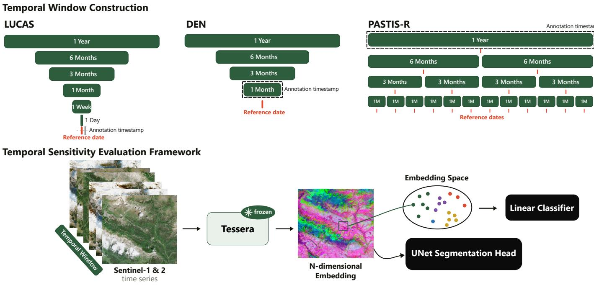
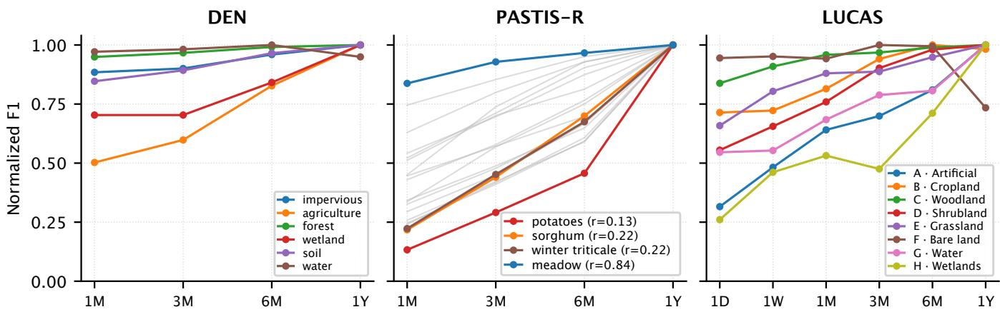
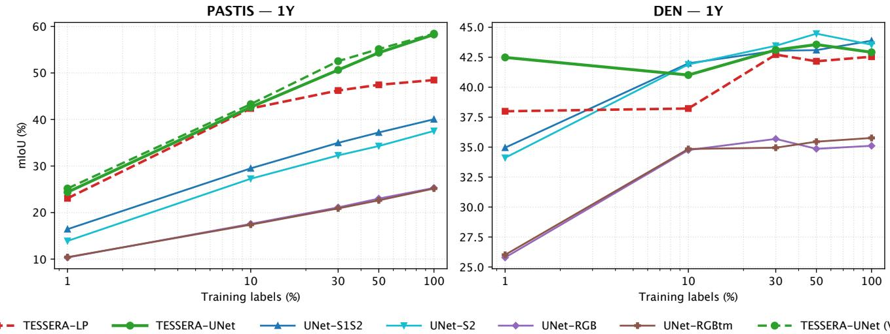
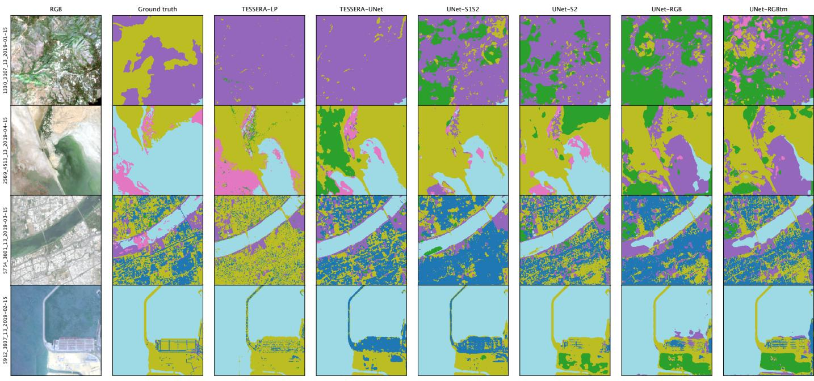
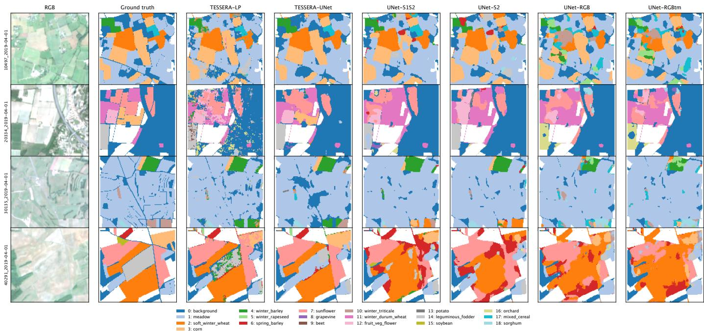
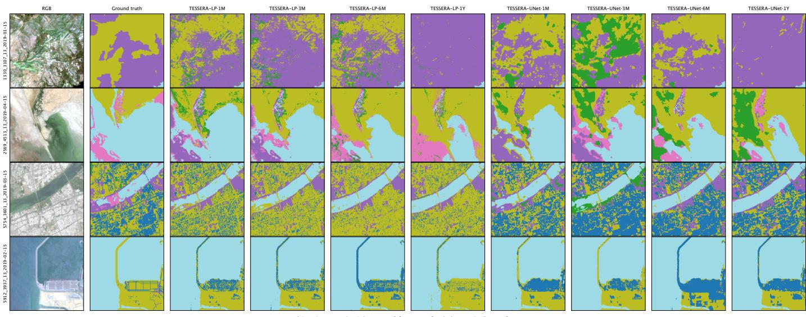
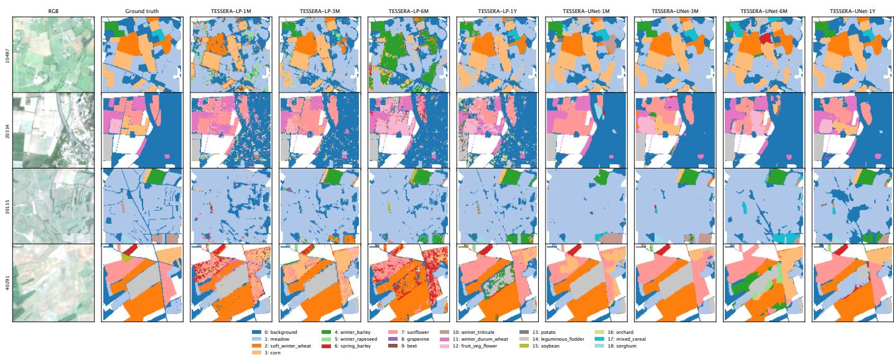

# Temporal Sensitivity Analysis of Tessera Embeddings

Julia Guerrero-Viu\*, Alex Lopez-Cifuentes\*, Ignacio P ´ erez-Villar, Fabio Pacifici, ´ Member, IEEE,

Abstract—Many Earth Observation applications need land-use/land-cover maps that are both precise and frequently up- dated, yet the strongest Earth Observation foundation models build their embeddings from a full year of observations. We present a controlled study of the temporal sensitivity of Tessera, one of these leading foundation models, for land-use/land-cover mapping. Keeping the encoder frozen, we recompute its embeddings over varying observation windows, from a full year down to a single day. We use them as inputs to a linear probe and a UNet segmentation head, benchmarking both of them against from-scratch networks on LUCAS, DynamicEarthNet, and PASTIS-R datasets. We show that the value of the em- beddings is task-dependent. Where classes are separated by phenology, as for the crop types of PASTIS-R, they reach a mean Intersection-over-Union of 58.3, about 46% above the best from-scratch model. Where classes are temporally stable (e.g., forests in DynamicEarthNet and LUCAS), embedding-based and from-scratch models match only under full supervision. On both datasets, Tessera embeddings remain markedly more labeleficient. Degradation under shorter temporal windows is gradual and class-dependent. Contracting the window from one year to one month costs 39% of the segmentation accuracy on PASTIS-R but only 5% on DynamicEarthNet. Single-day embeddings still classify land cover in LUCAS at 3.4 times the chance level. Our study shows that temporal coverage is therefore a tunable cost rather than a fixed prerequisite, opening regimes such as nearreal-time mapping and faster land-use/land-cover refresh cycles.

Index Terms—Earth Observation, Foundation Models, Land-Use/Land-Cover Mapping, Satellite Image Time Series, Self- Supervised Learning, Semantic Segmentation, Temporal Sensi- tivity.

## I. Introduction

CCURATE and up-to-date land-use/land-cover (LULC) maps are a core product of Earth Observation (EO), essential for agricultural monitoring, biodiversity assessment, semantic change detection, land-use policy and disaster re- sponse. How frequently such maps must be refreshed, however, depends strongly on the application: urban expansion or forest extent are adequately tracked with an annual update, whereas monitoring crops within a growing season, or assessing dam- age after a flood or a fire, requires far shorter latency. Today’s operational products make this gap concrete. The most widely used global land-cover maps, such as ESA WorldCover [1] and NASA’s MODIS land-cover product [2], are refreshed at most once a year and released months after the mapped period, so their efective update latency is on the order of a year. Faster, near-real-time products such as Dynamic World [3] do exist, but shorter latency generally comes at the cost of map accuracy or spatial resolution. Producing maps at high spatial resolution and short latency remains challenging, as it must cope with frequent cloud contamination of the optical acquisitions, sparse

in-situ annotations, and the large volume of multi-temporal satellite data.

Two of these challenges, scarce annotations and the sheer volume of unlabeled imagery, are exactly what the foundation model (FM) paradigm turns into an advantage, pretraining once on vast unlabeled data and reusing the representation across tasks with little supervision [4]. Having reshaped lan-guage and vision [5]–[8], the recipe has reached EO, whose archives are vast and almost entirely unlabeled while in-situ annotations are costly and scarce. EO FMs such as Prithvi- EO-2.0 [9], AlphaEarth [10] and Tessera [11] now produce general-purpose embeddings that transfer across many down- stream tasks, and those that exploit long temporal sequences outperform monotemporal ones.

In particular, both AlphaEarth [10] and Tessera [11] follow the same recipe: encoding a full year of multi-modal satellite time series into a dense per-pixel embedding at 10-meter resolution. We focus on Tessera, whose strictly per-pixel design applies temporal attention directly to each pixel’s own Sentinel- 1 Radiometric Terrain Corrected (RTC) and Sentinel-2 spectral series. This granularity matches the per-pixel nature of land- cover mapping, and its attention over each pixel’s full spectral- temporal profile is well suited to the phenological diferences that separate many land-cover classes. Therefore, its pixel-wise representation yields higher-quality embeddings than ViT-based monotemporal EO FMs (e.g., DINOv3-SAT [12]), which oper-ate on coarser, patch-level features. That gain, however, comes at a price: a full year of observations, precisely the coverage that the low-latency, high-resolution mapping demanded by crop monitoring or disaster response cannot wait for. While Tessera reports robustness to which observations are sampled within the year and AlphaEarth supports partial-year inference by design, neither provides a systematic, controlled evaluation of how downstream performance degrades as the observation window is shortened at inference time. We therefore ask:

## How robust are Tessera embeddings to reductions in the temporal observation window at inference time?

To address it, we present a systematic study of the temporal sensitivity of Tessera embeddings for land-cover classification and segmentation with the following contributions:

• We propose a controlled evaluation framework for the temporal sensitivity of a pixel-wise EO foundation model. Keeping the encoder frozen, we recompute its embeddings over observation windows ranging from a full year down to a single day, so that temporal support is the only factor that varies. We apply the framework to three LULC benchmarks: LUCAS, PASTIS-R, and DynamicEarthNet. • We show that the value of the embeddings is task- dependent: at full supervision they are decisive when classes are separated by phenology and only marginal when they are temporally stable. The same dichotomy also reappears within each benchmark at the class level.

• We show that the embeddings are markedly more label- eficient than training from scratch, retaining a clear advantage in the low-label regime. This matters precisely where annotation cannot be produced in time, as in disaster response and other near-real-time settings.

• We show that meaningful semantic information is pre- served under extreme temporal sparsity, down to single-day windows and well above chance level, enabling operating regimes with drastically reduced temporal coverage such as near-real-time mapping and faster LULC refresh cycles.

## II. Related Work

## A. Foundation Models for Earth Observation

Self-supervised pretraining on large, unlabeled satellite archives has produced general-purpose encoders that transfer across many downstream tasks. A first family operates image- wise: SatMAE [13] and Prithvi-EO-2.0 [9] pretrain ViT backbones on multispectral scenes, DOFA [14] conditions a single backbone on the wavelength of each input channel so that one encoder serves sensors with diferent band configurations, and general-purpose vision models such as DINOv3 [12] have been transferred to EO by re-running generic self-supervised recipes on Sentinel archives [15] or by adapting vision-language and promptable backbones [16], [17]. Several of them ingest more than one date, but time enters as an extra token axis of a patch representation, so the output remains a patch-level feature rather than a per-pixel temporal descriptor. A second family represents each location by its own time series: Presto [18] learns from multi-sensor pixel sequences and Galileo [19] from multi-scale space–time blocks, while AlphaEarth [10] and Tessera [11] produce dense annual embeddings at native (10 m) resolution; AlphaEarth fuses ten gridded sources plus text into a 64-dimensional embedding field with spatial self-attention, whereas Tessera is strictly per-pixel and uses only Sentinel-1 and Sentinel-2. Our study concerns this temporal family: rather than proposing a new encoder, we characterize how the embeddings of a temporally-aggregated model behave when the temporal evidence available at inference is restricted.

Tessera [11], the foundation model our analysis builds on, encodes each 10 m pixel’s full annual Sentinel-1/2 time series into a single 128-dimensional embedding: two four-block transformer encoders, one per modality (ten Sentinel-2 bands and Sentinel-1 VV/VH), consume the sequences with day-of-year positional encodings and attention pooling, and are fused by an MLP. Pretraining follows a Barlow-Twins objective over two views of the same pixel-year, each a sparse random sample of 40 valid acquisitions, on ∼0.8 billion pixels drawn from 3,012 globally distributed tiles (2017–2024), and the resulting frozen embeddings prove strongly label-eficient across classification, segmentation and regression tasks when read out by lightweight heads. Its self-supervision, however, enforces invariance only to which observations within the year are sampled: both pretraining and inference assume a full-year temporal support, whose systematic reduction is not analyzed.

## B. Temporal Modeling of Satellite Image Time Series

The temporal dimension is decisive for many EO tasks, most notably crop-type mapping, where classes are separated by phenology rather than by any single-date spectral signature [20]. This has motivated a long line of task-specific architectures for satellite image time series, from recurrent encoders [21] and temporal convolutions [20] to temporal-attention models such as U-TAE [22] and the fully-attentional TSViT [23], with multimodal optical–radar fusion further improving accuracy and cloud resilience [24]. These models are trained end-to-end for each task and region, whereas foundation models learn the temporal representation once and reuse it across tasks. Whether such a generic, temporally-aggregated embedding retains the phenological information that task-specific models exploit is therefore task-dependent, and is a central question ofour analysis on phenology-driven versus spectrally-stable benchmarks [24], [25].

## C. Land Cover Classification Benchmarks

Land-cover evaluation resources are abundant, ranging from patch-level scene classification [26], [27] and single-date dense segmentation [28] to global map products [3], crop-oriented time-series collections [29] [30] and the benchmarks created to standardize foundation-model evaluation, GEO-Bench [31] and PANGAEA [32]. For most of thethe datasets in these benchmarks, however, neither the temporal axis nor the full multispectral input is included: the majority are mono-temporal, and several provide only RGB or a reduced band set. Only a few, such as PASTIS-R, expose a genuine Sentinel-1/2 time series, and DEN itself enters PANGAEA as mono-temporal RGB Planet imagery rather than as a multispectral series, so in these confi urations the observation window cannot be varied at all. Our temporal sensitivity analysis admits only benchmarks whose labels carry a reference date to anchor the window, are pixel-wise on the 10 m grid and come from human reference data rather than from another model’s predictions, and for which the raw Sentinel-1/2 acquisitions can be re-encoded at every window length. Reliable ground truth is also crucial because we measure the information content of a representation rather than build a mapping product, so inherited labels would confound the degradation we attribute to a shortened window with the labelling model’s own errors. Among the few resources that qualify, we retain the three detailed in Section III-A (LUCAS, DEN and PASTIS-R), which jointly span annotation cadence, label density and phenological dependence. To the best of our knowled e existin LULC benchmarks in the literature use a fixed temporal extent at evaluation time: every model is scored on the complete record, be it a full annual composite or an entire acquisition series. The extent of the observation window is thus a constant of the evaluation protocol rather than one of its variables, so previous results report a single operating point and do not anal ze how erformance evolves as the available coverage shrinks. Turning that constant into a controlled variable is precisely what our novel evaluation framework allows.

## III. Methodology

We investigate how the temporal observation window shapes the embeddings of Tessera model for land-cover mapping. In this section, we first describe the three datasets used and their label pre-processing (Sec. III-A); then, we formalize the pro-posed temporal sensitivity evaluation framework (Sec. III-B); finally, we explain the classification and segmentation heads (Sec. III-C).

## A. Datasets

Our analysis includes three public benchmarks chosen to span complementary evaluation regimes and taxonomies: sparse in- situ polygons (LUCAS), and dense multi-temporal rasters for two diferent tasks, general land-cover segmentation (DEN) and phenologically-driven crop-type mapping (PASTIS-R). In all cases, labels are preprocessed onto the native 10 m Tessera embedding grid so that a probe can be trained and scored per pixel (see the Appendix for details on data acquisition and preprocessing).

## 1) LUCAS Dataset

LUCAS 2022 [33] is a pan-European in-situ land-cover survey, from which we draw a stratified subset of 15,000 geo- referenced polygons and pair them with Copernicus Sentinel- 1/2 imagery encoded by Tessera [11]. We adopt the level-1 LC1 taxonomy (the leading character of the land-cover code, e.g. C30→C), giving eight top-level classes: artificial land, cropland, woodland, shrubland, grassland, bare land, water, and wetland. Each polygon carries a precise survey date, making LUCAS well suited to our controlled temporal analysis, and we rasterize them onto the 10 m grid to match the pixel-wise embeddings. The survey is spatially precise (in-situ validated by experts) but highly sparse (isolated polygons rather than dense coverage) and strongly class-imbalanced, being dominated by cropland, grassland and woodland; moreover, many polygons are smaller than the 10 m Tessera grid, so individual samples are prone to mixed-pixel efects. As there is no standard train/test split available for this benchmark, we follow previous work [10] and create a balanced train split to mitigate class imbalance. Our training set contains 100 polygons per class, reserving the remaining samples for evaluation.

## 2) DynamicEarthNet Dataset (DEN)

DEN [25] targets dense land-cover mapping over 75 areas of interest distributed worldwide, each a 1024×1024 tile imaged daily by 3 m Planet mosaics across two years (2018–2019) and annotated per pixel at monthly cadence with seven classes: impervious surface, agriculture, forest and other vegetation, wetlands, soil, water, and snow/ice. We encode the correspond- ing Sentinel-1/2 time series with Tessera on the 10 m grid and therefore aggregate the 3 m labels to 10 m, yielding monthly per-pixel labels (scene, row, col, �) aligned with the embeddings under the standard DEN split. Like LUCAS, DEN is strongly imbalanced: the forest/vegetation and soil classes dominate, whereas wetlands are scarce and snow/ice is absent in the oficial test split.

## 3) PASTIS-R Dataset

PASTIS-R [24] addresses crop-type mapping over 2,433 patches of 128×128 pixels at 10 m, sampled across four Sentinel-2 tiles in metropolitan France and observed over a single agricultural year (Sept. 2018–Nov. 2019). Each patch provides co-registered Sentinel-1/2 time series and a single time-invariant annotation of 18 crop types plus a background class (19 scored classes; the void/no-data label is ignored). Its labels are natively at 10 m, so we align each patch’s target raster to the embedding grid, and we use the oficial split (i.e., folds 1– 3 train, fold 4 validation, fold 5 test). PASTIS-R is likewise highly imbalanced, dominated by the background class and meadow, with several crop types (e.g. sorghum, mixed cereal) only sparsely represented.

## B. Temporal Sensitivity Evaluation Framework

As already introduced, original Tessera encodes each pixel’s full one-year Sentinel-1/2 time series into a single embedding: it exposes no notion of a variable observation window. We propose to generalize this to a controllable temporal receptive field, so that the influence of temporal support on representation quality can be measured directly, and compared with the one- year setting. Figure 1 illustrates the framework, which keeps the encoder, the downstream probe, and the data splits fixed, and varies the extent of the temporal observation window over which per-pixel embeddings are computed and evaluated.

## 1) Temporal Window Construction

Let $\mathcal { T } = \mathbb { R }$ denote calendar time measured in days. For a pixel � and sensor $m \in \{ \mathrm { S } 1 , \mathrm { S } 2 \}$ , let its Sentinel time series be the set of valid acquisitions

$$
S ^ { m } ( x ) \subset \mathbb { R } ^ { C _ { m } } \times \mathcal { T } ,\tag{1}
$$

whose elements are acquisition pairs (b, �), where $\textbf { b } \in \mathbb { R } ^ { C _ { m } }$ is the multi-channel observation vector of sensor �, with $C _ { \mathrm { S 1 } } = 2$ radar backscatter channels from Sentinel-1 RTC and $C _ { \mathrm { S } 2 } ~ = ~ 1 0$ optical reflectance bands from Sentinel-2 (cloudscreened), and $\tau \in \mathcal { T }$ is its calendar timestamp. Let $f _ { \theta }$ denote the frozen Tessera encoder, which maps such a time series to a �-dimensional embedding (�=128). Importantly, the Tessera encoder $f _ { \theta }$ operates on a fixed-length input so this length is a property of the model and is diferent from the observation window that we define next.

We parameterize the observation window by its temporal extent � in days (e.g., 30 for one month, or 365 for one year), together with a reference date � around which the window is centered:

$$
\Delta _ { W } ( t ) = [ t - W / 2 , t + W / 2 ] \subset \mathcal { T } , \quad W > 0 .\tag{2}
$$

The composite embedding is then obtained by restricting the encoder’s input to the acquisitions whose timestamps fall inside this window. Let

$$
\mathcal { A } _ { W } ^ { m } ( x , t ) = \{ ( \mathbf { b } , \tau ) \in S ^ { m } ( x ) : \tau \in \Delta _ { W } ( t ) \}\tag{3}
$$

be the set of in-window acquisitions of sensor �. Since $f _ { \theta }$ always ingests exactly a fixed length of � observations, its input is formed by drawing � samples from $\mathcal { A } _ { W } ^ { m } ( x , t )$ (sub-sampling when more than � are available and repeating acquisitions when fewer, matching the original setup in Tessera). Writing $\Pi _ { n }$ for this fixed-size sampling, applied independently to each sensor, the composite embedding is

  
Fig. 1. Temporal Sensitivity Evaluation Framework: (Top) For each dataset, multi-temporal Sentinel-1/-2 observations are extracted over observation windows of decreasing length defined relative to a dataset-specific reference date. (Bottom) Given all observations in a temporal window, we encode them with the frozen Tessera model into a dense per-pixel embedding map. For each dataset and temporal window, we train a linear classification probe and a UNet segmentation head to evaluate the quality of the Tessera embeddings at that temporal resolution.

$$
\mathbf { e } _ { W } ( x , t ) = f _ { \theta } \left( \Pi _ { n } \Big ( \mathcal { A } _ { W } ^ { S 1 } ( x , t ) \Big ) , \Pi _ { n } \Big ( \mathcal { A } _ { W } ^ { S 2 } ( x , t ) \Big ) \right) \in \mathbb { R } ^ { d } .\tag{4}
$$

Varying � therefore changes the number of distinct acquisitions $| \mathcal { R } _ { W } ^ { m } ( x , t ) |$ and the time span over which they are spread, and setting $W { = } 1 \mathrm { Y }$ recovers the original model. In our study, due to the Tessera model design, the length of observations ingested by the model is fixed at $n = 4 0$ for all window lengths, and the embedding space is � = 128-dimensional.

## 2) Reference Dates

In all benchmarks, for an annotation with timestamp $t _ { a n n }$ (the date to which the label refers), we take the reference date � as the acquisition date of � closest to $t _ { a n n }$ and center the observation window on it. Then, for each benchmark, we define the set of reference dates based on the availability and resolution of their annotations, as follows: LUCAS and DEN provide one label per sample, with annotation timestamps ���� at two diferent resolutions, daily per LUCAS and monthly for DEN. PASTIS-R, in contrast, provides a single annual label per patch; we therefore tile the observation period, of length $T _ { \mathrm { o b s } }$ , into non-overlapping windows of length � $( \lfloor { T _ { \mathrm { o b s } } } / W \rfloor$ per patch) with the centered reference dates, so that the year-long label supervises each composite spanning that year, as illustrated in Figure 1. We study $W \in \{ 1 \mathrm { M } , 3 \mathrm { M } , 6 \mathrm { M } , 1 \mathrm { Y } \}$ on the dense benchmarks (DEN and PASTIS-R), and additionally include one-week and one-day windows for LUCAS for completeness

$W \in \{ 1 \mathrm { D } , 1 \mathrm { W } , 1 \mathrm { M } , 3 \mathrm { M } , 6 \mathrm { M } , 1 \mathrm { Y } \}$ , as this benchmark includes precise daily timestamps per label.

## C. Classification and Segmentation Heads

## 1) Linear Probe Head

To measure the intrinsic quality of the embeddings, and to attribute all observed diferences to the temporal observation window �, we first attach the simplest possible decoder, a linear classifier, and deliberately employ no temporal or spatial post-processing. For each (benchmark, �) pair we $\ell _ { 2 ^ { - } }$ normalize the embeddings and fit a logistic-regression probe with inverse-regularization strength �=10 and class weights $w _ { c } \propto 1 / \sqrt { \mathrm { f r e q } ( c ) }$ , which mitigates the strong class imbalance, as shown in the ablations (Sec. IV-B4). Because the dense benchmarks (DEN and PASTIS-R) contain millions of labeled pixels and a linear model has limited capacity for such amount of data, the probe is trained on a 10% subsample of the training set that preserves the class distribution. In the test set, we apply the probe to every pixel and produce dense prediction maps, so that evaluation metrics remain comparable to dense-prediction baselines.

## 2) UNet Head

For the task of dense segmentation (DEN and PASTIS datasets), however, a linear probe has limited capacity and assumes pixel independency. Therefore, and following Tessera [11], we extend the analysis by decoding the frozen, pre-computed Tessera embeddings with a UNet-based segmentation head. The head is a faithful reimplementation of the compact DoubleConv UNet used in the Tessera downstream-task code1.

We reproduce Tessera’s training recipe as faithfully as the details reported in the original paper allow, and train in for PASTIS-R and DEN. Since some training details are not fully specified, and to guard against undertraining, we validate our design choices with the ablations reported in Section IV-B4 (Tables IV and V).

## IV. Experimental Results

This section evaluates the proposed methodology on the datasets described in Section III. Section IV-A covers the implementation details common to all evaluations, Section IV-B presents the main quantitative results and ablation studies, and Section IV-C presents qualitative results.

## A. Implementation Details

The construction of the temporal windows, the train/validation/test splits, and the linear-probing configuration are part of the core evaluation framework and are described in Section III. This section details the remaining implementation aspects: the training setup shared across experiments (Section IV-A1), the baseline models used for comparison (Section IV-A2), and the evaluation metrics (Section IV-A3).

## 1) Training Setup

All trained segmentation models share an identical training recipe, so that any diference between them stems solely from the input rather than from the training procedure. We use the Adam optimizer (learning rate $1 0 ^ { - 4 }$ , weight decay $1 0 ^ { - 4 } )$ with a cosine-annealing schedule over 80 epochs, and a batch size of 64 for PASTIS-R (128×128 crops) and 96 for DEN (256×256 crops).

The objective is a class-weighted pixel-wise cross-entropy that ignores void/unlabeled pixels,

$$
\mathcal { L } = - \frac { \displaystyle \sum _ { i \in \Omega } w _ { y _ { i } } \log \frac { \exp ( z _ { i , y _ { i } } ) } { \sum _ { c \in C } \exp ( z _ { i , c } ) } } { \displaystyle \sum _ { i \in \Omega } w _ { y _ { i } } } ,\tag{5}
$$

where $\Omega$ is the set of labeled pixels, C the set of classes, $y _ { i }$ the ground-truth class of pixel $i , z _ { i , c }$ the predicted logit for class $^ { c , }$ and the normalization by $\textstyle \sum _ { i } w _ { y _ { i } }$ follows the weighted-mean reduction of the loss. To mitigate class imbalance, the per-class weight is the inverse square root of the class frequency,

$$
\tilde { w } _ { c } = \left\{ \frac { 1 } { \sqrt { p _ { c } } } , \quad N _ { c } > 0 \right. , \qquad w _ { c } = \frac { | { \cal C } ^ { + } | } { \sum _ { c ^ { \prime } } \tilde { w } _ { c ^ { \prime } } } \tilde { w } _ { c } ,\tag{6}
$$

with $\begin{array} { r } { p _ { c } = N _ { c } / \sum _ { c ^ { \prime } } N _ { c ^ { \prime } } } \end{array}$ the frequency of class $c , N _ { c }$ the number of training pixels of class �, and $C ^ { + }$ the set of classes present in the training split $( N _ { c } > 0 )$ . The weights are normalized so that those of the present classes have mean one (equivalently, they sum to $| C ^ { + } | ) ;$ classes absent from the split receive zero weight.

Preprocessing and initialization. Input embeddings are per- channel standardized using training-set statistics. All trainable weights are randomly initialized with Kaiming (He) uniform initialization for the convolutional and linear layers. Training uses mixed precision, and the same autocast context wraps the forward pass at evaluation time.

Seeds and reporting. Every configuration is repeated over 5 random seeds and we report the mean and standard deviation. Linear probing (TESSERA-LP) is instead reported from a single run: the probe is a logistic regression fit by a deterministic solver on frozen features and without any stochastic initialization, so there is no seed-to-seed variability to report.

Hardware and frameworks. The UNet models are im- plemented in PyTorch 2.7 (CUDA 12.6) and trained on a single NVIDIA H100 NVL GPU (94 GB); a single run takes ≈ 10–90 min depending on crop size, temporal window and whether the embeddings fit in RAM. The linear probe is instead fit on CPU with scikit-learn 1.9.0, using its LogisticRegression estimator with the L-BFGS deter-ministic solver.

## 2) Compared Models

To contextualize the results of our analysis, we also evaluate a set of convolutional baselines that do not rely on the Tessera embeddings: four UNets with the same architecture trained from scratch on per-window Sentinel composites instead of frozen embeddings, denoted UNet-RGB, UNet-RGBt , UNet-S2 and UNet-S1S2.

Their inputs are per-window composites over the same temporal windows as the embeddings, so only the input difers from TESSERA-UNet. For Sentinel-2 we use a per-pixel temporal median, cloud-masked with the Scene Classification Layer (SCL). For Sentinel-1 (VV/VH) we use a plain temporal median, as radar is insensitive to clouds. The four variants difer in the number of input channels. UNet-RGB and UNet- $\mathrm { R G B } _ { \mathrm { t m } }$ (3 channels) use the B04/B03/B02 bands, emulating the common practice of collapsing Sentinel-2 into an RGB image via, respectively, �-score normalization or a percentile tonemapping (2nd and 98th percentiles, $\gamma = 0 . 5 )$ . UNet-S2 (10 channels) uses the ten Sentinel-2 bands, and UNet-S1S2 (12 channels) additionally includes the two Sentinel-1 channels. All inputs except $\mathrm { U N e t - R G B _ { t m } }$ are per-channel �-score standardized with train-split statistics. $\mathrm { U N e t - R G B _ { t m } }$ instead relies on the percentile tonemapping as its standardization, with percentiles computed on the train split. The full construction is detailed in Appendix B.

## 3) Evaluation Metrics

All models are scored at the pixel level over the classes C defined by each benchmark (|C| = 8 for LUCAS, |C| = 19 for PASTIS-R and $\left| C \right| = 6$ for DEN), using four complementary metrics reported as percentages: overall accuracy, balanced accuracy, macro-averaged F1 score and mean Intersection-over- Union (mIoU), the latter being the standard primary metric for semantic segmentation. The Appendix gives the formal definitions of the metrics and the averaging conventions.

## B. Quantitative Results

## 1) Main Results

Table I gathers the results of all the trained models on the DEN and PASTIS-R datasets, reporting semantic segmentation metrics over 1 month (1M), 3 months (3M), 6 months (6M) and 1 year (1Y) temporal windows.

TABLE I  
Semantic segmentation results (%) on the DEN and PASTIS-R (19 classes, background included) test sets across temporal windows. TESSERA-UNet and the from-scratch UNets are reported as mean ± std over 5 runs; TESSERA-LP corresponds to a single run. Best result per
<table><tr><td></td><td></td><td colspan="4">1M</td><td colspan="4">3M</td><td colspan="4">6M</td><td colspan="4">1Y</td></tr><tr><td>Method</td><td></td><td>Acc</td><td>B.Acc</td><td>F1</td><td>mIoU</td><td>Acc</td><td>B.Acc</td><td>F1</td><td>mIoU</td><td>Acc</td><td>B.Acc</td><td>F1</td><td>mIoU</td><td>Acc</td><td>B.Acc</td><td>F1</td><td>mIoU</td></tr><tr><td>DEN</td><td>UNet-RGB UNet-RGBtm</td><td>62.9±0.6 63.6±0.9</td><td>45.7 ±0.7</td><td>43.5±0.5 43.9±0.8</td><td>30.9±0.3</td><td>61.5±1.6</td><td>46.4±1.4</td><td>44.1 ±0.2 44.7 ±0.3</td><td>31.3 ±0.1</td><td>64.1 ±0.5 64.3 ±0.7</td><td>48.7 ±1.1 49.3 ±1.3</td><td>46.5±0.5 46.8 ±0.8</td><td>33.8±0.3 34.0±0.6</td><td>65.9±0.9</td><td>48.9±0.9</td><td>47.6±0.5 48.4 ±0.4</td><td>35.1 ±0.3</td></tr><tr><td></td><td>UNet-S2</td><td></td><td>45.3 ±1.3</td><td></td><td>31.2 ±0.6</td><td>63.2 ±0.9</td><td>46.2±1.0</td><td></td><td>31.8 ±0.3</td><td></td><td></td><td></td><td></td><td>66.5 ±0.4 71.3 ±1.0</td><td>49.8±0.5</td><td></td><td>35.8 ±0.2 43.5 ±0.4</td></tr><tr><td></td><td></td><td>72.0±0.4</td><td>58.6±0.7</td><td>55.0 ±0.6</td><td>42.4 ±0.3</td><td>71.7 ±0.4</td><td>57.9±1.1</td><td>55.6±0.6</td><td>42.6 ±0.4</td><td>72.0±0.6 73.4±0.8</td><td>58.8 ±0.5</td><td>57.0 ±0.6</td><td>43.9 ±0.4</td><td></td><td>58.5±1.0</td><td>56.9±0.7</td><td>43.9 ±0.3</td></tr><tr><td></td><td>UNet-S1S2</td><td>73.0±0.5</td><td>53.7 ±1.2</td><td>52.9 ±0.7</td><td>41.2 ±0.4</td><td>72.6±0.5</td><td>56.7 ±0.7</td><td>54.6±0.4</td><td>42.0 ±0.3</td><td></td><td>57.6 ±1.1</td><td>56.9 ±0.8</td><td>44.2±0.6</td><td>73.0 ±0.8</td><td>57.8±0.8</td><td>56.7 ±0.6</td><td></td></tr><tr><td></td><td>TESSERA-LP</td><td>68.3</td><td>50.3</td><td>49.8</td><td>38.1</td><td>69.5</td><td>52.5</td><td>51.9</td><td>39.5</td><td>71.4</td><td>53.6</td><td>54.1</td><td>41.4</td><td>71.8</td><td>54.9</td><td>56.4</td><td>42.5</td></tr><tr><td></td><td>TESSERA-UNet</td><td>70.3 ±0.8</td><td>53.6±0.8</td><td>52.6 ±0.4</td><td>40.8 ±0.1</td><td>71.8±0.8</td><td>56.4 ±0.3</td><td>55.0 ±0.2</td><td>42.7 ±0.2</td><td>72.8±0.6</td><td>56.5 ±1.3</td><td>55.2±0.9</td><td>43.1 ±0.6</td><td>71.3 ±0.8</td><td>57.3 ±2.2</td><td>55.9±1.1</td><td>42.9 ±1.0</td></tr><tr><td></td><td>UNet-RGB</td><td>63.1 ±0.3</td><td>36.4 ±0.3</td><td>34.1 ±0.1</td><td>22.7 ±0.1</td><td>64.3 ±0.1</td><td>38.7±0.2</td><td>35.5 ±0.1</td><td>23.8 ±0.1</td><td>64.9±0.1</td><td>41.4 ±0.3</td><td>38.1 ±0.1</td><td>25.7 ±0.1</td><td>63.9±0.2</td><td>41.3±0.4</td><td>37.7±0.2</td><td>25.3 ±0.2</td></tr><tr><td>PASTISR</td><td>UNet-RGBtm</td><td>63.1 ±0.6</td><td>36.5 ±0.2</td><td>34.4 ±0.2</td><td>22.9 ±0.1</td><td>64.2 ±0.1</td><td>38.5 ±0.1</td><td>35.4 ±0.1</td><td>23.7 ±0.0</td><td>64.8 ±0.1</td><td>41.0 ±0.1</td><td>37.8±0.0</td><td>25.5 ±0.0</td><td>63.9 ±0.1</td><td>41.1 ±0.2</td><td>37.5 ±0.2</td><td>25.2 ±0.1</td></tr><tr><td></td><td>UNet-S2</td><td>69.5±0.3</td><td>48.9±0.2</td><td>45.7±0.4</td><td>32.0±0.3</td><td>69.6±0.3</td><td>49.0±0.4</td><td>45.5 ±0.2</td><td>31.8±0.1</td><td>70.4 ±0.4</td><td>51.3 ±0.4</td><td>47.5±0.2</td><td>33.6±0.2</td><td>72.1 ±0.6</td><td>55.2±0.4</td><td>51.3±0.1</td><td>37.5 ±0.1</td></tr><tr><td></td><td>UNet-S1S2</td><td>70.7 ±0.2</td><td>50.5 ±0.2</td><td>47.1 ±0.2</td><td>33.3±0.2</td><td>71.1 ±0.1</td><td>50.7 ±0.4</td><td>47.4±0.2</td><td>33.5 ±0.2</td><td>72.0±0.1</td><td>52.9 ±0.3</td><td>49.8±0.1</td><td>35.7±0.1</td><td>74.3 ±0.1</td><td>57.2±0.4</td><td>53.8 ±0.3</td><td>40.0 ±0.2</td></tr><tr><td></td><td>TESSERA-LP</td><td>58.7</td><td>29.3</td><td>27.6</td><td>18.1</td><td>65.2</td><td>41.5</td><td>39.2</td><td>26.7</td><td>70.5</td><td>52.8</td><td>49.0</td><td>35.1</td><td>76.2</td><td>67.4</td><td>62.7</td><td>48.5</td></tr><tr><td></td><td></td><td>72.1 ±0.4</td><td>52.5±1.0</td><td>49.5±0.2</td><td>35.5±0.2</td><td>74.8±0.1</td><td>58.3±0.4</td><td>55.7 ±0.1</td><td>41.0 ±0.1</td><td>76.6±0.1</td><td>62.1 ±0.5</td><td>60.0±0.3</td><td>45.3±0.3</td><td>80.6±0.1</td><td>74.0±0.4</td><td>71.9±0.3</td><td>58.3 ±0.4</td></tr><tr><td></td><td>TESSERA-UNet</td><td></td><td></td><td></td><td></td><td></td><td></td><td></td><td></td><td></td><td></td><td></td><td></td><td></td><td></td><td></td><td></td></tr></table>

Across the three benchmarks, Tessera embeddings preserve much of their value as the inference window contracts, but how much they retain, and how much they help in the first place, is governed by a single property of the mapping task, namely whether its classes are separated by phenology or by spectral appearance. We first quantify this at the full-year window and then trace how performance degrades as the window shrinks, down to a single day.

## The Value of the Embeddings Is Task-Dependent

The two benchmarks are driven by fundamentally diferent signals. PASTIS-R requires distinguishing 18 crop types that stay spectrally similar for much of the year and are separated only by their phenology, a signal that lives along the temporal axis. The median composites fed to the from-scratch UNets collapse that axis, whereas the Tessera embeddings encode the full observation series. The impact is decisive, with TESSERA- UNet reaching 58.3 mIoU at 1Y, a 46% improvement over the best from-scratch model (UNet-S1S2, 40.0), and topping every window and metric.

DEN, in contrast, comprises six coarse, temporally stable land-cover classes separable from spectral cues alone, so a single composite already carries most of the signal. At full supervision the embeddings bring no gain over raw S2/S1+S2 composites (within 2.5% of the best from-scratch UNet, 43.1 vs. 44.2 mIoU at 6M), and the RGB variants trail only for lack of spectral bands (∼35 mIoU at 1Y).

The embeddings thus cost little when they do not help and win large when they do. Even on DEN they regain a clear edge once labels are scarce (Section IV-B3).

## Sensitivity to the Temporal Window

Shrinking the inference window exposes the same split: TESSERA-UNet drops by 39% on PASTIS-R (58.3 → 35.5 mIoU, 1Y→1M) but by only 5% on DEN (42.9 → 40.8). That embeddings from a model trained on annual series remain this informative over much shorter windows is notable, and unlocks operating regimes with limited temporal coverage such as near- real-time mapping and faster LULC refresh cycles.

## A Linear Probe Sufices When Classes Are Linearly Sepa- rable

On DEN the linear probe nearly matches the UNet head (41.4 vs. 43.1 mIoU at 6M; 42.5 vs. 42.9 at 1Y), so at this coarse taxonomy the classes are almost linearly separable in embedding space, enabling lightweight decoders. On PASTIS-R the probe is competitive only with enough temporal context: at 1Y it reaches 48.5 mIoU, beating every from-scratch UNet by over 21%, but it collapses at short windows, where the spatial aggregation of the head becomes essential.

## Per-Class Temporal Sensitivity

Measured with the linear probe (TESSERA-LP), the datasetlevel dichotomy also holds within each benchmark at the class level (Figure 2). Phenology-driven classes degrade steeply as the window shrinks, whereas structurally or spectrally distinct classes stay almost flat.

On DEN, agriculture loses about half of its 1Y F1 by 1M, while forest and water are essentially window-invariant. The split is sharpest on PASTIS-R, where the most temporally sensitive classes (crops such as potatoes, sorghum and winter triticale) retain barely 13–22% of their 1Y F1 at 1M, whereas the comparatively stable meadow retains 84%. LUCAS confirms the trend down to a single day: Cropland and Grassland degrade markedly faster than the structurally distinct Woodland. Bare land runs against the trend, slightly improving at shorter windows, as its largely time-invariant spectral signature is diluted by temporal compositing.

A few classes (DEN wetland, LUCAS water and wetlands) stay low at every window; their limitation is not temporal but reflects severe under-representation and small, sparse polygons near Sentinel’s 10 m resolution, so longer temporal coverage alone cannot resolve them. Overall, temporal requirements are class-dependent and governed by phenology, motivating class- adaptive temporal windows in practice.

## Temporal Resolution on LUCAS

Unlike DEN and PASTIS-R, LUCAS provides sparse polygons rather than dense masks, making it a pixel-wise classification task. Training a UNet is not meaningful, so we evaluate only the linear probe (Section III), which lets us push the temporal resolution down to a single day.

Performance decreases monotonically as the window shrinks but far less than the loss of context would suggest (Table II). In balanced accuracy, halving from 1Y (50.8%) to 6M (49.8%) is negligible and 1M stays reasonable (44.6%). Only under extreme sparsity does it drop markedly, to 36.8% at a 1-day window (27.6% below the yearly baseline), yet still 3.4× above the 12.5% chance level of the eight classes.

  
Fi . 2. Per-class tem oral sensitivit of the linear robe (TESSERA-LP): er-class F1 normalized b its maximum across windows. DEN and LUCAS show all classes; for PASTIS-R (19 classes) we highlight the most and least temporally sensitive classes, ranked by the F1 retained at the shortest window relative to 1Y $( r = \mathrm { F } 1 ( 1 \mathbf { M } ) / \mathrm { F } 1 ( 1 \mathbf { Y } ) )$ , and show the remaining classes in gray.

TABLE II  
Classification performance (%) in LUCAS dataset as a function of the temporal resolution of the input. Best value per column in green, second best in blue. $\mathrm { F } 1 _ { \mathrm { w } }$ denotes the support-weighted F1 score; all other class averages are macro-averaged.
<table><tr><td>Temporal resolution</td><td> $\operatorname { A c c } .$ </td><td>Bal. Acc.</td><td>Prec.</td><td>F1</td><td> $\mathrm { F } 1 _ { \mathrm { w } }$ </td></tr><tr><td>1 Day</td><td>43.0</td><td>36.8</td><td>29.2</td><td>25.8</td><td>49.2</td></tr><tr><td>1 Week</td><td>47.5</td><td>42.1</td><td>31.8</td><td>28.8</td><td>53.5</td></tr><tr><td>1 Month</td><td>52.3</td><td>44.6</td><td>33.9</td><td>31.7</td><td>58.3</td></tr><tr><td>3Months</td><td>55.5</td><td>46.4</td><td>35.6</td><td>33.9</td><td>61.8</td></tr><tr><td>6 Months</td><td>58.8</td><td>49.8</td><td>37.3</td><td>35.8</td><td>64.8</td></tr><tr><td>1 Year</td><td>59.5</td><td>50.8</td><td>38.1</td><td>36.5</td><td>65.4</td></tr></table>

Single-date embeddings thus retain meaningful land-cover information, confirming on a third, pan-European dataset that Tessera representations preserve much of their semantics under severe temporal sparsity [11].

## 2) Comparison With the State of the Art

Table III situates our models against published results on PASTIS-R at full labels [11]. TESSERA-UNet reaches 58.3 mIoU, a 15% improvement over the 50.68 reported for Tessera and 14% over the 51.08 of AlphaEarth on the same benchmark, while our linear probe (TESSERA-LP, 48.5) is already com-petitive with those head-based results despite its far simpler decoder.

Since the implementation details of the original Tessera result are not fully specified, we do not attempt to reproduce it exactly. The gain is consistent with our stronger downstream setup, in particular the higher-capacity DoubleConv head and the inverse- sqrt class weighting that lifts rare crop classes (Section IV-B4), which a macro-averaged mIoU rewards.

We report no analogous comparison for DEN. It is originally a change-detection benchmark, and we evaluate it as a 6-class land-cover segmentation task with labels resampled from 3 m to 10 m, a setup for which no directly comparable published numbers exist. We therefore rely on the from-scratch UNet baselines of Table I as the reference point on DEN.

TABLE III  
Semantic segmentation on PASTIS-R (mIoU, full labels). Foundation-model baselines are reported both frozen and finetuned, as in [11]; AlphaEarth, Tessera and our models use frozen embeddings with a trained head/probe (single evaluation). Baseline numbers are taken from [11]. Best in green, second in blue.
<table><tr><td>Model</td><td>Frozen</td><td>Finetuned</td></tr><tr><td>CROMA [34]</td><td>36.24</td><td>41.29</td></tr><tr><td>DOFA [14]</td><td>25.94</td><td>29.55</td></tr><tr><td>Prithvi [9]</td><td>34.09</td><td>39.52</td></tr><tr><td>RemoteCLIP [16]</td><td>20.17</td><td>21.03</td></tr><tr><td>SatlasNet [35]</td><td>21.02</td><td>31.38</td></tr><tr><td>Scale-MAE [36]</td><td>23.96</td><td>28.51</td></tr><tr><td>SpectralGPT [37]</td><td>35.10</td><td>40.28</td></tr><tr><td>Galileo [19]</td><td>27.92</td><td>35.28</td></tr><tr><td>Skysense [38]</td><td>32.87</td><td>36.41</td></tr><tr><td>UÑet Baseline [39]</td><td>30.16</td><td>37.56</td></tr><tr><td>ViT Baseline [40]</td><td>37.37</td><td>42.57</td></tr><tr><td>AlphaEarth + head [10]</td><td>51.08</td><td></td></tr><tr><td>Tessera + head [11]</td><td>50.68</td><td></td></tr><tr><td>TESSERA-LP (ours)</td><td>48.5</td><td></td></tr><tr><td>TESSERA-UNet (ours)</td><td></td><td>58.3</td></tr></table>

## 3) Label Eficiency

The results reported in Section IV-B1 use the full training set. Since frozen foundation-model embeddings are expected to be most valuable under limited supervision, we also evaluate all models while varying the fraction of training labels from 1% to 100%. We fix the observation window at 1Y, the best- performing temporal configuration in Table I. Figure 3 reports test mIoU as a function of the label budget on both benchmarks.

On PASTIS-R, the TESSERA-based models dominate at every label budget. With only 1% of the labels, TESSERA- UNet already reaches ∼24 mIoU, roughly 50% higher than the best from-scratch UNet, and the advantage persists throughout. Even the linear probe (TESSERA-LP) matches or exceeds all fully supervised from-scratch UNets across the entire range.

Ablation study on DEN 6M for TESSERA-UNet, regarding the incremental impact of input normalization, inverse-sqrt class weighting, and extended training (60 epochs) on segmentation metrics (%). The best configuration, selected by mIoU, is shown in bold.  
  
Fig. 3. Label eficiency at the 1Y window. Test mIoU (%) as a function of the fraction of training labels (1–100%) on PASTIS-R (left) and DEN (right). On PASTIS-R we additionally overlay the V1.1 embeddings decoded with TESSERA-UNet (dashed). V1.1 is evaluated on PASTIS-R only.

The frozen embeddings are thus drastically more label-eficient than training from raw composites, as expected when the discriminative signal, phenology, is already encoded in the representation.

DEN reveals the complementary picture. Here the TESSERA models start high at 1% (∼38–42 mIoU) and stay roughly flat, whereas the from-scratch UNets start much lower (∼26–35) and only catch up around 30–100% of the labels. The apparent parity on DEN at full labels (Table I) is therefore a parity at saturation. At low label budgets the frozen embeddings retain a clear advantage even for this spectrally-driven, temporally-stable task. In short, TESSERA embeddings help whenever the task is phenology-driven or labels are scarce. They lose their edge only when the task is both spectral and label-rich, a combination rarely met in Earth observation. This makes frozen foundation- model embeddings a strong default for operational land-cover mapping.

Finally, Figure 3 also overlays the updated Tessera V1.1 embeddings on PASTIS-R (dashed). The two versions track each other across the whole curve, so the update brings no label- eficiency advantage. We examine the V1.1 release in detail in Section IV-B5.

## 4) Ablation Studies

TESSERA-UNet applies the same model as the original Tessera work [11], i.e., its frozen embeddings decoded with the UNet head defined by the authors, to datasets beyond those originally evaluated. Since not all implementation details were public, some design decisions had to be inferred. This section presents ablation studies to verify that those decisions indeed improve performance. Table IV and Table V report the incremental impact of input normalization, inverse-sqrt class weighting, and extended training on DEN 6M and PASTIS-R 1Y, respectively. The best configuration, selected by mIoU, is the one used for all TESSERA-UNet results reported in Table I.

Two observations emerge from Tables IV and V. First, class weighting trades overall accuracy for class-balanced performance. On DEN it costs under 1% in overall accuracy but improves balanced accuracy by 14% and mIoU by 9%. On PASTIS-R it initially degrades mIoU (by ∼1.5%), which is only recovered by the longer training schedule. Second, our baseline configuration already reaches 57.2 mIoU on PASTIS-R, well above the 50.68 reported for Tessera in the original paper [11] (Table III). The architecture and recipe are thus already well suited to PASTIS-R, the benchmark of the original work, so our additional ingredients bring only a marginal further gain there (57.2 → 58.3, +1.9%). On DEN, not covered by the original recipe, they instead yield an 8.8% gain (39.6 → 43.1), driven mostly by the class weighting.

TABLE IV
<table><tr><td>Config</td><td>Acc.</td><td>Bal. Acc.</td><td>F1-macro</td><td>mIoU</td></tr><tr><td>baseline</td><td>74.1</td><td>48.9</td><td>50.1</td><td>39.6</td></tr><tr><td>+ normalization</td><td>73.7</td><td>48.8</td><td>49.6</td><td>39.2</td></tr><tr><td>+ inverse_sqrt</td><td>73.2</td><td>55.7</td><td>54.4</td><td>42.8</td></tr><tr><td>+ 60 epochs (best)</td><td>72.8</td><td>56.5</td><td>55.2</td><td>43.1</td></tr></table>

TABLE V

Ablation study on PASTIS-R 1Y for TESSERA-UNet, regarding the incremental impact of input normalization, inverse-sqrt class weighting, and extended training (60 epochs) on segmentation metrics (%). The best configuration, selected by mIoU, is shown in bold.
<table><tr><td>Config</td><td>Acc.</td><td>Bal. Acc. </td><td>F1-macro</td><td>mIoU</td></tr><tr><td>baseline</td><td>81.5</td><td>69.5</td><td>70.7</td><td>57.2</td></tr><tr><td>+ normalization</td><td>81.6</td><td>69.9</td><td>71.1</td><td>57.7</td></tr><tr><td>+ inverse_sqrt</td><td>79.9</td><td>76.3</td><td>70.7</td><td>56.8</td></tr><tr><td>+ 60 epochs (best)</td><td>80.6</td><td>74.0</td><td>71.9</td><td>58.3</td></tr></table>

## 5) Impact of the Tessera V1.1 Update

During the development of this work, an updated version of the Tessera embeddings (V1.1) was released. V1.1 widens the encoder and adds an MLP dimensionality reducer, replaces V1’s random sampling of 40 timesteps per pixel with inference over every valid observation, and normalizes each Sentinel-1 orbit direction separately2. Since all experiments in this paper use V1 embeddings, we verified whether this update would alter our conclusions on the benchmark where the embeddings are most decisive, PASTIS-R at the 1Y window.

TABLE VI  
TESSERA V1 vs. V1.1 embeddings on PASTIS-R (1Y; test %), decoded with the TESSERA-UNet head (mean ± std over 5 seeds) and with a linear probe (TESSERA-LP, single run). The larger value per version pair and metric is in bold; for the TESSERA-UNet head the  
differences are within the run-to-run variability, and for the linear probe they are negligible in absolute terms (at most 0.3 points).
<table><tr><td>Embeddings</td><td>Acc</td><td>B.Acc</td><td>F1</td><td>mIoU</td></tr><tr><td>TESSERA-UNet (V1)</td><td>80.6 ±0.1</td><td>74.0 ±0.4</td><td>71.9±0.3</td><td>58.3 ±0.4</td></tr><tr><td>TESSERA-UNet (V1.1)</td><td>80.6 ±0.1</td><td>73.7 ±0.4</td><td>72.0 ±0.4</td><td>58.4±0.3</td></tr><tr><td>TESSERA-LP (V1)</td><td>76.2</td><td>67.4</td><td>62.7</td><td>48.5</td></tr><tr><td>TESSERA-LP (V1.1)</td><td>76.2</td><td>67.7</td><td>62.8</td><td>48.5</td></tr></table>

## Downstream Parity

As Table VI shows, V1.1 performs on par with V1 for the TESSERA-UNet head: the two versions difer by at most 0.3 points on any metric, a margin comparable to the seed-to-seed standard deviation of either version. The same holds for the linear probe, where V1 and V1.1 difer by at most 0.3 points, confirming that the update does not enrich the embeddings even when read out linearly, i.e., without a head that could absorb the diference. This parity is, moreover, not an artefact of operating near the task ceiling at full supervision: across the entire label- eficiency curve (Figure 3, dashed), V1.1 tracks V1 down to 1% of the labels, the low-supervision regime in which a richer representation should matter most.

This parity is consistent with the Tessera authors’ own positioning of the update, which they present not as a generally stronger representation but as a fix for a tiling artefact that V1 can introduce when embedding full tiles, an issue orthogonal to the per-pixel downstream tasks studied here. We therefore report V1 throughout and expect our findings to transfer unchanged to V1.1.

## Linear Class Separability

As an additional, decoder-agnostic check, Table VII reports the linear (LDA) class separability of the frozen embeddings, defined as $\mathrm { T r } ( \sigma _ { b } ) / \mathrm { T r } ( \sigma _ { w } )$ , the ratio of between- to within-class scatter (higher is better). Consistent with the on-par performance above, V1.1 does not meaningfully enrich the linearly-accessible class structure at the windows that matter: separability is essentially unchanged at 6M and 1Y (−8.8% and −1.9%). It does rise in relative terms at 1M and 3M (+33.8% and +43.6%), but in absolute terms separability at these short windows stays far below the 1Y level regardless of version (e.g., 0.048 at 1M vs. 0.278 at 1Y), so the relative gain does not reflect a practically usable improvement. This corroborates, independently of the decoder, why the update yields no measurable benefit.

TABLE VII  
Linear (LDA) class separability of the frozen embeddings on PASTIS-R (higher is better). Δ and Δ% are the V1.1 − V1 change; gains in green, losses in red.
<table><tr><td>Window</td><td>V1</td><td>V1.1</td><td>Δ</td><td>∆%</td></tr><tr><td>1M</td><td>0.036</td><td>0.048</td><td>+0.012</td><td>+33.8%</td></tr><tr><td>3M</td><td>0.052</td><td>0.075</td><td>+0.023</td><td>+43.6%</td></tr><tr><td>6M</td><td>0.116</td><td>0.106</td><td>-0.010</td><td>-8.8%</td></tr><tr><td>1Y</td><td>0.284</td><td>0.278</td><td>-0.005</td><td>-1.9%</td></tr></table>

## C. Qualitative Results

Figures 4 and 5 depict examples from all the models presented in Section IV-A2. The samples are drawn at random from the test set, without any manual selection. To ease the comparison between the diferent semantic segmentation masks, we include both the RGB rendered sample and the ground truth.

## 1) Comparison Across Models

On DEN (Figure 4), the TESSERA-based predictions are consistently smoother and less speckled than those of the from- scratch UNets, which exhibit clear spectrally driven confusions. The turbid, sediment-laden water of the coastal lagoon (second row) is partially labeled as forest or soil by the RGB variants, and bare-soil areas are contaminated with spurious agriculture speckle (first and last rows). This smoothness, however, oc-casionally comes at the cost of over-generalization, as in the mountainous scene (first row), where both TESSERA-LP and TESSERA-UNet absorb the soil region into forest.

PASTIS-R (Figure 5) visually confirms the complementary failure modes suggested by the quantitative results. The from- scratch UNets produce spatially coherent parcels but frequently assign them the wrong crop type, e.g., large spring-barley regions where the ground truth indicates sunflower and winter wheat (last row). They recover the geometry but not the phenology. TESSERA-LP shows the opposite behavior, correctly identifying the crop of most parcels while sufering from salt- and-pepper noise and blurred boundaries, as it operates pixel- wise with no spatial aggregation. TESSERA-UNet combines both sources of information and delivers the maps closest to the ground truth, respecting both parcel boundaries and crop identity.

## 2) Comparison Across Temporal Windows

Figures 6 and 7 trace how the TESSERA-LP and TESSERA UNet predictions evolve as the temporal window grows from 1M to 1Y. On PASTIS-R the maps refine substantially. Crop parcels progressively converge to their correct type and the salt- and-pepper noise of the linear probe fades as more of the season is observed, mirroring the steep quantitative gain with window length. On DEN, in contrast, the predictions are already close to their final form at 1M and change little thereafter, consistent with the temporal stability of coarse land-cover classes.

Fig. 4. Qualitative results on the DEN test set (1Y window). Each row shows a test sample (RGB composite and ground truth) followed by the predictions of all compared models.  
  
Fig. 5. Qualitative results on the PASTIS-R test set (1Y window). Each row shows a test sample (RGB composite and ground truth) followed by the predictions of all compared models.

## V. Discussion

We discuss our results (see Section IV) along the main axes that our evaluation framework analyzes: what the frozen Tessera embeddings are worth for land-use/land-cover mapping relative to training the same architecture from scratch, and how that worth evolves as the temporal context available at inference is reduced. Both depend on a single property of the mapping task at hand, namely whether its classes are separated by their phenology or by their spectral appearance.

The task-dependence is clear. On PASTIS-R, where crop types stay spectrally similar for much of the year and are separated only by phenology, the median composites fed to the from- scratch UNets do not match the performance of the embeddings: our TESSERA-UNet model achieves 58.3 mIoU at 1Y, 46% above the best from-scratch model and 15% and 14% above the published Tessera and AlphaEarth results respectively, while winning at every window and metric. On DEN, whose six coarse classes are spectrally distinct, a single composite already sufices and the advantage vanishes: TESSERA-UNet sits within ∼2.5% of the strongest from-scratch UNet (e.g., 43.1 vs. 44.2 mIoU at 6M), a diference of the order of the seed-to-seed spread at 1Y, 6M and 3M, and falls slightly behind UNet-S2 at 1M. This equivalence holds only against full-spectral composites, however: the RGB variants that emulate the common practice of collapsing Sentinel-2 to three bands trail by some 20% (∼35 vs. 42.9 mIoU at 1Y). Interestingly, and in accordance with previous analyses of EO foundation models [11], the benefit of using embeddings is more evident when labels are scarce: with only 1% of the labels TESSERA-UNet already achieves ∼24 mIoU on PASTIS-R, some 50% above the best from-scratch UNet, and even the linear probe matches or exceeds every fully supervised from-scratch UNet there, while on DEN the embedding-based models stay essentially flat from 1% of the labels onwards and the from-scratch UNets only catch up between 30% and 100%, so the models only draw level on DEN at saturation. The embeddings thus pay of whenever the mapping task is phenology-driven or labels are scarce, and lose their edge only when it is spectral and labels are abundant, a combination rarely met in operational LULC production.

  
Fi . 6. Qualitative evolution across tem oral windows on the DEN test set. For each test sam le (RGB com osite and round truth), the redictions of TESSERA-LP and TESSERA-UNet are shown at the 1M, 3M, 6M and 1Y windows.

  
Fig. 7. Qualitative evolution across temporal windows on the PASTIS-R test set. For each test sample (RGB composite and ground truth), the predictions of TESSERA-LP and TESSERA-UNet are shown at the 1M, 3M, 6M and 1Y windows.

Temporal support, in turn, behaves as a soft and class- dependent constraint rather than a hard requirement. Contracting the window from one year to one month costs 39% of mIoU on PASTIS-R (58.3 → 35.5) but only 5% on DEN (42.9 → 40.8). On LUCAS the decline is monotonic yet slow over most of the range, from 50.8% balanced accuracy at 1Y to 44.6% at 1M, dropping markedly only under extreme sparsity, to 36.8% from a single day of observation, still 3.4 times the 12.5% chance level of its eight classes. This is what makes near-real-time mapping and fast LULC refresh cycles viable. The cost is also localized, and dataset-level averages hide it: DEN agriculture loses about half of its 1Y F1 by 1M while forest and water are almost window-invariant, and on PASTIS-R the most sensitive crops (potatoes, sorghum and winter triticale) retain only 13– 22% of their 1Y F1 at 1M against 84% for meadow. The classes that stay weak at every window (e.g., DEN wetland, LUCAS water and wetlands) are limited by under-representation and by small polygons near Sentinel’s 10 m resolution rather than by temporal coverage.

## A. Limitations and Future Work

Our work is not free of limitations, which open avenues for future work. The proposed evaluation framework varies only the inference-time window of a frozen encoder that was pretrained on full-year sequences and always ingests a fixed-length input, padding by repetition when fewer distinct acquisitions are available; the degradation we report is therefore a property of the deployed representation, not evidence that short-window pretraining would degrade similarly, and training or adapting the encoder with variable-length windows remains open. Additionally, the study covers three LULC benchmarks selected under the conditions of Section III-A and a single foundation model, although the framework itself is model- agnostic, applicable to other pixel-wise embedding products, and not tied to the mapping setting studied here. Direct comparison against published figures is possible on PASTIS- R, whereas our DEN setup evaluates the benchmark as a six- class land-cover segmentation task at 10 m and is therefore anchored on from-scratch UNets trained under an identical protocol to isolate the contribution of the input. LUCAS has no oficial partition, so although we follow the balanced-split practice of prior work [10], no directly comparable published figures exist. Even on PASTIS-R, the implementation details of the original Tessera result are not fully specified [11], so our downstream setup is validated through the ablations of Section IV-B4 rather than by exact reproduction. Finally, the class-level results suggest a concrete direction for operational LULC systems, namely class-adaptive temporal windows that spend long observation periods only on the phenology-driven classes that require them, while spectrally stable classes are mapped at the fastest available cadence.

## VI. Conclusion

This work introduces a controlled evaluation framework for the temporal sensitivity of a pixel-wise Earth Observation model in LULC mapping, reconstructing frozen Tessera embeddings over observation windows ranging from a full year down to a single day and reading them out with a linear probe and a UNet head on three human-annotated benchmarks. Two main conclusions follow: the value of a temporally-aggregated em- bedding is task-dependent, decisive where classes are separated by phenology and marginal where they are spectrally stable and labels abundant; and its degradation under shorter temporal windows is gradual and concentrated in the phenology-driven classes, so that even single-date embeddings retain some useful semantic information well above chance.

Taken together, our results support treating a temporally- aggregated embedding as a strong default for operational LULC mapping, and the temporal window as a tunable cost rather than a fixed prerequisite. Because our evaluation framework needs no retraining of the encoder and is agnostic to which model produces the embeddings, it can serve as a standard diagnostic for the pixel-wise foundation models that continue to appear, and the per-class curves it yields already indicate how much observation each class inherently needs. More broadly, these findings highlight the potential of pixel-wise EO foun- dation models such as Tessera for near-real-time applications operating under restricted temporal coverage, while motivating further analysis of class-dependent temporal requirements and inference-time strategies, in which temporal support is reported as an explicit axis of evaluation.

## Appendix Reproducibility Details

## A. Data Acquisition and Preprocessing

We download all available Sentinel-1 and Sentinel-2 (Level-2A) observations directly from Microsoft Planetary Computer (MPC) through its STAC interface, applying identical preprocessing across the three datasets (LUCAS 2022, DEN, and PASTIS-R): each region of interest is queried over the target temporal extent, harmonized to a common 10 m spatial grid, cloud and quality constraints are applied to Sentinel-2, and the resulting multi-temporal stacks are stored in a standardized per- region format. Tessera inference is then run deterministically on these aligned time series, with fixed sampling and temporal- window settings centered on each reference date, producing georeferenced embedding outputs so that every experiment can be reproduced end-to-end.

## B. Compared-Model Input Construction

The from-scratch UNet baselines (UNet-RGB, UNet-RGBtm, UNet-S2 and UNet-S1S2) consume per-window composites built from the same Sentinel-1/2 acquisitions and the same temporal windows used to compute the Tessera embeddings, so that only the input representation difers from TESSERA-UNet. This appendix details their construction for reproducibility.

## 1) Acquisition and Radiometry

Sentinel-2 Level-2A bottom-of-atmosphere reflectance is retrieved from MPC, keeping scenes with cloud cover below 15%, and resampled to the region-of-interest UTM grid at 10 m by nearest-neighbor interpolation. Ten bands are retained, in the order [B02, B03, B04, B05, B06, B07, B08, B11, B12, B8A], and stored as 16-bit unsigned integer digital numbers (reflectance scaled by 104, nodata 0). The Scene Classification Layer (SCL) is kept as an auxiliary band for masking. The reflectance scale is not divided out at this stage, as it is later absorbed by the per-channel standardization. Sentinel- 1 Radiometric Terrain Corrected (RTC, $\gamma ^ { 0 } )$ backscatter is retrieved in IW mode for the VV and VH polarizations on the same 10 m grid. Each polarization is converted to decibels and stored as a 16-bit signed integer,

$$
\begin{array} { c } { d = 2 0 \log _ { 1 0 } ( a ) , } \\ { { \mathrm { D N } = \mathrm { c l i p } ( ( d + 5 0 ) \cdot 2 0 0 , 0 , 3 2 7 6 7 ) , } } \end{array}\tag{7}
$$

where � is the linear backscatter amplitude and � its value in decibels. The encoding is invertible as

$$
d = { \mathrm { D N } } / { 2 0 0 } - 5 0 ,\tag{8}
$$

so that a digital number of 0 maps to −50 decibels, and nodata is encoded as 0. Regions without Sentinel-1 coverage have their two radar channels set to zero.

## 2) Windowed Composites

For each labeled sample and each temporal window $W \in$ {1M, 3M, 6M, 1Y} (that is, {30, 91, 182, 365} days) centered on the same reference date as the embeddings, a single composite is formed per modality. For Sentinel-2, acquisitions falling inside the window are SCL-masked by discarding the classes {3, 8, 9, 10, 11} (cloud shadow, medium- and high-probability cloud, thin cirrus, and snow/ice), setting those pixels to NaN, after which a per-pixel temporal median is taken independently for each of the ten bands. Pixels with no valid acquisition in the window fall back to the unmasked median, and any residual NaN is set to zero. For Sentinel-1, a per-pixel temporal median of VV and VH is taken over the window without masking, as radar backscatter is insensitive to clouds. The resulting composites are stored in their raw radiometry (Sentinel-2 digital numbers and Sentinel-1 decibel integers), i.e., without normalization.

## 3) Per-Variant Inputs and Standardization

All four variants feed the identical UNet architecture used for TESSERA-UNet, difering only in the number ofinput channels. Training uses random 128 (PASTIS-R) or 256 (DEN) crops with random horizontal and vertical flips, while evaluation runs on the full image padded to a multiple of 32. UNet-S2 takes the ten Sentinel-2 bands, and UNet-S1S2 additionally appends the two Sentinel-1 channels. Both are per-channel �-score standardized using the train-split mean and standard deviation. UNet-RGB takes the B04/B03/B02 bands (in reflectance) and is likewise �-score standardized. $\mathrm { U N e t - R G B _ { t m } }$ takes the same three bands but is tonemapped ofline instead. For each band, global 2nd and 98th percentiles are estimated on a sample of train-split pixels, values are clipped to that range, rescaled to [0, 1], and gamma-corrected with $\gamma = 0 . 5$ . This variant is trained without further �-score standardization, since the tonemapping already fixes the dynamic range. All channel statistics, both the �-score moments and the tonemapping percentiles, are estimated on the train split only and reused unchanged for validation and test.

## C. Evaluation Metrics

Evaluation is carried out with pixel-level metrics over the set of classes C defined by each benchmark. Let $\mathrm { T P } _ { c } , \mathrm { F P } _ { c }$ and $\mathrm { F N } _ { c }$ denote, respectively, the number of true positives, false positives and false negatives for class �, computed by accumulating the confusion matrix over all pixels in the test set. We report four complementary metrics: overall accuracy, balanced accuracy, macro-averaged F1 score, and mean Intersection-over-Union (mIoU). All metrics are reported as percentages and are the standard choice for reporting performance on the evaluated datasets.

## 1) Overall Accuracy

The fraction of correctly classified pixels,

$$
\mathsf { A c c } = \frac { \sum _ { c \in C } \mathrm { T P } _ { c } } { \sum _ { c \in C } \mathrm { \left( T P _ { { { c } } } + F N _ { { { c } } } \right) } } ,\tag{9}
$$

which equals the total number of correctly labeled pixels divided by the total number of pixels. Overall accuracy is dominated by frequent classes and can therefore be misleading under the strong class imbalance typical of land-cover and crop-type maps.

## 2) Balanced Accuracy

To compensate for class imbalance, per-class recall (true positive rate) is averaged as,

$$
\begin{array} { c } { \displaystyle \mathrm { R e c a l l } _ { c } = \frac { \mathrm { T P } _ { c } } { \mathrm { T P } _ { c } + \mathrm { F N } _ { c } } , } \\ { \displaystyle \mathrm { B a l A c c } = \frac { 1 } { | C | } \sum _ { c \in C } \mathrm { R e c a l l } _ { c } , } \end{array}\tag{10}
$$

so that each class contributes equally regardless of its pixel frequency.

## 3) Macro F1 Score

For each class, precision and recall are computed, and their harmonic mean is considered to obtain the per-class F1 score,

$$
\begin{array} { c } { \mathrm { P r e c i s i o n } _ { c } = \displaystyle \frac { \mathrm { T P } _ { c } } { \mathrm { T P } _ { c } + \mathrm { F P } _ { c } } , } \\ { \mathrm { F 1 } _ { c } = \displaystyle \frac { 2 \mathrm { P r e c i s i o n } _ { c } \cdot \mathrm { R e c a l l } _ { c } } { \mathrm { P r e c i s i o n } _ { c } + \mathrm { R e c a l l } _ { c } } . } \end{array}\tag{11}
$$

The macro F1 score is the unweighted mean over classes,

$$
\mathrm { F } 1 _ { \mathrm { m a c r o } } = { \frac { 1 } { | C | } } \sum _ { c \in C } \mathrm { F } 1 _ { c } .\tag{12}
$$

Like balanced accuracy, the macro average treats all classes equally, but by combining precision and recall it additionally penalizes over-prediction of majority classes.

## 4) Mean Intersection-over-Union

The Jaccard index for class � measures the overlap between the predicted and ground-truth regions,

$$
\mathrm { I o U } _ { c } = \frac { \mathrm { T P } _ { c } } { \mathrm { T P } _ { c } + \mathrm { F P } _ { c } + \mathrm { F N } _ { c } } ,\tag{13}
$$

and the mean IoU is the average over all classes,

$$
\mathrm { m I o U } = { \frac { 1 } { | C | } } \sum _ { c \in C } \mathrm { I o U } _ { c } .\tag{14}
$$

mIoU is the standard primary metric for semantic segmentation, as it jointly captures both false positives and false negatives in a single per-class overlap ratio.

## 5) Reporting

Unless stated otherwise, the per-class averages (balanced accuracy, macro F1 and mIoU) are computed over the classes C defined in each benchmark, dividing by |C| irrespective of whether a given class is present in a particular split. For LUCAS, $| C | = 8 ,$ corresponding to the Level-1 land-cover classes; for PASTIS-R, |C| = 19, comprising the background class together with the 18 crop classes; and for DEN, |C| = 6, with no background class.

## References

[1] D. Zanaga, R. Van De Kerchove, D. Daems, W. De Keersmaecker, C. Brockmann, G. Kirches, J. Wevers, O. Cartus, M. Santoro, S. Fritz, M. Lesiv, M. Herold, N.-E. Tsendbazar, P. Xu, F. Ramoino, and O. Arino, “ESA WorldCover 10 m 2021 v200,” Zenodo, 2022, dataset.

[2] M. Friedl and D. Sulla-Menashe, “MODIS/Terra+Aqua land cover type yearly L3 global 500 m SIN grid V061,” NASA Land Processes Distributed Active Archive Center, 2022, dataset.

[3] C. F. Brown, S. P. Brumby, B. Guzder-Williams, T. Birch, S. B. Hyde, J. Mazzariello, W. Czerwinski, V. J. Pasquarella, R. Haertel, S. Ilyushchenko et al., “Dynamic World, near real-time global 10 m land use land cover mapping,” Scientific Data, vol. 9, Jun. 2022, Art. no. 251.

[4] R. Bommasani, D. A. Hudson, E. Adeli, R. Altman, S. Arora, S. von Arx, M. S. Bernstein, J. Bohg, A. Bosselut, E. Brunskill et al., “On the opportunities and risks of foundation models,” arXiv:2108.07258, Aug. 2021.

[5] J. Devlin, M.-W. Chang, K. Lee, and K. Toutanova, “BERT: Pretraining of deep bidirectional transformers for language understanding,” in Proc. Conference of the North American Chapter of the Association for Computational Linguistics: Human Language Technologies, Jun. 2019, pp. 4171–4186.

[6] K. He, X. Chen, S. Xie, Y. Li, P. Dollar, and R. Girshick, “Masked´ autoencoders are scalable vision learners,” in Proc. IEEE/CVF Conference on Computer Vision and Pattern Recognition, Jun. 2022, pp. 15 979– 15 988.

[7] A. Radford, J. W. Kim, C. Hallacy, A. Ramesh, G. Goh, S. Agarwal, G. Sastry, A. Askell, P. Mishkin, J. Clark et al., “Learning transferable visual models from natural language supervision,” in Proc. International Conference on Machine Learning, Jul. 2021, pp. 8748–8763.

[8] A. Kirillov, E. Mintun, N. Ravi, H. Mao, C. Rolland, L. Gustafson, T. Xiao, S. Whitehead, A. C. Berg, W.-Y. Lo, P. Dollar, and R. Girshick, “Segment´ anything,” in Proc. IEEE/CVF International Conference on Computer Vision, Oct. 2023, pp. 3992–4003.

[9] D. Szwarcman, S. Roy, P. Fraccaro, T. E. G´ıslason, B. Blumenstiel, R. Ghosal, P. H. De Oliveira, J. L. de Sousa Almeida, R. Sedona, Y. Kang et al., “Prithvi-EO-2.0: A versatile multitemporal foundation model for Earth observation applications,” IEEE Transactions on Geoscience and Remote Sensing, vol. 64, pp. 1–20, 2026.

[10] C. F. Brown, M. R. Kazmierski, V. J. Pasquarella, W. J. Rucklidge, M. Sam-sikova, C. Zhang, E. Shelhamer, E. Lahera, O. Wiles, S. Ilyushchenko et al., “AlphaEarth Foundations: An embedding field model for accurate and eficient global mapping from sparse label data,” arXiv:2507.22291, Jul. 2025.

[11] Z. Feng, C. Atzberger, S. Jafer, J. Knezevic, S. Sormunen, R. Young, M. C. Lisaius, M. Immitzer, T. Jackson, J. Ball, D. A. Coomes, A. Mad- havapeddy, A. Blake, and S. Keshav, “TESSERA: Temporal embeddings of surface spectra for Earth representation and analysis,” in Proc. IEEE/CVF Conference on Computer Vision and Pattern Recognition, Jun. 2026.

[12] O. Simeoni, H. V. Vo, M. Seitzer, F. Baldassarre, M. Oquab, C. Jose,´ V. Khalidov, M. Szafraniec, S. Yi, M. Ramamonjisoa et al., “DINOv3,” arXiv:2508.10104, Aug. 2025.

[13] Y. Cong, S. Khanna, C. Meng, P. Liu, E. Rozi, Y. He, M. Burke, D. B. Lobell, and S. Ermon, “SatMAE: Pre-training transformers for temporal and multi-spectral satellite imagery,” in Proc. Conference on Neural Information Processing Systems, vol. 35, Dec. 2022, pp. 197–211.

[14] Z. Xiong, Y. Wang, F. Zhang, A. J. Stewart, J. Hanna, D. Borth, I. Papoutsis, B. Le Saux, G. Camps-Valls, and X. X. Zhu, “Neural plasticity-inspired multimodal foundation model for Earth observation,” arXiv:2403.15356, Mar. 2024.

[15] Y. Wang, N. A. A. Braham, Z. Xiong, C. Liu, C. M. Albrecht, and X. X. Zhu, “SSL4EO-S12: A large-scale multimodal, multitemporal dataset for self-supervised learning in Earth observation,” IEEE Geoscience and Remote Sensing Magazine, vol. 11, no. 3, pp. 98–106, Sep. 2023.

[16] F. Liu, D. Chen, Z. Guan, X. Zhou, J. Zhu, Q. Ye, L. Fu, and J. Zhou, “RemoteCLIP: A vision language foundation model for remote sensing,” IEEE Transactions on Geoscience and Remote Sensing, vol. 62, 2024, Art. no. 5622216.

[17] D. Wang, J. Zhang, B. Du, M. Xu, L. Liu, D. Tao, and L. Zhang, “SAMRS: Scaling-up remote sensing segmentation dataset with segment anything model,” in Proc. Conference on Neural Information Processing Systems, Datasets and Benchmarks Track, Dec. 2023.

[18] G. Tseng, R. Cartuyvels, I. Zvonkov, M. Purohit, D. Rolnick, and H. Kerner, “Lightweight, pre-trained transformers for remote sensing timeseries,” in Proc. NeurIPS Workshop on Tackling Climate Change with Machine Learning, Dec. 2023.

[19] G. Tseng, A. Fuller, M. Reil, H. Herzog, P. Beukema, F. Bastani, J. R. Green, E. Shelhamer, H. Kerner, and D. Rolnick, “Galileo: Learning global & local features of many remote sensing modalities,” arXiv:2502.09356, Feb. 2025.

[20] C. Pelletier, G. I. Webb, and F. Petitjean, “Temporal convolutional neural network for the classification of satellite image time series,” Remote Sensing, vol. 11, no. 5, Mar. 2019, Art. no. 523.

[21] M. Rußwurm and M. Korner, “Multi-temporal land cover classification¨ with sequential recurrent encoders,” ISPRS International Journal of Geo-Information, vol. 7, no. 4, Apr. 2018, Art. no. 129.

[22] V. Sainte Fare Garnot and L. Landrieu, “Panoptic segmentation of satellite image time series with convolutional temporal attention networks,” in Proc. IEEE/CVF International Conference on Computer Vision, Oct. 2021, pp. 4852–4861.

[23] M. Tarasiou, E. Chavez, and S. Zafeiriou, “ViTs for SITS: Vision transformers for satellite image time series,” in Proc. IEEE/CVF Conference on Computer Vision and Pattern Recognition, Jun. 2023, pp. 10 418–10 428.

[24] V. Sainte Fare Garnot, L. Landrieu, and N. Chehata, “Multi-modal temporal attention models for crop mapping from satellite time series,” ISPRS Journal of Photogrammetry and Remote Sensing, vol. 187, pp. 294–305, May 2022.

[25] A. Toker, L. Kondmann, M. Weber, M. Eisenberger, A. Camero, J. Hu, A. P. Hoderlein, C¸ . S¸enaras, T. Davis, D. Cremers et al., “DynamicEarthNet: Daily multi-spectral satellite dataset for semantic change segmentation,” in Proc. IEEE/CVF Conference on Computer Vision and Pattern Recog-nition, Jun. 2022, pp. 21 126–21 135.

[26] P. Helber, B. Bischke, A. Dengel, and D. Borth, “EuroSAT: A novel dataset and deep learning benchmark for land use and land cover classification,” IEEE Journal of Selected Topics in Applied Earth Observations and Remote Sensing, vol. 12, no. 7, pp. 2217–2226, Jul. 2019.

[27] G. Sumbul, M. Charfuelan, B. Demir, and V. Markl, “Bi EarthNet: A large-scale benchmark archive for remote sensing image understanding,” in Proc. IEEE International Geoscience and Remote Sensing Symposium, Jul. 2019, pp. 5901–5904.

[28] J. Wang, Z. Zheng, A. Ma, X. Lu, and Y. Zhong, “LoveDA: A remote sensing land-cover dataset for domain adaptive semantic segmentation,” in Proc. Conference on Neural Information Processing Systems, Datasets and Benchmarks Track, Dec. 2021.

[29] M. Rußwurm, C. Pelletier, M. Zollner, S. Lefevre, and M. K \` orner,¨ “BreizhCrops: A time series dataset for crop type mapping,” in The International Archives of the Photogrammetry, Remote Sensing and Spatial Information Sciences, vol. XLIII-B2-2020, Aug. 2020, pp. 1545– 1551.

[30] M. Schneider, T. Schelte, F. Schmitz, and M. Korner, “EuroCrops:¨ The largest harmonized open crop dataset across the European Union,” Scientific Data, vol. 10, Sep. 2023, Art. no. 612.

[31] A. Lacoste, N. Lehmann, P. Rodriguez, E. D. Sherwin, H. Kerner, B. L¨utjens, J. A. Irvin, D. Dao, H. Alemohammad et al., “GEO-Bench: Toward foundation models for Earth monitoring,” in Proc. Conference on Neural Information Processing Systems, Datasets and Benchmarks Track, Dec. 2023.

[32] V. Marsocci, Y. Jia, G. Le Bellier, D. Kerekes, L. Zeng, S. Hafner, S. Gerard, E. Brune, R. Yadav, A. Shibli, H. Fang, Y. Ban, M. Vergauwen, N. Audebert, and A. Nascetti, “PANGAEA: A global and inclusive benchmark for geospatial foundation models,” arXiv:2412.04204, Dec. 2024.

[33] R. d’Andrimont, M. Yordanov, F. Sedano, A. Verhegghen, P. Strobl, S. Zachariadis, F. Camilleri, A. Palmieri, B. Eiselt, J. M. Rubio Iglesias, and M. Van der Velde, “Advances in LUCAS Copernicus 2022: Enhancing Earth observations with comprehensive in situ data on EU land cover and

use,” Earth System Science Data, vol. 16, no. 12, pp. 5723–5735, Dec. 2024.

[34] A. Fuller, K. Millard, and J. R. Green, “CROMA: Remote sensing representations with contrastive radar-optical masked autoencoders,” in Proc. Conference on Neural Information Processing Systems, vol. 36, Dec. 2023, pp. 5506–5538.

[35] F. Bastani, P. Wolters, R. Gupta, J. Ferdinando, and A. Kembhavi, “SatlasPretrain: A large-scale dataset for remote sensing image understanding,” in Proc. IEEE/CVF International Conference on Computer Vision, Oct. 2023, pp. 16 726–16 736.

[36] C. J. Reed, R. Gupta, S. Li, S. Brockman, C. Funk, B. Clipp, K. Keutzer, S. Candido, M. Uyttendaele, and T. Darrell, “Scale-MAE: A scale-aware masked autoencoder for multiscale geospatial representation learning,” in Proc. IEEE/CVF International Conference on Computer Vision, Oct. 2023, pp. 4065–4076.

[37] D. Hong, B. Zhang, X. Li, Y. Li, C. Li, J. Yao, N. Yokoya, H. Li, P. Ghamisi, X. Jia, A. Plaza, P. Gamba, J. A. Benediktsson, and J. Chanussot, “S ectralGPT: S ectral remote sensin foundation model,” IEEE Transactions on Pattern Analysis and Machine Intelligence, vol. 46, no. 8, pp. 5227–5244, Aug. 2024.

[38] X. Guo, J. Lao, B. Dang, Y. Zhang, L. Yu, L. Ru, L. Zhong, Z. Huang, K. Wu, D. Hu, H. He, J. Wang, J. Chen, M. Yang, Y. Zhang, and Y. Li, “SkySense: A multi-modal remote sensing foundation model towards universal interpretation for Earth observation imagery,” in Proc. IEEE/CVF Conference on Computer Vision and Pattern Recognition, Jun. 2024, pp. 27 662–27 673.

[39] O. Ronneberger, P. Fischer, and T. Brox, “U-Net: Convolutional networks for biomedical image segmentation,” in Proc. International Conference on Medical Image Computing and Computer-Assisted Intervention, Oct. 2015, pp. 234–241.

[40] A. Dosovitskiy, L. Beyer, A. Kolesnikov, D. Weissenborn, X. Zhai, T. Unterthiner, M. Dehghani, M. Minderer, G. Heigold, S. Gelly, J. Uszkoreit, and N. Houlsby, “An image is worth 16x16 words: Transformers for image recognition at scale,” in Proc. International Conference on Learning Representations, May 2021.