# Tether the Subject, Release the Scene: Query-Aware Memory Routing for Long-Horizon Autoregressive Video Generation

Chen Li1,2, Peng Zhang2, Hanyu Zhou1, Jialong Zuo1, Fei Wang2, Daiguo Zhou2, Nong Sang1, Changxin Gao1

1Huazhong University of Science and Technology 2MiLM Plus, Xiaomi Inc.

Project page: https://lichen1015.github.io/tethermem/

## Abstract

Streaming autoregressive video models generate long videos chunk by chunk, using historical memory to maintain consistency. Existing methods typically expose subject and scene queries to history through similar policies. This stabilizes the subject, but can also lock backgrounds, viewpoints, and scene structure to previously generated states even when local motion continues. We call this failure memory-anchored scene under-progression; consistency and motion metrics alone can miss it. We introduce TetherMem, a training-free, query-aware spatiotemporal memory router for frozen video generators. TetherMem separates subject and scene queries and modulates historical access with region- and ageconditioned priors: subject queries retain identity-bearing history, while scene queries reduce reliance on subject history and stale backgrounds. Across 2,400 blinded pairwise judgments from 10 annotators, TetherMem achieves the highest estimated expected preference among eight streaming long-video baselines for overall quality (0.780) and scene progression (0.769). On complete 30-second videos, it sustains changes in background, viewpoint, and scene state while preserving subject recognizability and temporal continuity.

## 1 Introduction

Streaming autoregressive (AR) video difusion models have become an important paradigm for long-horizon video generation [7, 11, 16, 19]. They decompose long-video synthesis into a causal sequence of chunks, each conditioned on previously generated content. This chunk-wise process enables real-time and continuously extendable generation, but it also allows errors to accumulate over time. Subject identity, geometry, and scene layout may drift as generation proceeds. Existing methods therefore rely heavily on historical memory, carrying past content into future chunks through persistent key–value caches or positional memory [9, 11], attention anchors [16], and retrieval-based memory [6, 20]. Historical memory has consequently become a central component for maintaining long-video consistency.

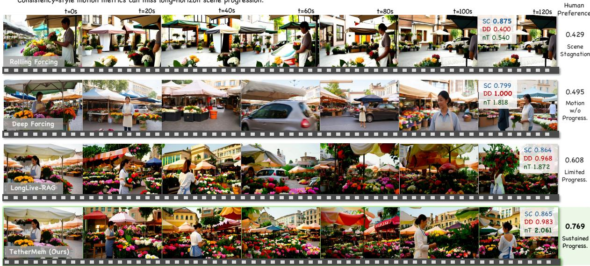  
“A medium shot of a flower vendor arranging bouquets at an outdoor morning market, wearing a light apron and standing behind a stall filled with colorful flowers. The camera slowly tracks sideways, gradually revealing neighboring stalls, hanging awnings, and more of the bustling market street behind ...”

Figure 1 Memory-anchored scene under-progression. This matched prompt–seed trajectory illustrates distinct long-horizon scene dynamics across four generation methods, with TetherMem continuing to reveal new scene states through 120 seconds. Human Preference reports the aggregate 30-second scene progression expected preference from Table 1. VBench Subject Consistency (SC) measures subject preservation, Dynamic Degree (DD) captures overall motion, and nT is an auxiliary scene-progression diagnostic.

However, while suppressing forgetting, historical memory can also impede the transition to new scene states. When subject and scene queries repeatedly access previously generated content through similar policies, memory not only protects subject identity but also anchors the background, viewpoint, and scene structure to the past. As shown in Figure 1, long-memory methods can generate videos in which the subject remains stable and local motion persists, yet the background and viewpoint remain confined to repetitions or slight extensions of states that have already appeared. The scene progression requested by the prompt fails to materialize. We call this failure memory-anchored scene under-progression. Unlike overt identity drift, it can coexist with a stable subject and local motion, motivating evaluation of whether the scene continues to progress over the full video.

Other approaches weaken, update, or evolve historical states to restore dynamics [1, 3, 22]. These methods typically relax memory at the frame or global level: dynamics improve, but subject identity and structure can weaken. They still apply approximately the same access policy to subject and scene content, despite their diferent roles. The subject should preserve its identity, whereas the background, viewpoint, and spatial relations should continue toward new states. A global memory policy therefore trades stability for progression.

A natural way to break this trade-of is to attenuate historical Values in background regions after attention. Although this releases more scene variation, it leaves the original attention routing unchanged and introduces a query-dependent scale on the attention output, which can weaken subject identity and structure. Moving the spatial prior into the attention logits instead redistributes historical access within the normalized attention distribution. Spatial routing alone, however, still assigns every current query the same policy. This leads to the central question: which history should each query retrieve to preserve the subject while allowing the scene to progress?

To address this question, we propose TetherMem, a training-free, query-aware spatiotemporal memory routing method that can be directly applied to a frozen video generator, given frame-wise subject priors. TetherMem distinguishes subject queries from scene queries and controls their access to history through region- and memory-age-conditioned routing priors. Subject queries preferentially retrieve identity-related history, whereas scene queries reduce their dependence on historical subject content and stale background states. These priors act on the attention logits without modifying historical Values, allowing each query type to retrieve evidence suited to its needs and thereby balance subject stability with scene progression. Across eight streaming long-video baselines, TetherMem attains the highest estimated expected preference (EP) for overall quality and scene progression (0.780 and 0.769).

Our contributions are summarized as follows.

• We identify memory-anchored scene under-progression and distinguish sustained scene progress from subject stability and local motion.

• We introduce training-free query-, region-, and age-conditioned memory routing, with normalized selection in place of post-attention Value Reweighting.

• Across eight streaming long-video baselines, TetherMem leads estimated overall-quality and scene-progression EP in blinded human comparisons.

## 2 Related Work

Historical memory in long-video generation. Long-horizon autoregressive video generation commonly relies on historical states to limit error accumulation. Existing methods strengthen this capability along three main directions. The first builds more persistent memory carriers. LongLive uses frame-level attention sinks to preserve long-range context [16]. Rolling Forcing retains key–value states from initial frames as global context anchors [11]. Infinity-RoPE extends long-context generation through positional encoding and KV-cache mechanisms [17]. MemRoPE and retrieval-based methods instead manage historical content through compression, updating, or retrieval on demand [6, 9, 20]. The second direction improves the training objective. CausVid and Self Forcing use distillation, self-generated rollouts, or distribution matching to reduce train–test mismatch and long-horizon error accumulation [7, 19]. A third direction relaxes or evolves historical states to recover long-range dynamics, as in AdaState and Deep Forcing [3, 18]. These approaches improve memory duration, capacity, update rules, or training. TetherMem complements them by routing the available historical memory according to query role, key region, and memory age, creating distinct access paths for identity preservation and scene progression.

Selective caching and memory routing. In language models, $_ \mathrm { H _ { 2 } O }$ and SnapKV retain selected KV-cache tokens using attention-derived importance or query-dependent prompt features [10, 21]. Their central operation is cache selection for computational eficiency. Difusion editing methods also manipulate cross- or self-attention to preserve spatial layout and appearance [2, 5]. TetherMem instead addresses query-specific access to history during long-video generation. Subject queries require stable access to identity-bearing evidence, whereas scene queries should reduce their dependence on subject history and stale background states. Region and age priors in the attention logits organize this access according to each query’s generation role while leaving historical Values unchanged.

## 3 Problem Formulation

Long videos are generated autoregressively, one chunk at a time. To generate the �-th video chunk, the model is conditioned on a text prompt $P ,$ random noise $\epsilon _ { n } .$ and historical memory $M _ { n } { \mathrm { : } }$

$$
X _ { n } = G _ { \theta } ( \epsilon _ { n } ; P , M _ { n } ) .\tag{1}
$$

Here, $M _ { n }$ contains historical key–value states obtained by caching or retrieval. Let $q \in \mathcal { Q } _ { n }$ be a query token in the current chunk, and let ${ \mathcal { C } } _ { n }$ be the set of context tokens accessible to it. The subset $\mathcal { T } _ { n } \subset \mathcal { C } _ { n }$ contains the historical tokens; the remaining tokens provide local context or act as persistent attention sinks. The base attention is

$$
A _ { q i } = \frac { \exp \left( Q _ { q } K _ { i } ^ { \top } / \sqrt { d } \right) } { \sum _ { j \in \mathcal { C } _ { n } } \exp \left( Q _ { q } K _ { j } ^ { \top } / \sqrt { d } \right) } ,\tag{2}
$$

$$
O _ { q } = \sum _ { i \in \mathcal { C } _ { n } } A _ { q i } V _ { i } .\tag{3}
$$

where $Q _ { q }$ is the current query representation, $( K _ { i } , V _ { i } )$ is the key–value pair for token $i ,$ and � is the feature dimension. Historical tokens provide cross-chunk continuity for subject identity, local structure, and scene content. Repeatedly accessing the same historical states, however, can also anchor the background, viewpoint, and scene layout to content that has already appeared.

To explicitly control access to history, we introduce a positive routing prior $\pi _ { n } ( q , i ) > 0$

$$
\widetilde { A } _ { q i } = \frac { \pi _ { n } ( q , i ) \exp \Bigl ( Q _ { q } K _ { i } ^ { \top } / \sqrt { d } \Bigr ) } { \sum _ { j \in \mathcal { C } _ { n } } \pi _ { n } ( q , j ) \exp \bigl ( Q _ { q } K _ { j } ^ { \top } / \sqrt { d } \bigr ) } ,\tag{4}
$$

This prior adjusts the relative weight with which the current query accesses diferent historical tokens. For non-historical tokens, we set $\pi _ { n } ( q , i ) = 1$ so that local context and attention-sink tokens retain their original behavior. When the prior equals one everywhere, Eq. (4) reduces to the base attention. Existing controls mainly operate on cache length, retrieval scope, frame weights, or overall memory strength. TetherMem exposes query-role conditioning at the same attention interface, allowing subject and scene queries to follow diferent policies for accessing history.

The problem with this shared policy is that subject and scene generation require diferent historical information. Subject generation must repeatedly access identity- and structure-bearing cues. Scene generation, in contrast, must reduce its dependence on stale backgrounds so that viewpoints, spatial relations, and environmental content can continue to evolve. Applying the same historical constraint to both therefore creates a trade-of between stability and progression: stronger historical access can cause the scene to stagnate, whereas weaker historical access can undermine subject stability.

This paper therefore asks: Should subject and scene queries access historical memory diferently to jointly support identity preservation and scene progression?

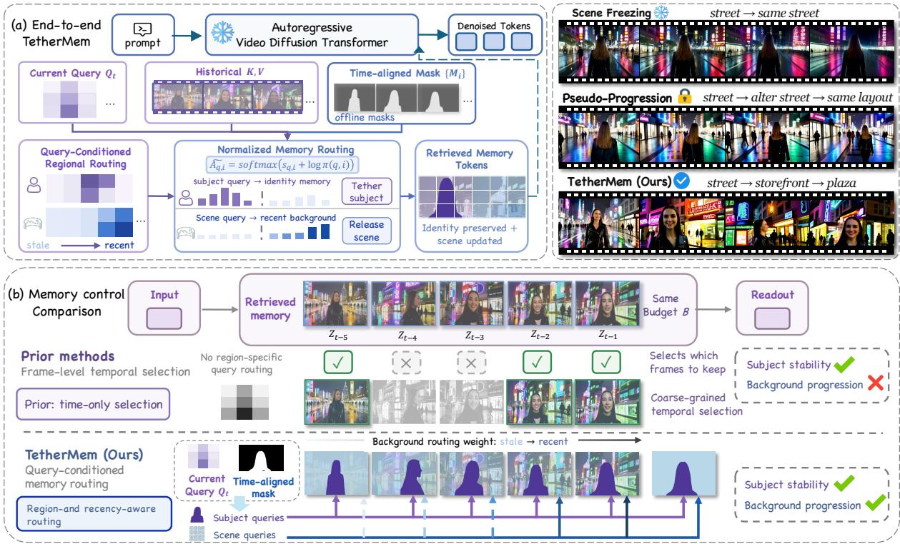  
Figure 2 Overview of TetherMem. (a) End-to-end routing preserves identity memory for subject queries and favors recent backgrounds for scene queries. (b) Prior methods select memory frames, whereas TetherMem routes query roles within the retrieved history.

## 4 TetherMem

Figure 2 overviews TetherMem, which conditions historical access on the current-query role, historical-key region, and memory age. The binary subject mask operationalizes scene queries as non-subject, or background, tokens. Normalized routing places the prior inside the softmax so that it changes which history is selected without introducing an additional output scale. Regional routing then conditions access on the query–key region, while recency routing directs background queries toward recent scene states and preserves the long-range subject path. Secs. 4.1– 4.3 develop these three components in order.

## 4.1 Normalized Memory Routing

Subject identity requires historical evidence, whereas scene progression requires weaker dependence on previously observed backgrounds. A direct approach is to preserve historical Values in subject regions while attenuating those in background regions. Following the notation of Sec. 3, let $w _ { i } \in ( 0 , 1 ]$ be a spatial retention weight, with larger values for historical subject regions and smaller values for historical background regions. We call this post-attention spatial modulation Value Reweighting:

$$
O _ { q } ^ { \mathrm { v a l } } = \sum _ { i \in \mathcal { C } _ { n } } A _ { q i } w _ { i } V _ { i } .\tag{5}
$$

For local and sink tokens outside the retrieved history, we set $w _ { i } = 1$ . This modulation can release some background variation, but it is applied only after attention has selected the information.

Its efect can be decomposed as

$$
O _ { q } ^ { \mathrm { v a l } } = g _ { q } \sum _ { i \in \mathcal { C } _ { n } } \overline { { A } } _ { q i } V _ { i } ,\tag{6}
$$

$$
g _ { q } = \sum _ { i \in \mathcal { C } _ { n } } A _ { q i } w _ { i } ,\tag{7}
$$

$$
\overline { { A } } _ { q i } = \frac { A _ { q i } w _ { i } } { g _ { q } } , \qquad \sum _ { i \in \mathcal { C } _ { n } } \overline { { A } } _ { q i } = 1 .\tag{8}
$$

Here, $\overline { { A } } _ { q i }$ is the renormalized contribution after spatial reweighting and satisfies $\textstyle \sum _ { i } { \overline { { A } } } _ { q i } = 1$ , while $g _ { q }$ is an additional output scale factor. Because queries have diferent base attention distributions, the shared spatial weights $w _ { i }$ produce diferent values of $g _ { q }$ . Value Reweighting therefore not only reallocates the relative contributions of historical evidence, but also introduces a query-dependent perturbation to the magnitude of the attention output, which is repeatedly fed into subsequent history and can accumulate during a long rollout.

This observation motivates the normalized routing used by TetherMem: the spatial prior should participate in selecting historical information, rather than scaling retrieved Values after selection. We therefore move spatial control inside the attention softmax. Let $s _ { q i } = Q _ { q } K _ { i } ^ { \top } / \sqrt { d }$ denote the original attention logit, and introduce a positive routing prior $\pi _ { n } ( q , i ) > 0$ . The controlled attention is

$$
\widetilde { A } _ { q i } = \frac { \pi _ { n } ( q , i ) \exp ( s _ { q i } ) } { \sum _ { j \in \mathcal { C } _ { n } } \pi _ { n } ( q , j ) \exp ( s _ { q j } ) } ,\tag{9}
$$

$$
\widetilde { O } _ { q } = \sum _ { i \in \mathcal { C } _ { n } } \widetilde { A } _ { q i } V _ { i } .\tag{10}
$$

Equivalently, log $\pi _ { n } ( q , i )$ acts as an additive bias on the original attention logit during softmax normalization. Thus, $A _ { q i }$ always satisfies $\begin{array} { r } { \sum _ { i } \widetilde { A } _ { q i } = 1 } \end{array}$ , while the historical Values remain unchanged. TetherMem therefore changes which historical locations each query reads from, rather than scaling retrieved content afterward.

## 4.2 Query-Conditioned Regional Routing

The role of a historical token is determined jointly by the query and key regions. A historical subject token provides identity and structural evidence for a subject query, while the same token can anchor a background query to an existing layout. Historical backgrounds maintain scene continuity when read by background queries, while cross-region access receives a softer prior.

TetherMem therefore routes memory according to the regional relation between the current query and each historical key. Let $m ^ { q } ( q )$ and $m ^ { k } ( i )$ indicate whether the current query $q$ and historical key �, respectively, lie in the subject regions of their corresponding frames:

$$
m ^ { q } ( q ) , m ^ { k } ( i ) \in \{ 0 , 1 \} ,\tag{11}
$$

where one denotes the subject region and zero denotes the background region. We instantiate this binary prior by generating a Full-Memory reference video, extracting a frame-wise subject track with SAM 2 [13], and downsampling the track to the latent-token grid. Each query and historical key uses the reference mask at its current or source time, respectively; this time-aligned track is the routing scafold. Appendix G.3 measures its alignment over the rollout.

For a key $i \in \mathcal { T } _ { n }$ in the retrieved history, TetherMem assigns a unit prior when the query and key belong to the same region, leaving the connection unattenuated before attention normalization. When they belong to diferent regions, it downweights the connection using a cross-region routing factor $\gamma _ { n } \in ( 0 , 1 ]$

$$
\pi _ { \mathrm { r e g } } ( q , i ) = \left\{ \begin{array} { l l } { 1 , \ } & { m ^ { q } ( q ) = m ^ { k } ( i ) , } \\ { \gamma _ { n } , } & { m ^ { q } ( q ) \neq m ^ { k } ( i ) , } \end{array} \right. \quad 0 < \gamma _ { n } \leq 1 .\tag{12}
$$

Here, $\gamma _ { n } = 1$ applies no regional control, while a smaller $\gamma _ { n }$ suppresses cross-region access. We recompute $\gamma _ { n }$ from the current subject fraction $r _ { n }$ using the fixed release budget $\alpha = 0 . 2 5$ :

$$
\bar { \gamma } _ { n } = \frac { \alpha - r _ { n } } { 1 - r _ { n } } , \qquad \gamma _ { n } = \operatorname* { m a x } \Bigl ( 1 0 ^ { - 9 } , \operatorname* { m i n } ( 1 , \operatorname* { m a x } ( 0 , \bar { \gamma } _ { n } ) ) \Bigr ) .\tag{13}
$$

This area-calibrated rule keeps the cross-region release budget consistent as subject area changes; we use the fixed $\alpha = 0 . 2 5$ throughout. The all-subject edge case is given in Appendix G. Substituting $\pi _ { \mathrm { r e g } } ( q , i )$ into the normalized attention in Sec. 4.1 yields query-conditioned regional memory routing. For local and sink tokens, the routing prior remains one.

This design creates two complementary paths for accessing history. Subject queries retain strong access to historical subject evidence while reducing interference from background history. Background queries preferentially read historical backgrounds and reduce their dependence on subject history, preventing the scene from being continually anchored to existing subject layouts. The key is to make the importance of historical evidence depend on the generation role of the current query, rather than assigning a fixed importance to each historical token in advance.

## 4.3 Recency-Aware Background Routing

Regional routing selects the memory type; recency routing further orders states within each type. Earlier viewpoints, spatial layouts, or completed scene states may regain high attention when they resemble the current content, causing the background to stall, return, or slowly repeat.

Recent background memory more closely reflects the current scene state and helps maintain continuity between adjacent chunks. Older background memory is more likely to describe a state that the video has already left. Based on this observation, TetherMem introduces a recency prior for historical backgrounds. Let $p _ { i }$ be the source-frame position of historical token � in the memory pool and $A _ { \mathrm { m a x } } = \operatorname* { m a x } ( 1 , \operatorname* { m i n } ( N _ { \mathrm { p o o l } } , 1 2 0 ) )$ . Its normalized absolute recency is $\tau _ { i } = p _ { i } / A _ { \mathrm { m a x } }$ , with larger values indicating states closer to the current time. We define

$$
\rho _ { i } = \operatorname* { m a x } ( \tau _ { i } , \rho _ { \operatorname* { m i n } } ) ,\tag{14}
$$

where the fixed floor $\rho _ { \mathrm { m i n } } = 0 . 0 5$ retains a small contribution from distant background states. Combining this prior with the regional routing in Sec. 4.2, the complete prior for a historical key $i \in \mathcal { I } _ { n }$ is

$$
\pi _ { n } ( q , i ) = \left\{ \begin{array} { l l } { { 1 , } } & { { m ^ { q } ( q ) = 1 , m ^ { k } ( i ) = 1 , } } \\ { { \gamma _ { n } , } } & { { m ^ { q } ( q ) \neq m ^ { k } ( i ) , } } \\ { { \rho _ { i } , } } & { { m ^ { q } ( q ) = 0 , m ^ { k } ( i ) = 0 . } } \end{array} \right.\tag{15}
$$

For local and sink tokens, we continue to set $\pi _ { n } ( q , i ) = 1$ . Subject queries therefore retain long-range identity cues, while background queries favor recent scene states.

## 5 Experiments

## 5.1 Experimental Setup

We evaluate ten prompts spanning stable scenes (P01–P03), subject-centered progression (P04 and P06–P10), and subject-free evolution (P05), each rendered with three seeds. Appendix E gives the complete prompts and executed settings.

Wan2.1-T2V-1.3B [14] serves as a 5-second base-model reference. TetherMem is built on LongLive-RAG [6] and uses one routing configuration. Using oficially released weights, we compare against eight streaming long-video baselines: LongLive-RAG, Self Forcing, Rolling Forcing, Deep Forcing, Causal Forcing, Reward Forcing, MemRoPE, and CausVid [6, 7, 9, 11, 12, 18, 19, 23]. The controlled evaluation uses this Wan2.1-T2V-1.3B/LongLive-RAG stack, ten prompts, three seeds, and approximately 30-second videos. Longer 42-, 52-, and 120-second rollouts illustrate the same long-horizon behavior.

Human evaluation contains 2,400 blinded pairwise judgments from 10 independent annotators on complete 30-second videos. Randomized pairs are rated for overall preference (Ovr.), scene progression, subject identity preservation (ID), and visual integrity (L1). Tie-aware Davidson– Bradley–Terry models place methods on a common EP scale [4]; the rubric, model, uncertainty, and quality-control details are in Appendix D.

Overall preference and scene progression on the complete 30-second videos are the primary criteria. Identity is evaluated on the nine subject-present prompts; P05 is marked N/A. Img5 is VBench Imaging Quality [8] on 5-second clips and checks short-horizon degradation. nT measures net coherent translation from optical flow and serves as an auxiliary cue for sustained directional change.

## 5.2 Main Comparison

Table 1 shows that TetherMem has the highest overall and progression estimates (0.780 and 0.769), ahead of MemRoPE (0.640) and LongLive-RAG (0.608), respectively. The identity and progression columns expose the intended balance: Rolling Forcing has the highest identity estimate (0.633) but a progression EP of 0.429, whereas TetherMem combines the second-highest identity estimate (0.600) with the highest progression EP. TetherMem also has the highest visual-integrity point estimate (0.708) and nT (1.289). Img5 remains essentially unchanged from the backbone (71.1 versus 71.0).

<table><tr><td rowspan="2">Method</td><td>5s</td><td colspan="4">30s human EP↑</td><td rowspan="2">Diag.</td><td colspan="4">VBench↑</td></tr><tr><td>Img5↑</td><td>Ovr.</td><td>Prog.</td><td>ID</td><td>L1</td><td>nT↑ Subj.</td><td>Back.</td><td>Smooth.</td><td>Dyn.</td></tr><tr><td colspan="10">Base model (non-autoregressive)</td></tr><tr><td colspan="10">Wan2.1-T2V-1.3B 65.6 0.322</td></tr><tr><td colspan="10">Long-memory retrieval</td></tr><tr><td>LongLive-RAG</td><td>71.0</td><td>0.615</td><td>0.608</td><td>0.507</td><td>0.587</td><td>0.868</td><td>0.861</td><td>0.897</td><td>0.973</td><td>0.867</td></tr><tr><td colspan="9">Forcing-based generation</td></tr><tr><td>Self Forcing</td><td>70.5</td><td>0.320</td><td>0.356</td><td>0.437</td><td>0.273</td><td>0.192</td><td>0.885</td><td>0.907</td><td>0.983</td><td>0.767</td></tr><tr><td>Rolling Forcing</td><td>72.2</td><td>0.553</td><td>0.429</td><td>0.633</td><td>0.651</td><td>0.040</td><td>0.933</td><td>0.935</td><td>0.985</td><td>0.433</td></tr><tr><td>Deep Forcing</td><td>70.5</td><td>0.526</td><td>0.495</td><td>0.531</td><td>0.508</td><td>0.350</td><td>0.899</td><td>0.916</td><td>0.983</td><td>0.800</td></tr><tr><td>Causal Forcing</td><td>70.2</td><td>0.210</td><td>0.440</td><td>0.285</td><td>0.158</td><td>1.226</td><td>0.824</td><td>0.873</td><td>0.973</td><td>0.867</td></tr><tr><td>Reward Forcing</td><td>69.3</td><td>0.573</td><td>0.530</td><td>0.487</td><td>0.620</td><td>0.366</td><td>0.903</td><td>0.927</td><td>0.985</td><td>0.733</td></tr><tr><td>CausVid</td><td>65.9</td><td>0.283</td><td>0.295</td><td>0.461</td><td>0.328</td><td>0.190</td><td>0.879</td><td>0.896</td><td>0.982</td><td>0.767</td></tr><tr><td colspan="9">Memory / positional methods</td></tr><tr><td>MemRoPE</td><td>72.1</td><td>0.640</td><td>0.578</td><td>0.559</td><td>0.666</td><td>0.551</td><td>0.892</td><td>0.908</td><td>0.986</td><td>0.700</td></tr><tr><td colspan="9">Spatiotemporal memory routing</td></tr><tr><td>TetherMem</td><td>71.1</td><td>0.780</td><td>(ours) 0.769</td><td>0.600</td><td>0.708</td><td>1.289</td><td>0.855</td><td>0.895</td><td></td><td></td></tr></table>

Table 1 Main comparison with human preference and VBench diagnostics. Human values are tie-aware Davidson EP on complete 30-second videos. VBench uses 270 evaluation videos: Subj./Back. use complete clips, while Smooth./Dyn. use a uniform 8-second trim. Bold and underlined values mark best and second-best; ID excludes the subject-free P05 prompt.

## 5.3 Statistical Reliability and Prompt Robustness

(a) Crossed-cluster uncertainty
<table><tr><td>Criterion</td><td>TetherMem EP (95% CI)</td><td>Strongest baseline</td><td>Baseline EP</td><td>Difference (95% CI)</td></tr><tr><td>Ovr.</td><td>0.780 [0.684, 0.868]</td><td>MemRoPE</td><td>0.640</td><td>0.140 [0.004, 0.273]</td></tr><tr><td>Prog.</td><td>0.769 [0.666, 0.861]</td><td>LongLive-RAG</td><td>0.608</td><td>0.161 [0.076, 0.240]</td></tr><tr><td>ID</td><td>0.600 [0.504, 0.699]</td><td>Rolling Forcing</td><td>0.633</td><td>-0.033 [−0.182, 0.111]</td></tr><tr><td>L1</td><td>0.708 [0.625, 0.794]</td><td>MemRoPE</td><td>0.666</td><td>0.042 [−0.086, 0.182]</td></tr></table>

(b) Prompt-cluster sensitivity
<table><tr><td>Criterion</td><td>TetherMem EP</td><td>Strongest baseline EP</td><td>Difference (95% CI)</td></tr><tr><td>Ovr.</td><td>0.780</td><td>0.640 (MemRoPE)</td><td>0.140 [-0.017, 0.290]</td></tr><tr><td>Prog.</td><td>0.769</td><td>0.608 (LongLive-RAG)</td><td>0.161 [0.074, 0.258]</td></tr></table>

Table 2 Statistical reliability across evaluation units and prompts. (a) Percentile intervals from 2,000 crossed annotator–prompt-seed cluster bootstrap refits. (b) A stricter analysis clusters the three seeds of each prompt before resampling; 1,995 of 2,000 refits are finite.

Table 2(a) reports uncertainty against the strongest baseline for each criterion. Under crossed annotator–prompt-seed clustering, the overall margin is 0.140 (95% CI [0.004, 0.273]) and the progression margin is 0.161 (95% CI [0.076, 0.240]); both intervals exclude zero. Under the stricter prompt-level clustering in Table 2(b), only the progression interval remains separated from zero. ID and L1 remain comparable to their leading baselines.

## 5.4 Ablations and Design Controls

Table 3 reports the routing-component and post-attention design controls; the main comparisons are interpreted directly below the table.
<table><tr><td>Variant</td><td>Ovr.</td><td>Prog.</td><td>ID</td><td>L1</td><td>nT↑</td><td>Tail subj.↑</td></tr><tr><td colspan="7">(a) Routing components: Full-Memory-centered comparison</td></tr><tr><td>Full Memory</td><td>0.426</td><td>0.391</td><td>0.472</td><td>0.457</td><td>0.980</td><td></td></tr><tr><td>Routing w/o Region</td><td>0.461</td><td>0.472</td><td>0.489</td><td>0.505</td><td>1.232</td><td></td></tr><tr><td>Routing w/o Age</td><td>0.476</td><td>0.428</td><td>0.505</td><td>0.490</td><td>1.083</td><td></td></tr><tr><td>TetherMem</td><td>0.638</td><td>0.709</td><td>0.534</td><td>0.548</td><td>1.458</td><td></td></tr><tr><td colspan="7">(b) Post-attention design baseline</td></tr><tr><td>Full Memory</td><td>0.513</td><td>0.483</td><td>0.634</td><td>0.557</td><td>0.980</td><td>0.865</td></tr><tr><td>Value Reweighting</td><td>0.174</td><td>0.303</td><td>0.108</td><td>0.230</td><td>1.405</td><td>0.859</td></tr><tr><td>TetherMem</td><td>0.812</td><td>0.714</td><td>0.758</td><td>0.713</td><td>1.468</td><td>0.927</td></tr></table>

Table 3 Routing-component and design ablations. Human columns are regularized, tie-aware Davidson EP fitted separately within each panel. (a) Four-way routing comparison over 14 prompt–seed units. (b) Three-way design comparison over seven prompts and two seeds; nT and final-five-second subject consistency are averaged over 14 cells.

Table 3(a) follows the mechanism from uniform history to the complete router. Routing w/o Region and Routing w/o Age improve complementary criteria; their combination leads every human dimension and nT. In Table 3(b), Value Reweighting raises nT but lowers human EP and tail-subject consistency, whereas normalized routing gives the strongest progression–identity balance.

## 5.5 Qualitative Trajectories

The matched P01 rows visualize the progression from uniform memory to complete routing. Full Memory repeatedly reconstructs closely related harbor states; regional routing protects subject-associated access, and recency routing prevents the background from repeatedly returning to old scene states. Their combination preserves the fisherman while allowing the harbor view to develop. The lower rows retain the forest-hiker and subject-free beach comparisons, followed by two independent Painter Coast comparisons. The final two rows place Deep Forcing, Rolling Forcing, LongLive-RAG, and TetherMem on the same P09 prompt and time grid.

Figure 4 separates identity from progression and shows why nT is complementary. Detailed VBench diagnostics appear in Appendix F.2.

● TetherMem LongLive-RAG host Other baselines

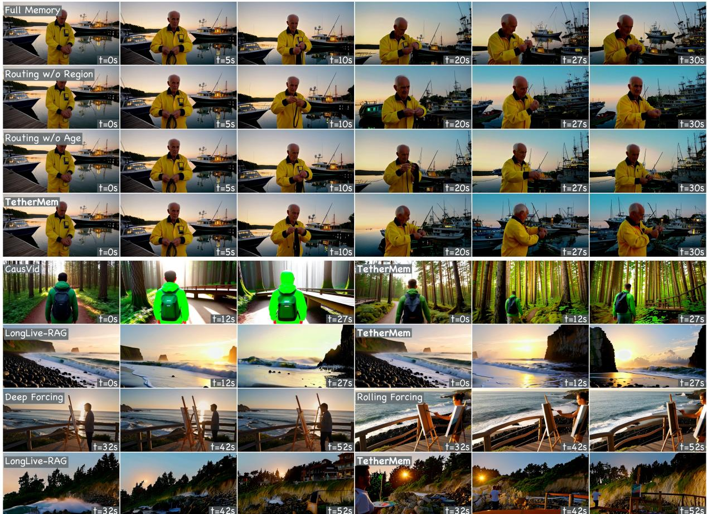  
Figure 3 Compact memory-control and cross-method comparison. Top four rows: matched P01 trajectories at $0 / 5 / 1 0 / 2 0 / 2 7 / 3 0$ seconds for Full Memory, the two single-factor routing controls, and TetherMem. Bottom four rows: paired P10 and P05 trajectories at $0 / 1 2 / 2 7$ seconds, followed by two independent P09 Painter Coast comparisons at 32/42/52 seconds. The extended 80-frame gallery with denser temporal sampling appears in Appendix Figure 7.

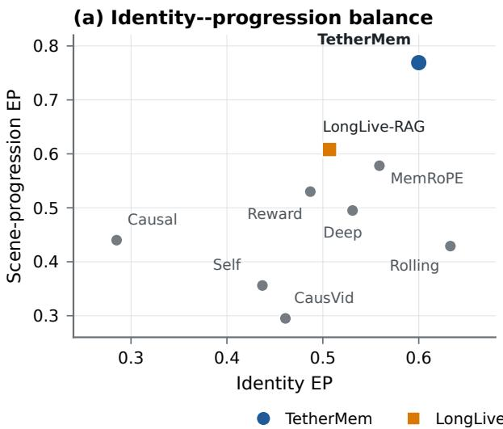

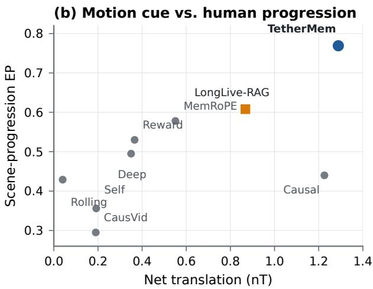  
Figure 4 The evaluation landscape exposes two distinct gaps. (a) Identity EP versus sceneprogression EP shows that strong identity can coexist with weak progression. (b) nT versus human progression shows that coherent translation is informative but incomplete: Causal Forcing has high nT and low human progression. Values are the method-level aggregates from Table 1.

## 5.6 Realized Routing

Figure 5 examines realized post-softmax attention. Subject-to-background attention falls from 67.2% with Full Memory to 36.2% with regional routing and 35.4% with TetherMem; backgroundto-subject attention falls from 9.7% to 1.1% and 2.3%, respectively. Within background memory, the recency prior shifts attention away from the oldest half toward the most recent half. Together, the two panels connect the designed regional and age priors to the attention actually realized by the generator.

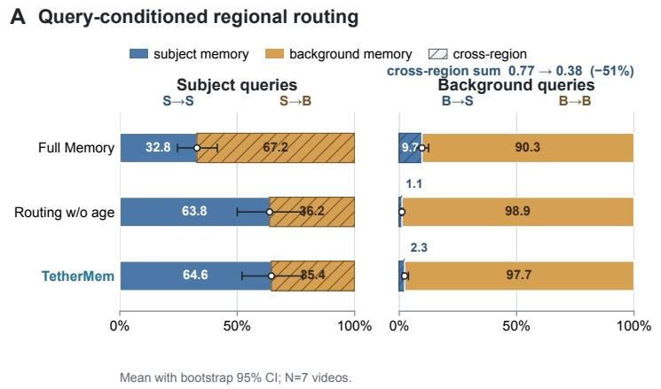

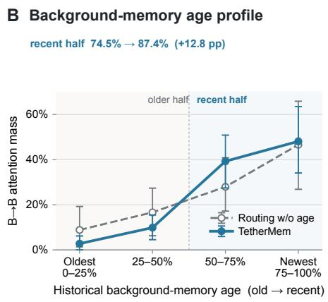  
Figure 5 Realized routing behavior. A Regional routing reduces cross-region historical access; the two routed variants have closely matched regional profiles. B Within background memory, TetherMem redistributes attention toward the recent half relative to Routing w/o Age. Points and bars show means with video-level bootstrap 95% CIs over seven videos.

## 5.7 Transfer Across Autoregressive Hosts

Figure 6, panel A, follows the same LongLive-RAG host pair through complete trajectories: LongLive-RAG often preserves a locally coherent composition, whereas TetherMem maintains the central subject while more of the scene enters the trajectory. Panel B applies the same router to a Deep Forcing host within the Wan2.1 foundation family.

<table><tr><td rowspan="2">Method</td><td colspan="4">30s human EP↑</td></tr><tr><td>Ovr.</td><td>Prog.</td><td>ID</td><td>L1</td></tr><tr><td>Deep Forcing</td><td>0.404</td><td>0.360</td><td>0.470</td><td>0.439</td></tr><tr><td>Deep Forcing + TetherMem</td><td>0.596</td><td>0.640</td><td>0.530</td><td>0.561</td></tr></table>

Table 4 Blinded transfer to the Deep Forcing host. Thirty matched prompt–seed pairs receive three judgments each. The progression diference is 0.281 with crossed-cluster 95% CI [0.033, 0.522].

Across the complete 30-pair blind pool, Table 4 raises progression EP from 0.360 to 0.640; Overall, ID, and L1 also increase. Direct counts, confidence intervals, and execution diferences are reported in Appendix C.1.

A Matched LongLive-RAG trajectoriest=2s t=6s  
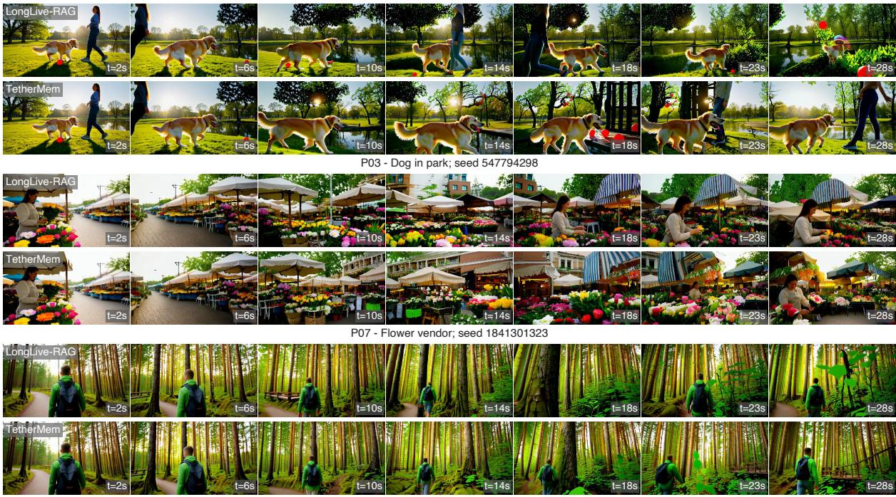  
P10 - Forest hiker; seed 1841301323

B Cross-stack transfer on Deep Forcing  
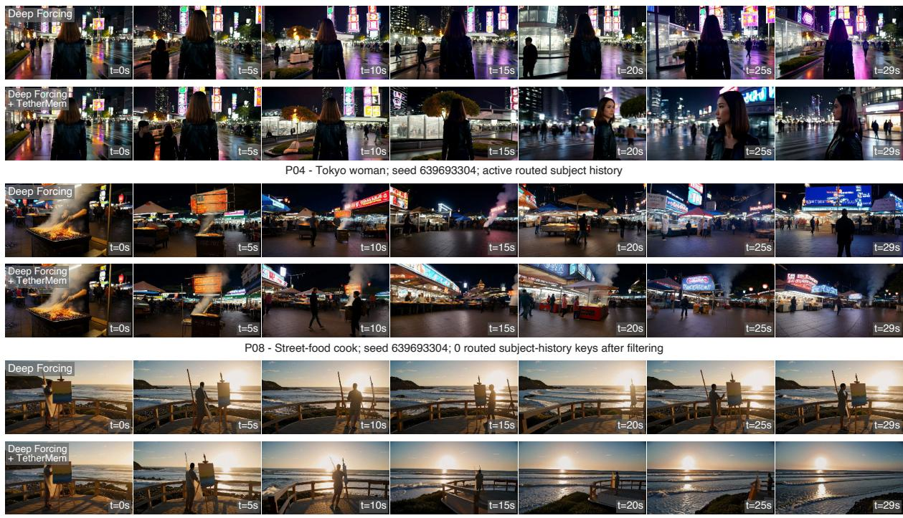  
P09 - Seaside painter; seed 639693304; 0 routed subject-history keys after filtering

Figure 6 Long-horizon trajectories and cross-stack transfer. A Matched LongLive-RAG and TetherMem trajectories for P03, P07, and P10 at 2–28 seconds. B Deep Forcing versus Deep Forcing+TetherMem for P04, P08, and P09 at 0–29 seconds; the Wan2.1 foundation family is held fixed while the autoregressive host stack changes.

## 5.8 Prior Robustness

<table><tr><td>Prior</td><td>nT↑</td><td>Artifact veto↓</td><td>Tail subject↑</td></tr><tr><td>Original SAM 2</td><td>1.490</td><td>0.158</td><td>0.934</td></tr><tr><td>Low-res coarse</td><td>1.463</td><td>0.107</td><td>0.932</td></tr><tr><td>Bounding box</td><td>1.664</td><td>0.207</td><td>0.878</td></tr></table>

Table 5 Sensitivity to subject-prior approximation. Automatic diagnostics over seven matched prompt-videos (one seed). Artifact veto is the fraction flagged by the artifact classifier; Tail subject is subject consistency in the final five seconds.

The reference mask and a controlled-output re-extraction agree at IoU 0.431 over the complete rollout and 0.275 in the late window. At 28 seconds, an independent human mask comparison measures median coverage 0.574 and raw IoU 0.202 for the consumed reference prior across 21 subject-present frames. Detailed temporal and human-mask results are in Appendix G.3.

Table 5 tests spatial approximation with checkpoint, noise, reference rollout, and routing constants fixed. A coarse 8 × 13 prior remains close to the original on nT and tail-subject consistency, whereas a bounding box increases the artifact-veto rate and reduces tail-subject consistency. The result shows tolerance to boundary coarsening and sensitivity to loose background inclusion.

## 6 Conclusion

We identify memory-anchored scene under-progression, where uniform historical access preserves local stability but suppresses prompted scene evolution. TetherMem addresses this failure through normalized regional and recency routing, retaining long-range subject evidence while directing background queries toward recent scene states. On the evaluated 30-second suite, this queryaware routing improves scene progression and overall preference while preserving subject identity. Realized-attention measurements link the gains to the regional and recency priors.

## References

[1] Bian, Y.; Xue, Z.; Zhang, S.; Zhang, S.; Jin, W.; Li, Y.; Zhuang, J.; Li, H.; Huang, J.; Huang, H.; Duan, N.; and Xu, Q. 2026. Echo-Infinity: Learning Evolving Memory for Real-Time Infinite Video Generation. arXiv:2606.04527.

[2] Cao, M.; Wang, X.; Qi, Z.; Shan, Y.; Qie, X.; and Zheng, Y. 2023. MasaCtrl: Tuning-Free Mutual Self-Attention Control for Consistent Image Synthesis and Editing. In Proceedings of the IEEE/CVF International Conference on Computer Vision, 22560–22570.

[3] Dalva, Y.; and Yanardag, P. 2026. AdaState: Self-Evolving Anchors for Streaming Video Generation. arXiv:2605.30349.

[4] Davidson, R. R. 1970. On Extending the Bradley–Terry Model to Accommodate Ties in Paired Comparison Experiments. Journal of the American Statistical Association, 65(329): 317–328.

[5] Hertz, A.; Mokady, R.; Tenenbaum, J.; Aberman, K.; Pritch, Y.; and Cohen-Or, D. 2023. Prompt-to-Prompt Image Editing with Cross-Attention Control. In International Conference on Learning Representations.

[6] Hu, Q.; Yang, S.; Huang, W.; Han, S.; and Chen, Y. 2026. LongLive-RAG: A General Retrieval-Augmented Framework for Long Video Generation. arXiv:2606.02553.

[7] Huang, X.; Li, Z.; He, G.; Zhou, M.; and Shechtman, E. 2025. Self Forcing: Bridging the Train-Test Gap in Autoregressive Video Difusion. arXiv:2506.08009.

[8] Huang, Z.; He, Y.; Yu, J.; Zhang, F.; Si, C.; Jiang, Y.; Zhang, Y.; Wu, T.; Jin, Q.; Chanpaisit, N.; Wang, Y.; Chen, X.; Wang, L.; Lin, D.; Qiao, Y.; and Liu, Z. 2023. VBench: Comprehensive Benchmark Suite for Video Generative Models. arXiv:2311.17982.

[9] Kim, Y.; Hu, Q.; Kuo, C.-C. J.; and Beerel, P. A. 2026. MemRoPE: Training-Free Infinite Video Generation via Evolving Memory Tokens. arXiv:2603.12513.

[10] Li, Y.; Huang, Y.; Yang, B.; Venkitesh, B.; Locatelli, A.; Ye, H.; Cai, T.; Lewis, P.; and Chen, D. 2024. SnapKV: LLM Knows What You are Looking for Before Generation. arXiv:2404.14469.

[11] Liu, K.; Hu, W.; Xu, J.; Shan, Y.; and Lu, S. 2025. Rolling Forcing: Autoregressive Long Video Difusion in Real Time. arXiv:2509.25161.

[12] Lu, Y.; Zeng, Y.; Li, H.; Ouyang, H.; Wang, Q.; Cheng, K. L.; Zhu, J.; Cao, H.; Zhang, Z.; Zhu, X.; Shen, Y.; and Zhang, M. 2025. Reward Forcing: Eficient Streaming Video Generation with Rewarded Distribution Matching Distillation. arXiv:2512.04678.

[13] Ravi, N.; Gabeur, V.; Hu, Y.-T.; Hu, R.; Ryali, C.; Ma, T.; Khedr, H.; Rädle, R.; Rolland, C.; Gustafson, L.; Mintun, E.; Pan, J.; Alwala, K. V.; Carion, N.; Wu, C.-Y.; Girshick, R.; Dollár, P.; and Feichtenhofer, C. 2024. SAM 2: Segment Anything in Images and Videos. arXiv:2408.00714.

[14] Wan Team. 2025. Wan: Open and Advanced Large-Scale Video Generative Models. arXiv:2503.20314.

[15] Wu, W.; Niezink, N. M. D.; and Junker, B. W. 2022. A Diagnostic Framework for the Bradley–Terry Model. Journal of the Royal Statistical Society: Series A (Statistics in Society), 185(S2): S461–S484.

[16] Yang, S.; Huang, W.; Chu, R.; Xiao, Y.; Zhao, Y.; Wang, X.; Li, M.; Xie, E.; Chen, Y.; Lu, Y.; Han, S.; and Chen, Y. 2025. LongLive: Real-time Interactive Long Video Generation. arXiv:2509.22622.

[17] Yesiltepe, H.; Meral, T. H. S.; Akan, A. K.; Oktay, K.; and Yanardag, P. 2025. Infinity-RoPE: Action-Controllable Infinite Video Generation Emerges From Autoregressive Self-Rollout. arXiv:2511.20649.

[18] Yi, J.; Jang, W.; Cho, P. H.; Nam, J.; Yoon, H.; and Kim, S. 2025. Deep Forcing: Training-Free Long Video Generation with Deep Sink and Participative Compression. arXiv:2512.05081.

[19] Yin, T.; Zhang, Q.; Zhang, R.; Freeman, W. T.; Durand, F.; Shechtman, E.; and Huang, X. 2024. From Slow Bidirectional to Fast Autoregressive Video Difusion Models. arXiv:2412.07772.

[20] Yu, J.; Bai, J.; Qin, Y.; Liu, Q.; Wang, X.; Wan, P.; Zhang, D.; and Liu, X. 2025. Context as Memory: Scene-Consistent Interactive Long Video Generation with Memory Retrieval. arXiv:2506.03141.

[21] Zhang, Z.; Sheng, Y.; Zhou, T.; Chen, T.; Zheng, L.; Cai, R.; Song, Z.; Tian, Y.; Ré, C.; Barrett, C.; Wang, Z.; and Chen, B. 2023. $\mathrm { H _ { 2 } O }$ : Heavy-Hitter Oracle for Eficient Generative Inference of Large Language Models. arXiv:2306.14048.

[22] Zhao, Z.; Lu, Y.; Liu, Z.; Song, J.; Deng, J.; and Patras, I. 2026. Relax Forcing: Relaxed KV-Memory for Consistent Long Video Generation. arXiv:2603.21366.

[23] Zhu, H.; Zhao, M.; He, G.; Su, H.; Li, C.; and Zhu, J. 2026. Causal Forcing: Autoregressive Difusion Distillation Done Right for High-Quality Real-Time Interactive Video Generation. arXiv:2602.02214.

## A Additional Results and Details

This appendix provides additional qualitative results, the human-evaluation protocol, prompt and baseline configurations, metric definitions, implementation details, and ablations. Unless stated otherwise, experiments use the Wan2.1-T2V-1.3B/LongLive-RAG stack, ten prompts, three seeds, and approximately 30-second videos. Longer rollouts are included as qualitative examples.

## B Evaluation and Generation Setup

All long-video methods use matched prompts and seeds, 832×480 output, 16 fps, and approximately 30-second duration. TetherMem and the Full-Memory reference share the generator, checkpoints, denoising schedule, context, attention sinks, and retrieval budget; they difer only in historical-memory routing. Section E lists the prompts and baseline configurations.

For subject-containing prompts, the Full-Memory reference video is processed by SAM 2 without frame-wise manual correction. The resulting frame-aligned binary track is mapped to the 30 × 52 latent-token grid and supplies the subject/scene roles used by the controlled rollout. The subjectfree P05 prompt uses a fixed center region as the default spatial partition. The complete pipeline consists of the reference rollout, mask extraction, and controlled generation.

## C Qualitative Results

Figures 7 and 8 show additional trajectories and the subject masks used at the routing grid. Timestamps are embedded in the frames, and prompt–seed metadata appears below each group. Figure 6, panel B, shows the same router on a Deep Forcing host using the self\_forcing\_dmd.pt EMA checkpoint. The quantitative comparison uses all ten prompts and three seeds.

## C.1 Cross-Stack Human Evaluation

The evaluation contains 30 matched Deep Forcing versus Deep Forcing + TetherMem pairs from ten prompts and three seeds. Three blinded annotators judged each pair, giving 90 judgments; six hidden repeats were excluded from the method estimates. We use the same tie-aware Davidson– Bradley–Terry model as in the main comparison and 2,000 crossed-cluster bootstrap refits over annotators and prompt–seed units.

Table 4 reports progression EP of 0.640 for the routed host and 0.360 for Deep Forcing, a diference of 0.281 with 95% CI [0.033, 0.522]. Overall, ID, and L1 have higher point estimates, but their diference intervals include zero. Direct W/T/L/U counts for the routed host are 36/34/19/1 (Overall), 40/34/15/1 (Prog.), 25/39/20/6 (ID), and 29/43/18/0 (L1). All six hidden repeats agree on Overall, and 21 of 24 repeat-criterion responses agree.

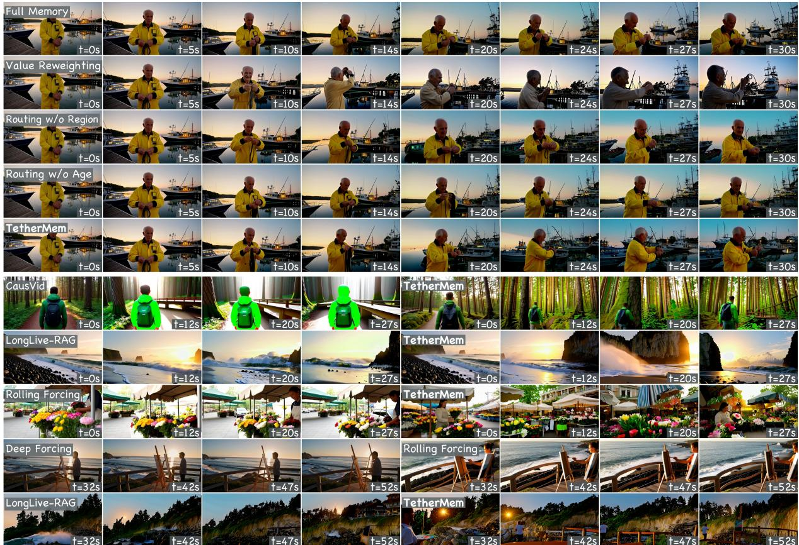  
Figure 7 Extended memory-control and cross-method gallery. The top five rows show eight sampled times for Full Memory, Value Reweighting, Routing w/o Region, Routing w/o Age, and TetherMem on P01. The bottom rows compare CausVid/TetherMem on P10, LongLive-RAG/TetherMem on P05, Rolling Forcing/TetherMem on P07, and two P09 Painter Coast trajectories.

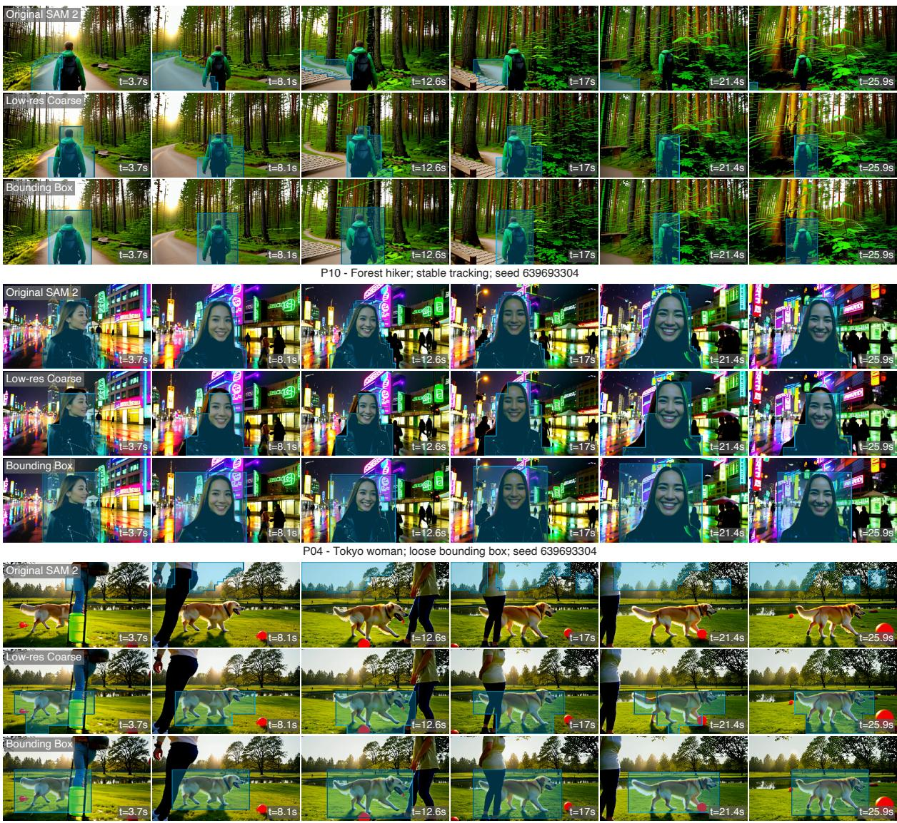  
P03 - Dog in park; fast motion; seed 639693304

Figure 8 Automatic subject priors at the routing grid. Prompt blocks: P10, P04, and P03. Rows: original SAM 2, coarse, and bounding-box priors. Columns: six frames from 3.7 to 25.9 seconds. Cyan overlays show the binary 30 × 52 routing prior.

## D Human-Evaluation Protocol

## D.1 Annotation Rubric and Procedure

The rubric evaluates five dimensions. L1 covers technical defects and late-stage collapse. L2 covers subject identity and continuity and is marked N/A for the subject-free prompt. L3 measures spatial and scene development; freezing, rollback, repetition, stationary jitter, and texture-only motion do not count as progress. L4 measures progress toward the prompted action, event, spatial relation, or viewpoint change. Overall asks which complete video is preferred after considering quality, identity, progression, and long-horizon viewing experience.

We fit L3 and L4 separately and average their EP scores only afterward. Thus, the combined progression score reflects both spatial development and prompt-directed semantic progress rather than motion alone.

Annotators viewed anonymous side-by-side videos with randomized left–right order and selected “left better,” “approximately equal,” “right better,” or “unsure” for each criterion; L2 additionally allowed $\mathrm { N } / \mathrm { A }$ . Hidden repeats were interleaved with ordinary pairs and excluded from model fitting. A sample task is shown in Figure 12.

## D.2 Tie-Aware Common Preference Scale

The main comparison contains eight TetherMem–baseline edges and no direct baseline–baseline comparisons. We use the Davidson tie extension of Bradley–Terry [4]. For methods $i , j$ with latent log-strengths $\theta _ { i } , \theta _ { j }$ and tie parameter $\nu > 0$ , we model

$$
P ( i > j ) = \frac { e ^ { \theta _ { i } } } { D _ { i j } } ,\tag{16}
$$

$$
P ( i = j ) = \frac { 2 \nu e ^ { ( \theta _ { i } + \theta _ { j } ) / 2 } } { D _ { i j } } ,\tag{17}
$$

$$
D _ { i j } = e ^ { \theta _ { i } } + e ^ { \theta _ { j } } + 2 \nu e ^ { ( \theta _ { i } + \theta _ { j } ) / 2 } .\tag{18}
$$

We fix $\theta _ { \mathrm { T e t h e r M e m } } = 0$ for identifiability and fit one tie parameter per criterion by maximum likelihood.

We convert the fitted model to a common, interpretable expected-preference (EP) score

$$
S _ { i } = \frac { 1 } { K - 1 } \sum _ { j \neq i } \left[ P ( i > j ) + \textstyle { \frac { 1 } { 2 } } P ( i = j ) \right] .\tag{19}
$$

It is the expected score against a uniformly sampled opponent when win/tie/loss receive 1/0.5/0. Every row therefore uses the same opponent distribution. Baseline–baseline probabilities are model predictions.

## D.3 Data and Uncertainty

The analysis contains 2,400 judgments from 10 annotators who completed the full assignment. One partially completed assignment is excluded at the annotator level. Ties are retained in the likelihood; unsure and $\mathrm { N } / \mathrm { A }$ responses are excluded; hidden repeats are used only for quality control. L3 and L4 are fit independently, and Prog. is their average inside each resample.

To account for shared annotators and prompt–seed units, we use 2,000 crossed cluster bootstrap refits [15]. Annotators and the 30 prompt–seed units are resampled independently. Table 2(a) reports comparisons with the strongest baseline for each criterion.

(a) Overall preference
<table><tr><td>Baseline</td><td>W</td><td>T</td><td>L U</td><td>Half Dec.</td></tr><tr><td>CausVid</td><td>254</td><td>8</td><td>27 11</td><td>0.8930.904</td></tr><tr><td>Causal Forcing</td><td>259</td><td>22</td><td>12 7</td><td>0.922 0.956</td></tr><tr><td>Deep Forcing</td><td>207 25</td><td>59</td><td></td><td>9 0.754 0.778</td></tr><tr><td>LongLive-RAG</td><td>15792 49</td><td></td><td></td><td>2 0.681 0.762</td></tr><tr><td>MemRoPE</td><td>173 41 80</td><td></td><td></td><td>60.6580.684</td></tr><tr><td>Reward Forcing</td><td>193 29</td><td></td><td>67</td><td>11 0.718 0.742</td></tr><tr><td>Rolling Forcing</td><td>206 24 67</td><td></td><td></td><td>3 0.734 0.755</td></tr><tr><td>Self Forcing</td><td>243 24 24</td><td></td><td></td><td>9 0.876 0.910</td></tr></table>

(b) Scene progression
<table><tr><td></td><td colspan="3">L3</td><td colspan="4"></td></tr><tr><td>Baseline</td><td>W</td><td>T</td><td>L</td><td>U</td><td>W</td><td>T</td><td>L U</td></tr><tr><td>CausVid</td><td>247</td><td>25</td><td>17</td><td>11 221</td><td></td><td>39 28</td><td>12</td></tr><tr><td>Causal Forcing</td><td>188</td><td>95</td><td>11</td><td>6 178</td><td></td><td>105 11</td><td>6</td></tr><tr><td>Deep Forcing</td><td>200</td><td></td><td>55 36</td><td>9 177</td><td></td><td>74 41</td><td>8</td></tr><tr><td>LongLive-RAG</td><td>137</td><td>138</td><td>25</td><td>0123</td><td></td><td>144 31</td><td>2</td></tr><tr><td>MemRoPE</td><td>178</td><td>66</td><td>652</td><td>4163</td><td></td><td>74 58</td><td>5</td></tr><tr><td>Reward Forcing</td><td>198</td><td></td><td>48 46</td><td>8175</td><td></td><td>61 56</td><td>8</td></tr><tr><td>Rolling Forcing</td><td>231</td><td></td><td>28 38</td><td>3 205</td><td></td><td>4744</td><td>4</td></tr><tr><td>Self Forcing</td><td>231</td><td></td><td>47 16</td><td>6 211</td><td></td><td>56 28</td><td>5</td></tr></table>

Table 6 Direct observed outcomes from TetherMem’s perspective. (a) Overall preference, including the half-tie score (Half) and decided-only rate (Dec.). (b) Spatial and scene progression (L3) and prompt-directed progression (L4). W/T/L/U denote win/tie/loss/unsure. Prog. in the main text averages the separately fitted L3 and L4 EP scores rather than pooling these counts.

## D.4 Direct Observations and Sensitivity

Table 6(a) gives direct Overall outcomes on each TetherMem–baseline edge. The half-tie score is $( W + 0 . 5 T ) / ( W + T + L )$ ; the decided-only rate is $W / ( W + L )$ . They are reported separately from the common-scale EP scores in Table 1.

Table 6(b) reports the two directly observed progression criteria. These counts use TetherMem’s perspective; the common-scale EP scores use the fitted graph. In the backbone-controlled LongLive-RAG comparison, the half-tie scores are 0.687 for L3 and 0.654 for L4.

Leave-one-annotator-out TetherMem score ranges are [0.761, 0.808] (Ovr.), [0.748, 0.800] (Prog.), [0.570, 0.618] (ID), and [0.683, 0.727] (L1). Hidden-repeat agreement is 90/120 (0.750) for Overall and 433/600 (0.722) across the five dimensions.

For prompt-level sensitivity, we group the three seeds of each prompt into one cluster before resampling. Of 2,000 refits, 1,995 remain finite. The TetherMem–strongest-baseline diferences are 0.140 [−0.017, 0.290] for Overall and 0.161 [0.074, 0.258] for Prog. The progression interval excludes zero; the Overall interval does not.

## E Detailed Evaluation Suite and Executed Configurations

## E.1 Prompt Suite and Prompt-Level Robustness

The evaluation uses three prompt groups: stable-scene controls (P01–P03), subject-centered progression (P04 and P06–P10), and subject-free progression (P05). The three seeds are 639693304, 1841301323, and 547794298.

P01. A tight half-body shot of an elderly fisherman in a yellow slicker standing on a wooden harbor pier at dusk, coiling a rope on his forearm. Behind him, fishing boats bob in the still harbor and warm harbor lights begin to glow. The camera holds steady at his eye level; the pier, boats, and harbor remain stable as he works.

P02. A medium-close shot of a Buddhist monk in safron robes standing still beneath a wooden temple gate at dawn, mist drifting past the pillars. A few bronze bells hang above him. The camera holds steady; the gate, bells, and misty valley behind remain stable as the monk breathes and the mist slowly shifts.

P03. A golden retriever trots across a sunlit park lawn toward its owner, a red rubber ball in the grass nearby, oak trees and a small pond in the background. The camera holds steady; the trees, pond, and park remain stable as the dog crosses the lawn.

P04. A stylish young woman in a black leather jacket walks along a rain-slicked Tokyo street at night, surrounded by glowing neon signs and passing pedestrians; colorful reflections shimmer on the wet pavement. Medium shot, camera slowly tracking backward in front of her.

P05. Waves roll onto an empty rocky beach as the tide slowly rises, under a sky shifting from pale dawn to warm sunrise; sea mist drifts past dark headland clifs. Wide shot, static camera.

P06. A medium shot of a skier in a bright red jacket gliding downhill along a snowy mountain slope, carving smooth turns while keeping a steady posture. Pine trees line the slope, and distant mountain peaks gradually come into view as the camera tracks backward in front of the skier. Snow sprays lightly from the skis, while the alpine landscape opens up behind. Continuous motion, no abrupt cuts.

P07. A medium shot of a flower vendor arranging bouquets at an outdoor morning market, wearing a light apron and standing behind a stall filled with colorful flowers. The camera slowly tracks sideways, gradually revealing neighboring stalls, hanging awnings, and more of the bustling market street behind. The vendor remains the visual focus while the market scene naturally unfolds. No abrupt cuts, only smooth continuous camera movement.

P08. A medium shot of a street-food cook standing at a night market stall, turning skewers over a glowing grill as warm smoke rises into the air. The camera slowly tracks backward, gradually revealing more of the neon-lit market street, nearby lanterns, and passing customers in the background. The cook stays clearly visible in the foreground while the night-market scene continues to open up. No abrupt cuts, only smooth continuous camera movement.

P09. A medium shot of a painter standing beside an easel on a seaside boardwalk at sunset, brushing color onto a canvas while the ocean breeze moves the edge of the painting cloth. The camera slowly arcs around the painter, gradually revealing more of the rocky shoreline, the wooden railing, and distant waves crashing below. The painter remains clearly visible as the coastal scene opens up behind. No abrupt cuts, only smooth continuous camera movement.

P10. A medium shot of a hiker wearing a green jacket and carrying a small backpack, walking steadily along a forest trail. The camera slowly tracks backward in front of the hiker, gradually revealing more of the trail behind, tall trees, filtered sunlight, and a small wooden footbridge further down the path. The hiker remains clearly visible while the forest scene progressively unfolds. No abrupt cuts, only smooth continuous camera movement.

For the TetherMem–LongLive-RAG comparison, direct scores use $( W + 0 . 5 T ) / ( W + T + L )$ from TetherMem’s perspective; Prog. is the arithmetic mean of the L3 and L4 direct scores. Overall and Prog. exceed 0.5 on all ten prompts.

Pooling within the three groups gives Overall/Prog. scores of 0.756/0.767 on the stable controls, 0.867/0.822 on the subject-free prompt, and 0.612/0.597 on the six subject-centered progression prompts. On the stable controls, direct Overall, L1, and ID scores are respectively 0.756, 0.644, and 0.644.

When each prompt is removed in turn, pooled direct Overall and Prog. scores remain in [0.660, 0.694] and [0.652, 0.681]. Re-fitting the complete Davidson model after each deletion gives TetherMem Overall EP in [0.766, 0.793] and Prog. EP in [0.760, 0.780]; TetherMem remains rank one for both criteria in all ten deletions.

## E.2 Generation Protocol

All long-video methods use matched prompts, seeds, 832×480 output, 16 fps, and approximately 30-second duration. The TetherMem/LongLive-RAG configuration generates 120 latent frames (474 decoded frames) in blocks of three with denoising timesteps [1000, 750, 500, 250]. It uses

<table><tr><td rowspan=1 colspan=8>Method        Checkpoint            Sampling                Chunk/context/memory    Method-specificsettings</td></tr><tr><td rowspan=3 colspan=8>LongLive-      causal_forcing.pt + 4 warped steps:         block 3; local 12; sink 1;    AE compression;RAG          ae_latent_mem.pt     1000/750/500/250       memory 6; exclude-recent 5 top-k retrievalSelf Forcing    self_forcing_dmd.pt 4 warped steps:         block 3; full KV attention  timestep shift 5.01000/750/500/250;EMArolling_forcing.Rolling        dmd.pt                 5 warped steps:         block 3; rolling-window     window advances one</td></tr><tr><td rowspan=1 colspan=4>Forcing</td><td rowspan=2 colspan=1></td><td rowspan=3 colspan=3>4 warped steps:          block 3; local 21; sink 14    Budget 16 / Recent 4</td></tr><tr><td rowspan=2 colspan=2>Deep Forc</td><td rowspan=1 colspan=2></td></tr><tr><td rowspan=1 colspan=3>ing self_forcing_dmd.pt</td></tr><tr><td rowspan=2 colspan=5></td><td rowspan=1 colspan=1></td><td rowspan=1 colspan=2>1000/750/500/250;                                    supplied by the</td></tr><tr><td rowspan=1 colspan=1>EMÁ</td><td rowspan=1 colspan=2>launch command</td></tr><tr><td rowspan=1 colspan=5>Causal Forcing causal_forcing.pt</td><td rowspan=1 colspan=1>4 warped steps:</td><td rowspan=1 colspan=1>block 3; local 12; sink 1;</td><td rowspan=1 colspan=1>executed through the</td></tr><tr><td rowspan=3 colspan=5></td><td rowspan=1 colspan=1>1000/750/500/250</td><td rowspan=1 colspan=1>retrieval disabled</td><td rowspan=1 colspan=1>LongLive-RAG code</td></tr><tr><td rowspan=2 colspan=1></td><td rowspan=1 colspan=2>path without latent</td></tr><tr><td rowspan=1 colspan=2>memory</td></tr><tr><td rowspan=1 colspan=4>Reward</td><td rowspan=1 colspan=1>rewardforcing.pt</td><td rowspan=1 colspan=1>4 warped steps:</td><td rowspan=1 colspan=2>block 3; local 9; sink 3      timestep shift 5.0</td></tr><tr><td rowspan=1 colspan=4>Forcing</td><td rowspan=1 colspan=1></td><td rowspan=1 colspan=1>1000/750/500/250;</td><td rowspan=3 colspan=2>block 3; local 12; sink 3;     block-RoPE; EMA</td></tr><tr><td rowspan=1 colspan=4></td><td rowspan=1 colspan=1></td><td rowspan=1 colspan=1>EMA</td></tr><tr><td rowspan=1 colspan=4>MemRoPE</td><td rowspan=1 colspan=1>self_forcing_dmd.pt</td><td rowspan=1 colspan=1>4 warped steps:</td></tr><tr><td rowspan=2 colspan=5></td><td rowspan=1 colspan=1>1000/750/500/250;</td><td rowspan=1 colspan=2>recent 4                     compression (0.01/0.1</td></tr><tr><td rowspan=1 colspan=1>EMA</td><td rowspan=1 colspan=2>long/short)</td></tr><tr><td rowspan=5 colspan=5>CausVidcheckpointTetherMem    same two checkpoints s</td><td rowspan=1 colspan=1>released autoregressive</td><td rowspan=1 colspan=1>3 unwarped steps:</td><td rowspan=1 colspan=1>block 3; seven</td></tr><tr><td rowspan=1 colspan=1>1000/757/522; shift 8.0</td><td rowspan=1 colspan=1>21-latent-frame rollouts;</td><td rowspan=1 colspan=1>seed; rollout</td></tr><tr><td rowspan=1 colspan=1></td><td rowspan=1 colspan=1>3-frame overlap</td><td rowspan=1 colspan=1>concatenation and</td></tr><tr><td rowspan=1 colspan=1></td><td rowspan=1 colspan=1></td><td rowspan=1 colspan=1>trim</td></tr><tr><td rowspan=1 colspan=1>ame 4 warped steps as s</td><td rowspan=1 colspan=1>ame block, context, sink,</td><td rowspan=1 colspan=1>region/age routing;</td></tr><tr><td rowspan=2 colspan=8>as LongLive-RAG1.0</td></tr><tr><td rowspan=1 colspan=2></td></tr></table>

Table 7 Executed inference configurations. Settings correspond to the runs reported in Table 1.

local attention size 12, retrieved-memory size 6, sink size 1, excludes the five most recent frames from retrieval, and applies top-� retrieval. TetherMem changes the historical-memory routing while retaining this generator and rollout configuration.

## E.3 Executed Baseline Configurations

Tables 7 and 8 list the settings recorded in the launch commands, configuration files, and generation logs. Exact commit identifiers are unavailable. All methods use bfloat16 with cuDNN disabled and conditional-only inference; each method retains its native sampler and cache or memory settings.

All methods receive the same prompts and integer seeds, although implementation diferences mean that the resulting noise tensors are not identical across codebases. The 270 videos are 832×480 at 16 fps, with durations between 29.625 and 30.000 seconds. Table 8 lists the remaining method-dependent diferences.

## F Automatic Metrics and VBench Diagnostics

## F.1 Metric Definitions

Img5. We run the VBench Imaging Quality dimension on the first five seconds of each video and report 100 times its per-video score. Values are first computed per video and then averaged across prompt–seed cells.

<table><tr><td>Method group</td><td></td><td></td><td>Frames Duration 30-second adaptation</td></tr><tr><td>LongLive-RAG, Causal Forcing, TetherMem</td><td>474</td><td></td><td>29.625 s 120 latent frames; native single-pass causal rollout</td></tr><tr><td>Self Forcing, Rolling Forcing, Deep Forcing, Reward Forcing; MemRoPE</td><td>477</td><td></td><td>29.813 s 120 latent frames; native single-pass or rolling KV rollout</td></tr><tr><td>CausVid</td><td>480</td><td>30.000 s</td><td>seven overlapping rollouts yield 504 frames, then trim and H.264 re-encode (CRF 18)</td></tr></table>

Table 8 Final output adaptation. No method uses looping, frame-rate conversion, or spatial rescaling. CausVid alone applies the listed trim and re-encode.

nT. This is the evaluator’s net\_translation diagnostic. We decode the complete video, convert each frame to grayscale, and resize it to width 200 while preserving aspect ratio. Dense flow is evaluated every two frames (stride = 2) with OpenCV Farneback flow: pyramid scale 0.5, three pyramid levels, window size 15, three iterations, polynomial neighborhood 5, polynomial sigma 1.2, and flags 0. Let ${ \bf f } _ { i } ( x ) = ( u _ { i } ( x ) , v _ { i } ( x ) )$ denote the dense flow for sampled transition �, and let

$$
\bar { \mathbf { f } } _ { i } = \frac { 1 } { | \Omega | } \sum _ { x \in \Omega } \mathbf { f } _ { i } ( x ) = ( \mu _ { i } , \nu _ { i } )\tag{20}
$$

be its spatially averaged flow vector. For � sampled transitions, we compute

$$
\mathrm { n T } = \left\| { \frac { 1 } { N } } \sum _ { i = 1 } ^ { N } { \bar { \mathbf { f } } } _ { i } \right\| _ { 2 } = { \sqrt { \left( { \frac { 1 } { N } } \sum _ { i } \mu _ { i } \right) ^ { 2 } + \left( { \frac { 1 } { N } } \sum _ { i } \nu _ { i } \right) ^ { 2 } } } .\tag{21}
$$

Flow vectors are averaged over time before taking the norm. Opposing directions therefore cancel, while sustained directional translation yields higher nT.

nT is computed per video and then averaged over prompt–seed cells. Its units are pixels per sampled transition after resizing to width 200. It measures net directional motion and does not encode subject identity or prompt fulfillment.

Subject-consistency diagnostics. Subj5 and Tail subj. apply the same center-feature subjectconsistency proxy to the first and final five seconds, respectively. They are computed per video and then averaged over the relevant prompt–seed cells.

Artifact diagnostic. Art. is a unit-interval artifact-veto score, where lower is better. It is used only in the subject-prior sensitivity study.

## F.2 VBench Diagnostics on the Human-Evaluation Pool

Table 1 reports four VBench diagnostics [8] on the 270 videos in the main evaluation. Subject and background consistency use the native videos; motion smoothness and dynamic degree use a uniform 8-second trim.

At the method level $( N = 9 )$ , Spearman correlations with human progression EP are −0.217 for subject consistency, −0.100 for background consistency, −0.171 for motion smoothness, and 0.366 for dynamic degree. Rolling Forcing has the highest subject and background consistency but progression EP of 0.429; Causal Forcing ties for the highest dynamic degree but has progression EP of 0.440. TetherMem has the highest human progression EP without leading the consistency metrics.

<table><tr><td>Query</td><td>Historical key</td><td>Prior</td></tr><tr><td>Subject</td><td>Subject</td><td>1</td></tr><tr><td>Subject</td><td>Background</td><td> $\gamma _ { n }$ </td></tr><tr><td>Background</td><td>Subject</td><td> $\gamma _ { n }$ </td></tr><tr><td>Background</td><td>Background</td><td> $\rho _ { i }$ </td></tr><tr><td>Any</td><td>Local/sink</td><td>1</td></tr></table>

Table 9 Routing priors. Priors are converted to additive logit biases before softmax.

## G Implementation, Cost, and Prior Robustness

## G.1 Routing Configuration

The routing configuration uses a subject anchor prior of one and a target average spatial prior $\alpha = 0 . 2 5$ . Let $r _ { n }$ be the fraction of subject tokens in the current query frame. The implementation computes

$$
\bar { \gamma } _ { n } = \left\{ \begin{array} { l l } { ( \alpha - r _ { n } ) / ( 1 - r _ { n } ) , } & { 1 - r _ { n } > 1 0 ^ { - 6 } , } \\ { \alpha , } & { \mathrm { o t h e r w i s e } , } \end{array} \right.\tag{22}
$$

$$
\begin{array} { r } { \gamma _ { n } = \operatorname* { m a x } \mathopen { } \mathclose \bgroup \left( 1 0 ^ { - 9 } , \operatorname* { m i n } ( 1 , \operatorname* { m a x } ( 0 , \bar { \gamma } _ { n } ) ) \aftergroup \egroup \right) . } \end{array}\tag{23}
$$

The equation sets the area-weighted prior to � whenever feasible; realized attention also depends on the query–key logits. We use $\alpha = 0 . 2 5$ and $\rho _ { \mathrm { m i n } } = 0 . 0 5$ for all evaluation runs. When $r _ { n } \geq \alpha$ the unclipped $\bar { \gamma } _ { n }$ is non-positive and $\gamma _ { n }$ therefore saturates at the numerical floor.

For age routing, let $p _ { i }$ be the source frame’s position in the memory pool, where zero is the oldest position, and let $N _ { \mathrm { p o o l } }$ be the current pool length. The active absolute-recency configuration is

$$
\begin{array} { c } { { A _ { \mathrm { m a x } } = \operatorname* { m a x } ( 1 , \operatorname* { m i n } ( N _ { \mathrm { p o o l } } , 1 2 0 ) ) , } } \\ { { \tau _ { i } = p _ { i } / A _ { \mathrm { m a x } } , } } \end{array}\tag{24}
$$

$$
\rho _ { i } = \operatorname* { m a x } ( \tau _ { i } , 0 . 0 5 ) .\tag{25}
$$

The two cross-region directions share $\gamma _ { n } ,$ whereas the age prior applies only when a background query reads a background memory key.

All priors enter scaled dot-product attention as log $\pi _ { n } ( q , i )$ before softmax. The implementation does not scale $\mathrm { Q } , \mathrm { K } , \mathrm { V } .$ , or the attention output. It splits subject and background queries, evaluates two attention calls against the same complete key–value context, and scatters their outputs back without an additional gate. The same routing is applied to all heads, denoising steps, and 30 causal self-attention modules; the bias is shared across heads.

## G.2 Ofline Subject Priors

We generate a Full-Memory reference rollout and track one subject with the SAM 2 Hiera-Large checkpoint using a box prompt [13]. Masks are binarized, resized to the $3 0 \times 5 2$ latent-token grid, and dilated by a $5 \times 5$ element; dilation is reduced when the mask would exceed 0.25 of the grid. Current queries use the reference mask at the current time, and historical keys use the mask at their source time. We denote this tensor by $M _ { \mathrm { u s e d } } ^ { \mathrm { r e f } }$ .

The implementation tracks one subject. Missing masks restore the original attention, empty frames use the default spatial partition, and a lost track reuses the last valid mask. P05 uses the same default partition because the prompt has no designated subject. No frame-wise manual correction is applied. Section G.3 measures how the reference masks align with the controlled rollout over time.

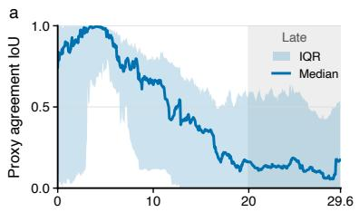  
d

b  
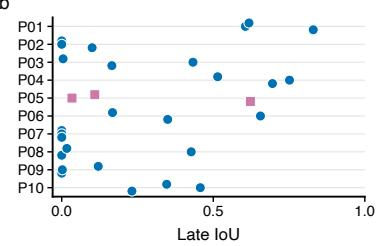

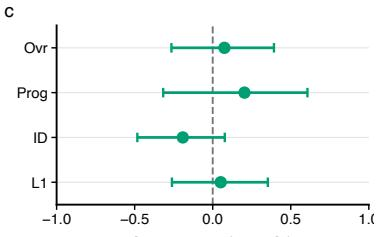

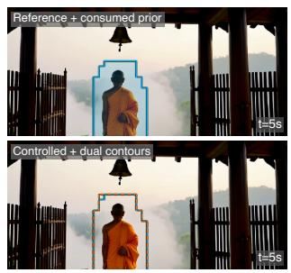

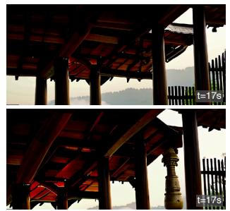  
Low Late-IoU case - P02 (Monk at temple gate); seed 547794298; Late IoU=0.000

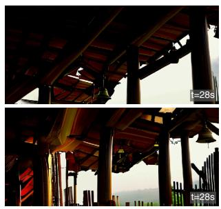

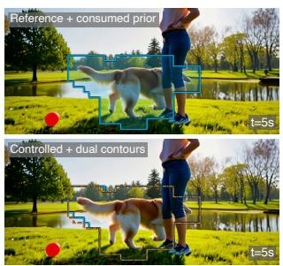

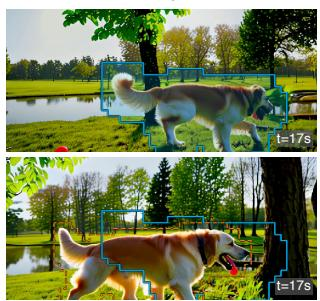

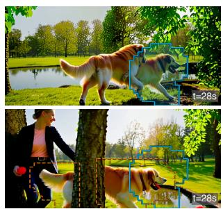  
Median Late-IoU case - P03 (Dog in park); seed 1841301323; Late IoU=0.165

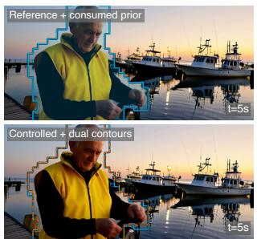

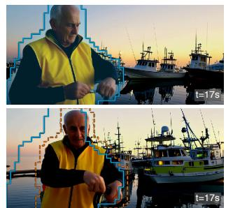  
High Late-IoU case - P01 (Fisherman harbor); seed 1841301323; Late IoU=0.830

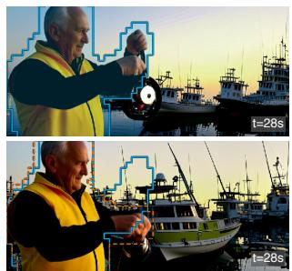  
Figure 9 Reference-prior drift across the 30 evaluation videos. (a) Median and IQR over time. (b) Late IoU by prompt and seed. (c) Correlations with human scores. (d) Low, median, and high Late-IoU examples at 5, 17, and 28 seconds; cyan is the reference prior and orange is the controlled-output re-extraction.

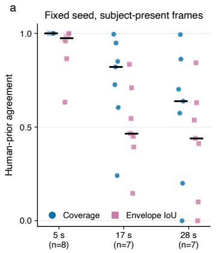

b  
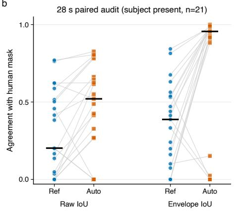

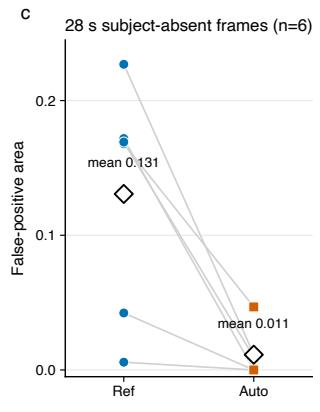

d Late examples with controlled-extractor coverage >= 0.70  
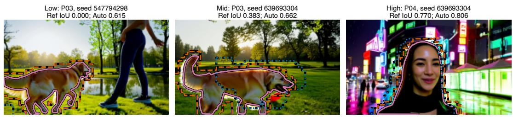  
Figure 10 Human mask comparison for the reference prior and controlled output. (a) Agreement at 5, 17, and 28 seconds. (b) Paired comparison on 21 subject-present frames at 28 seconds. (c) False-positive area on six target-absent frames. (d) Representative low, median, and high agreement cases. Contours: human mask (purple), reference prior (blue), and controlled re-extraction (orange).

<table><tr><td>28-s metric (subject present, n = 21)</td><td>Ref. prior</td><td>Ctrl.-auto</td></tr><tr><td>Subject coverage ↑</td><td>0.574</td><td>1.000</td></tr><tr><td>Prior precision ↑</td><td>0.238</td><td>0.550</td></tr><tr><td>Raw semantic IoU ↑</td><td>0.202</td><td>0.520</td></tr><tr><td>Route-envelope IoU ↑</td><td>0.387</td><td>0.956</td></tr><tr><td>Normalized centroid distance ↓</td><td>0.138</td><td>0.038</td></tr></table>

Table 10 Mask alignment at 28 seconds. Entries are medians over the 21 subject-present frames. “Ref. prior” is the consumed $M _ { \mathrm { u s e d } } ^ { \mathrm { r e f } } ;$ “Ctrl.-auto” is the controlled-output re-extraction.

## G.3 Reference-Prior Drift

Because the reference and controlled trajectories can diverge, their subject masks may become misaligned. We rerun YOLO–SAM 2 on all 30 controlled videos (14,220 frames) to obtain $M _ { \mathrm { a u t o } } ^ { \mathrm { c t r l } }$ and compare it with $M _ { \mathrm { u s e d } } ^ { \mathrm { r e f } }$ . We call their IoU proxy agreement.

Proxy agreement is 0.431 with prompt-cluster 95% CI [0.306, 0.564] over the full rollout and 0.275 [0.140, 0.433] after 20 seconds. Subject coverage falls from 0.583 overall to 0.424 in the late window, showing that the reference mask becomes less aligned as the trajectories diverge.

Human mask comparison. One independent annotator marked the visible subject in 45 controlledoutput frames from P01–P04 and P06–P10 at 5, 17, and 28 seconds. P05 is excluded because it has no designated subject. The annotator saw the RGB frame and prompt but not the method name or automatic masks. This comparison uses one annotator.

At 28 seconds, the target is present in 21 of 27 frames. Table 10 reports these 21 frames; falsepositive area is measured on the six target-absent frames. The controlled-output masks align more closely with the human masks than the reference prior.

The controlled-minus-reference diference is +0.161 with 95% interval [0.001, 0.273] for raw semantic IoU and +0.389 [0.058, 0.553] for route-envelope IoU. Mean false-positive area on target-absent frames is 0.131 for the reference prior and 0.011 for the controlled-output mask. At 5, 17, and 28 seconds, median reference-prior coverage is 1.000, 0.821, and 0.638, respectively. Prompt-cluster correlations between mask agreement and the four human scores all have intervals that include zero (Figure 9c).

The reference mask is well aligned early and less precise late in the rollout.

## G.4 Runtime Accounting

We profile seven videos at seed 639693304 on one NVIDIA H200. Timings are CUDA-synchronized after warm-up and exclude model loading, video encoding, and disk $\mathrm { I } / \mathrm { O }$

The controlled rollout is $2 . 8 1 \pm 0 . 2 7 \times$ the Full-Memory pass because the current implementation constructs per-frame biases and evaluates separate subject/background attention calls. The complete reference–segmentation– controlled pipeline is $4 . 1 5 \pm 0 . 3 0 \times$ a single Full-Memory rollout. Online mask updates would require additional decoding and segmentation and are not included in these measurements.

## G.5 Sensitivity to Subject-Prior Quality

We test mask-boundary sensitivity on seven prompts with one seed. All conditions share the checkpoint, initial noise, reference rollout, and routing hyperparameters. We compare (i) the original latent-grid mask, (ii) a coarse mask obtained by downsampling the $3 0 \times 5 2$ grid to 8 × 13 with nearest-neighbor interpolation and upsampling it back, producing approximately 64×64-pixel blocks, and (iii) the filled minimum enclosing box in every frame. The coarse and box masks have mean IoU ranges of 0.57–0.76 and 0.67–0.84 against the original mask, respectively.

<table><tr><td>Stage</td><td>Time (s)</td><td>Share</td><td>Peak memory</td></tr><tr><td>Reference rollout</td><td> $7 2 . 6 \pm 7 . 5$ </td><td>24.3%</td><td>30.5 GB</td></tr><tr><td>SAM 2 extraction</td><td> $2 4 . 9 \pm 1 . 0$ </td><td>8.3%</td><td>shared</td></tr><tr><td>Controlled rollout</td><td> $2 0 1 . 9 \pm 3 . 8$ </td><td>67.4%</td><td>30.5 GB</td></tr><tr><td>End-to-end</td><td> $\mathbf { 2 9 9 . 4 \pm 1 0 . 0 }$ </td><td>100%</td><td>30.5 GB</td></tr><tr><td>Full Memory, one pass</td><td> $7 2 . 6 \pm 7 . 5$ </td><td></td><td>30.5 GB</td></tr></table>

Table 11 Runtime of the ofline two-pass pipeline. Mean ± standard deviation over seven approximately 30-second videos.

The coarse prior is close to the original in nT (1.463 vs. 1.490) and tail-subject consistency (0.932 vs. 0.934). The box prior has higher nT but lower tail-subject consistency and a higher artifact-veto rate. Table 5 reports the complete comparison.

## H Mechanism-Focused Ablations

## H.1 Post-Attention Design Baseline

We compare Full Memory and post-attention Value Reweighting directly with TetherMem over seven prompts and two seeds. Three annotators judge each of the 28 pairs, giving 84 judgments. Ties are retained and “unsure” responses are excluded.

All three variants use the same generator and inference settings. Full Memory leaves retrievedmemory attention unchanged. Value Reweighting applies the subject weight of one and the area-calibrated background weight $\gamma _ { n }$ directly to historical Values after attention routing; it uses the current query mask tiled over historical keys, with no query split or age prior. TetherMem instead applies the complete normalized regional and recency-aware routing in Table 9.

Table 3(b) reports regularized Davidson EP and automatic metrics over the 14 prompt–seed cells. Value Reweighting approaches TetherMem in nT but has lower human EP and tail-subject consistency.

## H.2 Full-Memory-Centered Routing Ablation

The ablation compares three routing variants directly with Full Memory over seven prompts and two seeds (14 matched units; three judgments per pair). Ties are retained and “unsure” judgments are excluded. Routing $\mathrm { w } / \mathrm { o }$ Region keeps the age prior, Routing w/o Age keeps regional separation, and TetherMem combines both factors.

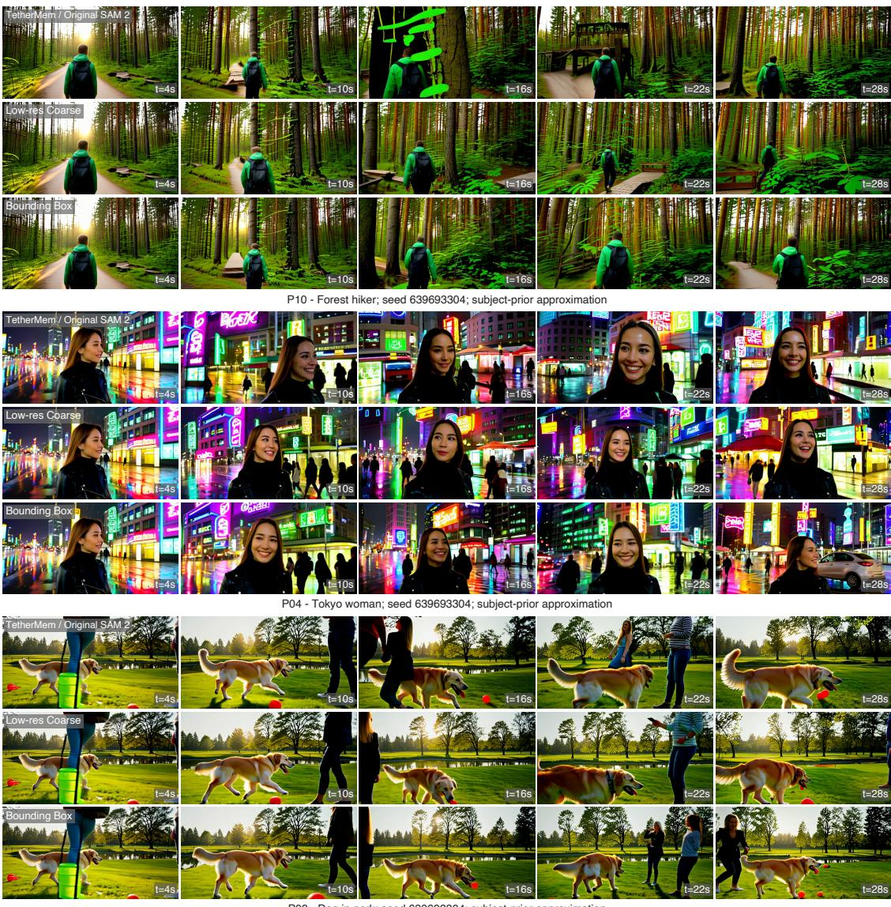  
P03 - Dog in park; seed 639693304; subject-prior approximation

Figure 11 Output sensitivity to subject-prior approximation. Prompt blocks: P10, P04, and P03. Rows: original, coarse, and bounding-box priors. Columns: frames at 4, 10, 16, 22, and 28 seconds. All videos share the same seed and settings.  
(a) Direct outcomes against Full Memory
<table><tr><td>Variant</td><td>Ovr.</td><td>Prog.</td><td>ID</td><td>L1</td></tr><tr><td>Routing w/o Region</td><td>14/16/12</td><td>15/17/10</td><td>12/18/11</td><td>14/17/11</td></tr><tr><td>Routing w/o Age</td><td>15/15/12</td><td>12/20/10</td><td>12/19/10</td><td>14/16/12</td></tr><tr><td>TetherMem</td><td>25/6/11</td><td>29/5/8</td><td>18/9/14</td><td>19/10/13</td></tr></table>

(b) Common-scale expected preference and nT
<table><tr><td>Variant</td><td>Ovr.</td><td>Prog.</td><td>ID</td><td>L1</td><td>nT↑</td></tr><tr><td>Full Memory</td><td>0.426</td><td>0.391</td><td>0.472</td><td>0.457</td><td>0.980</td></tr><tr><td>Routing w/o Region</td><td>0.461</td><td>0.472</td><td>0.489</td><td>0.505</td><td>1.232</td></tr><tr><td>Routing w/o Age</td><td>0.476</td><td>0.428</td><td>0.505</td><td>0.490</td><td>1.083</td></tr><tr><td>TetherMem</td><td>0.638</td><td>0.709</td><td>0.534</td><td>0.548</td><td>1.458</td></tr></table>

Table 12 Full-memory-centered routing ablation. (a) Direct win/tie/loss counts from each row variant’s perspective. (b) Regularized Davidson EP with nT averaged over two seeds.

TetherMem has the highest point estimate on all human dimensions and nT; its intervals against the strongest single-factor variant include zero (Table 3), so the factor ordering is directional.

## I Limitations and Released Artifacts

The evaluation uses ten prompts, three seeds, and one primary Wan2.1-T2V-1.3B/LongLive-RAG stack. The Deep Forcing transfer remains within the Wan2.1 family. TetherMem tracks at most one subject and requires an ofline reference rollout followed by SAM 2 mask extraction and controlled generation. The reference masks become less aligned late in the rollout, and the human mask comparison uses one annotator. Results beyond approximately 30 seconds are qualitative examples.

The Code and Data Supplement provides anonymized evaluation records, figure data, and 15 compressed video demonstrations. Figure 12 shows the human-evaluation interface.

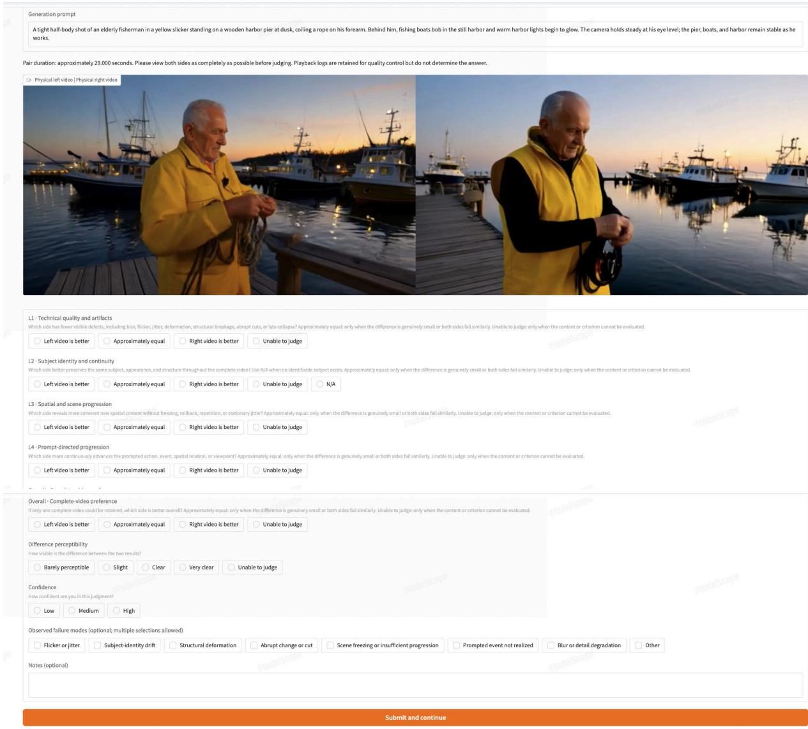  
Figure 12 Participant-facing blind-evaluation form. The anonymized view shows the prompt, video pair, L1–L4 and Overall questions, and optional diagnostics for one Table 1 task.