# Thinking on Shots: Consistent Multi-Shot Video Editing with Agentic Reasoning

Chenyang Wu1†, Fuchen Long2†, Binyuan Huang2, Xinlong Sun2‡, Xi Chen2,

Chun-Le Guo1, Chongyi Li1§

1VCIP, CS, Nankai University, 2 Smart Creation Platform Department, Online Video BU, Tencent chenyangwu@mail.nankai.edu.cn, {erwinlong, shayanhuang, xinlongsun, jasonxchen}@tencent.com, {guochunle, lichongyi}@nankai.edu.cn

## Abstract

While generative AI has significantly advanced video editing, existing methods primarily focus on single-shot or short video clips. Editing long videos with multiple instructions remains a formidable challenge. Naive chunking strategies, e.g., fixed duration segmentation, often lead to entity fragmentation, severe editing hallucinations, and disrupted temporal continuity. To bridge this gap, we introduce the Multi-Instruction Multi-Shot Long-Video Editing (MMLVE) task, which is structured around three core objectives: Cross-Shot Editing Consistency (CSEC), Multi-Instruction Decoupling (MID), and Zero-Destruction on Spatiotemporal Structure (ZDSS). To tackle these three unique challenges, we introduce an agentic editing framework that leverages the synergy of Large Language Models (LLMs) and Vision-Language Models (VLMs) to achieve shot-level video decoupling and precise instruction parsing. Furthermore, to comprehensively evaluate this task, we construct MMLVE-Bench, which is an MMLVE-focused dataset characterized by complex real-world spatiotemporal dynamics, high-density heterogeneous instructions, and sparse, random entity distributions. Three MMLVE-focused evaluation metrics are further exploited to assess the quality of the editing results. Extensive experiments demonstrate that our MMLVE-Agent outperforms existing closed-source SOTA approaches (e.g., Seedance 2.0), successfully eliminating editing hallucinations, preserving cross-shot editing consistency, and attaining seamless spatiotemporal transitions.

Project Page — https://wucy0519.github.io/MMLVE/

## Introduction

Generative Artificial Intelligence has catalyzed a paradigm shift in video editing, empowering users to manipulate visual content through intuitive natural language instructions (Jiang et al. 2025; Chen et al. 2025; Song et al. 2026; Wang and Huang 2026; Wu et al. 2026a). Recent advancements in diffusion models and video foundation models have demonstrated unprecedented capabilities in generating (Wan et al. 2025; Long et al. 2024) and editing high-fidelity videos (Wu et al. 2026b; Fan et al. 2024; Zhang et al. 2026; Long et al.

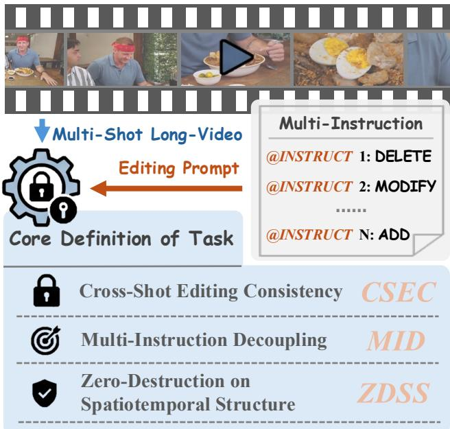  
Figure 1: Task Definition of MMLVE. The core task entails three key constraints: (1) CSEC : Cross-Shot Editing Consistency, preserving entity attributes across transitions; (2) MID : Multi-Instruction Decoupling, ensuring independent execution of diverse commands; and (3) ZDSS : Zero-Destruction on Spatiotemporal Structure, maintaining non-edited backgrounds and temporal continuity.

2026). However, these successes are predominantly confined to short, single-shot video clips (typically under 15 seconds) with simple, homogeneous instructions. In real-world applications, videos are inherently long, characterized by complex spatiotemporal dynamics, frequent shot transitions, and sparse entity distributions (Song et al. 2026). Editing such videos with multiple, heterogeneous instructions poses a formidable challenge that remains largely underexplored.

Existing long-video editing baselines (Seedance et al. 2026; Team et al. 2023) often resort to a naive fixed-duration chunking strategy (e.g., segmenting a 1-minute video into several 15-second clips) and applying all instructions to every chunk simultaneously. This “blind chunking” approach leads to severe degradation in editing quality. First, it causes editing hallucinations due to the sparsity of entity distribution. For instance, if a user instructs to “add a hat to the dog”, but the dog only appears in the final 10 seconds of the video, applying this instruction to the first 15-second chunk could force the model to hallucinate an unexpected dog. Second, it fails to maintain identity consistency across diferent shots, as each chunk is edited independently without a global visual anchor. Finally, the rigid temporal segmentation inevitably disrupts the natural spatiotemporal structure, possibly resulting in flickering and abrupt transitions at the chunk boundaries.

To systematically address these limitations, we formalize a novel and challenging task: Multi-Instruction Multi-Shot Long Video Editing (MMLVE). As illustrated in Fig. 1, MMLVE is governed by three core objectives: (1) Cross-Shot Editing Consistency (CSEC), ensuring the edited entity maintains a unified appearance across diverse shot transitions; (2) Multi-Instruction Decoupling (MID), guaranteeing that multiple editing commands are executed independently without mutual interference or hallucination; and (3) Zero-Destruction on Spatiotemporal Structure (ZDSS), strictly preserving the non-edited background, original camera movements, and temporal continuity.

To conquer the unique challenges of MMLVE, we propose an agentic editing framework, termed MMLVE-Agent, which shifts the paradigm from “blind chunking” to “Thinking on Shots”. The proposed framework leverages the synergy of Large Language Models (LLMs) and Vision-Language Models (VLMs). Initially, it performs physica shot detection and LLM-driven instruction parsing to decouple complex user commands. To prevent editing hallucinations caused by entity sparsity, we introduce a retrieval-based on-demand editing mechanism—editing operations are only triggered in shots where the target entity is explicitly detected by the VLM via a robust voting strategy. Crucially, to ensure Cross-Shot Editing Consistency (CSEC), we pioneer a Global Memory Card mechanism. By extracting keyframes and generating a reference-to-edited image pair before processing the video, we provide the underlying video editor with a global visual anchor, ensuring the entity’s appearance remains strictly aligned regardless of shot changes. Furthermore, to ensure Multi-Instruction Decoupling (MID) and Zero-Destruction on Spatiotemporal Structure (ZDSS), we incorporate a closed-loop Pos-Neg Editing Feedback (P-NEF) mechanism. Through VLM-driven QA agents at both the image and video levels, the framework self-reflects on its editing results, iteratively refining corrective prompts to reduce the number of editing attempts.

Recognizing the absence of suitable benchmarks for this task, we construct MMLVE-Bench, a meticulously curated dataset derived from long videos. It features complex camera movements, high-density heterogeneous instructions (e.g., ADD, DELETE, MODIFY), and random entity distributions. Alongside the dataset, we propose three quantitative metrics specifically designed to measure CSEC, MID, and ZDSS, providing a standardized testbed for future research.

In summary, our main contributions are threefold:

• We formalize the Multi-Instruction Multi-Shot Long-Video Editing (MMLVE) task and define three core objectives (CSEC, MID, ZDSS) to address the critical flaws of existing chunking-based editing methods.

• We propose MMLVE-Agent, a novel framework featuring the Global Memory Card and the P-NEF closedloop mechanism, enabling precise instruction decoupling, cross-shot consistency, and hallucination-free editing.

• We carefully construct MMLVE-Bench and introduce three MMLVE-focused evaluation metrics to assess the quality of the multi-shot video editing results. Extensive experiments demonstrate that our framework significantly outperforms existing state-of-the-art models.

## Related Work

Multi-Agent System. Recent advancements in LLMs and VLMs have spurred autonomous agents for complex reasoning and tool orchestration (Shen et al. 2023; Hong et al. 2024; Zhang et al. 2025b; Zeng et al. 2025). While VLMbased agents like UniVA (Liang et al. 2025) excel in video understanding, deploying them for complex, generative video editing remains largely unexplored. Our MMLVE-Agent pioneers a heterogeneous multi-agent architecture to decouple complex editing instructions. Unlike standard open-loop agents, we introduce a Pos-Neg Editing Feedback (P-NEF) mechanism, enabling autonomous self-correction and monotonic improvement in visual generation.

Long-Video Editing. Text-driven video editing has achieved remarkable progress via difusion models (Wu et al. 2023; Bar-Tal et al. 2022). However, these methods (Yu et al. 2026) are primarily optimized for short clips. To handle longer videos, recent works employ sliding windows (Li et al. 2025) or latent interpolation (Ge et al. 2022; Team et al. 2025). Yet, when faced with long videos containing sparse entity distributions and heterogeneous instructions, these “blind chunking” strategies inevitably sufer from severe editing hallucinations and temporal disruption (Song et al. 2026). Our work addresses this bottleneck by shifting the paradigm to “Thinking on Shots”, ensuring precise temporal localization and Zero-Destruction on Spatiotemporal Structure (ZDSS). Multi-Shot Video Editing. Real-world videos are inherently multi-shot, characterized by frequent camera cuts, varying background scales, and abrupt scene transitions (Wang et al. 2026; Zhang et al. 2025a). While single-shot video generation has been extensively studied, multi-shot scenarios introduce the daunting challenge of maintaining cross-shot consistency. Recent eforts in multi-shot generation, such as StoryDifusion (Zhou et al. 2024) and Soap2soap (Song et al. 2026), attempt to generate consistent characters across different scenes using reference images or autoregressive conditioning. However, these methods (Song et al. 2026; Huang et al. 2026) focus primarily on generation from scratch rather than editing existing complex videos. Editing multi-shot videos requires not only preserving the identity of the edited entity across transitions but also executing diverse instructions independently without mutual interference. To tackle this, we introduce the Global Memory Card mechanism, providing a unified visual anchor that guarantees Cross-Shot Editing Consistency (CSEC) and Multi-Instruction Decoupling (MID) across arbitrary physical shots.

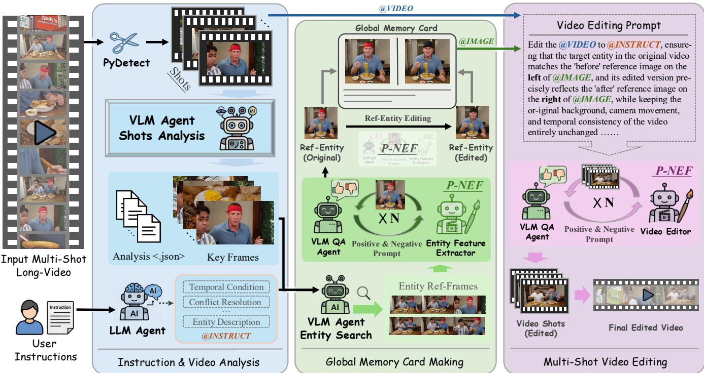  
Figure 2: An overview of our MMLVE-Agent framework. The pipeline comprises three core modules: (1) Instruction & Video Analysis, where the input long-video is segmented into physical shots via PyDetect. Then, an LLM Agent parses and decouples complex user instructions, while a VLM Agent extracts keyframes and conducts shot-by-shot plot analysis to capture scene dynamics; (2) Global Memory Card Making, where target entities are retrieved via VLM voting, and the Global Memory Card, a global visual editing anchor, is generated. This card is iteratively refined through an image-level Pos-Neg Editing Feedback (P-NEF) to ensure Cross-Shot Editing Consistency (CSEC); and (3) Multi-Shot Video Editing, which executes retrieval-based on-demand editing. A video-level P-NEF loop self-corrects the generated shots to precisely ensure Multi-Instruction Decoupling (MID) and Zero-Destruction on Spatiotemporal Structure (ZDSS) in each segmented shot before the final video combination.

## Methodology

In this section, we present the proposed MMLVE-Agent framework in detail. Firstly, we formally define the Multi-Instruction Multi-Shot Long Video Editing (MMLVE) task and its core objectives. Subsequently, we elaborate on the overall architecture of our agentic framework, MMLVE-Agent, which is designed to address the inherent challenges of MMLVE. Finally, we introduce the construction of the MMLVE-Bench, a benchmark for MMLVE evaluation.

## Task Definition of MMLVE

Given an input multi-shot long-video V and a complex user prompt containing a wide variety of editing instructions, $\dot { \mathcal { T } } = \dot { \{ { I _ { 0 } , \dots } , { I _ { N } } \} }$ , the goal of the MMLVE task is to generate an edited video $\mathcal { V } ^ { \dagger }$ that accurately reflects all instructions while maintaining the original video’s structure, particularly those parts that do not require modification. Unlike short video clips, a long-video V inherently consists of multiple non-overlapping physical shots $\mathcal { S } = \mathrm { ~ \bar { \{ } ~ }  S _ { 0 } , \dotsc , S _ { N } \}$ due to camera cuts and scene transitions. Furthermore, the target entities $\{ E _ { 0 } , \dots , E _ { N } \}$ associated with the instructions I often exhibit sparse and random temporal distributions (i.e., an entity $E _ { k }$ may only appear in a specific subset of shots). To successfully edit such complex videos, the generated $\mathcal { V } ^ { \dagger }$ must strictly adhere to three core constraints:

Cross-Shot Editing Consistency (CSEC): When a target entity $E _ { k }$ is edited according to instruction $I _ { k } .$ , its modified appearance $E _ { k } ^ { \dagger }$ must remain visually unified across all shots where it appears.

Multi-Instruction Decoupling (MID): The execution of the instruction set I must be mutually independent. This requires the model to precisely map each instruction $I _ { k }$ to its corresponding entity $E _ { k }$ and, crucially, to its correct temporal window. If $E _ { k }$ is absent in a specific shot $S _ { m } ,$ , the model must not hallucinate the entity or apply $I _ { k }$ to $S _ { m } ,$ thereby eliminating instruction interference and editing hallucinations.

Zero-Destruction on Spatiotemporal Structure (ZDSS): The editing operations must be strictly localized to the target entities. The unedited regions (e.g., backgrounds, non-target objects) and the underlying temporal dynamics (e.g., camera movements, natural motion flow) must remain identical between the original video V and the edited video V†.

By defining these three constraints, we also establish a standard for evaluating the true capabilities of video editing models in multi-shot long-form scenarios.

## Overall Architecture of MMLVE-Agent

As shown in Fig. 2, the MMLVE-Agent framework processes the input long-video and complex instructions through three collaborative modules: Instruction & Video Analysis, Global

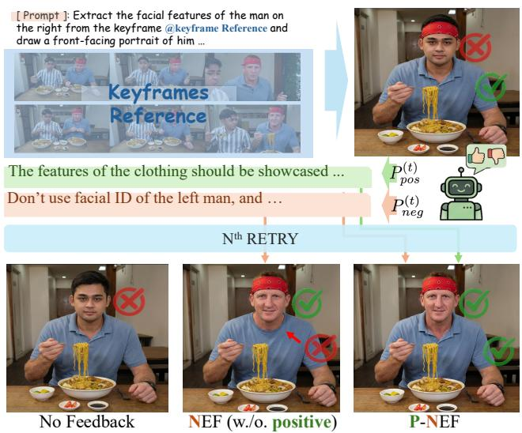  
Figure 3: Pos-Neg Editing Feedback (P-NEF) mechanism. When faced with complex instructions (grid-shape reference image or multiple instructions), the initial generation often sufers from attribute interference (e.g., incorrectly extracting the left man’s facial ID). To address this, the VLM evaluator generates dual feedback: a Negative Prompt $( P _ { n e g } )$ to correct errors and a Positive Prompt $\bar { ( P _ { p o s } ) }$ to act as a balancer for the model’s attention. Crucially, as shown in the bottom row, solely relying on the Negative Prompt (NEF $\mathrm { { w } } \mathrm { \mathit { / o } } .$ positive) causes the model to focus more on “avoid items” in the prompt, resulting in changes to parts that do not require editing (e.g., the T-shirt’s feature of the man).

## Memory Card Making, and Multi-Shot Video Editing.

Instruction & Video Analysis. The first stage aims to decouple the complex spatiotemporal dynamics of the input video and the heterogeneous user instructions. Given a long-video V, we employ PyDetect to perform physical shot boundary detection, segmenting the video into a sequence of independent shots $\bar { \cal S } \bar { = } \{ { S _ { 0 } , \ldots , S _ { N } } \}$ . Concurrently, an LLM Agent is deployed to parse the raw user prompt. It resolves potential instruction conflicts, extracts temporal conditions, and decouples the prompt into a set of distinct entity descriptions and their corresponding editing instructions I. Subsequently, a VLM Agent analyzes each segmented shot, extracting representative keyframes and conducting shot-by-shot plot analysis to capture the underlying scene dynamics. This dual-path analysis lays the foundation for precise temporal localization. Global Memory Card Making. To achieve Cross-Shot Editing Consistency (CSEC), we propose the Global Memory Card mechanism, which serves as a global visual editing anchor for the underlying video editor. As shown in Fig. 2, first, based on the extracted entity descriptions, the VLM Agent queries the keyframes of all shots to retrieve frames containing the target entity. The top-k (k=6) keyframes with the highest confidence scores are aggregated into a reference grid. Conditioned on this grid and the entity description, the generation model G synthesizes an initial reference image of the original entity.

As shown in Fig. 3, to ensure absolute fidelity, we introduce an image-level Pos-Neg Editing Feedback (P-NEF). A VLM

QA Agent acts as an evaluator $\mathcal { E } _ { i m g }$ to verify whether the generated reference matches the keyframes. $\mathbf { A } \mathbf { t } ~ t ^ { t h }$ attempt, the evaluator outputs a binary verification score $v ^ { ( t ) } \in \{ 0 , 1 \}$ and a feedback tuple:

$$
\begin{array} { r } { v ^ { ( t ) } , \left( P _ { p o s } ^ { ( t ) } , P _ { n e g } ^ { ( t ) } \right) = \mathcal { E } _ { i m g } ( I m g ^ { ( t ) } , D ^ { ( t ) } ) , } \end{array}\tag{1}
$$

where $D ^ { ( t ) }$ means editing prompt of the t steps, and $P _ { p o s } ^ { ( t ) }$ is the “Positive Prompt” (features to retain) and $P _ { n e g } ^ { ( t ) }$ is the “Negative Prompt” (artifacts to avoid). The rationale for this dual-prompt strategy stems from the inherent challenges of iterative prompt refinement. Solely relying on a “Negative Prompt” forces the model to process an accumulating list of “avoidance” constraints, which inevitably causes attention drift. Specifically, the model’s attention balance shifts disproportionately towards the “avoid items”, resulting in insuficient attention being paid to the regions that were already correctly edited (Chefer et al. 2023; Hertz et al. 2022). Consequently, previously accurate structures or features are inadvertently altered or lost during the re-generation process. To counteract this, the “Positive Prompt” acts as a crucial semantic anchor. By explicitly reinforcing the successfully generated attributes, it balances the model’s attention and ensures monotonic improvement across prompt refinement iterations. $\boldsymbol { \mathrm { I f } } \boldsymbol { v } ^ { ( t ) } = 0$ , the generation prompt is updated via concatenation (⊕):

$$
D ^ { ( t + 1 ) } = D ^ { ( t ) } \oplus P _ { p o s } ^ { ( t ) } \oplus P _ { n e g } ^ { ( t ) } ,\tag{2}
$$

a new image $I m g ^ { ( t + 1 ) } = \mathcal { G } ( D ^ { ( t + 1 ) } , K )$ is generated. This self-correction loop repeats until $\boldsymbol { v } ^ { ( t ) } = 1$ or reaches the maximum attempts $T _ { m a x } = 3$ . If all attempts fail, the VLM selects the best candidate Img∗ = arg maxt Score $( I m g ^ { ( t ) } )$ . Finally, the VLM extracts detailed visual features from this validated reference image to enrich the original text description. Using P-NEF as well, the reference image is edited according to the user instruction, yielding the Global Memory Card, which is a side-by-side visual prompt demonstrating the exact “before-and-after” states of the entity.

Multi-Shot Video Editing. The final stage executes the actual video manipulation while strictly enforcing Multi-Instruction Decoupling (MID) and Zero-Destruction on Spatiotemporal Structure (ZDSS). To eliminate editing hallucinations caused by sparse entity distributions, we implement a retrieval-based on-demand editing strategy. For each shot $S _ { i } ,$ , the VLM conducts a 3-time voting mechanism using the enriched entity description and the Global Memory Card. The editing operation is triggered if and only if the entity receives at least 2 positive votes; otherwise, the shot is skipped and preserved in its original state. For shots where the entity is present, the original shot, the enriched description, the instruction, and the Comparison Card are fed into the Video Editor (e.g., HappyHorse). To further ensure ZDSS, we employ a video-level P-NEF feedback loop. The VLM QA Agent extracts keyframes (determined in accordance with the Instruction&Video Analysis part) from the edited shot to verify two criteria: (1) successful execution of the editing task, and (2) strict preservation of non-edited regions (backgrounds and original motion). Similar to the imagelevel P-NEF, corrective prompts are generated to re-edit the shot. Ultimately, the successfully edited shots and the untouched skipped shots are seamlessly concatenated to form the final edited long-video V†.

  
dium-length, slightly wavy brown hair, wearing thin-framed glasses, < Instruction >: "For this video clip: for the elderly male artisan with medium-length, slightly wavy brown hair, wearing thin-framed glasses, o, change his blue shirt to a red shirt; for the skeleton model holding a bl-ue shirt, and a dark vest, who appears around the 37th second of the video, change his blue shirt to a red shirt; for the skeleton model holding onto the skeleton model's head; and for the soldier wearing soldier a small sword and a round shield with a skull emblem, add a mini pirate hat onto the skeleton model's head; and for the soldier wearing soldier armor and a helmet with a red plume who appears at the 57th second, completely remove him from the video."  
Figure 4: An example in MMLVE-Bench. The figure illustrates a typical complex user prompt associated with a multishot long-video in MMLVE-Bench. To highlight the heterogeneous nature of the editing commands, diferent instruction types are color-coded: text in grey denotes a MODIFY instruction, text in blue indicates ADD, and text in green represents DELETE.

## MMLVE-Bench

To comprehensively evaluate the proposed task, we construct MMLVE-Bench, a manually curated dataset derived from the open-source UniVA-Bench (Liang et al. 2025). Specifically, we select 25 high-quality multi-shot long-video clips, each lasting approximately one minute, with salient editable entities. The annotation process follows a rigorous semiautomatic pipeline: initially, a VLM is employed to detect salient entities across the video and generate candidate editing prompts, yielding about 5 distinct editing instructions per video. Subsequently, human annotators conduct manual verification to correct erroneous instructions and refine the textual descriptions, ensuring the high quality and logical consistency of the final prompts.

As shown in Fig. 4, MMLVE-Bench is characterized by several unique features that distinguish it from existing shortvideo editing datasets. First, it features “Complex Spatiotemporal Dynamics in Various Scenes”. The videos contain rich background details and complex camera movements, providing a rigorous benchmark for evaluating the ZDSS constraint. Second, it presents “High-Density and High-Random Instructions”. The dataset encompasses a diverse range of operation types, which may target diferent entities within the same scene or the same entity across diferent scenes. Notably, these densely packed instructions target specific entities that appear sparsely at diferent timestamps (e.g., the 37th and 57th seconds), underscoring the extreme challenge of multi-instruction decoupling and temporal localization in the MMLVE task.

## Experiments

## Implementation Details

The proposed MMLVE-Agent framework is implemented as a heterogeneous multi-agent system, orchestrating specialized models to handle distinct modalities and tasks. To drive the cognitive and analytical capabilities of our framework, we employ Gemini 3.5 Flash (Team et al. 2023) as the core Vision-Language Model (VLM). It serves as the unified backbone for the LLM Agent, the VLM Agent, and the VLM QA Evaluator, eficiently handling complex tasks ranging from instruction decoupling and keyframe retrieval to driving the Pos-Neg Editing Feedback (P-NEF) loop. For the visual generation tasks, specifically within the Global Memory Card Making module, we utilize the Nano Banana 2 (Team et al. 2023) image generation model to synthesize and iteratively refine the high-fidelity reference images. Finally, the actual spatiotemporal video manipulation in the Multi-Shot Video Editing stage is powered by the HappyHorse video editing model, which executes the localized edits conditioned on the Global Memory Card and the decoupled prompts.

In our experiments, the physical shot boundary detection is performed using the standard PyDetect library. For the P-NEF mechanism, the maximum number of self-correction iterations is empirically set to $T _ { m a x } = 3$ . All experiments are conducted on a MacBook Pro (M5 chip).

## Baselines

Since MMLVE is a novel and highly challenging task, there is no existing framework explicitly designed to handle multiinstruction long-video editing. To establish a comprehensive comparison, we select three closed-source SOTA video editing and generation foundation models as our baselines. Because these baseline models are inherently constrained by context length and are primarily optimized for short clips, we adapt them for the MMLVE task using the standard “naive fixed-duration chunking” strategy. Specifically, the input long-video is uniformly segmented into short clips, and the full, complex user prompt (containing all instructions) is applied to every chunk. The evaluated baselines include:

Seedance 2.0 (Seedance et al. 2026): A recently introduced, highly advanced video editing model known for its highfidelity visual manipulation and structural preservation capabilities in short-video scenarios.

Kling o3: A cutting-edge video foundation model renowned for its robust spatiotemporal generation and dynamic consistency. We utilize its V2V editing capabilities for comparison. HappyHorse 1.0: This is the foundational video editing model utilized within our own MMLVE-Agent framework. Evaluating it as a standalone baseline is crucial, as it directly demonstrates the performance gains and the necessity of our proposed agentic workflow (i.e., instruction decoupling, Global Memory Card, and P-NEF mechanism) over direct, naive inference.

## Qualitative Evaluation

Fig. 5 presents a visual comparison between our MMLVE-Agent and the baseline models on complex multi-shot longvideos. The qualitative results clearly demonstrate the critical flaws of existing naive chunking strategies and highlight the advantage of MMLVE-Agent across three key dimensions:

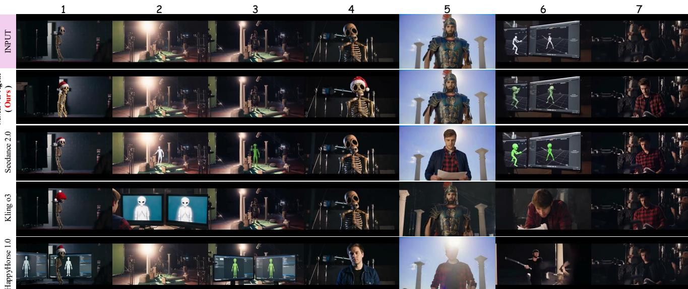

< Instruction >: For this video clip: Add a red Christmas hat to the top of the skull of the skeleton model doll that appears at the 1-second mark, which is overall earthy-yellow in color with large hollow eye sockets and a distinct ribcage structure, and is seen walking against a dimly lit background; change the white 3D human motion-capture models displayed on the screens of the two black computer monitors appearing at the 28-second mark to green alien models; and modify the dark blue jacket worn by the young brown-haired man sitting at the desk reading a script at the 38-second mark, who is wearing a black T-shirt and a dark blue jacket, to a red-and-black plaid shirt.  
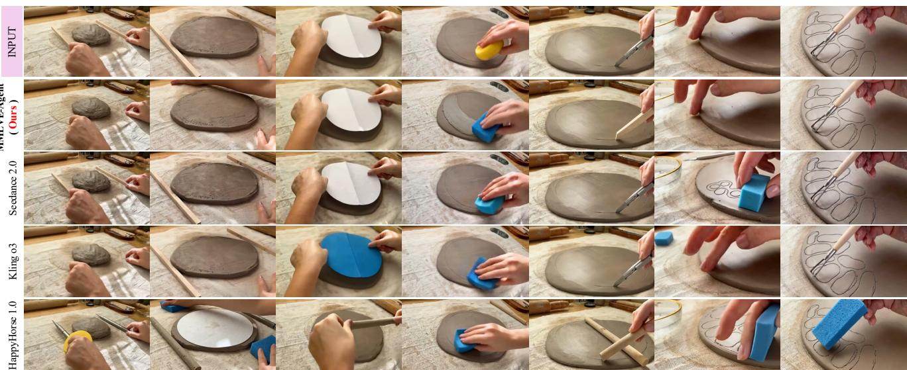  
< Instruction >: For this video clip: completely remove the two light-colored, slender wooden strips that appear at the 1-second mark on one side of the clay slab to assist with shaping, and restore the background; modify the metal retractable utility knife that appears at the 26-second mark into a long wooden strip; and change the yellow round sponge held in the person's hand at around the 23-second mark into a square blue sponge.  
Figure 5: Compared with the baseline methods, only MMLVE-Agent (ours) achieves Cross-Shot Editing Consistency (CSEC), Multi-Instruction Decoupling (MID), and Zero-Destruction on Spatiotemporal Structure (ZDSS).

CSEC Analysis: Even when baseline models attempt to execute an editing instruction, they sufer from “amnesia” across diferent shots, failing to maintain the entity’s visual identity. In the first example of Fig. 5, the instruction requires adding a “red Christmas hat” to the skeleton. However, both Seedance 2.0 and Kling o3 fail to maintain this attribute, forgetting to generate the hat in subsequent shots (4th frame).

Worse still, HappyHorse 1.0 completely morphs the skeleton and the armored knight into entirely diferent target entities from the prompt (4th and 5th frames). Notably, benefiting from the Global Memory Card mechanism, MMLVE-Agent establishes a robust global visual anchor, ensuring that the edited entities maintain strict CSEC without identity degradation or flickering.

MID Analysis: Applying a complex, multi-entity prompt to all video chunks simultaneously inevitably leads to severe instruction interference. In the first example, the instruction to change the monitor models to “green aliens” leaks into unedited shots: Seedance 2.0 erroneously morphs an unrelated person into a green alien (3rd frame). Similarly, in the second example, the instruction to create a “blue sponge” causes severe attribute bleeding in Kling o3, which incorrectly dyes the white paper blue (3rd frame). HappyHorse 1.0 exhibits extreme hallucinations, randomly inserting unrequested yellow and blue sponges across multiple frames (1st and 7th frames).

ZDSS Analysis: A glaring issue with direct inference models is the severe disruption of the original video’s background and temporal structure. Spatially, Kling o3 and HappyHorse 1.0 forcefully hallucinate two computer monitors into completely unrelated scenes (1st - 3rd frames in the first example), destroying the original background. Temporally, the blind chunking strategy causes catastrophic frame misalignment. In the first example (6th frame), both Kling o3 and Happy-Horse 1.0 arbitrarily delete the subsequent narrative shots and replace them with earlier shots, completely scrambling the chronological order. Our framework, by strictly operating on parsed physical shots and preserving unedited frames, successfully satisfies the ZDSS constraint.

Even though SOTA baselines sufer from instruction confusion, temporal scrambling, and identity loss, MMLVE-Agent still consistently delivers high-fidelity, hallucinationfree, and spatiotemporally coherent long-video edits.

<table><tr><td>Method</td><td>CSEC ↑</td><td>MID↑</td><td>ZDSS ↑</td><td>Avg. ↑</td></tr><tr><td rowspan="3">Seedance 2.0 † Kling o3 † HappyHorse 1.0</td><td>77.58</td><td>78.58</td><td>82.25</td><td>79.47</td></tr><tr><td>70.00</td><td>72.57</td><td>69.13</td><td>70.57</td></tr><tr><td>74.68</td><td>67.28</td><td>66.88</td><td>69.61</td></tr><tr><td>MMLVE-Agent (ours)</td><td>84.80</td><td>79.04</td><td>81.68</td><td>81.84</td></tr></table>

Table 1: Quantitative evaluation results on MMLVE-Bench. BOLD: best performance. † means there are 1-2 scenarios in which this method rejects processing due to its safety mechanism (are ignored in the mean calculation of the metrics).

## Quantitative Evaluation

To comprehensively quantify the performance of the MM-LVE task, we evaluate the generated videos across our three proposed core indicators: Cross-Shot Editing Consistency (CSEC), Multi-Instruction Decoupling (MID), and Zero-Destruction on Spatiotemporal Structure (ZDSS). To ensure a fine-grained and rigorous assessment, each main indicator is further decomposed into five specific sub-dimensions (e.g., identity preservation, hallucination suppression, chronological shot alignment). Each sub-dimension is strictly scored on a scale of 0 to 20, yielding a maximum possible score of 100 points per indicator. We avoid adopting traditional framelevel metrics like the CLIP (Radford et al. 2021) score, as they inherently lack the reasoning capacity to comprehend complex multi-instruction decoupling and long-term spatiotemporal consistency. Instead, we adopt VLM (i.e., Gemini 3.5 Flash) as the video editing judger. Due to space constraints, the detailed definitions of the 15 sub-dimensions, < Instruction >: for the girl with dark blue skin, an oval-shaped face, and wearing a black camisole swimsuit with white straps who appears at the beginning of the video, change her swimsuit color to light red.

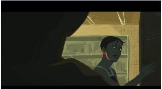  
Original Video

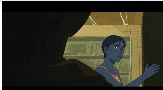  
Edited Video (Attempt 1)  
[Positive] : The foreground of the video should be preserved, and ……

[Negative] : Avoid modifying the lighting on the entity, and ……  
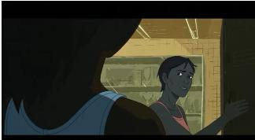  
Edited Video (Attempt N) w./ NEF

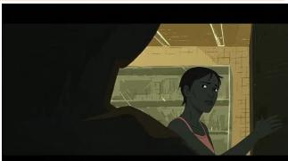  
Edited Video (Attempt N) w./ P-NEF  
Figure 6: Visual Comparison between P-NEF and NEF.

the comprehensive evaluation protocols, and scores (including sub-dimensions) for each method in each scene of the MMLVE-Bench are provided in supplementary materials.

As shown in Tab. 1, our MMLVE-Agent achieves the highest average score (81.84), demonstrating its superior capability in handling complex long-video editing tasks. Specifically, our framework significantly outperforms all baselines in CSEC (84.80) and MID (79.04). Notably, while Kling o3 and HappyHorse 1.0 sufer from severe spatiotemporal destruction (low ZDSS) due to aggressive but erroneous editing, Seedance 2.0 adopts a conservative strategy, which ignores instructions in complex scenes to avoid errors. Although this conservative approach artificially inflates its ZDSS score (82.25), it leads to severe missed edits (lower CSEC and MID). In contrast, MMLVE-Agent robustly executes all edits, making the negligible ZDSS drop a highly acceptable trade-of for its comprehensive superiority.

## Ablation Study on P-NEF

As shown in Fig. 6, we visually ablate the impact of the proposed Pos-Neg Editing Feedback (P-NEF) mechanism. Solely relying on Negative Editing Feedback (NEF) forces the model to process an increasing number of “avoidance” constraints across attempts. This accumulation inevitably diverts the model’s cross-attention, leading to a severe “catastrophic forgetting” efect—previously correct edits are inadvertently altered or lost. Consequently, this introduces new structural errors and significantly increases the required number of trial-and-error iterations. Conversely, the full P-NEF mechanism introduces a Positive Prompt that acts as a crucial semantic anchor. By explicitly reinforcing the successfully generated features, P-NEF efectively balances the model’s attention, ensures monotonic improvement, and reduces the overall attempts needed to achieve a robust edit.

## Conclusions

In this paper, we tackle the underexplored challenge of editing real-world, multi-shot long-video driven by complex instructions. We formalize the Multi-Instruction Multi-Shot Long-Video Editing (MMLVE) task, governed by three core constraints: CSEC, MID, and ZDSS. Furthermore, we propose MMLVE-Agent and construct MMLVE-Bench, alongside tailored MMLVE-focused evaluation metrics.

## References

Bar-Tal, O.; Ofri-Amar, D.; Fridman, R.; Kasten, Y.; and Dekel, T. 2022. Text2live: Text-driven layered image and video editing. In European conference on computer vision, 707–723. Springer.

Chefer, H.; Alaluf, Y.; Vinker, Y.; Wolf, L.; and Cohen-Or, D. 2023. Attend-and-excite: Attention-based semantic guidance for text-to-image difusion models. ACM transactions on Graphics (TOG), 42(4): 1–10.

Chen, Z.; Long, F.; Qiu, Z.; Yao, T.; Zhou, W.; Luo, J.; and Mei, T. 2025. Aligning Global Semantics and Local Textures in Generative Video Enhancement. In ICCV.

Fan, Y.; Ma, X.; Wu, R.; Du, Y.; Li, J.; Gao, Z.; and Li, Q. 2024. Videoagent: A memory-augmented multimodal agent for video understanding. In European Conference on Computer Vision, 75–92. Springer.

Ge, S.; Hayes, T.; Yang, H.; Yin, X.; Pang, G.; Jacobs, D.; Huang, J.-B.; and Parikh, D. 2022. Long video generation with time-agnostic vqgan and time-sensitive transformer. In European Conference on Computer Vision, 102– 118. Springer.

Hertz, A.; Mokady, R.; Tenenbaum, J.; Aberman, K.; Pritch, Y.; and Cohen-Or, D. 2022. Prompt-to-prompt image editing with cross attention control. arXiv preprint arXiv:2208.01626.

Hong, S.; Zhuge, M.; Chen, J.; Zheng, X.; Cheng, Y.; Wang, J.; Zhang, C.; Yau, S.; Lin, Z.; Zhou, L.; et al. 2024. MetaGPT: Meta programming for a multi-agent collaborative framework. In International Conference on Learning Representations, volume 2024, 23247–23275.

Huang, L.; He, S.; Zhou, H.; Nie, L.; Xia, L.; and Huang, C. 2026. ViMax: Agentic Video Generation. arXiv preprint arXiv:2606.07649.

Jiang, Z.; Han, Z.; Mao, C.; Zhang, J.; Pan, Y.; and Liu, Y. 2025. Vace: All-in-one video creation and editing. In Proceedings of the IEEE/CVF International Conference on Computer Vision, 17191–17202.

Li, W.; Pan, W.; Luan, P.-C.; Gao, Y.; and Alahi, A. 2025. Stable video infinity: Infinite-length video generation with error recycling. arXiv preprint arXiv:2510.09212.

Liang, Z.; Zhang, D.; Zhou, H.; Huang, R.; Li, B.; Zhang, Y.; Wu, S.; Wang, X.; Luo, J.; Liao, L.; et al. 2025. UniVA: Universal Video Agent towards Open-Source Next-Generation Video Generalist. arXiv preprint arXiv:2511.08521.

Long, F.; Qiu, Z.; Yao, T.; and Mei, T. 2024. VideoStudio: Generating Consistent-Content and Multi-Scene Videos. In ECCV.

Long, F.; Wang, C.; Gao, Z.; Zhong, W.; Cheng, Y.; Hou, X.; Li, Y.; Cao, X.; Sun, X.; Chen, X.; and Liu, Y. 2026. CoinVE-200K: A Large-Scale High-Quality Dataset for Composi-

tional Instruction-Guided Video Editing. arXiv preprint arXiv:2608.17566.

Radford, A.; Kim, J. W.; Hallacy, C.; Ramesh, A.; Goh, G.; Agarwal, S.; Sastry, G.; Askell, A.; Mishkin, P.; Clark, J.; et al. 2021. Learning transferable visual models from natural language supervision. In International conference on machine learning, 8748–8763. PmLR.

Seedance, T.; Chen, D.; Chen, L.; Chen, X.; Chen, Y.; Chen, Z.; Chen, Z.; Cheng, F.; Cheng, T.; Cheng, Y.; et al. 2026. Seedance 2.0: Advancing video generation for world complexity. arXiv preprint arXiv:2604.14148.

Shen, Y.; Song, K.; Tan, X.; Li, D.; Lu, W.; and Zhuang, Y. 2023. Hugginggpt: Solving ai tasks with chatgpt and its friends in hugging face. Advances in Neural Information Processing Systems, 36: 38154–38180.

Song, Y.; Zhong, H.; Lin, K. Q.; Wang, H.; and Shou, M. Z. 2026. Soap2Soap: Long Cinematic Video Remaking via Multi-Agent Collaboration. arXiv preprint arXiv:2605.17423.

Team, G.; Anil, R.; Borgeaud, S.; Alayrac, J.-B.; Yu, J.; Soricut, R.; Schalkwyk, J.; Dai, A. M.; Hauth, A.; Millican, K.; et al. 2023. Gemini: a family of highly capable multimodal models. arXiv preprint arXiv:2312.11805.

Team, M. L.; Cai, X.; Huang, Q.; Kang, Z.; Li, H.; Liang, S.; Ma, L.; Ren, S.; Wei, X.; Xie, R.; et al. 2025. Longcat-video technical report. arXiv preprint arXiv:2510.22200.

Wan, T.; Wang, A.; Ai, B.; Wen, B.; Mao, C.; Xie, C.-W.; Chen, D.; Yu, F.; Zhao, H.; Yang, J.; et al. 2025. Wan: Open and advanced large-scale video generative models. arXiv preprint arXiv:2503.20314.

Wang, H.; and Huang, L. 2026. Learning Geometric Representations from Videos for Spatial Intelligent Multimodal Large Language Models. CoRR, abs/2606.05833.

Wang, J.; Sheng, H.; Cai, S.; Zhang, W.; Yan, C.; Feng, Y.; Deng, B.; and Ye, J. 2026. EchoShot: Multi-Shot Portrait Video Generation. Advances in Neural Information Processing Systems, 38: 22058–22090.

Wu, C.; Fu, J.; Guo, C.; Han, S.; and Li, C. 2026a. VTinker: Guided Flow Upsampling and Texture Mapping for High-Resolution Video Frame Interpolation. In Koenig, S.; Jenkins, C.; and Taylor, M. E., eds., Fortieth AAAI Conference on Artificial Intelligence, Thirty-Eighth Conference on Innovative Applications ofArtificial Intelligence, Sixteenth Symposium on Educational Advances in Artificial Intelligence, AAAI 2026, Singapore, January 20-27, 2026, 10638–10645. AAAI Press.

Wu, C.; Lei, L.; Li, F.; Guo, C.; Kong, D.; Qin, X.; Wang, Z.; Cheng, M.; and Li, C. 2026b. YOSE: You Only Select Essential Tokens for Eficient DiT-based Video Object Removal. In Proceedings of the IEEE/CVF Conference on Computer Vision and Pattern Recognition, 32926–32935.

Wu, J. Z.; Ge, Y.; Wang, X.; Lei, S. W.; Gu, Y.; Shi, Y.; Hsu, W.; Shan, Y.; Qie, X.; and Shou, M. Z. 2023. Tune-a-video: One-shot tuning of image difusion models for text-to-video generation. In Proceedings of the IEEE/CVF international conference on computer vision, 7623–7633.

Yu, Y.; Zeng, Z.; Xiao, Z.; Zhou, Z.; Hua, H.; Xiong, W.; and Luo, J. 2026. Aurora: Unified Video Editing with a Tool-Using Agent. arXiv preprint arXiv:2605.18748.

Zeng, Q.; Cai, K.; Chen, R.; Lv, Q.; and Wang, K. 2025. CoAgent: Collaborative Planning and Consistency Agent for Coherent Video Generation. CoRR, abs/2512.22536.

Zhang, K.; Jiang, L.; Wang, A.; Fang, J. Z.; Zhi, T.; Yan, Q.; Kang, H.; Lu, X.; and Pan, X. 2025a. StoryMem: Multi-shot Long Video Storytelling with Memory. CoRR, abs/2512.19539.

Zhang, L.; Xu, B.; Yang, S.; Yin, M.; Liu, J.; Xu, C.; Wang, S.; Wu, Y.; Hong, Y.; Zhang, Z.; Liang, Y.; and Jiang, Y. 2025b. AniME: Adaptive Multi-Agent Planning for Long Animation Generation. In Komura, T.; and Noh, J., eds., Proceedings of the SIGGRAPH Asia 2025 Posters, SA Posters 2025, Hong Kong, SAR, China, December 15-18, 2025, 3:1–3:3. ACM.

Zhang, Z.; Long, F.; Li, W.; Qiu, Z.; Liu, W.; Yao, T.; and Mei, T. 2026. Region-Constraint In-Context Generation for Instructional Video Editing. In International Conference on Machine Learning.

Zhou, Y.; Zhou, D.; Cheng, M.-M.; Feng, J.; and Hou, Q. 2024. Storydifusion: Consistent self-attention for longrange image and video generation. Advances in Neural Information Processing Systems, 37: 110315–110340.

## User Study

As shown in Fig. 7, to complement our automated VLMbased evaluation and assess the perceptual quality of the generated videos from a human perspective, we conducted a rigorous User Study. Given the inherent complexity of the MMLVE task—characterized by minute-long videos and dense, heterogeneous instructions—evaluating these results imposes a significant cognitive load. Therefore, we designed a specialized evaluation protocol driven by expert reviewers. Custom-Built Evaluation Platform. As shown in Fig. 7, we developed a dedicated web-based evaluation interface to ensure a fair and meticulous comparison. The workflow is structured as follows:

• Initialization: Upon accessing the platform, evaluators first read the detailed assessment guidelines, input their evaluator ID, and enter the evaluation workspace.

• Blind Testing Interface: For each scene, the UI displays the current progress, the complex editing prompt, and the original input video. The editing results from our MMLVE-Agent and the three baselines are presented side-by-side and strictly anonymized as “Video A”, “Video B”, “Video C”, and “Video D” in a randomized order to prevent any subjective bias.

• Synchronized Playback Controls: To facilitate finegrained spatiotemporal comparison, the platform features a unified timeline. Evaluators can synchronously play, pause (via UI buttons or the Spacebar), or scrub through all five videos (input + 4 results) simultaneously. Additionally, adjustable playback speeds are provided to allow experts to carefully inspect minute details, such as transient flickering or subtle attribute bleeding.

Evaluation Criteria and Ranking Mechanism. Evaluators are instructed to comprehensively judge the videos based on several core dimensions: (1) Execution Accuracy (whether all instructions were correctly applied to the right entities); (2) Visual Quality & Naturalness; (3) Temporal Consistency; and (4) Artifact Reduction (absence of flickering, structural deformation, or hallucinations). Based on these criteria, evaluators rank the four anonymized videos from best (1st, placed on the far left) to worst (4th, placed on the far right) using an intuitive drag-and-drop mechanism or directional arrow buttons. All ranking results are automatically logged into a CSV database for subsequent statistical aggregation.

Participants and Protocol. We recruited 9 expert evaluators with extensive experience in video generation and visual content assessment. Because the multi-shot long videos contain rich spatiotemporal dynamics and require intense concentration to verify multiple decoupled instructions, we randomly assigned 5 distinct cases to each expert. This carefully controlled workload ensures that the evaluators maintain high focus and provide highly reliable, meticulous rankings for each complex scene.

Results and Analysis. Table 2 summarizes the 45 collected rankings. MMLVE-Agent is ranked first in 75.6% of all cases and within the top two in 93.3%, achieving the best average rank of 1.36 versus 2.63–3.16 for the baselines. In head-to-head comparisons it is preferred over Seedance 2.0, Kling O3 and HappyHorse in 88.4%, 80.5% and 93.3% of the co-rated cases respectively; all three margins are statistically significant under a two-sided Wilcoxon signed-rank test (p < 0.001, Bonferroni-corrected). Notably, although Seedance 2.0 and Kling O3 attain nearly identical average ranks (2.67 vs. 2.63), their rank distributions difer substantially: Seedance 2.0 is rarely the best (4.7% 1st) but frequently second (48.8%), whereas Kling O3 is far more polarized (17.1% 1st but 19.5% last), indicating that end-to-end generators handle heterogeneous instruction sets inconsistently.

<table><tr><td rowspan="2">Method</td><td colspan="4">Rank Distribution (%)</td><td rowspan="2">Top-1 (%) ↑</td><td rowspan="2">Pairwise Win (%) ↑</td><td rowspan="2">Avg. Rank ↓</td></tr><tr><td>1st</td><td>2nd</td><td>3rd</td><td>4th</td></tr><tr><td>Seedance 2.0*</td><td>4.7</td><td>48.8</td><td>20.9</td><td>25.6</td><td>4.7</td><td>42.4</td><td>2.67</td></tr><tr><td>Kling o3*</td><td>17.1</td><td>22.0</td><td>41.5</td><td>19.5</td><td>17.1</td><td>44.6</td><td>2.63</td></tr><tr><td>HappyHorse 1.0*</td><td>4.4</td><td>15.6</td><td>40.0</td><td>40.0</td><td>4.4</td><td>24.8</td><td>3.16</td></tr><tr><td>Ours</td><td>75.6</td><td>17.8</td><td>2.2</td><td>4.4</td><td>75.6</td><td>87.6</td><td>1.36</td></tr></table>

Table 2: User study results. “Pairwise Win” is the head-tohead win rate against all other methods within the same ranking. ∗ denotes $p < 0 . 0 0 1$ (two-sided Wilcoxon signed-rank test against ours on paired normalized preference scores).

## All Cases shown in MMLVE-Bench

To provide a comprehensive understanding of the complexity and diversity of our proposed dataset, we present all 25 curated cases from the MMLVE-Bench. As shown in Fig. 9 to Fig. 13, each case consists of a representative frame from the original multi-shot long video alongside its corresponding complex editing prompt. These prompts feature high-density, heterogeneous instructions (e.g., ADD, MODIFY, DELETE) targeting multiple entities that appear sparsely across diferent physical shots. This exhaustive showcase highlights the extreme challenge of the MMLVE task, particularly in terms of multi-instruction decoupling and long-term spatiotemporal localization.

## Global Memory Card Show

To further illustrate the efectiveness of our proposed Global Memory Card mechanism, we provide additional visual examples. As shown in Fig. 14, the Global Memory Card acts as a robust global visual anchor, explicitly demonstrating the exact “before-and-after” states of the target entities. By conditioning the underlying video editor on this side-by-side reference card, our MMLVE-Agent successfully maintains strict Cross-Shot Editing Consistency (CSEC) and prevents attribute interference, even in scenes with drastic camera movements, varying scales, and complex backgrounds.

## VLM-based Judge Evaluation Metrics

Traditional frame-level metrics (e.g., CLIP score, PSNR) are inherently inadequate for evaluating long videos with complex, multi-entity instructions, as they lack the reasoning capacity to assess instruction decoupling and long-term spatiotemporal consistency. To address this, we design a robust, automated VLM-based Judge evaluation pipeline to quantitatively assess the generated videos across our three core dimensions (CSEC, MID, and ZDSS).

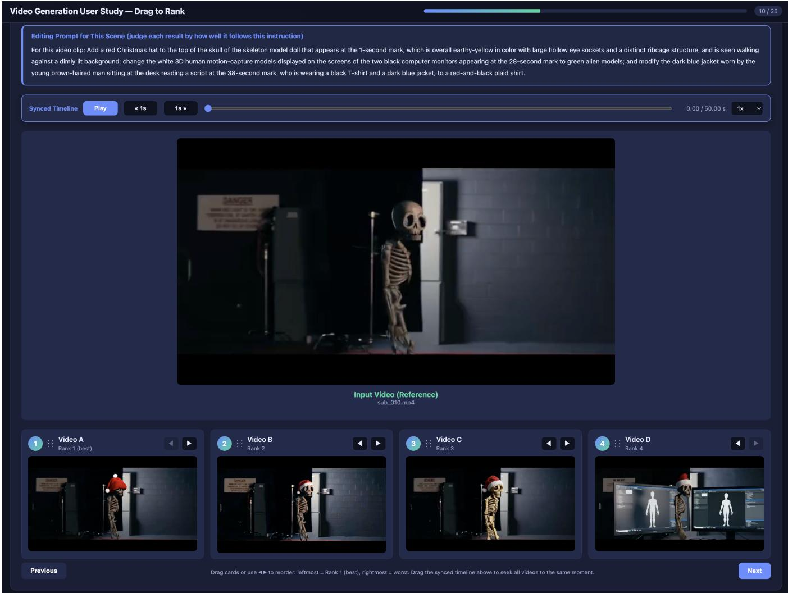  
Figure 7: HTML Interface for User Study.

Evaluation Pipeline. To ensure a strict and fair comparison, our automated evaluation script processes the results of all baseline methods through the following steps:

• Spatiotemporal Keyframe Alignment: Instead of feeding the entire long video into the VLM, we first segment the original video into 15-second intervals. A VLM analyzes each segment to record the absolute timestamps of critical plot transitions. Based on these JSONformatted timestamps, we extract the exact corresponding keyframes from both the original video and the edited videos of all evaluated methods. Missing generation cases from certain baselines are automatically recorded and skipped.

• Multimodal Prompting: For each scene, the original keyframes, the edited keyframes, and the complex editing prompt are simultaneously fed into the VLM judge.

• Fine-Grained Scoring & Aggregation: The VLM evaluates the editing quality based on 15 meticulously designed sub-dimensions. The detailed scores for each subdimension and the main dimensions are automatically exported to a CSV file for comprehensive statistical analysis.

Metric Definitions and Scoring Criteria. Each of the three main indicators (CSEC, MID, ZDSS) is decomposed into five specific sub-dimensions. The VLM judge strictly assigns a score of 0, 10, or 20 to each sub-dimension based on predefined criteria (yielding a maximum of 100 points per main indicator):

1. Cross-Shot Editing Consistency (CSEC): Evaluates the visual unity of the edited entity across diferent physical shots (varying angles, scales, and lighting). The subdimensions include: (1.1) Identity Preservation (20=perfect identity, 0=severe deformation/amnesia); (1.2) Attribute Consistency (20=attributes exist in all shots, 0=attributes lost); (1.3) Color & Texture Stability; (1.4) Structural & Geometric Alignment; (1.5) Lighting & Shadow Harmony.

2. Multi-Instruction Decoupling (MID): Assesses the model’s ability to execute dense instructions precisely without mutual interference. The sub-dimensions include: (2.1) Target Execution Accuracy (20=perfect execution, 0=completely failed); (2.2) Distractor Isolation (20=zero attribute bleeding, 0=severe color/texture leakage); (2.3) Hallucination Suppression (20=no hallucinated entities, 0=clear generation of unrequested objects); (2.4) Entity Localization Precision; (2.5) Semantic Conflict Resolution.

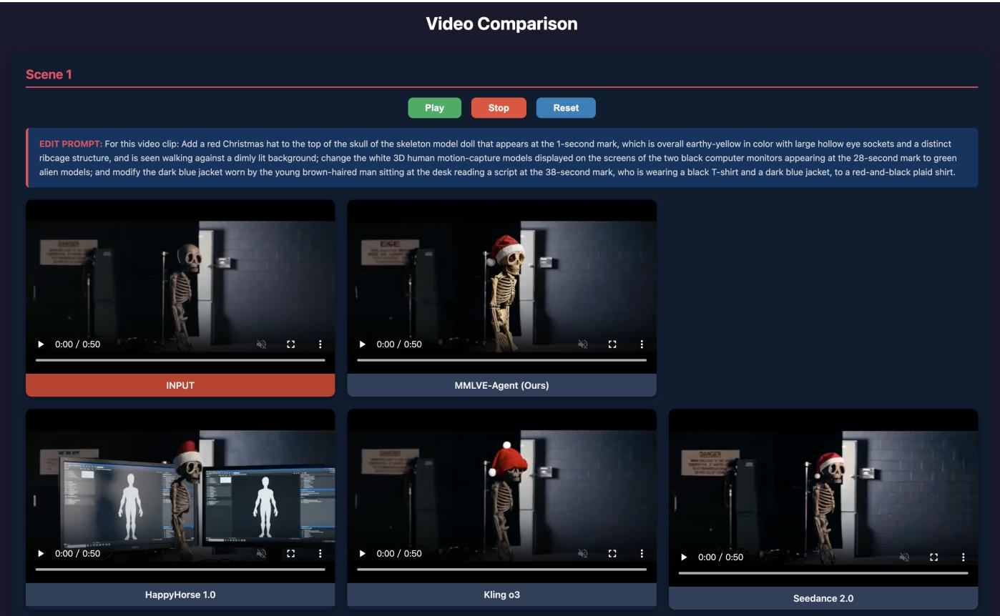  
Figure 8: Video Comparison in Media Supplement part.

3. Zero-Destruction on Spatiotemporal Structure (ZDSS): Strictly inspects the preservation of non-edited regions and chronological order. The sub-dimensions include: (3.1) Static Background Fidelity (20=pixel-level preservation, 0=background destroyed); (3.2) Non-Target Object Preservation; (3.3) Chronological Shot Alignment (20=1:1 strict alignment with original shot order, 0=severe temporal scrambling or arbitrary deletion); (3.4) Intra-Shot Motion Consistency; (3.5) Artifact & Flicker Reduction.

By employing this fine-grained, 15-dimension evaluation matrix, our benchmark provides a comprehensive and interpretable quantitative assessment of multi-shot long-video editing capabilities.

## Evaluation results for each method

Due to space constraints in the main paper, the fine-grained quantitative results were aggregated. Here, we provide the exhaustive, scene-by-scene evaluation scores for all methods across the 15 sub-dimensions. As shown in Tab. 3 and Tab. 4, our MMLVE-Agent consistently achieves high scores across almost all scenes and sub-dimensions, particularly excelling in Identity Preservation (1.1) and Target Execution Accuracy (2.1). In contrast, baseline methods like HappyHorse 1.0 and Kling o3 exhibit severe fluctuations and frequent failures (scoring 0 or extremely low marks) in Distractor Isolation (2.2) and Chronological Shot Alignment (3.3), quantitatively reflecting their severe attribute bleeding and temporal scrambling issues. Furthermore, Tab. 4 explicitly marks the cases where Seedance 2.0 and Kling o3 rejected processing (denoted by “/”) due to their internal safety mechanisms when faced with highly complex multi-entity instructions.

## Other Results

To further demonstrate the robustness and superiority of our proposed framework, we provide additional qualitative comparisons between MMLVE-Agent and the baseline methods on highly complex multi-shot long videos. As shown in Fig. 15, the baseline methods consistently struggle with the three core challenges of the MMLVE task, whereas our agentic framework handles them with high precision.

Analysis of the First Case (Top): The first prompt contains three heterogeneous instructions: modifying a clock (shape to square, color to red), deleting a specific man on the left, and adding a cap to a skeleton. Seedance 2.0 exhibits a highly conservative strategy, leading to severe missed edits (failing MID): it successfully changes the clock’s color but fails to alter its shape (Frame 1), completely fails to remove the man (Frames 1-2), and misses the cap addition on the skeleton (Frames 4, 6, 7). Kling o3 sufers from severe inconsistency and hallucinations: the clock’s shape fluctuates (Frames 1-2), and it fails to remove the man. Worse still, it erroneously hallucinates the man into the left side ofan unrelated shot (Frame 4) and forcibly inserts the clock into another (Frame 5), while consistently failing to edit the skeleton. HappyHorse 1.0 demonstrates catastrophic spatiotemporal destruction (failing ZDSS) and instruction interference. While it removes the man, it accidentally deletes the clock as well (Frame 2). It then sufers from severe temporal scrambling (Frame 3) and exhibits extreme hallucinations by forcibly overwriting the original scenes to insert the clock and sitting men into completely unrelated later shots (Frames 6-7). In contrast, MMLVE-Agent accurately decouples these instructions, executing all edits flawlessly in their correct temporal windows without any background destruction.

Analysis of the Second Case (Bottom): The second prompt requires changing an artisan’s shirt to red, adding a mini pirate hat to a skeleton, and removing a soldier. Seedance 2.0 again defaults to a conservative failure, completely missing the edits on the skeleton (Frames 3-4) and failing to remove the soldier (Frames 6-7). Kling o3 sufers from severe chronological misalignment, arbitrarily erasing certain original shots (Frames 2-3, failing ZDSS). Furthermore, it exhibits bizarre attribute bleeding: while it manages to remove the soldier in Frame 6, it forcibly hallucinates the redshirted artisan into the same scene, and then fails to remove the soldier entirely in Frame 7. HappyHorse 1.0 displays extreme instruction confusion (failing MID). It erroneously morphs an unrelated object into the pirate-hat skeleton early on (Frames 1-2), fails to edit the actual skeleton (Frame 3), and then bizarrely deletes the skeleton later (Frame 5). In the final shots, although it removes the soldier, it forcibly hallucinates the red-shirted artisan (Frame 6) and the pirate-hat skeleton (Frame 7) into the background. Conversely, empowered by the Global Memory Card and the retrieval-based on-demand editing strategy, our MMLVE-Agent strictly isolates the editing operations. It accurately modifies the artisan, edits the skeleton, and removes the soldier exclusively in their respective physical shots, achieving perfect multi-instruction decoupling.

<table><tr><td rowspan=1 colspan=3>SCENE                VIDEO                                              EDIT PROMPT</td></tr><tr><td rowspan=1 colspan=3>For this video clip: modify the red billboard printed with \&quot;Andy&#x27;s\&quot; that appears at the 0-second mark to alight green color while retaining the original text on it; for the middle-aged foreign man sitting on thesub_001                                      right, wearing a red headscarf and a blue polo shirt, who appears at the 18-second mark, change the redheadscarf on his head to a black baseball cap; for the young Asian man sitting on the left wearing a grayand white striped shirt, who also appears at the 18-second mark, change his striped shirt to a plain whiteT-shirt.</td></tr><tr><td rowspan=1 colspan=1>sub 002</td><td rowspan=1 colspan=1>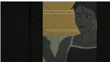</td><td rowspan=1 colspan=1>For this video clip: for the girl with dark blue skin, an oval-shaped face, and wearing a black camisoleswimsuit with white straps who appears at the beginning of the video, change her swimsuit color to lightred; at around the 7-second mark of the video, add a white wireless microphone to the collar of the girlwith brownish-yellow skin, wearing a black ponytail, and dressed in a yellow hoodie; for the girl withlight orange skin, golden-blonde hair, and wearing an orange-red hoodie with orange-red pants whoappears at the 17-second mark of the video, change her outfit to a light blue one-piece swimsuit.</td></tr><tr><td rowspan=2 colspan=1>sub_003</td><td rowspan=2 colspan=1></td><td rowspan=2 colspan=1>For this video clip: for the short-haired woman wearing a white short-sleeved shirt who appears at 0seconds peering out from behind the door, change her white short-sleeved shirt to a yellow short-sleevedshirt; for the solid red circular pattern appearing around the 4th second on the upper part of the wallbehind the pool, change the red circular pattern to a red five-pointed star pattern; for the girl wearing ablack strap swimsuit (with white straps), having dark blue skin, and wearing swim goggles and a swimcap, change her swim cap to light orange.</td></tr><tr><td rowspan=1 colspan=1>ed circular patte</td></tr><tr><td rowspan=1 colspan=1>sub_004</td><td rowspan=1 colspan=1></td><td rowspan=1 colspan=1>For this video clip: around the 34-second mark, locate the slightly plump young man with a beard who isdriving the vehicle while wearing a blue striped shirt and a dark blue tie, and change his dark blue tie to abright red tie; transform the red car in the video into a cyberpunk-style spaceship; and remove the personwearing black trousers and a white long-sleeved top who appears at around the 37-second mark.</td></tr><tr><td rowspan=1 colspan=1>sub_005</td><td rowspan=1 colspan=1></td><td rowspan=1 colspan=1>For this video clip: first, locate the Caucasian man with short brownish-yellow hair who appears at thebeginning of the video wearing a white shirt and a purple tie with white patterns, and remove his tie; next,for the professional woman with long, straight, dark black hair who is wearing a black blazer and a whiteinner top, add a delicate gold brooch to her collar.</td></tr></table>

Figure 9: The cases (sub\_001 - sub\_005) in MMLVE-Bench.

<table><tr><td>SCENE</td><td>VIDEO</td><td>EDIT PROMPT</td></tr><tr><td>sub 006</td><td></td><td>For this video clip: For the Caucasian male with short brownish-yellow hair who appears at the very beginning of the video, wearing a white shirt and a purple tie with white patterns, add a cute puppy design onto his chest; for the professional female with long, straight, dark black hair, wearing a black blazer with a white inner top, modify her black blazer to a dark blue blazer; and for the young woman appearing at the 1 5-second mark of the video, who is wearing a black leather jacket with a black inner top and a necklace, and has long, straight, center-parted black hair draping down both sides of her face, change her hairstyle to a golden-blonde color styled in a bun.</td></tr><tr><td>sub_007</td><td></td><td>For this video clip: around the 8-second mark, locate the countless yellow cylindrical cans neatly stacked in the background, each featuring a black cashew pattern on its front, and modify these cashew patterns to red heart shapes; additionally, around the 52-second mark, identify the person who has a broad, flat face, a high forehead, and thick, bushy eyebrows, and is wearing a wine-red V-neck long-sleeved top, and change their top to a wine- red suit jacket.</td></tr><tr><td>sub 008</td><td></td><td>For this video clip: for the elderly male artisan with medium-length, slightly wavy brown hair, wearing thin- framed glasses, a blue shirt, and a dark vest, who appears around the 37th second of the video, change his blue shirt to a red shirt; for the skeleton model holding a small sword and a round shield with a skull emblem, add a mini pirate hat onto the skeleton model's head; and for the soldier wearing soldier armor and a helmet with a red plume who appears at the 57th second, completely remove him from the video.</td></tr><tr><td>sub_009</td><td></td><td>For this video clip: change the blue outer frame of the round wall clock hanging on the light-colored wall to red, and change its shape to a square; remove the young man with a thick beard, wearing a white short-sleeved T-shirt and jeans, who appears at the 0-second mark sitting on the far left of a row of blue chairs, holding and looking down to read a sheet of white paper; and place a black baseball cap on the human skeleton model that appears at the 14-second mark.</td></tr><tr><td>sub_010</td><td></td><td>For this video clip: Add a red Christmas hat to the top of the skull of the skeleton model doll that appears at the 1- second mark, which is overall earthy-yellow in color with large hollow eye sockets and a distinct ribcage structure and is seen walking against a dimly lit background; change the white 3D human motion-capture models displayed on the screens of the two black computer monitors appearing at the 28-second mark to green alien models; and modify the dark blue jacket worn by the young brown-haired man sitting at the desk reading a script at the 38- second mark, who is wearing a black T-shirt and a dark blue jacket, to a red-and-black plaid shirt.</td></tr><tr><td>sub_011</td><td></td><td>For this video clip: for the double-layer wooden storage box appearing at the 0-second mark, which features a small shallow tray on the upper layer and a drawer with a metal handle on the lower layer, change the wood material's color to a dark walnut tone; then, in the oval wooden tray appearing at the 9- second mark, which contains three clay sculpting tools and a metal scraper, add a red circular stamp inside the tray.</td></tr><tr><td>sub_012</td><td></td><td>For this video clip: completely remove the two light-colored, slender wooden strips that appear at the 1- second mark on one side of the clay slab to assist with shaping, and restore the background; modify the metal retractable utility knife that appears at the 26-second mark into a long wooden strip; and change the yellow round sponge held in the person's hand at around the 23-second mark into a square blue sponge.</td></tr><tr><td>sub_013</td><td></td><td>For this video clip: from the 2nd second, locate the white palette with a leaf pattern and multiple circular wells being held in hand, and change its main body color from white to light blue while retaining the leaf pattern; then, at the 46th second, locate the whale-shaped white ceramic palette and add a black blowhole pattern onto the blank space of the whale palette's head.</td></tr><tr><td>sub_014</td><td></td><td>For this video clip: for the Black man with short black hair and a short black beard who appears at the 1- second mark wearing a black long-sleeved T-shirt, change his black long-sleeved T-shirt to a bright yellow long-sleeved T-shirt; for the computer monitor positioned to the right rear of the man in the long-sleeved shirt at the 1-second mark, which displays a green and yellow hill landscape picture, change the hill landscape picture on the screen to a bustling city night scene.</td></tr><tr><td>sub_015</td><td></td><td>For this video clip: on the black background advertising wall featuring the text \"PREDATOR WORLD 8- BALL CHAMPIONSHIP\" that appears at the 1st second of the video, remove all English sponsor logos and ensure the background remains smooth; change the color of the blue billiard table cloth to a green billiard table cloth; and for the billiard player with short black hair, wearing a black jersey, with a tattoo on his right arm, wearing a glove, and holding a cue, who appears at the 5th second of the video, modify the color of his black jersey to dark red.</td></tr></table>

Figure 10: The cases (sub\_006 - sub\_010) in MMLVE-Bench.

Figure 11: The cases (sub\_011 - sub\_015) in MMLVE-Bench.

<table><tr><td>SCENE</td><td>VIDEO</td><td>EDIT PROMPT</td></tr><tr><td>sub_016</td><td></td><td>For this video clip: for the small yellow boy character appearing at the 1-second mark, who has big eyes and is bald except for a single small curl on the top of his head, place a blue baseball cap on his head; for the tall, thin grey man playing the violin who appears at the 1-second mark, wearing glasses and a dark hat, remove him from the scene; and for the tree with maple-red leaves appearing at the 1-second mark, change its leaf color to green.</td></tr><tr><td>sub_017</td><td></td><td>For this video clip: for the round wall clock hanging on the white wall appearing at the 2-second mark, which has a black outer frame and a white face with black hands and numbers, change its outer frame from black to red and modify its shape to a pentagon; on the light-colored wooden rectangular office desk appearing at the 2-second mark, which has a flat surface and a support panel underneath, add a green potted cactus on top of the desk; and for the orange-yellow cartoon boy with large eyes and a few strands of tufted hair on his head appearing at the 16-second mark, change his skin tone to a bright sky blue</td></tr><tr><td>sub 018</td><td></td><td>For this video clip: change the gold metal bracelets worn on the wrists of the hands that appear at the 1- second mark to silver bracelets; remove the L-shaped black right-angle ruler with white scale markings on its body that appears at the 24-second mark, and restore the white background in its place; add a red heart sticker onto the body of the white and yellow craft glue bottle held in the left hand that appears at the 25- second mark.</td></tr><tr><td>sub_019</td><td></td><td>For this video clip: change the straight, transparent glass cup that appears at the 1-second mark, which has a clear and translucent material, to a green glass cup with a frosted texture; remove the hand that appears in the video.</td></tr><tr><td>sub_020</td><td></td><td>For this video clip: from the very beginning of the video at 0 seconds, remove the bearded man who is wearing a dark blue long-sleeved shirt, a hat, and red-framed glasses; for the man appearing at the 11- second mark swimming in the lake and wearing a bright green swim cap and red-framed goggles, change his swim cap color to bright yellow; and at the 46-second mark, for the man wearing sunglasses, a black shirt with a red horizontal stripe, a crossbody bag, and a blue cap with yellow lettering, change his cap to a red sun visor.</td></tr><tr><td>sub_021</td><td></td><td>For this video clip: For the Caucasian male with a high nose bridge wearing a white bicycle helmet, a sports watch on his hand, and a white short-sleeved t-shirt who appears at the 4-second mark, modify his white t-shirt to light blue; additionally, remove the smartphone that appears at the 61-second mark of the video.</td></tr><tr><td>sub_022</td><td></td><td>For this video clip: begin by completely removing the black circular wall clock that appears at the 2- second mark, which is hanging on the white wall above the door frame, and restore the wall to a clean, white surface; next, modify the white short-sleeved T-shirt worn by the bearded young man with black short hair and a relaxed expression, who first appears at the 1-second mark, changing it into a red short- sleeved T-shirt; finally, remove the large red dumbbell-shaped water bottle located on the right side of the frame, which appears at the 14-second mark.</td></tr><tr><td>sub_023</td><td></td><td>For this video clip: for the male athlete in white who appears at the 6-second mark riding a bicycle, wearing a white helmet and orange sunglasses, and dressed in a white tight-fitting athletic suit with a red heart pattern on it, modify the red heart pattern on his clothing to a blue star pattern; for the male volunteer in the orange T-shirt standing by the roadside who appears at the 1-second mark, wearing a black baseball cap and sunglasses, with black hair and a sturdy build, remove this male volunteer in the orange T-shirt from the roadside.</td></tr><tr><td>sub_024</td><td></td><td>For this video clip: from around the 1st second of the video, add two lemon slices as a garnish to the rim of the white circular plate that is piled high with golden-brown roasted quail meat; for the Caucasian man wearing a red, sash-like bandana and a black polo shirt who appears around the 3rd second, change his red bandana to a blue one with a white polka-dot pattern; and for the young Asian woman wearing a white sleeveless tank top and brown trousers who appears at the 31st second, modify her white sleeveless tank top into a black lace camisole.</td></tr><tr><td>sub_025</td><td></td><td>For this video clip: for the Asian woman with a ponytail and a white long-sleeved top who appears at the 1-second mark, dye her hair golden blonde; for the food in the spoon appearing at the 7-second mark, which includes green limes and crushed red chili, transform it into a small piece of chocolate cake; and for the whole roasted suckling pig placed on the oval wooden tray appearing at the 19-second mark, change the color of its crispy skin from golden yellow to reddish-brown.</td></tr></table>

Figure 12: The cases (sub\_016 - sub\_020) in MMLVE-Bench.

Figure 13: The cases (sub\_021 - sub\_025) in MMLVE-Bench.

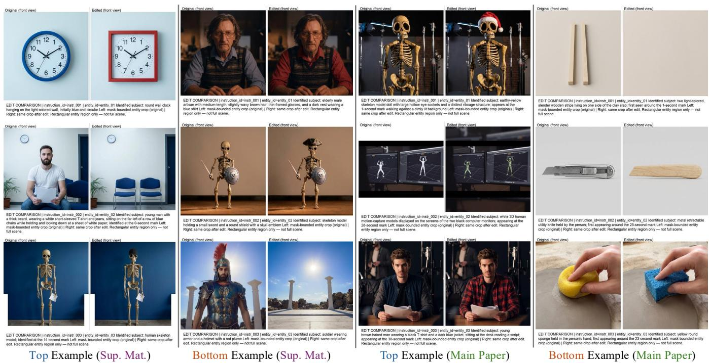  
Figure 14: Global Memory Card Show.

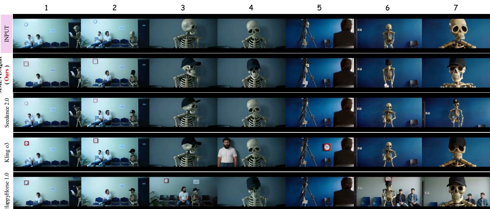

< Instruction >: For this video clip: change the blue outer frame of the round wall clock hanging on the light-colored wall to red, and change its shape to a square; remove the young man with a thick beard, wearing a white short-sleeved T-shirt and jeans, who appears at the 0-second mark sitting on the far left of a row of blue chairs, holding and looking down to read a sheet of white paper; and place a black baseball cap on the human skeleton model that appears at the 14-second mark.  
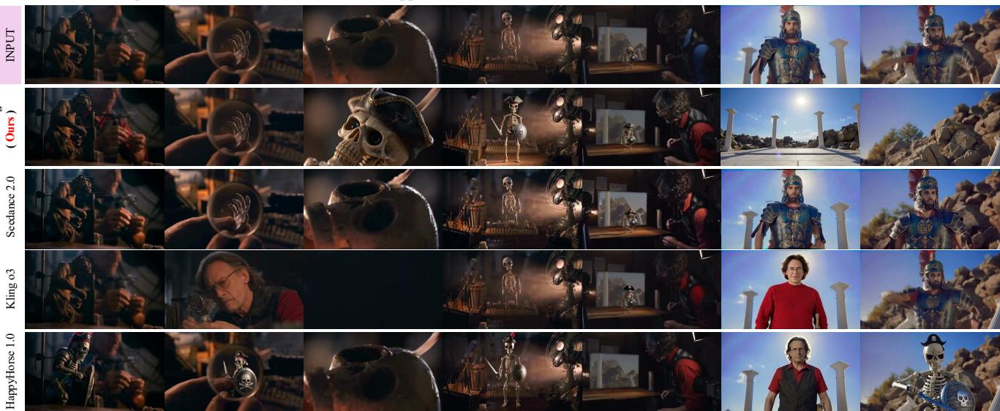  
< Instruction >: For this video clip: for the elderly male artisan with medium-length, slightly wavy brown hair, wearing thin-framed glasses, a blue shirt, and a dark vest, who appears around the 37th second of the video, change his blue shirt to a red shirt ; for the skeleton model holding a small sword and a round shield with a skull emblem, add a mini pirate hat onto the skeleton model's head; and for the soldier wearing soldier armor and a helmet with a red plume who appears at the 57th second, completely remove him from the video.  
Figure 15: Compared with the baseline methods.

<table><tr><td rowspan=1 colspan=9>Method   scene   1.1 1.2 1.3 1.4 1.5</td><td rowspan=1 colspan=9>CSEC (1.) 2.1 2.2 2.3 2.4  2.5</td><td rowspan=1 colspan=1>MID (2.)</td><td rowspan=1 colspan=4>3.1 3.2 3.3 3.4 3.5</td><td rowspan=1 colspan=1>ZDSS (3.)</td></tr><tr><td rowspan=1 colspan=9>sub_001  18  19  19  19  19</td><td rowspan=1 colspan=2>94</td><td rowspan=1 colspan=7>15  19  20  19  20</td><td rowspan=1 colspan=1>93</td><td rowspan=1 colspan=4>18  18  20  19  18</td><td rowspan=1 colspan=1></td></tr><tr><td rowspan=1 colspan=1></td><td rowspan=1 colspan=8>sub_002  19  20  19  19  19</td><td rowspan=1 colspan=2>96</td><td rowspan=1 colspan=7>20  20  20  20  20</td><td rowspan=1 colspan=1>100</td><td rowspan=1 colspan=4>19  20  20  20  19</td><td rowspan=1 colspan=1>98</td></tr><tr><td rowspan=1 colspan=1></td><td rowspan=1 colspan=8>sub_003  20  20  20  20  20</td><td rowspan=1 colspan=2>100</td><td rowspan=1 colspan=7>20  20  20  20  20</td><td rowspan=1 colspan=1>100</td><td rowspan=1 colspan=4>20  20  20  20  20</td><td rowspan=1 colspan=1>100</td></tr><tr><td rowspan=1 colspan=1></td><td rowspan=1 colspan=8>sub_004  12  14  15  8  10</td><td rowspan=1 colspan=5>59     11  18</td><td rowspan=1 colspan=4>6   ∞  18</td><td rowspan=1 colspan=1>61</td><td rowspan=1 colspan=4>12  16  20  10  10</td><td rowspan=1 colspan=1>68</td></tr><tr><td rowspan=1 colspan=1></td><td rowspan=1 colspan=8>sub_005  20  11  19  19  19</td><td rowspan=1 colspan=2>88</td><td rowspan=1 colspan=3>14  20</td><td rowspan=1 colspan=4>20  19  20</td><td rowspan=1 colspan=1>93</td><td rowspan=1 colspan=4>20  20  20  20  19</td><td rowspan=1 colspan=1>99</td></tr><tr><td rowspan=1 colspan=1></td><td rowspan=1 colspan=8>sub_006  20  20  20  19  19</td><td rowspan=1 colspan=2>97</td><td rowspan=1 colspan=7>19  20  20  20  20</td><td rowspan=1 colspan=1>99</td><td rowspan=1 colspan=4>14  19  20  20  18</td><td rowspan=1 colspan=1>91</td></tr><tr><td rowspan=1 colspan=9>sub_007  15  18  10  15  15</td><td rowspan=1 colspan=2>73</td><td rowspan=1 colspan=7>18   8  15  12  15</td><td rowspan=1 colspan=1>68</td><td rowspan=1 colspan=4>5   8   20  15  10</td><td rowspan=1 colspan=1>58</td></tr><tr><td rowspan=1 colspan=1></td><td rowspan=1 colspan=2>sub_008  18</td><td rowspan=1 colspan=6>19  19  19  19</td><td rowspan=1 colspan=2>94</td><td rowspan=1 colspan=7>19  20  20  19  20</td><td rowspan=1 colspan=1>98</td><td rowspan=1 colspan=4>19  19  20  19  19</td><td rowspan=1 colspan=1>96</td></tr><tr><td rowspan=1 colspan=1></td><td rowspan=1 colspan=1>sub_009</td><td rowspan=1 colspan=1>20</td><td rowspan=1 colspan=4>20  20  20</td><td rowspan=1 colspan=2>19</td><td rowspan=1 colspan=2>99</td><td rowspan=1 colspan=3>20  19</td><td rowspan=1 colspan=4>18  20  20</td><td rowspan=1 colspan=1>97</td><td rowspan=1 colspan=2>18  20</td><td rowspan=1 colspan=2>20  20  19</td><td rowspan=1 colspan=1>97</td></tr><tr><td rowspan=1 colspan=1></td><td rowspan=1 colspan=1>sub_010</td><td rowspan=1 colspan=1>18</td><td rowspan=1 colspan=4>20  20  19</td><td rowspan=1 colspan=2>19</td><td rowspan=1 colspan=2>96</td><td rowspan=1 colspan=3>20  20</td><td rowspan=1 colspan=4>20  18  20</td><td rowspan=1 colspan=1>98</td><td rowspan=1 colspan=2>20  17</td><td rowspan=1 colspan=2>20  20  19</td><td rowspan=1 colspan=1>96</td></tr><tr><td rowspan=1 colspan=1>m</td><td rowspan=1 colspan=1>sub_011</td><td rowspan=1 colspan=1>16</td><td rowspan=1 colspan=4>18  18  15</td><td rowspan=1 colspan=2>18</td><td rowspan=1 colspan=2>85</td><td rowspan=1 colspan=3>20   8</td><td rowspan=1 colspan=4>10  10  12</td><td rowspan=1 colspan=1>60</td><td rowspan=1 colspan=1>17</td><td rowspan=1 colspan=1>16</td><td rowspan=1 colspan=2>20  19  18</td><td rowspan=1 colspan=1>90</td></tr><tr><td rowspan=1 colspan=1>g</td><td rowspan=1 colspan=1>sub_012</td><td rowspan=1 colspan=1>19</td><td rowspan=1 colspan=4>20  19  19</td><td rowspan=1 colspan=2>19</td><td rowspan=1 colspan=1>96</td><td rowspan=1 colspan=1></td><td rowspan=1 colspan=3>20  20</td><td rowspan=1 colspan=2>20</td><td rowspan=1 colspan=1>20</td><td rowspan=1 colspan=1>20</td><td rowspan=1 colspan=1>100</td><td rowspan=1 colspan=1>19</td><td rowspan=1 colspan=1>20</td><td rowspan=1 colspan=2>20  20  19</td><td rowspan=1 colspan=1>98</td></tr><tr><td rowspan=1 colspan=1></td><td rowspan=1 colspan=1>sub_013</td><td rowspan=1 colspan=1>18</td><td rowspan=1 colspan=4>18  17  18</td><td rowspan=1 colspan=2>17</td><td rowspan=1 colspan=1>88</td><td rowspan=1 colspan=1></td><td rowspan=1 colspan=1>18</td><td rowspan=1 colspan=2>8</td><td rowspan=1 colspan=2>15</td><td rowspan=1 colspan=1>10</td><td rowspan=1 colspan=1>15</td><td rowspan=1 colspan=1>66</td><td rowspan=1 colspan=1>12</td><td rowspan=1 colspan=1>16</td><td rowspan=1 colspan=2>20  19  18</td><td rowspan=1 colspan=1>85</td></tr><tr><td rowspan=1 colspan=1></td><td rowspan=1 colspan=1>sub_014</td><td rowspan=1 colspan=1>20</td><td rowspan=1 colspan=4>20  20  20</td><td rowspan=1 colspan=2>20</td><td rowspan=1 colspan=1>100</td><td rowspan=1 colspan=1></td><td rowspan=1 colspan=1>20</td><td rowspan=1 colspan=2>20</td><td rowspan=1 colspan=2>20</td><td rowspan=1 colspan=1>20</td><td rowspan=1 colspan=1>20</td><td rowspan=1 colspan=1>100</td><td rowspan=1 colspan=1>20</td><td rowspan=1 colspan=1>20</td><td rowspan=1 colspan=2>20  20  20</td><td rowspan=1 colspan=1>100</td></tr><tr><td rowspan=1 colspan=1>M</td><td rowspan=1 colspan=1>sub_015</td><td rowspan=1 colspan=1>18</td><td rowspan=1 colspan=4>20  19  18</td><td rowspan=1 colspan=2>17</td><td rowspan=1 colspan=1>92</td><td rowspan=1 colspan=1></td><td rowspan=1 colspan=1>19</td><td rowspan=1 colspan=1></td><td rowspan=1 colspan=1>19</td><td rowspan=1 colspan=2>8</td><td rowspan=1 colspan=1>10</td><td rowspan=1 colspan=1>18</td><td rowspan=1 colspan=1>74</td><td rowspan=1 colspan=1>8</td><td rowspan=1 colspan=1>12</td><td rowspan=1 colspan=2>20  18  12</td><td rowspan=1 colspan=1>70</td></tr><tr><td rowspan=1 colspan=1></td><td rowspan=1 colspan=1>sub_016</td><td rowspan=1 colspan=1>16</td><td rowspan=1 colspan=4>14  18  15</td><td rowspan=1 colspan=2>17</td><td rowspan=1 colspan=1>80</td><td rowspan=1 colspan=1></td><td rowspan=1 colspan=1>15</td><td rowspan=1 colspan=1></td><td rowspan=1 colspan=1>19</td><td rowspan=1 colspan=2>17</td><td rowspan=1 colspan=1>19</td><td rowspan=1 colspan=1>20</td><td rowspan=1 colspan=1>90</td><td rowspan=1 colspan=1>15</td><td rowspan=1 colspan=1>20</td><td rowspan=1 colspan=2>20  19  19</td><td rowspan=1 colspan=1>93</td></tr><tr><td rowspan=1 colspan=1></td><td rowspan=1 colspan=1>sub_017</td><td rowspan=1 colspan=1>15</td><td rowspan=1 colspan=4>14  16  17</td><td rowspan=1 colspan=2>16</td><td rowspan=1 colspan=1>78</td><td rowspan=1 colspan=1></td><td rowspan=1 colspan=1>15</td><td rowspan=1 colspan=1></td><td rowspan=1 colspan=1>12</td><td rowspan=1 colspan=2>15</td><td rowspan=1 colspan=1>13</td><td rowspan=1 colspan=1>17</td><td rowspan=1 colspan=1>72</td><td rowspan=1 colspan=1>15</td><td rowspan=1 colspan=3>17  20  18  16</td><td rowspan=1 colspan=1>86</td></tr><tr><td rowspan=1 colspan=1></td><td rowspan=1 colspan=1>sub_018</td><td rowspan=1 colspan=1>16</td><td rowspan=1 colspan=4>18  17  16</td><td rowspan=1 colspan=2>17</td><td rowspan=1 colspan=1>84</td><td rowspan=1 colspan=1></td><td rowspan=1 colspan=2>18</td><td rowspan=1 colspan=1>20</td><td rowspan=1 colspan=2>14</td><td rowspan=1 colspan=1>15</td><td rowspan=1 colspan=1>20</td><td rowspan=1 colspan=1>87</td><td rowspan=1 colspan=1>13</td><td rowspan=1 colspan=3>10  20  12  11</td><td rowspan=1 colspan=1>66</td></tr><tr><td rowspan=1 colspan=1></td><td rowspan=1 colspan=1>sub_019</td><td rowspan=1 colspan=1>20</td><td rowspan=1 colspan=4>20  20  20</td><td rowspan=1 colspan=2>18</td><td rowspan=1 colspan=1>98</td><td rowspan=1 colspan=1></td><td rowspan=1 colspan=1>12</td><td rowspan=1 colspan=1></td><td rowspan=1 colspan=1>20</td><td rowspan=1 colspan=2>12</td><td rowspan=1 colspan=1>10</td><td rowspan=1 colspan=1>10</td><td rowspan=1 colspan=1>64</td><td rowspan=1 colspan=1>12</td><td rowspan=1 colspan=3>5  20  6   10</td><td rowspan=1 colspan=1>53</td></tr><tr><td rowspan=1 colspan=1></td><td rowspan=1 colspan=1>sub_020</td><td rowspan=1 colspan=1>15</td><td rowspan=1 colspan=2>10  16</td><td rowspan=1 colspan=2>12</td><td rowspan=1 colspan=2>15</td><td rowspan=1 colspan=1>68</td><td rowspan=1 colspan=1></td><td rowspan=1 colspan=1>8</td><td rowspan=1 colspan=1></td><td rowspan=1 colspan=1>15</td><td rowspan=1 colspan=3>10</td><td rowspan=1 colspan=1>14</td><td rowspan=1 colspan=1>56</td><td rowspan=1 colspan=1>18</td><td rowspan=1 colspan=1>18</td><td rowspan=1 colspan=2>20  18  14</td><td rowspan=1 colspan=1>88</td></tr><tr><td rowspan=1 colspan=1></td><td rowspan=1 colspan=1>sub_021</td><td rowspan=1 colspan=1>16</td><td rowspan=1 colspan=1>18</td><td rowspan=1 colspan=1>18</td><td rowspan=1 colspan=2>17</td><td rowspan=1 colspan=2>18</td><td rowspan=1 colspan=1>87</td><td rowspan=1 colspan=1></td><td rowspan=1 colspan=1>18</td><td rowspan=1 colspan=1></td><td rowspan=1 colspan=1>5</td><td rowspan=1 colspan=3>12</td><td rowspan=1 colspan=1>8</td><td rowspan=1 colspan=1>48</td><td rowspan=1 colspan=1>18</td><td rowspan=1 colspan=1>4</td><td rowspan=1 colspan=1>20  18</td><td rowspan=1 colspan=1>18</td><td rowspan=1 colspan=1>78</td></tr><tr><td rowspan=1 colspan=1></td><td rowspan=1 colspan=1>sub_022</td><td rowspan=1 colspan=1>8</td><td rowspan=1 colspan=1>12</td><td rowspan=1 colspan=1>11</td><td rowspan=1 colspan=2>10</td><td rowspan=1 colspan=2>12</td><td rowspan=1 colspan=1>53</td><td rowspan=1 colspan=1></td><td rowspan=1 colspan=1>18</td><td rowspan=1 colspan=1></td><td rowspan=1 colspan=1>5</td><td rowspan=1 colspan=3>8   10</td><td rowspan=1 colspan=1>8</td><td rowspan=1 colspan=1>49</td><td rowspan=1 colspan=2>10  11</td><td rowspan=1 colspan=1>12  10</td><td rowspan=1 colspan=1>10</td><td rowspan=2 colspan=1>5362</td></tr><tr><td rowspan=1 colspan=1></td><td rowspan=1 colspan=1>sub_023</td><td rowspan=1 colspan=1>16</td><td rowspan=1 colspan=1>18</td><td rowspan=1 colspan=1>15</td><td rowspan=1 colspan=2>17</td><td rowspan=1 colspan=2>17</td><td rowspan=1 colspan=1>83</td><td rowspan=1 colspan=1></td><td rowspan=1 colspan=1>13</td><td rowspan=1 colspan=2>18</td><td rowspan=1 colspan=4>12  10  16</td><td rowspan=1 colspan=1>69</td><td rowspan=1 colspan=2>8  10</td><td rowspan=1 colspan=1>20  14</td><td rowspan=1 colspan=1>10</td></tr><tr><td rowspan=1 colspan=1></td><td rowspan=1 colspan=1>sub_024</td><td rowspan=1 colspan=1>18</td><td rowspan=1 colspan=1>19</td><td rowspan=1 colspan=1>18</td><td rowspan=1 colspan=2>18</td><td rowspan=1 colspan=2>18</td><td rowspan=1 colspan=1>91</td><td rowspan=1 colspan=1></td><td rowspan=1 colspan=1>19</td><td rowspan=1 colspan=2>20</td><td rowspan=1 colspan=4>20  19  20</td><td rowspan=1 colspan=1>98</td><td rowspan=1 colspan=2>17  19</td><td rowspan=1 colspan=1>20  19</td><td rowspan=1 colspan=1>19</td><td rowspan=2 colspan=1>9430</td></tr><tr><td rowspan=1 colspan=1></td><td rowspan=1 colspan=1>sub_025</td><td rowspan=1 colspan=1>5</td><td rowspan=1 colspan=4>8   8   8</td><td rowspan=1 colspan=2>12</td><td rowspan=1 colspan=1>41</td><td rowspan=1 colspan=1></td><td rowspan=1 colspan=1>10</td><td rowspan=1 colspan=2>8</td><td rowspan=1 colspan=4>4   6   8</td><td rowspan=1 colspan=1>36</td><td rowspan=1 colspan=1>8</td><td rowspan=1 colspan=2>6   5   5</td><td rowspan=1 colspan=1>6</td></tr><tr><td rowspan=1 colspan=1></td><td rowspan=1 colspan=1>sub_001</td><td rowspan=1 colspan=1>18</td><td rowspan=1 colspan=4>12  17  16</td><td rowspan=1 colspan=2>17</td><td rowspan=1 colspan=1>85</td><td rowspan=1 colspan=1></td><td rowspan=1 colspan=1>15</td><td rowspan=2 colspan=6>18  12  188  1814101012</td><td rowspan=2 colspan=1>8154</td><td rowspan=2 colspan=4>18  15  020  10  1515111514</td><td rowspan=2 colspan=1>58 5</td></tr><tr><td rowspan=1 colspan=1></td><td rowspan=1 colspan=1>sub_002</td><td rowspan=1 colspan=1>5</td><td rowspan=1 colspan=4>13  10</td><td rowspan=1 colspan=2>14</td><td rowspan=1 colspan=1>54</td><td rowspan=1 colspan=1></td><td></td></tr><tr><td rowspan=1 colspan=1></td><td rowspan=1 colspan=1>sub_003</td><td rowspan=1 colspan=1>18</td><td rowspan=1 colspan=4>18   17   18</td><td rowspan=1 colspan=2>18</td><td rowspan=1 colspan=1>89</td><td rowspan=1 colspan=1></td><td rowspan=1 colspan=7>18  16  17  18  19</td><td rowspan=1 colspan=1>88</td><td rowspan=1 colspan=3>18  19  20  19</td><td rowspan=1 colspan=1>17</td><td rowspan=5 colspan=1>9367958345</td></tr><tr><td rowspan=1 colspan=1></td><td rowspan=1 colspan=1>sub_004</td><td rowspan=1 colspan=1>13</td><td rowspan=1 colspan=4>14  11  15</td><td rowspan=1 colspan=2>12</td><td rowspan=1 colspan=1>65</td><td rowspan=1 colspan=1></td><td rowspan=1 colspan=7>11  12  8   10  10</td><td rowspan=1 colspan=1>51</td><td rowspan=1 colspan=3>12  10  18  15</td><td rowspan=1 colspan=1>12</td></tr><tr><td rowspan=1 colspan=1></td><td rowspan=1 colspan=1>sub_005</td><td rowspan=1 colspan=1>19</td><td rowspan=1 colspan=6>18  19  15  17</td><td rowspan=1 colspan=1>88</td><td rowspan=1 colspan=1></td><td rowspan=2 colspan=7>19  20  20  16  2074   20  18</td><td rowspan=2 colspan=1>9578</td><td rowspan=18 colspan=4>20  20  20  19  1612  15  20  20  164   5  20  10  615  4  20  16  1514  20  20  20  164   48   5   8   61020111210  8   14  10  918  12  20  14  1518  15  20 520  19  1816108121920201945   33   14   8   610121016  12  20  8   1018  18  20  18  1820  17  20  20  189   11  20  11  1118  12  20  15  16115  55   12  86   880</td></tr><tr><td rowspan=1 colspan=1></td><td rowspan=1 colspan=2>sub_006  14</td><td rowspan=1 colspan=6>6  12  15  15</td><td rowspan=1 colspan=2>62</td><td rowspan=1 colspan=3>1320</td></tr><tr><td rowspan=1 colspan=1></td><td rowspan=1 colspan=2>sub_007  10</td><td rowspan=1 colspan=4>4   8  12</td><td rowspan=1 colspan=2>10</td><td rowspan=1 colspan=2>44</td><td rowspan=1 colspan=4>15   1</td><td rowspan=1 colspan=3>2   6   14</td><td rowspan=1 colspan=1>51</td></tr><tr><td rowspan=1 colspan=1></td><td rowspan=1 colspan=2>sub_008  18</td><td rowspan=1 colspan=3>17  18</td><td rowspan=1 colspan=1>19</td><td rowspan=1 colspan=1></td><td rowspan=1 colspan=1>18</td><td rowspan=1 colspan=2>90</td><td rowspan=1 colspan=7>12  20  8   8  15</td><td rowspan=1 colspan=1>63</td><td rowspan=15 colspan=1>709027615179905198354066929562814424</td></tr><tr><td rowspan=1 colspan=1></td><td rowspan=1 colspan=2>sub_009  20</td><td rowspan=1 colspan=3>20  20</td><td rowspan=1 colspan=1>19</td><td rowspan=1 colspan=1></td><td rowspan=1 colspan=1>18</td><td rowspan=1 colspan=2>97</td><td rowspan=1 colspan=7>20  20  19  20  20</td><td rowspan=1 colspan=1>99</td></tr><tr><td rowspan=1 colspan=1></td><td rowspan=1 colspan=1>sub_010</td><td rowspan=1 colspan=1>10</td><td rowspan=1 colspan=1>10</td><td rowspan=1 colspan=2>11</td><td rowspan=1 colspan=1>15</td><td rowspan=1 colspan=1></td><td rowspan=1 colspan=1>14</td><td rowspan=1 colspan=1>60</td><td rowspan=1 colspan=1></td><td rowspan=7 colspan=7>12   5   6   6   520  20  19  20  205820  4   4   85  65204320191818  18  14  12   1820  20  18  20  20</td><td rowspan=5 colspan=1>3499272597</td></tr><tr><td rowspan=1 colspan=1>10.</td><td rowspan=1 colspan=1>sub_011</td><td rowspan=1 colspan=1>18</td><td rowspan=1 colspan=1>18</td><td rowspan=1 colspan=2>19</td><td rowspan=1 colspan=1>19</td><td rowspan=1 colspan=1></td><td rowspan=1 colspan=1>19</td><td rowspan=1 colspan=1>93</td><td rowspan=1 colspan=1></td></tr><tr><td rowspan=1 colspan=1></td><td rowspan=1 colspan=1>sub_012</td><td rowspan=1 colspan=1>10</td><td rowspan=1 colspan=1>8</td><td rowspan=1 colspan=2>11</td><td rowspan=1 colspan=1>12</td><td rowspan=1 colspan=1></td><td rowspan=1 colspan=1>11</td><td rowspan=2 colspan=1>5259</td><td rowspan=3 colspan=1></td></tr><tr><td rowspan=6 colspan=8>Hp Hpor.0              820             12sub_014201920sub_01514181815sub_01618201919sub_017  6   8   10   8sub_018  12  10  11  12</td><td rowspan=1 colspan=3>sub 0138</td><td rowspan=1 colspan=3>1014</td><td rowspan=1 colspan=2></td><td rowspan=1 colspan=1>15</td></tr><tr><td rowspan=1 colspan=5>sub 014202019</td><td rowspan=1 colspan=2>20</td><td rowspan=1 colspan=1>19</td><td rowspan=1 colspan=1>98</td></tr><tr><td rowspan=1 colspan=1>16</td><td rowspan=1 colspan=1>81</td><td rowspan=1 colspan=1></td><td rowspan=2 colspan=1>8098</td></tr><tr><td rowspan=1 colspan=1>20</td><td rowspan=1 colspan=1>96</td><td rowspan=1 colspan=1></td></tr><tr><td rowspan=1 colspan=1></td><td rowspan=1 colspan=1>12</td><td rowspan=6 colspan=9>44      86   6   44   55   758141010   18  15  16  128   18  18  18  1895     20  20  20  20  2079     20  15  13  13  18100     10  20  20  15  2053     1212  68   56   58   8844</td><td rowspan=1 colspan=1></td><td rowspan=2 colspan=1>3039</td></tr><tr><td rowspan=1 colspan=1></td><td rowspan=1 colspan=1>13</td><td rowspan=1 colspan=1>58</td><td rowspan=1 colspan=1></td></tr><tr><td rowspan=4 colspan=9>sub_019  18  19  19  18  18sub_020  18  18  18  18  17sub_021  19  18  19  20  19sub_022  16  18  16  14  15sub_023  20  20  20  20  20sub_024  10  12  11  10  10sub_025  8   8   9   8   11</td><td rowspan=1 colspan=1>8</td><td rowspan=1 colspan=2>92</td><td rowspan=1 colspan=4></td><td rowspan=4 colspan=1>718010079853642</td></tr><tr><td rowspan=1 colspan=2></td></tr><tr><td rowspan=1 colspan=8></td><td rowspan=1 colspan=2></td></tr><tr><td rowspan=1 colspan=8>sub 023 20 20 20 20 20</td></tr></table>

Table 3: Detail Evaluation Results for MMLVE-Agent and Happyhorse 1.0.

<table><tr><td rowspan=1 colspan=7>Method   scene   1.1  1.2  1.3 1.4 1.5</td><td rowspan=1 colspan=7>CSEC (1.) 2.1 2.2 2.3 2.4 2.5</td><td rowspan=1 colspan=2>MID (2.)</td><td rowspan=1 colspan=7>3.1 3.2 3.3 3.4 3.5</td><td rowspan=1 colspan=2>ZDSS (3.)</td></tr><tr><td rowspan=1 colspan=7>sub_001  12  18  18  16  18</td><td rowspan=1 colspan=7>17  20  20  20  20</td><td rowspan=1 colspan=2></td><td rowspan=1 colspan=7>5   21   8   10</td><td rowspan=1 colspan=2></td></tr><tr><td rowspan=1 colspan=1></td><td rowspan=1 colspan=6>sub_002  1   1   1   1</td><td rowspan=1 colspan=3></td><td rowspan=1 colspan=2>1   1</td><td rowspan=1 colspan=2>1   1</td><td rowspan=1 colspan=2></td><td rowspan=1 colspan=7>1         1</td><td rowspan=1 colspan=2></td></tr><tr><td rowspan=1 colspan=1></td><td rowspan=1 colspan=6>sub_003        1   1   1</td><td rowspan=1 colspan=3></td><td rowspan=1 colspan=2>1   1</td><td rowspan=1 colspan=2>1   1</td><td rowspan=1 colspan=2></td><td rowspan=1 colspan=7>/   1   1</td><td rowspan=1 colspan=2></td></tr><tr><td rowspan=1 colspan=1></td><td rowspan=1 colspan=1>sub_004</td><td rowspan=1 colspan=5>15   5   8   6   8</td><td rowspan=1 colspan=3>32</td><td rowspan=1 colspan=2>6   5</td><td rowspan=1 colspan=2>4   10</td><td rowspan=1 colspan=2>30</td><td rowspan=1 colspan=7>10  12  20   8   10</td><td rowspan=1 colspan=2>60</td></tr><tr><td rowspan=1 colspan=2>sub_005</td><td rowspan=1 colspan=5>14   8   12  14  12</td><td rowspan=1 colspan=3>60     10</td><td rowspan=1 colspan=2>15  15</td><td rowspan=1 colspan=2>15  15</td><td rowspan=1 colspan=2>70</td><td rowspan=1 colspan=7>10  10        12  12</td><td rowspan=1 colspan=2>49</td></tr><tr><td rowspan=1 colspan=2>sub_006</td><td rowspan=1 colspan=5>11        12  10  8</td><td rowspan=1 colspan=5>50      8   6</td><td rowspan=1 colspan=2>10</td><td rowspan=1 colspan=2>36</td><td rowspan=1 colspan=7>4         8   8</td><td rowspan=1 colspan=2></td></tr><tr><td rowspan=1 colspan=2>sub_007</td><td rowspan=1 colspan=5>10        12  12  11</td><td rowspan=1 colspan=2>53</td><td rowspan=1 colspan=3>10   8</td><td rowspan=1 colspan=2>4</td><td rowspan=1 colspan=2>32</td><td rowspan=1 colspan=7>0         4   4</td><td rowspan=1 colspan=2></td></tr><tr><td rowspan=1 colspan=2>sub_008</td><td rowspan=1 colspan=5>13  14   8   11   7</td><td rowspan=1 colspan=2>53</td><td rowspan=1 colspan=5>13  12   6   8   12</td><td rowspan=1 colspan=2>51</td><td rowspan=1 colspan=7>7   8   15  10  6</td><td rowspan=1 colspan=2>46</td></tr><tr><td rowspan=1 colspan=1></td><td rowspan=1 colspan=1>sub_009</td><td rowspan=1 colspan=1>15</td><td rowspan=1 colspan=1>16</td><td rowspan=1 colspan=1>16</td><td rowspan=1 colspan=1>15</td><td rowspan=1 colspan=1>12</td><td rowspan=1 colspan=2>74</td><td rowspan=1 colspan=1>10</td><td rowspan=1 colspan=2>18  18</td><td rowspan=1 colspan=1>10</td><td rowspan=1 colspan=1>18</td><td rowspan=1 colspan=2>74</td><td rowspan=1 colspan=1>14</td><td rowspan=1 colspan=6>13  20  15  15</td><td rowspan=1 colspan=2>77</td></tr><tr><td rowspan=1 colspan=1></td><td rowspan=1 colspan=1>sub_010</td><td rowspan=1 colspan=1>8</td><td rowspan=1 colspan=1>6</td><td rowspan=1 colspan=1>8</td><td rowspan=1 colspan=1>10</td><td rowspan=1 colspan=1>10</td><td rowspan=1 colspan=2>42</td><td rowspan=1 colspan=1>10</td><td rowspan=1 colspan=2>18  14</td><td rowspan=1 colspan=1>12</td><td rowspan=1 colspan=1>14</td><td rowspan=1 colspan=2>68</td><td rowspan=1 colspan=1>4</td><td rowspan=1 colspan=3>4   0</td><td rowspan=1 colspan=3>10  8</td><td rowspan=1 colspan=2>26</td></tr><tr><td rowspan=1 colspan=1></td><td rowspan=1 colspan=1>sub_011</td><td rowspan=1 colspan=1>20</td><td rowspan=1 colspan=1>10</td><td rowspan=1 colspan=1>18</td><td rowspan=1 colspan=1>20</td><td rowspan=1 colspan=1>19</td><td rowspan=1 colspan=2>87</td><td rowspan=1 colspan=1>10</td><td rowspan=1 colspan=1>20</td><td rowspan=1 colspan=1>20</td><td rowspan=1 colspan=1>20</td><td rowspan=1 colspan=1>20</td><td rowspan=1 colspan=2>90</td><td rowspan=1 colspan=1>18</td><td rowspan=1 colspan=3>19  20</td><td rowspan=1 colspan=3>20  18</td><td rowspan=1 colspan=2>95</td></tr><tr><td rowspan=1 colspan=1></td><td rowspan=1 colspan=1>sub_012</td><td rowspan=1 colspan=1>10</td><td rowspan=1 colspan=1>10</td><td rowspan=1 colspan=1>12</td><td rowspan=1 colspan=1>12</td><td rowspan=1 colspan=1>14</td><td rowspan=1 colspan=2>58</td><td rowspan=1 colspan=1>8</td><td rowspan=1 colspan=1>6</td><td rowspan=1 colspan=1>10</td><td rowspan=1 colspan=1>7</td><td rowspan=1 colspan=1>10</td><td rowspan=1 colspan=2>41</td><td rowspan=1 colspan=1>18</td><td rowspan=1 colspan=3>10  20</td><td rowspan=1 colspan=3>16  15</td><td rowspan=1 colspan=2>79</td></tr><tr><td rowspan=1 colspan=1></td><td rowspan=1 colspan=1>sub_013</td><td rowspan=1 colspan=1>15</td><td rowspan=1 colspan=1>18</td><td rowspan=1 colspan=1>16</td><td rowspan=1 colspan=1>10</td><td rowspan=1 colspan=1>12</td><td rowspan=1 colspan=2>71</td><td rowspan=1 colspan=1>14</td><td rowspan=1 colspan=1>66</td><td rowspan=1 colspan=1>10</td><td rowspan=1 colspan=1>8</td><td rowspan=1 colspan=1>15</td><td rowspan=1 colspan=2>53</td><td rowspan=1 colspan=1>18</td><td rowspan=1 colspan=6>16  20  18  11</td><td rowspan=1 colspan=2>83</td></tr><tr><td rowspan=1 colspan=1></td><td rowspan=1 colspan=1>sub_014</td><td rowspan=1 colspan=1>20</td><td rowspan=1 colspan=1>20</td><td rowspan=1 colspan=1>20</td><td rowspan=1 colspan=1>20</td><td rowspan=1 colspan=1>19</td><td rowspan=1 colspan=2>98</td><td rowspan=1 colspan=1>20</td><td rowspan=1 colspan=1>20</td><td rowspan=1 colspan=1>20</td><td rowspan=1 colspan=1>20</td><td rowspan=1 colspan=1>20</td><td rowspan=1 colspan=2>100</td><td rowspan=1 colspan=1>20</td><td rowspan=1 colspan=6>18  20  20  20</td><td rowspan=1 colspan=2>98</td></tr><tr><td rowspan=1 colspan=1></td><td rowspan=1 colspan=1>sub_015</td><td rowspan=1 colspan=1>20</td><td rowspan=1 colspan=1>19</td><td rowspan=1 colspan=1>19</td><td rowspan=1 colspan=1>20</td><td rowspan=1 colspan=1>20</td><td rowspan=1 colspan=2>98</td><td rowspan=1 colspan=1>18</td><td rowspan=1 colspan=1>20</td><td rowspan=1 colspan=1>20</td><td rowspan=1 colspan=1>20</td><td rowspan=1 colspan=1>20</td><td rowspan=1 colspan=2>98</td><td rowspan=1 colspan=1>16</td><td rowspan=1 colspan=6>20  20  20  20</td><td rowspan=1 colspan=2>96</td></tr><tr><td rowspan=1 colspan=1></td><td rowspan=1 colspan=1>sub_016</td><td rowspan=1 colspan=2>18  10</td><td rowspan=1 colspan=1>18</td><td rowspan=1 colspan=1>19</td><td rowspan=1 colspan=1>18</td><td rowspan=1 colspan=2>83</td><td rowspan=1 colspan=1>12</td><td rowspan=1 colspan=1>20</td><td rowspan=1 colspan=1>20</td><td rowspan=1 colspan=1>20</td><td rowspan=1 colspan=1>20</td><td rowspan=1 colspan=2>92</td><td rowspan=1 colspan=1>19</td><td rowspan=1 colspan=6>20  20  19</td><td rowspan=1 colspan=2>98</td></tr><tr><td rowspan=1 colspan=1></td><td rowspan=1 colspan=1>sub_017</td><td rowspan=1 colspan=2>6   8</td><td rowspan=1 colspan=1>10</td><td rowspan=1 colspan=1>10</td><td rowspan=1 colspan=1>12</td><td rowspan=1 colspan=2>46</td><td rowspan=1 colspan=1>10</td><td rowspan=1 colspan=1>6</td><td rowspan=1 colspan=1>8</td><td rowspan=1 colspan=2>10  12</td><td rowspan=1 colspan=2>46</td><td rowspan=1 colspan=1>4</td><td rowspan=1 colspan=6>8   8   6</td><td rowspan=1 colspan=2>31</td></tr><tr><td rowspan=1 colspan=1></td><td rowspan=1 colspan=1>sub_018</td><td rowspan=1 colspan=1>19</td><td rowspan=1 colspan=1>19</td><td rowspan=1 colspan=1>18</td><td rowspan=1 colspan=1>19</td><td rowspan=1 colspan=1>19</td><td rowspan=1 colspan=2>94</td><td rowspan=1 colspan=1>19</td><td rowspan=1 colspan=2>20  20</td><td rowspan=1 colspan=2>20  20</td><td rowspan=1 colspan=2>99</td><td rowspan=1 colspan=7>20  20  19</td><td rowspan=1 colspan=2>99</td></tr><tr><td rowspan=1 colspan=1></td><td rowspan=1 colspan=1>sub_019</td><td rowspan=1 colspan=1>0</td><td rowspan=1 colspan=4>0   0   0   0</td><td rowspan=1 colspan=2>0</td><td rowspan=1 colspan=1>2</td><td rowspan=1 colspan=2>20  15</td><td rowspan=1 colspan=2>5   10</td><td rowspan=1 colspan=2>52</td><td rowspan=1 colspan=3>15  8</td><td rowspan=1 colspan=4>20  4   8</td><td rowspan=1 colspan=2>55</td></tr><tr><td rowspan=1 colspan=1></td><td rowspan=1 colspan=1>sub_020</td><td rowspan=1 colspan=1>18</td><td rowspan=1 colspan=2>13  13</td><td rowspan=1 colspan=1>18</td><td rowspan=1 colspan=1>18</td><td rowspan=1 colspan=2>80</td><td rowspan=1 colspan=1>15</td><td rowspan=1 colspan=1>19</td><td rowspan=1 colspan=1>19</td><td rowspan=1 colspan=2>19  19</td><td rowspan=1 colspan=2>91</td><td rowspan=1 colspan=1>20</td><td rowspan=1 colspan=2>20</td><td rowspan=1 colspan=4>20  19  19</td><td rowspan=1 colspan=2>98</td></tr><tr><td rowspan=1 colspan=1></td><td rowspan=1 colspan=1>sub_021</td><td rowspan=1 colspan=1>19</td><td rowspan=1 colspan=2>19  19</td><td rowspan=1 colspan=1>19</td><td rowspan=1 colspan=1>19</td><td rowspan=1 colspan=2>95</td><td rowspan=1 colspan=1>19</td><td rowspan=1 colspan=1>20</td><td rowspan=1 colspan=1>14</td><td rowspan=1 colspan=2>19  20</td><td rowspan=1 colspan=2>92</td><td rowspan=1 colspan=1>19</td><td rowspan=1 colspan=2>19</td><td rowspan=1 colspan=4>20  19  18</td><td rowspan=1 colspan=2>95</td></tr><tr><td rowspan=1 colspan=1></td><td rowspan=1 colspan=1>sub_022</td><td rowspan=1 colspan=1>19</td><td rowspan=1 colspan=1>14</td><td rowspan=1 colspan=1>18</td><td rowspan=1 colspan=1>18</td><td rowspan=1 colspan=1>18</td><td rowspan=1 colspan=2>87</td><td rowspan=1 colspan=1>12</td><td rowspan=1 colspan=1>20</td><td rowspan=1 colspan=1>19</td><td rowspan=1 colspan=2>19  20</td><td rowspan=1 colspan=2>90</td><td rowspan=1 colspan=1>19</td><td rowspan=1 colspan=2>20</td><td rowspan=1 colspan=4>20  19  19</td><td rowspan=1 colspan=2>97</td></tr><tr><td rowspan=1 colspan=1></td><td rowspan=1 colspan=1>sub_023</td><td rowspan=1 colspan=1>20</td><td rowspan=1 colspan=1>20</td><td rowspan=1 colspan=1>19</td><td rowspan=1 colspan=1>19</td><td rowspan=1 colspan=1>18</td><td rowspan=1 colspan=1>96</td><td rowspan=1 colspan=1></td><td rowspan=1 colspan=1>14</td><td rowspan=1 colspan=1>20</td><td rowspan=1 colspan=1>20</td><td rowspan=1 colspan=1>20</td><td rowspan=1 colspan=1>20</td><td rowspan=1 colspan=2>94</td><td rowspan=1 colspan=1>20</td><td rowspan=1 colspan=2>20</td><td rowspan=1 colspan=4>20  20  20</td><td rowspan=1 colspan=2>100</td></tr><tr><td rowspan=1 colspan=1></td><td rowspan=1 colspan=1>sub_024</td><td rowspan=1 colspan=1>20</td><td rowspan=1 colspan=1>20</td><td rowspan=1 colspan=2>20  20</td><td rowspan=1 colspan=1>20</td><td rowspan=1 colspan=1>100</td><td rowspan=1 colspan=1></td><td rowspan=1 colspan=1>20</td><td rowspan=1 colspan=1>20</td><td rowspan=1 colspan=1>20</td><td rowspan=1 colspan=1>20</td><td rowspan=1 colspan=1>20</td><td rowspan=1 colspan=2>100</td><td rowspan=1 colspan=1>20</td><td rowspan=1 colspan=2>20</td><td rowspan=1 colspan=4>20  20  20</td><td rowspan=1 colspan=2>100</td></tr><tr><td rowspan=1 colspan=1></td><td rowspan=1 colspan=1>sub_025</td><td rowspan=1 colspan=4>10  12  15  16</td><td rowspan=1 colspan=1>18</td><td rowspan=1 colspan=2>71</td><td rowspan=1 colspan=1>14</td><td rowspan=1 colspan=1>18</td><td rowspan=1 colspan=2>5  18</td><td rowspan=1 colspan=1>18</td><td rowspan=1 colspan=2>73</td><td rowspan=1 colspan=1>10</td><td rowspan=1 colspan=2>8</td><td rowspan=1 colspan=4>5  10  10</td><td rowspan=1 colspan=2>43</td></tr><tr><td rowspan=1 colspan=1></td><td rowspan=1 colspan=1>sub_001</td><td rowspan=1 colspan=1>20</td><td rowspan=1 colspan=3>20  19  20</td><td rowspan=1 colspan=1>19</td><td rowspan=1 colspan=2>98</td><td rowspan=1 colspan=1>20</td><td rowspan=1 colspan=1>20</td><td rowspan=1 colspan=1>20</td><td rowspan=1 colspan=1>20</td><td rowspan=1 colspan=1>20</td><td rowspan=1 colspan=2>100</td><td rowspan=1 colspan=1>20</td><td rowspan=1 colspan=6>20  20  20</td><td rowspan=1 colspan=2>100</td></tr><tr><td rowspan=1 colspan=1></td><td rowspan=1 colspan=1>sub_002</td><td rowspan=1 colspan=1>11</td><td rowspan=1 colspan=1>10</td><td rowspan=1 colspan=1>14</td><td rowspan=1 colspan=1>12</td><td rowspan=1 colspan=1>13</td><td rowspan=1 colspan=1>60</td><td rowspan=1 colspan=1></td><td rowspan=1 colspan=1>13</td><td rowspan=1 colspan=1>16</td><td rowspan=1 colspan=1>15</td><td rowspan=1 colspan=1>15</td><td rowspan=1 colspan=1>17</td><td rowspan=1 colspan=1></td><td rowspan=1 colspan=1>76</td><td rowspan=1 colspan=1>5</td><td rowspan=1 colspan=4>4   5</td><td rowspan=1 colspan=2>97</td><td rowspan=1 colspan=1>30</td><td rowspan=1 colspan=1></td></tr><tr><td rowspan=1 colspan=1></td><td rowspan=1 colspan=1>sub_003</td><td rowspan=1 colspan=1>18</td><td rowspan=1 colspan=1>20</td><td rowspan=1 colspan=1>18</td><td rowspan=1 colspan=1>18</td><td rowspan=1 colspan=1>18</td><td rowspan=1 colspan=1>92</td><td rowspan=1 colspan=1></td><td rowspan=1 colspan=1>20</td><td rowspan=1 colspan=1>20</td><td rowspan=1 colspan=1>10</td><td rowspan=1 colspan=1>19</td><td rowspan=1 colspan=1>20</td><td rowspan=1 colspan=1></td><td rowspan=1 colspan=1>89</td><td rowspan=1 colspan=1>18</td><td rowspan=1 colspan=4>12  20</td><td rowspan=1 colspan=2>18  17</td><td rowspan=1 colspan=1>85</td><td rowspan=1 colspan=1></td></tr><tr><td rowspan=1 colspan=1></td><td rowspan=1 colspan=1>sub_004</td><td rowspan=1 colspan=1>12</td><td rowspan=1 colspan=1>10</td><td rowspan=1 colspan=1>11</td><td rowspan=1 colspan=1>8</td><td rowspan=1 colspan=1>9</td><td rowspan=1 colspan=1>50</td><td rowspan=1 colspan=1></td><td rowspan=1 colspan=1>10</td><td rowspan=1 colspan=1>15</td><td rowspan=1 colspan=1>12</td><td rowspan=1 colspan=1>10</td><td rowspan=1 colspan=1>12</td><td rowspan=1 colspan=1></td><td rowspan=1 colspan=1>59</td><td rowspan=1 colspan=1>12</td><td rowspan=1 colspan=4>10  5</td><td rowspan=1 colspan=2>12  10</td><td rowspan=1 colspan=1>49</td><td rowspan=1 colspan=1></td></tr><tr><td rowspan=1 colspan=1></td><td rowspan=1 colspan=1>sub_005</td><td rowspan=1 colspan=1>20</td><td rowspan=1 colspan=2>20  20</td><td rowspan=1 colspan=1>20</td><td rowspan=1 colspan=1>20</td><td rowspan=1 colspan=1>100</td><td rowspan=1 colspan=1></td><td rowspan=1 colspan=1>20</td><td rowspan=1 colspan=1>20</td><td rowspan=1 colspan=1>20</td><td rowspan=1 colspan=1>20</td><td rowspan=1 colspan=1>20</td><td rowspan=1 colspan=1></td><td rowspan=1 colspan=1>100</td><td rowspan=1 colspan=1>20</td><td rowspan=1 colspan=4>20  20</td><td rowspan=1 colspan=2>20  20</td><td rowspan=1 colspan=2>100</td></tr><tr><td rowspan=1 colspan=1></td><td rowspan=1 colspan=1>sub_006</td><td rowspan=1 colspan=1>12</td><td rowspan=1 colspan=3>5   8   10</td><td rowspan=1 colspan=1>8</td><td rowspan=1 colspan=1>43</td><td rowspan=1 colspan=1></td><td rowspan=1 colspan=1>5</td><td rowspan=1 colspan=1>12</td><td rowspan=1 colspan=1>10</td><td rowspan=1 colspan=1>5</td><td rowspan=1 colspan=1>8</td><td rowspan=1 colspan=2>40</td><td rowspan=1 colspan=1>8</td><td rowspan=1 colspan=4>4   0</td><td rowspan=1 colspan=2>10  12</td><td rowspan=1 colspan=2>34</td></tr><tr><td rowspan=1 colspan=1></td><td rowspan=1 colspan=1>sub_007</td><td rowspan=1 colspan=1>1</td><td rowspan=1 colspan=1>1</td><td rowspan=1 colspan=1>1</td><td rowspan=1 colspan=1>1</td><td rowspan=1 colspan=1>1</td><td rowspan=1 colspan=1>1</td><td rowspan=1 colspan=1></td><td rowspan=1 colspan=1>1</td><td rowspan=1 colspan=1>1</td><td rowspan=1 colspan=1>1</td><td rowspan=1 colspan=1>1</td><td rowspan=1 colspan=1>1</td><td rowspan=1 colspan=2>1</td><td rowspan=1 colspan=1>1</td><td rowspan=1 colspan=4>1   1</td><td rowspan=1 colspan=2>1   1</td><td rowspan=1 colspan=2>1</td></tr><tr><td rowspan=1 colspan=1></td><td rowspan=1 colspan=1>sub_008</td><td rowspan=1 colspan=1>18</td><td rowspan=1 colspan=1>18</td><td rowspan=1 colspan=1>18</td><td rowspan=1 colspan=1>18</td><td rowspan=1 colspan=1>18</td><td rowspan=1 colspan=2>90</td><td rowspan=1 colspan=1>18</td><td rowspan=1 colspan=1>19</td><td rowspan=1 colspan=1>19</td><td rowspan=1 colspan=1>18</td><td rowspan=1 colspan=1>19</td><td rowspan=1 colspan=2>93</td><td rowspan=1 colspan=1>18</td><td rowspan=1 colspan=1>18</td><td rowspan=1 colspan=2>20</td><td></td><td rowspan=1 colspan=2>19  18</td><td rowspan=1 colspan=2>93</td></tr><tr><td rowspan=1 colspan=1></td><td rowspan=1 colspan=1>sub_009</td><td rowspan=1 colspan=1>20</td><td rowspan=1 colspan=1>20</td><td rowspan=1 colspan=1>19</td><td rowspan=1 colspan=1>18</td><td rowspan=1 colspan=1>17</td><td rowspan=1 colspan=1>94</td><td rowspan=1 colspan=1></td><td rowspan=1 colspan=1>10</td><td rowspan=1 colspan=1>20</td><td rowspan=1 colspan=1>20</td><td rowspan=1 colspan=1>20</td><td rowspan=1 colspan=1>20</td><td rowspan=1 colspan=2>90</td><td rowspan=1 colspan=1>20</td><td rowspan=1 colspan=1>20</td><td rowspan=1 colspan=5>20  20  20</td><td rowspan=1 colspan=2>100</td></tr><tr><td rowspan=1 colspan=1></td><td rowspan=1 colspan=1>sub_010</td><td rowspan=1 colspan=1>8</td><td rowspan=1 colspan=2>6   8</td><td rowspan=1 colspan=1>10</td><td rowspan=1 colspan=1>12</td><td rowspan=1 colspan=1>44</td><td rowspan=1 colspan=1></td><td rowspan=1 colspan=1>8</td><td rowspan=1 colspan=1>2</td><td rowspan=1 colspan=1>2</td><td rowspan=1 colspan=1>4</td><td rowspan=1 colspan=1>5</td><td rowspan=1 colspan=2>21</td><td rowspan=1 colspan=1>14</td><td rowspan=1 colspan=1>2</td><td rowspan=1 colspan=5>20  12  12</td><td rowspan=1 colspan=1>60</td><td rowspan=1 colspan=1></td></tr><tr><td rowspan=1 colspan=1></td><td rowspan=1 colspan=1>sub_011</td><td rowspan=1 colspan=1>20</td><td rowspan=1 colspan=2>20  20</td><td rowspan=1 colspan=1>20</td><td rowspan=1 colspan=1>19</td><td rowspan=1 colspan=1>99</td><td rowspan=1 colspan=1></td><td rowspan=1 colspan=1>20</td><td rowspan=1 colspan=1>20</td><td rowspan=1 colspan=1>20</td><td rowspan=1 colspan=1>20</td><td rowspan=1 colspan=1>20</td><td rowspan=1 colspan=2>100</td><td rowspan=1 colspan=1>20</td><td rowspan=1 colspan=6>20</td><td rowspan=1 colspan=1>99</td><td rowspan=1 colspan=1></td></tr><tr><td rowspan=1 colspan=1></td><td rowspan=1 colspan=1>sub_012</td><td rowspan=1 colspan=1>0</td><td rowspan=1 colspan=1>0</td><td rowspan=1 colspan=1>0</td><td rowspan=1 colspan=1>0</td><td rowspan=1 colspan=1>0</td><td rowspan=1 colspan=1>0</td><td rowspan=1 colspan=1></td><td rowspan=1 colspan=1>0</td><td rowspan=1 colspan=1></td><td rowspan=1 colspan=1>5</td><td rowspan=1 colspan=1>0</td><td rowspan=1 colspan=1>0</td><td rowspan=1 colspan=2>10</td><td rowspan=1 colspan=1>5</td><td rowspan=1 colspan=4>15</td><td rowspan=1 colspan=2>55</td><td rowspan=1 colspan=1>32</td><td rowspan=1 colspan=1></td></tr><tr><td rowspan=1 colspan=1></td><td rowspan=1 colspan=1>sub_013</td><td rowspan=1 colspan=1>13</td><td rowspan=1 colspan=1>12</td><td rowspan=1 colspan=2>12  16</td><td rowspan=1 colspan=1>15</td><td rowspan=1 colspan=1>68</td><td rowspan=1 colspan=1></td><td rowspan=1 colspan=2>18</td><td rowspan=1 colspan=1>14</td><td rowspan=1 colspan=1>10</td><td rowspan=1 colspan=1>15</td><td rowspan=1 colspan=2>66</td><td rowspan=1 colspan=1>18</td><td rowspan=1 colspan=2>11</td><td rowspan=1 colspan=2>20</td><td rowspan=1 colspan=1>16</td><td rowspan=1 colspan=1>11</td><td rowspan=1 colspan=1>76</td><td rowspan=1 colspan=1></td></tr><tr><td rowspan=1 colspan=1>d</td><td rowspan=1 colspan=1>sub_014</td><td rowspan=1 colspan=1>20</td><td rowspan=1 colspan=1>20</td><td rowspan=1 colspan=1>20</td><td rowspan=1 colspan=1>20</td><td rowspan=1 colspan=1>19</td><td rowspan=1 colspan=1>99</td><td rowspan=1 colspan=1></td><td rowspan=1 colspan=1>20</td><td rowspan=1 colspan=1>20</td><td rowspan=1 colspan=1>20</td><td rowspan=1 colspan=1>20</td><td rowspan=1 colspan=1>20</td><td rowspan=1 colspan=2>100</td><td rowspan=1 colspan=1>19</td><td rowspan=1 colspan=2>20</td><td rowspan=1 colspan=2>20</td><td rowspan=1 colspan=1>20</td><td rowspan=1 colspan=1>20</td><td rowspan=1 colspan=1>99</td><td rowspan=1 colspan=1></td></tr><tr><td rowspan=1 colspan=1></td><td rowspan=1 colspan=1>sub_015</td><td rowspan=1 colspan=1>18</td><td rowspan=1 colspan=1>18</td><td rowspan=1 colspan=1>17</td><td rowspan=1 colspan=1>18</td><td rowspan=1 colspan=1>17</td><td rowspan=1 colspan=1>88</td><td rowspan=1 colspan=1></td><td rowspan=1 colspan=1>12</td><td rowspan=1 colspan=1>18</td><td rowspan=1 colspan=1>18</td><td rowspan=1 colspan=1>17</td><td rowspan=1 colspan=1>18</td><td rowspan=1 colspan=2>83</td><td rowspan=1 colspan=1>17</td><td rowspan=1 colspan=1>15</td><td rowspan=1 colspan=1></td><td rowspan=1 colspan=3>20  18</td><td rowspan=1 colspan=1>15</td><td rowspan=1 colspan=2>85</td></tr><tr><td rowspan=1 colspan=1></td><td rowspan=1 colspan=1>sub_016</td><td rowspan=1 colspan=1>14</td><td rowspan=1 colspan=1>8</td><td rowspan=1 colspan=1>14</td><td rowspan=1 colspan=1>15</td><td rowspan=1 colspan=1>14</td><td rowspan=1 colspan=1>65</td><td rowspan=1 colspan=1></td><td rowspan=1 colspan=1>7</td><td rowspan=1 colspan=1>18</td><td rowspan=1 colspan=1>19</td><td rowspan=1 colspan=1>18</td><td rowspan=1 colspan=1>18</td><td rowspan=1 colspan=2>80</td><td rowspan=1 colspan=1>19</td><td rowspan=1 colspan=1>19</td><td rowspan=1 colspan=4>20  18</td><td rowspan=1 colspan=1>18</td><td rowspan=1 colspan=2>94</td></tr><tr><td rowspan=1 colspan=1></td><td rowspan=1 colspan=2>sub_017  10</td><td rowspan=1 colspan=1>8</td><td rowspan=1 colspan=2>10  12</td><td rowspan=1 colspan=1>14</td><td rowspan=1 colspan=2>54</td><td rowspan=1 colspan=1>6</td><td rowspan=1 colspan=4>15  16  12  12</td><td rowspan=1 colspan=2>61</td><td rowspan=1 colspan=1>18</td><td rowspan=1 colspan=6>16  20  18  15</td><td rowspan=1 colspan=2>87</td></tr><tr><td rowspan=1 colspan=1></td><td rowspan=1 colspan=2>sub_018  18</td><td rowspan=1 colspan=3>19  18  18</td><td rowspan=1 colspan=1>17</td><td rowspan=1 colspan=2>90</td><td rowspan=1 colspan=1>19</td><td rowspan=1 colspan=4>20  20  18  20</td><td rowspan=1 colspan=2>97</td><td rowspan=1 colspan=1>14</td><td rowspan=1 colspan=6>17  20  18  14</td><td rowspan=1 colspan=2>83</td></tr><tr><td rowspan=1 colspan=1></td><td rowspan=1 colspan=2>sub_019  19</td><td rowspan=1 colspan=3>18  18  18</td><td rowspan=1 colspan=1>18</td><td rowspan=1 colspan=2>91</td><td rowspan=1 colspan=1>10</td><td rowspan=1 colspan=2>20  20</td><td rowspan=1 colspan=2>20  18</td><td rowspan=1 colspan=2>88</td><td rowspan=1 colspan=1>19</td><td rowspan=1 colspan=2>19</td><td rowspan=1 colspan=4>20  19  19</td><td rowspan=1 colspan=2>96</td></tr><tr><td rowspan=1 colspan=1></td><td rowspan=1 colspan=2>sub_020  18</td><td rowspan=1 colspan=3>18  18  18</td><td rowspan=1 colspan=1>18</td><td rowspan=1 colspan=2>90</td><td rowspan=1 colspan=3>8   18  18</td><td rowspan=1 colspan=2>18  18</td><td rowspan=1 colspan=2>80</td><td rowspan=1 colspan=3>19  19</td><td rowspan=1 colspan=4>20  19  19</td><td rowspan=1 colspan=2>96</td></tr><tr><td rowspan=1 colspan=1></td><td rowspan=1 colspan=1>sub_021</td><td rowspan=1 colspan=1>20</td><td rowspan=1 colspan=3>17  17  19</td><td rowspan=1 colspan=1>18</td><td rowspan=1 colspan=2>91</td><td rowspan=1 colspan=3>19  20  20</td><td rowspan=1 colspan=2>19  20</td><td rowspan=1 colspan=2>98</td><td rowspan=1 colspan=3>19  20</td><td rowspan=1 colspan=4>20  20  19</td><td rowspan=1 colspan=2>98</td></tr><tr><td rowspan=1 colspan=1></td><td rowspan=1 colspan=1>sub_022</td><td rowspan=1 colspan=5>12  10  12  14  15</td><td rowspan=1 colspan=2>63</td><td rowspan=1 colspan=3>10  12  16</td><td rowspan=1 colspan=2>10  15</td><td rowspan=1 colspan=2>63</td><td rowspan=1 colspan=7>18  12  20  14  15</td><td rowspan=1 colspan=2>79</td></tr><tr><td rowspan=1 colspan=1></td><td rowspan=1 colspan=6>sub_023  20  20  20  20  19</td><td rowspan=1 colspan=2>99</td><td rowspan=1 colspan=3>12  20  20</td><td rowspan=1 colspan=2>20  20</td><td rowspan=1 colspan=2>92</td><td rowspan=1 colspan=7>20  20  20  20  20</td><td rowspan=1 colspan=2>100</td></tr><tr><td rowspan=1 colspan=1></td><td rowspan=1 colspan=6>sub_024  20  20  20  20  20</td><td rowspan=1 colspan=2>100</td><td rowspan=1 colspan=5>20  20        20  20</td><td rowspan=1 colspan=2>100</td><td rowspan=1 colspan=7>20  20  20  20</td><td rowspan=1 colspan=2>100</td></tr><tr><td rowspan=1 colspan=1></td><td rowspan=1 colspan=6>sub_025  19  19  19  19  18</td><td rowspan=1 colspan=2>94</td><td rowspan=1 colspan=5>20 202020  20  20</td><td rowspan=1 colspan=2>100</td><td rowspan=1 colspan=7>20 20  20  20  20  19</td><td rowspan=1 colspan=2>99</td></tr></table>

Table 4: Detail Evaluation Results for Kling o3 and Seedance 2.0. “/” means the method rejects processing due to its safety mechanism for the scene.