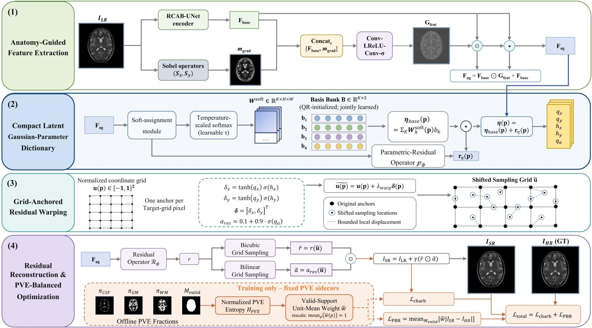
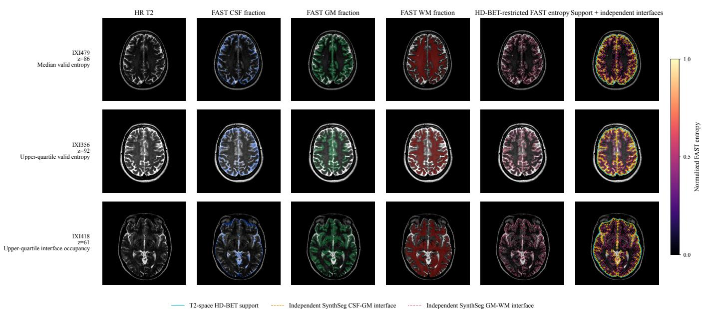
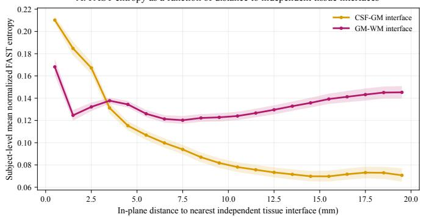
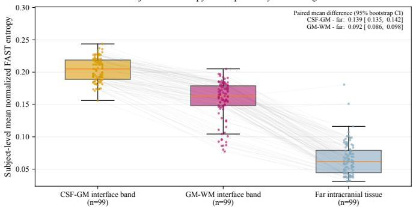
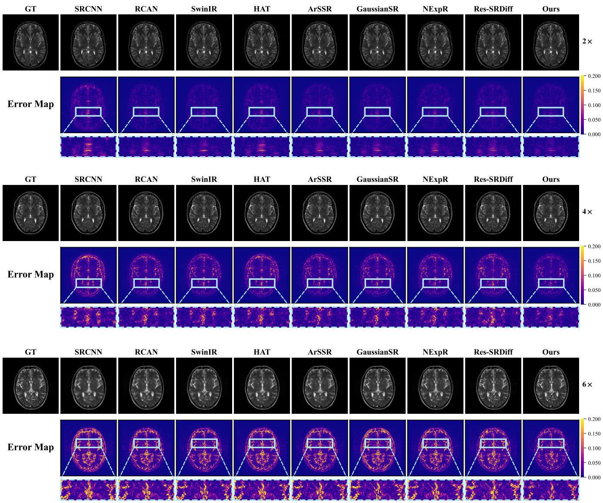
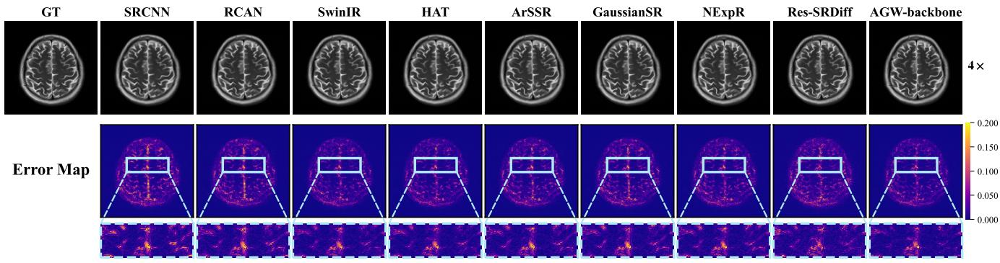
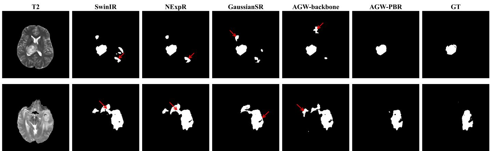

# Tissue-Mixture Entropy-Weighted Reconstruction for Partial-Volume-Aware Brain MRI Super-Resolution

Xiao Tonga,b, Wenyun Yanga, Ziheng Zhangc, Jingzhi Hana, Zhaochu Luoa, Jinbo Yanga,b,∗

aState Key Laboratory ofArtificial Microstructure and Mesoscopic Physics, School ofPhysics, Peking University, Beijing, 100871, P. R. China bWeihai Institute of Oceanology, Peking University, Weihai, 264209, P. R. China cBeijing MagnVue Medix Co., Ltd., Beijing, 100085, P. R. China

## Abstract

Full-image objectives in brain magnetic resonance imaging (MRI) super-resolution (SR) can underweight tissue-transition regions2 afected by the partial-volume efect (PVE), as these regions occupy only a small fraction of the image. Binary boundaries also0 do not capture the continuous mixture of cerebrospinal fluid, gray matter, and white matter within a voxel. We propose Anatomy Guided Gaussian-Parameter Warping with PVE-Balanced Reconstruction (AGW-PBR), which combines a low-resolution (LR)-g only reconstruction backbone with a training-time objective that emphasizes tissue transitions. The backbone integrates LR-derivedu Sobel guidance, soft latent-basis assignment, and bounded grid-anchored residual warping. Fixed, quality-controlled tissue frac-A tions derived from registered T /T /PD IXI images are converted into tissue-mixture entropy, which defines mean-normalized reconstruction weights within validated PVE support. These sidecars are used only during training, and inference requires only the2 LR image. AGW-PBR is evaluated on T -weighted IXI images at 2×, 4×, and 6× using three seeds and subject-level paired analyses. At 4×, test-only SynthSeg masks independently assess reconstruction in tissue-interface and non-interface regions. Targeted ablations examine valid-support supervision, spatially aligned entropy weighting, and soft latent assignment. The AGW-backbone is also trained from scratch on fastMRI at 4× without PVE supervision. AGW-PBR improves full-image reconstruction across the tested IXI scales and regional fidelity at 4×, while the PVE-free backbone retains strong performance on fastMRI. These findingss support tissue-mixture entropy weighting for partial-volume-aware brain MRI SR.

Keywords: MRI super-resolution; Partial-volume efect; Tissue-mixture entropy; PVE-balanced reconstruction

## 1. Introduction

Magnetic resonance imaging (MRI) provides strong soft  
tissue contrast for structural assessment and quantitative im-2   
age analysis. High spatial resolution is particularly important8   
in brain MRI for delineating cortical folds, tissue interfaces,0   
and small anatomical structures. However acquiring images at6 a higher spatial resolution generally requires longer scan time   
and introduces trade-ofs in signal-to-noise ratio, motion sen-v   
sitivity, and clinical throughput (Wu et al., 2023; Lyu et al., 2020). Image super-resolution (SR) provides a computational   
alternative by estimating a high-resolution (HR) image froma a low-resolution (LR) observation without modifying scanner hardware.

MRI SR is ill-posed because the image acquisition removes high-frequency information that cannot be uniquely recovered from the LR observation. The main challenge in brain MRI is therefore not merely to produce sharper images, but to reconstruct fine structures and tissue transitions that remain supported by the observation. At finite spatial resolution, voxels at cerebrospinal fluid (CSF), gray matter (GM), and white matter (WM) interfaces may contain contributions from multiple tissues, resulting in partial-volume efects (PVEs) (Ballester et al., 2002; Van Leemput et al., 2003; Tohka et al., 2004). These transition regions occupy a relatively small portion of the image, and their errors may have limited aggregate influence under full-image objectives dominated by homogeneous regions.

Recent MRI SR methods have used convolutional and Transformer architectures, continuous image representations, difusion models, and anatomy-aware priors to improve contextual modeling, scale flexibility, and high-frequency reconstruction (Zhang et al., 2018b; Liang et al., 2021; Wu et al., 2023; Pang et al., 2025; Safari et al., 2025; Wang et al., 2024, 2026; Luo et al., 2025). Most are optimized with losses aggregated over the full image, so errors in small tissue-transition regions can have limited influence relative to errors in homogeneous regions. Boundary-aware losses can place greater emphasis on contours (Liu et al., 2019), but binary edges cannot represent the continuous CSF/GM/WM composition of a partial-volume voxel. Multi-contrast guidance provides complementary structural information, but it requires an extra acquisition and re lies on accurate cross-contrast correspondence (Lyu et al., 2020; Chen et al., 2025). PVE modeling in brain MRI has primarily addressed segmentation and tissue-fraction estimation (Zhang et al., 2001; Van Leemput et al., 2003; Tohka et al., 2004). Using fixed, quality-controlled tissue-mixture information as an SR training weight, together with LR-only inference and PVEfocused regional evaluation, therefore remains comparatively underexplored.

To address this gap, we propose Anatomy-Guided Gaussian-Parameter Warping with PVE-Balanced Reconstruction (AGW-PBR), which consists of an LR-only reconstruction backbone and a PVE-balanced training objective. The reconstruction backbone uses LR-derived structural guidance, compact soft latent assignment, and bounded grid-anchored residual warping. During training, fixed, quality-controlled CSF/GM/WM pseudo-label sidecars are used to compute tissue-mixture entropy, which is converted into a mean-normalized spatial reconstruction weight. The PVE sidecars are fixed training resources and are not prediction targets. During inference, the network receives only the LR image. In this work, “Gaussian-parameter” refers to the displacement and gating parameterization used by the warping module.

The contributions of this work are summarized as follows:

• We introduce PVE-Balanced Reconstruction, a trainingtime objective that converts tissue-mixture entropy derived from fixed PVE pseudo-label sidecars into meannormalized spatial weights. This objective increases the influence of PVE-afected tissue transitions while retaining full-image reconstruction supervision.

• We establish a quality-control procedure for the PVE pseudo-label sidecars and use independent SynthSeg segmentations to evaluate reconstruction in combined tissueinterface and non-interface intracranial regions on T - weighted IXI images.

• We develop an LR-only Anatomy-Guided Gaussian-Parameter Warping (AGW) reconstruction framework that combines structural guidance derived from the LR image, compact soft latent assignment, and bounded gridanchored residual warping.

• We evaluate the AGW-PBR model on the IXI dataset at 2×, 4×, and 6× under common data splits and degradation settings, with subject-level paired analysis. We separately evaluate the AGW reconstruction backbone on the fastMRI dataset under an independent SR-only protocol without PVE sidecars.

## 2. Related Work

## 2.1. MRI Super-Resolution Architectures

MRI super-resolution (SR) reconstructs a high-resolution (HR) image or volume from one or more low-resolution (LR) observations. Early methods relied on interpolation, projectionbased reconstruction, and handcrafted priors, with reconstruction constrained by explicit assumptions about smoothness, consistency, or sparsity (Keys, 1981; Stark and Oskoui, 1989; Sun et al., 2008; Yang et al., 2010). Learning-based methods difer mainly in how they model spatial context and represent the output. Convolutional networks use local and multiscale feature extraction, whereas Transformer-based models capture longer-range dependencies through attention (Zhang et al., 2018a,b; Liang et al., 2021; Forigua et al., 2022). These architectures form the backbone of many image-domain reconstruction methods and provide increasingly efective representations of local structure and global context.

Continuous representations reduce dependence on a fixed output grid by predicting image intensities at queried coordinates. General image SR methods such as LIIF, LTE, and CiaoSR infer pixel values from coordinate-conditioned features (Chen et al., 2021; Lee and Jin, 2022; Cao et al., 2023). In MRI SR, ArSSR learns an implicit representation for arbitraryscale 3-D reconstruction, while SA-INR combines implicit representation with locally aware spatial attention to support arbitrary reductions in inter-slice spacing (Wu et al., 2023; Wang et al., 2024). Other continuous formulations, including NExpR and GaussianSR, improve the computational eficiency or scale flexibility of arbitrary-scale reconstruction (Pang et al., 2025; Hu et al., 2025). These methods make the reconstruction scale queryable rather than restricting the model to a single predefined output grid.

Difusion-based SR reconstructs HR images through conditional generative refinement. Later studies have reduced sampling costs using compact priors, residual-shifting trajectories, and continuous-scale formulations (Saharia et al., 2023; Xia et al., 2023; Yue et al., 2023; Gao et al., 2023). In MRI SR, Res-SRDif applies residual-shifting difusion, Partial Difusion Models initialize the reverse process from an intermediate latent derived from the LR input, and PRDDif progressively recovers high-frequency k-space components for arbitrary-scale in-plane reconstruction (Safari et al., 2025; Zhao et al., 2025; Wang et al., 2026).

Together, these approaches improve contextual modeling, scale flexibility, and high-frequency reconstruction through different representations and optimization procedures.

## 2.2. Anatomical, Segmentation, and Tissue-Aware Guidance

Anatomical guidance can be incorporated into reconstruction through an additional MR contrast. Progressive fusion and mul tistage integration methods combine contrast-specific information at diferent stages of reconstruction, while cross-modality Transformers and deformable attention align or aggregate features across spatial neighborhoods (Lyu et al., 2020; Feng et al., 2021; Fang et al., 2022; Zou et al., 2023; Chen et al., 2025). The additional contrast provides useful anatomical correspondence, but it also introduces acquisition and registration requirements that are absent from single-image SR.

More explicit priors enter as learned anatomical representations or task constraints. PGASR uses rough structure maps to condition a discrete anatomical codebook and aligns codebook representations across adjacent slices and the LR and HR domains (Luo et al., 2025). SCSR instead couples an SR model with a frozen cortical-ribbon segmentation model and uses the segmentation loss to constrain SR training within a cortical surface reconstruction pipeline (Wu et al., 2024). These approaches place anatomical information in the learned representation or in the training objective. Tissue-aware guidance can also be predicted internally. BME-X employs a tissueclassification network to produce per-voxel categorical probabilities for background, CSF, GM, and WM; the classification output is concatenated with the low-quality image as input to its enhancement network (Sun et al., 2025). This design provides tissue-related guidance within the reconstruction network, whereas continuous tissue fractions describe the relative composition of multiple tissues within a voxel.

## 2.3. Partial-Volume Efects and Tissue-Mixture Modeling

Partial-volume efects (PVEs) arise when finite spatial resolution causes a voxel to contain signal contributions from multiple tissues. In brain MRI, such voxels commonly occur at CSF, GM, and WM interfaces, where the measured intensity depends on tissue composition, voxel geometry, acquisition orientation, and the imaging point-spread function (Ballester et al., 2002; Tohka et al., 2004). Brain PVE research has therefore focused mainly on mixture modeling, segmentation, and tissue-fraction estimation. Hidden Markov randomfield and expectation-maximization methods combine tissueintensity distributions with spatial regularization, while statistical partial-volume models estimate continuous tissue fractions for anatomical delineation and volumetric measurement (Zhang et al., 2001; Van Leemput et al., 2003; Tohka et al., 2004). These fractions are model-derived estimates whose reliability depends on image quality and modeling assumptions.

Boundary information and tissue fractions describe complementary properties of an interface. Boundary-aware objectives can increase the contribution of reconstruction errors near structural contours (Liu et al., 2019). A boundary marks where a transition occurs, whereas a CSF/GM/WM fraction vector describes the relative tissue composition within a voxel. Tissue fractions therefore provide a continuous description of tissue mixture that is not captured by a binary contour alone.

Existing MRI SR methods provide stronger feature representations, generative priors, anatomical guidance, segmentation constraints, or categorical tissue cues. Our study uses fixed, quality-controlled CSF/GM/WM PVE pseudo-label sidecars to derive tissue-mixture entropy for training-time spatial reconstruction weighting. Independent SynthSeg segmentations define the primary test-time regional evaluation masks.

## 3. Methods

## 3.1. Problem Formulation and Method Overview

Let $\Omega \ = \ \{ 1 , \dots , H \} \times \{ 1 , \dots , W \}$ denote the target Cartesian grid. The scalar images $I _ { \mathrm { L R } } , I _ { \mathrm { H R } } , I _ { \mathrm { S R } } : \Omega \to \mathbb { R }$ denote, respectively, the LR-derived observation represented on this grid, its HR target, and the reconstructed output. With a fixed degradation-and-resampling operator D and a reconstruction network $\mathcal { F } _ { \phi }$ parameterized by ϕ, the problem is

$$
I _ { \mathrm { L R } } = \mathcal { D } ( I _ { \mathrm { H R } } ) , \quad I _ { \mathrm { S R } } = \mathcal { F } _ { \phi } ( I _ { \mathrm { L R } } ) .\tag{1}
$$

Anatomy-Guided Gaussian-Parameter Warping with PVE-Balanced Reconstruction (AGW-PBR, Fig. 1) separates an

LR-only reconstruction pathway from a training-only PVEbalanced objective. The reconstruction pathway derives a Sobel-gradient cue from $I _ { \mathrm { L R } } .$ , uses it to modulate learned image features, and predicts a five-dimensional local code through a softly assigned latent basis bank. This code produces bounded displacements and gates for grid-anchored residual warping. During training, fixed ofline PVE sidecars weight reconstruction errors within quality-controlled support but never enter the network.

## 3.2. Anatomy-Guided Feature Extraction

A learned RCAB U-Net-style encoder $\mathcal { E } _ { \phi }$ maps the LRderived observation to the base feature tensor

$$
\mathbf { F } _ { \mathrm { b a s e } } = \mathcal { E } _ { \phi } ( I _ { \mathrm { L R } } ) \in \mathbb { R } ^ { C _ { f } \times H \times W } ,\tag{2}
$$

where $C _ { f }$ is the feature-channel count. Fixed horizontal and vertical Sobel kernels $\mathbf { S } _ { x } , \mathbf { S } _ { \mathrm { v } } \in \mathbb { R } ^ { 3 \times 3 }$ produce scalar response fields and their gradient magnitude:

$$
\begin{array} { r l r } & { } & { g _ { x } = I _ { \mathrm { L R } } * \mathbf { S } _ { x } , \qquad g _ { y } = I _ { \mathrm { L R } } * \mathbf { S } _ { y } , } \\ & { } & { m _ { \mathrm { g r a d } } = \sqrt { g _ { x } ^ { 2 } + g _ { y } ^ { 2 } + \epsilon _ { g } } . } \end{array}\tag{3}
$$

The symbol ∗ is reserved for two-dimensional convolution, and $\epsilon _ { g } = 1 0 ^ { - 6 }$ is a numerical stabilizer. Because $m _ { \mathrm { g r a d } }$ is computed from $I _ { \mathrm { L R } }$ , it is neither a tissue segmentation nor an external anatomical label.

The gate predictor is decomposed into explicit intermediate tensors:

$$
\begin{array} { r l } & { \mathbf { F } _ { \mathrm { c a t } } = \mathrm { C o n c a t } _ { c } ( \mathbf { F } _ { \mathrm { b a s e } } , m _ { \mathrm { g r a d } } ) , } \\ & { \mathbf { F } _ { \mathrm { g a t e } } = \delta ( C _ { 1 } ( \mathbf { F } _ { \mathrm { c a t } } ) ) , } \\ & { \mathbf { G } _ { \mathrm { f e a t } } = \sigma ( C _ { 2 } ( \mathbf { F } _ { \mathrm { g a t e } } ) ) , } \end{array}\tag{4}
$$

where Concatc denotes channel-wise concatenation, $C _ { 1 }$ and $C _ { 2 }$ are learned convolutional operators, δ is a Leaky ReLU, and $\sigma$ is the sigmoid function. Thus, $\mathbf { F } _ { \mathrm { c a t } } \in \mathbb { R } ^ { ( C _ { f } + 1 ) \times \bar { H } \times W }$ and $\mathbf { G } _ { \mathrm { f e a t } } \in$ $( 0 , 1 ) ^ { C _ { f } \times H \times W }$ . Element-wise residual modulation gives

$$
\mathbf { F } _ { \mathrm { a g } } = \mathbf { F } _ { \mathrm { b a s e } } + \mathbf { F } _ { \mathrm { b a s e } } \odot \mathbf { G } _ { \mathrm { f e a t } } ,\tag{5}
$$

where $\odot$ denotes element-wise multiplication between shapecompatible fields or tensors. This image-derived guidance pathway is active during both training and inference.

## 3.3. Compact Latent Gaussian-Parameter Dictionary

An assignment operator $\mathcal { A } _ { \phi }$ predicts K basis logits from the anatomy-guided features:

$$
\mathbf { Z } = \mathcal { A } _ { \phi } ( \mathbf { F } _ { \mathrm { a g } } ) \in \mathbb { R } ^ { K \times H \times W } .\tag{6}
$$

At each anchor $\mathbf { p } \in \Omega$ , the final model normalizes these logits along the K-basis axis:

$$
W _ { k } ^ { \mathrm { s o f t } } ( { \bf { p } } ) = \frac { { \displaystyle \exp ( Z _ { k } ( { \bf { p } } ) / \tau ) } } { \displaystyle \sum _ { j = 1 } ^ { K } \exp \bigl ( Z _ { j } ( { \bf { p } } ) / \tau \bigr ) } , \quad k = 1 , \ldots , K .\tag{7}
$$

  
Fig. 1. Overview of AGW-PBR, which reconstructs high-resolution MRI in four stages. (1) Anatomy-Guided Feature Extraction: an RCAB U-Net extracts base features, while Sobel gradients guide feature modulation to obtain $\mathbf { F } _ { \mathrm { a g } } . \left( 2 \right)$ Compact Latent Gaussian-Parameter Dictionary: temperature-scaled soft assignment combines four anonymous learned bases, and a parameter-residual branch refines the resulting five-dimensional local code. (3) Grid-Anchored Residual Warping: the local code is decoded into bounded displacements and a residual gate, which define the shifted sampling grid eu. (4) Residual Reconstruction & PVE-Balanced Optimization: the residual field and gate are sampled on eu and combined with I to produce $I _ { \mathrm { S R } }$ . During training, fixed CSF, GM, and WM PVE fractions provide an entropy-derived unit-mean weight for LPBR, which is combined with $\mathcal { L } _ { \mathrm { c h a r b } }$

The temperature τ is a learnable scalar initialized to 1. The assignments satisfy $W _ { k } ^ { \mathrm { s o f t } } ( { \bf p } ) \geq 0$ and $\begin{array} { r } { \sum _ { k = 1 } ^ { K } W _ { k } ^ { \mathrm { s o f t } } ( \mathbf { p } ) = 1 } \end{array}$

Let $\mathbf { B } \in \mathbb { R } ^ { K \times D _ { \eta } }$ be the learned basis bank and let ${ \mathbf b } _ { k } \in \mathbb { R } ^ { D _ { \eta } }$ be its k-th row. A parameter-residual operator $\mathcal { P } _ { \phi }$ predicts ${ \bf R } _ { \eta } \in \mathbf { \Sigma }$ $\mathbb { R } ^ { D _ { \eta } \times H \times W }$ . The basis mixture and final local code are

$$
\begin{array} { c } { { \displaystyle \eta _ { \mathrm { b a s e } } ( { \bf p } ) = \sum _ { k = 1 } ^ { K } W _ { k } ^ { \mathrm { s o f t } } ( { \bf p } ) { \bf b } _ { k } , } } \\ { { { \bf R } _ { \eta } = \mathcal { P } _ { \phi } ( { \bf F } _ { \mathrm { a g } } ) , } } \\ { { \displaystyle \eta ( { \bf p } ) = \eta _ { \mathrm { b a s e } } ( { \bf p } ) + { \bf r } _ { \eta } ( { \bf p } ) } , } \end{array}\tag{8}
$$

where $\mathbf { r } _ { \eta } ( \mathbf { p } )$ is the $D _ { \eta }$ -vector at p in $\mathbf { R } _ { \eta } .$ . AGW-PBR uses $K = 4$ and $D _ { \eta } = 5$ , with

$$
\pmb { \eta } ( \mathbf { p } ) = [ q _ { x } ( \mathbf { p } ) , q _ { y } ( \mathbf { p } ) , h _ { x } ( \mathbf { p } ) , h _ { y } ( \mathbf { p } ) , q _ { a } ( \mathbf { p } ) ] ^ { \top } .\tag{9}
$$

Here, $q _ { x }$ and $q _ { y }$ are raw displacement logits, $h _ { x }$ and $h _ { y }$ are raw displacement-amplitude gate logits, and $q _ { a }$ is the raw residualintensity gate logit. The basis bank is QR-initialized and jointly optimized with the network.

## 3.4. Grid-Anchored Residual Warping and Reconstruction

A learned residual operator $\mathcal { R } _ { \phi }$ predicts a single-channel scalar field

$$
r = \mathcal { R } _ { \phi } ( \mathbf { F } _ { \mathrm { a g } } ) \in \mathbb { R } ^ { H \times W } .\tag{10}
$$

Five raw components in Eq. (9) are converted into a bounded displacement vector and a residual-intensity gate:

$$
\begin{array} { r l } & { \delta _ { x } ( \mathbf { p } ) = \operatorname { t a n h } ( q _ { x } ( \mathbf { p } ) ) \sigma ( h _ { x } ( \mathbf { p } ) ) , } \\ & { \delta _ { y } ( \mathbf { p } ) = \operatorname { t a n h } ( q _ { y } ( \mathbf { p } ) ) \sigma ( h _ { y } ( \mathbf { p } ) ) , } \\ & { \delta ( \mathbf { p } ) = [ \delta _ { x } ( \mathbf { p } ) , \delta _ { y } ( \mathbf { p } ) ] ^ { \top } , } \\ & { a _ { \mathrm { r e s } } ( \mathbf { p } ) = 0 . 1 + 0 . 9 \sigma ( q _ { a } ( \mathbf { p } ) ) . } \end{array}\tag{11}
$$

Thus, $h _ { x }$ and $h _ { y }$ modulate the displacement amplitude, and $a _ { \mathrm { r e s } }$ gates the predicted residual.

Let $\mathbf { u ( p ) } \in [ - 1 , 1 ] ^ { 2 }$ be the normalized coordinate of anchor p. The shifted sampling coordinate is

$$
\widetilde { \mathbf { u } } ( \mathbf { p } ) = \mathbf { u } ( \mathbf { p } ) + \lambda _ { \mathrm { w a r p } } \delta ( \mathbf { p } ) ,\tag{12}
$$

where $\lambda _ { \mathrm { w a r p } }$ is a fixed coeficient in normalized-grid coordinates $( \lambda _ { \mathrm { { w a r p } } } = 0 . 0 5 )$ . Define GridSample (X v) as sampling field X at normalized coordinates v using interpolation mode κ. The warped residual and gate are

$$
\begin{array} { r l } & { \widetilde { r } ( \mathbf { p } ) = \mathrm { G r i d S a m p l e } _ { \mathrm { b i c } } ( r , \widetilde { \mathbf { u } } ( \mathbf { p } ) ) , } \\ & { \widetilde { a } ( \mathbf { p } ) = \mathrm { G r i d S a m p l e } _ { \mathrm { l i n } } ( a _ { \mathrm { r e s } } , \widetilde { \mathbf { u } } ( \mathbf { p } ) ) . } \end{array}\tag{13}
$$

The residual sampler is bicubic, the gate sampler is bilinear, and both use reflection padding with aligned corner pixels. The

reconstructed image is

$$
\begin{array} { r } { I _ { \mathrm { S R } } ( \mathbf { p } ) = I _ { \mathrm { L R } } ( \mathbf { p } ) + \gamma ( \widetilde { r } \odot \widetilde { a } ) ( \mathbf { p } ) , } \end{array}\tag{14}
$$

where $\gamma$ is the fixed residual coeficient $( \gamma = 0 . 1 )$ . Eq. (14) combines one shifted residual sample with each grid anchor.

## 3.5. PVE-Balanced Reconstruction Objective

The PVE terms are derived from fixed, quality-controlled pseudo-label sidecars generated independently of model training. $\mathrm { T } _ { 1 }$ and PD volumes are rigidly registered to the fixed T2 reference using FLIRT. The validated T2-derived HD-BET brain mask is applied to the aligned $\mathrm { T } _ { 1 } , \mathrm { T } _ { 2 } .$ , and PD volumes before multi-channel tissue-fraction estimation with FAST in FSL 6.0.7.22. Following quality control, the CSF, GM, and WM fraction maps are stored ofline and used to construct the tissuemixture entropy field and valid-PVE mask employed during training. SynthSeg segmentations generated from the fixed HR $\mathrm { T } _ { 2 }$ test images independently define the regional evaluation masks. Further details on sidecar construction and quality control are provided in Appendices A–D of the Supplementary Material.

PVE-Balanced Reconstruction uses fixed sidecars constructed ofline. For image pair n, the tissue-fraction vector at p is

$$
\pi ^ { ( n ) } ( \mathbf { p } ) = [ \pi _ { \mathrm { C S F } } ^ { ( n ) } ( \mathbf { p } ) , \pi _ { \mathrm { G M } } ^ { ( n ) } ( \mathbf { p } ) , \pi _ { \mathrm { W M } } ^ { ( n ) } ( \mathbf { p } ) ] ^ { \mathrm { T } } ,\tag{15}
$$

from which the normalized entropy sidecar is constructed as

$$
\begin{array} { l } { { \displaystyle { \cal H } _ { \mathrm { P V E } } ^ { ( n ) } ( { \bf p } ) = - \frac { 1 } { \log 3 } \sum _ { \scriptstyle c \in \{ \mathrm { C S F , G M , W M } \} } \widetilde { \pi } _ { c } ^ { ( n ) } ( { \bf p } ) \log \left( \widetilde { \pi } _ { c } ^ { ( n ) } ( { \bf p } ) + \epsilon _ { h } \right) , } } \\ { { \displaystyle ~ \widetilde { \pi } _ { c } ^ { ( n ) } ( { \bf p } ) = \mathrm { c l i p } \left( \pi _ { c } ^ { ( n ) } ( { \bf p } ) , 0 , 1 \right) . } } \end{array}\tag{16}
$$

where $\epsilon _ { h } = 1 0 ^ { - 8 }$ ; the resulting entropy is then clipped to [0 1]. Eqs. (15) and (16) describe ofline sidecar construction. During network training, the resulting fixed entropy field and qualitycontrol mask are loaded; they are not predicted or recomputed by a trainable branch.

For a current minibatch of N pairs, define the active support

$$
\mathcal { V } _ { \mathrm { m b } } = \{ ( n , \mathbf { p } ) : n \in \{ 1 , \dots , N \} , ~ \mathbf { p } \in \Omega , ~ M _ { \mathrm { v a l i d } } ^ { ( n ) } ( \mathbf { p } ) = 1 \} .\tag{17}
$$

When $\mathcal { N } _ { \mathrm { m b } }$ is nonempty, let $H _ { \mathrm { m i n } }$ and $H _ { \mathrm { m a x } }$ be the minimum and maximum of H over this joint minibatch support. For $( n , \mathbf { p } ) \in \mathcal { V } _ { \mathrm { m b } }$ , the normalized guide is

$$
G ^ { ( n ) } ( \mathbf { p } ) = \left\{ \begin{array} { l l } { \displaystyle \frac { H _ { \mathrm { P V E } } ^ { ( n ) } ( \mathbf { p } ) - H _ { \mathrm { m i n } } } { H _ { \mathrm { m a x } } - H _ { \mathrm { m i n } } } , } & { H _ { \mathrm { m a x } } - H _ { \mathrm { m i n } } > \epsilon _ { h } , } \\ { 0 , } & { H _ { \mathrm { m a x } } - H _ { \mathrm { m i n } } \leq \epsilon _ { h } , } \end{array} \right.\tag{18}
$$

Thus, extrema are shared across all valid pixels in the current minibatch, and a constant guide becomes zero. $\operatorname { I f } \mathcal { V } _ { \mathrm { m b } }$ is empty, the implementation returns a safe zero PBR contribution.

For nonempty $\mathcal { V } _ { \mathrm { m b } } .$ , the raw weight, its valid-support mean, and the unit-mean weight are

$$
\begin{array} { l } { { \displaystyle { w } _ { \mathrm { r a w } } ^ { ( n ) } ( { \bf p } ) = 1 + \alpha _ { \mathrm { p v e } } G ^ { ( n ) } ( { \bf p } ) } , \ ~ } \\ { { \displaystyle ~ { \mu } _ { w } = \frac { 1 } { | \mathcal { V } _ { \mathrm { m b } } | } \sum _ { ( m , { \bf q } ) \in \mathcal { V } _ { \mathrm { m b } } } w _ { \mathrm { r a w } } ^ { ( m ) } ( { \bf q } ) } , \ ~ } \\ { { \displaystyle ~ \widehat { w } ^ { ( n ) } ( { \bf p } ) = \frac { w _ { \mathrm { r a w } } ^ { ( n ) } ( { \bf p } ) } { \mu _ { w } } } . \ ~ } \end{array}\tag{19}
$$

Here, $\alpha _ { \mathrm { p v e } }$ controls the relative emphasis on high-entropy locations. By construction, $\begin{array} { r } { | \mathcal { V } _ { \mathrm { m b } } | ^ { - 1 } \sum _ { \mathcal { V } _ { \mathrm { m b } } } \widehat { w } = 1 } \end{array}$

The PBR term is the valid-support weighted $L _ { 1 }$ error, including the empty-support safeguard:

$$
\mathcal { L } _ { \mathrm { P B R } } = \left\{ \begin{array} { l l } { \displaystyle \frac { 1 } { | \mathcal { V } _ { \mathrm { m b } } | } \sum _ { ( n , \mathbf { p } ) \in \mathcal { V } _ { \mathrm { m b } } } \widehat { w } ^ { ( n ) } ( \mathbf { p } ) \left| I _ { \mathrm { S R } } ^ { ( n ) } ( \mathbf { p } ) - I _ { \mathrm { H R } } ^ { ( n ) } ( \mathbf { p } ) \right| , } & { \left| \mathcal { V } _ { \mathrm { m b } } \right| > 0 , } \\ { 0 , } & { \left| \mathcal { V } _ { \mathrm { m b } } \right| = 0 . } \end{array} \right.\tag{20}
$$

The global single-channel Charbonnier loss reduces over every image and target-grid location:

$$
\mathcal { L } _ { \mathrm { c h a r b } } = \frac { 1 } { N | \Omega | } \sum _ { n = 1 } ^ { N } \sum _ { \mathbf { p } \in \Omega } \sqrt { \left( I _ { \mathrm { S R } } ^ { ( n ) } ( \mathbf { p } ) - I _ { \mathrm { H R } } ^ { ( n ) } ( \mathbf { p } ) \right) ^ { 2 } + \epsilon _ { c } ^ { 2 } } ,\tag{21}
$$

where $\epsilon _ { c } = 1 0 ^ { - 3 }$ . The final training objective is

$$
\begin{array} { r } { \mathcal { L } _ { \mathrm { t o t a l } } = \mathcal { L } _ { \mathrm { c h a r b } } + \mathcal { L } _ { \mathrm { P B R } } . } \end{array}\tag{22}
$$

The PVE fractions, entropy, and valid mask are fixed ofline resources, so gradients from L pass through $I _ { \mathrm { S R } }$ and the reconstruction network but not through sidecar construction.

## 3.6. Inference Boundary

At inference, the model uses only $I _ { \mathrm { L R } }$ , with Sobel guidance and target-grid coordinates generated internally. PVE sidecars are used only for IXI training and pseudo-label quality control, whereas SynthSeg-derived interfaces are used solely to construct ofline test-set evaluation masks.

## 4. Experiments

We evaluate AGW-PBR on $\mathrm { T } _ { 2 }$ -weighted images from the IXI dataset and further assess the AGW-backbone on $\mathrm { T } _ { 2 }$ -weighted images from the fastMRI dataset using a common degradation protocol and full-image evaluation framework but datasetspecific training protocols. The IXI dataset is the primary benchmark for reconstruction accuracy and PVE-aware tissueinterface analysis, whereas the fastMRI dataset provides an external-dataset evaluation of the AGW-backbone under independent PVE-free training.

## 4.1. Experimental Settings

Datasets. The IXI dataset1 is used as the primary benchmark for brain MRI super-resolution. After quality control, the dataset is divided at the subject level into 329 training, 47 validation, and 99 test subjects. All selected T -weighted slices have a fixed in-plane resolution of $2 5 6 \times 2 5 6$ . Full-image performance is evaluated at all three upsampling scales, whereas the independent SynthSeg-based regional analysis is conducted at 4×.

Table 1. Dataset and training-budget summary for the main experiments.
<table><tr><td>Dataset</td><td>Slice size</td><td>Scale(s)</td><td>Split</td><td>Training budget</td><td>Evaluation scope</td></tr><tr><td>IXI (T2)</td><td> $2 5 6 \times 2 5 6$ </td><td> $2 \times , 4 \times , 6 \times$ </td><td>329 train / 47 validation / 99 test subjects</td><td>80 epochs per scale / seed; seeds 42, 43, 44</td><td>Full-image and SynthSeg regional PSNR/SSIM.</td></tr><tr><td>fastMRI  $( \mathrm { T } _ { 2 } )$ </td><td> $3 2 0 \times 3 2 0$ </td><td>4x</td><td>200 train / 30 validation / 43 test subjects</td><td>80 epochs per seed; seeds 42, 43, 44</td><td>Full-image PSNR/SSIM.</td></tr></table>

Table 2. Quality-control summary of the IXI PVE pseudo-labels and independent interface masks.
<table><tr><td>Item</td><td>Value</td><td>Note</td></tr><tr><td>Retained cohort</td><td>475 subjects</td><td>329 training, 47 validation, and 99 test subjects pass brain-mask, registration, tissue-fraction, and sidecar quality control.</td></tr><tr><td>Validated sidecars</td><td>43,141 slices</td><td>Includes 8,998 test slices with unique subject-slice correspondence to the  $\mathrm { T } _ { 2 }$  images.</td></tr><tr><td>Multimodal preprocessing</td><td> $\mathrm { T } _ { 1 } / \mathrm { T } _ { 2 } / \mathrm { P D }$ </td><td> $\mathrm { T } _ { 1 }$  and PD are aligned to  $\mathrm { T } _ { 2 } ,$  and the same T2-derived HD-BET mask is applied to all three modalities before FAST.</td></tr><tr><td>Tissue fractions</td><td>CSF / GM / WM</td><td>Multi-channel FAST estimates the three partial-volume fractions on the  ${ \mathrm { T } } _ { 2 } { \mathrm { ~ g r i d } } .$ </td></tr><tr><td>Valid support</td><td>Intracranial valid voxels</td><td>The HD-BET mask is intersected with finite, in-range, sum-to-one-valid tissue fractions.</td></tr><tr><td>Excluded subjects</td><td>16</td><td>Fifteen fail to meet the brain-mask criteria, and IXI260 is excluded because of registration failure.</td></tr><tr><td>Independent evaluation masks</td><td>99 test subjects</td><td>SynthSeg-derived CSF-GM and GM-WM interfaces are used for offline regional evaluation.</td></tr></table>

We evaluate the AGW-backbone on the fastMRI dataset 2 (Knoll et al., 2020), using 200 subjects (3,200 slices) for training, 30 subjects (480 slices) for validation, and 43 subjects (688 slices) for testing. Table 1 summarizes the dataset sizes, training budgets, and evaluation scopes for the main experiments.

## 4.2. Degradation Protocol and Implementation Details

Degradation protocol. LR inputs are synthesized by a frequency-domain truncation (Lyu et al., 2020). For a scale factor s, we retain the central $1 / s \times 1 / s$ region of k-space and set the remaining high-frequency coeficients to zero before inverse Fourier reconstruction. This retains 25%, 6.25%, and 2.78% of k-space for 2×, 4×, and 6×, respectively.

Implementation Details. Our approach is implemented in Py-Torch and trained on a single NVIDIA RTX 5090 GPU. We trained the model for 80 epochs using Adam Optimizer with a batch size of 4. The initial learning rate is $2 \times 1 0 ^ { - 4 }$ and gradually reduced to $1 \times 1 0 ^ { - 6 }$ using a cosine annealing schedule. For the IXI dataset, the training objective is $\mathcal { L } _ { \mathrm { c h a r b } } + \mathcal { L } _ { \mathrm { P B R } }$ , with $\alpha _ { \mathrm { p v e } } = 0 . 1$ . For the fastMRI dataset, AGW-backbone is trained from scratch using only $\mathcal { L } _ { \mathrm { c h a r b } }$ . Fig. 2 shows the qualitative val idation layout for the IXI PVE pseudo-labels.

## 4.3. Quality Control ofthe PVE Pseudo-label Sidecars

The PVE pseudo-label sidecars are constructed from 491 IXI subjects. $\mathrm { T _ { 1 } }$ and PD volumes are aligned to $\mathrm { T } _ { 2 } ,$ the same $\mathrm { T } _ { 2 }$ -derived HD-BET mask is applied to all three modalities, and multi-channel FAST estimates the CSF/GM/WM fractions within the brain. Registration, brain-mask, tissue-fraction, and sidecar quality control retain 475 subjects: 329 training, 47 validation, and 99 test subjects. The retained set contains 43,141 sidecar slices, including 8,998 test slices; Table 2 summarizes these cohort and quality-control results.

During training, tissue-mixture entropy and valid-PVE sup port define the PVE-balanced reconstruction weights. Independent test-only SynthSeg segmentations define the CSF–GM and GM–WM interfaces used for regional evaluation. Detailed construction and quality-control procedures are provided in Appendices A–D of the Supplementary Material. Fig. 3 summarizes the spatial consistency analysis between FAST-derived tissuemixture entropy and independent SynthSeg interfaces.

Compared methods. We compare the evaluated configuration (AGW-PBR on IXI and AGW-backbone on fastMRI) with representative MRI SR baselines from several model families: SRCNN (Dong et al., 2015), RCAN (Zhang et al., 2018b), SwinIR (Liang et al., 2021), HAT (Chen et al., 2023), Ar-SSR (Wu et al., 2023), NExpR (Pang et al., 2025), GaussianSR (Hu et al., 2025), and Res-SRDif (Safari et al., 2025). To adapt the 3D-based ArSSR to our 2D in-plane MRI SR setting, we replace its 3D convolutional layers with their 2D counterparts. GaussianSR, NExpR, and Res-SRDif retain their original reconstruction frameworks, with only the input and output layers adapted for single-channel MR images. Res-SRDif follows its original configuration with 15 difusion and sampling steps, while GaussianSR retains its 128 × 128 patchbased training strategy. All comparisons use publicly available codebases, and all models are retrained on our MRI datasets until convergence.

  
Fig. 2. Qualitative validation of the IXI PVE pseudo-labels. FAST estimates CSF, GM, and WM fractions from brain-extracted T1/T2/PD images aligned in the T2 reference space, and tissue-mixture entropy is shown only within the quality-controlled intracranial support. SynthSeg-derived CSF–GM and GM–WM interfaces serve as independent automated anatomical references. The three cases correspond to the median entropy, upper-quartile entropy, and upper-quartile interface occupancy within the eligible test cohort.

A. FAST entropy as a function of distance to independent tissue interfaces  

B. Subject-level entropy in independently defined regions  
  
Fig. 3. Spatial consistency between FAST-derived tissue-mixture entropy and independent SynthSeg tissue interfaces in 99 test subjects. Panel A shows subject-level mean entropy within the valid PVE support as a function of the in-plane distance to the CSF–GM and GM–WM interfaces; shaded regions indicate 95% bootstrap confidence intervals. Panel B compares entropy within 2 mm of each interface with that in intracranial tissue at least 5 mm away. This analysis evaluates spatial agreement with an independent automated anatomical reference rather than absolute tissue-fraction accuracy.

Full-image metrics. We use PSNR and SSIM as full-image reconstruction metrics. Higher values indicate better fidelity to the HR target. These metrics are used for the IXI comparison, external-dataset fastMRI evaluation, and ablation analysis.

PVE-aware regional metrics. For the IXI 4× experiment, regional PSNR and global masked-vector SSIM are computed in independent SynthSeg-defined interface and non-interface in tracranial regions. The interface region is formed by one threedimensional six-neighbour dilation of the CSF–GM, GM–WM, and CSF–WM interfaces; the remaining intracranial voxels define the non-interface region. A common manifest contains 10,872 eligible slices from all 99 test subjects. Slice-level scores are averaged within subject and then across seeds before cohort summarization.

Statistical analysis. Statistical comparisons use subject-level paired summaries to avoid treating slices from the same subject as independent samples. For each scale, AGW-PBR is compared with each baseline using paired diferences in PSNR and SSIM. We report efect estimates with 95% bootstrap confidence intervals. Statistical significance is assessed using twosided Wilcoxon signed-rank tests with Holm correction within each scale.

Table 3. Quantitative results on the IXI test cohort. Slice-level scores are averaged within each subject, and results from seeds 42, 43, and 44 are then averaged within subject before reporting the cohort mean ± sample standard deviation. Bold: best. Underline: second-best.
<table><tr><td>Method</td><td>2× PSNR ↑</td><td>2× SSIM ↑</td><td>4× PSNR ↑</td><td>4× SSIM ↑</td><td>6× PSNR ↑</td><td>6× SSIM ↑</td></tr><tr><td>SRCNN</td><td> $3 6 . 1 3 0 \pm 1 . 0 7 6$ </td><td> $0 . 9 7 1 1 \pm 0 . 0 0 4 9$ </td><td> $2 9 . 1 5 7 \pm 0 . 8 5 1$ </td><td> $0 . 8 9 7 2 \pm 0 . 0 1 2 2$ </td><td> $2 6 . 8 9 2 \pm 0 . 8 1 0$ </td><td> $0 . 8 4 0 2 \pm 0 . 0 1 7 0$ </td></tr><tr><td>RCAN</td><td> $3 9 . 4 9 8 \pm 1 . 0 8 5$ </td><td> $0 . 9 8 2 7 \pm 0 . 0 0 4 3$ </td><td> $3 1 . 1 9 4 \pm 0 . 8 2 2$ </td><td> $0 . 9 2 8 0 \pm 0 . 0 1 0 8$ </td><td> $2 8 . 0 2 6 \pm 0 . 8 3 8$ </td><td> $0 . 8 6 9 8 \pm 0 . 0 1 6 2$ </td></tr><tr><td>SwinIR</td><td> $3 9 . 6 2 0 \pm 1 . 0 9 4$ </td><td> $0 . 9 8 3 0 \pm 0 . 0 0 4 2$ </td><td> $3 1 . 5 5 6 \pm 0 . 8 1 5$ </td><td> $0 . 9 3 2 5 \pm 0 . 0 1 0 5$ </td><td> $2 8 . 3 9 4 \pm 0 . 8 1 5$ </td><td> $\underline { { 0 . 8 7 9 1 \pm 0 . 0 1 5 5 } }$ </td></tr><tr><td>HAT</td><td> $3 8 . 4 1 4 \pm 1 . 0 2 1$ </td><td> $0 . 9 7 9 9 \pm 0 . 0 0 4 4$ </td><td> $3 0 . 3 9 3 \pm 0 . 8 1 5$ </td><td> $0 . 9 1 7 9 \pm 0 . 0 1 1 3$ </td><td> $2 7 . 4 8 2 \pm 0 . 8 2 0$ </td><td> $0 . 8 5 5 3 \pm 0 . 0 1 6 9$ </td></tr><tr><td>ArSSR</td><td> $3 9 . 6 3 8 \pm 1 . 0 9 3 $ </td><td> $0 . 9 8 3 1 \pm 0 . 0 0 4 3$ </td><td> $3 1 . 3 8 3 \pm 0 . 8 2 9$ </td><td> $0 . 9 3 1 3 \pm 0 . 0 1 0 7$ </td><td> $2 8 . 1 3 2 \pm 0 . 8 4 4$ </td><td> $0 . 8 7 5 1 \pm 0 . 0 1 6 0$ </td></tr><tr><td>GaussianSR</td><td> $3 9 . 6 2 6 \pm 1 . 0 9 5$ </td><td> $0 . 9 8 2 9 \pm 0 . 0 0 4 3$ </td><td> $3 1 . 3 8 6 \pm 0 . 8 3 4$ </td><td> $0 . 9 3 0 7 \pm 0 . 0 1 0 9$ </td><td> $2 7 . 7 4 0 \pm 0 . 8 3 4$ </td><td> $0 . 8 6 8 4 \pm 0 . 0 1 6 1$ </td></tr><tr><td>NExpR</td><td> $\underline { { 3 9 . 7 1 0 \pm 1 . 1 0 0 } }$ </td><td> $0 . 9 8 3 3 \pm 0 . 0 0 4 2$ </td><td> $3 1 . 4 0 6 \pm 0 . 8 2 7$ </td><td> $0 . 9 3 1 4 \pm 0 . 0 1 0 7$ </td><td> $2 8 . 1 5 7 \pm 0 . 8 4 6$ </td><td> $0 . 8 7 5 1 \pm 0 . 0 1 6 0$ </td></tr><tr><td>Res-SRDiff</td><td> $3 8 . 5 7 9 \pm 1 . 1 1 2$ </td><td> $0 . 9 7 7 9 \pm 0 . 0 0 5 2$ </td><td> $3 0 . 5 6 8 \pm 0 . 8 8 5$ </td><td> $0 . 9 1 9 0 \pm 0 . 0 1 3 6$ </td><td> $2 7 . 3 9 3 \pm 0 . 8 5 7$ </td><td> $0 . 8 6 4 6 \pm 0 . 0 1 9 0$ </td></tr><tr><td>AGW-PBR (Ours)</td><td> $\mathbf { 3 9 . 8 8 1 \pm 1 . 1 3 0 }$ </td><td> $\mathbf { 0 . 9 8 3 4 \pm 0 . 0 0 4 3 }$ </td><td> $\mathbf { 3 2 . 8 4 4 \pm 1 . 0 0 8 }$ </td><td> $\mathbf { 0 . 9 4 6 0 \pm 0 . 0 1 1 2 }$ </td><td> $\mathbf { 2 9 . 5 4 9 \pm 0 . 9 1 3 }$ </td><td> $\mathbf { 0 . 9 0 2 4 \pm 0 . 0 1 5 7 }$ </td></tr></table>

## 4.4. Results on the IXI Dataset

Qualitative Results. Fig. 4 shows representative qualitative results on the IXI dataset under 2×, 4×, and 6× upsampling. In addition to the super-resolution results, we provide the corresponding error maps, computed as the pixel-wise absolute diferences between the reconstructed images and the highresolution references. These maps directly visualize deviations from the ground truth, where lower intensity indicates smaller reconstruction error and higher intensity indicates larger discrepancy. At 2×, most learning-based methods preserve the global brain morphology reasonably well, and the visible differences are mainly concentrated around fine anatomical structures and high-contrast tissue interfaces, including ventricular boundaries and adjacent parenchymal regions. Under this mild degradation setting, AGW-PBR shows lower residual intensity in the highlighted ROIs while preserving local anatomical continuity.

As the upsampling factor increases, the diferences among methods become more evident. Several CNN- and Transformer-based baselines show stronger smoothing of fine anatomical structures, resulting in less distinct local tissue boundaries and weaker high-frequency details. Several representation-based methods retain the overall anatomical layout, but their error maps still show residuals concentrated around high-frequency tissue transitions. In contrast, AGW-PBR shows lower residual intensity in the highlighted regions and better preserves the continuity of prominent anatomical boundaries, particularly around ventricular and adjacent tissueinterface regions.

Quantitative Results. Table 3 reports the subject-level quantitative results on IXI. AGW-PBR achieves the highest PSNR and SSIM across all three upsampling factors. At 2×, the improvement over the strongest baselines is modest, which is expected because the degradation is mild and several methods already reconstruct the images with high fidelity. The advantage becomes clearer at 4× and 6×, where downsampling removes more highfrequency anatomical information. This scale-dependent behavior indicates that AGW-PBR is most beneficial under more challenging SR settings, especially when fine tissue structures must be recovered from strongly degraded inputs.

The paired analysis in Table 5 further supports this observation. AGW-PBR yields positive paired diferences against all compared methods, with the strongest practical gains observed at higher upsampling factors. Compared with the strongest nonours baselines, the improvement is small but consistent at 2×, and becomes more evident at 4× and 6×. Therefore, the quantitative results do not only show higher mean values; they also indicate a stable subject-level advantage under progressively more challenging degradation.

Table 4 reports reconstruction fidelity in independent SynthSeg-defined interface and non-interface intracranial regions. AGW-PBR achieves the highest PSNR and SSIM in both regions, indicating consistent reconstruction gains near tissue interfaces without reduced fidelity elsewhere in the intracranial volume.

Overall, the IXI experiments provide consistent evidence from qualitative inspection, global quantitative metrics, paired statistical analysis, and PVE-aware regional evaluation. AGW-PBR yields modest but stable improvements under mild degradation, and its advantage becomes more pronounced when stronger downsampling requires the recovery of fine anatomical structures.

## 4.5. Results on thefastMRI Dataset

Qualitative Results. Fig. 5 shows representative qualitative results on the fastMRI dataset under 4× upsampling. In the highlighted ROIs, AGW-backbone shows the lowest error-map intensity among the compared methods, suggesting cleaner local reconstruction and fewer residual errors in this region.

Quantitative Results. Table 6 presents the separate fastMRI evaluation of the PVE-free AGW-backbone under conventional full-image supervision. AGW-backbone achieves the highest PSNR and SSIM among the compared methods. These results show that the proposed backbone retains competitive super-resolution performance on an external MR dataset without PVE-based weighting or tissue-interface supervision, supporting the efectiveness of the reconstruction architecture itself.

## 4.6. Ablation Study

The ablation study evaluates the contribution of valid-support reconstruction, the spatial correspondence of entropy-based weighting, and the dictionary assignment rule. Full-image PSNR and SSIM are computed over all 12,870 test slices, with slice-level values averaged within each of the 99 subjects before cohort aggregation. SynthSeg interface metrics use the same canonical set of 10,872 eligible test slices for every variant. Regional values are first averaged within each subject and then summarized across the 99 subject means.

Fig. 4. Qualitative results on the IXI dataset under 2×, 4×, and 6× upsampling. Blue boxes mark the ROI in the error maps, where stronger residual intensity indicates larger deviation from the HR reference.  
  
Fig. 5. Qualitative results on the fastMRI dataset under 4× upsampling. Blue boxes mark the ROI in the error maps, where stronger residual intensity indicates larger deviation from the HR reference.

Table 4. Independent SynthSeg regional reconstruction fidelity on the IXI dataset at 4×. Every method and seed uses the same canonical manifest of 10,872 eligible slices from 99 test subjects. Slice-level metrics are averaged within subject, and seeds 42, 43, and 44 are then averaged within subject before reporting the cohort mean ± sample standard deviation. Interface regions are derived from SynthSeg labels on the locked HR $\mathrm { T } _ { 2 }$ images, and regional SSIM uses the global masked-vector statistic. Bold: best. Underline: second-best.
<table><tr><td>Method</td><td></td><td>Combined-interface PSNR ↑ Combined-interface SSIM ↑ Non-interface PSNR ↑ Non-interface SSIM ↑</td><td></td><td></td></tr><tr><td>SRCNN</td><td> $2 3 . 7 0 5 \pm 1 . 0 6 6$ </td><td> $0 . 8 9 7 7 \pm 0 . 0 1 5 9$ </td><td> $2 5 . 4 0 8 \pm 0 . 9 1 8$ </td><td> $0 . 9 1 8 3 \pm 0 . 0 1 4 3$ </td></tr><tr><td>RCAN</td><td> $2 5 . 8 5 2 \pm 0 . 9 8 7$ </td><td> $0 . 9 3 7 9 \pm 0 . 0 1 0 4$ </td><td> $2 7 . 1 6 5 \pm 0 . 8 9 1$ </td><td> $0 . 9 4 3 9 \pm 0 . 0 1 1 4$ </td></tr><tr><td>SwinIR</td><td> $2 6 . 1 2 8 \pm 0 . 9 7 8$ </td><td> $0 . 9 4 4 0 \pm 0 . 0 0 9 6$ </td><td> $2 7 . 4 9 0 \pm 0 . 9 1 0$ </td><td> $\underline { { 0 . 9 4 8 4 \pm 0 . 0 1 1 0 } }$ </td></tr><tr><td>HAT</td><td> $2 5 . 0 2 3 \pm 0 . 9 8 4$ </td><td> $0 . 9 2 6 1 \pm 0 . 0 1 1 8$ </td><td> $2 6 . 3 7 6 \pm 0 . 8 7 1$ </td><td> $0 . 9 3 3 8 \pm 0 . 0 1 2 5$ </td></tr><tr><td>ArSSR</td><td> $2 6 . 0 9 0 \pm 0 . 9 8 1$ </td><td> $0 . 9 4 1 3 \pm 0 . 0 0 9 7$ </td><td> $2 7 . 4 0 3 \pm 0 . 8 9 9$ </td><td> $0 . 9 4 7 1 \pm 0 . 0 1 1 0$ </td></tr><tr><td>GaussianSR</td><td> $2 6 . 1 5 7 \pm 0 . 9 8 9$ </td><td> $0 . 9 4 2 1 \pm 0 . 0 0 9 7$ </td><td> $2 7 . 5 3 1 \pm 0 . 9 0 2$ </td><td> $0 . 9 4 8 1 \pm 0 . 0 1 0 9$ </td></tr><tr><td>NExpR</td><td> $2 6 . 3 2 3 \pm 0 . 9 8 7$ </td><td> $0 . 9 4 1 7 \pm 0 . 0 0 9 7$ </td><td> $2 7 . 4 1 8 \pm 0 . 8 9 9$ </td><td> $0 . 9 4 6 9 \pm 0 . 0 1 1 0$ </td></tr><tr><td>Res-SRDiff</td><td> $2 5 . 4 4 9 \pm 1 . 0 5 3$ </td><td> $0 . 9 3 3 3 \pm 0 . 0 1 1 2$ </td><td> $2 6 . 6 6 7 \pm 0 . 9 7 2$ </td><td> $0 . 9 3 8 6 \pm 0 . 0 1 3 6$ </td></tr><tr><td>AGW-PBR (Ours)</td><td> ${ \pm 7 . 7 8 4 \pm 1 . 1 7 7 }$ </td><td> $\mathbf { 0 . 9 5 9 0 \pm 0 . 0 0 9 6 }$ </td><td> $\mathbf { 2 8 . 9 0 9 \pm 1 . 1 2 9 }$ </td><td> $\mathbf { 0 . 9 6 2 3 \pm 0 . 0 0 9 } 7$ </td></tr></table>

Table 5. Paired improvements of AGW-PBR over baselines on IXI. Values denote paired diferences with 95% bootstrap confidence intervals.
<table><tr><td rowspan="2">Baseline</td><td colspan="3">∆PSNR (dB)</td><td colspan="3">∆SSIM</td></tr><tr><td> $2 \times$ </td><td>4x</td><td>6x</td><td> $2 \times$ </td><td>4x</td><td>6x</td></tr><tr><td>SRCNN</td><td>+3.751 [+3.661, +3.836]***</td><td>+3.687 [+3.553, +3.830]*** +2.657 [+2.552, +2.761]***</td><td></td><td>+0.0124 [+0.0120, +0.0127]***</td><td>+0.0489 [+0.0473, +0.0504]***</td><td>+0.0621 [+0.0603, +0.0640]***</td></tr><tr><td>RCAN</td><td>+0.383 [+0.344, +0.422]***</td><td> $+ 1 . 6 5 0 [ + 1 . 5 3 0 , + 1 . 7 7 1 ] ^ { \ast \ast }$ </td><td> $+ 1 . 5 2 3 \ [ + 1 . 4 3 1 , + 1 . 6 1 3 ] ^ { * * * }$ </td><td>+0.0007 [+0.0006, +0.0008]***</td><td>+0.0180 [+0.0171, +0.0191]***</td><td>+0.0326 [+0.0312, +0.0340]***</td></tr><tr><td>SwinIR</td><td>+0.261  $[ + 0 . 2 2 5 , + 0 . 2 9 7 ] ^ { \ast \ast * }$ </td><td>+1.288  $[ + 1 . 1 7 4 , + 1 . 3 9 8 ] ^ { \ast \ast * }$ </td><td> $+ 1 . 1 5 5 \ [ + 1 . 0 6 9 , + 1 . 2 3 7 ] ^ { \ast \ast + }$ </td><td>+0.0004 [+0.0004, +0.0005]***</td><td>+0.0135 [+0.0126, +0.0144]***</td><td>+0.0233 [+0.0220, +0.0245]***</td></tr><tr><td>HAT</td><td>+1.468 [+1.411, +1.520]***</td><td>+2.451 [+2.317, +2.577]*** +2.067 [+1.969, +2.163]***</td><td></td><td>+0.0036 [+0.0034, +0.0037]***</td><td>+0.0281 [+0.0269, +0.0293]*** +0.0471 [+0.0454, +0.0488]***</td><td></td></tr><tr><td>ArSSR</td><td>+0.243 [+0.203, +0.284]***</td><td>+1.461 [+1.338, +1.580]*** +1.417</td><td> $[ + 1 . 3 1 7 , + 1 . 5 1 2 ] ^ { * * * }$ </td><td>+0.0003  $\bar { [ + 0 . 0 0 0 2 , + 0 . 0 0 0 4 ] ^ { * * * } }$ </td><td>+0.0147 [+0.0137, +0.0157]*** +0.0273 [+0.0259, +0.0288]***</td><td></td></tr><tr><td>GaussianSR</td><td>+0.255 [+0.215, +0.297]***</td><td> $+ 1 . 4 5 7 \ [ + 1 . 3 3 5 , + 1 . 5 8 2 ] ^ { \ast \ast }$ </td><td>+1.809  $[ + 1 . 7 0 4 , + 1 . 9 0 4 ] ^ { * * * }$ </td><td>+0.0005  $[ + 0 . 0 0 0 4 , + 0 . 0 0 0 6 ] ^ { \ast \ast * }$ </td><td>+0.0153 [+0.0143, +0.0163]***</td><td>+0.0340 [+0.0324, +0.0356]***</td></tr><tr><td> $\mathrm { N E x p R }$ </td><td>+0.171 [+0.131, +0.213]***</td><td>+1.437 [+1.313, +1.556]***</td><td>+1.392 [+1.297, +1.488]***</td><td>+0.0001 [+0.0001, +0.0002]***</td><td>+0.0147 [+0.0137, +0.0156]***</td><td>+0.0273 [+0.0258, +0.0288]***</td></tr><tr><td>Res-SRDiff</td><td>+1.302 [+1.263, +1.345]***</td><td>+2.276 [+2.159, +2.388]***</td><td>+2.156 [+2.065, +2.244]***</td><td>+0.0056 [+0.0054, +0.0058]***</td><td>+0.0270 [+0.0259, +0.0282]*** +0.0378</td><td> $[ + 0 . 0 3 6 2 , + 0 . 0 3 9 3 ] ^ { \ast \ast \ast }$ </td></tr></table>

∆ denotes AGW-PBR minus the corresponding baseline. ∗∗∗ indicates a statistically significant paired improvement under a two-sided Wilcoxon signed-rank test with Holm correction $( p _ { \mathrm { H o l m } } < 0 . 0 0 1 ;$ ; observed adjusted p-value range: $2 . 2 8 \times 1 0 ^ { - 1 7 } { - 9 . 1 3 \times 1 0 ^ { - 5 } ) }$

Table 6. Quantitative results on fastMRI at 4×. Values are subject-level mean ± standard deviation. Bold: best. Underline: second-best.
<table><tr><td>Method</td><td>PSNR ↑</td><td>SSIM ↑</td></tr><tr><td>SRCNN</td><td> $3 1 . 6 4 4 3 \pm 1 . 0 4 5 1$ </td><td> $0 . 9 1 6 6 \pm 0 . 0 3 4 4$ </td></tr><tr><td>RCAN</td><td> $3 2 . 3 2 6 1 \pm 1 . 0 2 6 4$ </td><td> $0 . 9 2 4 0 \pm 0 . 0 3 4 7$ </td></tr><tr><td>SwinIR</td><td> $3 3 . 3 2 1 9 \pm 1 . 0 5 0 5$ </td><td> $\underline { { 0 . 9 3 3 1 \pm 0 . 0 3 5 1 } }$ </td></tr><tr><td>HAT</td><td> $3 3 . 0 4 5 0 \pm 1 . 0 3 3 6$ </td><td> $0 . 9 3 1 9 \pm 0 . 0 3 4 7$ </td></tr><tr><td>ArSSR</td><td> $3 2 . 9 5 2 0 \pm 1 . 0 2 7 5$ </td><td> $0 . 9 2 9 9 \pm 0 . 0 3 4 9$ </td></tr><tr><td>GaussianSR</td><td> $3 2 . 5 9 1 9 \pm 1 . 0 2 7 1$ </td><td> $0 . 9 2 6 7 \pm 0 . 0 3 4 7$ </td></tr><tr><td>NExpR</td><td> $\underline { { 3 3 . 4 4 7 7 \pm 1 . 0 5 4 4 } }$ </td><td> $0 . 9 3 2 7 \pm 0 . 0 3 5 0$ </td></tr><tr><td>Res-SRDiff</td><td> $3 1 . 8 9 4 4 \pm 0 . 9 6 5 2$ </td><td> $0 . 9 1 0 9 \pm 0 . 0 3 9 1$ </td></tr><tr><td>AGW-backbone</td><td> $\mathbf { 3 3 . 6 8 2 7 \pm 1 . 0 6 8 1 }$ </td><td> $\mathbf { 0 . 9 4 4 8 \pm 0 . 0 3 4 7 }$ </td></tr></table>

Efect of valid-support reconstruction and entropy modulation. We use A0, A1, and A2 to distinguish the contribution of an additional valid-support reconstruction term from that of entropy-based spatial modulation. Their objectives are

chitecture and PBR objective but replace the validated PVEentropy field with a spatially shufled entropy field and a deterministic random field, respectively. A5 retains validated PVEentropy weighting but replaces soft dictionary assignment with the Hard-ST rule defined below.

$$
{ \mathcal { L } } _ { \mathrm { A 0 } } = { \mathcal { L } } _ { \mathrm { c h a r b } } , ~ { \mathcal { L } } _ { \mathrm { A l } } = { \mathcal { L } } _ { \mathrm { c h a r b } } + { \mathcal { L } } _ { \mathrm { u n i f o r m } } , ~ { \mathcal { L } } _ { \mathrm { A 2 } } = { \mathcal { L } } _ { \mathrm { c h a r b } } + { \mathcal { L } } _ { \mathrm { P B R } } ,
$$

where

(23)

Ablation variants. A0 denotes the anatomy-guided warping backbone without the valid-support reconstruction loss. It retains soft dictionary assignment and is trained using only the full-image Charbonnier loss. A1 serves as the uniform validsupport control. It uses the same valid mask, masked $L _ { 1 }$ reduction, loss coeficient, and training configuration as A2, with $\alpha _ { \mathrm { p v e } } = 0$ assigning unit weight to every valid pixel. A2 denotes the complete AGW-PBR model, which uses validated PVE entropy to modulate the reconstruction weights within the valid support. A3 and A4 preserve the complete reconstruction ar-

$$
\begin{array} { r } { \mathcal { L } _ { \mathrm { u n i f o r m } } = \mathcal { L } _ { \mathrm { P B R } } | _ { \alpha _ { \mathrm { p v e } } = 0 } . } \end{array}\tag{24}
$$

A1 therefore uses the same minibatch valid support $\mathcal { V } _ { \mathrm { m b } } ,$ empty-support safeguard, masked $L _ { 1 }$ reduction, loss coeficient, and training protocol as A2, while assigning unit weight to every valid pixel. A2 uses the validated PVE-entropy field to modulate these weights according to Eqs. (19) and (20).

As shown in Table 7, A1 consistently outperforms A0 in both full-image reconstruction and tissue-interface fidelity, confirming the value of additional supervision within the valid PVE support. A2 further improves all evaluation metrics, with a more pronounced gain at tissue interfaces. As A1 and A2 use the same valid support, masked reduction, and loss coeficient, this improvement reflects the efect of entropy-based spatial modulation. The stronger interface performance indicates that tissue-mixture entropy efectively directs reconstruction learning toward anatomical transitions.

Table 7. Ablation study on T -weighted IXI images at 4× using seed 42. Full-image metrics are computed over all 12,870 test slices. SynthSeg interface metrics use the canonical set of 10,872 eligible slices within the independent combined tissue-interface band. Slice-level values are averaged within each subject, and the table reports the mean ± standard deviation across 99 subjects. Bold: best. Underline: second-best. AGW denotes Anatomy-Guided Gaussian-Parameter Warping, and PBR denotes PVE-Balanced Reconstruction.
<table><tr><td>ID</td><td>Variant</td><td>Assignment</td><td>Valid-support term</td><td>Weighting field</td><td>PSNR ↑</td><td>SSIM ↑</td><td>SynthSeg interface PSNR ↑</td><td>SynthSeg interface SSIM ↑</td></tr><tr><td>A0</td><td>AGW-backbone</td><td>Soft</td><td>=</td><td></td><td> $3 1 . 8 3 5 1 \pm 0 . 8 7 7 1$ </td><td> $0 . 9 3 6 4 \pm 0 . 0 1 0 5$ </td><td> $2 6 . 7 4 6 9 \pm 1 . 0 5 6 9$ </td><td> $\overline { { 0 . 9 4 9 1 \pm 0 . 0 0 9 5 } }$ </td></tr><tr><td>A1</td><td>Uniform-support control</td><td>Soft</td><td>√</td><td>Uniform on valid support</td><td> $3 2 . 1 3 4 6 \pm 0 . 8 9 2 9$ </td><td> $0 . 9 3 9 7 \pm 0 . 0 1 0 7$ </td><td> $2 6 . 8 6 4 2 \pm 1 . 0 7 2 6$ </td><td> $\underline { { 0 . 9 5 1 1 \pm 0 . 0 0 8 8 } }$ </td></tr><tr><td>A2</td><td>AGW-PBR</td><td>Soft</td><td>√</td><td>Validated PVE entropy</td><td> $3 2 . 8 8 9 7 \pm 0 . 9 8 4 4$ </td><td> $\mathbf { 0 . 9 4 6 3 \pm 0 . 0 1 1 1 }$ </td><td> $2 7 . 7 1 6 7 \pm 1 . 1 5 1 9$ </td><td> $\overline { { { \bf 0 . 9 5 8 5 \pm 0 . 0 0 9 4 } } }$ </td></tr><tr><td>A3</td><td>PBR-shuffled</td><td>Soft</td><td>√</td><td>Shuffled PVE entropy</td><td> $3 2 . 0 0 7 4 \pm 0 . 8 9 7 6$ </td><td> $0 . 9 4 0 0 \pm 0 . 0 1 0 5$ </td><td>26.8137 ± 1.0560</td><td> $0 . 9 4 9 7 \pm 0 . 0 0 9 5$ </td></tr><tr><td>A4</td><td>PBR-random</td><td>Soft</td><td>√</td><td>Deterministic random field</td><td> $3 1 . 8 5 7 7 \pm 0 . 8 8 3 9$ </td><td> $\overline { { 0 . 9 3 7 1 \pm 0 . 0 1 0 5 } }$ </td><td> $2 6 . 8 0 9 4 \pm 1 . 0 6 9 8$ </td><td> $0 . 9 4 9 4 \pm 0 . 0 0 9 4$ </td></tr><tr><td>A5</td><td> $_ \mathrm { H a r d - S T + P B R }$ </td><td>Hard-ST</td><td>√</td><td>Validated PVE entropy</td><td> $3 1 . 8 2 9 0 \pm 0 . 8 8 8 9$ </td><td> $0 . 9 3 4 0 \pm 0 . 0 1 0 4$ </td><td> $2 6 . 7 7 6 4 \pm 1 . 0 7 2 6$ </td><td> $0 . 9 4 9 2 \pm 0 . 0 0 9 4$ </td></tr></table>

Efect of anatomical alignment in PVE weighting. We further examine whether the improvement arises from the anatomical correspondence of the PVE-entropy field or simply from the use of a nonuniform spatial weight map. For the n-th subject– slice pair, let $\textstyle { \mathcal { V } } _ { n }$ denote its valid PVE support. A3 and A4 replace the validated guide with

$$
G _ { \mathrm { A } 3 } ^ { ( n ) } ( \mathbf { p } ) = H _ { \mathrm { P V E } } ^ { ( n ) } ( \rho _ { n } ( \mathbf { p } ) ) , \qquad \rho _ { n } : \mathcal { V } _ { n } \to \mathcal { V } _ { n } ,\tag{25}
$$

$$
G _ { \mathrm { A } 4 } ^ { ( n ) } ( \mathbf { p } ) = R ^ { ( n ) } ( \mathbf { p } ) , \qquad R ^ { ( n ) } ( \mathbf { p } ) \sim \mathcal { U } [ 0 , 1 ) , \qquad \mathbf { p } \in \mathcal { V } _ { n } ,\tag{26}
$$

respectively. The permutation $\rho _ { n }$ and random field $R ^ { ( n ) }$ are generated deterministically for each subject–slice pair and remain fixed throughout training. A3 preserves the entropy values but shufles their spatial locations, whereas A4 replaces the entropy guide with a deterministic random field. Both guides are passed through the same min–max normalization, unit-mean weight normalization, and PBR loss reduction as A2. A3 and A4 remain below A2 on all full-image and SynthSeg interface metrics. These controls show that the validated entropy field contributes through its spatial correspondence with tissuetransition regions. Preserving its value distribution without preserving its anatomical locations does not reproduce the performance of A2.

Efect of the assignment rule. A5 replaces the soft dictionary assignment in A2 with one-hot top-1 routing while retaining validated PVE-entropy weighting. Let $W _ { k } ^ { \mathrm { s o f t } } ( \mathbf { p } )$ denote the soft assignment in Eq. (7). The hard assignment used in the forward pass and its straight-through form are defined as

$$
\widehat { W } _ { k } ( \mathbf { p } ) = \mathbb { I } \left[ k = \arg \operatorname* { m a x } _ { 1 \leq j \leq K } W _ { j } ^ { \mathrm { s o f t } } ( \mathbf { p } ) \right] ,\tag{27}
$$

$$
W _ { k } ^ { \mathrm { S T } } ( \mathbf { p } ) = \mathrm { s g } \big ( \widehat { W } _ { k } ( \mathbf { p } ) \big ) - \mathrm { s g } \big ( W _ { k } ^ { \mathrm { s o f t } } ( \mathbf { p } ) \big ) + W _ { k } ^ { \mathrm { s o f t } } ( \mathbf { p } ) ,\tag{28}
$$

where I[·] is the indicator function and sg(·) denotes the stopgradient operator. The forward pass uses the one-hot assignment, while gradients for the assignment branch and learnable temperature are computed through the softmax surrogate. The resulting dictionary contribution is

$$
\pmb { \eta } _ { \mathrm { b a s e } } ^ { \mathrm { A 5 } } ( \mathbf { p } ) = \sum _ { k = 1 } ^ { K } W _ { k } ^ { \mathrm { S T } } ( \mathbf { p } ) \mathbf { b } _ { k } .\tag{29}
$$

A5 returns performance to the A0 range and remains below A2 on all four metrics. A2 and A5 share the same validated entropy weighting and PBR objective. Their performance diference isolates the assignment rule and supports soft assignment in the final model. Soft assignment allows each spatial location to combine multiple learned latent basis vectors, whereas hard assignment with straight-through estimation restricts the forward representation to a single selected basis vector. This comparison evaluates the flexibility of latent-basis aggregation and does not suggest that individual basis vectors correspond to specific tissue classes.

Table 8. Downstream whole-tumor segmentation results on the BraTS test cohort under 4× degradation. Values are subject-level mean ± standard deviation. The SR models use the checkpoints trained on IXI with seed 42 and are transferred to BraTS without fine-tuning. Bold: best. Underline: second-best.
<table><tr><td>Input / Method</td><td>WT Dice ↑</td><td>WT HD95 (mm) ↓</td></tr><tr><td>HR</td><td> $0 . 8 3 7 1 \pm 0 . 1 3 0 2$ </td><td> $1 5 . 6 8 9 \pm 1 8 . 9 5 5$ </td></tr><tr><td>Canonical LR</td><td> $0 . 4 5 1 2 \pm 0 . 1 9 2 8$ </td><td> $7 0 . 9 2 9 \pm 1 4 . 6 9 3$ </td></tr><tr><td>SwinIR</td><td> $0 . 7 0 2 0 \pm 0 . 1 8 2 2$ </td><td> $5 7 . 7 5 5 \pm 1 8 . 9 7 9$ </td></tr><tr><td>NExpR</td><td> $\underline { { 0 . 7 2 1 0 \pm 0 . 1 7 4 8 } }$ </td><td> $5 3 . 8 4 3 \pm 2 0 . 9 5 8$ </td></tr><tr><td>GaussianSR</td><td> $\mathbf { 0 . 7 2 3 4 \pm 0 . 1 7 3 3 }$ </td><td> $5 2 . 5 3 0 \pm 2 1 . 0 2 6$ </td></tr><tr><td>AGW-backbone</td><td> $0 . 7 0 5 5 \pm 0 . 1 8 2 4$ </td><td> $\underline { { 5 2 . 5 0 7 \pm 2 0 . 5 2 5 } }$ </td></tr><tr><td>AGW-PBR</td><td> $0 . 7 1 5 8 \pm 0 . 1 7 8 5$ </td><td> $\mathbf { 4 9 . 8 8 1 \pm 2 2 . 5 1 9 }$ </td></tr></table>

Overall, the ablation study identifies three contributions. Valid-support reconstruction improves the Charbonnier-only backbone, entropy modulation provides an additional gain in the independent SynthSeg interface region, and preserving the anatomical alignment of the entropy field is necessary to retain this improvement. Soft assignment also outperforms Hard-ST routing under the same PBR objective.

## 4.7. Application on Brain Tumor Segmentation Task

We further evaluate the task-level performance of the reconstructed images on brain tumor segmentation using the BraTS2023 dataset3. BraTS2023 T2 images are degraded at 4× and reconstructed using SwinIR, NExpR, GaussianSR, AGWbackbone, and AGW-PBR. For all SR methods, we directly transfer the checkpoints trained on the IXI with seed 42 to BraTS2023 without fine-tuning. A frozen segmentation probe trained on the native HR BraTS T2 images are then applied to each reconstructed image. We evaluate whole-tumor (WT) segmentation, defined as the union of all tumor labels, using Dice and HD95 on the 240-subject test cohort.

As shown in Table 8, AGW-PBR achieves competitive WT Dice and the lowest HD95 among the evaluated SR methods, indicating stronger preservation of tumor-boundary information after reconstruction. The PVE-balanced model also improves both downstream metrics over AGW-backbone, showing that the benefit of PBR extends to pathological images that were unseen during SR training.

  
Fig. 6. Qualitative comparison of downstream whole-tumor segmentation on BraTS under 4× degradation. The first column shows the corresponding T2 image, the intermediate columns show segmentation predictions obtained from diferent SR reconstructions, and the last column shows the ground-truth WT mask. Red arrows mark representative spurious or disconnected predictions

The qualitative examples in Fig. 6 are consistent with the quantitative results. Several competing reconstructions introduce isolated responses or deviations around the tumor region, whereas AGW-PBR yields more spatially coherent WT predictions. These results show that AGW-PBR retains useful pathology-related information when transferred directly from healthy-brain IXI training to the BraTS tumor cohort.

## 5. Discussion

AGW-PBR achieves the strongest full-image PSNR and SSIM among the evaluated methods across the IXI upsampling settings and yields positive subject-level paired diferences against all evaluated comparators. It also achieves the highest reconstruction fidelity in the independently defined SynthSeg interface and non-interface regions (Tables 3 and 4). Full-image metrics characterize overall agreement with the HR target; regional metrics distinguish tissue interfaces from the remaining intracranial region. Together, these evaluations show that the improvement extends from overall reconstruction to anatomically localized regions.

The A0–A1–A2 comparison separates reconstruction supervision within the valid PVE support from entropy-based spatial weighting. A1 consistently improves on the Charbonnier-only backbone A0, indicating that reconstruction supervision within the validated PVE support benefits both full-image and tissueinterface fidelity. A2 further improves performance under the same valid mask, masked reduction, loss coeficient, and training protocol. The stronger gain in the independently defined SynthSeg interface region indicates that tissue-mixture entropy directs optimization toward anatomical transitions.

The shufled-entropy and random-field controls evaluate the role of spatial correspondence. A3 preserves the entropy-value distribution while shufling its spatial arrangement, and A4 replaces the entropy guide with a deterministic random field. Both variants retain the architecture, valid support, normalization procedure, and PBR reduction used by A2. The performance decline in both controls shows that nonuniform weighting without anatomical correspondence cannot reproduce the gains of A2. These controls identify spatial alignment as a key contributor to PVE-balanced reconstruction.

The Hard-ST comparison evaluates the dictionary assignment rule under the same validated entropy weighting and PBR objective. A5 remains close to A0 and below A2 across the evaluated metrics. Soft assignment allows each spatial location to combine multiple latent basis vectors, while Hard-ST routing selects a single basis vector for the forward representation. The comparison favors soft latent-basis aggregation by preserving mixed latent representations at each spatial location. Individual basis vectors are treated as latent components without tissuespecific semantics.

The fastMRI experiment evaluates the reconstruction backbone under standard full-image supervision. AGW-backbone is trained from scratch without PVE sidecars, PBR supervision, or IXI initialization, and achieves the strongest full-image performance among the evaluated methods. Its margin over the strongest competing method remains modest. The fastMRI experiment isolates the LR-only backbone under an external SRonly protocol; the IXI experiments evaluate the complete AGW-PBR formulation with PVE-balanced supervision.

The evaluation design separates the training guidance from the primary regional masks. Quality-controlled FAST tissue fractions derived from registered T1/T2/PD images are used to calculate the entropy weights for training. Test-only SynthSeg segmentations of the fixed HR T2 images independently define the interface and non-interface regions. All methods use the same subject–slice manifest, and slice-level metrics are averaged for each subject before cohort-level aggregation. The entropy–interface analysis examines the spatial agreement between the FAST-derived entropy and the SynthSeg-defined interfaces.

The study has several limitations. The LR observations are generated through synthetic central k-space truncation, which represents only part of the noise, motion, reconstruction filtering, and acquisition variability encountered in clinical imaging. The model processes two-dimensional slices, leaving throughplane consistency and volumetric reconstruction untested. The study does not include paired clinical LR/HR acquisitions or reader assessments. The independent SynthSeg regional evaluation is limited to the IXI regional setting, and the fastMRI experiment evaluates only the PVE-free backbone.

Future work should evaluate the regional findings across independent cohorts, scanners, and acquisition protocols. Evaluation on real or prospectively acquired LR/HR pairs is needed to test the method under realistic acquisition conditions. Threedimensional reconstruction would enable direct analysis of through-plane consistency. Reader studies and downstream tasks are needed to assess the clinical and quantitative relevance of the observed reconstruction diferences. Extension to nonbrain MRI requires anatomy-specific tissue-mixture definitions and separately validated auxiliary resources.

## 6. Conclusion

AGW-PBR combines an LR-only anatomy-guided warping pathway with a training-time PVE-balanced objective derived from quality-controlled tissue-mixture entropy within validated PVE support. It achieves the strongest full-image performance across the evaluated IXI settings and achieves consistent regional performance in the independently defined SynthSeg interface and non-interface regions.

The ablation study supports reconstruction supervision within valid PVE support, spatially aligned entropy weighting, and soft latent-basis assignment. The independently trained AGW-backbone also performs strongly on fastMRI without PVE sidecars or PBR supervision. Together, these findings show that PVE-balanced training improves brain T -weighted MRI super-resolution while retaining LR-only inference.

## CRediT authorship contribution statement

Xiao Tong: Conceptualization, Methodology, Software, Validation, Formal analysis, Writing – original draft. Wenyun Yang: Conceptualization, Supervision, Writing – review & editing. Ziheng Zhang: Resources, Data curation. Jingzhi Han: Validation, Investigation. Zhaochu Luo: Supervision, Funding acquisition, Writing – review & editing. Jinbo Yang: Supervision, Funding acquisition, Project administration.

## Declaration of generative AI use

During the preparation of this article, the authors used Chat-GPT to assist with language polishing and grammatical corrections. After using this tool, the authors reviewed and edited the manuscript as needed and take full responsibility for the content of the published article.

## Declaration of competing interest

Ziheng Zhang is employed by Beijing MagnVue Medix Co., Ltd. The remaining authors declare that they have no known competing financial interests or personal relationships that could have appeared to influence the work reported in this paper.

## Acknowledgements

This work was supported by the National Key Research and Development Program of China (Grant No. 2023YFB3507000) and the Research Fund of Weihai Institute of Oceanology, Peking University.

## Data availability

The IXI and fastMRI datasets used in this study are publicly available from their respective repositories, subject to the applicable data-use conditions. The authors are not authorized to redistribute the original data.

The subject-level split manifests, preprocessing and qualitycontrol scripts, model configurations, evaluation code, and derived subject-level results are available from the corresponding author upon reasonable request.

## References

Ballester, M.A.G., Zisserman, A.P., Brady, M., 2002. Estimation of the partial volume efect in mri. Medical image analysis 6, 389–405.

Cao, J., Wang, Q., Xian, Y., Li, Y., Ni, B., Pi, Z., Zhang, K., Zhang, Y., Timofte, R., Van Gool, L., 2023. CiaoSR: Continuous implicit attention-in-attention network for arbitrary-scale image super-resolution, in: Proceedings of the IEEE/CVF Conference on Computer Vision and Pattern Recognition (CVPR), pp. 1796–1807. doi:10.1109/ CVPR52729.2023.00179.

Chen, W., Wu, S., Wang, S., Li, Z., Yang, J., Yao, H., Tian, Q., Song, X., 2025. Multi-contrast image super-resolution with deformable attention and neighborhood-based feature aggregation (DANCE): Applications in anatomic and metabolic MRI. Medical Image Analysis 99, 103359. doi:10.1016/ j.media.2024.103359.

Chen, X., Wang, X., Zhou, J., Qiao, Y., Dong, C., 2023. Activating more pixels in image super-resolution transformer, in: Proceedings of the IEEE/CVF conference on computer vision and pattern recognition, pp. 22367–22377.

Chen, Y., Liu, S., Wang, X., 2021. Learning continuous image representation with local implicit image function, in: Proceedings of the IEEE/CVF Conference on Computer Vision and Pattern Recognition (CVPR), pp. 8628–8638.

Dong, C., Loy, C.C., He, K., Tang, X., 2015. Image superresolution using deep convolutional networks. IEEE transactions on pattern analysis and machine intelligence 38, 295– 307.

Fang, C., Zhang, D., Wang, L., Zhang, Y., Cheng, L., Han, J., 2022. Cross-modality high-frequency transformer for MR image super-resolution, in: Proceedings of the 30th ACM International Conference on Multimedia, pp. 1584–1592.

Feng, C.M., Fu, H., Yuan, S., Xu, Y., 2021. Multi-contrast MRI super-resolution via a multi-stage integration network, in: International Conference on Medical Image Computing and Computer-Assisted Intervention, Springer. pp. 140–149.

Forigua, C., Escobar, M., Arbelaez, P., 2022. Superformer: Volumetric transformer architectures for MRI super-resolution, in: International workshop on simulation and synthesis in medical imaging, Springer. pp. 132–141.

Gao, S., Liu, X., Zeng, B., Xu, S., Li, Y., Luo, X., Liu, J., Zhen, X., Zhang, B., 2023. Implicit difusion models for continuous super-resolution, in: Proceedings of the IEEE/CVF Conference on Computer Vision and Pattern Recognition (CVPR), pp. 10021–10030.

Hu, J., Xia, B., Chen, B., Yang, W., Zhang, L., 2025. GaussianSR: High fidelity 2D Gaussian splatting for arbitraryscale image super-resolution, in: Proceedings of the AAAI Conference on Artificial Intelligence, pp. 3554–3562.

Keys, R., 1981. Cubic convolution interpolation for digital image processing. IEEE transactions on acoustics, speech, and signal processing 29, 1153–1160.

Knoll, F., Zbontar, J., Sriram, A., Muckley, M.J., Bruno, M., Defazio, A., Parente, M., Geras, K.J., Katsnelson, J., Chandarana, H., Zhang, Z., Drozdzal, M., Romero, A., Rabbat, M., Vincent, P., Yakubova, N., Pinkerton, J., Wang, D., Owens, E., Zitnick, C.L., Recht, M.P., Sodickson, D.K., Lui, Y.W., 2020. fastMRI: A publicly available raw k-space and DICOM dataset of knee images for accelerated MR image reconstruction using machine learning. Radiology: Artificial Intelligence 2, e190007. doi:10.1148/ryai.2020190007.

Lee, J., Jin, K.H., 2022. Local texture estimator for implicit representation function, in: Proceedings of the IEEE/CVF Conference on Computer Vision and Pattern Recognition (CVPR), pp. 1929–1938.

Liang, J., Cao, J., Sun, G., Zhang, K., Van Gool, L., Timofte, R., 2021. SwinIR: Image restoration using Swin transformer, in: Proceedings of the IEEE/CVF international conference on computer vision, pp. 1833–1844.

Liu, J., Chen, F., Wang, X., Liao, H., 2019. An edge enhanced srgan for mri super resolution in slice-selection direction, in: International Workshop on Multimodal Brain Image Analysis, Springer. pp. 12–20.

Luo, Y., Tang, X., Yuan, Y., 2025. Probabilistic prior-guided anatomical alignment for MRI super-resolution, in: Medical Image Computing and Computer Assisted Intervention – MICCAI 2025, Springer Nature Switzerland. pp. 425–434. doi:10.1007/978-3-032-04965-0\_40.

Lyu, Q., Shan, H., Steber, C., Helis, C., Whitlow, C., Chan, M., Wang, G., 2020. Multi-contrast super-resolution MRI through a progressive network. IEEE transactions on medical imaging 39, 2738–2749.

Pang, K., Zhao, K., Hung, A.L.Y., Zheng, H., Yan, R., Sung, K., 2025. NExpR: Neural explicit representation for fast arbitrary-scale medical image super-resolution. Computers in Biology and Medicine 184, 109354. doi:10.1016/j. compbiomed.2024.109354.

Safari, M., Wang, S., Eidex, Z., Li, Q., Qiu, R.L., Middlebrooks, E.H., Yu, D.S., Yang, X., 2025. Mri super-resolution reconstruction using eficient difusion probabilistic model with residual shifting. Physics in Medicine & Biology 70, 125008.

Saharia, C., Ho, J., Chan, W., Salimans, T., Fleet, D.J., Norouzi, M., 2023. Image super-resolution via iterative refinement. IEEE Transactions on Pattern Analysis and Machine Intelligence 45, 4713–4726.

Stark, H., Oskoui, P., 1989. High-resolution image recovery from image-plane arrays, using convex projections. Journal of the Optical Society of America A 6, 1715–1726.

Sun, J., Xu, Z., Shum, H.Y., 2008. Image super-resolution using gradient profile prior, in: 2008 IEEE conference on computer vision and pattern recognition, IEEE. pp. 1–8.

Sun, Y., Wang, L., Li, G., Lin, W., Wang, L., 2025. A foundation model for enhancing magnetic resonance images and downstream segmentation, registration and diagnostic tasks. Nature Biomedical Engineering 9, 521–538. doi:10.1038/s41551-024-01283-7.

Tohka, J., Zijdenbos, A., Evans, A., 2004. Fast and robust parameter estimation for statistical partial volume models in brain mri. Neuroimage 23, 84–97.

Van Leemput, K., Maes, F., Vandermeulen, D., Suetens, P., 2003. A unifying framework for partial volume segmentation of brain mr images. IEEE transactions on medical imaging 22, 105–119.

Wang, J., Shi, Z., Gu, X., Yang, Y., Sun, J., 2026. Difusion-based arbitrary-scale magnetic resonance image super-resolution via progressive k-space reconstruction and denoising. Medical Image Analysis 107, 103814. doi:10. 1016/j.media.2025.103814.

Wang, X., Wang, S., Xiong, H., Xuan, K., Zhuang, Z., Liu, M., Shen, Z., Zhao, X., Zhang, L., Wang, Q., 2024. Spatial attention-based implicit neural representation for arbitrary reduction of MRI slice spacing. Medical Image Analysis 94, 103158. doi:10.1016/j.media.2024.103158.

Wu, Q., Li, Y., Sun, Y., Zhou, Y., Wei, H., Yu, J., Zhang, Y., 2023. An arbitrary scale super-resolution approach for 3D MR images via implicit neural representation. IEEE Journal of Biomedical and Health Informatics 27, 1004–1015. doi:10.1109/JBHI.2022.3223106.

Wu, W., Qu, R., Shi, D., Xiong, T., Xu, X., Xing, X., Zhang, X., 2024. Cortical surface reconstruction from 2D MRI with segmentation-constrained super-resolution and representation learning, in: Medical Image Computing and Computer Assisted Intervention – MICCAI 2024, Springer Nature Switzerland. pp. 99–108. doi:10.1007/ 978-3-031-72069-7\_10.

Xia, B., Zhang, Y., Wang, S., Wang, Y., Wu, X., Tian, Y., Yang, W., Van Gool, L., 2023. DifIR: Eficient difusion model for image restoration, in: Proceedings of the IEEE/CVF International Conference on Computer Vision (ICCV), pp. 13095– 13105.

Yang, J., Wright, J., Huang, T.S., Ma, Y., 2010. Image superresolution via sparse representation. IEEE transactions on image processing 19, 2861–2873.

Yue, Z., Wang, J., Loy, C.C., 2023. ResShift: Eficient difusion model for image super-resolution by residual shifting, in: Advances in Neural Information Processing Systems (NeurIPS), pp. 13294–13307. doi:10.52202/ 075280-0583.

Zhang, S., Liang, G., Pan, S., Zheng, L., 2018a. A fast medical image super resolution method based on deep learning network. IEEE Access 7, 12319–12327.

Zhang, Y., Brady, M., Smith, S., 2001. Segmentation of brain MR images through a hidden Markov random field model and the expectation-maximization algorithm. IEEE Transactions on Medical Imaging 20, 45–57. doi:10.1109/42. 906424.

Zhang, Y., Li, K., Li, K., Wang, L., Zhong, B., Fu, Y., 2018b. Image super-resolution using very deep residual channel attention networks, in: Proceedings of the European conference on computer vision (ECCV), pp. 286–301.

Zhao, K., Pang, K., Hung, A.L.Y., Zheng, H., Yan, R., Sung, K., 2025. MRI super-resolution with partial difusion models. IEEE Transactions on Medical Imaging 44, 1194–1205. doi:10.1109/TMI.2024.3483109.

Zou, B., Ji, Z., Zhu, C., Dai, Y., Zhang, W., Kui, X., 2023. Multi-scale deformable transformer for multi-contrast knee MRI super-resolution. Biomedical Signal Processing and Control 79, 104154.