# URBANGROUND: FROM LOCAL PERCEPTION TO SPATIAL AGENCY IN A REAL-SCALE CITY

Tianjie Ju<sup>1,2,3</sup> Zheng Wu<sup>1,3</sup> Yueqing Sun<sup>3</sup> Yuhan Cui<sup>4</sup> Bobo Li<sup>2</sup> Shengqiong Wu<sup>6</sup> Pengzhou Cheng<sup>5,1</sup> Haodong Zhao<sup>1,2</sup> Zongru Wu<sup>1,2</sup> Xinbei Ma<sup>1,2</sup> Doris Zhang<sup>2</sup> Kunling Li<sup>1</sup> Mong-Li Lee<sup>2</sup> Wynne Hsu<sup>2</sup> Hao Fei<sup>6,†</sup> Qi Gu<sup>3,†</sup> Gongshen Liu<sup>1,†</sup> Zhuosheng Zhang<sup>1,†</sup>

<sup>1</sup> Shanghai Jiao Tong University <sup>2</sup> National University of Singapore <sup>3</sup> Meituan <sup>4</sup> The Chinese University of Hong Kong <sup>5</sup> Shanghai University <sup>6</sup> University of Oxford


https://urbanground.github.io/ https://github.com/UrbanGround/UrbanGround https://github.com/UrbanGround/UrbanGround/releases

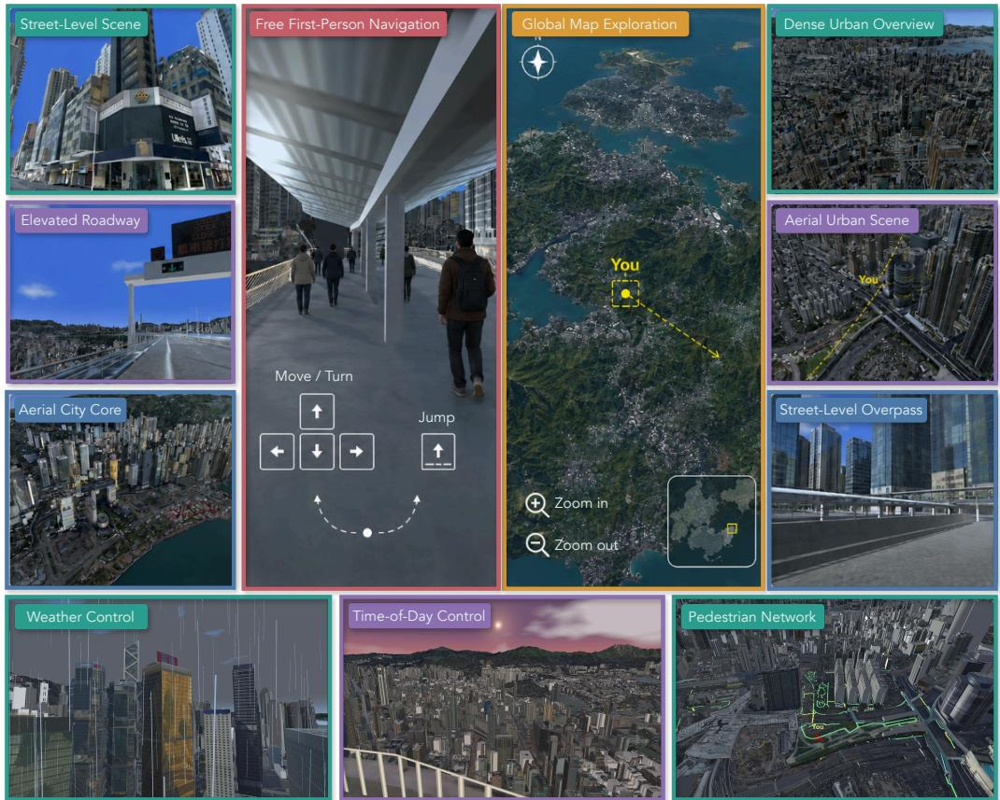  
Figure 1: URBANGROUND is a real-scale urban sandbox built from territory-wide 3D geospatial data. It supports direct first-person play and programmatic control by MLLM agents. We release the sandbox on the web and as native builds for macOS, Windows, and Linux. It also includes diverse tasks for studying how multimodal agents perceive and act in a real city.

## ABSTRACT

Multimodal large language models (MLLMs) can interpret a street view, but urban agency depends on whether such local evidence remains useful after the agent starts to move. In this paper, we investigate howfar current MLLM agents can turn local urban perception into reliable action in a complicated real-scale city. We propose URBANGROUND, the first sandbox to make this question testable in a physically constrained replica of Hong Kong built from territory-wide 3D geospatial data. URBANGROUND supports closed-loop interaction from a first-person view and provides an interactive map for navigation. Agents can directly enter the 3D city and explore from a first-person view. Our analysis follows the growth of the spatial problem through three research questions. We first test whether an agent can ground a local scene well enough to answer spatial questions after active observation. Then we ask whether that grounding supports navigation as destinations become farther away and less explicit. Finally, we examine whether the resulting behavior survives changes in route availability and pedestrian motion. Contemporary MLLM agents usually show useful atomic abilities in visual recognition and short-range spatial reasoning, while orientation and pedestrian-aware movement remain unreliable. Their central failure emerges over extended exploration, where local abilities do not compose into sustained goal-directed behavior and errors accumulate without effective correction. We hope URBANGROUND will support broader study of how far current MLLM agents can explore reliably in complex, open-ended urban environments.

## 1 INTRODUCTION

“Nothing is experienced by itself, but always in relation to its surroundings, the sequences of events leading up to it, the memory of past experiences.”

Kevin Lynch, The Image of the City (1960)

Recent multimodal large language model (MLLM) agents have shown strong capabilities in recognizing urban objects from individual observations (Yao et al., 2025; Feng et al., 2025). However, agents receive these observations through a continuing physical process in which each movement produces the next first-person view (Cheng et al., 2024; Zhang et al., 2026a). Once the agent turns a corner, a landmark that supported its last decision may disappear even though its location still matters. Earlier evidence then has to be reconciled with the new view so that the agent retains a usable estimate of its pose. Strong recognition at one viewpoint therefore does not show whether spatial understanding will remain coherent through continued action (Wang et al., 2026; Zhao et al., 2026).

Recent work has approached this problem by placing agents in progressively longer interactions across larger spaces. Game sandboxes support extended trajectories through changing worlds (Fan et al., 2022; Zhang et al., 2025a; Hu et al., 2026). They reveal how decisions unfold over time, yet success remains shaped by game-specific mechanics (Ju et al., 2026). Moving into physically grounded settings makes each action produce a new observation under scene geometry (Majumdar et al., 2024; Qiao et al., 2025; Su et al., 2026). Their bounded spaces rarely require a spatial account to remain useful beyond a local area. Urban studies extend the scale through aerial imagery panoramas (Schumann et al., 2024; Dalal et al., 2026; Wang et al., 2026). These observations preserve real geographic context, but the agent still moves between sampled viewpoints without continuous physical contact with the same city. Interactive urban simulators restore the action-observation loop, although their scenes do not preserve the full complex geographic structure of an existing metropolis (Shang et al., 2024; Wu et al., 2025; Zhou et al., 2026; Ren et al., 2025).

We therefore ask: howfar can current MLLM agents turn local urban perception into reliable action in a real-scale physical city? At first, the agent only needs to establish where relevant evidence lies around its current pose. It must then carry this estimate beyond the visible scene and use it to contro movement. Once the city changes, the agent has to revise the estimate without losing the goal that organized its earlier actions. A useful evaluation should expose each point in this transition under one geographic frame.

In this paper, we present URBANGROUND, a real-scale environment that turns Hong Kong’s complicated geographic structure into an interactive world for MLLM agents. It is built from the 3D Visualisation Map and 3D Pedestrian Network released by the Lands Department of the Government of the Hong Kong Special Administrative Region<sup>1</sup>. Dense development sits on steep terrain, while the pedestrian network repeatedly shifts between street level and elevated passages. URBANGROUND streams the georegistered city into Unity, supplies physical collision, and records the resulting trajectory in geographic coordinates. The city can be revisited under controlled illumination and weather. Road closures and moving pedestrians introduce changes during execution. Agents can enter the same world through first-person perception, physical control, and an interactive map (Section 3).

We study this problem through three research questions:

## RQ1 Can MLLM agents establish a usable local spatial grounding?

We begin with active spatial question answering, where the agent can move briefly to gather evidence before responding. Current MLLMs perform well on these local tasks, suggesting that they already possess useful atomic skills for urban spatial understanding. However, answer accuracy does not guarantee physically valid behavior. Agents sometimes leave the pedestrian network even when they reach the correct answer.

RQ2 How does local grounding scale into goal-directed navigation?

We then extend the evaluation from local exploration to navigation beyond the visible scene. Agents can often reach a nearby destination, but performance collapses when the route spans only a few city blocks. Agents may identify the correct global direction and still fail to find a feasible path through the local geometry. Once blocked, it often repeats the same action without recovering, exposing a sharp gap between spatial recognition and sustained control.

## RQ3 How do changes in the city affect grounded perception and action?

We finally keep the task objective fixed while changing the city around the agent. Reduced visibility mainly weakens local question answering, while its effect on short-range navigation is less consistent across models. When a route becomes invalid during execution, agents often continue to produce locally compliant movements even after their spatial plan has become obsolete. This exposes a gap between plausible local behavior and effective adaptation.

Overall, our results show that urban agency cannot be inferred from isolated perception or success over a short route. Current MLLMs possess useful local spatial skills, but these skills lose reli ability as interaction extends through the city. URBANGROUND makes this gap observable in a real geographic setting, where every action changes the evidence available to the agent. We hope URBANGROUND provides a foundation for studying how local perception can support sustained, physically grounded behavior at city scale.

## 2 RELATED WORK

Spatial agency requires an agent to connect what is visible at the current moment to a spatial frame that remains usable after the view changes. Evaluation environments determine whether this transition from local competence to movement through a larger world can be observed. Existing work studies different parts of this problem through game environments and physical-world environments.

Agent Evaluation in Game Environments. Game environments provide a controlled setting for studying repeated perception and action, and early benchmarks use them to test whether multimodal models can turn visual observations into effective decisions (Paglieri et al., 2025; Zheng et al., 2026; Hu et al., 2026; Zhang et al., 2025a). Other benchmarks isolate visual-spatial reasoning or make task completion verifiable through explicit environment state (Mayer et al., 2025; Ouyang et al., 2026). These settings expose failures in visual control while keeping the consequences of each action easy to measure.

Persistent 3D worlds extend this evaluation across larger environments and longer trajectories (Fan et al., 2022; Cai et al., 2024; Wang et al., 2025; Zheng et al., 2025). Later work further studies whether agents can preserve useful state across extended exploration and complete increasingly sustained objectives in game environments (Cai et al., 2025; Liu et al., 2025a; Ju et al., 2026; Park et al., 2026; Tan et al., 2025b;a). These platforms establish that current agents remain fragile as interaction continues. However, their spatial structure is still defined by the game itself, so progress within a task does not directly show whether an agent has anchored its current observation to a spatial frame that remains valid beyond the game environments.

Agent Evaluation in Physical-World Environments. Physical-world evaluation places perception and action inside scene geometry. Indoor benchmarks study embodied question answering and navigation in bounded environments (Majumdar et al., 2024; Yang et al., 2025; Qiao et al., 2025; Zhao et al., 2026; Su et al., 2026), while navigation models repeatedly convert visual history into local motion (Zhang et al., 2024; Cheng et al., 2024; Zhang et al., 2026a;b). Open-vocabulary target search further tests whether an agent can locate a semantically specified destination under physical constraints (Li et al., 2025; Lin et al., 2025). These settings ground behavior in physical space, but their bounded extent limits how far a local observation must be related to a larger spatial frame.

Urban environments increase this spatial extent and make the relation between local observation and global location more consequential. Work grounded in real cities uses street-view imagery, aerial observations, or recorded trajectories to evaluate navigation at urban scale (Yang et al., 2024; Schumann et al., 2024; Zhang et al., 2025b; Dalal et al., 2026; Wang et al., 2026; Liu et al., 2025b; Mei et al., 2026). Interaction in these settings remains mediated by visual views, so changes in viewpoint do not arise from continuous physical movement through the same city geometry. Interactive urban simulators restore closed-loop control (Wu et al., 2025; Shang et al., 2024; Zhuang et al., 2025; Zhou et al., 2026), while their environments are generated or assembled for simulation and do not preserve the full georegistered complex structure of an existing metropolis. This leaves unresolved whether strong local multimodal competence can compose into spatial agency when every observation and movement must remain consistent with the same real-scale world.

## 3 URBANGROUND: A FRAMEWORK FOR EVALUATING SPATIAL AGENCY

URBANGROUND is a Unity-based framework that turns territory-scale geospatial data into a physically constrained city for evaluating MLLM agents. It is designed to reveal whether evidence grounded at one viewpoint remains useful after the agent begins to move.

## 3.1 SPATIAL AGENCY IN CLOSED-LOOP URBAN INTERACTION

We define spatial agency through three cumulative capabilities. Grounding forms task-relevant local relations from locally acquired observations. Persistence keeps those relations usable after earlier evidence leaves the first-person view. For global tasks, this also requires the model to align map context with the geometry encountered on the ground. Adaptation concerns whether the state remains reliable when external conditions alter visible evidence. When new evidence invalidates an earlier assumption, adaptation requires a corresponding revision of the working state. RQ1 primarily probes grounding. RQ2 retains local grounding while stressing persistence over navigation. RQ3 presupposes both capabilities and examines robustness under changes in the visible city.

Let $s _ { t }$ denote the hidden interaction state at turn t. It contains the georegistered agent pose and current interface state. Task progress and city conditions are also included. The evaluated model does not read $s _ { t }$ directly. Its model-visible observation bundle is $o _ { t } .$ , which includes the current first-person or map view plus any task-specific notice or status exposed at that turn. The modelfacing interface exposes no privileged information, including remaining distance, shortest path, or route API. We use $g$ for the task objective, $m _ { t }$ for the working spatial state carried in the interaction context, and $a _ { t }$ for one structured action executed by the simulator. The closed loop is

$$
\begin{array} { r l } & { \quad o _ { t } = \mathcal { O } ( s _ { t } ) , } \\ & { m _ { 0 } = \mathcal { U } _ { 0 } ( o _ { 0 } , g ) , } \\ & { \quad m _ { t } = \mathcal { U } ( m _ { t - 1 } , o _ { t } , a _ { t - 1 } , g ) , \quad t \geq 1 , } \\ & { \quad a _ { t } = \pi ( m _ { t } , g ) , } \\ & { \quad s _ { t + 1 } = \mathcal { T } ( s _ { t } , a _ { t } , \xi _ { t } ) . } \end{array}\tag{1}
$$

The variable $m _ { t }$ is an analytical description of task-relevant spatial information induced in the model’s interaction context. It does not assume an explicit memory module and is not observed by the evaluator. For matched time and weather episodes, the scene condition varies in $s _ { 0 }$ while $\xi _ { t }$ remains fixed. The term $\xi _ { t }$ can change during execution for a road-closure event or pedestrian motion. Each executed non-terminal action updates the physical or interface state, which determines the next evidence $o _ { t + 1 }$

The framework realizes this loop through three layers. The geospatial layer anchors the visible city and pedestrian connectivity in one geographic frame, then records each trajectory in the same coordinates. The simulation layer implements T through continuous physical motion with collision. It also controls the changes represented by $\xi _ { t }$ . The agent layer exposes O through model-visible observations plus a structured action interface. This separation keeps the geographic world and embodiment fixed across evaluated models.

## 3.2 GEOSPATIAL LAYER

URBANGROUND is built on the 3D Digital Map released by the Hong Kong Lands Department, which provides territory-wide representations of the city. We use two datasets from this collection. The 3D Visualisation Map provides a tile-based textured mesh reconstructed from oblique aerial imagery and covers the full territory of Hong Kong. It is distributed through an open API as Cesium 3D Tiles under the WGS84 reference system. The 3D Pedestrian Network provides georeferenced 3D line features derived from pedestrian-related road records. The former captures the visible form of the city, while the latter describes how its pedestrian spaces are connected.

URBANGROUND loads the 3D Tiles hierarchy into Unity at runtime and transforms the geographic coordinates of each tile into a shared simulation frame. Tiles are streamed according to the current viewing scale. The active tile geometry supplies both the rendered urban surface and the collision geometry used by the character controller. As the agent moves, the loader updates the active region while preserving its position in the global geographic frame.

The pedestrian network is imported into the same coordinate system as a connected graph. Each vertex retains its geographic position and associated attributes, while each edge represents a pedestrian segment between two connected locations. It does not restrict the controlled agent to predefined edges. The agent remains free to move in continuous space, while its trajectory can be compared with the registered network after execution.

## 3.3 SIMULATION LAYER

The simulation layer turns the registered city into a continuously evolving environment. It controls embodied movement, collision, time, weather, and pedestrian activity while preserving the geographic coordinates supplied by the underlying data (Figure 2).

Embodiment and physical constraints. The controlled agent is instantiated as a first-person character in Unity. Its motion is continuous and resolved against collision geometry derived from the city mesh. Buildings, walls, and elevation changes therefore constrain the trajectory that the agent can execute. The agent moves on the surface shown in its observation and cannot cross visible structures through coordinate updates alone.

The 3D pedestrian network defines the intended walkable space but does not directly constrain the agent to a graph edge. The agent remains free to move in continuous space. These behaviors are recorded in the trajectory and later support analyses of off-network movement, route efficiency, and repeated exploration.

At every simulation step, URBANGROUND records the agent’s metric position, elevation, and heading. These states support first-person control and provide the basis for determining arrival, traveled distance, orientation, and collision events.

Time-of-day system. URBANGROUND maintains a continuous simulation clock that controls the sky, sun position, ambient illumination, and shadows. Advancing the clock changes the appearance of the same location from day to dusk and night. Artificial lighting becomes active after dark, producing street-level observations whose visibility differs from daytime conditions.

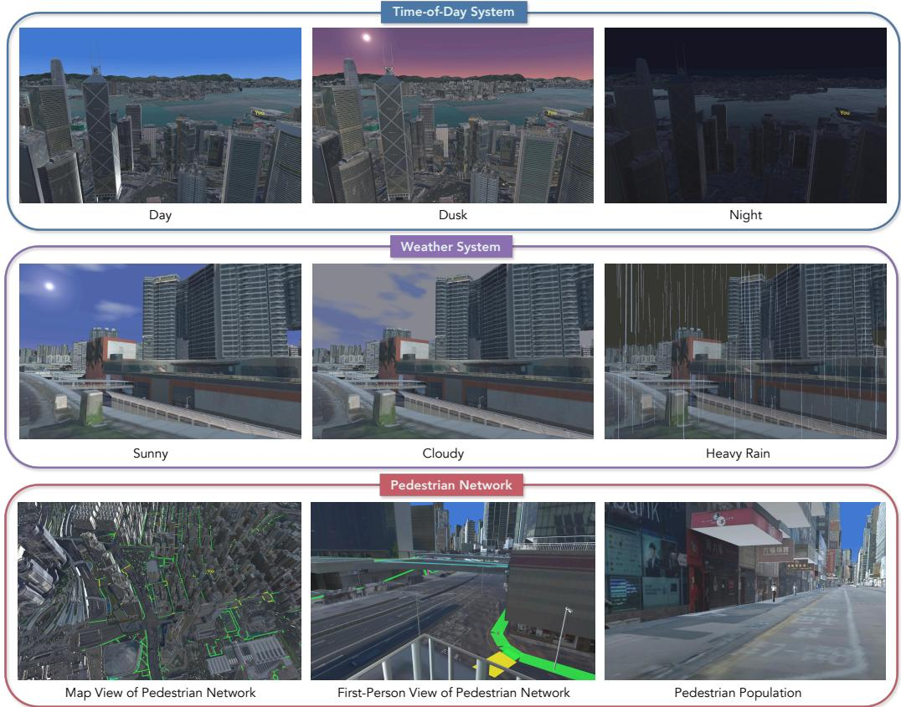  
Figure 2: Dynamic simulation components of URBANGROUND. The same urban environment can be rendered under different times of day and weather conditions, while a georeferenced pedestrian network supports animated pedestrian populations.

The clock may be fixed at a specified hour for controlled comparisons or allowed to advance during an episode. Time is stored as part of the environment state and logged with each observation, allowing trajectories to be reproduced under the same temporal setting.

Weather system. URBANGROUND supports configurable weather conditions including rain and fog. Weather alters visibility, illumination, atmospheric appearance, and surface rendering. Rain additionally produces particles that interact with the scene, which allows the simulator to determine whether the agent is exposed at its current position.

This exposure signal distinguishes covered paths from open streets along an executed trajectory. It supports tasks in which route quality depends on the physical conditions encountered during navigation, including whether an agent selects a sheltered path under rain.

Pedestrian population. A city is not empty, and neither is URBANGROUND. We populate the sidewalks with animated pedestrians drawn from the open-source Microsoft Rocketbox avatar library (Gonzalez-Franco et al., 2020). Pedestrians are spawned on the registered network and assigned routes over its edges. Pedestrian positions and collisions are recorded at every step. Navigation success can therefore be considered together with the safety of the executed trajectory.

## 3.4 AGENT LAYER

The agent layer connects an external MLLM to the running Unity environment. The simulator and the model operate as separate processes and communicate through a client-server interface. This allows different MLLMs and agent frameworks to control the same embodiment without modifying the Unity implementation.

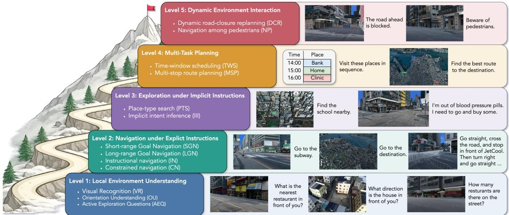  
Figure 3: The spatial agency evaluation ladder increases the state that must remain usable across action. Level 1 supports RQ1. Levels 2–4 support RQ2. Level 5 and matched visual interventions support RQ3.

Observation space. The primary observation is an RGB image rendered from the agent’s firstperson camera. It presents the real city from the pose produced by the previous physical action. A bounded frame buffer may be included in the observation context to provide visual history across consecutive decisions.

For tasks that require global reasoning, URBANGROUND provides an interactive map tool. The map presents a georeferenced overhead view of the city and marks the agent’s current location. The agent can pan and zoom the map to inspect areas outside its immediate first-person view. The map does not expose a computed or highlighted route.

Action space. At each interaction turn, the agent selects exactly one action object from

$$
\begin{array} { r } { \mathcal { A } = \mathcal { A } _ { \mathrm { f p } } \cup \mathcal { A } _ { \mathrm { m a p } } \cup \{ \mathsf { t e r m i n a t e } \} , } \end{array}\tag{2}
$$

where

$$
\mathcal { A } _ { \mathrm { f p } } = \{ \mathrm { m o v e } , \mathrm { s p r i n t } , \mathrm { 1 o o k } , \mathrm { j u m p } , \mathrm { o p e n } . \mathrm { m a p } \}\tag{3}
$$

and

$$
\begin{array} { r } { \mathcal { A } _ { \mathrm { m a p } } = \{ \mathtt { m a p \_ s e l e c t } , \mathtt { m a p \_ p a n } , \mathtt { m a p \_ z o o m } , \mathtt { m a p \_ o o r b i t } , \mathtt { c l o s e \_ m a p } \} . } \end{array}\tag{4}
$$

The move and sprint actions specify one of four movement directions and a duration. They may also include yaw rate, pitch rate, jump, and jump at fields, allowing the agent to adjust its view or jump during the same movement action. The direction field already represents lateral movement, so strafe is not a separate action. The look action changes yaw and pitch without translation, while jump supports a standalone jump. The map actions open and close the map, select a point for inspection, and control the map view through panning, zooming, and orbiting. The terminate action ends the episode.

## 3.5 SPATIAL AGENCY EVALUATION LADDER

We organize the tasks as a five-level ladder that increases the spatial state required for success while keeping the interaction interface fixed (Figure 3). Level 1 studies local environment understanding. Visual recognition and orientation test what can be grounded around the current pose. Active exploration adds a brief search for evidence outside the initial view. This level provides the main tasks for RQ1.

Level 2 introduces navigation under explicit instructions. Short- and long-range tasks vary how long grounded evidence must remain useful. Instructional and constrained variants test whether route language or path restrictions remain active during execution. Level 3 moves to exploration under implicit instructions. Place search and intent inference require the agent to infer where to go before it can navigate. Level 4 extends persistence to multi-task planning. The agent maintains and executes a plan across several goals under task-provided progress updates. Levels 2–4 provide the tasks for RQ2 and stress persistence while retaining local grounding.

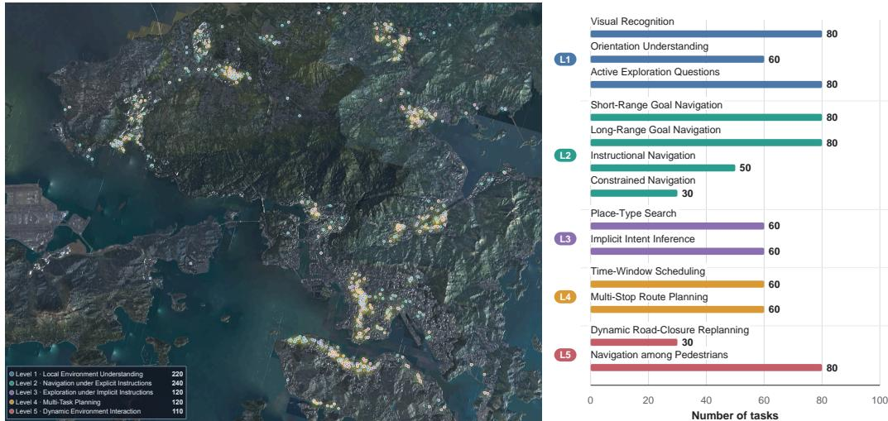

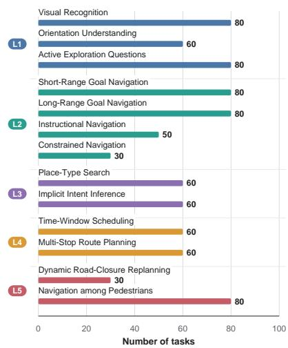  
Figure 4: Spatial distribution of experimental tasks across <sub>Figure 5: Number of task instances at</sub> Hong Kong. each level of the spatial agency.

Level 5 introduces dynamic environment interaction. A one-time system notice discloses a road closure that invalidates an earlier route. The unavailable segment remains marked on the map. Moving pedestrians require the agent to adjust its motion around visible obstacles. Matched time and weather conditions apply to Level 1 and the short-navigation task in Level 2. They change visual evidence at the same task locations. These variations provide the tasks for RQ3, which examine adaptation while presupposing the earlier capabilities.

The ladder is instantiated across urban regions of Hong Kong. Figure 4 shows the spatial distribution of the tasks. The selected districts differ in street pattern and terrain. Vertical pedestrian connections also vary across these regions. Figure 5 reports the number of instances at each level. Appendix A provides the complete task definitions and construction procedure.

## 4 EXPERIMENTS

## 4.1 EXPERIMENTAL SETUP

Models. We evaluate contemporary MLLMs from several model families. The GPT family includes GPT-5.5, GPT-5.4, and GPT-5.2 (OpenAI, 2026b;a; 2025). The Claude family includes Claude-Opus-5 and Claude-Opus-4.6 (Anthropic, 2026b;a). The Gemini family includes Gemini-3.6-Flash and Gemini-3.1-Pro (Google, 2026b;a). Additional evaluated models are Doubao-Seed-2.0-Pro (Seed, 2026), GLM-5V-Turbo (Team et al., 2026), and Kimi-K3 (Kimi, 2026). The main tables show representative models, while Appendix C provides the complete matrices.

Agent protocol. At each step, the agent receives the current first-person RGB observation, the task instruction, and its text interaction history. It selects one structured action from the physical or map action space in Section 3.4. An episode ends when the agent submits an answer, signals completion, or reaches 100 interaction steps. The prompts are fixed within each task type and are reported in Appendix B.

Tasks and metrics. The study contains 810 manually verified base instances distributed across Hong Kong and organized by the evaluation ladder in Section 3.5. Every instance was completed by human testers under the same 100-step limit used for MLLM agents, including some tooling calling time (Appendix A). Since each movement action lasts at most two seconds, this budget permit up to 200 seconds of commanded motion, so model failures cannot be attributed to tasks that are infeasible within the evaluation horizon. Question-answering episodes are scored by agreement with the annotated answer. Single-endpoint navigation with a labeled target succeeds when the final position is within 15 meters of the destination and any evaluator-enforced task constraint is satisfied. Completion signals for place search and multi-destination tasks are defined with their results. We report pedestrian-network adherence as the fraction of total action time whose post-action state lies on the registered pedestrian network. Dynamic tasks add event-specific records, including closure violations, pedestrian contact, and rain exposure.

Table 1: Answer accuracy and pedestrian-network adherence compare recognition, orientation, and active exploration question answering across the evaluated MLLM agents. Overall is the instancecount-weighted average across the three task types.
<table><tr><td rowspan="2">Model</td><td colspan="2">Visual Recognition</td><td colspan="2">Orientation</td><td colspan="2">Active Exploration</td><td colspan="2">Overall</td></tr><tr><td>Acc.</td><td>PNA</td><td>Acc.</td><td>PNA</td><td>Acc.</td><td>PNA</td><td>Acc.</td><td>PNA</td></tr><tr><td>GPT-5.5</td><td>82.5</td><td>63.8</td><td>40.0</td><td>74.8</td><td>62.5</td><td>91.4</td><td>63.6</td><td>76.8</td></tr><tr><td>GPT-5.4</td><td>75.0</td><td>66.2</td><td>31.7</td><td>75.0</td><td>57.5</td><td>91.1</td><td>56.8</td><td>77.7</td></tr><tr><td>GPT-5.2</td><td>77.5</td><td>68.0</td><td>33.3</td><td>74.7</td><td>48.8</td><td>90.9</td><td>55.0</td><td>78.2</td></tr><tr><td>Claude-Opus-5</td><td>91.3</td><td>69.4</td><td>58.3</td><td>77.9</td><td>82.5</td><td>92.8</td><td>79.1</td><td>80.2</td></tr><tr><td>Claude-Opus-4.6</td><td>85.0</td><td>70.0</td><td>46.7</td><td>75.0</td><td>73.8</td><td>92.5</td><td>70.5</td><td>79.5</td></tr><tr><td>Gemini-3.6-Flash</td><td>93.8</td><td>68.9</td><td>56.7</td><td>74.3</td><td>77.5</td><td>92.5</td><td>77.7</td><td>79.0</td></tr><tr><td>Gemini-3.1-Pro</td><td>82.5</td><td>65.2</td><td>23.3</td><td>59.1</td><td>46.3</td><td>93.0</td><td>53.2</td><td>73.6</td></tr><tr><td>Doubao-Seed-2.0-Pro</td><td>85.0</td><td>64.0</td><td>36.7</td><td>73.2</td><td>63.8</td><td>91.1</td><td>64.1</td><td>76.4</td></tr><tr><td>GLM-5V-Turbo</td><td>80.0</td><td>67.5</td><td>36.7</td><td>71.2</td><td>52.5</td><td>90.6</td><td>58.2</td><td>76.8</td></tr><tr><td>Kimi-K3</td><td>92.5</td><td>66.2</td><td>55.0</td><td>67.4</td><td>76.3</td><td>91.2</td><td>76.4</td><td>75.5</td></tr></table>

## 4.2 RQ1: CAN MLLM AGENTS ESTABLISH A USABLE LOCAL SPATIAL GROUNDING?

We begin by testing whether an agent can establish a spatial state before it must use that state over a route. Visual recognition asks the agent to identify task-relevant content in its initial surroundings. Orientation tests whether visible places can be located in a stable heading-relative frame. Active exploration requires the agent to seek evidence that is missing from the initial pose before answering. Table 1 reports answer accuracy and pedestrian-network adherence.

Current MLLM agents already show reliable performance on short-range atomic spatial reasoning tasks. Most models perform strongly on visual recognition when both the instruction and the relevant evidence are explicit. They can accurately understand the nearby visual environment and complete the atomic grounding task. When the task expands to active exploration and requires a short sequence of actions to uncover missing evidence, answer accuracy declines only moderately. The completed models also remain close to one another. Current agents have sufficient spatial perception and short-range reasoning to gather evidence when the instruction is clear.

However, compared with reasoning about nearby spatial objects, MLLM agents remain considerably less reliable when answering questions that require directional awareness. Performance falls markedly across models, and several systems approach the random-guessing baseline for a four-option question. The contrast with visual recognition shows that identifying visible landmarks does not ensure a stable representation of their directions relative to the current heading. Directional grounding is therefore a shared atomic weakness that appears before long-horizon navigation is required.

Interestingly, the gap between earlier and more recent generations of MLLMs emerges most clearly in orientation understanding and active exploration. GPT-5.2 and Gemini-3.1-Pro remain close to newer models in visual recognition, yet fall markedly behind on the other two tasks. This suggests that recent advances have primarily improved the ability to preserve directional spatial evidence, bringing MLLMs closer to turning local perception into spatial agency.

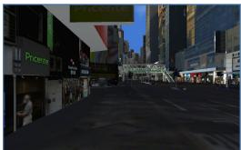  
(a) Step 1, look right 60<sup>◦</sup>, pitch 0

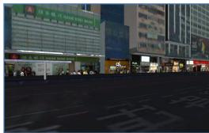  
(b) Step 3, look right 45<sup>◦</sup>, pitch 0

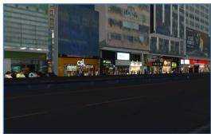  
(c) Step 6, look right 25<sup>◦</sup>, pitch 0

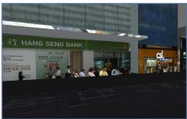  
(d) Step 9, sprint forward 2.0 s

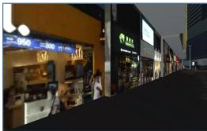  
(e) Step 17, look left 25<sup>◦</sup>, pitch 0

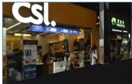  
(f) Step 18, look right 35<sup>◦</sup>, pitch 0

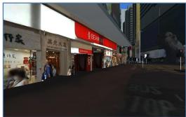  
(g) Step 25, look left 15<sup>◦</sup>, pitch 0

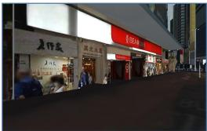  
(h) Step 26, terminate  
Figure 6: Example of active exploration by GPT-5.5. The agent is asked to answer which bank is next to Beijing Tong Ren Tang.

Pedestrian-network adherence further exposes a surprising gap between the prompt and the executed trajectory. We measure the fraction of action time that the agents remain on registered pedestrian routes. Adherence falls far short of complete compliance during several local tasks. The agents often favor a shorter path to the necessary evidence and sacrifice road compliance in order to answer the user more quickly. It suggests that real-world movement constraints are not maintained as a persistent part of spatial reasoning when they compete with rapid task completion.

Figure 6 provides an example of GPT-5.5 performing active exploration after being asked to identify the bank next to Beijing Tong Ren Tang. The agent successfully locates the pharmacy and the neighboring bank, approaches the storefront, and answers Bank of East Asia. However, to finish quickly, the agent crosses the road directly and leaves the registered pedestrian connection. The episode shows that the model can ground the visible target well enough to answer while its understanding of pedestrian affordances and real road constraints remains limited.

## 4.3 RQ2: HOW DOES LOCAL GROUNDING SCALE INTO GOAL-DIRECTED NAVIGATION?

We next test whether local grounding survives when the agent must maintain a goal over a route. Table 2 covers eight navigation tasks that progressively increase the spatial state required during execution. Short and long navigation provide a named endpoint at different route scales. Instructional navigation grounds a sequence of verbal directives, while constrained navigation restricts the usable path. Place search and intent inference require the destination to be inferred. Time-window and multi-stop tasks require several visits to remain active within one plan.

When the destination is provided explicitly and remains visible in short-range goal navigation tasks, some models achieve meaningful success on short routes, showing that current agents can combine local spatial perception with action selection when progress can be judged from the immediate scene.

However, navigation breaks down once the route extends across several streets. Nearly every completed model fails to reach the endpoint when the same point-to-point task is evaluated at a longer scale. At first glance, the added difficulty is only a longer travel distance since the route could be decomposed into a sequence of short-range goals. An agent that maintained those intermediate goals should be able to solve them one by one and eventually arrive. Current models cannot compose short-range atomic capabilities into long-range exploration because errors accumulate during execution without effective correction and ultimately cause the task to fail.

Instruction-dependent navigation exposes another failure that cannot be explained by travel distance alone. Routes that require the agent to infer the intended destination are comparable in length to short-range navigation, yet performance falls substantially. The agent must convert the user’s request into a stable goal and continue following that goal as the observation changes. The decline shows that instruction understanding and adherence remain unreliable during interactive exploration.

Table 2: Navigation success across tasks grouped by whether the destination is provided, inferred, or multiple, where SN, LN, IN, CN, PS, II, TW, and MS denote short navigation, long navigation, instructional navigation, constrained navigation, place search, intent inference, time-window navigation, and multi-stop navigation, respectively, and Overall is the instance-count-weighted average across all eight subtasks.
<table><tr><td rowspan="2">Model</td><td colspan="4">Provided</td><td colspan="2">Inferred</td><td colspan="2">Multiple</td><td rowspan="2">Overall</td></tr><tr><td>SN</td><td>LN</td><td>IN</td><td>CN</td><td>PS</td><td>ⅡI</td><td>TW</td><td>MS</td></tr><tr><td>GPT-5.5</td><td>75.0</td><td>0.0</td><td>20.0</td><td>0.0</td><td>35.0</td><td>11.7</td><td>3.3</td><td>0.0</td><td>20.8</td></tr><tr><td>GPT-5.4</td><td>15.0</td><td>1.3</td><td>20.0</td><td>0.0</td><td>15.0</td><td>11.7</td><td>1.7</td><td>0.0</td><td>8.3</td></tr><tr><td>GPT-5.2</td><td>25.0</td><td>0.0</td><td>28.0</td><td>0.0</td><td>8.3</td><td>15.0</td><td>1.7</td><td>3.3</td><td>10.6</td></tr><tr><td>Claude-Opus-5</td><td>48.8</td><td>2.5</td><td>30.0</td><td>3.3</td><td>30.0</td><td>11.7</td><td>3.3</td><td>3.3</td><td>17.9</td></tr><tr><td>Claude-Opus-4.6</td><td>75.0</td><td>1.3</td><td>28.0</td><td>6.7</td><td>36.7</td><td>15.0</td><td>1.7</td><td>1.7</td><td>22.9</td></tr><tr><td>Gemini-3.6-Flash</td><td>23.8</td><td>0.0</td><td>6.0</td><td>0.0</td><td>23.3</td><td>3.3</td><td>0.0</td><td>1.7</td><td>8.1</td></tr><tr><td>Gemini-3.1-Pro</td><td>31.3</td><td>0.0</td><td>8.0</td><td>0.0</td><td>18.3</td><td>6.7</td><td>0.0</td><td>0.0</td><td>9.2</td></tr><tr><td>Doubao-Seed-2.0-Pro</td><td>26.3</td><td>1.3</td><td>6.0</td><td>0.0</td><td>15.0</td><td>10.0</td><td>0.0</td><td>0.0</td><td>8.3</td></tr><tr><td>GLM-5V-Turbo</td><td>50.0</td><td>0.0</td><td>18.0</td><td>0.0</td><td>25.0</td><td>15.0</td><td>0.0</td><td>0.0</td><td>15.2</td></tr><tr><td>Kimi-K3</td><td>67.5</td><td>3.8</td><td>42.0</td><td>6.7</td><td>31.7</td><td>15.0</td><td>0.0</td><td>0.0</td><td>22.5</td></tr></table>

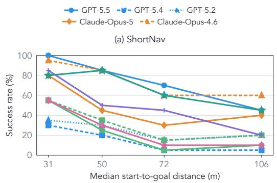

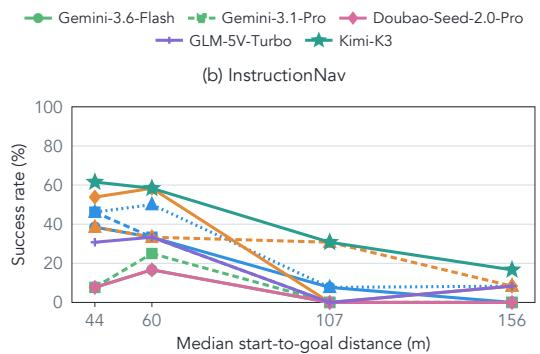  
Figure 7: Navigation success as a function of interaction horizon. The panels report success across four equal-count bins for (a) ShortNav and (b) InstructionNav.

We further conduct a distance-stratified navigation-horizon analysis by partitioning ShortNav and InstructionNav episodes into four equal-count bins according to the initial straight-line start-to-goal distance. Figure 7 reports the corresponding bin-wise success rates. Across both task families, success is concentrated in the shorter-distance bins and generally declines as the navigation horizon increases. This shows that the failure is not confined to a discrete ShortNav–LongNav split. Even within nominally local tasks, increasing the interaction horizon systematically weakens closed-loop execution.

Interestingly, interactive navigation magnifies model differences that appear modest in question answering. The completed models remain relatively close on the local QA tasks, while navigation produces a much wider separation. Even within the same GPT family, GPT-5.5 and GPT-5.4 diverge sharply on short routes. Every action changes the next observation and decision context, so small differences in spatial recovery can compound over an episode. Navigation in the real-scale embodied environment exposes the stability of closed-loop behavior that isolated question answering does not reveal.

We further add two trajectory-level analyses. For long-range navigation, we measure the fraction of episodes that end closer to the goal than they begin. For multi-stop planning, we measure the mean fraction of required destinations reached. Figure 8 shows that more than 50% of long-range episodes still reduce the goal distance, despite the near-zero full-task success in Table 2. Multi-stop agents likewise reach 10–20% of their required destinations on average while rarely completing the entire plan. The agents often establish a useful local direction, but fail to preserve the global route state long enough to finish. Further analysis shows that LongNav trajectories often lose earlier progress, while failures span premature stopping, absent progress, lost progress, and retained but incomplete progress (Appendix D and E).

(f) Step 39, sprint  
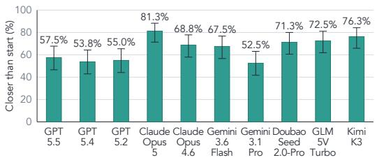

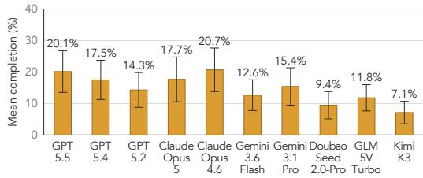

Figure 8: Long-range navigation progress and multi-stop completion. The left panel reports the proportion of LongNav episodes that end closer to the goal than at initialization. The right panel reports the mean proportion of required destinations reached in multi-stop planning. Error bars show 95% confidence intervals.  
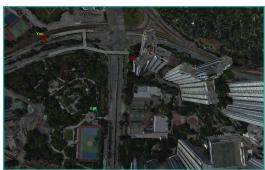  
(a) Step 29, close map

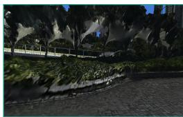  
(b) Step 34, look left 90<sup>◦</sup>, pitch 0

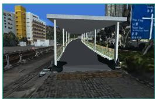  
(c) Step 35, sprint forward 2.0 s

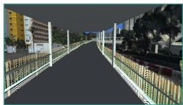  
(d) Step 36, sprint forward 2.0 s

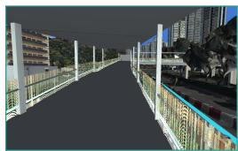  
(e) Step 37, sprint forward 2.0 s

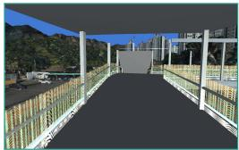

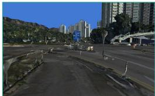  
forward 2.0 s  
(g) Step 43, open map

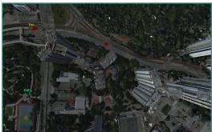  
(h) Step 44, close map  
Figure 9: Example of GPT-5.5 traversing a complex interchange using the official footbridge and continuing steadily toward the goal.

Figures 9 and 10 present two attempts by GPT-5.5 to move toward the goal during long-range exploration. In Figure 9, a hedge blocks the direct continuation, and the agent identifies the official ramp, traverses the complex footbridge, and continues steadily toward the goal. This attempt uses the local pedestrian structure correctly even though the full long-range episode remains unfinished. In Figure 10, the agent tries to reduce the apparent distance to the goal by crossing the road in its estimated goal direction. It becomes blocked by an obstacle in the middle of the road and repeat forward actions without revising the route. The contrast shows that long-range exploration depends on distinguishing geometric proximity from a traversable path and correcting an attempt when the local scene invalidates it.

## 4.4 RQ3: HOW DO CHANGES IN THE CITY AFFECT GROUNDED PERCEPTION AND ACTION?

We finally study whether the capabilities observed in the default city persist across dynamic changes. We evaluate every question-answering task from RQ1 and the short-range navigation task under matched conditions with various weather and time. Table 3 keeps the location and task instance fixed while changing clear daytime and weather conditions.

Dynamic changes in weather and time can weaken the ability of MLLM agents to answer urban questions reliably. Dusk and night reduce the visibility of signs, storefronts, and other local evidence, which increases the difficulty of grounding an answer in the scene. Robustness is not uniform even within a model family. GPT-5.5 and Gemini-3.6-Flash remain comparatively stable across the matched conditions, while GPT-5.4 and Gemini-3.1-Pro change much more as the scene moves from daylight into lower-visibility periods. This contrast shows that strong performance in the default condition does not ensure stable spatial reasoning when illumination changes.

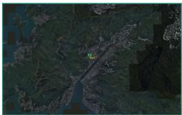  
(a) Step 2, zoom map by 0.25×

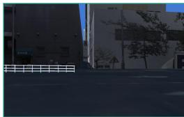  
(b) Step 6, sprint forward 2.0 s

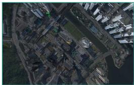  
(c) Step 12, close map

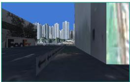  
(d) Step 44, sprint forward 2.0 s

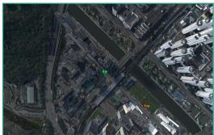  
(e) Step 59, close map

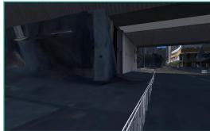  
(f) Step 73, sprint  
forward 2.0 s, yaw −1

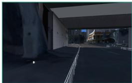  
(g) Step 81, sprint  
forward 1.5 s, yaw −1

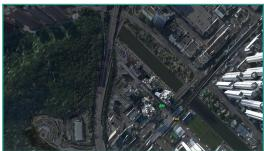  
(h) Step 100, close map  
Figure 10: Example of GPT-5.5 crossing the road toward the goal direction before becoming blocked by a central obstacle and being unable to continue.

Table 3: Local question-answering accuracy and short-navigation success compare robustness across different daytime and weather conditions.
<table><tr><td rowspan="2">Model</td><td colspan="5">Local QA Accuracy</td><td colspan="5">Short Navigation Success</td></tr><tr><td>Clear</td><td>Dusk</td><td>Night</td><td>Cloudy</td><td>Rain</td><td>Clear</td><td>Dusk</td><td>Night</td><td>Cloudy</td><td>Rain</td></tr><tr><td>GPT-5.5</td><td>63.6</td><td>59.1</td><td>61.4</td><td>62.7</td><td>61.4</td><td>75.0</td><td>72.5</td><td>75.0</td><td>76.3</td><td>72.5</td></tr><tr><td>GPT-5.4</td><td>56.8</td><td>44.6</td><td>48.6</td><td>58.2</td><td>53.6</td><td>15.0</td><td>13.8</td><td>18.8</td><td>11.3</td><td>16.3</td></tr><tr><td>GPT-5.2</td><td>55.0</td><td>44.1</td><td>48.6</td><td>55.9</td><td>53.6</td><td>25.0</td><td>26.3</td><td>17.5</td><td>27.5</td><td>21.3</td></tr><tr><td>Claude-Opus-5</td><td>79.1</td><td>66.4</td><td>69.6</td><td>75.5</td><td>70.5</td><td>48.8</td><td>46.3</td><td>40.8</td><td>51.3</td><td>46.3</td></tr><tr><td>Claude-Opus-4.6</td><td>70.5</td><td>55.5</td><td>63.2</td><td>69.1</td><td>67.7</td><td>75.0</td><td>70.0</td><td>65.0</td><td>73.8</td><td>65.0</td></tr><tr><td>Gemini-3.6-Flash</td><td>77.7</td><td>68.6</td><td>72.7</td><td>71.4</td><td>73.4</td><td>23.8</td><td>22.5</td><td>26.3</td><td>18.8</td><td>12.5</td></tr><tr><td>Gemini-3.1-Pro</td><td>53.2</td><td>42.3</td><td>37.3</td><td>46.8</td><td>45.5</td><td>31.3</td><td>28.8</td><td>31.3</td><td>30.0</td><td>32.5</td></tr><tr><td>Doubao-Seed-2.0-Pro</td><td>64.1</td><td>57.7</td><td>60.9</td><td>66.8</td><td>64.1</td><td>26.3</td><td>16.3</td><td>20.0</td><td>28.8</td><td>25.0</td></tr><tr><td>GLM-5V-Turbo</td><td>58.2</td><td>46.4</td><td>47.8</td><td>56.8</td><td>55.0</td><td>50.0</td><td>47.5</td><td>40.0</td><td>47.5</td><td>45.0</td></tr><tr><td>Kimi-K3</td><td>76.4</td><td>65.0</td><td>62.7</td><td>75.9</td><td>72.3</td><td>67.5</td><td>63.8</td><td>68.8</td><td>70.0</td><td>66.3</td></tr></table>

The effect of weather and time is less systematic on short-range navigation than on question answering. Conditions that reduce local QA accuracy do not consistently reduce navigation success, and the ordering of conditions changes across models. They show that appearance changes alone cannot explain the navigation failures, which also depend on route-state maintenance and action execution. Interestingly, although visibility is lower at night, agents generally perform worse under dusk conditions than at night, possibly due to interference from the lighting conditions at dusk.

Beyond appearance changes, we next alter the navigable world to test whether agents can adapt changing environments. The road-closure task invalidates a pedestrian segment after the route ha begun, while navigation among pedestrians introduces moving obstacles around a fixed destination. Table 4 reports navigation success and pedestrian-network adherence alongside safe progress under road closure and pedestrian collisions.

Road-closure SPR remains low across models even as PNA stays high, showing that agents often continue to produce locally compliant movement without recovering safe goal-directed progress when the available route is altered. PCR is high for every model under moving pedestrians, so remaining on the pedestrian network does not imply collision-aware control. These measures expose failures in route revision and local motion adaptation within the changed scenes.

Table 4: Dynamic-environment results, where SR is the goal-reaching rate, PNA is the fraction of action time spent on the pedestrian network, SPR is the safe progress rate, which represents the fraction of road-closure episodes that respect the closure, and PCR is the pedestrian-collision rate.
<table><tr><td rowspan="2">Model</td><td colspan="3">Road Closure</td><td colspan="3">Pedestrians</td></tr><tr><td>SR↑</td><td>PNA↑</td><td>SPR↑</td><td>SR↑</td><td>PNA↑</td><td>PCR↓</td></tr><tr><td>GPT-5.5</td><td>0.0</td><td>94.7</td><td>13.3</td><td>0.0</td><td>93.8</td><td>83.8</td></tr><tr><td>GPT-5.4</td><td>0.0</td><td>96.4</td><td>16.7</td><td>0.0</td><td>98.5</td><td>80.0</td></tr><tr><td>GPT-5.2</td><td>0.0</td><td>94.2</td><td>16.7</td><td>1.3</td><td>95.4</td><td>78.8</td></tr><tr><td>Claude-Opus-5</td><td>0.0</td><td>93.6</td><td>46.7</td><td>2.5</td><td>94.4</td><td>87.5</td></tr><tr><td>Claude-Opus-4.6</td><td>3.3</td><td>93.0</td><td>26.7</td><td>3.8</td><td>92.9</td><td>80.0</td></tr><tr><td>Gemini-3.6-Flash</td><td>0.0</td><td>95.4</td><td>16.7</td><td>0.0</td><td>96.0</td><td>90.0</td></tr><tr><td>Gemini-3.1-Pro</td><td>0.0</td><td>93.4</td><td>16.7</td><td>0.0</td><td>94.0</td><td>88.8</td></tr><tr><td>Doubao-Seed-2.0-Pro</td><td>0.0</td><td>93.5</td><td>10.0</td><td>0.0</td><td>95.0</td><td>76.3</td></tr><tr><td>GLM-5V-Turbo</td><td>0.0</td><td>93.3</td><td>20.0</td><td>0.0</td><td>95.9</td><td>82.5</td></tr><tr><td>Kimi-K3</td><td>3.3</td><td>95.1</td><td>40.0</td><td>2.5</td><td>90.6</td><td>78.8</td></tr></table>

The same separation recurs at each spatial scale. Models recognize local evidence more reliably than they orient it, execute useful local motion more reliably than they complete a route, and preserve compliant movement more reliably than they update a plan after the city changes. Across the experiments, the grounded spatial state ceases to guide action toward the objective long before the agent stops producing plausible local movements.

## 5 CONCLUSION

In this paper, we investigate whether current MLLM agents can carry local spatial understanding into sustained action in a complicated real-scale city. We introduced URBANGROUND, a georegistered replica of Hong Kong that supports closed-loop interaction under physical change. Our study follows the growth of the spatial problem from active question answering to navigation across longer distances and less explicit instructions, then to adaptation when the city changes. The eval uation shows that current agents already possess useful atomic abilities in visual recognition and short-range spatial reasoning. However, failure usually emerges over longer routes. Local abilities do not compose into sustained exploration, so small errors accumulate without effective correction. Changes in visibility alter question answering, while road closures and moving pedestrians expose weak online updating and constraint adherence. These findings show that city-scale agency depends on maintaining a spatial estimate after the current view disappears, then revising it whenever earlier plans cease to be feasible. We hope URBANGROUND supports future research on agents capable of moving through complex cities with greater adaptability.

## REFERENCES

Anthropic. System card: Claude opus 4.6, 2026a. URL https://www.anthropic.com/ news/claude-opus-4-6.

Anthropic. Introducing claude opus 5, 2026b. URL https://www.anthropic.com/news/ claude-opus-5.

Shaofei Cai, Bowei Zhang, Zihao Wang, Xiaojian Ma, Anji Liu, and Yitao Liang. GROOT: Learning to follow instructions by watching gameplay videos. In The Twelfth International Conference on Learning Representations, 2024. URL https://openreview.net/forum?id= uleDLeiaT3.

Shaofei Cai, Zihao Wang, Kewei Lian, Zhancun Mu, Xiaojian Ma, Anji Liu, and Yitao Liang. ROCKET-1: mastering open-world interaction with visual-temporal context prompting. In IEEE/CVF Conference on Computer Vision and Pattern Recognition, CVPR 2025, Nashville, TN, USA, June 11-15, 2025, pp. 12122–12131. Computer Vision Foundation / IEEE, 2025. doi: 10.1109/CVPR52734.2025.01132. URL https://openaccess.thecvf.com/content/CVPR2025/html/Cai\_ ROCKET-1\_Mastering\_Open-World\_Interaction\_with\_Visual-Temporal\_ Context\_Prompting\_CVPR\_2025\_paper.html.

An-Chieh Cheng, Yandong Ji, Zhaojing Yang, Xueyan Zou, Jan Kautz, Erdem Biyik, Hongxu Yin, Sifei Liu, and Xiaolong Wang. Navila: Legged robot vision-language-action model for navigation. CoRR, abs/2412.04453, 2024. doi: 10.48550/ARXIV.2412.04453. URL https: //doi.org/10.48550/arXiv.2412.04453.

Dwip Dalal, Utkarsh Mishra, Narendra Ahuja, and Nebojsa Jojic. Can mllms find their way in a city? exploring emergent navigation from web-scale knowledge. In Vera Demberg, Kentaro Inui, and Llu´ıs Marquez (eds.), Proceedings of the 19th Conference of the European Chapter of the Association for Computational Linguistics, EACL 2026 - Volume 1: Long Papers, Rabat, Morocco, March 24-29, 2026, pp. 8279–8303. Association for Computational Linguistics, 2026. doi: 10.18653/V1/2026.EACL-LONG.387. URL https://doi.org/10.18653/ v1/2026.eacl-long.387.

Linxi Fan, Guanzhi Wang, Yunfan Jiang, Ajay Mandlekar, Yuncong Yang, Haoyi Zhu, Andrew Tang, De-An Huang, Yuke Zhu, and Anima Anandkumar. Minedojo: Building open-ended embodied agents with internet-scale knowledge. In Sanmi Koyejo, S. Mohamed, A. Agarwal, Danielle Belgrave, K. Cho, and A. Oh (eds.), Advances in Neural Information Processing Systems 35: Annual Conference on Neural Information Processing Systems 2022, NeurIPS 2022, New Orleans, LA, USA, November 28 - December 9, 2022, 2022. URL http://papers.nips.cc/paper\_files/paper/2022/ hash/74a67268c5cc5910f64938cac4526a90-Abstract-Datasets\_and\_ Benchmarks.html.

Jie Feng, Shengyuan Wang, Tianhui Liu, Yanxin Xi, and Yong Li. Urbanllava: A multi-modal large language model for urban intelligence. In IEEE/CVF International Conference on Computer Vision, ICCV 2025, Honolulu, HI, USA, October 19-25, 2025, pp. 6209–6219. IEEE, 2025. doi: 10.1109/ICCV51701.2025.00586. URL https://doi.org/10.1109/ICCV51701. 2025.00586.

Mar Gonzalez-Franco, Eyal Ofek, Ye Pan, Angus Antley, Anthony Steed, Bernhard Spanlang, Antonella Maselli, Domna Banakou, Nuria Pelechano, Sergio Orts-Escolano, Veronica Orvalho, Laura Trutoiu, Markus Wojcik, Maria V. Sanchez-Vives, Jeremy Bailenson, Mel Slater, and Jaron Lanier. The rocketbox library and the utility of freely available rigged avatars. Frontiers in Virtual Reality, Volume 1 - 2020, 2020. ISSN 2673-4192. doi: 10.3389/frvir.2020. 561558. URL https://www.frontiersin.org/journals/virtual-reality/ articles/10.3389/frvir.2020.561558.

Google. Gemini 3.1 pro, 2026a. URL https://deepmind.google/models/ model-cards/gemini-3-1-pro/.

Google. Gemini 3.6 flash, 2026b. URL https://deepmind.google/models/ model-cards/gemini-3-6-flash/.

Lanxiang Hu, Mingjia Huo, Yuxuan Zhang, Haoyang Yu, Eric P. Xing, Ion Stoica, Tajana Rosing, Haojian Jin, and Hao Zhang. lmgame-bench: How good are LLMs at playing games? In The Fourteenth International Conference on Learning Representations, 2026. URL https: //openreview.net/forum?id=qeziG97WUZ.

Tianjie Ju, Yueqing Sun, Zheng Wu, Wei Zhang, Yaqi Huo, Xi Su, Qi Gu, Xunliang Cai, Gongshen Liu, and Zhuosheng Zhang. Mineexplorer: Evaluating open-world exploration of MLLM agents in minecraft. CoRR, abs/2605.30931, 2026. doi: 10.48550/ARXIV.2605.30931. URL https: //doi.org/10.48550/arXiv.2605.30931.

Kimi. Kimi k3: Open frontier intelligence, 2026. URL https://www.kimi.com/blog/ kimi-k3.

Yifan Li, Lichi Li, Anh Dao, Xinyu Zhou, Yicheng Qiao, Zheda Mai, Daeun Lee, Zichen Chen, Zhen Tan, Mohit Bansal, and Yu Kong. Industrynav: Exploring spatial reasoning of embodied agents in dynamic industrial navigation. CoRR, abs/2511.17384, 2025. doi: 10.48550/ARXIV.2511.17384. URL https://doi.org/10.48550/arXiv.2511.17384.

Sihao Lin, Zerui Li, Xunyi Zhao, Gengze Zhou, Liuyi Wang, Rong Wei, Rui Tang, Juncheng Li, Hanqing Wang, Jiangmiao Pang, Anton van den Hengel, Jiajun Liu, and Qi Wu. Vlnverse: A benchmark for vision-language navigation with versatile, embodied, realistic simulation and evaluation. CoRR, abs/2512.19021, 2025. doi: 10.48550/ARXIV.2512.19021. URL https://doi.org/10.48550/arXiv.2512.19021.

Shunyu Liu, Yaoru Li, Kongcheng Zhang, Zhenyu Cui, Wenkai Fang, Yuxuan Zheng, Tongya Zheng, and Mingli Song. Odyssey : Empowering minecraft agents with open-world skills. In Proceedings of the Thirty-Fourth International Joint Conference on Artificial Intelligence, IJCAI 2025, Montreal, Canada, August 16-22, 2025, pp. 187–195. ijcai.org, 2025a. doi: 10.24963/IJCAI.2025/22. URL https://doi.org/10.24963/ijcai.2025/22.

Xinhao Liu, Jintong Li, Yicheng Jiang, Niranjan Sujay, Zhicheng Yang, Juexiao Zhang, John Abanes, Jing Zhang, and Chen Feng. Citywalker: Learning embodied urban navigation from web-scale videos. In IEEE/CVF Conference on Computer Vision and Pattern Recognition, CVPR 2025, Nashville, TN, USA, June 11-15, 2025, pp. 6875–6885. Computer Vision Foundation / IEEE, 2025b. doi: 10.1109/CVPR52734.2025.00645. URL https://openaccess.thecvf.com/content/CVPR2025/html/Liu\_ CityWalker\_Learning\_Embodied\_Urban\_Navigation\_from\_Web-Scale\_ Videos\_CVPR\_2025\_paper.html.

Arjun Majumdar, Anurag Ajay, Xiaohan Zhang, Pranav Putta, Sriram Yenamandra, Mikael Henaff, Sneha Silwal, Paul McVay, Oleksandr Maksymets, Sergio Arnaud, Karmesh Yadav, Qiyang Li, Ben Newman, Mohit Sharma, Vincent-Pierre Berges, Shiqi Zhang, Pulkit Agrawal, Yonatan Bisk, Dhruv Batra, Mrinal Kalakrishnan, Franziska Meier, Chris Paxton, Alexander Sax, and Aravind Rajeswaran. Openeqa: Embodied question answering in the era of foundation models. In IEEE/CVF Conference on Computer Vision and Pattern Recognition, CVPR 2024, Seattle, WA, USA, June 16-22, 2024, pp. 16488–16498. IEEE, 2024. doi: 10.1109/CVPR52733.2024.01560. URL https://doi.org/10.1109/CVPR52733.2024.01560.

Julius Mayer, Mohamad Ballout, Serwan Jassim, Farbod Nosrat Nezami, and Elia Bruni. ivispar - an interactive visual-spatial reasoning benchmark for vlms. In Christos Christodoulopoulos, Tanmoy Chakraborty, Carolyn Rose, and Violet Peng (eds.), Proceedings of the 2025 Conference on Empirical Methods in Natural Language Processing, EMNLP 2025, Suzhou, China, November 4-9, 2025, pp. 26757–26781. Association for Computational Linguistics, 2025. doi: 10.18653/V1/2025.EMNLP-MAIN.1359. URL https://doi.org/10.18653/v1/ 2025.emnlp-main.1359.

Yanghong Mei, Yirong Yang, Longteng Guo, Qunbo Wang, Ming-Ming Yu, Xingjian He, Wenjun Wu, and Jing Liu. Urbannav: Learning language-guided embodied urban navigation from webscale human trajectories. In Sven Koenig, Chad Jenkins, and Matthew E. Taylor (eds.), Fortieth AAAI Conference on Artificial Intelligence, Thirty-Eighth Conference on Innovative Applications ofArtificial Intelligence, Sixteenth Symposium on Educational Advances in Artificial Intelligence, AAAI 2026, Singapore, January 20-27, 2026, pp. 18505–18513. AAAI Press, 2026. doi: 10.1609/ AAAI.V40I22.38916. URL https://doi.org/10.1609/aaai.v40i22.38916.

OpenAI. Introducing gpt-5.2, 2025. URL https://openai.com/index/ introducing-gpt-5-2/.

OpenAI. Introducing gpt-5.4, 2026a. URL https://openai.com/index/ introducing-gpt-5-4/.

OpenAI. Introducing gpt-5.5, 2026b. URL https://openai.com/index/ introducing-gpt-5-5/.

Mingyu Ouyang, Siyuan Hu, Kevin Qinghong Lin, Hwee Tou Ng, and Mike Zheng Shou. Gameworld: Towards standardized and verifiable evaluation of multimodal game agents. CoRR, abs/2604.07429, 2026. doi: 10.48550/ARXIV.2604.07429. URL https://doi.org/10. 48550/arXiv.2604.07429.

Davide Paglieri, Bartłomiej Cupiał, Samuel Coward, Ulyana Piterbarg, Maciej Wolczyk, Akbir Khan, Eduardo Pignatelli, Łukasz Kucinski, Lerrel Pinto, Rob Fergus, Jakob Nicolaus Foerster,´ Jack Parker-Holder, and Tim Rocktaschel. BALROG: Benchmarking agentic LLM and VLM¨ reasoning on games. In The Thirteenth International Conference on Learning Representations, 2025. URL https://openreview.net/forum?id=fp6t3F669F.

Dongmin Park, Minkyu Kim, Beongjun Choi, Junhyuck Kim, Keon Lee, Jonghyun Lee, Inkyu Park, Byeong-Uk Lee, Jaeyoung Hwang, Jaewoo Ahn, Ameya Sunil Mahabaleshwarkar, Bilal Kartal, Pritam Biswas, Yoshi Suhara, Kangwook Lee, and Jaewoong Cho. Orak: A foundational benchmark for training and evaluating LLM agents on diverse video games. In The Fourteenth International Conference on Learning Representations, 2026. URL https://openreview. net/forum?id=H1ncX6O6Yh.

Yanyuan Qiao, Haodong Hong, Wenqi Lyu, Dong An, Siqi Zhang, Yutong Xie, Xinyu Wang, and Qi Wu. Navbench: Probing multimodal large language models for embodied navigation. In Danielle Belgrave, Cheng Zhang, Laura N. Montoya, Hsuan-Tien Lin, Razvan Pascanu, Piotr Koniusz, Marzyeh Ghassemi, Nancy Chen, Ivan Vladimir Meza Ru´ ´ız, and Arturo Loaiza-Bonilla (eds.), Advances in Neural Information Processing Systems 38: Annual Conference on Neural Information Processing Systems 2025, NeurIPS 2025, San Diego, CA, USA, December 2-7, 2025 / Mexico City, Mexico, November 30 - December 5, 2025, 2025. URL http://papers.nips.cc/paper\_files/paper/2025/hash/ 8932bbe603280f51d425e2781cd6ea6e-Abstract-Conference.html.

Jiawei Ren, Yan Zhuang, Xiaokang Ye, Lingjun Mao, Xuhong He, Jianzhi Shen, Mrinaal Dogra, Yiming Liang, Ruixuan Zhang, Tianai Yue, Yiqing Yang, Eric Liu, Ryan Wu, Kevin Benavente, Rajiv Mandya Nagaraju, Muhammad Faayez, Xiyan Zhang, Dhruv Vivek Sharma, Xianrui Zhong, Ziqiao Ma, Tianmin Shu, Zhiting Hu, and Lianhui Qin. Simworld: An open-ended realistic simulator for autonomous agents in physical and social worlds. CoRR, abs/2512.01078, 2025. doi: 10.48550/ARXIV.2512.01078. URL https://doi.org/10.48550/arXiv.2512. 01078.

Raphael Schumann, Wanrong Zhu, Weixi Feng, Tsu-Jui Fu, Stefan Riezler, and William Yang Wang. VELMA: verbalization embodiment of LLM agents for vision and language navigation in street view. In Michael J. Wooldridge, Jennifer G. Dy, and Sriraam Natarajan (eds.), Thirty-Eighth AAAI Conference on Artificial Intelligence, AAAI 2024, Thirty-Sixth Conference on Innovative Applications of Artificial Intelligence, IAAI 2024, Fourteenth Symposium on Educational Advances in Artificial Intelligence, EAAI 2024, February 20-27, 2024, Vancouver, Canada, pp. 18924–18933. AAAI Press, 2024. doi: 10.1609/AAAI.V38I17.29858. URL https://doi.org/10.1609/aaai.v38i17.29858.

Bytedance Seed. Seed2.0 model card: Towards intelligence frontier for real-world complexity, 2026. URL https://lf3-static.bytednsdoc.com/obj/eden-cn/lapzild-tss/ ljhwZthlaukjlkulzlp/seed2/0214/Seed2.0%20Model%20Card.pdf.

Yu Shang, Jiansheng Chen, Hangyu Fan, Jingtao Ding, Jie Feng, and Yong Li. Urbanworld: An urban world model for 3d city generation. CoRR, abs/2407.11965, 2024. doi: 10.48550/ARXIV. 2407.11965. URL https://doi.org/10.48550/arXiv.2407.11965.

Xia Su, Ruiqi Chen, Benlin Liu, Jingwei Ma, Zonglin Di, Ranjay Krishna, and Jon Froehlich. Capnav: Benchmarking vision language models on capability-conditioned indoor navigation. CoRR, abs/2602.18424, 2026. doi: 10.48550/ARXIV.2602.18424. URL https://doi.org/10. 48550/arXiv.2602.18424.

Weihao Tan, Xiangyang Li, Yunhao Fang, Heyuan Yao, Shi Yan, Hao Luo, Tenglong Ao, Huihui Li, Hongbin Ren, Bairen Yi, Yujia Qin, Bo An, Libin Liu, and Guang Shi. Lumine: An open recipe for building generalist agents in 3d open worlds. CoRR, abs/2511.08892, 2025a. doi: 10.48550/ ARXIV.2511.08892. URL https://doi.org/10.48550/arXiv.2511.08892.

Weihao Tan, Wentao Zhang, Xinrun Xu, Haochong Xia, Ziluo Ding, Boyu Li, Bohan Zhou, Junpeng Yue, Jiechuan Jiang, Yewen Li, Ruyi An, Molei Qin, Chuqiao Zong, Longtao Zheng, Yujie Wu, Xiaoqiang Chai, Yifei Bi, Tianbao Xie, Pengjie Gu, Xiyun Li, Ceyao Zhang, Long Tian, Chaojie Wang, Xinrun Wang, Borje F. Karlsson, Bo An, Shuicheng Yan, and Zongqing Lu. Cra-¨ dle: Empowering foundation agents towards general computer control. In Aarti Singh, Maryam Fazel, Daniel Hsu, Simon Lacoste-Julien, Felix Berkenkamp, Tegan Maharaj, Kiri Wagstaff, and Jerry Zhu (eds.), Forty-second International Conference on Machine Learning, ICML 2025, Vancouver, BC, Canada, July 13-19, 2025, volume 267 of Proceedings of Machine Learning Research. PMLR / OpenReview.net, 2025b. URL https://proceedings.mlr.press/ v267/tan25h.html.

V Team, Wenyi Hong, Xiaotao Gu, Ziyang Pan, Zhen Yang, Yuting Wang, Yue Wang, Yuanchang Yue, Yu Wang, Yanling Wang, Yan Wang, Xijun Liu, Wenmeng Yu, Weihan Wang, Wei Li, Shuaiqi Duan, Sheng Yang, Ruiliang Lv, Mingdao Liu, Lihang Pan, Ke Ning, Junhui Ji, Jinjiang Wang, Jing Chen, Jiazheng Xu, Jiale Zhu, Jiale Cheng, Ji Qi, Guobing Gan, Guo Wang, Cong Yao, Zijun Dou, Zihao Zhou, Zihan Wang, Zhiqi Ge, Zhijie Li, Zhenyu Hou, Zhao Xue, Zehui Wang, Zehan Qi, Zehai He, Yutao Zhang, Yusen Liu, Yukuo Cen, Yuchen Li, Yuan Wang, Yu Yang, Yongbin Liu, Yijian Lu, Yifan Xu, Yanzi Wang, Yanxiao Zhao, Yanfeng Wang, Yadong Xue, Yabo Xu, Xinyu Zhang, Xinyu Liu, Xiao Liu, Wenyi Zhao, Wenkai Li, Tianyu Tong, Tianshu Zhang, Shudan Zhang, Shengdong Yan, Qinkai Zheng, Mingde Xu, Licheng Bao, lat Long long, Jiaxing Xu, Jiaxin Fan, Jiawen Qian, Jiali Chen, Jiahui Lin, Jiadai Sun, Haozhi Zheng, Haoran Wang, Haochen Li, Hanyu Lai, Han Xu, Fan Yang, Dan Zhang, Da Yin, Chuangxin Zhao, Chengcheng Wu, Boyan Shi, Bowen Lv, Bowei Jia, Bo Li, Bin Chen, Baoxu Wang, Peng Zhang, Debing Liu, Bin Xu, Juanzi Li, Minlie Huang, Yuxiao Dong, and Jie Tang. Glm-5v-turbo: Toward a native foundation model for multimodal agents, 2026. URL https://arxiv.org/abs/2604. 26752.

Siqi Wang, Chao Liang, Yunfan Gao, Erxin Yu, Sen Li, Jing Li, and Haofen Wang. Cityseeker: How do VLMs explore embodied urban navigation with implicit human needs? In The Fourteenth International Conference on Learning Representations, 2026. URL https://openreview. net/forum?id=hzf23XSDcs.

Zihao Wang, Shaofei Cai, Anji Liu, Yonggang Jin, Jinbing Hou, Bowei Zhang, Haowei Lin, Zhaofeng He, Zilong Zheng, Yaodong Yang, Xiaojian Ma, and Yitao Liang. JARVIS-1: openworld multi-task agents with memory-augmented multimodal language models. IEEE Trans. Pattern Anal. Mach. Intell., 47(3):1894–1907, 2025. doi: 10.1109/TPAMI.2024.3511593. URL https://doi.org/10.1109/TPAMI.2024.3511593.

Wayne Wu, Honglin He, Jack He, Yiran Wang, Chenda Duan, Zhizheng Liu, Quanyi Li, and Bolei Zhou. Metaurban: An embodied AI simulation platform for urban micromobility. In The Thirteenth International Conference on Learning Representations, 2025. URL https: //openreview.net/forum?id=kFsWpSxkFz.

Jihan Yang, Runyu Ding, Ellis Brown, Xiaojuan Qi, and Saining Xie. V-IRL: grounding virtual intelligence in real life. In Ales Leonardis, Elisa Ricci, Stefan Roth, Olga Russakovsky, Torsten Sattler, and Gul Varol (eds.), ¨ Computer Vision - ECCV 2024 - 18th European Conference, Milan, Italy, September 29-October 4, 2024, Proceedings, Part XLV, volume 15103 of Lecture Notes in Computer Science, pp. 36–55. Springer, 2024. doi: 10.1007/978-3-031-72995-9\ 3. URL https://doi.org/10.1007/978-3-031-72995-9\_3.

Rui Yang, Hanyang Chen, Junyu Zhang, Mark Zhao, Cheng Qian, Kangrui Wang, Qineng Wang, Teja Venkat Koripella, Marziyeh Movahedi, Manling Li, Heng Ji, Huan Zhang, and Tong Zhang. Embodiedbench: Comprehensive benchmarking multi-modal large language models for visiondriven embodied agents. In Forty-second International Conference on Machine Learning, 2025. URL https://openreview.net/forum?id=DgGF2LEBPS.

Huanjin Yao, Ruifei Zhang, Jiaxing Huang, Jingyi Zhang, Yibo Wang, Bo Fang, Ruolin Zhu, Yongcheng Jing, Shunyu Liu, Guanbin Li, and Dacheng Tao. A survey on agentic multimodal large language models. CoRR, abs/2510.10991, 2025. doi: 10.48550/ARXIV.2510.10991. URL https://doi.org/10.48550/arXiv.2510.10991.

Alex L. Zhang, Thomas L. Griffiths, Karthik R. Narasimhan, and Ofir Press. Videogamebench: Can vision-language models complete popular video games? CoRR, abs/2505.18134, 2025a. doi: 10. 48550/ARXIV.2505.18134. URL https://doi.org/10.48550/arXiv.2505.18134.

Jiazhao Zhang, Kunyu Wang, Rongtao Xu, Gengze Zhou, Yicong Hong, Xiaomeng Fang, Qi Wu, Zhizheng Zhang, and He Wang. Navid: Video-based VLM plans the next step for vision-andlanguage navigation. In Dana Kulic, Gentiane Venture, Kostas E. Bekris, and Enrique Coronado (eds.), Robotics: Science and Systems XX, Delft, The Netherlands, July 15-19, 2024, 2024. doi: 10.15607/RSS.2024.XX.079. URL https://doi.org/10.15607/RSS.2024.XX.079.

Jiazhao Zhang, Anqi Li, Yunpeng Qi, Minghan Li, Jiahang Liu, Shaoan Wang, Haoran Liu, Gengze Zhou, Yuze Wu, Xingxing LI, Yuxin Fan, Wenjun Li, Zhibo Chen, Fei Gao, Qi Wu, Zhizheng Zhang, and He Wang. Embodied navigation foundation model. In The Fourteenth International Conference on Learning Representations, 2026a. URL https://openreview.net/ forum?id=kkBOIsrCXh.

Jiazhao Zhang, Gengze Zhou, Hale Yin, Yiyang Huang, Zixing Lei, Qihang Peng, Haoqi Yuan, Jie Zhang, Xudong Guo, Xiaoyue Chen, An Yang, Fei Huang, Zhibo Yang, Junyang Lin, Dayiheng Liu, Jingren Zhou, Zhuoyuan Yu, Jingyang Fan, Zhixuan Liang, Pei Lin, Ye Wang, Haoyang Li, Anzhe Chen, Kun Yan, Xiao Xu, Jiahao Li, Lulu Hu, Minying Zhang, Shurui Li, Wenhu Xiao, Shuai Bai, Xuancheng Ren, Chenxu Lv, Chenfei Wu, and Xiong-Hui Chen. Qwen-robotnav technical report: A scalable navigation model designed for an agentic navigation system. CoRR, abs/2606.18112, 2026b. doi: 10.48550/ARXIV.2606.18112. URL https://doi.org/10. 48550/arXiv.2606.18112.

Weichen Zhang, Chen Gao, Shiquan Yu, Ruiying Peng, Baining Zhao, Qian Zhang, Jinqiang Cui, Xinlei Chen, and Yong Li. Citynavagent: Aerial vision-and-language navigation with hierarchical semantic planning and global memory. In Wanxiang Che, Joyce Nabende, Ekaterina Shutova, and Mohammad Taher Pilehvar (eds.), Proceedings of the 63rd Annual Meeting of the Association for Computational Linguistics (Volume 1: Long Papers), ACL 2025, Vienna, Austria, July 27 - August 1, 2025, pp. 31292–31309. Association for Computational Linguistics, 2025b. doi: 10.18653/V1/2025.ACL-LONG.1511. URL https://doi.org/10.18653/ v1/2025.acl-long.1511.

Xunyi Zhao, Gengze Zhou, and Qi Wu. VLN-MME: diagnosing mllms as language-guided visual navigation agents. In Maria Liakata, Viviane P. Moreira, Jiajun Zhang, and David Jurgens (eds.), Proceedings ofthe 64th Annual Meeting ofthe Associationfor Computational Linguistics (Volume 1: Long Papers), ACL 2026, San Diego, California, United States, July 2-7, 2026, pp. 28207– 28231. Association for Computational Linguistics, 2026. doi: 10.18653/V1/2026.ACL-LONG. 1300. URL https://doi.org/10.18653/v1/2026.acl-long.1300.

Xiangxi Zheng, Linjie Li, Zhengyuan Yang, Ping Yu, Alex Jinpeng Wang, Rui Yan, Yuan Yao, and Lijuan Wang. V-MAGE: A game evaluation framework for assessing vision-centric capabilities in multimodal large language models. In Maria Liakata, Viviane P. Moreira, Jiajun Zhang, and David Jurgens (eds.), Findings of the Association for Computational Linguistics, ACL 2026, San Diego, California, United States, July 2-7, 2026, pp. 17707–17758. Association for Computational Linguistics, 2026. doi: 10.18653/V1/2026.FINDINGS-ACL.878. URL https://doi.org/10.18653/v1/2026.findings-acl.878.

Xinyue Zheng, Haowei Lin, Kaichen He, Zihao Wang, Qiang Fu, Haobo Fu, Zilong Zheng, and Yitao Liang. MCU: an evaluation framework for open-ended game agents. In Aarti Singh, Maryam Fazel, Daniel Hsu, Simon Lacoste-Julien, Felix Berkenkamp, Tegan Maharaj, Kiri Wagstaff, and Jerry Zhu (eds.), Forty-second International Conference on Machine Learning, ICML 2025, Vancouver, BC, Canada, July 13-19, 2025, volume 267 of Proceedings of Machine Learning Research. PMLR / OpenReview.net, 2025. URL https://proceedings.mlr.press/ v267/zheng25j.html.

Qinhong Zhou, Hongxin Zhang, Xiangye Lin, Zheyuan Zhang, Yutian Chen, Wenjun Liu, Zunzhe Zhang, Sunli Chen, Lixing Fang, Qiushi Lyu, Xinyu Sun, Jincheng Yang, Zeyuan Wang, Bao Chi Dang, Zhehuan Chen, Daksha Ladia, Quang Vinh Dang, Jiageng Liu, and Chuang Gan. Virtual community: An open world for humans, robots, and society. In The Fourteenth International

Conference on Learning Representations, 2026. URL https://openreview.net/forum? id=Qo0OZZoTLh.

Yan Zhuang, Jiawei Ren, Xiaokang Ye, Jianzhi Shen, Ruixuan Zhang, Tianai Yue, Muhammad Faayez, Xuhong He, Xiyan Zhang, Ziqiao Ma, Lianhui Qin, Zhiting Hu, and Tianmin Shu. Simworld-robotics: Synthesizing photorealistic and dynamic urban environments for multimodal robot navigation and collaboration. In Danielle Belgrave, Cheng Zhang, Laura N. Montoya, Hsuan-Tien Lin, Razvan Pascanu, Piotr Koniusz, Marzyeh Ghassemi, Nancy Chen, Ivan´ Vladimir Meza Ru´ız, and Arturo Loaiza-Bonilla (eds.), Advances in Neural Information Processing Systems 38: Annual Conference on Neural Information Processing Systems 2025, NeurIPS 2025, San Diego, CA, USA, December 2-7, 2025 /Mexico City, Mexico, November 30 - December 5, 2025, 2025. URL http://papers.nips.cc/paper\_files/paper/2025/hash/ 4a81c1aad3064fb8243b8938a49ecca0-Abstract-Conference.html.

## A EXPERIMENTAL TASK DESIGN

Section 3.5 introduces the five-level evaluation ladder and its relation to the research questions. This appendix records how individual tasks were constructed and gives the complete definitions behind each level.

Each instance is manually constructed and verified in URBANGROUND. Annotators execute every task and confirm that it can be completed from the specified initial state with the provided tools and constraints. Every instance then undergoes a second round of verification, and problems are corrected before inclusion. Annotators also vary the tasks and distribute instances across different regions of Hong Kong. The sequence follows the point at which local judgments must be attached to a wider spatial frame, from the immediate surroundings to long-range objectives, uncertain destinations, temporal constraints, and environmental changes.

## A.1 LEVEL 1: LOCAL ENVIRONMENT UNDERSTANDING

Level 1 evaluates whether an agent can establish a local spatial understanding before undertaking long-range movement. The tasks examine scene recognition, orientation, and information gathering within the immediate surroundings.

Visual recognition (VR). The agent identifies task-relevant urban content from the visual observations available at the initial location. It must associate visible scene evidence with the semantic category queried by the task and select the corresponding answer. Locomotion is not required, al though the agent may change its viewing direction to inspect the surrounding scene.

Orientation understanding (OU). The agent recovers directional relations from the local visual configuration. It must establish a consistent spatial frame from the current viewpoint and use that frame to determine the orientation or relative position requested by the task. Correct completion requires preserving the correspondence between the agent’s heading, the observed scene layout, and the referenced urban locations.

Active exploration questions (AEQ). The agent answers a local spatial question whose evidence is not fully available at the initial pose. It must determine which additional observations are needed, move to informative viewpoints, and integrate the collected evidence into a single answer. The exploration remains confined to the nearby environment and is designed so that a 60-second short interaction is sufficient when the agent chooses an effective observation strategy.

## A.2 LEVEL 2: NAVIGATION UNDER EXPLICIT INSTRUCTIONS

Level 2 evaluates whether the agent can execute a navigation objective whose destination or route information is explicitly provided. The subtasks vary in travel distance, route representation, and the presence of constraints, while keeping the intended goal known to the agent.

Short-range goal navigation (SGN). The agent moves from the initial pose to a visible destination using first-person control. The map tool is not needed, and successful execution depends on maintaining local visual alignment throughout the movement.

Long-range goal navigation (LGN). The agent reaches a destination that is not visible from the initial pose and lies beyond the immediately observed surroundings. It must use the available map information to establish a global route and repeatedly align that route with its current first-person observations. Completion requires sustained localization and route following across an extended trajectory. The journey often requires exploring several streets.

Instructional navigation (IN). The agent receives a sequential route description whose individual directives become grounded only as execution progresses. The final target location is not provided as a directly queryable coordinate. The agent must maintain its position within the instruction sequence and execute the corresponding transition before advancing to the next directive. Success requires the complete route description to remain synchronized with the observed environment.

Constrained navigation (CN). The agent reaches an explicit destination while respecting restrictions on which parts of the pedestrian environment may be used. It must incorporate these restrictions into route selection and avoid trajectories that violate the specified constraints.

## A.3 LEVEL 3: EXPLORATION UNDER IMPLICIT INSTRUCTIONS

Level 3 removes direct target specification. The agent must infer an appropriate destination from the instruction and then complete the corresponding navigation.

Place-type search (PTS). The agent is given a destination category without a designated endpoint. It must locate a valid instance within the surrounding city and navigate to it. The task therefore couples semantic search with spatial exploration.

Implicit intent inference (III). The instruction describes an intended outcome without naming the place that can realize it. The agent first resolves the instruction into a concrete urban destination, then completes the corresponding navigation.

## A.4 LEVEL 4: MULTI-TASK PLANNING

Level 4 evaluates urban exploration when a single episode contains several destinations. The central difficulty shifts from reaching one endpoint to maintaining a coherent plan over a sequence of visits.

Time-window scheduling (TWS). The agent receives multiple destinations governed by temporal constraints. It must derive a feasible schedule from the available time intervals and execute the resulting sequence under the URBANGROUND clock. A trajectory succeeds only when each visit occurs within its assigned window, so route selection is evaluated together with temporal feasibility.

Multi-stop route planning (MSP). The agent is required to visit a set of destinations whose order is left unspecified. It must determine an efficient visiting sequence from their geographic arrangement and carry that sequence through continuous navigation.

## A.5 LEVEL 5: DYNAMIC ENVIRONMENT INTERACTION

Level 5 evaluates whether a navigation policy remains effective after the environment departs from its initial state. The tasks are derived from validated navigation instances and introduce changes during execution without altering the original objective.

Dynamic road-closure replanning (DCR). A pedestrian segment becomes unavailable after navigation has begun. A one-time system notice identifies the closure, which remains marked on the map. The previously selected route may therefore cease to be executable before the destination is reached. The agent must revise its route and continue through a valid alternative.

Navigation among pedestrians (NP). Moving pedestrians are introduced into validated longrange navigation instances from the open-source Microsoft Rocketbox avatar library (Gonzalez-Franco et al., 2020). The agent must preserve progress toward the destination while adjusting its motion to avoid contact with pedestrians.

## B PROMPTS USED IN THE EXPERIMENTS

For reproducibility, we report the task-specific prompts used by the evaluation code. Text enclosed in angle brackets denotes task-dependent content inserted at runtime. The wording outside these fields is reproduced without modification.

The public URBANGROUND API exposes additional controls for environment development. These controls were not available to the evaluated models. The evaluation runner accepted only the actions listed below and rejected every other command before execution. In particular, the models could not call navigate, clear route, identify location, or map teleport. The interactive map displayed the overhead scene and the markers made visible by each task. It did not compute or highlight a route. No next waypoint, shortest-path length, or remaining-distance signal was shown to the model.

## B.1 SHARED AGENT INTERACTION PROTOCOL

For every episode, the system message concatenates the task-specific system prompt with an actionspace prompt and a ReAct output protocol. The following prompts specify how the agent learns the available actions and the required response format. Question-answering and navigation tasks use separate variants because their termination and scoring procedures differ.

Question-answering action-space prompt   
Action space (choose exactly one action per exploration turn).   
Every action uses one flat JSON object. Its required ‘action‘ field is one of the literal   
action names listed below; include only the parameters defined for that action. The   
descriptions below are schemas, not example actions.   
First-person mode actions:   
- move: ‘action‘ = "move"; ‘dir‘ is one of "forward", "backward", "left", or "right";   
‘seconds‘ is a number in [0.05, 2.0]. Optional: ‘yaw\_rate‘ and ‘pitch\_rate‘ are numbers   
in [-180, 180] degrees per second; ‘jump‘ is a boolean; ‘jump\_at‘ is a number in [0,   
seconds].   
- sprint: same fields and ranges as move, with ‘action‘ = "sprint".   
- look: ‘action‘ = "look"; ‘yaw‘ is a number in [-180, 180] degrees, where positive turns   
right and negative turns left; ‘pitch‘ is a number in [-90, 90] degrees, where positive   
looks up and negative looks down.   
- jump: only the ‘action‘ field with value "jump".   
- open\_map: only the ‘action‘ field with value "open\_map".   
Map mode actions:   
- map\_select: ‘action‘ = "map\_select"; ‘x‘ and ‘y‘ are normalized screen coordinates in   
[0, 1], with x increasing left-to-right and y increasing top-to-bottom.   
- map\_pan: ‘action‘ = "map\_pan"; ‘east‘ and ‘north‘ are distances in meters, each in   
[-2000, 2000].   
- map\_zoom: ‘action‘ = "map\_zoom"; ‘factor‘ is a number in [0.25, 4.0]; values below 1   
move closer and values above 1 move farther.   
- map\_orbit: ‘action‘ = "map\_orbit"; ‘yaw‘ is a number in [-180, 180] degrees and ‘pitch‘   
is a number in [-90, 90] degrees.   
- close\_map: only the ‘action‘ field with value "close\_map".   
Available in both first-person and map mode:   
- terminate: only the ‘action‘ field with value "terminate". Choose it once you have   
enough visual evidence to answer confidently; exploration ends immediately and you will   
then be asked for the final multiple-choice answer.   
Use first-person actions only while viewing the first-person scene and map actions only   
while the map is visible. Never request move or sprint for longer than 2 seconds. If a   
larger duration is supplied, the environment clamps it and executes only 2 seconds. Do   
not infer or emit actions outside this complete action space.

## Question-answering ReAct protocol prompt

Follow a visual ReAct loop on every exploration turn:   
1. Observation: extract only relevant visible evidence from the current screenshot.   
2. Reason: use that evidence and your remembered prior observations/actions to decide   
what to inspect next.   
3. Action: choose exactly one action from the action space.   
Return exactly one JSON object and no Markdown or extra text. The top-level object must   
contain exactly these fields:   
- ‘observation‘: a non-empty string containing concise visible evidence.   
- ‘reason‘: a non-empty string containing the concise reason for the next action.   
- ‘action‘: one flat action object conforming to exactly one schema in the action space   
above.   
The nested action object must use the string field ‘action‘ for its action name. Do not   
use a ‘type‘ field, do not key the object by the action name, and do not add unavailable   
parameters. No concrete numeric action example is provided; select every parameter solely   
from current visual evidence and conversation memory.   
During exploration, do not answer the multiple-choice question. When the visible evidence   
is sufficient, choose terminate; you will then be explicitly asked for the final answer.   
If you do not terminate, exploration ends automatically when the turn limit is reached.   
You receive only task text, screenshots, and conversation memory. Never assume access to   
hidden simulator state.

## When exploration ends, question-answering tasks receive the following final-answer format instruction.

## Question-answering final-answer schema

```jsonl
Return exactly one JSON object with no Markdown or extra text:
{"answer":"A|B|C|D","reason":"brief evidence-based reason grounded in the visual
exploration"}
```

## Navigation action-space prompt

Action space (choose exactly one action per navigation turn).   
Every action uses one flat JSON object. Its required ‘action‘ field is one of the literal   
action names listed below; include only the parameters defined for that action. The   
descriptions below are schemas, not example actions.   
First-person mode actions:   
- move: ‘action‘ = "move"; ‘dir‘ is one of "forward", "backward", "left", or "right";   
‘seconds‘ is a number in [0.05, 2.0]. Optional: ‘yaw\_rate‘ and ‘pitch\_rate‘ are numbers   
in [-180, 180] degrees per second; ‘jump‘ is a boolean; ‘jump\_at‘ is a number in [0,   
seconds].   
- sprint: same fields and ranges as move, with ‘action‘ = "sprint".   
- look: ‘action‘ = "look"; ‘yaw‘ is a number in [-180, 180] degrees, where positive turns   
right and negative turns left; ‘pitch‘ is a number in [-90, 90] degrees, where positive   
looks up and negative looks down.   
- jump: only the ‘action‘ field with value "jump".   
- open\_map: only the ‘action‘ field with value "open\_map".   
Map mode actions:   
- map\_select: ‘action‘ = "map\_select"; ‘x‘ and ‘y‘ are normalized screen coordinates in   
[0, 1], with x increasing left-to-right and y increasing top-to-bottom. Selecting a point   
changes the visible map selection. It does not invoke location lookup or route   
computation.   
- map\_pan: ‘action‘ = "map\_pan"; ‘east‘ and ‘north‘ are distances in meters, each in   
[-2000, 2000].   
- map\_zoom: ‘action‘ = "map\_zoom"; ‘factor‘ is a number in [0.25, 4.0]; values below 1   
move closer and values above 1 move farther.

- map\_orbit: ‘action‘ = "map\_orbit"; ‘yaw‘ is a number in [-180, 180] degrees and ‘pitch‘   
is a number in [-90, 90] degrees.   
- close\_map: only the ‘action‘ field with value "close\_map".   
The actions listed above form the complete model-facing map interface. No   
route-computation action is available.   
Available in both first-person and map mode:   
- terminate: only the ‘action‘ field with value "terminate". Choose it when you believe   
the task is complete or deliberately want to stop; navigation ends immediately and your   
current position/state is scored.   
Use first-person actions only while viewing the first-person scene and map actions only   
while the map is visible. Never request move or sprint for longer than 2 seconds. If a   
larger duration is supplied, the environment clamps it and executes only 2 seconds. Do   
not infer or emit actions outside this complete action space.

## Navigation ReAct protocol prompt

Follow a visual ReAct loop on every navigation turn:   
(street layout, signs, crossings, obstacles, distance travelled).   
2. Reason: use that evidence and your remembered prior observations/actions to decide   
what to do next in order to reach the destination.   
3. Action: choose exactly one action from the action space.   
Return exactly one JSON object and no Markdown or extra text. The top-level object must   
contain exactly these fields:   
- ‘observation‘: a non-empty string containing concise visible evidence.   
- ‘reason‘: a non-empty string containing the concise reason for the next action.   
- ‘action‘: one flat action object conforming to exactly one schema in the action space   
above.   
The nested action object must use the string field ‘action‘ for its action name. Do not   
use a ‘type‘ field, do not key the object by the action name, and do not add unavailable   
parameters. No concrete numeric action example is provided; select every parameter solely   
from current visual evidence and conversation memory.   
Keep navigating turn after turn until you believe you have arrived at the destination,   
then choose terminate so the current state can be scored. You may also choose terminate   
if you deliberately decide to stop. If you do not terminate, navigation ends   
automatically on arrival or when the turn limit is reached; there is no final answer to   
submit for this task.   
You receive only task text, screenshots, and conversation memory. A fixed start or goal   
description may be included in the task instruction. Never assume access to updated   
simulator state such as current coordinates or a distance-remaining readout. If you need   
global context, open the map and inspect the markers made visible by the task. The map   
does not compute or display a route.

## B.2 RQ1 / LEVEL 1: LOCAL ENVIRONMENT UNDERSTANDING

Visual Recognition (VR), Orientation Understanding (OU), and Active Exploration Questions (AEQ) share the following multiple-choice task format.

Runtime task description for VR, OU, and AEQ   
<QUESTION>   
A. <OPTION A>   
B. <OPTION B>   
C. <OPTION C>   
D. <OPTION D>

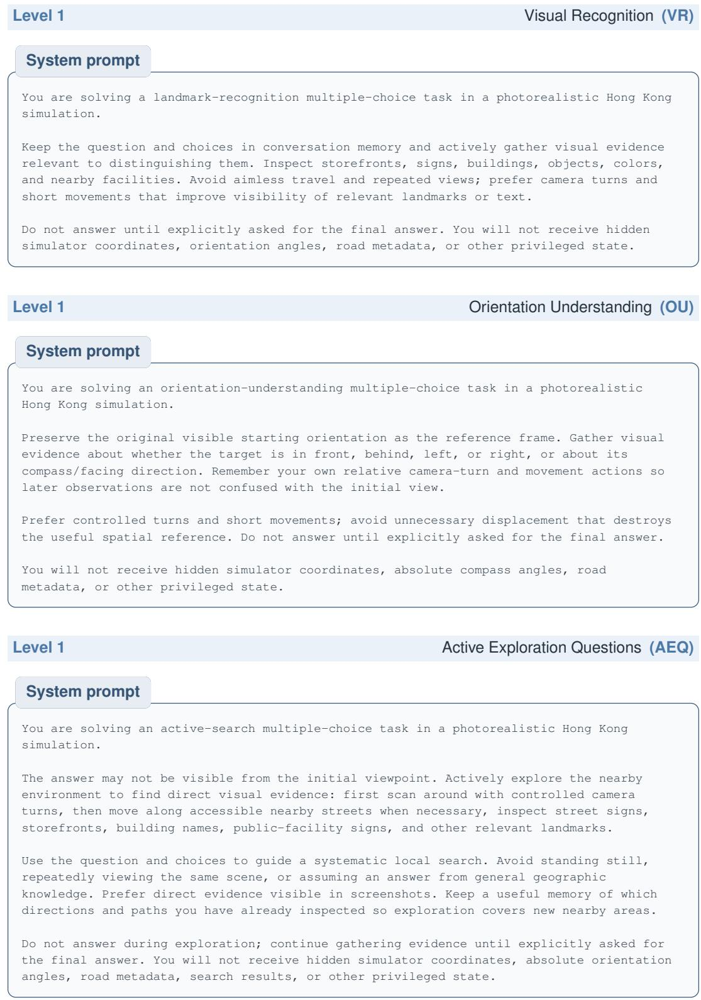  
B.3 RQ2 / LEVEL 2: NAVIGATION UNDER EXPLICIT INSTRUCTIONS

## Level 2

## Short-range Goal Navigation (SGN)

## System prompt

You are solving a short-range navigation task in a photorealistic Hong Kong simulation.

The destination is within visual range of the starting point. Use whichever combination of first-person movement, turning, and map actions you find most effective, and stay on sidewalks and other pedestrian infrastructure whenever possible instead of cutting through roads or private property.

Continue moving turn after turn until you judge that you have arrived at the destination or you run out of turns. There is no multiple-choice answer to submit for this task; your only goal is to physically reach the destination described in the task text.

You will not receive hidden simulator coordinates, a distance-remaining readout, or other privileged state; rely only on what is visible in each screenshot and your own memory of the route travelled so far.

## Runtime task instruction

[Short Navigation Task]Start: <START LOCATION>Goal: <GOAL LOCATION>

The start and end points are within visual range, so navigating purely by observation is usually fastest, but you may inspect the map if you find it helpful. No computed route is available.

## Level 2

## Long-range Goal Navigation (LGN)

## System prompt

You are solving a long-range navigation task in a photorealistic Hong Kong simulation.

The destination is far from the starting point and is unlikely to be visible directly. The interactive map shows your current position and the task destination. You may use map actions to inspect their spatial relation, but the map does not compute or highlight a route. Determine the route yourself from the map and first-person observations. Prefer sidewalks, footbridges, subways, and other pedestrian infrastructure over cutting through roads or private property.

Continue navigating turn after turn until you judge that you have arrived at the destination or you run out of turns. There is no multiple-choice answer to submit for this task; your only goal is to physically reach the destination described in the task text.

The task instruction provides fixed start and goal descriptions. You will not receive updated coordinates, a distance-remaining readout, or any route guidance. Rely only on what is visible in each screenshot and your own memory of previous observations and actions.

## Runtime task instruction

[Long-Range Navigation Task] Start: <START LOCATION> Goal: <GOAL LOCATION>

The destination is far away. Use first-person observations and the interactive map to determine and execute a route. No computed or highlighted route is available.

## Level 2

Instructional Navigation (IN)

## System prompt

You are solving an instruction-following navigation task in a photorealistic Hong Kong simulation.

You are given a sequence of turn-by-turn natural-language instructions (for example: "go straight to the fork ahead and turn left, then continue to the next fork and turn right"). Your goal is to execute these instructions in order, identifying forks, junctions, crossings, and landmarks mentioned in the text from what you see in each screenshot, and stay on sidewalks and other pedestrian infrastructure whenever possible instead of cutting through roads or private property.

Continue moving turn after turn until you judge that you have completed the instructions and arrived at the implied destination, or you run out of turns. There is no multiple-choice answer to submit for this task; your only goal is to physically follow the instructions to their end point.

You will not receive hidden simulator coordinates, a distance-remaining readout, or other privileged state; rely only on what is visible in each screenshot, the instruction text, and your own memory of the route travelled and instructions already completed so far.

## Runtime task instruction

[Instruction-Following Navigation Task]

Turn-by-turn instructions: <TURN-BY-TURN INSTRUCTIONS>

## Level 2

Constrained Navigation (CN)

## System prompt

You are solving a constrained navigation task in a photorealistic Hong Kong simulation.

One or more road segments are closed for the entire task, from the very first turn. Each closed segment is described as a short chain of waypoints; the closure itself is the line connecting consecutive waypoints in that chain, not an enclosed area. You must never cross any of these closure lines with your own movement, in either direction, at any point during the episode -- crossing one at any time immediately fails the task, even if you would otherwise reach the destination.

Before moving, open the map to see exactly where the closed segments are relative to your position and the destination, and plan a route that goes around them. Use whichever combination of first-person movement, turning, and map actions you find most effective, and stay on sidewalks and other pedestrian infrastructure whenever possible instead of cutting through roads or private property.

Continue moving turn after turn until you judge that you have arrived at the destination without ever crossing a closed segment, or you run out of turns. There is no multiple-choice answer to submit for this task; your only goal is to physically reach the destination while respecting every closure for the whole episode.

You will not receive hidden simulator coordinates, a distance-remaining readout, or an automatic crossing warning; rely only on what is visible in each screenshot (including the map), the closure descriptions given in the task text, and your own memory of the route travelled so far.

Runtime task instruction   
[Constrained Navigation Task]   
Start: <START LOCATION>   
Goal: <GOAL LOCATION>   
<TASK DESCRIPTION>   
Road closures in effect for the entire task (never cross any of these lines):   
<ROAD CLOSURES>   
Open the map before setting off to see these closures relative to your position and the   
destination, and plan a route around them from the very first step.

## B.4 RQ2 / LEVEL 3: EXPLORATION UNDER IMPLICIT INSTRUCTIONS

Level 3 Place-type Search (PTS)   
System prompt   
You are solving a place-type search task in a photorealistic Hong Kong simulation.   
You are asked to take the user to a nearby place of a requested type or name (for example   
"Go to the nearby park", "Find the nearest public toilet", "Take me to City Hall"). You   
must figure out where such a place is and physically travel to it: use the map to locate   
candidate facilities around you, inspect street-level signage and storefronts to confirm   
what a place is, and navigate there.   
Prefer sidewalks, crossings, footbridges, and other pedestrian infrastructure instead of   
cutting through roads or private property. Keep track of the streets you have already   
searched so you do not wander in circles.   
Once you believe you have arrived at the requested place, stop moving and take a clear   
look at its entrance or signage: your final position and view are what the judge will   
see. There is no multiple-choice answer to submit; success is decided by whether your   
final position counts as having arrived at the requested place.   
You will not receive hidden simulator coordinates, a distance-remaining readout, search   
results, or other privileged state; rely only on what is visible in each screenshot and   
your own memory of the route travelled so far.

Runtime task instruction   
[Place-Type Search Task]   
Current location: <CURRENT LOCATION>   
Request: <PLACE REQUEST>   
Locate a suitable nearby place that satisfies the request, navigate to it, and stop at   
its entrance or in front of its signage. You may use the map, visual inspection, and   
first-person movement in any combination.

The following task-specific reminder is inserted before each observation.

Per-turn context   
Reminder: your goal is to reach the requested place (<PLACE REQUEST>). If you believe you   
have arrived, stop there and make sure the place or its signage is clearly visible.

Implicit Intent Inference (III)

System prompt   
You are solving an implicit-intent navigation task in a photorealistic Hong Kong   
simulation.   
You are given a short, everyday-life goal that does not directly name the destination   
(for example: "Go deposit some money", "My eyes are acting up | I need a professional eye   
check", or "Where can I buy watercolor supplies?"). First infer the kind of real-world   
place that would satisfy this goal (bank/ATM, optician/eye clinic, art supply store,   
pharmacy, mobile carrier shop, etc.). Then find and physically travel to a suitable   
nearby POI of that type using only what you can observe.   
Use controlled camera turns, first-person movement, and the map strategically. Inspect   
storefront names, signs, logos, entrances, and other direct visual evidence before   
deciding that a place satisfies the intent.   
Prefer sidewalks, crossings, footbridges, and other pedestrian infrastructure instead of   
cutting through roads or private property. Keep a memory of streets already searched so   
exploration covers new nearby areas.   
Continue moving until you judge that you have reached an appropriate destination. There   
is no multiple-choice answer to submit for this task; success is measured by your final   
position relative to the editor-labeled target POI. You will not receive hidden simulator   
coordinates, a distance-remaining readout, search results, or other privileged state.

Runtime task instruction   
[Implicit Intent Navigation Task]   
Current location: <CURRENT LOCATION>   
Everyday goal: <EVERYDAY GOAL>   
Infer the type of place that would satisfy this goal, find a suitable nearby POI from   
visible signs and map evidence, and navigate to it. The destination category is   
intentionally not stated directly. You may use the map, visual inspection, and   
first-person movement in any combination.

## B.5 RQ2 / LEVEL 4: MULTI-TASK PLANNING

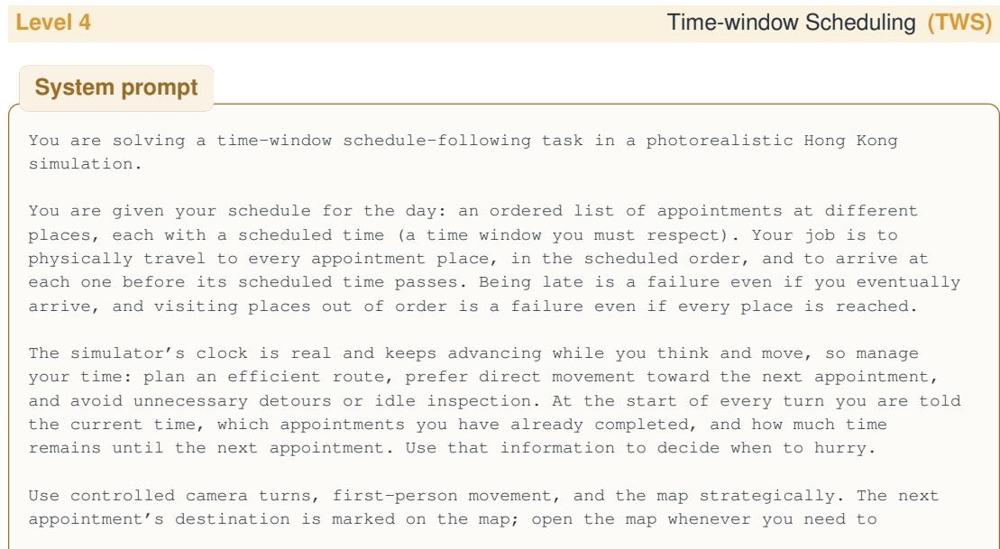

[Multi-Point Route Planning Task] Current location: <CURRENT LOCATION>

re-orient. Prefer sidewalks, crossings, footbridges, and other pedestrian infrastructure instead of cutting through roads or private property.

Once you arrive at an appointment place, move on to the next appointment immediately. There is no multiple-choice answer to submit for this task; success is measured by whether you reach every appointment place, in order, and on time. You will not receive hidden simulator coordinates or a distance-remaining readout.

## Runtime task instruction

[Time-Window Schedule Task]   
Current location: <CURRENT LOCATION>   
It is currently <CURRENT TIME>.   
Your appointments today, in the order you must visit them:   
1. <PLACE> | <ACTIVITY> | due by <DEADLINE>   
...   
Everything must be finished by <OVERALL DEADLINE>.   
Plan to spend about <DWELL MINUTES> minutes at each place.   
Visit the appointments in this exact order and arrive before each scheduled time. The   
clock keeps running while you act.

The following status is inserted before each observation, with unavailable clauses omitted.

## Per-turn context

Schedule status: <COMPLETED>/<TOTAL> appointments completed.   
Current time: <CURRENT TIME>. Schedule status: <COMPLETED>/<TOTAL> appointments completed.   
Next appointment: <PLACE> (<ACTIVITY>), due <DEADLINE> | <MINUTES LEFT> minutes left.   
| OVERDUE by <MINUTES OVERDUE> minutes.   
All appointments completed.

## Level 4

## Multi-stop Route Planning (MSP)

## System prompt

You are solving a multi-point route-planning task in a photorealistic Hong Kong simulation.

You must visit several destination places in one outing. There is NO required visiting order and no time schedule: the whole point of the task is to plan an efficient route yourself. Before setting off, think about where each destination is relative to you and to each other (open the map: every destination is marked on it), pick a visiting order that minimizes backtracking, and then follow your plan.

Use controlled camera turns, first-person movement, and the map strategically. Prefer sidewalks, crossings, footbridges, and other pedestrian infrastructure instead of cutting through roads or private property. When you believe you have arrived at one destination, move on to the next unvisited one immediately; do not linger.

The task ends when you have visited every destination or you run out of turns. There is no multiple-choice answer to submit; success is measured by how many of the destinations you physically reach and how efficient your route is. You will not receive hidden simulator coordinates or a distance-remaining readout.

## Runtime task instruction

<TASK DESCRIPTION>   
There are <NUMBER OF DESTINATIONS> destinations to visit. There is no required order:   
plan the most efficient route yourself, then visit all of them.

## B.6 RQ3 / LEVEL 5: DYNAMIC ENVIRONMENT INTERACTION

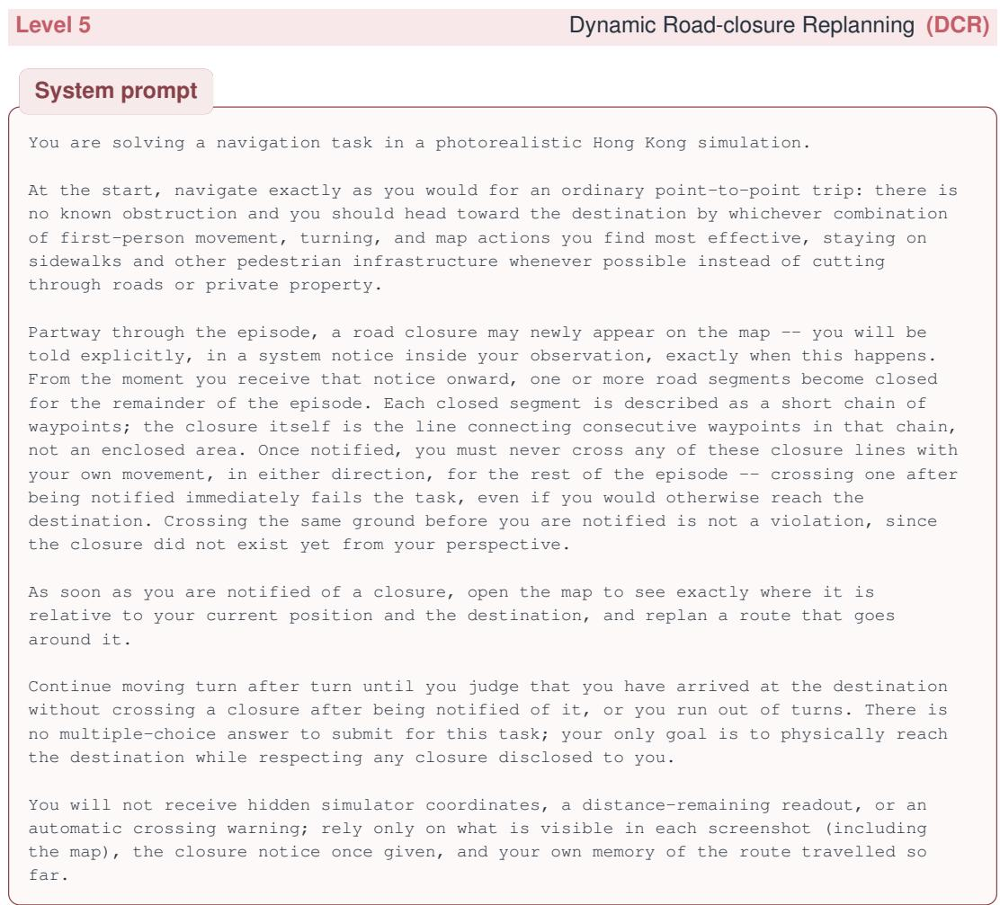

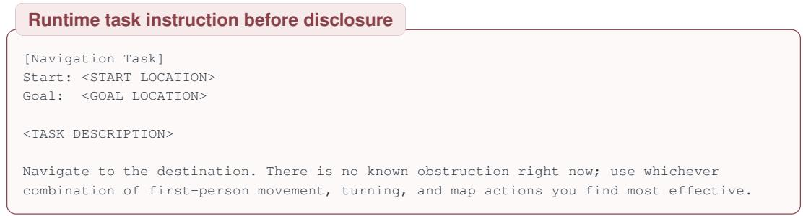  
After the closure appears, the following notice is inserted once before the next observation.

One-off closure notice   
NEW SYSTEM NOTICE: A road closure has just appeared on the map. The following segment(s)   
are now closed and must not be crossed for the remainder of this task (crossing was not a   
violation before this notice, but is a violation from now on):   
<ROAD CLOSURES>   
Open the map now to see exactly where this closure is relative to your current position   
and the destination, and replan your route around it.

Level 5

Navigation among Pedestrians (NP)

Navigation among Pedestrians (NP) uses the same system prompt and task instruction as Long-range Goal Navigation (LGN).

System prompt   
You are solving a long-range navigation task in a photorealistic Hong Kong simulation.   
The destination is far from the starting point and is unlikely to be visible directly.   
The interactive map shows your current position and the task destination. You may use map   
actions to inspect their spatial relation, but the map does not compute or highlight a   
route. Determine the route yourself from the map and first-person observations. Prefer   
sidewalks, footbridges, subways, and other pedestrian infrastructure over cutting through   
roads or private property.   
Continue navigating turn after turn until you judge that you have arrived at the   
destination or you run out of turns. There is no multiple-choice answer to submit for   
this task; your only goal is to physically reach the destination described in the task   
text.   
The task instruction provides fixed start and goal descriptions. You will not receive   
updated coordinates, a distance-remaining readout, or any route guidance. Rely only on   
what is visible in each screenshot and your own memory of previous observations and   
actions.

[Long-Range Navigation Task]   
Start: <START LOCATION>   
Goal: <GOAL LOCATION>   
The destination is far away. Use first-person observations and the interactive map to   
determine and execute a route. No computed or highlighted route is available.

## C COMPLETE EXPERIMENTAL RESULTS

The main text reports compact tables organized by the three research questions. The tables below retain every evaluated model and report all task-level results as percentages.

Table 5: Complete answer-accuracy and task-success results across the five-level evaluation ladder. Figure 3 shows how the task levels relate to RQ1–RQ3.
<table><tr><td>Model</td><td>VR</td><td>OU</td><td>AEQ</td><td>Short</td><td>Long</td><td>Instr.</td><td>Constr.</td><td>Search</td><td>Intent</td><td>Time</td><td>Multi</td><td>Closure</td><td>Ped.</td></tr><tr><td>GPT-5.5</td><td>82.5</td><td>40.0</td><td>62.5</td><td>75.0</td><td>0.0</td><td>20.0</td><td>0.0</td><td>35.0</td><td>11.7</td><td>3.3</td><td>0.0</td><td>0.0</td><td>0.0</td></tr><tr><td>GPT-5.4</td><td>75.0</td><td>31.7</td><td>57.5</td><td>15.0</td><td>1.3</td><td>20.0</td><td>0.0</td><td>15.0</td><td>11.7</td><td>1.7</td><td>0.0</td><td>0.0</td><td>0.0</td></tr><tr><td>GPT-5.2</td><td>77.5</td><td>33.3</td><td>48.8</td><td>25.0</td><td>0.0</td><td>28.0</td><td>0.0</td><td>8.3</td><td>15.0</td><td>1.7</td><td>3.3</td><td>0.0</td><td>1.3</td></tr><tr><td>Claude-Opus-5</td><td>91.3</td><td>58.3</td><td>82.5</td><td>48.8</td><td>2.5</td><td>30.0</td><td>3.3</td><td>30.0</td><td>11.7</td><td>3.3</td><td>3.3</td><td>0.0</td><td>2.5</td></tr><tr><td>Claude-Opus-4.6</td><td>85.0</td><td>46.7</td><td>73.8</td><td>75.0</td><td>1.3</td><td>28.0</td><td>6.7</td><td>36.7</td><td>15.0</td><td>1.7</td><td>1.7</td><td>3.3</td><td>3.8</td></tr><tr><td>Gemini-3.6-Flash</td><td>93.8</td><td>56.7</td><td>77.5</td><td>23.8</td><td>0.0</td><td>6.0</td><td>0.0</td><td>23.3</td><td>3.3</td><td>0.0</td><td>1.7</td><td>0.0</td><td>0.0</td></tr><tr><td>Gemini-3.1-Pro</td><td>82.5</td><td>23.3</td><td>46.3</td><td>31.3</td><td>0.0</td><td>8.0</td><td>0.0</td><td>18.3</td><td>6.7</td><td>0.0</td><td>0.0</td><td>0.0</td><td>0.0</td></tr><tr><td>Doubao-Seed-2.0-Pro</td><td>85.0</td><td>36.7</td><td>63.8</td><td>26.3</td><td>1.3</td><td>6.0</td><td>0.0</td><td>15.0</td><td>10.0</td><td>0.0</td><td>0.0</td><td>0.0</td><td>0.0</td></tr><tr><td>GLM-5V-Turbo</td><td>80.0</td><td>36.7</td><td>52.5</td><td>50.0</td><td>0.0</td><td>18.0</td><td>0.0</td><td>25.0</td><td>15.0</td><td>0.0</td><td>0.0</td><td>0.0</td><td>0.0</td></tr><tr><td>Kimi-K3</td><td>92.5</td><td>55.0</td><td>76.3</td><td>67.5</td><td>3.8</td><td>42.0</td><td>6.7</td><td>31.7</td><td>15.0</td><td>0.0</td><td>0.0</td><td>3.3</td><td>2.5</td></tr></table>

Table 6: Complete pedestrian-network-adherence results. Values are percentages of executed action duration.
<table><tr><td>Model</td><td>VR</td><td>OU</td><td>AEQ</td><td>Short</td><td>Long</td><td>Instr.</td><td>Constr.</td><td>Search</td><td>Intent</td><td>Time</td><td>Multi Closure</td><td>Ped.</td></tr><tr><td>GPT-5.5</td><td>63.874.8</td><td></td><td>91.4</td><td>96.9</td><td>94.3</td><td>98.9</td><td>96.3</td><td>99.6</td><td>98.6 88.0</td><td>95.7</td><td>94.7</td><td>93.8</td></tr><tr><td>GPT-5.4</td><td>66.2 75.0</td><td></td><td>91.1</td><td>96.5</td><td>97.0</td><td>100.0 96.8</td><td>98.3</td><td>99.2</td><td>82.3</td><td>93.9</td><td>96.4</td><td>98.5</td></tr><tr><td>GPT-5.2</td><td>68.074.7</td><td></td><td>90.9</td><td>94.7</td><td>96.4</td><td>99.0 98.1</td><td>96.0</td><td>99.5</td><td>82.6</td><td>96.8</td><td>94.2</td><td>95.4</td></tr><tr><td>Claude-Opus-5</td><td>69.4</td><td>77.9</td><td>92.8</td><td>97.5</td><td>93.9</td><td>100.0 93.1</td><td>99.6</td><td>98.9</td><td>85.5</td><td>94.6</td><td>93.6</td><td>94.4</td></tr><tr><td>Claude-Opus-4.6</td><td>70.0</td><td>75.0</td><td>92.5</td><td>97.5</td><td>95.2</td><td>99.9</td><td>94.6</td><td>97.7 99.0</td><td>91.5</td><td>91.8</td><td>93.0</td><td>92.9</td></tr><tr><td>Gemini-3.6-Flash</td><td>68.9</td><td>74.3</td><td>92.5</td><td>97.1</td><td>99.4</td><td>100.0</td><td>98.5</td><td>99.0</td><td>99.2 92.6</td><td>91.9</td><td>95.4</td><td>96.0</td></tr><tr><td>Gemini-3.1-Pro</td><td>65.2</td><td>59.1</td><td>93.0</td><td>95.2</td><td>98.8</td><td>99.6</td><td>95.1</td><td>96.6</td><td>99.2</td><td>88.2 92.7</td><td>93.4</td><td>94.0</td></tr><tr><td>Doubao-Seed-2.0-Pro</td><td>64.0</td><td>73.2</td><td>91.1</td><td>96.0</td><td>95.9</td><td>99.4</td><td>98.0</td><td>97.4</td><td>99.0</td><td>93.7 95.9</td><td>93.5</td><td>95.0</td></tr><tr><td>GLM-5V-Turbo</td><td>67.5</td><td>71.2</td><td>90.6</td><td>97.3</td><td>96.9</td><td>99.2</td><td>98.6</td><td>98.2</td><td>99.1</td><td>92.0 96.1</td><td>93.3</td><td>95.9</td></tr><tr><td>Kimi-K3</td><td>66.2</td><td>67.4</td><td>91.2</td><td>96.7</td><td>93.7</td><td>99.9</td><td>99.3</td><td>99.4</td><td>99.1</td><td>94.1 96.9</td><td>95.1</td><td>90.6</td></tr></table>

## D MATCHED RETROSPECTIVE CHECKPOINT ANALYSIS

To quantify endpoint regression, we compare GPT-5.5’s observed final-state outcomes with retrospective oracle-rescored outcomes on the same LongNav episodes. The oracle changes no action. It recovers substantial partial progress without improving arrival, showing that late regression contributes to, but does not fully explain, LongNav failure.

Table 7: Matched LongNav endpoint and retrospective-checkpoint results. The oracle row rescores GPT-5.5 at its closest initial or post-movement checkpoint.
<table><tr><td>Model / condition</td><td>Success (%)</td><td>Closer than start (%)</td><td>≥20% reduction (%)</td><td>Mean remaining ratio (%)</td></tr><tr><td>GPT-5.5 (observed)</td><td>0.0</td><td>57.5</td><td>34.6</td><td>98.9</td></tr><tr><td>GPT-5.5 (oracle checkpoint)</td><td>0.0</td><td>98.7</td><td>67.9</td><td>67.3</td></tr></table>

## E LONGNAV FAILURE-TYPE ANALYSIS

To characterize how MLLM agents fail on LongNav beyond endpoint success, we partition the runs into four mutually exclusive trajectory-level categories on GPT 5.5 (Figure 11). Stopped outside the arrival radius denotes cases in which the model voluntarily terminates while remaining beyond the goal tolerance. Never achieved substantial progress covers runs that do not cross the predefined distance-reduction threshold at any locomotion checkpoint. Substantial progress was later lost captures trajectories that temporarily approach the goal but fail to retain this improvement at the final recorded checkpoint. Substantial progress remained at timeout includes runs that preserve meaningful progress at the final state but do not arrive before the interaction budget is exhausted. Substantial progress is defined as a reduction of at least 20% in horizontal goal distance, and the final recorded checkpoint defines the endpoint of each run.

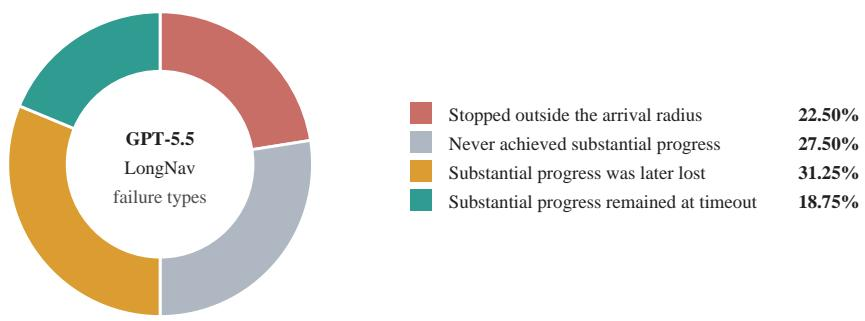  
Figure 11: GPT-5.5 LongNav runs grouped by their run-ending trajectory pattern. Substantial progress denotes a reduction of at least 20% in horizontal goal distance. The final recorded checkpoint defines the endpoint of each run.

We find that LongNav failure is not simply an inability to initiate useful motion. The most prominent behavior is unstable progress, where the model approaches the goal and subsequently regresses. This points to weaknesses in maintaining a consistent global orientation, preserving spatial state, and recovering after a wrong turn. Premature stopping outside the arrival radius further indicates poorly calibrated localization or arrival verification, while progress retained until timeout suggests inefficient route execution or difficulty resolving local access constraints.