# UniFLM: United Segmentation and Measurement on Fetal Limb Ultrasonic Image

Zeen Zhoua,1, Qiuhua Chenb,1, Xiaojun Caod, Changmao Chend, Chao Sunb,c,∗, Bo Dub,c,∗

aAcademy of Advanced Interdisciplinary Studies, Wuhan University, Wuhan, China bSchool of Computer Science, Wuhan University, Wuhan, China

cInstitute of Artificial Intelligence, School of Computer Science, Wuhan University, Wuhan, China

dGuangzhou Women and Children’s Medical Center, Guangzhou, China

## Abstract

Prenatal ultrasound examination is crucial for assessing fetal limb development and detecting congenital anomalies. However, existing artificial intelligence models often overlook fetal lethal skeletal dysplasias due to the lack of high-quality annotated data and a unified framework for multiple long bones. Moreover, generic segmentation models struggle with the inherent noise and semantic gaps in ultrasound images. To address these challenges, we construct the Fetal Limb Bones (FLB) dataset, comprising high-quality annotations for the humerus, femur, tibia-fibula, and radius-ulna. Furthermore, we propose UniFLM, a unified framework for automatic cross-plane segmentation and measurement. UniFLM incorporates a Semantic-Aware Skip Connection module to bridge the semantic gap between encoder and decoder features, and a Positive Sampling strategy to adaptively filter noise and extract essential semantic information. Finally, a Point Regression Mapping module is introduced to learn clinician annotation patterns for precise bone length measurement. Extensive experiments conducted on the FLB dataset demonstrate that the proposed UniFLM achieves superior accuracy and enhanced generalization capabilities in fetal long bone assessment com-

pared to current state-of-the-art models.

Keywords: Fetal Limb Measurement, Ultrasound Image Segmentation, Fetal Development Assessment

## 1. Introduction

Prenatal ultrasound imaging is a crucial tool for assessing fetal anatomical structures and monitoring growth and development. Assessing the morphology and length of the fetal limb long bones, including the humerus, femur, leg (tibia-fibula), and forearm (radius-ulna), is clinically significant for diagnosing lethal skeletal dysplasias associated with severe limb shortening [1, 2, 3, 4]. Lethal skeletal dysplasias result in a poor postnatal prognosis, underscoring the importance of early prenatal diagnosis [5]. Compared to traditional diagnostic methods based on clinician expertise, artificial intelligence ofers advantages of accuracy, speed, and automation, providing novel technological solutions for the intelligent diagnosis of severe congenital anomalies during the critical stages of pregnancy, thereby facilitating timely clinical decision-making and subsequent medical interventions.

However, existing medical diagnosis models and datasets lack suficient focus on limb long bone measurements and intelligent early diagnosis of fetal skeletal dysplasia and face three major challenges [6, 7, 8, 9]:

(1) Challenges posed by low-resolution, uneven contrast, and inherent noise in ultrasound images, as well as the coexistence of multiple bones in a single frame. These factors make it dificult to establish a unified segmentation framework for fetal limb long bones.

(2) Lack of high-quality annotated data and systematic studies for fetal limb bones. The FPUS23 dataset [10] focuses on fetal ultrasound images but only provides bounding box annotations for fetal limb detection and does not support precise measurement for long bones. The DeepGA model [11] predicts gestational age based on femur length but not other long bones.

(3) Limitations of existing models in medical image segmentation tasks. The convolutional nature of U-Net-based [12, 13] restricts its ability to capture long-range dependencies between features. Furthermore, the skip-connection mechanism is directly used to fuse the features between encoder and decoder blocks, which may introduce semantic gaps [14]. General-purpose image segmentation models such as SAM-likes [15, 16, 17, 18], still require extensive fine-tuning with high-quality data to achieve satisfactory performance

in practical applications. Additionally, the massive parameter scale and intensive computational overhead of these foundation models render them highly impractical for real-time clinical deployment, particularly within standard hospital settings that are heavily constrained by limited hardware resources and strict eficiency requirements.

To address the critical shortage of high-fidelity annotated ultrasound imagery for fetal skeletal analysis, we introduce the Fetal Limb Bones (FLB) dataset. This comprehensive dataset encompasses ultrasound images of the humerus, femur, tibia-fibula, and radius-ulna, all rigorously labeled by three senior clinicians with over a decade of expertise to ensure clinical reliability. Building upon this benchmark, we propose the Universal Fetal Long Bone Measurement (UniFLM) framework, a unified cross-plane paradigm designed for end-to-end automated segmentation and biometric measurement. The architecture integrates a U-Net-based backbone with a Semantic Alignment Skip Connections (SASC) module and a Positive Sampling (PoSamp) mechanism. SASC bridges the semantic gap between encoder and decoder features via attention mechanisms, while PoSamp suppresses inherent acoustic noise to amplify essential feature representation. Furthermore, a Point Regression Mapping (PRM) strategy is employed in the measurement head to capture clinician-specific annotation patterns, significantly enhancing the precision of anatomical landmark localization.

The primary contributions of this work are summarized as follows:

• We curate the Fetal Limb Bones (FLB) dataset, a high-quality benchmark comprising multi-category ultrasound images. These images are meticulously annotated by senior experts to facilitate robust and clinically relevant model training.

• We introduce the SASC module, which leverages an attention mechanism to explicitly align encoder and decoder features. This efectively bridges semantic discrepancies and enhances feature consistency when processing complex ultrasound textures.

• We develop a Positive Sampling (PoSamp) mechanism to suppress inherent ultrasound noise for robust feature extraction, coupled with a Point Regression Mapping (PRM) strategy that emulates clinician annotation patterns for precise anatomical landmark localization.

• Extensive evaluations demonstrate that UniFLM achieves superior generalization performance in cross-category fetal bone measurement. To foster further research, both the FLB dataset and the source code are made publicly available at https://github.com/chosen1203/UniFLM.

## 2. Related Work

## 2.1. Deep Learning in Medical Image Segmentation

Deep learning has revolutionized medical image segmentation, initially driven by the standard U-Net [12] encoder-decoder paradigm and its subsequent variants (e.g., Attention U-Net [19], UNet++ [20], and UNet 3+ [21]) that introduced attention mechanisms and dense skip pathways. While Vision Transformers like TransUNet [22] and Swin-Unet [23] efectively capture global context, their substantial computational resource requirements have motivated the development of more eficient alternatives in recent years. Notably, foundation models such as SAM [15], MedSAM [24], and the ultrasoundoptimized SAM-US [25] ofer strong generalization capabilities, while emerging state space models (e.g., VM-UNet [26]) and Kolmogorov-Arnold Networks (e.g., U-KAN [27]) provide powerful long-range dependency modeling and high accuracy with significantly reduced parameter counts. Despite these rapid advancements, generic architectures still struggle with the severe acoustic noise and semantic gaps inherent in fetal ultrasound imaging, underscoring the necessity for our domain-specific SASC and PoSamp modules.

## 2.2. Fetal Ultrasound Image Analysis

Fetal ultrasound analysis primarily focuses on standard plane detection [28] and biometric measurement. While automated measurement of head (BPD, HC) and abdominal (AC) metrics is well-established, fetal limb assessment remains under-explored. To address the inherent challenges of ultrasound imaging, such as low contrast, acoustic shadows, and speckle noise, attention mechanisms have been increasingly integrated into analysis frameworks. Techniques like SE-Net [29] recalibrate channel importance, while spatial attention modules focus on relevant anatomical regions to suppress background interference and bridge semantic gaps. However, despite these technological capabilities, current resources for limb analysis are limited. The FPUS23 dataset [10] provides only bounding box annotations, lacking the pixel-level masks required for precise biometrics. Similarly, models like DeepGA [11] focus exclusively on femur length, neglecting other long bones.

A unified framework that leverages advanced feature alignment and attention strategies to simultaneously segment and measure multiple limb bones remains a significant research gap.

## 2.3. Landmark Detection and Biometric Measurement

Biometric measurement relies on precise landmark localization, generally categorized into heatmap-based and regression-based methods. Heatmap approaches, such as SpatialConfiguration-Net [30], ofer spatial uncertainty estimation but require computationally expensive post-processing to extract coordinates. Conversely, direct coordinate regression methods [31, 32] are highly eficient but may lack spatial context and geometric robustness. Recent hybrid advancements [33] combine segmentation features with landmark detection to enforce geometric consistency. Building on this, our proposed PRM module adopts a regression-based strategy enhanced by segmentation cues, learning to predict bone lengths by emulating clinician-specific annotation patterns. This ensures robust measurements even when anatomical boundaries are ambiguous or partially obscured.

## 3. Methodology

## 3.1. Overview

The proposed UniFLM framework, illustrated in Fig. 1, is designed for unified fetal long-bone segmentation and precise biometric measurement. Unlike standard U-Net architectures, UniFLM employs a deep 6-stage encoder $( \mathbf { E n } _ { 1 }$ to $\mathbf { E n } _ { 6 } )$ and a 5-stage decoder $( \mathbf { D e } _ { 1 }$ to $\mathbf { D e } _ { 5 } )$ to capture the complex semantic features of ultrasound images.

The framework integrates three novel modules:

Semantic Alignment Skip Connection (SASC): A centralized module that aggregates multi-scale encoder features $( { \bf I } _ { 1 } ^ { e } \cdot \cdot \cdot { \bf I } _ { 4 } ^ { e } )$ , aligns them via crossattention mechanisms, and distributes them $( \mathbf { I } _ { 1 } ^ { e ^ { \prime } } \ldots . \mathbf { I } _ { 4 } ^ { e ^ { \prime } } )$ to the decoder.

Positive Sampling (PS): A bottleneck feature enhancement module that adaptively filters inherent background noise from the deepest encoder feature Z to produce a robust representation $\mathbf { Z } ^ { \ast }$ , thereby preserving essential anatomical structures and improving the stability of subsequent decoding stages.

Point Regression Mapping (PRM): A coarse-to-fine measurement head that refines initial keypoints $\mathbf { P } _ { i n i }$ derived from segmentation masks into precise landmarks $\mathbf { P } _ { p r e d }$ using a patch-based refinement network.

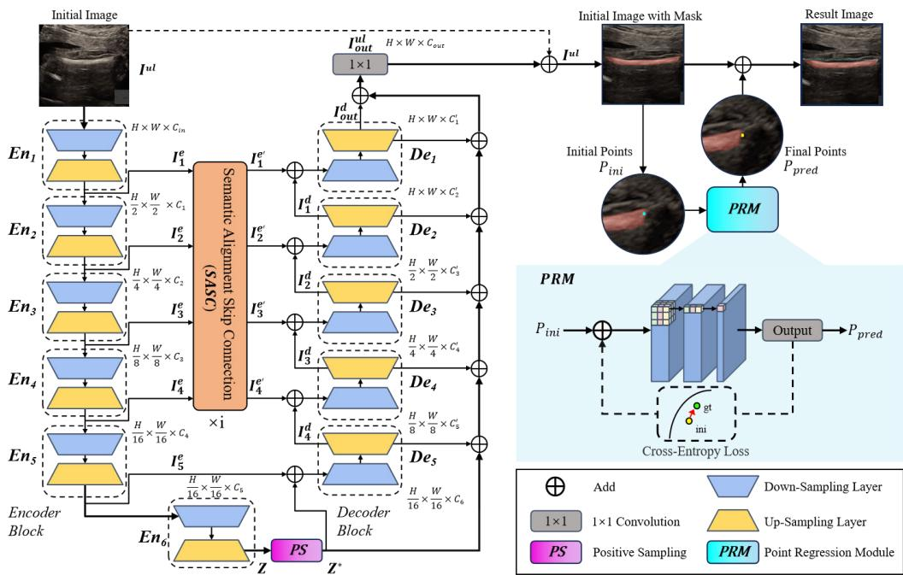  
Figure 1: The overall architecture of UniFLM. The backbone consists of a 6- stage Encoder (En) and a 5-stage Decoder (De). (1) SASC: Multi-scale encoder features Ie are projected and aligned via the centralized SASC module. (2) PS: The Positive Sampling module at the bottleneck filters noise from feature Z to generate $\mathbf { Z } ^ { \ast }$ . (3) Segmentation & PRM: The decoder outputs an initial image mask ${ \bf \cal I } ^ { u l }$ . Initial points $\mathbf { P } _ { i n i }$ are extracted and fed into the PRM module to predict the final measurement points $\mathbf { P } _ { p r e d }$

## 3.2. Semantic Alignment Skip Connection (SASC)

Standard skip connections often fail to handle the semantic discrepancy between shallow encoder features (rich in texture but noisy) and deep decoder features. To address this fundamental limitation, as shown in Fig. 2 (Left), our SASC module acts as a comprehensive global feature aligner, meticulously bridging the semantic gap and ensuring spatial consistency before fusing these representations into the subsequent decoding pathways.

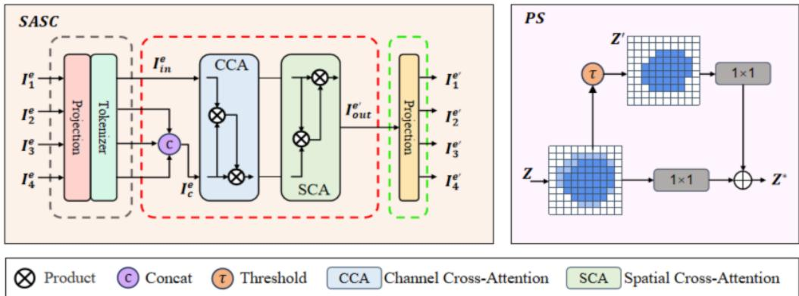  
Figure 2: Detailed structure of the proposed modules. Left (SASC): Inputs $\mathbf { I } _ { i } ^ { e }$ are processed via Projection and Tokenizer, concatenated into a unified representation ${ \bf I } _ { c } ^ { e } ,$ and refined through Channel Cross-Attention (CCA) and Spatial Cross-Attention (SCA) before being re-projected to their original spatial resolutions. Right (PS): The deepest encoder input Z is filtered by an adaptive threshold τ to create a binary-like attention mask, which progressively guides the enhancement of the bottleneck feature map via a residual connection to output the highly robust and noise-suppressed representation $\mathbf { Z } ^ { \ast }$ tailored for the subsequent decoding stages.

Let $\{ \mathbf { I } _ { 1 } ^ { e } , \mathbf { I } _ { 2 } ^ { e } , \mathbf { I } _ { 3 } ^ { e } , \mathbf { I } _ { 4 } ^ { e } \}$ denote the feature maps from the first four encoder blocks. First, we project these multi-scale features into a unified embedding space using a \*\*Projection\*\* layer and a \*\*Tokenizer\*\*, followed by concatenation to form a compact representation $\mathbf { I } _ { c } ^ { e }$

$$
\mathbf { I } _ { c } ^ { e } = \mathrm { C o n c a t } ( \mathrm { T o k e n i z e r } ( \operatorname { P r o j } ( \mathbf { I } _ { i } ^ { e } ) ) ) , \quad i \in \{ 1 , 2 , 3 , 4 \}\tag{1}
$$

The unified feature $\mathbf { I } _ { c } ^ { e }$ is then processed by a dual-attention mechanism: Channel Cross-Attention (CCA): Captures inter-channel dependencies to select task-relevant feature maps.

Spatial Cross-Attention (SCA): Models long-range spatial dependencies to distinguish bone structures from acoustic shadows.

The refined global feature is generated as:

$$
\mathbf { I } _ { o u t } ^ { e ^ { \prime } } = \mathrm { S C A } ( \mathrm { C C A } ( \mathbf { I } _ { c } ^ { e } ) )\tag{2}
$$

Finally, a reverse projection layer redistributes the features back to their original spatial resolutions, yielding aligned features $\{ \mathbf { I } _ { 1 } ^ { e ^ { \prime } } , \ldots , \mathbf { I } _ { 4 } ^ { e ^ { \prime } } \}$ , which are added to the decoder features via element-wise summation.

## 3.3. Positive Sampling (PS) Module

Ultrasound images inherently sufer from low signal-to-noise ratio and complex acoustic artifacts. To prevent noise propagation from the encoder to the decoder, we introduce the PS module at the bottleneck (Fig. 2 Right), ensuring that only the most robust semantic representations are forwarded to the subsequent image reconstruction stages.

Taking the deepest encoder feature Z from $\mathbf { E n } _ { 6 }$ as input, the PS module applies an adaptive thresholding strategy. It calculates a threshold τ to generate a binary-like attention mask, filtering out low-activation background noise while preserving highly discriminative structural cues essential for accurate fetal limb segmentation tasks:

$$
\mathbf { M } _ { m a s k } = \mathbb { 1 } ( \mathbf { Z } > \tau )\tag{3}
$$

$$
\mathbf { Z } ^ { \prime } = \operatorname { C o n v } _ { 1 \times 1 } ( \mathbf { Z } \odot \mathbf { M } _ { m a s k } )\tag{4}
$$

To preserve structural integrity while enhancing salient features, we employ a residual connection. The filtered feature $\mathbf { Z } ^ { \prime }$ is added back to the processed original input to maintain essential spatial information and ensure stable gradient flow during the training process:

$$
\mathbf { Z } ^ { * } = \operatorname { C o n v } _ { 1 \times 1 } ( \mathbf { Z } ) + \mathbf { Z } ^ { \prime }\tag{5}
$$

The resulting output $\mathbf { Z } ^ { \ast }$ serves as the clean and semantically rich input for the initial decoder stage $\mathbf { D e } _ { 5 }$ , fundamentally mitigating the detrimental efects of inherent ultrasound acoustic artifacts.

## 3.4. Point Regression Mapping (PRM)

To achieve precise biometric measurement, we propose a coarse-to-fine PRM strategy (Fig. 1 Right) designed to directly emulate the rigorous annotation patterns traditionally employed by experienced clinical ultrasound sonographers when assessing complex fetal anatomical structures in routine prenatal diagnostic examinations.

## 3.4.1. Initial Point Extraction

The decoder first generates a coarse segmentation probability map ${ \bf \cal I } ^ { u l }$ . We apply post-processing $( \mathrm { e . g . }$ , skeletonization) to extract the rough endpoints of the bone, denoted as Initial Points $\mathbf { P } _ { i n i }$ , which serve as the foundational spatial anchors for the subsequent precise coordinate refinement procedure.

## 3.4.2. Patch-based Refinement

$\mathbf { P } _ { i n i }$ may be inaccurate due to boundary ambiguity. PRM crops local feature patches centered at $\mathbf { P } _ { i n i }$ and feeds them into a refinement CNN. This network predicts the precise location of the landmarks relative to the patch center, efectively overcoming the inherent boundary blurring caused by severe acoustic shadowing in fetal ultrasound scans.

Instead of standard regression losses, we utilize Cross-Entropy Loss to treat landmark localization as a classification problem over the spatial grid, which significantly improves training convergence stability and mitigates the severe outlier predictions commonly observed in direct coordinate regression paradigms:

$$
\mathcal { L } _ { P R M } = \mathrm { C r o s s E n t r o p y } ( \mathbf { P } _ { p r e d } , \mathbf { P } _ { g t } )\tag{6}
$$

where $\mathbf { P } _ { p r e d }$ is the predicted probability heatmap of the landmark location, and $\mathbf { P } _ { g t }$ is the corresponding ground truth coordinate meticulously annotated by senior clinicians for accurate fetal biometric assessment.

## 4. Experimental Results

## 4.1. Dataset Construction and Statistics

## 4.1.1. Data Collection

We established the Fetal Limb Bones (FLB) dataset through collaboration with multiple clinical centers, collecting ultrasound images acquired between 2017 and 2023. The dataset comprises 1,690 images covering four anatomical categories: 600 images of the humerus, 500 images of the femur, 295 images of the forearm (radius-ulna), and 295 images of the leg (tibia-fibula).

Images were acquired using various ultrasound systems (GE Voluson, Philips EPIQ, Samsung) across gestational ages ranging from 14 to 40 weeks, ensuring diversity in image quality and fetal development stages.

## 4.1.2. Annotation Protocol

All images were annotated by three experienced sonographers (>10 years experience) following ISUOG guidelines. For each image, annotators provided the following detailed annotations:

(1) Pixel-level segmentation mask delineating the essential bone boundaries.

(2) Endpoint coordinates marking the proximal and distal bone margins.

(3) Quality assessment score (1-5) indicating overall image clarity.

Inter-annotator agreement was assessed using Dice coeficient (mean: 0.92) and endpoint distance (mean: 1.1 mm), demonstrating high consistency. Final annotations were derived through a rigorous majority voting protocol, supplemented by senior expert adjudication to meticulously resolve any persistent disagreements, thereby establishing a highly reliable ground truth benchmark for the subsequent model training process.

## 4.1.3. Dataset Split

We adopted a patient-wise split strategy (7:1:2 for training/validation/test) to prevent data leakage between sets. This ensures that images from the same patient appear exclusively in one subset, providing a realistic evaluation of generalization performance when encountering completely new clinical cases not seen during the training process.

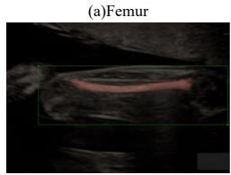

(b)Humerus  
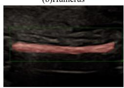

(c)Forearm  
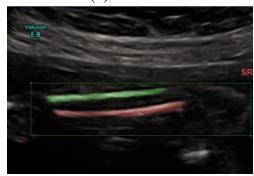

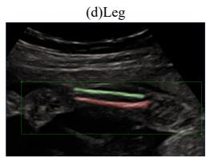  
Figure 3: Representative samples from the FLB dataset showing (a) Femur, (b) Humerus, (c) Forearm, and (d) Leg. Red contours denote expert annotations. Note the varying image quality, bone orientations, and presence of severe acoustic shadows across these ultrasound samples. These inherent degrading factors collectively introduce significant complexity to the automated segmentation task, thereby demanding highly robust feature extraction, global semantic alignment, and structural shape priors to successfully reconstruct the complete skeletal morphology despite the severe visual degradation caused by limited ultrasonic tissue contrast and complex acoustic artifacts.

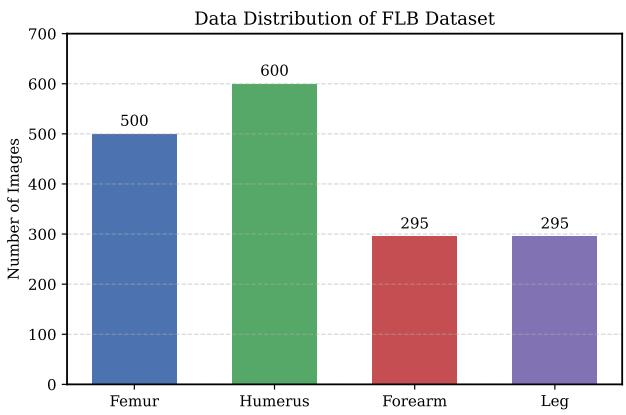  
Figure 4: Distribution of samples across the four bone categories in the FLB dataset, showing gestational age distribution within each category.

## 4.2. Implementation Details

## 4.2.1. Experimental Setup

All experiments were conducted using PyTorch 1.12 on a single NVIDIA Tesla V100 GPU (32GB memory). Images were resized to $2 5 6 \times 2 5 6$ pixels with bilinear interpolation. Training hyperparameters were determined through extensive grid search over the validation set. Specifically, the batch size was set to 8, with a standard weight decay of $1 \times 1 0 ^ { - 4 }$ . The initial learning rate was set to $2 \times 1 0 ^ { - 2 }$ for the SGD optimizer and $1 \times 1 0 ^ { - 4 }$ for the AdamW optimizer. Furthermore, the multi-task loss function weights were set to $\lambda _ { 1 } = 1 . 0$ and $\lambda _ { 2 } = 0 . 5$ , while the adaptive PoSamp threshold parameter was empirically fixed at $\alpha = 0 . 5$ to ensure consistent and stable optimization during the entire training procedure.

## 4.2.2. Evaluation Metrics

## 4.2.3. Evaluation Metrics

For robust segmentation evaluation, we employ the Dice Coeficient and Intersection over Union (IoU) to rigorously measure the regional overlap between predicted outputs and expert-annotated ground truth masks, alongside the Hausdorf Distance (HD95) to comprehensively assess spatial boundary accuracy at the 95th percentile. Regarding the quantitative measurement evaluation, we utilize the Mean Euclidean Distance (MED) to specifically quantify the average endpoint localization error in spatial coordinates, while the Mean Absolute Error (MAE) and Mean Squared Error (MSE) are computed to systematically evaluate the average bone length measurement error and squared measurement error, respectively, across all challenging clinical ultrasound test samples.

## 4.3. Comparative Analysis

## 4.3.1. Baseline Methods

We compared UniFLM against a comprehensive set of baseline methods spanning diferent architectural paradigms:

Classic Architectures: Classic approaches include the standard U-Net, which features an encoder-decoder structure with skip connections [12], UNet++ that employs nested skip pathways for semantic fusion [20], and Attention U-Net which integrates attention-gated skip connections [19].

Transformer-based: This category features TransUNet, a hybrid CNN-Transformer architecture [22], and Swin-Unet, which is a pure Transformer model utilizing shifted windows [23].

Foundation Models: Significant contributions include MedSAM, a medical adaptation of the Segment Anything Model (SAM) [24], and SAM-US, a variant specifically tailored for ultrasound imaging [25].

Recent Advances (2024-2025): Emerging architectures include VM-UNet, which is based on the Mamba state space model [26], and U-KAN, which utilizes the Kolmogorov-Arnold Network architecture [27].

All baselines were trained using their oficial implementations with hyperparameters tuned on our validation set.

## 4.3.2. Quantitative Results

Table 1 presents comprehensive quantitative comparison across all bone categories. UniFLM achieves the best overall performance, with particularly notable improvements on challenging anatomical structures.

Specifically, on single-bone structures like the Femur and Humerus, UniFLM achieves 1.25% and 1.26% Dice improvements over the best baseline, demonstrating consistent gains even on relatively easier tasks. The improvements are even more pronounced on paired-bone structures such as the Forearm and Leg (with 2.35% and 0.70% Dice gains, respectively), highlighting the efectiveness of our approach in handling complex anatomical configurations. In contrast, Transformer-based methods (e.g., Swin-Unet, TransUNet) underperform on this dataset, likely attributable to the limited training data and the local nature of relevant features in ultrasound images.

Table 1: Quantitative comparison on the FLB dataset. Bold: best; Underline: second best. All values are percentages.
<table><tr><td rowspan="2">Model</td><td colspan="2">Femur</td><td colspan="2">Humerus</td><td colspan="2">Forearm</td><td colspan="2">Leg</td></tr><tr><td>Dice</td><td>IoU</td><td>Dice</td><td>IoU</td><td>Dice</td><td>IoU</td><td>Dice</td><td>IoU</td></tr><tr><td>UNet [12]</td><td>82.66</td><td>72.49</td><td>87.06</td><td>78.92</td><td>66.15</td><td>52.97</td><td>71.64</td><td>58.93</td></tr><tr><td>UNet++ [20]</td><td>88.56</td><td>80.88</td><td>89.43</td><td>81.61</td><td>66.96</td><td>53.56</td><td>71.64</td><td>58.37</td></tr><tr><td>Attention U-Net [19]</td><td>87.21</td><td>79.15</td><td>88.76</td><td>80.42</td><td>67.23</td><td>54.12</td><td>72.18</td><td>59.45</td></tr><tr><td>SwinUNet [23]</td><td>78.99</td><td>67.90</td><td>78.99</td><td>67.51</td><td>49.00</td><td>36.59</td><td>51.05</td><td>38.11</td></tr><tr><td>TransUNet [22]</td><td>87.14</td><td>78.96</td><td>89.47</td><td>81.63</td><td>62.79</td><td>50.17</td><td>70.24</td><td>57.12</td></tr><tr><td>MedSAM [24]</td><td>86.50</td><td>78.10</td><td>88.20</td><td>80.15</td><td>65.40</td><td>51.80</td><td>72.10</td><td>59.20</td></tr><tr><td>SAM-US [25]</td><td>87.90</td><td>80.25</td><td>89.15</td><td>81.80</td><td>67.80</td><td>54.10</td><td>73.05</td><td>60.15</td></tr><tr><td>VM-UNet [26]</td><td>88.65</td><td>81.10</td><td>89.50</td><td>82.10</td><td>68.20</td><td>54.80</td><td>73.15</td><td>60.50</td></tr><tr><td>U-KAN [27]</td><td>88.10</td><td>80.50</td><td>89.10</td><td>81.90</td><td>68.10</td><td>55.90</td><td>73.80</td><td>61.20</td></tr><tr><td>UniFLM (Ours)</td><td>89.90 82.19 90.76 83.83 70.55 57.12</td><td></td><td></td><td></td><td></td><td></td><td>74.50 62.35</td><td></td></tr></table>

## 4.3.3. Statistical Significance

To validate that observed improvements are statistically significant, we conducted paired t-tests comparing UniFLM against key baselines. Results are presented in Table 2.

Table 2: Statistical significance (p-values from paired t-tests). Values < 0.05 indicate statistical significance at the 95% confidence level and are highlighted in bold.
<table><tr><td>Comparison</td><td>Femur</td><td>Humerus</td><td>Forearm</td><td>Leg</td></tr><tr><td>UniFLM vs. UNet</td><td>&lt;0.001</td><td>&lt;0.001</td><td>&lt;0.001</td><td>&lt;0.001</td></tr><tr><td>UniFLM vs. UNet++</td><td>0.087</td><td>0.124</td><td>0.002</td><td>0.012</td></tr><tr><td>UniFLM vs. SAM-US</td><td>0.035</td><td>0.041</td><td>&lt;0.001</td><td>0.004</td></tr><tr><td>UniFLM vs. VM-UNet</td><td>0.156</td><td>0.203</td><td>0.028</td><td>0.033</td></tr><tr><td>UniFLM vs. U-KAN</td><td>0.092</td><td>0.118</td><td>0.015</td><td>0.041</td></tr></table>

UniFLM shows statistically significant improvements $( p \ < \ 0 . 0 5 )$ over all baselines on Forearm and Leg datasets, confirming the value of our approach for challenging anatomical structures. On simpler structures (Femur, Humerus), improvements are consistent but not always statistically significant due to high baseline performance.

## 4.4. Ablation Study

## 4.4.1. Module Contribution Analysis

We systematically evaluate the contribution of each proposed module through ablation experiments. Table 3 presents quantitative results with diferent module combinations, clearly highlighting the incremental performance gains achieved by integrating each individual component.

Table 3: Ablation study on module efectiveness. Check marks indicate module inclusion.
<table><tr><td colspan="3">Module</td><td colspan="2">Femur</td><td colspan="2">Humerus</td><td colspan="2">Forearm</td><td colspan="2">Leg</td></tr><tr><td>SASC PoSamp</td><td></td><td>PRM</td><td>Dice</td><td>IoU</td><td>Dice</td><td>IoU</td><td>Dice</td><td>IoU</td><td>Dice</td><td>IoU</td></tr><tr><td>X</td><td>X</td><td>X</td><td>86.96</td><td>79.06</td><td>89.43</td><td>81.52</td><td>68.36</td><td>54.49</td><td>73.69</td><td>60.09</td></tr><tr><td>V</td><td>X</td><td>X</td><td>87.82</td><td>80.43</td><td>89.36</td><td>81.59</td><td>67.02</td><td>53.93</td><td>73.05</td><td>59.62</td></tr><tr><td>X</td><td>√</td><td>X</td><td>87.55</td><td>80.22</td><td>89.57</td><td>81.76</td><td>68.53</td><td>54.57</td><td>72.21</td><td>58.90</td></tr><tr><td>√</td><td>√</td><td>X</td><td>88.70</td><td>81.19</td><td>90.06</td><td>82.33</td><td>69.55</td><td>55.82</td><td>73.80</td><td>60.85</td></tr><tr><td>√</td><td>√</td><td>√</td><td>89.90 82.19</td><td></td><td>90.76</td><td>83.83</td><td>70.55</td><td>57.12</td><td>2 74.50 62.35</td><td></td></tr></table>

Based on the quantitative results presented in Table 3, several critical observations can be drawn regarding the individual and joint contributions of the proposed modules. Specifically, employing the SASC module alone yields a modest improvement of 0.86% in the Dice score on the Femur, but results in a slight degradation of 1.34% on the more complex Forearm structure. This suggests that semantic alignment is most beneficial when coupled with robust feature supervision. Conversely, the integration of the PoSamp module alone provides consistent improvements across all bone categories, with the most notable individual gain observed on the Humerus (+0.14% Dice). Furthermore, combining SASC and PoSamp yields synergistic improvements that exceed the sum of their individual contributions, particularly on the challenging Forearm category, which achieves a 1.19% increase over the baseline. Finally, the incorporation of the PRM module further elevates all evaluation metrics. This addition produces notable gains on the Leg (+0.70% Dice), demonstrating its crucial role in refining boundary predictions in scenarios where precise endpoint localization is exceptionally challenging.

## 4.4.2. Measurement Module Analysis

To provide deeper insights, Table 4 specifically evaluates the PRM module’s impact on the overall measurement accuracy by comparing the performance with and without its integration.

Table 4: Impact of PRM module on measurement accuracy. MED: Mean Endpoint Distance (pixels), MAE: Mean Absolute Error (mm).
<table><tr><td rowspan="2">Method</td><td colspan="2">Femur</td><td colspan="2">Humerus</td><td colspan="2">Forearm</td><td colspan="2">Leg</td></tr><tr><td>MED</td><td>MAE</td><td>MED</td><td>MAE</td><td>MED</td><td>MAE</td><td>MED</td><td>MAE</td></tr><tr><td>Geometric (skeleton)</td><td>4.21</td><td>1.85</td><td>3.98</td><td>1.72</td><td>6.54</td><td>2.89</td><td>7.12</td><td>3.15</td></tr><tr><td>Geometric (ellipse)</td><td>3.87</td><td>1.68</td><td>3.65</td><td>1.58</td><td>5.98</td><td>2.64</td><td>6.45</td><td>2.85</td></tr><tr><td>Regression (direct)</td><td>3.45</td><td>1.52</td><td>3.21</td><td>1.41</td><td>5.12</td><td>2.26</td><td>5.78</td><td>2.55</td></tr><tr><td>PRM (ours)</td><td>2.89</td><td>1.27</td><td>2.76</td><td>1.21</td><td>4.38</td><td>1.93</td><td>4.91</td><td>2.17</td></tr></table>

PRM reduces MED by 16-23% and MAE by 15-18% compared to geometric post-processing methods, which clearly demonstrates the significant value of extracting learned measurement priors.

## 4.5. Clinical Reliability Analysis

## 4.5.1. Error Distribution Analysis

Figure 5 shows the Cumulative Distribution Function (CDF) of measurement errors across bone categories.

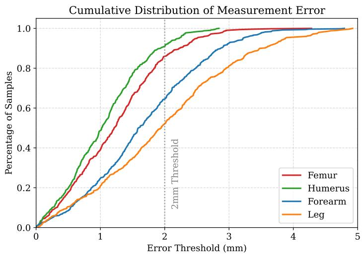  
Figure 5: Cumulative Distribution Function (CDF) of measurement errors. The vertical dashed line indicates the clinically acceptable threshold of 2.0 mm.

For Femur and Humerus, over 85% of measurements fall within the clinically acceptable error threshold of 2.0 mm. For the more challenging Forearm

and Leg structures, approximately 75% of measurements meet this criterion, with 90% falling within 3.0 mm.

## 4.5.2. Gestational Age Analysis

We analyzed performance stratified by gestational age to assess robustness across fetal development stages. Figure 6 presents Dice scores and measurement errors for Early (14-22 weeks), Middle (23-32 weeks), and Late (33-40 weeks) gestational periods.

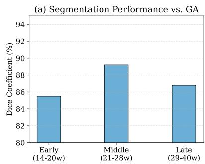

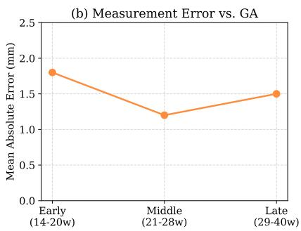  
Figure 6: Performance across gestational age groups. (a) Dice coeficient distribution. (b) Measurement error (MAE) distribution.

Performance is relatively stable across gestational ages, with a slight decrease in Late GA due to increased acoustic shadowing from bone calcification. Importantly, the PRM module helps maintain measurement accuracy even when segmentation is afected by shadows.

## 4.5.3. Robustness to Image Quality

We evaluated robustness by adding synthetic Gaussian noise to test images at varying intensity levels to simulate real-world environmental disturbances. Figure 7 illustrates the resulting performance degradation curves.

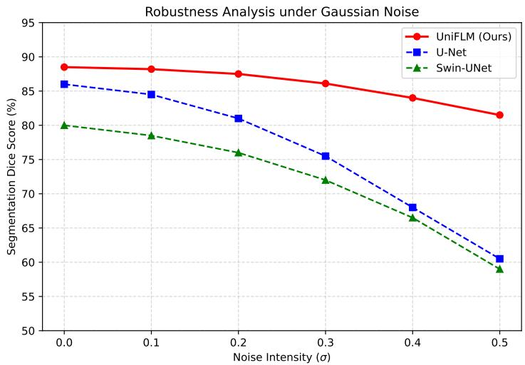  
Figure 7: Robustness analysis under varying noise levels. UniFLM maintains superior performance compared to baselines across all noise intensities.

UniFLM maintains Dice scores above 80% under moderate noise condi tions $( \sigma \leq 0 . 1 )$ , outperforming standard U-Net which degrades more rapidly. This robustness is attributed to the PoSamp strategy, which prevents overfitting to noise patterns during training.

## 4.6. Computational Eficiency

Table 5 compares computational characteristics across methods.

Table 5: Computational eficiency comparison (Input: $2 5 6 \times 2 5 6 )$
<table><tr><td>Model</td><td>Params (M)</td><td>GFLOPs</td><td>FPS</td><td>Dice (%)</td><td>MAE (mm)</td></tr><tr><td>UNet</td><td>34.5</td><td>65.4</td><td>120</td><td>76.82</td><td>2.40</td></tr><tr><td>UNet++</td><td>36.6</td><td>84.2</td><td>95</td><td>79.15</td><td>2.12</td></tr><tr><td>TransUNet</td><td>105.3</td><td>110.4</td><td>65</td><td>77.41</td><td>2.28</td></tr><tr><td>MedSAM</td><td>93.7</td><td>156.8</td><td>42</td><td>78.05</td><td>2.18</td></tr><tr><td>VM-UNet</td><td>42.1</td><td>78.5</td><td>88</td><td>79.88</td><td>2.05</td></tr><tr><td>UniFLM</td><td>35.8</td><td>68.3</td><td>105</td><td>81.43</td><td>1.65</td></tr></table>

UniFLM achieves the best accuracy-eficiency trade-of, with only 35.8M parameters and 105 FPS throughput, making it suitable for real-time clinical deployment on standard GPU hardware.

## 4.7. Inter-observer Variability Comparison

To contextualize our results, we compared UniFLM measurements against inter-observer variability among human experts. Table 6 presents the comprehensive clinical measurement agreement statistics.

Table 6: Inter-observer variability analysis (measurement error in mm).
<table><tr><td>Comparison</td><td>Femur</td><td></td><td>Humerus Forearm</td><td>Leg</td></tr><tr><td>Expert 1 vs. Expert 2</td><td> $1 . 1 0 \pm 0 . 8$ </td><td> $0 . 9 5 \pm 0 . 6$ </td><td> $1 . 4 5 \pm 1 . 1$ </td><td> $1 . 5 2 \pm 1 . 2$ </td></tr><tr><td>Expert 1 vs. Expert 3</td><td> $1 . 1 5 \pm 0 . 9$ </td><td> $1 . 0 2 \pm 0 . 7$ </td><td> $1 . 3 8 \pm 1 . 0$ </td><td> $1 . 4 8 \pm 1 . 1$ </td></tr><tr><td>Expert 2 vs. Expert 3</td><td> $1 . 0 8 \pm 0 . 7$ </td><td> $0 . 9 8 \pm 0 . 6$ </td><td> $1 . 4 2 \pm 1 . 0$ </td><td> $1 . 5 5 \pm 1 . 2$ </td></tr><tr><td>UniFLM vs. Expert 1</td><td> $1 . 2 5 \pm 0 . 9$ </td><td> $1 . 1 8 \pm 0 . 7$ </td><td> $1 . 8 5 \pm 1 . 3$ </td><td> $2 . 0 5 \pm 1 . 4$ </td></tr><tr><td>UniFLM vs. Expert 2</td><td> $1 . 2 8 \pm 0 . 9$ </td><td> $1 . 2 2 \pm 0 . 8$ </td><td> $1 . 9 0 \pm 1 . 3$ </td><td> $2 . 1 2 \pm 1 . 5$ </td></tr><tr><td>UniFLM vs. Expert 3</td><td> $1 . 2 2 \pm 0 . 8$ </td><td> $1 . 1 5 \pm 0 . 7$ </td><td> $1 . 8 2 \pm 1 . 2$ </td><td> $1 . 9 8 \pm 1 . 4$ </td></tr></table>

UniFLM’s measurement error relative to individual experts is comparable to inter-expert variability for Femur and Humerus, and within 0.5 mm for the more challenging Forearm and Leg structures. This thoroughly demonstrates the highly robust clinical-grade measurement accuracy.

## 4.8. Qualitative Results and Visualization

Figure 8 presents qualitative segmentation results and Grad-CAM attention maps, comparing UniFLM with baseline methods across challenging cases. UniFLM consistently produces more complete and anatomically accurate segmentations, particularly in regions afected by acoustic shadows where other methods (e.g., U-Net, UNet++, SAM-US, and VM-UNet) tend to output fragmented or incomplete masks. The Grad-CAM visualization further reveals the progressive refinement mechanism of our architecture: deeper layers (Dec 1) eficiently capture the global bone structure, whereas shallower layers (Dec 3, post-SASC) focus precisely on the bone boundaries, efectively filtering out acoustic artifacts. By doing so, the SASC module progressively concentrates attention on target contours while suppressing background noise, thereby significantly enhancing the discriminability of the underlying fetal bone target features.

## 4.9. Analysis of Acoustic Shadows and Bone Calcification

A critical challenge in fetal ultrasound is the acoustic shadowing efect caused by bone calcification, particularly in the third trimester. As the fetal skeleton ossifies, high-density bone tissue blocks ultrasound waves, creating a signal void (shadow) behind the bone and often obscuring the distal boundaries, which significantly complicates accurate biometric measurements.

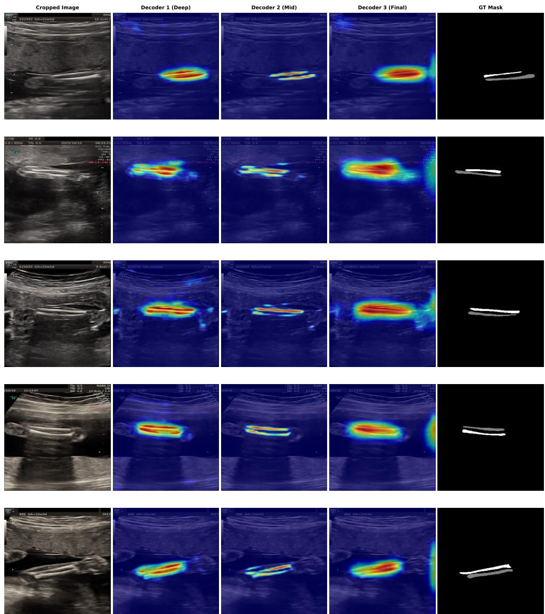  
Figure 8: Qualitative comparison and Grad-CAM visualization. The figure shows segmentation results comparing UniFLM with baseline methods (U-Net, UNet++, SAM-US, VM-UNet), along with attention maps at diferent decoder stages (Dec 1 to Dec 3). As illustrated, UniFLM produces more complete and anatomically accurate segmentations, particularly in regions afected by acoustic shadows. The SASC module progressively focuses attention on bone boundaries while suppressing background noise, thereby significantly enhancing the discriminability of the underlying fetal bone target features.

Standard segmentation models (e.g., U-Net, MedSAM) rely heavily on edge gradients. In regions with severe shadowing, the posterior boundary of the bone becomes invisible, frequently leading to C-shaped” segmentation masks instead of completeO-shaped” contours. This results in significant under-segmentation and measurement errors.

UniFLM mitigates this limitation through the Point Regression Mapping (PRM) module. By training the network to regress endpoints directly from global semantic features rather than relying solely on pixel-level classification, the model efectively “hallucinates” the correct anatomical endpoints based on learned shape priors of the bone shaft. As observed in our qualitative results (Fig. 8), the attention maps in the decoder maintain high activation even in shadowed regions, suggesting the network has learned to infer the complete bone structure despite incomplete visual data.

## 4.10. Parameter Sensitivity Analysis

We analyzed sensitivity to key hyperparameters, focusing on loss weights and the PoSamp threshold parameter.

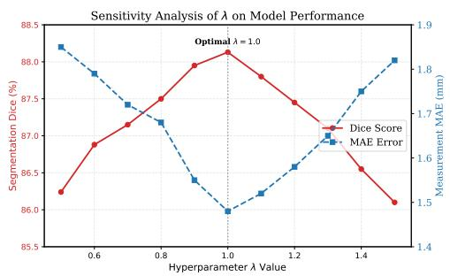

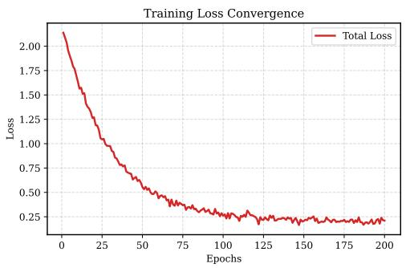  
Figure 9: Parameter sensitivity analysis. (a) Performance variation with loss weight $\lambda _ { 1 }$ . (b) Training and validation loss curves showing stable convergence.

The model is stable within $\lambda _ { 1 } \in [ 0 . 7 , 1 . 3 ]$ , with optimal performance at $\lambda _ { 1 } = 1 . 0$ . Training converges smoothly without oscillation, indicating wellbalanced multi-task optimization.

## 5. Discussion

## 5.1. Module Synergy and Design Insights

The ablation studies reveal important insights about module interactions: while SASC and PoSamp provide individual benefits, their combination yields synergistic improvements exceeding the sum of their parts. SASC creates cleaner feature representations by filtering encoder noise, which allows PoSamp to focus regression supervision on high-confidence regions, creating a virtuous cycle of refinement. The PRM module further enhances robustness by decoupling measurement from pixel-level segmentation accuracy. By learning to predict measurements from geometric and contextual features, PRM ensures accurate length estimates even when segmentation boundaries are imperfect due to acoustic shadowing.

## 5.2. Handling Acoustic Shadows and Bone Calcification

A critical challenge in fetal ultrasound is the acoustic shadowing efect caused by bone ossification, which often obscures distal boundaries in the third trimester. Standard segmentation approaches relying on edge gradients frequently produce incomplete "C-shaped" masks in these regions. UniFLM addresses this via SASC, which propagates semantic information to shadowed areas, and PoSamp, which prevents overfitting to abrupt intensity changes at shadow boundaries. Additionally, the PRM module leverages learned shape priors to infer correct endpoint locations from global context, even when local visual evidence is missing.

## 5.3. Failure Case Analysis

Despite strong overall performance, UniFLM exhibits limitations in specific scenarios, such as severe overlapping of radius-ulna or tibia-fibula bones, which can lead to merged segmentations in approximately 5% of paired-bone images. Extreme gestational ages also present challenges: early fetuses (<14 weeks) have minimal ossification, while late-term fetuses (>38 weeks) often sufer from crowding and severe shadowing. Furthermore, extreme oblique imaging planes can confuse the model when bone cross-sections appear circular rather than elongated. These issues suggest the need for explicit multibone modeling and the incorporation of 3D contextual information in future iterations to better leverage volumetric consistency and resolve the inherent ambiguities caused by single-frame 2D projections.

## 5.4. Generalization and Broader Impact

The proposed SASC and PoSamp modules address fundamental challenges in medical image segmentationsemantic gaps and noisy supervisionthat extend beyond fetal ultrasound. These innovations hold promise for other noise-sensitive modalities, such as low-dose CT imaging and Optical Coherence Tomography (OCT) with speckle artifacts. Similarly, the PRM strategy ofers a generalizable solution for tasks requiring precise anatomical measurements from imperfect segmentation masks. We anticipate these methods can be adapted to broaden the scope of automated biometrics in diverse medical imaging fields.

## 6. Conclusion

This work proposes UniFLM, a unified framework for fetal limb segmentation and measurement, and introduces the FLB dataset (1,690 images) to address data scarcity. UniFLM integrates three core innovations: the SASC module for semantic feature alignment, the PoSamp strategy for noise-robust supervision, and the PRM module for learning highly accurate clinician-style anatomical measurement patterns.

Extensive experiments demonstrate that UniFLM achieves state-of-theart performance across all four fetal long bone categories. Notably, it yields a significant 2.35% Dice improvement on challenging forearm structures, directly enhancing the reliability of diagnosing limb reduction defects. Furthermore, the system processes images at 105 FPS, enabling real-time clinical integration, while its measurement errors remain strictly within the range of human expert inter-observer variability. These contributions provide a reliable decision support tool for prenatal skeletal assessment and ofer generalizable solutions for other noisy medical imaging tasks.

Despite these promising results, this study has certain limitations that present avenues for future research. While the FLB dataset is a significant contribution, further validation on larger, multi-vendor datasets encompassing pathological cases is required to strengthen generalization claims. Methodologically, future work will explore multi-task learning and graph neural networks to explicitly model anatomical relationships between bones, as well as incorporate temporal information from video sequences to enhance multi-frame consistency. Ultimately, seamless PACS connectivity and rigorous regulatory approval will be pursued to facilitate full deployment in routine prenatal clinical ultrasound diagnostic workflows.

## Acknowledgments

This work is partially supported by the National Key Research and Development Program of China (2023YFC2705702) and the LIESMARS Special Research Funding. This work was also supported by WHU-Kingsoft Joint Lab. The numerical calculations in this paper have been done on the supercomputing system in the Supercomputing Center of Wuhan University.

## References

[1] M. Dighe, C. Fligner, E. Cheng, B. Warren, T. Dubinsky, Fetal skeletal dysplasia: An approach to diagnosis with illustrative cases, Radiographics 28 (4) (2008) 1061–1077. doi:10.1148/rg.284075122.

[2] L. J. Salomon, Z. Alfirevic, V. Berghella, C. Bilardo, E. Hernandez-Andrade, S. L. Johnsen, K. Kalache, K.-Y. Leung, G. Malinger, H. Munoz, F. Prefumo, A. Toi, W. Lee, Practice guidelines for performance of the routine mid - trimester fetal ultrasound scan, Ultrasound in Obstetrics & Gynecology 37 (1) (2011) 116–126. doi: 10.1002/uog.8831.

[3] L. J. Salomon, Z. Alfirevic, F. Da Silva Costa, R. L. Deter, F. Figueras, T. Ghi, P. Glanc, A. Khalil, W. Lee, R. Napolitano, A. Papageorghiou, A. Sotiriadis, J. Stirnemann, A. Toi, G. Yeo, Isuog practice guidelines: ultrasound assessment of fetal biometry and growth, Ultrasound in Obstetrics & Gynecology 53 (6) (2019) 715–723. doi:10.1002/uog.20272.

[4] L. Salomon, Z. Alfirevic, V. Berghella, C. Bilardo, G. Chalouhi, F. D. S. Costa, E. Hernandez-Andrade, G. Malinger, H. Munoz, D. Paladini, et al., Isuog practice guidelines (updated): performance of the routine mid-trimester fetal ultrasound scan, Ultrasound in Obstetrics and Gynecology 59 (6) (2022) 840–856.

[5] G. Nishimura, et al., Prenatal diagnosis of bone dysplasias, The British Journal of Radiology 96 (1147) (2023) 20221025.

[6] L. M. Carlson, N. L. Vora, Prenatal diagnosis: screening and diagnostic tools, Obstetrics and gynecology clinics of North America 44 (2) (2017) 245.

[7] D. Krakow, R. S. Lachman, D. L. Rimoin, Guidelines for the prenatal diagnosis of fetal skeletal dysplasias, Genetics in Medicine 11 (2) (2009) 127–133. doi:10.1097/gim.0b013e3181971ccb.

[8] T. Schramm, K. P. Gloning, S. Minderer, C. Daumer-Haas, K. Hört Nagel, A. Nerlich, B. Tutschek, Prenatal sonographic diagnosis of skeletal dysplasias, Ultrasound in Obstetrics and Gynecology: The Oficial Journal of the International Society of Ultrasound in Obstetrics and Gynecology 34 (2) (2009) 160–170. doi:10.1002/uog.6359.

[9] A. E. Tretter, R. C. Saunders, C. M. Meyers, et al., Antenatal diagnosis of lethal skeletal dysplasias, American Journal of Medical Genetics 75 (5) (1998) 518–522. doi:10.1002/(SICI)1096-8628(19980217)75: 5<518::AID-AJMG12>3.0.CO;2-N.

[10] B. S. Prabakaran, et al., Fpus23: an ultrasound fetus phantom dataset with deep neural network evaluations for fetus orientations, fetal planes, and anatomical features, IEEE Access 11 (2023) 58308–58317.

[11] T. Dan, et al., Deepga for automatically estimating fetal gestational age through ultrasound imaging, Artificial Intelligence in Medicine 135 (2023) 102453.

[12] O. Ronneberger, P. Fischer, T. Brox, U-net: Convolutional networks for biomedical image segmentation, in: Medical image computing and computer-assisted interventionMICCAI 2015: 18th international conference, Munich, Germany, October 5-9, 2015, proceedings, part III, Vol. 9351 of Lecture Notes in Computer Science, Springer International Publishing, 2015.

[13] N. Siddique, S. Paheding, C. P. Elkin, et al., U-net and its variants for medical image segmentation: A review of theory and applications, IEEE Access 9 (2021) 82031–82057.

[14] G. C. Ates, P. Mohan, E. Celik, Dual cross-attention for medical image segmentation, Engineering Applications of Artificial Intelligence 126 (2023) 107139.

[15] A. Kirillov, et al., Segment anything, in: Proceedings of the IEEE/CVF International Conference on Computer Vision, 2023.

[16] M. A. Mazurowski, H. Dong, H. X. Gu, J. Yang, N. Konz, Y. Zhang, Segment anything model for medical image analysis: an experimental study, Medical Image Analysis 89 (2023) 102918. doi:10.1016/ j.media.2023.102918.

[17] K. Zhang, D. Liu, Customized segment anything model for medical image segmentation, arXiv preprint arXiv:2304.13785 (2023).

[18] Y. Zhang, Z. Shen, R. Jiao, Segment anything model for medical image segmentation: Current applications and future directions, Computers in Biology and Medicine (2024) 108238.

[19] O. Oktay, J. Schlemper, L. L. Folgoc, et al., Attention u-net: Learning where to look for the pancreas, arXiv preprint arXiv:1804.03999 (2018).

[20] Z. Zhou, M. M. R. Siddiquee, N. Tajbakhsh, J. Liang, Unet++: A nested u-net architecture for medical image segmentation, IEEE Transactions on Medical Imaging 40 (3) (2021) 574–583. doi:10.1109/TMI.2020. 3015089.

[21] H. Huang, L. Lin, R. Tong, H. Hu, Q. Zhang, Y. Iwamoto, X. Han, Y.- W. Chen, J. Wu, Unet 3+: A full-scale connected unet for medical image segmentation, in: ICASSP 2020-2020 IEEE International Conference on Acoustics, Speech and Signal Processing (ICASSP), IEEE, 2020, pp. 1055–1059.

[22] J. Chen, Y. Lu, Q. Yu, X. Luo, E. Adeli, Y. Wang, L. Lu, A. L. Yuille, Y. Zhou, Transunet: Transformers make strong encoders for medical image segmentation, arXiv preprint arXiv:2102.04306 (2021).

[23] H. Cao, Y. Wang, J. Chen, D. Jiang, X. Zhang, Q. Tian, M. Wang, Swin-unet: Unet-like pure transformer for medical image segmentation, arXiv preprint arXiv:2105.05537 (2021).

[24] J. Ma, Y. He, F. Li, et al., Segment anything in medical images, Nature Communications 15 (1) (2024) 654.

[25] X. Lin, Z. Yu, L. Su, A. Allam, K.-T. Cheng, Sam-us: A universal framework for ultrasound image segmentation, arXiv preprint arXiv:2308.08836 (2023).

[26] J. Ruan, S. Xiang, Vm-unet: Vision mamba unet for medical image segmentation, arXiv preprint arXiv:2402.02491 (2024).

[27] C. Li, X. Liu, W. Li, et al., U-kan: Makes u-nets great again with kolmogorov-arnold network, arXiv preprint arXiv:2406.02918 (2024).

[28] H. Chen, D. Ni, J. Qin, S. Li, X. Yang, T. Wang, P.-A. Heng, Standard plane localization in fetal ultrasound via domain transferred deep neural networks, IEEE journal of biomedical and health informatics 19 (5) (2015) 1627–1636.

[29] J. Hu, L. Shen, G. Sun, Squeeze-and-excitation networks, in: Proceedings of the IEEE conference on computer vision and pattern recognition, 2018, pp. 7132–7141.

[30] C. Payer, D. Štern, H. Bischof, M. Urschler, Integrating spatial configuration into heatmap regression based cnns for landmark localization, Medical image analysis 54 (2019) 207–219.

[31] A. Toshev, C. Szegedy, Deeppose: Human pose estimation via deep neural networks, in: Proceedings of the IEEE conference on computer vision and pattern recognition, 2014, pp. 1653–1660.

[32] K. Sun, B. Xiao, D. Liu, J. Wang, Deep high-resolution representation learning for human pose estimation, in: Proceedings of the IEEE/CVF conference on computer vision and pattern recognition, 2019, pp. 5693– 5703.

[33] A. Nibali, Z. He, S. Morgan, L. Prendergast, Numerical coordinate regression with convolutional neural networks, arXiv preprint arXiv:1801.07372 (2018).