# InfraOcc: An Infrastructure Occupancy Benchmark with Static-to-Dynamic Reasoning

Lei Yang†, Xiaokai Bai†, Boqi Li, Chunmian Lin, Li Wang, Ziying Song, Jiahuan Zhang, Enhui Ma Haibao Yu, Jiaqi Ma, Kaicheng Yu

Abstract—Fixed-viewpoint infrastructure sensors repeatedly observe the same traffic space, making roadside 3D occupancy structurally different from ego-vehicle perception: a near-persistent static scaffold is overlaid with sparse, short-lived dynamic events. Existing b h k d h d h b il d i hi l d i h l i hi instead treating occupancy as flat one-shot voxel classification. We address this gap from both data and model perspectives. We build InfraOcc, to our knowledge, the first real-world infrastructure-side semantic occupancy benchmark, with dense voxel annotations for 290 multi-modal sequences in a fixed roadside frame, a static-dynamic decoupled annotation pipeline, unified camera-only, LiDAR-only, and multi-modal evaluation, and diagnostics for static and dynamic occupancy. InfraOcc shows that static infrastructure fills 97.3% of occupied voxels and persists across frames, whereas dynamic participants have a median occupied-frame ratio of only 1.8% per location, revealing a structural static-dynamic asymmetry beyond semantic long-tailedness. We further propose ProSD-Occ, which reformulates occupancy as progressive static-to-dynamic evidence reasoning: it explains persistent layout, exposes residual dynamic evidence under static-confidence guidance, and recomposes static, dynamic, and free-space evidence into a unified field. ProSD-Occ ranks first in overall, dynamic, static, and geometric occupancy on every track, e.g., a 23.5% relative camera-only dynamic-mIoU gain over the stronges baseline and 65.87 multi-modal overall mIoU, establishing fixed-viewpoint roadside occupancy as a distinct problem with its own reasoning paradigm. The benchmark and code will be publicly available at https://github.com/yanglei18/InfraOcc.

Index Terms—Occupancy prediction, benchmark, infrastructure perception, progressive static-to-dynamic reasoning.

## 1 Introduction

NFRASTRUCTURE-side perception is becoming an im-Iportant pillar of autonomous driving and intelligent transportation: cameras and LiDARs fixed at intersections and road segments continuously observe long-term traffic situations beyond the field of view of on-board sensors, providing scene-level 3D understanding for vehicles, traffic management, and safety monitoring. In recent years, semantic occupancy prediction, which jointly estimates geometric occupancy and semantic categories in a regular voxel space and unifies static layout, dynamic participants, and free space within a single 3D representation, has become an important paradigm for driving scene understanding [1], [2], [3], [4]. However, these representations and benchmarks are almost exclusively designed for vehicle-side ego-centric perception, where the occupancy volume is defined around a moving ego vehicle and the viewpoint and coordinate reference change over time [1], [2], [4], [5]. In contrast, roadside cameras and LiDARs are fixed in place and repeatedly observe the same traffic space over long periods [6], [7], [8], [9], [10], [11]. This fixed viewpoint is not a mere change of camera placement: as we quantify in Sec. 3.5, it fundamentally alters the problem structure of 3D occupancy prediction. On the vehicle side, occupancy prediction estimates a continuously changing instantaneous scene frame by frame. On the roadside, by contrast, the same space is observed repeatedly, and the occupancy field reduces to a near-persistent static spatial scaffold overlaid with sparse, short-lived dynamic traffic events. Fixed-viewpoint roadside occupancy should therefore be treated as a distinct problem with its own structure, rather than a viewpoint transfer of vehicle-side occupancy.

Existing research, however, advances along two main lines, neither of which addresses this structure. First, mainstream semantic occupancy benchmarks and methods are ego-centric. Existing methods build BEV/voxel features through view transformation and depth lifting [12], [13], aggregate multi-view and temporal context with transformer queries [3], [14], or improve voxel reasoning and sparse/compact representations [4], [15], [16], [17], [18], yet their voxel space is always defined around the ego vehicle with a moving coordinate frame. As a result, they neither characterize the long-term spatial structure under a fixed roadside viewpoint nor provide data and diagnostic metrics that measure static-dynamic organization. Second, existing infrastructure-side and cooperative perception studies are largely object-centric: roadside and cooperative perception datasets [6], [7], [8], [9], [10], [11], [19], [20] and methods targeting roadside-camera geometry modeling, ground priors, scenario generalization, calibration robustness, and cooperative feature fusion [21], [22], [23], [24], [25], [26], [27] mostly focus on 3D detection, tracking, or cooperative detection, yielding sparse object boxes rather than a dense scene description that jointly represents static infrastructure, dynamic participants, and free space. A few cooperative semantic occupancy works have begun to connect V2X perception with dense scene completion [28], [29], but they mainly target connected-vehicle cooperation or synthetic settings, and dense semantic occupancy under real fixed roadside sensors remains unexplored. As a result, the core structure of “persistent static versus transient dynamic” under a fixed viewpoint has neither a benchmark to measure it nor a method to exploit it.

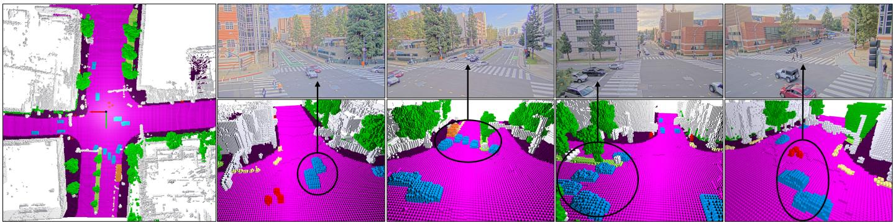  
Figure 1: A representative keyframe of the InfraOcc benchmark. Left: dense voxel-level semantic occupancy annotation of the whole scene in the fixed roadside coordinate system (bird’s-eye view). Right: the four synchronized roadside camera views (top) and the corresponding local 3D occupancy regions (bottom), where circles and arrows associate dynamic traffic participants across the two modalities. Persistent static layout dominates the scene, whereas dynamic participants occupy only sparse, transient local regions—the structural asymmetry studied in this paper.

To fill this gap, we build InfraOcc (Fig. 1), which is, to our knowledge, the first semantic occupancy benchmark constructed from real fixed roadside sensors. Constructing roadside occupancy annotations is not a simple conversion of existing 3D annotations into voxel labels: fixed roadside LiDAR is limited by a single viewpoint and occlusions, making it hard to fully cover persistent static background such as roads, buildings, vegetation, and barriers, while dynamic objects in a single roadside scan are often sparse and incomplete at object boundaries. InfraOcc therefore adopts a static-dynamic decoupled annotation pipeline: a dynamic branch aggregates dynamic geometry from roadside LiDAR sequences and temporally consistent object tracklets, a static branch completes the static background using the moving viewpoints of vehicle-side LiDAR, and the two are then recomposed in a fixed roadside coordinate system with visibility-aware labeling. We emphasize that vehicle-side LiDAR is used only for annotation construction; benchmark inputs are always restricted to roadside cameras, roadside LiDAR, or their combination. InfraOcc further provides a unified camera-only, LiDAR-only, and multi-modal evaluation protocol, together with diagnostic metrics that separate static and dynamic occupancy.

Statistical analysis of InfraOcc provides a quantitative characterization of the static-dynamic structure under a fixed viewpoint. Temporally, measured by the occupied-frame ratio (the fraction of frames in which a location is occupied), static infrastructure is highly persistent (a median of 100%), whereas dynamic participants reach a median of only 1.8% per location and a 95th percentile of about 16.5%; in terms of semantic frequency, static infrastructure accounts for 97.3% of occupied voxels while dynamic participants account for only 2.7%. This shows that the fundamental difficulty of roadside occupancy is not merely semantic long-tailedness but a structural static-dynamic asymmetry. Under this structure, flat one-shot voxel classification biases the model toward frequent and spatially dominant static patterns, weakening sparse dynamic cues during voxel feature construction and 3D context aggregation; simple loss reweighting [30], [31] can alleviate class imbalance but cannot change the way static and dynamic evidence are homogeneously organized.

Building on this, we propose ProSD-Occ, a progressive static-to-dynamic reasoning framework that reformulates fixed-viewpoint occupancy prediction from “one-shot classification of all voxels” into “step-by-step reasoning ordered by evidence reliability.” Its core idea directly mirrors the structural asymmetry above: the model should first explain the stable, reusable part of the scene and then infer what this explanation cannot account for, rather than letting sparse dynamic cues be overwhelmed by spatially dominant static patterns in a single classification. Concretely, ProSD-Occ first establishes a sample-adaptive explanation of the persistent static layout (Static Layout Reasoner), then exposes residual evidence that the layout cannot sufficiently account for— often sparse yet safety-critical dynamic objects (Static-guided Residual Modulation and Residual Dynamic Predictor)—and finally recomposes static, dynamic, and free-space evidence into a unified semantic occupancy field (Semantic Recomposition). In this way, ProSD-Occ turns the static-dynamic asymmetry of the fixed viewpoint from a source of bias into an organizing principle: it retains the contextual value of stable static layout while preventing it from dominating the prediction of sparse dynamic objects.

On InfraOcc, ProSD-Occ ranks first in overall, dynamic, static, and geometric occupancy on every track, e.g., a 23.5% relative dynamic-mIoU gain over the strongest camera baseline (28.97 vs. 23.45) and 65.87 overall mIoU in the multi-modal track. The margins persist under coordinate re-anchoring, indicating that static-to-dynamic evidence organization provides consistent, evidence-driven benefits for fixed-view occupancy prediction. The main contributions of this paper are summarized as follows:

TABLE 1: Comparison of representative 3D perception benchmarks across viewpoint, sensing, and occupancy capabilities. Among them, InfraOcc is the only real-world benchmark that provides dense semantic occupancy under a fixed roadside viewpoint with unified C/L/C+L evaluation and separate static/dynamic (S/D) evaluation. Sensor denotes the roadside/infrastructure-side suite producing benchmark inputs (ego rows show the ego-vehicle suite); cooperative datasets additionally include vehicle agents, as indicated by Viewpoint. C/L/R denote camera, LiDAR, and radar. Det/Track/Pred/Occ denote detection, tracking, prediction, and occupancy tasks; Temporal indicates temporally continuous sequences; Occ. States denotes occupied/free/unobserved voxel labels. $\checkmark / \pmb { x } / \bigtriangleup$ denote full/no/partial support.
<table><tr><td>Benchmark</td><td>Viewpoint</td><td>Sensor</td><td>Tasks</td><td>Real</td><td>Temporal</td><td>Dense Occ.</td><td>Occ. States</td><td>S/D Eval.</td></tr><tr><td colspan="9">Ego-centric occupancy</td></tr><tr><td>Occ3D [2]</td><td>Ego</td><td>6C+ 1L</td><td>Occ</td><td>√</td><td>√</td><td>√</td><td>√</td><td>x</td></tr><tr><td>OpenOccupancy [1]</td><td>Ego</td><td>6C+ 1L</td><td>Occ</td><td>√</td><td>√</td><td>√</td><td>△</td><td>x</td></tr><tr><td>SurroundOcc [4]</td><td>Ego</td><td>6C</td><td>Occ</td><td>√</td><td>√</td><td>√</td><td>x</td><td>x</td></tr><tr><td colspan="9">Roadside / cooperative detection</td></tr><tr><td>Rope3D [6]</td><td>Roadside</td><td>1C</td><td>Det</td><td>√</td><td>x</td><td>x</td><td>x</td><td>x</td></tr><tr><td>DAIR-V2X [7]</td><td>Coop. (V+I)</td><td>1C+1L</td><td>Det</td><td>√</td><td>√</td><td>x</td><td>x</td><td>x</td></tr><tr><td>V2X-Real [8]</td><td>Coop.(V+I)</td><td>4C + 2L</td><td>Det</td><td>√</td><td>x</td><td>x</td><td>x</td><td>x</td></tr><tr><td>V2XPnP [9]</td><td>Coop.(V+I)</td><td>4C + 2L</td><td>Det/Pred</td><td>√</td><td>√</td><td>x</td><td>x</td><td>x</td></tr><tr><td>RCooper [10]</td><td>Roadside</td><td>≤2C + 2L</td><td>Det/Track</td><td>√</td><td>√</td><td>x</td><td>x</td><td>x</td></tr><tr><td>TUMTraf-V2X [11]</td><td>Coop. (V+I)</td><td>3C + 2L</td><td>Det/Track</td><td>√</td><td>√</td><td>x</td><td>x</td><td>x</td></tr><tr><td>V2X-Radar [20]</td><td>Coop.(V+I)</td><td>3C+1L+1R</td><td>Det</td><td>√</td><td>√</td><td>x</td><td>x</td><td>x</td></tr><tr><td colspan="9">Cooperative occupancy (synthetic)</td></tr><tr><td>CoHFF [28]</td><td>Coop. (V)</td><td>4C+1L</td><td>Occ</td><td>x</td><td>√</td><td>√</td><td>x</td><td>x</td></tr><tr><td>Co3SOP [29]</td><td>Coop.(V)</td><td>4C + 1L</td><td>Occ</td><td>x</td><td>√</td><td>√</td><td>△</td><td>x</td></tr><tr><td>InfraOcc (Ours)</td><td>Roadside-fixed</td><td>4C+2L</td><td>Occ</td><td>√</td><td>√</td><td>√</td><td>√</td><td>√</td></tr></table>

• We establish InfraOcc, to our knowledge the first real-world benchmark for fixed-viewpoint semantic occupancy: a static-dynamic decoupled annotation pipeline turns object-level roadside data into dense voxel labels in a fixed roadside frame, with unified camera-only, LiDAR-only, and multi-modal protocols and static/dynamic diagnostics.

• We identify and quantify a defining property of fixed-viewpoint occupancy: a structural static-dynamic asymmetry (97.3% vs. 2.7% of occupied voxels; nearpermanent presence vs. a 1.8% median occupiedframe ratio). This difficulty goes beyond semantic longtailedness and is neither measured nor exploited by existing benchmarks and methods.

• We propose ProSD-Occ, which reformulates fixedviewpoint occupancy from flat one-shot classification into progressive static-to-dynamic evidence reasoning, and ranks first in overall, dynamic, static, and geometric occupancy on every InfraOcc track, with up to a 23.5% relative dynamic-mIoU gain.

## 2 Related Work

## 2.1 Semantic Occupancy Prediction

Semantic occupancy prediction jointly estimates geometry and semantics in a regular voxel space, giving autonomous driving a dense 3D scene representation. Early semantic scene completion completed voxel semantics from partial indoor or LiDAR observations, e.g., SSCNet [32] and SemanticKITTI [33]. Occ3D [2] and OpenOccupancy [1] then extended occupancy prediction to large-scale driving scenes and standardized dense evaluation. Mainstream methods advance through camera-side view transformation and voxel construction [3], [12], [13], [14], [34], [35], explicit geometry and camera-LiDAR fusion [4], [16], [36], [37], [38], [39], and efficient representation or supervision schemes [17], [18], [40], [41]. Among them, STCOcc [42] exploits sparse spatiotemporal cues and is the strongest one-shot camera method in our experiments. These works improve feature construction, efficiency, and supervision, but remain ego-centric: voxel spaces move with the vehicle, and outputs are treated as homogeneous voxel-wise classification. None of them characterizes fixed-view long-term spatial structure or distinguishes static layout from dynamic evidence. This paper instead studies occupancy in a fixed roadside coordinate system, where the voxel space is anchored to the scene rather than to a moving vehicle, and treats the resulting static-dynamic structure as an explicit modeling target.

## 2.2 Infrastructure-side and Cooperative Perception

Infrastructure-side and cooperative perception extend singlevehicle coverage with roadside sensors or multi-agent communication. Datasets such as Rope3D [6], DAIR-V2X [7], V2X-Real [8], V2XPnP [9], TUMTraf-V2X [11], RCooper [10], OPV2V [19], and V2X-Radar [20] support roadside perception, vehicle-infrastructure cooperation, and multi-agent collaboration. Methods study roadside geometry and robust detection through height modeling [21], [22], ground priors [23], scenario generalization [24], calibration-aware multi-sensor perception [25], and cooperative feature fusion [26], [27], [43]. These studies show the value of fixed infrastructure and cooperative sensing under long-range or occluded conditions, but remain object-centric and produce sparse boxes rather than dense static/dynamic/free space scene descriptions. Recent cooperative occupancy works connect V2X perception with dense completion [28], [29], but focus on multi-agent fusion or synthetic V2X settings. Dense semantic occupancy under real fixed roadside sensors therefore remains unexplored. InfraOcc fills this gap by upgrading real roadside sensing from sparse object boxes to dense voxel-level semantic occupancy, so that persistent infrastructure, dynamic participants, and free space are evaluated in one scene-level representation.

## 2.3 Dynamic and Structured Occupancy Modeling

The closest methods model dynamics or structure within occupancy prediction. Occupancy flow and 4D forecasting model motion and future states [41], [44], [45], world models learn temporal evolution [40], and future-instance prediction models BEV dynamics [46]. Other lines reweight losses for class imbalance [30], [31] or use sparse-foreground and coarse-to-fine representations for efficiency [17], [34]. These methods model temporal motion, adjust class weights, or reduce computation, but still assume ego-centric flat voxel classification. None turns the fixed-view static-dynamic asymmetry into ordered evidence reasoning. ProSD-Occ instead reorganizes prediction at the representation and reasoning level—explaining the stable layout first and recov ering dynamics as residual evidence—rather than through loss or temporal adjustments alone.

## 3 InfraOcc Benchmark

## 3.1 Benchmark Overview

As summarized in Tab. 1, existing real-world datasets support either ego-centric occupancy [1], [2] or objectlevel roadside/cooperative detection; none provides dense semantic occupancy under real fixed roadside sensing (Sec. 1). To fill this gap, we introduce InfraOcc, which constructs dense voxel-level semantic occupancy annotations in a fixed roadside coordinate system, supports unified camera-only, LiDAR-only, and multi-modal evaluation, and provides diagnostic metrics that separate static and dynamic occupancy. Its design goal is to make the static-dynamic asymmetry of roadside scenes constructible, measurable, and evaluable: a static-dynamic decoupled annotation pipeline makes it constructible, temporal and semantic diagnostics make it measurable, and a static/dynamic evaluation protocol makes it evaluable.

## 3.2 Infrastructure-side Occupancy Task

Unlike vehicle-centric occupancy perception, InfraOcc defines the occupancy field in a fixed roadside coordinate system that remains invariant over time and is shared by all frames in the same scene. The infrastructure-side occupancy task is formulated as learning a mapping

$$
\mathcal { F } _ { \boldsymbol { \theta } } : \mathcal { O } _ { t } \longmapsto \mathbf { Y } _ { t } \in ( \mathcal { C } \cup \{ \mathrm { { f r e e } } \} ) ^ { X \times Y \times Z } ,\tag{1}
$$

where the observation $\mathcal { O } _ { t } \in \{ \mathcal { T } _ { t } , \mathcal { P } _ { t } , ( \mathcal { T } _ { t } , \mathcal { P } _ { t } ) \}$ corresponds to the roadside sensor measurements at timestamp t, consisting of multi-view images $\mathcal { T } _ { t } ,$ infrastructure-side LiDAR point clouds $\mathcal { P } _ { t } ,$ or their combination. The prediction $\mathbf { Y } _ { t }$ represents a dense semantic occupancy volume over the shared roadside voxel space, where each voxel is assigned either a semantic occupancy label from $\mathcal { C } \left( \mathrm { e . g . } \right.$ , car, pedestrian, vegetation, or driveable surface) or the free-space label.

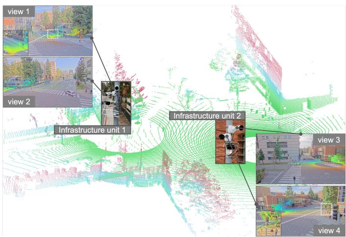  
Figure 2: Infrastructure-side sensor configuration. The roadside platform comprises two fixed infrastructure units, each equipped with one LiDAR and two high-resolution cameras under GPS time synchronization. Their calibrated streams are organized in a fixed roadside coordinate system and support camera-only, LiDAR-only, and multi-modal occupancy prediction.

## 3.3 Data Source and Sensor Setup

Our benchmark is derived from real multi-modal sequential streams and temporally consistent object annotations in the V2XPnP Sequential Dataset [9]. We select sequences collected around an urban intersection and its adjacent road segments by two infrastructure units and associated vehicle agents. Each infrastructure unit carries one infrastructure-side Li-DAR (Ouster OS1-128) and two Axis cameras (1920 × 1080) under GPS time synchronization, yielding four calibrated camera views and two infrastructure-side LiDAR scans per keyframe over a fixed-view camera–LiDAR system (Fig. 2). V2XPnP associates 3D boxes across time and agents’ views with unique tracking IDs. InfraOcc uses these identities only during offline annotation construction to form tracklets for multi-frame dynamic-object reconstruction; they are not exposed as benchmark inputs. We reorganize the original object-level cooperative perception and prediction setting into a benchmark for dense semantic occupancy prediction. InfraOcc releases the derived occupancy annotations and toolkit, while the underlying V2XPnP sensor streams are obtained separately from the official dataset channel. Since all benchmark input sensors are fixed, InfraOcc retains the original calibration and synchronization to align roadside images, LiDAR point clouds, and occupancy annotations within one fixed roadside coordinate system, enabling camera-only, LiDAR-only, and multi-modal evaluation under a shared data split and protocol. Fig. 1 shows a representative keyframe with the four roadside camera views together with voxel-level semantic occupancy annotations.

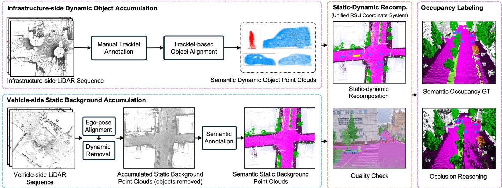  
Figure 3: Overview of the dataset construction pipeline. We build dense semantic occupancy annotations from two complementary semantic point-cloud sources: Semantic Dynamic Object Point Clouds constructed from infrastructure-side LiDAR sequences and Semantic Static Background Point Clouds constructed from vehicle-side LiDAR sequences. The dynamic branch forms object tracklets from source 3D box annotations and tracking IDs, and then uses Tracklet-based Object Alignment to densify dynamic objects, while the static branch uses Ego-pose Alignment, Dynamic-Object Removal, and Semantic Annotation to construct persistent infrastructure layout. Static-Dynamic Recomposition integrates the two semantic point-cloud sources in the fixed roadside coordinate system, and Occupancy Labeling converts the recomposed scene into voxel-level semantic occupancy labels.

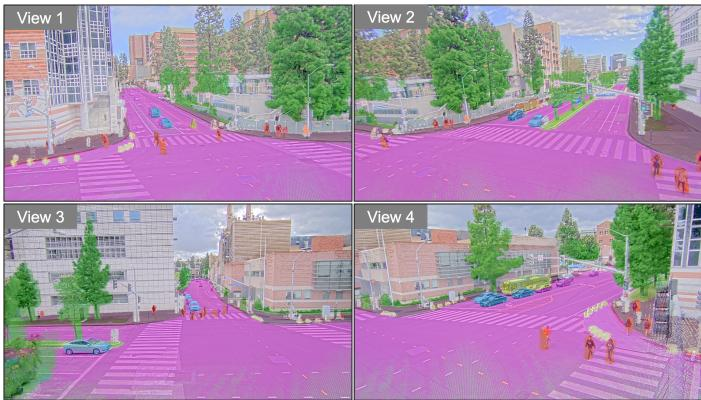  
Figure 4: Image-guided annotation verification. The recomposed semantic 3D scene is projected onto the calibrated roadside camera views to inspect the alignment between dense point-cloud semantic annotations and image observations. Annotators check semantic boundaries, object placement, and cross-modal calibration consistency, and manually correct any misclassified labels, thereby ensuring the reliability of the constructed infrastructure-side occupancy annotations.

## 3.4 Dataset Construction Pipeline

## 3.4.1 Pipeline Overview

Infrastructure-side occupancy annotation faces two key challenges. First, fixed infrastructure-side LiDAR is limited by viewpoint and occlusion, making it difficult to fully cover persistent infrastructure such as roads, buildings, vegetation, and barriers. Second, dynamic objects captured by a single roadside LiDAR scan are often sparse and incomplete, especially around object boundaries. To address these challenges, InfraOcc adopts a semantic point-cloud-based construction strategy that decouples static background completion from dynamic object reconstruction, as illustrated in Fig. 3. The upper branch constructs Semantic Dynamic Object Point Clouds from infrastructure-side LiDAR sequences, while the lower branch constructs Semantic Static Background Point Clouds from vehicle-side LiDAR sequences. These two semantic point-cloud sources are then integrated by Static-Dynamic Recomposition in the fixed roadside coordinate system and converted into dense voxel-level semantic occupancy annotations through Occupancy Labeling. Vehicle-side LiDAR is used only for annotation construction; the benchmark inputs remain infrastructure-side cameras, infrastructureside LiDAR, or their combination according to different evaluation tracks.

## 3.4.2 Semantic Dynamic Object Point Clouds

We first form object tracklets from the source 3D box annotations and unique tracking IDs provided by V2XPnP [9]. Each dynamic object is thereby associated with temporally consistent 3D bounding boxes, a semantic category, and a track identity. Based on these tracklets, object point clouds belonging to the same dynamic object are cropped from multiple infrastructure-side LiDAR scans. To aggregate partial observations of moving objects over time, we perform Tracklet-based Object Alignment. Specifically, the relative poses of 3D boxes within the same tracklet are used to estimate a box-guided rigid transformation, which coarsely aligns object point clouds to the reference object coordinate system. This step compensates for object motion and avoids motion ghosting caused by direct accumulation in the global frame. ICP refinement [47] is further applied to reduce local misalignment caused by tracking jitter, box localization errors, and partial occlusion. The accumulated object point clouds inherit the semantic category of the corresponding tracklet, forming denser and semantically consistent dynamic object geometry.

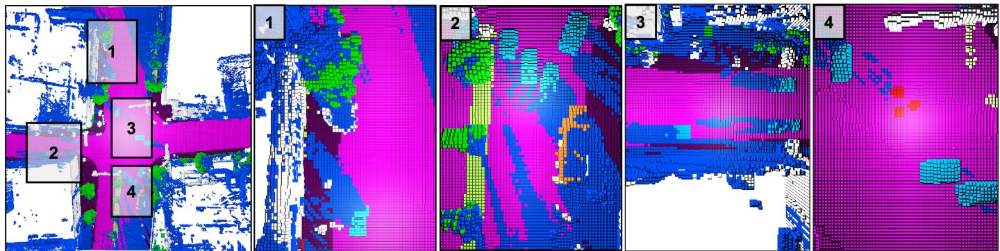  
Figure 5: Camera-view visibility masks for occupancy labeling. The voxel grid is projected into calibrated roadside camera views to identify image-observable regions in the fixed roadside coordinate system. The left panel overlays the visibility masks of four roadside views on the semantic occupancy map, while the right panels show enlarged local regions for each camera view. These masks support consistency inspection between roadside images and voxel-level semantic occupancy annotations.

## 3.4.3 Semantic Static Background Point Clouds

Since vehicle-side LiDAR observes the same infrastructure scene from moving viewpoints, it provides more complete geometric coverage for persistent static elements. Multiframe vehicle-side point clouds are first registered into the roadside coordinate system through Ego-pose Alignment. Dynamic object points are then removed to prevent transient traffic participants from being fused into the static background. Semantic Annotation is performed on the accumulated static background to assign semantic labels to persistent infrastructure elements. The resulting Semantic Static Background Point Clouds provide a dense static scene scaffold for the subsequent Static-Dynamic Recomposition.

## 3.4.4 Static-Dynamic Recomposition

After constructing Semantic Dynamic Object Point Clouds and Semantic Static Background Point Clouds, we recompose them into keyframe-level semantic scenes in the fixed roadside coordinate system. For each keyframe, the Semantic Static Background Point Clouds serve as a persistent scene scaffold. Dynamic object point clouds are transformed into the roadside coordinate system according to their tracklet poses at the current timestamp and inserted into the static background. This produces a semantic 3D scene that preserves both stable infrastructure layout and keyframe-specific traffic participants, while avoiding motion artifacts caused by directly accumulating moving objects.

Image-guided Verification. We further project the recomposed semantic scene onto calibrated roadside camera views to inspect its consistency with image observations. As shown in Fig. 4, this verification checks semantic boundaries, dynamic object locations, and cross-modal calibration consistency before voxel-level occupancy labeling.

## 3.4.5 Occupancy Labeling

After static-dynamic recomposition, each keyframe is represented as a semantic 3D scene containing both persistent infrastructure layout and keyframe-specific dynamic objects.

Occupancy Labeling converts this recomposed scene into voxel-level semantic occupancy ground truth. Similar to Occ3D [2], we distinguish three voxel states: occupied, free, and unobserved, so that empty space and occluded regions are not confused.

Semantic Occupancy GT. We first discretize the recomposed semantic point clouds into the predefined voxel grid. Voxels containing semantic points are labeled as occupied and assigned the corresponding semantic category. Static background points provide labels for persistent infrastructure elements, while dynamic object points provide labels for traffic participants at the current keyframe. In this way, static layout and dynamic objects are represented in the same fixed roadside coordinate system.

Visibility Reasoning. Voxels without semantic points are further processed by visibility reasoning. We trace infrastructureside LiDAR rays from the sensor origin to observed surfaces. Voxels traversed before the first occupied surface are labeled as free space, while voxels behind observed surfaces or outside valid sensor rays are treated as unobserved and ignored. This prevents occluded regions behind buildings, vegetation, or vehicles from being incorrectly labeled as free. We further compute camera-view visibility masks by projecting voxel centers into calibrated roadside cameras. A voxel is regarded as camera-visible if its projected center lies inside the image boundary with positive depth. Fig. 5 visualizes the resulting masks, which characterize the imageobservable regions of different roadside cameras. Following Occ3D [2], these masks are released with the annotations to support optional camera-visible evaluation, while the main protocol evaluates the full grid (Sec. 3.6).

## 3.5 Dataset Statistics

## 3.5.1 Scale and Annotation Coverage

InfraOcc contains 290 temporally continuous roadside sequences (215 for training and 75 for testing), each spanning roughly 10–24 seconds. Raw streams are recorded at 10 Hz, while dense semantic occupancy is annotated on 2 Hz keyframes (every fifth raw frame). Each annotated keyframe provides four calibrated roadside camera views, two infrastructure-side LiDAR scans, and one dense voxel-level occupancy annotation over the range $[ - 6 4 , 6 4 ] \times [ - 6 4 , 6 4 ] \times [ \dot { - } 4 . 8 , \dot { 1 } . 6 ]$ m at a 0.4 m voxel size, i.e., a $3 2 0 \times 3 2 0 \times 1 6$ grid; its label space comprises the occupied semantic classes and a free-space class, supporting both semantic and category-agnostic geometry evaluation.

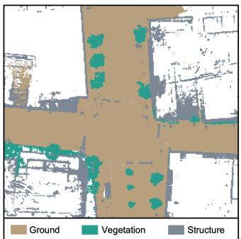

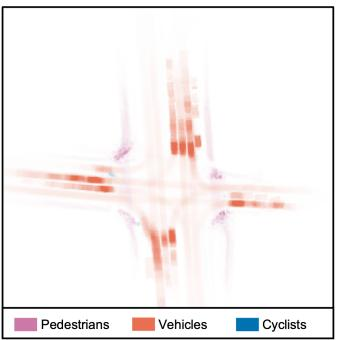  
(b) Dynamic semantic persistence map

(a) Static semantic persistence map  
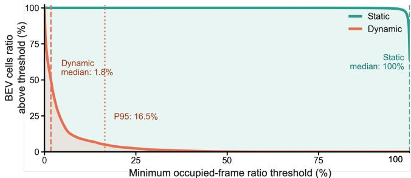  
(c) Static vs. Dynamic Occupancy Persistence  
Figure 6: Static-dynamic occupancy persistence statistics. (a) Static semantic persistence map in the fixed infrastructure coordinate system. Colors denote dominant coarse static groups, and color intensity indicates the occupied-frame ratio of each BEV cell. (b) Dynamic semantic transience map computed in the same BEV space, where dynamic occupancy mainly appears along lanes, crosswalks, and typical traffic trajectories. (c) Occupancy persistence curve. The horizontal axis denotes the minimum occupied-frame ratio threshold, and the vertical axis denotes the ratio of BEV cells retained above the threshold. Static regions remain highly persistent, whereas dynamic regions are sparse and transient.

## 3.5.2 Static-Dynamic Temporal Asymmetry

To quantify the temporal structure induced by fixed infrastructure-side observation, we measure, within each scene, how persistently each BEV cell is occupied. For each BEV cell, the occupied-frame ratio is the number of keyframes in which the cell contains static (or dynamic) voxels, divided by the total number of keyframes in the scene: a ratio of 100% means the location is occupied all the time, whereas a low ratio means it is occupied only transiently. For visualization, semantic labels are regrouped into coarse categories, while benchmark evaluation still follows the full semantic label space. As shown in Fig. 6(a) and (b), static groups form spatially continuous, high-persistence layouts, whereas dynamic occupancy appears only as sparse, low-intensity traces along lanes and crosswalks: dynamic objects repeatedly pass through certain regions but rarely occupy the same BEV cell for long. The persistence curve in Fig. 6(c) quantifies this contrast: static cells remain almost fully retained across most thresholds, with a median occupied-frame ratio of 100%, whereas dynamic cells quickly vanish, with a median ratio of only 1.8% and a 95th percentile of 16.5%. These observations confirm the persistent-static versus transientdynamic structure of infrastructure-side occupancy.

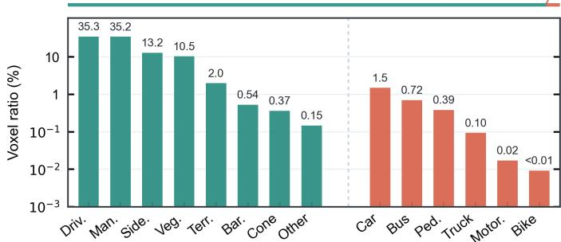  
Figure 7: Semantic class distribution. The top strip summarizes occupied voxels by semantic group, while the lower panel reports class-wise voxel occupancy ratios over evaluated occupied classes. The vertical axis is shown in log scale for readability. The distribution shows that static infrastructure dominates the occupied semantic space, whereas dynamic traffic participants form a sparse longtailed subset.

## 3.5.3 Semantic Long-tail Distribution

In addition to temporal asymmetry, InfraOcc also exhibits a pronounced semantic frequency imbalance. Fig. 7 reports the class-wise voxel occupancy ratio over evaluated occupied classes, excluding free space and ignored categories. Static infrastructure categories account for 97.3% of occupied voxels, whereas dynamic traffic participants account for only 2.7%. Within each group the distribution is further skewed: driveable surface and manmade structures dominate the static classes, while cars dominate the dynamic classes, with trucks, motorcycles, and bicycles substantially sparser. This semantic long-tail, together with the temporal asymmetry above, suggests that infrastructure-side occupancy prediction requires not only overall semantic accuracy, but also groupwise diagnosis of persistent static layout and sparse dynamic objects.

## 3.6 Evaluation Protocol

InfraOcc evaluates camera-only, LiDAR-only, and multimodal occupancy under a unified protocol: all tracks share the same data split, label space, calibration, and fixed roadside coordinate system, and are evaluated over the full $3 2 0 \times 3 2 0 \times 1 6$ grid (Sec. 3.5) rather than only sensor-visible regions; camera-visibility masks (Sec. 3.4) are additionally provided for optional camera-visible evaluation. Following common occupancy benchmarks [1], [2], the primary metric is the mean IoU over valid occupied classes,

$$
\mathrm { m I o U } _ { \mathrm { a l l } } = \frac { 1 } { \vert \mathcal { C } _ { \mathrm { e v a l } } \vert } \sum _ { c \in \mathcal { C } _ { \mathrm { e v a l } } } \frac { \mathrm { T P } _ { c } } { \mathrm { T P } _ { c } + \mathrm { F P } _ { c } + \mathrm { F N } _ { c } } ,\tag{2}
$$

where $\mathcal { C } _ { \mathrm { e v a l } }$ excludes free space and the ignored categories (construction vehicle, trailer, and other flat; omitted due to sparsity or ambiguous boundaries), and free space is reported separately as Free IoU. To diagnose the staticdynamic asymmetry, we additionally report gIoU (the IoU of all non-free classes merged into a single occupied group) and the group-wise $\mathrm { \ n I o U _ { d y n } / \ m I o U _ { s t a } , i . e . }$ , mIoU restricted to the dynamic classes (bicycle, bus, car, motorcycle, pedestrian, truck) and the static classes (others, barrier, traffic cone, driveable surface, sidewalk, terrain, manmade, vegetation), respectively. Together with per-class IoU, these metrics evaluate geometry, static layout, dynamic objects, and free space across modalities.

## 4 ProSD-Occ Framework

## 4.1 Motivation

As established in Sec. 1 and the benchmark diagnostics (Sec. 3.5), the fundamental difficulty of fixed-viewpoint roadside occupancy is the structural asymmetry between persistent static layout and transient dynamic participants. Under this structure, flat one-shot voxel classification is biased toward spatially dominant static patterns and weakens sparse dynamic cues, while simple loss reweighting [30], [31] only adjusts class weights without changing how static and dynamic evidence are organized. Accordingly, the design principle of ProSD-Occ is to organize occupancy reasoning from stable layout to local residual evidence rather than predicting all voxel categories at once: the model first establishes a sample-adaptive explanation of the persistent static layout, then uses it as a reference to recover residual evidence that the static context cannot sufficiently explain— often corresponding to sparse yet safety-critical dynamic objects—and finally recomposes static, dynamic, and freespace evidence into a unified semantic occupancy field. This paradigm exploits the contextual value of stable layout while suppressing its dominance over sparse dynamic prediction.

## 4.2 Overall Architecture

As shown in Fig. 8, ProSD-Occ organizes infrastructureside semantic occupancy prediction as a progressive staticto-dynamic reasoning framework. The framework decouples modality-specific feature construction from modalityagnostic occupancy reasoning. Given camera-only, LiDARonly, or multi-modal inputs, Modality-flexible Feature Encoding first converts the observations into a unified voxel representation F. In the camera-only and LiDAR-only settings, F is instantiated by the corresponding camera or LiDAR voxel feature. In the multi-modal setting, camera and LiDAR voxel features are fused before entering the subsequent reasoning process. This unified representation enables the same static-to-dynamic reasoning pipeline to be applied across all sensing regimes.

Given F, ProSD-Occ proceeds from stable layout explanation to dynamic evidence recovery. Static Layout Reasoner first estimates static logits, probabilities, and confidence $( Z _ { s } , P _ { s } , C _ { s } )$ , where $C _ { s }$ provides a sample-adaptive soft explanation of persistent infrastructure layout. Static-guided Residual Modulation then uses $C _ { s }$ to attenuate staticdominant responses while preserving complementary residual information, producing the dynamic-aware feature $\mathbf { \nabla } _ { F _ { d } }$ Based on $\mathbf { \nabla } F _ { d } ,$ Residual Dynamic Predictor estimates dynamic logits, probabilities, and confidence $( Z _ { d } , P _ { d } , C _ { d } )$ , focusing on local and transient object evidence. Finally, Semantic Recomposition integrates static, dynamic, and free-space evidence at the logit level and outputs the final occupancy logits $Z _ { \mathrm { f i n a l } }$

## 4.3 Modality-flexible Feature Encoding

ProSD-Occ performs static-to-dynamic occupancy reasoning on a unified voxel representation, regardless of the input sensing modality. Given camera images, LiDAR points, or both, the modality-specific front-end first maps the observations into a shared 3D voxel feature tensor

$$
\boldsymbol { F } \in \mathbb { R } ^ { C _ { f } \times Z \times H \times W } ,\tag{3}
$$

which serves as the common input to the subsequent Progressive Static-to-Dynamic Reasoning module.

For camera input, we follow common image-to-BEV/voxel encoding designs [12], [13]. Multi-view images are first processed by an image backbone and neck, and then lifted into the 3D voxel space through a depth-aware view transformation. The resulting camera voxel features are further refined with a BEVFormer-style backward projection module [14] to aggregate multi-view geometric context. We denote the resulting camera voxel feature as $F _ { \mathrm { { c a m } } }$ . For LiDAR input, point clouds are converted into voxel representations following standard voxel-based point cloud encoding [36], [37]. The voxelized points are encoded by a sparse LiDAR encoder and then processed by a 3D convolutional backbone to obtain LiDAR voxel features, denoted as $\mathbf { \nabla } F _ { \mathrm { l i d a r } } .$ In the multi-modal setting, we follow the unified BEV/voxel fusion paradigm in multi-sensor perception [1], [38]. Camera and LiDAR features are first projected into the same voxel grid and then fused before occupancy reasoning. Concretely, the fusion block computes lightweight attention maps from each modality and uses them to cross-modulate the voxel features of the other modality. The modulated camera and LiDAR features are concatenated and projected back to the shared channel dimension by a 3D convolutional block, producing the fused voxel feature $\Phi (  { F _ { \mathrm { c a m } } } ,  { F _ { \mathrm { l i d a r } } } )$

The input to ProSD-Occ is then uniformly defined as

$$
\begin{array} { r } { F = \left\{ \begin{array} { l l } { F _ { \mathrm { c a m } } , } & { \mathrm { C a m e r a - o n l y } , } \\ { F _ { \mathrm { l i d a r } } , } & { \mathrm { L i D A R - o n l y } , } \\ { \Phi ( F _ { \mathrm { c a m } } , F _ { \mathrm { l i d a r } } ) , } & { \mathrm { M u l t i - m o d a l } . } \end{array} \right. } \end{array}\tag{4}
$$

## 4.4 Progressive Static-to-Dynamic Reasoning

We now detail the four components of the progressive reasoning module (Fig. 8).

## 4.4.1 Static Layout Reasoner

This module estimates persistent static layout from the unified voxel feature. Its goal is to explain stable infrastructure elements before dynamic reasoning is performed. Let S denote the static class set (Sec. 3.6). As shown in Fig. 8, the Static Layout Reasoner is implemented by a compact residual 3D convolutional tower (BasicBlock3D) followed by a voxel-wise two-layer MLP, mapping each voxel feature to logits over S and an additional “other” class:

$$
\begin{array} { r } { \pmb { Z _ { s } } = h _ { s } ( \pmb { F } ) , \quad \pmb { Z _ { s } } \in \mathbb { R } ^ { ( | \mathcal { S } | + 1 ) \times \pmb { Z } \times \pmb { H } \times \pmb { W } } . } \end{array}\tag{5}
$$

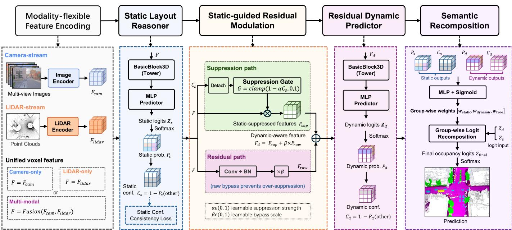  
Figure 8: Overall framework of ProSD-Occ. ProSD-Occ formulates infrastructure-side occupancy prediction as a progressive static-to-dynamic reasoning process rather than one-step voxel classification. Given camera-only, LiDAR-only, or multimodal inputs, Modality-flexible Feature Encoding first produces a unified voxel representation F. Static Layout Reasoner then estimates static logits and confidence $( Z _ { s } , \bar { C } _ { s } )$ , which provide a soft explanation of persistent infrastructure layout. Guided by this confidence, Static-guided Residual Modulation suppresses static-dominant responses and derives dynamicaware residual features $\mathbf { \nabla } _ { F _ { d } }$ . Residual Dynamic Predictor further recovers local dynamic evidence $( Z _ { d } , C _ { d } )$ , and Semantic Recomposition integrates static, dynamic, and free-space evidence into the final semantic occupancy logits ${ Z } _ { \mathrm { f i n a l } }$ , which are converted by softmax into the occupancy prediction.

Different from a generic background category, the “other” class in the static branch explicitly represents voxels that are not explained by static layout, including dynamic objects and free space. Therefore, the static branch is not asked to solve the full semantic occupancy problem. Instead, it only estimates whether each voxel can be explained by persistent static structure. The static probability is computed by

$$
P _ { s } = \mathrm { s o f t m a x } ( Z _ { s } ) .\tag{6}
$$

We define the static confidence as the probability that a voxel does not belong to the static-branch “other” class:

$$
C _ { s } = 1 - P _ { s } ( \mathrm { o t h e r } ) .\tag{7}
$$

The confidence $C _ { s }$ provides a sample-adaptive soft explanation of persistent layout. It is not used as a hard static mask; instead, it guides the subsequent residual modulation step, where static-dominant responses are suppressed to expose potential dynamic evidence.

## 4.4.2 Static-guided Residual Modulation

Static-guided Residual Modulation bridges static layout reasoning and residual dynamic prediction by transforming the unified voxel feature F into a dynamic-aware feature $\pmb { F } _ { d }$ As shown in Fig. 8, this module contains two complementary paths: a suppression path that attenuates static-dominant responses according to the predicted static confidence, and a residual path that preserves raw voxel evidence to avoid over-suppression.

Given the static confidence $C _ { s } ,$ the suppression path constructs a voxel-wise suppression gate:

$$
\alpha = \sigma ( a ) , \quad G = \mathrm { c l a m p } \left( 1 - \alpha \ : \mathrm { s g } ( C _ { s } ) , 0 , 1 \right) ,\tag{8}
$$

where a is a learnable scalar, $\alpha ~ \in ~ ( 0 , 1 )$ controls the suppression strength, and $\operatorname { s g } ( \cdot )$ denotes stop-gradient. Voxels with high static confidence are softly attenuated, encouraging the subsequent dynamic branch to focus on evidence not sufficiently explained by static layout. The static-suppressed feature is obtained by

$$
\begin{array} { r } { F _ { \mathrm { s u p } } = { \cal F } \odot { \cal G } . } \end{array}\tag{9}
$$

Since static confidence can be uncertain around object boundaries, occluded regions, or sparse dynamic objects, pure suppression may discard useful dynamic cues. The residual path therefore introduces a bypass from the original voxel feature:

$$
\begin{array} { r } { \pmb { F } _ { \mathrm { r a w } } = \mathrm { B N } \left( \mathrm { C o n v } _ { 1 \times 1 \times 1 } ( \pmb { F } ) \right) , \quad \beta = \sigma ( b ) , } \end{array}\tag{10}
$$

where b is a learnable scalar and $\beta \in \mathsf { \Gamma } ( 0 , 1 )$ controls the bypass strength. The final dynamic-aware feature is then formed as

$$
\begin{array} { r } { { \cal F } _ { d } = F _ { \mathrm { s u p } } + \beta { \cal F } _ { \mathrm { r a w } } . } \end{array}\tag{11}
$$

In this way, the module suppresses dominant static responses while retaining complementary residual evidence, providing a more suitable representation for dynamic occupancy prediction.

## 4.4.3 Residual Dynamic Predictor

The Residual Dynamic Predictor estimates transient traffic participants from the dynamic-aware feature $\pmb { F } _ { d }$ . Different from the Static Layout Reasoner, this module focuses on local, sparse, and boundary-sensitive object evidence that remains after static-guided modulation. It adopts the same compact BasicBlock3D tower and voxel-wise MLP predictor, but predicts over the dynamic class set D and an additional “other” class:

$$
\begin{array} { r } { Z _ { d } = h _ { d } ( { \cal F } _ { d } ) , { \cal Z } _ { d } \in \mathbb { R } ^ { ( | \mathcal { D } | + 1 ) \times { \cal Z } \times H \times W } . } \end{array}\tag{12}
$$

Symmetric to the static branch, the dynamic-branch “other” class covers voxels not explained by dynamic objects. The dynamic probability and confidence are computed as

$$
\begin{array} { r } { P _ { d } = \mathrm { s o f t m a x } ( Z _ { d } ) , \quad C _ { d } = 1 - P _ { d } \mathrm { ( o t h e r ) } . } \end{array}\tag{13}
$$

Since $\pmb { F } _ { d }$ has already been modulated by static confidence, this branch is encouraged to recover residual dynamic evidence rather than relearn dominant static layout from scratch.

## 4.4.4 Semantic Recomposition

After static and dynamic reasoning, the two branches provide complementary partial explanations, but neither is defined over the complete semantic label space, and naive averaging would blur their specialization. We instead recompose the branch outputs at the logit level. Specifically, given the static outputs $( \mathit { P _ { s } } , \mathit { C _ { s } } )$ and dynamic outputs $\bar { ( \ l { P _ { d } } , \ l { C _ { d } } ) }$ , we construct a voxel-wise recomposition input:

$$
\begin{array} { r } { \pmb { x } _ { g } = [ \pmb { P } _ { s } , \pmb { P } _ { d } , \pmb { C } _ { s } , \pmb { C } _ { d } ] . } \end{array}\tag{14}
$$

A lightweight MLP followed by a sigmoid function predicts three group-wise recomposition weights:

$$
[ { \pmb w } _ { \mathrm { s t a t i c } } , { \pmb w } _ { \mathrm { d y n a m i c } } , { \pmb w } _ { \mathrm { f r e e } } ] = \sigma ( g _ { \phi } ( { \pmb x } _ { g } ) ) .\tag{15}
$$

Here, ${ \pmb w } _ { \mathrm { s t a t i c } }$ and ${ \pmb w } _ { \mathrm { d y n a m i c } }$ measure reliance on their corresponding specialized branch, while ${ \pmb w } _ { \mathrm { f r e e } }$ interpolates the two branch-specific “other” logits.

The branch logits $Z _ { s }$ and $\textstyle Z _ { d }$ are then recomposed according to their semantic groups. Let $Z _ { s , o }$ and $\mathbf { \delta } _ { Z _ { d , o } }$ denote the “other” logits of the static and dynamic branches. For a static class $c \in S ,$ the final logit is composed from the corresponding static logit and the dynamic-branch “other” logit:

$$
Z _ { \mathrm { f i n a l } , c } = { \pmb w } _ { \mathrm { s t a t i c } } { \pmb Z } _ { s , c } + ( 1 - { \pmb w } _ { \mathrm { s t a t i c } } ) { \pmb Z } _ { d , o } .\tag{16}
$$

For a dynamic class $c \in \mathcal { D } ,$ , the final logit is composed from the dynamic-branch class logit and the static-branch “other” logit:

$$
\pmb { Z } _ { \mathrm { f i n a l } , c } = \pmb { w } _ { \mathrm { d y n a m i c } } \pmb { Z } _ { d , c } + ( 1 - \pmb { w } _ { \mathrm { d y n a m i c } } ) \pmb { Z } _ { s , o } .\tag{17}
$$

For the free-space class $f ,$ the final logit is obtained by combining the “other” logits from both branches:

$$
Z _ { \mathrm { f i n a l } , f } = { \pmb w } _ { \mathrm { f r e e } } Z _ { s , o } + ( 1 - { \pmb w } _ { \mathrm { f r e e } } ) Z _ { d , o } .\tag{18}
$$

## 4.5 Optimization Objectives

We supervise three outputs in ProSD-Occ: the final occupancy prediction and the two intermediate static and dynamic branch predictions. The final logits $Z _ { \mathrm { f i n a l } }$ are supervised in the complete semantic occupancy space, yielding $\mathcal { L } _ { \mathrm { o c c } }$ . For the static and dynamic branches, semantic classes outside the corresponding group are mapped to the branch-specific “other” class, yielding $\mathcal { L } _ { s }$ and $\mathcal { L } _ { d } .$ . All three losses adopt the same composite occupancy objective:

$$
\begin{array} { r } { \mathcal { L } _ { r } = \mathcal { L } _ { r } ^ { \mathrm { C E } } + \mathcal { L } _ { r } ^ { \mathrm { S e m } } + \mathcal { L } _ { r } ^ { \mathrm { L o v a s z } } , \quad r \in \{ \mathrm { o c c } , s , d \} , } \end{array}\tag{19}
$$

where $\mathcal { L } ^ { \mathrm { C E } } , \mathcal { L } ^ { \mathrm { S e m } }$ , and $\mathcal { L } ^ { \mathrm { L o v a s z } }$ denote cross-entropy loss, semantic scaling loss [48], and Lovasz loss [49], respectively.

Finally, since $C _ { s }$ directly controls the static-guided suppression gate, its stability matters: persistent structures observed from a fixed viewpoint should yield consistent static confidence across same-scene frames, yet per-sample supervision alone leaves it fluctuating under transient occlusions, dynamic objects, and sensing noise. We therefore add a static-confidence consistency regularizer on confidently static voxels. Because all frames of a scene share the fixed roadside coordinate system, their static confidences are voxelaligned and directly comparable once spatial augmentation is undone. Within each same-scene minibatch group, a voxel v is treated as confidently static for sample i if $C _ { s , i } ^ { - } ( v ) > \tau$ On voxels where at least two samples are confident, the consensus $\bar { C } _ { s } ( v )$ is defined as the mean confidence of these samples, and the regularizer penalizes their squared deviations,

$$
{ \mathcal L } _ { \mathrm { c o n s } } = \mathrm { m e a n } _ { ( i , v ) } \left( C _ { s , i } ( v ) - \bar { C } _ { s } ( v ) \right) ^ { 2 } ,\tag{20}
$$

averaged over all such sample–voxel pairs. Since the regularizer acts only on confidently static voxels and the confidence itself is anchored by the static-branch supervision $\mathcal { L } _ { s } ,$ it removes per-frame fluctuations on persistent layout without collapsing the confidence field.

The overall objective is

$$
\begin{array} { r } { \mathcal { L } = \mathcal { L } _ { \mathrm { o c c } } + \lambda _ { s } \mathcal { L } _ { s } + \lambda _ { d } \mathcal { L } _ { d } + \lambda _ { c } \mathcal { L } _ { \mathrm { c o n s } } . } \end{array}\tag{21}
$$

## 5 Experiments

## 5.1 Experimental Setup

Protocol. We evaluate camera-only (C), LiDAR-only (L), and multi-modal (C+L) occupancy on the InfraOcc test split using the unified protocol in Sec. 3.6. Baselines are retrained using their official implementations under the same budget, and the suffixes (C), (L), and (C+L) identify the sensing track. Controlled ablations use the camera-only setting, where weak depth evidence makes separating transient objects from persistent layout particularly difficult. Plain (C) is a flat one-stage counterpart that removes the proposed progressive static-to-dynamic reasoning mechanism and directly predicts all occupancy classes from the same encoded voxel representation; the feature encoder and final occupancy loss remain unchanged.

Implementation Details. The camera branch uses an ImageNet-pretrained ResNet-50 at a 256 × 704 input resolution with depth bins of 1–60 m at 1 m intervals; the LiDAR branch voxelizes point clouds at 0.1 m. The static and dynamic towers use 40 and 64 hidden channels, and the suppression gate is initialized at $\alpha { = } 0 . 5$ . All supervision terms use unit weights $( \lambda _ { s } = \lambda _ { d } = 1 )$ with frequency-based class weights, and the static-consistency regularizer uses $\lambda _ { c } { = } 0 . 1$ and $\tau { = } 0 . 7$ . Models are trained for 32 epochs with AdamW [50] (learning rate $1 \times 1 0 ^ { - 4 } .$ , weight decay $1 0 ^ { - 2 } )$ a cosine-annealing schedule, and random image and BEV flip augmentation, on 8 NVIDIA A100 GPUs with a per-GPU

TABLE 2: Main InfraOcc occupancy results. Rankings are computed within each sensing track; the best, second-best, and third-best results are shaded red (bold), orange (underlined), and yellow (italic), respectively.
<table><tr><td>Method</td><td>gIoU  $\mathrm { \ m I o U _ { a l l } \ m I o U _ { d y n } \ m I o U _ { s t a } }$ </td><td></td><td>Bike</td><td colspan="6">Mocrce Pedstian</td></tr><tr><td></td><td></td><td></td><td></td><td>1</td><td>gngs Carr 一 ■</td><td>一</td><td></td><td>Truuck Other ■ ■</td><td>Barier Cone ■ ■</td><td>Drvvbe</td><td>Sidalk Teran ■</td><td>Mde</td><td>Veton</td><td>FTe 一</td></tr><tr><td>Multi-modal (C+L)</td><td></td><td></td><td></td><td></td><td></td><td></td><td></td><td></td><td></td><td></td><td></td><td></td><td></td><td></td></tr><tr><td>BEVFusion [38]</td><td>77.01</td><td>55.44 32.57</td><td>72.60</td><td>11.03</td><td>65.04</td><td>55.73</td><td>15.26 29.48</td><td>18.88</td><td>55.04 72.04</td><td>72.07 75.43</td><td>73.53</td><td>81.26</td><td>76.82 74.60</td><td>96.58</td></tr><tr><td>ProSD-Occ</td><td>91.78</td><td>65.87 37.92</td><td>86.82</td><td>30.07</td><td>66.95</td><td>58.55</td><td>19.82 34.65</td><td>17.51</td><td>72.31 73.79</td><td>89.68 94.25</td><td>88.35</td><td>94.73 90.37</td><td>91.12</td><td>99.09</td></tr><tr><td>LiDAR-Only (L)</td><td></td><td></td><td></td><td></td><td></td><td></td><td></td><td></td><td></td><td></td><td></td><td></td><td></td><td></td></tr><tr><td>VoxelNet [36]</td><td>75.69</td><td>53.87 31.13</td><td>70.92</td><td>11.08</td><td>65.63</td><td>54.52</td><td>13.43 27.85</td><td>14.29</td><td>53.39 72.22</td><td>68.26 75.13</td><td>72.35</td><td>78.99</td><td>74.69 72.36</td><td>96.31</td></tr><tr><td>PointPillars [37]</td><td>70.53</td><td>50.51 31.55</td><td>64.74</td><td>14.99</td><td>61.62</td><td>54.03 11.50</td><td>32.62</td><td>14.55 44.06</td><td>73.83</td><td>57.49 72.11</td><td>67.67</td><td>70.75 66.42</td><td>65.56</td><td>95.27</td></tr><tr><td>ProSD-Occ</td><td>90.86</td><td>63.66 33.87</td><td>85.99</td><td>11.59</td><td>65.62</td><td>58.29 15.22</td><td>33.09</td><td>19.42</td><td>68.00 73.75</td><td>90.18 94.02</td><td>88.14</td><td>95.16 88.53</td><td>90.17</td><td>98.99</td></tr><tr><td>Camera-Only (C)</td><td></td><td></td><td></td><td></td><td></td><td></td><td></td><td></td><td></td><td></td><td></td><td></td><td></td><td></td></tr><tr><td>BEVDet [12]</td><td>68.62</td><td>45.14</td><td>21.19 63.11</td><td>9.23</td><td>42.75</td><td>38.04</td><td>9.68 15.01</td><td>12.45</td><td>42.88 70.36</td><td>53.77 72.04</td><td>68.07</td><td>73.09</td><td>64.28 60.38</td><td>94.87</td></tr><tr><td>BEVFormer [14]</td><td>81.72</td><td>47.76</td><td>10.73</td><td>75.53 7.97</td><td>20.39</td><td>17.65</td><td>3.47 8.62</td><td>6.30</td><td>42.47 76.26</td><td>72.83 85.19</td><td>81.95</td><td>88.95</td><td>79.52 77.05</td><td>97.56</td></tr><tr><td>BEVDepth [13]</td><td>71.89</td><td>46.81</td><td>19.64 67.19</td><td>14.84</td><td>33.87</td><td>38.74</td><td>3.42 16.86</td><td>10.14</td><td>48.73 71.05</td><td>62.37 73.31</td><td>69.32</td><td>76.07</td><td>70.51 66.15</td><td>95.54</td></tr><tr><td>TPVFormer [3]</td><td>73.80</td><td>43.09</td><td>4.36 72.13</td><td>0.10</td><td>3.69</td><td>13.80</td><td>0.41 6.86</td><td>1.33</td><td>42.86 75.29</td><td>69.69 80.61</td><td>77.62</td><td>86.63</td><td>72.61 71.70</td><td>96.12</td></tr><tr><td>SurroundOcc [4]</td><td>83.78</td><td>50.77 11.37</td><td>80.32</td><td>12.66</td><td>21.90</td><td>18.54</td><td>2.06 9.50</td><td>3.55</td><td>65.09 79.04</td><td>72.70 86.38</td><td>83.99</td><td>91.10 83.16</td><td>81.09</td><td>97.80</td></tr><tr><td>CONet [1]</td><td>78.56</td><td>49.25</td><td>18.93 72.00</td><td>3.06</td><td>37.24</td><td>39.47</td><td>4.42 17.64</td><td>11.72</td><td>45.01 75.31</td><td>64.94 84.29</td><td>79.45</td><td>84.27 72.96</td><td>69.79</td><td>97.08</td></tr><tr><td>STCOcc [42]</td><td>73.11</td><td>49.70</td><td>23.45 69.39</td><td>13.33</td><td>49.57</td><td>42.64</td><td>10.37 18.09</td><td>6.67</td><td>52.63 71.94</td><td>67.09 86.83</td><td>74.94</td><td>80.54 57.27</td><td>63.91</td><td>96.89</td></tr><tr><td>SparseOcc [17]</td><td>71.61</td><td>45.42 9.41</td><td>72.42</td><td>1.50</td><td>20.94</td><td>24.87</td><td>0.00 4.60</td><td>4.57</td><td>67.68 76.37</td><td>61.51 74.67</td><td>76.59</td><td>88.54 68.79</td><td>65.19</td><td>96.31</td></tr><tr><td>ĠaussianFormer [18]</td><td>77.89</td><td>43.63 10.45</td><td>68.51</td><td>3.13</td><td>22.11</td><td>23.17</td><td>1.29 8.21</td><td>4.80</td><td>36.70 68.54</td><td>55.60 82.59</td><td>79.37</td><td>74.20 77.85</td><td>73.21</td><td>96.71</td></tr><tr><td>ProSD-Occ</td><td>89.08</td><td>60.08 28.97</td><td>83.42</td><td>22.74</td><td>55.45</td><td>47.84</td><td>12.27 21.01</td><td>14.49</td><td>65.99 72.72</td><td>82.14 93.84</td><td>86.88</td><td>93.31 86.09</td><td>86.38</td><td>98.78</td></tr></table>

TABLE 3: Core ablation of progressive static-to-dynamic (S2D) reasoning. The upper block compares prediction paradigms; the lower block isolates suppression and rawfeature bypass. The parallel S2D control uses the same nostatic-suppression setting as the lower-block control.
<table><tr><td>Setting</td><td>gIoU↑</td><td> $\mathrm { m I o U _ { a l l } }$  个</td><td> $\mathrm { m I o U _ { d y n } }$ </td><td> $\mathrm { \ m I o U _ { s t a } \uparrow }$ </td></tr><tr><td colspan="5">Necessity of Progressive S2D Reasoning</td></tr><tr><td>Plain (C)</td><td>78.54</td><td>50.71</td><td>23.48</td><td>71.14</td></tr><tr><td>Parallel S2D Fusion (no supp.)</td><td>79.77</td><td>53.59</td><td>24.43</td><td>75.46</td></tr><tr><td>Progressive S2D Reasoning</td><td>89.08</td><td>60.08</td><td>28.97</td><td>83.42</td></tr><tr><td colspan="5">Design of Progressive S2D Reasoning</td></tr><tr><td>No static suppression</td><td>79.77</td><td>53.59</td><td>24.43</td><td>75.46</td></tr><tr><td>Suppression only</td><td>88.35</td><td>59.77</td><td>28.81</td><td>82.99</td></tr><tr><td>Suppression + raw bypass</td><td>89.08</td><td>60.08</td><td>28.97</td><td>83.42</td></tr></table>

batch size of 2.

Metrics. Following Sec. 3.6, we report gIoU, $\mathrm { m I o U } _ { \mathrm { a l l } }$ (All), $\mathrm { \ m I o U _ { d y n } \left( D y n \right) }$ , and mIoUsta (Sta), with per-class and freespace IoU in the main comparison. Dyn is the primary diagnostic for sparse traffic participants; Sta checks static-layout preservation, whereas gIoU and free-space IoU measure geometric occupancy.

## 5.2 Main Results

## 5.2.1 Quantitative Comparison

As reported in Tab. 2, in the camera-only track, where static background dominance is most severe, ProSD-Occ reaches 60.08 All and 28.97 Dyn, surpassing the best previous camera results by +9.31 All (over SurroundOcc [4]) and +5.52 Dyn (over STCOcc [42]), while also achieving the best Sta (83.42) and gIoU (89.08). The simultaneous gains in Dyn, Sta, and gIoU are important for the paper’s thesis: ProSD-Occ does not obtain better mIoU by simply fitting the persistent background, and it does not recover dynamic objects by sacrificing layout quality. The LiDAR-only and multi-modal tracks show that the progressive reasoning framework remains effective with stronger geometric evidence. ProSD-Occ reaches 63.66/33.87 All/Dyn in the L setting and 65.87/37.92 in the C+L setting, outperforming the corresponding listed baselines in both overall and dynamic occupancy. The lower camera-only Dyn score reflects the difficulty of monocular roadside depth inference, while the consistent ranking across $C , \mathrm { L } ,$ and C+L indicates that the contribution is not tied to one sensor front-end. Instead, the gain comes from organizing voxel evidence from persistent static layout toward residual dynamic occupancy.

## 5.2.2 Qualitative Comparison

The qualitative comparison in Fig. 9 aligns roadside camera evidence, ground-truth occupancy, and four camera-only predictions on the same test samples, making the staticdynamic asymmetry directly visible. TPVFormer [3] and SparseOcc [17] reconstruct the persistent road layout reasonably well but almost entirely miss the vehicles and pedestrians crossing the intersection, mirroring their low dynamic mIoU in Tab. 2. STCOcc [42] recovers more dynamic occupancy, but nearby traffic participants are often blended into fragmented blobs with confused semantic labels, leaving different dynamic categories indistinguishable along lanes and crosswalks. In contrast, ProSD-Occ (C) produces well-separated, category-consistent dynamic occupancy— vehicle clusters and crossing pedestrians remain individually identifiable—while keeping sidewalk and vegetation boundaries closest to the ground truth. This indicates that the dynamic gain comes from exposing residual dynamic evidence rather than from trading away static structure.

## 5.3 Ablation Studies

## 5.3.1 Progressive Static-to-Dynamic Reasoning

The central causal claim is that dynamic occupancy improves when the model reasons through static layout before predicting residual objects, which we test in Tab. 3. The Plain (C) baseline achieves 50.71 All and 23.48 Dyn. The parallel static-to-dynamic (S2D) fusion control reaches only 53.59 All and 24.43 Dyn; this limited gain shows that independent static-dynamic prediction is not sufficient without residual conditioning. Progressive reasoning further reaches 60.08 All and 28.97 Dyn because the dynamic branch no longer competes with the full static scene in one step; it receives a layout-conditioned feature where residual object evidence is easier to recover.

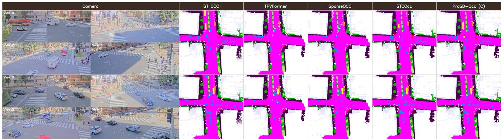  
Figure 9: Qualitative comparison of camera-only methods. Each row shows a test sample with aligned roadside camera evidence, ground-truth occupancy, and camera-only occupancy predictions from TPVFormer [3], SparseOcc [17], STCOcc [42], and ProSD-Occ (C).

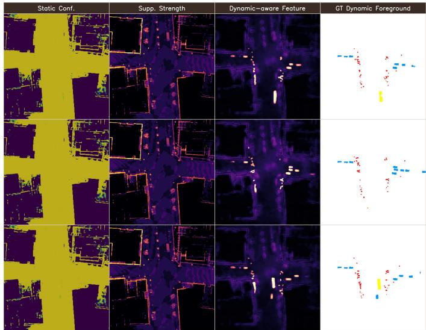  
Figure 10: Progressive static-to-dynamic feature visualization. Each row shows one test sample. The columns visualize static confidence, static-confidence suppression strength, the dynamic-aware feature energy after static suppression, and the corresponding ground-truth dynamic foreground occupancy. Static confidence is high on persistent structures, and suppression exposes the sparse dynamic foreground.

The lower block explains why this residual feature must preserve both suppressed and raw evidence. Staticguided suppression exposes dynamic cues and improves Dyn from 24.43 to 28.81, but suppression alone weakens the information needed for complete semantic reconstruction. Adding the raw-feature bypass produces the full result, raising Sta to 83.42 while keeping the best Dyn. This supports the intended role of the module: static evidence is not removed; it is attenuated where it dominates and then recombined with residual evidence. Fig. 10 visualizes the same mechanism across multiple samples. Static confidence is high on persistent road and infrastructure regions, suppression is applied around static-dominant responses, and the Dynamic-aware feature, visualized as weighted branch-feature energy, remains spatially continuous while emphasizing sparse foreground occupancy. The last column shows the corresponding ground-truth dynamic foreground to make the sparse target regions explicit.

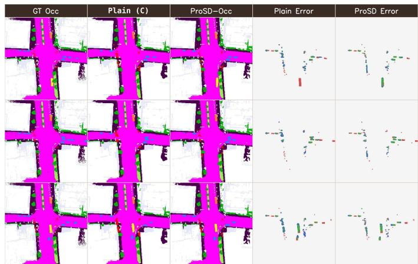  
Figure 11: Dynamic occupancy recovery by progressive reasoning. Each row uses the same sample as Fig. 10, comparing Plain (C) with ProSD-Occ (C). The error maps compare dynamic foreground occupancy only: green indicates correct dynamic prediction, blue indicates missed dynamic occupancy, and red indicates false dynamic prediction.

A direct error comparison between Plain (C) and ProSD-Occ (C) is given in Fig. 11. The error maps show that residual modulation reduces missed and false dynamic occupancy without turning the static branch into a memorized background mask.

## 5.3.2 Guidance, Suppression, and Recomposition

We next decompose the residual recovery path into guidance, attenuation, and recomposition in Tabs. 4–6. As shown in Tab. 4, static guidance is necessary, and its quality matters. With guidance disabled, the row uses the shared no-staticsuppression control reported in Tabs. 3 and 5, giving 53.59

TABLE 4: Static guidance quality. Only the guidance signal for residual modulation is changed. None uses the shared no-static-suppression control, Noisy uses a perturbed staticconfidence map, Predicted uses learned static confidence from the static branch, and Oracle uses ground-truth static occupancy as guidance.
<table><tr><td>Guidance</td><td>gIoU↑</td><td> $\mathrm { { m I o U _ { a l l } } \uparrow }$ </td><td> $\mathrm { \ m I o U _ { d y n } \uparrow }$ </td><td> $\mathrm { \ m I o U _ { s t a } \ \uparrow }$ </td></tr><tr><td>None</td><td>79.77</td><td>53.59</td><td>24.43</td><td>75.46</td></tr><tr><td>Noisy</td><td>86.70</td><td>56.51</td><td>22.60</td><td>81.95</td></tr><tr><td>Predicted</td><td>89.08</td><td>60.08</td><td>28.97</td><td>83.42</td></tr><tr><td>Oracle</td><td>89.22</td><td>60.31</td><td>29.18</td><td>83.65</td></tr></table>

TABLE 5: Suppression strength design. We compare staticguided attenuation choices and initialization sensitivity.
<table><tr><td>Setting</td><td>αinit</td><td></td><td></td><td>gIoU↑ mIoUall ↑ mIoUdyn ↑ mIoUsta ↑</td><td></td></tr><tr><td colspan="6">Necessity of learnable suppression</td></tr><tr><td>No static suppression</td><td>0.0</td><td>79.77</td><td>53.59</td><td>24.43</td><td>75.46</td></tr><tr><td>Fixed suppression</td><td>0.5</td><td>84.30</td><td>56.68</td><td>28.32</td><td>77.95</td></tr><tr><td>Learnable suppression</td><td>0.5</td><td>89.08</td><td>60.08</td><td>28.97</td><td>83.42</td></tr><tr><td colspan="6">Sensitivity to initialization</td></tr><tr><td>Learnable  $( \alpha _ { \mathrm { i n i t } } = 0 . 2 5 )$ </td><td>0.25</td><td>86.42</td><td>58.27</td><td>28.72</td><td>80.44</td></tr><tr><td>Learnable  $( \alpha _ { \mathrm { i n i t } } = 0 . 5 0 )$ </td><td>0.50</td><td>89.08</td><td>60.08</td><td>28.97</td><td>83.42</td></tr><tr><td>Learnable  $( \alpha _ { \mathrm { i n i t } } = 0 . 7 5 )$ </td><td>0.75</td><td>86.10</td><td>57.91</td><td>28.64</td><td>79.86</td></tr></table>

All and 24.43 Dyn. Noisy guidance further harms dynamic prediction, and learned static confidence reaches 28.97 Dyn, only 0.21 below oracle guidance, indicating that the learned confidence has nearly saturated the attainable guidance quality and the remaining headroom lies in residual reasoning rather than in better guidance. Thus the static branch is not merely an auxiliary prediction pathway; it provides a sample-adaptive soft explanation of persistent layout that makes residual dynamic evidence easier to locate.

As shown in Tab. 5, the attenuation itself should be learned rather than fixed. Fixed suppression improves Dyn over no suppression, from 24.43 to 28.32, confirming that static confidence is useful as a soft mask for exposing residual foreground cues. However, a fixed gate cannot adapt to scenedependent ambiguity and remains limited in All/Sta. In contrast, learnable suppression raises All/Sta to 60.08/83.42 while also giving the best Dyn among practical settings. The initialization study reinforces the same interpretation: both weaker $( \alpha _ { \mathrm { i n i t } } = 0 . 2 5 )$ and stronger $( \alpha _ { \mathrm { i n i t } } = 0 . 7 5 )$ starting points preserve reasonable Dyn, but they reduce All and Sta. This indicates that the gate must balance residual mining and layout preservation, rather than simply maximizing foreground response or suppressing static features aggressively.

The final recomposition step is verified in Tab. 6. The differences are moderate rather than dominant: deterministic average and deterministic group-wise merging trail the default by 1.79 and 1.33 All, respectively, showing that fixed recomposition is suboptimal but not catastrophic. Oneinput gates also lose about 1.1–1.5 All, while class-wise routing remains closer to the default but still weakens All/Sta. This pattern is consistent with adaptive fusion being an auxiliary recomposition design: it stabilizes the final static/dynamic routing, but the main improvement still comes from progressive residual reasoning.

TABLE 6: Adaptive fusion design. The upper block tests learned routing; the lower block varies gate inputs and routing granularity.
<table><tr><td>Setting</td><td>gIoU↑</td><td> $\mathrm { m I o U _ { a l l } }$  ←</td><td> $\mathrm { m I o U _ { d y n } }$ </td><td> $\mathrm { \ m I o U _ { s t a } } ~ \cdot$  个</td></tr><tr><td>Necessity of Adaptive Fusion</td><td></td><td></td><td></td><td></td></tr><tr><td>Deterministic Average Merge</td><td>86.34</td><td>58.29</td><td>27.72</td><td>81.22</td></tr><tr><td>Deterministic Group-wise Merge</td><td>86.98</td><td>58.75</td><td>28.04</td><td>81.78</td></tr><tr><td>Adaptive Group-wise Fusion</td><td>89.08</td><td>60.08</td><td>28.97</td><td>83.42</td></tr><tr><td>Design of Adaptive Fusion</td><td></td><td></td><td></td><td></td></tr><tr><td>Confidence-only (group-wise)</td><td>86.72</td><td>58.56</td><td>27.81</td><td>81.63</td></tr><tr><td>Probability-only (group-wise)</td><td>87.26</td><td>58.95</td><td>28.18</td><td>82.03</td></tr><tr><td>Prob.+Conf. (class-wise)</td><td>88.18</td><td>59.44</td><td>28.55</td><td>82.61</td></tr><tr><td>Prob.+Conf. (group-wise)</td><td>89.08</td><td>60.08</td><td>28.97</td><td>83.42</td></tr></table>

TABLE 7: Static consistency ablation. We test whether a stable layout regularizer improves progressive reasoning. Batch-level consensus is the default consistency form.
<table><tr><td>Setting</td><td>gIoU↑</td><td> $\mathrm { { m I o U _ { a l l } } \uparrow }$ </td><td> $\mathrm { m I o U _ { d y n } }$  ↑</td><td>mIoUsta ↑</td></tr><tr><td colspan="5">Necessity of Static Consistency</td></tr><tr><td>No consistency</td><td>86.10</td><td>58.34</td><td>28.20</td><td>80.95</td></tr><tr><td>Static consistency (default)</td><td>89.08</td><td>60.08</td><td>28.97</td><td>83.42</td></tr><tr><td colspan="5">Design of Static Consistency</td></tr><tr><td>Batch-level consensus</td><td>89.08</td><td>60.08</td><td>28.97</td><td>83.42</td></tr><tr><td>Pairwise agreement</td><td>88.83</td><td>59.81</td><td>28.74</td><td>83.12</td></tr></table>

TABLE 8: Static-dynamic loss balance. We vary branch coefficients while keeping the model architecture fixed.
<table><tr><td>Setting</td><td> $\lambda _ { s }$ </td><td> $\lambda _ { d }$ </td><td> $\mathrm { g I o U \uparrow }$ </td><td> $\mathrm { m I o U _ { a l l } }$  ←</td><td> $\mathrm { \ m I o U _ { d y n } \uparrow }$ </td><td> $\mathrm { \ m I o U _ { s t a } \uparrow }$ </td></tr><tr><td>Static-light</td><td>0.5</td><td>1.0</td><td>87.54</td><td>59.52</td><td>28.99</td><td>82.41</td></tr><tr><td>Dynamic-light</td><td>1.0</td><td>0.5</td><td>87.96</td><td>59.37</td><td>27.63</td><td>83.18</td></tr><tr><td>Balanced</td><td>1.0</td><td>1.0</td><td>89.08</td><td>60.08</td><td>28.97</td><td>83.42</td></tr><tr><td>Dynamic-heavy</td><td>1.0</td><td>2.0</td><td>87.83</td><td>59.82</td><td>29.26</td><td>82.74</td></tr><tr><td>Static-heavy</td><td>2.0</td><td>1.0</td><td>88.34</td><td>59.46</td><td>27.72</td><td>83.27</td></tr></table>

## 5.3.3 Static Consistency

We further check in Tab. 7 whether the static scaffold used for residual modulation should be regularized across samples. Removing consistency reduces All from 60.08 to 58.34 and Sta from 83.42 to 80.95, and also lowers Dyn from 28.97 to 28.20. In the design block, batch-level consensus is the default consistency form (Sec. 4.5) and matches the static-consistency row. Pairwise agreement remains close but is slightly weaker at 59.81 All, 28.74 Dyn, and 83.12 Sta: a single partner frame is a noisier target under transient occlusions and sensing noise, whereas the batch consensus averages such fluctuations into a more stable target. The final model therefore keeps batchlevel consensus as the default static regularizer.

## 5.3.4 Loss Design

A natural concern is whether the dynamic gain could be obtained by loss reweighting alone, which we examine in Tab. 8. Dynamic-heavy training gives the highest Dyn (29.26), but its All and Sta are lower than the balanced setting. Conversely, dynamic-light or static-heavy settings preserve more layout structure but weaken dynamic recovery. The balanced objective is therefore used because it best supports the coupled roles of the two branches: static layout explains the persistent scaffold, while dynamic supervision recovers sparse residual objects.

IEEE TRANSACTIONS ON PATTERN ANALYSIS AND MACHINE INTELLIGENCE TABLE 9: Occupancy loss components. CE, semantic-scaling, and Lovasz terms are varied for each supervision target.
<table><tr><td>Setting</td><td>CE Sem. Lovasz gIoU↑</td><td></td><td></td><td> $\mathrm { m I o U _ { a l l } }$ </td><td>←  $\mathrm { m I o U _ { d y n } }$ </td><td>←  $\mathrm { \ m I o U _ { s t a } } \ ^ { \cdot }$ </td></tr><tr><td colspan="7">Static occupancy supervision</td></tr><tr><td>CE only</td><td>√</td><td></td><td>86.80</td><td>58.48</td><td>26.89</td><td>82.18</td></tr><tr><td>CE + Sem.</td><td>√ √</td><td></td><td>87.89</td><td>59.22</td><td>27.08</td><td>83.33</td></tr><tr><td>CE + Lovasz</td><td>√</td><td>√</td><td>86.20</td><td>58.99</td><td>28.49</td><td>81.86</td></tr><tr><td>CE + Sem. + Lovasz ✓</td><td>√</td><td>√</td><td>89.08</td><td>60.08</td><td>28.97</td><td>83.42</td></tr><tr><td colspan="7">Dynamic occupancy supervision</td></tr><tr><td>CE only</td><td></td><td></td><td>86.78</td><td>57.33</td><td>25.49</td><td>81.21</td></tr><tr><td>CE + Sem.</td><td>√ √ √</td><td></td><td>87.54</td><td>58.33</td><td>27.34</td><td>81.57</td></tr><tr><td>CE + Lovasz</td><td>√</td><td>√</td><td>87.42</td><td>58.29</td><td>27.93</td><td>81.06</td></tr><tr><td>CE + Sem. + Lovasz ✓</td><td>√</td><td>√</td><td>89.08</td><td>60.08</td><td>28.97</td><td>83.42</td></tr><tr><td colspan="7">Fusion-output occupancy supervision</td></tr><tr><td>CE only</td><td></td><td></td><td>85.64</td><td>56.58</td><td>25.92</td><td>79.58</td></tr><tr><td>CE + Sem.</td><td>√ √</td><td></td><td>86.92</td><td>57.81</td><td>27.06</td><td>80.87</td></tr><tr><td>CE + Lovasz</td><td>√</td><td>√</td><td>86.56</td><td>57.56</td><td>27.47 28.97</td><td>80.13</td></tr><tr><td>CE + Sem. + Lovasz ✓</td><td>√</td><td></td><td>√</td><td>89.08</td><td>60.08</td><td>83.42</td></tr></table>

TABLE 10: Accuracy–efficiency comparison. Parameters are counted from our retrained configurations; latency is measured on a single NVIDIA RTX 4090 with batch size 1.
<table><tr><td>Setting</td><td>Params. (M).↓</td><td>Lat. (ms)↓</td><td> $\mathrm { { m I o U _ { a l l } } \uparrow }$ </td><td> $\mathbf { m } \mathbf { I o U _ { d y n } } \uparrow$ </td></tr><tr><td>End-to-end efficiency Multi-modal (C+L)</td><td></td><td></td><td></td><td></td></tr><tr><td>BEVFusion [38]</td><td>108.01</td><td>103.73</td><td>55.44</td><td>32.57</td></tr><tr><td>ProSD-Occ (C+L)</td><td>87.02</td><td>164.42</td><td>65.87</td><td>37.92</td></tr><tr><td>LiDAR-only (L)</td><td></td><td></td><td></td><td></td></tr><tr><td>VoxelNet [36]</td><td>73.25</td><td>75.43</td><td>53.87</td><td>31.13</td></tr><tr><td>PointPillars [37]</td><td>11.59</td><td>61.68</td><td>50.51</td><td>31.55</td></tr><tr><td>ProSD-Occ (L)</td><td>30.24</td><td>109.55</td><td>63.66</td><td>33.87</td></tr><tr><td>Camera-only (C)</td><td></td><td></td><td></td><td></td></tr><tr><td>BEVDet [12]</td><td>100.66</td><td>41.92</td><td>45.14</td><td>21.19</td></tr><tr><td>BEVFormer [14]</td><td>69.21</td><td>180.59</td><td>47.76</td><td>10.73</td></tr><tr><td>BEVDepth [13]</td><td>100.66</td><td>57.43</td><td>46.81</td><td>19.64</td></tr><tr><td>TPVFormer [3]</td><td>80.76</td><td>134.63</td><td>43.09</td><td>4.36</td></tr><tr><td>SurroundOcc [4]</td><td>80.04</td><td>44.40</td><td>50.77</td><td>11.37</td></tr><tr><td>CONet [1]</td><td>100.74</td><td>53.23</td><td>49.25</td><td>18.93</td></tr><tr><td>SparseOcc [17]</td><td>105.08</td><td>64.30</td><td>45.42</td><td>9.41</td></tr><tr><td>GaussianFormer [18]</td><td>36.32</td><td>65.50</td><td>43.63</td><td>10.45</td></tr><tr><td>ProSD-Occ (C)</td><td>57.65</td><td>72.06</td><td>60.08</td><td>28.97</td></tr></table>

TABLE 11: Distance-wise dynamic occupancy of ProSD-Occ. Dynamic mIoU of the three ProSD-Occ tracks is evaluated in BEV distance intervals from the infrastructure sensor origin.
<table><tr><td>Setting</td><td colspan="3"> $\mathrm { m I o U _ { d y n } \uparrow }$ </td></tr><tr><td></td><td>0-20 m</td><td>20-40m</td><td>40-60 m</td></tr><tr><td>ProSD-Occ (C)</td><td>29.66</td><td>31.90</td><td>8.24</td></tr><tr><td>ProSD-Occ (L)</td><td>35.36</td><td>34.08</td><td>21.22</td></tr><tr><td>ProSD-Occ (C+L)</td><td>37.58</td><td>39.60</td><td>23.28</td></tr></table>

The loss composition for each supervision target is studied in Tab. 9. CE alone provides category supervision but is insufficient under the severe static-dynamic imbalance of roadside scenes. Semantic scaling improves calibration under class imbalance, and Lovasz improves region-level overlap for fragmented dynamic objects. The full CE+Sem.+Lovasz setting gives the strongest branch results, while the fusionoutput block confirms that the final recomposed occupancy field also needs structured supervision rather than a single voxel-wise classification loss.

TABLE 12: Robustness to static-background overfitting. We re-anchor the evaluation frame with controlled translations or yaw rotations while keeping the physical scene unchanged, so coordinate-specific static-background shortcuts become unreliable. Each entry reports $\mathrm { \Omega \ n I o { } U _ { d y n } . }$
<table><tr><td>Setting</td><td colspan="4"> $\mathrm { \ m I o U _ { d y n } \uparrow }$ </td></tr><tr><td></td><td>Clean</td><td>0.4m</td><td>0.8m</td><td>1.2m</td></tr><tr><td>Translation re-anchoring</td><td></td><td></td><td></td><td></td></tr><tr><td>Plain (C)</td><td>23.48</td><td>23.35</td><td>22.36</td><td>21.64</td></tr><tr><td>ProSD-Ócc (C)</td><td>28.97</td><td>28.32</td><td>27.80</td><td>26.95</td></tr><tr><td>ProSD-Occ (L)</td><td>33.87</td><td>31.05</td><td>27.70</td><td>29.34</td></tr><tr><td>ProSD-Occ (C+L)</td><td>37.92</td><td>36.42</td><td>33.51</td><td>33.91</td></tr><tr><td>Setting</td><td colspan="4"> $\mathrm { \ m I o U _ { d y n } \uparrow }$ </td></tr><tr><td></td><td>Clean</td><td> $0 . 4 ^ { \circ }$ </td><td> $0 . 8 ^ { \circ }$ </td><td> $1 . 2 ^ { \circ }$ </td></tr><tr><td>Rotation re-anchoring</td><td></td><td></td><td></td><td></td></tr><tr><td>Plain (C)</td><td>23.48</td><td>22.79</td><td>21.93</td><td>21.60</td></tr><tr><td> $\operatorname* { P r o S D - O c c } \left( \mathbf { C } \right)$ </td><td>28.97</td><td>27.77</td><td>26.55</td><td>26.08</td></tr><tr><td> $\operatorname* { P r o S D - O c c } \left( \mathrm { L } \right)$ </td><td>33.87</td><td>32.43</td><td>32.27</td><td>25.92</td></tr><tr><td>ProSD-Occ (C+L)</td><td>37.92</td><td>36.20</td><td>34.40</td><td>28.85</td></tr></table>

## 5.3.5 Efficiency

As shown in Tab. 10, the gain is not a consequence of indiscriminate model scaling. In the camera-only setting, ProSD-Occ (C) uses fewer parameters than BEVDet, BEVDepth, SparseOcc, and CONet, while achieving the best All and Dyn among the listed methods. In the LiDAR-only and multi-modal settings, the method also remains competitive in parameter count while giving substantially stronger occupancy accuracy. These results match the contribution of the paper: ProSD-Occ changes how voxel evidence is organized at the decision stage, rather than relying on a larger feature extractor.

## 5.3.6 Distance-wise Dynamic Occupancy

The distance-binned evaluation in Tab. 11 locates where dynamic occupancy remains difficult after the main gains. ProSD-Occ (C) obtains 29.66 Dyn in the 0–20 m range and 31.90 in the 20–40 m range, but drops to 8.24 in the 40–60 m range. Adding explicit geometry improves the far-range bin substantially: ProSD-Occ (L) reaches 35.36/34.08/21.22 over the three distance bins, and ProSD-Occ (C+L) further reaches 37.58/39.60/23.28. This trend clarifies the scope of the method. Progressive static-to-dynamic reasoning improves semantic organization across sensing regimes, but longrange dynamic occupancy remains limited by the available geometric evidence.

## 5.3.7 Robustness to Static-Background Overfitting

A risk specific to fixed-view infrastructure perception is that a model may appear strong simply by associating fixed coordinates with persistent background, which we probe in Tab. 12. We apply controlled rigid coordinate-frame perturbations at test time by translating or yaw-rotating the evaluation frame and applying the same re-anchoring to the sensor pose metadata and labels. The physical scene is unchanged, but direct coordinate-background shortcuts become less reliable. We therefore report dynamic mIoU after re-anchoring: if dynamic recovery is driven by sensor evidence rather than static-coordinate memorization, it should remain competitive when the static scaffold is no longer aligned with its original

ProSD-Occ (C) Plain (C)

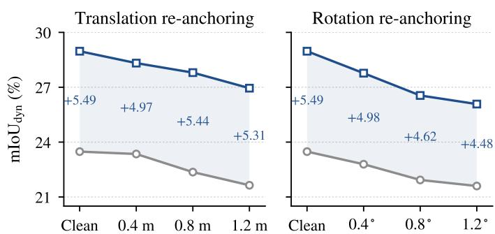  
Figure 12: Robustness comparison between ProSD-Occ (C) and Plain (C). The two panels report absolute dynamic mIoU under translation and rotation re-anchoring; the shaded band and the annotated values denote the margin of ProSD-Occ (C) over Plain (C) at each perturbation level.

coordinates. The clean column reproduces the unperturbed results (Tab. 2 for ProSD-Occ and Tab. 3 for Plain (C)). In the camera-only setting, ProSD-Occ (C) starts from a stronger clean dynamic score and keeps higher dynamic prediction than Plain (C) under all translation and rotation perturbations. The ProSD-Occ (L) and (C+L) variants start from stronger clean scores and remain ahead of the camera model in most re-anchored settings, but degrade faster at the largest shifts, indicating that explicit geometry strengthens dynamic evidence yet is more sensitive to coordinate-frame misalignment. Fig. 12 makes this trade-off explicit by plotting ProSD-Occ (C) and Plain (C) as paired absolute dynamicmIoU curves. Across all tested translation and rotation shifts, the dynamic gap remains positive, supporting the intended interpretation of ProSD reasoning: it improves residual dynamic recovery from sensor evidence under controlled coordinate re-anchoring.

## 6 Conclusion

This paper studies infrastructure-side semantic occupancy, where fixed roadside sensors repeatedly observe stable layouts while dynamic participants remain sparse, local, and transient. We introduce InfraOcc, a real-world benchmark with dense voxel annotations, unified camera-only, LiDARonly, and multi-modal protocols, and statistics that quantify the structural static-dynamic asymmetry of fixed-view scenes, and propose ProSD-Occ, a progressive static-to-dynamic framework that first models persistent layout and then exposes residual dynamic evidence under static-confidence guidance. Experiments on InfraOcc show consistent improvements in overall and dynamic occupancy across sensing regimes, and diagnostic analyses indicate that the gain comes from organizing fixed-view static-dynamic evidence rather than from sensor-specific feature construction alone. These results suggest that roadside occupancy should be evaluated and modeled around its fixed-view scene structure. Meanwhile, long-range dynamic occupancy remains bounded by the available geometric evidence, and our study is confined to keyframe-level prediction. Future work will extend InfraOcc toward occupancy flow and exploit the fixed viewpoint for temporal fusion, where the shared roadside coordinate system naturally supports long-term scene memory.

## Acknowledgments

This work was supported by the Zhejiang Leading Innovative and Entrepreneur Team Introduction Program (2024R01007), the National Natural Science Foundation of China (52502496, 62403389), the Beijing Natural Science Foundation (L2609087), the Natural Science Foundation of Zhejiang, China (QKWL25F0301), and the Natural Science Foundation of Chongqing, China (CSTB2025NSCQ-GPX0413).

## References

[1] X. Wang, Z. Zhu, W. Xu, Y. Zhang, Y. Wei, X. Chi, Y. Ye, D. Du, J. Lu, and X. Wang, “OpenOccupancy: A Large-Scale Benchmark for Surrounding Semantic Occupancy Perception,” in IEEE/CVF International Conference on Computer Vision (ICCV), 2023, pp. 17 850– 17 859. 1, 3, 4, 7, 8, 11, 14

[2] X. Tian, T. Jiang, L. Yun, Y. Mao, H. Yang, Y. Wang, Y. Wang, and H. Zhao, “Occ3D: A Large-Scale 3D Occupancy Prediction Benchmark for Autonomous Driving,” in Advances in Neural Information Processing Systems (NeurIPS), 2023. 1, 3, 4, 6, 7

[3] Y. Huang, W. Zheng, Y. Zhang, J. Zhou, and J. Lu, “Tri-Perspective View for Vision-Based 3D Semantic Occupancy Prediction,” in IEEE/CVF Conference on Computer Vision and Pattern Recognition (CVPR), 2023. 1, 3, 11, 12, 14

[4] Y. Wei, L. Zhao, W. Zheng, Z. Zhu, J. Zhou, and J. Lu, “SurroundOcc: Multi-Camera 3D Occupancy Prediction for Autonomous Driving,” in IEEE/CVF International Conference on Computer Vision (ICCV), 2023, pp. 21 729–21 740. 1, 3, 11, 14

[5] H. Caesar, V. Bankiti, A. H. Lang, S. Vora, V. E. Liong, Q. Xu, A. Krishnan, Y. Pan, G. Baldan, and O. Beijbom, “nuScenes: A Multimodal Dataset for Autonomous Driving,” in IEEE/CVF Conference on Computer Vision and Pattern Recognition (CVPR), 2020, pp. 11 621–11 631. 1

[6] X. Ye, M. Shu, H. Li, Y. Shi, Y. Li, G. Wang, X. Tan, and E. Ding, “Rope3D: The Roadside Perception Dataset for Autonomous Driving and Monocular 3D Object Detection Task,” in IEEE/CVF Conference on Computer Vision and Pattern Recognition (CVPR), 2022, pp. 21 341–21 350. 1, 3

[7] H. Yu, Y. Luo, M. Shu, Y. Huo, Z. Yang, Y. Shi, Z. Guo, H. Li, X. Hu, J. Yuan, and Z. Nie, “DAIR-V2X: A Large-Scale Dataset for Vehicle-Infrastructure Cooperative 3D Object Detection,” in IEEE/CVF Conference on Computer Vision and Pattern Recognition (CVPR), 2022, pp. 21 361–21 370. 1, 3

[8] H. Xiang, Z. Zheng, X. Xia, R. Xu, L. Gao, Z. Zhou, X. Han, X. Ji, M. Li, Z. Meng, J. Li, M. Lei, Z. Ma, Z. He, H. Ma, Y. Yuan, Y. Zhao, and J. Ma, “V2X-Real: A Large-Scale Dataset for Vehicleto-Everything Cooperative Perception,” in European Conference on Computer Vision (ECCV), 2024. 1, 3

[9] Z. Zhou, H. Xiang, Z. Zheng, S. Z. Zhao, M. Lei, Y. Zhang, T. Cai, X. Liu, J. Liu, M. Bajji, X. Xia, Z. Huang, B. Zhou, and J. Ma, “V2XPnP: Vehicle-to-Everything Spatio-Temporal Fusion for Multi-Agent Perception and Prediction,” in Proceedings of the IEEE/CVF International Conference on Computer Vision (ICCV), October 2025, pp. 25 399–25 409. 1, 3, 4, 5

[10] R. Hao, S. Fan, Y. Dai, Z. Zhang, C. Li, Y. Wang, H. Yu, W. Yang, J. Yuan, and Z. Nie, “RCooper: A Real-World Large-Scale Dataset for Roadside Cooperative Perception,” in IEEE/CVF Conference on Computer Vision and Pattern Recognition (CVPR), 2024, pp. 22 347– 22 357. 1, 3

[11] W. Zimmer, G. A. Wardana, S. Sritharan, X. Zhou, R. Song, and A. C. Knoll, “TUMTraf V2X Cooperative Perception Dataset,” in IEEE/CVF Conference on Computer Vision and Pattern Recognition (CVPR), 2024, pp. 22 668–22 677. 1, 3

[12] J. Huang, G. Huang, Z. Zhu, Y. Yun, and D. Du, “BEVDet: High-Performance Multi-Camera 3D Object Detection in Bird-Eye-View,” arXiv preprint arXiv:2112.11790, 2021. 1, 3, 8, 11, 14

[13] Y. Li, Z. Ge, G. Yu, J. Yang, Z. Wang, Y. Shi, J. Sun, and Z. Li, “BEVDepth: Acquisition of Reliable Depth for Multi-View 3D Object Detection,” in AAAI Conference on Artificial Intelligence (AAAI), 2023. 1, 3, 8, 11, 14

[14] Z. Li, W. Wang, H. Li, E. Xie, C. Sima, T. Lu, Y. Qiao, and J. Dai, “BEVFormer: Learning Bird’s-Eye-View Representation From LiDAR-Camera via Spatiotemporal Transformers,” IEEE Transactions on Pattern Analysis and Machine Intelligence (TPAMI), vol. 47, no. 3, pp. 2020–2036, 2025. 1, 3, 8, 11, 14

[15] Y. Li, Z. Yu, C. Choy, C. Xiao, J. M. Alvarez, S. Fidler, C. Feng, and A. Anandkumar, “VoxFormer: Sparse Voxel Transformer for Camera-Based 3D Semantic Scene Completion,” in IEEE/CVF Conference on Computer Vision and Pattern Recognition (CVPR), 2023, pp. 9087–9098. 1

[16] Y. Zhang, Z. Zhu, and D. Du, “OccFormer: Dual-Path Transformer for Vision-Based 3D Semantic Occupancy Prediction,” in IEEE/CVF International Conference on Computer Vision (ICCV), 2023, pp. 9399– 9409. 1, 3

[17] P. Tang, Z. Wang, G. Wang, J. Zheng, X. Ren, B. Feng, and C. Ma, “SparseOcc: Rethinking Sparse Latent Representation for Vision-Based Semantic Occupancy Prediction,” in IEEE/CVF Conference on Computer Vision and Pattern Recognition (CVPR), 2024, pp. 15 035– 15 044. 1, 3, 4, 11, 12, 14

[18] Y. Huang, W. Zheng, Y. Zhang, J. Zhou, and J. Lu, “GaussianFormer: Scene as Gaussians for Vision-Based 3D Semantic Occupancy Prediction,” in European Conference on Computer Vision (ECCV), 2024, pp. 376–393. 1, 3, 11, 14

[19] R. Xu, H. Xiang, X. Xia, X. Han, J. Li, and J. Ma, “OPV2V: An Open Benchmark Dataset and Fusion Pipeline for Perception with Vehicle-to-Vehicle Communication,” in IEEE International Conference on Robotics and Automation (ICRA), 2022, pp. 2583–2589. 1, 3

[20] L. Yang, X. Zhang, J. Li, C. Wang, J. Ma, Z. Song, T. Zhao, Z. Song, L. Wang, M. Zhou, Y. Shen, K. Wu, and C. Lv, “V2X-Radar: A Multi-Modal Dataset with 4D Radar for Cooperative Perception,” Advances in Neural Information Processing Systems (NeurIPS), 2025. 1, 3

[21] L. Yang, K. Yu, T. Tang, J. Li, K. Yuan, L. Wang, X. Zhang, and P. Chen, “BEVHeight: A Robust Framework for Vision-Based Roadside 3D Object Detection,” in IEEE/CVF Conference on Computer Vision and Pattern Recognition (CVPR), 2023, pp. 21 611–21 620. 2, 3

[22] L. Yang, T. Tang, J. Li, P. Chen, K. Yuan, L. Wang, Y. Huang, X. Zhang, and K. Yu, “BEVHeight++: Toward Robust Visual Centric 3D Object Detection,” IEEE Transactions on Pattern Analysis and Machine Intelligence (TPAMI), 2024. 2, 3

[23] L. Yang, X. Zhang, J. Yu, J. Li, T. Zhao, L. Wang, Y. Huang, C. Zhang, H. Wang, and Y. Li, “MonoGAE: Roadside Monocular 3D Object Detection With Ground-Aware Embeddings,” IEEE Transactions on Intelligent Transportation Systems (TITS), vol. 25, no. 11, pp. 17 587– 17 601, 2024. 2, 3

[24] L. Yang, X. Zhang, J. Li, L. Wang, C. Zhang, L. Ju, Z. Li, Y. Shen, C. Lv, and H. Wang, “SGV3D: Toward Scenario Generalization for Vision-Based Roadside 3D Object Detection,” IEEE Transactions on Intelligent Transportation Systems (TITS), vol. 26, no. 8, pp. 11 782– 11 793, 2025. 2, 3

[25] X. Bai, L. Zheng, S.-Y. Cao, X. Zhang, Z. Wu, B. Yu, F. Wang, J. Bai, and H.-L. Shen, “Boosting Instance Awareness via Cross-View Correlation with 4D Radar and Camera for 3D Object Detection,” IEEE Transactions on Multimedia (TMM), 2025. 2, 3

[26] R. Xu, H. Xiang, Z. Tu, X. Xia, M.-H. Yang, and J. Ma, “V2X-ViT: Vehicle-to-Everything Cooperative Perception with Vision Transformer,” in European Conference on Computer Vision (ECCV), 2022, pp. 107–124. 2, 3

[27] Y. Hu, S. Fang, Z. Lei, Y. Zhong, and S. Chen, “Where2comm: Communication-Efficient Collaborative Perception via Spatial Con fidence Maps,” in Advances in Neural Information Processing Systems (NeurIPS), vol. 35, 2022. 2, 3

[28] R. Song, C. Liang, H. Cao, Z. Yan, W. Zimmer, M. Gross, A. Festag, and A. Knoll, “Collaborative Semantic Occupancy Prediction with Hybrid Feature Fusion in Connected Automated Vehicles,” in IEEE/CVF Conference on Computer Vision and Pattern Recognition (CVPR), 2024, pp. 17 996–18 006. 2, 3, 4

[29] H. Wu, P. Lin, E. Javanmardi, N. Bao, B. Qian, H. Si, and M. Tsukada, “A Synthetic Benchmark for Collaborative 3D Semantic Occupancy Prediction in V2X Autonomous Driving,” arXiv preprint arXiv:2506.17004, 2025. 2, 3, 4

[30] T.-Y. Lin, P. Goyal, R. Girshick, K. He, and P. Dollar, “Focal Loss for´ Dense Object Detection,” IEEE Transactions on Pattern Analysis and Machine Intelligence (TPAMI), vol. 42, no. 2, pp. 318–327, 2020. 2, 4, 8

[31] Y. Cui, M. Jia, T.-Y. Lin, Y. Song, and S. Belongie, “Class-Balanced Loss Based on Effective Number of Samples,” in IEEE/CVF Confer

ence on Computer Vision and Pattern Recognition (CVPR), 2019, pp. 9268–9277. 2, 4, 8

[32] S. Song, F. Yu, A. Zeng, A. X. Chang, M. Savva, and T. Funkhouser, “Semantic Scene Completion from a Single Depth Image,” in IEEE/CVF Conference on Computer Vision and Pattern Recognition (CVPR), 2017, pp. 1746–1754. 3

[33] J. Behley, M. Garbade, A. Milioto, J. Quenzel, S. Behnke, C. Stachniss, and J. Gall, “SemanticKITTI: A Dataset for Semantic Scene Understanding of LiDAR Sequences,” in IEEE/CVF International Conference on Computer Vision (ICCV), 2019, pp. 9297–9307. 3

[34] Q. Ma, X. Tan, Y. Qu, L. Ma, Z. Zhang, and Y. Xie, “COTR: Compact Occupancy TRansformer for Vision-based 3D Occupancy Prediction,” in IEEE/CVF Conference on Computer Vision and Pattern Recognition (CVPR), 2024, pp. 19 936–19 945. 3, 4

[35] B. Li, X. Jin, J. Deng, Y. Sun, X. Wang, and W. Zeng, “Hierarchical Context Alignment With Disentangled Geometric and Temporal Modeling for Semantic Occupancy Prediction,” IEEE Transactions on Pattern Analysis and Machine Intelligence (TPAMI), vol. 48, no. 5, pp. 5388–5404, 2026. 3

[36] Y. Zhou and O. Tuzel, “VoxelNet: End-to-End Learning for Point Cloud Based 3D Object Detection,” in IEEE/CVF Conference on Computer Vision and Pattern Recognition (CVPR), 2018. 3, 8, 11, 14

[37] A. H. Lang, S. Vora, H. Caesar, L. Zhou, J. Yang, and O. Beijbom, “PointPillars: Fast Encoders for Object Detection from Point Clouds,” in IEEE/CVF Conference on Computer Vision and Pattern Recognition (CVPR), 2019. 3, 8, 11, 14

[38] Z. Liu, H. Tang, A. Amini, X. Yang, H. Mao, D. Rus, and S. Han, “BEVFusion: Multi-Task Multi-Sensor Fusion with Unified Bird’s-Eye View Representation,” in IEEE International Conference on Robotics and Automation (ICRA), 2023. 3, 8, 11, 14

[39] Z. Zhuang, Z. Wang, S. Chen, L. Liu, H. Luo, and M. Tan, “Robust 3D Semantic Occupancy Prediction With Calibration-Free Spatial Transformation,” IEEE Transactions on Pattern Analysis and Machine Intelligence (TPAMI), pp. 1–16, 2026. 3

[40] W. Zheng, W. Chen, Y. Huang, B. Zhang, Y. Duan, and J. Lu, “Occ-World: Learning a 3D Occupancy World Model for Autonomous Driving,” in European Conference on Computer Vision (ECCV), 2024, pp. 55–72. 3, 4

[41] Y. Wang, X. Huang, X. Sun, M. Yan, S. Xing, Z. Tu, and J. Li, “UniOcc: A Unified Benchmark for Occupancy Forecasting and Prediction in Autonomous Driving,” in IEEE/CVF International Conference on Computer Vision (ICCV), 2025, pp. 25 560–25 570. 3, 4

[42] Z. Liao, P. Wei, S. Chen, H. Wang, and Z. Ren, “STCOcc: Sparse Spatial-Temporal Cascade Renovation for 3D Occupancy and Scene Flow Prediction,” in IEEE/CVF Conference on Computer Vision and Pattern Recognition (CVPR), 2025. 3, 11, 12

[43] G. Liu, Y. Hu, C. Xu, W. Mao, J. Ge, Z. Huang, Y. Lu, Y. Xu, J. Xia, Y. Wang, and S. Chen, “Toward Collaborative Autonomous Driving: Simulation Platform and End-to-End System,” IEEE Transactions on Pattern Analysis and Machine Intelligence (TPAMI), vol. 47, no. 8, pp. 6566–6584, 2025. 3

[44] J. Ma, X. Chen, J. Huang, J. Xu, Z. Luo, J. Xu, W. Gu, R. Ai, and H. Wang, “Cam4DOcc: Benchmark for Camera-Only 4D Occupancy Forecasting in Autonomous Driving Applications,” in IEEE/CVF Conference on Computer Vision and Pattern Recognition (CVPR), 2024, pp. 21 486–21 495. 4

[45] Y. Liu, L. Mou, X. Yu, C. Han, S. Mao, R. Xiong, and Y. Wang, “Let Occ Flow: Self-Supervised 3D Occupancy Flow Prediction,” in Conference on Robot Learning (CoRL), 2025, pp. 2895–2912. 4

[46] A. Hu, Z. Murez, N. Mohan, S. Dudas, J. Hawke, V. Badrinarayanan, R. Cipolla, and A. Kendall, “FIERY: Future Instance Prediction in Bird’s-Eye View from Surround Monocular Cameras,” in IEEE/CVF International Conference on Computer Vision (ICCV), 2021, pp. 15 273– 15 282. 4

[47] P. J. Besl and N. D. McKay, “A Method for Registration of 3- D Shapes,” IEEE Transactions on Pattern Analysis and Machine Intelligence (TPAMI), vol. 14, no. 2, pp. 239–256, 1992. 5

[48] A.-Q. Cao and R. de Charette, “MonoScene: Monocular 3D Semantic Scene Completion,” in IEEE/CVF Conference on Computer Vision and Pattern Recognition (CVPR), 2022, pp. 3991–4001. 10

[49] M. Berman, A. R. Triki, and M. B. Blaschko, “The Lovasz-Softmax´ Loss: A Tractable Surrogate for the Optimization of the Intersectionover-Union Measure in Neural Networks,” in IEEE/CVF Conference on Computer Vision and Pattern Recognition (CVPR), 2018, pp. 4413– 4421. 10

[50] I. Loshchilov and F. Hutter, “Decoupled Weight Decay Regulariza-

tion,” in International Conference on Learning Representations (ICLR), 2019. 10