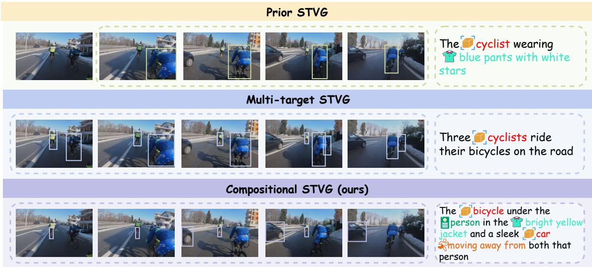
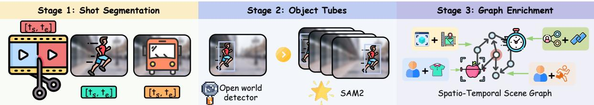
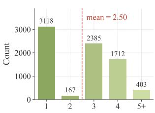

# Learning Compositional Spatio-Temporal Video Grounding with Synthetic Curriculum

Xingjian Wang1, 3∗, Shijian Wang1,2,∗,†, Yibo Wang1,2, Zihao Yu3 Runhao Fu1, Xuelian Cheng1,‡, Zongyuan Ge1

1Monash University; 2Southeast University; 3Shanghai University of Electric Power ∗Equal contribution; †Project Leader; ‡Corresponding authors

Despite the impressive progress of recent MLLMs on spatio-temporal video grounding (STVG), existing evaluations and training data focus primarily on simple queries. They largely overlook the compositional queries prevalent in real-world scenarios, where a target must be disambiguated by jointly reasoning about its atributes and relations to other entities. To bridge this gap, we propose Compositional Spatio-Temporal Video Grounding (CompSTVG), a task that requires models to process complex textual queries where every intertwined atribute and relational cue is essential for disambiguation. To facilitate this task at scale, we build a synthetic data engine that leverages a spatio-temporal scene graph as a dificulty measure and casts dificulty-controlled query synthesis as a constraint programming problem, producing dificulty-graded data for both evaluation and training. Built on this engine, we introduce STVG-CompBench, a benchmark stratified by explicit dificulty levels that jointly capture temporal complexity and spatial interference. Evaluating 11 representative STVG models on STVG-CompBench reveals that current models perform poorly on compositional queries, exhibiting a sharp performance drop that is typically obscured by overall dataset-level averages. We further construct synthetic training data and propose CuRRSTVG, a curriculum reinforcement learning framework that delivers consistent gains, with the largest improvements observed on the most challenging compositional queries.

Contact: themaoqiu@gmail.com

## 1 Introduction

Spatio-temporal video grounding (STVG) requires models to jointly localize a target entity in both space and time within an untrimmed video given a natural language query (Zhang et al., 2020). This capability underpins a wide range of downstream applications, including video retrieval (Bain et al., 2021; Luo et al., 2021), video editing (Geyer et al., 2024), complex video reasoning (Fei et al., 2024), and embodied perception (Wang, 2025). Despite the impressive progress of recent MLLMs on STVG (Li et al., 2025a,b; Zhang et al., 2026; Ahmad et al., 2025), prevailing STVG training corpora and benchmarks (Tang et al., 2021; Zhang et al., 2020; Yao et al., 2025) are overwhelmingly populated by simplistic queries that can be resolved using superficial or singular cues. In contrast, real-world user queries frequently demand compositional disambiguation, where the target can only be singled out by jointly reasoning about its atributes and relations to other entities. For instance, locating “The bicycle under the person in the bright yellow jacket and a sleek car moving away from both that person” in a scene with multiple cyclist, multiple bicycles, and several riding events requires intricate multi-step reasoning (Figure 1). Consequently, the ability of current models to perform such compositional reasoning remains a critical vulnerability, largely obscured by existing training and evaluation paradigms.

Although the broader concept of compositionality has been explored in related video tasks, including AGQA (Grunde-McLaughlin et al., 2021), previous research on compositional grounding has primarily evolved along two adjacent axes, though neither directly transfers to our problem context. Compositional Temporal Grounding (Li et al., 2022) focuses on novel lexical compositions within the linguistic modality, while Compositional Spatio-Temporal Action Localization (Materzynska et al., 2020; Ji et al., 2020; Rai et al., 2021) focuses on novel action-object combinations within human-object trajectories. Both lines of research fail to account for the rich, multi-faceted nature of visual targets, whereas an STVG query naturally intertwines appearance, action, temporal order, spatial relations, and interobject interactions within a single sentence. Therefore, a comprehensive task formulation, dataset, and evaluation protocol that explicitly target compositional STVG are still absent from the literature.

  
Figure 1 Existing STVG vs. Compositional STVG. Existing STVG tasks typically pair each tube with a simplistic human-annotated sentence. A real user query intricately composes atribute and relational cues to disambiguate the target against same-category distractors and look-alike time intervals.

To address this gap, we propose Compositional Spatio-Temporal Video Grounding, a novel task challenging models to process complex queries where every cue, drawn from appearance, action, temporal, spatial, and relational atributes, is strictly essential for disambiguation. To facilitate this task at scale, we build a synthetic data engine leveraging a spatio-temporal scene graph (STSG) extracted from each video. We define query dificulty based on the ambiguity introduced by temporal and spatial distractors enumerated on this graph, and select the minimal atribute subset required to disambiguate the target by solving a binary integer programming problem. This engine yields strictly dificulty-graded compositional STVG data suitable for both evaluation and training.

Building upon this engine, we introduce STVG-CompBench, a benchmark stratified across explicit dificulty tiers. Extensive evaluation of eleven representative grounders reveals a severe and consistent performance degradation as query complexity increases. This limitation persists across both transformerbased and MLLM-based paradigms, confirming that the botleneck stems from a fundamental lack of compositional reasoning capabilities rather than architectural artifacts. Finally, we propose CuRRSTVG, a curriculum reinforcement learning framework that feeds these dificulty labels back into the training loop via GRPO. Guided by formating, temporal, and spatial rewards, our framework schedules training samples from easy to hard, ensuring that the same complexity metric used for benchmarking actively drives model optimization. CuRRSTVG delivers consistent performance gains, yielding the most significant improvements on the most challenging, highly intertwined compositional queries.

In summary, our main contributions are three-fold: (i) CompSTVG, a new task and a scalable STSGbased synthetic data engine for compositional STVG; (ii) STVG-CompBench, a dificulty-stratified benchmark exposing an architecture-agnostic compositional botleneck across 11 representative grounders; and (iii) CuRRSTVG, a curriculum RL framework that converts the same dificulty axis into the largest gains on the hardest compositional queries.

## 2 Related Work

Spatio-Temporal Video Grounding. Early two-stage methods such as STGRN (Zhang et al., 2020) and STGVT (Tang et al., 2021) run a pretrained detector to obtain region proposals and learn a matching network to pick the one referred to by the query. Transformer-based one-stage grounders such as TubeDETR (Yang et al., 2022), CG-STVG (Gu et al., 2024) and TA-STVG (Gu et al., 2025) regress the spatio-temporal tube end-to-end but remain bound to a fixed text encoder and degrade on long, multiclause queries. Recent work turns to MLLMs, where LLaVA-ST (Li et al., 2025a) and SpaceVLLM (Wang et al., 2026) inject learnable spatio-temporal tokens, VideoChat-R1 (Li et al., 2025b) fine-tunes with multi-task GRPO under an IoU reward, and STVG-R1 (Zhang et al., 2026) and VideoMolmo (Ahmad et al., 2025) couple a VLM with SAM2 (Ravi et al., 2024). Existing benchmarks (Zhang et al., 2020; Tang et al., 2021; Gao et al., 2025; Yao et al., 2025) pool queries from one obvious cue with queries demanding multi-atribute composition, hiding the regime our benchmark probes. CuRRSTVG departs from these methods on the data axis, extracting a dificulty signal from the data itself to drive curriculum RL without architectural change.

Compositional video grounding. Programmatic compositional benchmarks such as CLEVR (Johnson et al., 2017) and GQA (Hudson and Manning, 2019) generate structured reasoning questions from scene representations, while AGQA (Grunde-McLaughlin et al., 2021) is the closest spatio-temporal precedent, generating balanced, dificulty-stratified reasoning questions over Action Genome scene graphs. Two adjacent compositional setings have been explored. Compositional Temporal Grounding (Li et al., 2022) partitions queries by lexical constituents so that unseen verb-noun-atribute combinations probe language-side generalization on single-clip video. Compositional Spatio-Temporal Action Localization, exemplified by Something-Else (Materzynska et al., 2020), recognizes actions under disjoint train/test verb-noun pairs, while Action Genome (Ji et al., 2020) and Home Action Genome (Rai et al., 2021) provide spatio-temporal scene-graph annotations supporting few-shot action recognition. Their target is an action label, not a tube grounded by an arbitrary natural-language description, and neither seting controls multi-dimensional atribute composition against same-category distractors and look-alike time intervals.

## 3 Task Formulation

We formulate Compositional Spatio-Temporal Video Grounding (CompSTVG) as a generalization of standard STVG in which the query is constrained to compose atributes of the target and its relations to other entities without redundancy, so that disambiguation can no longer rely on any single dominant cue.

Definition 1 (Compositional STVG). Given an untrimmed video V and a natural-language query $\mathcal { Q } _ { i }$ a model predicts a spatio-temporal tube

$$
\mathcal { T } = \{ \mathcal { T } _ { k } \} _ { k = 1 } ^ { m } , \qquad \mathcal { T } _ { k } = \big \{ ( t , b _ { t } ^ { ( k ) } ) \big \} _ { t \in [ t _ { s } ^ { ( k ) } , t _ { e } ^ { ( k ) } ] } ,
$$

that uniquely localizes the m $\geq 1$ target entities referred to by $\mathcal { Q } ,$ where each $b _ { t } ^ { ( k ) }$ is the bounding box of target k at frame t and $[ t _ { s } ^ { ( k ) } , t _ { e } ^ { ( k ) } ]$ is its temporal extent. The query is constrained to be a non-redundant composition

$$
\mathcal { Q } = \big ( c _ { 1 } , c _ { 2 } , \ldots , c _ { n } \big ) , \qquad c _ { j } \in \mathcal { A } \cup \mathcal { R } ,
$$

of atribute cues $A \ ( e . g \ /$ ., category, appearance, action, temporal patern) and relation cues $\mathcal { R } \ ( e . g . , \ s p a \cdot$ tial layout and interaction with other entities), such that no proper subset of $\{ c _ { 1 } , \ldots , c _ { n } \}$ still uniquely identifies $\tau$ on $\nu .$

  
Figure 2 The data synthesis pipeline of STVG-CompBench

In this paper, each Q is further associated with a dificulty label $d ( \mathcal { Q } ) \in \{ 1 , 2 , 3 \}$ that grades disambiguation against the temporal and spatial competitors of $\tau$ on V. The non-redundancy constraint guarantees that every cue in $\mathcal { Q }$ is one the model must read to disambiguate, while $d ( \mathcal { Q } )$ exposes a controllable axis along which performance can be reported instead of a single dataset-level mean. How $d ( \mathcal { Q } )$ is computed and how queries satisfying both conditions are produced at scale are deferred to Sec. 4, on top of which we build the benchmark STVG-CompBench (Sec. 5) and the trained model CuRRSTVG (Sec. 6).

## 4 Synthesizing Difficulty-Controlled Compositional STVG Data

Realizing Compositional STVG at scale requires data whose queries are simultaneously compositional, minimal, and dificulty-graded. Free-form sentences hand-writen by annotators meet none of these constraints in a controllable way, since minimality cannot be enforced post hoc and there is no machinery to grade a query against the competitors next to its target. We therefore build a synthetic data engine on a structured surface, the spatio-temporal scene graph (STSG) of every video. We first define what makes a query hard on the STSG (Sec. 4.1), and then describe how the graph is annotated and how queries of a prescribed dificulty are sampled from it (Sec. 4.2).

## 4.1 Spatio-Temporal Scene Graph as Difficulty Measurer

We adopt a Spatio-Temporal Scene Graph (STSG) as the structured surface on which dificulty is computed:

$$
\mathcal { G } = ( V _ { t } , V _ { o } , V _ { a } , E ) ,\tag{1}
$$

where $V _ { t }$ are temporal nodes (intervals $[ t _ { s } ( v ) , t _ { e } ( v ) ] ) , V _ { o }$ are object tubes carrying a category $c ( o )$ a tube $T _ { o } ,$ , an appearance set $a ( o )$ , and environment phrases $h ( o ) , V _ { a }$ are action nodes atached to objects with a label $\ell ( u )$ , target arguments $\mathop { \mathrm { t a r } } ( u ) \subseteq V _ { o } ,$ , and duration $\tau ( u )$ , and $E$ are relation edges $( o _ { i } , o _ { j } , r _ { i j } , \mathrm { t y p e } ( e ) , \tau ( e ) )$ whose type is either spatial or non-spatial. Here, T denotes the complete set of target tubes, and $T _ { o }$ denotes the frame-indexed tube of object $o .$

Random atribute combinations yield mostly redundant queries, while pure graph-structural complexity does not reflect what a grounder must disambiguate. The quantity to measure is the compositional confusion of a query against the competitors next to its target on the graph, namely other intervals of the same object (temporal competitors) and other objects of the same arity (spatial competitors), as defined below.

Definition 2 (Query Difficulty). A valid query must uniquely point to its target object(s) within the target time interval. For a candidate query $Q = \left( \mathbf { o } ^ { * } , I ^ { * } \right)$ on scene graph G with target tuple $\bullet ^ { * }$ and target interval $I ^ { * }$ , let $\mathcal { R } _ { t } ( Q )$ denote the set of temporal competitors (other intervals $o f { \mathbf { o } } ^ { * } )$ and $\mathcal { R } _ { s } ( Q )$ the set of spatial competitors (other candidates with the same arity but diferent object identities). The query dificulty is defined as

$$
D ( Q ) = D _ { t } ( Q ) + D _ { s } ( Q ) ,\tag{2}
$$

with

$$
D _ { t } ( Q ) \ = \ 1 - \operatorname* { m a x } _ { j \in \mathcal { I } _ { t } ( Q ) } \ \frac { 1 } { | \mathcal { R } _ { t } ( Q ) | } \sum _ { r \in \mathcal { R } _ { t } ( Q ) } E _ { r j } ^ { t } ,\tag{3}
$$

$$
D _ { s } ( Q ) = \frac { X ( Q ) } { 1 + X ( Q ) } , X ( Q ) = \sum _ { r \in { \mathcal R } _ { s } ( Q ) } s ( Q , r ) ^ { \beta } .\tag{4}
$$

$D _ { t } ( Q )$ is the complement of the best per-atribute exclusion rate against $\mathcal { R } _ { t } ( Q )$ : the binary indicator $E _ { r j } ^ { t } \in \{ 0 , 1 \}$ marks whether the temporal atribute $a _ { j }$ rules out competitor $r ,$ so a higher exclusion rate yields a smaller $D _ { t } . D _ { s } ( Q )$ measures the analogous confusion against same-arity rivals, where $s ( Q , r )$ is a Jaccard–tIoU similarity that grows when $r$ shares more static atributes with $Q$ and overlaps it in time; the exponent $\beta \geq 1$ amplifies a few highly confusable rivals, and the soft-count form keeps $D _ { s } \in [ 0 , 1 ]$ so it is directly comparable with $D _ { t }$ . We bin $D ( Q )$ into three levels and use the bin index as the dificulty label downstream.

## 4.2 From Raw Video to Difficulty-Graded Queries

With dificulty grounded on the STSG, the data engine factors into two operational stages: annotating G from a raw video, and sampling, for each prescribed dificulty level, the minimal atribute composition that disambiguates a target.

## 4.2.1 STSG Generation

We orchestrate a set of of-the-shelf specialists in three stages, each of which writes into a distinct slot of ${ \mathcal { G } } .$

Stage 1: Shot segmentation. We cut every video with PySceneDetect (Castellano, 2024) and instantiate each shot as a temporal node in $V _ { t }$ with its start and end frame indices.

Stage 2: Object tubes. Following GroundedSAM2 (Ren et al., 2024), we couple an open-world detector with SAM2. For each $v _ { t } \in V _ { t }$ , the detector runs on the starting frame and feeds boxes to SAM2 for forward propagation across the shot. To capture late-appearing instances, the detector is rerun on clustered keyframes, and every new mask is admited as a new tube only when its IoU with all existing tracks is low and it does not lie inside any larger mask.

Stage 3: Graph enrichment. The bare tubes are enriched with the atributes downstream queries compose over. For appearance, masks are fed to DAM-3B-Video (Lian et al., 2025) for fine-grained captions, which Gemini-3-Flash (Google DeepMind, 2026) parses into the category $c ( o )$ , an appearance atribute set $a ( o )$ , and an environment phrase $h ( o )$ . For actions, MMAction2 (Contributors, 2020) tags human tubes with temporal action labels, and Gemini-3-Flash supplements these and tags non-human subjects directly. For relations, following Number It (Wu et al., 2025) and STVG-R1 (Zhang et al., 2026), every co-visible pair is overlaid with numeric markers on rendered frames and an MLLM emits a spatial relation and a contact relation. The same visual prompt is reused for cross-shot identity matching to unify tracks into a single $o \in V _ { o }$

## 4.2.2 Difficulty-Controlled Query Sampling

Since the ability of each atribute and relation cue to rule out a competitor is encoded as a binary indicator $E _ { r j } \in \{ 0 , 1 \}$ , cue selection is naturally $\mathbf { a \ 0 - 1 }$ integer program. For a candidate $Q$ and a query template $f ,$ , we seek the smallest cue subset $x \in \{ 0 , 1 \} ^ { n }$ that excludes every competitor while staying within $f ^ { \prime } s$ stylistic budget.

The objective minimizes the number of selected cues, so every accepted cue is one the model needs to read:

$$
\operatorname* { m i n } _ { x \in \{ 0 , 1 \} ^ { n } } \sum _ { j = 1 } ^ { n } x _ { j } .\tag{5}
$$

Each spatial competitor must be ruled out by at least one selected cue, and each temporal competitor by at least $\tau _ { f }$ , where $\tau _ { f }$ rises with template dificulty so a single time cue cannot win on its own:

$$
\begin{array} { r l } & { \displaystyle \sum _ { j } E _ { r j } ^ { s } x _ { j } \geq 1 , \quad \forall r \in \mathcal { R } _ { s } ( Q ) , } \\ & { \displaystyle \sum _ { j } E _ { r j } ^ { t } x _ { j } \geq \tau _ { f } , \quad \forall r \in \mathcal { R } _ { t } ( Q ) . } \end{array}\tag{6}
$$

Every target-tuple member must be touched by at least one cue, with a non-category cue further $\mathbf { r e - }$ quired per member when m $\geq 2$ so multi-target queries cannot collapse into a shared class noun:

$$
\sum _ { j : k \in M _ { j } , c _ { j } \neq c _ { \mathrm { c l s } } } x _ { j } \geq 1 ,\tag{7}
$$

Range constraints bound the number of cues of each atribute type c and the overall query length, keeping the template within a recognizable surface form:

$$
\begin{array} { l } { { \displaystyle { \cal L } _ { f , c } \leq \sum _ { j : c _ { j } = c } x _ { j } \leq U _ { f , c } , \quad \forall c \in { \cal C } , } } \\ { { \displaystyle { \cal K } _ { f } ^ { \mathrm { m i n } } \leq \sum _ { j } x _ { j } \leq { \cal K } _ { f } ^ { \mathrm { m a x } } . } } \end{array}\tag{8}
$$

Two scalar constraints push hard templates toward deeper reasoning: $\Gamma _ { f }$ enforces a minimum temporalchain complexity, and $\rho _ { f }$ requires at least $\rho _ { f }$ cues from a sequentially-qualified subset $\boldsymbol { \mathcal { S } } _ { f } \colon$

$$
\sum _ { j } \ell _ { j } x _ { j } \geq \Gamma _ { f } , \qquad \sum _ { j \in \mathcal { S } _ { f } } x _ { j } \geq \rho _ { f } .\tag{9}
$$

We collect Eqs. (5)–(9) as the query sampling program of $( Q , f )$

We solve this program with CompSolveR, a CP-SAT-based constraint solver (Perron and Didier, 2024) tailored to the logical structure of the exclusion constraints, which returns a globally optimal cue subset whenever the $( Q , f )$ pair is feasible. Infeasible pairs are skipped without heuristic fallback. The selected cues are verbalized by an LLM into a single natural-language query, yielding the final $Q .$ . We predefine 14 query templates spanning single- and multi-target arities. Algorithm 1 summarizes the full sampling loop.

Each accepted run of Algorithm 1 yields one Compositional STVG sample $( \mathcal { V } , \mathcal { Q } , \mathcal { T } , d ^ { \star } )$ , where $\nu$ is the source video, $\mathcal { Q }$ is the verbalized query, the spatio-temporal tube $\tau$ is read directly of the target tuple $\mathbf { o } ^ { \star }$ and interval $I ^ { \star }$ on the STSG, and $d ^ { \star }$ is the dificulty bin atached to $\mathcal { Q } .$ Iterating the engine over all videos and dificulty bins produces a dificulty-graded corpus that matches the prediction interface of Definition 1, and we partition it by video into a held-out evaluation split that becomes STVG-CompBench (Sec. 5) and a training split that drives CuRRSTVG (Sec. 6).

Algorithm 1 Dificulty-Controlled Query Sampling   
Require: Scene graph ${ \mathcal { G } } ,$ , template pool $\mathcal { F } = \{ f _ { 1 } , \ldots , f _ { 1 4 } \}$ , target dificulty bin $d ^ { \star } \in \{ 1 , \ldots , 3 \}$   
Ensure: Verbalized natural-language query $\mathcal { Q }$ with target tuple $\mathbf { o } ^ { \star }$ and interval $I ^ { \star }$   
1: Sample candidate $( \mathbf { o } ^ { \star } , I ^ { \star } )$ from $\mathcal { G }$ and a compatible template $f \in { \mathcal { F } }$   
2: Enumerate temporal competitors $\mathcal { R } _ { t } ( Q )$ and spatial competitors $\mathcal { R } _ { s } ( Q )$ on $\mathcal { G }$   
3: Build the cue pool $\{ a _ { j } \} _ { j = 1 } ^ { n }$ and exclusion indicators $E _ { r j } ^ { t } , E _ { r j } ^ { s } \in \{ 0 , 1 \}$   
4: Solve the 0–1 ILP in Eqs. (5)–(9) with CompSolveR under the budgets of f   
5: if infeasible then   
6: return None ▷ skip; no heuristic fallback   
7: end if   
8: Read of the selected cues $x ^ { \star } \in \{ 0 , 1 \} ^ { n }$   
9: Compute $D ( Q ) = D _ { t } ( Q ) + D _ { s } ( Q )$ via Eqs. (3)–(4)   
10: if bin $( D ( Q ) ) \neq d ^ { \star }$ then   
11: return None ▷ dificulty mismatch   
12: end if   
13: Q ← LLM-VeRbalize $( \{ a _ { j } : x _ { j } ^ { \star } = 1 \} , f )$   
14: return $( \mathcal { Q } , \mathbf { o } ^ { \star } , I ^ { \star } , d ^ { \star } )$   
mean = 16.6 frames mean = 2.50   
4644 2142 3118   
positioned 4000 2000 1983 1633 3000 2385   
awaperson Coun 1999 oun 1000 1118 880 2000oun 1712   
1142 1000   
ron 403   
wearing 16 13 167   
0   
holdind Easy Medium Hard 1-8 9-16 17-24 25-32 33-48 49-64 65+ 3 5+   
(a) Query word cloud (b) Dificulty Query (c) Grounding Track Length (d) Atribute Combination   
Distribution Distribution (frames) Count

  
Figure 3 Statistics of the whole dataset. (a) Word cloud of query terms. (b) Distribution of queries across the three dificulty buckets of Definition 2. (c) Distribution of target temporal extent. (d) Distribution of the number of selected cues per query.

## 5 STVG-CompBench: Diagnosing the Compositional Gap

We organize the empirical study around two questions: (i) does STVG-CompBench expose a compositional gap that the dataset-level average obscures, does grounding accuracy degrade monotonically as the query dificulty d(Q) increases, and (ii) is this degradation consistent across transformer-based and MLLM-based grounder paradigms.

## 5.1 Experiment Setup

Benchmark and Metrics. STVG-CompBench consists of 2,000 high-quality samples drawn from the synthetic corpus, balanced jointly across the three dificulty bins of Definition 2 and across atribute–relation cue combinations, and grouped into three reporting buckets. The full dataset is built on 2,000 long, multi-shot source videos sampled from two publicly available corpora, with 1,000 videos from MOSE (?) and 1,000 from the Perception Test (?). Across these source videos, the engine synthesizes 7,785 queries in total: 2,000 are selected for STVG-CompBench and the remaining 5,785 form the training pool for CuRRSTVG. Following standard STVG practice (Zhang et al., 2020; Tang et al., 2021), we report m\_tIoU, m\_vIoU, vIoU@0.3 and vIoU@0.5 broken down per bucket.

Evaluation Protocol. All models are run with their oficially released checkpoints under a unified 1 FPS frame-sampling protocol; per-frame predictions at any other rate are linearly interpolated to 1 FPS before scoring.

Table 1 Performance of representative grounders on STVG-CompBench, broken down by three dificulty buckets of Definition 2 (Easy, Medium, Hard). We report m\_tIoU, m\_vIoU, vIoU@0.3, and vIoU@0.5 (%). Best results are highlighted in bold.
<table><tr><td rowspan="2">Models</td><td colspan="4">Easy</td><td colspan="4">Medium</td><td colspan="4">Hard</td></tr><tr><td>m_tIoU</td><td>m_vIoU</td><td>vIoU@0.3</td><td>vIoU@0.5</td><td>m_tIoU</td><td>m_vIoU</td><td>vIoU@0.3</td><td>vIoU@0.5</td><td>m_tIoU</td><td>m vIoU</td><td>vIoU@0.3</td><td>vIoU@0.5</td></tr><tr><td colspan="10">Open-source Vanilla MLLMs</td></tr><tr><td>Qwen2.5-VL-7B (Bai et al., 2025b)</td><td>6.44</td><td>0.58</td><td>0.00</td><td>0.00</td><td>3.82</td><td>0.42</td><td>0.00</td><td>0.00</td><td>3.65</td><td>0.41</td><td>0.00</td><td>0.00</td></tr><tr><td>Qwen3-VL-8B (Bai et al., 2025a)</td><td>58.69</td><td>12.13</td><td>14.50</td><td>3.83</td><td>33.82</td><td>6.96</td><td>3.63</td><td>0.58</td><td>28.70</td><td>6.23</td><td>2.76</td><td>0.00</td></tr><tr><td>Qwen3.5-9B (Qwen Team, 2026)</td><td>63.14</td><td>17.32</td><td>21.89</td><td>9.30</td><td>39.43</td><td>11.04</td><td>9.14</td><td>1.16</td><td>30.76</td><td>8.16</td><td>5.00</td><td>0.17</td></tr><tr><td>InternVL3-8B (Zhu et al., 2025)</td><td>61.98</td><td>8.83</td><td>7.11</td><td>1.09</td><td>45.67</td><td>6.07</td><td>1.45</td><td>0.00</td><td>37.88</td><td>5.34</td><td>0.86</td><td>0.00</td></tr><tr><td>InternVL3.5-8B (Wang et al., 2025)</td><td>52.27</td><td>9.13</td><td>10.40</td><td>2.19</td><td>32.63</td><td>5.27</td><td>1.60</td><td>0.15</td><td>26.77</td><td>5.13</td><td>2.24</td><td>0.17</td></tr><tr><td>LLaVA-OneVision-1.5 (An et al., 2025)</td><td>10.49</td><td>1.05</td><td>0.00</td><td>0.00</td><td>9.21</td><td>0.99</td><td>0.00</td><td>0.00</td><td>11.78</td><td>1.34</td><td>0.00</td><td>0.00</td></tr><tr><td colspan="10">Open-source STVG Models</td><td colspan="3"></td></tr><tr><td>TubeDETR (Yang et al., 2022)</td><td>47.82</td><td>18.01</td><td>22.57</td><td>9.71</td><td>25.41</td><td>9.04</td><td>6.24</td><td>1.31</td><td>21.31</td><td>7.00</td><td>3.79</td><td>0.00</td></tr><tr><td>CG-STVG (Gu et al., 2024)</td><td>54.37</td><td>9.16</td><td>7.66</td><td>2.74</td><td>29.51</td><td>7.05</td><td>3.19</td><td>0.87</td><td>24.17</td><td>4.73</td><td>2.41</td><td>0.00</td></tr><tr><td>TA-STVG (Gu et al., 2025)</td><td>53.81</td><td>22.91</td><td>28.32</td><td>16.01</td><td>28.06</td><td>11.80</td><td>10.45</td><td>1.31</td><td>22.27</td><td>8.68</td><td>6.03</td><td>0.00</td></tr><tr><td>LLaVA-ST (Li et al., 2025a)</td><td>69.16</td><td>19.45</td><td>24.21</td><td>11.90</td><td>34.23</td><td>10.14</td><td>8.13</td><td>1.31</td><td>27.08</td><td>7.90</td><td>5.69</td><td>0.00</td></tr><tr><td>VideoChat-R1 (Li et al., 2025b)</td><td>12.86</td><td>1.87</td><td>0.82</td><td>0.27</td><td>8.67</td><td>1.52</td><td>1.02</td><td>0.15</td><td>7.97</td><td>1.49</td><td>0.86</td><td>0.00</td></tr><tr><td>CurrSTVG (Ours)</td><td>82.48</td><td>20.48</td><td>29.69</td><td>11.90</td><td>62.20</td><td>14.85</td><td>16.26</td><td>4.06</td><td>55.31</td><td>13.16</td><td>14.14</td><td>2.07</td></tr></table>

Evaluated Models. We benchmark eleven representative grounders covering the two paradigms of Sec. 2 and our approach CuRRSTVG. The vanilla MLLMs are Qwen2.5-VL-7B (Bai et al., 2025b), Qwen3- VL-8B (Bai et al., 2025a), Qwen3.5-9B (Qwen Team, 2026), InternVL3-8B (Zhu et al., 2025), InternVL3.5- 8B (Wang et al., 2025) and LLaVA-OneVision-1.5 (An et al., 2025), all general-purpose without STVGspecific post-training. The STVG models are the transformer-based grounders TubeDETR (Yang et al., 2022), CG-STVG (Gu et al., 2024) and TA-STVG (Gu et al., 2025), and the MLLM-based grounders LLaVA-ST (Li et al., 2025a) and VideoChat-R1 (Li et al., 2025b).

## 5.2 Main Results

STVG-CompBench exposes a clear performance clif that the dataset-level average hides (Table 1). Most grounders degrade sharply as dificulty grows: TA-STVG loses 14.2 m\_vIoU from Easy to Hard, TubeDETR drops from 18.01 to 7.00, and several MLLM-based grounders show the same trend, with LLaVA-ST falling from 19.45 to 7.90 and Qwen3.5-9B from 17.32 to 8.16. The high-IoU regime collapses even faster, with vIoU@0.5 dropping from 10–16 on Easy to essentially zero on Hard, so residual m\_vIoU on Hard reflects loose predictions rather than correct tubes. The overall clif persists across both transformer-based and MLLM-based paradigms, although individual models can deviate from the monotonic trend.

CuRRSTVG closes a substantial portion of this gap with the largest absolute gains on the hardest queries. Compared with the strongest baseline LLaVA-ST, CuRRSTVG lifts m\_tIoU by 13.3, 28.0 and 28.2 points on Easy, Medium and Hard respectively. The gain grows with dificulty and is largest on Hard, the regime that current STVG benchmarks under-represent, confirming that the dificulty axis of STVG-CompBench is not only diagnostic but actionable.

## 6 CurrSTVG: Curriculum RL on Synthetic Difficulty

To strengthen MLLM’s compositional grounding capability, we turn the dificulty labels of Sec. 4.1 into an actionable training signal and propose CuRRSTVG, a curriculum reinforcement-learning framework built on Qwen3-VL-8B (Bai et al., 2025a). CurrSTVG is trained in two stages: a short SFT pass internalizing the schema, and a GRPO stage optimizing a composite reward $\mathcal { R } = \mathcal { R } _ { f } + \mathcal { R } _ { t } + \mathcal { R } _ { s }$ that combines a format check, the predicted-interval tIoU, and a temporally-rescaled per-frame box IoU. RL starts on the easiest bucket, and harder buckets are mixed in only after the running reward plateaus.

## 6.1 Training strategy of CurrSTVG

To make the dificulty axis actionable during optimization, we first specify the composite reward used to evaluate each rollout, and then formulate the SFT initialization and GRPO update under an easy-tohard training schedule.

Reward function. The composite reward $\mathcal { R } = \mathcal { R } _ { f } + \mathcal { R } _ { t } + \mathcal { R } _ { s }$ has three terms. The format reward $\mathcal { R } _ { f }$ checks that the rollout first emits a textual description of every localized target and then, for each target, a JSON dictionary keyed by frame index whose box coordinates are normalized to [0, 1]:

$$
\mathcal { R } _ { f } = \left\{ \begin{array} { l l } { 1 , } & { \mathrm { i f ~ t h e ~ o u t p u t ~ m a t c h e s ~ t h e ~ f o r m a t } , } \\ { 0 , } & { \mathrm { o t h e r w i s e } . } \end{array} \right.\tag{10}
$$

The temporal reward takes the first and last frames of the prediction as the predicted interval $\mathcal { T } ^ { p } =$ $[ t _ { s } , t _ { e } ]$ , and computes its IoU with the ground truth $\mathcal { T } ^ { \mathrm { g t } }$

$$
\mathcal { R } _ { t } = \mathrm { I o U } ( { \mathcal { T } } ^ { p } , { \mathcal { T } } ^ { \mathrm { g t } } ) .\tag{11}
$$

The spatial reward is computed only on the temporally overlapping frames $\mathcal { F } = \mathcal { T } ^ { p } \cap \mathcal { T } ^ { \mathrm { g t } }$ , averaging per-frame IoU on $\mathcal { F }$ and rescaling by the temporal overlap ratio,

$$
\mathcal { R } _ { s } = \frac { | \mathcal { F } | } { | \mathcal { T } ^ { p } \cup \mathcal { T } ^ { \mathrm { g t } } | } \cdot \frac { 1 } { | \mathcal { F } | } \sum _ { i \in \mathcal { F } } \mathrm { I o U } ( b _ { i } ^ { p } , b _ { i } ^ { \mathrm { g t } } ) .\tag{12}
$$

The first factor penalizes both extra predicted frames and missed ground-truth frames, while leaving the per-frame term intact when the temporal extent is correct.

SFT stage. Given a training sample $( \nu , \mathcal { Q } , y )$ with target response $y = ( y _ { 1 } , \dots , y _ { L } )$ , the SFT objective is the standard token-level cross-entropy

$$
\mathcal { L } _ { \mathrm { S F T } } ( \theta ) = - \sum _ { l = 1 } ^ { L } \log \pi _ { \theta } \big ( y _ { l } | \mathcal { V } , \mathcal { Q } , y _ { < l } \big ) .\tag{13}
$$

GRPO stage. Starting from the SFT checkpoint $\pi _ { \theta _ { 0 } }$ , we sample $N = 8$ responses $\{ o _ { i } \} _ { i = 1 } ^ { N }$ per training sample, each scored by $\mathcal { R } ( o _ { i } )$ . The advantage is computed by group-wise normalization,

$$
A _ { i } = \frac { \mathcal { R } ( o _ { i } ) - \operatorname* { m e a n } ( \{ \mathcal { R } ( o _ { j } ) \} _ { j = 1 } ^ { N } ) } { \mathsf { s t d } ( \{ \mathcal { R } ( o _ { j } ) \} _ { j = 1 } ^ { N } ) } ,\tag{14}
$$

and the policy is updated against the frozen reference $\pi _ { \theta _ { 0 } }$ with a clipped importance ratio and KL regularization,

$$
\begin{array} { c } { \displaystyle \mathcal { I } _ { \mathrm { G R P O } } ( \theta ) = \mathbb { E } \Big [ \frac { 1 } { N } \sum _ { i = 1 } ^ { N } \big ( \operatorname* { m i n } ( \rho _ { i } A _ { i } , } \\ { \mathrm { c l i p } ( \rho _ { i } , 1 - \epsilon , 1 + \epsilon ) A _ { i } \big ) } \\ { - \ : \beta \operatorname { K L } ( \pi _ { \theta } | | \pi _ { \mathrm { r e f } } ) \big ) \Big ] , } \end{array}\tag{15}
$$

where $\rho _ { i } ( \theta ) = \pi _ { \theta } ( o _ { i } | \mathcal { V } , \mathcal { Q } ) / \pi _ { \theta _ { \mathrm { o l d } } } ( o _ { i } | \mathcal { V } , \mathcal { Q } )$

## 6.2 Experiment Setup

Training Configuration. We instantiate CuRRSTVG on Qwen3-VL-8B over the training pool of Sec. 4.2, balanced across dificulty buckets and split into SFT and RL subsets at 5 : 2. GRPO runs on 8 A100 GPUs with $N = 8$ rollouts per sample under the same 1 FPS sampling protocol as Sec. 5, advancing a dificulty bucket only after the running reward plateaus.

Baselines. We compare CuRRSTVG against representative MLLM-based grounders, including GroundingGPT (Li et al., 2024), Qwen2.5-VL (Bai et al., 2025b), GPT-4o (Hurst et al., 2024), LLaVA-ST (Li et al., 2025a). On STVG-CompBench we additionally retain the eleven grounders of Sec. 5 so that the in-domain comparison covers both transformer-based and MLLM-based paradigms.

Benchmarks and Evaluation. We evaluate under two setings. The in domain seting reports on STVG-CompBench, where queries follow the same distribution as the training pool but no video is shared between splits. The out-of-domain seting reports on two existing STVG benchmarks whose training data CuRRSTVG never sees. HC-STVG-v2 (Tang et al., 2021) focuses on multi-person scenes, has 10,131 training, 2,000 validation, and 4,413 test samples. Since the test annotations for v2 are not public, we report results on the validation set, following prior work (Gu et al., 2025); and Vid-STG (Zhang et al., 2020), which contains 99,943 declarative and interrogative sentences over 80 object categories on 6,924 untrimmed videos and on which we report the 10,053-query test set under the standard split (Zhang et al., 2020), with declarative and interrogative subsets reported separately. All three benchmarks reuse the metric suite of Sec. 5 under the same 1 FPS frame sampling protocol.

## 6.3 Generalization to Established STVG Benchmarks

CuRRSTVG transfers to standard STVG benchmarks despite never seeing their training data. On HC-STVG-v2 (Table 2), it reaches the best m\_tIoU at 46.7 and improves the high-IoU regime over its Qwen3- VL backbone by roughly an order of magnitude (vIoU@0.3: 6.2→12.3, vIoU@0.5: 0.2→2.32). On Vid-STG (Table 3), it remains competitive on most metrics; interrogative sentences generally trail declarative ones on m\_vIoU and vIoU, although temporal-only scores can difer.

Table 2 Comparison on HC-STVG-v2 (%). Best in bold.
<table><tr><td>Model</td><td>m_tloU</td><td>m_vloU</td><td></td><td>vloU@0.3 vloU@0.5</td></tr><tr><td>GPT-4o (Hurst et al., 2024)</td><td>32.7</td><td>9.1</td><td>5.7</td><td>0.0</td></tr><tr><td>GroundingGPT (Li et al., 2024)</td><td>19.6</td><td>14.7</td><td>16.6</td><td>3.1</td></tr><tr><td>Qwen2.5-VL-7B (Bai et al., 2025b)</td><td>22.9</td><td>13.0</td><td>15.6</td><td>6.4</td></tr><tr><td>Qwen3-VL-8B (Bai et al., 2025a)</td><td>43.2</td><td>11.2</td><td>6.2</td><td>0.2</td></tr><tr><td>CurrSTVG (Ours)</td><td>46.7</td><td>13.1</td><td>12.3</td><td>2.32</td></tr></table>

Table 3 Comparison on VidSTG (%) for declarative and interrogative sentences. Best in bold.
<table><tr><td rowspan="2">Model</td><td colspan="4">Declarative</td><td colspan="4">Interrogative</td></tr><tr><td>m_tIoU</td><td>m_vIoU</td><td>v@.3</td><td>v@.5</td><td>m_tIoU</td><td>m_vIoU</td><td>v@.3</td><td>v@.5</td></tr><tr><td>GPT-4o (Hurst et al., 2024)</td><td>38.3</td><td>9.2</td><td>7.1</td><td>1.6</td><td>39.8</td><td>6.1</td><td>3.5</td><td>0.6</td></tr><tr><td>GroundingGPT (Li et al., 2024)</td><td>15.5</td><td>12.3</td><td>13.2</td><td>4.1</td><td>11.9</td><td>8.7</td><td>9.6</td><td>2.9</td></tr><tr><td>Qwen2.5-VL (Bai et al., 2025b)</td><td>16.8</td><td>10.9</td><td>14.3</td><td>5.4</td><td>13.8</td><td>8.5</td><td>11.3</td><td>4.4</td></tr><tr><td>CurrSTVG (Ours)</td><td>31.41</td><td>9.15</td><td>10.29</td><td>5.05</td><td>30.88</td><td>6.12</td><td>5.98</td><td>2.75</td></tr></table>

## 6.4 Ablation on Curriculum and Difficulty Labels

To verify that the gains of CuRRSTVG come from the dificulty axis rather than extra synthetic data, we compare easy-to-hard curriculum training against shufled training on the same pool. The curriculum variant clearly outperforms shufled training on STVG-CompBench, and the gap concentrates on the hardest bucket. Under shufled training, hard queries are encountered before the policy has stabilized on the format and temporal rewards, so the spatial reward on dense compositions provides a noisy gradient that the policy never fully exploits; the curriculum lets these rewards stabilize on simpler queries first and reserves capacity for the compositions that drive the clif observed on STVG-CompBench.

## 6.5 Human Verification of STSG Construction

We validate the reliability of our STSG construction pipeline through human verification. We randomly sample 300 queries, stratified by template and dificulty, and manually verify them against the full original videos, judging every query item by item along the dimensions corresponding to the STSG stages. The resulting accuracies are reported in Table 4.

Table 4 Human verification of the STSG construction pipeline on 300 randomly sampled queries.
<table><tr><td>STSG stage</td><td>Verified dimension</td><td>Items</td><td>Accuracy</td></tr><tr><td>Detection + SAM2 tracking</td><td>Object trajectory</td><td>478</td><td>94.7%</td></tr><tr><td>Caption / action parsing</td><td>Attribute</td><td>410</td><td>91.7%</td></tr><tr><td>Relation extraction</td><td>Relation</td><td>377</td><td>93.6%</td></tr><tr><td>Query uniqueness (incl. cross-shot identity)</td><td>Unique reference</td><td>478</td><td>85.4%</td></tr><tr><td>Temporal grounding</td><td>Temporal range</td><td>478</td><td>80.3%</td></tr></table>

Human annotators report 94.7% accuracy for object trajectories, 91.7% for atributes, and 93.6% for relations. For the two uniqueness-critical stages, they report 85.4% accuracy for unique reference and 80.3% for temporal range. Among all errors, about 60% stem from objective dificulty such as occlusion and ambiguous temporal boundaries, and only 32% are fabricated or mismatched content, which amounts to merely 3.1% of all judged items. These results indicate that our STSG construction pipeline is suficiently reliable and that the resulting annotations are highly faithful to the original videos.

## 6.6 Ablation on the Constraint Programming Solver

The solver in the data engine enforces non-redundancy on every synthesized query; a weaker solver translates directly into redundant cues. We compare CompSolveR against three alternatives on the same binary integer programming problem: a generic ILP backend (Wolsey, 2020) using a standard mixed-integer solver, a set-cover greedy heuristic (Chvatal, 1979) that adds the cue excluding the most competitors until coverage in Eq. (6) is met, and a random sampler that accepts the first feasible cue subset under the size budget of f. All four are run on 338,168 candidate query–template pairs, reporting success rate, optimality rate, objective gap and ratio against the optimum, worst-case ratio, and mean / 95th-percentile latency (Wolsey, 2020).

Table 5 Comparison of constraint programming solvers on 338,168 candidate query–template pairs. Best results are in bold.
<table><tr><td>Solver</td><td>Succ%</td><td>Opt%</td><td>Gap%</td><td>Ratio</td><td> $\mathsf { R } _ { \mathsf { m a x } }$ </td><td> $t _ { \mathsf { m e a n } }$ </td><td> $t _ { p 9 5 }$ </td></tr><tr><td>Random</td><td>27.2</td><td>24.6</td><td>39.9</td><td>1.40</td><td>3.00</td><td>19.7</td><td>53.2</td></tr><tr><td>Greedy</td><td>50.5</td><td>41.1</td><td>26.9</td><td>1.27</td><td>2.00</td><td>0.7</td><td>1.9</td></tr><tr><td>ILP</td><td>66.2</td><td>100.0</td><td>0.0</td><td>1.00</td><td>1.00</td><td>81.2</td><td>327.1</td></tr><tr><td>COMPSOLVER (Ours)</td><td>66.2</td><td>100.0</td><td>0.0</td><td>1.00</td><td>1.00</td><td>27.5</td><td>100.8</td></tr></table>

Table 5 shows that exact solvers are essential and CompSolveR delivers the best speed–quality tradeof. Random and greedy succeed on only 27.2% and 50.5% of feasible pairs and incur 39.9% and 26.9% optimality gaps, both heuristics violate the minimality requirement on a non-trivial fraction of queries and let redundant cues into the data. The generic ILP backend recovers the optimum on every feasible pair but pays 81.2 ms mean and 327.1 ms tail latency. CompSolveR matches the ILP backend on every quality metric while running roughly three times faster.

## 7 Conclusion

We propose Compositional STVG, a task that requires every query to compose atribute and relation cues without redundancy and to be graded by an explicit dificulty label. We further propose a synthetic data engine that casts non-redundant cue selection as a constraint programming problem over a spatio-temporal scene graph, and use it to build the diagnostic benchmark STVG-CompBench and the curriculum-RL model CuRRSTVG. By tying the same dificulty axis to both benchmark construction and training, the framework makes compositionality measurable, controllable, and actionable rather than treating it as an unobserved property of the data. CuRRSTVG delivers the largest gains exactly where the compositional clif is steepest, while the remaining transfer and short-track limitations motivate future work on broader data coverage and more robust temporal reasoning.

## Limitations

Three scope boundaries remain. First, out-of-domain generalization is imperfect. CuRRSTVG transfers to HC-STVG-v2 and VidSTG without seeing their training data but still trails the strongest specialist baselines. Second, performance degrades on very short target tracks, where the temporally-rescaled spatial reward concentrates on too few frames to give a stable gradient. Third, the IoU-based reward shape can incentivize over-long outputs, since widening the predicted interval and padding the JSON reference are not penalized by the format check; we partially mitigate this with rollout-length penalties.

## References

Ghazi Shazan Ahmad, Ahmed Heakl, Hanan Gani, Abdelrahman Shaker, Zhiqiang Shen, Fahad Shahbaz Khan, and Salman Khan. 2025. Videomolmo: Spatio-temporal grounding meets pointing. arXiv preprint arXiv:2506.05336.

Xiang An, Yin Xie, Kaicheng Yang, Wenkang Zhang, Xiuwei Zhao, Zheng Cheng, Yirui Wang, Songcen Xu, Changrui Chen, Chunsheng Wu, Huajie Tan, Chunyuan Li, Jing Yang, Jie Yu, Xiyao Wang, Bin Qin, Yumeng Wang, Zizhen Yan, Ziyong Feng, and 3 others. 2025. Llava-onevision-1.5: Fully open framework for democratized multimodal training. In arXiv.

Shuai Bai, Yuxuan Cai, Ruizhe Chen, Keqin Chen, Xionghui Chen, Zesen Cheng, Lianghao Deng, Wei Ding, Chang Gao, Chunjiang Ge, Wenbin Ge, Zhifang Guo, Qidong Huang, Jie Huang, Fei Huang, Binyuan Hui, Shutong Jiang, Zhaohai Li, Mingsheng Li, and 45 others. 2025a. Qwen3-vl technical report. arXiv preprint arXiv:2511.21631.

Shuai Bai, Keqin Chen, Xuejing Liu, Jialin Wang, Wenbin Ge, Sibo Song, Kai Dang, Peng Wang, Shijie Wang, Jun Tang, Humen Zhong, Yuanzhi Zhu, Mingkun Yang, Zhaohai Li, Jianqiang Wan, Pengfei Wang, Wei Ding, Zheren Fu, Yiheng Xu, and 8 others. 2025b. Qwen2.5-vl technical report. arXiv preprint arXiv:2502.13923.

Max Bain, Arsha Nagrani, Gül Varol, and Andrew Zisserman. 2021. Frozen in time: A joint video and image encoder for end-to-end retrieval. In Proceedings ofthe IEEE/CVF international conference on computer vision, pages 1728–1738.

Brandon Castellano. 2024. PySceneDetect: Intelligent scene cut detection and video spliting tool. https:// github.com/Breakthrough/PySceneDetect. Accessed: 2026-05-26.

V Chvatal. 1979. A greedy heuristic for the set-covering problem. Mathematics ofoperations research.

MMAction2 Contributors. 2020. Openmmlab’s next generation video understanding toolbox and benchmark. https://github.com/open-mmlab/mmaction2.

H. Fei, S. Wu, W. Ji, H. Zhang, M. Zhang, M. L. Lee, and 1 others. 2024. Video-of-thought: Step-by-step video reasoning from perception to cognition. arXiv preprint arXiv …

Hong Gao, Jingyu Wu, Xiangkai Xu, Kangni Xie, Yunchen Zhang, Bin Zhong, Xurui Gao, and Min-Ling Zhang. 2025. Omniground: A comprehensive spatio-temporal grounding benchmark for real-world complex scenarios. arXiv preprint arXiv:2511.16937.

M. Geyer, O. Bar-Tal, S. Bagon, and 1 others. 2024. Tokenflow: Consistent difusion features for consistent video editing. … Conference on Learning …

Google DeepMind. 2026. Gemini 3 flash. https://deepmind.google/models/gemini/flash/. https:// deepmind.google/models/gemini/flash/.

Madeleine Grunde-McLaughlin, Ranjay Krishna, and Maneesh Agrawala. 2021. Agqa: A benchmark for compositional spatio-temporal reasoning. In Proceedings of the IEEE/CVF Conference on Computer Vision and Patern Recognition (CVPR), pages 11287–11297.

Xin Gu, Heng Fan, Yan Huang, Tiejian Luo, and Libo Zhang. 2024. Context-guided spatio-temporal video grounding. In Proceedings of the IEEE/CVF Conference on Computer Vision and Patern Recognition, pages 18330–18339.

Xin Gu, Yaojie Shen, Chenxi Luo, Tiejian Luo, Yan Huang, Yuewei Lin, Heng Fan, and Libo Zhang. 2025. Knowing your target: Target-aware transformer makes beter spatio-temporal video grounding. arXiv preprint arXiv:2502.11168.

Drew A. Hudson and Christopher D. Manning. 2019. Gqa: A new dataset for real-world visual reasoning and compositional question answering. In Proceedings ofthe IEEE/CVF Conference on Computer Vision and Patern Recognition (CVPR), pages 6700–6709.

Aaron Hurst, Adam Lerer, Adam P Goucher, Adam Perelman, Aditya Ramesh, Aidan Clark, AJ Ostrow, Akila Welihinda, Alan Hayes, Alec Radford, and 1 others. 2024. Gpt-4o system card. arXiv preprint arXiv:2410.21276.

Jingwei Ji, Ranjay Krishna, Li Fei-Fei, and Juan Carlos Niebles. 2020. Action genome: Actions as compositions of spatio-temporal scene graphs. In Proceedings of the IEEE/CVF conference on computer vision and patern recognition, pages 10236–10247.

Justin Johnson, Bharath Hariharan, Laurens van der Maaten, Li Fei-Fei, C. Lawrence Zitnick, and Ross Girshick. 2017. Clevr: A diagnostic dataset for compositional language and elementary visual reasoning. In Proceedings ofthe IEEE Conference on Computer Vision and Patern Recognition (CVPR), pages 2901–2910.

Hongyu Li, Jinyu Chen, Ziyu Wei, Shaofei Huang, Tianrui Hui, Jialin Gao, Xiaoming Wei, and Si Liu. 2025a. Llava-st: A multimodal large language model for fine-grained spatial-temporal understanding. In Proceedings ofthe IEEE/CVF Conference on Computer Vision and Patern Recognition, pages 8592–8603.

Juncheng Li, Junlin Xie, Long Qian, Linchao Zhu, Siliang Tang, Fei Wu, Yi Yang, Yueting Zhuang, and Xin Eric Wang. 2022. Compositional temporal grounding with structured variational cross-graph correspondence learning. In Proceedings of the IEEE/CVF Conference on Computer Vision and Patern Recognition, pages 3032–3041.

Xinhao Li, Ziang Yan, Desen Meng, Lu Dong, Xiangyu Zeng, Yinan He, Yali Wang, Yu Qiao, Yi Wang, and Limin Wang. 2025b. Videochat-r1: Enhancing spatio-temporal perception via reinforcement fine-tuning. arXiv preprint arXiv:2504.06958.

Zhaowei Li, Qi Xu, Dong Zhang, Hang Song, Yiqing Cai, Qi Qi, Ran Zhou, Junting Pan, Zefeng Li, Vu Tu, and 1 others. 2024. Groundinggpt: Language enhanced multi-modal grounding model. In Proceedings ofthe 62nd Annual Meeting of the Association for Computational Linguistics (Volume 1: Long Papers), pages 6657–6678.

Long Lian, Yifan Ding, Yunhao Ge, Sifei Liu, Hanzi Mao, Boyi Li, Marco Pavone, Ming-Yu Liu, Trevor Darrell, Adam Yala, and 1 others. 2025. Describe anything: Detailed localized image and video captioning. In Proceedings ofthe IEEE/CVF International Conference on Computer Vision, pages 21766–21777.

H. Luo, L. Ji, M. Zhong, Y. Chen, W. Lei, N. Duan, and 1 others. 2021. Clip4clip: An empirical study of clip for end to end video clip retrieval. arXiv preprint arXiv …

Joanna Materzynska, Tete Xiao, Roei Herzig, Huijuan Xu, Xiaolong Wang, and Trevor Darrell. 2020. Somethingelse: Compositional action recognition with spatial-temporal interaction networks. In Proceedings of the IEEE/CVF conference on computer vision and patern recognition, pages 1049–1059.

Laurent Perron and Frédéric Didier. 2024. CP-SAT. https://developers.google.com/optimization/cp/ cp\_solver/. Google OR-Tools.

Qwen Team. 2026. Qwen3.5: Towards native multimodal agents.

Nishant Rai, Haofeng Chen, Jingwei Ji, Rishi Desai, Kazuki Kozuka, Shun Ishizaka, Ehsan Adeli, and Juan Carlos Niebles. 2021. Home action genome: Cooperative compositional action understanding. In Proceedings ofthe IEEE/CVF Conference on Computer Vision and Patern Recognition, pages 11184–11193.

Nikhila Ravi, Valentin Gabeur, Yuan-Ting Hu, Ronghang Hu, Chaitanya Ryali, Tengyu Ma, Haitham Khedr, Roman Rädle, Chloe Rolland, Laura Gustafson, Eric Mintun, Junting Pan, Kalyan Vasudev Alwala, Nicolas Carion, Chao-Yuan Wu, Ross Girshick, Piotr Dollár, and Christoph Feichtenhofer. 2024. Sam 2: Segment anything in images and videos. arXiv preprint arXiv:2408.00714.

Tianhe Ren, Shilong Liu, Ailing Zeng, Jing Lin, Kunchang Li, He Cao, Jiayu Chen, Xinyu Huang, Yukang Chen, Feng Yan, Zhaoyang Zeng, Hao Zhang, Feng Li, Jie Yang, Hongyang Li, Qing Jiang, and Lei Zhang. 2024. Grounded sam: Assembling open-world models for diverse visual tasks. Preprint, arXiv:2401.14159.

Zongheng Tang, Yue Liao, Si Liu, Guanbin Li, Xiaojie Jin, Hongxu Jiang, Qian Yu, and Dong Xu. 2021. Humancentric spatio-temporal video grounding with visual transformers. IEEE Transactions on Circuits and Systems for Video Technology, 32(12):8238–8249.

Jiankang Wang, Zhihan Zhang, Zhihang Liu, Yang Li, Jiannan Ge, Hongtao Xie, and Yongdong Zhang. 2026. Spacevllm: Endowing multimodal large language model with spatio-temporal video grounding capability. In Proceedings ofthe AAAI Conference on Artificial Intelligence, volume 40, pages 9912–9920.

S Wang. 2025. Roboflamingo-plus: Fusion of depth and rgb perception with vision-language models for enhanced robotic manipulation. arXiv preprint arXiv:2503.19510.

Weiyun Wang, Zhangwei Gao, Lixin Gu, Hengjun Pu, Long Cui, Xingguang Wei, Zhaoyang Liu, Linglin Jing, Shenglong Ye, Jie Shao, and 1 others. 2025. Internvl3. 5: Advancing open-source multimodal models in versatility, reasoning, and eficiency. arXiv preprint arXiv:2508.18265.

LA Wolsey. 2020. Integer programming. 2020 - books.google.com.

Yongliang Wu, Xinting Hu, Yuyang Sun, Yizhou Zhou, Wenbo Zhu, Fengyun Rao, Bernt Schiele, and Xu Yang. 2025. Number it: Temporal grounding videos like flipping manga. In Proceedings of the Computer Vision and Patern Recognition Conference, pages 13754–13765.

Antoine Yang, Antoine Miech, Josef Sivic, Ivan Laptev, and Cordelia Schmid. 2022. Tubedetr: Spatio-temporal video grounding with transformers. In Proceedings ofthe IEEE/CVF Conference on Computer Vision and Patern Recognition, pages 16442–16453.

Jiali Yao, Xinran Deng, Xin Gu, Mengrui Dai, Bing Fan, Zhipeng Zhang, Yan Huang, Heng Fan, and Libo Zhang. 2025. Omnistvg: Toward spatio-temporal omni-object video grounding. arXiv preprint arXiv:2503.10500.

Xiaowen Zhang, Zhi Gao, Licheng Jiao, Lingling Li, and Qing Li. 2026. Stvg-r1: Incentivizing instance-level reasoning and grounding in videos via reinforcement learning. arXiv preprint arXiv:2602.11730.

Zhu Zhang, Zhou Zhao, Yang Zhao, Qi Wang, Huasheng Liu, and Lianli Gao. 2020. Where does it exist: Spatiotemporal video grounding for multi-form sentences. In Proceedings ofthe IEEE/CVF Conference on Computer Vision and Patern Recognition, pages 10668–10677.

Jinguo Zhu, Weiyun Wang, Zhe Chen, Zhaoyang Liu, Shenglong Ye, Lixin Gu, Hao Tian, Yuchen Duan, Weijie Su, Jie Shao, and 1 others. 2025. Internvl3: Exploring advanced training and test-time recipes for open-source multimodal models. arXiv preprint arXiv:2504.10479.

## Appendix

## A Evaluated Models

We benchmark a wide set of grounders on STVG-CompBench, covering general-purpose vision– language MLLMs as well as specialist STVG models. All models are run with their oficially released checkpoints under the unified protocol of Sec. 5; we adapt only their input schema so that each model receives the same video frames and natural-language query, and emits a spatio-temporal tube in its native format. We group the evaluated models into the following two families.

Open-source vanilla MLLMs. These are general-purpose vision–language models without STVGspecific post-training. They are prompted to emit per-frame bounding boxes and a temporal interval in a JSON schema; predictions are post-processed into a tube without any additional training.

• Qwen2.5-VL-7B (Bai et al., 2025b) – a multilingual vision–language model with native bounding-box output, included as a vanilla MLLM baseline.

• Qwen3-VL-8B (Bai et al., 2025a) – the next-generation Qwen vision–language model used both as a baseline and as the backbone of CuRRSTVG.

• Qwen3.5-9B (Qwen Team, 2026) – a stronger Qwen3.5 variant with extended visual reasoning, evaluated under the same prompting protocol.

• InternVL3-8B (Zhu et al., 2025) – a vision–language model trained with progressive multi-task alignment, included to represent a non-Qwen MLLM family.

• InternVL3.5-8B (Wang et al., 2025) – the InternVL3.5 release that extends InternVL3 with stronger visual reasoning.

• LLaVA-OneVision-1.5 (An et al., 2025) – the OneVision branch of LLaVA targeted at unified single- and multi-image understanding; included to test a non-grid frame protocol.

Open-source STVG models. These are models explicitly trained or fine-tuned on spatio-temporal video grounding, ranging from transformer-based one-stage grounders to MLLM-based grounders.

• TubeDETR (Yang et al., 2022) – a transformer-based one-stage grounder that regresses the full spatio-temporal tube end-to-end.

• CG-STVG (Gu et al., 2024) – a context-guided one-stage grounder that injects cross-modal context into a DETR-style decoder.

• TA-STVG (Gu et al., 2025) – a target-aware grounder that uses target-specific queries to disambiguate distractors during decoding.

• LLaVA-ST (Li et al., 2025a) – a spatio-temporal extension of LLaVA that injects learnable spatiotemporal tokens into the VLM and supervises both interval and box prediction.

• VideoChat-R1 (Li et al., 2025b) – an MLLM grounder fine-tuned with multi-task GRPO under an IoU reward.

For models whose evaluation cells appear blank in Table 1 (e.g. LLaVA-NeXT-Video, LLaVA-OneVision-2, GroundingGPT, DeViL, VTimeLLM, Grounded-VideoLLM), evaluation is in progress at the time of submission and is not used to support any quantitative claim.

## B Evaluation Metrics

We follow the standard STVG evaluation protocol (Zhang et al., 2020; Tang et al., 2021) and report four metrics, organized as one temporal metric and three spatio-temporal metrics. Let $\mathcal { T } ^ { p } = [ t _ { s } ^ { p } , t _ { e } ^ { p } ]$ and $\mathcal { T } ^ { \mathrm { g t } } = [ t _ { s } ^ { \mathrm { g t } } , t _ { e } ^ { \mathrm { g t } } ]$ denote the predicted and ground-truth time intervals respectively, and $b _ { i } ^ { p } , b _ { i } ^ { \mathrm { g t } }$ the predicted and ground-truth boxes on frame i.

m\_tIoU. The mean temporal Intersection-over-Union, averaged over all queries:

$$
\mathrm { m \_ t I o U } = \frac { 1 } { | \mathscr { D } | } \sum _ { q \in \mathscr { D } } \frac { | \mathscr { T } _ { q } ^ { p } \cap \mathscr { T } _ { q } ^ { \mathrm { g t } } | } { | \mathscr { T } _ { q } ^ { p } \cup \mathscr { T } _ { q } ^ { \mathrm { g t } } | } .\tag{16}
$$

m\_vIoU. The mean video Intersection-over-Union, which composes temporal alignment with perframe box overlap by averaging frame-wise IoU only on temporally overlapping frames and rescaling by the temporal-union ratio:

$$
\mathrm { v I o U } _ { q } = \frac { 1 } { | \mathcal { T } _ { q } ^ { p } \cup \mathcal { T } _ { q } ^ { \mathrm { g t } } | } \sum _ { i \in \mathcal { T } _ { q } ^ { p } \cap \mathcal { T } _ { q } ^ { \mathrm { g t } } } \mathrm { I o U } ( b _ { i } ^ { p } , b _ { i } ^ { \mathrm { g t } } ) ,\tag{17}
$$

and m\_vIoU $\begin{array} { r } { \mathrm { \Delta J } = | { \mathcal D } | ^ { - 1 } \sum _ { q } { \mathrm { v I o U } } _ { q } . } \end{array}$

vIoU@τ . The recall at vIoU threshold τ , defined as the fraction of queries whose vIoU exceeds τ :

$$
\operatorname { v I o U } @ \tau = \frac { 1 } { | \mathscr { D } | } \sum _ { q \in \mathscr { D } } \mathbf { 1 } [ \operatorname { v I o U } _ { q } \geq \tau ] .\tag{18}
$$

We report $\tau \in \{ 0 . 3 , 0 . 5 \}$ , where vIoU@0.5 captures the high-precision regime that maters for downstream tube consumption (e.g. video editing and embodied perception).

All four metrics are reported both at the dataset level and broken down per dificulty bucket of Definition $^ { 2 , }$ so that a model whose dataset-level number is dominated by a long tail of single-cue queries cannot mask its compositional weakness.

## C Benchmark Details

Source videos. The full dataset is built on 2,000 long, multi-shot source videos sampled from two publicly available corpora, with 1,000 videos from MOSE (?) and 1,000 from the Perception Test (?). Each video is processed by the data engine of Sec. 4.2 to yield its spatio-temporal scene graph, on top of which queries are sampled by the ILP-based procedure of Algorithm 1.

Splits. The 7,785-query corpus is split into a 2,000-query evaluation set and a 5,785-query training pool with disjoint videos. The evaluation set is balanced across the three dificulty levels of Definition 2, and the training pool is also balanced across the three levels by construction. No video, scene graph, or query is shared between the two splits.

Inference protocol. For all evaluated models, video frames are sampled at 1 FPS, capped at the maximum frame count supported by each model’s released configuration. Models that natively predict per-frame boxes emit them at 1 FPS; models that predict at a diferent frame rate are linearly interpolated to 1 FPS before scoring. The same protocol is used at training time for CuRRSTVG, so training and evaluation operate at a matched temporal resolution.

External benchmarks. For the generalization study in Sec. 6, we additionally evaluate on two standard STVG benchmarks. HC-STVG-v2 (Tang et al., 2021) focuses on multi-person scenes where each untrimmed video is paired with a textual description of human atributes and actions, and contains 10,131 / 2,000 / 4,413 train/val/test samples. Following prior work (Gu et al., 2024, 2025), we report on the validation set since v2 test annotations are not public, and use the same split. After removing corrupted videos in our environment, evaluation is run on 1,895 videos and queries. VidSTG (Zhang et al., 2020) consists of 6,924 untrimmed videos with 99,943 declarative and interrogative sentences referring to 80 object categories, forming 44,808 video–triplet instances; following the standard split (Zhang et al., 2020), it uses 5,563 / 618 / 743 videos and 80,684 / 8,956 / 10,303 sentences for train/val/test. After removing corrupted videos, our test set contains 10,053 queries with declarative and interrogative subsets reported separately. Both benchmarks reuse the metric suite of App. B, evaluated under the same 1 FPS frame-sampling protocol used elsewhere in this paper.

## D Prompt

We list the prompt templates used by the data engine of Sec. 4.2 for STSG annotation: structured attribute extraction from per-object captions, spatial relation extraction over object pairs, non-spatial (temporal) relation extraction, and cross-shot identity matching for tube unification.

(i) Structured Attribute Extraction Prompt   
System Prompt: You are a precise information extraction assistant.   
User Prompt: You are an expert in scene understanding. I will give you a short paragraph that describes   
a video clip.   
Your task is to extract structured information about a single object described in the paragraph. Be careful   
not to omit any representative object information.   
Please return a JSON with the following fields:   
• "object": The main object being described (e.g., "person", "dog", "car"). If the inference about   
the object is uncertain based on the description, add "(uncertain)" after the object name.   
• "attributes": A list of ONLY the visual/physical atributes that can be directly observed about the   
object itself. Include only:   
– Visual appearance: color, shape, size, texture, patern, material appearance, style, the clothing   
and appearance of the person.   
– Physical properties: state, transparency, reflectiveness, orientation, material.   
– Design elements: stripes, dots, logos, decorative features.   
DO NOT include implied states, inferred conditions, functional descriptions, or anything that de  
scribes the object’s interaction with its environment.   
• "environment": A list of environment/context relations between this object and other entities (but   
not clothes and actions), e.g., "on top of table", "next to person", "inside container",   
"facing camera", "part of group", "leaning against the wall", "carrying a   
briefcase".   
• "actions": A list of actions that the object is performing or movements it is making   
(e.g., "rotating", "moving", "falling", "bouncing", "sliding", "right arm extended   
outward"). Including the subtle movements of the person.   
Important distinctions:   
• Atributes = What the object looks like (visual only). Please use ADJECTIVE form. If you are extract  
ing a person’s clothing, put it in atributes.   
• Environment = How the object relates to other things spatially, functionally, or contextually. If you   
are extracting interactions between objects and other objects or the environment, put them in envi  
ronment.   
• Actions = What the object is doing or how it’s moving.

• However, please note that the atributes of clothing on a person should not be directly stored as   
atributes of the person. If the description mentions a brown hat, it should be stored as “wear a brown   
hat” rather than just “brown”.   
Now process the following description:   
{description}

Spatial Relation Extraction Prompt   
Role   
You are a detail-oriented Video Relationship Annotator responsible for reviewing sequences of sampled   
video frames and extracting a comprehensive set of spatial relationships. All relationships must be visually   
grounded, type-consistent, and strictly follow the defined schema.   
Task Context   
• Videos are sampled at 1 fps.   
• Each frame already has the two target objects marked by red integer IDs.   
• The red number at the lower-right corner of each frame is the frame index. You must use these frame   
indices to determine the time spans of relationships.   
• You must use the marked IDs directly and must not detect new objects.   
• Your analysis should consider all provided frames jointly.   
Input Format   
• Input is an ordered sequence of frames from one video.   
• In each frame, exactly two target objects are marked: Object A (id={id\_a}, class={class\_a}) and   
Object B (id={id\_b}, class={class\_b}).   
• Frame indices in this sequence: {frame\_ids}.   
Guidelines   
• Extract only purely spatial (physical or geometric) relationships visible in the 3D scene. Do not extract   
any relationships that indicate state, function, action, or purpose.   
• Exclude all temporal, social, functional, or atentional relationships, as well as any stateful or action  
based verbs.   
• Each relationship must be visually supported by the visual frames.   
• Ensure logical consistency with common sense and real-world physics; do NOT output implausible   
or unsupported relationships.   
• Think in terms of 3D spatial layout by using depth information derived from world knowledge and   
visual cues, not just 2D image positions. Do NOT rely solely on 2D bounding box coordinates. Do   
NOT output "left of" or "right of".   
• Use precise, explicit, and non-redundant verbs.   
• Do NOT miss any clear and valid spatial relationships between objects.   
Temporal Grounding   
Output relationships with one or more time spans [[start\_frame, end\_frame], ...], as continuous   
intervals where the relationship is visually supported and both objects are present.   
Output Format   
You must only return a single valid JSON object strictly following this schema:   
{   
"relationships": [   
[subject\_id, predicate\_verb, object\_id,   
[[start\_frame, end\_frame], ...]]   
]   
}   
Output Specifications   
• subject\_id/object\_id must be integers and should be either {id\_a} or {id\_b}.   
• If there are no valid relationships, output: {"relationships": []}.   
• Output strict valid JSON only, with key "relationships".

## Non-Spatial Relation Extraction Prompt

<table><tr><td>Role</td></tr><tr><td>You are a detail-oriented Video Relationship Annotator tasked with reviewing sequences of sampled video frames and extracting a comprehensive set of temporal (non-spatial) relationships. Ensure all extracted relationships are visually grounded, type-consistent, and strictly follow the defined schema. You are analyzing videos sampled at 1 fps; each frame contains detected objects with bounding boxes. Analyze all frames jointly and output temporal relationships.</td></tr><tr><td>Task Context • Videos are sampled at 1 fps.</td></tr><tr><td>• Each frame already has the two target objects marked by red integer IDs.</td></tr><tr><td>• The red number at the lower-right corner of each frame is the frame index.</td></tr><tr><td>• Two target objects are already marked in red: Object A (id={id_a}, class={class_a}) and Object</td></tr><tr><td>B(id={id_b}, class={class_b}). • Frame indices in this sequence: {frame_ids}.</td></tr><tr><td>Relationship Taxonomy: Classify each relationship into exactly ONE category:</td></tr><tr><td>1. Functional — Contact / Manipulation: direct physical interaction where an animate subject al- ters or uses the state of another object. Subject: animate; Object: animate or inanimate. Exclude pure</td></tr><tr><td>motion or gaze without contact. 2. Stateful — Attachment / Possession-like: visually grounded, time-persistent attachment or</td></tr><tr><td>carrying relationships indicating sustained physical association rather than instantaneous action. Ex- clude abstract ownership or purely spatial layout. 3. Motion — Relative Movement: temporal changes in relative position or movement trajectory be-</td></tr><tr><td>tween entities. Subject: movable; Object: animate or inanimate. Exclude static layout or manipulation actions. 4. Social— Animate-to-Animate Interaction: communication, coordination, or interpersonal acts</td></tr><tr><td>between animate agents. Both subject and object must be animate. Exclude one-sided attention or non-social contact. 5. Attentional  Gaze / Focus (includes Camera): visual attention or camera focus directed at</td></tr><tr><td>another object or agent. Subject: animate or camera (with object_id = -1); Object: animate or inanimate. Exclude communication or manipulation. 6. Event-Level — Goal-Directed Multi-Step Activity: higher-level, time-extended actions com-</td></tr><tr><td>bining multiple functional, causal or motion relations into a single purposeful event. Exclude single short actions or ungrounded intent.</td></tr><tr><td>Core Analysis Logic &amp; Constraints 1. Object typing: Animate (humans, animals, humanoid robots); Inanimate (cars, tools, furniture, etc.);</td></tr><tr><td>Camera (unseen observer/recorder, always object_id = -1).</td></tr><tr><td>2. Typing rules: Functional/Social subject must be animate; Motion subject must be movable; Atten- tional subject must be animate; Social requires both subject and object animate. 3. Extraction basis: all relationships must be visually supported and logically consistent with com-</td></tr><tr><td>mon sense; do NOT infer relationships not visually evidenced. Relationships must have temporal grounding (one or more continuous frame intervals supported by visual evidence). End the relation- ship at the object&#x27;s last visible frame; do not continue under occlusion. Do NOT create self-relations (subject_id == object_id)</td></tr><tr><td>Output Format Return one valid JSON object:</td></tr><tr><td>&quot;relationships&quot;: [ [subject_id, predicate_verb, object_id, [[start_frame, end_frame], ...],</td></tr></table>

## Output Details

• relationship\_type must be one of: functional, stateful, motion, social, attentional, event\_level.

• If no valid relation exists, output {"relationships": []}.

• Output strict valid JSON only, with key "relationships".

## Cross-Shot Identity Matching Prompt

System Prompt: You are a rigorous visual verifier. Carefully inspect all provided paired images, crosscheck consistency before deciding, and output strict JSON only.

## User Prompt:

You are a careful cross-shot entity matching annotator. Your goal is to match ids in Shot A to ids in Shot B only when visual evidence is strong.

## Task Context

• You receive 3 paired images from the same video.

• In each paired image: left = Shot A, right = Shot B.

• Candidate objects are marked with red integer ids.

• Id numbers are local within each shot and may difer across shots.

• The same physical object should keep consistent appearance cues across the 3 pairs.

• Shot A candidate ids: {shot\_a\_ids}. Shot B candidate ids: {shot\_b\_ids}.

## Visibility Notes

{visibility\_notes}

## Required Analysis Checklist

• Compare each proposed match across all pairs, not just one image.

• Check stable cues: body shape, clothing/texture, size, accessories, relative position/motion patern.

• Reject pairs with weak or ambiguous evidence.

• The input image pairs are sorted in time order, so there may not be matching objects in some pairs. Reason with temporal relationships before deciding; do not force matches.

## Output Rules

• Return only confident same-entity matches as id pairs: [shot\_a\_id, shot\_b\_id].

• Do not include explanations.

• Use strict JSON only:

If no confident match exists, return {"matches": []}.