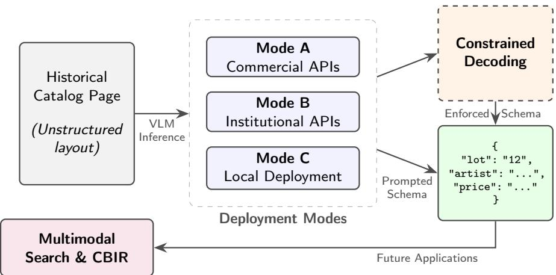
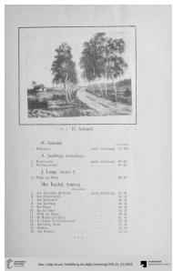
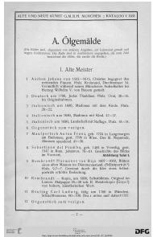
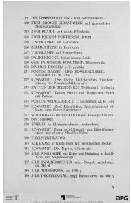
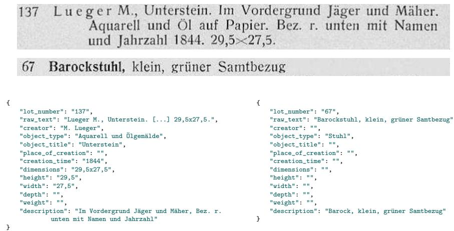
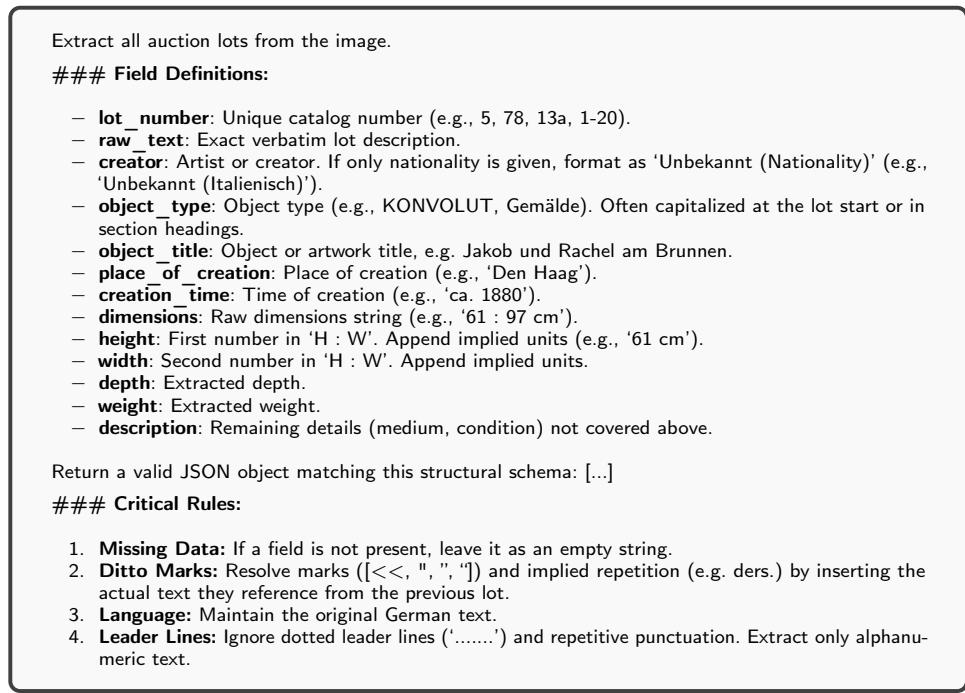
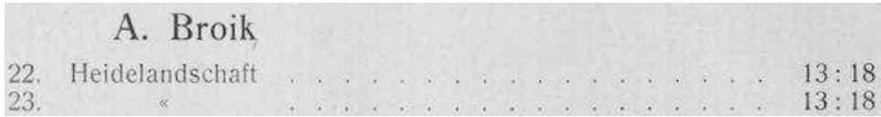
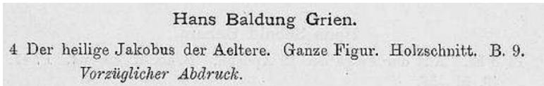

# Lot Machine Multimodal Lot Extraction from Auction Catalogs

Mathias Zinnen1[0000-0003-4366-5216], Alisha Mund1[0009-0000-0083-6412],

Sabine Lang2[0000-0003-2543-0085], Lukas Hüttner1[0009-0001-0231-7517],

Thomas Gorges1[0009-0007-0573-0992], and Vincent Christlein1[0000-0003-0455-3799]

1 Pattern Recognition Lab, FAU Erlangen

2 Department of Digital Humanties and Social Studies, FAU Erlangen

Abstract. For provenance research and art market studies, auction catalogs are an essential resource to trace specific objects over time and space. While historical auction catalogs follow established domain conventions, their internal formatting remains highly variable, and their large-scale analysis is currently restricted by the lack of machine-readable representations of the auction lots. We propose a pipeline to automatically extract structured lot-level metadata from German Sales, a large database of historical auction and sales catalogs from the 19th and 20th centuries. Using a manually annotated test set of representative catalog pages, we evaluate Vision-Language Models (VLMs) under varying prompt strategies and constrained decoding frameworks. To reflect the practical constraints faced by cultural heritage institutions, including budget, compute resources, and data privacy requirements, we benchmark the methods across diferent deployment modes ranging from commercial providers to locally hosted, quantized models. We find that commercial endpoints establish the performance ceiling, while institutional gateways ofer a viable, privacy-preserving alternative. Local deployments remain feasible, but strictly require enforcing the output structure during generation to guarantee a valid JSON format. While varying degrees of human-in-the-loop correction are still necessary, this work demonstrates that a VLM-based pipeline can successfully unlock historical auction catalogs for large-scale automated analysis.

Keywords: Key Information Extraction · Vision-Language Models · Cultural Heritage · Provenance Research · Datasets and Benchmarks · Human-in-the-Loop

## 1 Introduction

The aim of provenance research is to reconstruct an object’s ownership history over time and space by examining changes in ownership, for example, through sale, inheritance, theft, or seizure. Documenting the transfer of ownership of an object allows researchers to establish its legal ownership and helps to determine its authenticity and authorship [32]. In Germany, provenance research encompasses diferent areas, including objects looted by the National Socialists, expropriations in the German Democratic Republic or Soviet occupation zone, and cultural property from colonial contexts. To reconstruct ownership changes, provenance researchers study diferent sources, such as the objects themselves, literature, archival sources, and online databases [3].

  
Fig. 1: Overview of the proposed Key Information Extraction pipeline.

An important online database for provenance research is German Sales. Currently, German Sales contains over 15,500 digitized auction and sales catalogs, together with descriptive bibliographic metadata [16]. The catalogs mainly origi nate from German-speaking countries and were predominantly published between 1901 and 1945. These catalogs not only contain information about objects ofered during an auction but sometimes also hold information about prices, sellers, and buyers – in the form of handwritten annotations.

Currently, these catalogs are described by bibliographic metadata, findable through a persistent identifier and accessible via text-based search enabled by generic Optical Character Recognition (OCR). While full-text search provides a baseline for discovery, it is insuficient for automated, large-scale analysis. The lack of standardized, structured records to represent the auction lots prevents researchers from systematically tracking spatial and temporal market trends, artist popularity, or conducting linguistic analyses of the object descriptions. Extracting structured lot-level metadata would address these limitations while also enabling the German Sales catalogs to be integrated into Linked Open Data networks such as Wikidata and connected with other provenance resources, including online museum collections and the Lost Art Database [27].

The automated transition from unstructured images to structured metadata is referred to as Key Information Extraction (KIE). With growing importance of the task, standardized benchmarks such as FUNSD (Form Understanding in

Noisy Scanned Documents) [10] enable benchmarking models with respect to text detection, layout analysis, and entity linking. Historically, KIE relied on decoupled, multi-stage pipelines, where the raw text is first extracted via an OCR engine, and then grouped into logical key-value pairs via rule-based layout parsing methods such as hierarchical layout subdivision [23] or clustering of page components [24]. While these approaches proved efective for highly standardized forms with a fixed layout, they fail on the German Sales catalogs due to their layout variability, published by multiple publishers over a period of over 100 years. To overcome the limitations of heuristic rules, recent hybrid approaches pipe the raw output of traditional OCR engines into Large Language Models (LLMs) to perform zero-shot text structuring and semantic parsing [29]. While this twostage methodology successfully extracts structured data from historical texts, it introduces unnecessary complexity. It requires maintaining separate text detection, recognition, and language models, and frequently sufers from error propagation where the LLM loses visual layout context. Newer approaches like olmOCR [26] and DocVLM [22] address this by directly injecting OCR output into VLMs but have not yet been applied to historical data. In this work, we bypass decoupled pipelines in favor of direct structure generation, minimizing system complexity by requiring only a single model to be deployed. Multimodal architectures such as LayoutLMv3 [9] and, more recently, end-to-end VLMs like Qwen-VL [2], Gemma [31], or InternVL [33] can autoregressively generate structured output directly from the pixel input. Current end-to-end VLMs generally employ varying architectural strategies to process this visual input. Models like LLaVa [19] or PaliGemma [28] rely on dense architectures that pair highly compact vision encoders with massive language decoders, forcing the model to resolve spatial layouts through text-based contextual reasoning. Conversely, InternVL [33] and variants [7,20] rely on larger vision backbones, which enable precise visual feature extraction before the text decoder is engaged. Furthermore, to mitigate the computational burden of these scaled architectures, many state-of-the-art VLMs now integrate Mixture of Experts (MoE) routing. MoE models like Mixtral [11] or, more recently, MoE-LLava [17] activate only a small, highly eficient subset of parameters during inference, which allows higher overall parameter counts while maintaining eficiency and accuracy.

To prevent structural hallucinations, recent frameworks employ Logit-level constrained decoding [34], which uses a Finite State Machine to deterministically guide the VLM into generating perfectly formatted JSON.

However, transitioning from visual layouts to structured schemas is not merely a technical challenge, but a semantic one. Historical auction catalogs frequently feature variable formatting, implicit cross-references, and subjective descriptors (e.g., blending stylistic epochs like "Barock" with physical descriptions). Consequently, evaluating extraction fidelity requires not only robust architectures but also a critical examination of the metrics used to score them against inherently ambiguous humanities data.

While these technological advances, alongside the legacy of specialized transcription tools like Transkribus [12] or eScriptorium [13], ofer powerful theoretical solutions, cultural heritage institutions face significant barriers to their adoption. The deployment of VLMs involves a complex trade-of between extraction accuracy, hardware availability, technical expertise, budgetary limits, and data privacy requirements. Relying on commercial APIs poses data sovereignty risks for unpublished archival material and creates dependencies on the goodwill of commercial institutions, their pricing policies, and terms and conditions. Hosting open-weight models, on the other hand, demands substantial computational infrastructure and technical expertise.

To bridge the gap between theoretical capabilities and practical application, we designed and implemented an end-to-end VLM extraction pipeline. Using this implementation and a newly introduced, manually annotated benchmark of historical auction lots, we present a comprehensive empirical evaluation of VLM deployment strategies for historical KIE. We systematically evaluate models across the entire deployment spectrum (summarized in Fig. 1), ranging from commercial cloud APIs (Mode A) to publicly funded institutional gateways (Mode B) and quantized, locally hosted edge models (Mode C). Beyond infrastructural benchmarks, we conduct a field-level analysis across diferent catalog types to critically evaluate how standard structural metrics (ANLS\*, a structure-aware similarity score for hierarchical dictionaries) capture the nuances of subjective historical text compared to semantic overlap metrics (rouge-1). From these empirical trade-ofs, we derive actionable deployment guidelines, providing a pragmatic framework for archival institutions to select the optimal digitization pipeline given their specific real-world constraints. The complete pipeline implementation, including benchmark data, deployment scripts and prompt templates, is publicly available3.

## 2 Methods & Materials

## 2.1 The German Sales Dataset and Target Schema

To evaluate the models, we introduce a new benchmark dataset comprising 1,378 manually annotated lots across 152 pages from 5 representative catalogs. Examples are shown in Fig. 2. To accelerate the annotation process, we generated initial baseline predictions using Mistral-OCR, which demonstrated the highest qualitative accuracy in preliminary tests. We then conducted a rigorous review of every lot and a systematic rule-based correction to mitigate evaluation bias.

This bootstrapping approach has a direct consequence for the interpretation of our results: Mistral-OCR both served as a candidate generator for the ground truth and achieved the highest score in our evaluation (Tab. 1). Although every lot was reviewed and corrected, an annotation bias towards the model’s implicit structuring conventions cannot be ruled out. The Average Normalized Levenshtein Similarity (ANLS)\* we report for Mistral-OCR should therefore be interpreted as an optimistic upper bound for the model’s performance, rather than a definitive measure of its extraction fidelity. The scores of all other models are unafected, since none of them contributed to the annotations. A second constraint concerns the absence of an inter-annotator agreement study. The complete corpus was annotated in one pass by a single annotator, so we cannot quantify the degree of subjectivity in the schema assignment.

  
(a) 1908 (art)

  
(b) 1909 (art)

  
(c) 1931 (art)

  
(d) 1932 (mixed)

  
(e) 1935 (mixed)  
Fig. 2: Overview of the diversity in our test corpus. The figure displays representative pages from the five evaluated auction catalogs and illustrates visual variations regarding format and object type. Pages marked with "art" contain lots that would traditionally be considered "artworks", such as paintings, drawings, prints, and sculptures. The category "mixed" also includes objects such as furniture or vases. Catalog samples from [16].

Accordingly, the inherent subjectivity of structuring historical data remains a critical factor in our evaluation. This is especially true for non-standard objects, such as the furniture example in Fig. 3. For instance, determining whether the term "Barock" (Baroque) should be categorized as a physical description, a date of origin, or as part of the object’s title is often semantically ambiguous.

The complete annotated benchmark is available via the projects’ GitHub repository and is archived on Zenodo4.

## 2.2 Model Selection and Experimental Design

The experimental space of Vision-Language Models spans multiple deployment modes, provider ecosystems, architectures, and parameter scales. To keep the experiments tractable, we select a subset of models that represent specific institutional constraints, hardware limits, and data sovereignty requirements.

To establish an upper bound for extraction fidelity using unconstrained compute resources, we evaluate commercial cloud APIs (Mode A). We select Google’s Gemini family, specifically comparing the lightweight, cost-optimized Flash variant against the computationally heavy Pro model. This comparison allows us to empirically determine whether the financial premium of flagship models results in improved accuracy. Alongside Gemini, we include Mistral-OCR. As a European-developed model, Mistral explicitly addresses the political and infrastructural priorities of European cultural heritage institutions regarding regional data processing and privacy.

  
Fig. 3: Representative lots from the German Sales test set alongside their manually annotated target schemas. Top: Crops of lots ofering an artwork (top) and a chair (bottom). Bottom left: The unambiguous extraction for the artwork. Bottom right: The extraction for the furniture object. The assignment of subjective descriptors like "Barock" to description rather than creation\_time highlights the inherent annotation bias required for non-standard items. Lots cropped from [1] and [14], respectively.

Publicly funded institutional gateways (Mode B) ofer a compelling alternative for institutions that want managed API access to large VLMs without sacrificing data sovereignty. While we expect accuracy to be slightly lower, these platforms ensure strict data privacy and protect users from volatile commercial pricing or changing terms of service. Beyond gateways provided by universities to their own members, public providers such as AcademicCloud [6] and the Helmholtz Cloud [30] service a broad network of partnering institutions. Among these, we select AcademicCloud due to its large number of available multimodal models and general accessibility.

Within AcademicCloud, we evaluate two architectural paradigms: First, to evaluate the highly eficient, vision-centric approach, we select a Mixture of Experts (MoE) model from the InternVL family (specifically a 30B total parameter with 3B active parameters per token). This model leverages its large vision backbone to extract dense historical typography while maintaining rapid inference. Second, to evaluate the contrasting dense, language-centric paradigm, we select the Gemma family to test the viability of resolving spatial layouts primarily through text-based reasoning. Initially, we planned to evaluate Qwen3.6 and Qwen3.5 MoE variants available at AcademicCloud, but excluded these models from the final experiments due to persistent timeout errors.

Finally, to represent institutions operating under budget and hardware restrictions, we evaluate two locally hosted edge computing environments via llama.cpp [8] (Mode C): An 8-bit quantized 8 billion parameter InternVL3 model (InternVL-8B-UD-Q8\_K\_XL) and a mixture of experts variant of Qwen3.6-35B with 3 billion active parameters (Qwen3.6-35B-A3B-MXFP4\_MOE). Both are provided by Unsloth via HuggingFace. While this deployment mode requires greater technical expertise to maintain, it provides absolute control over data flow, privacy, and local deployment logic, enabling the seamless integration of custom logit-level constrained decoding frameworks. To systematically evaluate hardware limitations, we conducted an initial analysis of baseline inference latency using a CPU-only environment, which yielded an estimated execution time of over 12h for the test set. Consequently, we transitioned the local evaluations to GPU-accelerated environments, where we use a consumer-level NVIDIA Quadro RTX6000 with 24GB graphics memory.

## 2.3 Prompting and Schema Adherence

To ensure the Vision-Language Models generate valid JSON outputs that strictly align with our target schema, we employ a dual strategy: instruction-based prompting and system-level constrained decoding.

First, we guide the models’ semantic focus using a standardized system prompt shown in Fig. 4. A critical component is the instruction to ignore typographical layout artifacts, specifically dotted lines (often used as visual leaders connecting text to prices or dimensions). During preliminary evaluations, we discovered that these repeating character sequences caused the Gemini models to get caught in infinite generative loops, leading to timeout errors and failed API calls.

To enforce strict schema compliance on logit-level we additionally implement a constrained decoding approach, where we directly pass the target schema instead of including it in the prompt.

The technical implementation of constrained decoding varied across our deployment environments: In Mistral, OCR schema enforcement is handled natively through its built-in document understanding framework, where the target structure is defined and passed directly as Pydantic objects. For Gemini, the AcademicCloud and locally hosted models, we enforce the structure using the standard json\_schema argument.

The example in Fig. 5 illustrates why rules 2 and 4 are necessary: Resolving ditto marks is inherently complex and dificult to manage via rule-based postprocessing, as these marks appear in variable formats that tend to be inconsistently transcribed by the models’ OCR recognition capabilities. Explicitly addressing dotted leader lines was essential to stabilize the Gemini models, which otherwise became trapped in infinite decoding loops, endlessly generating repeating dots. Finally, this example illustrates the challenge of forward references introduced by block headings, where an artist named at the top of a section implicitly applies to all subsequent lots.

Fig. 4: System prompt for instruction-based schema compliance.  
  
Fig. 5: Example from the 1909 catalog [15] illustrating the necessity of prompt rules to handle ditto marks and dotted leader lines.

## 3 Results and Discussion

In this section, we evaluate the proposed VLM-based extraction pipeline, moving from a quantitative macro-analysis of computational and architectural performance to a qualitative examination of historical data complexities. We first establish the baseline infrastructural requirements, then compare state-of-the-art commercial APIs against privacy-preserving local deployments, and optimize the latter via hardware-aware ablation. Finally, we investigate how semantic ambiguities and cross-lot references in historical auction catalogs challenge current VLM architectures, highlighting the limits of page-wise processing. The code used for evaluating the methods is publicly available.5

Table 1: Macro-level comparison of the highest-performing configurations across deployment paradigms. Modes represent commercial cloud APIs (A), institutional gateways (B), and local edge deployments (C). Metrics include structural accuracy (ANLS\*), transcription fidelity (CER), and latency in seconds per page (sec/p).
<table><tr><td colspan="2">Mode Model</td><td colspan="3">ANLS* (↑) CER (↓) sec/p (↓)</td></tr><tr><td rowspan="2">A</td><td>Gemini-Flash</td><td>0.75</td><td>0.10</td><td>19.81</td></tr><tr><td>Mistral-OCR</td><td>0.87</td><td>0.03</td><td>30.40</td></tr><tr><td rowspan="2">B</td><td>Gemma4-31B</td><td>0.77</td><td>0.13</td><td>159.34</td></tr><tr><td>InternVL3.5-30B-A3B</td><td>0.71</td><td>0.21</td><td>17.30</td></tr><tr><td rowspan="2">C</td><td>InternVL3-Q8</td><td>0.61</td><td>0.24</td><td>68.30</td></tr><tr><td>Qwen3.6-35B-A3B</td><td>0.72</td><td>0.16</td><td>78.96</td></tr></table>

## 3.1 Overall Comparison of Deployment Modes

To evaluate the overall pipeline performance, we report three complementary metrics that capture structural accuracy, transcription fidelity, and computational feasibility for large-scale archival digitization.

To quantify structural extraction fidelity, we employ ANLS\* [25], a recent variant of the Average Normalized Levenshtein Similarity (ANLS). ANLS\* is specifically designed for KIE tasks and evaluates JSON outputs by penalizing both structural deviations (missing or hallucinated keys) and value-level inaccuracies.

To isolate the models’ fundamental reading capabilities from their structural parsing, we evaluate raw transcription fidelity using the Character Error Rate (CER).

For our quantitative evaluation, both ANLS\* and CER are computed exclusively on lots matched between ground truth and detections via the lot number. Note that this excludes hallucinated or implicitly inferred lots from the primary penalty calculations. We decided on this approach because these structural overgenerations can be filtered via deterministic post-processing (e.g., by filtering out lots without numbers assigned), penalizing them within the primary metrics would artificially deflate the models’ actual transcription and schema-mapping capabilities. An evaluation including unmatched lot pairs penalizing hallucinated lot generation can be found in section S1 of the supplementary material.

Finally, we report the average inference time in seconds per page (sec/p) to contextualize the viability of deploying these models at an institutional scale.

Initial scoping experiments included heavier, general-purpose frontier models; However, these were excluded from the final macro-evaluation due to prohibitive API costs (scaling to approximately e 5.00 per test subset) and persistent timeout failures during extraction. This instability underscores the fragility of relying on external cloud infrastructure for large-scale archival processing. Instead, we focus on two alternatives: Mistral-OCR, which provides a highly specialized, geographically sovereign European alternative that processed the dataset for roughly e 2.00, and Gemini-2.5-Flash, which delivered high-throughput extraction while remaining entirely within the free-tier API limits.

The first finding is that Mistral-OCR has a clear lead in extraction accuracy, achieving an 87% ANLS\* score while still being very afordable. Considering the low 0.03 CER, OCR failures only partially account for the remaining margin error in ANLS\*. A failure analysis revealed that these errors boil down to the specific formatting patterns illustrated in Fig. 6. Here, the model includes the artist name (Hans Baldung Grien) into the lots’ raw\_text field, which leads to a high local CER of 0.20. Note that Mistral’s lead should be interpreted in light of the annotation protocol described in Sec. 2.1. The comparably high performance of Mistral-OCR might be attributed to the usage of its predictions for the initial candidate annotation.

  
Fig. 6: Illustration of an exemplary OCR failure from Mistral-OCR. The model falsely included the artist’s name in the lot’s raw text. Lot from [4].

In contrast, Gemini-Flash is considerably weaker (0.75 ANLS\*) but faster (19.81 sec/p) and produces negligible costs for datasets of this scale.

For the models provided via AcademicCloud (Mode B), we evaluate the language-focused Gemma4 [31] alongside a MoE variant of the vision-focused InternVL3.5 [33]. Gemma4-31B achieves higher accuracy than the commercial Gemini-Flash (0.77 ANLS\*) but sufers from severe latency (159.34 sec/p), which makes large-scale catalog processing practically infeasible. Initial attempts to evaluate the latest Qwen3.6 [2] models via AcademicCloud were abandoned entirely due to persistent timeout errors and even slower inference speeds. Conversely, InternVL3.5 [33] is the fastest of all evaluated models (17.3 sec/p) but exhibits a slightly lower ANLS\* (0.71) and struggles significantly with raw text OCR, as evidenced by a high CER of 0.21.

When transitioning to locally hosted deployments (Mode C), the 8-bit quantized InternVL3-Q8 variant is considerably weaker (0.61 ANLS\*) than the cloud and gateway models, and also markedly slower, at roughly twice the latency of Mistral-OCR (68.30 vs. 30.40 sec/p). The Qwen3.6-35B-A3B MoE variant performs surprisingly well for a local deployment despite using only 3B ac tive parameters (0.72 ANLS\*, 0.16 CER), but the slow inference speed (78.96 sec/p) needs to be considered, particularly when large catalog volumes are to be processed.

Based on these findings, we recommend that institutions with available API budgets and non-sensitive data utilize the highly accurate and cost-efective Mistral-OCR. However, institutions facing constrained budgets, large data volumes, or strict data privacy regulations can find a viable alternative through institutional gateways hosting mid-sized modern models like Gemma4-31B. Even stricter data privacy requirements can be met via the local deployment of quantized models, though this approach strictly requires the use of constrained decoding frameworks. Specifically, Mixture of Experts (MoE) variants demonstrate a viable pathway for maintaining adequate performance on restricted hardware. Furthermore, our experiments indicate that local deployment without GPU acceleration (or equivalent architectures such as Apple Silicon) is currently not practically viable. Finally, regardless of the chosen deployment mode, but particularly when using smaller models, manual verification of the extracted outputs is highly recommended.

Table 2: The impact of constrained decoding on structural accuracy (ANLS\*).
<table><tr><td></td><td colspan="4">Evaluated Models (ANLS* ↑)</td></tr><tr><td>Schema Strategy</td><td></td><td>Gemini-Flash Mistral-OCR Gemma4-31B InternVL3.5</td><td></td><td></td></tr><tr><td>Prompt-Based</td><td>0.72</td><td></td><td>0.74</td><td>0.71</td></tr><tr><td>Constrained Decoding</td><td>0.75</td><td>0.87</td><td>0.77</td><td>0.69</td></tr></table>

## 3.2 The Impact of Constrained Decoding

To isolate the efect of strict schema enforcement on extraction fidelity, we compared the structural accuracy (ANLS\*) of models running with constrained decoding against those relying solely on instruction-based prompting (Tab. 2).

The experiments show that enforcing schema compliance at the system level leads to a small but consistent improvement in ANLS\* for most evaluated architectures. A notable exception is the vision-centric InternVL3.5, which exhibited slightly better extraction fidelity (0.71 vs. 0.69) when allowed to generate freely based solely on the system prompt. We omit Mistral-OCR from the prompt-based comparison entirely, as its native architectural framework requires structural initialization and does not allow for purely unconstrained generation.

However, while larger models can still function reasonably well using only prompt-based schema adherence, scaling down compute resources alters this dynamic. For our locally deployed quantized models (Mode C), purely promptbased generation entirely failed to produce syntactically valid JSON outputs.

Overall, these findings suggest that while institutions can successfully rely on prompt-based structuring when utilizing highly capable cloud or institutional gateway models, constrained decoding should be utilized whenever the deployment environment permits it. For local edge deployments, it remains an absolute technical requirement.

## 3.3 Catalog and Field Analysis

To understand how catalog composition and field semantics impact extraction fidelity, we disaggregate our evaluation across catalog types and schema keys.

Table 3: Catalog-level structural accuracy (ANLS\*) comparing artwork catalogs (Art) against mixed-object catalogs (Misc).
<table><tr><td colspan="5">Catalog Type Mistral-OCR Gemini-Flash Gemma4-31B InternVL3.5 Qwen3.6-35B†</td></tr><tr><td>ANLS* (Art)</td><td>0.85</td><td>0.70</td><td>0.78</td><td>0.68 0.66</td></tr><tr><td> $\mathrm { A N L S ^ { * } \left( M i s c \right) }$ </td><td>0.91</td><td>0.83</td><td>0.75</td><td>0.79 0.79</td></tr></table>

†Mixture of Experts (MoE) variant utilizing 3B active parameters.

First, we contrast the models’ performance on artwork catalogs (1908, 1909, 1931) against the mixed-object catalogs (1932, 1935). During dataset curation, we hypothesized that artwork extraction would yield higher accuracy due to its standardized linguistic conventions (e.g., Artist, Title, Medium), compared to the irregular formatting and ambiguous semantic boundaries of mixed household objects. Surprisingly, the empirical results contradict this assumption. As shown in Tab. 3, extraction accuracy is systematically lower for art across nearly all evaluated models (with the exception of Gemma4-31B). This suggests that the dense, specialized vocabulary and implicit structural dependencies of catalogs ofering art pose a greater challenge to VLMs than the varied but often simpler descriptions of heterogeneous objects.

While ANLS\* provides a rigorous benchmark for exact string and structural compliance, it heavily penalizes minor syntactic deviations via its Levenshtein calculation. To evaluate whether lower ANLS\* scores indicate true semantic failure or reordering of existing elements, expanding abbreviations etc., we introduce rouge-1 [18]. By measuring unigram overlap, rouge-1 correctly rewards models that capture the semantic core of an entity, even if words are reordered or truncated.

In Tab. 4, we compare our highest-performing commercial model (Mistral-OCR) against our most viable institutional alternative (Gemma4-31B) at the field level using both metrics. Note that the lot\_number field is omitted because our matching strategy based on lot numbers forces a trivial perfect overlap.

The object\_type field stands out as particularly dificult for both architectures. This reflects the inherent subjectivity of the category. For example, determining whether the “Barockstuhl” from Fig. 3 should be classified broadly as a “Stuhl” or retained as the specific composite term frequently leads to misclassifications that penalize both structural and semantic scores. Conversely, the extraction of spatial measurements (dimensions, depth, weight) generally performs well. However, an interesting artifact appears when splitting these measurements into height and width. Mistral-OCR exhibits a notable drop in ANLS\* (0.75) for these fields while maintaining a high rouge-1 score (0.91). A qualitative review of the data reveals that Mistral frequently appends standardized units (e.g., “cm”) to the raw numerical predictions. This stylistic addition triggers a heavy Levenshtein penalty under ANLS\*, despite preserving the correct semantic magnitude captured by rouge.

Table 4: Field-level extraction fidelity comparing structural adherence (ANLS\*) to semantic recall (rouge-1). The divergence between metrics highlights the subjective nature of free-text fields.
<table><tr><td rowspan="2">Schema Field</td><td colspan="2">Mistral-OCR</td><td colspan="2">Gemma4-31B</td></tr><tr><td colspan="4">ANLS* ROUGE-1 ANLS* ROUGE-1</td></tr><tr><td>creator</td><td>0.81</td><td>0.94</td><td>0.76</td><td>0.88</td></tr><tr><td>object_type</td><td>0.61</td><td>0.55</td><td>0.48</td><td>0.41</td></tr><tr><td>object_title</td><td>0.81</td><td>0.81</td><td>0.71</td><td>0.70</td></tr><tr><td>place_of_creation</td><td>0.90</td><td>0.90</td><td>0.83</td><td>0.83</td></tr><tr><td>creation_time</td><td>0.94</td><td>0.94</td><td>0.88</td><td>0.89</td></tr><tr><td>dimensions</td><td>0.99</td><td>0.99</td><td>0.83</td><td>0.77</td></tr><tr><td>height</td><td>0.75</td><td>0.91</td><td>0.87</td><td>0.90</td></tr><tr><td>width</td><td>0.75</td><td>0.91</td><td>0.89</td><td>0.90</td></tr><tr><td>depth</td><td>0.99</td><td>0.99</td><td>0.94</td><td>0.95</td></tr><tr><td>weight</td><td>0.99</td><td>0.99</td><td>0.99</td><td>0.99</td></tr><tr><td>description</td><td>0.83</td><td>0.87</td><td>0.73</td><td>0.77</td></tr></table>

Particularly high discrepancies between the two metrics are also observed in the “creator” field (0.81 ANLS\* vs. 0.94 rouge-1 for Mistral). This is largely explained by mismatches in the ordering of surnames and given names, which is highly inconsistent across historical catalogs and can sometimes even vary within the same document. While VLMs successfully extract the correct name components (rewarded by rouge), they often fail to arrange them in the precise format given by the ground truth. This appears as a minor visual error to a human reader. But extracting a normalized name representation is critical for subsequent downstream tasks, such as disambiguation and connecting to external authority files. This highlights that even with the high raw accuracies achieved by state-of-the-art models, a subsequent deterministic post-processing step remains necessary. Alternatively, improving the prompting strategies, explicitly asking for normalized name representations, or enforcing this via regexp-capable constrained decoding mechanisms might help.

These findings demonstrate that extraction metrics must be contextualized within the definitions of the specific fields and the subjectivity of interpreting historical data. Establishing a consistent schema with definitions that remain broadly applicable across decades of varying catalog types is dificult. Refining these structural guidelines and acknowledging their inherent ambiguities may prove just as impactful for final accuracy metrics as deploying more capable models.

## 4 Limitations

Our model selection was guided by the considerations outlined in Sec. 2.2, but it remains non-exhaustive. The final evaluation was inherently constrained by practical and technical realities, such as persistent timeout errors when accessing the Qwen models via institutional gateways and the prohibitive costs associated with commercial frontier models like Gemini-Pro. Given the rapid pace of model development and evolving institutional API provisioning, it is entirely possible that in a few months, the performance measures will be diferent. Nevertheless, we maintain that this evaluation establishes a valuable baseline for the current state of the art in VLM access for structured data extraction. This is particularly relevant for institutions lacking the infrastructure to deploy large models locally, and provides a clear overview of present capabilities.

A second limitation concerns the design of the target schema and the corresponding prompt engineering. The semantic mapping of historical auction lots, such as determining the boundaries between physical descriptions, object types, and stylistic epochs, was conducted without directly involving specialized provenance researchers or art historians. Consequently, our field definitions and prompt instructions may lack the contextual nuance required by domain experts. Also, our current extraction schema cannot model uncertainty and vagueness, which have been argued to be crucial for digital provenance research [21]. Measuring such vagueness could be addressed by annotating the data with multiple annotators and analyzing the inter-annotator agreement. This would enable to adapt the evaluation scheme to treat ambiguous cases with more flexibility. Likewise, re-annotating a subset independently of any evaluated system would allow quantifying the bias introduced by our Mistral-OCR-based candidate generation discussed in Sec. 2.1. Developing evaluation (and potentially also training) strategies that account for these epistemic uncertainties is a promising line of future work. To achieve this, we should deepen interdisciplinary collaboration to refine the structural guidelines and ensure that the extracted metadata fully aligns with the epistemic standards of provenance research.

While beyond the scope of this work, we acknowledge that our evaluation does not include a comparison against traditional, multi-step extraction pipelines. Specifically, we did not benchmark the end-to-end VLM approach against traditional OCR followed by either rule-based regular expression parsing or text-only LLMs. Also, state-of-the-art layout understanding models, such as PaddleOCR [5], were omitted from our comparative baselines. Furthermore, our current pipeline relies entirely on instruction-based prompting and constrained decoding using the pre-trained weights of the selected Vision-Language Models. We anticipate that fine-tuning these models specifically on annotated historical auction records would significantly improve their ability to accurately map complex, domain-specific text to the implicated semantics of our target schema.

We deliberately excluded fine-tuning and complex multi-step pipelines to keep our approach realistic for everyday institutional use. Many cultural heritage organizations lack dedicated IT departments or the machine learning expertise required to manage custom training and software orchestration. By focusing entirely on out-of-the-box prompting with pre-trained weights, our goal is to provide a pipeline that is immediately actionable and maintainable under current institutional realities.

## 5 Conclusion

In this work, we presented an automated pipeline to extract structured data from historical auction catalogs using VLMs. By turning unstructured page images into searchable data, this approach unlocks new possibilities for large-scale provenance research and art market analysis.

To help cultural heritage institutions navigate real-world technical barriers, we evaluated multiple deployment strategies. We found that commercial models like Mistral-OCR ofer the highest accuracy and are highly cost-efective. However, for institutions with strict privacy needs or limited budgets, locally hosted models or institutional gateways ofer a viable alternative, provided they use constrained decoding to strictly enforce the correct output format.

Our field-level analysis also highlighted that historical data is inherently messy and subjective. Surprisingly, homogeneous art catalogs that focus on paintings, drawings and prints proved more dificult for the models to process than catalogs ofering everyday household items. Furthermore, we showed that strict evaluation metrics (like ANLS\*) often penalize models for minor formatting diferences, even when the models successfully understand the historical meaning of the text.

In future work, we will explore fine-tuning strategies to better capture domain specific semantics and conduct a deeper comparative analysis to evaluate our pipeline against traditional OCR and dedicated layout understanding models.

Once structured, this data can be integrated into multimodal search engines and linked with other international provenance and art databases. Ultimately, the successful digitization of historical archives relies not just on advancing computer science, but on close, ongoing collaboration with domain experts to better navigate the complexities of historical records.

Beyond historical auction catalogs, the proposed pipeline and our deployment findings are transferable to similar digitization eforts in museums and collections. Repurposing this system to convert scans of inventory cards or accession books into structured databases requires only minimal adjustment. Updating the target schema and system prompt is expected to be suficient to adapt to new documentary forms.

Acknowledgements. We thank the Heidelberg University Library for opening up the wealth of historical sales data by providing access to the German Sales catalogs. Particularly, we would like to thank Maria Efinger and Nicole Sobriel, who were always open to our questions and provided valuable insights. Furthermore, we would like to extend our thanks to Gabriele Zöllner and the whole SODa team for helpful discussions and feedback. We also thank Academic-Cloud for access to their compute infrastructure, which makes data autonomy and sovereignty accessible to researchers and institutions. Finally, we thank the anonymous reviewers, whose constructive comments led us to strengthen both the annotation protocol and the evaluation presented here.

This work was partially funded by the German Federal Ministry of Research, Technology and Space (BMFTR) through the SODa project (grant no. 16DKZ2016D).

## References

1. Alte und Neue Kunst GmbH: Katalog der Sammlung Lothar Meilinger München: Ölgemälde alter und neuer Zeit, Aquarelle, Zeichnungen, Stiche usw. aus anderem Besitz; 18. Juli 1931. München (1931). https://doi.org/10.11588/diglit.8238, auktionskatalog. URN: urn:nbn:de:bsz:16-diglit-82380

2. Bai, J., Bai, S., Chu, Y., Cui, Z., Dang, K., Deng, X., Fan, Y., Ge, W., Han, Y., Huang, F., et al.: Qwen technical report. arXiv preprint arXiv:2309.16609 (2023)

3. Baresel-Brand, A., Franz, M., Gramlich, J., Hartmann, J., Hartmann, U., Henkel, M., Henker, M., Kesting, M., Kocourek, J., Köstering, S., et al.: Provenance Research Manual: To Identify Cultural Property Seized Due to Persecution During the Nationalist Socialist Era. German Lost Art Foundation (2019)

4. C. G. Boerner, Auktions-Institut, Kunst- und Buchantiquariat: Katalog einer gewählten Sammlung von Kupferstichen, Radierungen, Holzschnitten alter Meister aus schlesischem und anderem Privatbesitz: darunter ein reiches Dürerwerk in kostbaren frühen Abdrucken der Kupferstiche und prachtvollen Exemplaren der Holzschnitte mit vielen Seltenheiten; Versteigerung: 7. Mai 1908. Boerner, Leipzig (1908). https://doi.org/10.11588/diglit.23475, auktionskatalog. URN: urn:nbn:de:bsz:16-diglit-234753

5. Cui, C., Sun, T., Lin, M., Gao, T., Zhang, Y., Liu, J., Wang, X., Zhang, Z., Zhou, C., Liu, H., et al.: PaddleOCR 3.0 technical report. arXiv preprint arXiv:2507.05595 (2025)

6. Doosthosseini, A., Decker, J., Nolte, H., Kunkel, J.: SAIA: A seamless Slurm-native solution for HPC-based services. The Journal of Supercomputing 82(7), 403 (2026)

7. Gao, Z., Chen, Z., Cui, E., Ren, Y., Wang, W., Zhu, J., Tian, H., Ye, S., He, J., Zhu, X., et al.: Mini-InternVL: a flexible-transfer pocket multi-modal model with 5% parameters and 90% performance. Visual Intelligence 2(1), 32 (2024)

8. Gerganov, G., et al.: llama.cpp: LLM inference in C/C++. https://github.com/ ggml-org/llama.cpp (2023)

9. Huang, Y., Lv, T., Cui, L., Lu, Y., Wei, F.: LayoutLMv3: Pre-training for document AI with unified text and image masking. In: Proceedings of the 30th ACM international conference on multimedia. pp. 4083–4091 (2022)

10. Jaume, G., Ekenel, H.K., Thiran, J.P.: FUNSD: A dataset for form understanding in noisy scanned documents. In: 2019 International Conference on Document Analysis and Recognition Workshops (ICDARW). vol. 2, pp. 1–6. IEEE (2019)

11. Jiang, A.Q., Sablayrolles, A., Roux, A., Mensch, A., Savary, B., Bamford, C., Chaplot, D.S., Casas, D.d.l., Hanna, E.B., Bressand, F., et al.: Mixtral of Experts. arXiv preprint arXiv:2401.04088 (2024)

12. Kahle, P., Colutto, S., Hackl, G., Mühlberger, G.: Transkribus: a service platform for transcription, recognition and retrieval of historical documents. In: 2017 14th iapr international conference on document analysis and recognition (icdar). vol. 4, pp. 19–24. IEEE (2017)

13. Kiessling, B., Tissot, R., Stokes, P., Ezra, D.S.B.: eScriptorium: an open source platform for historical document analysis. In: 2019 international conference on document analysis and recognition workshops (icdarw). vol. 2, pp. 19–19. IEEE (2019)

14. Kunst- und Auktionshaus Dr. Fritz Nagel: Versteigerung Schloss Talheim bei Heilbronn: [Kunstgewerbe, Skulpturen, antike Möbel, Gemälde alter u. neuer Meister, Perserteppiche; Versteigerung:] 5. und 6. Juli 1932. Nagel, Stuttgart (1932). https: //doi.org/10.11588/diglit.12489, auktionskatalog. URN: urn:nbn:de:bsz:16- diglit-124890

15. Kunst-Salon von Bernhard Nöhring: Verzeichnis von Gemälden und Aquarellen direkt aus den Ateliers der Künstler, sowie aus hiesigem und auswärtigem Privatbesitz, welche am Donnerstag, den 25. März 1909 zur Versteigerung gelangen. Nöhring, Lübeck (1909). https://doi.org/10.11588/diglit.42403, auktionskatalog. URN: urn:nbn:de:bsz:16-diglit-424039

16. Library, H.U.: German Sales 1901–1945 (2026), https://digi.ub.uni-heidelberg. de/en/germansales/index.html

17. Lin, B., Tang, Z., Ye, Y., Huang, J., Zhang, J., Pang, Y., Jin, P., Ning, M., Luo, J., Yuan, L.: MoE-LLaVA: Mixture of experts for large vision-language models. IEEE Transactions on Multimedia (2026)

18. Lin, C.Y.: ROUGE: A package for automatic evaluation of summaries. In: Text summarization branches out. pp. 74–81 (2004)

19. Liu, H., Li, C., Wu, Q., Lee, Y.J.: Visual instruction tuning. Advances in neural information processing systems 36, 34892–34916 (2023)

20. Luo, G., Yang, X., Dou, W., Wang, Z., Liu, J., Dai, J., Qiao, Y., Zhu, X.: Mono-InternVL: Pushing the boundaries of monolithic multimodal large language models with endogenous visual pre-training. In: Proceedings of the IEEE/CVF conference on computer vision and pattern recognition. pp. 24960–24971 (2025)

21. Mariani, F.: Introducing VISU: Vagueness, incompleteness, subjectivity, and uncertainty in art provenance data. In: COMHUM 2022-Computational Methods in the Humanities 2022: proceedings of the Workshop on Computational Methods in the Humanities 2022, Lausanne, Switzerland, June 9–10, 2022. pp. 63–84. CEUR-WS (2022)

22. Nacson, M.S., Aberdam, A., Ganz, R., Ben Avraham, E., Golts, A., Kittenplon, Y., Mazor, S., Litman, R.: DocVLM: Make your VLM an eficient reader. In: Proceedings of the Computer Vision and Pattern Recognition Conference. pp. 29005–29015 (2025)

23. Nagy, G., Seth, S., Viswanathan, M.: A prototype document image analysis system for technical journals. Computer 25(7), 10–22 (1992)

24. O’Gorman, L.: The document spectrum for page layout analysis. IEEE Transactions on pattern analysis and machine intelligence 15(11), 1162–1173 (1993)

25. Peer, D., Schöpf, P., Nebendahl, V., Rietzler, A., Stabinger, S.: ANLS\*: a universal document processing metric for generative large language models. arXiv preprint arXiv:2402.03848 (2024)

26. Poznanski, J., Rangapur, A., Borchardt, J., Dunkelberger, J., Huf, R., Lin, D., Wilhelm, C., Lo, K., Soldaini, L.: olmOCR: Unlocking trillions of tokens in PDFs with vision language models. arXiv preprint arXiv:2502.18443 (2025)

27. Sattler, K.U., Schallehn, E., Schmitt, I., Schulz, N.: Das Projekt lostart.de: eine Internet-Datenbank für Kulturgutverluste. Magdeburger Wissenschaftsjournal on line (2), 11–18 (2002)

28. Steiner, A., Pinto, A.S., Tschannen, M., Keysers, D., Wang, X., Bitton, Y., Gritsenko, A., Minderer, M., Sherbondy, A., Long, S., et al.: PaliGemma 2: A family of versatile VLMs for transfer. arXiv preprint arXiv:2412.03555 (2024)

29. Stewart, S.D., Sinha, S.: Retrieving information from unstructured historical sources using large language models. Computational Humanities Research 1, e17 (2025)

30. Strube, A.: Helmholtz Blablador and the LLM models’ ecosystem. Tech. rep., Jülich Supercomputing Center (2024)

31. Team, G., Mesnard, T., Hardin, C., Dadashi, R., Bhupatiraju, S., Pathak, S., Sifre, L., Rivière, M., Kale, M.S., Love, J., et al.: Gemma: Open models based on Gemini research and technology. arXiv preprint arXiv:2403.08295 (2024)

32. Walsh, A., Akinsha, K., of Museums, A.A.: The AAM Guide to Provenance Research. American Association of Museums (2001)

33. Wang, W., Gao, Z., Gu, L., Pu, H., Cui, L., Wei, X., Liu, Z., Jing, L., Ye, S., Shao, J., et al.: InternVL3.5: Advancing open-source multimodal models in versatility, reasoning, and eficiency. arXiv preprint arXiv:2508.18265 (2025)

34. Willard, B.T., Louf, R.: Eficient guided generation for large language models. arXiv preprint arXiv:2307.09702 (2023)

## Supplementary Material

## S1 Evaluation Including Unmatched Lots

As noted in the main manuscript, historical auction catalogs frequently contain implicit hierarchical structures that VLMs may parse as distinct physical entities. While these structural over-generations (hallucinated lots) are reliably filtered out via deterministic post-processing in our primary evaluation, this section presents the raw, unfiltered performance metrics. Tab. S1 reports the pipeline’s performance when unmatched lots are retained, meaning both ${ \mathrm { A N L S ^ { * } } }$ and CER strictly penalize the generation of hallucinated or unassigned lot data prior to any heuristic intervention.

Table S1: Macro-level comparison of model configurations evaluated, including unmatched (hallucinated) lots. Unlike the primary evaluation, the structural accuracy (ANLS\*) and transcription fidelity (CER) metrics reported here penalize structural over-generation. Modes represent commercial cloud APIs (A), institutional gateways (B), and local edge deployments (C).
<table><tr><td colspan="2">Mode Model</td><td colspan="3">ANLS* (↑) CER (↓) sec/p (↓)</td></tr><tr><td rowspan="2">A</td><td>Gemini-Flash</td><td>0.59</td><td>0.25</td><td>19.81</td></tr><tr><td>Mistral-OCR</td><td>0.69</td><td>0.03</td><td>30.4</td></tr><tr><td rowspan="2">B</td><td>Gemma4-31B</td><td>0.69</td><td>0.21</td><td>159.34</td></tr><tr><td>InternVL3.5-30B-A3B</td><td>0.64</td><td>0.29</td><td>17.3</td></tr><tr><td rowspan="2">C</td><td>InternVL3-Q8</td><td>0.51</td><td>0.36</td><td>68.3</td></tr><tr><td>Qwen3.6-35B-A3B</td><td>0.50</td><td>0.38</td><td>78.96</td></tr></table>