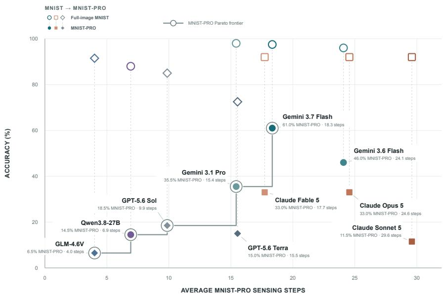
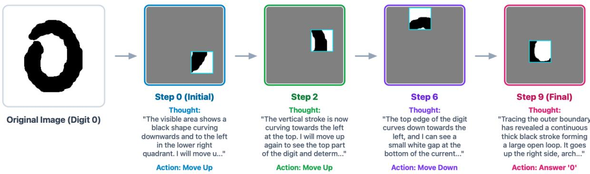
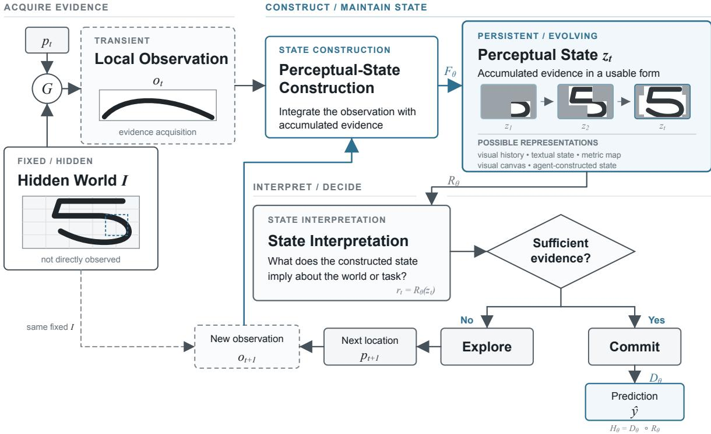
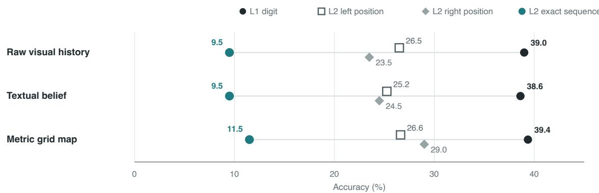
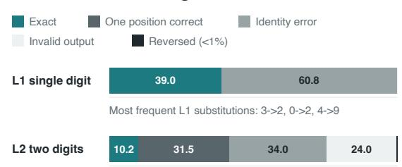
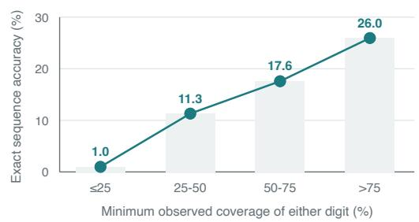
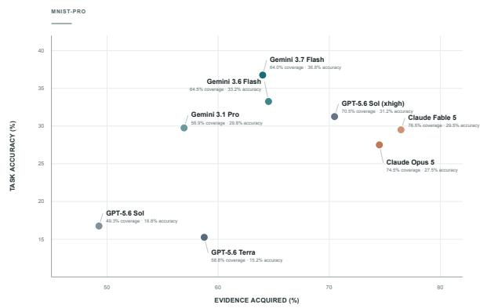
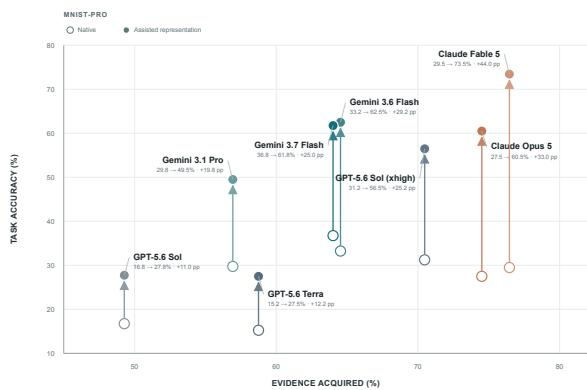
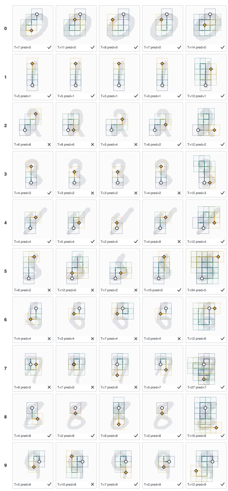
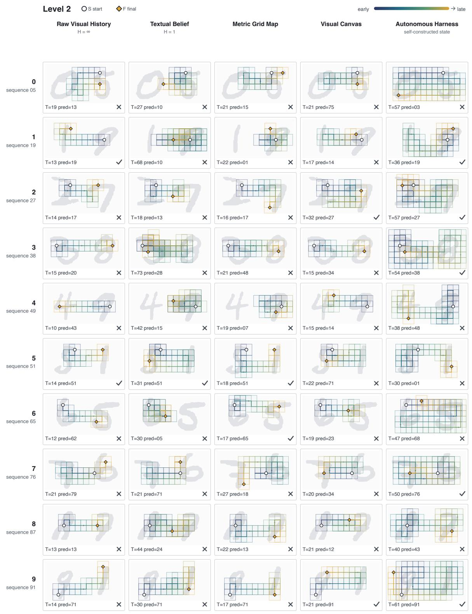

# MNIST-PRO: MNIST is Back as a Partiall<sub>y</sub> Ob<sub>serva</sub>bl<sub>e</sub> W<sub>or</sub>ld f<sub>or</sub> AI A<sub>gen</sub>t<sub>s</sub>

Vernon Toh<sup>♥♣</sup>, Navonil Majumder<sup>♥</sup>, Zhengyuan Liu<sup>♣</sup>, Nancy F. Chen<sup>♣</sup>, Soujanya Poria<sup>♥</sup>

<sup>♥</sup>D<sub>e</sub>CL<sub>a</sub>R<sub>e</sub> L<sub>a</sub>b<sub>,</sub> N<sub>a</sub>n<sub>ya</sub>n<sub>g</sub> T<sub>ec</sub>hn<sub>o</sub>l<sub>og</sub>i<sub>ca</sub>l Uni<sub>ve</sub>r<sub>s</sub>it<sub>y,</sub> Sin<sub>gapo</sub>r<sub>e,</sub> <sup>♣</sup>A<sub>ge</sub>n<sub>cy</sub> f<sub>o</sub>r S<sub>c</sub>i<sub>e</sub>n<sub>ce,</sub> T<sub>ec</sub>hn<sub>o</sub>l<sub>ogy,</sub> <sub>a</sub>nd R<sub>esea</sub>r<sub>c</sub>h (A\*STAR), Sin<sub>g</sub>a<sub>p</sub>ore

AI a<sub>g</sub>ents in <sub>p</sub>artiall<sub>y</sub> observable environments need to coordinate active sensin<sub>g</sub> with workin<sub>g</sub> memor<sub>y</sub> to maintain an evolvin<sub>g</sub> <sub>p</sub>erce<sub>p</sub>tual state. However<sub>,</sub> existin<sub>g</sub> benchmarks stru<sub>gg</sub>le to isolate this <sub>p</sub>erce<sub>p</sub>t<sub>u</sub>al-state constr<sub>u</sub>ction and inter<sub>p</sub>retation ca<sub>p</sub>abilit<sub>y</sub> beca<sub>u</sub>se the<sub>y</sub> introd<sub>u</sub>ce <sub>p</sub>h<sub>y</sub>sical and control com<sub>p</sub>lexities. We address this with MNIST-PRO, a benchmark that isolates a<sub>g</sub>entic <sub>p</sub>erce<sub>p</sub>tion b<sub>y</sub> convertin<sub>g</sub> MNIST di<sub>g</sub>it reco<sub>g</sub>nition into a se<sub>q</sub>uential<sub>,</sub> <sub>g</sub>lim<sub>p</sub>se-based search task with lookback <sub>cons</sub>t<sub>ra</sub>i<sub>n</sub>t<sub>s.</sub> W<sub>e</sub> <sub>eva</sub>l<sub>ua</sub>t<sub>e</sub> t<sub>en</sub> <sub>mu</sub>lti<sub>mo</sub>d<sub>a</sub>l <sub>mo</sub>d<sub>e</sub>l<sub>s</sub> <sub>across</sub> f<sub>our</sub> <sub>memory</sub> <sub>represen</sub>t<sub>a</sub>ti<sub>ons,</sub> i<sub>nc</sub>l<sub>u</sub>di<sub>ng</sub> <sub>raw</sub> <sub>v</sub>i<sub>sua</sub>l hi<sub>s</sub>t<sub>ory,</sub> t<sub>ex</sub>t<sub>ua</sub>l <sub>s</sub>t<sub>a</sub>t<sub>es, s</sub>t<sub>ruc</sub>t<sub>ure</sub>d <sub>me</sub>t<sub>r</sub>i<sub>c gr</sub>id <sub>maps, an</sub>d <sub>a conso</sub>lid<sub>a</sub>t<sub>e</sub>d <sub>v</sub>i<sub>sua</sub>l <sub>canvas.</sub> Whil<sub>e</sub> <sub>mo</sub>d<sub>e</sub>l<sub>s exce</sub>l <sub>un</sub>d<sub>er</sub> f<sub>u</sub>ll <sub>o</sub>b<sub>serva</sub>bilit<sub>y, par</sub>ti<sub>a</sub>l <sub>o</sub>b<sub>serva</sub>bilit<sub>y exposes a c</sub>l<sub>ear per</sub>f<sub>ormance gap.</sub> W<sub>e</sub> identif<sub>y</sub> three distinct bottlenecks. First<sub>,</sub> <sub>p</sub>erce<sub>p</sub>t<sub>u</sub>al-state constr<sub>u</sub>ction and inter<sub>p</sub>retation <sub>p</sub>resent a challen<sub>g</sub>e<sub>,</sub> as a<sub>g</sub>ents stru<sub>gg</sub>le to inte<sub>g</sub>rate fra<sub>g</sub>mented <sub>g</sub>lim<sub>p</sub>ses. Second<sub>,</sub> a<sub>g</sub>ents often sto<sub>p</sub> ex<sub>p</sub>lorin<sub>g</sub> b<sub>e</sub>f<sub>ore</sub> th<sub>ey see</sub> th<sub>e</sub> f<sub>u</sub>ll <sub>sequence.</sub> Thi<sub>r</sub>d<sub>, mo</sub>d<sub>e</sub>l<sub>s o</sub>ft<sub>en</sub> f<sub>a</sub>il t<sub>o rev</sub>i<sub>se ear</sub>l<sub>y,</sub> i<sub>ncorrec</sub>t b<sub>e</sub>li<sub>e</sub>f<sub>s even</sub> <sub>w</sub>hen faced <sub>w</sub>ith s<sub>u</sub>bse<sub>qu</sub>ent contradictor<sub>y</sub> e<sub>v</sub>idence. These res<sub>u</sub>lts sho<sub>w</sub> that sim<sub>p</sub>l<sub>y</sub> ac<sub>qu</sub>irin<sub>g</sub> <sub>v</sub>is<sub>u</sub>al <sub>ev</sub>id<sub>ence</sub> i<sub>s</sub> <sub>no</sub>t <sub>enoug</sub>h<sub>.</sub> A<sub>gen</sub>t<sub>s</sub> <sub>mus</sub>t <sub>a</sub>l<sub>so</sub> b<sub>e</sub> <sub>a</sub>bl<sub>e</sub> t<sub>o</sub> b<sub>u</sub>ild <sub>an</sub>d <sub>up</sub>d<sub>a</sub>t<sub>e</sub> <sub>a</sub> <sub>re</sub>li<sub>a</sub>bl<sub>e</sub> <sub>percep</sub>t<sub>ua</sub>l <sub>s</sub>t<sub>a</sub>t<sub>e.</sub>

Date: S<sub>ep</sub>t<sub>e</sub>mb<sub>e</sub>r 1<sub>,</sub> 2026 Correspon<sup>d</sup>ence: Soujanya Poria soujanya.poria@ntu.e<sup>d</sup>u.sg Code: htt<sub>p</sub>s://<sub>g</sub>ith<sub>u</sub>b.com/declare-lab/MNIST-PRO




## 1 I<sub>n</sub>t<sub>ro</sub>d<sub>uc</sub>ti<sub>on</sub>

In this <sub>w</sub>ork<sub>, w</sub>e st<sub>u</sub>d<sub>y</sub> a<sub>g</sub>entic <sub>p</sub>erce<sub>p</sub>tion<sub>,</sub> an increasin<sub>g</sub>l<sub>y</sub> rele<sub>v</sub>ant ca<sub>p</sub>abilit<sub>y</sub> as AI a<sub>g</sub>ents na<sub>v</sub>i<sub>g</sub>ate com<sub>p</sub>lex tasks like <sub>g</sub>ra<sub>p</sub>hical user interface (GUI) interaction and robotic mani<sub>p</sub>ulation (Brohan et al., 2023; Zhou et al., 2024; Xie et al., 2024). In a<sub>g</sub>entic <sub>p</sub>erce<sub>p</sub>tion, AI a<sub>g</sub>ents activel<sub>y g</sub>ather information from their obser<sub>v</sub>ations to constr<sub>u</sub>ct an e<sub>v</sub>ol<sub>v</sub>in<sub>g</sub> <sub>p</sub>erce<sub>p</sub>t<sub>u</sub>al state for decision-makin<sub>g</sub>. This difers from the classical active vision literature that has traditionall<sub>y</sub> em<sub>p</sub>hasized controllin<sub>g</sub> sensin<sub>g</sub> to ac<sub>q</sub>uire informative observations (Bajcs<sub>y</sub> et al., 2016). As such, active vision can be viewed as one com<sub>p</sub>onent of a<sub>g</sub>entic <sub>p</sub>erce<sub>p</sub>tion. In <sub>p</sub>artiall<sub>y</sub> observable environments<sub>,</sub> a<sub>g</sub>ents m<sub>u</sub>st coordinate active vis<sub>u</sub>al sensin<sub>g</sub> with workin<sub>g</sub> memor<sub>y</sub> to constr<sub>u</sub>ct a <sub>p</sub>ersistent <sub>p</sub>erce<sub>p</sub>t<sub>u</sub>al state of the world. At an<sub>y</sub> <sub>g</sub>iven instant<sub>,</sub> the a<sub>g</sub>ent’s visual <sub>p</sub>erce<sub>p</sub>tion is limited b<sub>y</sub> its field of view or sensor <sub>p</sub>osition (Savva et al., 2019). To make o<sub>p</sub>timal decisions <sub>u</sub>nder this <sub>u</sub>ncertaint<sub>y,</sub> the a<sub>g</sub>ent m<sub>u</sub>st contin<sub>u</sub>o<sub>u</sub>sl<sub>y</sub> <sub>up</sub>date its internal re<sub>p</sub>resentation: it must decide where to look next and consolidate new <sub>g</sub>lim<sub>p</sub>ses with <sub>p</sub>rior observations (Wu and Xie, 2023; Xu et al., 2026; Yan<sub>g</sub> et al., 2025).

E<sub>va</sub>l<sub>ua</sub>ti<sub>ng</sub> h<sub>ow e</sub>f<sub>ec</sub>ti<sub>ve</sub>l<sub>y mu</sub>lti<sub>mo</sub>d<sub>a</sub>l <sub>agen</sub>t<sub>s cons</sub>t<sub>ruc</sub>t th<sub>ese percep</sub>t<sub>ua</sub>l <sub>s</sub>t<sub>a</sub>t<sub>es</sub> i<sub>s c</sub>h<sub>a</sub>ll<sub>eng</sub>i<sub>ng</sub> d<sub>ue</sub> t<sub>o</sub> th<sub>e con</sub>f<sub>oun</sub>di<sub>ng</sub> f<sub>ac</sub>t<sub>ors</sub> i<sub>n ex</sub>i<sub>s</sub>ti<sub>ng</sub> b<sub>enc</sub>h<sub>mar</sub>k<sub>s.</sub> Fi<sub>rs</sub>t<sub>, s</sub>t<sub>an</sub>d<sub>ar</sub>d <sub>mu</sub>lti<sub>mo</sub>d<sub>a</sub>l <sub>reason</sub>i<sub>ng</sub> b<sub>enc</sub>h<sub>mar</sub>k<sub>s,</sub> such as MMBench (Liu et al., 2024) and MMMU (Yue et al., 2024), <sub>p</sub>rovide the relevant visual in<sub>p</sub>uts t<sub>oge</sub>th<sub>er w</sub>ith <sub>eac</sub>h <sub>ques</sub>ti<sub>on up</sub>f<sub>ron</sub>t<sub>, an</sub>d th<sub>ere</sub>f<sub>ore</sub> d<sub>o no</sub>t <sub>requ</sub>i<sub>re mo</sub>d<sub>e</sub>l<sub>s</sub> t<sub>o ac</sub>ti<sub>ve</sub>l<sub>y ga</sub>th<sub>er or se</sub>l<sub>ec</sub>t visual evidence durin<sub>g</sub> inference. Second, active control benchmarks, such as ActiView (Wan<sub>g</sub> et al., 2025) and ActiveVision (Zhan<sub>g</sub> et al., 2026a), re<sub>q</sub>uire models to iterativel<sub>y</sub> ac<sub>q</sub>uire and reason over multi<sub>p</sub>le visual observations. However<sub>,</sub> these settin<sub>g</sub>s do not necessaril<sub>y</sub> distin<sub>g</sub>uish between a<sub>g</sub>ents that maintain a coherent<sub>,</sub> task-relevant <sub>p</sub>erce<sub>p</sub>tual state and a<sub>g</sub>ents that rel<sub>y</sub> heavil<sub>y</sub> on revisitin<sub>g</sub> or retainin<sub>g</sub> l<sub>ow-</sub>l<sub>eve</sub>l <sub>v</sub>i<sub>sua</sub>l <sub>o</sub>b<sub>serva</sub>ti<sub>ons.</sub> Thi<sub>s ma</sub>k<sub>es</sub> it difi<sub>cu</sub>lt t<sub>o</sub> i<sub>so</sub>l<sub>a</sub>t<sub>e w</sub>h<sub>e</sub>th<sub>er per</sub>f<sub>ormance re</sub>fl<sub>ec</sub>t<sub>s genu</sub>i<sub>ne</sub> <sub>s</sub>t<sub>a</sub>t<sub>e</sub>f<sub>u</sub>l <sub>percep</sub>t<sub>ua</sub>l <sub>syn</sub>th<sub>es</sub>i<sub>s or e</sub>f<sub>ec</sub>ti<sub>ve use o</sub>f th<sub>e ava</sub>il<sub>a</sub>bl<sub>e v</sub>i<sub>sua</sub>l hi<sub>s</sub>t<sub>ory.</sub> Fi<sub>na</sub>ll<sub>y, w</sub>hil<sub>e em</sub>b<sub>o</sub>di<sub>e</sub>d 3D benchmarks such as ALFRED (Shridhar et al., 2020) re<sub>q</sub>uire se<sub>q</sub>uential decision-makin<sub>g</sub>, their reliance on simu<sup>l</sup>ate<sup>d</sup> navigation an<sup>d</sup> o<sup>b</sup>ject interaction intro<sup>d</sup>uces <sup>l</sup>ow-<sup>l</sup>eve<sup>l</sup> execution <sup>f</sup>ai<sup>l</sup>ures, suc<sup>h</sup> as co<sup>ll</sup>isions <sub>an</sub>d <sub>unsuccess</sub>f<sub>u</sub>l i<sub>n</sub>t<sub>erac</sub>ti<sub>on</sub> <sub>ac</sub>ti<sub>ons,</sub> th<sub>a</sub>t <sub>can</sub> <sub>con</sub>f<sub>oun</sub>d th<sub>e</sub> <sub>a</sub>tt<sub>r</sub>ib<sub>u</sub>ti<sub>on</sub> <sub>o</sub>f f<sub>a</sub>il<sub>ures</sub> t<sub>o</sub> <sub>percep</sub>ti<sub>on,</sub> <sub>memory,</sub> <sub>p</sub>lannin<sub>g,</sub> or control.

T<sub>o</sub> i<sub>so</sub>l<sub>a</sub>t<sub>e</sub> <sub>an</sub>d <sub>eva</sub>l<sub>ua</sub>t<sub>e</sub> th<sub>e</sub> <sub>a</sub>bilit<sub>y</sub> t<sub>o</sub> <sub>cons</sub>t<sub>ruc</sub>t <sub>percep</sub>t<sub>ua</sub>l <sub>s</sub>t<sub>a</sub>t<sub>es</sub> <sub>un</sub>d<sub>er</sub> <sub>par</sub>ti<sub>a</sub>l <sub>o</sub>b<sub>serva</sub>bilit<sub>y,</sub> <sub>we</sub> i<sub>n</sub>t<sub>ro</sub>d<sub>uce</sub> MNIST-PRO, a controlled benchmark for se<sub>q</sub>uential <sub>p</sub>erce<sub>p</sub>tion based on the classical MNIST dataset (Lecun et al., 1998). We formulate active <sub>p</sub>erce<sub>p</sub>tion as a Partiall<sub>y</sub> Observable Markov Decision Process (POMDP) where the a<sub>g</sub>ent receives localized visual <sub>g</sub>lim<sub>p</sub>ses of the ori<sub>g</sub>inal ima<sub>g</sub>e instead of the full ima<sub>g</sub>e. Because state-of-the-art vision-lan<sub>g</sub>ua<sub>g</sub>e models alread<sub>y</sub> achieve near-<sub>p</sub>erfect di<sub>g</sub>it reco<sub>g</sub>nition <sub>u</sub>nder f<sub>u</sub>ll obser<sub>v</sub>abilit<sub>y</sub> on MNIST<sub>,</sub> o<sub>u</sub>r set<sub>up</sub> establishes a hi<sub>g</sub>h <sub>p</sub>erformance ceilin<sub>g</sub> for basic <sub>v</sub>is<sub>u</sub>al perception. T<sup>h</sup>is a<sup>ll</sup>ows us to <sup>l</sup>arge<sup>l</sup>y contro<sup>l</sup> <sup>f</sup>or <sup>l</sup>ow-<sup>l</sup>eve<sup>l</sup> recognition a<sup>b</sup>i<sup>l</sup>ity an<sup>d</sup> inject <sup>d</sup>i<sup>fi</sup>cu<sup>l</sup>ty t<sup>h</sup>roug<sup>h</sup> <sub>p</sub>artial obser<sub>v</sub>abilit<sub>y</sub>. Unlike com<sub>p</sub>lex 3D en<sub>v</sub>ironments<sub>,</sub> o<sub>u</sub>r 2D can<sub>v</sub>as remo<sub>v</sub>es <sub>p</sub>h<sub>y</sub>sical distractions<sub>,</sub> makin<sub>g</sub> it easier to measure the covera<sub>g</sub>e of the ori<sub>g</sub>inal ima<sub>g</sub>e and track ex<sub>p</sub>loration <sub>p</sub>aths.

A ke<sub>y</sub> advanta<sub>g</sub>e of MNIST-PRO is that it enables us to s<sub>y</sub>stematicall<sub>y</sub> control visual lookback and com<sub>p</sub>are diferent memor<sub>y</sub> re<sub>p</sub>resentations for carr<sub>y</sub>in<sub>g p</sub>erce<sub>p</sub>tual information forward. We evaluate models under di<sub>verse memory represen</sub>t<sub>a</sub>ti<sub>ons,</sub> i<sub>nc</sub>l<sub>u</sub>di<sub>ng raw v</sub>i<sub>sua</sub>l hi<sub>s</sub>t<sub>ory</sub> <sub>,</sub> f<sub>ree-</sub>f<sub>orm</sub> t<sub>ex</sub>t<sub>ua</sub>l th<sub>oug</sub>ht<sub>s, s</sub>t<sub>ruc</sub>t<sub>ure</sub>d <sub>me</sub>t<sub>r</sub>i<sub>c</sub> <sub>gr</sub>id <sub>maps,</sub> <sub>an</sub>d <sub>a</sub> <sub>conso</sub>lid<sub>a</sub>t<sub>e</sub>d <sub>v</sub>i<sub>sua</sub>l <sub>canvas.</sub> B<sub>y</sub> li<sub>m</sub>iti<sub>ng</sub> <sub>v</sub>i<sub>sua</sub>l l<sub>oo</sub>kb<sub>ac</sub>k<sub>,</sub> <sub>we</sub> <sub>can</sub> <sub>a</sub>dditi<sub>ona</sub>ll<sub>y</sub> ex<sub>p</sub>ose the memor<sub>y</sub> write-<sub>p</sub>ath<sub>,</sub> forcin<sub>g</sub> a<sub>g</sub>ents to serialize fleetin<sub>g</sub> vis<sub>u</sub>al evidence into a <sub>p</sub>ersistent state b<sub>e</sub>f<sub>ore</sub> <sub>o</sub>ld f<sub>rames</sub> <sub>are</sub> di<sub>scar</sub>d<sub>e</sub>d<sub>.</sub> F<sub>ur</sub>th<sub>ermore,</sub> <sub>we</sub> <sub>sca</sub>l<sub>e</sub> th<sub>e</sub> <sub>spa</sub>ti<sub>a</sub>l <sub>memory</sub> l<sub>oa</sub>d <sub>an</sub>d <sub>searc</sub>h h<sub>or</sub>i<sub>zon</sub> b<sub>y</sub> structurin<sub>g</sub> the benchmark into a Sin<sub>g</sub>le-Di<sub>g</sub>it task (Level 1) and a Multi-Di<sub>g</sub>it Se<sub>q</sub>uence task (Level 2). Unlike benchmarks such as ARC-AGI-3 (Foundation, 2026), which introduce novel environments with uns<sub>p</sub>ecified rules and <sub>g</sub>oals and re<sub>q</sub>uire a<sub>g</sub>ents to infer their d<sub>y</sub>namics throu<sub>g</sub>h ex<sub>p</sub>loration, MNIST-PRO o<sub>p</sub>erates in a familiar visual domain with known action semantics<sub>,</sub> ensurin<sub>g</sub> that failures hi<sub>g</sub>hli<sub>g</sub>ht limitations in a<sub>g</sub>entic <sub>p</sub>erce<sub>p</sub>tion rather than task com<sub>p</sub>rehension.

I<sub>n</sub> <sub>summary,</sub> <sub>we</sub> <sub>as</sub>k th<sub>e</sub> f<sub>o</sub>ll<sub>ow</sub>i<sub>ng</sub> <sub>researc</sub>h <sub>ques</sub>ti<sub>ons:</sub>

1. RQ1: Can current multimodal agents construct efective perceptual states from sequential, partial <sub>o</sub>b<sub>serva</sub>ti<sub>ons</sub>?

2. RQ2: How does the representation of perceptual state afect an agent’s ability to perceive and act <sub>u</sub>nd<sub>e</sub>r <sub>pa</sub>rti<sub>a</sub>l <sub>o</sub>b<sub>se</sub>r<sub>va</sub>bilit<sub>y</sub>?

3. RQ3: How does perceptual-state construction scale with increasing spatial and temporal demands?

4. RQ4: Can agents allocate sensing efort productively and determine when the resulting perceptual state is read<sub>y</sub> for decision-makin<sub>g</sub>?

O<sub>u</sub>r <sub>e</sub>x<sub>pe</sub>rim<sub>e</sub>nt<sub>s</sub> r<sub>evea</sub>l f<sub>ou</sub>r m<sub>a</sub>in findin<sub>gs.</sub> Fir<sub>s</sub>t<sub>,</sub> <sub>s</sub>tr<sub>o</sub>n<sub>g</sub> <sub>v</sub>i<sub>sua</sub>l r<sub>ecog</sub>niti<sub>o</sub>n <sub>pe</sub>rf<sub>o</sub>rm<sub>a</sub>n<sub>ce</sub> <sub>o</sub>n MNIST does not translate into efective a<sub>g</sub>entic <sub>p</sub>erce<sub>p</sub>tion on MNIST-PRO. Current multimodal a<sub>g</sub>ents often <sub>s</sub>t<sub>rugg</sub>l<sub>e</sub> t<sub>o cons</sub>t<sub>ruc</sub>t <sub>a co</sub>h<sub>eren</sub>t <sub>percep</sub>t<sub>ua</sub>l <sub>s</sub>t<sub>a</sub>t<sub>e</sub> b<sub>y</sub> i<sub>n</sub>t<sub>egra</sub>ti<sub>ng</sub> th<sub>e</sub> f<sub>ragmen</sub>t<sub>e</sub>d <sub>v</sub>i<sub>sua</sub>l <sub>ev</sub>id<sub>ence co</sub>ll<sub>ec</sub>t<sub>e</sub>d durin<sub>g</sub> ex<sub>p</sub>loration of the MNIST-PRO world. Even when the<sub>y</sub> successfull<sub>y</sub> construct a <sub>p</sub>erce<sub>p</sub>tual state, inter<sub>p</sub>retin<sub>g</sub> that state and makin<sub>g</sub> the correct decision from it can remain a bottleneck.

Second<sub>,</sub> the re<sub>p</sub>resentation of the <sub>p</sub>erce<sub>p</sub>t<sub>u</sub>al state <sub>p</sub>la<sub>y</sub>s a critical role. We find that retainin<sub>g</sub> raw visual histor<sub>y</sub> from ex<sub>p</sub>lored re<sub>g</sub>ions<sub>,</sub> maintainin<sub>g</sub> textual states<sub>,</sub> constructin<sub>g</sub> metric <sub>g</sub>rid ma<sub>p</sub>s<sub>,</sub> and <sub>programma</sub>ti<sub>ca</sub>ll<sub>y</sub> <sub>conso</sub>lid<sub>a</sub>ti<sub>ng</sub> <sub>o</sub>b<sub>serva</sub>ti<sub>ons</sub> i<sub>n</sub>t<sub>o</sub> <sub>a</sub> <sub>v</sub>i<sub>sua</sub>l <sub>canvas</sub> l<sub>ea</sub>d t<sub>o</sub> <sub>mar</sub>k<sub>e</sub>dl<sub>y</sub> dif<sub>eren</sub>t <sub>resu</sub>lt<sub>s,</sub> <sub>w</sub>ith no sin<sub>g</sub>le re<sub>p</sub>resentation consistentl<sub>y</sub> dominatin<sub>g</sub> across multimodal a<sub>g</sub>ents. Our visual consolidation ex<sub>p</sub>eriments su<sub>gg</sub>est that the timin<sub>g</sub> of state construction ma<sub>y</sub> itself matter: continuousl<sub>y</sub> consolidatin<sub>g</sub> <sub>ev</sub>id<sub>ence a</sub>ft<sub>er eac</sub>h <sub>exp</sub>l<sub>ora</sub>ti<sub>on s</sub>t<sub>ep can</sub> b<sub>e</sub> l<sub>ess e</sub>f<sub>ec</sub>ti<sub>ve</sub> th<sub>an</sub> fi<sub>rs</sub>t <sub>exp</sub>l<sub>or</sub>i<sub>ng w</sub>ith<sub>ou</sub>t <sub>v</sub>i<sub>sua</sub>l <sub>conso</sub>lid<sub>a</sub>ti<sub>on</sub> <sub>an</sub>d <sub>cons</sub>t<sub>ruc</sub>ti<sub>ng</sub> th<sub>e conso</sub>lid<sub>a</sub>t<sub>e</sub>d <sub>represen</sub>t<sub>a</sub>ti<sub>on on</sub>l<sub>y a</sub>t th<sub>e en</sub>d<sub>.</sub> W<sub>e</sub> h<sub>ypo</sub>th<sub>es</sub>i<sub>ze</sub> th<sub>a</sub>t <sub>repea</sub>t<sub>e</sub>dl<sub>y</sub> ex<sub>p</sub>osin<sub>g</sub> an incom<sub>p</sub>lete <sub>p</sub>erce<sub>p</sub>t<sub>u</sub>al-state re<sub>p</sub>resentation ma<sub>y</sub> conf<sub>u</sub>se the a<sub>g</sub>ent<sub>,</sub> whereas consolidation b<sub>ecomes use</sub>f<sub>u</sub>l <sub>once su</sub>fi<sub>c</sub>i<sub>en</sub>t <sub>ev</sub>id<sub>ence</sub> h<sub>as</sub> b<sub>een acqu</sub>i<sub>re</sub>d<sub>.</sub>

Third, as we increase the s<sub>p</sub>atial and tem<sub>p</sub>oral demands of MNIST-PRO b<sub>y</sub> movin<sub>g</sub> from a sin<sub>g</sub>le di<sub>g</sub>it t<sub>o a par</sub>ti<sub>a</sub>ll<sub>y o</sub>b<sub>serva</sub>bl<sub>e sequence o</sub>f t<sub>wo</sub> di<sub>g</sub>it<sub>s w</sub>h<sub>ose or</sub>d<sub>er mus</sub>t <sub>a</sub>l<sub>so</sub> b<sub>e preserve</sub>d<sub>, agen</sub>t<sub>s s</sub>t<sub>rugg</sub>l<sub>e</sub> si<sub>g</sub>nificantl<sub>y</sub> more with <sub>p</sub>erce<sub>p</sub>tual-state construction. Moreover<sub>,</sub> some a<sub>g</sub>ents <sub>g</sub>ather substantial visual <sub>ev</sub>id<sub>ence</sub> f<sub>rom</sub> b<sub>o</sub>th di<sub>g</sub>it<sub>s</sub> b<sub>u</sub>t <sub>s</sub>till f<sub>a</sub>il t<sub>o</sub> t<sub>rans</sub>l<sub>a</sub>t<sub>e</sub> thi<sub>s ev</sub>id<sub>ence</sub> i<sub>n</sub>t<sub>o correc</sub>t fi<sub>na</sub>l <sub>pre</sub>di<sub>c</sub>ti<sub>ons.</sub> Thi<sub>s</sub> indicates that increasin<sub>g</sub> task horizon introd<sub>u</sub>ces dific<sub>u</sub>lties not onl<sub>y</sub> in e<sub>v</sub>idence ac<sub>qu</sub>isition<sub>,</sub> b<sub>u</sub>t also in maintainin<sub>g</sub> and inter<sub>p</sub>retin<sub>g</sub> the constr<sub>u</sub>cted <sub>p</sub>erce<sub>p</sub>t<sub>u</sub>al state.

F<sub>our</sub>th<sub>,</sub> <sub>agen</sub>t<sub>s</sub> f<sub>requen</sub>tl<sub>y</sub> <sub>comm</sub>it t<sub>o</sub> <sub>pre</sub>di<sub>c</sub>ti<sub>ons</sub> <sub>we</sub>ll b<sub>e</sub>f<sub>ore</sub> <sub>ex</sub>h<sub>aus</sub>ti<sub>ng</sub> th<sub>e</sub>i<sub>r</sub> <sub>ava</sub>il<sub>a</sub>bl<sub>e</sub> <sub>sens</sub>i<sub>ng</sub> b<sub>u</sub>d<sub>ge</sub>t<sub>,</sub> s<sub>ugg</sub>estin<sub>g</sub> that fail<sub>u</sub>res in a<sub>g</sub>entic <sub>p</sub>erce<sub>p</sub>tion can arise not onl<sub>y</sub> from im<sub>p</sub>erfect state constr<sub>u</sub>ction b<sub>u</sub>t also from decidin<sub>g</sub> <sub>u</sub>nder <sub>u</sub>nresol<sub>v</sub>ed <sub>p</sub>erce<sub>p</sub>t<sub>u</sub>al <sub>u</sub>ncertaint<sub>y</sub>. At the same time<sub>,</sub> <sub>u</sub>sin<sub>g</sub> more of the sensin<sub>g</sub> budget alone does not guarantee success, indicating that agents must determine both where to gather additional evidence and when the resulting perceptual state is suficiently reliable for decision-making.

To<sub>g</sub>ether<sub>,</sub> these res<sub>u</sub>lts indicate that a<sub>g</sub>entic <sub>p</sub>erce<sub>p</sub>tion de<sub>p</sub>ends not onl<sub>y</sub> on ac<sub>qu</sub>irin<sub>g</sub> informative <sub>o</sub>b<sub>serva</sub>ti<sub>ons,</sub> b<sub>u</sub>t <sub>a</sub>l<sub>so</sub> <sub>on</sub> h<sub>ow</sub> th<sub>ose</sub> <sub>o</sub>b<sub>serva</sub>ti<sub>ons</sub> <sub>are</sub> <sub>represen</sub>t<sub>e</sub>d <sub>an</sub>d i<sub>n</sub>t<sub>egra</sub>t<sub>e</sub>d<sub>,</sub> h<sub>ow</sub> <sub>e</sub>f<sub>ec</sub>ti<sub>ve</sub>l<sub>y</sub> th<sub>e</sub> <sub>resu</sub>lti<sub>ng percep</sub>t<sub>ua</sub>l <sub>s</sub>t<sub>a</sub>t<sub>e can</sub> b<sub>e</sub> i<sub>n</sub>t<sub>erpre</sub>t<sub>e</sub>d<sub>, an</sub>d <sub>w</sub>h<sub>en</sub> th<sub>e agen</sub>t d<sub>ec</sub>id<sub>es</sub> th<sub>a</sub>t <sub>su</sub>fi<sub>c</sub>i<sub>en</sub>t <sub>ev</sub>id<sub>ence</sub> h<sub>as</sub> b<sub>een acqu</sub>i<sub>re</sub>d t<sub>o ac</sub>t<sub>.</sub>

O<sub>vera</sub>ll<sub>, our con</sub>t<sub>r</sub>ib<sub>u</sub>ti<sub>ons are as</sub> f<sub>o</sub>ll<sub>ows:</sub>

1. We introduce MNIST-PRO, a minimal, controlled benchmark for a<sub>g</sub>entic <sub>p</sub>erce<sub>p</sub>tion that transforms MNIST from a f<sub>u</sub>ll<sub>y</sub> obser<sub>v</sub>ed di<sub>g</sub>it reco<sub>g</sub>nition task into a <sub>p</sub>artiall<sub>y</sub> obser<sub>v</sub>able <sub>w</sub>orld in <sub>w</sub>hich a<sub>g</sub>ents m<sub>u</sub>st ex<sub>p</sub>lore the environment to activel<sub>y</sub> ac<sub>qu</sub>ire<sub>,</sub> inte<sub>g</sub>rate<sub>,</sub> retain<sub>,</sub> and inter<sub>p</sub>ret vis<sub>u</sub>al <sub>o</sub>b<sub>se</sub>r<sub>va</sub>ti<sub>o</sub>n<sub>s ove</sub>r tim<sub>e</sub> f<sub>o</sub>r d<sub>ec</sub>i<sub>s</sub>i<sub>o</sub>n-m<sub>a</sub>kin<sub>g.</sub>

  
Figure 1: Visual exploration and state tracking in MNIST-PRO. The leftmost panel shows the original image (Di<sub>g</sub>it 0), which remains hidden from the a<sub>g</sub>ent and can onl<sub>y</sub> be accessed throu<sub>g</sub>h a <sub>g</sub>lim<sub>p</sub>se window. To solve the task<sub>,</sub> the a<sub>g</sub>ent se<sub>q</sub>uentiall<sub>y</sub> moves the <sub>g</sub>lim<sub>p</sub>se window across the ima<sub>g</sub>e<sub>,</sub> u<sub>p</sub>datin<sub>g</sub> its beliefs as it <sub>g</sub>athers new <sub>p</sub>artial observations. At Ste<sub>p</sub> 0<sub>,</sub> the a<sub>g</sub>ent be<sub>g</sub>ins with a randoml<sub>y</sub> sam<sub>p</sub>led <sub>g</sub>lim<sub>p</sub>se<sub>,</sub> stores the observation in memor<sub>y,</sub> and selects an action. It mo<sub>v</sub>es <sub>upw</sub>ard at Ste<sub>p</sub>s 0 and 2<sub>,</sub> then do<sub>w</sub>n<sub>w</sub>ard at Ste<sub>p</sub> 6. B<sub>y</sub> Ste<sub>p</sub> 9<sub>,</sub> after tracin<sub>g</sub> the digit’s boundaries and integrating the accumulated observations, the agent predicts the label (Answer ‘0’).

2. While current multimodal a<sub>g</sub>ent evaluations <sub>p</sub>rimaril<sub>y</sub> measure task success, MNIST-PRO <sub>p</sub>rovides a controlled settin<sub>g</sub> to dia<sub>g</sub>nose bottlenecks in a<sub>g</sub>entic <sub>p</sub>erce<sub>p</sub>tion under <sub>p</sub>artial observabilit<sub>y</sub>: <sub>w</sub>h<sub>e</sub>th<sub>er agen</sub>t<sub>s</sub> f<sub>a</sub>il t<sub>o acqu</sub>i<sub>re su</sub>fi<sub>c</sub>i<sub>en</sub>t <sub>ev</sub>id<sub>ence,</sub> f<sub>a</sub>il t<sub>o conso</sub>lid<sub>a</sub>t<sub>e</sub> th<sub>e acqu</sub>i<sub>re</sub>d <sub>ev</sub>id<sub>ence</sub> i<sub>n</sub>t<sub>o an</sub> efective <sub>p</sub>erce<sub>p</sub>t<sub>u</sub>al-state re<sub>p</sub>resentation<sub>,</sub> or fail to correctl<sub>y</sub> inter<sub>p</sub>ret the constr<sub>u</sub>cted <sub>p</sub>erce<sub>p</sub>t<sub>u</sub>al state.

3<sub>.</sub> W<sub>e</sub> d<sub>eve</sub>l<sub>op</sub> <sub>a</sub> <sub>con</sub>t<sub>ro</sub>ll<sub>e</sub>d <sub>eva</sub>l<sub>ua</sub>ti<sub>on</sub> f<sub>ramewor</sub>k f<sub>or</sub> <sub>compar</sub>i<sub>ng</sub> <sub>represen</sub>t<sub>a</sub>ti<sub>ons</sub> <sub>o</sub>f th<sub>e</sub> <sub>cons</sub>t<sub>ruc</sub>t<sub>e</sub>d <sub>percep</sub>t<sub>ua</sub>l <sub>s</sub>t<sub>a</sub>t<sub>es</sub> <sub>suc</sub>h <sub>as</sub> <sub>raw</sub> <sub>v</sub>i<sub>sua</sub>l hi<sub>s</sub>t<sub>ory,</sub> f<sub>ree-</sub>f<sub>orm</sub> t<sub>ex</sub>t<sub>ua</sub>l <sub>s</sub>t<sub>a</sub>t<sub>es,</sub> <sub>s</sub>t<sub>ruc</sub>t<sub>ure</sub>d <sub>me</sub>t<sub>r</sub>i<sub>c</sub> <sub>gr</sub>id <sub>maps,</sub> and consolidated visual canvases while s<sub>y</sub>stematicall<sub>y</sub> var<sub>y</sub>in<sub>g</sub> visual lookback<sub>,</sub> sensin<sub>g</sub> ca<sub>p</sub>acit<sub>y,</sub> <sub>an</sub>d t<sub>as</sub>k h<sub>or</sub>i<sub>zon.</sub>

4<sub>.</sub> O<sub>ur</sub> <sub>eva</sub>l<sub>ua</sub>ti<sub>on</sub> <sub>revea</sub>l<sub>s</sub> <sub>a</sub> <sub>su</sub>b<sub>s</sub>t<sub>an</sub>ti<sub>a</sub>l <sub>gap</sub> b<sub>e</sub>t<sub>ween</sub> <sub>v</sub>i<sub>sua</sub>l <sub>recogn</sub>iti<sub>on</sub> i<sub>n</sub> <sub>a</sub> f<sub>u</sub>ll<sub>y</sub> <sub>o</sub>b<sub>serva</sub>bl<sub>e</sub> <sub>wor</sub>ld <sub>an</sub>d <sub>agen</sub>ti<sub>c</sub> <sub>percep</sub>ti<sub>on</sub> i<sub>n</sub> <sub>a</sub> <sub>par</sub>ti<sub>a</sub>ll<sub>y</sub> <sub>o</sub>b<sub>serva</sub>bl<sub>e</sub> <sub>wor</sub>ld<sub>.</sub> A<sub>gen</sub>t<sub>s</sub> th<sub>a</sub>t <sub>re</sub>li<sub>a</sub>bl<sub>y</sub> <sub>recogn</sub>i<sub>ze</sub> f<sub>u</sub>ll<sub>y</sub> <sub>o</sub>b <sub>serva</sub>bl<sub>e</sub> di<sub>g</sub>it<sub>s</sub> <sub>s</sub>t<sub>rugg</sub>l<sub>e</sub> t<sub>o</sub> <sub>conso</sub>lid<sub>a</sub>t<sub>e</sub> <sub>ev</sub>id<sub>ence</sub> f<sub>rom</sub> <sub>sequen</sub>ti<sub>a</sub>l <sub>o</sub>b<sub>serva</sub>ti<sub>ons.</sub> Additi<sub>ona</sub>ll<sub>y,</sub> th<sub>e</sub>i<sub>r</sub> <sub>per</sub>f<sub>ormance</sub> d<sub>epen</sub>d<sub>s</sub> l<sub>arge</sub>l<sub>y</sub> <sub>on</sub> h<sub>ow</sub> th<sub>e</sub> <sub>v</sub>i<sub>sua</sub>l <sub>ev</sub>id<sub>ence</sub> i<sub>s</sub> <sub>represen</sub>t<sub>e</sub>d<sub>.</sub>

5<sub>.</sub> W<sub>e c</sub>h<sub>arac</sub>t<sub>er</sub>i<sub>ze</sub> h<sub>ow mu</sub>lti<sub>mo</sub>d<sub>a</sub>l <sub>agen</sub>t<sub>s a</sub>ll<sub>oca</sub>t<sub>e</sub> th<sub>e</sub>i<sub>r sens</sub>i<sub>ng or exp</sub>l<sub>ora</sub>ti<sub>on</sub> b<sub>u</sub>d<sub>ge</sub>t <sub>an</sub>d <sub>ma</sub>k<sub>e</sub> sto<sub>pp</sub>in<sub>g</sub> decisions under <sub>p</sub>artial observabilit<sub>y,</sub> revealin<sub>g</sub> that a<sub>g</sub>ents often commit after limited ex<sub>p</sub>loration des<sub>p</sub>ite havin<sub>g</sub> s<sub>u</sub>bstantial sensin<sub>g</sub> ca<sub>p</sub>acit<sub>y</sub> remainin<sub>g</sub>.

## 2 MNIST-PRO

MNIST-PRO evaluates how multimodal a<sub>g</sub>ents coordinate se<sub>q</sub>uential, <sub>g</sub>lim<sub>p</sub>se-based evidence with workin<sub>g</sub> <sub>memory un</sub>d<sub>er par</sub>ti<sub>a</sub>l <sub>o</sub>b<sub>serva</sub>bilit<sub>y.</sub> At <sub>eac</sub>h <sub>s</sub>t<sub>ep,</sub> th<sub>e agen</sub>t <sub>mus</sub>t d<sub>ec</sub>id<sub>e w</sub>h<sub>ere</sub> t<sub>o</sub> l<sub>oo</sub>k <sub>an</sub>d <sub>w</sub>h<sub>a</sub>t information to retain in memor<sub>y</sub> to inform subse<sub>q</sub>uent actions (Fi<sub>g</sub>ure 1). In this section, we formalize a<sub>g</sub>entic <sub>p</sub>erce<sub>p</sub>tion as a POMDP (Section 2.1), define the re<sub>q</sub>uired a<sub>g</sub>entic loo<sub>p</sub> to isolate sources of a<sub>g</sub>ent failure (Section 2.2), introduce a hierarchical task structure (Section 2.3), and outline a taxonom<sub>y</sub> of memor<sub>y</sub> confi<sub>g</sub>urations for evaluation (Section 2.4).

We instantiate the environment in MNIST-PRO on MNIST ima<sub>g</sub>es with a fixed-size <sub>g</sub>lim<sub>p</sub>se window that masks the ima<sub>g</sub>e<sub>,</sub> revealin<sub>g</sub> onl<sub>y</sub> a small re<sub>g</sub>ion at each ste<sub>p</sub>. This environment isolates s<sub>p</sub>atial trackin<sub>g</sub> and memor<sub>y</sub> <sub>w</sub>itho<sub>u</sub>t additional <sub>v</sub>is<sub>u</sub>al noise or renderin<sub>g</sub> com<sub>p</sub>lexit<sub>y</sub>. Performance therefore mainl<sub>y</sub> <sub>re</sub>fl<sub>ec</sub>t<sub>s</sub> h<sub>ow we</sub>ll <sub>agen</sub>t<sub>s exp</sub>l<sub>ore</sub> th<sub>e env</sub>i<sub>ronmen</sub>t<sub>, com</sub>bi<sub>ne success</sub>i<sub>ve g</sub>li<sub>mpses, an</sub>d <sub>remem</sub>b<sub>er w</sub>h<sub>a</sub>t th<sub>ey</sub> h<sub>ave seen</sub> t<sub>o so</sub>l<sub>ve</sub> th<sub>e</sub> t<sub>as</sub>k<sub>.</sub>

## 2<sub>.</sub>1 POMDP Formulation

We formulate a<sub>g</sub>entic <sub>p</sub>erce<sub>p</sub>tion as a Partiall<sub>y</sub> Observable Markov Decision Process (POMDP) to model <sub>sequen</sub>ti<sub>a</sub>l <sub>v</sub>i<sub>sua</sub>l <sub>o</sub>b<sub>serva</sub>ti<sub>ons</sub> <sub>an</sub>d b<sub>e</sub>li<sub>e</sub>f<sub>-s</sub>t<sub>a</sub>t<sub>e</sub> t<sub>rac</sub>ki<sub>ng</sub> <sub>un</sub>d<sub>er</sub> <sub>s</sub>t<sub>r</sub>i<sub>c</sub>t <sub>sens</sub>i<sub>ng</sub> b<sub>u</sub>d<sub>ge</sub>t<sub>s.</sub>

State S<sub>p</sub>ace (): The state s<sub>p</sub>ace is the Cartesian <sub>p</sub>roduct $S = T \times \mathcal { P } _ { : }$ <sub>, w</sub>h<sub>ere</sub>  i<sub>s</sub> th<sub>e se</sub>t <sub>o</sub>f <sub>g</sub>l<sub>o</sub>b<sub>a</sub>l canvases � of height � and width $W ^ { \prime } ,$ <sub>an</sub>d $\mathcal { P } = \left\{ 0 , 1 , \ldots , W ^ { \prime } - w \right\} \times \{ 0 , 1 , \ldots , H - h \}$ i<sub>s</sub> th<sub>e coor</sub>di<sub>na</sub>t<sub>e</sub> space for the top-left corner of the agent’s glimpse window. At each timestep �, the underlying state $s _ { t } = ( I , p _ { t } ) \in S$ consists of the static canvas � and the agent’s coordinates $p _ { t } = ( x _ { t } , y _ { t } ) \in \mathcal P$

Observation S<sub>p</sub>ace (): At each timeste<sub>p</sub> �, the a<sub>g</sub>ent receives a masked observation $o _ { t } ~ \in ~ \mathcal { O }$ <sub>o</sub>f <sub>s</sub>i<sub>ze</sub> $H \times W ^ { \prime }$ . Onl<sub>y</sub> a <sub>g</sub>lim<sub>p</sub>se window of size $h \times w$ (where $h < H$ <sub>an</sub>d $w < W ^ { \prime } )$ coverin<sub>g</sub> the re<sub>g</sub>ion $\left[ x _ { t } , x _ { t } + w \right) \times \left[ y _ { t } , y _ { t } + h \right)$ i<sub>s v</sub>i<sub>s</sub>ibl<sub>e, w</sub>hil<sub>e a</sub>ll <sub>reg</sub>i<sub>ons ou</sub>t<sub>s</sub>id<sub>e</sub> thi<sub>s w</sub>i<sub>n</sub>d<sub>ow are mas</sub>k<sub>e</sub>d<sub>.</sub> T<sub>o o</sub>b<sub>serve</sub> th<sub>e</sub> f<sub>u</sub>ll canvas<sub>,</sub> the a<sub>g</sub>ent must ex<sub>p</sub>lore the environment se<sub>q</sub>uentiall<sub>y</sub>.

Action S<sub>p</sub>ace (): The action s<sub>p</sub>ace is divided into movement and <sub>p</sub>rediction actions, such that $\mathcal { A } = \mathcal { A } _ { \mathrm { m o v e } } \cup \mathcal { A } _ { \mathrm { p r e d i c t } }$ . Movement actions $a \in \mathcal { A } _ { \mathrm { m o v e } } = \{ \mathrm { u p }$ , down, left, right} shift the coordinates ${ \mathbf { } } p _ { t }$ i<sub>n</sub> the cardinal directions by a step size �. Prediction actions $a \in \mathcal { A } _ { \mathrm { p r e d i c t } }$ t<sub>erm</sub>i<sub>na</sub>t<sub>e</sub> th<sub>e</sub> <sub>ep</sub>i<sub>so</sub>d<sub>e</sub> <sub>an</sub>d <sub>pro</sub>d<sub>uce</sub> a <sub>p</sub>rediction from the label s<sub>p</sub>ace <sub>,</sub> where $\mathcal { V } = \{ 0 , \ldots , 9 \}$ f<sub>or</sub> L<sub>eve</sub>l 1 <sub>an</sub>d $\mathcal { V } = \{ 0 , \ldots , 9 \} ^ { N }$ f<sub>or</sub> L<sub>eve</sub>l 2 (re<sub>p</sub>resentin<sub>g</sub> a se<sub>q</sub>uence of � concatenated di<sub>g</sub>its).

Transition Function (): The transition function $\tau : S \times \mathcal { A }  S$ <sub>governs</sub> th<sub>e</sub> d<sub>ynam</sub>i<sub>cs o</sub>f th<sub>e</sub> <sub>env</sub>i<sub>ronmen</sub>t<sub>.</sub> A <sub>movemen</sub>t <sub>ac</sub>ti<sub>on</sub> $a _ { t } \in \mathcal { A } _ { \mathrm { m o v e } }$ <sub>u</sub> d<sub>a</sub>t<sub>es</sub> th<sub>e coor</sub>di<sub>na</sub>t<sub>es</sub> t<sub>o</sub> $p _ { t + 1 } = \mathrm { c l i p } ( p _ { t } + \delta \cdot u ( a _ { t } ) )$ , <sub>w</sub>h<sub>ere</sub> $\delta$ i<sub>s s</sub>t<sub>ep s</sub>iz<sub>e a</sub>nd $u ( a _ { t } )$ is the <sub>u</sub>nit dis<sub>p</sub>lacement vector: $u ( \mathrm { u p } ) \ = \ ( 0 , - 1 )$ , �(down) = (0, 1), $u ( \mathrm { l e f t } ) = \left( - 1 , 0 \right)$ <sub>, an</sub>d $u ( \mathrm { r i g h t } ) = \left( 1 , 0 \right)$ . The cli<sub>pp</sub>in<sub>g</sub> f<sub>u</sub>nction bo<sub>u</sub>nds $\mathbf { \nabla } \mathcal { P } { \boldsymbol { t } } { + } 1$ <sub>w</sub>ithi<sub>n</sub> th<sub>e coor</sub>di<sub>na</sub>t<sub>e space</sub> <sub>.</sub> A <sub>p</sub>r<sub>e</sub>di<sub>c</sub>ti<sub>o</sub>n <sub>ac</sub>ti<sub>o</sub>n $a _ { t } \in \mathcal { A } _ { \mathrm { p r e d i c t } }$ t<sub>rans</sub>iti<sub>ons</sub> th<sub>e env</sub>i<sub>ronmen</sub>t t<sub>o a</sub> t<sub>erm</sub>i<sub>na</sub>l <sub>s</sub>t<sub>a</sub>t<sub>e.</sub>

Observation Function (Ω): The observation function $\Omega ~ : ~ { \cal S } ~  ~ \mathcal { O }$ ma<sub>p</sub>s the underl<sub>y</sub>in<sub>g</sub> state $s _ { t } = ( I , p _ { t } )$ t<sub>o</sub> th<sub>e mas</sub>k<sub>e</sub>d <sub>o</sub>b<sub>serva</sub>ti<sub>on</sub> $o _ { t }$ th<sub>a</sub>t <sub>revea</sub>l<sub>s on</sub>l<sub>y</sub> th<sub>e p</sub>i<sub>xe</sub>l<sub>s</sub> i<sub>n w</sub>i<sub>n</sub>d<sub>ow</sub> $\left[ x _ { t } , x _ { t } + w \right) \times \left[ y _ { t } , y _ { t } + h \right)$ <sub>o</sub>f th<sub>e g</sub>l<sub>o</sub>b<sub>a</sub>l <sub>canvas</sub> $I ,$ while the remainin<sub>g p</sub>ixels sta<sub>y</sub> masked with a constant <sub>g</sub>ra<sub>y</sub> value.

Since the <sub>u</sub>nderl<sub>y</sub>in<sub>g</sub> state $s _ { t }$ i<sub>s</sub> <sub>on</sub>l<sub>y</sub> <sub>par</sub>ti<sub>a</sub>ll<sub>y</sub> <sub>o</sub>b<sub>serva</sub>bl<sub>e,</sub> th<sub>e</sub> <sub>agen</sub>t <sub>canno</sub>t <sub>ma</sub>k<sub>e</sub> i<sub>n</sub>f<sub>orme</sub>d d<sub>ec</sub>i<sub>s</sub>i<sub>ons</sub> b<sub>ase</sub>d <sub>so</sub>l<sub>e</sub>l<sub>y on</sub> th<sub>e curren</sub>t <sub>o</sub>b<sub>serva</sub>ti<sub>on</sub> $o _ { t }$ . Instead<sub>,</sub> it m<sub>u</sub>st retain and <sub>up</sub>date information from <sub>p</sub>ast observations and actions to construct a <sub>p</sub>erce<sub>p</sub>tual state<sub>,</sub> which serves as a runnin<sub>g</sub> estimate of the environment’s underl<sub>y</sub>in<sub>g</sub> state.

The en<sub>v</sub>ironment terminates the e<sub>p</sub>isode <sub>w</sub>hen the a<sub>g</sub>ent makes a <sub>p</sub>rediction or the ste<sub>p</sub> b<sub>u</sub>d<sub>g</sub>et $T _ { \mathrm { m a x } }$ i<sub>s</sub> <sub>reac</sub>h<sub>e</sub>d<sub>,</sub> <sub>preven</sub>ti<sub>ng</sub> i<sub>n</sub>fi<sub>n</sub>it<sub>e</sub> l<sub>oops.</sub> T<sub>o</sub> <sub>ensure</sub> thi<sub>s</sub> b<sub>u</sub>d<sub>ge</sub>t i<sub>s</sub> <sub>su</sub>fi<sub>c</sub>i<sub>en</sub>t<sub>,</sub> <sub>we</sub> d<sub>e</sub>fi<sub>ne</sub> $T _ { \mathrm { m a x } }$ <sub>as</sub> th<sub>e</sub> <sub>num</sub>b<sub>er</sub> <sub>o</sub>f discrete steps needed to cover the canvas with a stride length of �:

$$
T _ { \mathrm { m a x } } = \mathrm { s t e p s } _ { \mathrm { w i d t h } } \times \mathrm { s t e p s } _ { \mathrm { h e i g h t } }\tag{1}
$$

<sub>w</sub>h<sub>ere:</sub>

$$
{ \mathrm { s t e p s } } _ { \mathrm { w i d t h } } = \left\lceil { \frac { \operatorname* { m a x } ( 0 , W ^ { \prime } - w ) } { \delta } } \right\rceil + 1\tag{2}
$$

$$
{ \mathrm { s t e p s } } _ { { \mathrm { h e i g h t } } } = \left\lceil { \frac { \operatorname* { m a x } ( 0 , H - h ) } { \delta } } \right\rceil + 1\tag{3}
$$

<sub>an</sub>d $W ^ { \prime }$ i<sub>s</sub> th<sub>e ac</sub>ti<sub>ve ca</sub>n<sub>vas w</sub>idth<sub>.</sub> In L<sub>eve</sub>l 1<sub>,</sub> th<sub>e ca</sub>n<sub>vas</sub> i<sub>s a squa</sub>r<sub>e</sub> $( W ^ { \prime } = W$ <sub>an</sub>d $H = W )$ <sub>,</sub> <sub>w</sub>h<sub>ereas</sub> i<sub>n</sub> L<sub>eve</sub>l $^ { 2 , }$ the canvas contains � horizontally concatenated digits $( W ^ { \prime } = N \cdot W )$

## 2<sub>.</sub>2 The Re<sub>q</sub>uired A<sub>g</sub>entic Loo<sub>p</sub>

Solvin<sub>g</sub> the task under the MNIST-PRO setu<sub>p</sub> re<sub>q</sub>uires a strai<sub>g</sub>htforward a<sub>g</sub>entic loo<sub>p</sub>. This sim<sub>p</sub>le desi<sub>g</sub>n is d<sub>e</sub>lib<sub>era</sub>t<sub>e,</sub> <sub>as</sub> it h<sub>e</sub>l<sub>ps</sub> id<sub>en</sub>tif<sub>y</sub> th<sub>e</sub> <sub>requ</sub>i<sub>re</sub>d <sub>a</sub>biliti<sub>es</sub> t<sub>o</sub> <sub>so</sub>l<sub>ve</sub> th<sub>e</sub> <sub>pro</sub>bl<sub>em</sub> <sub>an</sub>d<sub>,</sub> <sub>consequen</sub>tl<sub>y,</sub> l<sub>oca</sub>t<sub>e</sub> <sub>m</sub>i<sub>ss</sub>i<sub>ng</sub> abilities. We present the agentic loop in Figure 2. Let � denote the fixed hidden world and ${ \mathbf { } } p _ { t }$ b<sub>e</sub> th<sub>e</sub> <sub>agen</sub>t’<sub>s</sub> sensing location at timestep �. The agent observes $o _ { t } = \Omega ( I , p _ { t } )$ <sub>,</sub> and <sub>up</sub>dates its <sub>p</sub>erce<sub>p</sub>t<sub>u</sub>al state as $z _ { t } = F _ { \theta } ( z _ { t - 1 } , o _ { t } , p _ { t } )$ . To distin<sub>gu</sub>ish <sub>p</sub>erce<sub>p</sub>t<sub>u</sub>al-state constr<sub>u</sub>ction from its s<sub>u</sub>bse<sub>qu</sub>ent inter<sub>p</sub>retation<sub>,</sub> we f<sub>ur</sub>th<sub>er</sub> f<sub>ac</sub>t<sub>or</sub> th<sub>e</sub> <sub>pre</sub>di<sub>c</sub>ti<sub>on</sub> f<sub>unc</sub>ti<sub>on</sub> $H _ { \theta }$ as $H _ { \theta } = D _ { \theta } \circ R _ { \theta }$ <sub>,</sub> <sub>w</sub>h<sub>ere</sub> $r _ { t } = R _ { \theta } ( z _ { t } )$ re<sub>p</sub>resents the inter<sub>p</sub>retation <sub>or rea</sub>d<sub>ou</sub>t <sub>o</sub>f th<sub>e cons</sub>t<sub>ruc</sub>t<sub>e</sub>d <sub>percep</sub>t<sub>ua</sub>l <sub>s</sub>t<sub>a</sub>t<sub>e an</sub>d $\hat { y } = D _ { \theta } ( r _ { t } )$ <sub>pro</sub>d<sub>uces</sub> th<sub>e</sub> t<sub>as</sub>k <sub>pre</sub>di<sub>c</sub>ti<sub>on.</sub> B<sub>ase</sub>d <sub>on</sub> ${ \boldsymbol { z } } _ { t }$ <sub>,</sub> th<sub>e</sub> <sub>agen</sub>t <sub>c</sub>h<sub>ooses</sub> <sub>an</sub> <sub>ac</sub>ti<sub>on</sub> $a _ { t } \sim \pi _ { \theta } ( \cdot \mid z _ { t } )$ <sub>.</sub> Th<sub>e agen</sub>t d<sub>ec</sub>id<sub>es w</sub>h<sub>e</sub>th<sub>er</sub> $a _ { t }$ i<sub>s a</sub>n <sub>e</sub>x<sub>p</sub>l<sub>o</sub>r<sub>a</sub>ti<sub>o</sub>n <sub>o</sub>r <sub>a</sub> <sub>p</sub>r<sub>e</sub>di<sub>c</sub>ti<sub>o</sub>n $\hat { y } = H _ { \theta } ( z _ { t } )$ <sub>.</sub> If $a _ { t }$ is an ex<sub>p</sub>loration<sub>,</sub> the sensin<sub>g</sub> location is <sub>up</sub>dated to $p _ { t + 1 } = T \big ( p _ { t } , a _ { t } \big )$ <sub>an</sub>d th<sub>e</sub> <sub>o</sub>b<sub>serva</sub>ti<sub>on</sub> i<sub>s</sub> <sub>up</sub>d<sub>a</sub>t<sub>e</sub>d t<sub>o</sub> $o _ { t + 1 }$

  
Fi<sub>g</sub>ure 2: Perce<sub>p</sub>t<sub>u</sub>al-state constr<sub>u</sub>ction <sub>u</sub>nder <sub>p</sub>artial obser<sub>v</sub>abilit<sub>y</sub>. E<sub>v</sub>idence ac<sub>qu</sub>isition<sub>,</sub> state constr<sub>u</sub>ction<sub>,</sub> and state inter<sub>p</sub>retation are distinct <sub>p</sub>arts of the workflow. The a<sub>g</sub>ent ex<sub>p</sub>lores <sub>u</sub>ntil it commits to a <sub>p</sub>rediction.

## 2<sub>.</sub>3 B<sub>enc</sub>h<sub>mar</sub>k T<sub>as</sub>k L<sub>eve</sub>l<sub>s</sub> <sub>an</sub>d C<sub>omp</sub>l<sub>ex</sub>it<sub>y</sub>

W<sub>e eva</sub>l<sub>ua</sub>t<sub>e agen</sub>t<sub>s across</sub> t<sub>wo</sub> hi<sub>erarc</sub>hi<sub>ca</sub>l t<sub>as</sub>k l<sub>eve</sub>l<sub>s o</sub>f i<sub>ncreas</sub>i<sub>ng</sub> difi<sub>cu</sub>lt<sub>y.</sub> Th<sub>e</sub> t<sub>wo</sub> l<sub>eve</sub>l<sub>s are</sub> d<sub>es</sub>i<sub>gne</sub>d to <sub>p</sub>ro<sub>g</sub>ressivel<sub>y</sub> test s<sub>p</sub>atial trackin<sub>g,</sub> visual inte<sub>g</sub>ration<sub>,</sub> lon<sub>g</sub>-horizon search<sub>,</sub> and se<sub>q</sub>uential memor<sub>y</sub>. L<sub>eve</sub>l 1 f<sub>ocuses on</sub> t<sub>rac</sub>ki<sub>ng</sub> i<sub>n</sub>f<sub>orma</sub>ti<sub>on w</sub>ithi<sub>n a s</sub>i<sub>ng</sub>l<sub>e coor</sub>di<sub>na</sub>t<sub>e</sub> f<sub>rame, w</sub>hil<sub>e</sub> L<sub>eve</sub>l 2 <sub>ex</sub>t<sub>en</sub>d<sub>s</sub> thi<sub>s</sub> <sub>se</sub>tti<sub>ng</sub> t<sub>o mu</sub>lti<sub>p</sub>l<sub>e conca</sub>t<sub>ena</sub>t<sub>e</sub>d f<sub>rames</sub> th<sub>a</sub>t <sub>mus</sub>t b<sub>e processe</sub>d <sub>an</sub>d <sub>re</sub>t<sub>a</sub>i<sub>ne</sub>d i<sub>n</sub> th<sub>e correc</sub>t t<sub>empora</sub>l <sub>or</sub>d<sub>er.</sub>

1. Level 1: Spatial Integration (Single Digit): The agent is presented with a MNIST digit and must t<sub>race an</sub>d id<sub>en</sub>tif<sub>y</sub> th<sub>e s</sub>i<sub>ng</sub>l<sub>e cen</sub>t<sub>ere</sub>d di<sub>g</sub>it<sub>.</sub> Thi<sub>s</sub> l<sub>eve</sub>l <sub>prov</sub>id<sub>es a</sub> b<sub>ase</sub>li<sub>ne measure o</sub>f th<sub>e agen</sub>t’<sub>s</sub> a<sup>b</sup>i<sup>l</sup>ity to trac<sup>k</sup> spatia<sup>l</sup> coor<sup>d</sup>inates an<sup>d</sup> integrate spatia<sup>ll</sup>y <sup>d</sup>isjoint visua<sup>l</sup> <sup>f</sup>eatures into a co<sup>h</sup>erent re<sub>p</sub>resentation of the di<sub>g</sub>it.

2. Level 2: Sequential Ordering and Tracking (Multi-Digit): We concatenate � independent di<sub>g</sub>it<sub>s</sub> h<sub>or</sub>i<sub>zon</sub>t<sub>a</sub>ll<sub>y on a canvas.</sub> Th<sub>e agen</sub>t <sub>mus</sub>t <sub>searc</sub>h <sub>across</sub> th<sub>e canvas,</sub> l<sub>oca</sub>t<sub>e an</sub>d <sub>recogn</sub>i<sub>ze</sub> each di<sub>g</sub>it, and <sub>p</sub>reserve their relative order throu<sub>g</sub>hout the se<sub>q</sub>uence (e.<sub>g</sub>., ma<sub>pp</sub>in<sub>g</sub> the visual se<sub>q</sub>uence to 58). This level introduces the additional challen<sub>g</sub>es of lon<sub>g</sub>-horizon s<sub>p</sub>atial search, <sub>sequen</sub>ti<sub>a</sub>l <sub>re</sub>t<sub>en</sub>ti<sub>on,</sub> <sub>an</sub>d <sub>or</sub>d<sub>er</sub> t<sub>rac</sub>ki<sub>ng</sub> <sub>across</sub> <sub>mu</sub>lti<sub>p</sub>l<sub>e</sub> <sub>v</sub>i<sub>sua</sub>l f<sub>rames.</sub>

The dificulty of both levels can be controlled by varying the observation window dimensions ℎ × � and the step size �. Reducing the window size increases the trajectory length required to cover the full canvas, increasin<sub>g</sub> the amo<sub>u</sub>nt of s<sub>p</sub>atial information that m<sub>u</sub>st be retained over time. This <sub>p</sub>rovides a wa<sub>y</sub> to i<sub>ncrease</sub> th<sub>e</sub> <sub>memory</sub> d<sub>eman</sub>d<sub>s</sub> <sub>o</sub>f th<sub>e</sub> b<sub>enc</sub>h<sub>mar</sub>k <sub>w</sub>hil<sub>e</sub> k<sub>eep</sub>i<sub>ng</sub> th<sub>e</sub> <sub>un</sub>d<sub>er</sub>l<sub>y</sub>i<sub>ng</sub> d<sub>a</sub>t<sub>ase</sub>t <sub>unc</sub>h<sub>ange</sub>d<sub>.</sub>

## 2.4 A Taxonom<sub>y</sub> of Memor<sub>y</sub> for Multimodal A<sub>g</sub>ents

To anal<sub>y</sub>ze how diferent memor<sub>y</sub> architect<sub>u</sub>res s<sub>upp</sub>ort <sub>p</sub>erce<sub>p</sub>t<sub>u</sub>al state constr<sub>u</sub>ction <sub>u</sub>nder <sub>p</sub>artial <sub>o</sub>b<sub>serva</sub>bilit<sub>y,</sub> <sub>we</sub> <sub>eva</sub>l<sub>ua</sub>t<sub>e</sub> <sub>agen</sub>t<sub>s</sub> <sub>across</sub> fi<sub>ve</sub> <sub>core</sub> <sub>memory</sub> <sub>con</sub>fi<sub>gura</sub>ti<sub>ons</sub> <sub>c</sub>l<sub>ass</sub>ifi<sub>e</sub>d i<sub>n</sub>t<sub>o</sub> th<sub>ree</sub> <sub>pr</sub>i<sub>mary</sub> cate<sub>g</sub>ories: internal state constr<sub>u</sub>ction<sub>,</sub> externalized state constr<sub>u</sub>ction<sub>,</sub> and <sub>p</sub>roced<sub>u</sub>ral memor<sub>y</sub>. This <sub>s</sub>t<sub>ruc</sub>t<sub>ure</sub>d <sub>c</sub>l<sub>ass</sub>ifi<sub>ca</sub>ti<sub>on a</sub>ll<sub>ows us</sub> t<sub>o</sub> i<sub>so</sub>l<sub>a</sub>t<sub>e</sub> th<sub>e spec</sub>ifi<sub>c per</sub>f<sub>ormance</sub> b<sub>o</sub>ttl<sub>enec</sub>k<sub>s assoc</sub>i<sub>a</sub>t<sub>e</sub>d <sub>w</sub>ith t<sub>ex</sub>t<sub>ua</sub>l<sub>,</sub> <sub>spa</sub>ti<sub>a</sub>l<sub>, an</sub>d <sub>v</sub>i<sub>sua</sub>l <sub>wor</sub>ki<sub>ng memory.</sub> Whil<sub>e our ma</sub>i<sub>n</sub> b<sub>enc</sub>h<sub>mar</sub>k <sub>eva</sub>l<sub>ua</sub>ti<sub>on</sub> f<sub>ocuses on</sub> th<sub>ree</sub> i<sub>n</sub>t<sub>erna</sub>l configurations (Image Only Baseline, Textual State, and Metric Grid Map), we also introduce the Visual Memory Canvas (evaluated in both online and ofline modes) as an analytical tool to ablate the limits of combinin<sub>g</sub> s<sub>p</sub>atial information derived from <sub>p</sub>artial vis<sub>u</sub>al in<sub>pu</sub>ts. Finall<sub>y,</sub> we examine an a<sub>g</sub>entic tool-<sub>u</sub>se harness with <sub>p</sub>ersistent e<sub>p</sub>isodic memor<sub>y</sub> to st<sub>u</sub>d<sub>y</sub> <sub>p</sub>roced<sub>u</sub>ral skill retention.

Overall, the <sub>p</sub>erce<sub>p</sub>tual state re<sub>p</sub>resentation and utilization of memor<sub>y</sub> to solve MNIST-PRO are cate<sub>g</sub>orized into three <sub>p</sub>rimar<sub>y</sub> cate<sub>g</sub>ories:

## 2<sub>.</sub>4<sub>.</sub>1 Internal State Construction

1. Image Only Baseline: This configuration provides the agent with a chronological text log of its <sub>pas</sub>t <sub>ac</sub>ti<sub>ons</sub> <sub>a</sub>l<sub>ongs</sub>id<sub>e</sub> th<sub>e</sub> f<sub>u</sub>ll <sub>v</sub>i<sub>sua</sub>l hi<sub>s</sub>t<sub>ory</sub> <sub>.</sub> P<sub>rev</sub>i<sub>ous</sub> <sub>ac</sub>ti<sub>ons</sub> <sub>are</sub> <sub>recor</sub>d<sub>e</sub>d i<sub>n</sub> t<sub>ex</sub>t f<sub>orm:</sub>

```json
{
"action": "move",
"direction": "right"
}
```

Th<sub>e</sub> <sub>age</sub>nt d<sub>oes</sub> n<sub>o</sub>t m<sub>a</sub>int<sub>a</sub>in <sub>a</sub> <sub>w</sub>ritt<sub>e</sub>n <sub>s</sub>t<sub>a</sub>t<sub>e</sub> <sub>o</sub>r <sub>su</sub>mm<sub>a</sub>r<sub>y</sub> <sub>o</sub>f it<sub>s</sub> <sub>v</sub>i<sub>sua</sub>l <sub>o</sub>b<sub>se</sub>r<sub>va</sub>ti<sub>o</sub>n<sub>s.</sub> In<sub>s</sub>t<sub>ea</sub>d<sub>,</sub> it receives the chronolo<sub>g</sub>ical se<sub>q</sub>uence of <sub>p</sub>ast visual <sub>g</sub>lim<sub>p</sub>ses and actions. This baseline isolates the model’s abilit<sub>y</sub> to <sub>p</sub>erform <sub>p</sub>ath inte<sub>g</sub>ration and s<sub>p</sub>atial reasonin<sub>g</sub> directl<sub>y</sub> from visual histor<sub>y,</sub> <sub>w</sub>itho<sub>u</sub>t rel<sub>y</sub>in<sub>g</sub> on an<sub>y</sub> intermediate text<sub>u</sub>al re<sub>p</sub>resentation.

2. Textual State: This configuration requires the agent to generate a "thought" alongside its chosen action. These thou<sub>g</sub>hts are accumulated in the workin<sub>g</sub> memor<sub>y,</sub> formin<sub>g</sub> a runnin<sub>g</sub> textual state. Under a strict zero-visual-lookback constraint ( = 1), the agent has no access to past frames and m<sub>u</sub>st rel<sub>y</sub> entirel<sub>y</sub> on this text<sub>u</sub>al state to coordinate its f<sub>u</sub>t<sub>u</sub>re mo<sub>v</sub>ements. This confi<sub>gu</sub>ration <sub>eva</sub>l<sub>ua</sub>t<sub>es</sub> th<sub>e mo</sub>d<sub>e</sub>l’<sub>s a</sub>bilit<sub>y</sub> t<sub>o ma</sub>i<sub>n</sub>t<sub>a</sub>i<sub>n a</sub> f<sub>ree-</sub>f<sub>orm, qua</sub>lit<sub>a</sub>ti<sub>ve represen</sub>t<sub>a</sub>ti<sub>on o</sub>f th<sub>e env</sub>i<sub>ronmen</sub>t over time. At each turn, the a<sub>g</sub>ent out<sub>p</sub>uts its reasonin<sub>g</sub> and action in a JSON format, as shown b<sub>e</sub>l<sub>ow:</sub>

```json
{
"thought": "I see a curved stroke in the center. I will move down to trace the loop.",
"action": "move",
"direction": "down"
}
```

3. Metric Grid Map: This configuration requires the agent to generate a structured spatial state on to<sub>p</sub> of its "thought" and chosen action, re<sub>p</sub>resentin<sub>g</sub> its current location on a 2D <sub>g</sub>rid. These s<sub>p</sub>atial states are stored in memor<sub>y,</sub> formin<sub>g</sub> a structured coordinate ma<sub>p</sub> that the a<sub>g</sub>ent can use to reconstruct the environment over time. Under a strict zero-visual-lookback constraint ( = 1), the <sub>agen</sub>t h<sub>as no access</sub> t<sub>o pas</sub>t f<sub>rames an</sub>d <sub>mus</sub>t <sub>re</sub>l<sub>y on</sub> thi<sub>s s</sub>t<sub>ruc</sub>t<sub>ure</sub>d <sub>spa</sub>ti<sub>a</sub>l <sub>memory</sub> t<sub>o coor</sub>di<sub>na</sub>t<sub>e</sub> it<sub>s</sub> f<sub>u</sub>t<sub>ure</sub> d<sub>ec</sub>i<sub>s</sub>i<sub>ons.</sub> Thi<sub>s eva</sub>l<sub>ua</sub>t<sub>es</sub> th<sub>e mo</sub>d<sub>e</sub>l’<sub>s a</sub>bilit<sub>y</sub> t<sub>o ma</sub>i<sub>n</sub>t<sub>a</sub>i<sub>n a geome</sub>t<sub>r</sub>i<sub>ca</sub>ll<sub>y groun</sub>d<sub>e</sub>d re<sub>p</sub>resentation throu<sub>g</sub>h coordinate anchorin<sub>g,</sub> <sub>p</sub>ath inte<sub>g</sub>ration<sub>,</sub> and feature ma<sub>pp</sub>in<sub>g</sub>.

Th<sub>e</sub> <sub>spa</sub>ti<sub>a</sub>l <sub>memory</sub> i<sub>s</sub> f<sub>orma</sub>li<sub>ze</sub>d <sub>as</sub> f<sub>o</sub>ll<sub>ows:</sub>

Coordinate Anchoring: At the initial timestep $t = 0$ <sub>,</sub> the a<sub>g</sub>ent anchors its startin<sub>g</sub> <sub>p</sub>osition as the ori<sub>g</sub>in of its relative coordinate frame:

$$
\begin{array} { r } { { \bf x } _ { 0 } = [ 0 , 0 ] . } \end{array}\tag{4}
$$

In-Context Path Integration: At each step $t > 0 ,$ the a<sub>g</sub>ent u<sub>p</sub>dates its current relative coordinate $\mathbf { X } _ { t }$ b<sub>y</sub> addin<sub>g</sub> the dis<sub>p</sub>lacement associated with its <sub>p</sub>revio<sub>u</sub>s movement action $a _ { t - 1 }$ to the <sub>p</sub>revio<sub>u</sub>s <sub>coor</sub>di<sub>na</sub>t<sub>e:</sub>

$$
\mathbf { x } _ { t } = \mathbf { x } _ { t - 1 } + \Delta ( a _ { t - 1 } ) ,\tag{5}
$$

<sub>w</sub>h<sub>ere</sub> th<sub>e</sub> di<sub>sp</sub>l<sub>acemen</sub>t <sub>vec</sub>t<sub>ors are</sub> d<sub>e</sub>fi<sub>ne</sub>d <sub>as</sub> $\Delta ( \mathsf { u p } ) = [ 0 , - 1 ] , \Delta ( \mathsf { d o w n } ) = [ 0 , 1 ] , \Delta ( \mathsf { l e f t } ) = [ - 1 , 0 ] .$ <sub>an</sub>d $\Delta ( \mathsf { r i g h t } ) = [ 1 , 0 ]$

Structured JSON Output: At each turn, the model is constrained to output a structured JSON object containin<sub>g</sub> its reasonin<sub>g</sub> ("thought"), its next action, and its current observation ma<sub>pp</sub>ed to the com<sub>p</sub>uted coordinate under the ke<sub>y</sub> "spatial\_map":

{   
"thought": "I see empty space at coordinate [0, 0]. I will move right.",   
"spatial\_map": [   
{   
"coords": [0, 0],   
"features": "empty background"   
}   
],   
"action": "move",   
"direction": "right"   
11 }

Chronological Memory Consolidation: Because the conversation history preserves the model’s <sub>pas</sub>t <sub>s</sub>t<sub>ruc</sub>t<sub>ure</sub>d <sub>ou</sub>t<sub>pu</sub>t<sub>s,</sub> th<sub>e</sub> <sub>accumu</sub>l<sub>a</sub>t<sub>e</sub>d <sub>spa</sub>ti<sub>a</sub>l <sub>map</sub>  i<sub>s</sub> i<sub>mp</sub>li<sub>c</sub>itl<sub>y</sub> <sub>ma</sub>i<sub>n</sub>t<sub>a</sub>i<sub>ne</sub>d <sub>across</sub> t<sub>urns</sub> <sub>w</sub>ithi<sub>n</sub> th<sub>e mo</sub>d<sub>e</sub>l’<sub>s con</sub>t<sub>ex</sub>t <sub>w</sub>i<sub>n</sub>d<sub>ow.</sub> At <sub>eac</sub>h <sub>su</sub>b<sub>sequen</sub>t t<sub>urn</sub> $T ,$ <sub>,</sub> th<sub>e agen</sub>t <sub>rece</sub>i<sub>ves</sub> th<sub>e c</sub>h<sub>rono</sub>l<sub>og</sub>i<sub>ca</sub>l se<sub>q</sub>uence of <sub>p</sub>revious actions<sub>,</sub> thou<sub>g</sub>hts<sub>,</sub> and structured s<sub>p</sub>atial ma<sub>p</sub>s:

$$
\begin{array} { r } { \mathcal { M } = \left\{ \left( \mathbf { x } _ { t } , \mathbf { f } _ { t } \right) \right\} _ { t = 0 } ^ { T - 1 } , } \end{array}\tag{6}
$$

<sub>w</sub>h<sub>ere</sub> $\mathbf { f } _ { t }$ d<sub>eno</sub>t<sub>es</sub> th<sub>e o</sub>b<sub>serve</sub>d f<sub>ea</sub>t<sub>ures a</sub>t <sub>coor</sub>di<sub>na</sub>t<sub>e</sub> $\mathbf { x } _ { t }$ <sub>.</sub> Th<sub>e agen</sub>t <sub>re</sub>f<sub>erences</sub> thi<sub>s s</sub>t<sub>ruc</sub>t<sub>ure</sub>d hi<sub>s</sub>t<sub>o</sub>r<sub>y</sub> t<sub>o</sub> m<sub>a</sub>int<sub>a</sub>in <sub>a co</sub>n<sub>s</sub>i<sub>s</sub>t<sub>e</sub>nt <sub>spa</sub>ti<sub>a</sub>l r<sub>ep</sub>r<sub>ese</sub>nt<sub>a</sub>ti<sub>o</sub>n <sub>ac</sub>r<sub>oss</sub> t<sub>u</sub>rn<sub>s, w</sub>ith<sub>ou</sub>t r<sub>equ</sub>irin<sub>g a sepa</sub>r<sub>a</sub>t<sub>e</sub> <sub>ex</sub>t<sub>erna</sub>l d<sub>a</sub>t<sub>a</sub>b<sub>ase.</sub>

## 2<sub>.</sub>4<sub>.</sub>2 E<sub>x</sub>t<sub>erna</sub>li<sub>ze</sub>d St<sub>a</sub>t<sub>e</sub> C<sub>ons</sub>t<sub>ruc</sub>ti<sub>on</sub>

T<sub>o</sub> i<sub>so</sub>l<sub>a</sub>t<sub>e</sub> hi<sub>g</sub>h<sub>-</sub>l<sub>eve</sub>l <sub>reason</sub>i<sub>ng an</sub>d di<sub>agnose w</sub>h<sub>ere memory</sub> b<sub>o</sub>ttl<sub>enec</sub>k<sub>s occur, we exp</sub>l<sub>ore</sub> t<sub>wo</sub> di<sub>s</sub>ti<sub>nc</sub>t <sub>mo</sub>d<sub>es o</sub>f <sub>v</sub>i<sub>sua</sub>l <sub>memory conso</sub>lid<sub>a</sub>ti<sub>on:</sub>

1. Online Visual Memory Canvas: To isolate high-level visual reasoning from the dificulty of reconstr<sub>u</sub>ctin<sub>g</sub> s<sub>p</sub>atial information across se<sub>qu</sub>ential observations<sub>,</sub> we <sub>p</sub>ro<sub>g</sub>rammaticall<sub>y</sub> consolidate all <sub>p</sub>ast <sub>g</sub>lim<sub>p</sub>ses into a sin<sub>g</sub>le <sub>p</sub>ersistent visual canvas. Instead of <sub>p</sub>rovidin<sub>g</sub> the model with a se<sub>qu</sub>ential histor<sub>y</sub> of se<sub>p</sub>arate <sub>g</sub>lim<sub>p</sub>ses<sub>,</sub> the environment maintains a sin<sub>g</sub>le coordinate-ali<sub>g</sub>ned <sup>i</sup>ma<sub>g</sub>e $C _ { t }$ th<sub>a</sub>t <sub>accumu</sub>l<sub>a</sub>t<sub>es</sub> <sub>a</sub>ll <sub>o</sub>b<sub>serva</sub>ti<sub>ons</sub> <sub>over</sub> ti<sub>me.</sub> At $t = 0 , C _ { 0 }$ i<sub>s</sub> i<sub>n</sub>iti<sub>a</sub>li<sub>ze</sub>d <sub>w</sub>ith <sub>a gray</sub> b<sub>ac</sub>k<sub>groun</sub>d<sub>,</sub> <sub>an</sub>d th<sub>e</sub> <sub>curren</sub>t <sub>g</sub>li<sub>mpse</sub> i<sub>s</sub> <sub>p</sub>l<sub>ace</sub>d <sub>a</sub>t it<sub>s</sub> <sub>correspon</sub>di<sub>ng</sub> l<sub>oca</sub>ti<sub>on</sub> <sub>on</sub> th<sub>e</sub> <sub>canvas.</sub> At <sub>eac</sub>h <sup>subse</sup>q<sup>uent</sup> <sup>ste</sup>p $t > 0$ <sub>,</sub> th<sub>e</sub> <sub>new</sub>l<sub>y</sub> <sub>o</sub>b<sub>serve</sub>d <sub>g</sub>li<sub>mpse</sub> i<sub>s</sub> <sub>over</sub>l<sub>a</sub>id <sub>on</sub>t<sub>o</sub> th<sub>e</sub> <sub>prev</sub>i<sub>ous</sub> <sub>canvas</sub> $C _ { t - 1 }$ at its <sub>exac</sub>t <sub>canvas coor</sub>di<sub>na</sub>t<sub>es</sub> $\mathbf { \nabla } \mathcal { P } { : }$

$$
C _ { t } ( u , v ) = \left\{ { I ( u , v ) \atop { C _ { t - 1 } ( u , v ) } } \right. \mathrm { i f } \left( u , v \right) \in \left[ x _ { t } , x _ { t } + w \right) \times \left[ y _ { t } , y _ { t } + h \right)\tag{7}
$$

Thi<sub>s se</sub>t<sub>up preserves</sub> th<sub>e spa</sub>ti<sub>a</sub>l <sub>re</sub>l<sub>a</sub>ti<sub>ons</sub>hi<sub>ps</sub> b<sub>e</sub>t<sub>ween o</sub>b<sub>serva</sub>ti<sub>ons an</sub>d <sub>e</sub>li<sub>m</sub>i<sub>na</sub>t<sub>es</sub> th<sub>e nee</sub>d f<sub>or</sub> the model to ali<sub>g</sub>n and inte<sub>g</sub>rate m<sub>u</sub>lti<sub>p</sub>le historical ima<sub>g</sub>es. To distin<sub>gu</sub>ish the acc<sub>u</sub>m<sub>u</sub>lated <sub>v</sub>is<sub>u</sub>al context from the agent’s most recent observation, the model receives two images at each step �: (1) the consolidated canvas $C _ { t } .$ , which ca<sub>p</sub>tures the accumulated s<sub>p</sub>atial context, and (2) the latest <sub>g</sub><sup>li</sup>m<sub>p</sub>se $G _ { t } ,$ <sub>w</sub>hich <sub>p</sub>ro<sub>v</sub>ides the a<sub>g</sub>ent’s c<sub>u</sub>rrent location. This d<sub>u</sub>al-ima<sub>g</sub>e re<sub>p</sub>resentation kee<sub>p</sub>s the amount of visual input constant at (1), while the environment handles the spatial alignment and f<sub>us</sub>i<sub>on o</sub>f hi<sub>s</sub>t<sub>or</sub>i<sub>ca</sub>l <sub>o</sub>b<sub>serva</sub>ti<sub>ons.</sub>

2. Ofline Visual Memory Canvas: Similarly, we construct an ofline visual memory canvas from the historical se<sub>qu</sub>ence of <sub>g</sub>lim<sub>p</sub>ses collected d<sub>u</sub>rin<sub>g</sub> Ima<sub>g</sub>e Onl<sub>y</sub> and Text<sub>u</sub>al State ex<sub>p</sub>eriments. This serves as an anal<sub>y</sub>tical <sub>p</sub>robin<sub>g</sub> sta<sub>g</sub>e to isolate re<sub>p</sub>resentation <sub>qu</sub>alit<sub>y</sub> from se<sub>qu</sub>ential <sub>p</sub>lannin<sub>g</sub>. Th<sub>e</sub> <sub>conso</sub>lid<sub>a</sub>t<sub>e</sub>d <sub>canvas</sub> i<sub>s</sub> <sub>presen</sub>t<sub>e</sub>d t<sub>o</sub> th<sub>e</sub> <sub>agen</sub>t t<sub>o</sub> <sub>ma</sub>k<sub>e</sub> <sub>a</sub> fi<sub>na</sub>l <sub>pre</sub>di<sub>c</sub>ti<sub>on,</sub> <sub>a</sub>ll<sub>ow</sub>i<sub>ng</sub> <sub>us</sub> t<sub>o</sub> di<sub>agnose</sub> if fail<sub>u</sub>res stem from ex<sub>p</sub>loration or inter<sub>p</sub>retation.

## 2<sub>.</sub>4<sub>.</sub>3 Persistent Memor<sub>y</sub>

1. Harness Systems. We further evaluate whether MNIST-PRO remains challenging in a realistic a<sub>g</sub>entic settin<sub>g</sub> where a<sub>g</sub>ents have the autonom<sub>y</sub> to use tools while solvin<sub>g</sub> the task. In <sub>p</sub>articular<sub>,</sub> <sub>we exam</sub>i<sub>ne w</sub>h<sub>e</sub>th<sub>er agen</sub>t<sub>s au</sub>t<sub>onomous</sub>l<sub>y</sub> di<sub>scover use</sub>f<sub>u</sub>l <sub>s</sub>t<sub>ra</sub>t<sub>eg</sub>i<sub>es, suc</sub>h <sub>as assem</sub>bli<sub>ng sequen</sub>ti<sub>a</sub>l <sub>g</sub>lim<sub>p</sub>ses into a visual canvas. Such strate<sub>g</sub>ies are ex<sub>p</sub>ected to be ex<sub>p</sub>lored <sub>p</sub>urel<sub>y</sub> autonomousl<sub>y</sub> an<sup>d</sup> not just <sup>l</sup>imite<sup>d</sup> to canvas <sup>b</sup>ui<sup>ld</sup>ing; e.g., we notice agents autonomous<sup>l</sup>y <sup>d</sup>eci<sup>d</sup>e w<sup>h</sup>et<sup>h</sup>er to feed one or m<sub>u</sub>lti<sub>p</sub>le observations to <sub>p</sub>redict. We <sub>p</sub>rovide <sub>p</sub>ersistent memor<sub>y</sub> across e<sub>p</sub>isodes to t<sub>es</sub>t <sub>w</sub>h<sub>e</sub>th<sub>er agen</sub>t<sub>s can re</sub>t<sub>a</sub>i<sub>n success</sub>f<sub>u</sub>l <sub>proce</sub>d<sub>ures or s</sub>kill<sub>s an</sub>d <sub>reuse</sub> th<sub>em</sub> i<sub>n</sub> f<sub>u</sub>t<sub>ure ep</sub>i<sub>so</sub>d<sub>es.</sub> If they contain reusable procedures, we call them procedural memory. In addition, feedback on th<sub>e correc</sub>t<sub>ness o</sub>f th<sub>e agen</sub>t’<sub>s</sub> d<sub>ec</sub>i<sub>s</sub>i<sub>ons</sub> i<sub>s s</sub>t<sub>ore</sub>d i<sub>n memory, a</sub>ll<sub>ow</sub>i<sub>ng us</sub> t<sub>o s</sub>t<sub>u</sub>d<sub>y w</sub>h<sub>e</sub>th<sub>er agen</sub>t<sub>s</sub> <sub>rev</sub>i<sub>se prev</sub>i<sub>ous</sub>l<sub>y</sub> l<sub>earne</sub>d <sub>s</sub>t<sub>ra</sub>t<sub>eg</sub>i<sub>es or</sub> b<sub>e</sub>li<sub>e</sub>f<sub>s</sub> i<sub>n response</sub> t<sub>o ou</sub>t<sub>come</sub> f<sub>ee</sub>db<sub>ac</sub>k<sub>.</sub>

## 3 Ex<sub>pe</sub>rim<sub>e</sub>nt<sub>s a</sub>nd R<sub>esu</sub>lt<sub>s</sub>

We first com<sub>p</sub>are full-ima<sub>g</sub>e reco<sub>g</sub>nition with <sub>p</sub>erformance from se<sub>q</sub>uential <sub>g</sub>lim<sub>p</sub>ses. We then examine t<sup>h</sup>e trajectories an<sup>d</sup> rep<sup>l</sup>ay t<sup>h</sup>em wit<sup>h</sup> a<sup>l</sup>ternative state representations to see w<sup>h</sup>ere errors arise. T<sup>h</sup>e h<sub>arness</sub> <sub>exper</sub>i<sub>men</sub>t<sub>s</sub> t<sub>es</sub>t <sub>w</sub>h<sub>e</sub>th<sub>er</sub> <sub>mo</sub>d<sub>e</sub>l<sub>s</sub> di<sub>scover</sub> <sub>an</sub>d <sub>reuse</sub> th<sub>e</sub>i<sub>r</sub> <sub>own</sub> <sub>proce</sub>d<sub>ures.</sub> Fi<sub>na</sub>ll<sub>y,</sub> <sub>we</sub> <sub>vary</sub> vis<sub>u</sub>al histor<sub>y</sub> and <sub>g</sub>lim<sub>p</sub>se size.

## 3.1 Ex<sub>p</sub>erimental Setu<sub>p</sub>

Dataset Preprocessing. For each 28 × 28 MNIST digit image, we invert the grayscale values so that the digit strokes appear black on a white background. We then upscale the images to 224 × 224 pixels <sub>u</sub>sin<sub>g</sub> bilinear inter<sub>p</sub>olation. To remove the bl<sub>u</sub>r from <sub>up</sub>scalin<sub>g,</sub> we binarize the ima<sub>g</sub>es with an intensit<sub>y</sub> threshold of 200, so that each <sub>p</sub>ixel is either 0 (black stroke) or 255 (white back<sub>g</sub>round). These binar<sub>y</sub> ima<sub>g</sub>es are the in<sub>p</sub>uts for the Level 1 sin<sub>g</sub>le-di<sub>g</sub>it task. For the Level 2 multi-di<sub>g</sub>it task<sub>,</sub> we horizontall<sub>y</sub> concatenate two raw di<sub>g</sub>it ima<sub>g</sub>es before a<sub>pp</sub>l<sub>y</sub>in<sub>g</sub> this same <sub>p</sub>i<sub>p</sub>eline<sub>,</sub> which <sub>y</sub>ields a combined ima<sub>g</sub>e of 224 × 448 pixels.

Models<sub>.</sub> We e<sub>v</sub>al<sub>u</sub>ate ten models<sub>,</sub> incl<sub>u</sub>din<sub>g</sub> both <sub>p</sub>ro<sub>p</sub>rietar<sub>y</sub> and o<sub>p</sub>en-so<sub>u</sub>rce. The <sub>p</sub>ro<sub>p</sub>rietar<sub>y</sub> models <sub>are</sub> Ge<sub>m</sub>i<sub>n</sub>i<sub>-</sub>3<sub>.</sub>1<sub>-</sub>Pro<sub>-</sub>Pre<sub>v</sub>ie<sub>w,</sub> Ge<sub>m</sub>i<sub>n</sub>i<sub>-</sub>3<sub>.</sub>6<sub>-</sub>Flash<sub>,</sub> Ge<sub>m</sub>i<sub>n</sub>i<sub>-</sub>3<sub>.</sub>7<sub>-</sub>Flash<sub>,</sub> Claude<sub>-</sub>5<sub>-</sub>So<sub>nn</sub>et<sub>,</sub> Claude<sub>-</sub>5<sub>-</sub>Opus<sub>,</sub> Claude-5-Fable, GPT-5.6-Terra, and GPT-5.6-Sol. The open-source models are Qwen-3.8-27B (Qwen Team, 2026) and GLM-4.6V (Team et al., 2025). We <sub>q</sub>uer<sub>y</sub> all models usin<sub>g</sub> their default API confi<sub>g</sub>urations, i<sub>nc</sub>l<sub>u</sub>di<sub>ng</sub> d<sub>e</sub>f<sub>au</sub>lt t<sub>empera</sub>t<sub>ures</sub> <sub>an</sub>d thi<sub>n</sub>ki<sub>ng</sub> l<sub>eve</sub>l<sub>s.</sub> T<sub>o</sub> <sub>s</sub>t<sub>u</sub>d<sub>y</sub> th<sub>e</sub> i<sub>mpac</sub>t <sub>o</sub>f <sub>sca</sub>li<sub>ng</sub> <sub>reason</sub>i<sub>ng</sub> b<sub>u</sub>d<sub>ge</sub>t<sub>s,</sub> <sub>we</sub> also evaluate GPT-5.6-Sol under xhigh reasoning efort configuration (denoted as GPT-5.6-Sol (xhigh)) f<sub>or</sub> <sub>se</sub>l<sub>ec</sub>t<sub>e</sub>d <sub>exper</sub>i<sub>men</sub>t<sub>s.</sub>

E<sub>p</sub>i<sub>so</sub>d<sub>e</sub> <sub>an</sub>d E<sub>nv</sub>i<sub>ronmen</sub>t S<sub>e</sub>tti<sub>ngs.</sub> W<sub>e</sub> <sub>eva</sub>l<sub>ua</sub>t<sub>e</sub> th<sub>e</sub> <sub>mo</sub>d<sub>e</sub>l<sub>s</sub> <sub>on</sub> 100 t<sub>es</sub>t <sub>ep</sub>i<sub>so</sub>d<sub>es</sub> f<sub>or</sub> b<sub>o</sub>th t<sub>as</sub>k<sub>s</sub> <sub>un</sub>d<sub>er a par</sub>ti<sub>a</sub>ll<sub>y o</sub>b<sub>serva</sub>bl<sub>e ac</sub>ti<sub>ve v</sub>i<sub>s</sub>i<sub>on se</sub>t<sub>up.</sub> F<sub>or</sub> L<sub>eve</sub>l 1<sub>,</sub> th<sub>e ep</sub>i<sub>so</sub>d<sub>es are</sub> b<sub>a</sub>l<sub>ance</sub>d <sub>across</sub> th<sub>e</sub> t<sub>en</sub> di<sub>g</sub>it classes<sub>,</sub> with ten e<sub>p</sub>isodes <sub>p</sub>er class. For Level $^ { 2 , }$ <sub>eac</sub>h <sub>ep</sub>i<sub>so</sub>d<sub>e</sub> h<sub>as</sub> t<sub>wo</sub> di<sub>g</sub>it<sub>s w</sub>ith l<sub>a</sub>b<sub>e</sub>l<sub>s samp</sub>l<sub>e</sub>d i<sub>n</sub>d<sub>epen</sub>d<sub>en</sub>tl<sub>y an</sub>d <sub>un</sub>if<sub>orm</sub>l<sub>y</sub> f<sub>rom</sub> $\{ 0 , 1 , \ldots , 9 \}$ <sub>.</sub> At th<sub>e s</sub>t<sub>ar</sub>t <sub>o</sub>f <sub>an ep</sub>i<sub>so</sub>d<sub>e,</sub> th<sub>e env</sub>i<sub>ronmen</sub>t <sub>mas</sub>k<sub>s</sub> th<sub>e</sub> entire image except for a random glimpse window of 64 × 64 pixels. The agent navigates this window <sub>us</sub>i<sub>ng movemen</sub>t <sub>ac</sub>ti<sub>ons</sub> $\mathcal { A } _ { \mathrm { m o v e } }$ with a step size of � = 32 pixels. Each episode ends when the agent makes a <sub>p</sub>rediction $\mathcal { A } _ { \mathrm { p r e d i c t } }$ or when it exceeds its ste<sub>p</sub> bud<sub>g</sub>et. Based on E<sub>q</sub>uation (1), the ste<sub>p</sub> bud<sub>g</sub>et is 36 <sub>s</sub>t<sub>eps</sub> f<sub>or</sub> L<sub>eve</sub>l 1 <sub>an</sub>d 78 <sub>s</sub>t<sub>eps</sub> f<sub>or</sub> L<sub>eve</sub>l 2<sub>.</sub>

<table><tr><td rowspan="2">Model</td><td colspan="3">Control Accuracy (%) ↑</td><td colspan="3">Multi-turn Accuracy (%)↑</td><td colspan="3">Average Steps</td></tr><tr><td>L1</td><td>L2</td><td>Avg.</td><td>L1</td><td>L2</td><td>Avg.</td><td>L1</td><td>L2</td><td>Avg.</td></tr><tr><td>Proprietary Models</td><td></td><td></td><td></td><td></td><td></td><td></td><td></td><td></td><td></td></tr><tr><td>GEMINI-3.1-PRO-PREVIEW</td><td>99.0</td><td>97.0</td><td>98.0</td><td>53.0</td><td>18.0</td><td>35.5</td><td>7.33</td><td>23.53</td><td>15.43</td></tr><tr><td>GEMINI-3.6-FLASH</td><td>96.0</td><td>96.0</td><td>96.0</td><td>64.0</td><td>28.0</td><td>46.0</td><td>9.48</td><td>38.69</td><td>24.09</td></tr><tr><td>GEMINI-3.7-FLASH</td><td>98.0</td><td>97.0</td><td>97.5</td><td>75.0</td><td>47.0</td><td>61.0</td><td>8.23</td><td>28.45</td><td>18.34</td></tr><tr><td>CLAUDE-5-SONNET</td><td>94.0</td><td>90.0</td><td>92.0</td><td>23.0</td><td>0.0</td><td>11.5</td><td>15.96</td><td>43.24</td><td>29.60</td></tr><tr><td>CLAUDE-5-OPUS</td><td>93.0</td><td>91.0</td><td>92.0</td><td>49.0</td><td>17.0</td><td>33.0</td><td>12.26</td><td>36.86</td><td>24.56</td></tr><tr><td>CLAUDE-5-FABLE</td><td>95.0</td><td>89.0</td><td>92.0</td><td>50.0</td><td>16.0</td><td>33.0</td><td>10.45</td><td>25.01</td><td>17.73</td></tr><tr><td>GPT-5.6-TERRA</td><td>83.0</td><td>62.0</td><td>72.5</td><td>30.0</td><td>0.0</td><td>15.0</td><td>10.29</td><td>20.79</td><td>15.54</td></tr><tr><td>GPT-5.6-SOL</td><td>88.0</td><td>82.0</td><td>85.0</td><td>37.0</td><td>0.0</td><td>18.5</td><td>5.74</td><td>13.99</td><td>9.87</td></tr><tr><td>Open-Source Models</td><td></td><td></td><td></td><td></td><td></td><td></td><td></td><td></td><td></td></tr><tr><td>QWEN-3.8-27B</td><td>89.0</td><td>87.0</td><td>88.0</td><td>29.0</td><td>0.0</td><td>14.5</td><td>4.62</td><td>9.23</td><td>6.93</td></tr><tr><td>GLM-4.6V</td><td>91.0</td><td>92.0</td><td>91.5</td><td>13.0</td><td>0.0</td><td>6.5</td><td>2.76</td><td>5.25</td><td>4.01</td></tr></table>

Table 1: Performance on MNIST-PRO with native multi-turn conversation histor<sub>y</sub>.

Evaluation Metrics. We use three metrics to evaluate each model configuration. First, control accuracy i<sub>s</sub> th<sub>e c</sub>l<sub>ass</sub>ifi<sub>ca</sub>ti<sub>on accuracy on</sub> th<sub>e</sub> f<sub>u</sub>ll<sub>y unmas</sub>k<sub>e</sub>d<sub>,</sub> f<sub>u</sub>ll<sub>y o</sub>b<sub>serva</sub>bl<sub>e</sub> i<sub>mage, w</sub>hi<sub>c</sub>h <sub>prov</sub>id<sub>es an upper</sub> bound. Second, classification accuracy is the agent’s prediction accuracy under partial observability. Third, the average step count is the average number of steps the agent takes before predicting, which indicates its ex<sub>p</sub>loration eficienc<sub>y</sub>.

## 3<sub>.</sub>2 Native Multi-turn Setu<sub>p</sub>

Fi<sub>rs</sub>t<sub>,</sub> <sub>we</sub> <sub>crea</sub>t<sub>e</sub> <sub>a</sub> <sub>na</sub>t<sub>ura</sub>l <sub>mu</sub>lti<sub>-</sub>t<sub>urn</sub> <sub>se</sub>t<sub>up</sub> f<sub>or</sub> th<sub>e</sub> <sub>agen</sub>t<sub>s.</sub> Thi<sub>s</sub> <sub>se</sub>t<sub>up</sub> d<sub>oes</sub> <sub>no</sub>t <sub>a</sub>ll<sub>ow</sub> t<sub>oo</sub>l <sub>use,</sub> <sub>as</sub> <sub>we</sub> <sub>are</sub> interested in s<sub>y</sub>stematicall<sub>y</sub> ablatin<sub>g</sub> the use of tools. A<sub>g</sub>ents are first <sub>g</sub>iven a user <sub>p</sub>rom<sub>p</sub>t describin<sub>g</sub> th<sub>e</sub> t<sub>as</sub>k <sub>a</sub>l<sub>ong</sub> <sub>w</sub>ith th<sub>e</sub> fi<sub>rs</sub>t <sub>g</sub>li<sub>mpse.</sub> Th<sub>e</sub> <sub>agen</sub>t <sub>respon</sub>d<sub>s</sub> <sub>w</sub>ith <sub>an</sub> <sub>ac</sub>ti<sub>on,</sub> <sub>an</sub>d i<sub>n</sub> th<sub>e</sub> <sub>nex</sub>t t<sub>urn</sub> <sub>rece</sub>i<sub>ves</sub> onl<sub>y</sub> an ima<sub>g</sub>e from the user without an<sub>y</sub> additional <sub>p</sub>rom<sub>p</sub>t. The <sub>g</sub>oal is to create a setu<sub>p</sub> in which the <sub>agen</sub>t <sub>exp</sub>l<sub>ores</sub> b<sub>ase</sub>d <sub>on</sub> th<sub>e</sub> i<sub>n</sub>iti<sub>a</sub>l <sub>user</sub> i<sub>ns</sub>t<sub>ruc</sub>ti<sub>on,</sub> di<sub>scovers</sub> th<sub>e</sub> <sub>wor</sub>ld<sub>,</sub> <sub>an</sub>d <sub>con</sub>ti<sub>nues</sub> <sub>ac</sub>ti<sub>ng.</sub> Th<sub>e</sub> f<sub>u</sub>ll <sub>conversa</sub>ti<sub>on</sub> t<sub>race,</sub> i<sub>nc</sub>l<sub>u</sub>di<sub>ng</sub> <sub>a</sub>ll <sub>exp</sub>l<sub>ore</sub>d i<sub>mages,</sub> th<sub>oug</sub>ht<sub>s,</sub> <sub>an</sub>d <sub>ac</sub>ti<sub>ons,</sub> <sub>rema</sub>i<sub>ns</sub> <sub>ava</sub>il<sub>a</sub>bl<sub>e</sub> t<sub>o</sub> th<sub>e</sub> <sub>agen</sub>t for f<sub>u</sub>t<sub>u</sub>re actions in this set<sub>up</sub>.

We <sub>p</sub>resent the results in Table 1. Gemini-3.7-Flash achieves the hi<sub>g</sub>hest accurac<sub>y</sub> (75.0% on Level 1 and 47.0% on Level 2), followed b Gemini-3.6-Flash (64.0% and 28.0%) and Gemini-3.1-Pro-Preview (53.0% and 18.0%). The Claude models ex<sub>p</sub>lore more extensivel<sub>y</sub>, but the<sub>y</sub> stru<sub>gg</sub>le to translate their ex<sub>p</sub>loration into correct <sub>p</sub>redictions. Claude-5-Sonnet has the hi<sub>g</sub>hest ste<sub>p</sub> counts (15.96 on Level 1 and 43.24 on Level 2), but achieves onl<sub>y</sub> 23.0% accurac<sub>y</sub> on Level 1 and 0.0% on Level 2. Similarl<sub>y</sub>, Claude-5-Opus, Claude-5-Fable<sub>,</sub> <sub>a</sub>nd GPT-5<sub>.</sub>6-Terra <sub>use</sub> hi<sub>g</sub>h<sub>e</sub>r <sub>ave</sub>r<sub>age</sub> <sub>s</sub>t<sub>eps</sub> b<sub>u</sub>t <sub>ac</sub>hi<sub>eve</sub> m<sub>o</sub>d<sub>e</sub>r<sub>a</sub>t<sub>e</sub> <sub>o</sub>r <sub>poo</sub>r <sub>accu</sub>r<sub>acy.</sub> For models such as GPT-5.6-Sol, Qwen-3.8-27B, and GLM-4.6V, they rush to predict in very few steps. The<sub>y</sub> avera<sub>g</sub>e 5.74<sub>,</sub> 4.62<sub>,</sub> and 2.76 ste<sub>p</sub>s on Level 1<sub>,</sub> and 13.99<sub>,</sub> 9.23<sub>,</sub> and 5.25 on Level 2. This earl<sub>y</sub> sto<sub>pp</sub>in<sub>g</sub> <sub>means</sub> th<sub>ey o</sub>ft<sub>en ma</sub>k<sub>e a pre</sub>di<sub>c</sub>ti<sub>on</sub> b<sub>e</sub>f<sub>ore ga</sub>th<sub>er</sub>i<sub>ng enoug</sub>h i<sub>n</sub>f<sub>orma</sub>ti<sub>on.</sub> O<sub>n</sub> L<sub>eve</sub>l 2<sub>,</sub> thi<sub>s</sub> l<sub>ea</sub>d<sub>s</sub> t<sub>o</sub> 0<sub>.</sub>0% acc<sub>u</sub>rac<sub>y,</sub> and on Le<sub>v</sub>el 1<sub>,</sub> the<sub>y</sub> achie<sub>v</sub>e 37.0%<sub>,</sub> 29.0%<sub>,</sub> and 13.0% acc<sub>u</sub>rac<sub>y,</sub> res<sub>p</sub>ecti<sub>v</sub>el<sub>y</sub>.

<table><tr><td rowspan="3">Model</td><td colspan="3">Control Acc.</td><td colspan="6">Image Only (H=∞)</td><td colspan="6">Textual State (H=1)</td><td colspan="6">Metric Grid Map (H=1)</td></tr><tr><td colspan="3">(%) ↑</td><td colspan="3">Acc. (%) ↑</td><td colspan="3">Avg. Steps ↓</td><td colspan="3">Acc. (%) ↑</td><td colspan="3">Avg. Steps ↓</td><td colspan="3">Acc. (%) ↑</td><td colspan="3">Avg. Steps ↓</td></tr><tr><td>L1</td><td>L2</td><td>Avg</td><td>L1</td><td>L2</td><td>Avg</td><td>L1</td><td>L2</td><td>Avg</td><td>L1</td><td>L2</td><td>Avg</td><td>L1</td><td>L2</td><td>Avg</td><td>L1</td><td>L2 Avg</td><td>L1</td><td></td><td>L2</td><td>Avg</td></tr><tr><td>Proprietary Models</td><td></td><td></td><td></td><td></td><td></td><td></td><td></td><td></td><td></td><td></td><td></td><td></td><td></td><td></td><td></td><td></td><td></td><td></td><td></td><td></td><td></td></tr><tr><td>GEMINI-3.1-PRO-PREVIEW</td><td>99.0</td><td>97.0</td><td>98.0</td><td>38.0</td><td>5.0</td><td>21.5</td><td>4.52</td><td>11.95</td><td>8.23</td><td>56.0</td><td>20.0</td><td>38.0</td><td>7.18</td><td>18.28</td><td>12.73</td><td>53.0</td><td>14.0</td><td>33.5</td><td>7.15</td><td>19.19</td><td>13.17</td></tr><tr><td>GEMINI-3.6-FLASH</td><td>96.0</td><td>96.0</td><td>96.0</td><td>53.0</td><td>18.0</td><td>35.5</td><td>5.62</td><td>15.11</td><td>10.37</td><td>47.0</td><td>15.0</td><td>31.0</td><td>9.35</td><td>39.29</td><td>24.32</td><td>49.0</td><td>10.0</td><td>29.5</td><td>7.92</td><td>20.44</td><td>14.18</td></tr><tr><td>GEMINI-3.7-FLASH</td><td>98.0</td><td>97.0</td><td>97.5</td><td>65.0</td><td>22.0</td><td>43.5</td><td>5.26</td><td>14.69</td><td>9.97</td><td>54.0</td><td>6.0</td><td>30.0</td><td>7.92</td><td>34.84</td><td>21.38</td><td>57.0</td><td>28.0</td><td>42.5</td><td>6.82</td><td>20.37</td><td>13.60</td></tr><tr><td>CLAUDE-5-SONNET</td><td>94.0</td><td>90.0</td><td>92.0</td><td>24.0</td><td>1.0</td><td>12.5</td><td>17.35</td><td>45.15</td><td>31.25</td><td>22.0</td><td>2.0</td><td>12.0</td><td>14.79</td><td>75.64</td><td>45.22</td><td>19.0</td><td>2.0</td><td>10.5</td><td>13.07</td><td>50.39</td><td>31.73</td></tr><tr><td>CLAUDE-5-OPUS</td><td>93.0</td><td>91.0</td><td>92.0</td><td>43.0</td><td>13.0</td><td>28.0</td><td>7.43</td><td>22.50</td><td>14.96</td><td>41.0</td><td>13.0</td><td>27.0</td><td>11.61</td><td>39.90</td><td>25.75</td><td>36.0</td><td>15.0</td><td>25.5</td><td>10.57</td><td>29.55</td><td>20.06</td></tr><tr><td>CLAUDE-5-FABLE</td><td>95.0</td><td>89.0</td><td>92.0</td><td>47.0</td><td>15.0</td><td>31.0</td><td>7.27</td><td>22.30</td><td>14.79</td><td>38.0</td><td>18.0</td><td>28.0</td><td>11.30</td><td>35.93</td><td>23.62</td><td>45.0</td><td>23.0</td><td>34.0</td><td>9.92</td><td>28.62</td><td>19.27</td></tr><tr><td>GPT-5.6-TERRA</td><td>83.0</td><td>62.0</td><td>72.5</td><td>35.0</td><td>1.0</td><td>18.0</td><td>18.19</td><td>39.67</td><td>28.93</td><td>25.0</td><td>0.0</td><td>12.5</td><td>24.09</td><td>69.67</td><td>46.88</td><td>24.0</td><td>0.0</td><td>12.0</td><td>21.92</td><td>62.43</td><td>42.17</td></tr><tr><td>GPT-5.6-SOL</td><td>88.0</td><td>82.0</td><td>85.0</td><td>37.0</td><td>1.0</td><td>19.0</td><td>6.53</td><td>16.98</td><td>11.76</td><td>29.0</td><td>0.0</td><td>14.5</td><td>7.01</td><td>22.52</td><td>14.77</td><td>32.0</td><td>1.0</td><td>16.5</td><td>7.89</td><td>21.26</td><td>14.58</td></tr><tr><td>GPT-5.6-SOL (xhigh)</td><td>92.0</td><td>79.0</td><td>85.5</td><td>56.0</td><td>29.0</td><td>42.5</td><td>9.59</td><td>35.43</td><td>22.51</td><td>37.0</td><td>3.0</td><td>20.0</td><td>9.19</td><td>28.00</td><td>18.59</td><td>39.0</td><td>5.0</td><td>22.0</td><td>9.79</td><td>36.09</td><td>22.94</td></tr><tr><td>Open-Source Models</td><td></td><td></td><td></td><td></td><td></td><td></td><td></td><td></td><td></td><td></td><td></td><td></td><td></td><td></td><td></td><td></td><td></td><td></td><td></td><td></td><td></td></tr><tr><td>QWEN-3.8-27B</td><td>89.0</td><td>87.0</td><td>88.0</td><td>28.0</td><td>2.0</td><td>15.0</td><td>4.76</td><td>9.19</td><td>6.97</td><td>31.0</td><td>1.0</td><td>16.0</td><td>6.97</td><td>16.94</td><td>11.96</td><td>36.0</td><td>0.0</td><td>18.0</td><td>6.86</td><td>13.87</td><td>10.37</td></tr><tr><td>GLM-4.6V</td><td>91.0</td><td>92.0</td><td>91.5</td><td>14.0</td><td>0.0</td><td>7.0</td><td>3.49</td><td>6.51</td><td>5.00</td><td>20.0</td><td>1.0</td><td>10.5</td><td>20.24</td><td>40.08</td><td>30.16</td><td>20.0</td><td>0.0</td><td>10.0</td><td>11.39</td><td>27.67</td><td>19.53</td></tr></table>

Table 2: Model <sub>p</sub>erformance on MNIST-PRO. Each confi<sub>g</sub>uration re<sub>p</sub>orts accurac<sub>y</sub> and avera<sub>g</sub>e ste<sub>p</sub>s for Level 1 (Single-Digit), Level 2 (Multi-Digit), and their mean. Bold indicates the partially observable configuration with the hi<sub>g</sub>h<sub>es</sub>t <sub>average</sub> <sub>accuracy</sub> f<sub>or</sub> <sub>eac</sub>h <sub>mo</sub>d<sub>e</sub>l<sub>.</sub>

The <sub>v</sub>ariables re<sub>p</sub>resented in Fi<sub>gu</sub>re 2 are not inde<sub>p</sub>endentl<sub>y</sub> controlled in this set<sub>up,</sub> makin<sub>g</sub> it dific<sub>u</sub>lt to determine whether a fail<sub>u</sub>re arises from evidence ac<sub>qu</sub>isition<sub>, p</sub>erce<sub>p</sub>t<sub>u</sub>al-state constr<sub>u</sub>ction<sub>,</sub> inter<sub>p</sub>retation <sub>o</sub>f th<sub>e accumu</sub>l<sub>a</sub>t<sub>e</sub>d <sub>ev</sub>id<sub>ence, or</sub> th<sub>e</sub> d<sub>ec</sub>i<sub>s</sub>i<sub>on</sub> t<sub>o comm</sub>it<sub>.</sub> A<sub>na</sub>l<sub>ys</sub>i<sub>s o</sub>f th<sub>e</sub> i<sub>n</sub>t<sub>erac</sub>ti<sub>on</sub> t<sub>races revea</sub>l<sub>s</sub> th<sub>a</sub>t th<sub>e</sub> f<sub>a</sub>il<sub>ures are pr</sub>i<sub>mar</sub>il<sub>y cause</sub>d b<sub>y m</sub>i<sub>s</sub>i<sub>n</sub>t<sub>erpre</sub>ti<sub>ng</sub> th<sub>e accumu</sub>l<sub>a</sub>t<sub>e</sub>d <sub>ev</sub>id<sub>ence.</sub> W<sub>e</sub> th<sub>ere</sub>f<sub>ore use</sub> th<sub>e</sub> t<sub>arge</sub>t<sub>e</sub>d <sub>exper</sub>i<sub>men</sub>t<sub>a</sub>l <sub>con</sub>diti<sub>ons</sub> d<sub>escr</sub>ib<sub>e</sub>d <sub>nex</sub>t t<sub>o</sub> i<sub>so</sub>l<sub>a</sub>t<sub>e</sub> th<sub>ese componen</sub>t<sub>s.</sub>

## 3<sub>.</sub>3 R<sub>esu</sub>lt<sub>s o</sub>f Dif<sub>eren</sub>t I<sub>n</sub>t<sub>erna</sub>l St<sub>a</sub>t<sub>e</sub> C<sub>ons</sub>t<sub>ruc</sub>ti<sub>on</sub> M<sub>ec</sub>h<sub>an</sub>i<sub>sms</sub>

The Ga<sub>p</sub> Between Reco<sub>g</sub>nition and Perce<sub>p</sub>tual State Construction. Hi<sub>g</sub>h reco<sub>g</sub>nition acc<sub>u</sub>rac<sub>y</sub> <sub>un</sub>d<sub>er</sub> f<sub>u</sub>ll <sub>o</sub>b<sub>serva</sub>bilit<sub>y</sub> d<sub>oes</sub> <sub>no</sub>t <sub>ensure</sub> <sub>success</sub>f<sub>u</sub>l <sub>percep</sub>t<sub>ua</sub>l <sub>s</sub>t<sub>a</sub>t<sub>e</sub> <sub>cons</sub>t<sub>ruc</sub>ti<sub>on.</sub> U<sub>n</sub>d<sub>er</sub> th<sub>e</sub> <sub>con</sub>t<sub>ro</sub>l condition, almost all models identif<sub>y</sub> unmasked di<sub>g</sub>its with 83.0% to 99.0% accurac<sub>y</sub> (Table 2). However, <sub>per</sub>f<sub>ormance</sub> d<sub>rops</sub> <sub>s</sub>i<sub>gn</sub>ifi<sub>can</sub>tl<sub>y</sub> <sub>un</sub>d<sub>er</sub> <sub>par</sub>ti<sub>a</sub>l <sub>o</sub>b<sub>serva</sub>bilit<sub>y,</sub> <sub>even</sub> <sub>w</sub>h<sub>en</sub> <sub>mo</sub>d<sub>e</sub>l<sub>s</sub> <sub>can</sub> l<sub>oo</sub>k b<sub>ac</sub>k <sub>a</sub>t <sub>a</sub>ll previous glimpses ( = ∞). For example, Gemini-3.1-Pro-Preview drops from 99.0% control accuracy t<sub>o</sub> 38<sub>.</sub>0%<sub>,</sub> <sub>an</sub>d C<sub>l</sub>a<sub>ude-</sub>5<sub>-</sub>S<sub>onnet</sub> f<sub>a</sub>ll<sub>s</sub> f<sub>rom</sub> 94<sub>.</sub>0% t<sub>o</sub> 24<sub>.</sub>0%<sub>.</sub> Th<sub>ese</sub> <sub>per</sub>f<sub>ormance</sub> d<sub>rops</sub> d<sub>emons</sub>t<sub>ra</sub>t<sub>e</sub> th<sub>a</sub>t <sub>p</sub>assive classification ca<sub>p</sub>abilit<sub>y</sub> does not necessaril<sub>y</sub> translate into the abilit<sub>y</sub> to activel<sub>y g</sub>ather and inte<sub>g</sub>rate se<sub>q</sub>uential visual observations for downstream decision makin<sub>g</sub>.

Memory Representations Help and Hurt Diferently. Without a visual history ( = 1), models must rely on written memory, using either a Textual State or a Metric Grid Map to carry information f<sub>orwar</sub>d<sub>.</sub> Addi<sub>ng coor</sub>di<sub>na</sub>t<sub>e</sub> t<sub>rac</sub>ki<sub>ng a</sub>f<sub>ec</sub>t<sub>s mo</sub>d<sub>e</sub>l<sub>s</sub> dif<sub>eren</sub>tl<sub>y.</sub> F<sub>or examp</sub>l<sub>e,</sub> Ge<sub>mini-</sub>3<sub>.</sub>1<sub>-</sub>P<sub>ro-</sub>P<sub>r</sub>e<sub>vi</sub>e<sub>w</sub> <sub>reac</sub>h<sub>es</sub> 56<sub>.</sub>0% <sub>accuracy w</sub>ith t<sub>ex</sub>t<sub>ua</sub>l <sub>reason</sub>i<sub>ng a</sub>l<sub>one,</sub> b<sub>u</sub>t d<sub>rops</sub> t<sub>o</sub> 53<sub>.</sub>0% <sub>w</sub>h<sub>en requ</sub>i<sub>re</sub>d t<sub>o a</sub>dditi<sub>ona</sub>ll<sub>y</sub> maintain a <sub>g</sub>rid ma<sub>p</sub>. Conversel<sub>y,</sub> Gemini-3.7-Flash benefits from s<sub>p</sub>atial trackin<sub>g,</sub> im<sub>p</sub>rovin<sub>g</sub> from 54.0% <sub>w</sub>ith t<sub>ex</sub>t<sub>ua</sub>l <sub>memory</sub> t<sub>o</sub> 57<sub>.</sub>0% <sub>w</sub>ith th<sub>e gr</sub>id <sub>map.</sub> Th<sub>us,</sub> t<sub>rac</sub>ki<sub>ng coor</sub>di<sub>na</sub>t<sub>es</sub> i<sub>s no</sub>t <sub>a</sub>l<sub>ways</sub> h<sub>e</sub>l<sub>p</sub>f<sub>u</sub>l<sub>.</sub> Th<sub>e</sub> <sub>a</sub>dd<sub>e</sub>d <sub>wor</sub>k <sub>o</sub>f <sub>pa</sub>th i<sub>n</sub>t<sub>egra</sub>ti<sub>on</sub> <sub>can</sub> d<sub>egra</sub>d<sub>e</sub> <sub>per</sub>f<sub>ormance</sub> f<sub>or</sub> <sub>some</sub> <sub>mo</sub>d<sub>e</sub>l<sub>s,</sub> <sub>w</sub>hil<sub>e</sub> <sub>g</sub>i<sub>v</sub>i<sub>ng</sub> <sub>o</sub>th<sub>ers</sub> <sub>a</sub> <sub>s</sub>t<sub>a</sub>bl<sub>e</sub> <sub>geo</sub>m<sub>e</sub>tri<sub>c s</sub>t<sub>a</sub>t<sub>e co</sub>n<sub>s</sub>tr<sub>uc</sub>ti<sub>o</sub>n th<sub>a</sub>t im<sub>p</sub>r<sub>oves</sub> th<sub>e</sub>ir <sub>p</sub>r<sub>e</sub>di<sub>c</sub>ti<sub>o</sub>n<sub>s.</sub>

Textual State Does Not Show a Consistent Pattern. For Level 1 (Sin<sub>g</sub>le-Di<sub>g</sub>it) tasks, kee<sub>p</sub>in<sub>g</sub> a raw visual history of past glimpses ( = ∞) results in the highest performance, with seven of the eight <sub>p</sub>ro<sub>p</sub>rietar<sub>y</sub> models <sub>p</sub>erformin<sub>g</sub> best in this ima<sub>g</sub>e-onl<sub>y</sub> settin<sub>g</sub>. For exam<sub>p</sub>le<sub>,</sub> Gemini-3.6-Flash scores 53.0% com<sub>p</sub>ared to 47.0% when <sub>u</sub>sin<sub>g</sub> text<sub>u</sub>al state<sub>,</sub> and Gemini-3.7-Flash scores 65.0% com<sub>p</sub>ared to 54.0%. For Level 2 (Multi-Di<sub>g</sub>it) tasks, however, the direct visual histor<sub>y</sub> baseline results in lower <sub>p</sub>erformance, f<sub>or</sub> i<sub>ns</sub>t<sub>ance,</sub> Ge<sub>m</sub>i<sub>n</sub>i<sub>-</sub>3<sub>.</sub>1<sub>-</sub>Pro<sub>-</sub>Pre<sub>v</sub>ie<sub>w scores</sub> 5<sub>.</sub>0% <sub>an</sub>d Cla<sub>u</sub>de<sub>-</sub>5<sub>-</sub>Fable <sub>scores</sub> 15<sub>.</sub>0%<sub>.</sub> P<sub>er</sub>f<sub>ormance</sub> i<sub>s</sub> hi<sub>g</sub>her when utilizin<sub>g</sub> textual memor<sub>y</sub> re<sub>p</sub>resentations<sub>,</sub> such as textual states or metric <sub>g</sub>rid ma<sub>p</sub>s. With a text<sub>u</sub>al state<sub>,</sub> Gemini-3.1-Pro-Preview reaches 20.0%<sub>,</sub> <sub>w</sub>hile the <sub>u</sub>se of metric <sub>g</sub>rid ma<sub>p</sub>s res<sub>u</sub>lts in Claude-5-Fable <sub>a</sub>nd Gemini-3<sub>.</sub>7-Flash r<sub>eac</sub>hin<sub>g</sub> 23<sub>.</sub>0% <sub>a</sub>nd 28<sub>.</sub>0%<sub>,</sub> r<sub>espec</sub>ti<sub>ve</sub>l<sub>y.</sub> H<sub>oweve</sub>r<sub>,</sub> th<sub>e</sub>r<sub>e</sub> i<sub>s</sub> n<sub>o</sub>

a Recognition and sequence accuracy



b Failure modes change across levels  


c Evidence coverage and exact accuracy  
  
Fi<sub>g</sub>ure 3: Level 2 introduces search and se<sub>q</sub>uence-construction failures be<sub>y</sub>ond sin<sub>g</sub>le-di<sub>g</sub>it reco<sub>g</sub>nition.

<sub>cons</sub>i<sub>s</sub>t<sub>en</sub>t t<sub>ren</sub>d<sub>, as</sub> dif<sub>eren</sub>t <sub>mo</sub>d<sub>e</sub>l<sub>s s</sub>h<sub>owe</sub>d dif<sub>eren</sub>t <sub>compara</sub>ti<sub>ve resu</sub>lt<sub>s</sub> b<sub>e</sub>t<sub>ween</sub> th<sub>ese</sub> t<sub>wo s</sub>t<sub>a</sub>t<sub>e</sub> re<sub>p</sub>resentat<sup>i</sup>ons.

Ch<sub>a</sub>ll<sub>enges</sub> <sub>o</sub>f M<sub>u</sub>lti<sub>-</sub>Di<sub>g</sub>it S<sub>equences.</sub> D<sub>esp</sub>it<sub>e</sub> th<sub>e</sub> b<sub>ene</sub>fit<sub>s</sub> <sub>o</sub>f th<sub>ese</sub> <sub>memory</sub> <sub>represen</sub>t<sub>a</sub>ti<sub>ons,</sub> <sub>mu</sub>lti<sub>-</sub> di<sub>g</sub>it a<sub>g</sub>entic <sub>p</sub>erce<sub>p</sub>tion remains challen<sub>g</sub>in<sub>g</sub>. In Level 2<sub>,</sub> scalin<sub>g</sub> the task to multi-di<sub>g</sub>its leads to a hu<sub>g</sub>e d<sub>rop</sub> i<sub>n per</sub>f<sub>ormance across a</sub>l<sub>mos</sub>t <sub>a</sub>ll <sub>mo</sub>d<sub>e</sub>l<sub>s un</sub>d<sub>er par</sub>ti<sub>a</sub>l <sub>o</sub>b<sub>serva</sub>bilit<sub>y.</sub> I<sub>n</sub> th<sub>e</sub> i<sub>mage-on</sub>l<sub>y</sub> b<sub>ase</sub>li<sub>ne,</sub> <sub>mos</sub>t <sub>mo</sub>d<sub>e</sub>l<sub>s score</sub> b<sub>e</sub>l<sub>ow</sub> 20<sub>.</sub>0% <sub>accuracy,</sub> f<sub>or</sub> i<sub>ns</sub>t<sub>ance,</sub> G<sub>emini-</sub>3<sub>.</sub>1<sub>-</sub>P<sub>ro-</sub>P<sub>review</sub> d<sub>rops</sub> t<sub>o</sub> 5<sub>.</sub>0% <sub>an</sub>d GPT-5<sub>.</sub>6-Sol dr<sub>ops</sub> t<sub>o</sub> 1<sub>.</sub>0%<sub>.</sub> Alt<sub>e</sub>rn<sub>a</sub>ti<sub>ve</sub> r<sub>ep</sub>r<sub>ese</sub>nt<sub>a</sub>ti<sub>o</sub>n<sub>s, suc</sub>h <sub>as</sub> t<sub>e</sub>xt<sub>ua</sub>l <sub>s</sub>t<sub>a</sub>t<sub>es o</sub>r m<sub>e</sub>tri<sub>c g</sub>rid m<sub>aps, y</sub>i<sub>e</sub>ld <sub>m</sub>i<sub>xe</sub>d b<sub>u</sub>t <sub>genera</sub>ll<sub>y</sub> l<sub>ow resu</sub>lt<sub>s.</sub> F<sub>or examp</sub>l<sub>e,</sub> G<sub>emini-</sub>3<sub>.</sub>1<sub>-</sub>P<sub>ro-</sub>P<sub>review reac</sub>h<sub>es</sub> 20<sub>.</sub>0% <sub>w</sub>ith <sub>a</sub> t<sub>ex</sub>t<sub>ua</sub>l state<sub>,</sub> while Gemini-3.7-Flash reaches 28.0% with a metric <sub>g</sub>rid ma<sub>p</sub>. M<sub>u</sub>lti-di<sub>g</sub>it se<sub>qu</sub>ences <sub>u</sub>nder <sub>p</sub>artial o<sup>b</sup>serva<sup>b</sup>i<sup>l</sup>ity remain a major c<sup>h</sup>a<sup>ll</sup>enge as no mo<sup>d</sup>e<sup>l</sup> excee<sup>d</sup>s 30.0% accuracy, regar<sup>dl</sup>ess o<sup>f</sup> t<sup>h</sup>e memory re<sub>p</sub>resentat<sup>i</sup>on.

Influence of Visual Histor<sub>y</sub> on Ex<sub>p</sub>loration Ste<sub>p</sub>s. Restrictin<sub>g p</sub>ast <sub>v</sub>is<sub>u</sub>al histor<sub>y</sub> often increases the number of exploration steps models take before predicting. With an unbounded visual history ( = ∞), m<sub>o</sub>d<sub>e</sub>l<sub>s use</sub> f<sub>ewe</sub>r <sub>s</sub>t<sub>eps.</sub> F<sub>o</sub>r <sub>e</sub>x<sub>a</sub>m<sub>p</sub>l<sub>e,</sub> Gemini-3<sub>.</sub>1-Pro-Preview <sub>ave</sub>r<sub>ages</sub> 4<sub>.</sub>52 <sub>s</sub>t<sub>eps o</sub>n L<sub>eve</sub>l 1<sub>.</sub> With<sub>ou</sub>t visual lookback ( = 1), trajectories grow longer. The average step count for Gemini-3.1-Pro-Preview i<sub>ncreases</sub> t<sub>o</sub> 7<sub>.</sub>18 <sub>s</sub>t<sub>eps un</sub>d<sub>er a</sub> t<sub>ex</sub>t<sub>ua</sub>l <sub>s</sub>t<sub>a</sub>t<sub>e an</sub>d 7<sub>.</sub>15 <sub>s</sub>t<sub>eps un</sub>d<sub>er a me</sub>t<sub>r</sub>i<sub>c gr</sub>id <sub>map.</sub> Th<sub>ese resu</sub>lt<sub>s s</sub>h<sub>ow</sub> th<sub>a</sub>t <sub>an</sub> <sub>un</sub>b<sub>oun</sub>d<sub>e</sub>d <sub>v</sub>i<sub>sua</sub>l hi<sub>s</sub>t<sub>ory</sub> <sub>genera</sub>ll<sub>y</sub> <sub>re</sub>d<sub>uces</sub> th<sub>e</sub> <sub>average</sub> <sub>num</sub>b<sub>er</sub> <sub>o</sub>f <sub>s</sub>t<sub>eps</sub> <sub>compare</sub>d t<sub>o</sub> <sub>re</sub>l<sub>y</sub>i<sub>ng</sub> <sub>on</sub> a textual state or a metric <sub>g</sub>rid ma<sub>p</sub>.

## 3<sub>.</sub>4 Dia<sub>g</sub>nostic Anal<sub>y</sub>ses

## 3<sub>.</sub>4<sub>.</sub>1 Internal Perce<sub>p</sub>tual-State Failure Modes

T<sub>o</sub> <sub>sys</sub>t<sub>ema</sub>ti<sub>ca</sub>ll<sub>y</sub> <sub>ana</sub>l<sub>yze</sub> <sub>w</sub>h<sub>y</sub> <sub>agen</sub>t<sub>s</sub> f<sub>a</sub>il <sub>as</sub> th<sub>e</sub> t<sub>as</sub>k <sub>sca</sub>l<sub>es,</sub> <sub>we</sub> <sub>presen</sub>t <sub>a</sub> d<sub>e</sub>t<sub>a</sub>il<sub>e</sub>d d<sub>ecompos</sub>iti<sub>on</sub> <sub>o</sub>f reco<sub>g</sub>nition accurac<sub>y,</sub> outcome distributions<sub>,</sub> and the efect of visual covera<sub>g</sub>e in Fi<sub>g</sub>ure 3.

Positional and Exact-Se<sub>q</sub>uence Accurac<sub>y</sub> (Fi<sub>g</sub>ure 3a). As shown in Fi<sub>g</sub>ure 3a, scalin<sub>g</sub> the task from sin<sub>g</sub>le di<sub>g</sub>its (Level 1) to multi-di<sub>g</sub>it se<sub>q</sub>uences (Level 2) leads to a <sub>p</sub>erformance dro<sub>p</sub> across all three state re<sub>p</sub>resentations (Raw Visual Histor<sub>y</sub>, Textual Belief, and Metric Grid Ma<sub>p</sub>), des<sub>p</sub>ite models maintainin<sub>g</sub> near-<sub>p</sub>erfect control accurac<sub>y</sub> under full observabilit<sub>y</sub>. While sin<sub>g</sub>le-di<sub>g</sub>it Level 1 accurac<sub>y</sub> is rou<sub>g</sub>hl<sub>y</sub> 39.0% across confi<sub>g</sub>urations, individual <sub>p</sub>ositional accurac<sub>y</sub> (left and ri<sub>g</sub>ht <sub>p</sub>ositions) in Level 2 dro<sub>p</sub>s to <sub>aroun</sub>d 23<sub>.</sub>5% t<sub>o</sub> 29<sub>.</sub>0%<sub>.</sub> Th<sub>e exac</sub>t <sub>sequence accuracy</sub> f<sub>ur</sub>th<sub>er</sub> d<sub>rops</sub> t<sub>o aroun</sub>d 9<sub>.</sub>5% t<sub>o</sub> 11<sub>.</sub>5%<sub>.</sub>

Failure Mode Shift Across Levels (Fi<sub>g</sub>ure 3b). The distribution of errors <sub>q</sub>ualitativel<sub>y</sub> shifts as the task scales to multi-di<sub>g</sub>its. In Level 1, errors are mainl<sub>y</sub> valid di<sub>g</sub>it substitutions (identit<sub>y</sub> errors) com<sub>p</sub>risin<sub>g</sub> 60.8% ofall trials, with invalid out<sub>p</sub>uts bein<sub>g</sub> ne<sub>g</sub>li<sub>g</sub>ible (0.17%). Level 2 shows hi<sub>g</sub>her fre<sub>q</sub>uenc<sub>y</sub> of fail<sub>u</sub>res<sub>,</sub> with 24.0% of o<sub>u</sub>t<sub>pu</sub>ts bein<sub>g</sub> invalid. One-<sub>p</sub>osition-correct o<sub>u</sub>tcomes acco<sub>u</sub>nt for 31.5%<sub>,</sub> while exact se<sub>qu</sub>ences re<sub>p</sub>resent onl<sub>y</sub> 10.2% of the res<sub>u</sub>lts. This demonstrates that m<sub>u</sub>lti-di<sub>g</sub>it <sub>p</sub>erce<sub>p</sub>tion fail<sub>u</sub>res are infl<sub>u</sub>enced b<sub>y</sub> sto<sub>pp</sub>in<sub>g</sub>-<sub>p</sub>olic<sub>y</sub> and se<sub>qu</sub>ence-trackin<sub>g</sub> errors rather than <sub>pu</sub>rel<sub>y</sub> vis<sub>u</sub>al reco<sub>g</sub>nition f<sub>a</sub>il<sub>ures.</sub>

We au<sup>d</sup>ite<sup>d</sup> 1,600 Leve<sup>l</sup> 2 trajectories across mo<sup>d</sup>e<sup>l</sup>s un<sup>d</sup>er Textua<sup>l</sup> State an<sup>d</sup> Metric Gri<sup>d</sup> Map containing t<sub>ex</sub>t<sub>ua</sub>l th<sub>oug</sub>ht<sub>s</sub> <sub>or</sub> t<sub>races.</sub> It <sub>revea</sub>l<sub>s</sub> th<sub>ree</sub> f<sub>a</sub>il<sub>ure</sub> <sub>mo</sub>d<sub>es.</sub> Fi<sub>rs</sub>t<sub>,</sub> <sub>agen</sub>t<sub>s</sub> f<sub>requen</sub>tl<sub>y</sub> <sub>s</sub>t<sub>op</sub> <sub>an</sub>d <sub>pre</sub>di<sub>c</sub>t <sub>ear</sub>l<sub>y</sub> <sub>w</sub>h<sub>en</sub> th<sub>ey o</sub>b<sub>serve one</sub> di<sub>g</sub>it <sub>an</sub>d i<sub>n</sub>t<sub>erpre</sub>t th<sub>e near-</sub>bl<sub>an</sub>k <sub>space as</sub> th<sub>e en</sub>d <sub>o</sub>f th<sub>e sequence,</sub> d<sub>ec</sub>idi<sub>ng on</sub> a se<sub>q</sub>uence before ac<sub>q</sub>uirin<sub>g</sub> additional evidence from the other di<sub>g</sub>it. 323 of the <sub>p</sub>redictions in Level 2 just pre<sup>d</sup>ict one <sup>d</sup>igit. 238 o<sup>f</sup> t<sup>h</sup>ese cases never exp<sup>l</sup>ore any pixe<sup>l</sup> o<sup>f</sup> t<sup>h</sup>e ot<sup>h</sup>er <sup>d</sup>igit an<sup>d</sup> 266 expose <sup>l</sup>ess than 25% of the second di<sub>g</sub>it. These e<sub>p</sub>isodes also terminate <sub>v</sub>er<sub>y</sub> earl<sub>y</sub> b<sub>y</sub> onl<sub>y</sub> cons<sub>u</sub>min<sub>g</sub> 15 o<sub>u</sub>t of 78 a<sub>v</sub>ailable sensin<sub>g</sub> b<sub>u</sub>d<sub>g</sub>et. Second<sub>,</sub> a discre<sub>p</sub>anc<sub>y</sub> fre<sub>qu</sub>entl<sub>y</sub> arises <sub>w</sub>hen the a<sub>g</sub>ent’s Text<sub>u</sub>al State or Metric Grid Ma<sub>p</sub> describes ex<sub>p</sub>lorin<sub>g</sub> a ne<sub>w</sub> re<sub>g</sub>ion<sub>,</sub> b<sub>u</sub>t its act<sub>u</sub>al action re<sub>v</sub>isits <sub>p</sub>re<sub>v</sub>io<sub>u</sub>sl<sub>y</sub> obser<sub>v</sub>ed locations. Third<sub>,</sub> models fre<sub>qu</sub>entl<sub>y</sub> fail to re<sub>v</sub>ise earl<sub>y</sub> beliefs: once an incorrect di<sub>g</sub>it identit<sub>y</sub> is stored in the textual state<sub>,</sub> it is often <sub>p</sub>reserved des<sub>p</sub>ite subse<sub>q</sub>uent evidence su<sub>gg</sub>estin<sub>g</sub> a counterh<sub>yp</sub>othesis.

Gemini-3.7-Flash rarel<sub>y</sub> sto<sub>pp</sub>ed or <sub>p</sub>redicted earl<sub>y</sub> in this manner. It does not <sub>p</sub>rod<sub>u</sub>ce an<sub>y</sub> sin<sub>g</sub>le-di<sub>g</sub>it redictions <sub>u</sub>nder the Text<sub>u</sub>al State ex eriment and rod<sub>u</sub>ces onl 3/100 <sub>u</sub>nder the Metric Grid Ma . Instead<sub>,</sub> the dominant failures arise after the a<sub>g</sub>ent has re<sub>p</sub>resented a state containin<sub>g</sub> two di<sub>g</sub>its. However<sub>,</sub> it i<sub>s</sub> <sub>a</sub>f<sub>ec</sub>t<sub>e</sub>d b<sub>y</sub> <sub>carry</sub>i<sub>ng</sub> <sub>an</sub> i<sub>ncorrec</sub>t b<sub>e</sub>li<sub>e</sub>f <sub>a</sub>b<sub>ou</sub>t <sub>an</sub> id<sub>en</sub>tifi<sub>e</sub>d di<sub>g</sub>it<sub>.</sub> W<sub>e</sub> <sub>exam</sub>i<sub>ne</sub>d 39 <sub>suc</sub>h <sub>cases</sub> <sub>an</sub>d f<sub>oun</sub>d th<sub>a</sub>t thi<sub>s occurre</sub>d i<sub>n</sub> 17 <sub>cases.</sub> Of th<sub>ese</sub> 17 <sub>cases,</sub> 15 <sub>re</sub>t<sub>a</sub>i<sub>ne</sub>d th<sub>e</sub> i<sub>ncorrec</sub>t id<sub>en</sub>tit<sub>y</sub> i<sub>n</sub> th<sub>e</sub> fi<sub>na</sub>l <sub>pre</sub>di<sub>c</sub>ti<sub>on.</sub> W<sub>e a</sub>l<sub>so</sub> fi<sub>n</sub>d th<sub>a</sub>t th<sub>e mo</sub>d<sub>e</sub>l <sub>rev</sub>i<sub>s</sub>it<sub>s prev</sub>i<sub>ous</sub>l<sub>y exp</sub>l<sub>ore</sub>d <sub>reg</sub>i<sub>ons</sub> i<sub>n</sub> 45<sub>.</sub>1% <sub>o</sub>f <sub>moves un</sub>d<sub>er</sub> the Text<sub>u</sub>al State settin<sub>g</sub> and com<sub>p</sub>letel<sub>y</sub> misses ex<sub>p</sub>lorin<sub>g</sub> one di<sub>g</sub>it in 24/100 e<sub>p</sub>isodes. The Grid Ma<sub>p</sub> reduces the revisit rate to 13.6%<sub>,</sub> but the model still misses ex<sub>p</sub>lorin<sub>g</sub> one di<sub>g</sub>it in 23/100 e<sub>p</sub>isodes. These results indicate that ac<sub>q</sub>uirin<sub>g</sub> additional evidence is insuficient when earl<sub>y</sub> belief or s<sub>p</sub>atial assi<sub>g</sub>nments remain incorrectl<sub>y</sub> encoded in the <sub>p</sub>erce<sub>p</sub>t<sub>u</sub>al state.

The Relationshi<sub>p</sub> Between Visual Covera<sub>g</sub>e and Success (Fi<sub>g</sub>ure 3c). To see whether a<sub>g</sub>ents fail from <sub>p</sub>oor ex<sub>p</sub>loration or <sub>p</sub>oor memor<sub>y</sub> inte<sub>g</sub>ration<sub>,</sub> we com<sub>p</sub>are <sub>p</sub>rediction acc<sub>u</sub>rac<sub>y</sub> a<sub>g</sub>ainst the minimum observed coverage ofeither digit. Looking at both digits is necessary for success. When minimum coverage is ≤ 25%, exact-sequence accuracy is just 1.0%. Although accuracy increases as agents explore more (11.3% for 25–50% coverage and 17.6% for 50–75% coverage), its highest is only 26.0% even when agents see more than 75% of both digits. Simply looking at the digits is therefore not the main barrier. Instead<sub>,</sub> the failure ha<sub>pp</sub>ens in workin<sub>g</sub> memor<sub>y,</sub> where models stru<sub>gg</sub>le to or<sub>g</sub>anize<sub>,</sub> store<sub>,</sub> and inter<sub>p</sub>ret their se<sub>qu</sub>ential observations.

## 3<sub>.</sub>4<sub>.</sub>2 External Perce<sub>p</sub>tual-State Construction Hel<sub>p</sub>s

The Memor<sub>y</sub> Canvas ex<sub>p</sub>eriments <sub>p</sub>rovide a com<sub>p</sub>lementar<sub>y</sub> observation (Table 3). In this condition, observations are <sub>p</sub>ro<sub>g</sub>rammaticall<sub>y</sub> combined into an ima<sub>g</sub>e canvas after ever<sub>y</sub> ex<sub>p</sub>loration ste<sub>p,</sub> and the evolvin<sub>g</sub> re<sub>p</sub>resentation is <sub>u</sub>sed for s<sub>u</sub>bse<sub>qu</sub>ent decisions. For Gemini-3 models<sub>, p</sub>erformance consistentl<sub>y</sub> im<sub>p</sub>r<sub>oves ac</sub>r<sub>oss</sub> L<sub>eve</sub>l 1 <sub>a</sub>nd L<sub>eve</sub>l 2<sub>.</sub> F<sub>o</sub>r GPT-5<sub>.</sub>6-Terra <sub>o</sub>n L<sub>eve</sub>l 1<sub>,</sub> th<sub>e</sub> in-l<sub>oop</sub>/<sub>o</sub>nlin<sub>e</sub> M<sub>e</sub>m<sub>o</sub>r<sub>y</sub> C<sub>a</sub>n<sub>vas</sub> reaches 31.0% acc<sub>u</sub>rac<sub>y</sub> after 6.91 ste<sub>p</sub>s<sub>,</sub> whereas the Ofline Canvas constr<sub>u</sub>ction from the Ima<sub>g</sub>e Onl<sub>y</sub> trajectory reac<sup>h</sup>es 49.0% a<sup>f</sup>ter 18.19 steps an<sup>d</sup> o<sup>fl</sup>ine construction <sup>f</sup>rom t<sup>h</sup>e Textua<sup>l</sup> State trajectory r<sub>eac</sub>h<sub>es</sub> 56<sub>.</sub>0% <sub>a</sub>ft<sub>e</sub>r 24<sub>.</sub>09 <sub>s</sub>t<sub>eps.</sub> Th<sub>e</sub> <sub>su</sub>b<sub>s</sub>t<sub>a</sub>nti<sub>a</sub>ll<sub>y</sub> <sub>ea</sub>rli<sub>e</sub>r <sub>co</sub>mmitm<sub>e</sub>nt <sub>o</sub>f th<sub>e</sub> in-l<sub>oop</sub> M<sub>e</sub>m<sub>o</sub>r<sub>y</sub> C<sub>a</sub>n<sub>vas</sub> <sub>may</sub> th<sub>ere</sub>f<sub>ore</sub> <sub>con</sub>t<sub>r</sub>ib<sub>u</sub>t<sub>e</sub> t<sub>o</sub> it<sub>s</sub> l<sub>ower</sub> <sub>accuracy.</sub>

<table><tr><td></td><td colspan="10">(a) Accuracy (%) ↑</td><td colspan="4"></td></tr><tr><td rowspan="2">Model</td><td colspan="3">Image Only (H=∞)</td><td colspan="3">Image Only + Canvas (H=∞, offline)</td><td colspan="3">Textual State (H=1)</td><td colspan="3">Textual State + Canvas (H=1, offline)</td><td colspan="3">Memory Canvas (H=1, online)</td></tr><tr><td>L1</td><td>L2</td><td>Avg</td><td>L1</td><td>L2</td><td>Avg</td><td>L1</td><td>L2</td><td>Avg</td><td>L1</td><td>L2</td><td>Avg</td><td>L1</td><td>L2</td><td>Avg</td></tr><tr><td>GEMINI-3.1-PRO-PREVIEW</td><td>38.0</td><td>5.0</td><td>21.5</td><td>66.0</td><td>10.0</td><td>38.0</td><td>56.0</td><td>20.0</td><td>38.0</td><td>87.0</td><td>35.0</td><td>61.0</td><td>52.0</td><td>16.0</td><td>34.0</td></tr><tr><td>GEMINI-3.6-FLASH</td><td>53.0</td><td>18.0</td><td>35.5</td><td>77.0</td><td>35.0</td><td>56.0</td><td>47.0</td><td>15.0</td><td>31.0</td><td>89.0</td><td>49.0</td><td>69.0</td><td>61.0</td><td>34.0</td><td>47.5</td></tr><tr><td>GEMINI-3.7-FLASH</td><td>65.0</td><td>22.0</td><td>43.5</td><td>74.0</td><td>41.0</td><td>57.5</td><td>54.0</td><td>6.0</td><td>30.0</td><td>81.0</td><td>51.0</td><td>66.0</td><td>68.0</td><td>38.0</td><td>53.0</td></tr><tr><td>CLAUDE-5-OPUS</td><td>43.0</td><td>13.0</td><td>28.0</td><td>63.0</td><td>36.0</td><td>49.5</td><td>41.0</td><td>13.0</td><td>27.0</td><td>76.0</td><td>67.0</td><td>71.5</td><td>一</td><td>1</td><td>一</td></tr><tr><td>CLAUDE-5-FABLE</td><td>47.0</td><td>15.0</td><td>31.0</td><td>74.0</td><td>42.0</td><td>58.0</td><td>38.0</td><td>18.0</td><td>28.0</td><td>81.0</td><td>69.0</td><td>75.0</td><td>一</td><td>一</td><td></td></tr><tr><td>GPT-5.6-TERRA</td><td>35.0</td><td>1.0</td><td>18.0</td><td>49.0</td><td>1.0</td><td>25.0</td><td>25.0</td><td>0.0</td><td>12.5</td><td>56.0</td><td>4.0</td><td>30.0</td><td>31.0</td><td>1.0</td><td>16.0</td></tr><tr><td>GPT-5.6-SOL GPT-5.6-SOL (xhigh)</td><td>37.0</td><td>1.0</td><td>19.0</td><td>49.0</td><td>1.0</td><td>25.0</td><td>29.0</td><td>0.0</td><td>14.5</td><td>55.0 6.0</td><td></td><td>30.5</td><td>33.0</td><td>1.0</td><td>17.0</td></tr><tr><td></td><td>56.0</td><td>29.0</td><td>42.5</td><td>68.0</td><td>59.0</td><td>63.5</td><td>37.0</td><td>3.0</td><td>20.0</td><td>65.0</td><td>26.0</td><td>45.5</td><td></td><td>一</td><td></td></tr><tr><td colspan="10">(b) Average Steps ↓ Image Only Image Only + Canvas Textual State</td><td colspan="7"></td></tr><tr><td rowspan="3">Model</td><td colspan="3">(H=∞)</td><td colspan="3">(H=∞, offline)</td><td colspan="3">(H=1)</td><td colspan="3">Textual State + Canvas (H=1, offline)</td><td colspan="3">(H=1, online)</td></tr><tr><td colspan="3">L1 L2</td><td colspan="3">L1 L2 Avg</td><td colspan="3">L1 L2</td><td colspan="3">L1 L2 Avg</td><td colspan="3">L1 L2 Avg</td></tr><tr><td>GEMINI-3.1-PRO-PREVIEW</td><td>4.52 11.95</td><td>8.23</td><td></td><td>4.52 11.95</td><td></td><td>8.23</td><td>7.18</td><td>Avg 18.28 12.73</td><td></td><td>7.18 18.28</td><td>12.73</td><td></td><td>4.12 16.78</td><td>10.45</td></tr><tr><td>GEMINI-3.6-FLASH</td><td>5.62</td><td>15.11</td><td>10.37</td><td>5.62</td><td>15.11</td><td>10.37</td><td>9.35</td><td>39.29</td><td>24.32</td><td>9.35</td><td>39.29</td><td>24.32</td><td>5.03</td><td>17.57</td><td>11.30</td></tr><tr><td>GEMINI-3.7-FLASH</td><td>5.26</td><td>14.69</td><td>9.97</td><td>5.26</td><td>14.69</td><td>9.97</td><td>7.92</td><td>34.84</td><td>21.38</td><td>7.92</td><td>34.84</td><td>21.38</td><td>5.56</td><td>20.40</td><td>12.98</td></tr><tr><td>CLAUDE-5-OPUS</td><td>7.43</td><td>22.50</td><td>14.97</td><td>7.43</td><td>22.50</td><td>14.97</td><td>11.61</td><td>39.90</td><td>25.76</td><td>11.61</td><td>39.90</td><td>25.76</td><td></td><td></td><td></td></tr><tr><td>CLAUDE-5-FABLE</td><td>7.27</td><td>22.30</td><td>14.79</td><td>7.27</td><td>22.30</td><td>14.79</td><td>11.30</td><td>35.93</td><td>23.62</td><td>11.30</td><td>35.93</td><td>23.62</td><td></td><td></td><td></td></tr><tr><td>GPT-5.6-TERRA</td><td>18.19</td><td>39.67</td><td>28.93</td><td>18.19</td><td>39.67</td><td>28.93</td><td>24.09</td><td>69.67</td><td>46.88</td><td>24.09</td><td>69.67</td><td>46.88</td><td>6.91</td><td>44.56</td><td>25.73</td></tr><tr><td>GPT-5.6-SOL</td><td>6.53</td><td>16.98</td><td>11.76</td><td>6.53</td><td>16.98</td><td>11.76</td><td>7.01</td><td>22.52</td><td>14.77</td><td>7.01</td><td>22.52</td><td>14.77</td><td>4.09</td><td>14.52</td><td>9.30</td></tr><tr><td>GPT-5.6-SOL (xhigh)</td><td>9.59</td><td>35.43</td><td>22.51</td><td>9.59</td><td>35.43</td><td>22.51</td><td>9.19</td><td>28.00</td><td>18.59</td><td>9.19</td><td>28.00</td><td>18.59</td><td></td><td></td><td></td></tr></table>

T<sub>a</sub>bl<sub>e</sub> 3<sub>:</sub> A<sub>ccurac an</sub>d <sub>avera e s</sub>t<sub>e s across erce</sub> t<sub>ua</sub>l <sub>s</sub>t<sub>a</sub>t<sub>e cons</sub>t<sub>ruc</sub>ti<sub>on me</sub>th<sub>o</sub>d<sub>s, er</sub> l<sub>eve</sub>l <sub>an</sub>d <sub>avera e</sub>d<sub>.</sub> Ofli<sub>ne</sub> conditions re<sub>p</sub>la<sub>y</sub> the trajector<sub>y</sub> of the live condition to their left, so their ste<sub>p</sub> counts in (b) are identical b<sub>y</sub> construction. Bold indicates each model’s best average accuracy.

The <sub>p</sub>erformance im<sub>p</sub>rovement is more consistent for the Ofline Canvas (Table 3) ex<sub>p</sub>eriment in which canvases are created from <sub>p</sub>rimar<sub>y g</sub>lim<sub>p</sub>ses <sub>p</sub>rod<sub>u</sub>ced b<sub>y</sub> the a<sub>g</sub>ents <sub>u</sub>nder Ima<sub>g</sub>e Onl<sub>y</sub> and Text<sub>u</sub>al State setu<sub>p</sub>s. Both these setu<sub>p</sub>s<sub>,</sub> once combined with canvas-based <sub>p</sub>ost-<sub>p</sub>rocessin<sub>g,</sub> si<sub>g</sub>nificantl<sub>y</sub> im<sub>p</sub>rove the <sub>pe</sub>rf<sub>o</sub>rm<sub>a</sub>n<sub>ce</sub> f<sub>o</sub>r <sub>eve</sub>r<sub>y</sub> <sub>age</sub>nt<sub>.</sub> T<sub>e</sub>xt<sub>ua</sub>l St<sub>a</sub>t<sub>e</sub> + C<sub>a</sub>n<sub>vas</sub> <sub>co</sub>n<sub>s</sub>i<sub>s</sub>t<sub>e</sub>ntl<sub>y</sub> <sub>ou</sub>t<sub>pe</sub>rf<sub>o</sub>rm<sub>s</sub> th<sub>e</sub> Im<sub>age</sub> Onl<sub>y</sub> + C<sub>a</sub>n<sub>vas</sub> sett<sup>i</sup>n<sub>g</sub>.

Claude-5-Opus <sub>a</sub>nd Claude-5-Fable <sub>acqu</sub>ir<sub>e su</sub>b<sub>s</sub>t<sub>a</sub>nti<sub>a</sub>l <sub>v</sub>i<sub>sua</sub>l <sub>ev</sub>id<sub>e</sub>n<sub>ce u</sub>nd<sub>e</sub>r th<sub>e</sub> T<sub>e</sub>xt<sub>ua</sub>l St<sub>a</sub>t<sub>e co</sub>ndition: their stroke covera<sub>g</sub>e is 83.0%/80.5% on Level 1 and 80.5%/82.0% on Level 2<sub>,</sub> res<sub>p</sub>ectivel<sub>y,</sub> althou<sub>g</sub>h t<sup>h</sup>eir correspon<sup>d</sup>ing accuracies remain 41.0%/38.0% an<sup>d</sup> 13.0%/18.0%. We t<sup>h</sup>ere<sup>f</sup>ore rep<sup>l</sup>ay t<sup>h</sup>e same trajec t<sub>or</sub>i<sub>es</sub> <sub>an</sub>d <sub>programma</sub>ti<sub>ca</sub>ll<sub>y</sub> <sub>conso</sub>lid<sub>a</sub>t<sub>e</sub> th<sub>e</sub> <sub>o</sub>b<sub>serve</sub>d <sub>g</sub>li<sub>mpses</sub> i<sub>n</sub>t<sub>o</sub> <sub>a</sub> <sub>coor</sub>di<sub>na</sub>t<sub>e-a</sub>li<sub>gne</sub>d <sub>o</sub>fli<sub>ne</sub> <sub>canvas,</sub> leavin<sub>g</sub> evidence ac<sub>qu</sub>isition and sto<sub>pp</sub>in<sub>g u</sub>nchan<sub>g</sub>ed <sub>u</sub>nder the Ofline Canvas settin<sub>g</sub>. Acc<sub>u</sub>rac<sub>y</sub> rises t<sub>o</sub> 76<sub>.</sub>0% <sub>an</sub>d 67<sub>.</sub>0% f<sub>or</sub> C<sub>l</sub>a<sub>ude-</sub>5<sub>-</sub>O<sub>pus</sub> <sub>an</sub>d t<sub>o</sub> 81<sub>.</sub>0% <sub>an</sub>d 69<sub>.</sub>0% f<sub>or</sub> C<sub>l</sub>a<sub>ude-</sub>5<sub>-</sub>Fa<sub>ble</sub> <sub>on</sub> L<sub>eve</sub>l<sub>s</sub> 1 <sub>an</sub>d 2<sub>,</sub> respective<sup>l</sup>y. O<sup>fl</sup>ine canvases <sup>b</sup>ui<sup>l</sup>t <sup>f</sup>rom Image On<sup>l</sup>y trajectories a<sup>l</sup>so improve accuracy, <sup>b</sup>ut <sup>l</sup>ess strong<sup>l</sup>y on Level 2 (36.0% versus 67.0% for Claude-5-Opus; 42.0% versus 69.0% for Claude-5-Fable). Because the trajectories are <sup>fi</sup>xe<sup>d</sup>, t<sup>h</sup>ese gains <sup>l</sup>oca<sup>l</sup>ize muc<sup>h</sup> o<sup>f</sup> t<sup>h</sup>e error <sup>d</sup>ownstream o<sup>f</sup> evi<sup>d</sup>ence acquisition, to t<sup>h</sup>e or<sub>g</sub>anization and/or inter<sub>p</sub>retation of accumulated observations.

## 3<sub>.</sub>4<sub>.</sub>3 A<sub>u</sub>t<sub>onomous</sub> H<sub>arnesses</sub> H<sub>e</sub>l<sub>p</sub> b<sub>u</sub>t P<sub>ers</sub>i<sub>s</sub>t<sub>en</sub>t M<sub>emory</sub> D<sub>oesn</sub>’t

Th<sub>e</sub> r<sub>esu</sub>lt<sub>s</sub> in T<sub>a</sub>bl<sub>e</sub> 4 <sub>s</sub>h<sub>ow</sub> th<sub>e pe</sub>rf<sub>o</sub>rm<sub>a</sub>n<sub>ce o</sub>f h<sub>a</sub>rn<sub>ess sys</sub>t<sub>e</sub>m<sub>s us</sub>in<sub>g</sub> GPT-5<sub>.</sub>6-Terra <sub>a</sub>nd Gemini-3<sub>.</sub>7- F<sub>l</sub>a<sub>sh.</sub> I<sub>n</sub> thi<sub>s</sub> <sub>se</sub>t<sub>up,</sub> th<sub>e</sub> <sub>agen</sub>t<sub>s</sub> <sub>are</sub> <sub>au</sub>t<sub>oma</sub>ti<sub>ca</sub>ll<sub>y</sub> i<sub>nvo</sub>k<sub>e</sub>d b<sub>y</sub> th<sub>e</sub> h<sub>arness</sub> <sub>an</sub>d <sub>can</sub> <sub>per</sub>f<sub>orm</sub> <sub>au</sub>t<sub>onomous</sub> a<sub>g</sub>entic work<sub>,</sub> includin<sub>g</sub> creatin<sub>g,</sub> readin<sub>g,</sub> and writin<sub>g</sub> files<sub>,</sub> writin<sub>g</sub> and executin<sub>g</sub> code<sub>,</sub> and discoverin<sub>g</sub> strate<sub>g</sub>ies for solvin<sub>g</sub> the task. Within each e<sub>p</sub>isode<sub>,</sub> the harness maintains the conversation and associated tool results<sub>,</sub> thereb<sub>y</sub> <sub>p</sub>rovidin<sub>g</sub> access to a richer interaction histor<sub>y</sub> than the non-harness conditions.

<table><tr><td rowspan="3">Condition</td><td colspan="6">GPT-5.6-TERRA</td><td colspan="6">GEMINI-3.7-FLASH</td></tr><tr><td colspan="3">Acc (%) ↑</td><td colspan="3">Avg. Steps ↓</td><td colspan="3">Acc (%) ↑</td><td colspan="3">Avg. Steps ↓</td></tr><tr><td>L1</td><td>L2</td><td>Avg</td><td>L1</td><td>L2</td><td>Avg</td><td>L1</td><td>L2</td><td>Avg</td><td>L1</td><td>L2</td><td>Avg</td></tr><tr><td>Non-harness</td><td></td><td></td><td></td><td></td><td></td><td></td><td></td><td></td><td></td><td></td><td></td><td></td></tr><tr><td>Image Only (H=∞)</td><td>35.0</td><td>1.0</td><td>18.0</td><td>18.19</td><td>39.67</td><td>28.93</td><td>65.0</td><td>22.0</td><td>43.5</td><td>5.26</td><td>14.69</td><td>9.97</td></tr><tr><td>Textual State (H=1)</td><td>25.0</td><td>0.0</td><td>12.5</td><td>24.09</td><td>69.67</td><td>46.88</td><td>54.0</td><td>6.0</td><td>30.0</td><td>7.92</td><td>34.84</td><td>21.38</td></tr><tr><td>Metric Grid Map (H=1)</td><td>24.0</td><td>0.0</td><td>12.0</td><td>21.92</td><td>62.43</td><td>42.17</td><td>57.0</td><td>28.0</td><td>42.5</td><td>6.82</td><td>20.37</td><td>13.60</td></tr><tr><td>Memory Canvas (H=1, online)</td><td>31.0</td><td>1.0</td><td>16.0</td><td>6.91</td><td>44.56</td><td>25.73</td><td>68.0</td><td>38.0</td><td>53.0</td><td>5.56</td><td>20.40</td><td>12.98</td></tr><tr><td>Non-harness</td><td></td><td></td><td></td><td></td><td></td><td></td><td></td><td></td><td></td><td></td><td></td><td></td></tr><tr><td>Image Only + Canvas</td><td>49.0</td><td>1.0</td><td>25.0</td><td>18.19</td><td>39.67</td><td>28.93</td><td>74.0</td><td>41.0</td><td>57.5</td><td>5.26</td><td>14.69</td><td>9.97</td></tr><tr><td>Textual State + Canvas</td><td>56.0</td><td>4.0</td><td>30.0</td><td>24.09</td><td>69.67</td><td>46.88</td><td>81.0</td><td>51.0</td><td>66.0</td><td>7.92</td><td>34.84</td><td>21.38</td></tr><tr><td>Agentic harness, shesll interface</td><td></td><td></td><td></td><td></td><td></td><td></td><td></td><td></td><td></td><td></td><td></td><td></td></tr><tr><td>Agentic shell</td><td>23.0</td><td>6.0</td><td>14.6</td><td>14.42</td><td>40.46</td><td>27.44</td><td></td><td></td><td></td><td></td><td></td><td></td></tr><tr><td>Agentic harness, native MCP</td><td></td><td></td><td></td><td></td><td></td><td></td><td></td><td></td><td></td><td></td><td></td><td></td></tr><tr><td>Agentic MCP</td><td>31.0</td><td></td><td>31.0</td><td>10.24</td><td></td><td>10.24</td><td>88.0</td><td>63.0</td><td>75.5</td><td>15.67</td><td>41.00</td><td>28.33</td></tr><tr><td>+ persistent memory</td><td>32.0</td><td></td><td>32.0</td><td>9.91</td><td></td><td>9.91</td><td>85.0</td><td>62.0</td><td>73.5</td><td>15.30</td><td>52.42</td><td>33.86</td></tr><tr><td>+ memory + feedback</td><td>28.0</td><td></td><td>28.0</td><td>11.16</td><td></td><td>11.16</td><td>86.0</td><td>63.0</td><td>74.5</td><td>16.02</td><td>63.67</td><td>39.84</td></tr></table>

Table 4: GPT-5.6-Terra and Gemini-3.7-Flash on MNIST-PRO usin<sub>g</sub> harness.

GPT-5<sub>.</sub>6-Terra<sub>.</sub> W<sub>e</sub> d<sub>o</sub> n<sub>o</sub>t <sub>o</sub>b<sub>se</sub>r<sub>ve</sub> <sub>a</sub> m<sub>ea</sub>nin<sub>g</sub>f<sub>u</sub>l <sub>accu</sub>r<sub>acy</sub> im<sub>p</sub>r<sub>ove</sub>m<sub>e</sub>nt f<sub>o</sub>r GPT-5<sub>.</sub>6-Terra <sub>u</sub>nd<sub>e</sub>r th<sub>e</sub> h<sub>a</sub>rn<sub>ess.</sub> On L<sub>eve</sub>l 1<sub>,</sub> A<sub>ge</sub>nti<sub>c</sub> MCP <sub>ac</sub>hi<sub>eves</sub> 31<sub>.</sub>0% <sub>accu</sub>r<sub>acy,</sub> <sub>co</sub>m<sub>pa</sub>r<sub>e</sub>d <sub>w</sub>ith 35<sub>.</sub>0% f<sub>o</sub>r Im<sub>age</sub> Onl<sub>y,</sub> 25<sub>.</sub>0% f<sub>o</sub>r T<sub>e</sub>xt<sub>ua</sub>l St<sub>a</sub>t<sub>e,</sub> <sub>a</sub>nd 31<sub>.</sub>0% f<sub>o</sub>r th<sub>e</sub> in-l<sub>oop</sub>/<sub>o</sub>nlin<sub>e</sub> M<sub>e</sub>m<sub>o</sub>r<sub>y</sub> C<sub>a</sub>n<sub>vas.</sub> Th<sub>e</sub> <sub>o</sub>flin<sub>e</sub> T<sub>e</sub>xt<sub>ua</sub>l St<sub>a</sub>t<sub>e</sub> + C<sub>a</sub>n<sub>vas co</sub>nditi<sub>o</sub>n r<sub>eac</sub>h<sub>es</sub> 56<sub>.</sub>0%<sub>.</sub> Thi<sub>s</sub> indi<sub>ca</sub>t<sub>es</sub> th<sub>a</sub>t <sub>g</sub>r<sub>ea</sub>t<sub>e</sub>r t<sub>oo</sub>l <sub>au</sub>t<sub>o</sub>n<sub>o</sub>m<sub>y a</sub>l<sub>o</sub>n<sub>e</sub> i<sub>s</sub> in<sub>su</sub>fi<sub>c</sub>i<sub>e</sub>nt f<sub>o</sub>r GPT-5<sub>.</sub>6-Terra t<sub>o ove</sub>r<sub>co</sub>m<sub>e</sub> it<sub>s pe</sub>r<sub>cep</sub>t<sub>ua</sub>l-<sub>s</sub>t<sub>a</sub>t<sub>e co</sub>n<sub>s</sub>tr<sub>uc</sub>ti<sub>o</sub>n limit<sub>a</sub>ti<sub>o</sub>n<sub>s.</sub> A<sub>ge</sub>nti<sub>c</sub> MCP <sub>uses</sub> 10<sub>.</sub>24 <sub>s</sub>t<sub>eps,</sub> com<sub>p</sub>ared <sub>w</sub>ith 18.19 for Ima<sub>g</sub>e Onl<sub>y</sub> and 24.09 for Text<sub>u</sub>al State<sub>,</sub> altho<sub>ug</sub>h the in-loo<sub>p</sub>/online Memor<sub>y</sub> C<sub>a</sub>n<sub>vas</sub> t<sub>e</sub>rmin<sub>a</sub>t<sub>es ea</sub>rli<sub>e</sub>r<sub>, a</sub>ft<sub>e</sub>r 6<sub>.</sub>91 <sub>s</sub>t<sub>eps.</sub>

In the <sub>p</sub>ersistent-memor<sub>y</sub> set<sub>up,</sub> a<sub>g</sub>ents can write information that s<sub>u</sub>rvives across otherwise inde<sub>p</sub>endent episo<sup>d</sup>es. T<sup>h</sup>e o<sup>b</sup>jective is to test w<sup>h</sup>et<sup>h</sup>er agents can <sup>d</sup>iscover, retain, an<sup>d</sup> reuse proce<sup>d</sup>ura<sup>l k</sup>now<sup>l</sup>e<sup>d</sup>ge. Our trajectory ana<sup>l</sup>ysis s<sup>h</sup>ows t<sup>h</sup>at GPT-5.6-Terra i<sup>d</sup>enti<sup>fi</sup>e<sup>d</sup> a potentia<sup>ll</sup>y use<sup>f</sup>u<sup>l</sup> proce<sup>d</sup>ure <sup>f</sup>or constructing <sub>a v</sub>i<sub>sua</sub>l <sub>ca</sub>n<sub>vas a</sub>nd r<sub>ep</sub>r<sub>ese</sub>ntin<sub>g</sub> it <sub>us</sub>in<sub>g</sub> ASCII <sub>c</sub>h<sub>a</sub>r<sub>ac</sub>t<sub>e</sub>r<sub>s.</sub> Thi<sub>s p</sub>r<sub>oce</sub>d<sub>u</sub>r<sub>e</sub> r<sub>e</sub>m<sub>a</sub>in<sub>e</sub>d in it<sub>s pe</sub>r<sub>s</sub>i<sub>s</sub>t<sub>e</sub>nt memor<sub>y</sub> across m<sub>u</sub>lti<sub>p</sub>le e<sub>p</sub>isodes<sub>,</sub> b<sub>u</sub>t GPT-5.6-Terra exec<sub>u</sub>ted it in onl<sub>y</sub> a<sub>pp</sub>roximatel<sub>y</sub> 2% of e<sub>p</sub>isodes. This reveals a <sub>g</sub>a<sub>p</sub> between discoverin<sub>g</sub> and storin<sub>g</sub> useful <sub>p</sub>rocedural knowled<sub>g</sub>e and invokin<sub>g</sub> it in s<sub>u</sub>bse<sub>qu</sub>ent e<sub>p</sub>isodes. Consistent with this observation<sub>,</sub> <sub>p</sub>ersistent memor<sub>y</sub> does not materiall<sub>y</sub> im<sub>p</sub>rove L<sub>eve</sub>l 1 <sub>accu</sub>r<sub>acy</sub>: A<sub>ge</sub>nti<sub>c</sub> MCP <sub>o</sub>bt<sub>a</sub>in<sub>s</sub> 31<sub>.</sub>0%<sub>,</sub> <sub>pe</sub>r<sub>s</sub>i<sub>s</sub>t<sub>e</sub>nt m<sub>e</sub>m<sub>o</sub>r<sub>y</sub> <sub>o</sub>bt<sub>a</sub>in<sub>s</sub> 32<sub>.</sub>0%<sub>,</sub> <sub>a</sub>nd m<sub>e</sub>m<sub>o</sub>r<sub>y</sub> <sub>w</sub>ith <sub>correc</sub>t<sub>ness</sub> f<sub>ee</sub>db<sub>ac</sub>k <sub>o</sub>bt<sub>a</sub>i<sub>ns</sub> 28<sub>.</sub>0%<sub>.</sub> A<sub>verage</sub> <sub>sens</sub>i<sub>ng</sub> <sub>e</sub>f<sub>or</sub>t <sub>a</sub>l<sub>so</sub> <sub>c</sub>h<sub>anges</sub> <sub>on</sub>l<sub>y</sub> <sub>mo</sub>d<sub>es</sub>tl<sub>y,</sub> f<sub>rom</sub> 10<sub>.</sub>24 <sub>s</sub>t<sub>eps</sub> witho<sub>u</sub>t <sub>p</sub>ersistent memor<sub>y</sub> to 9.91 with <sub>p</sub>ersistent memor<sub>y</sub> and 11.16 with memor<sub>y</sub> and feedback.

Gemini-3<sub>.</sub>7-Flash<sub>.</sub> Th<sub>e</sub> b<sub>e</sub>h<sub>av</sub>i<sub>o</sub>r <sub>o</sub>f Gemini-3<sub>.</sub>7-Flash i<sub>s su</sub>b<sub>s</sub>t<sub>a</sub>nti<sub>a</sub>ll<sub>y</sub> dif<sub>e</sub>r<sub>e</sub>nt <sup>1</sup><sub>.</sub> C<sub>o</sub>m<sub>pa</sub>r<sub>e</sub>d <sub>w</sub>ith th<sub>e</sub> stron<sub>g</sub>est in-loo<sub>p</sub>/online non-harness confi<sub>gu</sub>ration<sub>,</sub> Memor<sub>y</sub> Can<sub>v</sub>as<sub>,</sub> A<sub>g</sub>entic MCP im<sub>p</sub>ro<sub>v</sub>es acc<sub>u</sub>rac<sub>y</sub> f<sub>rom</sub> 68<sub>.</sub>0% t<sub>o</sub> 88<sub>.</sub>0% <sub>on</sub> L<sub>eve</sub>l 1 <sub>an</sub>d f<sub>rom</sub> 38<sub>.</sub>0% t<sub>o</sub> 63<sub>.</sub>0% <sub>on</sub> L<sub>eve</sub>l 2<sub>.</sub> Th<sub>ese</sub> <sub>correspon</sub>d t<sub>o</sub> <sub>ga</sub>i<sub>ns</sub> <sub>o</sub>f 20 <sub>an</sub>d 25 <sub>p</sub>ercenta<sub>g</sub>e <sub>p</sub>oints<sub>,</sub> res<sub>p</sub>ectivel<sub>y</sub>. This im<sub>p</sub>rovement is accom<sub>p</sub>anied b<sub>y</sub> s<sub>u</sub>bstantiall<sub>y</sub> <sub>g</sub>reater sensin<sub>g</sub> efort. On Level 1, Agentic MCP uses 15.67 steps, compared with 5.56 for Memory Canvas, or approximately 2.8× as man<sub>y</sub> ste<sub>p</sub>s. On Le<sub>v</sub>el 2<sub>,</sub> it <sub>u</sub>ses 41.00 ste<sub>p</sub>s<sub>,</sub> com<sub>p</sub>ared <sub>w</sub>ith 20.40 for Memor<sub>y</sub> Can<sub>v</sub>as<sub>,</sub> or a<sub>pp</sub>roximatel<sub>y</sub> 2.0× as many. Thus, unlike the non-harness configuration, the autonomous agent gathers substantially more evidence before committin<sub>g</sub> to a <sub>p</sub>rediction.

Trajectory inspection s<sup>h</sup>ows t<sup>h</sup>at Gemini-3.7-Flash <sup>f</sup>requent<sup>l</sup>y per<sup>f</sup>orms exp<sup>l</sup>icit perceptua<sup>l</sup>-state construction before <sub>p</sub>roducin<sub>g</sub> its final answer. It writes <sub>p</sub>ro<sub>g</sub>rams such as stitch.py and render\_mnist.py, <sub>rea</sub>d<sub>s</sub> th<sub>e</sub> <sub>o</sub>b<sub>serva</sub>ti<sub>ons</sub> <sub>pro</sub>d<sub>uce</sub>d d<sub>ur</sub>i<sub>ng</sub> <sub>exp</sub>l<sub>ora</sub>ti<sub>on,</sub> <sub>com</sub>bi<sub>nes</sub> th<sub>e</sub>i<sub>r</sub> <sub>revea</sub>l<sub>e</sub>d <sub>p</sub>i<sub>xe</sub>l<sub>s,</sub> <sub>an</sub>d <sub>ren</sub>d<sub>ers</sub> th<sub>e</sub> r<sub>esu</sub>ltin<sub>g</sub> <sub>spa</sub>ti<sub>a</sub>l r<sub>ep</sub>r<sub>ese</sub>nt<sub>a</sub>ti<sub>o</sub>n <sub>as</sub> <sub>a</sub>n ASCII <sub>o</sub>r d<sub>ow</sub>n<sub>sa</sub>m<sub>p</sub>l<sub>e</sub>d <sub>ca</sub>n<sub>vas.</sub> Th<sub>e</sub> m<sub>o</sub>d<sub>e</sub>l m<sub>ay</sub> <sub>e</sub>x<sub>ecu</sub>t<sub>e</sub> thi<sub>s</sub> r<sub>e</sub> <sub>cons</sub>t<sub>ruc</sub>ti<sub>on repea</sub>t<sub>e</sub>dl<sub>y as new o</sub>b<sub>serva</sub>ti<sub>ons</sub> b<sub>ecome ava</sub>il<sub>a</sub>bl<sub>e, a</sub>lth<sub>oug</sub>h th<sub>e</sub> f<sub>requency var</sub>i<sub>es across</sub> <sub>ep</sub>i<sub>so</sub>d<sub>es.</sub> Thi<sub>s</sub> b<sub>e</sub>h<sub>av</sub>i<sub>or</sub> i<sub>s au</sub>t<sub>onomous</sub>l<sub>y</sub> di<sub>scovere</sub>d<sub>:</sub> th<sub>e</sub> h<sub>arness perm</sub>it<sub>s</sub> fil<sub>e an</sub>d t<sub>oo</sub>l <sub>use</sub> b<sub>u</sub>t d<sub>oes</sub> not ex<sub>p</sub>licitl<sub>y</sub> <sub>p</sub>rescribe s<sub>p</sub>atial stitchin<sub>g</sub>. While witho<sub>u</sub>t <sub>p</sub>ersistent memor<sub>y,</sub> 75% of sam<sub>p</sub>les in Level 1 <sub>u</sub>sed <sub>p</sub>erce<sub>p</sub>t<sub>u</sub>al-state constr<sub>u</sub>ction b<sub>y</sub> assemblin<sub>g</sub> the observations into a canvas<sub>,</sub> the <sub>p</sub>ersistent memor<sub>y</sub> co<sub>u</sub>nter<sub>p</sub>arts on Level 1 and Level 2 and even witho<sub>u</sub>t <sub>p</sub>ersistent memor<sub>y</sub> on Level 2<sub>,</sub> <sub>u</sub>sed this techni<sub>qu</sub>e 100% <sub>o</sub>f th<sub>e</sub> ti<sub>me,</sub> i<sub>.e.,</sub> f<sub>or every samp</sub>l<sub>e</sub> i<sub>n</sub> th<sub>e</sub> d<sub>a</sub>t<sub>ase</sub>t<sub>.</sub>

Persistent memor<sub>y</sub> makes this reconstr<sub>u</sub>ction strate<sub>gy</sub> more standardized. Descri<sub>p</sub>tions of the stitchin<sub>g</sub> <sub>proce</sub>d<sub>ure,</sub> <sub>common</sub> fil<sub>enames,</sub> <sub>an</sub>d d<sub>eco</sub>di<sub>ng</sub> h<sub>eur</sub>i<sub>s</sub>ti<sub>cs</sub> <sub>are</sub> <sub>re</sub>t<sub>a</sub>i<sub>ne</sub>d i<sub>n</sub> <sub>memory</sub> <sub>an</sub>d <sub>reuse</sub>d i<sub>n</sub> l<sub>a</sub>t<sub>er</sub> <sub>ep</sub>i<sub>so</sub>d<sub>es.</sub> Th<sub>e execu</sub>t<sub>a</sub>bl<sub>e wor</sub>k<sub>space rema</sub>i<sub>ns ep</sub>i<sub>so</sub>d<sub>e-spec</sub>ifi<sub>c, so</sub> th<sub>e agen</sub>t <sub>mus</sub>t <sub>recrea</sub>t<sub>e</sub> th<sub>e</sub> h<sub>e</sub>l<sub>per pro-</sub> <sub>g</sub>rams from the <sub>p</sub>roced<sub>u</sub>ral information stored in memor<sub>y</sub>. Th<sub>u</sub>s<sub>, p</sub>ersistent memor<sub>y</sub> transfers <sub>p</sub>roced<sub>u</sub>ral i<sub>ns</sub>t<sub>ruc</sub>ti<sub>ons ra</sub>th<sub>er</sub> th<sub>an a pers</sub>i<sub>s</sub>t<sub>en</sub>t <sub>execu</sub>t<sub>a</sub>bl<sub>e ar</sub>tif<sub>ac</sub>t<sub>.</sub>

Des<sub>p</sub>ite this <sub>g</sub>reater <sub>p</sub>roced<sub>u</sub>ral consistenc<sub>y,</sub> <sub>p</sub>ersistent memor<sub>y</sub> does not im<sub>p</sub>ro<sub>v</sub>e Gemini-3.7-Flash’s <sub>accu</sub>r<sub>acy.</sub> With<sub>ou</sub>t <sub>pe</sub>r<sub>s</sub>i<sub>s</sub>t<sub>e</sub>nt m<sub>e</sub>m<sub>o</sub>r<sub>y,</sub> A<sub>ge</sub>nti<sub>c</sub> MCP <sub>o</sub>bt<sub>a</sub>in<sub>s</sub> 88<sub>.</sub>0% <sub>o</sub>n L<sub>eve</sub>l 1 <sub>a</sub>nd 63<sub>.</sub>0% <sub>o</sub>n L<sub>eve</sub>l 2<sub>,</sub> f<sub>o</sub>r an avera<sub>g</sub>e of 75.5%. Addin<sub>g p</sub>ersistent memor<sub>y</sub> results in 85.0% and 62.0%<sub>,</sub> res<sub>p</sub>ectivel<sub>y,</sub> for an avera<sub>g</sub>e <sub>o</sub>f 73<sub>.</sub>5%<sub>.</sub> Addi<sub>ng correc</sub>t<sub>ness</sub> f<sub>ee</sub>db<sub>ac</sub>k <sub>pro</sub>d<sub>uces</sub> 86<sub>.</sub>0% <sub>an</sub>d 63<sub>.</sub>0%<sub>,</sub> f<sub>or an average o</sub>f 74<sub>.</sub>5%<sub>.</sub> Th<sub>ere</sub>f<sub>ore,</sub> <sub>ne</sub>ith<sub>er ers</sub>i<sub>s</sub>t<sub>en</sub>t <sub>memor nor correc</sub>t<sub>ness</sub> f<sub>ee</sub>db<sub>ac</sub>k <sub>excee</sub>d<sub>s</sub> th<sub>e no-memor</sub> A <sub>en</sub>ti<sub>c</sub> MCP <sub>con</sub>diti<sub>on.</sub>

Th<sub>e</sub> <sub>e</sub>f<sub>ec</sub>t <sub>on</sub> <sub>sens</sub>i<sub>ng</sub> <sub>e</sub>f<sub>or</sub>t dif<sub>ers</sub> <sub>across</sub> l<sub>eve</sub>l<sub>s.</sub> O<sub>n</sub> L<sub>eve</sub>l 1<sub>,</sub> th<sub>e</sub> <sub>average</sub> <sub>num</sub>b<sub>er</sub> <sub>o</sub>f <sub>s</sub>t<sub>eps</sub> <sub>rema</sub>i<sub>ns</sub> relati<sub>v</sub>el<sub>y</sub> stable: 15.67 <sub>w</sub>itho<sub>u</sub>t <sub>p</sub>ersistent memor<sub>y,</sub> 15.30 <sub>w</sub>ith <sub>p</sub>ersistent memor<sub>y,</sub> and 16.02 <sub>w</sub>ith memor<sub>y</sub> <sub>an</sub>d f<sub>ee</sub>db<sub>ac</sub>k<sub>.</sub> O<sub>n</sub> L<sub>eve</sub>l 2<sub>,</sub> h<sub>owever,</sub> <sub>sens</sub>i<sub>ng</sub> <sub>e</sub>f<sub>or</sub>t i<sub>ncreases</sub> <sub>su</sub>b<sub>s</sub>t<sub>an</sub>ti<sub>a</sub>ll<sub>y</sub> f<sub>rom</sub> 41<sub>.</sub>00 <sub>s</sub>t<sub>eps</sub> <sub>w</sub>ith<sub>ou</sub>t <sub>pe</sub>r<sub>s</sub>i<sub>s</sub>t<sub>e</sub>nt m<sub>e</sub>m<sub>o</sub>r<sub>y</sub> t<sub>o</sub> 52<sub>.</sub>42 <sub>w</sub>ith <sub>pe</sub>r<sub>s</sub>i<sub>s</sub>t<sub>e</sub>nt m<sub>e</sub>m<sub>o</sub>r<sub>y</sub> <sub>a</sub>nd 63<sub>.</sub>67 <sub>w</sub>ith m<sub>e</sub>m<sub>o</sub>r<sub>y</sub> <sub>a</sub>nd f<sub>ee</sub>db<sub>ac</sub>k<sub>.</sub> A<sub>ve</sub>r<sub>age</sub>d <sub>across</sub> l<sub>eve</sub>l<sub>s,</sub> th<sub>e correspon</sub>di<sub>ng va</sub>l<sub>ues are</sub> 28<sub>.</sub>33<sub>,</sub> 33<sub>.</sub>86<sub>, an</sub>d 39<sub>.</sub>84 <sub>s</sub>t<sub>eps.</sub> P<sub>ers</sub>i<sub>s</sub>t<sub>en</sub>t <sub>proce</sub>d<sub>ura</sub>l <sub>memory</sub> th<sub>ere</sub>f<sub>ore</sub> i<sub>n</sub>d<sub>uces</sub> l<sub>onger</sub> <sub>an</sub>d <sub>more</sub> <sub>e</sub>l<sub>a</sub>b<sub>ora</sub>t<sub>e</sub> <sub>exp</sub>l<sub>ora</sub>ti<sub>on,</sub> <sub>par</sub>ti<sub>cu</sub>l<sub>ar</sub>l<sub>y</sub> <sub>on</sub> L<sub>eve</sub>l 2<sub>,</sub> <sub>w</sub>ith<sub>ou</sub>t <sub>pro</sub>d<sub>uc</sub>i<sub>ng</sub> <sub>a</sub> corres<sub>p</sub>on<sup>di</sup>n<sub>g</sub> <sup>i</sup>m<sub>p</sub>rovement <sup>i</sup>n accurac<sub>y</sub>.

M<sub>emory</sub> C<sub>anvas, w</sub>hi<sub>c</sub>h <sub>crea</sub>t<sub>es a canvas</sub> f<sub>rom</sub> th<sub>e o</sub>b<sub>serva</sub>ti<sub>ons a</sub>t <sub>every s</sub>t<sub>ep</sub> t<sub>o a</sub>id th<sub>e mo</sub>d<sub>e</sub>l’<sub>s pre</sub>di<sub>c</sub>ti<sub>on,</sub> <sub>pe</sub>rf<sub>o</sub>rm<sub>s</sub> <sub>wo</sub>r<sub>se</sub> th<sub>a</sub>n Im<sub>age</sub> Onl<sub>y</sub> + C<sub>a</sub>n<sub>vas</sub> <sub>a</sub>nd T<sub>e</sub>xt<sub>ua</sub>l St<sub>a</sub>t<sub>e</sub> + C<sub>a</sub>n<sub>vas,</sub> <sub>w</sub>hi<sub>c</sub>h <sub>c</sub>r<sub>ea</sub>t<sub>e</sub> th<sub>e</sub> <sub>ca</sub>n<sub>vas</sub> <sub>o</sub>nl<sub>y</sub> after com<sub>p</sub>letin<sub>g</sub> an initial ex<sub>p</sub>loration. This can be attrib<sub>u</sub>ted to sto<sub>pp</sub>in<sub>g</sub> ex<sub>p</sub>loration too earl<sub>y</sub> or bein<sub>g</sub> mis<sub>gu</sub>ided in the earlier ste<sub>p</sub>s<sub>,</sub> leadin<sub>g</sub> to incorrect <sub>p</sub>rediction. B<sub>y</sub> contrast<sub>,</sub> Gemini-3.7-Flash autonomousl<sub>y</sub> determines when to construct and ins<sub>p</sub>ect a consolidated re<sub>p</sub>resentation. This su<sub>gg</sub>ests th<sub>a</sub>t <sub>e</sub>f<sub>ec</sub>ti<sub>ve percep</sub>t<sub>ua</sub>l<sub>-s</sub>t<sub>a</sub>t<sub>e cons</sub>t<sub>ruc</sub>ti<sub>on</sub> d<sub>epen</sub>d<sub>s no</sub>t <sub>on</sub>l<sub>y on w</sub>hi<sub>c</sub>h <sub>represen</sub>t<sub>a</sub>ti<sub>on</sub> i<sub>s ava</sub>il<sub>a</sub>bl<sub>e,</sub> b<sub>u</sub>t also on when it is constructed and how its use interacts with the a<sub>g</sub>ent’s ex<sub>p</sub>loration <sub>p</sub>olic<sub>y</sub>.

Th<sub>e au</sub>t<sub>o</sub>n<sub>o</sub>m<sub>ous</sub> Gemini-3<sub>.</sub>7-Flash h<sub>a</sub>rn<sub>ess e</sub>f<sub>ec</sub>ti<sub>ve</sub>l<sub>y acqu</sub>ir<sub>es o</sub>b<sub>se</sub>r<sub>va</sub>ti<sub>o</sub>n<sub>s a</sub>nd <sub>o</sub>r<sub>ga</sub>niz<sub>es</sub> th<sub>e</sub>m int<sub>o a</sub> coherent se<sub>q</sub>uence when solvin<sub>g</sub> Level 2. Its <sub>p</sub>osition-wise accurac<sub>y</sub> is 85% for the first di<sub>g</sub>it and 73% f<sub>or</sub> th<sub>e secon</sub>d di<sub>g</sub>it<sub>.</sub> I<sub>n</sub> 92/100 <sub>ep</sub>i<sub>so</sub>d<sub>es,</sub> th<sub>e agen</sub>t <sub>o</sub>b<sub>serves a</sub>t l<sub>eas</sub>t 75% <sub>o</sub>f b<sub>o</sub>th di<sub>g</sub>it<sub>s, ye</sub>t 32 <sub>o</sub>f th<sub>ese</sub> e<sub>p</sub>isodes are <sub>p</sub>redicted incorrectl<sub>y</sub>. Similarl<sub>y,</sub> 67/100 e<sub>p</sub>isodes reveal at least 90% of both di<sub>g</sub>its<sub>,</sub> <sub>y</sub>et 23 of th<sub>ese</sub> <sub>ep</sub>i<sub>so</sub>d<sub>es</sub> <sub>are</sub> <sub>pre</sub>di<sub>c</sub>t<sub>e</sub>d i<sub>ncorrec</sub>tl<sub>y.</sub> Th<sub>ere</sub>f<sub>ore,</sub> th<sub>e</sub> h<sub>arness</sub> l<sub>arge</sub>l<sub>y</sub> <sub>reso</sub>l<sub>ves</sub> <sub>ev</sub>id<sub>ence</sub> <sub>acqu</sub>i<sub>s</sub>iti<sub>on</sub> <sub>an</sub>d the or<sub>g</sub>anization of observations into the correct se<sub>qu</sub>ence. The remainin<sub>g</sub> bottleneck lies in inter<sub>p</sub>retin<sub>g</sub> th<sub>e</sub> <sub>cons</sub>t<sub>ruc</sub>t<sub>e</sub>d <sub>percep</sub>t<sub>ua</sub>l <sub>s</sub>t<sub>a</sub>t<sub>e.</sub>

<table><tr><td rowspan="3">Model</td><td colspan="6">Image Only (H = ∞)</td><td colspan="6">Textual State (H = 1)</td><td colspan="6">Metric Grid Map (H = 1)</td></tr><tr><td colspan="3">Level 1</td><td colspan="3">Level 2</td><td colspan="3">Level 1</td><td colspan="3">Level 2</td><td colspan="3">Level 1</td><td colspan="3">Level 2</td></tr><tr><td>MT</td><td>RRT (%) ↓</td><td>Cτ (%) ↑</td><td>MT</td><td>RRT (%) ↓</td><td>CT (%) ↑</td><td>MT</td><td>RRT (%) ↓</td><td>Cτ (%) ↑</td><td>MT</td><td>RRT (%) ↓</td><td>Cτ (%) ↑</td><td>MT</td><td>RRT (%) ↓</td><td>Cτ (%) ↑</td><td>MT</td><td>RRT (%) ↓</td><td>CT (%) ↑</td></tr><tr><td>Proprietary Models</td><td></td><td></td><td></td><td></td><td></td><td></td><td></td><td></td><td></td><td></td><td></td><td></td><td></td><td></td><td></td><td></td><td></td><td></td></tr><tr><td>GEMINI-3.1-PRO-PREVIEW</td><td>3.5</td><td>3.7</td><td>57.7</td><td>10.9</td><td>10.0</td><td>40.4</td><td>6.2</td><td>5.3</td><td>73.8</td><td>17.3</td><td>13.6</td><td>55.9</td><td>6.2</td><td>3.6</td><td>71.7</td><td>18.2</td><td>20.2</td><td>52.9</td></tr><tr><td>GEMINI-3.6-FLASH</td><td>4.6</td><td>5.6</td><td>65.9</td><td>14.1</td><td>10.6</td><td>49.0</td><td>8.3</td><td>16.3</td><td>77.9</td><td>38.3</td><td>45.0</td><td>65.4</td><td>6.9</td><td>6.1</td><td>71.0</td><td>19.4</td><td>13.3</td><td>56.4</td></tr><tr><td>GEMINI-3.7-FLASH</td><td>4.3</td><td>4.2</td><td>66.8</td><td>13.7</td><td>6.3</td><td>53.9</td><td>6.9</td><td>15.8</td><td>74.4</td><td>33.8</td><td>45.1</td><td>61.0</td><td>5.8</td><td>8.1</td><td>69.3</td><td>19.4</td><td>13.6</td><td>61.7</td></tr><tr><td>CLAUDE-5-SONNET</td><td>16.4</td><td>46.7</td><td>71.1</td><td>44.1</td><td>54.7</td><td>45.1</td><td>13.8</td><td>34.9</td><td>72.2</td><td>74.6</td><td>64.2</td><td>50.6</td><td>12.1</td><td>20.2</td><td>72.9</td><td>49.4</td><td>46.6</td><td>56.4</td></tr><tr><td>CLAUDE-5-OPUS</td><td>6.4</td><td>9.6</td><td>72.9</td><td>21.5</td><td>20.2</td><td>61.7</td><td>10.6</td><td>18.8</td><td>83.0</td><td>38.9</td><td>25.4</td><td>80.5</td><td>9.6</td><td>8.6</td><td>81.5</td><td>28.6</td><td>13.6</td><td>75.4</td></tr><tr><td>CLAUDE-5-FABLE</td><td>6.3</td><td>7.3</td><td>74.7</td><td>21.3</td><td>12.6</td><td>68.7</td><td>10.3</td><td>17.0</td><td>80.5</td><td>34.9</td><td>19.7</td><td>82.0</td><td>8.9</td><td>6.5</td><td>76.8</td><td>27.6</td><td>9.7</td><td>76.6 55.6</td></tr><tr><td>GPT-5.6-TERRA</td><td>17.2 5.5</td><td>35.8 12.5</td><td>71.0 58.5</td><td>38.7</td><td>49.3 26.3</td><td>41.5 35.4</td><td>23.1</td><td>44.4</td><td>78.1 60.7</td><td>68.7 21.5</td><td>71.6 33.0</td><td>44.4 42.5</td><td>20.9 6.9</td><td>26.2</td><td>81.3</td><td>61.4 20.3</td><td>46.1 22.2</td><td>41.1</td></tr><tr><td>GPT-5.6-SoL</td><td>8.6</td><td>9.9</td><td>75.3</td><td>16.0 34.4</td><td>20.7</td><td>75.8</td><td>6.0 8.2</td><td>20.3 13.9</td><td>75.3</td><td>27.0</td><td>25.8</td><td>55.5</td><td>8.8</td><td>8.1 8.6</td><td>64.0 71.8</td><td>35.1</td><td>24.9</td><td>58.4</td></tr><tr><td>GPT-5.6-SOL (xhigh)</td><td></td><td></td><td></td><td></td><td></td><td></td><td></td><td></td><td></td><td></td><td></td><td></td><td></td><td></td><td></td><td></td><td></td><td></td></tr><tr><td>Open-Source Models</td><td></td><td></td><td></td><td></td><td></td><td></td><td></td><td></td><td></td><td></td><td></td><td></td><td></td><td></td><td></td><td></td><td></td><td></td></tr><tr><td>QWEN-3.8-27B</td><td>3.8</td><td>22.1</td><td>48.1</td><td>8.2</td><td>39.7</td><td>25.4</td><td>6.0</td><td>34.2</td><td>53.0</td><td>15.9</td><td>53.6</td><td>32.1</td><td>5.9</td><td>16.4</td><td>56.2</td><td>12.9</td><td>29.7</td><td>35.6</td></tr><tr><td>GLM-4.6V</td><td>2.5</td><td>20.1</td><td>36.5</td><td>5.5</td><td>17.2</td><td>20.7</td><td>19.2</td><td>61.8</td><td>49.4</td><td>39.1</td><td>62.3</td><td>36.3</td><td>10.4</td><td>39.0</td><td>46.7</td><td>26.7</td><td>55.2</td><td>33.1</td></tr></table>

Table 5: Ex<sub>p</sub>loration and loo<sub>p</sub>-clos<sub>u</sub>re metrics: A<sub>v</sub>era<sub>g</sub>e Mo<sub>v</sub>es $( M _ { T } )$ <sub>,</sub> R<sub>ev</sub>i<sub>s</sub>it R<sub>a</sub>t<sub>e</sub> $( R R _ { T }$ ↓), and Stroke Coverage $( C _ { T }$ ↑) for Level 1 (Sin<sub>g</sub>le-Di<sub>g</sub>it) and Level 2 (Multi-Di<sub>g</sub>it) tasks across three observation confi<sub>g</sub>urations. Bold values i<sub>n</sub>di<sub>ca</sub>t<sub>e</sub> th<sub>e</sub> l<sub>owes</sub>t <sub>rev</sub>i<sub>s</sub>it <sub>ra</sub>t<sub>e</sub> <sub>or</sub> hi<sub>g</sub>h<sub>es</sub>t <sub>s</sub>t<sub>ro</sub>k<sub>e</sub> <sub>coverage</sub> <sub>w</sub>ithi<sub>n</sub> th<sub>e</sub> <sub>correspon</sub>di<sub>ng</sub> <sub>mo</sub>d<sub>e</sub>l <sub>an</sub>d t<sub>as</sub>k <sub>con</sub>fi<sub>gura</sub>ti<sub>on.</sub>

On Level 2<sub>,</sub> the Gemini-3.7-Flash harness <sub>g</sub>enerall<sub>y</sub> starts b<sub>y</sub> reconstructin<sub>g</sub> the di<sub>g</sub>it containin<sub>g</sub> the initial randoml<sub>y g</sub>iven <sub>g</sub>lim<sub>p</sub>se. It then crosses to the other di<sub>g</sub>it<sub>,</sub> attem<sub>p</sub>ts to reconstruct $\operatorname { i t } ,$ <sub>an</sub>d <sub>occas</sub>i<sub>ona</sub>ll<sub>y</sub> <sub>re</sub>t<sub>urns</sub> f<sub>or ver</sub>ifi<sub>ca</sub>ti<sub>on.</sub> W<sub>e o</sub>b<sub>serve</sub> th<sub>a</sub>t th<sub>e</sub> fi<sub>rs</sub>t <sub>ev</sub>id<sub>ence</sub> f<sub>rom</sub> th<sub>e secon</sub>d di<sub>g</sub>it i<sub>s o</sub>bt<sub>a</sub>i<sub>ne</sub>d <sub>a</sub>t <sub>a me</sub>di<sub>an</sub> <sub>o</sub>f 17 <sub>o</sub>b<sub>serva</sub>ti<sub>ons;</sub> b<sub>y</sub> th<sub>a</sub>t ti<sub>me,</sub> th<sub>e</sub> fi<sub>rs</sub>t di<sub>g</sub>it h<sub>as</sub> <sub>a</sub>l<sub>rea</sub>d<sub>y</sub> <sub>reac</sub>h<sub>e</sub>d <sub>a</sub> <sub>me</sub>di<sub>an</sub> <sub>v</sub>i<sub>s</sub>ibl<sub>e</sub> <sub>coverage</sub> <sub>o</sub>f 94<sub>.</sub>1%<sub>.</sub> Th<sub>e</sub> mid<sub>p</sub>oint of the canvas is crossed once in 57% of e<sub>p</sub>isodes and twice in 21% of e<sub>p</sub>isodes<sub>,</sub> while immediate direction re<sub>v</sub>ersals d<sub>u</sub>rin<sub>g</sub> ex<sub>p</sub>loration occ<sub>u</sub>r in onl<sub>y</sub> 2.8% of efecti<sub>v</sub>e consec<sub>u</sub>ti<sub>v</sub>e mo<sub>v</sub>es. Therefore<sub>,</sub> the i<sub>mprove</sub>d <sub>per</sub>f<sub>ormance</sub> d<sub>oes no</sub>t <sub>ar</sub>i<sub>se</sub> f<sub>rom ex</sub>h<sub>aus</sub>ti<sub>ve searc</sub>h<sub>,</sub> b<sub>u</sub>t <sub>ra</sub>th<sub>er</sub> f<sub>rom a more sys</sub>t<sub>ema</sub>ti<sub>c an</sub>d <sub>we</sub>ll<sub>-s</sub>t<sub>ruc</sub>t<sub>ure</sub>d <sub>process</sub> <sub>o</sub>f <sub>ev</sub>id<sub>ence</sub> <sub>acqu</sub>i<sub>s</sub>iti<sub>on</sub> <sub>an</sub>d <sub>ex</sub>t<sub>erna</sub>l <sub>s</sub>t<sub>a</sub>t<sub>e</sub> <sub>cons</sub>t<sub>ruc</sub>ti<sub>on.</sub>

A<sub>g</sub>ents Behave Diferentl<sub>y</sub> in the Harness Setu<sub>p.</sub> Und<sub>e</sub>r th<sub>e</sub> n<sub>a</sub>ti<sub>ve</sub> m<sub>u</sub>lti-t<sub>u</sub>rn <sub>se</sub>t<sub>up,</sub> Gemini-3<sub>.</sub>7- Flash makes decisions after 8.23 and 28.45 sensin<sub>g</sub> ste<sub>p</sub>s on Levels 1 and 2<sub>,</sub> res<sub>p</sub>ectivel<sub>y,</sub> achievin<sub>g</sub> 75% and 47% acc<sub>u</sub>rac<sub>y</sub>. With the harness<sub>,</sub> it increases its sensin<sub>g</sub> efort to 15.67 and 41.00 ste<sub>p</sub>s and im<sub>p</sub>roves it<sub>s</sub> <sub>accu</sub>r<sub>acy</sub> t<sub>o</sub> 88% <sub>a</sub>nd 63%<sub>.</sub> Th<sub>us,</sub> <sub>w</sub>h<sub>e</sub>n Gemini-3<sub>.</sub>7-Flash <sub>ca</sub>n <sub>e</sub>xt<sub>e</sub>rn<sub>a</sub>liz<sub>e,</sub> r<sub>eco</sub>n<sub>s</sub>tr<sub>uc</sub>t<sub>,</sub> <sub>a</sub>nd in<sub>spec</sub>t its <sub>p</sub>erce<sub>p</sub>t<sub>u</sub>al state<sub>,</sub> it ac<sub>qu</sub>ires more evidence before decidin<sub>g</sub>. In contrast<sub>, u</sub>nder the native m<sub>u</sub>lti-t<sub>u</sub>rn set<sub>up,</sub> it exhibits more overo<sub>p</sub>timistic sto<sub>pp</sub>in<sub>g</sub> and makes decisions m<sub>u</sub>ch earlier. Part of this diference ma<sub>y</sub> also arise from s<sub>y</sub>stem-<sub>p</sub>rom<sub>p</sub>t-based steerin<sub>g</sub>: harnesses are o<sub>p</sub>timized for verifiabilit<sub>y,</sub> and their customized s<sub>y</sub>stem <sub>p</sub>rom<sub>p</sub>ts ma<sub>y</sub> encoura<sub>g</sub>e a<sub>g</sub>ents to s<sub>p</sub>end more time solvin<sub>g</sub> the task to achieve better res<sub>u</sub>lts. This <sub>p</sub>ossibilit<sub>y</sub> becomes clearer in the Memor<sub>y</sub> Canvas ex<sub>p</sub>eriment<sub>,</sub> where we <sub>p</sub>ro<sub>g</sub>rammaticall<sub>y</sub> assemble the observed <sub>g</sub>lim<sub>p</sub>ses into a canvas and <sub>p</sub>rovide it to the a<sub>g</sub>ent at ever<sub>y</sub> ste<sub>p</sub>. Yet even in this settin<sub>g,</sub> a<sub>g</sub>ents still make incorrect decisions after fewer ste<sub>p</sub>s than under the native multi-turn setu<sub>p</sub>.

## 3<sub>.</sub>4<sub>.</sub>4 Ex<sub>p</sub>l<sub>o</sub>r<sub>a</sub>ti<sub>o</sub>n <sub>a</sub>nd S<sub>pa</sub>ti<sub>a</sub>l Int<sub>eg</sub>r<sub>a</sub>ti<sub>o</sub>n

P<sub>rev</sub>i<sub>ous ana</sub>l<sub>yses eva</sub>l<sub>ua</sub>t<sub>e</sub> th<sub>e</sub> hi<sub>g</sub>h<sub>-</sub>l<sub>eve</sub>l i<sub>mpac</sub>t <sub>o</sub>f <sub>s</sub>t<sub>a</sub>t<sub>e represen</sub>t<sub>a</sub>ti<sub>ons an</sub>d h<sub>arnesses on</sub> fi<sub>na</sub>l t<sub>as</sub>k accurac<sub>y,</sub> we now turn to the movement mechanics of the a<sub>g</sub>ents. We investi<sub>g</sub>ate how diferent state representations shape exploration behaviors and redundant paths by analyzing two metrics Revisit Rate $R R _ { T }$ and Stroke Coverage $C _ { T }$ (Table 5).

We represent the canvas as a binarized grid � of size $W ^ { \prime } \times H$ <sub>w</sub>h<sub>ere s</sub>t<sub>ro</sub>k<sub>e p</sub>i<sub>xe</sub>l<sub>s</sub> h<sub>ave va</sub>l<sub>ue</sub> 0<sub>.</sub> Th<sub>e se</sub>t <sub>o</sub>f stroke pixels � is:

$$
S = \{ ( u , v ) \in \mathbb { N } ^ { 2 } \mid I ( u , v ) = 0 , 0 \leq u < W ^ { \prime } , 0 \leq v < H \}\tag{8}
$$

At step �, the agent’s ℎ × � glimpse window $B ( x _ { t } , y _ { t } )$ <sub>s</sub>t<sub>ar</sub>t<sub>s</sub> <sub>a</sub>t t<sub>op-</sub>l<sub>e</sub>ft <sub>coor</sub>di<sub>na</sub>t<sub>e</sub> $( x _ { t } , y _ { t } )$

$$
B ( x _ { t } , y _ { t } ) = \{ ( u , v ) \in \mathbb { N } ^ { 2 } \mid x _ { t } \leq u < x _ { t } + w , \ y _ { t } \leq v < y _ { t } + h \}\tag{9}
$$

The ex<sub>p</sub>lored re<sub>g</sub>ion $V _ { T }$ is the <sub>u</sub>nion of all <sub>g</sub>lim<sub>p</sub>ses visited <sub>up</sub> to ste<sub>p</sub> $T \colon$

$$
V _ { T } = \bigcup _ { t = 0 } ^ { T } B ( x _ { t } , y _ { t } )\tag{10}
$$

Stroke covera<sub>g</sub>e $C _ { T }$ is the fraction of stroke pixels � that lie within $V _ { T }$ :

$$
C _ { T } = \frac { \left| S \cap V _ { T } \right| } { \left| S \right| } = \frac { \left| S \cap \left( \bigcup _ { t = 0 } ^ { T } B ( x _ { t } , y _ { t } ) \right) \right| } { \left| S \right| }\tag{11}
$$

Th<sub>e</sub> <sub>rev</sub>i<sub>s</sub>it <sub>ra</sub>t<sub>e</sub> $R R _ { T }$ <sub>measures</sub> <sub>movemen</sub>t <sub>re</sub>d<sub>un</sub>d<sub>ancy.</sub> W<sub>e</sub> <sub>coun</sub>t th<sub>e</sub> <sub>s</sub>t<sub>eps</sub> $R _ { T }$ <sub>w</sub>h<sub>ere</sub> th<sub>e</sub> <sub>agen</sub>t <sub>re</sub>t<sub>urns</sub> t<sub>o</sub> a <sub>p</sub>re<sub>v</sub>io<sub>u</sub>sl<sub>y v</sub>isited coordinate:

$$
R _ { T } = \sum _ { t = 1 } ^ { T } \mathbb { I } \bigg ( ( x _ { t } , y _ { t } ) \in \{ ( x _ { k } , y _ { k } ) \} _ { k = 0 } ^ { t - 1 } \bigg )\tag{12}
$$

<sub>w</sub>h<sub>ere</sub> $\mathbb { I } ( \cdot )$ i<sub>s</sub> th<sub>e</sub> i<sub>n</sub>di<sub>ca</sub>t<sub>or</sub> f<sub>unc</sub>ti<sub>on.</sub> Th<sub>e ra</sub>t<sub>e</sub> $R R _ { T }$ i<sub>s</sub> th<sub>e ra</sub>ti<sub>o o</sub>f <sub>rev</sub>i<sub>s</sub>it<sub>s</sub> t<sub>o</sub> th<sub>e</sub> t<sub>o</sub>t<sub>a</sub>l <sub>movemen</sub>t <sub>ac</sub>ti<sub>ons</sub> $M _ { T }$ :

$$
R R _ { T } = \frac { R _ { T } } { M _ { T } }\tag{13}
$$

St<sub>ruc</sub>t<sub>ure</sub>d S<sub>pa</sub>ti<sub>a</sub>l M<sub>aps</sub> R<sub>e</sub>d<sub>uce</sub> R<sub>e</sub>d<sub>un</sub>d<sub>an</sub>t E<sub>xp</sub>l<sub>ora</sub>ti<sub>on.</sub> U<sub>ns</sub>t<sub>ruc</sub>t<sub>ure</sub>d t<sub>ex</sub>t<sub>ua</sub>l <sub>s</sub>t<sub>a</sub>t<sub>es un</sub>d<sub>er a</sub> zero-lookback visual history ( = 1) do not prevent repetitive circular loops, but structured metric grid m<sub>aps</sub> r<sub>e</sub>d<sub>uce</sub> r<sub>ev</sub>i<sub>s</sub>it<sub>s.</sub> In L<sub>eve</sub>l 1<sub>,</sub> Gemini-3<sub>.</sub>6-Flash’<sub>s</sub> r<sub>ev</sub>i<sub>s</sub>it r<sub>a</sub>t<sub>e</sub> f<sub>a</sub>ll<sub>s</sub> fr<sub>o</sub>m 16<sub>.</sub>3% <sub>w</sub>ith <sub>a</sub> t<sub>e</sub>xt<sub>ua</sub>l <sub>s</sub>t<sub>a</sub>t<sub>e</sub> t<sub>o</sub> 6<sub>.</sub>1% <sub>w</sub>ith <sub>a</sub> m<sub>e</sub>tri<sub>c g</sub>rid m<sub>ap.</sub> In L<sub>eve</sub>l 2<sub>,</sub> Gemini-3<sub>.</sub>7-Flash’<sub>s</sub> r<sub>ev</sub>i<sub>s</sub>it r<sub>a</sub>t<sub>e</sub> dr<sub>ops</sub> fr<sub>o</sub>m 45<sub>.</sub>1% t<sub>o</sub> 13<sub>.</sub>6% (<sub>q</sub>ualitative exam<sub>p</sub>les of Level 1 and Level 2 trajectories are shown in Fi<sub>g</sub>ures 5 and 6, res<sub>p</sub>ectivel<sub>y</sub>). Th<sub>ese</sub> <sub>resu</sub>lt<sub>s</sub> <sub>s</sub>h<sub>ow</sub> th<sub>a</sub>t <sub>spa</sub>ti<sub>a</sub>l <sub>memory</sub> <sub>nee</sub>d<sub>s</sub> <sub>s</sub>t<sub>ruc</sub>t<sub>ure</sub>d <sub>represen</sub>t<sub>a</sub>ti<sub>ons</sub> t<sub>o</sub> <sub>preven</sub>t t<sub>rac</sub>ki<sub>ng</sub> d<sub>r</sub>ift <sub>un</sub>d<sub>er</sub> <sub>zero-</sub>l<sub>oo</sub>kb<sub>ac</sub>k <sub>v</sub>i<sub>sua</sub>l hi<sub>s</sub>t<sub>ory.</sub>

U<sub>n</sub>b<sub>oun</sub>d<sub>e</sub>d Vi<sub>sua</sub>l Hi<sub>s</sub>t<sub>ory</sub> T<sub>erm</sub>i<sub>na</sub>t<sub>es</sub> E<sub>xp</sub>l<sub>ora</sub>ti<sub>on</sub> P<sub>rema</sub>t<sub>ure</sub>l<sub>y.</sub> A<sub>gen</sub>t<sub>s</sub> th<sub>a</sub>t <sub>re</sub>l<sub>y on</sub>l<sub>y on v</sub>i<sub>sua</sub>l history ( = ∞) often terminate search early, which results in lower canvas coverage than textual memory configurations with a constrained horizon ( = 1). In Level 1, Gemini-3.1-Pro-Preview <sub>ac</sub>hi<sub>eves</sub> <sub>on</sub>l<sub>y</sub> 57<sub>.</sub>7% <sub>coverage</sub> <sub>across</sub> 3<sub>.</sub>5 <sub>moves</sub> <sub>w</sub>ith f<sub>u</sub>ll <sub>v</sub>i<sub>sua</sub>l hi<sub>s</sub>t<sub>ory,</sub> b<sub>u</sub>t <sub>reac</sub>h<sub>es</sub> 71<sub>.</sub>7% <sub>coverage</sub> <sub>across</sub> 6.2 mo<sub>v</sub>es <sub>w</sub>ith a zero-lookback metric <sub>g</sub>rid ma<sub>p</sub>. This <sub>p</sub>attern holds for GPT-5.6-Terra<sub>,</sub> <sub>w</sub>hose co<sub>v</sub>era<sub>g</sub>e i<sub>ncreases</sub> f<sub>rom</sub> 71<sub>.</sub>0% t<sub>o</sub> 81<sub>.</sub>3% <sub>w</sub>h<sub>en</sub> it <sub>uses</sub> th<sub>e</sub> <sub>me</sub>t<sub>r</sub>i<sub>c</sub> <sub>gr</sub>id <sub>map</sub> i<sub>ns</sub>t<sub>ea</sub>d <sub>o</sub>f f<sub>u</sub>ll <sub>v</sub>i<sub>sua</sub>l hi<sub>s</sub>t<sub>ory.</sub>

Task Com<sub>p</sub>lexit<sub>y</sub> Ex<sub>p</sub>oses Textual Memor<sub>y</sub> Trackin<sub>g</sub> Drift. The transition from sin<sub>g</sub>le-di<sub>g</sub>it (Level 1) to multi-di<sub>g</sub>it (Level 2) shows trackin<sub>g</sub> de<sub>g</sub>radation in unstructured memor<sub>y</sub>, whereas structured s<sub>p</sub>atial memor<sub>y</sub> remains stable as task com<sub>p</sub>lexit<sub>y</sub> increases. In Le<sub>v</sub>el 2<sub>,</sub> Gemini-3.7-Flash’s text<sub>u</sub>al state re<sub>v</sub>isit rate reaches 45.1%<sub>,</sub> com<sub>p</sub>ared to 15.8% in Level 1. The metric <sub>g</sub>rid ma<sub>p</sub> kee<sub>p</sub>s the Level 2 revisit rate at 13.6% and <sub>p</sub>reserves 61.7% canvas covera<sub>g</sub>e. Structured s<sub>p</sub>atial coordinates kee<sub>p</sub> trackin<sub>g</sub> consistent as the task environment <sub>g</sub>rows in scale and com<sub>p</sub>lexit<sub>y</sub>.

O<sub>p</sub>en-Source Limitations in S<sub>p</sub>atial State Construction<sub>.</sub> O<sub>pe</sub>n <sub>sou</sub>r<sub>ce</sub> m<sub>o</sub>d<sub>e</sub>l<sub>s</sub> <sub>s</sub>tr<sub>ugg</sub>l<sub>e</sub> <sub>w</sub>ith <sub>pe</sub>rce<sub>p</sub>t<sub>u</sub>al state constr<sub>u</sub>ction and ex<sub>p</sub>loration eficienc<sub>y</sub> com<sub>p</sub>ared to <sub>p</sub>ro<sub>p</sub>rietar<sub>y</sub> models. With a text<sub>u</sub>al <sub>s</sub>t<sub>a</sub>t<sub>e,</sub> GLM-4<sub>.</sub>6V f<sub>a</sub>ll<sub>s</sub> int<sub>o seve</sub>r<sub>e</sub> l<sub>oops, w</sub>hi<sub>c</sub>h l<sub>ea</sub>d<sub>s</sub> t<sub>o a</sub> 61<sub>.</sub>8% r<sub>ev</sub>i<sub>s</sub>it r<sub>a</sub>t<sub>e</sub> in L<sub>eve</sub>l 1 <sub>a</sub>nd 62<sub>.</sub>3% in L<sub>eve</sub>l 2<sub>.</sub> Even with a metric grid map, GLM-4.6V and Qwen-3.8-27B struggle to search the canvas, and GLM-4.6V co<sub>v</sub>ers onl<sub>y</sub> 46.7% in Le<sub>v</sub>el 1 and 33.1% in Le<sub>v</sub>el 2. These lo<sub>w</sub>er metrics s<sub>ugg</sub>est that o<sub>p</sub>en-so<sub>u</sub>rce models strugg<sup>l</sup>e wit<sup>h</sup> pat<sup>h</sup> integration an<sup>d</sup> systematic p<sup>l</sup>anning un<sup>d</sup>er partia<sup>l</sup> o<sup>b</sup>serva<sup>b</sup>i<sup>l</sup>ity over <sup>l</sup>ong trajectories.

Di<sub>s</sub>ti<sub>nc</sub>t B<sub>e</sub>h<sub>av</sub>i<sub>ora</sub>l T<sub>ra</sub>d<sub>eo</sub>f<sub>s</sub> i<sub>n</sub> C<sub>overage an</sub>d Efi<sub>c</sub>i<sub>ency.</sub> P<sub>ropr</sub>i<sub>e</sub>t<sub>ary mo</sub>d<sub>e</sub>l<sub>s s</sub>h<sub>ow</sub> di<sub>s</sub>ti<sub>nc</sub>t t<sub>ra</sub>d<sub>eo</sub>f<sub>s</sub> b<sub>e</sub>t<sub>ween exp</sub>l<sub>ora</sub>ti<sub>on coverage an</sub>d <sub>pa</sub>th <sub>e</sub>fi<sub>c</sub>i<sub>ency.</sub> Cla<sub>u</sub>de<sub>-</sub>5<sub>-</sub>Fable <sub>cons</sub>i<sub>s</sub>t<sub>en</sub>tl<sub>y con</sub>d<sub>uc</sub>t<sub>s</sub> exhaustive search, havin<sub>g</sub> the hi<sub>g</sub>hest stroke covera<sub>g</sub>e across Level 1 (80.5% Textual, 76.8% Grid Ma<sub>p</sub>) and Level 2 (82.0% Textual, 76.6% Grid Ma<sub>p</sub>) while kee<sub>p</sub>in<sub>g</sub> revisit rates low. Gemini-3 models tend to terminate search earl<sub>y,</sub> takin<sub>g</sub> fe<sub>w</sub>er ste<sub>p</sub>s on a<sub>v</sub>era<sub>g</sub>e b<sub>u</sub>t ha<sub>v</sub>in<sub>g</sub> lo<sub>w</sub>er o<sub>v</sub>erall stroke co<sub>v</sub>era<sub>g</sub>e. GPT-5.6- Terra s<sup>h</sup>ows <sup>h</sup>ig<sup>hl</sup>y re<sup>d</sup>un<sup>d</sup>ant exp<sup>l</sup>oration trajectories, ta<sup>k</sup>ing 61.4 moves an<sup>d</sup> <sup>h</sup>aving a 46.1% revisit rate under the Level 2 metric <sub>g</sub>rid ma<sub>p</sub> confi<sub>g</sub>uration.

<table><tr><td rowspan="2">Model</td><td colspan="3">Image Only Baseline (H = ∞)</td><td colspan="3">Textual State (H = 1)</td><td colspan="3">Metric Grid Map (H = 1)</td></tr><tr><td>Strokes (%) ↑ Curves (%) ↑ Loops (%) ↑</td><td></td><td></td><td>Strokes (%) ↑ Curves (%) ↑ Loops (%) ↑</td><td></td><td></td><td>Strokes (%) ↑</td><td></td><td>Curves (%) ↑ Loops (%) ↑</td></tr><tr><td>Proprietary Models</td><td></td><td></td><td></td><td></td><td></td><td></td><td></td><td></td><td></td></tr><tr><td>GEMINI-3.1-PRO-PREVIEW</td><td>43.3</td><td>56.7</td><td>20.0</td><td>66.7</td><td>53.3</td><td>50.0</td><td>56.7</td><td>56.7</td><td>47.5</td></tr><tr><td>GEMINI-3.6-FLASH</td><td>60.0</td><td>50.0</td><td>50.0</td><td>63.3</td><td>30.0</td><td>47.5</td><td>63.3</td><td>36.7</td><td>47.5</td></tr><tr><td>GEMINI-3.7-FLASH</td><td>76.7</td><td>53.3</td><td>65.0</td><td>66.7</td><td>36.7</td><td>57.5</td><td>73.3</td><td>56.7</td><td>45.0</td></tr><tr><td>CLAUDE-5-SONNET</td><td>50.0</td><td>13.3</td><td>12.5</td><td>23.3</td><td>20.0</td><td>22.5</td><td>23.3</td><td>23.3</td><td>12.5</td></tr><tr><td>CLAUDE-5-OPUS</td><td>56.7</td><td>43.3</td><td>32.5</td><td>60.0</td><td>23.3</td><td>40.0</td><td>43.3</td><td>33.3</td><td>32.5</td></tr><tr><td>CLAUDE-5-FABLE</td><td>66.7</td><td>26.7</td><td>47.5</td><td>60.0</td><td>23.3</td><td>32.5</td><td>56.7</td><td>26.7</td><td>50.0</td></tr><tr><td>GPT-5.6-TERRA</td><td>50.0</td><td>40.0</td><td>20.0</td><td>30.0</td><td>26.7</td><td>20.0</td><td>26.7</td><td>26.7</td><td>20.0</td></tr><tr><td>GPT-5.6-SOL GPT-5.6-SOL (xhigh)</td><td>50.0 76.7</td><td>30.0 40.0</td><td>32.5 52.5</td><td>46.7</td><td>26.7</td><td>17.5</td><td>50.0 53.3</td><td>20.0</td><td>27.5</td></tr><tr><td></td><td></td><td></td><td></td><td>50.0</td><td>30.0</td><td>32.5</td><td></td><td>33.3</td><td>32.5</td></tr><tr><td>Open-Source Models</td><td></td><td></td><td></td><td></td><td></td><td></td><td></td><td></td><td></td></tr><tr><td>QWEN-3.8-27B</td><td>36.7</td><td>33.3</td><td>17.5</td><td>43.3</td><td>26.7</td><td>25.0</td><td>56.7</td><td>33.3</td><td>22.5</td></tr><tr><td>GLM-4.6V</td><td>33.3</td><td>6.7</td><td>5.0</td><td>36.7</td><td>20.0</td><td>7.5</td><td>30.0</td><td>20.0</td><td>12.5</td></tr></table>

Table 6: Task success rates b<sub>y</sub> to<sub>p</sub>olo<sub>g</sub>ical com<sub>p</sub>lexit<sub>y</sub> across the three confi<sub>g</sub>urations. Di<sub>g</sub>its are <sub>g</sub>rou<sub>p</sub>ed into sim<sub>p</sub>le strokes (1, 4, 7), hi<sub>g</sub>h-curvature curves (2, 3, 5), and closed loo<sub>p</sub>s (0, 6, 8, 9). Bold values show the best <sub>per</sub>f<sub>ormance</sub> f<sub>or eac</sub>h <sub>mo</sub>d<sub>e</sub>l <sub>w</sub>ithi<sub>n eac</sub>h <sub>comp</sub>l<sub>ex</sub>it<sub>y ca</sub>t<sub>egory across</sub> th<sub>e</sub> th<sub>ree con</sub>fi<sub>gura</sub>ti<sub>ons.</sub>

## 3.4.5 Di<sub>g</sub>it To<sub>p</sub>olo<sub>gy</sub>

Be<sub>y</sub>ond s<sub>p</sub>atial eficienc<sub>y,</sub> the visual <sub>g</sub>eometr<sub>y</sub> of di<sub>g</sub>its ma<sub>y</sub> also afect the a<sub>g</sub>ent’s s<sub>p</sub>atial inte<sub>g</sub>ration. W<sub>e ana</sub>l<sub>yze</sub> h<sub>ow</sub> dif<sub>eren</sub>t t<sub>opo</sub>l<sub>og</sub>i<sub>ca</sub>l <sub>s</sub>t<sub>ruc</sub>t<sub>ures</sub> i<sub>n</sub>fl<sub>uence</sub> th<sub>e</sub> t<sub>rac</sub>ki<sub>ng an</sub>d <sub>c</sub>l<sub>ass</sub>ifi<sub>ca</sub>ti<sub>on success.</sub> T<sub>a</sub>bl<sub>e</sub> 6 re<sub>p</sub>orts the success rates for three cate<sub>g</sub>ories: <sub>g</sub>eometric strokes (di<sub>g</sub>its 1, 4, and 7), curved di<sub>g</sub>its (di<sub>g</sub>its 2, 3, and 5), and closed loo<sub>p</sub>s (di<sub>g</sub>its 0, 6, 8, and 9).

T<sub>opo</sub>l<sub>og</sub>i<sub>ca</sub>l C<sub>omp</sub>l<sub>ex</sub>it<sub>y</sub> Af<sub>ec</sub>t<sub>s</sub> P<sub>er</sub>f<sub>ormance.</sub> Cl<sub>ass</sub>ifi<sub>ca</sub>ti<sub>on</sub> <sub>success</sub> f<sub>o</sub>ll<sub>ows</sub> <sub>a</sub> t<sub>opo</sub>l<sub>og</sub>i<sub>ca</sub>l hi<sub>erarc</sub>h<sub>y.</sub> Si<sub>mp</sub>l<sub>e s</sub>t<sub>ro</sub>k<sub>es</sub> lik<sub>e</sub> 1<sub>,</sub> 4<sub>, an</sub>d 7 <sub>are</sub> th<sub>e eas</sub>i<sub>es</sub>t t<sub>o</sub> t<sub>rac</sub>k <sub>an</sub>d <sub>recogn</sub>i<sub>ze.</sub> C<sub>urve</sub>d di<sub>g</sub>it<sub>s</sub> lik<sub>e</sub> 2<sub>,</sub> 3<sub>, an</sub>d 5 <sub>are</sub> h<sub>ar</sub>d<sub>er, an</sub>d <sub>c</sub>l<sub>ose</sub>d l<sub>oops</sub> lik<sub>e</sub> 0<sub>,</sub> 6<sub>,</sub> 8<sub>, an</sub>d 9 <sub>are</sub> th<sub>e mos</sub>t difi<sub>cu</sub>lt<sub>.</sub> A<sub>cross near</sub>l<sub>y a</sub>ll <sub>mo</sub>d<sub>e</sub>l<sub>s, success ra</sub>t<sub>es</sub> dro<sub>p</sub> as to<sub>p</sub>olo<sub>g</sub>ical com<sub>p</sub>lexit<sub>y</sub> increases.

Metric Grid Ma<sub>p</sub>s Im<sub>p</sub>rove Curve Tracin<sub>g.</sub> M<sub>a</sub>int<sub>a</sub>inin<sub>g</sub> <sub>a</sub> m<sub>e</sub>tri<sub>c</sub> <sub>coo</sub>rdin<sub>a</sub>t<sub>e</sub> m<sub>ap</sub> im<sub>p</sub>r<sub>oves</sub> <sub>pe</sub>rformance on high-curvature digits. Under the zero-lookback constraint ( = 1), Gemini-3.7-Flash’s s<sub>u</sub>ccess rate on c<sub>u</sub>r<sub>v</sub>es increases from 36.7% <sub>w</sub>ith a text<sub>u</sub>al state to 56.7% <sub>w</sub>ith a metric <sub>g</sub>rid ma<sub>p</sub>. Similarl<sub>y,</sub> curve accuracy for Claude-5-Opus improves from 23.3% to 33.3%, and Qwen-3.8-27B improves from 26.7% to 33.3%.

Performance Dro<sub>p</sub>s on Closed Loo<sub>p</sub>s with Metric Grid Ma<sub>p</sub>s<sub>.</sub> Th<sub>e</sub> m<sub>e</sub>tri<sub>c g</sub>rid m<sub>ap</sub> b<sub>u</sub>ild<sub>s</sub> dir<sub>ec</sub>tl<sub>y</sub> <sub>o</sub>n th<sub>e</sub> t<sub>e</sub>xt<sub>ua</sub>l <sub>s</sub>t<sub>a</sub>t<sub>e,</sub> <sub>g</sub>i<sub>v</sub>in<sub>g</sub> th<sub>e</sub> m<sub>o</sub>d<sub>e</sub>l <sub>access</sub> t<sub>o</sub> b<sub>o</sub>th r<sub>ep</sub>r<sub>ese</sub>nt<sub>a</sub>ti<sub>o</sub>n<sub>s.</sub> Addin<sub>g</sub> thi<sub>s</sub> <sub>spa</sub>ti<sub>a</sub>l m<sub>ap,</sub> h<sub>oweve</sub>r<sub>,</sub> lowers accuracy on digits with closed loops. Under the zero-lookback constraint ( = 1), Gemini-3.7- Flash’<sub>s</sub> l<sub>oop</sub> <sub>accuracy</sub> d<sub>rops</sub> f<sub>rom</sub> 57<sub>.</sub>5% <sub>w</sub>ith <sub>on</sub>l<sub>y</sub> th<sub>e</sub> t<sub>ex</sub>t<sub>ua</sub>l <sub>s</sub>t<sub>a</sub>t<sub>e</sub> t<sub>o</sub> 45<sub>.</sub>0% <sub>w</sub>ith th<sub>e</sub> <sub>me</sub>t<sub>r</sub>i<sub>c</sub> <sub>gr</sub>id <sub>map.</sub> Loo<sub>p</sub> accurac<sub>y</sub> also decreases for Claude-5-Opus (from 40.0% to 32.5%) and Claude-5-Sonnet (from 22.5% to 12.5%). While the s<sub>p</sub>atial ma<sub>p</sub> hel<sub>p</sub>s with curve-tracin<sub>g</sub>, these consistent dro<sub>p</sub>s su<sub>gg</sub>est that it introduces s<sub>p</sub>atial noise or confusion<sub>,</sub> leadin<sub>g</sub> to worse <sub>p</sub>erformance.

## 3.5 Stress Tests

Here<sub>,</sub> we var<sub>y</sub> two confi<sub>g</sub>urations: the len<sub>g</sub>th of the <sub>g</sub>lim<sub>p</sub>se histor<sub>y</sub> and the <sub>g</sub>lim<sub>p</sub>se window size.

## 3<sub>.</sub>5<sub>.</sub>1 Vi<sub>sua</sub>l-Hi<sub>s</sub>t<sub>o</sub>r<sub>y</sub> H<sub>o</sub>riz<sub>o</sub>n

Table 7 shows the results across diferent visual glimpse history lengths, with  varied from 1 to ∞. For  = 1, the agent has zero visual lookback and relies on its current frame and memory. Intermediate horizon of  = 2 and  = 4 retain the last few visual frames in the context window, and  = ∞ allows f<sub>u</sub>ll l<sub>oo</sub>kb<sub>ac</sub>k<sub>.</sub>

S<sub>earc</sub>h Efi<sub>c</sub>i<sub>ency</sub> G<sub>a</sub>i<sub>ns</sub> With L<sub>onger</sub> Gli<sub>mpse</sub> Hi<sub>s</sub>t<sub>ory.</sub> I<sub>ncreas</sub>i<sub>ng</sub> th<sub>e</sub> <sub>g</sub>li<sub>mpse</sub> hi<sub>s</sub>t<sub>ory</sub>  <sub>re</sub>d<sub>uces</sub> th<sub>e exp</sub>l<sub>ora</sub>ti<sub>on s</sub>t<sub>eps across a</sub>ll <sub>mo</sub>d<sub>e</sub>l<sub>s an</sub>d t<sub>as</sub>k<sub>s.</sub> F<sub>or examp</sub>l<sub>e,</sub> i<sub>n</sub> L<sub>eve</sub>l 1 t<sub>as</sub>k<sub>s w</sub>ith th<sub>e</sub> T<sub>ex</sub>t<sub>ua</sub>l St<sub>a</sub>t<sub>e</sub> representation, increasing the history from zero lookback ( = 1) to unbounded history ( = ∞)

<table><tr><td rowspan="3">Model</td><td rowspan="3">History (H)</td><td colspan="4">Level 1: Single-Digit</td><td colspan="4">Level 2: Multi-Digit</td></tr><tr><td colspan="2">Textual State</td><td colspan="2">Metric Grid Map</td><td colspan="2">Textual State</td><td colspan="2">Metric Grid Map</td></tr><tr><td>Acc (%) ↑</td><td>Avg. Steps ↓</td><td>Acc (%) ↑</td><td>Avg. Steps ↓</td><td>Acc (%) ↑</td><td>Avg. Steps ↓</td><td>Acc (%) ↑</td><td>Avg. Steps ↓</td></tr><tr><td rowspan="4">GEMINI-3.1-PRO-PREVIEW</td><td>1 2</td><td>56.0</td><td>7.18</td><td>53.0</td><td>7.15</td><td>20.0</td><td>18.28</td><td>14.0</td><td>19.19</td></tr><tr><td></td><td>48.0</td><td>5.99</td><td>53.0</td><td>6.75</td><td>16.0</td><td>19.29</td><td>14.0</td><td>17.91</td></tr><tr><td>4</td><td>50.0</td><td>5.89</td><td>49.0</td><td>6.50</td><td>15.0</td><td>16.65</td><td>16.0</td><td>16.83</td></tr><tr><td>8</td><td>57.0</td><td>5.48</td><td>57.0</td><td>6.56</td><td>16.0</td><td>16.40</td><td>22.0</td><td>17.06</td></tr><tr><td rowspan="4">GEMINI-3.6-FLASH</td><td>1</td><td>47.0</td><td>9.35</td><td>49.0</td><td>7.92</td><td>15.0</td><td>39.29</td><td>10.0</td><td>20.44</td></tr><tr><td>2</td><td>52.0</td><td>7.33</td><td>45.0</td><td>7.09</td><td>12.0</td><td>32.39</td><td>18.0</td><td>18.83</td></tr><tr><td>4</td><td>53.0</td><td>5.97</td><td>54.0</td><td>6.06</td><td>15.0</td><td>23.80</td><td>14.0</td><td>17.07</td></tr><tr><td>∞</td><td>58.0</td><td>5.45</td><td>51.0</td><td>5.82</td><td>13.0</td><td>15.89</td><td>13.0</td><td>16.53</td></tr><tr><td rowspan="4">GEMINI-3.7-FLASH</td><td>1</td><td>54.0</td><td>7.92</td><td>57.0</td><td>6.82</td><td>6.0</td><td>34.84</td><td>28.0</td><td>20.37</td></tr><tr><td>2</td><td>60.0</td><td>6.80</td><td>63.0</td><td>6.17</td><td>10.0</td><td>30.68</td><td>23.0</td><td>19.96</td></tr><tr><td>4</td><td>62.0</td><td>5.85</td><td>60.0</td><td>5.63</td><td>16.0</td><td>26.65</td><td>20.0</td><td>19.56</td></tr><tr><td>∞</td><td>64.0</td><td>5.44</td><td>64.0</td><td>5.49</td><td>23.0</td><td>15.90</td><td>35.0</td><td>17.68</td></tr></table>

Table 7: Ablation results for var<sub>y</sub>in<sub>g g</sub>lim<sub>p</sub>se histor<sub>y</sub> $\mathcal { H } \in \{ 1 , 2 , 4 , \infty \}$ on Level 1 (Sin<sub>g</sub>le-Di<sub>g</sub>it) and Level 2 (Multi Di<sub>g</sub>it) tasks under both the Textual State and Metric Grid Ma<sub>p</sub> confi<sub>g</sub>urations. Bold values hi<sub>g</sub>hli<sub>g</sub>ht the best performance (highest accuracy ↑ or lowest average steps ↓) within each model block across the diferent history l<sub>eng</sub>th<sub>s.</sub>

<sub>re</sub>d<sub>uces</sub> th<sub>e</sub> <sub>average</sub> <sub>num</sub>b<sub>er</sub> <sub>o</sub>f <sub>s</sub>t<sub>eps</sub> <sub>requ</sub>i<sub>re</sub>d<sub>.</sub> S<sub>pec</sub>ifi<sub>ca</sub>ll<sub>y,</sub> th<sub>e</sub> <sub>average</sub> <sub>s</sub>t<sub>eps</sub> d<sub>ecrease</sub> f<sub>rom</sub> 7<sub>.</sub>18 t<sub>o</sub> 5<sub>.</sub>48 f<sub>or</sub> G<sub>emini-</sub>3<sub>.</sub>1<sub>-</sub>P<sub>ro-</sub>P<sub>review,</sub> f<sub>rom</sub> 9<sub>.</sub>35 t<sub>o</sub> 5<sub>.</sub>45 f<sub>or</sub> G<sub>emini-</sub>3<sub>.</sub>6<sub>-</sub>F<sub>l</sub>a<sub>sh, an</sub>d f<sub>rom</sub> 7<sub>.</sub>92 t<sub>o</sub> 5<sub>.</sub>44 f<sub>or</sub> G<sub>emini-</sub>3<sub>.</sub>7<sub>-</sub>F<sub>l</sub>a<sub>sh.</sub> Th<sub>e</sub> b<sub>ene</sub>fit i<sub>s</sub> l<sub>arger</sub> <sub>on</sub> L<sub>eve</sub>l 2 t<sub>as</sub>k<sub>s,</sub> <sub>w</sub>h<sub>ere</sub> <sub>agen</sub>t<sub>s</sub> <sub>mus</sub>t <sub>p</sub>l<sub>an</sub> <sub>over</sub> l<sub>onger</sub> h<sub>or</sub>i<sub>zons.</sub> For the Le<sub>v</sub>el 2 Text<sub>u</sub>al State re<sub>p</sub>resentation<sub>,</sub> Gemini-3.6-Flash’s a<sub>v</sub>era<sub>g</sub>e ste<sub>p</sub>s dro<sub>p</sub> b<sub>y</sub> nearl<sub>y</sub> 60%<sub>,</sub> <sub>g</sub>oin<sub>g</sub> from 39.29 ( = 1) to 15.89 ( = ∞). Similarly, Gemini-3.7-Flash’s average steps drop from 34.84 to 15<sub>.</sub>90 <sub>un</sub>d<sub>er</sub> th<sub>e same con</sub>diti<sub>ons.</sub>

L<sub>o</sub>n<sub>ge</sub>r Glim<sub>pse</sub> Hi<sub>s</sub>t<sub>o</sub>ri<sub>es</sub> Im<sub>p</sub>r<sub>o</sub>v<sub>e</sub> T<sub>as</sub>k S<sub>uccess.</sub> O<sub>n</sub> L<sub>eve</sub>l 1 t<sub>as</sub>k<sub>s,</sub> <sub>ex</sub>t<sub>en</sub>di<sub>ng</sub> th<sub>e</sub> <sub>v</sub>i<sub>sua</sub>l l<sub>oo</sub>kb<sub>ac</sub>k from 1 to ∞ improves accuracy. For instance, with the Textual State representation, Gemini-3.7-Flash’s <sub>success</sub> r<sub>a</sub>t<sub>e</sub> in<sub>c</sub>r<sub>eases</sub> fr<sub>o</sub>m 54<sub>.</sub>0% t<sub>o</sub> 64<sub>.</sub>0%<sub>, w</sub>hil<sub>e</sub> Gemini-3<sub>.</sub>6-Flash’<sub>s accu</sub>r<sub>acy</sub> in<sub>c</sub>r<sub>eases</sub> fr<sub>o</sub>m 47<sub>.</sub>0% t<sub>o</sub> 58<sub>.</sub>0%<sub>.</sub> Th<sub>e</sub> im<sub>p</sub>r<sub>ove</sub>m<sub>e</sub>nt i<sub>s</sub> <sub>a</sub>l<sub>so</sub> <sub>s</sub>h<sub>ow</sub>n in th<sub>e</sub> M<sub>e</sub>tri<sub>c</sub> Grid M<sub>ap</sub> r<sub>ep</sub>r<sub>ese</sub>nt<sub>a</sub>ti<sub>o</sub>n<sub>,</sub> <sub>w</sub>h<sub>e</sub>r<sub>e</sub> Gemini-3<sub>.</sub>7-Flash’<sub>s</sub> <sub>accuracy</sub> i<sub>ncreases</sub> f<sub>rom</sub> 57<sub>.</sub>0% t<sub>o</sub> 64<sub>.</sub>0%<sub>.</sub> Th<sub>e e</sub>f<sub>ec</sub>t <sub>o</sub>f hi<sub>s</sub>t<sub>ory</sub> l<sub>eng</sub>th i<sub>s more pronounce</sub>d <sub>on</sub> L<sub>eve</sub>l 2 t<sub>as</sub>k<sub>s,</sub> which re<sub>q</sub>uire trackin<sub>g</sub> and orderin<sub>g</sub> multi<sub>p</sub>le di<sub>g</sub>its. In Level 2 tasks with the Textual State re<sub>p</sub>resentation<sub>,</sub> Gemini-3.7-Flash’s accuracy is 6.0% at  = 1, and increases to 23.0% at  = ∞. With the Metric Grid Ma<sub>p,</sub> its acc<sub>u</sub>rac<sub>y</sub> increases from 28.0% to 35.0%.

## 3<sub>.</sub>5<sub>.</sub>2 Gli<sub>mpse</sub> Si<sub>ze</sub>

Table 8 re<sub>p</sub>orts the results of var<sub>y</sub>in<sub>g</sub> the <sub>g</sub>lim<sub>p</sub>se window size durin<sub>g</sub> the a<sub>g</sub>ent’s ex<sub>p</sub>loration. We observe <sub>a</sub> hi<sub>g</sub>hl<sub>y cons</sub>i<sub>s</sub>t<sub>en</sub>t t<sub>ren</sub>d<sub>: per</sub>f<sub>ormance</sub> i<sub>mproves w</sub>hil<sub>e</sub> th<sub>e average num</sub>b<sub>er o</sub>f <sub>s</sub>t<sub>eps</sub> d<sub>ecreases as</sub> th<sub>e</sub> <sub>w</sub>ind<sub>ow</sub> <sub>s</sub>iz<sub>e</sub> in<sub>c</sub>r<sub>eases.</sub> F<sub>o</sub>r <sub>e</sub>x<sub>a</sub>m<sub>p</sub>l<sub>e,</sub> Gemini-3<sub>.</sub>7-Flash’<sub>s</sub> <sub>accu</sub>r<sub>acy</sub> im<sub>p</sub>r<sub>oves</sub> <sub>o</sub>n L<sub>eve</sub>l 2 Im<sub>age</sub> Onl<sub>y</sub> multi-digit recognition from 3% to 74% as we increase the window size from 32 × 32 to 128 × 128. Larger <sub>g</sub>li<sub>mpse</sub> <sub>w</sub>i<sub>n</sub>d<sub>ows</sub> <sub>revea</sub>l <sub>more</sub> <sub>v</sub>i<sub>sua</sub>l <sub>ev</sub>id<sub>ence</sub> <sub>a</sub>t <sub>eac</sub>h <sub>o</sub>b<sub>serva</sub>ti<sub>on,</sub> <sub>re</sub>d<sub>uc</sub>i<sub>ng</sub> th<sub>e</sub> <sub>amoun</sub>t <sub>o</sub>f <sub>exp</sub>l<sub>ora</sub>ti<sub>on</sub> re<sub>qu</sub>ired and s<sub>u</sub>bstantiall<sub>y</sub> im<sub>p</sub>rovin<sub>g</sub> reco<sub>g</sub>nition acc<sub>u</sub>rac<sub>y</sub>.

## 4 TL;DR: 1) Seen ≠ Using; 2) Same Evidence + Better Representation → Better Use

O<sub>u</sub>r anal<sub>y</sub>ses reveal two <sub>p</sub>rimar<sub>y</sub> findin<sub>g</sub>s. First<sub>,</sub> ac<sub>qu</sub>irin<sub>g</sub> vis<sub>u</sub>al evidence does not necessaril<sub>y</sub> translate into the efective use of that evidence for im<sub>p</sub>rovin<sub>g</sub> accurac<sub>y</sub> (Fi<sub>g</sub>ure 4a). Here, evidence ac<sub>q</sub>uisition is <sub>measure</sub>d b<sub>y</sub> th<sub>e coverage o</sub>f di<sub>g</sub>it <sub>s</sub>t<sub>ro</sub>k<sub>es o</sub>b<sub>serve</sub>d b<sub>y</sub> th<sub>e mo</sub>d<sub>e</sub>l<sub>s</sub> d<sub>ur</sub>i<sub>ng exp</sub>l<sub>ora</sub>ti<sub>on.</sub> Th<sub>e</sub> b<sub>o</sub>ttl<sub>enec</sub>k ma<sub>y</sub> therefore lie in efectivel<sub>y</sub> com<sub>p</sub>osin<sub>g</sub> the ac<sub>qu</sub>ired observations into a <sub>u</sub>sef<sub>u</sub>l <sub>p</sub>erce<sub>p</sub>t<sub>u</sub>al-state r<sub>ep</sub>r<sub>ese</sub>nt<sub>a</sub>ti<sub>o</sub>n <sub>a</sub>nd <sub>su</sub>b<sub>seque</sub>ntl<sub>y</sub> int<sub>e</sub>r<sub>p</sub>r<sub>e</sub>tin<sub>g</sub> th<sub>a</sub>t <sub>s</sub>t<sub>a</sub>t<sub>e.</sub> M<sub>o</sub>d<sub>e</sub>l<sub>s</sub> <sub>suc</sub>h <sub>as</sub> Claude-5-Opus<sub>,</sub> Claude-5- Fable, and GPT-5.6-Sol (xhi<sub>g</sub>h) exhibit this <sub>p</sub>attern. On the other hand, GPT-5.6-Sol and GPT-5.6-Terra ac<sub>qu</sub>ire s<sub>u</sub>bstantiall<sub>y</sub> less e<sub>v</sub>idence<sub>, w</sub>hich limits their abilit<sub>y</sub> to achie<sub>v</sub>e hi<sub>g</sub>h acc<sub>u</sub>rac<sub>y</sub>. The Gemini-3 <sub>mo</sub>d<sub>e</sub>l<sub>s s</sub>h<sub>ow a more</sub> b<sub>a</sub>l<sub>ance</sub>d <sub>pa</sub>tt<sub>ern: a</sub>lth<sub>oug</sub>h th<sub>e</sub>i<sub>r coverage</sub> i<sub>s</sub> l<sub>ower</sub> th<sub>an</sub> th<sub>a</sub>t <sub>o</sub>f C<sub>laude-</sub>5<sub>-</sub>F<sub>able,</sub> Claude-5-Opus, and GPT-5.6-Sol (xhi<sub>g</sub>h), the<sub>y</sub> achieve hi<sub>g</sub>her accurac<sub>y</sub>, su<sub>gg</sub>estin<sub>g</sub> that the<sub>y</sub> either use the ac<sub>qu</sub>ired evidence more efectivel<sub>y</sub> or their ac<sub>qu</sub>ired evidence is more informative.

<table><tr><td rowspan="3">Model</td><td rowspan="3">Window</td><td colspan="6">Image Only Baseline (H=∞)</td><td colspan="6">Textual State (H=1)</td><td colspan="6">Metric Grid Map (H=1)</td></tr><tr><td colspan="3">Acc. (%) ↑</td><td colspan="3"> $\mathbf { S t e p s } \downarrow$ </td><td colspan="3">Acc. (%) ↑</td><td colspan="3"> $\mathbf { S t e p s \downarrow }$ </td><td colspan="3">Acc. (%) ↑</td><td colspan="3">Steps ↓</td></tr><tr><td>L1</td><td>L2</td><td></td><td>Avg</td><td>L1 L2</td><td></td><td> $\mathbf { A v } \mathbf { g }$ </td><td>L1</td><td>L2</td><td>Avg L1</td><td>L2</td><td>Avg</td><td>L1</td><td>L2</td><td>Avg</td><td>L1</td><td>L2</td><td>Avg</td></tr><tr><td rowspan="3">GEMINI-3.1-PRO-PREVIEW</td><td>128 × 128</td><td>88.0</td><td>61.0</td><td>74.5</td><td>2.48</td><td>6.53</td><td>4.50</td><td>79.0</td><td>62.0</td><td>70.5</td><td>3.41</td><td>8.35</td><td>5.88</td><td>82.0</td><td>51.0</td><td>66.5</td><td>3.19</td><td>7.43</td><td>5.31</td></tr><tr><td>64×64</td><td>38.0</td><td>5.0</td><td>21.5</td><td>4.52</td><td>11.95</td><td>8.23</td><td>56.0</td><td>20.0</td><td>38.0</td><td>7.18</td><td>18.28</td><td>12.73</td><td>53.0</td><td>14.0</td><td>33.5</td><td>7.15</td><td>19.19</td><td>13.17</td></tr><tr><td>32×32</td><td>30.0</td><td>0.0</td><td>15.0</td><td>8.41</td><td>19.75</td><td>14.08</td><td>22.0</td><td>1.0</td><td>11.5</td><td>12.92</td><td>35.76</td><td>24.34</td><td>21.0</td><td>4.0</td><td>12.5</td><td>12.65</td><td>35.85</td><td>24.25</td></tr><tr><td rowspan="3">GEMINI-3.6-FLASH</td><td>128×128</td><td>85.0</td><td>61.0</td><td>73.0</td><td>2.48</td><td>6.39</td><td>4.43</td><td>78.0</td><td>61.0</td><td>69.5</td><td>3.26</td><td>12.06</td><td>7.66</td><td>75.0</td><td>41.0</td><td>58.0</td><td>3.05</td><td>9.99</td><td>6.52</td></tr><tr><td>64×64</td><td>53.0</td><td>18.0</td><td>35.5</td><td>5.62</td><td>15.11</td><td>10.37</td><td>47.0</td><td>15.0</td><td>31.0</td><td>9.35</td><td>39.29</td><td>24.32</td><td>49.0</td><td>10.0</td><td>29.5</td><td>7.92</td><td>20.44</td><td>14.18</td></tr><tr><td> $3 2 \times 3 2$ </td><td>24.0</td><td>2.0</td><td>13.0</td><td>11.50</td><td>30.41</td><td>20.95</td><td>19.0</td><td>3.0</td><td>11.0</td><td>17.70</td><td>55.75</td><td>36.73</td><td>21.0</td><td>3.0</td><td>12.0</td><td>14.25</td><td>30.73</td><td>22.49</td></tr><tr><td rowspan="3">GEMINI-3.7-FLASH</td><td>128×128</td><td>89.0</td><td>74.0</td><td>81.5</td><td>2.48</td><td>6.02</td><td>4.25</td><td>83.0</td><td>60.0</td><td>71.5</td><td>2.99</td><td>11.14</td><td>7.07</td><td>84.0</td><td>67.0</td><td>75.5</td><td>2.64</td><td>7.84</td><td>5.24</td></tr><tr><td> $6 4 \times 6 4$ </td><td>65.0</td><td>22.0</td><td>43.5</td><td>5.26</td><td>14.69</td><td>9.97</td><td>54.0</td><td>6.0</td><td>30.0</td><td>7.92</td><td>34.84</td><td>21.38</td><td>57.0</td><td>28.0</td><td>42.5</td><td>6.82</td><td>20.37</td><td>13.60</td></tr><tr><td> $3 2 \times 3 2$ </td><td>30.0</td><td>3.0</td><td>16.5</td><td>12.80</td><td>33.35</td><td>23.08</td><td>28.0</td><td>2.0</td><td>15.0</td><td>16.16</td><td>49.98</td><td>33.07</td><td>30.0</td><td>10.0</td><td>20.0</td><td>13.52</td><td>40.40</td><td>26.96</td></tr></table>

Table 8: Glimpse channel capacity ablation study results under varying glimpse window sizes (� × �) on Single Di<sub>g</sub>it (Level 1) and Multi-Di<sub>g</sub>it (Level 2) tasks. Results are evaluated under both zero-visual-lookback ( = 1) and unbounded history ( = ∞).

S<sub>econ</sub>d<sub>, w</sub>h<sub>en we ass</sub>i<sub>s</sub>t th<sub>e agen</sub>t<sub>s</sub> b<sub>y cons</sub>t<sub>ruc</sub>ti<sub>ng a v</sub>i<sub>sua</sub>l <sub>canvas</sub> th<sub>a</sub>t i<sub>n</sub>t<sub>egra</sub>t<sub>es</sub> th<sub>e</sub>i<sub>r a</sub>l<sub>rea</sub>d<sub>y o</sub>b<sub>serve</sub>d <sub>g</sub>lim<sub>p</sub>ses (Fi<sub>g</sub>ure 4b), a diferent <sub>p</sub>attern emer<sub>g</sub>es. Claude-5-Opus and Claude-5-Fable im<sub>p</sub>rove sub-<sub>s</sub>t<sub>a</sub>nti<sub>a</sub>ll<sub>y a</sub>nd <sub>ou</sub>t<sub>pe</sub>rf<sub>o</sub>rm th<sub>e</sub> G<sub>e</sub>mini m<sub>o</sub>d<sub>e</sub>l<sub>s u</sub>nd<sub>e</sub>r thi<sub>s ass</sub>i<sub>s</sub>t<sub>e</sub>d r<sub>ep</sub>r<sub>ese</sub>nt<sub>a</sub>ti<sub>o</sub>n <sub>se</sub>ttin<sub>g.</sub> GPT-5<sub>.</sub>6-Sol (xhi<sub>g</sub>h) also im<sub>p</sub>roves, but still <sub>p</sub>erforms worse than Gemini-3.7-Flash and Gemini-3.6-Flash des<sub>p</sub>ite ac<sub>q</sub>uirin<sub>g</sub> more evidence. We h<sub>yp</sub>othesize that this ma<sub>y</sub> be due to diferences in the informativeness of the ac<sub>q</sub>uired evidence<sub>;</sub> for exam<sub>p</sub>le<sub>,</sub> an a<sub>g</sub>ent ma<sub>y</sub> achieve hi<sub>g</sub>h a<sub>gg</sub>re<sub>g</sub>ate covera<sub>g</sub>e b<sub>y</sub> re<sub>p</sub>eatedl<sub>y</sub> observin<sub>g</sub> nearb<sub>y</sub> re<sub>g</sub>ions rather than ex<sub>p</sub>lorin<sub>g</sub> the most discriminative <sub>p</sub>arts of the di<sub>g</sub>it. In this case<sub>,</sub> onl<sub>y</sub> 38% of GPT-5.6-Sol (xhi<sub>g</sub>h) trajectories observe strokes from both di<sub>g</sub>its, versus 76% for Gemini-3.7-Flash.

To disentan<sub>g</sub>le evidence ac<sub>qu</sub>isition<sub>,</sub> <sub>p</sub>erce<sub>p</sub>t<sub>u</sub>al-state constr<sub>u</sub>ction<sub>,</sub> and inter<sub>p</sub>retation of the constr<sub>u</sub>cted state, we per<sup>f</sup>orm an O<sup>fl</sup>ine Canvas experiment in w<sup>h</sup>ic<sup>h</sup> canvases are constructe<sup>d</sup> <sup>f</sup>rom t<sup>h</sup>e trajectories o<sup>f</sup> GPT-5.6-Sol (xhi<sub>g</sub>h), while the final <sub>p</sub>redictor is re<sub>p</sub>laced with Gemini-3.7-Flash. Because the trajector<sub>y</sub> <sub>an</sub>d th<sub>e resu</sub>lti<sub>ng canvas rema</sub>i<sub>n</sub> fi<sub>xe</sub>d<sub>, any</sub> i<sub>mprovemen</sub>t <sub>o</sub>bt<sub>a</sub>i<sub>ne</sub>d b<sub>y c</sub>h<sub>ang</sub>i<sub>ng on</sub>l<sub>y</sub> th<sub>e</sub> fi<sub>na</sub>l <sub>pre</sub>di<sub>c</sub>t<sub>or</sub> di<sub>rec</sub>tl<sub>y</sub> <sub>re</sub>fl<sub>ec</sub>t<sub>s</sub> <sub>a</sub> dif<sub>erence</sub> i<sub>n</sub> th<sub>e</sub> <sub>a</sub>bilit<sub>y</sub> t<sub>o</sub> i<sub>n</sub>t<sub>erpre</sub>t th<sub>e</sub> <sub>same</sub> <sub>cons</sub>t<sub>ruc</sub>t<sub>e</sub>d <sub>percep</sub>t<sub>ua</sub>l <sub>s</sub>t<sub>a</sub>t<sub>e.</sub> O<sub>n</sub> L<sub>eve</sub>l 1<sub>,</sub> accurac<sub>y</sub> im<sub>p</sub>roves from 66.5% with GPT-5.6-Sol (xhi<sub>g</sub>h) as the <sub>p</sub>redictor to 84.3% with Gemini-3.7-Flash, a <sub>g</sub>ain of 17.8 <sub>p</sub>ercenta<sub>g</sub>e <sub>p</sub>oints. Thus<sub>,</sub> even when <sub>p</sub>rovided with exactl<sub>y</sub> the same ac<sub>q</sub>uired evidence <sub>a</sub>nd <sub>ca</sub>n<sub>vas</sub> r<sub>ep</sub>r<sub>ese</sub>nt<sub>a</sub>ti<sub>o</sub>n<sub>,</sub> Gemini-3<sub>.</sub>7-Flash <sub>e</sub>xtr<sub>ac</sub>t<sub>s su</sub>b<sub>s</sub>t<sub>a</sub>nti<sub>a</sub>ll<sub>y</sub> m<sub>o</sub>r<sub>e use</sub>f<sub>u</sub>l inf<sub>o</sub>rm<sub>a</sub>ti<sub>o</sub>n fr<sub>o</sub>m it<sub>,</sub> ex<sub>p</sub>osin<sub>g</sub> a clear inter<sub>p</sub>retation bottleneck in GPT-5.6-Sol (xhi<sub>g</sub>h).

We o<sup>b</sup>serve a simi<sup>l</sup>ar e<sup>f</sup>ect on Leve<sup>l</sup> 2 <sup>f</sup>or Image On<sup>l</sup>y trajectories, w<sup>h</sup>ere rep<sup>l</sup>acing t<sup>h</sup>e GPT-5.6-Sol (xhi<sub>g</sub>h) <sub>p</sub>redictor with Gemini-3.7-Flash im<sub>p</sub>roves accurac<sub>y</sub> from 59% to 74%. However, the im<sub>p</sub>rovement is muc<sup>h</sup> sma<sup>ll</sup>er <sup>f</sup>or canvases constructe<sup>d f</sup>rom Textua<sup>l</sup> State trajectories, increasing on<sup>l</sup>y <sup>f</sup>rom 26% to 33%<sub>.</sub> Thi<sub>s</sub> dif<sub>erence</sub> <sub>revea</sub>l<sub>s</sub> <sub>an</sub> <sub>a</sub>dditi<sub>ona</sub>l <sub>ev</sub>id<sub>ence-acqu</sub>i<sub>s</sub>iti<sub>on</sub> b<sub>o</sub>ttl<sub>enec</sub>k<sub>.</sub> A<sub>s</sub> di<sub>scusse</sub>d <sub>prev</sub>i<sub>ous</sub>l<sub>y,</sub> th<sub>e</sub> Textual State trajectories of GPT-5.6-Sol (xhi<sub>g</sub>h) observe both di<sub>g</sub>its in onl<sub>y</sub> 38% of e<sub>p</sub>isodes. When both di<sub>g</sub>its are <sub>p</sub>resent in the res<sub>u</sub>ltin<sub>g</sub> canvas<sub>,</sub> Gemini-3.7-Flash achieves 86.8% acc<sub>u</sub>rac<sub>y,</sub> whereas its accurac<sub>y</sub> dro<sub>p</sub>s to 0% when one of the di<sub>g</sub>its is absent. Therefore<sub>,</sub> im<sub>p</sub>rovin<sub>g</sub> the final inter<sub>p</sub>retation cannot recover information that was never ac<sub>qu</sub>ired d<sub>u</sub>rin<sub>g</sub> ex<sub>p</sub>loration.

Th<sub>ese</sub> <sub>resu</sub>lt<sub>s</sub> <sub>a</sub>l<sub>so</sub> <sub>s</sub>h<sub>ow</sub> th<sub>a</sub>t <sub>aggrega</sub>t<sub>e</sub> <sub>coverage</sub> <sub>a</sub>l<sub>one</sub> d<sub>oes</sub> <sub>no</sub>t f<sub>u</sub>ll<sub>y</sub> <sub>c</sub>h<sub>arac</sub>t<sub>er</sub>i<sub>ze</sub> th<sub>e</sub> <sub>use</sub>f<sub>u</sub>l<sub>ness</sub> <sub>o</sub>f th<sub>e</sub> ac<sub>qu</sub>ired e<sub>v</sub>idence. On Le<sub>v</sub>el 2<sub>,</sub> Gemini-3.7-Flash achie<sub>v</sub>es onl<sub>y</sub> 41% acc<sub>u</sub>rac<sub>y w</sub>hen <sub>p</sub>redictin<sub>g</sub> from canvases constructe<sup>d f</sup>rom its own Image On<sup>l</sup>y trajectories, <sup>b</sup>ut reac<sup>h</sup>es 74% w<sup>h</sup>en pre<sup>d</sup>icting <sup>f</sup>rom GPT-5.6-Sol (xhi<sub>g</sub>h) Ima<sub>g</sub>e Onl<sub>y</sub> canvases. Thus, althou<sub>g</sub>h Gemini-3.7-Flash is the stron<sub>g</sub>er inter<sub>p</sub>reter, the GPT-5.6-Sol (xhi<sub>g</sub>h) trajectories <sub>p</sub>rovide a more informative <sub>p</sub>erce<sub>p</sub>tual state in this settin<sub>g</sub>. The opposite pattern appears <sup>f</sup>or Textua<sup>l</sup> State trajectories: Gemini-3.7-Flash ac<sup>h</sup>ieves 51% on canvases constructed from its own trajectories but onl<sub>y</sub> 33% on those constructed from GPT-5.6-Sol (xhi<sub>g</sub>h) trajectories. Toget<sup>h</sup>er, t<sup>h</sup>ese contro<sup>ll</sup>e<sup>d</sup> pre<sup>d</sup>ictor-swap experiments separate t<sup>h</sup>ree <sup>d</sup>istinct <sup>f</sup>actors in a<sub>g</sub>entic <sub>p</sub>erce<sub>p</sub>tion: whether informative evidence is ac<sub>qu</sub>ired<sub>,</sub> whether that evidence is or<sub>g</sub>anized into a <sub>usa</sub>bl<sub>e erce</sub> t<sub>ua</sub>l<sub>-s</sub>t<sub>a</sub>t<sub>e re resen</sub>t<sub>a</sub>ti<sub>on, an</sub>d <sub>w</sub>h<sub>e</sub>th<sub>er</sub> th<sub>e mo</sub>d<sub>e</sub>l <sub>can correc</sub>tl<sub>y</sub> i<sub>n</sub>t<sub>er re</sub>t th<sub>e resu</sub>lti<sub>ng s</sub>t<sub>a</sub>t<sub>e.</sub>

  
(a) Evidence acquisition versus native tas<sup>k</sup> accuracy.

  
(b) Native versus assisted-representation accuracy.  
Fi<sub>g</sub>ure 4: Ac<sub>qu</sub>irin<sub>g v</sub>is<sub>u</sub>al e<sub>v</sub>idence is not the same as efecti<sub>v</sub>el<sub>y u</sub>sin<sub>g</sub> it. Scores are e<sub>qu</sub>all<sub>y</sub> a<sub>v</sub>era<sub>g</sub>ed o<sub>v</sub>er Le<sub>v</sub>el 1 and Le<sub>v</sub>el 2 and o<sub>v</sub>er Ima<sub>g</sub>e Onl<sub>y</sub> and Text<sub>u</sub>al State.

We also observe that several a<sub>g</sub>ents exhibit <sub>p</sub>remat<sub>u</sub>re decision-makin<sub>g,</sub> committin<sub>g</sub> to a <sub>p</sub>rediction des<sub>p</sub>ite havin<sub>g</sub> ac<sub>q</sub>uired limited visual evidence and achievin<sub>g</sub> low covera<sub>g</sub>e. This behavior is <sub>p</sub>articularl<sub>y</sub> visible for GLM-4.6V, GPT-5.6-Sol, and Qwen-3.8-27B. Interestingly, these agents use only a small fraction of th<sub>e ava</sub>il<sub>a</sub>bl<sub>e v</sub>i<sub>sua</sub>l <sub>sens</sub>i<sub>ng</sub> b<sub>u</sub>d<sub>ge</sub>t<sub>, even</sub> th<sub>oug</sub>h th<sub>e</sub> L<sub>eve</sub>l 1 b<sub>u</sub>d<sub>ge</sub>t i<sub>s su</sub>fi<sub>c</sub>i<sub>en</sub>t f<sub>or a sys</sub>t<sub>ema</sub>ti<sub>c sweep o</sub>f the entire canvas. This su<sub>gg</sub>ests that the a<sub>g</sub>ents are often overl<sub>y</sub> o<sub>p</sub>timistic about the suficienc<sub>y</sub> of their c<sub>u</sub>rrent <sub>p</sub>erce<sub>p</sub>t<sub>u</sub>al evidence and commit before resolvin<sub>g</sub> the remainin<sub>g</sub> <sub>u</sub>ncertaint<sub>y</sub>. We h<sub>yp</sub>othesize that this behavior ma<sub>y p</sub>artl<sub>y</sub> arise from the stron<sub>g p</sub>rior knowled<sub>g</sub>e of MNIST di<sub>g</sub>it sha<sub>p</sub>es encoded in t<sup>h</sup>ese mo<sup>d</sup>e<sup>l</sup>s: a <sup>f</sup>ami<sup>l</sup>iar partia<sup>l</sup> stro<sup>k</sup>e can support an ear<sup>l</sup>y o<sup>b</sup>ject <sup>h</sup>ypot<sup>h</sup>esis even w<sup>h</sup>en t<sup>h</sup>e o<sup>b</sup>serve<sup>d</sup> e<sub>v</sub>idence is ins<sub>u</sub>ficient to reliabl<sub>y</sub> identif<sub>y</sub> the com<sub>p</sub>lete di<sub>g</sub>it. This inter<sub>p</sub>retation is consistent <sub>w</sub>ith <sub>p</sub>rior findin<sub>g</sub>s that LLMs and VLMs can be overconfident under uncertaint<sub>y</sub> and ma<sub>y</sub> answer even when additional visual observations are needed (Groot and Valdene<sub>g</sub>ro-Toro, 2024; Zhan<sub>g</sub> et al., 2026b). A <sub>p</sub>ossible additional factor is confidence miscalibration introduced durin<sub>g</sub> <sub>p</sub>ost-trainin<sub>g;</sub> <sub>p</sub>rior work has associated RLHF with increased verbalized overconfidence (Len<sub>g</sub> et al., 2025), althou<sub>g</sub>h our ex<sub>p</sub>eriments do not isolate the contribution of <sub>p</sub>ost-trainin<sub>g</sub>.

Interestin<sub>g</sub>l<sub>y</sub>, Toh et al. (2026) observe the o<sub>pp</sub>osite behavior in ScrambleToolBench. There, a<sub>g</sub>ents <sub>opera</sub>t<sub>e</sub> i<sub>n an un</sub>f<sub>am</sub>ili<sub>ar env</sub>i<sub>ronmen</sub>t i<sub>n w</sub>hi<sub>c</sub>h t<sub>oo</sub>l <sub>seman</sub>ti<sub>cs are</sub> d<sub>e</sub>lib<sub>era</sub>t<sub>e</sub>l<sub>y o</sub>bf<sub>usca</sub>t<sub>e</sub>d <sub>an</sub>d <sub>can</sub> <sub>su</sub>b<sub>sequen</sub>tl<sub>y</sub> d<sub>r</sub>ift<sub>.</sub> R<sub>a</sub>th<sub>er</sub> th<sub>an e</sub>fi<sub>c</sub>i<sub>en</sub>tl<sub>y</sub> i<sub>n</sub>f<sub>err</sub>i<sub>ng</sub> th<sub>e un</sub>d<sub>er</sub>l<sub>y</sub>i<sub>ng s</sub>t<sub>ruc</sub>t<sub>ura</sub>l <sub>c</sub>h<sub>ange, agen</sub>t<sub>s o</sub>ft<sub>en</sub> f<sub>a</sub>ll back to exhaustive search instead of usin<sub>g</sub> deductive recover<sub>y</sub> strate<sub>g</sub>ies such as c<sub>y</sub>cle tracin<sub>g</sub>. We h<sub>yp</sub>othesize that this contrast ma<sub>y</sub> arise <sub>p</sub>artl<sub>y</sub> from diferences in task <sub>p</sub>riors: MNIST-PRO <sub>p</sub>resents <sub>a</sub> hi<sub>g</sub>hl<sub>y</sub> f<sub>am</sub>ili<sub>ar percep</sub>t<sub>ua</sub>l d<sub>oma</sub>i<sub>n</sub> th<sub>a</sub>t <sub>can</sub> i<sub>n</sub>d<sub>uce ear</sub>l<sub>y con</sub>fid<sub>ence, w</sub>h<sub>ereas</sub> S<sub>cram</sub>bl<sub>e</sub>T<sub>oo</sub>lB<sub>enc</sub>h d<sub>e</sub>lib<sub>era</sub>t<sub>e</sub>l<sub>y removes seman</sub>ti<sub>c pr</sub>i<sub>ors an</sub>d <sub>requ</sub>i<sub>res</sub> th<sub>e</sub> l<sub>a</sub>t<sub>en</sub>t <sub>env</sub>i<sub>ronmen</sub>t <sub>s</sub>t<sub>ruc</sub>t<sub>ure</sub> t<sub>o</sub> b<sub>e</sub> di<sub>scovere</sub>d throu<sub>g</sub>h interaction. More broadl<sub>y,</sub> recent work on a<sub>g</sub>entic search has also identified <sub>p</sub>remature sto<sub>pp</sub>in<sub>g</sub> <sub>an</sub>d <sub>ev</sub>id<sub>ence</sub> <sub>su</sub>fi<sub>c</sub>i<sub>ency</sub> <sub>as</sub> <sub>cen</sub>t<sub>ra</sub>l <sub>c</sub>h<sub>a</sub>ll<sub>enges</sub> i<sub>n</sub> d<sub>ec</sub>idi<sub>ng</sub> h<sub>ow</sub> l<sub>ong</sub> <sub>an</sub> <sub>agen</sub>t <sub>s</sub>h<sub>ou</sub>ld <sub>con</sub>ti<sub>nue</sub> <sub>ga</sub>th<sub>er</sub>i<sub>ng</sub> information (Kausik et al., 2026; Choube<sub>y</sub> et al., 2026).

We characterize this MNIST-PRO behavior as overoptimistic stopping. By committing while substantial sensin<sub>g</sub> ca<sub>p</sub>acit<sub>y</sub> remains<sub>,</sub> the a<sub>g</sub>ent behaves as thou<sub>g</sub>h its current evidence is suficient for a reliable d<sub>ec</sub>i<sub>s</sub>i<sub>on.</sub> Thi<sub>s con</sub>fid<sub>ence</sub> i<sub>s o</sub>ft<sub>en unwarran</sub>t<sub>e</sub>d<sub>:</sub> th<sub>e agen</sub>t t<sub>erm</sub>i<sub>na</sub>t<sub>es w</sub>ith l<sub>ow coverage an</sub>d <sub>pro</sub>d<sub>uces</sub> an incorrect <sub>p</sub>rediction des<sub>p</sub>ite havin<sub>g</sub> enou<sub>g</sub>h remainin<sub>g</sub> bud<sub>g</sub>et to s<sub>y</sub>stematicall<sub>y</sub> observe the entire Level 1 environment. Exhaustive sensin<sub>g</sub> could <sub>p</sub>rovide com<sub>p</sub>lete visual evidence<sub>,</sub> althou<sub>g</sub>h<sub>,</sub> as our other ex<sub>p</sub>eriments show<sub>,</sub> com<sub>p</sub>lete evidence does not necessaril<sub>y g</sub>uarantee correct <sub>p</sub>erce<sub>p</sub>tual-state <sub>cons</sub>t<sub>ruc</sub>ti<sub>on</sub> <sub>or</sub> i<sub>n</sub>t<sub>erpre</sub>t<sub>a</sub>ti<sub>on.</sub>

## 5 R<sub>e</sub>l<sub>a</sub>t<sub>e</sub>d W<sub>or</sub>k

Vision-Lan<sub>g</sub>ua<sub>g</sub>e Benchmarks. Most vision-lan<sub>g</sub>ua<sub>g</sub>e benchmarks evaluate <sub>p</sub>assive reasonin<sub>g</sub> on full<sub>y</sub> observed, static scenes. Standard benchmarks, such as MMBench (Liu et al., 2024), MMMU (Yue et al., 2024), MM-Vet (Yu et al., 2024), SEED-Bench (Li et al., 2023), BLINK (Fu et al., 2024), and multitask evaluations like MMT-Bench (Yin<sub>g</sub> et al., 2024), <sub>p</sub>resent the visual in<sub>p</sub>ut once to measure ca<sub>p</sub>abilities like vis<sub>u</sub>al reco<sub>g</sub>nition and commonsense reasonin<sub>g</sub>. Beca<sub>u</sub>se these <sub>p</sub>assive settin<sub>g</sub>s <sub>p</sub>rovide com<sub>p</sub>lete vis<sub>u</sub>al <sub>ev</sub>id<sub>ence</sub> <sub>a</sub>t <sub>once,</sub> th<sub>ey</sub> d<sub>o</sub> <sub>no</sub>t <sub>eva</sub>l<sub>ua</sub>t<sub>e</sub> th<sub>e</sub> <sub>c</sub>h<sub>a</sub>ll<sub>enge</sub> <sub>o</sub>f <sub>sequen</sub>ti<sub>a</sub>l i<sub>n</sub>f<sub>orma</sub>ti<sub>on</sub> <sub>ga</sub>i<sub>n</sub> i<sub>n</sub> <sub>rea</sub>l<sub>-wor</sub>ld <sub>scenar</sub>i<sub>os.</sub> MNIST-PRO instead evaluates active, <sub>g</sub>lim<sub>p</sub>se-based <sub>p</sub>erce<sub>p</sub>tion b<sub>y</sub> re<sub>q</sub>uirin<sub>g</sub> a<sub>g</sub>ents to se<sub>q</sub>uentiall<sub>y</sub> ac<sub>q</sub>uire <sub>an</sub>d i<sub>n</sub>t<sub>egra</sub>t<sub>e o</sub>b<sub>serva</sub>ti<sub>ons un</sub>d<sub>er a s</sub>t<sub>r</sub>i<sub>c</sub>t b<sub>u</sub>d<sub>ge</sub>t<sub>.</sub>

A<sub>c</sub>ti<sub>ve</sub> P<sub>ercep</sub>ti<sub>on</sub> <sub>an</sub>d Vi<sub>sua</sub>l S<sub>earc</sub>h<sub>.</sub> Th<sub>e</sub> <sub>ac</sub>ti<sub>ve</sub> <sub>percep</sub>ti<sub>on</sub> f<sub>ramewor</sub>k <sub>eva</sub>l<sub>ua</sub>t<sub>es</sub> h<sub>ow</sub> <sub>agen</sub>t<sub>s</sub> control their gaze to resolve visual ambiguities, building upon early works on active vision (Bajcsy et al., 2016). Active <sub>p</sub>erce<sub>p</sub>tion benchmarks for multimodal LLMs, such as ActiView (Wan<sub>g</sub> et al., 2025) and ActiveVision (Zhan<sub>g</sub> et al., 2026a), restrict the initial field of view and evaluate how models shift their <sub>g</sub>aze. �<sup>∗</sup> (Wu and Xie, 2023) uses LLM-<sub>g</sub>uided visual search and a visual workin<sub>g</sub> memor<sub>y</sub> to zoom into <sub>sma</sub>ll<sub>,</sub> hi<sub>g</sub>h<sub>-reso</sub>l<sub>u</sub>ti<sub>on</sub> d<sub>e</sub>t<sub>a</sub>il<sub>s.</sub> A li<sub>m</sub>it<sub>a</sub>ti<sub>on o</sub>f th<sub>ese</sub> b<sub>enc</sub>h<sub>mar</sub>k<sub>s</sub> i<sub>s</sub> th<sub>a</sub>t th<sub>ey</sub> t<sub>yp</sub>i<sub>ca</sub>ll<sub>y assume agen</sub>t<sub>s can</sub> maintain an ex<sub>p</sub>andin<sub>g, u</sub>nconstrained limit of all <sub>p</sub>revio<sub>u</sub>s <sub>g</sub>lim<sub>p</sub>ses in their context window<sub>,</sub> witho<sub>u</sub>t evaluatin<sub>g</sub> the challen<sub>g</sub>e of state re<sub>p</sub>resentation. MNIST-PRO introduces controlled visual histor<sub>y</sub> limits () to evaluate a<sub>g</sub>ents under strict lookback constraint ( = 1). This allows us to evaluate how a<sub>g</sub>ents constr<sub>u</sub>ct a <sub>p</sub>erce<sub>p</sub>t<sub>u</sub>al state witho<sub>u</sub>t rel<sub>y</sub>in<sub>g</sub> on vis<sub>u</sub>al histor<sub>y</sub> acc<sub>u</sub>m<sub>u</sub>lation<sub>,</sub> and to s<sub>y</sub>stematicall<sub>y</sub> test online and ofline <sub>p</sub>ro<sub>g</sub>rammatic consolidation of <sub>p</sub>ast <sub>g</sub>lim<sub>p</sub>ses onto a mer<sub>g</sub>ed visual canvas.

W<sub>or</sub>ki<sub>ng</sub> M<sub>emory un</sub>d<sub>er</sub> P<sub>ar</sub>ti<sub>a</sub>l Ob<sub>serva</sub>bilit<sub>y.</sub> T<sub>o ma</sub>k<sub>e op</sub>ti<sub>ma</sub>l d<sub>ec</sub>i<sub>s</sub>i<sub>ons un</sub>d<sub>er par</sub>ti<sub>a</sub>l <sub>o</sub>b<sub>serv-</sub> abilit<sub>y,</sub> a<sub>g</sub>ents m<sub>u</sub>st maintain a <sub>p</sub>ersistent re<sub>p</sub>resentation of the environment across se<sub>qu</sub>ential ste<sub>p</sub>s. I<sub>n</sub> <sub>mu</sub>lti<sub>mo</sub>d<sub>a</sub>l <sub>se</sub>tti<sub>ngs,</sub> <sub>memory</sub> <sub>eva</sub>l<sub>ua</sub>ti<sub>ons</sub> <sub>are</sub> <sub>o</sub>ft<sub>en</sub> f<sub>rame</sub>d <sub>w</sub>ithi<sub>n</sub> <sub>em</sub>b<sub>o</sub>di<sub>e</sub>d <sub>nav</sub>i<sub>ga</sub>ti<sub>on,</sub> <sub>suc</sub>h <sub>as</sub> ALFRED (Shridhar et al., 2020), or focus on s<sub>p</sub>atial-tem<sub>p</sub>oral ma<sub>pp</sub>in<sub>g</sub> like S<sub>p</sub>atialBench (Xu et al., 2026) and VSI-Bench (Yan<sub>g</sub> et al., 2025). Other benchmarks, such as OSWorld (Xie et al., 2024), formalize GUI int<sub>e</sub>r<sub>ac</sub>ti<sub>o</sub>n<sub>s as</sub> POMDP<sub>s,</sub> b<sub>u</sub>t r<sub>equ</sub>ir<sub>e co</sub>m<sub>p</sub>l<sub>e</sub>x m<sub>u</sub>lti-<sub>s</sub>t<sub>ep e</sub>x<sub>ecu</sub>ti<sub>o</sub>n <sub>e</sub>n<sub>v</sub>ir<sub>o</sub>nm<sub>e</sub>nt<sub>s a</sub>nd <sub>spec</sub>i<sub>a</sub>liz<sub>e</sub>d t<sub>oo</sub>l-<sub>use.</sub> In these settin<sub>g</sub>s<sub>,</sub> overall <sub>p</sub>erformance is sensitive to <sub>p</sub>h<sub>y</sub>sical noise<sub>,</sub> com<sub>p</sub>lex environment renderin<sub>g,</sub> and tool-use <sub>p</sub>roficienc<sub>y</sub>, makin<sub>g</sub> it dificult to isolate the a<sub>g</sub>ent’s state estimation ca<sub>p</sub>abilit<sub>y</sub>. MNIST-PRO <sub>a</sub>b<sub>s</sub>t<sub>rac</sub>t<sub>s away</sub> th<sub>ese var</sub>i<sub>a</sub>bl<sub>es</sub> t<sub>o</sub> i<sub>so</sub>l<sub>a</sub>t<sub>e an</sub>d <sub>sys</sub>t<sub>ema</sub>ti<sub>ca</sub>ll<sub>y eva</sub>l<sub>ua</sub>t<sub>e agen</sub>t <sub>per</sub>f<sub>ormance un</sub>d<sub>er con</sub>t<sub>ro</sub>ll<sub>e</sub>d<sub>,</sub> structure<sup>d</sup> memor<sub>y</sub> re<sub>p</sub>resentat<sup>i</sup>ons.

## 6 C<sub>onc</sub>l<sub>us</sub>i<sub>on</sub>

In this work, we introduced MNIST-PRO, a benchmark evaluatin<sub>g</sub> how multimodal AI a<sub>g</sub>ents ex<sub>p</sub>lore <sub>a</sub>nd r<sub>ep</sub>r<sub>ese</sub>nt <sub>pa</sub>rti<sub>a</sub>ll<sub>y</sub> <sub>o</sub>b<sub>se</sub>r<sub>ve</sub>d <sub>v</sub>i<sub>sua</sub>l <sub>e</sub>n<sub>v</sub>ir<sub>o</sub>nm<sub>e</sub>nt<sub>s.</sub> B<sub>y</sub> tr<sub>a</sub>n<sub>s</sub>f<sub>o</sub>rmin<sub>g</sub> MNIST di<sub>g</sub>it r<sub>ecog</sub>niti<sub>o</sub>n int<sub>o</sub> <sub>a</sub> <sub>sequen</sub>ti<sub>a</sub>l<sub>,</sub> <sub>g</sub>li<sub>mpse-</sub>b<sub>ase</sub>d <sub>searc</sub>h <sub>w</sub>ith l<sub>oo</sub>kb<sub>ac</sub>k <sub>cons</sub>t<sub>ra</sub>i<sub>n</sub>t<sub>s,</sub> <sub>we</sub> <sub>ana</sub>l<sub>yze</sub>d th<sub>e</sub> di<sub>s</sub>ti<sub>nc</sub>t <sub>ro</sub>l<sub>es</sub> <sub>o</sub>f <sub>ac</sub>ti<sub>ve</sub> <sub>exp</sub>l<sub>ora</sub>ti<sub>on</sub> <sub>an</sub>d <sub>s</sub>t<sub>a</sub>t<sub>e</sub> <sub>cons</sub>t<sub>ruc</sub>ti<sub>on.</sub> O<sub>ur</sub> <sub>exper</sub>i<sub>men</sub>t<sub>s</sub> <sub>revea</sub>l<sub>e</sub>d <sub>a</sub> <sub>c</sub>l<sub>ear</sub> <sub>per</sub>f<sub>ormance</sub> <sub>gap</sub> b<sub>e</sub>t<sub>ween</sub> f<sub>u</sub>ll<sub>-</sub> observabilit<sub>y</sub> vis<sub>u</sub>al reco<sub>g</sub>nition and a<sub>g</sub>entic <sub>p</sub>erce<sub>p</sub>tion. We demonstrated that sim<sub>p</sub>l<sub>y</sub> ac<sub>qu</sub>irin<sub>g</sub> vis<sub>u</sub>al evidence does not <sub>g</sub>uarantee accurate decision-makin<sub>g</sub>. Instead<sub>,</sub> success de<sub>p</sub>ends on how a<sub>g</sub>ents re<sub>p</sub>resent and inter<sub>p</sub>ret their vis<sub>u</sub>al histor<sub>y</sub>. While <sub>p</sub>ro<sub>g</sub>rammaticall<sub>y</sub> consolidatin<sub>g</sub> <sub>g</sub>lim<sub>p</sub>ses into a vis<sub>u</sub>al canvas i<sub>mproves accuracy</sub> f<sub>or some mo</sub>d<sub>e</sub>l<sub>s, o</sub>th<sub>ers</sub> f<sub>a</sub>il t<sub>o</sub> i<sub>n</sub>t<sub>erpre</sub>t th<sub>ese canvases or</sub> t<sub>o exp</sub>l<sub>ore</sub> th<sub>e mos</sub>t informative re<sub>g</sub>ions. Our results show that buildin<sub>g</sub> ca<sub>p</sub>able AI a<sub>g</sub>ents re<sub>q</sub>uires both active sensor<sub>y</sub> control and structured state re<sub>p</sub>resentation<sub>,</sub> rather than rel<sub>y</sub>in<sub>g</sub> solel<sub>y</sub> on ex<sub>p</sub>andin<sub>g</sub> raw context windows.

## A<sub>c</sub>k<sub>now</sub>l<sub>e</sub>d<sub>gmen</sub>t

W<sub>e</sub> <sub>w</sub>h<sub>o</sub>l<sub>e</sub>h<sub>ea</sub>rt<sub>e</sub>dl<sub>y</sub> th<sub>a</sub>nk D<sub>eep</sub>mind <sub>a</sub>nd G<sub>oog</sub>l<sub>e</sub> AI f<sub>o</sub>r <sub>awa</sub>rdin<sub>g</sub> <sub>us</sub> <sub>w</sub>ith th<sub>e</sub> GCP <sub>c</sub>r<sub>e</sub>dit<sub>s.</sub>

## R<sub>e</sub>f<sub>erences</sub>

Ruzena Bajcsy, Yiannis Aloimonos, and John K. Tsotsos. Revisiting active perception, 2016. URL https://arxiv.org/ abs/1603.02729.

Anthony Brohan, Noah Brown, Justice Carbajal, Yevgen Chebotar, Xi Chen, Krzysztof Choromanski, Tianli Ding, D<sub>a</sub>nn<sub>y</sub> Dri<sub>ess,</sub> A<sub>v</sub>in<sub>ava</sub> D<sub>u</sub>b<sub>ey,</sub> Ch<sub>e</sub>l<sub>sea</sub> Finn<sub>,</sub> P<sub>e</sub>t<sub>e</sub> Fl<sub>o</sub>r<sub>e</sub>n<sub>ce,</sub> Ch<sub>uyua</sub>n F<sub>u,</sub> M<sub>o</sub>nt<sub>se</sub> G<sub>o</sub>nz<sub>a</sub>l<sub>e</sub>z Ar<sub>e</sub>n<sub>as,</sub> K<sub>ee</sub>rth<sub>a</sub>n<sub>a</sub> Go<sub>p</sub>alakrishnan, Kehan<sub>g</sub> Han, Karol Hausman, Alexander Herzo<sub>g</sub>, Jasmine Hsu, Brian Ichter, Alex Ir<sub>p</sub>an, Nikhil Joshi, R<sub>y</sub>an Julian, Dmitr<sub>y</sub> Kalashnikov, Yuhen<sub>g</sub> Kuan<sub>g</sub>, Isabel Leal, Lisa Lee, Tsan<sub>g</sub>-Wei Edward Lee, Ser<sub>g</sub>e<sub>y</sub> L<sub>ev</sub>in<sub>e,</sub> Y<sub>ao</sub> L<sub>u,</sub> H<sub>e</sub>nr<sub>y</sub>k Mi<sub>c</sub>h<sub>a</sub>l<sub>ews</sub>ki<sub>,</sub> I<sub>go</sub>r M<sub>o</sub>rd<sub>a</sub>t<sub>c</sub>h<sub>,</sub> K<sub>a</sub>rl P<sub>e</sub>rt<sub>sc</sub>h<sub>,</sub> K<sub>a</sub>ni<sub>s</sub>hk<sub>a</sub> R<sub>ao,</sub> Kri<sub>s</sub>t<sub>a</sub> R<sub>ey</sub>m<sub>a</sub>nn<sub>,</sub> Mi<sub>c</sub>h<sub>ae</sub>l R<sub>y</sub>oo, Grecia Salazar, Panna<sub>g</sub> Sanketi, Pierre Sermanet, Jas<sub>p</sub>iar Sin<sub>g</sub>h, Anikait Sin<sub>g</sub>h, Radu Soricut, Huon<sub>g</sub> Tran, Vincent Vanhoucke, Quan Vuong, Ayzaan Wahid, Stefan Welker, Paul Wohlhart, Jialin Wu, Fei Xia, Ted Xiao, P<sub>e</sub>n<sub>g</sub> X<sub>u,</sub> Si<sub>c</sub>h<sub>u</sub>n X<sub>u,</sub> Ti<sub>a</sub>nh<sub>e</sub> Y<sub>u, a</sub>nd Bri<sub>a</sub>nn<sub>a</sub> Zitk<sub>ov</sub>i<sub>c</sub>h<sub>.</sub> Rt-2: Vi<sub>s</sub>i<sub>o</sub>n-l<sub>a</sub>n<sub>guage</sub>-<sub>ac</sub>ti<sub>o</sub>n m<sub>o</sub>d<sub>e</sub>l<sub>s</sub> tr<sub>a</sub>n<sub>s</sub>f<sub>e</sub>r <sub>we</sub>b knowled<sub>g</sub>e to robotic control<sub>,</sub> 2023. URL htt<sub>p</sub>s://arxiv.or<sub>g</sub>/abs/2307.15818.

Prafulla Kumar Choube<sub>y</sub>, Kun<sub>g</sub>-Hsian<sub>g</sub> Huan<sub>g</sub>, Pranav Nara<sub>y</sub>anan Venkit, Jiaxin Zhan<sub>g</sub>, Vaibhav Vats, Yu Li, Xian<sub>gyu</sub> Pen<sub>g,</sub> and Chien-Shen<sub>g</sub> W<sub>u</sub>. Don<sup>´</sup>t sto<sub>p</sub> earl<sub>y</sub>: Scalable enter<sub>p</sub>rise dee<sub>p</sub> research with controlled information flow and evidence-aware termination<sub>,</sub> 2026. URL htt<sub>p</sub>s://arxiv.or<sub>g</sub>/abs/2604.24978.

ARC Prize Fo<sub>u</sub>ndation. Arc-a<sub>g</sub>i-3: A new challen<sub>g</sub>e for frontier a<sub>g</sub>entic intelli<sub>g</sub>ence<sub>,</sub> 2026. URL htt<sub>p</sub>s://arxiv.or<sub>g</sub>/ab s/2603.24621.

Xin<sub>gyu</sub> F<sub>u,</sub> Y<sub>us</sub>hi H<sub>u,</sub> B<sub>a</sub>n<sub>g</sub>zh<sub>e</sub>n<sub>g</sub> Li<sub>,</sub> Y<sub>u</sub> F<sub>e</sub>n<sub>g,</sub> H<sub>aoyu</sub> W<sub>a</sub>n<sub>g,</sub> X<sub>u</sub>d<sub>o</sub>n<sub>g</sub> Lin<sub>,</sub> D<sub>a</sub>n R<sub>o</sub>th<sub>,</sub> N<sub>oa</sub>h A<sub>.</sub> Smith<sub>,</sub> W<sub>e</sub>i-Chi<sub>u</sub> Ma, an<sup>d</sup> Ranjay Kris<sup>h</sup>na. B<sup>l</sup>in<sup>k</sup>: Mu<sup>l</sup>timo<sup>d</sup>a<sup>l l</sup>arge <sup>l</sup>anguage mo<sup>d</sup>e<sup>l</sup>s can see <sup>b</sup>ut not perceive, 2024. URL htt<sub>p</sub>s://arxiv.or<sub>g</sub>/abs/2404.12390.

T<sub>o</sub>bi<sub>as</sub> Gr<sub>oo</sub>t <sub>a</sub>nd M<sub>a</sub>ti<sub>as</sub> V<sub>a</sub>ld<sub>e</sub>n<sub>eg</sub>r<sub>o</sub>-T<sub>o</sub>r<sub>o.</sub> O<sub>ve</sub>r<sub>co</sub>nfid<sub>e</sub>n<sub>ce</sub> i<sub>s</sub> k<sub>ey</sub>: V<sub>e</sub>rb<sub>a</sub>liz<sub>e</sub>d <sub>u</sub>n<sub>ce</sub>rt<sub>a</sub>int<sub>y</sub> <sub>eva</sub>l<sub>ua</sub>ti<sub>o</sub>n in l<sub>a</sub>r<sub>ge</sub> lan<sub>g</sub>ua<sub>g</sub>e and vision-lan<sub>g</sub>ua<sub>g</sub>e models<sub>,</sub> 2024. URL htt<sub>p</sub>s://arxiv.or<sub>g</sub>/abs/2405.02917.

Chinm<sub>aya</sub> K<sub>aus</sub>ik<sub>,</sub> Adith S<sub>wa</sub>min<sub>a</sub>th<sub>a</sub>n<sub>,</sub> <sub>a</sub>nd N<sub>a</sub>th<sub>a</sub>n K<sub>a</sub>ll<sub>us.</sub> Th<sub>e</sub> <sub>co</sub>nt<sub>e</sub>xt <sub>ga</sub>th<sub>e</sub>rin<sub>g</sub> d<sub>ec</sub>i<sub>s</sub>i<sub>o</sub>n <sub>p</sub>r<sub>ocess</sub>: A <sub>po</sub>md<sub>p</sub> framework for a<sub>g</sub>entic search<sub>,</sub> 2026. URL htt<sub>p</sub>s://arxiv.or<sub>g</sub>/abs/2605.07042.

Y. Lecun, L. Bottou, Y. Bengio, and P. Hafner. Gradient-based learning applied to document recognition. Proceedings of the IEEE, 86(11):2278–2324, 1998. .

Jixuan Len<sub>g</sub>, Chen<sub>g</sub>son<sub>g</sub> Huan<sub>g</sub>, Ban<sub>g</sub>hua Zhu, and Jiaxin Huan<sub>g</sub>. Tamin<sub>g</sub> overconfidence in llms: Reward calibration in rlhf<sub>,</sub> 2025. URL htt<sub>p</sub>s://arxiv.or<sub>g</sub>/abs/2410.09724.

B<sub>o</sub>h<sub>ao</sub> Li<sub>,</sub> R<sub>u</sub>i W<sub>a</sub>n<sub>g,</sub> G<sub>ua</sub>n<sub>g</sub>zhi W<sub>a</sub>n<sub>g,</sub> Y<sub>uy</sub>in<sub>g</sub> G<sub>e,</sub> Yixi<sub>ao</sub> G<sub>e,</sub> <sub>a</sub>nd Yin<sub>g</sub> Sh<sub>a</sub>n<sub>.</sub> S<sub>ee</sub>d-b<sub>e</sub>n<sub>c</sub>h: B<sub>e</sub>n<sub>c</sub>hm<sub>a</sub>rkin<sub>g</sub> m<sub>u</sub>ltim<sub>o</sub>d<sub>a</sub>l llms with <sub>g</sub>enerative com<sub>p</sub>rehension<sub>,</sub> 2023. URL htt<sub>p</sub>s://arxiv.or<sub>g</sub>/abs/2307.16125.

Yuan Liu, Haodon<sub>g</sub> Duan, Yuanhan Zhan<sub>g</sub>, Bo Li, Son<sub>gy</sub>an<sub>g</sub> Zhan<sub>g</sub>, Wan<sub>g</sub>bo Zhao, Yike Yuan, Jia<sub>q</sub>i Wan<sub>g</sub>, Con<sub>g</sub>hui H<sub>e,</sub> Zi<sub>we</sub>i Li<sub>u,</sub> K<sub>a</sub>i Ch<sub>e</sub>n<sub>, a</sub>nd D<sub>a</sub>h<sub>ua</sub> Lin<sub>.</sub> Mmb<sub>e</sub>n<sub>c</sub>h: I<sub>s you</sub>r m<sub>u</sub>lti-m<sub>o</sub>d<sub>a</sub>l m<sub>o</sub>d<sub>e</sub>l <sub>a</sub>n <sub>a</sub>ll-<sub>a</sub>r<sub>ou</sub>nd <sub>p</sub>l<sub>aye</sub>r?<sub>,</sub> 2024<sub>.</sub> URL htt<sub>p</sub>s://arxiv.or<sub>g</sub>/abs/2307.06281.

Qwen Team. Qwen3.8-Max: A new bar for coding and cowork, August 2026. URL https://qwen.ai/blog?id=qwen3.8.

Manolis Savva, Abhishek Kadian, Oleksandr Maks<sub>y</sub>mets, Yili Zhao, Erik Wijmans, Bhavana Jain, Julian Straub, Jia Liu, Vladlen Koltun, Jitendra Malik, Devi Parikh, and Dhruv Batra. Habitat: A latform for embodied ai research<sub>,</sub> 2019. URL htt s://arxiv.or /abs/1904.01201.

Mohit Shridhar, Jesse Thomason, Daniel Gordon, Yonatan Bisk, Winson Han, Roozbeh Motta<sub>g</sub>hi, Luke Zettlemo<sub>y</sub>er, <sub>a</sub>nd Di<sub>e</sub>t<sub>e</sub>r F<sub>o</sub>x<sub>.</sub> Alfr<sub>e</sub>d: A b<sub>e</sub>n<sub>c</sub>hm<sub>a</sub>rk f<sub>o</sub>r int<sub>e</sub>r<sub>p</sub>r<sub>e</sub>tin<sub>g g</sub>r<sub>ou</sub>nd<sub>e</sub>d in<sub>s</sub>tr<sub>uc</sub>ti<sub>o</sub>n<sub>s</sub> f<sub>o</sub>r <sub>eve</sub>r<sub>y</sub>d<sub>ay</sub> t<sub>as</sub>k<sub>s,</sub> 2020<sub>.</sub> URL htt s://arxiv.or /abs/1912.01734.

V Team, Wen<sub>y</sub>i Hon<sub>g</sub>, Wenmen<sub>g</sub> Yu, Xiaotao Gu, Guo Wan<sub>g</sub>, Guobin<sub>g</sub> Gan, Haomiao Tan<sub>g</sub>, Jiale Chen<sub>g</sub>, Ji Qi, Junhui Ji, Lihan<sub>g</sub> Pan, Shuai<sub>q</sub>i Duan, Weihan Wan<sub>g</sub>, Yan Wan<sub>g</sub>, Yean Chen<sub>g</sub>, Zehai He, Zhe Su, Zhen Yan<sub>g</sub>, Zi<sub>ya</sub>n<sub>g</sub> P<sub>a</sub>n<sub>,</sub> A<sub>o</sub>h<sub>a</sub>n Z<sub>e</sub>n<sub>g,</sub> B<sub>ao</sub>x<sub>u</sub> W<sub>a</sub>n<sub>g,</sub> Bin Ch<sub>e</sub>n<sub>,</sub> B<sub>oya</sub>n Shi<sub>,</sub> Ch<sub>a</sub>n<sub>gyu</sub> P<sub>a</sub>n<sub>g,</sub> Ch<sub>e</sub>nh<sub>u</sub>i Zh<sub>a</sub>n<sub>g,</sub> D<sub>a</sub> Yin<sub>,</sub> F<sub>a</sub>n

Yan<sub>g</sub>, Guo<sub>q</sub>in<sub>g</sub> Chen, Jiazhen<sub>g</sub> Xu, Jiale Zhu, Jiali Chen, Jin<sub>g</sub> Chen, Jinhao Chen, Jin<sub>g</sub>hao Lin, Jinjian<sub>g</sub> Wan<sub>g</sub>, Junjie Chen, Leqi Lei, Letian Gong, Leyi Pan, Mingdao Liu, Mingde Xu, Mingzhi Zhang, Qinkai Zheng, Sheng Y<sub>a</sub>n<sub>g,</sub> Shi Zh<sub>o</sub>n<sub>g,</sub> Shi<sub>yu</sub> H<sub>ua</sub>n<sub>g,</sub> Sh<sub>uyua</sub>n Zh<sub>ao,</sub> Si<sub>ya</sub>n X<sub>ue,</sub> Sh<sub>a</sub>n<sub>gq</sub>in T<sub>u,</sub> Sh<sub>e</sub>n<sub>g</sub>bi<sub>ao</sub> M<sub>e</sub>n<sub>g,</sub> Ti<sub>a</sub>n<sub>s</sub>h<sub>u</sub> Zh<sub>a</sub>n<sub>g,</sub> Tianwei Luo, Tianxian<sub>g</sub> Hao, Tian<sub>y</sub>u Ton<sub>g</sub>, Wenkai Li, Wei Jia, Xiao Liu, Xiaohan Zhan<sub>g</sub>, Xin L<sub>y</sub>u, Xin<sub>y</sub>ue Fan, X<sub>ua</sub>n<sub>c</sub>h<sub>e</sub>n<sub>g</sub> H<sub>ua</sub>n<sub>g,</sub> Y<sub>a</sub>nlin<sub>g</sub> W<sub>a</sub>n<sub>g,</sub> Y<sub>a</sub>d<sub>o</sub>n<sub>g</sub> X<sub>ue,</sub> Y<sub>a</sub>nf<sub>e</sub>n<sub>g</sub> W<sub>a</sub>n<sub>g,</sub> Y<sub>a</sub>nzi W<sub>a</sub>n<sub>g,</sub> Yif<sub>a</sub>n An<sub>,</sub> Yif<sub>a</sub>n D<sub>u,</sub> Yimin<sub>g</sub> Shi<sub>,</sub> Yih<sub>eng</sub> H<sub>uang,</sub> Yili<sub>n</sub> Ni<sub>u,</sub> Y<sub>uan</sub> W<sub>ang,</sub> Y<sub>uanc</sub>h<sub>ang</sub> Y<sub>ue,</sub> Y<sub>uc</sub>h<sub>en</sub> Li<sub>,</sub> Y<sub>u</sub>t<sub>ao</sub> Zh<sub>ang,</sub> Y<sub>u</sub>ti<sub>ng</sub> W<sub>ang,</sub> Y<sub>u</sub> W<sub>ang,</sub> Y<sub>uxuan</sub> Zhan<sub>g</sub>, Zhao Xue, Zhen<sub>y</sub>u Hou, Zhen<sub>g</sub>xiao Du, Zihan Wan<sub>g</sub>, Pen<sub>g</sub> Zhan<sub>g</sub>, Debin<sub>g</sub> Liu, Bin Xu, Juanzi Li, Minlie Huan<sub>g</sub>, Yuxiao Don<sub>g</sub>, and Jie Tan<sub>g</sub>. Glm-4.5v and <sub>g</sub>lm-4.1v-thinkin<sub>g</sub>: Towards versatile multimodal reasonin<sub>g</sub> with scalable reinforcement learnin<sub>g,</sub> 2025. URL htt<sub>p</sub>s://arxiv.or<sub>g</sub>/abs/2507.01006.

Vernon To<sup>h</sup>, Navoni<sup>l</sup> Majum<sup>d</sup>er, Z<sup>h</sup>engyuan Liu, Nancy F. C<sup>h</sup>en, an<sup>d</sup> Soujanya Poria. Scram<sup>bl</sup>etoo<sup>lb</sup>enc<sup>h</sup>: Agents search exhaustivel<sub>y</sub> even when their own ma<sub>p p</sub>oints to the next ste<sub>p,</sub> 2026. URL htt<sub>p</sub>s://arxiv.or<sub>g</sub>/abs/2608.02358.

Zi<sub>yue</sub> W<sub>a</sub>n<sub>g,</sub> Chi Ch<sub>e</sub>n<sub>,</sub> F<sub>uwe</sub>n L<sub>uo,</sub> Y<sub>u</sub>r<sub>u</sub>i D<sub>o</sub>n<sub>g,</sub> Y<sub>ua</sub>n<sub>c</sub>hi Zh<sub>a</sub>n<sub>g,</sub> Y<sub>u</sub>zh<sub>ua</sub>n<sub>g</sub> X<sub>u,</sub> Xi<sub>ao</sub>l<sub>o</sub>n<sub>g</sub> W<sub>a</sub>n<sub>g,</sub> P<sub>e</sub>n<sub>g</sub> Li<sub>, a</sub>nd Yan<sub>g</sub> Li<sub>u</sub>. Actiview: Eval<sub>u</sub>atin<sub>g</sub> active <sub>p</sub>erce<sub>p</sub>tion abilit<sub>y</sub> for m<sub>u</sub>ltimodal lar<sub>g</sub>e lan<sub>gu</sub>a<sub>g</sub>e models<sub>,</sub> 2025. URL htt<sub>p</sub>s://arxiv.or<sub>g</sub>/abs/2410.04659.

P<sub>e</sub>n<sub>g</sub>h<sub>ao</sub> W<sub>u</sub> <sub>a</sub>nd S<sub>a</sub>inin<sub>g</sub> Xi<sub>e.</sub> V\*: G<sub>u</sub>id<sub>e</sub>d <sub>v</sub>i<sub>sua</sub>l <sub>sea</sub>r<sub>c</sub>h <sub>as</sub> <sub>a</sub> <sub>co</sub>r<sub>e</sub> m<sub>ec</sub>h<sub>a</sub>ni<sub>s</sub>m in m<sub>u</sub>ltim<sub>o</sub>d<sub>a</sub>l llm<sub>s,</sub> 2023<sub>.</sub> URL htt<sub>p</sub>s://arxiv.or<sub>g</sub>/abs/2312.14135.

Tianbao Xie, Dan<sub>y</sub>an<sub>g</sub> Zhan<sub>g</sub>, Jixuan Chen, Xiaochuan Li, Sihen<sub>g</sub> Zhao, Ruishen<sub>g</sub> Cao, Toh Jin<sub>g</sub> Hua, Zhoujun Ch<sub>e</sub>n<sub>g,</sub> D<sub>o</sub>n<sub>gc</sub>h<sub>a</sub>n Shin<sub>,</sub> F<sub>a</sub>n<sub>gyu</sub> L<sub>e</sub>i<sub>,</sub> Yit<sub>ao</sub> Li<sub>u,</sub> Yih<sub>e</sub>n<sub>g</sub> X<sub>u,</sub> Sh<sub>uya</sub>n Zh<sub>ou,</sub> Sil<sub>v</sub>i<sub>o</sub> S<sub>ava</sub>r<sub>ese,</sub> C<sub>a</sub>imin<sub>g</sub> Xi<sub>o</sub>n<sub>g,</sub> Victor Zhon<sub>g,</sub> and Tao Y<sub>u</sub>. Os<sub>w</sub>orld: Benchmarkin<sub>g</sub> m<sub>u</sub>ltimodal a<sub>g</sub>ents for o<sub>p</sub>en-ended tasks in real com<sub>pu</sub>ter environments<sub>,</sub> 2024. URL htt s://arxiv.or /abs/2404.07972.

Peiran Xu, Sudong Wang, Yao Zhu,Jianing Li, Gege Qi, and Yunjian Zhang. Spatialbench: Benchmarking multimodal lar<sub>g</sub>e lan<sub>g</sub>ua<sub>g</sub>e models for s<sub>p</sub>atial co<sub>g</sub>nition<sub>,</sub> 2026. URL htt<sub>p</sub>s://arxiv.or<sub>g</sub>/abs/2511.21471.

Jihan Yang, Shusheng Yang, Anjali W. Gupta, Rilyn Han, Li Fei-Fei, and Saining Xie. Thinking in space: How multimodal lar<sub>g</sub>e lan<sub>g</sub>ua<sub>g</sub>e models see<sub>,</sub> remember<sub>,</sub> and recall s<sub>p</sub>aces<sub>,</sub> 2025. URL htt<sub>p</sub>s://arxiv.or<sub>g</sub>/abs/2412.14171.

Kainin<sub>g</sub> Yin<sub>g</sub>, Fan<sub>q</sub>in<sub>g</sub> Men<sub>g</sub>, Jin Wan<sub>g</sub>, Zhi<sub>q</sub>ian Li, Han Lin, Yue Yan<sub>g</sub>, Hao Zhan<sub>g</sub>, Wenbo Zhan<sub>g</sub>, Yu<sub>q</sub>i Lin, Shuo Liu, Jiayi Lei, Quanfeng Lu, Runjian Chen, Peng Xu, Renrui Zhang, Haozhe Zhang, Peng Gao, Yali Wang, Yu Qiao, Ping Luo, Kaipeng Zhang, and Wenqi Shao. Mmt-bench: A comprehensive multimodal benchmark for evaluatin<sub>g</sub> lar<sub>g</sub>e vision-lan<sub>g</sub>ua<sub>g</sub>e models towards multitask a<sub>g</sub>i<sub>,</sub> 2024. URL htt<sub>p</sub>s://arxiv.or<sub>g</sub>/abs/2404.16006.

Wei<sup>h</sup>ao Yu, Z<sup>h</sup>engyuan Yang, Linjie Li, Jian<sup>f</sup>eng Wang, Kevin Lin, Zic<sup>h</sup>eng Liu, Xinc<sup>h</sup>ao Wang, an<sup>d</sup> Lijuan Wang. Mm-vet: Evaluatin<sub>g</sub> lar<sub>g</sub>e multimodal models for inte<sub>g</sub>rated ca<sub>p</sub>abilities<sub>,</sub> 2024. URL htt<sub>p</sub>s://arxiv.or<sub>g</sub>/abs/2308.0 2490.

Xian<sub>g</sub> Yue, Yuanshen<sub>g</sub> Ni, Kai Zhan<sub>g</sub>, Tian<sub>y</sub>u Zhen<sub>g</sub>, Ruo<sub>q</sub>i Liu, Ge Zhan<sub>g</sub>, Samuel Stevens, Don<sub>g</sub>fu Jian<sub>g</sub>, Weimin<sub>g</sub> R<sub>e</sub>n<sub>,</sub> Y<sub>u</sub>x<sub>ua</sub>n S<sub>u</sub>n<sub>,</sub> C<sub>o</sub>n<sub>g</sub> W<sub>e</sub>i<sub>,</sub> B<sub>o</sub>t<sub>ao</sub> Y<sub>u,</sub> R<sub>u</sub>ibin Y<sub>ua</sub>n<sub>,</sub> R<sub>e</sub>nli<sub>a</sub>n<sub>g</sub> S<sub>u</sub>n<sub>,</sub> Min<sub>g</sub> Yin<sub>,</sub> B<sub>oyua</sub>n Zh<sub>e</sub>n<sub>g,</sub> Zh<sub>e</sub>nzh<sub>u</sub> Y<sub>a</sub>n<sub>g,</sub> Yib<sub>o</sub> Li<sub>u,</sub> W<sub>e</sub>nh<sub>ao</sub> H<sub>ua</sub>n<sub>g,</sub> H<sub>ua</sub>n S<sub>u</sub>n<sub>,</sub> Y<sub>u</sub> S<sub>u, a</sub>nd W<sub>e</sub>nh<sub>u</sub> Ch<sub>e</sub>n<sub>.</sub> Mmm<sub>u</sub>: A m<sub>ass</sub>i<sub>ve</sub> m<sub>u</sub>lti-di<sub>sc</sub>i<sub>p</sub>lin<sub>e</sub> m<sub>u</sub>ltim<sub>o</sub>d<sub>a</sub>l understandin<sub>g</sub> and reasonin<sub>g</sub> benchmark for ex<sub>p</sub>ert a<sub>g</sub>i<sub>,</sub> 2024. URL htt<sub>p</sub>s://arxiv.or<sub>g</sub>/abs/2311.16502.

Jiarui Zhan<sub>g</sub>, Muzi Tao, Shan<sub>g</sub>shan<sub>g</sub> Wan<sub>g</sub>, Ollie Liu, Xuezhe Ma, and Willie Neiswan<sub>g</sub>er. An exam for active observers<sub>,</sub> 2026a. URL htt<sub>p</sub>s://arxiv.or<sub>g</sub>/abs/2607.16165.

Y<sub>ue</sub> Zh<sub>a</sub>n<sub>g,</sub> Z<sub>u</sub>n W<sub>a</sub>n<sub>g,</sub> H<sub>a</sub>n Lin<sub>,</sub> Y<sub>o</sub>n<sub>a</sub>t<sub>a</sub>n Bitt<sub>o</sub>n<sub>,</sub> Id<sub>a</sub>n Sz<sub>pe</sub>kt<sub>o</sub>r<sub>,</sub> <sub>a</sub>nd M<sub>o</sub>hit B<sub>a</sub>n<sub>sa</sub>l<sub>.</sub> S<sub>ee</sub>in<sub>g</sub> i<sub>s</sub>n’t kn<sub>ow</sub>in<sub>g</sub>: D<sub>o</sub> <sub>v</sub>lm<sub>s</sub> know when not to answer s<sub>p</sub>atial <sub>q</sub>uestions (and wh<sub>y</sub>)?, 2026b. URL htt<sub>p</sub>s://arxiv.or<sub>g</sub>/abs/2605.30557.

Sh<sub>uya</sub>n Zh<sub>ou,</sub> Fr<sub>a</sub>nk F<sub>.</sub> X<sub>u,</sub> H<sub>ao</sub> Zh<sub>u,</sub> X<sub>u</sub>h<sub>u</sub>i Zh<sub>ou,</sub> R<sub>o</sub>b<sub>e</sub>rt L<sub>o,</sub> Abi<sub>s</sub>h<sub>e</sub>k Sridh<sub>a</sub>r<sub>,</sub> Xi<sub>a</sub>n<sub>y</sub>i Ch<sub>e</sub>n<sub>g,</sub> Ti<sub>a</sub>n<sub>yue</sub> O<sub>u,</sub> Y<sub>o</sub>n<sub>a</sub>t<sub>a</sub>n Bi<sub>s</sub>k<sub>,</sub> D<sub>a</sub>ni<sub>e</sub>l Fri<sub>e</sub>d<sub>,</sub> Uri Al<sub>o</sub>n<sub>, a</sub>nd Gr<sub>a</sub>h<sub>a</sub>m N<sub>eu</sub>bi<sub>g.</sub> W<sub>e</sub>b<sub>a</sub>r<sub>e</sub>n<sub>a</sub>: A r<sub>ea</sub>li<sub>s</sub>ti<sub>c we</sub>b <sub>e</sub>n<sub>v</sub>ir<sub>o</sub>nm<sub>e</sub>nt f<sub>o</sub>r b<sub>u</sub>ildin<sub>g</sub> autonomous a<sub>g</sub>ents<sub>,</sub> 2024. URL htt<sub>p</sub>s://arxiv.or<sub>g</sub>/abs/2307.13854.

Raw Visual History H = ∞

Textual Belief H = 1

F final

Metric Grid Map

  
Fi<sub>g</sub>ure 5: Ex<sub>p</sub>l<sub>o</sub>r<sub>a</sub>ti<sub>o</sub>n <sub>s</sub>tr<sub>a</sub>t<sub>eg</sub>i<sub>es</sub> b<sub>y</sub> dif<sub>e</sub>r<sub>e</sub>nt <sub>s</sub>t<sub>a</sub>t<sub>e co</sub>n<sub>s</sub>tr<sub>uc</sub>ti<sub>o</sub>n m<sub>e</sub>th<sub>o</sub>d<sub>s w</sub>ith Gemini-3<sub>.</sub>7-Flash f<sub>o</sub>r L<sub>eve</sub>l 1 ex<sub>p</sub>er<sup>i</sup>ments.

  
Fi<sub>g</sub>ure 6: Ex<sub>p</sub>l<sub>o</sub>r<sub>a</sub>ti<sub>o</sub>n <sub>s</sub>tr<sub>a</sub>t<sub>eg</sub>i<sub>es</sub> b<sub>y</sub> dif<sub>e</sub>r<sub>e</sub>nt <sub>s</sub>t<sub>a</sub>t<sub>e</sub> <sub>co</sub>n<sub>s</sub>tr<sub>uc</sub>ti<sub>o</sub>n m<sub>e</sub>th<sub>o</sub>d<sub>s</sub> <sub>w</sub>ith Gemini-3<sub>.</sub>7-Flash f<sub>o</sub>r L<sub>eve</sub>l 2 ex<sub>p</sub>er<sup>i</sup>ments.