# Modality Disentangled Learning for Incomplete Multimodal Emotion Recognition: A Primitive Memory Distillation Perspective

Jiaqi Zhang1, Zheng Pang1, Mengting Li1, Yiqi Wang2, Guangyuan Dong3\*, Chao Xue4, Yusen Wu5, Zihao Li6, Huy Phan7, Sicheng Zhao8, Björn W. Schuller9,10, Jiachen Luo9,11†

1Jiangsu University 2Griffith University 3National University of Singapore 4University of New South Wales 5Fujian University of Technology 6Xi’an Jiaotong-Liverpool University 7German Research Center for Artificial Intelligence 8Tsinghua University 9Technical University of Munich 10Imperial College London 11Queen Mary University of London

## Abstract

Multimodal Emotion Recognition (MER) systems often suffer from missing modalities in real-world scenarios. Existing methods usually generate, align, or distill missing modalities as a whole, overlooking the heterogeneous nature of the information carried by each modality. Such holistic treatment mixes inferable shared semantics with uncertain modality-specific details, yielding unstable representations and degrading robustness. To address this issue, we propose the Primitive Memory Distillation (PriMD) framework. Unlike existing methods, PriMD takes an intra-modal perspective and focuses on how different types of information within a modality differ in recoverability. PriMD first disentangles cross-modal shared semantics from modality-specific representations, and then discretizes the latter into learnable semantic primitives to construct modality-specific memory banks. When modalities are missing, PriMD is a teacher–student framework that the student model uses the shared semantics of available modalities as queries to dynamically retrieve primitives. It compensates for missing modality-specific information within a constrained memory space and aligns with the teacher model. Extensive experiments on IEMOCAP, CMU-MOSI, and CMU-MOSEI demonstrate that PriMD achieves state-of-the-art performance and consistently stronger robustness across a wide range of missing-modality settings, while mitigating the instability caused by holistic feature inference. Our code and project website are available at https:// github.com/JiaqiZhang-Sengoku/PriMD and https://jiaqizhang-sengoku.github. io/PriMD/, respectively.

## 1 Introduction

Multimodal Emotion Recognition (MER) aims to integrate textual, acoustic, and visual signals to understand human emotional states (Gandhi et al., 2023; Morency et al., 2011). It has broad applications in (Kirchner et al., 2019; Lu et al., 2026a,b), dialogue systems (Fu et al., 2022; Liang et al., 2022), and social media analysis (Somandepalli et al., 2021; Gu et al., 2026). Compared with unimodal inputs, multimodal inputs provide richer and complementary emotional cues. However, in realworld scenarios, privacy constraints (Aguilar et al., 2019; Zhao et al., 2021), sensor failures (Vazquez-Rodriguez et al., 2023; Wang et al., 2023b), and low-quality inputs (Wang et al., 2023b; Dong et al., 2026b) often cause some modalities to be missing, weakening the robustness of multimodal models.

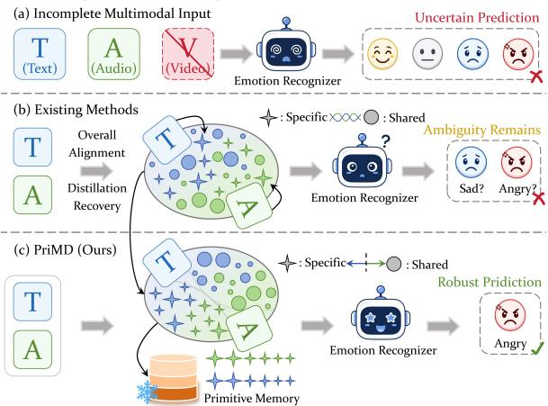  
Figure 1: (a) Real-world inputs may suffer from partial modality missingness, leading to uncertain predictions. (b) Existing holistic generation, alignment, or distillation methods treat missing modalities as a whole. This tends to mix modality-shared semantics with uncertain modality-specific details, leaving the learned representations ambiguous. (c) Our PriMD first disentangles shared semantics from modality-specific information and performs constrained compensation for the missing modality-specific information. This enables more robust predictions under missing-modality conditions.

To address incomplete modalities, existing methods for incomplete multimodal emotion recognition can be broadly grouped into three categories.

Modality completion methods recover missing features from available modalities through generators, reconstruction networks, or cross-modal mappings (Kingma and Welling, 2014; Goodfellow et al., 2014; Ho et al., 2020; Lipman et al., 2023; Wang et al., 2026a; Yang et al., 2026). However, when the missing modality contains details that are difficult to determine from other modalities, the generated features can be unreliable (Lin and Hu, 2024; Yao et al., 2024; Lin et al., 2024; Zhang et al., 2026b). Representation learning methods impose consistency constraints to map different missing-modality combinations into a unified latent space (Pham et al., 2019; Zhao et al., 2021; Lian et al., 2023; Zhang et al., 2026a). This improves model adaptability, but may suppress modality-specific information (Xu et al., 2024; Wen et al., 2024; Xu et al., 2026; Dong et al., 2026a). Knowledge distillation methods use a full-modality teacher model to guide missing-modality student models through feature, relation, or prediction-distribution distillation (Li et al., 2024a,c,b; Zhuang et al., 2025; Liu et al., 2026a,b). However, most existing distillation strategies focus on transferring teacher knowledge, without distinguishing inferable shared semantics from uncertain modality-specific details. Although these methods bring notable improvements, they still treat missing modalities as a whole during generation, alignment, or distillation. As shown in Figure 1, such holistic processing mixes inferable shared semantics with uncertain modality-specific information. This leaves ambiguity in the repre sentations and leads to unstable predictions under missing-modality conditions.

We argue that the above issue arises because information in a missing modality is not equally recoverable. Specifically, the representation of a modality usually contains both cross-modal shared semantics and modality-specific details. The former describes emotional information that is relatively consistent across modalities and can usually be reliably estimated. The latter is tied to the expression form of a specific modality and is therefore more uncertain. Thus, when a missing modality is generated, aligned, or distilled as a whole, recoverable shared information and uncertain modality-specific details are processed together. This makes it difficult to obtain stable representations under complex missing-modality combinations. Although prior studies on full-modality MER have used feature disentanglement to mitigate modality heterogeneity (Hazarika et al., 2020; Li et al., 2023; Qian et al., 2025; Wang et al., 2026c,b; Yu et al., 2026), these methods mainly focus on representation learning with full-modality inputs and cannot recover modality-specific information under missing conditions. Based on this observation, we argue that incomplete MER should estimate shared semantics while modeling uncertain modality-specific information in a constrained manner.

To address these issues, we propose Primitive Memory Distillation (PriMD), a teacher-student framework for structured missing-modality compensation. PriMD does not treat missing-modality recovery as an isolated generation problem. Instead, it integrates recovery into structured representation learning and teacher-student knowledge transfer. In the full-modality teacher model network, we design Shared-Specific Semantic Decoupling (SSSD) to learn and disentangle crossmodal shared semantics and modality-specific representations. Discrete Primitive Memory Construction (DPMC) further discretizes modality-specific representations into learnable semantic primitives and constructs modality-specific primitive memory banks. Under missing-modality conditions, Dynamic Retrieval-Augmented Distillation (DRAD) dynamically retrieves relevant semantic primitives according to the shared semantics of available modalities. It then performs constrained compensation for missing modality-specific information and aligns the student model with the full-modality teacher, leading to stable representations and predictions. The main contributions of this paper are as follows:

• We revisit incomplete MER from an intramodal perspective and formulate it as a unified process of shared-semantic estimation and constrained compensation of modalityspecific information.

• We design SSSD to disentangle shared and modality-specific features, and DPMC/DRAD to discretize the modality-specific space into semantic primitives and retrieve them for compensation under missing modalities.

• Extensive experiments on three benchmarks show that PriMD outperforms prior methods under diverse missing-modality settings, with especially large gains when two modalities are absent.

## 2 Related Work

Multimodal Learning in MER. Multimodal Emotion Recognition (MER) aims to learn discriminative emotion representations from heterogeneous signals, such as text, speech, and vision. Early methods mainly focused on modality fusion. TFN (Zadeh et al., 2017) models unimodal and cross-modal interactions through tensor outer products, while LMF (Liu et al., 2018) uses low-rank factorization to reduce computational cost. As sequential context and modality asynchrony received increasing attention, later methods further introduced memory mechanisms and cross-modal attention. MFN (Zadeh et al., 2018a) introduces multi-view memory units to model cross-modal interactions over time, whereas MulT (Tsai et al., 2019) adopts directional cross-modal attention to handle unaligned multimodal sequences. To alleviate modality redundancy, noise interference, and semantic inconsistency, recent studies have started to improve model robustness at the representation level. MISR (Zhu et al., 2025a) mitigates bias in emotion distributions through invariance learning, while DecAlign (Qian et al., 2025) models modality-shared semantics and modality-specific components, preserving both semantic consistency and modality differences. While effective, these methods presuppose full-modality inputs and cannot be directly applied when modalities are absent.

Incomplete Multimodal Learning in MER. Missing modalities are a common issue in realworld multimodal emotion recognition. They are usually caused by sensor failures, noise interference, privacy constraints, or automatic recognition errors. Existing methods can be broadly categorized into three categories: modality completion, robust representation learning, and knowledge distillation. CRA (Tran et al., 2017) models modality correlations through cascaded residual autoencoders, while IMDer (Wang et al., 2023d) uses a score-based diffusion model to generate missing features. MPLMM (Guo et al., 2024) and P-RMF (Zhu et al., 2025b) enhance missinginformation reconstruction through prompt learning and latent proxy modalities, respectively. Representation learning methods avoid explicit generation and instead learn the joint distribution of modalities. MCTN (Pham et al., 2019) learns crossmodal representations through cyclic translation, MMIN (Zhao et al., 2021) uses cycle-consistency constraints to compensate for missing information, and GCNet (Lian et al., 2023) further introduces graph neural networks to model temporal dependencies. In recent years, knowledge distillation has also been adopted to transfer supervision from fullmodality teachers models to missing-modality students models (Gou et al., 2021; Yang et al., 2025). For example, UMDF (Li et al., 2024a), CorrKD (Li et al., 2024c), and HRLF (Li et al., 2024b) improve knowledge transfer from the perspectives of selfdistillation, correlation distillation, and hierarchical mutual-information alignment, respectively. However, most existing methods focus on the holistic generation, alignment, and distillation of missing modalities, while paying limited attention to the characterization of modality-specific and shared information. When available modalities cannot reliably infer the missing specific details, such holistic processing may introduce irrelevant or even conflicting features.

## 3 Methodology

Problem Formulation. This paper considers a multimodal emotion recognition task with three modalities: textual, acoustic, and visual signals. Let the full-modality set be ${ \boldsymbol \Omega } = \{ t , a , v \}$ . For a given sample, its multimodal input is represented as $X = \{ X ^ { m } \mid m \in \Omega \}$ , where $X ^ { m } = \bar { \{ x _ { i } ^ { m } \} } _ { i = 1 } ^ { T _ { m } }$ denotes the sequential features of modality m. In the incomplete-modality setting, only a subset of modalities is available to the model. We use $O \subseteq \Omega$ to denote the available modality set and $M = \Omega \backslash O$ to denote the missing modality set, where $O \neq \emptyset$ $O \cup M = \Omega .$ , and $O \cap M = \emptyset$ . Accordingly, $X _ { O } =$ $\{ X ^ { m } \mid m \in O \}$ denotes the available modality input, while $X _ { M } = \{ X ^ { m } \mid m \in M \}$ denotes the missing-modality feature set. To represent different missing-modality combinations, we use a modality mask $c = [ c _ { t } , c _ { a } , c _ { v } ]$ , where $c _ { m } = 1$ indicates that modality m is available, and $c _ { m } = 0$ indicates that it is missing.

Overview. As shown in Figure 2, the proposed PriMD consists of a full-modality teacher model and an incomplete-modality student model. The teacher model first disentangles complete multimodal representations into cross-modal shared semantics and modality-specific information, and then constructs a discrete primitive memory based on the modality-specific information. In the student model, when some modalities are missing, the model dynamically retrieves relevant primitives according to the shared semantics of the available modalities to compensate for the missing modalityspecific information. Finally, PriMD aligns the student model with the full-modality teacher model via retrieval-augmented distillation.

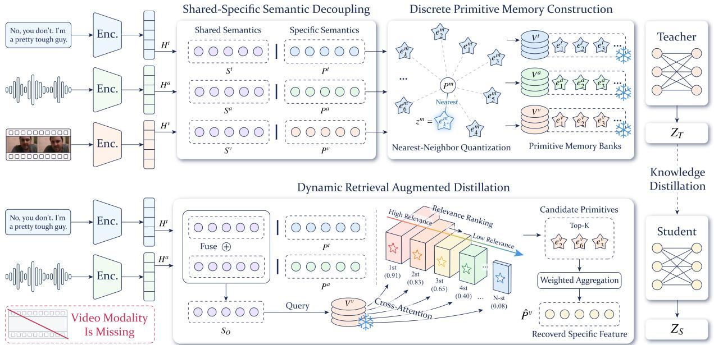  
Figure 2: Overall framework of PriMD. The full-modality teacher model first encodes the inputs and disentangles shared semantics from modality-specific information via SSSD. Then, DPMC quantizes the modality-specific representations into discrete semantic primitives and constructs primitive memory banks. In missing-modality scenarios, the student model uses DRAD to dynamically retrieve relevant primitives from the memory banks based on the semantics of available modalities, enabling constrained compensation for the missing information. Finally, the compensated student model representations are aligned with the teacher model through retrieval-augmented distillation.

## 3.1 Shared-Specific Semantic Decoupling

Multimodal representations usually contain both cross-modal shared semantics and modalityspecific information. Effectively disentangling these two types of information can reduce redundant feature interference in subsequent knowledge transfer and provide a more stable representation basis for missing-modality compensation. To this end, we first use the full-modality teacher network $F _ { T }$ to encode the input of each modality. Given the complete input $X ^ { m }$ , the modality encoder extracts deep features:

$$
H ^ { m } = \psi _ { \mathrm { e n c } } ^ { m } ( X ^ { m } ) \in \mathbb { R } ^ { N \times d } ,\tag{1}
$$

where N denotes the number of samples in a minibatch. Then, two independent projection branches map $H ^ { m }$ into the shared semantic representation $S ^ { m }$ and the modality-specific representation $P ^ { m }$

$$
S ^ { m } = \psi _ { s } ( H ^ { m } ) \in \mathbb { R } ^ { N \times d } ,\tag{2}
$$

$$
P ^ { m } = \psi _ { p } ( H ^ { m } ) \in \mathbb { R } ^ { N \times d } .\tag{3}
$$

To encourage $S ^ { m }$ to capture cross-modal shared information, we minimize the distance between shared representations from different modalities:

$$
L _ { \mathrm { A l i g n } } = \frac { 2 } { N | \Omega | ( | \Omega | - 1 ) } \sum _ { m \in \Omega } \sum _ { n > m } \left\| S ^ { m } - S ^ { n } \right\| _ { F } ^ { 2 } .\tag{4}
$$

Meanwhile, to suppress the statistical dependence between the shared semantic representation and the modality-specific representation, and to make $P ^ { m }$ focus more on modality-specific information, we map the features into a reproducing kernel Hilbert space and use the Hilbert-Schmidt Independence Criterion as a constraint:

$$
L _ { \mathrm { I n d e p } } = \sum _ { m \in \Omega } \frac { 1 } { ( N - 1 ) ^ { 2 } } \operatorname { T r } \left( K _ { S } ^ { m } C _ { N } K _ { P } ^ { m } C _ { N } \right) ,\tag{5}
$$

where $\begin{array} { r } { C _ { N } = I _ { N } - \frac { 1 } { N } \mathbf { 1 } _ { N } \mathbf { 1 } _ { N } ^ { \top } } \end{array}$ denotes the centering matrix, and $\operatorname { T r } ( \cdot )$ denotes the matrix trace. $K _ { S } ^ { m }$ and $K _ { P } ^ { m }$ are the Gram matrices of $S ^ { m }$ and $P ^ { m }$ under the radial basis function kernel mapping, respectively. $I _ { N } \in \mathbb { R } ^ { N \times N }$ is the identity matrix, and ${ \bf 1 } _ { N } \in \mathbb { R } ^ { N }$ is an all-one vector. After disentanglement, the teacher network concatenates the shared and modality-specific features of all modalities and outputs $Z _ { T }$ through the classifier $\Phi _ { \mathrm { C l s } } ^ { T }$

$$
Z _ { T } = \Phi _ { \mathrm { C l s } } ^ { T } ( { \mathrm { C o n c a t } } _ { m \in \Omega } ( S ^ { m } , P ^ { m } ) ) .\tag{6}
$$

## 3.2 Discrete Primitive Memory Construction

Continuous high-dimensional feature spaces usually exhibit large distributional variance. When modalities are missing, directly regressing such continuous features is often difficult to optimize and may introduce strong uncertainty. To reduce the difficulty of missing-information compensation and provide more reliable prior representations, we discretize the disentangled modality-specific representations into a finite number of semantic primitives and construct modality-specific primitive memory banks.

For modality m, we define its learnable primitive memory bank as:

$$
V ^ { m } = \{ e _ { 1 } ^ { m } , e _ { 2 } ^ { m } , \hdots , e _ { C } ^ { m } \} \in \mathbb { R } ^ { C \times d } ,\tag{7}
$$

where C denotes the primitive capacity. Given the modality-specific representation $\begin{array} { r l r l } { P ^ { m } } & { { } } & { = } \end{array}$ $\{ p _ { i } ^ { m } \} _ { i = 1 } ^ { N } \in \bar { \mathbb { R } } ^ { N \times d }$ , we quantize each sample representation $p _ { i } ^ { m }$ to the nearest semantic primitive in the memory bank:

$$
k _ { i } ^ { * } = \arg \operatorname* { m i n } _ { 1 \leq k \leq C } \| p _ { i } ^ { m } - e _ { k } ^ { m } \| _ { 2 } ^ { 2 } , \quad z _ { i } ^ { m } = e _ { k _ { i } ^ { * } } ^ { m } ,\tag{8}
$$

where all quantized primitive representations form $Z ^ { m } = \bar { \{ z _ { i } ^ { m } \} } _ { i = 1 } ^ { N } \in \bar { \mathbb { R } } ^ { N \times d }$ . To make the discrete primitives in the memory bank fit the distribution of modality-specific representations while preventing continuous representations from deviating excessively from their matched primitives during training, we use a vector quantization loss with a commitment constraint:

$$
\begin{array} { r l r } {  { L _ { \mathrm { V Q } } = \sum _ { m \in \Omega } \Big ( \| \mathrm { s g } ( P ^ { m } ) - Z ^ { m } \| _ { F } ^ { 2 } } } \\ & { } & { +  \beta \| P ^ { m } - \mathrm { s g } ( Z ^ { m } ) \| _ { F } ^ { 2 } \Big ) , } \end{array}\tag{9}
$$

where $\operatorname { s g } ( \cdot )$ denotes the stop-gradient operation, and $\beta$ is a tunable parameter. After the teacher stage is completed, the modality-specific primitive memory banks are frozen and used as prior retrieval spaces in the student stage.

## 3.3 Dynamic Retrieval-Augmented Distillation

When modalities are missing, the student network lacks complete input cues. Directly aligning it with the full-modality teacher model may introduce incorrect or unstable feature matching. To address this issue, we retrieve from the frozen primitive memory banks to provide constrained feature compensation for missing modalities. Moreover, considering differences in sample difficulty and missing-modality combinations, a fixed number of retrieved primitives is insufficient for complex scenarios (Song et al., 2023). Therefore, we design a dynamic retrieval-augmented distillation strategy.

For each missing modality $m \in M$ , the student network $F _ { S }$ first extracts and fuses shared semantics from the available modality set $O \mathrm { : }$

$$
S _ { O } = \operatorname { F u s e } \left( \left\{ S ^ { o } \mid o \in O \right\} \right) \in \mathbb { R } ^ { N \times d } .\tag{10}
$$

where Fuse(·) denotes the available-modality shared-semantics fusion operator. Then, using $S _ { O }$ as the query, we compute the relevance scores between $S _ { O }$ and the primitives in the memory bank $V ^ { m }$ of the missing modality m:

$$
A ^ { m } = \mathrm { S o f t m a x } ( \frac { ( S _ { O } W _ { q } ) ( V ^ { m } W _ { k } ) ^ { \top } } { \sqrt { d _ { r } } } ) \in \mathbb { R } ^ { N \times C } .\tag{11}
$$

Here, $W _ { q }$ and $W _ { k }$ map the shared semantics and primitives into the same retrieval space, respectively. $d _ { r }$ is the dimension of the retrieval space, and Softmax(·) is applied along the primitive dimension. For the b-th sample, we sort the primitives in the memory bank in descending order according to its relevance scores $A _ { b } ^ { m }$ . The primitive ranked at position k is denoted as $\tilde { e } _ { b , k } ^ { m }$ , and its attention weight is denoted as $\tilde { a } _ { b , k } ^ { m }$ . To dynamically determine the number of retrieved primitives, we use $\alpha ^ { m } = \mathrm { M L P } ( S _ { O } ) \in \mathbb { R } ^ { N \times K _ { \operatorname* { m a x } } }$ to predict retrieval-number logits for the missing modality $m ,$ and then generate a differentiable retrieval-number distribution:

$$
\pi _ { b , r } ^ { m } = \frac { \exp \left( ( \alpha _ { b , r } ^ { m } + g _ { b , r } ^ { m } ) / \gamma \right) } { \sum _ { j = 1 } ^ { K _ { \operatorname* { m a x } } } \exp \left( ( \alpha _ { b , j } ^ { m } + g _ { b , j } ^ { m } ) / \gamma \right) } ,\tag{12}
$$

where $g _ { b , r } ^ { m } \sim \mathrm { G u m b e l } ( 0 , 1 )$ , γ is a hyperparameter controlling the smoothness of the distribution, and $r \in \{ 1 , \ldots , K _ { \operatorname* { m a x } } \}$ denotes a candidate retrieval number. For candidate retrieval number r, we aggregate the top-r primitives and normalize their attention weights:

$$
\phi _ { b , r } ^ { m } = \frac { \sum _ { k = 1 } ^ { r } \widetilde { a } _ { b , k } ^ { m } \widetilde { e } _ { b , k } ^ { m } } { \sum _ { k = 1 } ^ { r } \widetilde { a } _ { b , k } ^ { m } + \epsilon } .\tag{13}
$$

Finally, the compensated representation of the missing modality m for the b-th sample is obtained as:

$$
\hat { P } ^ { m } = \left( \sum _ { r = 1 } ^ { K _ { \operatorname* { m a x } } } \pi _ { b , r } ^ { m } \phi _ { b , r } ^ { m } \right) _ { b = 1 } ^ { N } \in \mathbb { R } ^ { N \times d } .\tag{14}
$$

After obtaining the compensated representations, the student network concatenates the shared semantics of the available modalities, the modalityspecific representations of the available modalities, and compensated missing-modality representations. The concatenated representation is fed into the classifier $\Phi _ { \mathrm { C l s } } ^ { S }$ to produce the student logits:

$$
\begin{array} { r l } & { Z _ { S } = \Phi _ { \mathrm { C l s } } ^ { S } } \\ & { \quad \Big ( \mathrm { C o n c a t } \left( S _ { O } , \mathrm { C o n c a t } P ^ { o } , \mathrm { C o n c a t } \hat { P } ^ { m } \right) \Big ) . } \end{array}\tag{15}
$$

To prevent the model from always selecting the maximum retrieval number, we introduce a nonlinear cost penalty for retrieval:

$$
L _ { \mathrm { C o s t } } = \frac { 1 } { N } \sum _ { b = 1 } ^ { N } \sum _ { m \in M } \sum _ { r = 1 } ^ { K _ { \mathrm { m a x } } } \pi _ { b , r } ^ { m } ( \exp ( \frac { r } { K _ { \mathrm { m a x } } } ) - 1 ) .\tag{16}
$$

Finally, we use the output $Z _ { T }$ of the frozen fullmodality teacher model as soft labels to distill knowledge into the student model:

$$
\begin{array} { r l } & { L _ { \mathrm { K D } } = \tau _ { \mathrm { K D } } ^ { 2 } \cdot D _ { \mathrm { K L } } \Big ( \mathrm { S o f t m a x } ( Z _ { T } / \tau _ { \mathrm { K D } } ) } \\ & { ~ \Big \| \mathrm { S o f t m a x } ( Z _ { S } / \tau _ { \mathrm { K D } } ) \Big ) , } \end{array}\tag{17}
$$

where $\tau _ { \mathrm { K D } }$ is the distillation temperature.

## 3.4 Joint Optimization

We train PriMD with a two-stage optimization strategy. In the teacher stage, we use full-modality data to optimize the full-modality teacher network $F _ { T }$ and the modality-specific primitive memory banks V. After training, the teacher network and memory banks are frozen and used as the knowledge source and retrieval space for the student stage. In the student stage, we train the student network $F _ { S }$ with missing-modality masks, enabling it to perform dynamic retrieval, feature compensation, and knowledge alignment under incomplete-modality conditions. The optimization objectives of the two stages are defined as:

$$
\begin{array} { r l } & { L _ { \mathrm { T e a } } = L _ { \mathrm { T a s k } } ^ { T } + \lambda _ { \mathrm { A l i g n } } L _ { \mathrm { A l i g n } } } \\ & { ~ + ~ \lambda _ { \mathrm { I n d e p } } L _ { \mathrm { I n d e p } } + \lambda _ { \mathrm { V Q } } L _ { \mathrm { V Q } } , } \end{array}\tag{18}
$$

$$
{ \cal L } _ { \mathrm { S t u } } = { \cal L } _ { \mathrm { T a s k } } ^ { S } + { \cal L } _ { \mathrm { K D } } + { \cal L } _ { \mathrm { C o s t } } .\tag{19}
$$

where $\lambda _ { \mathrm { A l i g n } } , \lambda _ { \mathrm { I n d e p } }$ , and $\lambda _ {  { \mathrm { V Q } } }$ weight the corresponding losses.

## 4 Experiments

## 4.1 Experiment Setup

Datasets. To evaluate the effectiveness of our proposed method, we conduct extensive experiments on three datasets: IEMOCAP (Busso et al., 2008), CMU-MOSI (Zadeh et al., 2016), and CMU-MOSEI (Zadeh et al., 2018b).

Evaluation Metrics. For IEMOCAP, we report Weighted Accuracy (WA) and Unweighted Accuracy (UA). For CMU-MOSI and CMU-MOSEI, we adopt task-specific metrics, including Accuracy (ACC), F1-score, and Mean Absolute Error (MAE), following the corresponding experimental settings.

Details of the datasets and evaluation metrics are shown in Appendix A.

Implementation Details. Detailed experimental setup and parameters are provided in Appendix B.

## 4.2 Comparison with SOTA Methods

Comparison under inter-modal missingness. To evaluate the robustness of PriMD in incomplete multimodal scenarios, we quantitatively compare it with SOTA methods under different missingmodality settings, as shown in Table 1. PriMD achieves the best average performance across all three experimental settings in terms of the average over the six missing-modality combinations. Specifically, on the four-class IEMOCAP task, PriMD achieves 77.43% WA and 77.28% UA, outperforming the second-best method, HARDY-MER, by 1.87% and 1.86%, respectively. On the more challenging six-class IEMOCAP task, PriMD achieves 58.13% WA and 54.62% UA, improving over HARDY-MER by 1.42% and 1.97%, respectively. On CMU-MOSEI, PriMD obtains an average ACC/F1 of 79.81%/79.57%, also surpassing existing methods. Overall, these results indicate that holistic reconstruction or direct alignment of missing modalities is susceptible to uncertain modalityspecific information. In contrast, PriMD performs constrained compensation for missing-specific information through shared-semantics-guided primitive retrieval, thereby more effectively mitigating representation shifts caused by missing modalities.

Comparison for Intra-modal Missingness: We further evaluate the robustness of PriMD under intra-modal missingness on CMU-MOSI and CMU-MOSEI. Following previous works (Zhang et al., 2024; Zhu et al., 2025b), we gradually increase the missing rate from 0.0 to 0.9. As shown in Figure 3, the performance of most methods decreases as the missing rate increases, while PriMD maintains higher F1 scores and lower MAE under most missing-rate settings. In contrast, P-RMF mitigates the information deficiency via proxy modalities, but its compensation still operates on holistic representations and therefore making it vulnerable to uncertain details when intra-modal information is continuously lost. For LNLN, its F1 score improves under some settings as the missing rate increases, whereas its MAE continues to increase. This suggests that its classification results may be affected by data bias, making the model more likely to predict high-frequency classes rather than learn stable affective representations. PriMD shows more stable performance across different missing rates, indicating that it can capture shared semantics from the remaining modalities and reduce the representation shift caused by intra-modal information loss.

Table 1: Performance comparison with SOTA methods on two datasets under various missing-modality scenarios. "Avg." indicates the mean performance across all settings. The best and suboptimal results are highlighted. A, T, and V denote the acoustic, textual, and visual modalities, respectively. Gray shading indicates the presence of a modality, while gray dashed lines indicate its absence.
<table><tr><td rowspan="2">Dataset</td><td rowspan="2">Method</td><td colspan="2">A①①</td><td colspan="2">@①①</td><td colspan="2">A①0</td><td colspan="2">A①V</td><td colspan="2">A①0</td><td colspan="2">A00</td><td colspan="2">Avg.</td></tr><tr><td>WA(%)</td><td>UA(%)</td><td>WA(%)</td><td>UA(%)</td><td>WA(%)</td><td>UA(%)</td><td>WA(%)</td><td>UA(%)</td><td>WA(%)</td><td>UA(%)</td><td>WA(%)</td><td>UA(%)</td><td>WA(%)</td><td>UA(%)</td></tr><tr><td rowspan="7">IEMOCAP Four Class</td><td>CPMNet (Zhang et al., 2022)</td><td>46.85</td><td>51.72</td><td>45.63</td><td>45.32</td><td>44.95</td><td>44.49</td><td>34.81</td><td>36.23</td><td>48.67</td><td>49.33</td><td>45.62</td><td>46.57</td><td>44.42</td><td>45.61</td></tr><tr><td>MMIN (Zhao et al., 2021)</td><td>56.58</td><td>59.00</td><td>66.57</td><td>68.02</td><td>52.52</td><td>50.60</td><td>72.94</td><td>71.14</td><td>63.99</td><td>63.43</td><td>71.67</td><td>68.61</td><td>64.05</td><td>63.47</td></tr><tr><td>GCNet (Lian et al., 2023)</td><td>65.58</td><td>68.76</td><td>72.33</td><td>70.42</td><td>57.96</td><td>52.54</td><td>77.02</td><td>76.87</td><td>67.40</td><td>65.64</td><td>75.63</td><td>73.62</td><td>69.32</td><td>67.98</td></tr><tr><td>CIF-MMIN (Liu et al., 2024)</td><td>57.53</td><td>60.06</td><td>67.22</td><td>68.99</td><td>53.46</td><td>51.56</td><td>74.19</td><td>72.59</td><td>64.99</td><td>63.53</td><td>72.40</td><td>69.91</td><td>64.97</td><td>64.44</td></tr><tr><td>MoMKE (Xu et al., 2024)</td><td>69.53</td><td>70.21</td><td>77.30</td><td>77.66</td><td>56.80</td><td>52.03</td><td>79.03</td><td>79.88</td><td>68.57</td><td>66.22</td><td>75.55</td><td>74.18</td><td>71.13</td><td>70.03</td></tr><tr><td>HARDY-MER (Liu et al., 2025)</td><td>72.65</td><td>73.87</td><td>82.49</td><td>82.69</td><td>63.19</td><td>60.54</td><td>81.67</td><td>82.43</td><td>74.19</td><td>74.50</td><td>79.18</td><td>78.51</td><td>75.56</td><td>75.42</td></tr><tr><td>PriMD (Ours)</td><td>73.82</td><td>74.46</td><td>84.13</td><td>84.09</td><td>64.77</td><td>62.81</td><td>83.65</td><td>84.83</td><td>75.06</td><td>74.84</td><td>83.17</td><td>82.66</td><td>77.43</td><td>77.28</td></tr><tr><td rowspan="7">IEMOCAP Six Class</td><td>CPMNet (Zhang et al., 2022)</td><td>29.47</td><td>29.80</td><td>32.44</td><td>34.95</td><td>26.20</td><td>24.95</td><td>33.49</td><td>33.94</td><td>26.92</td><td>25.46</td><td>31.34</td><td>30.43</td><td>29.98</td><td>29.92</td></tr><tr><td>MMIN (Zhao et al., 2021)</td><td>44.08</td><td>42.96</td><td>42.17</td><td>38.55</td><td>35.74</td><td>30.65</td><td>51.95</td><td>48.31</td><td>41.92</td><td>38.15</td><td>47.49</td><td>40.63</td><td>43.89</td><td>39.88</td></tr><tr><td>GCNet (Lian et al., 2023)</td><td>49.95</td><td>46.45</td><td>56.48</td><td>55.62</td><td>39.78</td><td>34.97</td><td>58.24</td><td>57.25</td><td>47.57</td><td>43.31</td><td>57.43</td><td>54.66</td><td>51.58</td><td>48.71</td></tr><tr><td>CIF-MMIN (Liu et al., 2024)</td><td>44.96</td><td>43.56</td><td>43.40</td><td>39.71</td><td>36.11</td><td>31.35</td><td>52.43</td><td>49.20</td><td>42.54</td><td>39.22</td><td>48.88</td><td>44.91</td><td>44.72</td><td>41.33</td></tr><tr><td>MoMKE (Xu et al., 2024)</td><td>50.51</td><td>47.38</td><td>61.09</td><td>60.19</td><td>39.07</td><td>34.51</td><td>63.18</td><td>61.94</td><td>48.65</td><td>44.08</td><td>59.92</td><td>57.55</td><td>53.74</td><td>50.94</td></tr><tr><td>HARDY-MER (Liu et al., 2025)</td><td>51.58</td><td>49.14</td><td>65.89</td><td>61.95</td><td>43.02</td><td>36.49</td><td>65.18</td><td>62.98</td><td>52.91</td><td>47.45</td><td>61.66</td><td>57.86</td><td>56.71</td><td>52.65</td></tr><tr><td>PriMD (Ours)</td><td>53.62</td><td>51.43</td><td>66.21</td><td>62.17</td><td>45.35</td><td>39.86</td><td>65.78</td><td>63.66</td><td>54.17</td><td>49.82</td><td>63.65</td><td>60.77</td><td>58.13</td><td>54.62</td></tr><tr><td rowspan="9"></td><td></td><td>ACC(%)</td><td>F1(%)</td><td>ACC(%)</td><td>F1(%)</td><td>ACC(%)</td><td>F1(%)</td><td>ACC(%)</td><td>F1(%)</td><td>ACC(%)</td><td>F1(%)</td><td>ACC(%)</td><td>F1(%)</td><td>ACC(%)</td><td>F1(%)</td></tr><tr><td>CPMNet (Zhang et al., 2022)</td><td>65.71</td><td>65.18</td><td>72.87</td><td>72.44</td><td>61.23</td><td>61.73</td><td>72.65</td><td>72.24</td><td>61.56</td><td>61.99</td><td>66.29</td><td>66.84</td><td>66.72</td><td>66.74</td></tr><tr><td>MMIN (Zhao et al., 2021)</td><td>58.90</td><td>59.50</td><td>82.20</td><td>82.40</td><td>59.30</td><td>60.01</td><td>83.70</td><td>83.30</td><td>63.55</td><td>61.91</td><td>81.75</td><td>81.42</td><td>71.57</td><td>71.42</td></tr><tr><td>GCNet (Lian et al., 2023)</td><td>72.04</td><td>70.34</td><td>84.26</td><td>84.17</td><td>68.08</td><td>67.25</td><td>85.10</td><td>85.10</td><td>71.49</td><td>69.96</td><td>84.74</td><td>84.54</td><td>77.62</td><td>76.89</td></tr><tr><td>CIF-MMIN (Liu et al., 2024)</td><td>63.87</td><td>64.60</td><td>83.53</td><td>83.04</td><td>61.96</td><td>62.66</td><td>84.01</td><td>83.47</td><td>64.68</td><td>62.08</td><td>82.50</td><td>81.94</td><td>73.43</td><td>72.97</td></tr><tr><td>MoMKE (Xu et al., 2024)</td><td>72.56</td><td>71.03</td><td>86.10</td><td>86.03</td><td>64.50</td><td>63.46</td><td>86.32</td><td>86.29</td><td>72.37</td><td>72.07</td><td>86.90</td><td>86.91</td><td>78.13</td><td>77.63</td></tr><tr><td>CMAD (Zhuang et al., 2025)</td><td>63.00</td><td>60.80</td><td>86.10</td><td>86.00</td><td>65.70</td><td>64.40</td><td>86.30</td><td>86.20</td><td>65.60</td><td>64.80</td><td>86.40</td><td>86.40</td><td>75.52</td><td>74.77</td></tr><tr><td>HARDY-MER (Liu et al., 2025)</td><td>74.82</td><td>74.11</td><td>87.20</td><td>87.13</td><td>69.35</td><td>67.50</td><td>85.42</td><td>85.01</td><td>74.82</td><td>74.11</td><td>85.72</td><td>85.39</td><td>79.56</td><td>78.88</td></tr><tr><td>PriMD (Ours)</td><td>74.61</td><td>74.25</td><td>87.36</td><td>87.24</td><td>68.96</td><td>67.36</td><td>87.26</td><td>87.69</td><td>73.85</td><td>73.61</td><td>86.81</td><td>87.27</td><td>79.81</td><td>79.57</td></tr></table>

## 4.3 Ablation Study

To verify the effectiveness of the core modules in PriMD, we conducted ablation experiments. The results are shown in Table 2.

1) w/o SSSD: To evaluate the role of sharedspecific semantic disentanglement, we replace the two projection branches with a single projection, so that each modality yields one entangled representation, without separating cross-modal shared semantics from modality-specific information. The average performance of this variant drops to 74.36% WA and 74.05% UA. The results show that directly mixing these two types of information for subsequent memory construction and distillation makes the model vulnerable to redundant or unstable modality-specific information, thereby weakening its representation robustness under missingmodality scenarios.

2) w/o DPMC: To analyze the contribution of discrete primitive memory construction, we removed DPMC. Compared with the full model, this variant decreases the average WA/UA to 75.95%/75.76%, respectively. This indicates that modality-specific information in the continuous feature space is uncertain, and directly performing generation or alignment makes it difficult to obtain stable representations. DPMC provides a more constrained compensation space for missing specific information through primitive memory.

3) w/o DRAD: To verify the contribution of dynamic retrieval-augmented distillation, we remove the entire DRAD module. In this variant, the student model uses only the shared and modalityspecific representations of the available modalities. The results show that this setting leads to the most severe performance degradation, with average results of only 72.31% WA and 72.10% UA. This indicates that representations from the available modalities alone are insufficient to adapt to different missing-modality combinations.

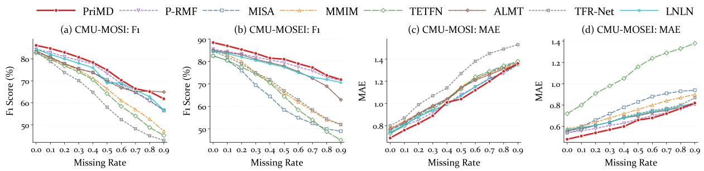  
Figure 3: Performance curves of different methods under varying missing rates on the CMU-MOSI and CMU-MOSEI datasets. Subfigures (a)-(b) and (c)-(d) show F1 and MAE results on MOSI and MOSEI, respectively.

Table 2: Results of the ablation experiments under the Four-Class IEMOCAP. The best results are highlighted.
<table><tr><td rowspan="2">Dataset</td><td rowspan="2">Modules</td><td colspan="2"> $\overline { { \textbf { \textsf { A } } _ { \because , \because } ^ { \cdots } ; \overset { } { \langle } \overset { \cdots } { \langle } \overset { } { \langle } \overset { } { \langle } \overset { \cdots } { \langle } \overset { } { \langle } \overset { } { \langle } \overset { } { \langle } \overset { } { \langle } \overset { } { \langle } \overset { \cdots } { \langle } \overset { } { \langle } \overset { } { \langle } \overset { } { \langle } \overset { } { \langle } \overset { } { \langle } \overset { } { \langle } \overset { \cdots } { \langle } \overset { } { \langle } \overset { } { \langle } \overset { } { \langle } \overset { } { \langle } \overset { } { \langle } \overset { } { \langle } \overset { } { \langle } \overset { } { \langle } \overset { } { \langle } \overset { \dots } { \langle } \overset { } { \langle } \overset { } { \langle } \overset { } { \langle } \overset { } { \langle } \overset { } { \langle } \overset { } \rangle } { \langle \overset { } \langle } \overset { } { \langle } \overset { } { \langle } \overset { } \rangle } { \langle \overset { } \langle } \overset { } { \langle } \overset { } \rangle  { \langle \overset { } \langle } \overset { } { \langle } \overset { } \langle \overset { } \langle  \overset { } { \langle } \overset { \langle } \overset { } \langle \overset { } \langle  \overset { } { \langle } \overset { \langle } \overset { } \langle \overset { } \langle  \overset { } { \langle } \overset { \langle } \overset { } \langle  \overset { \langle } \overset { } \langle \overset { } \langle  \overset { } \overset { \langle } \overset { } \langle \overset { } \langle \overset  { \langle } \overset { } \overset { \langle } \overset { \langle } \overset  { \langle \overset } { \langle } \overset \overset { } \langle \overset { } \langle \overset  { \langle \overset } { \langle \overset } \overset { \langle } \overset \overset { } \langle \overset \langle  \overset { \langle } \overset { \langle \overset } \overset { \langle \langle } \overset \overset \overset { } \overset \langle \overset \langle \overset  { \langle \overset \overset } \overset { \langle \overset \langle } \overset \overset \overset \overset { \langle } \overset \overset \overset \overset$ </td><td colspan="2"> $\therefore \overrightarrow { A } \overrightarrow { \vdots } \overrightarrow { \bigtriangledown } \therefore \overrightarrow { \bigtriangledown } \overrightarrow { \vdots }$ </td><td colspan="2"> $\therefore A : \langle T \rangle : \pmb { \nu }$ </td><td colspan="2"> $\widehat { \mathbf { A } } \widehat { \mathbf { \Xi } } \mathbf { T } \widehat { \mathbf { \Xi } } \dot { \mathbf { \Xi } } \dot { \mathbf { \Xi } } \dot { \mathbf { \Xi } } $ </td><td colspan="2"> $\pmb { \mathscr { s } } _ { \dagger } ^ { \prime \dagger } \} ^ { \dagger } ( \pmb { \nu }$ </td><td colspan="2"> $\therefore \overrightarrow { A } \vdots \overrightarrow { \bigtriangledown } \textbf { \textsf { V } }$ </td><td colspan="2"> $\operatorname { A v g } .$ </td></tr><tr><td>WA(%)</td><td>UA(%)</td><td>WA(%)</td><td>UA(%)</td><td>WA(%)</td><td>UA(%)</td><td>WA(%)</td><td>UA(%)</td><td>WA(%)</td><td>UA(%)</td><td>WA(%)</td><td>UA(%)</td><td>WA(%)</td><td>UA(%)</td></tr><tr><td rowspan="4">IEMOCAP Four Class</td><td>w/o SSSD</td><td>70.15</td><td>70.82</td><td>81.25</td><td>81.02</td><td>61.34</td><td>59.45</td><td>80.77</td><td>81.12</td><td>72.41</td><td>72.05</td><td>80.22</td><td>79.85</td><td>74.36</td><td>74.05</td></tr><tr><td>w/o DPMC</td><td>72.41</td><td>73.15</td><td>82.88</td><td>82.91</td><td>63.12</td><td>61.05</td><td>81.95</td><td>82.74</td><td>73.88</td><td>73.61</td><td>81.45</td><td>81.12</td><td>75.95</td><td>75.76</td></tr><tr><td>w/o DRAD</td><td>69.88</td><td>70.02</td><td>79.45</td><td>79.12</td><td>58.76</td><td>57.11</td><td>78.33</td><td>79.65</td><td>69.52</td><td>69.18</td><td>77.94</td><td>77.53</td><td>72.31</td><td>72.10</td></tr><tr><td>PriMD (Ours)</td><td>73.82</td><td>74.46</td><td>84.13</td><td>84.09</td><td>64.77</td><td>62.81</td><td>83.65</td><td>84.83</td><td>75.06</td><td>74.84</td><td>83.17</td><td>82.66</td><td>77.43</td><td>77.28</td></tr></table>

## 4.3.1 Decomposition and Compensation

As shown in Table 3(a), we constructed a capacitymatched variant, Holistic-PriMD, to evaluate the role of shared-specific semantic disentanglement. This variant constructs the memory banks directly from holistic modality representations and queries them using the fused representation of the available modalities. Compared with Holistic-PriMD, PriMD improved WA/UA from 75.02%/74.81% to 77.43%/77.28%, while reducing cross-combination JS and teacher–student KL from 0.091/0.121 to 0.066/0.081. These results indicate that sharedspecific semantic disentanglement improves recognition performance and reduces prediction shifts across missing-modality combinations and teacher– student discrepancies under matched model capacity.

As shown in Table 3(b), we further separated the contribution of semantic disentanglement from that of the compensation mechanism by comparing SSSD+MLP, SSSD+CVAE, continuous compensation, and discrete primitive retrieval under the same SSSD framework. PriMD achieved the highest WA/UA of 77.43%/77.28% and the lowest JS/KL of 0.066/0.081. Moreover, its normalized withinclass dispersion was 0.64, compared with 1.00 for continuous compensation. These results indicate that discrete primitive retrieval provides an independent benefit under the same disentanglement framework and is associated with a more compact within-class distribution.

## 4.3.2 SSSD Components

4) Ablation Study on SSSD: To further verify the role of different constraints in SSSD, we separately remove the shared semantic alignment loss $L _ { \mathrm { A l i g n } }$ and the independence constraint $L _ { I n d e p } .$ As shown in Table 5, using only $L _ { \mathrm { A l i g n } }$ or $L _ { I n d e p }$ leads to lower performance than the full setting. This indicates that $L _ { \mathrm { A l i g n } }$ helps improve the consistency of shared semantics across modalities, while $L _ { I n d e p }$ reduces redundant correlations between shared and modality-specific representations. By combining them, the model achieves more effective disentanglement.

## 4.4 Computational Efficiency

As shown in Table 4, PriMD reduces the parameter count, training time, and peak CUDA memory by 79.7%, 51.4%, and 82.2%, respectively, compared with HARDY-MER, while increasing inference latency by 8.1%.

## 4.5 Hyperparameter Sensitivity

We evaluate the sensitivity of PriMD to the primitive capacity C and β in DPMC. As shown in Figure 4, PriMD remains stable across a wide range of settings. A smaller C limits the diversity of specific primitives, while an excessively large C may introduce redundant primitives and reduce retrieval reliability. Similarly, a smaller $\beta$ provides insufficient constraints between modality-specific features and discrete primitives, whereas a larger $\beta$ over-constrains the representation space. These results show that PriMD benefits from a primitive space with balanced constraints for missingmodality compensation.

Table 3: Analysis of shared-specific decomposition and feature compensation on Four-Class IEMOCAP. Disp. denotes normalized within-class dispersion. The best results are highlighted.
<table><tr><td>(a) Shared-specific decomposition</td><td>WA (%)</td><td>UA (%)</td><td>Cross-combination JS ↓</td><td>Teacher-student KL ↓</td></tr><tr><td>Holistic-PriMD</td><td> $7 5 . 0 2 \pm 0 . 5 8$ </td><td> $7 4 . 8 1 \pm 0 . 6 1$ </td><td> $0 . 0 9 1 \pm 0 . 0 0 4$ </td><td> $0 . 1 2 1 \pm 0 . 0 0 6$ </td></tr><tr><td>PriMD (Ours)</td><td> $7 7 . 4 3 \pm 0 . 4 3$ </td><td> $7 7 . 2 8 \pm 0 . 4 7$ </td><td> $0 . 0 6 6 \pm 0 . 0 0 3$ </td><td> $0 . 0 8 1 \pm 0 . 0 0 4$ </td></tr></table>

<table><tr><td>(b) Feature compensation</td><td>WA (%)</td><td>UA (%)</td><td>Disp. ↓</td><td>Cross-combination JS ↓</td><td>Teacher-student KL ↓</td></tr><tr><td>SSSD+MLP</td><td> $7 5 . 9 8 \pm 0 . 5 2$ </td><td> $7 5 . 8 1 \pm 0 . 5 6$ </td><td></td><td> $0 . 0 8 9 \pm 0 . 0 0 5$ </td><td> $0 . 1 1 8 \pm 0 . 0 0 7$ </td></tr><tr><td>SSSD+CVAE</td><td> $7 6 . 2 7 \pm 0 . 4 9$ </td><td> $7 6 . 0 8 \pm 0 . 5 3$ </td><td></td><td> $0 . 0 8 2 \pm 0 . 0 0 4$ </td><td> $0 . 1 0 9 \pm 0 . 0 0 6$ </td></tr><tr><td>Continuous compensation</td><td> $7 6 . 3 4 \pm 0 . 4 8$ </td><td> $7 5 . 8 3 \pm 0 . 5 2$ </td><td>1.00</td><td> $0 . 0 7 9 \pm 0 . 0 0 4$ </td><td> $0 . 1 0 6 \pm 0 . 0 0 6$ </td></tr><tr><td>PriMD (Ours)</td><td> $7 7 . 4 3 \pm 0 . 4 3$ </td><td> $7 7 . 2 8 \pm 0 . 4 7$ </td><td>0.64</td><td> $0 . 0 6 6 \pm 0 . 0 0 3$ </td><td> $0 . 0 8 1 \pm 0 . 0 0 4$ </td></tr></table>

Table 4: Computational efficiency comparison.
<table><tr><td>Method</td><td>Params.</td><td>Train (s)</td><td>Memory (MiB)</td><td>Infer. (ms)</td></tr><tr><td>HARDY-MER</td><td>11.52M</td><td>90.981</td><td>1839.4</td><td>26.829</td></tr><tr><td>PriMD (Ours)</td><td>2.34M</td><td>44.205</td><td>327.4</td><td>29.013</td></tr></table>

Table 5: Ablation results of SSSD components.
<table><tr><td colspan="2">SSSD</td><td colspan="2">IEMOCAP Four Class</td><td colspan="2">CMU MOSEI</td></tr><tr><td> $L _ { \mathrm { A l i g n } }$ </td><td> $L _ { I n d e p }$ </td><td>WA(%)</td><td>UA(%)</td><td>ACC(%)</td><td>F1(%)</td></tr><tr><td rowspan="2">√</td><td></td><td>75.39</td><td>75.87</td><td>77.82</td><td>78.06</td></tr><tr><td>V</td><td>75.96</td><td>76.24</td><td>77.58</td><td>77.64</td></tr><tr><td>√</td><td>√</td><td>77.43</td><td>77.28</td><td>79.81</td><td>79.57</td></tr></table>

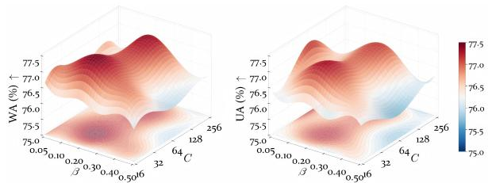  
Figure 4: Parameter sensitivity on $C$ and $\beta$ of PriMD.

## 4.6 Maximum Retrieval Size

We further analyze the effect of $K _ { \mathrm { m a x } } .$ , which controls the maximum number of primitives retrieved by DRAD. As shown in Figure 5, a smaller $K _ { \mathrm { m a x } }$ restricts the student model to very limited modality-specific evidence. Increasing $K _ { \mathrm { m a x } }$ allows the model to consider more complementary primitives and improves the robustness of compensation. However, an excessively large $K _ { \mathrm { m a x } }$ may introduce weakly relevant primitives and dilute the reconstructed representation.

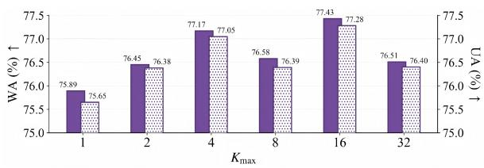  
Figure 5: Performance under different $K _ { m a x }$

## 5 Conclusion

In this paper, we proposed PriMD, a primitive memory distillation framework for incomplete multimodal emotion recognition. Unlike holistic modality-inference methods, PriMD first decomposes multimodal representations into cross-modal shared semantics and modality-specific information, and then discretizes the latter into modalityspecific primitive memories. Under missingmodality conditions, the student model leverages the shared semantics of available modalities to retrieve relevant primitives. This enables constrained compensation for uncertain modality-specific cues and effective distillation from the full-modality teacher model. Extensive experiments showed that PriMD achieves robust performance under both inter-modal and intra-modal missingness. It effectively alleviates the instability caused by holistic feature inference and provides a new perspective for robust incomplete multimodal learning.

## Acknowledgments

We thank the anonymous reviewers for their constructive feedback.

## Limitations

Although PriMD achieves good robustness under various incomplete multimodal settings, several limitations remain. First, PriMD relies on a full modality teacher model to learn shared-specific representations and construct modality-specific primitive memory banks. When full-modality training samples are scarce, biased, or costly to collect, the learned primitives may not fully cover the modalityspecific information in the target domain. To reduce this dependence, future work may combine cross-modal self-supervised pretraining or semisupervised learning to make better use of incomplete samples. Confidence-weighted primitive updates may also allow high-confidence incomplete samples to expand the memory banks. Domain adaptation could further reduce the distribution gap between the training and target domains. Second, our current experiments mainly use sample-level fixed missing masks to simulate inter-modal and intra-modal missingness. In real applications, the set of available modalities may change over time. For example, audio or video sensors may fail temporarily, and input quality may gradually decrease during continuous interaction. Such online missingness can be represented by a time-varying modality mask. PriMD does not yet explicitly model the dependence between missing states at different time steps. Future work will explore time-aware re trieval, modality-quality gating, historical primitive caching, and online memory updates. These methods may allow the model to continuously adjust its compensation strategy according to real-time modality availability and quality, improving reliability and generalization in practical deployment.

## References

Gustavo Aguilar, Viktor Rozgic, Weiran Wang, and Chao Wang. 2019. Multimodal and multi-view models for emotion recognition. In Proceedings of the 57th Conference of the Association for Computational Linguistics, pages 991–1002. Association for Computational Linguistics.

Carlos Busso, Murtaza Bulut, Chi-Chun Lee, Abe Kazemzadeh, Emily Mower, Samuel Kim, Jeannette N. Chang, Sungbok Lee, and Shrikanth S. Narayanan. 2008. IEMOCAP: Interactive emotional

dyadic motion capture database. Language Resources and Evaluation, 42(4):335–359.

Guangyuan Dong, Chuang Liu, Yangchen Zeng, Haoyu Wang, Xiaoyang Yu, Pinlong Zhao, Yuchao Hou, Ziwei Li, and Zheng Lin. 2026a. When generated images look right and retrieve wrong: Coverage-guided cross-scale re-indexing for knowledge-faithful generative perception. arXiv preprint arXiv:2608.20810.

Guangyuan Dong, Lingdong Shen, Xudong Zhang, Zonghao Ying, Haodong Jing, Ziyu Song, Shenghao Liu, Jiachen Luo, Hao Zhang, Haoyu Wang, and Zihao Li. 2026b. Lance: A LANGUAGE-ANCHORED CLOSED-LOOP ESTIMATOR for bridging low-level image fusion and high-level semantic understanding in remote sensing. In Proceedings of the 35th ACM International Conference on Information and Knowledge Management, CIKM ’26.

Tingchen Fu, Sheng Gao, Xueliang Zhao, Ji-Rong Wen, and Rui Yan. 2022. Learning towards conversational AI: A survey. AI Open, 3:14–28.

Ankita Gandhi, Kinjal Adhvaryu, Soujanya Poria, Erik Cambria, and Amir Hussain. 2023. Multimodal sentiment analysis: A systematic review of history, datasets, multimodal fusion methods, applications, challenges and future directions. Information Fusion, 91:424–444.

Zixian Gao, Xun Jiang, Xing Xu, Fumin Shen, Yujie Li, and Heng Tao Shen. 2024. Embracing unimodal aleatoric uncertainty for robust multimodal fusion. In IEEE/CVF Conference on Computer Vision and Pattern Recognition, pages 26866–26875. IEEE.

Ian J. Goodfellow, Jean Pouget-Abadie, Mehdi Mirza, Bing Xu, David Warde-Farley, Sherjil Ozair, Aaron C. Courville, and Yoshua Bengio. 2014. Generative adversarial networks. CoRR, abs/1406.2661.

Jianping Gou, Baosheng Yu, Stephen J Maybank, and Dacheng Tao. 2021. Knowledge distillation: A survey. International journal of computer vision, 129(6):1789–1819.

Bingbing Gu, Saihua Cai, Jing Wang, Zhuole Li, Xiheng Jia, and Jiaqi Zhang. 2026. Dg-scl: Diffusion-guided semantic contrastive learning for imbalanced malicious traffic detection. Information Sciences, page 123851.

Zirun Guo, Tao Jin, and Zhou Zhao. 2024. Multimodal prompt learning with missing modalities for sentiment analysis and emotion recognition. In Proceedings of the 57th Conference of the Association for Computational Linguistics, pages 1726–1736. Association for Computational Linguistics.

Wei Han, Hui Chen, and Soujanya Poria. 2021. Improving multimodal fusion with hierarchical mutual information maximization for multimodal sentiment analysis. In Proceedings of the 2021 Conference on Empirical Methods in Natural Language Processing,

pages 9180–9192. Association for Computational Linguistics.

Devamanyu Hazarika, Roger Zimmermann, and Soujanya Poria. 2020. MISA: modality-invariant and -specific representations for multimodal sentiment analysis. In ACM International Conference on Multimedia, pages 1122–1131. ACM.

Jonathan Ho, Ajay Jain, and Pieter Abbeel. 2020. Denoising diffusion probabilistic models. In Advances in Neural Information Processing Systems.

Diederik P. Kingma and Max Welling. 2014. Autoencoding variational bayes. In International Conference on Learning Representations.

Elsa Andrea Kirchner, Stephen H. Fairclough, and Frank Kirchner. 2019. Embedded multimodal interfaces in robotics: applications, future trends, and societal implications. In The Handbook ofMultimodal-Multisensor Interfaces: Language Processing, Software, Commercialization, and Emerging Directions. Association for Computing Machinery.

Mingcheng Li, Dingkang Yang, Yuxuan Lei, Shunli Wang, Shuaibing Wang, Liuzhen Su, Kun Yang, Yuzheng Wang, Mingyang Sun, and Lihua Zhang. 2024a. A unified self-distillation framework for multimodal sentiment analysis with uncertain missing modalities. In AAAI Conference on Artificial Intelligence, pages 10074–10082. AAAI Press.

Mingcheng Li, Dingkang Yang, Yang Liu, Shunli Wang, Jiawei Chen, Shuaibing Wang, Jinjie Wei, Yue Jiang, Qingyao Xu, Xiaolu Hou, Mingyang Sun, Ziyun Qian, Dongliang Kou, and Lihua Zhang. 2024b. Toward robust incomplete multimodal sentiment analysis via hierarchical representation learning. In Advances in Neural Information Processing Systems.

Mingcheng Li, Dingkang Yang, Xiao Zhao, Shuaibing Wang, Yan Wang, Kun Yang, Mingyang Sun, Dongliang Kou, Ziyun Qian, and Lihua Zhang. 2024c. Correlation-decoupled knowledge distillation for multimodal sentiment analysis with incomplete modalities. In IEEE/CVF Conference on Computer Vision and Pattern Recognition, pages 12458–12468. IEEE.

Yong Li, Yuanzhi Wang, and Zhen Cui. 2023. Decoupled multimodal distilling for emotion recognition. In IEEE/CVF Conference on Computer Vision and Pattern Recognition, pages 6631–6640. IEEE.

Zheng Lian, Lan Chen, Licai Sun, Bin Liu, and Jianhua Tao. 2023. GCNet: Graph completion network for incomplete multimodal learning in conversation. IEEE Transactions on Pattern Analysis and Machine Intelligence, 45(7):8419–8432.

Yunlong Liang, Fandong Meng, Ying Zhang, Yufeng Chen, Jinan Xu, and Jie Zhou. 2022. Emotional conversation generation with heterogeneous graph neural network. Artificial Intelligence, 308:103714.

Ronghao Lin and Haifeng Hu. 2024. Adapt and explore: Multimodal mixup for representation learning. Information Fusion, 105:102216.

Xun Lin, Shuai Wang, Rizhao Cai, Yizhong Liu, Ying Fu, Wenzhong Tang, Zitong Yu, and Alex C. Kot. 2024. Suppress and rebalance: Towards generalized multi-modal face anti-spoofing. In IEEE/CVF Conference on Computer Vision and Pattern Recognition, pages 211–221. IEEE.

Yaron Lipman, Ricky T. Q. Chen, Heli Ben-Hamu, Maximilian Nickel, and Matthew Le. 2023. Flow matching for generative modeling. In International Conference on Learning Representations. OpenReview.net.

Bingchen Liu, Yuanyuan Fang, Lei Liu, Guangyuan Dong, Xing Fu, Yuanyuan Gao, Shuyue Wei, Xin Li, and Xiangtian Meng. 2026a. Conmem: Contributionaware memory for long-horizon manufacturing inspection logs. arXiv preprint arXiv:2607.28126.

Jiaxin Liu, Ding Zhong, Yue Wang, Zhidong Yang, Zhaolu Kang, Guangyuan Dong, Qishi Zhan, Pengcheng Fang, and Aofan Liu. 2026b. Dualpathway circuits of object hallucination in visionlanguage models. arXiv preprint arXiv:2605.13156.

Rui Liu, Haolin Zuo, Zheng Lian, Björn W. Schuller, and Haizhou Li. 2024. Contrastive learning based modality-invariant feature acquisition for robust multimodal emotion recognition with missing modalities. IEEE Transactions on Affective Computing, 15(4):1856–1873.

Rui Liu, Haolin Zuo, Zheng Lian, Hongyu Yuan, and Qi Fan. 2025. Hardness-aware dynamic curriculum learning for robust multimodal emotion recognition with missing modalities. In ACM International Conference on Multimedia, pages 5755–5764. ACM.

Zhun Liu, Ying Shen, Varun Bharadhwaj Lakshminarasimhan, Paul Pu Liang, Amir Zadeh, and Louis-Philippe Morency. 2018. Efficient low-rank multimodal fusion with modality-specific factors. In Proceedings of the 56th Annual Meeting of the Associationfor Computational Linguistics, pages 2247–2256. Association for Computational Linguistics.

Shuo Lu, Jianjie Cheng, Yinuo Xu, Yongcan Yu, Lijun Sheng, Peijie Wang, Siru Jiang, Yongguan Hu, Run Ling, Yihua Shao, et al. 2026a. Do mllms really understand space? a mathematical reasoning evaluation. arXiv preprint arXiv:2602.11635.

Shuo Lu, Yinuo Xu, Jianjie Cheng, Lingxiao He, Meng Wang, and Jian Liang. 2025. Deepresearch-slice: Bridging the retrieval-utilization gap via explicit text slicing. arXiv preprint arXiv:2601.03261.

Shuo Lu, Yinuo Xu, Kecheng Yu, Siru Jiang, Yongcan Yu, Yubin Wang, Haitao Yang, Yuxiang Zhang, Bin Wang, Ran He, et al. 2026b. Worldcoder-bench: Benchmarking physically grounded 3d world synthesis. arXiv preprint arXiv:2606.01869.

Wei Luo, Mengying Xu, and Hanjiang Lai. 2023. Multimodal reconstruct and align net for missing modality problem in sentiment analysis. In MultiMedia Modeling, Lecture Notes in Computer Science, pages 411–422. Springer.

Sijie Mai, Haifeng Hu, and Songlong Xing. 2020. Modality to modality translation: An adversarial representation learning and graph fusion network for multimodal fusion. In AAAI Conference on Artificial Intelligence, pages 164–172. AAAI Press.

Navonil Majumder, Soujanya Poria, Devamanyu Hazarika, Rada Mihalcea, Alexander F. Gelbukh, and Erik Cambria. 2019. DialogueRNN: An attentive rnn for emotion detection in conversations. In AAAI Conference on Artificial Intelligence, pages 6818–6825. AAAI Press.

Louis-Philippe Morency, Rada Mihalcea, and Payal Doshi. 2011. Towards multimodal sentiment analysis: harvesting opinions from the web. In ICMI, pages 169–176. ACM.

Hai Pham, Paul Pu Liang, Thomas Manzini, Louis-Philippe Morency, and Barnabás Póczos. 2019. Found in translation: Learning robust joint representations by cyclic translations between modalities. In AAAI Conference on Artificial Intelligence, pages 6892–6899. AAAI Press.

Chengxuan Qian, Shuo Xing, Shawn Li, Yue Zhao, and Zhengzhong Tu. 2025. Decalign: Hierarchical crossmodal alignment for decoupled multimodal representation learning. CoRR, abs/2503.11892.

Pin Qian, Su Wang, Yihang Chen, Qiaolin Yu, Xiaoyuan Wang, Zhitong Guo, Zhicheng Wang, and Junxian You. 2026a. Toward user-conditioned evaluation of personal llm agents under temporal interventions. arXiv preprint arXiv:2607.21635.

Pin Qian, Su Wang, Xiaoyuan Wang, Yihang Chen, Wenxuan Xu, Qiaolin Yu, Shuhuai Lin, Sipeng Zhang, Junxian You, and Xinpeng Wei. 2026b. Relevant is not warranted: Evidence-force calibration for cited rag. arXiv preprint arXiv:2605.28044.

Krishna Somandepalli, Tanaya Guha, Victor R. Martinez, Naveen Kumar, Hartwig Adam, and Shrikanth Narayanan. 2021. Computational media intelligence: Human-centered machine analysis of media. Proceedings ofthe IEEE, 109(5):891–910.

Zitao Song, Yining Wang, Pin Qian, Sifan Song, Frans Coenen, Zhengyong Jiang, and Jionglong Su. 2023. From deterministic to stochastic: an interpretable stochastic model-free reinforcement learning framework for portfolio optimization. Applied Intelligence, 53(12):15188–15203.

Luan Tran, Xiaoming Liu, Jiayu Zhou, and Rong Jin. 2017. Missing modalities imputation via cascaded residual autoencoder. In IEEE/CVF Conference on Computer Vision and Pattern Recognition, pages 4971–4980. IEEE Computer Society.

Yao-Hung Hubert Tsai, Shaojie Bai, Paul Pu Liang, J. Zico Kolter, Louis-Philippe Morency, and Ruslan Salakhutdinov. 2019. Multimodal transformer for unaligned multimodal language sequences. In Proceedings ofthe 57th Conference ofthe Association for Computational Linguistics, pages 6558–6569. Association for Computational Linguistics.

Juan Vazquez-Rodriguez, Grégoire Lefebvre, Julien Cumin, and James L. Crowley. 2023. Accommodating missing modalities in time-continuous multimodal emotion recognition. In International Conference on Affective Computing and Intelligent Interaction, pages 1–8. IEEE.

Di Wang, Xutong Guo, Yumin Tian, Jinhui Liu, Lihuo He, and Xuemei Luo. 2023a. TETFN: A text enhanced transformer fusion network for multimodal sentiment analysis. Pattern Recognition, 136:109259.

Ning Wang, Hui Cao, Jun Zhao, Ruilin Chen, Dapeng Yan, and Jie Zhang. 2023b. M2r2: Missing-modality robust emotion recognition framework with iterative data augmentation. IEEE Transactions on Artificial Intelligence, 4(5):1305–1316.

Yi Wang, Lanling Zeng, Jiaqi Zhang, and Yang Yang. 2026a. Zero-shot diffusive image restoration with consistency. Signal Processing, 248:110705.

Yiqi Wang, Zihao Yan, Jiaqi Zhang, Zhangkai Wu, Mingkai Zheng, Zequn Sun, Yanming Zhu, and Taotao Cai. 2026b. Map-graph: Provenance-aware shared memory for multi-agent workflows. arXiv preprint arXiv:2608.10509.

Yiqi Wang, Jiaqi Zhang, Taotao Cai, Zirui Liu, Qingqiang Sun, Zequn Sun, Zhangkai Wu, Manqing Dong, Mingkai Zheng, Xuefei Yin, and Yanming Zhu. 2026c. From agent traces to trust: A survey of evidence tracing and execution provenance in LLM agents. CoRR, abs/2606.04990.

Yuanzhi Wang, Zhen Cui, and Yong Li. 2023c. Distribution-consistent modal recovering for incomplete multimodal learning. In IEEE/CVF International Conference on Computer Vision, pages 21968– 21977. IEEE.

Yuanzhi Wang, Yong Li, and Zhen Cui. 2023d. Incomplete multimodality-diffused emotion recognition. In Advances in Neural Information Processing Systems.

Jie Wen, Shijie Deng, Waikeung Wong, Guoqing Chao, Chao Huang, Lunke Fei, and Yong Xu. 2024. Diffusion-based missing-view generation with the application on incomplete multi-view clustering. In International Conference on Machine Learning, volume 235 of Proceedings of Machine Learning Research, pages 52762–52778. PMLR / OpenReview.net.

Junhao Xu, Zheng Liu, Mengqi Zhang, Guangyuan Dong, and Zhumin Chen. 2026. Lever can move

the earth: Towards adaptive semantic capacity balance for image-text retrieval. IEEE Transactions on Multimedia.

Wenxin Xu, Hexin Jiang, and Xuefeng Liang. 2024. Leveraging knowledge of modality experts for incomplete multimodal learning. In ACM International Conference on Multimedia, pages 438–446. ACM.

Chuanpeng Yang, Yao Zhu, Wang Lu, Yidong Wang, Qian Chen, Chenlong Gao, Bingjie Yan, and Yiqiang Chen. 2025. Survey on knowledge distillation for large language models: methods, evaluation, and application. ACM Transactions on Intelligent Systems and Technology, 16(6):1–27.

Yang Yang, Xi Zhang, Jiaqi Zhang, and Lanling Zeng. 2026. Parameterized image restoration with diffusion and gradient priors. Knowledge-Based Systems, 338:115488.

Wenfang Yao, Kejing Yin, William K. Cheung, Jia Liu, and Jing Qin. 2024. Drfuse: Learning disentangled representation for clinical multi-modal fusion with missing modality and modal inconsistency. In AAAI Conference on Artificial Intelligence, pages 16416– 16424. AAAI Press.

Caili Yu, Yiqi Wang, Jiaqi Zhang, Yiqun Duan, Mingkai Zheng, Zhangkai Wu, Kaize Shi, and Taotao Cai. 2026. From faulty memories to corrected actions: Dependency-guided rollback repair for memoryaugmented agents. arXiv preprint arXiv:2608.10502.

Ziqi Yuan, Wei Li, Hua Xu, and Wenmeng Yu. 2021. Transformer-based feature reconstruction network for robust multimodal sentiment analysis. In ACM International Conference on Multimedia, pages 4400– 4407. ACM.

Amir Zadeh, Minghai Chen, Soujanya Poria, Erik Cambria, and Louis-Philippe Morency. 2017. Tensor fusion network for multimodal sentiment analysis. In Proceedings of the 2017 Conference on Empirical Methods in Natural Language Processing, pages 1103–1114. Association for Computational Linguistics.

Amir Zadeh, Paul Pu Liang, Navonil Mazumder, Soujanya Poria, Erik Cambria, and Louis-Philippe Morency. 2018a. Memory fusion network for multiview sequential learning. In AAAI Conference on Artificial Intelligence, pages 5634–5641. AAAI Press.

Amir Zadeh, Paul Pu Liang, Soujanya Poria, Erik Cambria, and Louis-Philippe Morency. 2018b. Multimodal language analysis in the wild: CMU-MOSEI dataset and interpretable dynamic fusion graph. In Proceedings of the 56th Annual Meeting of the Association for Computational Linguistic, pages 2236– 2246. Association for Computational Linguistics.

Amir Zadeh, Rowan Zellers, Eli Pincus, and Louis-Philippe Morency. 2016. MOSI: Multimodal corpus of sentiment intensity and subjectivity analysis in online opinion videos. CoRR, abs/1606.06259.

Changqing Zhang, Yajie Cui, Zongbo Han, Joey Tianyi Zhou, Huazhu Fu, and Qinghua Hu. 2022. Deep partial multi-view learning. IEEE Transactions on Pattern Analysis and Machine Intelligence, 44(5):2402– 2415.

Haoyu Zhang, Wenbin Wang, and Tianshu Yu. 2024. Towards robust multimodal sentiment analysis with incomplete data. In Advances in Neural Information Processing Systems.

Haoyu Zhang, Yu Wang, Guanghao Yin, Kejun Liu, Yuanyuan Liu, and Tianshu Yu. 2023. Learning language-guided adaptive hyper-modality representation for multimodal sentiment analysis. In Proceedings of the 2023 Conference on Empirical Methods in Natural Language Processing, pages 756–767. Association for Computational Linguistics.

Jiaqi Zhang, Xinjie Li, Guo Yang, Kang Yang, Wenjing Wang, and Yang Yang. 2026a. Intrinsic feature consistency learning network for generalizable medical image segmentation. In International Conference on Intelligent Computing, volume 16662 of Lecture Notes in Computer Science, pages 249–260. Springer.

Jiaqi Zhang, Zheng Pang, Rongrong Gao, Qiyuan Zhang, and Yang Yang. 2026b. Local epistemic uncertainty guided active sampling for plug-andplay diffusive image restoration. arXiv preprint arXiv:2608.06981.

Jinming Zhao, Ruichen Li, and Qin Jin. 2021. Missing modality imagination network for emotion recognition with uncertain missing modalities. In Proceedings of the 57th Conference of the Association for Computational Linguistics, pages 2608–2618. Association for Computational Linguistics.

Aoqiang Zhu, Min Hu, Xiaohua Wang, Jiaoyun Yang, Yiming Tang, and Ning An. 2025a. Multimodal invariant sentiment representation learning. In Findings ofthe Associationfor Computational Linguistics, Findings of ACL, pages 14743–14755. Association for Computational Linguistics.

Aoqiang Zhu, Min Hu, Xiaohua Wang, Jiaoyun Yang, Yiming Tang, and Ning An. 2025b. Proxy-driven robust multimodal sentiment analysis with incomplete data. In Proceedings ofthe 63rd Annual Meeting of the Association for Computational Linguistics, pages 22123–22138. Association for Computational Linguistics.

Yan Zhuang, Minhao Liu, Wei Bai, Yanru Zhang, Xiaoyue Zhang, Jiawen Deng, and Fuji Ren. 2025. Cmad: Correlation-aware and modalities-aware distillation for multimodal sentiment analysis with missing modalities. In IEEE/CVF International Conference on Computer Vision, pages 4626–4636.

Haolin Zuo, Rui Liu, Jinming Zhao, Guanglai Gao, and Haizhou Li. 2023. Exploiting modality-invariant feature for robust multimodal emotion recognition with missing modalities. In IEEE International Conference on Acoustics, Speech and Signal Processing, pages 1–5. IEEE.

## A Datasets and Evaluation Metrics

To verify the effectiveness of the proposed method, we conduct extensive experiments on three mainstream multimodal emotion recognition datasets. As shown in Table 6, the IEMOCAP dataset (Busso et al., 2008) contains five dyadic sessions of improvised or scripted dialogues involving ten actors, with two actors in each session. Following existing research settings (Liu et al., 2025, 2024), we evaluate the model on two utterance-level multiclass emotion classification tasks. The four-class setting contains 5,531 utterances from happy (with excited merged into happy), sad, neutral, and angry (Liu et al., 2025; Xu et al., 2024; Liu et al., 2024; Zuo et al., 2023; Zhao et al., 2021). The six-class setting contains 7,433 utterances from happy, sad, neutral, angry, excited, and frustrated (Liu et al., 2025; Mai et al., 2020; Lian et al., 2023; Majumder et al., 2019). For both IEMOCAP tasks, we adopt WA and UA as evaluation metrics.

As shown in Table 7, the CMU-MOSI dataset (Zadeh et al., 2016) contains 2,199 opinionated monologue video clips collected from YouTube, split into 1,284 training samples, 229 validation samples, and 686 test samples. Each utterance-level clip is annotated with a continuous emotion intensity score in [−3, 3], ranging from highly negative to highly positive. As an extension of CMU-MOSI, the CMU-MOSEI dataset (Zadeh et al., 2018b) is a larger and more challenging corpus. It contains 22,856 video clips covering diverse topics, unconstrained environments, and different speakers, with 16,326 training samples, 1,871 validation samples, and 4,659 test samples. CMU-MOSEI uses the same continuous emotion intensity annotations in [−3, 3]. For CMU-MOSI and CMU-MOSEI, the evaluation metrics are selected according to the specific task setting. For binary emotion classification, we follow the standard non-zero binary classification protocol (Xu et al., 2024), where samples with scores greater than 0 are labeled as positive, samples with scores less than 0 are labeled as negative, and zero-score samples are excluded from binary evaluation. In the inter-modal missingness comparison and the noise robustness experiments, we report ACC and F1 for binary emotion classification. Specifically, CMU-MOSEI is evaluated with ACC and F1 in the main inter-modal missingness comparison, while both CMU-MOSI and CMU-MOSEI are evaluated with ACC and F1 in the noise robustness analysis.

<table><tr><td colspan="2">Dataset</td><td># Conversations</td><td># Utterances</td></tr><tr><td rowspan="4">IEMOCAP Four-Class</td><td>Session1</td><td>28</td><td>1085</td></tr><tr><td>Session2</td><td>30</td><td>1023</td></tr><tr><td>Session3</td><td>32</td><td>1151</td></tr><tr><td>Session4 Session5</td><td>30</td><td>1031 1241</td></tr><tr><td rowspan="6">IEMOCAP Six-Class</td><td>Session1</td><td>31 28</td><td>1373</td></tr><tr><td>Session2</td><td>30</td><td>1356</td></tr><tr><td>Session3</td><td>32</td><td>1569</td></tr><tr><td>Session4</td><td>30</td><td>1512</td></tr><tr><td>Session5</td><td></td><td></td></tr><tr><td></td><td>31</td><td>1623</td></tr></table>

Table 6: Statistical information on IEMOCAP.

<table><tr><td rowspan="3">Dataset</td><td rowspan="3"></td><td rowspan="3">Speaker Video Clip</td><td colspan="3"># Conversations</td><td colspan="3"># Utterances</td></tr><tr><td>train</td><td>val</td><td>test</td><td>train</td><td>val</td><td>test</td></tr><tr><td>CMU-MOSI</td><td>89</td><td>2199</td><td>52</td><td>10</td><td>31</td><td>1284</td><td>229</td><td>686</td></tr><tr><td>CMU-MOSEI</td><td>1000</td><td>22856</td><td>2249</td><td>300</td><td>676</td><td>16326</td><td>1871</td><td>4659</td></tr></table>

Table 7: Statistical information on CMU-MOSI and CMU-MOSEI.

For the intra-modal missingness experiments on CMU-MOSI and CMU-MOSEI, following previous work (Zhu et al., 2025b), we report weighted F1 for binary emotion classification and MAE for emotion intensity prediction. MAE is computed between the predicted and gold emotion scores in [−3, 3], where lower values indicate better regression performance.

## B Implementation Details

## B.1 Comparison Methods

For the inter-modal missingness setting, we compare PriMD with CPMNet (Zhang et al., 2022), MMIN (Zhao et al., 2021), GCNet (Lian et al., 2023), CIF-MMIN (Liu et al., 2024), MoMKE (Xu et al., 2024), CMAD (Zhuang et al., 2025), and HARDY-MER (Liu et al., 2025).

For the intra-modal missingness setting, we compare PriMD with P-RMF (Zhu et al., 2025b), MISA (Hazarika et al., 2020), MMIM (Han et al., 2021), TETFN (Wang et al., 2023a), ALMT (Zhang et al., 2023), TFR-Net (Yuan et al., 2021), and LNLN (Zhang et al., 2024). For these methods, we likewise do not re-implement or re-evaluate them. Instead, we mainly refer to the publicly reported results in LNLN (Zhang et al., 2024) and P-RMF (Zhu et al., 2025b).

Across the aforementioned experimental settings, we ensure that the pre-extracted multimodal features, data splits, and evaluation metrics are exactly the same as those used by the compared methods. To maintain consistency with prior work (Xu et al., 2024; Zhu et al., 2025b; Liu et al., 2025), we adopt the same protocol for fair comparison.

## B.2 PriMD Implementation

To ensure the fairness of the experimental results, for the inter-modal missingness setting, we adopt the publicly available pre-extracted features provided by prior studies (Luo et al., 2023; Wang et al., 2023d; Zhao et al., 2021; Zuo et al., 2023), and evaluate the models under six fixed combinations of missing modalities. For the intra-modal missingness setting, we follow existing work (Zhang et al., 2024; Zhu et al., 2025b). We use their available pre-extracted features and gradually increase the missing rate from 0.0 to 0.9 with an increment of 0.1 to simulate missing data. Specifically, when the missing rate is 0.5, 50% of the information in each modality of the test data is randomly masked. PriMD is trained using PyTorch 2.7.0 with CUDA 12.8 on an NVIDIA RTX 5090 GPU with 32 GB of memory. For the IEMOCAP dataset, we perform five-fold cross-validation using the Leave-One-Session-Out strategy. This is a subject-independent evaluation protocol, since each session contains two unique actors who do not appear in any other session. For the CMU-MOSI and CMU-MOSEI datasets, we repeat each experiment five times and report the averaged results. The proposed framework is optimized with the AdamW optimizer. The batch size is set to 32, the initial learning rate is set to $1 \times 1 0 ^ { - 4 }$ , and the weight decay is set to $1 \times 1 0 ^ { - 5 }$ The maximum number of training epochs is set to 100. Other detailed parameter settings of our method are reported in Table 8.

## C Extended Main Experiments

## C.1 Noise Robustness

To further evaluate the robustness of PriMD under input perturbations, following prior work (Gao et al., 2024), we add controlled noise with varying intensities to the multimodal features during training, validation, and testing. As shown in Table 9, we compare our method with MoMKE (Xu et al., 2024) and DiCMoR (Wang et al., 2023c) across multiple experimental settings. The performance of all methods decreases as the noise intensity increases. This indicates that noise corrupts the original modality representations and further increases the difficulty of incomplete multimodal emotion recognition. Compared with existing methods, PriMD maintains more stable average performance on CMU-MOSI, CMU-MOSEI, and the IEMOCAP Four-Class setting. For example, under strong noise with $\sigma = 2 0$ , PriMD achieves average ACC/F1 scores of 53.67%/53.91% on MOSI and 61.93%/61.68% on MOSEI, as well as average WA/UA scores of 34.50%/34.14% on IEMO-CAP, outperforming the compared methods overall. These results show that, when noise interference and modality missingness coexist, PriMD can reduce representation shifts caused by unreliable features and produce more robust predictions.

## D Extended Ablation Study

We further supplement our analysis with comprehensive ablation studies on the core module and its internal mechanisms.

## D.1 DPMC Components

In the ablation study of DPMC, we design four variants to analyze its effects. w/o DPMC removes the entire DPMC module and no longer uses the primitive memory bank. w/o Discrete Primitives removes the discretization process and directly uses continuous modality-specific representations for compensation. Shared Memory Bank allows the three modalities to share a single memory bank, instead of constructing separate modality-specific memory banks. Random Memory Bank uses a randomly initialized memory bank to verify the necessity of learnable primitives. As shown in Table 10, the full DPMC achieves the best performance under all missing-modality combinations, with average WA/UA scores of 77.43%/77.28%. Compared with w/o DPMC, the full model improves WA and UA by 1.48 and 1.52 percentage points, respectively, demonstrating the effectiveness of primitive memory for missing-modality compensation. The full model also maintains stable advantages over w/o Discrete Primitives and Shared Memory Bank, indicating that discrete primitive modeling and modality-specific memory banks help preserve modality-specific information. The performance of Random Memory Bank is overall lower than that of directly removing the DPMC module, suggesting that a randomly constructed memory bank introduces ineffective primitives, which instead interfere with missing-modality compensation and degrade model performance.

Table 8: Hyperparameter settings of PriMD.
<table><tr><td>Hyperparameter</td><td>IEMOCAP</td><td>CMU-MOSI</td><td>CMU-MOSEI</td></tr><tr><td>Optimizer</td><td>AdamW</td><td>AdamW</td><td>AdamW</td></tr><tr><td>Learning rate</td><td> $1 \times 1 0 ^ { - 4 }$ </td><td> $1 \times 1 0 ^ { - 4 }$ </td><td> $1 \times 1 0 ^ { - 4 }$ </td></tr><tr><td>Weight decay</td><td> $1 \times 1 0 ^ { - 5 }$ </td><td> $1 \times 1 0 ^ { - 5 }$ </td><td> $1 \times 1 0 ^ { - 5 }$ </td></tr><tr><td>Batch size</td><td>32</td><td>32</td><td>32</td></tr><tr><td>Epoch</td><td>100</td><td>100</td><td>100</td></tr><tr><td> $d$ </td><td>128</td><td>128</td><td>128</td></tr><tr><td> $d _ { r }$ </td><td>64</td><td>64</td><td>64</td></tr><tr><td>Dropout rate</td><td>0.3</td><td>0.3</td><td>0.3</td></tr><tr><td> $C$ </td><td>64</td><td>64</td><td>64</td></tr><tr><td> $\beta$ </td><td>0.20</td><td>0.20</td><td>0.20</td></tr><tr><td> $K _ { \mathrm { m a x } }$ </td><td>16</td><td>16</td><td>16</td></tr><tr><td> $\gamma$ </td><td>0.5</td><td>0.5</td><td>0.5</td></tr><tr><td> $\tau _ { \mathrm { K D } }$ </td><td>4.0</td><td>4.0</td><td>4.0</td></tr><tr><td> $\lambda _ { \mathrm { A l i g n } }$ </td><td>0.1</td><td>0.1</td><td>0.1</td></tr><tr><td> $\lambda _ { \mathrm { I n d e p } }$ </td><td>0.01</td><td>0.01</td><td>0.01</td></tr><tr><td> $\lambda _ {  { \mathrm { V Q } } }$ </td><td>0.1</td><td>0.1</td><td>0.1</td></tr></table>

Table 9: Performance comparison on MOSI, MOSEI, and IEMOCAP datasets under varying noise levels (σ). The best results are highlighted. A, T, and V denote the acoustic, textual, and visual modalities, respectively. Gray shading indicates the presence of a modality, while gray dashed lines indicate its absence.
<table><tr><td rowspan="2">Dataset</td><td rowspan="2">Method</td><td rowspan="2"> $\sigma$ </td><td colspan="2"> $\widetilde { \mathbf { A } } { \mathrm { ~ i ~ } } \widetilde { \top } \widetilde { \vdots } \widetilde { \bigvee } \widetilde { \vdots }$ </td><td colspan="2"> $\langle \vec { \textbf { A } } \rangle \langle \vec { \textbf { r } } \rangle \langle \vec { \textbf { \textit { V } } } \rangle$ </td><td colspan="2"> $\therefore A : \overrightarrow { T } \overrightarrow { \vdots } \overrightarrow { \mathbf { v } }$ </td><td colspan="2"> $\widehat { \mathbf { A } } \widehat { \mathbf { \xi } } \overset { \cdot } { \mathbf { \overset { . } { \iota } } } { \left( \overline { { \mathbf { \xi } } } \right) } \overset { \cdot \cdot \mathrm { ~ \widehat { \iota } ~ } } { \left( \overline { { \mathbf { \xi } } } \right) } \overset { \cdot } { \left| \overline { { \mathbf { \xi } } } \right| } \overset { \cdot } { \left| \overline { { \mathbf { \xi } } } \right| } $ </td><td colspan="2"> $\pmb { \mathscr { s } } _ { \mathrm { : , : , : } } ^ { \ast \dagger \dagger } \rangle \langle \pmb { \mathscr { v } }$ </td><td colspan="2"> $\therefore \overrightarrow { A } \vdots \overrightarrow { \textbf { \textup { U } } } \mathbf { \boldsymbol { \mathsf { v } } }$ </td><td colspan="2"> $\operatorname { A v g } .$ </td></tr><tr><td>ACC(%)</td><td>F1(%)</td><td>ACC(%)</td><td>F1(%)</td><td>ACC(%)</td><td>F1(%)</td><td>ACC(%)</td><td>F1(%)</td><td>ACC(%)</td><td>F1(%)</td><td>ACC(%)</td><td>F1(%)</td><td>ACC(%)</td><td>F1(%)</td></tr><tr><td rowspan="8">MOSI</td><td>DiCMoR</td><td>5</td><td>53.24</td><td>47.90</td><td>70.58</td><td>70.51</td><td>56.02</td><td>49.02</td><td>72.87</td><td>72.99</td><td>55.09</td><td>54.72</td><td>69.97</td><td>69.75</td><td>62.96</td><td>60.82</td></tr><tr><td>MoMKE</td><td>5</td><td>52.90</td><td>52.25</td><td>58.69</td><td>58.90</td><td>52.13</td><td>51.83</td><td>59.49</td><td>59.41</td><td>52.29</td><td>51.79</td><td>57.77</td><td>57.93</td><td>55.55</td><td>55.35</td></tr><tr><td>PriMD</td><td>5</td><td>53.13</td><td>52.84</td><td>73.06</td><td>73.81</td><td>57.64</td><td>56.27</td><td>73.89</td><td>73.93</td><td>56.03</td><td>57.12</td><td>74.56</td><td>75.06</td><td>64.72</td><td>64.84</td></tr><tr><td>DiCMoR</td><td>10</td><td>50.46</td><td>45.91</td><td>59.72</td><td>57.88</td><td>51.85</td><td>47.91</td><td>61.57</td><td>58.04</td><td>54.63</td><td>50.62</td><td>63.43</td><td>59.81</td><td>56.94</td><td>53.36</td></tr><tr><td>MoMKE</td><td>10</td><td>51.68</td><td>51.69</td><td>54.42</td><td>54.69</td><td>53.96</td><td>54.18</td><td>54.27</td><td>54.33</td><td>53.81</td><td>54.05</td><td>54.57</td><td>54.78</td><td>53.79</td><td>53.95</td></tr><tr><td>PriMD</td><td>10</td><td>52.36</td><td>52.47</td><td>59.44</td><td>60.02</td><td>54.69</td><td>55.34</td><td>62.15</td><td>62.43</td><td>55.04</td><td>55.27</td><td>62.19</td><td>63.08</td><td>57.65</td><td>58.10</td></tr><tr><td>DiCMoR</td><td>20</td><td>48.32</td><td>44.69</td><td>50.00</td><td>47.67</td><td>47.87</td><td>45.36</td><td>50.46</td><td>46.80</td><td>42.68</td><td>38.71</td><td>50.15</td><td>48.34</td><td>48.25</td><td>45.26</td></tr><tr><td>MoMKE</td><td>20</td><td>52.44</td><td>52.61</td><td>54.27</td><td>54.51</td><td>53.35</td><td>53.64</td><td>52.13</td><td>52.42</td><td>51.22</td><td>51.36</td><td>53.35</td><td>53.60</td><td>52.79</td><td>53.02</td></tr><tr><td></td><td>PriMD</td><td>20 53.54</td><td></td><td>53.46</td><td>55.27</td><td>55.61</td><td>54.16 54.27</td><td>52.09</td><td>52.73</td><td>52.69</td><td>52.45</td><td>54.28</td><td></td><td>54.94 53.67</td><td></td><td>53.91</td></tr><tr><td rowspan="7">MOSEI</td><td>MoMKE</td><td>5</td><td>60.48</td><td>55.91</td><td>77.74</td><td>77.67</td><td>63.87</td><td>60.83</td><td>77.66</td><td>77.10</td><td>63.04</td><td>59.63</td><td>77.11</td><td>76.94</td><td>69.98</td><td>68.01</td></tr><tr><td>PriMD</td><td>5</td><td>61.83</td><td>56.97</td><td>79.17</td><td>78.85</td><td>64.52</td><td>64.73</td><td>79.15</td><td>79.52</td><td>66.08</td><td>66.47</td><td>79.34</td><td>79.66</td><td>71.68</td><td>71.03</td></tr><tr><td>MoMKE</td><td>10</td><td>60.37</td><td>55.01</td><td>62.25</td><td>60.66</td><td>61.89</td><td>55.25</td><td>60.48</td><td>59.90</td><td>60.76</td><td>56.46</td><td>61.28</td><td>61.44</td><td>61.17</td><td>58.12</td></tr><tr><td>PriMD</td><td>10</td><td>61.13</td><td>60.45</td><td>64.25</td><td>65.03</td><td>63.22</td><td>62.36</td><td>64.25</td><td>65.07</td><td>60.54</td><td>61.83</td><td>67.24</td><td>67.51</td><td>63.44</td><td>63.71</td></tr><tr><td>MoMKE</td><td>20</td><td>59.74</td><td>55.50</td><td>60.13</td><td>55.45</td><td>57.65</td><td>55.00</td><td>58.67</td><td>56.52</td><td>58.06</td><td>54.85</td><td>60.26</td><td>54.95</td><td>59.09</td><td>55.38</td></tr><tr><td>PriMD</td><td>20</td><td>61.15</td><td>60.24</td><td>63.27</td><td>63.44</td><td>59.68</td><td>59.73</td><td>61.28</td><td>61.94</td><td>60.41</td><td>59.86</td><td>65.77</td><td>64.85</td><td>61.93</td><td>61.68</td></tr><tr><td></td><td></td><td>WA(%)</td><td>UA(%)</td><td>WA(%)</td><td>UA(%)</td><td>WA(%)</td><td>UA(%)</td><td>WA(%)</td><td>UA(%)</td><td>WA(%)</td><td>UA(%)</td><td>WA(%)</td><td>UA(%)</td><td>WA(%)</td><td>UA(%)</td></tr><tr><td rowspan="7">IEMOCAP Four Class</td><td>MoMKE</td><td>5</td><td>32.75</td><td>29.01</td><td>48.99</td><td>49.48</td><td>42.83</td><td>37.65</td><td>50.28</td><td>50.84</td><td>42.57</td><td>37.75</td><td>52.45</td><td>51.92</td><td>44.98</td><td>42.78</td></tr><tr><td>PriMD</td><td>5</td><td>31.04</td><td>30.59</td><td>55.83</td><td>55.96</td><td>44.21</td><td>41.85</td><td>53.85</td><td>55.62</td><td>48.11</td><td>40.25</td><td>59.63</td><td>60.81</td><td>48.78</td><td>47.51</td></tr><tr><td>MoMKE</td><td>10</td><td>31.47</td><td>27.67</td><td>32.71</td><td>29.46</td><td>39.08</td><td>31.17</td><td>32.15</td><td>28.78</td><td>36.83</td><td>31.77</td><td>34.36</td><td>31.32</td><td>34.43</td><td>30.03</td></tr><tr><td>PriMD</td><td>10</td><td>31.85</td><td>30.54</td><td>36.77</td><td>39.82</td><td>42.01</td><td>40.53</td><td>48.71</td><td>49.22</td><td>40.26</td><td>39.14</td><td>44.36</td><td>44.12</td><td>40.66</td><td>40.56</td></tr><tr><td>MoMKE</td><td>20</td><td>31.11</td><td>28.27</td><td>31.19</td><td>28.03</td><td>31.37</td><td>28.35</td><td>30.69</td><td>28.10</td><td>31.16</td><td>28.44</td><td>31.28</td><td>28.34</td><td>31.13</td><td>28.26</td></tr><tr><td>PriMD</td><td>20</td><td>31.40</td><td>30.03</td><td>33.64</td><td>32.29</td><td>34.55</td><td>35.23</td><td>35.11</td><td>34.85</td><td>34.71</td><td>35.27</td><td>37.60</td><td>37.18</td><td>34.50</td><td>34.14</td></tr><tr><td></td><td></td><td></td><td></td><td></td><td></td><td></td><td></td><td></td><td></td><td></td><td></td><td></td><td></td><td></td><td></td></tr></table>

Table 10: Ablation results for DPMC components. The best results are highlighted.
<table><tr><td rowspan="2">Dataset</td><td rowspan="2">Modules</td><td colspan="2"> $\bar { \mathsf { A } } : \bar { \top } \because \bar { \mathsf { V } } \vdots$ </td><td colspan="2"> $\therefore \overrightarrow { A } \overrightarrow { \vert } \overrightarrow { \vert } \overrightarrow { \vert } \overrightarrow { \vert } \overrightarrow { \vert } \overrightarrow { \vert } \overrightarrow { \vert }$ </td><td colspan="2"> $\langle \overset { \cdots } { \underset { A } { \operatorname { A } } } \overset { \cdot } { \underset { A \cdot } { \operatorname { A } } } \overset { \cdots } { \underset { A \cdot } { \operatorname { A } } } \overset { \cdot } { \underset { \lambda } { \operatorname { v } } }$ </td><td colspan="2"> $\widehat { \mathbf { A } } \widehat { \mathbf { \xi } } \overline { { \mathbf { I } } } \widehat { \mathbf { \xi } } \overset { * } { \mathop { \vee } } \widehat { \mathbf { \xi } } \mathrm { \ Y } \widehat { \mathbf { \xi } } \mathrm { \ Y }$ </td><td colspan="2"> $\pmb { \mathscr { s } } _ { \mathrm { : , : } \mathrm { : } } ^ { \prime \dagger } \rangle \langle \pmb { \mathscr { v } }$ </td><td colspan="2">A00</td><td colspan="2"> $\operatorname { A v g } .$ </td></tr><tr><td>WA(%)</td><td>UA(%)</td><td>WA(%)</td><td>UA(%)</td><td>WA(%)</td><td>UA(%)</td><td>WA(%)</td><td>UA(%)</td><td>WA(%)</td><td>UA(%)</td><td>WA(%)</td><td>UA(%)</td><td>WA(%)</td><td>UA(%)</td></tr><tr><td rowspan="5">IEMOCAP Four Class</td><td>w/o DPMC</td><td>72.41</td><td>73.15</td><td>82.88</td><td>82.91</td><td>63.12</td><td>61.05</td><td>81.95</td><td>82.74</td><td>73.88</td><td>73.61</td><td>81.45</td><td>81.12</td><td>75.95</td><td>75.76</td></tr><tr><td>w/o Discrete Primitives</td><td>72.66</td><td>72.93</td><td>83.54</td><td>83.72</td><td>63.41</td><td>61.06</td><td>82.61</td><td>81.82</td><td>73.89</td><td>73.74</td><td>81.94</td><td>81.73</td><td>76.34</td><td>75.83</td></tr><tr><td>Shared Memory Bank</td><td>72.59</td><td>73.84</td><td>83.45</td><td>83.37</td><td>63.62</td><td>61.68</td><td>82.49</td><td>83.06</td><td>74.27</td><td>73.94</td><td>82.09</td><td>81.86</td><td>76.42</td><td>76.29</td></tr><tr><td>Random Memory Bank</td><td>68.45</td><td>69.62</td><td>80.43</td><td>80.46</td><td>61.35</td><td>60.13</td><td>80.47</td><td>80.96</td><td>71.88</td><td>71.65</td><td>80.15</td><td>79.84</td><td>73.79</td><td>73.78</td></tr><tr><td>DPMC</td><td>73.82</td><td>74.46</td><td>84.13</td><td>84.09</td><td>64.77</td><td>62.81</td><td>83.65</td><td>84.83</td><td>75.06</td><td>74.84</td><td>83.17</td><td>82.66</td><td>77.43</td><td>77.28</td></tr></table>

Table 11: Effect of fixed Top-K and dynamic retrieval on Four-Class IEMOCAP. The best results are high lighted.
<table><tr><td>Method</td><td>WA (%)</td><td>UA (%)</td></tr><tr><td>Fixed Top-K</td><td></td><td></td></tr><tr><td> $K = 1$ </td><td>75.84</td><td>75.62</td></tr><tr><td> $K = 2$ </td><td>76.31</td><td>76.08</td></tr><tr><td> $K = 4$ </td><td>76.86</td><td>76.65</td></tr><tr><td> $K = 8$ </td><td>76.58</td><td>76.41</td></tr><tr><td> $K = 1 6$ </td><td>76.12</td><td>75.94</td></tr><tr><td></td><td></td><td></td></tr><tr><td>Dynamic Retrieval</td><td></td><td></td></tr><tr><td> $K _ { \mathrm { m a x } }$  = 16</td><td>77.43</td><td>77.28</td></tr></table>

## D.2 DRAD Retrieval Analysis

## D.2.1 Fixed Retrieval Size

To validate the effectiveness of the dynamic retrieval strategy in DRAD, we compare it with Top-K strategies using different fixed retrieval sizes. The fixed Top-K methods use the same number of primitives for all samples, with $K = 1 , 2 , 4 , 8 .$ 16. In contrast, the dynamic retrieval method adaptively selects the primitives to retrieve according to sample characteristics, under the maximum retrieval budget of $K _ { \operatorname* { m a x } } = 1 6$ . As shown in Table 11, the performance of fixed Top-K first increases and then decreases as K grows. The best fixed retrieval result is achieved when $K \ = \ 4$ with WA/UA of 76.86%/76.65%. When K is too small, the number of retrieved primitives is insufficient, making it difficult to adequately compensate for missing-modality information. When K is too large, the additionally introduced primitives may contain redundant or weakly relevant information, which degrades representation quality (Lu et al., 2025; Qian et al., 2026b,a). By contrast, dynamic retrieval achieves the best performance, with 77.43% WA and 77.28% UA. It improves over the best fixed Top-K setting by 0.57 and 0.63 percentage points, respectively. This suggests that adaptively determining the retrieval size for different samples is more effective for missing-modality compensation.

## D.2.2 Retrieval Cost Functions

As shown in Table 12, dynamic retrieval without a cost constraint improves WA/UA to 77.07%/76.91%, but uses 10.6 primitives on average. The linear cost reduces the expected retrieval size to 5.9 and yields 77.31%/77.16% WA/UA. The exponential cost further reduces the expected size to 5.2 and achieves the highest 77.43%/77.28% WA/UA. These results indicate that the exponential cost provides the best balance between recognition performance and primitive usage under the current setting.

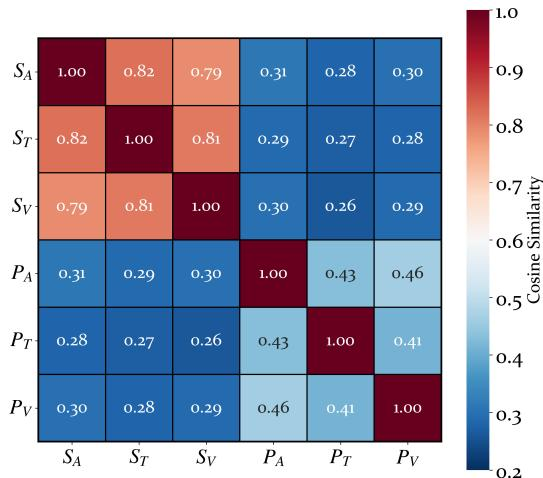  
Figure 6: Visualization of shared-specific representation relations on Four-Class IEMOCAP.

## D.3 Shared Alignment Objectives

As shown in Table 13, we compared cosine, InfoNCE, mutual-information, and $L _ { 2 }$ alignment while keeping the remaining model architecture and training settings unchanged. Under the current naturally paired multimodal setting, $L _ { 2 }$ alignment achieved the highest WA/UA of 77.43%/77.28%, slightly exceeding the 77.16%/76.98% obtained by cosine alignment, while InfoNCE and mutualinformation alignment yielded lower performance. These results support the use of $L _ { 2 }$ alignment in the current setting, but do not imply its universal superiority across datasets or pairing schemes.

## E Visualization Analysis

## E.1 Shared-Specific Relations

To analyze the representation disentanglement effect of SSSD, we compute the average cosine similarity between $S _ { A } , S _ { T } , S _ { V }$ and $P _ { A } , P _ { T } , P _ { V }$ . As shown in Figure $^ { 6 , }$ the three shared representations have high similarity, indicating that the shared semantics across different modalities are well aligned. In contrast, the similarity between shared and specific representations is clearly lower, suggesting that they are effectively separated in the representation space. Meanwhile, the specific representations of different modalities maintain moderate similarity, which indicates that they still preserve their modality-specific information and do not completely overlap. These results demonstrate that SSSD can achieve cross-modal alignment of shared semantics while retaining modality-specific information.

Table 12: Comparison of retrieval-cost functions on Four-Class IEMOCAP. The best results are highlighted.
<table><tr><td>Retrieval strategy</td><td>WA (%)</td><td>UA (%)</td><td>Expected r</td><td>Params</td><td>Inference (ms)</td></tr><tr><td>Fixed K = 4</td><td> $7 6 . 8 6 \pm 0 . 4 5$ </td><td> $7 6 . 6 5 \pm 0 . 4 8$ </td><td>4.0</td><td>2.327M</td><td>28.660</td></tr><tr><td>Dynamic, no cost</td><td> $7 7 . 0 7 \pm 0 . 4 6$ </td><td> $7 6 . 9 1 \pm 0 . 4 9$ </td><td>10.6</td><td></td><td></td></tr><tr><td>Dynamic, linear cost</td><td> $7 7 . 3 1 \pm 0 . 4 4$ </td><td> $7 7 . 1 6 \pm 0 . 4 8$ </td><td>5.9</td><td></td><td></td></tr><tr><td>Dynamic, exponential cost</td><td> $7 7 . 4 3 \pm 0 . 4 3$ </td><td> $7 7 . 2 8 \pm 0 . 4 7$ </td><td>5.2</td><td>2.336M</td><td>29.013</td></tr></table>

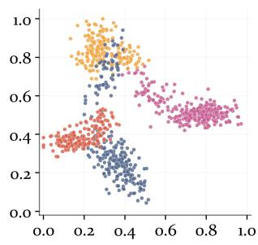  
(a) Full

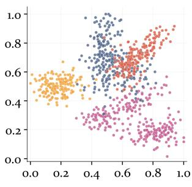  
(b) w/o SSSD

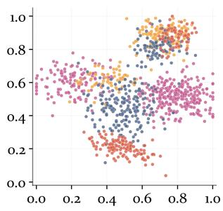  
(c) w/o DPMC

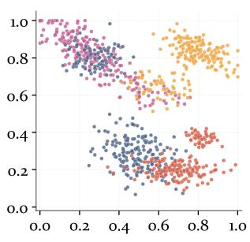  
(d) w/o DRAD  
Figure 7: t-SNE visualization of fused representations on Four-Class IEMOCAP using only the text modality.

Table 13: Comparison of shared-alignment objectives on Four-Class IEMOCAP. The best results are highlighted.
<table><tr><td>Alignment</td><td>WA (%)</td><td>UA (%)</td></tr><tr><td>Cosine</td><td> $7 7 . 1 6 \pm 0 . 4 5$ </td><td> $7 6 . 9 8 \pm 0 . 4 9$ </td></tr><tr><td>InfoNCE</td><td> $7 6 . 8 8 \pm 0 . 5 0$ </td><td> $7 6 . 7 1 \pm 0 . 5 3$ </td></tr><tr><td>Mutual information</td><td> $7 6 . 7 4 \pm 0 . 5 2$ </td><td> $7 6 . 5 6 \pm 0 . 5 5$ </td></tr><tr><td> $L _ { 2 }$ </td><td> $7 7 . 4 3 \pm 0 . 4 3$ </td><td> $7 7 . 2 8 \pm 0 . 4 7$ </td></tr></table>

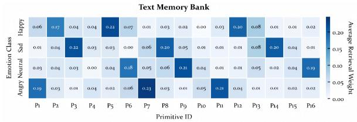

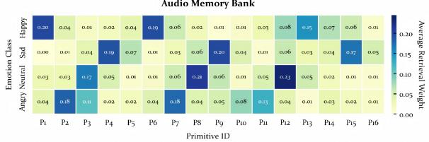

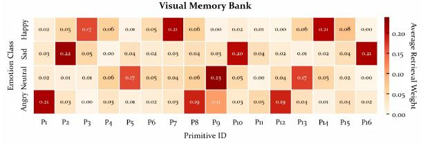

## E.2 Primitive Retrieval Patterns

To analyze the retrieval behavior of the primitive memory, we visualize the average primitive retrieval weights of different emotion categories on each modality-specific memory bank in the test set. As shown in Figure 8, the horizontal axis denotes the primitive ID, and the vertical axis denotes the emotion category. The results show that different emotion categories tend to activate different subsets of primitives within the same memory bank. For example, Happy, Sad, Neutral, and Angry correspond to distinct high-weight regions. This indicates that the retrieval process does not randomly select prim-

Figure 8: Visualization of class-level primitive retrieval patterns on audio, text, and visual memory banks.

itives, but is correlated with the emotion category of the sample. Meanwhile, the activation patterns of the audio, text, and visual memory banks are not identical, suggesting that the memory banks of different modalities learn their own modality-specific primitive distributions. In addition, the retrieval weights are not concentrated on a few fixed primitives. Instead, they form category-related usage patterns across multiple primitives. This suggests that the primitive memory constructed by DPMC has certain diversity and can provide differentiated modality-specific information compensation for different emotion categories.

## E.3 Fused Representations

To further analyze the effectiveness of different modules, we conduct t-SNE visualization on the IEMOCAP test set using only the text modality, comparing the classification representations of the full model and its ablated variants. As shown in Figure 7, we use pink, orange, gray, and yellow to denote Neutral, Happy, Sad, and Angry, respectively. The representations learned by the complete PriMD exhibit a clearer class structure, where samples from the same class are more compact and overlaps between different classes are reduced. In contrast, after removing SSSD, the sample distributions of different classes become more scattered, and clear mixing appears between some classes. After removing DPMC, the class boundaries become less distinct. After removing DRAD, the sample distribution becomes more entangled. These results indicate that the modules in PriMD jointly improve the class separability of emotion representations.