(b) PRISM: Predictive Recomposition via Semantic Latent Decomposition

# PRISM: Predictive Recomposition via Semantic Latent Decomposition for View-invariant Video Representation Learning

Youngchae Chee KAIST litcoderr@kaist.ac.kr

Hosu Lee\*   
KAIST   
leehosu01@kaist.ac.kr

Junho Kim† University of Illinois Urbana-Champaign arkimjh@illinois.edu

Cross-view video representation learning aims to capture viewpoint-invariant action semantics despite substantial appearance changes across egocentric and exocentric videos. However, existing methods encode each video as a unified embedding, where view-invariant and view-variant semantics inevitably entangle under co-occurrences—a failure mode we show persists even in cross-view methods explicitly trained for view-invariance. Our key insight is that a view-invariant feature is truly disentangled when it can be sufficiently recomposed with an arbitrary view-variant feature while preserving their independent semantics. Building on this, we propose PRISM, that decomposes video into view-invariant and viewvariant latents and recompose them under language supervision encouraging clean decomposition of the two streams. PRISM achieves state-of-the-art results on EgoExo4D, EgoExoLearn, AE2, even surpassing in-domain models under zero-shot setting. Code is available at https://github.com/litcoderr/prism.

## Abstract

## 1 Introduction

Human vision can naturally recognize actions across large viewpoint changes: although the same action may look substantially different when observed from a first-person (ego) or third-person (exo) viewpoint, it is often perceived as semantically identical (Isik et al., 2018). This property enables higher-order skill acquisition—for example, a learner can observe an expert performing a skill from an exo viewpoint and later refine their own attempt by semantically aligning their ego experience with the previously observed demonstration.

Sungjune Park‡ KAIST sungjune-p@kaist.ac.kr

In this context, view-invariant representation learning (Sigurdsson et al., 2018a; Ardeshir and Borji, 2018; Grauman et al., 2024; Sermanet et al.,

Yong Man Ro† KAIST ymro@kaist.ac.kr

(a) Unified View-invariant Representation Learning Methods

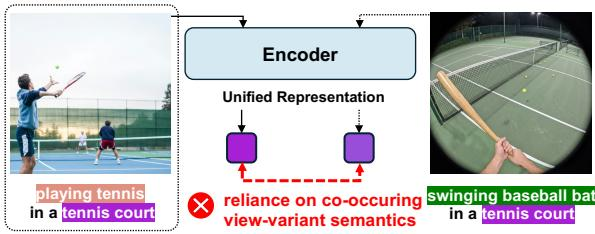

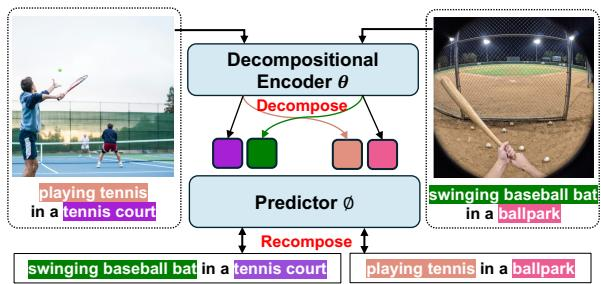  
Figure 1: Comparison of unified and compositional representations. (a) Unified representations entangle actions (playing tennis) with co-occurring context (tennis court), failing under novel compositions. (b) PRISM decomposes video into view-invariant and view-variant latents and recomposes them under language supervision, enforcing clean disentanglement.

2018) has emerged as a core challenge for generalizing action semantics. It underpins a broad spectrum of applications, ranging from cross-view action recognition and video understanding (Huang et al., 2024; Xue and Grauman, 2023; Sener et al., 2022; Sigurdsson et al., 2018b) to robotics (Sermanet et al., 2018; Pang et al., 2025).

Early efforts learn a unified view-invariant representation by aligning visual features temporally from two different views (Sermanet et al., 2018; Xue and Grauman, 2023), but they usually lack semantic disentanglement. To overcome this, subsequent works leverage language as a viewinvariant semantic signal, either by constructing ego–exo pseudo-pairs based on description similarities (Wang et al., 2023) or by directly aligning video features with the descriptions in a language embedding space (Xu et al., 2024; Luo et al., 2025).

Despite these advances, previous works are bounded by the same limitation: they collapse a video into a single unified representation, which fails to prevent view-variant information from leaking in when a dataset exhibits a strong correlation between view-invariant (V-I) semantics and the underlying view-variant (V-V) content. As illustrated in Fig. 1, if the V-I action “playing tennis” predominantly co-occurs with the V-V context “tennis court”, unified representations may rely on the shared contextual semantics rather than the action identity itself, causing V-I and V-V semantics to become entangled.

We argue that a truly V-I representation must be independently decomposed from V-V semantics. Our key insight is that such decomposition is only achieved when a model can freely recompose a V-I representation with an off-distribution V-V counterpart while still preserving the correct semantic meaning. Thanks to its inherently compositional structure, language naturally provides semantically controllable V-I / V-V compositions, enabling seamless decomposition and novel semantic recombination beyond observed visual co-occurrences. Moreover, language captures high-level conceptual identity independently of the low-level visual variations induced by viewpoint changes.

In this paper, we introduce PRISM: Predictive Recomposition vIa Semantic Latent DecoMposition, a framework that learns semantically decomposed view-invariant representations through language supervision. PRISM enforces an encoder to decompose an input video into V-I and V-V representations such that, when recombined with off-distribution counterparts, a predictor can correctly reconstruct the corresponding semantic composition in language latent space. While language provides strong supervision for clip-level semantic alignment, it lacks fine-grained temporal specificity. To address this limitation, we further introduce a frame-level self-predictive objective that internalizes temporal dynamics alongside clip-level semantics.

Through extensive evaluations on cross-view video understanding benchmarks (Huang et al., 2024; Luo et al., 2025; Xue and Grauman, 2023), we corroborate that PRISM learns superior viewinvariant representations while effectively capturing fine-grained temporal dynamics, outperforming state-of-the-art methods even in zero-shot settings and surpassing in-domain models on temporal phase prediction. Furthermore, on UNSCENE (Bae et al., 2025), PRISM substantially improves retrieval performance under background correlation shifts compared to prior cross-view methods.

In summary, our main contributions are:

• We identify a critical failure mode where unified view-invariant representation learning methods entangle view-variant semantics under biased cooccurrences.

• We propose PRISM: Predictive Recomposition vIa Semantic Latent DecoMposition, which leverages language compositionality to semantically decompose view-invariant and view-variant semantics, achieving state of the art performance in cross-view video understanding benchmarks.

• We devise a frame-level self-predictive objective that complements language supervision, internalizing fine-grained temporal dynamics without compromising semantic disentanglement.

## 2 Related Work

## 2.1 View-Invariant Representation Learning

With the rise of first-person interactive platforms such as augmented reality and robotics, visual recognition from the egocentric viewpoint has become a critical challenge. Large-scale visionlanguage models (e.g., CLIP (Radford et al., 2021), SigLIP2 (Tschannen et al., 2025)) provide powerful visual representations through vision-language alignment, yet remain tied to the training viewpoint and struggle to maintain semantic consistency across egocentric and exocentric perspectives. To address this limitation, view-invariant representation learning aims to produce consistent features regardless of camera viewpoint. Early efforts relied on time-synchronized multi-view datasets (Sigurdsson et al., 2018b; Grauman et al., 2024), while more recent works extend to unpaired ego-exo videos collectible at scale (Huang et al., 2024; Xue and Grauman, 2023). SUM-L (Wang et al., 2023) aligns unpaired videos through language-based semantic matching, and AE2 (Xue and Grauman, 2023) introduces a fine-grained cross-view benchmark with temporal alignment objectives. More recently, ViewpointRosetta (Luo et al., 2025) proposes a diffusion-based translator that synthesizes exo features from ego features jointly align hallucinated cross-view feature along with language.

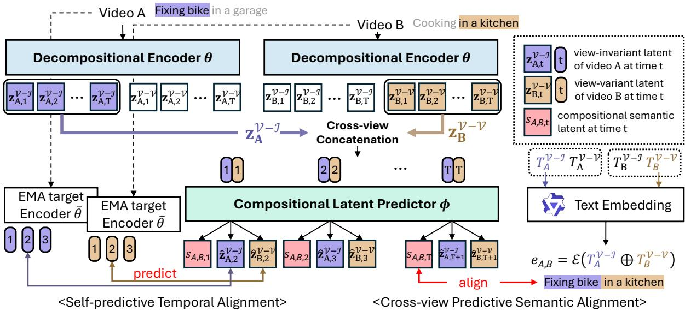  
Figure 2: Overview of PRISM. PRISM decomposes videos into view-invariant (V-I) and view-variant (V-V) latent streams, cross-composes them across videos, and aligns the resulting compositional latent with recombined language semantics. A self-predictive temporal objective further internalizes fine-grained temporal dynamics.

## 2.2 Action-Scene Entanglement

The spurious correlation between actions and their background scenes is a persistent bias in video understanding, as evidenced by RESOUND (Li et al., 2018), which show models often exploit scene cues rather than motion semantics. DEVIAS (Bae et al., 2024) further reveals that such models suffer severe performance degradation under unseen actionscene compositions, while MASH-VLM (Bae et al., 2025) identifies similar action-scene hallucinations in Video-LLMs and proposes disentangled attention to mitigate them. However, existing multiview alignment methods (Xu et al., 2024; Wang et al., 2023; Luo et al., 2025) indiscriminately minimize the distance between co-observed features, failing to distinguish whether the extracted commonality originates from the view-invariant action or the view-variant background.

## 3 Proposed Method

PRISM Overview. As shown in Fig. 2, the core principle of PRISM is that visual information in a video can be decomposed into a view-invariant component V-I and a view-variant component V-V. If this decomposition is achieved cleanly, the V-I of one video should retain its semantic identity even when recomposed with the V-V of another video. Building on this, we enforce that a visual representation formed by cross-composing the decomposed V-I of video A with the V-V of video B aligns with the corresponding recomposed semantics at the language level (and vice versa for the reverse composition). By structurally preventing one factor from leaking into the other, this objective encourages the encoder to learn orthogonally decomposed representations without entanglement. We use orthogonal throughout in this semantic sense: the two streams are required to carry the disjoint language-level semantics of V-I and V-V, rather than to be geometrically orthogonal vectors.

To realize this, our framework comprises two modules: (i) Decompositional Encoder θ that decomposes a video into V-I and V-V representations, and (ii) Compositional Latent Predictor ϕ that cross-composes representations from two distinct videos and synthesizes a compositional semantic embedding. This embedding is supervised to align with a sentence embedding constructed by combining decoupled language descriptions generated via a pre-trained LVLM (Bai et al., 2025; Google Deepmind, 2025) (§3.1, §3.2). Finally, to overcome the limited temporal resolution of cliplevel linguistic supervision, we introduce a selfpredictive signal that tasks ϕ with predicting the future representations of θ, enabling the model to internalize fine-grained temporal dynamics alongside semantic disentanglement (§3.3).

## 3.1 Decompose-and-Recompose Schema

To operationalize our core principle, we first define the structural mechanism that handles the visual features before introducing any external supervision. We feed an input video v into our Decompositional Encoder $\theta$ to separate the primary interaction V-I from the view-variant context $\nu  – \nu$ , producing two frame-level representations:

$$
\begin{array} { r } { ( \mathbf { z } _ { v } ^ { \mathcal { V } - \mathcal { T } } , \ \mathbf { z } _ { v } ^ { \mathcal { V } - \mathcal { V } } ) = \theta ( v ) . } \end{array}\tag{1}
$$

Once decomposed, we deliberately break each video’s natural co-occurrence through crosscomposition. Given two independently sampled videos A and B, we perform cross-view concatenation by pairing $\mathbf { z } _ { \mathsf { A } } ^ { \flat - \underline { { \tau } } }$ with $\mathbf { z } _ { \mathsf { B } } ^ { \flat - \mathcal { V } }$ (and vice versa for the reverse composition, omitted for simplicity). This cross-composed pair is fed into the Compositional Latent Predictor $\phi$ to synthesize a compositional semantic latent:

$$
s _ { \mathsf { A , B } } = \phi ( \mathbf { z } _ { \mathsf { A } } ^ { \gamma - \mathcal { T } } , \ \mathbf { z } _ { \mathsf { B } } ^ { \gamma - \mathcal { V } } ) .\tag{2}
$$

By forcing the representations through this decompose and recompose bottleneck, $\phi$ must construct a coherent semantic embedding without access to the original, intact video composition.

## 3.2 Language Supervised Decomposition

With the recomposed latent $s _ { \mathsf { A } , \mathsf { B } }$ (or $^ { s } \mathsf { B } , \mathsf { A } )$ , we next enforce that cross-composed visual representations preserve the correct recomposed semantics at the language level. The key idea is that spurious correlations between V-I and $\nu - \nu$ semantics become exposed under cross-composition, since the original co-occurrence structure is intentionally broken. As a result, a model that relies on shortcut dependencies between the two factors will fail to reconstruct the correct recomposed semantics.

To supervise the correct recomposed semantics, we construct a target representation at the language level. Specifically, we combine the viewinvariant description $T _ { \Delta } ^ { \mathcal { V } - \bar { \mathcal { T } } }$ of video A with the viewvariant description $T _ { \mathsf { B } } ^ { \flat _ { - } \nu }$ of video B, both generated through a pre-trained LVLM (Bai et al., 2025; Google Deepmind, 2025). Intuitively, if ϕ relies on shortcut correlations in $\mathbf { z } ^ { \nu - \nu }$ to infer the semantics $\mathbf { z } ^ { \nu - \mathcal { T } }$ (e.g., kitchen → cooking), such dependencies become inconsistent under cross-composition and therefore cannot match the recomposed language target. A text embedding model (Zhang et al., 2025) E then maps the recombined text into

a target semantic embedding:

$$
e _ { \mathsf { A } , \mathsf { B } } = { \mathcal { E } } ( T _ { \mathsf { A } } ^ { \gamma - { \mathcal { T } } } \oplus T _ { \mathsf { B } } ^ { \gamma - { \mathcal { V } } } ) .\tag{3}
$$

We then apply a contrastive objective that aligns the compositional latent $s _ { \mathsf { A } , \mathsf { B } }$ with the recombined text embedding $e _ { \mathsf { A } , \mathsf { B } }$ . With a temperature parameter $\tau$ and a similarity kernel $\mathbb { K } ( \mathbf { x } , \mathbf { y } ) \ =$ $\exp ( \sin ( \mathbf { x } , \mathbf { y } ) / \tau )$ , we define the decomposition loss ${ \mathcal { L } } _ { \mathrm { d e c o m p } }$ as:

$$
\mathcal { L } _ { \sf d e c o m p } = \mathbb { E } _ { { \sf A } , { \sf B } \in \mathcal { B } } \left[ - \log \frac { \mathbb { K } ( s _ { { \sf A } , { \sf B } } , e _ { { \sf A } , { \sf B } } ) } { \sum _ { { \sf C } , { \sf D } \in \mathcal { B } } \mathbb { K } ( s _ { { \sf A } , { \sf B } } , e _ { { \sf C } , { \sf D } } ) } \right] .\tag{4}
$$

## 3.3 Internalizing Temporal Dynamics

While the language-based objective ${ \mathcal { L } } _ { \mathrm { d e c o m p } }$ successfully achieves semantic decomposition of visual information, clip-level linguistic supervision only provides coarse semantic summaries, such as “chopping an onion”. Consequently, it is insufficient for learning representations capable of capturing fine-grained frame-level temporal dynamics, such as “lifting a knife → placing it on the onion → slicing downward”. To compensate for this limited temporal resolution and internalize fine-grained temporal structures into the learned representations, we introduce a self-predictive signal that tasks the predictor $\phi$ with forecasting the future outputs of the encoder θ.

Concretely, given the accumulated representations $\mathbf { z } _ { < t } ^ { \mathcal { V - T } }$ and $\mathbf { z } _ { < t } ^ { \mathcal { V } - \mathcal { V } }$ up to time $t , \phi$ generates predictions for the next-frame representations:

$$
( \hat { \mathbf { z } } _ { t + 1 } ^ { \mathcal { V } - \mathcal { T } } , \hat { \mathbf { z } } _ { t + 1 } ^ { \mathcal { V } - \mathcal { V } } ) = \phi ( \mathbf { z } _ { \leq t } ^ { \mathcal { V } - \mathcal { T } } , \mathbf { z } _ { \leq t } ^ { \mathcal { V } - \mathcal { V } } ) .\tag{5}
$$

The prediction targets for this objective are the encoder $\theta ^ { \prime } \mathbf { s }$ own future outputs. Since θ is continuously updated during training, using θ directly as the target encoder would yield unstable supervisory signals and risk representational collapse. To provide stable learning targets, we utilize a target encoder ${ \bar { \theta } } ,$ parameterized by an Exponential Moving Average (EMA) of $\theta ^ { \ast } \mathrm { s }$ weights. At each training step, the target weights are updated as follows, after which the target frame-level representations are extracted from a given video v:

$$
\bar { \theta }  \alpha \bar { \theta } + ( 1 - \alpha ) \theta ,\tag{6}
$$

$$
\begin{array} { r } { ( \bar { \mathbf z } _ { v } ^ { \mathcal { V } - \mathcal { T } } , \bar { \mathbf z } _ { v } ^ { \mathcal { V } - \mathcal { V } } ) = \bar { \boldsymbol \theta } ( v ) . } \end{array}\tag{7}
$$

Finally, we define the temporal objective ${ \mathcal { L } } _ { \mathrm { t e m p } } ,$ which maximizes the cosine similarity between predicted and target representations, allowing each stream (V-I and V-V) to capture its own temporal dynamics independently without relying on external alignment signals:

$$
\mathcal { L } _ { \mathrm { t e m p } } = \mathbb { E } _ { c \in \{ \mathcal { V } - \mathbb { Z } , \mathcal { V } - \mathcal { V } \} } \left[ - \sin ( \hat { \mathbf { z } } _ { t } ^ { c } , \bar { \mathbf { z } } _ { t } ^ { c } ) \right] .\tag{8}
$$

This objective incentivizes the encoder θ to embed temporal foresight into its representation space. Consequently, rather than merely capturing the present state, the representations at each time step naturally anticipate upcoming transitions.

## 4 Experiments

We evaluate the capability of PRISM to comprehend video semantics and identify activities §4.1, its ability to model fine-grained temporal stages and sequences §4.2, and its robustness against performance degradation in scenarios where the activity is highly disentangled from the background context §4.4. Furthermore, we present ablation studies to validate the impact of individual core components on overall performance §4.3, concluding with an analysis of the focal points within the fully trained PRISM’s latent representations §4.4.

## 4.1 Cross-View Semantic Alignment

Evaluation Setup. We evaluate PRISM on the EgoExo4D (Grauman et al., 2024) and EgoExoLearn (Huang et al., 2024) benchmarks to assess its ability to correctly comprehend actions and recognize their intrinsic semantic equivalence. The specific evaluation tasks are defined as follows: Retrieval measures the model’s ability to identify different views (i.e., ego and exo) of the same RoI as semantically identical. Recognition is the task of classifying the specific action occurring within a video. Association evaluates the capability to search a video pool and retrieve clips that exhibit the same action as the provided query video. Anticipation involves predicting future actions based on the video frames observed up to the current timestamp. Skill Assessment measures the model’s capacity to evaluate the execution proficiency of actions shown in two different videos, classifying which execution is more skillful.

Results. Tab. 1 summarizes the results. PRISM demonstrates the most significant improvements in Retrieval and Association, tasks that directly measure semantic equivalence across different viewpoints. Specifically, it achieves absolute gains of +10.4 in Retrieval and +11.5 in Association compared to the best baseline, VIEWPOINTROSETTA, outperforming both the general-purpose visionlanguage encoder SigLIP2 and existing cross-view methods. This corroborates that the explicit disentanglement of V-I and V-V features is highly effective for learning action representations robust to viewpoint shifts. Consistent improvements are also observed in Recognition (+7.46), which measures the transfer of exo-knowledge to ego-views, and Anticipation (+7.32), which evaluates temporal forecasting capabilities. This confirms the broad applicability of PRISM’s view-invariant representations for both classification and prediction tasks.

Moreover, on Skill Assessment, which evaluates execution proficiency within the same action class, PRISM yields a performance (55.28) comparable to VIEWPOINTROSETTA (55.82) and SigLIP2 (55.57). We attribute this to the fact that proficiency cues (e.g., hand tremors, movement fluidity) rely heavily on subtle visual nuances in execution style rather than the core semantic identity of the action. As a result, such fine-grained visual details are likely allocated to the V-V component during the decomposition process.

## 4.2 Fine-Grained Temporal Modeling

Evaluation Setup. We adopt the AE2 (Xue and Grauman, 2023) benchmark to evaluate whether PRISM effectively captures fine-grained temporal dynamics. The benchmark comprises four tasks under two evaluation protocols. Under the zero-shot protocol, models are evaluated directly on frozen features without any task-specific training: Frame Retrieval extracts frame-level embeddings from the model’s output to evaluate the temporal alignment between the frames of two videos, computed using cosine similarity and reported as the mAP@10 metric; Phase Ordering (measured by Kendall’s τ ) assesses whether the chronological order of events is preserved. Given features from two specific timestamps in a query video, it identifies the two bestaligned timestamps in a different video depicting the same action, and evaluates whether their temporal order is maintained. Under the linear probing protocol, a linear classifier is trained on top of the final layer’s frozen features for all models: Action Phase Classification performs frame-level action classification, measuring performance via the F1 score; Phase Progression applies linear probing to the frame-level features to predict the progression of an action phase on a continuous scale from 0 to 1, evaluated using the $R ^ { 2 }$ score. For Frame Retrieval and Action Phase Classification, we report results under three view settings: Regular (the average of intra-view scores, i.e., ego→ego and exo→exo), Ego2Exo, and Exo2Ego. We compare against both in-domain models trained on AE2 videos and outof-domain models not exposed to AE2 data.

<table><tr><td rowspan="3">Method</td><td colspan="4">EgoExo4D</td><td colspan="4">EgoExoLearn</td></tr><tr><td colspan="2">Retrieval (R@5)</td><td colspan="2">Recognition Assessment</td><td colspan="2">Associationtest</td><td>Anticipation (R@5)</td><td>Assessment</td></tr><tr><td>ego2exo exo2ego avg</td><td></td><td>top-1 top-5</td><td>Acc</td><td></td><td></td><td>ego2exo exo2ego avg ego-V ego-N exo-V exo-N avg</td><td>Acc</td></tr><tr><td>Image-Language Model</td><td></td><td></td><td></td><td></td><td></td><td></td><td></td><td></td></tr><tr><td>CLIP (Radford et al., 2021)</td><td>19.11</td><td>12.24</td><td>15.68 10.49 29.90</td><td>54.93</td><td>16.00</td><td>15.64</td><td>15.82 33.5037.4039.6044.30 38.70</td><td>73.48</td></tr><tr><td>SigLIP2 (Tschannen et al., 2025)</td><td>35.08</td><td>19.72</td><td>27.40 13.86 37.84</td><td>55.57</td><td>25.00</td><td>28.10</td><td>26.6 64.70 71.70 56.90 65.00 64.60</td><td>76.03</td></tr><tr><td>Video-Language Model</td><td></td><td></td><td></td><td></td><td></td><td></td><td></td><td></td></tr><tr><td>TimeSformer (Bertasius et al., 2021)</td><td>6.68</td><td>6.95</td><td>6.82 5.18 14.14</td><td>51.58</td><td>15.00</td><td>17.64</td><td>16.32 68.09 75.18 51.57 61.92 64.19</td><td>75.47</td></tr><tr><td>InternVideo (Wang et al., 2022)</td><td>23.64</td><td>20.67</td><td>22.16 13.67 38.99</td><td>52.58</td><td>30.60</td><td>21.70</td><td>26.20 63.76 74.28 56.67 65.92 65.16</td><td>68.88</td></tr><tr><td>Ego-Centric Methods</td><td></td><td></td><td></td><td></td><td></td><td></td><td></td><td></td></tr><tr><td>EgoVLP (Lin et al., 2022)</td><td>29.33</td><td>13.47</td><td>21.40 20.33 46.32</td><td>54.37</td><td>31.50</td><td>28.90</td><td>30.20 67.70 72.50 50.40 52.00 60.65</td><td>69.04</td></tr><tr><td>LAVILA (Zhao et al., 2023)</td><td>34.91</td><td>12.02</td><td>23.47 26.43 55.01</td><td>54.10</td><td>28.70</td><td>25.70</td><td>27.20 75.6776.5848.0351.05 62.83</td><td>68.44</td></tr><tr><td>Cross-View Methods</td><td></td><td></td><td></td><td></td><td></td><td></td><td></td><td></td></tr><tr><td>ActorObserverNet (Sigurdsson et al., 2018a)</td><td>29.50</td><td>24.85</td><td>27.18 15.70 38.45</td><td>54.10</td><td>11.91</td><td></td><td>11.36 11.64 63.50 61.60 49.10 50.30 56.13</td><td>68.59</td></tr><tr><td>VI Encoder (Grauman et al., 2024)</td><td>29.53</td><td>24.40</td><td>26.97 14.85 35.39</td><td>53.83</td><td></td><td></td><td></td><td></td></tr><tr><td>EgoInstructor (Xu et al., 2024)</td><td>46.04</td><td>31.68</td><td>38.86 24.15 51.40</td><td>54.73</td><td></td><td></td><td></td><td></td></tr><tr><td>SUM-L (Wang et al., 2023)</td><td>47.14</td><td>32.77</td><td>39.96 24.83 52.08</td><td>55.10</td><td>5.18</td><td>4.09</td><td>4.64 61.4 61.70 34.70 24.20 45.50</td><td>65.31</td></tr><tr><td>VIEWPOINTROSETTA (Luo et al., 2025)</td><td>58.14</td><td>47.21</td><td>52.68 34.47 64.85</td><td>55.82</td><td>33.36</td><td>31.27</td><td>32.32 66.4472.2152.8257.10 62.14</td><td>73.70</td></tr><tr><td>PRISM</td><td>75.89</td><td>50.27</td><td>63.08 41.93 72.92</td><td>55.28</td><td>44.36</td><td>43.36</td><td>43.86 72.78 77.15 62.58 65.33 69.46</td><td>68.53</td></tr></table>

Table 1: Cross-view semantic alignment on EgoExo4D and EgoExoLearn. We compare VLMs, ego-centric and cross-view methods. PRISM achieves new SoTA on Retrieval, Recognition, Association, and Anticipation.
<table><tr><td rowspan="2">Method</td><td colspan="4">Frame Retrieval (mAP@10)</td><td rowspan="2">Kendall&#x27;s τ</td><td colspan="4">Action Phase Classification (F1)</td><td rowspan="2">Phase Progression</td></tr><tr><td>regular ego2exo exo2ego</td><td></td><td></td><td>avg</td><td></td><td>regular ego2exo exo2ego</td><td></td><td>avg</td></tr><tr><td>Random</td><td>53.97</td><td>51.68</td><td>51.20</td><td>52.28</td><td>0.004</td><td>32.90</td><td>33.44</td><td>33.46</td><td>33.27</td><td>-0.069</td></tr><tr><td>Trained w/ AE2 videos (In-Domain)</td><td></td><td></td><td></td><td></td><td></td><td></td><td></td><td></td><td></td><td></td></tr><tr><td>ActorObserverNet (Sigurdsson et al., 2018a) 50.47</td><td></td><td>42.70</td><td>41.29</td><td>44.82</td><td>0.002</td><td>36.14</td><td>36.40</td><td>31.00</td><td>34.51</td><td>-0.052</td></tr><tr><td>TCN (Sermanet et al., 2018)</td><td>58.25</td><td>47.37</td><td>42.48</td><td>49.37</td><td>0.046</td><td>56.80</td><td>35.92</td><td>41.40</td><td>44.71</td><td>-0.227</td></tr><tr><td>CARL (Chen et al., 2022)</td><td>56.44</td><td>51.14</td><td>47.86</td><td>51.81</td><td>0.025</td><td>52.22</td><td>40.85</td><td>43.19</td><td>45.42</td><td>-0.124</td></tr><tr><td>TCC (Dwibedi et al., 2019)</td><td>70.58</td><td>62.08</td><td>65.84</td><td>66.17</td><td>0.400</td><td>67.17</td><td>55.90</td><td>52.27</td><td>58.45</td><td>0.322</td></tr><tr><td>GTA (Hadji et al., 2021)</td><td>72.42</td><td>66.39</td><td>65.45</td><td>68.08</td><td>0.464</td><td>69.63</td><td>63.29</td><td>70.41</td><td>67.77</td><td>0.322</td></tr><tr><td>AE2 (Xue and Grauman, 2023)</td><td>75.78</td><td>72.58</td><td>71.25</td><td>73.20</td><td>0.562</td><td>75.96</td><td>71.00</td><td>76.44</td><td>74.47</td><td>0.480</td></tr><tr><td>Trained w/o AE2 videos (Zero-Shot Transfer)</td><td></td><td></td><td></td><td></td><td></td><td></td><td></td><td></td><td></td><td></td></tr><tr><td>ResNet-50 (He et al., 2016)</td><td>58.26</td><td>44.87</td><td>42.94</td><td>48.69</td><td>0.025</td><td>53.53</td><td>31.47</td><td>45.25</td><td>43.41</td><td>-1.215</td></tr><tr><td>CLIP (Radford et al., 2021)</td><td>53.70</td><td>47.35</td><td>41.27</td><td>47.44</td><td>0.047</td><td>55.83</td><td>39.39</td><td>37.46</td><td>44.23</td><td>-1.212</td></tr><tr><td>SigLIP2 (Tschannen et al., 2025)</td><td>49.87</td><td>45.58</td><td>41.23</td><td>45.56</td><td>0.020</td><td>52.39</td><td>38.00</td><td>41.33</td><td>43.91</td><td>-1.322</td></tr><tr><td>SUM-L (Wang et al., 2023)</td><td>56.20</td><td>39.70</td><td>41.50</td><td>45.80</td><td>0.110</td><td>63.00</td><td>43.80</td><td>46.00</td><td>50.93</td><td>0.030</td></tr><tr><td>VIEWPOINTROSETTA (Luo et al., 2025)</td><td>60.80</td><td>53.50</td><td>48.20</td><td>54.17</td><td>0.047</td><td>53.20</td><td>39.00</td><td>48.60</td><td>46.93</td><td>-0.150</td></tr><tr><td>PRISM</td><td>77.70</td><td>68.90</td><td>65.00</td><td>70.53</td><td>0.601</td><td>79.60</td><td>69.80</td><td>71.30</td><td>73.57</td><td>0.647</td></tr></table>

Table 2: Fine-grained temporal modeling on the AE2 benchmark. We compare methods trained w/ and w/o AE2 videos. PRISM achieves new SoTA among methods trained w/o AE2 data.

Results. Tab. 2 compares PRISM against vision representation baselines and in-domain models trained on AE2 videos. Among out-ofdomain models, ours achieves the best performance across all four tasks, outperforming VIEW-POINTROSETTA by +16.13 in Frame Retrieval, +0.55 in Phase Ordering, +26.64 in Action Phase Classification, and +0.80 in Phase Progression. More notably, PRISM surpasses the best in-domain model AE2 on Phase Ordering (0.600 vs. 0.562) and Phase Progression (0.650 vs. 0.480), while remaining within 3 and 1 points on Frame Retrieval and Action Phase Classification, respectively. This confirms that the self-predictive temporal objective (§3.3) internalizes fine-grained temporal dynamics without requiring any in-domain supervision. Additionally, consistent performance is maintained across view settings (e.g., Frame Retrieval: 77.00 regular vs. 68.90/65.00 cross-view), demonstrating that PRISM’s temporal representations generalize well across viewpoints.

<table><tr><td rowspan="2">Settings</td><td colspan="3">Cross-view Alignment</td><td colspan="3">Temporal Alignment</td></tr><tr><td> $\underline { { \mathbf { w } / \mathbf { o } ~ \mathcal { L } _ { \mathrm { t e m p } } } }$ </td><td> $\underline { { \mathbf { w } / \mathcal { L } _ { \mathrm { t e m p } } } }$ </td><td>Avg</td><td>w/o Ltemp</td><td> $\underline { { \mathbf { w } / \mathcal { L } _ { \mathrm { t e m p } } } }$ </td><td>Avg</td></tr><tr><td>Unified</td><td>38.8</td><td>32.4</td><td>35.6</td><td>64.0</td><td>69.2</td><td>66.6</td></tr><tr><td>Decomposed</td><td>50.9</td><td>53.5</td><td>52.2</td><td>65.9</td><td>72.1</td><td>69.0</td></tr><tr><td>Avg</td><td>44.9</td><td>43.0</td><td>一</td><td>65.0</td><td>70.7</td><td>一</td></tr></table>

Table 3: Contribution of training objectives. Unified encodes a video into a single embedding, whereas Decomposed splits it into V-I and V-V streams that are cross-composed across videos. Decomposition drives cross-view alignment while $\mathcal { L } _ { \mathrm { t e m p } }$ drives temporal alignment, and combining both achieves the best on both axes.

## 4.3 Ablation Studies

We analyze how individual components of PRISM contribute to cross-view and temporal alignment. Throughout this section, Cross-view Alignment denotes the arithmetic mean of the directional $( \mathrm { e g o } 2 \mathrm { e x o } ,$ exo2ego) Retrieval (R@5) and Asso-$c i a t i o n _ { \mathrm { t e s t } }$ scores of Tab. 1, and Temporal Alignment the mean of the Frame Retrieval and Action Phase Classification scores of Tab. 2. Tab. 3 evaluates the effect of explicit V-I/V-V decomposition and the self-predictive objective $\mathcal { L } _ { \mathrm { t e m p } }$ . The two objectives contribute to largely disjoint axes: decomposition primarily improves cross-view alignment (35.6→52.2) with minimal impact on temporal alignment, while ${ \mathcal { L } } _ { \mathrm { t e m p } }$ mainly improves temporal alignment $( 6 5 . 0 {  } 7 0 . 7 )$ without harming crossview alignment. Combining both achieves the best performance on both metrics (53.5, 72.1).

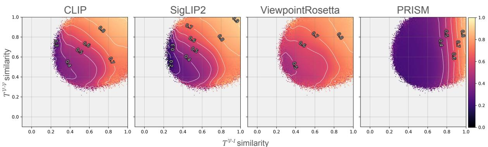  
Figure 3: Correlation between representation similarity and textual V-I / V-V similarity. The x- and y-axes denote V-V and V-I textual similarity for every clip pair in EgoExoLearn, and color indicates representation similarity (we use $z ^ { \nu - \mathcal { T } }$ for PRISM). Only PRISM shows similarity governed by the V-I axis and flat along V-V.

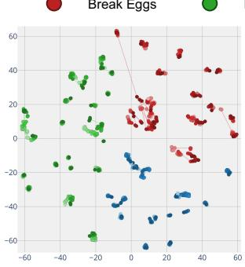  
(a) SigLip2

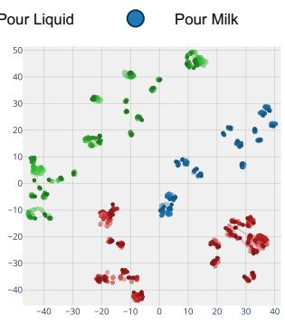  
(b) Viewpoint Rosetta

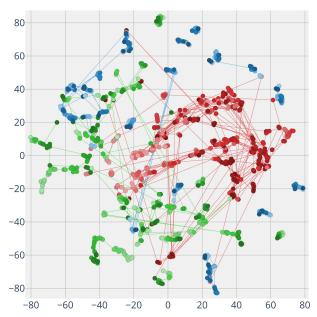  
(c) AE2

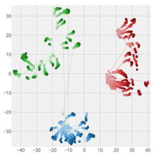  
(d) PRISM

Figure 4: t-SNE of frame-level embeddings over time. Temporally adjacent frames are connected by lines. PRISM is the only model exhibiting both semantic separation and temporal continuity
<table><tr><td rowspan="2">Settings</td><td colspan="3">Cross-view Alignment</td><td colspan="3">Temporal Alignment</td></tr><tr><td>ego2exo</td><td>exo2ego</td><td>Avg</td><td>Frm. retrieve</td><td>Act. phase</td><td>Avg</td></tr><tr><td colspan="7">Supervision w/ Ego-Exo Pairing</td></tr><tr><td>ActorObserverNet</td><td>20.7</td><td>18.1</td><td>19.4</td><td>44.8</td><td>34.5</td><td>39.7</td></tr><tr><td>VIEWPOINTROSETTA</td><td>45.8</td><td>39.2</td><td>42.5</td><td>54.2</td><td>46.9</td><td>50.6</td></tr><tr><td colspan="7">Supervision w/o Pairing (PRISM)</td></tr><tr><td>Exo only + Gemini</td><td>52.2</td><td>44.3</td><td>48.2</td><td>69.4</td><td>73.0</td><td>71.2</td></tr><tr><td>Ego + Exo + Qwen</td><td>59.4</td><td>46.3</td><td>52.9</td><td>69.2</td><td>74.5</td><td>71.8</td></tr><tr><td>Ego + Exo + Gemini</td><td>60.1</td><td>46.8</td><td>53.5</td><td>70.5</td><td>73.6</td><td>72.1</td></tr></table>

Table 4: Sensitivity to training views and captioner choice. PRISM with exo-only data still surpasses all baselines on cross-view alignment, and substituting the captioner introduces only noise-level differences.

Tab. 4 analyzes robustness to external dependencies. To simulate the practical setting where paired ego-exo data is unavailable, we remove all ego-view training data (Exo only); to evaluate sensitivity to pseudo-caption quality, we replace Gemini with Qwen3VL. Training with only exoview data moderately reduces cross-view alignment (53.5→48.2) while largely preserving temporal alignment (72.1→71.2), indicating that egoview supervision mainly affects the cross-view axis. Replacing the captioner introduces only marginal differences (−0.6 and −0.3), suggesting that PRISM is not tightly coupled to a specific captioning model.

## 4.4 Analysis on PRISM

Correlation of Decomposed Representations. To examine whether learned representations correlate with view-invariant or view-variant semantics, we visualize representation similarity against V-I and $\nu  – \nu$ textual similarities obtained from a captioning LVLM (Fig. 3). For CLIP, SigLIP2, and VIEWPOINTROSETTA, representation similarity rises with both axes, meaning that different events sharing the same background can still yield high similarity. PRISM, by contrast, is aligned predominantly with the V-I axis and flat along V-V, confirming that its decomposed representation enables event identification independent of background context. This motivates the following quantitative evaluation on counterfactual scenarios.

View-invariant  
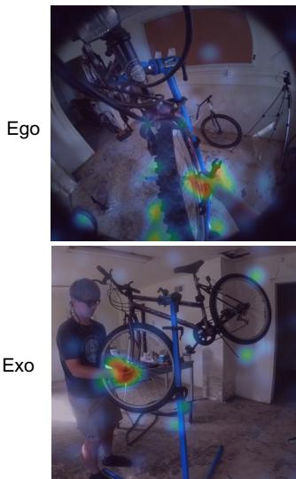

View-variant  
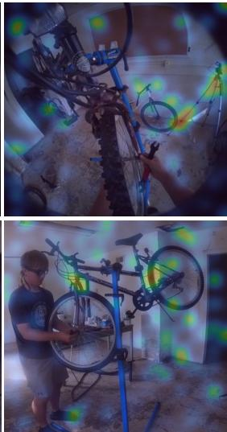  
(a) Fixing bike in a garage

View-invariant  
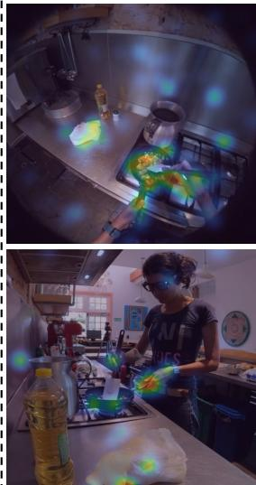

View-variant  
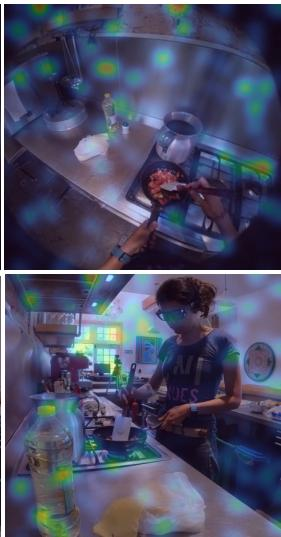  
(b) Cooking in a kitchen  
Figure 5: DeepLift attribution of encoder output patches to the V-I and V-V streams. PRISM consistently attends to hands and interacting objects for V-I, and to background regions for V-V, across both ego and exo views.

Robustness to Background Correlation. To verify whether the observed semantic separation holds in actual counterfactual scenarios, we evaluate PRISM on the UNSCENE benchmark (Bae et al., 2025), which features videos where the action contradicts the background context (e.g., fishing inside a bedroom). Utilizing a subset of N=573 samples with explicit action captions, we report two metrics: (i) Recall@10 (R@10), which considers a prediction successful if there is an intersection between the top-10 nearest neighbor sets retrieved in the visual representation space and the action caption embedding space, and (ii) Representational Similarity Analysis (RSA) (Kriegeskorte et al., 2008), which measures the correlation between the two similarity structures. To minimize evaluation bias, we average results across three text encoders (CLIP, SigLIP, Qwen3Embedding).

As shown in Tab. 5, PRISM nearly doubles the best cross-view baseline VIEWPOINTROSETTA in both metrics (14.90 vs. 7.50 in R@10; 0.181 vs. 0.098 in RSA), while matching DINOv2 with only one-tenth of its parameters. This confirms that disentanglement fundamentally requires an explicit decomposition mechanism and cannot be trivially acquired by scaling alone.

<table><tr><td rowspan="2">Method</td><td rowspan="2">#Params</td><td colspan="2">CLIP ViT-L/14</td><td colspan="2">SigLIP2</td><td colspan="2">Qwen3Embed</td><td colspan="2">Overall</td></tr><tr><td>R@10</td><td>RSA</td><td>R@10 RSA</td><td></td><td>R@10</td><td>RSA</td><td></td><td>R@10 RSA</td></tr><tr><td>Vision Foundation Models</td><td></td><td></td><td></td><td></td><td></td><td></td><td></td><td></td><td></td></tr><tr><td>V-JEPA 2</td><td>1B</td><td>7.1</td><td>0.055</td><td>7.7</td><td>0.046</td><td>7.0</td><td>0.046</td><td>7.3</td><td>0.049</td></tr><tr><td>DINOv2</td><td>1B</td><td>13.8</td><td>0.121</td><td>14.2</td><td>0.107</td><td>14.2</td><td>0.209</td><td>14.1</td><td>0.146</td></tr><tr><td>Cross-View Methods</td><td></td><td></td><td></td><td></td><td></td><td></td><td></td><td></td><td></td></tr><tr><td>ActorObserverNet</td><td>58M</td><td>6.6</td><td>0.066</td><td>6.9</td><td>0.065</td><td>6.7</td><td>0.091</td><td>6.7</td><td>0.074</td></tr><tr><td>SUM-L</td><td>126M</td><td>4.0</td><td>0.039</td><td>3.9</td><td>0.029</td><td>3.9</td><td>0.056</td><td>3.9</td><td>0.041</td></tr><tr><td>VIEWPOINTROSETTA</td><td>177M</td><td>7.5</td><td>0.039</td><td>7.7</td><td>0.064</td><td>7.3</td><td>0.191</td><td>7.5</td><td>0.098</td></tr><tr><td>PRISM</td><td>108M</td><td>14.7</td><td>0.114</td><td>14.9</td><td>0.128</td><td>15.1</td><td>0.301</td><td>14.9</td><td>0.181</td></tr></table>

Table 5: Robustness to action-scene disentanglement on the UNSCENE benchmark. PRISM surpasses both vision foundation models and cross-view methods.

Analysis on Semantic-Temporal Dynamics. Fig. 4 visualizes t-SNE projections of frame-level embeddings over time for each method. We sample 20 videos per class from the AE2 benchmark and project their frame-level features into 2D. SigLIP2 and VIEWPOINTROSETTA form videolevel clusters but fail to capture temporal progression, while AE2 fails at temporal modeling. In contrast, PRISM produces trajectories that extend continuously over time, confirming that PRISM effectively models fine-grained temporal dynamics.

Visual Attribution of Decomposed Latents. To investigate which visual regions drive each decomposed latent, we apply DeepLift (Shrikumar et al., 2017) to measure the contribution of each imageencoder output patch to the V-I and V-V streams (Fig. 5). In both ego and exo views, the V-I stream consistently activates on the actor’s hands and interacting objects. Notably, the same semantic targets are highlighted even though they appear at different spatial locations across views, confirming that V-I operates on view-invariant cues. The V-V stream, in contrast, focuses on the overall background that inherently varies with viewpoint. This spatial separation between the two streams qualitatively demonstrates that PRISM successfully disentangles action-centric cues from peripheral scene context.

## 5 Conclusion

We propose PRISM a framework that decomposes video into view-invariant and view-variant latent streams and recomposes them under language-level supervision, enforcing clean semantic disentanglement robust to counterfactual action–scene compositions. A self-predictive temporal objective operating on an independent axis further internalizes fine-grained temporal dynamics without compromising decomposition quality. Extensive experiments across major cross-view understanding benchmarks demonstrate consistent state-of-the-art performance, validating compositional latent decomposition as a principled and effective approach to view-invariant video representation learning.

## Limitations

While PRISM demonstrates strong performance in view-invariant representation learning, we acknowledge a few limitations.

First, our semantic decomposition is inherently upper-bounded by the quality of the pre-trained LVLM captioner that provides the language-level supervisory signal. Although Tab. 4 shows that swapping the captioner introduces only noise-level differences, this robustness holds only across individual model choices. If a systematic bias is shared across LVLMs, for instance, a tendency to conflate action and scene descriptions due to their cooccurrence in pre-training corpora, such bias would propagate directly into the decomposed supervision targets and, consequently, impose a quality ceiling on the encoder’s disentanglement. Addressing this would require either debiased captioning models or additional supervision signals that do not rely on language generation.

Second, all benchmarks evaluated in this work center on procedural human activities involving physical object manipulation (e.g., cooking, sports). This leaves two axes of generalization unexplored: (i) non-human activities, such as animal behavior or natural phenomena, where the notion of viewinvariant “action” may differ fundamentally from human-centric definitions; and (ii) human interactions that lack tangible physical manipulation, such as conversational turn-taking, social gestures, or emotional exchanges, where the relevant semantics may not be neatly separable into action versus scene. Extending the decomposition framework to these broader activity domains constitutes a promising direction for future work.

## Acknowledgments

This work was supported in part by IITP grant funded by the Korea government (MSIT) (No. RS-2020-II200004, Development of Previsional Intelligence based on Long-Term Visual Memory Network), the Institute of Information & Communications Technology Planning & Evaluation (IITP) grant funded by the Korea government (MSIT) (No. RS-2022-II220124), and in part by the KOrea Industrial Technology Association(KOITA) grant funded by the Korea government (No. 2026- KOITA-CO-T2-02-03, Cooperative and Convergent Science and Technology Commercialization Promotion Support Project).

## References

Shervin Ardeshir and Ali Borji. 2018. An exocentric look at egocentric actions and vice versa. Computer Vision and Image Understanding, 171:61–68.

Kyungho Bae, Geo Ahn, Youngrae Kim, and Jinwoo Choi. 2024. Devias: Learning disentangled video representations of action and scene. In European Conference on Computer Vision, pages 431–448. Springer.

Kyungho Bae, Jinhyung Kim, Sihaeng Lee, Soonyoung Lee, Gunhee Lee, and Jinwoo Choi. 2025. Mashvlm: Mitigating action-scene hallucination in videollms through disentangled spatial-temporal representations. In Proceedings of the Computer Vision and Pattern Recognition Conference (CVPR), pages 13744–13753.

Shuai Bai, Yuxuan Cai, Ruizhe Chen, Keqin Chen, Xionghui Chen, Zesen Cheng, Lianghao Deng, Wei Ding, Chang Gao, Chunjiang Ge, and 1 others. 2025. Qwen3-vl technical report. arXiv preprint arXiv:2511.21631.

Gedas Bertasius, Heng Wang, and Lorenzo Torresani. 2021. Is space-time attention all you need for video understanding? In Proceedings of the 38th International Conference on Machine Learning, volume 139 of Proceedings of Machine Learning Research, pages 813–824. PMLR.

Minghao Chen, Fangyun Wei, Chong Li, and Deng Cai. 2022. Frame-wise action representations for long videos via sequence contrastive learning. In

Proceedings ofthe IEEE/CVF Conference on Computer Vision and Pattern Recognition (CVPR), pages 13801–13810.

Debidatta Dwibedi, Yusuf Aytar, Jonathan Tompson, Pierre Sermanet, and Andrew Zisserman. 2019. Temporal cycle-consistency learning. In Proceedings of the IEEE/CVF Conference on Computer Vision and Pattern Recognition (CVPR).

Google Deepmind. 2025. Gemini 3 flash model card. https://deepmind.google/models/ model-cards/gemini-3-flash/. Official system card.

Kristen Grauman, Andrew Westbury, Lorenzo Torresani, Kris Kitani, Jitendra Malik, Triantafyllos Afouras, Kumar Ashutosh, Vijay Baiyya, Siddhant Bansal, Bikram Boote, Eugene Byrne, Zach Chavis, Joya Chen, Feng Cheng, Fu-Jen Chu, Sean Crane, Avijit Dasgupta, Jing Dong, Maria Escobar, and 81 others. 2024. Ego-exo4d: Understanding skilled human activity from first- and third-person perspectives. In Proceedings ofthe IEEE/CVF Conference on Computer Vision and Pattern Recognition (CVPR), pages 19383–19400.

Isma Hadji, Konstantinos G. Derpanis, and Allan D. Jepson. 2021. Representation learning via global temporal alignment and cycle-consistency. In Proceedings of the IEEE/CVF Conference on Computer Vision and Pattern Recognition (CVPR), pages 11068– 11077.

Kaiming He, Xiangyu Zhang, Shaoqing Ren, and Jian Sun. 2016. Deep residual learning for image recognition. In Proceedings of the IEEE Conference on Computer Vision and Pattern Recognition (CVPR).

Yifei Huang, Guo Chen, Jilan Xu, Mingfang Zhang, Lijin Yang, Baoqi Pei, Hongjie Zhang, Lu Dong, Yali Wang, Limin Wang, and 1 others. 2024. Egoexolearn: A dataset for bridging asynchronous ego-and exocentric view of procedural activities in real world. In 2024 IEEE/CVF Conference on Computer Vision and Pattern Recognition (CVPR), pages 22072–22086. IEEE.

Leyla Isik, Andrea Tacchetti, and Tomaso Poggio. 2018. A fast, invariant representation for human action in the visual system. Journal of neurophysiology, 119(2):631–640.

Nikolaus Kriegeskorte, Marieke Mur, and Peter A. Bandettini. 2008. Representational similarity analysis - connecting the branches of systems neuroscience. Frontiers in Systems Neuroscience, Volume 2 - 2008.

Yingwei Li, Yi Li, and Nuno Vasconcelos. 2018. Resound: Towards action recognition without representation bias. In Proceedings of the European Conference on Computer Vision (ECCV).

Kevin Qinghong Lin, Jinpeng Wang, Mattia Soldan, Michael Wray, Rui Yan, Eric Z. XU, Difei Gao, Rong-Cheng Tu, Wenzhe Zhao, Weijie Kong,

Chengfei Cai, WANG HongFa, Dima Damen, Bernard Ghanem, Wei Liu, and Mike Zheng Shou. 2022. Egocentric video-language pretraining. In Advances in Neural Information Processing Systems, volume 35, pages 7575–7586. Curran Associates, Inc.

Mi Luo, Zihui Xue, Alex Dimakis, and Kristen Grauman. 2025. Viewpoint rosetta stone: Unlocking unpaired ego-exo videos for view-invariant representation learning. In Proceedings of the IEEE/CVF Conference on Computer Vision and Pattern Recognition (CVPR), pages 15802–15812.

Jing-Cheng Pang, Nan Tang, Kaiyuan Li, Yuting Tang, Xin-Qiang Cai, Zhen-Yu Zhang, Gang Niu, Masashi Sugiyama, and Yang Yu. 2025. Learning viewinvariant world models for visual robotic manipulation. In The Thirteenth International Conference on Learning Representations.

Alec Radford, Jong Wook Kim, Chris Hallacy, Aditya Ramesh, Gabriel Goh, Sandhini Agarwal, Girish Sastry, Amanda Askell, Pamela Mishkin, Jack Clark, Gretchen Krueger, and Ilya Sutskever. 2021. Learning transferable visual models from natural language supervision. In Proceedings ofthe 38th International Conference on Machine Learning, volume 139 of Proceedings of Machine Learning Research, pages 8748–8763. PMLR.

Fadime Sener, Dibyadip Chatterjee, Daniel Shelepov, Kun He, Dipika Singhania, Robert Wang, and Angela Yao. 2022. Assembly101: A large-scale multi-view video dataset for understanding procedural activities. In Proceedings ofthe IEEE/CVF Conference on Computer Vision and Pattern Recognition (CVPR), pages 21096–21106.

Pierre Sermanet, Corey Lynch, Yevgen Chebotar, Jasmine Hsu, Eric Jang, Stefan Schaal, and Sergey Levine. 2018. Time-contrastive networks: Selfsupervised learning from video. In 2018 IEEE international conference on robotics and automation (ICRA), pages 1134–1141. IEEE.

Avanti Shrikumar, Peyton Greenside, and Anshul Kundaje. 2017. Learning important features through propagating activation differences. In Proceedings of the 34th International Conference on Machine Learning, volume 70 of Proceedings of Machine Learning Research, pages 3145–3153. PMLR.

Gunnar A. Sigurdsson, Abhinav Gupta, Cordelia Schmid, Ali Farhadi, and Karteek Alahari. 2018a. Actor and observer: Joint modeling of first and thirdperson videos. In Proceedings of the IEEE Conference on Computer Vision and Pattern Recognition (CVPR).

Gunnar A. Sigurdsson, Abhinav Gupta, Cordelia Schmid, Ali Farhadi, and Karteek Alahari. 2018b. Charades-ego: A large-scale dataset of paired third and first person videos. Preprint, arXiv:1804.09626.

Michael Tschannen, Alexey Gritsenko, Xiao Wang, Muhammad Ferjad Naeem, Ibrahim Alabdulmohsin, Nikhil Parthasarathy, Talfan Evans, Lucas Beyer, Ye Xia, Basil Mustafa, and 1 others. 2025. Siglip 2: Multilingual vision-language encoders with improved semantic understanding, localization, and dense features. arXiv preprint arXiv:2502.14786.

Qitong Wang, Long Zhao, Liangzhe Yuan, Ting Liu, and Xi Peng. 2023. Learning from semantic alignment between unpaired multiviews for egocentric video recognition. In Proceedings of the IEEE/CVF International Conference on Computer Vision (ICCV), pages 3307–3317.

Yi Wang, Kunchang Li, Yizhuo Li, Yinan He, Bingkun Huang, Zhiyu Zhao, Hongjie Zhang, Jilan Xu, Yi Liu, Zun Wang, and 1 others. 2022. Internvideo: General video foundation models via generative and discriminative learning. arXiv preprint arXiv:2212.03191.

Jilan Xu, Yifei Huang, Junlin Hou, Guo Chen, Yuejie Zhang, Rui Feng, and Weidi Xie. 2024. Retrievalaugmented egocentric video captioning. In Proceedings ofthe IEEE/CVF Conference on Computer Vision and Pattern Recognition (CVPR), pages 13525– 13536.

Zihui (Sherry) Xue and Kristen Grauman. 2023. Learning fine-grained view-invariant representations from unpaired ego-exo videos via temporal alignment. In Advances in Neural Information Processing Systems, volume 36, pages 53688–53710. Curran Associates, Inc.

Yanzhao Zhang, Mingxin Li, Dingkun Long, Xin Zhang, Huan Lin, Baosong Yang, Pengjun Xie, An Yang, Dayiheng Liu, Junyang Lin, and 1 others. 2025. Qwen3 embedding: Advancing text embedding and reranking through foundation models. arXiv preprint arXiv:2506.05176.

Yue Zhao, Ishan Misra, Philipp Krähenbühl, and Rohit Girdhar. 2023. Learning video representations from large language models. In Proceedings of the IEEE/CVF Conference on Computer Vision and Pattern Recognition (CVPR), pages 6586–6597.

## Appendix Contents

A Implementation Details 12   
A.1 Benchmarks . . . . . . . . 13   
A.2 Captioning via LVLM . . . . . . . 13

## A Implementation Details

Model Architecture. The Decompositional Encoder θ is built on top of a frozen SigLIP2 (Tschannen et al., 2025) (so400m-patch14-384) vision backbone and a frozen Qwen3-Embedding-0.6B (Zhang et al., 2025) text backbone. Per-frame patch embeddings from the vision backbone are fed into a Q-Former of depth 4 with 8 attention heads, which produces two per-frame latent vectors of dimension $d _ { z } { = } 5 1 2$ , corresponding to the V-I and V-V streams. These frame-level latents are then processed by a causal temporal transformer of depth 12 with 8 heads, followed by a cross-view transformer of depth 4 that implements the Compositional Latent Predictor $\phi .$ . The total number of trainable parameters is approximately 108M; both the vision and text backbones remain frozen throughout training.

Training Configuration. We train PRISM for 6 epochs on the EgoExo4D (Grauman et al., 2024) VRS training split using 7 NVIDIA A6000 48GB GPUs, with the remaining GPU reserved for serving the text composer via vLLM. The per-device batch size is 4 with a gradient accumulation of 2 steps, yielding an effective batch size of 56. We use AdamW with a learning rate of $7 \times 1 0 ^ { - 5 }$ , weight decay of 0.01, and a constant\_with\_warmup schedule where the warmup phase occupies 10% of total training steps. Training is conducted in bf16 mixed precision. The loss weights are set to $\lambda _ { \mathrm { c r o s s } } { = } 1 . 0$ for ${ \mathcal { L } } _ { \mathrm { d e c o m p } }$ and $\lambda _ { \mathrm { n e x t } } { = } 0 . 5$ for $\mathcal { L } _ { \mathrm { t e m p } }$ . The EMA target encoder $\bar { \theta }$ uses a decay coefficient of $\alpha { = } 0 . 9 9 8$ Checkpoints are saved every 500 optimizer steps with a rolling limit of 10. We use a fixed random seed of 42 across all experiments.

Video Preprocessing. Each video clip is sampled at 4.0 FPS with a maximum clip duration of 32.0 seconds, producing up to $T _ { \mathrm { m a x } } { = } 1 2 8$ frames per sample. Frames are resized to 384×384 pixels to match the SigLIP2 input resolution. Text inputs are tokenized with a maximum sequence length of 128 tokens.

Cross-view Text Composition. As described in §3.2, the $\oplus$ operator that fuses $T _ { \mathsf { A } } ^ { \mathcal { V } - \mathcal { T } }$ and $T _ { \mathsf { B } } ^ { \mathcal { V } - \mathcal { V } }$ into a single natural sentence is realized by Qwen3-1.7B served via vLLM. Per-pair composed sentences are cached on disk so that repeated epochs incur only a single LLM call per unique pair. The composed sentence is then encoded by E (Zhang et al.,

2025) to produce the target embedding $e _ { \mathsf { A } , \mathsf { B } }$ used in ${ \mathcal { L } } _ { \mathrm { d e c o m p } }$

## A.1 Benchmarks

EgoExo4D (Grauman et al., 2024). EgoExo4D is a large-scale multi-modal, multi-view video dataset comprising 1,286 hours of video across 5,035 takes, captured by 740 participants in 13 cities worldwide. Each take simultaneously records egocentric video via Aria glasses and exocentric video from 4 to 5 stationary GoPros, all temporally synchronized. The dataset focuses on skilled human activities such as cooking, sports, music, dance, and bike repair, and provides rich annotations including time-indexed natural language descriptions (expert commentary, narrate-and-act, and atomic action descriptions), 3D body and hand pose, object segmentation masks, keystep labels, and proficiency ratings. Its benchmark suite spans four task families: recognition, proficiency estimation, ego-exo relation, and ego pose.

EgoExoLearn (Huang et al., 2024). EgoExoLearn is a dataset of procedural activity videos captured from both egocentric and exocentric viewpoints in real-world environments. In contrast to EgoExo4D, the ego and exo videos are collected asynchronously, $i . e . ,$ , they are not temporally paired, requiring models to establish cross-view correspondence purely through semantic understanding. The dataset is annotated with fine-grained narrations and supports evaluation tasks including cross-view association, action anticipation, and skill assessment.

AE2 (Xue and Grauman, 2023). The AE2 benchmark targets fine-grained, frame-level temporal understanding across ego-exo viewpoints. It assembles four action-specific sub-datasets from publicly available sources: Break Eggs (CMU-MMAC), Pour Milk (H2O), Pour Liquid (EPIC-Kitchens and HMDB51), and Tennis Forehand (Penn Action and self-collected ego videos). All videos carry dense per-frame action phase annotations, enabling evaluation of temporal alignment quality, phase ordering consistency, frame-level phase classification, and continuous phase progression prediction. The benchmark supports both zeroshot evaluation on frozen features and linear probing protocols, and reports results under intra-view and cross-view settings.

UNSCENE (Bae et al., 2025). The UN-SCENE benchmark, introduced as part of MASH-VLM (Bae et al., 2025), is designed to diagnose spurious action-scene correlations, the failure mode first identified by DEVIAS (Bae et al., 2024), where models exploit co-occurring background cues rather than action semantics. UNSCENE consists of web-sourced videos depicting counterfactual action-scene compositions, in which the performed action contradicts the typical background context $( e . g .$ , fishing inside a bedroom). A subset of $N { = } 5 7 3$ samples is accompanied by explicit action captions, allowing quantitative evaluation of whether a model’s learned representations reflect genuine action identity independently of background context.

## A.2 Captioning via LVLM

As described in §3.2, the language-supervised decomposition objective requires two disjoint textual descriptions per video segment: a $\nu - \mathcal { T }$ description $T ^ { \mathcal { V } - \mathcal { T } }$ capturing the agent’s action (verbs, hands, tools, target objects, and their spatial relations) and a $\nu  – \nu$ description $T ^ { \mathcal { V } - \mathcal { V } }$ capturing the filming context (camera viewpoint, scene type, background objects, lighting). $T ^ { \mathcal { V } - \mathcal { T } }$ must read identically regardless of whether the clip is filmed from an egocentric or exocentric viewpoint, while $T ^ { \mathcal { V } - \mathcal { V } }$ must not contain any action verbs or name the tools central to the action. Given two independently sampled videos A and B, the text embedding model E (Zhang et al., 2025) maps the recombined text $T _ { \mathsf { A } } ^ { \nu - T } \oplus { \bar { T } } _ { \mathsf { B } } ^ { \nu - \nu }$ into the target semantic embedding $e _ { \mathsf { A } , \mathsf { B } }$ that supervises the compositional latent $s _ { \mathsf { A } , \mathsf { B } }$ We describe below how $T ^ { \mathcal { V } - \mathcal { T } }$ and $T ^ { \mathcal { V } - \mathcal { V } }$ are generated and how the cross-view composition ⊕ is realized.

Captioner model and frame extraction. We employ Qwen3-VL-30B-A3B-Thinking (Bai et al., 2025) as the captioning backbone, served via vLLM with one worker per GPU. For each segment, we extract $n = { \mathrm { c l a m p } } ( n _ { \mathrm { m i n } } , \ n _ { \mathrm { m a x } } , \ \left\lceil d \cdot r \right\rceil )$ frames via PyAV with keyframe-based seek and decode-time downscaling, where d is the padded segment duration (±0.5 s), r=2 fps is the target sampling rate, $n _ { \mathrm { { m i n } } } { = } 8$ , and $n _ { \mathrm { m a x } } { = } 1 6$ . Frames are resized to 448×448 at decode time and passed as a (T, H, W, 3) uint8 tensor.

Prompt design. Each segment is captioned via a chat-style prompt that instructs the LVLM to produce a JSON object with exactly two keys: $\hat { T } ^ { \mathcal { V } - \mathcal { I } }$ (action\_caption) and $T ^ { \mathcal { V } - \mathcal { V } }$ (context\_caption), each constrained to $\leq 4 0$ words. The user instruction contains three key components:

(1) Orientation reasoning block. VLMs default to screen-relative left/right, so an exocentric clip filmed facing the agent mirrors left and right relative to the agent’s anatomy. We prepend a step-bystep orientation reasoning protocol to every prompt. The protocol instructs the model to first locate body landmarks (head, arms, torso), then classify the agent’s pose into one of five canonical patterns (egocentric, across-table, frontal facing, back-tocamera, or overhead), each with a deterministic screen-to-anatomy mapping rule. When the pattern cannot be reliably identified, the model uses sideneutral fallbacks (e.g., “one hand,” “both hands”). The prompt does not inform the model whether a given clip is ego or exo, so that the model cannot bypass the orientation check.

(2) Narration grounding hint. When a groundtruth narration is available, it is spliced into the prompt as a grounding hint. The model is instructed not to paraphrase the hint and to anchor every claim to visual evidence in the frames.

(3) Disjointness constraints. Explicit negative constraints enforce the structural separation between $T ^ { \mathcal { V } - \mathcal { T } }$ and $T ^ { \mathcal { V } - \mathcal { V } } : T ^ { \mathcal { V } - \mathcal { T } }$ must not mention camera, viewpoint, scene type, background, or lighting, while $T ^ { \dot { \mathcal { V } } - \mathcal { V } }$ must not contain action verbs or name the tool/target pair central to the action.

Output parsing. Qwen3-VL-Thinking (Bai et al., 2025) produces a <think>...</think> chain-of-thought block before its final JSON answer. Our parser strips this block, removes optional markdown fences, regex-extracts the first JSON object, and validates the required fields. Parse failures are recorded per-record and excluded from training.

Cross-view text composition (⊕). The ⊕ operator in $T _ { \mathsf { A } } ^ { \flat - \mathcal { T } } \oplus T _ { \mathsf { B } } ^ { \flat - \mathcal { V } }$ is realized by an LLM composer that fuses $T ^ { \overrightarrow { \nu } - Z }$ from video A with $T ^ { \mathcal { V } - \mathcal { V } }$ from video B into a single natural sentence describing what a clip would look like if it showed the action of A filmed in the context of B. We use Qwen3- 1.7B served via vLLM for this purpose. The composer prompt instructs the model to preserve every concrete action detail from $T _ { \mathsf { A } } ^ { \mathcal { V } - \mathcal { T } }$ verbatim in meaning while using $T _ { \mathsf { B } } ^ { \mathcal { V } - \mathcal { V } }$ only as scene framing, and to output a single fused sentence. Per-pair results are cached on disk so that repeated epochs incur only one LLM call per unique pair. The composed sentence is then mapped by E (Zhang et al., 2025) to produce the target embedding $e _ { \mathsf { A } , \mathsf { B } }$ used in Ldecomp.