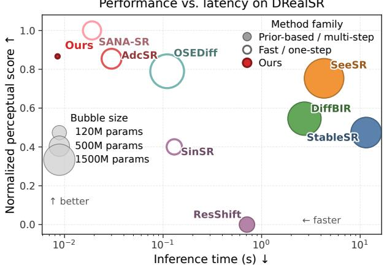
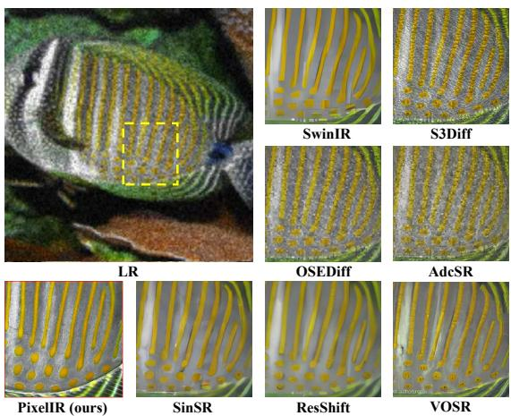
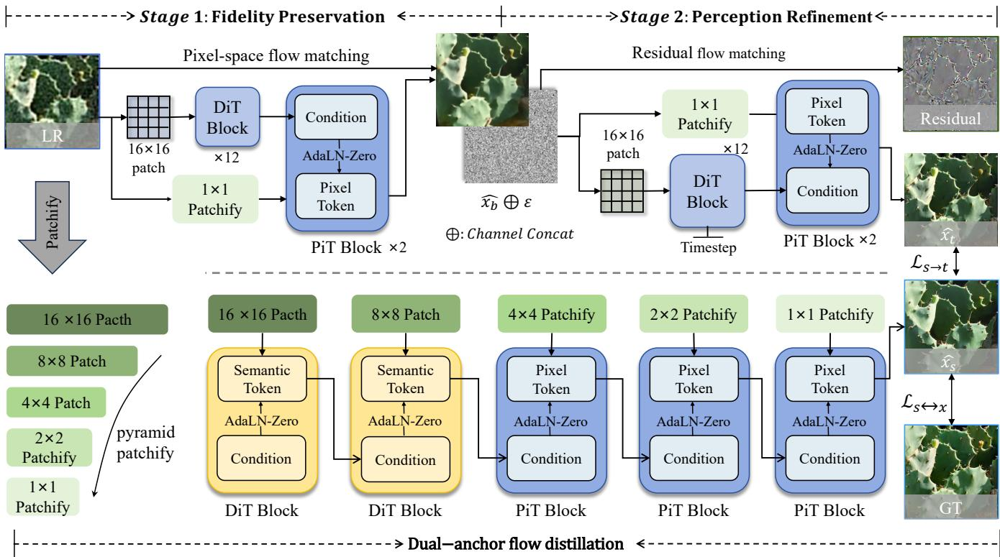
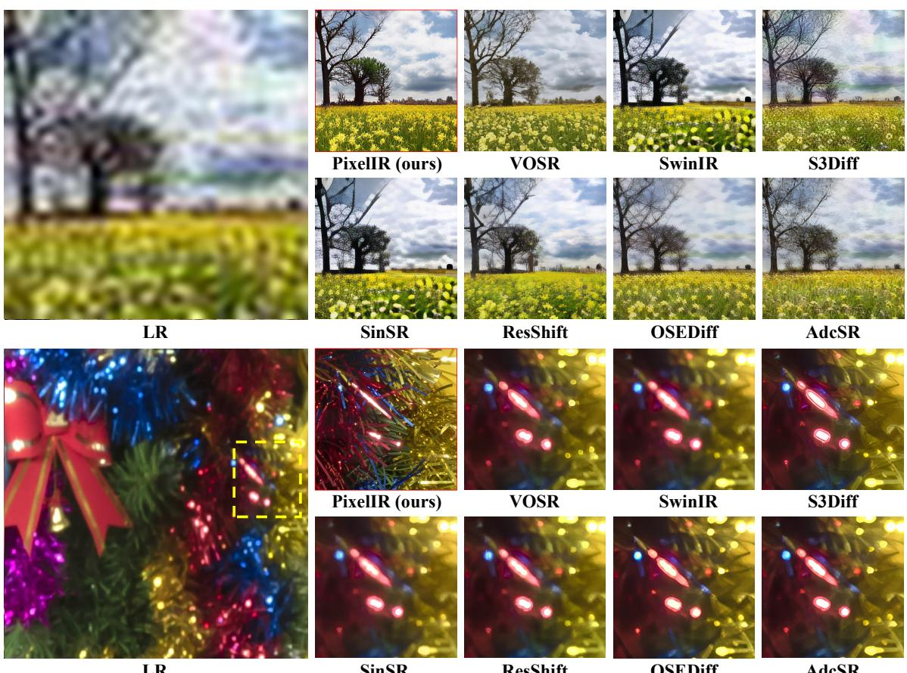
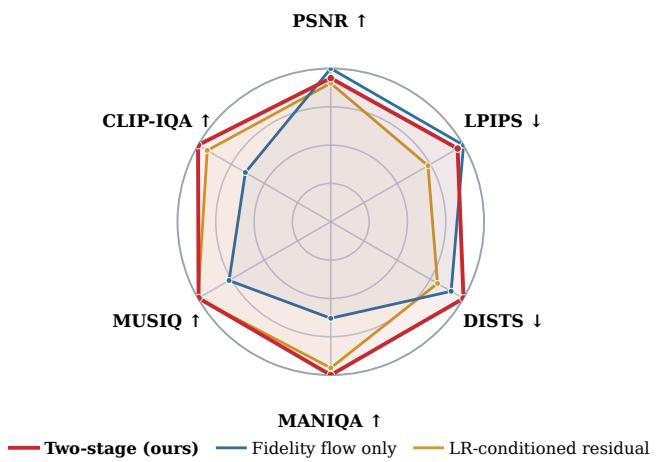

Performance vs. latency on DRealSR

# PixelIR: Fidelity–Perception Decoupling via Pixel-Space Image–Residual Flow Matching for Eficient One-Step Real-World Super-Resolution

Bingtian Qiao1,2∗, Yue Shi1,3, Yong Guo1, Wenjun Zhang1, Jiezhang Cao1†

1Shanghai Jiao Tong University 2Fuzhou University 3Shanghai AI Laboratory caojiezhang@sjtu.edu.cn

  
Figure 1: The compact PixelIR student achieves a favorable quality–eficiency trade-of for Real-ISR. Left: DRealSR perceptual score versus latency. Right: comparison against seven baselines.

## Abstract

Real-world image super-resolution (Real-ISR) aims to preserve structures supported by the degraded observation while reconstructing perceptually realistic details. However, existing Real-ISR methods largely optimize fidelity and perceptual quality within a shared network, causing the two objectives to interfere throughout training and making their balance dificult to control. Recent one-step methods reduce sampling steps, yet often inherit both this coupled optimization behavior and the expensive high-resolution backbone of their multi-step predecessors. We argue that eficient Real-ISR requires not only a shorter sampling trajectory, but also specialized modeling of faithful reconstruction and perceptual detail synthesis. Based on this insight, we propose PixelIR, a fidelity–perception decoupling framework built upon pixel-space image–residual flow matching. PixelIR first learns an image flow that maps the degraded observation to a faithful reconstruction. Then, a residual flow synthesizes the missing perceptual details from noise without repeatedly relearning or overwriting the complete restoration solution. We further distill the teacher into a deployment-oriented one-step student within a coarse-tofine pyramid architecture. Extensive experiments show that PixelIR achieves leading PSNR, SSIM, and LPIPS on both RealSR and DRealSR. The compact student completes pixel-

space restoration in a single evaluation with only 32.9M parameters, 89.7G MACs, and 8.5ms latency, demonstrating a strong practical fidelity–perception–eficiency balance.

## 1 Introduction

Real-world image super-resolution (Real-ISR) aims to recover high-quality images from observations degraded by unknown blur, noise, compression, and sensor artifacts. Existing methods face a fundamental fidelity–perception tradeof (Blau and Michaeli 2018): pixel-wise objectives favor accurate but over-smoothed conditional means, whereas perceptual and adversarial objectives recover realistic textures at the risk of deviating from the reference. When optimized within one generator, reweighting these objectives typically selects another point on the same empirical Pareto frontier rather than improving both. Their balance therefore remains central to practical Real-ISR.

Recent years have witnessed the growing success of generative restoration methods for Real-ISR. Compared with regression-based approaches, difusion and flow-based models better address real-world degradations by synthesizing plausible textures and realistic details. However, existing methods still occupy only part of the design space. Multi-step methods repeatedly evaluate large high-resolution models, whereas one-step methods avoid iterative sampling but often retain expensive denoisers and auxiliary encoders. More fundamentally, both families optimize fidelity and perception within a shared backbone, leaving the objectives to compete throughout training. Consequently, neither family simultaneously improves the fidelity–perception operating point and enables lightweight one-step deployment. Current Real-ISR is therefore limited by sampling depth and costly, coupled high-resolution modeling.

This observation motivates us to revisit Real-ISR from two important perspectives: structural decoupling and eficient one-step deployment. To this end, we propose PixelIR, a decouple-then-distill framework. Specifically, we first construct a two-stage teacher, in which the first stage learns a faithful base reconstruction and is then frozen, while the second stage synthesizes the missing residual details conditioned on this base. This design assigns fidelity reconstruction and perceptual generation to separately optimized networks, preventing the perceptual objective from repeatedly renegotiating the structural solution. Compared with coupled single-stage training, the resulting teacher improves PSNR, LPIPS, and DISTS simultaneously. The gain therefore shifts the observed fidelity–perception frontier outward instead of selecting another trade-of point.

The decoupled teacher establishes the desired operating point but remains expensive: its two 4-step networks contain 370.1M parameters and require eight evaluations. We therefore distill its restoration mapping into a purpose-built one-step student. The student progressively increases feature resolution from 322 to 5122 while reducing channel width from 256 to 48, concentrating capacity at semantic scales and keeping high-resolution processing narrow. Cellwise compress-and-expand blocks cap attention at 1024 tokens in the three finest stages. Complementary teacher and ground-truth supervision transfers perceptual detail without bounding the student by the teacher’s reconstruction error.

Extensive experiments on standard Real-ISR benchmarks demonstrate that PixelIR achieves the best PSNR, SSIM, and LPIPS on both real-capture benchmarks, while its compact student surpasses all prior methods in CLIP-IQA on DIV2K. More importantly, the 32.9M-parameter student performs the complete LR-to-HR mapping in one pixel-space evaluation with 89.7G MACs and 8.5ms latency on an RTX PRO 6000— the lowest parameter count, MACs, and latency among the compared methods. This corresponds to 5.3× fewer parameters than the next-smallest deployment stack and 4.6× fewer MACs than SANA-SR. Without VAE or text branches, the pyramid transfers the improved fidelity–perception operating point to an eficient deployment regime.

Our main contributions are summarized as follows:

• We identify coupled optimization between faithful reconstruction and perceptual detail synthesis as an important limitation of generative Real-ISR, and propose PixelIR, a decouple-then-distill framework that separately organizes restoration quality and deployment eficiency.

• We introduce pixel-space image–residual flow matching, in which a frozen image flow establishes a faithful structural anchor and a conditional residual flow performs complementary perceptual refinement. Under matched settings, this decomposition improves PSNR, LPIPS, and DISTS over coupled single-stage optimization.

• We design a 32.9M-parameter coarse-to-fine student with bounded fine-scale attention and teacher–ground-truth supervision, enabling one-step restoration with 89.7G MACs while retaining leading fidelity and referencebased perception.

## 2 Related Work

Perception–distortion in Real-ISR. Earlier SR approaches rely on feed-forward regression with pixel-wise objectives (Dong et al. 2016; Shi et al. 2016; Kim, Lee, and Lee 2016; Zhang et al. 2018b; Chen et al. 2021; Liang et al. 2021; Chen et al. 2023). They favor high PSNR but average plausible high-frequency completions, producing over-smoothed results. Perceptual and adversarial training improves realism (Ledig et al. 2017; Wang et al. 2018; Liang, Zeng, and Zhang 2022), while BSRGAN (Zhang et al. 2021) and Real-ESRGAN (Wang et al. 2021) extend it to unknown real degradations. Optimizing these objectives in one restorer exposes the perception–distortion trade-of(Blau and Michaeli 2018): perceptual gains can reduce distortion fidelity.

Generative Real-ISR increasingly adapts powerful generative models (Ho, Jain, and Abbeel 2020; Song et al. 2021; Rombach et al. 2022; Peebles and Xie 2023; Podell et al. 2024; Esser et al. 2024; Saharia et al. 2023). StableSR (Wang et al. 2024a), DifBIR (Lin et al. 2024), SeeSR (Wu et al. 2024b), PASD (Yang et al. 2024), and SUPIR (Yu et al. 2024) introduce diferent priors and conditions; ResShift (Yue, Wang, and Loy 2023) models the residual shift between lowand high-resolution images; and CCSR (Sun et al. 2025) separates structure and detail across sampling stages. Yet fidelity and perception remain negotiated within a shared generator. PixelIR instead assigns them to separately optimized networks and freezes the fidelity stage, targeting the Pareto frontier rather than only strengthening the prior.

Distillation for eficient SR. Another thread reduces inference to one or a few network evaluations (Song, Meng, and Ermon 2021). Progressive distillation (Salimans and Ho 2022), consistency models (Song et al. 2023), and InstaFlow (Liu et al. 2024) compress iterative generation (Yin et al. 2024b,a; Xu et al. 2024; Sauer et al. 2024). For Real-ISR, SinSR (Wang et al. 2024b) distills ResShift with inverse consistency; OSEDif (Wu et al. 2024a) adopts variational score distillation; S3Dif (Zhang et al. 2024) introduces degradation guidance; and AdcSR (Chen et al. 2025a) combines distillation with structural pruning. These methods compress an existing trajectory, whereas PixelIR first improves the teacher’s fidelity–perception operating point and then distills its mapping and deployment cost.

Eficient generative architectures. Beyond shortening the sampling trajectory, a complementary line redesigns the backbone for high-resolution eficiency. PixelFlow (Chen et al. 2025b) cascades progressively higher-resolution flow stages, while PixelDiT (Yu et al. 2026) compresses local pixel groups into bounded token sequences within each block. SANA-SR (Qiao et al. 2026) combines compact latent tokens with linear attention for one-step restoration. PixelIR instead couples progressive resolution with within-block token compression, increasing resolution while reducing channel width and bounding fine-scale attention as distillation preserves the decoupled teacher’s operating point. Unlike compact latenttoken designs, the student performs the complete restoration directly in pixel space without relying on a latent autoencoder at inference. This retains an explicit pixel-domain restoration path throughout deployment.

  
Figure 2: Overview of PixelIR. Given an upsampled LQ input, PixelIR first obtains a faithful base reconstruction ${ \hat { \mathbf { x } } } _ { \mathrm { b } }$ with a 4-step image flow, then generates a complementary residual rˆ with a 4-step residual flow conditioned on the frozen base and forms the teacher output $\hat { \mathbf { x } } _ { \mathrm { t } }$ through residual composition. Both stages use a dual-granularity pixel transformer with semantic DiT and pixel-level PiT blocks. The teacher is further distilled into a progressively narrowed five-stage student ${ \mathcal { S } } _ { \phi } ,$ , guided by the teacher anchor $\mathcal { L } _ { \mathrm { s \to t } }$ and the bidirectional ground-truth anchors $\mathcal { L } _ { \mathrm { s }  \mathrm { x } }$ for eficient one-step deployment.

## 3 Proposed Method

## Preliminary.

Real-ISR admits multiple high-frequency completions for the same degraded observation. We formulate this conditional generation process with rectified flow (Liu, Gong, and Liu 2023; Lipman et al. 2023), using a common pixel-space parameterization for the two 4-step teacher flows and onestep student. Let $\mathbf { \boldsymbol { c } } , \mathbf { \boldsymbol { x } } \in \mathbb { R } ^ { 3 \times H \times W }$ denote the upsampled lowquality observation and its high-quality target. For source s, destination $^ { d , }$ and $t \in [ 0 , 1 ]$ , the interpolation state ${ \boldsymbol { z } } _ { t }$ and target velocity $v ^ { \star }$ are

$$
z _ { t } = t d + ( 1 - t ) s , \qquad v ^ { \star } = d - s .\tag{1}
$$

A velocity network $\mathcal { F } _ { \theta }$ is optimized by

$$
\begin{array} { r } { \mathcal { L } _ { \mathrm { v } } = \mathbb { E } _ { t , s , d } \left[ \| \mathcal { F } _ { \pmb { \theta } } ( z _ { t } , t ) - \pmb { v } ^ { \star } \| _ { 2 } ^ { 2 } \right] , } \end{array}\tag{2}
$$

where t follows a logit-normal distribution, and $\hat { d } = z _ { t } + ( 1 -$ $t ) \mathcal { F } _ { \pmb { \theta } } ( \pmb { z } _ { t } , t )$ estimates the destination at any state. At inference, an N-step Euler solver transports ${ \boldsymbol { z } } _ { \mathrm { 0 } } = { \boldsymbol { s } }$ toward $d ;$ for

$N = 1 , \hat { d } = s + \mathcal { F } _ { \theta } ( s , 0 )$ . PixelIR applies this formulation directly in RGB space without an auxiliary autoencoder, for both the multi-step teacher and one-step deployment model.

## 3.1 Fidelity-Oriented Image Flow

The first stage models fidelity preservation as an image flow from c to x by setting $s = c$ and ${ d = x }$ in equation 1. A base restorer $\dot { B } _ { \theta _ { \mathrm { t } } }$ predicts the corresponding velocity, and a 4-step Euler trajectory gives

$$
\begin{array} { r } { \hat { \pmb { x } } _ { \mathrm { b } } = \mathrm { E u l e r } _ { 4 } \left( B _ { \theta _ { \mathrm { b } } } ; \pmb { c } \right) . } \end{array}\tag{3}
$$

For an estimate ${ \hat { \mathbf { x } } } ,$ we define $\begin{array} { r c l } { \mathcal { L } _ { 1 } ( \hat { \pmb x } ) } & { = } & { \| \hat { \pmb x } - \pmb x \| _ { 1 } } \end{array}$ $\mathcal { L } _ { \mathrm { p } } ( \hat { \pmb x } ) \ = \ \mathrm { L P I P S } ( \hat { \pmb x } , \pmb x )$ , and $\mathcal { L } _ { \mathrm { f } } ( \hat { \pmb x } )$ as the cosine distance between its projected tokens and frozen DINOv2 features (Oquab et al. 2024). Let $\mathcal { L } _ { q } ^ { \mathrm { b } } = \mathcal { L } _ { q } ( \hat { \pmb { x } } _ { \mathrm { b } } )$ for $q \in \{ 1 , \mathrm { p } , \mathrm { f } \}$ The fidelity objective is

$$
\mathcal { L } _ { \mathrm { f i d } } = \lambda _ { \mathrm { v } } \mathcal { L } _ { \mathrm { v } } ^ { \mathrm { b } } + \lambda _ { 1 } \mathcal { L } _ { 1 } ^ { \mathrm { b } } + \lambda _ { \mathrm { p } } \mathcal { L } _ { \mathrm { p } } ^ { \mathrm { b } } + \lambda _ { \mathrm { f } } \mathcal { L } _ { \mathrm { f } } ^ { \mathrm { b } } .\tag{4}
$$

Here, $\mathcal { L } _ { \mathrm { v } } ^ { \mathrm { b } }$ instantiates equation 2. The base restorer uses the dual-granularity pixel transformer in figure 2: a 12-block, 768-dimensional semantic DiT operates on $1 6 \times 1 6$ patches, and a 2-block, 64-dimensional PiT performs local pixel refinement. After training, the 184.8M-parameter image flow is frozen as the perceptual stage’s fidelity anchor.

## 3.2 Perception-Oriented Residual Flow

The second stage models detail refinement as a residual flow conditioned on the frozen base, with target

$$
\pmb { r } = \pmb { x } - \hat { \pmb { x } } _ { \mathrm { b } } .\tag{5}
$$

We set $s = \epsilon$ and $d = r ,$ where $\epsilon \sim \mathcal { N } ( 0 , I )$ is a Gaussian random vector. The residual-flow state and velocity are therefore $z _ { t } ^ { \mathrm { r } } = t r + ( 1 - t ) \epsilon$ and $v _ { \mathrm { r } } ^ { \star } = r - \epsilon .$ , respectively. A detail network $\mathcal { D } _ { \pmb { \theta } _ { \mathrm { d } } }$ receives the flow state and the frozen base through channel-wise concatenation:

$$
\tilde { z } _ { t } ^ { \mathrm { r } } = \left[ z _ { t } ^ { \mathrm { r } } ; \hat { x } _ { \mathrm { b } } \right] \in \mathbb { R } ^ { 6 \times H \times W } .\tag{6}
$$

The 4-step residual trajectory starts from ϵ and produces $\hat { \pmb { r } } = \mathrm { E u l e r } _ { 4 } ( \mathcal { D } _ { \pmb { \theta } _ { \mathrm { d } } } ; \epsilon , \hat { \pmb { x } } _ { \mathrm { b } } )$ . The final teacher output is

$$
\begin{array} { r } { \hat { \pmb x } _ { \mathrm { t } } = \hat { \pmb x } _ { \mathrm { b } } + \hat { \pmb r } . } \end{array}\tag{7}
$$

Let $\mathcal { L } _ { q } ^ { \mathrm { t } } = \mathcal { L } _ { q } ( \hat { \pmb { x } } _ { \mathrm { t } } )$ for $q \in \{ 1 , \mathrm { p } , \mathrm { f } \}$ . The perceptual-stage objective is

$$
\mathcal { L } _ { \mathrm { p e r } } = \lambda _ { \mathrm { v } } \mathcal { L } _ { \mathrm { v } } ^ { \mathrm { r } } + \lambda _ { \mathrm { l } } \mathcal { L } _ { \mathrm { l } } ^ { \mathrm { t } } + \lambda _ { \mathrm { p } } \mathcal { L } _ { \mathrm { p } } ^ { \mathrm { t } } + \lambda _ { \mathrm { f } } \mathcal { L } _ { \mathrm { f } } ^ { \mathrm { t } } + \lambda _ { \mathrm { a } } \mathcal { L } _ { \mathrm { a d v } } .\tag{8}
$$

where $\mathcal { L } _ { \mathrm { v } } ^ { \mathrm { r } }$ matches $v _ { \mathrm { r } } ^ { \star }$ , and $\mathcal { L } _ { \mathrm { a d v } }$ is the generator-side relativistic average objective (Wang et al. 2018) using a conditional multi-scale PatchGAN. The detail flow retains the dual-granularity transformer and expands its input projection from three to six channels for equation 6. It contains 185.3M parameters, giving 370.1M parameters and eight evaluations for the complete teacher. Freezing $B _ { \theta _ { \mathrm { b } } }$ assigns faithful reconstruction and perceptual residual synthesis to separately optimized flows, while residual composition preserves the base reconstruction as the reference solution.

Prior-enhanced teacher. The PixelIR-L teacher follows the same image–residual flow formulation, base conditioning, 4- step trajectories, and residual composition. It scales the perceptual flow with a pretrained 1.3B text-to-image PixelDiT prior and rank-32 LoRA. The fidelity flow remains frozen, while the prior-initialized residual flow uses the same objective in equation 8, yielding a higher-capacity perceptual variant.

## 3.3 One-Step Flow Distillation

For the lightweight branch, PixelIR compresses the 370.1Mparameter, eight-evaluation teacher into a 32.9M-parameter one-step student ${ \cal { S } } _ { \phi } ;$ PixelIR-L applies the same distillation formulation with a deeper 132.8M pyramid that preserves the five resolutions and widths. The lightweight student extends the dual-granularity design into a five-stage pyramid whose resolution increases as its channel width decreases, allocating most capacity to semantic reasoning while keeping fine-scale processing lightweight.

Bounded-attention pyramid. For a feature tensor ${ \textsf { H } } \in$ $\mathbb { R } ^ { C \times R \times R }$ , we partition the spatial grid into non-overlapping $p \times p$ cells and flatten every cell into one token:

$$
\mathrm { U n f o l d } _ { p } ( \mathbf { H } ) \in \mathbb { R } ^ { ( R / p ) ^ { 2 } \times p ^ { 2 } C } .\tag{9}
$$

With timestep embedding $e _ { t }$ and projections $\pmb { W } _ { \mathrm { c } } \in \mathbb { R } ^ { p ^ { 2 } C \times d }$ and $W _ { \mathrm { e } } \in \mathbb { R } ^ { d \times p ^ { 2 } C }$ , the block computes

$$
U = \mathrm { U n f o l d } _ { p } \left( \mathrm { M o d } ( \mathrm { N o r m } ( \mathsf { H } ) ; e _ { t } ) \right) W _ { \mathrm { c } } \in \mathbb { R } ^ { ( R / p ) ^ { 2 } \times d } ,\tag{10}
$$

<table><tr><td>Stage</td><td> $R _ { i }$ </td><td> $p _ { i }$ </td><td> $C _ { i }$ </td><td> $L _ { i }$ </td><td>tokens</td></tr><tr><td>0</td><td>32</td><td>1</td><td>256</td><td>6</td><td>1024</td></tr><tr><td>1</td><td>64</td><td>1</td><td>160</td><td>3</td><td>4096</td></tr><tr><td>2</td><td>128</td><td>4</td><td>112</td><td>2</td><td>1024</td></tr><tr><td>3</td><td>256</td><td>8</td><td>72</td><td>2</td><td>1024</td></tr><tr><td>4</td><td>512</td><td>16</td><td>48</td><td>2</td><td>1024</td></tr></table>

Table 1: Student pyramid configuration.

$$
\begin{array} { r } { \hat { U } = \mathrm { A t t n } ( { \cal U } ) \in \mathbb R ^ { ( R / p ) ^ { 2 } \times d } , } \end{array}\tag{11}
$$

$$
{ \sf H }  { \sf H } + \gamma \odot \mathrm { F o l d } _ { p } ( \hat { \pmb { U } } { \pmb { W } } _ { \mathrm { e } } ) \in \mathbb { R } ^ { C \times R \times R } ,\tag{12}
$$

where $\mathrm { M o d } ( \mathsf { H } ; e _ { t } ) = \mathsf { H } \odot \left( 1 + \mathrm { s c a l e } ( e _ { t } ) \right) + \mathrm { s h i f t } ( e _ { t } )$ , γ is a timestep gate, $\mathrm { F o l d } _ { p }$ inverts $\mathrm { U n f o l d } _ { p } ,$ and Attn denotes rotary self-attention (Su et al. 2024). A second residual branch applies a feed-forward network. $\mathbf { A } \mathbf { t } p = 1$ , the block attends the $R \times R$ grid; at $p = R / 3 2$ , it attends $3 2 ^ { 2 } = 1 0 2 4$ tokens.

$S _ { \phi }$ contains five stages at $R _ { i } \in \{ 3 2 , 6 4 , 1 2 8 , 2 5 6 , 5 1 2 \}$ connected by learned 2× pixel-shufle upsampling. As shown in table 1, width decreases as 256→160→112→72→48, with most depth at the first semantic stage. The first two stages use $p _ { i } = 1 ;$ ; the three finer stages set $p _ { i } = R _ { i } / 3 2$ and retain 1024 tokens. The input is patchified with $p = 1 6$ and projected to the first-stage width; a final $3 \times 3$ convolution predicts the three-channel velocity ${ \boldsymbol { v } } _ { \phi } ( { \boldsymbol { z } } _ { t } , t )$

Dual-anchor flow distillation. The student learns a one-step pixel-space flow from source c to target x:

$$
\begin{array} { r } { \hat { \pmb x } _ { \mathrm { s } } = \pmb c + \pmb v _ { \phi } ( \pmb c , 0 ) . } \end{array}\tag{13}
$$

For the frozen teacher output $\hat { \mathbf { x } } _ { \mathrm { t } } .$ , student-to-teacher supervision transfers the teacher restoration behavior:

$$
\mathcal { L } _ { \mathrm { s \to t } } = \alpha _ { 1 } \left. \hat { \pmb x } _ { \mathrm { s } } - \hat { \pmb x } _ { \mathrm { t } } \right. _ { 1 } + \alpha _ { \mathrm { p } } \mathrm { L P I P S } ( \hat { \pmb x } _ { \mathrm { s } } , \hat { \pmb x } _ { \mathrm { t } } ) .\tag{14}
$$

Direct ground-truth supervision anchors the one-step output to the reference:

$$
\mathcal { L } _ { \mathrm { s \to x } } = \beta _ { 1 } \left\| \hat { \pmb x } _ { \mathrm { s } } - { \pmb x } \right\| _ { 1 } + \beta _ { \mathrm { p } } \mathrm { L P I P S } ( \hat { \pmb x } _ { \mathrm { s } } , { \pmb x } ) .\tag{15}
$$

The two endpoint objectives are complemented by a groundtruth-to-student path that constrains the velocity field. For $\tau \sim \mathcal { U } [ \tau _ { \operatorname* { m i n } } , \tau _ { \operatorname* { m a x } } ]$ , the inverse-flow source is

$$
\hat { \pmb { c } } = \pmb { x } - \tau \pmb { v } _ { \phi } ( \pmb { x } , \tau ) ,\tag{16}
$$

and maps it back to the high-quality endpoint by

$$
\begin{array} { r } { \hat { \pmb x } _ { \tau } = \hat { \pmb c } + \pmb v _ { \phi } ( \hat { \pmb c } , 0 ) . } \end{array}\tag{17}
$$

The corresponding inverse-consistency objective is

$$
\mathcal { L } _ { \mathrm { x \to s } } = \gamma _ { 1 } \| \hat { \pmb x } _ { \tau } - \pmb x \| _ { 1 } + \gamma _ { \mathrm { p } } \mathrm { L P I P S } ( \hat { \pmb x } _ { \tau } , \pmb x ) .\tag{18}
$$

Training objective. The student objective combines flow matching, distillation, and adversarial training:

$$
\scriptstyle { \mathcal { L } } _ { \mathrm { s t u d e n t } } = \lambda _ { \mathrm { v } } { \mathcal { L } } _ { \mathrm { v } } ^ { \mathrm { s } } + { \mathcal { L } } _ { \mathrm { s  t } } + { \mathcal { L } } _ { \mathrm { s  x } } + { \mathcal { L } } _ { \mathrm { x  s } } + \lambda _ { \mathrm { a } } { \mathcal { L } } _ { \mathrm { a d v } } .\tag{19}
$$

With both teacher flows frozen, $S _ { \phi }$ performs complete LRto-HR restoration in one pixel-space evaluation.

<table><tr><td>Method</td><td>PSNR↑</td><td>SSIM↑</td><td>MANIQA↑</td><td>MUSIQ↑</td><td>CLIP-IQA↑</td><td>LPIPS↓</td><td>DISTS↓</td><td>NIQE↓</td></tr><tr><td colspan="9">Multi-step / flexible-step methods</td></tr><tr><td>StableSR (Wang et al. 2024a)</td><td>24.70</td><td>0.709 0.657</td><td>0.622 0.625</td><td>65.78 64.98</td><td>0.618 0.646</td><td>0.302 0.364</td><td>0.229</td><td>5.912</td></tr><tr><td>DiffBIR (Lin et al. 2024) SeeSR (Wu et al. 2024b)</td><td>24.75 25.18</td><td>0.722</td><td>0.644</td><td>69.77</td><td>0.661</td><td>0.301</td><td>0.231 0.222</td><td>5.535</td></tr><tr><td></td><td></td><td>0.680</td><td>0.649</td><td></td><td>0.662</td><td></td><td></td><td>5.408</td></tr><tr><td>PASD (Yang et al. 2024)</td><td>25.21</td><td>0.742</td><td>0.528</td><td>68.75 58.43</td><td>0.544</td><td>0.338</td><td>0.226</td><td>5.414</td></tr><tr><td>ResShift (Yue, Wang, and Loy 2023) SUPIR (Yu et al. 2024)</td><td>26.31 23.65</td><td>0.662</td><td>0.578</td><td></td><td></td><td>0.346</td><td>0.250</td><td>7.263</td></tr><tr><td></td><td>22.56</td><td>0.655</td><td></td><td>62.09</td><td>0.671</td><td>0.354</td><td>0.249</td><td>6.110</td></tr><tr><td>DreamClear (Ai et al. 2024)</td><td></td><td>0.726</td><td>0.538 0.446</td><td>65.21</td><td>0.690</td><td>0.368</td><td>0.235</td><td>5.738</td></tr><tr><td>InvSR (Yue, Liao, and Loy 2025)</td><td>24.50</td><td>0.685</td><td>0.611</td><td>69.67</td><td>0.692</td><td>0.298</td><td>0.249</td><td>5.219</td></tr><tr><td>LinearSR (Li et al. 2026)</td><td>23.84</td><td></td><td></td><td>69.39</td><td>0.673</td><td>0.313</td><td>0.293</td><td>5.851</td></tr><tr><td>Ours</td><td>25.97</td><td>0.751</td><td>0.600</td><td>65.15</td><td>0.651</td><td>0.248</td><td>0.218</td><td>4.996</td></tr><tr><td>Ours-L</td><td>23.52</td><td>0.614</td><td>0.660</td><td>72.33</td><td>0.714</td><td>0.338</td><td>0.254</td><td>5.388</td></tr><tr><td colspan="9">Efficient / one-step methods</td></tr><tr><td>SinSR (Wang et al. 2024b)</td><td>25.98</td><td>0.735</td><td>0.538</td><td>60.80</td><td>0.612</td><td>0.319</td><td>0.235</td><td>6.287</td></tr><tr><td>OSEDiff (Wu et al. 2024a)</td><td>25.15</td><td>0.734</td><td>0.633</td><td>69.09</td><td>0.669</td><td>0.292</td><td>0.213</td><td>5.648</td></tr><tr><td>S3Diff (Zhang et al. 2024)</td><td>25.03</td><td>0.732</td><td>0.626</td><td>67.89</td><td>0.672</td><td>0.270</td><td>0.200</td><td>5.331</td></tr><tr><td>AddSR (Tai et al. 2026)</td><td>23.33</td><td>0.640</td><td>0.683</td><td>71.49</td><td>0.723</td><td>0.393</td><td>0.263</td><td>5.896</td></tr><tr><td>D3SR (Li et al. 2025b)</td><td>24.54</td><td>0.727</td><td>0.638</td><td>68.69</td><td>0.671</td><td>0.305</td><td>0.211</td><td>5.096</td></tr><tr><td>FLUX-SR (Li et al. 2025a)</td><td>24.83</td><td>0.738</td><td>0.651</td><td>70.08</td><td>0.738</td><td>0.314</td><td>0.226</td><td>5.210</td></tr><tr><td>AdcSR (Chen et al. 2025a)</td><td>25.31</td><td>0.724</td><td>0.637</td><td>70.31</td><td>0.736</td><td>0.300</td><td>0.216</td><td>5.315</td></tr><tr><td>TSD-SR (Dong et al. 2025)</td><td>24.81</td><td>0.717</td><td>0.635</td><td>70.49</td><td>0.716</td><td>0.274</td><td>0.210</td><td>5.130</td></tr><tr><td>VOSR (Wu et al. 2026)</td><td>25.32</td><td>0.709</td><td>0.650</td><td>70.00</td><td>0.576</td><td>0.286</td><td>0.210</td><td>5.239</td></tr><tr><td>Ours</td><td>26.83</td><td>0.753</td><td>0.587</td><td>67.84</td><td>0.713</td><td>0.236</td><td>0.217</td><td>5.512</td></tr><tr><td>Ours-L</td><td>25.17</td><td>0.691</td><td>0.606</td><td>71.43</td><td>0.759</td><td>0.298</td><td>0.269</td><td>4.941</td></tr></table>

Table 2: Quantitative comparison on RealSR. Per-category best and second-best values are bolded and underlined.

## 4 Experiments

## 4.1 Setup

Datasets and degradation. PixelIR is trained on highquality image collections commonly used for Real-ISR (Wang et al. 2021; Liang et al. 2021), using second-order Real-ESRGAN degradations (Wang et al. 2021) for synthetic pairs and aligned real pairs for domain adaptation. Evaluation covers three standard benchmarks (Wu et al. 2024a; Wang et al. 2024a; Wu et al. 2024b): DIV2K-Val (Agustsson and Timofte 2017), divided into 3000 non-overlapping 512×512 patches; RealSR (Cai et al. 2019), containing 100 pairs; and DRealSR (Wei et al. 2020), containing 93 pairs. RealSR and DRealSR provide authentic LR–HR captures rather than synthetic degradations. All methods perform 4× restoration from 128×128 to 512×512.

Evaluation metrics. We use PSNR, SSIM, MANIQA (Yang et al. 2022), MUSIQ (Ke et al. 2021), CLIP-IQA (Wang, Chan, and Loy 2023), LPIPS (Zhang et al. 2018a), DISTS (Ding et al. 2022), and NIQE (Mittal, Soundararajan, and Bovik 2013) to measure distortion fidelity and perceptual quality. Following the OSEDif evaluation protocol (Wu et al. 2024a), PSNR and SSIM are computed on the Y channel without border cropping, while the remaining metrics are computed on RGB outputs. MANIQA, MUSIQ, CLIP-IQA, and NIQE are no-reference metrics, whereas LPIPS and DISTS measure reference-based perceptual distance. We compute all metrics with PyIQA (Chen and Mo 2022).

Model variants. We instantiate PixelIR with lightweight and prior-enhanced teacher–student branches. The lightweight branch pairs a 370.1M-parameter, eight-evaluation teacher with a 32.9M-parameter one-step student. PixelIR-L retains the same frozen fidelity flow but replaces the perceptual flow with the pretrained 1.3B PixelDiT prior adapted by rank-32 LoRA, while preserving the 4-step residual trajectory and residual composition. Its corresponding one-step student keeps the five resolutions and channel widths in table 1, increases the stage depths to {30, 4, 7, 7, 10}, and contains 132.8M parameters. The quantitative tables denote the lightweight and prior-enhanced branches as Ours and Ours-L, respectively; their teachers appear in the multi-step group and the corresponding distilled students appear in the onestep group.

Compared methods. We compare against the multistep/flexible-step and eficient/one-step methods listed in the quantitative tables. Baseline values follow oficial reports under the shared three-benchmark protocol, and the best and second-best results are determined separately within each category. The DIV2K comparison and additional setup details are provided in the supplementary material.

Implementation details. All variants use AdamW and bf16 precision on one RTX PRO 6000 GPU. Both students follow the dual-anchor objective in equation 19 and require no text encoder at inference. Additional data mixtures, optimization settings, and text-conditioning details are provided in the supplementary material.

## 4.2 Main Results

RealSR and DRealSR. As shown in tables 2 and 3, the compact PixelIR student performs more favorably on realworld data. It achieves the best PSNR, SSIM, and LPIPS on both benchmarks. This indicates that the one-step student preserves strong structural fidelity and reference-based perceptual alignment under authentic degradations. Against recent one-step baselines, PixelIR better balances fidelity and reference-based perceptual quality on real data.

LR
<table><tr><td>Method</td><td>PSNR↑</td><td>SSIM↑</td><td>MANIQA↑</td><td>MUSIQ↑</td><td>CLIP-IQA↑</td><td>LPIPS↓</td><td>DISTS↓</td><td>NIQE↓</td></tr><tr><td colspan="11">Multi-step / flexible-step methods</td></tr><tr><td colspan="9">StableSR (Wang et al. 2024a)</td></tr><tr><td>DiffBIR (Lin et al. 2024)</td><td>28.03 26.71</td><td>0.754 0.657</td><td>0.560 0.593</td><td>58.51 61.07</td><td>0.636 0.639</td><td>0.328 0.456</td><td>0.227 0.275</td><td>6.524 6.312</td></tr><tr><td>SeeSR (Wu et al. 2024b)</td><td>28.17</td><td>0.769</td><td>0.604</td><td>64.93</td><td>0.680</td><td>0.319</td><td>0.232</td><td>6.397</td></tr><tr><td>PASD (Yang et al. 2024)</td><td>27.36</td><td>0.707</td><td>0.617</td><td>64.87</td><td>0.681</td><td>0.376</td><td>0.253</td><td>5.547</td></tr><tr><td>ResShift (Yue, Wang, and Loy 2023)</td><td>28.46</td><td>0.767</td><td>0.459</td><td>50.60</td><td>0.534</td><td>0.401</td><td>0.266</td><td>8.125</td></tr><tr><td>SUPIR (Yu et al. 2024)</td><td>25.09</td><td>0.646</td><td>0.547</td><td>58.79</td><td>0.675</td><td>0.424</td><td>0.280</td><td>7.392</td></tr><tr><td>DreamClear (Ai et al. 2024)</td><td>24.48</td><td>0.651</td><td>0.447</td><td>65.83</td><td>0.662</td><td>0.397</td><td>0.244</td><td>5.133</td></tr><tr><td>InvSR (Yue, Liao, and Loy 2025)</td><td>27.63</td><td>0.796</td><td>0.461</td><td>67.46</td><td>0.692</td><td>0.290</td><td>0.237</td><td>6.322</td></tr><tr><td>LinearSR (Li et al. 2026)</td><td>26.91</td><td>0.719</td><td>0.581</td><td>69.22</td><td>0.713</td><td>0.358</td><td>0.300</td><td>6.965</td></tr><tr><td>Ours</td><td></td><td></td><td></td><td></td><td></td><td></td><td></td><td></td></tr><tr><td>Ours-L</td><td>29.09 26.80</td><td>0.789 0.690</td><td>0.602 0.642</td><td>60.52 71.23</td><td>0.668 0.729</td><td>0.269 0.344</td><td>0.219 0.271</td><td>5.927 5.976</td></tr><tr><td colspan="9">Efficient / one-step methods</td></tr><tr><td>SinSR (Wang et al. 2024b)</td><td>28.36</td><td>0.751</td><td>0.488</td><td>55.33</td><td>0.638</td><td>0.366</td><td>0.248</td><td>6.991</td></tr><tr><td>OSEDiff (Wu et al. 2024a)</td><td>27.92</td><td>0.783</td><td>0.590</td><td>64.65</td><td>0.696</td><td>0.297</td><td>0.216</td><td>6.490</td></tr><tr><td>S3Diff (Zhang et al. 2024)</td><td>27.39</td><td>0.747</td><td>0.572</td><td>64.16</td><td>0.716</td><td>0.313</td><td>0.211</td><td>6.170</td></tr><tr><td>AddSR (Tai et al. 2026)</td><td>26.72</td><td>0.712</td><td>0.626</td><td>66.33</td><td>0.723</td><td>0.398</td><td>0.271</td><td>7.669</td></tr><tr><td>D3SR (Li et al. 2025b)</td><td>26.98</td><td>0.714</td><td>0.596</td><td>67.28</td><td>0.709</td><td>0.308</td><td>0.223</td><td>5.523</td></tr><tr><td>FLUX-SR (Li et al. 2025a)</td><td>27.29</td><td>0.796</td><td>0.599</td><td>68.79</td><td>0.673</td><td>0.290</td><td>0.229</td><td>5.930</td></tr><tr><td>AdcSR (Chen et al. 2025a)</td><td>28.10</td><td>0.773</td><td>0.605</td><td>66.26</td><td>0.705</td><td>0.305</td><td>0.220</td><td>6.450</td></tr><tr><td>TSD-SR (Dong et al. 2025)</td><td>27.77</td><td>0.756</td><td>0.587</td><td>66.62</td><td>0.734</td><td>0.297</td><td>0.214</td><td>5.913</td></tr><tr><td>VOSR (Wu et al. 2026)</td><td>27.66</td><td>0.732</td><td>0.609</td><td>65.80</td><td>0.591</td><td>0.348</td><td>0.236</td><td>5.773</td></tr><tr><td>Ours</td><td>29.85</td><td>0.803</td><td>0.591</td><td>63.00</td><td>0.718</td><td>0.255</td><td>0.229</td><td></td></tr><tr><td>Ours-L</td><td>28.39</td><td>0.750</td><td>0.609</td><td>69.06</td><td>0.747</td><td>0.303</td><td>0.271</td><td>6.278 5.800</td></tr></table>

Table 3: Quantitative comparison on DRealSR. Per-category best and second-best values are bolded and underlined.

  
Figure 3: Qualitative comparison on challenging examples from LSDIR and RealSR.

<table><tr><td>Method</td><td>Steps</td><td>Params</td><td>MACs</td><td>Latency</td></tr><tr><td>StableSR</td><td>200</td><td>1410M</td><td>79940G</td><td>11.5 s</td></tr><tr><td>DiffBIR</td><td>50</td><td>1717M</td><td>24234G</td><td>2.72 s</td></tr><tr><td>SeeSR</td><td>50</td><td>2524M</td><td>65857G</td><td>4.30 s</td></tr><tr><td>PASD</td><td>20</td><td>1900M</td><td>29125G</td><td>2.80 s</td></tr><tr><td>ResShift</td><td>15</td><td>174.7M</td><td>5999G</td><td>0.71 s</td></tr><tr><td>SinSR</td><td>1</td><td>174.7M</td><td>3157G</td><td>0.13 s</td></tr><tr><td>OSEDiff</td><td>1</td><td>1775M</td><td>2265G</td><td>0.11 s</td></tr><tr><td>S3Diff</td><td>1</td><td>1327M</td><td>2627G</td><td>0.28 s</td></tr><tr><td>AdcSR</td><td>1</td><td>456M</td><td>496G</td><td>0.030 s</td></tr><tr><td>SANA-SR</td><td>1</td><td>344M</td><td>407.95G</td><td>0.019 s</td></tr><tr><td>Ours</td><td>1</td><td>32.9M</td><td>89.7G</td><td>0.0085 s</td></tr></table>

Table 4: Inference cost for a single 4× SR image (128→512). Bold/underline: best/second-best per column; ties in step count are left unmarked.

DIV2K-Val. The complete comparison is provided in the supplementary material. The compact student achieves a CLIP-IQA of 0.761, surpassing all prior methods. Taken together, the three datasets show that PixelIR balances reference fidelity, perceptual quality, and deployment eficiency rather than optimizing a single no-reference score.

## 4.3 Inference Eficiency

Table 4 compares the sampling steps, active parameters, MACs, and latency required for one 128→512 restoration. StableSR through AdcSR follow the unified third-party benchmark of AdcSR (Chen et al. 2025a), while SANA-SR follows its oficial report. For ResShift and SinSR, we include both the 119M difusion U-Net and the 55.3M VQGAN autoencoder executed at inference, giving 174.7M active parameters. On an RTX PRO 6000, we measure ours using exact state-dict parameters, MACs, and CUDA-event latency over five bf16 batch-1 runs.

Eficiency. Table 4 shows that the compact PixelIR student further reduces end-to-end latency and MACs to 8.5ms and 89.7G, respectively. It performs the complete LR-to-HR mapping with one 32.9M-parameter pixel-space network and requires no VAE or text encoder at inference. Compared with the next-smallest ResShift and SinSR stacks, our method uses 5.3× fewer parameters; compared with SANA-SR and OSEDif, it uses 4.6× and 25× fewer MACs, respectively. Since published latency values use diferent hardware, parameter and MAC comparisons provide the more hardwareindependent evidence. The left panel of figure 1 visualizes this regime.

## 4.4 Ablation Studies

We evaluate decoupling in the lightweight teacher and the direct endpoint losses of the compact student. Student-capacity, loss, and discriminator analyses are provided in the supplementary material.

Figure 4: Six-metric component profile on DIV2K. Each metric is direction-aligned and normalized by its best value; farther is better.
<table><tr><td>Configuration</td><td>PSNR</td><td>LPIPS↓</td><td>DISTS↓</td></tr><tr><td>Full</td><td>25.47</td><td>0.263</td><td>0.216</td></tr><tr><td> $- \mathcal { L } _ { \mathrm { s \to x } }$ </td><td>25.44</td><td>0.267</td><td>0.218</td></tr><tr><td> $- \mathcal { L } _ { \mathrm { s \to t } }$ </td><td>25.49</td><td>0.277</td><td>0.227</td></tr><tr><td> $- \mathcal { L } _ { \mathrm { s \to t } } - \mathcal { L } _ { \mathrm { s \to x } }$ </td><td>25.01</td><td>0.358</td><td>0.268</td></tr></table>

Table 5: Distillation objective ablation on DIV2K. Each row removes term(s) from equation 19, all else fixed.

Decoupling fidelity from perception. Figure 4 isolates the contributions of the fidelity and residual flows. Fidelity flow only removes the generative residual stage, while LRconditioned residual serves as the matched single-stage baseline by removing the learned fidelity stage and conditioning residual generation directly on bicubic LR.

The fidelity flow alone favors distortion metrics but lacks generative perception, reaching only 51.33 MUSIQ and 0.474 CLIP-IQA. Residual generation raises them to 66.72 and 0.737 while improving DISTS from 0.213 to 0.193. Replacing ${ \hat { \mathbf { x } } } _ { \mathrm { b } }$ with the raw LR condition further increases LPIPS from 0.234 to 0.305 and DISTS from 0.193 to 0.240, confirming that the frozen fidelity estimate provides both the output base and an informative detail condition.

Distillation objective components. Table 5 evaluates the teacher and ground-truth anchors in equation 19 using LPIPS and DISTS. Removing either direct endpoint loss causes only a minor change because the other still constrains the output. Removing both direct losses increases LPIPS from 0.263 to 0.358 and DISTS from 0.216 to 0.268, while MUSIQ rises from 68.9 to 72.2. Although inverse consistency, flow matching, and adversarial supervision remain, weaker endpoint constraints can improve a no-reference score through unmatched texture, confirming that the direct teacher and ground-truth losses preserve faithfulness.

## 5 Conclusion

We presented PixelIR, an eficient decouple-then-distill framework for Real-ISR. Motivated by the observation that existing generative restorers optimize faithful reconstruction and perceptual detail synthesis within a shared trajectory, we revisited Real-ISR from the perspectives of fidelity– perception decoupling and eficient one-step deployment. To this end, PixelIR combines a 4-step image flow for faithful reconstruction with a 4-step residual flow for complementary perceptual details. The resulting teacher is distilled into a progressively narrowed coarse-to-fine student under complementary teacher and ground-truth anchors. As a result, PixelIR establishes a stronger fidelity–perception operating point before transferring the complete restoration mapping to a single pixel-space evaluation. Extensive experiments show leading PSNR, SSIM, and LPIPS on RealSR and DRealSR. With 32.9M parameters and 89.7G MACs, the compact student runs in 8.5ms on an RTX PRO 6000, demonstrating a favorable fidelity–perception–eficiency balance.

## References

Agustsson, E.; and Timofte, R. 2017. NTIRE 2017 Challenge on Single Image Super-Resolution: Dataset and Study. In Proceed ings ofthe IEEE/CVF Conference on Computer Vision and Pattern Recognition Workshops.

Ai, Y.; Zhou, X.; Huang, H.; Han, X.; Chen, Z.; You, Q.; and Yang, H. 2024. DreamClear: High-Capacity Real-World Image Restoration with Privacy-Safe Dataset Curation. In Advances in Neural Information Processing Systems.

Blau, Y.; and Michaeli, T. 2018. The Perception-Distortion Tradeof. In Proceedings of the IEEE/CVF Conference on Computer Vision and Pattern Recognition, 6228–6237.

Cai, J.; Zeng, H.; Yong, H.; Cao, Z.; and Zhang, L. 2019. Toward Real-World Single Image Super-Resolution: A New Benchmark and a New Model. In Proceedings of the IEEE/CVF International Conference on Computer Vision.

Chen, B.; Li, G.; Wu, R.; Zhang, X.; Chen, J.; Zhang, J.; and Zhang, L. 2025a. Adversarial Difusion Compression for Real-World Image Super-Resolution. In Proceedings of the IEEE/CVF Conference on Computer Vision and Pattern Recognition, 28208–28220.

Chen, C.; and Mo, J. 2022. IQA-PyTorch: PyTorch Toolbox for Image Quality Assessment. [Online]. Available: https://github.com/ chaofengc/IQA-PyTorch.

Chen, H.; Wang, Y.; Guo, T.; Xu, C.; Deng, Y.; Liu, Z.; Ma, S.; Xu, C.; Xu, C.; and Gao, W. 2021. Pre-Trained Image Processing Transformer. In Proceedings of the IEEE/CVF Conference on Computer Vision and Pattern Recognition.

Chen, S.; Ge, C.; Zhang, S.; Sun, P.; and Luo, P. 2025b. PixelFlow: Pixel-Space Generative Models with Flow. arXiv:2504.07963.

Chen, X.; Wang, X.; Zhou, J.; Qiao, Y.; and Dong, C. 2023. Activating More Pixels in Image Super-Resolution Transformer. In Proceedings ofthe IEEE/CVF Conference on Computer Vision and Pattern Recognition.

Ding, K.; Ma, K.; Wang, S.; and Simoncelli, E. P. 2022. Image Quality Assessment: Unifying Structure and Texture Similarity. IEEE Transactions on Pattern Analysis and Machine Intelligence.

Dong, C.; Loy, C. C.; He, K.; and Tang, X. 2016. Image Super-Resolution Using Deep Convolutional Networks. IEEE Transactions on Pattern Analysis and Machine Intelligence, 38(2): 295– 307.

Dong, L.; Fan, Q.; Guo, Y.; Wang, Z.; Zhang, Q.; Chen, J.; Luo, Y.; and Zou, C. 2025. TSD-SR: One-Step Difusion with Target Score Distillation for Real-World Image Super-Resolution. In Proceedings of the IEEE/CVF Conference on Computer Vision and Pattern Recognition, 23174–23184.

Esser, P.; Kulal, S.; Blattmann, A.; Entezari, R.; Müller, J.; Saini, H.; Levi, Y.; Lorenz, D.; Sauer, A.; Boesel, F.; et al. 2024. Scaling Rectified Flow Transformers for High-Resolution Image Synthesis. In International Conference on Machine Learning.

Ho, J.; Jain, A.; and Abbeel, P. 2020. Denoising Difusion Probabilistic Models. In Advances in Neural Information Processing Systems.

Ke, J.; Wang, Q.; Wang, Y.; Milanfar, P.; and Yang, F. 2021. MUSIQ: Multi-Scale Image Quality Transformer. In Proceedings of the IEEE/CVF International Conference on Computer Vision.

Kim, J.; Lee, J. K.; and Lee, K. M. 2016. Accurate Image Super-Resolution Using Very Deep Convolutional Networks. In Proceedings of the IEEE/CVF Conference on Computer Vision and Pattern Recognition, 1646–1654.

Ledig, C.; Theis, L.; Huszár, F.; Caballero, J.; Cunningham, A.; Acosta, A.; Aitken, A.; Tejani, A.; Totz, J.; Wang, Z.; and Shi, W. 2017. Photo-Realistic Single Image Super-Resolution Using a Generative Adversarial Network. In Proceedings ofthe IEEE/CVF Conference on Computer Vision and Pattern Recognition.

Li, J.; Cao, J.; Guo, Y.; Li, W.; and Zhang, Y. 2025a. One Diffusion Step to Real-World Super-Resolution via Flow Trajectory Distillation. In International Conference on Machine Learning.

Li, J.; Cao, J.; Zou, Z.; Su, X.; Yuan, X.; Zhang, Y.; Guo, Y.; and Yang, X. 2025b. Unleashing the Power ofOne-Step Difusion Based Image Super-Resolution via a Large-Scale Difusion Discriminator. In Advances in Neural Information Processing Systems.

Li, X.; Zhuang, S.; Cao, S.; Yang, Y.; Pu, Y.; Qin, Q.; Luo, S.; Fu, B.; and Liu, Y. 2026. LinearSR: Unlocking Linear Attention for Stable and Eficient Image Super-Resolution. In International Conference on Learning Representations.

Liang, J.; Cao, J.; Sun, G.; Zhang, K.; Van Gool, L.; and Timofte, R. 2021. SwinIR: Image Restoration Using Swin Transformer. In Proceedings of the IEEE/CVF International Conference on Computer Vision Workshops.

Liang, J.; Zeng, H.; and Zhang, L. 2022. Details or Artifacts: A Locally Discriminative Learning Approach to Realistic Image Super-Resolution. In Proceedings ofthe IEEE/CVF Conference on Computer Vision and Pattern Recognition, 5657–5666.

Lin, X.; He, J.; Chen, Z.; Lyu, Z.; Dai, B.; Yu, F.; Ouyang, W.; Qiao, Y.; and Dong, C. 2024. DifBIR: Towards Blind Image Restoration with Generative Difusion Prior. In European Conference on Computer Vision.

Lipman, Y.; Chen, R. T. Q.; Ben-Hamu, H.; Nickel, M.; and Le, M. 2023. Flow Matching for Generative Modeling. In International Conference on Learning Representations.

Liu, X.; Gong, C.; and Liu, Q. 2023. Flow Straight and Fast: Learning to Generate and Transfer Data with Rectified Flow. In International Conference on Learning Representations.

Liu, X.; Zhang, X.; Ma, J.; Peng, J.; and Liu, Q. 2024. InstaFlow: One Step Is Enough for High-Quality Difusion-Based Text-to-Image Generation. In International Conference on Learning Representations.

Mittal, A.; Soundararajan, R.; and Bovik, A. C. 2013. Making a “Completely Blind” Image Quality Analyzer. IEEE Signal Processing Letters, 20(3): 209–212.

Oquab, M.; Darcet, T.; Moutakanni, T.; Vo, H.; Szafraniec, M.; Khalidov, V.; Fernandez, P.; Haziza, D.; Massa, F.; El-Nouby, A.; et al. 2024. DINOv2: Learning Robust Visual Features without Supervision. Transactions on Machine Learning Research.

Peebles, W.; and Xie, S. 2023. Scalable Difusion Models with Transformers. In Proceedings ofthe IEEE/CVF International Conference on Computer Vision.

Podell, D.; English, Z.; Lacey, K.; Blattmann, A.; Dockhorn, T.; Müller, J.; Penna, J.; and Rombach, R. 2024. SDXL: Improving Latent Difusion Models for High-Resolution Image Synthesis. In International Conference on Learning Representations.

Qiao, B.; Shi, Y.; Zhou, Y.; Guo, Y.; Zhai, G.; and Cao, J. 2026. Efficient One-Step Difusion Restoration Model with Compact Token Compression and Linear Attention. arXiv:2605.23451.

Rombach, R.; Blattmann, A.; Lorenz, D.; Esser, P.; and Ommer, B. 2022. High-Resolution Image Synthesis with Latent Difusion Models. In Proceedings ofthe IEEE/CVF Conference on Computer Vision and Pattern Recognition.

Saharia, C.; Ho, J.; Chan, W.; Salimans, T.; Fleet, D. J.; and Norouzi, M. 2023. Image Super-Resolution via Iterative Refinement. IEEE Transactions on Pattern Analysis and Machine Intelligence, 45(4): 4713–4726.

Salimans, T.; and Ho, J. 2022. Progressive Distillation for Fast Sampling of Difusion Models. In International Conference on Learning Representations.

Sauer, A.; Lorenz, D.; Blattmann, A.; and Rombach, R. 2024. Adversarial Difusion Distillation. In European Conference on Computer Vision.

Shi, W.; Caballero, J.; Huszár, F.; Totz, J.; Aitken, A. P.; Bishop, R.; Rueckert, D.; and Wang, Z. 2016. Real-Time Single Image and Video Super-Resolution Using an Eficient Sub-Pixel Convolutional Neural Network. In Proceedings of the IEEE/CVF Conference on Computer Vision and Pattern Recognition.

Song, J.; Meng, C.; and Ermon, S. 2021. Denoising Difusion Implicit Models. In International Conference on Learning Representations.

Song, Y.; Dhariwal, P.; Chen, M.; and Sutskever, I. 2023. Consistency Models. In International Conference on Machine Learning, 32211–32252.

Song, Y.; Sohl-Dickstein, J.; Kingma, D. P.; Kumar, A.; Ermon, S.; and Poole, B. 2021. Score-Based Generative Modeling through Stochastic Diferential Equations. In International Conference on Learning Representations.

Su, J.; Ahmed, M.; Lu, Y.; Pan, S.; Bo, W.; and Liu, Y. 2024. Ro-Former: Enhanced Transformer with Rotary Position Embedding. Neurocomputing, 568: 127063.

Sun, L.; Wu, R.; Liang, J.; Zhang, Z.; Yong, H.; and Zhang, L. 2025. Improving the Stability and Eficiency of Difusion Models for Content Consistent Super-Resolution. IEEE Transactions on Image Processing, 34: 8421–8434.

Tai, Y.; Xie, R.; Zhao, C.; Zhang, K.; Zhang, Z.; Zhou, J.; and Yang, J. 2026. AddSR: Accelerating Difusion-Based Blind Super-Resolution with Adversarial Difusion Distillation. Pattern Recognition, 175: 113012.

Wang, J.; Chan, K. C. K.; and Loy, C. C. 2023. Exploring CLIP for Assessing the Look and Feel of Images. In Proceedings of the AAAI Conference on Artificial Intelligence.

Wang, J.; Yue, Z.; Zhou, S.; Chan, K. C. K.; and Loy, C. C. 2024a. Exploiting Difusion Prior for Real-World Image Super-Resolution. International Journal of Computer Vision.

Wang, X.; Xie, L.; Dong, C.; and Shan, Y. 2021. Real-ESRGAN: Training Real-World Blind Super-Resolution with Pure Synthetic Data. In Proceedings of the IEEE/CVF International Conference on Computer Vision Workshops.

Wang, X.; Yu, K.; Wu, S.; Gu, J.; Liu, Y.; Dong, C.; Qiao, Y.; and Loy, C. C. 2018. ESRGAN: Enhanced Super-Resolution Generative Adversarial Networks. In European Conference on Computer Vision Workshops.

Wang, Y.; Yang, W.; Chen, X.; Wang, Y.; Guo, L.; Chau, L.-P.; Liu, Z.; Qiao, Y.; Kot, A. C.; and Wen, B. 2024b. SinSR: Difusion-Based Image Super-Resolution in a Single Step. In Proceedings of the IEEE/CVF Conference on Computer Vision and Pattern Recognition.

Wei, P.; Xie, Z.; Lu, H.; Zhan, Z.; Ye, Q.; Zuo, W.; and Lin, L. 2020. Component Divide-and-Conquer for Real-World Image Super-Resolution. In European Conference on Computer Vision.

Wu, R.; Sun, L.; Ma, Z.; and Zhang, L. 2024a. One-Step Efective Difusion Network for Real-World Image Super-Resolution. In Advances in Neural Information Processing Systems.

Wu, R.; Sun, L.; Zhang, Z.; Kong, X.; Zhao, J.; Wang, S.; and Zhang, L. 2026. VOSR: A Vision-Only Generative Model for Image Super-Resolution. In Proceedings ofthe IEEE/CVF Conference on Computer Vision and Pattern Recognition, 16311–16321.

Wu, R.; Yang, T.; Sun, L.; Zhang, Z.; Li, S.; and Zhang, L. 2024b. SeeSR: Towards Semantics-Aware Real-World Image Super-Resolution. In Proceedings of the IEEE/CVF Conference on Computer Vision and Pattern Recognition.

Xu, Y.; Zhao, Y.; Xiao, Z.; and Hou, T. 2024. UFOGen: You Forward Once Large Scale Text-to-Image Generation via Difusion GANs. In Proceedings of the IEEE/CVF Conference on Computer Vision and Pattern Recognition, 8196–8206.

Yang, S.; Wu, T.; Shi, S.; Lao, S.; Gong, Y.; Cao, M.; Wang, J.; and Yang, Y. 2022. MANIQA: Multi-Dimension Attention Network for No-Reference Image Quality Assessment. In Proceedings of the IEEE/CVF Conference on Computer Vision and Pattern Recognition Workshops.

Yang, T.; Wu, R.; Ren, P.; Xie, X.; and Zhang, L. 2024. Pixel-Aware Stable Difusion for Realistic Image Super-Resolution and Personalization. In European Conference on Computer Vision.

Yin, T.; Gharbi, M.; Park, T.; Zhang, R.; Shechtman, E.; Durand, F.; and Freeman, W. T. 2024a. Improved Distribution Matching Distillation for Fast Image Synthesis. In Advances in Neural Information Processing Systems.

Yin, T.; Gharbi, M.; Zhang, R.; Shechtman, E.; Durand, F.; Freeman, W. T.; and Park, T. 2024b. One-Step Difusion with Distribution Matching Distillation. In Proceedings ofthe IEEE/CVF Conference on Computer Vision and Pattern Recognition.

Yu, F.; Gu, J.; Li, Z.; Hu, J.; Kong, X.; Wang, X.; He, J.; Qiao, Y.; and Dong, C. 2024. Scaling Up to Excellence: Practicing Model Scaling for Photo-Realistic Image Restoration in the Wild. In Proceedings of the IEEE/CVF Conference on Computer Vision and Pattern Recognition.

Yu, Y.; Xiong, W.; Nie, W.; Sheng, Y.; Liu, S.; and Luo, J. 2026. PixelDiT: Pixel Difusion Transformers for Image Generation. In Proceedings ofthe IEEE/CVF Conference on Computer Vision and Pattern Recognition, 14273–14282.

Yue, Z.; Liao, K.; and Loy, C. C. 2025. Arbitrary-Steps Image Super-Resolution via Difusion Inversion. In Proceedings of the IEEE/CVF Conference on Computer Vision and Pattern Recognition, 23153–23163.

Yue, Z.; Wang, J.; and Loy, C. C. 2023. ResShift: Eficient Difusion Model for Image Super-Resolution by Residual Shifting. In Advances in Neural Information Processing Systems.

Zhang, A.; Yue, Z.; Pei, R.; Ren, W.; and Cao, X. 2024. Degradation-Guided One-Step Image Super-Resolution with Difusion Priors. arXiv:2409.17058.

Zhang, K.; Liang, J.; Van Gool, L.; and Timofte, R. 2021. Designing a Practical Degradation Model for Deep Blind Image Super-Resolution. In Proceedings ofthe IEEE/CVF International Conference on Computer Vision.

Zhang, R.; Isola, P.; Efros, A. A.; Shechtman, E.; and Wang, O. 2018a. The Unreasonable Efectiveness of Deep Features as a Perceptual Metric. In Proceedings ofthe IEEE/CVF Conference on Computer Vision and Pattern Recognition.

Zhang, Y.; Li, K.; Li, K.; Wang, L.; Zhong, B.; and Fu, Y. 2018b. Image Super-Resolution Using Very Deep Residual Channel Attention Networks. In European Conference on Computer Vision, 286–301.