# Proximity3D: Shape from Capacitive Proximity on Sensing Manifold

HAO CHEN∗, Centre for Perceptual and Interactive Intelligence, Hong Kong SAR of China and Xiamen University, China CHENMING WU∗, Independent Researcher, China

CHUN PING LAM, Centre for Perceptual and Interactive Intelligence, Hong Kong SAR of China

XIANGJIA CHEN, Centre for Perceptual and Interactive Intelligence, Hong Kong SAR of China

GUOXIN FANG, The Chinese University of Hong Kong / Centre for Perceptual and Interactive Intelligence, Hong Kong SAR of China

CHARLIE C. L. WANG, The University of Manchester, United Kingdom

YEUNG YAM, The Chinese University of Hong Kong / Centre for Perceptual and Interactive Intelligence, Hong Kong SAR of China

JUNCONG LIN†, Xiamen University, China

CHENGKAI DAI†, Centre for Perceptual and Interactive Intelligence, Hong Kong SAR of China

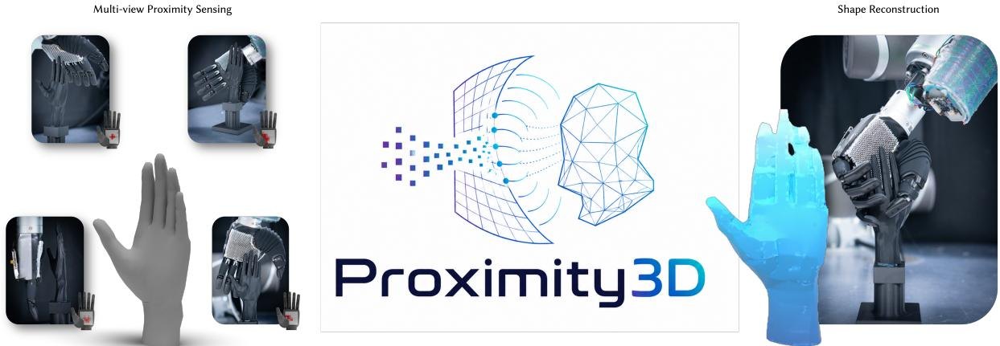  
Fig. 1. Proximity3D reconstructs object geometry from pre-contact capacitive scans captured by a curved woven sensing manifold. As the dexterous hand moves the palm-mounted sensing manifold (shown as the white region in the left) around the target, each view produces a proximity field on the woven surface; our model interprets these posed fields on the sensing manifold, fuses their geometric evidence, and recovers a 3D mesh, achieving the fidelity necessary to support downstream robotic applications.

†Corresponding authors: ckdai@cpii.hk (Chengkai Dai) and jclin@xmu.edu.cn (Juncong Lin).

Authors’ Contact Information: Hao Chen, 30920241154545@stu.xmu.edu.cn, Centre for Perceptual and Interactive Intelligence, Hong Kong SAR of China and Xiamen University, Xiamen, China; Chenming Wu, wcm94@live.com, Independent Researcher, China; Chun Ping Lam, cplam@link.cuhk.edu.hk, Centre for Perceptual and Interactive Intelligence, Hong Kong SAR of China; Xiangjia Chen, xjchen@cpii.hk, Centre for Perceptual and Interactive Intelligence, Hong Kong SAR of China; Guoxin Fang, guoxinfang@cuhk.edu.hk, The Chinese University of Hong Kong / Centre for Perceptual and Interactive Intelligence, Hong Kong SAR of China; Charlie C.L. Wang, charlie.wang@manchester.ac.uk, The University of Manchester, Manchester, United Kingdom; Yeung Yam, yyam@mae.cuhk.edu.hk, The Chinese University of Hong Kong / Centre for Perceptual and Interactive Intelligence, Hong Kong SAR of China; Juncong Lin, jclin@xmu.edu.cn, Xiamen University, Xiamen, China; Chengkai Dai, ckdai@cpii.hk, Centre for Perceptual and Interactive Intelligence, Hong Kong SAR of China.

Permission to make digital or hard copies of all or part of this work for personal or classroom use is granted without fee provided that copies are not made or distributed for profit or commercial advantage and that copies bear this notice and the full citation on the first page. Copyrights for components of this work owned by others than the author(s) must be honored. Abstracting with credit is permitted. To copy otherwise, or

Most shape reconstruction methods assume measurements defined over planar sensing domains, such as RGB images or depth maps. In this paper, we use a curved capacitive textile as a shape sensor, treating its surface as a non-planar sensing manifold. Each scan is represented as a capacitive proximity field on this manifold, induced by the interaction between the curved electrode layout and nearby object geometry. We introduce a multiview feedforward reconstruction model that aggregates these fields across known sensor views and recovers the observed object shape. Simulated and physical experiments demonstrate robust reconstruction from capacitive proximity signals acquired on curved sensing surfaces, pointing toward a new route to robotic near-field geometric awareness via embodied sensing.

CCS Concepts: • Computing methodologies → Reconstruction; Shape modeling; Mesh models.

Additional Key Words and Phrases: capacitive proximity fields, sensing manifolds, 3D shape reconstruction, textile sensing, computational fabrication

## ACM Reference Format:

Hao Chen, Chenming Wu, Chun Ping Lam, Xiangjia Chen, Guoxin Fang, Charlie C. L. Wang, Yeung Yam, Juncong Lin, and Chengkai Dai. 2026. Proximity3D: Shape from Capacitive Proximity on Sensing Manifold. 1, 1 (Sep tember 2026), 13 pages. https://doi.org/10.1145/nnnnnnn.nnnnnnn

## 1 Introduction

In robotic manipulation, the near-field region—–the narrow gap between a robot and an object prior to contact——is frequently occluded from line-of-sight observation. This limitation motivates a shift toward embodied near-field sensing, where the robot body itself becomes the sensing domain. Non-contact capacitive proximity sensing is well suited to this setting, as nearby conductive objects perturb the electric field around the sensor, thereby modulating the capacitance and generating measurable proximity signals. However, existing approaches typically utilize proximity signals as collision heuristics [Dean-León et al. 2017] or simple distance estimates [Mayton et al. 2010]. Such approaches do not capture richer spatial information encoded in these proximity signals. Also, for applications such as grasp planning and shape-aware manipulation, the robot would benefit from recovering the surface geometry of the target object before contact. Our goal is therefore to recover 3D shape from multi-view capacitive proximity fields captured on a woven sensing manifold conforming to the curved surface, as illustrated in Fig.1.

The primary challenge lies in the indirect and sparse nature of these capacitive proximity fields. First, the sensor responses are indirect: each channel value reflects complex capacitive coupling between the local electrode layout and nearby object geometry, rather than providing a direct sample of depth or occupancy [Gjoka et al. 2025]. Interpreting these signals, therefore, requires the sensor’s own local geometry to be explicitly integrated into the representation. Second, compared to high-resolution image or depth observations, a capacitive scan has significantly lower information density, comprising only a few hundred channel responses due to trace routing density limits in fabrication. These readouts impose a sparse set of indirect constraints on the observed object, making it challenging to recover a complete shape whose geometry remains consistent with such limited data.

To address these challenges, we propose Proximity3D, a feed forward reconstruction pipeline. Operating directly on the sensing manifold, the network first leverages the local electrode frames and non-uniform electrode layout to perform local aggregation over neighboring channel responses through our proposed Manifold Sensing Attention (MSA) operator. The aggregated per-view sensing features are then fused into shape tokens, which are transformed by a global module into a 3D latent representation. With the help of pretrained shape decoder [Xiang et al. 2025] with strong shape prior, our pipeline enables the recovery of complete 3D geometry from sparse capacitive responses, achieving the fidelity necessary to support downstream robotic applications as discussed in Sec.6.

Finally, to scale training data beyond physical collection, a surrogate forward model for capacitive proximity fields generation is proposed to adapt local geometry-derived priors into real sensor response, synthesizing realistic proximity fields for unseen meshes and diferent sensor poses.

Our contributions are as follows:

• We introduce Proximity3D, a framework for shape reconstruction from multi-view capacitive proximity fields captured on a curved sensing manifold. To the best of our knowledge, it is the first method that efectively addresses this challenge.

• We propose Manifold Sensing Attention (MSA), an attention mechanism that aggregate each sensing channel’s neighbors via their local tangent frames, thereby capturing the underly ing relationship of the local sensing context of the sensing manifold.

• We propose a surrogate capacitive model that learns realistic capacitive responses from local geometry-derived priors and real sensor response for scalable capacitive proximity fields generation.

## 2 Related Work

## 2.1 Sparse and Indirect 3D Reconstruction

While traditional 3D reconstruction relies on dense visual or depth data via multi-view stereo [Hartley and Zisserman 2003; Schönberger and Frahm 2016; Seitz et al. 2006; Yao et al. 2018] or volumetric fusion [Curless and Levoy 1996; Newcombe et al. 2011; Oleynikova et al. 2017], a variety of learning-based representations such as DeepSDF, Occupancy, Neural Radiance Field (NeRF), and 3D Gaussian Splatting [Kerbl et al. 2023; Mescheder et al. 2019; Mildenhall et al. 2020; Park et al. 2019] have significantly improved the quality and precision of 3D reconstruction even with sparse inputs. Recent neural reconstruction models further extend these concepts to robust feedforward single- or multi-view inference [Hong et al. 2024; Wang et al. 2024]. However, these methods presuppose standard inputs of multi-view images from cameras. In contrast, our observations consist of capacitive proximity fields defined directly on a physical manifold surface.

Tactile and visuo-tactile reconstruction deals with similarly localized and sparse data. Elastomer-based optical tactile sensors (e.g., GelSight [Yuan et al. 2017], DIGIT [Lambeta et al. 2020]) capture local surface deformations, which can be integrated into global shapes using implicit fields, touch-conditioned difusion priors, or neural tracking frameworks [Comi et al. 2023; Smith et al. 2020, 2021; Suresh et al. 2024; Wang et al. 2025]. Yet, these techniques necessitate physical contact and rely entirely on ‘depth-like’ contacting images. Capacitive proximity sensing, conversely, is non-contact and governed by electrical fringing fields rather than optical projection [Mayton et al. 2010]. Consequently, the sensor’s physical configuration, such as channel positions, local tangent frames, etc., must be explicitly integrated to correctly interpret the signals.

## 2.2 Capacitive and Proximity Sensing

Large-area electronic skins distribute contact, force, and deformation sensing across robot bodies [Dahiya et al. 2010; Hammock et al. 2013; Mandil et al. 2023; Yousef et al. 2011], often utilizing conformable substrates to wrap curved surfaces [Boutry et al. 2018; Mannsfeld et al. 2010; Someya et al. 2005]. Extending beyond physical contact, capacitive and multimodal arrays enable pre-contact proximity awareness. Applications range from whole-body collision avoidance in collaborative arms [Tsuji and Kohama 2018] and bio-inspired spatial tracking [Zhou et al. 2024] to flexible platforms like CySkin [Giovinazzo et al. 2024] and wireless multimodal e-skins [Kwon et al. 2022; Markvicka et al. 2020]. Nevertheless, these systems primarily utilize proximity signals for threshold-based alarms, gesture recognition, or coarse spatial localization. They generally do not attempt the highly ill-posed task of inverting sparse capacitance readings into 3D geometry.

Recent advances in digital fabrication and simulation provide the foundation for such inversion. Computational textiles, driven by geodesic stitch-maps [Liu et al. 2021] and 3D freeform weaving [Chen et al. 2024], allow sensors to be integrated into prescribed, calibrated surface parameterizations [Lam et al. 2025]. Concurrently, forward models for capacitive stretch sensors have been formulated as computable functionals of electrode geometry and material state [Gjoka et al. 2025], highlighting the tight coupling between sensor readouts and their underlying geometry. While these works establish the physical substrates and forward models, our method tackles the corresponding inverse problem: reconstructing 3D geometry from posed capacitive proximity fields induced across these fabricated manifolds.

## 2.3 Geometric Learning and Multi-View Latent Decoders

Learning on surfaces. Geometric learning adapts neural operators to non-Euclidean domains [Kipf and Welling 2017; Veličković et al. 2018] and specialized architectures for meshes via edge convolutions, subdivision, or difusion [Bronstein et al. 2021, 2017; Hanocka et al. 2019; Hu et al. 2022; Monti et al. 2017; Sharp et al. 2022]. Within robotics, graph-based methods process tactile data from irregular taxel arrays [Garcia-Garcia et al. 2019; Gu et al. 2020; Jiang et al. 2025]. We adapt these principles to curved capacitive skins. Specifically, our aggregation stage via manifold sensing attention injects the relative continuous 6D pose [Zhou et al. 2019] between neighboring electrode frames directly into the attention mechanism [Vaswani et al. 2017].

Multi-view fusion and structured shape latents. Feedforward reconstruction often employs transformers to encode posed observations into global representations like tri-planes or volumetric fields [Hong et al. 2024; Wang et al. 2024]. Latent-query architectures handle variable-sized inputs by cross-attending from fixed latent queries to variable-length token sets [Jaegle et al. 2022; Zhang et al. 2023]. More recently, generative priors like TRELLIS [Xiang et al. 2024] and its successor [Xiang et al. 2025] have introduced structured latent spaces, bridging sparse spatial cells with powerful pretrained mesh decoders. Our shape token reconstruction leverages this structured latent formulation as a fixed output interface. By augmenting posed scan tokens with Fourier pose encodings [Mildenhall et al. 2020] and register tokens [Darcet et al. 2024; Oquab et al. 2024], we fuse multi-view proximity data into a compact scene representation. Learned cell queries then extract the necessary support and per-cell features, allowing our pipeline to exploit a pre-trained generative shape decoder.

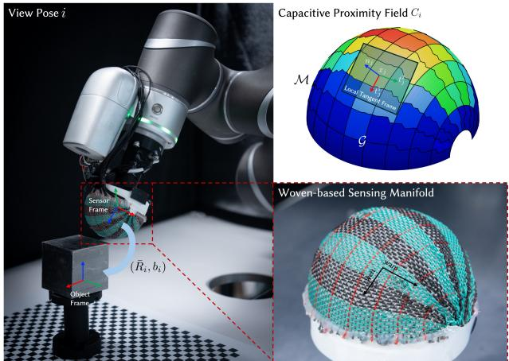  
Fig. 2. Illustration of the woven-based hemispherical sensing manifold. Highlighting the warp-weft textile structure that embeds the electrode layout on the sensing surface.

## 3 Method

Proximity3D maps multi-view capacitive proximity fields captured on a woven sensing manifold to the 3D geometry of a nearby object through a feedforward reconstruction pipeline (Fig. 3). During acquisition, the sensing manifold is moved around a conductive object; the object perturbs the fringing electric field around the electrodes, producing one capacitance response at each channel site for every sensor view. In this setting, the readouts are sparse in the number of electrodes and indirect—each channel reports a capacitance value rather than explicit geometric information. The reconstruction network therefore aggregates the readouts at two levels. Local aggregation encodes neighboring channel responses using the electrode layout and electrode tangent frames, while global aggregation integrates per-view features together with their known sensor poses into a 3D latent representation. A shape decoder then reconstructs the final object geometry under the pre-trained shape prior.

The sensing principle and fabrication process are introduced in the supplemental material.

## 3.1 Problem Definition

We represent the woven sensor as a sensing manifold M as shown in Fig.2, with � electrode channel sites $\bar { \{ x _ { j } \} } _ { j = 1 } ^ { N }$ sampled on M, each associated with an orthonormal local electrode tangent frame $R _ { j } = [ t _ { i } ^ { 1 } , t _ { i } ^ { 2 } , n _ { j } ] \in S O ( 3 )$ defined by the warp-weft parameterization [Chen et al. 2024]. The woven layout defines the channel connectivity $\mathcal { G } = ( \{ 1 , \ldots , N \} , E )$ , where � connects neighboring channels in the textile layout. The fabrication and electrical characterization of the woven sensor are not the focus of this work. We therefore treat the sensor’s geometric information and connectivity as known inputs to the reconstruction problem.

For each sensor view �, the sensor records a capacitive proximity field $C _ { i } = [ C _ { i 1 } , \dots , C _ { i N } ] \in \mathbb { R } ^ { N }$ , where $C _ { i j }$ is the normalized response at channel site � on the sensing manifold. The associated view pose $( \bar { R } _ { i } , b _ { i } )$ , comprising rotation $\bar { R } _ { i } \in S O ( 3 )$ and translation $b _ { i } \in \mathbb { R } ^ { 3 }$ maps the sensor frame to the canonical object frame and is derived from hardware kinematics. Given � feasible views around the object, the reconstruction pipeline takes $\{ ( C _ { i } , \bar { R } _ { i } , b _ { i } ) \} _ { i = 1 } ^ { V }$ along with the predefined sensor geometry $( \{ x _ { j } , R _ { j } \} _ { j = 1 } ^ { N } , \mathcal { G } )$ defined in the sensor frame, reconstructing an object mesh �ˆ in the canonical object frame.

## 3.2 Aggregation via Manifold Sensing Atention

The capacitive proximity fields are first processed directly on the sensing manifold M. An approaching object induces a capacitance proximity field over the sensing manifold. Due to complex capacitive coupling with local neighbors, these channel responses are strongly direction-dependent: the same object shape yields diferent responses on channel site � depending on its orientation relative to the local electrode frame $R _ { j }$ despite the same relative position. In addition, the fabrication process of the curved woven surface introduces non-uniform electrode spacing and orientation over the sensing surface.

As a result, a proximity response cannot be interpreted independently of its local sensing geometry and connectivity. We therefore aggregate electrode readouts via Manifold Sensing Attention (MSA) in the local electrode tangent frame, so the resulting per-channel features jointly encode the proximity response and the directional dependencies produced by the local electrode layout on the sensing manifold. We initialize each channel feature from its capacitive proximity field and a per-channel geometry descriptor that exposes the local electrode information to the network. Let $\rho ( R ) = [ t ^ { 1 } , t ^ { 2 } ] \in \mathbb { R } ^ { 6 }$ denote the continuous 6D representation [Zhou et al. 2019] of 3D rotations, and let $\chi _ { j } = \big [ x _ { j } , \rho ( R _ { j } ) \big ]$ be the channel geometry descriptor at site �. The initial per-channel feature is formulated as:

$$
h _ { i j } = \psi _ { c } ( C _ { i j } ) + \psi _ { g } ( \chi _ { j } ) \in \mathbb { R } ^ { d } ,\tag{1}
$$

where the learnable maps $\psi _ { c }$ and $\psi _ { g }$ lift the scalar response and the geometry descriptor to a common dimension �. We collect these features into the per-view feature matrix $\mathbf { H } _ { i } \in \mathbb { R } ^ { N \times d }$ for view �. Rather than relying solely on feature similarity, we then refine $\mathbf { H } _ { i }$ with manifold sensing attention on the local electrode neighborhood, which provides a consistent parameterization of the local chart on the sensing manifold.

For a local channel pair $( j , k )$ on the manifold, we map electrode � to the local tangent frame of electrode $j .$ Specifically, the local geometry descriptor $\delta _ { j k } = \big [ R _ { j } ^ { \top } ( x _ { k } - x _ { j } ) , \rho ( R _ { j } ^ { \top } R _ { k } ) \big ]$ encodes local displacement and relative frame orientation with respect to this tangent space. A learnable map $\psi _ { m }$ then maps the local descriptor to a local manifold sensing embedding

$$
\begin{array} { r } { m _ { j k } = \psi _ { m } ( \delta _ { j k } ) \in \mathbb { R } ^ { d } . } \end{array}\tag{2}
$$

Neighborhood attention then injects $m _ { j k }$ into the key and value of neighbor $k \in N ( j )$ , where $N ( j )$ denotes the neighborhood of electrode � from the adjacency graph $\mathcal { G }$ . Consequently, local geometry and connectivity afect the attention weights and per-channel sensing features:

$$
\begin{array} { r } { a _ { i j k } = \underset { k \in \cal N ( j ) } { \operatorname { s o f t m a x } } ( \frac { ( { \mathbf { W } _ { Q } } h _ { i j } ) ^ { \top } ( { \mathbf { W } _ { K } } h _ { i k } + m _ { j k } ) } { \sqrt { d } } ) , } \\ { h _ { i j }  h _ { i j } + \displaystyle \sum _ { k \in \cal N ( j ) } a _ { i j k } ( { \mathbf { W } _ { V } } h _ { i k } + m _ { j k } ) . \qquad } \end{array}\tag{3}
$$

Here $\mathbf { W } _ { Q } , \mathbf { W } _ { K } , \mathbf { W } _ { V } \in \mathbb { R } ^ { d \times d }$ are learned query, key and value weights [Vaswani et al. 2017].

Finally, for each channel, we compute a sensor-shape embedding

$$
s _ { j } = \psi _ { s } ( \chi _ { j } ) \in \mathbb { R } ^ { d } ,\tag{4}
$$

learned-query pooling Φ over channels yields the per-view feature vector $u _ { i } ,$ where

$$
u _ { i } = \Phi \left( \{ [ h _ { i j } , s _ { j } ] \} _ { j = 1 } ^ { N } \right) \in \mathbb { R } ^ { d } .\tag{5}
$$

## 3.3 Reconstruction with Shape Tokens

Multi-view Fusion via Shape Tokens. To extract the underlying object’s 3D shape from viewpoint-dependent sensing features, we aggregate these per-view sensing features into shape tokens.

We therefore concatenate $u _ { i }$ with a Fourier encoding of the perview pose descriptor $\xi _ { i } = [ b _ { i } , \rho ( \bar { R } _ { i } ) ]$

$$
\widetilde { \boldsymbol { u } } _ { i } \ = \ \psi _ { T } \big ( [ \ u _ { i } , \ \gamma ( \boldsymbol { \xi } _ { i } ) \big ] \big ) \ \in \mathbb { R } ^ { d } ,\tag{6}
$$

where $\gamma$ is sinusoidal Fourier encoding [Mildenhall et al. 2020]. We introduce 8 learnable shape tokens, empirically chosen to balance expressiveness against overfitting, as a shape-level representation of the multi-view capacitive proximity fields. These tokens are prepended to the per-view sensing feature, together with 4 register tokens [Darcet et al. 2024; Oquab et al. 2024] that provide non-semantic capacity for the transformer and reduce spurious accumulation in the shape token.

Through self-attention, the multi-view sensing features exchange cross-view context, whereby the shape tokens can selectively aggregate global evidence from the entire multi-view sequence. The resulting shape tokens $\mathsf { S } \in \mathbb { R } ^ { 8 \times d }$ therefore provide a compact representation of object’s 3D shape.

Shape Decoding with Prior. Each capacitive proximity field contains only � electrode responses, typically 100–300, from a single scan view. While multiple fields provide complementary evidence, reconstruction remains challenging due to this sparsity. We therefore leverage a pre-trained TRELLIS-2 shape decoder [Xiang et al. 2025], whose learned shape prior facilitates the reconstruction of complete object geometry.

First, we map the shape tokens to the 3D latent structure required by the shape prior. Specifically, the target shape decoder operates on a subset of an $8 ^ { 3 }$ resolution latent grid, with a 32-dimensional feature per occupied cell. Let $\mathcal { I } = \{ 0 , \ldots , 7 \} ^ { 3 }$ be the latent-cell index set.

For each latent cell $\ell \in { \mathcal { I } } ,$ a learned query $q _ { \ell }$ cross-attends to the shape tokens, $r _ { \ell } \ = \ \mathrm { C r o s s A t t n } ( q _ { \ell } , \mathbf { S } )$ . A shared per-cell map �c predicts $( \hat { s } _ { \ell } , \hat { f } _ { \ell } ) ~ = ~ \psi _ { \mathrm { c } } ( r _ { \ell } )$ , where $\hat { s } _ { \ell } \in \left[ 0 , 1 \right]$ is the occupancy probability and $\hat { f } _ { \ell } \in \mathbb { R } ^ { 3 2 }$ is the per-cell latent feature. Across the 3D latent grid, the occupancy probabilities $\{ \hat { s } _ { \ell } \}$ act as a gate: cells whose probability exceeds 0.5 are retained to form the active set $\hat { \mathcal { A } } \ = \ \{ \ell \ \in \mathcal { ~ I ~ } : \hat { s } _ { \ell } > 0 . 5 \}$ , while the rest are pruned away. The features attached to the active cells are collated into the sparse latent $\hat { z } = \{ ( \ell , \hat { f } _ { \ell } ) : \ell \in \mathcal { \hat { A } } \}$ , which directly matches the input format required by the target shape decoder.

The shape decoder � then synthesizes the final mesh $\hat { M } = D ( \hat { z } )$ in the canonical object frame.

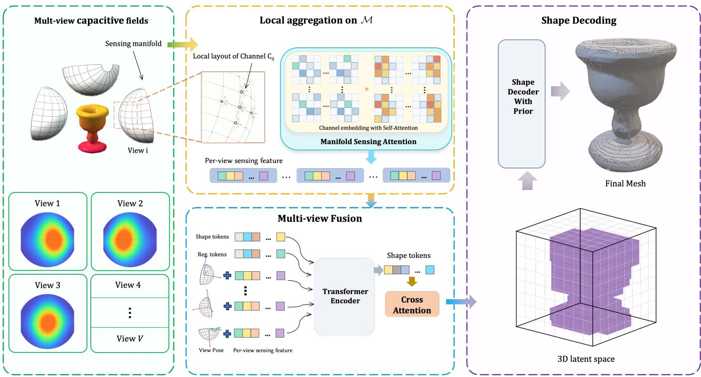  
Fig. 3. Overview of Proximity3D. Multi-view capacitive fields are sampled on a sensing manifold from diferent sensor poses. Manifold Sensing Atention first aggregates each view using the local electrode layout and tangent-frame geometry to produce per-view sensing features. These features with diferent poses are fused to produce shape tokens which represents the shape feature, it is then cross-atend to a structured 3D latent, which is converted into the final mesh by a pretrained shape decoder.

## 3.4 Training

Each training sample pairs a set of � posed capacitive proximity fields $\{ ( C _ { i } , \bar { R _ { i } } , b _ { i } ) \} _ { i = 1 } ^ { \bar { V } }$ , observed on the sensor geometry $( \{ x _ { j } , R _ { j } \} _ { j = 1 } ^ { N } , \mathcal { G } )$ with a ground-truth object mesh � in the canonical object frame. The framework discussed above predicts a sparse latent �ˆ from these posed fields, while the frozen TRELLIS-2 encoder encodes the mesh � into the supervision target $z ^ { \star } = \{ ( \ell , f _ { \ell } ^ { \star } ) : \ell \in \mathcal { A } ^ { \star } \}$ , where $\mathcal { A } ^ { \star } \subseteq \mathcal { I }$ , and the occupancy probability target is $s _ { \ell } ^ { \star } = \mathbb { 1 } [ \ell \in \mathcal { A } ^ { \star } ]$ Training supervises occupancy probabilities, cell features, and decoder-side consistency with diferent weights �:

$$
\begin{array} { r l } & { \mathcal { L } = \lambda _ { o } \mathcal { L } _ { o } + \lambda _ { f } \mathcal { L } _ { f } + \lambda _ { D } \mathcal { L } _ { D } , } \\ & { \mathcal { L } _ { o } = \mathcal { L } _ { \mathrm { S o f f I o U } } ( \hat { s } , s ^ { \star } ) , } \\ & { \mathcal { L } _ { f } = \displaystyle \frac { 1 } { | \mathcal { R } ^ { \star } | } \sum _ { \ell \in \mathcal { A } ^ { \star } } \| \hat { f } _ { \ell } - f _ { \ell } ^ { \star } \| _ { 2 } ^ { 2 } , } \\ & { \mathcal { L } _ { D } = \Pi _ { D } ( D ( \hat { z } ) , M ) . } \end{array}\tag{7}
$$

$\Pi _ { D }$ is the Chamfer-L1 loss between sampled surface points on $D ( \hat { z } )$ and �. Note that $\mathcal { L } _ { D }$ acts as a training-time regularizer; the TRELLIS-2 decoder remains frozen throughout training.

## 4 Surrogate Forward Model for Capacitive Proximity Fields

Physical data acquisition is time consuming at scale. To mitigate this, we formulate data generation as a generative problem. Within the simulated environment, each channel’s response is approximated via hemispherical raycasting in its local tangent frame. Specifically, for a channel site $x _ { j } ,$ � random directions $\{ r _ { j k } \} _ { k = 1 } ^ { K }$ are sampled from the upper-hemisphere ${ \mathbb S } _ { + } ^ { 2 }$ . Along each direction $r _ { j k }$ , the firsthit distance $d _ { j k }$ is computed to the target surface, which is clipped by a maximum near-field range $d _ { \operatorname* { m a x } } = 3 0 m m$

The sensing geometric prior $g _ { j }$ is defined as a cosine-weighted fraction of this hemisphere:

$$
g _ { j } = \frac { \sum _ { k = 1 } ^ { K } \omega _ { j k } \left( 1 - \frac { d _ { j k } } { d _ { \operatorname* { m a x } } } \right) } { \sum _ { k = 1 } ^ { K } \omega _ { j k } } .\tag{8}
$$

Here, $\omega _ { j k } = r _ { j k } ^ { \top } n _ { j }$ measures the alignment with the local normal $n _ { j }$ to account for the directional dependency over the sensing manifold.

To map the geometric prior to physical response, we learn a surrogate model $p _ { \theta } ( \mathbf { C } \mid g )$ via a conditional Difusion Transformer (DiT) [Peebles and Xie 2023]. Treating the sensing geometric prior � as a guiding condition, the network is trained via standard noiseprediction:

$$
\mathcal { L } _ { \mathrm { s i m } } = \mathbb { E } _ { \mathbf { C } , \epsilon , t } \left[ \Vert \epsilon - \epsilon _ { \theta } ( \mathbf { C } _ { t } , g , t ) \Vert _ { 2 } ^ { 2 } \right] ,\tag{9}
$$

where � is the uniformly sampled difusion timestep, $\mathbf { C } _ { t }$ is the noisy capacitive field corrupted by the algorithmic Gaussian noise $\epsilon \sim$ ${ \cal N } ( 0 , { \bf { I } } )$ , and $\epsilon _ { \theta }$ is our surrogate model.

Notably, we equip the denoising network $\epsilon _ { \theta }$ with the same Manifold Sensing Attention (MSA) module introduced in our reconstruction pipeline. By explicitly injecting local geometry embeddings into the self-attention layers, MSA grounds the generative process directly in the underlying local geometry of the sensing manifold.

In practice, we first pre-train the surrogate model on a large synthetic dataset generated by FEM simulations. This provides the network with a strong physical prior. Subsequently, we fine-tune the model exclusively on the small-scale, physical dataset collection. During this fine-tuning phase, the generative capacity of the difusion process adapts the FEM physical prior to the true distribution of the real world hardware.

## 5 Experiments

As illustrated in Fig. 2, our physical experimental setup utilizes a hemispherical sensing manifold equipped with 100 electrode channels, with a TM-500 robotic arm controlling the spatial pose.

## 5.1 Experimental Setup

Datasets. Our training data consists of 500 FEM-simulated meshes and 25 physical objects, each sampled at 512 poses. We trained a surrogate forward model mentioned in Sec.4 on the simulation data and fine-tuned it using the measurements from physical objects to align with real-world proximity response distribution. The resulting model is used to generate realistic proximity data for a larger set of 1,624 meshes (512 views each). Apart from the physical objects, all mesh data are sampled from standard datasets, including Google Scanned Objects [Downs et al. 2022], Manifold40 [Hu et al. 2022], and Thingi10K [Zhou and Jacobson 2016].

Additional implementation details are provided in the supplemental material.

Metrics. Inspired by TouchSDF [Comi et al. 2023], our evaluation utilizes Chamfer Distance (CD), Earth Mover’s Distance (EMD), and Average Surface Error which quantifies the average distance between the predicted surface $S _ { p }$ and the ground-truth $S _ { g t } .$ Although minimized during training, CD is often biased toward local point density. Thus, we incorporate EMD and Average Surface Error to comprehensively evaluate the global structural fidelity.

## 5.2 Shape Reconstruction

Shape reconstruction performance is evaluated on 200 unseen test shapes by using generated proximity data. For each shape, we iteratively sample random poses to construct 512 valid views (i.e., those with non-zero sensor responses). Our standard evaluation utilizes shape reconstruction via a random subset of 64 views per object. To rigorously assess our framework, we conduct two further analyses. First, to validate the importance of Manifold Sensing Attention (MSA), we compare it against vanilla self-attention and GAT [Veličković et al. 2018], which also encodes channel adjacency. Second, we investigate the impact of view density by varying the input view count $V \in$ {8, 16, 32, 64, 96, 128}, where each V is random drawn from the 512 views.

Table 1 shows that MSA outperforms both baselines. Reconstruction improves through � = 64 and then plateaus, so we use $V = 6 4$ by default to balance reconstruction fidelity and computational eficiency.

Table 1. Quantitative shape reconstruction results: An ablation study validating the Manifold Sensing Atention (MSA) module against vanilla selfatention and GAT baselines and an investigation into the impact of varying input view counts.
<table><tr><td>Study</td><td>Setting</td><td>CD↓</td><td>EMD↓</td><td>Av. Surf. Err. ↓</td></tr><tr><td>MSA ablation</td><td>w/o MSA</td><td>0.0820</td><td>0.0985</td><td>0.0217</td></tr><tr><td></td><td>GAT</td><td>0.0185</td><td>0.0693</td><td>0.0158</td></tr><tr><td></td><td>w/MSA</td><td>0.0078</td><td>0.0495</td><td>0.0071</td></tr><tr><td>Views</td><td>8</td><td>0.0286</td><td>0.1932</td><td>0.0458</td></tr><tr><td></td><td>16</td><td>0.0169</td><td>0.1536</td><td>0.0301</td></tr><tr><td></td><td>32</td><td>0.0098</td><td>0.0506</td><td>0.0103</td></tr><tr><td></td><td>64</td><td>0.0078</td><td>0.0495</td><td>0.0071</td></tr><tr><td></td><td>96</td><td>0.0077</td><td>0.0466</td><td>0.0073</td></tr><tr><td></td><td>128</td><td>0.0079</td><td>0.0493</td><td>0.0074</td></tr></table>

The visualizations of the reconstruction results for the MSA ablation and varying view counts are presented in Fig. 4 and Fig. 5, respectively. Additional reconstruction results from simulated proximity signals are shown in Fig. 7.

## 5.3 Surrogate Forward Model Validation

We validate the surrogate forward model on held-out physical objectpose pairs that are not used during real-data fine-tuning. For each sample, we compare the generated capacitive proximity field against the measured hardware response over all sensing channels. Table 2 reports MAE and RMSE to quantify absolute response errors, and reports Pearson and Spearman correlation to test whether the surrogate preserves the channel-wise response pattern induced by each object pose.

Table 2. Surrogate forward-model validation on held-out physical measurements. Metrics are computed channel-wise between generated and measured capacitive proximity fields; PCC and SRC denote Pearson and Spearman correlation, respectively.
<table><tr><td>Model</td><td>MAE↓</td><td>RMSE↓</td><td>PCC ↑</td><td>SRC ↑</td></tr><tr><td>FEM only</td><td> $9 . 1 8 \times 1 0 ^ { - 7 }$ </td><td> $8 . 2 3 \times 1 0 ^ { - 4 }$ </td><td>0.9852</td><td>0.9659</td></tr><tr><td>FEM + real</td><td> $1 . 2 8 \times 1 0 ^ { - 7 }$ </td><td> $1 . 8 1 \times 1 0 ^ { - 4 }$ </td><td>0.9990</td><td>0.9973</td></tr></table>

## 6 Application: Dexterous Hand with Palm-Mounted Sensing Manifold

We evaluate whether the same reconstruction pipeline can be used when the sensing manifold is integrated into a manipulation platform. Specifically, we attach a woven-based capacitive sensing manifold to the palm side of a RH56F1 dexterous hand from Inspire Robots and use the hand motion to acquire multi-view proximity signals of an object and then reconstruct object’s shape to facilitate grasp planning.

Proximity data collection on palm sensor. The palm sensor is a calibrated sensing manifold in the hand frame. Specifically, each capacitive channel has a known channel site, local electrode frame, and adjacency relation after the fabrication. During the scanning process, we randomly sample hand poses around the object and use the proximity response itself as a pre-contact safety signal. A candidate pose is accepted as a valid view when the maximum channel response in the sensing manifold lies within a prespecified proximity band: if the response is below the lower threshold, the hand moves closer to the object; if it exceeds the upper threshold, the hand retreats before contact and resamples.

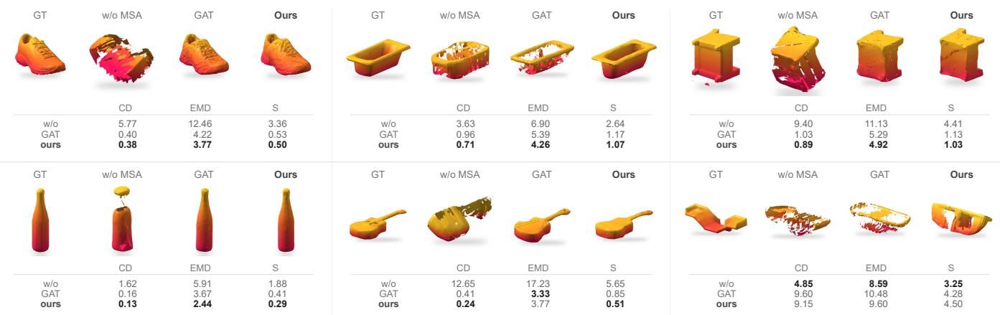  
Fig. 4. Ablation comparing vanilla self-atention (“w/o MSA”), GAT, and MSA (Ours) under identical inputs. GAT and MSA use the same channel adjacency, whereas “w/o MSA” atends across all electrode channels. MSA achieves the best reconstruction fidelity in most cases. The example in the botom-right corner shows a failure case caused by insuficient capacitive evidence. Metrics are scaled for compact display: �� × 103, $E M D \times 1 0 ^ { 2 }$ , and S (Av. Surface err.) ×102; lower is beter.

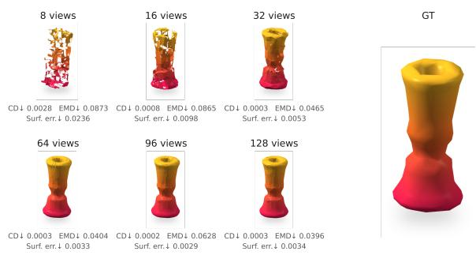  
Fig. 5. Shape Reconstruction from diferent numbers of input views. We investigate the impact of view density on reconstruction performance by varying the input view count {8, 16, 32, 64, 96, 128}.

Reconstruction. We retrain the Proximity3D pipeline using the same object corpus as the hemispherical sensing manifold, consisting of 1,624 meshes with generated multi-view capacitive proximity fields. The training step is identical to that for the hemispherical sensing manifold except that the sensing manifold is replaced by the hand-palm geometry. In this way, the network receives the same type of input representation—capacitive proximity fields, known sensor poses, channel sites, local electrode frames, and channel adjacency—while adapting the local aggregation to the palm-shaped manifold.

We set � = 64 as the default number of input views, following the view-count calibration. At inference time, the � accepted precontact scans from the random pose sampling procedure are fed to reconstruct the object mesh in the object frame. Fig. 6 shows three representative reconstruction results from this setting. These real world cases illustrate that the palm-mounted sensing manifold can provide suficient near-field observations for object shape recovery to facilitate grasp planning.

Grasp planning evaluation. To test how reconstructed geometry improves downstream grasp planning, we use GraspGen [Murali et al. 2026] to plan grasps on our reconstructions and on the groundtruth convex hull, oriented bounding box (OBB), and axis-aligned bounding box (AABB). Each grasp is evaluated against the groundtruth mesh using a standard force-closure check [Ferrari and Canny 1992]. We evaluate 100 objects for which planning on the groundtruth mesh succeeds, so failures reflect the geometric input alone. Our reconstructions achieve a 90% success rate, compared with 78%, 68%, and 65% for the convex hull, OBB, and AABB, respectively.

## 7 Discussion

Proximity3D targets 3D shape recovery from multi-view capacitive proximity fields on sensing manifolds, but its applicability is currently limited to conductive objects because the sensing mechanism relies on electric-field coupling. Within this regime, material primarily changes the overall coupling strength while exerting a weaker influence on the normalized spatial patterns used by the network. To quantify this efect, we use a model trained only on stainless-steel-generated data to reconstruct the same 50 objects made of gold, silver, copper, and aluminum. Relative to stainless steel, CD changes by at most 8.1% and EMD by at most 6.6%. We further examine sensitivity to internal structure by replacing a solid stainless-steel sphere of 5 cm radius with a 1 cm-thick hollow shell, which changes CD by 1.4% and EMD by 3.3%. The conductive-fiber composite hand in Fig. 6, whose conductivity is substantially lower than that of the tested metals, is also reconstructed without materialspecific retraining. Together, these results suggest robustness across the tested conductive objects, although broader material characterization is needed to determine the method’s practical conductivity boundary.

The pretrained decoder provides a useful shape prior that converts sparse multi-view evidence into complete meshes. However, it may also bias reconstruction when the sensed evidence is weak. We therefore assess whether the output remains driven by the sensed evidence rather than by the decoder alone. Two results support this: quality improves with additional views, while replacing MSA with vanilla self-attention degrades performance despite an unchanged decoder (Table 1). On 30 held-out OOD shapes with deep concavi ties or high genus, CD increases by 63.2% over the in-distribution set, yet the CD to the nearest training shape remains 3.9× that to the ground truth, indicating graceful degradation rather than prior collapse. This limitation remains visible when capacitive evidence is insuficient (see the bottom-right example in Fig. 4). Future work should optimize scanning to ensure suficient information capture.

Weak sensing is not the only potential source of error; approximation by the surrogate model may also contribute to reconstruction failures. Although the surrogate agrees closely with held-out physical measurements, the current evaluation does not quantify how much of the observed reconstruction error is attributable to surrogate approximation. Future work will estimate this contribution using paired physical and surrogate measurements under matched sensing configurations.

In summary, Proximity3D presents a pioneering framework for recovering 3D object geometry from multi-view capacitive proximity fields captured across a curved sensing manifold. Validated through physical experiments, this approach successfully demonstrates pre-contact geometric awareness and marking a significant step forward for embodied near-field sensing, with the potential to enable a broader range of robotic applications.

## Acknowledgments

This study was supported by the Centre for Perceptual and Interactive Intelligence, a CUHK-led InnoCentre under the InnoHK initiative of the Innovation and Technology Commission of the Hong Kong Special Administrative Region Government.

## References

Clémentine M. Boutry, Marc Negre, Mikael Jorda, Orestis Vardoulis, Alex Chortos, Oussama Khatib, and Zhenan Bao. 2018. A Hierarchically Patterned, Bioinspired E Skin Able to Detect the Direction of Applied Pressure for Robotics. Science Robotics 3, 24 (2018), eaau6914. doi:10.1126/scirobotics.aau6914

Michael M. Bronstein, Joan Bruna, Taco Cohen, and Petar Veličković. 2021. Geometric Deep Learning: Grids, Groups, Graphs, Geodesics, and Gauges. arXiv preprint arXiv:2104.13478 (2021). doi:10.48550/arXiv.2104.13478

Michael M. Bronstein, Joan Bruna, Yann LeCun, Arthur Szlam, and Pierre Van dergheynst. 2017. Geometric Deep Learning: Going Beyond Euclidean Data. IEEE Signal Processing Magazine 34, 4 (2017), 18–42. doi:10.1109/MSP.2017.2693418

Xiangjia Chen, Lip M. Lai, Zishun Liu, Chengkai Dai, Isaac C. W. Leung, Charlie C. L. Wang, and Yeung Yam. 2024. Computer-Controlled 3D Freeform Surface Weaving. Robotics and Computer-Integrated Manufacturing 90 (2024), 102819. doi:10.1016/j. rcim.2024.102819

Mauro Comi, Yijiong Lin, Alex Church, Alessio Tonioni, Laurence Aitchison, and Nathan F. Lepora. 2023. TouchSDF: A DeepSDF Approach for 3D Shape Reconstruction Using Vision-Based Tactile Sensing. arXiv preprint arXiv:2311.12602 (2023).

doi:10.48550/arXiv.2311.12602

Brian Curless and Marc Levoy. 1996. A Volumetric Method for Building Complex Models from Range Images. In Proceedings of SIGGRAPH. 303–312. doi:10.1145/ 237170.237269

Ravinder S. Dahiya, Giorgio Metta, Maurizio Valle, and Giulio Sandini. 2010. Tactile Sensing—From Humans to Humanoids. IEEE Transactions on Robotics 26, 1 (2010), 1–20. doi:10.1109/TRO.2009.203362

Timothée Darcet, Maxime Oquab, Julien Mairal, and Piotr Bojanowski. 2024. Vision Transformers Need Registers. In International Conference on Learning Representations (ICLR).

Emmanuel Dean-León, Brennand Pierce, Florian Bergner, Philipp Mittendorfer, Karinne Ramirez-Amaro, Wolfgang Burger, and Gordon Cheng. 2017. TOMM: Tactile Omni directional Mobile Manipulator. In Proceedings ofthe IEEE International Conference on Robotics and Automation (ICRA). IEEE, Singapore, 2441–2447. doi:10.1109/ICRA. 2017.7989284

Laura Downs, Anthony Francis, Nate Koenig, Brandon Kinman, Ryan Hickman, Krista Reymann, Thomas B. McHugh, and Vincent Vanhoucke. 2022. Google Scanned Objects: A High-Quality Dataset of 3D Scanned Household Items. In Proceedings ofthe IEEE International Conference on Robotics and Automation (ICRA). 2553–2560. doi:10.1109/ICRA46639.2022.9811809

Carlo Ferrari and John F. Canny. 1992. Planning Optimal Grasps. In Proceedings of the IEEE International Conference on Robotics and Automation (ICRA), Vol. 3. IEEE, 2290–2295. doi:10.1109/ROBOT.1992.219918

Alberto Garcia-Garcia, Brayan S. Zapata-Impata, Sergio Orts-Escolano, Pablo Gil, and Jose Garcia-Rodriguez. 2019. TactileGCN: A Graph Convolutional Network for Predicting Grasp Stability with Tactile Sensors. In Proceedings ofthe International Joint Conference on Neural Networks (IJCNN). 1–8. doi:10.1109/IJCNN.2019.8851984

Francesco Giovinazzo, Francesco Grella, Marco Sartore, Manuela Adami, Riccardo Galletti, and Giorgio Cannata. 2024. From CySkin to ProxySKIN: Design, Implementation and Testing of a Multi-Modal Robotic Skin for Human–Robot Interaction. Sensors 24, 4 (2024), 1334. doi:10.3390/s24041334

Arvi Gjoka, Yongkang Sun, Roi Poranne, and Daniele Panozzo. 2025. Computational Modeling and Design of Capacitive Stretch Sensors. ACM Transactions on Graphics 44, 6 (2025), 239:1–239:15. doi:10.1145/3763274

Fuqiang Gu, Weicong Sng, Tasbolat Taunyazov, and Harold Soh. 2020. TactileSGNet: A Spiking Graph Neural Network for Event-Based Tactile Object Recognition. In Proceedings of the IEEE/RSJ International Conference on Intelligent Robots and Systems (IROS). 9876–9882. doi:10.1109/IROS45743.2020.9341421

Mallory L. Hammock, Alex Chortos, Benjamin C.-K. Tee, Jefrey B.-H. Tok, and Zhenan Bao. 2013. 25th Anniversary Article: The Evolution of Electronic Skin (E-Skin): A Brief History, Design Considerations, and Recent Progress. Advanced Materials 25, 42 (2013), 5997–6038. doi:10.1002/adma.201302240

Rana Hanocka, Amir Hertz, Noa Fish, Raja Giryes, Shachar Fleishman, and Daniel Cohen-Or. 2019. MeshCNN: A Network with an Edge. ACM Transactions on Graphics 38, 4 (2019), 90:1–90:12. doi:10.1145/3306346.3322959

Richard Hartley and Andrew Zisserman. 2003. Multiple View Geometry in Computer Vision (2 ed.). Cambridge University Press. doi:10.1017/CBO9780511811685

Yicong Hong, Kai Zhang, Jiuxiang Gu, Sai Bi, Yang Zhou, Difan Liu, Feng Liu, Kalyan Sunkavalli, Trung Bui, and Hao Tan. 2024. LRM: Large Reconstruction Model for Single Image to 3D. In International Conference on Learning Representations (ICLR).

Shi-Min Hu, Zheng-Ning Liu, Meng-Hao Guo, Jun-Xiong Cai, Jiahui Huang, Tai-Jiang Mu, and Ralph R. Martin. 2022. Subdivision-Based Mesh Convolution Networks. ACM Transactions on Graphics 41, 3 (2022), 25:1–25:16. doi:10.1145/3506694

Andrew Jaegle, Sebastian Borgeaud, Jean-Baptiste Alayrac, Carl Doersch, Catalin Ionescu, David Ding, Skanda Koppula, Daniel Zoran, Andrew Brock, Evan Shel hamer, Olivier J. Hénaf, Matthew M. Botvinick, Andrew Zisserman, Oriol Vinyals, and João Carreira. 2022. Perceiver IO: A General Architecture for Structured Inputs and Outputs. In International Conference on Learning Representations (ICLR).

Shuo Jiang, Boce Hu, Linfeng Zhao, and Lawson L. S. Wong. 2025. Robot Tactile Gesture Recognition Based on Full-Body Modular E-Skin. arXiv preprint arXiv:2506.18256 (2025). doi:10.48550/arXiv.2506.18256

Bernhard Kerbl, Georgios Kopanas, Thomas Leimkühler, George Drettakis, et al. 2023. 3d gaussian splatting for real-time radiance field rendering. ACM Trans. Graph. 42, 4 (2023), 139–1.

Thomas N. Kipf and Max Welling. 2017. Semi-Supervised Classification with Graph Convolutional Networks. In International Conference on Learning Representations (ICLR).

Se Young Kwon, Gyeongsuk Park, Hanbit Jin, Changyeon Gu, Seung Jin Oh, Joo Yong Sim, Wooseup Youm, Taek-Soo Kim, Hye Jin Kim, and Steve Park. 2022. On-Skin and Tele-Haptic Application of Mechanically Decoupled Taxel Array on Dynamically Moving and Soft Surfaces. npj Flexible Electronics 6 (2022), 73. doi:10.1038/s41528- 022-00233-0

ChunPing Lam, Xiangjia Chen, Chenming Wu, Hao Chen, Binzhi Sun, Guoxin Fang, Charlie C. L. Wang, Chengkai Dai, and Yeung Yam. 2025. Towards Intuitive Human-Robot Interaction through Embodied Gesture-Driven Control with Woven Tactile Skins. arXiv:2509.25951 [cs.RO] doi:10.48550/arXiv.2509.25951

Michael Lambeta, Po-Wei Chou, Stephen Tian, Brian Yang, Ben Maloon, Victoria Rose Most, David Stroud, Raymond Santos, Ahmad Byagowi, Gregg Kammerer, Dinesh Jayaraman, and Roberto Calandra. 2020. DIGIT: A Novel Design for a Low-Cost Compact High-Resolution Tactile Sensor with Application to In-Hand Manipulation. IEEE Robotics and Automation Letters 5, 3 (2020), 3838–3845. doi:10.1109/LRA.2020. 2977257

Zishun Liu, Xingjian Han, Yuchen Zhang, Xiangjia Chen, Yu-Kun Lai, Eugeni L. Doubrovski, Emily Whiting, and Charlie C. L. Wang. 2021. Knitting 4D Garments with Elasticity Controlled for Body Motion. ACM Transactions on Graphics 40, 4, Article 62 (2021), 16 pages. doi:10.1145/3450626.3459868

Willow Mandil, Vishnu Rajendran, Kiyanoush Nazari, and Amir Ghalamzan-Esfahani. 2023. Tactile-Sensing Technologies: Trends, Challenges and Outlook in Agri-Food Manipulation. Sensors 23, 17 (2023), 7362. doi:10.3390/s23177362

Stefan C. B. Mannsfeld, Benjamin C.-K. Tee, Randall M. Stoltenberg, Christopher V. H.-H. Chen, Soumendra Barman, Benjamin V. O. Muir, Anatoliy N. Sokolov, Colin Reese, and Zhenan Bao. 2010. Highly Sensitive Flexible Pressure Sensors with Microstructured Rubber Dielectric Layers. Nature Materials 9, 10 (2010), 859–864. doi:10.1038/nmat2834

Eric J. Markvicka, Jonathan M. Rogers, and Carmel Majidi. 2020. Wireless Electronic Skin with Integrated Pressure and Optical Proximity Sensing. In Proceedings ofthe IEEE/RSJInternational Conference on Intelligent Robots and Systems (IROS). 8882–8888. doi:10.1109/IROS45743.2020.9340787

Brian D. Mayton, Louis LeGrand, and Joshua R. Smith. 2010. An Electric Field Pretouch System for Grasping and Co-Manipulation. In Proceedings ofthe IEEE International Conference on Robotics and Automation (ICRA). IEEE, Anchorage, AK, USA, 831–838. doi:10.1109/ROBOT.2010.5509658

Lars Mescheder, Michael Oechsle, Michael Niemeyer, Sebastian Nowozin, and Andreas Geiger. 2019. Occupancy Networks: Learning 3D Reconstruction in Function Space. In Proceedings ofthe IEEE/CVFConference on Computer Vision and Pattern Recognition (CVPR). 4460–4470. doi:10.1109/CVPR.2019.00459

Ben Mildenhall, Pratul P. Srinivasan, Matthew Tancik, Jonathan T. Barron, Ravi Ramamoorthi, and Ren Ng. 2020. NeRF: Representing Scenes as Neural Radiance Fields for View Synthesis. In European Conference on Computer Vision (ECCV). 405–421. doi:10.1007/978-3-030-58452-8\_24

Federico Monti, Davide Boscaini, Jonathan Masci, Emanuele Rodolà, Jan Svoboda, and Michael M. Bronstein. 2017. Geometric Deep Learning on Graphs and Manifolds Using Mixture Model CNNs. In Proceedings ofthe IEEE Conference on Computer Vision and Pattern Recognition (CVPR). 5115–5124. doi:10.1109/CVPR.2017.576

Adithyavairavan Murali, Balakumar Sundaralingam, Yu-Wei Chao, Jun Yamada, Wentao Yuan, Mark Carlson, Fabio Ramos, Stan Birchfield, Dieter Fox, and Clemens Eppner. 2026. GraspGen: A Difusion-Based Framework for 6-DOF Grasping with On Generator Training. In Proceedings ofthe IEEE International Conference on Robotics and Automation (ICRA). IEEE. https://arxiv.org/abs/2507.13097

Richard A. Newcombe, Shahram Izadi, Otmar Hilliges, David Molyneaux, David Kim, Andrew J. Davison, Pushmeet Kohli, Jamie Shotton, Steve Hodges, and Andrew Fitzgibbon. 2011. KinectFusion: Real-Time Dense Surface Mapping and Tracking. In Proceedings ofthe IEEE International Symposium on Mixed and Augmented Reality (ISMAR). 127–136. doi:10.1109/ISMAR.2011.6092378

Helen Oleynikova, Zachary Taylor, Marius Fehr, Roland Siegwart, and Juan Nieto. 2017. Voxblox: Incremental 3D Euclidean Signed Distance Fields for On-Board MAV Planning. In Proceedings ofthe IEEE/RSJ International Conference on Intelligent Robots and Systems (IROS). 1366–1373. doi:10.1109/IROS.2017.8202315

Maxime Oquab, Timothée Darcet, Théo Moutakanni, Huy Vo, Marc Szafraniec, Vasil Khalidov, Pierre Fernandez, Daniel Haziza, Francisco Massa, Alaaeldin El-Nouby, Mahmoud Assran, Nicolas Ballas, Wojciech Galuba, Russell Howes, Po-Yao Huang, Shang-Wen Li, Ishan Misra, Michael Rabbat, Vasu Sharma, Gabriel Synnaeve, Hu Xu, Hervé Jegou, Julien Mairal, Patrick Labatut, Armand Joulin, and Piotr Bojanowski. 2024. DINOv2: Learning Robust Visual Features without Supervision. Transactions on Machine Learning Research (TMLR) (2024).

Jeong Joon Park, Peter Florence, Julian Straub, Richard Newcombe, and Steven Lovegrove. 2019. DeepSDF: Learning Continuous Signed Distance Functions for Shape Representation. In Proceedings ofthe IEEE/CVF Conference on Computer Vision and Pattern Recognition (CVPR). 165–174. doi:10.1109/CVPR.2019.00025

William Peebles and Saining Xie. 2023. Scalable Difusion Models with Transformers. In Proceedings ofthe IEEE/CVF International Conference on Computer Vision (ICCV). 4195–4205.

Johannes L. Schönberger and Jan-Michael Frahm. 2016. Structure-from-Motion Revis ited. In Proceedings ofthe IEEE Conference on Computer Vision and Pattern Recognition (CVPR). 4104–4113. doi:10.1109/CVPR.2016.445

Steven M. Seitz, Brian Curless, James Diebel, Daniel Scharstein, and Richard Szeliski. 2006. A Comparison and Evaluation of Multi-View Stereo Reconstruction Algorithms. In Proceedings of the IEEE Conference on Computer Vision and Pattern Recognition (CVPR), Vol. 1. 519–528. doi:10.1109/CVPR.2006.19

Nicholas Sharp, Souhaib Attaiki, Keenan Crane, and Maks Ovsjanikov. 2022. Difusion Net: Discretization Agnostic Learning on Surfaces. ACM Transactions on Graphics 41, 3 (2022), 27:1–27:16. doi:10.1145/3507905

Edward J. Smith, Roberto Calandra, Adriana Romero, Georgia Gkioxari, David Meger, Jitendra Malik, and Michal Drozdzal. 2020. 3D Shape Reconstruction from Vision and Touch. In Advances in Neural Information Processing Systems (NeurIPS), Vol. 33. 14193–14206.

Edward J. Smith, David Meger, Luis Pineda, Roberto Calandra, Jitendra Malik, Adriana Romero-Soriano, and Michal Drozdzal. 2021. Active 3D Shape Reconstruction from Vision and Touch. In Advances in Neural Information Processing Systems (NeurIPS), Vol. 34. 16064–16078.

Takao Someya, Tsuyoshi Sekitani, Satoshi Iba, Yusaku Kato, Hiroshi Kawaguchi, and Takayasu Sakurai. 2005. Conformable, Flexible, Large-Area Networks of Pressure and Thermal Sensors with Organic Transistor Active Matrixes. Proceedings of the National Academy of Sciences 102, 35 (2005), 12321–12325. doi:10.1073/pnas. 0502392102

Sudharshan Suresh, Haozhi Qi, Tingfan Wu, Taosha Fan, Luis Pineda, Michael Lambeta, Jitendra Malik, Mrinal Kalakrishnan, Roberto Calandra, Michael Kaess, Joseph Ortiz, and Mustafa Mukadam. 2024. NeuralFeels with Neural Fields: Visuotactile Perception for In-Hand Manipulation. Science Robotics 9, 96 (2024), eadl0628. doi:10.1126/ scirobotics.adl0628

Satoshi Tsuji and Teruhiko Kohama. 2018. Development of Whole Self-Capacitance Proximity and Tactile Skin Sensor for Human Collaborative Robot. In Proceedings of the 6th IIAE International Conference on Intelligent Systems and Image Processing. 368–373.

Ashish Vaswani, Noam Shazeer, Niki Parmar, Jakob Uszkoreit, Llion Jones, Aidan N. Gomez, Łukasz Kaiser, and Illia Polosukhin. 2017. Attention is All You Need. In Advances in Neural Information Processing Systems (NeurIPS). 5998–6008.

Petar Veličković, Guillem Cucurull, Arantxa Casanova, Adriana Romero, Pietro Liò, and Yoshua Bengio. 2018. Graph Attention Networks. In International Conference on Learning Representations (ICLR).

Peng Wang, Hao Tan, Sai Bi, Yinghao Xu, Fujun Luan, Kalyan Sunkavalli, Wenping Wang, Zexiang Xu, and Kai Zhang. 2024. PF-LRM: Pose-Free Large Reconstruction Model for Joint Pose and Shape Prediction. In International Conference on Learning Representations (ICLR).

Yuanbo Wang, Zhaoxuan Zhang, Jiajin Qiu, Dilong Sun, Zhengyu Meng, Xiaopeng Wei, and Xin Yang. 2025. Touch2Shape: Touch-Conditioned 3D Difusion for Shape Exploration and Reconstruction. In Proceedings ofthe Computer Vision and Pattern Recognition Conference (CVPR). 5656–5665.

Jianfeng Xiang, Xiaoxue Chen, Sicheng Xu, Ruicheng Wang, Zelong Lv, Yu Deng, Hongyuan Zhu, Yue Dong, Hao Zhao, Nicholas Jing Yuan, and Jiaolong Yang. 2025. Native and Compact Structured Latents for 3D Generation. arXiv preprint arXiv:2512.14692 (2025). arXiv:2512.14692 [cs.CV] Tech report; project page: https://microsoft.github.io/TRELLIS.2.

Jianfeng Xiang, Zelong Lv, Sicheng Xu, Yu Deng, Ruicheng Wang, Bowen Zhang, Dong Chen, Xin Tong, and Jiaolong Yang. 2024. Structured 3D Latents for Scalable and Versatile 3D Generation. arXiv:2412.01506 [cs.CV] doi:10.48550/arXiv.2412.01506

Yao Yao, Zixin Luo, Shiwei Li, Tian Fang, and Long Quan. 2018. MVSNet: Depth Inference for Unstructured Multi-View Stereo. In Proceedings ofthe European Conference on Computer Vision (ECCV). 767–783. doi:10.1007/978-3-030-01237-3\_47

Hanna Yousef, Mehdi Boukallel, and Kaspar Althoefer. 2011. Tactile Sensing for Dexter ous In-Hand Manipulation in Robotics—A Review. Sensors and Actuators A: Physical 167, 2 (2011), 171–187. doi:10.1016/j.sna.2011.02.038

Wenzhen Yuan, Siyuan Dong, and Edward H. Adelson. 2017. GelSight: High-Resolution Robot Tactile Sensors for Estimating Geometry and Force. Sensors 17, 12 (2017), 2762. doi:10.3390/s17122762

Biao Zhang, Jiapeng Tang, Matthias Nießner, and Peter Wonka. 2023. 3DShape2VecSet: A 3D Shape Representation for Neural Fields and Generative Difusion Models. ACM Transactions on Graphics 42, 4, Article 92 (2023). doi:10.1145/3592442

Jingkun Zhou, Jian Li, Huiling Jia, Kuanming Yao, Shengxin Jia, Jiyu Li, Guangyao Zhao, Chun Ki Yiu, Zhan Gao, Dengfeng Li, et al. 2024. Mormyroidea-Inspired Electronic Skin for Active Non-Contact Three-Dimensional Tracking and Sensing. Nature Communications 15 (2024), 9875. doi:10.1038/s41467-024-54249-3

Qingnan Zhou and Alec Jacobson. 2016. Thingi10K: A Dataset of 10,000 3D-Printing Models. arXiv preprint arXiv:1605.04797 (2016). doi:10.48550/arXiv.1605.04797

Yi Zhou, Connelly Barnes, Jingwan Lu, Jimei Yang, and Hao Li. 2019. On the Continuity of Rotation Representations in Neural Networks. In Proceedings ofthe IEEE/CVF Conference on Computer Vision and Pattern Recognition (CVPR). 5745–5753. doi:10. 1109/CVPR.2019.00589

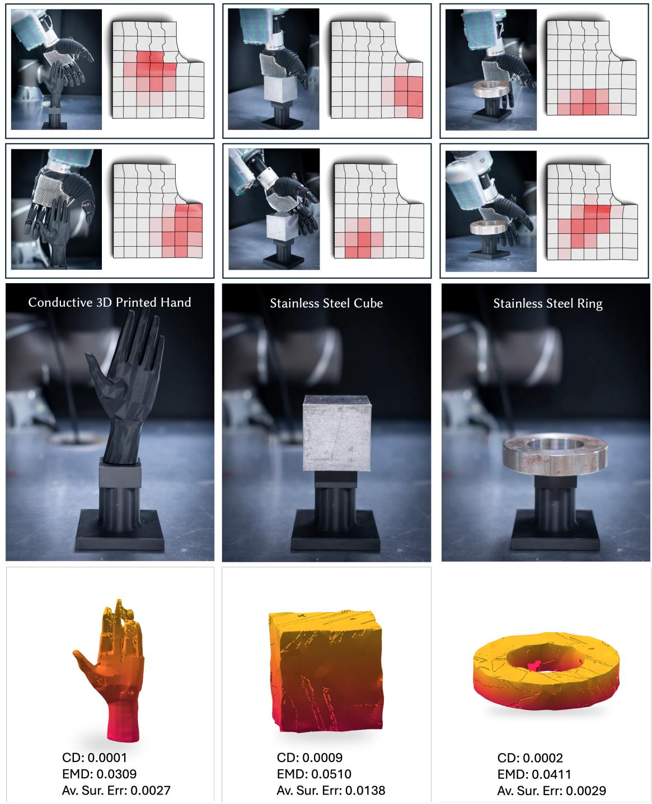  
Fig. 6. Illustration of the woven-based sensing manifold mounted on a dexterous hand’s palm part. Each column displays the physical scanning process alongside the final reconstruction result. From left to right: a conductive 3D-printed hand model, and a cube and ring both fabricated from stainless steel.

<table><tr><td rowspan="3">CD: EMD:</td><td>0.0001</td><td>0.0001</td><td>0.0001</td><td>0.0003</td><td>0.0003</td><td>0.0004</td><td>0.0022</td><td>0.0003</td><td>0.0004</td><td>0.0003</td></tr><tr><td>0.0217</td><td>0.0505</td><td>0.0290</td><td>0.0434</td><td>0.0446</td><td>0.0480</td><td>0.0538</td><td>0.0414</td><td>0.0404</td><td>0.0572</td></tr><tr><td>0.0053</td><td>0.0034</td><td>0.0051</td><td>0.0044</td><td>0.0027</td><td>0.0079</td><td>0.0210</td><td>0.0040</td><td>0.0050</td><td></td></tr><tr><td>Surf. err.</td><td></td><td></td><td></td><td></td><td></td><td></td><td></td><td></td><td></td><td>0.0025</td></tr></table>

<table><tr><td rowspan="2">CD: EMD:</td><td>0.0005</td><td>0.0003</td><td>0.0011</td><td>0.0025</td><td>0.0001</td><td>0.0003</td><td>0.0016</td><td>0.0002</td><td>0.0003</td><td>0.0004</td></tr><tr><td>0.0309</td><td>0.0390</td><td>0.0437</td><td>0.0675</td><td>0.0270</td><td>0.0439</td><td>0.0561</td><td>0.0451</td><td>0.0396</td><td>0.0496</td></tr><tr><td>Surf. err.</td><td>0.0094</td><td>0.0043</td><td>0.0142</td><td>0.0249</td><td>0.0029</td><td>0.0048</td><td>0.0180</td><td>0.0036</td><td>0.0045</td><td>0.0034</td></tr><tr><td></td><td></td><td></td><td></td><td></td><td></td><td></td><td></td><td></td><td></td><td></td></tr></table>

<table><tr><td rowspan=1 colspan=1></td></tr></table>

<table><tr><td>CD:</td><td>0.0003</td><td>0.0025</td><td>0.0006</td><td>0.0003</td><td>0.0005</td><td>0.0028</td><td>0.0007</td><td>0.0019</td><td>0.0004</td><td>0.0007</td></tr><tr><td>EMD:</td><td>0.0349</td><td>0.0597</td><td>0.0567</td><td>0.0405</td><td>0.0466</td><td>0.0642</td><td>0.0549</td><td>0.0632</td><td>0.0491</td><td>0.0470</td></tr><tr><td>Surf. err.</td><td>0.0050</td><td>0.0217</td><td>0.0084</td><td>0.0043</td><td>0.0081</td><td>0.0170</td><td>0.0084</td><td>0.0129</td><td>0.0046</td><td>0.0096</td></tr></table>

<table><tr><td>CD:</td><td>0.0010</td><td>0.0007</td><td>0.0018</td><td>0.0004</td><td>0.0014</td><td>0.0002</td><td>0.0004</td><td>0.0005</td><td>0.0002</td><td>0.0005</td><td></td></tr><tr><td>EMD:</td><td>0.0447</td><td>0.0416</td><td>0.0590</td><td>0.0477</td><td>0.0759</td><td>0.0346</td><td>0.0512</td><td>0.0449</td><td>0.0329 0.0028</td><td></td><td>0.0465</td></tr><tr><td>Surf. err.</td><td>0.0159</td><td>0.0107</td><td>0.0178</td><td>0.0048</td><td>0.0107</td><td>0.0026</td><td>0.0032</td><td>0.0066</td><td></td><td></td><td>0.0032</td></tr></table>

<table><tr><td rowspan="2">CD: EMD:</td><td>0.0003</td><td>0.0002</td><td>0.0003</td><td>0.0003</td><td>0.0004</td><td>0.0002</td><td>0.0002</td><td>0.0004</td><td>0.0004</td><td>0.0010</td></tr><tr><td>0.0419</td><td>0.0263</td><td>0.0397</td><td>0.0424</td><td>0.0446</td><td>0.0385</td><td>0.0351</td><td>0.0528</td><td>0.0446</td><td>0.0662</td></tr><tr><td>Surf. err.</td><td>0.0035</td><td>0.0041</td><td>0.0045</td><td>0.0038</td><td>0.0035</td><td>0.0029</td><td>0.0038</td><td>0.0068</td><td>0.0060</td><td>0.0037</td></tr></table>

Fig. 7. Reconstruction results using simulated capacitive proximity fields on the hemispherical sensing manifold. , Vol. 1, No. 1, Article . Publication date: September 2026.

# Supplementary Material

## A Woven-based Capacitive Sensing Manifold

## A.1 Sensor Architecture and Readout

The fabric interlaces two conductive yarn systems. Bare stainless-steel fibers run along the warp direction and form the sensing electrodes; silicone-insulated copper wires run along the weft direction and form the driven electrodes. The silicone coating prevents electrical contact at warp–weft crossings while allowing capacitive coupling. Several adjacent conductive threads are grouped into one channel. Thus, an individual thread crossing is only a structural cross point: a logical sensing site is addressed by one grouped warp channel and one grouped weft channel. The group size trades spatial resolution against routing and readout complexity.

The readout electronics time-multiplex the channel pairs shown in Fig. S1(c). For each addressed site, the selected weft channel is excited and the charge transferred to the selected warp channel is integrated to estimate capacitance. Repeating the scan over all sites produces one spatially indexed capacitance vector while preserving the correspondence between every scalar measurement and its physical location on the curved surface.

## A.2 Proximity Sensing Principle

At site $j ,$ the driven and sensing electrodes form a baseline mutual capacitance $C _ { 0 , j }$ that includes the intended warp–weft coupling and fixed parasitic contributions from the textile and wiring. As illustrated in Fig. S1(d), a nearby conductive object introduces an additional capacitive path to the electrodes and their electrical environment. This path redistributes the fringing electric field and changes the charge received by the sensing electrode, following the same electric-field perturbation used in capacitive pretouch sensing [Mayton et al. 2010]. Let $\tilde { C } _ { i j }$ be the raw capacitance at site � in view �. The signal response used in the main paper is

$$
C _ { i j } = \mathrm { N o r m } \left( \left| \tilde { C } _ { i j } - C _ { 0 , j } \right| \right) ,\tag{S1}
$$

For intuition, the magnitude of the object–electrode coupling increases with efective coupled area and decreases with separation,

$$
\left| { \tilde { C } } _ { i j } - C _ { 0 , j } \right| \propto \varepsilon _ { 0 } \varepsilon _ { r } \frac { A _ { \mathrm { e f f } , i j } } { d _ { i j } } .\tag{S2}
$$

Here, $\varepsilon _ { 0 }$ is the vacuum permittivity, $\varepsilon _ { r }$ is the relative permittivity of the intervening medium, $A _ { \mathrm { e f f } , i j }$ is the efective coupled area, and $d _ { i j }$ is the object–electrode separation. This relation is only a local approximation: curved electrodes, fringing fields, grounding, routing parasitics, and neighboring channels make the actual response nonlinear and spatially distributed. A single channel is therefore not treated as a direct depth measurement. After baseline correction and calibration, the site responses form $C _ { i } = [ C _ { i 1 } , . . . , C _ { i N } ]$ on the sensing manifold.

## A.3 Sensor Fabrication

We derive the textile layout from the geodesic stitch-map formulation for 4D garment knitting [Liu et al. 2021] and fabricate it using the computer-controlled 3D freeform weaving system shown in Fig. S1(a) [Chen et al. 2024]. The target surface is compiled into machine instructions: the Jacquard mechanism selects the warp threads for each weft pass, the independently controlled warp beams release the local thread lengths required to form curvature, and the shuttle inserts the weft, producing the manifold shown in Fig. S1(b).

## B Implementation Details

Unless stated otherwise, reconstruction uses �=64 posed proximity fields per object. The reconstruction network contains two MSA layers for local manifold aggregation, a six-layer Transformer for multi-view fusion, and a four-layer cross-attention cell-query decoder for 3D latent projection. The feature width is �=384, and $\psi _ { c } , \psi _ { g } , \psi _ { s } , \psi _ { m } , \psi _ { T }$ , and $\psi _ { c m }$ are implemented as two-layer MLPs. The reconstruction loss weights are $\lambda _ { o } = 1 . 0 , \lambda _ { f } = 1 . 0$ , and $\lambda _ { D } = 0 . 1$ for the training loss defined in the main paper. The TRELLIS-2 shape decoder is kept frozen during training and inference.

For the surrogate forward model, �=512 random directions are sampled from the local upper hemisphere ${ \mathbb S } _ { + } ^ { 2 }$ at each channel to construct the geometric conditioning signal.

Gradient computations were performed using the PyTorch framework. All trainable modules use AdamW with a base learning rate of $1 \times 1 0 ^ { - 4 }$ , 0.05 weight decay, gradient clipping at 1.0, a 2, 000-step linear warmup, and cosine decay. Training is conducted on a single node with 8× NVIDIA RTX 4090 GPUs. The source code will be released upon the acceptance of this paper.

## C Architecture Generalization

To evaluate architecture generalization, we reconstruct the same hand, cube, and ring using sensing manifolds conforming to three distinct geometries: a hemisphere, the elbow of a robotic arm, and the palm of a dexterous hand. Both the surrogate and reconstruction models are retrained for each manifold using its own geometry and sensor layout, while retaining the same architectures and training settings. The ground-truth shapes and reconstructions obtained with the palm-mounted sensor are shown in Fig. 6 of the main paper; Fig. S2 presents the corresponding results on the other two manifolds. Proximity3D maintains similar reconstruction quality across the three sensing geometries.

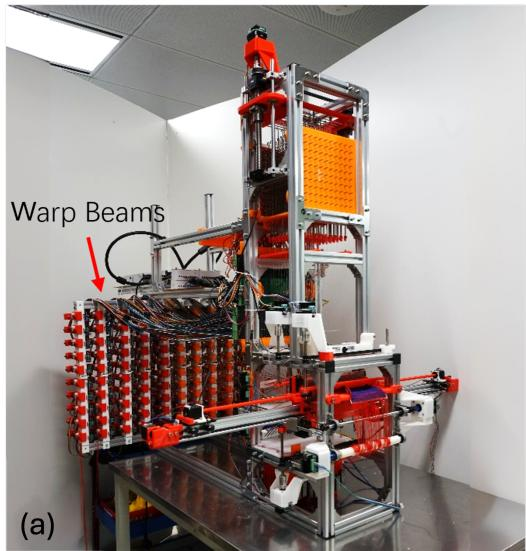

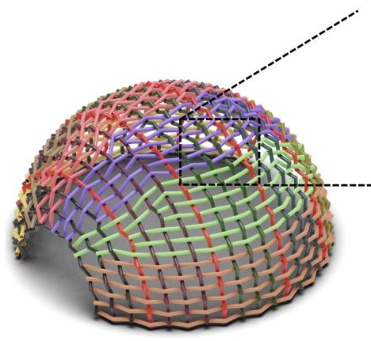  
(b)

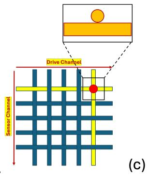

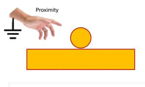

Fig. S1. (a) The computer-controlled freeform weaving system. (b) The woven hemispherical sensing manifold. (c) Illustration of a drive- and sensor-channel pair. (d) Proximity sensing model.  
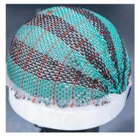  
Hemisphere

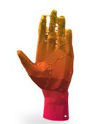  
CD 0.0001 EMD 0.0321 Av. Sur. Err. 0.0026

Cube  
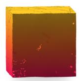  
CD 0.0002 EMD 0.0420 Ay, Sur, Err, 0.0004  
Ring

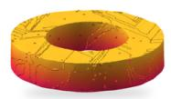  
CD 0.0002 EMD 0.0449 Av. Sur. Err. 0.0006

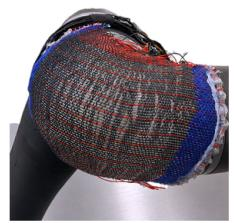  
Elbow

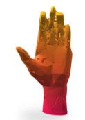  
CD 0.0001 EMD0.0433 Av. Sur. Err. 0.0026

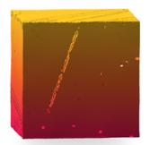  
CD 0.0002 EMD 0.0451 Av. Sur. Err. 0.0004

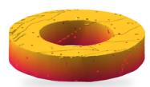  
CD 0.0002 EMD 0.0394 Av. Sur. Err. 0.0006

Fig. S2. Reconstruction of the same hand, cube, and ring using sensors conforming to a hemisphere and a robotic-arm elbow.