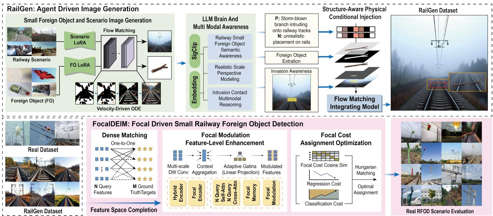
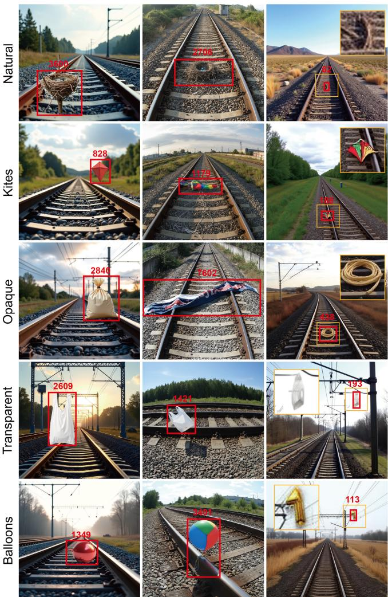
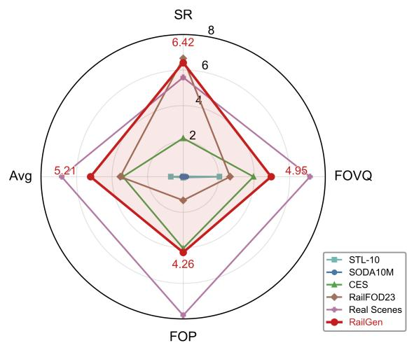
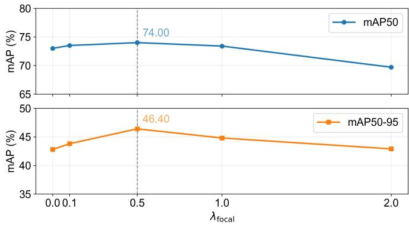
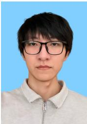
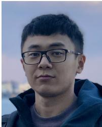

# RailGen: Improving Railway Intrusion Detection via Agent-Guided Small-Scale Foreign Object Generation

Quan Hao, Ziyang Tao, Chenxi Zhang, Yudong Wang, Rui Shi and Liguo Zhang, Senior Member, IEEE

Abstract—Small-object detection under long-tailed data distributions is a fundamental yet challenging problem in multimedia. Railway Foreign Object Detection (RFOD) epitomizes this challenge with easily confused small intrusions and scarce samples. To address these issues, we propose a generative-augmented detection paradigm that leverages multimodal image generation to enrich the feature space of rare, small objects. We first construct RailGen, a multimodal image generation agent based on large models. Under semantic constraints, RailGen automatically invokes tools to generate railway scenes, calibrate intrusion positions, extract foreign objects, and fuse them into realistic intrusion effects. This process produces high-quality synthetic samples that effectively densify the feature representations of tail classes and complete the small-object feature space. Within this paradigm, we further propose FocalDEIM, a detection framework designed to enhance training with generated data. FocalDEIM improves dense matching with Focal Modulation for better small object discrimination and adopts Focal Loss to emphasize hard samples, thereby alleviating blurred interclass boundaries in complex railway scenes. Experimental results demonstrate that RailGen can generate high-quality small-scale foreign objects, reducing the object pixel area by up to 58× and by 13.85× on average. Equipped with these challenging samples, our paradigm surpasses the baseline DEIM by 5.6% and 7.5% in $m A P _ { 5 0 }$ and $m A P _ { 5 0 - 9 5 }$ respectively, and outperforms existing state-of-the-art methods. Ablation studies verify RailGen’s feature-space enrichment and FocalDEIM’s boundary discrimination. The paradigm provides an effective multimodal generative solution for long-tailed small-object detection in safety-critical applications.

Index Terms—Multimodal agent, image generation, railway foreign object detection

## I. INTRODUCTION

MALL-OBJECT detection under long-tailed data distri-S butions is a fundamental yet challenging problem in multimedia, where rare categories with tiny object scales typically suffer from under-represented feature spaces and poor discrimination. Railway Foreign Object Detection (RFOD) epitomizes this challenge. In high-speed railway operation, even small artificial or natural objects, such as balloons, plastic films, stones, or tree branches, intruding at critical positions of the overhead contact line and rail tracks can cause serious accidents including facility damage, train derailment, and emergency stops. Accurate detection of such foreign objects is therefore essential for safe and stable high-speed railway operation [1].

However, high-speed railway operating environment is complicated. Lighting conditions change constantly, track textures are highly repetitive, and overhead line backgrounds easily cause visual confusion. These factors make it difficult for detection models to distinguish small-sized foreign objects from the background, hence degrading detection performance [2]. Furthermore, real intrusion events are difficult to capture in practice. Existing datasets exhibit severe long-tail distributions, where normal scene samples vastly outnumber foreign object samples. This imbalance leads to an incomplete feature space, preventing detection models from learning discriminative representations of rare intrusion patterns.

Currently, railway foreign object intrusion detection primarily relies on object detection algorithms [3], [4], [5]. In particular, DETR-series methods based on the Transformer architecture have demonstrated advantages in global modeling and object matching, while techniques such as Focal Modulation improve small object detection through feature enhancement [6], [7]. Nevertheless, these methods still rely heavily on limited real samples for training and thus continue to suffer from incomplete feature spaces and insufficient generalization to hard examples in long-tail distributions and complex background [8], [9]. Although image generation techniques have emerged as a promising avenue for alleviating sample scarcity [10], [11], [12], [13], without accurate modeling of railway scenes and foreign object intrusion semantics, generative models are still prone to producing images with unreasonable object placement, scale distortion, and lighting inconsistency, making it difficult to complete the feature space and improve detection performance [14], [15], [16].

To address these issues, this paper proposes a generativeaugmented detection paradigm for railway foreign object intrusion detection, where realistic image generation is leveraged to enrich the feature space for detection.

Specifically, we first construct RailGen, a framework based on multimodal large models, to generate semantically consistent and physically plausible railway foreign object intrusion samples. First, with Low-Rank Adaptation (LoRA) for domain adaptation, Flow Matching is used to model continuous probability flows and generate railway background and foreign object images. Then, machine vision tools semantically analyze foreign object intrusion relationship and determine intrusion positions and scales that satisfy scene priors and physical constraints, thereby enabling the effective generation of challenging small-scale foreign objects in railway scenes. Furthermore, foreign object regional features are extracted and fused into the railway scene, producing high-fidelity intrusion images. This process increases sample diversity and helps complete the feature space under long-tail data distributions.

  
Fig. 1. Overall pipeline of the generative-augmented detection paradigm for railway foreign object intrusion detection

In addition to RailGen which enriches the feature space by expanding the sample distribution with diverse and physically plausible generated samples, we further propose FocalDEIM for joint training on generated and real data. Based on the dense one-to-one matching paradigm, FocalDEIM introduces Focal Modulation to refine decoder query representations before Hungarian assignment through context-aware aggregation, thereby enhancing the discriminability of small foreign object features in complex railway scenes. In addition, Focal Loss is adopted as the classification objective to reweight hard and easily confused samples during training, guiding optimization toward more informative matches and further improving detection performance.

Extensive experiments demonstrate that RailGen can generate high-quality small-scale foreign objects, reducing the object pixel area by up to 58× and by 13.85× on average. By leveraging these challenging samples, the proposed method improves mAP50 and mAP50-95 over the baseline model by 5.6% and 7.5% respectively, and outperforms existing stateof-the-art methods. Ablation studies further highlight the effectiveness of the proposed generation-detection synergy.

The main contributions of this paper are summarized as follows:

• We propose RailGen, a semantically consistent multimodal agent that generates realistic railway images through state-of-the-art generation performance, completing the feature space of detection models.

• We introduce FocalDEIM, a detection framework that enhances generated-data training via Focal Modulation for small object discrimination in dense matching and Focal Loss for hard-sample learning.

## II. RELATED WORK

## A. Railway Foreign Object Detection

In railway foreign object detection (RFOD), recent studies have demonstrated the feasibility of automatic detection using surveillance videos or images [3], [17], [18]. Nevertheless, existing methods still face two fundamental challenges: severe data scarcity leads to an incomplete feature space, and complex railway environments blur inter-class feature boundaries.

Transformer-based DETR performs global contextual modeling through encoder-decoder structures and self-attention, showing advantages in complex scene understanding [19], [20]. However, its one-to-one (O2O) matching mechanism suffers from sparse supervision, which further worsens the feature-space incompleteness when positive samples are scarce. To deal with this issue, DEIM replaces conventional label assignment with dense matching between predictions and ground-truth boxes, and enhances sensitivity to hard examples by introducing learnable matching costs [6], [21]. Built upon this paradigm, recent studies combine DEIM with multi-scale feature modulation to improve localization and recognition under complex background while maintaining inference efficiency [22], [23]. In particular, Focal Modulation adaptively aggregates multi-scale contextual information through gated interactions, which benefits the discriminative representation of small objects and helps clarify ambiguous interclass boundaries [7], [24]. Despite these advances, detectioncentric methods remain constrained by an incomplete training feature space. Without sufficient diverse samples covering rare intrusion patterns, the boundary between foreign objects and background clutter remains poorly defined, leading to limited generalization in extreme operating conditions.

Moreover, RFOD is limited by the few-sample problem [16]. Although generated samples have been introduced to augment training data [25], the domain gap between synthetic and real images restricts the resulting performance gains.

Existing generation methods still fail to produce physically consistent and semantically valid samples that can effectively expand the feature space. As a result, they cannot adequately resolve the issue of the inter-class ambiguity between small foreign objects and complex railway background.

## B. Image Generation

To address feature-space incompleteness caused by data scarcity, generative augmentation has emerged as a promising direction. From VAE [26] and GAN [27] to recent diffusionbased models, especially Stable Diffusion [12], image generation has achieved substantial progress in visual fidelity and training stability. More recently, Flow Matching [28] has been introduced into image generation. FLUX adopts Rectified Flow to construct nearly linear deterministic ODE trajectories, enabling improved controllability with fewer sampling steps [13], [29]. Combined with Low-Rank Adaptation (LoRA), these models can adapt to target domains with limited data by training only lightweight low-rank adapters, thereby improving the visual consistency of generated samples with railway scenes [30].

However, existing generative models still struggle to achieve controllable railway foreign object intrusion generation. In particular, they lack explicit control over the intrusion semantics, including object category, placement, scale, and scene compatibility. This limitation becomes more severe when it comes to small-scale foreign objects, the visual cues of which are inherently weak and highly sensitive to scale distortion and background interference. As a result, directly generated intrusion images often suffer from unreasonable object placement, inaccurate object scale, and weak semantic alignment with the scene. These issues not only reduce physical plausibility, but also limit the effectiveness of generated samples in expanding the discriminative feature space, especially for hard smallobject cases.

Recent advances in multimodal foundation models and multimodal agents provide new opportunities to address this limitation. Multimodal agents built on models such as Gemma exhibit strong visual understanding, task planning, and instruction-following capabilities, enabling them to decompose high-level objectives into executable steps [31], [32], [33]. Meanwhile, progress in vision-language models and image segmentation methods, including CLIP, CLIPSeg, and SAM, offers effective tools for object-aware parsing and stepwise visual processing [34], [35], [36]. Furthermore, multimodal reasoning enhances the ability of agents to guide generation and evaluate semantic consistency [37], [38]. Nevertheless, existing studies have not yet established a multimodal agent framework that may bridge high-level semantic reasoning with fine-grained generation control for controllable RFOD synthesis, particularly for small-scale foreign object intrusion generation under physical and semantic constraints.

## III. METHODS

Data scarcity in railway scenarios leads to an incomplete feature space, blurred inter-class boundaries, and unstable matching in small object detection. To address these issues, this paper proposes a generation-detection collaborative framework. RailGen completes the feature space of railway foreign objects through synthetic data generation. FocalDEIM serves as a detector that is more sensitive to small railway foreign object representations and the expanded feature space, improving small object detection performance.

A. RailGen: Model-Agent Collaborative Generation for Feature Space Completion

Existing end-to-end generation methods treat the process of image generation as black-box pixel regression. They do not explicitly model physical rules in railway scenarios (such as perspective, gravity, and safety distances) or foreign object semantic attributes (such as material, weight, and motion patterns). As a result, the generated samples often exhibit physical artifacts, such as floating objects, scale distortion, and inconsistent lighting. To address these issues, this paper presents RailGen, an agent-based generation framework built on multimodal large models. RailGen uses specialized tools across multiple stages to generate high-quality high-speed railway (HSR) foreign object intrusion images. As shown in Fig. 1, these tools support intrusion localization, image generation, segmentation, and foreign object fusion.

Specifically, RailGen formulates generation as a physically constrained and semantically controllable optimization process via a perception–reasoning–action closed loop. The agent first predicts physically reasonable intrusion positions through visual-language semantic understanding and then allocates Flow Matching generation and semantic-aware fusion modules to maintain geometric alignment, lighting consistency, and occlusion relations. Through this multi-stage pipeline, RailGen synthesizes visually realistic and physically plausible samples, enriching the feature space for HSR foreign object detection.

1) Multimodal Semantic Reasoning and Anchor Region Calibration: Existing generation methods mostly adopt random or heuristic position placement. They ignore perspective constraints and physical common sense in railway scenes, resulting in foreign object positions that violate geometric con sistency. To address this, we define anchor regions as candidate spatial locations satisfying physical plausibility constraints (e.g., heavy objects contact the trackbed, lightweight objects may be suspended), and calibrate these regions via multimodal semantic reasoning to enforce geometric consistency.

As shown in Fig. 1, given a railway background image $I _ { \mathsf { b g } } \in \mathbb { R } ^ { H \times W \times 3 }$ and a description of the foreign object T, we first extract joint multimodal representations through the SigLIP-ViT encoder, yielding a unified embedding vector. Rather than performing simple coordinate regression, we formulate the intrusion anchor point localization as a constrained spatial optimization problem. The search space is the set of candidate bounding boxes, where each candidate box is represented as a 4-tuple of normalized center coordinates and width/height parameters.

The optimal anchor region $b ^ { * }$ is obtained by maximizing a joint objective function of visual naturalness and railway physical consistency:

$$
b ^ { * } = \arg \operatorname* { m a x } _ { b } \left( R ( b \mid I _ { \mathrm { b g } } ) + \lambda D ( b \mid I _ { \mathrm { b g } } , \Theta _ { \mathrm { r a i l } } ) \right) .\tag{1}
$$

Here, $R ( \cdot )$ measures the visual consistency between the candidate region and the background’s semantic features, implemented as a learnable compatibility function based on the backbone network’s features. The second term, $D ( \cdot )$ , encodes physical constraints related to railway scene, with parameters $\Theta _ { \mathrm { r a i l } }$ including track geometry priors, gravity consistency, and key safety contact regions.

The physical constraint term can be decomposed as:

$$
D ( b \mid I _ { \mathrm { b g } } , \Theta _ { \mathrm { r a i l } } ) = \alpha _ { 1 } \mathcal { C } _ { \mathrm { c o n t a c t } } ( b ) + \alpha _ { 2 } \mathcal { C } _ { \mathrm { g r a v i t y } } ( b ) + \alpha _ { 3 } \mathcal { C } _ { \mathrm { p e r s p } } ( b ) ,\tag{2}
$$

where ${ \mathcal { C } } _ { \mathrm { c o n t a c t } } ( b )$ enforces the physical contact relationship between the foreign object and the trackbed or contact network (distinguishing between heavy and lightweight objects based on mass attributes); ${ \mathcal { C } } _ { \mathrm { g r a v i t y } } ( b )$ penalizes spatial configurations that violate gravity direction consistency; $\mathcal { C } _ { \mathrm { p e r s p } } ( b )$ ensures that the scale and track perspective geometry are consistent.

This modeling approach transforms railway safety knowl edge and physical priors into computable spatial constraints, preventing the generation of physically unreasonable anchor positions and thus avoiding feature space contamination.

2) Deterministic Generation Based on Flow Matching: Traditional diffusion models construct non-deterministic curved sampling trajectories through Stochastic Differential Equations (SDEs), making precise control difficult. They also exhibit poor adaptability to structured railway scenes. To address this, we propose a Flow Matching generation paradigm with Low-Rank Adaptation that achieves cross-domain semantic alignment through deterministic probability paths.

We define a probability path $p _ { t }$ from the noise distribution $p _ { 1 }$ to the data distribution $p _ { 0 } ,$ governed by the velocity field $v _ { t }$ via a probability flow ODE. For training samples $x _ { 0 }$ and Gaussian noise ϵ, we use linear interpolation and optimize the Flow Matching loss.

During inference, the ODE is solved by integrating from $x _ { 1 }$ to $x _ { 0 } \colon$

$$
x _ { 0 } = x _ { 1 } + \int _ { 1 } ^ { 0 } v _ { \theta } ( x _ { t } , t , c ) d t ,\tag{3}
$$

iteratively solved using a numerical integrator at discrete timesteps $\{ t _ { i } \} _ { i = 0 } ^ { K }$

To achieve railway domain adaptation, the pretrained velocity field $v _ { \theta }$ is frozen, and low-rank decomposition $\Delta W =$ $B A$ is introduced for fine-tuning:

$$
v _ { \theta } ^ { \prime } ( x _ { t } , t , c ) = v _ { \theta } ( x _ { t } , t , c ) + W _ { \mathrm { o u t } } ( B A \cdot \mathrm { p r o j } ( x _ { t } , t , c ) ) .\tag{4}
$$

Intuitively, Flow Matching enables deterministic and controllable image synthesis by learning a direct transformation from noise to data along a linearized probability path. This property is particularly suitable for railway scenarios, where geometric consistency and precise spatial control are critical.

This strategy achieves a precise mapping from general visual distribution to railway scene manifold. After generating the HSR scene and foreign object images, we perform image segmentation on the foreign object images, providing geometric priors for subsequent fusion.

3) Structure-Aware Physical Conditional Injection Mechanism: Traditional image fusion methods (e.g., α-blending and Poisson fusion) treat the foreground and background as independent pixel sets for post hoc composition, neglecting scene geometry consistency and physical constraints. This often leads to boundary artifacts, scale inconsistency, and lighting conflicts. Motivated by the conditional guidance idea of ControlNet [39], we propose a Structure-Aware Physical Conditional Injection (SPCI) mechanism, as shown in Fig. 1. SPCI embeds fusion into the Flow Matching generation trajectory and achieves progressive, physically consistent composition through latent-space feature modulation.

Given the inferred foreign object configuration, we construct a Structure-aware Physical Conditional Injection (SPCI) representation:

$$
\mathbf { S } = \{ S _ { k } \} _ { k = 1 } ^ { 5 } , \quad S _ { k } \in \mathbb { R } ^ { H \times W } ,\tag{5}
$$

where the five channels correspond to $S _ { \mathrm { m a s k } } .$ , Scontour, $S _ { \mathrm { { d e p t h } } } ,$ $S _ { \mathrm { s u p p o r t } }$ , and $\boldsymbol { S _ { \mathrm { i l l u m } } }$ , encoding the foreground mask, contour, depth approximation, structural support, and lighting direction respectively.

Instead of heuristic gravity constraints, we model steadystate physical consistency. The support constraint is defined as:

$$
\begin{array} { r l } & { S _ { \mathrm { s u p p o r t } } ( x , y ) = \pi _ { \mathrm { h e a v y } } ( T ) \cdot \mathbb { I } \bigl ( \mathrm { d i s t } ( ( x , y ) , S _ { \mathrm { g r o u n d } } ) < \epsilon _ { g } \bigr ) } \\ & { \quad \quad \quad + \pi _ { \mathrm { h a n g } } ( T ) \cdot \mathbb { I } \bigl ( \mathrm { d i s t } ( ( x , y ) , S _ { \mathrm { w i r e } } ) < \epsilon _ { w } \bigr ) , } \end{array}\tag{6}
$$

where $S _ { \mathrm { g r o u n d } }$ denotes weight-bearing structures $( \mathrm { e . g . }$ , trackbed and ballast), $\scriptstyle { S _ { \mathrm { w i r e } } }$ denotes suspension structures (e.g., contact wires), and $\pi _ { \mathrm { h e a v y } } ( T )$ and $\pi _ { \mathrm { h a n g } } ( T )$ denote object-dependent weights inferred from the semantic description $T .$

This formulation enforces physically plausible support conditions: heavy objects require structural support, while lightweight objects (e.g., balloons or kites) may remain suspended.

Additional channels further enforce perspective-depth consistency and lighting coherence, ensuring that object scale aligns with track perspective and that shading is consistent with the global light source.

We inject the SPCI tensor into latent features via a structure-aware modulation operator:

$$
{ \bf h } _ { \mathrm { f u s e d } } = { \bf h } + \sum _ { k = 1 } ^ { K } \gamma _ { k } ^ { 0 } \Psi _ { k } \bigl ( S _ { k } , \mathcal { G } _ { \mathrm { r a i l } } \bigr ) ,\tag{7}
$$

where h denotes Flow Matching features, $\gamma _ { k } ^ { 0 }$ are learnable weights, $\Psi _ { k } ( \cdot )$ encodes constraint-specific modulation, and $\mathcal { G } _ { \mathrm { r a i l } } = \{ \mathcal { L } _ { \mathrm { t r a c k } } , \mathcal { H } _ { \mathrm { w i r e } } \}$ represents railway geometry priors.

At each ODE step, the velocity field is modulated as:

$$
x _ { t - 1 } = x _ { t } + \Delta t \cdot v _ { \theta } \big ( x _ { t } , t , c , \mathbf { h } _ { \mathrm { f u s e d } } , \mathcal { G } _ { \mathrm { r a i l } } \big ) ,\tag{8}
$$

jointly guided by semantic and structural constraints. The modulation weights are dynamically updated:

$$
\gamma _ { k } ( t ) = \gamma _ { k } ^ { 0 } \cdot \omega _ { \mathrm { d e p t h } } ( t ) ,\tag{9}
$$

enabling progressive enforcement of physical consistency along the generation trajectory.

Overall, SPCI integrates geometric, structural, and physical constraints directly into the generative process, reducing artifacts and improving realism.

B. FocalDEIM: Focal-Driven Dense Matching for Small Objects

RailGen expands the feature space by providing diverse and physically plausible synthetic samples. Building on this enriched space, dense matching of DEIM increases positive supervision by assigning each ground-truth target to multiple spatially adjacent queries. However, this process exposes a new bottleneck: because small foreign objects share similar local patterns with track textures and the background, they still suffer from insufficient discriminability during Hungarian matching, even with richer candidates.

To address this, we propose FocalDEIM, as illustrated in Fig. 1. We first introduce Focal Modulation to enhance query feature representations via context-aware aggregation, improving the discriminability of small object features before assignment. We then incorporate a focal-aware matching cost into the Hungarian objective, which measures semantic consistency between queries and targets and guides the model toward more effective learning and faster convergence.

1) Dense Matching in the RailGen-Enriched Feature Space: DEIM follows the DETR end-to-end set prediction paradigm, extracting image features through Transformer encoders, then converting N learnable query vectors $\mathbf { Q } \in \mathbb { R } ^ { N \times C }$ into class predictions $\hat { Y } _ { \mathrm { c l s } } \in \mathbb { R } ^ { N \times K }$ (where K is the number of classes) and bounding box coordinates $\hat { Y } _ { \mathrm { b o x } } \in \mathbb { R } ^ { N \times 4 }$ via the decoder.

Built upon the enriched feature space provided by Rail-Gen, the model performs label assignment between predictions and ground-truth targets. During training, N prediction results must be optimally assigned to M targets $( N \gg M )$ , which is achieved through Hungarian Matching. Define the matching cost matrix $\mathbf { C } \in \overset { } { \mathbb { R } } ^ { M \times N }$ , whose elements comprise classification and regression costs:

$$
\begin{array} { r l } { \mathcal { C } _ { \mathrm { m a t c h } } ( i , j ) = - \hat { p } _ { \sigma ( i ) } ( c _ { i } ) } & { } \\ { + \lambda _ { \mathrm { L 1 } } \lVert \mathbf { b } _ { i } - \hat { \mathbf { b } } _ { \sigma ( j ) } \rVert _ { 1 } } & { } \\ { + \lambda _ { \mathrm { G I o U } } \mathcal { L } _ { \mathrm { G I o U } } ( \mathbf { b } _ { i } , \hat { \mathbf { b } } _ { \sigma ( j ) } ) , } \end{array}\tag{10}
$$

where $\hat { p } ( c _ { i } )$ denotes the predicted probability for class $c _ { i } .$ , and b represents bounding box parameters. The optimal assignment $\hat { \sigma }$ is obtained by solving:

$$
\hat { \sigma } = \underset { \sigma \in \mathfrak { S } _ { N } } { \arg \operatorname* { m i n } } \sum _ { i } ^ { M } \mathcal { C } _ { \mathrm { m a t c h } } ( i , \sigma ( i ) ) .\tag{11}
$$

While the enriched feature space provides more complete visual coverage of railway foreign objects, the supervision signal remains sparse under the DETR-style one-to-one matching paradigm. To better exploit this feature space, DEIM introduces Dense One-to-One Matching by applying S different scales and cropping augmentations $\{ \mathcal { A } _ { s } \} _ { s = 1 } ^ { S }$ to training images. This allows each ground-truth target to be matched with multiple spatially adjacent query vectors, expanding the number of positive samples by a factor of S and alleviating the sparse supervision problem.

However, even with the enriched feature space, small foreign objects still exhibit weak feature responses and remain highly similar to background textures. During early training stages, randomly initialized query vectors produce decoder features with limited discriminability, making small objects easily confused with the background in Hungarian matching. As a result, even with abundant candidates provided by dense matching, accurate assignment remains difficult to guarantee due to insufficient discriminability in the feature space.

2) Context-Aware Matching Based on Focal Modulation: Specifically, we propose FocalBlock as a context-aware feature enhancement module that refines decoder query representations before Hungarian assignment, improving small object discriminability against cluttered background. We further introduce FocalLoss as the classification objective to reweight hard and easily confused samples during training, stabilizing optimization and accelerating convergence toward correct assignments.

To address the insufficient discriminability of small objects during Hungarian matching, we introduce Focal Modulation mechanism into matching cost computation. This mechanism enhances small object features through explicit context aggregation and feature enhancement. Given decoder output query feature sequences $\mathbf { F } _ { \mathrm { q u e r y } } \in \mathbb { R } ^ { N \times C }$ , we first aggregate context information using multi-scale depthwise separable convolutions:

$$
\mathbf { F } _ { \mathrm { c t x } } ^ { ( k ) } = \mathrm { D W C o n v 1 D } _ { k } ( \mathbf { F } _ { \mathrm { q u e r y } } ) , \quad k = 1 , \ldots , K ,\tag{12}
$$

$$
\mathbf { G } _ { k } = \mathrm { S o f t m a x } _ { k } ( \mathbf { W } _ { g } \mathbf { F } _ { \mathrm { q u e r y } } ) , \quad \mathbf { F } _ { \mathrm { a g g } } = \sum _ { k = 1 } ^ { K } \mathbf { G } _ { k } \odot \sigma ( \mathbf { F } _ { \mathrm { c t x } } ^ { ( k ) } ) ,\tag{13}
$$

where $\mathbf { G } _ { k }$ represents adaptive gating weights with linear projection (no activation). The aggregated context is then injected into the original queries through projection layers, yielding modulated features:

$$
\mathbf { F } _ { \mathrm { m o d } } = \mathbf { F } _ { \mathrm { q u e r y } } + \mathbf { W } _ { p } \mathbf { F } _ { \mathrm { a g g } } .\tag{14}
$$

We define the focal matching cost based on cosine similarity, measuring the semantic consistency between modulated query features and ground-truth target features $\mathbf { F } _ { \mathrm { t g t } } \in \mathbb { R } ^ { M \times C }$ (obtained by selecting the query with the highest predicted classification score for each ground-truth target from the current decoder output):

$$
\mathcal { C } _ { \mathrm { f o c a l } } ( i , j ) = 1 - \frac { \mathbf { F } _ { \mathrm { m o d } } ^ { ( j ) } \cdot \mathbf { F } _ { \mathrm { t g t } } ^ { ( i ) \top } } { \| \mathbf { F } _ { \mathrm { m o d } } ^ { ( j ) } \| \| \mathbf { F } _ { \mathrm { t g t } } ^ { ( i ) } \| } .\tag{15}
$$

The final matching cost matrix is composed of weighted classification, regression, and focal modulation costs:

$$
\mathcal { C } _ { \mathrm { t o t a l } } = \lambda _ { \mathrm { c l s } } \mathcal { C } _ { \mathrm { c l s } } + \lambda _ { \mathrm { b o x } } \mathcal { C } _ { \mathrm { b o x } } + \lambda _ { \mathrm { f o c a l } } \mathcal { C } _ { \mathrm { f o c a l } } .\tag{16}
$$

Training Objective. For the matched positive sample set P and unmatched negative samples, the total training loss is defined as:

$$
\begin{array} { r l r } {  { \mathcal { L } _ { \mathrm { t o t a l } } = \sum _ { i \in \mathcal { P } } \Big [ \mathcal { L } _ { \mathrm { c l s } } \big ( c _ { i } , \hat { c } _ { \hat { \sigma } ( i ) } \big ) + \mathcal { L } _ { \mathrm { b o x } } \big ( \mathbf { b } _ { i } , \hat { \mathbf { b } } _ { \hat { \sigma } ( i ) } \big ) \Big ] } } \\ & { } & { + \operatorname* { \lambda } _ { \mathrm { n e g } } \sum _ { j \notin \mathcal { P } } \mathcal { L } _ { \mathrm { c l s } } ( \varnothing , \hat { c } _ { j } ) , } \end{array}\tag{17}
$$

where $\mathcal { L } _ { \mathrm { c l s } }$ denotes the Focal Loss, which alleviates class imbalance, and ${ \mathcal { L } } _ { \mathrm { b o x } }$ represents the combination of GIoU Loss and L1 Loss.

Through the above mechanism, FocalDEIM achieves effective learning of small foreign objects with limited training samples. The dense matching strategy of DEIM alleviates sparse supervision caused by data scarcity by expanding the positive sample candidate space. The Focal Modulation mechanism ensures accurate identification of these candidates during Hungarian matching through explicit enhancement of small object feature representations, resolving the problem of insufficient discriminability caused by blurred inter-class boundaries. This module operates only during label assignment in the training stage and is completely removed during inference, improving small object detection performance with zero additional computational overhead.

## IV. RESULTS

## A. Experimental Setup

1) Datasets and Preprocessing: We use six datasets in our experiments:

(1) Source Dataset. containing 4,000 real railway scene images and 4,131 foreign-object images for training the Rail-Gen image generation model. (2) RailGen Dataset. containing 1,318 RFOD images generated by RailGen and manually annotated for label accuracy. Empirically, augmenting with 400 generated samples gives the best detection performance. (3) Real Train Set. containing 398 real RFOD images with manually annotated small foreign objects for training. (4) Real Validation Set. containing 102 real RFOD images with manually annotated small foreign objects for validation and evaluation. (5) CES (Catenary Electrical System Dataset). Used as an auxiliary augmentation source to assess crossdomain generalization. (6) RailFOD23 [40]. A public benchmark dataset used for comparison.

2) Evaluation Metrics for Image Generation: These datasets support image generation, detector training, and benchmarking. Following the LLM-as-a-Judge paradigm [41], we use Gemini-3-Pro to evaluate generated railway foreignobject images using three metrics: Scene Realism (SR), Foreign Object Visual Quality (FOVQ), and Foreign Object Plausibility (FOP), each scored from 0 to 10. The average score is computed as

$$
\mathbf { A v g } = { \frac { \mathbf { S R } + \mathbf { F O V 0 } + \mathbf { F O P } } { 3 } } .
$$

The evaluator also provides strengths, problems, and suggestions, with judgments grounded in real-world physics.

To further assess small-object generation, we measure foreign-object pixel area. FO Pixel denotes the mean object pixel count, while Avg Ratio and Max Ratio denote the average and maximum pixel-count ratios relative to the reference method. These metrics reflect the ability to generate small but recognizable foreign objects.

FLUX  
Nano Banana  
Ours  
  
Fig. 2. Comparison of state-of-the-art (SOTA) open-source and closed-source image generation models. Red boxes indicate intruding foreign objects, and red numbers denote their pixel counts. Green boxes show enlarged views of the small foreign objects generated by our method.

TABLE I  
COMPARISON OF GENERATION RESULTS WITH SOTA METHODS
<table><tr><td>Metric</td><td>FLUX [13]</td><td>NanoBanana [42]</td><td>RailGen (Ours)</td></tr><tr><td>SR</td><td>5.83</td><td>6.02</td><td>6.42</td></tr><tr><td>FOVQ</td><td>2.66</td><td>4.30</td><td>4.95</td></tr><tr><td>FOP</td><td>1.13</td><td>3.11</td><td>4.26</td></tr><tr><td>Avg</td><td>3.21</td><td>4.48</td><td>5.21</td></tr><tr><td>FO Pixel</td><td>2245.2</td><td>3261.8</td><td>198.8</td></tr><tr><td>Avg Ratio</td><td>11.3×</td><td>16.4×</td><td>1.0×</td></tr><tr><td>Max Ratio</td><td>58.0×</td><td>43.6×</td><td>1.0×</td></tr></table>

To systematically evaluate the effect of different generative models on data quality, we conduct an automated assessment using Gemini-3-Pro as the evaluation agent. The compared methods include (1) FLUX [13], a SOTA opensource method; (2) Nano Banana [42], a SOTA closed-source method; and (3) RailGen, our proposed method. Table I reports the evaluation scores, while Fig. 2 presents representative visual comparisons. Notably, the plastic bags generated by our method naturally hang on utility poles, demonstrating strong physical consistency.

As shown in Table I, our method achieves the highest scores in SR, FOVQ, FOP, and the Avg metric, indicating superior generation quality over existing methods. Nano Banana ranks second, while FLUX performs the worst.

Beyond perceptual quality, we further analyze foreign object scale. Existing methods generally produce much larger objects. Under the same $7 6 8 \times 7 6 8$ resolution, FLUX and Nano Banana generate 2245.2-pixel objects and 3261.8-pixel objects respectively on average, while our method generates 198.8-pixel objects on average. In other words, their generated objects are 11.3× and 16.4× larger than ours on average, with maximum ratios of 58.0× and 43.6× respectively. These results show that our method can generate much smaller yet still recognizable and physically plausible foreign objects, thereby introducing more hard-to-detect samples for downstream detection.

## B. Comparison of Generation Quality with Existing Datasets

TABLE II  
COMPARISON OF GENERATION QUALITY WITH EXISTING DATASETS
<table><tr><td></td><td>SR</td><td>FOVQ</td><td>FOP</td><td>Avg</td></tr><tr><td>SODA10M [43]</td><td>0.00</td><td>0.17</td><td>0.01</td><td>0.06</td></tr><tr><td>STL-10 [44]</td><td>0.02</td><td>2.04</td><td>0.05</td><td>0.70</td></tr><tr><td>CES</td><td>2.17</td><td>3.96</td><td>4.03</td><td>3.39</td></tr><tr><td>RailFOD23 [40]</td><td>6.66</td><td>2.64</td><td>1.33</td><td>3.54</td></tr><tr><td>RailGen (Ours)</td><td>6.42</td><td>4.95</td><td>4.26</td><td>5.21</td></tr><tr><td>Real RFOD Scenes</td><td>5.59</td><td>7.14</td><td>7.80</td><td>6.84</td></tr></table>

Table II and Fig. 3 present the evaluation results across different datasets. We include two unrelated datasets, SODA10M [43] (a generic driving dataset) and STL-10 [44] (a natural image classification dataset), as negative controls. Both datasets receive extremely low scores, showing that the evaluator can reliably distinguish irrelevant data from railway intrusion scenarios.

Datasets related to railway environments—CES, Rail-FOD23 [40], RailGen, and real RFOD scenes—achieve significantly higher scores, demonstrating that the evaluation protocol aligns well with the task semantics. Our method achieves an average score of 5.21, substantially outperforming RailFOD23 (3.54) and approaching real-scene performance. This indicates the high fidelity and applicability of the generated samples. Although real RFOD scenes obtain the highest average score (6.84), their SR score is slightly lower than that of RailGen. We attribute this to the presence of complex noise, lighting variation, and imperfect imaging conditions in realworld data, whereas generated samples tend to be cleaner and more structurally regular, leading to higher perceived scene realism under the evaluation protocol.

  
Fig. 3. Radar-chart visualization of comparisons in generation quality.

C. Evaluation of Inter-Class Boundary Clarification via Detection

As shown in Table III, FocalDEIM achieves the best performance under comparable parameter scales (10.0M– 12.6M), outperforming the DEIM baseline by 3.10 points in m $A P _ { 5 0 } ( 7 1 . 5 0 \mathrm { v s . } 6 8 . 4 0 )$ ). This validates that focal modulation enhances feature discriminability and improves localization precision for small foreign objects in complex railway scenes.

Most models show performance improvement after incorporating RailGen data, proving its effectiveness in alleviating feature space incompleteness. However, the gains vary across architectures. Notably, DINO achieves 69.20 m $A P _ { 5 0 }$ on the Real Val Set, making it one of the strongest detectors. Under the RailGen-augmented setting, FocalDEIM reaches 74.00 $m A P _ { 5 0 }$ , surpassing DINO by 4.8 points. This cross-setting comparison highlights the effectiveness of combining feature space expansion with focal-driven discriminative learning.

While DEIMv2 shows the largest numerical gains after augmentation $( \Delta _ { 5 0 } = 8 . 9 0 )$ , its baseline performance remains lower, suggesting greater sensitivity to feature sparsity. In contrast, FocalDEIM maintains the highest absolute accuracy across both real and augmented settings, indicating that focal modulation provides a more robust and discriminative representation under domain shift. Meanwhile, YOLO-Master shows limited or even negative gains, which may be attributed to its reliance on fixed grid-based representations that are less adaptable to distribution shifts introduced by synthetic data.

## D. Ablation Study on Detection Model

To validate the complementary roles of feature space completion (via RailGen) and inter-class boundary discrimination (via FocalDEIM), we conduct systematic ablation experiments under identical settings. As shown in Table IV, the DEIM baseline achieves $6 8 . 4 0 \ m A P _ { 5 0 }$ and $3 8 . 9 0 \ m A P _ { 5 0 - 9 5 }$ Introducing focal components alone consistently improves performance: DEIM + FocalBlock reaches 70.80/40.70, DEIM + FocalLoss reaches 72.20/41.50, and combining both yields 71.50/43.50. These results confirm that each focal component contributes to boundary clarification and discriminative learning.

TABLE III  
PERFORMANCE COMPARISON WITH SOTA DETECTION MODELS.
<table><tr><td rowspan="2">Model</td><td rowspan="2">Params</td><td colspan="2">Real Val. Set</td><td colspan="2">RailGen</td><td colspan="2">Improvement (∆)</td></tr><tr><td> $m A P _ { 5 0 }$ </td><td> $m A P _ { 5 0 - 9 5 }$ </td><td> $m A P _ { 5 0 }$ </td><td> $m A P _ { 5 0 - 9 5 }$ </td><td> $\Delta _ { 5 0 }$ </td><td> $\Delta _ { 5 0 - 9 5 }$ </td></tr><tr><td>YOLO-Master [45]</td><td>9.7M</td><td>52.10</td><td>28.10</td><td>52.70</td><td>27.00</td><td>+0.60</td><td>-1.10</td></tr><tr><td>YOLO-World [46]</td><td>12.8M</td><td>68.80</td><td>41.60</td><td>71.10</td><td>42.60</td><td>+2.30</td><td>+1.00</td></tr><tr><td>DETR [47]</td><td>41.0M</td><td>62.00</td><td>35.00</td><td>65.50</td><td>39.20</td><td>+3.50</td><td>+4.20</td></tr><tr><td>Deformable DETR [48]</td><td>40.0M</td><td>66.80</td><td>37.50</td><td>70.10</td><td>42.10</td><td>+3.30</td><td>+4.60</td></tr><tr><td>DINO [49]</td><td>47.0M</td><td>69.20</td><td>41.20</td><td>72.50</td><td>44.80</td><td>+3.30</td><td>+3.60</td></tr><tr><td>Co-DETR [50]</td><td>52.1M</td><td>68.50</td><td>40.80</td><td>73.20</td><td>45.20</td><td>+4.70</td><td>+4.40</td></tr><tr><td>DEIM [6]</td><td>10.0M</td><td>68.40</td><td>38.90</td><td>72.70</td><td>44.70</td><td>+4.30</td><td>+5.80</td></tr><tr><td>DEIMv2 [51]</td><td>10.3M</td><td>64.50</td><td>37.09</td><td>73.40</td><td>44.30</td><td>+8.90</td><td>+7.21</td></tr><tr><td>FocalDEIM (Ours)</td><td>12.6M</td><td>71.50</td><td>43.50</td><td>74.00</td><td>46.40</td><td>+2.50</td><td>+2.90</td></tr></table>

Note: Improvement (∆) is calculated as the performance on RailGen minus that on Real Val Set (i.e $. , \ \Delta = R a i l G e n - R e a l \ V a l \ S e t )$

TABLE IV  
ABLATION STUDY ON DETECTION MODEL
<table><tr><td>DEIM</td><td>FocalBlock</td><td>FocalLoss</td><td>RailGen</td><td> $m A P _ { 5 0 }$ </td><td> $m A P _ { 5 0 - 9 5 }$ </td></tr><tr><td>√</td><td></td><td></td><td></td><td>68.40</td><td>38.90</td></tr><tr><td>√</td><td>√</td><td></td><td></td><td>70.80</td><td>40.70</td></tr><tr><td>√</td><td></td><td>√</td><td></td><td>72.20</td><td>41.50</td></tr><tr><td>√</td><td>√</td><td>√</td><td></td><td>71.50</td><td>43.50</td></tr><tr><td>√</td><td></td><td></td><td>√</td><td>72.70</td><td>44.70</td></tr><tr><td>√</td><td>√</td><td></td><td>√</td><td>72.80</td><td>46.20</td></tr><tr><td>√</td><td></td><td>√</td><td>√</td><td>71.20</td><td>45.90</td></tr><tr><td>√</td><td>√</td><td>√</td><td>√</td><td>74.00</td><td>46.40</td></tr></table>

Incorporating RailGen further boosts performance in most configurations. For example, the DEIM baseline improves from 68.40/38.90 to 72.70/44.70 after adding RailGen. The full model achieves the best result of 74.00/46.40, corresponding to gains of $+ 5 . 6 \ m A P _ { 5 0 }$ and $+ 7 . 5 \ m A P _ { 5 0 - 9 5 }$ over the baseline. Notably, under the DEIM + FocalLoss setting, $m A P _ { 5 0 }$ decreases slightly from 72.20 to 71.20 after incorporating RailGen, while $m A P _ { 5 0 - 9 5 }$ increases from 41.50 to 45.90. This suggests that RailGen mainly improves localization quality under stricter IoU thresholds rather than coarse matching at $I o U = 0 . 5$ . Overall, these results demonstrate that feature space completion and focal-driven discrimination are complementary, and their joint optimization leads to the strongest detection performance.

## E. Sensitivity Analysis of Focal Cost for Boundary Clarification in Hungarian Matching

To verify the sensitivity of the focal cost weight $\lambda _ { \mathrm { f o c a l } }$ in Hungarian matching, we conduct a grid search over $\{ 0 . 1 , 0 . 5 , 1 . 0 , 2 . 0 \}$ . As shown in Fig. 4, the optimal balance is achieved at $\lambda _ { \mathrm { f o c a l } } = 0 . 5$ . When weights are too small $( < = 0 . 1 )$ small objects fail to be distinguished from background clutter; when weights are too large $( > = 1 . 0 )$ , the matching process tends to overemphasize feature similarity at the expense of spatial localization accuracy.

Specifically, $\lambda _ { \mathrm { f o c a l } }$ balances the focal-aware cost with the original classification and localization terms in the Hungarian matching objective. Based on the empirical results, we adopt $\lambda _ { \mathrm { f o c a l } } = 0 . 5$ in all experiments.

  
Fig. 4. Sensitivity of detection performance to different $\lambda _ { \mathrm { f o c a l } }$ values in Hungarian matching.

F. Comparative Analysis of Feature Space Expansion Strategies

TABLE V  
AUGMENTATION COMPARISON OF DIFFERENT DATASETS.
<table><tr><td rowspan="2">Augmentation</td><td colspan="2">Real Test Performance</td><td colspan="2">Improvement</td></tr><tr><td> $m A P _ { 5 0 }$ </td><td> $m A P _ { 5 0 - 9 5 }$ </td><td> $\Delta _ { 5 0 }$ </td><td> $\Delta _ { 5 0 - 9 5 }$ </td></tr><tr><td>None (Real only)</td><td>71.50</td><td>43.50</td><td></td><td></td></tr><tr><td>RailFOD23 [40]</td><td>71.26</td><td>46.01</td><td>-0.24</td><td>+2.51</td></tr><tr><td>CES</td><td>71.92</td><td>45.15</td><td>+0.42</td><td>+1.65</td></tr><tr><td>RailGen (Ours)</td><td>74.00</td><td>46.40</td><td>+2.50</td><td>+2.90</td></tr></table>

Note: Improvements $( \Delta )$ are calculated relative to the “None (Real only)” baseline

To evaluate the effectiveness of different data sources for feature space expansion, we train the detector with a mix of augmented data and real training data, then evaluate the detector on the Real Val Set. As shown in Table V, RailGen achieves the best overall results, improving $m A P _ { 5 0 }$ and m $A P _ { 5 0 - 9 5 }$ by 2.50 and 2.90 points respectively over the real-only baseline. This demonstrates that RailGen is the most effective data source for completing the feature space.

CES also brings consistent improvement on both metrics, although the gains are relatively modest. This suggests that data from similar infrastructure scenarios can provide useful complementary information, but its contribution remains constrained by the lack of precise semantic alignment with railway foreign object intrusion. RailFOD23 shows a different trend: its $m A P _ { 5 0 }$ decreases slightly by 0.24 points, while its mA $P _ { 5 0 - 9 5 }$ improves by 2.51 points. This indicates that Rail-FOD23 contributes more to localization quality under stricter IoU thresholds than to coarse detection at $I o U = 0 . 5 .$ . Overall, these results confirm that semantically aligned synthetic data is more effective for feature space expansion than directly introducing existing datasets or data from related scenarios.

## V. CONCLUSION

This paper proposes a generative-augmented detection paradigm for long-tailed small-object detection. By coupling RailGen and FocalDEIM, the framework jointly addresses data scarcity and feature ambiguity under long-tailed distributions: RailGen enriches the feature space of rare, small objects through semantically consistent multimodal generation, while FocalDEIM sharpens discrimination via Focal Modulation and Focal Loss. This joint design improves sample diversity and feature separability in complex railway scenes. Experimental validation on real-world high-speed railway datasets shows that the proposed multimodal framework consistently outperforms the DEIM baseline and achieves superior performance on rare intrusion patterns and hard examples.

However, generated samples may still exhibit structural discontinuities and texture misalignment, indicating insufficient high-level semantic constraints in multimodal generation. Future work will evolve the agent toward online training guidance with real-time detection feedback, incorporate structureaware control mechanisms (e.g., Canny-based conditioning), and explore tighter integration of multimodal large models with detectors. The successful validation in railway foreign object detection lays the foundation for extending this multimodal generative-augmented paradigm to broader long-tailed small-object, few-shot, and safety-critical multimedia detection tasks.

## REFERENCES

[1] Z. Li, Z. Rao, L. Ding, B. Ding, J. Fang, and X. Ma, “Yolov5s-d: A railway catenary dropper state identification and small defect detection model,” Appl. Sci., vol. 13, no. 13, p. 7881, 2023.

[2] T. Jin, Z. Shen, and H. Geng, “Optimized yolov11m for real-time highspeed railway catenary defect detection,” Sci. Rep., 2025.

[3] X. Song, H. Song, H. Wang, Z. Zhang, and H. Dong, “Deep learning-based railway foreign object intrusion intelligent perception using attention-aggregated semantic segmentation,” IEEE/ASME Trans. Mechatronics, vol. 30, no. 4, pp. 2609–2619, 2025.

[4] Y. Tian, Q. Ye, and D. Doermann, “Yolov12: Attention-centric real-time object detectors,” arXiv preprint arXiv:2502.12524, 2025.

[5] M. Lei, S. Li, Y. Wu, H. Hu, Y. Zhou, X. Zheng, G. Ding, S. Du, Z. Wu, and Y. Gao, “Yolov13: Real-time object detection with hypergraphenhanced adaptive visual perception,” arXiv preprint arXiv:2506.17733, 2025.

[6] S. Huang, Z. Lu, X. Cun, Y. Yu, X. Zhou, and X. Shen, “Deim: Detr with improved matching for fast convergence,” in Proc. IEEE/CVF Conf. Comput. Vis. Pattern Recognit., 2025, pp. 15 162–15 171.

[7] J. Yang, C. Li, X. Dai, and J. Gao, “Focal modulation networks,” Proc. Adv. Neural Inf. Process. Syst., vol. 35, pp. 4203–4217, 2022.

[8] L. Yang, H. Jiang, Q. Song, and J. Guo, “A survey on long-tailed visual recognition,” Int. J. Comput. Vis., vol. 130, no. 7, pp. 1837–1872, 2022.

[9] L. Alzubaidi, J. Bai, A. Al-Sabaawi, J. Santamar´ıa, A. S. Albahri, B. S. N. Al-Dabbagh, M. A. Fadhel, M. Manoufali, J. Zhang, A. H. Al-Timemy et al., “A survey on deep learning tools dealing with data scarcity: definitions, challenges, solutions, tips, and applications,” J. Big Data, vol. 10, no. 1, p. 46, 2023.

[10] J. Pei, J. Li, Z. Song, M. M. A. Dabel, M. J. F. Alenazi, S. Zhang, and A. K. Bashir, “Neuro-vae-symbolic dynamic traffic management,” IEEE Trans. Intell. Transp. Syst., 2025.

[11] F. Kou, Y. Yao, J. Han, J. Wang, H. Li, X. Li, and J. Zhang, “Dualfocus gan for robust watermarking in transportation cyber-physical systems,” IEEE Trans. Intell. Transp. Syst., vol. 26, no. 9, pp. 14 371–14 382, 2025.

[12] R. Rombach, A. Blattmann, D. Lorenz, P. Esser, and B. Ommer, “High-resolution image synthesis with latent diffusion models,” in Proc. IEEE/CVF Conf. Comput. Vis. Pattern Recognit., 2022, pp. 10 684– 10 695.

[13] B. F. Labs, “Flux,” https://github.com/black-forest-labs/flux, 2024.

[14] J. He, W. Wang, F. Lv, H. Luo, G. Zhang, and Z. Chen, “Multi-scale cnn-transformer hybrid network for rail fastener defect detection,” IEEE Trans. Intell. Transp. Syst., vol. 26, no. 6, pp. 8894–8906, 2025.

[15] X.-Y. Xu, S.-M. Wang, W.-Q. Liu, and Y.-Q. Ni, “Advancements in obstacle intrusion detection methods for rail transit: A comprehensive review,” IEEE Trans. Instrum. Meas., vol. 74, pp. 1–34, 2025.

[16] Q. Hao, R. Shi, J. Li, and L. Zhang, “Generative approach for detecting small intrusive foreign objects in high-speed railway scenario,” IEEE Trans. Intell. Transp. Syst., vol. 27, no. 1, pp. 1471–1484, 2026.

[17] D. Bai, B. Guo, Z. Yu, T. Ruan, X. Zhou, and T. Sun, “Rosd: Railway intrusion object generalized detection via open-set detection,” Adv. Eng Inform., vol. 71, p. 104228, 2026.

[18] Z. Cao, Y. Qin, Z. Xie, Q. Liu, E. Zhang, Z. Wu, and Z. Yu, “An effective railway intrusion detection method using dynamic intrusion region and lightweight neural network,” Measurement, vol. 191, p. 110564, 2022.

[19] Y. Zhao, W. Lv, S. Xu, J. Wei, G. Wang, Q. Dang, Y. Liu, and J. Chen, “Detrs beat yolos on real-time object detection,” in Proc. IEEE/CVF Conf. Comput. Vis. Pattern Recognit., 2024, pp. 16 965–16 974.

[20] T. Shehzadi, K. A. Hashmi, M. Liwicki, D. Stricker, and M. Z. Afzal, “Object detection with transformers: A review,” Sensors, vol. 25, no. 19, p. 6025, 2025.

[21] H. Dai, S. Gao, H. Huang, D. Mao, C. Zhang, and Y. Zhou, “An adaptive sample assignment network for tiny object detection,” IEEE Transactions on Multimedia, vol. 26, pp. 2918–2931, 2023.

[22] C. Deng, M. Wang, L. Liu, Y. Liu, and Y. Jiang, “Extended feature pyramid network for small object detection,” IEEE Transactions on Multimedia, vol. 24, pp. 1968–1979, 2021.

[23] N. Yin, C. Liu, R. Tian, and X. Qian, “Sdpdet: Learning scaleseparated dynamic proposals for end-to-end drone-view detection,” IEEE transactions on multimedia, vol. 26, pp. 7812–7822, 2024.

[24] Y. Cui, W. Ren, and A. Knoll, “Focal modulation for image restoration: Y. cui et al.” Int. J. Comput. Vis., vol. 134, no. 1, p. 6, 2026.

[25] Z. Zhang, P. Chen, Y. Huang, L. Dai, F. Xu, and H. Hu, “Railway obstacle intrusion warning mechanism integrating yolo-based detection and risk assessment,” J. Ind. Inf. Integr., vol. 38, p. 100571, 2024.

[26] D. P. Kingma and M. Welling, “Auto-encoding variational bayes,” 2022. [Online]. Available: https://arxiv.org/abs/1312.6114

[27] I. J. Goodfellow, J. Pouget-Abadie, M. Mirza, B. Xu, D. Warde-Farley, S. Ozair, A. Courville, and Y. Bengio, “Generative adversarial networks,” 2014. [Online]. Available: https://arxiv.org/abs/1406.2661

[28] Y. Lipman, R. T. Q. Chen, H. Ben-Hamu, M. Nickel, and M. Le, “Flow matching for generative modeling,” 2023. [Online]. Available: https://arxiv.org/abs/2210.02747

[29] B. F. Labs, S. Batifol, A. Blattmann, F. Boesel, S. Consul, C. Diagne, T. Dockhorn, J. English, Z. English, P. Esser, S. Kulal, K. Lacey, Y. Levi, C. Li, D. Lorenz, J. Muller, D. Podell, R. Rombach, H. Saini,¨ A. Sauer, and L. Smith, “Flux.1 kontext: Flow matching for in-context image generation and editing in latent space,” 2025. [Online]. Available: https://arxiv.org/abs/2506.15742

[30] E. J. Hu, Y. Shen, P. Wallis, Z. Allen-Zhu, Y. Li, S. Wang, L. Wang, and W. Chen, “LoRA: Low-rank adaptation of large language models,” in Proc. Int. Conf. Learn. Representations, 2022. [Online]. Available: https://openreview.net/forum?id=nZeVKeeFYf9

[31] G. Team, “Gemma 3 technical report,” 2025. [Online]. Available: https://arxiv.org/abs/2503.19786

[32] Y. Yin, H. Qi, B. Zhu, J. Chen, Y.-G. Jiang, and C.-W. Ngo, “Foodlmm: A versatile food assistant using large multi-modal model,” IEEE Transactions on Multimedia, 2025.

[33] X. Wang, H. Zhang, B. Li, K. Liang, H. Sun, Z. He, Z. Ma, and J. Guo, “Detailed object description with controllable dimensions,” IEEE Transactions on Multimedia, vol. 27, pp. 8474–8485, 2025.

[34] A. Radford, J. W. Kim, C. Hallacy, A. Ramesh, G. Goh, S. Agarwal, G. Sastry, A. Askell, P. Mishkin, J. Clark, G. Krueger, and I. Sutskever, “Learning transferable visual models from natural language supervision,” 2021. [Online]. Available: https://arxiv.org/abs/2103.00020

[35] T. Luddecke and A. Ecker, “Image segmentation using text and image¨ prompts,” in Proc. IEEE/CVF Conf. Comput. Vis. Pattern Recognit., Jun. 2022, pp. 7086–7096.

[36] A. Kirillov, E. Mintun, N. Ravi, H. Mao, C. Rolland, L. Gustafson, T. Xiao, S. Whitehead, A. C. Berg, W.-Y. Lo et al., “Segment anything,” in Proc. IEEE Int. Conf. Comput. Vis., 2023, pp. 4015–4026.

[37] J. Gu, X. Jiang, Z. Shi, H. Tan, X. Zhai, C. Xu, W. Li, Y. Shen, S. Ma, H. Liu et al., “A survey on llm-as-a-judge,” Innovation, 2024.

[38] W. Zhou, W. Wang, J. Bao, D. Chen, D. Chen, L. Yuan, and H. Li, “Semantic image synthesis via diffusion models,” IEEE Transactions on Multimedia, 2026.

[39] L. Zhang, A. Rao, and M. Agrawala, “Adding conditional control to text-to-image diffusion models,” 2023.

[40] Z. Chen, J. Yang, Z. Feng, and H. Zhu, “Railfod23: A dataset for foreign object detection on railroad transmission lines,” Sci. Data, vol. 11, no. 1, p. 72, Jan. 2024.

[41] J. Gu, X. Jiang, Z. Shi, H. Tan, X. Zhai, C. Xu, W. Li, Y. Shen, S. Ma, H. Liu, S. Wang, K. Zhang, Z. Lin, B. Zhang, L. Ni, W. Gao, Y. Wang, and J. Guo, “A survey on llm-asa-judge,” The Innovation, p. 101253, 2026. [Online]. Available: https://www.sciencedirect.com/science/article/pii/S2666675825004564

[42] Google DeepMind, “Nano Banana,” https://deepmind.google/models/ gemini-image/.

[43] J. Han, X. Liang, H. Xu, K. Chen, L. Hong, J. Mao, C. Ye, W. Zhang, Z. Li, X. Liang, and C. Xu, “Soda10m: A large-scale 2d self/semisupervised object detection dataset for autonomous driving,” 2021.

[44] A. Coates, H. Lee, and A. Y. Ng, “An analysis of single-layer networks in unsupervised feature learning,” in Int. Conf. Artif. Intell. Stat., 2011, pp. 215–223.

[45] X. Lin, J. Peng, Z. Gan, J. Zhu, and J. Liu, “YOLO-Master: MOEaccelerated with specialized transformers for enhanced real-time detection,” in Proc. IEEE/CVF Conf. Comput. Vis. Pattern Recognit., 2026.

[46] T. Cheng, L. Song, Y. Ge, W. Liu, X. Wang, and Y. Shan, “YOLO-World: Real-time open-vocabulary object detection,” in Proc. IEEE/CVF Conf. Comput. Vis. Pattern Recognit., 2024, pp. 16 901–16 911.

[47] N. Carion, F. Massa, G. Synnaeve, N. Usunier, A. Kirillov, and S. Zagoruyko, “End-to-end object detection with transformers,” in Proc. ECCV, 2020.

[48] X. Zhu, W. Su, L. Lu, B. Li, X. Wang, and J. Dai, “Deformable DETR: deformable transformers for end-to-end object detection,” CoRR, vol. abs/2010.04159, 2020.

[49] M. Caron, H. Touvron, I. Misra, H. Jegou, J. Mairal, P. Bojanowski, and´ A. Joulin, “Emerging properties in self-supervised vision transformers,” in Proc. IEEE Int. Conf. Comput. Vis., 2021.

[50] Z. Zong, G. Song, and Y. Liu, “Detrs with collaborative hybrid assignments training,” in Proc. IEEE Int. Conf. Comput. Vis., 2023, pp. 6748–6758.

Chenxi Zhang is a third-year undergraduate student in the School of Information Science and Technology at Beijing University of Technology, where he is pursuing an undergraduate degree in Robotics Engineering. His current research interests include autonomous driving and computer vision.

[51] S. Huang, Y. Hou, L. Liu, X. Yu, and X. Shen, “Real-time object detection meets dinov3,” arXiv, 2025.

Yudong Wang received his Ph.D. in Computer Science from the Institute of Automation, Chinese Academy of Sciences (CASIA) in 2022. He is currently an assistant professor and lecturer at CASIA. His research interests include intelligent transportation, smart factories, industrial anomaly detection.

Rui Shi received his Ph.D. degree in graphic and computer sciences from the University of Tokyo, Tokyo, Japan, in 2022. He is currently an associate professor in the School of Information Science and Technology, Beijing University of Technology, Beijing, China. He worked as a visiting researcher with the Department of General Systems Studies, the University of Tokyo. His current research interests include autonomous driving, neural networks, and explainable artificial intelligence.

Quan Hao received his bachelor’s degree from the College of Software, Beijing University of Technology (BJUT), Beijing, China, in 2022. He is currently a Ph.D. student in the School of Information Science and Technology at the same university. His current research interests include generative artificial intelligence and intelligent transportation system.

Liguo Zhang (Senior Member) received his Ph.D. degree in control theory and applications from the Beijing University of Technology (BJUT), Beijing, China, in 2006. Since 2014, he has been a Full Professor with the School of Electronic Information and Control Engineering, BJUT. He is currently the Deputy Director of the School of Information Science and Technology, BJUT. His research interests include hybrid systems, intelligent systems, and control of distributed parameter systems. He is an Associate Editor for the IMA Journal Mathematical

Control and Information and the Guest Editor of the International Journal of Distributed Sensor Networks.

Ziyang Tao is a fourth-year undergraduate student in the College of Computer Science at Beijing University of Technology, where she is pursuing an undergraduate degree in Information Security. Her current research interests include generative artificial intelligence and machine learning.