# GenScale: A Benchmark for Relative Object Scale in Image Generation and Editing

Lingxiao Li1 Max Whitton1 Ledell Wu2 Boqing Gong1 1Boston University 2Creatify AI https://lingxiao-li.github.io/genscale.github.io/

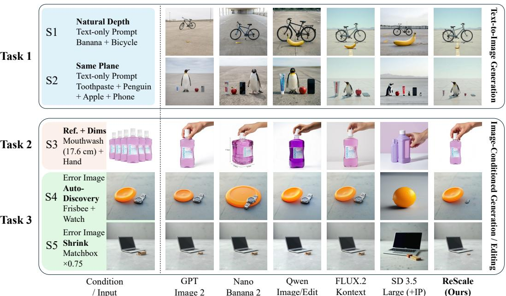  
Figure 1: Relative object scale remains a challenge for modern image generators. S1–S5: text-only common-object generation under natural depths or same-plane layouts, human-product generation from a product reference with metric dimensions, and scale-error correction from erroneous source images with either auto-discovery or a precise resize instruction. The general-purpose image generators/editors achieve high visual realism and yet often violate real-world size relationships, whereas Rescale produces more plausible relative scale. Zoom in for the best viewing.

## Abstract

Modern image generation and editing systems can produce photorealistic, promptaligned images, but still often render familiar objects at implausible relative sizes. To measure this failure mode, we introduce GenScale, a benchmark and evaluation protocol for real-world relative object scale in image generation and editing. GenScale contains 900 image-level entries and 1,643 pairwise anchor-target scale relations across common-object generation, human-product generation with metric dimensions, and scale correction from failed generations. We further design a human-calibrated ordinal judge for scalable pairwise scale evaluation. Last but not the least, we introduce Rescale, a model-agnostic post-processing agent for localized scale correction without modifying the source generator. Experiments reveal that state-of-the-art image generators and editors cannot reliably observe relative scale yet, while Rescale consistently improves scale plausibility across generated and edited images. Together, GenScale establishes relative object scale as a distinct, measurable, and actionable capability for image generation systems.

## 1 Introduction

Recent text-to-image (T2I) generation has advanced rapidly, with diffusion-based models [44], autoregressive generators [61], and transformer-based systems [7] achieving strong visual fidelity, stylistic diversity, and prompt adherence. However, these advances do not guarantee a basic requirement of physical realism: rendering objects at plausible relative scale. An image may look photorealistic and prompt-aligned while still placing familiar objects at mutually implausible sizes. This issue is increasingly important as generated images are used in advertising, product visualization, virtual character creation, and professional content production, where incorrect object proportions can immediately undermine visual credibility.

As illustrated in Fig. 1, the failure appears across text-only generation, referenceconditioned human–product generation, and scale correction, where models often preserve identity and visual realism while violating real-world relative scale. Fig. 2 further shows that these errors are systematic rather than anecdotal: small real-world objects are often rendered too large, while large objects are rendered too small. We refer to this recurring pattern as mean regression in generated object scale, a failure mode that affects visual realism, product visualization, synthetic data construction, and scale-aware editing.

Existing benchmarks evaluate related capabilities, including object presence, counting, and attribute binding [11], compositional prompt following [20], commonsense plausibility [9], physical reasoning [31], and spatial relation control [54]. Yet scale is usually subsumed under broader semantic, physical, or spa-

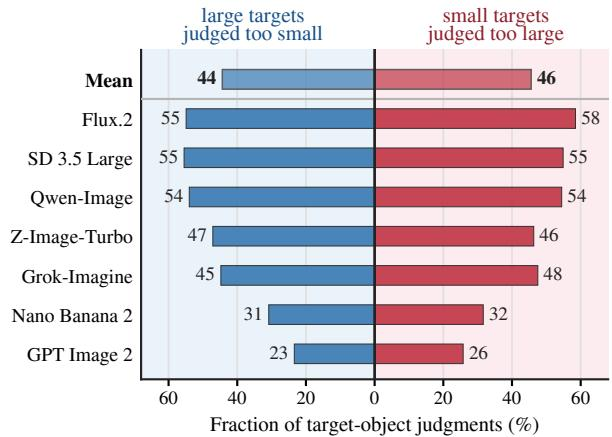  
Figure 2: Mean-regression errors on GenScale Task 1. Bars show two directional scale failures (400 tests) across generators: large real-world target objects are rendered too small, while small target objects are rendered too large. The consistent pattern indicates that current generators tend to compress object scale toward a typical visual size rather than preserving real-world size ratios.

tial reasoning rather than evaluated as a distinct object-level relation. The finer-grained question we study is relative object scale: when several objects appear in a single image, can a generative model render their size relationships in a way that faithfully reflects the real world? This question differs from general physical plausibility because a scene may satisfy coarse commonsense and layout constraints while still assigning an implausible size ratio to two objects.

This motivates GenScale, a benchmark for real-world relative object scale in image generation and editing. GenScale represents scale as a pairwise anchor-target relation grounded in external object-size metadata, and covers three regimes: implicit common-object size priors, human-product metric scale, and post-generation scale correction. It contains 900 image-level entries and 1,643 anchor-target relations, enabling dense pairwise evaluation while retaining image-level grouping for model comparison. Tab. 1 summarizes its coverage relative to representative prior benchmarks.

Evaluating these anchor-target relations requires more than measuring pixel-space ratios, since scale depends jointly on object identity, physical size, perspective, depth, occlusion, and placement. GenScale therefore uses a human-calibrated ordinal evaluation protocol rather than a raw pixel-ratio metric. We calibrate a Gemini-based judge against annotations from nine human raters, achieving strong agreement with human consensus.

We further introduce Rescale, a model-agnostic size-correction agent that uses structured scale information to execute localized, geometry-aware resizing and reinsertion. Ordinary users can use it to post-correct relative scale issues of any generated or edited images, and model developers may use it to enrich their training data (e.g., identifying hard examples using our calibrated judge, fixing their relative scale using Rescale, and mixing them back to the training set).

In the experiments, we benchmark state-of-the-art image generators and editors, revealing persistent relative-scale failures and showing that Rescale consistently improves scale plausibility across generated and edited images.

In summary, our contributions are four-fold:

Table 1: Comparison with representative related benchmarks. Prior benchmarks cover individual axes such as composition, physical plausibility, or spatial reasoning, whereas GenScale explicitly unifies object-object relative scale, human-product metric size, and post-generation scale correction.
<table><tr><td rowspan="2">Work</td><td colspan="3">Broad Capabilities</td><td colspan="3">Scale-focused Evaluation</td></tr><tr><td>Compos. Physical</td><td></td><td>Spatial</td><td></td><td>Obj.-obj. scale Human-prod. size</td><td>Correction</td></tr><tr><td>GenEval [11]</td><td>√</td><td>x</td><td>√</td><td>x</td><td>x</td><td>x</td></tr><tr><td>T2I-CompBench++ [20]</td><td>√</td><td>x</td><td>√</td><td>x</td><td>x</td><td>x</td></tr><tr><td>GenAI-Bench [26]</td><td>√</td><td>x</td><td>x</td><td>x</td><td>x</td><td>x</td></tr><tr><td>PhyBench [31]</td><td>x</td><td>√</td><td>x</td><td>x</td><td>x</td><td>x</td></tr><tr><td>GenSpace [54]</td><td>x</td><td>x</td><td>√</td><td>√</td><td>x</td><td>x</td></tr><tr><td>GenScale</td><td>√</td><td>√</td><td>√</td><td>√</td><td>√</td><td>√</td></tr></table>

• We introduce GenScale, the first benchmark dedicated to relative object scale in image generation and editing, covering common-object scale priors, human-product metric scale, and post-generation scale correction.

• We develop a human-calibrated ordinal evaluation protocol for scalable pairwise scale judgment, enabling reliable assessment of whether generated object-object proportions match realworld size relationships.

• We propose Rescale, a model-agnostic scale-correction agent that uses structured scale metadata to perform localized, geometry-aware editing without modifying the source generator.

• We benchmark state-of-the-art image generators and editors, showing that they cannot reliably observe relative scale, while Rescale consistently improves scale plausibility across the generated and edited images.

## 2 Related Work

## 2.1 Image Generative Models.

Text-to-image generation has progressed from diffusion and autoregressive models [17, 49, 42, 45, 44, 61] to transformer-based diffusion and rectified-flow systems [37, 7], substantially improving visual fidelity, prompt adherence, and scalability. Recent open and closed models, including FLUX.2 [3], Qwen-Image [56, 38], Z-Image [51], Seedream 4.5 [4], GPT Image 2 [34], and Nano Banana 2 [12], further extend these capabilities to high-fidelity generation, reference conditioning, and image editing. This progress motivates evaluating relative scale as a distinct capability rather than assuming it follows from overall visual quality.

## 2.2 Evaluation Benchmarks for Text-to-image Generation.

Early evaluation relied on distributional quality metrics such as FID and IS [16, 46], image-text similarity metrics such as CLIPScore [15], and curated prompt suites such as DrawBench and PartiPrompts [45, 61]. More targeted benchmarks evaluate compositional generalization [36], object presence, counting, color, position, and attribute binding [11], open-world composition and numeracy [19, 20], complex prompt following [26], reasoning [5], long-prompt control [24], factuality [21], and world-knowledge-informed semantic evaluation [33]. Automatic evaluation increasingly uses VLM-based protocols [18, 29, 26], but recent analyses show that off-the-shelf LMM judges require task-specific validation for nuanced generated-image judgments [63]. In contrast, GenScale uses a human-calibrated ordinal protocol for scale-specific pairwise judgment.

## 2.3 Spatial, Physical, and Commonsense Evaluation.

Relative object scale is related to spatial reasoning and physical commonsense, but existing benchmarks usually treat it as part of broader capabilities. Commonsense-T2I [9] evaluates everyday commonsense consistency, PhyBench [31] targets physical commonsense errors, and Generate Any Scene [10] evaluates structured object and relation control through scene graphs. Most closely related to our work, GenSpace [54] benchmarks spatially aware image generation through pose, spatial-relation, and metric-measurement tasks, while recent spatial-intelligence benchmarks emphasize object arrangement and layout consistency [55]. GenScale complements these benchmarks by isolating real-world relative object scale as a pairwise, physically grounded evaluation target, with additional coverage of human-product metric scale and post-generation scale correction.

## 3 GenScale: A Benchmark for Physically Grounded Relative Scale

GenScale evaluates physically grounded relative scale as a pairwise anchor-target relation with structured metadata, including object identities, physical reference lengths, expected 3D scale ratios, scenario labels, and product reference images when applicable. It contains 900 image-level entries and 1,643 pairwise scale relations across three tasks and five scenarios: common-object generation (Task 1 or T1), human-product scale realization (T2), and post-generation scale correction (T3). Each anchor-target pair is used as the atomic evaluation unit. Tab. 2 summarizes the benchmark taxonomy, and Fig. 3 illustrates the construction pipeline and input conditions detailed in the following.

Table 2: Overview of GenScale. GenScale evaluates physically grounded relative scale across implicit common-object priors (T1), explicit metric product scale (T2), and scale correction (T3). Image-level entries may contain multiple anchor-target pairs.
<table><tr><td>Task</td><td>Scenario</td><td>Images</td><td>Pairs</td><td>Capability tested</td></tr><tr><td>T1</td><td>S1: Natural Depth</td><td>200</td><td>570</td><td>Implicit scale priors under perspective</td></tr><tr><td>T1</td><td>S2: Same Plane</td><td>200</td><td>573</td><td>Implicit scale priors with depth controlled</td></tr><tr><td>T2</td><td>S3: Human-Product</td><td>300</td><td>300</td><td>Metric product scale with human anchors</td></tr><tr><td>T3</td><td>S4: Auto-Discovery</td><td>100</td><td>100</td><td>Diagnose scale error and choose resize</td></tr><tr><td>T3</td><td>S5: Precise Instruction</td><td>100</td><td>100</td><td>Execute exact numeric resize factor</td></tr><tr><td>Total</td><td></td><td>900</td><td>1,643</td><td>Generation, customization, and correction</td></tr></table>

## 3.1 Scale Metadata

GenScale is grounded in two types of physical-size metadata. For common-object scale reasoning (T1), we construct a category-level knowledge base from COCO [28] and LVIS [14], retaining visually identifiable categories with relatively stable physical extent and removing classes with large intra-class variation, ambiguous semantics, or non-rigid size, such as person, dog, bird, tree, bag, chair, and boat. This pool contains 97 non-human common objects and is used for Task 1 and the common-object correction cases in Task 3. For human-product scale (T2), we use product-level dimensions and reference images from Amazon Berkeley Objects (ABO) [6], together with human anchors including hand, head/face, foot/leg, and full body. Object and anchor dimensions are grounded in cross-domain sources, including anthropometric surveys [13], biological and food references [32, 52], standardized manufactured-object specifications [23, 22, 1], and traffic and sport-object specifications [8, 30]. For each entry, we store a characteristic length, an acceptable physical range when available, and the source used to ground the measurement. Check Sec. A for more details.

## 3.2 Benchmark Construction

As shown in Fig. 3, the input to image generators differs by tasks: An input in Task 1 consists of only a text prompt, Task 2 uses a product reference image plus a text prompt, and Task 3 pairs an erroneous source image with one of two edit prompts.

Task 1: Implicit Common-Object Scale. Task 1 is text-only image generation that tests whether models can infer relative sizes of familiar objects without explicit metric cues. Each image-level entry contains a prompt with two to four non-human objects sampled from the common-object pool; no object-specific numeric dimensions or reference images are given to the model. We retain object sets whose largest-to-smallest characteristic-length ratio lies in [4, 20], avoiding near-equal comparisons that are hard to judge and extreme ratios where layout constraints dominate. The generated image is then evaluated through all valid anchor-target pairs induced by the objects in the prompt.

Task 1 has two scenarios. In S1: Natural Depth, objects may appear with realistic perspective, mild occlusion, and depth ordering, reflecting ordinary generation settings where scale errors can be hidden by near-far placement. In S2: Same Plane, objects are constrained to approximately the same depth plane, reducing perspective ambiguity and making image-space proportions more directly reflect real-world scale ratios.

Task 2: Explicit Metric Scale in Human-Product Interaction. Task 2 is an image-conditioned human-product generation task. Each entry contains a product reference image and a prompt specifying the product’s metric dimensions and a size-conditioned human anchor, requiring the model to preserve product identity while rendering plausible scale relative to the human body. This tests product-level scale realization, where category priors are insufficient because visually similar commercial products can have different dimensions. Products shorter than 30 cm are paired with a hand, products between 30 and 60 cm with a head/face anchor, products between 60 and 100 cm with a foot/leg anchor, and products larger than 100 cm with a full-body anchor. Prompts require natural, use-consistent interaction and catalog-style visibility, so generators must translate metric dimensions into plausible human-object proportions rather than merely copy the reference appearance.

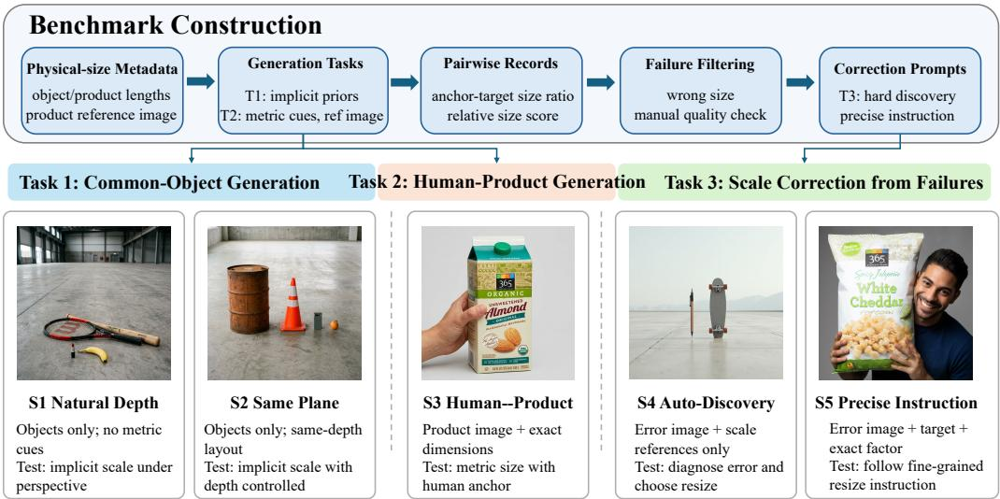  
Figure 3: GenScale benchmark construction. GenScale is built from physical-size metadata and product references, then instantiated as three tasks covering common-object generation, humanproduct metric scale, and scale correction. Task 3 converts non-plausible but editable outputs from Tasks 1 and 2 into S4 Auto-Discovery and S5 Precise Instruction, which separately test automatic scale-error diagnosis and exact numeric resize following.

Task 3: Scale Correction from Failed Generations. Task 3 converts failed generations from Tasks 1 and 2 into scale-aware image editing tasks. Each source case contains an erroneous image and one pairwise relation whose relative scale is judged implausible under the pairwise criterion introduced in Sec. 3.3. We use FLUX.2 [3] generations for common-object scenes and Qwen-Image [56] generations for human-product scenes, retaining only pairwise cases: two-object Task 1 images and one product-human relation in Task 2. The corresponding pairwise record provides the rendered object-size ratio and target physical ratio, from which we derive the fixed reference object, editable object, resize direction, and multiplicative scale factor. We remove images with missing or unidentifiable objects, duplicated or merged objects, severe artifacts, heavy occlusion or blur, and extreme correction factors that make localized editing ill-defined; this filtering only ensures that each retained source image contains a scorable and editable scale error.

Each of the 100 retained source images is expanded into two benchmark entries with the same erroneous image but different edit prompts. In S4: Hard Auto-Discovery, the model receives the erroneous image and only the information needed to judge scale, but not the editable object, resize direction, or scale factor; it must diagnose the error and choose a local correction. For common-object sources, this includes deciding which object should change, while for human-product sources the product is editable and the human body part is fixed. In S5: Precise Scale Instruction, the prompt directly gives the editable object, reference object, resize direction, and exact scale factor, isolating fine-grained numeric resize following from visual error diagnosis.

## 3.3 Human-Calibrated Scale Evaluation

GenScale evaluates relative scale at the object-pair level. A raw object-space ratio is insufficient because the same apparent ratio may be plausible or implausible depending on object identity, depth ordering, foreshortening, occlusion, and camera perspective. We therefore develop a human-calibrated ordinal protocol: Each generated image is decomposed into anchor–target pairs from the GenScale metadata; the anchor is treated as the reference, and the evaluator judges whether the target has a plausible real-world size relative to it.

Pairwise Ordinal Rubric. For each anchor-target pair, evaluators are shown the image, object names, and reference physical lengths. They assign a five-point ordinal score: 1/2 indicate that the target is severely/slightly undersized, 3 indicates physically plausible scale, and 4/5 indicate that it is slightly/severely oversized. Operationally, score 3 corresponds to an estimated scale error within approximately ±20%, scores 2/4 to errors between 20% and 60%, and scores 1/5 to errors larger than 60%. Evaluators are instructed to account for perspective, occlusion, partial visibility, and foreshortening. A pair is marked invalid only when reliable scale judgment is impossible, e.g., because an object is missing, merged, ambiguously duplicated, or too degraded to identify.

Table 3: Human Reliability and Gemini-Human Alignment. Exact and $\leq 1$ denote agreement on the five-point ordinal scale defined as exact match and difference by at most 1, respectively. MAE is the mean absolute ordinal deviation. r is Pearson correlation on 1-5 scores. QWK denotes quadratic-weighted kappa. Human rows report mean±std across nine annotators.
<table><tr><td>Evaluator / Reference</td><td>Split</td><td>Exact ↑</td><td>≤1↑</td><td>MAE↓</td><td>r↑</td><td>QWK↑</td></tr><tr><td>Human vs. Aggregate Consensus</td><td>T1+T2</td><td> $6 5 . 1 { \pm } 7 . 0 $ </td><td>94.0±3.2</td><td>0.413±0.099</td><td>0.764±0.076</td><td>0.754±0.077</td></tr><tr><td>Human vs. LOO Consensus</td><td>T1+T2</td><td>58.0±6.6</td><td>93.3±3.0</td><td>0.491±0.093</td><td>0.719±0.069</td><td>0.706±0.070</td></tr><tr><td>Gemini vs. Human Consensus</td><td>T1+T2</td><td>63.95</td><td>97.15</td><td>0.389</td><td>0.833</td><td>0.823</td></tr><tr><td>Gemini vs. Human Consensus</td><td>T1</td><td>61.83</td><td>96.49</td><td>0.417</td><td>0.847</td><td>0.837</td></tr><tr><td>Gemini vs. Human Consensus</td><td>T2</td><td>73.00</td><td>100.00</td><td>0.270</td><td>0.470</td><td>0.468</td></tr></table>

Human Consensus. We collect annotations from nine human raters on a calibration split sampled from Tasks 1 and 2, covering natural-depth common-object scenes, same-plane common-object scenes, and human-product scenes. After aligning completed annotations and retaining visible, scorable pairs, the calibration set contains 285 images and 527 anchor-target pairs. For each pair, we define human consensus as the modal score, with ties broken by the median. As shown in Tab. 3, individual raters agree strongly with the aggregate consensus, and the leave-one-rater-out comparison remains stable, indicating that the consensus is not dominated by any single annotator.

Automatic Judge Calibration. Since exhaustive human evaluation is impractical for largescale model comparison, we calibrate a Geminibased VLM judge against the human consensus. The judge receives the same core evidence as human raters—the generated image, anchor and target names, physical reference lengths, the expected 3D length ratio, and the five-point rubric. The generation prompt, when provided, is used only to disambiguate intended objects or layout, not as evidence that the rendered scale is correct. We use scenario-specific judge prompts, with Task 3 inheriting the judge type of its source case, and provide the full prompts in Sec. B. Before scoring scale, we first check whether the required objects are visible, identifiable, and unambiguous, following the invalid-pair rule above; failed pairs are omitted from valid-pair counts and scale metrics, whereas visible but incorrectly scaled pairs are still scored. For each remaining pair, we query the judge five times and aggregate scores by majority vote, using the median when no unique mode exists, which reduces sensitivity to isolated outlier judgments. Tab. 3 shows that the calibrated judge reaches

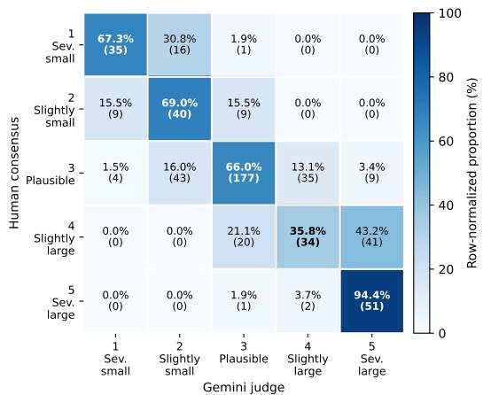  
Figure 4: Disagreement structure of the calibrated Gemini judge. The row-normalized confusion matrix shows that Gemini-human disagreements are concentrated near the diagonal, with only 2.85% of pairs differing by two or more score levels and no coarse under-to-over or over-to-under sign-flip errors.

inter-human-level alignment with the consensus, with especially strong within-one agreement and QWK on the full calibration split. Fig. 4 further shows that remaining disagreements are ordinally local rather than directionally reversed. The lower correlation metrics on Task 2 mainly reflect label concentration near the plausible-scale score rather than systematic judge failures. We therefore use the calibrated Gemini judge as the default evaluator for large-scale GenScale comparisons and report valid image and pair counts for all systems.

## 4 Rescale: Agentic Relative-Scale Correction

The GenScale formulation makes relative-scale errors actionable beyond evaluation: We introduce Rescale, a model-agnostic post-processing pipeline that repairs scale inconsistencies in generated images without modifying the source generator. Given an image together with object identities and physical-size references from the prompt or benchmark metadata, Rescale changes only the implausibly scaled objects while preserving identity, layout, lighting, and background.

At inference time, a multimodal agent grounds relevant objects and converts pairwise scale evidence into an edit plan. For common-object scenes (T1), it aggregates inconsistent anchor-target relations into a conservative object-level plan and edits over multiple rounds; for human-product scenes (T2), the product is the only editable target while the human body part is fixed. For each edit, the agent selects a target $o _ { t }$ and anchor $o _ { a } ,$ , refines the target box $b _ { t } .$ , and estimates a resize factor α by comparing the apparent target-anchor ratio with the plausible real-world ratio under perspective, depth, visibility, contact, boundary, and collision constraints. The plan $\pi = \{ o _ { t } , o _ { a } , b _ { t } , \alpha , p \}$ specifies the target, anchor, box, resize factor, and contact-preserving anchor point p; if the multimodal agent detects no reliable scale inconsistency or finds the edit unsafe, Rescale returns no edit.

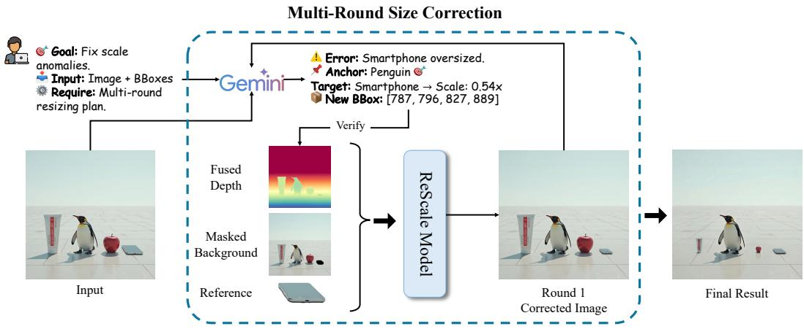  
Figure 5: Agentic multi-round inference in Rescale. Given a generated image and object/scale metadata, the agent diagnoses a scale anomaly, selects the target and anchor, predicts a resize factor and contact-preserving anchor point, and executes localized correction through extraction, background completion, mask/depth adjustment, and modular insertion. The edited result is verified for additional correction rounds when needed.

Table 4: Task 1: Common-Object Relative Scale. Results are reported for S1, S2, and both. Err. is scale error, mean $| s - 3 | ;$ Plaus. is the percentage of plausible relations (score $s = 3 ) .$ ; MR is mean-regression error, where small targets are judged too large, or vice versa.
<table><tr><td rowspan="3">Model</td><td colspan="3">S1</td><td colspan="3">S2</td><td colspan="3">S1 + S2</td></tr><tr><td>Err. ↓</td><td>Plaus. ↑</td><td>MR↓</td><td>Err. ↓</td><td>Plaus. ↑</td><td>MR↓</td><td>Err. ↓</td><td>Plaus. ↑</td><td>MR↓</td></tr><tr><td>Nano Banana 2 [12]</td><td>0.51</td><td>65.1</td><td>15.8</td><td>0.69</td><td>47.8</td><td>48.1</td><td>0.60</td><td>56.5</td><td>31.8</td></tr><tr><td>GPT-Image-2 [34]</td><td>0.78</td><td>51.1</td><td>12.2</td><td>0.63</td><td>52.8</td><td>36.0</td><td>0.71</td><td>51.9</td><td>24.1</td></tr><tr><td>Z-Image-Turbo [51]</td><td>0.64</td><td>53.2</td><td>36.2</td><td>0.88</td><td>38.1</td><td>55.9</td><td>0.75</td><td>46.1</td><td>45.3</td></tr><tr><td>Grok Imagine [58]</td><td>0.60</td><td>58.8</td><td>27.0</td><td>0.98</td><td>34.7</td><td>61.2</td><td>0.79</td><td>46.7</td><td>44.2</td></tr><tr><td>Qwen-Imāge 2512 [38]</td><td>0.70</td><td>53.3</td><td>37.7</td><td>1.10</td><td>27.2</td><td>67.6</td><td>0.90</td><td>40.0</td><td>52.9</td></tr><tr><td>FLUX.2 [3]</td><td>0.84</td><td>44.9</td><td>40.1</td><td>1.20</td><td>23.4</td><td>69.5</td><td>1.03</td><td>33.9</td><td>55.1</td></tr><tr><td>SD3.5-Large [50]</td><td>0.96</td><td>36.6</td><td>47.0</td><td>1.18</td><td>24.9</td><td>70.0</td><td>1.07</td><td>31.1</td><td>57.8</td></tr></table>

The planned edit is executed by a modularized, local insertion pipeline shown in Figure 5. We segment the target with SAM 2 [43], extract it as an identity reference, remove the original instance to obtain a completed background, construct an enlarged edit mask around the resized box, and estimate monocular depth with DepthAnythingV2 [59]. These steps produce backend-agnostic conditions, including the reference crop, completed background, resized mask, text instruction, and, when supported, fused depth. Our default backend is InsertAnything [48], but it can be replaced by other insertion or inpainting editors. After each edit, the agent verifies whether an obvious scale error remains and applies another round of editing only when needed. Sec. C describes Rescale and some ablation studies in detail.

## 5 Evaluation Results

## 5.1 Benchmarking State-of-the-Art Models on GenScale

We benchmark representative open- and closed-source generative/editing models using the calibrated judge from Sec. 3.3. All metrics are computed on valid pair-level judgments after the visual-quality filter (see Sec. 3.3), and the scale metrics measure performance on those valid judgments: For score $s \in \{ 1 , \ldots , 5 \}$ , with 3 denoting the plausible scale, Scale error is mean $| s - 3 |$

Task 1: Common-Object Relative Scale. Tab. 4 shows that the common-object relative scale remains far from solved: even the top-performing model, Nano Banana 2 [41], reaches only 56.5% plausible score. The dominant error is mean regression (from score $s = 3 )$ , where small objects are enlarged and large objects are shrunk. The gap between S1 (natural depth) and S2 (same plane)

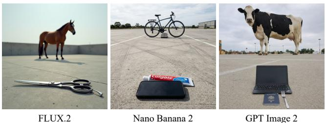

<table><tr><td>Size bucket</td><td>Objects</td><td>Depth rank ↑</td></tr><tr><td>Smallest</td><td>1,367</td><td>0.175</td></tr><tr><td>Middle Largest</td><td>1,039 1,362</td><td>0.451 0.863</td></tr><tr><td>Smaller closer</td><td></td><td>79.2%</td></tr><tr><td>ρ(log l, depth)</td><td></td><td>0.558</td></tr></table>

Figure 6: Depth-mediated scale compression in Task 1 S1. S1 examples show that image generators often place smaller objects closer and larger objects farther away. In the table, we group objects according to real-world size l and then computes their depth ranks in images averaged per group.

Table 5: Task 2: Human-Anchored Product Scale. Each prompt contains one product-human scale relation. Scale error is mean |s − 3|; Plausible denotes score s = 3; Severe denotes scores of 1 or 5. Full error breakdown, including too-small and too-large rates, is reported in Sec. D
<table><tr><td>Model</td><td>Valid img. / pairs</td><td>Scale error ↓</td><td>Plausible (%) ↑</td><td>Severe (%) ↓</td></tr><tr><td>GPT-Image-2 [34]</td><td>294 / 294</td><td>0.231</td><td>78.9</td><td>2.0</td></tr><tr><td>Nano Banana 2 [12]</td><td>295 / 295</td><td>0.268</td><td>75.6</td><td>2.4</td></tr><tr><td>Seedream v4.5 [4]</td><td>295 / 295</td><td>0.302</td><td>74.9</td><td>5.1</td></tr><tr><td>Qwen-Image-Edit-2511 [39]</td><td>297/297</td><td>0.327</td><td>71.0</td><td>3.7</td></tr><tr><td>FLUX.1 Kontext-dev [2]</td><td>291 / 291</td><td>0.423</td><td>63.2</td><td>5.5</td></tr><tr><td>SD3.5-Large + IP-Adapter [50, 60]</td><td>270 /270</td><td>0.600</td><td>52.6</td><td>12.6</td></tr></table>

suggests that the natural depth can hide the relative scale errors: models score higher in S1 thanks to perspective and depth ordering of objects of various sizes, whereas S2 exposes object-size errors directly on the same image plane. Fig. 6 supports this interpretation, showing that generators tend to place smaller objects closer and larger objects farther away. Thus, current generators often absorb unrealistic scale ratios through layout choices instead of preserving real-world object-size relations.

Task 2: Human-Anchored Product Scale. Tab. 5 indicates that explicit metric cues and human anchors make scale realization easier, but not solved. Most models achieve higher plausible rates than in Task 1, but the errors are strongly asymmetric: Products are more often enlarged than shrunk. This product-magnification bias can practically hinder the image generators’ applications in advertising, virtual reality, and others.

Task 3: Scale-Error Correction. Tab. 6 shows that general-purpose image editors can reduce scale errors on failed generations to very limited degrees. The S4-S5 split reveals a clear diagnosisexecution gap: models perform much better when given the target object, reference object, resize direction, and scale factor, but they are substantially weaker when they must discover the scale error and choose the correction autonomously. Hence, these general-purpose image editors can follow explicit localized resize instructions more reliably than they can infer physically implausible scale.

Overall, GenScale exposes three distinct failure modes: mean regression in common-object generation, product magnification in human-product generation, and weak autonomous diagnosis in scale correction. These results support the central claim that relative scale is not subsumed by visual fidelity or prompt adherence, but remains a separate unsolved capability.

## 5.2 Rescale Correction Results

We evaluate Rescale on image pairs before and after applying Rescale using the calibrated GenScale judge. Tabs. 7 and 8 show that Rescale reduces scale errors for every Task 1 and Task 2 source model, suggesting that common-object mean-regression and human-product metric-scale errors are often locally correctable. On Task 3, Rescale yields the largest gain over the same correction inputs, showing that explicit scale diagnosis and structured local editing are more effective than generic image editing. Overall, GenScale’s physical-size structure is not only evaluative but actionable, though autonomous scale repair remains imperfect.

Table 6: Task 3: Scale-Error Correction. Results are reported for S4, S5, and both. S4 requires automatic error discovery; S5 provides the target object, reference object, correction direction, and scale factor. Gain is the matched-pair reduction in scale error relative to the before-edit image. B / W denotes the number of pairs with better / worse scale score after editing. Full results in Sec. D.4.
<table><tr><td rowspan="2">Model</td><td colspan="3">S4</td><td colspan="3">S5</td><td colspan="5">S4 + S5</td></tr><tr><td>Err. ↓</td><td>Plaus. ↑</td><td>Gain ↑</td><td>Err. ↓</td><td>Plaus. ↑</td><td>Gain ↑</td><td>Valid</td><td>Err. ↓</td><td>Plaus. ↑</td><td>Gain ↑</td><td>B/W</td></tr><tr><td>Before edit</td><td>1.27</td><td>20.4</td><td></td><td>1.27</td><td>20.4</td><td></td><td>200 / 200</td><td>1.27</td><td>20.4</td><td></td><td></td></tr><tr><td>GPT-Image-2</td><td>0.96</td><td>40.2</td><td>+0.33</td><td>0.41</td><td>66.3</td><td>+0.87</td><td>195 / 195</td><td>0.68</td><td>53.3</td><td>+0.60</td><td>91 / 9</td></tr><tr><td>Nano Banana 2</td><td>1.03</td><td>31.3</td><td>+0.24</td><td>0.93</td><td>33.7</td><td>+0.34</td><td>197 / 197</td><td>0.98</td><td>32.5</td><td>+0.29</td><td>55 / 11</td></tr><tr><td>FLUX.1 Kontext-dev</td><td>1.29</td><td>21.2</td><td>-0.02</td><td>0.96</td><td>36.2</td><td>+0.28</td><td>193 / 193</td><td>1.13</td><td>28.5</td><td>+0.13</td><td>35 / 16</td></tr><tr><td>Qwen-Image-Edit-2511</td><td>1.25</td><td>23.2</td><td>+0.02</td><td>1.00</td><td>34.1</td><td>+0.25</td><td>190 / 190</td><td>1.13</td><td>28.4</td><td>+0.13</td><td>32/9</td></tr><tr><td>Seedream v4.5</td><td>1.17</td><td>28.0</td><td>+0.10</td><td>1.10</td><td>35.4</td><td>+0.20</td><td>196 / 196</td><td>1.14</td><td>31.6</td><td>+0.15</td><td>43 / 17</td></tr><tr><td>SD3.5-Large + IP-Adapter†</td><td>0.93</td><td>40.0</td><td>-0.20</td><td>1.31</td><td>22.0</td><td>-0.16</td><td>74/74†</td><td>1.23</td><td>25.7</td><td>-0.17</td><td>10 / 19</td></tr></table>

† SD3.5-Large has much lower scored coverage than the others, especially in S4, so its results should be interpreted cautiously.

Table 7: Task 1 correction on common-object generations. Metrics are computed on matched scorable pairs before and after Rescale correction. Short names are used for compactness.
<table><tr><td>Metric</td><td>Gemini</td><td>GPT</td><td>Z-Image</td><td>Grok</td><td>Qwen</td><td>FLUX</td><td>SD3.5</td></tr><tr><td>Error before ↓</td><td>0.592</td><td>0.692</td><td>0.759</td><td>0.785</td><td>0.916</td><td>1.025</td><td>1.041</td></tr><tr><td>Error after ↓</td><td>0.383</td><td>0.445</td><td>0.431</td><td>0.450</td><td>0.423</td><td>0.529</td><td>0.635</td></tr><tr><td>Gain by Rescale ↑</td><td>+0.208</td><td>+0.246</td><td>+0.328</td><td>+0.335</td><td>+0.493</td><td>+0.495</td><td>+0.406</td></tr></table>

Table 8: Correction results on image-conditioned generation/editing tasks. Task 2 reports Rescale correction on human-product generations from each source model; Task 3 compares Rescale with general-purpose editors on the correction benchmark.
<table><tr><td>Task</td><td>Metric</td><td>Gemini</td><td>GPT</td><td>Seedream</td><td>Qwen</td><td>FLUX</td><td>SD3.5</td><td>Rescale</td></tr><tr><td>Task 2</td><td>Error before ↓</td><td>0.261</td><td>0.231</td><td>0.295</td><td>0.306</td><td>0.406</td><td>0.565</td><td>一</td></tr><tr><td></td><td>Error after ↓</td><td>0.086</td><td>0.090</td><td>0.168</td><td>0.144</td><td>0.228</td><td>0.256</td><td>一</td></tr><tr><td></td><td>Gain by Rescale ↑</td><td>+0.175</td><td>+0.141</td><td>+0.126</td><td>+0.162</td><td>+0.178</td><td>+0.309</td><td>一</td></tr><tr><td>Task 3</td><td>Error before ↓</td><td>1.263</td><td>1.275</td><td>1.280</td><td>1.259</td><td>1.247</td><td>1.042†</td><td>1.258</td></tr><tr><td></td><td>Error after ↓</td><td>0.974</td><td>0.674</td><td>1.130</td><td>1.127</td><td>1.121</td><td>1.208</td><td>0.548</td></tr><tr><td></td><td>Gain ↑</td><td>+0.289</td><td>+0.601</td><td>+0.150</td><td>+0.132</td><td>+0.126</td><td>-0.167</td><td>+0.710</td></tr></table>

†SD3.5 has substantially lower matched coverage on Task 3, so its before-edit error is not directly comparable to other editors.

Identity and Visual-quality Preservation. The ideal scale correction should not trade geometric plausibility for image degradation, we evaluate paired pre- and post-correction images in Tab. 9. We use CLIP-I [40] and DINO [35] for visual/identity consistency, SSIM [53] and SSIM-HF [53, 25] for image-level and high-frequency preservation, and LAION-Aes [47] and Q-Align-IQ [57] for no-reference visual quality. CLIP-I, DINO, SSIM, and SSIM-HF remain high despite the intended object-size change, which naturally lower pairwise similarity because scale itself is part of the visual semantics. Meanwhile, LAION-Aes and Q-Align-IQ change by at most 1.7% and 1.9%, respectively, indicating that Rescale improves relative-scale plausibility with negligible degradation in image quality and aesthetics. Bootstrap confidence intervals are reported in Sec. D

## 6 Conclusion

In summary, we introduced GenScale, a benchmark for relative object scale in image generation and editing, covering common-object scale priors, human-product metric scale, and scale correction from failed generations. We developed a human-calibrated ordinal evaluator that grounds pairwise scale judgments in object-size metadata, enabling scalable assessment beyond raw pixel ratios. We further introduced Rescale, a model-agnostic post-generation correction agent that uses structured scale information for localized geometry-aware editing. Experiments on contemporary open and closed models show that relative scale remains unreliable, while Rescale consistently improves scale plausibility. Together, these results establish relative object scale as a distinct, measurable, and actionable dimension of physical realism.

Limitations and Future Work. GenScale targets relative object scale rather than general physical or spatial realism, and its knowledge base covers visually identifiable categories with stable physical dimensions. It therefore excludes deformable, fine-grained, or context-dependent objects, and needs broader validation across viewpoints, occlusions, domains, and future model families. Rescale assumes scale-relevant objects are visible and locally editable; future work could incorporate metric size priors or scale-aware preference learning directly into generative models.

Table 9: Identity preservation and visual quality after correction. Higher values indicate better preservation or quality; percentages denote relative change after correction.
<table><tr><td>Setting</td><td>CLIP-I↑</td><td>DINO↑</td><td>SSIM ↑</td><td>SSIM-HF ↑</td><td>LAION-Aes (before / after)↑</td><td>Q-Align-IQ (before / after ) ↑</td></tr><tr><td>Task 1</td><td>94.8</td><td>90.2</td><td>88.8</td><td>92.4</td><td> $5 . 8 3 / 5 . 7 3 ( - 1 . 7 \% )$ </td><td> $4 . 7 4 / 4 . 6 7 ( - 1 . 5 \% )$ </td></tr><tr><td>Task 2</td><td>92.4</td><td>84.5</td><td>73.5</td><td>82.1</td><td> $4 . 9 9 / 4 . 9 6 ( - 0 . 8 \% )$ </td><td> $4 . 8 8 / 4 . 8 8 ( 0 . 0 \% )$ </td></tr><tr><td>Task 3</td><td>95.6</td><td>88.9</td><td>89.3</td><td>92.9</td><td>5.83 / 5.73 (−1.2%)</td><td> $4 . 7 6 / 4 . 6 7 ( - 1 . 9 \% )$ </td></tr></table>

## References

[1] ANSI C18.1M Part 1-2021 (2021). American national standard for portable primary cells and batteries with aqueous electrolyte — general and specifications. American national standard, National Electrical Manufacturers Association. 4, 14, 15

[2] Black Forest Labs (2025). FLUX.1 Kontext. https://bfl.ai/models/flux-kontext. Accessed: 2026-05-02. 8

[3] Black Forest Labs (2026). FLUX.2: Next Generation Image Generation. https://bfl.ai/models/ flux-2. Accessed: 2026-05-02. 3, 5, 7

[4] ByteDance Seed Team (2025). Seedream 4.5. https://seed.bytedance.com/en/seedream4\_5. Accessed: 2026-05-02. 3, 8

[5] Chen, K., Lin, Z., Xu, Z., Shen, Y., Yao, Y., Rimchala, J., Zhang, J., and Huang, L. (2025). R2I-bench: Benchmarking reasoning-driven text-to-image generation. In Proceedings of the 2025 Conference on Empirical Methods in Natural Language Processing, pages 12595–12630, Suzhou, China. Association for Computational Linguistics. 3

[6] Collins, J., Goel, S., Deng, K., Luthra, A., Xu, L., Gundogdu, E., Zhang, X., Tomas F, V., Dideriksen, T., Dourado, H., et al. (2022). Abo: Dataset and benchmarks for real-world 3d object understanding. In Proceedings of the IEEE/CVF Conference on Computer Vision and Pattern Recognition, pages 21126–21136. 4, 14, 15, 18, 22

[7] Esser, P., Kulal, S., Blattmann, A., Entezari, R., Müller, J., Saini, H., Levi, Y., Lorenz, D., Sauer, A., Boesel, F., Podell, D., Dockhorn, T., English, Z., and Rombach, R. (2024). Scaling rectified flow transformers for high-resolution image synthesis. In Proceedings of the 41st International Conference on Machine Learning, pages 12606–12633. 2, 3

[8] Federal Highway Administration (2023). Manual on Uniform Traffic Control Devices for Streets and Highways. U.S. Department of Transportation, 11th edition. Accessed: 2026-05-03. 4, 14, 15

[9] Fu, X., He, M., Lu, Y., Wang, W. Y., and Roth, D. (2024). Commonsense-t2i challenge: Can text-to-image generation models understand commonsense? arXiv preprint arXiv:2406.07546. 2, 3

[10] Gao, Z., Huang, W., Zhang, J., Kembhavi, A., and Krishna, R. (2024). Generate any scene: Evaluating and improving text-to-vision generation with scene graph programming. arXiv preprint arXiv:2412.08221. 3

[11] Ghosh, D., Zhang, Y., Mastorakis, S., Timoshenko, A., Torralba, A., and Gan, C. (2023). Geneval: An object-focused framework for evaluating text-to-image alignment. Advances in Neural Information Processing Systems, 36, 52132–52152. 2, 3

[12] Google (2026). Gemini 3 Pro Image Preview. https://ai.google.dev/gemini-api/docs/models/ gemini-3-pro-image-preview. Accessed: 2026-05-02. 3, 7, 8

[13] Gordon, C. C., Blackwell, C. L., Bradtmiller, B., Parham, J. L., Barrientos, P., Paquette, S. P., Corner, B. D., Carson, J. M., Venezia, J. C., Rockwell, B. M., Mucher, M., and Kristensen, S. (2014). 2012 anthropometric survey of u.s. army personnel: Methods and summary statistics. Technical Report NATICK/TR-15/007, U.S. Army Natick Soldier Research, Development and Engineering Center. 4, 14, 15, 16, 18

[14] Gupta, A., Dollar, P., and Girshick, R. (2019). Lvis: A dataset for large vocabulary instance segmentation. In IEEE Conf. Comput. Vis. Pattern Recog. 4, 14

[15] Hessel, J., Holtzman, A., Forbes, M., Bras, R. L., and Choi, Y. (2021). Clipscore: A reference-free evaluation metric for image captioning. In Proceedings of the 2021 Conference on Empirical Methods in Natural Language Processing, pages 7514–7528. 3

[16] Heusel, M., Ramsauer, H., Unterthiner, T., Nessler, B., and Hochreiter, S. (2017). Gans trained by a two time-scale update rule converge to a local nash equilibrium. In Advances in Neural Information Processing Systems, volume 30. 3

[17] Ho, J., Jain, A., and Abbeel, P. (2020). Denoising diffusion probabilistic models. In H. Larochelle, M. Ranzato, R. Hadsell, M. Balcan, and H. Lin, editors, Adv. Neural Inform. Process. Syst., volume 33, pages 6840–6851. 3

[18] Hu, Y., Liu, B., Kasai, J., Wang, Y., Ostendorf, M., Krishna, R., and Smith, N. A. (2023). Tifa: Accurate and interpretable text-to-image faithfulness evaluation with question answering. In Proceedings of the IEEE/CVF International Conference on Computer Vision, pages 20406–20417. 3

[19] Huang, K., Sun, K., Xie, E., Li, Z., and Liu, X. (2023). T2i-compbench: A comprehensive benchmark for open-world compositional text-to-image generation. Advances in Neural Information Processing Systems, 36, 78723–78747. 3

[20] Huang, K., Duan, C., Sun, K., Xie, E., Li, Z., and Liu, X. (2025a). T2i-compbench++: An enhanced and comprehensive benchmark for compositional text-to-image generation. IEEE Transactions on Pattern Analysis and Machine Intelligence, pages 1–17. 2, 3

[21] Huang, Z., He, W., Long, Q., Wang, Y., Li, H., Yu, Z., Shu, F., Dai, W., Jiang, H., Wu, F., and Gan, L. (2025b). T2I-FactualBench: Benchmarking the factuality of text-to-image models with knowledge-intensive concepts. In Proceedings of the 63rd Annual Meeting of the Association for Computational Linguistics (Volume 1: Long Papers), pages 27501–27524, Vienna, Austria. Association for Computational Linguistics. 3

[22] ISO 216:2007 (2007). Writing paper and certain classes of printed matter — trimmed sizes — a and b series, and indication of machine direction. Standard, International Organization for Standardization. 4, 14, 15

[23] ISO/IEC 7810:2019 (2019). Identification cards — physical characteristics. Standard, International Organization for Standardization. 4, 14, 15

[24] Jiao, Q., Chen, D., Huang, Y., Lin, X., Shen, Y., and Li, Y. (2025). Detailmaster: Can your text-to-image model handle long prompts? In Advances in Neural Information Processing Systems. 3

[25] Kanopoulos, N., Vasanthavada, N., and Baker, R. L. (1988). Design of an image edge detection filter using the sobel operator. IEEE Journal ofsolid-state circuits. 9

[26] Li, B., Lin, Z., Pathak, D., Li, J., Fei, Y., Wu, K., Ling, T., Xia, X., Zhang, P., Neubig, G., and Ramanan, D. (2024a). Genai-bench: Evaluating and improving compositional text-to-visual generation. arXiv preprint arXiv:2406.13743. 3

[27] Li, L., Gong, K., Li, W.-H., Dai, X., Chen, T., Yuan, X., and Yue, X. (2024b). Bifröst: 3d-aware image compositing with language instructions. In Advances in Neural Information Processing Systems, volume 37. 31

[28] Lin, T.-Y., Maire, M., Belongie, S., Hays, J., Perona, P., Ramanan, D., Dollár, P., and Zitnick, C. L. (2014). Microsoft coco: Common objects in context. In Eur. Conf. Comput. Vis., pages 740–755. 4, 14

[29] Lin, Z., Pathak, D., Li, B., Li, J., Xia, X., Neubig, G., Zhang, P., and Ramanan, D. (2024). Evaluating text-to-visual generation with image-to-text generation. arXiv preprint arXiv:2404.01291. 3

[30] Major League Baseball (2026). Official Baseball Rules. Accessed: 2026-05-03. 4, 14

[31] Meng, F., Shao, W., Luo, L., Wang, Y., Chen, Y., Lu, Q., Yang, Y., Yang, T., Zhang, K., Qiao, Y., and Luo, P. (2024). Phybench: A physical commonsense benchmark for evaluating text-to-image models. arXiv preprint arXiv:2406.11802. 2, 3

[32] Myers, P., Espinosa, R., Parr, C. S., Jones, T., Hammond, G. S., and Dewey, T. A. (2026). Animal diversity web. Online resource, University of Michigan Museum of Zoology. Accessed: 2026-04-20. 4, 14, 15

[33] Niu, Y., Ning, M., Zheng, M., Lin, B., Jin, P., Liao, J., Ning, K., Zhu, B., and Yuan, L. (2025). Wise: A world knowledge-informed semantic evaluation for text-to-image generation. arXiv preprint arXiv:2503.07265. 3

[34] OpenAI (2026). GPT Image 2 Model. https://developers.openai.com/api/docs/models/ gpt-image-2. Accessed: 2026-05-02. 3, 7, 8

[35] Oquab, M., Darcet, T., Moutakanni, T., Vo, H. V., Szafraniec, M., Khalidov, V., Fernandez, P., Haziza, D., Massa, F., El-Nouby, A., Howes, R., Huang, P.-Y., Xu, H., Sharma, V., Li, S.-W., Galuba, W., Rabbat, M., Assran, M., Ballas, N., Synnaeve, G., Misra, I., Jegou, H., Mairal, J., Labatut, P., Joulin, A., and Bojanowski, P. (2023). Dinov2: Learning robust visual features without supervision. 9

[36] Park, D. H., Azadi, S., Liu, X., Darrell, T., and Rohrbach, A. (2021). Benchmark for compositional text-to-image synthesis. In Proceedings ofthe Neural Information Processing Systems Track on Datasets and Benchmarks, volume 1. 3

[37] Peebles, W. and Xie, S. (2023). Scalable diffusion models with transformers. In Proceedings of the IEEE/CVF International Conference on Computer Vision, pages 4195–4205. 3

[38] Qwen Team (2025a). Qwen-Image-2512. https://qwen.ai/blog?id=qwen-image-2512. Accessed: 2026-05-02. 3, 7

[39] Qwen Team (2025b). Qwen-image-edit-2511. https://huggingface.co/Qwen/ Qwen-Image-Edit-2511. Official model card. Accessed: 2026-04-20. 8

[40] Radford, A., Kim, J. W., Hallacy, C., Ramesh, A., Goh, G., Agarwal, S., Sastry, G., Askell, A., Mishkin, P., Clark, J., et al. (2021). Learning transferable visual models from natural language supervision. In Int. Conf. Machine. Learning. 9

[41] Raisinghani, N. (2026). Nano banana 2: Combining pro capabilities with lightning-fast speed. https:// blog.google/innovation-and-ai/technology/ai/nano-banana-2/. Google Blog. Accessed: 2026- 04-20. 7

[42] Ramesh, A., Dhariwal, P., Nichol, A., Chu, C., and Chen, M. (2022). Hierarchical text-conditional image generation with clip latents. In arXiv preprint arXiv:2204.06125. 3

[43] Ravi, N., Gabeur, V., Hu, Y.-T., Hu, R., Ryali, C., Ma, T., Khedr, H., Rädle, R., Rolland, C., Gustafson, L., Mintun, E., Pan, J., Alwala, K. V., Carion, N., Wu, C.-Y., Girshick, R., Dollár, P., and Feichtenhofer, C. (2024). Sam 2: Segment anything in images and videos. arXiv preprint arXiv:2408.00714. 7, 29

[44] Rombach, R., Blattmann, A., Lorenz, D., Esser, P., and Ommer, B. (2022). High-resolution image synthesis with latent diffusion models. In Proceedings of the IEEE/CVF Conference on Computer Vision and Pattern Recognition, pages 10684–10695. 2, 3

[45] Saharia, C., Chan, W., Saxena, S., Li, L., Whang, J., Denton, E., Ghasemipour, S. K. S., Ayan, B. K., Mahdavi, S., Lopes, R. G., et al. (2022). Photorealistic text-to-image diffusion models with deep language understanding. Advances in Neural Information Processing Systems, 35, 36479–36494. 3

[46] Salimans, T., Goodfellow, I., Zaremba, W., Cheung, V., Radford, A., and Chen, X. (2016). Improved techniques for training gans. In Advances in Neural Information Processing Systems, volume 29. 3

[47] Schuhmann, C. (2022). LAION-Aesthetics. LAION Blog. Accessed: 2026-05-05. 9

[48] Song, W., Jiang, H., Yang, Z., Quan, R., and Yang, Y. (2025). Insert anything: Image insertion via in-context editing in dit. arXiv preprint arXiv:2504.15009. 7, 31

[49] Song, Y., Sohl-Dickstein, J., Kingma, D. P., Kumar, A., Ermon, S., and Poole, B. (2021). Score-based generative modeling through stochastic differential equations. In Int. Conf. Learn. Represent. 3

[50] Stability AI (2024). Introducing Stable Diffusion 3.5. https://stability.ai/news-updates/ introducing-stable-diffusion-3-5. Accessed: 2026-05-02. 7, 8

[51] Tongyi-MAI (2025). Z-Image. https://github.com/Tongyi-MAI/Z-Image. Accessed: 2026-05-02. 3, 7

[52] U.S. Department of Agriculture, Agricultural Research Service, Beltsville Human Nutrition Research Center (2026). Fooddata central. https://fdc.nal.usda.gov/. Accessed: 2026-05-03. 4, 14, 15

[53] Wang, Z., Bovik, A. C., Sheikh, H. R., and Simoncelli, E. P. (2004). Image quality assessment: From error visibility to structural similarity. IEEE Trans. Image Process., 13(4), 600–612. 9

[54] Wang, Z., Xu, J., Zhang, Z., Pan, T., Du, C., Zhao, H., and Zhao, Z. (2025). Genspace: Benchmarking spatially-aware image generation. In Advances in Neural Information Processing Systems Datasets and Benchmarks Track. 2, 3

[55] Wang, Z., Hu, X., Wang, Y., Xiong, F., Zhang, M., and Chu, X. (2026). Everything in its place: Benchmarking spatial intelligence of text-to-image models. arXiv preprint arXiv:2601.20354. 3

[56] Wu, C., Li, J., Zhou, J., Lin, J., Gao, K., Yan, K., ming Yin, S., Bai, S., Xu, X., Chen, Y., Chen, Y., Tang, Z., Zhang, Z., Wang, Z., Yang, A., Yu, B., Cheng, C., Liu, D., Li, D., Zhang, H., Meng, H., Wei, H., Ni, J., Chen, K., Cao, K., Peng, L., Qu, L., Wu, M., Wang, P., Yu, S., Wen, T., Feng, W., Xu, X., Wang, Y., Zhang, Y., Zhu, Y., Wu, Y., Cai, Y., and Liu, Z. (2025). Qwen-image technical report. 3, 5

[57] Wu, H., Zhang, Z., Zhang, W., Chen, C., Liao, L., Li, C., Gao, Y., Wang, A., Zhang, E., Sun, W., Yan, Q., Min, X., Zhai, G., and Lin, W. (2024). Q-Align: Teaching LMMs for visual scoring via discrete text-defined levels. In Int. Conf. Machine. Learning., pages 54015–54029. 9

[58] xAI (2026). Image Generation. https://docs.x.ai/developers/model-capabilities/images/ generation. Accessed: 2026-05-02. 7

[59] Yang, L., Kang, B., Huang, Z., Zhao, Z., Xu, X., Feng, J., and Zhao, H. (2024). Depth anything v2. arXiv preprint arXiv:2406.09414. 7, 29

[60] Ye, H., Zhang, J., Liu, S., Han, X., and Yang, W. (2023). IP-Adapter: Text Compatible Image Prompt Adapter for Text-to-Image Diffusion Models. arXiv preprint arXiv:2308.06721. 8

[61] Yu, J., Xu, Y., Koh, J. Y., Luong, T., Baid, G., Wang, Z., Vasudevan, V., Ku, A., Yang, Y., Ayan, B. K., Hutchinson, B., Han, W., Parekh, Z., Li, X., Zhang, H., Baldridge, J., and Wu, Y. (2022). Scaling autoregressive models for content-rich text-to-image generation. arXiv preprint arXiv:2206.10789. 2, 3

[62] Zhang, H., Hong, D., Wang, Y., Shao, J., Wu, X., Wu, Z., and Jiang, Y.-G. (2025a). CreatiLayout: Siamese multimodal diffusion transformer for creative layout-to-image generation. In Proceedings ofthe IEEE/CVF International Conference on Computer Vision (ICCV), pages 18487–18497. 31

[63] Zhang, Z., Wu, H., Li, C., Zhou, Y., Sun, W., Min, X., Chen, Z., Liu, X., Lin, W., and Zhai, G. (2025b). A-bench: Are lmms masters at evaluating ai-generated images? arXiv preprint arXiv:2406.03070. 3

# Supplementary Material

## Overview

This appendix is organized as follows:

Sec. A provides additional details of GenScale construction, including physical-size metadata, object and product filtering, prompt construction, task-specific sampling rules, Task 3 failure-case selection, and the released metadata format. This section supports Sec. 3.1 and Sec. 3.2 of the main paper.

Sec. B gives full details of the human-calibrated scale evaluation protocol, including the annotation interface, pairwise ordinal rubric, exact scene-prefilter and task-specific Gemini judge prompts, repeated-query aggregation, validity criteria, calibration diagnostics, and bootstrap confidence intervals. This section supports Sec. 3.3 of the main paper.

Sec. C describes Rescale in more detail, including agentic scale diagnosis, edit-plan construction, object localization, segmentation, background completion, depth conditioning, local insertion, insertion-backend training, and ablation studies. This section supports Sec. 4 of the main paper.

Sec. D reports the complete quantitative results for GenScale Tasks 1–3 and Rescale correction, including full score distributions, directional error breakdowns, valid-pair coverage, matched before/after metrics, statistical confidence intervals, and quality-preservation metrics. This section supports Sec. 5.1 and Sec. 5.2 of the main paper.

Sec. E presents additional qualitative examples across all GenScale tasks, including generations from evaluated models, correction results from general-purpose editors, Rescale before/after examples, and representative failure cases.

Sec. F provides a direct comparison between GenScale and GenSpace, clarifying how GenScale differs in its focus on real-world relative object scale, human-product metric scale, and post-generation scale correction.

## A GenScale Benchmark Details

## A.1 Physical-Size Knowledge Base

GenScale is grounded in a physical-size knowledge base that stores characteristic object lengths and, when available, plausible length ranges. For common-object scale reasoning, we start from visually identifiable categories in COCO [28] and LVIS [14], and remove categories whose physical extent is highly variable, visually ambiguous, or non-rigid. For product-scale reasoning, we use product-level dimensions and reference images from Amazon Berkeley Objects (ABO) [6]. Human anchor dimensions are grounded in ANSUR II anthropometric measurements [13]. Additional object dimensions are derived from domain-specific references, including Animal Diversity Web [32], USDA FoodData Central [52], ISO and ANSI standards [23, 22, 1], traffic specifications [8], and official sport-object specifications [30]. The goal is not maximal category coverage, but stable and externally grounded physical extent for reliable relative-scale evaluation.

Tab. 10 summarizes the semantic and source coverage of the resulting knowledge base. The 100 entries include 97 non-human common objects used for Task 1 and common-object correction cases in Task 3, together with three human body-part anchors used for Task 2.

## A.2 Task 1: Common-Object Sampling and Prompt Templates

Task 1 evaluates implicit common-object scale priors in text-to-image generation. Each entry contains only a text prompt with two to four non-human objects; no object-specific metric size or reference image is provided to the generator. Objects are sampled from the 97 non-human common-object entries in the physical-size knowledge base. We retain sampled sets whose largest-to-smallest characteristic-length ratio lies in [4, 20], which removes near-equal comparisons that are difficult to judge and extremely disparate combinations that often become layout-dominated rather than scale-diagnostic.

Tab. 12 summarizes the sampling protocol, and Tab. 11 reports the final object-count distribution. For an n-object prompt, we evaluate all $\binom { n } { 2 }$ unordered object pairs, so multi-object prompts increase pair-level evaluation density without increasing the number of generated images. Task 1 contains 400 prompts and 1,143 evaluated relations, split nearly evenly between S1 Natural Depth and S2 Same Plane.

Table 10: Coverage of the 100-entry physical scale knowledge base. Objects are grouped by semantic domain and dimensional source type. The knowledge base contains 42 COCO-derived and 58 LVIS-derived categories, covering both everyday objects and physically standardized objects.
<table><tr><td>Group</td><td>#Obj.</td><td>%</td><td>Example categories</td><td>Dimensional grounding</td></tr><tr><td>Human body-part anchors</td><td>3</td><td>3.0</td><td>hand, face, foot</td><td>ANSUR II anthropometric measurements [13].</td></tr><tr><td>Animals</td><td>13</td><td>13.0</td><td>elephant, giraffe, horse, cat, turtle</td><td>Animal Diversity Web and species-level refer- ences [32].</td></tr><tr><td>Sports / recreation</td><td>14</td><td>14.0</td><td>baseball, basketball, tennis racket, surfboard</td><td>Official sport rules and standardized equipment dimensions.</td></tr><tr><td>Electronics / appliances / media</td><td>10</td><td>10.0</td><td>keyboard, laptop, TV, mi- crowave, CD</td><td>ANSI, ISO, and typical product specifications [22, 1].</td></tr><tr><td>Office / personal small objects</td><td>16</td><td>16.0</td><td>battery, credit card, passport, pencil, toothbrush</td><td>ISO, ANSI, and common product standards [23, 22, 1].</td></tr><tr><td>Tableware / containers</td><td>11</td><td>11.0</td><td>bottle, wine glass, mug, fork, bowl, can</td><td>Standard tableware and container dimensions.</td></tr><tr><td>Food items</td><td>7</td><td>7.0</td><td>apple, orange, banana, carrot, egg</td><td>USDA FoodData Central and common food-size standards [52].</td></tr><tr><td>Vehicles / traffic / public infrastructure</td><td>12</td><td>12.0</td><td>bicycle, car, bus, stop sign, fire hydrant</td><td>Vehicle, traffic, and infras- tructure specifications [8].</td></tr><tr><td>Household / tools / acces- sories / instruments</td><td>14</td><td>14.0</td><td>umbrella, suitcase, hammer, watch, guitar</td><td>Common product and instrument dimensions.</td></tr><tr><td>Total</td><td>100</td><td>100.0</td><td></td><td></td></tr></table>

To extend the analysis from Fig. 6, we estimate object depth for every Task 1 generated image using Depth Anything V2. Because bounding boxes are not segmentation masks, we avoid full-box averaging: for each object, we use the central 60% of its bounding box, discard the top and bottom 5% depth values, and take the median of the remaining values as the object depth. We then convert object depths into within-image depth ranks, where 0 denotes the nearest object and 1 denotes the farthest. Objects are grouped by their real-world size rank within each image, and we compute both the average depth rank of each size group and the Spearman correlation between the benchmark physical length log ℓ and the estimated depth rank.

The full diagnostic in Tab. 14 confirms that depth placement mainly affects S1. In S1, all seven generators place smaller objects closer and larger objects farther away: on average, the smallest objects have depth rank 0.176, while the largest objects have depth rank 0.863. Equivalently, 79.2% of unequal-size object pairs place the smaller object closer to the camera, and the mean size–depth Spearman correlation is 0.558. In contrast, S2 largely removes this pattern: the average depth ranks of small, middle, and large objects become much closer (0.423/0.480/0.592), the smaller-closer rate drops to 52.2%, and the correlation falls to 0.129. This supports the interpretation that natural depth in S1 can partially hide relative-scale errors through depth-mediated scale compression, whereas S2 exposes scale errors more directly by constraining objects to a similar depth plane.

## A.3 Task 2: ABO Product Filtering and Human-Anchor Assignment

Task 2 evaluates explicit metric scale realization in human-product image generation. Each entry contains one ABO product [6], one product reference image retrievable from ABO metadata, a text prompt specifying the product dimensions, and one size-conditioned human anchor. We use ABO because it provides product-level dimensions and product images, enabling evaluation of whether a model can translate metric product size into plausible human-product proportions.

Table 11: Task 1 object-count distribution. Each n-object prompt induces all n unordered pairwise scale relations. Thus, three- and four-object prompts substantially increase the number of evaluated relations without increasing the number of generated images.
<table><tr><td>Scenario</td><td>2 objects</td><td>3 objects</td><td>4 objects</td><td>Total</td></tr><tr><td>S1 Natural Depth</td><td>93 images 93 pairs</td><td>55 images 165 pairs</td><td>52 images 312 pairs</td><td>200 images 570 pairs</td></tr><tr><td>S2 Same Plane</td><td>81 images 81 pairs</td><td>74 images 222 pairs</td><td>45 images 270 pairs</td><td>200 images 573 pairs</td></tr><tr><td>Task 1 total</td><td>174 images 174 pairs</td><td>129 images 387 pairs</td><td>97 images 582 pairs</td><td>400 images 1,143 pairs</td></tr></table>

Table 12: Task 1 sampling protocol. Task 1 samples 2–4 common objects and filters combinations by physical disparity.
<table><tr><td>Choice</td><td>Implementation</td></tr><tr><td>Object pool</td><td>97 non-human common objects from the physical-size knowledge base; human body-part anchors are excluded.</td></tr><tr><td>Prompt size</td><td>Each prompt contains 2–4 objects. The final split contains 174 two-object, 129 three- object, and 97 four-object prompts.</td></tr><tr><td>Disparity filter</td><td>With  $D = \operatorname* { m a x } _ { i } l _ { i } /$  mini li, we keep only combinations satisfying  $4 \leq D \leq 2 0 .$ </td></tr><tr><td>Rationale</td><td>Smaller disparities are often hard to judge reliably, whereas larger disparities tend to produce layout-dominated scenes.</td></tr><tr><td>Scenario split</td><td>S1 allows natural depth and perspective; S2 places objects on a similar depth plane to reduce perspective shortcuts.</td></tr><tr><td>Metric cues</td><td>No numeric size is shown to the model; the task tests implicit common-object scale priors.</td></tr></table>

We filter ABO products using four criteria. First, we retain products with an English listing title. Second, we require valid item dimensions. Third, we require a valid main image identifier that can be mapped to an available ABO image. Fourth, after converting all available dimensions to centimeters, we use the maximum of length, width, and height as the characteristic product length and retain products whose characteristic length lies in [5, 250] cm. This range removes tiny objects that are difficult to resolve visually and very large products that are unlikely to form a well-controlled human-anchor interaction. For each retained product, we store length, width, height, characteristic length, and a narrow product-specific tolerance interval.

Human anchors are assigned deterministically from the product characteristic length. Products shorter than 30 cm are paired with a human hand; products between 30 and 60 cm are paired with a human face/head; products between 60 and 100 cm are paired with a human foot/leg; products longer than 100 cm are paired with a full human body. The corresponding canonical anchor lengths are derived from anthropometric references [13]. Tab. 15 gives the anchor-assignment policy, and Tab. 16 reports the final anchor distribution in the 300-entry Task 2 split.

The Task 2 prompt contains both semantic and metric constraints. The product title is cleaned into a concise noun phrase, while the metric block provides the characteristic length and all available axisaligned dimensions. The prompt asks the model to depict a natural, purpose-consistent interaction between the product and the assigned human anchor, with catalog-style visibility and mild perspective so that product-to-anchor scale remains interpretable.

## A.4 Task 3: Failure-Case Selection and Correction Prompt Construction

Task 3 evaluates scale-error correction rather than average-case image editing. We construct Task 3 from failed but editable outputs in Tasks 1 and 2. A source case is retained only when the main objects are recognizable, the scene is visually usable, and at least one pairwise scale relation is not perfectly plausible under the GenScale ordinal rubric. For Task 1-derived cases, we restrict source images to two-object prompts so that the correction target is unambiguous. For both Task 1 and Task 2 sources, we remove images with missing or unidentifiable objects, duplicate primary objects, severe synthesis artifacts, heavy occlusion, blur, or extreme correction factors that make localized editing ill-defined. This filtering isolates correction of object scale rather than recovery from invalid image generation.

Table 13: Task 1 prompt templates. S1 permits realistic perspective and depth variation, while S2 constrains the objects to a similar depth plane.
<table><tr><td>Scenario</td><td>Prompt template</td></tr><tr><td>S1: Natural Depth</td><td>Create a photorealistic scene containing [object list]. The objects should appear naturally in the scene with physically plausible real-world relative sizes.</td></tr><tr><td>S2: Same Plane</td><td>Create a photorealistic scene containing [object list]. Place all objects on approximately the same depth plane, such as on the same tabletop or floor surface, with physically plausible real-world relative sizes.</td></tr></table>

Table 14: Full Task 1 depth-size diagnostic. Objects are grouped by real-world size within each generated image. Depth rank is averaged within each size group, where 0 denotes the nearest object and 1 denotes the farthest.
<table><tr><td rowspan="2">Model</td><td rowspan="2">Split</td><td rowspan="2">Img.</td><td rowspan="2">Obj.</td><td rowspan="2">Pairs</td><td colspan="3">Mean depth rank by size bucket</td><td rowspan="2">Smaller closer (%)</td><td rowspan="2">Size-depth ρ</td></tr><tr><td>Small</td><td>Middle</td><td>Large</td></tr><tr><td rowspan="3">Gemini Image Preview</td><td>S1</td><td>199</td><td>555</td><td>562</td><td>0.136</td><td>0.452</td><td>0.903</td><td>80.6</td><td>0.620</td></tr><tr><td>S2</td><td>196</td><td>551</td><td>556</td><td>0.545</td><td>0.493</td><td>0.460</td><td>41.5</td><td>-0.085</td></tr><tr><td>All</td><td>395</td><td>1106</td><td>1118</td><td>0.339</td><td>0.473</td><td>0.683</td><td>61.2</td><td>0.269</td></tr><tr><td rowspan="3">GPT-Image-2</td><td>S1</td><td>199</td><td>555</td><td>562</td><td>0.148</td><td>0.457</td><td>0.888</td><td>81.5</td><td>0.595</td></tr><tr><td>S2</td><td>200</td><td>564</td><td>572</td><td>0.501</td><td>0.503</td><td>0.497</td><td>44.1</td><td>-0.006</td></tr><tr><td>All</td><td>399</td><td>1119</td><td>1134</td><td>0.325</td><td>0.480</td><td>0.692</td><td>62.6</td><td>0.294</td></tr><tr><td rowspan="3">Qwen-Image 2512</td><td>S1</td><td>196</td><td>542</td><td>540</td><td>0.164</td><td>0.450</td><td>0.876</td><td>78.1</td><td>0.582</td></tr><tr><td>S2</td><td>198</td><td>557</td><td>562</td><td>0.342</td><td>0.504</td><td>0.656</td><td>58.0</td><td>0.246</td></tr><tr><td>All</td><td>394</td><td>1099</td><td>1102</td><td>0.253</td><td>0.478</td><td>0.765</td><td>67.9</td><td>0.412</td></tr><tr><td rowspan="3">FLUX.2</td><td>S1</td><td>198</td><td>537</td><td>519</td><td>0.145</td><td>0.476</td><td>0.872</td><td>82.3</td><td>0.591</td></tr><tr><td>S2</td><td>199</td><td>551</td><td>543</td><td>0.352</td><td>0.462</td><td>0.678</td><td>58.7</td><td>0.258</td></tr><tr><td>All</td><td>397</td><td>1088</td><td>1062</td><td>0.249</td><td>0.469</td><td>0.775</td><td>70.2</td><td>0.422</td></tr><tr><td rowspan="3">SD3.5-Large</td><td>S1</td><td>179</td><td>495</td><td>495</td><td>0.233</td><td>0.419</td><td>0.830</td><td>74.1</td><td>0.502</td></tr><tr><td>S2</td><td>166</td><td>455</td><td>442</td><td>0.326</td><td>0.477</td><td>0.692</td><td>61.3</td><td>0.290</td></tr><tr><td>All</td><td>345</td><td>950</td><td>937</td><td>0.278</td><td>0.447</td><td>0.763</td><td>68.1</td><td>0.398</td></tr><tr><td rowspan="3">Grok Image</td><td>S1</td><td>198</td><td>553</td><td>562</td><td>0.183</td><td>0.452</td><td>0.855</td><td>79.7</td><td>0.536</td></tr><tr><td>S2</td><td>200</td><td>564</td><td>572</td><td>0.494</td><td>0.473</td><td>0.528</td><td>47.6</td><td>0.021</td></tr><tr><td>All</td><td>398</td><td>1117</td><td>1134</td><td>0.340</td><td>0.463</td><td>0.691</td><td>63.5</td><td>0.274</td></tr><tr><td rowspan="3">Z-Image-Turbo</td><td>S1</td><td>193</td><td>531</td><td>526</td><td>0.224</td><td>0.449</td><td>0.816</td><td>77.8</td><td>0.483</td></tr><tr><td>S2</td><td>181</td><td>491</td><td>468</td><td>0.404</td><td>0.445</td><td>0.635</td><td>54.1</td><td>0.178</td></tr><tr><td>All</td><td>374</td><td>1022</td><td>994</td><td>0.311</td><td>0.447</td><td>0.728</td><td>66.6</td><td>0.333</td></tr><tr><td rowspan="3">Average</td><td>S1</td><td>1362</td><td>3768</td><td>3766</td><td>0.176</td><td>0.451</td><td>0.863</td><td>79.2</td><td>0.558</td></tr><tr><td>S2</td><td>1340</td><td>3733</td><td>3715</td><td>0.423</td><td>0.480</td><td>0.592</td><td>52.2</td><td>0.129</td></tr><tr><td>All</td><td>2702</td><td>7501</td><td>7481</td><td>0.299</td><td>0.465</td><td>0.728</td><td>65.7</td><td>0.343</td></tr></table>

The final Task 3 set contains 100 source images, with 61 from Task 1 and 39 from Task 2. Each source image is converted into two edit settings. In S4 Auto-Discovery, the model receives the erroneous image and a general instruction to check whether object size proportions are unrealistic; if an error exists, it must infer which object should be resized and perform the correction while preserving identity, composition, background, and lighting. For Task 2-derived S4 cases, the prompt additionally includes compact product and human-anchor reference lengths so that the editor can judge the product-human scale relation. In S5 Precise Scale Instruction, the prompt directly specifies the fixed reference object, editable target object, resize direction, numeric scale factor, and target size ratio. This separates fine-grained resize-instruction following from autonomous error diagnosis.

Tab. 18 summarizes the construction protocol, and Tab. 19 summarizes the S4/S5 edit-instruction format.

Tab. 20 summarizes the visual quality check (QC) applied when constructing Task 3 from failed two-object examples in Task 1 and Task 2. Most candidates passed QC and were retained, yielding 61 Task 1 sources and 39 Task 2 sources. The rejected cases were mainly due to missing or visually unclear target objects, while duplicate-object ambiguity and severe synthesis failures were less frequent.

Table 15: Human anchor selection in Task 2. Products are paired with a human anchor according to their characteristic length, enabling interpretable product-to-human scale evaluation across small, medium, large, and oversized products.
<table><tr><td>Product characteristic length</td><td>Human anchor</td><td>Anchor length</td><td>#Entries</td></tr><tr><td>&lt; 30 cm</td><td>human hand</td><td>19.3 cm</td><td>151</td></tr><tr><td>30–60 cm</td><td>human head/face</td><td>24.0 cm</td><td>77</td></tr><tr><td>60-100 cm</td><td>human foot/leg</td><td>26.5 cm</td><td>31</td></tr><tr><td>≥ 100 cm</td><td>full human body</td><td>170.0 cm</td><td>41</td></tr></table>

Table 16: Human-anchor distribution in Task 2. Each Task 2 prompt contains one product and one human anchor, resulting in one evaluated product-to-anchor scale relation per image. Product length is computed from product\_scale.typical\_len\_cm. Ratio denotes the mean ground-truth target-to-anchor length ratio.
<table><tr><td>Human anchor</td><td>Entries</td><td>%</td><td>Median length</td><td>Length range</td><td>Ratio</td></tr><tr><td>Human hand</td><td>151</td><td>50.3</td><td>18.29 cm</td><td>5.08–30.23 cm</td><td>0.94</td></tr><tr><td>Human head / face</td><td>77</td><td>25.7</td><td>39.62 cm</td><td>30.00–58.42 cm</td><td>1.72</td></tr><tr><td>Human foot / leg</td><td>31</td><td>10.3</td><td>70.61 cm</td><td>31.75–96.52 cm</td><td>2.81</td></tr><tr><td>Full human body</td><td>41</td><td>13.7</td><td>150.00 cm</td><td>100.00–243.84 cm</td><td>0.95</td></tr><tr><td>Total</td><td>300</td><td>100.0</td><td>一</td><td>一</td><td>一</td></tr></table>

## A.5 Pairwise Ratio Definition and Metadata Schema

Each GenScale entry is an image-level prompt or editing instance, but evaluation is performed at the pair level. For an anchor-target pair $( a , t )$ , let $l _ { a }$ and $l _ { t }$ denote their characteristic physical lengths. We define the expected target-to-anchor physical ratio as

$$
r _ { t / a } = { \frac { l _ { t } } { l _ { a } } } .
$$

When lower and upper physical ranges are available, we also store a tolerance interval

$$
\left[ \frac { l _ { t } ^ { \mathrm { m i n } } } { l _ { a } ^ { \mathrm { m a x } } } , \frac { l _ { t } ^ { \mathrm { m a x } } } { l _ { a } ^ { \mathrm { m i n } } } \right] ,
$$

which accounts for intra-class variation and measurement uncertainty. For Task 2, product dimensions are taken from ABO metadata [6], while human-anchor lengths are fixed canonical measurements derived from anthropometric references [13]. For Task 3, the pairwise ratio is inherited from the corresponding Task 1 or Task 2 source case.

Tab. 21 summarizes how prompts, scale information, and ground-truth ratios differ across the three tasks.

## A.6 Benchmark Release Format

We release GenScale as an image-level benchmark specification with associated pairwise scale records. The main benchmark file, GenScale\_Benchmark.json, contains 900 entries spanning Task 1–3. Each entry specifies a stable task identifier, scenario label, model input condition, object list, physical-size metadata, and one or more ground-truth pairwise scale ratios. For reproducibility, we additionally release the physical-size knowledge base, the sampled ABO product metadata used for Task 2 construction, the erroneous source images used by Task 3, and the evaluation scripts used to score model outputs. Task 2 product reference images are not redistributed as a separate image package; they can be obtained from the ABO dataset using the released ABO metadata and image identifiers.

The JSON schema is task-dependent but follows a common structure. Task 1 entries contain a text prompt, a scenario label, the included common objects, and all unordered pairwise ratios induced by the object set. Task 2 entries add ABO-derived product metadata and an ABO image identifier for retrieving the product reference image. We do not redistribute ABO product images directly; instead, the released metadata specifies the selected product/image records so that users can obtain the same references from the ABO dataset under its original terms. Task 3 entries contain an erroneous source image, the correction prompt, source-task provenance, and the pairwise ratio inherited from the corresponding Task 1 or Task 2 source case. Unlike Task 2 product references, Task 3 source images are released with the benchmark because they are generated failure cases and serve as the direct input to the editing task. For S5, the entry additionally stores an explicit edit plan containing the target object, reference object, resize direction, and scale factor.

Table 17: Task 2 prompt-construction constraints. Task 2 combines an ABO product reference, explicit metric product dimensions, and a size-conditioned human anchor.
<table><tr><td>Component</td><td>Construction rule</td></tr><tr><td>Product scale block</td><td>Provide the characteristic product length and all available length/width/height dimensions in centimeters. The prompt emphasizes that the generated product must match this order of magnitude rather than infer size from the title alone.</td></tr><tr><td>Human anchor</td><td>Select hand, face/head, foot/leg, or full body according to the product characteris- tic length. The anchor is fixed for metric consistency.</td></tr><tr><td>Interaction constraint</td><td>Ask for a natural, purpose-consistent interaction between the product and the human anchor, avoiding arbitrary or decorative placements that ignore product use.</td></tr><tr><td>Visibility constraint</td><td>Require catalog-style framing where the product remains recognizable and largely unobstructed; mild contact or partial occlusion by the human anchor is allowed.</td></tr><tr><td>Camera constraint</td><td>Favor front or three-quarter mild-perspective views rather than extreme wide-angle compositions, so apparent product-to-anchor ratios remain interpretable.</td></tr></table>

Table 18: Task 3 construction protocol. Task 3 is built from failed generations in Task 1 and Task 2, and each selected source image is converted into two correction prompts.
<table><tr><td>Component</td><td>Description</td></tr><tr><td>Source images</td><td>Failed or imperfect generations from Task 1 and Task 2. In the final benchmark, Task 3 uses 100 source images: 61 from T1 and 39 from T2.</td></tr><tr><td>Source models</td><td>T1 source images are generated by FLUX.2; T2 source images are gener- ated by Qwen-Image.</td></tr><tr><td>Quality control</td><td>We remove images with severe synthesis failures, missing/unidentifiable target objects, duplicate main objects, or heavy occlusion/blur that would make scale correction ill-defined. Selection is not based on downstream</td></tr><tr><td>S4: Hard auto-discovery</td><td>editing success. The model is given the erroneous image and reference scale information, and must decide whether a correction is needed and which object to resize.</td></tr><tr><td>S5: Precise scale instruction</td><td>The model is directly given the object to resize and the exact scale factor, isolating scale-instruction following from error diagnosis.</td></tr><tr><td>Expansion</td><td>Each source image yields two prompts, one S4 and one S5, producing 200 Task 3 entries.</td></tr></table>

To evaluate a new model, users generate images using the released prompts and reference images, save outputs under the expected task identifiers, and run the provided task-specific evaluation scripts. The evaluator reads the corresponding pairwise records from GenScale\_Benchmark.json, applies the scene-level validity prefilter, queries the calibrated VLM judge for each scorable pair, and aggregates pairwise ordinal scores by task, scenario, and model. Task 3 evaluation reuses the Task 1 or Task 2 scoring logic according to each entry’s source\_task\_type, ensuring that edited images are judged with the same criterion as their original source case.

## B Human and VLM Evaluation Details

## B.1 Human Annotation Interface and Instructions

We built a custom annotation GUI for pairwise relative-scale evaluation, shown in Fig. 7. Each screen contains a generated image on the left and pairwise evaluation cards on the right. A single image may induce multiple anchor–target pairs, especially in Task 1 multi-object prompts; annotators score each pair independently while looking at the same image.

For each pair, the interface displays the anchor object, the target object, and their reference physical lengths in centimeters. Annotators are instructed to treat the anchor as correctly sized and judge only whether the target appears too small, proportionate, or too large relative to that anchor. This role assignment is fixed by the benchmark metadata and must not be reversed. The reference lengths shown in the interface are real-world typical lengths from the physical-size metadata or product catalog; they are intended as semantic scale references rather than pixel measurements in the rendered image.

Table 19: Task 3 correction-prompt construction. Each retained erroneous source image is converted into both an auto-discovery correction prompt and a precise scale-instruction prompt.
<table><tr><td>Scenario</td><td>Construction rule</td></tr><tr><td>S4: Auto-Discovery</td><td>Ask the editor to inspect the image for unrealistic object-size proportions. If a scale error exists, the editor must automatically identify the necessary object-size correc- tion and preserve object identity, pose, viewpoint, composition, background, and lighting.</td></tr><tr><td>S4 from Task 2</td><td>Use the same auto-discovery instruction, but also provide compact product and human-anchor reference lengths, because Task 2 errors depend on explicit product- human metric scale.</td></tr><tr><td>S5: Precise Scale Instruction</td><td>Provide a strict edit instruction specifying the object to keep unchanged, the object to edit, the resize direction, the exact multiplicative scale factor, and the target pairwise ratio. The prompt forbids identity, position, background, lighting, or viewpoint changes.</td></tr></table>

Table 20: Task 3 visual quality control statistics. We report the number of source candidates before and after QC, together with rejection reasons.
<table><tr><td>Source task</td><td>Candidates</td><td>Kept</td><td>Missing object </td><td>Duplicate object </td><td>Severe synthesis failure</td></tr><tr><td>T1</td><td>75</td><td>61</td><td>8</td><td>4</td><td>2</td></tr><tr><td>T2</td><td>42</td><td>39</td><td>2</td><td>0</td><td>1</td></tr></table>

The interface also records pair-level validity information. Annotators mark whether both objects are clearly visible, whether duplicate instances make the pair ambiguous, and whether merged objects or severe artifacts prevent reliable scale judgment. Navigation controls allow annotators to save the current image-level ratings, move backward, skip unusable examples, or jump to a specific index or task identifier. The calibration interface supports Task 1 scenarios S1 and S2 and Task 2 scenario S3, with configurable scenario ranges and per-scenario quotas.

## B.2 Pairwise Ordinal Rubric and Invalid-Pair Criteria

GenScale uses a five-point ordinal rubric rather than a raw pixel-ratio metric because apparent image size depends on object identity, real-world extent, camera perspective, depth ordering, foreshortening, occlusion, and partial visibility. For each valid anchor–target pair, annotators assign a score s ∈ {1, 2, 3, 4, 5}:

• s = 1: the target is severely undersized relative to the anchor.

• s = 2: the target is slightly undersized relative to the anchor.

• s = 3: the target has a physically plausible size relative to the anchor.

• s = 4: the target is slightly oversized relative to the anchor.

• s = 5: the target is severely oversized relative to the anchor.

Operationally, score 3 corresponds to an inferred target-size error within approximately ±20% of the reference scale, scores 2 and 4 correspond to errors between 20% and 60%, and scores 1 and 5 correspond to errors larger than 60%. These thresholds are used as perceptual guidance rather than exact pixel-caliper rules.

Annotators are explicitly instructed to account for perspective and depth before assigning a score. For example, a target farther from the camera may appear smaller in image space without being physically undersized, and a foreground target may appear larger without being physically oversized. A penalty is assigned only when the target still appears implausibly small or large after considering the likely 3D layout, object contact, foreshortening, and partial visibility. In S2 same-plane cases, the default assumption is that objects lie at approximately similar depth, so visible size differences provide stronger evidence of real-world scale errors unless the image clearly contradicts the prompt.

Table 21: Prompt and ground-truth construction. GenScale separates implicit common-object scale priors from explicit metric scale control and scale-error correction.
<table><tr><td>Aspect</td><td>Description</td></tr><tr><td>T1: Common objects</td><td></td></tr><tr><td>Input</td><td>Text-only generation with two to four common objects.</td></tr><tr><td>Scale prompt</td><td>No object-specific numeric size is provided; prompts only request physically accurate real-world proportions.</td></tr><tr><td>Ground truth</td><td>For objects  $i , j ,$  the expected ratio is  $r _ { i j } ~ = ~ l _ { i } / l _ { j }$  , with acceptable interval  $[ l _ { i } ^ { \operatorname* { m i n } } / \bar { l } _ { j } ^ { \operatorname* { m a x } } , l _ { i } ^ { \bar { \operatorname* { m a x } } } / l _ { j } ^ { \operatorname* { m i n } } ]$ </td></tr><tr><td>Evaluation target</td><td>Tests whether the model&#x27;s implicit real-world object-size prior is accurate.</td></tr><tr><td>T2: Human-product</td><td></td></tr><tr><td>Input</td><td>Product reference image plus text prompt.</td></tr><tr><td>Scale prompt</td><td>Product dimensions from ABO metadata are explicitly included; the human an- chor has a fixed canonical size.</td></tr><tr><td>Ground truth</td><td>The product-to-anchor ratio is computed from the ABO characteristic product length and the assigned human-anchor length, with tolerance intervals.</td></tr><tr><td>Evaluation target</td><td>Tests whether the model can realize explicit metric product scale while preserving product identity and natural human interaction.</td></tr><tr><td>T3: Scale correction</td><td></td></tr><tr><td>Input</td><td>Erroneous generated image plus edit instruction.</td></tr><tr><td>Scale prompt</td><td>S4 asks the model to diagnose whether and how to resize; S5 specifies the target object, reference object, resize direction, and scale factor.</td></tr><tr><td>Ground truth</td><td>The pairwise ratio is inherited from the corresponding T1 or T2 source case.</td></tr><tr><td>Evaluation target</td><td>Tests whether an editing model can diagnose and correct scale errors without changing identity, pose, or scene composition.</td></tr></table>

Table 22: Benchmark metadata schema. Each image-level entry contains task-level information and one or more pairwise scale records used for evaluation.
<table><tr><td>Field</td><td>Description</td></tr><tr><td>entry_id</td><td>Unique image-level benchmark identifier.</td></tr><tr><td>task /scenario</td><td>Task label and scenario label, e.g., T1/S1, T1/S2, T2/S3, T3/S4, or T3/S5.</td></tr><tr><td>prompt</td><td>Generation or editing prompt shown to the model.</td></tr><tr><td>objects</td><td>Object names appearing in the prompt or source image.</td></tr><tr><td>product_image</td><td>Product reference image path for Task 2 entries; absent for Task 1.</td></tr><tr><td>source_image</td><td>Erroneous source image path for Task 3 entries.</td></tr><tr><td>physical_lengths</td><td>Characteristic physical lengths and optional lower/upper ranges for each object or anchor.</td></tr><tr><td>pairs</td><td>List of anchor-target records used as the atomic evaluation units.</td></tr><tr><td>pairs.anchor/pairs.target</td><td>Reference object and evaluated target object.</td></tr><tr><td>pairs.expected_ratio</td><td>Expected target-to-anchor physical ratio  $r _ { t / a } .$ </td></tr><tr><td>pairs.ratio_interval</td><td>Optional plausible physical-ratio interval induced by object length ranges.</td></tr><tr><td>edit_metadata</td><td>For Task 3, editable object, fixed reference object, resize direction, and scale factor when available.</td></tr></table>

A pair is treated as invalid only when reliable scale judgment is not possible. Invalid cases include missing or unidentifiable anchor/target objects, very blurry objects, fused or merged objects, severe generation artifacts, or duplicate object instances that make it ambiguous which instance should be scored. Visible but incorrectly scaled objects are not invalidated; they remain scorable and contribute to scale metrics.

## B.3 Human Consensus Construction

We collect human annotations on a calibration split sampled from Task 1 and Task 2, covering S1 natural-depth common-object scenes, S2 same-plane common-object scenes, and S3 human–product scenes. Task 3 is not separately annotated because each Task 3 case inherits a single pairwise relation from a Task 1 or Task 2 source case, and its edited output can be evaluated using the same source-task criterion.

Table 23: Released benchmark artifacts. The benchmark is released as metadata, Task 3 source images, and evaluation code. Paths in the public release are stored relative to the release root rather than as local absolute paths.
<table><tr><td>Artifact</td><td>Format</td><td>Content</td></tr><tr><td>GenScale_Benchmark.json</td><td>JSON</td><td>Final 900-entry benchmark specification, including prompts, task/scenario labels, object lists, and pairwise target ratios.</td></tr><tr><td>authoritative_kb_3d_100.csv</td><td>CSV</td><td>Physical-size knowledge base with 100 object categories and characteristic 3D length statistics used to construct Task 1</td></tr><tr><td>abo_local_sampled_1000_representative.csv CSV</td><td></td><td>and evaluate pairwise ratios. Intermediate Task 2 product candidate metadata sampled from ABO [6]; used for product filtering, prompt construction, and retrieving the corresponding ABO</td></tr><tr><td>source_images/task3/</td><td>Images</td><td>product reference images. Erroneous source images used as edit- ing inputs for Task 3. These images are released because Task 3 cannot be recon-</td></tr><tr><td>eval/</td><td>Python</td><td>structed from prompts alone. Task-specific VLM-evaluation scripts for Task 1, Task 2, and Task 3, including scene prefiltering, repeated judge sam-</td></tr><tr><td>README.md</td><td>Markdown</td><td>pling, score aggregation, and output seri- alization. File-structure description, model-output naming convention, ABO image retrieval instructions for Task 2, and example eval-</td></tr></table>

For each pair, we aggregate all available valid human scores into a consensus label. Let $\mathcal { R } _ { p }$ be the multiset of valid ordinal scores assigned to pair $p .$ The consensus score $c _ { p }$ is the modal score in ${ \mathcal { R } } _ { p } .$ When multiple scores are tied for the mode, we break the tie by taking the median of the tied modal scores and rounding to the nearest ordinal label. This preserves the ordinal nature of the rubric and avoids imposing an artificial continuous scale.

We report two forms of human reliability. First, in Tab. 25, each annotator is compared with the aggregate consensus constructed from all available raters. This measures agreement with the final calibration target but includes the evaluated annotator in the reference. Second, in Tab. 26, we rebuild the consensus from the remaining eight annotators and compare the held-out annotator against this leave-one-rater-out reference. This removes self-inclusion bias and gives a more conservative estimate of human reliability.

## B.4 Gemini Judge Model, Prompt, and Output Schema

For scalable evaluation, we use a Gemini-based VLM judge calibrated against the human consensus. The judge receives the same core evidence as human annotators: the generated image, anchor and target names, reference physical lengths, expected 3D target-to-anchor length ratio, and the five-point ordinal rubric. When the original generation prompt is provided, it is explicitly treated as low-priority disambiguation evidence only. The prompt may help identify intended objects or layout, but it is not allowed to justify a visible scale error simply because the prompt requested accurate scale.

Before pairwise scale scoring, we apply a scene-level validity prefilter to remove images whose visual defects make pairwise scale judgment unreliable. The prefilter checks for duplicate objects, extra unnamed clutter, severe generation artifacts, and whether the intended objects are individually clear. Images failing this prefilter are excluded from scored-pair metrics, while ordinary scale errors remain scored. If the prefilter API call fails, the evaluator fails open and continues pairwise scoring; thus API instability cannot silently remove examples.

The full prompt templates used by the released evaluation scripts are provided below. Line wrapping is added only for readability. Placeholders such as [object\_a], [len\_a\_cm], and [benchmark\_prompt] are filled from the benchmark metadata at evaluation time.

Table 24: Core fields in the released benchmark JSON. All paths are relative to the release root. Task-specific fields are present only when applicable.
<table><tr><td>Field</td><td>Tasks</td><td>Description</td></tr><tr><td>task_id</td><td>T1-T3</td><td>Stable entry identifier, e.g., T1_0000, T2_0000, or T3_0000.</td></tr><tr><td>scenario</td><td>T1-T3</td><td>Scenario label: S1/S2 for Task 1, S3 for Task 2, and S4/S5 for Task 3.</td></tr><tr><td>prompt</td><td>T1-T3</td><td>Text prompt given to the generator or editor.</td></tr><tr><td>objects_included</td><td>T1-T3</td><td>Canonical object names expected in the image.</td></tr><tr><td>gt_ratios</td><td>T1-T3</td><td>Dictionary of anchor-target pair records. Each record stores the expected length ratio and an acceptable physical-size range.</td></tr><tr><td>reference_image_path</td><td>T2</td><td>Relative path to the product reference image used as the image condition.</td></tr><tr><td>product_scale</td><td>T2</td><td>Product-level physical dimensions, including typical, minimum, and maximum characteristic lengths in centimeters.</td></tr><tr><td>raw_listing_title</td><td>T2</td><td>Original or lightly normalized product title used to identify the product category and dimensions.</td></tr><tr><td>source_task_id</td><td>T3</td><td>Identifier of the failed Task 1 or Task 2 entry from which the correction case is derived.</td></tr><tr><td>source_task_type</td><td>T3</td><td>Source task type, either T1 or T2; used to dispatch Task 3 outputs to the corresponding evaluator.</td></tr><tr><td>image_path</td><td>T3</td><td>Relative path to the erroneous source image used as the editing input.</td></tr><tr><td>prompt_type</td><td>T3</td><td>Correction setting: hard_auto_discovery for S4 or precise_scale_instruction for S5.</td></tr><tr><td>edit_plan</td><td>T3-S5</td><td>Explicit correction metadata containing target object, reference object, resize direction, and scale factor.</td></tr></table>

Table 25: Per-annotator agreement with the aggregate human consensus. For each annotator, the reference is the aggregate human consensus constructed from all available raters using modal score aggregation with median-rounded tie breaking. Annotator identities are anonymized.
<table><tr><td>Annotator</td><td>Pairs</td><td>Exact (%) ↑</td><td>≤ 1 (%) ↑</td><td>MAE↓</td><td>QWK↑</td><td>r ↑</td><td>Mean diff.</td></tr><tr><td>Annotator A</td><td>506</td><td>70.95</td><td>95.26</td><td>0.3478</td><td>0.8087</td><td>0.8181</td><td>+0.0040</td></tr><tr><td>Annotator B</td><td>472</td><td>64.19</td><td>94.28</td><td>0.4280</td><td>0.7125</td><td>0.7183</td><td>-0.0593</td></tr><tr><td>Annotator C</td><td>519</td><td>65.51</td><td>94.99</td><td>0.4027</td><td>0.7853</td><td>0.7931</td><td>-0.0366</td></tr><tr><td>Annotator D</td><td>517</td><td>70.41</td><td>99.03</td><td>0.3056</td><td>0.8204</td><td>0.8404</td><td>-0.0387</td></tr><tr><td>Annotator E</td><td>522</td><td>61.88</td><td>90.42</td><td>0.4828</td><td>0.6006</td><td>0.6193</td><td>-0.0460</td></tr><tr><td>Annotator F</td><td>513</td><td>70.18</td><td>96.10</td><td>0.3411</td><td>0.7947</td><td>0.7955</td><td>+0.0331</td></tr><tr><td>Annotator G</td><td>511</td><td>55.19</td><td>90.02</td><td>0.5519</td><td>0.7433</td><td>0.7700</td><td>-0.0039</td></tr><tr><td>Annotator H</td><td>516</td><td>54.26</td><td>90.12</td><td>0.5562</td><td>0.6796</td><td>0.6813</td><td>+0.0252</td></tr><tr><td>Annotator I</td><td>526</td><td>73.76</td><td>96.01</td><td>0.3023</td><td>0.8371</td><td>0.8396</td><td>-0.0133</td></tr><tr><td>Mean ± std</td><td>511±16</td><td>65.15±6.98</td><td>94.03±3.16</td><td>0.4132±0.0989</td><td>0.7536±0.0773</td><td>0.7640±0.0760</td><td></td></tr><tr><td>Min-Max</td><td>472-526</td><td>54.26-73.76</td><td>90.02–99.03</td><td>0.3023–0.5562</td><td>0.6006–0.8371</td><td>0.6193-0.8404</td><td></td></tr></table>

Scene-level prefilter prompt. The same prefilter template is used before Task 1 and Task 2 pairwise scoring.

You audit a synthetic image BEFORE an automated object size-evaluation pipeline.

Prominent labels from our benchmark (reference only): [primary\_object\_names].

The list may include evaluator synonyms for the same physical object   
(e.g. short vs parenthesized names). Treat those as ONE intended label set --   
do not count them as separate extra clutter.

objects\_individually\_clear is false. Add "brief\_reason" (string,

Set "skip\_size\_correction" (bool) true if ANY of: duplicate\_objects,

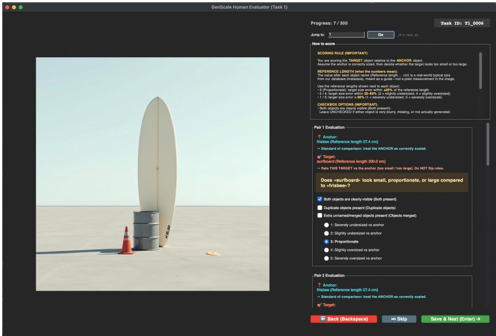  
Figure 7: Human annotation interface. The interface shows one generated image together with one or more anchor–target pair cards. For each pair, annotators are shown the anchor and target names, their reference physical lengths, pair-specific validity checkboxes, and a five-point ordinal scale for judging whether the target is too small, proportionate, or too large relative to the anchor.

Table 26: Leave-one-rater-out human reliability. For each annotator, the reference consensus is rebuilt from the remaining eight annotators only, using modal score aggregation with medianrounded tie breaking. This removes self-inclusion bias from the human reliability estimate. Annotator identities are anonymized and match Tab. 25.
<table><tr><td>Annotator</td><td>Ref. raters</td><td>Pairs</td><td>Exact (%) ↑</td><td>≤ 1 (%) ↑</td><td>MAE↓</td><td>QWK↑</td><td>r ↑</td></tr><tr><td>Annotator A</td><td>8</td><td>504</td><td>63.69</td><td>94.84</td><td>0.4246</td><td>0.7721</td><td>0.7862</td></tr><tr><td>Annotator B</td><td>8</td><td>515</td><td>59.61</td><td>93.79</td><td>0.4757</td><td>0.6783</td><td>0.6841</td></tr><tr><td>Annotator C</td><td>8</td><td>568</td><td>57.04</td><td>93.66</td><td>0.5000</td><td>0.7268</td><td>0.7374</td></tr><tr><td>Annotator D</td><td>8</td><td>558</td><td>64.70</td><td>98.39</td><td>0.3692</td><td>0.7737</td><td>0.7996</td></tr><tr><td>Annotator E</td><td>8</td><td>576</td><td>56.25</td><td>90.80</td><td>0.5347</td><td>0.5663</td><td>0.5885</td></tr><tr><td>Annotator F</td><td>8</td><td>553</td><td>60.76</td><td>95.48</td><td>0.4412</td><td>0.7430</td><td>0.7434</td></tr><tr><td>Annotator G</td><td>8</td><td>564</td><td>48.23</td><td>88.48</td><td>0.6365</td><td>0.6915</td><td>0.7271</td></tr><tr><td>Annotator H</td><td>8</td><td>565</td><td>47.26</td><td>90.27</td><td>0.6248</td><td>0.6397</td><td>0.6411</td></tr><tr><td>Annotator I</td><td>8</td><td>574</td><td>64.46</td><td>94.43</td><td>0.4146</td><td>0.7608</td><td>0.7667</td></tr><tr><td>Mean ± std</td><td>8</td><td>553±26</td><td>58.00±6.56</td><td>93.35±3.03</td><td>0.4913±0.0928</td><td>0.7058±0.0695</td><td>0.7193±0.0695</td></tr><tr><td>Min-Max</td><td>8</td><td>504-576</td><td>47.26-64.70</td><td>88.48-98.39</td><td>0.3692–0.6365</td><td>0.5663–0.7737</td><td>0.5885–0.7996</td></tr></table>

overlap/crop blocks that.  
extra\_unnamed\_objects, severe\_generation\_artifacts, OR  
<= 35 words, English).

JSON only, no markdown.

Task 1 pairwise judge prompt. Task 1 evaluates common-object relative scale. For each unordered object pair, the first object is treated as the anchor and the second as the target. The template below is instantiated once per pair; in multi-object images, all unordered pairs are scored independently.

You are an expert physical spatial reasoning engine and a professional photography adjudicator. Your task is to evaluate the physical size accuracy of objects in the provided generated image. Your scoring should closely mirror the aggregate judgement of human annotators, not a purely literal physics calculator.

## ### GROUND TRUTH REFERENCE:

\- Object A (Anchor): [object\_a], Typical physical longest edge: [len\_a\_cm] cm.

\- Object B (Target): [object\_b], Typical physical longest edge: [len\_b\_cm] cm.

\- Expected 3D longest-edge ratio: Object B is about [ratio]x Object A (Object A is about [inverse\_ratio]x Object B).

## ### OPTIONAL GENERATION PROMPT (LOW PRIORITY):

Human annotators did NOT see this text; they only saw the image, object names, and reference lengths. Use this prompt only to identify intended objects or ambiguous layout. Do NOT use words like "strictly accurate" as evidence that the rendered sizes are correct, and do NOT forgive a visible size error because the prompt intended correctness.

[benchmark\_prompt]

## ### SCENARIO CONTEXT (natural depth and perspective; used for S1):

Objects may intentionally sit at different depths. First infer the 3D layout, then compare real-world scale. Do not punish an object simply because it looks visually large/small in 2D if foreground/background placement plausibly explains it. Conversely, if the TARGET still violates the expected 3D ratio after this perspective correction, penalize it.

## ### SCENARIO CONTEXT (same depth plane; used for S2):

This benchmark row is a coplanar layout: objects are meant on the same ground plane with little depth separation. Use the stated reference lengths and the visible 3D/2D size ratio as the primary evidence. Do not use depth or perspective as an excuse unless the image clearly shows large depth separation. Occlusion, foreshortening, and flexible-object pose still apply, but the default assumption is direct same-plane comparison.

## ### EVALUATION PROTOCOL (MATCH THE HUMAN GUI):

Please analyze the image step-by-step:

1. Detection: Are BOTH Object A and Object B clearly identifiable? If either is very blurry, missing, fused, or not actually generated, set both\_objects\_present=false.

2. Roles: Object A is the ANCHOR. Treat it as correctly scaled. Score ONLY Object B, the TARGET. Do NOT flip roles.

3. Perspective adjustment: Account for near-vs-far perspective before scoring. A far target may look smaller; a near target may look larger. Only penalize if the TARGET still looks implausibly small/large after that adjustment.

4. Estimate the TARGET’s inferred real 3D longest edge relative to the anchor, using the expected ratio above. For same-plane scenes, this is close to the visible ratio. For natural-depth scenes, first mentally correct for depth.

5. Use the target’s full intended extent, not a misleading subpart: e.g. use a frisbee/CD/plate diameter rather than rim thickness; use a folded towel’s visible folded extent, not the unfolded towel length; account for occlusion and foreshortening.

## ### FINAL JUDGMENT:

Assume Object A is its real-world physical size in 3D space. Accounting for depth, perspective, occlusion, and realistic configuration

(folding/rolling/foreshortening), how accurate is the size of Object B compared to its stated typical length of [len\_b\_cm] cm?

Use the same quantitative rubric shown to human annotators:

\- Score 3 (Proportionate): inferred TARGET size error is within +/-20% of its reference length.

\- Score 2 (Slightly undersized): TARGET is about 20--60% too small.

\- Score 4 (Slightly oversized): TARGET is about 20--60% too large.

\- Score 1 (Severely undersized): TARGET is more than 60% too small.

\- Score 5 (Severely oversized): TARGET is more than 60% too large.

Important calibration: do NOT default ambiguous cases to 3 if the visible same-plane ratio clearly crosses the 20% or 60% threshold. At the same time, do NOT choose 1/5 unless the inferred TARGET/reference error is beyond 60%

after perspective and pose correction.

Select exactly one category from the 1-5 scale below:

1: Severely Undersized   
2: Slightly Undersized   
3: Proportionate   
4: Slightly Oversized   
5: Severely Oversized   
### OUTPUT FORMAT:   
You MUST output your response in valid JSON format. Do not include markdown   
code blocks. CRITICAL: Keep BOTH reasoning fields extremely short   
(<= 25 words each). Do NOT use ellipses (...).   
{   
"reasoning\_detection": "...",   
"reasoning\_depth\_and\_perspective": "...",   
"both\_objects\_present": true,   
"size\_score": 3   
}

The S1 and S2 scenario-context blocks are mutually exclusive in the implementation: the S1 naturaldepth block is inserted only for S1\_Natural\_Depth, and the S2 same-plane block is inserted only for S2\_Extreme\_Contrast. The optional generation-prompt block is included only when the benchmark row stores the original generation prompt.

Task 2 pairwise judge prompt. Task 2 uses one human–product pair per image. The human body part is always the fixed anchor and the product is always the target.

You are an expert physical spatial reasoning engine and a professional photography adjudicator. Your task is to evaluate the physical size accuracy of objects in the provided generated image. Your scoring should closely mirror the aggregate judgement of human annotators using a quick visual GUI, not a purely literal pixel-measurement or product-spec calculator.

## ### GROUND TRUTH REFERENCE:

\- Object A (Human Anchor): [human\_anchor], Typical physical longest edge: [len\_a\_cm] cm.

\- Object B (Target Product): [product], Typical physical longest edge: [len\_b\_cm] cm.

\- Expected 3D longest-edge ratio: Product B is about [ratio]x the human anchor (the anchor is about [inverse\_ratio]x Product B).

## ### OPTIONAL GENERATION PROMPT (LOW PRIORITY):

Human annotators did NOT see this text; they only saw the image, object names, and reference lengths. Use this prompt only to identify the intended product, packaging/bundle extent, or ambiguous interaction. Do NOT use exact centimeter claims in the prompt as a pixel ruler, and do NOT forgive or penalize a size relationship solely because the prompt intended it.

## ### EVALUATION PROTOCOL (MATCH THE HUMAN GUI):

This task focuses on the direct interaction between a human body (or body part) and a product. Since the human is interacting with the product, they are usually roughly at the SAME depth plane, but catalog photos often use close-up framing, partial hands/faces/feet, foreshortening, and product-forward composition.

## Please analyze the image step-by-step:

1. Detection: Are BOTH Object A (Human/part) and Object B (Product) clearly identifiable? If either is very blurry, missing, fused, or not actually generated, set both\_objects\_present=false.

2. Roles: Object A is the HUMAN ANCHOR. Treat it as correctly scaled. Score ONLY Object B, the TARGET PRODUCT. Do NOT flip roles.

3. Human-anchor caution: hands, heads/faces, feet/legs, and full bodies may be cropped, angled, closer to the camera, or only partially visible. Do not infer exact centimeters from a cropped palm, a close-up face, or a partial foot/leg. Use them as approximate scale references.

4. Product extent: Judge the intended product as presented, not a misleading subcomponent. For packs/bundles/stacks, use the full visible pack/bundle footprint; for folded bedding/clothing, use the folded visible package; for jewelry in a display box, judge the visible retail presentation as plausible rather than treating the ring diameter alone as the whole target; for paired

5. Size relationship: Ask whether a typical human annotator would immediately feel the product is implausibly small/large in this interaction. Do not score a catalog-style close-up as oversized merely because the product occupies many pixels or is foregrounded.

## ### FINAL JUDGMENT:

Assume Object A is its real-world physical size in 3D space. How accurate is the size of Object B compared to its stated typical length of [len\_b\_cm] cm? Use the same quantitative rubric shown to human annotators, but apply it perceptually rather than with exact pixel calipers:

\- Score 3 (Proportionate): inferred product size error is within about +/-20%, OR the catalog interaction looks plausible after crop/pose/packaging correction.

\- Score 2 (Slightly undersized): product is clearly 20--60% too small.

\- Score 4 (Slightly oversized): product is clearly 20--60% too large.

\- Score 1 (Severely undersized): product is more than 60% too small and looks comically/impossibly tiny.

\- Score 5 (Severely oversized): product is more than 60% too large and looks comically/impossibly huge.

Important Task2 calibration: human annotators usually give Score 3 for plausible product catalog interactions. Use 4/2 only for obvious size errors, and use 5/1 very rarely. If the only evidence for 5/1 is an exact ratio estimate from a cropped hand/head/foot or a close-up product-forward composition, choose 4/2 or 3 instead.

Select exactly one category from the 1-5 scale below:   
1: Severely Undersized   
2: Slightly Undersized   
3: Proportionate   
4: Slightly Oversized   
5: Severely Oversized

### OUTPUT FORMAT:   
You MUST output your response in valid JSON format. Do not include markdown   
code blocks. CRITICAL: Keep BOTH reasoning fields extremely short   
(<= 25 words each). Do NOT use ellipses (...).   
{   
"reasoning\_detection": "...",   
"reasoning\_scale\_and\_interaction": "...",   
"both\_objects\_present": true,   
"size\_score": 3   
}

Task 3 judge routing. Task 3 does not use a separate VLM judge prompt. Each Task 3 entry stores source\_task\_type and source\_task\_id. The evaluator splits Task 3 outputs by provenance, constructs temporary Task 1 or Task 2 benchmark rows using the referenced source entries, scores the edited images with the corresponding Task 1 or Task 2 judge above, and then remaps the synthetic identifiers back to the original Task 3 identifiers. This ensures that edited images are judged under the same criterion as their original failed generation.

Response-format retry suffix. For each pairwise judge call, the evaluator appends the following suffix to the prompt to reduce invalid JSON responses:

CRITICAL: Output MUST be minified JSON in a SINGLE LINE. The JSON MUST include all required keys and end with a closing brace ’}’. Keep BOTH reasoning fields <= 25 words each.

## B.5 Repeated Sampling and Score Aggregation

For each scorable anchor–target pair, we query the Gemini judge five times. Repeated sampling reduces sensitivity to isolated parsing errors, unstable visual interpretations, or overly literal ratio estimates. Each call returns a numeric score in {1, 2, 3, 4, 5} and a pair-validity flag. A pair is included in the final scale metrics only when the required objects are judged present and the scene passes the validity criteria.

Table 27: Gemini–human alignment with image-level bootstrap confidence intervals. Gemini-3.1-Pro-preview is evaluated with five repeated samples per pair and majority/median aggregation. Confidence intervals are computed by resampling images rather than individual object pairs.
<table><tr><td>Split</td><td>Images / Pairs</td><td>Exact (%) ↑</td><td>≤ 1 (%) ↑</td><td>MAE↓</td><td>r ↑</td><td>QWK↑</td></tr><tr><td>Task 1: S1-S2</td><td>185 / 427</td><td>61.83 [56.69, 66.96]</td><td>96.49 [94.16, 98.35]</td><td>0.4169 [0.3565, 0.4786]</td><td>0.8473 [0.8108, 0.8774]</td><td>0.8373 [0.7968, 0.8696]</td></tr><tr><td>Task 2: S3</td><td>100 / 100</td><td>73.00 [64.00, 81.02]</td><td>100.00 [100.00, 100.00]</td><td>0.2700 [0.1898, 0.3600]</td><td>0.4701 [0.2340, 0.6517]</td><td>0.4677 [0.2278, 0.6459]</td></tr><tr><td>Task 1+2</td><td>285 / 527</td><td>63.95 [59.45, 68.45]</td><td>97.15 [95.29, 98.72]</td><td>0.3890 [0.3373, 0.4416]</td><td>0.8328 [0.7970, 0.8636]</td><td>0.8234 [0.7839, 0.8563]</td></tr></table>

Given the five sampled scores for a pair, we first use majority vote. If there is no unique mode, we take the median of the five ordinal scores. This aggregation preserves the discrete ordinal scale while reducing the influence of a single outlier sample. All benchmark models, general-purpose editors, and Rescale outputs are evaluated with the same fixed judge, prompt templates, repeated-sampling protocol, and aggregation rule.

## B.6 Calibration Diagnostics

We evaluate calibration using exact agreement, within-one agreement, mean absolute error (MAE), Pearson correlation r, and quadratic-weighted kappa (QWK) on the five-point ordinal scale. Exact agreement measures strict label equality, while within-one agreement measures whether two labels differ by at most one ordinal level. MAE is computed as the mean absolute difference between predicted and consensus ordinal scores. QWK is useful because it penalizes large ordinal disagreements more heavily than adjacent disagreements.

The human agreement results in Tabs. 25 and 26 show that the calibration labels are stable but not trivial. Agreement with the aggregate consensus reaches $6 5 . 1 5 \% \pm 6 . 9 8 \%$ exact agreement and 94.03% ± 3.16% within-one agreement, while the stricter leave-one-rater-out estimate remains 58.00% ± 6.56% exact and 93.35% ± 3.03% within-one. This gap is expected because the aggregateconsensus comparison includes the evaluated annotator in the reference, whereas the leave-one-raterout comparison does not. The leave-one-rater-out QWK of 0.7058 ± 0.0695 indicates that most human disagreements are local on the ordinal scale rather than severe reversals.

The Gemini judge is then compared against the human consensus on the same calibration set. As shown in Tab. 27, Gemini reaches 63.95% exact agreement, 97.15% within-one agreement, MAE 0.3890, Pearson correlation 0.8328, and QWK 0.8234 on the combined Task 1+2 calibration split. These values are at or above the leave-one-rater-out human reliability estimate on the same metrics, supporting the use of the calibrated judge for large-scale model comparison. Task 2 has lower r and QWK despite high exact and within-one agreement because its labels are more concentrated near the plausible-scale score; this makes correlation-based metrics less informative than ordinal error and within-one agreement for that split.

## B.7 Bootstrap Confidence Intervals

We report uncertainty for Gemini–human alignment using image-level bootstrap confidence intervals in Tab. 27. The bootstrap resamples images rather than individual object pairs, and all pairwise judgments associated with a sampled image are included together. This preserves the natural clustering induced by multi-pair images and avoids overstating confidence by treating correlated pairs from the same image as independent samples. For each bootstrap replicate, we recompute exact agreement, within-one agreement, MAE, Pearson correlation, and QWK. The reported intervals are percentile confidence intervals over the resulting bootstrap distribution.

## C Rescale Implementation Details

This appendix expands the implementation of Rescale, the model-agnostic scale-correction pipeline used in Sec. 4. We focus on the agentic edit plan, the local insertion interface, the training design of our depth-aware correction backend, and the backend/training ablations.

## C.1 Agent Inputs and Edit-Plan Format

Rescale takes a generated image I together with structured scale metadata. For Task 1, the metadata consists of the prompted object names and their physical reference lengths from the common-object scale knowledge base. For Task 2, it consists of the product reference image, product dimensions,

and the human anchor. For Task 3, the input additionally contains an erroneous source image and either a hard auto-discovery prompt (S4) or a precise resize instruction (S5). The inference pipeline is illustrated in Fig. 5.

The agent converts these inputs into a structured local edit plan. For each edit round k, the plan is

$$
\pi ^ { ( k ) } = \{ o _ { t } , o _ { a } , \mathbf { b } _ { t } , \tilde { \mathbf { b } } _ { t } , \alpha , p , q \} ,\tag{1}
$$

where $o _ { t }$ is the editable target object, $o _ { a }$ is the fixed anchor object, $\mathbf { b } _ { t }$ is the current target bounding box, $\tilde { \mathbf { b } } _ { t }$ is the resized target box, α is the multiplicative resize factor, $p$ is a contact-preserving anchor point, and $q$ is a short natural-language rationale used for verification and debugging. The resized box $\tilde { \mathbf { b } } _ { t }$ is obtained by scaling $\mathbf { b } _ { t }$ by α around $p ,$ so that contact points such as object bases, hand-contact regions, or support surfaces remain approximately fixed.

For common-object images, multiple pairwise judgments can implicate the same object. The agent therefore aggregates pairwise evidence into a conservative object-level plan: it edits the object that most consistently explains the observed scale errors and avoids large changes when the pairwise evidence is contradictory. For human–product images, the product is treated as editable and the human body part is fixed. In S5, the target, anchor, correction direction, and resize factor are given directly by the benchmark prompt, so the agent mainly performs grounding and execution. In S4, the agent must first decide whether a correction is needed, choose the target, and infer the correction direction. If the agent cannot localize the objects reliably, finds no clear scale inconsistency, or predicts that the edit would create severe collisions, truncation, or boundary artifacts, Rescale returns a no-edit decision.

## C.2 Localization, Segmentation, and Local Editing Interface

Given an edit plan, Rescale standardizes all downstream backends to the same local insertion interface. We first refine the target box with multimodal localization and segment the target instance using SAM 2 [43]. The segmented target is extracted before removal and used as the appearance reference R. We then remove the original target from I to obtain a completed background B. This removal step is handled by an off-the-shelf inpainting/editing model, since the purpose of Rescale is not to benchmark generic object removal but to test whether a scale-aware local reinsertion can be executed after the source instance has been removed.

The edit mask M is constructed around the resized box $\tilde { \mathbf { b } } _ { t }$ and is deliberately enlarged beyond the expected object support. This gives the insertion backend enough local context for contact shadows, occlusion boundaries, and small background corrections. We also estimate a monocular depth map with DepthAnythingV2 [59]. For depth-aware backends, we fuse the completed-background depth with the resized foreground support to form a correction-aware depth condition D. The resulting backend inputs are therefore

$$
( R , B , M , D , \tau ) ,\tag{2}
$$

where $\tau$ is a compact text instruction describing the target object and the intended resize operation. Backends that do not support depth receive the same reference, background, mask, and text instruction, but ignore $D _ { \circ }$ . This interface lets us substitute only the final local generation model while keeping agent planning, localization, segmentation, background completion, and mask construction fixed.

## C.3 Depth-Aware Correction Backend

We also explored a specialized local insertion backend tailored to relative-scale correction. As shown in Fig. 8, the model follows a diptych-style in-context formulation: the left half provides a clean reference crop of the object to preserve identity and appearance, while the right half contains the target-side completed background together with the local region to be edited. This design is more suitable for scale correction than a standard inpainting setup, because the model must simultaneously preserve object identity and synthesize a resized insertion that matches the surrounding scene.

Let R denote the clean reference crop, B the completed target background after removing the original instance, I the desired corrected image, M the editable target-side mask, and D the fused depth condition. We construct the training inputs as

$$
{ \mathcal { S } } = [ R \mid B ] , \qquad { \mathcal { V } } = [ R \mid I ] , \qquad { \mathcal { M } } = [ 0 \mid M ] , \qquad { \mathcal { D } } = [ 0 \mid D ] ,\tag{3}
$$

where $[ \cdot \ | \ \cdot ]$ denotes horizontal concatenation. The left half serves as visual reference, and the right half specifies the local correction problem. During training, B is obtained by removing the ground-truth foreground object from the original image; at inference time, it is replaced by the completed background produced by the upstream removal stage of Rescale.

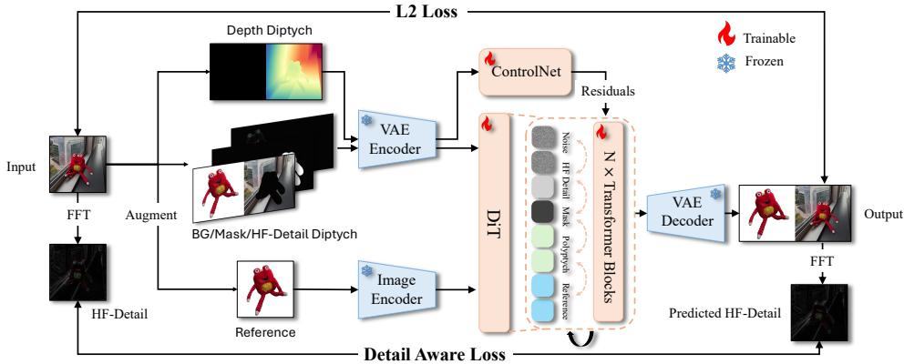  
Figure 8: Training pipeline of our depth-aware correction backend. The model adopts a diptychstyle formulation, with a reference half that provides object identity and appearance, and a target half that contains the completed background and the local region to be corrected. A DiT-based inpainting backbone performs the local reinsertion, a depth ControlNet injects geometry-aware signals from the fused depth condition, and an optional high-frequency branch provides detail cues derived from the reference crop via FFT. Training combines the backbone objective with an optional detail-aware reconstruction loss to improve fidelity after resizing.

The backbone is a DiT-based inpainting model initialized from the InsertAnything/FLUX-style insertion codebase. The reference crop is encoded by a frozen reference image encoder, while the target half is synthesized by the inpainting transformer. Because relative-scale correction is fundamentally a geometric edit, we add a depth ControlNet branch and feed it the depth diptych D. Its residuals are injected only into the target-half tokens, so that the reference side remains an appearance cue rather than becoming a second geometry target. This design encourages the model to use depth primarily to control the support and extent of the resized object in the target scene.

We also test an optional high-frequency branch for fine-detail preservation. Specifically, we extract an FFT-based high-frequency representation from the reference crop and form

$$
{ \mathcal { H } } = [ { \mathrm { H F } } ( R ) \mid 0 ] ,\tag{4}
$$

which is projected and injected into the transformer hidden states through a lightweight branch. The motivation is that local resizing can easily smooth textures, edges, and small appearance cues; the high-frequency branch gives the model an explicit signal for recovering such details from the reference object.

A key motivation of this backend is to decouple editable context extent from object extent. In ordinary mask-conditioned insertion, the model can overfit to the mask boundary and treat it as the intended object boundary. That behavior is undesirable for scale correction, where the mask should reserve enough local context for shadows, contact regions, and boundary adaptation, but the resized object should not necessarily expand to fill the whole editable region. We therefore deliberately perturb and dilate the training masks, and rely on depth as the main cue for the intended object support. Functionally, this makes the backend better aligned with the needs of relative-scale correction, even though standard edited-crop metrics do not directly evaluate this property.

We train only lightweight adaptation modules: LoRA adapters on the DiT backbone, the depth ControlNet branch, and, when enabled, the high-frequency injection branch. The VAE, text encoder, and reference encoder remain frozen. The primary optimization objective is the latent flow-matching objective of the underlying DiT backbone,

$$
\mathcal { L } _ { \mathrm { f m } } = \| v _ { \theta } ( x _ { t } , c ) - ( x _ { 1 } - x _ { 0 } ) \| _ { 2 } ^ { 2 } ,\tag{5}
$$

where $x _ { t }$ is the interpolated noisy latent, $x _ { 0 }$ is the clean latent, $x _ { 1 }$ is Gaussian noise, and c denotes the full set of conditioning inputs. To better preserve local details after resizing, we optionally add a detail-aware reconstruction loss on high-frequency maps,

$$
\mathcal { L } _ { \mathrm { d a } } = \left. \mathrm { H F } ( \hat { I } ) \odot M - \mathrm { H F } ( I ) \odot M \right. _ { 2 } ^ { 2 } ,\tag{6}
$$

Table 28: Insertion backend substitution under fixed Rescale plans. We keep agent planning, localization, segmentation, background completion, mask construction, and depth estimation fixed, and replace only the final local generation backend. Metrics are computed on Task 1 edited-object bounding boxes; higher is better.
<table><tr><td colspan="5"></td><td colspan="2">Generation Quality</td></tr><tr><td>Insertion backend</td><td>CLIP-I (%) ↑</td><td>DINO (%) ↑</td><td>SSIM (%) ↑</td><td>SSIM-HF (%) ↑</td><td>LAION-Aes ↑</td><td>Q-Align-IQ ↑</td></tr><tr><td>Ours (depth-aware)</td><td>86.5</td><td>70.8</td><td>50.2</td><td>75.6</td><td>3.68</td><td>3.58</td></tr><tr><td>InsertAnything [48]</td><td>87.7</td><td>75.6</td><td>48.8</td><td>75.0</td><td>3.71</td><td>3.61</td></tr><tr><td>CreatiLayout [62]</td><td>75.9</td><td>38.3</td><td>31.4</td><td>70.7</td><td>3.30</td><td>2.46</td></tr><tr><td>Bifrost [27]</td><td>82.5</td><td>66.2</td><td>40.3</td><td>73.5</td><td>3.65</td><td>3.44</td></tr></table>

and optimize the combined objective

$$
\begin{array} { r } { { \mathcal { L } } = { \mathcal { L } } _ { \mathrm { f m } } + \lambda _ { \mathrm { d a } } { \mathcal { L } } _ { \mathrm { d a } } . } \end{array}\tag{7}
$$

Training data construction. We construct correction-style training tuples from the same family of segmentation, video-object, saliency, fashion, and insertion datasets used by the insertion backbone, including SAM, LVIS, saliency datasets, YouTubeVOS, VIPSeg, MOSE, VITON-HD, and AnyInsertion. Each training sample is converted into a reference–target diptych by extracting a foreground reference crop, removing the original instance from the target side, and using the original image as supervision. We further apply appearance and geometric augmentations to the reference crop, synthetic partial occlusion to make the reference less idealized, and mask perturbation/dilation so that the model cannot trivially infer object extent from mask shape alone. These choices make the training task closer to the actual scale-correction setting, where the reference may be incomplete and the editable region must include both the resized object and its surrounding context.

## C.4 Insertion Backend Substitution Study

Tab. 28 evaluates the final local generation step while holding the rest of Rescale fixed. For each input, we reuse the same agent plan, target box, segmentation mask, completed background, reference crop, and depth estimate, and replace only the insertion backend. This isolates whether differences come from the local synthesis model rather than from upstream diagnosis or preprocessing.

The original InsertAnything checkpoint obtains the best CLIP-I, DINO, LAION-Aes, and Q-Align-IQ scores, while our depth-aware backend is slightly better on SSIM and SSIM-HF. The two are therefore broadly comparable under these generic edited-object crop metrics, but our specialized backend does not outperform the stronger codebase checkpoint overall. CreatiLayout performs substantially worse on visual consistency, which is expected because it is driven by text and boxes rather than a reference image, so it cannot reliably preserve the edited object’s appearance. Bifrost is competitive but remains below InsertAnything and our tuned backend on most identity-preservation metrics.

This result should be interpreted with an important caveat. The metrics in Tab. 28 measure visual consistency and no-reference quality inside edited boxes; they do not measure whether the backend can use a large editable mask without forcing the object to fill the mask. Our depth-aware backend was designed for precisely that functional requirement. Thus, although the current automatic metrics favor the original InsertAnything checkpoint slightly, the specialized backend remains a useful design exploration for scale-aware insertion. Developing an evaluation protocol that directly measures mask–extent decoupling and depth-controlled resizing is left for future work.

## C.5 Correction-Model Training Ablation

Tab. 29 ablates the design choices of our specialized correction backend. The baseline uses the same diptych insertion formulation without the additional guidance, depth, detail-aware loss, or high-frequency branch. Adding FLUX-style guidance substantially improves representation-level consistency, especially DINO, and also improves both no-reference quality metrics. Adding depth further improves CLIP-I, DINO, SSIM, LAION-Aes, and Q-Align-IQ, supporting the claim that explicit geometry is useful for scale-aware local insertion. Adding the detail-aware loss and highfrequency branch gives only marginal additional gains on these aggregate metrics: DINO, SSIM, and SSIM-HF increase slightly, while LAION-Aes and Q-Align-IQ are essentially unchanged.

Overall, the ablation suggests that guidance and depth conditioning are the main effective components for this backend, whereas the detail-preservation branch is not strongly reflected by the current croplevel metrics. Combined with the backend substitution study, these results indicate that our depthaware model is a functional attempt to make local insertion more appropriate for scale correction, but the generic InsertAnything checkpoint remains a very strong synthesis backend. Future work should train a specialized model with losses and evaluation metrics that directly target numeric resize fidelity, contact preservation, and the ability to decouple mask extent from object extent.

Table 29: Training-design ablation for the depth-aware correction backend. Each row incrementally adds a component to the same base diptych architecture: FLUX-style guidance conditioning, depth ControlNet conditioning, and the detail-aware loss plus high-frequency branch. Metrics are computed on Task 1 edited-object bounding boxes; higher is better.
<table><tr><td rowspan="2">Training configuration</td><td colspan="4">Visual Consistency</td><td colspan="2">Generation Quality</td></tr><tr><td>CLIP-I (%) ↑</td><td>DINO (%) ↑</td><td>SSIM (%) ↑</td><td>SSIM-HF (%) ↑</td><td>LAION-Aes ↑</td><td>Q-Align-IQ ↑</td></tr><tr><td>Baseline</td><td>74.2</td><td>30.6</td><td>44.1</td><td>75.8</td><td>3.19</td><td>1.91</td></tr><tr><td>Baseline + guidance</td><td>77.6</td><td>44.8</td><td>40.8</td><td>74.2</td><td>3.40</td><td>2.13</td></tr><tr><td>Baseline + guidance + depth</td><td>79.4</td><td>47.1</td><td>45.0</td><td>75.6</td><td>3.58</td><td>2.19</td></tr><tr><td> $\mathrm { B a s e l i n e + g u i d a n c e + d e p t h + D A L + H F }$ </td><td>79.4</td><td>47.3</td><td>45.3</td><td>75.8</td><td>3.57</td><td>2.19</td></tr></table>

## D Full Quantitative Results

## D.1 Metrics and Statistical Protocol

All quantitative results use the calibrated Gemini judge described in Sec. B. The atomic unit is an anchor–target pair rather than an image. For each valid pair, the judge returns an ordinal scale score $s \in \{ 1 , 2 , \bar { 3 } , 4 , \bar { 5 } \}$ , where $s = 3$ denotes a physically plausible target size relative to the anchor, $s < 3$ denotes an undersized target, and $s > 3$ denotes an oversized target. We report scale error as $\vert s - 3 \vert$ averaged over scored pairs. Plausible is the fraction of pairs with $s = 3 ;$ Too small and Too large are the fractions with $s \in \{ 1 , 2 \}$ and $s \in \{ 4 , 5 \}$ , respectively; Severe is the fraction with $s \in \{ 1 , 5 \}$

All tables are computed after the same scene-level validity prefilter used in the main experiments. Valid img. / pairs denotes the number of images with at least one scored pair and the number of scored pairs after filtering. Bracketed ranges denote 95% confidence intervals from 2,000 bootstrap resamples. For one-pass generation or editing results, CIs are reported for pair-level mean scale error. For correction experiments, matched-pair tables only include pairs that are scored both before and after editing; CIs are reported for before/after mean scale error and Gain. Gain is the reduction in matched-pair scale error, so positive values indicate improvement. B / W counts pairs whose absolute error $| s - 3 |$ becomes smaller or larger after editing. Directional rate columns are empirical percentages and are kept as point estimates to avoid making the wide appendix tables unreadable.

## D.2 Task 1 Full Results

Tab. 30 expands the main Task 1 table with valid coverage and the full error-direction breakdown. MR denotes mean-regression error: cases where the physical target is smaller than the anchor but judged too large, or physically larger than the anchor but judged too small.

## D.3 Task 2 Full Results

Tab. 31 expands the main Task 2 table with the directional error rates. Because Task 2 contains one human–product relation per image, image-level and pair-level coverage are nearly identical after filtering.

## D.4 Task 3 Full Results

Tab. 32 reports the full Task 3 results for general-purpose editors. S4 requires autonomous scale-error discovery, while S5 gives the target object, reference object, resize direction, and scale factor. The before-edit row is the erroneous source image set used to construct Task 3.

## D.5 Rescale Correction on Task 1

Tab. 33 reports matched-pair before–after results for applying Rescale to Task 1 generations from each source model. The table uses only pairs scored on both the original and corrected image.

Table 30: Task 1 full results. Results are split by S1, S2, and all Task 1 entries. Error is mean |s − 3| with 95% CI in brackets. Plausible denotes score 3; Too small denotes scores 1–2; Too large denotes scores 4–5; Severe denotes scores 1 or 5. MR denotes mean-regression error.
<table><tr><td>Model</td><td>Split</td><td>Valid img. / pairs</td><td>Error ↓</td><td>Plaus. (%) ↑</td><td>Too small (%) ↓</td><td>Too large (%) ↓</td><td>Severe (%) ↓</td><td>MR (%) ↓</td></tr><tr><td rowspan="2">Nano Banana 2</td><td>S1</td><td>199 / 564</td><td>0.505 [0.449,0.566]</td><td>65.1</td><td>17.0</td><td>17.9</td><td>15.6</td><td>15.8</td></tr><tr><td>S2</td><td>196 / 557</td><td>0.691 [0.630,0.750]</td><td>47.8</td><td>25.1</td><td>27.1</td><td>16.9</td><td>47.9</td></tr><tr><td rowspan="3">GPT-Image-2</td><td>All</td><td>395 /1121</td><td>0.598 [0.553,0.644]</td><td>56.5</td><td>21.1</td><td>22.5</td><td>16.2</td><td>31.8</td></tr><tr><td>S1</td><td>199 / 564</td><td>0.784 [0.716,0.856]</td><td>51.1</td><td>20.7</td><td>28.2</td><td>29.4</td><td>12.1</td></tr><tr><td>S2</td><td>200 /572</td><td>0.629 [0.570,0.691]</td><td>52.8</td><td>22.7</td><td>24.5</td><td>15.7</td><td>35.8</td></tr><tr><td rowspan="3">Z-Image-Turbo</td><td>All</td><td>399 / 1136</td><td>0.706 [0.659,0.753]</td><td>51.9</td><td>21.7</td><td>26.3</td><td>22.5</td><td>24.0</td></tr><tr><td>S1</td><td>193 / 534</td><td>0.644 [0.581,0.708]</td><td>53.2</td><td>22.8</td><td>24.0</td><td>17.6</td><td>35.8</td></tr><tr><td>S2</td><td>181 / 470</td><td>0.881 [0.806,0.955]</td><td>38.1</td><td>33.0</td><td>28.9</td><td>26.2</td><td>55.7</td></tr><tr><td rowspan="3">Grok Image</td><td>All</td><td>374 / 1004</td><td>0.755 [0.705,0.803]</td><td>46.1</td><td>27.6</td><td>26.3</td><td>21.6</td><td>45.1</td></tr><tr><td>S1</td><td>198 / 563</td><td>0.599 [0.533,0.666]</td><td>58.8</td><td>19.9</td><td>21.3</td><td>18.7</td><td>26.8</td></tr><tr><td>S2</td><td>200 /573</td><td>0.979 [0.911,1.047]</td><td>34.7</td><td>31.1</td><td>34.2</td><td>32.6</td><td>61.1</td></tr><tr><td rowspan="3">Qwen-Image 2512</td><td>All</td><td>398 / 1136</td><td>0.790 [0.742,0.838]</td><td>46.7</td><td>25.5</td><td>27.8</td><td>25.7</td><td>44.1</td></tr><tr><td>S1</td><td>196 / 542</td><td>0.699 [0.629,0.771]</td><td>53.3</td><td>22.5</td><td>24.2</td><td>23.2</td><td>37.3</td></tr><tr><td>S2</td><td>199 / 563</td><td>1.103 [1.039,1.171]</td><td>27.2</td><td>35.7</td><td>37.1</td><td>37.5</td><td>67.5</td></tr><tr><td rowspan="3">FLUX.2</td><td>All</td><td>395 / 1105</td><td>0.905 [0.855,0.956]</td><td>40.0</td><td>29.2</td><td>30.8</td><td>30.5</td><td>52.7</td></tr><tr><td>S1</td><td>176 / 453</td><td>0.837 [0.764,0.916]</td><td>45.0</td><td>27.2</td><td>27.8</td><td>28.7</td><td>40.6</td></tr><tr><td>S2</td><td>178 / 490</td><td>1.212 [1.141,1.284]</td><td>23.3</td><td>38.8</td><td>38.0</td><td>44.5</td><td>69.4</td></tr><tr><td rowspan="4">SD3.5-Large</td><td>All</td><td>354 / 943</td><td>1.032 [0.978,1.085] 0.960</td><td>33.7</td><td>33.2</td><td>33.1</td><td>36.9</td><td>55.6</td></tr><tr><td>S1</td><td>180/ 503</td><td>[0.887,1.030] 1.184</td><td>36.6</td><td>32.6</td><td>30.8</td><td>32.6</td><td>46.7</td></tr><tr><td>S2</td><td>166 / 446</td><td>[1.110,1.260] 1.065</td><td>24.9</td><td>36.3</td><td>38.8</td><td>43.3</td><td>69.7</td></tr><tr><td>All</td><td>346 / 949</td><td>[1.013,1.118]</td><td>31.1</td><td>34.4</td><td>34.6</td><td>37.6</td><td>57.5</td></tr></table>

Table 31: Task 2 full results. Each Task 2 image contains one product–human scale relation. Error is mean |s − 3| with 95% CI in brackets. The remaining columns report the full score-direction breakdown for S3.
<table><tr><td>Model</td><td>Valid img. / pairs</td><td>Error ↓</td><td>Plaus. (%) ↑</td><td>Too small (%) ↓</td><td>Too large (%) ↓</td><td>Severe (%) ↓</td></tr><tr><td>GPT-Image-2</td><td>294 / 294</td><td>0.231 [0.180,0.289]</td><td>78.9</td><td>3.4</td><td>17.7</td><td>2.0</td></tr><tr><td>Nano Banana 2</td><td>295 / 295</td><td>0.268 [0.210,0.325]</td><td>75.6</td><td>4.4</td><td>20.0</td><td>2.4</td></tr><tr><td>Seedream v4.5</td><td>295 / 295</td><td>0.302 [0.237,0.366]</td><td>74.9</td><td>8.1</td><td>16.9</td><td>5.1</td></tr><tr><td>Qwen-Image-Edit-2511</td><td>297/297</td><td>0.327 [0.266,0.391]</td><td>71.0</td><td>4.4</td><td>24.6</td><td>3.7</td></tr><tr><td>FLUX.1 Kontext-dev</td><td>291 /291</td><td>0.423 [0.354,0.491]</td><td>63.2</td><td>15.1</td><td>21.6</td><td>5.5</td></tr><tr><td>SD3.5-Large + IP-Adapter</td><td>270/270</td><td>0.600 [0.515,0.685]</td><td>52.6</td><td>7.8</td><td>39.6</td><td>12.6</td></tr></table>

## D.6 Rescale Correction on Task 2

Tab. 34 reports matched-pair Rescale correction results for Task 2. Since each Task 2 image has one evaluated pair, matched pairs are equivalent to matched images after filtering.

## D.7 Rescale Correction on Task 3

Tab. 35 reports Rescale on the same Task 3 correction benchmark used for the general-purpose editors in Tab. 32. Both S4 and S5 use the released Task 3 source images; S5 additionally provides the explicit target, anchor, direction, and scale factor.

Table 32: Task 3 full results for general-purpose editors. Error and score-direction rates are computed on each editor’s valid scored outputs. Error and Gain include 95% CIs in brackets. Gain and B / W are computed on matched before–after pairs relative to the corresponding before-edit source image. SD3.5-Large + IP-Adapter has substantially lower scored coverage and should be interpreted cautiously.
<table><tr><td>Model</td><td>Split</td><td>Valid img. / pairs</td><td>Error ↓</td><td>Plaus. (%) ↑</td><td>Too small (%) ↓</td><td>Too large (%) ↓</td><td>Severe (%) ↓</td><td>Gain ↑</td><td>B/W</td></tr><tr><td rowspan="3">Before edit</td><td>S4</td><td>98 /98</td><td>1.265 [1.112,1.418]</td><td>20.4</td><td>31.6</td><td>48.0</td><td>46.9</td><td>一</td><td>一</td></tr><tr><td>S5</td><td>98/ 98</td><td>1.265 [1.112,1.418]</td><td>20.4</td><td>31.6</td><td>48.0</td><td>46.9</td><td></td><td></td></tr><tr><td>All</td><td>196 / 196</td><td>1.265 [1.158,1.372]</td><td>20.4</td><td>31.6</td><td>48.0</td><td>46.9</td><td>一</td><td></td></tr><tr><td rowspan="2">GPT-Image-2</td><td>S4</td><td>97/ 97</td><td>0.959 [0.784,1.134]</td><td>40.2</td><td>28.9</td><td>30.9</td><td>36.1</td><td>+0.333 [0.198,0.469]</td><td>31 /4</td></tr><tr><td>S5</td><td>98 / 98</td><td>0.408 [0.296,0.531]</td><td>66.3</td><td>16.3</td><td>17.3</td><td>7.1</td><td>+0.866 [0.691,1.031]</td><td>60/5</td></tr><tr><td rowspan="3">Nano Banana 2</td><td>All</td><td>195 / 195</td><td>0.682 [0.569,0.795]</td><td>53.3</td><td>22.6</td><td>24.1</td><td>21.5</td><td>+0.601 [0.487,0.720]</td><td>91/9</td></tr><tr><td>S4</td><td>99 / 99</td><td>1.030 [0.879,1.182]</td><td>31.3</td><td>27.3</td><td>41.4</td><td>34.3</td><td>+0.237 [0.103,0.381]</td><td>24/7</td></tr><tr><td>S5</td><td>98 / 98</td><td>0.929 [0.776,1.092]</td><td>33.7</td><td>25.5</td><td>40.8</td><td>26.5</td><td>+0.340 [0.206,0.474]</td><td>31/4</td></tr><tr><td rowspan="3">FLUX.1 Kontext-dev</td><td>All</td><td>197 / 197</td><td>0.980 [0.873,1.091]</td><td>32.5</td><td>26.4</td><td>41.1</td><td>30.5</td><td>+0.289 [0.196,0.381]</td><td>55/11</td></tr><tr><td>S4</td><td>99/ 99</td><td>1.293 [1.131,1.435]</td><td>21.2</td><td>30.3</td><td>48.5</td><td>50.5</td><td>-0.021 [-0.113,0.072]</td><td>819</td></tr><tr><td>S5</td><td>94/ 94</td><td>0.957 [0.798,1.128]</td><td>36.2</td><td>25.5</td><td>38.3</td><td>31.9</td><td>+0.280 [0.140,0.419]</td><td>27/7</td></tr><tr><td rowspan="3">Qwen-Image-Edit-2511</td><td>All</td><td>193 / 193</td><td>1.130 [1.010,1.249]</td><td>28.5</td><td>28.0</td><td>43.5</td><td>41.5</td><td>+0.126 [0.042,0.211]</td><td>35 / 16</td></tr><tr><td>S4</td><td>99 / 99</td><td>1.253 [1.091,1.414]</td><td>23.2</td><td>29.3</td><td>47.5</td><td>48.5</td><td>+0.020 [-0.071,0.112]</td><td>9/4</td></tr><tr><td>S5</td><td>91 / 91</td><td>1.000 [0.824,1.165]</td><td>34.1</td><td>25.3</td><td>40.7</td><td>34.1</td><td>+0.253 [0.099,0.407]</td><td>23/5</td></tr><tr><td rowspan="3">Seedream v4.5</td><td>All</td><td>190 / 190</td><td>1.132 [1.016,1.247]</td><td>28.4</td><td>27.4</td><td>44.2</td><td>41.6</td><td>+0.132 [0.048,0.222]</td><td>32/9</td></tr><tr><td>S4</td><td>100 / 100</td><td>1.170 [1.010,1.330]</td><td>28.0</td><td>37.0</td><td>35.0</td><td>45.0</td><td>+0.102 [-0.031,0.224]</td><td>18 /8</td></tr><tr><td>S5</td><td>96/ 96</td><td>1.104 [0.938,1.281]</td><td>35.4</td><td>31.2</td><td>33.3</td><td>45.8</td><td>+0.200 [0.032,0.368]</td><td>25/9</td></tr><tr><td rowspan="4">SD3.5-Large + IP-Adapter</td><td>All</td><td>196 / 196</td><td>1.138 [1.020,1.260]</td><td>31.6</td><td>34.2</td><td>34.2</td><td>45.4</td><td>+0.150 [0.047,0.254]</td><td>43 / 17</td></tr><tr><td>S4</td><td>15 / 15</td><td>0.933 [0.467,1.333]</td><td>40.0</td><td>6.7</td><td>53.3</td><td>33.3</td><td>-0.200 [-0.667,0.268]</td><td>3/6</td></tr><tr><td>S5</td><td>59 /59</td><td>1.305 [1.102,1.508]</td><td>22.0</td><td>44.1</td><td>33.9</td><td>52.5</td><td>-0.158 [-0.368,0.053]</td><td>7/13</td></tr><tr><td>All</td><td>74/74</td><td>1.230 [1.041,1.405]</td><td>25.7</td><td>36.5</td><td>37.8</td><td>48.6</td><td>-0.167 [-0.361,0.028]</td><td>10 / 19</td></tr></table>

## D.8 Identity Preservation and Visual-Quality Metrics

Tab. 36 reports visual consistency and no-reference quality metrics for Rescale corrections. CLIP-I and DINO measure reference consistency between the original and corrected images. SSIM and SSIM-HF measure image-level and high-frequency preservation. LAION-Aes and Q-Align-IQ measure no-reference image quality before and after correction.

## E Additional Qualitative Results

This section provides additional qualitative examples for the three benchmark tasks and for Rescale correction. The examples are intended to visualize the input conditions, model outputs, and typical correction behavior; quantitative conclusions are based on the calibrated metrics reported in the main paper and appendix tables.

## E.1 Benchmark Record Examples

To make the benchmark format explicit, we show one randomly sampled entry from each scenario in Figs. 9 to 13. For readability, absolute local path prefixes are shortened to dataset-relative or generated-image-relative paths, while the benchmark fields are otherwise preserved.

## E.2 Task 1: Common-Object Generation Examples

Figs. 14 and 15 show additional Task 1 generations across the evaluated text-to-image models. S1 permits natural depth variation, while S2 constrains objects to approximately the same plane, making relative-size errors more visually exposed.

Table 33: Rescale correction on Task 1. Metrics are computed on matched scorable pairs before and after correction. Error before, Error after, and Gain include 95% CIs in brackets. Plaus. and Severe are reported as before / after percentages.
<table><tr><td>Source model</td><td>Split</td><td>Matched pairs</td><td>Error before ↓</td><td>Error after ↓</td><td>Gain ↑</td><td>Plaus. before / after (%) ↑</td><td>Severe before / after (%) ↓</td><td>B/W</td></tr><tr><td rowspan="3">Nano Banana 2</td><td>S1</td><td>536</td><td>0.494 [0.431,0.558]</td><td>0.388 [0.332,0.448]</td><td>+0.106 [0.043,0.174]</td><td>65.7 / 73.9</td><td>15.1/ 12.7</td><td>107 / 61</td></tr><tr><td>S2</td><td>544</td><td>0.688 [0.625,0.752]</td><td>0.379 [0.327,0.432]</td><td>+0.309 [0.241,0.375]</td><td>48.2 / 69.3</td><td>16.9 / 7.2</td><td>188 / 58</td></tr><tr><td>All</td><td>1080</td><td>0.592 [0.546,0.636]</td><td>0.383 [0.345,0.424]</td><td>+0.208 [0.162,0.256]</td><td>56.9 / 71.6</td><td>16.0 / 9.9</td><td>295 / 119</td></tr><tr><td rowspan="3">GPT-Image-2</td><td>S1</td><td>508</td><td>0.768 [0.701,0.843]</td><td>0.476 [0.413,0.541]</td><td>+0.291 [0.217,0.364]</td><td>52.6 / 68.3</td><td>29.3 / 15.9</td><td>141 / 44</td></tr><tr><td>S2</td><td>556</td><td>0.622 [0.563,0.683]</td><td>0.417 [0.365,0.471]</td><td>+0.205 [0.138,0.272]</td><td>53.4 / 66.9</td><td>15.6 / 8.6</td><td>158 / 70</td></tr><tr><td>All</td><td>1064</td><td>0.692 [0.644,0.743]</td><td>0.445 [0.404,0.491]</td><td>+0.246 [0.195,0.297]</td><td>53.0 / 67.6</td><td>22.2 / 12.1</td><td>299 / 114</td></tr><tr><td rowspan="3">Z-Image-Turbo</td><td>S1</td><td>497</td><td>0.644 [0.577,0.708]</td><td>0.370 [0.314,0.425]</td><td>+0.274 [0.201,0.348]</td><td>53.3 / 71.8</td><td>17.7 / 8.9</td><td>161 / 54</td></tr><tr><td>S2</td><td>441</td><td>0.889 [0.816,0.964]</td><td>0.499 [0.435,0.562]</td><td>+0.390 [0.304,0.483]</td><td>37.9 / 61.0</td><td>26.8 / 10.9</td><td>184 / 59</td></tr><tr><td>All</td><td>938</td><td>0.759 [0.711,0.811]</td><td>0.431 [0.389,0.473]</td><td>+0.328 [0.272,0.386]</td><td>46.1 / 66.7</td><td>22.0 / 9.8</td><td>345 / 113</td></tr><tr><td rowspan="3">Grok Image</td><td>S1</td><td>531</td><td>0.589 [0.525,0.657]</td><td>0.339 [0.284,0.394]</td><td>+0.250 [0.181,0.324]</td><td>59.5 / 75.5</td><td>18.5 / 9.4</td><td>148 / 55</td></tr><tr><td>S2</td><td>567</td><td>0.968 [0.899,1.034]</td><td>0.554 [0.499,0.616]</td><td>+0.414 [0.337,0.492]</td><td>35.1 / 58.0</td><td>31.9 / 13.4</td><td>241 / 66</td></tr><tr><td>All</td><td>1098</td><td>0.785 [0.736,0.832]</td><td>0.450 [0.407,0.489]</td><td>+0.335 [0.281,0.390]</td><td>46.9 / 66.5</td><td>25.4 / 11.5</td><td>389 / 121</td></tr><tr><td rowspan="3">Qwen-Image 2512</td><td>S1</td><td>490</td><td>0.704 [0.631,0.773]</td><td>0.461 [0.400,0.529]</td><td>+0.243 [0.163,0.324]</td><td>53.3 / 68.4</td><td>23.7 / 14.5</td><td>152 / 69</td></tr><tr><td>S2</td><td>544</td><td>1.107 [1.035,1.173]</td><td>0.388 [0.340,0.438]</td><td>+0.719 [0.642,0.792]</td><td>27.0 / 66.5</td><td>37.7 / 5.3</td><td>315 / 40</td></tr><tr><td>All</td><td>1034</td><td>0.916 [0.867,0.966]</td><td>0.423 [0.382,0.463]</td><td>+0.493 [0.435,0.552]</td><td>39.5 / 67.4</td><td>31.0/ 9.7</td><td>467 / 109</td></tr><tr><td rowspan="3">FLUX.2</td><td>S1</td><td>409</td><td>0.819 [0.741,0.902]</td><td>0.435 [0.367,0.504]</td><td>+0.384 [0.301,0.474]</td><td>46.5 / 69.2</td><td>28.4 / 12.7</td><td>150 / 41</td></tr><tr><td>S2</td><td>439</td><td>1.216 [1.141,1.289]</td><td>0.617 [0.549,0.688]</td><td>+0.599 [0.510,0.686]</td><td>23.2 / 54.4</td><td>44.9 / 16.2</td><td>224 / 40</td></tr><tr><td>All</td><td>848</td><td>1.025 [0.967,1.083]</td><td>0.529</td><td>+0.495</td><td>34.4 / 61.6</td><td>36.9 / 14.5</td><td>374 / 81</td></tr><tr><td rowspan="3">SD3.5-Large</td><td>S1</td><td>461</td><td>0.939</td><td>[0.481,0.581] 0.618</td><td>[0.429,0.554] +0.321</td><td>38.0 / 57.7</td><td>31.9 / 19.5</td><td>174 /71</td></tr><tr><td>S2</td><td>375</td><td>[0.868,1.017] 1.165</td><td>[0.549,0.685] 0.656</td><td>[0.232,0.408] +0.509</td><td>25.6 / 54.4</td><td>42.1 / 20.0</td><td>168 / 40</td></tr><tr><td>All</td><td>836</td><td>[1.085,1.245] 1.041 [0.983,1.097]</td><td>[0.576,0.739] 0.635 [0.580,0.690]</td><td>[0.408,0.605] +0.406 [0.337,0.468]</td><td>32.4 / 56.2</td><td>36.5 / 19.7</td><td>342 /111</td></tr></table>

Table 34: Rescale correction on Task 2. Metrics are computed on matched scorable pairs before and after correction. Error before, Error after, and Gain include 95% CIs in brackets. Plaus. and Severe are reported as before / after percentages.
<table><tr><td>Source model</td><td>Matched pairs</td><td>Error before ↓</td><td>Error after ↓</td><td>Gain ↑</td><td>Plaus. before / after (%) ↑</td><td>Severe before / after (%) ↓</td><td>B/W</td></tr><tr><td>GPT-Image-2</td><td>290</td><td>0.231 [0.176,0.286]</td><td>0.090 [0.055,0.128]</td><td>+0.141 [0.100,0.186]</td><td>79.0 / 92.1</td><td>2.1 / 1.0</td><td>40 /1</td></tr><tr><td>Nano Banana 2</td><td>291</td><td>0.261 [0.210,0.320]</td><td>0.086 [0.052,0.120]</td><td>+0.175 [0.124,0.227]</td><td>76.3 / 92.4</td><td>2.4 / 1.0</td><td>54/7</td></tr><tr><td>Seedream v4.5</td><td>285</td><td>0.295 [0.228,0.361]</td><td>0.168 [0.119,0.221]</td><td>+0.126 [0.077,0.179]</td><td>75.8 / 86.3</td><td>5.3 / 3.2</td><td>40/9</td></tr><tr><td>Qwen-Image-Edit-2511</td><td>284</td><td>0.306 [0.246,0.373]</td><td>0.144 [0.099,0.194]</td><td>+0.162 [0.102,0.222]</td><td>73.2 / 87.7</td><td>3.9 / 2.1</td><td>51 / 12</td></tr><tr><td>FLUX.1 Kontext-dev</td><td>281</td><td>0.406 [0.338,0.477]</td><td>0.228 [0.171,0.292]</td><td>+0.178 [0.121,0.235]</td><td>65.1 / 81.5</td><td>5.7 / 4.3</td><td>53 /9</td></tr><tr><td>SD3.5-Large + IP-Adapter</td><td>246</td><td>0.565 [0.480,0.655]</td><td>0.256 [0.191,0.321]</td><td>+0.309 [0.240,0.382]</td><td>54.5 / 78.5</td><td>11.0/4.1</td><td>69/4</td></tr></table>

## E.3 Task 2: Human-Product Generation Examples

Fig. 16 shows additional Task 2 examples. The leftmost column shows the product reference image, and the remaining columns show image-conditioned generations from different models. These examples illustrate that preserving product identity and realizing metric scale relative to a human anchor are distinct requirements.

## E.4 Task 3: General-Purpose Editor Correction Examples

Fig. 17 shows qualitative results for general-purpose editors on Task 3. The first column is the erroneous source image, and the remaining columns are editor outputs under the corresponding correction prompt. The examples illustrate the diagnosis–execution gap: editors often preserve visual realism but may under-correct, over-correct, or regenerate content beyond the intended localized scale edit.

Table 35: Rescale correction on Task 3. Metrics are computed on matched scorable pairs before and after correction. Error before, Error after, and Gain include 95% CIs in brackets. Plaus. and Severe are reported as before / after percentages.
<table><tr><td>Split</td><td>Matched pairs</td><td>Error before ↓</td><td>Error after ↓</td><td>Gain ↑</td><td>Plaus. before / after (%) ↑</td><td>Severe before / after (%) ↓</td><td>B/W</td></tr><tr><td>S4</td><td>93</td><td>1.258 [1.097,1.409]</td><td>0.548 [0.409,0.710]</td><td>+0.710 [0.495,0.914]</td><td>21.5 / 58.1</td><td>47.3 / 12.9</td><td>51/8</td></tr><tr><td>S5</td><td>93</td><td>1.258 [1.097,1.409]</td><td>0.548 [0.409,0.710]</td><td>+0.710 [0.495,0.914]</td><td>21.5 / 58.1</td><td>47.3 / 12.9</td><td>51/8</td></tr><tr><td>All</td><td>186</td><td>1.258 [1.145,1.366]</td><td>0.548 [0.446,0.645]</td><td>+0.710 [0.559,0.855]</td><td>21.5 / 58.1</td><td>47.3 / 12.9</td><td>102 / 16</td></tr></table>

Table 36: Identity preservation and visual quality after Rescale correction. Higher values indicate better preservation or quality. Percentages for LAION-Aes and Q-Align-IQ denote relative change after correction.
<table><tr><td>Setting</td><td>CLIP-I (%) ↑</td><td>DINO (%) ↑</td><td>SSIM (%) ↑</td><td>SSIM-HF (%) ↑</td><td>LAION-Aes before / after ↑</td><td>Q-Align-IQ before / after ↑</td></tr><tr><td>Task 1</td><td>94.8</td><td>90.2</td><td>88.8</td><td>92.4</td><td> $5 . 8 3 / 5 . 7 3 ( - 1 . 7 \% )$ </td><td> $4 . 7 4 / 4 . 6 7 ( - 1 . 5 \% )$ </td></tr><tr><td>Task 2</td><td>92.4</td><td>84.5</td><td>73.5</td><td>82.1</td><td>4.99 / 4.96 (−0.8%)</td><td>4.88 / 4.88 (0.0%)</td></tr><tr><td>Task 3</td><td>95.6</td><td>88.9</td><td>89.3</td><td>92.9</td><td>5.83 / 5.73 (-1.2%)</td><td>4.76 / 4.67 (−1.9%)</td></tr></table>

## E.5 Rescale Correction Examples

Figs. 18 to 22 show additional before–after examples from Rescale. The examples emphasize localized correction: the target object is resized and reinserted while the surrounding scene, reference object, lighting, and background are intended to remain fixed.

## E.6 Failure Cases and Limitations

Figs. 23 and 24 show representative failure cases. In S4, failures often arise from the upstream diagnosis problem: the agent may choose an overly conservative correction, select the wrong object, or estimate an inaccurate resize factor. In S5, where the edit plan is already specified, failures more often reflect insertion-backend limitations, including imperfect boundary blending, shape distortion after resizing, or unintended local content changes. These cases indicate that relative-scale correction requires a backend that can decouple the edit mask from the final object size and shape while preserving object identity.

## F Comparison to GenSpace

GenSpace is the closest prior benchmark to GenScale because it includes a relative-size test within a broader spatial-awareness suite. Its Relative Size criterion treats an object pair as correct when the prompt-specified larger object has at least 1.2 times the predicted volume of the smaller object. GenScale instead uses object-pair-specific physical size ratios and tolerance intervals, which enables a finer-grained evaluation of whether the rendered scale matches real-world proportions.

To quantify this difference, we apply the GenSpace Relative Size test to Task 1 object pairs and compare its binary judgments with the GenScale pairwise scale labels. We exclude pairs for which GenSpace fails to detect one or more named objects (14.5% of pairs) and omit Task 2 because human–product metric scale with product references is out of distribution for GenSpace. As shown in Tab. 37, many pairs that pass GenSpace are still judged incorrect by GenScale, indicating that GenScale detects scale errors that are invisible to a coarse larger-versus-smaller criterion.

Table 37: Comparison between GenScale and GenSpace. Percentages are computed over 5,357 Task 1 object pairs.
<table><tr><td colspan="3">GenSpace</td></tr><tr><td colspan="2"></td><td>Correct</td><td>Incorrect</td></tr><tr><td rowspan="2">Ours</td><td>Correct</td><td>25.2</td><td>4.1</td></tr><tr><td>Incorrect</td><td>60.1</td><td>10.6</td></tr></table>

<table><tr><td>Field</td><td>Value</td></tr><tr><td>task_id</td><td>T1_0082</td></tr><tr><td>scenario</td><td>S1_Natural_Depth</td></tr><tr><td>num_objects</td><td>2</td></tr><tr><td>objects_included</td><td>computer mouse; towel</td></tr><tr><td>prompt</td><td>Strictly accurate real-world physical proportions, natural depth and perspective. A tiny computer mouse rests slightly in front of a large, folded bath towel, emphasizing their size contrast. They sit isolated on the smooth concrete floor of a vast, empty photography studio, casting natural shadows in clear depth.</td></tr><tr><td>gt_ratios</td><td>Photorealistic. computer mouse_to_towel: target ratio 0.084; acceptable range [0.081,</td></tr><tr><td>reference_image_path null</td><td>0.087].</td></tr></table>

Figure 9: Example benchmark record for S1: Natural Depth. Task 1 S1 entries contain only a text prompt and pairwise physical-ratio metadata. No metric object dimensions or reference image are provided to the generator.

<table><tr><td>Field</td><td>Value</td></tr><tr><td>task_id</td><td>T1_0238</td></tr><tr><td>scenario</td><td>S2_Extreme_Contrast</td></tr><tr><td>num_objects</td><td>3</td></tr><tr><td>objects_included</td><td>violin; billiard ball; bowl</td></tr><tr><td>prompt</td><td>A wooden violin, a polished billiard ball, and a ceramic bowl rest side-by-side on the endless grey floor of a massive, empty concrete warehouse. The sharp, photorealistic lighting emphasizes the textural contrast between the wood, resin, and ceramic against the stark, neutral background. Photorealistic, objects placed</td></tr><tr><td>gt_ratios</td><td>on the exact same depth plane, strictly accurate real-world physical proportions. violin_to_billiard ball: target ratio 10.526; acceptable range [10.120, 10.948]. violin_to_bow1: target ratio 4.000; acceptable range [3.843, 4.163].</td></tr><tr><td>reference_image_path null</td><td>bi11iard bal1_to_bow1: target ratio 0.380; acceptable range [0.365, 0.395].</td></tr><tr><td>task_id</td><td>T2_0202</td></tr><tr><td>scenario</td><td>S3_Human_Product_Anchor</td></tr><tr><td>num_objects</td><td>2</td></tr><tr><td>objects_included prompt</td><td>trash can; human foot/leg A photorealistic, premium catalog shot of a rectangular steel slim trash can. The bin stands about 64.5 centimeters tall, reaching just below the knee of a person standing next to it, with a length of 46.5 centimeters and a width of 29.5 centimeters. A human foot wearing a casual sneaker is naturally pressing down on the step pedal at the base of the bin to open the lid, while the lower leg is visible beside it to demonstrate the scale. The camera captures the scene from a mild three-quarter perspective with bright, even studio lighting. The sleek metallic silhouette of the trash can remains entirely unobstructed to</td></tr><tr><td>gt_ratios</td><td>clearly display its real-world bulk and aspect ratio. Strict real-world physical proportions between the human foot, leg, and the product. trash can_to_human foot/1eg: target ratio 2.434; acceptable range [2.271,</td></tr><tr><td>reference_image_path</td><td>2.613]. AB0/images/original/6b/6bca188f.jpg</td></tr><tr><td>raw_listing_title</td><td>Amazon Basics Rectangular Soft Close Steel Slim Trash Can 40</td></tr><tr><td>refine_meta product_scale</td><td>refined with Gemini; model gemini-3.1-pro-preview. source: ABO Dataset; category id: B07PCXZ14V; length 46.51 cm; width 29.49</td></tr></table>

Figure 10: Example benchmark record for S2: Same Plane. S2 uses the same common-object metadata as S1, but prompts constrain objects to a shared depth plane so that image-space size differences more directly expose real-world scale errors.

Figure 11: Example benchmark record for S3: Human–Product. Task 2 entries include a product reference image, product-level metric dimensions, a human anchor, and a single product–human scale relation.

<table><tr><td>Field</td><td>Value</td></tr><tr><td>task_id</td><td>T3_0166</td></tr><tr><td>scenario</td><td>S4_Hard_Auto_Discovery</td></tr><tr><td>source_task_id</td><td>T2_0140</td></tr><tr><td>source_task_type</td><td>T2</td></tr><tr><td>prompt_type</td><td>hard_auto_discovery</td></tr><tr><td>image_path</td><td>generated/task2/Qwen_Image_Edit_2511_1024/T2_0140.png</td></tr><tr><td>objects_included</td><td>wine bottle; human head/face</td></tr><tr><td>gt_ratios</td><td>wine bottle_to_human head/face: target ratio 1.270; acceptable range [1.185, 1.364].</td></tr><tr><td>prompt</td><td>Check whether object size proportions in this image are unrealistic. Reference lengths — “wine bottle": approximately 30.48 cm characteristic, LxWxH 8.3 x 30.5 x 30.5 cm; human part: “human head/face" approximately 24.0 cm. If wrong relative to these references, rescale “wine bottle" only; if already plausible, keep the image unchanged. Preserve object identity, pose, viewpoint,</td></tr><tr><td>reference_image_path source_size_score</td><td>composition, background, and lighting. AB0/images/original/52/52d1c3b3.jpg 4</td></tr><tr><td>task_id</td><td>T3_0013</td></tr><tr><td>scenario</td><td>S5_Precise_Scale_Instruction</td></tr><tr><td>source_task_id</td><td>T1_0321</td></tr><tr><td>source_task_type</td><td>T1</td></tr><tr><td>prompt_type</td><td>precise_scale_instruction</td></tr><tr><td>image_path</td><td>generated/task1/FLUX_2_Fal/T1_0321.png</td></tr><tr><td>objects_included</td><td>car; tennis racket</td></tr><tr><td>gt_ratios</td><td>car_to_tennis racket: target ratio 6.560; acceptable range [6.303, 6.827]. Shrink the tennis racket by an exact scale factor of 0.790000 while keeping the</td></tr><tr><td>prompt</td><td>car completely unchanged. Strictly preserve the original identity, background, lighting, and composition, making absolutely no extra edits beyond this size correction.</td></tr><tr><td>edit_plan</td><td>edit target: tennis racket; reference object: car; scale factor: 0.790; direction: shrink.</td></tr><tr><td>pair_key generated_ratio</td><td>car_to_tennis racket</td></tr><tr><td>target_ratio</td><td>5.200 6.560</td></tr><tr><td>reference_image_path</td><td>null</td></tr><tr><td></td><td></td></tr><tr><td>source_size_score</td><td>4</td></tr></table>

Figure 12: Example benchmark record for S4: Hard Auto-Discovery. S4 entries provide an erroneous source image and scale references, but do not explicitly provide the editable object, resize direction, or scale factor.

Figure 13: Example benchmark record for S5: Precise Scale Instruction. S5 uses the same type of erroneous source image as S4, but directly specifies the target object, reference object, resize direction, and numeric scale factor.

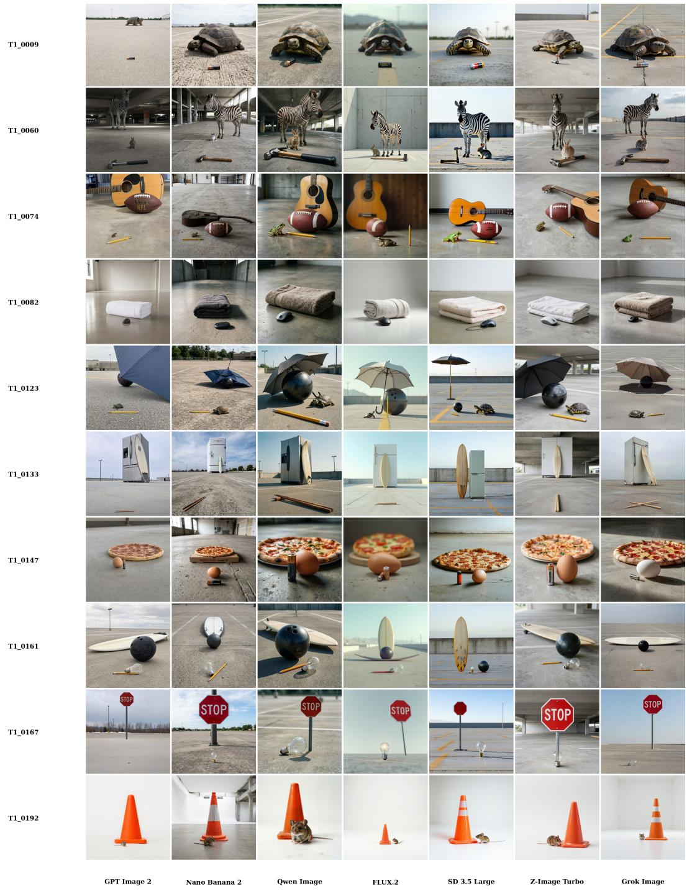  
Figure 14: Task 1 S1 Natural Depth examples. Each row corresponds to one common-object prompt and each column corresponds to an evaluated generator. S1 allows perspective and depth ordering, so generated images may use near–far placement while still being evaluated for real-world relative scale.

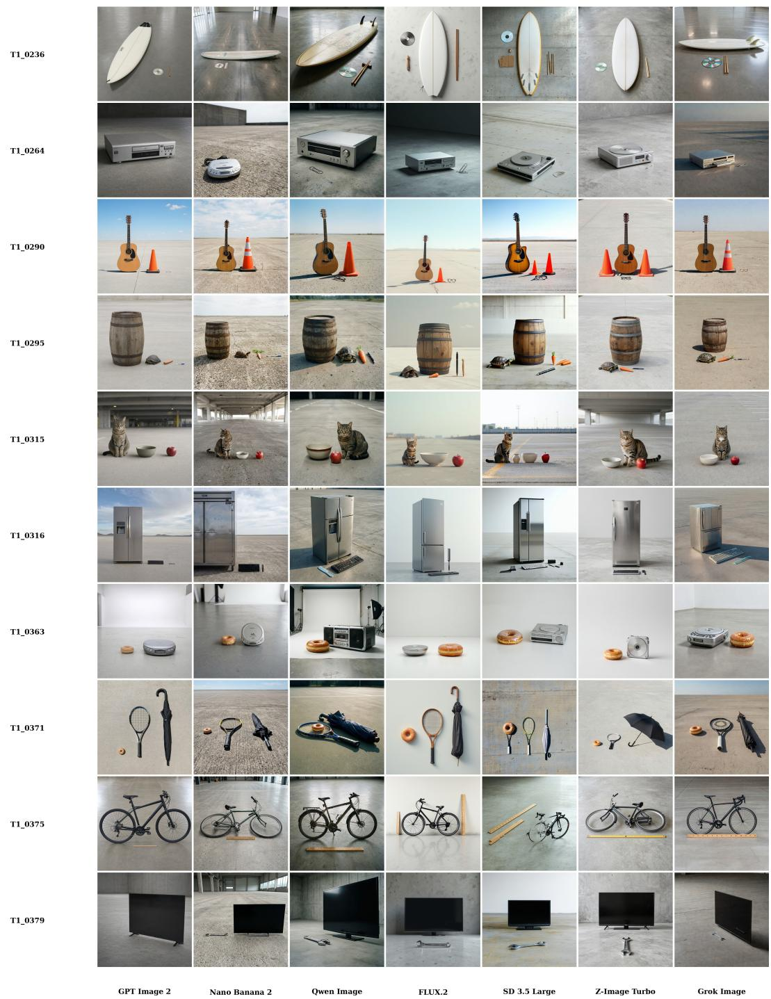  
Figure 15: Task 1 S2 Same-Plane examples. Objects are prompted to lie on the same depth plane, reducing perspective ambiguity and making relative scale errors more directly visible in image space.

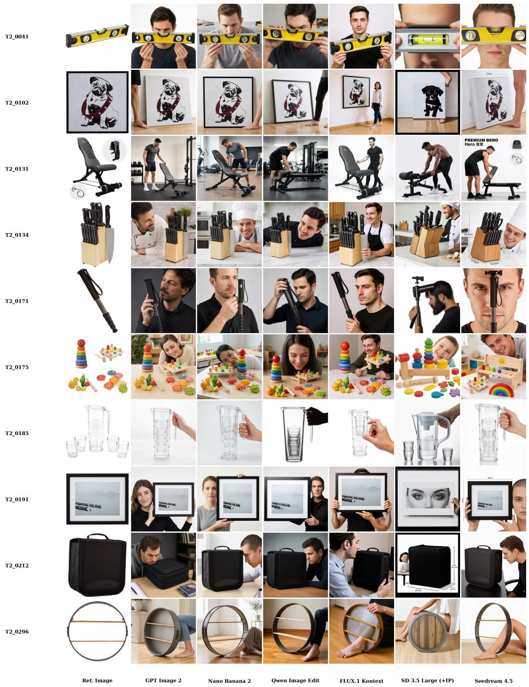  
Figure 16: Task 2 human-product generation examples. Each row contains one product reference image and the corresponding model outputs. Prompts provide product dimensions and require a human anchor, so the task tests whether the model can translate explicit metric information into plausible human–product proportions.

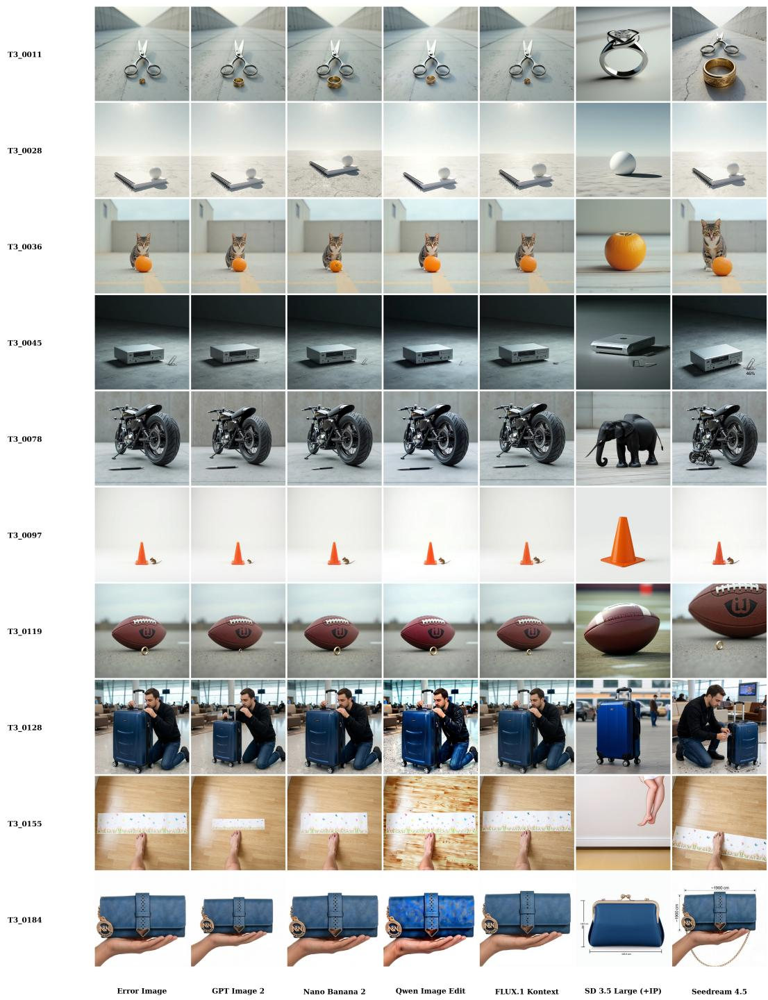  
Figure 17: Task 3 general-purpose editor correction examples. The source image contains a known scale error from Task 1 or Task 2. General-purpose editors are asked to correct the error, either through auto-discovery or through a precise resize instruction depending on the scenario.

Before After

Before After

T1\_0129  
T1\_0079  
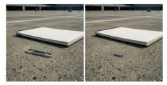

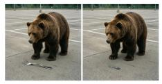

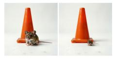

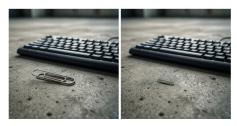

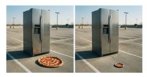

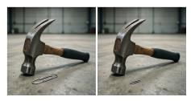

T1\_0002  
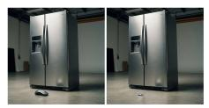

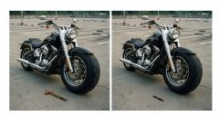

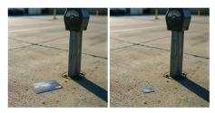

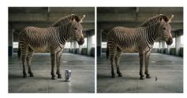

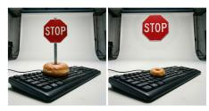  
Figure 18: Rescale corrections on S1 Natural Depth examples. Each example shows the original generated image and the corrected output. Rescale uses the diagnosed scale relation to resize the local target while preserving the natural-depth composition.

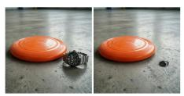

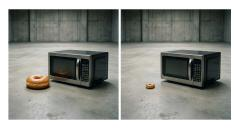

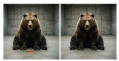

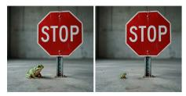

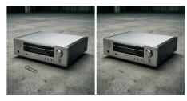

T1\_0332  
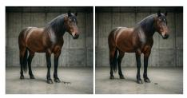

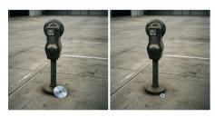

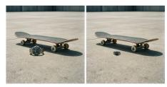

T1\_0241  
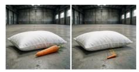

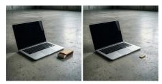

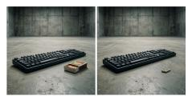  
Before After

Figure 19: Rescale corrections on S2 Same-Plane examples. Because S2 constrains objects to the same depth plane, scale errors are visually direct; the correction mainly requires accurate local resizing and reinsertion.

T3\_0064

T2\_0189

T2\_0288

Before After  
After  
Before  
After  
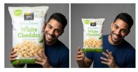

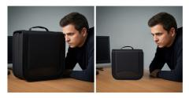

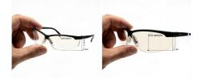

T2\_0248  
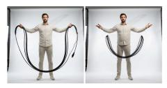

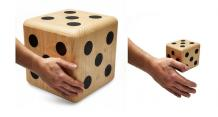

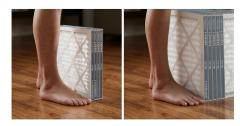

T2\_0102  
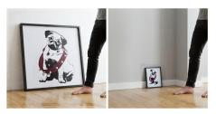

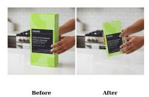

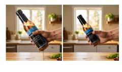

T2\_0222  
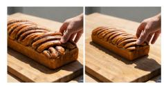

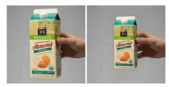

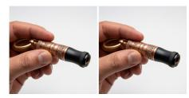  
Figure 20: Rescale corrections on S3 Human–Product examples. These examples show corrections where the product is resized relative to a human anchor while preserving the product identity and the surrounding interaction context.

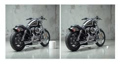

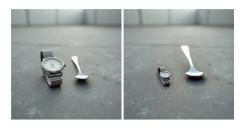

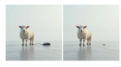

T3\_0076  
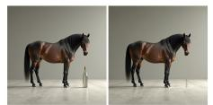

  
T3\_0002

  
Figure 21: Rescale corrections on S4 Hard Auto-Discovery examples. In S4, the system must infer whether a scale error exists, identify the editable target, estimate the correction direction and factor, and then execute the local edit.

Before

T3\_0069

T3\_0105

T3\_0093  
  
T3 0159

T3\_0001  

  
T3\_0027

  
T3\_0025

  
Before After

  
Before After

  
Before After  
T3\_0194

Figure 22: Rescale corrections on S5 Precise Scale Instruction examples. In S5, the target object, reference object, direction, and scale factor are given explicitly, isolating the localized resize-andreinsert capability from scale-error diagnosis.  
  
T3\_0080  
T3\_0102

  
T3\_0142  
T3\_0124

  
Figure 23: Failure cases for S4 Hard Auto-Discovery. Since the model must both diagnose and execute the correction, failures can occur at either stage: missing the scale anomaly, estimating an inaccurate factor, or applying a visually plausible but insufficient edit.  
T3\_0103

  
T3\_0195

  
T3\_0143  
T3\_0081  
T3\_0125

  
Before After

  
Figure 24: Failure cases for S5 Precise Scale Instruction. Even with the target and scale factor specified, local insertion can introduce artifacts, alter object identity, or fail to preserve the intended support region after resizing.