# HiLRP: Toward One Trustworthy Explanation for Vision Transformer: Conservation-Valid Attribution via Attention Primitives

Sathiyamohan Nishankara,∗, Pubudu Sanjeewanib, Asanka Pererac,d and Selvarajah Thuseethane

aFaculty ofEngineering, University ofPeradeniya, Sri Lanka

bSchool of Computing Technologies, RMIT University, Melbourne, Australia

cSchool ofEngineering & Digital Technologies, University ofSouthern Queensland, Brisbane, Australia

dSchool ofEngineering & Technologies, UNSW, Canberra, Australia

eFaculty ofScience and Technology, Charles Darwin University, Darwin, Australia

## A R T I C L E I N F O

Keywords:   
Explainable artificial intelligencep   
Vision transformers   
Layer-wise relevance propagation   
Faithfulness   
Localization   
Shapley agreement

## A BS T R AC T

Vision Transformer (ViT) design has become increasingly diverse, with backbones combining convolutional stems, windowed, linear, or multi-axis attention, patch merging, and spatial reduction in various configurations. This diversity poses challenges for existing attribution methods, whose assumptions often do not hold across ViT variants: Grad-CAM requires a terminal spatial feature map, attention rollout assumes global softmax attention, and layer-wise relevance propagation (LRP) requires module-specific rules. To the best of our knowledge, no existing method provides a unified attribution framework across this architectural space. We show that this architectural diversity can be captured by a simpler underlying structure. The attention and resolution-reduction operators in current ViTs can be decomposed into four operation types: linear maps, bilinear mixing, normalization or gating, and reindexing. Each operation admits a relevance rule that satisfies conservation. Based on these rules, HiLRP supports new backbones by construction rather than by architecture-specific derivation, and its attribution maps decompose the prediction rather than relying on heuristic assumptions. We prove conservation and conditional equivariance and verify both to machine precision. Across 14 attribution methods and 10 architectures, we find that no prior method remains reliable across ViT families, while Faithfulness Correlation becomes uninformative for backbones robust to spatial masking. HiLRP alone preserves conservation across windowed, spatial-reduction, multiaxis, and linear-attention models, where naive extensions can produce zero or inflated relevance. It also localizes attribution failures in class activation mapping, achieving 0.97 Pointing compared with 0.55 for competing methods on EficientViT. The same backward pass produces stage-localized maps, attributes label-free self-supervised objectives, and explains CLIP imagetext similarity without requiring additional rules. Code is available at https://github.com/ Nishan-Charlie/Hi-LRP-Towards-One-Trustworthy-Explainable-AI.git.

## 1. Introduction

Vision Transformers (ViTs) now underpin image analysis in domains where a prediction on its own is not suficient. In applications such as medical imaging, remote sensing, and industrial inspection, the evidence supporting a decision must be recoverable from the model, both to identify reliance on spurious correlations and to document the basis of a decision before it is acted upon. Post-hoc attribution methods address this requirement by assigning each input pixel a score intended to express its contribution to the output. Their usefulness rests on two conditions that are simple to state and, as this paper shows, dificult to satisfy simultaneously: the method must be defined on the architecture under analysis, and the scores it returns must carry a defined meaning.

Neither condition is guaranteed, as the architectures for which these methods were developed have since diversified. The original ViT [1] used a fixed grid of tokens mixed through global self-attention. Current backbones retain the transformer block but modify the surrounding operations along several dimensions. Attention may be localized or linearized through shifted local windows [2], spatial reduction of the key and value grids [3], linear cross-covariance products [4], or multi-axis schemes [5]. Spatial resolution is reduced between stages through token merging or strided projection, while hybrid designs interleave convolutional and transformer stages [6]. Architectures such as these, together with DeiT [7], BEiT [8], and ConvNeXt [9], emerged within roughly three years of one another, each combining a small set of components in diferent configurations to meet specific application or hardware requirements. Attribution methods have not evolved at the same pace, and each retains assumptions that are no longer satisfied by some current backbones.

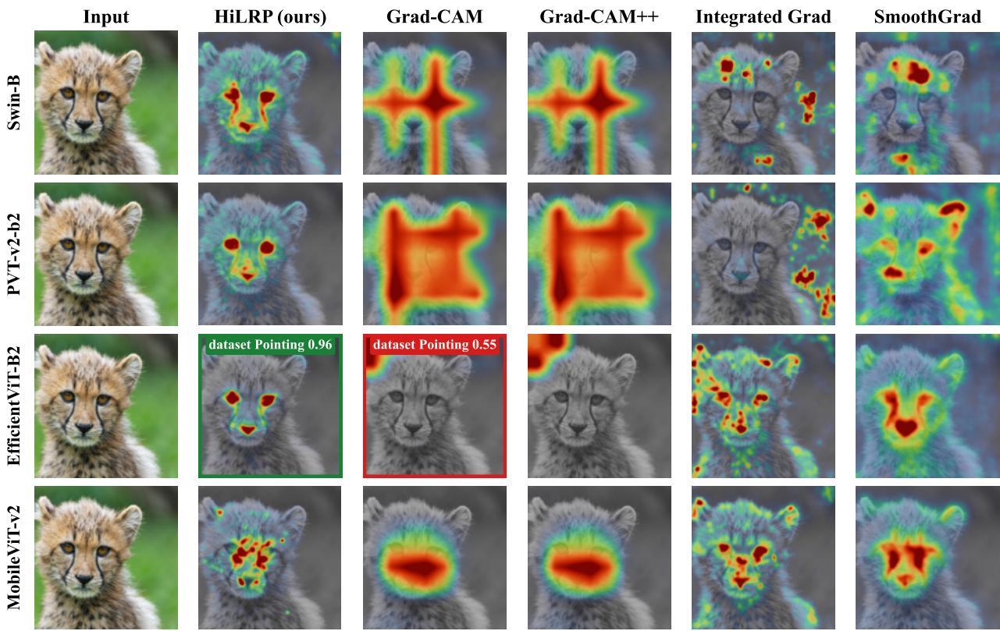  
Figure 1: Attribution maps over the desaturated input, one row per architecture. Grad-CAM and Grad-CAM++ remain coherent on Swin, PVT, and MobileViT but lose the object on EficientViT-B2 (highlighted), whose linear attention lacks a terminal spatial feature map. HiLRP consistently focuses on the eyes and facial markings. Scores are dataset-level Pointing values.

This architectural divergence reduces attribution reliability in ways that are measurable and specific to both the method and backbone. Fig. 1 applies the same attribution methods to a single image across four backbones, with architecture as the only variable. Grad-CAM [10] produces coherent responses on three backbones but a near-uniform response on EficientViT, whose linear attention does not provide a terminal spatial feature map for class activation mapping (CAM). The same pattern is observed across the 10-architecture benchmark in Section 5.1. Under the Pointing Game [11], which measures whether the highest-valued pixel in an attribution map falls within the annotated object, Grad-CAM achieves 1.00 on four backbones but only 0.55 on EficientViT-B2, below the 0.61 obtained by random point placement. Attention Rollout [12] is undefined for windowed and hierarchical models, while classic layer-wise relevance propagation (LRP) [13] does not execute on modern transformer implementations. These failures are not caused by parameter selection. Each method relies on a structural property that some current backbones no longer provide.

The preceding cases are executionfailures: the method either cannot be applied to the architecture or produces an evidently degenerate map. A second class of failure preserves the appearance of a valid explanation while removing its theoretical basis: the conservation guarantee on which the method’s interpretation depends is lost. AttnLRP [14] provides propagation rules for operations within a transformer block and conserves relevance through a flat transformer. To the best of our knowledge, no corresponding rules have been reported for the operations that make a backbone hierarchical. Applying the framework to such backbones therefore requires unmodified gradients for unsupported layers, while scale-invariant normalizations within these layers drive the propagated relevance toward zero. Across five hierarchical backbones, the resulting relevance is inflated by more than threefold in one case and reduced to exactly zero at depth in the other four (Section 5.5), despite the maps retaining good localization. A map whose values sum to zero can still have a well-defined maximum and satisfy a localization criterion, making conservation-valid and degenerate attributions indistinguishable under commonly reported metrics.

These two classes of failure establish two requirements. An attribution method must be defined for the architecture under analysis, and its output must decompose the prediction rather than merely rank pixels by an unconstrained score. Existing methods generally satisfy only one of these requirements. Gradient and perturbation methods can be applied to a broad range of architectures but provide no conservation property, leaving the quantity represented by their scores unconstrained. LRP [13] and its transformer descendants [14, 15] constrain this quantity through layerwise conservation, but only for specific transformer architectures. Extending them to new backbone designs requires a separately derived rule for each module type, and this cost increases as architectural diversity grows.

Rather than deriving a separate propagation rule for each new architectural module, this work shows that the relevant operators can be decomposed into a small set of primitive computational types. The architectures considered above difer primarily in how these operations are arranged, rather than in the operations they use. Attention and resolutionreduction mechanisms in this class of models can be expressed through four computational types: linear maps, such as query, key, value, and output projections; bilinear products, in which both factors depend on the input; normalizations and gates, such as softmax and LayerNorm; and reindexings, such as reshaping, window partitioning, and cyclic shifting. For example, windowed attention and spatial-reduction attention use the same four types but arrange them diferently and operate over diferent sparsity patterns. Each type admits a relevance rule that satisfies conservation, and a composition of conserving operations is itself conserving (Proposition 1). A rule set covering these four types therefore applies to any architecture composed of them, regardless of their arrangement, without additional derivation.

Hierarchical LRP (HiLRP) is the attribution method developed from this decomposition. Supporting a backbone requires assigning each module to one of the four computational types, after which the corresponding rules and conservation proof follow directly. Patch merging, shifted-window partitioning, and spatial reduction, which motivated this work, are specific instances rather than distinct components of the framework, since all three can be expressed as linear projections of concatenated token neighborhoods. The guarantee is not unconditional: architectures based on fundamentally diferent mixing operations, such as the selective scan in state-space models, require an additional propagation rule. The proposed construction accommodates such extensions, but deriving this rule is beyond the scope of this work.

Establishing these claims requires evaluation criteria that distinguish valid attributions from invalid ones, yet commonly used criteria do not provide this distinction. Perturbation-based fidelity measures assume that masking an important region changes the prediction, an assumption that modern ViTs can violate. Across our benchmark, the resulting scores are statistically indistinguishable from noise. Localization measures present a diferent limitation: on datasets dominated by large, centered objects, a fixed Gaussian blob that does not inspect the image can saturate the Pointing Game and achieve higher average precision than most attribution methods. We therefore evaluate attribution quality along three axes that are less susceptible to these efects: conservation validity, agreement with sampled Shapley values over image segments, and relevance mass within the object relative to the area covered by a uniform map (Section 5.4). The major contributions of this paper are summarised as follows.

• Attribution from four primitives. We decompose the attention and resolution-reduction operators in current ViTs into four operation types, each governed by a single relevance-conservation rule. This formulation makes backbone coverage a matter of construction rather than separate derivation. Conservation and conditional equivariance are proved and verified to machine precision. We further show that patch merging, shifted-window partitioning, and spatial reduction share a common algebraic form: a learned linear projection applied to a concatenated neighborhood of tokens, ��(concat(⋅)). Thus, a single rule and proof cover all three operations, eliminating the need for separate derivations.

• Compositional coverage of the attention taxonomy. We verify the decomposition for self-, cross-, and coattention, together with windowed, linear, spatial-reduction, multi-axis, channel, dilated, and deformable attention, realize eight on pretrained backbones, and attribute a cross-modal scalar on CLIP without adding a rule. Because conservation composes, a mechanism outside the four costs one added rule and leaves the existing rules intact, so coverage grows by extension rather than by rederivation.

Attribution families and their architectural assumptions. Rows show method families and their required assumptions; columns show backbone families. A check indicates that the assumption holds, a half-disk indicates degraded or unstable behavior, and a cross indicates that the method is undefined or fails to run. HiLRP avoids these architecture-specific assumptions by operating on four conservation-preserving primitives.
<table><tr><td>Family</td><td>Assumption</td><td>CNN</td><td>ViT</td><td>Swin</td><td>PVT</td><td>MaxV</td><td>MobV</td><td>EffV</td></tr><tr><td>Gradient</td><td>smooth gradients</td><td>√</td><td>0</td><td>0</td><td>0</td><td>0</td><td>0</td><td>0</td></tr><tr><td>CAM</td><td>spatial feature map</td><td>√</td><td>0</td><td>√</td><td>√</td><td>√</td><td>√</td><td>x</td></tr><tr><td>Attention</td><td>softmax + CLS</td><td>x</td><td>√</td><td>x</td><td>x</td><td>x</td><td>x</td><td>x</td></tr><tr><td>Perturbation</td><td>output access</td><td>√</td><td>√</td><td>√</td><td>√</td><td>√</td><td>√</td><td>√</td></tr><tr><td>Classic LRP</td><td>module-specific rules</td><td>√</td><td>x</td><td>x</td><td>x</td><td>x</td><td>x</td><td>x</td></tr><tr><td>HiLRP (ours)</td><td>four primitives</td><td>√</td><td>√</td><td>√</td><td>√</td><td>√</td><td>√</td><td>√</td></tr></table>

• Conservation validity where prior work is degenerate. On the windowed, spatial-reduction, multi-axis, and linear-attention families, the naive extension of attention-aware LRP zeroes or inflates relevance while still scoring well on localization, and classic LRP does not run. HiLRP keeps a bounded, non-degenerate decomposition on all five. Globally-normalized convolution hybrids such as MobileViT fall outside the present primitive set and are treated as a designated extension (Section 6).

• A cross-architecture benchmark and an evaluation protocol that survives it. Over 10 architectures and 14 methods, we show that no prior attribution is reliable across ViT families, and that Faithfulness Correlation (FC) is statistically indistinguishable from noise in all 118 model-method cells on which it is defined. Under conservation validity and Shapley agreement, HiLRP is the only method that holds on every family, including the linear-attention backbones where Grad-CAM fails in both localization (0.97 against 0.55) and Shapley agreement (0.417 against 0.077).

The rest of the paper is organized as follows. Section 2 reviews attribution methods, conservation-based propagation, and existing cross-architecture evaluations. Section 3 develops HiLRP: the unifying form of resolution reduction, the four primitives and their rules, the conservation and equivariance guarantees, the label-free extension, and the implementation. Section 4 states the experimental protocol and why the standard fidelity metric is replaced. Section 5 reports the benchmark, localization, conservation validity, Shapley agreement, stage-localized and multimodal attribution, the pretraining study, and the ablations. Section 6 states the limitations, and Section 7 concludes.

## 2. Related work

## 2.1. Attribution methods

Attribution methods fall into four broad families: gradient-based, attention-native, perturbation-based, and propagation-based. Gradient methods, including Saliency [16], Integrated Gradients [17], Input×Gradient [18], SmoothGrad, and VarGrad [19], diferentiate the class logit with respect to the input. CAM methods, namely Grad-CAM [10] and Grad-CAM++ [20], weight intermediate feature maps by the gradient signal; applying them to a ViT requires reshaping the token sequence back into a spatial grid. Attention-native methods such as Attention Rollout [12] and the relevance-propagation attribution of Chefer et al. [13, 15] exploit the transformer’s own attention maps and have no convolutional counterpart. Perturbation methods, including Occlusion [21], RISE [22], LIME [23], and GradientSHAP [24], probe the model by masking or sampling the input; they are model agnostic but computationally costly. The present benchmark evaluates representatives of all four families (Table 1). Each family rests on an architectural assumption that a suficiently diferent backbone can invalidate: CAM assumes a terminal spatial feature map, attention-native methods assume explicit softmax attention matrices, and gradient methods assume smoothly behaved input gradients.

## 2.2. Conservation-based attribution and the hierarchical gap

LRP [13] is distinguished from the families above by a completeness property: relevance is conserved layer by layer, so the explanation is a decomposition of the prediction rather than a saliency heuristic. Chefer et al. [15] extended this framework to isotropic ViTs by combining relevance with attention gradients, and AttnLRP [14] derived block-internal rules that preserve conservation through a transformer’s non-linear operations: a Taylor rule for the softmax, a uniform split for the bilinear matrix products, and an identity rule for LayerNorm. These methods conserve, but only for flat, all-to-all transformers. Neither of them defines a rule for the operations that make a modern ViT hierarchical or hybrid: patch merging, shifted-window partitioning, spatial reduction, convolutional stems, or the linearattention denominator. Applied to such backbones, they either fail to execute when an unsupported layer is reached, or inadvertently violate conservation when a scale-invariant normalization drives the propagated relevance to zero (Section 5.5). The conventional approach of manually deriving one rule per new module does not scale to the rapid proliferation of novel architectures. HiLRP instead reduces every such operation to a small set of conserving primitives, closing the gap by construction rather than by enumeration.

## 2.3. Evaluating explanations

A ground truth for a correct attribution is rarely available, so evaluation relies on surrogate criteria. Faithfulness metrics perturb high-attribution regions and measure the resulting change in the model output [25–27]. Localization metrics compare attributions against object masks or boxes through the Pointing Game [11]. Robustness metrics such as Max-Sensitivity [28] measure stability under small input perturbations, complexity metrics [29] quantify how concentrated an explanation is, and sanity checks [30] test whether an attribution depends on the model at all. Systematic reviews and benchmark studies [31, 32] report that these criteria often disagree and that no single metric sufices, which motivates a multi-metric protocol. We adopt the QUANTUS [33] library so that every metric is computed by a shared and validated implementation rather than through a separate custom implementation.

## 2.4. Ground-truth and cross-architecture benchmarks

Brandt et al. [34] obtain an exact ground truth by hand-constructing a small CNN, and report that Integrated Gradients performs best overall and that methods are weak on negatively contributing pixels. Their study is confined to a 36 × 36 CNN evaluated solely on synthetic inputs. FunnyBirds [35] and CLEVR-XAI [36] provide causal or synthetic ground truth, again primarily for CNNs, while systematic evaluations of attribution methods have to date concentrated on convolutional backbones [37]. Among proxy-based evaluations, QUANTUS [33] and ROAD [27] scale to real models but provide no ground truth and can disagree. Recent work has examined the faithfulness of ViT explanations directly [38], but on isotropic ViTs, and without examining whether a method remains defined and conservation-valid as the backbone design changes. To the best of our knowledge, no prior study evaluates attribution across the breadth of modern hierarchical and hybrid ViT designs under a single fixed protocol while testing, on the same axis, whether the explanations conserve relevance at all. This combination constitutes the gap addressed in the present work.

Concurrent and adjacent directions. Transformer LRP was established for flat self-attention by AttnLRP [14], upon which our block-internal rules are based; recent eforts extend attribution to hierarchical designs, but perarchitecture rather than through a shared primitive decomposition. Two model families lie outside our current primitive set and represent logical extensions for future work. State-space vision models (Vision Mamba and related selectivescan backbones) mix tokens through a linear recurrence rather than a bilinear attention product, a fundamentally distinct mixing primitive that would require one additional conserving rule, which the framework is designed to admit. Generative difusion backbones are a second such family. Explanation methods for difusion models have received increasing attention, but those proposed to date are attention- and saliency-based rather than conservation-based: Park et al. [39] explain the denoising trajectory through visual analysis of cross-attention across time steps, and ConceptAttention [40] derives saliency maps from the attention layers of a difusion transformer to localize textual concepts. Both produce a ranking over image regions; neither establishes that the values returned decompose a scalar the model computes. Carrying the conservation premise to this family therefore requires two additions: a target scalar appropriate to a generative rather than a discriminative objective, and rules for any mixing operation the denoiser introduces beyond the four types treated here. We accordingly position HiLRP as the conservation-valid attributor for the current, attention-based ViT design space, and identify state-space mixing and generative denoising objectives as the two extensions the framework is designed to accommodate.

## 3. Methodology: HiLRP

## 3.1. Notation and the conservation constraint

Let $x \in \mathbb { R } ^ { H \times W _ { \mathrm { i m g } } \times 3 }$ be the input image, � the frozen network, � the index of the class being explained, and $f _ { c } ( x ) \in$ ℝ the corresponding output logit. Activations inside the network are written �, with subscripts giving spatial position and channel; the symbol � is reserved for the input image throughout, and � denotes the output of whichever operator is under discussion.

Relevance denotes the quantity that LRP redistributes from the output of the network back towards its input. For an activation $a _ { j } ,$ , the scalar $R _ { j }$ denotes the portion of the output logit $f _ { c } ( x )$ attributed to that activation. Propagation is initialized at the output with $\dot { R } = f _ { c } ( x )$ and proceeds backward layer by layer, subject at every layer to the conservation constraint

$$
\sum _ { j \in \mathrm { l a y e r } \ell } R _ { j } \ = \ \sum _ { i \in \mathrm { l a y e r } \ell + 1 } R _ { i } \ = \ f _ { c } ( x ) ,\tag{1}
$$

where $\ell$ indexes depth. The condition in Eq. (1) distinguishes a relevance map from a saliency heuristic: it forces the attribution delivered at the input pixels to be a decomposition of $f _ { c } ( x )$ , so the values carry the units of the prediction and sum to it. Standard LRP rules, including the �-rule and the $z ^ { + }$ -rule, satisfy Eq. (1) for linear layers and convolutions. Remaining symbols are defined where they first appear.

For the three operations identified in Section 2.2 as lacking a propagation rule, we first show that all three are instances of a single algebraic form, so one rule and one proof cover them, and then give the concrete rules, the conservation and equivariance guarantees, the label-free extension, and the implementation.

HiLRP inherits the block-internal attention rules of AttnLRP [14] listed in Section 2.2. The novel contributions introduced in this methodology are fourfold: the resolution-reduction rule that unifies patch merging, shifted windows, and spatial reduction as one coordinate-embedded linear map; the normalization-subclass guard that prevents scaleinvariant norms from silently zeroing deep relevance; the conservation-preserving attention rule (CP-LRP, Section 3.4) applied uniformly across families; and the four-primitive framework that makes coverage a matter of construction rather than per-architecture derivation

## 3.2. A unifying view of resolution reduction

The diverse downsampling operators utilized across ViT variants can be mathematically reduced to a single formulation. Let $\mathcal { N } = \{ a ^ { ( \bar { 1 } ) } , \ldots , \bar { a ^ { ( n ) } } \}$ be the ordered set of � input tokens consumed by a single resolution-reduction step (�=4 for 2×2 patch merging, $n { = } k ^ { 2 }$ for a �×� strided kernel), with each token $a ^ { ( i ) } ~ \in ~ \mathbb { R } ^ { d _ { \mathrm { i n } } }$ . Patch merging concatenates a $2 { \times } 2$ neighborhood and projects it; a strided patch-embedding convolution is a linear map on a pixel neighborhood; and the spatial reduction in PVT and EficientViT is a strided convolution on the token grid. Each can be written as

$$
T ( \mathcal { N } ) = W \phi \big ( \mathrm { c o n c a t } ( a ^ { ( 1 ) } , \dots , a ^ { ( n ) } ) \big ) = y \in \mathbb { R } ^ { d _ { \mathrm { o u t } } } ,\tag{2}
$$

where concat $: ( a ^ { ( 1 ) } , \ldots , a ^ { ( n ) } ) \mapsto [ a ^ { ( 1 ) \top } , \ldots , a ^ { ( n ) \top } ] ^ { \top } \in \mathbb { R } ^ { n d _ { \mathrm { i n } } }$ is a coordinate embedding (one input coordinate per output coordinate, exact by Lemma 1), $\phi ~ : ~ \mathbb { R } ^ { n d _ { \mathrm { i n } } } ~  ~ \mathbb { R } ^ { n d _ { \mathrm { i n } } }$ is a conservation-preserving normalization (identity or LayerNorm), and $W \in \mathbb { R } ^ { d _ { \mathrm { o u t } } \times n d _ { \mathrm { i n } } }$ is the learned projection. The output � is the single merged token produced from neighborhood $\mathcal { N }$ . The form in Eq. (2) is therefore the operator through which HiLRP propagates relevance across a change of resolution. A single rule for this operator yields patch merging, strided patch embedding, and spatial reduction as corollaries, rendering the framework architecture-agnostic rather than a collection of per-model modifications. The cyclic shift and the window partition of the shifted-window mechanism are pure permutations of $\mathcal { N }$ , which require no rule of their own: by Lemma 1 a permutation conserves relevance exactly, and the Gradient×Input backend propagates such an operation through native automatic diferentiation.

## 3.3. Attention as four conserving primitives

The same reduction applies to attention itself, rendering HiLRP general rather than a collection of per-architecture rules. Every attention mechanism we survey, from global softmax to linear cross-covariance, is a composition of four operation classes. Each is defined by its algebraic form rather than its specific module implementation, as the mathematical form dictates the applicable propagation rule.

Definition 1 (Linear map). An operation $\begin{array} { r } { y _ { i } = \sum _ { j } w _ { i j } a _ { j } + b _ { i } } \end{array}$ with weights independent of the activations. Instances: the �, �, �, and output projections, poolings, kernel feature maps, rotary and relative-position embeddings, and the resolution-reduction map of Eq. (2). Rule: the �/� rule of Eq. (6), which conserves by Lemma 1 up to the bias and stabilizer.

Definition 2 (Bilinear mixing). An operation $y = U V$ in which both factors depend on the activations, so the map is not linear in either alone. Instances: the matrix products $Q K ^ { \top }$ and $A V$ , the linear-attention products, and deformable sampling at learned ofsets. Rule: a uniform split of relevance between the two factors, or, in the conservationpreserving variant used throughout (Section 3.4), the treatment of one factor as fixed gating so that relevance flows through the other.

Definition 3 (Normalization and gating). An operation $y = a \odot g ( a )$ or $y = a / d ( a )$ whose second factor is a scalar or per-group statistic computed from the activations themselves. Instances: softmax, the linear-attention denominator, LayerNorm, and squeeze-excite or sigmoid gates. Rule: detach the denominator or gate, making the operation locally linear in the numerator, which conserves exactly in the detached variable.

Definition 4 (Reindexing). An operation that moves activations without combining them, so its matrix has exactly one nonzero entry per output. Instances: head splitting and merging, window partitioning, cyclic shifting, dilation, grouping, and the concatenation of Eq. (2). Rule: none is needed. By Lemma 1 the ratio $z _ { i j } / z _ { i }$ is one, so relevance is copied without leak.

Four rules are suficient to cover an unbounded set of architectures because conservation is preserved under composition.

Proposition 1 (Closure under composition). Let $f = f _ { L } \circ \cdots \circ f _ { 1 }$ where each $f _ { \ell }$ is one of Definitions 1–4 and each satisfies $\begin{array} { r } { \sum _ { j } R _ { j } ^ { ( \ell ) } = \sum _ { i } R _ { i } ^ { ( \ell + 1 ) } } \end{array}$ . Then � satisfies Eq. (1) end to end.

Proof. Immediate by induction on $\ell { : }$ the relevance entering layer � quals that leaving layer $\ell + 1$ by hypothesis, so the total is invariant along the composition and equals the seed $f _ { c } ( x )$ □

Proposition 1 converts a set of four rules into coverage of an entire architecture family. Fundamentally, attention comprises a linear map, followed by a bilinear mix, a normalization or gate, and an aggregation over some sparsity pattern. HiLRP conserves relevance through each of these stages, and therefore through their composition. Fig. 2 traces this decomposition through one multi-head attention block, coloring each operation by the primitive it belongs to and marking where the relevance rule for that primitive applies.

The consequence is that coverage becomes compositional: an attention design built from these primitives, in whatever order, inherits a conservation-valid rule with no new derivation, and a mechanism outside them needs one added rule rather than a rederivation of the rest. Table 2 lists the span, from self-attention to linear, windowed, spatialreduction, multi-axis, channel, and dilated attention, as well as cross- and co-attention. The two kinds of evidence are reported separately: seven composite types are verified to $1 0 ^ { - 1 1 }$ in a float64 reference implementation, and eight are realized on pretrained models (Section 5), including cross-attention on CrossViT and cross-modal attribution on CLIP [41]. Three types carry both.

## 3.4. Conservation-preserving attention

AttnLRP propagates relevance through the softmax with a Taylor expansion of the attention matrix. This sharpens maps on isotropic ViTs but does not conserve: in our ablation it retains only 0.29 of the relevance mass, so the result is a contrast-enhanced heuristic rather than a decomposition of the logit. The CP-LRP rule instead treats the attention weights as a fixed gating and routes relevance through the value path only, retaining 0.82.

This configuration is governed by a single parameter, and selecting the Taylor rule instead exposes the same tradeof on a flat backbone. On ViT-B the Taylor mode raises Pointing from 0.70 to 0.90 while pixel conservation error $| \sum R / f _ { c } - 1 |$ grows from 0.39 to 0.85: it improves pointing accuracy but fails to decompose the logit. HiLRP therefore keeps CP-LRP as the conserving default on every family, including flat CLS-pooled ViTs. The resulting 0.70 represents a mathematically rigorous localization, above the 0.61 random-point prior, and this relatively lower score reflects that CP-LRP avoids double-counting the CLS-attention shortcut that the heuristic exploits.

(a) HiLRP: one conservation-valid backward pass over any hierarchical or hybrid ViT  
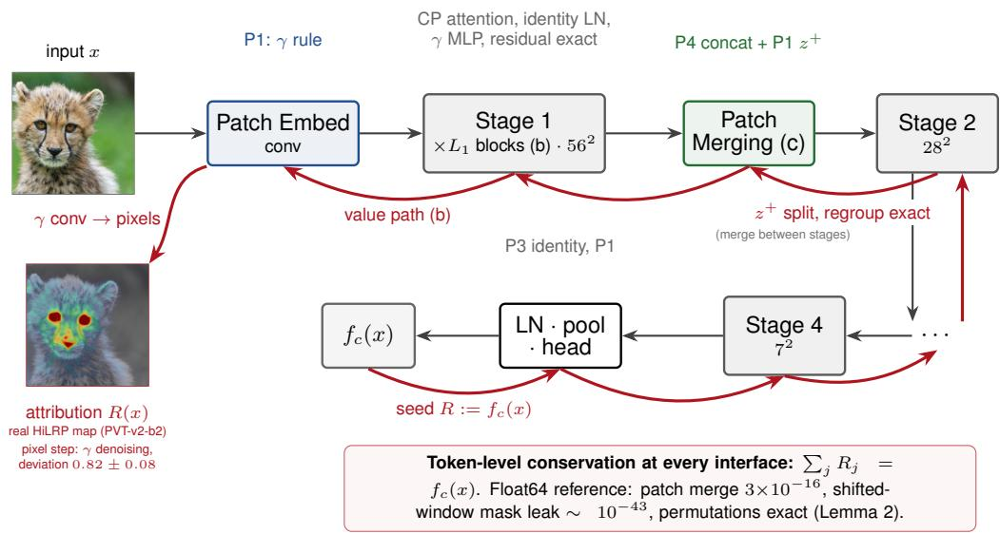

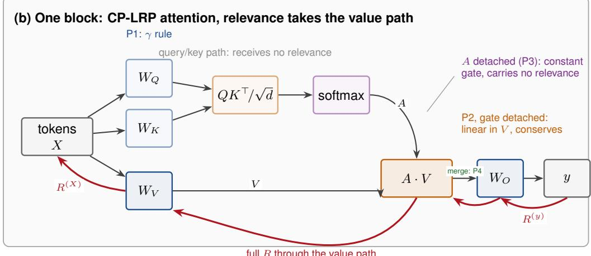

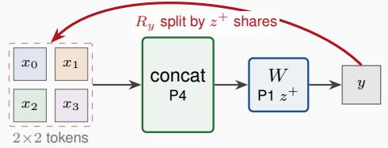

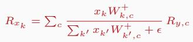

## (d) Four conserving primitives

P1 linear: Q/K/V/out, MLP, conv, pool ε/γ rule

P2 bilinear: QK⊤, A V, linear attn. split, or CP: detach one factor

P3 normalize/gate: softmax, LN, denominators detach identity

P4 reindex: heads, windows, shifts, merge permutation, exact

A new ViTis a new arrangement ofthe same four: covered by construction, no new derivation.

Figure 2: HiLRP overview. Forward propagation in black, relevance in red. (a) One backward pass over a hierarchical backbone. (b) Attention block under CP-LRP: relevance follows the value path. (c) Patch merging, the $z ^ { + }$ rule of Eq. (3). (d) The four primitives and their rules. Colors denote primitives: linear (blue), bilinear (orange), normalization or gating (purple), reindexing (green).

Attention coverage by primitive. Primitives are linear maps (Lin), bilinear mixing (Bil), normalization or gating (Nrm), and reindexing (Idx). F64 denotes conservation verified to $1 0 ^ { - 1 1 }$ in the float64 reference suite and Model realization on a pretrained network; ✓ indicates coverage or evidence and – that the axis is not applicable. Parenthesized names are representative architectures: SE, squeeze-and-excitation; NAT, Neighborhood Attention Transformer; Def-DETR, Deformable DETR.
<table><tr><td></td><td colspan="4">Primitives</td><td colspan="2">Evidence</td></tr><tr><td>Attention (example)</td><td>Lin</td><td>Bil</td><td>Nrm</td><td>Idx</td><td>F64</td><td>Model</td></tr><tr><td>Self / multi-head (ViT)</td><td>√</td><td>√</td><td>√</td><td>√</td><td>√</td><td>√</td></tr><tr><td>Windowed / shifted (Swin)</td><td>√</td><td>√</td><td>√</td><td>√</td><td>√</td><td>√</td></tr><tr><td>Spatial-reduction (PVT)</td><td>√</td><td>√</td><td>√</td><td>√</td><td></td><td>√</td></tr><tr><td>Linear (EfficientViT)</td><td>√</td><td>√</td><td>√</td><td>√</td><td>√</td><td>√</td></tr><tr><td>Separable (MobileViT)†</td><td>√</td><td>√</td><td>√</td><td></td><td></td><td>√</td></tr><tr><td>Multi-axis (MaxViT)</td><td>√</td><td>√</td><td>√</td><td>√</td><td></td><td>√</td></tr><tr><td>Cross-attention (CrossViT)</td><td>√</td><td>√</td><td>√</td><td>√</td><td>√</td><td>√</td></tr><tr><td>Cross-modal (CLIP)</td><td>√</td><td>√</td><td>√</td><td>√</td><td></td><td>√</td></tr><tr><td>Co-attention (bi-modal)</td><td>√</td><td>√</td><td>√</td><td>√</td><td>√</td><td></td></tr><tr><td>Channel / coordinate (SE)</td><td>√</td><td></td><td>√</td><td></td><td>√</td><td></td></tr><tr><td>Dilated / sparse (NAT)</td><td>√</td><td>√</td><td>√</td><td>√</td><td>√</td><td></td></tr><tr><td>Deformable (Def-DETR)</td><td>√</td><td>√</td><td>√</td><td>√</td><td>√</td><td></td></tr><tr><td>Grouped-query, RoPE</td><td>√</td><td></td><td></td><td>√</td><td>一</td><td>一</td></tr></table>

†MobileViT’s separable-attention block decomposes into the four primitives and is realized on the pretrained model. Its surrounding single-group GROUPNORM and channel gating fall outside them and are a designated extension (Section 6); the coverage claim here is for the attention block, not the whole backbone. – marks the row where both evidence axes are vacuous: grouped-query attention and rotary embeddings are primitives, so there is nothing to verify.

## 3.5. LRP for patch merging (Swin, PVT)

Hierarchical architectures such as Swin and PVT use patch merging to reduce the spatial resolution while increasing the channel dimension. A patch-merging layer concatenates $2 \times 2$ neighboring patches and applies a linear projection. Let $a _ { i , j } \in \mathbb { R } ^ { d }$ be the activation at spatial location $( i , j )$ on the token grid before merging, let $W \in \mathbb { R } ^ { d _ { \mathrm { o u t } } \times 4 d }$ be the learned projection, and let $b \in \mathbb { R } ^ { d _ { \mathrm { o u } } }$ t be its bias. The merged output token at position $( r , t )$ of the reduced grid is $y _ { r , t } = W [ a _ { 2 r , 2 t } ; a _ { 2 r + 1 , 2 t } ; a _ { 2 r , 2 t + 1 } ; a _ { 2 r + 1 , 2 t + 1 } ] + b .$ , where the semicolons denote concatenation of the four neighbors into a single vector in $\mathbb { R } ^ { 4 d }$

Let $p \in \{ 1 , \ldots , 4 d \}$ index the entries of that concatenated vector, so $p$ determines both the source patch and the channel within it, and let $o \in \{ 1 , \ldots , d _ { \mathrm { o u t } } \}$ index the output channels. Writing $R _ { y , o }$ for the relevance already assigned to output channel $^ { o , }$ HiLRP applies the $z ^ { + }$ -rule:

$$
R _ { a _ { p } } = \sum _ { o } \frac { a _ { p } ( W _ { o , p } ) ^ { + } } { \sum _ { p ^ { \prime } } a _ { p ^ { \prime } } ( W _ { o , p ^ { \prime } } ) ^ { + } + \epsilon } R _ { y , o } ,\tag{3}
$$

where $( \cdot ) ^ { + } = \operatorname* { m a x } ( \cdot , 0 )$ denotes the positive part, and $p ^ { \prime }$ ranges over the same index set as $p ,$ summing the denominator over all contributors to output channel $o .$ Relevance is distributed in proportion to the positive contributing features, which prevents spatial bleeding across the merged $2 \times 2$ grid. The un-concatenation that returns each contribution to its input slot is a coordinate embedding, exact by Lemma 1, so the step conserves up to the bias �, whose constant contribution is not redistributed, and the � terms. In deployment the rule is applied in its �-stabilized form $\scriptstyle ( \gamma = 0 . 2 5$ Section 3.9).

## 3.6. LRP for spatial reduction (EficientViT)

EficientViT uses spatial reduction in its linear cross-covariance attention to cut the cost of the keys and values, applying a depthwise convolution with stride $s { = } 2$ over the spatial tokens. Unlike patch merging, spatial reduction is an overlapping operation. Per channel it is still a linear map on a token neighborhood, so it is an instance of Eq. (2) and inherits the same rule. Let $q$ index the channels, � be the kernel size, $\bar { a } _ { i , j } ^ { q }$ the scalar activation at location $( i , j )$ in channel $q ,$ and $W _ { \mathrm { d w } , q } \in \mathbb { R } ^ { k \times k }$ the depthwise kernel with entries indexed by the ofsets $( u , v ) \in \{ 0 , \ldots , k - 1 \} ^ { 2 }$ , so that the output at position $( r , t )$ is $\begin{array} { r } { y _ { r , t } ^ { q } = \sum _ { u , v } W _ { \mathrm { d w } , q } ^ { u , v } a _ { s r + u , s t + v } ^ { q } } \end{array}$ . Because the operation overlaps, an input contributes to every output whose receptive field contains it. Let $\mathcal { O } ( i , j ) = \{ ( r , t ) : 0 \leq i - s r \leq k { - } 1 , 0 \leq j - s t \leq k { - } 1 \}$ collect those output locations; the ofset linking (�, �) to $( r , t )$ is $( u , v ) = ( i - s r , j - s t )$ . The rule is then applied independently per channel:

$$
R _ { a _ { i , j } ^ { q } } = \sum _ { ( r , t ) \in \mathcal { O } ( i , j ) } \frac { a _ { i , j } ^ { q } \left( W _ { { \mathrm { d w } } , q } ^ { i - s r , j - s t } \right) ^ { + } } { \sum _ { u ^ { \prime } , v ^ { \prime } } a _ { s r + u ^ { \prime } , s t + v ^ { \prime } } ^ { q } \left( W _ { { \mathrm { d w } } , q } ^ { u ^ { \prime } , v ^ { \prime } } \right) ^ { + } + \epsilon } R _ { y _ { r , t } ^ { q } } ,\tag{4}
$$

where $( u ^ { \prime } , v ^ { \prime } )$ range over the kernel support, so the denominator is the positive pre-activation of the output $( r , t )$ to which the numerator contributes. Summing Eq. (4) over all inputs recovers $\textstyle \sum _ { r , t } R _ { y _ { r , t } ^ { q } }$ , since the numerators belonging to a given output sum to its denominator; the step therefore conserves up to the bias and � terms (Lemma 1). Distributing relevance in proportion to the positive contributions traces the most active sub-regions within the overlapping windows. In deployment this rule too is applied in its �-stabilized form $\scriptstyle ( \gamma = 0 . 2 5$ , Section 3.9).

## 3.7. Theoretical guarantees

Two properties follow from the propagation rules and can be verified independently of any dataset. Both rest on a single algebraic fact.

Lemma 1 (Conservation by sum exchange). Let $W \in \mathbb { R } ^ { d _ { \mathrm { o u t } } \times d _ { \mathrm { i n } } }$ be a weight matrix with entries $w _ { i j }$ , defining the linear map $\begin{array} { r } { y _ { i } = \sum _ { i = 1 } ^ { d _ { \mathrm { i n } } } w _ { i j } a _ { j } } \end{array}$ , where $j \in \{ 1 , \dots , d _ { \mathrm { i n } } \}$ indexes the input activations $a _ { j }$ and $i \in \{ 1 , \ldots , d _ { \mathrm { o u t } } \}$ indexes the outputs $y _ { i } .$ Define the contribution ofinput � to output � as $z _ { i j } = w _ { i j } a _ { j }$ , and the total pre-activation at output � as $\begin{array} { r } { z _ { i } = \sum _ { j } z _ { i j } . } \end{array}$ Then the rule $\begin{array} { r } { R ( { a } _ { j } ) = \sum _ { i } ( z _ { i j } / z _ { i } ) R ( y _ { i } ) , } \end{array}$ , which redistributes each output’s relevance among its inputs in proportion to their contributions, satisfies $\begin{array} { r } { \sum _ { j } R ( { a } _ { j } ) = \sum _ { i } R ( y _ { i } ) } \end{array}$ . When � is a 0/1 permutation-like matrix so that exactly one $z _ { i j }$ is nonzero per output (coordinate embeddings, reshapes), the rule is exact with no leakage.

Proof. $\begin{array} { r } { \sum _ { j } R ( a _ { j } ) = \sum _ { i } \frac { R ( y _ { i } ) } { z _ { i } } \sum _ { j } z _ { i j } = \sum _ { i } R ( y _ { i } ) } \end{array}$ , one exchange of summation order. If a single $z _ { i j }$ is nonzero for each output �, then $z _ { i } = z _ { i j }$ , the ratio is one, and relevance is copied without mixing or leak. □

Applied to Eq. (2), the projection � conserves by the sum-exchange, the normalization $\phi$ by an identity rule, and the coordinate embedding exactly, so every resolution-reduction step conserves relevance up to the bias and stabilizer terms. Section 5.5 verifies this numerically in a float64 reference implementation.

Theorem 1 (Conditional equivariance). Let $\pi : \{ 1 , \dots , H \} \times \{ 1 , \dots , W _ { \mathrm { i m g } } \} \to \{ 1 , \dots , H \} \times \{ 1 , \dots , W _ { \mathrm { i m g } } \}$ be a bijection on the input pixel grid, such as a cyclic translation, and write �� for the image obtained by applying it to �. Let � be the network depth and $F _ { \ell } ( x )$ the intermediate token representation at depth $\ell \in \{ 0 , 1 , \ldots , L \}$ . Let $\Pi _ { \ell }$ be the permutation that � induces on the token index set at depth $\ell ,$ obtained by tracking how � relabels spatial coordinates through the operations up to that depth. Suppose the forward pass commutes with �, that is, $F _ { \ell } ( \pi x ) = \Pi _ { \ell } F _ { \ell } ( x )$ at every depth, and the pooled logit is invariant, $f _ { c } ( \pi x ) = f _ { c } ( x )$ . Then HiLRP relevance is equivariant: $R ( \pi x ) = \pi R ( x )$ where �(�) is the input-level relevance mapfor image �.

This is an idealized guarantee: its premise, exact forward commutativity, holds for patch-aligned shifts on isotropic ViTs but not for deployed Swin, whose window masks are canvas-anchored. We therefore lead with the empirical, approximate symmetry transfer we measure on real backbones (Section 5) and treat the theorem as the exactcommutativity limit of that behavior.

Proof. No propagation rule references an absolute position: each is a function of local activations and shared weights only. Under input �� the layer-� activations are $\Pi _ { \ell } F _ { \ell } ( x )$ by the premise, so every ratio $z _ { i j } / z _ { i }$ of Lemma 1 takes the same value at the permuted index, and the reindexing steps are exact (one nonzero contribution per output). The backward pass is a composition of such maps, so it commutes with $\Pi _ { \ell }$ layer by layer and with � at the input. □

Equivariance is verified numerically on an idealized cyclic model, where the premise holds exactly, in Section 5.5. The exact-commutativity premise requires careful consideration: deployed Swin models do not satisfy it for nontrivial translations, since its window masks are anchored to the canvas and its odd window grid (7) does not align with its even merging grid (2). Where the premise holds only approximately, the guarantee degrades gradually. On pretrained Swin-T under window-multiple shifts the forward pass drifts by $7 \times 1 0 ^ { - 2 }$ and HiLRP maps stay consistent at Spearman $\rho { \approx } 0 . 9 0 $ , against 0.41–0.61 for a gradient map, and the consistency falls where the forward drift grows. The attribution tracks the model, not the image.

## 3.8. Label-free attribution of self-supervised objectives

Because HiLRP seeds the backward pass from a scalar and conserves relevance to it, that scalar need not be a class logit. Let $g : \mathbb { R } ^ { H \times W _ { \mathrm { i m g } } \times 3 }  \mathbb { R } ^ { d }$ be a frozen self-supervised encoder mapping an image to its �-dimensional CLS embedding, and let � and $x ^ { \prime }$ be two augmented views of the same underlying image (here a horizontal-flip pair, Section 5.13). In place of $f _ { c } ( x )$ we seed the backward pass with the view-invariance similarity

$$
\begin{array} { r } { s = \cos \bigl ( g ( x ) , g ( x ^ { \prime } ) \bigr ) \ = \ \frac { g ( x ) ^ { \top } g ( x ^ { \prime } ) } { \| g ( x ) \| \ \| g ( x ^ { \prime } ) \| } \ \in [ - 1 , 1 ] , } \end{array}\tag{5}
$$

the cosine similarity between the two embeddings, and attribute � back to the pixels of �. This delineates the evidence supporting the representation’s own invariance, without relying on class labels. The cosine normalization requires its own identity rule: it is scale-invariant, so an in-graph norm would drive the relevance sum to zero, and we detach its denominator, the term $\| g ( x ) \| \| g ( x ^ { \prime } ) \|$ in Eq. (5), mirroring the LayerNorm treatment. This turns HiLRP into a probe of the pretraining objective itself.

## 3.9. Implementation

HiLRP is realized on top of a Gradient×Input relevance backend [14], in which residual additions, window shifts, partitions, and the coordinate embedding of Eq. (2) route relevance exactly through native autograd. Explicit rules are therefore needed for only three module classes: LayerNorm and GELU (identity), attention (CP-LRP), and linear and convolutional layers (�-rule).

The �-rule is the deployed form of Eq. (3) and Eq. (4) and is HiLRP’s only tuned quantity. For a linear or convolutional layer with weights $w _ { i j }$ and input activations $a _ { j }$ it reads

$$
R _ { j } \ = \ \sum _ { i } \frac { a _ { j } \big ( w _ { i j } + \gamma ( w _ { i j } ) ^ { + } \big ) } { \sum _ { j ^ { \prime } } a _ { j ^ { \prime } } \big ( w _ { i j ^ { \prime } } + \gamma ( w _ { i j ^ { \prime } } ) ^ { + } \big ) + \epsilon } R _ { i } ,\tag{6}
$$

where $\gamma \geq 0$ up-weights positive weights relative to negative ones. $\mathrm { \bf A t } \gamma { = } 0$ it degenerates to the plain �-rule, which conserves but is noisy at the pixel level; increasing � emphasizes positive evidence and denoises the map at the cost of a bias toward positive contributions. Conservation holds for every $\gamma$ (Section 5.15), so $\gamma$ trades visual quality against sign balance, not validity. We use $\gamma { = } 0 . 2 5$ globally (Section 5.16).

Two implementation details are structurally necessary. First, timm defines a LAYERNORM subclass and a singlegroup GROUPNORM whose class-level forward bypasses a parent-class rule patch. An unpatched scale-invariant normalization forces the per-token relevance sum to exactly zero, which corrupts every deep-stage attribution without raising an error. We therefore patch by concrete class and add an audit that flags any normalization whose executing rule is not an LRP rule. Second, the one architecture-specific setting is the convolutional stabilizer: the global $\gamma { = } 0 . 2 5$ conserves on the windowed, spatial-reduction, and multi-axis backbones, but the deep convolutional stacks of the hybrids need a lower $\gamma _ { \mathrm { c o n v } } { = } 0 . 0 5$ , since the global value over-concentrates on positive contributions and zeroes the input relevance (Section 5.5). At the pixel level, the �-rule on convolutions introduces a bounded deviation from exact conservation, which we quantify in Section 6.

Algorithm 1 states the complete procedure, which exhibits two notable properties. It comprises a single forward and backward pass, so its cost is one gradient-order evaluation regardless of depth or of the number of stages read out. Furthermore, covering a new backbone requires only the patch map of lines 2–6, which assigns each module to one of the four primitives; no other component of the procedure is modified. This procedural simplicity operationally defines the principle of “coverage by construction.”

## 4. Experimental setup

All models are frozen, publicly released timm [42] checkpoints, and no fine-tuning is applied. Inputs are processed at 224×224 with each model’s own normalization statistics: feeding ImageNet statistics to a model trained on [0, 1] inputs severely degrades its top-1 accuracy and, consequently, invalidates all subsequent attributions, so per-model preprocessing is used throughout. Localization ground truth comes from the ImageNet-S [43] semantic-segmentation masks, derived from ImageNet [44]; the principal localization comparisons are additionally validated on the PASCAL VOC 2007 [45] test set using its object bounding boxes, giving a second, independent dataset. Baseline attributions and the perturbation-based metrics are computed with the QUANTUS [33] toolkit so that every method and metric shares one validated implementation, while HiLRP runs on the LXT Gradient×Input backend [14] with the resolution-reduction and CP-LRP rules of Section 3 and $\gamma { = } 0 . 2 5 ~ ( \gamma _ { \mathrm { c o n v } } { = } 0 . 0 5$ on the deep convolutional stack of EficientViT). Sample sizes are stated with each experiment: 100 images for the full benchmark grid, 1000 for the principal localization comparisons, 200 for the rule ablation, 50 (�=64 permutations) for Shapley agreement, and 30 for the pretraining study.

Algorithm 1 HiLRP attribution   
Require: frozen network ${ \overline { { f ; } } }$ image �; class index �, or any diferentiable scalar $s ;$ stabilizers �, � , �   
Ensure: pixel relevance �; per-stage maps; conservation trace   
Assign rules by primitive (once per architecture, class level)   
1: LayerNorm, GroupNorm ← identity rule (detach the denominator)   
2: GELU ← identity rule   
3: attention ← CP-LRP rule: detach � before the product ��   
4: Linear ← Γ(�); Conv $2 \mathrm { d }  \Gamma ( \gamma _ { \mathrm { c o n v } } )$   
5: reindexing (heads, windows, shifts, merges) ← native autograd ⊳ exact, Lemma 1   
Guard   
6: AUDITNORMS(�) ⊳ abort if any input-statistic norm executes an unpatched forward   
Propagate   
7: attach capture hooks at the patch embedding and each resolution stage   
8: � ← � with gradient tracking enabled   
9: $z \gets f ( x )$   
10: $s  z _ { c }$ ⊳ or a label-free scalar, Eq. (5)   
11: �.backward()   
Read out   
12: for each capture $( \ell , a _ { \ell } )$ do   
13: $R _ { \ell } \gets a _ { \ell } \odot \nabla _ { a _ { \ell } } s$ ⊳ Gradient×Input relevance   
14: record $\sum R _ { \ell } / { \overset { } { s } }$ ⊳ conservation trace   
15: end for   
16: � ← ∑channels $\left( \boldsymbol { x } \odot \nabla _ { \boldsymbol { x } } \boldsymbol { s } \right)$   
17: return �, $\{ R _ { \ell } \} _ { : }$ , conservation trace

Three hyperparameters are global throughout: the �-rule stabilizer on linear and attention layers $( \gamma { = } 0 . 2 5 )$ , the lower stabilizer for the EficientViT family’s deep convolutional stack $( \gamma _ { \mathrm { c o n v } } { = } 0 . 0 5 )$ , and the division-by-zero stabilizer in every relevance rule (�=10−6).

## 4.1. Implementation details and reproducibility

Software and hardware. All experiments run on Python 3.10 with PyTorch 2.6.0 (CUDA 12.4, cuDNN 9.1), timm 1.0.27, LXT 2.1, ZENNIT, QUANTUS 0.6.0, Captum 0.9.0 [46], NumPy 2.2.6, and scikit-image 0.25.2, on a single NVIDIA RTX 4070 Laptop GPU (8 GB). No experiment requires more than one GPU, and no result in this paper involves training: every backbone is a frozen public checkpoint.

Checkpoints. The fully qualified timm identifier of every backbone, including the pretrained tag, is given in the released configuration files. The tag matters: a bare architecture name resolves to a diferent default weight set across timm releases, so the tag is the element that fixes the experiment. Every benchmark-grid model is evaluated at 224×224. Two checkpoints have a diferent native resolution and are handled explicitly: mobilevitv2\_100 is natively 256×256 but has no resolution-dependent positional encoding and is evaluated at 224 like the rest of the grid, while the CrossViT experiment of Section 5.14 runs at its native 240×240.

Preprocessing. The evaluation cache stores images resized to 224×224 and normalized with ImageNet statistics. Three checkpoints expect diferent input statistics: vit\_base\_patch16\_224 expects mean and standard deviation 0.5 per channel, and the MobileViT family expects raw [0, 1] inputs. An exact per-channel afine adapter converts the cached tensor into each model’s expected space inside the model, so every call path (forward, forward\_features for CAM, Captum, and the QUANTUS perturbations) sees correctly scaled inputs from one shared cache. This is a critical preprocessing requirement. Supplying ImageNet statistics to a model that expects [0, 1] inputs reduces its top-1 accuracy to near zero and yields attribution scores that are indistinguishable from a method failure, a documented pitfall in cross-architecture benchmarking of this kind.

Determinism and seeds. HiLRP is deterministic: it is a single forward and backward pass with no sampling, no ensembling, and no masking, ensuring that repeated evaluations on identical inputs yield numerically identical results. The stochastic baselines and metrics are seeded at 0: SmoothGrad and VarGrad (20 noisy samples each), GradientSHAP (20 samples), LIME (100 samples), RISE (2000 masks, grid $s { = } 8 , p _ { 1 } { = } 0 . 5 )$ , the QUANTUS perturbation draws, and the Shapley permutation sampler. Integrated Gradients uses 50 steps and Occlusion a 15×15 window at stride 8.

Evaluation sets. The ImageNet-S evaluation set is a fixed cache of 1000 validation images spanning 161 classes, every one carrying an object annotation, sampled once and reused across all models and methods to ensure strict comparability across evaluations. Experiments reported at $n < 1 0 0 0$ use the first � images of that same fixed cache, so all smaller runs are nested subsets of the large one rather than independent draws. The PASCAL VOC 2007 leg uses 1000 images from the test split with its object bounding boxes.

Shapley reference protocol. Segments come from simple linear iterative clustering (SLIC) with 24 target segments and compactness 20, computed on the denormalized image. The value function �(�) is the target logit of the image with the segments in � intact and the remainder replaced by a Gaussian-blurred copy (kernel 51), which removes information without introducing the out-of-distribution statistics of black patches. Estimates use �=64 sampled permutations per image. One protocol detail is essential: the reference and the baseline attributions are computed in a separate pass from HiLRP, on an unpatched copy of the model. Computing them inside the patched context depresses the gradient baselines (Saliency falls from 0.21 to 0.08, SmoothGrad from 0.31 to 0.12) while leaving HiLRP unchanged, which would bias the comparison in favor of the proposed method by construction.

Availability. Complete source code, configuration files, the patch maps for every architecture, the pretrained checkpoint identifiers, the conservation test suite, and scripts to reproduce every table and figure in this paper will be released publicly upon acceptance. Further implementation detail, extended tables, and the runtime analysis are provided in the supplementary material.

## 4.2. Metrics and the limitations of faithfulness measures

Evaluation of explanations commonly relies on proxy metrics such as FC or Deletion AUC, which progressively mask input pixels and measure the drop in model confidence. This is unreliable on the models studied here: modern ViTs, and hierarchical ones in particular, are robust to spatial masking, so removing highly attributed regions induces negligible changes in model confidence, causing FC scores to become statistically indistinguishable from noise for every method (Section 5.1). This limitation is not exclusive to transformer architectures or to the experimental configuration presented here. Yuan et al. [47] report that on convolutional backbones a randomly generated saliency map, which consults neither the model nor the image, outperforms every explanation method they evaluate under Deletion, and trace this to the metric rewarding finely scattered masking rather than correct attribution: the finer the granularity of the removed pixels, the faster the confidence falls, independently of whether the removed pixels were the important ones. A metric that assigns superior scores to random maps cannot reliably rank attribution methods. While their observed failure mechanism is not identical to ours, we empirically verify this behavior on our architectures rather than assuming direct transferability: on the ViT backbones evaluated here, a random control does not outperform the real methods under Deletion (Section 5.7). These findings provide independent evidence that perturbation-based metrics require model-free controls to be interpreted reliably. We therefore adopt two primary metrics:

1. The Pointing Game: whether the maximum attribution peak falls inside the ground-truth semantic segmentation mask.

2. Segment-Shapley agreement: the rank agreement between an attribution and sampled permutation Shapley values estimated over image segments. Unlike random pixel masking, segment-wise Shapley rests on the Shapley axioms and is computed independently of the attribution under test.

Because the Pointing Game evaluates only the global maximum of an attribution map, we add three whole-map localization measures in Section 5.4: energy, the fraction of positive relevance inside the ground-truth region, reported as the excess over the region’s area so that a uniform map scores zero; the threshold-free average precision (AP) of |�| as a per-pixel detector of that region; and the best intersection over union (IoU) over a threshold sweep. Each is reported alongside a content-free center-Gaussian control that uses no model, because this dataset carries a strong center prior (Section 5.3).

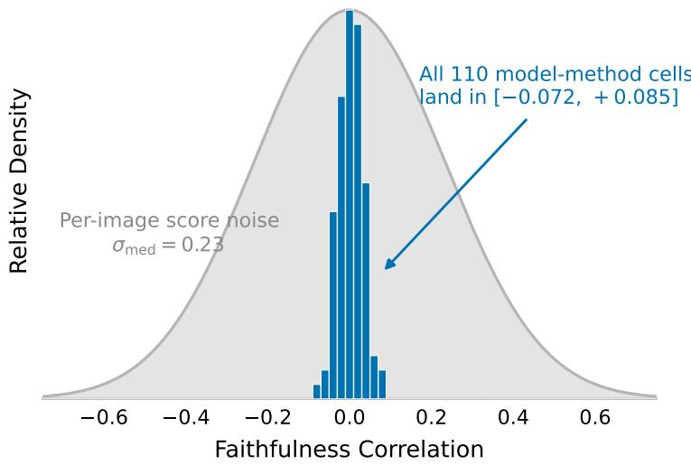  
Figure 3: FC cannot discriminate between attribution methods on modern ViTs. Per-cell mean FC over all 118 model-method cells (blue, peak-normalized) against the per-image score noise, a normal density at the median per-image � = 0.23 (gray). The entire between-method signal spans [−0.072, +0.085] and sits deep inside the noise, so the metric scores good and bad localizers indistinguishably.

## 5. Results

## 5.1. Benchmark results: attribution degradation across architectural variants

We benchmark 14 attribution methods spanning all four families across 10 architectures: two CNNs (ResNet-50 [48], ConvNeXt-B), two isotropic ViTs (ViT-B, DeiT-B), and six hierarchical or hybrid ViTs (Swin, PVT, MobileViT, EficientViT-B1/B2, MaxViT). All run under one QUANTUS protocol on 100 ImageNet-S images with per-model preprocessing. Table 3 reports the Pointing Game across the grid. The two CNNs anchor the comparison rather than being the target: they are the regime the classic methods were designed for. HiLRP is defined on them by construction, since a CNN uses only the linear and reindexing primitives, but we do not run it there and report no value.

No method is reliable across the grid, and the degradations are architecture-specific. Grad-CAM exhibits high variance across architectures: it scores 1.00 on ConvNeXt, Swin, MobileViT, and MaxViT, yet falls to 0.55 on EficientViT-B2, whose linear cross-covariance attention removes the terminal spatial feature map CAM depends on (Fig. 1). Grad-CAM++ degrades additionally on isotropic ViTs (0.49 on ViT-B). Attention-native methods are defined only for flat ViTs and perform poorly there: Attention Rollout scores 0.48 on DeiT, below every gradient baseline, and has no counterpart on any hierarchical or CNN backbone. Gradient and perturbation methods vary by 0.2–0.4 across architectures with no consistent best performer. Classic LRP does not execute on any timm transformer, owing to unsupported layer types.

FC, the most commonly reported fidelity measure, cannot separate these methods (Fig. 3). Across all 118 methodarchitecture cells on which it is defined, fewer than the full grid because attention-native methods are undefined on the non-isotropic backbones, FC has mean +0.004 and magnitude never exceeding 0.085, against a median perimage spread of ±0.23. Removing high-attribution regions induces negligible change in the logit on these robust backbones, so the score becomes statistically indistinguishable from noise for every method, including accurate localizers. Localization is thus both architecture-dependent and metric-dependent. This is the gap HiLRP fills: one conservation-based method defined on every ViT family in the grid (last row), evaluated by criteria that discriminate (Sections 5.5 and 5.6).

Benchmark results. Pointing Game accuracy for 15 attribution methods across 10 architectures, grouped into CNNs, isotropic ViTs, and hierarchical/hybrid ViTs. – = not applicable or not run. R50 = ResNet-50, CNX = ConvNeXt-B, ViT = ViT-B, DeiT = DeiT-B, MoV = MobileViT-v2, EV1/EV2 = EficientViT-B1/B2, MxV = MaxViT-S.
<table><tr><td></td><td colspan="2">CNN</td><td colspan="2">Isotropic ViT</td><td colspan="6">Hierarchical / hybrid ViT</td></tr><tr><td>Method</td><td>R50</td><td>CNX</td><td>ViT</td><td>DeiT</td><td>Swin</td><td>PVT</td><td>MoV</td><td>EV1</td><td>EV2</td><td>MxV</td></tr><tr><td>Grad-CAM</td><td>0.98</td><td>1.00</td><td>0.93</td><td>0.90</td><td>1.00</td><td>0.84</td><td>1.00</td><td>0.70</td><td>0.55</td><td>1.00</td></tr><tr><td>Grad-CAM++</td><td>0.97</td><td>0.95</td><td>0.49</td><td>0.62</td><td>1.00</td><td>0.88</td><td>1.00</td><td>0.44</td><td>0.56</td><td>0.80</td></tr><tr><td>Attn. Rollout</td><td>一</td><td>一</td><td>0.64</td><td>0.48</td><td>一</td><td>一</td><td>一</td><td>一</td><td>一</td><td>一</td></tr><tr><td>Attention-grad</td><td>一</td><td></td><td>0.74</td><td>0.86</td><td></td><td>一</td><td>一</td><td></td><td></td><td>一</td></tr><tr><td>Saliency</td><td>0.82</td><td>0.73</td><td>0.65</td><td>0.54</td><td>0.62</td><td>0.62</td><td>0.90</td><td>0.86</td><td>0.66</td><td>0.58</td></tr><tr><td>Input×Grad</td><td>0.86</td><td>0.77</td><td>0.64</td><td>0.56</td><td>0.67</td><td>0.66</td><td>0.88</td><td>0.74</td><td>0.64</td><td>0.56</td></tr><tr><td>Integr. Grad</td><td>0.92</td><td>0.76</td><td>0.64</td><td>0.58</td><td>0.66</td><td>0.64</td><td>0.90</td><td>0.90</td><td>0.90</td><td>0.62</td></tr><tr><td>SmoothGrad</td><td>0.97</td><td>0.89</td><td>0.85</td><td>0.90</td><td>0.79</td><td>0.92</td><td>0.92</td><td>0.92</td><td>0.92</td><td>0.70</td></tr><tr><td>VarGrad</td><td>0.98</td><td>0.81</td><td>0.76</td><td>0.83</td><td>0.71</td><td>0.88</td><td>0.90</td><td>0.90</td><td>0.92</td><td>0.68</td></tr><tr><td>GradientSHAP</td><td>0.92</td><td>0.79</td><td>0.66</td><td>0.62</td><td>0.71</td><td>0.68</td><td>0.83</td><td>0.64</td><td>0.82</td><td>0.60</td></tr><tr><td>Occlusion</td><td>0.95</td><td>0.92</td><td>0.76</td><td>0.70</td><td>0.78</td><td>0.78</td><td>0.92</td><td>0.96</td><td>0.88</td><td>0.66</td></tr><tr><td>RISE</td><td>0.82</td><td>0.69</td><td>0.73</td><td>0.71</td><td>0.68</td><td>0.68</td><td>0.90</td><td>0.92</td><td>0.78</td><td>0.70</td></tr><tr><td>LIME</td><td>0.94</td><td>0.84</td><td>0.87</td><td>0.89</td><td>0.86</td><td>0.86</td><td>0.90</td><td>0.80</td><td>0.90</td><td>0.80</td></tr><tr><td>AttnLRP</td><td>一</td><td>一</td><td>0.78</td><td>0.84</td><td>0.98</td><td>0.80</td><td>0.95</td><td>0.84</td><td>0.93</td><td>0.89</td></tr><tr><td>HiLRP (ours)</td><td>一</td><td></td><td>0.70</td><td>0.90</td><td>0.96</td><td>0.98</td><td>0.86</td><td>0.96</td><td>0.97</td><td>0.96</td></tr></table>

## 5.2. Localization on hierarchical and hybrid ViTs

We read the four hierarchical and hybrid columns of Table 3 together, since they span three mixing mechanisms: Swin-B (shifted window), PVT-v2-b2 (spatial reduction), EficientViT-B2 (linear cross-covariance), and MobileViTv2 (convolution hybrid).

HiLRP attains the highest cross-architecture mean Pointing score (0.943, against 0.861 for the next best) and the smallest spread across backbones, and it is the only method that never falls to or below the random-point prior. It is not uniformly best: on MobileViT-v2 it is the lowest of the five methods compared (0.860), for the structural reason given in Section 6. However, Pointing Game accuracy alone is an insuficient discriminator. The metric is permissive on ImageNet-S (center-point prior 0.97), so it saturates for CAM methods on architectures whose feature maps peak at the object center (Swin, MobileViT), while gradient methods vary by 0.30 across architectures. HiLRP’s advantage is sharpest where CAM’s spatial assumption breaks. On EficientViT, whose linear cross-covariance attention removes that assumption, Grad-CAM collapses to 0.551, below the 0.61 random-point prior, while HiLRP scores 0.970; on PVTv2 HiLRP reaches 0.980 against Grad-CAM’s 0.840. On MobileViT and Swin, where Grad-CAM saturates the metric, HiLRP is competitive (0.86, 0.96) and additionally provides stage-localized maps that CAM cannot (Section 5.11), plus conservation guarantees on Swin (MobileViT is a designated extension, Section 6).

To confirm these gaps are not small-sample artifacts, we repeated both principal localization comparisons at $\scriptstyle n = 1 0 0 0$ ImageNet-S images with paired per-image scoring, and on 1000 images from the PASCAL VOC 2007 [45] test set using its object bounding-box annotations. On ImageNet-S for EficientViT, HiLRP reaches 0.936 (95% bootstrap confidence interval (CI) [0.921, 0.950]) against Grad-CAM’s 0.518 ([0.486, 0.549]); on PVT-v2, 0.958 ([0.945, 0.970]) against 0.846 ([0.823, 0.868]). In both legs the intervals do not overlap and the diference is significant under a paired McNemar test on the same images $( p \ \bar { < } \ 1 0 ^ { - 1 0 0 }$ and $p \ < \ 1 0 ^ { - 2 3 } )$ . HiLRP localizes correctly on 437 EficientViT images where Grad-CAM fails, against 19 the other way, and on 124 against 12 for PVT. The gap replicates on VOC: HiLRP scores 0.820 ([0.795, 0.843]) against Grad-CAM’s 0.582 ([0.551, 0.612], $p < 1 0 ^ { - 4 0 } )$ on EficientViT, and 0.865 ([0.844, 0.886]) against 0.621 ([0.591, 0.650], $p < 1 0 ^ { - 4 7 } )$ on PVT-v2. The failure of CAM on linear attention, and its recovery by HiLRP, therefore hold on a second dataset with a diferent annotation type. Because Pointing does not discriminate the top tier, we ground the central claim in two properties CAM lacks entirely: relevance conservation (Section 5.5) and agreement with axiomatic Shapley values (Section 5.6).

Input  
HiLRP (ours)  
Grad-CAM  
Grad-CAM++ Integrated Grad  
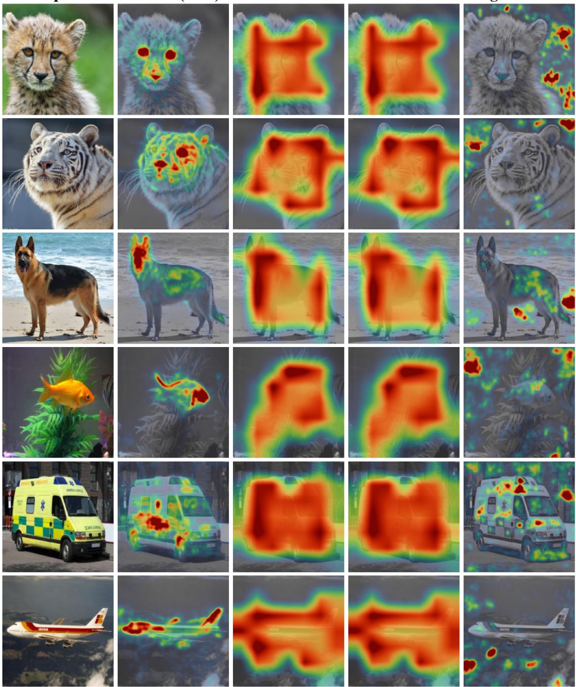  
Figure 4: Qualitative comparison on PVT-v2-b2. Heatmaps are shown over desaturated inputs for the predicted class. HiLRP provides more object-focused explanations, highlighting discriminative regions, while Grad-CAM, Grad-CAM++, and Integrated Gradients produce more difuse or scattered attributions.

## 5.3. Why Grad-CAM saturates the Pointing Game

Grad-CAM’s perfect Pointing on Swin and MobileViT (Table 3) is not evidence of precise localization; it is an artifact of the metric interacting with a low-resolution, center-biased map. Grad-CAM upsamples a 7×7 termina feature map into a smooth blob whose peak, on a dataset of large centered objects, lands inside the object almost by construction. A content-free center-Gaussian blob that uses no model at all already scores a Pointing of 1.00 on both

Mass-based localization against a model-free control (�=1000 ImageNet-S, paired). Energy excess is the fraction of positive relevance inside the object minus the object’s area (0.591), so a uniform map scores 0. The CENTER row is a center Gaussian computed without the model or the image. Underlined entries fall below that control; best energy excess per backbone in bold.
<table><tr><td>Backbone</td><td>Method</td><td>Energy excess ↑</td><td>AP</td><td>IoU</td></tr><tr><td>Model-free reference CENTER Gaussian</td><td>一</td><td>+0.137</td><td>0.845</td><td>0.555</td></tr><tr><td>Swin-B</td><td>HiLRP Grad-CAM</td><td>+0.159 +0.179</td><td>0.745 0.884</td><td>0.438 0.587</td></tr><tr><td>PVT-v2-b2</td><td>HiLRP Grad-CAM</td><td>+0.211 +0.124</td><td>0.796 0.826</td><td>0.486 0.564</td></tr><tr><td>EfficientViT-B2</td><td>HiLRP Grad-CAM</td><td>+0.200 -0.049</td><td>0.757 0.630</td><td>0.456 0.489</td></tr><tr><td>MobileViT-v2</td><td>HiLRP Grad-CAM</td><td>+0.203</td><td>0.777</td><td>0.486</td></tr><tr><td>Cross-architecture spread</td><td></td><td>+0.217 HiLRP 0.052</td><td>0.877</td><td>0.589</td></tr></table>

Swin and MobileViT, equal to Grad-CAM. Grad-CAM’s own maps correlate strongly with that Gaussian (Pearson 0.72 on Swin, 0.63 on MobileViT), and their center of mass sits within 11–21% of the image center. HiLRP maps correlate only 0.14–0.25 with it: they follow object structure rather than reproducing the dataset’s spatial prior, as Fig. 4 shows. Grad-CAM therefore scores highly on the Pointing Game where the prior is strong and fails where it is not (EficientViT, 0.551), which is why Pointing is not treated as the deciding criterion.

## 5.4. Mass-based localization and the center-prior control

The Pointing Game reads only the arg max of a map. A metric that uses the whole map is potentially more informative, so we add three such measures: energy, the fraction of positive relevance falling inside the ground-truth region; the threshold-free average precision of |�| treated as a per-pixel detector of that region; and the best IoU over a sweep of thresholds. All three are computed on the same 1000 ImageNet-S images, paired per image, against the object boxes. We score a content-free center Gaussian alongside them as a control, since it uses no model, no gradient, and no image. On this box-annotated set the mean object area is 0.591, so a uniform map scores exactly that energy; we therefore report the excess over the area, which is zero for a uniform map. Table 4 gives the result, which admits two separate observations.

AP and IoU are confounded by the same prior that saturates Pointing. The model-free center Gaussian scores AP 0.845 and IoU 0.555, higher than HiLRP on all four backbones and higher than Grad-CAM on PVT (0.826) and EficientViT (0.630). A metric that ranks a blob computed without looking at the image above nearly every modelderived attribution is not measuring attribution quality here; it is measuring how closely a map’s support matches the extent of a large centered object. This extends the diagnosis of Section 5.3 from Pointing to the two most common mask-based alternatives, so neither is adopted as a primary criterion.

Energy excess, referenced to that control, does discriminate. HiLRP exceeds the center-Gaussian on every architecture, from +0.159 on Swin to +0.211 on PVT (paired Wilcoxon $p < 2 . 4 { \times } 1 0 ^ { - 3 }$ throughout), whereas Grad-CAM falls below the model-free control on PVT (+0.124 versus +0.137, $p ~ = ~ 2 . 4 { \times } 1 0 ^ { - 1 6 } )$ and far below it on EficientViT $( - 0 . 0 4 9 , p = 1 . 2 { \times } 1 0 ^ { - 8 0 } )$ , where it places less relevance mass inside the object than a uniform map would. Across the four backbones HiLRP’s excess spans 0.052 and Grad-CAM’s spans 0.266, a five-fold diference in cross-architecture spread. This is the consistency claim of Section 5.2 measured against a proper null rather than asserted.

Two cases do not favor HiLRP. Grad-CAM’s energy excess is higher than HiLRP’s on Swin (+0.179 versus +0.159, $p = 5 . 5 { \times } 1 0 ^ { - 4 7 } )$ , and on MobileViT the two are statistically indistinguishable (+0.217 versus +0.203, � = 0.33). The pattern is the architecture-dependence this paper reports throughout: where CAM’s terminal feature map is meaningful it remains a strong localizer, and where that assumption fails it drops beneath a control that uses no model at all. Only HiLRP stays above the control everywhere, which is the property a general-purpose attributor needs.

Conservation validity. Pointing / input-level relevance sum (normalized by the logit; 1.0 exact), �=100. The naive extension is degenerate everywhere (zeroed or inflated 3.08×); HiLRP keeps a bounded, non-degenerate sum on all five attention-based backbones. The convolution-hybrid MobileViT-v2 is treated separately as an extension (Section 6).
<table><tr><td>Backbone</td><td>Naive AttnLRP (pt / cons)</td><td>HiLRP (pt / cons)</td></tr><tr><td>Swin-B</td><td>0.98 / 3.08 (inflated)</td><td>0.96 / 0.77</td></tr><tr><td>PVT-v2-b2</td><td>0.80 / 0.00 (zeroed)</td><td>0.98 / 0.38</td></tr><tr><td>EfficientViT-B1</td><td>0.84 / 0.00 (zeroed)</td><td>0.96 / 0.13</td></tr><tr><td>EfficientViT-B2</td><td>0.93 / 0.00 (zeroed)</td><td>0.97 / 0.35</td></tr><tr><td>MaxViT-S</td><td>0.89 / 0.00 (broken)</td><td>0.96 / 0.16</td></tr></table>

## 5.5. Conservation validity versus the naive lineage

The central claim of HiLRP is not a Pointing win but conservation validity: on hierarchical and hybrid architectures, none of the attribution methods evaluated here produces relevance that conserves to the prediction. AttnLRP [14] defines rules only for isotropic transformers. Explaining a hierarchical model with that method therefore requires retaining its flat-transformer rules unchanged and leaving the hierarchical operations to the unmodified gradient computation, which is the configuration we evaluate below. We evaluate this “naive” extension against HiLRP under an identical backend, granting the naive baseline the same batch-norm canonization and preprocessing, and withholding only HiLRP’s contributions: the resolution-reduction rules, the normalization-subclass handling, and the non-GELU activation rules.

Table 5 reports, for the five attention-based hierarchical backbones, the relevance sum at the input-adjacent capture (normalized by the logit; 1.0 is exact) alongside the Pointing score, for the naive AttnLRP extension and for HiLRP. The naive extension produces degenerate relevance on every architecture: it inflates the sum by 3.1× on Swin and drives it to exactly zero at depth on the other four, because their scale-invariant normalizations, left unpatched, force the per-token relevance sum to vanish; on MaxViT the failure reaches the head. The naive maps nonetheless still point well (0.80–0.98, sometimes above HiLRP), because a zero-sum map still has an arg max. Pointing therefore cannot detect that these maps are not conservation-based attributions at all: their region contributions do not sum to the logit, violating the completeness property that is $\mathrm { L R P s }$ sole justification.

HiLRP keeps a bounded, non-degenerate sum on all five: 0.77 on Swin, 0.38 on PVT, and 0.16 on MaxViT under the global $\gamma { = } 0 . 2 5$ , and 0.13 and 0.35 on EficientViT-B1 and B2 once their deep convolutional stack is given a lower stabilizer $( \gamma _ { \mathrm { c o n v } } { = } 0 . 0 5 ;$ ; the global 0.25 over-concentrates on positive contributions and zeroes the input relevance, while $\gamma _ { \mathrm { c o n v } }$ below ${ \sim } 0 . 0 3$ swings into �-cancellation instability). The sums below 1.0 are the controlled �-rule deviation, the pixel-level cost quantified in Section 6. The convolution-hybrid MobileViT-v2 falls outside this attention-based set, combining depthwise convolutions, a global GROUPNORM, and channel gating, so it needs primitives beyond those used here; we treat it as an extension rather than force a claim (Section 6). Classic LRP [13] does not run on any of these timm backbones (unsupported layer types).

We also validate the rules directly in a float64 reference implementation: the patch-merging rule conserves to $3 \times 1 0 ^ { - 1 6 }$ , the shifted-window mask leaks $\sim 1 0 ^ { - 4 3 }$ of relevance (structurally zero), and the conditional equivariance theorem holds $\mathrm { t o } < 1 0 ^ { - 8 }$ under the true symmetry group. On the pretrained Swin-B, Fig. 5 traces the relevance sum through every resolution stage. It stays near unity across the token grid and the merged stages and returns to 1.00 at the head; only the $z ^ { + } / \gamma$ rule on the convolutional patch stem introduces the measured pixel-level deviation.

## 5.6. Segment-Shapley agreement

Because Pointing does not discriminate the top tier and FC is uninformative on robust ViTs (Section 5.1), we adopt agreement with sampled permutation Shapley values as the primary evidence. Shapley values are the unique attribution satisfying eficiency, symmetry, the null-player property, and additivity. We estimate them over SLIC superpixel segments with blur infill (avoiding out-of-distribution black patches) at �=64 permutations per image, and correlate each method’s per-segment attribution against the reference (Spearman $\rho )$ . Exact SHAP and KernelSHAP are infeasible here, since the coalition space over image regions is exponential, so the sampled-permutation estimator serves as the axiomatic reference rather than as a competing attribution method; GradientSHAP, which does scale to these depths, is included as a benchmark baseline instead.

Conservation Across Swin-B Resolution Stages (n = 20)  
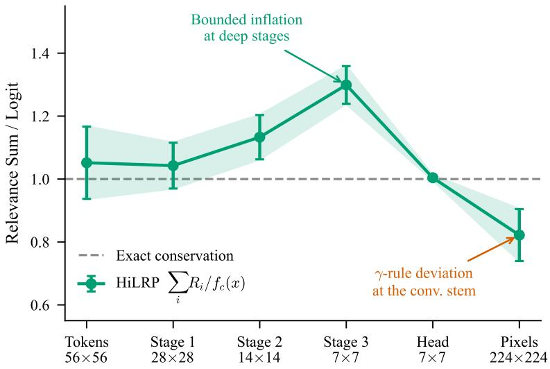  
Figure 5: HiLRP relevance is conserved through the hierarchy. Relevance sum over the target logit, $\textstyle \sum _ { i } R _ { i } / f _ { c } ( x )$ , at each Swin-B resolution stage (�=20), where 1.0 denotes exact conservation.

## Table 6

Shapley Agreement. Spearman agreement with sampled Shapley values over image segments (�=50 images, �=64 permutations). Higher is better. Per-cell 95% bootstrap intervals are approximately $\pm 0 . 0 6 ,$ so only the large EficientViT gap between HiLRP (0.417) and Grad-CAM (0.077) is statistically separated; the Swin and PVT HiLRP-vs-Grad-CAM diferences lie within noise, while both exceed the gradient baselines.
<table><tr><td>Method</td><td>Swin-T</td><td>PVT-v2</td><td>EfficientViT-B2</td></tr><tr><td>HiLRP (Ours)</td><td>0.528</td><td>0.531</td><td>0.417</td></tr><tr><td>Grad-CAM</td><td>0.515</td><td>0.449</td><td>0.077</td></tr><tr><td>Integrated Grads</td><td>0.192</td><td>0.279</td><td>0.281</td></tr><tr><td>SmoothGrad</td><td>0.312</td><td>0.260</td><td>0.321</td></tr><tr><td>Saliency</td><td>0.214</td><td>0.137</td><td>0.240</td></tr></table>

Table 6 reports the agreement, and the �=50 intervals make its structure precise. On Swin and PVT, where Grad-CAM works, HiLRP and Grad-CAM are statistically indistinguishable (on Swin, HiLRP 0.528, 95% bootstrap CI [0.47, 0.58], against Grad-CAM 0.515 [0.47, 0.56], paired Wilcoxon $p \ = \ 0 . 4 5 )$ , and both exceed the gradient methods, whose intervals lie below 0.35. The separation appears on EficientViT, whose linear attention removes the spatial heuristic: Grad-CAM’s Shapley agreement collapses to 0.077 while HiLRP holds 0.417, mirroring the localization result. The claim is therefore not that HiLRP outscores Grad-CAM on every backbone, but that it is the only method whose agreement stays high across all three. Localization and Shapley agreement, two measures computed independently of each other, tell one story.

## 5.7. The perturbation metrics, and where they disagree

As shown in Section 5.1, FC does not separate attribution methods on these architectures, and conservation validity and Shapley agreement are therefore adopted as the primary evaluation axes. That argument would be incomplete were the paper to omit the perturbation metrics the attribution literature usually reports, so we report all four of them, together with the control that reveals what they measure. Average Drop (AD) and Average Increase (AI) keep the top 20% of attributed pixels and read the change in the target probability; Deletion (Del) and Insertion (Ins) remove or add pixels most-important-first and integrate the resulting curve. The control is a random map generated at a coarse (14×14, upsampled) and a fine (224×224) resolution, using neither the model nor the image.

Table 7 reports the result, which separates into two findings.

Perturbation metrics with a model-free control (�=100, paired). AD and AI are percentages. RANDOM rows use neither the model nor the image. Best real method per backbone and column in bold; underlined entries mark the EficientViT case discussed in the text.
<table><tr><td>Backbone</td><td>Method</td><td>AD↓</td><td>AI↑</td><td>Del ↓</td><td>Ins ↑</td></tr><tr><td rowspan="4">Swin-B</td><td>HiLRP</td><td>32.2</td><td>14.0</td><td>0.286</td><td>0.580</td></tr><tr><td>Grad-CAM</td><td>41.4</td><td>5.0</td><td>0.335</td><td>0.566</td></tr><tr><td>RANDOM coarse</td><td>55.8</td><td>5.0</td><td>0.492</td><td>0.500</td></tr><tr><td>RANDOM fine</td><td>81.4</td><td>0.0</td><td>0.394</td><td>0.399</td></tr><tr><td rowspan="5">PVT-v2-b2</td><td>HiLRP</td><td>36.4</td><td>13.0</td><td>0.199</td><td>0.566</td></tr><tr><td>Grad-CAM</td><td>37.4</td><td>11.0</td><td>0.318</td><td>0.586</td></tr><tr><td>RANDOM coarse</td><td>71.5</td><td>1.0</td><td>0.408</td><td>0.413</td></tr><tr><td>RANDOM fine</td><td>92.2</td><td>0.0</td><td>0.327</td><td>0.326</td></tr><tr><td>HiLRP</td><td>88.5</td><td>3.0</td><td>0.275</td><td>0.330</td></tr><tr><td rowspan="3">EfficientViT-B2</td><td>Grad-CAM</td><td>61.5</td><td>13.0</td><td>0.568</td><td>0.637</td></tr><tr><td>RANDOM coarse</td><td>93.6</td><td>0.0</td><td>0.451</td><td>0.464</td></tr><tr><td>RANDOM fine</td><td>96.3</td><td>1.0</td><td>0.398</td><td>0.392</td></tr></table>

The metrics are not uninformative, and the previously reported failure mode does not reproduce here. On all three backbones both real methods outperform both random controls on Average Drop, and the random maps never outperform them on Deletion. Yuan et al. [47] observe that on convolutional backbones a suficiently fine random map outscores every attribution method under Deletion. That behavior is not observed on the ViT backbones evaluated here. Their result and ours are consistent in their implication, namely that the perturbation family requires a modelfree control before its scores can be interpreted, but they are separate observations obtained on diferent architecture families.

However, these metrics contradict alternative evaluations on the architectures where the failure modes are most pronounced. On Swin and PVT-v2 they agree with the rest of the paper: HiLRP has the best Average Drop, Average Increase, and Deletion on both, and Insertion on Swin. On EficientViT-B2 they invert. Grad-CAM scores better Average Drop (61.5 against 88.5), Average Increase, and Insertion, even though on that same backbone and the same images Grad-CAM localizes below the random-point prior (Section 5.2), agrees with sampled Shapley at only 0.077 (Section 5.6), places more relevance inside the object for the model’s least likely class than for its predicted class, and returns positively correlated maps for opposite classes (Section 5.8). Three axes computed independently of each other say Grad-CAM has failed on linear attention; the perturbation metrics rank it first.

The exact mechanism driving this discrepancy remains a subject for future investigation. Two candidates are apparent in our own measurements: keeping the top 20% of a heavy-tailed pixel map, which is the form HiLRP produces on this backbone (Section 5.8), retains a scattered pixel set, whereas thresholding a smooth CAM blob retains a connected region, and a connected region is the more in-distribution input; and zeroing pixels is itself an out-of-distribution operation whose severity difers by architecture. The claim made here is narrower: on EficientViT-B2, the backbone for which the independent evidence of a method’s failure is strongest, the perturbation metrics rank that method first, so they cannot serve as the deciding criterion for this comparison. This is the argument of Section 5.1 supported by the corresponding measurements.

## 5.8. Class sensitivity and misclassified samples

Localization scores cannot distinguish an explanation of a class from a detector of the salient object: a map that finds the object scores well whatever class it was asked about. We probe this directly. On the same image we attribute the predicted class and then the model’s least likely class, the one with the lowest logit. The usual top-1 against top-2 probe is the wrong test on single-object data, since both classes are supported by the same object and high agreement is expected; the bottom-1 class is defined by the model itself and needs no semantic-distance heuristic.

A signed, conservation-valid attribution makes a falsifiable prediction here. If the relevance decomposes the logit, then evidence that raises the predicted class must lower the class the model ranks last, so the sign of the relevance inside the object should invert. Table 8 reports the result over 100 ImageNet-S images with segmentation masks. It does invert, on every image of all three backbones: mean in-object relevance is positive for the predicted class and negative for the least likely class in 100∕100 cases per backbone, and the two maps are near mirror images on Swin $( \rho = - 0 . 9 8 8 )$ and PVT $( \rho = - 0 . 9 8 0 )$ . Fig. 6 shows the efect: the same object structure is traced in both maps, with the sign reversed.

Class sensitivity (�=100 ImageNet-S images with masks). Each image is attributed for the predicted class and for the model’s least likely class. Map corr. is the Pearson correlation between the two maps; In-mask is mean relevance inside the object mask, normalized by the map’s mean absolute value; Flip counts images whose in-mask evidence changes sign between the two classes†.
<table><tr><td colspan="4"></td><td colspan="2">In-mask relevance</td></tr><tr><td>Backbone</td><td>Method</td><td>Map corr.</td><td>Pred.</td><td>Least-likely</td><td>Flip</td></tr><tr><td>Swin-B</td><td>HiLRP</td><td>-0.988</td><td>+1.37</td><td>-1.30</td><td>100/100</td></tr><tr><td rowspan="3">PVT-v2-b2</td><td>Grad-CAM</td><td>-0.341</td><td>+1.77</td><td>+0.53</td><td>_†</td></tr><tr><td>HiLRP</td><td>-0.980</td><td>+1.74</td><td>-1.70</td><td>100/100</td></tr><tr><td>Grad-CAM</td><td>-0.381</td><td>+1.41</td><td>+0.39</td><td>_†</td></tr><tr><td rowspan="2">EfficientViT-B2</td><td>HiLRP</td><td>-0.182</td><td>+0.09</td><td>-0.05</td><td>100/100</td></tr><tr><td>Grad-CAM</td><td>+0.137</td><td>+1.09</td><td>+1.27</td><td>†</td></tr></table>

†Grad-CAM’s output is $\begin{array} { r } { \operatorname { R e L U } ( \sum _ { k } w _ { k } A _ { k } ) . } \end{array}$ , which is non-negative everywhere, so it cannot represent evidence against a class. This is a property of the method, not a measurement outcome. The underlined EficientViT entry is the failure discussed in the text: the two class maps are positively correlated there, so the explanation does not depend on the class being explained.

Grad-CAM cannot represent this inversion. Its map is ReLU-rectified by construction, so it has no negative range, and the sign test is therefore structurally inapplicable to it rather than failed by it. The fair comparison is the map correlation, and there the architecture-dependence of Section 5.2 reappears on a third, independent axis. On Swin and PVT, Grad-CAM’s two class maps are weakly anti-correlated (−0.34, −0.38), so it retains some class specificity. On EficientViT-B2 the correlation turns positive (+0.137): the map for the model’s least likely class agrees with the map for its predicted class, and places more mass inside the object (+1.27 against +1.09). Grad-CAM is not class-sensitive at all on this backbone. Its localization failure, its reduced Shapley agreement, and its absent class sensitivity constitute the same underlying failure measured along three axes.

The evidence is weaker on one of the three backbones, and the margin is reported rather than report only the direction. On EficientViT-B2 HiLRP has the correct sign on every image, but the magnitudes are small (+0.093 against −0.051) and the map correlation is only −0.182, against −0.98 on the other two backbones. The reduced convolutional stabilizer that backbone requires $( \gamma _ { \mathrm { c o n v } } { = } 0 . 0 5$ , Section 3.9) yields a noisier pixel map, and the class-sensitivity signal degrades with it. The direction is right on every image; the margin is not comparable to Swin and PVT.

Misclassified samples. When a model is wrong, an explanation should follow the model rather than the label. On the misclassified subset we attribute both the predicted and the ground-truth class. The two maps agree strongly (Spearman +0.974 on Swin with �=10, +0.950 on PVT with �=12, +0.686 on EficientViT with �=9), and both place positive evidence on the object. This is a negative result for the probe, and the cause is the data rather than the method: ImageNet-S images contain a single dominant object, so a misclassification is almost always a confusion between two classes that the same object supports, and no attribution could separate them from this evidence. The probe would discriminate on multi-object scenes, where the predicted and ground-truth classes correspond to diferent image regions. We report it as a limitation of the evaluation set (Section 6) rather than present the agreement as a positive finding.

## 5.9. Sanity check: parameter randomization

An attribution method whose output is invariant to randomization of the model’s learned parameters cannot be reflecting the behavior of that model, and is instead responding to properties of the input alone. Edge detectors illustrate the concern directly: they satisfy every localization criterion while depending on no learned parameter at all [30]. We apply both protocols of this check. In the independent protocol one block is randomized and then restored; in the cascading protocol blocks are randomized cumulatively from the output backwards. In each case we recompute the attribution for the class the intact model predicted and compare it with the intact map. Weights are redrawn from a Gaussian matched to each parameter’s own standard deviation, so the scale is preserved and only the learned structure

HiLRP Class Sensitivity: Evidence For the Predicted Class, Against the Same Image Explained For the Least-Likely Class

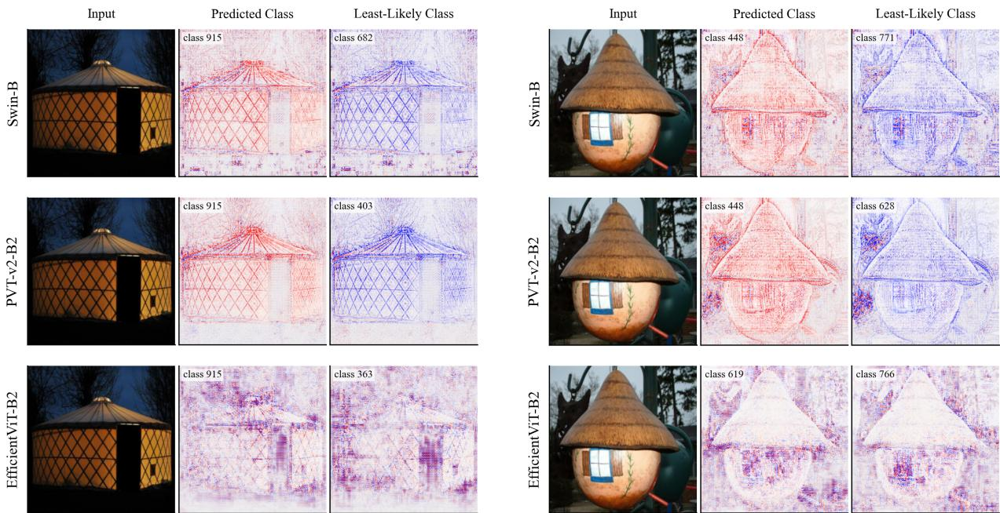  
Figure 6: The sign of the evidence follows the class. Each row shows one image and one backbone: input, HiLRP relevance for the predicted class, and relevance for the model’s least likely class. The left and right blocks are two example images, each covering all three backbones. Red is positive relevance, blue negative. Panels are scaled independently so that the sign remains legible; magnitudes are given in Table 8.

is destroyed. We confirmed the randomization takes efect rather than silently failing: the predicted class changes at every block, with maximum logit deviations of 7.9 to 11.9.

Table 9 reports the cascading protocol over 50 images, and Fig. 7 shows both. HiLRP passes: agreement with the intact map falls monotonically as more of the network is destroyed, from 0.99 to 0.20 on Swin and 0.92 to 0.22 on PVT, and the maps degrade visibly into noise once the middle stages are reached.

Notably, the first row indicates that randomizing only the classifier head leaves the magnitude map almost unchanged $( \rho _ { | R | } = 0 . 9 9$ on Swin), which considered in isolation would suggest that the attribution is independent of the classifier. The signed map indicates the opposite: agreement falls immediately from 1.0 to −0.12 on Swin and −0.05 on PVT. Both measurements are correct and they quantify diferent properties. The intact backbone continues to select the same pixels, so the magnitude structure is preserved; the class those pixels support, however, is determined by the head, so randomizing the head inverts and scrambles the sign. This is the same property that Section 5.8 measures in the complementary direction, where the sign inverts when the explained class changes.

It follows that the standard sanity check, which by convention compares magnitude maps, systematically understates the model-sensitivity of a signed attribution, and would score a method that discards sign as more sensitive than one that keeps it. We therefore report both columns. We are not aware of this distinction being drawn in previous applications of the check, and suggest that signed attributions be evaluated on the signed map.

## 5.10. Convergence of the Shapley reference

Because the Shapley agreement of Section 5.6 is our primary evidence, the sampling budget behind it needs to be justified rather than asserted. Fig. 8 runs the estimator to �=128 permutations on Swin-T and reads the running estimate of the prefix of the same permutation sequence, so the whole curve comes from one run.

Both curves settle before the budget we use. The reference agrees with its own �=128 estimate at Spearman $0 . 9 6 9 \pm 0 . 0 1 6$ by �=64, against 0.593 at �=4, so the ranking of segments is essentially fixed by then. The reported quantity converges sooner still: HiLRP’s agreement is 0.627 at �=64 and 0.631 at �=128, a diference of 0.004 against

Stage 2  
Stage 0  
Stage 3  
Stage 1  
Table 9  
Parameter-randomization sanity check, cascading protocol, $n { = } 5 0$ ImageNet-S images. Each row randomizes the named block in addition to every block above it, moving from the output towards the input. $\rho _ { | R | }$ and $\rho _ { R }$ are the Spearman correlations of the magnitude and signed maps against the intact attribution. Lower is better in both.
<table><tr><td></td><td colspan="2">Swin-B</td><td colspan="2">PVT-v2-b2</td></tr><tr><td>Randomized through</td><td> $\rho _ { | R | } \downarrow$ </td><td> $\rho _ { R } \downarrow$ </td><td> $\rho _ { | R | } \downarrow$ </td><td> $\rho _ { R } \downarrow$ </td></tr><tr><td>(intact)</td><td>1.000</td><td>1.000</td><td>1.000</td><td>1.000</td></tr><tr><td>head</td><td>0.986</td><td>-0.122</td><td>0.922</td><td>-0.053</td></tr><tr><td>+ stage 3</td><td>0.811</td><td>+0.078</td><td>0.737</td><td>-0.229</td></tr><tr><td>+ stage 2</td><td>0.333</td><td>+0.014</td><td>0.375</td><td>-0.014</td></tr><tr><td>+ stage 1</td><td>0.241</td><td>+0.002</td><td>0.252</td><td>-0.005</td></tr><tr><td>+ stage 0</td><td>0.224</td><td>+0.003</td><td>0.219</td><td>-0.002</td></tr><tr><td>+ patch embed</td><td>0.198</td><td>+0.000</td><td>0.219</td><td>-0.002</td></tr></table>

Parameter-Randomization Sanity Check: HiLRP Maps Degrade as the Model's Weights Are Destroyed  
Head  
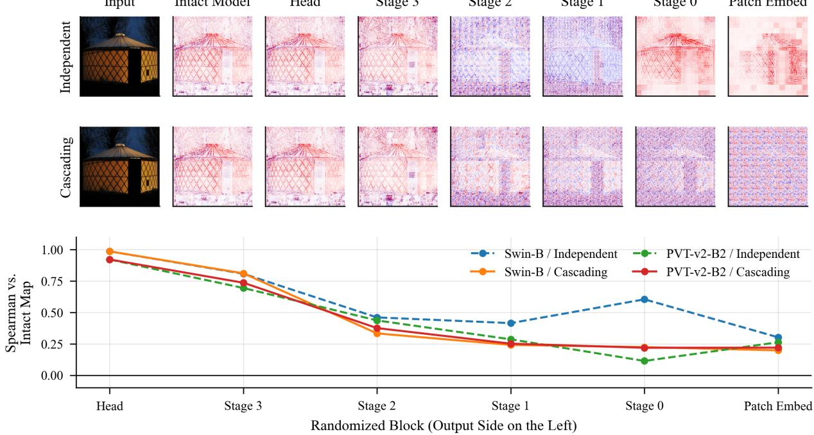  
Figure 7: HiLRP depends on the model’s weights. Top: independent randomization, in which one block is randomized and then restored. Middle: cascading randomization, in which blocks are randomized cumulatively from the output backwards. Bottom: agreement with the intact map against randomization depth for both protocols and backbones (solid cascading, dashed independent).

a standard error of 0.038, so doubling the budget does not move the number. We therefore use $m { = } 6 4$ throughout. Absolute values here are computed on a 20-image subset and are not directly comparable with the $n { = } 5 0$ scores of Table $\begin{array} { r } { 6 ; { } } \end{array}$ what this experiment establishes is the budget, not the score.

## 5.11. Qualitative results: stage-localized relevance

Fig. 9 shows stage-localized relevance maps. Because relevance is conserved at every token-grid layer, the backward pass can be halted at an intermediate resolution stage $( 2 8 \times 2 8 $ or $1 4 \times 1 4 )$ and read out there. The maps move from high-resolution boundary structure in the early stages to compact, semantic object localization in the final $7 \times 7$ stage, showing where in the network the object representation is assembled.

Sampled-Shapley Convergence (Swin-T, 20 images, 24 SLIC segments)

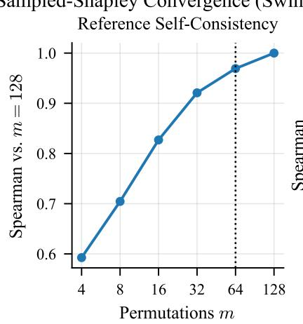

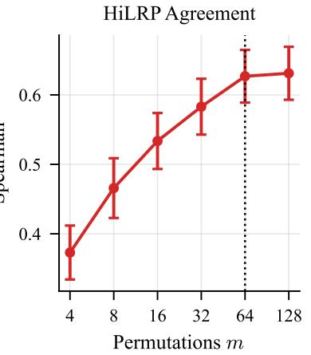  
Figure 8: The Shapley reference is converged at the budget we use.Left: agreement of the estimate at � permutations with the �=128 estimate, measuring how settled the reference is. Right: HiLRP’s agreement with the reference at each �, with standard errors. The dotted line marks �=64, past which both curves are flat. Swin-T, 20 images, 24 SLIC segments.

Grad-CAM and the other CAM variants cannot produce this decomposition, because they attach to a single terminal spatial layer and upsample from it.

## 5.12. Computational cost

HiLRP is a single forward and backward pass, so its cost is one gradient-order evaluation regardless of how many resolution stages are read out. Table 10 measures every method in the benchmark under the same configuration the benchmark uses, on ViT-B/16 with one 224×224 image. Costs are timed at batch size 1, the worst case per image, and each method is timed before HiLRP’s process-global rule patches are installed, so no baseline is measured through a patched forward.

The cost sits between two groups. Against the multi-pass methods HiLRP is cheaper on both axes: it is faster than the 20-sample noise ensembles (SmoothGrad, VarGrad, GradientSHAP, ≈220 ms) while using a third of their memory (0.97 against 2.8 GB), 3× faster than Integrated Gradients, and one to two orders of magnitude faster than LIME, RISE, and Occlusion, which need hundreds to thousands of forward passes. Against the single-pass methods it is the expensive one: roughly 9× the cost of Grad-CAM (21 ms) and 12× that of Saliency (16 ms), and its peak memory is higher than either. The overhead is the rule-carrying forward and the �-composite, not extra passes. For a high-volume explanation pipeline that diference is real, even though 0.2 s per image is small in absolute terms.

One cost does not appear in the table. The stage-localized maps of Fig. 9 come from the same backward pass, one relevance capture per resolution stage, at no additional cost, whereas a per-stage Grad-CAM requires a separate instrumentation point and a recomputation for each layer.

## 5.13. The pretraining objective, not the architecture, determines explanation structure

A conservation-based, label-free attributor can explain a model in its own representational objective, rather than through a bolted-on linear probe that would replace every model’s objective with a shared classifier. We use this to ask whether the pretraining objective, and not the architecture, shapes what a model finds explanatory. We fix the backbone family (ViT-B) and vary pretraining at six public checkpoints: supervised (AugReg [49]), DINO [50], DINOv2 [51], DINOv2 with registers [52], MAE [53], and CLIP [41]. Each is attributed under one common label-free scalar, the view-invariance similarity $s = \cos ( g ( x ) , g ( x ^ { \prime } ) )$ between a horizontal-flip pair, on identical inputs. The supervised, DINO, MAE, and CLIP checkpoints share the ViT-B/16 layout (197×768 tokens); the two DINOv2 variants are ViT-B/14 at 224 px. Holding the scalar, the inputs, and the backbone family fixed leaves the pretraining objective as the varying factor.

Table 11 reports the results over 30 images. The six objectives produce structurally diferent explanations: the mean pairwise Spearman agreement of their maps is 0.36, far from the 1.0 that would hold if the objective were irrelevant, and MAE is the strongest outlier (0.19–0.32 agreement with the others). The diferences line up with known representational properties. The DINO family localizes best: DINO, DINOv2, and DINOv2 with registers all reach label-free Pointing 0.97, recovering the objective’s documented emergent object-centricity across two model generations without using any label. DINOv2 reaches this localization while routing about half as much relevance mass to the pixels as DINO (0.27 against 0.51), and adding the four register tokens changes the map only mildly (agreement 0.50 between the two DINOv2 variants). MAE routes almost no relevance to the input pixels (0.07 of the scalar), consistent with a reconstruction objective whose CLS embedding is not organized for view invariance, and CLIP’s evidence is the least object-localized (0.40). The maps show the same pattern (Fig. 10). We frame this as exploratory. There is no ground truth for the “correct” view-invariance map, so we report the structural diferences between objectives and their consistency with documented properties (DINO’s emergent object-centricity, MAE’s reconstruction organization), not a correctness claim about any single map.

Table 10  
Cost per explanation. ViT-B/16, one 224×224 image, batch size 1, RTX 4070 Laptop. Passes is the number of forward evaluations the method requires per explanation, which distinguishes the two groups. Methods are configured exactly as in the benchmark grid. Timings are the mean over repeated runs after warm-up; memory is peak allocated.
<table><tr><td>Method</td><td>Time (ms) ↓</td><td>Peak mem. (GB) ↓</td><td>Passes</td></tr><tr><td>Single pass</td><td></td><td></td><td></td></tr><tr><td>Input×Grad</td><td>15</td><td>0.49</td><td>1</td></tr><tr><td>Saliency</td><td>16</td><td>0.49</td><td>1</td></tr><tr><td>Attention Rollout</td><td>18</td><td>0.52</td><td>1</td></tr><tr><td>Grad-CAM</td><td>21</td><td>0.72</td><td>1</td></tr><tr><td>Grad-CAM++</td><td>21</td><td>0.72</td><td>1</td></tr><tr><td>HiLRP (ours)</td><td>197</td><td>0.97</td><td>1</td></tr><tr><td>Multi-pass</td><td></td><td></td><td></td></tr><tr><td>GradientSHAP</td><td>221</td><td>2.83</td><td>20</td></tr><tr><td>VarGrad</td><td>221</td><td>2.81</td><td>20</td></tr><tr><td>SmoothGrad</td><td>224</td><td>2.81</td><td>20</td></tr><tr><td>Integrated Gradients</td><td>588</td><td>0.85</td><td>50</td></tr><tr><td>LIME</td><td>869</td><td>0.38</td><td>100</td></tr><tr><td>RISE</td><td>2458</td><td>1.55</td><td>2000</td></tr><tr><td>Occlusion</td><td>5579</td><td>0.38</td><td>784</td></tr></table>

Table 11

Pretraining objective and explanation structure. One common label-free scalar attributed across six pretraining objectives on frozen ViT-B backbones; the DINOv2 variants are ViT-B/14 at 224 px. View sim. is the attributed scalar � of Eq. (5), averaged over images; Label-free point is the Pointing Game on the map produced from �; Pixel-rel. is the fraction $\sum _ { i } R _ { i } { \bf / } \bar { s }$ reaching the input pixels.
<table><tr><td>Objective</td><td>View sim. s</td><td>Label-free point</td><td>Pixel-rel.</td></tr><tr><td>Supervised</td><td>0.972</td><td>0.60</td><td>0.57</td></tr><tr><td>DINO</td><td>0.993</td><td>0.97</td><td>0.51</td></tr><tr><td>DINOv2</td><td>0.980</td><td>0.97</td><td>0.27</td></tr><tr><td>DINOv2-reg4</td><td>0.982</td><td>0.97</td><td>0.29</td></tr><tr><td>MAE</td><td>0.999</td><td>0.47</td><td>0.07</td></tr><tr><td>CLIP</td><td>0.977</td><td>0.40</td><td>0.39</td></tr></table>

Mean pairwise map agreement (Spearman): �.�� (versus 1.0 if objective-invariant)

## 5.14. Cross-attention and multi-modal attribution

Cross-attention, where queries from one stream attend to keys and values from another, is the mechanism prior transformer LRP handles least, yet it is a direct instance of the bilinear and softmax primitives with two input streams. CrossViT realizes it inside a classification ViT: the class token of each token-scale branch attends to the other branch’s tokens through six cross-attention blocks. HiLRP applies the same CP-LRP rule to the branch self-attention and to the cross-attention. The patched model is forward-equivalent to the original (maximum absolute logit deviation $< 1 0 ^ { - 6 } )$ and attains a Pointing score of 0.980, matching the best backbone in Table 3 on a two-branch design for which attention rollout has no single path to follow.

Stage-Localized Relevance (Conserved Flow at Every Resolution): Unavailable to Output-Perturbation Methods  
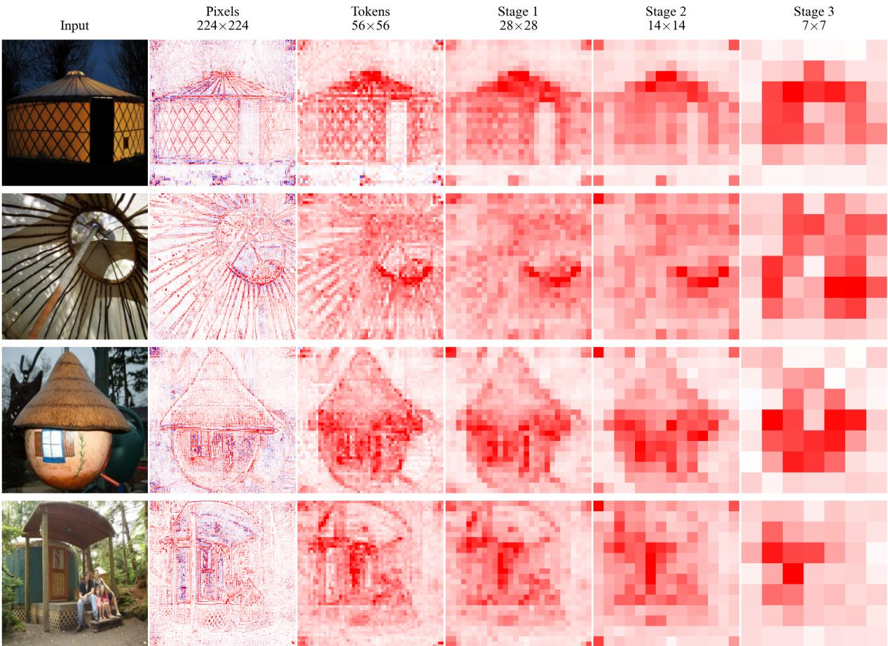  
Figure 9: Stage-localized relevance on Swin-B. The backward pass is halted at each resolution stage and read out: input pixels (224), the token grid (56), and the merged stages (28, 14, 7).

The scalar being explained need not even come from a single modality. On CLIP (ViT-B/16), let $f _ { \mathrm { i m g } } :$ $\mathbb { R } ^ { H \times W _ { \mathrm { i m g } } \times 3 }  \mathbb { R } ^ { d }$ be the frozen image tower, which embeds an image into the �-dimensional joint image-text space, and let $f _ { \mathrm { t e x t } } : \mathcal { T } \to \mathbb { R } ^ { d }$ be the frozen text tower, which embeds a tokenized caption $t \in \tau$ into the same space. We attribute the image-text alignment

$$
s = \cos \bigl ( f _ { \mathrm { i m g } } ( x ) , f _ { \mathrm { t e x t } } ( t ) \bigr ) ,\tag{7}
$$

in which the caption � is held fixed, so no gradient flows through $f _ { \mathrm { t e x t } }$ and the attribution is delivered entirely to the pixels of �. HiLRP then answers what image evidence supports a given textual description. The patched image tower is forward-equivalent to the original (maximum absolute deviation $< 1 0 ^ { - 6 } )$ , and the attribution is text-conditioned (Fig. 11): on clean single-object images the caption that matches the image scores a higher similarity than an unrelated caption (0.33 against 0.20 for the koala, 0.32 against 0.19 for the panda, 0.31 against 0.20 for the owl) and concentrates more positive relevance on the object. We present this as a qualitative demonstration rather than a quantitative localization claim, since CLIP’s evidence is difuse (its label-free localization is the weakest in Table 11). It exercises the cross-modal scalar and the multi-head attention primitive on a pretrained multi-modal model with no new rule, extending conservation-based attribution beyond the single-model, single-label setting of prior transformer LRP.

RQ2: View-Invariance Evidence Under 5 Pretraining Objectives (frozen ViT-B)  
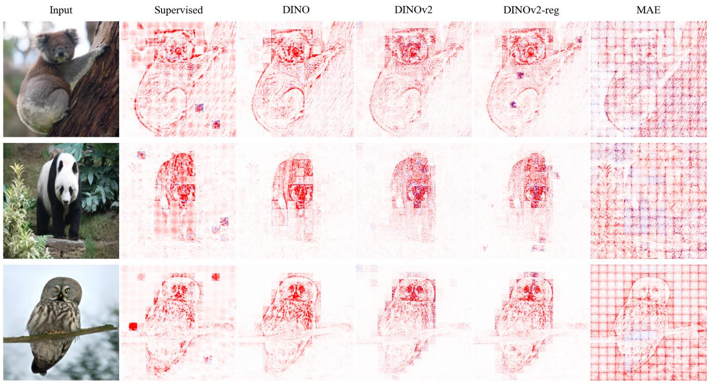  
Figure 10: Label-free attribution. The same view-invariance scalar attributed across five frozen ViT-B pretraining objectives on clean single-object images. The maps difer structurally: the DINO family traces object structure, while MAE shows the reconstruction patch grid rather than the object. CLIP is attributed separately in Fig. 11.

## 5.15. Ablation of the relevance-rule choices

Table 12 isolates HiLRP’s two relevance-rule decisions on Swin-B: the attention rule and the � schedule. Two primary observations emerge. First, conservation holds under every configuration (error ≈0.02), so on this backbone conservation validity is a property of the construction rather than of a tuned setting, and the choices afect localization only. This also holds on PVT-v2, but not on the linear-attention family, where � additionally governs a relevance inflation (Section 5.16). Second, the �-rule has a substantial efect: the pure-� limit (�=0) reduces Pointing to 0.56 despite conserving relevance, while �=0.25 restores it to 0.955. On Swin the two attention rules are within noise of each other (0.955 against 0.950); CP-LRP is the default because of its conservation advantage on the other hierarchical backbones (Section 5.5), not because of this margin. The selection principle for � follows from the same structure: conservation holds for every �, so we pick the value that maximizes localization under that constraint and keep it global at �=0.25 rather than tuning per architecture. Localization is non-increasing in � on EficientViT, so 0.25 is a conservative global setting. An adaptive per-layer schedule is left to future work.

## 5.16. Selection of the � parameter

The �-rule on linear and convolutional layers is HiLRP’s main hyperparameter. As � → 0 it recovers the pure �-rule, exact in conservation but noisier at the pixel level; larger � emphasizes positive evidence, denoising the map at the cost of a bias toward positive contributions. Table 13 sweeps � over 100 images, applying it uniformly to the linear and convolutional layers, and reports both Pointing and the head-adjacent relevance sum.

The evaluation across � values reveals two distinct regimes, which delineates the exact bounds of the conservation guarantee. On Swin and PVT-v2 the relevance sum sits at 1.00–1.01 for every �, including the pure � limit, so on those families � tunes localization alone and conservation is a property of the construction rather than of the setting.

Multi-Modal HiLRP: Text-Conditioned Attribution on CLIP Input Matching Caption Unrelated Caption  
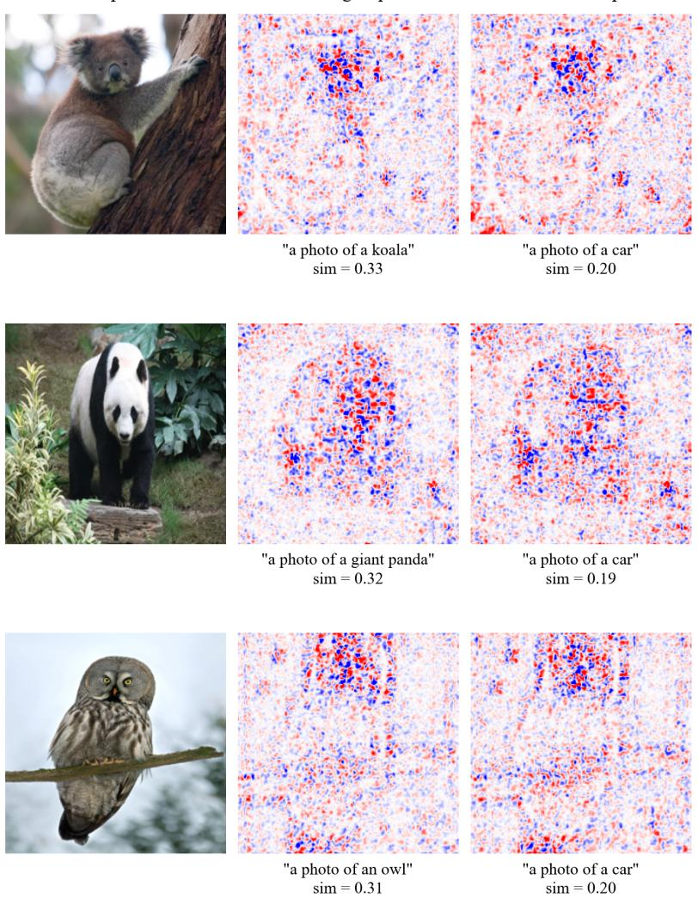  
Figure 11: Text-conditioned multi-modal attribution on CLIP. HiLRP attributes the image-text similarity of Eq. (7) on CLIP ViT-B/16 with the caption held frozen, for a matching caption (“a photo of a koala/giant panda/owl”) and an unrelated one $( ^ { \ast } a$ photo ofa car”).

There $\gamma { = } 0$ reduces Pointing sharply (to 0.66 on Swin and 0.85 on PVT) while conserving perfectly, which is the cleanest statement that conservation and localization are separate axes. EficientViT-B2 behaves diferently: its headadjacent sum is strongly �-dependent, inflating almost 13× at $\gamma { = } 0$ and falling monotonically to 0.99 at $\gamma { = } 1 . 0 .$ , while Pointing drifts down only slightly (0.99 to 0.95). On linear attention, therefore, $\gamma$ is critical for conservation as well as for localization, and the claim that conservation is setting-independent holds for the windowed and spatial-reduction families but not for this one. This result is reported rather than omitted by restricting the sweep to the backbones on which the simpler statement holds.

Absolute values in this sweep are not directly comparable with those of Tables 3 and 12, since the sweep uses a diferent image subset and applies $\gamma$ to the convolutional layers as well; the Swin �=0 entry reads 0.66 here against 0.56 in Table 12. Only the trend across � should be read from the table. We fix $\gamma { = } 0 . 2 5$ on the linear and attention layers for all models and all experiments. The one refinement is a lower convolutional stabilizer, $\gamma _ { \mathrm { c o n v } } { = } 0 . 0 5$ , on the deep convolutional stack of the EficientViT family: the global 0.25 leaves head conservation intact but over-concentrates on positive contributions and zeroes the input-level relevance there, whereas 0.05 restores it at no cost to localization (Section 5.5). This two-level default needs no per-image or per-model search beyond that single convolution-family setting.

Ablation of HiLRP’s relevance-rule choices on Swin-B (�=200 ImageNet-S). POINTING measures localization (higher is better); CONS. ERR. is the mean conservation error $| \textstyle \sum _ { i } R _ { i } / f _ { c } ( x ) - 1 |$ (lower is better). Conservation holds $( \approx 0 . 0 2 )$ under every choice by construction; the rule choices tune localization only. Pure $\epsilon \left( \gamma { = } 0 \right)$ conserves yet substantially reduces localization. Best per column in bold.
<table><tr><td>Configuration</td><td>Pointing ↑</td><td>Cons. err. ↓</td></tr><tr><td>1) Attention relevance rule (γ=0.25)</td><td></td><td></td></tr><tr><td>AttnLRP-through</td><td>0.950</td><td>0.019</td></tr><tr><td>CP-LRP (ours)</td><td>0.955</td><td>0.019</td></tr><tr><td> $2 ) \gamma s c h e d u l e \left( \mathrm { a t t e n t i o n } = \mathrm { C P \mathrm { - } L R P } \right)$ </td><td></td><td></td></tr><tr><td> $\scriptstyle \gamma = 0 \ ( { \mathrm { p u r e } } \ \epsilon )$ </td><td>0.560</td><td>0.022</td></tr><tr><td> $\gamma { = } 0 . 2 5 \mathrm { \ : ( o u r s ) }$ </td><td>0.955</td><td>0.019</td></tr><tr><td> $\gamma { = } 0 . 5$ </td><td>0.950</td><td>0.018</td></tr><tr><td>HiLRP (full:  $\mathbf { C P - L R P } , \gamma { = } 0 . 2 5 )$ </td><td>0.955</td><td>0.019</td></tr></table>

Sensitivity to $\gamma \ ( n { = } 1 0 0$ ImageNet-S images). Each cell reports Pointing / head-adjacent relevance sum, where 1.00 denotes exact conservation and $\gamma { = } 0$ is the pure � limit. Here � is applied uniformly to the linear and convolutional layers, which difers from the deployed EficientViT configuration (Section 3.9).
<table><tr><td>Backbone</td><td> $\gamma { = } 0$ </td><td> $\gamma { = } 0 . 1$ </td><td> $\gamma = 0 . 2 5$ </td><td> $\gamma { = } 0 . 5$ </td><td> $\gamma { = } 1 . 0$ </td></tr><tr><td>Swin-B</td><td>0.66/1.00</td><td>0.96/1.00</td><td>0.99/1.00</td><td>0.99/1.00</td><td>0.99/1.00</td></tr><tr><td>PVT-v2</td><td>0.85/1.01</td><td>0.98/1.01</td><td>0.97/1.01</td><td>0.97/1.01</td><td>0.97/1.01</td></tr><tr><td>EfficientViT-B2</td><td>0.99/12.95</td><td>0.99/8.73</td><td>0.97/4.35</td><td>0.96/2.17</td><td>0.95/0.99</td></tr></table>

## 6. Limitations

Throughout this section, � is the input image, $f _ { c } ( x )$ the logit of the explained class $c , R _ { i }$ the relevance assigned to input element �, and $\gamma$ the stabilizer of the propagation rule in Eq. (6).

Pixel-level conservation is approximate. Conservation is exact at the token level through the proven operations (verified to $1 0 ^ { - 1 6 } )$ , but the �-rule applied to the patch-embedding and hybrid convolutional stem introduces a controlled deviation at the input-pixel level. The measured relevance-to-logit ratio at the pixels, $\textstyle \sum _ { i } R _ { i } / f _ { c } ( x )$ , ranges from 0.16 to 0.77 on Swin, PVT, and MaxViT, and is 0.13 and 0.35 on EficientViT-B1 and B2 once their deep convolutional stack is stabilized with $\gamma _ { \mathrm { c o n v } } { = } 0 . 0 5$ (the global 0.25 zeroes it). We therefore state conservation as a token-level guarantee plus a quantified pixel-level deviation, never as end-to-end pixel exactness.

MobileViT-v2 and the extension to globally-normalized hybrids. MobileViT-v2’s separable-attention block decomposes into the four primitives and is realized on the pretrained model (Table 2), but the backbone around it is a structural outlier: depthwise separable convolutions, a single-group GROUPNORM that normalizes over the entire spatial map, and channel gating exercise operations outside the present set. We therefore exclude it from the conservation-validity results, where its input-level relevance is unstable and negative rather than a controlled deviation, and it is the one backbone in Table 3 on which HiLRP places last (0.860). The global GROUPNORM is the mechanism: subtracting a spatial mean makes every location depend on the whole image, so a conserving attribution has to carry that dependence and the map spreads accordingly.

The primitive structure indicates most of the rules to be added: a per-channel �-rule for depthwise convolutions, and a detached-gate rule for channel gating, which is the same gating primitive already verified in the coverage suite. The global normalization remains open rather than resolved. An alternative approach, detaching the spatial mean analogous to the LayerNorm rule, was empirically found to degrade Pointing performance (from 0.88 to 0.82) without improving conservation; thus, the mean computation is retained. Determining whether a globally-normalized hybrid admits a rule that improves localization while preserving true architectural dependencies remains an open question for future investigation.

Deformable attention is verified but not realized. Deformable attention is verified to $1 0 ^ { - 1 1 }$ in the float64 reference (Table 2), since sampling at a learned ofset field is a detached row-stochastic mixing followed by a linear map, but we have not run it on a pretrained detector. Realizing it on Deformable DETR, and adding the state-space mixing primitive discussed in Section 2, are the two concrete steps that would extend coverage beyond the present set.

� is critical, for localization on every backbone and for conservation on linear attention. On Swin and PVTv2 conservation holds at every � (Tables 12 and 13), so on those families no setting of this parameter can render an explanation invalid, and � governs only the visual quality of the map. This does not hold on EficientViT-B2, whose head-adjacent relevance sum inflates to 12.95 in the pure-� limit and returns to 0.99 only at $\gamma { = } 1 . 0$ (Section 5.16). On linear attention the stabilizer therefore contributes to conservation and not only to denoising, and the global default of 0.25 leaves a residual inflation of 4.35 at that cut. This behavior is reported rather than concealed by per-backbone tuning of �, and it qualifies the claim that validity is setting-independent: that claim is established for the windowed and spatial-reduction families, not for all of them. Localization is a separate matter: the pure-� limit �=0 drops Swin Pointing from 0.99 to 0.66, so the map ultimately presented depends on a choice the theory does not determine. The separate $\gamma _ { \mathrm { c o n v } } { = } 0 . 0 5$ needed by EficientViT’s convolutional stack likewise qualifies the single-global-setting claim to a two-level one. An adaptive per-layer schedule, chosen under the conservation constraint, would remove both caveats.

The equivariance guarantee is conditional. Theorem 1 requires the forward pass to commute with the permutation. Real Swin does not satisfy this for nontrivial translations because its window masks are canvas-anchored; we quantify the resulting approximate symmetry transfer rather than claim exact equivariance on deployed models.

Evaluation caveats. The Pointing Game is permissive on ImageNet-S (mean object area 0.65, center-point prior 0.97), which is the reason conservation validity and Shapley agreement are adopted as the primary criteria. Two of the usual whole-map alternatives, average precision and IoU, are won outright by a content-free center Gaussian (Section 5.4), so they cannot discriminate between attributions on this data either; only the area-referenced energy excess does. Those measures are computed against the object boxes cached with the dataset rather than pixel-accurate masks, so they bound rather than resolve the question of fine-grained mask agreement; recomputing them on the full ImageNet-S masks is future work. Both evaluation sets also carry the center bias documented in Section 5.3: the center-Gaussian control renders that bias visible but does not remove it. A dataset of of-center or multi-object scenes, on which the control would score poorly by construction, would give a cleaner localization signal than either set used here, and localization quality is not separated from center bias beyond the margin the control establishes. The singleobject composition limits the class-sensitivity evaluation in the same way: the counterfactual-class probe of Section 5.8 discriminates sharply, but the misclassified-sample probe cannot, because a misclassification on these images is nearly always a confusion between two classes that the same object supports. Separating the evidence for a predicted class from the evidence for the ground-truth class requires scenes in which the two occupy diferent regions. HiLRP also scores lower on isotropic flat models (0.70 on ViT-B, still above the 0.61 random-point prior) than on hierarchical ones (0.96 and above). This is consistent with global all-to-all attention difusing spatial relevance, where hierarchical windowing and spatial reduction preserve object locality, but we do not isolate that mechanism experimentally. Finally, the Shapley reference uses SLIC segments at �=50 images and �=64 permutations; moving to semantic segments from the Segment Anything Model and larger sample counts would tighten the agreement estimates.

## 7. Conclusion

Hierarchical and hybrid ViTs invalidated prior conservation-based attribution methods: the operations that reduce resolution had no propagation rules, and heuristics filled the gap. HiLRP closes it by reducing the design space instead of enumerating it. We showed that the attention and resolution-reduction operators of current ViTs compose four operation types, each with one conserving rule, so a backbone is covered by construction rather than by derivation. Patch merging, shifted-window partitioning, and spatial reduction follow as one instance: all three are the same coordinate-embedded linear map, and a single rule discharges them. Conservation and conditional equivariance are proved and verified to machine precision.

The empirical picture supports the same conclusion. Across the windowed, spatial-reduction, multi-axis, and linear-attention families, HiLRP is the only method that produces conservation-valid relevance where prior work is degenerate. It localizes most consistently, and it agrees with axiomatic Shapley values at least as well as the strongest baseline while being the only one that does not fail on linear attention. The same backward pass yields stage-localized maps, attributes label-free self-supervised objectives, and explains multi-modal image-text similarity. Alongside this, we showed that FC cannot discriminate between attribution methods on modern ViTs, and we argue for conservation validity and Shapley agreement in its place. The pixel-level deviation introduced by the �-rule is quantified rather than assumed.

Future work. Four directions follow directly from this work, and the first is the one on which the qualifier “toward” in the title rests.

Adding primitives. Closure under composition (Proposition 1) establishes universality as an attainable engineering objective rather than an assertion: a mechanism outside the present four requires one additional conserving rule and leaves every existing rule unmodified, so the framework is extended rather than rederived. Three such extensions are immediately tractable. Globally-normalized convolution hybrids such as MobileViT need a per-channel �-rule for depthwise convolutions, a detached-gate rule for channel gating, and a treatment of the global normalization that our rejected mean-detach shows is not yet settled (Section 6). The state-space recurrence of Section 2 is the second, and would extend the framework beyond attention entirely. The verified deformable-attention rule is the third, and requires realization on a pretrained detector. Each of these extensions closes a specified gap without reopening the others, a property aforded by a compositional framework and not by a per-architecture one.

Strengthening the evidence. The Shapley reference should move from SLIC to SAM-defined semantic segments at larger � and �, since the ±0.06 intervals at �=50 separate only the largest gaps. The whole-map localization measures of Section 5.4, currently computed against cached object boxes, should be recomputed on pixel-accurate segmentation masks, and repeated on a dataset of of-center or multi-object scenes where the center-Gaussian control scores poorly by construction. That average precision and IoU are both won by a model-free center Gaussian also suggests a broader audit: localization metrics for attribution should be published with the model-free control that bounds them, in the way detection benchmarks report a chance baseline.

Refining the rules. An adaptive per-layer � schedule, selected under the conservation constraint rather than by search, would remove the one remaining architecture-specific setting.

Widening the task. The framework seeds from any diferentiable scalar, so dense-prediction heads for detection and segmentation, and the denoising objective of difusion models, are natural targets for a conservation-valid explanation.

## Declaration of competing interest

The authors declare that they have no known competing financial interests or personal relationships that could have appeared to influence the work reported in this paper.

## Declaration of generative AI and AI-assisted technologies in the manuscript preparation process

During the preparation of this work, the authors used ChatGPT to correct sentence structure. After using this tool, the authors reviewed and edited the content as needed and take full responsibility for the content of the published article.

## Data availability

The datasets used in this study are publicly available: ImageNet-S, PASCAL VOC 2007, and the pretrained timm checkpoints listed in Section 4.1. Complete source code, configuration files, the per-architecture patch maps, the conservation test suite, and scripts that reproduce every table and figure will be released publicly upon acceptance.

## CRediT authorship contribution statement

Sathiyamohan Nishankar: Conceptualization, Methodology, Software, Formal analysis, Investigation, Visualization, Writing – original draft. Pubudu Sanjeewani: Methodology, Supervision, Validation, Writing – review & editing. Asanka Perera: Supervision, Validation, Writing – review & editing. Selvarajah Thuseethan: Supervision, Project administration, Writing – review & editing.

## References

[1] A. Dosovitskiy, L. Beyer, A. Kolesnikov, D. Weissenborn, X. Zhai, T. Unterthiner, M. Dehghani, M. Minderer, G. Heigold, S. Gelly, J. Uszkoreit, N. Houlsby, An image is worth 16x16 words: Transformers for image recognition at scale, arXiv preprint arXiv:2010.11929 (2021).

[2] Z. Liu, Y. Lin, Y. Cao, H. Hu, Y. Wei, Z. Zhang, S. Lin, B. Guo, Swin transformer: Hierarchical vision transformer using shifted windows, in: 2021 IEEE/CVF international conference on computer vision (ICCV), Ieee, 2021, pp. 9992–10002.

[3] W. Wang, E. Xie, X. Li, D.-P. Fan, K. Song, D. Liang, T. Lu, P. Luo, L. Shao, Pyramid vision transformer: A versatile backbone for dense prediction without convolutions, in: 2021 IEEE/CVF international conference on computer vision (ICCV), IEEE, 2021, pp. 548–558.

[4] H. Cai, J. Li, M. Hu, C. Gan, S. Han, Eficientvit: Lightweight multi-scale attention for high-resolution dense prediction, in: 2023 IEEE/CVF international conference on computer vision (ICCV), IEEE, 2023, pp. 17256–17267.

[5] Z. Tu, H. Talebi, H. Zhang, F. Yang, P. Milanfar, A. Bovik, Y. Li, Maxvit: Multi-axis vision transformer, in: European conference on computer vision, Springer, 2022, pp. 459–479.

[6] S. Mehta, M. Rastegari, Separable self-attention for mobile vision transformers, arXiv preprint arXiv:2206.02680 (2022).

[7] H. Touvron, M. Cord, M. Douze, F. Massa, A. Sablayrolles, H. Jégou, Training data-eficient image transformers & distillation through attention, in: International conference on machine learning, PMLR, 2021, pp. 10347–10357.

[8] H. Bao, L. Dong, S. Piao, F. Wei, Beit: Bert pre-training of image transformers, arXiv preprint arXiv:2106.08254 (2021).

[9] Z. Liu, H. Mao, C.-Y. Wu, C. Feichtenhofer, T. Darrell, S. Xie, A convnet for the 2020s, in: 2022 IEEE/CVF conference on computer vision and pattern recognition (CVPR), IEEE, 2022, pp. 11966–11976.

[10] R. R. Selvaraju, M. Cogswell, A. Das, R. Vedantam, D. Parikh, D. Batra, Grad-cam: Visual explanations from deep networks via gradient-based localization, in: Proceedings of the IEEE international conference on computer vision, 2017, pp. 618–626.

[11] J. Zhang, S. A. Bargal, Z. Lin, X. Shen, J. Brandt, S. Sclarof, Top-down neural attention by excitation backprop, International Journal of Computer Vision (IJCV) 126 (2018) 1084–1102.

[12] S. Abnar, W. Zuidema, Quantifying attention flow in transformers. arxiv 2020, arXiv preprint arXiv:2005.00928 10 (2005).

[13] S. Bach, A. Binder, G. Montavon, F. Klauschen, K.-R. Müller, W. Samek, On pixel-wise explanations for non-linear classifier decisions by layer-wise relevance propagation, PLoS ONE 10 (2015).

[14] R. Achtibat, S. M. V. Hatefi, M. Dreyer, A. Jain, T. Wiegand, S. Lapuschkin, W. Samek, Attnlrp: Attention-aware layer-wise relevance propagation for transformers, arXiv preprint arXiv:2402.05602 (2024).

[15] H. Chefer, S. Gur, L. Wolf, Transformer interpretability beyond attention visualization, in: 2021 IEEE/CVF Conference on Computer Vision and Pattern Recognition (CVPR), IEEE, 2021, pp. 782–791.

[16] K. Simonyan, A. Vedaldi, A. Zisserman, Deep inside convolutional networks: Visualising image classification models and saliency maps, arXiv preprint arXiv:1312.6034 (2013).

[17] M. Sundararajan, A. Taly, Q. Yan, Axiomatic attribution for deep networks, in: International conference on machine learning, PMLR, 2017, pp. 3319–3328.

[18] A. Shrikumar, P. Greenside, A. Kundaje, Learning important features through propagating activation diferences, in: International conference on machine learning, PMlR, 2017, pp. 3145–3153.

[19] D. Smilkov, N. Thorat, B. Kim, F. Viégas, M. Wattenberg, Smoothgrad: removing noise by adding noise, arXiv preprint arXiv:1706.03825 (2017).

[20] A. Chattopadhay, A. Sarkar, P. Howlader, V. N. Balasubramanian, Grad-cam++: Generalized gradient-based visual explanations for deep convolutional networks, in: 2018 IEEE winter conference on applications of computer vision (WACV), IEEE, 2018, pp. 839–847.

[21] M. D. Zeiler, R. Fergus, Visualizing and understanding convolutional networks, in: European conference on computer vision, Springer, 2014, pp. 818–833.

[22] V. Petsiuk, A. Das, K. Saenko, Rise: Randomized input sampling for explanation of black-box models, arXiv preprint arXiv:1806.07421 (2018).

[23] M. T. Ribeiro, S. Singh, C. Guestrin, " why should i trust you?" explaining the predictions of any classifier, in: Proceedings of the 22nd ACM SIGKDD international conference on knowledge discovery and data mining, 2016, pp. 1135–1144.

[24] S. M. Lundberg, S.-I. Lee, A unified approach to interpreting model predictions, Advances in neural information processing systems 30 (2017).

[25] U. Bhatt, A. Weller, J. M. Moura, Evaluating and aggregating feature-based model explanations, arXiv preprint arXiv:2005.00631 (2020).

[26] D. Alvarez Melis, T. Jaakkola, Towards robust interpretability with self-explaining neural networks, Advances in neural information processing systems 31 (2018).

[27] Y. Rong, T. Leemann, V. Borisov, G. Kasneci, E. Kasneci, A consistent and eficient evaluation strategy for attribution methods, arXiv preprin arXiv:2202.00449 (2022).

[28] C.-K. Yeh, C.-Y. Hsieh, A. Suggala, D. I. Inouye, P. K. Ravikumar, On the (in) fidelity and sensitivity of explanations, Advances in neural information processing systems 32 (2019).

[29] P. Chalasani, J. Chen, A. R. Chowdhury, X. Wu, S. Jha, Concise explanations of neural networks using adversarial training, in: International conference on machine learning, PMLR, 2020, pp. 1383–1391.

[30] J. Adebayo, J. Gilmer, M. Muelly, I. Goodfellow, M. Hardt, B. Kim, Sanity checks for saliency maps, Advances in neural information processing systems 31 (2018).

[31] M. Nauta, J. Trienes, S. Pathak, E. Nguyen, M. Peters, Y. Schmitt, J. Schlötterer, M. Van Keulen, C. Seifert, From anecdotal evidence to quantitative evaluation methods: A systematic review on evaluating explainable AI, ACM Computing Surveys 55 (2023) 1–42.

[32] F. Bodria, F. Giannotti, R. Guidotti, F. Naretto, D. Pedreschi, S. Rinzivillo, Benchmarking and survey of explanation methods for black box models, Data Mining and Knowledge Discovery 37 (2023) 1719–1778.

[33] A. Hedström, L. Weber, D. Krakowczyk, D. Bareeva, F. Motzkus, W. Samek, S. Lapuschkin, M. M.-C. Höhne, Quantus: An explainable AI toolkit for responsible evaluation of neural network explanations and beyond, Journal of Machine Learning Research (JMLR) 24 (2023).

[34] R. Brandt, D. Raatjens, G. Gaydadjiev, Precise benchmarking of explainable AI attribution methods, 2023. arXiv:2308.03161.

[35] R. Hesse, S. Schaub-Meyer, S. Roth, Funnybirds: A synthetic vision dataset for a part-based analysis of explainable ai methods, in: 2023 IEEE/CVF International Conference on Computer Vision (ICCV), IEEE, 2023, pp. 3958–3968.

[36] L. Arras, A. Osman, W. Samek, CLEVR-XAI: A benchmark dataset for the ground truth evaluation of neural network explanations, Information Fusion 81 (2022) 14–40.

[37] S. Rao, M. Böhle, B. Schiele, Towards better understanding attribution methods, in: Proceedings of the IEEE/CVF Conference on Computer Vision and Pattern Recognition, 2022, pp. 10223–10232.

[38] J. Wu, W. Kang, H. Tang, Y. Hong, Y. Yan, On the faithfulness of vision transformer explanations, in: Proceedings of the IEEE/CVF Conference on Computer Vision and Pattern Recognition, 2024, pp. 10936–10945.

[39] J.-H. Park, Y.-J. Ju, S.-W. Lee, Explaining generative difusion models via visual analysis for interpretable decision-making process, Expert Systems with Applications 248 (2024) 123231.

[40] A. Helbling, T. H. S. Meral, B. Hoover, P. Yanardag, D. H. Chau, Conceptattention: Difusion transformers learn highly interpretable features, arXiv preprint arXiv:2502.04320 (2025).

[41] A. Radford, J. W. Kim, C. Hallacy, A. Ramesh, G. Goh, S. Agarwal, G. Sastry, A. Askell, P. Mishkin, J. Clark, et al., Learning transferable visual models from natural language supervision, in: International conference on machine learning, PmLR, 2021, pp. 8748–8763.

[42] R. Wightman, PyTorch image models, https://github.com/huggingface/pytorch-image-models, 2019.

[43] S. Gao, Z.-Y. Li, M.-H. Yang, M.-M. Cheng, J. Han, P. Torr, Large-scale unsupervised semantic segmentation, IEEE Transactions on Pattern Analysis and Machine Intelligence (TPAMI) (2022).

[44] O. Russakovsky, J. Deng, H. Su, J. Krause, S. Satheesh, S. Ma, Z. Huang, A. Karpathy, A. Khosla, M. Bernstein, A. C. Berg, L. Fei-Fei, ImageNet large scale visual recognition challenge, International Journal of Computer Vision (IJCV) 115 (2015) 211–252.

[45] M. Everingham, L. Van Gool, C. K. I. Williams, J. Winn, A. Zisserman, The pascal visual object classes (VOC) challenge, International Journal of Computer Vision (IJCV) 88 (2010) 303–338.

[46] N. Kokhlikyan, V. Miglani, M. Martin, E. Wang, B. Alsallakh, J. Reynolds, A. Melnikov, N. Kliushkina, C. Araya, S. Yan, O. Reblitz Richardson, Captum: A unified and generic model interpretability library for PyTorch, arXiv preprint arXiv:2009.07896 (2020).

[47] Y. Yuan, Z. A. Huang, P. Li, Y. Fu, X. Zhao, C. Shi, X. Li, X. Wu, An explanation method based on interpretable linear model with four key characteristics, IEEE Transactions on Image Processing 34 (2025) 6446–6460.

[48] K. He, X. Zhang, S. Ren, J. Sun, Deep residual learning for image recognition, in: IEEE Conference on Computer Vision and Pattern Recognition (CVPR), 2016, pp. 770–778.

[49] A. Steiner, A. Kolesnikov, X. Zhai, R. Wightman, J. Uszkoreit, L. Beyer, How to train your ViT? data, augmentation, and regularization in vision transformers, Transactions on Machine Learning Research (TMLR) (2022).

[50] M. Caron, H. Touvron, I. Misra, H. Jégou, J. Mairal, P. Bojanowski, A. Joulin, Emerging properties in self-supervised vision transformers, in: 2021 IEEE/CVF international conference on computer vision (ICCV), IEEE, 2021, pp. 9630–9640.

[51] M. Oquab, T. Darcet, T. Moutakanni, et al., DINOv2: Learning robust visual features without supervision, Transactions on Machine Learning Research (TMLR) (2024).

[52] T. Darcet, M. Oquab, J. Mairal, P. Bojanowski, Vision transformers need registers, in: International conference on learning representations, volume 2024, 2024, pp. 2632–2652.

[53] K. He, X. Chen, S. Xie, Y. Li, P. Dollár, R. Girshick, Masked autoencoders are scalable vision learners, in: 2022 IEEE/CVF conference on computer vision and pattern recognition (CVPR), IEEE, 2022, pp. 15979–15988.