IEEE TRANSACTIONS ON MEDICAL IMAGING, VOL. XX, NO. XX, XXXX 2020

Abstract— Virtual staining aims to computationally generate target-stained histopathological images while reducing the cost and time associated with conventional staining procedures. However, existing methods rely predominantly on strictly paired and accurately registered training data, which are difficult and expensive to obtain in routine practice. To reduce this dependence, we propose a stable semisupervised virtual staining framework that jointly exploits both limited paired data and abundant unpaired source images. Directly incorporating unpaired images is challenging because their generated results lack corresponding targets for supervision, potentially leading to unrealistic staining, morphological degradation, or even training collapse. To obtain reliable supervision from these images, Hessianderived morphology preservation extracts structural cues from each source image and constrains the generated output to retain tissue morphology. Histopathological realism constraints further guide the output toward plausible target-stain characteristics, preventing the source-derived structural supervision from degenerating into contour enhancement or simple color transformation. Together, the two components suppress structural and appearance drift, stabilize semi-supervised stain translation, and promote the preservation of diagnostically relevant information. Extensive experiments on H&E-to-IHC translation for Ki67 and HER2, as well as FFPE-to-H&E translation, demonstrate consistent improvements in image quality, morphology preservation, robustness, and downstream diagnostic performance. Code will be available.

Index Terms— Computational pathology, Morphology preservation, Histopathological realism constraints, Semisupervised learning, Virtual staining

## I. INTRODUCTION

ISTOPATHOLOGICAL staining reveals tissue characteristics that are essential for disease diagnosis and treat-

This work was supported by the National Natural Science Foundation of China under Grant 62371409, Fujian Provincial Natural Science Foundation of China under Grant 2023J01005. (Corresponding author: Liansheng Wang.)

Baoshun Wang and Weiping Lin contributed equally.

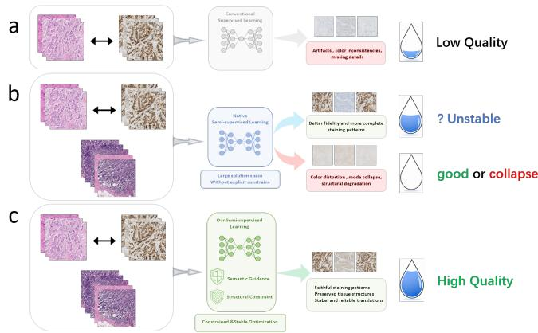  
Fig. 1. Motivation of the proposed framework. (a) Limited paired data constrain virtual staining performance. (b) Unpaired source images improve data utilization but lack direct cross-stain supervision. (c) Hessianderived morphology preservation extracts structural supervision from source images, while histopathological realism constraints promote realistic target staining.

ment planning. Hematoxylin and eosin (H&E) staining primarily presents tissue organization, cellular morphology, and nuclear appearance [1], whereas immunohistochemistry (IHC) visualizes the expression and spatial distribution of specific biomarkers, such as HER2 and Ki67 [2]. These complementary staining patterns provide important evidence for tumor characterization and therapeutic decision-making. Conventional staining, however, involves multiple tissue-processing and chemical procedures, resulting in substantial labor, reagent consumption, and turnaround time. These limitations have motivated computational methods that generate a desired staining modality directly from an available pathological image, including conditional generative adversarial networks [3], [4].

With the digitization of pathological slides, virtual staining has emerged as a computational approach for translating tissue images between staining modalities [5]. Unpaired image-toimage translation methods, such as CycleGAN, CUT, and pathology-specific stain-transfer models, learn from independently collected source- and target-domain images without exact spatial correspondence [6]–[8]. This flexibility is attractive in pathology, where corresponding tissue sections are often unavailable. Nevertheless, virtual staining is not simply a style-transfer problem. A visually realistic image is insufficient if tissue boundaries are distorted or biomarkerrelated staining appears in inappropriate regions. Because distribution-level matching cannot determine the correct local relationship between source tissue and target staining, paired supervision remains important for preserving morphology and diagnostically relevant staining patterns. Accordingly, supervised models such as Pix2Pix and Pix2PixHD remain widely used foundations for virtual staining [9], [10].

The reliability of paired supervision comes with a substantial data-acquisition burden. Cross-stain image pairs are commonly obtained from adjacent tissue sections or from tissue imaged before and after staining. Tissue deformation, missing regions, sectioning artifacts, staining variations, and registration errors can disrupt their spatial correspondence. Constructing a high-quality paired dataset therefore requires extensive registration, meticulous manual inspection, and exclusion of poorly aligned samples. Consequently, only a limited proportion of collected images can be retained as registered source–target pairs, whereas many independently acquired source-domain images remain available without corresponding target stains.

Semi-supervised learning has achieved considerable success in medical image classification, segmentation, and related tasks by combining limited annotated data with additional unannotated samples [11]–[14]. This paradigm is particularly promising for virtual staining because paired images are difficult to acquire, while unpaired source images are abundant. In this work, unpaired images refer specifically to source-domain images without corresponding target-stain images. Paired samples provide direct cross-stain supervision, including tissue correspondence and target-specific staining information, whereas unpaired samples increase the diversity of tissue appearances available during training.

Exploiting unpaired images in a generative task is nevertheless challenging. Unlike classification or segmentation, virtual staining must predict a high-dimensional target image, and an unpaired input provides no corresponding target with which to verify the generated result. Without appropriate supervision, the generator may deviate from the intended stain mapping, distort source-tissue morphology, produce unrealistic target staining, or even collapse during training. Consequently, reliable supervision must therefore be derived for unpaired samples without requiring additional target images.

To this end, we first introduce Hessian-derived morphology preservation to extract structural supervision directly from each source image. Second-order spatial responses capture morphology-related transitions around tissue interfaces, cellular boundaries, and nuclear contours and can be compared across staining modalities. This source-derived signal therefore constrains tissue morphology even when a paired target is unavailable. However, morphology preservation alone may encourage the generator to overemphasize contours or reduce stain translation to a simple color transformation, without ensuring a realistic target-stain appearance.

We consequently introduce histopathological realism constraints (HRC) as a complementary source of supervision. Based on a frozen CONCH vision (a language model [15]), HRC guides generated images toward plausible target-stain characteristics. For paired samples, the corresponding target image provides additional cross-stain representation guidance; for unpaired samples, the target-stain prompt serves as a stable reference. HRC therefore complements the sourcederived morphology supervision and discourages structureonly shortcuts. Together, HRC and morphology preservation regulate both target-stain realism and source-tissue morphology, thereby stabilizing semi-supervised optimization and promoting the preservation of diagnostically relevant information.

The proposed framework uses a shared generator for paired and unpaired samples. Paired samples are optimized using conventional cross-stain supervision together with HRC and morphology preservation, whereas unpaired samples obtain supervision from the latter two components. We evaluate the framework on H&E-to-IHC virtual staining for Ki67 and HER2, as well as FFPE-to-H&E translation, under different unpaired-to-paired data ratios. The evaluation covers image quality, morphology preservation, pathology-informed measurements, robustness, and downstream diagnostic performance.

The main contributions of this work are summarized as:

• We propose a stable semi-supervised virtual staining framework that jointly exploits limited registered source– target pairs and abundant unpaired source images, addressing optimization instability caused by the absence of corresponding targets.

• We introduce Hessian-derived morphology preservation, which obtains structural supervision directly from source images and reduces alterations to tissue interfaces, cellular boundaries, and nuclear contours during stain translation.

• We develop histopathological realism constraints based on a frozen CONCH model to promote plausible targetstain characteristics and prevent source-derived structural supervision from degenerating into contour enhancement or simple color transformation.

• We validate the proposed framework on three virtual staining tasks under different unpaired-to-paired data ratios, demonstrating improvements in staining quality, morphology preservation, robustness, and downstream diagnostic performance.

## II. RELATED WORK

## A. Virtual Staining

Virtual staining computationally translates pathological images from one staining modality to another. Existing approaches can generally be categorized according to whether spatially corresponding cross-stain images are available during training.

Unpaired methods learn from independently collected both source- and target-domain images without requiring spatial registration. CycleGAN uses cycle consistency to encourage content preservation, whereas CUT maintains correspondence between input and output representations through contrastive learning [6], [7]. Although these approaches reduce the need for paired data, their supervision is mainly derived from domain-level distribution matching or representation consistency. They may therefore reproduce a realistic target-domain appearance without guaranteeing correct biomarker localization or faithful morphology preservation.

Paired methods use registered source–target images to directly supervise the desired stain mapping. Pix2Pix and Pix2PixHD combine reconstruction and adversarial objectives and remain common supervised backbones [9], [10]. Subsequent studies have explored multi-scale and high-resolution generation [16]–[18]; adaptive, weakly supervised, or weakly paired learning [19]–[21]; pathology-informed objectives [22], [23]; diffusion-based stain transfer [24], [25]; virtual multiplexing [26]; and foundation model-guided translation [27]. These methods provide effective cross-stain supervision, but their dependence on registered or approximately corresponding images limits the scale and diversity of available training data.

## B. Semi-supervised Learning for Medical Image Translation

Semi-supervised learning combines a small collection of annotated data with a larger set of unannotated samples and has been widely studied in medical image classification, segmentation, and domain adaptation [11]–[13]. Representative strategies include consistency regularization [28], [29], pseudo-labeling [30], and contrastive representation learning [31].

Most semi-supervised methods are designed for tasks with constrained output spaces. In classification and segmentation, predictions on unannotated samples can be converted into categorical or pixel-wise supervision. Image translation is more difficult because the model must synthesize a highdimensional output for which multiple appearances may seem plausible. An inaccurate generated image can therefore be reinforced during optimization and gradually shift the learned mapping away from the intended target domain.

This problem is particularly important in virtual staining, where the output must simultaneously exhibit preserve the spatial organization of the source tissue and realistic targetstain characteristics. For an unpaired source image, neither cross-stain morphology nor target-stain appearance can be directly verified using a corresponding target. Semi-supervised virtual staining therefore requires task-specific supervision that can be obtained without additional paired images.

## C. Morphology Preservation and Histopathological Realism

Morphology preservation is fundamental in virtual staining, as tissue architecture and cellular boundaries must remain spatially consistent across modalities [9], [10]. For paired data, reconstruction and perceptual objectives provide direct structural supervision [32]. However, unpaired source images lack corresponding targets, complicating morphological fidelity in semi-supervised learning [11], [12]. To address this, our framework uses Hessian-derived morphology preservation to extract structural constraints directly from the unpaired source images.

Yet, relying solely on source-derived morphological constraints can trigger optimization shortcuts [33]. Without explicit target-appearance guidance, the model may default to superficial color transformations or hallucinate contourdominated features [34]. Thus, histopathological realism constraints are necessary to ensure plausible target staining. Although pathology foundation models capture rich diagnostic concepts [23], [27], [35], their use as fixed references for target-stain realism in semi-supervised translation remains largely underexplored.

Our dual-pathway approach resolves these complementary needs. Hessian-derived preservation ensures source-side spatial consistency, while realism constraints provide target-side semantic guidance. This interaction prevents the structural supervision from degrading into simple color-mapping. Ultimately, this synergy enables stable semi-supervised virtual staining that preserves both source morphology and target diagnostic semantics. The methodology follows below.

## III. METHODOLOGY

## A. Problem Formulation

Let S and T denote the source- and target-staining domains, respectively. Virtual staining aims to learn a generator called $G \ : \ S \ \to \ T$ that maps a source-domain image to its corresponding target-stained image.

Then, we consider a paired dataset composed of registered source–target images:

$$
\begin{array} { r } { D _ { p } = \{ ( s _ { i } , t _ { i } ) \} _ { i = 1 } ^ { N _ { p } } , } \end{array}\tag{1}
$$

where $s _ { i } \in S$ and $t _ { i } \in T$ . Given a paired source image, the generator produces:

$$
{ \hat { t } } _ { i } = G ( s _ { i } ) ,\tag{2}
$$

which can be directly supervised by the corresponding target $t _ { i } .$ Such paired samples provide cross-stain supervision for both tissue correspondence and target-specific staining characteristics.

Additionally, we use a collection of unpaired source images:

$$
\begin{array} { r } { D _ { u } = \left\{ u _ { j } \right\} _ { j = 1 } ^ { N _ { u } } , } \end{array}\tag{3}
$$

where $u _ { j } ~ \in ~ S$ has no corresponding target-stain image. Its generated result is denoted by:

$$
\hat { t } _ { j } ^ { u } = G ( u _ { j } ) .\tag{4}
$$

Here, unpaired specifically refers to source-domain images without corresponding target images. Our objective is to learn the cross-stain mapping from $D _ { p }$ while deriving reliable supervision for $D _ { u }$ from the source morphology and the expected target-stain appearance.

## B. Framework Overview

As illustrated in Fig. 2, the proposed framework contains paired and unpaired branches that share the same generator. Their difference lies in the available sources of supervision.

For a paired sample $( s _ { i } , t _ { i } )$ , the corresponding target $t _ { i }$ provides direct cross-stain supervision for the generated image $\hat { t } _ { i }$ . The paired branch additionally employs Hessian-derived morphology preservation (HDMP) and histopathological realism constraints (HRC) to reinforce source-tissue consistency and target-stain realism.

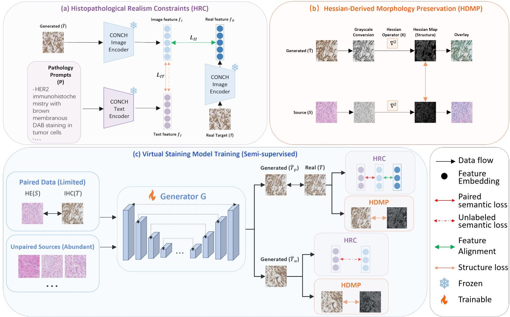  
Fig. 2. Overview of the proposed semi-supervised virtual staining framework. (a) Hessian-derived morphology preservation (HDMP) extracts structural supervision from each source image and constrains the generated output to retain source-tissue morphology. (b) Histopathological realism constraints (HRC) use a frozen CONCH model to guide the output toward plausible target-stain characteristics, with additional target-image alignment when a paired target is available. (c) The two supervisory pathways jointly constrain the shared generator. Paired samples additionall receive direct cross-stain supervision, whereas unpaired samples are optimized without corresponding target images.

For an unpaired source image $u _ { j } ,$ neither pixel-level translation supervision nor alignment with a corresponding target image is available. We therefore construct two complementary supervisory pathways. HDMP extracts structural information directly from $u _ { j } .$ , providing source-side supervision without requiring a target image. HRC supplies a target-side reference through the frozen CONCH model and encourages $\hat { t } _ { j } ^ { u }$ to exhibit plausible target-stain characteristics.

The two methods are jointly required. HDMP specifies which tissue structures should remain spatially consistent, but by itself may overemphasize contours or encourage a simple color transformation. HRC specifies what the generated target staining should look like and discourages such structure-only shortcuts. Their interaction provides complementary sourceside and target-side supervision for stable learning from unpaired images.

## C. Hessian-Derived Morphology Preservation

An unpaired source image provides no corresponding target from which structural consistency can be directly evaluated. Nevertheless, the source image itself contains tissue architecture and cellular organization that should remain spatially consistent after stain translation. We therefore derive morphology supervision directly from each source image.

Rapid local intensity changes in pathological images commonly occur around tissue interfaces, glandular boundaries, cellular contours, and nuclear edges. These structures can be characterized using second-order spatial responses and compared between source and generated images despite their different staining appearances.

For an image $I ,$ we first obtain its grayscale representation through a fixed transformation $\mathcal { G } ( \cdot )$ . Its Hessian-derived response is defined as:

$$
R ( I ) = \mathrm { t r } \left( \nabla ^ { 2 } \mathcal { G } ( I ) \right) ,\tag{5}
$$

where $\nabla ^ { 2 }$ denotes the spatial Hessian and $\operatorname { t r } ( \cdot )$ denotes its trace. Thereafter, for a two-dimensional image I:

$$
R ( I ) = { \frac { \partial ^ { 2 } { \mathcal { G } } ( I ) } { \partial x ^ { 2 } } } + { \frac { \partial ^ { 2 } { \mathcal { G } } ( I ) } { \partial y ^ { 2 } } } .\tag{6}
$$

As shown in Fig. 3, grayscale conversion reduces direct dependence on individual color channels, while the Hessianderived response emphasizes morphology-related structures around tissue interfaces, cellular contours, and nuclear boundaries. The overlay is shown only for visualization, whereas the loss is computed from the original signed response maps.

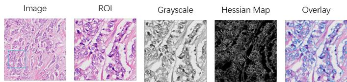  
Fig. 3. Visualization of the Hessian-derived morphology map. A representative pathological region is converted to grayscale and processed using the fixed Hessian-trace operator. Strong responses are mainly observed around tissue interfaces, cellular contours, and nuclear boundaries. The overlay is shown only for visualization.

Morphology preservation compares the response of each generated image with that of its original source image. Hence, for a paired sample:

$$
L _ { \mathrm { m o r } } ^ { p } = \left. { R ( \hat { t } _ { i } ) - R ( s _ { i } ) } \right. _ { 1 } .\tag{7}
$$

On the contrary, for an unpaired source image:

$$
L _ { \mathrm { m o r } } ^ { u } = \left. { R ( \hat { t } _ { j } ^ { u } ) - R ( u _ { j } ) } \right. _ { 1 } .\tag{8}
$$

Unlike direct RGB reconstruction, this method does not require the source and generated images to share the same staining appearance. Instead, it transfers morphology-related supervision from the source image to the generated result, reducing changes to tissue interfaces, cellular boundaries, and nuclear contours.

Morphology preservation alone, however, does not determine whether the generated image exhibits realistic target staining. Excessive reliance on the source-derived response may produce contour-dominated outputs or reduce translation to a superficial color transformation. A complementary targetside constraint is therefore required.

## D. Histopathological Realism Constraints

To complement the source-derived morphology supervision, we introduce histopathological realism constraints based on the frozen CONCH vision–language model. HRC guides generated images toward plausible target-stain appearances and modality-specific staining characteristics.

A task-specific textual prompt $P$ describes the expected appearance and characteristic staining pattern of the target modality. Its normalized text representation is

$$
z _ { T } = \frac { E _ { T } ( P ) } { \Vert E _ { T } ( P ) \Vert _ { 2 } } ,\tag{9}
$$

where $E _ { T } ( \cdot )$ denotes the frozen CONCH text encoder. Given a generated image $\hat { t } ,$ its normalized visual representation is given by:

$$
z _ { I } ( \boldsymbol { \hat { t } } ) = \frac { E _ { I } ( \boldsymbol { \hat { t } } ) } { \left\| E _ { I } ( \boldsymbol { \hat { t } } ) \right\| _ { 2 } } ,\tag{10}
$$

where $E _ { I } ( \cdot )$ denotes the frozen CONCH image encoder.

The image–text realism constraint is defined as:

$$
L _ { \mathrm { I T } } ( \hat { t } , P ) = \log \left[ 1 + \exp \left( - \frac { z _ { I } ( \hat { t } ) ^ { \top } z _ { T } } { \tau } \right) \right] ,\tag{11}
$$

where $\tau$ is a temperature parameter. This objective encourages the generated representation to remain compatible with the expected target-stain characteristics.

1) Paired Realism Constraint: For a paired sample $( s _ { i } , t _ { i } )$ the textual reference is supplemented with sample-specific guidance from the corresponding target image. Its normalized representation is:

$$
z _ { R } ( t _ { i } ) = \frac { E _ { I } ( t _ { i } ) } { \Vert E _ { I } ( t _ { i } ) \Vert _ { 2 } } .\tag{12}
$$

The image–image alignment constraint is defined as:

$$
L _ { \mathrm { I I } } ^ { p } = \left. \boldsymbol { z } _ { I } ( \boldsymbol { \hat { t } _ { i } } ) - \boldsymbol { z } _ { R } ( t _ { i } ) \right. _ { 2 } ^ { 2 } .\tag{13}
$$

The complete HRC objective for the paired branch is:

$$
L _ { \mathrm { r e a l } } ^ { p } = L _ { \mathrm { I T } } ( \hat { t } _ { i } , P ) + \lambda _ { f } L _ { \mathrm { I I } } ^ { p } .\tag{14}
$$

The image–text term provides a general reference for the expected target-stain appearance, whereas image–image alignment supplies sample-specific cross-stain information from the corresponding real target.

2) Unpaired Realism Constraint: For an unpaired source image $u _ { j } ,$ no corresponding target is available for image– image alignment. HRC therefore relies on the target-stain prompt:

$$
\begin{array} { r } { L _ { \mathrm { r e a l } } ^ { u } = L _ { \mathrm { I T } } ( \hat { t } _ { j } ^ { u } , P ) . } \end{array}\tag{15}
$$

Because both CONCH encoders remain frozen, the targetstain reference does not change during generator optimization. This stable reference reduces appearance drift and complements the morphology supervision derived from the source image. Together, they discourage both structurally distorted results and contour-preserving but unrealistic stain transformations.

## E. Training Objective

For a paired sample, the conventional image-to-image translation objective is computed by:

$$
L _ { \mathrm { t r a n s } } = L _ { \mathrm { G A N } } + \lambda _ { \mathrm { r e c } } L _ { \mathrm { r e c } } .\tag{16}
$$

The complete paired-branch objective combines direct cross-stain supervision, morphology preservation, and histopathological realism constraints by:

$$
L _ { p } = L _ { \mathrm { t r a n s } } + \lambda _ { m } L _ { \mathrm { m o r } } ^ { p } + \lambda _ { r } L _ { \mathrm { H R C } } ^ { p } .\tag{17}
$$

For an unpaired source image, no direct translation loss or target-image alignment can be computed. Its objective becomes therefore:

$$
L _ { u } = \lambda _ { m } L _ { \mathrm { m o r } } ^ { u } + \lambda _ { r } L _ { \mathrm { r e a l } } ^ { u } .\tag{18}
$$

The mini-batch objective is selected according to the availability of corresponding target images:

$$
L = \left\{ \begin{array} { l l } { { L _ { p } , } } & { { \mathrm { f o r ~ a ~ p a i r e d ~ b a t c h } , } } \\ { { L _ { u } , } } & { { \mathrm { f o r ~ a n ~ u n p a i r e d ~ b a t c h } . } } \end{array} \right.\tag{19}
$$

In practice, the generator is first warmed up using paired samples, after which the unpaired branch is activated. This schedule prevents unpaired optimization from being introduced before a basic cross-stain mapping has been established. The activation point and loss-weight settings are provided in the Sec. Implementation Details. The proposed methods introduce complementary training signals without modifying the generator architecture.

## IV. EXPERIMENTS

## A. Datasets

We evaluate the proposed framework on three virtual staining tasks: H&E-to-IHC virtual staining for Ki67 and HER2, and FFPE-to-H&E translation. For each task, accurately registered source–target pairs provide paired supervision, while additional unpaired source images are incorporated during semi-supervised training.

1) H&E-to-IHC Virtual Staining for Ki67: The paired data are selected from the public MIST-Ki67 dataset. To ensure reliable supervision, we retain only image pairs with satisfactory registration quality, resulting in 2,000 pairs for training and 1,000 pairs for testing. In addition, 10,000 source-domain patches from the Ki67 subset of the public IHC4BC dataset are used as unpaired source images.

2) H&E-to-IHC Virtual Staining for HER2: We use a private paired dataset, self-HER2, constructed from 30 H&E–HER2 IHC WSI pairs stained with the 4B5 antibody and covering HER2 scores of 0, 1+, 2+, and 3+. Following WSI registration using Gatenbee et al.’s method [36], patch extraction at 1024× 1024 pixels, and manual quality control, 3,000 registered pairs are retained, including 2,500 for training and 500 for testing. Additionally, 10,000 source-domain patches from the HER2 subset of IHC4BC are used as unpaired source images.

3) FFPE-to-H&E Translation: For FFPE-to-H&E translation, we use a private paired dataset, self-FFPE. Following WSI registration and manual quality control, 2,500 registered pairs are retained for training and 1,000 pairs for testing. A separate private dataset, self-FFPE2, provides 7,500 unpaired FFPE patches for semi-supervised training.

## B. Implementation Details

Unless otherwise specified, the unpaired-to-paired data ratio is set to 2:1, and all models are trained for 100 epochs. The generator is first warmed up using paired samples for 70 epochs, after which unpaired samples are introduced for the remaining 30 epochs. For Hessian-derived morphology preservation, RGB images are converted to grayscale using $0 . 2 9 9 R + 0 . 5 8 7 G + 0 . 1 1 4 B$ and processed with a fixed fourneighbor Laplacian kernel $\left[ { \begin{array} { l l l } { 0 } & { 1 } & { \mathbf { \bar { \theta } } } \\ { 1 } & { - 4 } & { 1 } \\ { 0 } & { 1 } & { . 0 } \end{array} } \right]$ . The loss is computed from the raw signed responses, while display enhancement is used only for visualization. For comparison with Pix2PixHD, the generator backbone, optimizer, and total number of training epochs are kept identical. Other methods follow their official implementations and use the same data splits. All experiments are conducted on eight NVIDIA RTX 3090 GPUs with 24 GB memory each.

## C. Comparison Methods

We compare the proposed method with representative virtual staining approaches, including Pix2Pix, Pix2PixHD, ASP, PyramidPix2Pix, TDKStain, HistDiST, and UNIStain-Net. These methods cover supervised image-to-image translation, weakly paired learning, diffusion-based generation, and pathology foundation model-based approaches.

We additionally combine the proposed framework with Pix2PixHD to evaluate its effect under the same generator backbone. TDKStain and HistDiST are specifically designed for H&E-to-IHC translation and are therefore evaluated only on the H&E-to-IHC datasets.

## D. Evaluation Protocol

We evaluate the generated images from three complementary perspectives: image-level quality, stain-specific agreement, and downstream diagnostic utility.

1) Image-Level Quality: PSNR, SSIM, and MS-SSIM measure pixel-level and structural agreement between generated and reference images. DISTS evaluates perceptual similarity, while FID and KID measure distributional agreement.

2) Stain-Specific Assessment: For H&E-to-IHC virtual staining, DAB-KL and integrated optical density difference (IOD-D) are used to assess biomarker-related staining. Generated and real IHC images are decomposed to obtain their DAB channels. DAB-KL measures the divergence between their DAB distributions, whereas IOD-D measures the difference in total DAB-positive staining intensity. Lower values indicate closer agreement with the real IHC images.

For FFPE-to-H&E translation, generated and real images are transformed into the HED color space. Dice scores computed from the hematoxylin and eosin channels, denoted as H-Dice and E-Dice, evaluate the agreement of nuclei-related and eosin-stained tissue regions, respectively.

3) Downstream Diagnostic Evaluation: For H&E-to-IHC virtual staining, we further examine whether generated IHC images preserve information required for four-class HER2 scoring. The evaluation is conducted on an external dataset with HER2 annotations. Original H&E images and real IHC images are included as lower- and upper-reference inputs, respectively.

## E. Main Results

1) Comparison with Baselines and SOTA Methods: The quantitative results are reported in Tables I and II. Across H&E-to-IHC virtual staining for HER2 and Ki67, as well as FFPE-to-H&E translation, incorporating the proposed framework consistently improves Pix2PixHD across image-level, distributional, and stain-specific evaluations.

Compared with representative virtual staining methods, our framework achieves competitive or superior performance across the three tasks, with improvements extending beyond visual similarity to biomarker-related staining and tissuecomponent agreement.

Representative results are shown in Fig. 7. Our method produces more plausible target-stain appearances while better retaining tissue organization and cellular structures. These results reveal the complementary roles of the two proposed methods: Hessian-derived morphology preservation transfers structural supervision from the source image, while histopathological realism constraints prevent the translation from degenerating into contour enhancement or superficial color transformation.

2) Downstream Diagnostic Evaluation: To evaluate whether the generated IHC images preserve diagnostically relevant information, we conduct a downstream four-class HER2 scoring experiment on an external dataset with explicit HER2 annotations. Original H&E images and real IHC images are included as lower- and upper-reference inputs, respectively, while the remaining settings use virtual IHC images generated by different methods.

As shown in Fig. 4, the proposed method achieves the strongest overall HER2 scoring performance among the compared virtual staining methods. This result indicates that the generated images exhibit realistic staining appearances while preserving HER2-related information useful for downstream diagnostic assessment.

Comparison methodsPix2PixHD without oursPix2PixHD with our  
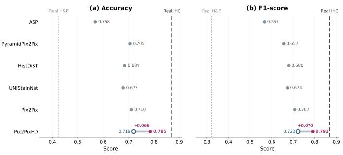  
Fig. 4. Four-class HER2 scoring performance using generated IHC images. Original H&E images and real IHC images are included as lower- and upper-reference inputs, respectively.

## F. Ablation Study

We conduct ablation experiments to evaluate the individual and combined effects of HDMP and HRC. As reported in Table V, directly introducing unpaired source images without either constraint substantially degrades performance, demonstrating that unpaired optimization requires appropriate supervision.

Adding HDMP or HRC individually substantially improves the semi-supervised baseline, while their combination achieves the strongest overall performance. HDMP transfers morphology-related supervision from the source image, whereas HRC promotes plausible target-stain characteristics. Their complementary effects support stable learning from unpaired source images.

## G. Robustness to Staining and Acquisition Variations

The proposed framework emphasizes diagnostically relevant staining characteristics and tissue morphology, which should be less sensitive than superficial image appearance to incidental variations in staining and image acquisition. We therefore evaluate whether the learned translation remains stable when such variations are introduced while the underlying pathological content is preserved.

Two modified versions of each test set are constructed to simulate staining variations and acquisition degradations, with representative examples shown in Fig. 5. Staining variations are generated by adjusting the hue, saturation, and brightness of the source images. Acquisition degradations are simulated using Gaussian noise, downsampling followed by Gaussian blur, and radial geometric distortion. The noise standard deviation is set to 2, the downsampling factor and blur-kernel size are set to 0.5 and 3, respectively, and the distortion coefficient is sampled from (−0.05, 0.05). Each operation is independently applied with a probability of 0.5.

Original  
Perturbed1  
Perturbed2  
Perturbed3  
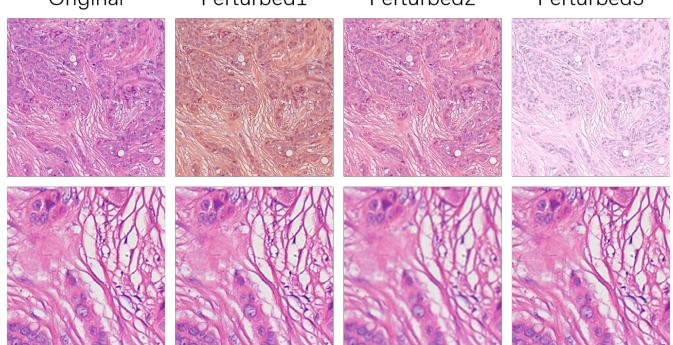  
Fig. 5. Examples of input variations used for robustness evaluation. Each row begins with the original image, followed by three modified variants. The top and bottom rows illustrate staining variations and acquisition degradations, respectively.

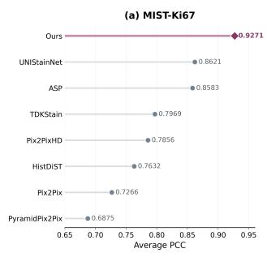

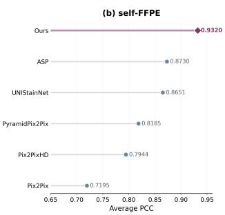  
Fig. 6. Average PCC between generated images and their corresponding source images on the MIST-Ki67 and self-FFPE datasets. Higher values indicate stronger preservation of source-tissue organization.

As presented in Tables III and IV, the proposed framework consistently improves Pix2PixHD under both types of input variation and achieves strong overall performance across image-level, distributional, and stain-specific evaluations. These results suggest that morphology preservation and histopathological realism constraints encourage the model to rely more on pathology-relevant staining and structural information, thereby reducing its sensitivity to incidental appearance and acquisition changes.

## H. Morphology Preservation Evaluation

To evaluate whether virtual staining alters the spatial organization of the source tissue, we compute the Pearson correlation coefficient (PCC) between each generated image and its corresponding source image after grayscale conversion. For H&E-to-IHC translation, PCC is calculated between the generated IHC image and the input H&E image. For FFPE-to-H&E translation, it is calculated between the generated H&E image and the corresponding FFPE input.

TABLE I  
QUANTITATIVE COMPARISON ON H&E-TO-IHC VIRTUAL STAINING FOR HER2 AND KI67 USING THE SELF-HER2 AND MIST-KI67 TEST SETS.
<table><tr><td rowspan="2" colspan="2"></td><td colspan="3">Image-Level Agreement</td><td colspan="3">Perceptual / Distributional Quality</td><td colspan="2">Stain-Specific Agreement</td></tr><tr><td>PSNR↑</td><td>SSIM↑</td><td>MSSSIM↑</td><td>FID↓</td><td>KID↓</td><td>DISTS↓</td><td>DAB-KL↓</td><td>IOD-D↓</td></tr><tr><td rowspan="9">Self-HER2</td><td>ASP</td><td>16.38</td><td>0.2304</td><td>0.2735</td><td>155.6165</td><td>0.1459</td><td>0.2847</td><td>0.5660</td><td>0.0263</td></tr><tr><td>PyramidPix2Pix</td><td>17.95</td><td>0.3387</td><td>0.3746</td><td>90.1506</td><td>0.0680</td><td>0.2545</td><td>0.3868</td><td>0.0243</td></tr><tr><td>TDKStain</td><td>17.89</td><td>0.3465</td><td>0.3653</td><td>64.7646</td><td>0.0298</td><td>0.2954</td><td>0.3812</td><td>0.0255</td></tr><tr><td>HistDiST</td><td>18.14</td><td>0.3345</td><td>0.3694</td><td>56.0305</td><td>0.0245</td><td>0.2542</td><td>0.4599</td><td>0.0269</td></tr><tr><td>UNIStainNet</td><td>17.82</td><td>0.3528</td><td>0.3870</td><td>59.4592</td><td>0.0259</td><td>0.2418</td><td>0.4180</td><td>0.0256</td></tr><tr><td>Pix2Pix</td><td>17.92</td><td>0.3487</td><td>0.3854</td><td>79.8819</td><td>0.0503</td><td>0.2423</td><td>0.4116</td><td>0.0246</td></tr><tr><td>Pix2PixHD</td><td>18.39</td><td>0.3321</td><td>0.3726</td><td>87.6770</td><td>0.0660</td><td>0.2807</td><td>0.4773</td><td>0.0251</td></tr><tr><td>Pix2PixHD w/ ours</td><td>18.60</td><td>0.3704</td><td>0.4029</td><td>52.4523</td><td>0.0249</td><td>0.2335</td><td>0.3659</td><td>0.0240</td></tr><tr><td rowspan="9">MIST-Ki67</td><td>ASP</td><td>14.60</td><td>0.2299</td><td>0.1836</td><td>51.1829</td><td>0.0295</td><td>0.2438</td><td>0.5622</td><td>0.0363</td></tr><tr><td>PyramidPix2Pix</td><td>14.23</td><td>0.2287</td><td>0.1698</td><td>91.3043</td><td>0.0790</td><td>0.2611</td><td>0.5113</td><td>0.0331</td></tr><tr><td>TDKStain</td><td>14.47</td><td>0.2388</td><td>0.1802</td><td>55.7503</td><td>0.0347</td><td>0.2374</td><td>0.4990</td><td>0.0313</td></tr><tr><td>HistDiST</td><td>14.41</td><td>0.2355</td><td>0.1868</td><td>77.8673</td><td>0.0480</td><td>0.2818</td><td>0.8274</td><td>0.0425</td></tr><tr><td>UNIStainNet</td><td>14.50</td><td>0.1858</td><td>0.1741</td><td>54.5161</td><td>0.0323</td><td>0.3020</td><td>0.5490</td><td>0.0389</td></tr><tr><td>Pix2Pix</td><td>13.79</td><td>0.2462</td><td>0.1827</td><td>78.0272</td><td>0.0538</td><td>0.2634</td><td>0.5969</td><td>0.0430</td></tr><tr><td>Pix2PixHD</td><td>14.21</td><td>0.2356</td><td>0.1727</td><td>114.7570</td><td>0.0936</td><td>0.2871</td><td>0.5827</td><td>0.0377</td></tr><tr><td>Pix2PixHD w/ ours</td><td>14.90</td><td>0.2651</td><td>0.2122</td><td>47.2794</td><td>0.0277</td><td>0.2595</td><td>0.4969</td><td>0.0305</td></tr></table>

TABLE II  
QUANTITATIVE COMPARISON ON FFPE-TO-H&E TRANSLATION USING THE SELF-FFPE TEST SET.
<table><tr><td rowspan="2" colspan="2"></td><td colspan="3">Image-Level Agreement</td><td colspan="3">Perceptual / Distributional Quality</td><td colspan="2">Stain-Specific Agreement</td></tr><tr><td>PSNR↑</td><td>SSIM↑</td><td>MSSSIM↑</td><td>FID↓</td><td>KID↓</td><td>DISTS↓</td><td>H-Dice↑</td><td>E-Dice↑</td></tr><tr><td rowspan="6">Self-FFPE</td><td>ASP</td><td>15.79</td><td>0.3583</td><td>0.3632</td><td>97.6618</td><td>0.0640</td><td>0.2895</td><td>0.1984</td><td>0.7604</td></tr><tr><td>PyramidPix2Pix</td><td>17.59</td><td>0.4852</td><td>0.6577</td><td>23.1832</td><td>0.0043</td><td>0.1422</td><td>0.5454</td><td>0.6749</td></tr><tr><td>UNIStainNet</td><td>18.15</td><td>0.5228</td><td>0.6892</td><td>19.5909</td><td>0.0017</td><td>0.2267</td><td>0.5893</td><td>0.7387</td></tr><tr><td>Pix2Pix</td><td>15.14</td><td>0.3736</td><td>0.4165</td><td>28.3412</td><td>0.0053</td><td>0.1794</td><td>0.3217</td><td>0.4537</td></tr><tr><td>Pix2PixHD</td><td>17.27</td><td>0.5034</td><td>0.6688</td><td>21.2485</td><td>0.0032</td><td>0.1164</td><td>0.5168</td><td>0.6241</td></tr><tr><td>Pix2PixHD w/ ours</td><td>18.45</td><td>0.5377</td><td>0.7028</td><td>16.0702</td><td>0.0005</td><td>0.1123</td><td>0.6414</td><td>0.7730</td></tr></table>

TABLE III  
ROBUSTNESS COMPARISON ON THE SELF-HER2 AND MIST-KI67 TEST SETS UNDER STAINING VARIATIONS AND ACQUISITION DEGRADATIONS.
<table><tr><td rowspan="2"></td><td rowspan="2"></td><td colspan="7">Staining Variation</td><td colspan="7">Acquisition Degradation</td></tr><tr><td>PSNR↑</td><td>SSIM↑</td><td>FID↓</td><td>KID↓</td><td>DISTS↓</td><td>DAB-KL↓</td><td>IOD-D↓</td><td>PSNR↑</td><td>SSIM↑</td><td>FID↓</td><td>KID↓</td><td>DISTS↓</td><td>DAB-KL↓</td><td>IOD-D↓</td></tr><tr><td rowspan="7">Self-HER2</td><td>ASP</td><td>15.52</td><td>0.2107</td><td>117.8376</td><td>0.0998</td><td>0.2939</td><td>0.7326</td><td>0.0361</td><td>16.2876</td><td>0.2389</td><td>157.5783</td><td>0.1403</td><td>0.2842</td><td>0.5559 0.4064</td><td>0.0267</td></tr><tr><td>PyramidPix2Pix</td><td>17.39 17.42</td><td>0.3127 0.2860</td><td>107.6362</td><td>0.0918</td><td>0.2868</td><td>0.4717</td><td>0.0270</td><td>17.9899 17.8115</td><td>0.3321 0.3214</td><td>93.2739 64.7279</td><td>0.0722 0.0305</td><td>0.2815 0.2808</td><td>0.3896</td><td>0.0247 0.0258</td></tr><tr><td>TDKStain</td><td>17.37</td><td>0.2317</td><td>80.3787 68.8050</td><td>0.0440</td><td>0.2894 0.3211</td><td>0.5423 0.4289</td><td>0.0246 0.0252</td><td>17.0465</td><td>0.2524</td><td>63.4894</td><td>0.0316</td><td>0.3355</td><td></td><td></td></tr><tr><td>UNIStainNet</td><td>17.65</td><td>0.3254</td><td></td><td>0.0366</td><td></td><td></td><td></td><td></td><td>0.3453</td><td></td><td></td><td></td><td>0.4165</td><td>0.0271</td></tr><tr><td>Pix2Pix</td><td></td><td></td><td>78.6544</td><td>0.0519</td><td>0.2758</td><td>0.4154</td><td>0.0251</td><td>17.2000</td><td></td><td>97.7118</td><td>0.0466</td><td>0.2541</td><td>0.4185</td><td>0.0245</td></tr><tr><td>Pix2PixHD Pix2PixHD w/ ours</td><td>18.17 18.40</td><td>0.3114 0.3403</td><td>88.4236 59.1927</td><td>0.0652 0.0264</td><td>0.2791 0.2613</td><td>0.4667 0.3896</td><td>0.0252 0.0249</td><td>18.3600 18.4700</td><td>0.3499 0.3619</td><td>86.3794 59.5548</td><td>0.0586</td><td>0.2661</td><td>0.4866</td><td>0.0253</td></tr><tr><td></td><td></td><td></td><td></td><td></td><td></td><td></td><td></td><td></td><td></td><td></td><td>0.0283</td><td>0.2494</td><td>0.3821</td><td>0.0243</td></tr><tr><td rowspan="7">MIST-Ki67</td><td>ASP</td><td>14.23</td><td>0.2186</td><td>59.1870</td><td>0.0357</td><td>0.2608</td><td>0.6544</td><td>0.0391</td><td>14.5465</td><td>0.2330</td><td>59.8069</td><td>0.0349</td><td>0.2525</td><td>0.5929</td><td>0.0377</td></tr><tr><td>PyramidPix2Pix</td><td>13.97</td><td>0.2182</td><td>92.3648</td><td>0.0834</td><td>0.2644</td><td>0.5274</td><td>0.0378</td><td>14.3174</td><td>0.2321</td><td>90.5449</td><td>0.0757</td><td>0.2658</td><td>0.5181</td><td>0.0338</td></tr><tr><td>TDKStain</td><td>13.75</td><td>0.2127</td><td>61.2593</td><td>0.0423</td><td>0.2520</td><td>0.5811</td><td>0.0445</td><td>14.3700</td><td>0.2344</td><td>54.7415</td><td>0.0319</td><td>0.2383</td><td>0.5198</td><td>0.0321</td></tr><tr><td>UNIStainNet</td><td>14.46</td><td>0.1841</td><td>65.4040</td><td>0.0439</td><td>0.3041</td><td>0.5586</td><td>0.0390</td><td>14.2200</td><td>0.1890</td><td>62.9493</td><td>0.0337</td><td>0.3148</td><td>0.5531</td><td>0.0349</td></tr><tr><td>Pix2Pix</td><td>13.38</td><td>0.2357</td><td>85.2704</td><td>0.0546</td><td>0.2719</td><td>0.5852</td><td>0.0466</td><td>13.9137</td><td>0.2471</td><td>72.9535</td><td>0.0436</td><td>0.2689</td><td>0.5078</td><td>0.0428</td></tr><tr><td>Pix2PixHD</td><td>13.95</td><td>0.2266</td><td>123.0893</td><td>0.1070</td><td>0.2883</td><td>0.6755</td><td>0.0402</td><td>14.1927</td><td>0.2355 0.2737</td><td>115.1264</td><td>0.0933</td><td>0.2860</td><td>0.5917</td><td>0.0379</td></tr><tr><td>Pix2PixHD w/ ours</td><td>14.74</td><td>0.2610</td><td>56.5030</td><td>0.0347</td><td>0.2599</td><td>0.5198</td><td>0.0345</td><td>14.8844</td><td></td><td>49.2880</td><td>0.0289</td><td>0.2537</td><td>0.4907</td><td>0.0311</td></tr></table>

TABLE IV  
ROBUSTNESS COMPARISON ON THE SELF-FFPE TEST SET UNDER STAINING VARIATIONS AND ACQUISITION DEGRADATIONS.
<table><tr><td rowspan="2">SSIM↑</td><td rowspan="2">PSNR↑</td><td colspan="8">Staining Variation</td><td colspan="8">Acquisition Degradation</td></tr><tr><td></td><td></td><td>FID↓</td><td>KID↓</td><td>DISTS↓</td><td>H-Dice↑</td><td>E-Dice↑</td><td></td><td>PSNR↑</td><td>SSIM↑</td><td>FID↓</td><td>KID↓</td><td>DISTS↓</td><td>H-Dice↑</td><td>E-Dice↑</td></tr><tr><td rowspan="6">Self-FFPE2HE</td><td>ASP</td><td>15.52 17.12</td><td>0.3474</td><td>96.9358</td><td>0.0609</td><td>0.2879</td><td></td><td>0.2171</td><td>0.7507 0.6592</td><td>15.5092</td><td>0.3455</td><td>99.5627</td><td>0.0595</td><td>0.2908</td><td>0.1746</td><td>0.7175</td></tr><tr><td>PyramidPix2Pix</td><td>17.67</td><td>0.4679 0.5151</td><td>27.8536 21.2922</td><td>0.0067 0.0025</td><td>0.1529</td><td></td><td>0.5189</td><td></td><td>16.8787</td><td>0.4581</td><td>27.6058</td><td>0.0055</td><td>0.1574</td><td>0.4951</td><td>0.6220</td></tr><tr><td>UNIStainNet</td><td></td><td></td><td></td><td></td><td></td><td>0.2289</td><td>0.5735</td><td>0.7270</td><td>17.4587</td><td>0.4926</td><td>22.1434</td><td>0.0023</td><td>0.2429</td><td>0.5632</td><td>0.7253</td></tr><tr><td>Pix2Pix Pix2PixHD</td><td>13.75</td><td>0.3101 0.4900</td><td>78.6262 23.8326</td><td>0.0333</td><td>0.3039</td><td></td><td>0.2286</td><td>0.3185 0.6065</td><td>14.7938 16.4963</td><td>0.3512 0.4664</td><td>32.0556 24.1984</td><td>0.0058</td><td>0.1953 0.1312</td><td>0.2956</td><td>0.4517</td></tr><tr><td>Pix2PixHD w/ ours</td><td>16.91 17.99</td><td>0.5191</td><td>18.1853</td><td>0.0045 0.0013</td><td>0.1251 0.1182</td><td></td><td>0.4876</td><td>0.7696</td><td>17.6075</td><td>0.4982</td><td>20.5926</td><td>0.0043 0.0016</td><td>0.1230</td><td>0.4623 0.6004</td><td>0.5605 0.7400</td></tr><tr><td></td><td></td><td></td><td></td><td></td><td></td><td></td><td>0.6112</td><td></td><td></td><td></td><td></td><td></td><td></td><td></td><td></td></tr></table>

Grayscale conversion reduces the direct influence of stain color, while PCC measures the agreement between the spatial intensity patterns of the two images. A higher value indicates that the generated image retains more of the structural orga-

Self-HER2 MIST-Ki67 Self-FFPE

Input  
Ground Truth  
ASP  
Pix2pix  
PyramidPix2pix  
UNIStainNet  
Pix2pixHD  
Ours  
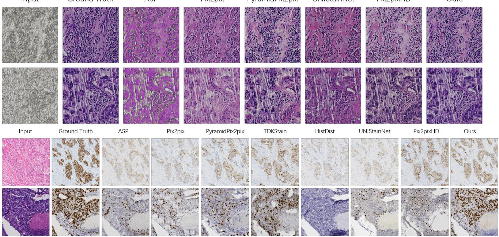  
Fig. 7. Representative qualitative results on the three virtual staining tasks. The first two rows show FFPE-to-H&E translation, while the third and fourth rows show H&E-to-IHC virtual staining for HER2 and Ki67, respectively.

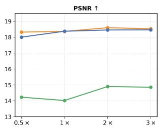

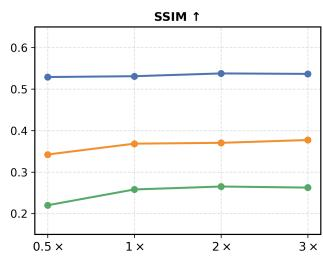

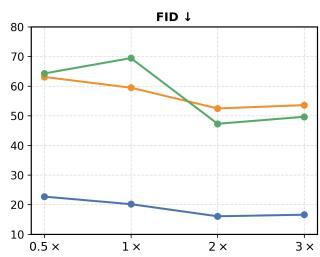

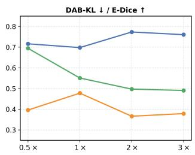  
Fig. 8. Sensitivity to the amount of unpaired source data. The unpaired-to-paired ratio is varied from 0.5 : 1 to 3 : 1 on the self-HER2, MIST-Ki67, and self-FFPE datasets.

TABLE V  
ABLATION STUDY OF HESSIAN-DERIVED MORPHOLOGY PRESERVATION AND HISTOPATHOLOGICAL REALISM CONSTRAINTS ON THE SELF-HER2 DATASET.
<table><tr><td>Method</td><td>PSNR↑</td><td>SSIM↑</td><td>FID↓</td><td>DISTS↓</td></tr><tr><td>Supervised baseline</td><td>18.38</td><td>0.3321</td><td>87.6770</td><td>0.2807</td></tr><tr><td>Semi-supervised baseline</td><td>11.90</td><td>0.2048</td><td>455.7836</td><td>0.4586</td></tr><tr><td>Semi-supervised + HDMP</td><td>18.37</td><td>0.3428</td><td>73.6938</td><td>0.3001</td></tr><tr><td>Semi-supervised + HRC</td><td>18.42</td><td>0.3688</td><td>64.5625</td><td>0.2433</td></tr><tr><td>Ours</td><td>18.60</td><td>0.3704</td><td>52.4523</td><td>0.2335</td></tr></table>

nization present in the source image.

As shown in Fig. 6, the proposed framework achieves the highest PCC on both datasets, indicating stronger preservation of source-tissue organization. This result is consistent with the role of HDMP in reducing changes to tissue interfaces and cellular structures during stain translation.

## I. Sensitivity to the Amount of Unpaired Data

We study the influence of unpaired data volume by setting the unpaired-to-paired ratio to 0.5:1, 1:1, 2:1, and 3:1, while keeping the remaining settings unchanged.

As shown in Fig. 8, performance generally improves as additional unpaired source images are introduced and becomes relatively stable at a ratio of approximately 2:1. Increasing the ratio beyond this point provides limited additional benefit. We therefore use an unpaired-to-paired ratio of 2:1 in the remaining experiments.

## V. CONCLUSION

In this paper, we presented a stable semi-supervised framework for virtual staining that reduces reliance on accurately registered source–target pairs by jointly exploiting limited paired data and abundant unpaired source images. Hessianderived morphology preservation extracts structural supervision from source images to preserve morphology-related spatial structures, while histopathological realism constraints guide generated images toward plausible target-stain characteristics. Together, they mitigate structural and appearance drift during semi-supervised optimization.

Experiments on H&E-to-IHC for HER2 and Ki67, and FFPE-to-H&E translation demonstrate consistent improvements in image quality, morphology preservation, pathologyinformed metrics, robustness, and downstream diagnostic performance. The robustness and ablation results further support the stability and complementary roles of the two proposed constraints.

Overall, the proposed framework provides a practical approach for incorporating unpaired source images into virtual staining without modifying the underlying generator architecture. These findings highlight the potential of source-derived morphology supervision and target-stain realism guidance for data-efficient and reliable virtual staining.

## REFERENCES

[1] M. Titford, “The long history of hematoxylin,” Biotechnic & histochemistry, vol. 80, no. 2, pp. 73–78, 2005.

[2] J. Ramos-Vara and M. Miller, “When tissue antigens and antibodies get along: revisiting the technical aspects of immunohistochemistry—the red, brown, and blue technique,” Veterinary pathology, vol. 51, no. 1, pp. 42–87, 2014.

[3] Y. Rivenson, H. Wang, Z. Wei et al., “Virtual histological staining of unlabelled tissue-autofluorescence images via deep learning,” Nature Biomedical Engineering, vol. 3, pp. 466–477, 2019.

[4] B. Bai, X. Yang, Y. Li, Y. Zhang, N. Pillar, and A. Ozcan, “Deep learning-enabled virtual histological staining of biological samples,” Light: Science & Applications, vol. 12, no. 1, p. 57, 2023.

[5] W. Lin, Y. Hu, R. Zhu, B. Wang, and L. Wang, “Virtual staining for pathology: Challenges, limitations and perspectives,” Intelligent Oncology, 2025.

[6] J.-Y. Zhu, T. Park, P. Isola, and A. A. Efros, “Unpaired image-to-image translation using cycle-consistent adversarial networks,” in Proceedings of the IEEE international conference on computer vision, 2017, pp. 2223–2232.

[7] T. Park, A. A. Efros, R. Zhang, and J.-Y. Zhu, “Contrastive learning for unpaired image-to-image translation,” in Computer Vision–ECCV 2020: 16th European Conference, Glasgow, UK, August 23–28, 2020, Proceedings, Part IX 16. Springer, 2020, pp. 319–345.

[8] S. Liu, B. Zhang, Y. Liu, A. Han, H. Shi, T. Guan, and Y. He, “Unpaired stain transfer using pathology-consistent constrained generative adversarial networks,” IEEE transactions on medical imaging, vol. 40, no. 8, pp. 1977–1989, 2021.

[9] P. Isola, J.-Y. Zhu, T. Zhou, and A. A. Efros, “Image-to-image translation with conditional adversarial networks,” in Proceedings of the IEEE conference on computer vision and pattern recognition, 2017, pp. 1125– 1134.

[10] T.-C. Wang, M.-Y. Liu, J.-Y. Zhu, A. Tao, J. Kautz, and B. Catanzaro, “High-resolution image synthesis and semantic manipulation with conditional gans,” in Proceedings of the IEEE conference on computer vision and pattern recognition, 2018, pp. 8798–8807.

[11] V. Cheplygina, M. de Bruijne, and J. P. Pluim, “Not-so-supervised: A survey of semi-supervised, multi-instance, and transfer learning in medical image analysis,” Medical Image Analysis, vol. 54, pp. 280–296, 2019.

[12] Z. Zhou et al., “Semi-supervised medical image segmentation: A survey,” Medical Image Analysis, vol. 87, p. 102791, 2023.

[13] D. Berthelot, N. Carlini, I. Goodfellow, N. Papernot, A. Oliver, and C. Raffel, “Mixmatch: A holistic approach to semi-supervised learning,” in Advances in Neural Information Processing Systems, vol. 32, 2019, pp. 5050–5060.

[14] Q. Xie, Z. Dai, E. Hovy, M.-T. Luong, and Q. V. Le, “Unsupervised data augmentation for consistency training,” in Advances in Neural Information Processing Systems, vol. 33, 2020, pp. 6256–6268.

[15] M. Y. Lu, B. Chen, D. F. K. Williamson, R. J. Chen, I. Liang, T. Ding, G. Jaume, I. Odintsov, L. P. Le, G. Gerber, A. V. Parwani, A. Zhang, and F. Mahmood, “A visual-language foundation model for computational pathology,” Nature Medicine, vol. 30, no. 3, pp. 863–874, 2024.

[16] S. Liu, C. Zhu, F. Xu, X. Jia, Z. Shi, and M. Jin, “Bci: Breast cancer immunohistochemical image generation through pyramid pix2pix,” in Proceedings of the IEEE/CVF conference on computer vision and pattern recognition, 2022, pp. 1815–1824.

[17] K. Sun, Z. Chen, G. Wang, J. Liu, X. Ye, and Y.-G. Jiang, “Bi-directional feature fusion generative adversarial network for ultra-high resolution pathological image virtual re-staining,” in Proceedings of the IEEE/CVF Conference on Computer Vision and Pattern Recognition, 2023, pp. 3904–3913.

[18] J. Ma and H. Chen, “Efficient supervised pretraining of swin-transformer for virtual staining of microscopy images,” IEEE Transactions on Medical Imaging, 2023.

[19] F. Li, Z. Hu, W. Chen, and A. Kak, “Adaptive supervised patchnce loss for learning h&e-to-ihc stain translation with inconsistent groundtruth image pairs,” in International Conference on Medical Image Computing and Computer-Assisted Intervention. Springer, 2023, pp. 632–641.

[20] J. Li, J. Dong, S. Huang, X. Li, J. Jiang, X. Fan, and Y. Zhang, “Virtual immunohistochemistry staining for histological images assisted by weakly-supervised learning,” in Proceedings of the IEEE/CVF Conference on Computer Vision and Pattern Recognition, 2024, pp. 11 259– 11 268.

[21] X. Guan, Z. Zhang, Y. Wang, Y. Li, and Y. Zhang, “Supervised information mining from weakly paired images for breast ihc virtual staining,” IEEE Transactions on Medical Imaging, vol. 44, no. 5, pp. 2120–2130, 2025.

[22] Q. Peng, W. Lin, Y. Hu, A. Bao, C. Lian, W. Wei, M. Yue, J. Liu, L. Yu, and L. Wang, “Advancing h&e-to-ihc virtual staining with taskspecific domain knowledge for her2 scoring,” in International Conference on Medical Image Computing and Computer-Assisted Intervention. Springer, 2024, pp. 3–13.

[23] Y. Hu, Q. Peng, Z. Du, G. Zhang, H. Wu, J. Liu, H. Chen, and L. Wang, “Boosting ffpe-to-he virtual staining with cell semantics from pretrained segmentation model,” in International Conference on Medical Image Computing and Computer-Assisted Intervention. Springer, 2024, pp. 67–76.

[24] Y. He, Z. Liu, M. Qi, S. Ding, P. Zhang, F. Song, C. Ma, H. Wu, R. Cai, Y. Feng et al., “PST-Diff: Achieving high-consistency stain transfer by diffusion models with pathological and structural constraints,” IEEE Transactions on Medical Imaging, vol. 43, no. 10, pp. 3634–3647, 2024.

[25] E. Großkopf, V. Bundele, M. Hosseinzadeh, and H. P. Lensch, “Histdist: Histopathological diffusion-based stain transfer,” in DAGM German Conference on Pattern Recognition. Springer, 2025, pp. 28–40.

[26] P. Pati, S. Karkampouna, F. Bonollo, E. Comperat, M. Radi ´ c, M. Spahn,´ A. Martinelli, M. Wartenberg, M. Kruithof-de Julio, and M. Rapsomaniki, “Accelerating histopathology workflows with generative AIbased virtually multiplexed tumour profiling,” Nature Machine Intelligence, vol. 6, pp. 1077–1093, 2024.

[27] J. R. Saurav, T. L. H. Pham, P. Mukherjee, P. Yi, B. A. Orr, and J. M. Luber, “Unistainnet: Foundation-model-guided virtual staining of h&e to ihc,” arXiv preprint arXiv:2603.12716, 2026.

[28] S. Laine and T. Aila, “Temporal ensembling for semi-supervised learning,” in International Conference on Learning Representations, 2017.

[29] A. Tarvainen and H. Valpola, “Mean teachers are better role models: Weight-averaged consistency targets improve semi-supervised deep learning results,” in Advances in Neural Information Processing Systems, vol. 30, 2017.

[30] D.-H. Lee, “Pseudo-label: The simple and efficient semi-supervised learning method for deep neural networks,” ICML Workshop, 2013.

[31] T. Chen, S. Kornblith, M. Norouzi, and G. Hinton, “A simple framework for contrastive learning of visual representations,” in International Conference on Machine Learning, 2020, pp. 1597–1607.

[32] J. Johnson, A. Alahi, and L. Fei-Fei, “Perceptual losses for realtime style transfer and super-resolution,” in European Conference on Computer Vision. Springer, 2016, pp. 694–711.

[33] R. Geirhos, J.-H. Jacobsen, C. Michaelis, R. Zemel, W. Brendel, M. Bethge, and F. A. Wichmann, “Shortcut learning in deep neural networks,” Nature Machine Intelligence, vol. 2, no. 11, pp. 665–673, 2020.

[34] J. P. Cohen, M. Luck, and S. Honari, “Distribution matching losses can hallucinate features in medical image translation,” in International conference on medical image computing and computer-assisted intervention. Springer, 2018, pp. 529–536.

[35] Z. Huang, F. Bianchi, M. Yuksekgonul, T. J. Montine, and J. Zou, “A visual–language foundation model for pathology image analysis using medical twitter,” Nature Medicine, vol. 29, no. 9, pp. 2307–2316, 2023.

[36] C. D. Gatenbee, A.-M. Baker, S. Prabhakaran, O. Swinyard, R. J. Slebos, G. Mandal, E. Mulholland, N. Andor, A. Marusyk, S. Leedham et al., “Virtual alignment of pathology image series for multi-gigapixel whole slide images,” Nature communications, vol. 14, no. 1, p. 4502, 2023.