# A Benchmark for Vehicle Attribute Classification in Cross-Domain Surveillance Scenarios

Sergio M. Silva Jr.∗, Otavio T. Remer∗, Gabriel E. Lima∗, Lucas Wojcik∗, Rayson Laroca†,∗, and David Menotti∗

∗Department of Informatics, Federal University of Paraná, Curitiba, Brazil

†Graduate Program in Informatics, Pontifical Catholic University of Paraná, Curitiba, Brazil

∗{smsjunior,otavio,gelima,lmlwojcik,menotti}@inf.ufpr.br †rayson@ppgia.pucpr.br

Abstract—Vehicle attribute analysis is a key component of Intelligent Transportation Systems (ITS), supporting applications such as vehicle identification, trafic monitoring, and forensic investigation. However, models trained under controlled conditions often degrade in real surveillance scenarios due to changes in viewpoint, occlusion, illumination, and sensor characteristics. This paper introduces Unconstrained Vehicle Identification Benchmark (UVIB), a benchmark for evaluating three operational vehicle-analysis tasks: front/rear orientation, occlusion-related suitability for Vehicle Make and Model Recognition (VMMR), and color clarity. The benchmark contains 84,835 vehicle images from seven public Brazilian datasets, grouped into surveillance and general acquisition domains, with unified binary annotations that were not jointly available in the original sources. Four representative architectures, EficientNetV2-S, ResNet-50, ViT/B-16, and YOLO11s-cls, are evaluated under mixed-domain, cross-domain, and cross-dataset protocols. The results show that domain shift has a stronger impact than architecture choice, with substantial degradation in cross-domain settings, especially for VMMR suitability and color clarity. While orientation generalizes more reliably, VMMR suitability remains afected by class imbalance and ambiguous occlusions, and color clarity is highly sensitive to illumination and sensor modality. These findings highlight the need for benchmarks and evaluation protocols that explicitly measure operational robustness beyond standard indomain accuracy. The proposed benchmark is publicly available at https://github.com/UFPR-IPASP-PR/uvib-vehicle-attributes/.

## I. Introduction

Intelligent Transportation Systems (ITS) enable the auto-matic extraction of vehicle attributes used in identification, trafic monitoring, and forensic analysis, including make, model, color, and license plate information [1]–[4]. However, models evaluated under controlled conditions often degrade in urban monitoring scenarios, where viewpoint, occlusion, illumination, and sensor characteristics vary substantially [1], [5]. This work focuses on three operational decisions that afect downstream vehicle analysis: orientation, occlusion-related suitability for make and model recognition, and color clarity.

Distinguishing frontal from rear views is important because logos, grilles, taillights, and license plates provide diferent evidence for accurate vehicle identification depending on the viewpoint [1], [4], [6], [7]. Vehicle Make and Model Recog- nition (VMMR) Suitability refers to whether a vehicle crop preserves enough visible structure for reliable make and model analysis; vehicles with key regions hidden by other vehicles, trees, or trafic infrastructure may be unsuitable even if they are still detectable [1], [7]–[10]. Color clarity indicates whether the image contains reliable chromatic evidence for vehicle color analysis. A non-color sample is not a vehicle without a physical color; rather, it is an image in which color cannot be confidently inferred because of infrared capture, severe illumination, sensor degradation, or similar factors [11]–[13].

Examples of these tasks are shown in Fig. 1. Existing vehicle datasets are usually designed for related goals, such as VMMR, Automatic License Plate Recognition (ALPR), or Vehicle Color Recognition (VCR), and therefore rarely provide unified labels for the three operational factors considered here. This limits direct comparison across datasets and makes it dificult to isolate the impact of dataset bias and domain shift on these decisions.

(a) Orientation  
(b) VMMR Suitability  
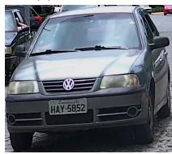  
Front

(c) Color Clarity  
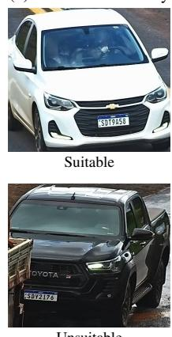

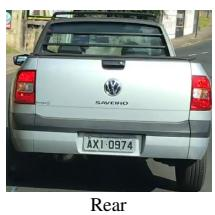

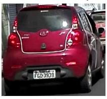  
Color

Unsuitable  
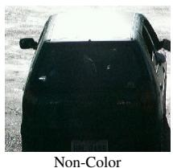  
Fig. 1. Examples of the three target tasks in the proposed Unconstrained Vehicle Identification Benchmark (UVIB). Orientation separates front and rear views. VMMR Suitability indicates whether occlusion still allows reliable make and model analysis. Color Clarity distinguishes images with reliable chromatic evidence from non-color cases, where vehicle color cannot be confidentl inferred from the ima e.

To address this gap, we introduce the Unconstrained Vehicle Identification Benchmark (UVIB), composed of 84,835 images from seven public Brazilian datasets [4], [6], [14]–[18]. We provide new labels for vehicle Orientation (front/rear), VMMR Suitability (suitable/unsuitable), and Color Clarity (color/noncolor), none of which were jointly available in the original sources. The benchmark combines surveillance and general- domain imagery, enabling controlled analyses of acquisition- domain transfer.

This paper makes the following contributions:

• We create and release UVIB, a unified benchmark with annotations for three operational vehicle-analysis tasks across seven public datasets;

• We provide standardized baselines for four representa- tive deep architectures under four evaluation protocols, including strict cross-domain settings;

• We analyze how domain shift afects each task, showing that VMMR suitability and color clarity remain the main bottlenecks for robust deployment.

## II. Related Work

Vehicle attribute analysis supports several ITS applica- tions, including VMMR, VCR, ALPR, and vehicle re- identification (ReID) [1], [6], [10], [19], [20]. These tasks rely on visual cues that may be unreliable in surveillance imagery due to viewpoint changes, occlusions, and color variations. This section reviews the attributes studied and the impact of dataset bias on cross-domain vehicle analysis.

## A. Vehicle Attribute Recognition in Challenging Scenarios

VMMR and related vehicle-recognition tasks have been studied with increasingly strong deep models and large-scale datasets [1], [3], [4], [7], [21], [22]. However, many of these methods assume that the input image already contains a suit- able vehicle view. Orientation is therefore often used implicitly or as auxiliary context: frontal views emphasize grilles, head- lights, and emblems, whereas rear views emphasize taillights, trunk regions, and license plates [4], [6], [7], [23]. When this information is not controlled, the same vehicle category may present diferent discriminative cues across datasets.

Occlusion handling has also been investigated in trafic monitoring, especially for overlapping vehicles and partial blockage caused by road infrastructure [8], [9], [24]. These works show that visible parts, such as headlights, taillights, and motion-consistent regions, are critical for separating or classifying vehicles. In attribute-recognition pipelines, the same issue appears as an operational question: whether the remaining visible structure is suficient for a downstream task such as VMMR.

Color recognition is afected by illumination, exposure, reflections, and sensor modality [11], [12], [25]. Recent studies report that such factors can make color labels unreliable, even when the vehicle itself is visible [13], [14]. This motivates color clarity as a prior decision that determines whether a color-recognition result should be trusted.

## B. Dataset Bias and Cross-Domain Generalization

Dataset bias is a long-standing problem in computer vision: models may exploit acquisition-specific shortcuts rather than the visual concepts they are expected to learn [26]. In vehicle analysis, this issue is amplified by diferences in camera place- ment, compression, illumination, and sensor technology [27].

Cross-dataset evaluations in ALPR, VMMR, and VCR con- sistently report performance drops when training and testing data come from diferent sources [1], [4], [18]. These drops indicate that strong in-domain accuracy does not guarantee robustness under deployment shifts. Orientation, VMMR suit- ability, and color clarity are especially sensitive to this problem because the cues used for each decision depend directly on acquisition conditions.

The proposed benchmark complements previous vehicle datasets by providing unified annotations for these three tasks and pairing them with protocols that separate mixed-domain performance from cross-domain transfer. This design enables a more systematic analysis of which attributes generalize and which remain constrained by dataset-specific characteristics.

## III. The UVIB Benchmark

UVIB contains 84,835 vehicle images aggregated from seven public Brazilian datasets. The benchmark is organized into two acquisition domains to support explicit domain- transfer analyses. The Surveillance Domain contains 57,798 images from fixed trafic-monitoring cameras, while the General Domain contains 27,037 images collected under more het-erogeneous viewpoints, environments, and acquisition setups. This separation enables assessing whether models trained with one type of visual evidence remain reliable when evaluated under another (see the explored protocols in Section IV-A).

The Surveillance Domain includes Vehicle-Rear [6], LPLCv2 [14], and UFPR-VeSV [4]. The General Domain includes UFOP [15], SSIG-SegPlate [16], UFPR-ALPR [17], and RodoSol-ALPR [18]. These datasets were selected because they are widely used in Brazilian vehicle and ALPR research, cover diverse illumination and viewpoint conditions, and pro- vide a realistic basis for studying dataset shift [27], [28]. Fig. 2 shows representative crops from each source.

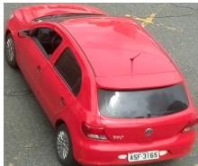  
Vehicle-Rear

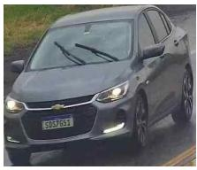  
LPLCv2

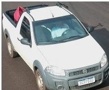  
UFPR-VeSV  
(a) Surveillance Domain

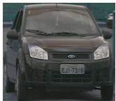  
UFOP

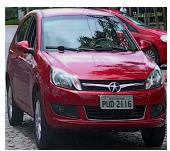  
SSIG-SegPlate

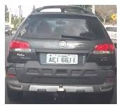  
UFPR-ALPR

  
RodoSol-ALPR  
(b) General Domain  
Fig. 2. Representative vehicle crops from the seven datasets used in UVIB, grouped by acquisition domain. Datasets within each domain are shown in chronological publication order.

The vehicle cropping process is detailed in Section III-A, followed by the formal definitions and criteria established for our annotation framework in Section III-B.

## A. Preprocessing and Data Extraction

Diferent extraction strategies were applied depending on the annotations available in each source dataset. UFPR-VeSV already provides cropped vehicle instances and therefore re- quired no additional extraction. Vehicle-Rear, SSIG-SegPlate, and UFPR-ALPR provide vehicle bounding boxes, which were used directly. In contrast, LPLCv2, RodoSol-ALPR, and UFOP required an automated YOLO-based extraction pipeline. As some source images contain multiple vehicles, the final number of vehicle crops may exceed the number of original images.

## B. Annotation Framework

Each vehicle crop receives three independent binary anno- tations. Orientation indicates whether the vehicle is observed from the front or rear. VMMR Suitability captures whether the crop provides suficient visual evidence for make and model analysis. Suitable images preserve enough visible frontal or rear structure for recognition, whereas unsuitable images ex- hibit severe occlusion or lack key regions such as headlights, taillights, the grille, or the trunk. Both Orientation and VMMR Suitability were manually annotated for every vehicle sample.

Color clarity indicates whether chromatic information is visually reliable for downstream vehicle analysis. Images are labeled as non-color when color cannot be confidently inferred from the image because of poor illumination, severe sensor degradation, infrared capture, or other acquisition conditions. Thus, non-color is an image-quality and sensing label, not a vehicle-color category. Visible-spectrum images may also be non-color when chromatic cues are strongly degraded, as illustrated in Fig. 1.

The UFPR-VeSV dataset provides binary metadata indicat- ing whether an image was captured by an infrared sensor. To distinguish infrared imagery from the broader non-color concept, two random UFPR-VeSV subsets, with 2,000 infrared and 2,000 non-infrared images, were manually annotated for color clarity by two independent annotators. The same procedure was applied to 5,000 random images from the remaining datasets. Inter-annotator agreement was measured using accuracy and Cohen’s Kappa [29], yielding Kappa values of 0.69 for UFPR-VeSV and 0.62 for the multi-dataset subset. These values indicate substantial agreement, while also confirming that color clarity includes borderline cases that require explicit auditing.

To scale the annotation process to the complete set of 84,835 images, we adopted a multi-stage auditing protocol. Initial disagreements and borderline cases were isolated, reconciled manually, and reviewed in consecutive rounds. Finally, an exhaustive consistency sweep was conducted over the final dataset to reduce residual annotation noise.

The final dataset contains binary labels for orientation, VMMR suitability, and color clarity. Detailed distributions are reported in Table I.

## IV. Experimental Setup

The three UVIB tasks are treated independently as binary classification problems. We evaluate four widely adopted image-classification architectures: EficientNetV2- S [30], ResNet-50 [31], Vision Transformer (ViT)/B-16 [32], and YOLO11s-cls [33]. Together, they represent eficient con-volutional networks, residual architectures, vision transform- ers, and compact deployment-oriented classifiers.

All images were resized to 224 × 224 pixels, ensuring identical preprocessing and compatibility with ImageNet pre- training [34]. The classification heads were replaced with two-output layers, and all network parameters were fine-tuned.

We used Adam with a learning rate of 10−4 and a batch size of 32. Training lasted up to 100 epochs, with early stopping after 12 epochs without improvement in validation accuracy. No data augmentation was applied, ensuring that the results reflect the training data and evaluation splits rather than augmentation-specific gains.

For the highly imbalanced VMMR Suitability task, cross- entropy was replaced with Focal Loss [35], which reduces the contribution of easy majority-class samples and emphasizes harder cases.

## A. Evaluation Protocols and Cross-Domain Splits

To evaluate classification performance and generalization, we define four protocols. These protocols distinguish mixed- domain evaluation from stricter transfer settings, a key issue in real-world vehicle monitoring under dataset shift [27], [36]:

• Surveillance to General (S2G): models are trained and validated strictly on highway surveillance camera data (57,798 images) and tested on the remaining datasets from the general domain (27,037 images);

• General to Surveillance (G2S): training and validation occur on the general image subsets, whereas testing is performed exclusively on images captured by highway surveillance cameras;

• All-Datasets: all datasets are pooled and partitioned with stratified train, validation, and test splits, measuring performance when the training data include samples from all acquisition domains;

• Cross-Dataset Shift (CDS): designed to distinguish domain-level variations from dataset-specific biases by providing a mix of both acquisition scenarios (Surveillance and General) in both the training and evaluation phases. Consequently, it evaluates whether the models develop a dependency on specific dataset characteristics or achieve generalized feature representation. Models are trained on a composite source domain (UFPR-VeSV, RodoSol-ALPR, Vehicle-Rear, and UFOP; 46,146 sam-ples) and evaluated on an unseen target domain (LPLCv2, UFPR-ALPR, and SSIG-SegPlate; 38,689 samples).

The cross-domain protocols (S2G and G2S) use a 60/40 training-validation split within the source domain and the full target domain for testing, with no vehicle-identity overlap between domains. Only 94 shared identities were found be- tween LPLCv2 and UFPR-VeSV, both within the Surveillance domain. The CDS protocol uses the same 60/40 split, with these 94 shared identities representing less than 0.15% of the test set. For all three protocols, target datasets are completely withheld during training and validation.

TABLE I  
Sample distribution by source dataset, acquisition domain, and target annotation. Datasets are grouped by domain and ordered chronologically within each domain.
<table><tr><td rowspan="2">Source Dataset</td><td rowspan="2">Domain</td><td colspan="2">Orientation</td><td colspan="2">VMMR Suitability</td><td colspan="2">Color Clarity</td><td rowspan="2">Images</td></tr><tr><td>Front</td><td>Rear</td><td>Suitable</td><td>Unsuitable</td><td>Color</td><td>Non-Color</td></tr><tr><td>Vehicle-Rear [6]</td><td>Surveillance</td><td>0</td><td>730</td><td>641</td><td>89</td><td>390</td><td>340</td><td>730</td></tr><tr><td>LPLCv2 [14]</td><td>Surveillance</td><td>2,816</td><td>29,307</td><td>24,413</td><td>7,710</td><td>19,046</td><td>13,077</td><td>32,123</td></tr><tr><td>UFPR-VeSV [4]</td><td>Surveillance</td><td>11,103</td><td>13,842</td><td>23,490</td><td>1,455</td><td>18,612</td><td>6,333</td><td>24,945</td></tr><tr><td>UFOP [15]</td><td>General</td><td>298</td><td>173</td><td>362</td><td>109</td><td>408</td><td>63</td><td>471</td></tr><tr><td>SSIG-SegPlate [16]</td><td>General</td><td>2,066</td><td>0</td><td>1,990</td><td>76</td><td>1,715</td><td>351</td><td>2,066</td></tr><tr><td>UFPR-ALPR [17]</td><td>General</td><td>0</td><td>4,500</td><td>4,392</td><td>108</td><td>2,739</td><td>1,761</td><td>4,500</td></tr><tr><td>RodoSol-ALPR [18]</td><td>General</td><td>9,989</td><td>10,011</td><td>19,652</td><td>348</td><td>8,451</td><td>11,549</td><td>20,000</td></tr><tr><td>Total Per Class</td><td></td><td>26,272</td><td>58,563</td><td>74,940</td><td>9,895</td><td>51,361</td><td>33,474</td><td>84,835</td></tr></table>

The All-Datasets protocol uses a stratified 60/20/20 split for training, validation, and testing. Preliminary experiments with alternative ratios showed no substantial changes in per- formance. All training splits and scripts are publicly available with the benchmark at https://github.com/UFPR-IPASP-PR/ uvib-vehicle-attributes/.

## B. Statistical Rigor and Evaluation Metrics

Each experiment was repeated with three random seeds. The protocol split remains fixed across runs, while the seed controls data shufling and the initialization of the newly replaced classification heads. This setup provides a practical estimate of the variability introduced by stochastic training factors under each evaluation protocol. Accuracy, per-class F1-score (F1), and Macro F1 are computed independently from the predictions of each run and subsequently reported as mean and standard deviation $( \mu \pm \sigma )$ across the three runs. This procedure enables the comparison of both predictive performance and training stability across models.

Accuracy summarizes correctness but can be misleading for imbalanced tasks such as VMMR Suitability. Per-class F1 reveals the performance obtained for each class, while Macro F1 assigns equal importance to both classes and is therefore the primary metric for model comparison under class imbalance. Importantly, Macro F1 is obtained by averaging the three run-level Macro F1 scores, rather than by recomputing it from the aggregated and rounded per-class F1 values.

## V. Results and Discussion

Table II compares the four architectures across the proposed protocols. The main trend is consistent: the protocol has a stronger efect on performance than the architecture. Models trained and tested with mixed-domain data perform well, whereas cross-domain evaluation exposes substantial degra- dation, especially for VMMR Suitability and Color Clarity.

The drop cannot be explained by training-set size alone. In S2G, for example, models are trained on the larger Surveil- lance Domain, yet performance declines on General-domain imagery. This suggests that models learn acquisition-specific cues and operational conditions that do not transfer reli- ably to unseen cameras, illumination patterns, and viewpoint distributions, contrasting fixed trafic-camera imagery in the Surveillance Domain with the more heterogeneous viewpoints and acquisition setups of the General Domain.

The CDS results consistently occupy an intermediate per- formance tier, outperforming the severe bottlenecks of one- way domain drops while underperforming the All-Datasets baseline. Because the CDS protocol includes a balanced mix- ture of both Surveillance and General acquisition settings in both training and testing phases, the observed drops in Macro F1 (EficientNetV2 dropping to 96.3%, 87.8%, and 82.2% across the three tasks) cannot be attributed to a change in ac-quisition domain. Instead, these drops empirically demonstrate a strict dependency on dataset-specific biases.

This efect is minimized in the All-Datasets setting, where joint optimization across all datasets smooths out camera-specific variances by providing a dense, continuous repre- sentation of the acquisition space. When aggregating the performance across all tasks and architectures, the cross- domain protocols exhibit a substantial increase in variance, yielding mean standard deviations of ±1.4 for S2G, ±1.78 for G2S, and ±1.93 for CDS in their Macro F1 metrics. This contrasts sharply with the high consistency observed in the All-Datasets protocol, which maintains a significantly lower mean standard deviation of 0.35. This acquisition bias is most visible for VMMR Suitability and Color Clarity, whose cues depend on occlusion severity, sensor response, lighting, and image quality. In contrast, mixed-domain training smooths these variations by exposing the models to a broader range of acquisition conditions.

Orientation is the most transferable task. Most models achieve high Accuracy and Macro F1, although the Front class remains slightly weaker because rear-view vehicles are more frequent in the benchmark. Qualitative errors are concentrated in near-lateral viewpoints, where the boundary between front and rear becomes ambiguous (see Fig. 3a).

VMMR Suitability is the most imbalanced task, and the gap between Accuracy and Macro F1 is substantial. Even with Focal Loss, models often fail to recover the minority Unsuitable class under domain shift. In the cross-domain pro-

TABLE II  
Experimental results (%) across the four architectures and evaluation protocols. Metrics report overall Accuracy, Macro F1, and per-class F1 averaged across three independent initializations $( \mu \pm \sigma )$ . Bold values indicate the best Macro F1 within each protocol and task.
<table><tr><td rowspan="2">Protocol</td><td rowspan="2">Architecture</td><td colspan="3">Orientation</td><td colspan="3">VMMR Suitability</td><td colspan="3">Color Clarity</td></tr><tr><td>Accuracy</td><td>Macro F1</td><td>Front / Rear</td><td>Accuracy</td><td>Macro F1</td><td>Suitable / Unsuitable</td><td>Accuracy</td><td>Macro F1</td><td>Color / Non-Color</td></tr><tr><td rowspan="4">S2G</td><td>EfficientNetV2</td><td> $9 9 . 2 \pm 0 . 1 8$ </td><td> ${ \bf 9 9 . 2 \pm 0 . 1 6 }$ </td><td> $9 9 . 1 \pm 0 . 2 0 / 9 9 . 2 \pm 0 . 1 6$ </td><td> $9 6 . 8 \pm 0 . 6 1$ </td><td> ${ \bf 6 9 . 4 } \pm \ : 3 . 5 3$ </td><td> $9 8 . 3 \pm 0 . 3 3 / 4 7 . 5 \pm 4 . 8 4$ </td><td> $6 7 . 2 \pm 3 . 0 2$ </td><td> ${ \bf 7 5 . 6 \pm 0 . 9 9 }$ </td><td>74.2 ± 1.54 / 54.7 ± 6.90</td></tr><tr><td>ResNet-50</td><td>98.9 ± 0.28</td><td> $9 9 . 0 \pm 0 . 2 5$ </td><td> $9 8 . 7 \pm 0 . 3 1 / 9 9 . 0 \pm 0 . 2 5$ </td><td> $9 6 . 2 \pm 1 . 0 3$ </td><td> $6 7 . 3 \pm 3 . 1 9$ </td><td> $9 8 . 0 \pm 0 . 5 5 / 4 4 . 8 \pm 4 . 8 0$ </td><td> $6 9 . 5 \pm 2 . 6 0$ </td><td> $7 5 . 4 \pm 0 . 9 0$ </td><td>75.1 ± 1.32 / 60.5 ± 5.25</td></tr><tr><td>ViT/B-16</td><td> $9 3 . 7 \pm 1 . 9 3 $ </td><td>94.8 ± 1.41</td><td> $9 2 . 6 \pm 2 . 4 3 / 9 4 . 5 \pm 1 . 5 9$ </td><td>96.6 ± 0.61 68.3 ± 3.31</td><td></td><td> $9 8 . 2 \pm 0 . 3 2 / 4 4 . 9 \pm 3 . 6 0$ </td><td> $6 2 . 8 \pm 0 . 6 3$ </td><td> $7 3 . 7 \pm 0 . 7 9$ </td><td>71.9 ± 0.26 / 44.9 ± 1.96</td></tr><tr><td>YOLO11s-cls</td><td> $9 0 . 5 \pm 0 . 5 3$ </td><td> $9 1 . 6 \pm 0 . 4 8$ </td><td> $8 8 . 8 \pm 0 . 6 7 / 9 1 . 8 \pm 0 . 4 4$ </td><td> $9 3 . 1 \pm 0 . 6 7$ </td><td> $5 6 . 6 \pm 0 . 4 6$ </td><td> $9 6 . 4 \pm 0 . 3 7 / 2 1 . 3 \pm 0 . 7 7$ </td><td> $6 1 . 9 \pm 1 . 4 9$ </td><td> $6 8 . 4 \pm 1 . 4 2$ </td><td>70.2 ± 0.85 / 47.2 ± 3.25</td></tr><tr><td rowspan="6">G2S</td><td>EfficientNetV2</td><td> $7 9 . 2 \pm 1 . 3 4$ </td><td> $7 6 . 4 \pm 0 . 7 5$ </td><td> $6 9 . 4 \pm 1 . 2 5 / 8 4 . 3 \pm 1 . 2 0$ </td><td> $8 6 . 9 \pm 0 . 3 2$ </td><td> ${ \bf 7 5 . 9 \pm 0 . 6 5 }$ </td><td> $9 2 . 3 \pm 0 . 2 0 / 5 6 . 7 \pm 1 . 8 6$ </td><td> $7 6 . 3 \pm 1 . 4 8$ </td><td> $7 4 . 1 \pm 1 . 4 5$ </td><td>81.3 ± 1.42 / 67.7 ± 1.53</td></tr><tr><td>ResNet-50</td><td> $8 3 . 7 \pm 3 . 9 1$ </td><td> ${ \bf 7 9 . 7 \pm 3 . 0 8 }$ </td><td> $7 4 . 2 \pm 4 . 4 0 / 8 8 . 0 \pm 3 . 2 3$ </td><td> $8 3 . 2 \pm 1 . 7 4$ </td><td> $6 9 . 5 \pm 2 . 9 7$ </td><td> $8 9 . 9 \pm 1 . 0 5 / 5 0 . 8 \pm 5 . 2 4$ </td><td> $7 7 . 9 \pm 1 . 4 6$ </td><td> $7 5 . 7 \pm 1 . 8 8$ </td><td>82.6 ± 0.71 / 69.6 ± 3.33</td></tr><tr><td>ViT/B-16</td><td> $7 3 . 1 \pm 2 . 2 3$ </td><td> $7 2 . 3 \pm 1 . 1 1$ </td><td> $6 2 . 9 \pm 1 . 8 6 / 7 8 . 9 \pm 2 . 1 3$ </td><td> $8 2 . 9 \pm 1 . 2 1$ </td><td> $6 5 . 3 \pm 4 . 2 4$ </td><td> $9 0 . 3 \pm 0 . 8 3 / 2 4 . 2 \pm 4 . 6 9$ </td><td> $7 5 . 9 \pm 1 . 6 2$ </td><td> $7 3 . 6 \pm 2 . 3 7$ </td><td>82.3 ± 1.54 / 62.0 ± 1.45</td></tr><tr><td>YOLO11s-cls</td><td> $8 3 . 5 \pm 1 . 7 6$ </td><td> $7 7 . 8 \pm 2 . 0 1$ </td><td> $6 9 . 5 \pm 1 . 6 9 / 8 8 . 7 \pm 1 . 4 1$ </td><td> $8 5 . 2 \pm 0 . 1 3$ </td><td> $7 3 . 3 \pm 0 . 5 7$ </td><td> $9 1 . 7 \pm 0 . 0 7 / 3 3 . 6 \pm 0 . 7 2$ </td><td>79.7 ± 0.36</td><td> $\mathbf { 7 7 . 5 \ : \pm { \ : 0 . 3 9 } }$ </td><td>84.5 ± 0.44 / 70.9 ± 0.25</td></tr><tr><td></td><td> $9 9 . 8 \pm 0 . 0 1$ </td><td> ${ \bf 9 9 . 8 \pm 0 . 0 3 }$ </td><td> $9 9 . 6 \pm 0 . 0 3 / 9 9 . 8 \pm 0 . 0 1$ </td><td> $9 6 . 6 \pm 0 . 1 1$ </td><td> ${ \bf 9 2 . 9 \pm 0 . 8 3 }$ </td><td> $9 8 . 1 \pm 0 . 0 6 / 8 4 . 9 \pm 0 . 5 8$ </td><td> $9 3 . 5 \pm 0 . 0 7$ </td><td> ${ \bf 9 3 . 2 \pm 0 . 1 1 }$ </td><td>94.6 ± 0.05 / 91.8 ± 0.15</td></tr><tr><td>EfficientNetV2 ResNet-50</td><td> $9 9 . 7 \pm 0 . 0 4$ </td><td> $9 9 . 7 \pm 0 . 0 4$ </td><td> $9 9 . 6 \pm 0 . 0 7 / 9 9 . 8 \pm 0 . 0 3$ </td><td> $9 6 . 4 \pm 0 . 0 9$ </td><td> $9 2 . 2 \pm 0 . 4 4$ </td><td> $9 8 . 0 \pm 0 . 0 5 / 8 4 . 1 \pm 0 . 5 7$ </td><td>93.2 ± 0.10</td><td> $9 3 . 0 \pm 0 . 0 7$ </td><td>94.4 ± 0.07 / 91.4 ± 0.14</td></tr><tr><td rowspan="4">All</td><td>ViT/B-16</td><td> $9 9 . 4 \pm 0 . 0 3$ </td><td> $9 9 . 4 \pm 0 . 0 2$ </td><td> $9 9 . 1 \pm 0 . 0 5 / 9 9 . 6 \pm 0 . 0 2$ </td><td> $9 5 . 8 \pm 0 . 1 5$ </td><td> $9 1 . 2 \pm 0 . 6 0$ </td><td> $9 7 . 6 \pm 0 . 0 8 / 8 1 . 0 \pm 0 . 7 6$ </td><td> $9 2 . 6 \pm 0 . 0 5$ </td><td> $9 2 . 7 \pm 0 . 1 2$ </td><td>94.0 ± 0.00 / 90.5 ± 0.16</td></tr><tr><td>YOLO11s-cls</td><td> $9 7 . 2 \pm 0 . 0 2$ </td><td> $9 6 . 9 \pm 0 . 0 7$ </td><td> $9 5 . 4 \pm 0 . 0 5 / 9 8 . 0 \pm 0 . 0 2$ </td><td> $9 2 . 4 \pm 0 . 0 5$ </td><td> $8 4 . 3 \pm 0 . 5 3$ </td><td> $9 5 . 8 \pm 0 . 0 2 / 6 1 . 6 \pm 1 . 2 6$ </td><td> $9 0 . 4 \pm 0 . 0 5$ </td><td> $9 0 . 1 \pm 0 . 0 7$ </td><td>92.1 ± 0.04 / 87.7 ± 0.08</td></tr><tr><td>EfficientNetV2</td><td> $9 8 . 8 \pm 0 . 2 6$ </td><td> ${ \bf 9 6 . 3 \pm 0 . 9 3 }$ </td><td> $9 5 . 4 \pm 0 . 9 4 / 9 9 . 3 \pm 0 . 1 5$ </td><td> $8 9 . 3 \pm 0 . 5 6$ </td><td> ${ \pm } \thinspace 2 . 8 \pm 2 . 2 2$ </td><td> $9 3 . 6 \pm 0 . 3 2 / 6 8 . 8 \pm 2 . 7 6$ </td><td> $8 3 . 1 \pm 0 . 4 9$ </td><td> ${ \bf 8 2 . 2 \pm 0 . 5 5 }$ </td><td> $8 5 . 9 \pm 0 . 5 6 / 7 8 . 8 \pm 0 . 2 9$ </td></tr><tr><td>ResNet-50</td><td> $9 7 . 6 \pm 0 . 4 4$ </td><td> $9 2 . 9 \pm 1 . 7 9$ </td><td> $9 1 . 0 \pm 1 . 3 9 / 9 8 . 6 \pm 0 . 2 6$ </td><td> $8 5 . 3 \pm 2 . 2 9$ </td><td> $8 2 . 1 \pm 6 . 1 5$ </td><td> $9 1 . 0 \pm 1 . 8 2 / 5 8 . 1 \pm 4 . 9 7$ </td><td> $8 2 . 9 \pm 1 . 0 2$ </td><td> $8 2 . 1 \pm 1 . 0 7$ </td><td> $8 5 . 8 \pm 1 . 0 8 / 7 8 . 7 \pm 0 . 8 0$ </td></tr><tr><td rowspan="3">CDS</td><td>ViT/B-16</td><td> $9 5 . 5 \pm 1 . 0 6$ </td><td> $8 7 . 9 \pm 2 . 5 0$ </td><td> $8 3 . 8 \pm 3 . 4 3 / 9 7 . 4 \pm 0 . 6 3$ </td><td> $8 2 . 0 \pm 1 . 2 1$ </td><td> $7 7 . 7 \pm 4 . 3 7$ </td><td> $8 9 . 7 \pm 0 . 6 4 / 2 8 . 7 \pm 7 . 4 4$ </td><td> $8 2 . 5 \pm 1 . 2 1$ </td><td> $8 1 . 8 \pm 1 . 4 1$ </td><td> $8 5 . 7 \pm 1 . 2 5 / 7 7 . 6 \pm 1 . 0 2$ </td></tr><tr><td>YOLO11s-cls</td><td> $8 7 . 4 \pm 0 . 5 1$ </td><td> $7 4 . 2 \pm 0 . 5 3$ </td><td> $6 4 . 2 \pm 0 . 8 1 / 9 2 . 3 \pm 0 . 3 4$ </td><td> $8 1 . 5 \pm 0 . 1 3$ </td><td> $7 3 . 8 \pm 1 . 5 0$ </td><td> $8 9 . 3 \pm 0 . 1 5 / 3 1 . 7 \pm 2 . 5 3$ </td><td> $8 1 . 7 \pm 0 . 0 9$ </td><td> $8 1 . 1 \pm 0 . 1 4$ </td><td> $8 5 . 3 \pm 0 . 1 1 / 7 5 . 7 \pm 0 . 0 6$ </td></tr><tr><td></td><td></td><td></td><td></td><td></td><td></td><td></td><td></td><td></td><td></td></tr></table>

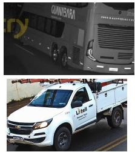  
(a) Orientation

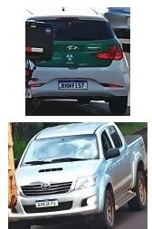

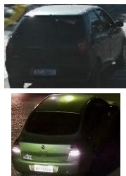  
(b) VMMR Suitability  
(c) Color Clarity  
Fig. 3. Qualitative examples of classification errors: (a) Orientation errors in borderline near-lateral views; (b) VMMR Suitability false positives, where partially occluded vehicles are predicted as suitable; and (c) Color Clarity errors in images with distorted chromatic evidence, including a green vehicle afected by glare and a silver vehicle under night lighting.

## VI. Conclusions

under G2S, but consistently sacrificing Macro F1 elsewhere, especially for the minority Unsuitable class. Overall, these findings reinforce that robust cross-domain evaluation matters more than selecting a stronger in-domain architecture alone.

This paper introduced Unconstrained Vehicle Identification Benchmark (UVIB), a benchmark comprising 84,835 images from seven public Brazilian datasets, along with new annota- tions for three operational vehicle-analysis tasks: Orientation, VMMR Suitability, and Color Clarity. By combining surveil- lance and general-domain imagery, UVIB provides public annotations, standardized baselines, and protocols for studying dataset bias and cross-domain robustness in ITS.

tocols, Macro F1 ranges from 56.6% to 75.9%, while Accuracy remains between 82.9% and 96.8%. The most extreme case is YOLO11s-cls in S2G, whose Unsuitable F1 drops to 21.3%. This shows that high Accuracy can be dominated by the Suitable class. For context, a classifier predicting only the majority class achieves an Accuracy of 88.3%, but a Macro F1 of only 46.9% (with 0.0% for Unsuitable). The qualitative examples in Fig. 3b suggest that partial occlusions are often not treated as severe enough to invalidate VMMR analysis.

Color Clarity is sensitive to acquisition bias, but more bal-anced overall than VMMR Suitability. Its definition depends directly on exposure, sensor technology, and illumination, and most errors occur in borderline cases where chromatic information is degraded but not completely absent. Strong reflections, shadows, night lighting, and infrared-like captures can make an image unreliable for color recognition even when the vehicle is clearly visible (Fig. 3c).

The experiments show that domain shift is the main ob- stacle to reliable vehicle attribute recognition. Across tasks and architectures, performance degradation is driven more by acquisition diferences between training and test data than by the model family itself. While mixed-domain training yields strong results, cross-domain testing reveals persistent limita- tions, especially for VMMR Suitability and Color Clarity, with the cross-dataset protocol being an intermediate alternative. VMMR Suitability is afected by severe class imbalance and ambiguous partial occlusions, whereas Color Clarity depends strongly on illumination, exposure, and sensor modality. These findings show why Accuracy alone is insuficient and why Macro F1 should be considered when evaluating operational vehicle-analysis tasks.

No architecture dominates all tasks and protocols, but the re- sults ofer practical guidance. EficientNetV2-S is the strongest default when a single model is required, achieving the best or tied-best Macro F1 in most settings while remaining highly competitive for Orientation and Color Clarity. ResNet-50 is a similarly robust alternative, particularly under All-Datasets and CDS. YOLO11s-cls is attractive when computational cost is the main constraint, achieving the best Color Clarity results

The results also suggest practical starting points for future systems. EficientNetV2-S is a strong default baseline, ResNet- 50 remains highly competitive, and compact classifiers such as YOLO11s-cls should be selected mainly when eficiency is prioritized over minority-class robustness. More broadly, progress will depend not only on improved architectures, but also on methods that mitigate dataset bias and generalize across heterogeneous acquisition conditions.

Future work can extend UVIB in three main directions. First, the annotation framework can be refined by introduc- ing multiple occlusion-severity levels and richer color-quality categories. Second, these operational tasks can be incorporated into downstream VMMR and VCR pipelines to assess whether filtering or joint prediction improves end-task reliability. Third, multi-task learning, synthetic data generation, and targeted augmentation strategies can be explored to improve rare- condition coverage and reduce cross-domain degradation.

## ACKNOWLEDGMENTS

This study was financed in part by the Coordenação de Aperfeiçoamento de Pessoal de Nível Superior - Brasil (CAPES), through the Programa de Excelência Acadêmica (PROEX) - Finance Code 001, in part by the Fundação Araucária under grant # 078/2026, and in part by the Conselho Nacional de Desenvolvimento Científico e Tecnológico (CNPq) (# 315409/2023-1).

## References

[1] S. Gayen, S. Maity, P. K. Singh, Z. W. Geem, and R. Sarkar, “Two decades of vehicle make and model recognition–survey, challenges and future directions,” Journal of King Saud University-Computer and Information Sciences, vol. 36, no. 1, p. 101885, 2024.

[2] M. Alzahrani, Q. Wang, W. Liao, X. Chen, and W. Yu, “Survey on multi-task learning in smart transportation,” IEEE Access, vol. 12, pp. 17 023–17 044, 2024.

[3] C. Kerdvibulvech, “Multimodal AI model for zero-shot vehicle brand identification,” Multimedia Tools and Applications, vol. 84, no. 27, pp. 33 125–33 144 2025.

[4] G. E. Lima, V. Nascimento, E. Santos, E. Nascimento Jr., R. Laroca, and D. Menotti, “Toward unified fine-grained vehicle classification and automatic license plate recognition,” Journal of the Brazilian Computer Society, vol. 32, no. 1, pp. 783–799, 2026.

[5] R. Laroca, V. Nascimento, D. Kim, S. Chung, S. Bae, U. Seo, S. Oh, C. M. Phung, M. G. Vo, X. Ye, Y. Du, Y. Su, Z. Chen, S. Heo, H. Lee, K. Na, K. V. Vu Nguyen, S. T. Pham, D. N. N. Phung, T. P. Le, V. N. Vo Tran, and D. Menotti, “ICPR 2026 Competition on low-resolution license plate recognition,” in International Conference on Pattern Recognition (ICPR), Aug 2026, pp. 256–275.

[6] I. O. Oliveira et al., “Vehicle-Rear: A new dataset to explore feature fusion for vehicle identification using convolutional neural networks,” IEEE Access, vol. 9, pp. 101 065–101 077, 2021.

[7] A. Amirkhani and A. H. Barshooi, “Deepcar 5.0: Vehicle make and model recognition under challenging conditions,” IEEE Transactions on Intelligent Transportation Systems, vol. 24, no. 1, pp. 541–553, 2022.

[8] W. Zhang, Q. J. Wu, X. Yang, and X. Fang, “Multilevel framework to detect and handle vehicle occlusion,” IEEE Transactions on Intelligent Transportation Systems, vol. 9, no. 1, pp. 161–174, 2008.

[9] B. Tian, M. Tang, and F. Y. Wang, “Vehicle detection grammars with partial occlusion handling for trafic surveillance,” Transportation Research Part C: Emerging Technologies, vol. 56, pp. 80–93, 2015.

[10] L. Wojcik, G. E. Lima, V. Nascimento, E. Nascimento Jr., R. Laroca, and D. Menotti, “LPLC: A dataset for license plate legibility classification,” Conference on Graphics, Patterns and Images, pp. 1–6, 2025.

[11] J.-W. Hsieh, L.-C. Chen, S.-Y. Chen, D.-Y. Chen, S. Alghyaline, and H.-F. Chiang, “Vehicle color classification under diferent lighting con- ditions through color correction,” IEEE Sensors Journal, vol. 15, no. 2, pp. 971–983, 2015.

[12] G. E. Lima, R. Laroca, E. Santos, E. Nascimento Jr., and D. Menotti, “Toward enhancing vehicle color recognition in adverse conditions: A dataset and benchmark,” in Conference on Graphics, Patterns and Images (SIBGRAPI), Sept 2024, pp. 1–6.

[13] V. Orrú, B. H. Foggiatto, G. E. Lima, D. Menotti, and R. Laroca, “Revisiting vehicle color recognition in long-tailed surveillance scenar- ios,” in International Conference on Pattern Recognition (ICPR) – V3SC Workshop, Aug 2026, pp. 1–15.

[14] L. Wojcik, E. A. F. Machoski, E. Nascimento Jr., R. Laroca, and D. Menotti, “LPLCv2: An expanded dataset for fine-grained license plate legibility classification,” International Joint Conference on Neural Networks (IJCNN), pp. 1–7, 2026.

[15] P. R. Mendes Júnior et al., “Towards an automatic vehicle access control system: License plate location,” in IEEE International Conference on Systems, Man, and Cybernetics, Oct 2011, . 2916–2921.

[16] G. R. Gonçalves, S. P. G. da Silva, D. Menotti, and W. R. Schwartz, “Benchmark for license plate character segmentation,” Journal of Electronic Imaging, vol. 25, no. 5, p. 053034, 2016.

[17] R. Laroca, E. Severo, L. A. Zanlorensi, L. S. Oliveira, G. R. Gonçalves, W. R. Schwartz, and D. Menotti, “A robust real-time automatic license plate recognition based on the YOLO detector,” in International Joint Conference on Neural Networks (IJCNN), July 2018, pp. 1–10.

[18] R. Laroca, E. V. Cardoso, D. R. Lucio, V. Estevam, and D. Menotti, “On the cross-dataset generalization in license plate recognition,” in International Conference on Computer Vision Theory and Applications (VISAPP), Feb 2022, pp. 166–178.

[19] V. Nascimento et al., “Toward advancing license plate super-resolution in real-world scenarios: A dataset and benchmark,” Journal ofthe Brazilian Computer Society, vol. 1, no. 31, pp. 435–449, 2025.

[20] J. Peng, Y. Hao, F. Xu, and X. Fu, “Vehicle re-identification using multitask deep learning network and spatio-temporal model,” Multimedia Tools and Applications, vol. 79, no. 43, pp. 32 731–32 747, 2020.

[21] L. Yang, P. Luo, C. C. Loy, and X. Tang, “A large-scale car dataset for fine-grained categorization and verification,” in IEEE Conf. on Computer Vision and Pattern Recognition (CVPR), 2015, pp. 3973–3981.

[22] J. Sochor, A. Herout, and J. Havel, “BoxCars: 3D boxes as CNN input for improved fine-grained vehicle recognition,” in IEEE Conference on Computer Vision and Pattern Recognition (CVPR), 2016, pp. 3006– 3015.

[23] S. H. Tan, J. H. Chuah, C.-O. Chow, and J. Kanesan, “Cross-granularity network for vehicle make and model recognition,” IEEE Transactions on Intelligent Transportation Systems, vol. 26, pp. 5782–5791, 2025.

[24] J. Chang, L. Wang, G. Meng, S. Xiang, and C. Pan, “Vision-based occlusion handling and vehicle classification for trafic surveillance systems,” IEEE Intelligent Transportation Systems Magazine, vol. 10, no. 2, pp. 80–92, 2018.

[25] P. Chen, X. Bai, and W. Liu, “Vehicle color recognition on urban road by feature context,” IEEE Transactions on Intelligent Transportation Systems, vol. 15, no. 5, pp. 2340–2346, 2014.

[26] A. Torralba and A. A. Efros, “Unbiased look at dataset bias,” in IEEE Conference on Computer Vision and Pattern Recognition (CVPR), 2011, pp. 1521–1528.

[27] R. Laroca, M. Santos, V. Estevam, E. Luz, and D. Menotti, “A first look at dataset bias in license plate recognition,” in Conference on Graphics, Patterns and Images (SIBGRAPI), Oct 2022, pp. 234–239.

[28] A. Ismail, M. Mehri, A. Sahbani, and N. Essoukri Ben Amara, “Auto-matic license plate recognition in in-the-wild scenarios: A comprehen- sive review, open issues, and future directions,” IEEE Access, vol. 13, pp. 145 387–145 415, 2025.

[29] A. J. Viera and J. M. Garrett, “Understanding interobserver agreement: The kappa statistic,” Family Medicine, vol. 37, no. 5, pp. 360–363, 2005.

[30] M. Tan and Q. Le, “EficientNetV2: Smaller models and faster training,” in International Conference on Machine Learning (ICML), 2021.

[31] K. He, X. Zhang, S. Ren, and J. Sun, “Deep residual learning for image recognition,” in IEEE Conference on Computer Vision and Pattern Recognition (CVPR), 2016, pp. 770–778.

[32] A. Dosovitskiy, L. Beyer, A. Kolesnikov et al., “An image is worth 16x16 words: Transformers for image recognition at scale,” International Conference on Learning Representations (ICLR), 2021.

[33] Ultralytics, “YOLOv11 Image Classification,” https://docs.ultralytics.com/tasks/classify/, 2025, accessed: 2025-08-07.

[34] J. Deng, W. Dong, R. Socher, K. Li, and L. Fei-Fei, “ImageNet: A largescale hierarchical image database,” in IEEE Conference on Computer Vision and Pattern Recognition (CVPR), June 2009, pp. 248–255.

[35] T. Lin, P. Goyal, R. Girshick, K. He, and P. Dollár, “Focal loss for dense object detection,” in IEEE International Conference on Computer Vision (ICCV), Oct 2017, pp. 2999–3007.

[36] D. Katare, D. S. Noguero, S. Park, N. Kourtellis, M. Janssen, and A. Y. Ding, “Analyzing and mitigating bias for vulnerable road users by addressing class imbalance in datasets,” IEEE Open Journal of Intelligent Transportation Systems, 2025.