# IntroConformal: Conformal Factuality Guarantees for Large Vision-Language Models via Introspective Signals

Md. Atabuzzaman Christian Alexander Chris Thomas

Department of Computer Science

Virginia Tech

{atabuzzaman, cmalexander, christhomas}@vt.edu

## Abstract

Large Vision–Language Models (LVLMs) have achieved strong multimodal performance, yet ensuring the factual correctness of generated content remains challenging. Existing methods that provide statistical guarantees on factuality typically rely on external verifiers or generation-time confidence signals, which introduce auxiliary dependencies or often fail for confident but incorrect outputs. We argue that reliable factuality control can instead be achieved through introspective signals derived from the model itself. We introduce IntroConformal, a training-free Conformal Risk Control (CRC) framework that provides finite-sample, distribution-free factuality guarantees. We first instantiate it with layer-wise semantic stability, a conformity score derived from hiddenstate representations, and then propose verification probability, a stronger score capturing the model’s self-administered judgment on claim factuality. Across multiple LVLM architectures, IntroConformal satisfies the conformal risk guarantee while substantially reducing abstention and achieving competitive or superior claim-level discrimination relative to external verifier–based baselines.1

## 1 Introduction

LVLMs have achieved remarkable progress across vision–language tasks and are increasingly deployed in high-stakes domains such as medical reporting and autonomous systems. However, these models remain prone to generating content that is not factually grounded in the input image. Such failures are particularly concerning because users often have no reliable way to distinguish incorrect outputs from correct ones: confident yet nonfactual generations can appear highly plausible, undermining trust and limiting real-world deployment (Zhang et al., 2024; Li et al., 2025).

Addressing this challenge requires more than heuristic mitigation; it calls for formal, finitesample bounds on the rate of non-factual claims while preserving useful model outputs. Although many approaches attempt to mitigate factual errors through prompting strategies, decoding heuristics, or auxiliary verification, most do not offer formal statistical guarantees. Recently, conformal prediction and CRC have emerged as promising tools for uncertainty quantification in large language models (LLMs), providing finite-sample, distribution-free guarantees on error rates (Vovk et al., 2005; Angelopoulos et al., 2021; Bates et al., 2021; Quach et al., 2024; Cherian et al., 2024). When applied to LVLMs, these methods can bound factuality risk at user-specified levels, for example targeting a 10% error rate by filtering non-factual claims under factuality control protocols (Li et al., 2025).

However, existing conformal factuality frameworks for LVLMs suffer from a fundamental signal bottleneck. They define conformity scores using either generation-time token log-probabilities or external verification models (Quach et al., 2024; Li et al., 2025). Generation-time confidence is often unreliable, as models can remain highly confident even when factually ungrounded (Xiong et al., 2024; Chen et al., 2024), while external verifiers introduce additional dependencies and complicate deployment in resource-constrained settings.

In contrast, we argue that reliable factuality control can be achieved through introspective signals derived from the model itself, without external verifiers or auxiliary supervision. Prior work shows that non-factual generation is associated with internal inconsistencies, including layer-wise semantic drift and unstable hidden-state trajectories (Azaria and Mitchell, 2023; Chen et al., 2024; Zhang et al., 2025; Nie et al., 2025; Bu et al., 2026). Although these signals arise during a single forward pass, they are largely ignored by conformal approaches that treat LVLMs as black boxes (Li et al., 2025).

Building on this observation, we introduce Intro-Conformal, a training-free Conformal Risk Control (CRC) framework that provides finite-sample, distribution-free factuality guarantees using conformity scores derived entirely from the model itself. We first instantiate it with layer-wise semantic stability $( S _ { \mathrm { s e m } } )$ , which measures alignment between mid- and late-layer hidden-state representations on claim tokens. While $S _ { \mathrm { s e m } }$ satisfies the CRC guarantee across architectures, its discrimination between factual and non-factual claims remains modest (Table 1), resulting in high abstention rates that limit practical utility. To address both limitations, we propose verification probability $( S _ { \mathrm { p r o b } } )$ a stronger conformity score that queries the same model with a binary factuality prompt and reads the output logits rather than sampling a discrete answer. Across multiple LVLM architectures, $S _ { \mathrm { p r o b } }$ reduces abstention and improves claim-level discrimination over both $S _ { \mathrm { s e m } }$ and external verifier–based baselines (Table 2), while preserving the conformal risk guarantee. Our main contributions are:

• We propose IntroConformal, a training-free CRC framework for LVLM factuality that derives conformity scores from the model itself, without external verifiers or auxiliary supervision.

• We introduce two conformity scores: layer-wise semantic stability, capturing cross-layer hiddenstate alignment, and verification probability, which queries the same model with a binary factuality prompt and reads the output logits.

• Across multiple LVLM architectures and benchmarks, IntroConformal satisfies the CRC guarantee, reducing abstention and improving F1 over external verifier-based baselines, and achieving higher claim-filtering efficiency and response accuracy than decoding-based methods.

## 2 Related Work

Uncertainty and Hallucination in LLMs. Uncertainty estimation and hallucination detection in LLMs have been extensively studied. Early approaches based on verbalized confidence and sampling-based consistency (Kuhn et al., 2023; Xiong et al., 2024) require multiple generations and fail on confident hallucinations (Chen et al., 2024), while semantic entropy methods (Kuhn et al., 2023; Nikitin et al., 2024; Duan et al., 2024) require repeated sampling at inference time. More recent work shows that internal activations encode factuality signals through hidden-state classifiers and representation geometry (Han et al., 2024; Li et al., 2026). Most closely related to ours, mechanistic interpretability studies reveal that non-factual generations manifest as layer-wise semantic drift and unstable hidden-state trajectories (Azaria and Mitchell, 2023; Chuang et al., 2024; Chen et al., 2024; Zhang et al., 2025; Bu et al., 2026); however, these approaches remain primarily diagnostic and lack distribution-free statistical guarantees.

Uncertainty in LVLMs. Uncertainty estimation in LVLMs introduces additional multimodal grounding challenges. Several approaches focus on selective prediction under insufficient visual context (Liu et al., 2024; Lau et al., 2025; Khan and Fu, 2024) or address inconsistency through cycle-consistency and attention-alignment frameworks (Shah et al., 2019; Selvaraju et al., 2020), while perturbation-based methods have shown mixed results compared to representation-based signals (Avestimehr et al., 2025). These approaches typically rely on heuristics or auxiliary models and lack formal statistical guarantees—a gap our work addresses through conformal risk control with introspective signals.

Conformal Prediction for Factuality Control. Conformal prediction provides distribution-free, finite-sample guarantees for uncertainty quantification (Vovk et al., 2005; Angelopoulos et al., 2021; Bates et al., 2021). Recent applications to LLMs include multiple-choice tasks (Ye et al., 2024), open-ended generation (Quach et al., 2024), and claim-level filtering for LVLM factuality using learned (Vishwakarma et al., 2025) or external scoring functions (Li et al., 2025). However, these methods define conformity using generationtime token probabilities or external verifiers such as CLIP (Radford et al., 2021), which are unreliable for confident non-factual generations or require auxiliary models. Our work bridges conformal prediction with mechanistic interpretability (Chen et al., 2024; Zhang et al., 2025; Bu et al., 2026) by defining training-free conformity scores derived entirely from the model itself, yielding finite-sample, distribution-free factuality guarantees without external verifiers or generated token probabilities.

## 3 Method

We introduce IntroConformal, a framework for statistically controlling non-factual generation risk in LVLMs via introspective conformity scores (Figure 1), where introspective refers to scores derived from the same LVLM without external verifiers or auxiliary supervision. Unlike prior conformal approaches that rely on generation-time token probabilities (Quach et al., 2024) or external verifiers (Li et al., 2025), IntroConformal derives both scores directly from the model itself. We propose two such scores: layer-wise semantic stability $( S _ { \mathrm { s e m } } )$ measuring hidden-state alignment across layers, and verification probability $( S _ { \mathrm { p r o b } } )$ , capturing the model’s binary factuality judgment. We first instantiate the CRC framework with $S _ { \mathrm { s e m } } ,$ , then show that $S _ { \mathrm { p r o b } }$ improves discrimination and reduces abstention while preserving the guarantee.

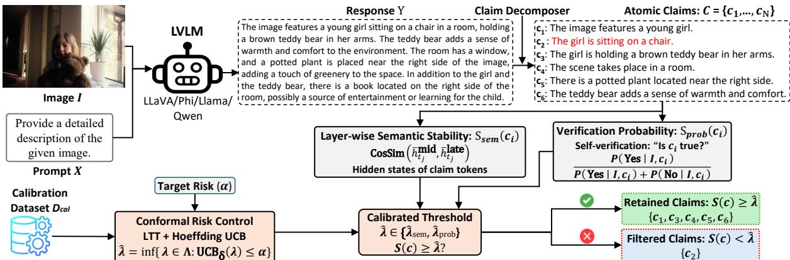  
Figure 1: Overview of IntroConformal. Our framework decomposes an LVLM response into atomic claims (nonfactual claim $c _ { 2 }$ highlighted in red) and computes two conformity scores: layer-wise semantic stability $S _ { \mathrm { s e m } }$ from hidden-state representations and verification probability $S _ { \mathrm { p r o b } }$ from the model’s Yes/No factuality judgment; the user selects one score for calibration and filtering. Conformal risk control then calibrates a threshold $\hat { \lambda } \in \{ \hat { \lambda } _ { \mathrm { s e m } } , \hat { \lambda } _ { \mathrm { p r o b } } \}$ on $\mathcal { D } _ { \mathrm { c a l } }$ , retaining claims with $S ( c ) \geq \hat { \lambda }$ and providing finite-sample, distribution-free factuality guarantees.

## 3.1 Problem Formulation

Given an image I, a textual prompt X, and a model response Y , we decompose Y into atomic, verifiable claims $\mathcal { C } = \{ c _ { 1 } , \ldots , c _ { N } \}$ following prior work (Li et al., 2025). Our goal is to retain a subset ${ \hat { \mathcal { C } } } \subseteq { \mathcal { C } }$ whose factuality is statistically controlled while providing response-level risk guarantees. Let $\mathcal { L } ( c , I ) \in \{ 0 , 1 \}$ denote a non-factuality indicator, where $\mathcal { L } ( c , I ) = 1$ if claim c is not supported by image I and 0 otherwise. Formally, we construct a selection rule such that the expected rate of nonfactual claims among the retained set is bounded by a user-specified risk level $\alpha \in [ 0 , 1 ]$

$$
\mathbb { E } \left[ \frac { 1 } { | \hat { \mathcal { C } } | } \sum _ { c \in \hat { \mathcal { C } } } \mathcal { L } ( c , I ) \right] \leq \alpha ,\tag{1}
$$

with risk defined as zero when $| \hat { \mathcal { C } } | = 0$ . This objective aligns with CRC, which provides finitesample, distribution-free guarantees for selectionconditional risk. We next define our two scores.

## 3.2 Layer-wise Semantic Stability

Our first conformity score captures semantic stability across the model’s internal representations. Prior work shows that non-factual generation is accompanied by semantic drift in the final layers, where representations diverge from those formed at intermediate decoding stages (Chen et al., 2024; Wang et al., 2025; Bu et al., 2026). Let $h _ { t } ^ { ( \ell ) } \in \mathbb { R } ^ { d }$ denote the hidden state of token t at layer ℓ. We define two disjoint layer sets: M, comprising the $K _ { \mathrm { m i d } } = 8$ transformer layers immediately preceding T , and T , comprising the final $K _ { \mathrm { l a t e } } = 4$ layers. These values are fixed across all architectures; a sensitivity analysis is provided in Appendix A.4.

For each claim token $t _ { j }$ , we compute averaged hidden representations:

$$
\bar { h } _ { t _ { j } } ^ { \mathrm { m i d } } = \frac { 1 } { | \mathcal { M } | } \sum _ { \ell \in \mathcal { M } } h _ { t _ { j } } ^ { ( \ell ) } , \quad \bar { h } _ { t _ { j } } ^ { \mathrm { l a t e } } = \frac { 1 } { | \mathcal { T } | } \sum _ { \ell \in \mathcal { T } } h _ { t _ { j } } ^ { ( \ell ) } .\tag{2}
$$

We compute the cosine similarity between these representations and average across tokens to obtain the claim-level semantic stability score:

$$
S _ { \mathrm { s e m } } ( c _ { i } ) = \frac { 1 } { | c _ { i } | } \sum _ { j = 1 } ^ { | c _ { i } | } \mathrm { C o s S i m } \Big ( \bar { h } _ { t _ { j } } ^ { \mathrm { m i d } } , \bar { h } _ { t _ { j } } ^ { \mathrm { l a t e } } \Big ) .\tag{3}
$$

Higher $S _ { \mathrm { s e m } }$ indicates stable semantic grounding, where representations remain consistent from mid to late layers. Lower values reflect semantic drift associated with non-factual claims.

## 3.3 Verification Probability

While $S _ { \mathrm { s e m } }$ provides a hidden-state signal of semantic consistency, its discriminative power is modest.

To address this limitation, we propose verification probability $( S _ { \mathrm { p r o b } } )$ , a stronger conformity score capturing the model’s binary judgment on claim factuality.

Given an image I and an atomic claim $c _ { i } .$ , we prompt the same LVLM to assess whether $c _ { i }$ is supported by I via: “Based on the image, is the following statement true? Answer with Yes or $\mathrm { N o }$ Statement: $\mathit { c } _ { i } \vec { . } \vec { }$ We apply each model’s standard chat template and extract the Yes-token probability at the first answer position from a single forward pass, normalizing against No to isolate relative confidence from absolute output magnitudes:

$$
S _ { \mathrm { p r o b } } ( c _ { i } ) = \frac { P ( \mathsf { Y e s } \mid I , c _ { i } ) } { P ( \mathsf { Y e s } \mid I , c _ { i } ) + P ( \mathsf { N o } \mid I , c _ { i } ) } .\tag{4}
$$

Higher $S _ { \mathrm { p r o b } }$ indicates greater support for the claim; lower values reflect the model’s disagreement with claims extracted from its earlier response.

$S _ { \mathrm { p r o b } }$ is related to CoVe (Dhuliawala et al., 2024) but differs in a key respect: unlike CoVe, which samples discrete verification answers and conditions further generation on them, $S _ { \mathrm { p r o b } }$ extracts the Yes-token probability directly without additional decoding steps. This makes it strictly single-pass and avoids the sampling overhead of CoVe while still conditioning explicitly on claim-image consistency rather than next-token prediction.

## 3.4 Conformal Risk Control

To control the non-factual claim risk defined in Eq. (1), we adopt a Conformal Risk Control (CRC) framework based on the Learn–Then–Test (LTT) paradigm (Angelopoulos et al., 2022; Bates et al., 2021). Unlike split-conformal calibration (Vovk et al., 2005; Angelopoulos and Bates, 2022), which calibrates a quantile of nonconformity scores to control coverage probability, CRC handles realvalued losses such as the response-level non-factual rate by selecting the least conservative threshold whose Hoeffding upper confidence bound (UCB) satisfies the target risk α. This yields a high-probability guarantee $\mathbb { P } ( R ( \boldsymbol { \hat { \lambda } } ) \ \leq \ \alpha ) \ \geq$ $1 - \delta .$ We assume access to a calibration set $\{ ( I _ { k } , X _ { k } , \mathcal { C } _ { k } , \mathcal { L } _ { k } ) \} _ { k = 1 } ^ { n }$ drawn i.i.d. from the same distribution as test inputs, where $\mathcal { C } _ { k }$ denotes the set of atomic claims extracted from the model output for image-prompt pair $( I _ { k } , X _ { k } )$ , and $\mathcal { L } _ { k }$ provides claim-level non-factuality labels.

Nested claim selection. Given a threshold $\lambda \in \mathbb { R }$ we define a claim-level filtering operator

$$
{ \hat { \mathcal { C } } } _ { \lambda } ( I _ { k } , X _ { k } ) = \{ c \in { \mathcal { C } } _ { k } : S ( c ) \geq \lambda \} ,\tag{5}
$$

where $S ( c )$ denotes the chosen conformity score. These sets are nested in $\lambda ,$ with larger thresholds inducing more aggressive filtering.

Per-response empirical risk. For each calibration example $k ,$ let

$$
m _ { k } ( \lambda ) \triangleq \left| \hat { \mathcal { C } } _ { \lambda } ( I _ { k } , X _ { k } ) \right|\tag{6}
$$

denote the number of retained claims. We define the response-level non-factual rate among retained claims as

$$
r _ { k } ( \lambda ) = \left\{ \begin{array} { l l } { \frac { \sum _ { c \in \hat { \mathcal { C } } _ { \lambda } ( I _ { k } , X _ { k } ) } \mathcal { L } ( c , I _ { k } ) } { m _ { k } ( \lambda ) } , } & { \mathrm { i f } m _ { k } ( \lambda ) > 0 , } \\ { 0 , } & { \mathrm { i f } m _ { k } ( \lambda ) = 0 . } \end{array} \right.\tag{7}
$$

where the numerator counts non-factual claims among those retained. Following the selective prediction convention (Geifman and El-Yaniv, 2017; Li et al., 2025), we assign zero loss to a response when the model abstains by filtering all claims. Note that $r _ { k } ( \lambda ) \in [ 0 , 1 ]$ by construction.

This fractional loss is not monotone in λ: removing a factual claim can raise the ratio. We retain it because the proportion of incorrect claims, not the absolute number, is our object of interest.

We address this via a Hoeffding concentration inequality with family-wise error rate (FWER) correction, bounding the risk below a corrected level $( \alpha ^ { \prime } \leq 0 . 1 7 0 )$ with probability $( 1 - \delta )$ , equivalently guaranteeing that at least (83%) of retained claims are factual in expectation.

LTT calibration via Hoeffding UCB. Let Λ denote a finite set of thresholds, taken as the unique values of $\{ S ( c ) : c \in \mathcal { C } _ { k } , k = 1 , \ldots , n \}$ (optionally augmented with a value below the minimum to allow retaining all claims). For each $\lambda \in \Lambda$ , we compute the empirical risk

$$
{ \hat { R } } ( \lambda ) = { \frac { 1 } { n } } \sum _ { k = 1 } ^ { n } r _ { k } ( \lambda ) .\tag{8}
$$

We then construct an upper confidence bound using Hoeffding’s inequality (Hoeffding, 1963):

$$
\operatorname* { P r } ( \hat { R } ( \lambda ) - R ( \lambda ) \leq - x ) \leq \exp ( - 2 n x ^ { 2 } ) ,\tag{9}
$$

where $R ( \lambda ) = \mathbb { E } _ { ( I _ { k } , X _ { k } ) \sim \mathcal { D } } [ r _ { k } ( \lambda ) ]$ denotes the true expected risk over test inputs drawn from the same distribution as $\mathcal { D } _ { \mathrm { c a l } } .$

We take $x = \textstyle { \sqrt { \frac { \log ( 1 / \delta ) } { 2 n } } }$ to deduce a per-λ bound, which holds with probability $\geq 1 - \delta .$

$$
R ( \lambda ) \leq \operatorname { U C B } _ { \delta } ( \lambda ) \triangleq \hat { R } ( \lambda ) + \sqrt { \frac { \log ( 1 / \delta ) } { 2 n } } .\tag{10}
$$

A per-λ bound does not guarantee that all $\lambda \in \Lambda$ concurrently satisfy the risk constraint. Trading slightly in α, a Bonferroni correction (Angelopoulos et al., 2022) ensures concurrent validity: the adjustment

$$
\alpha ^ { \prime } \triangleq \alpha + \left[ \sqrt { \frac { \log ( m / \delta ) } { 2 n } } - \sqrt { \frac { \log ( 1 / \delta ) } { 2 n } } \right]\tag{11}
$$

is sufficient such that if $\lambda \in \Lambda ^ { \prime }$ satisfy $\mathrm { U C B } _ { \delta } ( \lambda ) \le$ α individually, then they all concurrently satisfy

$$
\operatorname* { P r } ( R ( \lambda ) \leq \alpha ^ { \prime } ) \geq 1 - \delta .\tag{12}
$$

In our experiments, with $n = 4 0 0$ calibration prompts and at most 50 claims per response, the candidate set Λ contains $| \Lambda | \leq n \cdot 5 0 = 2 0 , 0 0 0$ unique thresholds. Testing individually at α = $\delta = 0 . 1$ then yields concurrent risk control at $\alpha ^ { \prime } \leq$ 0.170.

We select the smallest feasible threshold satisfying the risk constraint: the infimal $\lambda \in \Lambda ^ { \prime }$ , i.e.

$$
\hat { \lambda } = \operatorname* { i n f } \{ \lambda \in \Lambda : \operatorname { U C B } _ { \delta } ( \lambda ) \leq \alpha \} .\tag{13}
$$

This choice maximizes claim retention by selecting the least conservative threshold among concurrently valid choices. Appendix A.1 (Algorithm 1) summarizes the full procedure. (Note that the algorithm assumes that input α is to be respected, i.e. regarded as the $\alpha ^ { \prime }$ of the derivation above.)

## 4 Experiments and Evaluation

We evaluate IntroConformal on three vision– language generation tasks requiring grounded factual generation: general scene understanding, finegrained captioning, and document understanding. We design our experiments to assess two key questions: (i) whether signals extracted from the model itself meaningfully separate factual and non-factual claims, and (ii) whether these signals enable valid and efficient conformal risk control under finitesample guarantees. Following CONFLVLM (Li et al., 2025), we evaluate both response-level conformal risk and claim-level diagnostic metrics across multiple LVLM architectures and datasets.

## 4.1 Experimental Setup

We evaluate IntroConformal on three representative vision–language benchmarks. For general scene understanding, we use the MSCOCO-based benchmark introduced by CONFLVLM (Li et al., 2025), consisting of 500 images (400 calibration,

100 test) with claim-level factuality annotations. For fine-grained captioning, we construct a balanced benchmark using CUB (Wah et al., 2011), Stanford Cars (Krause et al., 2013), and Stanford Dogs (Khosla et al., 2011) by selecting one image per category, resulting in 516 images (400 calibration, 116 test). For document understanding, we use invoice images from SROIE (Huang et al., 2019), randomly selecting 500 images following the same 400/100 calibration–test split. We evaluate five LVLM architectures: LLaVA-1.5-7B (Liu et al., 2023), Phi-3.5-Vision-Instruct (Abdin et al., 2024), Llama-3.2-11B-Vision (Grattafiori et al., 2024), Qwen2.5-VL-7B-Instruct (Bai et al., 2025b), and Qwen3-VL-8B-Instruct (Bai et al., 2025a).

Following CONFLVLM (Li et al., 2025), we decompose model responses into atomic claims and annotate for factual correctness with respect to the input image. Annotation reliability is established at two levels. For general scene understanding, we directly use the publicly available CONFLVLM annotations, where GPT-4o (OpenAI, 2024) labels were validated against human raters with an Intraclass Correlation Coefficient (ICC) of 0.85, indicating strong inter-rater reliability. For fine-grained captioning and document understanding, claim decomposition is performed using GPT-4o-mini and factuality labels are generated using GPT-5.4. To assess reliability, one human annotator independently reviewed 372 claims (54.3% factual, 45.7% non-factual by GPT label) across 50 randomly selected images, achieving 86.0% agreement with GPT-5.4 labels and Cohen’s κ of 0.71, indicating substantial inter-annotator agreement (Landis and Koch, 1977). Together, these results confirm strong alignment between automatic and human factuality judgments. Appendix A.5 presents claim decomposition and annotation prompts.

## 4.2 Introspective Signal Quality

Table 1 evaluates the ability of different conformity signals to distinguish factual from non-factual claims on the calibration set. We compare the external CLIP-based verifier used by CONFLVLM (Li et al., 2025), average token probability $( T _ { \mathrm { p r o b } } )$ , and our proposed introspective signals: layer-wise semantic stability $( S _ { \mathrm { s e m } } )$ and verification probability $( S _ { \mathrm { p r o b } } )$ . For each signal, we report the mean score on factual and non-factual claims, their difference, $\mathbf { A U R O C }$ , and Welch’s t-test p-value.

$S _ { \mathbf { p r o b } }$ substantially outperforms external and confidence-based signals. Across all tasks and

<table><tr><td>Task</td><td>Model</td><td>Signal</td><td>Mean (F)</td><td>Mean (NF)</td><td>Difference</td><td>AUROC ↑</td><td>p-value</td></tr><tr><td rowspan="18">General Scene Understanding (MSCOCO)</td><td rowspan="4">LLaVA-1.5</td><td>CLIP</td><td>0.2108</td><td>0.1911</td><td>+0.0196</td><td>0.631</td><td> $7 . 6 \times 1 0 ^ { - 3 3 }$ </td></tr><tr><td> $T _ { \mathrm { p r o b } }$ </td><td>0.2723</td><td>0.2200</td><td>+0.0523</td><td>0.611</td><td> $1 . 2 \times 1 0 ^ { - 2 6 }$ </td></tr><tr><td> $S _ { \mathrm { s e m } }$ </td><td>0.8689</td><td>0.8674</td><td>+0.0015</td><td>0.556</td><td> $3 . 1 \times 1 0 ^ { - 9 }$ </td></tr><tr><td> $S _ { \mathrm { p r o b } }$ </td><td>0.8598</td><td>0.6584</td><td>+0.2014</td><td>0.819</td><td> $< 1 0 ^ { - 1 0 0 }$ </td></tr><tr><td rowspan="4">Phi-3.5-Vision</td><td> $\mathrm { C L I P }$ </td><td>0.2065</td><td>0.2029</td><td>+0.0037</td><td>0.523</td><td> $3 . 6 \times 1 0 ^ { - 2 }$ </td></tr><tr><td> $T _ { \mathrm { p r o b } }$ </td><td>0.2444</td><td>0.2200</td><td>+0.0244</td><td>0.555</td><td> $8 . 9 \times 1 0 ^ { - 9 }$ </td></tr><tr><td> $S _ { \mathrm { s e m } }$ </td><td>0.9041</td><td>0.9022</td><td>+0.0019</td><td>0.576</td><td> $2 . 2 \times 1 0 ^ { - 1 0 }$ </td></tr><tr><td> $S _ { \mathrm { p r o b } }$ </td><td>0.8506</td><td>0.6109</td><td>+0.2397</td><td>0.763</td><td> $< 1 0 ^ { - 8 0 }$ </td></tr><tr><td rowspan="4">Llama-3.2-Vision</td><td> $\mathrm { C L I P }$ </td><td>0.2103</td><td>0.2067</td><td>+0.0036</td><td>0.519</td><td> $4 . 3 \times 1 0 ^ { - 2 }$ </td></tr><tr><td> $T _ { \mathrm { p r o b } }$ </td><td>0.1015</td><td>0.0958</td><td>+0.0056</td><td>0.531</td><td> $3 . 5 \times 1 0 ^ { - 3 }$ </td></tr><tr><td> $S _ { \mathrm { s e m } }$ </td><td>0.6827</td><td>0.6830</td><td>-0.0003</td><td>0.488</td><td> $3 . 5 \times 1 0 ^ { - 1 }$ </td></tr><tr><td> $S _ { \mathrm { p r o b } }$ </td><td>0.8312</td><td>0.7108</td><td>+0.1204</td><td>0.716</td><td> $< 1 0 ^ { - 5 0 }$ </td></tr><tr><td rowspan="4">Qwen2.5-VL-7B</td><td> $\mathrm { C L I P }$ </td><td>0.2060</td><td>0.2037</td><td>+0.0024</td><td>0.512</td><td> $1 . 3 \times 1 0 ^ { - 1 }$ </td></tr><tr><td> $T _ { \mathrm { p r o b } }$ </td><td>0.0203</td><td>0.0163</td><td>+0.0040</td><td>0.579</td><td> $4 . 7 \times 1 0 ^ { - 7 }$ </td></tr><tr><td> $S _ { \mathrm { s e m } }$ </td><td>0.7933</td><td>0.7921</td><td>+0.0011</td><td>0.527</td><td> $1 . 6 \times 1 0 ^ { - 3 }$ </td></tr><tr><td> $S _ { \mathrm { p r o b } }$ </td><td>0.9169</td><td>0.7414</td><td>+0.1755</td><td>0.739</td><td> $< 1 0 ^ { - 5 0 }$ </td></tr><tr><td rowspan="4">Qwen3-VL-8B</td><td> $\mathrm { C L I P }$ </td><td>0.2036</td><td>0.2010</td><td>+0.0026</td><td>0.516</td><td> $8 . 5 \times 1 0 ^ { - 2 }$ </td></tr><tr><td> $T _ { \mathrm { p r o b } }$ </td><td>0.1067</td><td>0.0802</td><td>+0.0265</td><td>0.605</td><td> $1 . 4 \times 1 0 ^ { - 3 0 }$ </td></tr><tr><td> $S _ { \mathrm { s e m } }$ </td><td>0.8966</td><td>0.8932</td><td>+0.0035</td><td>0.566</td><td> $2 . 5 \times 1 0 ^ { - 1 3 }$ </td></tr><tr><td> $S _ { \mathrm { p r o b } }$ </td><td>0.9327</td><td>0.7654</td><td>+0.1673</td><td>0.699</td><td> $< 1 0 ^ { - 4 2 }$ </td></tr><tr><td rowspan="8">Fine-Grained Captioning</td><td rowspan="4">LLaVA-1.5</td><td> $\mathrm { C L I P }$ </td><td>0.2068</td><td>0.1831</td><td>+0.0236</td><td>0.655</td><td> $< 1 0 ^ { - 5 0 }$ </td></tr><tr><td> $T _ { \mathrm { p r o b } }$ </td><td>0.2794</td><td>0.2150</td><td>+0.0645</td><td>0.652</td><td> $< 1 0 ^ { - 4 0 }$ </td></tr><tr><td> $S _ { \mathrm { s e m } }$ </td><td>0.8703</td><td>0.8695</td><td>+0.0008</td><td>0.536</td><td> $3 . 7 \times 1 0 ^ { - 4 }$ </td></tr><tr><td> $S _ { \mathrm { p r o b } }$ </td><td>0.8604</td><td>0.6756</td><td>+0.1849</td><td>0.765</td><td> $< 1 0 ^ { - 1 0 0 }$ </td></tr><tr><td rowspan="4">Phi-3.5-Vision</td><td> $\mathrm { C L I P }$ </td><td>0.1989</td><td>0.1925</td><td>+0.0064</td><td>0.536</td><td> $8 . 1 \times 1 0 ^ { - 7 }$ </td></tr><tr><td> $T _ { \mathrm { p r o b } }$ </td><td>0.2429</td><td>0.2098</td><td>+0.0331</td><td>0.583</td><td> $3 . 1 \times 1 0 ^ { - 2 0 }$ </td></tr><tr><td> $S _ { \mathrm { s e m } }$ </td><td>0.9033</td><td>0.9025</td><td>+0.0008</td><td>0.530</td><td> $6 . 4 \times 1 0 ^ { - 3 }$ </td></tr><tr><td> $S _ { \mathrm { p r o b } }$ </td><td>0.8220</td><td>0.5751</td><td>+0.2468</td><td>0.770</td><td> $< 1 0 ^ { - 1 0 0 }$ </td></tr><tr><td rowspan="8">Document Understanding</td><td rowspan="4">LLaVA-1.5</td><td> $\mathrm { C L I P }$ </td><td>0.2452</td><td>0.2278</td><td>+0.0173</td><td>0.631</td><td> $< 1 0 ^ { - 4 0 }$ </td></tr><tr><td> $T _ { \mathrm { p r o b } }$ </td><td>0.2416</td><td>0.2598</td><td>-0.0182</td><td>0.493</td><td> $9 . 8 \times 1 0 ^ { - 7 }$ </td></tr><tr><td> $S _ { \mathrm { s e m } }$ </td><td>0.8710</td><td>0.8691</td><td>+0.0018</td><td>0.575</td><td> $5 . 0 \times 1 0 ^ { - 2 1 }$ </td></tr><tr><td> $S _ { \mathrm { p r o b } }$ </td><td>0.8617</td><td>0.7680</td><td>+0.0937</td><td>0.728</td><td> $< 1 0 ^ { - 1 0 0 }$ </td></tr><tr><td></td><td> $\mathrm { C L I P }$ </td><td>0.2434</td><td>0.2275</td><td>+0.0159</td><td>0.597</td><td> $2 . 4 \times 1 0 ^ { - 3 1 }$ </td></tr><tr><td rowspan="4">Phi-3.5-Vision</td><td> $T _ { \mathrm { p r o b } }$ </td><td>0.3017</td><td>0.2792</td><td>+0.0225</td><td>0.537</td><td> $5 . 8 \times 1 0 ^ { - 6 }$ </td></tr><tr><td> $S _ { \mathrm { s e m } }$ </td><td>0.8837</td><td>0.8818</td><td>+0.0019</td><td>0.530</td><td> $5 . 7 \times 1 0 ^ { - 6 }$ </td></tr><tr><td></td><td></td><td></td><td></td><td></td><td></td></tr><tr><td> $S _ { \mathrm { p r o b } }$ </td><td>0.8767</td><td>0.7621</td><td>+0.1147</td><td>0.677</td><td> $< 1 0 ^ { - 5 0 }$ </td></tr></table>

Table 1: Signal quality across all three tasks and LVLM architectures on the calibration set. For each signal we report the mean score on factual (F) and non-factual (NF) claims, their difference, AUROC, and Welch’s t-test p-value. CLIP (CLIP-ViT-Large) is the external verifier used by CONFLVLM (Li et al., 2025); $T _ { \mathrm { p r o b } }$ is the average log-probability of claim tokens $c _ { i }$ force-decoded under the verification prompt context, serving as a token-confidence baseline distinct from the Yes/No judgment of $S _ { \mathrm { p r o b } } ; S _ { \mathrm { s e m } }$ and $S _ { \mathrm { p r o b } }$ are our proposed conformity scores. $S _ { \mathrm { p r o b } }$ consistently achieves the strongest discrimination across all tasks and architectures.

LVLM architectures, $S _ { \mathrm { p r o b } }$ consistently achieves the strongest separation between factual and nonfactual claims. On MSCOCO, $S _ { \mathrm { p r o b } }$ improves the factual/non-factual score gap from +0.0196 (CLIP) and +0.0523 $( T _ { \mathrm { p r o b } } )$ to +0.2014 on LLaVA-1.5, while achieving the highest AUROC of 0.819. Similar trends hold for Phi-3.5-Vision, where $S _ { \mathrm { p r o b } }$ attains a separation of +0.2397 and AUROC of 0.763, substantially outperforming the external CLIP verifier used by CONFLVLM. In contrast, generation-time confidence signals $( T _ { \mathrm { p r o b } } )$ exhibit substantially weaker discrimination across most settings, suggesting that decoding confidence alone is insufficient for reliable factuality estimation. The baseline signals can in fact be anticorrelated with factuality: $T _ { \mathrm { p r o b } }$ on document understanding (LLaVA-1.5) yields a negative gap (−0.0182, AUROC 0.493), and $S _ { \mathrm { s e m } }$ on Llama-3.2-Vision MSCOCO reverses similarly (−0.0003, AUROC 0.488), assigning higher scores to nonfactual claims. These reversals show that neither generation-time confidence nor hidden-state stability is universally reliable across architectures and tasks, motivating the more direct $S _ { \mathrm { p r o b } }$ signal.

<table><tr><td rowspan="2">Task</td><td rowspan="2">Model</td><td rowspan="2">Method</td><td colspan="2">Response-level</td><td colspan="3">Claim-level</td></tr><tr><td>Risk↓</td><td>Abst. ↓</td><td>TPR↑</td><td>Precision ↑</td><td>F1↑</td></tr><tr><td rowspan="17">General Scene Understanding (MSCOCO)</td><td rowspan="5">LLaVA-1.5</td><td>CONFLVLM</td><td>0.102</td><td>57%</td><td>0.953</td><td>0.343</td><td>0.504</td></tr><tr><td> $T _ { \mathrm { p r o b } }$ </td><td>0.045</td><td>74%</td><td>0.981</td><td>0.354</td><td>0.520</td></tr><tr><td> $S _ { \mathrm { s e m } }$ </td><td>0.030</td><td>64%</td><td>0.981</td><td>0.366</td><td>0.533</td></tr><tr><td> $S _ { \mathrm { p r o b } }$ </td><td>0.054</td><td>25%</td><td>0.974</td><td>0.414</td><td>0.581</td></tr><tr><td>CONFLVLM</td><td>0.094</td><td>65%</td><td>0.945</td><td>0.254</td><td>0.401</td></tr><tr><td rowspan="4">Phi-3.5-Vision</td><td> $T _ { \mathrm { p r o b } }$ </td><td>0.068</td><td>64%</td><td>0.947</td><td>0.263</td><td>0.412</td></tr><tr><td> $S _ { \mathrm { s e m } }$ </td><td>0.042</td><td>65%</td><td>0.969</td><td>0.269</td><td>0.421</td></tr><tr><td> $S _ { \mathrm { p r o b } }$ </td><td>0.065</td><td>23%</td><td>0.951</td><td>0.295</td><td>0.450</td></tr><tr><td>CONFLVLM</td><td>0.105</td><td>51%</td><td>0.936</td><td>0.157</td><td>0.269</td></tr><tr><td rowspan="4">Llama-3.2-Vision</td><td> $T _ { \mathrm { p r o b } }$ </td><td>0.045</td><td>64%</td><td>0.973</td><td>0.154</td><td>0.266</td></tr><tr><td> $S _ { \mathrm { s e m } }$ </td><td>0.067</td><td>73%</td><td>0.967</td><td>0.151</td><td>0.262</td></tr><tr><td> $S _ { \mathrm { p r o b } }$ </td><td>0.037</td><td>13%</td><td>0.940</td><td>0.180</td><td>0.302</td></tr><tr><td>CONFLVLM</td><td>0.039</td><td>42%</td><td>0.959</td><td>0.142</td><td>0.247</td></tr><tr><td rowspan="4">Qwen2.5-VL-7B</td><td> $T _ { \mathrm { p r o b } }$ </td><td>0.053</td><td>53%</td><td>0.971</td><td>0.139</td><td>0.243</td></tr><tr><td> $S _ { \mathrm { s e m } }$ </td><td>0.075</td><td>61%</td><td>0.959</td><td>0.135</td><td>0.237</td></tr><tr><td> $S _ { \mathrm { p r o b } }$ </td><td>0.045</td><td>0%</td><td>0.852</td><td>0.194</td><td>0.316</td></tr><tr><td>CONFLVLM</td><td></td><td></td><td></td><td></td><td></td></tr><tr><td rowspan="4">Qwen3-VL-8B</td><td> $T _ { \mathrm { p r o b } }$ </td><td>0.063 0.035</td><td>30% 12%</td><td>0.943 0.974</td><td>0.081 0.086</td><td>0.150 0.158</td></tr><tr><td> $S _ { \mathrm { s e m } }$ </td><td>0.070</td><td>43%</td><td>0.961</td><td>0.079</td><td>0.146</td></tr><tr><td> $S _ { \mathrm { p r o b } }$ </td><td>0.036</td><td>0%</td><td>0.794</td><td>0.116</td><td>0.202</td></tr><tr><td></td><td></td><td></td><td></td><td></td><td></td></tr><tr><td rowspan="7">Fine-Grained Captioning</td><td rowspan="4">LLaVA-1.5</td><td>CONFLVLM</td><td>0.015</td><td>61%</td><td>0.990</td><td>0.412</td><td>0.582</td></tr><tr><td> $T _ { \mathrm { p r o b } }$ </td><td>0.022</td><td>83%</td><td>0.992</td><td>0.391</td><td>0.561</td></tr><tr><td> $S _ { \mathrm { s e m } }$ </td><td>0.052</td><td>91%</td><td>0.984</td><td>0.383</td><td>0.551</td></tr><tr><td> $S _ { \mathrm { p r o b } }$ </td><td>0.003</td><td>78%</td><td>0.997</td><td>0.398</td><td>0.569</td></tr><tr><td rowspan="4">Phi-3.5-Vision</td><td>CONFLVLM</td><td>0.047</td><td>63%</td><td>0.959</td><td>0.296</td><td>0.453</td></tr><tr><td> $T _ { \mathrm { p r o b } }$ </td><td>0.030</td><td>77%</td><td>0.991</td><td>0.296</td><td>0.456</td></tr><tr><td> $S _ { \mathrm { s e m } }$ </td><td>0.039</td><td>88%</td><td>0.989</td><td>0.291</td><td>0.450</td></tr><tr><td> $S _ { \mathrm { p r o b } }$ </td><td>0.059</td><td>8%</td><td>0.961</td><td>0.346</td><td>0.508</td></tr><tr><td rowspan="7">Document Understanding</td><td rowspan="4">LLaVA-1.5</td><td>CONFLVLM</td><td>0.073</td><td>77%</td><td>0.976</td><td>0.437</td><td>0.604</td></tr><tr><td> $T _ { \mathrm { p r o b } }$ </td><td>0.070</td><td>92%</td><td>0.985</td><td>0.431</td><td>0.599</td></tr><tr><td> $S _ { \mathrm { s e m } }$ </td><td>0.020</td><td>94%</td><td>0.996</td><td>0.434</td><td>0.605</td></tr><tr><td> $S _ { \mathrm { p r o b } }$ </td><td>0.075</td><td>40%</td><td>0.978</td><td>0.462</td><td>0.627</td></tr><tr><td rowspan="4">Phi-3.5-Vision</td><td>CONFLVLM</td><td>0.095</td><td>68%</td><td>0.970</td><td>0.239</td><td>0.384</td></tr><tr><td> $T _ { \mathrm { p r o b } }$ </td><td>0.040</td><td>88%</td><td>0.987</td><td>0.239</td><td>0.385</td></tr><tr><td> $S _ { \mathrm { s e m } }$ </td><td>0.035</td><td>87%</td><td>0.990</td><td>0.243</td><td>0.390</td></tr><tr><td> $S _ { \mathrm { p r o b } }$ </td><td>0.020</td><td>53%</td><td>0.995</td><td>0.252</td><td>0.402</td></tr></table>

Table 2: Conformal risk control on the test sets. The per-λ test uses $\alpha = 0 . 1 0 ,$ , yielding a concurrently guaranteed level $\alpha ^ { \prime } = 0 . 1 7 0$ (Section 3.4). Response-level metrics (empirical risk, abstention) reflect the formal CRC guarantee; claim-level metrics (TPR, precision, F1) are diagnostic. Abstention is a response-level metric: the fraction of responses for which all generated claims are filtered by the calibrated threshold (and which incur zero loss under the selective-prediction convention, Section 3.4), not the fraction of individual claims filtered. CONFLVLM uses CLIP-ViT-Large as its conformity score (Li et al., 2025); $T _ { \mathrm { p r o b } }$ is a token-probability baseline; $S _ { \mathrm { s e m } }$ and $S _ { \mathrm { p r o b } }$ are our proposed conformity signals. All methods satisfy the bound; $S _ { \mathrm { p r o b } }$ achieves the lowest abstention and highest F1 in most settings, while $S _ { \mathrm { s e m } }$ tends to be more conservative (higher abstention) through stricter filtering.

$S _ { \mathbf { p r o b } }$ generalizes consistently across tasks and architectures. The same trend holds beyond scene understanding. On fine-grained captioning, $S _ { \mathrm { p r o b } }$ achieves the highest AUROC across both models (0.765 and 0.770), with large factual/non-factual separations of +0.1849 and +0.2468. On document understanding, despite the increased difficulty of structured financial documents, $S _ { \mathrm { p r o b } }$ continues to provide the strongest discrimination, reaching AUROC values up to 0.728. In comparison,

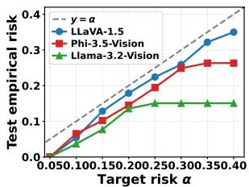  
(a)

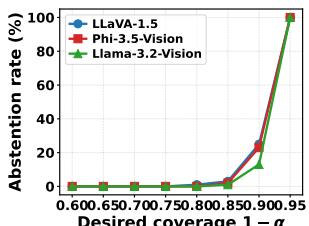  
(b)

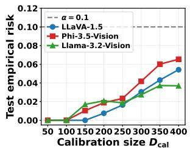  
(c)

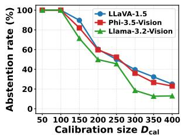  
(d)  
Figure 2: MSCOCO evaluation across three LVLMs. (a) CRC validity under varying user target $\alpha \in [ 0 . 0 5 , 0 . 4 0 ] $ empirical risk remains below the target for all models, confirming the conformal guarantee. (b) Abstention rate as a function of desired coverage $1 - \alpha ,$ characterizing the utility cost of stricter risk control. (c) Test empirical risk and (d) abstention rate under varying calibration size $D _ { \mathrm { c a l } }$ , at the operating point used throughout (per-λ test at $\alpha = 0 . 1 0 $ , concurrently guaranteed level $\alpha ^ { \prime } = 0 . 1 7 0 ;$ shown as $\alpha = 0 . 1$ in the panel legends).

$S _ { \mathrm { s e m } }$ alone yields only modest separability, with factual/non-factual score differences often below +0.002, though it remains statistically significant in most settings, confirming that hidden-state trajectories carry a weak but consistent factuality signal. Overall, $S _ { \mathrm { p r o b } }$ provides substantially stronger factuality cues than external verification or token confidence across all evaluated settings.

## 4.3 Conformal Risk Control Results

Table 2 reports conformal risk control performance on the held-out test sets, using a per-λ test at $\alpha =$ 0.10 with a concurrently guaranteed level $\alpha ^ { \prime } =$ 0.170 (Section 3.4). Following CONFLVLM (Li et al., 2025), we evaluate response-level empirical risk and abstention, which correspond directly to the formal CRC guarantee, while claim-level filtering efficiency (TPR), precision, and F1 are reported as diagnostic metrics. We compare IntroConformal against CONFLVLM using its CLIP external verifier and the token-probability baseline $T _ { \mathrm { p r o b } }$

$S _ { \mathbf { p r o b } }$ satisfies the CRC guarantee with substantially lower abstention and stronger claim-level discrimination. Across all tasks and LVLM architectures, the proposed conformity signals satisfy the conformal risk requirement, with empirical test risk consistently below the guaranteed level. $S _ { \mathrm { s e m } }$ is conservative, often yielding low empirical risk at the cost of high abstention, whereas $S _ { \mathrm { p r o b } }$ delivers substantially lower abstention and stronger claimlevel performance. On MSCOCO with LLaVA-1.5, $S _ { \mathrm { p r o b } }$ reduces abstention from 57% (CONFLVLM) and 64% $( S _ { \mathrm { s e m } } )$ to 25% while improving F1 from 0.504 to 0.581, and it improves F1 from 0.269 to 0.302 on Llama-3.2-Vision. $S _ { \mathrm { p r o b } }$ achieves the highest F1 in three of four fine-grained captioning and document understanding settings, indicating that stronger signal-level discrimination translates into more efficient conformal filtering while retaining substantially more responses.

Figure 2 further analyzes CRC behavior on MSCOCO across varying target risks and calibration sizes. Figure 2a shows that empirical risk remains below the desired target across all models and values of α, confirming valid finite-sample conformal control. Figure 2b illustrates the expected abstention–coverage trade-off, where stricter risk control induces higher abstention. Figures 2c and 2d sweep the calibration set size from 50 to 400 examples: calibration becomes increasingly efficient as it grows, with empirical risk approaching the target from below and abstention decreasing substantially between 100 and 200 samples before stabilizing. Extended CRC analyses for finegrained captioning and document understanding are in Appendix A.3.

<table><tr><td>Method</td><td>Claim Filtering Efficiency (TPR) ↑</td><td>Response Accuracy ↑</td></tr><tr><td>Woodpecker</td><td>59.1%</td><td>41%</td></tr><tr><td>CoVe</td><td>37.0%</td><td>23%</td></tr><tr><td>VCD  $( \beta = 0 . 1 )$ </td><td>35.5%</td><td>20%</td></tr><tr><td>ICD (β = 0.1, P)</td><td>41.1%</td><td>26%</td></tr><tr><td>CONFLVLM</td><td>95.3%</td><td>90%</td></tr><tr><td>IntroConformal</td><td>97.4%</td><td>91%</td></tr></table>

Table 3: Comparison with decoding- and verificationbased methods on claim filtering efficiency and response accuracy. IntroConformal $( S _ { \mathrm { p r o b } } )$ outperforms all baselines, including CONFLVLM, while requiring no external models or decoding-time perturbations.

## 4.4 Comparison with Decoding- and Verification-Based Methods

We further compare IntroConformal against representative hallucination mitigation approaches, including Woodpecker (Yin et al., 2024), Chain-of-Verification (CoVe) (Dhuliawala et al., 2024), Visual Contrastive Decoding (VCD) (Leng et al., 2024), and Instruction Contrastive Decoding (ICD) (Wang et al., 2024). Baseline results are taken directly from CONFLVLM, where all methods were evaluated on the LLaVA-1.5 general scene understanding benchmark using the same 100-image subset and original implementation settings. Response accuracy measures the fraction of responses in which all retained claims are factual. IntroConformal outperforms all decoding- and verification-based baselines. As shown in Table 3, IntroConformal achieves the strongest overall performance, improving claim filtering efficiency from 95.3% to 97.4% over CONFLVLM while also achieving slightly higher response accuracy (91% vs. 90%). It further outperforms Woodpecker, CoVe, VCD, and ICD, all of which exhibit considerably lower filtering efficiency and response accuracy. These results suggest that signals derived directly from the model provide a more reliable basis for factuality control than external verification heuristics or decoding-time perturbation strategies.

## 4.5 Robustness to Annotation Noise

Because the CRC guarantee is defined relative to the calibration labels, we assess how label noise affects calibration. On LLaVA-1.5 MSCOCO, we inject symmetric noise into the calibration labels at 5%, 10%, and 15% by randomly flipping that fraction of claim labels, recalibrate the threshold on the corrupted labels, and evaluate empirical risk on the held-out test set against the true labels, averaging over 20 noise draws (Table 4).

<table><tr><td>Noise</td><td> $\hat { \lambda }$ </td><td>Test Risk</td><td>Abstention</td></tr><tr><td>0%</td><td>0.940</td><td>0.054</td><td>25.0%</td></tr><tr><td>5%</td><td>0.956</td><td>0.012</td><td>53.5%</td></tr><tr><td>10%</td><td>0.961</td><td>0.001</td><td>67.8%</td></tr><tr><td>15%</td><td>0.964</td><td>&lt;0.001</td><td>77.1%</td></tr></table>

Table 4: Robustness to calibration label noise on LLaVA-1.5 MSCOCO. Symmetric noise is injected into the calibration labels, and test risk is measured against the true labels (20 draws averaged). The 0% row reproduces the $\mathrm { L L a V A } { - } 1 . 5$ operating point in Table 2 (per-λ test at $\alpha = 0 . 1 0$ , concurrent guarantee $\alpha ^ { \prime } = 0 . 1 7 0 )$ Test risk stays below the target at every noise level.

Across all noise levels, the empirical test risk stays below the target $\alpha = 0 . 1 0$ and in fact decreases as noise increases, from 0.054 at 0% noise to below 0.001 at 15%. The mechanism is structural: random flips inflate the apparent risk on the calibration set, so the LTT procedure selects a larger threshold and filters more conservatively, raising abstention (from 25% to 77%) rather than violating the bound. The guarantee therefore degrades gracefully under symmetric annotation error, trading utility for continued validity. We note this analysis addresses symmetric noise; systematic annotation bias, which need not inflate apparent risk, could in principle select a permissive threshold, which we flag in the Limitations.

## 5 Conclusion

We introduced IntroConformal, a training-free framework for conformal factuality control in LVLMs using introspective signals derived entirely from the model itself. By leveraging layer-wise semantic stability and verification probability, IntroConformal provides finite-sample, distributionfree guarantees on response-level non-factual risk without relying on external verifiers or auxiliary models. Across diverse vision–language generation tasks, $S _ { \mathrm { p r o b } }$ consistently achieves stronger factual/non-factual discrimination than CLIP-based verification and generation-time confidence signals, leading to lower abstention while maintaining valid conformal guarantees. These results indicate that model-internal signals provide a reliable predictive indicator of non-factual generation, and that combining model-derived conformity scores with CRC offers a principled foundation for trustworthy LVLM deployment in safety-critical applications.

## Limitations

$S _ { \mathrm { s e m } }$ requires white-box access to hidden states, limiting it to architectures that expose internal activations, whereas $S _ { \mathrm { p r o b } }$ needs only output logits at a single position and thus applies to any openweight model or logit-exposing API, but not to APIs that withhold logits. Both signals require an additional forward pass per claim, comparable in cost to the CLIP scoring used by CONFLVLM. The guarantee is defined relative to the calibration labels rather than to human ground truth: while it is robust to symmetric label noise (Section 4.5), systematic annotation bias could select a permissive threshold, and our human validation used only a single annotator. The reported $\alpha ^ { \prime } = 0 . 1 7 0$ is the FWER-corrected bound for a user target of $\alpha = 0 . 1 0$ , a benchmark demonstration point rather than a deployment recommendation, and the α-to-$\alpha ^ { \prime }$ gap narrows with calibration size. The guarantee assumes a fixed model under exchangeability, so fine-tuning, RLHF updates, or checkpoint changes (as on versioned APIs) require recalibration; relatedly, since $S _ { \mathrm { p r o b } }$ reads the model’s own verification logits, adversarially crafted inputs could bias the Yes/No logits and void the bound, motivating future work on robustifying introspective scores. Finally, as guarantees are probabilistic (holding with probability at least $1 - \delta )$ , safety-critical deployment should retain human oversight.

## Acknowledgments

We acknowledge Advanced Research Computing (ARC) at Virginia Tech for providing the computational resources and technical support that contributed to the results reported in this paper. We thank the authors of CONFLVLM for sharing their resources. We also thank the reviewers for their constructive feedback, which helped improve this paper.

## References

Marah Abdin, Jyoti Aneja, Hany Awadalla, Ahmed Awadallah, Ammar Ahmad Awan, Nguyen Bach, Amit Bahree, Arash Bakhtiari, Jianmin Bao, Harkirat Behl, Alon Benhaim, Misha Bilenko, Johan Bjorck, Sébastien Bubeck, Martin Cai, Qin Cai, Vishrav Chaudhary, Dong Chen, Dongdong Chen, and 110 others. 2024. Phi-3 technical report: A highly capable language model locally on your phone. Preprint, arXiv:2404.14219.

Anastasios N. Angelopoulos and Stephen Bates. 2022. A gentle introduction to conformal prediction and distribution-free uncertainty quantification. Preprint, arXiv:2107.07511.

Anastasios N. Angelopoulos, Stephen Bates, Emmanuel J. Candès, Michael I. Jordan, and Lihua Lei. 2022. Learn then test: Calibrating predictive algorithms to achieve risk control. Preprint, arXiv:2110.01052.

Anastasios Nikolas Angelopoulos, Stephen Bates, Michael Jordan, and Jitendra Malik. 2021. Uncertainty sets for image classifiers using conformal prediction. In International Conference on Learning Representations.

Kiana Avestimehr, Emily Aye, Zalan Fabian, and Erum Mushtaq. 2025. Detecting unreliable responses in generative vision-language models via visual uncertainty. In ICLR Workshop: Quantify Uncertainty and Hallucination in Foundation Models: The Next Frontier in Reliable AI.

Amos Azaria and Tom Mitchell. 2023. The internal state of an llm knows when it’s lying. In Findings of the Association for Computational Linguistics: EMNLP 2023, pages 967–976.

Shuai Bai, Yuxuan Cai, Ruizhe Chen, Keqin Chen, Xionghui Chen, Zesen Cheng, Lianghao Deng, Wei Ding, Chang Gao, Chunjiang Ge, Wenbin Ge, Zhifang Guo, Qidong Huang, Jie Huang, Fei Huang, Binyuan Hui, Shutong Jiang, Zhaohai Li, Mingsheng

Li, and 45 others. 2025a. Qwen3-vl technical report. Preprint, arXiv:2511.21631.

Shuai Bai, Keqin Chen, Xuejing Liu, Jialin Wang, Wenbin Ge, Sibo Song, Kai Dang, Peng Wang, Shijie Wang, Jun Tang, Humen Zhong, Yuanzhi Zhu, Mingkun Yang, Zhaohai Li, Jianqiang Wan, Pengfei Wang, Wei Ding, Zheren Fu, Yiheng Xu, and 8 others. 2025b. Qwen2.5-vl technical report. Preprint, arXiv:2502.13923.

Stephen Bates, Anastasios Angelopoulos, Lihua Lei, Jitendra Malik, and Michael Jordan. 2021. Distribution-free, risk-controlling prediction sets. Journal ofthe ACM (JACM), 68(6):1–34.

Yixin Bu, Guanyun Zou, Renzhi Wang, Runze Xia, Cunjun Wang, Hongliang Dai, Xiaoqing Ma, and Piji Li. 2026. Sampling-free uncertainty quantification via hidden state dynamics in language models. In Proceedings of the AAAI Conference on Artificial Intelligence, volume 40, pages 30104–30111.

Chao Chen, Kai Liu, Ze Chen, Yi Gu, Yue Wu, Mingyuan Tao, Zhihang Fu, and Jieping Ye. 2024. Inside: Llms’ internal states retain the power of hallucination detection. In The Twelfth International Conference on Learning Representations.

John Cherian, Isaac Gibbs, and Emmanuel Candes. 2024. Large language model validity via enhanced conformal prediction methods. Advances in Neural Information Processing Systems, 37:114812–114842.

Yung-Sung Chuang, Yujia Xie, Hongyin Luo, Yoon Kim, James R Glass, and Pengcheng He. 2024. Dola: Decoding by contrasting layers improves factuality in large language models. In The Twelfth International Conference on Learning Representations.

Shehzaad Dhuliawala, Mojtaba Komeili, Jing Xu, Roberta Raileanu, Xian Li, Asli Celikyilmaz, and Jason Weston. 2024. Chain-of-verification reduces hallucination in large language models. In Findings of the association for computational linguistics: ACL 2024, pages 3563–3578.

Jinhao Duan, Hao Cheng, Shiqi Wang, Alex Zavalny, Chenan Wang, Renjing Xu, Bhavya Kailkhura, and Kaidi Xu. 2024. Shifting attention to relevance: Towards the predictive uncertainty quantification of freeform large language models. In Proceedings of the 62nd Annual Meeting ofthe Associationfor Computational Linguistics (Volume 1: Long Papers), pages 5050–5063.

Yonatan Geifman and Ran El-Yaniv. 2017. Selective classification for deep neural networks. Advances in neural information processing systems, 30.

Aaron Grattafiori, Abhimanyu Dubey, Abhinav Jauhri, Abhinav Pandey, Abhishek Kadian, Ahmad Al-Dahle, Aiesha Letman, Akhil Mathur, Alan Schelten, Alex Vaughan, Amy Yang, Angela Fan, Anirudh Goyal, Anthony Hartshorn, Aobo Yang, Archi Mitra, Archie Sravankumar, Artem Korenev, Arthur

Hinsvark, and 542 others. 2024. The llama 3 herd of models. Preprint, arXiv:2407.21783.

Jiatong Han, Jannik Kossen, Muhammed Razzak, Lisa Schut, Shreshth A Malik, and Yarin Gal. 2024. Semantic entropy probes: Robust and cheap hallucination detection in llms. In ICML 2024 Workshop on Foundation Models in the Wild.

Wassily Hoeffding. 1963. Probability inequalities for sums of bounded random variables. Journal of the American statistical association, 58(301):13–30.

Zheng Huang, Kai Chen, Jianhua He, Xiang Bai, Dimosthenis Karatzas, Shijian Lu, and CV Jawahar. 2019. Icdar2019 competition on scanned receipt ocr and information extraction. In 2019 International Conference on Document Analysis and Recognition (ICDAR), pages 1516–1520. IEEE.

Zaid Khan and Yun Fu. 2024. Consistency and uncertainty: Identifying unreliable responses from blackbox vision-language models for selective visual question answering. In Proceedings of the IEEE/CVF Conference on Computer Vision and Pattern Recognition, pages 10854–10863.

Aditya Khosla, Nityananda Jayadevaprakash, Bangpeng Yao, and Fei-Fei Li. 2011. Novel dataset for finegrained image categorization: Stanford dogs. In Proc. CVPR workshop on fine-grained visual categorization (FGVC), volume 2.

Jonathan Krause, Michael Stark, Jia Deng, and Li Fei-Fei. 2013. 3d object representations for fine-grained categorization. In Proceedings of the IEEE international conference on computer vision workshops, pages 554–561.

Lorenz Kuhn, Yarin Gal, and Sebastian Farquhar. 2023. Semantic uncertainty: Linguistic invariances for uncertainty estimation in natural language generation. In The Eleventh International Conference on Learning Representations.

J Richard Landis and Gary G Koch. 1977. The measurement of observer agreement for categorical data. biometrics, pages 159–174.

Gregory Kang Ruey Lau, Hieu Dao, and Bryan Kian Hsiang Low. 2025. Uncertainty quantification for mllms. In ICLR Workshop: Quantify Uncertainty and Hallucination in Foundation Models: The Next Frontier in Reliable AI.

Sicong Leng, Hang Zhang, Guanzheng Chen, Xin Li, Shijian Lu, Chunyan Miao, and Lidong Bing. 2024. Mitigating object hallucinations in large visionlanguage models through visual contrastive decoding. In Proceedings of the IEEE/CVF Conference on Computer Vision and Pattern Recognition, pages 13872–13882.

Xiaomin Li, Zhou Yu, Ziji Zhang, Yingying Zhuang, Swair Shah, Narayanan Sadagopan, and Anurag Beniwal. 2026. Semantic volume: Quantifying and detecting both external and internal uncertainty in llms.

In Proceedings ofthe AAAI Conference on Artificial Intelligence, volume 40, pages 31751–31759.

Zhuohang Li, Chao Yan, Nicholas J Jackson, Wendi Cui, Bo Li, Jiaxin Zhang, and Bradley A Malin. 2025. Towards statistical factuality guarantee for large vision-language models. In Proceedings ofthe 2025 Conference on Empirical Methods in Natural Language Processing, pages 11446–11467.

Haotian Liu, Chunyuan Li, Qingyang Wu, and Yong Jae Lee. 2023. Visual instruction tuning. Advances in Neural Information Processing Systems, 36.

Junzhang Liu, Zhecan Wang, Hammad Ayyubi, Haoxuan You, Chris Thomas, Rui Sun, Shih-Fu Chang, and Kai-Wei Chang. 2024. Detecting multimodal situations with insufficient context and abstaining from baseless predictions. In Proceedings of the 32nd ACM International Conference on Multimedia, pages 8402–8411.

Ercong Nie, Helmut Schmid, and Hinrich Schütze. 2025. Mechanistic understanding and mitigation of language confusion in english-centric large language models. In Findings ofthe Associationfor Computational Linguistics: EMNLP 2025, pages 690–706.

Alexander Nikitin, Jannik Kossen, Yarin Gal, and Pekka Marttinen. 2024. Kernel language entropy: Finegrained uncertainty quantification for llms from semantic similarities. Advances in Neural Information Processing Systems, 37:8901–8929.

OpenAI. 2024. Gpt-4o system card. arXiv preprint arXiv:2410.21276.

Victor Quach, Adam Fisch, Tal Schuster, Adam Yala, Jae Ho Sohn, Tommi S Jaakkola, and Regina Barzilay. 2024. Conformal language modeling. In The Twelfth International Conference on Learning Representations.

Alec Radford, Jong Wook Kim, Chris Hallacy, Aditya Ramesh, Gabriel Goh, Sandhini Agarwal, Girish Sastry, Amanda Askell, Pamela Mishkin, Jack Clark, Gretchen Krueger, and Ilya Sutskever. 2021. Learning transferable visual models from natural language supervision. In International conference on machine learning, pages 8748–8763. PMLR.

Ramprasaath R Selvaraju, Purva Tendulkar, Devi Parikh, Eric Horvitz, Marco Tulio Ribeiro, Besmira Nushi, and Ece Kamar. 2020. Squinting at vqa models: Introspecting vqa models with sub-questions. In Proceedings of the IEEE/CVF Conference on Computer Vision and Pattern Recognition, pages 10003–10011.

Meet Shah, Xinlei Chen, Marcus Rohrbach, and Devi Parikh. 2019. Cycle-consistency for robust visual question answering. In Proceedings of the IEEE/CVF Conference on Computer Vision and Pattern Recognition, pages 6649–6658.

Harit Vishwakarma, Alan Mishler, Thomas Cook, Niccolo Dalmasso, Natraj Raman, and Sumitra Ganesh. 2025. Prune’n predict: Optimizing llm decisionmaking with conformal prediction. In Forty-second International Conference on Machine Learning.

Vladimir Vovk, Alexander Gammerman, and Glenn Shafer. 2005. Algorithmic learning in a random world. Springer.

Catherine Wah, Steve Branson, Peter Welinder, Pietro Perona, and Serge Belongie. 2011. The caltech-ucsd birds-200-2011 dataset. Technical Report CNS-TR-2011-001, California Institute of Technology.

Chenxi Wang, Xiang Chen, Ningyu Zhang, Bozhong Tian, Haoming Xu, Shumin Deng, and Huajun Chen. 2025. Mllm can see? dynamic correction decoding for hallucination mitigation. In International Conference on Learning Representations, volume 2025, pages 13712–13736.

Xintong Wang, Jingheng Pan, Liang Ding, and Chris Biemann. 2024. Mitigating hallucinations in large vision-language models with instruction contrastive decoding. In Findings ofthe Associationfor Computational Linguistics ACL 2024, pages 15840–15853.

Miao Xiong, Zhiyuan Hu, Xinyang Lu, Yifei Li, Jie Fu, Junxian He, and Bryan Hooi. 2024. Can llms express their uncertainty? an empirical evaluation of confidence elicitation in llms. In International Conference on Learning Representations, volume 2024, pages 23650–23678.

Fanghua Ye, Mingming Yang, Jianhui Pang, Longyue Wang, Derek Wong, Emine Yilmaz, Shuming Shi, and Zhaopeng Tu. 2024. Benchmarking llms via uncertainty quantification. Advances in Neural Information Processing Systems, 37:15356–15385.

Shukang Yin, Chaoyou Fu, Sirui Zhao, Tong Xu, Hao Wang, Dianbo Sui, Yunhang Shen, Ke Li, Xing Sun, and Enhong Chen. 2024. Woodpecker: Hallucination correction for multimodal large language models. Science China Information Sciences, 67(12):220105.

Ruiyang Zhang, Hu Zhang, and Zhedong Zheng. 2024. Vl-uncertainty: Detecting hallucination in large vision-language model via uncertainty estimation. arXiv preprint arXiv:2411.11919.

Zhenliang Zhang, Xinyu Hu, Huixuan Zhang, Junzhe Zhang, and Xiaojun Wan. 2025. Icr probe: Tracking hidden state dynamics for reliable hallucination detection in llms. In Proceedings of the 63rd Annual Meeting ofthe Associationfor Computational Linguistics (Volume 1: Long Papers), pages 17986– 18002.

## A Appendix

This section discusses the following topics in detail:

• Algorithm for IntroConformal (Appendix A.1)

• Qualitative Examples of IntroConformal (Appendix A.2)

• CRC Behavior Across Tasks and Calibration Sizes (Appendix A.3)

• Effect of Layer Selection on Semantic Stability (Appendix A.4)

• Claim Decomposition and Annotation Prompts (Appendix A.5)

## A.1 Algorithm for IntroConformal

Algorithm 1 summarizes the full IntroConformal pipeline. For each calibration claim, we extract $S _ { \mathrm { s e m } }$ from hidden-state representations and $S _ { \mathrm { p r o b } }$ from the model’s binary verification judgment in a single forward pass. The calibration phase applies the Learn–Then–Test procedure with Hoeffding’s inequality to select the least conservative threshold satisfying the target risk α. Formal definitions and theoretical guarantees appear in the main text.

## A.2 Qualitative Examples of IntroConformal

IntroConformal correctly filters all non-factual claims. Figure 3a illustrates a representative case where $S _ { \mathrm { p r o b } }$ achieves perfect claim-level filtering. Given a black-and-white photograph of three baseball players, LLaVA-1.5 generates a response containing two non-factual claims: “Each player is holding a baseball bat” $( S _ { \mathrm { p r o b } } ~ = ~ 0 . 6 1 9 )$ and “The scene captures the camaraderie and teamwork among the players” $( S _ { \mathrm { p r o b } } = 0 . 8 8 2 )$ . Both fall below the calibrated threshold $\hat { \lambda } _ { \mathrm { p r o b } } = 0 . 9 4 0$ , while all four factual claims score above it $( S _ { \mathrm { p r o b } } \in$ [0.947, 0.972]). IntroConformal retains the entire factual set and filters both non-factual claims, yielding a fully grounded response with zero non-factual content among retained claims.

$S _ { \mathrm { p r o b } }$ is sensitive near the decision boundary, reflecting calibrated conservatism. Figure 3b illustrates the risk–utility trade-off inherent to conformal risk control at stringent target levels. Given a pizza image, LLaVA-1.5 generates 6 claims, two of which are non-factual: “There are a few cups on the table” $( S _ { \mathrm { p r o b } } = 0 . 6 9 6 )$ and “A person is partially visible in the background” $( S _ { \mathrm { p r o b } } = 0 . 3 8 5 )$ both are correctly filtered. The factual claim “There is a wine glass on the table” $( S _ { \mathrm { p r o b } } = 0 . 9 2 7 )$ falls just below $\hat { \lambda } _ { \mathrm { p r o b } } = 0 . 9 4 0$ , reflecting the sensitivity of the decision boundary where $S _ { \mathrm { p r o b } }$ is close to the threshold, and the borderline claim “The scene is set in a cozy and inviting atmosphere”

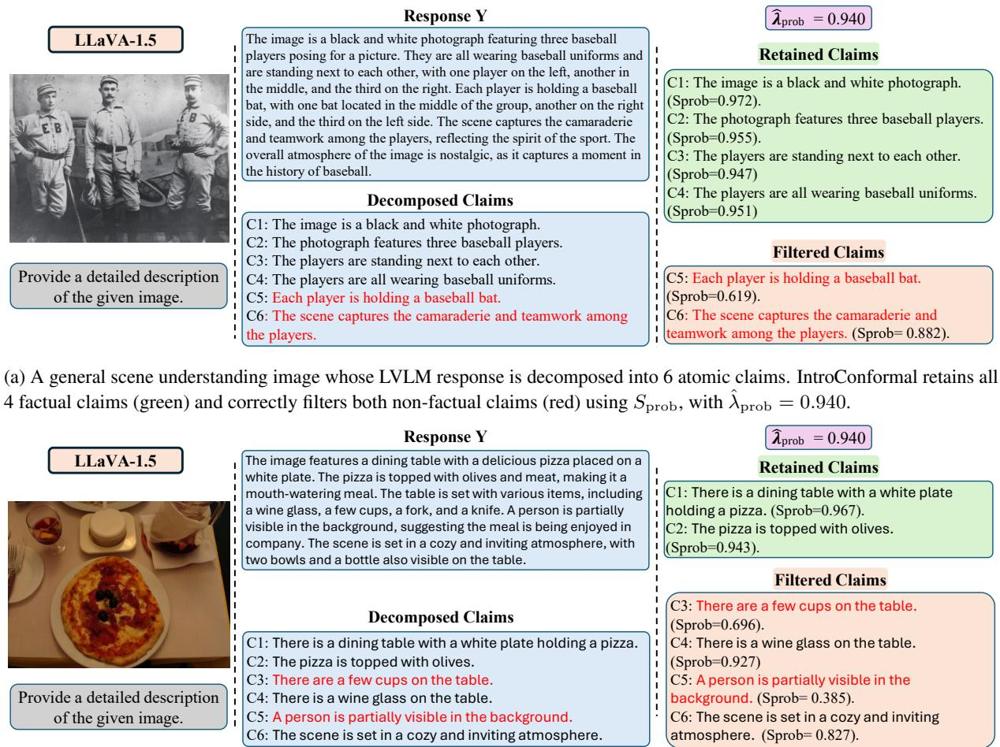  
(b) A general scene understanding image whose response is decomposed into 6 atomic claims. IntroConformal correctly filters both non-factual claims (red) while retaining 2 factual claims (green); two additional factual claims are conservatively filtered (black), reflecting the risk–utility trade-off at stringent risk levels, with $\hat { \lambda } _ { \mathrm { p r o b } } = 0 . 9 4 0$  
Figure 3: Qualitative examples of IntroConformal at the operating point used throughout (per-λ test at $\alpha = 0 . 1 0 $ concurrently guaranteed level $\alpha ^ { \prime } = 0 . 1 7 0 )$

$( S _ { \mathrm { p r o b } } = 0 . 8 2 7 )$ is likewise filtered. This conservative filtering is expected at the operating point (per-λ $\alpha ~ = ~ 0 . 1 0$ , guaranteed $\alpha ^ { \prime } = 0 . 1 7 0 )$ and is a principled consequence of the guarantee: the threshold is set to bound the non-factual rate among retained claims, which necessarily filters some borderline claims.

## A.3 CRC Behavior Across Tasks and Calibration Sizes

Figures 4 and 5 extend the CRC analysis from the main text to fine-grained captioning and document understanding, respectively. Across both tasks and all evaluated architectures, the conformal guarantee holds consistently: empirical risk remains below the target α for all values in [0.05, 0.40], confirming valid finite-sample risk control (Figures 4a and 5a). The abstention–coverage trade-off (Figures 4b and 5b) follows the expected monotonic pattern, where stricter coverage requirements induce higher abstention, with Phi-3.5-Vision exhibiting a sharper abstention increase at high coverage thresholds compared to LLaVA-1.5.

Figures 4c, 4d, 5c, and 5d analyze the effect of calibration size $| \mathcal { D } _ { \mathrm { c a l } } |$ , swept from 50 to 400 examples, at the operating point used throughout (per-λ test at $\alpha = 0 . 1 0$ , concurrently guaranteed level $\alpha ^ { \prime } = 0 . 1 7 0 )$ . On fine-grained captioning, LLaVA-1.5 achieves near-zero empirical risk even at small calibration sizes, reflecting the stronger intrinsic signal quality on this task, while Phi-3.5-Vision requires larger calibration sets before risk stabilizes. On document understanding, both models show a consistent decrease in abstention as $| \mathcal { D } _ { \mathrm { c a l } } |$ grows, with abstention plateauing beyond $| \mathcal { D } _ { \mathrm { c a l } } |$ ≈ 200, consistent with the $\mathcal { O } ( 1 / \sqrt { n } )$ shrinkage of the Hoeffding upper confidence bound. These results confirm that the calibration efficiency observed on

Algorithm 1 IntroConformal: Factuality control   
via introspective signals   
1: Input: Calibration set $\mathcal { D } _ { \mathrm { c a l } }$   
$\{ ( I _ { i } , X _ { i } , \mathcal { C } _ { i } , \mathcal { L } _ { i } ) \} _ { i = 1 } ^ { n } ;$ risk level $\alpha ;$ fail  
ure probability $\delta ;$ conformity score   
$S ( \cdot ) \in \{ S _ { \mathrm { s e m } } , S _ { \mathrm { p r o b } } \}$   
2: Output: Calibrated threshold $\hat { \lambda } .$   
3: Step 1: Extract introspective signals (single   
forward pass per claim).   
4: for $i = 1$ to $n$ do   
5: for each claim $c \in { \mathcal { C } } _ { i }$ do   
6: Run LVLM inference with hidden-state   
outputs on verification prompt.   
7: Compute $S _ { \mathrm { s e m } } ( c )$ via cosine similarity of   
mid- and late-layer hidden states.   
8: Compute $S _ { \mathrm { p r o b } } ( c )$ via $P ( \forall \mathsf { e s } ) / ( P ( \forall \mathsf { e s } ) +$   
$P ( \mathsf { N o } ) )$ at answer position.   
9: end for   
10: end for   
11: Step 2: Define candidate thresholds and $\hat { \alpha } .$   
12: $\Lambda  \{ S ( c ) : i \in [ n ] , c \in \mathcal { C } _ { i } \}$   
13: Optionally augment Λ with a value below   
min(Λ) to represent retaining all claims.   
14: $\begin{array} { r } { \hat { \alpha } \gets \alpha - \left\lceil \sqrt { \frac { \log ( m / \delta ) } { 2 n } } - \sqrt { \frac { \log ( 1 / \delta ) } { 2 n } } \right\rceil } \end{array}$   
15: Step 3: Compute per-response risk for each   
threshold.   
16: for $i = 1$ to n do   
17: for each $\lambda \in \Lambda$ do   
18: ${ \hat { \mathcal { C } } } _ { \lambda } ( I _ { i } , X _ { i } ) \gets \{ c \in { \mathcal { C } } _ { i } : S ( c ) \geq \lambda \}$   
19: $m _ { i } ( \lambda ) \gets \left| \hat { \mathcal { C } } _ { \lambda } ( I _ { i } , X _ { i } ) \right|$   
20: if $m _ { i } ( \lambda ) \stackrel { . } { = } 0$ then   
21: $r _ { i } ( \lambda ) \gets 0$ {Abstention}   
22: else   
23: $\begin{array} { r } { r _ { i } ( \lambda ) \gets \frac { 1 } { m _ { i } ( \lambda ) } \sum _ { c \in \hat { \mathcal { C } } _ { \lambda } ( I _ { i } , X _ { i } ) } \mathcal { L } ( c , I _ { i } ) } \end{array}$   
24: end if   
25: end for   
26: end for   
27: Step 4: Compute aggregate risk and UCB   
for each threshold.   
28: for each $\lambda \in \Lambda$ do   
29: $\begin{array} { r } { \hat { R } ( \lambda ) \gets \frac { 1 } { n } \sum _ { i = 1 } ^ { n } r _ { i } ( \lambda ) . } \end{array}$   
30: $\mathrm { U C B } _ { \delta } ( \lambda )  \hat { R } ( \lambda ) + \sqrt { \frac { \log ( 1 / \delta ) } { 2 n } }$   
31: end for   
32: Step 5: Select least conservative concur  
rently valid threshold.   
33: $\hat { \lambda }  \operatorname* { m i n } \{ \lambda \in \Lambda : \operatorname { U C B } _ { \delta } ( \lambda ) \leq \hat { \alpha } \}$   
34: Return: $\hat { \lambda } .$

MSCOCO in the main text generalizes across tasks, and that approximately 200 calibration samples suffice for stable conformal risk control in practice.

## A.4 Effect of Layer Selection on Semantic Stability

Table 5 compares two layer selection strategies for computing the semantic stability score. The old configuration compares hidden-state representations from the first quarter to the network midpoint against the final quarter of layers, following earlier mechanistic interpretability work (Azaria and Mitchell, 2023; Chen et al., 2024). The new configuration instead compares the 8 layers immediately preceding the final block against the final 4 layers, motivated by recent observations that factual representations tend to stabilize in latestage hidden-state trajectories, where the model commits to its final output (Wang et al., 2025; Bu et al., 2026). While the old configuration achieves higher AUROC in several settings $( \mathrm { e . g . }$ 0.578 vs. 0.556 on general scene understanding with LLaVA-1.5), it exhibits two failure modes. First, on fine-grained captioning with LLaVA-1.5, the directional difference is negative (−0.0029), meaning the old configuration assigns higher scores to non-factual than factual claims, reversing the intended ordering. Second, on fine-grained captioning with Phi-3.5-Vision, it fails to reach significance $( p = 2 . 1 \times 1 0 ^ { - 1 } )$ , indicating no reliable separation. We acknowledge that the old configuration achieves notably higher AUROC on document understanding with Phi-3.5-Vision (0.628 vs. 0.530), a gap that warrants attention; however, we prioritize cross-architecture consistency over per-setting AUROC maximization, as a score with reversed or unreliable ordering in some settings cannot serve as a dependable conformity score. The new configuration yields consistent directional separation with statistically significant results across the tasks and architectures in this ablation (LLaVA-1.5 and Phi-3.5-Vision), and we adopt it as our default throughout all experiments.

## A.5 Claim Decomposition and Annotation Prompts

We provide the full prompts used for claim decomposition and factuality annotation. The annotation models and reliability study are described in Section 4.1; here we give the exact prompt text. The claim decomposition prompt and the fine-grained captioning annotation prompt are shown below, followed by the document understanding annotation prompt. The three share an identical claim-level JSON output format; the document prompt differs only in its error taxonomy, which covers field misinterpretation, numerical and quantitative errors, date errors, item errors, and OCR or layout issues.

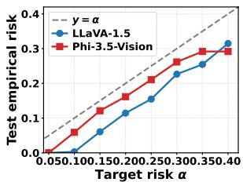  
(a)

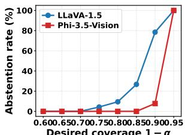  
(b)

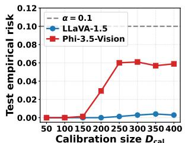  
(c)

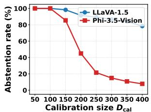  
(d)  
Figure 4: Fine-Grained Captioning evaluation across two LVLM architectures. (a) CRC validity under varying user target α: empirical risk remains below the target for all models, confirming the conformal guarantee. (b) Abstention rate as a function of desired coverage $1 - \alpha ,$ characterizing the utility cost of stricter risk control. (c) Test empirical risk and (d) abstention rate under varying calibration size $D _ { \mathrm { c a l } }$ (swept 50–400), at the operating point used throughout (per-λ test at $\alpha = 0 . 1 0$ , concurrently guaranteed level $\alpha ^ { \prime } = 0 . 1 7 0 ;$ shown as $\alpha = 0 . 1$ in the panel legends).

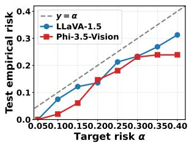  
(a)

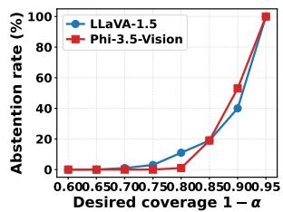  
(b)

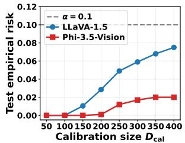  
(c)

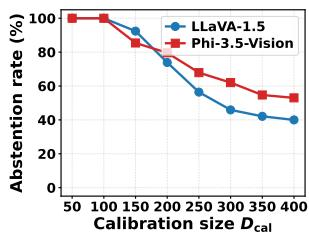  
(d)

Figure 5: Document understanding evaluation across two LVLM architectures. (a) CRC validity under varying user target α: empirical risk remains below the target for all models, confirming the conformal guarantee. (b) Abstention rate as a function of desired coverage $1 - \alpha .$ , characterizing the utility cost of stricter risk control. (c) Test empirical risk and (d) abstention rate under varying calibration size $D _ { \mathrm { c a l } } ( \mathrm { s w e p t } 5 0 { - } 4 0 0 )$ , at the operating point used throughout (per-λ test at $\alpha = 0 . 1 0$ , concurrently guaranteed level $\alpha ^ { \prime } = 0 . 1 7 0 ;$ shown as $\alpha = 0 .$ .1 in the panel legends).
<table><tr><td>Task</td><td>Model</td><td>Config</td><td>Mean (F)</td><td>Mean (NF)</td><td>Diff.</td><td>AUROC ↑</td><td>p-value</td></tr><tr><td rowspan="4">General Scene Understanding</td><td rowspan="2">LLaVA-1.5</td><td>Old</td><td>0.4952</td><td>0.4887</td><td>+0.0065</td><td>0.578</td><td> $2 . 7 \times 1 0 ^ { - 1 3 }$ </td></tr><tr><td>New</td><td>0.8689</td><td>0.8674</td><td>+0.0015</td><td>0.556</td><td> $3 . 1 \times 1 0 ^ { - 9 }$ </td></tr><tr><td rowspan="2">Phi-3.5-Vision</td><td>Old</td><td>0.2710</td><td>0.2618</td><td>+0.0092</td><td>0.601</td><td> $6 . 2 \times 1 0 ^ { - 2 6 }$ </td></tr><tr><td>New</td><td>0.9041</td><td>0.9022</td><td>+0.0019</td><td>0.576</td><td> $2 . 2 \times 1 0 ^ { - 1 0 }$ </td></tr><tr><td rowspan="4">Fine-Grained Captioning</td><td rowspan="2">LLaVA-1.5</td><td>Old</td><td>0.4921</td><td>0.4950</td><td>-0.0029</td><td>0.471</td><td> $6 . 2 \times 1 0 ^ { - 4 }$ </td></tr><tr><td>New</td><td>0.8703</td><td>0.8695</td><td>+0.0008</td><td>0.536</td><td> $3 . 7 \times 1 0 ^ { - 4 }$ </td></tr><tr><td rowspan="2">Phi-3.5-Vision</td><td>Old</td><td>0.2772</td><td>0.2765</td><td>+0.0008</td><td>0.520</td><td> $2 . 1 \times 1 0 ^ { - 1 }$ </td></tr><tr><td>New</td><td>0.9033</td><td>0.9025</td><td>+0.0008</td><td>0.530</td><td> $6 . 4 \times 1 0 ^ { - 3 }$ </td></tr><tr><td rowspan="4">Document Understanding</td><td rowspan="2">LLaVA-1.5</td><td>Old</td><td>0.4846</td><td>0.4814</td><td>+0.0032</td><td>0.555</td><td> $4 . 7 \times 1 0 ^ { - 1 0 }$ </td></tr><tr><td>New</td><td>0.8710</td><td>0.8691</td><td>+0.0018</td><td>0.575</td><td> $5 . 0 \times 1 0 ^ { - 2 1 }$ </td></tr><tr><td rowspan="2">Phi-3.5-Vision</td><td>Old</td><td>0.2458</td><td>0.2364</td><td>+0.0094</td><td>0.628</td><td> $3 . 9 \times 1 0 ^ { - 5 5 }$ </td></tr><tr><td>New</td><td>0.8837</td><td>0.8818</td><td>+0.0019</td><td>0.530</td><td> $5 . 7 \times 1 0 ^ { - 6 }$ </td></tr></table>

Table 5: Effect of $S _ { \mathrm { s e m } }$ layer selection on signal quality. Old takes M to span the first quarter to the network midpoint and T the final quarter. New takes M to be the 8 layers preceding the final block and T the final 4 layers, following Wang et al. (2025) and Bu et al. (2026). Results are reported on the calibration set for LLaVA-1.5 and Phi-3.5-Vision.

## Claim decomposition prompt

System “Given a model-generated response about an image, decompose it into a list of atomic, verifiable claims.”

User “Statement: {response}

Break down the above statement into a list of atomic claims. Each claim must:

• Express exactly one fact (no compound claims joined by ‘and’/‘or’)

• Be self-contained, with all referents resolved (no pronouns like ‘it’, ‘they’, ‘this’)

• Be directly supported by the original statement (do not add inferences or interpretations)

• Ensure all distinct facts from the original statement are represented

• Be a short, declarative sentence

• Omit interpretive or evaluative claims that cannot be verified from the image alone (e.g., ‘the scene is dynamic’, ‘a majestic sight’, ‘a serene backdrop’)

• If a claim contains a hedge (‘possibly’, ‘appears to’, ‘seems to’, ‘might be’), restate it as a direct assertion without the hedge

Output only a numbered list in the format:

1. ⟨claim⟩

2. ⟨claim⟩

. . .

Do not include any explanation or preamble.”

## Factuality annotation prompt for Fine-Grained Captioning

<table><tr><td>System “You are an expert annotator tasked with evaluating statements generated by a vision- language model (VLM). Given an image and a list of claims, verify the factuality of each claim based on how well it aligns with the provided image. Focus only on significant or material correctness, ignoring minor differences or non-essential details. The errors are categorized as follows: 1. Object Identification: The claim involves hallucinated or wrongly identified objects, including species, breed, or model misidentification (e.g., wrong bird species, wrong car model, wrong</td></tr><tr><td>dog breed). Ignore minor distinctions between similar objects unless it fundamentally changes the meaning of the claim.</td></tr><tr><td>2. Attribute Accuracy: The claim involves incorrect visual attributes (e.g., color, size, shape, markings, body parts). Only flag if critical to the understanding of the claim.</td></tr><tr><td>3. Spatial Relations: The claim involves incorrect spatial relationships between objects. Only flag if they significantly change the scene. 4. Interaction/Action Accuracy: The claim involves incorrect or hallucinated action or interac-</td></tr><tr><td>tion. 5. Quantitative Information: The claim involves incorrect numeric details (e.g., wrong object</td></tr><tr><td>count).&quot; User “Given the image and the caption below, determine whether each claim is supported by the</td></tr><tr><td>image. Caption: {caption} Claims: {numbered_claims} For each claim, assign:</td></tr><tr><td>• true: the claim is factually correct and supported by visible evidence in the image • false: the claim is incorrect, hallucinated, or not visually verifiable</td></tr><tr><td>The output list length must exactly match the number of input claims. Preserve the exact order of the input claims. Output format (one boolean per claim, in order):</td></tr></table>

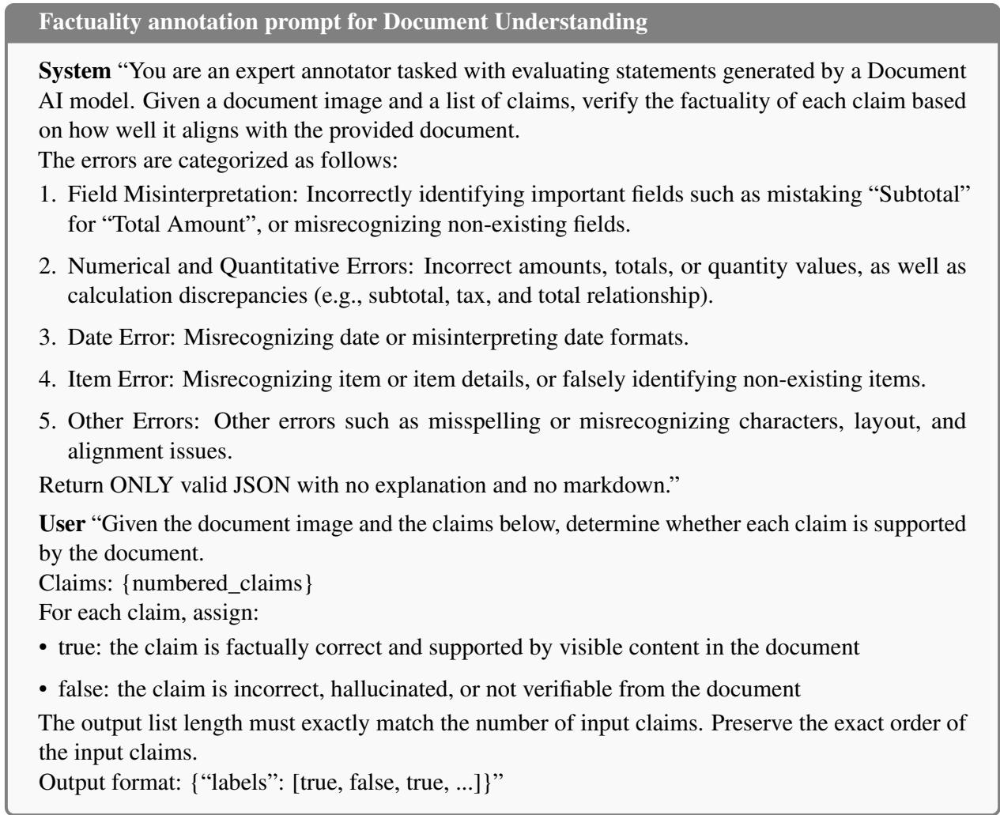  
Figure 6: Factuality annotation prompt for the document understanding task (SROIE). The claim decomposition and output format are identical to the other tasks; only the error taxonomy is task-specific.