# Inverse Rendering for Modeling with Line Primitives

KENJI TOJO, ETH Zürich, Switzerland ARIEL SHAMIR, Reichman University, Israel NOBUYUKI UMETANI, The University of Tokyo, Japan BERND BICKEL, ETH Zürich, Switzerland

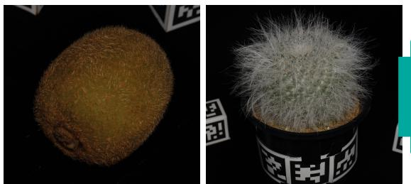  
(a) Input multi-view images

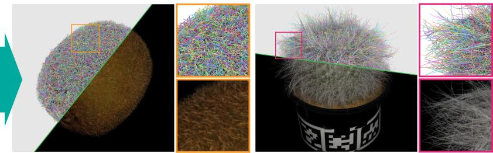  
(b) Optimized geometry and rendering

Fig. 1. (a) Given a set of input images, (b) our method faithfully reconstructs highly detailed fuzzy geometry composed of many thin fibers as a collection o explicit line primitives. Both training and rendering remain directly compatible with eficient rasterization pipelines.

Faithfully capturing diverse real-world objects with fuzzy, anisotropic structures—such as hair, fur, fibers, and textiles—for eficient real-time visual- ization remains challenging. Recent radiance field reconstruction methods capture these structures from multi-view images using translucent volumetric primitives such as 3D Gaussians rather than opaque low-dimensional primitives (e.g., triangles, line segments, and polylines), thereby limiting compatibility with standard depth-tested rasterization, reflection modeling, and physical simulation. We present an inverse rendering method for reconstructing fuzzy geometry using explicit line segments, which are rasterized on a subpixel grid for anti-aliasing to reproduce a semi-transparent appearance. While straightforward to render, optimizing numerous line primitives to match target images poses a significant challenge. We address this by introducing a stochastic diferentiable rasterizer for line segments that produces informative gradients with respect to vertex positions, attributes, and discrete connectivity. Experiments on synthetic and real-world datasets show that our method outperforms surface-based approaches in capturing fuzzy boundaries and achieves quality comparable to volumetric representations while relying entirely on explicit geometry. The resulting representation inte-grates seamlessly with standard graphics pipelines, enabling cross-platform rendering, various shading models, and physical simulation.

CCS Concepts: • Computing methodologies → Rasterization; Mesh models.

Additional Key Words and Phrases: Diferentiable rendering, diferentiable rasterization, radiance fields, real-time rendering

## ACM Reference Format:

Kenji Tojo, Ariel Shamir, Nobuyuki Umetani, and Bernd Bickel. 2026. Inverse Rendering for Modeling with Line Primitives. ACM Trans. Graph. 45, 6, Article 200 (December 2026), 14 pages. https://doi.org/10.1145/3842527

## 1 Introduction

Faithfully representing the rich visual appearance of real-world objects remains a central challenge in computer graphics. Beyond visual fidelity, many applications—such as games, virtual and aug- mented reality, telepresence, and robotics—require geometry rep- resentations that can be eficiently rendered, analyzed, edited, and simulated within standard graphics pipelines across diverse hardware platforms. Consequently, most existing approaches rely on surface-based representations, modeling objects as surface meshes augmented with texture maps encoding fine-scale appearance and geometric detail (e.g., albedo, normals, and displacement).

However, such explicit representations fundamentally assume that object geometry can be represented as locally smooth surfaces with parameterizable detail. This assumption breaks down for fuzzy or weakly defined structures, such as hair, fur, fibers, and other anisotropic materials, where boundaries are inherently ambiguous, and appearance emerges from the aggregation of many thin ele ments. Capturing these phenomena with surfaces alone is dificult and often requires expensive procedural detail generation. As a result, a broad class of real-world objects—including plants, ani-mals, food, and textiles—remains challenging to represent faithfully within traditional surface-based frameworks.

Recent advances in view synthesis address this limitation by shifting the representation paradigm from explicit surfaces to implicit volume representation. Methods such as NeRF [Mildenhall et al. 2020] model scenes as continuous emissive fields, naturally capturing fuzzy boundaries and complex appearance. Building on this, 3D Gaussian splatting [Kerbl et al. 2023] represents scenes using volumetric primitives, enabling real-time rendering and intuitive editing.

While these approaches excel at representing ambiguous and fine- scale structures, they do so by abandoning explicit low-dimensional geometric structure. Such implicit representation is dificult to integrate into standard graphics pipelines that rely on depth-tested rasterization, geometric reasoning, and physical simulation.

This tension raises a fundamental question: how can we represent the appearance of fuzzy, weakly defined, and anisotropic geometry using structured explicit primitives without sacrificing fidelity? In this work, we propose an inverse rendering method that bridges this gap by modeling diverse fuzzy, fiber-like structures as a collection of line primitives (e.g., line segments and polylines), an explicit 1D representation that captures fine-scale structure while remaining compatible with traditional rasterization. Specifically, objects are described as 3D vertices connected into polylines, which are rasterized on a subpixel grid and anti-aliased using multi-sample anti-aliasing (MSAA). This produces a semi-transparent appearance through the aggregation of many opaque line segments, enabling the faithful reproduction of fuzzy boundaries and anisotropic efects entirely within a standard graphics pipeline (Figure 1).

This line primitive representation ofers several key advantages. First, it provides a compact description of thin geometric elements, making it naturally suited for representing fibers, strands, hair, and other elongated structures. Second, its explicit representation remains compatible with established rendering techniques, including z-bufer-based depth testing, shading models, and hardware acceler- ation. Finally, it preserves the structure of the underlying thin geometry—such as tangent directions and polyline connectivity—which can be leveraged for shading and physical simulation.

While the rendering process itself is straightforward, optimizing a large set of line primitives to reproduce complex target appearances remains highly challenging. To address this, we present a fully diferentiable rasterization framework for line primitives that produces informative gradients with respect to vertex positions, attributes, and even discrete connectivity. We build on stochastic diferentiable rasterization techniques for triangle primitives [Tojo et al. 2026] and extend them to subpixel-width line segments with high-quality anti-aliasing, while supporting a range of shading models via vertex attributes, including direct radiance parameterizations using spherical harmonics. This enables dynamic optimization in which line primitives can appear, move, connect, and disappear, faithfully reproducing complex fuzzy structures and fine details.

We evaluate our approach on both synthetic and real-world datasets by reconstructing line-based representations from multi- view images. We compare our method with state-of-the-art base- lines, including layered surfaces [Esposito et al. 2025], neural radiance fields [Wang et al. 2023b], and 3D Gaussian splatting [Kerbl et al. 2023]. Compared with surface-based methods, our representation more efectively captures fuzzy and anisotropic appearance. At the same time, it achieves reconstruction quality comparable to volumetric approaches, while relying entirely on explicit, opaque geometry. Beyond fidelity, we demonstrate seamless integration with standard graphics pipelines, including cross-platform deploy- ment, advanced shading models, physics-based animation, and in- tegration into surface-based scenes. Our open-source implementation and real-world capture dataset are available through https: //github.com/kenji-tojo/inverse-line-primitives.

## 2 Related Work

Diferentiable rendering. Diferentiable rendering [Kato et al. 2020] solves inverse problems by computing gradients through image synthesis procedures, including light transport simulation [Li et al. 2018; Nimier-David et al. 2019; Zhang et al. 2019], rasterization [Chen et al. 2019; Laine et al. 2020; Liu et al. 2019; Loper and Black 2014; Pidhorskyi et al. 2024], vector graphics [Li et al. 2020], parametric geometry [Worchel and Alexa 2023], and programmable shaders [Bangaru et al. 2023; Yang et al. 2022]. We build on the rasterizationbased approach [Pidhorskyi et al. 2024] to eficiently reconstruct numerous line primitives using hardware rasterization, avoiding the computational cost of full light transport simulation.

Prior diferentiable rendering methods for curves rely on analytic ray intersections [Zhang et al. 2023], sequential line segments [Tojo et al. 2024], camera-facing quads [Takimoto et al. 2024], or tubular meshes [Worchel and Alexa 2023], typically assuming a fixed topology and limiting adaptation to highly unstructured fuzzy geometry. In contrast, we extend the recent stochastic triangle rasterization ap- proach [Tojo et al. 2026] to anti-aliased subpixel-width line segments. This enables line primitives to appear, disappear, and reorganize into explicit 1D manifolds from random initialization.

Diferentiable rendering has also been applied to asset simplifi- cation, where fine structures such as leaves, hair, and fur are ap- proximated using textured surface proxies [Esposito et al. 2025; Hasselgren et al. 2021; Tojo et al. 2025; Zheng et al. 2025]. However, representing dense microstructures with coarse surfaces with textures remains fundamentally dificult, as the proxy geometry no longer matches the underlying directional structures. In contrast, we directly reconstruct such geometry using explicit line primitives, preserving fine structures while remaining eficient to rasterize.

Radiance fields. To capture the complex interplay between ge-ometry and appearance in real-world scenes, neural radiance fields [Mildenhall et al. 2020] (NeRFs) represent 3D scenes as continuous volumetric radiance fields. A large body of work has extended this formulation to recover features associated with classical graphics pipelines, including anti-aliased rendering [Barron et al. 2021], unbounded scenes with environment modeling [Barron et al. 2022], and eficient spatial representations via voxel grids and related struc- tures [Fridovich-Keil et al. 2022; Karnewar et al. 2022; Liu et al. 2020; Müller et al. 2022; Wang et al. 2023b].

More recently, 3D Gaussian Splatting [Kerbl et al. 2023] (3DGS) re places the implicit radiance fields rendered by ray marching with 3D Gaussian primitives rendered by depth-order splatting. While 3DGS enables real-time, high-fidelity rendering and intuitive scene manip ulation, it remains fundamentally point-based without explicit con nectivity. As a result, such representations are inherently incompat ible with a large body of existing geometry processing and graphics algorithms defined on low-dimensional manifolds (e.g., 2D surfaces or 1D curves), including depth-tested rendering, Laplacian-based editing [Nealen et al. 2006], geodesic distance computation [Crane et al. 2017], reflectance modeling [Marschner et al. 2003], physical simulation [Bergou et al. 2008], and collision handling [Li et al. 2021]. This limitation extends to related splatting approaches based on 2D Gaussians [Huang et al. 2024], convex primitives [Held et al. 2025], and translucent triangles [Held et al. 2026b].

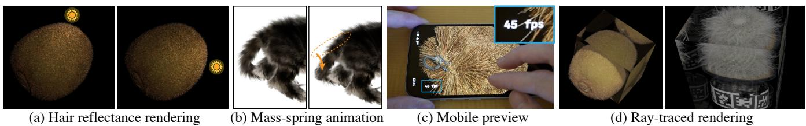  
Fig. 2. Applications enabled by our reconstructed line-based representations. (a) Strand reflectance rendering using a physically inspired hair scatering model [Marschner et al. 2003]. (b) Mass-spring animation with KNN-augmented connectivity between reconstructed polylines. (c) Interactive mobile preview using up to degree-1 spherical harmonics. (d) Exporting explicit line primitives as constant-radius cylinders for ofline ray-traced rendering. The supplementa video demonstrates a lications (a), (b), and (c). See Section 5 for further discussion

We address the fundamental tension between visual fidelity and explicit manifold structure for fuzzy and fiber-like geometry. Vol umetric representations reproduce appearance but do not yield manifolds, while surface extraction methods recover geometry but struggle to eficiently capture their semi-transparent, fuzzy appearance [Esposito et al. 2025; Guédon et al. 2025; Huang et al. 2024; Li et al. 2023; Wang et al. 2021; Zhang et al. 2025b]. We resolve this by reconstructing such regions using subpixel-width line segments, yielding an explicit 1D manifold whose fuzzy appearance emerges through screen-space filtering. This enables faithful rendering while restoring compatibility with geometry-centric pipelines.

Hair capture. 1D curve representations are widely used to model hair strands and fur, supported by dedicated reflectance models [Marschner et al. 2003] and physical simulation techniques [Bergou et al. 2008; Li et al. 2021]. Prior work on hair reconstruction typically estimates directional fields to guide strand generation [Jakob et al. 2009; Paris et al. 2008; Shen et al. 2023b; Takimoto et al. 2024; Zhou et al. 2024]. Notably, Nam et al. [2019] construct accurate directional fields from a dense point cloud using strand-aware patch matching. While directional fields are efective for inferring smoothly varying fiber orientation, these assumptions often break down for general fuzzy surfaces, where strands are highly unstructured and densely cluttered. In contrast, we directly optimize explicit line primitives using diferentiable rendering, without relying on directional fields. As a result, our method supports more diverse objects than the diferentiable rendering approach for hair reconstruction [Takimoto et al. 2024], including animals, fabrics, and plants.

1D representation. 1D curves and feature lines have long been used for visual representation and abstraction [Bénard and Hertzmann 2019], and more recently combined with diferentiable rendering to generate line drawings and 3D abstractions [Choi et al. 2024; Liu et al. 2025a; Tojo et al. 2024; Vinker et al. 2022]. While these methods produce sparse, stylized representations that convey structure with few primitives, we optimize dense collections of line segments to faithfully reproduce rich, realistic 3D appearance.

Mesh optimization. Optimization of mesh topology has been studied in surface modeling [Botsch and Kobbelt 2004; Garland and Heckbert 1997; Hoppe et al. 1993; Liu et al. 2025b], fluid simulation [Brochu and Bridson 2009], and more recently in geometry learning [Shen et al. 2021, 2024, 2023a; Son et al. 2025, 2024]. Several recent works optimize mesh connectivity during diferentiable rendering [Held et al. 2026a; Palfinger 2022; Son et al. 2025, 2024]. While these methods operate on the 2D surface topology of triangle meshes, we instead optimize the 1D polyline topology, adaptively allocating line primitives based on opacity and geometry, within our diferentiable rasterization framework.

## 3 Preliminary

We aim to reconstruct fuzzy, high-detail appearance arising from many thin elements using explicit line primitives. Unlike 3DGS [Kerbl et al. 2023], we rely on opaque primitives, which are straightforward to integrate into standard rendering pipelines where visibility is resolved through z-bufering.

Although eficient to render, opaque primitives are significantly more challenging to optimize than volumetric approaches, since the discrete depth test blocks gradient propagation to occluded primitives. To address this, we build on DifSoup [Tojo et al. 2026], a stochastic diferentiable rasterizer that enables diferentiation of binary opacity under discrete rasterization. The remainder of this section reviews the DifSoup rasterizer, which extends continuous stochastic surface formulations [Zhang et al. 2025a,b] to discrete, object-order rasterization with depth testing.

Depth testing for opaque primitives. For each pixel, a rasterizer generates a set of fragments F by sampling on primitives and interpolating per-vertex attributes. Each fragment $f \in { \mathcal { F } }$ carries a color $\mathbf { C } _ { f }$ and a depth $d _ { f } .$ For opaque primitives, the final pixel color $\hat { \mathbf { C } } = \mathbf { C } _ { f ^ { \ast } }$ is given by the frontmost fragment $f ^ { * }$

$$
f ^ { * } = \arg \operatorname* { m i n } _ { f \in \mathcal { F } } d _ { f } .\tag{1}
$$

The z-bufer method computes the frontmost fragment without explicit sorting, in contrast to the back-to-front alpha blending of fully sorted primitives (e.g., 3D Gaussians [Kerbl et al. 2023]).

Stochastic rasterization of opaque primitives. To diferentiate this discrete fragment selection, DifSoup assigns a continuous opacity value to each primitive. This opacity is optimized as a continuous value but eventually converges to either 0 or 1, unlike [Kheradmand et al. 2025], which also uses stochastic rasterization but optimizes the translucent appearance. The visible fragment is stochastically selected based on primitive opacity as

$$
\begin{array} { r } { f ^ { * } = \arg \operatorname* { m i n } _ { f } d _ { f } , } \\ { f \in \mathcal { F } ; \alpha _ { f } { > } \tau _ { f } } \end{array}\tag{2}
$$

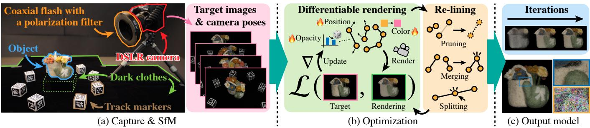  
Fig. 3. Overview of our workflow. (a) We capture multi-view images in a dark environment using a DSLR camera with a coaxial flash and polarization filter to suppress specular reflections and facilitate geometry reconstruction, then estimate camera poses using Structure-from-Motion [Schonberger and Frahm 2016] (SfM). (b) We optimize explicit line primitives through diferentiable rendering with periodic discrete updates, termed re-lining, including pruning, merging, and spliting. (c) After optimization, our method reconstructs detailed line-based models that enable faithful multi-view rendering.

where $\alpha _ { f } \in \ [ 0 , 1 ]$ is the interpolated opacity at the fragment $f ,$ and $\tau _ { f } \in \left[ 0 , 1 \right]$ is a uniform random sample. That is, each fragment is stochastically activated with probability $\alpha _ { f }$ by testing whether $\begin{array} { r } { \alpha _ { f } > \tau _ { f } . } \end{array}$ . The pixel color $\hat { \mathbf { C } }$ is now a random variable, where the probability $\mathit { p } _ { f }$ of fragment � being selected as $\hat { \mathbf { C } } = \mathbf { C } _ { f }$ is

$$
p _ { f } = \alpha _ { f } \prod _ { f ^ { \prime } \in \mathcal { F } : d _ { f ^ { \prime } } < d _ { f } } ( 1 - \alpha _ { f ^ { \prime } } ) ,\tag{3}
$$

mirroring the transmittance term used in alpha blending.

The $L _ { 1 }$ color loss against the ground truth is defined as an aver- age over stochastic renderings $\mathcal { L } = \mathbb { E } _ { p _ { f } } [ \mathcal { L } _ { 1 } ( \mathbf { C } _ { f } ) ]$ . By viewing the rasterizer as a sampler, the gradient of $\mathcal { L }$ can be computed via the likelihood-ratio gradient estimator [Glynn 1990; Williams 1992] as

$$
\nabla \mathcal { L } = \mathbb { E } _ { p _ { f } } [ \nabla \mathcal { L } _ { 1 } ( \mathbf { C } _ { f } ) ] + \mathbb { E } _ { p _ { f } } [ \mathcal { L } _ { 1 } ( \mathbf { C } _ { f } ) \nabla \log p _ { f } ] ,\tag{4}
$$

where the first term is the color gradient computed via the standard diferentiable rasterization [Pidhorsk i et al. 2024], and the second is the score-function term that diferentiates fragment existence. The log-probability gradient can be evaluated without sorting

$$
\begin{array} { r } { \nabla _ { \alpha _ { f ^ { \prime } } } \log \phi _ { f } = \left\{ \begin{array} { l l } { 1 / \alpha _ { f } } & { \mathrm { i f ~ } f ^ { \prime } = f , } \\ { - 1 / ( 1 - \alpha _ { f ^ { \prime } } ) } & { \mathrm { i f ~ } d _ { f ^ { \prime } } < d _ { f } , } \end{array} \right. } \end{array}\tag{5}
$$

where $\nabla _ { \alpha _ { f ^ { \prime } } }$ denotes the gradient with respect to per-fragment opac-ity $\alpha _ { f ^ { \prime } }$ , and the gradient is zero for all other fragments. At test time, the threshold $\tau _ { f }$ is set to 0.5 for all fragments. We refer interested readers to the original paper [Tojo et al. 2026] for further details.

## 4 Method

While DifSoup enables diferentiable rendering with opaque primitives, it aims to represent scenes compactly using a small number of large triangles, relying on continuous textures to reproduce fine-scale detail. As a result, it does not explicitly optimize for antialiased geometry, making it dificult to capture appearance dominated by subpixel geometric boundaries, such as dense fur or fibers. In this work, we treat visual detail as arising from many thin bound- aries, represented by line primitives and rendered with anti-aliasing. This enables faithful reconstruction of fuzzy, anisotropic appear-ance while remaining fully compatible with depth-tested graphics pipelines. Our overall workflow is summarized in Figure 3.

## 4.1 Scene Representation with Line Primitives

Given target images $\mathcal { T } = \{ \mathbf { T } _ { t } \} _ { t = 1 } ^ { | \mathcal { T } | }$ with corresponding camera poses, our goal is to reconstruct a 3D scene using explicit primitives de- fined by interpolated vertices. Such representations are eficiently rendered via depth testing and are compatible with a range of geometry-processing and simulation algorithms. A common choice is a triangle-based representation, which models appearance through barycentric interpolation over surface elements. While efective for smooth surfaces, this formulation struggles when appearance is dominated by complex boundaries and anisotropic structures. We instead represent such structures using line primitives, enabling explicit representation of complex boundary geometry.

Specifically, we represent the scene using vertex positions $\mathbf { \nabla } _ { \mathbf { \gamma } } \mathbf { \mathbf { \Phi } } _ { \mathbf { \mathcal { V } } } =$ $\{ \mathbf { v } _ { v } \} _ { v = 1 } ^ { | \mathcal { V } | }$ and edge indices $\mathcal { E } = \{ { \bf e } _ { e } \} _ { e = 1 } ^ { | \mathcal { E } | }$ . Each vertex is a 3D point ${ \bf v } _ { v } \in \mathbb { R } ^ { 3 }$ , and each edge is a pair of vertex indices ${ \bf e } _ { e } = ( v _ { 1 } ^ { e } , v _ { 2 } ^ { e } )$ ∈ $\{ 1 , . . . , | \mathcal { V } | \} ^ { 2 } .$ . Although this representation accommodates a range of topologies, from disjoint line segments to wireframe meshes, we focus on polyline structures without branches or junctions, where all vertices have valence 1 or 2. Such polylines are eficiently ras- terized on modern graphics hardware and support existing curve-processing techniques.

Auxiliary parameters. To model view-dependent appearance, we associate auxiliary attributes $\mathbf { \mathcal { A } } = \left\{ \mathbf { A } _ { v } \right\} _ { v = 1 } ^ { \left| \mathcal { V } \right| }$ with each vertex. These may include learnable features, geometric quantities (e.g., tangents), or combinations thereof. We further learn per-edge opacity values to enable emergence and extinction of primitives during optimization, which improves robustness for complex, tangled structures. Specifi- cally, we maintain $O = \{ \alpha _ { e } \} _ { e = 1 } ^ { | \mathcal { E } | }$ , where each $\alpha _ { e } \in [ 0 , 1 ]$ represents the existence probability of the edge.

## 4.2 Diferentiable Rasterization of Line Primitives

We optimize these parameters by rendering the image R� for the target view � and computing the loss $\mathcal { L } ( \mathbf { T } _ { t } , \mathbf { R } _ { t } )$ to obtain gradients. For the �-th view, we first project the vertices into homogeneous camera space $\mathbf { v } _ { v } ^ { t } \in \mathbb { R } ^ { 4 }$ and compute the vertex colors:

$$
\mathbf { C } _ { v } ^ { t } = S ( \mathbf { v } _ { v } , \mathbf { A } _ { v } ; \mathbf { \omega } _ { t } ) ,\tag{6}
$$

where $s$ is a user-defined, view-dependent shading function, such as spherical harmonics evaluation. Next, each line primitive ${ \bf e } _ { e } =$

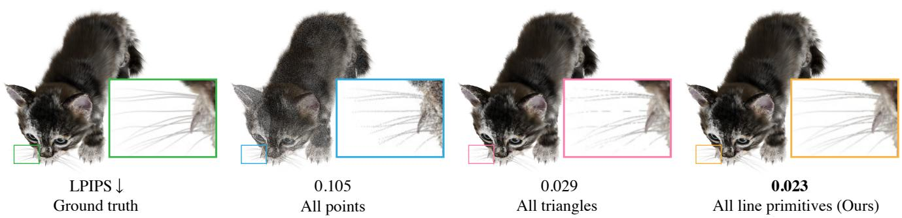  
Fig. 4. Comparison of diferent primitive types under the same 2M-vertex budget. (Left to right) Ground-truth view, point primitives, triangle primitives, and our line primitives. Point primitives are often too sparse, while triangles struggle with thin subpixel features; our line primitives utilize the vertex budget more efectivel . Per-scene LPIPS scores are re orted. See Section 5 for further discussion.

(��, ��) generates fragments � for all pixels covered by the line by interpolating the endpoint colors as

$$
\mathbf { C } _ { f } ^ { t } = \left( 1 - w \right) \mathbf { C } _ { v _ { 1 } ^ { e } } ^ { t } + w \mathbf { C } _ { v _ { 2 } ^ { e } } ^ { t } ,\tag{7}
$$

where � ∈ [0, 1] is the perspective-correct interpolation weight at the pixel sampling point. The depth $d _ { f } ^ { t }$ of the fragment is interpolated analogously from the homogeneous vertex positions of the endpoints. Finally, the fragment opacity is derived from the edge opacity as

$$
\alpha _ { f } ^ { t } = \alpha _ { e } .\tag{8}
$$

The resulting fragments are passed to the stochastic depth test (2), yielding a single stochastic rendering $\mathbf { R } _ { t }$

Line width. While interpolation along the segment is straightforward, determining line width is nontrivial. Existing methods either use a world-space tube radius [Worchel and Alexa 2023; Zhang et al. 2023] or a screen-space stroke width [Li et al. 2020; Tojo et al. 2024], which can be optimized via rendering gradients. However, these approaches typically target sparse, stroke-based representations, whereas we focus on dense arrangements of subpixel-width fibers that yield fine-scale appearance. This introduces two key challenges. First, both forward and backward rendering must be highly eficient to handle a large number of line primitives. Second, optimizing line widths below one pixel is inherently underconstrained, often leading to instability or requiring excessive sampling to recover width from anti-aliased pixel colors, where undersampling produces artifacts such as dashed lines.

To address these challenges, we adopt the classic Bresenham al- gorithm [Bresenham 1965], which does not require an explicit linewidth parameter. Rather than explicitly parameterizing line width, we rasterize each line primitive on a 2× subpixel grid and rely on subsequent anti-aliasing to produce a smooth, filtered appearance (Figure 5(a)). The Bresenham algorithm produces lines with con sistent subpixel coverage, avoiding the instability associated with optimizing continuous line widths while still capturing fine-scale structure. Moreover, its consistent coverage avoids undersampling artifacts such as dashed lines and is highly eficient, with wide- spread hardware support. While we focus on this formulation for robustness and eficiency, our approach can be readily extended to alternative line rendering techniques, such as camera-facing quads commonly used in real-time graphics.

Bresenham rasterization produces blocky, axis-aligned fragments in screen space and lacks a smooth, continuous outline at the pixel level. While these discretization efects are visually negligible after anti-aliasing and have little efect on rendering quality, they pose challenges for diferentiation. Specifically, they are incompatible with diferentiable stroke rendering methods that rely on edge sam- pling [Li et al. 2018, 2020] to compute positional gradients along the silhouettes of finite-width primitives. To address this, we draw inspiration from the microedge gradient method [Pidhorskyi et al. 2024], which treats rasterized fragment boundaries as proxies for tri angle silhouettes. We extend this idea to line primitives by treating the axis-aligned fragment edges produced by Bresenham rasteriza- tion as surrogate edges (Figure 5(b)). This formulation yields stable gradients, enabling efective optimization of width-free, inherently discrete line representations under anti-aliased rendering.

Anti-aliasing. After rasterization on a 2× subpixel grid, we reconstruct the final image using multi-sample anti-aliasing (MSAA). Diferent MSAA variants trade of quality and eficiency by varying the number and placement of samples. To support real-time appli-cations and eficient optimization of numerous primitives, we use fixed sample locations at the centers of a 2× subpixel grid. While fixed sampling can be sensitive to fine geometry, Bresenham-style single-pixel-width rasterization helps stabilize subpixel coverage, providing a good balance between eficiency and quality.

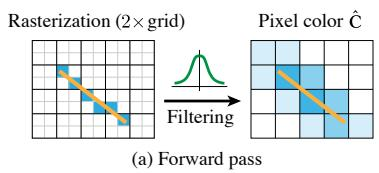

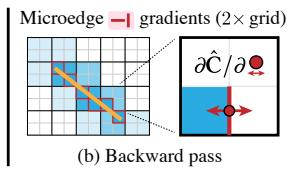  
Fig. 5. Forward and backward passes of our Bresenham-based rasterization. (a) We first rasterize binary line coverage on a 2× supersampled grid, then apply Gaussian filtering to obtain anti-aliased pixel colors. (b) During diferentiation, gradients are propagated through microedges [Pidhorskyi et al. 2024] induced by line movements on the supersampled grid.

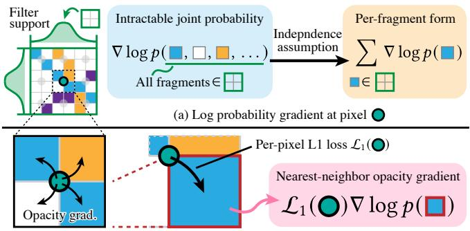  
(b) Opacity gradient evaluation at the pixel with the largest filter weight  
Fig. 6. Our opacity gradient formulation. (a) We approximate the intractable joint probability within the filter support using a per-fragment formulation under an independence assumption. (b) To stabilize optimization near fuzzy boundaries, per-fragment opacity gradients are evaluated only at the four fragments inside the pixel where the per-pixel L1 loss is computed.

Various pixel reconstruction filters exist for aggregating subpixel samples into final pixel values. Simple approaches include box filter- ing and filters based on distance to primitive edges [Engel 2014]. At runtime, these choices can be adjusted to balance visual quality and performance, or even omitted entirely for faster rendering. During optimization, we use a high-quality filter to obtain smooth gradients and accurate geometry, while allowing flexible, lower-cost filtering at runtime. Specifically, we use a Gaussian reconstruction filter with a standard deviation of 0.5 pixels and a cut-of radius of 1.5 pixels, implemented as a lightweight, diferentiable image-filtering layer after rendering.

Opacity gradients. Unlike the traditional color gradient, the stochastic opacity gradient in (4) requires dedicated treatment under anti-aliasing, where the pixel color is no longer determined by a single fragment, but depends on the joint contribution of multiple fragments within the filter kernel support N. Specifically, for an anti-aliased pixel color Cˆ , the opacity gradient in (4) becomes

$$
\nabla _ { \alpha _ { f } } \mathcal { L } = \mathbb { E } _ { p _ { N } } \left[ \mathcal { L } _ { 1 } ( \hat { \mathbf { C } } ) \nabla _ { \alpha _ { f } } \log p _ { N } \right] ,\tag{9}
$$

where $\mathcal { P N }$ denotes the joint probability of all fragments $f \in N .$ While the exact expression of $\mathcal { P } N$ depends on the underlying prim itive representation and is generally hard to obtain (Figure 6(a)), assuming independent fragment probabilities yields

$$
\nabla \log { p _ { N } } = \nabla \log \prod _ { f \in N } \dot { p } _ { f } = \sum _ { f \in N } \nabla \log { p _ { f } } .\tag{10}
$$

Despite its practical per-fragment formulation, (10) requires care when used for opacity updates. First, fragments are not fully inde- pendent when they originate from a common primitive, which has a constant opacity inside. The per-fragment gradients can produce inconsistent opacity gradients within a primitive, especially near the object silhouette. For example, the gradient may encourage low opacity around one end of a line primitive while keeping it high around the other end, efectively shortening the line. Fortunately, such geometric updates are handled by positional gradients (i.e., by moving vertices). Hence, we average the gradient over a primitive, allowing the opacity gradient to focus on the overall existence of a primitive, instead of its shape.

Second, since (10) does not explicitly consider the anti-aliasing filter, each stochastic rasterization produces highly noisy opacity gradients for fragments with small filter weights. Such fragments with small filter weights contribute little to the pixel color and loss, making it dificult to determine appropriate opacity updates from a single stochastic rasterization. Hence, we evaluate the opacity gradient only for the fragments with the largest filter weights (i.e., four immediate neighbor fragments of the pixel centers) as

$$
\nabla \log { p _ { N } } \approx \sum _ { f \in N _ { \mathrm { n e a r e s t } } } \nabla \log { p _ { f } } ,\tag{11}
$$

where $N _ { \mathrm { n e a r e s t } }$ denotes the $2 \times 2$ fragments inside the pixel where the color is evaluated at its center (see Figure 6(b)). This means that our opacity formulation assumes a 6 × 6 Gaussian filter in the forward path and $\mathrm { ~ a ~ } 2 \times 2$ box filter in the backward path. Together with the full positional gradients and our below-mentioned re-lining opera tions, we find that this strategy reliably converges to fine geometry even from an unstructured initialization of primitive locations and orientations. In practice, we implement the opacity gradient by nearest-neighbor upsampling of the loss image and applying the gradient formula (4) on the 2× grid.

## 4.3 Optimization and Implementation

We adopt the photometric loss of [Kerbl et al. 2023] defined as

$$
\mathcal { L } _ { \mathrm { p h o t o } } = \lambda \mathcal { L } _ { \mathrm { D - S S I M } } + \left( 1 - \lambda \right) \mathcal { L } _ { 1 } ,\tag{12}
$$

with $\lambda \ : = \ : 0 . 8$ . This loss is used to compute positional and color gradients, while the per-pixel $\mathcal { L } _ { 1 }$ term with unit weight is used to evaluate the stochastic log-probability gradient in (5). We also apply a weak regularization $\mathcal { L } _ { \mathrm { l e n } }$ based on the average squared edge length to facilitate the connectivity adaptation introduced next.

Adaptive re-lining. To adapt connectivity during optimization, we periodically perform discrete updates, termed re-lining. To remove redundancy, we prune edges with low opacity or short length using thresholds. We also merge polyline endpoints within the length threshold, forming connected polylines. After pruning and merg- ing, long edges are split to reach the target vertex count, as vertex attributes often dominate memory footprint. This strategy utilizes the vertex budget more eficiently than approaches without shared segment endpoints, such as [Kheradmand et al. 2024] (Figure 7).

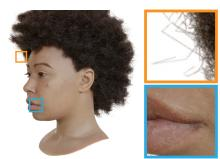  
LPIPS 0.110

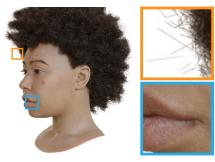  
No discrete updates  
0.089

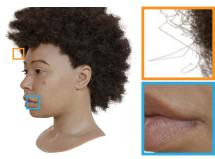  
MCMC relocation  
0.080  
Our re-lining  
Fig. 7. Efect of re-lining. (Left to right) Reconstruction without discrete up- dates, with Markov Chain Monte Carlo (MCMC) primitive relocation [Kheradmand et al. 2024], and with our re-lining strategy. Per-scene LPIPS scores against the ground-truth views are reported.

Optimization setup. Although our method can operate from fully random initialization, we first extract a coarse proxy surface using NeuS2 [Wang et al. 2023a] to accelerate convergence. We then densely initialize disjoint edges around the surface to match the tar-get vertex count (typically 1–2M). It is more efective to let primitives emerge through optimization than to rely on extensive positional updates or pruning. Accordingly, we use very short initial edge lengths based on nearest-neighbor distances and initialize opacity to a small value of 0.1. We use aggressive re-lining thresholds set to half their respective initial values to encourage topology adaptation. We optimize vertex positions using VectorAdam [Ling et al. 2022] and all other parameters using Adam [Kingma and Ba 2015]. Optimization is performed for 50,000 iterations, rendering one image per iteration. Re-lining is applied every 100 iterations until iteration 35,000. The initial pruning threshold is used until iteration 25,000, after which the opacity threshold is linearly ramped to the test-time value of 0.5. Full initialization details, hyperparameters, and schedules are provided in the supplementary material.

Implementation. Our diferentiable rendering method is implemented using Vulkan [Khronos Group 2026] for rasterization and ex-posed as a PyTorch [Paszke et al. 2019] operator via nanobind [Jakob 2022]. Forward rendering is performed entirely within vertex and fragment shaders, where random variables �� are generated in the fragment shader using a counter-based random number genera- tor [Salmon et al. 2011]. All fragments of the same primitive share the same counter value to avoid spurious holes within the primitive. The opacity gradient is computed in a separate rendering pass using a custom fragment shader. Color and positional gradients based on [Pidhorskyi et al. 2024] are computed in a compute shader.

## 5 Results

We evaluate our method by reconstructing line-based representa- tions from multi-view images. We use a synthetic dataset to compare view-synthesis fidelity against relevant baselines, and real-world captures to demonstrate that our method successfully reconstructs highly challenging geometries and visual appearance encountered in practice. All experiments are conducted on a workstation equipped with an Intel Core i9-14900K CPU, 64 GB of RAM, and an NVIDIA GeForce RTX 4090 GPU with 24 GB of VRAM. Unless otherwise specified, our method uses 2M vertices with per-vertex Spherical Harmonics (SH) up to degree 3, and optimization takes approximately 45 minutes per example.

<table><tr><td>3DGS (500K prims) :</td><td colspan="4">Ours (2M vertices)</td></tr><tr><td>Default rendering</td><td>Full (4× pixels)</td><td>HW MSAA (2×)</td><td>No anti-aliasing</td><td></td></tr><tr><td></td><td></td><td>一</td><td>日</td><td></td></tr><tr><td>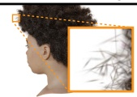</td><td>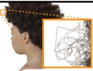</td><td>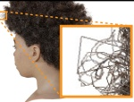</td><td></td><td>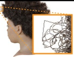</td></tr><tr><td></td><td></td><td></td><td></td><td></td></tr><tr><td></td><td></td><td></td><td></td><td></td></tr><tr><td></td><td></td><td></td><td></td><td></td></tr><tr><td>FPS↑ 588</td><td></td><td>628</td><td>814</td><td>944</td></tr><tr><td></td><td></td><td></td><td></td><td></td></tr><tr><td></td><td></td><td></td><td></td><td></td></tr><tr><td></td><td></td><td></td><td></td><td></td></tr><tr><td>LPIPS ↓ 0.057</td><td></td><td>0.046</td><td>0.069</td><td>0.081</td></tr></table>

Fig. 8. Rendering speed comparison on the Shelly dataset. FPS and LPIPS are averaged over 6 scenes. Even with full-quality rendering using 4× more pixels, our method remains faster than 3DGS while achieving beter percep- tual quality. Since our representation reconstructs explicit line geometry, rendering quality and performance can be flexibly traded of using diferent anti-aliasing modes, including eficient hardware MSAA (HW MSAA) or disabling anti-aliasing entirely for maximum rendering speed.

Table 1. Rendering quality metrics on the Shelly dataset, averaged over 6 scenes. †Results reported from the original paper [Wang et al. 2023b]. We also report the total memory footprint (Mem.) and the number of geometry parameters per primitive (Geom.), i.e., positions, topology, and Gaussian transformation parameters. Non-integer values reflect vertex sharing.
<table><tr><td>Method</td><td>PSNR ↑</td><td>SSIM ↑</td><td>LPIPS ↓</td><td>Mem. ↓</td><td>Geom. ↓</td></tr><tr><td>DiffSoup</td><td>30.63</td><td>0.920</td><td>0.112</td><td>68MB</td><td>9</td></tr><tr><td>VolSurfs</td><td>34.68</td><td>0.933</td><td>0.109</td><td>116 MB</td><td>6.02</td></tr><tr><td>AdaptiveShells†</td><td>36.02</td><td>0.954</td><td>0.079</td><td></td><td>一</td></tr><tr><td>3DGS</td><td>37.73</td><td>0.960</td><td>0.057</td><td>118 MB</td><td>10</td></tr><tr><td>Ours</td><td>37.09</td><td>0.963</td><td>0.046</td><td>409MB</td><td>3.59</td></tr></table>

Synthetic dataset. We first evaluate our method on the Shelly dataset [Wang et al. 2023b], which provides path-traced renderings of furry geometries for novel-view synthesis evaluation. The 3D models in the dataset were created by professional artists using a dedicated mixture of geometric primitives, including curves and textured surfaces. We compare against both surface-based and vol- umetric approaches. Among surface-based methods, we compare against DifSoup [Tojo et al. 2026], which optimizes a compact set (15K) of textured triangles without explicit anti-aliasing, and Vol-Surfs [Esposito et al. 2025], which represents fuzzy geometry using layers of semi-transparent surfaces. For volumetric methods, we compare against AdaptiveShells [Wang et al. 2023b] using the quantitative results reported in their paper, as the oficial implementation is not publicly available. Lastly, we compare against 3DGS [Kerbl et al. 2023], where we control the number of Gaussian primitives using the Markov Chain Monte Carlo (MCMC) strategy [Kheradmand et al. 2024]. We limit the number of Gaussian primitives in the 3DGS baseline to 500K, which yields a rendering speed comparable to that of our method (Figure 8).

Table 1 summarizes the quantitative results, and Figure 9 shows qualitative reconstructions. Our method achieves significantly better results than surface-based approaches, particularly in capturing complex anisotropic boundary shapes. Although DifSoup also relies on stochastic rasterization of opaque primitives, it struggles to re-produce fuzzy boundaries because it does not explicitly account for anti-aliasing. Interestingly, our line-based representation performs well even on surface regions (e.g., the body of the Horse model), as it captures fine textures through the dense aggregation of subpixel line primitives. Furthermore, our method achieves performance comparable to volumetric methods, with similar or slightly lower PSNR but substantially better scores on perceptually aligned metrics such as SSIM and LPIPS. This suggests that our representation is more efective at capturing sharp, explicit geometry, albeit with a slight reduction in reproducing the extremely smooth boundary ap- pearance in the ground-truth renderings generated with a very high number of samples per pixel. Finally, although we do not optimize the total memory footprint, our polyline-based representation is parameter-eficient (Table 1, Geom.). By sorting vertices along the

Ground truth

DiffSoup

VolSurfs

3DGS

Ours

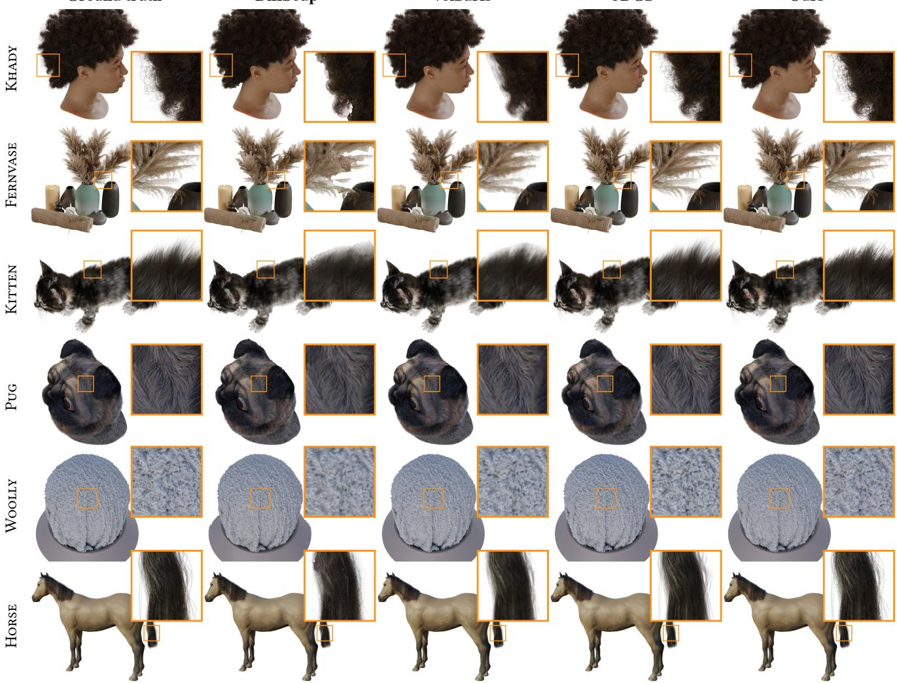  
Fig. 9. Qualitative results on the Shelly dataset. Rows correspond to diferent scenes, and columns show the ground truth and reconstruction results for each method. Compared to the surface-based methods DifSoup and VolSurfs, our method beter preserves thin fuzzy boundaries and fine geometric details Compared to 3DGS, our method more faithfully captures connected curve structures while achieving comparable overall visual quality.

polylines, the 1D topology is encoded solely by the polyline break positions. Depending on the application, memory can be reduced by using lower-order SH or other vertex attributes.

Note that the original Shelly assets were authored using curves but require highly specialized modeling workflows, procedural tech- niques, and probably hours to days of substantial manual efort, whereas our method reconstructs similarly complex structures di- rectly from multi-view images through optimization alone within one hour. This advantage becomes even more apparent in the chal- lenging real-world captures.

Real-world dataset. We capture a range of real-world objects exhibiting fuzzy, fiber-like geometry, including plants, fabrics, fur, and fruit, using the controlled setup summarized in Figure 3(a). We name this dataset Fuzzy and make it publicly available. After image capture in a dark environment, we extract a coarse foreground mask by thresholding low-intensity pixels, applying morphological closing to preserve thin structures, and selecting the image-space connected component with the highest total saturation. This preprocessing step mitigates the influence of low-intensity gray background pixels on our inverse rendering workflow, which assumes a fully black background.

Figure 10 shows line-based models obtained using our method, in- cluding rendered results and geometry visualizations from two cap- tured views used for optimization. As demonstrated, diferentiable rendering of opaque line primitives with explicit anti-aliasing can recover a wide range of real-world geometries with varying fuzziness, fiber density, length, and spatial complexity. The resulting models not only faithfully reproduce detailed textures and fuzzy boundaries, but also recover highly plausible outlines and directional structures of fiber-like elements that would be extremely dificult to author manuall . The reconstructed models can be rendered interactivel with smoothly varying viewpoints on a laptop (M5 MacBook Air with 32 GB unified memory), as shown in the supplemental video. While our method does not guarantee fully connected polyline structures that exactly follow the underlying physical connectivity, the reconstructed geometry nevertheless captures coherent explicit structures despite the limitations of casual captures, including oc-clusions and defocus blur. These results open new possibilities for geometric workflows that require explicit structural representations beyond unstructured volumetric representations.

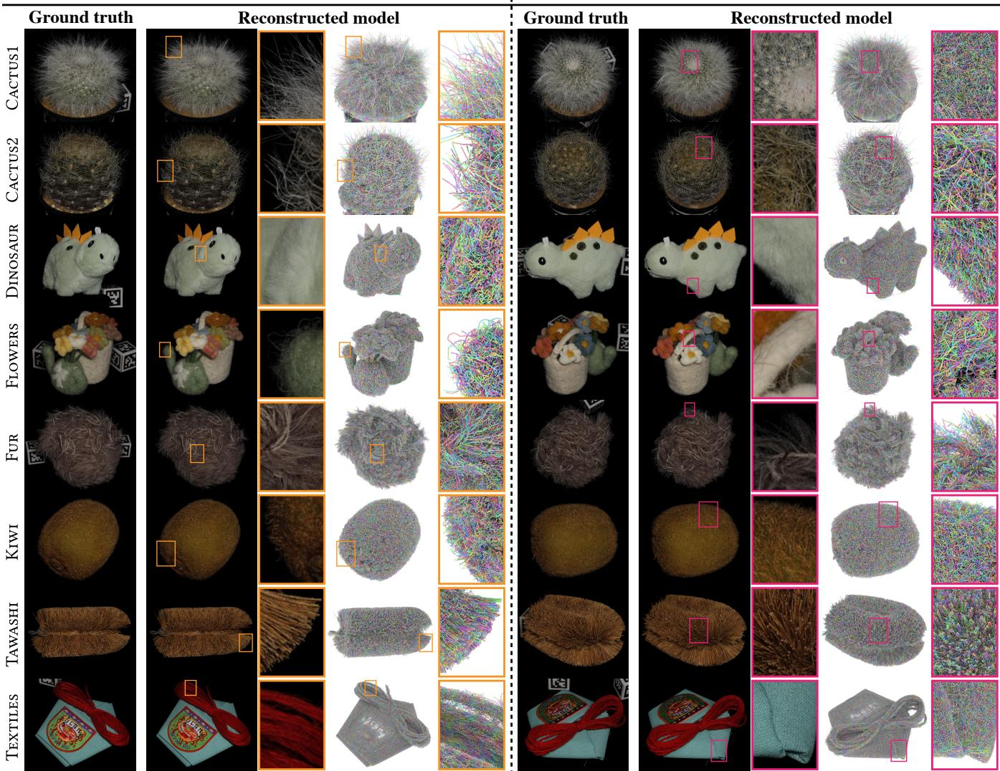  
Fig. 10. Reconstruction results on our real-world capture dataset. Each row corresponds to a diferent captured object, while the left and right halves show two representative captured views used for optimization. For each view, we visualize the ground-truth image, the rendering, and the explicit line geometry of the reconstructed model. Uncompressed original images of the references, renderings, and geometry visualizations are provided in the supplemental material.

Applications. Figure 2 shows various applications of our linebased representations. The recovered explicit line primitives support applications such as hair reflectance rendering [Marschner et al. 2003] and mass-spring animation, where additional KNN edges (� = 6) connect the reconstructed polylines. The simulation is solved on the GPU using Chebyshev-accelerated Jacobi projectivedynamics steps [Bouaziz et al. 2014; Wang and Yang 2016], processing 2M vertices in ∼55 ms/frame. While the explicit representation is useful for physical simulation, handling millions of fibers in real time remains challenging and requires future investigation. Our line-based rasterization remains eficient enough to support interactive preview on a mobile device. Furthermore, our explicit line primitives can be exported as constant-radius world-space cylinders for ofline ray-traced rendering. The exported cylinders can be integrated with surface-based scenes under complex light transport using GPU-accelerated ray-primitive intersection queries provided by Mitsuba 3 [Jakob et al. 2022].

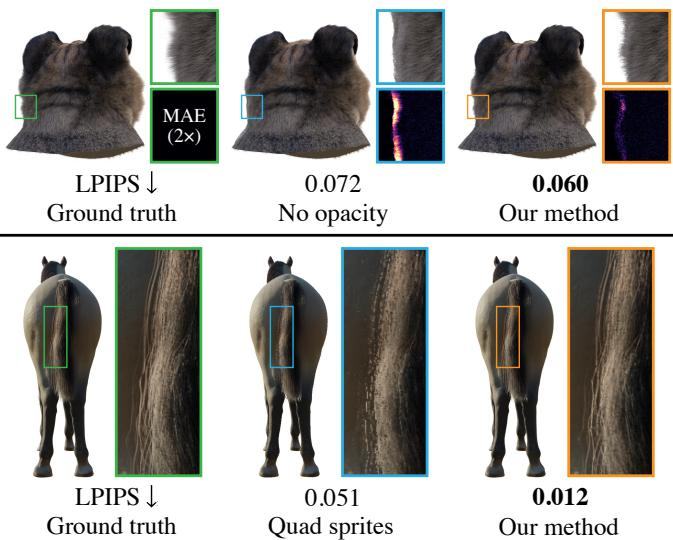  
Fig. 11. Ablation on our diferentiable rendering components. (Top, left to right) Ground-truth view, result without opacity optimization, and result using our method. Close-ups show per-pixel mean absolute error (MAE), visualized with the magma colormap at 2× magnification. (Botom, left to right) Ground-truth view, result using quad-based line rasterization with a 1 mm world-space line width, and result using our Bresenham-based rasterization with MSAA. Per-scene LPIPS scores are reported.

Ablation studies. We also conduct ablation studies on our key design choices. Figure 11 compares our diferentiable rendering compo-nents with those used in traditional diferentiable line-rasterization approaches (e.g., [Takimoto et al. 2024]). With an unstructured initialization, removing opacity optimization results in inaccurate boundary structures, highlighted by the per-pixel error map. Rasterizing thin camera-facing quad sprites on the original pixel grid introduces severe undersampling artifacts, which are efectively re- solved by our Bresenham-based rasterization with MSAA. Figure 12 further analyzes the influence of line width in quad-based line ras- terization. In addition to a 1 mm world-space line width, we show results using 0.2 mm, as used for hair reconstruction in [Takimoto et al. 2024]. While suitable for controlled hair capture, such thin lines exacerbate undersampling on general fuzzy objects, leading to overly sparse reconstructions with many spurious holes. In contrast, our Bresenham-based line rasterization requires no world-space line width and consistently produces higher-quality results. Note that scenes in the Shelly dataset [Wang et al. 2023b] are normalized independently; these line widths are therefore relative to the normalized scene extent rather than physical dimensions (approximate per-scene extents are reported in the supplemental material). Nevertheless, this comparison illustrates the dificulty of selecting an appropriate line width without strong assumptions about object scale or the capture setup, highlighting the robustness of our method across diverse fuzzy objects.

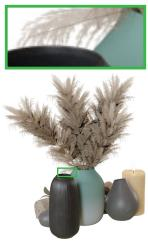  
LPIPS  
Ground truth

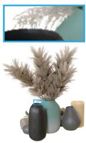  
0.053  
1 mm-wide

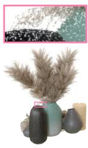  
0.101  
0.2 mm-wide

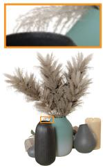  
0.016  
Fig. 12. Additional comparison with line rasterization using camera-facing quad sprites. (Left to right) Ground-truth view, result using quad-based rasterization with 1 mm world-space line width, result using 0.2 mm world- space line width, and our result using Bresenham-based rasterization with MSAA. Per-scene LPIPS scores are reported.

Table 2. Quantitative results for the re-lining strategy ablation on the Shelly dataset, averaged over 6 scenes.
<table><tr><td>Method</td><td>PSNR ↑</td><td>SSIM ↑</td><td>LPIPS ↓</td></tr><tr><td>No discrete updates</td><td>35.48</td><td>0.949</td><td>0.065</td></tr><tr><td>MCMC relocation</td><td>36.84</td><td>0.960</td><td>0.051</td></tr><tr><td>Ours</td><td>37.09</td><td>0.963</td><td>0.046</td></tr></table>

Table 3. Quantitative comparison with traditional line rasterization ap- proaches on the Shelly dataset, averaged over 6 scenes.
<table><tr><td>Method</td><td>PSNR ↑</td><td>SSIM↑</td><td>LPIPS↓</td></tr><tr><td>No opacity</td><td>35.12</td><td>0.958</td><td>0.053</td></tr><tr><td>1 mm-wide quads</td><td>31.62</td><td>0.919</td><td>0.111</td></tr><tr><td>0.2 mm-wide quads</td><td>22.52</td><td>0.801</td><td>0.178</td></tr><tr><td>Ours</td><td>37.09</td><td>0.963</td><td>0.046</td></tr></table>

Figure 4 compares diferent primitive types optimized by our differentiable rasterizer. Point primitives are too sparse to reproduce dense fiber structures, while triangle primitives provide smooth interpolation but struggle to capture thin subpixel features, leading to artifacts such as dashed whiskers. Our explicit line primitives pre-serve coherent directional structures, fine-scale details, and smooth appearance transitions. Figure 13 provides an ablation on the Gaussian reconstruction filter used for anti-aliasing. Using a straightforward box filter on the same 2× subpixel grid fails to reproduce smooth, fuzzy boundaries, resulting in higher rendering error and less coherent directional structures. Our Gaussian reconstruction filter yields smoother, fuzzier boundaries while better preserving fine directional structures.

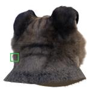  
LPIPS

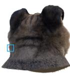

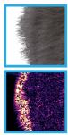  
0.071  
Ground truth

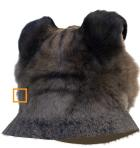  
Box filter  
0.060  
Our method  
Fig. 13. Ablation of the Gaussian reconstruction filter used for MSAA. (Left to right) Ground-truth view, result using a box filter on the 2× subpixel grid, and our result using a Gaussian filter on the same grid. Close-ups show per-pixel mean absolute error (MAE), visualized with the magma colormap at 7× magnification. Per-scene LPIPS scores are reported.

LPIPS Ground truth  
Table 4. Per-scene LPIPS scores on the Shelly dataset for all ablated configurations (lower is beter). “Re-lining” corresponds to Figure 7, “Diferentiable rendering components” to Figures 11, 12, and 13, and “Primitive types” to Figure 4. Ties in the ranking are resolved using unrounded values.
<table><tr><td rowspan="2">Scene</td><td colspan="2">Re-lining</td><td colspan="4">Differentiable rendering components</td><td colspan="2">Primitive types</td><td rowspan="2">Ours</td></tr><tr><td>No discere</td><td>MCMC</td><td>No opacity</td><td>1 mm quads</td><td>0.2 mm quads</td><td>Box filter</td><td>Points</td><td>Triangles</td></tr><tr><td>KHADY</td><td>0.110</td><td>0.089</td><td>0.089</td><td>0.131</td><td>0.221</td><td>0.099</td><td>0.247</td><td>0.106</td><td>0.080</td></tr><tr><td>FERNVASE</td><td>0.026</td><td>0.017</td><td>0.020</td><td>0.053</td><td>0.101</td><td>0.021</td><td>0.081</td><td>0.018</td><td>0.016</td></tr><tr><td>KITTEN</td><td>0.039</td><td>0.026</td><td>0.027</td><td>0.071</td><td>0.116</td><td>0.035</td><td>0.105</td><td>0.029</td><td>0.023</td></tr><tr><td>PUG</td><td>0.080</td><td>0.064</td><td>0.072</td><td>0.147</td><td>0.228</td><td>0.071</td><td>0.210</td><td>0.071</td><td>0.060</td></tr><tr><td>WOOLLY</td><td>0.112</td><td>0.095</td><td>0.100</td><td>0.213</td><td>0.293</td><td>0.109</td><td>0.256</td><td>0.066</td><td>0.084</td></tr><tr><td>HorsE</td><td>0.020</td><td>0.013</td><td>0.012</td><td>0.051</td><td>0.108</td><td>0.015</td><td>0.099</td><td>0.014</td><td>0.012</td></tr><tr><td>Average</td><td>0.065</td><td>0.051</td><td>0.053</td><td>0.111</td><td>0.178</td><td>0.059</td><td>0.166</td><td>0.051</td><td>0.046</td></tr></table>

We provide additional quantitative results for the key ablation studies motivating our inverse rendering workflow. Table 2 reports average rendering quality metrics over the Shelly dataset for the re-lining ablation in Figure 7. Table 3 reports corresponding metrics for the comparison of diferentiable rendering components in Fig- ures 11 and 12. Our method consistently outperforms all baseline configurations across all metrics. In addition, Table 4 reports per-scene quality scores for all ablations. We report the perceptually aligned LPIPS metric. Our method outperforms all baseline configu-rations across all scenes, except for the Woolly scene reconstructed using only triangle primitives. Overall, the results support our use of line primitives and Bresenham-based rasterization, as further suggested by the competitive performance of the “MCMC” variant, which difers only in the discrete update strategy while sharing the same diferentiable renderer as our full configuration.

Failure cases. Figure 14 further analyzes the Woolly scene, the only scene where a triangle-based representation outperforms our line-based method. Compared to other scenes in the Shelly dataset, this scene spans a larger spatial extent and exhibits an overall rounded shell shape, making it dificult to suficiently cover with line primitives. Triangle primitives fill the object surface more eficiently, producing sharper contrast in textured regions while smoothly rep- resenting visually flat regions. In contrast, our representation produces slightly fuzzier wool boundaries than the ground truth and occasionally reveals background pixels in visually flat regions, while preserving finer-scale fiber texture. This example motivates a hybrid representation as a promising direction for future work: using triangle primitives for large, visually flat regions and deeper surface layers, and line primitives for texture-rich regions and fuzzy front boundaries, thereby combining the strengths of both repre- sentations. Other failure cases arise from imperfect background removal, which can produce inaccurate reconstructed boundaries. Our method can also interpret black surface regions as holes, as observed in the text region of the Textile model.

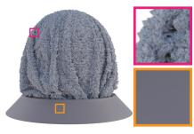

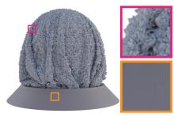  
0.066 All triangles

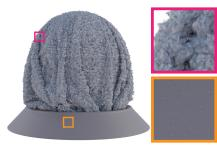  
0.084 Our method  
Fig. 14. Further analysis of the challenging Woolly scene, where the triangle-based representation outperforms our line-based method. (Left to right) Ground-truth view, result using only triangle primitives, and our result using only line primitives. Both representations use the same 2Mvertex budget. Per-scene LPIPS scores are reported.

## 6 Limitations and Future Work

This work has several limitations and directions for future work. Re- covering complete topology, including heavily occluded structures such as hair interiors, likely requires stronger priors or richer cap- ture setups. Our method does not recover fully accurate microscale fiber orientations and connectivity for structures that are barely visible at the pixel scale. Future work could replace hand-crafted connectivity update rules with learned directional connection probabilities that guide opacity optimization. A more principled variancereduction approach for opacity gradients, for example using the control variates method that incorporates Gaussian filter weights and primitive orientations, remains a natural extension. Recovering line width from subpixel observations is fundamentally challenging but would also be valuable. Finally, adapting the representation across viewing distances is a promising direction. For example, avoiding visible line primitives in close-up views may require level-of-detail techniques or a hybrid triangle–line representation. Overall, we believe our approach opens new possibilities for reconstructing and representing complex fuzzy appearance using explicit geometry, enabling broader integration with geometry-centric workflows.

## Acknowledgments

We thank the anonymous reviewers for their valuable feedback. This work was partly conducted while the first author was at the University of Tokyo, where he was supported by JSPS KAKENHI Grant Number 23KJ0699.

## References

Sai Bangaru, Lifan Wu, Tzu-Mao Li, Jacob Munkberg, Gilbert Bernstein, Jonathan Ragan-Kelley, Fredo Durand, Aaron Lefohn, and Yong He. 2023. SLANG.D: Fast, Modular and Diferentiable Shader Programming. ACM Transactions on Graphics (SIGGRAPH Asia) 42, 6 (December 2023), 1–28. doi:10.1145/3618353

Jonathan T. Barron, Ben Mildenhall, Matthew Tancik, Peter Hedman, Ricardo Martin Brualla, and Pratul P. Srinivasan. 2021. Mip-NeRF: A Multiscale Representation for Anti-Aliasing Neural Radiance Fields. In Proceedings ofthe IEEE/CVF International Conference on Computer Vision (ICCV). 5855–5864.

Jonathan T. Barron, Ben Mildenhall, Dor Verbin, Pratul P. Srinivasan, and Peter Hedman. 2022. Mip-NeRF 360: Unbounded Anti-Aliased Neural Radiance Fields. In Proceedings ofthe IEEE/CVFConference on Computer Vision and Pattern Recognition (CVPR). 5470– 5479.

Miklós Bergou, Max Wardetzky, Stephen Robinson, Basile Audoly, and Eitan Grinspun. 2008. Discrete elastic rods. In ACM SIGGRAPH 2008 Papers (Los Angeles, California) (SIGGRAPH’08). Association for Computing Machinery, New York, NY, USA, Article 63, 12 a es. doi:10.1145/1399504.1360662

Mario Botsch and LeifKobbelt. 2004. A remeshing approach to multiresolution modeling. In Proceedings ofthe 2004 Eurographics/ACM SIGGRAPH Symposium on Geometry Processing (Nice, France) (SGP ’04). Association for Computing Machinery, New York, NY, USA, 185–192. doi:10.1145/1057432.1057457

Sofien Bouaziz, Sebastian Martin, Tiantian Liu, Ladislav Kavan, and Mark Pauly. 2014. Projective dynamics: fusing constraint projections for fast simulation. ACM Trans. Graph. 33, 4, Article 154 (July 2014), 11 pages. doi:10.1145/2601097.2601116

J. E. Bresenham. 1965. Algorithm for computer control of a digital plotter. IBM Syst. J. 4, 1 (March 1965), 25–30. doi:10.1147/sj.41.0025

Tyson Brochu and Robert Bridson. 2009. Robust Topological Operations for Dynamic Explicit Surfaces. SIAM J. Sci. Comput. 31, 4 (June 2009), 2472–2493. doi:10.1137/ 080737617

Pierre Bénard and Aaron Hertzmann. 2019. Line Drawings from 3D Models. Foundations and Trends® in Computer Graphics and Vision 11, 1–2 (Sept. 2019), 1–159. doi:10. 1561/0600000075

Wenzheng Chen, Jun Gao, Huan Ling, Edward J. Smith, Jaakko Lehtinen, Alec Jacobson, and Sanja Fidler. 2019. Learning to predict 3D objects with an interpolation-based diferentiable renderer. Curran Associates Inc., Red Hook, NY, USA.

Zhiqin Chen, Thomas Funkhouser, Peter Hedman, and Andrea Tagliasacchi. 2023. MobileNeRF: Exploiting the Polygon Rasterization Pipeline for Eficient Neural Field Rendering on Mobile Architectures. In Proceedings ofthe IEEE/CVF Conference on Computer Vision and Pattern Recognition (CVPR). 16569–16578.

Changwoon Choi, Jaeah Lee, Jaesik Park, and Young Min Kim. 2024. 3Doodle: Compact Abstraction of Objects with 3D Strokes. ACM Trans. Graph. 43, 4, Article 107 (ju 2024), 13 pages. doi:10.1145/3658156

Keenan Crane, Clarisse Weischedel, and Max Wardetzky. 2017. The heat method for distance computation. Commun. ACM 60, 11 (Oct. 2017), 90–99. doi:10.1145/3131280 Wolfgang Engel. 2014. GPU Pro 5: advanced rendering techniques. CRC Press.

Stefano Esposito, Anpei Chen, Christian Reiser, Samuel Rota Bulò, Lorenzo Porzi, Katja Schwarz, Christian Richardt, Michael Zollhöfer, Peter Kontschieder, and Andreas Gei er. 2025. Volumetric Surfaces: Re resentin Fuzz Geometries with La ered Meshes. In Proceedings ofthe Computer Vision and Pattern Recognition Conference (CVPR). 21370–21380.

Sara Fridovich-Keil, Alex Yu, Matthew Tancik, Qinhong Chen, Benjamin Recht, and Angjoo Kanazawa. 2022. Plenoxels: Radiance Fields Without Neural Networks. In Proceedings ofthe IEEE/CVF Conference on Computer Vision and Pattern Recognition (CVPR). 5501–5510.

Michael Garland and Paul S. Heckbert. 1997. Surface simplification using quadric error metrics. In Proceedings of the 24th Annual Conference on Computer Graphics and Interactive Techniques (SIGGRAPH ’97). ACM Press/Addison-Wesley Publishing Co., USA, 209–216. doi:10.1145/258734.258849

Peter W Glynn. 1990. Likelihood ratio gradient estimation for stochastic systems. Commun. ACM 33, 10 (1990), 75–84.

Antoine Guédon, Diego Gomez, Nissim Maruani, Bingchen Gong, George Drettakis, and Maks Ovsjanikov. 2025. MILo: Mesh-In-the-Loop Gaussian Splatting for Detailed and Eficient Surface Reconstruction. ACM Trans. Graph. 44, 6, Article 223 (Dec. 2025), 15 pages. doi:10.1145/3763339

Jon Hasselgren, Jacob Munkberg, Jaakko Lehtinen, Miika Aittala, and Samuli Laine. 2021. Appearance-Driven Automatic 3D Model Simplification. In 32nd Eurographics Symposium on Rendering, EGSR 2021 - Digital Library Only Track, Saarbrücken, Germany, June 29 - July 2, 2021, Adrien Bousseau and Morgan McGuire (Eds.). Eurographics Association, 85–97. doi:10.2312/SR.20211293

Jan Held, Sanghyun Son, Renaud Vandeghen, Daniel Rebain, Matheus Gadelha, Yi Zhou, Anthony Cioppa, Ming C. Lin, Marc Van Droogenbroeck, and Andrea Tagliasacchi. 2026a. MeshSplatting: Diferentiable Rendering with Opaque Meshes. In Proceedings of the IEEE/CVF Conference on Computer Vision and Pattern Recognition (CVPR). 7320–7329.

Jan Held, Renaud Vandeghen, Adrien Deliège, Abdullah Hamdi, Silvio Giancola, Daniel Rebain, Anthony Cioppa, Bernard Ghanem, Andrea Vedaldi, Andrea Tagliasacchi,

and Marc Van Droogenbroeck. 2026b. Triangle Splatting for Real-Time Radiance Field Rendering. In International Conference on 3D Visio, 3DV2026, Vancouver, BC, Canada, March 20-23, 2026. IEEE, 1248–1257. doi:10.1109/3DV69130.2026.00123

Jan Held, Renaud Vandeghen, Abdullah Hamdi, Adrien Deliege, Anthony Cioppa, Silvio Giancola, Andrea Vedaldi, Bernard Ghanem, and Marc Van Droogenbroeck. 2025. 3D Convex Splatting: Radiance Field Rendering with 3D Smooth Convexes. In Proceedings ofthe Computer Vision and Pattern Recognition Conference (CVPR). 21360–21369.

Hugues Hoppe, Tony DeRose, Tom Duchamp, John McDonald, and Werner Stuetzle. 1993. Mesh optimization. In Proceedings ofthe 20th Annual Conference on Computer Graphics and Interactive Techniques (Anaheim, CA) (SIGGRAPH ’93). Association for Computing Machinery, New York, NY, USA, 19–26. doi:10.1145/166117.166119

Binbin Huang, Zehao Yu, Anpei Chen, Andreas Geiger, and Shenghua Gao. 2024. 2D Gaussian Splatting for Geometrically Accurate Radiance Fields. In ACM SIGGRAPH 2024 Conference Papers (Denver, CO, USA) (SIGGRAPH ’24). Association for Com puting Machinery, New York, NY, USA, Article 32, 11 pages. doi:10.1145/3641519. 3657428

Wenzel Jakob. 2022. nanobind: tiny and eficient C++/Python bindings. https://github.com/wjakob/nanobind.

Wenzel Jakob, Jonathan T. Moon, and Steve Marschner. 2009. Capturing Hair Assemblies Fiber by Fiber. ACM Transactions on Graphics (Proceedings ofSIGGRAPH Asia) 28, 5 (Dec. 2009), 164:1–164:9. doi:10.1145/1618452.1618510

Wenzel Jakob, Sébastien S eierer, Nicolas Roussel, Merlin Nimier-David, Delio Vicini, Tizian Zeltner, Baptiste Nicolet, Miguel Crespo, Vincent Leroy, and Ziyi Zhang. 2022. Mitsuba 3 renderer. https://mitsuba-renderer.org.

Animesh Karnewar, Tobias Ritschel, Oliver Wang, and Niloy Mitra. 2022. ReLU Fields: The Little Non-linearity That Could. In ACM SIGGRAPH2022 Conference Proceedings (Vancouver, BC, Canada) (SIGGRAPH ’22). Association for Computing Machinery, New York, NY, USA, Article 27, 9 pages. doi:10.1145/3528233.3530707

Hiroharu Kato, Deniz Beker, Mihai Morariu, Takahiro Ando, Toru Matsuoka, Wadim Kehl, and Adrien Gaidon. 2020. Diferentiable Rendering: A Survey. arXiv:2006.12057 [cs.CV] https://arxiv.org/abs/2006.12057

Bernhard Kerbl, Georgios Kopanas, Thomas Leimkuehler, and George Drettakis. 2023. 3D Gaussian Splatting for Real-Time Radiance Field Rendering. ACM Trans. Graph. 42, 4, Article 139 (July 2023), 14 pages. doi:10.1145/3592433

Shakiba Kheradmand, Daniel Rebain, Gopal Sharma, Weiwei Sun, Yang-Che Tseng, Hossam Isack, Abhishek Kar, Andrea Tagliasacchi, and Kwang Moo Yi. 2024. 3D Gaussian splatting as Markov Chain Monte Carlo. In Proceedings ofthe 38th International Conference on Neural Information Processing Systems (Vancouver, BC, Canada) (NIPS ’24). Curran Associates Inc., Red Hook, NY, USA, Article 2573, 22 pages.

Shakiba Kheradmand, Delio Vicini, George Kopanas, Dmitry Lagun, Kwang Moo Yi, Mark Matthews, and Andrea Tagliasacchi. 2025. StochasticSplats: Stochastic Ras- terization for Sorting-Free 3D Gaussian Splatting. In Proceedings of the IEEE/CVF International Conference on Computer Vision (ICCV). 26326–26335.

Khronos Group. 2026. Vulkan API Specification. https://registry.khronos.org/vulkan/ specs/latest/html/vkspec.html. Accessed: 2026-05-03.

Diederik P. Kingma and Jimmy Ba. 2015. Adam: A Method for Stochastic Optimization. In 3rd International Conference on Learning Representations, ICLR 2015, San Diego, CA, USA, May 7-9, 2015, Conference Track Proceedings, Yoshua Bengio and Yann LeCun (Eds.). http://arxiv.org/abs/1412.6980

Samuli Laine, Janne Hellsten, Tero Karras, Yeongho Seol, Jaakko Lehtinen, and Timo Aila. 2020. Modular primitives for high-performance diferentiable rendering. ACM Trans. Graph. 39, 6, Article 194 (Nov. 2020), 14 pages. doi:10.1145/3414685.3417861

Minchen Li, Danny M. Kaufman, and ChenfanfuJiang. 2021. Codimensional incremental potential contact. ACM Trans. Graph. 40, 4, Article 170 (July 2021), 24 pages. doi:10. 1145/3450626.3459767

Tzu-Mao Li, Miika Aittala, Frédo Durand, and Jaakko Lehtinen. 2018. Diferentiable Monte Carlo Ray Tracing through Edge Sampling. ACM Trans. Graph. (Proc. SIG-GRAPH Asia) 37, 6 (2018), 222:1–222:11.

Tzu-Mao Li, Michal Lukáč, Gharbi Michaël, and Jonathan Ragan-Kelley. 2020. Diferentiable Vector Graphics Rasterization for Editing and Learning. ACM Trans. Graph. (Proc. SIGGRAPH Asia) 39, 6 (2020), 193:1–193:15.

Zhaoshuo Li, Thomas Müller, Alex Evans, Russell H. Taylor, Mathias Unberath, Ming Yu Liu, and Chen-Hsuan Lin. 2023. Neuralangelo: High-Fidelity Neural Surface Reconstruction. In Proceedings of the IEEE/CVF Conference on Computer Vision and Pattern Recognition (CVPR). 8456–8465.

Selena Zihan Ling, Nicholas Sharp, and Alec Jacobson. 2022. Vectoradam for rotation equivariant geometry optimization. Advances in Neural Information Processing Systems 35 (2022), 4111–4122.

Hsueh-Ti Derek Liu, Xiaoting Zhang, and Cem Yuksel. 2025b. Simplifying Textured Triangle Meshes in the Wild. ACM Trans. Graph. 44, 6, Article 181 (Dec. 2025), 16 pages. doi:10.1145/3763277

Lingjie Liu, Jiatao Gu, Kyaw Zaw Lin, Tat-Seng Chua, and Christian Theobalt. 2020. Neural sparse voxel fields. In Proceedings ofthe 34th International Conference on Neural Information Processing Systems (Vancouver, BC, Canada) (NIPS ’20). Curran Associates Inc., Red Hook, NY, USA, Article 1313, 13 pages.

Richard Liu, Daniel Fu, Noah Tan, Itai Lang, and Rana Hanocka. 2025a. WIR3D: Visually Informed and Geometry-Aware 3D Shape Abstraction. In Proceedings of the IEEE/CVF International Conference on Computer Vision (ICCV). 14810–14821.

Shichen Liu, Tianye Li, Weikai Chen, and Hao Li. 2019. Soft Rasterizer: A Diferentiable Renderer for Image-Based 3D Reasoning. In Proceedings ofthe IEEE/CVFInternational Conference on Computer Vision (ICCV).

Matthew M. Loper and Michael J. Black. 2014. OpenDR: An Approximate Diferentiable Renderer. In Computer Vision – ECCV 2014 (Lecture Notes in Computer Science, Vol. 8695). Springer International Publishing, 154–169. doi:10.1007/978-3-319-10584- 0\_11

William E. Lorensen and Harvey E. Cline. 1987. Marching cubes: A high resolution 3D surface construction algorithm. In Proceedings ofthe 14th Annual Conference on Computer Graphics and Interactive Techniques (SIGGRAPH ’87). Association for Computing Machinery, New York, NY, USA, 163–169. doi:10.1145/37401.37422

Stephen R. Marschner, Henrik Wann Jensen, Mike Cammarano, Steve Worley, and Pat Hanrahan. 2003. Light scattering from human hair fibers. ACM Trans. Graph. 22, 3 (July 2003), 780–791. doi:10.1145/882262.882345

Ben Mildenhall, Pratul P. Srinivasan, Matthew Tancik, Jonathan T. Barron, Ravi Ra mamoorthi, and Ren N . 2020. NeRF: Re resentin Scenes as Neural Radiance Fields for View Synthesis. In Computer Vision - ECCV 2020 - 16th European Conference, Glasgow, UK, August 23-28, 2020, Proceedings, Part I (Lecture Notes in Computer Science, Vol. 12346), Andrea Vedaldi, Horst Bischof, Thomas Brox, and Jan-Michael Frahm (Eds.). S rin er, 405–421. doi:10.1007/978-3-030-58452-8\_24

Thomas Müller, Alex Evans, Christoph Schied, and Alexander Keller. 2022. Instant Neural Graphics Primitives with a Multiresolution Hash Encoding. ACM Trans. Graph. 41, 4, Article 102 (July 2022), 15 pages. doi:10.1145/3528223.3530127

Giljoo Nam, Chenglei Wu, Min H. Kim, and Yaser Sheikh. 2019. Strand-Accurate Multi View Hair Ca ture. In 2019 IEEE/CVF Conference on Computer Vision and Pattern Recognition (CVPR). 155–164. doi:10.1109/CVPR.2019.00024

Andrew Nealen, Takeo Igarashi, Olga Sorkine, and Marc Alexa. 2006. Laplacian mesh optimization. In Proceedings of the 4th International Conference on Computer Graphics and Interactive Techniques in Australasia and Southeast Asia (Kuala Lumpur, Malaysia) (GRAPHITE ’06). Association for Computing Machinery, New York, NY, USA, 381–389. doi:10.1145/1174429.1174494

Merlin Nimier-David, Delio Vicini, Tizian Zeltner, and Wenzel Jakob. 2019. Mitsuba 2: a retargetable forward and inverse renderer. ACM Trans. Graph. 38, 6, Article 203 (Nov. 2019), 17 pages. doi:10.1145/3355089.3356498

Werner Palfinger. 2022. Continuous remeshing for inverse render-ing. Computer Animation and Virtual Worlds 33, 5 (2022), e2101. arXiv:https://onlinelibrary.wiley.com/doi/pdf/10.1002/cav.2101 doi:10.1002/cav.2101

Sylvain Paris, Will Chang, Oleg I. Kozhushnyan, Wojciech Jarosz, Wojciech Matusik, Matthias Zwicker, and Frédo Durand. 2008. Hair photobooth: geometric and photometric acquisition of real hairstyles. ACM Trans. Graph. 27, 3 (Aug. 2008), 1–9. doi:10.1145/1360612.1360629

Adam Paszke, Sam Gross, Francisco Massa, Adam Lerer, James Bradbury, Gregory Chanan, Trevor Killeen, Zeming Lin, Natalia Gimelshein, Luca Antiga, Alban Des maison, Andreas Köpf, Edward Yang, Zach DeVito, Martin Raison, Alykhan Tejani, Sasank Chilamkurthy, Benoit Steiner, Lu Fang, Junjie Bai, and Soumith Chintala. 2019. PyTorch: an imperative style, high-performance deep learning library. Curran Associates Inc., Red Hook, NY, USA.

Stanislav Pidhorskyi, Tomas Simon, Gabriel Schwartz, He Wen, Yaser Sheikh, and Jason Saragih. 2024. Rasterized Edge Gradients: Handling Discontinuities Diferentiably. In Computer Vision – ECCV 2024: 18th European Conference, Milan, Italy, September 29–October 4, 2024, Proceedings, Part LXXXIII (Milan, Italy). Springer-Verlag, Berlin, Heidelberg, 335–352. doi:10.1007/978-3-031-73010-8\_20

John K Salmon, Mark A Moraes, Ron O Dror, and David E Shaw. 2011. Parallel random numbers: as easy as 1, 2, 3. In Proceedings of2011 international conference for high performance computing, networking, storage and analysis. 1–12.

Johannes L Schonberger and Jan-Michael Frahm. 2016. Structure-from-motion revisited. In Proceedings ofthe IEEE conference on computer vision and pattern recognition. 4104– 4113.

Tianchang Shen, Jun Gao, Kangxue Yin, Ming-Yu Liu, and Sanja Fidler. 2021. Deep marching tetrahedra: a hybrid representation for high-resolution 3D shape synthesis. In Proceedings ofthe 35th International Conference on Neural Information Processing Systems (NIPS ’21). Curran Associates Inc., Red Hook, NY, USA, Article 466, 15 pages.

Tianchang Shen, Zhaoshuo Li, Marc Law, Matan Atzmon, Sanja Fidler, James Lucas, Jun Gao, and Nicholas Sharp. 2024. SpaceMesh: A Continuous Representation for Learning Manifold Surface Meshes. In SIGGRAPH Asia 2024 Conference Papers (SA Conference Papers ’24) (Tokyo, Japan, December 3-6, 2024). ACM, New York, NY, USA, 11. doi:10.1145/3680528.3687634

Tianchang Shen, Jacob Munkberg, Jon Hasselgren, Kangxue Yin, Zian Wang, Wenzheng Chen, Zan Gojcic, Sanja Fidler, Nicholas Sharp, and Jun Gao. 2023a. Flexible Isosurface Extraction for Gradient-Based Mesh Optimization. ACM Trans. Graph. 42, 4, Article 37 (jul 2023), 16 pages. doi:10.1145/3592430

Yuefan Shen, Shunsuke Saito, Ziyan Wang, Olivier Maury, Chenglei Wu, Jessica Hod ins, You i Zhen , and Giljoo Nam. 2023b. CT2Hair: Hi h-Fidelit 3D Hair Model- ing using Computed Tomography. ACM Trans. Graph. 42, 4, Article 75 (July 2023), 13 pages. doi:10.1145/3592106

Sanghyun Son, Matheus Gadelha, Yang Zhou, Matthew Fisher, Zexiang Xu, Yi-Ling Qiao, Ming C Lin, and Yi Zhou. 2025. Dmesh++: An eficient diferentiable mesh for complex shapes. In Proceedings of the IEEE/CVF International Conference on Computer Vision. 26590–26599.

Sanghyun Son, Matheus Gadelha, Yang Zhou, Zexiang Xu, Ming C. Lin, and Yi Zhou. 2024. DMesh: A Diferentiable Representation for General Meshes. arXiv:2404.13445 [cs.CV]

Yusuke Takimoto, Hikari Takehara, Hiroyuki Sato, Zihao Zhu, and Bo Zheng. 2024. Dr.Hair: Reconstructing Scalp-Connected Hair Strands without Pre-Training via Diferentiable Rendering of Line Segments. In Proceedings of the IEEE/CVF Conference on Computer Vision and Pattern Recognition (CVPR). 20601–20611.

Kenji Tojo, Bernd Bickel, and Nobuyuki Umetani. 2026. DifSoup: Direct Diferentiable Rasterization of Triangle Soup for Extreme Radiance Field Simplification. In Proceedings of the IEEE/CVF Conference on Computer Vision and Pattern Recognition (CVPR). 8353–8363.

Kenji Tojo, Liwen Hu, Nobuyuki Umetani, and Hao Li. 2025. Strands2Cards: Automatic Generation of Hair Cards from Strands. In Proceedings ofthe SIGGRAPH Asia 2025 Conference Papers (SA Conference Papers ’25). Association for Computing Machinery, New York, NY, USA, Article 105, 11 pages. doi:10.1145/3757377.3763864

Kenji Tojo, Ariel Shamir, Bernd Bickel, and Nobu uki Umetani. 2024. Fabricable 3D Wire Art. In ACM SIGGRAPH 2024 Conference Papers (Denver, CO, USA) (SIGGRAPH ’24). Association for Computing Machinery, New York, NY, USA, Article 134, 11 pages. doi:10.1145/3641519.3657453

Yael Vinker, Ehsan Pajouhesh ar, Jessica Y. Bo, Roman Christian Bachmann, Amit Haim Bermano, Daniel Cohen-Or, Amir Zamir, and Ariel Shamir. 2022. CLIPasso: Semantically-Aware Object Sketching. ACM Trans. Graph. 41, 4, Article 86 (jul 2022), 11 a es. doi:10.1145/3528223.3530068

Huamin Wang and Yin Yang. 2016. Descent methods for elastic body simulation on the GPU. ACM Trans. Graph. 35, 6, Article 212 (Dec. 2016), 10 pages. doi:10.1145/ 2980179.2980236

Peng Wang, Lingjie Liu, Yuan Liu, Christian Theobalt, Taku Komura, and Wenping Wang. 2021. NeuS: learning neural implicit surfaces by volume rendering for multiview reconstruction. In Proceedings ofthe 35th International Conference on Neural Information Processing Systems (NIPS ’21). Curran Associates Inc., Red Hook, NY, USA, Article 2081, 13 pages.

Yiming Wang, Qin Han, Marc Habermann, Kostas Daniilidis, Christian Theobalt, and Lingjie Liu. 2023a. NeuS2: Fast Learning of Neural Implicit Surfaces for Multi-view Reconstruction. In Proceedings ofthe IEEE/CVF International Conference on Computer Vision (ICCV). 3295–3306.

Zian Wang, Tianchang Shen, Merlin Nimier-David, Nicholas Sharp, Jun Gao, Alexander Keller, Sanja Fidler, Thomas Müller, and Zan Gojcic. 2023b. Adaptive Shells for Eficient Neural Radiance Field Rendering. ACM Trans. Graph. 42, 6, Article 259 (2023), 15 pages. doi:10.1145/3618390

Ronald J Williams. 1992. Simple statistical gradient-following algorithms for connectionist reinforcement learning. Machine learning 8, 3 (1992), 229–256.

Markus Worchel and Marc Alexa. 2023. Diferentiable Rendering of Parametric Geome- try. ACM Trans. Graph. 42, 6, Article 232 (Dec. 2023), 18 pages. doi:10.1145/3618387

Yuting Yang, Connelly Barnes, Andrew Adams, and Adam Finkelstein. 2022. A�: Autodif for Discontinuous Programs – Applied to Shaders. ACM Trans. Graph. 41, 4, Article 135 (July 2022), 24 pages. doi:10.1145/3528223.3530125

Cheng Zhang, Lifan Wu, Changxi Zheng, Ioannis Gkioulekas, Ravi Ramamoorthi, and Shuang Zhao. 2019. A Diferential Theory of Radiative Transfer. ACM Trans. Graph. 38, 6 (2019), 227:1–227:16.

Ziyi Zhang, Nicolas Roussel, and Wenzel Jakob. 2023. Projective Sampling for Diferentiable Rendering of Geometry. ACM Trans. Graph. 42, 6, Article 212 (Dec. 2023), 14 pages. doi:10.1145/3618385

Ziyi Zhang, Nicolas Roussel, and Wenzel Jakob. 2025a. Many-Worlds Inverse Rendering. ACM Trans. Graph. 45, 1, Article 8 (Oct. 2025), 17 pages. doi:10.1145/3767318

Zi i Zhan , Nicolas Roussel, Thomas Muller, Tizian Zeltner, Merlin Nimier-David, Fabrice Rousselle, and Wenzel Jakob. 2025b. Radiance Surfaces: Optimizing Surface Re resentations with a 5D Radiance Field Loss. In Proceedings ofthe Special Interest Group on Computer Graphics and Interactive Techniques Conference Conference Papers (SIGGRAPH Conference Papers ’25). Association for Computing Machinery, New York, NY, USA, Article 21, 10 pages. doi:10.1145/3721238.3730713

Zhongtian Zheng, Tao Huang, Haozhe Su, Xueqi Ma, Yuefan Shen, Tongtong Wang, Yin Yang, Xifeng Gao, Zherong Pan, and Kui Wu. 2025. Auto Hair Card Extraction for Smooth Hair with Diferentiable Rendering. ACM Trans. Graph. 44, 6, Article 238 (Dec. 2025), 13 pages. doi:10.1145/3763295

Yuxiao Zhou, Menglei Chai, Daoye Wang, Sebastian Winberg, Erroll Wood, Kripasindhu Sarkar, Markus Gross, and Thabo Beeler. 2024. GroomCap: High-Fidelity Prior-Free Hair Capture. ACM Trans. Graph. 43, 6, Article 254 (Nov. 2024), 15 pages. doi:10.1145/3687768

Supplemental Material: Inverse Rendering for Modeling with Line Primitives

This supplemental material provides additional details on our real- world capture dataset and optimization settings.

## A Additional Capture Details

Table A1 summarizes the statistics of our Fuzzy dataset. Given camera poses estimated by COLMAP [Schonberger and Frahm 2016], we reconstruct a coarse surface using NeuS2 [Wang et al. 2023a] to initialize line primitives around it. Although NeuS2 eficiently recovers a coarse object outline within approximately three minutes, it often produces noisy signed distance fields in low-texture black background regions, leading to cluttered surfaces extracted with the marching cubes algorithm [Lorensen and Cline 1987]. To mitigate this, we apply a simple manual preprocessing step that roughly aligns a bounding cube to the object and crops the reconstructed mesh by mesh intersection. This is performed once per scene and prevents noisy background regions from afecting the initial line distribution, particularly the line lengths initialized from nearest-neighbor distances between the seed points. We will additionally release these coarse proxy surfaces. Note that cube intersection may not fully remove noisy floating surface components. We allow the residual noise, as it can later be removed via our opacity optimization.

## B Additional Optimization Details

Initialization. After reconstructing the coarse surface, we uniformly sample seed points within a distance band of 0.1. We de- termine the band distance of 0.1 experimentally and use it for all datasets. Rather than concentrating samples tightly around the re- constructed surface, we intentionally use a conservatively wide band to avoid missing fine structures that surface reconstruction methods often fail to recover when applied to fuzzy geometry. To eficiently perform rejection sampling within this distance band, we first evaluate distances on a coarse voxel grid and then apply strati- fied sampling to generate candidates with a higher acceptance rate than ambient-space sampling. This strategy enables the sampling of 1M–2M points within a few seconds. We note that scenes in the Shelly dataset are normalized independently; although their nor-malized extents are similar, distances in the normalized coordinate system may not correspond directly to physical dimensions. For reference, Table A2 reports the bounding-box extents of the coarse surfaces for all Shelly scenes.

Hyperparameters and scheduling. Unless specified otherwise, we use learning rates similar to those commonly used in 3D Gaussian splatting [Kerbl et al. 2023]. Specifically, we set the zeroth-order SH, higher-order SH residual, and line-opacity learning rates to $2 . 5 { \times } 1 0 ^ { - 3 }$ $1 . 2 5 \times 1 0 ^ { - 4 }$ , and $5 \times 1 0 ^ { - 2 }$ , respectively. For positional opti-mization, we found that stable convergence is more reliably achieved using consistently small learning rates rather than aggressive annealing schedules. We therefore use initial positional learning rates that are 5–10× smaller than those commonly used in 3DGS: 2.5×10−5 for the Shelly dataset and $1 . 6 \times 1 0 ^ { - 5 }$ for our Fuzzy dataset, exponentially decayed to $1 / 5$ of their initial values during optimization. The vertex-position learning rate is additionally scaled according to the camera extent, following standard 3DGS optimization practice. The weight of the length regularization $\mathcal { L } _ { \mathrm { l e n } }$ is set to $1 . 0 \times 1 0 ^ { - 3 }$

Table A1. Per-scene statistics for our Fuzzy dataset. All source images are captured at 6720×4480 px. ${ \mathsf { C O L M A P } } ^ { \prime } s$ image undistortion [Schonberger and Frahm 2016] crops images slightly diferently per scene, and optimization is performed on a 4× downsampled version of the undistorted images.
<table><tr><td>Scene</td><td># Views</td><td> ${ \mathrm { O r i g . } } { \mathrm { r e s . } }$ </td><td> $\mathrm { C O L M A P r e s . }$ </td><td>Train res.</td></tr><tr><td>CACTUS1</td><td>173</td><td> $6 7 2 0 \times 4 4 8 0$ </td><td> $6 7 0 9 \times 4 4 6 6$ </td><td> $1 6 7 7 \times 1 1 1 6$ </td></tr><tr><td>CACTUS2</td><td>108</td><td> $6 7 2 0 \times 4 4 8 0$ </td><td> $6 7 1 2 \times 4 4 7 1$ </td><td> $1 6 7 8 \times 1 1 1 7$ </td></tr><tr><td>DINOSAUR</td><td>129</td><td> $6 7 2 0 \times 4 4 8 0$ </td><td> $6 7 1 1 \times 4 4 6 7$ </td><td> $1 6 7 7 \times 1 1 1 6$ </td></tr><tr><td>FLOWERS</td><td>122</td><td> $6 7 2 0 \times 4 4 8 0$ </td><td> $6 7 0 5 \times 4 4 5 9$ </td><td> $1 6 7 6 \times 1 1 1 4$ </td></tr><tr><td>FUR</td><td>128</td><td> $6 7 2 0 \times 4 4 8 0$ </td><td> $6 7 2 0 \times 4 4 7 4$ </td><td> $1 6 8 0 \times 1 1 1 8$ </td></tr><tr><td>KIwI</td><td>124</td><td> $6 7 2 0 \times 4 4 8 0$ </td><td> $6 7 1 5 \times 4 4 7 0$ </td><td> $1 6 7 8 \times 1 1 1 7$ </td></tr><tr><td>TAWASHI</td><td>124</td><td> $6 7 2 0 \times 4 4 8 0$ </td><td> $6 7 1 2 \times 4 4 7 0$ </td><td> $1 6 7 8 \times 1 1 1 7$ </td></tr><tr><td>TEXTILES</td><td>156</td><td> $6 7 2 0 \times 4 4 8 0$ </td><td> $6 7 0 7 \times 4 4 6 8$ </td><td> $1 6 7 6 \times 1 1 1 7$ </td></tr></table>

Table A2. Axis-aligned bounding-box extents of the coarse proxy meshes for the Shelly dataset. We report the lengths of the shortest axis (Min.), longest axis (Max.), and the bounding-box diagonal (Diag.).
<table><tr><td></td><td>KHADY</td><td>FERNVASE</td><td>KITTEN</td><td>PuG</td><td>WOOLLY</td><td>HoRsE</td></tr><tr><td>Min.</td><td>1.14</td><td>1.24</td><td>0.92</td><td>2.23</td><td>2.99</td><td>0.80</td></tr><tr><td>Max.</td><td>1.67</td><td>1.93</td><td>2.24</td><td>2.55</td><td>3.62</td><td>3.57</td></tr><tr><td>Diag.</td><td>2.45</td><td>2.84</td><td>2.81</td><td>4.20</td><td>5.93</td><td>4.49</td></tr></table>

Details of baseline methods. For the 3DGS baseline [Kerbl et al. 2023], we sample the initial seed points using the same distanceband sampling around the same coarse proxy surface as our method for a fair comparison. While our method samples 1M seed points to initialize line primitives with 2M vertices, 3DGS directly uses 500K seed points to initialize 500K Gaussian primitives. For the DifSoup baseline [Tojo et al. 2026], we initialize the triangle mesh using the MobileNeRF [Chen et al. 2023] mesh, reported in the original paper to produce the best results on the Shelly dataset. VolSurfs [Esposito et al. 2025] relies on implicit surface reconstruction and therefore does not require external seed points or primitive initialization.