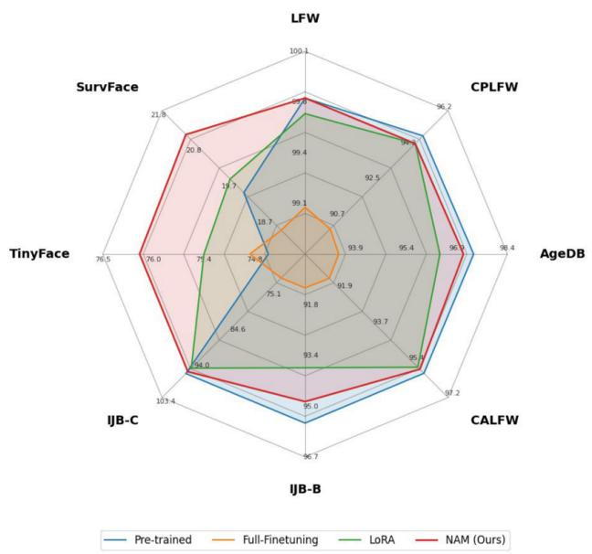
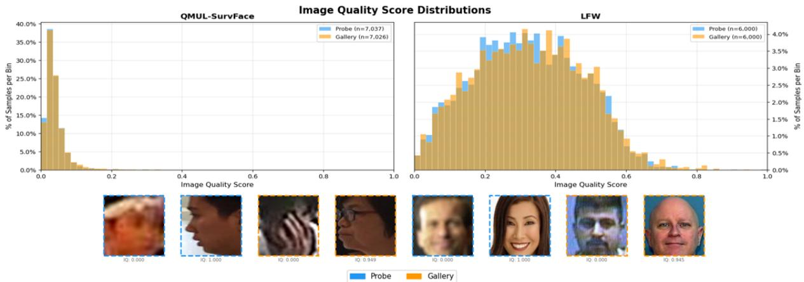
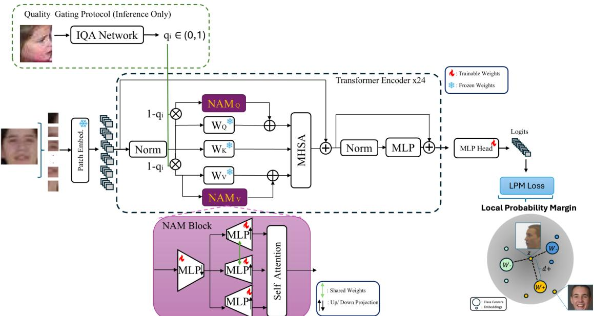
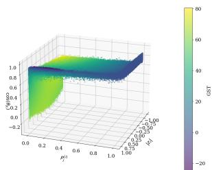
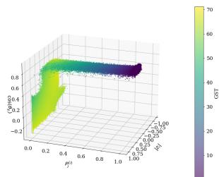
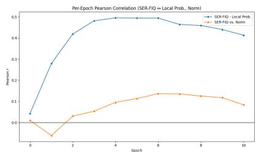

# Low-Quality Face Recognition using Center Aligned Representations and Local Margin Constraints

Vedat Can Dilaver University of Nebraska Lincoln cdilaver2@huskers.unl.edu

Benjamin Riggan briggan2@huskers.unl.edu

## Abstract

Low-quality face recognition (LQFR) remains challenging due to the difficulty ofmatching degraded query (probe) images against low-quality (LQ) enrollment (gallery) imagery and the scarcity oftraining datafor large-scale models. While recentface recognition (FR) models perform well on high-quality (HQ) imagery, their accuracy drops significantly on LQ images with extremely low signal-to-noise ratio (SNR). Moreover, fine-tuning HQ-pretrained models on LQ data often improves LQ recognition at the expense of HQ generalization. This trade-off becomes more pronounced in modern evaluation settings spanning multiple datasets with varying image quality levels. To address these limitations, we propose a unifiedframework that combines three main components: (1) Local Probability Margin (LPM), which estimates per-sample difficulty directly from the model’s discriminative landscape; (2) Nested Attention Module (NAM), a new low-rank adapter module that embeds a self-attention mechanism within selected transformer layers; and (3) Quality Gating Protocol (QGP), where an off-the-shelf image quality estimator modulates the adapter contribution at test time, enabling a single model to handle the full quality spectrum without sacrificing HQ performance. Experiments on surveillance (TinyFace, SurvFace) and standard (IJB-B, IJB-C) face recognition benchmarks demonstrate consistent gains in both identification and verification. Code and models will be released at https://github.com/candllq/nam.

## 1. Introduction

Facial recognition (FR) technology has progressed significantly in recent years, driven by advances in deep learning (DL) and the availability of large-scale face datasets [2, 13, 16, 70]. However, FR remains considerably challenged in unconstrained environments that frequently involve lowquality (LQ) imagery [10,12,30], especially in surveillance and law-enforcement settings. The LQFR problem is further challenged by the limited availability of LQ face images compared to the large number of high-quality (HQ) images that can be scraped from the internet.

  
Figure 1. Our proposed framework improves model generalization, achieving competitive performance on high- and mixedquality datasets with significant improvements on low-quality and surveillance benchmarks (TinyFace, SurvFace).

Large-scale face datasets primarily contain high-quality images but still exhibit a quality variance typical of imagery acquired from across the internet. Most surveillance datasets [9, 10, 25] contain face images with a reduced interocular distance (pixels between eyes) and fewer training samples than large-scale face datasets. Furthermore, surveillance datasets often establish evaluation protocols that use low-resolution gallery and probe imagery to approximate both uncooperative enrollment and unconstrained inference. This quality mismatch is illustrated in Fig. 2. As a result, models trained on HQ datasets suffer a significant performance drop when applied to LQ images. For example, the Rank-1 identification accuracies of surveillance datasets like TinyFace [9] and SurvFace [10] are around 25–50% lower on recent methods [5, 6, 28, 43] compared to those of the standard benchmarks [20, 41]. A natural solution is to fine-tune large HQ-pretrained models on LQ datasets. However, due to the domain shift between standard and surveillance face datasets, along with the limited number of LQ training samples being available to update a relatively large number of parameters, such finetuning often causes models to over-adapt to degraded image characteristics, risking overfitting [29] and loss of previously learned HQ representations [43, 66].

  
Figure 2. Histogram distributions of image quality scores estimated by Q-Align [60] for SurvFace [10] (left) and LFW [20] (right) datasets. SurvFace samples are concentrated near the low-quality region, reflecting the uniformly degraded nature of surveillance imagery. In contrast, LFW covers a broader range of quality scores, showing that standard high-quality benchmarks contain significant quality variation.

LQFR methods generally employ one of two different methods: super-resolution (SR) or embedding alignment [30]. SR methods [18,62,63] reconstruct HQ imagery from LQ images to enhance the image quality and the recognition performance. Embedding alignment methods focus on learning image representations by aligning source and target representations within a shared latent subspace. Leveraging techniques like knowledge distillation (KD) [3, 22, 27, 50] and domain adaptation (DA) [6, 14, 52, 54], these methods transfer information from a source network to a target network and minimize the domain discrepancy in the learned embedding space. However, these methods generally rely on co-registered and synchronized source-target pairs, which are difficult, costly, and time-consuming to acquire for surveillance datasets.

Image quality assessment (IQA) methods [26,60] aim to estimate the perceptual fidelity or task utility of an image from its visual content. Recent studies incorporate adaptive estimation of face image quality (FIQ) [4,5,8,28,38] in the training process. Several studies [4, 5] show that during training, class centers—the learned classifier-head weights that map embeddings to logits—offer identity-specific cues. Similarly, we exploit class center information for quality estimation by introducing a new sample-adaptive procedure that uses the local probability distribution, defined by the angular relationship between the nearest negative class center and the ground-truth class center, to assess embedding quality.

Parameter-efficient fine-tuning (PEFT) methods [7, 19, 24, 43] have recently emerged as a practical solution for adapting pretrained models through a relatively small, taskspecific set of trainable parameters. This is especially useful when training data is limited and differs from the pretraining domain. Existing low-rank adaptation methods [19, 33, 37, 65] typically insert linear low-rank matrices into frozen layers during fine-tuning. Some prior work has also explored non-linear adapter designs [7, 24], but only a limited number of studies have incorporated attention mechanisms [32] inside low-rank adapter modules. NAM addresses this gap by utilizing a lightweight self-attention mechanism in a compact low-rank space. This enables tokens to exchange information based on learned relationships rather than receiving independent linear corrections. Since NAM operates in a low-dimensional space, it introduces only a small number of additional parameters. As a preprocessing step, an off-the-shelf quality estimator network is used to score each face image and gate the adapter residual during inference.

The primary contributions of our proposed framework include:

1. Local Probability Margin (LPM) method estimates the training difficulty and adjusts the margin of each sample by using the probability distribution given by the nearest negative and the actual class centers,

2. Nested Attention Module (NAM) is an adapter module that embeds a lightweight self-attention mechanism within a low-rank adapter, enabling tokenaware, context-dependent adaptation of frozen pretrained models to LQ domains.

3. Quality Gating Protocol (QGP) uses an off-the-shelf face image quality estimator to multiplicatively gate the adapter residual, allowing stronger adaptation for LQ inputs.

## 2. Related Work

In this section, the existing methods for LQFR are reviewed, including SR and embedding alignment approaches (Sec. 2.1), margin-based softmax loss functions (Sec. 2.2), PEFT methods (Sec. 2.3) and IQA methods (Sec. 2.4).

## 2.1. Low Quality Face Recognition

Existing LQFR approaches can be divided into two categories: SR and embedding alignment. SR methods reconstruct LQ face images by leveraging the corresponding HQ distribution. The reconstructed images are then input into an FR network. Several studies [51, 62, 63] have investigated the relationship between the quality of generated HQ images and their impact on recognition performance. However, SR methods face practical challenges. For instance, the distribution shift between artificially generated and natural HQ images degrades generalization performance in FR tasks [1,11]. Moreover, SR methods face difficulties in preserving identity during LQ-HQ reconstruction [55, 64] because a single LQ image often corresponds to multiple valid HQ representations, which is an ill-posed problem [55, 57] and thus requires additional constraints.

Embedding alignment methods focus on aligning the embeddings of HQ and LQ imagery. These methods use transfer learning and domain adaptation techniques to ensure that embeddings of HQ and LQ images remain close in a shared latent subspace. Generally, a target network learns from a source network by relating the soft predictions [3, 6, 22, 27], intermediate features [50, 52, 54] or parameter weights [45, 46] produced by the source and target networks.

## 2.2. Margin-based Classifiers for Face Recognition

Margin-based classifiers are widely used to train FR models. Conventional classifiers struggle to sufficiently separate embeddings, motivating margin-based approaches. SphereFace [34], CosFace [56], and ArcFace [13] implement margin into their classifiers by incorporating scalar hyperparameters into the computation of logits. The margin functions introduced by these methods can be expressed as:

$$
\pmb { f } _ { \theta _ { j } } = \left\{ \begin{array} { l l } { s \cos ( m \theta _ { j } ) } & { \mathrm { S p h e r e F a c e } } \\ { s ( \cos ( \theta _ { j } ) - m ) } & { \mathrm { C o s F a c e } } \\ { s \cos ( \theta _ { j } + m ) } & { \mathrm { A r c F a c e , } } \end{array} \right.\tag{1}
$$

where s and m are the scaling factor and the margin, respectively, while $\theta _ { j }$ is the angle between an embedding from class $j = y _ { i }$ and the j-th column of the weights in the final fully connected (FC) layer.

Recent studies incorporate adaptive learning into margin-based objectives [5, 8, 21, 28, 38, 67]. Curricular-Face [21] gradually shifts the focus from easy samples to hard negatives during training, while MagFace [38] and AdaFace [28] use embedding norm statistics to estimate sample quality and adjust the margin accordingly. Since low-norm embeddings are generally associated with harder examples, these methods assign sample-dependent margins based on norm-derived quality estimates. RegularFace [67] regularizes neighboring class centers. However, embedding norm statistics alone may be insufficient to explain image quality. In its general form, the margin function can be expressed as:

$$
\pmb { f } _ { \theta _ { j } } = \left\{ \begin{array} { l l } { s \left( \cos ( \theta _ { j } + m _ { 1 } ) + m _ { 2 } \right) , } & { j = y _ { i } , } \\ { s \cos ( \theta _ { j } ) , } & { j \neq y _ { i } , } \end{array} \right.\tag{2}
$$

where $m _ { 1 }$ and $m _ { 2 }$ are functions or scalars that regulates the phase and the vertical shift of the positive cosine distances. Recent work [4, 5] shows that during training, class centers offer robust representations of identities. Similarly, we define $m _ { 1 }$ and $m _ { 2 }$ in $\operatorname { E q } .$ . 2 as a function of actual to nearestnegative class center distances. Instead of relying solely on information from the nearest classes, a local neighborhood around each embedding covering multiple class centers is used to compute $m _ { 1 }$ and $m _ { 2 }$ for each sample.

## 2.3. Parameter-Efficient Fine-Tuning.

Parameter-efficient Fine-Tuning (PEFT) methods [7, 19, 23] adapt large pretrained models to downstream tasks by updating only a small subset of parameters, mitigating catastrophic forgetting and overfitting—both critical concerns when the target domain has limited data, as is the case in LQFR. PEFT strategies can be broadly categorized into adapter-based and reparameterization-based approaches.

Adapter-based methods [7, 17] insert lightweight trainable modules into frozen network layers. These methods preserve the pretrained backbone while learning taskspecific residuals; however, they treat all spatial tokens identically and do not model inter-token relationships within the adapter itself.

Reparameterization-based methods [19, 33, 37, 65] modify weight matrices through low-rank decompositions. LoRA [19] decomposes weight updates into a product of two small matrices BA added as a residual to the frozen weight, and is widely adopted for its simplicity and ability to merge weights at inference. Extensions such as DoRA [33], PiSSA [37], and AdaLoRA [65] refine the weight decomposition, initialization, and per-layer rank allocation, respectively. Despite these advances, all LoRA variants apply a fixed linear correction to each token independently, with no mechanism for tokens to exchange information. In FR, most fine-tuning pipelines still rely on full fine-tuning or linear probing [5,28], risking catastrophic forgetting or underutilizing pretrained representations, and recent LoRA-based FR methods [24, 43] inherit the same per-token limitation.

  
Figure 3. Overview of the proposed framework. A pretrained ViT backbone is adapted using the Nested Attention Module (NAM), which inserts a lightweight attention-based low-rank residual into the selected transformer blocks. Training is guided by the Local Probability Margin (LPM), which adjusts the positive-class logit using the local angular relationship between class centers. At inference, the Quality Gating Protocol (QGP) uses an image-quality score to modulate the NAM residual, applying stronger adaptation to LQ inputs while preserving the frozen pretrained representation for HQ inputs.

Our proposed Nested Attention Module (NAM) departs from existing PEFT methods by embedding a lightweight self-attention mechanism within the adapter. A shared lowrank projection produces query, key and value representations across all tokens, and a single-head attention operation allows the adapter to redistribute its capacity based on intertoken affinity. This design enables second-order, contextdependent adaptation using a parameter budget comparable to standard LoRA methods.

## 2.4. Image Quality Assessment Methods.

Traditional IQA methods often measure the impact of degradations such as blur, noise, compression artifacts, and resolution loss [39,40,49,58]. Recent learning-based methods use semantic and multi-scale representations to predict quality more robustly [26, 60]. In FR, quality is interpreted as biometric utility. Existing FIQA methods estimate it from recognition confidence, embedding statistics, classcenter relationships, or calibrated scores, using it for sample filtering, weighting, or adaptive margins [4, 5, 8, 28, 38]. However, using image quality as an inference-time control signal for parameter-efficient feature adaptation remains less explored. In the proposed Quality Gating Protocol, the estimated quality score modulates the adapter residual so that LQ images receive stronger adaptation while HQ images largely preserve the frozen pretrained representation, allowing a single model to handle a broad quality spectrum without retraining or model switching.

## 3. Methodology

In this section, we introduce the preliminaries (Sec. 3.1), the Local Probability Margin loss (Sec. 3.2), the Nested Attention Module (Sec. 3.3), and the Quality Gating Protocol (Sec. 3.4).

## 3.1. Preliminaries

Let $x _ { i }$ denote an input face image belonging to class $y _ { i } \in \{ 1 , \ldots , C \}$ . A Vision Transformer (ViT) backbone processes xi by partitioning it into a sequence of N patch tokens. After passing through L successive transformer blocks, each consisting of multi-head self-attention and feed-forward sublayers, a pooling operation on the final token sequence yields the image-level embedding $z _ { i } \in \mathbb { R } ^ { d }$ where d is the embedding dimension. We denote by $X \in$ $\mathbb { R } ^ { N \times d }$ the token sequence entering any given transformer block. We adopt a ViT backbone because it enables tokenlevel adaptation, which Nested Attention Module exploits directly.

The classifier is parameterized by a weight matrix W ∈ $\mathbb { R } ^ { d \times C }$ , where each column $W _ { j } \in \mathbb { R } ^ { d }$ serves as the learned class center for class $j .$ Following standard practice in margin-based face recognition [13, 28], both embeddings and class centers are ℓ -normalized $( z _ { i } ~ \triangleq ~ z _ { i } / \Vert z _ { i } \Vert$ and $W _ { j } \triangleq W _ { j } / \Vert W _ { j } \Vert )$ so that the logit for class j reduces to the cosine similarity cos $\theta _ { j } = z _ { i } ^ { \top } W _ { j }$ , where $\theta _ { j }$ denotes the angle between $z _ { i }$ and $W _ { j }$

Our framework modifies this pipeline at two levels. At the representation level, a Nested Attention Module (NAM) is inserted into selected transformer blocks to augment the query and value projections with a token-aware residual (Sec. 3.3). At the loss level, a Local Probability Margin (LPM) adjusts the per-sample margin based on the local probability landscape around each embedding relative to the nearest class centers (Sec. 3.2). At inference time, a Quality Gating Protocol (QGP) scales the NAM residual by a Q-Align [60] quality score, enabling a single model to operate across the full quality spectrum (Sec. 3.4).

Fig. 3 illustrates the overall framework.

## 3.2. Local Probability Margin

It is common to reformulate the conventional softmax function to incorporate margins that enhance the class separation in the learned embedding space [28, 38, 67]. The softmax probability of an input $x _ { i }$ belonging to class $y _ { i }$ is defined as

$$
P _ { y _ { i } } = \frac { e ^ { f _ { \theta _ { y _ { i } } } } } { e ^ { f _ { \theta _ { y _ { i } } } } + \sum _ { j \neq y _ { i } } ^ { C } e ^ { f _ { \theta _ { j } } } } ,\tag{3}
$$

where $\theta _ { j }$ is the angle between $z _ { i }$ and $W _ { j }$ and cos $\theta _ { j } \ =$ $z _ { i } ^ { \top } W _ { j }$ . The margin function $f _ { \theta }$ is designed to impose angular and additive margins on the positive class angles, and is generally defined as in Eqs. 1 and 2. Recent methods model $f _ { \theta }$ as a function of training steps [21] and embedding norm statistics [28, 38]. Fig. 4 illustrates the relationship between embedding norm |zi|, probability $P _ { y _ { i } } ^ { i }$ , and cosine similarity cos $\theta _ { y _ { i } }$ for samples from high and low quality domains, respectively. LQ images reside on a largely constrained range of norm values, aligning with the intuition of [28]. However, it becomes harder to distinguish samples through embedding norm if all samples come from the LQ domain. Hence, we use the margin function in the form of Eq. 2 where $f _ { \theta }$ is a function of the local probability distribution around each embedding, given by the positive and the nearest negative class centers. Formally, let $\theta _ { y _ { i } }$ be the angle between $z _ { i }$ and its positive class center $W _ { y _ { i } } ,$ and let

  
(a) High Quality  
(b) Low Quality  
Figure 4. 3-D Scatter plot of the values of cos $\theta _ { y _ { i } } , P _ { y _ { i } } ^ { i }$ and $\left| z _ { i } \right|$ for original and synthetically degraded samples from CASIA-WebFace, colored by $p _ { y _ { i } } ^ { i }$ .

$$
N _ { L } ( i ) = \arg \operatorname* { m a x } _ { \substack { L \subset \{ 1 , 2 , \ldots , C \} , \ | L | = k } } \sum _ { \substack { j \in L , j \neq y _ { i } } } \cos \theta _ { j }\tag{4}
$$

be the set of k negative class indices with the largest cosine similarities, where the neighborhood size k is a hyperparameter determined by ablation (Sec. 4). Then $\Theta _ { \neg } = \{ \theta _ { j } ~ |$ $j \in N _ { L } ( i ) \}$ , and the local softmax probability is:

$$
p _ { y _ { i } } ^ { i } = \frac { e ^ { \cos \theta _ { y _ { i } } } } { e ^ { \cos \theta _ { y _ { i } } } + \displaystyle \sum _ { \theta _ { j } \in \Theta _ { - } } e ^ { \cos \theta _ { j } } } .\tag{5}
$$

Since $p _ { y _ { i } } ^ { i }$ corresponds to an estimated probability of $z _ { i } ,$ it can be used to refine sample updates through the margin function $f _ { \theta _ { j } }$ . Fig. 5 shows the Pearson correlation of embedding norm and the local probability values with SER-FIQ [53] scores using 1000 samples of CASIA-WebFace. The correlation between $p _ { y _ { i } } ^ { i }$ and SER-FIQ reaches approximately 0.5, while the embedding norm $| z _ { i } |$ reaches only 0.10. Hence, $p _ { y _ { i } } ^ { i }$ represents a local discriminability metric that serves as a proxy for image quality during training. Following common practice $[ 2 1 , 2 8 , 3 5 ] , p _ { y _ { i } } ^ { i }$ is further standardized by batch-wise mean $\mu _ { p }$ and standard deviation $\sigma _ { p } ,$ tracked by an EMA with a forgetting factor of 0.99, yielding the normalized score

$$
\hat { p } _ { y _ { i } } ^ { i } = \mathrm { c l i p } \left( \frac { p _ { y _ { i } } ^ { i } - \mu _ { p } } { \sigma _ { p } + \varepsilon } , - 1 , 1 \right) .\tag{6}
$$

The margin functions $m _ { 1 }$ and $m _ { 2 }$ in Eq. 2 are then defined as:

$$
m _ { 1 } = - m \cdot { \hat { p } } _ { y _ { i } } ^ { i } , m _ { 2 } = - m \cdot ( 1 . 5 - | { \hat { p } } _ { y _ { i } } ^ { i } | ) ,\tag{7}
$$

where m is a scalar margin hyperparameter (Sec. 4). Eq. 7 is used during HQ training. Since HQ pretraining contains more reliable and diverse samples, we allow both angular and additive adaptation. The term $m _ { 1 } = - m { \hat { p } } _ { y _ { i } } ^ { i }$ changes sign with the local probability score: locally ambiguous samples receive a stronger angular correction, while already well-separated samples are not over-rotated. The additive term imposes a nonzero margin for all samples but gives the largest penalty to samples near the local decision transition, avoiding excessive emphasis on either very easy or hard samples. During LQ fine-tuning, we use an additiveonly formulation:

$$
m _ { 1 } = 0 , \quad m _ { 2 } = - m \cdot ( 1 + \hat { p } _ { y _ { i } } ^ { i } ) .\tag{8}
$$

Here, setting $m _ { 1 } = 0$ prevents LQ samples from changing the angular structure learned during HQ pretraining. Instead, the monotonic additive margin increases the penalty for locally reliable LQ samples and weakens it for highly ambiguous ones, allowing LQ fine-tuning to improve class separation without letting severely uncertain samples dominate the update.

  
Figure 5. Pearson correlation with SER-FIQ scores (1000 samples).

Since the logit modifications in Eq. 7 are applied inside a gradient-disabled context, they act as direct margin adjustments rather than differentiable loss components, and second-order gradient effects through $m _ { 1 }$ and $m _ { 2 }$ are not applicable.

## 3.3. Nested Attention Module

The Nested Attention Module (NAM) is a lightweight residual adapter that augments the query and value projections of a frozen transformer block with a token-aware correction. Standard low-rank adapters [19, 33] and their nonlinear extensions [7,24] apply the same correction direction to every token, with no mechanism for tokens to exchange information within the adapter itself. For face recognition under low quality, where local facial regions degrade nonuniformly, we instead want the adapter to redistribute its capacity across tokens. NAM achieves this by constructing an inner attention map in a shared low-rank subspace, producing an input-dependent, context-aware residual.

Formulation. Given the token sequence $X \in \mathbb { R } ^ { N \times d }$ (defined in Sec. 3.1), a shared down-projection $W _ { d } \in \mathbb { R } ^ { r \times d }$ $( r \ll d )$ compresses all tokens into a rank-r latent space:

$$
Z = X W _ { d } ^ { \top } , \qquad Z \in \mathbb { R } ^ { N \times r } .\tag{9}
$$

Two independent up-projections $B _ { k } , B _ { v } \in \mathbb R ^ { d \times r }$ lift the latent tokens back to dimension d:

$$
Q _ { a } = K _ { a } = Z B _ { k } ^ { \top } , \qquad V _ { a } = Z B _ { v } ^ { \top } .\tag{10}
$$

We tie $Q _ { a }$ and $K _ { a }$ to a single projection to compute pairwise token affinity within the adapter rather than learn an asymmetric query-key relationship, halving the projection budget and yielding a symmetric affinity matrix $\begin{array} { r l } { S _ { a } } & { { } = } \end{array}$ $Q _ { a } \bar { Q } _ { a } ^ { \top } / \sqrt { d }$ , row-normalized to attention weights $\begin{array} { l l } { A _ { a } } & { = } \end{array}$ Softmax(Sa). The adapter residual is:

$$
\Delta ( X ) = A _ { a } V _ { a } \in \mathbb { R } ^ { N \times d } .\tag{11}
$$

Integration. Following common practice [19, 43], NAM is attached only to the query and value projections of selected transformer blocks:

$$
\widehat { Q } = X W _ { q } + \lambda \Delta _ { q } ( X ) , \qquad \widehat { V } = X W _ { v } + \lambda \Delta _ { v } ( X ) ,\tag{12}
$$

where $\lambda ~ > ~ 0$ is a residual scaling factor set to 0.75, and the host key branch $K \ = \ X W _ { k }$ is left unchanged (Sec. 4). Separate NAM instances, each parameterized by $\{ W _ { d } , B _ { k } , B _ { v } \}$ , are attached to the Q and V paths independently, introducing 3rd parameters per instance (6rd per block). This is a 1.5× overhead relative to a standard LoRA residual on the same projections (4rd), traded for secondorder, context-dependent adaptation through the inner attention mechanism.

## 3.4. Quality Gating Protocol

The Quality Gating Protocol (QGP) is an evaluationtime protocol that modulates the NAM residual contribution based on per-image quality. Prior to inference, we process each test image with Q-Align [60], a recent vision-language IQA model, to produce an image quality score $q _ { i } \in [ 0 , 1 ]$ where higher values indicate better quality. The resulting scores are cached and used during inference. A per-sample gating weight is derived as:

$$
\omega _ { i } = 1 - q _ { i } ,\tag{13}
$$

and the NAM injection in Eq. (12) is extended to:

$$
\widehat { Q } = X W _ { q } + \lambda \omega _ { i } \Delta _ { q } ( X ) , \qquad \widehat { V } = X W _ { v } + \lambda \omega _ { i } \Delta _ { v } ( X ) .\tag{14}
$$

The gating is asymmetric by design: low-quality inputs $( \omega _ { i }  1 )$ receive full adapter correction, while HQ inputs $( \omega _ { i }  0 )$ largely preserve the frozen pretrained representation. Since NAM is an additive residual, scaling requires no retraining.

QGP is applied only on test datasets that span a wide quality range (e.g., LFW, IJB-C). On uniformly low-quality benchmarks such as TinyFace and SurvFace, IQ scores cluster tightly at the low end of the range and provide little discriminative signal across samples, as evident from Fig. 2.

Table 1. Comparison across high-, mixed-, and low-quality face benchmarks. The upper block contains results reported in the corresponding publications and is included for reference. The lower block contains controlled experiments conducted using the same WebFace4M [70] pretrained ViT-B backbone, TinyFace [9] fine-tuning data, preprocessing, training schedule, and evaluation protocol. For the high-quality datasets, 1:1 verification accuracy (%) is reported. For IJB-B [59] and IJB-C [36], TAR (%) at $\mathrm { F A R = 1 0 ^ { - 4 } }$ is reported. For TinyFace [9] and SurvFace [10], rank identification accuracy is reported. For SurvFace [10], TPIR@FPIR at various levels is reported. The best result is shown in bold, and the second-best result is shown in blue
<table><tr><td rowspan="3">Method</td><td rowspan="3">Loss</td><td rowspan="3">Arch</td><td rowspan="3">Venue</td><td colspan="5">High Quality</td><td colspan="2">Mixed Quality</td><td colspan="7">Low Quality</td></tr><tr><td rowspan="2" colspan="5">LFW [20] CALFW [69] CFP-FP [48] AgeDB [41] CPLFW [68]</td><td rowspan="2"></td><td colspan="2">IJB-B [59] IJB-C [36]</td><td rowspan="2">TinyFace [9]</td><td colspan="5">SurvFace [10]</td></tr><tr><td colspan="2"></td><td colspan="2"></td><td colspan="2">R@5 R@1</td><td colspan="2">R@5 TPIR@FPIR (%)</td></tr><tr><td></td><td></td><td></td><td></td><td></td><td></td><td></td><td></td><td></td><td></td><td></td><td></td><td></td><td></td><td></td><td>30%</td><td>20%</td><td>10%</td><td></td></tr><tr><td>PetalFace [43]</td><td>ArcFace [13]</td><td>Swin-B</td><td>WACV25</td><td>99.66</td><td>95.61</td><td>96.37</td><td>96.45</td><td>93.18</td><td>93.29</td><td>95.27</td><td>75.72</td><td>78.86</td><td></td><td></td><td></td><td></td><td></td><td></td></tr><tr><td>IRLUFR [42]</td><td></td><td>Swin-B</td><td>FG25</td><td>99.75</td><td>95.88</td><td>96.74</td><td>97.76</td><td>93.61</td><td>95.41</td><td>96.99</td><td></td><td></td><td></td><td></td><td></td><td></td><td></td><td></td></tr><tr><td>DArFace [15]</td><td></td><td>ResNet-100</td><td>IJCB25</td><td>99.80</td><td>96.20</td><td>98.62</td><td>98.06</td><td>93.64</td><td>95.45</td><td>96.82</td><td>72.61</td><td>75.59</td><td></td><td></td><td></td><td></td><td></td><td></td></tr><tr><td>ARoFace [47]</td><td>ArcFace [13]</td><td>ResNet-100 ResNet-100</td><td>ECCV24 IEEEA24</td><td></td><td></td><td></td><td></td><td>一</td><td>95.68</td><td>96.87 97.40</td><td>73.80</td><td>76.83</td><td></td><td></td><td></td><td></td><td></td><td></td></tr><tr><td>DaliFace [44]</td><td></td><td>ViT-B</td><td>CVPR22</td><td>99.83</td><td></td><td>99.27</td><td>97.85</td><td></td><td></td><td>96.80</td><td>73.98</td><td>77.07</td><td></td><td></td><td></td><td></td><td></td><td></td></tr><tr><td>PartialFC [2]</td><td>ArcFace [13]</td><td></td><td></td><td>99.83</td><td>一</td><td>99.06</td><td>97.52</td><td>一</td><td>94.91</td><td></td><td>73.98</td><td></td><td></td><td></td><td></td><td></td><td></td><td></td></tr><tr><td>Full-FT</td><td>AdaFace [28]</td><td>ViT-B</td><td></td><td>99.13</td><td>91.35</td><td>94.33</td><td>93.45</td><td>90.15</td><td>90.41</td><td>91.22</td><td>75.10</td><td>76.84</td><td>15.42</td><td>23.31</td><td></td><td>10.86 7.48</td><td></td><td>4.07</td></tr><tr><td>LoRA [19]</td><td>AdaFace [28]</td><td>ViT-B</td><td>ICLR22</td><td>99.77</td><td>95.70</td><td>98.80</td><td>96.43</td><td>94.53</td><td>93.84</td><td>95.79</td><td>75.80</td><td>78.88</td><td>20.47</td><td>28.93</td><td></td><td>14.19 10.47</td><td></td><td>6.61</td></tr><tr><td>PiSSA [37]</td><td>AdaFace [28]</td><td>ViT-B ViT-B</td><td>NeurIPS24</td><td>99.77</td><td>95.63</td><td>98.89</td><td>96.53</td><td>94.67</td><td>93.77</td><td>95.72</td><td>75.91</td><td>79.02</td><td>20.31</td><td>28.68</td><td></td><td>14.09</td><td>10.42</td><td>6.53</td></tr><tr><td>DoRA [33]</td><td>AdaFace [28]</td><td></td><td>ICML24</td><td>99.79</td><td>95.68</td><td>98.80</td><td>96.55</td><td>94.74</td><td>93.97</td><td>95.86</td><td>75.86</td><td>78.92</td><td>19.94</td><td>28.15</td><td></td><td>14.25 10.45</td><td></td><td>6.72</td></tr><tr><td>NAM</td><td>AdaFace [28]</td><td>ViT-B</td><td>Ours</td><td>99.82</td><td>95.87</td><td>98.77</td><td>96.43</td><td>94.38</td><td>94.68</td><td>96.39</td><td>75.99</td><td>79.13</td><td>20.85</td><td>29.25</td><td>14.00</td><td>10.23</td><td></td><td>6.39</td></tr><tr><td>NAM</td><td>ArcFace [13]</td><td>ViT-B</td><td>Ours</td><td>99.82</td><td>95.92</td><td>99.04</td><td>96.67</td><td>94.51</td><td>94.48</td><td>96.22</td><td>75.94</td><td>79.02</td><td>20.30</td><td>28.88</td><td>14.14</td><td></td><td>10.50</td><td>6.58</td></tr><tr><td>NAM</td><td>CosFace [56]</td><td>ViT-B</td><td>Ours</td><td>99.82</td><td>95.93</td><td>99.02</td><td>96.73</td><td>94.55</td><td>94.53</td><td>96.21</td><td>75.94</td><td>79.02</td><td>20.37</td><td>28.91</td><td></td><td>14.11</td><td>10.49</td><td>6.56</td></tr><tr><td>NAM</td><td>LPM</td><td>ViT-B</td><td>Ours</td><td>99.82</td><td>95.82</td><td>98.68</td><td>96.13</td><td>94.46</td><td>94.12</td><td>96.03</td><td>75.95</td><td>78.90</td><td>21.13</td><td>29.39</td><td>14.67</td><td></td><td></td><td>6.88</td></tr><tr><td>NAM + QGP</td><td>LPM</td><td>ViT-B</td><td>Ours</td><td>99.83</td><td>95.85</td><td>99.07</td><td>97.16</td><td>94.58</td><td>94.89</td><td>96.55</td><td>75.95</td><td>78.90</td><td>21.13</td><td>29.39</td><td></td><td>14.67</td><td>10.81 10.81</td><td>6.88</td></tr></table>

We therefore disable QGP for uniformly low-quality evaluation sets and instead rely directly on the trained NAM residual.

## 4. Experimental Results

We evaluate the three components of our framework under the setting each is designed for. LPM is evaluated for both training HQ images from scratch and low-quality finetuning. NAM and QGP are only evaluated for low-quality fine-tuning and tested across the full quality spectrum. Implementation details are given in Sec. 4.1 and ablations in Sec. 4.2.

## 4.1. Implementation Details

The base network is pre-trained on HQ domain images. For LQ training, the final FC layer is re-initialized, and only the adapter modules and this FC layer are updated while all remaining parameters stay frozen.

Datasets. The CASIA-WebFace [61] dataset is used to train the network on high quality images from scratch. For fine-tuning on low quality imagery, a WebFace4M [70]-pretrained backbone is trained on TinyFace [9] and SurvFace [10] datasets. We evaluate on HQ benchmarks LFW [20], CFP-FP [48], CPLFW [68], and AgeDB [41]; on the web-scraped, mixed-quality IJB-B and IJB-C [36, 59]; and on the low-resolution surveillance sets TinyFace [9] and SurvFace [10].

Architecture and training. We use a ViT-Base backbone with input resolution 112×112. Optimization uses AdamW with momentum 0.9 and weight decay 0.3. Following common practice [28, 38], the angular scale is $s = 6 4$ and the base margin is $m = 0 . 4$ . Batch size is 64. For HQ training on CASIA-WebFace, the full backbone is updated for 24 epochs with an initial learning rate of $1 0 ^ { - 3 }$ and a cosine schedule. For LQ fine-tuning, the WebFace4M-pretrained backbone is frozen and only the NAM adapter modules and the final classifier head are updated; we train for 40 epochs on TinyFace and 12 epochs on SurvFace at a learning rate of $1 0 ^ { - 4 }$ , with all other hyperparameters identical to HQ training. The NAM up/down projection ratio is set to 8 for Tiny-Face and 16 for SurvFace fine-tuning.

Augmentations. For HQ images, we make use of commonly used augmentations during processing, namely rescaling, and photometric jittering, each applied with a probability of 0.2. For LQ images, we additionally apply a downsample-then-upsample operation (aliasing and interpolation artifacts), and a zoom-in augmentation (magnification scaling), each applied with a probability of 0.1.

## 4.2. Benchmark Analysis

We report average 1:1 verification accuracy on the HQ datasets. For CASIA-WebFace [61] training, TAR@FAR at $1 0 ^ { - 5 }$ and $1 0 ^ { - 6 }$ are reported on IJB-B and IJB-C, and for low-quality fine-tuning experiments, TAR@FAR at $1 0 ^ { - 4 }$ is reported. For TinyFace and SurvFace, we report Rank-1 and Rank-5 identification accuracy; on SurvFace, we additionally report TPIR@FPIR at FPIR values of 10%, 20%, and 30%, following the standard open-set protocol. QGP is applied only to the mixed- and HQ benchmarks.

Low-Quality Fine-Tuning with NAM Table 1 compares NAM against full fine-tuning, low-rank adapters, and recent LQFR-specific methods on WebFace4M-pretrained models. Full fine-tuning exhibits catastrophic forgetting (CALFW 91.35%, CFP-FP 94.33%) while improving Tiny-Face by only +0.30%. All adapter methods recover HQ accuracy, but NAM provides the strongest LQ adaptation: with AdaFace, NAM reaches 75.99%/79.13% Rank-1/5 on TinyFace, surpassing LoRA, PiSSA, and DoRA at comparable parameter overhead (∼200k). The margin is wider on SurvFace, where NAM+LPM achieves the best results across all five metrics, with relative gains of 2.95%/3.44%/2.38% over DoRA at the 30%/20%/10% open-set operating points. NAM is robust to the choice of margin loss, with ArcFace, CosFace, and AdaFace variants within 0.05% TinyFace Rank-1 of one another. Compared to LQFR-specific methods, NAM+LPM matches or exceeds full-network methods despite training only the adapter and classifier head. Recent methods like ARoFace and DArFace that rely on wider Swin-B or ResNet-100 backbones do not exceed 75.7% TinyFace Rank-1, whereas NAM+LPM reaches 75.95% with under 200k trainable parameters and a fully frozen ViT-B.

Table 2. Margin-based methods trained from scratch on CASIA-WebFace [61]. Verification accuracy (%) is reported on HQ and surveillance benchmarks. IJB-B and IJB-C report TPR (%) at fixed FPR. Best in bold, second-best in blue.
<table><tr><td>Benchmark / Metric</td><td>CosFace</td><td>ArcFace</td><td>MagFace</td><td>AdaFace</td><td>LPM</td></tr><tr><td colspan="6">Verification Accuracy (%)</td></tr><tr><td>LFW</td><td>99.35</td><td>99.26</td><td>99.15</td><td>99.15</td><td>99.26</td></tr><tr><td>CFP-FP</td><td>93.91</td><td>93.72</td><td>93.77</td><td>93.97</td><td>94.57</td></tr><tr><td>CPLFW</td><td>86.50</td><td>86.75</td><td>86.50</td><td>87.15</td><td>85.53</td></tr><tr><td>AgeDB</td><td>92.10</td><td>91.71</td><td>91.95</td><td>91.96</td><td>92.70</td></tr><tr><td>TinyFace</td><td>59.84</td><td>60.03</td><td>59.92</td><td>59.95</td><td>55.31</td></tr><tr><td colspan="6">IJB-B TPR @ FPR</td></tr><tr><td>1e-5</td><td>66.47</td><td>64.05</td><td>65.45</td><td>65.34</td><td>66.08</td></tr><tr><td>1e-6</td><td>25.51</td><td>24.44</td><td>28.02</td><td>28.85</td><td>27.36</td></tr><tr><td colspan="6">IJB-C TPR @ FPR</td></tr><tr><td>1e-5</td><td>72.84</td><td>71.48</td><td>72.10</td><td>71.92</td><td>73.51</td></tr><tr><td>1e-6</td><td>60.76</td><td>57.60</td><td>56.48</td><td>55.33</td><td>64.88</td></tr></table>

Table 3. TinyFace accuracies (%) for our method at varying k.
<table><tr><td></td><td>k = 1</td><td>k = 5</td><td>k = 10</td><td>k = 20</td><td> $\overline { { k = 5 0 } }$ </td></tr><tr><td>Rank-1 (%)</td><td>75.38</td><td>75.90</td><td>75.77</td><td>75.65</td><td>75.25</td></tr><tr><td>Rank-5 (%)</td><td>78.15</td><td>78.86</td><td>78.98</td><td>78.20</td><td>78.59</td></tr></table>

Local Probability Margin Experiments. LPM is governed by the local neighborhood size k and the margin scale m. Table 3 reports the effect of k on TinyFace. Performance is stable for $k \in \{ 5 , 1 0 , 2 0 \}$ and degrades at the extremes: k=1 collapses LPM into a hardest-negative formulation, while k=50 dilutes the local signal by including non-competing classes. We use k=5 as the default.

Margin-based training from scratch. We isolate LPM by training a ViT-B from scratch on CASIA-WebFace [61] against CosFace [56], ArcFace [13], MagFace [38], and AdaFace [28] (Table 2). LPM achieves the highest verification accuracy on CFP-FP (94.57%) and AgeDB (92.70%), exceeding the strongest baseline by +0.60% on each. The most pronounced improvements appear at the strictest IJB operating points: on IJB-C, LPM reaches 73.51% TPR@ $\mathrm { { F P R } = \ 1 0 ^ { - 5 } }$ and 64.88% TPR@FPR= 10−6, surpassing the best baseline by +0.67% and +4.12%.

Quality-Conditioned Inference QGP closes the residual HQ gap left by LQ fine-tuning. Enabling QGP improves NAM+LPM from 99.82 → 99.83% on LFW, 98.68 → 99.07% on CFP-FP, and $9 6 . 1 3 ~  ~ 9 7 . 1 6 \%$ on AgeDB.

Table 4. Results on TinyFace and SurvFace. TinyFace reports Rank-1 and Rank-5 accuracy. SurvFace reports TPIR at 30% FPIR.
<table><tr><td>Layers</td><td>Params</td><td colspan="2">TinyFace</td><td>SurvFace</td></tr><tr><td></td><td></td><td>Rank-1</td><td>Rank-5</td><td>TPIR@30%FPIR</td></tr><tr><td>Pretrained</td><td>116.38M</td><td>74.80</td><td>76.79</td><td>10.71</td></tr><tr><td>Full Fine-tuning</td><td>116.38M</td><td>75.10</td><td>76.42</td><td>10.56</td></tr><tr><td>Attention</td><td>102.3k</td><td>75.65</td><td>78.52</td><td>14.05</td></tr><tr><td>Attention + MLP</td><td>199.68k</td><td>75.99</td><td>78.94</td><td>14.21</td></tr><tr><td> $\mathrm { A t t e n t i o n } + \mathrm { M L P } + \mathrm { F e a t u r e }$ </td><td>1.83M</td><td>75.80</td><td>78.76</td><td>11.60</td></tr></table>

Table 5. Effect of adapter rank on TinyFace.
<table><tr><td>Rank 1</td><td>Trainable Params</td><td colspan="2">TinyFace</td></tr><tr><td></td><td></td><td>Rank-1</td><td>Rank-5</td></tr><tr><td>2</td><td>49.92k</td><td>75.56</td><td>78.12</td></tr><tr><td>4</td><td>99.84k</td><td>75.78</td><td>79.05</td></tr><tr><td>8</td><td>199.68k</td><td>75.95</td><td>79.13</td></tr><tr><td>16</td><td>399.36k</td><td>75.48</td><td>78.64</td></tr></table>

The effect is strongest on mixed-quality benchmarks: IJB-B and IJB-C TPR@FPR= 10−4 improve by +0.77% and +0.52%. TinyFace and SurvFace are unchanged since QGP is disabled on uniformly LQ data (Sec. 3.4).

## 5. Conclusion

We addressed LQFR by 1) introducing a Local Probability Margin (LPM) that estimates per-sample difficulty from the angular relationship between the class centers, 2) proposing a Nested Attention Module (NAM) that embeds a lightweight self-attention mechanism inside a low-rank adapter, and 3) designing a Quality Gating Protocol (QGP) that modulates the adapter contribution at inference time. Across HQ, mixed-quality, and surveillance benchmarks, the framework achieves competitive performance.

Limitations and Future Work. LPM does not consistently improve all benchmarks, and design choices such as the margin offset in Eqs. 7 and the residual scale λ are currently selected empirically. In practice, LPM is most beneficial under uniformly degraded domains and strict-FAR operating points and NAM when adapting frozen models with scarce LQ data. Future work includes evaluating QGP with a broader range of FIQA estimators beyond Q-Align and extending our comparisons to large-scale multi-modal LQ databases such as CAS-AIR-3D [31].

Acknowledgements. This research was supported in part by the Maryland Governor’s Office of Crime Prevention and Policy under Award No. PACT20260028. The views and conclusions expressed herein are those of the authors and should not be interpreted as necessarily representing the official policies, either expressed or implied, of the Maryland Governor’s Office of Crime Prevention and Policy. The authors thank Prof. Shuvra Bhattacharyya and Prof. Kiminori Nakamura (University of Maryland, College Park) for valuable discussions and their ongoing collaboration on related research topics.

## References

[1] A. Aakerberg, K. Nasrollahi, and T. B. Moeslund. Realworld super-resolution of face-images from surveillance cameras. IET Image Processing, 16(2):442–452, 2022.

[2] X. An, X. Zhu, Y. Gao, Y. Xiao, Y. Zhao, Z. Feng, L. Wu, B. Qin, M. Zhang, D. Zhang, and Y. Fu. Partial fc: Training 10 million identities on a single machine. In Proceedings of the IEEE/CVF International Conference on Computer Vision Workshops (ICCVW), pages 1445–1449, 2021.

[3] E. Ben-Baruch, M. Karklinsky, Y. Biton, A. Ben-Cohen, H. Lawen, and N. Zamir. It’s all in the head: Representation knowledge distillation through classifier sharing. arXiv preprint arXiv:2201.06945, 2022.

[4] F. Boutros, M. Fang, M. Klemt, B. Fu, and N. Damer. Cr-fiqa: Face image quality assessment by learning sample relative classifiability. Proceedings of the IEEE Conference on Computer Vision and Pattern Recognition (CVPR), 2112.06592, 2023.

[5] F. Boutros, V. Struc, and N. Damer. Adadistill: Adaptive ˇ knowledge distillation for deep face recognition. The European Conference on Computer Vision (ECCV), 2407.01332, 2024.

[6] J. C. L. Chai, T.-S. Ng, C.-Y. Low, J. Park, and A. B. J. Teoh. Recognizability embedding enhancement for very low-resolution face recognition and quality estimation. Proceedings of the IEEE/CVF Conference on Computer Vision and Pattern Recognition (CVPR), pages 9957–9967, 2023.

[7] S. Chen, C. Ge, Z. Tong, J. Wang, Y. Song, J. Wang, and P. Luo. Adaptformer: Adapting vision transformers for scalable visual recognition. In Advances in Neural Information Processing Systems, volume 35, pages 16664–16678, 2022.

[8] W.-T. Chen, G. Krishnan, Q. Gao, S.-Y. Kuo, S. Ma, and J. Wang. Dsl-fiqa: Assessing facial image quality via dualset degradation learning and landmark-guided transformer. Proceedings of the IEEE/CVF Conference on Computer Vision and Pattern Recognition (CVPR), pages 2931–2941, 2024.

[9] Z. Cheng, X. Zhu, and S. Gong. Low-resolution face recognition. Asian Conference on Computer Vision (ACCV), pages 605–621, 2018.

[10] Z. Cheng, X. Zhu, and S. Gong. Surveillance face recognition challenge. arXiv preprint arXiv:1804.09691, 2018.

[11] Z. Cheng, X. Zhu, and S. Gong. Characteristic regularisation for super-resolving face images. In Proceedings of the IEEE Winter Conference on Applications ofComputer Vision (WACV), pages 2424–2433, 2020.

[12] D. Cornett, J. Brogan, N. Barber, D. Aykac, S. Baird, N. Burchfield, C. Dukes, A. Duncan, R. Ferrell, J. Goddard, G. Jager, M. Larson, B. Murphy, C. Johnson, I. Shelley, N. Srinivas, B. Stockwell, L. Thompson, M. Yohe, R. Zhang, S. Dolvin, H. J. Santos-Villalobos, and D. S. Bolme. Expanding accurate person recognition to new altitudes and ranges: The briar dataset. In Proceedings of the IEEE/CVF Winter Conference on Applications of Computer Vision (WACV) Workshops, pages 593–602, 2023.

[13] J. Deng, J. Guo, N. Xue, and S. Zafeiriou. Arcface: Additive angular margin loss for deep face recognition. Proceedings

of the IEEE/CVF Conference on Computer Vision and Pattern Recognition, pages 4690–4699, 2019.

[14] C. N. Fondje, S. Hu, N. J. Short, and B. S. Riggan. Crossdomain identification for thermal-to-visible face recognition. In Proceedings ofthe 2020 IEEE International Joint Conference on Biometrics (IJCB), pages 1–9, 2020.

[15] S. Gulshad and A. Aldahlawi. DArFace: Deformation aware robustness for low quality face recognition. In 2025 IEEE International Joint Conference on Biometrics (IJCB), 2025. arXiv:2505.08423.

[16] Y. Guo, L. Zhang, Y. Hu, X. He, and J. Gao. Ms-celeb-1m: A dataset and benchmark for large-scale face recognition. In Proceedings of the European Conference on Computer Vision (ECCV), volume 9907 of Lecture Notes in Computer Science, pages 87–102, 2016.

[17] N. Houlsby, A. Giurgiu, S. Jastrzebski, B. Morrone, Q. de Laroussilhe, A. Gesmundo, M. Attariyan, and S. Gelly. Parameter-efficient transfer learning for nlp. In Proceedings of the 36th International Conference on Machine Learning (ICML), volume 97 of Proceedings ofMachine Learning Research, pages 2790–2799. PMLR, 2019.

[18] C.-C. Hsu, C.-W. Lin, W.-T. Su, and G. Cheung. Sigan: Siamese generative adversarial network for identitypreserving face hallucination. IEEE Transactions on Image Processing, 28(12):6225–6236, 2019.

[19] E. J. Hu, Y. Shen, P. Wallis, Z. Allen-Zhu, Y. Li, S. Wang, L. Wang, and W. Chen. Lora: Low-rank adaptation of large language models. In International Conference on Learning Representations (ICLR), 2022.

[20] G. B. Huang, M. Mattar, T. Berg, and E. Learned-Miller. Labeled faces in the wild: A database forstudying face recognition in unconstrained environments. Workshop on Faces in ‘Real-Life’ Images: Detection, Alignment, and Recognition, 2008.

[21] Y. Huang, Y. Wang, Y. Tai, X. Liu, P. Shen, S. Li, J. Li, and F. Huang. Curricularface: adaptive curriculum learning loss for deep face recognition. Proceedings ofthe IEEE/CVF Conference on Computer Vision and Pattern Recognition, pages 5901–5910, 2020.

[22] H. Jain, S. Gidaris, N. Komodakis, P. Perez, and M. Cord.´ Quest: Quantized embedding space for transferring knowledge. The European Conference on Computer Vision (ECCV), 12366:173–189, 2020.

[23] M. Jia, L. Tang, B.-C. Chen, C. Cardie, S. J. Belongie, B. Hariharan, and S.-N. Lim. Visual prompt tuning. In Computer Vision – ECCV 2022, volume 13693 of Lecture Notes in Computer Science, pages 709–727. Springer, 2022.

[24] S. Jie, Z.-H. Deng, S. Chen, and Z. Jin. Convolutional bypasses are better vision transformer adapters. In Proceedings of the 27th European Conference on Artificial Intelligence (ECAI), pages 202–209, 2024.

[25] N. D. Kalka, B. Maze, J. A. Duncan, K. O’Connor, S. Elliott, K. Hebert, J. Bryan, and A. K. Jain. Ijb–s: Iarpa janus surveillance video benchmark. In Proceedings of the 2018 IEEE 9th International Conference on Biometrics Theory, Applications and Systems (BTAS), pages 1–9, Redondo Beach, CA, USA, September 2018. IEEE.

[26] J. Ke, Q. Wang, Y. Wang, P. Milanfar, and F. Yang. Musiq: Multi-scale image quality transformer. In Proceedings of the IEEE/CVF International Conference on Computer Vision (ICCV), pages 5148–5157, 2021.

[27] S. S. Khalid, M. Awais, Z.-H. Feng, C.-H. Chan, A. Farooq, A. Akbari, and J. Kittler. Resolution invariant face recognition using a distillation approach. IEEE Transactions on Biometrics, Behavior, and Identity Science, 2(4):410–420, 2020.

[28] M. Kim, A. K. Jain, and X. Liu. Adaface: Quality adaptive margin for face recognition. Proceedings of the IEEE Conference on Computer Vision and Pattern Recognition (CVPR), 2204.00964, 2022.

[29] V. Kothapalli. Neural collapse: A review on modelling principles and generalization. Transactions on Machine Learning Research, 2023.

[30] P. Li, L. Prieto, D. Mery, and P. J. Flynn. Face recognition in low quality images: A survey. arXiv preprint arXiv:1805.11519, 2018.

[31] Q. Li, X. Dong, W. Wang, and C. Shan. CAS-AIR-3D face: A low-quality, multi-modal and multi-pose 3D face database. In IEEE International Joint Conference on Biometrics (IJCB), 2021.

[32] Z. Li, Q. Hu, Y. Chen, P. Wang, Y. Zhang, and J. Cheng. Lorada: Low-rank direct attention adaptation for efficient llm fine-tuning. In Findings of the Association for Computational Linguistics: EMNLP 2025, pages 12638–12655, Suzhou, China, 2025. Association for Computational Linguistics.

[33] S.-Y. Liu, C.-Y. Wang, H. Yin, P. Molchanov, Y.-C. F. Wang, K.-T. Cheng, and M.-H. Chen. DoRA: Weight-decomposed low-rank adaptation. In Proceedings of the 41st International Conference on Machine Learning, volume 235 of Proceedings of Machine Learning Research, pages 32100–32121, 2024.

[34] W. Liu, Y. Wen, Z. Yu, M. Li, B. Raj, and L. Song. Sphereface: Deep hypersphere embedding for face recognition. Proceedings of the IEEE Conference on Computer Vision and Pattern Recognition, pages 212–220, 2017.

[35] C. Y. Low, J. C. L. Chai, J. Park, K. Ann, and M. Cha. Slackedface: Learning a slacked margin for low-resolution face recognition. In Proceedings of the British Machine Vision Conference (BMVC), 2023.

[36] B. Maze, J. Adams, J. A. Duncan, N. Kalka, T. Miller, C. Otto, A. K. Jain, W. T. Niggel, J. Anderson, J. Cheney, and P. Grother. Iarpa janus benchmark-c: Face dataset and protocol. 2018 International Conference on Biometrics (ICB), pages 158–165, 2018.

[37] F. Meng, Z. Wang, and M. Zhang. PiSSA: Principal singular values and singular vectors adaptation of large language models. In Advances in Neural Information Processing Systems, volume 37, 2024.

[38] Q. Meng, S. Zhao, Z. Huang, and F. Zhou. Magface: A universal representation for face recognition and quality assessment. Proceedings of the IEEE/CVF Conference on Computer Vision and Pattern Recognition, pages 14225–14234, 2021.

[39] A. Mittal, A. K. Moorthy, and A. C. Bovik. No-reference image quality assessment in the spatial domain. IEEE Transactions on Image Processing, 21(12):4695–4708, 2012.

[40] A. Mittal, R. Soundararajan, and A. C. Bovik. Making a “completely blind” image quality analyzer. IEEE Signal Processing Letters, 20(3):209–212, 2013.

[41] S. Moschoglou, A. Papaioannou, C. Sagonas, J. Deng, I. Kotsia, and S. Zafeiriou. Agedb: the first manually collected, in-the-wild age database. Proceedings of the IEEE Conference on Computer Vision and Pattern Recognition Workshops, pages 51–59, 2017.

[42] N. G. Nair, K. Narayan, M. Suin, R. P. Kathirvel, J. Xu, S. Stevens, J. Gleason, N. Shnidman, R. Chellappa, and V. M. Patel. Improved representation learning for unconstrained face recognition. In 2025 IEEE 19th International Conference on Automatic Face and Gesture Recognition (FG), 2025.

[43] K. Narayan, N. G. Nair, J. Xu, R. Chellappa, and V. M. Patel. Petalface: Parameter efficient transfer learning for low-resolution face recognition. In Proceedings of the IEEE/CVF Winter Conference on Applications of Computer Vision (WACV), pages 804–814, 2025.

[44] W. Robbins, G. Bertocco, and T. E. Boult. DaliID: Distortion-adaptive learned invariance for identification – a robust technique for face recognition and person reidentification. IEEE Access, 12:55784–55799, 2024.

[45] A. Rozantsev, M. Salzmann, and P. Fua. Residual parameter transfer for deep domain adaptation. Proceedings of the IEEE Conference on Computer Vision and Pattern Recognition (CVPR), pages 4339–4348, 2018.

[46] A. Rozantsev, M. Salzmann, and P. Fua. Beyond sharing weights for deep domain adaptation. IEEE Transactions on Pattern Analysis and Machine Intelligence, 41(4):801–814, 2019.

[47] M. S. E. Saadabadi, S. R. Malakshan, A. Dabouei, and N. M. Nasrabadi. ARoFace: Alignment robustness to improve lowquality face recognition. In Computer Vision – ECCV 2024, volume 15091 of Lecture Notes in Computer Science, pages 308–327. Springer, 2024.

[48] S. Sengupta, J.-C. Chen, C. Castillo, V. M. Patel, R. Chellappa, and D. W. Jacobs. Frontal to profile face verification in the wild. 2016 IEEE Winter Conference on Applications of Computer Vision (WACV), pages 1–9, 2016.

[49] H. R. Sheikh and A. C. Bovik. Image information and visual quality. IEEE Transactions on Image Processing, 15(2):430– 444, 2006.

[50] S. Shin, J. Lee, J. Lee, Y. Yu, and K. Lee. Teaching where to look: Attention similarity knowledge distillation for low resolution face recognition. The European Conference on Computer Vision (ECCV), pages 631–647, 2022.

[51] M. Singh, S. Nagpal, M. Vatsa, R. Singh, and A. Majumdar. Identity aware synthesis for cross resolution face recognition. In Proceedings of the IEEE Conference on Computer Vision and Pattern Recognition (CVPR) Workshops, pages 479–488, June 2018.

[52] B. Sun and K. Saenko. Deep coral: Correlation alignment for deep domain adaptation. The European Conference on Computer Vision (ECCV) Workshops, 9915:443–450, 2016.

[53] P. Terhorst, J. N. Kolf, N. Damer, F. Kirchbuchner, and¨ A. Kuijper. Ser-fiq: Unsupervised estimation of face image quality based on stochastic embedding robustness. In Proceedings of the IEEE/CVF Conference on Computer Vision and Pattern Recognition (CVPR), pages 5650–5659, 2020.

[54] E. Tzeng, J. Hoffman, N. Zhang, K. Saenko, and T. Darrell. Deep domain confusion: Maximizing for domain invariance. arXiv preprint arXiv:1412.3474, 2014.

[55] T. Varanka, T. Toivonen, S. Tripathy, G. Zhao, and E. Acar. Pfstorer: Personalized face restoration and super-resolution. In Proceedings of the IEEE/CVF Conference on Computer Vision and Pattern Recognition (CVPR), pages 2372–2381, 2024.

[56] H. Wang, Y. Wang, Z. Zhou, X. Ji, D. Gong, J. Zhou, Z. Li, and W. Liu. Cosface: Large margin cosine loss for deep face recognition. Proceedings of the IEEE Conference on Computer Vision and Pattern Recognition, pages 5265– 5274, 2018.

[57] K. Wang, J. Oramas, and T. Tuytelaars. Multiple exemplarsbased hallucination for face super-resolution and editing. In Proceedings of the Asian Conference on Computer Vision (ACCV), pages 258–273, 2020.

[58] Z. Wang, A. C. Bovik, H. R. Sheikh, and E. P. Simoncelli. Image quality assessment: From error visibility to structural similarity. IEEE Transactions on Image Processing, 13(4):600–612, 2004.

[59] C. Whitelam, E. Taborsky, A. Blanton, B. Maze, J. Adams, T. Miller, N. Kalka, A. K. Jain, J. A. Duncan, K. Allen, et al. Iarpa janus benchmark-b face dataset. Proceedings of the IEEE Conference on Computer Vision and Pattern Recognition Workshops, pages 90–98, 2017.

[60] H. Wu, Z. Zhang, W. Zhang, C. Chen, L. Liao, C. Li, Y. Gao, A. Wang, E. Zhang, W. Sun, Q. Yan, X. Min, G. Zhai, and W. Lin. Q-align: Teaching lmms for visual scoring via discrete text-defined levels. In Proceedings of the 41st International Conference on Machine Learning (ICML), volume 235 of Proceedings of Machine Learning Research, pages 54015–54029. PMLR, 2024.

[61] D. Yi, Z. Lei, S. Liao, and S. Z. Li. Learning face representation from scratch. arXiv preprint arXiv:1411.7923, 2014.

[62] X. Yin, Y. Tai, Y. Huang, and X. Liu. Fan: Feature adaptation network for surveillance face recognition and normalization. Proceedings of the Asian Conference on Computer Vision (ACCV), November 2020.

[63] L. Yue, H. Shen, J. Li, Q. Yuan, H. Zhang, and L. Zhang. Image super-resolution: The techniques, applications, and future. Signal Processing, 128:389–408, 2016.

[64] K. Zhang, Z. Zhang, C.-W. Cheng, W. H. Hsu, Y. Qiao, W. Liu, and T. Zhang. Super-identity convolutional neural network for face hallucination. In Proceedings of the European Conference on Computer Vision (ECCV), pages 196– 211, 2018.

[65] Q. Zhang, M. Chen, A. Bukharin, N. Karampatziakis, P. He, Y. Cheng, W. Chen, and T. Zhao. Adaptive budget allocation for parameter-efficient fine-tuning. In The Eleventh International Conference on Learning Representations (ICLR), 2023.

[66] B. Zhao, S. Tang, D. Chen, H. Bilen, and R. Zhao. Continual representation learning for biometric identification. In Proceedings of the IEEE/CVF Winter Conference on Applications ofComputer Vision (WACV), pages 1198–1208, 2021.

[67] K. Zhao, J. Xu, and M.-M. Cheng. Regularface: Deep face recognition via exclusive regularization. Proceedings of the IEEE/CVF Conference on Computer Vision and Pattern Recognition (CVPR), pages 1136–1144, 2019.

[68] T. Zheng and W. Deng. Cross-pose lfw: A database for studying cross-pose face recognition in unconstrained environments. Beijing University of Posts and Telecommunications, Tech. Rep., 2018.

[69] T. Zheng, W. Deng, and J. Hu. Cross-age lfw: A database for studying cross-age face recognition in unconstrained environments. CoRR, abs/1708.08197, 2017.

[70] Z. Zhu, G. Huang, J. Deng, Y. Ye, J. Huang, X. Chen, J. Zhu, T. Yang, J. Lu, D. Du, and J. Zhou. Webface260m: A benchmark unveiling the power of million-scale deep face recognition. In Proceedings of the IEEE/CVF Conference on Computer Vision and Pattern Recognition (CVPR), pages 10492– 10502, 2021.