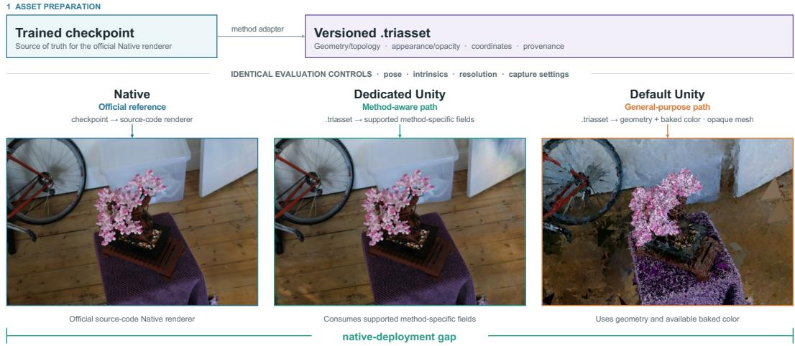
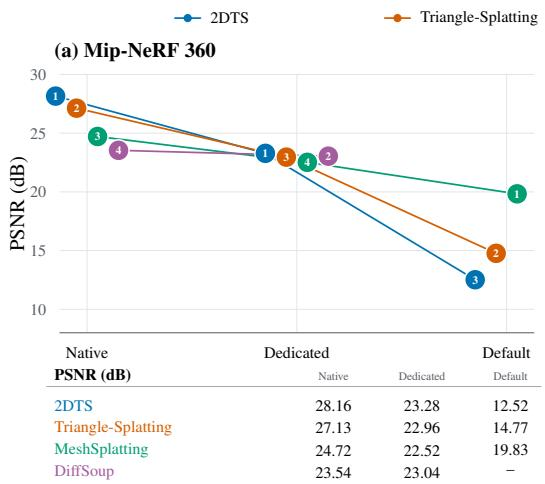
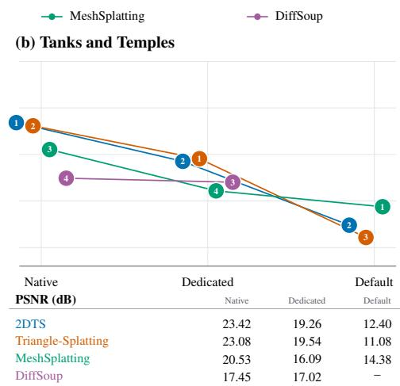
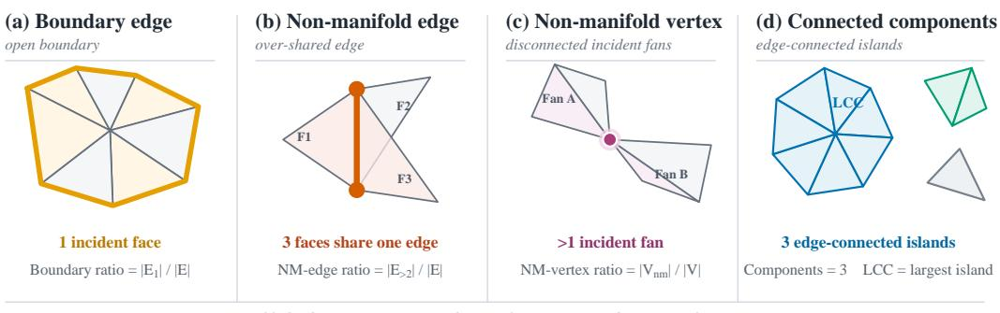
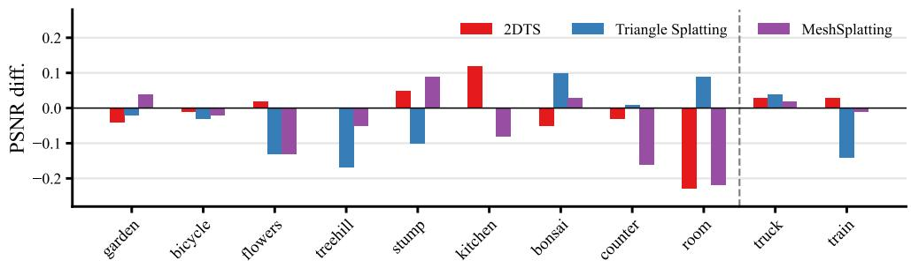

# MESHSPLATBENCH: A UNIFIED BENCHMARK FOR TRIANGLE-BASED NEURAL RENDERING

Kaixuan Zhang1 Minxian Li1,2∗ Mingwu Ren1,2 Xiatian Zhu3

1Nanjing University of Science and Technology

2State Key Laboratory of Intelligent Manufacturing of Advanced Construction Machinery 3University of Surrey

## ABSTRACT

Triangle-based neural rendering bridges neural scene representations and conventional graphics pipelines by optimizing explicit geometric primitives compatible with standard rasterization hardware. However, existing approaches are evaluated almost exclusively within custom research renderers, obscuring their practical deployability in production engines. To bridge this gap, we introduce Mesh-SplatBench, a unified benchmark that systematically investigates triangle-based neural rendering across the complete pipeline from native optimization to gameengine deployment. MeshSplatBench establishes a standardized evaluation protocol while preserving each method’s native optimization semantics, reproducing published results within 0.8% PSNR deviation. Furthermore, we introduce a hierarchical Unity deployment protocol spanning three rendering tiers: native CUDA renderers, method-specific dedicated engine shaders, and standard opaque mesh pipelines, isolating the exact fidelity losses caused by engine adaptation vs. representation reduction. Finally, we conduct a topological audit of reconstructed surfaces, demonstrating that explicit connectivity and shared indexing alone are insufficient to guarantee production-ready assets due to prevalent nonmanifold structures, fragmented components, and boundary artifacts. Overall, MeshSplatBench demonstrates that rasterizability is merely a primitive-level attribute, whereas graphics readiness requires jthe holistic alignment of representation, topology, and engine compatibility. Source code will be released.

## 1 INTRODUCTION

Neural scene representations have achieved remarkable progress in novel view synthesis (NVS). Neural radiance fields (NeRFs) (Mildenhall et al., 2020) synthesize high-fidelity novel views through continuous volumetric ray integration, while 3D Gaussian Splatting (3DGS) (Kerbl et al., 2023) enables real-time rasterization using explicit anisotropic Gaussian primitives. Despite their visual fidelity, both representations remain fundamentally coupled to bespoke research rendering pipelines: NeRFs require costly volumetric marching, whereas 3DGS relies on specialized 2D projection, tilebased sorting, and custom alpha compositing. Consequently, deploying them in conventional computer graphics (CG) engines typically requires representation conversion or custom rendering support, introducing substantial engineering friction and visual degradation (Guedon & Lepetit, 2024;´ Huang et al., 2024).

Triangle-based neural rendering provides an appealing alternative by directly optimizing the fundamental primitive natively supported by modern graphics hardware and game engines (Held et al., 2026b; Sheng et al., 2025; Held et al., 2026a; Tojo et al., 2026). At first glance, optimizing explicit planar facets suggests that the learned scene can be ingested directly by conventional rasterization pipelines. However, rasterizable geometry does not necessarily constitute a graphics-ready asset. While polygon geometry can be ingested by standard graphics pipelines, the final rendered appearance frequently depends on non-standard mechanisms—including continuous soft coverage kernels, per-primitive learned opacity, view-dependent spherical harmonics (SHs), neural texture decoders, and custom order-dependent alpha blending. Although these features are readily executed within specialized CUDA research rasterizers, they incur substantial performance overhead or fidelity loss when ported to standard game engines (e.g., Unity).

MeshSplatBench protocol  
Control ed export and cross-renderer comparison  
  
Figure 1: MeshSplatBench protocol. A trained checkpoint of the official Native renderer is exported by a method adapter to a versioned .triasset. Dedicated Unity consumes supported method-specific fields, whereas Default Unity adopts an opaque mesh path.

This discrepancy exposes two critical limitations in current evaluation practices. First, existing triangle-based methods are evaluated almost exclusively within their custom native CUDA rasteriz ers. Consequently, reported NVS metrics characterize the joint capacity of the representation and its specialized rendering kernel, obscuring practical deployability. Second, existing literature exhibits pervasive inconsistencies (e.g., background compositing policies, and metric implementations), confounding fair cross-method comparisons even in native environments. A representation exhibiting superior native NVS quality may suffer severe degradation once its learned opacity, boundary antialiasing, or custom compositing rules are constrained by standard engine interfaces. These call for a unified benchmarking framework that measures both native reconstruction fidelity and postdeployment performance inside production CG engines.

A primary goal of triangle-based neural representations is to reconstruct geometry that functions as a conventional, well-behaved polygon mesh in downstream engines like Unity. Among existing paradigms, while triangle soups (e.g., 2DTS (Sheng et al., 2025) and Triangle-Splatting (Held et al., 2026b)) parameterize disconnected facelets, MeshSplatting (Held et al., 2026a) explicitly targets connected surface geometry by forming an indexed mesh via restricted Delaunay triangulation. We therefore perform an in-depth topological audit of MeshSplatting’s reconstructed assets. Crucially, our geometric analysis reveals that indexed vertex sharing alone does not guarantee a production-quality mesh: the exported geometry exhibits extensive open boundary edges, prevalent non-manifold vertices, and thousands of fragmented components, demonstrating that neither primitive-level rasterizability nor explicit index sharing is sufficient for true graphics readiness (see Sec. 5.4).

To systematically address these challenges, we introduce MeshSplatBench, a unified benchmark that investigates triangle-based neural rendering from native training to production engine deployment. MeshSplatBench strictly standardizes dataset splits, camera calibration, background policies, evaluation resolutions, and metric implementations while preserving each method’s native optimization loops and loss formulations. Across all method–scene pairs with published per-scene benchmarks, our unified implementation reproduces reported native PSNR values with a maximum relative deviation below 0.8% (and within 0.26% on dataset averages), establishing a solid and verified baseline for standardized cross-method evaluation (see Sec. 5.2).

Beyond native benchmarking, MeshSplatBench establishes a Unity deployment protocol spanning three hierarchical rendering tiers: (i) the Native source-code research renderer; (ii) a Dedicated Unity renderer implementing custom engine shaders to faithfully support spherical harmonics (SHs), learned opacity, and soft coverage; and (iii) a Default Unity renderer that reduces the asset to a stan-

<table><tr><td>Method</td><td>Shared vertices</td><td>Soft coverage</td><td>Learned opacity</td><td>SH</td><td>MLP</td><td>Alpha blending</td></tr><tr><td>2DTS (Sheng et al., 2025)</td><td>x</td><td>√</td><td>√</td><td>√</td><td>x</td><td>√</td></tr><tr><td>Triangle-Splatting (Held et al., 2026b)</td><td>x</td><td>√</td><td>√</td><td>√</td><td>x</td><td>√</td></tr><tr><td>MeshSplatting (Held et al., 2026a)</td><td>√</td><td>x</td><td>√</td><td>√</td><td>x</td><td>√</td></tr><tr><td>DiffSoup (Tojo et al., 2026)</td><td>x</td><td>x</td><td>√</td><td>x</td><td>√</td><td>x</td></tr></table>

Table 1: Objective representation and native-rendering attributes of the evaluated methods. ✓ and ✗ denote present and absent attributes, respectively. Shared vertices indicate an indexed layout, not manifoldness or global connectivity. DiffSoup uses learned texture opacity with binary visibility and depth testing rather than soft splatting or alpha blending.

dard opaque mesh evaluated with hardware Z-buffering. Evaluating identical held-out viewpoints across this hierarchy cleanly disentangles the engine adaptation gap (Native vs. Dedicated) from the representation reduction gap (Dedicated vs. Default) (see Sec. 4). As illustrated in Fig. 1, our asset pipeline bridges native representations to versioned engine assets via the unified .triasset abstraction.

Empirical evaluation reveals that triangle primitives alone do not guarantee seamless engine deployment. While Dedicated Unity shaders recover significantly higher appearance fidelity than default mesh pipelines, every method exhibits a measurable adaptation drop (up to 4.88 dB in PSNR). Crucially, method rankings invert across rendering conditions (see Tab. 4): representations with superior native NVS fidelity do not necessarily retain the highest quality under standard engine constraints (e.g., 2DTS outperforms MeshSplatting natively by 3.44 dB, but degrades below it on default mesh paths). Combined with our topological audit, these findings confirm that successful deployment requires the joint optimization of appearance representation, boundary blending, compositing rules, and topological structure.

In summary, our key contributions are: (I) We introduce MeshSplatBench, a unified benchmark for triangle-based neural rendering that standardizes evaluation semantics while preserving methodspecific optimization semantics; (II) We design an auditable .triasset exchange contract and a three-tier rendering protocol that disentangles engine adaptation from representation reduction gaps; (III) We benchmark methods across NVS fidelity, rendering efficiency, training overhead, and engine deployment, demonstrating that no single method dominates across all metrics and that engine constraints induce significant rank inversions; and (IV) we conduct a systematic topological audit of reconstructed geometry, showing that explicit vertex indexing fails to ensure productionready meshes due to pervasive open boundaries and non-manifold structures.

## 2 RELATED WORK

Neural Scene Representations and Specialized Rendering. Neural radiance fields represent a scene as a continuous function and synthesize views through volumetric integration (Mildenhall et al., 2020). Later methods improve reconstruction quality and anti-aliasing (Barron et al., 2021; 2022; 2023) or accelerate rendering through explicit, factorized, and hashed structures (Reiser et al., 2024; Yu et al., 2021; Fridovich-Keil et al., 2022; Chen et al., 2022; Muller et al., 2022). 3DGS¨ replaces repeated network queries with optimized anisotropic Gaussians and a dedicated splatting rasterizer (Kerbl et al., 2023). Follow-up work refines Gaussian optimization or encourages surfacealigned geometry, including 3DGS-MCMC (Kheradmand et al., 2024), 2DGS (Huang et al., 2024), and SuGaR (Guedon & Lepetit, 2024). These methods establish strong NVS baselines, but their out-´ puts remain coupled to specialized renderers or require a separate conversion stage before entering a conventional graphics pipeline.

Triangle-Based Neural Representations. To bridge the gap between neural primitives and standard graphics hardware, triangle-based neural representations optimize geometry directly expressible by hardware rasterizers (Held et al., 2026b; Sheng et al., 2025; Held et al., 2026a; Tojo et al., 2026). These approaches diverge into two distinct paradigms: (i) discontinuous triangle soups (e.g., 2DTS (Sheng et al., 2025) and Triangle-Splatting (Held et al., 2026b)) that parameterize independent pla nar facelets optimized with continuous coverage kernels and splatting-style alpha blending; and (ii) structured or indexed meshes (e.g., MeshSplatting (Held et al., 2026a) and DiffSoup (Tojo et al., 2026)) that introduce explicit local connectivity or neural texture parameterizations. As categorized in Tab. 1, their core differences extend far beyond geometric representation—subtle discrepancies in learned opacity, SHs, boundary anti-aliasing, and depth compositing dictate how much specialized engine support is mandatory post-export.

Neural Asset Deployment and Graphics Conversion. A parallel line of research investigates extracting deployable polygon meshes from implicit fields or explicit splats. Methods such as MobileNeRF (Chen et al., 2023) and BakedSDF (Yariv et al., 2023) bake radiance fields into textured polygon meshes with feature textures executed via lightweight fragment shaders. For explicit splats, SuGaR (Guedon & Lepetit, 2024) and GaMeS (Waczy´ nska et al., 2024) extract mesh surfaces from´ 3D Gaussians or bind Gaussian primitives to deformable mesh faces. Although these conversion pipelines produce standard mesh assets, they often rely on lossy post-processing (e.g., Marching Cubes, Poisson surface reconstruction, or heuristic simplification) that decouples the optimization target from the final rendering objective. In contrast, triangle-based neural rendering optimizes the deployable primitive end-to-end, raising the fundamental question of whether natively optimized triangles are truly graphics-ready without lossy approximations.

Neural Rendering Benchmarks and Protocols. Standardized benchmarking has become essential for rigorous evaluation in novel-view synthesis. NerfBaselines (Kulhanek & Sattler, 2025) and Splatwizard (Liu et al., 2026) establish rigorous native evaluation protocols across diverse NeRF and 3DGS compression variants. However, existing benchmarks operate exclusively within native research environments, evaluating image-space metrics while leaving post-deployment behavior unexamined. MeshSplatBench complements these efforts by extending evaluation beyond native reconstruction: it standardizes native workflows while introducing a matched multi-condition engine deployment protocol and a comprehensive structural topology audit, systematically quantifying the fidelity drop, hardware overhead, and geometric integrity.

## 3 MESHSPLATBENCH: BENCHMARK DESIGN

## 3.1 UNIFIED EVALUATION PROTOCOL

MeshSplatBench standardizes dataset splits, preprocessing, calibrated cameras, evaluation cameras, image resolution, background policy, color-space handling, and NVS metrics, including PSNR, SSIM (Wang et al., 2004), and LPIPS (Zhang et al., 2018). LPIPS uses the VGG backbone (Simonyan & Zisserman, 2015), with images normalized to [−1, 1]. The benchmark preserves each method’s official optimization loop, method-specific training logic and hyperparameters, primitive or topology updates, densification or refinement schedule, native renderer, and checkpoint semantics. Common configuration fields are translated into native arguments rather than replacing method behavior. In short, MeshSplatBench standardizes evaluation semantics without replacing methodspecific optimization semantics.

The protocol separates four evaluation dimensions. Reproduction fidelity checks agreement with reported native behavior. Standardized native performance measures reconstruction quality, rendering efficiency, optimization cost, peak training memory, and geometry when reliable ground truth is available. Engine deployment measures fidelity and runtime on matched cameras under practical renderer constraints. Graphics readiness audits the representation properties retained after export and, for MeshSplatting, boundary coherence, manifoldness, and global connectivity. This separation prevents any single image-quality metric from acting as a proxy for the distinct objectives involved in deployment.

## 3.2 UNIFIED ENGINE-ASSET ABSTRACTION

A method adapter maps a trained native representation to a versioned engine asset,

$$
\begin{array} { r } { S _ { m } \xrightarrow { \mathcal { E } _ { m } } A _ { m } , } \end{array}\tag{1}
$$

where m indexes a method, $S _ { m }$ is its trained native representation, ${ \mathcal { E } } _ { m }$ is the corresponding method adapter, and $A _ { m }$ is the resulting versioned engine asset consumed by the unified execution engine. The .triasset contract stores geometry and topology; appearance attributes such as SHs, neural features, and textures; opacity and coverage parameters; and metadata including the source checkpoint and coordinate convention. Unsupported fields are marked explicitly rather than silently discarded. This contract is the auditable interface between a native method and Unity where the native checkpoint remains the source of truth, while each rendering condition declares which asset fields it consumes.

## 4 RENDERER-CONDITIONED ENGINE DEPLOYMENT

## 4.1 DEPLOYMENT SETTING AND MATCHED-VIEW EVALUATION PROTOCOL

We consider a rendering-first workflow in which a trained static reconstruction is exported to Unity for interactive camera motion. Editing, collision, animation, physics, and mesh repair are outside the task definition. For held-out camera set ${ \mathcal { C } } ,$ the native renderer produces

$$
I _ { m } ^ { \mathrm { n a t } } ( c ) = \mathcal { R } _ { m } ^ { \mathrm { n a t } } ( S _ { m } , c ) ,\tag{2}
$$

where $\mathcal { R } _ { m } ^ { \mathrm { n a t } }$ denotes the original source-code renderer of method $m _ { : }$ , and $I _ { m } ^ { \mathrm { n a t } } ( c )$ is the rendered image under the native rendering pipeline. The adapter records world-to-camera and camera-toworld transforms, intrinsics, image dimensions, and clipping planes before converting them to each backend’s convention. Unity then renders the same asset and camera under dedicated and default conditions, yielding images $I _ { m } ^ { \mathrm { d e d } } ( c )$ from the method-specific Unity renderer and $I _ { m } ^ { \mathrm { d e f } } ( c )$ from the default Unity renderer. All three images are evaluated against the same ground truth $\dot { I } ^ { \mathrm { g t } } ( c )$ , with capture settings $( e . g .$ , color conversion, exposure and tone mapping) held fixed.

## 4.2 HIERARCHICAL RENDERING CONDITIONS FOR DEPLOYMENT EVALUATION

The three conditions answer progressively stricter questions. The native condition measures performance inside the official research renderer. The dedicated Unity condition permits method-specific shaders and engine functionality and asks how much of the learned appearance can be retained inside a real engine. The default Unity condition converts the asset to a standard opaque Unity mesh with vertex color and Z-buffer visibility and asks what remains without method-specific rendering support.

For a higher-is-better quality metric $Q \left( { \boldsymbol { e } } . g . , { \mathrm { P S N R } } \right)$ , given a matched camera set ${ \mathcal { C } } ,$ let $Q _ { m } ^ { \mathrm { n a t } } , Q _ { m } ^ { \mathrm { d e d } }$ and $Q _ { m } ^ { \mathrm { d e \overline { { f } } } }$ denote the average metric values obtained by the native, dedicated Unity, and default Unity renderers of method m, respectively:

$$
Q _ { m } ^ { r } = \frac { 1 } { | \mathcal { C } | } \sum _ { c \in \mathcal { C } } q \left( I _ { m } ^ { r } ( c ) , I ^ { \mathrm { g t } } ( c ) \right) ,\tag{3}
$$

where $r \in \{ \mathrm { n a t } , \mathrm { d e d } , \mathrm { d e f } \}$ denotes the rendering condition and $q ( \cdot , \cdot )$ is the corresponding image quality metric. We then define three deployment-related gaps:

$$
\Delta Q _ { m } ^ { \mathrm { a d a p t } } = Q _ { m } ^ { \mathrm { n a t } } - Q _ { m } ^ { \mathrm { d e d } } ,\tag{4}
$$

$$
\Delta Q _ { m } ^ { \mathrm { p o r t } } = Q _ { m } ^ { \mathrm { d e d } } - Q _ { m } ^ { \mathrm { d e f } } ,\tag{5}
$$

$$
\Delta Q _ { m } ^ { \mathrm { d e p l o y } } = Q _ { m } ^ { \mathrm { n a t } } - Q _ { m } ^ { \mathrm { d e f } } ,\tag{6}
$$

where the adaptation gap $\Delta Q _ { m } ^ { \mathrm { a d a p t } }$ quantifies the performance loss incurred during engine integration while preserving method-specific rendering support; the portability gap $\Delta Q _ { m } ^ { \mathrm { p o r t } }$ quantifies the additional degradation caused by replacing specialized rendering components with generic engine primitives; and the deployment gap $\mathrm { \Delta } \mathrm { \bar { \Delta } Q } _ { m } ^ { \mathrm { d e p l o y } }$ quantifies the total discrepancy between the original research renderer and conventional engine deployment. For lower-is-better metrics (e.g., LPIPS), we reverse the sign convention so that a positive gap consistently indicates degradation.

Tab. 2 summarizes, for each method and Unity condition, which native representation properties are retained. Dedicated support does not imply exact native reproduction: the current Unity renderers do not reproduce native per-camera primitive sorting, and the DiffSoup ColorMLP is not implemented. The default condition retains geometry and, when available, a baked SH-DC color term; higher-order view dependence, learned opacity, soft coverage, and method-specific compositing are discarded.

<table><tr><td>Method</td><td>Unity condition</td><td>View-dep.</td><td>Opacity</td><td>Soft coverage</td><td>Native ordering</td><td>Appearance decoder</td></tr><tr><td rowspan="2">3DGS (Kerbl et al., 2023)</td><td>Dedicated Default</td><td rowspan="2"></td><td colspan="4">N/A</td></tr><tr><td></td><td></td><td>N/A</td><td></td></tr><tr><td rowspan="2">2DGS (Huang et al., 2024)</td><td>Dedicated</td><td></td><td></td><td>N/A</td><td></td><td></td></tr><tr><td>Default</td><td>x</td><td>x</td><td>x</td><td>x</td><td>baked color</td></tr><tr><td rowspan="2">2DTS (Sheng et al., 2025)</td><td>Dedicated</td><td>√</td><td>√</td><td>√</td><td>x</td><td>SH</td></tr><tr><td>Default</td><td>x</td><td>x</td><td>x</td><td>x</td><td>baked SH-DC</td></tr><tr><td rowspan="2">Triangle-Splatting (Held et al., 2026b)</td><td>Dedicated</td><td>√</td><td>√</td><td>√</td><td>x</td><td>SH</td></tr><tr><td>Default</td><td>x</td><td>x</td><td>x</td><td>x</td><td>baked SH-DC</td></tr><tr><td rowspan="2">MeshSplatting (Held et al., 2026a)</td><td>Dedicated</td><td>√</td><td>√</td><td>一</td><td>x</td><td>SH</td></tr><tr><td>Default</td><td>x</td><td>x</td><td>一</td><td>x</td><td>baked SH-DC</td></tr><tr><td rowspan="2">DiffSoup (Tojo et al., 2026)</td><td>Dedicated (partial)</td><td>x</td><td>△</td><td></td><td>△</td><td></td></tr><tr><td>Default</td><td></td><td></td><td>一 N/A</td><td></td><td>ColorMLP absent</td></tr></table>

Table 2: Feature preservation under the dedicated and default Unity conditions. $\checkmark , \bigtriangleup , \pmb { x } ,$ and – denote retained, partially retained, discarded, and inapplicable native properties, respectively. N/A denotes renderer incompatibility; “baked color” is a static appearance fallback.

## 5 BENCHMARK EVALUATION

## 5.1 EXPERIMENTAL SETUP AND REPRODUCTION CHECK

We evaluate 2DTS (Sheng et al., 2025), Triangle-Splatting (Held et al., 2026b), MeshSplatting (Held et al., 2026a), and DiffSoup (Tojo et al., 2026). Mip-NeRF 360 (Barron et al., 2022) and Tanks and Temples (Knapitsch et al., 2017) provide indoor and outdoor scenes; DTU (Jensen et al., 2014) provides object-centric scenes with ground-truth geometry; and NeRF-Synthetic (Mildenhall et al., 2020) provides an additional controlled cross-dataset check. Mip-NeRF 360 images are downsampled by 2 for indoor scenes and 4 for outdoor scenes; the other datasets use 2× downsampling. DTU is evaluated under both full-image and foreground-mask policies because prior methods differ in background treatment.

All training and native evaluation use a single NVIDIA RTX 4090 with 24 GB memory. We report PSNR, SSIM (Wang et al., 2004), and LPIPS (Zhang et al., 2018) as image metrics; native efficiency includes FPS, peak training memory, and optimization time, while current Unity results include image metrics and FPS.

Reproduction fidelity. Before cross-method interpretation, we compare MeshSplatBench with paper-reported values and public implementations. For 2DTS, Triangle-Splatting, and Mesh-Splatting on method–scene pairs with paper-reported per-scene PSNR, the relative deviation $\vert Q _ { \mathrm { M e s h S p l a t B e n c h } } - Q _ { \mathrm { p a p e r } } \vert / Q _ { \mathrm { p a p e r } }$ is below 0.8%. DiffSoup is excluded from this per-scene claim because its paper does not report the corresponding values. Across 27 Mip-NeRF 360 method– scene pairs, the mean absolute difference is 0.075 dB; the maximum is 0.230 dB (2DTS on room), and the largest relative deviation is 0.775% (Triangle-Splatting on treehill). This validates paper-PSNR agreement on the evaluated pairs only; it does not establish identical geometry, runtime, or optimization trajectories. App. A.6 provides the per-scene difference plot and complete metric-level comparisons.

## 5.2 STANDARDIZED NATIVE BENCHMARK

Tab. 3 brings the standardized native results into the main paper. Per-dataset and protocol-specific results remain in App. A.3. Across Mip-NeRF 360 (Barron et al., 2022) and NeRF-Synthetic (Mildenhall et al., 2020), 2DTS has the highest image fidelity, whereas Triangle-Splatting is strongest on two of the three Tanks and Temples image metrics. DiffSoup has the highest native FPS and shortest optimization time on all three datasets shown, but does not lead image fidelity. MeshSplatting differs structurally through its indexed layout, yet that property does not make it the native image-quality or efficiency winner. Thus, no representation dominates fidelity, throughput, memory, and training time simultaneously.

DTU (Jensen et al., 2014) additionally exposes protocol and objective sensitivity. Under the fullimage protocol, Triangle-Splatting has the best NVS metrics while MeshSplatting has the lowest Chamfer distance $( i . e . , 0 . 7 9 ) ;$ under the foreground protocol, 2DTS has the highest PSNR and lowest Chamfer distance (i.e., 0.63), while Triangle-Splatting retains the best LPIPS. These changes demonstrate that background policy can alter rankings and that NVS fidelity and geometry accuracy are distinct objectives. App. Tab. 9 reports the full comparison.

<table><tr><td>Dataset</td><td>Method</td><td>PSNR ↑</td><td>SSIM ↑</td><td>LPIPS↓</td><td></td><td>FPS ↑ Peak mem. (MiB)↓</td><td>Train time (s) ↓</td></tr><tr><td rowspan="4">Mip-NeRF 360</td><td>2DTS</td><td>28.16</td><td>0.841</td><td>0.215</td><td>70</td><td>10069</td><td>2764</td></tr><tr><td>Triangle-Splatting</td><td>27.13</td><td>0.812</td><td>0.227</td><td>94</td><td>18901</td><td>2428</td></tr><tr><td>MeshSplatting</td><td>24.72</td><td>0.729</td><td>0.365</td><td>38</td><td>23134</td><td>2500</td></tr><tr><td>DiffSoup</td><td>23.54</td><td>0.689</td><td>0.322</td><td>168</td><td>23484</td><td>1009</td></tr><tr><td rowspan="4">Tanks and Temples</td><td>2DTS</td><td>23.42</td><td>0.853</td><td>0.203</td><td>101</td><td>16061</td><td>1556</td></tr><tr><td>Triangle-Splatting</td><td>23.08</td><td>0.856</td><td>0.171</td><td>159</td><td>11157</td><td>1472</td></tr><tr><td>MeshSplatting</td><td>20.53</td><td>0.756</td><td>0.319</td><td>66</td><td>21321</td><td>1446</td></tr><tr><td>DiffSoup</td><td>17.45</td><td>0.645</td><td>0.389</td><td>226</td><td>23890</td><td>923</td></tr><tr><td rowspan="4">NeRF-Synthetic</td><td>2DTS</td><td>33.65</td><td>0.970</td><td>0.034</td><td>126</td><td>3172</td><td>980</td></tr><tr><td>Triangle-Splatting</td><td>29.87</td><td>0.956</td><td>0.055</td><td>243</td><td>12257</td><td>1145</td></tr><tr><td>MeshSplatting</td><td>29.50</td><td>0.945</td><td>0.071</td><td>86</td><td>23386</td><td>803</td></tr><tr><td>DiffSoup</td><td>28.65</td><td>0.910</td><td>0.076</td><td>371</td><td>16334</td><td>734</td></tr></table>

Table 3: Standardized native-renderer results on three datasets. Bold indicates the best value within each dataset and metric.  

  
Figure 2: Renderer-conditioned deployment gaps and PSNR ranks on (a) Mip-NeRF 360 and (b) Tanks and Temples. Each line follows one method from its source-code Native renderer through Dedicated and Default Unity. – denotes renderer incompatibility.

## 5.3 RENDERER-CONDITIONED DEPLOYMENT

Fig. 2 summarizes the Native–Dedicated–Default PSNR trajectories and renderer-conditioned rank changes, while Tab. 4 provides the complete Mip-NeRF 360 quality and throughput measurements. Under the evaluated engine-asset contract, 3DGS (Kerbl et al., 2023) is incompatible with both Unity conditions. 2DGS (Huang et al., 2024) has no compatible dedicated Unity renderer because its official TSDF export does not retain the method’s defining rendering variables; its extracted mesh is nevertheless compatible with the default Unity path. Dedicated Unity rendering preserves more quality than the default renderer for every triangle method with results in both conditions. Yet adaptation remains imperfect: the PSNR adaptation gaps are 4.88 dB for 2DTS, 4.17 dB for Triangle-Splatting, 2.20 dB for MeshSplatting, and 0.50 dB for the partial DiffSoup implementation.

Removing method-specific support produces Mip-NeRF 360 portability gaps of 10.76 dB for 2DTS, 8.19 dB for Triangle-Splatting, and 2.69 dB for MeshSplatting. Consequently, their overall nativeto-default gaps are 15.64, 12.36, and 4.89 dB, and their PSNR-derived Default fidelity retention is 2.7%, 5.8%, and 32.4%, respectively. Native ranking does not survive deployment: 2DTS leads Native and Dedicated PSNR, whereas MeshSplatting leads under Default Unity. Fig. 2(b) shows the same native-third-to-default-first reversal for MeshSplatting on Tanks and Temples, where its Default path retains 24.3% of the Native inverse-MSE fidelity. High native fidelity therefore does not imply high portability.

<table><tr><td>Renderer</td><td>Metric</td><td>3DGS</td><td>2DGS</td><td>2DTS</td><td>Triangle-Splatting</td><td>MeshSplatting</td><td>DiffSoup</td></tr><tr><td rowspan="3">Source-code native</td><td rowspan="3">PSNR ↑ SSIM↑ LPIPS↓ FPS ↑</td><td rowspan="3">27.21 0.815 0.214</td><td rowspan="3">26.79 0.796</td><td>28.16</td><td>27.13</td><td>24.72</td><td>23.54</td></tr><tr><td>0.841</td><td>0.812</td><td>0.729</td><td>0.689</td></tr><tr><td>0.252 0.215</td><td>0.227</td><td>0.365</td><td>0.322</td></tr><tr><td rowspan="3">Dedicated Unity</td><td rowspan="3">PSNR↑ SSIM↑ LPIPS↓</td><td rowspan="3">109 N/A</td><td rowspan="3">38 N/A</td><td>70</td><td>94</td><td>38</td><td>168</td></tr><tr><td>23.28</td><td>22.96</td><td>22.52</td><td>23.04 0.641</td></tr><tr><td>0.699 0.313</td><td>0.695 0.301</td><td>0.589 0.457</td><td>0.382</td></tr><tr><td rowspan="3">Default</td><td rowspan="3">FPS ↑ PSNR ↑ SSIM↑</td><td rowspan="3">N/A</td><td rowspan="3">8.88</td><td>545</td><td>70</td><td>157</td><td rowspan="3">1259</td></tr><tr><td>12.52</td><td>14.77</td><td>19.83</td></tr><tr><td>0.076</td><td></td><td>0.491</td></tr><tr><td rowspan="3">Unity</td><td rowspan="3">LPIPS↓ FPS ↑</td><td rowspan="3"></td><td>0.699</td><td>0.311 0.661</td><td>0.246 0.656</td><td>0.518</td><td>N/A</td></tr><tr><td>1933</td><td>3754</td><td>2294</td><td>943</td><td></td></tr><tr><td></td><td></td><td></td><td></td><td></td></tr></table>

Table 4: Renderer-conditioned comparisons on Mip-NeRF 360. N/A denotes renderer incompatibility.

MeshSplatting’s smaller portability gap is consistent with its indexed, increasingly opaque design requiring fewer behaviors outside a conventional Z-buffer path. Conversely, soft coverage, learned transparency, and view-dependent appearance require more method-specific support. This is an interpretation of coupled cross-method evidence, not proof that any one attribute causes the gap. The missing sorting and incomplete DiffSoup mapping further show that dedicated support improves fidelity at the cost of implementation complexity and may still fall short of native semantics. Appendix Tab. 11 gives the complete Tanks and Temples values underlying Fig. 2(b).

Runtime and resource efficiency. Evaluating rendering throughput across deployment conditions exposes a critical tension between custom pipeline expressiveness and real-time execution cost (Tabs. 3–4). In the dedicated engine environment, supporting custom sorting, alpha blending, and view-dependent shading incurs non-trivial GPU overhead: median GPU latencies (P50) on Mip-NeRF 360 range from 2.1, ms for 2DTS to 6.4, ms for MeshSplatting, with dedicated graphics memory allocations spanning 927–1,559, MiB. Across all methods, the tight bounds between P50 and P95 frame times (< 0.2, ms delta) indicate highly deterministic GPU workloads with minimal temporal jitter.

Conversely, routing assets through Unity’s standard rasterization path (Default) collapses GPU frame times to sub-millisecond ranges (0.3–1.1 ms) and slashes graphics allocations to a uniform 54, MiB. However, this throughput surge (up to 3754 FPS) is fundamentally an artifact of dropping non-standard shading and sorting passes rather than an algorithmic optimization, coming at the expense of devastating fidelity degradation (e.g., up to 15.64 dB drop in 2DTS). Crucially, while GPU latency isolates the raw hardware rendering cost, end-to-end FPS reflects full engine dispatch and synchronization overheads. Comprehensive scene-level latency profiles and memory breakdowns on Mip-NeRF 360 and Tanks and Temples are provided in App. Tabs. 6–13.

## 5.4 STRUCTURAL ANALYSIS OF MESHSPLATTING

MeshSplatting is the evaluated method whose construction explicitly shares vertices, making it the appropriate case study for whether indexed connectivity yields a well-formed mesh. Fig. 3 summarizes the four structural diagnostics used in our audit before we report numerical measurements. A boundary edge has exactly one incident face; a non-manifold edge has more than two incident faces; a non-manifold vertex has incident faces that split into multiple disconnected fans around the same vertex; and connected components are maximal face sets linked by shared complete edges, with the largest component denoted LCC. The figure is a schematic definition of what is counted, while Tab. 5 reports the corresponding per-scene and mean statistics on the nine Mip-NeRF 360 scenes. App. A.5 gives the complete metric definitions and audit protocol.

The vertex/face ratio and valence show substantial local vertex reuse, but the boundary and nonmanifold ratios reveal extensive local structural irregularities. The largest component contains only about 70% of faces and 69% of area, while the raw component count indicates substantial fragmentation under edge-based connectivity. Boundaries can be legitimate for partial scenes and component count depends on resolution; these metrics therefore diagnose structure rather than prove geometric incorrectness. Even with that qualification, the measurements show that shared indices and explicit connectivity do not imply a well-formed edge-connected manifold asset.

  
Highlighted primitives are counted; neutral geometry provides structural context.

Figure 3: Topology diagnostics used in the structural audit. (a) Boundary edges have exactly one incident face. (b) Non-manifold edges are shared by more than two faces. (c) Non-manifold ver tices contain multiple disconnected incident-face fans around the same vertex. (d) Edge-connected components are maximal face sets joined through complete shared edges; LCC denotes the largest component.
<table><tr><td rowspan="2">Scene</td><td colspan="2">Local reuse</td><td colspan="3">Local structure</td><td colspan="3">Global connectivity</td></tr><tr><td>V/F</td><td>Valence</td><td></td><td></td><td>Boundary edge Non-manif. edge ↓ Non-manif. vertex ↓</td><td>LCC face ↑</td><td></td><td>LCC area ↑ Components↓</td></tr><tr><td colspan="9">Outdoor scenes</td></tr><tr><td>bicycle</td><td>0.57</td><td>5.90</td><td>0.45</td><td>0.16</td><td>0.57</td><td>0.69</td><td>0.67</td><td>720,695</td></tr><tr><td>flowers</td><td>0.62</td><td>5.62</td><td>0.49</td><td>0.14</td><td>0.55</td><td>0.65</td><td>0.63</td><td>758,308</td></tr><tr><td>garden</td><td>0.48</td><td>6.85</td><td>0.43</td><td>0.20</td><td>0.70</td><td>0.73</td><td>0.73</td><td>771,271</td></tr><tr><td>stump</td><td>0.57</td><td>5.92</td><td>0.45</td><td>0.16</td><td>0.57</td><td>0.68</td><td>0.64</td><td>762,169</td></tr><tr><td>treehill</td><td>0.59</td><td>5.77</td><td>0.46</td><td>0.16</td><td>0.56</td><td>0.68</td><td>0.66</td><td>752,539</td></tr><tr><td colspan="9">Indoor scenes</td></tr><tr><td>room</td><td>0.46</td><td>7.22</td><td>0.46</td><td>0.18</td><td>0.75</td><td>0.71</td><td>0.71</td><td>706,507</td></tr><tr><td>counter</td><td>0.46</td><td>7.08</td><td>0.46</td><td>0.20</td><td>0.73</td><td>0.70</td><td>0.70</td><td>616,675</td></tr><tr><td>kitchen</td><td>0.41</td><td>7.56</td><td>0.40</td><td>0.24</td><td>0.75</td><td>0.77</td><td>0.78</td><td>514,944</td></tr><tr><td>bonsai</td><td>0.54</td><td>6.46</td><td>0.48</td><td>0.16</td><td>0.68</td><td>0.68</td><td>0.68</td><td>813,180</td></tr><tr><td>Mean</td><td>0.52</td><td>6.49</td><td>0.45</td><td>0.18</td><td>0.65</td><td>0.70</td><td>0.69</td><td>712,921</td></tr></table>

Table 5: Per-scene structural diagnostics for MeshSplatting exports on Mip-NeRF 360. Boundary and non-manifold entries are ratios; LCC entries are largest edge-connected component fractions; Components is an unnormalized count.

Design implications. Graphics readiness should be treated as a joint function of geometry, topology, appearance, boundary behavior, and compositing. Future triangle representations should make appearance compact enough to survive standard shader interfaces, model boundaries without requiring fragile ordering, and optimize topology in addition to image and surface losses. A useful asset interface should also declare unsupported learned fields explicitly, so that successful import cannot be mistaken for faithful deployment. The central distinction is: rasterizability is a primitive-level property; graphics readiness is a representation-level property.

## 6 CONCLUSION

MeshSplatBench studies when a rasterizable triangle representation becomes a practical graphics asset. Its matched native–dedicated–default protocol separates engine integration from portability to a conventional mesh path, revealing substantial quality gaps and renderer-dependent ranking changes. Its structural audit further shows that an indexed, connected representation can retain extensive boundaries, non-manifold neighborhoods, and fragmentation. Together, these results ar gue that future triangle-based neural rendering should co-design geometry, topology, appearance, boundary behavior, and compositing, and should evaluate learned assets jointly in image, geometry, efficiency, and graphics-engine spaces. Overall, no method is universally best: native fidelity, geometry accuracy, training cost, rendering throughput, engine portability, and mesh integrity are distinct objectives whose rankings can disagree.

## ETHICS STATEMENT

MeshSplatBench uses public reconstruction datasets and is intended to improve reproducible, transparent graphics-deployment evaluation. Deployed systems should use authorized data, disclose synthetic or reconstructed content, and preserve attribution.

## REPRODUCIBILITY STATEMENT

We will publicly release the MeshSplatBench code and evaluation configurations. Secs. 3–5 define the native protocol, exported .triasset abstraction, matched Unity conditions, metrics, datasets, preprocessing, and hardware. App. Secs. A.1–A.4 document renderer mismatches and full timing/resource/native results, and App. Secs. A.5–A.6 provide topology definitions and reproduction comparisons.

## AI USE STATEMENT

Generative AI tools assisted with formatting and ICLR-template migration; the authors reviewed the manuscript and take responsibility for its content.

## REFERENCES

Jonathan T. Barron, Ben Mildenhall, Matthew Tancik, Peter Hedman, Ricardo Martin-Brualla, and Pratul P. Srinivasan. Mip-NeRF: A multiscale representation for anti-aliasing neural radiance fields. In Proceedings ofthe IEEE/CVF International Conference on Computer Vision, pp. 5855– 5864, 2021.

Jonathan T. Barron, Ben Mildenhall, Dor Verbin, Pratul P. Srinivasan, and Peter Hedman. Mip-NeRF 360: Unbounded anti-aliased neural radiance fields. In Proceedings ofthe IEEE/CVF Conference on Computer Vision and Pattern Recognition, pp. 5470–5479, 2022.

Jonathan T. Barron, Ben Mildenhall, Dor Verbin, Pratul P. Srinivasan, and Peter Hedman. Zip-nerf: Anti-aliased grid-based neural radiance fields. In Proceedings of the IEEE/CVF International Conference on Computer Vision, pp. 19697–19705, 2023.

Anpei Chen, Zexiang Xu, Andreas Geiger, Jingyi Yu, and Hao Su. TensoRF: Tensorial radiance fields. In Computer Vision – ECCV 2022, pp. 333–350. Springer, 2022.

Zhiqin Chen, Thomas Funkhouser, Peter Hedman, and Andrea Tagliasacchi. Mobilenerf: Exploiting the polygon rasterization pipeline for efficient neural field rendering on mobile architectures. In The Conference on Computer Vision and Pattern Recognition, 2023.

Sara Fridovich-Keil, Alex Yu, Matthew Tancik, Qinhong Chen, Benjamin Recht, and Angjoo Kanazawa. Plenoxels: Radiance fields without neural networks. In Proceedings ofthe IEEE/CVF Conference on Computer Vision and Pattern Recognition, pp. 5501–5510, 2022.

Antoine Guedon and Vincent Lepetit. SuGaR: Surface-aligned gaussian splatting for efficient 3D´ mesh reconstruction and high-quality mesh rendering. In Proceedings of the IEEE/CVF Conference on Computer Vision and Pattern Recognition, pp. 5354–5365, 2024.

Jan Held, Sanghyun Son, Renaud Vandeghen, Daniel Rebain, Matheus Gadelha, Yi Zhou, Anthony Cioppa, Ming C. Lin, Marc Van Droogenbroeck, and Andrea Tagliasacchi. MeshSplatting: Differentiable rendering with opaque meshes. In Proceedings ofthe IEEE/CVF Conference on Computer Vision and Pattern Recognition, pp. 7320–7329, 2026a.

Jan Held, Renaud Vandeghen, Adrien Deliege, Abdullah Hamdi, Daniel Rebain, Silvio Giancola, Anthony Cioppa, Andrea Vedaldi, Bernard Ghanem, Andrea Tagliasacchi, and Marc Van Droogenbroeck. Triangle splatting for real-time radiance field rendering. In International Conference on 3D Vision, 2026b. doi: 10.1109/3DV69130.2026.00123.

Binbin Huang, Zehao Yu, Anpei Chen, Andreas Geiger, and Shenghua Gao. 2D gaussian splatting for geometrically accurate radiance fields. In ACM SIGGRAPH 2024 Conference Papers, pp. 1–11. ACM, 2024.

Rasmus Jensen, Anders Dahl, George Vogiatzis, Engin Tola, and Henrik Aanæs. Large scale multiview stereopsis evaluation. In Proceedings ofthe IEEE conference on computer vision andpattern recognition, pp. 406–413, 2014.

Bernhard Kerbl, Georgios Kopanas, Thomas Leimkuhler, and George Drettakis. 3D gaussian splat-¨ ting for real-time radiance field rendering. ACM Transactions on Graphics, 42(4):1–14, 2023.

Shakiba Kheradmand, Daniel Rebain, Gopal Sharma, Weiwei Sun, Yang-Che Tseng, Hossam Isack, Abhishek Kar, Andrea Tagliasacchi, and Kwang Moo Yi. 3d gaussian splatting as markov chain monte carlo. In Advances in Neural Information Processing Systems, 2024. Spotlight Presentation.

Arno Knapitsch, Jaesik Park, Qian-Yi Zhou, and Vladlen Koltun. Tanks and temples: Benchmarking large-scale scene reconstruction. ACM Transactions on Graphics, 36(4), 2017.

Alex Krizhevsky, Ilya Sutskever, and Geoffrey E Hinton. Imagenet classification with deep convolutional neural networks. Advances in neural information processing systems, 25, 2012.

Jonas Kulhanek and Torsten Sattler. Nerfbaselines: Consistent and reproducible evaluation of novel view synthesis methods. Advances in Neural Information Processing Systems, 38:127378– 127403, 2025. doi: 10.52202/085713-3831.

Xiang Liu, Yimin Zhou, Jinxiang Wang, Yujun Huang, Shuzhao Xie, Shiyu Qin, Mingyao Hong, Jiawei Li, Yaowei Wang, Zhi Wang, Shu-Tao Xia, and Bin Chen. Splatwizard: A benchmark toolkit for 3d gaussian splatting compression. In Proceedings of the IEEE/CVF Conference on Computer Vision and Pattern Recognition Findings, pp. 2261–2271, 2026.

Ben Mildenhall, Pratul P. Srinivasan, Matthew Tancik, Jonathan T. Barron, Ravi Ramamoorthi, and Ren Ng. NeRF: Representing scenes as neural radiance fields for view synthesis. In Proceedings ofthe European Conference on Computer Vision, pp. 405–421, 2020.

Thomas Muller, Alex Evans, Christoph Schied, and Alexander Keller. Instant neural graphics prim-¨ itives with a multiresolution hash encoding. ACM Transactions on Graphics, 41(4):1–15, 2022.

Christian Reiser, Songyou Peng, Yiyi Liao, and Andreas Geiger. KiloNeRF: Speeding up neural radiance fields with thousands of tiny MLPs. In Proceedings of the IEEE/CVF International Conference on Computer Vision, pp. 14335–14345, 2024.

Kaifeng Sheng, Zheng Zhou, Yingliang Peng, and Qianwei Wang. 2D triangle splatting for direct differentiable mesh training, 2025.

Karen Simonyan and Andrew Zisserman. Very deep convolutional networks for large-scale image recognition. In International Conference on Learning Representations, 2015.

Kenji Tojo, Bernd Bickel, and Nobuyuki Umetani. Diffsoup: Direct differentiable rasterization of triangle soup for extreme radiance field simplification. In Proceedings of the IEEE/CVF Conference on Computer Vision and Pattern Recognition, pp. 8353–8363, 2026.

Joanna Waczynska, Piotr Borycki, Sławomir Tadeja, Jacek Tabor, and Przemysław Spurek. Games:´ Mesh-based adapting and modification of gaussian splatting. arXiv preprint arXiv:2402.01459, 2024.

Zhou Wang, Alan C. Bovik, Hamid R. Sheikh, and Eero P. Simoncelli. Image quality assessment: From error visibility to structural similarity. IEEE Transactions on Image Processing, 13(4): 600–612, 2004.

Lior Yariv, Peter Hedman, Christian Reiser, Dor Verbin, Pratul P Srinivasan, Richard Szeliski, Jonathan T Barron, and Ben Mildenhall. Bakedsdf: Meshing neural sdfs for real-time view synthesis. In ACM SIGGRAPH 2023 conference proceedings, pp. 1–9, 2023.

Alex Yu, Ruilong Li, Matthew Tancik, Hao Li, Ren Ng, and Angjoo Kanazawa. PlenOctrees for real-time rendering of neural radiance fields. In Proceedings of the IEEE/CVF International Conference on Computer Vision, pp. 5752–5761, 2021.

Richard Zhang, Phillip Isola, Alexei A Efros, Eli Shechtman, and Oliver Wang. The unreasonable effectiveness of deep features as a perceptual metric. In Proceedings of the IEEE conference on computer vision and pattern recognition, pp. 586–595, 2018.

## A SUPPLEMENTARY MATERIAL

## A.1 UNITY RENDERER IMPLEMENTATION DETAILS AND KNOWN MISMATCHES

Dedicated renderer. Each method uses a Unity component backed by the procedural HLSL shader TriAssetSplat with a method-specific render-mode branch. Geometry is issued through DrawProceduralIndirect. The blended path uses Blend SrcAlpha OneMinusSrcAlpha and ZWrite Off; SH is evaluated from the stored coefficients, opacity logits are activated by a sigmoid, and the shader selects the exported coverage rule. Triangle-Splatting uses an incenter-normalized power law, whereas 2DTS uses its exported $\exp ( - \frac { 1 } { 2 } \bar { \varepsilon } ^ { 2 \gamma } )$ rule. For MeshSplatting, export reduces the three activated vertex weights to a triangle opacity; a terminal-solid asset uses an opaque ZWrite On path. These choices explain the feature-level summary in Tab. 2; they do not make the Unity renderer numerically identical to the native CUDA rasterizer.

Primitive order and coverage. Native rasterizers perform tile-local front-to-back sorting before alpha compositing. The Unity cull pass TriAssetCull.compute currently writes $- \nabla \mathrm { i } \mathrm { s i b l e } \left[ \mathrm { i } \mathrm { d } \right] ~ = ~ \mathrm { i d } .$ so the dedicated renderer preserves primitive index order rather than sorting for each camera. Overlapping transparent primitives can therefore composite in a different order. The Unity shader also reconstructs screen-space coverage in pixel-scaled coordinates but does not replicate the native tile-level evaluation exactly. These are implementation mismatches, not controlled estimates of the contribution of sorting or coverage alone.

View-dependent appearance. The current SH path evaluates direction at a triangle centroid for perface attributes and at a corner for per-vertex attributes rather than reproducing the native per-pixel ray evaluation exactly. Large or oblique triangles can therefore receive a different view direction. For DiffSoup, the multiresolution feature interpolation and view-conditioned ColorMLP have not been validated in Unity. The current partial path reads proxy feature channels as color and uses a binary alpha test. Its dedicated results must therefore be labeled partial, not as a faithful reproduction or a lower bound with a guaranteed ordering.

Default renderer. The default condition creates a standard Unity Mesh and renders it with an unlit opaque vertex-color shader (GeneralPurposeVertexColor, Queue=Geometry, ZWrite On, Blend Off). When available, export bakes the zeroth-order SH coefficient into vertex RGB as $c _ { 0 } \mathbf { f } _ { \mathrm { d c } } + 0 . 5$ , where $c _ { 0 } = 0 . 2 8 2 0 9$ . Higher-order SH, opacity, coverage parameters, neural features, and method-specific compositing are excluded. DiffSoup has no validated SH-DC field and is consequently marked unsupported in this condition.

## A.2 MIP-NERF 360 UNITY TIMING AND RESOURCE RESULTS

The renderer-conditioned comparison in Tab. 4 reports all-scene mean image quality and FPS. To keep the main comparison compact, Tabs. 6-7 provide the complementary per-scene GPU frametime percentiles and memory measurements. The indoor, outdoor, and all-scene rows are arithmetic means over scenes; in particular, the reported mean P95 values are means of scene-level P95 values rather than percentiles pooled over frames from different scenes. DiffSoup is marked partial under the dedicated condition because its ColorMLP is absent and incompatible under the default condition because no appearance-complete general-purpose Unity path is available.

<table><tr><td rowspan="3">Scene</td><td colspan="8">Dedicated Unity</td><td colspan="8">Default Unity</td></tr><tr><td colspan="2">2DTS</td><td colspan="2">Triangle-Splatting</td><td colspan="2">MeshSplatting</td><td colspan="2">DiffSoup</td><td colspan="2">2DTS</td><td colspan="2">Triangle-Splatting</td><td colspan="2">MeshSplatting</td><td colspan="2">DiffSoup</td></tr><tr><td>P50 ms ↓ P95 ms ↓</td><td></td><td></td><td>P50 ms ↓ P95 ms ↓</td><td>P50 ms ↓ P95 ms ↓</td><td></td><td></td><td>P50 ms ↓ P95 ms ↓</td><td></td><td>P50 ms ↓ P95 ms ↓</td><td></td><td>P50 ms ↓</td><td>P95 ms ↓</td><td></td><td>P50 ms ↓ P95 ms ↓</td><td>P50 ms ↓ P95 ms ↓</td></tr><tr><td>bonsai</td><td></td><td>1.4</td><td>3.1</td><td>3.2</td><td>6.9</td><td>7.2</td><td>1.0</td><td>1.2</td><td></td><td></td><td></td><td></td><td>0.4</td><td>1.1</td><td>1.1</td><td>N/A</td></tr><tr><td>counter</td><td>1.4 1.7</td><td>1.9</td><td>3.2</td><td>3.7</td><td>5.5</td><td>5.7</td><td>1.2</td><td></td><td></td><td>0.2 0.2</td><td>0.2 0.2</td><td>0.4 0.4</td><td>0.4</td><td>1.0</td><td>1.0</td><td>N/A</td></tr><tr><td>kitchen</td><td>1.7</td><td>1.9</td><td>2.5</td><td>2.8</td><td>5.8</td><td>5.9</td><td>1.3 1.0</td><td></td><td></td><td>0.2</td><td>0.3</td><td>0.4</td><td>0.4</td><td>1.1</td><td>1.1</td><td>N/A</td></tr><tr><td>room</td><td>1.4</td><td>1.4</td><td>2.2</td><td>2.3</td><td>6.7</td><td>6.9</td><td></td><td></td><td>1.0</td><td>0.2</td><td>0.2</td><td>0.3</td><td>0.3</td><td>1.1</td><td>1.1</td><td>N/A</td></tr><tr><td>Indoor mean</td><td>1.6</td><td>1.7</td><td>2.8</td><td>3.0</td><td>6.2</td><td>6.4</td><td>1.1</td><td></td><td>1.2</td><td>0.2</td><td>0.2</td><td>0.4</td><td>0.4</td><td>1.1</td><td>1.1</td><td>N/A</td></tr><tr><td>bicycle</td><td>2.6</td><td>2.6</td><td>4.9</td><td>5.0</td><td>6.3</td><td>6.5</td><td>0.7</td><td></td><td></td><td>0.3</td><td>0.3</td><td>0.5</td><td>0.6</td><td>1.0</td><td>1.0</td><td>N/A</td></tr><tr><td>flowers</td><td>2.6</td><td>2.7</td><td>5.0</td><td>5.1</td><td>6.0</td><td>6.2</td><td>0.6</td><td>0.7 0.7</td><td></td><td></td><td>0.3</td><td>0.6</td><td>0.6</td><td>0.9</td><td>0.9</td><td>N/A</td></tr><tr><td>garden</td><td>2.6</td><td>2.6</td><td>4.5</td><td>4.5</td><td>7.9</td><td>8.2</td><td>0.7</td><td>0.8 0.7</td><td></td><td></td><td>0.4</td><td>0.5</td><td>0.5</td><td>1.3</td><td>1.3</td><td>N/A</td></tr><tr><td>stump</td><td>2.6</td><td>2.6</td><td>4.3</td><td>4.4</td><td>6.4</td><td>6.7</td><td>0.6</td><td></td><td></td><td></td><td>0.3</td><td>0.5</td><td>0.5</td><td>1.1</td><td>1.1</td><td>N/A</td></tr><tr><td>treehill</td><td>2.7</td><td>2.7</td><td>4.6</td><td>4.7</td><td>6.3</td><td>6.5</td><td>0.7</td><td>0.7</td><td></td><td></td><td>0.3</td><td>0.5</td><td>0.5</td><td>1.0</td><td>1.0</td><td>N/A</td></tr><tr><td>Outdoor mean</td><td>2.6</td><td>2.6</td><td>4.7</td><td>4.8</td><td>6.6</td><td>6.8</td><td>0.7</td><td>0.7</td><td></td><td></td><td>0.3</td><td>0.5</td><td>0.5</td><td>1.1</td><td>1.1</td><td>N/A</td></tr><tr><td>All-scene mean</td><td>2.1</td><td>2.2</td><td>3.8</td><td>4.0</td><td>6.4</td><td>6.6</td><td>0.9</td><td>0.9</td><td></td><td>0.3</td><td></td><td>0.5</td><td>0.5</td><td>1.1</td><td>1.1</td><td>N/A</td></tr></table>

Table 6: Per-scene GPU frame-time percentiles (ms) for the Mip-NeRF 360 Unity evaluations; lower is better. Indoor, outdoor, and all-scene means are unweighted means of the displayed scene-level percentiles. N/A means renderer incompatibility.
<table><tr><td rowspan="3">Scene</td><td colspan="8">Dedicated Unity</td><td colspan="8">Default Unity</td></tr><tr><td colspan="2"></td><td colspan="2">Triangle-Splatting</td><td colspan="2">MeshSplatting</td><td colspan="2">DiffSoup</td><td colspan="2">2DTS</td><td colspan="2">Triangle-Splatting</td><td colspan="2"></td><td colspan="2">MeshSplatting</td></tr><tr><td>Render MiB ↓</td><td>Asset MiB ↓</td><td>Render MiB ↓</td><td>Asset MiB ↓</td><td>Render MiB ↓</td><td>Asset MiB ↓</td><td></td><td>Render MiB ↓</td><td>Asset MiB ↓</td><td>Render MiB ↓ 57</td><td>Asset MiB ↓</td><td>Render MiB ↓</td><td>Asset MiB ↓</td><td>Render MiB ↓</td><td>Asset MiB ↓</td><td>Render MiB ↓ Asset MiB ↓</td></tr><tr><td>bonsai</td><td>572</td><td>235</td><td>1159</td><td>627</td><td>975</td><td>669</td><td>285 285</td><td>258</td><td></td><td>235</td><td>55</td><td>627</td><td></td><td></td><td>669</td><td>N/A</td></tr><tr><td>counter</td><td>571</td><td>235</td><td>1043</td><td>561</td><td>779</td><td>514</td><td></td><td>258 258</td><td></td><td></td><td></td><td></td><td>561</td><td>557</td><td>514</td><td>N/A</td></tr><tr><td>kitchen</td><td>571</td><td>235</td><td>1001</td><td>537</td><td>779</td><td>503</td><td></td><td></td><td></td><td></td><td>235 235 235</td><td>55</td><td>537</td><td>57</td><td>503</td><td>N/A</td></tr><tr><td>room</td><td>572</td><td>235</td><td>890</td><td>462</td><td>887</td><td>592</td><td></td><td></td><td></td><td></td><td></td><td></td><td>462</td><td>57</td><td>592</td><td>N/A</td></tr><tr><td>Indoor mean</td><td>571</td><td>235</td><td>1023</td><td>547</td><td>855</td><td>569</td><td></td><td>258 258</td><td></td><td></td><td></td><td></td><td>547</td><td>57</td><td>569</td><td>N/A</td></tr><tr><td>bicycle</td><td></td><td>703</td><td>2084</td><td>1156</td><td>956</td><td>665</td><td>285 280</td><td></td><td></td><td></td><td></td><td></td><td>1156</td><td></td><td>665</td><td>N/A</td></tr><tr><td>flowers</td><td>1599 1594</td><td>701</td><td>2136</td><td>1186</td><td>935</td><td>658</td><td>280 281</td><td>258 258</td><td></td><td></td><td></td><td></td><td>1186</td><td></td><td>658</td><td>N/A</td></tr><tr><td>garden</td><td>1602</td><td>704</td><td>1930</td><td>1068</td><td>1078</td><td>734</td><td></td><td>258</td><td></td><td></td><td></td><td></td><td>1068</td><td></td><td>734</td><td>N/A</td></tr><tr><td>stump</td><td>1579</td><td>694</td><td>1838</td><td>1016</td><td>982</td><td>684</td><td></td><td>258 258</td><td></td><td></td><td></td><td></td><td>1016</td><td></td><td>684</td><td>N/A</td></tr><tr><td>treehill</td><td>1601</td><td>704 701</td><td>1950</td><td>1080 1101</td><td>971 984</td><td>680 684</td><td></td><td></td><td></td><td></td><td>704</td><td>52 2 2 2</td><td>1080</td><td>12 2 22</td><td>680</td><td>N/A</td></tr><tr><td>Outdoor mean</td><td>1595</td><td></td><td>1988</td><td></td><td></td><td></td><td></td><td></td><td></td><td></td><td>701 494</td><td>52 54</td><td>1101</td><td>52</td><td>684</td><td>N/A</td></tr><tr><td>All-scene mean</td><td>1140</td><td>494</td><td>1559</td><td>855</td><td>927</td><td>633</td><td></td><td></td><td></td><td></td><td></td><td></td><td>855</td><td>54</td><td>633</td><td>N/A</td></tr></table>

Table 7: Per-scene renderer graphics allocation (Render) and serialized exported-asset size (Asset) for the Mip-NeRF 360 Unity evaluations. Indoor, outdoor, and all-scene means are unweighted means over scenes. N/A means renderer incompatibility.

## A.3 FULL NATIVE BENCHMARK RESULTS

This section provides the detailed native-renderer measurements underlying the compact summary in Tab. 3. These results characterize native fidelity and cost; they do not establish engine-side retention or resource use.

## A.3.1 MIP-NERF 360 NATIVE RESULTS

Tab. 8 reports native-renderer averages over the Mip-NeRF 360 scenes. The image metrics support the reproduction check in Sec. 5; FPS, memory, and optimization time remain native or offline measurements and are therefore not interpreted as Unity deployment costs.

<table><tr><td></td><td colspan="3">Outdoor</td><td colspan="3">Indoor</td><td colspan="6">Average PSNR ↑ SSIM ↑ LPIPS ↓ FPS ↑ Mem. (MiB) ↓ Time (s) ↓</td></tr><tr><td></td><td>PSNR↑</td><td>SSIM ↑ LPIPS ↓</td><td></td><td></td><td>PSNR ↑ SSIM ↑ LPIPS ↓|</td><td></td><td></td><td></td><td></td><td></td><td></td><td></td></tr><tr><td>2DTS (Sheng et al., 2025)</td><td>25.45</td><td>0.763</td><td>0.237</td><td>31.54</td><td>0.937</td><td>0.188</td><td>28.16</td><td>0.841</td><td>0.215</td><td>70</td><td>10069</td><td>2764</td></tr><tr><td>Triangle-Splatting (Held et al., 2026b)</td><td>24.15</td><td>0.720</td><td>0.248</td><td>30.85</td><td>0.928</td><td>0.200</td><td>27.13</td><td>0.812</td><td>0.227</td><td>94</td><td>18901</td><td>2428</td></tr><tr><td>MeshSplatting (Held et al., 2026a)</td><td>22.46</td><td>0.621</td><td>0.390</td><td>27.55</td><td>0.863</td><td>0.335</td><td>24.72</td><td>0.729</td><td>0.365</td><td>38</td><td>23134</td><td>2500</td></tr><tr><td>DiffSoup (Tojo et al., 2026)</td><td>21.17</td><td>0.548</td><td>0.406</td><td>26.50</td><td>0.864</td><td>0.218</td><td>23.54</td><td>0.689</td><td>0.322</td><td>168</td><td>23484</td><td>1009</td></tr></table>

Table 8: Native-renderer results on Mip-NeRF 360 (Barron et al., 2022).

## A.3.2 DTU PROTOCOL SENSITIVITY

Tab. 9 gives the full-image and foreground DTU results. The changes in method ranking across these two evaluation targets demonstrate protocol sensitivity; they do not provide a preference ordering for a downstream application or an engine-side deployment conclusion.

<table><tr><td>Method</td><td>|PSNR ↑ SSIM ↑ LPIPS ↓ FPS ↑ Mem. (MiB) ↓ Time (s) ↓ CD ↓ NVS Rank ↓ Geo. Rank ↓</td><td></td><td></td><td></td><td></td><td></td><td></td><td></td><td></td></tr><tr><td colspan="10">Full image</td></tr><tr><td>2DTS (Sheng et al., 2025)</td><td>21.83</td><td>0.780</td><td>0.425</td><td>369</td><td>2272</td><td>1196</td><td>0.84</td><td>3</td><td>2</td></tr><tr><td>Triangle-Splatting (Held et al., 2026b)</td><td>27.03</td><td>0.870</td><td>0.257</td><td>172</td><td>3921</td><td>798</td><td>1.16</td><td>1</td><td>3</td></tr><tr><td>MeshSplatting (Held et al., 2026a)</td><td>25.93</td><td>0.841</td><td>0.329</td><td>103</td><td>8525</td><td>777</td><td>0.79</td><td>2</td><td>1</td></tr><tr><td>DiffSoup (Tojo et al., 2026)</td><td>21.56</td><td>0.707</td><td>0.423</td><td>148</td><td>23431</td><td>961</td><td>4.27</td><td>4</td><td>4</td></tr><tr><td colspan="10">Foreground</td></tr><tr><td>2DTS (Sheng et al., 2025)</td><td>29.66</td><td>0.951</td><td>0.110</td><td>312</td><td>2470</td><td>1272</td><td>0.63</td><td>1</td><td>1</td></tr><tr><td>Triangle-Splatting (Held et al., 2026b)</td><td>27.78</td><td>0.944</td><td>0.080</td><td>165</td><td>4163</td><td>784</td><td>1.27</td><td>3</td><td>3</td></tr><tr><td>MeshSplatting (Held et al., 2026a)</td><td>27.82</td><td>0.933</td><td>0.106</td><td>114</td><td>7680</td><td>639</td><td>0.80</td><td>2</td><td>2</td></tr><tr><td>DiffSoup (Tojo et al., 2026)</td><td>17.91</td><td>0.760</td><td>0.263</td><td>170</td><td>23930</td><td>867</td><td>3.89</td><td>4</td><td>4</td></tr></table>

Table 9: Native-renderer results on DTU (Jensen et al., 2014) under full-image and foreground protocols. Results are averaged across scenes; memory is reported in MiB and time in seconds. Bold indicates the best value within each protocol and metric.

## A.4 ADDITIONAL CROSS-DATASET NATIVE AND UNITY RESULTS

## A.4.1 TANKS AND TEMPLES NATIVE RESULTS

Tab. 10 reports the full native-renderer comparison on Tanks and Temples, complementing the crossdataset summary in the main paper.
<table><tr><td>Method</td><td>PSNR ↑</td><td>SSIM ↑</td><td>LPIPS ↓</td><td>FPS↑</td><td>Memory (MiB) ↓</td><td>Time (s) ↓</td></tr><tr><td>2DTS (Sheng et al., 2025)</td><td>23.42</td><td>0.853</td><td>0.203</td><td>101</td><td>16061</td><td>1556</td></tr><tr><td>Triangle-Splatting (Held et al., 2026b)</td><td>23.08</td><td>0.856</td><td>0.171</td><td>159</td><td>11157</td><td>1472</td></tr><tr><td>MeshSplatting (Held et al., 2026a)</td><td>20.53</td><td>0.756</td><td>0.319</td><td>66</td><td>21321</td><td>1446</td></tr><tr><td>DiffSoup (Tojo et al., 2026)</td><td>17.45</td><td>0.645</td><td>0.389</td><td>226</td><td>23890</td><td>923</td></tr></table>

Table 10: Native-renderer results on Tanks and Temples (Knapitsch et al., 2017). Results are averaged across scenes; bold indicates the best value for each metric.

## A.4.2 TANKS AND TEMPLES UNITY DEPLOYMENT RESULTS

Tab. 11 gives the renderer-conditioned Unity deployment results on Tanks and Temples, complementing the Mip-NeRF 360 analysis in the main paper. For every method available under both Unity conditions, the dedicated renderer yields higher image quality on both scenes, whereas the default renderer generally provides higher throughput. Under the dedicated condition, Triangle-Splatting achieves the best mean image quality (19.54 dB PSNR, 0.719 SSIM, 0.258 LPIPS), while the partial DiffSoup path achieves the highest throughput (2388 FPS). Under the default condition, MeshSplatting retains the best mean quality (14.38 dB PSNR, 0.506 SSIM, 0.490 LPIPS), consistent with the Mip-NeRF 360 finding that the opaque, indexed layout of MeshSplatting degrades less severely without method-specific shading. DiffSoup has no default-renderer result for the same reason as on Mip-NeRF 360: no appearance-complete general-purpose Unity path is available for its exported asset. Tabs. 12-13 additionally report the per-scene GPU frame-time percentiles and renderer/asset memory measurements.

<table><tr><td></td><td></td><td colspan="4">train</td><td colspan="4">truck</td><td colspan="4">Mean</td></tr><tr><td>Renderer Method</td><td></td><td>PSNR ↑</td><td>SSIM↑</td><td>LPIPS ↓</td><td>FPS ↑</td><td>PSNR ↑</td><td>SSIM ↑</td><td>LPIPS ↓</td><td>FPS ↑</td><td>PSNR ↑</td><td>SSIM ↑</td><td>LPIPS ↓</td><td>FPS ↑</td></tr><tr><td></td><td>2DTS (Sheng et al., 2025)</td><td>18.79</td><td>0.650</td><td>0.330</td><td>1222</td><td>19.72</td><td>0.642</td><td>0.262</td><td>596</td><td>19.26</td><td>0.646</td><td>0.296</td><td>909</td></tr><tr><td>Dedicated</td><td>Triangle-Splatting (Held et al., 2026b)</td><td>18.44</td><td>0.705</td><td>0.301</td><td>469</td><td>20.63</td><td>0.733</td><td>0.215</td><td>604</td><td>19.54</td><td>0.719</td><td>0.258</td><td>536</td></tr><tr><td></td><td>MeshSplatting (Held et al., 2026a)</td><td>15.67</td><td>0.572</td><td>0.465</td><td>249</td><td>16.52</td><td>0.602</td><td>0.405</td><td>350</td><td>16.09</td><td>0.587</td><td>0.435</td><td>300</td></tr><tr><td></td><td>DiffSoup (Tojo et al., 2026)</td><td>15.38</td><td>0.546</td><td>0.482</td><td>2431</td><td>18.66</td><td>0.666</td><td>0.321</td><td>2345</td><td>17.02</td><td>0.606</td><td>0.402</td><td>2388</td></tr><tr><td></td><td>2DTS (Sheng et al., 2025)</td><td>11.68</td><td>0.313</td><td>0.655</td><td>6643</td><td>13.12</td><td>0.361</td><td>0.603</td><td>4316</td><td>12.40</td><td>0.337</td><td>0.629</td><td>5480</td></tr><tr><td></td><td>Triangle-Splatting (Held et al., 2026b)</td><td>9.26</td><td>0.257</td><td>0.710</td><td>3587</td><td>12.89</td><td>0.327</td><td>0.613</td><td>4269</td><td>11.08</td><td>0.292</td><td>0.661</td><td>3928</td></tr><tr><td>Default</td><td>MeshSplatting (Held et al., 2026a)</td><td>13.88</td><td>0.485</td><td>0.519</td><td>1313</td><td>14.88</td><td>0.528</td><td>0.462</td><td>1743</td><td>14.38</td><td>0.506</td><td>0.490</td><td>1528</td></tr><tr><td></td><td></td><td></td><td></td><td></td><td></td><td></td><td></td><td></td><td></td><td></td><td></td><td></td><td></td></tr><tr><td></td><td>DiffSoup (Tojo et al., 2026)</td><td></td><td></td><td></td><td></td><td></td><td>N/A</td><td></td><td></td><td></td><td></td><td></td><td></td></tr></table>

Table 11: Dedicated and default Unity renderer comparison on Tanks and Temples (Knapitsch et al., 2017), reported per scene and averaged over two scenes. N/A means renderer incompatibility. Bold marks the better available Unity condition within each method and metric; DiffSoup Dedicated is a partial implementation.

<table><tr><td></td><td></td><td colspan="2">train</td><td colspan="2">truck</td><td colspan="2">Mean</td></tr><tr><td>Renderer Method</td><td></td><td>P50 ms↓</td><td>P95 ms ↓</td><td>P50 ms↓</td><td>P95 ms ↓</td><td>P50 ms↓</td><td>P95 ms↓</td></tr><tr><td rowspan="4">Dedicated</td><td>2DTS (Sheng et al., 2025)</td><td>0.8</td><td>0.8</td><td>1.7</td><td>1.7</td><td>1.2</td><td>1.3</td></tr><tr><td>Triangle-Splatting (Held et al., 2026b)</td><td>2.1</td><td>2.2</td><td>1.7</td><td>1.7</td><td>1.9</td><td>1.9</td></tr><tr><td>MeshSplatting (Held et al., 2026a)</td><td>4.0</td><td>4.1</td><td>2.9</td><td>2.9</td><td>3.4</td><td>3.5</td></tr><tr><td>DiffSoup (Tojo et al., 2026)</td><td>0.4</td><td>0.4</td><td>0.4</td><td>0.4</td><td>0.4</td><td>0.4</td></tr><tr><td rowspan="4">Default</td><td>2DTS (Sheng et al., 2025)</td><td>0.2</td><td>0.2</td><td>0.2</td><td>0.2</td><td>0.2</td><td>0.2</td></tr><tr><td>Triangle-Splatting (Held et al., 2026b)</td><td>0.3</td><td>0.3</td><td>0.2</td><td>0.2</td><td>0.3</td><td>0.3</td></tr><tr><td>MeshSplatting (Held et al., 2026a)</td><td>0.8</td><td>0.8</td><td>0.6</td><td>0.6</td><td>0.7</td><td>0.7</td></tr><tr><td>DiffSoup (Tojo et al., 2026)</td><td colspan="6">N/A</td></tr></table>

Table 12: Per-scene GPU frame-time percentiles (ms) for the Tanks and Temples Unity evaluations; lower is better. Mean values average the two scene-level percentiles, rather than pooling frames from both scenes before computing a percentile. N/A means renderer incompatibility.

<table><tr><td></td><td></td><td colspan="2">train</td><td colspan="2">truck</td><td colspan="2">Mean</td></tr><tr><td></td><td>Renderer Method</td><td>Render MiB ↓</td><td>Asset MiB ↓</td><td>Render MiB↓</td><td>Asset MiB ↓</td><td>Render MiB ↓</td><td>Asset MiB ↓</td></tr><tr><td rowspan="4">Dedicated</td><td>2DTS (Sheng et al., 2025)</td><td>562</td><td>234</td><td>1103</td><td>469</td><td>832</td><td>352</td></tr><tr><td>Triangle-Splatting (Held et al., 2026b)</td><td>1025</td><td>556</td><td>841</td><td>440</td><td>933</td><td>498</td></tr><tr><td>MeshSplatting (Held et al., 2026a)</td><td>673</td><td>434</td><td>518</td><td>346</td><td>596</td><td>390</td></tr><tr><td>DiffSoup (Tojo et al., 2026)</td><td>276</td><td>258</td><td>276</td><td>258</td><td>276</td><td>258</td></tr><tr><td rowspan="4">Default</td><td>2DTS (Sheng et al., 2025)</td><td>48</td><td>234</td><td>48</td><td>469</td><td>48</td><td>352</td></tr><tr><td>Triangle-Splatting (Held et al., 2026b)</td><td>48</td><td>556</td><td>48</td><td>440</td><td>48</td><td>498</td></tr><tr><td>MeshSplatting (Held et al., 2026a)</td><td>48</td><td>434</td><td>48 N/A</td><td>346</td><td>48</td><td>390</td></tr><tr><td colspan="2">DiffSoup (Tojo et al., 2026)</td><td colspan="4"></td><td></td></tr></table>

Table 13: Per-scene renderer graphics allocation (Render) and serialized exported-asset size (Asset), in MiB, for the Tanks and Temples Unity evaluations. Mean values average the two scenes. N/A means renderer incompatibility.

## A.4.3 NERF-SYNTHETIC NATIVE EVALUATION

To demonstrate that MeshSplatBench can apply the integrated methods to an additional dataset under a shared protocol, we evaluate all four methods on NeRF-Synthetic (Mildenhall et al., 2020). As shown in Tab. 14, 2DTS achieves the strongest average image fidelity, reaching 33.65 dB PSNR, 0.970 SSIM, and 0.034 LPIPS. Compared with the second-best Triangle-Splatting, this corresponds to a 3.78 dB PSNR gain, a 0.014 SSIM improvement, and a 0.021 reduction in LPIPS. 2DTS also requires the least peak training memory at 3,172 MiB. However, its fidelity advantage does not extend to computational speed: DiffSoup achieves the highest rendering throughput at 371 FPS and the shortest training time at 734 seconds, whereas 2DTS reaches 126 FPS and trains in 980 seconds. These results reinforce that no representation dominates across all criteria and expose a clear trade-off between rendering fidelity, memory consumption, and computational efficiency.

<table><tr><td>Method</td><td>PSNR ↑</td><td>SSIM ↑</td><td>LPIPS ↓</td><td>FPS ↑</td><td>Training Mem. (MiB) ↓</td><td>Training Time (s) ↓</td></tr><tr><td>2DTS (Sheng et al., 2025)</td><td>33.65</td><td>0.970</td><td>0.034</td><td>126</td><td>3172</td><td>980</td></tr><tr><td>Triangle-Splatting (Held et al., 2026b)</td><td>29.87</td><td>0.956</td><td>0.055</td><td>243</td><td>12257</td><td>1145</td></tr><tr><td>MeshSplatting (Held et al., 2026a)</td><td>29.50</td><td>0.945</td><td>0.071</td><td>86</td><td>23386</td><td>803</td></tr><tr><td>DiffSoup (Tojo et al., 2026)</td><td>28.65</td><td>0.910</td><td>0.076</td><td>371</td><td>16334</td><td>734</td></tr></table>

Table 14: Quantitative results on the NeRF-Synthetic dataset (Mildenhall et al., 2020). Results are averaged across scenes.

## A.5 TOPOLOGY-METRIC DEFINITIONS AND DETAILED RESULTS

This appendix uses a structural audit to distinguish an indexed representation’s local vertex reuse from its global surface integrity. We apply this audit only to MeshSplatting, the evaluated method that enforces shared-vertex connectivity during construction. Let V , E, and F denote the sets of unique vertices, undirected edges, and triangular faces in one exported mesh. For connectedcomponent analysis, we construct a face-adjacency graph in which two faces are adjacent only

  
a) (a) Mip-NeRF 360  
b) Tanks & T (b) Tanks and Temples

Figure 4: Per-scene PSNR reproduction differences. Each bar reports PSNRMeshSplatBench − $\mathrm { P S N R } _ { \mathrm { p a p e r } } .$ Panel (a) contains the nine Mip-NeRF 360 scenes, and panel (b) contains the two Tanks and Temples scenes. Across the method–scene pairs, the largest relative deviation is 0.775%. DiffSoup is omitted because its paper does not provide the corresponding per-scene values.
<table><tr><td rowspan="2">Method</td><td colspan="3">Paper</td><td colspan="3">Public</td><td colspan="3">MeshSplatBench</td></tr><tr><td>PSNR↑</td><td>SSÍM↑</td><td>LPIPS↓</td><td>PSNR↑</td><td>SSIM↑</td><td>LPIPS↓</td><td>PSNR↑</td><td>SSIM↑</td><td>LPIPS↓</td></tr><tr><td>2DTS (Sheng et al., 2025)</td><td>28.18</td><td>0.842</td><td>0.218</td><td>28.51</td><td>0.851</td><td>0.215</td><td>28.16</td><td>0.841</td><td>0.215</td></tr><tr><td>Triangle-Splatting (Held et al., 2026b)</td><td>27.17</td><td>0.814</td><td>0.192</td><td>27.20</td><td>0.813</td><td>0.190</td><td>27.13</td><td>0.812</td><td>0.227</td></tr><tr><td>MeshSplatting (Held et al., 2026a)</td><td>24.78</td><td>0.728</td><td>0.310</td><td>24.78</td><td>0.728</td><td>0.310</td><td>24.72</td><td>0.729</td><td>0.365</td></tr><tr><td>DiffSoup (Tojo et al., 2026)</td><td>24.76</td><td>0.748</td><td>0.204</td><td>23.69</td><td>0.691</td><td>0.241</td><td>23.54</td><td>0.689</td><td>0.322</td></tr></table>

Table 15: Quantitative comparison of implementation reproducibility on the Mip-NeRF 360 (Barron et al., 2022) dataset. Bold indicates the best value within each source block and metric. DiffSoup (Tojo et al., 2026) uses AlexNet (Krizhevsky et al., 2012) as the LPIPS backbone, whereas Mesh-SplatBench uniformly employs VGG (Simonyan & Zisserman, 2015).

when they share a complete edge; a corner contact alone does not connect components. We exclude faces with repeated vertex indices from this graph and apply no component-size threshold. Tab. 5 in the main paper reports each metric per Mip-NeRF 360 scene and the arithmetic mean over the nine scenes.

Local vertex reuse. The V/F ratio $| V | / | F |$ measures unique vertices per face; for a fixed face count, a lower value indicates more vertex sharing under the same export convention. UV seams, normal splits, and material boundaries can still duplicate colocated vertices. Average valence is $\begin{array} { r } { { \frac { 1 } { | V | } } \sum _ { v \in V } \deg ( v ) = { \frac { 2 | E | } { | V | } } } \end{array}$ and summarizes local adjacency density. It approaches 6 for an ideal closed triangular 2-manifold, but neither statistic alone measures surface quality.

Boundary and manifoldness. The boundary-edge ratio is $| { E } _ { 1 } | / | { E } |$ , where $E _ { 1 }$ contains edges incident to one face. The non-manifold-edge ratio is $| E _ { > 2 } | / | \dot { E } |$ , and the non-manifold-vertex ratio is $| V _ { \mathrm { n m } } | / | V |$ , where incident faces at a non-manifold vertex fail to form one connected fan. A closed interior fan and an open boundary fan are valid; bow-tie or multiple fans are not. Boundaries may be legitimate for partial scenes, so these measures diagnose structure rather than error against a watertight target.

Global connectivity. The largest connected component (LCC) is extracted from the edge-based face-adjacency graph. LCC Face and LCC Area are its fractions of total faces and triangle area, while Components is the raw number of edge-connected face components. Higher LCC fractions and fewer components indicate greater global connectivity but not geometric correctness, manifoldness, or absence of self-intersections. Component count is resolution- and scene-dependent and must therefore be interpreted with the LCC fractions and visual inspection.

## A.6 DETAILED REPRODUCIBILITY RESULTS

Fig. 4 and Tabs. 15–16 provide the per-scene PSNR differences and complete metric-level reproduction comparisons; their captions specify the comparison scope and metric-protocol differences.

<table><tr><td rowspan="2">Method</td><td rowspan="2">PSNR↑</td><td rowspan="2">Paper SSÍM↑</td><td rowspan="2">LPIPS↓</td><td colspan="3">Public</td><td colspan="3">MeshSplatBench</td></tr><tr><td>PSNR↑</td><td>SSIM↑</td><td>LPIPS↓</td><td>PSNR↑</td><td>SSIM↑</td><td>LPIPS↓</td></tr><tr><td>2DTS (Sheng et al., 2025)</td><td>23.39</td><td>0.853</td><td>0.204</td><td>23.44</td><td>0.853</td><td>0.171</td><td>23.42</td><td>0.853</td><td>0.203</td></tr><tr><td>Triangle-Splatting (Held et al., 2026b)</td><td>23.14</td><td>0.857</td><td>0.143</td><td>23.09</td><td>0.856</td><td>0.144</td><td>23.08</td><td>0.856</td><td>0.171</td></tr><tr><td>MeshSplatting (Held et al., 2026a)</td><td>20.52</td><td>0.745</td><td>0.287</td><td>20.58</td><td>0.758</td><td>0.272</td><td>20.53</td><td>0.756</td><td>0.319</td></tr><tr><td>DiffSoup (Tojo et al., 2026)</td><td></td><td></td><td></td><td>18.38</td><td>0.671</td><td>0.299</td><td>18.90</td><td>0.685</td><td>0.352</td></tr></table>

Table 16: Quantitative comparison of implementation reproducibility on the Tanks and Temples (Knapitsch et al., 2017) dataset. Bold indicates the best value within each source block and metric. DiffSoup (Tojo et al., 2026) does not report official Tanks and Temples results.