# MegaStyle++: Scaling Image Style Space through Hierarchical Style Definition

Junyao Gao1,2\* Sibo Liu2\* Jiaxing Li3 Yanan Sun4

Weidong Zhang2 Jun Zhang2 Cairong Zhao¹

1Tongji University, 2Tencent, 3Nanyang Technological University,

4Hong Kong University of Science and Technology

## Abstract

Image style is a highly abstract, human-constructed concept shaped by a range of visual factors and intrinsically entangled with content, yet a unified and explicit definition of image style remains lacking. In this work, we first discuss the fundamental question of what is style and then propose a hierarchical style definition that describes image style from an overall style identity to ine-grained visual attributes, providing a more structured, transferable, and interpretable style representation. Based on this deinition, we refine the style annotation pipeline of MegaStyle and construct MegaStyle++-8M, a large-scale style dataset containing 150K overall style identities, 1M fine-grained style prompts, and 8M stylized images. Extensive analyses demonstrate that our hierarchical deinition substantially expands the style space in both diversity and semantic breadth, while precisely capturing intrinsic visual style of reference images. The dataset and code will be updated at https://github.com/Tencent/MegaStyle, we hope MegaStyle++ provides a scalable foundation for studying and modeling diverse image styles.

## 1. Introduction

Image style transfer aims to transfer the visual style of a reference image to user-specified content. It has been widely adopted in everyday applications, such as social media filters and digital art creation. Despite its rapid development and impressive performance, the core concept underlying this task remains ambiguous [24]:

What is style?

Many prior works define image style through visual representations extracted from reference images [1, 9, 18, 29, 32, 38]. Specifically, [3, 12] and [7, 15, 37] represent style as image features from pre-trained vision encoders, such as CNNs and CLIP. Another line of work [4, 6, 16, 41] encodes style into model-specific parameters like embeddings [6, 41], adapters [23] and LoRA weights [10, 20]. These implicit style definitions are black-box and often capture reference-specific biases beyond style, such as semantic content and encoder priors, leading to entangled style representations.

On the other hand, people rely on natural language to describe visual style, but these explicit definitions are highly subjective and lack a unified standard. For example, “watercolor style" may refer to a painting medium and its associated visual effects, “Monet style"may indicate artist-specific brushwork and color usage, and “abstract style" may denote a high-level visual abstraction. In practice, natural-language style descriptions often rely on short and coarse terms, failing to provide precise and distinctive image style descriptions. Images labeled with the same style can vary significantly in color, texture, and brushwork. Therefore, the style transfer community urgently needs an explicit and fine-grained style definition to identify the transferable style factors in a reference image and establish clearer and more effective guidance for style transfer.

In this paper, we address this need by introducing a unified style definition that uses hierarchical language instructions to describe image style from an overall style identity to fine-grained visual attributes. Specifically, we first initialize the style definition of a reference image from its holistic visual impression, and then refine it through detailed style attributes, including color, lighting, texture, artistic medium and brushwork. This design is grounded in the inherent nature of style: it is an abstract visual concept that emerges from complex interactions among multi-level visual attributes. Based on this definition, we refine the style instruction prompts in MegaStyle [8] to scale the image style space, and follow its data curation pipeline to build MegaStyle++-8M, a large-scale style dataset containing 1M fine-grained styles and 150K overall artistic style identities.

Comprehensive analyses demonstrate that our method substantially expands the image style space in both breadth and granularity, enabling more diverse and distinctive style supervision compared with MegaStyle. More importantly our hierarchical style definition provides an explicit language for describing style, making the ambiguous notion of style more structured and interpretable, and offering practical value to the style transfer community. The contributions of this paper are summarized as follows:

• We propose the first unified and hierarchical style definition that uses explicit language instructions to describe image style from an overall style identity to fine-grained visual attributes.

• Based on the proposed definition, we scale the image style space in both breadth and granularity, and construct MegaStyle++-8M with 1M fine-grained style prompts organized under 150K overall artistic style identities.

## 2. What is Style?

As discussed in [24], the precise definition of image style remains in contention, and no universally accepted definition has yet emerged. This is because style is a highly abstract, human-constructed concept shaped by a range of visual factors and intrinsically entangled with content. People often describe style only from a particular perspective, depending on the requirements of different tasks.

Early studies [3, 9, 12, 29] represented style using spatially invariant statistics of CNN features. For example, [9] used Gram matrices to capture inter-channel correlations, while AdaIN [11] and WCT [14]matched channel-wise means and variances, and full covariance matrices, respectively. However, these statistical formulations tend to identify style with texture-like appearance, failing to capture its broader visual complexity. More recently, [1, 15, 37, 39] leverage more expressive visual representations from large vision-language models (VLMs) like CLIP [19] and SigLIP [40] to learn style. Yet, style and semantic content are highly coupled in VLMs' feature space, making it very difficult to extract clean and rich style representations [7]. With the rapid advancement of diffusion models [2, 26, 35, 36], many methods [4, 6, 16, 41] encode the entire visual style of given images into learnable model parameters, such as textual embeddings [41], adapters [23], and LoRA [10] weights. Despite their impressive performance, these methods essentially learn a mixture of style attributes without establishing explicit and interpretable visual semantics. Moreover, they often encode content-specific information and are tied to the base model on which they are trained, preventing them from serving as a general style definition for the style transfer community.

In explicit language-based formulations, visual styles are most commonly named after genres, artists, or artistic media. Under such coarse style definitions, images in the same style still exhibit substantial fine-grained style differences. Recent works [21, 34] move beyond single labels and describe style in terms of various visual attributes such as texture, color and other artistic elements rather than single style label. However, attribute-only descriptions are insufficient to fully characterize a style, as the same attributes may appear across different styles. For example, the dusty teal color and visible fibrous paper grain may be found in both watercolor illustrations and vintage screen prints, but take on different stylistic meanings in each context

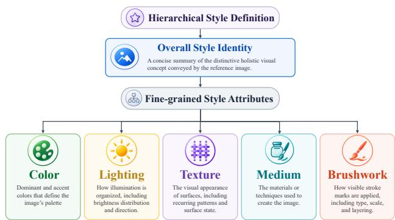  
Figure 1. Overview of the proposed hierarchical style definition. Image style is first characterized by an overall style identity that summarizes the distinctive holistic visual concept, and is further refined through five fine-grained style attributes: color, lighting, texture, medium, and brushwork.

Therefore, we define image style as a hierarchy comprising an overall visual identity and its fine-grained visual attributes. Starting from a holistic style anchor, this definition refines the style through concrete visual attributes, yielding a distinctive and precise description of the reference image's style.

## 3. Method

As illustrated in Figure 1, our hierarchical style definition first establishes the overall identity from the holistic visual impression of a reference image and then refines it through style attributes, including color, lighting, texture, medium, and brushwork. These attributes capture complementary aspects of style, ranging from global appearance and material qualities to local rendering details. Moreover, the identified properties should be visually observable, perceptually dominant, and transferable across semantic contents. To enable large-scale automatic annotation with VLMs, we also design a set of instruction prompts following the proposed style definition. In what follows, we detail how each style component is defined and identified, together with its corresponding instruction prompt.

Overall Style Identity. The overall style identity treats image style as a coherent visual concept and provides a concise summary of the holistic impression conveyed by the reference image. It is not based on fixed objective rules, but arises from the visual experience and conventions accumulated through long-standing artistic practice and perception, and may be explained in terms of genres (e.g., Impressionism) and artists (e.g., Monet). To determine the overall style identity, we examine the reference image from a global perspective and identify its most distinctive and meaningful holistic visual concept. And we should avoid listing finegrained attributes or using generic terms such as “digital art" or “painting".

Instruction Prompt: Overall Style Identity   
You are a professional image annotator.   
Please characterize the input image's   
fine-grained, visually distinctive (not   
a generic category) overall artistic   
style based on its intrinsic stylistic   
attributes, using a single phrase of   
fewer than four words.

Color. Color is one of the most direct and fundamental style attributes of image style and can be characterized from four aspects: color palette, color properties, color combination and color distribution. First, the color palette specifies the dominant and accent colors in the reference image. Color properties further describe the saturation and temperature of the identified colors. Color combination describes how neighboring colors perceptually interact, including mutual contrast, assimilation, optical mixing, blending, and overlap. Color distribution describes the relative proportions and spatial arrangement of the identified colors across the image. However, some color aspects are primarily determined by other visual factors. For example, color properties depend strongly on the brightness and spatial distribution of lighting, while color combination and distribution are largely governed by the semantic content and overall style identity of the reference image. We therefore do not include these aspects in our explicit color annotation.

Instruction Prompt: Color   
You are a professional image annotator.   
Please identify the dominant colors   
and accent colors of the input image in   
four words. When listing colors, output   
color terms only and do not include any   
content-related words or descriptions.

Lighting. Lighting describes how illumination is organized across the reference image. It can be characterized in terms of brightness distribution and direction. Brightness distribution captures the spatial variation in illumination strength across the image, while lighting direction indicates where the illumination comes from.

Instruction Prompt: Lighting   
You are a professional image annotator.   
Please characterize the style attribute   
'lighting' of the input image in   
eight words based on the following   
instructions:   
1. Identify the primary lighting   
direction.   
2. Describe the brightness distribution:   
how its brightness transitions across   
the image.   
3. Do not include the color of light   
and any content-related words or   
descriptions.

Texture. Texture describes the visual appearance of surfaces in an image. It can be characterized in terms of recurring visual patterns and surface state. Recurring visual patterns refer to identifiable local structures that repeatedly occur across a surface, together with the scale and form of these structures. Surface state describes the visible finish and condition of a surface, including effects produced by surface treatments, fabrication processes, and wear, as well as how the surface reflects and scatters light.

Instruction Prompt: Texture   
You are a professional image annotator.   
Please characterize the style attribute   
'texture' of the input image a single   
phrase of four words (Do NOT use commas   
and word stacks), based on the following   
instructions:   
1. Identify the appearance and scale of   
repeating visual pattern (Describe   
the motif using only geometric or   
structural nouns); if no visible   
pattern is present, output "N/A".   
2. Describe the surface state, including   
the finish shaped by surface   
treatments, fabrication processes,   
and wear, as well as how the   
surface reflects and scatters light.   
Forbidden vague words: warm, soft,   
ornate, intricate, detailed, nice.   
3. Do not mention any content-related   
words or descriptions.

Medium. Medium describes the materials or techniques used to create the reference image. It encompasses physical media, such as watercolor, oil paint, charcoal, clay, plastic and embroidery, as well as computational techniques, such as pixel art and 3D rendering. Beyond the basic medium, we further identify its fine-grained, medium-revealing visual cues to provide a more distinctive and specific characterization, such as “long fur" for “3D rendering".

Instruction Prompt: Medium   
You are a professional image annotator.   
Please identify the visible artistic   
medium of the input image based on the   
following instructions:   
1. Identify the materials or techniques   
used to create the input image.   
Avoid generic labels like "digital   
art/illustration".   
2. Further describe the medium's   
fine-grained visual cues. Avoid vibe   
words (such as soft, smooth, blended,   
realistic, intricate) or generic   
labels like "brushstrokes/lines",   
focusing on concrete, directly   
visible, medium-revealing evidence   
tokens (appearance of medium). For   
example, "long fur" and "pixel"   
(fine-grained visual cues) for   
"3D rendering" and "2D digital"   
(mediums).   
3. Output the fine-grained visual cues   
first, then the medium, in no more   
than four words total. Such as   
"long fur 3D rendering" and "pixel   
2D digital".   
4. If no discriminative visual cues   
are visible, output the medium   
only. If the medium is not visually   
identifiable, output "N/A".

Brushwork. Brushwork describes how visible stroke marks are applied and accumulated in an image, including their type (the technique or tool feel conveyed by visible brushstrokes, such as “drybrush", “wash", "scrape" and “impasto"), scale (the apparent size/width/length of individual stroke marks) and layering (the buildup and layering depth of paint/marks).

Instruction Prompt: Brushwork   
You are a professional image annotator.   
Please characterize the style attribute   
'brushwork' of the input image in a   
single phrase of four words (Do NOT use   
commas and word stacks) based on the   
following instructions:   
1. If no visible stroke marks are   
present, outputN/A''.   
2. Otherwise, describe the brushwork   
in terms of type, scale, and   
layering according to the following   
definitions:   
• Type: the technique or tool feel   
conveyed by visible brushstrokes,   
such asdrybrush'','wash'',

```csv
''scrape'', and 'impasto'';
Scale: the apparent size, width, or
length of individual stroke marks;
• Layering: the buildup and layering
depth of paint or marks.
3. Avoid vague descriptive words
(e.g.,''soft'',''intricate'',
''beautiful'', and 'smooth''); focus
on concrete and directly observable
properties.
4. Output the scale and layering first,
followed by the brushwork type, such
asbroad heavy impasto''andfine
flat wash''.
```

Finally, we identify whether visible outlines are present and, when present, describe their color and width. We also determine whether object edges are rendered as sharp boundaries or soft transitions. We then combine these style annotations to construct style prompts according to the following template. The components enclosed in square brackets are optional and are omitted when they are not visually identifiable.

Style Prompt Template   
[with <outline>]. In the style of   
<overall style identity>, <colors:   
dominant colors> with <colors: accent   
colors> accents, <lighting> lighting,   
[<texture: visual pattern> as repeating   
visual patterns,] <texture:surface   
state> surface, [<soft/sharp> edges,]   
[<brushwork>,] in <medium>.

Table 1. Comparison of style datasets. √/X indicate whether intrastyle consistency is provided and — indicates that the statistic is unavailable.
<table><tr><td rowspan="2">Datasets</td><td colspan="4">Intra-style Overall Fine-grained Style Image</td></tr><tr><td>Consistency Style</td><td></td><td>Style</td><td>Number</td></tr><tr><td>WikiArt</td><td>x</td><td>27</td><td></td><td>80K</td></tr><tr><td>JourneyDB</td><td>x</td><td></td><td>300K</td><td>4.4M</td></tr><tr><td>Style30K</td><td>X</td><td></td><td>1K</td><td>30K</td></tr><tr><td>IMAGStyle</td><td>√</td><td>14</td><td>15K</td><td>210K</td></tr><tr><td>OmniStyle-150K</td><td>√</td><td></td><td>1K</td><td>150K</td></tr><tr><td>MegaStyle-1.4M</td><td>√</td><td>8,355</td><td>170K</td><td>1.4M</td></tr><tr><td>MegaStyle++-8M</td><td>√</td><td>150K</td><td>1M</td><td>8M</td></tr></table>

## 4. Experiments

## 4.1. Implementation details

We generate fine-grained and precise style annotations and construct MegaStyle++-8M following the data curation pipeline of MegaStyle [8]. Specifically, based on the hierarchical style definition introduced in Section 3, we employ Qwen3.5-35B-A3B¹ to annotate 2M reference images from the Style Image Pool of MegaStyle using our refined instruction prompts for the overall style identity and style attributes. Afterward, we assemble the structured style annotations into complete style prompts and apply ExactDeduplication, FuzzyDeduplication, and SemanticDeduplication from NeMo Curator to remove exact, near, and semantic duplicates from the resulting prompt gallery, retaining 1.5M prompts. We then encode the deduplicated style prompts using mpnet and perform balanced sampling through a bottom-up three-level hierarchical (k)- means clustering with k = {100000, 5000, 500}, yielding 1M style prompts, which contain 150K unique overall style identity annotations. Finally, we pair each style prompt with eight randomly sampled content prompts from the 400K content prompts in MegaStyle and use Qwen-Image to generate 8M stylized images, thereby constructing MegaStyle++-8M. Table 1 compares MegaStyle++-8M with existing style datasets, including WikiArt [17], JourneyDB [27], Style30K [13], IMAGStyle [37], OmniStyle-150K [31], and MegaStyle [8], in terms of intra-style consistency, numbers of overall style identities, numbers of fine-grained style, and dataset scale. MegaStyle++-8M provides 150K overall style identities, 1M fine-grained and precise style prompts, and 8M stylized images, substantially exceeding all existing datasets in the compared dimensions and providing substantially broader coverage of the style space. Visualizations of MegaStyle++-8M are presented in Figure 2. Images generated from the same style prompt (each row) exhibit strong intra-style consistency across diverse semantic contents, while different style prompts capture a broad range of distinctive overall styles and finegrained visual attributes.

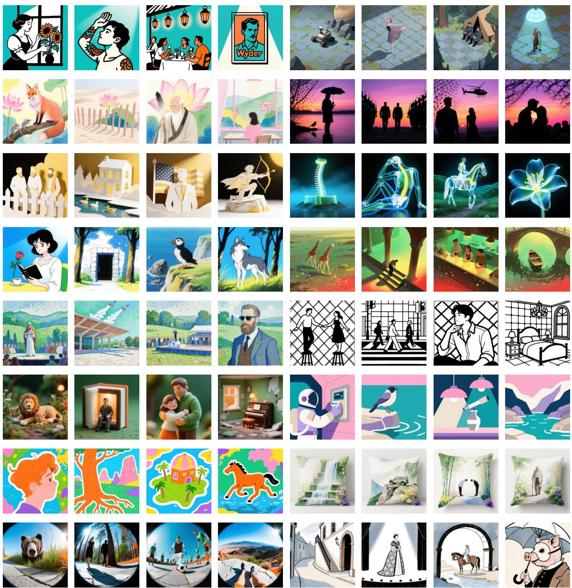  
Figure 2. Visualizations of style pairs in MegaStyle++-8M. Each row presents two distinct style prompts, with four images generated from different semantic contents for each style, demonstrating strong intra-style consistency and diverse style coverage.

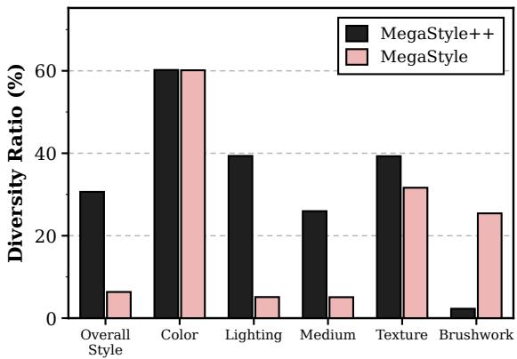  
Figure 3. Diversity ratio of style annotations between MegaStyle++ and MegaStyle across different style attributes.

Table 2. Top-3 most frequent annotations for lighting, medium, texture and brushwork.
<table><tr><td>Attribute</td><td>MegaStyle++</td><td>MegaStyle</td></tr><tr><td rowspan="3">Lighting</td><td>bright center fading to dark edges (1.08%)</td><td>diffused (9.47%)</td></tr><tr><td>soft diffuse illumination from above (0.94%)</td><td>soft diffused (7.60%)</td></tr><tr><td>left side bright fading right (0.82%)</td><td>even (7.40%)</td></tr><tr><td rowspan="3">Medium</td><td>photograph (2.00%)</td><td>digital rendering (26.63%)</td></tr><tr><td>visible brushstrokes oil painting (1.53%)</td><td>digital illustration (7.83%)</td></tr><tr><td>pixel 2d digital (1.15%)</td><td>digital painting (5.27%)</td></tr><tr><td rowspan="3">Texture</td><td>smooth matte finish (6.22%)</td><td>smooth texture (1.87%)</td></tr><tr><td>flat matte finish (1.34%)</td><td>smooth with subtle layering (1.34%)</td></tr><tr><td>smooth glossy finish (1.32%)</td><td>smooth reflective surfaces (1.09%)</td></tr><tr><td rowspan="3">Brushwork</td><td>fine flat wash (25.36%)</td><td>sharp edge hardness (1.69%)</td></tr><tr><td>fine layered drybrush (7.83%)</td><td>clean lines and sharp edges (1.39%)</td></tr><tr><td>fine layered wash (6.49%)</td><td>clean and precise brushwork (1.30%)</td></tr></table>

## 4.2. Further Analysis

In this subsection, we compare our hierarchical style definition with the style formulation adopted in MegaStyle [8] to assess whether our definition produces more fine-grained and visually precise style descriptions while covering a more diverse style space. We first quantify the diversity and semantic breadth of the style spaces induced by the two formulations through statistical and text-embedding-space analyses of the resulting style prompts. Next, we examine whether the two formulations precisely capture the finegrained style by comparing each reference image with the corresponding images generated from its style prompt.

Diversity and Semantic Breadth. We first randomly sample 100K reference images from the Style Image Pool and use the style instruction prompts of MegaStyle++ and MegaStyle to generate corresponding style annotations. We then compute the proportion of unique annotations among the 100K samples as the diversity ratio (%) for each style attribute, including overall style identity, color, lighting, medium, texture and brushwork. As shown in Figure 3, MegaStyle++ achieves substantially higher diversity ratios for overall style identity, lighting, and medium, while also improving texture diversity and maintaining comparable color diversity.

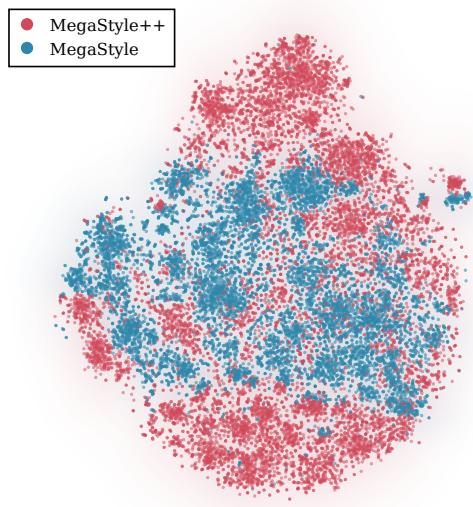  
Figure 4. t-SNE [30] visualization of SigLIP embeddings of 20K sampled style prompts from MegaStyle++ and MegaStyle. Each point represents one style prompt. MegaStyle++ exhibits a broader and more dispersed distribution, indicating greater diversity and semantic breadth.

Notably, we observe that MegaStyle tends to produce generic, vibe-based, or irrelevant annotations for lighting, medium, texture, and brushwork. To provide a direct comparison, Table 2 lists the top-3 most frequent annotations for these style attributes generated by MegaStyle++ and MegaStyle. For example, MegaStyle often relies on generic, vague, or impression-based wording, such as “diffused" and “even" for lighting, “digital rendering" for medium, and “smooth texture"for texture, rather than specifying concrete values of the aspects defined for each target attribute. Moreover, although MegaStyle exhibits a higher diversity ratio for brushwork, its frequent annotations often describe other visual attributes, particularly edges and lines, rather than brushwork itself. In contrast, MegaStyle++ produces more specific and aligned annotations by explicitly defining the style properties of each attribute. We also employ an LLM as a judge to evaluate the relevance and vagueness of the generated style annotations on the full set of 100K reference images. For each style attribute, the judge is given its predefined definition and the corresponding de-

## Reference

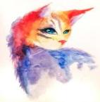

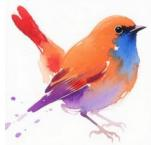

MegaStyle++  
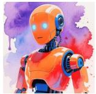

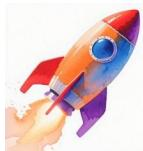

In the style of Watercolor, orange, blue with red, purple accents, bright center fading softly outward lighting, fluid translucent wash surface, broad wet wash, in wet edges watercolor.

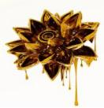


In the style of golden liquid, gold, amber with white, brown accents, bright white background with soft highlights lighting, highly reflective liquid surface, sharp edge, in drips 3D rendering

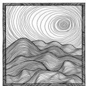

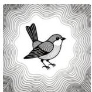

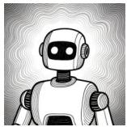

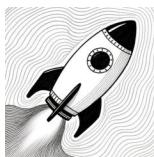

with black thin outline. In the style of Zentangle, black white with gray tones accents, bright center fades outward lighting, concentric wavy lines as repeating visual patterns, uniform linear finish surface, fine dense lines, in ink lines pen drawing.

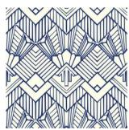

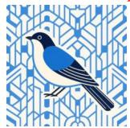

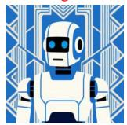

  
In the style of Art Deco, blue white with cream navy accents, evenly distributed across entire image lighting, geometric motif as repeating visual patterns, flat matte finish surface, fine flat lines, in uniform lines print.

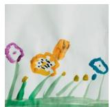

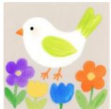

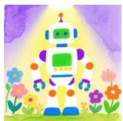

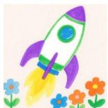  
In the style of child's drawing, white green yellow with purple blue orange accents, diffused from top brightens center lighting, matte paper grain surface, broad flat wash, in watercolor paint flowers.

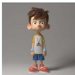

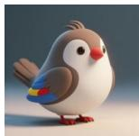

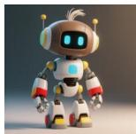  
In the style of 3D cartoon, brown gray white with blue yellow red accents, soft diffuse from left casting shadows right lighting, smooth matte finish surface, soft edge, in hair strands 3D rendering.

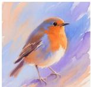

MegaStyle  
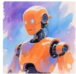

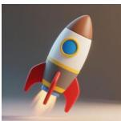


In the style of impressionism, warm orange with cool blue and purple in gradient distribution, soft diffused light, watercolor, fluid layering with wet-on-wet density, broad directional strokes with soft edges.

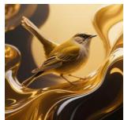


In the style of abstract art, golden hues with darker shades in layered distribution, soft ambient light, liquid medium, glossy and fluid texture, smooth flowing strokes with defined edges.

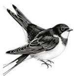

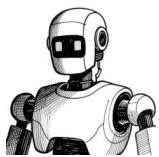

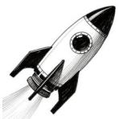

In the style of abstract line art, black with white in uniform distribution, even light, pen and ink, layered density, consistent stroke width and direction with soft edges.

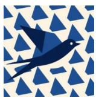

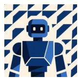

  
In the style of geometric abstraction, navy blue with cream in a repeating pattern, even flat light, vector illustration, smooth texture, uniform stroke width, directional linear shapes with sharp edges.

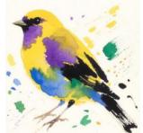

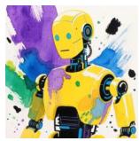

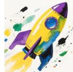  
In the style of abstract expressionism, yellow with purple, blue, green, and black in scattered distribution, even light, watercolor, textured, broad strokes.

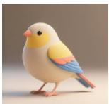

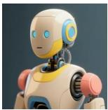

  
In the style of 3D digital art, beige with yellow, blue, and coral accents in balanced distribution, soft directional lighting, rendered medium, smooth matte texture with subtle layering, clean defined edges without visible brushwork.

Figure 5. Qualitative comparison of style reproduction between MegaStyle++ and MegaStyle. The first column shows the real style reference images from StyleBench. The second and third columns present three reproduction images with the corresponding style prompts from MegaStyle++ and MegaStyle, respectively. From left to right, the three generated images correspond to the content prompts “A bird", “A robot", and “A rocket".

Table 3. Quantitative comparison of style annotation quality and diversity between MegaStyle++ and MegaStyle. Relevance and Vagueness measure the attribute alignment and vague/vibe-based wording of style annotations using LLM. MPD, Vendi, and MNND denote the average pairwise cosine distance, Vendi Score, and average nearest-neighbor distance in the SigLIP embedding space, respectively. MPD and MNND are reported after scaling by 100. Best results are marked in bold.
<table><tr><td></td><td colspan="2">Overall Style</td><td colspan="2">Color</td><td colspan="2">Lighting</td><td colspan="2">Texture</td><td colspan="2">Medium</td><td colspan="2">Brushwork</td></tr><tr><td>Metrics</td><td colspan="9">|MegaStyle++ MegaStyle|MegaStyle++ MegaStyle|MegaStyle++ MegaStyle|MegaStyle++ MegaStyle|MegaStyle++ MegaStyle|MegaStyle++ MegaStyle</td><td colspan="4"></td></tr><tr><td>Relevance ↑</td><td>99.51</td><td>99.27</td><td>100.00</td><td>99.99</td><td>100.00</td><td>99.92</td><td>99.69</td><td>99.49</td><td>97.30</td><td>94.78</td><td>98.97</td><td>85.29</td></tr><tr><td>Vagueness ↓</td><td>17.10</td><td>24.50</td><td>0.05</td><td>9.18</td><td>12.00</td><td>78.20</td><td>16.90</td><td>39.20</td><td>1.40</td><td>3.50</td><td>21.10</td><td>37.10</td></tr><tr><td>MPD↑</td><td>38.40</td><td>32.30</td><td>42.30</td><td>45.20</td><td>29.20</td><td>27.70</td><td>38.60</td><td>25.40</td><td>42.60</td><td>31.40</td><td>26.30</td><td>20.10</td></tr><tr><td>Vendi ↑</td><td>13.60</td><td>7.33</td><td>7.92</td><td>10.85</td><td>6.53</td><td>4.88</td><td>11.92</td><td>5.26</td><td>14.52</td><td>5.16</td><td>4.17</td><td>3.64</td></tr><tr><td>MNND ↑</td><td>2.10</td><td>0.30</td><td>1.40</td><td>2.50</td><td>1.50</td><td>0.20</td><td>3.00</td><td>1.20</td><td>1.80</td><td>0.30</td><td>0.20</td><td>0.80</td></tr></table>

Table 4. Quantitative comparison of style prompt diversity between MegaStyle++ and MegaStyle.
<table><tr><td>Metric</td><td colspan="2">|MegaStyle++ MegaStyle</td></tr><tr><td>MPD↑</td><td>55.40</td><td>49.90</td></tr><tr><td>Vendi ↑</td><td>25.79</td><td>17.42</td></tr><tr><td>MNND ↑</td><td>13.80</td><td>9.00</td></tr></table>

scription, and performs two binary evaluations: whether the description characterizes the defined attribute and whether it relies primarily on generic, subjective, or impressionbased wording rather than concrete attribute values. The results are reported in the first two rows of Table 3, where MegaStyle++ consistently produces more relevant and less vague descriptions across all style attributes.

To further evaluate diversity and semantic breadth, we encode the style annotations into the SigLIP [40] embedding space and compute three complementary metrics: Mean Pairwise Distance (MPD) [28], Vendi Score [5], and Mean Nearest-Neighbor Distance (MNND) [25]. MPD is the average pairwise cosine distance between all annotation embeddings, measuring the overall spread of the annotations in the embedding space. Vendi is computed as the exponential of the Shannon entropy [22] of the eigenvalues of the normalized pairwise similarity matrix, measuring the effective diversity of the embedding distribution. MNND is the average cosine distance from each annotation embedding to its nearest neighbor in the set, measuring the local separation between annotations. As shown in the last three rows of Table 3, MegaStyle++ achieves substantially higher MPD, Vendi, and MNND scores for overall style identity, lighting, medium, and texture, while showing comparable performance for color, indicating broader semantic diversity across most style attributes. Additionally, we compare the style prompts constructed by combining the annotations of all style attributes. The quantitative results in Table 4 and the visualization in Figure 4 demonstrate that MegaStyle++ provides more diverse style prompts than MegaStyle.

Style Reproduction. To further evaluate the effectiveness of our proposed hierarchical style definition in precisely capturing and reproducing the visual style of real reference images, we compare it with its counterpart in MegaStyle through a style reproduction experiment. Specifically, we caption real style reference images from StyleBench [7] using the two formulations to construct their corresponding style prompts. Each style prompt is then combined with the same set of content prompts, including “A bench", “A bird", “A rocket", “A car", and “A robot", and fed into Qwen-Image [33] to generate the corresponding reproduction images. As shown in Figure 5, the reproduction results of MegaStyle++ precisely capture both the overall style identity and fine-grained style attributes. For example, in row 2, it successfully identifies the “golden liquid" style with a white background and dripping 3D-rendered appearance, which are consistent with the reference image. It also captures the distinctive wavy-line and geometric-motif repeating textures in rows 3 and 4. In contrast, MegaStyle struggles to capture these intrinsic visual cues and often produces generic or inaccurate style descriptions. We further measure the style similarity between the reference and reproduced images using CSD [24] and MegaStyle-Encoder [8], as well as the text-image similarity between the style prompts and reference images using CLIP [19]. As shown in Table 5, MegaStyle++ consistently outperforms MegaStyle across all three metrics, demonstrating that our hierarchical style definition provides more accurate style descriptions and enables more faithful style reproduction.

Table 5. Quantitative comparison of style reproduction between MegaStyle++ and MegaStyle.
<table><tr><td>Metric</td><td>|MegaStyle++ MegaStyle</td><td></td></tr><tr><td>CSD↑</td><td>50.19</td><td>33.54</td></tr><tr><td>MegaStyle-Encoder ↑</td><td>58.40</td><td>40.92</td></tr><tr><td>CLIP-Text ↑</td><td>24.49</td><td>20.71</td></tr></table>

## 5. Conclusion

In this work, we revisit the fundamental question of how image style should be defined and propose a unified hierarchical style definition that organizes style from an overall style identity to fine-grained visual attributes. Based on this definition, we construct MegaStyle++-8M with 150K overall style identities, 1M fine-grained style prompts, and 8M stylized images, substantially expanding the breadth and granularity of the image style space. Extensive experiments demonstrate that MegaStyle++ provides more diverse, precise, and definition-aligned style descriptions than MegaStyle, while enabling more faithful reproduction of real reference styles. Beyond dataset scaling, our hierarchical definition provides an explicit and interpretable language for describing transferable visual style, offering a practical foundation for future research in style representation, understanding, and generation.

## References

[1] Namhyuk Ahn, Junsoo Lee, Chunggi Lee, Kunhee Kim, Daesik Kim, Seung-Hun Nam, and Kibeom Hong. Dreamstyler: Paint by style inversion with text-to-image diffusion models. In Proceedings of the AAAI Conference on Artificial Intelligence, pages 674–681, 2024. 1, 2

[2] Florinel-Alin Croitoru, Vlad Hondru, Radu Tudor Ionescu, and Mubarak Shah. Diffusion models in vision: A survey. IEEE Transactions on Pattern Analysis and Machine Intelligence, 45(9):10850–10869, 2023. 2

[3] Vincent Dumoulin, Jonathon Shlens, and Manjunath Kudlur. A learned representation for artistic style. arXiv preprint arXiv:1610.07629, 2016. 1, 2

[4] Martin Nicolas Everaert, Marco Bocchio, Sami Arpa, Sabine Süsstrunk, and Radhakrishna Achanta. Diffusion in style. In Proceedings of the IEEE/CVF International Conference on Computer Vision, pages 2251–2261, 2023. 1, 2

[5] Dan Friedman and Adji Bousso Dieng. The vendi score: A diversity evaluation metric for machine learning. arXiv preprint arXiv:2210.02410, 2022. 8

[6] Rinon Gal, Yuval Alaluf, Yuval Atzmon, Or Patashnik, Amit H Bermano, Gal Chechik, and Daniel Cohen-Or. An image is worth one word: Personalizing text-toimage generation using textual inversion. arXiv preprint arXiv:2208.01618, 2022. 1, 2

[7] Junyao Gao, Yanan Sun, Yanchen Liu, Yinhao Tang, Yanhong Zeng, Ding Qi, Kai Chen, and Cairong Zhao. Styleshot: a snapshot on any style. IEEE Transactions on Pattern Analysis and Machine Intelligence, pages 1–15, 2025. 1, 2, 8

[8] Junyao Gao, Sibo Liu, Jiaxing Li, Yanan Sun, Yuanpeng Tu, Fei Shen, Weidong Zhang, Cairong Zhao, and Jun Zhang. Megastyle: Constructing diverse and scalable style dataset via consistent text-to-image style mapping. arXiv preprint arXiv:2604.08364, 2026. 1, 4, 5, 6, 8

[9] Leon A Gatys, Alexander S Ecker, and Matthias Bethge. Image style transfer using convolutional neural networks. In Proceedings of the IEEE conference on computer vision and pattern recognition, pages 2414–2423, 2016. 1, 2

[10] Edward J Hu, Yelong Shen, Phillip Wallis, Zeyuan Allen-Zhu, Yuanzhi Li, Shean Wang, Lu Wang, and Weizhu Chen. Lora: Low-rank adaptation of large language models. arXiv preprint arXiv:2106.09685, 2021. 1, 2

[11] Xun Huang and Serge Belongie. Arbitrary style transfer in real-time with adaptive instance normalization. In Proceed-

ings of the IEEE international conference on computer vision, pages 1501–1510, 2017. 2

[12] Justin Johnson, Alexandre Alahi, and Li Fei-Fei. Perceptual losses for real-time style transfer and super-resolution. In Computer Vision-ECCV 2016: 14th European Conference, Amsterdam, The Netherlands, October 11-14, 2016, Proceedings, Part II 14, pages 694–711. Springer, 2016. 1, 2

[13] Wen Li, Muyuan Fang, Cheng Zou, Biao Gong, Ruobing Zheng, Meng Wang, Jingdong Chen, and Ming Yang. Styletokenizer: Defining image style by a single instance for controlling diffusion models. In European Conference on Computer Vision, pages 110–126. Springer, 2024. 5

[14] Yijun Li, Chen Fang, Jimei Yang, Zhaowen Wang, Xin Lu, and Ming-Hsuan Yang. Universal style transfer via feature transforms. Advances in neural information processing systems, 30, 2017. 2

[15] Gongye Liu, Menghan Xia, Yong Zhang, Haoxin Chen, Jinbo Xing, Xintao Wang, Yujiu Yang, and Ying Shan. Stylecrafter: Enhancing stylized text-to-video generation with style adapter. arXiv preprint arXiv:2312.00330, 2023. 1, 2

[16] Haoming Lu, Hazarapet Tunanyan, Kai Wang, Shant Navasardyan, Zhangyang Wang, and Humphrey Shi. Specialist diffusion: Plug-and-play sample-efficient fine-tuning of text-to-image diffusion models to learn any unseen style. In Proceedings of the IEEE/CVF Conference on Computer Vision and Pattern Recognition, pages 14267–14276, 2023. 1,2

[17] Fred Phillips and Brandy Mackintosh. Wiki art gallery, inc.: A case for critical thinking. Issues in Accounting Education, 26(3):593–608, 2011. 5

[18] Tianhao Qi, Shancheng Fang, Yanze Wu, Hongtao Xie, Jiawei Liu, Lang Chen, Qian He, and Yongdong Zhang. Deadiff: An efficient stylization diffusion model with disentangled representations. arXiv preprint arXiv:2403.06951, 2024.1

[19] Alec Radford, Jong Wook Kim, Chris Hallacy, Aditya Ramesh, Gabriel Goh, Sandhini Agarwal, Girish Sastry, Amanda Askell, Pamela Mishkin, Jack Clark, et al. Learning transferable visual models from natural language supervision. In International conference on machine learning, pages 8748–8763. PMLR, 2021. 2, 8

[20] Nataniel Ruiz, Yuanzhen Li, Varun Jampani, Yael Pritch, Michael Rubinstein, and Kfir Aberman. Dreambooth: Fine tuning text-to-image diffusion models for subject-driven generation. In Proceedings of the IEEE/CVF Conference on Computer Vision and Pattern Recognition, pages 22500– 22510,2023.1

[21] Dan Ruta, Andrew Gilbert, Pranav Aggarwal, Naveen Marri, Ajinkya Kale, Jo Briggs, Chris Speed, Hailin Jin, Baldo Faieta, Alex Filipkowski, et al. Stylebabel: Artistic style tagging and captioning. In European Conference on Computer Vision, pages 219–236. Springer, 2022. 2

[22] Claude Elwood Shannon. A mathematical theory of communication. The Bell system technical journal, 27(3):379–423, 1948.8

[23] Kihyuk Sohn, Lu Jiang, Jarred Barber, Kimin Lee, Nataniel Ruiz, Dilip Krishnan, Huiwen Chang, Yuanzhen Li, Irfan Essa, Michael Rubinstein, et al. Styledrop: Text-to-image synthesis of any style. Advances in Neural Information Processing Systems, 36, 2024. 1, 2

[24] Gowthami Somepalli, Anubhav Gupta, Kamal Gupta, Shramay Palta, Micah Goldblum, Jonas Geiping, Abhinav Shrivastava, and Tom Goldstein. Measuring style similarity in diffusion models. arXiv preprint arXiv:2404.01292, 2024. 1,2,8

[25] Cantao Su, Menan Velayuthan, Esther Ploeger, Dong Nguyen, and Anna Wegmann. emb-diversity: A tool for embedding-based measurement of data diversity. arXiv preprint arXiv:2607.19848, 2026. 8

[26] Gan Sun, Wenqi Liang, Jiahua Dong, Jun Li, Zhengming Ding, and Yang Cong. Create your world: Lifelong text-toimage diffusion. IEEE Transactions on Pattern Analysis and Machine Intelligence, 2024. 2

[27] Keqiang Sun, Junting Pan, Yuying Ge, Hao Li, Haodong Duan, Xiaoshi Wu, Renrui Zhang, Aojun Zhou, Zipeng Qin, Yi Wang, et al. Journeydb: A benchmark for generative image understanding. Advances in Neural Information Processing Systems, 36, 2024. 5

[28] Yixuan Tang, Yuanyuan Shi, Yiqun Sun, and Anthony Kum Hoe Tung. Uncovering the bigger picture: Comprehensive event understanding via diverse news retrieval. In Proceedings of the 2025 Conference on Empirical Methods in Natural Language Processing, pages 33927–33945, 2025. 8

[29] Dmitry Ulyanov, Vadim Lebedev, Andrea Vedaldi, and Victor Lempitsky. Texture networks: Feed-forward synthesis of textures and stylized images. arXiv preprint arXiv:1603.03417, 2016. 1,2

[30] Laurens Van der Maaten and Geoffrey Hinton. Visualizing data using t-sne. Journal of machine learning research, 9 (11), 2008. 6

[31] Ye Wang, Ruiqi Liu, Jiang Lin, Fei Liu, Zili Yi, Yilin Wang, and Rui Ma. Omnistyle: Filtering high quality style transfer data at scale. In Proceedings of the Computer Vision and Pattern Recognition Conference, pages 7847–7856, 2025. 5

[32] Zhouxia Wang, Xintao Wang, Liangbin Xie, Zhongang Qi, Ying Shan, Wenping Wang, and Ping Luo. Styleadapter: A single-pass lora-free model for stylized image generation. arXiv preprint arXiv:2309.01770, 2023. 1

[33] Chenfei Wu, Jiahao Li, Jingren Zhou, Junyang Lin, Kaiyuan Gao, Kun Yan, Sheng-ming Yin, Shuai Bai, Xiao Xu, Yilei Chen, et al. Qwen-image technical report. arXiv preprint arXiv:2508.02324, 2025.8

[34] Tong Wu, Yinghao Xu, Ryan Po, Mengchen Zhang, Guandao Yang, Jiaqi Wang, Ziwei Liu, Dahua Lin, and Gordon Wetzstein. Fiva: Fine-grained visual attribute dataset for text-to-image diffusion models. Advances in Neural Information Processing Systems, 37:31990–32011, 2024. 2

[35] Bin Xia, Yulun Zhang, Shiyin Wang, Yitong Wang, Xinglong Wu, Yapeng Tian, Wenming Yang, Radu Timotfe, and Luc Van Gool. Diffi2i: efficient diffusion model for imageto-image translation. IEEE Transactions on Pattern Analysis and Machine Intelligence, 2024. 2

[36] Mengfei Xia, Yu Zhou, Ran Yi, Yong-Jin Liu, and Wenping Wang. A diffusion model translator for efficient image-toimage translation. IEEE Transactions on Pattern Analysis and Machine Intelligence, 2024. 2

[37] Peng Xing, Haofan Wang, Yanpeng Sun, Qixun Wang, Xu Bai, Hao Ai, Renyuan Huang, and Zechao Li. Csgo: Content-style composition in text-to-image generation. arXiv preprint arXiv:2408.16766, 2024. 1, 2, 5

[38] Serin Yang, Hyunmin Hwang, and Jong Chul Ye. Zero-shot contrastive loss for text-guided diffusion image style transfer. In Proceedings of the IEEE/CVF International Conference on Computer Vision, pages 22873–22882, 2023. 1

[39] Hu Ye, Jun Zhang, Sibo Liu, Xiao Han, and Wei Yang. Ipadapter: Text compatible image prompt adapter for text-toimage diffusion models. arXiv preprint arXiv:2308.06721, 2023.2

[40] Xiaohua Zhai, Basil Mustafa, Alexander Kolesnikov, and Lucas Beyer. Sigmoid loss for language image pre-training In Proceedings of the IEEE/CVF international conference on computer vision, pages 11975–11986, 2023. 2, 8

[41] Yuxin Zhang, Nisha Huang, Fan Tang, Haibin Huang, Chongyang Ma, Weiming Dong, and Changsheng Xu. Inversion-based style transfer with diffusion models. In Proceedings of the IEEE/CVF Conference on Computer Vision and Pattern Recognition, pages 10146–10156, 2023. 1, 2