Research/Review Article

# Monocular Depth Estimation from a Single Image: Progress and Opportunities

Muxin Liu1,∗, Xiaoyang Lyu1,∗, Yang-Tian Sun1,∗, Yi-Hua Huang1, Ziyi Yang1, Peng Dai1 and Xiaojuan Qi1(B)

© The Author(s)

Abstract Monocular depth estimation has long stood as a fundamental challenge in computer vision, enabling a wide range of applications including 3D reconstruction, robotics, autonomous driving, and augmented reality. This survey traces the field’s evolution from early learning-based methods to the emergence of transformative foundation models. We begin by framing the problem, distinguishing between relative and metric depth estimation, and highlighting the key challenges that have shaped a decade of research. We then present common problem formulations and introduce the most widely used datasets, covering indoor, outdoor, and synthetic data. Following this, we review major advances prior to the foundation model era, distilling core insights from influential methods that contributed to improvements in accuracy, eficiency, and robustness. The survey then turns to the recent surge of foundation-model-based approaches, categorizing them into discriminative and generative paradigms and emphasizing the critical roles of large-scale pretraining (e.g., DINOv3) and synthetic data. We compare representative models using both quantitative benchmarks and qualitative examples, and discuss natural extensions to video-based depth estimation. Further, to illustrate real-world impact, we highlight the integration of depth estimation into applications such as visual SLAM, content generation, and robot perception. Finally, we outline open challenges and promising research directions as the field advances further into the era of foundation models. Github link: CVMI-Lab/Depth-Survey.

Keywords Monocular Depth Estimation, Metric Depth, Relative Depth, Foundation Models, Vision Transformers, Difusion Models

## 1 Introduction and Background

Depth information is crucial for spatial perception in applications such as robotics, autonomous driving, 3D modeling, virtual and augmented reality, and computational photography. Traditional methods rely on multiple images or specialized sensors to capture depth, such as stereo cameras and Kinect [1]. However, these approaches increase hardware complexity and costs. In contrast, monocular depth estimation ofers greater flexibility and has garnered significant attention.

Early learning-based attempts to predict depth from a single image date back over a decade. Prior to deep learning, Saxena et al. [2] pioneered data-driven monocular depth prediction using Markov Random Fields on hand-crafted features. The breakthrough came with the advent of deep convolutional neural networks. Eigen et al. [3] demonstrated that a multi-scale CNN could directly regress a dense depth map from a single RGB input, kickstarting the modern era of monocular depth estimation (MDE). Subsequent works rapidly improved accuracy on benchmark datasets by introducing deeper networks [4–6], better loss functions (e.g. scale-invariant or ordinal regression losses), and leveraging multi-task cues such as surface normals [7, 8], optical flow [9, 10], or semantics [11].

Initially, monocular depth estimation models struggled with poor generalization when tested outside their training domains. For instance, a model trained on indoor scenes from the NYU Depth v2 dataset [12] would fail when tested on outdoor driving scenes like KITTI [13], and vice versa, due to diferences in scene scale and camera intrinsics. Additionally, models that achieved state-of-the-art accuracy on specific datasets often learned dataset-specific biases (e.g., limited depth range or field of view), preventing them from generalizing to arbitrary images.

In recent years, the field has seen the rise of foundation models for depth estimation [14], following the trend established in natural language processing. Depth foundation models are large models trained on vast and diverse datasets (including unlabeled or synthetic data) to achieve strong zeroshot performance on a wide range of in-the-wild images. The aim is to create a single model that is broadly applicable, rather than training specialized models for each dataset. Early eforts in this direction for depth estimation included combining multiple training datasets with carefully designed loss function design [15] and employing vision transformers to better capture global context and enhance learning capabilities [16]. The latest foundation models have advanced even further, leveraging tens of millions of images [17] to learn generalizable knowledge for depth predictions. These models are often orders of magnitude more data-hungry and parameter-rich than traditional methods, resulting in dramatic improvements in zero-shot generalization.

This survey is organized as follows (see Fig. 1). Section 2 formalizes the problem setup and provides an overview of commonly used datasets for monocular depth estimation. Section 3 reviews key developments prior to the foundation model era, encompassing both supervised and self-supervised learning approaches, and highlights architectural innovations and the design of efective loss functions. Section 4 focuses on the emergence of depth foundation models, which constitutes the core contribution of this survey. We examine representative methods from three perspectives: (a) dataset collection and unification; (b) discriminative models; and (c) generative models. To address the inconsistency of evaluation protocols across existing works, we introduce a unified evaluation pipeline and conduct systematic quantitative and qualitative comparisons on representative models, enabling fair benchmarking and clearer insights into recent advances. We further discuss extensions of these models to video-based depth estimation. Section 5 surveys the application of monocular depth estimation in downstream tasks, including SLAM and 3D reconstruction, image editing and content creation, and robotics. Finally, Section 6 outlines open challenges and future directions, such as improving fine-grained detail and temporal consistency, supporting diverse camera models, and incorporating geometric priors.

## 2 Problem Setup and Datasets

## 2.1 Monocular Depth Estimation Basics

Monocular depth estimation aims to predict a dense depth map D from a single RGB image I, where each depth value $D ( u , v )$ represents the distance from the camera to the scene along the viewing ray of pixel (u, v).

As illustrated in Fig. 2, there are two main types of depth estimation:

• Metric depth estimation [18–26] produces depth values in real-world units (e.g., meters), aligned with the true scale of the scene.

• Relative depth estimation [16, 17, 26–35]– also known as scale-invariant depth estimation –predicts depth up to an unknown scale (and sometimes an additive shift). In this case, if D is a valid prediction, then so is $\alpha D + \beta$ for any scale $\alpha > 0$ (and a shift β for afine-invariant depth estimation) is equally valid. Relative depth preserves the correct ordering and proportional relationships between depths but not their absolute magnitudes.

Monocular depth estimation is inherently ill-posed, since multiple 3D scenes with diferent scales can lead to identical 2D observations. Classical approaches [44–46] addressed this ambiguity using handcrafted photometric and geometric cues, including shading, perspective, occlusion, and defocus, under restrictive assumptions. In contrast, modern learning-based methods resolve depth ambiguities by statistically learning such cues from large-scale data, resulting in improved robustness and generalization [47]. Supervised learning approaches rely on ground-truth depth maps, typically acquired using RGB-D sensors (e.g., structured light or time-of-flight cameras), LiDAR, or multi-view stereo for learning. In contrast, self-supervised methods [38, 40] estimate depth by enforcing geometric consistency across stereo pairs or video sequences, eliminating the need for explicit depth labels [48].

A particularly important challenge for metric depth estimation is the variation in camera intrinsics. Changes in focal length, for instance, directly afect the mapping between image content and absolute depth [24]. Many early methods assume fixed camera intrinsics, for example, all training images share a known or narrow focal length range [3, 11, 39, 49–51]. Recent advances have introduced techniques to generalize across unknown camera parameters, such as conditioning the model on camera intrinsics [19] or normalizing input images to a canonical camera model [24]. These strategies will be discussed in more detail in the following sections.

## 2.2 Datasets for Depth Estimation

Progress in monocular depth estimation is closely tied to the availability of diverse datasets, which we categorize into four major types: synthetic, indoor, outdoor, and depth-in-the-wild datasets as summarized in Table 1. Each type ofers unique benefits and poses specific limitations that influence model performance and generalization.

• Synthetic datasets such as TartanAir [52], FoundationStereo [53], and BlendedMVS [54] simulate highly photorealistic indoor and outdoor scenes with perfect

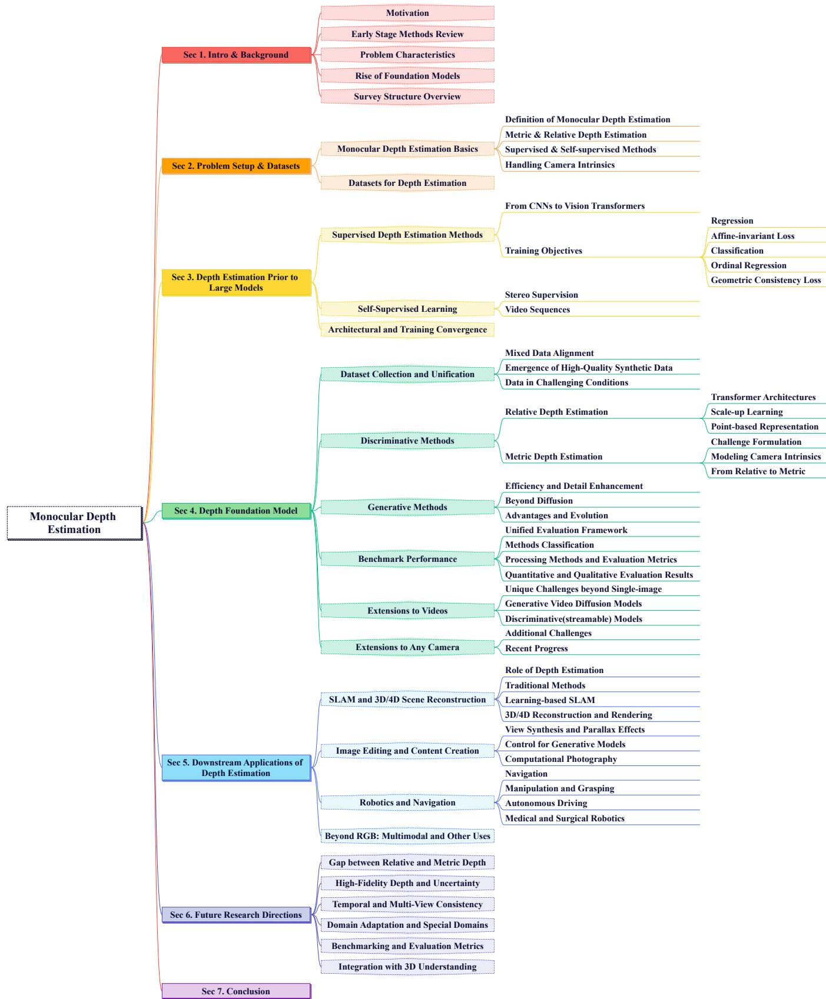  
Fig. 1 The survey is structured as follows: we begin with the background and datasets of monocular depth estimation (MDE) ), followed by a review of methods developed prior to the advent of foundation models. We then examine foundational depth estimation approaches and conclude with an overview of key downstream applications of MDE and future research directions.

Depth Estimation Model

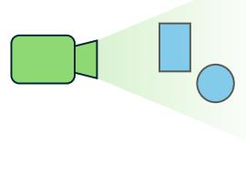  
(a) Ground Truth

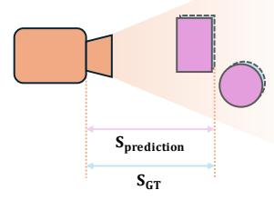  
(b) Metric Depth  
Predicted 3D Scene

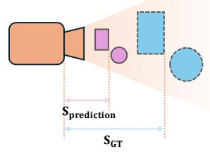  
(c) Scale-Invariant Depth

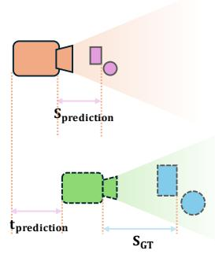  
(d) Affine-Invariant Depth

Fig. 2 Illustration of diferent depth estimation paradigms: (a) Ground-truth depth acquired from a depth sensor or simulator; (b) Metric depth estimation, the predicted depth is consistent with the ground truth in physical units; (c) Scale-invariant depth estimation, the predicted depth difers from the ground truth by a global scaling factor; (d) Afine-invariant depth estimation, the predicted depth diverges from the ground truth by both a global scale and an additive translation.  
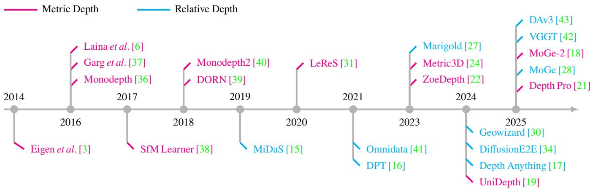  
Fig. 3 A brief timeline of representative works with their corresponding representations. Methods estimating metric depth are highlighted in red, while those estimating relative depth are marked in blue.

ground-truth depth. Datasets like HyperSim [55] and Replica [56] focus on indoor environments, while Virtual KITTI 2 [57] and MatrixCity [58] target outdoor scenarios. They provide complete and perfectly labeled annotations under controlled conditions, but often exhibit a gap in realism and diversity when compared to real-world data.

• Indoor datasets such as NYU Depth V2 [12], ARKitScenes [24], and SUN RGB-D [59] use RGB-D sensors to provide dense, short-range metric depth in residential or ofice environments. More recent benchmarks like, ScanNet++ [60] improve annotation fidelity and scene diversity. These datasets ofer short-range depth in indoor scenes. However, they often sufer from low resolution, and the inherent limitations of depth sensors can lead to missing regions or artifacts, particularly in reflective or transparent areas such as windows and mirrors.

• Outdoor datasets like KITTI [13], Nuscenes [61], and

Waymo [62] provide real-world driving scenes with longrange depth annotations obtained from LiDAR. More recent datasets such as Argoverse2 [63] and A2D2 [64] further expand sensor coverage and scene complexity. However, LiDAR-based ground-truth is often sparse and noisy– particularly for distant or dynamic objects– and annotation quality varies across sensors and environmental conditions.

• Depth-in-the-wild datasets like DIW [65], MegaDepth [66], and ReDWeb [67] use Internet imagery and SfM to provide diverse, large-scale annotations. They capture real-world diversity and help reduce dataset bias; however, the depth annotations are typically approximate– such as ordinal or pseudo-depth– and lack precise metric accuracy.

In the era of foundation models, combining datasets from diverse domains has become increasingly important. Foundation models [18–20, 24, 25, 28, 33] typically leverage mixed-domain datasets to learn generalizable representations, which significantly enhancing robustness and adaptability across real-world scenarios. Several modern depth estimation frameworks also utilize hybrid and multi-stage training strategies [17, 21, 22, 29]. These methods first undergo pretraining on extensive multi-domain datasets to build foundational capabilities, followed by fine-tuning on synthetic data, pseudo-labels generated by teacher models, or specialized domain-specific datasets with more stringent loss functions. Such a two-stage training paradigm markedly improves the qualitative detail results and generalizability of model.

Table 1 Overview of common datasets for monocular depth estimation. Datasets are categorized into synthetic, indoor, outdoor/driving, and internet-based (“wild”) scenarios, detailing their size, resolution, ground-truth depth acquisition methods, and distinctive characteristic from oficial websites or introduction.
<table><tr><td>Dataset</td><td>Type</td><td>Size</td><td>Resolution</td><td>GT Type</td><td>Notes</td></tr><tr><td>TartanAir [52]</td><td>Synthetic (indoor/outdoor)</td><td>306K</td><td>640 × 480</td><td>Simulated</td><td>Comprises 30 photo-realistic environments with diverse styles</td></tr><tr><td>FSD [53]</td><td>Synthetic (indoor/outdoor)</td><td>1.04M</td><td>1280 × 720</td><td>Simulated</td><td>Generated using NVIDIA Omniverse with diverse 3D assets</td></tr><tr><td>KenBurns [68]</td><td>Synthetic (indoor/outdoor)</td><td>76K</td><td>512 × 512</td><td>Simulated</td><td>Synthetic dataset for view synthesis</td></tr><tr><td>Spring [69]</td><td>Synthetic (indoor/outdoor)</td><td>5K</td><td>variable</td><td>Simulated</td><td>High-detail benchmark for stereo, optical flow, and scene flow</td></tr><tr><td>HyperSim [19]</td><td>Synthetic (indoor)</td><td>77400</td><td>1024 × 768</td><td>Simulated</td><td>461 indoor scenes with detailed per-pixel corresponding gt geometry</td></tr><tr><td>IRS [70]</td><td>Synthetic (indoor)</td><td>103K</td><td>960 × 540</td><td>Simulated</td><td>Synthetic indoor dataset with diverse scenes and lighting conditions</td></tr><tr><td>Structured [17]</td><td>Synthetic (indoor)</td><td>76K</td><td>variable</td><td>Simulated</td><td>Photo-realistic indoor scenes with comprehensive 3D structure annotations</td></tr><tr><td>Replica [27]</td><td>Synthetic (indoor)</td><td>18 scenes</td><td>variable(HDR)</td><td>Simulated</td><td>High-fidelity 3D indoor scenes with HDR textures</td></tr><tr><td>UnrealStereo4K [63]</td><td>Synthetic (indoor)</td><td>1,600</td><td>3840 × 2160</td><td>Simulated</td><td>Photo-realistic indoor scenes for evaluating high-res depth models</td></tr><tr><td>Virtual KITTI 2 [57]</td><td>Synthetic (driving)</td><td>21260</td><td>1242 × 375</td><td>Simulated</td><td>Synthetic clone of KITTI with dense depth and segmentation; various weather</td></tr><tr><td>MVS-Synth [71]</td><td>Synthetic (outdoor/urban)</td><td>12000</td><td>variable</td><td>Simulated</td><td>Photorealistic GTA V scenes with complete disparity maps</td></tr><tr><td>MatrixCity [58]</td><td>Synthetic (outdoor)</td><td>390K</td><td>1920 × 1080</td><td>Simulated</td><td>Constructed using Unreal Engine 5&#x27;s City Sample project</td></tr><tr><td>MidAir [72]</td><td>Synthetic (outdoor)</td><td>423K</td><td>1024 × 1024</td><td>Simulated</td><td>Synthetic UAV dataset with diverse weather and terrain variations</td></tr><tr><td>GTA-SfM [73]</td><td>Synthetic (outdoor)</td><td>19K</td><td>variable (HD)</td><td>Simulated</td><td>Designed for SfM with large camera motions; diverse scenes and conditions</td></tr><tr><td>Sintel [74]</td><td>Synthetic (outdoor)</td><td>1064</td><td>1024 × 436</td><td>Simulated</td><td>Derived from 23 animated scenes of the open-source 3D film “Sintel&quot;</td></tr><tr><td>NYU Depth v2 [12]</td><td>Indoor</td><td>1449 (dense)</td><td>640 × 480</td><td>Kinect RGB-D</td><td>464 scenes (home/office); densely sampled video frames also available</td></tr><tr><td>SUN RGB-D [59]</td><td>Indoor</td><td>10,335</td><td>≈ 640 × 480</td><td>Kinect/RealSense</td><td>Merged from NYU, Berkeley B3DO, SUN3D, etc.; diversity of indoor scenes</td></tr><tr><td>ScanNet [75]</td><td>Indoor</td><td>1513 Scenes</td><td>≈ 640 × 480</td><td>Kinect V1</td><td>Captured with Kinect V1 and post processed with RGB-D SLAM system.</td></tr><tr><td>ScanNet++ [60]</td><td>Indoor</td><td>1000+ Scenes</td><td>variable</td><td>FARO + RGB-D</td><td>A large scale dataset with 1000+ 3D indoor scenes</td></tr><tr><td>Hammer [76]</td><td>Indoor</td><td>13 scenes(≈16K)</td><td>750 × 500</td><td>3D-scanner + multi-sensor</td><td>Multi-modal dataset of depth maps from multiple sensors.</td></tr><tr><td>iBims-1 [77]</td><td>Indoor</td><td>100</td><td>640 × 480</td><td>DSLR + laser scanner</td><td>RGB-D dataset, especially designed for testing single-image depth estimation.</td></tr><tr><td>Taskonomy [22]</td><td>Indoor</td><td>4.5M</td><td>512 × 512</td><td>Aligned 3D meshes</td><td>The dataset consists of over 4.6 million images from 537 different buildings.</td></tr><tr><td>ARKitScenes [24]</td><td>Indoor</td><td>5047 Scans</td><td>1920 × 1440</td><td>LiDAR + laser scanner</td><td>Includes high-res and low-res depth maps</td></tr><tr><td>Make3D [30]</td><td>Outdoor</td><td>534</td><td>2272 × 1704</td><td>Laser scanner</td><td>Early dataset (2009) of outdoor scenes; sparsely sampled depth (posts)</td></tr><tr><td>DIODE [78] ETH3D [79]</td><td>Indoor/outdoor</td><td>27858</td><td>1024 × 768</td><td>FARO Focus 360 scanner</td><td>Indoor and outdoor dataset share the same sensor in 30 different scenes.</td></tr><tr><td>KITTI [13]</td><td>Indoor/outdoor</td><td>96</td><td>752 × 480 1242 × 375</td><td>Synchronized RGB-D</td><td>Includes synchronized global-shutter color and depth, full trajectory GT.</td></tr><tr><td>A2D2 [80]</td><td>Outdoor (driving)</td><td>22k</td><td></td><td>LiDAR (sparse)</td><td>Driving scenes, various lighting; sparsity ~5% depth pixels per image</td></tr><tr><td></td><td>Outdoor (driving)</td><td>196k</td><td>1928 × 1208</td><td>LiDAR (sparse)</td><td>Driving scenes, using 6 cameras and 5 Velodyne VLP-16 LiDAR sensors</td></tr><tr><td>Argoverse2 [63]</td><td>Outdoor (driving)</td><td>1000 sequences</td><td>1550 × 2048</td><td>LiDAR (sparse)</td><td>From 7 ring cameras and 2 stereo cameras</td></tr><tr><td>Waymo [62]</td><td>Outdoor (driving)</td><td>1950 sequences</td><td>1920 × 1280 1936 × 1216</td><td>LiDAR (dense)</td><td>Includes data from 5 cameras and 5 LiDAR sensors per vehicle</td></tr><tr><td>DDAD [81] Nuscenes [61]</td><td>Outdoor (driving)</td><td>19680</td><td></td><td>LiDAR (sparse)</td><td>Contains monocular videos and accurate ground-truth depth</td></tr><tr><td>MegaDepth [66]</td><td>Outdoor (driving)</td><td>1000 scenes</td><td>1600 × 900</td><td>LiDAR (sparse)</td><td>A public large-scale dataset for autonomous driving</td></tr><tr><td>BlendedMVS(G) [54]</td><td>Landmark (outdoor)</td><td>130k</td><td>variable (HD)</td><td>SfM (multi-view)</td><td>Diverse landmarks, pseudo-depth (scale per scene), heavy occlusions</td></tr><tr><td>DIW [39]</td><td>Internet (wild)</td><td>110K</td><td>variable</td><td>Multi-view stereo + recon Human ordinal labels</td><td>Large-scale dataset for solving multi-view geometry problems</td></tr><tr><td>ReDWeb [67]</td><td>Internet (wild)</td><td>495K (sparse)</td><td>variable</td><td></td><td>Random internet photos with relative depth pairs annotated</td></tr><tr><td></td><td>Internet (wild)</td><td>3600</td><td>variable</td><td>Human ordinal + stereo</td><td>Diverse images with dense depth by stereo+manual clean-up (approx. metric)</td></tr><tr><td>Depth in the Wild [82]</td><td>Internet (wild)</td><td>50K</td><td>variable</td><td>SfM + manual</td><td>Large-scale dataset with pseudo depth, normals, boundaries for varied scenes</td></tr></table>

## 3 Depth Estimation Prior to Foundation Models

In this section, we review the evolution of monocular depth estimation methods before the advent of large foundation models, as illustrated in Fig. 4. We begin by discussing key advancements in depth estimation through supervised learning (Sec. 3.1), covering both backbone architectures (Sec. 3.1.1) and training objectives (Sec. 3.1.2). Next, we introduce the self-supervised learning paradigm (Sec. 3.2), which removes the reliance on ground-truth depth by leveraging view consistency losses.

## 3.1 Supervised Depth Estimation Methods

The supervised learning paradigm dominated the early development of monocular depth estimation. In this approach, a single RGB image is input into a carefully designed neural network, which predicts 3D representations such as depth maps, point clouds, or discrete depth bins. To guide the network in learning accurate depth predictions, various loss functions are employed, ranging from pixel-wise regression losses to geometric and structural consistency losses.

## 3.1.1 Architectural Designs: From CNNs to Vision Transformers

In the early stages of monocular depth estimation, Eigen et al. [3, 11] trained a multi-scale convolutional neural network (CNN) on the NYU-v2 [12] and KITTI [13] datasets. To achieve dense and detailed depth prediction, their architecture consisted of two cascaded networks: a coarse network for predicting coarse depth structures and a fine network for refining local details. This approach set foundational benchmarks that subsequent methods built upon.

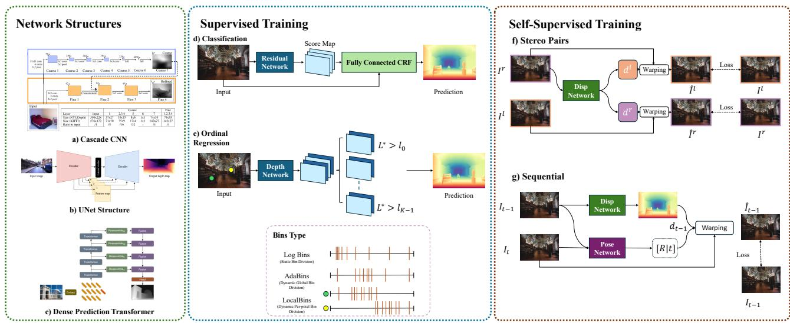  
Fig. 4 Overview of commonly used model structures (CNN, ResNet, ViT), training modes (supervised, unsupervised with and without pose annotations), and inference manners for depth estimation (regression, depth bin classification, and difusion-based approaches).

With the advent of ResNet [49], Laina et al. [6] introduced a ResNet-50 encoder with up-projection blocks for decoding dense depth, demonstrating that deeper networks improve performance and generalization. This insight led many subsequent works [66, 83–92] to design progressively deeper architectures based on the ResNet backbone for depth estimation.

However, these architectures [93, 94], which were based on convolutional neural networks, struggled to balance global context with fine-grained details. Due to their limited receptive fields, convolutional networks often failed to capture global context and large-scale scene structures, resulting in artifacts such as “banding” or inconsistent depth across distant regions.

The application of Vision Transformers (ViT) in this domain has significantly improved these limitations. Ranftl et al. [16] proposed the Dense Prediction Transformer (DPT), which utilizes a Vision Transformer encoder (pre-trained on ImageNet) to capture global context, while employing a convolutional decoder with multi-scale features from the encoder to recover fine-grained details. This approach achieved substantial improvements, with up to a 28% reduction in relative error compared to CNN baselines across multiple benchmarks, and generated more spatially coherent depth maps. Since then, recent methods [17, 23, 95–101] have adopted hybrid ViT encoder and CNN decoder designs to efectively combine global and local information for dense depth estimation.

## 3.1.2 Training Objectives

Depth estimation has traditionally been framed as a discriminative learning problem, with several learning objectives

explored: regression, classification, and ordinal regression. The predicted depth map $D \in \mathbb { R } ^ { H \times W }$ is generated from an input image I using a trainable neural network $f _ { \theta }$ , as follows:

$$
D = f _ { \theta } ( I ) ,\tag{1}
$$

In the following, $D ^ { * }$ denotes the ground-truth depth.

Regression Depth estimation can naturally be formulated as a regression task. Standard losses include the $\mathcal { L } _ { 1 }$ or $\mathcal { L } _ { 2 }$ norms:

$$
\mathcal { L } _ { 1 } ( D , D ^ { * } ) = \frac { 1 } { n } \sum _ { i = 1 } ^ { n } \bigl | y _ { i } - y _ { i } ^ { * } \bigr | ,\tag{2}
$$

$$
\mathcal { L } _ { 2 } ( D , D ^ { * } ) = \frac { 1 } { n } \sum _ { i = 1 } ^ { n } ( y _ { i } - y _ { i } ^ { * } ) ^ { 2 } ,\tag{3}
$$

where $y _ { i }$ and $y _ { i } ^ { * }$ denote the predicted and ground-truth depth values at pixel i, and n is the number of valid pixels. Although conceptually simple, these losses often lead to blurred depth discontinuities and fail to preserve fine structural details in the scene.

To balance small and large residuals (losses), Laina et al. [6] proposed the inverse Huber loss (or berHu loss):

$$
\begin{array} { r } { B ( x ) = \left\{ \begin{array} { l l } { | x | , } & { | x | \leqslant c , } \\ { \displaystyle \frac { x ^ { 2 } + c ^ { 2 } } { 2 c } , } & { | x | > c , } \end{array} \right. } \end{array}\tag{4}
$$

where $x = y _ { i } - y _ { i } ^ { * }$ is the residual, and the threshold $c$ is empirically set as $\begin{array} { r } { c = \frac { 1 } { 5 } \operatorname* { m a x } _ { i } | y _ { i } - y _ { i } ^ { * } | } \end{array}$ . This loss behaves like $\mathcal { L } _ { 1 }$ loss for low error pixels and switches to $\mathcal { L } _ { 2 }$ for larger discrepancies. This hybrid formulation improves both convergence and boundary accuracy. Later works such as CLIFFNet [102] introduced hierarchical losses leveraging intermediate features to enhance multi-scale consistency beyond pixel-level accuracy.

Scale-invariant Loss Monocular depth estimation is inherently ill-posed, as diferent 3D scenes of varying scale can produce identical 2D images. To mitigate this ambiguity, Eigen et al. [3] proposed a scale-invariant loss:

$$
\mathcal { L } _ { \mathrm { s i } } ( D , D ^ { * } ) = \frac { 1 } { n } \sum _ { i = 1 } ^ { n } d _ { i } ^ { 2 } - \frac { \lambda } { n ^ { 2 } } \left( \sum _ { i = 1 } ^ { n } d _ { i } \right) ^ { 2 } ,\tag{5}
$$

where $d _ { i } = \ln y _ { i } - \ln y _ { i } ^ { * }$ , and $\lambda \in [ 0 , 1 ]$ is a hyperparameter. When $\lambda = 1$ , the loss becomes fully scale-invariant, encouraging accurate relative depth rather than absolute depth magnitude.

Afine-invariant Loss Building on scale-invariant loss, recent methods [17, 27–29, 32, 103, 104] adopt an afineinvariantformulation that aligns predicted depth with groundtruth via a global scale s and translation t:

$$
\mathcal { L } _ { \mathrm { s s i } } ( D , D ^ { * } ) = \operatorname* { m i n } _ { s , t } \frac { 1 } { n } \sum _ { i = 1 } ^ { n } \| s y _ { i } + t - y _ { i } ^ { * } \| .\tag{6}
$$

Parameters s and t are typically solved using least-squares.   
The aligned predictions are then evaluated using $\mathcal { L } _ { 1 } \mathcal { L } _ { 2 }$ losses.

Classification Direct regression of continuous depth values is challenging. Inspired by human perception, which favors relative depth cues over exact values, Cao et al. [105] reformulated the task as a classification problem. Depth values are discretized into predefined bins, and the network is trained to classify each pixel into a depth interval.

Ordinal Regression Standard classification fails to capture the ordinal nature of depth. DORN [39] introduced ordinal regression by dividing the depth range into K intervals between a near plane α and far plane $\beta ,$ using either uniform discretization (UD) or space-increasing discretization (SID):

$$
\mathrm { U D } \colon t _ { i } = \alpha + \left( \beta - \alpha \right) \cdot \frac { i } { K } ,\tag{7}
$$

$$
\mathrm { S I D : } \mathrm { \ } t _ { i } = \exp \left[ \log ( \alpha ) + \frac { \log ( \beta / \alpha ) \cdot i } { K } \right] ,\tag{8}
$$

where $t _ { i }$ defines the bin thresholds.

The model outputs an ordinal depth tensor $Y \in$ $\mathbb { R } ^ { H \times W \times 2 K }$ , from which depth is recovered as:

$$
\hat { l } ( w , h ) = \sum _ { k = 0 } ^ { K - 1 } \mathbb { I } \left( \mathcal { P } _ { ( w , h ) } ^ { k } \geqslant 0 . 5 \right) ,\tag{9}
$$

$$
\hat { d } ( w , h ) = \frac { t \hat { l } ( w , h ) + t \hat { l } ( w , h ) + 1 } { 2 } - \xi ,\tag{10}
$$

$$
\mathcal { P } ^ { k } ( w , h ) = \frac { e ^ { y _ { ( w , h , 2 k + 1 ) } } } { e ^ { y _ { ( w , h , 2 k ) } } + e ^ { y _ { ( w , h , 2 k + 1 ) } } } ,\tag{11}
$$

where $\xi$ ensures $\alpha + \xi = 1$ , and $\mathbb { I } ( \cdot )$ is the indicator function. Furthermore, they also propose the ordinal regression loss which is defined as:

$$
\mathcal { L } _ { \mathrm { o r d } } = \frac { 1 } { n } \sum _ { i = 1 } ^ { n } \left( \sum _ { k = 0 } ^ { l _ { i } - 1 } \log ( \mathcal { P } _ { i } ^ { k } ) + \sum _ { k = l _ { i } } ^ { K - 1 } \log ( 1 - \mathcal { P } _ { i } ^ { k } ) \right) .\tag{12}
$$

Building on this insight, and motivated by the observation that depth distributions can vary significantly across images– ranging from narrow bands in tabletop scenes to broad ranges in corridor views– a transformer head was introduced tojointly predict a set of image-specific depth bin centers $c ( \mathbf { b } ) =$ $\{ c _ { 1 } , \ldots , c _ { B } \}$ . To further capture pixel-level variations in depth range, LocalBins [106] proposed predicting depth bins locally for each pixel, thereby achieving finer spatial granularity. Since then, several methods [107–112] have introduced variants of bin prediction strategies to further enhance performance.

Geometric Consistency Loss Many approaches [7, 8, 18, 28, 113–119] have leveraged the geometric relationship between depth and surface normals to improve prediction accuracy by jointly estimating and enforcing consistency between the two. Depth and surface normals are intrinsically linked: the surface normal at a point is determined by the tangent plane of the local 3D surface, which can be inferred from the depth map; conversely, depth is constrained by the orientation of this tangent plane defined by the surface normal. By incorporating modules that estimate normals from depth and vice versa, consistency losses are introduced to align the predicted (or the groun-truth) and derived ones. A typical formulation of the consistency-enforced loss functions is:

$$
\mathcal { L } _ { \mathrm { d e p t h } } = \frac { 1 } { n } \sum _ { i = 1 } ^ { n } \left( \lVert y _ { i } - y _ { i } ^ { * } \rVert _ { 2 } ^ { 2 } + \eta \cdot \lVert \hat { y } _ { i } - y _ { i } ^ { * } \rVert _ { 2 } ^ { 2 } \right) ,\tag{13}
$$

$$
{ \mathcal { L } } _ { \mathrm { n o r m a l } } = { \frac { 1 } { n } } \sum _ { i = 1 } ^ { n } \left( \| \mathbf { n } _ { i } - \mathbf { n } _ { i } ^ { * } \| _ { 2 } ^ { 2 } + \lambda \cdot \| { \hat { \mathbf { n } } } _ { i } - \mathbf { n } _ { i } ^ { * } \| _ { 2 } ^ { 2 } \right) ,\tag{14}
$$

where $y _ { i }$ and $\hat { y } _ { i }$ denote the initial and refined depth predictions at pixel i, and $y _ { i } ^ { * }$ is the corresponding ground-truth depth. Similarly, ${ \bf n } _ { i }$ and $\hat { \mathbf { n } } _ { i }$ are the initial and refined predicted surface normals, while $\mathbf { n } _ { i } ^ { * }$ denotes the ground-truth normal. The weights η and $\lambda$ control the contribution of the refined predictions.

## 3.2 Self-Supervised Learning

Supervised training schemes for monocular depth estimation rely heavily on accurate ground-truth depth or point cloud annotations, which are often expensive and dificult to obtain. In contrast, humans can intuitively infer 3D scene structure and ego-motion without explicit geometric supervision. Motivated by this observation, a substantial body of work [83, 120– 142] has emerged around self-supervised depth estimation. These methods eliminate the need for direct depth labels by leveraging pixel-level consistency losses as supervision signals.

## 3.2.1 Stereo Supervision

Garg et al. [37] pioneered unsupervised depth estimation using stereo image pairs, aiming to sidestep the need for labeled ground-truth depth. Given a rectified stereo pair $I _ { l } , I _ { r }$ , their network predicts the disparity d of the left image $I _ { l } ,$ , which is then used to synthesize the right image $\hat { I } _ { r } ^ { l }$ via image warping. The photometric reconstruction loss is used to supervise the network:

$$
\mathcal { L } _ { \mathrm { p h o t o } } = | I _ { r } - \hat { I } _ { r } ^ { l } | _ { 2 } .\tag{15}
$$

Monodepth [36] improved this framework by predicting both left-to-right and right-to-left disparities $( d _ { l } , \ d _ { r } )$ , enforcing left-right consistency, and introducing additional appearance and smoothness losses:

$$
\mathcal { L } _ { a } = \frac { 1 } { N } \sum _ { i , j } \left[ \alpha \frac { 1 - \mathrm { S S I M } ( \hat { I } _ { r } ^ { l } , I _ { r } ) } { 2 } + ( 1 - \alpha ) | \hat { I } _ { r } ^ { l } - I _ { r } | _ { 1 } \right] ,\tag{16}
$$

$$
\mathcal { L } _ { \mathrm { s m } } = \frac { 1 } { N } \sum _ { i , j } \left( \left| \partial _ { x } d _ { l } \right| e ^ { - \left| \partial _ { x } I _ { l } \right| } + \left| \partial _ { y } d _ { l } \right| e ^ { - \left| \partial _ { y } I _ { l } \right| } \right) .\tag{17}
$$

## 3.2.2 Video Sequences

While stereo-based self-supervision eliminates the need for depth labels, it still requires stereo camera setups, limiting scalability. To overcome this, Zhou et al. [38] introduced SfMLearner, which leverages monocular video sequences and employs a second network to estimate relative camera poses. Their framework jointly learns depth and ego-motion from unlabeled videos via view synthesis.

Given a sequence ${ \cal { S } } = \{ I _ { 0 } , I _ { 1 } , . . . , I _ { N } \}$ , one frame is designated as the target view $I _ { t }$ and the remaining frames serve as source views $I _ { s } \left( s \ne t \right)$ . The depth network $f _ { \theta }$ predicts the disparity $\hat { D } _ { t }$ for $I _ { t }$ , while the pose network $g _ { \phi } ( I _ { t } , I _ { s } )$ estimates the $4 \times 4$ transformation matrix $T _ { t  s }$ . The target pixel $p _ { t }$ can then be projected into the source frame as:

$$
p _ { s } \sim K T _ { t  s } \hat { D } _ { t } ( p _ { t } ) K ^ { - 1 } p _ { t } ,\tag{18}
$$

where K is the camera intrinsic matrix. Photometric consistency loss $( \mathrm { E q . } ( 1 5 ) )$ between $I _ { t }$ and its warped reconstruction $\hat { I } _ { t }$ are used to jointly supervise depth and pose estimation.

Monodepth2 [40] further refined this pipeline by introducing an auto-masking strategy to handle dynamic objects and occlusions, and by adopting a ResNet backbone pretrained on ImageNet. Monodepth2 demonstrated that with deeper architectures and strong initialization, self-supervised methods can match or even outperform some supervised models on standard benchmarks. This paradigm has been widely adopted, with continued innovations in architecture design [141, 143–148], uncertainty modeling [130, 149], dynamic scene understanding [150, 151], and integration with downstream applications [125, 152–154].

## 3.3 Summary

Prior to the emergence of large foundation models, research in monocular depth estimation had largely converged in both architectural design and training objectives. Architecturally, hybrid CNN-ViT models– particularly the DPT-style architecture– demonstrated superior performance and became a foundational backbone for several subsequent foundation models [17, 19–21, 23–26, 29, 33, 155]. On the training side, scale-invariant loss functions gained widespread adoption for relative depth estimation and have been carried over into the training regimes of foundation models [17, 27–32, 34, 35] as well. In addition, surface normal regularization has become a common strategy for improving 3D reconstruction fidelity, and this practice has similarly influenced the training of modern foundation models [18, 25, 28, 34, 35, 156].

## 4 Depth Foundation Model

The remarkable success of large foundation models in natural language processing and image/video understanding has recently catalyzed a paradigm shift in monocular depth estimation, leading to the emergence of Depth Foundation Models. These models harness the power of large-scale, pre-trained foundation models (e.g., DINOv2 [157], DINOv3 [158], Stable Difusion [159]) and are further fine-tuned on extensive RGB-D datasets. Their primary goal is to achieve accurate depth estimation on in-the-wild images. Typically, Depth Foundation Models are designed with the following objectives:

(1) Zero-shot robustness. A single model should generalize efectively to previously unseen inputs, delivering reliable depth estimations across a wide variety of camera types (e.g., pinhole, wide-angle, fisheye) and scenes (e.g., indoor, outdoor, in-the-wild, object-centric, and stylized environments), without requiring additional fine-tuning.

(2) Detail preservation. The predicted depth maps should be both highly accurate and capable of preserving finegrained geometric details, characterized by sharp, structurally complete representations.

In this section, we begin by summarizing recent advancements focused on unifying and integrating diverse datasets across existing approaches for training depth foundation models. We then categorize the latest methods into Discriminative Models and Generative Models based on diferences in their prediction paradigms, ofering a comprehensive review of the progress achieved in each category.

## 4.1 Dataset Collection and Unification

Mixed Data Alignment RGB-D datasets often exhibit considerable heterogeneity in their depth annotations, which may include absolute depth (e.g., from laser-based sensors or stereo cameras with known calibration), depth with an unknown scale (e.g., from Structure-from-Motion), or disparity maps (e.g., from stereo setups without calibration). To address this challenge, MiDaS [15] introduced the afine-invariant loss (Eq. (6)), which is robust to scale and shift variations, and tackles the primary sources of incompatibility among diferent datasets. This approach enables the model to efectively integrate diverse data sources while utilizing the full spectrum of available information.

Emergence of High-Quality Synthetic Data Depth labels acquired in real-world scenes using laser-based sensors (RGB-D cameras or LiDAR) are often afected by noise, particularly in transparent or highly reflective regions, and may have missing values. In recent years, the creation of photorealistic rendering datasets with accompanying depth information has surged, utilizing simulators or game engines such as Unreal Engine, Unity, and Isaac Sim [162]. These synthetic datasets, thanks to their photorealism and accurately annotated depth labels, significantly enhance the robustness of depth estimation models.

Data in Challenging Conditions Several recent eforts have focused on depth estimation under challenging or out-ofdistribution (OOD) conditions, such as underwater environments, adverse weather (e.g., fog, rain), or scenes dominated by non-Lambertian surfaces (e.g., reflective or translucent materials). In these scenarios, obtaining ground-truth depth annotations is particularly dificult or even impractical. To mitigate this, researchers [163–165] have turned to cuttingedge text-to-image difusion models with depth-aware control mechanisms, enabling the generation of high-quality synthetic images that are aligned with specific depth structures. These models maintain geometric consistency while synthesizing realistic visual content tailored to rare or complex environments.

## 4.2 Discriminative Methods

Many existing depth foundation models formulate this task as a discriminative learning problem, directly learning a mapping from images to depth values. In this area, before the emergence of Vision Transformers (ViTs), early zero-shot monocular depth estimation methods– such as MegaDepth [66], MiDaS [15], and LRSI [31]– primarily relied on convolutional neural networks (CNNs) as backbones. These networks were typically pre-trained on large-scale image classification datasets (e.g., ResNet-101, DenseNet-161) to enhance feature extraction. While these CNN-based methods demonstrated promising performance on unseen datasets, their depth estimation accuracy remained limited. In particular, they struggled with mixed-dataset training and often failed to outperform models trained on domain-specific data, showing poor scalability as the data size increased.

To overcome these limitations, MiDaS v3.1 [33] introduced the first depth foundation models using the ViT-based DPT architecture, which achieved superior performance, particularly due to its ability to capture global context and long-range spatial relationships. Subsequently, the ViT-based architecture became the new standard and was widely adopted in foundational depth models [17–20, 28, 29, 166]. A representative discriminative model structure is shown in Fig. 5.

## 4.2.1 Relative Depth Estimation

Transformer Architectures Since the introduction of DPT [16], which utilizes transformers for dense predictions, it has been widely adopted for building foundation models in relative depth estimation. Building on the DPT architecture, the MiDaS series (v2 [167], v3 [15]) were the first to train the model on 1.1 million images from diverse sources (including ReDWeb [83], MegaDepth [66], WSVD [168], and others), producing relative depth estimations that efectively captured geometry across a wide range of inputs. These models demonstrated that a single model could generalize well to indoor, outdoor, and even artistic images, establishing DPT as a foundational model architecture and kickstarting the development of depth foundation models.

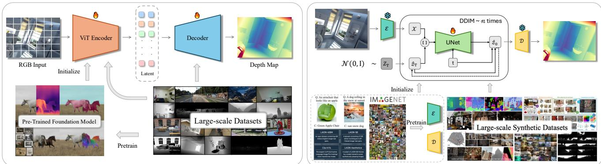  
Fig. 5 Illustration of discriminative (left) and generative (right) frameworks for monocular depth estimation. Discriminative methods typically leverage a Vision Transformer [160] (ViT) encoder initialized with a pre-trained foundation model (e.g., DINOv2 [157]) and trained on large-scale diverse datasets to directly regress depth maps. In contrast, generative methods utilize VAE [161] structure, iteratively refining depth predictions through a denoising process conditioned on synthetic datasets, thereby efectively capturing complex details and structural coherence.

Scale-up Learning Depth Anything [17] uses the DPT architecture and embodies a foundation model that focuses not on novel architectures but on a massive “data engine” to enable in-the-wild generalization. It collected 1.5 million labeled and 62 million unlabeled images, annotated with pseudo-depth from model ensembles. An important factor contributing to its success is the use of pre-trained visual representations from the vision foundation model DINOv2. This allowed the model to achieve exceptional zero-shot relative-depth performance across six public datasets and diverse real-world images. However, the Depth Anything model still struggles to deliver sharp results. To address this, Depth Anything V2 [29] replaced all real-world labels with synthetic ones to train a teacher model, using the pre-trained DINOv2 model [157] to initialize the ViT encoder’s weights.

Point-based Representation Rather than directly predicting relative depth, Wang et al. proposed MoGe [28], a foundation model built with a DPT architecture that predicts a per-pixel afine-invariant 3D pointmap instead of depth. This approach bypasses the need for camera intrinsics, allowing for high-quality point reconstruction. MoGe incorporates dedicated training objectives, including afine-invariant global point supervision similar as Eq. (6) but applied in point space, multi-scale local geometry loss, and normal loss, all of which improve surface reconstruction and local details. The model uses a DPT-style architecture with a ViT encoder initialized with DINOv2 [157], and it was trained on 9 million images spanning indoor, outdoor, aerial, and synthetic domains. This training yields a highly transferable geometry prior that can be quickly calibrated to metric scale or applied to downstream 3D vision tasks.

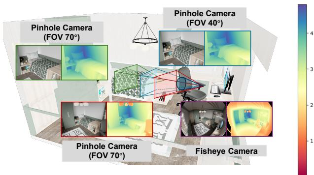  
Fig. 6 Illustration of metric depth ambiguity across diferent camera models and intrinsics. We render the same indoor scene using four diferent cameras: three pinhole cameras (green, blue, red) with varying fields-of-view (FoV), and one fisheye camera (purple). Three cameras are placed at the same position (blue, red, purple), yet they produce significantly diferent appearance patterns due to variations in camera intrinsics and distortion, despite sharing the same underlying geometry. In contrast, pinhole cameras with diferent FoVs (green vs. blue) produce visually similar images but correspond to diferent depth distributions.

## 4.2.2 Metric Depth Estimation

Challenges In addition to foundation models for relative depth estimation, many research eforts [18–21, 24, 25] have sought to tackle the more challenging task of estimating metric depth from a single image. This problem is fundamentally more dificult due to inherent ambiguities stemming from unknown camera intrinsics (e.g., focal length, sensor type) and substantial domain shifts across diverse scenarios (e.g., varying depth ranges in indoor, outdoor, object-centric, real, or synthetic environments).

As illustrated in Fig. 6, we render the same indoor scene using four diferent cameras. The setup includes two camera models– pinhole (green, blue, red) and fisheye (purple)– with the pinhole cameras further configured using two diferent fields of view (FoV).

When placed at the same physical location (blue, red, purple), these cameras– with diferent camera models or FoV settings– produce drastically diferent visual appearances, despite observing the same scene geometry and sharing identical depth values for the same objects. Conversely, two pinhole cameras with diferent FoVs (green and blue) and placed at diferent positions can yield visually similar images, even though they correspond to diferent underlying metric depths.

These observations underscore the intrinsic dificulty of monocular metric depth estimation: models must learn to generalize across diverse camera intrinsics and distortion types, while maintaining accurate and consistent geometric understanding.

Modeling Camera Intrinsics A prominent line of research focuses on incorporating camera models into the architectural design to reduce the ambiguity introduced by varying camera intrinsics. Metric3D [24] introduced a shared canonical camera space transformation module that mitigates metric ambiguities by normalizing input images into a unified camera intrinsic system. Trained on large-scale datasets from diverse sources, it demonstrates strong zero-shot generalization. Building on this, Hu et al. proposed Metric3D v2 [25], which incorporates joint constraints from both depth and surface normals, further improving zero-shot performance. However, these methods rely on known intrinsic parameters to perform the canonical transformation.

To overcome this limitation, UniDepth [19] introduces a self-prompted camera module that infers a dense representation of camera intrinsics, along with a geometric-invariance loss that helps disentangle camera-specific efects from depth predictions. Its successor, UniDepthV2 [20], simplifies the architecture by replacing the spherical harmonic tokenization with a more eficient design based on a DINOv2-initialized Vision Transformer and sine positional encoding– yielding improved performance with reduced complexity.

Similarly, DepthPro [21] incorporates a learned focallength prediction head, enabling metric depth estimation without access to explicit camera metadata. It further leverages synthetic data to enhance performance and preserve fine details.

These strategies– ranging from canonical camera transformations to self-prompted camera intrinsics and learned focal-length estimation– enable robust and universal metric depth estimation across diverse imaging conditions.

Repurposing Relative Depth Estimation for Metric Depth Prediction Another line of research aims to adapt relative depth estimation models for predicting metric depth. A representative example is ZoeDepth [22], which builds upon a pre-trained relative depth model by introducing a metric bin module that adaptively predicts bin centers to account for image variability. Once fine-tuned on NYU and KITTI datasets, the model demonstrates strong generalization across diverse scenes.

More recently, MoGe-2 [18] extends its predecessor MoGe [28] by decoupling afine-invariant relative depth estimation and global metric scale estimation within a unified framework. It employs a lightweight MLP branch to predict a global scale factor for accurate metric depth. In addition, MoGe-2 introduces a data refinement pipeline that filters noisy real-world depth data using high-quality synthetic labels, leading to sharper object boundaries and improved depth detail. These refined data have been shown to significantly enhance depth estimation quality.

Building on relative-to-metric transfer, FoundationGeo [26] reveals that metric errors arise not only from global scale ambiguity, but also from spatially varying scale drift and residual ray-direction bias. It further identifies focal-length coverage mismatch as a key bottleneck for zero-shot generalization. Accordingly, FoundationGeo introduces pixel-wise scale and ray-direction correction fields, together with targeted multifocal synthetic data. Combined with its two-stage training strategy and broad multi-domain data coverage, Foundation-Geo further raises the model’s performance ceiling while exhibiting stable generalization across domains and camera models.

## 4.3 Generative Methods

Originally developed for probabilistic generative modeling, difusion models have recently gained traction in depth estimation due to their capacity to capture complex data distributions and preserve fine details. An increasing number of works [27, 30, 32, 34, 35, 169–171] leverage pre-trained difusion models to enhance the realism and reliability of depth predictions. As shown in Fig. 5 (b), Marigold [27] is a representative example, fine-tuned from Stable Difusion for depth estimation. It concatenates RGB image latents with noise along the channel dimension, enabling the U-Net to iteratively denoise the input noise and produce a refined depth map. Notably, despite being trained on limited synthetic data, Marigold demonstrates competitive performance, particularly in fine-grained details.

Eficiency and Detail Enhancement Due to the inherent multi-step denoising process and test-time ensembling used to address sampling uncertainty, Marigold sufers from long inference times: approximately 24 seconds for a 578×578 input. To improve eficiency, recent methods reformulate depth estimation as a single-step difusion process. GenPercept [35] and Difusion-E2E [34] investigate the role of the denoising scheduler and propose deterministic one-step alternatives. By reframing depth estimation as a direct prediction task, these approaches achieve faster inference while allowing the integration of pixel-level supervision via afine-invariant loss functions.

While difusion models are adept at generating detailed outputs, fine structures may still degrade during task-specific adaptation– potentially due to catastrophic forgetting [32]. To address this, Lotus [32] introduces a task switcher that alternates between generating depth/normal predictions and reconstructing input images, encouraging the preservation of structural and textural cues. Additionally, GeoWizard [30] exploits the flexibility of difusion models to jointly estimate depth and surface normals, enabling mutual information sharing and improved consistency between modalities.

Beyond Difusion Beyond conventional difusion models, a few works draw inspiration from visual autoregressive modeling (VAR) [172], reformulating depth estimation as a sequence of next-scale predictions across multiple resolutions[107]. However, their robustness and performance ceilings remain under early investigation.

Discussions Generative models typically yield sharper and more structurally coherent outputs, whereas discriminative models ofer superior computational eficiency. Motivated by their complementary strengths, several hybrid strategies have been proposed. For instance, BetterDepth [169] uses difusion models as plug-and-play refiners to enhance coarse outputs from pretrained discriminative networks (e.g., DPT [16]), improving fine-detail quality.

Furthermore, GenPercept and Difusion-E2E [34] show that reducing difusion to a single-step sampling scheme—while employing discriminative-style loss functions—boosts performance. These findings reflect a growing trend of repurposing difusion models not as generative samplers but as deterministic predictors or feature extractors, thus bridging the gap between generative flexibility and discriminative eficiency.

## 4.4 Benchmark Performance

Since diferent methods often adopt distinct evaluation protocols– such as using diferent benchmark datasets or scale calibration strategies– the results reported in individual papers are not directly comparable. To ensure a fair and consistent assessment, we standardize the evaluation under a unified framework.

First, we evaluate all methods on a common benchmark dataset. Specifically, we adopt the benchmark introduced by MoGe-2 [18], which includes 10 datasets across multiple domains (e.g., indoor, street views, object scans and synthetic animations). This benchmark excludes ambiguous regions such as reflective surfaces and applies a consistent evaluation protocol to assess the predicted depth maps.

Second, to align the predicted depths with ground-truth values, we apply a uniform afine-invariant alignment procedure, calculating a scale and shift using least-square fitting. We categorize the evaluated methods into three types:

(1) Metric depth estimation: UniDepth [19], UniDepthV2 [20], FoundationGeo [26], DepthPro [21], ZeroDepth [23], Metric3D [24], Metric3DV2 [25] and MoGe-2 [18];

(2) Relative depth estimation: MoGe [28], Marigold [27], GeoWizard [30], LeReS [31], Difusion-E2E-FT [34], GenPercept [35]; DepthAnythingV3 [43],VGGT [42],

(3) Disparity estimation: MiDaS v3.1 [33] and DepthAnything [17], DepthAnythingV2 [29], DPT [16], Lotus [32].

Although metric depth models are designed to predict absolute depth values, they often sufer from scale inconsistency when directly compared to ground truth. Therefore, we apply afine alignment (scale + shift) even to metric methods prior to computing standard depth metrics. For relative depth models, which inherently lack absolute scale, we apply the same afine-invariant alignment. Disparity-based models are similarly aligned both in depth or disparity space. By standardizing all methods using afine-invariant alignment, we ensure a fair comparison that focuses solely on depth distribution accuracy, independent of scale and calibration variations.

To ensure optimal performance, we follow each method’s oficial data preprocessing pipeline and evaluate their bestperforming open-source implementations. We report the following commonly used metrics:

(1) Absolute Mean Relative Error(AbsRel). Defined as $\begin{array} { r } { \frac { 1 } { M } | a _ { i } - y _ { i } ^ { * } | / y _ { i } ^ { * } } \end{array}$

(2) δ1 Accuracy. Defined as the proportion of pixels satisfying $\operatorname* { m a x } ( a _ { i } / y _ { i } ^ { * } , y _ { i } ^ { * } / a _ { i } ) < 1 . 2 5$

Table 2 Unified evaluation of diferent methods. This benchmark is majorly for zero-shot evaluation. The best results are highlight in bold, and the second-best ones are underlined. Gray numbers denote models trained on respective benchmarks and thus excluded from ranking.
<table><tr><td rowspan=2 colspan=1>Depth Align</td><td rowspan=1 colspan=1>NYUv2</td><td rowspan=1 colspan=2>KITTI</td><td rowspan=1 colspan=2>ETH3D</td><td rowspan=1 colspan=2>iBims-1</td><td rowspan=1 colspan=1>GSO</td><td rowspan=1 colspan=2>Sintel</td><td rowspan=1 colspan=2>DDAD</td><td rowspan=1 colspan=1>DIODE</td><td rowspan=1 colspan=4>Spring</td><td rowspan=1 colspan=2>HAMMER</td></tr><tr><td rowspan=1 colspan=1>AbsRel↓ δ1↑</td><td rowspan=1 colspan=2>AbsRel.↓ δ1↑</td><td rowspan=1 colspan=2>AbsRel↓ δ1↑</td><td rowspan=1 colspan=2>AbsRel.↓ δ1↑</td><td rowspan=1 colspan=1>AbsRel.↓ δ1↑</td><td rowspan=1 colspan=2>AbsRel↓ δ1↑</td><td rowspan=1 colspan=2>AbsRel↓ δ1↑</td><td rowspan=1 colspan=1>AbsRel.↓ δ1↑</td><td rowspan=1 colspan=4>AbsRel↓ δ1↑</td><td rowspan=1 colspan=2>AbsRel.↓ δ1↑</td></tr><tr><td rowspan=1 colspan=1>Marigold [27]</td><td rowspan=1 colspan=1>5.20 97.32</td><td rowspan=1 colspan=2>10.17 90.24</td><td rowspan=1 colspan=2>14.53 82.11</td><td rowspan=1 colspan=2>5.10 96.80</td><td rowspan=1 colspan=1>2.64 99.88</td><td rowspan=1 colspan=2>46.20 63.76</td><td rowspan=1 colspan=2>17.75 77.02</td><td rowspan=1 colspan=1>9.64 90.49</td><td rowspan=1 colspan=4>92.13 46.22</td><td rowspan=1 colspan=2>9.20 92.50</td></tr><tr><td rowspan=1 colspan=1>MoGe [28]</td><td rowspan=1 colspan=1>3.41 98.49</td><td rowspan=1 colspan=2>4.99 98.20</td><td rowspan=1 colspan=2>3.44 98.75</td><td rowspan=1 colspan=2>3.39 98.11</td><td rowspan=1 colspan=1>0.96 99.99</td><td rowspan=1 colspan=2>34.22 72.32</td><td rowspan=1 colspan=2>10.08 91.84</td><td rowspan=1 colspan=1>5.00  95.80</td><td rowspan=1 colspan=3>16.65</td><td rowspan=1 colspan=1>86.35</td><td rowspan=1 colspan=2>3.31 98.46</td></tr><tr><td rowspan=1 colspan=1>MoGe-2 [18]</td><td rowspan=1 colspan=1>3.42 98.47</td><td rowspan=1 colspan=2>4.80 98.19</td><td rowspan=1 colspan=2>3.49 98.78</td><td rowspan=1 colspan=2>2.69 98.90</td><td rowspan=1 colspan=1>0.97 99.99</td><td rowspan=1 colspan=2>38.40 72.56</td><td rowspan=1 colspan=2>10.39 91.28</td><td rowspan=1 colspan=1>4.72 96.39</td><td rowspan=1 colspan=3>55.27</td><td rowspan=1 colspan=1>66.90</td><td rowspan=1 colspan=2>3.09 99.51</td></tr><tr><td rowspan=1 colspan=1>FoundationGeo [26]</td><td rowspan=1 colspan=1>3.56 98.58</td><td rowspan=1 colspan=2>4.85 98.25</td><td rowspan=1 colspan=2>3.50 98.86</td><td rowspan=1 colspan=2>2.93 98.77</td><td rowspan=1 colspan=1>1.37  99.99</td><td rowspan=1 colspan=2>28.55 74.10</td><td rowspan=1 colspan=2>9.37 92.54</td><td rowspan=1 colspan=1>5.43  95.71</td><td rowspan=1 colspan=3>16.66</td><td rowspan=1 colspan=1>86.52</td><td rowspan=1 colspan=2>2.53 99.66</td></tr><tr><td rowspan=1 colspan=1>DepthAnything [17]</td><td rowspan=1 colspan=1>7.32 95.57</td><td rowspan=1 colspan=2>13.37 81.59</td><td rowspan=1 colspan=2>7.57 94.35</td><td rowspan=1 colspan=2>6.62 96.26</td><td rowspan=1 colspan=1>2.05  99.98</td><td rowspan=1 colspan=1>39.97</td><td rowspan=1 colspan=1>71.08</td><td rowspan=1 colspan=2>16.06 81.01</td><td rowspan=1 colspan=1>8.78  93.20</td><td rowspan=1 colspan=3>69.53</td><td rowspan=1 colspan=1>58.14</td><td rowspan=1 colspan=1>7.80</td><td rowspan=1 colspan=1>96.75</td></tr><tr><td rowspan=1 colspan=1>DepthAnythingV2 [29]</td><td rowspan=1 colspan=1>7.07  95.77</td><td rowspan=1 colspan=2>12.49 83.65</td><td rowspan=1 colspan=2>7.79 94.28</td><td rowspan=1 colspan=2>6.47 96.87</td><td rowspan=1 colspan=1>1.97  99.98</td><td rowspan=1 colspan=1>38.93</td><td rowspan=1 colspan=1>69.70</td><td rowspan=1 colspan=2>15.95 81.49</td><td rowspan=1 colspan=1>8.32  92.83</td><td rowspan=1 colspan=3>78.59</td><td rowspan=1 colspan=1>58.18</td><td rowspan=1 colspan=1>8.43</td><td rowspan=1 colspan=1>96.55</td></tr><tr><td rowspan=1 colspan=1>DepthAnythingV3 [43]</td><td rowspan=1 colspan=1>3.88 98.32</td><td rowspan=1 colspan=2>7.24  95.56</td><td rowspan=1 colspan=2>5.97 96.16</td><td rowspan=1 colspan=2>3.22 98.63</td><td rowspan=1 colspan=1>1.03 99.99</td><td rowspan=1 colspan=1>37.65</td><td rowspan=1 colspan=1>73.00</td><td rowspan=1 colspan=2>16.81 78.96</td><td rowspan=1 colspan=1>5.91  95.05</td><td rowspan=1 colspan=3>50.25</td><td rowspan=1 colspan=1>69.80</td><td rowspan=1 colspan=1>3.50</td><td rowspan=1 colspan=1>99.54</td></tr><tr><td rowspan=1 colspan=1>VGGT [42]</td><td rowspan=1 colspan=1>3.52  98.28</td><td rowspan=1 colspan=1>9.49</td><td rowspan=1 colspan=1>90.87</td><td rowspan=1 colspan=2>4.52 96.68</td><td rowspan=1 colspan=2>4.62 96.48</td><td rowspan=1 colspan=1>0.84 99.99</td><td rowspan=1 colspan=1>48.93</td><td rowspan=1 colspan=1>66.15</td><td rowspan=1 colspan=1>17.71</td><td rowspan=1 colspan=1>77.75</td><td rowspan=1 colspan=1>7.92  91.98</td><td rowspan=1 colspan=4>88.34 59.28</td><td rowspan=1 colspan=1>3.94</td><td rowspan=1 colspan=1>97.95</td></tr><tr><td rowspan=1 colspan=1>UniDepth [19]</td><td rowspan=1 colspan=1>3.79 98.51</td><td rowspan=1 colspan=1>4.03</td><td rowspan=1 colspan=1>98.81</td><td rowspan=1 colspan=1>5.56</td><td rowspan=1 colspan=1>97.14</td><td rowspan=1 colspan=2>4.14 98.11</td><td rowspan=1 colspan=1>2.56  99.92</td><td rowspan=1 colspan=1>58.78</td><td rowspan=1 colspan=1>59.10</td><td rowspan=1 colspan=1>10.24</td><td rowspan=1 colspan=1>91.33</td><td rowspan=1 colspan=1>6.69 94.84</td><td rowspan=1 colspan=3>80.45</td><td rowspan=1 colspan=1>55.41</td><td rowspan=1 colspan=1>3.69</td><td rowspan=1 colspan=1>99.08</td></tr><tr><td rowspan=1 colspan=1>UniDepthV2 [20]</td><td rowspan=1 colspan=1>6.08 96.50</td><td rowspan=1 colspan=1>8.46</td><td rowspan=1 colspan=1>93.37</td><td rowspan=1 colspan=1>9.48</td><td rowspan=1 colspan=1>91.27</td><td rowspan=1 colspan=2>6.81 94.53</td><td rowspan=1 colspan=1>2.50 99.79</td><td rowspan=1 colspan=1>58.50</td><td rowspan=1 colspan=1>54.20</td><td rowspan=1 colspan=1>17.69</td><td rowspan=1 colspan=1>78.03</td><td rowspan=1 colspan=1>12.02 86.74</td><td rowspan=1 colspan=3>112.20</td><td rowspan=1 colspan=1>41.51</td><td rowspan=1 colspan=1>12.27</td><td rowspan=1 colspan=1>82.54</td></tr><tr><td rowspan=1 colspan=1>DepthPro [21]</td><td rowspan=1 colspan=1>4.18 98.15</td><td rowspan=1 colspan=1>6.76</td><td rowspan=1 colspan=1>96.23</td><td rowspan=1 colspan=1>7.27</td><td rowspan=1 colspan=1>94.90</td><td rowspan=1 colspan=2>3.74 98.19</td><td rowspan=1 colspan=1>1.49  99.99</td><td rowspan=1 colspan=1>51.18</td><td rowspan=1 colspan=1>71.30</td><td rowspan=1 colspan=1>21.57</td><td rowspan=1 colspan=1>74.04</td><td rowspan=1 colspan=1>7.41 93.73</td><td rowspan=1 colspan=3>80.01</td><td rowspan=1 colspan=1>54.68</td><td rowspan=1 colspan=2>3.48 99.65</td></tr><tr><td rowspan=1 colspan=1>ZeroDepth [23]</td><td rowspan=1 colspan=1>6.03 96.39</td><td rowspan=1 colspan=1>7.61</td><td rowspan=1 colspan=1>94.74</td><td rowspan=1 colspan=1>13.24</td><td rowspan=1 colspan=1>85.07</td><td rowspan=1 colspan=2>6.95 93.91</td><td rowspan=1 colspan=1>4.95 99.41</td><td rowspan=1 colspan=1>66.04</td><td rowspan=1 colspan=1>51.10</td><td rowspan=1 colspan=1>17.06</td><td rowspan=1 colspan=1>78.69</td><td rowspan=1 colspan=1>19.09 79.98</td><td rowspan=1 colspan=3>152.30</td><td rowspan=1 colspan=1>34.38</td><td rowspan=1 colspan=2>14.74 78.82</td></tr><tr><td rowspan=1 colspan=1>Metric3D [24]</td><td rowspan=1 colspan=1>7.81  93.85</td><td rowspan=1 colspan=1>6.89</td><td rowspan=1 colspan=1>95.72</td><td rowspan=1 colspan=1>11.85</td><td rowspan=1 colspan=1>86.07</td><td rowspan=1 colspan=2>7.20 94.66</td><td rowspan=1 colspan=1>5.05 99.36</td><td rowspan=1 colspan=1>77.00</td><td rowspan=1 colspan=1>48.75</td><td rowspan=1 colspan=1>18.86</td><td rowspan=1 colspan=1>74.47</td><td rowspan=1 colspan=1>11.25 89.08</td><td rowspan=1 colspan=3>111.35</td><td rowspan=1 colspan=1>42.48</td><td rowspan=1 colspan=1>12.32</td><td rowspan=1 colspan=1>85.84</td></tr><tr><td rowspan=1 colspan=1>Metric3DV2 [25]</td><td rowspan=1 colspan=1>6.77  94.07</td><td rowspan=1 colspan=1>5.43</td><td rowspan=1 colspan=1>98.07</td><td rowspan=1 colspan=1>5.51</td><td rowspan=1 colspan=1>96.49</td><td rowspan=1 colspan=2>4.34 98.26</td><td rowspan=1 colspan=1>1.78 99.98</td><td rowspan=1 colspan=1>38.59</td><td rowspan=1 colspan=1>73.56</td><td rowspan=1 colspan=1>10.87</td><td rowspan=1 colspan=1>90.27</td><td rowspan=1 colspan=1>5.48 96.32</td><td rowspan=1 colspan=3>84.61</td><td rowspan=1 colspan=1>55.59</td><td rowspan=1 colspan=1>3.83</td><td rowspan=1 colspan=1>98.57</td></tr><tr><td rowspan=1 colspan=1>GeoWizard [30]</td><td rowspan=1 colspan=1>5.12 97.41</td><td rowspan=1 colspan=1>9.68</td><td rowspan=1 colspan=1>91.41</td><td rowspan=1 colspan=1>9.02</td><td rowspan=1 colspan=1>92.06</td><td rowspan=1 colspan=1>4.91</td><td rowspan=1 colspan=1>97.11</td><td rowspan=1 colspan=1>1.75  99.97</td><td rowspan=1 colspan=1>45.22</td><td rowspan=1 colspan=1>67.72</td><td rowspan=1 colspan=1>21.13</td><td rowspan=1 colspan=1>71.59</td><td rowspan=1 colspan=1>8.85 91.86</td><td rowspan=1 colspan=3>93.39</td><td rowspan=1 colspan=1>54.17</td><td rowspan=1 colspan=1>4.38</td><td rowspan=1 colspan=1>98.47</td></tr><tr><td rowspan=1 colspan=1>LeReS [31]</td><td rowspan=1 colspan=1>6.75 95.54</td><td rowspan=1 colspan=1>12.61</td><td rowspan=1 colspan=1>83.61</td><td rowspan=1 colspan=1>11.69</td><td rowspan=1 colspan=1>87.53</td><td rowspan=1 colspan=1>7.30</td><td rowspan=1 colspan=1>94.69</td><td rowspan=1 colspan=1>4.14 99.68</td><td rowspan=1 colspan=1>58.49</td><td rowspan=1 colspan=1>56.40</td><td rowspan=1 colspan=1>19.43</td><td rowspan=1 colspan=1>73.01</td><td rowspan=1 colspan=1>13.82 84.95</td><td rowspan=1 colspan=3>104.48</td><td rowspan=1 colspan=1>48.08</td><td rowspan=1 colspan=1>8.44</td><td rowspan=1 colspan=1>93.88</td></tr><tr><td rowspan=1 colspan=1>Lotus [32]</td><td rowspan=1 colspan=1>8.26 94.30</td><td rowspan=1 colspan=1>8.46</td><td rowspan=1 colspan=1>93.56</td><td rowspan=1 colspan=1>10.24</td><td rowspan=1 colspan=1>91.98</td><td rowspan=1 colspan=1>8.56</td><td rowspan=1 colspan=1>93.87</td><td rowspan=1 colspan=1>3.04 99.95</td><td rowspan=1 colspan=1>46.25</td><td rowspan=1 colspan=1>66.85</td><td rowspan=1 colspan=1>15.51</td><td rowspan=1 colspan=1>81.39</td><td rowspan=1 colspan=1>10.54 90.26</td><td rowspan=1 colspan=3>70.59</td><td rowspan=1 colspan=1>57.90</td><td rowspan=1 colspan=1>8.74</td><td rowspan=1 colspan=1>95.13</td></tr><tr><td rowspan=1 colspan=1>MiDas3.1 [33]</td><td rowspan=1 colspan=1>7.32 95.53</td><td rowspan=1 colspan=1>12.23</td><td rowspan=1 colspan=1>84.52</td><td rowspan=1 colspan=1>9.39</td><td rowspan=1 colspan=1>91.77</td><td rowspan=1 colspan=2>6.98 95.72</td><td rowspan=1 colspan=1>2.28 99.97</td><td rowspan=1 colspan=1>36.76</td><td rowspan=1 colspan=1>70.61</td><td rowspan=1 colspan=1>18.19</td><td rowspan=1 colspan=1>77.25</td><td rowspan=1 colspan=1>10.14 90.74</td><td rowspan=1 colspan=3>82.02</td><td rowspan=1 colspan=1>59.15</td><td rowspan=1 colspan=1>8.78</td><td rowspan=1 colspan=1>94.58</td></tr><tr><td rowspan=1 colspan=1>DPT [16]</td><td rowspan=1 colspan=1>9.91  91.30</td><td rowspan=1 colspan=1>14.58</td><td rowspan=1 colspan=1>79.84</td><td rowspan=1 colspan=1>11.35</td><td rowspan=1 colspan=1>89.61</td><td rowspan=1 colspan=2>8.13 94.14</td><td rowspan=1 colspan=1>3.04  99.92</td><td rowspan=1 colspan=1>42.15</td><td rowspan=1 colspan=1>63.24</td><td rowspan=1 colspan=1>21.99</td><td rowspan=1 colspan=1>69.26</td><td rowspan=1 colspan=1>11.48 88.39</td><td rowspan=1 colspan=3>75.08</td><td rowspan=1 colspan=1>52.14</td><td rowspan=1 colspan=1>10.02</td><td rowspan=1 colspan=1>91.60</td></tr><tr><td rowspan=1 colspan=1>PPD [171]</td><td rowspan=1 colspan=1>5.61 96.51</td><td rowspan=1 colspan=1>22.22</td><td rowspan=1 colspan=1>66.58</td><td rowspan=1 colspan=1>12.70</td><td rowspan=1 colspan=1>85.79</td><td rowspan=1 colspan=2>6.75 94.42</td><td rowspan=1 colspan=1>1.80 99.98</td><td rowspan=1 colspan=1>47.88</td><td rowspan=1 colspan=1>64.64</td><td rowspan=1 colspan=1>26.73</td><td rowspan=1 colspan=1>65.33</td><td rowspan=1 colspan=1>11.83 86.65</td><td rowspan=1 colspan=4>99.28 52.87</td><td rowspan=1 colspan=1>3.99</td><td rowspan=1 colspan=1>99.35</td></tr><tr><td rowspan=1 colspan=1>Diffusion-E2E-FT [34]</td><td rowspan=1 colspan=1>4.91 97.43</td><td rowspan=1 colspan=2>7.78 95.06</td><td rowspan=1 colspan=2>6.49 95.13</td><td rowspan=1 colspan=2>4.44 97.58</td><td rowspan=1 colspan=1>2.24 99.95</td><td rowspan=1 colspan=2>37.62 69.45</td><td rowspan=1 colspan=1>14.63</td><td rowspan=1 colspan=1>83.91</td><td rowspan=1 colspan=1>8.59 92.34</td><td rowspan=1 colspan=4>89.68 53.73</td><td rowspan=1 colspan=1>4.04</td><td rowspan=1 colspan=1>98.46</td></tr><tr><td rowspan=1 colspan=1>GenPercept [35]</td><td rowspan=1 colspan=1>4.93 97.48</td><td rowspan=1 colspan=2>8.60  93.72</td><td rowspan=1 colspan=2>6.84 95.04</td><td rowspan=1 colspan=2>4.84 97.48</td><td rowspan=1 colspan=1>1.97  99.98</td><td rowspan=1 colspan=2>40.50 69.58</td><td rowspan=1 colspan=2>16.14 80.76</td><td rowspan=1 colspan=1>9.28 90.47</td><td rowspan=1 colspan=4>96.34 53.81</td><td rowspan=1 colspan=2>3.50 99.36</td></tr><tr><td rowspan=2 colspan=1>Disparity Align</td><td rowspan=2 colspan=1>NYUv2AbsRel↓ δ1↑</td><td rowspan=2 colspan=2>KITTIAbsRel↓ δ1↑</td><td rowspan=1 colspan=2>ETH3D</td><td rowspan=1 colspan=2>iBims-1</td><td rowspan=1 colspan=1>GSO</td><td rowspan=1 colspan=2>Sintel</td><td rowspan=1 colspan=2>DDAD</td><td rowspan=1 colspan=1>DIODE</td><td rowspan=1 colspan=4>Spring</td><td rowspan=1 colspan=2>HAMMER</td></tr><tr><td rowspan=1 colspan=2>AbsRel↓ δ1↑</td><td rowspan=1 colspan=2>AbsRel.↓δ1↑</td><td rowspan=1 colspan=1>AbsRel↓ δ1↑</td><td rowspan=1 colspan=2>AbsRel↓ δ1↑</td><td rowspan=1 colspan=2>AbsRel↓ δ1↑</td><td rowspan=1 colspan=1>AbsRel.↓ δ1↑</td><td rowspan=1 colspan=2>AbsR</td><td rowspan=1 colspan=2>sRel↓</td><td rowspan=1 colspan=2>δ1↑</td><td rowspan=1 colspan=2>AbsRel.↓ δ1↑</td></tr><tr><td rowspan=1 colspan=1>DepthAnything [17]</td><td rowspan=1 colspan=1>4.32 98.26</td><td rowspan=1 colspan=2>7.89 96.91</td><td rowspan=1 colspan=2>6.13 98.01</td><td rowspan=1 colspan=2>4.21  97.61</td><td rowspan=1 colspan=1>1.54 99.99</td><td rowspan=1 colspan=2>50.58 77.89</td><td rowspan=1 colspan=2>19.33 88.99</td><td rowspan=1 colspan=1>11.15 95.54</td><td rowspan=1 colspan=2>54.3</td><td rowspan=2 colspan=3>54.3066.97 68.92</td><td rowspan=1 colspan=1>73.01</td></tr><tr><td rowspan=1 colspan=1>DepthAnythingV2 [29]</td><td rowspan=1 colspan=1>4.37  98.08</td><td rowspan=1 colspan=2>9.54 96.27</td><td rowspan=1 colspan=2>19.98 97.66</td><td rowspan=1 colspan=2>3.70 98.22</td><td rowspan=1 colspan=1>1.18 99.99</td><td rowspan=1 colspan=2>55.41 74.29</td><td rowspan=1 colspan=2>17.10 87.81</td><td rowspan=1 colspan=1>13.91 95.98</td><td></td><td></td><td></td></tr><tr><td rowspan=1 colspan=1>DPT [16]</td><td rowspan=1 colspan=1>9.94 92.93</td><td rowspan=1 colspan=2>9.63 91.76</td><td rowspan=1 colspan=2>11.06 92.72</td><td rowspan=1 colspan=2>7.14 94.52</td><td rowspan=1 colspan=1>2.84 99.92</td><td rowspan=1 colspan=2>49.98 67.02</td><td rowspan=1 colspan=2>30.16 79.38</td><td rowspan=1 colspan=1>15.00 92.07</td><td rowspan=1 colspan=4>65.18 65.95</td><td rowspan=1 colspan=2>8.21 94.01</td></tr><tr><td rowspan=1 colspan=1>Lotus [32]</td><td rowspan=1 colspan=1>4.69 97.76</td><td rowspan=1 colspan=2>6.70 94.87</td><td rowspan=1 colspan=2>7.84 95.54</td><td rowspan=1 colspan=2>4.42 97.41</td><td rowspan=1 colspan=1>2.37 99.95</td><td rowspan=1 colspan=2>35.85 71.03</td><td rowspan=1 colspan=2>12.74 84.98</td><td rowspan=1 colspan=1>11.83 93.91</td><td rowspan=1 colspan=4>105.31 67.23</td><td rowspan=2 colspan=2>3.27 99.308.16 94.32</td></tr><tr><td rowspan=1 colspan=1>MiDas3.1 [33]</td><td rowspan=1 colspan=1>9.75 91.52</td><td rowspan=1 colspan=2>35.42 39.10</td><td rowspan=1 colspan=2>19.89 73.74</td><td rowspan=1 colspan=2>12.03 85.66</td><td rowspan=1 colspan=1>2.11 99.97</td><td rowspan=1 colspan=2>57.25 57.94</td><td rowspan=1 colspan=2>37.27 49.62</td><td rowspan=1 colspan=1>18.35 78.76</td><td rowspan=1 colspan=4>115.53 45.46</td></tr></table>

where $a _ { i }$ is the aligned predicted depth, y∗ is the ground-truth depth, and M is the total number of valid pixels.

## 4.5 Extensions to Videos

Video depth estimation introduces unique challenges beyond single-image prediction:

• Temporal consistency is critical– na¨ıve frame-by-frame models often yield flickering results due to the lack of cross-frame awareness, leading to inconsistent scale across frames;

• Data scarcity is another bottleneck, as high-quality, temporally dense depth annotations for videos are dificult to obtain;

• Estimating depth over long sequences requires models that are both computationally eficient and temporally stable.

As shown in Fig. 8, recent methods [173–179] can be broadly classified into two categories: (1) generative, difusion-based approaches and (2) discriminative models equipped with temporal consistency modules, encompassing both ofline and streaming-based designs.

Generative Video Difusion Model Generative difusionbased models– including DepthCrafter [173], ChronoDepth [176], and Depth Any Video [174]– leverage pretrained video difusion priors to jointly model spatial detail and temporal coherence. DepthCrafter [173] processes up to 110 frames in parallel and uses overlap-stitching for long videos. ChronoDepth [176] introduces a two-stage training regime, learning spatial representations before injecting temporal consistency via cross-frame attention. Depth Any Video [174] scales training with 40K+ synthetic clips and employs interpolation to infer depth over up to 150 frames. These models operate without pose or flow supervision, generalize efectively in zero-shot settings, and produce high-fidelity depth maps with strong temporal stability. However, they typically do not support streaming inference, and their memory usage grows with the number of input frames.

Discriminative (Streamable) Models Discriminative models such as Video Depth Anything [175] (Fig. 8 (a)) and FlashDepth [178] (Fig. 8 (b)), aim to provide video depth estimation without difusion-based generation. Both build upon Depth Anything V2 as the core monocular backbone but introduce temporal modeling to stabilize predictions over time. Video Depth Anything [175] integrates a lightweight spatio-temporal head and a temporal gradient consistency loss to enforce temporal smoothness. However, it still faces challenges in handling streaming videos. Further, FlashDepth [178] takes a more architectural approach to temporal modeling. It introduces a dual-stream design, combining a fast highresolution stream and a robust low-resolution stream, fused via cross-attention. A recurrent module (Mamba) aligns temporal features across frames. This architecture enables real-time depth estimation on full 2K resolution videos (2044×1148), ofering sharper boundaries and strong temporal stability without batching or ofline processing and naturally supporting for streaming processing. More recently, DyFN [179] attributes streaming inconsistency to scale–shift drift caused by fluctuations in latent feature statistics, rather than inaccurate per-frame geometry. It introduces a lightweight causal recurrent normalization module to stabilize these statistics over time. By training only DyFN while freezing the backbone, the method preserves single-frame accuracy and improves temporal stability by up to 14%.

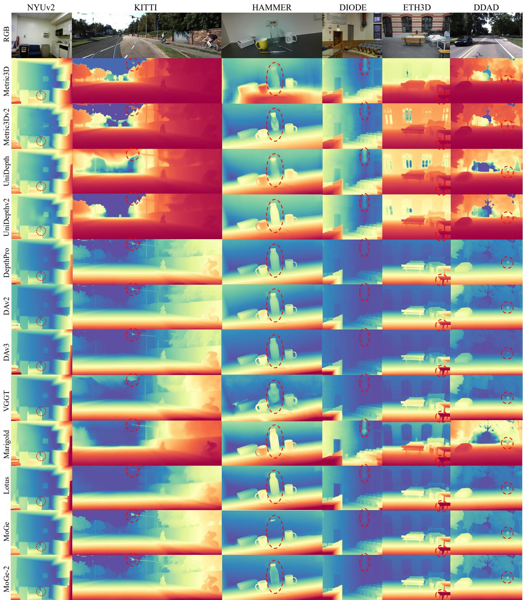  
Fig. 7 Qualitative visualization of depth estimation results from representative models [18–21, 24, 25, 27–29, 32, 42, 43] across diverse scenarios, including indoor [12, 78], outdoor [79], driving [13, 81], and object-level scenes [76]. Despite some methods showed strong quantitative results, discrepancies remain between numerical performance and visual quality, particularly regarding boundary sharpness and detail preservation.

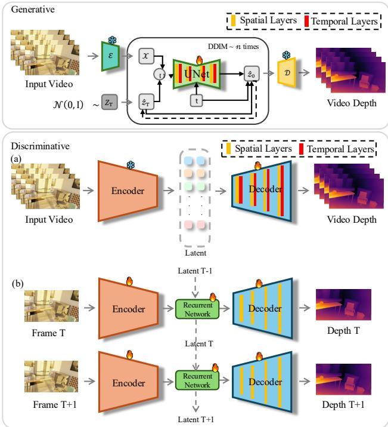  
Fig. 8 Structure of video depth estimation. Unlike image depth estimation models, which use spatial layers to process each image, video depth estimation models additionally introduce temporal layers or utilize previous latent states via a recurrent neural network to ensure consistency across frames.

## 4.6 Extensions to Any Camera

Most depth foundation models are developed and evaluated under rectified perspective assumptions, whereas real-world systems frequently use arbitrary projection models and large fields of view (FoV), e.g., fisheye and 360◦ panoramas. Naively transferring perspective-centric pipelines often fails due to unmodeled spherical distortions and the loss of global context. Moving from pinhole settings to any-camera depth (and 3D) estimation introduces several additional challenges:

• Geometry mismatch: the pixel-to-ray mapping changes across camera models, making learned pinhole priors brittle under wide-FoV distortions.

• Context–distortion trade-of: cropping/undistortion either discards long-range context or introduces spatially varying warps that violate common inductive biases.

• Data scarcity: paired metric depth for fisheye/panoramic imagery is far less available than perspective RGB-D/LiDAR supervision.

• FoV/resolution variability: canonical spherical/ERP representations lead to uneven sampling densities and resolution mismatches, complicating stable training and deployment.

Recent progress [180–185] follows a shared recipe: combine geometry-aligned canonicalization or parameterization with data scaling/adaptation, instead of relying on entirely new backbones. UniK3D [181] makes camera variability explicit by predicting a model-independent pencil-of-rays in spherical form and a per-ray radial distance, enabling metric 3D/depth across wide-FoV cameras. Depth Any Camera (DAC) [182] keeps training strictly on perspective RGB-D yet improves generalization by mapping inputs into a canonical ERP space with pitch-aware conversion, FoV alignment, and multi-resolution augmentation. PanDA [183] adapts Depth Anything to panoramas via teacher–student self-training on large-scale unlabeled panoramas, regularized by Mobius¨ transformation-based spatial augmentation to enforce spherical consistency. Depth Any Panoramas (DAP) [185] pushes the foundation-model regime for panoramas through a datain-the-loop engine (public + synthetic + web panoramas) with multi-stage pseudo-label curation, complemented by panoramic-specific heads/objectives (e.g., range masking and geometry/sharpness-oriented optimization) for stable metric prediction across diverse distances. Finally, DA2 [184] couples a scalable panoramic data curation engine (perspectiveto-panorama generation) with a sphere-aware ViT that encodes spherical coordinates, yielding an end-to-end panoramic estimator with strong zero-shot generalization and improved eficiency over perspective-splitting pipelines. Overall, these methods suggest that “any-camera” depth hinges on explicit geometric alignment and scalable supervision/regularization that lets existing foundation priors extend beyond the pinhole regime.

## 4.7 Summary

In summary, recent depth foundation models demonstrate that scaling up heterogeneous LiDAR, RGB-D, synthetic, and pseudo-labeled data, together with strong pre-trained encoders, is key to achieving zero-shot robustness and detail-preserving depth. Discriminative ViT-based architectures [17–21, 28, 29, 186], spanning relative and metric predictors as well as point-based representations, provide eficient and accurate estimation when combined with afine-invariant objectives, camera-aware designs, and lightweight global scale heads. Generative, difusion-based approaches [27, 30, 32, 34, 35, 169, 170] complement them by injecting powerful image priors and excelling at fine-grained geometry, and are increasingly distilled into one-step or hybrid refiners that close the gap in eficiency. Extending these ingredients to videos via video difusion models [173, 174, 176] and lightweight temporal modules [175, 178] further enables temporally consistent, streamable depth over long and highresolution sequences, pointing toward unified depth foundation models across relative/metric and image/video settings. Finally, any-camera extensions [181–183, 185? ] suggest that robust non-pinhole generalization is driven by explicit geometric alignment (e.g., spherical ray–radial or ERP canonicalization) plus scalable panoramic supervision/regularization, enabling strong zero-shot transfer to fisheye and 360◦ cameras.

## 5 Downstream Applications of Depth Estimation

High-quality depth maps from monocular images unlock a wide array of downstream applications in computer vision and graphics. Fig. 9 illustrates several important and commonly encountered applications closely associated with depth estimation. In this section, we outline several categories of applications that have benefited from advances in depth estimation, particularly emphasizing how the recent models reviewed above contribute to each.

## 5.1 SLAM and 3D/4D Scene Reconstruction

Depth information is fundamental to 3D reconstruction from images. Classical methods such as Structure-from-Motion (SfM)[193], Multi-View Stereo (MVS)[194], and SLAM [195] reconstruct scenes by triangulating image correspondences, requiring suficient camera motion and precise initialization– both of which benefit from accurate depth cues.

Prior to the rise of deep learning, depth sensors played a central role in fusion-based SLAM systems. KinectFusion [196] and its extensions [197–199] introduced volumetric fusion for dense mapping. Subsequent systems like RGB-D SLAM [200], ElasticFusion [201], and BundleFusion [202] leveraged active depth sensing for real-time, high-quality 3D reconstruction.

SLAM As depth sensors face limitations in resolution and robustness, deep learning has emerged to refine or replace sensor-based depth. Early works improved depth maps via co-training with discriminators [203] and multi-view fusion [204]. Other approaches [205, 206] recovered metric depth from predicted relative depths. CNN-SLAM [207, 208] was among the first to integrate CNN-based monocular depth estimators into SLAM, replacing depth sensors. More recently, MegaSaM [189] scaled flow-based SLAM [209] by leveraging DepthAnything-V2 [29] and calibrating it with UniDepth [19], enhancing SLAM accuracy on large-scale datasets. Metric monocular depth estimation has also enabled unified SLAM and mapping in NeRF and 3DGS-based systems. IMAP [210] first demonstrated NeRF as a SLAM map representation, where depth plays a key role in initialization and optimization. NICE-SLAM [211] introduced coarse-to-fine rendering loss for robust bundle adjustment, and NICER-SLAM [212] eliminated depth sensors altogether, relying on monocular cues. In parallel, 3DGS-based SLAM systems [213–215] adopted monocular depth for regularization and isotropic Gaussian constraints.

3D/4D Scene Reconstruction and Rendering Beyond SLAM, monocular depth estimation has become key for geometry reconstruction [216, 217] and scene generation. VGGT [42] extends DUSt3R [218] with a transformer-based feedforward SfM model, using multi-task training and a depth estimation head to jointly enhance SfM and depth learning. DAv3 [43] uses a lightweight vanilla DINO transformer backbone with layer-level feature transfer and a unified depth-ray prediction target, eliminating the need for complex multi-task objectives while yielding spatially consistent geometry. MapAnything [219] further demonstrates that by conditioning a unified transformer on auxiliary geometric priors such as poses and camera intrinsics, we can reinforce monocular depth cues and directly regress a globally consistent, metric-scaled 3D scene. Methods like Prometheus [220] and SplatFlow [221] encode multi-view inputs and estimated monocular depths into latent spaces, where flow [222] or difusion models [223] are trained for 3D scene generation [224].

Neural rendering approaches, particularly NeRF [225], have shown that integrating monocular depth cues improves scene reconstruction accuracy and robustness. Models like MonoSDF [190] and Neuralangelo [226] incorporate depth priors to constrain geometry. To efectively leverage depth order information and address the metric ambiguity inherent in monocular depth models, SparseNeRF [227] introduces a ranking loss to regularize the NeRF geometry. In 3D Gaussian Splatting (3DGS) [224], now popular for its speed and rendering quality, depth supervision becomes even more critical, especially under sparse-view conditions [228–233], to guide the alignment and regularization of Gaussian primitives. In essence, these methods reveal a growing convergence between monocular depth estimation and NeRF-like generative representations: depth is increasingly used as an explicit supervisory signal or geometric prior to regularize neural scene models, especially under sparse or unconstrained observations. This trend helps bridge the traditional “estimation” view and modern 3D generative modeling.

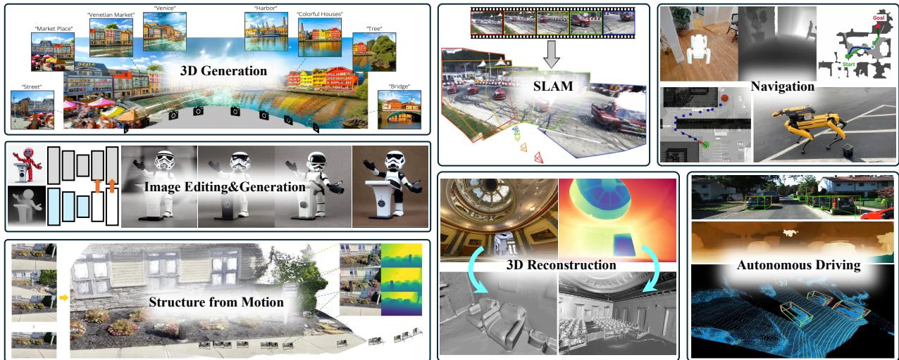  
Fig. 9 Depth estimation, a fundamental challenge in computer vision, plays a vital role in enabling numerous critical downstream tasks, such as 3D generation [187], image editing&generation [188], structure from motion [42], simultaneous localization and mapping (SLAM) [189], 3D reconstruction [190], autonomous driving [191], and robotic navigation [192].

Monocular depth estimation has matured into a powerful, geometry-aware signal that underlies both classical and learning-based SLAM, SfM, and neural reconstruction pipelines, enabling scalable, accurate, and sensor-free 3D mapping. It has also become a key cue for 4D reconstruction from in-the-wild monocular videos, supporting dynamic scene understanding with minimal sensing requirements.

## 5.2 Image Editing and Content Creation

Depth estimation has become a foundational tool in image editing and creative applications, enabling convincing 3D efects and spatially-aware manipulation from 2D inputs.

View Synthesis and Parallax Efects A single image with an estimated depth map can be re-rendered from new viewpoints to produce 3D photo efects by warping and inpainting disoccluded regions [234, 235]. Popularized by platforms like Facebook, these efects rely on layered depth images or shallow meshes derived from monocular depth networks like Mi-DaS. For wider view changes, recent methods [187, 236, 237] use progressive depth-guided warping and large-scale inpainting to reconstruct room-scale 3D scenes. Stereoscopic image synthesis [238, 239] uplifts monocular input into VR-ready left/right-eye pairs, while video extensions such as SVG [240] and StereoCrafter [241] achieve temporally consistent depthaware 3D video synthesis. These applications heavily depend on high-quality depth with sharp boundaries and accurate ordinal relations to minimize distortions and disocclusion artifacts.

Control for Generative Models Depth maps are now widely used to guide image generation. Models like Control-Net [188] enable depth-to-image pipelines that preserve scene geometry while allowing stylized or semantic modifications via prompts. For instance, a real-world image can be depthestimated and transformed into a stylized winter scene while maintaining structural fidelity. Depth is also used to guide 3D-aware image/video synthesis [242–244], with generation quality strongly tied to depth accuracy. Foundation models significantly improve control and realism in such applications.

Computational Photography Depth supports advanced photography tasks, such as portrait mode (bokeh), where background blur is applied using depth to simulate shallow depth-of-field [245, 246]. Accurate depth around edges is critical to avoid visual artifacts. For relighting, depth enables geometric normal estimation [196, 247] and can be combined with material and lighting models for photorealistic rendering [248]. Models like GeoWizard [30] jointly predict depth and normals, supporting neural relighting frameworks [249] for efects like shadows and specular highlights.

## 5.3 Robotic Navigation and Manipulation

Monocular depth estimation has become a cornerstone of modern robotic systems, providing a lightweight, low-cost alternative to LiDAR and stereo cameras for 3D scene understanding. Depth foundation models transform RGB inputs into metric or relative depth maps, enabling robots to perceive obstacles, segment free space, and plan safe trajectories [250– 252].

Navigation Monocular depth estimation has become a lightweight, cost-efective alternative to LiDAR and stereo rigs for map-less navigation [253–255]. Early eforts like ORB-SLAM [48] reconstructed sparse 3D maps from a single moving camera, while Mancini et al. [256] demonstrated real-time depth prediction from RGB for obstacle avoidance. Recent works focus on fully onboard deployment: MonoNav[257] enables micro-UAVs to estimate depth at 30 fps, Dang et al. [258] introduced an FCN-based obstacleavoidance strategy, and Lee et al. [259] fused object detection and depth regression for UAVs in plantations. Integrated pipelines like Machkour et al. [260] combine MonoDepth with detection and segmentation for target-driven, obstacleaware navigation.

Manipulation and Grasping Monocular depth estimation has also been applied to robotic manipulation and grasp planning. Recent studies [261–264] show that incorporating monocular depth into grasping pipelines improves real-time success rates and accurate 6-DoF pose estimation without additional sensors. While industrial systems typically use structured-light sensors for reliability, learned depth models can handle challenging conditions, such as glare or transparent objects, by leveraging shape priors [265–267].

Autonomous Driving In autonomous driving, monocular depth estimation serves as a cost-efective alternative to Li-DAR, with growing integration into perception pipelines. One strategy converts depth maps into pseudo-LiDAR point clouds to enable LiDAR-based 3D detection, significantly improving vehicle detection accuracy [191, 268]. Other approaches combine monocular depth modules with object detectors in multitask frameworks to jointly estimate object identity and distance [269–273]. These models deliver dense, accurate depth in diverse environments, supporting next-generation autonomous systems.

Medical and Surgical Robotics In medical and surgical robotics, monocular depth estimation is essential for scene understanding when only endoscopic or microscopic views are available. Early methods addressed the lack of ground truth by training on synthetic data [274] or using self-supervised video learning to jointly estimate depth and camera pose without explicit labels [275]. More recently, medical depth foundation models [276–279] built on the DepthAnything [17] architecture have set new benchmarks in accuracy and robustness for robotic endoscopy.

## 5.4 Beyond RGB: Multimodal and Other Uses

Monocular depth estimation is increasingly used to complement other depth sensing modalities and to extend depth perception into specialized domains.

Combine with Other Depth Sensing Techniques Monocular depth estimation enhances other sensing techniques by providing dense, semantic, and structurally coherent priors that address the limitations of traditional sensors. In FoundationStereo [280], monocular priors guide stereo matching to improve robustness in textureless or ambiguous regions. Prompt Depth Anything [281] uses sparse LiDAR as a prompt, while dense monocular features help propagate and refine measurements into high-resolution depth maps. PriorDepth [282] leverages monocular predictions to complete and regularize noisy or sparse priors from LiDAR or SfM. These works show how monocular estimation ofers semantic guidance that boosts the accuracy, coverage, and fidelity of hybrid depth systems.

Specialized Domains Monocular depth estimation, initially developed for general scenes, is increasingly applied to specialized domains like underwater and medical imaging, where dense ground-truth depth is hard to obtain. Atlantis [163] uses difusion-based synthetic data generation to train models on photorealistic underwater images with known geometry, enabling robust depth prediction without real annotations. In the medical domain [283], Depth Anything shows strong zeroshot generalization to endoscopic and laparoscopic scenes, providing a viable alternative to task-specific models when labeled data is scarce. These advances highlight the adaptability of monocular depth models through synthetic data, domain transfer, and prompt-based conditioning, expanding their utility in challenging sensing environments.

## 6 Future Research Directions

Monocular depth estimation has made remarkable progress, yet several challenges and open research questions remain. We discuss some promising directions for future work, informed by the gaps observed in current literature and emerging needs in practical applications.

Closing the Gap between Relative and Metric Depth While foundation models have narrowed the gap between relative and metric depth, achieving universal metric depth estimation remains an open challenge. Approaches like Metric3D [24], UniDepth [19], and DepthPro [21] demonstrate promising generalization, but further refinement is needed. One direction is improving camera adaptability– developing models that can infer or adjust to intrinsic parameters beyond focal length (e.g., distortion, sensor size) would enhance cross-device reliability. Another promising idea is few-shot metric calibration: a model could produce relative depth by default, but globally adjust scale using a few metric reference points. Learning fast scale adaptation through meta-networks could enable easy per-device calibration with minimal user input.

High-Fidelity Depth and Uncertainty As depth models grow more accurate, there is rising interest in quantifying uncertainty to inform downstream tasks. Depth predictions are inherently ambiguous in textureless or distant regions, and per-pixel confidence or distributions over depth values would help assess reliability. Difusion models can sample multiple plausible depth maps, but converting these into actionable statistics (e.g., mean and variance) remains an open challenge. Existing approaches like ensembles or Monte Carlo dropout [284] ofer uncertainty estimates, but are impractical for large foundation models. An alternative is training models to output a small set of quantized hypotheses or parametric distributions (e.g., Gaussian) per pixel.

Another frontier is achieving ultra-high resolution and fine detail. While models like PatchFusion [63] and DepthPro [21] address high-res input, scaling to 4K or 8K remains limited by memory and edge preservation. Future directions include multi-scale transformers or implicit neural representations that produce continuous-resolution outputs. A persistent challenge is thin structure recovery– even top models struggle with wires or branches. This may require targeted synthetic data (e.g., CAD-generated thin structures) or novel loss functions that enforce topological consistency.

Challenging Regions: Sky, Boundaries, and Non-Lambertian Surfaces Beyond average accuracy, persistent failure cases cluster in several hard regions. Infinite-distance areas (e.g., sky/horizon) provide weak geometric cues, so models may extrapolate arbitrary metric depth; treating these pixels as open-set (e.g., “unknown/infinity”) and pairing predictions with calibrated uncertainty is a promising direction. Depth discontinuities at object boundaries are often over-smoothed, suggesting more boundary-aware training (edge/normal consistency, segmentation-guided refinement) and topology-preserving constraints for thin structures. Finally, transparent/reflective surfaces remain dificult due to non-Lambertian efects and because RGB-D/LiDAR supervision is frequently missing or corrupted [285]; future work may combine robust learning under partial labels with targeted synthetic data and additional cues (e.g., polarization) to better handle these cases.

Temporal and Multi-View Consistency Most foundation models are trained on single images and lack built-in mechanisms for multi-view or temporal coherence, leading to flickering and inconsistency in video or multi-camera setups. A promising direction is to develop depth models that enforce temporal or multi-view consistency. This could involve training on videos with known depth using temporal losses, or introducing recurrent or transformer-based modules that propagate depth across frames. Alternatively, incorporating optical flow or feature tracking can help maintain depth stability on moving objects. To retain generalization from single-image training, a two-stage setup may be efective– using a foundation model for initial depth, followed by a lightweight refinement module conditioned on temporal context.

Domain Adaptation and Special Domains Despite broad training data, specialized domains like medical imaging, satellite views, or underwater scenes often fall outside the scope of current models. Future work may explore domain adaptation to transfer foundation depth models with minimal supervision—e.g., adapting Depth Anything [17] to underwater imagery using unsupervised methods guided by physics priors like light attenuation. Another promising direction is multi-modal depth estimation, incorporating inputs such as polarization or language. For instance, language prompts like “the floor is 3 meters away” can help resolve depth ambiguities [286], enabling models to reason about scale using object priors. Integrating such high-level knowledge—e.g., knowing typical car heights to calibrate predictions—opens the door to LLM-assisted depth models that blend perception with semantics.

Benchmarking and Evaluation Metrics As depth models advance, traditional metrics like RMSE may no longer reflect perceptual or structural quality. New evaluation protocols are needed to assess cross-dataset generalization and 3D consistency. Ongoing eforts promote diverse benchmarks, but expanding to continual evaluation streams– where models are tested on a steady flow of unseen images or videos– b could better measure robustness. Additionally, assessing geometric plausibility, such as reprojecting predicted depth into multiple views for consistency, would encourage models to produce globally coherent 3D structure rather than optimizing only pointwise accuracy.

Integration with 3D Understanding Depth is one component of scene understanding, and integrating it with object recognition, segmentation, and 3D detection remains an open challenge. End-to-end systems that jointly predict depth and detect objects [287] can mutually benefit—depth aids object scaling, while detection provides semantic grounding. Early multi-task learning eforts exist, but more work is needed to efectively fuse depth with other labels. Future foundation models may output holistic scene representations: layered depth maps with segmented objects, or even coarse 3D reconstructions—moving toward neural scene representations where monocular depth is one element of a unified 3D model.

We also anticipate growing synergy between depth and generative models. Generative AI can synthesize rare or challenging training samples (e.g., extreme weather) to fill data gaps. Conversely, depth predictions can guide 3D generative models like NeRFs [225] or 3D GANs [288], for example, by initializing NeRFs to accelerate convergence. As these domains converge, the boundary between estimation and generation may blur, enabling systems that both perceive and imagine depth beyond visible scenes.

In conclusion, monocular depth estimation is moving toward ever more general, accurate, and integrated capabilities. The community is actively addressing current limitations, and we anticipate that future models will seamlessly provide dense, metric, and reliable depth for any image or video, becoming a cornerstone of 3D vision in everyday devices and complex AI systems alike.

## 7 CONCLUSION

Monocular depth estimation has rapidly evolved from initial learning-based methods to contemporary foundation models, achieving remarkable progress in accuracy, robustness, and generalization. Recent advancements have efectively bridged the gap between relative and metric depth estimation, integrating powerful vision transformer architectures, largescale synthetic and pseudo-labeled datasets, and pretrained vision foundation models like DINOv2 and difusion models. These developments have unlocked numerous practical applications across 3D reconstruction, visual SLAM, image editing, robotics, and multimedia content creation. Nevertheless, challenges remain, including enhancing temporal and multi-view consistency, addressing specialized domain adaptation, quantifying predictive uncertainty, and integrating comprehensive scene understanding. Future research in these directions promises to further solidify monocular depth estimation as a fundamental component of computer vision, enabling robust, scalable, and universally applicable depth perception capabilities.

## Availability of data and materials

The evaluation datasets we used in the benchmark part are all publicly released datasets. Our code and scripts are available at CVMI-Lab/Depth-Survey.

## Competing interest

The authors have no competing interests to declare that are relevant to the content of this article.

## Funding

This work was supported in part by the Hong Kong Research Grant Council — Early Career Scheme (Grant No. 27209621), General Research Fund Scheme (Grant Nos. 17202422, 17212923, 17215025), and Theme-based Research Scheme (Grant No. T45-701/22-R), as well as by the Shenzhen Science and Technology Innovation Commission (Grant No. SGDX20220530111405040). Part of the research was conducted at the JC STEM Lab of Robotics for Soft Materials, funded by The Hong Kong Jockey Club Charities Trust.

## Acknowledgements

The authors would like to thank DiDi AI Research. Part of the work presented in this survey was completed by Muxin and Xiaoyang during their time at the DiDi AI Research group.

## References

[1] Scharstein D, Szeliski R. A taxonomy and evaluation of dense two-frame stereo correspondence algorithms. International journal of computer vision, 2002, 47: 7–42.

[2] Saxena A, Sun M, Ng AY. Make3D: Depth Perception from a Single Still Image. In Aaai, volume 3, 2008, 1571–1576.

[3] Eigen D, Puhrsch C, Fergus R. Depth map prediction from a single image using a multi-scale deep network. Advances in neural information processing systems, 2014, 27: 2366–2374.

[4] Kundu JN, Uppala PK, Pahuja A, Babu RV. Adadepth: Unsupervised content congruent adaptation for depth estimation.

In Proceedings ofthe IEEE conference on computer vision and pattern recognition, 2018, 2656–2665.

[5] Mayer N, Ilg E, Hausser P, Fischer P, Cremers D, Dosovitskiy A, Brox T. A large dataset to train convolutional networks for disparity, optical flow, and scene flow estimation. In Proceedings ofthe IEEE conference on computer vision and pattern recognition, 2016, 4040–4048.

[6] Laina I, Rupprecht C, Belagiannis V, Tombari F, Navab N. Deeper depth prediction with fully convolutional residual networks. In 2016 Fourth international conference on 3D vision (3DV), IEEE, 2016, 239–248.

[7] Qi X, Liao R, Liu Z, Urtasun R, Jia J. Geonet: Geometric neural network for joint depth and surface normal estimation. In Proceedings of the IEEE Conference on Computer Vision and Pattern Recognition, 2018, 283–291.

[8] Qi X, Liu Z, Liao R, Torr PH, Urtasun R, Jia J. Geonet++: Iterative geometric neural network with edge-aware refinement for joint depth and surface normal estimation. IEEE Transactions on Pattern Analysis and Machine Intelligence, 2020, 44(2): 969–984.

[9] Yin Z, Shi J. Geonet: Unsupervised learning of dense depth, optical flow and camera pose. In Proceedings of the IEEE conference on computer vision andpattern recognition, 2018, 1983–1992.

[10] Saxena S, Herrmann C, Hur J, Kar A, Norouzi M, Sun D, Fleet DJ. The surprising efectiveness of difusion models for optical flow and monocular depth estimation. Advances in Neural Information Processing Systems, 2023, 36: 39443– 39469.

[11] Eigen D, Fergus R. Predicting depth, surface normals and semantic labels with a common multi-scale convolutional architecture. In Proceedings of the IEEE international conference on computer vision, 2015, 2650–2658.

[12] Silberman N, Hoiem D, Kohli P, Fergus R. Indoor segmentation and support inference from rgbd images. In European conference on computer vision, Springer, 2012, 746–760.

[13] Geiger A, Lenz P, Stiller C, Urtasun R. Vision meets robotics: The kitti dataset. The international journal of robotics research, 2013, 32(11): 1231–1237.

[14] Xu Z, Zhou H, Peng S, Lin H, Guo H, Shao J, Yang P, Yang Q, Miao S, He X, et al.. Towards depth foundation models: Recent trends in vision-based depth estimation. Computational Visual Media, 2026: 243–271.

[15] Ranftl R, Lasinger K, Hafner D, Schindler K, Koltun V. Towards robust monocular depth estimation: Mixing datasets for zero-shot cross-dataset transfer. IEEE transactions on pattern analysis and machine intelligence, 2020, 44(3): 1623– 1637.

[16] Ranftl R, Bochkovskiy A, Koltun V. Vision transformers for dense prediction. In Proceedings of the IEEE/CVF international conference on computer vision, 2021, 12179–12188.

[17] Yang L, Kang B, Huang Z, Xu X, Feng J, Zhao H. Depth anything: Unleashing the power of large-scale unlabeled data.

In Proceedings ofthe IEEE/CVF Conference on Computer Vision and Pattern Recognition, 2024, 10371–10381.

[18] Wang R, Xu S, Dong Y, Deng Y, Xiang J, Lv Z, Sun G, Tong X, Yang J. Moge-2: Accurate monocular geometry with metric scale and sharp details. Advances in Neural Information Processing Systems, 2026, 38: 35928–35959.

[19] Piccinelli L, Yang YH, Sakaridis C, Segu M, Li S, Van Gool L, Yu F. UniDepth: Universal monocular metric depth estimation. In Proceedings of the IEEE/CVF Conference on Computer Vision and Pattern Recognition, 2024, 10106– 10116.

[20] Piccinelli L, Sakaridis C, Yang YH, Segu M, Li S, Abbeloos W, Van Gool L. Unidepthv2: Universal monocular metric depth estimation made simpler. IEEE Transactions on Pattern Analysis and Machine Intelligence, 2025: 2354–2367.

[21] Bochkovskiy A, Delaunoy A, Germain H, Santos M, Zhou Y, Richter S, Koltun V. Depth pro: Sharp monocular metric depth in less than a second. In International Conference on Learning Representations, volume 2025, 2025, 75602–75637.

[22] Bhat SF, Birkl R, Wofk D, Wonka P, M¨uller M. Zoedepth: Zero-shot transfer by combining relative and metric depth. arXiv preprint arXiv:2302.12288, 2023.

[23] Guizilini V, Vasiljevic I, Chen D, Ambrus R, Gaidon A. Towards zero-shot scale-aware monocular depth estimation. In Proceedings of the IEEE/CVF International Conference on Computer Vision, 2023, 9233–9243.

[24] Yin W, Zhang C, Chen H, Cai Z, Yu G, Wang K, Chen X, Shen C. Metric3d: Towards zero-shot metric 3d prediction from a single image. In Proceedings ofthe IEEE/CVF International Conference on Computer Vision, 2023, 9043–9053.

[25] Hu M, Yin W, Zhang C, Cai Z, Long X, Chen H, Wang K, Yu G, Shen C, Shen S. Metric3D v2: A Versatile Monocular Geometric Foundation Model for Zero-Shot Metric Depth and Surface Normal Estimation. IEEE Transactions on Pattern Analysis and Machine Intelligence, 2024, 46(12): 10579–10596, doi:10.1109/tpami.2024.3444912.

[26] Liu M, Lyu X, Ren T, Dai P, Wu X, Zhang Z, Zhang J, Lin J, Shi S, Qi X. FoundationGeo: Learning Spatial Pixel-Wise Fields for Monocular Metric Geometry. arXiv preprint arXiv:2607.11588, 2026.

[27] Ke B, Obukhov A, Huang S, Metzger N, Daudt RC, Schindler K. Repurposing difusion-based image generators for monocular depth estimation. In Proceedings of the IEEE/CVF Conference on Computer Vision and Pattern Recognition, 2024, 9492–9502.

[28] Wang R, Xu S, Dai C, Xiang J, Deng Y, Tong X, Yang J. Moge: Unlocking accurate monocular geometry estimation for open-domain images with optimal training supervision. In Proceedings of the Computer Vision and Pattern Recognition Conference, 2025, 5261–5271.

[29] Yang L, Kang B, Huang Z, Zhao Z, Xu X, Feng J, Zhao H. Depth anything v2. Advances in Neural Information Processing Systems, 2024, 37: 21875–21911.

[30] Fu X, Yin W, Hu M, Wang K, Ma Y, Tan P, Shen S, Lin D, Long X. Geowizard: Unleashing the difusion priors for 3d geometry estimation from a single image. In European Conference on Computer Vision, 2024, 241–258.

[31] Yin W, Zhang J, Wang O, Niklaus S, Mai L, Chen S, Shen C. Learning to recover 3d scene shape from a single image. In Proceedings ofthe IEEE/CVF Conference on Computer Vision and Pattern Recognition, 2021, 204–213.

[32] He J, Li H, Yin W, Liang Y, Li L, Zhou K, Zhang H, Liu B, Chen Y. Lotus: Difusion-based visual foundation model for high-quality dense prediction. In International Conference on Learning Representations, volume 2025, 2025, 89454– 89467.

[33] Birkl R, Wofk D, M¨uller M. MiDaS v3.1 – A Model Zoo for Robust Monocular Relative Depth Estimation. arXiv preprint arXiv:2307.14460, 2023.

[34] Garcia GM, Abou Zeid K, Schmidt C, De Geus D, Hermans A, Leibe B. Fine-tuning image-conditional difusion models is easier than you think. In 2025 IEEE/CVF Winter Conference on Applications ofComputer Vision (WACV), 2025, 753–762.

[35] Xu G, Liu M, Fan C, Xie K, Zhao Z, Chen H, Shen C, et al.. What matters when repurposing difusion models for general dense perception tasks? In International Conference on Learning Representations, volume 2025, 2025, 6786–6799.

[36] Godard C, Mac Aodha O, Brostow GJ. Unsupervised monocular depth estimation with left-right consistency. In Proceedings of the IEEE conference on computer vision and pattern recognition, 2017, 270–279.

[37] Garg R, Bg VK, Carneiro G, Reid I. Unsupervised cnn for single view depth estimation: Geometry to the rescue. In European conference on computer vision, Springer, 2016, 740–756.

[38] Zhou T, Brown M, Snavely N, Lowe DG. Unsupervised learning of depth and ego-motion from video. In Proceedings of the IEEE conference on computer vision and pattern recognition, 2017, 1851–1858.

[39] Fu H, Gong M, Wang C, Batmanghelich K, Tao D. Deep ordinal regression network for monocular depth estimation. In Proceedings of the IEEE conference on computer vision and pattern recognition, 2018, 2002–2011.

[40] Godard C, Mac Aodha O, Firman M, Brostow GJ. Digging into self-supervised monocular depth estimation. In Proceedings of the IEEE/CVF international conference on computer vision, 2019, 3828–3838.

[41] Eftekhar A, Sax A, Malik J, Zamir A. Omnidata: A Scalable Pipeline for Making Multi-Task Mid-Level Vision Datasets From 3D Scans. In Proceedings of the IEEE/CVF International Conference on Computer Vision, 2021, 10786–10796.

[42] Wang J, Chen M, Karaev N, Vedaldi A, Rupprecht C, Novotny D. Vggt: Visual geometry grounded transformer. In Proceedings of the Computer Vision and Pattern Recognition Conference, 2025, 5294–5306.

[43] Lin H, Chen S, Liew JH, Chen DY, Li Z, Zhao Y, Peng S, Guo

H, Zhou X, Shi G, Feng J, Kang B. Depth Anything 3: Recovering the Visual Space from Any Views. In The Fourteenth International Conference on Learning Representations, 2026, 1–19.

[44] Pentland AP. A new sense for depth offield. IEEE transactions on pattern analysis and machine intelligence, 1987, (4): 523– 531.

[45] Nayar SK, Nakagawa Y. Shape from focus. IEEE Transactions on Pattern analysis and machine intelligence, 2002, 16(8): 824–831.

[46] Hoiem D, Efros AA, Hebert M. Automatic photo pop-up. In ACM SIGGRAPH 2005 Papers, 2005, 577–584.

[47] Danier D, Ayg¨un M, Li C, Bilen H, Mac Aodha O. DepthCues: Evaluating Monocular Depth Perception in Large Vision Models. In Proceedings of the Computer Vision and Pattern Recognition Conference (CVPR), 2025, 20049–20059.

[48] Mur-Artal R, Montiel JMM, Tardos JD. ORB-SLAM: A versatile and accurate monocular SLAM system. IEEE transactions on robotics, 2015, 31(5): 1147–1163.

[49] He K, Zhang X, Ren S, Sun J. Deep residual learning for image recognition. In Proceedings of the IEEE conference on computer vision and pattern recognition, 2016, 770–778.

[50] He L, Wang G, Hu Z. Learning Depth From Single Images With Deep Neural Network Embedding Focal Length. IEEE Transactions on Image Processing, 2018, 27(9): 4676–4689, doi:10.1109/tip.2018.2832296.

[51] Wang X, Yin W, Kong T, Jiang Y, Li L, Shen C. Taskaware monocular depth estimation for 3d object detection. In Proceedings of the AAAI conference on artificial intelligence, volume 34, 2020, 12257–12264.

[52] Wang W, Zhu D, Wang X, Hu Y, Qiu Y, Wang C, Hu Y, Kapoor A, Scherer S. Tartanair: A dataset to push the limits of visual slam. In 2020 IEEE. In RSJ International Conference on Intelligent Robots and Systems (IROS), 2020, 4909–4916.

[53] Wen B, Trepte M, Aribido J, Kautz J, Gallo O, Birchfield S. Foundationstereo: Zero-shot stereo matching. In Proceedings of the Computer Vision and Pattern Recognition Conference, 2025, 5249–5260.

[54] Yao Y, Luo Z, Li S, Zhang J, Ren Y, Zhou L, Fang T, Quan L. Blendedmvs: A large-scale dataset for generalized multi-view stereo networks. In Proceedings of the IEEE/CVF conference on computer vision andpattern recognition, 2020, 1790–1799.

[55] Roberts M, Ramapuram J, Ranjan A, Kumar A, Bautista MA, Paczan N, Webb R, Susskind JM. Hypersim: A photorealistic synthetic dataset for holistic indoor scene understanding. In Proceedings of the IEEE/CVF international conference on computer vision, 2021, 10912–10922.

[56] Straub J, Whelan T, Ma L, Chen Y, Wijmans E, Green S, Engel JJ, Mur-Artal R, Ren C, Verma S, Clarkson A, Yan M, Budge B, Yan Y, Pan X, Yon J, Zou Y, Leon K, Carter N, Briales J, Gillingham T, Mueggler E, Pesqueira L, Savva M, Batra D, Strasdat HM, Nardi RD, Goesele M, Lovegrove

S, Newcombe R. The Replica Dataset: A Digital Replica of Indoor Spaces. arXiv preprint arXiv:1906.05797, 2019.

[57] Cabon Y, Murray N, Humenberger M. Virtual kitti 2. arXiv preprint arXiv:2001.10773, 2020.

[58] Li Y, Jiang L, Xu L, Xiangli Y, Wang Z, Lin D, Dai B. Matrixcity: A large-scale city dataset for city-scale neural rendering and beyond. In Proceedings of the IEEE/CVF International Conference on Computer Vision, 2023, 3205– 3215.

[59] Song S, Lichtenberg SP, Xiao J. Sun rgb-d: A rgb-d scene understanding benchmark suite. In Proceedings ofthe IEEE conference on computer vision and pattern recognition, 2015, 567–576.

[60] Yeshwanth C, Liu YC, Nießner M, Dai A. Scannet++: A high-fidelity dataset of 3d indoor scenes. In Proceedings of the IEEE/CVF International Conference on Computer Vision, 2023, 12–22.

[61] Caesar H, Bankiti V, Lang AH, Vora S, Liong VE, Xu Q, Krishnan A, Pan Y, Baldan G, Beijbom O. nuscenes: A multimodal dataset for autonomous driving. In Proceedings of the IEEE/CVF conference on computer vision and pattern recognition, 2020, 11621–11631.

[62] Sun P, Kretzschmar H, Dotiwalla X, Chouard A, Patnaik V, Tsui P, Guo J, Zhou Y, Chai Y, Caine B, et al.. Scalability in perception for autonomous driving: Waymo open dataset. In Proceedings of the IEEE/CVF conference on computer vision and pattern recognition, 2020, 2446–2454.

[63] Li Z, Bhat SF, Wonka P. Patchfusion: An end-to-end tilebased framework for high-resolution monocular metric depth estimation. In Proceedings of the IEEE/CVF Conference on Computer Vision and Pattern Recognition, 2024, 10016– 10025.

[64] Saxena S, Hur J, Herrmann C, Sun D, Fleet DJ. Zero-Shot Metric Depth with a Field-of-View Conditioned Difusion Model. In ECCV 2024 Workshop on Wild 3D: 3D Modeling, Reconstruction, and Generation in the Wild.

[65] Chen W, Fu Z, Yang D, Deng J. Single-image depth perception in the wild. Advances in Neural Information Processing Systems, 2016: 730–738.

[66] Li Z, Snavely N. Megadepth: Learning single-view depth prediction from internet photos. In Proceedings of the IEEE conference on computer vision and pattern recognition, 2018, 2041–2050.

[67] Xian K, Shen C, Cao Z, Lu H, Xiao Y, Li R, Luo Z. Monocular relative depth perception with web stereo data supervision. In Proceedings of the IEEE Conference on Computer Vision and Pattern Recognition, 2018, 311–320.

[68] Niklaus S, Mai L, Yang J, Liu F. 3D Ken Burns Efect from a Single Image. ACM Transactions on Graphics, 2019, 38(6): 184:1–184:15.

[69] Mehl L, Schmalfuss J, Jahedi A, Nalivayko Y, Bruhn A. Spring: A high-resolution high-detail dataset and benchmark for scene flow, optical flow and stereo. In Proceedings of

the IEEE/CVF Conference on Computer Vision and Pattern Recognition, 2023, 4981–4991.

[70] Wang Q, Zheng S, Yan Q, Deng F, Zhao K, Chu X. IRS: A Large Naturalistic Indoor Robotics Stereo Dataset to Train Deep Models for Disparity and Surface Normal Estimation. In 2021 IEEE International Conference on Multimedia and Expo (ICME), IEEE Computer Society, 2021, 1–6.

[71] Huang PH, Matzen K, Kopf J, Ahuja N, Huang JB. Deepmvs: Learning multi-view stereopsis. In Proceedings of the IEEE conference on computer vision and pattern recognition, 2018, 2821–2830.

[72] Fonder M, Droogenbroeck MV. Mid-Air: A multi-modal dataset for extremely low altitude drone flights. In Conference on Computer Vision and Pattern Recognition Workshop (CVPRW), 2019, 0–0.

[73] Wang K, Shen S. Flow-motion and depth network for monocular stereo and beyond. IEEE Robotics and Automation Letters, 2020, 5(2): 3307–3314.

[74] Butler DJ, Wulf J, Stanley GB, Black MJ. A naturalistic open source movie for optical flow evaluation. In A Fitzgibbon et al (Eds), editor, European Conf. on Computer Vision (ECCV), Part IV, LNCS 7577, 2012, 611–625.

[75] Dai A, Chang AX, Savva M, Halber M, Funkhouser T, Nießner M. Scannet: Richly-annotated 3d reconstructions of indoor scenes. In Proceedings of the IEEE conference on computer vision and pattern recognition, 2017, 5828–5839.

[76] Jung H, Ruhkamp P, Zhai G, Brasch N, Li Y, Verdie Y, Song J, Zhou Y, Armagan A, Ilic S, et al.. On the importance of accurate geometry data for dense 3d vision tasks. In Proceedings of the IEEE/CVF Conference on Computer Vision and Pattern Recognition, 2023, 780–791.

[77] Koch T, Liebel L, Fraundorfer F, Korner M. Evaluation of cnnbased single-image depth estimation methods. In Proceedings of the European Conference on Computer Vision (ECCV) Workshops, 2018, 0–0.

[78] Vasiljevic I, Kolkin N, Zhang S, Luo R, Wang H, Dai FZ, Daniele AF, Mostajabi M, Basart S, Walter MR, et al.. Diode: A dense indoor and outdoor depth dataset. arXiv preprint arXiv:1908.00463, 2019.

[79] Schops T, Sattler T, Pollefeys M. BAD SLAM: Bundle Ad-¨ justed Direct RGB-D SLAM. In 2019 IEEE/CVF Conference on Computer Vision and Pattern Recognition (CVPR), 2019, 134–144, doi:10.1109/CVPR.2019.00022.

[80] Geyer J, Kassahun Y, Mahmudi M, Ricou X, Durgesh R, Chung AS, Hauswald L, Pham VH, M¨uhlegg M, Dorn S, et al.. A2d2: Audi autonomous driving dataset. arXiv preprint arXiv:2004.06320, 2020.

[81] Guizilini V, Ambrus R, Pillai S, Raventos A, Gaidon A. 3d packing for self-supervised monocular depth estimation. In Proceedings of the IEEE/CVF conference on computer vision and pattern recognition, 2020, 2485–2494.

[82] Chen W, Qian S, Fan D, Kojima N, Hamilton M, Deng J. Oasis: A large-scale dataset for single image 3d in the wild.

In Proceedings ofthe IEEE/CVF Conference on Computer Vision and Pattern Recognition, 2020, 679–688.

[83] Xian K, Shen C, Cao Z, Lu H, Xiao Y, Li R, Luo Z. Monocular relative depth perception with web stereo data supervision. In Proceedings of the IEEE Conference on Computer Vision and Pattern Recognition, 2018, 311–320.

[84] Lee JH, Kim CS. Monocular depth estimation using relative depth maps. In Proceedings ofthe IEEE/CVF conference on computer vision and pattern recognition, 2019, 9729–9738.

[85] Lienen J, Hullermeier E, Ewerth R, Nommensen N. Monocular depth estimation via listwise ranking using the Plackett-Luce model. In Proceedings of the IEEE/CVF Conference on Computer Vision and Pattern Recognition, 2021, 14595– 14604.

[86] Lee JH, Heo M, Kim KR, Kim CS. Single-image depth estimation based on fourier domain analysis. In Proceedings of the IEEE conference on computer vision and pattern recognition, 2018, 330–339.

[87] Atapour-Abarghouei A, Breckon T. Real-Time Monocular Depth Estimation using Synthetic Data with Domain Adaptation. In Proc. Computer Vision and Pattern Recognition, 2018, 1–8.

[88] Xu D, Wang W, Tang H, Liu H, Sebe N, Ricci E. Structured attention guided convolutional neural fields for monocular depth estimation. In Proceedings of the IEEE conference on computer vision and pattern recognition, 2018, 3917–3925.

[89] Patil V, Sakaridis C, Liniger A, Van Gool L. P3depth: Monocular depth estimation with a piecewise planarity prior. In Proceedings of the IEEE/CVF Conference on Computer Vision and Pattern Recognition, 2022, 1610–1621.

[90] You Z, Tsai YH, Chiu WC, Li G. Towards interpretable deep networks for monocular depth estimation. In Proceedings of the IEEE/CVF International Conference on Computer Vision, 2021, 12879–12888.

[91] Srinivasan PP, Garg R, Wadhwa N, Ng R, Barron JT. Aperture supervision for monocular depth estimation. In Proceedings of the IEEE Conference on Computer Vision and Pattern Recognition, 2018, 6393–6401.

[92] Gur S, Wolf L. Single image depth estimation trained via depth from defocus cues. In Proceedings of the IEEE/CVF conference on computer vision and pattern recognition, 2019, 7683–7692.

[93] Chen Y, Zhao H, Hu Z, Peng J. Attention-based context aggregation network for monocular depth estimation. International Journal of Machine Learning and Cybernetics, 2021, 12(6): 1583–1596.

[94] Miangoleh SMH, Dille S, Mai L, Paris S, Aksoy Y. Boosting monocular depth estimation models to high-resolution via content-adaptive multi-resolution merging. In Proceedings of the IEEE/CVF Conference on Computer Vision and Pattern Recognition, 2021, 9685–9694.

[95] Ning C, Gan H. Trap attention: Monocular depth estimation with manual traps. In Proceedings of the IEEE/CVF Con-

ference on Computer Vision and Pattern Recognition, 2023, 5033–5043.

[96] Li Z, Bhat SF, Wonka P. Patchfusion: An end-to-end tilebased framework for high-resolution monocular metric depth estimation. In Proceedings of the IEEE/CVF Conference on Computer Vision and Pattern Recognition, 2024, 10016– 10025.

[97] Guo Y, Garg S, Miangoleh SMH, Huang X, Ren L. Depth any camera: Zero-shot metric depth estimation from any camera. In Proceedings of the Computer Vision and Pattern Recognition Conference, 2025, 26996–27006.

[98] Kong L, Xie S, Hu H, Ng LX, Cottereau B, Ooi WT. Robodepth: Robust out-of-distribution depth estimation under corruptions. Advances in Neural Information Processing Systems, 2023, 36: 21298–21342.

[99] Papa L, Russo P, Amerini I. METER: A Mobile Vision Transformer Architecture for Monocular Depth Estimation. IEEE Transactions on Circuits and Systems for Video Technology, 2023, 33(10): 5882–5893, doi:10.1109/tcsvt.2023.3260310.

[100] Ibrahem H, Salem A, Kang HS. RT-ViT: Real-Time Monocular Depth Estimation Using Lightweight Vision Transformers. Sensors, 2022, 22(10): 3849.

[101] Yang L, Kang B, Huang Z, Zhao Z, Xu X, Feng J, Zhao H. Depth anything v2. Advances in Neural Information Processing Systems, 2024, 37: 21875–21911.

[102] Wang L, Zhang J, Wang Y, Lu H, Ruan X. Clifnet for monocular depth estimation with hierarchical embedding loss. In European Conference on Computer Vision, 2020, 316–331.

[103] Yin W, Liu Y, Shen C. Virtual Normal: Enforcing Geometric Constraints for Accurate and Robust Depth Prediction. IEEE Transactions on Pattern Analysis and Machine Intelligence (TPAMI), 2021.

[104] Garg R, Wadhwa N, Ansari S, Barron JT. Learning single camera depth estimation using dual-pixels. In Proceedings of the IEEE/CVF international conference on computer vision, 2019, 7628–7637.

[105] Cao Y, Wu Z, Shen C. Estimating depth from monocular images as classification using deep fully convolutional residual networks. IEEE Transactions on Circuits and Systems for Video Technology, 2017, 28(11): 3174–3182.

[106] Bhat SF, Alhashim I, Wonka P. Localbins: Improving depth estimation by learning local distributions. In European Conference on Computer Vision, 2022, 480–496.

[107] Wang J, Liu J, Tang D, Wang W, Li W, Chen D, Chen J, Wu J. Scalable autoregressive monocular depth estimation. In Proceedings of the Computer Vision and Pattern Recognition Conference, 2025, 6262–6272.

[108] Shao S, Pei Z, Wu X, Liu Z, Chen W, Li Z. Iebins: Iterative elastic bins for monocular depth estimation. Advances in Neural Information Processing Systems, 2023, 36: 53025– 53037.

[109] Lee J, Cho G, Park J, Kim K, Lee S, Kim JH, Jeong SG, Joo K.

SlaBins: Fisheye depth estimation using slanted bins on road environments. In Proceedings of the IEEE/CVF International Conference on Computer Vision, 2023, 8765–8774.

[110] Li Z, Wang X, Liu X, Jiang J. Binsformer: Revisiting adaptive bins for monocular depth estimation. IEEE Transactions on Image Processing, 2024, 33: 3964–3976.

[111] Zhu R, Song Z, Liu L, He J, Zhang T, Zhang Y. Ha-bins: Hierarchical adaptive bins for robust monocular depth estimation across multiple datasets. IEEE Transactions on Circuits and Systemsfor Video Technology, 2023, 34(6): 4354–4366.

[112] She Y, Li P, Wei M, Liang D, Chen Y, Xie H, Wang FL. evitbins: Edge-enhanced vision-transformer bins for monocular depth estimation on edge devices. IEEE Transactions on Intelligent Transportation Systems, 2024, 25(12): 20320– 20334.

[113] Shao S, Pei Z, Chen W, Wu X, Li Z. Nddepth: Normaldistance assisted monocular depth estimation. In Proceedings of the IEEE/CVF International Conference on Computer Vision, 2023, 7931–7940.

[114] Piccinelli L, Sakaridis C, Yu F. idisc: Internal discretization for monocular depth estimation. In Proceedings of the IEEE/CVF Conference on Computer Vision and Pattern Recognition, 2023, 21477–21487.

[115] Wofk D, Ma F, Yang TJ, Karaman S, Sze V. Fastdepth: Fast monocular depth estimation on embedded systems. In 2019 International Conference on Robotics and Automation (ICRA), IEEE, 2019, 6101–6108.

[116] Yang X, Ma Z, Ji Z, Ren Z. Gedepth: Ground embedding for monocular depth estimation. In Proceedings ofthe IEEE/CVF international conference on computer vision, 2023, 12719– 12727.

[117] Yuan W, Gu X, Dai Z, Zhu S, Tan P. Neural window fullyconnected crfs for monocular depth estimation. In Proceedings of the IEEE/CVF conference on computer vision and pattern recognition, 2022, 3916–3925.

[118] Huynh L, Nguyen-Ha P, Matas J, Rahtu E, Heikkila J. Guiding¨ monocular depth estimation using depth-attention volume. In European Conference on Computer Vision, Springer, 2020, 581–597.

[119] Ramamonjisoa M, Lepetit V. Sharpnet: Fast and accurate recovery of occluding contours in monocular depth estimation. In Proceedings of the IEEE/CVF International Conference on Computer Vision Workshops, 2019, 0–0.

[120] Yan W, Li M, Li H, Shao S, Tan RT. Synthetic-to-Real Self-supervised Robust Depth Estimation via Learning with Motion and Structure Priors. In Proceedings of the Computer Vision and Pattern Recognition Conference, 2025, 21880– 21890.

[121] Wu H, Gu S, Duan L, Li W. GeoDepth: From Point-to-Depth to Plane-to-Depth Modeling for Self-Supervised Monocular Depth Estimation. In Proceedings of the Computer Vision and Pattern Recognition Conference, 2025, 11525–11535.

[122] Moon J, Bello JLG, Kwon B, Kim M. From-Ground-To-

Objects: Coarse-to-fine self-supervised monocular depth estimation of dynamic objects with ground contact prior. In Proceedings ofthe IEEE/CVF Conference on Computer Vision and Pattern Recognition, 2024, 10519–10529.

[123] Nguyen HC, Wang T, Alvarez JM, Liu M. Mining supervision for dynamic regions in self-supervised monocular depth estimation. In Proceedings ofthe IEEE/CVF conference on computer vision and pattern recognition, 2024, 10446–10455.

[124] Wang R, Yu Z, Gao S. Planedepth: Self-supervised depth estimation via orthogonal planes. In Proceedings of the IEEE/CVF Conference on Computer Vision and Pattern Recognition, 2023, 21425–21434.

[125] Zhang N, Nex F, Vosselman G, Kerle N. Lite-mono: A lightweight cnn and transformer architecture for selfsupervised monocular depth estimation. In Proceedings of the IEEE/CVF Conference on Computer Vision and Pattern Recognition, 2023, 18537–18546.

[126] Si H, Zhao B, Wang D, Gao Y, Chen M, Wang Z, Li X. Fully self-supervised depth estimation from defocus clue. In Proceedings of the IEEE/CVF Conference on Computer Vision and Pattern Recognition, 2023, 9140–9149.

[127] Petrovai A, Nedevschi S. Exploiting pseudo labels in a selfsupervised learning framework for improved monocular depth estimation. In Proceedings of the IEEE/CVF conference on computer vision and pattern recognition, 2022, 1578–1588.

[128] Gonzalez JL, Kim M. Plade-net: Towards pixel-level accuracy for self-supervised single-view depth estimation with neural positional encoding and distilled matting loss. In Proceedings of the IEEE/CVF Conference on Computer Vision and Pattern Recognition, 2021, 6851–6860.

[129] Guizilini V, Ambrus R, Pillai S, Raventos A, Gaidon A. 3d packing for self-supervised monocular depth estimation. In Proceedings of the IEEE/CVF conference on computer vision and pattern recognition, 2020, 2485–2494.

[130] Poggi M, Aleotti F, Tosi F, Mattoccia S. On the uncertainty of self-supervised monocular depth estimation. In Proceedings of the IEEE/CVF conference on computer vision and pattern recognition, 2020, 3227–3237.

[131] Zhao C, Poggi M, Tosi F, Zhou L, Sun Q, Tang Y, Mattoccia S. Gasmono: Geometry-aided self-supervised monocular depth estimation for indoor scenes. In Proceedings of the IEEE/CVF International Conference on Computer Vision, 2023, 16209–16220.

[132] Rodr´ıguez-Puigvert J, Batlle VM, Montiel J, Martinez-Cantin R, Fua P, Tardos JD, Civera J. LightDepth: Single-View Depth´ Self-Supervision from Illumination Decline. In Proceedings of the IEEE/CVF International Conference on Computer Vision, 2023, 21273–21283.

[133] Zhang C, Yin W, Yu G, Wang Z, Chen T, Fu B, Zhou JT, Shen C. Robust geometry-preserving depth estimation using diferentiable rendering. In Proceedings of the IEEE/CVF International Conference on Computer Vision, 2023, 8951– 8961.

[134] Han W, Yin J, Shen J. Self-supervised monocular depth estimation by direction-aware cumulative convolution network. In Proceedings of the IEEE/CVF International Conference on Computer Vision, 2023, 8613–8623.

[135] Saunders K, Vogiatzis G, Manso LJ. Self-supervised monocular depth estimation: Let’s talk about the weather. In Proceedings ofthe IEEE/CVF International Conference on Computer Vision, 2023, 8907–8917.

[136] Varghese N, Kumar A, Rajagopalan A. Self-supervised monocular underwater depth recovery, image restoration, and a real-sea video dataset. In Proceedings of the IEEE/CVF International Conference on Computer Vision, 2023, 12248– 12258.

[137] Ji P, Li R, Bhanu B, Xu Y. Monoindoor: Towards good practice of self-supervised monocular depth estimation for indoor environments. In Proceedings of the IEEE/CVF international conference on computer vision, 2021, 12787–12796.

[138] Wang K, Zhang Z, Yan Z, Li X, Xu B, Li J, Yang J. Regularizing nighttime weirdness: Eficient self-supervised monocular depth estimation in the dark. In Proceedings ofthe IEEE/CVF international conference on computer vision, 2021, 16055– 16064.

[139] Liu L, Song X, Wang M, Liu Y, Zhang L. Self-supervised monocular depth estimation for all day images using domain separation. In Proceedings of the IEEE/CVF international conference on computer vision, 2021, 12737–12746.

[140] Li B, Huang Y, Liu Z, Zou D, Yu W. StructDepth: Leveraging the structural regularities for self-supervised indoor depth estimation. In Proceedings of the IEEE/CVF international conference on computer vision, 2021, 12663–12673.

[141] Chen Y, Schmid C, Sminchisescu C. Self-supervised learning with geometric constraints in monocular video: Connecting flow, depth, and camera. In Proceedings of the IEEE/CVF international conference on computer vision, 2019, 7063– 7072.

[142] Bello JLG, Kim M. Self-supervised deep monocular depth estimation with ambiguity boosting. IEEE transactions on pattern analysis and machine intelligence, 2021, 44(12): 9131–9149.

[143] Lyu X, Liu L, Wang M, Kong X, Liu L, Liu Y, Chen X, Yuan Y. Hr-depth: High resolution self-supervised monocular depth estimation. In Proceedings of the AAAI conference on artificial intelligence, volume 35, 2021, 2294–2301.

[144] He M, Hui L, Bian Y, Ren J, Xie J, Yang J. Ra-depth: Resolution adaptive self-supervised monocular depth estimation. In European Conference on Computer Vision, 2022, 565–581.

[145] Patil V, Van Gansbeke W, Dai D, Van Gool L. Don’t forget the past: Recurrent depth estimation from monocular video. IEEE Robotics and Automation Letters, 2020, 5(4): 6813–6820.

[146] Dai Q, Patil V, Hecker S, Dai D, Van Gool L, Schindler K. Selfsupervised object motion and depth estimation from video. In Proceedings of the IEEE/CVF Conference on Computer Vision and Pattern Recognition Workshops, 2020, 1004–1005.

[147] Cheng B, Saggu IS, Shah R, Bansal G, Bharadia D. S 3 net: Semantic-aware self-supervised depth estimation with monocular videos and synthetic data. In European Conference on Computer Vision, 2020, 52–69.

[148] Zhao C, Zhang Y, Poggi M, Tosi F, Guo X, Zhu Z, Huang G, Tang Y, Mattoccia S. Monovit: Self-supervised monocular depth estimation with a vision transformer. In 2022 international conference on 3D vision (3DV), 2022, 668–678.

[149] Watson J, Firman M, Brostow GJ, Turmukhambetov D. Self-supervised monocular depth hints. In Proceedings of the IEEE/CVF international conference on computer vision, 2019, 2162–2171.

[150] Sun L, Bian JW, Zhan H, Yin W, Reid I, Shen C. Sc-depthv3: Robust self-supervised monocular depth estimation for dynamic scenes. IEEE transactions on pattern analysis and machine intelligence, 2023, 46(1): 497–508.

[151] Shao S, Pei Z, Chen W, Zhu W, Wu X, Sun D, Zhang B. Self-supervised monocular depth and ego-motion estimation in endoscopy: Appearance flow to the rescue. Medical image analysis, 2022, 77: 102338.

[152] Zhou H, Greenwood D, Taylor S. Self-Supervised Monocular Depth Estimation with Internal Feature Fusion. In British Machine Vision Conference (BMVC), 2021, 1–13.

[153] Johnston A, Carneiro G. Self-supervised monocular trained depth estimation using self-attention and discrete disparity volume. In Proceedings of the ieee/cvf conference on computer vision and pattern recognition, 2020, 4756–4765.

[154] Madhuanand L, Nex F, Yang MY. Self-supervised monocular depth estimation from oblique UAV videos. ISPRSjournal of photogrammetry and remote sensing, 2021, 176: 1–14.

[155] Xue F, Chen W, Zhao M, Zhong G, Ming A, Wang H, Lei D, Lin Z, Zhang H, Sebe N. DepthART: Scaling Foundation Monocular Depth to Tiny Models. arXiv preprint arXiv:2607.17099, 2026.

[156] Zhao Y, Bian H, Chen K, Ji P, Qu L, Lin Sy, Yu W, Li H, Chen H, Shen J, et al.. Metric from human: Zero-shot monocular metric depth estimation via test-time adaptation. Advances in Neural Information Processing Systems, 2024, 37: 104724–104753.

[157] Oquab M, Darcet T, Moutakanni T, Vo H, Szafraniec M, Khalidov V, Fernandez P, Haziza D, Massa F, El-Nouby A, et al.. DINOv2: Learning Robust Visual Features without Supervision. Transactions on Machine Learning Research Journal, 2024: 1–31.

[158] Simeoni O, Vo HV, Seitzer M, Baldassarre F, Oquab M,´ Jose C, Khalidov V, Szafraniec M, Yi SE, Ramamonjisoa M, Massa F, HAZIZA D, Wehrstedt L, Wang J, Darcet T, Moutakanni T, Sentana L, Roberts C, Vedaldi A, Tolan J, Brandt J, Couprie C, Mairal J, Jegou H, Labatut P, Bojanowski P. DINOv3. Transactions on Machine Learning Research, 2026: 1–44, featured Certification.

[159] Rombach R, Blattmann A, Lorenz D, Esser P, Ommer B. High-resolution image synthesis with latent difusion models.

In Proceedings of the IEEE/CVF conference on computer vision and pattern recognition, 2022, 10684–10695.

[160] Dosovitskiy A, Beyer L, Kolesnikov A, Weissenborn D, Zhai X, Unterthiner T, Dehghani M, Minderer M, Heigold G, Gelly S, et al.. An Image is Worth 16x16 Words: Transformers for Image Recognition at Scale. In International Conference on Learning Representations, 2020, 1–21.

[161] Kingma DP, Welling M. Auto-Encoding Variational Bayes. In International Conference on Learning Representations, 2014, 1–14.

[162] Mittal M, Yu C, Yu Q, Liu J, Rudin N, Hoeller D, Yuan JL, Singh R, Guo Y, Mazhar H, Mandlekar A, Babich B, State G, Hutter M, Garg A. Orbit: A Unified Simulation Framework for Interactive Robot Learning Environments. IEEE Robotics and Automation Letters, 2023, 8(6): 3740– 3747, doi:10.1109/LRA.2023.3270034.

[163] Zhang F, You S, Li Y, Fu Y. Atlantis: Enabling Underwater Depth Estimation with Stable Difusion. In Proceedings of the IEEE/CVF Conference on Computer Vision and Pattern Recognition, 2024, 11852–11861.

[164] Shim D, Kim HJ. SEDif: Structure Extraction for Domain Adaptive Depth Estimation via Denoising Difusion Models. In European Conference on Computer Vision, 2024, 37–53.

[165] Tosi F, Ramirez PZ, Poggi M. Difusion models for monocular depth estimation: Overcoming challenging conditions. In European Conference on Computer Vision, 2024, 236–257.

[166] Liu Y, Xue F, Ming A, Zhao M, Ma H, Sebe N. Sm4depth: Seamless monocular metric depth estimation across multiple cameras and scenes by one model. In Proceedings of the 32nd ACM International Conference on Multimedia, 2024, 3469–3478.

[167] Ranftl R, Lasinger K, Hafner D, Schindler K, Koltun V. Towards robust monocular depth estimation: Mixing datasets for zero-shot cross-dataset transfer. IEEE transactions on pattern analysis and machine intelligence, 2020, 44(3): 1623– 1637.

[168] Wang C, Lucey S, Perazzi F, Wang O. Web stereo video supervision for depth prediction from dynamic scenes. In 2019 International Conference on 3D Vision (3DV), IEEE, 2019, 348–357.

[169] Zhang X, Ke B, Riemenschneider H, Metzger N, Obukhov A, Gross M, Schindler K, Schroers C. BetterDepth: Plugand-Play Difusion Refiner for Zero-Shot Monocular Depth Estimation. Advances in Neural Information Processing Systems, 2024, 37: 108674–108709.

[170] Song Z, Wang Z, Li B, Zhang H, Zhu R, Liu L, Jiang PT, Zhang T. Depthmaster: Taming difusion models for monocular depth estimation. IEEE Transactions on Circuits and Systems for Video Technology, 2026.

[171] Xu G, Lin H, Luo H, Wang X, Yao J, Zhu L, Pu Y, Chi C, Sun H, Wang B, et al.. Pixel-perfect depth with semanticsprompted difusion transformers. Advances in Neural Information Processing Systems, 2026, 38: 174731–174755.

[172] Tian K, Jiang Y, Yuan Z, Peng B, Wang L. Visual autoregressive modeling: Scalable image generation via next-scale prediction. Advances in neural information processing systems, 2024, 37: 84839–84865.

[173] Hu W, Gao X, Li X, Zhao S, Cun X, Zhang Y, Quan L, Shan Y. Depthcrafter: Generating consistent long depth sequences for open-world videos. In Proceedings of the IEEE/CVF Conference on Computer Vision and Pattern Recognition, 2025, 2005–2015.

[174] Yang H, Huang D, Yin W, Shen C, Liu H, He X, Lin B, Ouyang W, He T. Depth any video with scalable synthetic data. In International Conference on Learning Representations, volume 2025, 2025, 97335–97349.

[175] Chen S, Guo H, Zhu S, Zhang F, Huang Z, Feng J, Kang B. Video depth anything: Consistent depth estimation for super-long videos. In Proceedings of the Computer Vision and Pattern Recognition Conference, 2025, 22831–22840.

[176] Shao J, Yang Y, Zhou H, Zhang Y, Shen Y, Guizilini V, Wang Y, Poggi M, Liao Y. Learning temporally consistent video depth from video difusion priors. In Proceedings of the Computer Vision and Pattern Recognition Conference, 2025, 22841–22852.

[177] Sun YT, Yu X, Huang Z, Huang YH, Guo YC, Yang Z, Cao YP, Qi X. UniGeo: Taming Video Difusion for Unified Consistent Geometry Estimation. arXiv preprint arXiv:2505.24521, 2025.

[178] Chou G, Xian W, Yang G, Abdelfattah M, Hariharan B, Snavely N, Yu N, Debevec P. Flashdepth: Real-time streaming video depth estimation at 2k resolution. In Proceedings of the IEEE/CVF International Conference on Computer Vision, 2025, 9638–9648.

[179] Lyu X, Liu M, Wu X, Wang R, Huang YH, Sun YT, Shi S, Qi X. Stabilizing Streaming Video Geometry via Dynamic Feature Normalization. In Proceedings of the IEEE/CVF Conference on Computer Vision and Pattern Recognition, 2026, 7577–7587.

[180] Pintore G, Almansa E, Sanchez A, Vassena G, Gobbetti E. Deep panoramic depth prediction and completion for indoor scenes. Computational Visual Media, 2024, 10(5): 903–922.

[181] Piccinelli L, Sakaridis C, Segu M, Yang YH, Li S, Abbeloos W, Van Gool L. UniK3D: Universal Camera Monocular 3D Estimation. In Proceedings of the Computer Vision and Pattern Recognition Conference, 2025, 1028–1039.

[182] Guo Y, Garg S, Miangoleh SMH, Huang X, Ren L. Depth any camera: Zero-shot metric depth estimation from any camera. In Proceedings of the Computer Vision and Pattern Recognition Conference, 2025, 26996–27006.

[183] Cao Z, Zhu J, Zhang W, Ai H, Bai H, Zhao H, Wang L. PanDA: Towards Panoramic Depth Anything with Unlabeled Panoramas and Mobius Spatial Augmentation. In Proceedings of the Computer Vision and Pattern Recognition Conference, 2025, 982–992.

[184] Li H, Zheng W, He J, Liu Y, Lin X, Yang X, Chen YC, Guo

C. DA2: Depth Anything in Any Direction. arXiv preprint arXiv:2509.26618, 2025.

[185] Lin X, Song M, Zhang D, Lu W, Li H, Du B, Yang MH, Nguyen T, Qi L. Depth any panoramas: A foundation model for panoramic depth estimation. In Proceedings of the IEEE/CVF Conference on Computer Vision and Pattern Recognition, 2026, 26835–26844.

[186] Ren Z, Zhang Z, Li W, Liu Q, Tang H. AnyDepth: Depth Estimation Made Easy, 2026.

[187] Yu HX, Duan H, Herrmann C, Freeman WT, Wu J. Wonderworld: Interactive 3d scene generation from a single image. In Proceedings of the Computer Vision and Pattern Recognition Conference, 2025, 5916–5926.

[188] Zhang L, Rao A, Agrawala M. Adding conditional control to text-to-image difusion models. In Proceedings of the IEEE/CVF international conference on computer vision, 2023, 3836–3847.

[189] Li Z, Tucker R, Cole F, Wang Q, Jin L, Ye V, Kanazawa A, Holynski A, Snavely N. MegaSaM: Accurate, fast and robust structure and motion from casual dynamic videos. In Proceedings ofthe Computer Vision and Pattern Recognition Conference, 2025, 10486–10496.

[190] Yu Z, Peng S, Niemeyer M, Sattler T, Geiger A. Monosdf: Exploring monocular geometric cues for neural implicit surface reconstruction. Advances in neural information processing systems, 2022, 35: 25018–25032.

[191] Wang Y, Chao WL, Garg D, Hariharan B, Campbell M, Weinberger KQ. Pseudo-lidar from visual depth estimation: Bridging the gap in 3d object detection for autonomous driving. In Proceedings of the IEEE/CVF conference on computer vision and pattern recognition, 2019, 8445–8453.

[192] Truong J, Zitkovich A, Chernova S, Batra D, Zhang T, Tan J, Yu W. Indoorsim-to-outdoorreal: Learning to navigate outdoors without any outdoor experience. IEEE Robotics and Automation Letters, 2024, 9(5): 4798–4805.

[193] Schonberger JL, Frahm JM. Structure-from-motion revisited. In Proceedings ofthe IEEE conference on computer vision and pattern recognition, 2016, 4104–4113.

[194] Schonberger JL, Zheng E, Frahm JM, Pollefeys M. Pixel-¨ wise view selection for unstructured multi-view stereo. In European conference on computer vision, Springer, 2016, 501–518.

[195] Durrant-Whyte H, Bailey T. Simultaneous localization and mapping: part I. IEEE robotics & automation magazine, 2006, 13(2): 99–110.

[196] Izadi S, Kim D, Hilliges O, Molyneaux D, Newcombe R, Kohli P, Shotton J, Hodges S, Freeman D, Davison A, et al.. Kinectfusion: real-time 3d reconstruction and interaction using a moving depth camera. In Proceedings of the 24th annual ACM symposium on User interface software and technology, 2011, 559–568.

[197] Chen J, Bautembach D, Izadi S. Scalable real-time volumetric

surface reconstruction. ACM Trans. Graph., 2013, 32(4): 113–1.

[198] Kahler O, Prisacariu VA, Ren CY, Sun X, Torr P, Murray D.¨ Very high frame rate volumetric integration of depth images on mobile devices. IEEE transactions on visualization and computer graphics, 2015, 21(11): 1241–1250.

[199] Nießner M, Dai A, Fisher M. Combining Inertial Navigation and ICP for Real-time 3D Surface Reconstruction. Eurographics (Short Papers), 2014, 13: 16.

[200] Endres F, Hess J, Sturm J, Cremers D, Burgard W. 3-D mapping with an RGB-D camera. IEEE transactions on robotics, 2013, 30(1): 177–187.

[201] Whelan T, Salas-Moreno RF, Glocker B, Davison AJ, Leutenegger S. ElasticFusion: Real-time dense SLAM and light source estimation. The International Journal ofRobotics Research, 2016, 35(14): 1697–1716.

[202] Dai A, Nießner M, Zollhofer M, Izadi S, Theobalt C. Bundle-¨ fusion: Real-time globally consistent 3d reconstruction using on-the-fly surface reintegration. ACM Transactions on Graphics (ToG), 2017, 36(4): 1.

[203] Wu Z, Wu X, Zhang X, Wang S, Ju L. Spatial correspondence with generative adversarial network: Learning depth from monocular videos. In Proceedings of the IEEE/CVF international conference on computer vision, 2019, 7494–7504.

[204] Bae G, Budvytis I, Cipolla R. Multi-view depth estimation by fusing single-view depth probability with multi-view geometry. In Proceedings ofthe IEEE/CVF Conference on Computer Vision and Pattern Recognition, 2022, 2842–2851.

[205] Yin X, Wang X, Du X, Chen Q. Scale recovery for monocular visual odometry using depth estimated with deep convolutional neural fields. In Proceedings of the IEEE international conference on computer vision, 2017, 5870–5878.

[206] Yang N, Wang R, Stuckler J, Cremers D. Deep virtual stereo odometry: Leveraging deep depth prediction for monocular direct sparse odometry. In Proceedings of the European conference on computer vision (ECCV), 2018, 817–833.

[207] Tateno K, Tombari F, Laina I, Navab N. Cnn-slam: Realtime dense monocular slam with learned depth prediction. In Proceedings of the IEEE conference on computer vision and pattern recognition, 2017, 6243–6252.

[208] Loo SY, Amiri AJ, Mashohor S, Tang SH, Zhang H. CNN-SVO: Improving the mapping in semi-direct visual odometry using single-image depth prediction. In 2019 International conference on robotics and automation (ICRA), 2019, 5218– 5223.

[209] Teed Z, Deng J. Droid-slam: Deep visual slam for monocular, stereo, and rgb-d cameras. Advances in neural information processing systems, 2021, 34: 16558–16569.

[210] Sucar E, Liu S, Ortiz J, Davison AJ. imap: Implicit mapping and positioning in real-time. In Proceedings of the IEEE/CVF international conference on computer vision, 2021, 6229– 6238.

[211] Zhu Z, Peng S, Larsson V, Xu W, Bao H, Cui Z, Oswald MR,

Pollefeys M. Nice-slam: Neural implicit scalable encoding for slam. In Proceedings of the IEEE/CVF conference on computer vision andpattern recognition, 2022, 12786–12796.

[212] Zhu Z, Peng S, Larsson V, Cui Z, Oswald MR, Geiger A, Pollefeys M. Nicer-slam: Neural implicit scene encoding for rgb slam. In 2024 International Conference on 3D Vision (3DV), 2024, 42–52.

[213] Matsuki H, Murai R, Kelly PH, Davison AJ. Gaussian splatting slam. In Proceedings ofthe IEEE/CVF Conference on Computer Vision and Pattern Recognition, 2024, 18039– 18048.

[214] Yugay V, Li Y, Gevers T, Oswald MR. Gaussian-slam: Photorealistic dense slam with gaussian splatting. arXiv preprint arXiv:2312.10070, 2023.

[215] Yan C, Qu D, Xu D, Zhao B, Wang Z, Wang D, Li X. Gs-slam: Dense visual slam with 3d gaussian splatting. In Proceedings of the IEEE/CVF Conference on Computer Vision and Pattern Recognition, 2024, 19595–19604.

[216] Gao J, Wang Z, Fang X, Ren X, Chen Z, Liu S, Cheng Y, Lyu J, Yang X, Yan Y. MoRE: 3D Visual Geometry Reconstruction Meets Mixture-of-Experts. arXiv preprint arXiv:2510.27234, 2025.

[217] Fang X, Gao J, Wang Z, Chen Z, Ren X, Lyu J, Ren Q, Yang Z, Yang X, Yan Y, Lyu C. Dens3R: A Foundation Model for 3D Geometry Prediction. In The Fourteenth International Conference on Learning Representations, 2026, 1–25.

[218] Wang S, Leroy V, Cabon Y, Chidlovskii B, Revaud J. Dust3r: Geometric 3d vision made easy. In Proceedings of the IEEE/CVF Conference on Computer Vision and Pattern Recognition, 2024, 20697–20709.

[219] Keetha N, M¨uller N, Schonberger J, Porzi L, Zhang Y, Fischer¨ T, Knapitsch A, Zauss D, Weber E, Antunes N, et al.. MapAnything: Universal Feed-Forward Metric 3D Reconstruction; map-anything. github. io. In 2026 International Conference on 3D Vision (3DV), IEEE, 2026, 499–509.

[220] Yang Y, Shao J, Li X, Shen Y, Geiger A, Liao Y. Prometheus: 3d-aware latent difusion models for feed-forward text-to-3d scene generation. In Proceedings of the Computer Vision and Pattern Recognition Conference, 2025, 2857–2869.

[221] Go H, Park B, Jang J, Kim JY, Kwon S, Kim C. Splatflow: Multi-view rectified flow model for 3d gaussian splatting synthesis. In Proceedings of the Computer Vision and Pattern Recognition Conference, 2025, 21524–21536.

[222] Liu X, Gong C, et al.. Flow Straight and Fast: Learning to Generate and Transfer Data with Rectified Flow. In The Eleventh International Conference on Learning Representations.

[223] Ho J, Jain A, Abbeel P. Denoising difusion probabilistic models. Advances in neural information processing systems, 2020, 33: 6840–6851.

[224] Kerbl B, Kopanas G, Leimk¨uhler T, Drettakis G. 3D Gaussian Splatting for Real-Time Radiance Field Rendering. ACM Transactions on Graphics, 2023, 42(4).

[225] Mildenhall B, Srinivasan PP, Tancik M, Barron JT, Ramamoorthi R, Ng R. Nerf: Representing scenes as neural radiance fields for view synthesis. Communications of the ACM, 2021, 65(1): 99–106.

[226] Li Z, M¨uller T, Evans A, Taylor RH, Unberath M, Liu MY, Lin CH. Neuralangelo: High-fidelity neural surface reconstruction. In Proceedings ofthe IEEE/CVF Conference on Computer Vision and Pattern Recognition, 2023, 8456– 8465.

[227] Wang G, Chen Z, Loy CC, Liu Z. Sparsenerf: Distilling depth ranking for few-shot novel view synthesis. In Proceedings of the IEEE/CVF international conference on computer vision, 2023, 9065–9076.

[228] Xu H, Peng S, Wang F, Blum H, Barath D, Geiger A, Pollefeys M. Depthsplat: Connecting gaussian splatting and depth. In Proceedings of the Computer Vision and Pattern Recognition Conference, 2025, 16453–16463.

[229] Chung J, Oh J, Lee KM. Depth-regularized optimization for 3d gaussian splatting in few-shot images. In Proceedings of the IEEE/CVF Conference on Computer Vision and Pattern Recognition, 2024, 811–820.

[230] Sun YT, Huang Y, Ma L, Lyu X, Cao YP, Qi X. Splatter a video: Video gaussian representation for versatile processing. Advances in Neural Information Processing Systems, 2024, 37: 50401–50425.

[231] Wang Q, Ye V, Gao H, Zeng W, Austin J, Li Z, Kanazawa A. Shape of motion: 4d reconstruction from a single video. In Proceedings of the IEEE/CVF International Conference on Computer Vision, 2025, 9660–9672.

[232] Liu Q, Liu Y, Wang J, Lyu X, Wang P, Wang W, Hou J. Modgs: Dynamic gaussian splatting from casually-captured monocular videos with depth priors. In International Conference on Learning Representations, volume 2025, 2025, 97048–97074.

[233] Shi C, Shi S, Lyu X, Liu C, Sheng K, Zhang B, Jiang L. UniSplat: Unified Spatio-Temporal Fusion via 3D Latent Scafolds for Dynamic Driving Scene Reconstruction. In International Conference on Learning Representations, 2026, 1–19.

[234] Shih ML, Su SY, Kopf J, Huang JB. 3d photography using context-aware layered depth inpainting. In Proceedings of the IEEE/CVF Conference on Computer Vision and Pattern Recognition, 2020, 8028–8038.

[235] Jampani V, Chang H, Sargent K, Kar A, Tucker R, Krainin M, Kaeser D, Freeman WT, Salesin D, Curless B, et al.. Slide: Single image 3d photography with soft layering and depth-aware inpainting. In Proceedings of the IEEE/CVF International Conference on Computer Vision, 2021, 12518– 12527.

[236] Fridman R, Abecasis A, Kasten Y, Dekel T. Scenescape: Text-driven consistent scene generation. Advances in Neural Information Processing Systems, 2023, 36: 39897–39914.

[237] Hollein L, Cao A, Owens A, Johnson J, Nießner M.¨

Text2room: Extracting textured 3d meshes from 2d text-toimage models. In Proceedings of the IEEE/CVF International Conference on Computer Vision, 2023, 7909–7920.

[238] Wang L, Frisvad JR, Jensen MB, Bigdeli SA. Stereodifusion: Training-free stereo image generation using latent difusion models. In Proceedings of the IEEE/CVF Conference on Computer Vision and Pattern Recognition, 2024, 7416–7425.

[239] Kopf J, Matzen K, Alsisan S, Quigley O, Ge F, Chong Y, Patterson J, Frahm JM, Wu S, Yu M, et al.. One shot 3d photography. ACM Transactions on Graphics (TOG), 2020, 39(4): 76–1.

[240] Dai P, Tan F, Xu Q, Futschik D, Du R, Fanello S, Qi X, Zhang Y. Svg: 3d stereoscopic video generation via denoising frame matrix. In International Conference on Learning Representations, volume 2025, 2025, 26825–26849.

[241] Zhao S, Hu W, Cun X, Zhang Y, Li X, Kong Z, Gao X, Niu M, Shan Y. Stereocrafter: Difusion-based generation of long and high-fidelity stereoscopic 3d from monocular videos. arXiv preprint arXiv:2409.07447, 2024.

[242] Gu Z, Yan R, Lu J, Li P, Dou Z, Si C, Dong Z, Liu Q, Lin C, Liu Z, et al.. Difusion as shader: 3d-aware video difusion for versatile video generation control. In Proceedings ofthe Special Interest Group on Computer Graphics and Interactive Techniques Conference Conference Papers, 2025, 1–12.

[243] Wang Q, Luo Y, Shi X, Jia X, Lu H, Xue T, Wang X, Wan P, Zhang D, Gai K. Cinemaster: A 3d-aware and controllable framework for cinematic text-to-video generation. In Proceedings of the Special Interest Group on Computer Graphics and Interactive Techniques Conference Conference Papers, 2025, 1–10.

[244] Li Y, Xiao J, Wang Y, Lu Z. DepthGAN: GAN-based depth generation from semantic layouts. Computational Visual Media, 2024, 10(3): 505–522.

[245] Wadhwa N, Garg R, Jacobs DE, Feldman BE, Kanazawa N, Carroll R, Movshovitz-Attias Y, Barron JT, Pritch Y, Levoy M. Synthetic depth-of-field with a single-camera mobile phone. ACM Transactions on Graphics (ToG), 2018, 37(4): 1–13.

[246] Peng J, Cao Z, Luo X, Lu H, Xian K, Zhang J. Bokehme: When neural rendering meets classical rendering. In Proceedings of the IEEE/CVF conference on computer vision and pattern recognition, 2022, 16283–16292.

[247] Badino H, Huber D, Park Y, Kanade T. Fast and accurate computation of surface normals from range images. In 2011 IEEE International Conference on Robotics and Automation, 2011, 3084–3091.

[248] Pharr M, Jakob W, Humphreys G. Physically Based Rendering: From Theory to Implementation. 4 edition, The MIT Press, 2023.

[249] El Helou M, Zhou R, Susstrunk S, Timofte R. NTIRE 2021 depth guided image relighting challenge. In Proceedings of the IEEE/CVF Conference on Computer Vision and Pattern Recognition, 2021, 566–577.

[250] Cao Y, Shen C, Shen HT. Exploiting depth from single monocular images for object detection and semantic segmentation. IEEE Transactions on Image Processing, 2016, 26(2): 836–846.

[251] Schon R, Ludwig K, Lienhart R. Impact of pseudo depth on¨ open world object segmentation with minimal user guidance. In Proceedings of the IEEE/CVF Conference on Computer Vision and Pattern Recognition, 2023, 4809–4819.

[252] Wang Q, Dai D, Hoyer L, Van Gool L, Fink O. Domain adaptive semantic segmentation with self-supervised depth estimation. In Proceedings of the IEEE/CVF International Conference on Computer Vision, 2021, 8515–8525.

[253] Pei M, An H, Liu B, Wang C. An improved dyna-q algorithm for mobile robot path planning in unknown dynamic environment. IEEE Transactions on Systems, Man, and Cybernetics: Systems, 2021, 52(7): 4415–4425.

[254] Zhang J, Wu Y, Jiang H. Survey on monocular metric depth estimation. Computers, 2025, 14(11): 502.

[255] Wang B, Lin J, Liu C, Hu X, Yu Y, Liu T, Wang Z, Qi X. MG-Nav: Dual-Scale Visual Navigation via Sparse Spatial Memory, 2025.

[256] Mancini M, Costante G, Valigi P, Ciarfuglia TA. Fast robust monocular depth estimation for obstacle detection with fully convolutional networks. In 2016 IEEE/RSJ International Conference on Intelligent Robots and Systems (IROS), IEEE, 2016, 4296–4303.

[257] Simon N, Majumdar A. Mononav: Mav navigation via monocular depth estimation and reconstruction. In International Symposium on Experimental Robotics, Springer, 2023, 415– 426.

[258] Dang TV, Bui NT. Obstacle avoidance strategy for mobile robot based on monocular camera. Electronics, 2023, 12(8): 1932.

[259] Lee HY, Ho HW, Zhou Y. Deep learning-based monocular obstacle avoidance for unmanned aerial vehicle navigation in tree plantations: Faster region-based convolutional neural network approach. Journal of Intelligent & Robotic Systems, 2021, 101(1): 5.

[260] Machkour Z, Ortiz-Arroyo D, Durdevic P. Monocular based navigation system for autonomous ground robots using multiple deep learning models. International Journal of Computational Intelligence Systems, 2023, 16(1): 79.

[261] Loss P. Improving Robotic Grasping on Monocular Images Via Multi-Task Learning and Positional Loss. In 2020 25th International Conference on Pattern Recognition. ICPR, 2021, 9843–9850.

[262] Atar S, Li Y, Grotz M, Wolf M, Fox D, Smith J. OptiGrasp: Optimized Grasp Pose Detection Using RGB Images for Warehouse Picking Robots. In 2025 IEEE/RSJ International Conference on Intelligent Robots and Systems (IROS), IEEE, 2025, 16634–16641.

[263] Guo T, Huang B, Yu J. Monocular One-Shot Metric-Depth Alignment for RGB-Based Robot Grasping. In 2025

IEEE/RSJ International Conference on Intelligent Robots and Systems (IROS), IEEE, 2025, 642–649.

[264] Qian J, Han B, Shi C, Xiao L, Yang L, Shi S, Jiang L. Geopredict: Leveraging predictive kinematics and 3d gaussian geometry for precise vla manipulation. In Proceedings of the IEEE/CVF Conference on Computer Vision and Pattern Recognition, 2026, 13529–13539.

[265] Huang Y, Davies T, Yan J, Sun J, Chen X, Hu L. Spatial RoboGrasp: Generalized Robotic Grasping Control Policy. arXiv preprint arXiv:2505.20814, 2025.

[266] Jain V, Anunay A, Srivastava A, Gupta A, Aggarwal N, Harikesh H. Depth Estimation Using Monocular Camera for Real-World Multi-Object Grasp Detection for Robotic Arm. In Proceedings of the 2023 8th International Conference on Systems, Control and Communications, 2023, 7–18.

[267] Ma H, Qin R, Shi M, Gao B, Huang D. Sim-to-real grasp detection with global-to-local rgb-d adaptation. In 2024 IEEE International Conference on Robotics and Automation (ICRA), 2024, 13910–13917.

[268] You Y, Wang Y, Chao WL, Garg D, Pleiss G, Hariharan B, Campbell M, Weinberger KQ. Pseudo-LiDAR++: Accurate Depth for 3D Object Detection in Autonomous Driving. In International Conference on Learning Representations, 2020.

[269] Shen C, Zhao X, Liu Z, Gao T, Xu J. Joint vehicle detection and distance prediction via monocular depth estimation. IET Intelligent Transport Systems, 2020, 14(7): 753–763.

[270] Qian R, Garg D, Wang Y, You Y, Belongie S, Hariharan B, Campbell M, Weinberger KQ, Chao WL. End-to-end pseudolidar for image-based 3d object detection. In Proceedings of the IEEE/CVF conference on computer vision and pattern recognition, 2020, 5881–5890.

[271] Wang Y, Yang B, Hu R, Liang M, Urtasun R. PLUMENet: Eficient 3D object detection from stereo images. In 2021 IEEE/RSJ international conference on intelligent robots and systems (IROS), IEEE, 2021, 3383–3390.

[272] Yan X, Pei M, Shen S. VG3S: Visual Geometry Grounded Gaussian Splatting for Semantic Occupancy Prediction. arXiv preprint arXiv:2603.06210, 2026.

[273] Shi C, Shi S, Sheng K, Zhang B, Jiang L. Drivex: Omni scene modeling for learning generalizable world knowledge in autonomous driving. In Proceedings of the IEEE/CVF International Conference on Computer Vision, 2025, 28599– 28609.

[274] Mahmood F, Chen R, Durr NJ. Unsupervised reverse domain adaptation for synthetic medical images via adversarial training. IEEE transactions on medical imaging, 2018, 37(12): 2572–2581.

[275] Turan M, Ornek EP, Ibrahimli N, Giracoglu C, Almalioglu Y, Yanik MF, Sitti M. Unsupervised odometry and depth learning for endoscopic capsule robots. In 2018 IEEE/RSJ International Conference on Intelligent Robots and Systems (IROS), IEEE, 2018, 1801–1807.

[276] Sheikh Zeinoddin M, Lena C, Qu J, Carlini L, Magro M, Kim

S, De Momi E, Bano S, Grech-Sollars M, Mazomenos E, et al.. Dares: Depth anything in robotic endoscopic surgery with self-supervised vector-lora of the foundation model. In European Conference on Computer Vision, Springer, 2024, 1–11.

[277] Lou A, Li Y, Zhang Y, Noble J. Surgical depth anything: depth estimation for surgical scenes using foundation models. In Medical Imaging 2025: Image-Guided Procedures, Robotic Interventions, and Modeling, volume 13408, SPIE, 2025, 77–82.

[278] Li B, Liu B, Yao X, Yue J, Zhou F. Advancing depth anything model for unsupervised monocular depth estimation in endoscopy. In 2025 IEEE/RSJ International Conference on Intelligent Robots and Systems (IROS), IEEE, 2025, 4355– 4362.

[279] Xu M, Guo Z, Wang A, Ren H. DAUA-Plane: Depth Anything with Uncertainty Map and Attention-based Plane Reconstruction of Surgical Scenes. Procedia Computer Science, 2024, 250: 67–73.

[280] Wen B, Trepte M, Aribido J, Kautz J, Gallo O, Birchfield S. Foundationstereo: Zero-shot stereo matching. In Proceedings of the Computer Vision and Pattern Recognition Conference, 2025, 5249–5260.

[281] Wang Z, Chen S, Yang L, Wang J, Zhang Z, Zhao H, Zhao Z. Depth Anything with Any Prior. In The Fourteenth International Conference on Learning Representations, 2026, 1–22.

[282] Lin H, Peng S, Chen J, Peng S, Sun J, Liu M, Bao H, Feng J, Zhou X, Kang B. Prompting depth anything for 4k resolution accurate metric depth estimation. In Proceedings of the Computer Vision and Pattern Recognition Conference, 2025, 17070–17080.

[283] Han JJ, Acar A, Henry C, Wu JY. Depth anything in medical images: A comparative study. In Medical Imaging 2026: Image-Guided Procedures, Robotic Interventions, and Modeling, volume 13927, SPIE, 2026, 58–66.

[284] Marsal R, Chabot F, Loesch A, Grolleau W, Sahbi H. Monoprob: Self-supervised monocular depth estimation with interpretable uncertainty. In Proceedings ofthe IEEE/CVF Winter Conference on Applications of Computer Vision, 2024, 3637– 3646.

[285] Liu M, Liu T, Xia J, Lyu X, Wu X, Wang B, Dai P, Wang Z, Shi S, Qi X. OptiGeo: Eficient Monocular Geometry for Embodied Perception in Optically Challenging Scenes, 2026.

[286] Zeng Z, Wang D, Yang F, Park H, Soatto S, Lao D, Wong A. Wordepth: Variational language prior for monocular depth estimation. In Proceedings ofthe IEEE/CVF Conference on Computer Vision and Pattern Recognition, 2024, 9708–9719.

[287] Zhang R, Qiu H, Wang T, Guo Z, Cui Z, Qiao Y, Li H, Gao P. MonoDETR: Depth-guided transformer for monocular 3D object detection. In Proceedings of the IEEE/CVF International Conference on Computer Vision, 2023, 9155–9166.

[288] Goodfellow I, Pouget-Abadie J, Mirza M, Xu B, Warde-Farley

D, Ozair S, Courville A, Bengio Y. Generative adversarial networks. Communications of the ACM, 2020, 63(11): 139– 144.

Muxin Liu received his bachelor’s degree from Southwest Jiaotong University in 2021 and master’s degree from the University of Hong Kong in 2024. He is currently a Ph.D. student at the University of Hong Kong. His research interests include 3D computer vision and autonomous systems.

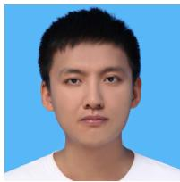

Xiaoyang Lyu received his bachelor’s degree from Harbin Institute of Technology in 2019 and his master’s degree from Zhejiang University in 2022. He is currently a PhD candidate at the University of Hong Kong. His research interests include neural rendering and reconstruction.

  
and computer vision.

Yang-Tian Sun received his bachelor’s degree in applied physics from the University of Science and Technology Beijing and master’s degree in computer science from the Institute of Computing Technology, Chinese Academy of Sciences. He is currently a PhD candidate at the University of Hong Kong. His research interests include computer graphics

Yi-Hua Huang received his bachelor’s and master’s degrees from the University of Chinese Academy of Sciences. He is currently a Ph.D. student at the University of Hong Kong. His research interests include computer graphics and 3D computer visions.

Ziyi Yang received his bachelor’s degree from Shanghai Jiao Tong University in 2022. He is currently a research assistant in the CVMI lab at the University of Hong Kong, advised by Professor Xiaojuan Qi. His research interests include neural rendering and foundation models.

Peng Dai received the B.Eng. and M.Eng. degrees from the University of Electronic Science and Technology of China, and the Ph.D. degree from The University of Hong Kong. He is currently a Postdoctoral Fellow at the Vector Institute and the University of British Columbia. His research interests lie in neural rendering, generative artificial intelligence,

world model, and immersive environment modeling and creation.

Xiaojuan Qi is an Associate Professor in the Department of Electrical and Computer Engineering at the University of Hong Kong. She received her Ph.D. from the Chinese University of Hong Kong and has conducted research and academic exchanges at the University of Toronto, the University of Oxford, and Intel’s Visual Computing Group. Her re-

search focuses on empowering machines with the ability to perceive, understand, and reconstruct the visual world in open environments, with an emphasis on real-world deployment in embodied agents. She has authored over 100 papers in premier conferences across computer vision, graphics, and machine learning, including SIG-GRAPH Asia, CVPR, ICCV, and NeurIPS, with many selected for oral presentations. Dr. Qi received a Best Paper Honorable Mention at SIGGRAPH Asia and was named one of IEEE AI’s 10 to Watch in 2024, MIT TR 35 China. She actively serves the academic community, frequently as an Area Chair for ICCV, CVPR, NeurIPS, ICML, and AAAI.

Graphical abstract

## Monocular Depth Estimation from a Single Image: Progress and Opportunities

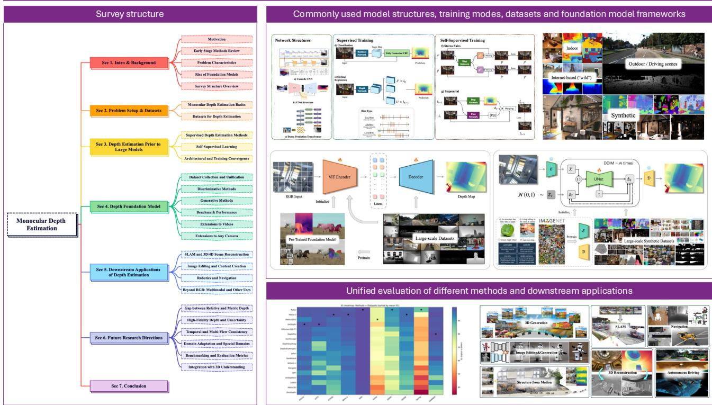  
Fig. 10 Graphical abstract