# No Pixel Left Behind: Filling Gaps in Anime Colorization

Masahiro Kono The University of Tokyo Tokyo, Japan marckono2825@g.ecc.u-tokyo.ac.jp

Akinobu Maejima   
OLM Digital, Inc.   
IMAGICA GROUP Inc.   
Tokyo, Japan   
akinobu.maejima@olm.co.jp

Yotam Sechayk The University of Tokyo Tokyo, Japan sechayk-yotam@g.ecc.u-tokyo.ac.jp

Yuki Koyama   
The University of Tokyo   
Tokyo, Japan   
koyama@pe.t.u-tokyo.ac.jp   
Takeo Igarashi   
The University of Tokyo   
Tokyo, Japan   
takeo@acm.org

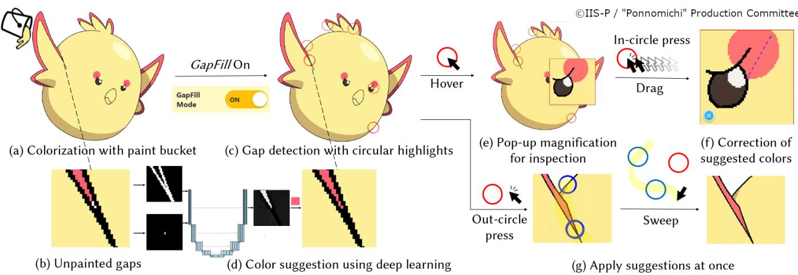  
Figure 1: GapFill assists professional anime colorists in addressing small unpainted gaps. (a) Colorization with the paint bucket often (b) leaves small enclosed regions (“gaps”) unpainted. When GapFill is activated, (c) gap detection with circular highlights is triggered, and (d) these gaps are temporarily filled with suggested colors using our domain-specific deep learning method. (e) Hovering over a highlight shows a magnified view, allowing inspection without zooming. (f) Dragging within a highlight activates a color-pick mode for correcting the suggestion. (g) Users can sweep across correct suggestions to apply them at once.

## Abstract

Animation production workflows often involve digital colorization of line art, where small unpainted regions (“gaps”) frequently occur and remain an underexplored challenge. We conducted a formative study in Japanese animation (anime) pipelines and found that while the paint bucket tool is widely used for base coloring, tiny enclosed areas are frequently overlooked, resulting in time-consuming manual detection and filling. We introduce GapFill, a tool grounded in professional practices that reduces the efort of gap detection, zooming, and color selection. Our deep-learning method suggests appropriate fill colors by referencing surrounding regions, leverag ing the flat-color nature of anime-style images. In a user study with 13 professional colorists, our system improved performance and usability in gap-filling tasks over conventional methods. The study also suggested that prediction accuracy alone is not the primary factor for usability, that appropriate colors can be contextually ambiguous, and that GapFill can complement existing tools depending on users’ trust in new AI-powered assistance.

## CCS Concepts

• Human-centered computing → Graphical user interfaces; • Applied computing → Media arts; • Computing methodologies → Image processing.

## Keywords

Creativity Support Tools, Anime, Colorization, Digital Painting, Deep Learning, Professional Workflow, Human–AI Collaboration

## ACM Reference Format:

Masahiro Kono, Akinobu Maejima, Yuki Koyama, Yotam Sechayk, and Takeo Igarashi. 2026. No Pixel Left Behind: Filling Gaps in Anime Colorization. In Proceedings of the 2026 CHI Conference on Human Factors in Computing Systems (CHI ’26). ACM, New York, NY, USA, 19 pages. https://doi.org/10. 1145/3772318.3790968

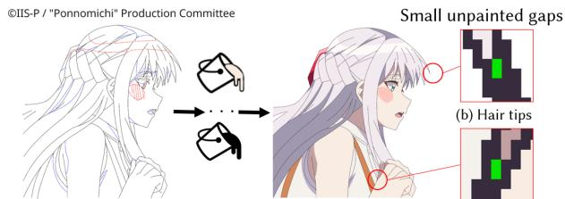  
(a) Manual colorization of line art using the paint bucket (c) Between fingers

Figure 2: Colorization with the paint bucket often leaves small unpainted “gaps” (green), tedious to detect and fill.

## 1 Introduction

Japanese animation (anime), deeply rooted in Japanese pop culture, has emerged as a globally recognized form of media art. The anime industry is notable for its cultural influence and economic signifi cance, supported by a rapidly expanding international market [48] and a vast global fan base [47]. Despite a high volume of broadcasts (over 200 titles per year [3]), the colorization process, referring to filling flat colors into each region of hand-drawn line art for every frame, remains largely manual. This reflects the legacy of traditional 2D anime production practices, where works were painted on sheets known as cels [51]. This process transitioned to digital production in the mid-1990s [29] and is now primarily supported by digital painting software such as Clip Studio Paint (CSP) [11].

Although digital colorization is central to anime production pipelines, the process itself has received little academic attention. To address this gap and gain a deep understanding of professional workflows, we conducted a two-stage formative study with 20 colorists, including interviews with 4 from a commercial studio. Results revealed the typical anime colorization workflow: starting from binary (usually non-anti-aliased) line art composed of con tours and color-coded guides for shadows and highlights, colorists sequentially apply base colors to segmented regions while referencing the model sheet. In this process, the paint bucket (flood fill) tool, which employs region-growing algorithms to fill enclosed areas bounded by lines [21], was found to be widely used (Figure 2a).

Additionally, our formative study substantiated a practical yet underexplored challenge that existing tools fail to adequately address: specialized support for filling small unpainted enclosed regions, hereafter referred to as “gaps”. These gaps typically result from unintentional line intersections or isolated minor regions within the line art. They frequently appear in sharp-angled areas such as hair tips (Figure 2b) or narrow spaces between fingers (Figure 2c), and are often dificult to detect visually. Unlike hobbyist illustration, professional colorization adheres to strict standards where even a single unpainted pixel necessitates a costly retake. Consequently, detecting and filling such gaps remains a time-consuming burden, emphasizing the need for production-oriented tools.

We designed and developed GapFill (Figure 1), a specialized tool for gap-filling that integrates seamlessly into existing professional pipelines. The system enables automatic gap detection with circular highlights, along with temporary filling based on color suggestions using our domain-specific deep learning method. By hovering over a highlight, the corresponding region can be magnified for quick inspection without zooming in. By dragging within a highlight, a color-picker-like interface is activated for correcting the color suggestion. For cases where suggestions appear accurate, users can apply them at once either by sweeping across multiple highlights or by using a one-click fill button. The key design goal was to reduce the repetitive burden of manually detecting, zooming, and selecting colors for such gaps, while fitting naturally into conventional workflows and maintaining user control over AI assistance.

To enable automatic color prediction, we propose a domainspecific deep learning method formulated as a localized inference problem. Our approach leverages the characteristics of anime images, typically composed of flat-color regions. Our method predicts plausible colors from the surrounding context. Instead of directly regressing color values, our model estimates a spatial likelihood map that identifies the neighboring region most likely to share the same color as the target region. This region-to-region correspondence enables the model to infer colors indirectly and robustly, suiting the flat and discrete nature of anime-style coloring.

The performance and usability ofGapFill were evaluated through a user study with 13 professional colorists. Participants completed two structured tasks comparing GapFill against conventional tools: (1) coloring real-world anime line art from scratch, and (2) detecting and filling unpainted gaps in partially colored images. These tasks were designed to reflect both the full colorization workflow and the final checking process. Task performance was measured by completion time and the number of overlooked gaps, while perceived usability was assessed through surveys, semi-structured interviews, and feature-level analyses. The results demonstrated significant improvements, particularly in the second task. Our findings suggest that GapFill has the potential to complement existing tools by leveraging their strengths, and also ofer insights into professionals’ trust in new AI-powered assistance. Moreover, our color prediction method achieved an accuracy of 81.68% on an unseen dataset, and its outputs were subjectively rated as valuable in production contexts. Notably, the study indicated that usability was shaped not only by prediction accuracy, partly because the appropriate color can be ambiguous depending on the context; participants also valued clear visual aids and the controllability of AI suggestions.

To summarize, our contributions are:

• A formative study filling the gap between anime production and research, capturing real-world colorization workflows and identifying the overlooked challenge of unpainted gaps.

• GapFill, a specialized tool for colorists to fill these gaps that integrates seamlessly into professional pipelines.

• A deep learning method that predicts colors for unpainted regions by leveraging the flat-color nature of anime-style images and inferring local context.

• An evaluation with 13 professionals showing that GapFill improves task eficiency, with findings indicating that usability is not driven by prediction accuracy alone, that appropriate colors can be contextually ambiguous, and that the adoption of AI-powered assistance depends on users’ trust.

Our code is available at https://marc2825.github.io/GapFill.

## 2 Related Work

## 2.1 AI-Powered Creativity Support Tools for Digital Painting

Various Creativity Support Tools (CSTs) [67] have been proposed for digital painting in HCI and CG. Frich et al. [22, 24] map the landscape of creativity research via systematic reviews and characterize CSTs. LazyBrush [70] colors imprecise drawings via energy minimization, while KISSColor [19] infers closed regions in vector sketches via kinetic stroke stretching along winding-number fields. FlatMagic [85] supports professional comic artists in flat coloring using neural rendering and intermediate representations, whereas Painting with Bob [6] targets novices, prioritizing ease of use. Color Portraits [32] characterizes key color manipulation activities via human-centered design and inspires novel interaction tools beyond traditional pickers. Colorbo [36] supports interactive mandala coloring via AI-generated suggestions. Bao and Fu [4] proposed a scribble-based tool for difusion-curve-based vector colorization. AniFaceDrawing [27] leverages StyleGAN with a two-stage training strategy to transform incomplete sketches into high-quality anime portraits. Collectively, these tools demonstrate the potential of AI-driven methods in digital painting, aligning with our study.

As AI-powered tools become common, HCI research has turned toward the user perspective, emphasizing issues of trust, acceptability, and explainability in human–AI collaboration. Co-drawing studies show creators prefer controllable assistance with explana tions [50], and that AI collaboration yields quality comparable to human-only work [20]. Pei et al. [53] further demonstrate that AI involvement shapes cognitive load and creative eficacy. Beyond drawing, two-way communication enhances engagement and perceived reliability [60], though artists report tensions regarding authenticity [8]. Adoption studies note that trust predicts acceptance better than technical features [84], while explainability and control remain essential [39]. Building on this, we empirically examine creative professionals’ perceptions of new AI-powered tools.

## 2.2 Automatic Colorization for Line Art

Many studies have explored automatic colorization for line art used in anime and manga drawings. Classical approaches include color propagation methods that are aware of patterns and textures [56], bipartite matching based on regions across frames [33], and methods that perform matching between a graph constructed from a reference image and a target image [66]. Early learning-based approaches include PaintsChainer [55], which employs CNNs for automatic colorization and Style2Paints [89], a fully automatic feed-forward model used for applying specific painting styles to anime sketches. Advancements in deep learning techniques have given rise to various models, such as a two-stage GAN framework that mimics human workflows [91], a U-Net-based model that skips low-confidence regions [31], and flat color prediction for comics using ResNet-based classifiers and Transformer models [75]. Recently, difusion-based models tailored for this domain have achieved high performance [10], followed by several subsequent approaches [41, 86]. However, most of these methods rely on fully colorized reference images or user hints, limiting flexibility.

Recent studies have also explored learning-based colorization under limited examples [43] and a robust matching approach that formulates region correspondence as a set of inclusion relationships [17]. However, these methods often struggle with small or intricate regions even in production settings where reference frames are available, limiting their practical applicability to the proposed problem setting. For small-region colorization, Akita et al. [1] proposed a method to fill empty pupils in line art, but its scope remains limited. A related task of our setting is image inpainting, where many deep learning approaches have been proposed [94], but these mainly target natural photos with continuous tones and gradients, unlike anime-style drawings with flat and discrete regions. In the domain of semi-automated, user-guided colorization, Zhang et al. [90] proposed a system that interprets user scribbles to control color propagation interactively, Ci et al. [15] introduced a conditional GAN model conditioned on both line drawings and user-provided strokes, and Zou et al. [95] further extended control through language-based inputs. Nevertheless, these frameworks are not fully suited to real-world anime production workflows.

## 2.3 Understanding Anime Production

Academic research on anime production has traditionally focused on socio-cultural perspectives in fields such as anthropology, sociology, and media studies. For example, Condry [16] attributes anime’s global success to social energy across industry and fans, while Morisawa [46] shows how creative authority often outweighs management in anime studio hierarchies, and Mihara [45] expands the analytical lens by foregrounding anime’s business personnel and advocating a business anthropology approach. Psychological approaches also examine expressive techniques in anime, such as Yokota [88] on achieving emotional impact with limited frames.

Kato et al. [35] positioned anime as an emerging topic in HCI, integrating technical, cultural, and industrial perspectives to support production and foster an international research community. Similarly, Ichikohji [29] examined the integration of digital technologies in studios to analyze their impact. For production support, Grifith [34] specializes in anime storyboarding (e-conte) deriving general findings for CSTs, and AnimAgents [79] is a collaborative system that streamlines animation pre-production by orchestrating AI tools. In computer vision and graphics, challenges in supporting anime pipelines have driven research on super-resolution for final outputs [78], generating in-betweens from key frames [83], and non-photorealistic rendering methods to replicate anime aesthetics, such as Todo et al. [72]’s 3D style transfer pipeline. Comprehensive survey papers on AI applications in cel animation [57, 71] further consolidate this growing body of computer science-based work. Taken together, these studies illustrate a convergence of cultural and technical perspectives on anime production, opening opportunities both to deepen scholarly understanding and to develop practical tools tailored to production contexts.

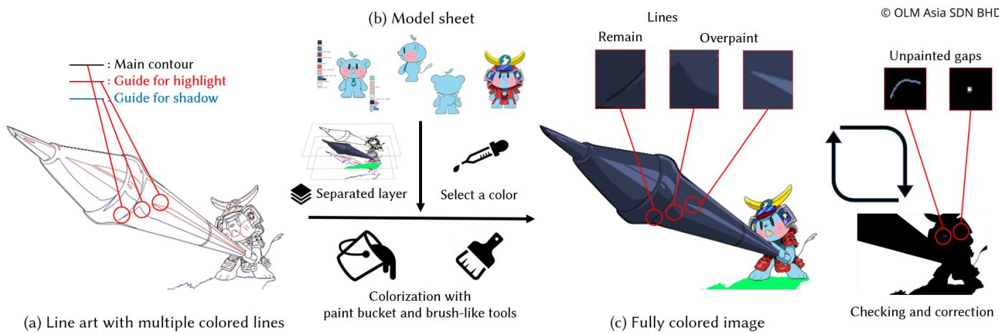  
Figure 3: Typical anime colorization workflow: (a) preparing line art with main contours and highlight/shadow guides, (b) selecting colors from model sheets and applying them on separated layers, and (c) ultimately producing the fully colored image

## 3 Understanding Anime Colorization Workflow: A Formative Study

The professional anime production pipeline relies on a specialized division of labor. In this workflow, “colorization” is a critical component of the “shiage” (finishing) process [34, 51], where colorists apply colors to clean binary line drawings provided by in-between animators from the preceding “douga” stage. The colored frames are then submitted to the subsequent “composition” stage, where compositors adjust and integrate them with other assets, such as background art and 3DCG, to complete the scene. Since the colored image is passed directly to this phase, strict adherence to color specifications is required to ensure the visual quality of the final output. Even minor coloring errors can be treated as defects that triggers a retake, increasing both labor costs and delays.

Despite its importance, the specific practices and challenges of the colorization process remain understudied. To address this gap, we conducted a formative study with professional colorists in a commercial studio. Guided by the principle that practical adoption depends on integration with existing workflows [13], we aimed to understand production realities and derive design principles for tools suitable for real-world deployment. In doing so, we answer calls for CSTs research to better support expert practitioners and their practices [22, 24].

## 3.1 Anime Colorization in Practice

3.1.1 Procedure ofThe Formative Study. To capture both the overall process and hidden challenges in real workflows, we conducted a two-stage formative study: a broad-scale questionnaire (S1) followed by in-depth semi-structured interviews (S2) [38].

• S1 (Questionnaire): We distributed an online survey to 20 professional colorists (R1–R20) via a manager at an anime studio. The survey covered their experience, tool usage, and perceptions of the colorization workflow and its challenges. Participants had 1 to 9 years of experience (� = 4.6, �� = 2.3). For the 7-point Likert items, ratings of 5 or above were treated as positive (results are reported as � and ��).

• S2 (Interview): To gain deeper insights into the findings from S1, we conducted 30-minute semi-structured interviews with 4 experienced professionals (I1–I4) recruited from the same studio (experience range: 3–5 years). All participants provided consent for recording and transcription.

We additionally obtained a screen recording of a professional colorization process (V1) from the anime studio to visually examine the workflow and complement the self-reported data. This material compensated for the lack of mandatory screen sharing in S2, which was made optional considering the confidentiality of the assets.

## 3.1.2 Grounding Systematic Understanding of Anime Colorization.

Tools andEnvironment. All 24 participants (S1 & S2) used CSP [11] for colorization. Input devices in S1 consisted of pen tablets (80%) and pen displays (70%); all participants relied on at least one of these stylus interfaces, while 35% additionally used a mouse and keyboard as auxiliary inputs. This diversity underscores the importance of designing an interface that accommodates a range of input modalities. Regarding software tools, the Paint Bucket was the most frequently used (90%), followed by brush tools (50%) including the Leftover Pen (Figure 4b), AI-based auto-coloring tools (40%), and lasso-like tools (20%) such as Enclose and Fill (Figure 4c).

Standard Colorization Workflow. According to demonstrations (I3, V1) and additional self-reports, the standard colorization process proceeds as follows. The process begins with clean line art on separate layers, where main contours are drawn in black, highlight guides in red, and shadow guides in blue1 (Figure 3a). Colors are selected for each region based on the model sheet (Figure 3b), and applied to specific layers using tools such as the Paint Bucket and brush. Finally, the highlight and shadow guides are painted over, producing a fully colored image (Figure 3c). According to I1 and I4, the time required per frame varies significantly based on complexity, ranging from under a minute to 15–30 minutes. To improve eficiency, I1 described a batch-processing strategy: “I don’t actually change the color in between. So, it’s a bit faster compared to if you do one whole thing,” implying that they color the same specific parts across multiple frames before switching colors, rather than completing frames one by one.

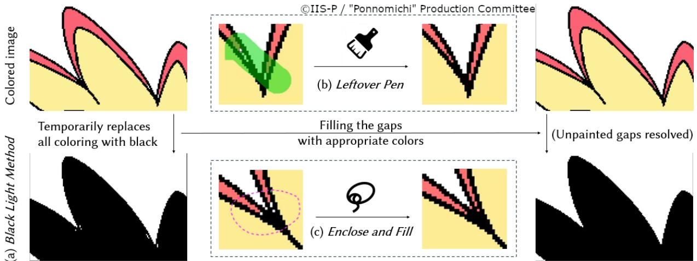  
Figure 4: Conventional methods for addressing unpainted small gaps. (a) Black Light Method: Temporarily replace all colors with black in a single click, making gaps appear as white dots for easy detection. (b) Leftover Pen: Fill all gaps along the stroke with the specified color. (c) Enclose and Fill: Fill all gaps within the enclosed area using a lasso-like tool.

Limitations ofCurrent AI Tools. We also examined the studio’s internal AI-based auto-coloring tool [43]. According to I1, this tool transfers colors from adjacent frames, achieving 70–80% accuracy for minor movements. However, it frequently misrecognizes regions in dynamic scenes, leading I1 to remark, “most ofthe time we have to check on its work.” Consequently, professionals often avoid using it to prevent redundancy; as I2 stated, “in order not to waste my time, I’m rather to do manually because [...] do the painting twice,” highlighting that human control is currently more reliable than AI automation. Nevertheless, I2 expressed openness to future adoption if performance improves: “I think it should be a convenient tool [...] If there is a very good accuracy I would use.” This suggests that while AI tools are available, their usability may depend on accuracy.

3.1.3 A Practical Challenge in Colorization: Small Unpainted Gaps. We first asked participants an open-ended question in S1: “Do you encounter any common issues when coloring line art?” Participants highlighted a range of dificulties, including distinguishing similar colors (R1, R4, R19), human errors such as choosing incorrect colors (R5, R8, R13, R18), and managing complex layer structures (R6, R9, R17). However, the most frequently cited issue was small unpainted gaps, voluntarily mentioned by 11 out of 20 participants (“small pixel unreachable when using bucket tool” (R7), “filling too many small pixels” (R20)). Identifying this as a common bottleneck, we focused our subsequent inquiry on the specific workflows and perception regarding gap-filling.

Current Gap Detection and Filling Method. We examined how such gaps are addressed based on demonstrations (I3, V1) and additional self-reports. Professionals typically employ a visual check known as the “Black Light Method” (Figure 4a): temporarily replacing all colorings with black via a shortcut to make transparent gaps stand out as bright dots. However, the method for filling these gaps varies. I3 uses a specialized brush, the Leftover Pen [11] (Figure 4b), which fills unpainted areas along a stroke. In contrast, I1 uses a lasso-like Enclose and Fill tool [11] (Figure 4c), which fills all gaps within the enclosed area, while the artist in V1 relied on the standard Paint Bucket. Despite these variations, all methods require manual detection, zooming, and color selection and filling.

Workflow Strategies and Burden. The burden of addressing gaps is substantial. I3 noted that they detect gaps by “zooming in very close and moving the canvas bit by bit,” a process that can take up to several minutes per frame in the worst case for complex drawings. This was corroborated by S1, where 60% of participants agreed with “Do you find addressing unpainted gaps to be time-consuming?” (� = 5.0, �� = 1.8), confirming that gap-filling is a repetitive manual task. Regarding timing, two distinct strategies emerged: I3 prefers a batch-processing approach, filling all gaps in a single pass at the end of coloring to minimize tool switching, whereas I4 fixes gaps immediately upon noticing them. I4 also emphasized the importance of workflow consistency of new tools, stating, “ifthey want to change into another program we have to learn it all over again.” Reflecting this diversity, an ideal tool and its evaluation should go beyond mere final inspection and be designed to fit seamlessly into individual professionals’ practices.

Frequency and Significance. The quantitative results further validated the significance of this issue. When asked “Do you often need to address unpainted gaps?”, 65% of participants in S1 responded positively (� = 4.8, �� = 1.7). I2 noted that such gaps appear in almost every image, particularly at thin, sharp ends such as hair tips and strands, at complex line intersections, and in fine details. Crucially, 85% agreed with the statement “Do you think deciding the appropriate color for unpainted gaps is important for completing an animation?” (� = 6.0, �� = 1.2). I1 explained the visual impact: “if the gaps exist [...] it will be transparent in the background,” noting that dedicated fans “will look for any kind ofblemish.” These find ings indicate that while physically minute at a glance, unpainted gaps have a disproportionately large impact on visual quality.

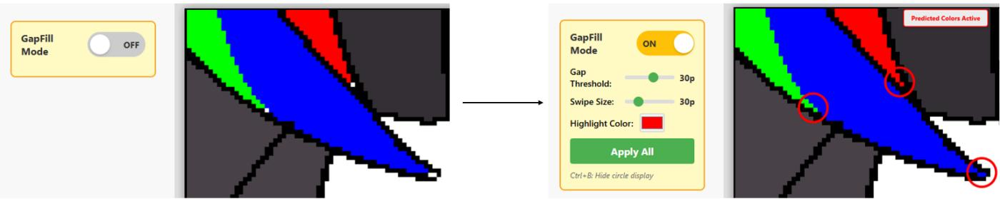  
Figure 5: Overview of GapFill. When activated, the system automatically detects unpainted gaps, highlights them with circles, and temporarily fills them with suggested colors using a domain-specific deep learning method.

Decision LogicforGap Filling. Finally, we investigated how artists determine which color to use when filling a gap. In S1, 90% reported referencing surrounding colors, while 75% selected oficial references such as model sheets, and 45% checked adjacent frames. I1 noted referring to surrounding elements and tones, relying on intuition when choices are ambiguous. I3 described first consulting model sheets to understand the subject, then determining colors by referencing adjacent frames and local context. These findings indicate that local context such as neighboring colors ultimately plays a central role in deciding which color to use for gap filling.

## 3.2 Design Principles for GapFill

Based on the findings, we identified conventional practices and pro duction needs. Building on these insights, we derived the following design principles for GapFill, a tool tailored to professional anime colorists for addressing small unpainted gaps:

• Reduce the manual workload in the repetitive cycle of detection, zooming, and color selection and filling.

• Fill gaps using local context such as neighboring colors, reflecting artists’ reliance on local cues.

• Promote practical adoption [13] via intuitive, familiar interactions that bridge conventional workflows and support diverse, user-specific use cases.

• Provide a Creativity Support Tool that prioritizes human controllability rather than pursuing full automation, align ing with the findings of Roy et al. [65].

## 4 Design and Implementation of GapFill

## 4.1 User Interface

We developed the user interface (UI) shown in Figure 5. The interface is activated on-demand via a toggle button to accommodate user-specific painting practices and provides five key functions: automatic detection of unpainted gaps with highlighting, deep learning-based color suggestions, a pop-up magnification for inspection, a color-pick-like operation for correcting color suggestions, and the application of suggested colors via a sweep-like interaction complemented by an apply-all button.

4.1.1 Unpainted Gap Detector with Circular Highlights. As shown in Figure 1c, the system automatically detects unpainted gaps and highlights them with circles around each detected region. A gap is defined as any enclosed, unpainted (transparent) region on the active coloring layer, with a pixel count below a user-adjustable threshold. Such boundaries may also be formed in combination with other layers, including line art and guide layers. Grid-based traversal algorithms such as BFS are used to identify such enclosed regions. It is also possible to employ methods like trapped-ball segmentation [2, 93] to more strictly estimate regions by accounting for line discontinuities. This feature is designed to reduce the manual efort of detecting unpainted gaps.

4.1.2 Automatic Color Suggestion for Filling Unpainted Gaps. When GapFill is activated, each detected unpainted gap is temporarily overlaid with a suggested fill color using a deep learning–based prediction method (Section 4.2). This feature aims to reduce the manual efort of selecting colors for filling unpainted gaps.

4.1.3 Hover-Activated Pop-up Magnification for Quick Inspection. As shown in Figure 1e, when the cursor is hovered over a highlight, a pop-up magnification (a fixed 5× zoom independent of the canvas scale) is displayed; this is a feature inspired by Shift [77]. This magnification provides a localized magnified view centered on the detected unpainted gap. The user can quickly inspect the surrounding region that is temporarily filled with suggested colors, without manually zooming in the canvas. A hollow translucent marker at its center indicates the position of the detected gap. This feature is designed to reduce the manual efort associated with frequent zooming operations.

4.1.4 In-Circle Color-pickfor Correcting AI Suggested Colors. We adopt a human-in-the-loop approach to complement occasional AI prediction errors. As shown in Figure 1f, this feature allows users to directly correct suggested colors for unpainted gaps. When the pop-up magnification is visible (i.e., when the cursor is inside the circle), a color selection mode can be activated by initiating a drag action. This mode behaves like a color picker: the pixel color under the cursor dynamically replaces the fill color of the corresponding unpainted gap. To clarify the substitution target, a dotted line connects the cursor to the center ofthe unpainted region when this mode is active. The pixel color at the release point of dragging becomes the final assigned color, resolving the unpainted state and removing the highlight. This feature enables users to correct suggested fill colors without zooming in and resolve a small number of mispredicted gaps via a familiar color-picker interaction, while adhering to the system requirement that emphasizes attention to local information during color selection.

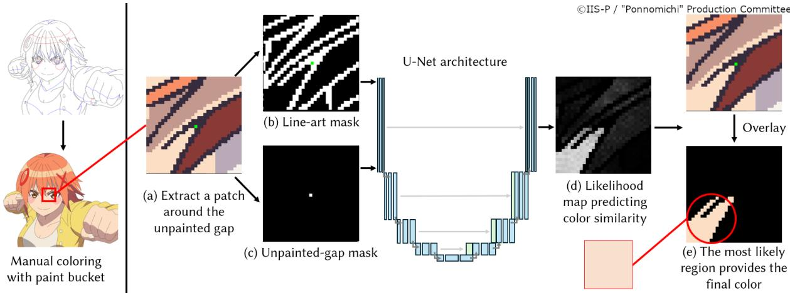  
Figure 6: The color prediction method for GapFill. (a) First, we extract a patch around the target gap as a context for inference. (b) A line-art mask and (c) an unpainted-gap mask are input to the U-Net, which outputs (d) a likelihood map showing how likely each pixel matches the target color. (e) The final color is then chosen from the region with the highest likelihood.

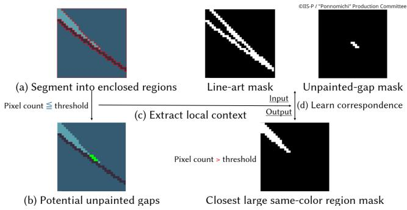  
Figure 7: Synthetic training dataset generation pipeline. (a) Region segmentation. (b) Identification of unpainted gaps below a pixel threshold. (c) Local context extraction. (d) Learning the mapping between input masks (line-art, unpaintedgap) and output mask (closest large same-color region).

4.1.5 Out-Circle Sweep-to-Apply and Apply-All Buton. As shown in Figure 1g, when the suggested colors seem reasonable for the unpainted gaps, users can apply them in batches via a sweep-like interaction. When the cursor is outside a circular highlight and a drag action begins, the system enters the following mode. When dragging, all circles crossed by the translucent stroke are treated as selected and their corresponding unpainted gaps are marked for confirmation. Upon release, all selected gaps are simultaneously filled with their suggested colors, thereby resolving the unpainted regions and removing their highlights. This interaction was inspired by the painting metaphor for manipulating large sets of toggle switches [5], which showed that paint-like gestures can make interaction more eficient. An Apply-All button is provided to fill all unpainted gaps in a single click, ofering an alternative option to accommodate diverse user preferences. These features enable users to eficiently adopt AI-driven color suggestions while preserving direct user manipulation via a familiar brush-like interaction.

## 4.2 Method for Automatic Color Prediction

4.2.1 Color Prediction via Region Correspondence. Since the occurrence of unpainted gaps is independent of specific colors, our approach does not directly regress the colors themselves, but instead indirectly predicts them through the correspondence between regions. This enables us to construct a robust model that can predict flat, gradient-free colors, typical in anime-style images. To this end, we design a compact deep learning model based on U-Net [64], which is highly efective for generating segmentation masks and capturing features of neighboring regions, making it well-suited as a backend for interactive user interfaces. Figure 6 illustrates the overall prediction framework. The model takes a two-channel binary input: (Figure 6b) a line-art mask where line pixels are set to 1; and (Figure 6c) an unpainted-gap mask where the target unpainted region is encoded as 1. The model then predicts a spatial likelihood map indicating the probability that each pixel within the patch shares the same color as the target area (Figure 6d). Finally, the suggested color is determined by selecting the color from the painted region with the highest average predicted likelihood (Figure 6e).

4.2.2 Creating Synthetic Training Dataset. Our formative study revealed that colorists rely on local context; our analyses of a professional anime image dataset (Appendix A) confirmed this, observing that small regions often share colors with neighbors. Grounded on these observations, we constructed a synthetic training dataset by applying BFS-based fill operations to line drawings to segment them into enclosed regions (Figure 7a). We then defined potential unpainted gaps as regions with pixel counts below a threshold of 10 (Figure 7b). For each such region extracted from the complete set of professional anime episodes (1, 807, 977 targets in total), we generated a 32 × 32 image patch centered on it as local context (Figure 7c) and applied data augmentation techniques such as rotation and flipping. Using these patches, we trained a model to map the line-art mask and the unpainted-gap mask (inputs) to the closest large (i.e. above the pixel threshold) same-color region mask (output), computed from the ground-truth colored image (Figure 7d).

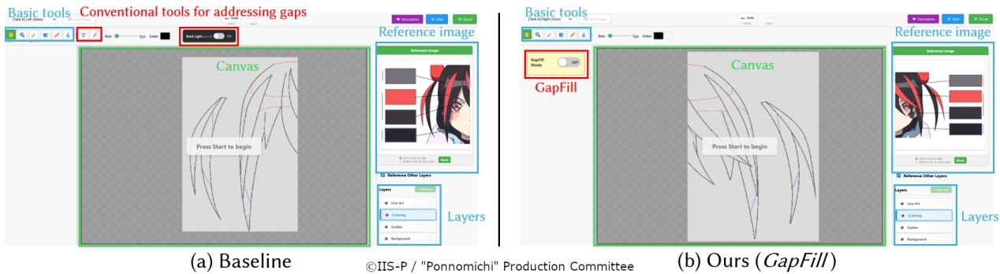  
Figure 8: Overview of the custom painting software used in the user study, showing images for Task A. In addition to the basic features indicated by the blue and green boxes, (a) the Baseline UI provides three commonly used tools for addressing gaps, whereas (b) the Ours UI introduces GapFill, with the diference highlighted in red.

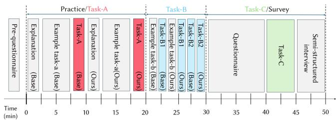  
Figure 9: Overview of the user study procedure (example)

## 5 User Study with Professionals

We conducted a user study with professional colorists to evaluate GapFill. The evaluation focused on task performance and perceived usability, with emphasis on gap detection and filling, reflecting insights from the formative study (Section 3). Furthermore, qual itative feedback was collected on participants’ experiences with the AI-powered tool and their impressions of individual features, regarding its potential for practical adoption in real environments. This study was approved by our institution’s ethics review board.

## 5.1 Methodology

5.1.1 Participants. Professional colorists were recruited from the same anime studio as in our formative study and 14 individuals (P1– P14) participated voluntarily. They received compensation equivalent to their standard hourly wage and provided consent for both screen recording and transcription of their remarks. P13 was excluded from the subsequent analyses due to technical issues.

According to the pre-study questionnaire, all participants were adults under the age of 34 and reported using CSP [11] for their daily colorization. Their professional experience ranged from 1 to 10 years (� = 3.6, �� = 2.6). Table 1 summarizes the basic demographics, including primary devices and main tools.

5.1.2 Procedure Overview. The study was conducted online and a custom web-based painting software was used (Figure 8). Each session, lasting 60 minutes, was conducted in a one-on-one format, to enable direct interaction with each participant. Participants’ shared screens and audio2 were recorded for subsequent analyses.

Table 1: Participant demographics (P1–P14). Professional Experience in years; Devices: PT = Pen Tablet, PD = Pen Display, MK = Mouse and Keyboard; Main Tools: PB = Paint Bucket, LP = Leftover Pen, EF = Enclose and Fill, BL = Black Light.
<table><tr><td>ID</td><td>Professional Experience</td><td>Devices</td><td>Main Tools</td></tr><tr><td>P1</td><td>7</td><td>PT, PD</td><td>PB, BL</td></tr><tr><td>P2</td><td>3</td><td>PT, PD, MK</td><td>PB, LP, EF, BL</td></tr><tr><td>P3</td><td>2</td><td>PT, PD</td><td>PB</td></tr><tr><td>P4</td><td>10</td><td>PD, MK</td><td>LP, EF, BL</td></tr><tr><td>P5</td><td>1</td><td>PD, MK</td><td>PB, LP</td></tr><tr><td>P6</td><td>2</td><td>PT, PD, MK</td><td>PB, LP, BL</td></tr><tr><td>P7</td><td>2</td><td>PT, MK</td><td>PB, BL</td></tr><tr><td>P8</td><td>3</td><td>PT, MK</td><td>PB, LP, BL</td></tr><tr><td>P9</td><td>4</td><td>PD, MK</td><td>PB, LP, BL</td></tr><tr><td>P10</td><td>5</td><td>PD</td><td>PB, LP, BL</td></tr><tr><td>P11</td><td>1</td><td>PD</td><td>EF</td></tr><tr><td>P12</td><td>5</td><td>PD</td><td>PB, EF, BL</td></tr><tr><td>P14</td><td>1</td><td>PT, MK</td><td>PB, LP, EF, BL</td></tr></table>

Informed by our formative study, the painting software incorporated several fundamental tools common in professional colorization workflows (Paint Bucket, Color Picker, Dot Pen, and Eraser). It also supported basic operations, such as panning and zooming, modeled after CSP to closely simulate production environments. Note that CSP does not support the development of add-ons, which necessitated the implementation of our painting software. To compare GapFill with conventional gap-filling methods, the system featured two experimental conditions. The Baseline (Figure 5(a)) condition included three conventional tools, namely Enclose and Fill, Leftover Pen, and Black Light Method, which were found to be commonly used in current anime production. In contrast, the Ours (Figure 5(b)) condition introduced the proposed tool, GapFill 3. To simulate actual workflow while maintaining simplicity, the software provided preset layers: Line Art (black outlines), Guides (red/blue guidelines), Coloring (partially filled or empty), and a white background, along with a Reference Image (model sheets). Participants could only manipulate the Coloring layer, ensuring focus on colorization.

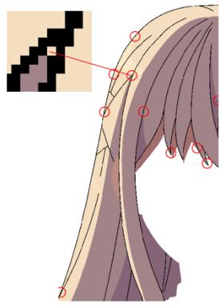  
(a) Task B1

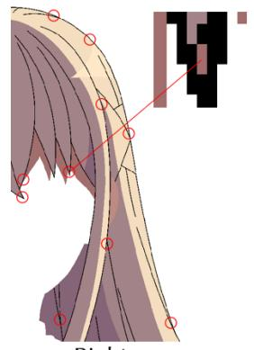

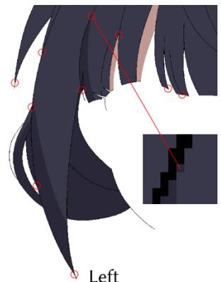  
©IIS-P / "Ponnomichi" Production Committee

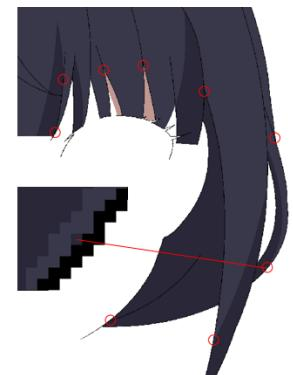  
(b) Task B2

Figure 10: Overview of Task B image sets ((a) B1 and (b) B2), with intentionally controlled gap settings. Red circles indicate unpainted gaps, and the magnified view highlights a color prediction error output by GapFill.

Specifically, we prepared three types of tasks for the user study (details are provided in Section 5.1.3):

• Task A: Color a line art from scratch (TL: 150 seconds, 1 set)

• Task B: Detect and fill unpainted gaps in an almost fully colored image (TL: 90 seconds, 2 sets)

• Task C: Observe and evaluate results after applying an automated color prediction (TL: 30 seconds, 4 sets)

TL (Time Limit) denotes the maximum allowed duration, designed to simulate high-pressure production deadlines. Operations on the canvas were disabled until participants pressed Start, after which they could begin the task. They were instructed to press Done to stop the timer once they considered the task complete.

For the image sets, a multiple-response question in the formative survey S1 (“Where do unpainted gaps often occur?”) showed that 95% of respondents identified “hair tips” as a common location. Accordingly, we selected images from professional anime data that included such cases4. The tasks were arranged to fit within the 60-minute session, in the order shown in Figure 9, and explanations were provided via screen sharing. The images for the example tasks are presented in Figure 1. The overall task sequence was fixed (Task A → Task B → Task C). Within Task B and Task C, the order of subtasks, the presentation order of target images (left vs. right), and the order of UI conditions (Baseline vs. GapFill) were counterbalanced to mitigate learning efects.

## 5.1.3 Task Details.

Task A. The objective was to conduct a comparative experiment under an unbiased condition to evaluate GapFill and to observe how professional colorists use this tool within a production-like colorization setting. To mitigate learning efects while ensuring comparable levels of visual complexity, we selected images of anime characters’ hair with near symmetry and divided them into left and right halves. As a result, we obtained two target images with seemingly equivalent complexity, as displayed in Figure 8. Unlike those in Task B, the images for Task A were used directly from the dataset, taking into account that both the locations of unpainted gaps and the timing of handling them may vary across individuals.

Task B. The objective was to conduct a comparative experiment to evaluate GapFill in a context focused on gap detection and filling. Accordingly, participants were situated in a setting similar to the final quality check stage. Task B followed the same principle as Task A, in which images of characters’ hair with near symmetry from professional data were used and split into halves. To avoid clear advantage for either UI condition, both the number and placement of unpainted gaps were intentionally controlled. Specifically, images were generated by randomly selecting 10 spatially dispersed enclosed regions as gaps, ensuring the inclusion of at least one clear color prediction error by GapFill. Figure 10 shows the images used in Task B, where red circles mark the unpainted gaps and the magnified view shows an prediction error (these indicators were not visible during the user study). Two sets of images were prepared: an easier task with clearly distinct colors and relatively smaller image size for Task B1 (Figure 10a), and a more dificult task with similar colors and larger image size for Task B2 (Figure 10b).

Task C. The color prediction method was subjectively evaluated from the perspective of production. This was based on our hypothesis that, unlike color specifications provided by the model sheets, there is no single correct color for filling gaps, and any color may be acceptable as long as it appears appropriate. Participants were instructed to inspect an image where gaps had been automatically filled by GapFill, assuming a quality check scenario before submission to the next production stage. They were given 30 seconds to freely pan and zoom, after which they rated their impressions on a 7-point scale question CQ (Section 5.3.1). Figure 11 shows the images used for this task. These images were created by selecting full-size frames that contained complete character parts, including hair tips, identifying potential unpainted gaps as enclosed regions smaller than 3 pixels, treating these as unpainted, and then applying our color prediction method in bulk to minimize arbitrariness.

Questionnaire and Interview for Combined Qualitative Feedback. For the intermediate questionnaire via Google Forms, participants provided subjective evaluations of usability based on Tasks A and B. This questionnaire included several 7-point Likert-scale items [40], focusing on UI comparisons and the perceived usability of individual features of GapFill. The specific contents of questions (LQ1– LQ12) are presented in Section 5.2, where responses of7 are referred to as very positive, and responses of 5 or above are considered positive. Participants were also required to submit the auto-saved coloring layer from each task, and asked to respond to four open-ended questions with OQ4 being optional:

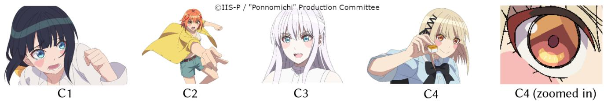  
Figure 11: Task C image sets (C1–C4). All enclosed regions below the threshold were filled with predicted colors; some mispredictions appear, for example, around the eyes.

• OQ1: Please provide any comments comparing the usability of the two UIs for handling unpainted gaps.

• OQ2: Regarding the overall usability of our UI (GapFill), please describe what you liked and what you think could be improved.

• OQ3: Were there any specific features of our UI (GapFill) that you found especially helpful, and why?

• OQ4: Please feel free to provide any additional comments regarding your experience with using our UI (GapFill).

At the end of the session, a semi-structured interview [38] was conducted to further explore participants’ impressions. This interview was guided by how they had used each tool in Tasks A and B, their questionnaire responses, and their evaluations from Task C, allowing us to obtain deeper insights. Feedback from the open-ended questionnaire responses and the interviews was analyzed together as combined qualitative data.

## 5.2 Evaluation of GapFill

Following the ISO 9241-11 [7] definition of usability, GapFill was evaluated based on three aspects: (1) task performance, using objective measures such as task completion time (eficiency) and the number of overlooked unpainted gaps (efectiveness); (2) perceived usability, using subjective measures (mainly satisfaction) such as questionnaire and interview responses; and (3) feature-level evaluation conducted for each interaction (the color prediction method was separately evaluated in Section 5.3).

5.2.1 Task Performance. To compare the eficiencies of the Baseline UI and GapFill, we analyzed task completion times (recorded in seconds) using a within-subject design. Outliers were identified and excluded using Tukey’s fences (� = 1.5) [73]. We primarily employed a one-sided Wilcoxon signed-rank test (� = .01) [82] to evaluate the hypothesis that GapFill is faster $( \mathrm { i . e . , } H _ { 1 } \colon \mu _ { \mathrm { D i f f } } < 0 )$ Supplementary analysis using paired �-tests and visualizations of individual paired diferences are detailed in Appendix B. In addition to eficiency, the efectiveness of these UIs was compared by the number of unpainted gaps remaining after task completion.

Eficiency. As shown in Figure 12, for Task A (� = 12, P3 excluded), no significant diference was found between the Baseline (� = 106.50, �� = 26.65) and GapFill (� = 104.17, �� = 25.15) with � = 28, � = .212. However, significant improvements were observed in Task B. In Task B1 (� = 13, no outliers), GapFill (� = 45.15, �� = 12.28) was faster than the Baseline (� = 57.69, �� = 15.59) with � = 6, � = .003. Similarly, in Task B2 (� = 11, P6 and P7 excluded), GapFill (� = 51.91, �� = 19.66) outperformed the Baseline (� = 66.27, �� = 18.46) with � = 3, � = .002.

Efectiveness. GapFill resulted in zero unpainted gaps across all participants and tasks. In contrast, in the Baseline condition, unpainted gaps remained for specific participants: P4 left one gap in Task A; P6 and P10 left one gap each in Task B1; and in Task B2, P6 left five gaps, P11 and P14 left two gaps each, and P12 left one gap.

Summary. In conclusion, at a significance level of � = .01 (onesided), GapFill was significantly faster than the baseline UI in Tasks Bs. Regarding remaining gaps, GapFill consistently outperformed the baseline tool across all tasks. These results indicated that GapFill is more eficient and efective than conventional practices, particularly when detecting and filling gaps is critical, whereas its performance in coloring from scratch may vary across individuals. In fact, P8 remarked that “Auto-detecting the fill gap definitely saves a lot more time than using the black light, which is goodforfinal checking. But when it comes to initial painting, the baseline UI is a bit easier since I can just use the Leftover Pen to cover up gaps while painting. Overall, both have their advantages, and GapFill does save a lot of work time during the final check.”, reflecting his workflow in Task A, where he used the Leftover Pen to color multiple regions at once, leaving only a few unpainted gaps. Furthermore, P2, P7, P9, and P14 suggested a combination of both tools. A deeper discussion of the potential for integrating both tools is provided in Section 6.2.

5.2.2 Perceived Usability. To assess subjective usability, we designed the 7-point Likert-scale questions to compare UIs. Figure 13 summarizes responses to LQ1—LQ7. Overall, both subjective ratings and participant feedback indicated strong support for GapFill, particularly in detecting gaps. Regarding usability in each task, eight participants rated GapFill more positively than Baseline in LQ1, and eleven did so in LQ2. This aligns with the performance-based eval uation and the generally favorable feedback from participants (ten positive in LQ6; “It serves what it is supposed to do.” (P5)). However, P3, who consistently preferred the Baseline, noted that “I didn’t trust AI so much actually [. . . ] maybe this is my first time using the AI tool”, indicating a preference for manual tools.

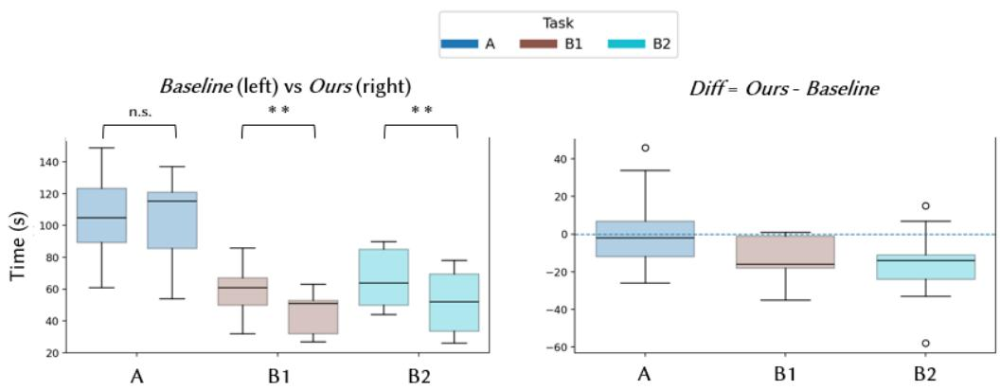  
Figure 12: (a) Task completion times for each task (A, B1, and B2), and (b) their diferences, summarized in boxplots.

Regarding more fine-grained usability aspects, ten participants responded positively in LQ3 on intuitiveness (“Overall process is very straightforward and simple.” (P2)), although P3, P9, and P14 also noted the need to adapt to a new tool (“I think I will use it because it is easier, but it might take a bit oftime to adapt since I am already used to zooming $i n . ^ { \prime \prime } \left( \mathrm { P 1 4 } \right) )$ ). Similarly, ten participants were positive in LQ4 regarding confidence in filling gaps (“With the Baseline UI, even though you think you filled everything, you cannot always see it properly. With Ours, the AI basically detects the ones that have not been $f i l l e d . ^ { \prime \prime } \left( \mathrm { P } 1 0 \right) )$ ). This was consistent with observations in Task B2: although P6 and P10 had finished filling all the gaps with Baseline, they could not immediately recognize whether any gaps remained and hit the time limit. However, P9 expressed stronger trust in conventional methods, remarking that “GapFill needs to have the Black Light mode to check ifthe AIproperly detected andfilled all the holes for the final check.”, suggesting a practical consideration for new AI-powered tools. Regarding reduced stress, nine participants were positive in LQ5 (“GapFill really helps [. . . ] because the Baseline UI relies on our own perception to catch the gaps” (P5)).

In terms of practical adoption (LQ7), all participants except P3 responded positively, with eight being strongly positive. P11 emphasized its benefit under time-pressured situations: “Ifyou are late on a deadline, GapFill can save a lot oftime identifying mistakes.” Altogether, GapFill was rated more favorably than Baseline in perceived usability, particularly for detecting gaps. A more detailed discussion on integrating the advantages of both tools for practical deployment is provided in Section 6.2.

5.2.3 Feature-Level Evaluation. To evaluate the usability of each individual feature, we designed a set of 7-point Likert-scale questions. A summary of responses to LQ8–LQ12 is presented in Figure 13, while a detailed analysis of each feature is provided in the following paragraphs. The contribution of color suggestion accuracy to overall usability is discussed separately in Section 6.1.

Unpainted Gap Detector with Circular Highlights. Based on LQ8, all participants except P3 and P9 were very positive and all partici pants were positive toward this feature. According to the combined qualitative feedback, participants consistently appreciated the automatic circle-based highlighting of gaps, which enabled faster detection and allowed them to readily verify whether any unpainted areas remained (“usually you need to always zoom in and out and sometimes it feels like not confident that we have fix all, the circle is really helpful” (P14)). This was regarded as a clear improvement over the conventional method ofrepeatedly toggling the Black Light while zooming and panning across the canvas to ensure no gaps were missed (“We tend to rely on multiple times checking [. . . ] Having a tool to help with this process lessen the burden [. . . ] With very detailed characters [. . . ] this one actually is going to be very helpful in the future” (P5)). While the overall impressions were satisfactory, P8 also suggested improvements regarding clustered cases: “need to improve on part where there are multiple unfilled gaps on same spot [. . . ] sometimes quite confusing which circle is for which gaps.”

Automatic Color Suggestion. Based on LQ9, six participants were very positive, and all participants except P4 and P12 were positive toward this feature. P2, P6, and P8 valued the automatic colorfilling function, which reduces the efort of manual color selection (“I like how the Ours UI immediately applied the colors that I wanted when fixing the gaps, making the work less time-consuming” (P6)). In contrast, P10 pointed out that “the AI color suggestion should be a little bit more noticeable in terms ofwhere the color was sourced,” suggesting the possibility of reflecting the discrete nature of the problem setting in the UI design.

Hover-Activated Pop-up magnification. Based on LQ10, seven participants were very positive and all participants except P12 were positive toward this feature. P6–P10 and P14 valued the concept of displaying a magnified view on hover, as it reduced the need for constant zooming (“the pop-up map is helpful to see the coloured gaps without always zooming in.” (P14)). However, participants also pointed out room for improvement in the magnification settings. For example, P1 noted, “When the color shade diference doesn’t look obvious with the zoomed UI [. . . ] still need to look closely to make sure what color itfills in.” Likewise, P4 remarked, “the size is too small. Usually the red marker blends with the color inside the square. So sometimes you kind of miss see the color and then that’s why even if it predicted correctly, I was trying to switch it around,” both providing suggestions for future development.

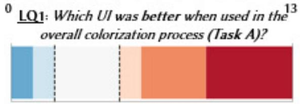

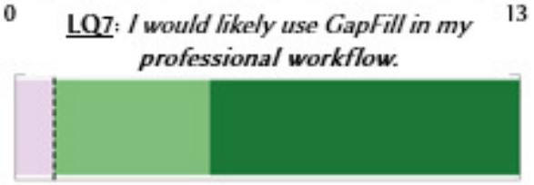

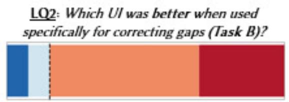

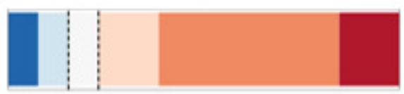

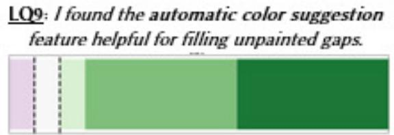

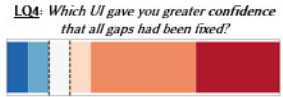

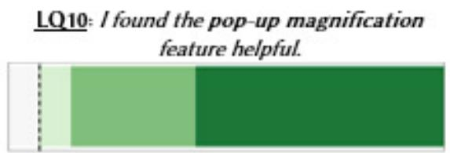

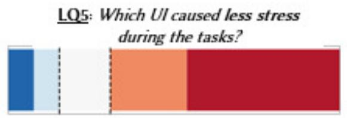

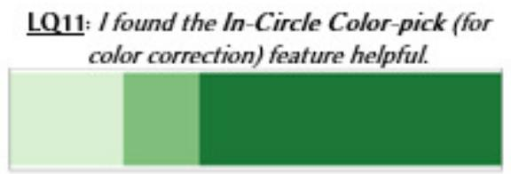

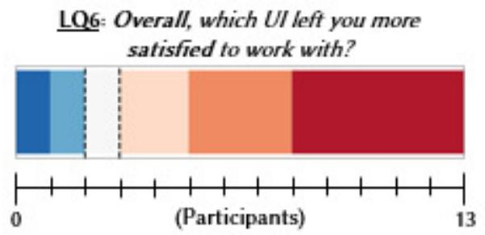

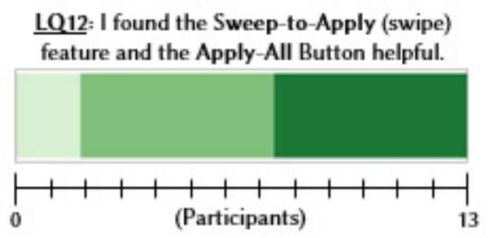  
Figure 13: Summary of responses to the 7-point Likert-scale items. LQ1–7 evaluate perceived usability, whereas LQ8–12 evaluate individual features.

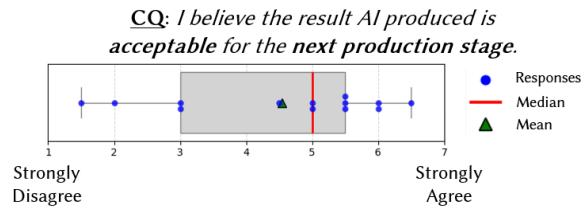  
Figure 14: Summary of responses to CQ (production accept ability), based on the median across four images (C1—C4).

In-Circle Color-pick. Based on LQ11, eight participants were very positive and all participants were positive toward this feature. P5– P8, P10, and P11 valued the ability to manually change the AI suggested color via an intuitive interaction (“I like the pop-up one where we can just drag to easily pick nearby colour andfill the gap.” (P7)). While P8 appreciated the dotted line for clarifying the substitution target, participants also suggested possible improvements. For instance, P4 commented that “in-circle color-picker could just be a hover-to-select rather than a drag-to-select one,” and P11 re marked that “for the color picker I prefer a color code show like the RGB code [. . . ] Because when the color is very close to each other it is so confusing,” both pointing to directions for future development.

Out-Circle Sweep-to-Apply and Apply-All Button. Based on LQ12, six participants were very positive and all participants were posi tive toward these features, appreciating the ability to apply colors at once instead of one by one. However, the strategy for applying predicted colors during the task varied. For example, P1, P2, P5, P8, P9, and P12 primarily used the magnified view to check and correct colors one by one, and then applied them all at once at the end with the Apply-All button (“I’m the guy to like just press one button ofone motion” (P1)). In contrast, P3, P10, and P11 tended to apply them in groups of clustered or neighboring highlights using the Sweep-to-Apply feature (“I very like Sweep-to-apply, it is very convenient and fast” (P3)). The remaining participants flexibly combined both approaches depending on the task, suggesting that the most appropriate application method may vary according to the number and distribution of unpainted gaps. However, P7 mentioned that “What could be improve may be the Sweep-to-Apply, I think like I missed to pick the colour sometimes”, which reflects their dissatisfaction with applying clustered highlights and subsequently having to correct the color manually using the Paint Bucket tool.

## 5.3 Evaluation of Our Color Prediction Method

5.3.1 Subjective Evaluation. To avoid pseudoreplication [28], we used the median of responses across four images (C1–C4, shown in Figure 11) as the representative score for each participant. The aggregated results are shown in Figure 14. For production acceptability (CQ), the responses were $M = 4 . 5 , S D = 1 . 6 , M d . = 5 .$ . The results indicate that our method received positive evaluations subjectively from a production perspective. However, the fact that direct application of predictions is impermissible underscores the strict standards of professional colorization. Qualitative feedback further supported these findings. P1, P2, P6, and P8–P12 appreciated the overall high accuracy, though they consistently noted that corrections were needed around the pupil (Figure 11), which is composed of small regions with diverse colors (“I think it’s accurate when the color is like in a large area. But like for the eyes it will have some problem” (P1)). However, P2, P6, P9, and P11 also emphasized that these corrections were minor and consistently localized, making them easy to address (“the part that requires fixing is so little and always the same part ofthe picture” (P11)).

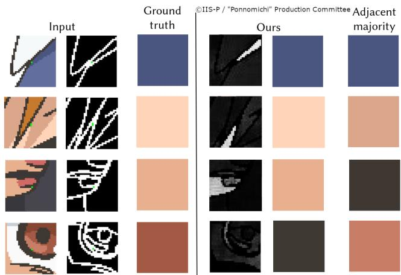  
Figure 15: Example comparison of color predictions for gaps (highlighted in green) between our method (with likelihood map) and a rule-based adjacent majority approach.

In considering whether anime viewers would even notice such minor inconsistencies, P6 reflected: “For me, I don’t think they will notice because the images after the production will end up being blurry [. . . ] In my opinion still very important to make things very neatly for our satisfaction and also for the viewers but if we are in a last minute rush then I think we can just give it to the next. Depends on the schedule.” This perspective illustrates that while small inaccuracies may not significantly impact the viewing experience, there remains a professional expectation for precision, balanced against practical production constraints. Taken together, these insights reinforce the acceptability of our method in production workflows. A more detailed discussion on how prediction accuracy for small gaps contributes to the usability of GapFill is provided in Section 6.1.

5.3.2 Objective Evaluation. We used a professional anime title that was not included in the training set and selected a single episode from it for objective evaluation. Unpainted gaps were defined as regions containing fewer than 10 pixels (same as the training pro cess), and accuracy was measured as the proportion of cases in which the predicted color exactly matched the ground truth. Since most existing automatic anime colorization methods require reference images, we compared our approach against a naive baseline: a rule-based greedy method that selects the majority color among the eight-connected neighboring pixels of the target region (Naive).

Our method achieved an accuracy of 81.68% (83,345/102,041), whereas the Naive baseline achieved 37.02% (37,776/102,041), as illustrated in Figure 15. These results demonstrate the efectiveness of our approach for color suggestion in unpainted gaps. Moreover, the average inference time per patch was 74ms on an NVIDIA RTX 6000 Ada Generation, indicating that the prediction speed is suficient to support real-time interaction.

## 6 Discussion and Future Work

## 6.1 Contribution of Color Prediction Accuracy to Production Tool Usability

Results showed that GapFill has high usability for gap-filling; participants consistently valued features such as clear gap visualization and user control over AI suggestions. However, as P5 remarked: “for the GapFill [. . . ] it’s already completed because it does what it supposed to do, and for the AI one for predicting the colors I would say I think it’s pretty good but some ofit still need to be minor fix by the painter,” suggesting that the accuracy of color prediction should be discussed independently in assessing usability. This dis tinction aligns with the recommendation by Remy et al. [58] to clearly define the goals and factors of evaluation for CSTs.

6.1.1 Accuracy as a Conditional Factor. Participants expressed differing views on how color prediction accuracy afects the usability of GapFill. Some considered errors acceptable if they could be easily corrected. For example, P9 stated, “There is some wrong colors [. . . ] but it can be easilyfixed using GapFill, just pick color then done.”, and P5 found the ability to manually modify AI outputs satisfying. This aligns with broader Human-AI collaboration literature indicating that granting decision control to users mitigates the impact of AI errors [68], thereby fostering acceptance of imperfect systems [37] and user trust [81].

In contrast, others emphasized that even small mistakes undermined trust: P3 noted, “when AI makes a mistake [. . . ] you can’t trust it anymore. I am scared there’s a wrong part,” while P10 stressed the need for greater consistency in its accuracy. This reflects algorithm aversion [18], where observing algorithmic errors causes a sharper confidence decline than human errors. Such reactions align with automation trust research suggesting that even a single visible mistake, particularly in easy tasks, can substantially reduce future trust [12, 42], stressing the significance of observed accuracy [87].

A more conditional stance was also proposed. P2 noted that results were generally reliable but still required double-checking around sensitive regions. Similarly, P6 and P11 pointed out that whether predictions could be accepted without correction often depends on production demands. This reality reflects the environmental Press in Rhodes [62]’s 4P model, where external constraints influence decision-making behaviors. Specifically, tight deadlines force practitioners to navigate a strategic accuracy-time tradeof [69], compromising the quality of visual inspection [63] while leaving insuficient final decision time for manual verification [9].

In summary, prediction accuracy may play a conditional role in usability: while suficient accuracy makes the tool practically valuable, its impact could be less than manual control over AI’s output and depends on both task sensitivity and production context. Minor errors are often tolerable if easily corrected, but inaccuracies in critical areas can erode trust. In other words, prediction accuracy alone is unlikely to determine the tool’s usability; rather, it is the combination with other features and contextual factors that matters.

6.1.2 Redefining “Accuracy” in Practice. Figure 16 shows that small gaps were occasionally filled with diferent neighboring colors across participants in Task A, yet the outcomes were visually indistinguishable. This raises the question of whether pixel-level accuracy is an appropriate metric for evaluation, and whether a definitive ground truth can be assumed in such cases, unlike standardized color specifications from model sheets. Indeed, some participants (P6, I1, and I4) believed that most anime viewers would not notice such subtle inconsistencies after post-production, and several prior studies have pointed out that straightforward error metrics are sometimes insuficient for assessing human perceptual quality [80, 92]. These observations suggest that minor errors in inconspicuous areas may have little impact on either production quality or viewer perception.

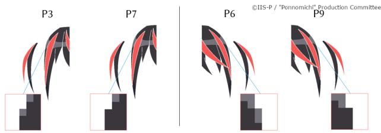  
Figure 16: Coloring results from Task A. As highlighted in the magnified view, participants occasionally used diferent colors when filling gaps.

Consequently, the contribution of prediction accuracy must be reconsidered in terms of where and when errors occur. If a gap is tiny and visually blended, any neighboring color may sufice, whereas inaccuracies at sharp boundaries or in semantically impor tant regions (e.g., the pupil) can seriously harm perceived quality. This perspective shifts the focus from absolute accuracy metrics to situational accuracy criteria that better capture real-world demands in production. This also aligns with the concept of recent co-creative AI frameworks, which argues that beyond algorithmic accuracy efective collaboration depends on high-quality, contextually appropriate interaction [59, 61].

6.1.3 Future Directions: Technical Improvements and Reconsidering Accuracy Definitions. First, from a technical perspective, improving accuracy in detailed regions, particularly the pupils, remains an im portant challenge. Potential solutions include leveraging reference images and neighboring frame information to enhance performance. Moreover, enabling robust prediction even when adjacent areas are sparsely colored would improve flexibility, surpassing current assumptions that require local context to be mostly filled. Supporting dynamic updates that reflect user-selected fill colors is also a key objective for enhancing usability.

Second, reconsidering the problem setting is essential to clarify when prediction accuracy for small gaps truly matters. While improving pixel-level accuracy for tiny regions is known to be dificult, it may be less critical if the visual result is perceptually identical to the ground truth. However, mistakes in critical regions, such as inside the eyes or at strong color boundaries, significantly degrade quality. Therefore, future investigations should examine conditions such as gap size, position, and surrounding contrast to determine viewer tolerance for approximate results. Defining these criteria will guide the design and evaluation of more efective AI-assisted anime colorization methods to meet real-world requirements.

## 6.2 Trust in AI-Powered Assistance for Colorists: Integration with Existing Tools

Our study demonstrated that GapFill ofers advantages for gapfilling tasks. The high appraisal for freely toggling GapFill and visualizing gaps via highlighting or magnified views aligns with the strategy of “view-shifts between component and composition” for creativity experts [23]. However, it also raises important questions about how professionals situate such new AI-powered tools within established practices and the extent to which they trust them.

6.2.1 Limits ofTrust in New AI-Powered Assistance. Despite the benefits of GapFill, some participants hesitated to rely solely on AI output. P3 double-checked their work even after all highlights disappeared due to concerns about AI reliability, P7 often manually selected the same color suggested by the AI, and P9 required the Black Light for a final check after using GapFill. These behaviors mirror friction in human collaborations, where establishing “trust in skills” precedes relinquishing control to a support actor [14], and likely reflect both limited professional familiarity with such tools and the high accountability required of colorists, consistent with observations that creative workers adopt emerging AI cautiously while balancing benefits against uncertainties [76]. This resonates with process views of human-AI collaboration, where trust must be actively managed over time rather than assumed after adoption [44].

Trust issues were also salient in visually sensitive regions, where minor mistakes can afect a character’s impression. As P4 noted, “if you miscolor the eye [. . . ] the shape will not be correct [. . . ] so usually we make sure the eye actually has the proper shape”, and concluded, “It can be the tool to exist but it cannot be the final product.” This echoes reports that AI outputs often lack nuance and require human expertise for final quality assurance [30]. Likewise, Grassini and Koivisto [26] show that while AI can produce semantically diverse ideas, human creative output is perceived as higher quality and nuance. Overall, these remarks underscore that while AI assistance can be useful, final accountability remains with human hands.

6.2.2 Toward Integration with Existing Tools. Crucially, several participants envisioned combining the two systems. P7 and P8 valued each system’s strengths depending on the task, concluding that combining both would be most useful. This aligns with Palani and Ramos [52], who found that creative workers prefer AI that supports tasks without disrupting ownership of their familiar process. Likewise, P2 remarked, “Best to combine [. . . ] I’m already used to painting with the brush-fill method, so not having that kind of slows my progress a bit.”, underscoring the transition cost between methods. In fact, AI-powered assistance can create friction when it conflicts with established routines [49] or increases the communication and interpretation burden associated with agentic AI outputs [25], highlighting the need to embed such systems into existing workflows and meet the role expectations.

These perspectives reflect a pragmatic stance: rather than replacing established practices, AI-powered tools may be most valuable when flexibly integrated into existing workflows, allowing professionals to benefit from the speed of automation while retaining trusted manual verification. Similarly, Uusitalo et al. [74] describe generative AI in design as “clay to play with”, a medium for rapid experimentation that preserves human authorship and control. Complementing this, Popova [54] advocate embedding AI into toolchains to augment established practices, supported by ongoing quality assurance and user education. From a broader workflow perspective, our findings suggest that GapFill has the potential to seamlessly complement existing tools by leveraging their strengths.

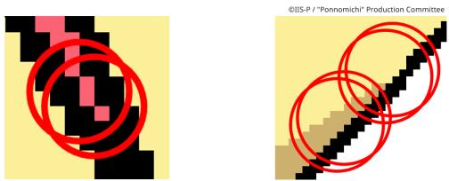  
Figure 17: Dense gap clusters cause visual clutter, with overlapping circles obscuring gap–highlight correspondence.

6.2.3 Future Directions: User Interface Improvements. Some professionals suggested that our system would be more readily adopted in production workflows if it were integrated with established practices such as Black Light Method, which are already familiar and trusted. Combining our method with other tools and leveraging their strengths at diferent stages of the process could further enhance usability. Thus, a tool designed to complement rather than replace existing methods may be crucial for practical adoption. In addition, usability can benefit from refinements to minor interface settings of GapFill, particularly those related to gap visualization. For example, clustered gaps (Figure 17) should be highlighted in a way that reduces overlap to improve the correspondence between gaps and highlights, and the temporary fill color should be made more distinguishable. Moreover, extending the system to handle unpainted gaps caused by anti-aliased line art (not only binary lines), would expand its applicability beyond anime production.

## 7 Conclusion

We addressed the underexplored challenge of small unpainted regions (“gaps”) in professional anime colorization workflows. Building on a formative study with industry practitioners, we developed GapFill, a specialized tool that integrates seamlessly into existing pipelines and reduces the efort required for gap detection, zooming, and color selection, supported by a deep learning method that leverages the flat-color characteristics of anime images and local cues. A user study with 13 professional colorists demonstrated significant eficiency gains in gap-filling tasks compared to existing tools, while also showing that usability may be driven by the combination of automatic detection and clear visualization of gaps, as well as user control over AI suggestions rather than prediction accuracy alone. We further found that appropriate gap-filling colors can be contextually ambiguous. From a broader workflow perspective, our findings suggest that GapFill has the potential to integrate with existing tools by leveraging their respective strengths, while also providing insights into professionals’ trust in new AI-powered assistance. Taken together, these contributions provide practical value for anime production and broader insights into the design of AIassisted creativity support tools that respect established practices while aiming at their gradual adoption in production contexts.

## Acknowledgments

This paper is based on results obtained from GENIAC (Generative AI Accelerator Challenge, a project to strengthen Japan’s generative AI development capabilities), a project implemented by the Ministry of Economy, Trade and Industry (METI) and the New Energy and Industrial Technology Development Organization (NEDO), Japan Grant Number JPNP20017. This work was also supported by JST, CRONOS, Japan Grant Number JPMJCS25K1. Finally, we thank the professional colorists at OLM Asia SDN BHD for their participation and valuable feedback in our formative and user studies, and we also express our sincere gratitude to the members of ©IIS-P/Ponnomichi Production Committee for kindly providing the image data.

## References

[1] Kenta Akita, Yuki Morimoto, and Reiji Tsuruno. 2020. Colorization of line drawings with empty pupils. In Computer Graphics Forum, Vol. 39. Wiley Online Library, 601–610.

[2] Benjamin Allen, Akinobu Maejima, and Ken Anjyo. 2024. Fast Leak-Resistant Seg mentation for Anime Line Art. In SIGGRAPHAsia 2024 Technical Communications. 1–4.

[3] Anime Chosashitsu (Kari) [Anime Research Lab (provisional)]. 2025. Ni-kuru mono ga fueta tte honto ka? (36) 2024-nen kakuhoban [Has Two-Cour Anime Really Increased? (36): Final Report for 2024]. Website. Retrieved September 11, 2025 from http://anime-research.seesaa.net/article/516525382.html in Japanese.

[4] Bin Bao and Hongbo Fu. 2019. Scribble-based colorization for creating smooth shaded vector graphics. Computers & Graphics 81 (2019), 73–81.

[5] Patrick Baudisch. 1998. Don’t Click–Paint! Applying the Painting Metaphor to Query Interfaces and Personalization. In Proceedings of UIST’98. 65–66.

[6] Luca Benedetti, Holger Winnemöller, Massimiliano Corsini, and Roberto Scopigno. 2014. Painting with Bob: assisted creativity for novices. In Proceedings of the 27th annual ACM symposium on User interface software and technology. 419–428.

[7] Nigel Bevan, James Carter, and Susan Harker. 2015. ISO 9241-11 revised: What have we learnt about usability since 1998?. In International conference on humancomputer interaction. Springer, 143–151.

[8] Charlotte Bird. 2024. Artists and AI: Creative Interactions and Tensions. In Extended Abstracts of the CHI Conference on Human Factors in Computing Systems. 1–6.

[9] Shiye Cao, Catalina Gomez, and Chien-Ming Huang. 2023. How time pressure in diferent phases of Decision-Making influences Human-AI collaboration. Proceedings ofthe ACM on Human-computer Interaction 7, CSCW2 (2023), 1–26.

[10] Yu Cao, Xiangqiao Meng, PY Mok, Tong-Yee Lee, Xueting Liu, and Ping Li. 2024. AnimeDifusion: Anime difusion colorization. IEEE Transactions on Visualization and Computer Graphics 30, 10 (2024), 6956–6969.

[11] Celsys. 2025. CLIP STUDIO PAINT. Website. Retrieved September 11, 2025 from https://www.clipstudio.net.

[12] Carolina Centeio Jorge, Nikki H Bouman, Catholijn M Jonker, and Myrthe L Tielman. 2023. Exploring the efect of automation failure on the human’s trustworthiness in human-agent teamwork. Frontiers in Robotics and AI 10 (2023), 1143723.

[13] Parmit K Chilana, Amy J Ko, and Jacob Wobbrock. 2015. From user-centered to adoption-centered design: a case study of an HCI research innovation becoming a product. In Proceedings ofthe 33rd Annual ACM Conference on Human Factors in Computing Systems. 1749–1758.

[14] John Joon Young Chung, Shiqing He, and Eytan Adar. 2022. Artist support networks: Implications for future creativity support tools. In Proceedings ofthe 2022 ACM Designing Interactive Systems Conference. 232–246.

[15] Yuanzheng Ci, Xinzhu Ma, Zhihui Wang, Haojie Li, and Zhongxuan Luo. 2018. User-guided deep anime line art colorization with conditional adversarial networks. In Proceedings ofthe 26th ACM international conference on Multimedia. 1536–1544.

[16] Ian Condry. 2013. The soul of anime: Collaborative creativity and Japan’s media success story. Duke University Press.

[17] Yuekun Dai, Shangchen Zhou, Qinyue Li, Chongyi Li, and Chen Change Loy. 2024. Learning inclusion matching for animation paint bucket colorization. In Proceedings of the IEEE/CVF Conference on Computer Vision and Pattern Recognition. 25544–25553.

[18] Berkeley J Dietvorst, Joseph P Simmons, and Cade Massey. 2015. Algorithm aversion: people erroneously avoid algorithms after seeing them err. Journal of experimental psychology: General 144, 1 (2015), 114.

[19] Yiming Dong, Hongxu Xin, Zhiyang Dou, Rui Xu, Yuan Liu, Shuangmin Chen, Shiqing Xin, Changhe Tu, Taku Komura, and Wenping Wang. 2025. KISSColor:

Kinetic and Intuitive Stroke Stretching for Vector Drawing Colorization. ACM Transactions on Graphics (TOG) ( )

[20] Judith E Fan, Monica Dinculescu, and David Ha. 2019. Collabdraw: an environment for collaborative sketching with an artificial agent. In Proceedings of the 2019 Conference on Creativity and Cognition. 556–561.

[21] Sébastien Fourey, David Tschumperlé, and David Revoy. 2018. A fast and eficient semi-guided algorithm for flat coloring line-arts. In International Symposium on Vision, Modeling and Visualization.

[22] Jonas Frich, Michael Mose Biskjaer, and Peter Dalsgaard. 2018. Why HCI and creativity research must collaborate to develop new creativity support tools. In Proceedings ofthe Technology, Mind, and Society. 1–6.

[23] Jonas Frich, Michael Mose Biskjaer, Lindsay MacDonald Vermeulen, Christian Remy, and Peter Dalsgaard. 2019. Strategies in Creative Professionals’ Use of Digital Tools Across Domains. In Proceedings ofthe 2019 Conference on Creativity and Cognition. 210–221.

[24] Jonas Frich, Lindsay MacDonald Vermeulen, Christian Remy, Michael Mose Biskjaer, and Peter Dalsgaard. 2019. Mapping the landscape of creativity support tools in HCI. In Proceedings of the 2019 CHI conference on human factors in computing systems. 1–18.

[25] Frederic Gmeiner, Humphrey Yang, Lining Yao, Kenneth Holstein, and Nikolas Martelaro. 2023. Exploring challenges and opportunities to support designers in learning to co-create with AI-based manufacturing design tools. In Proceedings ofthe 2023 CHI Conference on Human Factors in Computing Systems. 1–20.

[26] Simone Grassini and Mika Koivisto. 2025. Artificial creativity? Evaluating AI against human performance in creative interpretation of visual stimuli. International journal of human–computer interaction 41, 7 (2025), 4037–4048.

[27] Zhengyu Huang, Haoran Xie, Tsukasa Fukusato, and Kazunori Miyata. 2023. Anifacedrawing: Anime portrait exploration during your sketching. In ACM SIGGRAPH 2023 conference proceedings. 1–11.

[28] Stuart H Hurlbert. 1984. Pseudoreplication and the design of ecological field experiments. Ecological monographs 54, 2 (1984), 187–211.

[29] Takeyasu Ichikohji. 2013. The Influence of Introducing IT into Production System A Case ofJapanese Animation (Anime) Industry. Annals ofBusiness Administrative Science 12, 4 (2013), 181–197.

[30] Nanna Inie, Jeanette Falk, and Steve Tanimoto. 2023. Designing participatory ai: Creative professionals’ worries and expectations about generative ai. In Extended Abstracts of the 2023 CHI Conference on Human Factors in Computing Systems. 1–8.

[31] Daichi Ishii, Hiroyuki Kubo, Seitaro Shinagawa, Akinobu Maejima, Takuya Fu natomi, Satoshi Nakamura, and Yasuhiro Mukaigawa. 2020. Confidence-aware practical anime-style colorization. In Special Interest Group on Computer Graphics and Interactive Techniques Conference Talks. 1–2.

[32] Ghita Jalal, Nolwenn Maudet, and Wendy E Mackay. 2015. Color portraits: From color picking to interacting with color. In Proceedings ofthe 33rd Annual ACM Conference on Human Factors in Computing Systems. 4207–4216.

[33] Yoshihiro Kanamori. 2012. Region matching with proxy ellipses for coloring hand-drawn animations. In SIGGRAPH Asia 2012 Technical Briefs. 1–4.

[34] Jun Kato, Kenta Hara, and Nao Hirasawa. 2024. Grifith: A Storyboarding Tool Designed with Japanese Animation Professionals. In Proceedings ofthe 2024 CHI Conference on Human Factors in Computing Systems. 1–14.

[35] Jun Kato, Yuki Koyama, Akinobu Maejima, Ryotaro Mihara, and Katie Seaborn. 2025. Anime SIG: Researching Japanese Animation From Technical, Cultural, and Industrial Perspectives. In Proceedings ofthe Extended Abstracts ofthe CHI Conference on Human Factors in Computing Systems. 1–3.

[36] Eunseo Kim, Jeongmin Hong, Hyuna Lee, and Minsam Ko. 2022. Colorbo: Envisioned mandala coloringthrough human-ai collaboration. In Proceedings ofthe 27th International Conference on Intelligent User Interfaces. 15–26.

[37] Rafal Kocielnik, Saleema Amershi, and Paul N Bennett. 2019. Will you accept an imperfect ai? exploring designs for adjusting end-user expectations of ai systems. In Proceedings ofthe 2019 CHI conference on human factors in computing systems. 1–14.

[38] Jonathan Lazar,Jinjuan Heidi Feng, and Harry Hochheiser. 2017. Research methods in human-computer interaction. Morgan Kaufmann.

[39] Antonios Liapis and Jichen Zhu. 2022. The Need for Explainability in AI-Based Creativity Support Tools. In Proceedings of the Human Centered AI workshop at NeurIPS 2022.

[40] Rensis Likert. 1932. A technique for the measurement of attitudes. Archives of psychology (1932).

[41] Zhiheng Liu, Ka Leong Cheng, Xi Chen, Jie Xiao, Hao Ouyang, Kai Zhu, Yu Liu, Yujun Shen, Qifeng Chen, and Ping Luo. 2025. Manganinja: Line art colorization with precise reference following. In Proceedings of the Computer Vision and Pattern Recognition Conference. 5666–5677.

[42] Poornima Madhavan, Douglas A Wiegmann, and Frank C Lacson. 2006. Automation failures on tasks easily performed by operators undermine trust in automated aids. Human factors 48, 2 (2006), 241–256.

[43] Akinobu Maejima, Seitaro Shinagawa, Hiroyuki Kubo, Takuya Funatomi, Tatsuo Yotsukura, Satoshi Nakamura, and Yasuhiro Mukaigawa. 2024. Continual fewshot patch-based learning for anime-style colorization. Computational Visual

Media 10, 4 (2024), 705–723.

[44] MelanieJ McGrath, Andreas Duenser,Justine Lacey, and Cecile Paris. 2025. Collaborative human-AI trust (CHAI-T): A process framework for active management of trust in human-AI collaboration. Computers in Human Behavior: Artificial Humans (2025), 100200.

[45] Ryotaro Mihara. 2020. A Coming of Age in the Anthropological Study of Anime?: Introductory Thoughts Envisioning the Business Anthropology of Japanese Animation. Journal of Business Anthropology 9, 1 (2020), 88–110.

[46] Tomohiro Morisawa. 2015. Managing the unmanageable: Emotional labour and creative hierarchy in the Japanese animation industry. Ethnography 16, 2 (2015), 262–284.

[47] Ltd. MyAnimeList Co. 2025. MyAnimeList. Website. Retrieved September 11, 2025 from https://myanimelist.net.

[48] The Association of Japanese Animation. 2025. Anime Industry Report 2024 Summary\_20250321. Website. Retrieved September 11, 2025 from https://aja.gr.jp/download/anime-industry-report-2024-summary\_20250321.

[49] Nami Ogawa, Yuki Okafuji, Yuji Hatada, and Jun Baba. 2025. Understanding Collaboration between Professional Designers and Decision-making AI: A Case Study in the Workplace. Proc. ACM Hum.-Comput. Interact. 9, 7, Article CSCW505 (Oct. 2025), 26 pages. doi:10.1145/3757686

[50] Changhoon Oh, Jungwoo Song, Jinhan Choi, Seonghyeon Kim, Sungwoo Lee, and Bongwon Suh. 2018. I lead, you help but only with enough details: Understanding user experience of co-creation with artificial intelligence. In Proceedings ofthe 2018 CHI conference on human factors in computing systems. 1–13.

[51] Takashi Otsuka, Takayuki Hotta, and Yasuaki Funayama. 2022. Anime ga Dekiru made [The Making ofAnime]. Asukashinsha.

[52] Srishti Palani and Gonzalo Ramos. 2024. Evolving roles and workflows of creative practitioners in the age of generative AI. In Proceedings ofthe 16th Conference on Creativity & Cognition. 170–184.

[53] Yuying Pei, Linlin Wang, and Chengqi Xue. 2024. Human–AI Co-Drawing: Studying Creative Eficacy and Eye Tracking in Observation and Cooperation. Applied Sciences 14, 18 (2024), 8203.

[54] Victoria Popova. 2023. Co-creating Futures for Integrating Generative AI into the Designers’ Workflow.

[55] Preferred Networks, Inc., Taizan Yonetsuji. 2017. PaintsChainer. https://github. com/pfnet/PaintsChainer.

[56] Yingge Qu, Tien-Tsin Wong, and Pheng-Ann Heng. 2006. Manga colorization. ACM Transactions on Graphics (ToG) 25, 3 (2006), 1214–1220.

[57] Gaurav Rai and Ojaswa Sharma. 2025. Sketch Animation: State-of-the-art Report. arXiv:2510.10218 [cs.GR] https://arxiv.org/abs/2510.10218

[58] Christian Remy, Lindsay MacDonald Vermeulen, Jonas Frich, Michael Mose Biskjaer, and Peter Dalsgaard. 2020. Evaluating creativity support tools in HCI research. In Proceedings of the 2020 ACM designing interactive systems conference. 457–476.

[59] Jeba Rezwana and Mary Lou Maher. 2021. COFI: A Framework for Modeling Interaction in Human-AI Co-Creative Systems.. In ICCC. 444–448.

[60] Jeba Rezwana and Mary Lou Maher. 2022. Understanding user perceptions, collaborative experience and user engagement in diferent human-AI interaction designs for co-creative systems. In Proceedings of the 14th Conference on Creativity and Cognition. 38–48.

[61] Jeba Rezwana and Mary Lou Maher. 2023. Designing creative AI partners with COFI: A framework for modeling interaction in human-AI co-creative systems. ACM Transactions on Computer-Human Interaction 30, 5 (2023), 1–28.

[62] Mel Rhodes. 1961. An analysis of creativity. The Phi delta kappan 42, 7 (1961), 305–310.

[63] Tobias Rieger and Dietrich Manzey. 2022. Human performance consequences of automated decision aids: The impact of time pressure. Human factors 64, 4 (2022), 617–634.

[64] Olaf Ronneberger, Philipp Fischer, and Thomas Brox. 2015. U-net: Convolutional networks for biomedical image segmentation. In International Conference on Medical image computing and computer-assisted intervention. Springer, 234–241.

[65] Quentin Roy, Futian Zhang, and Daniel Vogel. 2019. Automation accuracy is good, but high controllability may be better. In Proceedings ofthe 2019 CHI Conference on Human Factors in Computing Systems. 1–8.

[66] Kazuhiro Sato, Yusuke Matsui, Toshihiko Yamasaki, and Kiyoharu Aizawa. 2014. Reference-based manga colorization by graph correspondence using quadratic programming. In SIGGRAPH Asia 2014 Technical Briefs. 1–4.

[67] Ben Shneiderman. 2007. Creativity support tools: accelerating discovery and innovation. Commun. ACM 50, 12 (2007), 20–32.

[68] Saloni Singh, Koen Hindriks, Dirk Heylen, and Kim Baraka. 2025. A Systematic Review of Human-AI Co-Creativity. arXiv preprint arXiv:2506.21333 (2025).

[69] Siddharth Swaroop, Zana Buçinca, Krzysztof Z Gajos, and Finale Doshi-Velez. 2024. Accuracy-time tradeofs in AI-assisted decision making under time pressure. In Proceedings of the 29th International Conference on Intelligent User Interfaces. 138–154.

[70] Daniel Sykora, John Dingliana, and Steven Collins. 2009. Lazybrush: Flexible \` painting tool for hand-drawn cartoons. In Computer Graphics Forum, Vol. 28. Wiley Online Library, 599–608.

[71] Yunlong Tang, Junjia Guo, Pinxin Liu, Zhiyuan Wang, Hang Hua, Jia-Xing Zhong, Yunzhong Xiao, Chao Huang, Luchuan Song, Susan Liang, et al. 2025. Generative ai for cel-animation: A survey. arXiv preprint arXiv:2501.06250 (2025).

[72] Hideki Todo, Yuki Koyama, Kunihiro Sakai, Akihiro Komiya, and Jun Kato. 2024. A Practical Style Transfer Pipeline for 3D Animation: Insights from Production R&D. In SIGGRAPH Asia 2024 Technical Communications. 1–4.

[73] John Wilder Tukey et al. 1977. Exploratory data analysis. Vol. 2. Springer.

[74] Severi Uusitalo, Antti Salovaara, Tero Jokela, and Marja Salmimaa. 2024. ” Clay to Play With”: Generative AI Tools in UX and Industrial Design Practice. In Proceedings ofthe 2024 ACM Designing Interactive Systems Conference. 1566–1578.

[75] Marnix Verduyn, Tinne Tuytelaars, et al. 2024. Towards Flat Color Prediction for Comics. In AI for Visual Arts Workshop at the European Conference on Computer Vision 2024, Date: 2024/09/29-2024/10/04, Location: Milano, Italy.

[76] Veera Vimpari, Annakaisa Kultima, Perttu Hämäläinen, and Christian Guckelsberger. 2023. “An adapt-or-die type of situation”: perception, adoption, and use of text-to-image-generation AI by game industry professionals. Proceedings of the ACM on Human-Computer Interaction 7, CHI PLAY (2023), 131–164.

[77] Daniel Vogel and Patrick Baudisch. 2007. Shift: a technique for operating penbased interfaces using touch. In Proceedings ofthe SIGCHI conference on Human factors in computing systems. 657–666.

[78] Boyang Wang, Fengyu Yang, Xihang Yu, Chao Zhang, and Hanbin Zhao. 2024. Apisr: Anime production inspired real-world anime super-resolution. In Proceedings ofthe IEEE/CVF Conference on Computer Vision and Pattern Recognition. 25574–25584.

[79] Wen-Fan Wang, Chien-Ting Lu, Jin Ping Ng, Yi-Ting Chiu, Ting-Ying Lee, Miaosen Wang, Bing-Yu Chen, and Xiang’Anthony’ Chen. 2025. AnimAgents: Coordinating Multi-Stage Animation Pre-Production with Human-Multi-Agent Collaboration. arXiv preprint arXiv:2511.17906 (2025).

[80] Zhou Wang and Alan C Bovik. 2009. Mean squared error: Love it or leave it? A new look at signal fidelity measures. IEEE signal processing magazine 26, 1 (2009), 98–117.

[81] Monika Westphal, Michael Vössing, Gerhard Satzger, Galit B Yom-Tov, and Anat Rafaeli. 2023. Decision control and explanations in human-AI collaboration: Improving user perceptions and compliance. Computers in Human Behavior 144 (2023), 107714.

[82] Robert F Woolson. 2007. Wilcoxon signed-rank test. Wiley encyclopedia of clinical trials (2007), 1–3.

[83] Jinbo Xing, Hanyuan Liu, Menghan Xia, Yong Zhang, Xintao Wang, Ying Shan, and Tien-Tsin Wong. 2024. Tooncrafter: Generative cartoon interpolation. ACM Transactions on Graphics (TOG) 43, 6 (2024), 1–11.

[84] Junping Xu, Xiaolin Zhang, Hui Li, Chaemoon Yoo, and Younghwan Pan. 2023. Is everyone an artist? A study on user experience of AI-based painting system. Applied Sciences 13, 11 (2023), 6496.

[85] Chuan Yan, John Joon Young Chung, Yoon Kiheon, Yotam Gingold, Eytan Adar, and Sungsoo Ray Hong. 2022. FlatMagic: Improving flat colorization through AI-driven design for digital comic professionals. In Proceedings ofthe 2022 CHI conference on human factors in computing systems. 1–17.

[86] Dingkun Yan, Xinrui Wang, Zhuoru Li, Suguru Saito, Yusuke Iwasawa, Yutaka Matsuo, and Jiaxian Guo. 2025. Image Referenced Sketch Colorization Based on Animation Creation Workflow. In Proceedings ofthe Computer Vision and Pattern Recognition Conference. 23391–23400.

[87] Ming Yin, Jennifer Wortman Vaughan, and Hanna Wallach. 2019. Understanding the efect of accuracy on trust in machine learning models. In Proceedings ofthe 2019 chi conference on human factors in computing systems. 1–12.

[88] Masao Yokota (Ed.). 2019. Animeshon no Shinrigaku [The Psychology ofAnimation]¯ . Seishin Shobo.¯

[89] Lvmin Zhang, Yi Ji, Xin Lin, and Chunping Liu. 2017. Style transfer for anime sketches with enhanced residual u-net and auxiliary classifier gan. In 2017 4th IAPR Asian conference on pattern recognition (ACPR). IEEE, 506–511.

[90] Lvmin Zhang, Chengze Li, Edgar Simo-Serra, Yi Ji, Tien-Tsin Wong, and Chunping Liu. 2021. User-guided line art flat filling with split filling mechanism. In Proceedings ofthe IEEE/CVF conference on computer vision and pattern recognition. 9889–9898.

[91] Lvmin Zhang, Chengze Li, Tien-Tsin Wong, Yi Ji, and Chunping Liu. 2018. Twostage sketch colorization. ACM Transactions on Graphics (TOG) 37, 6 (2018), 1–14.

[92] Richard Zhang, Phillip Isola, Alexei A Efros, Eli Shechtman, and Oliver Wang. 2018. The unreasonable efectiveness of deep features as a perceptual metric. In Proceedings of the IEEE conference on computer vision and pattern recognition. 586–595.

[93] Song-Hai Zhang, Tao Chen, Yi-Fei Zhang, Shi-Min Hu, and Ralph R Martin. 2009. Vectorizing cartoon animations. IEEE Transactions on Visualization and Computer Graphics 15, 4 (2009), 618–629.

[94] Xiaobo Zhang, Donghai Zhai, Tianrui Li, Yuxin Zhou, and Yang Lin. 2023. Image inpainting based on deep learning: A review. Information Fusion 90 (2023), 74–94.

[95] Changqing Zou, Haoran Mo, Chengying Gao, Ruofei Du, and Hongbo Fu. 2019. Language-based colorization of scene sketches. ACM Transactions on Graphics (TOG) 38, 6 (2019), 1–16.

## A Analyses of Enclosed Regions in Anime Images

To investigate the characteristics of enclosed regions in animestyle images, we performed a flood-fill-based (BFS) segmentation over all frames in our dataset (51, 892 frames from 12 episodes of a professionally produced anime series). We analyzed three aspects: the number of regions, their size distribution, and the distance of small regions to large regions of the same color.

## A.1 Number of Enclosed Regions

Figure 18a shows an example of the segmentation process, while Fig ure 18b presents the distribution of the number of enclosed regions across all frames. On average, each frame contained 115 enclosed regions, with a median of 89. This indicates that anime images typically include a large number of enclosed areas.

## A.2 Region Size Distribution

We next examined the distribution of region sizes, measured in pixels. Figure 19a shows the frequency of each size. We observed that regions of size 10 pixels or smaller occur in suficient numbers (approximately 54%), which motivated our initial definition of “small regions” as those with under 10 pixels when considering potential unpainted gaps.

## A.3 Distance to Large Same-Color Regions

Finally, we investigated how small regions (size ≤ 10) relate to larger regions of the same color. We computed the $L _ { 1 }$ distance between each small region and its nearest large same-color region, based on the closest pair of pixels between them (Figure 19b). The cumulative distribution reveals that the vast majority of small regions (approximately 90%) have a same-color large region within a distance of 10 pixels. This confirms the tendency observed in the formative study that small enclosed regions often share the same color with their spatially neighboring areas.

## B Supplementary Statistical Analysis

We conducted a one-sided paired �-test as a supplementary analysis to reinforce the primary findings for the user study. Figure 20 visualizes the paired diferences for each participant.

For Task A, the mean diference was −2.33 (�� = 16.26, 99% CI [−16.91, 12.24]), and the �-test showed no significant diference $( t ( 1 1 ) = - 0 . 4 9 7 , p = . 3 1 4 4 0 )$ . For Task B1, the mean diference was −12.54 (�� = 11.30, 99% CI [−22.11, −2.96]), showing a significant reduction in time (�(12) = −3.999, � = .00088). For Task B2, the mean diference was −14.36 (�� = 12.73, 99% CI [−26.53, −2.20]), also indicating a significant reduction $( t ( 1 0 ) = - 3 . 7 4 2 , p = . 0 0 1 9 2 )$

enclosed regions (per image)  
©IIS-P / "Ponnomichi" Production Committee  
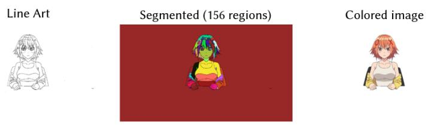  
(a) Example of segmenting an image into enclosed regions

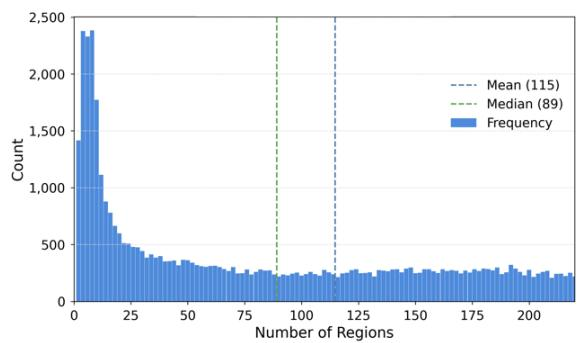  
(b) Distribution of the number of

Figure 18: (a) Example of segmenting an image into enclosed regions and (b) the distribution of the number of enclosed regions (per image) across all frames of an anime.  
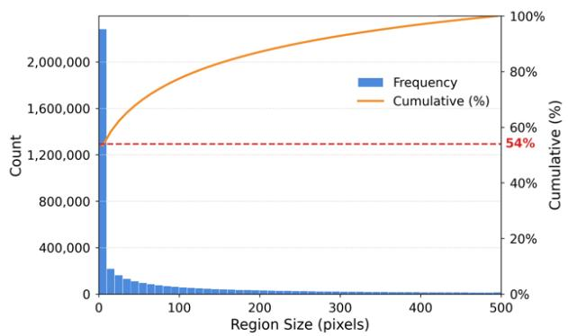  
(a) Distribution of the size of all enclosed regions

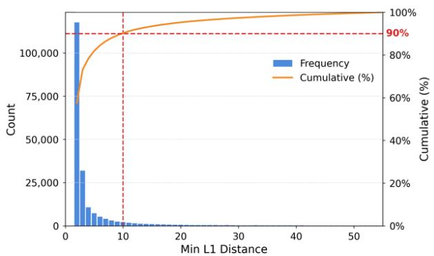  
(b) Distribution of the $L _ { 1 }$ distance from a  
small region to its closest large same-color region

Figure 19: (a) The size distribution of all enclosed regions, and (b) the distribution of the $L _ { 1 }$ distance from regions smaller than 10 pixels to their closest large region of the same color.  
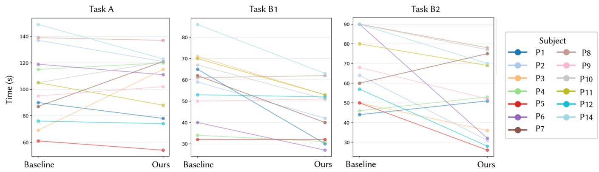  
Figure 20: Visualization of paired diferences for each participant.