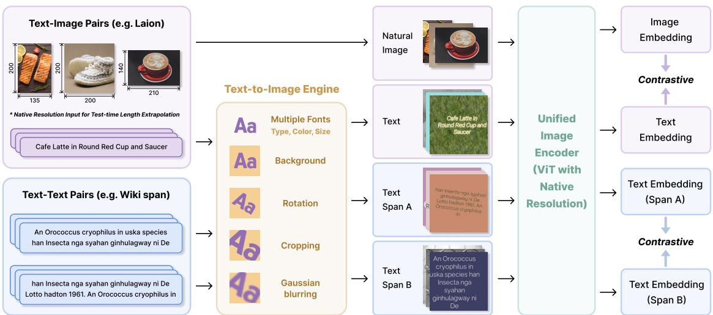
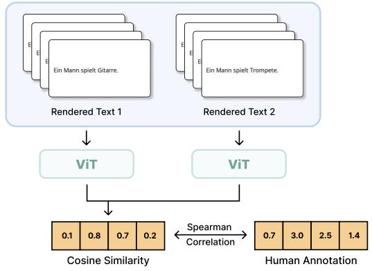
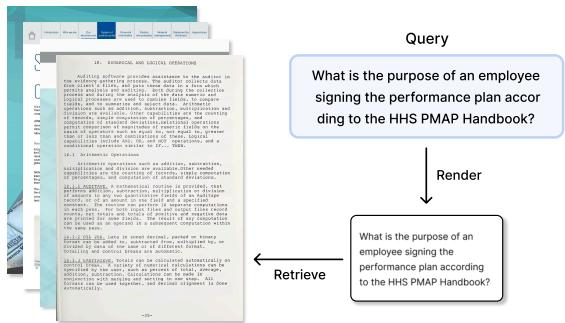
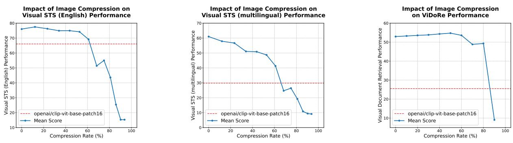
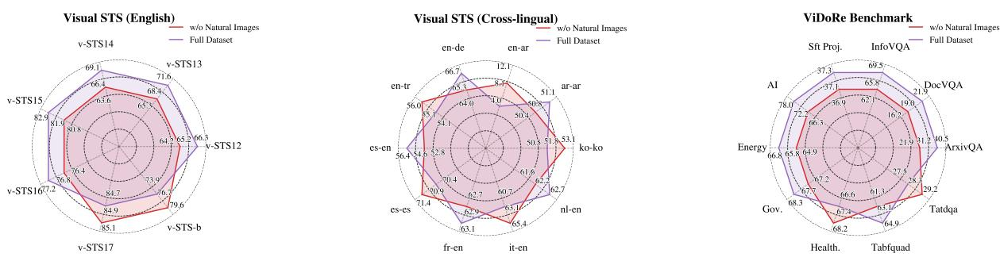
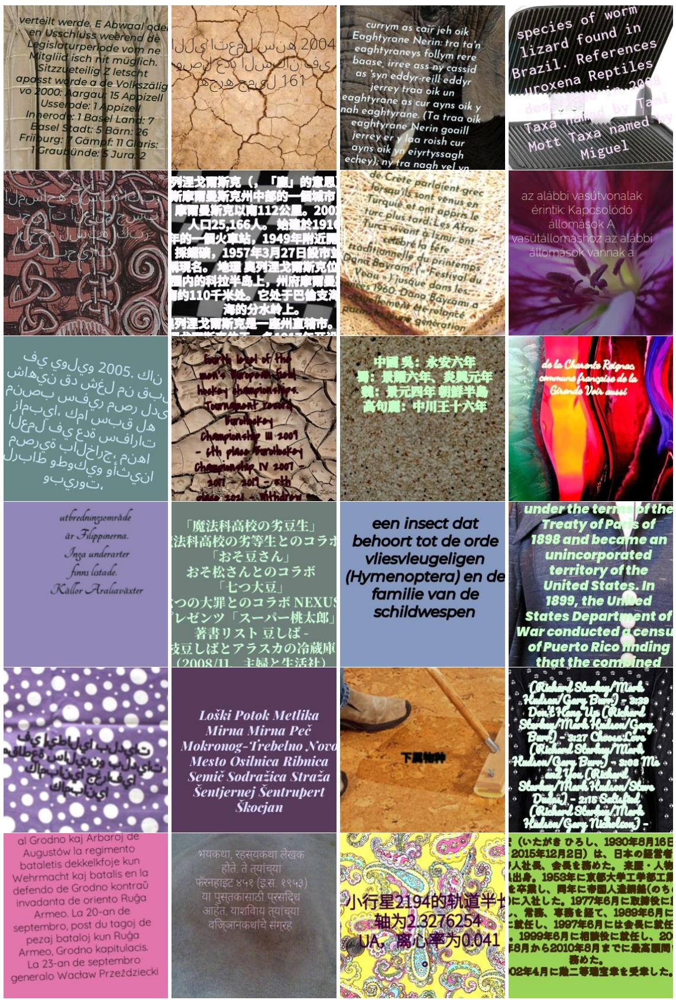

# On the Design Fundamentals of Pixel Text Representation Learning

Chaohao Yuan1,2\* Ruifeng Yuan2,3\* Zhuoxu Huang4\* Yu Rong2,5 Hong Cheng1 Hou Pong Chan6† Chenghao Xiao7†

1The Chinese University of Hong Kong 2DAMO Academy, Alibaba Group 3Fudan University 4Aberystwyth University 5Hupan Lab 6University of Macau 7Shanghai University of Finance and Economics

## Abstract

Text-rich visual inputs require models that can read, retrieve, and compress language directly in pixel space, yet existing pixel-text encoders struggle with fixed resolution pretraining, visual shortcut learning, weak visual ground ing, and multilingual visual text understanding. In this work, we investigate the funda mental design principles required for robust visual text representation learning. Through systematic controlled ablations, we identify four critical components: variable image resolutions and rendered font sizes provide spatial proxies for high-resolution document generalization; natural image-text pairs are indispensable for grounding and prevent text only collapse; layout-aware rendering helps prevent pixel-level shortcuts; and a two-stage multilingual curriculum enables effective crosslingual alignment. By integrating these principles into a scalable training recipe, we train PIXEL LINGUIST II, a native-resolution vision encoder trained with on-the-fly rendering, unified contrastive grounding, and a multilingual curriculum over 280M training examples. PIXEL LINGUIST II sets new state-ofthe-art results on English, cross-lingual, and multilingual Visual STS and ViDoRe, while also enabling better MLLM downstream eval uation. Notably, PIXEL LINGUIST II remains robust under 80% visual token compression, showing great promise for optical context compression. Our code and resources are avail able at https://github.com/Pixel-Linguist/Pixel-Linguist-II.

## 1 Introduction

Vision-language representation learning has become central to cross-modal retrieval and retrievalaugmented generation (RAG). While dual-encoder models excel on natural images and short captions, they are less suited to text-rich visual inputs, such as documents, infographics, and charts, where retrieval requires fine-grained reading, layout understanding, and document-level semantics.

Pixel-based text representation learning offers a unified alternative: rendering text directly as RGB images and encode both natural images and rendered text with a single vision encoder. Prior work has progressively shown that ViT encoders can learn language representations from pixel inputs (Rust et al., 2022), that contrastive learning improves their discriminability (Tschannen et al., 2023), and that scaled rendered-text training enables visual, topical, reasoning, and cross-lingual alignment (Xiao et al., 2024). Despite this progress, robust pixel-based text representation learning still hinges on four coupled challenges: resolution mismatch, visual shortcut learning, multimodal grounding, and multilingual visual text perception. These axes determine whether a visual text encoder can move beyond synthetic rendered snippets to real-world document understanding.

Instead of simply scaling data and parameters, we ask: What are the essential design principles required to learn generalized visual text representations? Our controlled ablations answer this question through four research questions:

RQ1: How can computationally efficient low-resolution pretraining generalize to highresolution documents at inference? We find that variable natural-image resolutions and rendered font sizes act as spatial proxies, allowing smallcanvas pretraining to extrapolate to dense, highresolution documents.

RQ2: What role does multimodal grounding play in visual text representation learning? Natural image-text pairs remain necessary even for text-centric targets: removing them causes severe dense document retrieval degradation, while joint training grounds text semantics in real-world visual contexts.

RQ3: How does layout diversity in text rendering affect representation quality? Fixed fonts and plain canvases trigger pixel-level shortcut learning and near-collapse in document retrieval, showing that text rendering with diverse layouts is critical for semantic transfer.

RQ4: What training curriculum is required for multilingual pixel-space semantics? We find that a two-stage curriculum works best: large-scale unsupervised multilingual pretraining builds foundational capability for multilingual visual text perception, which is then activated and aligned across languages through semantic mid-training.

Building on these findings, we scale the design principles into a concrete training recipe for pixelbased text representation learning. We propose PIXEL LINGUIST II, a unified pixel-based visionlanguage representation framework for robust understanding of text in the visual modality. As illustrated in Figure 1, PIXEL LINGUIST II combines four components:

1. Layout-aware visual augmentation renders text on the fly with diverse fonts, backgrounds, spatial arrangements, and visual perturbations, encouraging the model to encode semantics rather than memorizing superficial appearances.

2. Native-resolution encoding adopts a Nativeresolution Vision Transformer (NaViT) architecture (Dehghani et al., 2023; Bai et al., 2025) that supports variable image resolutions and aspect ratios. This design, when combined with our data pre-processing engine, enables the model to learn robust semantic extrapolation to extremely high-resolution inputs at test time.

3. Unified contrastive grounding jointly trains on natural image-text pairs and rendered text-text pairs under a single contrastive objective, learning text semantics in the visual modality while grounding them in real-world visual concepts.

4. A multilingual training curriculum scales learning to 280M examples through a two-stage pipeline: massive unsupervised multilingual visual text pretraining followed by high-quality semantic mid-training.

Extensive experiments validate both the design analysis and the resulting model. PIXEL LIN-GUIST II sets new state-of-the-art results across English, cross-lingual, and multilingual Visual STS benchmarks, achieves strong performance on the challenging ViDoRe visual document retrieval benchmark, and improves downstream performance when used as the vision encoder in multimodal large language models. Notably, visual text representations of PIXEL LINGUIST II remain robust even when up to 80% of visual tokens are compressed.

## 2 Design Fundamentals of Pixel Text Representation Learning

While unified visual text encoding offers a highly elegant architecture, current vision encoders remain constrained by fundamental bottlenecks: inflexible fixed-resolution processing, a lack of realworld multimodal grounding, and severe sensitivity to visual appearances.

To overcome these limitations, we explore essential design principles required to learn generalized, real-world visual text representations. Before running a massive-scale pretraining (Section 3), we first devise a number of controlled pretraining experiments using a compact 13M-example ablation dataset consisting of natural images and rendered text, resulting in four deisgn fundamentals for generalized visual text representation learning.

## 2.1 The Resolution Paradox and Spatial Proxies

A central challenge in pixel-based text encoding is the discrepancy between training and inference resolutions. Processing dense, high-resolution documents (e.g., 4K PDFs) requires encoding massive amounts of spatial information, yet pretraining is typically constrained to smaller, fixed-size canvases (e.g., 224×224 pixels) for computational efficiency. This contradiction prompts our first inquiry:

RQ1: How can a fixed-resolution canvas in training generalize to high-resolution documents in inference?

We hypothesize that computationally prohibitive high-resolution pretraining might not be strictly necessary if the network can learn the underlying concept of spatial scale through alternative means. To test this, we explore whether two factors— resolutions in natural images and variable font sizes in rendered text—can act as effective “spatial proxies” that enable the model to generalize to highresolution documents without directly training on them. We ablate these variables during pretraining and evaluate the resulting models on resolutionsensitive document retrieval tasks (summarized in the top section of Table 1).

Figure 1: Overview of PIXEL LINGUIST II. We construct two types of training data: natural image–text pairs and text–text pairs. Textual inputs are rendered on-the-fly into images with diverse layouts using a text-to-image rendering engine. A native-resolution ViT encodes both natural images and rendered visual text within a unified pixel space. The model is trained by a contrastive learning objective.
<table><tr><td>Pretraining Setting</td><td>Data Type</td><td>Examples</td><td>Batch Size</td><td>ArxivQA</td><td>InfoVQA</td><td>TabFQuad</td><td>TatDQA</td><td>Average</td></tr><tr><td colspan="9">Spatial Proxies (See Sec. 2.1)</td></tr><tr><td>Full Components</td><td>Nat. Image + Ren. Text</td><td>13M</td><td>12288</td><td>14.99</td><td>56.69</td><td>56.05</td><td>23.60</td><td>37.83</td></tr><tr><td>Fixed Image Size (224 × 224)</td><td>Nat. Image + Ren. Text</td><td>13M</td><td>12288</td><td>9.61</td><td>46.33</td><td>55.23</td><td>22.61</td><td>33.45</td></tr><tr><td>Fixed Font Size (16)</td><td>Nat. Image + Ren. Text</td><td>13M</td><td>12288</td><td>7.83</td><td>48.28</td><td>47.89</td><td>19.86</td><td>30.97</td></tr><tr><td colspan="9">Multimodal Grounding &amp; Shortcut Removal (See Sec. 2.2 &amp; 2.3)</td></tr><tr><td>Fixed Font + Plain Canvas</td><td>Rendered Text Only</td><td>7M</td><td>12288</td><td>0.59</td><td>0.61</td><td>4.20</td><td>1.18</td><td>1.65</td></tr><tr><td colspan="9">Full Scaled-up Run (See Sec. 3)</td></tr><tr><td>Full Components (Ours)</td><td>Nat. Image + Ren. Text</td><td>104M</td><td>32768</td><td>35.81</td><td>67.61</td><td>63.96</td><td>27.90</td><td>48.82</td></tr></table>

Table 1: Deconstructing the Pixel Pretraining Pipeline. We evaluate spatial proxies and multimodal grounding using controlled, small-scale ablations on resolution-sensitive ViDoRe tasks. Performance is measured in nDCG@5.

In our controlled setup, we enforce computational efficiency while preserving variance: (1) we dynamically resize the longest side of all natural images to 224 pixels, allowing the shortest side to vary and thus preserving aspect ratio diversity without inflating compute; and (2) we render textual inputs onto a fixed 224 × 224 canvas while randomly sampling font sizes between 12 and 22.

Our observations reveal a clear trend: when we remove variance in natural image dimensions by resizing them to a static 224 × 224 resolution, average retrieval performance drops from 37.83 to 33.45. More critically, when we fix the rendered text to a uniform font size, performance degrades further to 30.97. Varying font sizes on a small canvas forces the model to encode textual features at multiple spatial frequencies. This confirms that these variances implicitly enable the model to generalize to high-resolution, dense documents during inference, bypassing the need to pretrain on large, high-resolution synthetic document canvases.

## 2.2 The Necessity of Multimodal Grounding

A persistent open question in pixel-based representation learning is whether natural images are actually required if the target domain is primarily text. This leads to our second research question:

## RQ2: Is synthetic rendered text alone sufficient for real-world visual text understanding? What is the role ofmultimodal grounding?

To answer this, we explore the boundaries of a purely synthetic visual space. We train a variant exclusively on rendered text pairs, completely removing natural image-text pairs from the pretraining corpus, mirroring approaches in previous work (Rust et al., 2022; Xiao et al., 2024).

We observe that while this text-only variant maintains competitive performance on simple semantic matching tasks like Visual STS, it suffers a substantial performance drop on the more complex ViDoRe benchmark. Furthermore, when we completely isolate the model by stripping away both natural images and the spatial proxies validated in Section 2.1 (i.e., training purely on rendered text with a fixed font size and static plain canvas), the degradation becomes catastrophic. As shown in the middle section of Table 1, this text-only fixed template setting yields a near-zero average document retrieval score of just 1.65.

These findings suggest that training an encoder in an isolated, synthetic pixel space does not offer a valid solution for real-world document understanding. Natural image-text pairs act as a fundamental regularizer that grounds synthetic textual semantics in real-world visual contexts and exposes the model to the heterogeneous layout structures necessary for document processing. Consequently, joint multimodal training is strictly required to prevent representation collapse.

Later in Figure 5, we conduct the same ablation using our full-scale data, showing similar findings. This suggests that the necessity of multimodal grounding can not be bypassed by data scale alone.

## 2.3 Mitigating Shortcut Learning via Layout Augmentation

A related bottleneck in pixel-based text encoding is shortcut memorization. When text is rendered using fixed visual templates (e.g., uniform fonts and plain backgrounds), vision encoders naturally gravitate toward overfitting to superficial visual attributes. Returning to the theme of visual variation established in RQ1, we ask:

## RQ3: How does layout diversity affect representation quality?

The vulnerability caused by this sensitivity is evident in our core ablations (Table 1). As previously noted, stripping away layout diversity by fixing the font size significantly degrades retrieval performance from 37.83 to 30.97. Furthermore, removing both font variance and background diversity (the “Plain Canvas” setting) leads to the catastrophic collapse observed in Section 2.2.

These ablations show that models must be forced to abstract away from pixel-level shortcuts. Thus, we introduce layout-aware visual augmentation. During on-the-fly text rendering, we inject structured layout diversity on fonts and backgrounds, detailed in Section 3.2. By ensuring the model never encounters the exact same visual instantiation of a text twice, we effectively force the encoder to prioritize semantic structure over visual shortcuts.

<table><tr><td>Curriculum Setting</td><td>Cross-lingual</td><td>Multilingual</td></tr><tr><td>Curated Semantic Pairs Only</td><td>53.83</td><td>61.79</td></tr><tr><td>Unsup. Pretraining + Curated Pairs</td><td>57.16</td><td>65.27</td></tr></table>

Table 2: Data Curriculum Ablation on Visual STS (Spearman Correlation).

## 2.4 The Data Curriculum: Activating Multilingual Pixels

Having established the fundamental rendering and grounding principles, our final exploration focuses on the training trajectory itself. While high-quality curated semantic pairs are sufficient to train an English-only visual text encoder, extending this capability to a global multilingual pixel space introduces a severe bottleneck. Character sets such as Arabic, Chinese, and Korean exhibit vastly different visual and spatial structures compared to the Latin alphabet. Thus, we ask:

RQ4: What curriculum is required to injectfoundation capabilities for multilingual visual text understanding?

We investigate whether a model can learn crosslingual semantic alignment purely from highquality curated pairs, or if it fundamentally requires prior perceptual knowledge of these scripts. We evaluate two curriculum settings on the crosslingual and multilingual subsets of Visual STS: one model trained exclusively on high-quality semantic pairs (Mid-Train Only), and another that first undergoes large-scale unsupervised contrastive pretraining on highly dense multilingual Wikipedia articles before semantic tuning (Pretrain + Mid-Train).

As shown in Table 2, relying solely on curated cross-lingual semantic pairs yields a performance ceiling. However, introducing a foundational stage of unsupervised pretraining provides a consistent boost of ∼3.3 to 3.5 absolute points across diverse languages. This establishes a core data curriculum principle: massive unsupervised multilingual visual text pretraining acts as a foundational training phase to inject multilingual visual text perceptual capability, which is subsequently activated and refined during the semantic mid-training phase.

## 3 Instantiating the Recipe: PIXEL LINGUIST II

Having established the fundamental design principles for optical text representation, we instantiate our methodology at scale. Our resulting model, PIXEL LINGUIST II, integrates native-resolution processing, multimodal grounding, layout-aware augmentation, and a strict data curriculum into a unified vision-only architecture.

## 3.1 Native-Resolution Encoding Architecture

To fully leverage the spatial proxies identified in Section 2.1 (i.e., variable image resolutions and font sizes), the vision backbone must natively support arbitrary aspect ratios and resolutions without lossy resizing. We adopt a Native-resolution Vision Transformer (NaViT) architecture, initializing the ViT parameters from Qwen2.5-VL’s ViT. By processing a variable number of visual tokens rather than relying on fixed-grid interpolation, the encoder preserves the fine-grained structural integrity of dense document layouts and small text. Additionally, a 2 × 2 pooling layer is applied to compress adjacent visual tokens, balancing semantic capability and encoding efficiency during modeling.

## 3.2 Layout-Aware Rendering Engine

To implement the augmentation requirements established in Section 2.3, we develop an on-thefly text-to-image rendering engine. Textual inputs are rendered dynamically at each epoch, ensuring the model never ground text semantics in visual shortcuts. We sample from 393 unique fonts (Table 6) across languages, and stochastically apply background variations, including brightness jittering, Gaussian blur, and over 5,000 distinct textured backgrounds from the Describable Textures Dataset (DTD) (Cimpoi et al., 2014). In Figure 6, we provide examples of multilingual texts rendered using our rendering engine.

## 3.3 Unified Contrastive Grounding

Based on the multimodal grounding requirements established in Section 2.2, we design a data recipe for unified contrastive grounding, incorporating both text-text pairs and text-image pairs. For texttext pairs, we leverage both high-quality multilingual text pretraining copus (used in first-stage training) and high-quality multilingual text pair datasets (used in second-stage training), detailed in the next subsection (Section 3.4). For image-text pairs we sample 26M natural image-text pairs sourced from LAION-2B (Schuhmann et al., 2022) to maintain real-world grounding. This design serves as a regularizer to maintain the model’s world knowledge, preventing the model from learning textual semantics purely from shapes.

## 3.4 The Scaled Multilingual Curriculum

To faciliate high multilingual visual text understanding capability, we instanstiate the two-stage training recipe established in Section 2.4 consisting of two text dataset types: (1) multilingual pretraining corpus. (2) high-quality text pairs.

For multilingual pretraining corpus (referred to as Text Corpus 1), we leverage multilingual Wikipedia pretraining corpus of 62M documents. For each document, we randomly crop 25% to 50% each document twice to serve as unsupervised positive pairs (Izacard et al., 2021). For high-quality semantic text pairs (referred to as Text Corpus 2), we curate 26M pairs from high-quality datasets used for text embedding model training.

Combining our multimodal and multilingual dataset recipes, the training curriculum is divided into two phases:

• Stage 1: Foundational Pretraining combines Text Corpus 1 (62M examples) and image-text pairs (26M examples)

• Stage 2: Semantic Mid-Training: combines Text Corpus 2 (26M examples) and image-text pairs (26M examples)

Each stage is run for 2 epochs, resulting in a total examples seen of 280 millions.

## 3.5 Training Implementation Details

We implement distributed data parallel (DDP) training with DeepSpeed ZeRO 2. Representations are all-gathered across all GPUs and nodes to compute the InfoNCE loss (Oord et al., 2018), after which gradients are backpropagated to each GPU. We use a global batch size of 32,768 across 64 GPUs, with a per-device batch size of 512, and set the temperature to 0.03.

## 4 Main Results

Overview We evaluate PIXEL LINGUIST II on Visual Semantic Textual Similarity (Visual STS) (Xiao et al., 2024, 2025) and Visual Document Retrieval (VDR) (Faysse et al., 2025), comparing against 18 competitive baselines, including CLIP (Radford et al., 2021), OpenCLIP (Ilharco et al., 2021), DataComp-CLIP (Gadre et al., 2023), SigLIP (Zhai et al., 2023), and EVA-CLIP (Sun et al., 2023). Tables 3 and 4 compare strongest baselines on Visual STS and VDR, respectively (See Tables 10 and 11 for all model results). We illustrate the Visual STS and Visual Document Retrieval task settings in Figure 2 and Figure 3.

<table><tr><td>Model name</td><td>v-STS12</td><td>v-STS13</td><td>v-STS14</td><td>v-STS15</td><td>v-STS16</td><td>v-STS17</td><td>v-STS-b</td><td>Avg.</td></tr><tr><td>google/siglip-base-patch16-224</td><td>63.19</td><td>55.40</td><td>57.99</td><td>73.07</td><td>67.79</td><td>77.78</td><td>54.50</td><td>64.25</td></tr><tr><td>openai/clip-vit-large-patch14</td><td>53.89</td><td>66.78</td><td>55.98</td><td>72.03</td><td>70.49</td><td>75.26</td><td>56.74</td><td>64.45</td></tr><tr><td>laion/CLIP-ViT-H-14-laion2B-s32B-b79K</td><td>57.00</td><td>62.25</td><td>58.62</td><td>74.40</td><td>70.57</td><td>76.69</td><td>58.99</td><td>65.50</td></tr><tr><td>openai/clip-vit-base-patch16</td><td>63.82</td><td>63.26</td><td>56.99</td><td>73.32</td><td>68.91</td><td>78.18</td><td>57.93</td><td>66.06</td></tr><tr><td>google/siglip-so400m-patch14-384</td><td>61.90</td><td>62.95</td><td>60.58</td><td>76.17</td><td>73.48</td><td>78.41</td><td>62.63</td><td>68.02</td></tr><tr><td>EVA02-CLIP-bigE-14</td><td>62.24</td><td>62.36</td><td>62.17</td><td>77.41</td><td>73.63</td><td>80.96</td><td>62.85</td><td>68.80</td></tr><tr><td>google/siglip-large-patch16-384</td><td>66.30</td><td>62.08</td><td>61.66</td><td>77.11</td><td>73.27</td><td>79.58</td><td>66.59</td><td>69.51</td></tr><tr><td>laion/CLIP-ViT-bigG-14-laion2B-39B-b160k</td><td>62.81</td><td>68.16</td><td>65.50</td><td>78.67</td><td>74.89</td><td>79.97</td><td>66.54</td><td>70.93</td></tr><tr><td>EVA02-CLIP-bigE-14-plus</td><td>63.36</td><td>68.00 Backbone</td><td>66.38</td><td>79.45</td><td>75.26</td><td>82.87</td><td>68.59</td><td>71.99</td></tr><tr><td rowspan="2">Qwen2.5-VIT</td><td>47.50</td><td>36.49</td><td>30.95</td><td>54.69</td><td>53.71</td><td>63.87</td><td>38.63</td><td>46.55</td></tr><tr><td></td><td>Ours</td><td></td><td></td><td></td><td></td><td></td><td></td></tr><tr><td>PIXEL LINGUIST II (mid-training only) PIXEL LINGUIST II (mid-training + finetuning)</td><td>65.78 76.60</td><td>70.00</td><td>67.76</td><td>82.39</td><td>76.99</td><td>84.83</td><td>75.30</td><td>74.72</td></tr><tr><td></td><td></td><td>75.94</td><td>75.07</td><td>85.17</td><td>79.65</td><td>85.25</td><td>80.93</td><td>79.80</td></tr></table>

Table 3: PIXEL LINGUIST II Performance on Visual STS Tasks (English-only) (Xiao et al., 2024, 2025), which renders traditional STS tasks in NLP as image-only tasks. This task assesses the ability of vision encoders on textual semantic understanding on text-rich images.

  
Figure 2: Visual STS task. Text pairs are rendered as images for models to quantify their semantic similarity.

To further stress-test visual text understanding beyond English, we evaluate PIXEL LINGUIST II on the cross-lingual and multilingual subsets of Visual STS. Cross-lingual results are summarized in Table 5 (full results in Table 12), while multilingual results are reported in Table 13 (Appendix E).

Visual Semantic Textual Similarity (English) As shown in Table 3, the variant of PIXEL LIN-GUIST II pretrained only on the Mid-Training datasets already achieves state-of-the-art performance across all English Visual STS tasks. Notably, it outperforms the largest existing vision encoders despite being ∼1/7 in model parameters and trained on approximately ∼1/87 examples seen.

Applying standard AllNLI fine-tuning with ∼270K examples further improves performance, yielding an additional ∼5-point gain in Spearman correlation. The strong performance of PIXEL LIN-GUIST II on Visual STS demonstrates its ability to capture semantic textual similarity directly

  
Figure 3: Visual document retrieval (VDR) task. Note that PIXEL LINGUIST II processes VDR tasks in an unified way, i.e., the text queries are also first rendered as images and processed visually, as opposed to CLIPstyle models we benchmark against.

## from pixel inputs, highlighting effective zeroshot semantic understanding of rendered text.

Visual Document Retrieval (VDR) Unlike prior VDR-focused models, PIXEL LINGUIST II is primarily pretrained on synthetic visual text and does not explicitly train on real-world PDFs with complex document layouts. As such, its generalization to document retrieval tasks provides a stringent test of its visual text understanding capability.

Table 4 reports performance of ViDoRe subsets (Faysse et al., 2025) in MIEB-lite (Xiao et al., 2025). Overall, PIXEL LINGUIST II achieves stateof-the-art performance. In particular, it exhibits strong capability in understanding tables and charts, and documents where dense text is interleaved with structured visual elements, resulting in gains of ∼5-12 nDCG@5 on AI and TabFQuAD, and a substantial improvement of 16.6 nDCG@5 on ShiftProject over previous SOTA.

<table><tr><td>Model name</td><td>DocVQA</td><td>InfoVQA</td><td>Sft Proj.</td><td>AI</td><td>Tabfquad</td><td>Tatdqa</td><td>Avg.</td></tr><tr><td colspan="8">Baselines</td></tr><tr><td>openai/clip-vit-base-patch16</td><td>14.60</td><td>51.70</td><td>7.13</td><td>22.86</td><td>17.61</td><td>4.71</td><td>19.77</td></tr><tr><td>google/siglip-base-patch16-224</td><td>16.04</td><td>46.11</td><td>3.71</td><td>25.27</td><td>29.04</td><td>5.08</td><td>20.87</td></tr><tr><td>EVA02-CLIP-bigE-14</td><td>16.35</td><td>54.80</td><td>10.14</td><td>33.53</td><td>28.80</td><td>7.09</td><td>25.12</td></tr><tr><td>EVA02-CLIP-bigE-14-plus</td><td>16.84</td><td>55.19</td><td>12.76</td><td>34.57</td><td>30.36</td><td>7.52</td><td>26.21</td></tr><tr><td>openai/clip-vit-large-patch14</td><td>16.69</td><td>62.44</td><td>17.05</td><td>38.25</td><td>30.95</td><td>11.00</td><td>29.40</td></tr><tr><td>laion/CLIP-ViT-L-14-DataComp.XL-s13B-b90K</td><td>19.68</td><td>55.61</td><td>16.19</td><td>47.20</td><td>30.70</td><td>15.27</td><td>30.78</td></tr><tr><td>google/siglip-large-patch16-256</td><td>22.39</td><td>54.09</td><td>9.13</td><td>43.40</td><td>49.81</td><td>12.38</td><td>31.87</td></tr><tr><td>laion/CLIP-ViT-bigG-14-laion2B-39B-b160k</td><td>20.44</td><td>60.90</td><td>25.02</td><td>55.42</td><td>35.02</td><td>16.21</td><td>35.50</td></tr><tr><td>google/siglip-so400m-patch14-384</td><td>31.28</td><td>69.73</td><td>25.04</td><td>67.78</td><td>60.29</td><td>27.52</td><td>46.94</td></tr><tr><td colspan="8"></td></tr><tr><td>google/siglip-so400m-patch14-384</td><td>Ablation 31.28</td><td>69.73</td><td>25.04</td><td>67.78</td><td>60.29</td><td>27.52</td><td>46.94</td></tr><tr><td>google/siglip-so400m-patch14-384 (vision-only eval.)</td><td>12.05</td><td>34.70</td><td>8.96</td><td>34.54</td><td>34.67</td><td>11.81</td><td>22.79</td></tr><tr><td>∆ Performance Difference</td><td>19.23↓</td><td>35.03↓</td><td>16.08↓</td><td>33.24↓</td><td>25.62↓</td><td>15.71↓</td><td>24.15↓</td></tr><tr><td>Qwen2.5-VIT</td><td>Backbone 0.94</td><td>0.74</td><td>0.93</td><td>0.89</td><td></td><td></td><td></td></tr><tr><td colspan="8"></td></tr><tr><td>PIXEL LINGUIST II (mid-training only)</td><td>Ours</td><td></td><td></td><td></td><td>7.15</td><td>2.2</td><td>2.14</td></tr><tr><td></td><td>20.46</td><td>67.61</td><td>37.20</td><td>75.09</td><td>63.96</td><td>27.90</td><td>48.70</td></tr><tr><td>PIXEL LINGUIST II (mid-training + finetuned)</td><td>20.91</td><td>69.37</td><td>41.60</td><td>72.94</td><td>71.46</td><td>29.36</td><td>50.94</td></tr></table>

Table 4: Encoder performance of PIXEL LINGUIST II on Visual Document Retrieval (VDR) Tasks using ViDoRe subsets (Faysse et al., 2025) in MIEB-lite benchmark (Xiao et al., 2025), compared with SOTA baseline encoder models.

<table><tr><td>Model name</td><td>k0-k0</td><td>ar-ar</td><td>en-ar</td><td>en-de</td><td>en-tr</td><td>es-en</td><td>es-es</td><td>fr-en</td><td>it-en</td><td>nl-en</td><td>Avg.</td></tr><tr><td>EVA02-CLIP-bigE-14-plus</td><td>11.36</td><td>31.51</td><td>10.71</td><td>24.33</td><td>-10.05</td><td>20.18</td><td>59.20</td><td>36.12</td><td>28.60</td><td>33.18</td><td>24.52</td></tr><tr><td>EVA02-CLIP-bigE-14</td><td>10.97</td><td>29.99</td><td>13.49</td><td>22.76</td><td>6.39</td><td>29.03</td><td>57.16</td><td>36.66</td><td>33.43</td><td>26.16</td><td>26.60</td></tr><tr><td>google/siglip-base-patch16-224</td><td>21.00</td><td>25.03</td><td>14.36</td><td>31.20</td><td>24.80</td><td>29.32</td><td>69.85</td><td>35.70</td><td>27.46</td><td>28.98</td><td>30.77</td></tr><tr><td>laion/CLIP-ViT-bigG-14-laion2B-39B-b160k</td><td>14.38</td><td>32.39</td><td>12.21</td><td>36.74</td><td>14.99</td><td>30.44</td><td>69.77</td><td>39.77</td><td>36.44</td><td>34.83</td><td>32.20</td></tr><tr><td>laion/CLIP-ViT-H-14-laion2B-s32B-b79K</td><td>19.39</td><td>33.39</td><td>19.49</td><td>43.78</td><td>16.68</td><td>27.99</td><td>62.58</td><td>39.32</td><td>28.59</td><td>37.33</td><td>32.85</td></tr><tr><td>openai/clip-vit-base-patch16</td><td>10.54</td><td>36.25</td><td>13.13</td><td>41.57</td><td>35.42</td><td>24.63</td><td>62.95</td><td>38.72</td><td>31.40</td><td>38.63</td><td>33.32</td></tr><tr><td>laion/CLIP-ViT-L-14-DataComp.XL-s13B-b90K</td><td>14.28</td><td>36.47</td><td>12.75</td><td>43.10</td><td>19.70</td><td>37.37</td><td>71.62</td><td>36.88</td><td>30.78</td><td>30.76</td><td>33.37</td></tr><tr><td>openai/clip-vit-large-patch14</td><td>11.07</td><td>39.12</td><td>18.95</td><td>45.71</td><td>39.70</td><td>36.76</td><td>70.11</td><td>44.06</td><td>40.17</td><td>41.63</td><td>38.73</td></tr><tr><td>google/siglip-so400m-patch14-384</td><td>13.65</td><td>45.76</td><td>11.22</td><td>46.07</td><td>30.62</td><td>40.08</td><td>73.62</td><td>46.36</td><td>36.45</td><td>44.95</td><td>38.88</td></tr><tr><td>Backbone Qwen2.5-ViT</td><td>51.34</td><td>52.45</td><td>22.07</td><td>24.77</td><td>22.58</td><td>16.71</td><td>65.44</td><td>32.05</td><td>26.00</td><td>26.43</td><td>33.98</td></tr><tr><td>PIXEL LINGUIST II (mid-training)</td><td>51.13</td><td>50.96</td><td>Ours 2.09</td><td></td><td>54.59</td><td>55.51</td><td></td><td></td><td></td><td></td><td></td></tr><tr><td>PIXEL LINGUIST II (pre-training + mid-training)</td><td>57.51</td><td>50.13</td><td>1.44</td><td>66.00 67.4</td><td>55.86</td><td>61.42</td><td>70.66 75.82</td><td>63.00 67.73</td><td>61.91 67.88</td><td>62.46 66.36</td><td>53.83 57.16</td></tr></table>

Table 5: Encoder Performance of PIXEL LINGUIST II on Visual STS Tasks (Cross-lingual Tasks)

Importantly, PIXEL LINGUIST II attains these results using a vision-encoder-only setup, in which textual queries are rendered as images and processed uniformly with visual documents. This setting places PIXEL LINGUIST II at an inherent disadvantage relative to CLIP-style dual-encoder models, which benefit from a dedicated text encoder that provides semantically rich textual embeddings.

To quantify this gap, we conduct a fair comparison against siglip-so400m-patch14-384, the strongest SigLIP variant on ViDoRe. Shown in the middle section of Table 4, enforcing a unified visual processing pipeline for SigLIP leads to a substantial drop of 24.2 in nDCG@5 on average, underscoring the difficulty of performing VDR in a vision-only formulation and the robustness of

PIXEL LINGUIST II in visual text understanding.

Visual STS (Cross-lingual and Multilingual) Beyond English, PIXEL LINGUIST II demonstrates strong and consistent capability in understanding multilingual text rendered as images. We evaluate this using the cross-lingual and multilingual Visual STS subsets derived from STS17 and STS-B, covering 11 languages. These include high-resource languages such as German, French, and Italian, as well as languages where prior vision encoders typically achieve near chance-level performance, such as Chinese, Russian, Korean, and Turkish.

Cross-lingual results comparing representative models are reported in Table 5 (More models in Table 12) and multilingual results in Table 13. Even when trained solely on the Mid-Training dataset, PIXEL LINGUIST II achieves SOTA performance, outperforming the strongest SigLIP variant by ∼15% in Spearman correlation on cross-lingual tasks (Table 5) and over 16% on multilingual tasks (Table 13).

Figure 4: PIXEL LINGUIST II performance under visual token compression.  
  
Figure 5: Performance comparison of models trained with and without natural images.

Moreover, combining pretraining + midtraining yields consistently better performance than mid-training alone. This indicates the importance of foundational multilingual knowledge through pretraining on massive unsupervised rendered corpus, which is then effectively activated and enhanced through mid-training, bringing multilingual visual text understanding closer to parity with English performance.

Evaluation on Downstream Tasks Described in Section 3.2, we evaluate PIXEL LINGUIST II on MLLM downstream tasks. Specifically, we compare with Qwen2.5-ViT (Bai et al., 2025) initialized from Qwen2.5-VL-7B-Instruct, by paring both with the same LLM (Qwen2.5-7B-Instruct) and conducting LLaVA-style post-training. Our model achieves a 2.75% average relative improvement over Qwen2.5-ViT across downstream tasks, validating its competence as a generalist vision encoder that provides comprehensive information to

LLMs. Detailed results on these benchmarks are in Table 8 in Appendix B.2.

## 5 In-depth Analysis

Optical Context Compression Recent MLLMs utilize the visual modality as an efficient compression medium to alleviate textual context-length constraints (Wei et al., 2025; Cheng et al., 2025). However, aggressive visual token downsampling risks severe semantic loss. To evaluate the semantic density of PIXEL LINGUIST II, we downsample input images to induce varying compression rates across 32 Visual STS and ViDoRe tasks. We also evaluate visual token compression for MLLM tasks, further showing the strong potential of PIXEL LINGUIST II to be integrated in modern MLLMs.

As shown in Figure 4, our model retains strong semantic representation even under substantial compression. On Visual STS, PIXEL LINGUIST II maintains performance parity with CLIP even when 60% of the visual tokens are discarded (retaining only 118 of the original 196 tokens). This efficiency is even more pronounced on dense documents: on the ViDoRe benchmark, PIXEL LIN-GUIST II continues to outperform the uncompressed CLIP baseline even at 80% token compression.

In Appendix C, we further conduct a visual token compression sweep for MLLM downstream tasks, compared with the full-budget Qwen2.5-ViT baseline. As shown in Table 9, with only 40% visual tokens, PIXEL LINGUIST II still outperforms the full-budget Qwen2.5-ViT in average. These results confirm that our training recipe inherently yields highly compact representations, enabling extreme optical context compression without sacrificing downstream fidelity.

Validation of Multimodal Grounding at Scale Having established in Section 2.2 that purely synthetic pretraining triggers representation collapse, we investigate whether massive data scaling can overcome this limitation. We compare two fullscale variants of PIXEL LINGUIST II pretrained on Text Corpus 2 with or without natural images (26M LAION pairs).

While this text-only variant matches the full model on fixed-resolution synthetic tasks like Visual STS (Figure 5), its performance drops substantially on the complex ViDoRe benchmark (Figure 5). This full-scale degradation confirms that multimodal grounding cannot be bypassed through scale alone. Natural images act as a foundational regularizer; their diverse layouts, variable aspect ratios, and real-world contexts remain strictly required for robust document understanding at any scale.

## 6 Related Work

Traditional dual-encoder models like CLIP (Radford et al., 2021) and SigLIP (Zhai et al., 2023; Tschannen et al., 2025) align images with tokenizerbased text encoders. Previous work demonstrated that language supervision injected certain OCRrelated capability into CLIP vision encoders (Tong et al., 2024; Xiao et al., 2025). More recently, MLLM-based embedding models such as LCO-Embedding show that capabilities acquired during generative pretraining can be effectively activated through contrastive learning (Xiao et al., 2026). In parallel, vision-only approaches like PIXEL (Rust et al., 2022) and CLIPPO (Tschannen et al., 2023) model text visually. However, PIXEL relies on reconstruction objectives which lag in semantic discriminability, while CLIPPO lacks native resolution support essential for document processing.

Recent retrieval work has explored both architecture-side advances, such as vision-centric late-interaction retrievers like ColPali (Faysse et al., 2025), and query-side adaptation to different retrieval environments (Yuan et al., 2026). Web-SSL (Fan et al., 2025) scales unsupervised visual learning, proving on-par with language supervision. Distinct from these, PIXEL LINGUIST II learns a unified, compact dense vector representation. It achieves high performance on representation benchmarks like ViDoRe while being able to serve as a generalist vision encoder to train MLLMs. Last but not least, PIXEL LINGUIST II proves to serve as a robust and effective vision encoder for emerging trends of context compression (Wei et al., 2025; Cheng et al., 2025).

## 7 Conclusion

We presented PIXEL LINGUIST II, a unified vision encoder for learning text representations directly from pixels. Rather than treating pixel-text modeling as a matter of scale alone, we identified four design fundamentals: spatial proxies from variable image resolutions and rendered font sizes, multimodal grounding with natural image-text pairs, layout-aware rendering to suppress visual shortcuts, and a multilingual curriculum that separates optical pretraining from semantic alignment. PIXEL LIN-GUIST II achieves state-of-the-art results on Visual STS and ViDoRe, transfers to downstream MLLM evaluation, and remains robust under aggressive visual token compression.

## Limitations

Despite its strong performance, PIXEL LINGUIST II is trained at a smaller data scale than many CLIPand SigLIP-style baselines that rely on billionscale image-text corpora such as LAION and Data-Comp (Schuhmann et al., 2022; Gadre et al., 2023). Scaling the unified pixel-text training recipe, especially its natural image-text component, may further improve visual grounding. In addition, PIXEL LINGUIST II is strongest on dense text and structured documents, but remains less competitive on diagram-heavy scientific subsets such as ArxivQA; this suggests that more diverse scientific figures, plots, and diagram-caption pairs would be useful pretraining data. Finally, our rendered text pairs provide controllable layout diversity, but may not cover all noise patterns in real-world text images, such as scans, blur, occlusion, handwriting, and low-quality camera captures.

## Acknowledgment

We would like to thank the anonymous reviewers and meta-reviewer for their valuable feedback on this work. This work was supported in part by the Multi-year Research Grant from the University of Macau (Grant No. MYRG-SRG2026-00032-FIC), and Research Grants Council of the Hong Kong SAR, China (No. CUHK 14206625).

## References

Shuai Bai, Keqin Chen, Xuejing Liu, Jialin Wang, Wenbin Ge, Sibo Song, Kai Dang, Peng Wang, Shijie Wang, Jun Tang, Humen Zhong, Yuanzhi Zhu, Mingkun Yang, Zhaohai Li, Jianqiang Wan, Pengfei Wang, Wei Ding, Zheren Fu, Yiheng Xu, and 8 others. 2025. Qwen2.5-vl technical report. arXiv preprint arXiv:2502.13923.

Lin Chen, Jinsong Li, Xiaoyi Dong, Pan Zhang, Yuhang Zang, Zehui Chen, Haodong Duan, Jiaqi Wang, Yu Qiao, Dahua Lin, et al. 2024. Are we on the right way for evaluating large vision-language models? Advances in Neural Information Processing Systems, 37:27056–27087.

Jiale Cheng, Yusen Liu, Xinyu Zhang, Yulin Fei, Wenyi Hong, Ruiliang Lyu, Weihan Wang, Zhe Su, Xiaotao Gu, Xiao Liu, et al. 2025. Glyph: Scaling context windows via visual-text compression. arXiv preprint arXiv:2510.17800.

Mircea Cimpoi, Subhransu Maji, Iasonas Kokkinos, Sammy Mohamed, and Andrea Vedaldi. 2014. Describing textures in the wild. In Proceedings of the IEEE conference on computer vision and pattern recognition, pages 3606–3613.

Mostafa Dehghani, Basil Mustafa, Josip Djolonga, Jonathan Heek, Matthias Minderer, Mathilde Caron, Andreas Steiner, Joan Puigcerver, Robert Geirhos, Ibrahim M Alabdulmohsin, et al. 2023. Patch n’pack: Navit, a vision transformer for any aspect ratio and resolution. Advances in Neural Information Processing Systems, 36:2252–2274.

David Fan, Shengbang Tong, Jiachen Zhu, Koustuv Sinha, Zhuang Liu, Xinlei Chen, Michael Rabbat, Nicolas Ballas, Yann LeCun, Amir Bar, et al. 2025. Scaling language-free visual representation learning. arXiv preprint arXiv:2504.01017.

Manuel Faysse, Hugues Sibille, Tony Wu, Bilel Omrani, Gautier Viaud, Céline Hudelot, and Pierre Colombo. 2025. Colpali: Efficient document retrieval with vision language models. In International Conference on Learning Representations, volume 2025, pages 61424–61449.

Samir Yitzhak Gadre, Gabriel Ilharco, Alex Fang, Jonathan Hayase, Georgios Smyrnis, Thao Nguyen, Ryan Marten, Mitchell Wortsman, Dhruba Ghosh,

Jieyu Zhang, et al. 2023. Datacomp: In search of the next generation of multimodal datasets. Advances in Neural Information Processing Systems, 36:27092– 27112.

Gabriel Ilharco, Mitchell Wortsman, Nicholas Carlini, Rohan Taori, Achal Dave, Vaishaal Shankar, Hongseok Namkoong, John Miller, Hannaneh Hajishirzi, Ali Farhadi, et al. 2021. Openclip. Zenodo.

Gautier Izacard, Mathilde Caron, Lucas Hosseini, Sebastian Riedel, Piotr Bojanowski, Armand Joulin, and Edouard Grave. 2021. Unsupervised dense information retrieval with contrastive learning. arXiv preprint arXiv:2112.09118.

Aniruddha Kembhavi, Mike Salvato, Eric Kolve, Minjoon Seo, Hannaneh Hajishirzi, and Ali Farhadi. 2016. A diagram is worth a dozen images. In European conference on computer vision, pages 235–251. Springer.

Yifan Li, Yifan Du, Kun Zhou, Jinpeng Wang, Wayne Xin Zhao, and Ji-Rong Wen. 2023. Evaluating object hallucination in large vision-language models. In Proceedings ofthe 2023 Conference on Empirical Methods in Natural Language Processing, pages 292–305.

Yuan Liu, Haodong Duan, Yuanhan Zhang, Bo Li, Songyang Zhang, Wangbo Zhao, Yike Yuan, Jiaqi Wang, Conghui He, Ziwei Liu, et al. 2024. Mmbench: Is your multi-modal model an all-around player? In European conference on computer vision, pages 216–233. Springer.

Ahmed Masry, Xuan Long Do, Jia Qing Tan, Shafiq Joty, and Enamul Hoque. 2022. Chartqa: A benchmark for question answering about charts with visual and logical reasoning. In Findings ofthe associationfor computational linguistics: ACL 2022, pages 2263– 2279.

Minesh Mathew, Viraj Bagal, Rubèn Tito, Dimosthenis Karatzas, Ernest Valveny, and CV Jawahar. 2022. Infographicvqa. In Proceedings of the IEEE/CVF Winter Conference on Applications of Computer Vision, pages 1697–1706.

Minesh Mathew, Dimosthenis Karatzas, and CV Jawahar. 2021. Docvqa: A dataset for vqa on document images. In Proceedings of the IEEE/CVF winter conference on applications of computer vision, pages 2200–2209.

Aaron van den Oord, Yazhe Li, and Oriol Vinyals. 2018. Representation learning with contrastive predictive coding. arXiv preprint arXiv:1807.03748.

Qwen, :, An Yang, Baosong Yang, Beichen Zhang, Binyuan Hui, Bo Zheng, Bowen Yu, Chengyuan Li, Dayiheng Liu, Fei Huang, Haoran Wei, Huan Lin, Jian Yang, Jianhong Tu, Jianwei Zhang, Jianxin Yang, Jiaxi Yang, Jingren Zhou, and 25 others. 2025. Qwen2.5 technical report. Preprint, arXiv:2412.15115.

Alec Radford, Jong Wook Kim, Chris Hallacy, Aditya Ramesh, Gabriel Goh, Sandhini Agarwal, Girish Sastry, Amanda Askell, Pamela Mishkin, Jack Clark, et al. 2021. Learning transferable visual models from natural language supervision. In International conference on machine learning, pages 8748–8763. PmLR.

Phillip Rust, Jonas F Lotz, Emanuele Bugliarello, Elizabeth Salesky, Miryam de Lhoneux, and Desmond Elliott. 2022. Language modelling with pixels. arXiv preprint arXiv:2207.06991.

Christoph Schuhmann, Romain Beaumont, Richard Vencu, Cade Gordon, Ross Wightman, Mehdi Cherti, Theo Coombes, Aarush Katta, Clayton Mullis, Mitchell Wortsman, et al. 2022. Laion-5b: An open large-scale dataset for training next generation imagetext models. Advances in neural information processing systems, 35:25278–25294.

Nimrod Shabtay, Felipe Maia Polo, Sivan Doveh, Wei Lin, Muhammad Jehanzeb Mirza, Leshem Choshen, Mikhail Yurochkin, Yuekai Sun, Assaf Arbelle, Leonid Karlinsky, et al. 2025. Livexiv-a multi-modal live benchmark based on arxiv papers content. In International Conference on Learning Representations, volume 2025, pages 11470–11502.

Amanpreet Singh, Vivek Natarajan, Meet Shah, Yu Jiang, Xinlei Chen, Dhruv Batra, Devi Parikh, and Marcus Rohrbach. 2019. Towards vqa models that can read. In Proceedings of the IEEE/CVF conference on computer vision and pattern recognition, pages 8317–8326.

Quan Sun, Yuxin Fang, Ledell Wu, Xinlong Wang, and Yue Cao. 2023. Eva-clip: Improved training techniques for clip at scale. arXiv preprint arXiv:2303.15389.

Shengbang Tong, Ellis Brown, Penghao Wu, Sanghyun Woo, Manoj Middepogu, Sai C Akula, Jihan Yang, Shusheng Yang, Adithya Iyer, Xichen Pan, et al. 2024. Cambrian-1: A fully open, vision-centric exploration of multimodal llms. Advances in Neural Information Processing Systems, 37:87310–87356.

Michael Tschannen, Alexey Gritsenko, Xiao Wang, Muhammad Ferjad Naeem, Ibrahim Alabdulmohsin, Nikhil Parthasarathy, Talfan Evans, Lucas Beyer, Ye Xia, Basil Mustafa, et al. 2025. Siglip 2: Multilingual vision-language encoders with improved semantic understanding, localization, and dense features. arXiv preprint arXiv:2502.14786.

Michael Tschannen, Basil Mustafa, and Neil Houlsby. 2023. Clippo: Image-and-language understanding from pixels only. In Proceedings ofthe IEEE/CVF Conference on Computer Vision and Pattern Recognition, pages 11006–11017.

Haoran Wei, Yaofeng Sun, and Yukun Li. 2025. Deepseek-ocr: Contexts optical compression. arXiv preprint arXiv:2510.18234.

xAI. 2024. Grok-1.5 vision preview.

Chenghao Xiao, Hou Pong Ken Chan, Hao Zhang, Weiwen Xu, Mahani Aljunied, and Yu Rong. 2026. Scaling language-centric omnimodal representation learning. Advances in Neural Information Processing Systems, 38:158370–158401.

Chenghao Xiao, Isaac Chung, Imene Kerboua, Jamie Stirling, Xin Zhang, Márton Kardos, Roman Solomatin, Noura Al Moubayed, Kenneth Enevoldsen, and Niklas Muennighoff. 2025. Mieb: Massive image embedding benchmark. In Proceedings of the IEEE/CVF International Conference on Computer Vision, pages 22187–22198.

Chenghao Xiao, Zhuoxu Huang, Danlu Chen, G Thomas Hudson, Yizhi Li, Haoran Duan, Chenghua Lin, Jie Fu, Jungong Han, and Noura Al Moubayed. 2024. Pixel sentence representation learning. arXiv preprint arXiv:2402.08183.

Ruifeng Yuan, Chaohao Yuan, David Dai, Yu Rong, Hong Cheng, Hou Pong Chan, and Chenghao Xiao. 2026. Understanding the behaviors of environmentaware information retrieval. In Proceedings of the 64th Annual Meeting ofthe Associationfor Computational Linguistics (Volume 1: Long Papers), pages 43490–43503.

Xiaohua Zhai, Basil Mustafa, Alexander Kolesnikov, and Lucas Beyer. 2023. Sigmoid loss for language image pre-training. In Proceedings of the IEEE/CVF international conference on computer vision, pages 11975–11986.

Kaichen Zhang, Bo Li, Peiyuan Zhang, Fanyi Pu, Joshua Adrian Cahyono, Kairui Hu, Shuai Liu, Yuanhan Zhang, Jingkang Yang, Chunyuan Li, et al. 2025. Lmms-eval: Reality check on the evaluation of large multimodal models. In Findings ofthe Association for Computational Linguistics: NAACL 2025, pages 881–916.

## A Fonts

We utilize a diverse set of fonts to ensure the robustness of our rendering pipeline. The font library consists of 393 unique font files spanning multiple scripts and weights (100-900). We distribute more kinds of fonts to the language that occupies a larger portion in the dataset. A detailed breakdown of the font families is provided in Table 6.

Category Font Families   
Chinese Noto Sans/Serif SC, Liu Jian Mao Cao, Long Cang, Ma Shan   
Zheng, Zhi Mang Xing, ZCOOL Series   
Japanese Noto Sans/Serif JP, DotGothic16, Kiwi Maru, Potta One, Reggae   
One, RocknRoll One   
Korean Noto Sans/Serif KR, Gothic A1, Do Hyeon, Jua, Yeon Sung,   
Nanum Series   
Arabic Noto Sans Arabic, Amiri, Cairo   
English Roboto, Open Sans, Lato, Montserrat, Nunito, Playfair Display,   
Poppins, Quicksand, Raleway, PT Sans, Ubuntu, Lora, Merri  
weather, Libre Baskerville, Anton, Josefin Sans, Caveat, Dancing   
Script, Pacifico, Shadows Into Light, Great Vibes, Allura, Cookie,   
Courgette, Lobster, Parisienne, Sacramento, Satisfy, Tangerine,   
Yellowtail   
Code JetBrains Mono, Fira Code, Roboto Mono, Source Code Pro,   
Ubuntu Mono, Inconsolata, Space Mono   
Others Noto Sans variants covering: Armenian, Bengali, Devanagari,   
Ethiopic, Georgian, Gujarati, Gurmukhi, Hebrew, Kannada,   
Khmer, Lao, Malayalam, Math, Mongolian, Myanmar, Tamil,   
Telugu, Thai, and Symbols.  
Table 6: Summary of Font Families

## B Training Configuration

## B.1 Render Engine in Pretraining

Table 7 summarizes the quantitative configurations used in our data generation engine.

<table><tr><td>Parameter</td><td>Value/Range</td><td>Description</td></tr><tr><td>Canvas Size Font Size</td><td>224 × 224 U(16, 28) [0.5, 1.2] 0.4 [0.6, 1.4]</td><td>Fixed input resolution Sampled uniformly</td></tr><tr><td>Max Lines Background Prob. (pbg)</td><td>12 0.5</td><td>Text wrapping limit Probability of using DTD textures</td></tr><tr><td>Rotation Angle</td><td>[−15°,+15°]</td><td>Random rotation</td></tr><tr><td>Position Jitter Blur Prob. (pblur)</td><td>±20 pixels 0.2</td><td>Random (x, y) shift from center Probability of Gaussian Blur</td></tr></table>

Table 7: Hyperparameters for On-the-fly Text Rendering.

## B.2 Training Setting in End-to-end Evaluation on Downstream Tasks

In our experiments, we utilize various ViT architectures as visual encoders, paired with Qwen2.5- 7b-Instruct (Qwen et al., 2025) as the LLM backbone. Following the training paradigm proposed in LLaVA, the training process is divided into two stages:

Stage 1: Only the projector is trainable (the backbones are frozen). We train the model for one epoch with a learning rate of $2 . 0 \times 1 0 ^ { - 4 }$ and a batch size of 128. A cosine learning rate schedule with a warm-up ratio of 0.1 is applied.

Stage 2: The entire model is fully fine-tuned. We train for three epochs with a learning rate of $2 . 0 \times 1 0 ^ { - 5 }$ and a batch size of 8, using 4 gradient accumulation steps. Consistent with the first stage, we employ a cosine scheduler with a warm-up ratio of 0.1.

We evaluate the resulting MLLMs on a suite of widely adopted benchmarks covering both textcentric and general multimodal understanding using the LMMs-Eval framework (Zhang et al., 2025). Specifically, OCR and document understanding tasks include InfoVQA (Mathew et al., 2022), DocVQA (Mathew et al., 2021), ChartQA (Masry et al., 2022), TextVQA (Singh et al., 2019), and LiveXivVQA (Shabtay et al., 2025). General vision understanding tasks include AI2D (Kembhavi et al., 2016), MMBenchEN (Liu et al., 2024), POPE (Li et al., 2023), RealWorldQA (xAI, 2024), and MMStar (Chen et al., 2024).

Results are summarized in Table 8, where PIXEL LINGUIST II outperforms Qwen2.5-ViT when used as the vision encoder in end-to-end MLLM training and evaluation, across 9 tasks.

## C Compression on MLLM tasks

Table 9 shows the results of a full 10%-90% visual token compression sweep, with the full-budget Qwen2.5-ViT scores shown in the leftmost column for direct per-task comparison. The overall trend remains favorable under compression: PIXEL LINGUIST II reaches a 60.04 mean score at 40% token keep (2.5x compression), 60.61 at 50% keep (2.0x), and 60.93 at 60% keep (1.67x), compared to 59.67 for full-budget Qwen2.5-ViT. At 50% keep, all 9 tasks are within 95% of the corresponding Qwen score, and 6 out of 9 tasks surpass the fullbudget baseline outright; this rises to 7 out of 9 tasks at 60% keep. Recovery varies slightly by task: most datasets reach or exceed the Qwen reference by 30%–50% keep. TextVQA remains the most compression-sensitive, which is expected as its examples typically contain very small text embedded in natural images, making them inherently challenging to compress. Overall, these results indicate that PIXEL LINGUIST II preserves its downstream advantage even under substantial visual token reduction, rather than benefiting only from a larger visual token budget.

<table><tr><td>Model</td><td>InfoVQA</td><td>DocVQA</td><td>TextVQA</td><td>LiveXIVVQA</td><td>AI2D</td><td>MMBen</td><td>POPE</td><td>RealWorldQA</td><td>MMStar</td></tr><tr><td>PIXEL LINGUIST II</td><td>31.1</td><td>72.0</td><td>63.3</td><td>44.6</td><td>77.3</td><td>67.2</td><td>86.9</td><td>60.0</td><td>46.7</td></tr><tr><td>Qwen2.5-ViT</td><td>28.7</td><td>71.3</td><td>63.1</td><td>44.4</td><td>75.9</td><td>64.9</td><td>86.6</td><td>56.6</td><td>45.4</td></tr></table>

Table 8: Performance comparison on downstream tasks under MLLM evaluation.

## D Examples of Rendered Images

We provide examples of multilingual rendered texts from the dataset in Figure 6.

## E Comprehensive Comparison with Baselines

The comparison with full baselines are listed in Table 10, Table 11, Table 12, and Table 13.

  
Figure 6: Examples of rendered images

<table><tr><td colspan="2"></td><td colspan="9">PIXEL LINGUIST II under visual token compression</td></tr><tr><td>Dataset</td><td>Qwen2.5-ViT</td><td>10% (10.0×)</td><td>20% (5.0×)</td><td>30% (3.33×)</td><td>40% (2.5×)</td><td>50% (2.0×)</td><td>60% (1.67×)</td><td>70% (1.43×)</td><td>80% (1.25×)</td><td>90% (1.11×)</td></tr><tr><td>AI2D</td><td>75.91</td><td>71.31</td><td>74.51</td><td>76.10</td><td>75.71</td><td>75.58</td><td>76.75</td><td>76.42</td><td>76.36</td><td>76.68</td></tr><tr><td>DocVQA</td><td>71.32</td><td>67.83</td><td>74.48</td><td>75.41</td><td>75.01</td><td>75.19</td><td>74.83</td><td>74.06</td><td>73.42</td><td>72.57</td></tr><tr><td>InfoVQA</td><td>28.72</td><td>22.13</td><td>26.01</td><td>28.99</td><td>30.00</td><td>30.86</td><td>30.90</td><td>31.55</td><td>31.11</td><td>31.30</td></tr><tr><td>LiveXiv-VQA</td><td>44.42</td><td>38.85</td><td>41.87</td><td>43.98</td><td>44.47</td><td>45.02</td><td>44.88</td><td>45.13</td><td>44.68</td><td>44.68</td></tr><tr><td>MMBench-EN</td><td>64.95</td><td>61.17</td><td>64.69</td><td>66.32</td><td>66.92</td><td>66.32</td><td>66.58</td><td>67.18</td><td>66.92</td><td>67.87</td></tr><tr><td>MMStar</td><td>45.40</td><td>41.36</td><td>42.77</td><td>44.43</td><td>45.27</td><td>46.56</td><td>46.59</td><td>47.08</td><td>45.16</td><td>46.90</td></tr><tr><td>POPE</td><td>86.64</td><td>78.46</td><td>79.26</td><td>83.52</td><td>84.41</td><td>84.78</td><td>86.07</td><td>86.54</td><td>86.50</td><td>87.07</td></tr><tr><td>RealWorldQA</td><td>56.60</td><td>55.82</td><td>57.25</td><td>60.39</td><td>60.78</td><td>60.92</td><td>61.05</td><td>60.78</td><td>60.39</td><td>61.44</td></tr><tr><td>TextVQA</td><td>63.11</td><td>39.07</td><td>48.67</td><td>55.14</td><td>57.73</td><td>60.22</td><td>60.70</td><td>61.90</td><td>62.53</td><td>62.86</td></tr><tr><td>Avg.</td><td>59.67</td><td>52.89</td><td>56.61</td><td>59.37</td><td>60.04</td><td>60.61</td><td>60.93</td><td>61.18</td><td>60.79</td><td>61.26</td></tr><tr><td>∆ vs. Qwen</td><td></td><td>-6.79</td><td>-3.06</td><td>-0.31</td><td>+0.36</td><td>+0.93</td><td>+1.26</td><td>+1.51</td><td>+1.11</td><td>+1.59</td></tr></table>

Table 9: Downstream MLLM performance of PIXEL LINGUIST II under visual token compression. Each column reports a visual-token keep ratio with the corresponding compression factor in parentheses; the second column is the uncompressed Qwen2.5-ViT. Bold denotes settings where PIXEL LINGUIST II with compressed contexts outperforms full-budget Qwen2.5-ViT.

<table><tr><td>Model name</td><td>v-STS12</td><td>v-STS13</td><td>v-STS14</td><td>v-STS15</td><td>v-STS16</td><td>v-STS17</td><td>v-STS-b</td><td>Avg.</td></tr><tr><td>google/siglip-base-patch16-224</td><td>63.19</td><td>55.40</td><td>57.99</td><td>73.07</td><td>67.79</td><td>77.78</td><td>54.50</td><td>64.25</td></tr><tr><td>openai/clip-vit-large-patch14</td><td>53.89</td><td>66.78</td><td>55.98</td><td>72.03</td><td>70.49</td><td>75.26</td><td>56.74</td><td>64.45</td></tr><tr><td>google/siglip-base-patch16-256-multilingual</td><td>66.62</td><td>54.80</td><td>59.00</td><td>72.65</td><td>68.33</td><td>80.53</td><td>56.29</td><td>65.46</td></tr><tr><td>laion/CLIP-ViT-H-14-laion2B-s32B-b79K</td><td>57.00</td><td>62.25</td><td>58.62</td><td>74.40</td><td>70.57</td><td>76.69</td><td>58.99</td><td>65.50</td></tr><tr><td>laion/CLIP-ViT-L-14-laion2B-s32B-b82K</td><td>57.52</td><td>62.75</td><td>59.94</td><td>74.55</td><td>70.61</td><td>75.92</td><td>59.43</td><td>65.82</td></tr><tr><td>openai/clip-vit-base-patch16</td><td>63.82</td><td>63.26</td><td>56.99</td><td>73.32</td><td>68.91</td><td>78.18</td><td>57.93</td><td>66.06</td></tr><tr><td>google/siglip-base-patch16-256</td><td>65.01</td><td>58.02</td><td>60.36</td><td>74.25</td><td>69.09</td><td>78.73</td><td>57.65</td><td>66.16</td></tr><tr><td>google/siglip-base-patch16-384</td><td>64.62</td><td>59.38</td><td>61.17</td><td>74.34</td><td>70.29</td><td>79.27</td><td>60.28</td><td>67.05</td></tr><tr><td>google/siglip-large-patch16-256</td><td>63.94</td><td>59.44</td><td>59.35</td><td>75.74</td><td>71.83</td><td>79.21</td><td>62.50</td><td>67.43</td></tr><tr><td>google/siglip-base-patch16-512</td><td>64.97</td><td>59.10</td><td>61.13</td><td>75.08</td><td>71.27</td><td>80.09</td><td>62.21</td><td>67.69</td></tr><tr><td>google/siglip-so400m-patch14-384</td><td>61.90</td><td>62.95</td><td>60.58</td><td>76.17</td><td>73.48</td><td>78.41</td><td>62.63</td><td>68.02</td></tr><tr><td>laion/CLIP-ViT-B-16-DataComp.XL-s13B-b90K</td><td>64.19</td><td>63.81</td><td>62.34</td><td>75.48</td><td>69.90</td><td>80.04</td><td>63.51</td><td>68.47</td></tr><tr><td>EVA02-CLIP-bigE-14</td><td>62.24</td><td>62.36</td><td>62.17</td><td>77.41</td><td>73.63</td><td>80.96</td><td>62.85</td><td>68.80</td></tr><tr><td>laion/CLIP-ViT-g-14-laion2B-s34B-b88K</td><td>61.85</td><td>66.43</td><td>62.32</td><td>76.73</td><td>72.67</td><td>79.88</td><td>64.13</td><td>69.14</td></tr><tr><td>google/siglip-large-patch16-384</td><td>66.30</td><td>62.08</td><td>61.66</td><td>77.11</td><td>73.27</td><td>79.58</td><td>66.59</td><td>69.51</td></tr><tr><td>laion/CLIP-ViT-L-14-DataComp.XL-s13B-b90K</td><td>62.36</td><td>67.64</td><td>64.25</td><td>77.36</td><td>73.48</td><td>80.63</td><td>63.38</td><td>69.87</td></tr><tr><td>laion/CLIP-ViT-bigG-14-laion2B-39B-b160k</td><td>62.81</td><td>68.16</td><td>65.50</td><td>78.67</td><td>74.89</td><td>79.97</td><td>66.54</td><td>70.93</td></tr><tr><td>EVA02-CLIP-bigE-14-plus</td><td>63.36</td><td>68.00 Backbone</td><td>66.38</td><td>79.45</td><td>75.26</td><td>82.87</td><td>68.59</td><td>71.99</td></tr><tr><td>Qwen2.5-VIT</td><td>47.50</td><td>36.49</td><td>30.95</td><td>54.69</td><td>53.71</td><td>63.87</td><td>38.63</td><td>46.55</td></tr><tr><td>PIXEL LINGUIST II (mid-training only)</td><td>65.78</td><td>Ours 70.00</td><td>67.76</td><td>82.39</td><td>76.99</td><td>84.83</td><td>75.30</td><td>74.72</td></tr><tr><td>PIXEL LINGUIST II (mid-training + finetuned)</td><td>76.60</td><td>75.94</td><td>75.07</td><td>85.17</td><td>79.65</td><td>85.25</td><td>80.93</td><td>79.80</td></tr></table>

Table 10: PIXEL LINGUIST II Encoder Performance on Visual STS Tasks (English-only), which renders traditional STS tasks in NLP as image-only tasks, assessing vision models’ text-on-image semantic understanding.

<table><tr><td>Model name</td><td>ArxivQA</td><td>DocVQA</td><td>InfoVQA</td><td>Sft Proj.</td><td>AI</td><td>Energy</td><td>Gov.</td><td>Health.</td><td>Tabfquad</td><td>Tatdqa</td><td>Avg.</td></tr><tr><td colspan="10">Baselines</td><td></td></tr><tr><td>openai/clip-vit-base-patch16</td><td>26.54</td><td>14.60</td><td>51.70</td><td>7.13</td><td>22.86</td><td>32.43</td><td>39.84</td><td>37.54</td><td>17.61</td><td>4.71</td><td>25.50</td></tr><tr><td>google/siglip-base-patch16-224</td><td>31.49</td><td>16.04</td><td>46.11</td><td>3.71</td><td>25.27</td><td>35.53</td><td>32.35</td><td>37.01</td><td>29.04</td><td>5.08</td><td>26.16</td></tr><tr><td>laion/CLIP-ViT-B-16-DataComp.XL-s13B-b90K</td><td>28.88</td><td>13.97</td><td>46.88</td><td>7.25</td><td>32.17</td><td>38.53</td><td>31.05</td><td>35.83</td><td>26.60</td><td>9.07</td><td>27.02</td></tr><tr><td>EVA02-CLIP-bigE-14</td><td>32.72 35.17</td><td>16.35</td><td>54.80</td><td>10.14</td><td>33.53</td><td>48.50</td><td>41.32</td><td>42.98</td><td>28.80</td><td>7.09</td><td>31.62</td></tr><tr><td>google/siglip-base-patch16-256</td><td>34.86</td><td>19.42</td><td>48.73</td><td>5.45</td><td>31.06</td><td>41.28</td><td>40.07</td><td>49.94</td><td>37.00</td><td>8.50</td><td>31.66</td></tr><tr><td>EVA02-CLIP-bigE-14-plus</td><td></td><td>16.84</td><td>55.19</td><td>12.76</td><td>34.57</td><td>44.99</td><td>43.14</td><td>42.47</td><td>30.36</td><td>7.52</td><td>32.27</td></tr><tr><td>openai/clip-vit-large-patch14</td><td>28.64 34.51</td><td>16.69 19.68</td><td>62.44</td><td>17.05</td><td>38.25</td><td>61.62</td><td>52.84</td><td>60.23</td><td>30.95</td><td>11.00</td><td>37.97</td></tr><tr><td>laion/CLIP-ViT-L-14-DataComp.XL-s13B-b90K google/siglip-large-patch16-256</td><td>40.19</td><td>22.39</td><td>55.61</td><td>16.19</td><td>47.20</td><td>58.93</td><td>50.28</td><td>58.04</td><td>30.70</td><td>15.27</td><td>38.64</td></tr><tr><td>laion/CLIP-ViT-H-14-laion2B-s32B-b79K</td><td>33.03</td><td>19.14</td><td>54.09</td><td>9.13</td><td>43.40</td><td>50.79</td><td>55.45</td><td>56.03</td><td>49.81</td><td>12.38</td><td>39.37</td></tr><tr><td>laion/CLIP-ViT-bigG-14-laion2B-39B-b160k</td><td>38.84</td><td>20.44</td><td>58.82 60.90</td><td>21.81</td><td>54.09 55.42</td><td>60.23</td><td>52.92</td><td>55.50</td><td>33.11</td><td>15.41</td><td>40.41</td></tr><tr><td>google/siglip-so400m-patch14-384</td><td>50.21</td><td>31.28</td><td>69.73</td><td>25.02</td><td></td><td>59.95</td><td>62.27</td><td>57.86</td><td>35.02</td><td>16.21</td><td>43.19</td></tr><tr><td></td><td></td><td></td><td></td><td>25.04</td><td>67.78</td><td>73.52</td><td>75.35</td><td>83.10</td><td>60.29</td><td>27.52</td><td>56.38</td></tr><tr><td colspan="10">Ablation</td><td></td></tr><tr><td>google/siglip-so400m-patch14-384</td><td>50.21</td><td>31.28</td><td>69.73</td><td>25.04</td><td>67.78</td><td>73.52</td><td>75.35</td><td>83.10</td><td>60.29</td><td>27.52</td><td>56.38</td></tr><tr><td>google/siglip-so400m-patch14-384 (with vision-only paradigm)</td><td>20.08 30.13↓</td><td>12.05</td><td>34.70</td><td>8.96</td><td>34.54</td><td>22.36</td><td>26.50</td><td>30.09</td><td>34.67</td><td>11.81</td><td>23.58</td></tr><tr><td>∆ Performance Difference</td><td></td><td>19.23↓</td><td>35.03↓</td><td>16.08↓</td><td>33.24</td><td>51.16↓</td><td>48.85↓</td><td>53.01↓</td><td>25.62↓</td><td>15.71↓</td><td>32.80↓</td></tr><tr><td colspan="10">Backbone</td></tr><tr><td>PIXEL LINGUIST II (mid-training only)</td><td>0.76</td><td>0.94</td><td>0.74 Ours</td><td>0.93</td><td>0.89</td><td>0.00</td><td>2.15</td><td>1.13</td><td>7.15</td><td>2.2</td><td>1.69</td></tr><tr><td colspan="10">35.81</td></tr><tr><td>PIXEL LINGUIST II (mid-training + finetuned)</td><td>29.87</td><td>20.46</td><td>67.61</td><td>37.20 41.60</td><td>75.09 72.94</td><td>66.30 73.36</td><td>68.02</td><td>67.00</td><td>63.96</td><td>27.90</td><td>52.94</td></tr><tr><td></td><td></td><td>20.91</td><td>69.37</td><td></td><td></td><td></td><td>72.77</td><td>70.88</td><td>71.46</td><td>29.36</td><td>55.25</td></tr></table>

Table 11: PIXEL LINGUIST II Encoder performance on Visual Document Retrieval (VDR) Tasks, using ViDoRe benchmark, compared with SOTA baseline encoder models.

<table><tr><td>Model name</td><td>ko-k0</td><td>ar-ar</td><td>en-ar</td><td>en-de</td><td>en-tr</td><td>es-en</td><td>es-es</td><td>fr-en</td><td>it-en</td><td>nl-en</td><td>Avg.</td></tr><tr><td>openai/clip-vit-base-patch32</td><td>18.10</td><td>28.30</td><td>8.25</td><td>22.15</td><td>17.97</td><td>12.15</td><td>47.56</td><td>19.48</td><td>22.74</td><td>25.05</td><td>22.18</td></tr><tr><td>laion/CLIP-ViT-L-14-laion2B-s32B-b82K</td><td>18.23</td><td>20.71</td><td>4.66</td><td>19.38</td><td>0.88</td><td>19.49</td><td>61.89</td><td>31.63</td><td>27.75</td><td>18.38</td><td>22.30</td></tr><tr><td>laion/CLIP-ViT-B-32-laion2b-s34B-b79K</td><td>16.25</td><td>21.73</td><td>4.20</td><td>17.82</td><td>17.37</td><td>25.07</td><td>57.03</td><td>22.91</td><td>21.49</td><td>23.38</td><td>22.72</td></tr><tr><td>laion/CLIP-ViT-B-16-DataComp.XL-s13B-b90K</td><td>19.21</td><td>18.40</td><td>-1.69</td><td>33.07</td><td>6.57</td><td>16.93</td><td>62.39</td><td>20.93</td><td>19.40</td><td>32.23</td><td>22.74</td></tr><tr><td>EVA02-CLIP-L-14</td><td>14.77</td><td>29.65</td><td>18.89</td><td>3.52</td><td>16.61</td><td>12.23</td><td>45.55</td><td>32.61</td><td>30.84</td><td>23.63</td><td>22.83</td></tr><tr><td>EVA02-CLIP-bigE-14-plus</td><td>11.36</td><td>31.51</td><td>10.71</td><td>24.33</td><td>-10.05</td><td>20.18</td><td>59.20</td><td>36.12</td><td>28.60</td><td>33.18</td><td>24.52</td></tr><tr><td>laion/CLIP-ViT-g-14-laion2B-s34B-b88K</td><td>17.17</td><td>29.93</td><td>14.27</td><td>28.50</td><td>-4.79</td><td>34.19</td><td>66.07</td><td>29.70</td><td>29.02</td><td>21.18</td><td>26.52</td></tr><tr><td>EVA02-CLIP-bigE-14</td><td>10.97</td><td>29.99</td><td>13.49</td><td>22.76</td><td>6.39</td><td>29.03</td><td>57.16</td><td>36.66</td><td>33.43</td><td>26.16</td><td>26.60</td></tr><tr><td>google/siglip-base-patch16-224</td><td>21.00</td><td>25.03</td><td>14.36</td><td>31.20</td><td>24.80</td><td>29.32</td><td>69.85</td><td>35.70</td><td>27.46</td><td>28.98</td><td>30.77</td></tr><tr><td>google/siglip-base-patch16-256</td><td>21.40</td><td>30.46</td><td>12.67</td><td>30.19</td><td>19.81</td><td>28.50</td><td>71.68</td><td>36.55</td><td>28.75</td><td>30.72</td><td>31.07</td></tr><tr><td>laion/CLIP-ViT-bigG-14-laion2B-39B-b160k</td><td>14.38</td><td>32.39</td><td>12.21</td><td>36.74</td><td>14.99</td><td>30.44</td><td>69.77</td><td>39.77</td><td>36.44</td><td>34.83</td><td>32.20</td></tr><tr><td>laion/CLIP-ViT-H-14-laion2B-s32B-b79K</td><td>19.39</td><td>33.39</td><td>19.49</td><td>43.78</td><td>16.68</td><td>27.99</td><td>62.58</td><td>39.32</td><td>28.59</td><td>37.33</td><td>32.85</td></tr><tr><td>openai/clip-vit-base-patch16</td><td>10.54</td><td>36.25</td><td>13.13</td><td>41.57</td><td>35.42</td><td>24.63</td><td>62.95</td><td>38.72</td><td>31.40</td><td>38.63</td><td>33.32</td></tr><tr><td>laion/CLIP-ViT-L-14-DataComp.XL-s13B-b90K</td><td>14.28</td><td>36.47</td><td>12.75</td><td>43.10</td><td>19.70</td><td>37.37</td><td>71.62</td><td>36.88</td><td>30.78</td><td>30.76</td><td>33.37</td></tr><tr><td>openai/clip-vit-large-patch14</td><td>11.07</td><td>39.12</td><td>18.95</td><td>45.71</td><td>39.70</td><td>36.76</td><td>70.11</td><td>44.06</td><td>40.17</td><td>41.63</td><td>38.73</td></tr><tr><td>google/siglip-so400m-patch14-384</td><td>13.65</td><td>45.76</td><td>11.22</td><td>46.07</td><td>30.62</td><td>40.08</td><td>73.62</td><td>46.36</td><td>36.45</td><td>44.95</td><td>38.88</td></tr><tr><td>Backbone Qwen2.5-VIT</td><td></td><td></td><td></td><td></td><td></td><td></td><td></td><td></td><td></td><td></td><td></td></tr><tr><td></td><td>51.34</td><td>52.45</td><td>22.07 Ours</td><td>24.77</td><td>22.58</td><td>16.71</td><td>65.44</td><td>32.05</td><td>26.00</td><td>26.43</td><td>33.98</td></tr><tr><td>Mid-Training only</td><td></td><td></td><td></td><td></td><td></td><td></td><td></td><td></td><td></td><td></td><td></td></tr><tr><td>PIXEL LINGUIST II</td><td>51.13</td><td>50.96</td><td>2.09</td><td>66.00</td><td>54.59</td><td>55.51</td><td>70.66</td><td>63.00</td><td>61.91</td><td>62.46</td><td>53.83</td></tr><tr><td>PIXEL LINGUIST II (finetuned)</td><td>49.95</td><td>43.85</td><td>6.96</td><td>63.40</td><td>50.98</td><td>58.19</td><td>76.38</td><td>62.17</td><td>62.22</td><td>62.73</td><td>53.68</td></tr><tr><td>Pretraining + Mid-Training</td><td></td><td></td><td></td><td></td><td></td><td></td><td></td><td></td><td></td><td></td><td></td></tr><tr><td>PIXEL LINGUIST II</td><td>57.51</td><td>50.13</td><td>1.44</td><td>67.4</td><td>55.86</td><td>61.42</td><td>75.82</td><td>67.73</td><td>67.88</td><td>66.36</td><td>57.16</td></tr><tr><td>PIXEL LINGUIST II (finetuned)</td><td>57.24</td><td>51.61</td><td>3.59</td><td>68.55</td><td>49.70</td><td>64.23</td><td>80.48</td><td>67.11</td><td>64.19</td><td>65.39</td><td>57.21</td></tr></table>

Table 12: PIXEL LINGUIST II Encoder Performance on Visual STS Tasks (Cross-lingual Tasks)

<table><tr><td>Model name</td><td>de</td><td>es</td><td>fr</td><td>it</td><td>nl</td><td>pl</td><td>pt</td><td>ru</td><td>zh</td><td>Avg.</td></tr><tr><td>openai/clip-vit-base-patch16</td><td>32.72</td><td>30.81</td><td>39.06</td><td>29.46</td><td>23.46</td><td>28.15</td><td>26.30</td><td>14.69</td><td>11.85</td><td>26.28</td></tr><tr><td>EVA02-CLIP-B-16</td><td>30.68</td><td>27.02</td><td>36.05</td><td>27.13</td><td>29.71</td><td>32.41</td><td>29.06</td><td>25.40</td><td>16.71</td><td>28.24</td></tr><tr><td>laion/CLIP-ViT-B-32-laion2b-s34B-b79K</td><td>41.43</td><td>26.40</td><td>35.96</td><td>28.13</td><td>29.75</td><td>34.85</td><td>28.60</td><td>21.84</td><td>19.50</td><td>29.61</td></tr><tr><td>laion/CLIP-ViT-L-14-laion2B-s32B-b82K</td><td>39.99</td><td>31.22</td><td>40.69</td><td>28.57</td><td>28.49</td><td>27.58</td><td>25.85</td><td>22.66</td><td>22.58</td><td>29.74</td></tr><tr><td>EVA02-CLIP-bigE-14</td><td>37.10</td><td>35.37</td><td>41.49</td><td>31.98</td><td>28.04</td><td>25.33</td><td>30.62</td><td>25.35</td><td>14.58</td><td>29.98</td></tr><tr><td>laion/CLIP-ViT-B-32-DataComp.XL-s13B-b90K</td><td>38.22</td><td>28.92</td><td>38.00</td><td>23.87</td><td>32.90</td><td>43.21</td><td>28.62</td><td>27.29</td><td>13.95</td><td>30.55</td></tr><tr><td>openai/clip-vit-large-patch14</td><td>37.50</td><td>44.18</td><td>47.53</td><td>36.89</td><td>32.51</td><td>23.41</td><td>35.49</td><td>14.06</td><td>12.12</td><td>31.52</td></tr><tr><td>EVA02-CLIP-bigE-14-plus</td><td>31.96</td><td>37.53</td><td>46.88</td><td>38.94</td><td>29.78</td><td>27.50</td><td>33.35</td><td>25.05</td><td>16.20</td><td>31.91</td></tr><tr><td>laion/CLIP-ViT-B-16-DataComp.XL-s13B-b90K</td><td>41.25</td><td>31.76</td><td>45.92</td><td>34.60</td><td>35.79</td><td>40.38</td><td>36.57</td><td>26.67</td><td>15.18</td><td>34.24</td></tr><tr><td>laion/CLIP-ViT-H-14-laion2B-s32B-b79K</td><td>41.31</td><td>39.11</td><td>48.44</td><td>34.22</td><td>34.48</td><td>33.20</td><td>32.09</td><td>26.94</td><td>23.88</td><td>34.85</td></tr><tr><td>google/siglip-base-patch16-224</td><td>40.38</td><td>41.80</td><td>45.75</td><td>37.90</td><td>37.64</td><td>42.65</td><td>37.01</td><td>32.81</td><td>10.79</td><td>36.30</td></tr><tr><td>laion/CLIP-ViT-g-14-1aion2B-s34B-b88K</td><td>48.01</td><td>41.47</td><td>45.03</td><td>37.56</td><td>36.84</td><td>36.02</td><td>32.73</td><td>30.53</td><td>23.65</td><td>36.87</td></tr><tr><td>laion/CLIP-ViT-bigG-14-laion2B-39B-b160k</td><td>38.00</td><td>43.63</td><td>52.36</td><td>44.84</td><td>34.84</td><td>33.19</td><td>37.51</td><td>28.43</td><td>19.19</td><td>36.89</td></tr><tr><td>google/siglip-base-patch16-256</td><td>42.40</td><td>44.36</td><td>46.72</td><td>41.73</td><td>38.72</td><td>42.34</td><td>39.56</td><td>35.01</td><td>9.34</td><td>37.80</td></tr><tr><td>laion/CLIP-ViT-L-14-DataComp.XL-s13B-b90K</td><td>47.05</td><td>45.13</td><td>50.76</td><td>44.24</td><td>38.21</td><td>34.94</td><td>37.87</td><td>30.89</td><td>14.65</td><td>38.19</td></tr><tr><td>google/siglip-large-patch16-384</td><td>55.72</td><td>56.23</td><td>54.78</td><td>54.24</td><td>42.45</td><td>41.24</td><td>51.62</td><td>36.86</td><td>14.97</td><td>45.35</td></tr><tr><td>Qwen2.5-VIT</td><td>48.73</td><td>Backbone 45.33</td><td>49.35</td><td>44.57</td><td>40.54</td><td>49.01</td><td>43.62</td><td>48.37</td><td></td><td></td></tr><tr><td>Mid-Training only</td><td colspan="8">Ours</td><td>47.16</td><td>46.30</td></tr><tr><td>PIXEL LINGUIST II</td><td></td><td></td><td></td><td></td><td></td><td></td><td></td><td></td><td></td><td></td></tr><tr><td>PIXEL LINGUIST II (finetuned)</td><td>64.56</td><td>61.74</td><td>67.21</td><td>63.24</td><td>60.14</td><td>59.38</td><td>58.90</td><td>60.78</td><td>60.19</td><td>61.79</td></tr><tr><td></td><td>66.51</td><td>66.28</td><td>69.10</td><td>67.11</td><td>63.20</td><td>59.82</td><td>62.78</td><td>61.39</td><td>66.79</td><td>64.78</td></tr><tr><td>Pretraining + Mid-Training</td><td></td><td></td><td></td><td></td><td></td><td></td><td></td><td></td><td></td><td></td></tr><tr><td>PIXEL LINGUIST II</td><td>66.94</td><td>66.03</td><td>70.07</td><td>66.73</td><td>65.12</td><td>64.34</td><td>62.97</td><td>62.18</td><td>63.04</td><td>65.27</td></tr><tr><td>PIXEL LINGUIST II (finetuned)</td><td>68.56</td><td>70.18</td><td>72.21</td><td>69.95</td><td>66.51</td><td>62.84</td><td>67.91</td><td>64.76</td><td>68.27</td><td>67.91</td></tr></table>

Table 13: PIXEL LINGUIST II Encoder Performance on Visual STS Tasks (Multilingual Tasks)