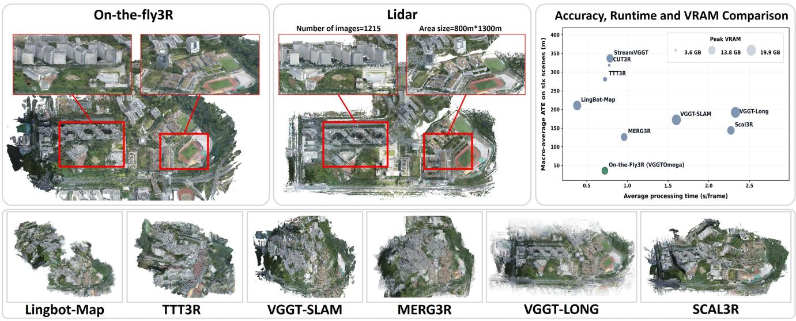
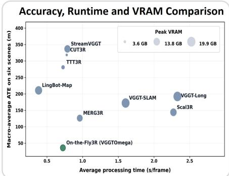
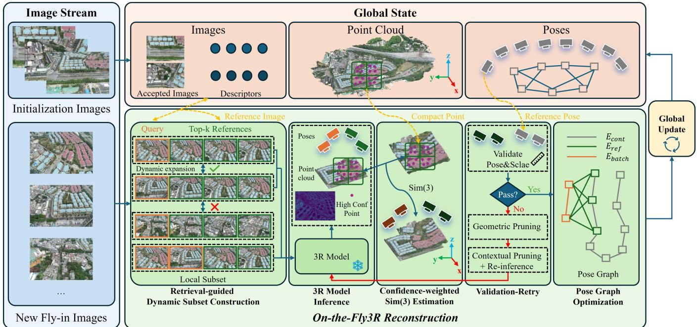
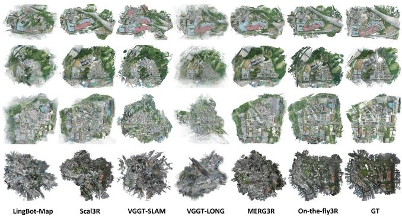
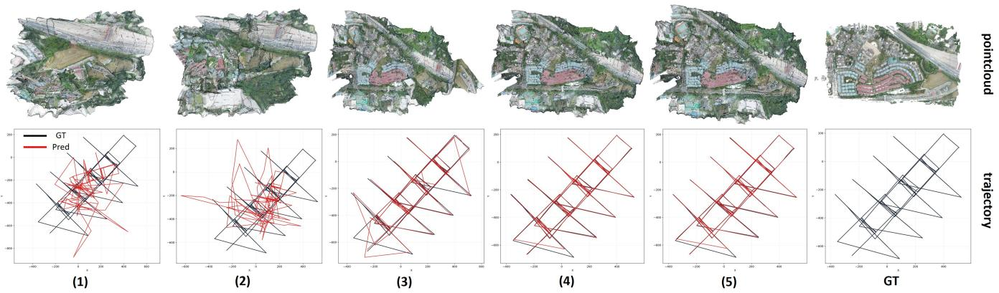

# On-the-Fly3R: Towards Robust Online 3D Reconstruction with Feed-Forward 3R Models for Large-Scale UAV Scenarios

Zhe Shen∗, Liyuan Lou∗, Yifei Yu, Guanbo Wang, Quanjian Ji, Xin Wang†, Zongqian Zhan† School of Geodesy and Geomatics, Wuhan University, Wuhan 430079, China

  
Fig. 1: Visual reconstruction results on the GauU-Scenes SZIT scene.

Abstract— While feed-forward 3D reconstruction (3R) offers efficient end-to-end modeling, its application in large-scale UAV mapping is hindered by the prohibitive memory cost of Transformer attention. Current scalable streaming 3R methods assume temporally and spatially continuous inputs, rendering them ineffective for the weakly ordered or unordered image streams common in cross-strip UAV operations. To address this, we propose On-the-Fly3R, a training-free, progressive online 3D reconstruction framework for large-scale UAV images that upgrades various 3R backbones for large-scale UAV scenarios. Our method enables reconstruction from unordered inputs via retrieval-guided dynamic subset construction, which adaptively selects spatially relevant images. To further improve the robustness, a validation–rejection–retry mechanism is designed to guarantee global consistency, performing a pre-integration consistency check and automatically rejecting misaligned images and retrying with alternative subset. Finally, inspired by VSLAM, pose graph optimization based on the retrieval loop closure is employed to mitigate camera drift. Evaluations on several UAV benchmarks show that our On-the-Fly3R successfully scales various 3R models to over 5,000 images across square-kilometer UAV scenes, delivering substantially superior accuracy compared to several SOTA streaming 3R methods. Code is available at https://github.com/Sh1nZzz/On\_ the\_Fly3R

## I. INTRODUCTION

Recently, feed-forward 3D reconstruction (3R) methods, also recognized as 3D visual foundation models, have emerged as a powerful paradigm in the field of computer vision and photogrammetry. Representative methods such as DUSt3R [1], MASt3R [2], and VGGT [3] can directly predict camera poses and dense 3D point clouds from uncalibrated images, offering a robust and efficient end-to-end pipeline from 2D observations to 3D scenes. However, scaling these methods to large-scale UAV scenarios remains a significant bottleneck. Built upon Transformer architectures, their global attention mechanisms cause computational and memory costs to scale quadratically with the number of input images. Consequently, on consumer-grade GPUs (e.g., a RTX 4090 with 24 GB VRAM), 3R methods frequently encounter out-of-memory failures when processing more than a few hundred images, severely limiting their practical deployment.

To improve the scalability of 3R methods, recent works generally fall into two categories: chunk-based and streaming reconstruction. Chunk-based methods [4], [5], [6], [7] partition long image sequences into local chunks and align them via overlapping frames. Conversely, streaming-based approaches [8], [9], [10], [11], [12], [13] manage global context to progressively update the scene representation. While effective for continuous sequences, these methods inherently rely on strict assumptions of input with strong spatiotemporal continuity and local overlap. In large-scale UAV mapping tasks, factors such as cross-strip observations, multi-camera acquisition, and multi-sortie data collection inevitably result in unordered or weakly ordered image streams. Under such realistic conditions, existing scalable 3R methods degrade significantly, as they cannot effectively handle the lack of sequential continuity. A comparison with SOTA scalable 3R methods on a UAV dataset is shown in Fig. 1.

Furthermore, current chunk-based methods typically accept the local chunk reconstructions produced by the feed forward 3R model without explicit reliability verification. Under unordered or weakly ordered image conditions, a local chunk may contain images lacking effective co-visibility with the dominant scene. Such inconsistent observations can lead the model to hallucinate erroneous camera poses, scales, and 3D structures. Blindly integrating these anomalous local results into the global model, and subsequently using them as references for chunk alignment, triggers cascading error propagation. This not only causes incorrect registration and accumulated drift in subsequent chunks but ultimately catastrophically degrades the geometric consistency and robustness of the entire reconstruction.

How can we effectively leverage the capabilities of existing 3R models under limited computational resources and extend them to large-scale reconstruction from unordered or weakly ordered UAV images? We argue that the crux lies in two aspects: constructing geometrically consistent local contexts for the VFMs, and promptly detecting and correcting local failures during online progressive reconstruction.

Driven by this insight, we propose On-the-Fly3R, a training-free, progressive reconstruction framework that is compatible with diverse 3R models. Specifically, our method is first initialized with a small seed of images. Then, for each newly fly-in image, the co-visible images are retrieved from the reconstructed global map to dynamically construct a local subset, enabling the 3R models to perform feed-forward inference within a geometrically relevant local context. Each local prediction is then aligned to the global model via a confidence-weighted Sim(3) transformation. Crucially, we perform pose- and scale-based consistency checks before merging the local result into the global model. If the check fails, the framework automatically discards unreliable references and retries inference with a newly formed subset. Only newly added images and geometric results that pass validation are committed to the global map. Via this progressive pipeline, the proposed On-the-Fly3R can process unordered or weakly ordered UAV images under a bounded memory footprint while effectively suppressing error propagation.

Our main contributions are summarized as follows:

• We propose On-the-Fly3R, a training-free, progressive feed-forward reconstruction framework, which can scale diverse 3R models to large scale UAV scenarios.

• A retrieval-guided dynamic subset construction strategy is introduced, that adaptively selects spatially relevant images to form geometrically consistent local inputs, effectively bridging the gap between feed-forward 3R models and unordered or weakly ordered images.

• A validation–rejection–retry mechanism is designed, explicitly verifying local reconstruction reliability prior to global integration. By automatically filtering out unreliable reference images upon consistency failure, this mechanism significantly enhances robustness and suppresses cascading error propagation.

## II. RELATED WORKS

This section briefly reviews some relevant works.

## A. Traditional 3D Reconstruction

Reconstructing 3D scenes from 2D images is a foundational problem in computer vision and photogrammetry. Traditional SfM systems, such as COLMAP [14], recover camera poses and 3D points via incremental pipelines involving feature matching, geometric verification, and bundle adjustment, etc. These methods offer good scalability and geometric interpretability for large-scale image collections. Similarly, SLAM systems focus on real-time tracking and pose-graph optimization, with recent works like On-the-Fly series [15], [16], [17] pushing incremental reconstruction toward near-real-time performance via online retrieval.

Despite their maturity, traditional methods heavily rely on feature matching and computationally intensive iterative optimization, making them vulnerable in weakly textured or wide-baseline scenarios. Our framework draws inspiration from the retrieval-based view selection and geometric verifi cation inherent in traditional incremental pipelines. However, instead of relying on fragile feature matching and slow optimization, we replace them with a frozen 3R model as a robust local reconstructor, enabling a more flexible and efficient progressive feed-forward paradigm.

## B. Feed-forward 3D Visual Foundation Models

Recent feed-forward 3R models have introduced a revolutionary end-to-end paradigm for 3D reconstruction. DUSt3R [1] pioneered the formulation of image-pair reconstruction as pointmap regression, which was subsequently enhanced by MASt3R [2] through learned geometric matching. To handle more general multi-view inputs, VGGT [3] and Fast3R [18] extended this paradigm to improve multi view inference efficiency. Further advancements include Pi3 [19], which bolsters robustness against input ordering and reference-view bias, and MapAnything [20], which advances unified foundation models for general metric 3D reconstruction. While these models exhibit strong geometric priors and powerful end-to-end prediction capabilities, their reliance on global Transformer attention imposes severe memory bottlenecks, as computational and memory costs scale quadratically with the number of input images. Consequently, they struggle to scale directly to the thousands of images required for large-scale UAV mapping. Rather than retraining or modifying the backbone architecture, this paper treats the 3R model as a frozen local reconstructor, significantly enhancing its large-scale applicability through an external progressive framework.

## C. Scalable Feed-forward 3D Reconstruction

To overcome the scalability limits of 3R models, recent works generally fall into two categories: streamingbased and chunk-based methods. Streaming methods process long sequences by maintaining compact states or contextual memories. Examples include the spatial memory in Spann3R [8], recurrent state in CUT3R [9], causal attention in StreamVGGT [10] and Stream3R [21], test-time training in TTT3R [11], rolling memory in InfiniteVGGT [12], and SLAM-inspired geometric context in LingBot-Map [13]. However, the context construction in these methods inherently hinges on temporal order or sequential continuity, rendering them ineffective for unordered UAV image streams.

Alternatively, chunk-based methods adopt a divide-andconquer strategy, partitioning sequences into local chunks followed by cross-chunk alignment. VGGT-Long [4] extends reconstruction to long sequences via overlapping alignment, while VGGT-SLAM [5] integrates VGGT predictions with a SLAM backend using SL(4) optimization. To address spatial inconsistencies, TALO [6] employs Thin Plate Spline alignment, and Scal3R [7] enhances long-range consistency via test-time global context memory. Notably, MERG3R [22] follows a divide-and-conquer strategy to handle large-scale unordered image collections and is one of the few related works that explicitly consider unordered inputs. More critically, existing chunk-based methods typically trust local reconstructions without explicit reliability verification. Under unordered conditions, local chunks may contain inconsistent observations, leading to erroneous poses and structures. Blindly integrating these anomalies triggers cascading error propagation, catastrophically degrading the global reconstruction.

In contrast, our On-the-Fly3R is a training-free progressive framework that fundamentally departs from fixed chunks or temporal dependencies. It dynamically constructs geometrically relevant local subsets through retrieval, natively supporting unordered image collections. Moreover, to prevent the cascading failures observed in existing pipelines, we introduce a strict validation–rejection–retry mechanism. By explicitly verifying local consistency before global integration and automatically discarding unreliable references upon failure, our framework ensures robust reconstruction and effectively suppresses error propagation.

## III. METHODOLOGY

## A. Overview

Given an image set $\mathcal { T } = \{ I _ { i } \} _ { i = 1 } ^ { N }$ , where $I _ { i } \in \mathbb { R } ^ { H _ { i } \times W _ { i } \times 3 }$ images arrive sequentially in an online fashion according to the capturing order. Our On-the- $F l y 3 R$ aims to incrementally estimate camera poses and reconstruct a dense point cloud upon the arrival of each new image, while explicitly preventing unreliable local reconstructions from corrupting the established global map.

The pipeline operates progressively, as Fig. 2 shows. It first initializes the global coordinate system and state using a seed set of images (Sec. III-B). As new images fly in, a geometrically relevant local subset is dynamically constructed through image retrieval and fed into 3R model performs inference to obtain a local reconstruction (Sec. III-C). A confidence-weighted Sim(3) transformation is then estimated to register the local reconstruction into the global map (Sec. III-D). Crucially, a validation-retry mechanism verifies the registration consistency before merging; only validated results are incorporated into the global state (Sec. III-E). Finally, inspired by VSLAM, a pose graph optimization is applied to mitigate accumulated drift (Sec. III-F).

## B. Initialization

Similar to [17], we initialize the framework with the first $N _ { 0 }$ retrieval-connected images, following a retrieval procedure analogous to the query-subset construction described in (Sec. III-C). These images form the initialization subset, denoted as $\mathcal { Z } _ { 0 } = \{ I _ { i } \} _ { i = 1 } ^ { N _ { 0 } }$ , and define $\mathcal { A } _ { 0 } = \{ 1 , \ldots , N _ { 0 } \}$ as the initial accepted-frame set. To be compatible with various frozen 3R models $f ,$ we design a lightweight adapter Φ to unify its predictions into a standard representation:

$$
\Phi ( f ( \mathcal { T } _ { 0 } ) ) = \left\{ \widetilde { \mathbf { T } } _ { i } , \mathbf { K } _ { i } , \widetilde { \mathbf { X } } _ { i } , \widetilde { \mathbf { C } } _ { i } \right\} _ { i \in \mathcal { A } _ { 0 } } .\tag{1}
$$

where $\widetilde { \mathbf T } _ { i } ~ \in ~ \mathbb R ^ { 4 \times 4 }$ is the camera-to-world transformation, $\mathbf { K } _ { i } ~ \in ~ \mathbb { R } ^ { 3 \times 3 }$ is the camera intrinsic matrix, and $\begin{array} { r l } { \tilde { \mathbf { X } } _ { i } } & { { } \in \mathbf { \Xi } } \end{array}$ RHi×Wi×3 and $\widetilde { { \bf C } } _ { i } ~ \in ~ \mathbb { R } ^ { H _ { i } \times W _ { i } }$ are the per-pixel dense 3D point map and its confidence map, respectively. The coordinate system of this initial prediction serves as the global frame, from which we extract the initial global point cloud $\mathcal { P } _ { 0 }$ using high-confidence points.

To maintain a bounded memory footprint, retaining full dense point maps for all historical frames is infeasible. Instead, we construct a compact geometric reference $\mathcal { H } _ { i }$ for each accepted frame:

$$
\mathcal { H } _ { i } = \{ ( \mathbf { u } _ { i n } , \mathbf { x } _ { i n } ^ { g } , c _ { i n } ^ { g } ) \} _ { n = 1 } ^ { P _ { i } } .\tag{2}
$$

where $\mathbf { u } _ { i n }$ is a pixel location, $\mathbf { x } _ { i n } ^ { g } \in \mathbb { R } ^ { 3 }$ is the corresponding global 3D point, and $c _ { i n } ^ { g }$ is its confidence. Specifically, we partition each image into a regular grid and retain a fixed number of high-confidence points per cell, thereby controlling memory consumption while balancing geometric quality and spatial coverage. This compact representation later establishes geometric links between local reconstructions and the historical map.

Additionally, a frozen SupScene [23] encoder extracts an L2-normalized descriptor $\bar { \mathbf { d } _ { i } } \in \mathbb { R } ^ { D }$ for retrieval. The perframe state and the initialized global reconstruction state are formulated as

$$
\begin{array} { r } { \mathcal { F } _ { i } = ( \mathbf { T } _ { i } ^ { g } , \mathbf { K } _ { i } , \mathbf { d } _ { i } , \mathcal { H } _ { i } ) , } \\ { \mathcal { M } _ { 0 } = ( \{ \mathcal { F } _ { i } \} _ { i \in \mathcal { A } _ { 0 } } , \mathcal { P } _ { 0 } ) . } \end{array}\tag{3}
$$

Finally, we estimate the characteristic scene spacing ℓscene from the median 3D distance between adjacent highconfidence points. This metric captures the local geometric scale of the scene and is later used to derive a scale-adaptive translation threshold for validation.

## C. Retrieval-Guided Dynamic Subset Construction

Since the online arrival order does not guarantee spatial continuity, a fixed sliding window may feed spatially disjoint images into local subset for 3R inference. To overcome this, we leverage the historical descriptors to dynamically select shared context for newly fly-in images. For a candidate query frame $q ,$ the SupScene [23] encoder produces a corresponding descriptor $\mathbf { d } _ { q } .$ Its cosine similarity to an accepted historical frame r is

  
Fig. 2: Overview of the proposed On-the-Fly3R framework.

$$
s ( q , r ) = \mathbf { d } _ { q } ^ { \top } \mathbf { d } _ { r } .\tag{4}
$$

Given the current global state $\mathcal { M } _ { k - 1 }$ , the top-k historical reference set for q is:

$$
\mathcal { N } _ { k _ { r } } ( q ) = \operatorname * { T o p K } _ { r \in A _ { k - 1 } } s ( q , r ) ,\tag{5}
$$

To process images in batches, the dynamic query subset $\mathcal { Q }$ expands sequentially. For a candidate frame $q ,$ we evaluate its compatibility with the current query set Q using two metrics: the reference-overlap count $o ( q , \mathcal { Q } )$ and the maximum visual similarity $s _ { \operatorname* { m a x } } ( q , \mathcal { Q } )$ to existing queries:

$$
\begin{array} { r l } & { \quad o ( q , \mathcal { Q } ) = \left| \mathcal { N } _ { k _ { r } } ( q ) \cap \mathcal { D } ( \mathcal { Q } ) \right| , } \\ & { \quad s _ { \operatorname* { m a x } } ( q , \mathcal { Q } ) = \displaystyle \operatorname* { m a x } _ { q ^ { \prime } \in \mathcal { Q } } \mathbf { d } _ { q } ^ { \top } \mathbf { d } _ { q ^ { \prime } } . } \end{array}\tag{6}
$$

where $\mathcal { D } ( \mathcal { Q } )$ is the dominant reference set aggregated from Q. A candidate is admitted to Q if and only if:

$$
o ( q , \mathcal { Q } ) \geq \tau _ { o } \quad \wedge \quad s _ { \operatorname* { m a x } } ( q , \mathcal { Q } ) \geq \tau _ { s } .\tag{7}
$$

This condition ensures that a newly arrived image is both visually coherent with the current batch and shares sufficient geometric support with it. Expansion halts when the next image is incompatible or when the batch reaches its maximum capacity $B _ { \mathrm { m a x } }$ , yielding the final query set $\mathcal { Q } _ { k }$

We then aggregate the retrieval results of all frames in $\mathcal { Q } _ { k } ,$ prioritizing historical frames supported by multiple queries with high similarity, to form the reference subset $\mathcal { R } _ { k }$ . The final local subset fed to the 3R model is:

$$
B _ { k } = \mathcal { R } _ { k } \cup \mathcal { Q } _ { k } .\tag{8}
$$

Applying the same adapter $\Phi$ as in initialization, we obtain the unified local reconstruction:

$$
\Phi ( f ( \mathcal { B } _ { k } ) ) = \left\{ \widetilde { \mathbf { T } } _ { i } ^ { ( k ) } , \mathbf { K } _ { i } , \widetilde { \mathbf { X } } _ { i } ^ { ( k ) } , \widetilde { \mathbf { C } } _ { i } ^ { ( k ) } \right\} _ { i \in \mathcal { B } _ { k } } .\tag{9}
$$

## D. Confidence-Weighted Sim(3) Estimation

The reference frames $\mathcal { R } _ { k }$ occur in both the current local reconstruction and the historical global state, serving as geometric links between the two coordinate systems. For the compact geometric reference $\mathcal { H } _ { r }$ of a reference frame r, we utilize its stored pixel locations $\mathbf { u } _ { r n }$ to sample the current local 3D points $\widetilde { \mathbf { x } } _ { r n } ^ { ( k ) }$ from the point map, pairing them with the historical global points $\mathbf { x } _ { r n } ^ { g }$ . The correspondence weight is defined as the geometric mean of their confidences:

$$
w _ { r n } ^ { ( k ) } = \sqrt { \widetilde { c } _ { r n } ^ { ( k ) } c _ { r n } ^ { g } } .\tag{10}
$$

After collecting all valid correspondences $\mathcal { Z } _ { k }$ across all reference frames $\mathcal { R } _ { k }$ , we estimate the similarity transformation $S _ { k } = ( \sigma _ { k } , { \bf R } _ { k } , { \bf t } _ { k } ) \in \mathrm { S i m } ( 3 )$ to register the k-th local reconstruction to the global map:

$$
\underset { \ b { \sigma } _ { k } > 0 , \ \mathbf { R } _ { k } \in \mathrm { S O } ( 3 ) , \ ( r , n ) \in \mathcal { Z } _ { k } } { \operatorname* { m i n } } w _ { r n } ^ { ( k ) } \rho _ { \kappa } \left( \left. \sigma _ { k } \mathbf { R } _ { k } \widetilde { \mathbf { x } } _ { r n } ^ { ( k ) } + \mathbf { t } _ { k } - \mathbf { x } _ { r n } ^ { g } \right. _ { 2 } \right) ,\tag{11}
$$

where $\rho _ { \kappa }$ is a Huber robust loss. We solve this via a two-stage pipeline: initializing with a confidence-weighted closed-form solution, followed by Iteratively Reweighted Least Squares (IRLS) to suppress outlier correspondences.

## E. Validation-Retry Mechanism and Global Update

The reliability of local registration is inherently vulnerable to two factors. On the one hand, 3R models’ predictions for the same reference image are inconsistent under different contexts. On the other hand, appearance-based retrieval may introduce historical references that are visually similar but spatially unrelated. Both can yield a numerically estimable but geometrically spurious $\mathrm { S i m ( 3 ) }$ . Therefore, to prevent error propagation, before updating the global state, we enforce a strict validation-retry protocol before global integration.

Specifically, the local camera poses of the reference frames $\mathcal { R } _ { k }$ are transformed into the global frame via the estimated $\mathrm { S i m ( 3 ) }$ and compared against the camera poses stored in the global state. For each reference frame $r ,$ the translation and rotation residuals are:

$$
\begin{array} { r l } & { e _ { r } ^ { t } = \left. \widehat { \mathbf { t } } _ { r } ^ { g } - \mathbf { t } _ { r } ^ { g } \right. _ { 2 } , } \\ & { e _ { r } ^ { R } = \operatorname { a r c c o s } \left( \frac { \operatorname { t r } \left( \widehat { \mathbf { R } } _ { r } ^ { g } ( \mathbf { R } _ { r } ^ { g } ) ^ { \top } \right) - 1 } { 2 } \right) . } \end{array}\tag{12}
$$

The system jointly evaluates these residuals and verifies that the estimated scale $\sigma _ { k }$ is physically plausible. The translation threshold is adaptively scaled by the characteristic scene spacing estimated during initialization:

$$
\tau _ { t } = \alpha \ell _ { \mathrm { s c e n e } } .\tag{13}
$$

If the initial validation fails, the system triggers a twostage retry mechanism:

• Geometric Pruning: We estimate an independent Sim(3) for each reference frame and analyze their consistency to identify and remove anomalous historical references. The system then re-estimates and validates $\scriptstyle { S _ { k } }$ using the remaining references without re-running the 3R model inference.

• Contextual Pruning: Inspired by the observation in [24] that register tokens can capture global information, we use them when geometric pruning fails. We compare the 3R model register tokens of the reference and query frames to identify semantically incompatible references. These are discarded, and the 3R model inference, registration, and validation are repeated once with the pruned subset.

Only local results passing either the initial check or a retry stage are committed to the global state. Let $\Delta \mathcal { P } _ { k }$ denote the points fused from the new query frames in the k-th update. The global state updates as:

$$
\begin{array} { r l } & { \mathcal { A } _ { k } = \mathcal { A } _ { k - 1 } \cup \mathcal { Q } _ { k } , } \\ & { \mathcal { P } _ { k } = \mathcal { P } _ { k - 1 } \cup \Delta \mathcal { P } _ { k } , } \\ & { \mathcal { M } _ { k } = \left( \left\{ \mathcal { F } _ { i } \right\} _ { i \in \mathcal { A } _ { k } } , \mathcal { P } _ { k } \right) . } \end{array}\tag{14}
$$

Each newly accepted frame state ${ \mathcal { F } } _ { i }$ contains its global camera pose, intrinsics, retrieval descriptor, and compact geometric reference. If both retry stages fail, the entire local subset is rejected and $\mathcal { M } _ { k } = \mathcal { M } _ { k - 1 }$ , effectively isolating the unreliable reconstruction and preventing cascading errors.

## F. Pose Graph Optimization

While the validation mechanism ensures local reliability, successive local-to-global registrations may still accumulate drift. To enforce global consistency, we construct a pose graph $\mathcal { G } = ( \nu , \mathcal { E } )$ for pose refinement. The node set $\nu =$ $\{ v _ { i } \mid i \in \mathcal { A } _ { K } \}$ corresponds to all accepted frames, and each node is associated with an optimizable camera pose $\mathbf { T } _ { i } .$ . The edge set consists of three types of constraints:

$$
\mathcal { E } = \mathcal { E } _ { \mathrm { r e f } } \cup \mathcal { E } _ { \mathrm { b a t c h } } \cup \mathcal { E } _ { \mathrm { c o n t } } .\tag{15}
$$

Here, ${ \mathcal E } _ { \mathrm { r e f } }$ connects historical reference frames to current query frames (acting as loop closures for large temporal gaps); ${ \mathcal E } _ { \mathrm { b a t c h } }$ connects query frames within the same local 3R reconstruction; and ${ \mathcal E } _ { \mathrm { c o n t } }$ connects temporally adjacent arriving images that satisfy retrieval-association and motionplausibility checks. Edge weights in $\Omega _ { i j }$ are dynamically assigned based on alignment robustness (inlier ratio and residual magnitude).

The final camera poses are optimized on $\operatorname { S E } ( 3 )$ via robust least squares:

$$
\begin{array} { r } { \displaystyle \operatorname* { m i n } _ { \{ \mathbf { T } _ { i } \} } \sum _ { ( i , j ) \in \mathcal { E } } \rho _ { H } \left( \mathbf { r } _ { i j } ^ { \top } \pmb { \Omega } _ { i j } \mathbf { r } _ { i j } \right) , } \\ { \mathbf { r } _ { i j } = \mathrm { L o g } \left( \overline { { \mathbf { T } } } _ { i j } ^ { - 1 } \mathbf { T } _ { i } ^ { - 1 } \mathbf { T } _ { j } \right) . } \end{array}\tag{16}
$$

where $\overline { { \mathbf { T } } } _ { i j }$ is the relative-pose observation on an edge, $\Omega _ { i j }$ is the edge information matrix encoding constraint reliability, and $\rho _ { H }$ is a Huber robust kernel.

## IV. EXPERIMENT

## A. Datasets and Evaluation Metrics

We evaluate On-the-Fly3R on two large-scale UAV benchmarks and one popular indoor dataset to assess both domain-specific performance and cross-domain generalization. GauU-SceneV2 [25] features four weakly ordered scenes ranging from 424 to 1,500 images, providing highquality LiDAR ground truth and reference camera poses. UrbanScene [26] comprises two massive scenes, Residence (2,582 images) and Campus (5,871 images), with dense reference point clouds generated by the commercial soft ware - iTwin. Collectively, these datasets present significant real-world challenges, including multi-strip flight patterns, varying viewing angles, repetitive structures, and substantial scale variations. Additionally, we include the 7Scenes [27] to examine our generalization capability of indoor environments.

For camera pose evaluation, we report four standard rootmean-square error (RMSE) metrics: Absolute Translation Error (ATE, in meters) and Absolute Rotation Error (ARE, in degrees) measure global discrepancies; Relative Translation Error (RTE) quantifies the angular deviation between the predicted and ground-truth translation vectors of consecutive frames; and Relative Rotation Error (RRE, in degrees) measures their relative rotational discrepancy. For dense reconstruction, we report accuracy (Acc.), completeness (Comp.), and Chamfer distance (CD) against the referenced point clouds.

## B. Implementation details

All experiments are executed on a machine equipped with dual Intel Xeon Gold 6133 CPUs and a single NVIDIA RTX 4090 GPU (24 GB VRAM) running Ubuntu 22.04. Consistent with our training-free design, all 3R models are kept strictly frozen without any fine-tuning; Pi3x [19] serves as the default backbone unless otherwise specified. Regarding the settings of hyperparameters, we initialize the global map with $N _ { 0 } = 3 0$ images. During progressive reconstruction, each dynamic batch admits up to $B _ { \mathrm { m a x } } ~ = ~ 5$ new query images, retrieves $k _ { r } = 5$ historical references, and requires a minimum of 3 valid references to ensure robust local-toglobal alignment. To strictly bound memory consumption, we retain up to 5,000 compact geometric reference points per accepted frame. Final camera poses are globally refined using a pose-graph optimization backend implemented in GTSAM.

To ensure a strictly fair comparison, all baseline methods share identical input images, ground-truth references, and evaluation protocols. Runtime is normalized per input image, and peak GPU memory is recorded over the entire reconstruction pipeline.

## C. Comparison with other SOTA 3R Methods

We compare On-the-Fly3R against eleven state-of-the-art scalable 3R methods, encompassing both streaming-based (LingBot-Map [13], StreamVGGT [10], CUT3R [9], TTT3R [11], InfiniteVGGT [12]) and chunk-based (Scal3R [7], VGGT-SLAM [5], VGGT-Long [4], TALO [6], FastVGGT [28], MERG3R [22]) paradigms. All methods are fed the identical complete image sequences. Since our validation mechanism may reject unreliable local updates to prevent cascading errors, we report both the returned-pose metrics (evaluating only the poses the method successfully outputs) and the coverage rate. To ensure a strictly fair comparison free from selective output bias, we further evaluate all methods on a common frame set consisting of the 11,595 images (95.39% of the total 12,155 inputs) successfully accepted by On-the-Fly3R (Pi3x) across the six outdoor UAV scenes.

Table I reports the per-scene ATE and the overall pose coverage. Methods like FastVGGT and InfiniteVGGT suffer from Out-Of-Memory (OOM) errors on larger scenes, highlighting the severe memory bottleneck of native global inference. TALO fails to complete most scenes (21.24% coverage). In contrast, all three variants of On-the-Fly3R maintain high coverage (89%–96%) while achieving significantly lower errors. Notably, On-the-Fly3R (Pi3x) achieves the most stable and comprehensive performance across all scenes, while the VGGT-Omega variant attains the highest coverage and excels in specific large-scale scenes like Campus.

Table II presents the macro-average results on the common frame set. By controlling for the evaluation mask, we eliminate the bias of selective reporting. On-the-Fly3R (Pi3x) drastically reduces the ATE from 124.42 m (the strongest baseline, MERG3R) to 18.56 m, while simultaneously achieving superior ARE, RTE, and RRE. This confirms that our retrieval-guided context and validation mechanism significantly resolve the catastrophic drifts inherent in existing scalable methods.

To verify that our progressive framework is not strictly limited to large-scale outdoor UAV imagery, we evaluate its generalization capability on the indoor 7Scenes dataset.

TABLE I: Per-scene ATE (m) and pose coverage (%) across six outdoor scenes. Coverage denotes the ratio of successfully reconstructed poses. Best and second-best errors are highlighted in bold and underlined, respectively. ”–” indicates failure to reconstruct, and ”OOM” denotes out-ofmemory.
<table><tr><td>Method</td><td>HAV 424</td><td>SMBU 563</td><td>SZIT 1215</td><td>SZTU 1500</td><td>Residence 2582</td><td>Campus 5871</td><td>Coverage (%)</td></tr><tr><td>LingBot-Map</td><td>180.43</td><td>135.55</td><td>295.06</td><td>176.75</td><td>73.04</td><td>404.43</td><td>100.00</td></tr><tr><td>StreamVGGT</td><td>263.77</td><td>269.30</td><td>384.35</td><td>470.77</td><td>134.32</td><td>499.33</td><td>100.00</td></tr><tr><td>CUT3R</td><td>210.17</td><td>260.63</td><td>365.24</td><td>461.85</td><td>133.19</td><td>480.23</td><td>100.00</td></tr><tr><td>TTT3R</td><td>123.59</td><td>207.09</td><td>313.12</td><td>468.26</td><td>115.58</td><td>458.93</td><td>100.00</td></tr><tr><td>Scal3R</td><td>51.21</td><td>40.77</td><td>168.44</td><td>211.59</td><td>44.76</td><td>349.00</td><td>100.00</td></tr><tr><td>VGGT-SLAM</td><td>115.28</td><td>103.24</td><td>87.25</td><td>241.94</td><td>16.49</td><td>470.09</td><td>100.00</td></tr><tr><td>VGGT-Long</td><td>54.16</td><td>185.47</td><td>166.04</td><td>367.10</td><td>44.38</td><td>336.06</td><td>100.00</td></tr><tr><td>TALO</td><td></td><td></td><td></td><td></td><td>103.92</td><td></td><td>21.24</td></tr><tr><td>FastVGGT</td><td>OOM</td><td>O0M</td><td>OOM</td><td>O0M</td><td>OOM</td><td>OOM</td><td>0.00</td></tr><tr><td>InfiniteVGGT</td><td>216.15</td><td>167.83</td><td>310.41</td><td>382.03</td><td>OOM</td><td>OOM</td><td>30.46</td></tr><tr><td>MERG3R</td><td>50.02</td><td>9.80</td><td>145.13</td><td>55.33</td><td>5.74</td><td>492.95</td><td>100.00</td></tr><tr><td>On-the-Fly3R (Pi3)</td><td>7.73</td><td>17.22</td><td>23.72</td><td>47.18</td><td>3.28</td><td>42.29</td><td>89.81</td></tr><tr><td>On-the-Fly3R (Pi3x)</td><td>4.20</td><td>14.47</td><td>29.27</td><td>28.82</td><td>1.65</td><td>32.95</td><td>95.39</td></tr><tr><td>On-the-Fly3R (VGGT-Omega)</td><td>3.64</td><td>93.54</td><td>5.22</td><td>97.46</td><td>1.25</td><td>16.00</td><td>96.26</td></tr></table>

TABLE II: Six-scene macro-average pose errors evaluated on the common frame set accepted by On-the-Fly3R (Pi3x). Methods that failed to reconstruct the common set are omitted.
<table><tr><td>Method</td><td>ATE (m)↓</td><td>ARE (°)↓</td><td>RTE (°)↓</td><td>RRE (°)↓</td></tr><tr><td>LingBot-Map</td><td>205.62</td><td>26.02</td><td>43.01</td><td>5.76</td></tr><tr><td>StreamVGGT</td><td>328.54</td><td>126.41</td><td>74.52</td><td>15.81</td></tr><tr><td>CUT3R</td><td>311.52</td><td>88.16</td><td>46.25</td><td>13.29</td></tr><tr><td>TTT3R</td><td>270.91</td><td>47.44</td><td>48.32</td><td>13.81</td></tr><tr><td>Scal3R</td><td>142.88</td><td>29.23</td><td>18.11</td><td>3.01</td></tr><tr><td>VGGT-SLAM</td><td>187.12</td><td>29.22</td><td>22.78</td><td>6.49</td></tr><tr><td>VGGT-Long</td><td>187.88</td><td>50.10</td><td>22.78</td><td>8.20</td></tr><tr><td>MERG3R</td><td>124.42</td><td>26.29</td><td>54.11</td><td>22.89</td></tr><tr><td>On-the-Fly3R (Pi3x)</td><td>18.56</td><td>2.78</td><td>10.85</td><td>1.52</td></tr></table>

As shown in Table III, On-the-Fly3R with VGGT-Omega achieves the lowest ATE across all seven scenes, reducing the scene-averaged ATE from 5.32 cm (MERG3R) to an impressive 2.30 cm. The Pi3 and Pi3x variants also remain highly competitive with the strongest baselines. This demonstrates the plug-and-play nature of our framework, which can seamlessly upgrade diverse 3R models for robust indoor reconstruction.

Table IV evaluates the trade-off between dense reconstruction quality, runtime, and peak GPU memory. On-the-Fly3R (Pi3x) achieves a mean Chamfer Distance (CD) of 3.85 m, which is substantially lower than the best complete baseline (MERG3R at 16.41 m) and the fastest baseline (LingBot-Map at 18.07 m). While LingBot-Map is faster (0.38 s/frame), its reconstruction accuracy is severely compromised. In contrast, our method maintains a highly competitive runtime (0.72–0.81 s/frame), comparable to streaming methods and significantly faster than chunk-based approaches, while strictly operating within the 24 GB GPU memory budget. A visual comparison result can be found in Fig. 3, showing our point cloud is the most consistent with the ground truth. This demonstrates a Pareto-optimal tradeoff, delivering massive accuracy gains with only a marginal computational overhead.

TABLE III: ATE (cm) on 7Scenes(sequence 01, temporal stride 5). Best and second-best results are highlighted in bold and underlined, respectively.
<table><tr><td>Method</td><td>Chess</td><td>Fire</td><td>Heads</td><td>Office</td><td>Pumpkin</td><td>Kitchen</td><td>Stairs</td><td>Avg.</td></tr><tr><td>LingBot-Map</td><td>3.93</td><td>3.49</td><td>3.16</td><td>10.48</td><td>13.82</td><td>5.49</td><td>14.39</td><td>7.82</td></tr><tr><td>StreamVGGT</td><td>59.49</td><td>56.65</td><td>26.45</td><td>50.79</td><td>56.66</td><td>40.66</td><td>79.30</td><td>52.86</td></tr><tr><td>CUT3R</td><td>59.51</td><td>9.72</td><td>19.09</td><td>32.03</td><td>38.64</td><td>20.98</td><td>31.73</td><td>30.24</td></tr><tr><td>TTT3R</td><td>7.63</td><td>4.48</td><td>5.42</td><td>11.31</td><td>18.30</td><td>7.10</td><td>8.23</td><td>8.93</td></tr><tr><td>Scal3R</td><td>4.81</td><td>3.29</td><td>1.79</td><td>10.40</td><td>14.09</td><td>5.48</td><td>1.95</td><td>5.97</td></tr><tr><td>VGGT-SLAM</td><td>4.00</td><td>2.80</td><td>3.66</td><td>9.53</td><td>15.08</td><td>5.00</td><td>2.17</td><td>6.04</td></tr><tr><td>VGGT-Long</td><td>4.93</td><td>3.20</td><td>2.18</td><td>9.41</td><td>14.86</td><td>4.51</td><td>4.49</td><td>6.23</td></tr><tr><td>TALO</td><td>30.30</td><td>7.68</td><td>4.11</td><td>13.71</td><td>14.84</td><td>3.97</td><td>2.58</td><td>11.03</td></tr><tr><td>FastVGGT</td><td>4.09</td><td>3.18</td><td>1.91</td><td>11.24</td><td>15.43</td><td>5.55</td><td>3.40</td><td>6.40</td></tr><tr><td>InfiniteVGGT</td><td>7.40</td><td>3.50</td><td>4.56</td><td>14.75</td><td>14.08</td><td>8.61</td><td>30.09</td><td>11.86</td></tr><tr><td>MERG3R</td><td>3.84</td><td>2.63</td><td>1.85</td><td>8.29</td><td>13.94</td><td>3.91</td><td>2.76</td><td>5.32</td></tr><tr><td>On-the-Fly3R (Pi3)</td><td>3.90</td><td>3.38</td><td>3.80</td><td>8.19</td><td>13.42</td><td>3.38</td><td>2.95</td><td>5.57</td></tr><tr><td>On-the-Fly3R (Pi3x)</td><td>4.04</td><td>3.73</td><td>3.55</td><td>8.11</td><td>14.23</td><td>3.33</td><td>2.38</td><td>5.62</td></tr><tr><td>On-the-Fly3R (VGGT-Omega)</td><td>1.64</td><td>2.02</td><td>1.72</td><td>2.38</td><td>4.80</td><td>1.97</td><td>1.58</td><td>2.30</td></tr></table>

TABLE IV: Dense reconstruction quality, runtime, and peakmemory on the six outdoor UAV scenes. Point-cloud metrics and runtime are macro-averaged across completed scenes; memory is the maximum recorded peak. ”†” denotes an incomplete point-cloud result.
<table><tr><td colspan="6"></td><td rowspan="2">Time (s/frame)↓</td><td rowspan="2">Peak (GB)↓</td></tr><tr><td>Method</td><td>PC scenes Acc.↓ Comp.↓</td><td></td><td></td><td>CD↓</td><td></td></tr><tr><td>LingBot-Map</td><td>6/6</td><td>18.12</td><td>18.02</td><td>18.07</td><td>0.382</td><td></td><td>18.40</td></tr><tr><td>StreamVGGT†</td><td>5/6</td><td>47.80</td><td>46.24</td><td>47.02</td><td></td><td>0.787</td><td>13.78</td></tr><tr><td>CUT3R</td><td>6/6</td><td>37.78</td><td>57.84</td><td>47.81</td><td></td><td>0.776</td><td>3.58</td></tr><tr><td>TTT3R</td><td>6/6</td><td>30.80</td><td>41.84</td><td></td><td>36.32</td><td>0.725</td><td>6.20</td></tr><tr><td>Scal3R</td><td>6/6</td><td>20.39</td><td>30.68</td><td></td><td>25.54</td><td>2.272</td><td>14.38</td></tr><tr><td>VGGT-SLAM</td><td>6/6</td><td>17.07</td><td>9.81</td><td></td><td>13.44</td><td>1.602</td><td>21.46</td></tr><tr><td>VGGT-Long</td><td>6/6</td><td>19.64</td><td>18.31</td><td></td><td>18.97</td><td>2.328</td><td>19.87</td></tr><tr><td>MERG3R</td><td>6/6</td><td>24.69</td><td>8.12</td><td></td><td>16.41</td><td>0.959</td><td>16.36</td></tr><tr><td>On-the-Fly3R (Pi3)</td><td>6/6</td><td>5.47</td><td>5.77</td><td></td><td>5.62</td><td>0.736</td><td>9.90</td></tr><tr><td>On-the-Fly3R (Pi3x)</td><td>6/6</td><td>4.47</td><td>3.22</td><td></td><td>3.85</td><td>0.814</td><td>17.56</td></tr><tr><td>On-the-Fly3R (VGGT-Omega)</td><td>6/6</td><td>7.26</td><td>2.44</td><td></td><td>4.85</td><td>0.723</td><td>9.90</td></tr></table>

  
Fig. 3: Qualitative comparison of dense reconstruction.

## D. Comparison with Vanilla 3R Methods

To quantify the accuracy cost of scaling, we compare Onthe-Fly3R against the native joint inference of various 3R models. Under the 24 GB memory constraint, we restrict the input to 58 images to ensure all backbones can complete native inference without OOM. As shown in Table V, replacing global joint inference with our progressive local updates introduces only a marginal accuracy gap. On-the-Fly3R even outperforms native inference in 7 out of 10 model-scene combinations. This proves that our retrieval-guided context and validation mechanism successfully preserve the powerful geometric priors of the frozen VFMs while extending their capacity to massive scenes.

TABLE V: Comparison between vanilla 3R methods joint inference and On-the-Fly3R using an identical 58-image input. Bold indicates cases where On-the-Fly3R outperforms native inference.
<table><tr><td></td><td></td><td>SZIT ATE↓</td><td>Residence ATE</td><td>SZIT</td><td>Residence</td></tr><tr><td rowspan="2">Backbone MapAnything</td><td>Mode</td><td>5.73</td><td>3.62</td><td>↓ CD ↓</td><td>CD ↓</td></tr><tr><td>Vanilla On-the-Fly3R</td><td>5.68</td><td>2.42</td><td>1.90 2.24</td><td>1.82</td></tr><tr><td rowspan="2">Pi3</td><td>Vanilla</td><td>3.38</td><td>1.92</td><td></td><td>2.14</td></tr><tr><td>On-the-Fly3R</td><td>7.81</td><td>2.30</td><td>1.41</td><td>1.79</td></tr><tr><td rowspan="2">Pi3x</td><td>Vanilla</td><td>2.17</td><td>1.34</td><td>2.50</td><td>2.02</td></tr><tr><td>On-the-Fly3R</td><td>3.17</td><td>1.20</td><td>1.32 1.63</td><td>1.33</td></tr><tr><td rowspan="2">VGGT</td><td>Vanilla</td><td>5.88</td><td>8.46</td><td></td><td>1.35</td></tr><tr><td>On-the-Fly3R</td><td>3.60</td><td>2.56</td><td>1.81 1.74</td><td>2.60</td></tr><tr><td rowspan="2">VGGT-Omega</td><td>Vanilla</td><td>2.19</td><td>1.74</td><td>1.47</td><td>1.50</td></tr><tr><td>On-the-Fly3R</td><td>2.11</td><td>1.13</td><td>1.61</td><td>1.34 1.21</td></tr></table>

TABLE VI: Ablation study with VGGT-Omega on HAV and Residence. Dyn.: Dynamic batching; V&R: Validation & Retry; PGO: Pose Graph Optimization.
<table><tr><td></td><td></td><td></td><td></td><td colspan="4">HAV</td><td colspan="4">Residence</td></tr><tr><td>Case</td><td>Dyn.</td><td>V&amp;R</td><td>PGO</td><td>ATE↓</td><td>ARE↓</td><td>RTE↓</td><td>RRE↓</td><td>ATE↓</td><td>ARE↓</td><td>RTE↓</td><td>RRE↓</td></tr><tr><td>(1)</td><td>x</td><td>x</td><td>x</td><td>208.76</td><td>85.49</td><td>37.03</td><td>43.009</td><td>3.37</td><td>0.90</td><td>7.63</td><td>0.516</td></tr><tr><td>(2)</td><td>V</td><td>x</td><td>x</td><td>193.51</td><td>60.14</td><td>24.03</td><td>30.970</td><td>2.40</td><td>0.81</td><td>4.11</td><td>0.344</td></tr><tr><td>(3)</td><td>x</td><td>V</td><td>x</td><td>30.94</td><td>10.34</td><td>19.40</td><td>13.291</td><td>3.20</td><td>0.83</td><td>7.43</td><td>0.348</td></tr><tr><td>(4)</td><td>V</td><td>V</td><td>x</td><td>4.51</td><td>1.57</td><td>8.40</td><td>0.590</td><td>2.34</td><td>0.79</td><td>4.10</td><td>0.337</td></tr><tr><td>(5)</td><td>V</td><td>V</td><td>V</td><td>3.64</td><td>1.18</td><td>10.03</td><td>0.680</td><td>1.25</td><td>0.52</td><td>1.58</td><td>0.220</td></tr></table>

## E. Ablation Study

We conduct ablations with VGGT-Omega as backbone 3R model on HAV and Residence to isolate the contributions of three core components: retrieval-guided dynamic batching (Dyn.), validation with reference-pruning retry (V&R), and pose graph optimization (PGO). Table VI reports the four pose RMSE metrics under five cases, and a corresponding qualitative result is illustrated by Fig. 4.

Impact of Dynamic Batching and V&R: Dynamic batching alone provides moderate improvement by ensuring spatial overlap, but fails to prevent catastrophic local failures on HAV (ATE drops only from 208.76 to 193.51 m). In contrast, V&R is the primary driver of robustness; even without dynamic batching, it reduces HAV ATE to 30.94 m by actively rejecting inconsistent references. Their combination yields a synergistic effect, plummeting the ATE to 4.51 m. This confirms that constructing geometrically consistent contexts (Dyn.) and explicitly gating reliability (V&R) are complementary and both indispensable.

Role of Pose Graph Optimization: PGO further reduces the absolute ATE to 3.64 m on HAV and from 2.34 to 1.25 m on Residence. Interestingly, on HAV, while ATE and ARE improve, RTE and RRE increase slightly. This is a theoretically expected behavior in SLAM: PGO optimizes the global trajectory to minimize absolute drift (ATE/ARE) by distributing errors across the graph, which can occasionally slightly compromise local relative consistency (RTE/RRE) if the local VFM predictions were already highly coherent. Nevertheless, the overall global geometric consistency is significantly enhanced, as evidenced by the uniform metric improvements on the longer Residence scene.

  
Fig. 4: Visual results of ablation studies.

## V. CONCLUSION

In this paper, we introduced On-the-Fly3R, a trainingfree progressive reconstruction framework designed to scale feed-forward 3D visual foundation models to large-scale, unordered UAV imagery. Our approach addresses the memory bottlenecks and strict spatiotemporal assumptions of existing methods through two key components: retrievalguided dynamic subset construction for geometrically consistent local context, and a validation-rejection-retry mechanism to actively suppress cascading error propagation. Extensive evaluations across diverse indoor and outdoor benchmarks confirm that On-the-Fly3R can process thousands of images and square-kilometer UAV scenes within a bounded GPU memory budget, matching the accuracy of offline global inference. Moving forward, we plan to investigate semanticassisted retrieval for challenging textures and explore fully incremental backend optimization to enable true real-time dynamic scene reconstruction.

## REFERENCES

[1] S. Wang, V. Leroy, Y. Cabon et al., “DUSt3R: Geometric 3D vision made easy,” in Proceedings of the IEEE/CVF Conference on Computer Vision and Pattern Recognition (CVPR), 2024, pp. 20 697–20 709.

[2] V. Leroy, Y. Cabon, and J. Revaud, “Grounding image matching in 3D with MASt3R,” in European Conference on Computer Vision (ECCV). Springer, 2024, pp. 71–91.

[3] J. Wang, M. Chen, N. Karaev et al., “VGGT: Visual geometry grounded transformer,” in Proceedings of the IEEE/CVF Conference on Computer Vision and Pattern Recognition (CVPR), 2025, pp. 5294– 5306.

[4] K. Deng, Z. Ti, J. Xu et al., “VGGT-Long: Chunk it, loop it, align it— pushing VGGT’s limits on kilometer-scale long RGB sequences,” in IEEE International Conference on Robotics and Automation (ICRA), 2026.

[5] D. Maggio, H. Lim, and L. Carlone, “VGGT-SLAM: Dense RGB SLAM optimized on the SL(4) manifold,” in Advances in Neural Information Processing Systems (NeurIPS), vol. 38, 2025.

[6] F. Zhang, T. Zhang, K. Khosoussi et al., “TALO: Pushing 3D vision foundation models towards globally consistent online reconstruction,” in Proceedings of the IEEE/CVF Conference on Computer Vision and Pattern Recognition (CVPR), 2026, pp. 21 870–21 879.

[7] T. Xie, P. Yang, Y. Jin et al., “Scal3R: Scalable test-time training for large-scale 3D reconstruction,” in Proceedings of the IEEE/CVF Conference on Computer Vision and Pattern Recognition (CVPR), 2026, pp. 21 760–21 771.

[8] H. Wang and L. Agapito, “3D reconstruction with spatial memory,” in 2025 International Conference on 3D Vision (3DV). IEEE, 2025, pp. 78–89.

[9] Q. Wang, Y. Zhang, A. Holynski et al., “Continuous 3D perception model with persistent state,” in Proceedings of the IEEE/CVF Conference on Computer Vision and Pattern Recognition (CVPR), 2025, pp. 10 510–10 522.

[10] D. Zhuo, W. Zheng, J. Guo et al., “Streaming visual geometry transformer,” in International Conference on Learning Representations (ICLR), 2026.

[11] X. Chen, Y. Chen, Y. Xiu et al., “TTT3R: 3D reconstruction as testtime training,” in International Conference on Learning Representations (ICLR), 2026.

[12] S. Yuan, Y. Yang, X. Yang et al., “InfiniteVGGT: Visual geometry grounded transformer for endless streams,” arXiv preprint arXiv:2601.02281, 2026.

[13] L.-Z. Chen, J. Gao, Y. Chen et al., “Geometric context transformer for streaming 3D reconstruction,” arXiv preprint arXiv:2604.14141, 2026.

[14] J. L. Schonberger and J.-M. Frahm, “Structure-from-motion revisited,”¨ in Proceedings of the IEEE Conference on Computer Vision and Pattern Recognition (CVPR), 2016, pp. 4104–4113.

[15] Z. Zhan, Y. Yu, R. Xia et al., “Sfm on-the-fly: A robust near realtime sfm for spatiotemporally disordered high-resolution imagery from multiple agents,” ISPRS Journal of Photogrammetry and Remote Sensing, vol. 224, pp. 202–221, 2025.

[16] L. Lou, W. Li, W. Gan et al., “On-the-fly feedback structure from motion: Online explore-and-exploit unmanned aerial vehicle photogrammetry with incremental mesh quality-aware indicator and predictive path planning,” IEEE Geoscience and Remote Sensing Magazine, vol. 14, pp. 219–239, 2026.

[17] Y. Xu, X. Wang, Y. Yu et al., “A-tdom: Active tdom via on-the-fly 3dgs,” International Journal of Computer Vision, vol. 134, 2026.

[18] J. Yang, A. Sax, K. J. Liang et al., “Fast3R: Towards 3D reconstruction of 1000+ images in one forward pass,” in Proceedings of the IEEE/CVF Conference on Computer Vision and Pattern Recognition (CVPR), 2025, pp. 21 924–21 935.

[19] Y. Wang, J. Zhou, H. Zhu et al., “π3: Permutation-equivariant visual geometry learning,” in International Conference on Learning Representations (ICLR), 2026.

[20] N. Keetha, N. Muller, J. Sch ¨ onberger ¨ et al., “MapAnything: Universal feed-forward metric 3D reconstruction,” in International Conference on 3D Vision (3DV). IEEE, 2026, pp. 499–509.

[21] Y. Lan, Y. Luo, F. Hong et al., “STream3R: Scalable sequential 3D reconstruction with causal transformer,” in International Conference on Learning Representations (ICLR), 2026.

[22] L. K. Cheng, A. Shaikh, R. Liang et al., “MERG3R: A divide-andconquer approach to large-scale neural visual geometry,” in Proceedings of the IEEE/CVF Conference on Computer Vision and Pattern Recognition (CVPR), 2026, pp. 28 969–28 978.

[23] X. Shi, M. Wang, Y. Peng et al., “SupScene: Scene-structured overlap supervision for image retrieval in unconstrained SfM,” arXiv preprint arXiv:2601.11930, 2026.

[24] J. Wang, M. Chen, S. Zhang et al., “VGGT-Ω,” in Proceedings of the IEEE/CVF Conference on Computer Vision and Pattern Recognition (CVPR), 2026, pp. 21 486–21 499.

[25] B. Xiong, N. Zheng, J. Liu et al., “GauU-Scene V2: Assessing the reliability of image-based metrics with expansive LiDAR image dataset using 3DGS and NeRF,” arXiv preprint arXiv:2404.04880, 2024.

[26] L. Lin, Y. Liu, Y. Hu et al., “Capturing, reconstructing, and simulating: The UrbanScene3D dataset,” in European Conference on Computer Vision (ECCV). Springer, 2022, pp. 93–109.

[27] J. Shotton, B. Glocker, C. Zach et al., “Scene coordinate regression forests for camera relocalization in RGB-D images,” in Proceedings

of the IEEE Conference on Computer Vision and Pattern Recognition (CVPR), 2013, pp. 2930–2937.

[28] Y. Shen, Z. Zhang, Y. Qu et al., “FastVGGT: Fast visual geometry transformer,” in International Conference on Learning Representations (ICLR), 2026.