# P-PatchDif: Progressive Patch Difusion Models for Low-light Image Enhancement

Ruoyu Guo1, Haonan Zhong1, Maurice Pagnucco1, Yang Song1\*

1School of Computer Science and Engineering, University of New South Wales, Sydney, Australia.

\*Corresponding author(s). E-mail(s): yang.song1@unsw.edu.au; Contributing authors: ruoyu.guo@student.unsw.edu.au; h.zhong.1@unsw.edu.au; morri@cse.unsw.edu.au;

## Abstract

Recent advancements in low-light image enhancement have leveraged difusion models for their strong ability to generate perceptually realistic, detailed images. Patch difusion models further ofer a promising solution to size-agnostic image restoration while improving eficiency. However, existing methods typically rely on small, fixed patches (e.g., 64×64) that cannot capture image-level brightness context, whereas enlarging the receptive field improves brightness and colour estimation but substantially increases computational cost. Moreover, low-light images often exhibit uneven brightness across regions, making it necessary to ensure that locally enhanced patches remain visually coherent when combined into the full image. To address these limitations, we propose P-PatchDif, a scalable progressive patch difusion framework for low-light image enhancement that dynamically adjusts patch size throughout the denoising process, enabling a gradual shift from local to global views. A Multi-Patch Alignment strategy is also introduced to normalise features across varying patch scales using an estimated global brightness proxy. Rather than pursuing pixel-level reconstruction accuracy, P-PatchDif focuses on scalability and coherent brightness across the whole image, allowing the model to perceive multi-scale information and better enhance regions with varying brightness. We empirically demonstrate that P-PatchDif efectively enhances images ranging from 400 × 600 to 4K and is 80× faster than existing patch difusion models while using less than 9GB of memory. The code is available at https://github.com/RuoyuGuo/P-PatchDif.

Keywords: Low-light image enhancement, Patch difusion model, Denoising difusion model, Image restoration

## 1 Introduction

Low-light image enhancement is challenging due to diverse degradations that obscure fine details, reduce visibility, and limit available information, complicating the enhancement process. Therefore, it is necessary to develop sophisticated enhancement methods with strong generative capabilities.

Recent advancements in deep learning have enabled substantial improvements in low-light image enhancement by training on real-world paired datasets (Wei et al. 2018; Wu et al. 2022; Zamir et al. 2022; Xu et al. 2022; Cai et al. 2023). However, these deep learning methods typically rely on regression models with pixel-level losses

Denoising step T

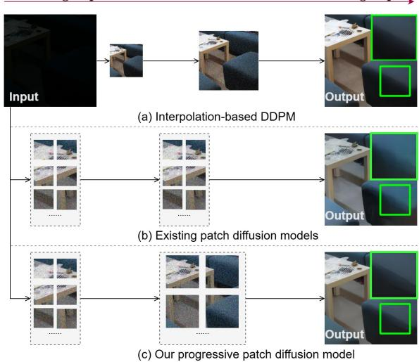  
Fig. 1: Visual comparisons of recent state-of-theart eficient DDPMs for low-light image enhancement. (a) PyDif (Zhou et al. 2023) applies interpolation to resize images, resulting in colour shifting. (b) WeatherDif (Ozdenizci and Legen-¨ stein 2023) uses fixed patch sizes, leading to boundary artefacts. (c) Our method progressively increases patch sizes, producing fine-detail enhanced images.

(e.g., L1 and L2), resulting in “averaged” outputs. While such models often achieve high peak signal-to-noise ratio (PSNR) scores, they struggle to restore missing structures and tend to produce overly smooth images. In contrast, difusion models, which are likelihood-based, ofer a stable training process and generate images with greater detail, making them increasingly popular for lowlight enhancement tasks (Zhou et al. 2023; Yi et al. 2023; Hou et al. 2023).

Training denoising difusion probabilistic models (DDPMs) is computationally expensive (Wang et al. 2023e). Additionally, modern devices photograph images at varying high resolutions (Hai et al. 2023; Li et al. 2023), increasing the need for eficient frameworks. PyDif mitigates this by applying interpolation to noise images to reduce sizes during sampling (Zhou et al. 2023). A drawback is that it still operates on the full image later, which requires significant memory for high-resolution images. Additionally, as shown in Figure 1 (a), interpolation can cause colourshifting issues. To address these issues, patch difusion models have gained attention for operating on patches instead of full images, providing scalability for arbitrary sizes while improving memory eficiency and training speed (Ozdenizci¨ and Legenstein 2023; Wang et al. 2023e).

However, they typically use small fixed patch sizes (e.g., 64 × 64) for eficiency, but this limits their ability to capture multi-level information and results in boundary artefacts, as illustrated in Figure 1 (b). Additionally, low-light images often exhibit spatially variant illumination, where bright and dark regions coexist within the same image due to exposure imbalance or local light sources (He et al. 2023; Lv et al. 2021). This characteristic makes low-light enhancement fundamentally diferent from uniform illumination adjustment, as it requires a careful balance between global brightness correction and local dark-region enhancement. Prior studies try to utilise multi-scale patches (Shang et al. 2024; Zamir et al. 2020; Mei et al. 2023) to address this issue. However, the lack of a global reference often leads to moderate brightness inconsistency. Moreover, ensembling multi-scale large patches poses two additional challenges. First, it significantly increases the number of patches per denoising step, thus greatly increasing sampling time. Secondly, as shown in Figure 5, our experiments reveal that diferent patch scales contain varying information, such as colour and brightness, thus simply averaging outputs from multi-scale patches like previous methods would generate suboptimal images (Shang et al. 2024).

Some other methods attempt to incorporate a global corrector (Zhou et al. 2023; Yin et al. 2023) to achieve balanced illumination enhancement, but relying solely on global information often overwrites local intensity variations. Consequently, models that depend only on multi-scale information or purely global cues struggle to efectively enhance complex, spatially diferent lowlight images. Unfortunately, existing approaches rarely integrate both functionalities in a unified manner. Given that some low-light benchmarks (Lee et al. 2013; Vonikakis et al. 2018) include a range of large-size images with complex lighting environments and that difusion models typically require long training times, exploring patch difusion for low-light image enhancement remains valuable. Therefore, in this paper, we aim to tackle two challenging problems in lowlight image enhancement simultaneously: balancing local dark-region enhancement with globally coherent brightness, as well as making patch difusion models scalable across diferent GPU devices without degrading image quality.

To this end, we propose a Progressive Patch Difusion model (P-PatchDif) for low-light image enhancement. P-PatchDif provides a single, integrated solution that tackles both aforementioned challenges at once. We seamlessly incorporate multi-level information by progressively increasing the patch sizes based on the time step. Thus, P-PatchDif can focus on each local region without interference from other regions. Moreover, we propose a multi-patch alignment method that normalises features across diferent patch scales using an estimated global brightness proxy, ensuring that features are gradually aligned at each level while capturing global context. To improve the eficiency and scalability of P-PatchDif, we first investigate the impacts of patch size and stride on enhancement quality and computational overhead. We empirically demonstrate that large strides have minimal impact on sampled image quality but significantly reduce inference time. Based on this insight, we propose to increase the stride as the time step increases to reduce the number of cropped patches and inference complexity. To ensure that patch size and stride increase in a coordinated manner, we establish a unified scheduling scheme that jointly controls their growth across time steps, maximising eficiency without compromising enhancement quality. Our P-PatchDif is orthogonal to previous low-light enhancement methods that model the physical properties of low-light imaging (Wei et al. 2018; Guo et al. 2020, 2025): (1) we propose a scalable patch difusion model to balance enhancement at both global and local levels; (2) this progressive patch difusion model also mitigates the computational overhead of difusion models, which was overlooked in previous studies.

We conduct extensive experiments on 9 widely used real-world datasets and 1 synthetic dataset, covering image sizes ranging from 400 × 600 to 4K captured by diferent devices and exposure levels, to validate the efectiveness and eficiency of P-PatchDif. We use in-domain and out-ofdomain validation to demonstrate its capacity across diferent image scales. Without modifying network architectures, P-PatchDif achieves competitive performance on 4K images while being 80× faster than existing patch difusion models, requiring only 8.8GB of GPU memory. Our contributions can be summarised as follows:

We propose P-PatchDif, a scalable progressive patch difusion model for low-light image enhancement, which progressively increases patch size and stride with the time step to capture multi-level information while maintaining low inference time.

We propose a multi-patch alignment method that normalises features across diferent patch scales to ensure consistent global brightness among patches of varying sizes.

We empirically demonstrate that P-PatchDif not only reduces computational cost but also maintains strong performance across low-light image datasets with varying image sizes, outperforming existing patch difusion models in both eficiency and robustness to input resolution.

## 2 Related work

## 2.1 Low-light image enhancement

Low-light image enhancement has been extensively studied, yet it remains a challenging task. Traditional algorithms either stretch image contrast (Huang et al. 2013; Lee et al. 2013) or enhance illumination (Guo et al. 2016; Vonikakis et al. 2018; Wang et al. 2013; Ma et al. 2015; Land 1977). Recent deep learning-based methods can be grouped into three main categories. The first focuses on designing network architectures with high capacity to learn the transformation from low-light images to normal-light ones (Cai et al. 2023; Zamir et al. 2022, 2020; Guo and Hu 2023; Wu et al. 2022; Wang et al. 2023b; Lv et al. 2018; Wang et al. 2022, 2018). Recognising the dificulty of directly learning this mapping, recent research has also introduced two alternative approaches: one provides additional guidance to the networks (Xu et al. 2022; Wang et al. 2023c; Liu et al. 2023; Wu et al. 2023; Xu et al. 2023), while the other decomposes images into multiple components for individual enhancement (Wang and Jin 2023; Zhang et al. 2022, 2021, 2019; Yang et al. 2020; Fu et al. 2023a; Xu et al. 2020).

Moreover, unsupervised methods have been proposed for data-eficient training (Guo et al. 2020; Li et al. 2021a; Fu et al. 2023b; Liu et al. 2021; Yang et al. 2023; Ma et al. 2022; Saini and Narayanan 2024; Shi et al. 2024; Guo et al. 2025). Some recent studies have introduced alternative colour spaces for image representation to reduce noise amplification compared to conventional spaces (Yan et al. 2025). Despite their efectiveness, these regression-based methods often produce blurry outputs, reducing the amount of useful information in the enhanced images. Therefore, we propose to leverage the advantages of difusion models to address the challenges in lowlight enhancement.

## 2.2 Difusion-based image enhancement

Difusion models have recently gained attention in image enhancement for their ability to produce high-quality, perceptually aligned results (Saharia et al. 2022a,b; Li et al. 2022b). In low-light image enhancement, methods such as PyDif improve eficiency by applying image interpolation during training and sampling (Zhou et al. 2023), while others adapt pre-trained difusion models for lowlight restoration (Xu et al. 2024; Wang et al. 2024b). Alternatively, difusion models have also been employed to suppress noise in a lookup tablebased framework (Lin et al. 2025). However, due to the severe degradations and complex illumination characteristics in low-light images, directly applying a difusion model often fails to capture structural and tonal variations efectively.

To address these challenges, some approaches first transform the image into alternative representations and then apply difusion models to enhance specific components. Such transformations include Retinex decomposition (Yi et al. 2023; Jiang et al. 2024), wavelet transform (Jiang et al. 2023), and Fourier transform (Lv et al. 2024; Shang et al. 2024). However, traditional decomposition methods generally overlook the degradations present in low-light inputs, leading to suboptimal enhancement (Zhang et al. 2022). Furthermore, these approaches typically require separate difusion models to enhance each component, thereby increasing both complexity and training cost.

Another strategy for improving difusion-based enhancement is to incorporate prior knowledge into the denoising process. For example, CLE-Difusion integrates brightness levels as conditioning signals (Yin et al. 2023), while other methods embed Retinex priors (Wu et al. 2024; Kang et al. 2024), exposure priors (Wang et al. 2023d), or degradation priors (Wang et al. 2023a). More recently, large language models have been used to generate image quality maps that serve as guidance for difusion models (Zhou et al. 2025). Motivated by the efectiveness of such priors, we propose estimating a global brightness proxy from full images and using it to align outputs across diferent patch scales with the global statistics of the target image.

## 2.3 Patch difusion models

Patch difusion models crop small patches during training to improve computational eficiency (Wang et al. 2023e; Hu et al. 2024), with theoretical proof that the noise distribution can be learned from patches rather than full images. These early works also noted the problem of boundary artefacts, although without extensive analysis. Moreover, most still perform sampling on full-size images, which is impractical for image enhancement tasks due to variable image resolutions.

To address this limitation, feature-level patching methods have been proposed. For example, Patch-DM (Ding et al. 2023) encodes neighbouring overlapping patches and merges them in the feature space, enabling high-resolution sampling from patches. However, this requires carefully designed position embeddings to maintain spatial consistency, which increases model complexity. An alternative is hierarchical patch difusion (Skorokhodov et al. 2024; Hur et al. 2025), which first generates a small image and then repeatedly performs denoising on progressively larger noise inputs, guided by the previously generated results. While this avoids the need for full-size inputs, it significantly increases time and network complexity due to multiple upsampling stages.

To simplify the inference process, WeatherDif (Ozdenizci and Legenstein ¨ 2023) proposes a mean-estimated noise merging strategy, where overlapping patches are denoised independently and then averaged, mitigating the complexity of feature-level merging or iterative upsampling. However, it uses a fixed small patch size and thus lacks multi-scale context.

MDMS (Shang et al. 2024) addresses this by denoising multiple copies of the image cropped at diferent patch sizes at each denoising step, then averaging the outputs. This multi-scale patching not only provides richer global–local information for enhancement but also reduces boundary artefacts. Similarly, DifInfinite (Aversa et al. 2023) segments each patch into subregions based on semantic masks, then repeatedly denoises each subregion until all are complete, before merging them. While efective for handling complex spatial structures, these approaches result in significantly longer sampling times and do not address colour or brightness inconsistencies between scales. Unlike previous patch difusion models, our approach crops only one scale of patches per denoising step. Multi-level information is introduced by progressively increasing patch size and stride in a time-aware manner, reducing the large number of patches generated by multi-scale cropping and maintaining high performance. Additionally, a multi-patch alignment method is proposed to mitigate inconsistencies across scales efectively.

## 2.4 Progressive strategy

The progressive strategy is commonly used in image generation to explore multi-scale information (Ren et al. 2019; Zamir et al. 2022). Although some previous works (Skorokhodov et al. 2024; Jiang et al. 2020; Zamir et al. 2021) employ progressive strategies, they rely on specially designed network architectures, which limit their applicability to broader scenarios. Additionally, other lines of work (Li et al. 2021b; Knaus and Zwicker 2014) focus on iterative image refinement to improve perceptual quality, without addressing patch-level eficiency or multi-scale interaction. To integrate global information into progressive models, IA-YOLO (Liu et al. 2022) generates lowresolution inputs for CNNs to predict image filter parameters. However, these predicted parameters are used for traditional signal processing, which is less efective. Overall, while our method builds upon the general idea of progressive processing, it is proposed to address issues of patch difusion models, ofering a novel perspective for low-light image enhancement.

## 3 Methods

As illustrated in Figure $^ { 6 , }$ our goal is to train a denoising U-Net $f _ { \theta }$ to generate an enhanced image $\tilde { \bf x }$ that is as close as possible to the normal-light image $\mathbf { x } _ { \mathrm { 0 } }$ from a randomly sampled noise image xt, conditioned on the low-light image $\mathbf { y } .$ We divide the total time steps $T$ into n equal-length subsets $\{ K _ { m } \} _ { m = 1 } ^ { n }$ . Within each subset $K _ { m }$ , the patch size $p _ { t }$ and stride $s _ { t }$ are kept fixed, but they change progressively across subsets, guiding the model to transition from local to global enhancement. To improve eficiency, instead of denoising on the fullsize noise image $\mathbf { x } _ { t }$ , we concatenate $\mathbf { x } _ { t }$ and $\mathbf { y } _ { \mathrm { : } }$ , then crop the result into overlapping patches $\mathbf { y } _ { s } ^ { p }$ using patch size $p _ { t }$ and stride $s _ { t }$ . Each $\mathbf { y } _ { s } ^ { p }$ is denoised independently and then merged to reconstruct the full-size denoised output $\mathbf { x } _ { t }$ at time step t, where the overlap areas are averaged.

To address the varying illumination captured by diferent patch sizes and mitigate the limitation of using image patches instead of the full-size image, we incorporate a lightweight U-Net $g$ to estimate a global brightness proxy ${ \bf x } _ { i l l }$ from a downsampled full-size image $\mathbf { y } _ { p _ { t } } .$ , which has a size of $p _ { t } \times p _ { t }$ to align with each patch. Moreover, we encode ${ \bf x } _ { i l l }$ into a global brightness feature $\mathbf { F } _ { i l l }$ through an encoder h and incorporate it into $f _ { \theta }$ to normalise features across multi-scale patches.

In the following sections, we first introduce patch difusion models in Section 3.1, then our progressive patch difusion model in Section 3.2, and the multi-patch alignment strategy in Section 3.3.

## 3.1 Revisiting patch difusion models

In image enhancement tasks, the patch difusion model (PDM) (Ozdenizci and Legenstein ¨ 2023; Shang et al. 2024; Wang et al. 2023e) trains diffusion models using small local patches of size $p$ cropped from full-size images $\mathbf { x } _ { \mathrm { 0 } }$ . During sampling, PDM divides the full-size low-light image $\mathbf { y }$ into overlapping patches $\mathbf { y } _ { s } ^ { p }$ using patch size $p$ and stride $s .$ . Then, $\mathbf { y } _ { s } ^ { p }$ are concatenated with cropped sampled Gaussian noise to construct the input of $f _ { \theta }$ . Finally, these overlapping patches are denoised and then merged to generate the full-size enhanced image $\tilde { \mathbf { x } } ,$ where the overlap areas are averaged (Ozdenizci and Legenstein¨ 2023).

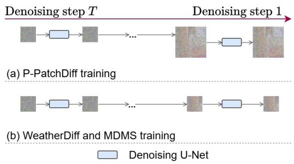  
Fig. 2: Comparison of training strategy between WeatherDif (Ozdenizci and Legenstein¨ 2023), MDMS (Shang et al. 2024) and our P-PatchDif. (a) We gradually increase patch sizes during training to enable our denoising models to perceive more information from larger patches. (b) WeatherDif and MDMS use a fixed patch size throughout all steps during training.

Building on this general framework, several patch difusion models have been developed for low-light image enhancement, each adopting different strategies for patchifying to balance eficiency and quality. Here, we review two representative PDMs: WeatherDif (Ozdenizci and¨ Legenstein 2023) and MDMS (Shang et al. 2024), and analyse how the number of subsets n afects their patch size p and eficiency.

WeatherDif. As shown in Figure 2 (b) and Figure 3 (b), WeatherDif uses a fixed patch size strategy. Although the timesteps are divided into n subsets, the same patch size p is used for all subsets. The value of $p$ is determined by n, with a larger n producing a larger patch size:

$$
p = 6 4 + ( n - 1 ) \times 3 2 .\tag{1}
$$

This patch size is used for both training and sampling. The full-size image is cropped into overlapping patches of size p, which are individually denoised and then merged to form the final output. A larger n leads to a larger p, enabling the model to capture more global context but increasing memory and computation cost.

MDMS. As shown in Figure 2 (b) and Figure 3 (c), MDMS uses a multi-scale patching strategy. At each denoising step, it creates n copies of $\mathbf { x } _ { t }$ and crops each $\mathbf { x } _ { t }$ into overlapping patches using diferent patch sizes, instead of dividing the total time steps into n. This generates n sets of patches. The size of the i-th patch set is defined as:

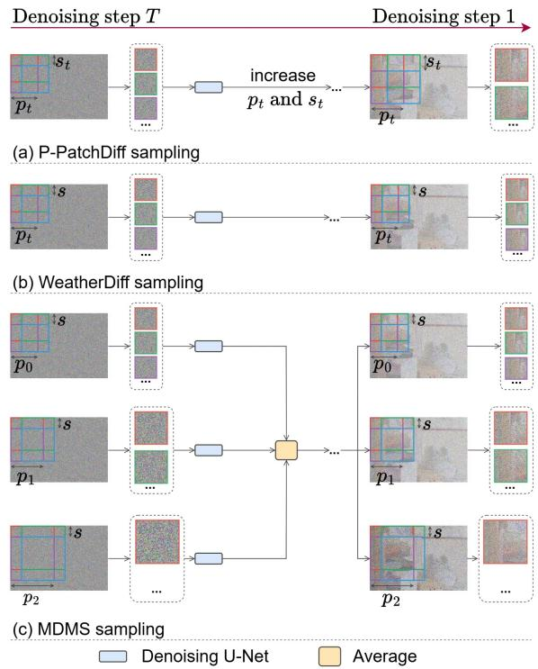  
Fig. 3: Comparison of sampling strategy between WeatherDif (Ozdenizci and Legenstein ¨ 2023), MDMS (Shang et al. 2024) and our P-PatchDif. (a) We incorporate multi-level information by increasing patch sizes. We also use larger strides for larger patch sizes to reduce the number of patches since the large patches are robust to changes in strides. (b) WeatherDif lacks multilevel information since it only uses a fixed patch size. (c) MDMS incorporates multi-level information by creating multiple copies of the same noisy image and cropping each copy with a diferent patch size, thereby incurring substantial computational costs.

$$
\begin{array} { c } { p = \{ p _ { 1 } , \ldots , p _ { n } \} , } \\ { \mathrm { w h e r e } \quad p _ { 1 \leq i \leq n } = 6 4 + ( i - 1 ) \times 3 2 . } \end{array}\tag{2}
$$

Each set is denoised independently with the same method as WeatherDif, and the output of each set is further averaged to form the denoised output at the current time step. When n = 1, MDMS reduces to WeatherDif. Equivalently, WeatherDif can be viewed as a special case of MDMS that uses only the largest patch size $p _ { n }$ instead of multiple scales. Increasing n enhances performance by incorporating multi-scale information, but the number of cropped patch sets and inference passes grows linearly with n, leading to much higher computational cost.

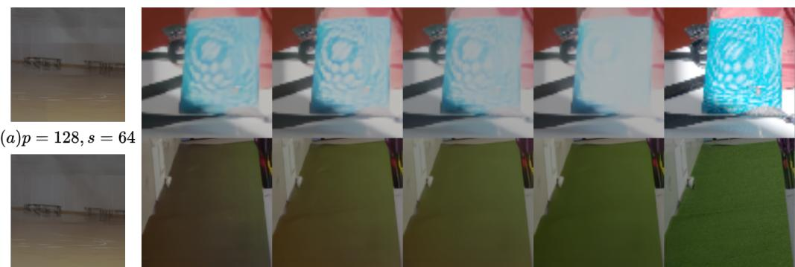

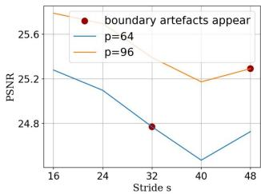

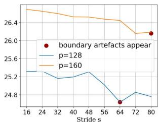  
(a) Effect of p and s on PSNR

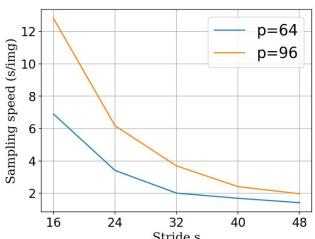

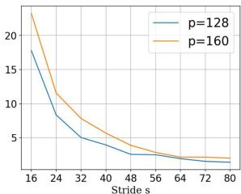  
(b) Effect of p and s on running time  
Fig. 4: Analysis of p and s on enhancing eficiency and efectiveness. Results are obtained by running on the LOL-v2-Real testing set. The red dot indicates the minimum s at which patch boundary artefacts become noticeable. (a) We notice that the patch size can afect enhancement quality. Larger patch sizes are robust to diferent strides without severe performance drops. (b) Using larger strides can significantly reduce running time.

(b)p = 128, s = 56  
(c)p = 64  
(d)p = 96  
(e)p = 128  
(f)p = 160  
(g)gt  
Fig. 5: (a)-(b): Patch boundary artefacts and inconsistent colour appear around $\begin{array} { l } { s = { \frac { p } { 2 } } } \end{array}$ but become less visible when $s < { \frac { p } { 2 } } . ( \mathrm { c } ) – ( \mathrm { g } )$ : Inconsistent enhanced outputs from PDMs trained and evaluated with diferent p values.  
Table 1: Training time with diferent p for 500, 000 iterations.
<table><tr><td>p</td><td>64</td><td>96</td><td>128</td><td>160</td><td>192</td></tr><tr><td>Time (h)</td><td>～24</td><td>～46</td><td>～64</td><td>～80</td><td>～98</td></tr></table>

These two strategies illustrate the design space of PDMs, ranging from single-scale to multiscale patch processing. However, regardless of the specific design, two critical issues limit PDM performance: 1) The choice of p and s significantly impacts the enhanced image quality, since low-light images often exhibit significant variance across patches (Wang et al. 2024a); 2) While MDMS uses multi-scale large patches, which is beneficial for enhancement, it considerably increases sampling times, especially with small s. To systematically analyse these efects, we conduct experiments on the LOL-v2-Real dataset (Yang et al. 2021) because it contains a wide range of scenes and multi-exposure images. Specifically, following WeatherDif (Ozdenizci and¨ Legenstein 2023), we train 4 individual PDMs with p = 64, 96, 128, and 160 on the LOL-v2-Real training set. We then evaluate these PDMs on its testing set with s ranging from 16 to 80.

As shown in Figure 4, we present the PSNR results across diferent combinations of p and s. We note that $p$ has a non-trivial impact on enhancement performance, and diferent p-s combinations lead to diferent trade-ofs. In general, increasing $p$ tends to improve performance in terms of PSNR. However, the running time nearly doubles with only a 64-pixel increase in patch size. On the other hand, simply increasing p does not guarantee improved PSNR, as shown by the comparison between $p = 9 6$ and $p = 1 2 8$ in Figure 4 (a). This suggests that naively using larger patches is not an optimal strategy for low-light image enhancement, which is further supported by the results in Table 8. Additionally, as shown in Figure 4 (b), increasing the stride s significantly reduces the running time, but the benefit diminishes once s reaches half of $p .$ At the same time, boundary artefacts begin to appear at this point. This indicates that $s = \textstyle { \frac { p } { 2 } }$ is a critical trade-of value.

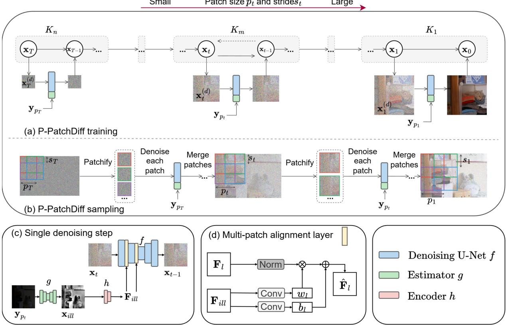  
Fig. 6: Overall framework of P-PatchDif. We divide the total time steps $T$ into n equal-length subsets K. (a) During training, we randomly crop a patch $\mathbf { x } _ { t } ^ { ( i ) }$ with size $p _ { t }$ , where $1 \leq t \leq T$ , from the normal-light image $\mathbf { x } _ { \mathrm { 0 } }$ for difusion and denoising. The patch size $p _ { t }$ is progressively increased to capture multi-level image content. (b) During sampling, the stride $s _ { t }$ is also progressively increased to reduce the number of patches. (c) We downsample the low-light image to $\mathbf { y } _ { p _ { t } }$ with a size of $p _ { t } \times p _ { t }$ . An estimator $g$ is then utilised to produce the global brightness proxy ${ \bf x } _ { i l l }$ , which is subsequently processed by the encoder h to extract $\mathbf { F } _ { i l l }$ . (d) The structure of the multi-patch alignment layer in $f .$ . We utilise $\mathbf { F } _ { i l l }$ to normalise the encoder feature $\mathbf { { F } } _ { l }$ and generate the enhanced features $\hat { \mathbf { F } } _ { l }$

We also study the impact of $p$ and s on the patch boundary artefacts, which is another issue in PDM-generated images (Shang et al. 2024; Ozdenizci and Legenstein¨ 2023). As illustrated in Figure 5, these boundary artefacts become noticeable around $\begin{array} { r } { s \ = \ \frac { p } { 2 } } \end{array}$ . Therefore, to mitigate such artefacts, the stride should satisfy $\begin{array} { l } { s < { \frac { p } { 2 } } } \end{array}$ . Using a larger patch size p consequently allows a larger stride while still meeting this constraint, making larger patches more favourable. Additionally, larger patches better tolerate variations in stride without causing severe performance degradation. However, as shown in Table 1 and Figure $^ { 4 , }$ a significant drawback of using large patches is the substantial increase in training and sampling time.

Algorithm 1 P-PatchDif Training   
Input: Normal-light and low-light image pairs   
$\mathbf { \rho } ( \mathbf { x } _ { 0 } , \mathbf { y } )$ , estimator ${ \mathit { g } } ,$ brightness proxy encoder h,   
hyperparameters $\Delta s$ and $\Delta p .$   
1: while not converged do   
2: Sample $t \sim \ "$ Uniform $\{ 1 , \ldots , T \}$ and $\epsilon _ { t } \sim$   
$\mathcal { N } ( \mathbf { 0 } , \mathbf { I } )$   
3: Obtain $p _ { t }$ by Equation $\left( 4 \right)$   
4: Generate a binary mask $\scriptstyle \mathbf { P } _ { i }$ with size $p _ { t }$   
5: $\begin{array} { r } { \mathrm { C r o p } \ \mathbf { x } _ { 0 } ^ { ( i ) } = \mathbf { P } _ { i } \odot \mathbf { x } _ { 0 } , \mathbf { y } ^ { ( i ) } = \mathbf { P } _ { i } \odot \mathbf { y } , \mathbf { F } _ { i l l } = } \end{array}$   
$h ( g ( \mathbf { y } _ { p _ { t } } ) )$   
6: Perform a single gradient descent step for   
$\nabla _ { \theta } \| \epsilon _ { t } - f _ { \theta } \big ( \sqrt { \bar { \alpha } _ { t } } \mathbf { x } _ { 0 } ^ { ( i ) } + \sqrt { 1 - \bar { \alpha } _ { t } } \epsilon _ { t } , \mathbf { y } ^ { ( i ) } , \mathbf { F } _ { i l l } , t ) \| ^ { 2 }$   
7: end while   
8: return θ

Furthermore, as shown in Figure 5, we find that enhanced outputs from PDMs with diferent p produce variations in colour and illumination. This result indicates that using fixed patch sizes (Ozdenizci and Legenstein¨ 2023) is insufficient to enhance low-light images, and simply averaging patches across scales (Shang et al. 2024) cannot fully mitigate the diferences between patches. Given these findings, it is essential to develop a strategy to address these challenges in PDMs.

## 3.2 Progressive patch difusion models

Based on the above experiments, we propose $\mathrm { P } \mathrm { - }$ PatchDif, a progressive patch difusion model for low-light image enhancement that dynamically adjusts patch size and strides over time. This adaptive strategy addresses the limitations of fixed PDMs, enabling the model to capture both local and broader contexts efectively while managing computational costs. More importantly, this progressive difusion could extensively explore local illumination variations within low-light images at each step, rather than treating all regions uniformly. Therefore, it has the potential to more efectively enhance low-light images with partial light sources. As shown in Figure 6, we divide the total of T time steps into n uniform subsets of

Algorithm 2 P-PatchDif Sampling   
Input: low-light image y, difusion model $f _ { \theta } ,$ estima  
tor g, encoder h.   
1: Sample $\mathbf { x } _ { t } \sim \mathcal { N } ( \mathbf { 0 } , \mathbf { I } )$   
2: for $\dot { t } = T , \dots , 1$ do   
3: Obtain t and $t \mathrm { n e x t }$ by DDIM   
4: Obtain $p _ { t }$ and st by Equation $\left( 4 \right)$   
5: $\mathbf { F } _ { i l l } = \hat { h ( g ( \mathbf { y } _ { p _ { t } } ) ) } \dot { \mathbf { \eta } }$   
6: Generate dictionary of $D _ { s } ^ { p }$ overlapping patch   
locations with size p and stride $s _ { t }$   
7: $\hat { \Omega } _ { t } = 0$ and $\mathbf M = 0$   
8: for $d = 1 , \ldots , D _ { s } ^ { p }$ do   
9: $\mathrm { C r o p } \ \mathbf { x } _ { t } ^ { ( d ) } = \mathbf { P } _ { d } \odot \mathbf { x } _ { t } , \mathbf { y } ^ { ( d ) } = \mathbf { P } _ { d } \odot \mathbf { y }$   
10: $\hat { \Omega } _ { t } = \hat { \Omega } _ { t } + \mathbf { P } _ { d } \odot f _ { \theta } ( \mathbf { x } _ { t } ^ { ( d ) } , \mathbf { y } ^ { ( d ) } , \mathbf { F } _ { i l l } , t )$   
11: $\mathbf { M } = \mathbf { M } + \mathbf { P } _ { d } ^ { \phantom { \dagger } }$   
12: end for   
13: $\hat { \Omega } _ { t } = \hat { \Omega } _ { t } \oslash \mathbf { M }$ ▷ ⊘: element-wise division   
14: $\begin{array} { r } { \mathbf { x } _ { t } \gets \sqrt { \bar { \alpha } _ { t _ { \mathrm { n e x t } } } } \left( \frac { \mathbf { x } _ { t } - \sqrt { 1 - \bar { \alpha } _ { t } } \cdot \hat { \Omega } _ { t } } { \sqrt { \bar { \alpha } _ { t } } } \right) + \sqrt { 1 - \bar { \alpha } _ { t _ { \mathrm { n e x t } } } } . } \end{array}$   
$\hat { \Omega } _ { t }$   
15: end for   
16: return $\mathbf { x } _ { t }$

length $\Delta K \colon$

$$
\begin{array} { l } { { \{ 1 , 2 , \ldots , T \} = \displaystyle \bigcup _ { m = 1 } ^ { n } K _ { m } , } } \\ { { \mathrm { w h e r e } \quad K _ { m } = \{ ( m - 1 ) \Delta K + 1 , \ldots , m \Delta K \} . } } \end{array}\tag{3}
$$

Moreover, given the initial patch size $p _ { 0 } .$ , initial stride $s _ { 0 } ,$ patch size change rate $\Delta p ,$ and stride change rate $\Delta s .$ , we define the patch size $p _ { t }$ and stride $s _ { t }$ at each time step t as follows:

$$
p _ { t } = \left\lfloor { \frac { t - 1 } { \Delta K } } \right\rfloor \cdot \Delta p + p _ { 0 } , \ s _ { t } = \left\lfloor { \frac { t - 1 } { \Delta K } } \right\rfloor \cdot \Delta s + s _ { 0 } .\tag{4}
$$

As outlined in Line 3 of Algorithm 1, the main distinction between our P-PatchDif and standard PDMs is that p in P-PatchDif progressively increases over time steps. We follow (Ozdenizci¨ and Legenstein 2023) to learn a conditional diffusion model where we provide a low-light patch $\mathbf { y } ^ { ( i ) }$ as input, such that the sampled output has high fidelity to the data distribution conditioned on $\mathbf { y } ^ { ( i ) }$ . Additionally, as outlined in Lines 4 and 6 of Algorithm 2, unlike previous methods that use a fixed $s , \ \mathbf { x } _ { t }$ is cropped into overlapping patches with dynamic stride $s _ { t }$ during each sampling time step. This formulation ensures balanced detail and eficiency for low-light enhancement. This stems from the fact that multi-level information can be introduced through a progressive increase in patch size, which gradually shifts from local to global views, rather than cropping multiple patch scales in a single denoising step. Additionally, using a dynamic $s _ { t }$ prevents the generation of too many overlapping patches when $p _ { t }$ is large. Thus, our P-PatchDif provides a GPU-friendly, scalable solution for low-light enhancement that integrates multiple receptive fields without sacrificing eficiency or quality, making it a highly adaptable framework for diverse image sizes and settings.

Importantly, the formulations in Equation (3) and Equation (4) define a general patch difusion model in which existing methods emerge as special cases. For example, WeatherDif (Ozdenizci¨ and Legenstein 2023) is a special case of our P-PatchDif when both $\Delta p$ and $\Delta s$ are set to 0.

Finally, following SR3 (Saharia et al. 2022b), we train P-PatchDif in a conditional DDPM manner. Specifically, P-PatchDif predicts the noise $\epsilon _ { t }$ added to $\mathbf { x } _ { 0 } ^ { ( i ) }$ , where $\epsilon _ { t } \ \sim \ \mathcal { N } ( \mathbf { 0 } , \mathbf { I } )$ is the noise sampled at time step t, and $\mathbf { x } _ { 0 } ^ { ( i ) }$ is one patch of the ground-truth normal-light image. The full loss function is given in Line 6 of Algorithm 1, where $\left( \mathbf { x } _ { 0 } , \mathbf { y } \right)$ denotes the paired normal- and low-light images.

## 3.3 Multi-patch alignment

As discussed earlier, without a global brightness reference, PDMs struggle to balance local and global brightness, particularly when processing high-resolution images, as shown in Figure 8. Therefore, it is important to carefully manage outputs from the dynamic $p _ { t }$ during the denoising process. Moreover, as demonstrated by (Zhou et al. 2023), while difusion models can efectively estimate noise at each time step even when input sizes vary, they remain sensitive to colour shifts. We therefore introduce a global brightness proxy to serve as an unchanging reference for all patches across all denoising steps.

Specifically, as shown in Figure 6 (c), following (Cai et al. 2023; Hou et al. 2023), we compute the ground-truth brightness proxy by taking the mean value along the channel dimension of the normal-light image $\mathbf { x } _ { \mathrm { 0 } }$ . Unlike other methods that model illumination using physical theory (Wei et al. 2018; Guo et al. 2025), we adopt this channel-wise mean as a coarse but lightweight prior, favouring simplicity and ease of deployment. Despite its simplicity, we find that it efectively handles local enhancement while maintaining global coherence. One reason is that we perform alignment at the feature level, which provides high-dimensional and robust information of low-light images, rather than the pixel level (Zhou et al. 2023). Moreover, we learn a lightweight U-Net (Ronneberger et al. 2015) $g$ to predict ${ \bf x } _ { i l l }$ from $\mathbf { y } _ { p _ { t } }$ , which is downsampled to size $p _ { t } \ \times \ p _ { t }$ from the low-light full-size image:

$$
\begin{array} { r } { \mathcal { L } _ { i l l } = | \mathrm { m e a n } ( \mathbf { x } _ { 0 } ) - \mathbf { x } _ { i l l } | , \mathrm { w h e r e } \quad \mathbf { x } _ { i l l } = g ( \mathbf { y } _ { p t } ) . } \end{array}\tag{5}
$$

Here $\mathbf { x } _ { \mathrm { 0 } }$ is also downsampled to $p _ { t } \times p _ { t }$ for supervision. By learning from real-world normal-light data, g captures realistic statistics of normal-light images, thereby improving adaptability during inference. This mitigates the dificulty of relying on a handcrafted illumination prior when enhancing unseen images (Yin et al. 2023). Importantly, g is only run once per denoising step to produce ${ \bf x } _ { i l l }$ that is reused for all patches, incurring minimal time cost.

Since ${ \bf x } _ { i l l }$ mixes multiple attributes such as illumination, object colour, and exposure, it is challenging to directly use it for alignment. We thus employ a stack of CNNs h to obtain $\mathbf { F } _ { i l l }$ from ${ \bf x } _ { i l l }$ . Inspired by the conditional difusion model, we provide $\mathbf { F } _ { i l l }$ into $f _ { \theta }$ as conditional input. As shown in Figure $6 ~ ( \mathrm { d } )$ , we integrate $\mathbf { F } _ { i l l }$ into each encoder layer of $f _ { \theta }$ through a learnable multipatch alignment layer (PALayer) to adaptively adjust features. Given the encoder feature $\mathbf { F } _ { l }$ and $\mathbf { F } _ { i l l }$ , PALayer predicts channel-wise scaling and bias vectors $( w _ { l } , b _ { l } )$ via convolutional layers, and normalises $\mathbf { { F } } _ { l }$ as:

$$
\hat { \mathbf { F } } _ { l } = w _ { l } \odot \mathrm { G r o u p N o r m } ( \mathbf { F } _ { l } ) + b _ { l } .\tag{6}
$$

This operation aligns the statistics of each patch’s features to the global intensity, mitigating colour and brightness inconsistencies across diferent $p _ { t }$ values.

The overall objective function of P-PatchDif is:

$$
\mathcal { L } _ { t o t a l } = \mathcal { L } _ { d i f f } + \mathcal { L } _ { i l l } ,\tag{7}
$$

where $\mathcal { L } _ { d i f f }$ refers to Line 6 in Algorithm 1.

## 4 Experiments

To validate the efectiveness of the proposed $\mathrm { P } \mathrm { - }$ PatchDif, we conduct experiments under two diferent settings: (1) In-domain evaluation, where models are trained and evaluated on the oficial training and test sets for low-light image enhancement; and (2) Cross-domain generalisation, where models are trained on one dataset and evaluated on other low-light image enhancement datasets.

Table 2: Quantitative comparisons on the $\mathrm { L O L - v 1 }$ , LOL-v2-Real and $_ { \mathrm { L O L - v 2 - S y n } }$ datasets in terms of PSNR and SSIM. Bold and underline denote the best and second-best results. The top half and bottom half of the table show regression and generative models, respectively. ⋄ denotes patch difusion models.
<table><tr><td rowspan=2 colspan=1>Methods</td><td rowspan=1 colspan=2>LOL-v1(400 × 600)</td><td rowspan=1 colspan=2>LOL-v2-Real(400 × 600)</td><td rowspan=1 colspan=2>LOL-v2-Syn (512 × 512)</td></tr><tr><td rowspan=1 colspan=2>PSNR ↑  SSIM ↑</td><td rowspan=1 colspan=1>PSNR ↑</td><td rowspan=1 colspan=1>SSIM ↑</td><td rowspan=1 colspan=1>PSNR ↑</td><td rowspan=1 colspan=1>SSIM ↑</td></tr><tr><td rowspan=11 colspan=1>RetinexNet (Wei et al. 2018)KinD (Zhang et al. 2019)Zero-DCE (Guo et al. 2020)RUAS (Liu et al. 2021)SCI (Ma et al. 2022)URetinexNet (Wu et al. 2022)SNR (Xu et al. 2022)SMG (Xu et al. 2023)PairLIE (Fu et al. 2023b)Retinexformer (Cai et al. 2023)Zero-IG (Shi et al. 2024)</td><td rowspan=1 colspan=1>16.77</td><td rowspan=1 colspan=1>0.462</td><td rowspan=1 colspan=1>17.72</td><td rowspan=1 colspan=1>0.652</td><td rowspan=1 colspan=1>16.55</td><td rowspan=1 colspan=1>0.652</td></tr><tr><td rowspan=1 colspan=1>20.87</td><td rowspan=1 colspan=1>0.799</td><td rowspan=1 colspan=1>17.54</td><td rowspan=1 colspan=1>0.669</td><td rowspan=1 colspan=1>18.96</td><td rowspan=1 colspan=1>0.801</td></tr><tr><td rowspan=1 colspan=1>14.86</td><td rowspan=1 colspan=1>0.562</td><td rowspan=1 colspan=1>18.06</td><td rowspan=1 colspan=1>0.580</td><td rowspan=1 colspan=1>17.76</td><td rowspan=1 colspan=1>0.814</td></tr><tr><td rowspan=1 colspan=1>16.41</td><td rowspan=1 colspan=1>0.503</td><td rowspan=1 colspan=1>15.35</td><td rowspan=1 colspan=1>0.495</td><td rowspan=1 colspan=1>13.40</td><td rowspan=1 colspan=1>0.640</td></tr><tr><td rowspan=1 colspan=1>14.78</td><td rowspan=1 colspan=1>0.525</td><td rowspan=1 colspan=1>17.30</td><td rowspan=1 colspan=1>0.540</td><td rowspan=1 colspan=1>15.43</td><td rowspan=1 colspan=1>0.744</td></tr><tr><td rowspan=1 colspan=1>19.84</td><td rowspan=1 colspan=1>0.824</td><td rowspan=1 colspan=1>21.09</td><td rowspan=1 colspan=1>0.858</td><td rowspan=1 colspan=1>18.27</td><td rowspan=1 colspan=1>0.518</td></tr><tr><td rowspan=1 colspan=1>24.61</td><td rowspan=1 colspan=1>0.842</td><td rowspan=1 colspan=1>21.48</td><td rowspan=1 colspan=1>0.849</td><td rowspan=1 colspan=1>24.14</td><td rowspan=1 colspan=1>0.927</td></tr><tr><td rowspan=1 colspan=1>23.68</td><td rowspan=1 colspan=1>0.826</td><td rowspan=1 colspan=1>24.62</td><td rowspan=1 colspan=1>0.867</td><td rowspan=1 colspan=1>25.62</td><td rowspan=1 colspan=1>0.905</td></tr><tr><td rowspan=1 colspan=1>19.51</td><td rowspan=1 colspan=1>0.736</td><td rowspan=1 colspan=1>19.88</td><td rowspan=1 colspan=1>0.773</td><td rowspan=1 colspan=1>19.07</td><td rowspan=1 colspan=1>0.794</td></tr><tr><td rowspan=2 colspan=1>25.1522.17</td><td rowspan=1 colspan=1>0.843</td><td rowspan=1 colspan=1>22.79</td><td rowspan=1 colspan=1>0.839</td><td rowspan=1 colspan=1>25.67</td><td rowspan=1 colspan=1>0.928</td></tr><tr><td rowspan=1 colspan=1>0.772</td><td rowspan=1 colspan=1>18.13</td><td rowspan=1 colspan=1>0.740</td><td rowspan=1 colspan=1>15.77</td><td rowspan=1 colspan=1>0.752</td></tr><tr><td rowspan=9 colspan=1>EnlightenGAN (Jiang et al. 2021)PyDiff (Zhou et al. 2023)DiffLL (Jiang et al. 2023)WeatherDiff (Özdenizci and Legenstein 2023) CLEDiff (Yin et al. 2023)MDMS (Shang et al. 2024) QuadPrior (Wang et al. 2024b)LightenDiff (Jiang et al. 2024)P-PatchDiff (Ours)</td><td rowspan=1 colspan=1>17.61</td><td rowspan=1 colspan=1>0.653</td><td rowspan=1 colspan=1>18.68</td><td rowspan=1 colspan=1>0.678</td><td rowspan=1 colspan=1>16.57</td><td rowspan=1 colspan=1>0.772</td></tr><tr><td rowspan=1 colspan=1>27.09</td><td rowspan=1 colspan=1>0.880</td><td rowspan=1 colspan=1>26.98</td><td rowspan=1 colspan=1>0.882</td><td rowspan=1 colspan=1>25.28</td><td rowspan=1 colspan=1>0.913</td></tr><tr><td rowspan=1 colspan=1>26.34</td><td rowspan=1 colspan=1>0.845</td><td rowspan=1 colspan=1>19.89</td><td rowspan=1 colspan=1>0.806</td><td rowspan=1 colspan=1>22.67</td><td rowspan=1 colspan=1>0.869</td></tr><tr><td rowspan=1 colspan=1>21.44</td><td rowspan=1 colspan=1>0.837</td><td rowspan=1 colspan=1>22.01</td><td rowspan=1 colspan=1>0.838</td><td rowspan=1 colspan=1>22.33</td><td rowspan=1 colspan=1>0.909</td></tr><tr><td rowspan=1 colspan=1>24.92</td><td rowspan=1 colspan=1>0.880</td><td rowspan=1 colspan=1>20.94</td><td rowspan=1 colspan=1>0.794</td><td rowspan=1 colspan=1>20.59</td><td rowspan=1 colspan=1>0.773</td></tr><tr><td rowspan=1 colspan=1>27.12</td><td rowspan=1 colspan=1>0.882</td><td rowspan=1 colspan=1>26.87</td><td rowspan=1 colspan=1>0.871</td><td rowspan=1 colspan=1>19.83</td><td rowspan=1 colspan=1>0.825</td></tr><tr><td rowspan=1 colspan=1>20.31</td><td rowspan=1 colspan=1>0.808</td><td rowspan=1 colspan=1>20.59</td><td rowspan=1 colspan=1>0.808</td><td rowspan=1 colspan=1>16.10</td><td rowspan=1 colspan=1>0.753</td></tr><tr><td rowspan=1 colspan=1>20.45</td><td rowspan=1 colspan=1>0.803</td><td rowspan=1 colspan=1>22.93</td><td rowspan=1 colspan=1>0.853</td><td rowspan=1 colspan=1>21.57</td><td rowspan=1 colspan=1>0.866</td></tr><tr><td rowspan=1 colspan=1>27.18</td><td rowspan=1 colspan=1>0.880</td><td rowspan=1 colspan=1>28.04</td><td rowspan=1 colspan=1>0.887</td><td rowspan=1 colspan=1>28.15</td><td rowspan=1 colspan=1>0.941</td></tr></table>

Table 3: Quantitative comparisons on the LOL-v1, LOL-v2-Real and $_ { \mathrm { L O L - v 2 - S y n } }$ datasets in terms of LPIPS and FID. Bold and underline denote the best and second-best results. The top half and bottom half of the table show regression and generative models, respectively. ⋄ denotes patch difusion models.
<table><tr><td rowspan=2 colspan=5>Methods</td><td rowspan=1 colspan=6>LOL-v1(400 × 600)   LOL-v2-Real (400 × 600)   LOL-v2-Syn (512 × 512)</td></tr><tr><td rowspan=1 colspan=2>LPIPS ↓    FID↓</td><td rowspan=1 colspan=1>LPIPS ↓</td><td rowspan=1 colspan=1>FID ↓</td><td rowspan=1 colspan=1>LPIPS ↓</td><td rowspan=1 colspan=1>FID ↓</td></tr><tr><td rowspan=11 colspan=5>RetinexNet (Wei et al. 2018)KinD (Zhang et al. 2019)Zero-DCE (Guo et al. 2020)RUAS (Liu et al. 2021)SCI (Ma et al. 2022)URetinexNet (Wu et al. 2022)SNR (Xu et al. 2022)SMG (Xu et al. 2023)PairLIE (Fu et al. 2023b)Retinexformer (Cai et al. 2023)Zero-IG (Shi et al. 2024)</td><td rowspan=1 colspan=1>0.417</td><td rowspan=1 colspan=1>126.27</td><td rowspan=1 colspan=1>0.436</td><td rowspan=1 colspan=1>133.91</td><td rowspan=1 colspan=1>0.379</td><td rowspan=1 colspan=1>98.84</td></tr><tr><td rowspan=1 colspan=1>0.207</td><td rowspan=1 colspan=1>104.63</td><td rowspan=1 colspan=1>0.375</td><td rowspan=1 colspan=1>137.35</td><td rowspan=1 colspan=1>0.262</td><td rowspan=1 colspan=1>89.16</td></tr><tr><td rowspan=1 colspan=1>al. 2</td><td rowspan=1 colspan=2></td><td rowspan=1 colspan=1>0.335</td><td rowspan=1 colspan=1>101.24</td><td rowspan=1 colspan=1>0.313</td><td rowspan=1 colspan=1>91.94</td><td rowspan=1 colspan=1>0.168</td><td rowspan=1 colspan=1>49.24</td></tr><tr><td rowspan=1 colspan=3>et al, 2021)</td><td rowspan=1 colspan=1>0.364</td><td rowspan=1 colspan=1>101.97</td><td rowspan=1 colspan=1>0.395</td><td rowspan=1 colspan=1>94.16</td><td rowspan=1 colspan=1>0.364</td><td rowspan=1 colspan=1>123.78</td></tr><tr><td rowspan=1 colspan=1>0.366</td><td rowspan=1 colspan=1>78.60</td><td rowspan=1 colspan=1>0.345</td><td rowspan=1 colspan=1>67.62</td><td rowspan=1 colspan=1>0.233</td><td rowspan=1 colspan=1>61.20</td></tr><tr><td rowspan=1 colspan=1>0.237</td><td rowspan=1 colspan=1>52.38</td><td rowspan=1 colspan=1>0.208</td><td rowspan=1 colspan=1>49.84</td><td rowspan=1 colspan=1>0.419</td><td rowspan=1 colspan=1>66.87</td></tr><tr><td rowspan=2 colspan=1>0.2330.118</td><td rowspan=1 colspan=1>55.12</td><td rowspan=1 colspan=1>0.237</td><td rowspan=1 colspan=1>54.53</td><td rowspan=1 colspan=1>0.056</td><td rowspan=1 colspan=1>19.95</td></tr><tr><td rowspan=1 colspan=1>58.85</td><td rowspan=1 colspan=1>0.148</td><td rowspan=1 colspan=1>78.58</td><td rowspan=1 colspan=1>0.053</td><td rowspan=1 colspan=1>23.21</td></tr><tr><td rowspan=1 colspan=1>0.248</td><td rowspan=1 colspan=1>103.64</td><td rowspan=1 colspan=1>0.239</td><td rowspan=1 colspan=1>98.27</td><td rowspan=1 colspan=1>0.232</td><td rowspan=1 colspan=1>86.41</td></tr><tr><td rowspan=2 colspan=1>0.1310.199</td><td rowspan=1 colspan=1>71.15</td><td rowspan=1 colspan=1>0.171</td><td rowspan=1 colspan=1>62.44</td><td rowspan=1 colspan=1>0.059</td><td rowspan=2 colspan=1>22.7878.49</td></tr><tr><td rowspan=1 colspan=1>83.94</td><td rowspan=1 colspan=1>0.248</td><td rowspan=1 colspan=1>77.38</td><td rowspan=1 colspan=1>0.259</td></tr><tr><td rowspan=9 colspan=5>EnlightenGAN (Jiang et al. 2021)PyDiff (Zhou et al. 2023)DiffLL (Jiang et al. 2023)WeatherDiff (Özdenizci and Legenstein 2023)CLEDiff (Yin et al. 2023)MDMS (Shang et al. 2024) QuadPrior (Wang et al. 2024b)LightenDiff (Jiang et al. 2024)P-PatchDiff (Ours)</td><td rowspan=2 colspan=1>0.3720.100</td><td rowspan=1 colspan=1>94.70</td><td rowspan=1 colspan=1>0.364</td><td rowspan=1 colspan=1>84.04</td><td rowspan=1 colspan=1>0.212</td><td rowspan=1 colspan=1>74.35</td></tr><tr><td rowspan=1 colspan=1>48.38</td><td rowspan=1 colspan=1>0.154</td><td rowspan=1 colspan=1>77.25</td><td rowspan=1 colspan=1>0.095</td><td rowspan=1 colspan=1>36.53</td></tr><tr><td rowspan=1 colspan=1>0.217</td><td rowspan=1 colspan=1>48.11</td><td rowspan=1 colspan=1>0.202</td><td rowspan=1 colspan=1>81.47</td><td rowspan=1 colspan=1>0.154</td><td rowspan=1 colspan=1>63.49</td></tr><tr><td rowspan=2 colspan=1>0.1590.160</td><td rowspan=1 colspan=1>78.48</td><td rowspan=1 colspan=1>0.204</td><td rowspan=1 colspan=1>89.82</td><td rowspan=1 colspan=1>0.092</td><td rowspan=1 colspan=1>35.44</td></tr><tr><td rowspan=1 colspan=1>74.29</td><td rowspan=1 colspan=1>0.178</td><td rowspan=1 colspan=1>71.25</td><td rowspan=1 colspan=1>0.273</td><td rowspan=1 colspan=1>101.40</td></tr><tr><td rowspan=1 colspan=1>0.078</td><td rowspan=1 colspan=1>36.29</td><td rowspan=1 colspan=1>0.101</td><td rowspan=1 colspan=1>69.12</td><td rowspan=1 colspan=1>0.225</td><td rowspan=1 colspan=1>81.74</td></tr><tr><td rowspan=1 colspan=1>0.202</td><td rowspan=1 colspan=1>79.07</td><td rowspan=1 colspan=1>0.202</td><td rowspan=1 colspan=1>70.90</td><td rowspan=1 colspan=1>0.250</td><td rowspan=1 colspan=1>76.76</td></tr><tr><td rowspan=1 colspan=1>0.192</td><td rowspan=1 colspan=1>85.37</td><td rowspan=1 colspan=1>0.167</td><td rowspan=1 colspan=1>79.04</td><td rowspan=1 colspan=1>0.155</td><td rowspan=1 colspan=1>56.97</td></tr><tr><td rowspan=1 colspan=1>0.096</td><td rowspan=1 colspan=1>52.35</td><td rowspan=1 colspan=1>0.135</td><td rowspan=1 colspan=1>66.02</td><td rowspan=1 colspan=1>0.054</td><td rowspan=1 colspan=1>23.90</td></tr></table>

## 4.1 Implementation details

Dataset. For low-light image enhancement, we evaluate P-PatchDif on 9 real-world and 1 synthetic widely used public datasets with varying image resolutions.

Table 4: Quantitative results on the LSRW and UHD-LL datasets. Following (Jiang et al. 2023), images are downsampled for methods that run out of memory. † denotes methods that support 4K.
<table><tr><td rowspan="2">Methods</td><td colspan="4">LSRW (960 × 720)</td><td colspan="4">UHD-LL (4K)</td></tr><tr><td>PSNR ↑</td><td>SSIM ↑</td><td>LPIPS ↓</td><td>FID ↓</td><td>PSNR ↑</td><td>SSIM ↑</td><td>LPIPS ↓</td><td>FID ↓</td></tr><tr><td>SNR (Xu et al. 2022)</td><td>17.30</td><td>0.512</td><td>0.452</td><td>94.19</td><td>16.98</td><td>0.797</td><td>0.245</td><td>69.90</td></tr><tr><td>PyDiff (Zhou et al. 2023)</td><td>16.88</td><td>0.503</td><td>0.328</td><td>73.02</td><td>19.64</td><td>0.844</td><td>0.180</td><td>46.35</td></tr><tr><td>Zero-IG (Shi et al. 2024) †</td><td>15.90</td><td>0.485</td><td>0.364</td><td>74.89</td><td>13.79</td><td>0.718</td><td>0.305</td><td>80.73</td></tr><tr><td>DiffLL (Jiang et al. 2023) †</td><td>17.04</td><td>0.390</td><td>0.430</td><td>80.66</td><td>21.49</td><td>0.721</td><td>0.336</td><td>63.30</td></tr><tr><td>CLEDiff (Yin et al. 2023)</td><td>13.97</td><td>0.425</td><td>0.502</td><td>100.31</td><td>11.97</td><td>0.641</td><td>0.278</td><td>65.76</td></tr><tr><td>GSAD (Hou et al. 2023)</td><td>16.99</td><td>0.494</td><td>0.290</td><td>65.18</td><td>21.27</td><td>0.845</td><td>0.171</td><td>37.60</td></tr><tr><td>WeatherDiff (Özdenizci and Legenstein 2023)  †</td><td>16.37</td><td>0.514</td><td>0.310</td><td>77.18</td><td>17.22</td><td>0.820</td><td>0.202</td><td>65.12</td></tr><tr><td>MDMS (Shang et al. 2024) ◇ ↑</td><td>15.81</td><td>0.504</td><td>0.319</td><td>68.16</td><td>17.93</td><td>0.832</td><td>0.177</td><td>44.80</td></tr><tr><td>P-PatchDiff (Ours)  ↑</td><td>17.61</td><td>0.520</td><td>0.298</td><td>64.63</td><td>21.79</td><td>0.857</td><td>0.150</td><td>35.55</td></tr></table>

Table 5: Quantitative comparisons on the DICM, MEF, LIME, NPE and VV datasets. Bold and underline denote the best and second-best results. NI, BR, PI denote the NIQE, BRISQUE and PI metrics, respectively. ⋄ denotes patch difusion models.
<table><tr><td rowspan=2 colspan=1>Methods</td><td rowspan=1 colspan=9>DICM                   MEF                   LIME</td></tr><tr><td rowspan=1 colspan=1>NI↓</td><td rowspan=1 colspan=3>BR ↓  PI↓  NI↓</td><td rowspan=1 colspan=1>BR ↓</td><td rowspan=1 colspan=4>PI↓  NI↓   BR ↓  PI↓</td></tr><tr><td rowspan=8 colspan=1>SNR (Xu et al. 2022)SMG (Xu et al. 2023)PyDiff (Zhou et al. 2023)CLEDiff (Yin et al. 2023)QuadPrior (Wang et al. 2024b)WeatherDiff (Özdenizci and Legenstein 2023) MDMS (Shang et al. 2024) P-PatchDiff (Ours)</td><td rowspan=1 colspan=1>3.43</td><td rowspan=1 colspan=1>34.48</td><td rowspan=1 colspan=1>4.11</td><td rowspan=1 colspan=1>3.52</td><td rowspan=1 colspan=1>30.57</td><td rowspan=1 colspan=1>3.55</td><td rowspan=1 colspan=1>4.77</td><td rowspan=1 colspan=1>38.69</td><td rowspan=1 colspan=1>4.64</td></tr><tr><td rowspan=1 colspan=1>4.46</td><td rowspan=1 colspan=1>24.85</td><td rowspan=1 colspan=1>3.71</td><td rowspan=1 colspan=1>5.09</td><td rowspan=1 colspan=1>21.27</td><td rowspan=1 colspan=1>3.77</td><td rowspan=1 colspan=1>4.96</td><td rowspan=1 colspan=1>30.93</td><td rowspan=1 colspan=1>4.11</td></tr><tr><td rowspan=1 colspan=1>3.57</td><td rowspan=1 colspan=1>30.37</td><td rowspan=1 colspan=1>3.67</td><td rowspan=1 colspan=1>3.49</td><td rowspan=1 colspan=1>30.24</td><td rowspan=1 colspan=1>3.64</td><td rowspan=1 colspan=1>4.99</td><td rowspan=1 colspan=1>38.57</td><td rowspan=1 colspan=1>5.34</td></tr><tr><td rowspan=1 colspan=1>5.61</td><td rowspan=1 colspan=1>42.46</td><td rowspan=1 colspan=1>4.77</td><td rowspan=1 colspan=1>4.77</td><td rowspan=1 colspan=1>15.56</td><td rowspan=1 colspan=1>3.68</td><td rowspan=1 colspan=1>7.74</td><td rowspan=1 colspan=1>38.26</td><td rowspan=1 colspan=1>6.96</td></tr><tr><td rowspan=2 colspan=1>4.073.77</td><td rowspan=1 colspan=1>25.58</td><td rowspan=1 colspan=1>3.65</td><td rowspan=1 colspan=1>3.65</td><td rowspan=1 colspan=1>22.49</td><td rowspan=1 colspan=1>3.13</td><td rowspan=1 colspan=1>4.59</td><td rowspan=1 colspan=1>28.02</td><td rowspan=1 colspan=1>3.93</td></tr><tr><td rowspan=1 colspan=1>30.38</td><td rowspan=1 colspan=1>4.13</td><td rowspan=1 colspan=1>3.75</td><td rowspan=1 colspan=1>30.48</td><td rowspan=1 colspan=1>3.31</td><td rowspan=1 colspan=1>5.31</td><td rowspan=1 colspan=1>28.09</td><td rowspan=1 colspan=1>4.42</td></tr><tr><td rowspan=2 colspan=1>3.853.53</td><td rowspan=1 colspan=1>25.19</td><td rowspan=1 colspan=1>3.45</td><td rowspan=1 colspan=1>4.11</td><td rowspan=1 colspan=1>23.45</td><td rowspan=1 colspan=1>3.12</td><td rowspan=1 colspan=1>4.19</td><td rowspan=1 colspan=1>29.56</td><td rowspan=1 colspan=1>3.78</td></tr><tr><td rowspan=1 colspan=1>30.40</td><td rowspan=1 colspan=1>3.74</td><td rowspan=1 colspan=1>3.54</td><td rowspan=1 colspan=1>28.42</td><td rowspan=1 colspan=1>3.52</td><td rowspan=1 colspan=2>4.59   27.53</td><td rowspan=1 colspan=1>3.68</td></tr><tr><td rowspan=2 colspan=1>Methods</td><td rowspan=1 colspan=9>NPE                    VV             Average (5 datasets)</td></tr><tr><td rowspan=1 colspan=1>NI↓</td><td rowspan=1 colspan=2>BR↓   PI↓</td><td rowspan=1 colspan=1>NI↓</td><td rowspan=1 colspan=1>BR↓</td><td rowspan=1 colspan=1>PI↓</td><td rowspan=1 colspan=2>NI↓  BR↓</td><td rowspan=1 colspan=1>PI↓</td></tr><tr><td rowspan=8 colspan=1>SNR (Xu et al. 2022)SMG (Xu et al. 2023)PyDiff (Zhou et al. 2023)CLEDiff (Yin et al. 2023)QuadPrior (Wang et al. 2024b)WeatherDiff (Özdenizci and Legenstein 2023) MDMS (Shang et al. 2024) P-PatchDiff (Ours)</td><td rowspan=1 colspan=1>3.51</td><td rowspan=1 colspan=1>26.72</td><td rowspan=1 colspan=1>3.39</td><td rowspan=1 colspan=1>5.31</td><td rowspan=1 colspan=1>56.94</td><td rowspan=1 colspan=1>7.68</td><td rowspan=1 colspan=1>4.11</td><td rowspan=1 colspan=1>37.48</td><td rowspan=1 colspan=1>4.67</td></tr><tr><td rowspan=1 colspan=1>4.25</td><td rowspan=1 colspan=1>25.85</td><td rowspan=1 colspan=1>3.55</td><td rowspan=1 colspan=1>5.92</td><td rowspan=1 colspan=1>54.74</td><td rowspan=1 colspan=1>7.09</td><td rowspan=1 colspan=1>4.94</td><td rowspan=1 colspan=1>31.53</td><td rowspan=1 colspan=1>4.44</td></tr><tr><td rowspan=1 colspan=1>3.61</td><td rowspan=1 colspan=1>26.19</td><td rowspan=1 colspan=1>3.43</td><td rowspan=1 colspan=1>4.12</td><td rowspan=1 colspan=1>37.61</td><td rowspan=1 colspan=1>5.73</td><td rowspan=1 colspan=1>3.95</td><td rowspan=1 colspan=1>32.60</td><td rowspan=1 colspan=1>4.36</td></tr><tr><td rowspan=1 colspan=1>4.93</td><td rowspan=1 colspan=1>24.03</td><td rowspan=1 colspan=1>3.33</td><td rowspan=1 colspan=1>7.40</td><td rowspan=1 colspan=1>42.25</td><td rowspan=1 colspan=1>6.62</td><td rowspan=1 colspan=1>6.09</td><td rowspan=1 colspan=1>32.51</td><td rowspan=1 colspan=1>5.07</td></tr><tr><td rowspan=1 colspan=1>3.52</td><td rowspan=1 colspan=1>28.37</td><td rowspan=1 colspan=1>3.12</td><td rowspan=1 colspan=1>5.00</td><td rowspan=1 colspan=1>47.70</td><td rowspan=1 colspan=1>6.84</td><td rowspan=1 colspan=1>4.16</td><td rowspan=1 colspan=1>30.43</td><td rowspan=1 colspan=1>4.13</td></tr><tr><td rowspan=1 colspan=1>3.67</td><td rowspan=1 colspan=1>30.26</td><td rowspan=1 colspan=1>3.87</td><td rowspan=1 colspan=1>3.47</td><td rowspan=1 colspan=1>38.07</td><td rowspan=1 colspan=1>4.65</td><td rowspan=1 colspan=1>3.99</td><td rowspan=1 colspan=1>31.46</td><td rowspan=1 colspan=1>4.08</td></tr><tr><td rowspan=1 colspan=1>4.13</td><td rowspan=1 colspan=1>28.56</td><td rowspan=1 colspan=1>3.15</td><td rowspan=1 colspan=1>5.53</td><td rowspan=1 colspan=1>48.28</td><td rowspan=1 colspan=1>7.46</td><td rowspan=1 colspan=1>4.36</td><td rowspan=1 colspan=1>31.01</td><td rowspan=1 colspan=1>4.19</td></tr><tr><td rowspan=1 colspan=1>3.41</td><td rowspan=1 colspan=1>30.01</td><td rowspan=1 colspan=1>3.26</td><td rowspan=1 colspan=1>2.62</td><td rowspan=1 colspan=1>28.97</td><td rowspan=1 colspan=1>3.82</td><td rowspan=1 colspan=1>3.54</td><td rowspan=1 colspan=1>29.07</td><td rowspan=1 colspan=1>3.61</td></tr></table>

For in-domain evaluation, we train and test P-PatchDif on LOL-v1 (Wei et al. 2018) and LOLv2-Real (Yang et al. 2021), both with a size of 400 × 600 and dynamic ISO, as well as LOL-v2- Syn (Yang et al. 2021), with a size of 512 × 512. These datasets include diverse indoor and outdoor city scenes, with training/testing splits of 485:15, 689:100, and 900:100, respectively.

For cross-domain generalisation, we test our model (trained on LOL-v1) on LSRW (Hai et al. 2023), which contains 50 images at 960 × 720 captured by Nikon cameras and a mobile phone with lower ISO ([50, 100]), and UHD-LL (Li et al. 2023), which consists of 150 4K images captured by Sony cameras with higher ISO ([100, 800]). Furthermore, we evaluate the same model on five real-world datasets without ground truth, covering world-wide low-light scenarios and more complex resolutions: DICM (Lee et al. 2013) at 480 × 640, MEF (Ma et al. 2015) at 512 × 340, LIME (Guo et al. 2016) at 2000 × 1500, NPE (Wang et al. 2013) at 725 × 750, and VV (Vonikakis et al. 2018) at 2304 × 1728.

Metrics. We use PSNR, SSIM, LPIPS and FID for datasets with ground truth, while NIQE (Mittal et al. 2012b), BRISQUE (Mittal et al. 2012a), and PI (Blau et al. 2018) are used for datasets without ground truth.

Implementation. Our method is built upon WeatherDif (Ozdenizci and Legenstein ¨ 2023) and trained on an NVIDIA A100 GPU with 80G memory for 500k iterations. We use the Adam optimiser with an initial learning rate of 1 × 10−4 and halve the learning rate every 50k iterations.

The batch size is set to 16, with training timesteps $T = 1 0 0 0$ . We use DDIM (Song et al. 2021) for sampling with only 5 steps.

Hyperparameters in progressive strategy. We follow existing PDMs (Ozdenizci and¨ Legenstein 2023; Shang et al. 2024) by setting $p _ { 0 } = 6 4$ and $s _ { 0 } = 1 6$ , ensuring that our method starts from the same initial patch size and stride during sampling for a fair comparison. Furthermore, we adopt $\Delta p = 3 2$ , consistent with MDMS, so that both methods use the same set of multiscale patches. These settings allow us to isolate the efect of our progressive strategy by varying only $n ,$ while keeping the patch configuration identical to other PDMs. Based on the analysis in Figure 4, we set $\Delta s = 1 6$ to ensure that $s _ { t }$ remains less than half of $p _ { t }$ throughout the process. We use $n = 5$ for optimal performance, with the corresponding ablation results presented in Table 8.

## 4.2 Comparisons with existing methods

We compare P-PatchDif with state-of-theart regression and generative models. For regression-based methods, we select CNNs (RetinexNet (Wei et al. 2018), KinD (Zhang et al. 2019) and URetinexNet (Wu et al. 2022)), Transformers (SNR (Xu et al. 2022), SMG (Xu et al. 2023) and Retinexformer (Cai et al. 2023)) and zero-reference methods (Zero-DCE (Guo et al. 2020), RUAS (Liu et al. 2021), SCI (Ma et al. 2022), PairLIE (Fu et al. 2023b) and Zero-IG (Shi et al. 2024)). For generativebased models, we select EnlightenGAN (Jiang et al. 2021) and DDPMs: Directly generating normal-light images (PyDif (Zhou et al. 2023), GSAD (Hou et al. 2023), CLEDif (Yin et al. 2023) and QuadPrior (Wang et al. 2024b)), generating components (DifLL (Jiang et al. 2023) and LightenDif (Jiang et al. 2024)) and PDMs (WeatherDif (Ozdenizci and Legenstein ¨ 2023) and MDMS (Shang et al. 2024)) denoted by ⋄ in each table.

In-domain evaluation. As shown in Tables 2 and 3, P-PatchDif achieves competitive results across three popular low-resolution benchmarks with multi-exposure images for in-domain testing. The best-performing PDM, MDMS, incorporates multi-scale patches together with a

Table 6: Detailed training statistics on the LOLv2-real dataset, including training time (T.t), memory usage (M), and parameters (P).
<table><tr><td rowspan=1 colspan=1>Methods</td><td rowspan=1 colspan=1>PSNR ↑</td><td rowspan=1 colspan=1>T.t (h) ↓</td><td rowspan=1 colspan=1>M(G)↓|</td><td rowspan=1 colspan=1>P(M)↓</td></tr><tr><td rowspan=8 colspan=1>PyDiffCLEDiffQuadPriorLightenDiffWeatherDiff MDMS Ours Ours-S </td><td></td><td></td><td rowspan=1 colspan=1>20</td><td rowspan=1 colspan=1>97</td></tr><tr><td rowspan=1 colspan=1>20.94</td><td rowspan=1 colspan=1>72</td><td rowspan=1 colspan=1>32</td><td rowspan=1 colspan=1>85</td></tr><tr><td rowspan=1 colspan=1>20.59</td><td rowspan=1 colspan=1>一</td><td rowspan=1 colspan=1>40</td><td rowspan=5 colspan=1>1313286121380</td></tr><tr><td rowspan=1 colspan=1>22.93</td><td rowspan=1 colspan=1>69</td><td rowspan=1 colspan=1>11</td></tr><tr><td rowspan=1 colspan=1>22.01</td><td rowspan=1 colspan=1>106</td><td rowspan=1 colspan=1>8</td></tr><tr><td rowspan=1 colspan=1>26.87</td><td rowspan=1 colspan=1>145</td><td rowspan=1 colspan=1>23</td></tr><tr><td rowspan=1 colspan=1>28.04</td><td rowspan=1 colspan=1>55</td><td rowspan=1 colspan=1>8</td></tr><tr><td rowspan=1 colspan=1>27.64</td><td rowspan=1 colspan=1>17</td><td rowspan=1 colspan=1>6</td><td rowspan=1 colspan=1>31</td></tr></table>

Fourier Transform, which can be particularly beneficial under supervised settings. In contrast, our method adopts a standard U-Net backbone, which prioritises flexibility and general applicability, but may limit performance in certain fully supervised benchmarks. Moreover, MDMS requires significantly higher computational costs (600× slower than ours), making it impractical for real-world use. DifLL performs well on 400×600 datasets but fails on 4K resolutions in terms of SSIM/LPIPS (0.1 lower SSIM and 0.16 higher LPIPS than ours). This is because they rely on transformations to resize images for eficiency, which results in the loss of fine details.

Cross-domain generalisation. As shown in Table 4, we also show competitive performance for cross-dataset validation on LSRW and UHD-LL, which include diverse ISO and 4K resolution images. In comparison, although CLEDif incorporates illumination information into the denoising process, it can only operate efectively within the training domain and fails to generalise to LSRW and UHD-LL. QuadPrior proposes a general illumination prior to improve generalisability, but it relies on downsampled single-scale images, which harms performance. Even though our estimator g shares a similar concept with these difusion models by injecting priors, we employ it more efectively, using $\mathbf { F } _ { i l l }$ to align multi-level features through the multi-patch alignment layer, thereby improving consistency across scales.

As illustrated in Table 5, we further conduct experiments on five complex and uncommonresolution datasets. We note that some methods, such as SMG, CLEDif, and QuadPrior, show better results than ours in some cases. This arises because these methods include pretrained knowledge or handcrafted priors that align closely with certain target data distributions. However, such designs might not generalise consistently across diverse domains. In contrast, our method emphasises progressive multi-scale patch modelling and global coherence to improve robustness under varying illumination conditions, which leads to competitive and often superior overall performance. Additionally, their low performance on NPE and VV datasets indicates inefectiveness in handling high-resolution images.

Table 7: Detailed sampling statistics, including memory usage (M) and sampling time (S.t) with diferent input sizes. OOM indicates out-ofmemory error. We use an NVIDIA A100 GPU with 80G RAM.
<table><tr><td>Input sizes</td><td colspan="2">400 × 600</td><td colspan="2">1080p</td><td colspan="2">4K</td></tr><tr><td>Method</td><td>|M (G)</td><td>S.t (s)</td><td>M (G)</td><td>S.t (s)</td><td>M (G)</td><td>S.t (s)</td></tr><tr><td>PyDiff</td><td>6.5</td><td>2.1</td><td>16.1</td><td>4.3</td><td>OOM</td><td>OOM</td></tr><tr><td>CLEDiff</td><td>5.8</td><td>32.0</td><td>62.6</td><td>67.5</td><td>OOM</td><td>OOM</td></tr><tr><td>QuadPrior</td><td>10.2</td><td>4.3</td><td>OOM</td><td>OOM</td><td>OOM</td><td>OOM</td></tr><tr><td>LightenDiff</td><td>2.6</td><td>0.3</td><td>9.1</td><td>0.9</td><td>19.9</td><td>4.5</td></tr><tr><td>WeatherDiff </td><td>6.4</td><td>15.6</td><td>8.7</td><td>125.8</td><td>11.4</td><td>554.7</td></tr><tr><td>MDMS </td><td>16.2</td><td>1437.0</td><td>19.3</td><td>4597.0</td><td>51.1</td><td>8232.1</td></tr><tr><td>Ours </td><td>5.7</td><td>2.5</td><td>6.3</td><td>20.0</td><td>8.8</td><td>93.0</td></tr><tr><td>Ours-S </td><td>4.4</td><td>0.5</td><td>5.3</td><td>3.6</td><td>7.8</td><td>15.0</td></tr></table>

Qualitative performance. In Figures 7 and 8, P-PatchDif produces better colour restoration than these single-scale methods and achieves performance comparable to multi-scale methods (e.g., MDMS) while maintaining much faster processing. In Figure 9, it is evident that CLEDif tends to generate undersaturated images. Moreover, PyDif renders the two curtains in inconsistent colours. In the third row, it also generates an overly smooth image. In contrast, P-PatchDif demonstrates robustness in challenging scenarios, consistently restoring natural colours and preserving fine structures across diverse conditions and resolutions.

Computational costs. As shown in Table 6, we compare difusion methods in terms of training costs. Our progressive patchifying strategy achieves the lowest training time and memory consumption. This is because the patch size is dynamically adjusted to avoid consistently using large patches, and the estimator g is designed to have minimal impact on sampling time. In Table 7, we evaluate P-PatchDif’s sampling costs across multiple resolutions, including 400 × 600, 1080p, and 4K. P-PatchDif exhibits the lowest memory usage for 4K images, with only a gradual increase in sampling costs as resolution grows. Additionally, our costs are even less than WeatherDif, which uses small fixed patches. This is because we improve eficiency by improving PDMs through progressive patches, which efectively reduce the number of cropped patches.

While LightenDif reduces sampling time by transforming images to a smaller size, it still requires substantial memory and sufers from large performance drops across datasets. Notably, on LOL-v2-Real, its PSNR is over 5 dB lower than P-PatchDif, indicating that it cannot maintain acceptable image quality. In contrast, we adopt the same U-Net backbone as (Ozdenizci and Leg-¨ enstein 2023) but employ a progressive patch strategy, reducing computational cost while operating directly in the original image domain. For a fair comparison with other lightweight methods, we use the same channel multiplier as Lighten-Dif to obtain a model of similar size, denoted as Ours-S. This lightweight P-PatchDif variant maintains performance close to the full model, while requiring significantly less memory, and still achieves higher PSNR gains compared to Lighten-Dif, alongside competitive inference times.

## 4.3 Ablation study

We conduct ablation studies of P-PatchDif on the LOL-v2-Real dataset with a resolution of 400 × 600.

Patchifying strategy. As shown in Table 8, we analyse the efects of four patchifying strategies, including fixed patch (Ozdenizci and Legen-¨ stein 2023), multi-scale patch (Shang et al. 2024), as well as our progressive patch and progressive patch with multi-patch alignment. For a fair comparison, we use the exact same framework except for the patchifying strategy and gradually increase the number of subsets n (which controls the largest patch size). The efects of n on fixed-patch and multi-scale patch can be referred to Equation (1) and Equation (2), respectively. Notably, when $ { n _ { \mathrm { ~  ~ } } } =  { \mathrm { ~ \boldsymbol ~ 1 ~ } }$ , two existing strategies and P-PatchDif w/o g reduce to the fixedpatch case, thus producing identical results. When using the largest n = 5, our progressive patch achieves superior enhancement performance while being approximately 12× and 35× faster than the fixed-patch and multi-scale patch strategies, respectively.

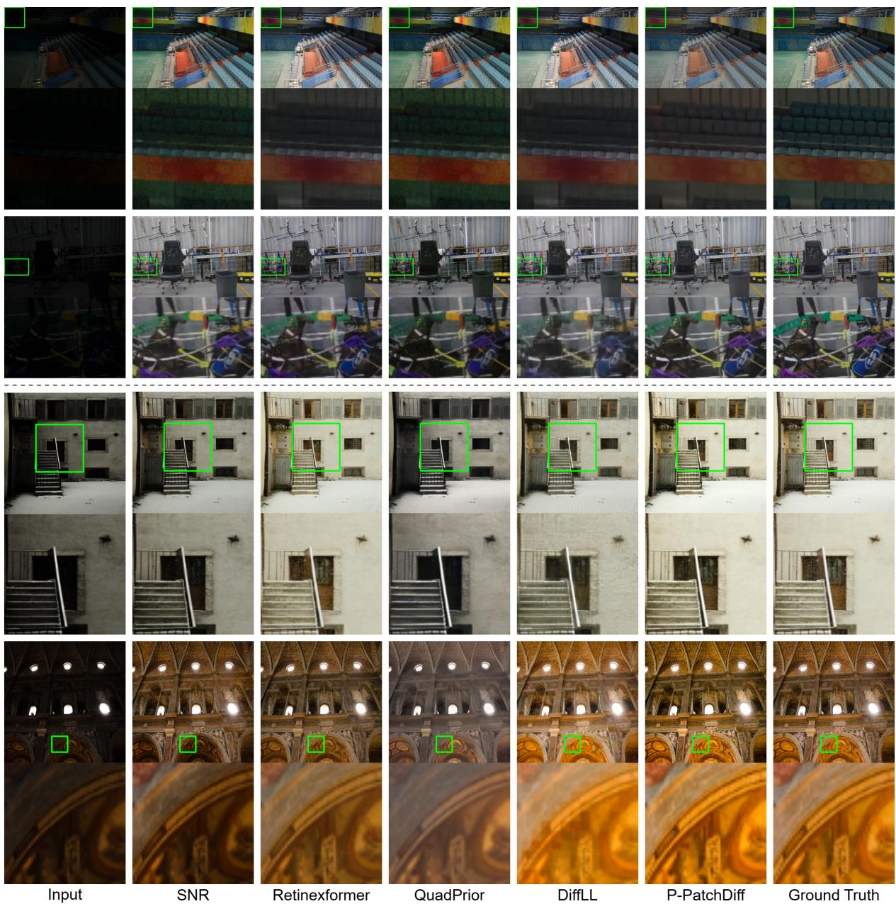  
Fig. 7: Qualitative comparison on the LOL-v2-Real (above the dashed line) and LOL-v2-Syn (below the dashed line).

These results further indicate that simply increasing patch size within a single scale does not consistently yield optimal results, as seen in the performance drop from n = 4 to n = 5 in the fixed-patch setting. This underscores the importance of multi-scale information in low-light image enhancement. However, due to the lack of eficient sampling mechanisms, multi-scale patch methods incur substantial computational overhead as n increases. Moreover, current multi-scale strategies fail to efectively preserve and utilise information from each scale throughout the denoising process. As a result, when n is large, the influence of large patches can dominate and suppress the contributions of smaller patches, leading to suboptimal outputs. Table 8 also shows that the sampling time of both fixed-patch and multi-scale strategies grows significantly with larger n, whereas our P-PatchDif maintains consistently low sampling times regardless of n.

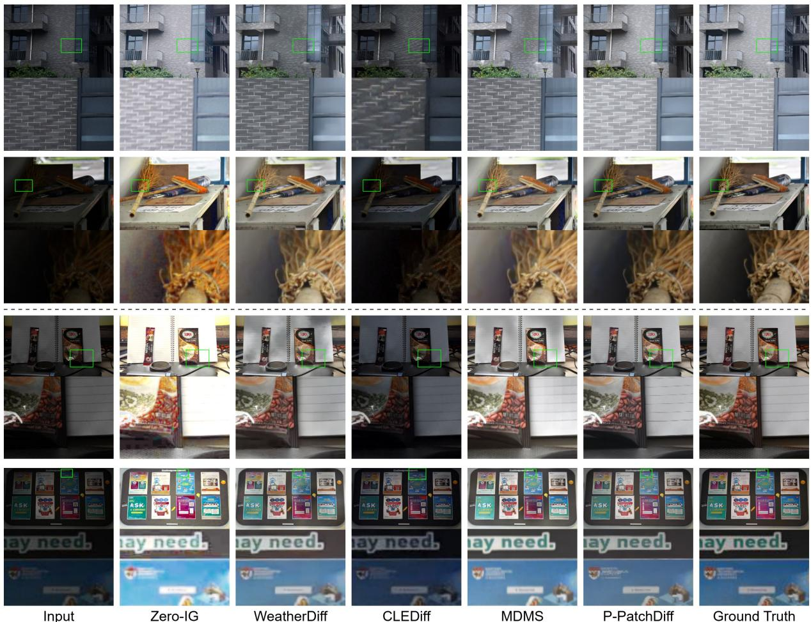  
Fig. 8: Qualitative comparison on the LSRW (above the dashed line) and UHD-LL (below the dashed line).

Table 8: Comparison of diferent patch sampling methods. S.t represents Sampling Time.
<table><tr><td rowspan="2">Methods</td><td colspan="3">Fixed patch</td><td colspan="3">Multi-scale patch</td><td colspan="3">Ours w/o g</td><td colspan="3">Ours</td></tr><tr><td>PSNR</td><td>SSIM</td><td>S.t (s)</td><td>PSNR</td><td>SSIM</td><td>S.t (s)</td><td>PSNR</td><td>SSIM</td><td>S.t (s)</td><td>PSNR</td><td>SSIM</td><td>S.t (s)</td></tr><tr><td>n = 1</td><td>25.35</td><td>0.864</td><td>3.60</td><td>25.35</td><td>0.864</td><td>3.60</td><td>25.35</td><td>0.864</td><td>3.60</td><td>27.06</td><td>0.874</td><td>3.61</td></tr><tr><td>n = 2</td><td>25.82</td><td>0.873</td><td>12.82</td><td>25.81</td><td>0.871</td><td>18.24</td><td>26.17</td><td>0.875</td><td>2.72</td><td>27.50</td><td>0.875</td><td>3.24</td></tr><tr><td>n = 3</td><td>25.31</td><td>0.864</td><td>17.84</td><td>26.00</td><td>0.874</td><td>35.50</td><td>26.64</td><td>0.882</td><td>2.39</td><td>27.57</td><td>0.875</td><td>2.59</td></tr><tr><td>n = 4</td><td>26.69</td><td>0.873</td><td>23.18</td><td>26.21</td><td>0.877</td><td>57.56</td><td>26.81</td><td>0.884</td><td>2.39</td><td>27.94</td><td>0.885</td><td>2.59</td></tr><tr><td>n = 5</td><td>26.54</td><td>0.880</td><td>28.48</td><td>26.46</td><td>0.879</td><td>85.12</td><td>27.04</td><td>0.885</td><td>2.24</td><td>28.04</td><td>0.887</td><td>2.45</td></tr></table>

Furthermore, we conducted additional experiments with n = 6 and n = 7 on the LOL-v2 dataset for our progressive setting. P-PatchDif achieves 27.85/0.885/2.89 (PSNR/SSIM/sampling time) when n = 6 and 27.92/0.884/3.17 when $n \ = \ 7 ,$ , compared with 28.04/0.887/2.45 when n = 5. These results indicate that increasing

Input  
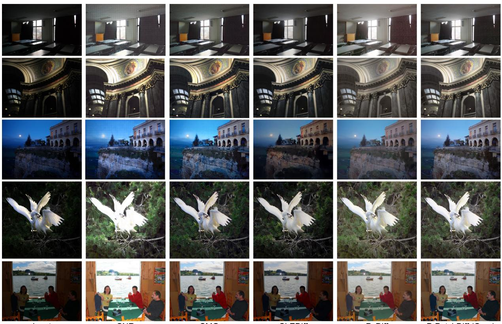  
SNR  
SMG  
CLEDiff  
PyDiff  
P-PatchDiff (Ours)

Fig. 9: Visual results on the DICM, MEF, LIME, NPE and VV datasets (From top to bottom).

Table 9: The training time (T.t), Sampling time (S.t), memory usage (M) and parameters (P) of the progressive strategy. FP, FS, PP, and PS denote fixed patch, fixed stride, progressive patch, and progressive stride, respectively. The combination PP & PS is the strategy adopted in our method.

<table><tr><td>Methods</td><td></td><td>PSNR ↑ | T.t (h) ↓ |</td><td>|S.t (s) ↓ | M (G) ↓ | P (M) ↓</td><td></td><td></td></tr><tr><td>FP &amp;FS</td><td>26.54</td><td>98</td><td>14.24</td><td>24</td><td>61</td></tr><tr><td>FP &amp; PS</td><td>26.35</td><td>98</td><td>5.43</td><td>24</td><td>61</td></tr><tr><td>PP &amp; FS</td><td>21.83</td><td>52</td><td>9.00</td><td>6</td><td>61</td></tr><tr><td>PP &amp; PS</td><td>28.04</td><td>55</td><td>2.45</td><td>8</td><td>80</td></tr><tr><td>Ours w/o g</td><td>27.04</td><td>52</td><td>2.24</td><td>6</td><td>61</td></tr></table>

n beyond 5 does not consistently improve performance in our setting. Moreover, larger n leads to increased sampling time and memory consumption. Since each additional scale requires an extra difusion step, the computational burden grows when n exceeds a certain threshold. Considering the marginal performance change together with the increased computational cost, we select n = 5 as the default configuration to achieve a better trade-of between performance and eficiency.

Progressive strategy. As shown in Table 9, we analyse the impact of the progressive strategy by training and evaluating four frameworks: fixed patch (FP) with fixed stride (FS), fixed patch with progressive stride (PS), progressive patch (PP) with fixed stride and P-PatchDif (PP and PS). In the FP and FS setting, we use the same largest patch size (p = 192) as P-PatchDif and the smallest stride (s = 16) to ensure optimal enhancement quality. Even with p = 192, FP & FS are still worse than P-PatchDif due to their lack of multi-level information. The other two strategies also face challenges in training/sampling times and performance, as discussed in Section 3.1. In contrast, P-PatchDif combines PP and PS, reducing both time and memory consumption while achieving superior enhancement quality.

Multi-patch alignment. As shown in Table 10, we first evaluate the influence of multipatch alignment on each dataset, observing a PSNR improvement of around 1 dB on three datasets. The visual results in Figure 10 further show that this strategy efectively improves brightness consistency, particularly in shadow regions. In addition, the feature-level visualisations in Figure 10 reveal how it separates diferent objects in the image to facilitate denoising. Furthermore, Table 8 shows that incorporating alignment increases the sampling time by only 10%, as it requires just a single run per sampling step to estimate the brightness proxy.

Table 10: Ablation study on the brightness proxy estimator (g) on the LOL-v1, LOL-v2- Real and the LOL-v2-Syn testing set.
<table><tr><td rowspan="2">Methods</td><td colspan="4">LOL-v1</td></tr><tr><td>PSNR ↑</td><td>SSIM ↑|</td><td>LPIPS ↓</td><td>FID ↓</td></tr><tr><td rowspan="2">Ours w/o g Ours</td><td>26.38</td><td>0.877</td><td>0.097</td><td rowspan="2">50.69 52.35</td></tr><tr><td>27.18</td><td>0.880</td><td>0.096</td></tr><tr><td rowspan="2">Methods</td><td colspan="4">LOL-v2-Real</td></tr><tr><td>PSNR ↑</td><td>SSIM ↑|</td><td>LPIPS ↓</td><td>FID ↓</td></tr><tr><td rowspan="2">Ours w/o g Ours</td><td>27.04</td><td>0.885</td><td>0.142</td><td>69.05</td></tr><tr><td>28.04</td><td>0.887</td><td>0.135</td><td>66.02</td></tr><tr><td rowspan="2">Methods</td><td colspan="4">LOL-v2-Syn</td></tr><tr><td>PSNR ↑</td><td>SSIM ↑|</td><td>LPIPS ↓</td><td>FID ↓</td></tr><tr><td rowspan="2">Ours w/o g Ours</td><td>26.76</td><td>0.933</td><td>0.060</td><td>23.48</td></tr><tr><td>28.15</td><td>0.941</td><td>0.054</td><td>23.90</td></tr></table>

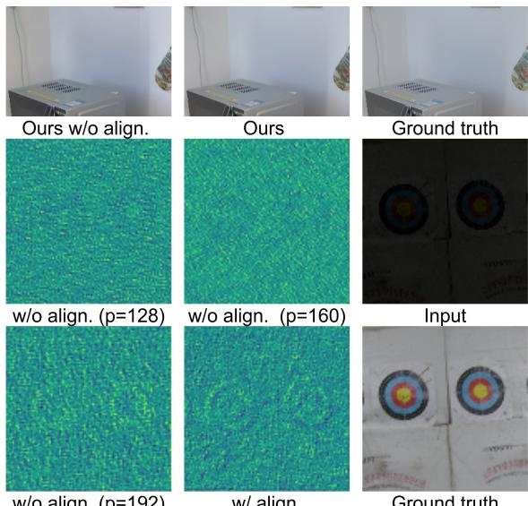  
Fig. 10: Efects of the multi-patch alignment at the image level (top row) and feature level (bottom two rows).

Table 11: Quantitative comparisons on the GoPro and Rain100L datasets for deblurring and deraining, respectively.
<table><tr><td>Deblurring</td><td>Methods</td><td>PSNR ↑</td><td>SSIM ↑</td></tr><tr><td rowspan="3">Task-agnostic</td><td>SwinIR</td><td>24.52</td><td>0.773</td></tr><tr><td>Restormer</td><td>27.22</td><td>0.829</td></tr><tr><td>WeatherDiff </td><td>22.16</td><td>0.786</td></tr><tr><td rowspan="2">All-in-one</td><td>AirNet</td><td>24.35</td><td>0.781</td></tr><tr><td>Transweather</td><td>25.12</td><td>0.757</td></tr><tr><td rowspan="2">Low-light specific</td><td>Retinexformer</td><td>25.09</td><td>0.779</td></tr><tr><td>Ours </td><td>27.61</td><td>0.886</td></tr><tr><td>Deraining</td><td>Methods</td><td>PSNR ↑</td><td>SSIM ↑</td></tr><tr><td rowspan="3">Task-agnostic</td><td>SwinIR</td><td>30.78</td><td>0.923</td></tr><tr><td>Restormer</td><td>34.81</td><td>0.962</td></tr><tr><td>WeatherDiff </td><td>30.53</td><td>0.970</td></tr><tr><td rowspan="2">All-in-one</td><td>AirNet</td><td>32.98</td><td>0.951</td></tr><tr><td>Transweather</td><td>29.43</td><td>0.905</td></tr><tr><td rowspan="2">Low-light specific</td><td>Retinexformer</td><td>32.68</td><td>0.940</td></tr><tr><td>Ours </td><td>34.28</td><td>0.972</td></tr></table>

## 5 Discussion

## 5.1 Generalisation to other restoration tasks

To further evaluate the generalisation ability of P-PatchDif in other scenarios, we additionally conduct experiments on two representative restoration tasks, deblurring and deraining.

Dataset. Following prior work (Zamir et al. 2022), we adopt the GoPro (Nah et al. 2017) dataset for deblurring and the Rain100L (Yang et al. 2019) dataset for deraining. The GoPro dataset contains 2, 103 training images and 1, 111 testing images, with a resolution of 1280 × 720. The Rain100L dataset includes 200 training images and 100 testing images, with a resolution of 480 × 320. We train and evaluate P-PatchDif on the oficial training and test sets.

Baselines. For deblurring and deraining, we compare with task-agnostic methods (SwinIR (Liang et al. 2021), Restormer (Zamir et al. 2022) and WeatherDif (Ozdenizci and¨ Legenstein 2023)), all-in-one restoration methods (AirNet (Li et al. 2022a) and Transweather (Valanarasu et al. 2022)) and a low-light-specific method (Retinexformer (Cai et al. 2023)).

Results. As reported in Table 11, P-PatchDif generalises well to both tasks, achieving competitive performance. In particular, the strong SSIM on GoPro indicates reasonable structure preservation on real-world images. On Rain100L, our method does not achieve the best PSNR, which may be attributed to the limited scale of the synthetic dataset (200 low-resolution training images), posing challenges for difusion-based modelling.

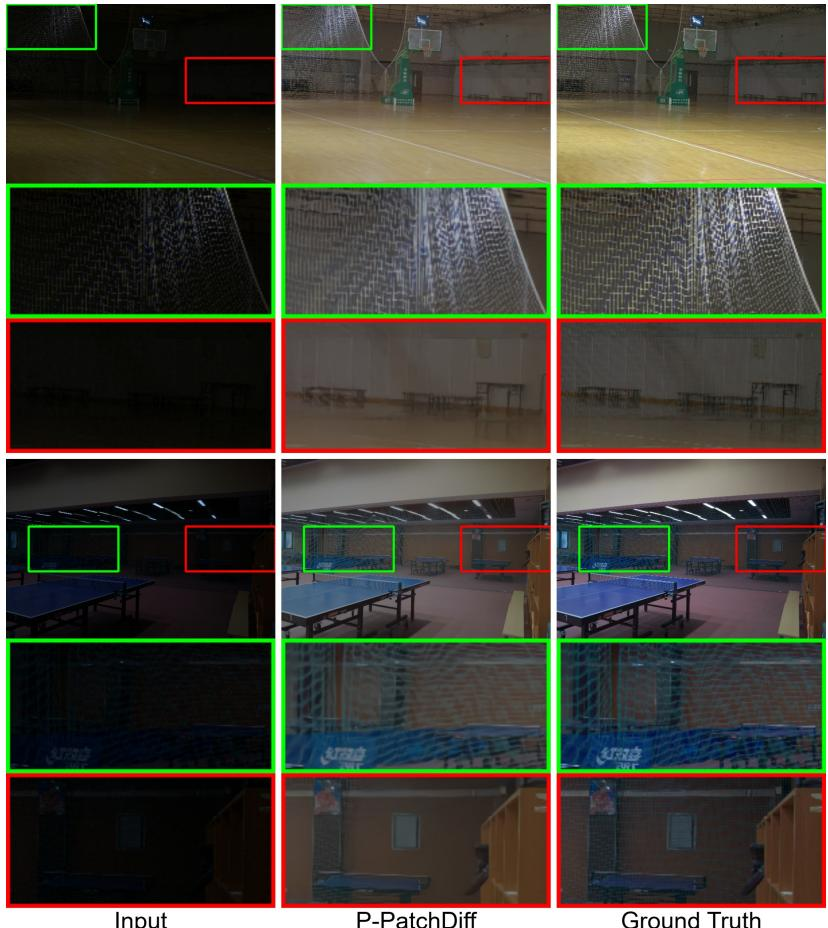  
Fig. 11: Qualitative comparison of successful and failed cases, which are denoted by green and red bounding boxes, respectively. When a region is extremely dark, P-PatchDif tends to ignore its structures (e.g., the net) entirely, rather than attempting to enhance them but failing.

## 5.2 Failure case analysis

As shown in Figure 11, we present a qualitative failure case analysis of P-PatchDif. We observe that when a region is extremely dark, P-PatchDif may completely omit the structures within it: as highlighted in the red box, the net in front of the background entirely disappears after enhancement, with no blurry or partially recovered texture left behind. This occurs because the input signal in such regions is too weak for the model to reliably detect the presence of structure. Interestingly, this failure is region-dependent rather than contentdependent. As shown in the green box, the same net texture in a less degraded region is faithfully restored, with its fine details well preserved. This suggests that the model is inherently capable of restoring such textures.

We hypothesise that this behaviour also relates to the lack of semantic consistency modelling across an image. Without such modelling, the model has no higher-level understanding of the scene to compensate when local structural cues are insuficient. In contrast, the same texture in a brighter region retains enough signal for successful enhancement. We conjecture that this issue could be alleviated if the model were able to understand the semantics of the scene. With such high-level understanding of what the image depicts and how a real-world scene should be structured, the model could infer the presence of these structures from weak signals, rather than ignoring them entirely. We leave the exploration of such a semantic-consistency-aware enhancement as future work.

## 5.3 Limitations

Despite the efectiveness of P-PatchDif, several limitations still remain and could be further explored in future work.

First, although our progressive patchifying strategy improves memory eficiency and enables flexible processing, it does not substantially reduce the overall computational cost, since we crop patches from the full-resolution image. Second, to mitigate boundary artefacts, we enforce the stride to be less than half of the patch size, which introduces duplicated pixels. While this strategy efectively reduces artefacts, it increases redundant computation in overlapping areas. Recent difusion methods (Rombach et al. 2022; Jiang et al. 2024) perform operations in latent space to reduce spatial resolution and achieve more eficient training and inference. Therefore, incorporating progressive patching in the latent space could further reduce computational cost and improve robustness to boundary artefacts.

## 6 Conclusion

In this paper, we presented P-PatchDif, a scalable progressive patch difusion model for lowlight image enhancement. This progressive patch strategy ofers two unique advantages over previous methods. It not only achieves competitive enhancement quality with minimum computational costs but also balances local dark-region enhancement against globally coherent brightness. P-PatchDif leverages a novel progressive training and sampling strategy that gradually shifts from local to global views, capturing multi-level information for efective local dark-region enhancement without sacrificing training or sampling eficiency. Additionally, we introduced a multi-patch alignment strategy that leverages an estimated global brightness proxy, resolving the output inconsistencies that arise when difusion models use varying patch sizes. By unifying local enhancement and global brightness alignment, our method efectively handles spatially variant low-light images. Extensive experiments on ten low-light image enhancement datasets demonstrate the efectiveness and eficiency of our approach. In the future, we will continue to explore eficient difusion models for low-light image enhancement.

## Declarations

• Data availability: All datasets used in this study are publicly available. The corresponding dataset papers have been cited in the manuscript.

• Code availability: The code is available at https: //github.com/RuoyuGuo/P-PatchDif.

## References

Aversa M, Nobis G, H¨agele M, et al (2023) Difinfinite: Large mask-image synthesis via parallel random patch difusion in histopathology. In: Advances in Neural Information Processing Systems (NeurIPS), pp 78126–78141

Blau Y, Mechrez R, Timofte R, et al (2018) The 2018 pirm challenge on perceptual image super-resolution. In: European Conference on Computer Vision (ECCV) workshops, pp 1–22

Cai Y, Bian H, Lin J, et al (2023) Retinexformer: One-stage retinex-based transformer for low-light image enhancement. In: IEEE/CVF International Conference on Computer Vision (ICCV), pp 12504–12513

Ding Z, Zhang M, Wu J, et al (2023) Patched denoising difusion models for high-resolution image synthesis. In: International Conference on Learning Representations (ICLR)

Fu H, Zheng W, Meng X, et al (2023a) You do not need additional priors or regularizers in retinex-based low-light image enhancement. In: IEEE/CVF Conference on Computer Vision and Pattern Recognition (CVPR), pp 18125– 18134

Fu Z, Yang Y, Tu X, et al (2023b) Learning a simple low-light image enhancer from paired low-light instances. In: IEEE/CVF Conference

on Computer Vision and Pattern Recognition (CVPR), pp 22252–22261

Guo C, Li C, Guo J, et al (2020) Zeroreference deep curve estimation for low-light image enhancement. In: IEEE/CVF Conference on Computer Vision and Pattern Recognition (CVPR), pp 1780–1789

Guo R, Pagnucco M, Song Y (2025) Exploring multi-feature relationship in retinex decomposition for low-light image enhancement. IEEE Transactions on Multimedia

Guo X, Hu Q (2023) Low-light image enhancement via breaking down the darkness. International Journal of Computer Vision 131:48–66

Guo X, Li Y, Ling H (2016) LIME: Low-light image enhancement via illumination map estimation. IEEE Transactions on Image Processing 26:982–993

Hai J, Xuan Z, Yang R, et al (2023) R2rnet: Low-light image enhancement via real-low to real-normal network. Journal of Visual Communication and Image Representation 90:103712

He Z, Ran W, Liu S, et al (2023) Low-light image enhancement with multi-scale attention and frequency-domain optimization. IEEE Transactions on Circuits and Systems for Video Technology 34(4):2861–2875

Hou J, Zhu Z, Hou J, et al (2023) Global structure-aware difusion process for low-light image enhancement. In: Advances in Neural Information Processing Systems (NeurIPS), pp 79734–79747

Hu J, Song B, Xu X, et al (2024) Learning image priors through patch-based difusion models for solving inverse problems. In: Advances in Neural Information Processing Systems (NeurIPS), pp 1625–1660

Huang SC, Cheng FC, Chiu YS (2013) Eficient contrast enhancement using adaptive gamma correction with weighting distribution. IEEE Transactions on Image Processing 22:1032–1041

Hur J, Herrmann C, Saxena S, et al (2025) High-resolution frame interpolation with patchbased cascaded difusion. In: Association for the Advancement of Artificial Intelligence (AAAI), pp 3868–3876

Jiang H, Luo A, Fan H, et al (2023) Low-light image enhancement with wavelet-based difusion models. ACM Transactions on Graphics 42:1–14

Jiang H, Luo A, Liu X, et al (2024) Lightendiffusion: Unsupervised low-light image enhancement with latent-retinex difusion models. In: European Conference on Computer Vision (ECCV), pp 161–179

Jiang K, Wang Z, Yi P, et al (2020) Multiscale progressive fusion network for single image deraining. In: IEEE/CVF conference on computer vision and pattern recognition (CVPR), pp 8346–8355

Jiang Y, Gong X, Liu D, et al (2021) Enlighten-GAN: Deep light enhancement without paired supervision. IEEE Transactions on Image Processing 30:2340–2349

Kang S, Gao S, Wu W, et al (2024) Image intrinsic components guided conditional difusion model for low-light image enhancement. IEEE Transactions on Circuits and Systems for Video Technology 34:13244–13256

Knaus C, Zwicker M (2014) Progressive image denoising. IEEE Transactions on Image Processing 23(7):3114–3125

Land EH (1977) The retinex theory of color vision. Scientific american 237:108–129

Lee C, Lee C, Kim CS (2013) Contrast enhancement based on layered diference representation of 2d histograms. IEEE Transactions on Image Processing 22:5372–5384

Li B, Liu X, Hu P, et al (2022a) All-in-one image restoration for unknown corruption. In: IEEE/CVF Conference on Computer Vision and Pattern Recognition (CVPR), pp 17452– 17462

Li C, Guo C, Loy CC (2021a) Learning to enhance low-light image via zero-reference deep curve estimation. IEEE Transactions on Pattern Analysis and Machine Intelligence 44:4225–4238

Li C, Guo CL, Zhou M, et al (2023) Embedding fourier for ultra-high-definition low-light image enhancement. In: International Conference on Learning Representations (ICLR)

Li H, Yang Y, Chang M, et al (2022b) Srdif: Single image super-resolution with difusion probabilistic models. Neurocomputing 479:47–59

Li J, Feng X, Hua Z (2021b) Low-light image enhancement via progressive-recursive network. IEEE Transactions on Circuits and Systems for Video Technology 31(11):4227–4240

Liang J, Cao J, Sun G, et al (2021) Swinir: Image restoration using swin transformer. In: IEEE/CVF International Conference on Computer Vision (ICCV), pp 1833–1844

Lin Y, Fu Z, Wen K, et al (2025) Dplut: Unsupervised low-light image enhancement with lookup tables and difusion priors. In: Association for the Advancement of Artificial Intelligence (AAAI), pp 5316–5324

Liu R, Ma L, Zhang J, et al (2021) Retinexinspired unrolling with cooperative prior architecture search for low-light image enhancement. In: IEEE/CVF Conference on Computer Vision and Pattern Recognition (CVPR), pp 10561– 10570

Liu W, Ren G, Yu R, et al (2022) Image-adaptive yolo for object detection in adverse weather conditions. In: Association for the Advancement of Artificial Intelligence (AAAI), pp 1792–1800

Liu Y, Huang T, Dong W, et al (2023) Low-light image enhancement with multi-stage residue quantization and brightness-aware attention. In: IEEE/CVF International Conference on Computer Vision (ICCV), pp 12140–12149

Lv F, Lu F, Wu J, et al (2018) MBLLEN: Lowlight image/video enhancement using cnns. In: British Machine Vision Conference (BMVC), p 4

Lv F, Li Y, Lu F (2021) Attention guided lowlight image enhancement with a large scale lowlight simulation dataset. International Journal of Computer Vision 129(7):2175–2193

Lv X, Zhang S, Wang C, et al (2024) Fourier priors-guided difusion for zero-shot joint low-light enhancement and deblurring. In: IEEE/CVF Conference on Computer Vision and Pattern Recognition (CVPR), pp 25378– 25388

Ma K, Zeng K, Wang Z (2015) Perceptual quality assessment for multi-exposure image fusion. IEEE Transactions on Image Processing 24:3345–3356

Ma L, Ma T, Liu R, et al (2022) Toward fast, flexible, and robust low-light image enhancement. In: IEEE/CVF Conference on Computer Vision and Pattern Recognition (CVPR), pp 5637–5646

Mei Y, Fan Y, Zhang Y, et al (2023) Pyramid attention network for image restoration. International Journal of Computer Vision 131:3207– 3225

Mittal A, Moorthy AK, Bovik AC (2012a) Noreference image quality assessment in the spatial domain. IEEE Transactions on Image Processing 21:4695–4708

Mittal A, Soundararajan R, Bovik AC (2012b) Making a “completely blind” image quality analyzer. IEEE Signal Processing Letters 20:209– 212

Nah S, Hyun Kim T, Mu Lee K (2017) Deep multiscale convolutional neural network for dynamic scene deblurring. In: IEEE/CVF Conference on Computer Vision and Pattern Recognition (CVPR), pp 3883–3891

Ozdenizci O, Legenstein R (2023) Restoring vision¨ in adverse weather conditions with patch-based denoising difusion models. IEEE Transactions on Pattern Analysis and Machine Intelligence 45:10346–10357

Ren D, Zuo W, Hu Q, et al (2019) Progressive image deraining networks: A better and simpler

baseline. In: IEEE/CVF conference on computer vision and pattern recognition (CVPR), pp 3937–3946

Rombach R, Blattmann A, Lorenz D, et al (2022) High-resolution image synthesis with latent difusion models. In: IEEE/CVF Conference on Computer Vision and Pattern Recognition (CVPR), pp 10684–10695

Ronneberger O, Fischer P, Brox T (2015) U-net: Convolutional networks for biomedical image segmentation. In: International Conference on Medical Image Computing and Computer-Assisted Intervention (MICCAI), pp 234–241

Saharia C, Chan W, Chang H, et al (2022a) Palette: Image-to-image difusion models. In: ACM International Conference & Exhibition On Computer Graphics & Interactive Techniques (ACM SIGGRAPH), pp 1–10

Saharia C, Ho J, Chan W, et al (2022b) Image super-resolution via iterative refinement. IEEE Transactions on Pattern Analysis and Machine Intelligence 45:4713–4726

Saini S, Narayanan P (2024) Specularity factorization for low-light enhancement. In: IEEE/CVF Conference on Computer Vision and Pattern Recognition (CVPR), pp 1–12

Shang K, Shao M, Wang C, et al (2024) Multidomain multi-scale difusion model for low-light image enhancement. In: Association for the Advancement of Artificial Intelligence (AAAI), pp 4722–4730

Shi Y, Liu D, Zhang L, et al (2024) ZERO-IG: Zero-shot illumination-guided joint denoising and adaptive enhancement for low-light images. In: IEEE/CVF Conference on Computer Vision and Pattern Recognition (CVPR), pp 3015– 3024

Skorokhodov I, Menapace W, Siarohin A, et al (2024) Hierarchical patch difusion models for high-resolution video generation. In: IEEE/CVF Conference on Computer Vision and Pattern Recognition (CVPR), pp 7569– 7579

Song J, Meng C, Ermon S (2021) Denoising difusion implicit models. In: International Conference on Learning Representations (ICLR)

Valanarasu JMJ, Yasarla R, Patel VM (2022) Transweather: Transformer-based restoration of images degraded by adverse weather conditions. In: IEEE/CVF Conference on Computer Vision and Pattern Recognition (CVPR), pp 2353–2363

Vonikakis V, Kouskouridas R, Gasteratos A (2018) On the evaluation of illumination compensation algorithms. Multimedia Tools and Applications 77:9211–9231

Wang C, Jin Z (2023) Brighten-and-colorize: A decoupled network for customized low-light image enhancement. In: ACM International Conference on Multimedia (ACM MM), pp 8356–8366

Wang C, Zhou Y, He L, et al (2024a) Illumination distribution prior for low-light image enhancement. In: ACM International Conference on Multimedia (ACM MM), p 9116–9125

Wang S, Zheng J, Hu HM, et al (2013) Naturalness preserved enhancement algorithm for non-uniform illumination images. IEEE Transactions on Image Processing 22:3538–3548

Wang T, Zhang K, Shao Z, et al (2023a) Lldiffusion: Learning degradation representations in difusion models for low-light image enhancement. arXiv preprint arXiv:230714659

Wang T, Zhang K, Shen T, et al (2023b) Ultrahigh-definition low-light image enhancement: A benchmark and transformer-based method. In: Association for the Advancement of Artificial Intelligence (AAAI), pp 2654–2662

Wang W, Wei C, Yang W, et al (2018) Gladnet: Low-light enhancement network with global awareness. In: IEEE International Conference on Automatic Face & Gesture Recognition (FG), p 751–755

Wang W, Yang H, Fu J, et al (2024b) Zeroreference low-light enhancement via physical quadruple priors. In: IEEE/CVF Conference

on Computer Vision and Pattern Recognition (CVPR), pp 26057–26066

Wang Y, Wan R, Yang W, et al (2022) Low-light image enhancement with normalizing flow. In: Association for the Advancement of Artificial Intelligence (AAAI), pp 2604–2612

Wang Y, Liu Z, Liu J, et al (2023c) Low-light image enhancement with illumination-aware gamma correction and complete image modelling network. In: IEEE/CVF International Conference on Computer Vision (ICCV), pp 13128–13137

Wang Y, Yu Y, Yang W, et al (2023d) Exposuredifusion: Learning to expose for low-light image enhancement. In: IEEE/CVF International Conference on Computer Vision (ICCV), pp 12438–12448

Wang Z, Jiang Y, Zheng H, et al (2023e) Patch difusion: Faster and more data-eficient training of difusion models. In: Advances in Neural Information Processing Systems (NeurIPS), pp 72137–72154

Wei C, Wang W, Yang W, et al (2018) Deep retinex decomposition for low-light enhancement. In: British Machine Vision Conference (BMVC)

Wu W, Weng J, Zhang P, et al (2022) Uretinexnet: Retinex-based deep unfolding network for low-light image enhancement. In: IEEE/CVF Conference on Computer Vision and Pattern Recognition (CVPR), pp 5901–5910

Wu Y, Pan C, Wang G, et al (2023) Learning semantic-aware knowledge guidance for lowlight image enhancement. In: IEEE/CVF Conference on Computer Vision and Pattern Recognition (CVPR), pp 1662–1671

Wu Y, Wang G, Wang Z, et al (2024) Jores-dif: Joint retinex and semantic priors in difusion model for low-light image enhancement. In: ACM International Conference on Multimedia (ACM MM), p 1810–1818

Xu K, Yang X, Yin B, et al (2020) Learning to restore low-light images via decompositionand-enhancement. In: IEEE/CVF Conference on Computer Vision and Pattern Recognition (CVPR), pp 2281–2290

Xu X, Wang R, Fu CW, et al (2022) SNR-aware low-light image enhancement. In: IEEE/CVF Conference on Computer Vision and Pattern Recognition (CVPR), pp 17714–17724

Xu X, Wang R, Lu J (2023) Low-light image enhancement via structure modeling and guidance. In: IEEE/CVF Conference on Computer Vision and Pattern Recognition (CVPR), pp 9893–9903

Xu X, Kong S, Hu T, et al (2024) Boosting image restoration via priors from pre-trained models. In: IEEE/CVF Conference on Computer Vision and Pattern Recognition (CVPR), pp 2900–2909

Yan Q, Feng Y, Zhang C, et al (2025) Hvi: A new color space for low-light image enhancement. In: IEEE/CVF Conference on Computer Vision and Pattern Recognition (CVPR), pp 5678–5687

Yang S, Ding M, Wu Y, et al (2023) Implicit neural representation for cooperative low-light image enhancement. In: IEEE/CVF International Conference on Computer Vision (ICCV), pp 12918–12927

Yang W, Tan RT, Feng J, et al (2019) Joint rain detection and removal from a single image with contextualized deep networks. IEEE Transactions on Pattern Analysis and Machine Intelligence 42:1377–1393

Yang W, Wang S, Fang Y, et al (2020) From fidelity to perceptual quality: A semi-supervised approach for low-light image enhancement. In: IEEE/CVF Conference on Computer Vision and Pattern Recognition (CVPR), pp 3063– 3072

Yang W, Wang W, Huang H, et al (2021) Sparse gradient regularized deep retinex network for robust low-light image enhancement. IEEE Transactions on Image Processing 30:2072–2086

Yi X, Xu H, Zhang H, et al (2023) Dif-retinex: Rethinking low-light image enhancement with a generative difusion model. In: IEEE/CVF International Conference on Computer Vision (ICCV), pp 12302–12311

Yin Y, Xu D, Tan C, et al (2023) CLE Difusion: Controllable light enhancement difusion model. In: ACM International Conference on Multimedia (ACM MM), pp 8145–8156

Zamir SW, Arora A, Khan S, et al (2020) Learning enriched features for real image restoration and enhancement. In: European Conference on Computer Vision (ECCV), pp 492–511

Zamir SW, Arora A, Khan S, et al (2021) Multi-stage progressive image restoration. In: IEEE/CVF conference on computer vision and pattern recognition (CVPR), pp 14821–14831

Zamir SW, Arora A, Khan S, et al (2022) Restormer: Eficient transformer for highresolution image restoration. In: IEEE/CVF Conference on Computer Vision and Pattern Recognition (CVPR), pp 5728–5739

Zhang Y, Zhang J, Guo X (2019) Kindling the darkness: A practical low-light image enhancer. In: ACM International Conference on Multimedia (ACM MM), pp 1632–1640

Zhang Y, Guo X, Ma J, et al (2021) Beyond brightening low-light images. International Journal of Computer Vision 129:1013–1037

Zhang Z, Zheng H, Hong R, et al (2022) Deep color consistent network for low-light image enhancement. In: IEEE/CVF Conference on Computer Vision and Pattern Recognition (CVPR), pp 1899–1908

Zhou D, Yang Z, Yang Y (2023) Pyramid difusion models for low-light image enhancement. In: International Joint Conference on Artificial Intelligence (IJCAI), pp 1795–1803

Zhou H, Dong W, Liu X, et al (2025) Low-light image enhancement via generative perceptual priors. In: Association for the Advancement of Artificial Intelligence (AAAI), pp 10752–10760