# Panda Diplomacy: Foundation Model Pre-training across Particle Imaging Detectors for High Energy and Nuclear Physics

Samuel Young Stanford University Stanford, CA 94305 youngsam@stanford.edu

César Jesús-Valls European Organization for Nuclear Research (CERN) 211 Geneva 23, Switzerland cesar.jesus@cern.ch

Kazuhiro Terao SLAC National Accelerator Laboratory Menlo Park, CA 94025 kterao@slac.stanford.edu

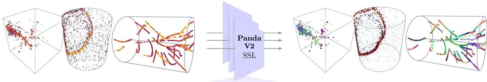  
(a) Raw Detector Data  
(b) Learned Sensor-level Representations

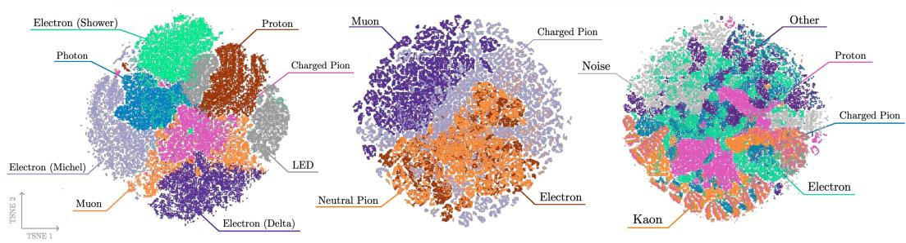  
(c) Liquid Argon Time Projection Chamber  
(d) Water Cherenkov  
(e) Collider Time Projection Chamber  
Figure 1: Panda Diplomacy. The same self-distillation framework is independently applied to sensor-level liquid argon time projection chamber (LArTPC), water Cherenkov, and collider TPC data (a). Frozen representations exhibit semantic organization across all three modalities, visualized using PCA components cast to RGB in individual images (b) and t-SNE applied to per-point features across a number of encoded images (c-e).

## Abstract

Foundation models are increasingly being pursued in particle and nuclear physics, but existing approaches remain strongly tied to individual experiments through detector-specific architectures or pre-training objectives, limiting their reuse across sensing modalities. We show that a point cloud self-distillation framework yields a substantially more general sensor-level pre-training recipe. We show that the same refined architecture and objective can be independently pre-trained with minimal changes on three qualitatively different detector modalities: liquid argon time

projection chamber (LArTPC), collider TPC, and water Cherenkov. Using 1,000 labeled images for downstream task adaptation, Panda V2 matches or exceeds specialized foundation-model baselines trained with orders of magnitude more supervision, matching state-of-the-art particle-clustering performance with 70× fewer labeled events on sPHENIX while substantially improving particle identification, and on LArTPC data matching Panda particle reconstruction with up to 1000× fewer labels. Beyond reconstruction, simple linear probes reveal physically meaningful latent structure associated with particle causality and track curvature.

## 1 Introduction

Particle imaging detectors infer the properties of fundamental particles from spatially resolved measurements of their interactions with matter. The resulting images can differ radically between experiments: liquid argon time projection chambers (LArTPCs) directly image three-dimensional ionization trajectories [Abi et al., 2020]; collider TPCs such as sPHENIX observe dense, curved trajectories produced in a magnetic field [Klest et al., 2022]; and water Cherenkov detectors such as Super-Kamiokande (SK) instead record patterns of Cherenkov photons projected onto a detector surface [Fukuda et al., 2003]. Despite originating from related particle processes, these modalities differ substantially in geometry, density, sensing mechanism, and characteristic physical structure (Fig. 1).

Modern reconstruction methods consequently tend to be highly detector-specific, combining specialized representations, architectural inductive biases, and task-specific objectives [Acciarri et al., 2018, Abratenko et al., 2022, Drielsma et al., 2021b, Park et al., 2025]. This contrasts with the foundation model paradigm, where representations learned from abundant unlabeled data can be reused across many downstream tasks with little supervision [Oquab et al., 2024, Wu et al., 2025]. Young and Terao [2025] recently demonstrated this principle at the sensor level for LArTPC data, but whether the same representation-learning mechanism can operate across fundamentally different particle detectors remains unknown.

Here we introduce Panda V2, an updated backbone architecture, and independently pre-train the same architecture and self-distillation objective on LArTPC, sPHENIX TPC, and SK-like water Cherenkov data. Only hyperparameters tied directly to the numerical and spatial scale of each input are changed between modalities. The objective contains no detector-specific propagation or reconstruction rules, and we apply strong generic spatial augmentations (rotations, translations, jittering). Nevertheless, the learned representations develop clear semantic organization across all three modalities (Fig. 1 c-e).

We evaluate the learned representations by asking both what reconstruction they enable and what physical structure they encode. Using only 1,000 labeled events per downstream task, lightweight readouts recover point-, particle-, and event-level observables across all three detectors, while remaining competitive with specialized reconstruction methods trained with substantially more supervision. We additionally find simple latent directions associated with the “arrow of time" for individual particles in LArTPCs and transverse momentum in sPHENIX. These results suggest that the machinery required for foundation-model pre-training on sensor-level particle reconstruction can be general, and point toward unified systems that can ingest heterogeneous data from one or more experiments.

## 2 Method

## 2.1 Panda V2 encoder

Each detector image is represented as a sparse set of voxelized 3D points with associated sensor measurements, such as deposited charge or arrival time. Panda V2 uses the same four-stage pointnative encoder, based on Point Transformer V3 [Wu et al., 2024] and LitePT [Yue et al., 2026] for all three modalities. Following Yue et al. [2026], sparse 3D convolutions [Choy et al., 2019] are used at high spatial resolution and local self-attention [Vaswani, 2017] at coarser scales. The network first processes the native voxelization, pools by a factor of two, switches from convolution to attention at the same resolution, then pools by a further factor of four before a final attention stage. Multi-scale features are upsampled and concatenated to produce a contextual feature for each input point.

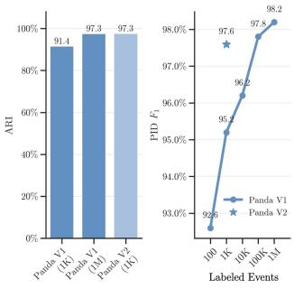  
(a) LArTPC

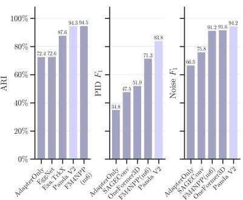  
(b) Collider TPO

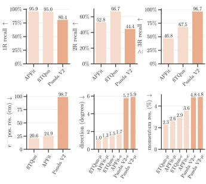  
(c) Water Cherenkov  
Figure 2: The Panda V2 backbone is adapted to detector-specific reconstruction tasks using only 1,000 labeled events and compared with published baselines. (a) PILArNet-M particle clustering and semantic segmentation. Panda V1 curves correspond to its strongest published frozen backbone configuration for each task [Young and Terao, 2025]. (b) For TPCpp-10M, the same adaptation strategy is evaluated on track clustering, particle identification, and noise tagging. (c) On SK-like water Cherenkov data, lightweight probes reconstruct single-particle vertex $( e ^ { - } )$ , direction $( e ^ { - } / \mu ^ { - } )$ and momentum $( e ^ { - } / \mu ^ { - } )$ (bottom row), while Panda Detector performs multi-ring reconstruction (top row, 1-3+ ring recall is shown); APFit and fiTQun results on official SK data [Jiang et al., 2019] are shown for context, and arrows signify the direction of better performance for each metric.

## 2.2 Observable prototype self-distillation

We pre-train Panda V2 with the self-distillation objective of Panda [Young and Terao, 2025]: an EMA teacher and student encode independently augmented views of the same image, and the student predicts the teacher’s assignments over learned prototypes. Following DOS [Abdelsamad et al., 2025], masked measurements are removed rather than explicitly represented and only observable locations are distilled. Apart from dataset-dependent quantities tied to input scale, the architecture and training recipe are shared.

## 2.3 Parameter-efficient reconstruction

Downstream reconstruction uses lightweight task-specific heads, with the pre-trained backbone either frozen or adapted using LoRA [Hu et al., 2021]. For LArTPC and sPHENIX, semantic labels are predicted with a linear classifier and LoRA, while particle clustering uses a lightweight two-stage GNN with LoRA. For single-ring water Cherenkov events, particle identity and energy are predicted from the mean frozen event representation, while position and direction are obtained from a coordinate–feature cross-correlation followed by a linear projection. For multi-ring water Cherenkov reconstruction we use Panda Detector, the DETR-style set-prediction module introduced in Panda [Young and Terao, 2025]. Additional architecture and training details are given in the appendix.

## 3 Experiments

Setup. We independently pre-train Panda V2 on PILArNet-M [Young et al., 2026], TPCpp-10M [Li et al., 2025], and a preliminary version of the Water-Cherenkov Annotated Neutrino Dataset (WAND), representing LArTPC, collider-TPC, and SK-like water Cherenkov data, respectively. All downstream modules are trained using exactly 1,000 labeled events. On PILArNet-M and $\mathrm { T P C p p }$ -10M, we perform semantic segmentation with a linear classifier using 414K trainable LoRA [Hu et al., 2021] parameters, while particle clustering uses a 580K parameter two-stage GNN together with LoRA. On WAND, frozen lightweight readouts reconstruct single-particle properties, while Panda Detector with LoRA performs multi-ring reconstruction. For Panda V1 [Young and Terao, 2025], we compare against its strongest published frozen-backbone result for each task: Panda Detector for clustering and a 16M-parameter U-Net-like decoder for semantic segmentation.

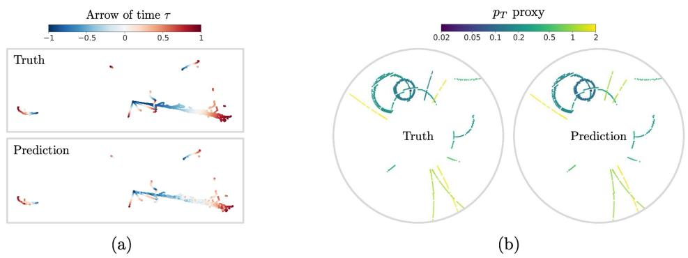  
Figure 3: Single directions in the frozen Panda V2 representation recover physically meaningful structure. (a) In LArTPC events, a latent direction orders points along particle trajectories despite the absence of timing information. (b) In TPCpp-10M, a latent direction encodes track curvature and transverse momentum.

## 3.1 Reconstruction from 1,000 labeled events

Figure 2 summarizes reconstruction performance across the three modalities. On PILArNet-M, Panda V2’s GNN+LoRA reaches a particle-clustering ARI of 0.973, compared with 0.914 for Panda V1’s frozen-backbone Panda Detector at 1,000 labels, and matches its 0.973 result at one million labels. For semantic segmentation, linear+LoRA reaches a macro-F1 of 0.976, compared with 0.952 for Panda V1’s 16M-parameter frozen-backbone decoder at 1,000 labels and 0.978 at 100,000 labels.

On TPCpp-10M, the graph probe with LoRA reaches a track clustering ARI of 0.943, closely matching FM4NPP’s 0.945 result obtained with 70,000 labeled events. A linear semantic head with LoRA reaches macro-F1 scores of 0.838 for particle identification and 0.942 for noise tagging, compared with 0.713 and 0.912 for FM4NPP, respectively.

For SK-like WAND data, simple probes from Panda V2 features reconstruct single-particle kinematics using only 1,000 labeled events, reaching electron (muon) vertex resolutions of 98.7 (N/A) cm, angular resolutions of 5.75◦ (5.88◦), and momentum resolutions of 4.80% (4.82%). These remain worse than the highly optimized fiTQun and APFit reconstruction algorithms, but demonstrate that useful detector-level observables are accessible through inexpensive adaptation of the same representation learner. For multi-ring events, Panda Detector obtains recalls of 80.4%, 44.4%, and 96.7% for one-, two-, and ≥ 3-ring events, respectively. Together, these results show that a common pre-trained representation can support full reconstruction from only 1,000 labeled events.

## 3.2 Physical structure in frozen representations

We next ask whether the representations encode further physically meaningful quantities. We train a single vectors to predict physically meaningful quantities when projected onto per-point features. As shown in Fig. 3, a single learned vector, when projected onto per point features with the inner product, produces a scalar field that orders points along particle trajectories in LArTPC events (Spearman $\rho = 0 . 8 9 )$ , recovering an emergent “arrow of time” despite the absence of timing information in the input. In TPCpp-10M, another latent direction encodes track curvature and thus transverse momentum (Spearman $\rho = 0 . 9 5 7 \mathrm { \Omega }$ ). More information and examples can be found in the appendix.

## 4 Conclusion and Limitations

In this work, we showed that a common sensor-level self-supervised learning framework can be applied across three substantially different particle imaging detectors, and that the resulting representations can be adapted with only 1,000 labeled events to support semantic segmentation, particle clustering, event-property reconstruction, and ring counting. Beyond downstream performance, simple linear probes reveal physically meaningful structure in the learned representations, including particle progression in LArTPCs, track curvature and transverse momentum in TPCpp-10M, and forwardness in water-Cherenkov events. Several important questions remain unresolved by this study: we do not characterize scaling with model size, pre-training data, or compute; nor do we test whether representations learned on one detector transfer to another or from simulation to real data. We plan on answering some of these questions in a forthcoming extended update to this manuscript.

## 5 Acknowledgments

The authors thank the authors of TPCpp-10M and the sPHENIX collaboration for open sourcing their dataset and providing a common baseline to compare our method to. We also thank Omar Alterkait, Gregor Krzmanc, Junjie Xia, Taritree Wongjirad, and Vinicius Da Silva for helpful discussions. This work is supported by the U.S. Department of Energy, Office of Science, and Office of High Energy Physics under Contract No. DE-AC02-76SF00515.

## References

Mohamed Abdelsamad, Michael Ulrich, Bin Yang, Miao Zhang, Yakov Miron, and Abhinav Valada. Dos: Distilling observable softmaps of zipfian prototypes for self-supervised point representation, 2025. URL https://arxiv.org/abs/2512.11465.

Mohamed Abdelsamad, Bin Yang, Michael Ulrich, Miao Zhang, Yakov Miron, Alexandru Paul Condurache, and Abhinav Valada. Ghostpoint: Self-supervised representation learning by hallucinating occluded lidar structure, 2026. URL https://arxiv.org/abs/2608.14428.

B. Abi, R. Acciarri, M.A. Acero, G. Adamov, D. Adams, M. Adinolfi, Z. Ahmad, J. Ahmed, and T. Alion. Volume iv. the dune far detector single-phase technology. Journal of Instrumentation, 15(08):T08010–T08010, August 2020. ISSN 1748-0221. doi: 10.1088/1748-0221/15/08/t08010. URL http://dx.doi.org/10.1088/1748-0221/15/08/T08010.

P. Abratenko, R. An, J. Anthony, L. Arellano, J. Asaadi, A. Ashkenazi, S. Balasubramanian, B. Baller, C. Barnes, G. Barr, V. Basque, L. Bathe-Peters, O. Benevides Rodrigues, S. Berkman, A. Bhanderi, A. Bhat, M. Bishai, A. Blake, T. Bolton, J.Y. Book, L. Camilleri, D. Caratelli, I. Caro Terrazas, R. Castillo Fernandez, F. Cavanna, G. Cerati, Y. Chen, D. Cianci, J.M. Conrad, M. Convery, L. Cooper-Troendle, J.I. Crespo-Anadón, M. Del Tutto, S.R. Dennis, P. Detje, A. Devitt, R. Diurba, R. Dorrill, K. Duffy, S. Dytman, B. Eberly, A. Ereditato, J.J. Evans, R. Fine, G.A. Fiorentini Aguirre, R.S. Fitzpatrick, B.T. Fleming, N. Foppiani, D. Franco, A.P. Furmanski, D. Garcia-Gamez, S. Gardiner, G. Ge, S. Gollapinni, O. Goodwin, E. Gramellini, P. Green, H. Greenlee, W. Gu, R. Guenette, P. Guzowski, L. Hagaman, O. Hen, C. Hilgenberg, G.A. Horton-Smith, A. Hourlier, R. Itay, C. James, X. Ji, L. Jiang, J.H. Jo, R.A. Johnson, Y.-J. Jwa, D. Kalra, N. Kamp, N. Kaneshige, G. Karagiorgi, W. Ketchum, M. Kirby, T. Kobilarcik, I. Kreslo, R. LaZur, I. Lepetic, K. Li, Y. Li, K. Lin, B.R. Littlejohn, W.C. Louis, X. Luo, K. Manivannan, C. Mariani, D. Marsden, J. Marshall, D.A. Martinez Caicedo, K. Mason, A. Mastbaum, N. McConkey, V. Meddage, T. Met tler, K. Miller, J. Mills, K. Mistry, A. Mogan, T. Mohayai, J. Moon, M. Mooney, A.F. Moor, C.D. Moore, L. Mora Lepin, J. Mousseau, M. Murphy, D. Naples, A. Navrer-Agasson, M. Nebot-Guinot, R.K. Neely, D.A. Newmark, J. Nowak, M. Nunes, O. Palamara, V. Paolone, A. Papadopoulou, V. Papavassiliou, S.F. Pate, N. Patel, A. Paudel, Z. Pavlovic, E. Piasetzky, I.D. Ponce-Pinto, S. Prince, X. Qian, J.L. Raaf, V. Radeka, A. Rafique, M. Reggiani-Guzzo, L. Ren, L.C.J. Rice, L. Rochester, J. Rodriguez Rondon, M. Rosenberg, M. Ross-Lonergan, G. Scanavini, D.W. Schmitz, A. Schukraft, W. Seligman, M.H. Shaevitz, R. Sharankova, J. Shi, J. Sinclair, A. Smith, E.L. Snider, M. Soderberg, S. Söldner-Rembold, P. Spentzouris, J. Spitz, M. Stancari, J. St. John, T. Strauss, K. Sutton, S. Sword-Fehlberg, A.M. Szelc, N. Tagg, W. Tang, K. Terao, C. Thorpe, D. Totani, M. Toups, Y.-T. Tsai, M.A. Uchida, T. Usher, W. Van De Pontseele, B. Viren, M. Weber, H. Wei, Z. Williams, S. Wolbers, T. Wongjirad, M. Wospakrik, K. Wresilo, N. Wright, W. Wu, E. Yandel, T. Yang, G. Yarbrough, L.E. Yates, H.W. Yu, G.P. Zeller, J. Zennamo, and C. Zhang. Wire-cell 3d pattern recognition techniques for neutrino event reconstruction in large lartpcs: algorithm description and quantitative evaluation with microboone simulation. Journal ofInstrumentation, 17(01):P01037, January 2022. ISSN 1748-0221. doi: 10.1088/1748-0221/17/01/p01037. URL http://dx.doi.org/10.1088/1748-0221/17/01/P01037.

R. Acciarri, C. Adams, R. An, J. Anthony, J. Asaadi, M. Auger, L. Bagby, S. Balasubramanian, B. Baller, C. Barnes, G. Barr, M. Bass, F. Bay, M. Bishai, A. Blake, T. Bolton, L. Camilleri, D. Caratelli, B. Carls, R. Castillo Fernandez, F. Cavanna, H. Chen, E. Church, D. Cianci, E. Cohen, G. H. Collin, J. M. Conrad, M. Convery, J. I. Crespo-Anadón, M. Del Tutto, A. Devitt, S. Dytman, B. Eberly, A. Ereditato, L. Escudero Sanchez, J. Esquivel, A. A. Fadeeva, B. T. Fleming, W. Fore man, A. P. Furmanski, D. Garcia-Gamez, G. T. Garvey, V. Genty, D. Goeldi, S. Gollapinni, N. Graf, E. Gramellini, H. Greenlee, R. Grosso, R. Guenette, A. Hackenburg, P. Hamilton, O. Hen, J. Hewes, C. Hill, J. Ho, G. Horton-Smith, A. Hourlier, E.-C. Huang, C. James, J. Jan de Vries, C.-M. Jen, L. Jiang, R. A. Johnson, J. Joshi, H. Jostlein, D. Kaleko, G. Karagiorgi, W. Ketchum, B. Kirby, M. Kirby, T. Kobilarcik, I. Kreslo, A. Laube, Y. Li, A. Lister, B. R. Littlejohn, S. Lockwitz, D. Lorca, W. C. Louis, M. Luethi, B. Lundberg, X. Luo, A. Marchionni, C. Mariani, J. Marshall, D. A. Martinez Caicedo, V. Meddage, T. Miceli, G. B. Mills, J. Moon, M. Mooney, C. D. Moore, J. Mousseau, R. Murrells, D. Naples, P. Nienaber, J. Nowak, O. Palamara, V. Paolone, V. Papavassiliou, S. F. Pate, Z. Pavlovic, E. Piasetzky, D. Porzio, G. Pulliam, X. Qian, J. L. Raaf, A. Rafique, L. Rochester, C. Rudolf von Rohr, B. Russell, D. W. Schmitz, A. Schukraft, W. Seligman, M. H. Shaevitz, J. Sinclair, A. Smith, E. L. Snider, M. Soderberg, S. Söldner-Rembold, S. R. Soleti, P. Spentzouris, J. Spitz, J. St. John, T. Strauss, A. M. Szelc, N. Tagg, K. Terao, M. Thomson, M. Toups, Y.-T. Tsai, S. Tufanli, T. Usher, W. Van De Pontseele, R. G. Van de Water, B. Viren, M. Weber, D. A. Wickremasinghe, S. Wolbers, T. Wongjirad, K. Woodruff, T. Yang, L. Yates, G. P. Zeller, J. Zennamo, and C. Zhang. The pandora multi-algorithm approach to automated pattern recognition of cosmic-ray muon and neutrino events in the microboone detector. The European Physical Journal C, 78(1), January 2018. ISSN 1434-6052. doi: 10.1140/epjc/s10052-017-5481-6. URL http://dx.doi.org/10.1140/epjc/s10052-017-5481-6.

S. Agostinelli, J. Allison, K. Amako, J. Apostolakis, H. Araujo, P. Arce, M. Asai, D. Axen, S. Banerjee, G. Barrand, F. Behner, L. Bellagamba, J. Boudreau, L. Broglia, A. Brunengo, H. Burkhardt, S. Chauvie, J. Chuma, R. Chytracek, G. Cooperman, G. Cosmo, P. Degtyarenko, A. Dell’Acqua, G. Depaola, D. Dietrich, R. Enami, A. Feliciello, C. Ferguson, H. Fesefeldt, G. Folger, F. Foppiano, A. Forti, S. Garelli, S. Giani, R. Giannitrapani, D. Gibin, J.J. Gómez Cadenas, I. González, G. Gracia Abril, G. Greeniaus, W. Greiner, V. Grichine, A. Grossheim, S. Guatelli, P. Gumplinger, R. Hamatsu, K. Hashimoto, H. Hasui, A. Heikkinen, A. Howard, V. Ivanchenko, A. Johnson, F.W. Jones, J. Kallenbach, N. Kanaya, M. Kawabata, Y. Kawabata, M. Kawaguti, S. Kelner, P. Kent, A. Kimura, T. Kodama, R. Kokoulin, M. Kossov, H. Kurashige, E. Lamanna, T. Lampén, V. Lara, V. Lefebure, F. Lei, M. Liendl, W. Lockman, F. Longo, S. Magni, M. Maire, E. Medernach, K. Minamimoto, P. Mora de Freitas, Y. Morita, K. Murakami, M. Nagamatu, R. Nartallo, P. Nieminen, T. Nishimura, K. Ohtsubo, M. Okamura, S. O’Neale, Y. Oohata, K. Paech, J. Perl, A. Pfeiffer, M.G. Pia, F. Ranjard, A. Rybin, S. Sadilov, E. Di Salvo, G. Santin, T. Sasaki, N. Savvas, Y. Sawada, S. Scherer, S. Sei, V. Sirotenko, D. Smith, N. Starkov, H. Stoecker, J. Sulkimo, M. Takahata, S. Tanaka, E. Tcherniaev, E. Safai Tehrani, M. Tropeano, P. Truscott, H. Uno, L. Urban, P. Urban, M. Verderi, A. Walkden, W. Wander, H. Weber, J.P. Wellisch, T. Wenaus, D.C. Williams, D. Wright, T. Yamada, H. Yoshida, and D. Zschiesche. Geant4—a simulation toolkit. Nuclear Instruments and Methods in Physics Research Section A: Accelerators, Spectrometers, Detectors and Associated Equipment, 506(3): 250–303, 2003. ISSN 0168-9002. doi: https://doi.org/10.1016/S0168-9002(03)01368-8. URL https://www.sciencedirect.com/science/article/pii/S0168900203013688.

Saúl Alonso-Monsalve, Fabio Cufino, Umut Kose, Anna Mascellani, and André Rubbia. Towards foundation-style models for energy-frontier heterogeneous neutrino detectors via self-supervised pre-training, 2026. URL https://arxiv.org/abs/2604.07037.

Omar Alterkait, César Jesús-Valls, Ryo Matsumoto, Patrick de Perio, and Kazuhiro Terao. Endto-end differentiable calibration and reconstruction for optical particle detectors, 2026. URL https://arxiv.org/abs/2602.24129.

C. Andreopoulos, A. Bell, D. Bhattacharya, F. Cavanna, J. Dobson, S. Dytman, H. Gallagher, P. Guzowski, R. Hatcher, P. Kehayias, A. Meregaglia, D. Naples, G. Pearce, A. Rubbia, M. Whalley, and T. Yang. The genie neutrino monte carlo generator. Nuclear Instruments and Methods in Physics Research Section A: Accelerators, Spectrometers, Detectors and Associated Equipment, 614(1):87–104, February 2010. ISSN 0168-9002. doi: 10.1016/j.nima.2009.12.009. URL http://dx.doi.org/10.1016/j.nima.2009.12.009.

Wahid Bhimji, Chris Harris, Vinicius Mikuni, and Benjamin Nachman. Omnilearned: A foundation model framework for all tasks involving jet physics, 2025. URL https://arxiv.org/abs/ 2510.24066.

Christopher Choy, JunYoung Gwak, and Silvio Savarese. 4d spatio-temporal convnets: Minkowski convolutional neural networks, 2019. URL https://arxiv.org/abs/1904.08755.

Laura Dominé, Kazuhiro Terao, and (DeepLearnPhysics Collaboration). Scalable deep convolutional neural networks for sparse, locally dense liquid argon time projection chamber data. Physical Review D, 102(1):012005, 2020.

François Drielsma, Qing Lin, Pierre Côte de Soux, Laura Dominé, Ran Itay, Dae Heun Koh, Bradley J Nelson, Kazuhiro Terao, Ka Vang Tsang, Tracy L Usher, et al. Clustering of electromagnetic showers and particle interactions with graph neural networks in liquid argon time projection chambers. Physical Review D, 104(7):072004, 2021a.

Francois Drielsma, Kazuhiro Terao, Laura Dominé, and Dae Heun Koh. Scalable, end-to-end, deep-learning-based data reconstruction chain for particle imaging detectors, 2021b. URL https: //arxiv.org/abs/2102.01033.

S. Fukuda et al. The super-kamiokande detector. Nuclear Instruments and Methods in Physics Research Section A: Accelerators, Spectrometers, Detectors and Associated Equipment, 501(2–3): 418–462, 2003. doi: 10.1016/S0168-9002(03)00425-X.

Tobias Golling, Lukas Heinrich, Michael Kagan, Samuel Klein, Matthew Leigh, Margarita Osadchy, and John Andrew Raine. Masked particle modeling on sets: Towards self-supervised high energy physics foundation models, 2024. URL https://arxiv.org/abs/2401.13537.

Zichun Hao, Raghav Kansal, Abhijith Gandrakota, Chang Sun, Ngadiuba Jennifer, Javier Duarte, and Maria Spiropulu. Rino: Renormalization group invariance with no labels, 2025. URL https://arxiv.org/abs/2509.07486.

Philip Harris, Michael Kagan, Jeffrey Krupa, Benedikt Maier, and Nathaniel Woodward. Resimulation-based self-supervised learning for pre-training foundation models, 2024. URL https: //arxiv.org/abs/2403.07066.

Pedro Hermosilla, Christian Stippel, and Leon Sick. Masked scene modeling: Narrowing the gap between supervised and self-supervised learning in 3d scene understanding, 2025. URL https://arxiv.org/abs/2504.06719.

Edward J. Hu, Yelong Shen, Phillip Wallis, Zeyuan Allen-Zhu, Yuanzhi Li, Shean Wang, Lu Wang, and Weizhu Chen. Lora: Low-rank adaptation of large language models, 2021. URL https: //arxiv.org/abs/2106.09685.

M Jiang, K Abe, C Bronner, Y Hayato, M Ikeda, K Iyogi, J Kameda, Y Kato, Y Kishimoto, L l Marti, M Miura, S Moriyama, T Mochizuki, M Nakahata, Y Nakajima, Y Nakano, S Nakayama, T Okada, K Okamoto, A Orii, G Pronost, H Sekiya, M Shiozawa, Y Sonoda, A Takeda, A Takenaka, H Tanaka, T Yano, R Akutsu, T Kajita, Y Nishimura, K Okumura, R Wang, J Xia, L Labarga, P Fernandez, F d M Blaszczyk, C Kachulis, E Kearns, J L Raaf, J L Stone, S Sussman, S Berkman, J Bian, N J Griskevich, W R Kropp, S Locke, S Mine, P Weatherly, M B Smy, H W Sobel, V Takhistov, K S Ganezer, J Hill, J Y Kim, I T Lim, R G Park, B Bodur, K Scholberg, C W Walter, M Gonin, J Imber, Th A Mueller, T Ishizuka, T Nakamura, J S Jang, K Choi, J G Learned, S Matsuno, R P Litchfield, Y Uchida, M O Wascko, N F Calabria, M G Catanesi, R A Intonti, E Radicioni, G De Rosa, A Ali, G Collazuol, F Iacob, L Ludovici, S Cao, M Friend, T Hasegawa, T Ishida, T Kobayashi, T Nakadaira, K Nakamura, Y Oyama, K Sakashita, T Sekiguchi, T Tsukamoto, K E Abe, M Hasegawa, Y Isobe, H Miyabe, T Sugimoto, A T Suzuki, Y Takeuchi, Y Ashida, T Hayashino, S Hirota, T Kikawa, M Mori, K E Nakamura, T Nakaya, R A Wendell, L H V Anthony, N McCauley, A Pritchard, K M Tsui, Y Fukuda, Y Itow, M Murrase, P Mijakowski, K Frankiewicz, C K Jung, X Li, J L Palomino, G Santucci, C Vilela, M J Wilking, C Yanagisawa, D Fukuda, K Hagiwara, H Ishino, S Ito, Y Koshio, M Sakuda, Y Takahira, C Xu, Y Kuno, C Simp son, D Wark, F Di Lodovico, B Richards, S Molina Sedgwick, R Tacik, S B Kim, M Thiesse, L Thompson, H Okazawa, Y Choi, K Nishijima, M Koshiba, M Yokoyama, A Goldsack, K Martens,

M Murdoch, B Quilain, Y Suzuki, M R Vagins, M Kuze, Y Okajima, T Yoshida, M Ishitsuka, J F Martin, C M Nantais, H A Tanaka, T Towstego, M Hartz, A Konaka, P de Perio, S Chen, L Wan, and on behalf of the Super-Kamiokande Collaboration Minamino, A. Atmospheric neutrino oscillation analysis with improved event reconstruction in super-kamiokande iv. Progress ofTheoretical and Experimental Physics, 2019(5):053F01, 05 2019. ISSN 2050-3911. doi: 10.1093/ptep/ptz015. URL https://doi.org/10.1093/ptep/ptz015.

Henry T. Klest et al. A compact tpc for the sphenix experiment. Journal of Physics: Conference Series, 2374(1):012147, 2022. doi: 10.1088/1742-6596/2374/1/012147.

Gregor Krzmanc, Vinicius Mikuni, Benjamin Nachman, and Callum Wilkinson. Cross-domain transfer with particle physics foundation models: From jets to neutrino interactions. arXiv preprint arXiv:2604.12364, 2026.

Matthew Leigh, Samuel Klein, François Charton, Tobias Golling, Lukas Heinrich, Michael Kagan, Inês Ochoa, and Margarita Osadchy. Is tokenization needed for masked particle modelling?, 2024. URL https://arxiv.org/abs/2409.12589.

Shuhang Li, Yi Huang, David Park, Xihaier Luo, Haiwang Yu, Yeonju Go, Christopher Pinkenburg, Yuewei Lin, Shinjae Yoo, Joseph Osborn, Christof Roland, Jin Huang, and Yihui Ren. Tpcpp-10m: Simulated proton-proton collisions in a time projection chamber for ai foundation models, 2025. URL https://arxiv.org/abs/2509.05792.

Vinicius Mikuni and Benjamin Nachman. Method to simultaneously facilitate all jet physics tasks. Physical Review D, 111(5), March 2025. ISSN 2470-0029. doi: 10.1103/physrevd.111.054015. URL http://dx.doi.org/10.1103/PhysRevD.111.054015.

Maxime Oquab, Timothée Darcet, Théo Moutakanni, Huy Vo, Marc Szafraniec, Vasil Khalidov, Pierre Fernandez, Daniel Haziza, Francisco Massa, Alaaeldin El-Nouby, Mahmoud Assran, Nicolas Ballas, Wojciech Galuba, Russell Howes, Po-Yao Huang, Shang-Wen Li, Ishan Misra, Michael Rabbat, Vasu Sharma, Gabriel Synnaeve, Hu Xu, Hervé Jegou, Julien Mairal, Patrick Labatut, Armand Joulin, and Piotr Bojanowski. Dinov2: Learning robust visual features without supervision, 2024. URL https://arxiv.org/abs/2304.07193.

Yatian Pang, Wenxiao Wang, Francis E. H. Tay, Wei Liu, Yonghong Tian, and Li Yuan. Masked autoencoders for point cloud self-supervised learning, 2022. URL https://arxiv.org/abs/ 2203.06604.

David Park, Shuhang Li, Yi Huang, Xihaier Luo, Haiwang Yu, Yeonju Go, Christopher Pinkenburg, Yuewei Lin, Shinjae Yoo, Joseph Osborn, et al. Fm4npp: A scaling foundation model for nuclear and particle physics. arXiv preprint arXiv:2508.14087, 2025.

Patrick Rieck, Kyle Cranmer, Etienne Dreyer, Eilam Gross, Nilotpal Kakati, Dmitrii Kobylanskii, Garrett W. Merz, and Nathalie Soybelman. Self-supervised learning strategies for jet physics, 2025. URL https://arxiv.org/abs/2503.11632.

Jianlin Su, Yu Lu, Shengfeng Pan, Ahmed Murtadha, Bo Wen, and Yunfeng Liu. Roformer: Enhanced transformer with rotary position embedding, 2023. URL https://arxiv.org/abs/ 2104.09864.

Inar Timiryasov, Jean-Loup Tastet, and Oleg Ruchayskiy. Polarbert: A foundation model for icecube. In NeurIPS 2024 Workshop: Machine Learning and the Physical Sciences, 2024. URL https://neurips.cc/virtual/2024/100051.

A Vaswani. Attention is all you need. Advances in Neural Information Processing Systems, 2017.

Alex Wilkinson, Radi Radev, and Saul Alonso-Monsalve. Contrastive learning for robust representations of neutrino data, 2025. URL https://arxiv.org/abs/2502.07724.

Xiaoyang Wu, Xin Wen, Xihui Liu, and Hengshuang Zhao. Masked scene contrast: A scalable framework for unsupervised 3d representation learning, 2023. URL https://arxiv.org/abs/ 2303.14191.

Xiaoyang Wu, Li Jiang, Peng-Shuai Wang, Zhijian Liu, Xihui Liu, Yu Qiao, Wanli Ouyang, Tong He, and Hengshuang Zhao. Point transformer v3: Simpler, faster, stronger, 2024. URL https: //arxiv.org/abs/2312.10035.

Xiaoyang Wu, Daniel DeTone, Duncan Frost, Tianwei Shen, Chris Xie, Nan Yang, Jakob Engel, Richard Newcombe, Hengshuang Zhao, and Julian Straub. Sonata: Self-supervised learning of reliable point representations, 2025. URL https://arxiv.org/abs/2503.16429.

Saining Xie, Jiatao Gu, Demi Guo, Charles R. Qi, Leonidas J. Guibas, and Or Litany. Pointcontrast: Unsupervised pre-training for 3d point cloud understanding, 2020. URL https://arxiv.org/ abs/2007.10985.

Samuel Young and Kazuhiro Terao. Panda: Self-distillation of reusable sensor-level representations for high energy physics, 2025. URL https://arxiv.org/abs/2512.01324.

Samuel Young, Yeon-jae Jwa, and Kazuhiro Terao. Particle trajectory representation learning with masked point modeling. Machine Learning: Science and Technology, 7(2):025023, March 2026. ISSN 2632-2153. doi: 10.1088/2632-2153/ae47b8. URL http://dx.doi.org/10.1088/ 2632-2153/ae47b8.

Xumin Yu, Lulu Tang, Yongming Rao, Tiejun Huang, Jie Zhou, and Jiwen Lu. Point-bert: Pre-training 3d point cloud transformers with masked point modeling, 2022. URL https://arxiv.org/abs/ 2111.14819.

Yuanwen Yue, Damien Robert, Jianyuan Wang, Sunghwan Hong, Jan Dirk Wegner, Christian Rupprecht, and Konrad Schindler. Litept: Lighter yet stronger point transformer, 2026. URL https://arxiv.org/abs/2512.13689.

Karim Abou Zeid, Jonas Schult, Alexander Hermans, and Bastian Leibe. Point2vec for self-supervised representation learning on point clouds, 2023. URL https://arxiv.org/abs/2303.16570.

Renrui Zhang, Ziyu Guo, Rongyao Fang, Bin Zhao, Dong Wang, Yu Qiao, Hongsheng Li, and Peng Gao. Point-m2ae: Multi-scale masked autoencoders for hierarchical point cloud pre-training, 2022. URL https://arxiv.org/abs/2205.14401.

Yujia Zhang, Xiaoyang Wu, Yixing Lao, Chengyao Wang, Zhuotao Tian, Naiyan Wang, and Hengshuang Zhao. Concerto: Joint 2d-3d self-supervised learning emerges spatial representations, 2025. URL https://arxiv.org/abs/2510.23607.

Yujia Zhang, Xiaoyang Wu, Yunhan Yang, Xianzhe Fan, Han Li, Yuechen Zhang, Zehao Huang, Naiyan Wang, and Hengshuang Zhao. Utonia: Toward one encoder for all point clouds, 2026. URL https://arxiv.org/abs/2603.03283.

## A Related Work

## A.1 Reconstruction in high energy and nuclear physics experiments

Experiments in high energy and nuclear physics infer the properties of particles and their interactions through scientific instruments that record how matter propagates through, or deposits energy within, a detector medium. Reconstruction solves the resulting inverse problem: it maps low-level measurements—such as ionization deposits, photodetector hits, or calorimeter signals—to a set of physical observables, including particle identities, positions, directions, energies, and momenta.

Machine-learning approaches to this problem operate at two substantially different levels of abstraction. Much work in particle colliders begins from already reconstructed particle candidates or jets, after experiment-specific tracking and calorimetry algorithms have compressed the raw sensor response into a comparatively small set of high-level objects. Sensor-level methods instead operate directly on detector measurements and must learn both the local semantics of individual hits and the global grouping required to assemble them into particles. Existing sensor-level reconstruction systems are therefore closely tied to their instruments. Pandora and WireCell combine detectorspecific pattern-recognition algorithms for LArTPC reconstruction [Acciarri et al., 2018, Abratenko et al., 2022], while SPINE replaces this hand-engineered chain with a cascade of supervised neural networks for semantic segmentation, clustering, and particle assembly [Drielsma et al., 2021b]. Our work concerns the latter, sensor-level setting, but seeks a reusable framework that can support these reconstruction stages across multiple detector technologies.

## A.2 Foundation models in high energy and nuclear physics

Most early foundation-model efforts in particle physics operate on reconstructed collider objects. Masked Particle Modeling masks jet constituents and predicts discretized particle tokens [Golling et al., 2024, Leigh et al., 2024]; re-simulation-based SSL constructs positive views from alternative simulations of the same underlying event [Harris et al., 2024, Rieck et al., 2025]; and RINO enforces invariances motivated by the renormalization-group structure of jets [Hao et al., 2025]. In parallel, large-scale supervised multi-task training has produced broadly reusable jet representations across classification, regression, and generation tasks [Mikuni and Nachman, 2025, Bhimji et al., 2025, Krzmanc et al., 2026]. These works demonstrate that pre-training can reduce downstream supervision and support transfer across tasks, but assume that detector measurements have already been reconstructed into particle-level inputs.

A growing body of work instead learns directly from sensor-level detector data. PoLAr-MAE introduced masked point modeling for sparse LArTPC trajectories [Young et al., 2026]; contrastive learning has been studied for robust representations of neutrino-detector data [Wilkinson et al., 2025]; PolarBERT applies self-supervised pre-training to IceCube events [Timiryasov et al., 2024]; and recent work on heterogeneous collider neutrino detectors combines masked reconstruction with relational voxel-level objectives across multiple detector subsystems [Alonso-Monsalve et al., 2026]. FM4NPP scales autoregressive pre-training on sPHENIX-like TPC data and demonstrates strong frozen-backbone adaptation across tracking and segmentation tasks [Park et al., 2025], while Panda uses prototype self-distillation to learn reusable point-level representations of LArTPC events [Young and Terao, 2025].

These methods establish the promise of sensor-level foundation models, but their architectures or objectives generally remain coupled to a particular sensing modality. PoLAr-MAE uses a trajectoryoriented volumetric tokenization and energy-infilling objective; the heterogeneous-detector framework uses module-aware fusion and simulation-derived relational targets; and FM4NPP transforms spacepoints into collider coordinates, serializes them according to outward particle propagation and detector layering, and predicts spatial neighbors constrained to lie at larger radius. Such priors are well-motivated within their respective instruments, but do not directly provide an off-the-shelf pre-training strategy for other detectors. Instead, Panda V2 holds the point-native architecture and self-distillation objective fixed across LArTPC, collider TPC, and water Cherenkov data. The method assumes only three-dimensional coordinates and optional per-measurement sensor features; detector dependent choices are restricted to quantities such as spatial discretization, masking scale, and normal feature-level transforms (e.g. log-scaling energy).

## A.3 Self-supervised learning for 3D point clouds

Our method also builds on the broader literature in self-supervised point-cloud representation learning. Contrastive approaches such as PointContrast align corresponding geometry across transformed views [Xie et al., 2020], while Masked Scene Contrast combines contrastive and reconstructive objectives at scene scale [Wu et al., 2023]. Masked modeling methods instead remove local regions and predict geometric tokens, coordinates, or latent features; representative examples include Point-BERT [Yu et al., 2022], Point-MAE [Pang et al., 2022], Point-M2AE [Zhang et al., 2022], and Masked Scene Modeling [Hermosilla et al., 2025]. Point2Vec replaces direct geometric reconstruction with latent prediction [Zeid et al., 2023].

Prototype self-distillation provides a complementary route to point-level semantics. Sonata adapts image-based self-distillation to large 3D scenes and emphasizes representations that remain useful under frozen or lightly adapted evaluation [Wu et al., 2025]. DOS further restricts self-distillation to observable points and introduces soft prototype targets, avoiding explicit representations of masked locations [Abdelsamad et al., 2025]; Panda V2 adopts the observable-point principle while retaining the prototype-assignment objective of Panda. Recent work has broadened the scope of 3D pretraining through joint 2D–3D learning in Concerto [Zhang et al., 2025], multi-domain point-cloud training in Utonia [Zhang et al., 2026], and latent prediction of unobserved LiDAR structure in GhostPoint [Abdelsamad et al., 2026].

Particle detector point clouds differ from conventional indoor scenes, autonomous-driving LiDAR, and object scans: they are generated by stochastic particle interactions, are often globally sparse but locally structured, and encode physical quantities at every active measurement. We study whether the same self-distillation principle can nevertheless operate across several such sensing processes, and evaluate the resulting representations not only through standard semantic probes, but through particle reconstruction and detector-specific physical quantities.

## B Dataset definitions

## B.1 LArTPC: PILArNet-M

PILArNet-M is an openly released dataset of 1,199,200 simulated, fully labeled LArTPC events, comprising both multi-particle “particle-bomb” configurations and single-particle samples. Primary particles are generated with the model-independent MultiPartVertex and MultiPartRain generators (MPV/MPR), then propagated through liquid argon using Geant4 [Agostinelli et al., 2003] within the $\mathrm { L A r G } 4 ^ { 1 }$ simulation framework. The resulting sparse point clouds include deposited energy and labels for semantic class, particle identity, particle instance, interaction membership, momentum, and vertex.

Each event occupies a $( 7 6 8 ^ { 3 } )$ -voxel representation of a $( 2 . 3 , \mathrm { m } ) ^ { 3 }$ detector volume, corresponding to a 3 mm voxel pitch. The dataset is divided into 1,082,400 training, 66,800 validation, and 50,000 test events, and is publicly distributed in HDF5 format. Further details on its construction, preprocessing, and label definitions are provided in Young et al. [2026] and the PILArNet-M dataset release2.

## B.2 Water Cherenkov: WAND

WAND (Water-cherenkov Annotated Neutrino Dataset) is a dataset of fully simulated water Cherenkov detector events. In this revision of the dataset, events are simulated in a Super-Kamiokandelike cylindrical geometry with a radius of approximately 16.9 m, a half-height of 18.1 m, and approximately 11,000 photomultiplier tubes (PMTs) [Fukuda et al., 2003]. Primary particles are produced using an isotropic particle gun with kinetic energies sampled uniformly between 1 and 2000 MeV. For atmospheric-neutrino configurations, the primary interaction is generated with GENIE [Andreopoulos et al., 2010]. Particles are subsequently propagated through a full Geant4 Agostinelli et al. [2003] detector simulation, while LUCiD [Alterkait et al., 2026] models optical transport and detector response. This includes wavelength-dependent scattering and absorption, together with PMT effects such as quantum efficiency, PMT transit-time spread, and angle-of-incidence-dependent acceptance.

Table 1: WAND configurations used in this work. “Train” denotes the number of events remaining after the per-configuration holdout and training cap. Each configuration contributes 1,000 additional held-out events.
<table><tr><td>Configuration</td><td>Generated event content</td><td>Train</td><td>Holdout</td></tr><tr><td>config_000001</td><td>Single-particle gun:  $\mu ^ { - }$ </td><td>9,416</td><td>1,000</td></tr><tr><td>config_000002</td><td>Single-particle gun:  $\pi ^ { + }$ </td><td>9,150</td><td>1,000</td></tr><tr><td>config_000003</td><td>Single-particle gun:  $e ^ { - }$ </td><td>10,000</td><td>1,000</td></tr><tr><td>config_000005</td><td>Single-particle gun:  $\pi ^ { 0 }$ </td><td>9,188</td><td>1,000</td></tr><tr><td>config_000007</td><td>Multi-particle gun:  $\mu ^ { - } + \pi ^ { + }$ </td><td>9,143</td><td>1,000</td></tr><tr><td>config_000008</td><td>Multi-particle gun:  $e ^ { - } + \pi ^ { + }$ </td><td>9,304</td><td>1,000</td></tr><tr><td> $\mathtt { c o n f i g \_ 0 0 0 0 9 }$ </td><td>Multi-particle gun:  $e ^ { - } + \pi ^ { 0 }$ </td><td>9,176</td><td>1,000</td></tr><tr><td> $\mathtt { c o n f i g \_ 0 0 0 1 0 }$ </td><td>Multi-particle gun:  $\mu ^ { - } + \pi ^ { + } + \pi ^ { 0 }$ </td><td>8,828</td><td>1,000</td></tr><tr><td> $\mathsf { c o n f i g \_ } 0 0 0 1 1$ </td><td>Multi-particle gun:  $\mu ^ { - } + \pi ^ { + } + \pi ^ { - }$ </td><td>9,108</td><td>1,000</td></tr><tr><td>config_000012</td><td>Multi-particle gun:  $e ^ { - } + \pi ^ { + } + \pi ^ { 0 }$ </td><td>9,152</td><td>1,000</td></tr><tr><td> $\mathtt { c o n f i g \_ 0 0 0 1 5 }$ </td><td>Pile-up:  $( \mu ^ { - } + \pi ^ { + } ) \mathrm { g u n } + \mathrm { G E N I E } \nu _ { \mu }$ </td><td>9,164</td><td>1,000</td></tr><tr><td> $\mathtt { c o n f i g \_ 0 0 0 1 6 }$ </td><td>Pile-up:  $2 \times ( \mu ^ { - } + \pi ^ { + } )$  particle-gun interactions</td><td>9,248</td><td>1,000</td></tr><tr><td>config_000017</td><td>Pile-up: GENIE  $\nu _ { \mu } + \nu _ { e }$  interactions</td><td>9,040</td><td>1,000</td></tr><tr><td colspan="2">Total</td><td>119,917</td><td>13,000</td></tr></table>

WAND contains single particle samples of electrons, muons, charged pions, and neutral pions, as well as fixed multi-particle, multi-ring, and pile-up configurations containing both particle-gun and GENIE [Andreopoulos et al., 2010] $\nu _ { e }$ and $\nu _ { \mu }$ interactions. For this work, we retain the 13 configurations summarized in Table 1. After reserving 1,000 events from every configuration for evaluation and limiting each configuration to at most 10,000 training events, the resulting training pool contains 119,917 events.

## B.3 Collider TPC: TPCpp-10M

TPCpp-10M is an open dataset of simulated proton–proton collisions in the sPHENIX Time Projection Chamber (TPC) at Relativistic Heavy Ion Collider (RHIC) [Li et al., 2025]. Minimum- bias $p + p$ collisions at √s = 200 GeV are simulated. The generated particles are propagated through the sPHENIX [Klest et al., 2022] detector geometry using Geant4 [Agostinelli et al., 2003], including the measured 1.4 T solenoidal magnetic field. The simulation accounts for energy loss, multiple scattering, secondary-particle production, and particle decays.

A detector response chain simulates and digitizes TPC ionization signals, including channel-dependent gain and noise, signal shaping, and zero suppression. The resulting signals are reconstructed into three-dimensional TPC spacepoints. The open release provides 10 million unlabeled events for foundation-model pretraining and a labeled training set of 70,000 events for track finding, particle identification, and noise tagging. An additional 13,000 validation events and 7,000 test events are provided, giving 90,000 labeled events in total. We refer readers to the TPCpp-10M publication for a detailed description of the detector, simulation, preprocessing, data representation, and downstream labels.

Table 2: TPCpp-10M dataset partitions.
<table><tr><td>Partition</td><td>Events</td><td>Available labels</td></tr><tr><td>Unlabeled pretraining</td><td>10,000,000</td><td>None</td></tr><tr><td>Labeled training</td><td>70,000</td><td>Track, PID, noise</td></tr><tr><td>Validation</td><td>13,000</td><td>Track, PID, noise</td></tr><tr><td>Test</td><td>7,000</td><td>Track, PID, noise</td></tr><tr><td>Total labeled</td><td>90,000</td><td></td></tr></table>

## C Pre-training setup

## C.1 Backbone

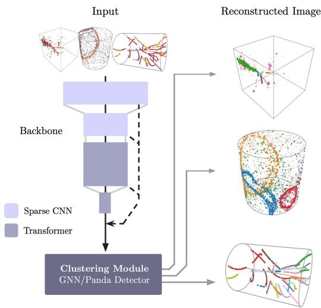  
Figure 4: Reconstruction setup. The Panda V2 backbone architecture takes in 3D point clouds as input and produces a single feature for each point by concatenating features from each stage of the encoder. These features are used as input to a clustering module, which is then trained to perform image reconstruction. Note that a separate backbone and clustering module is trained for each type of detector data; we did not train a single backbone or module to deal with all three data modalities.

The Panda V2 encoder follows the LitePT [Yue et al., 2026] architecture, which is an recent upgrade to the Point Transformer V3 encoder [Wu et al., 2024]; in it, sparse convolution blocks are removes from later layers, while attention is removed from earlier layers, with similar performance despite the large reduction in parameter size. It also introduces 3D rotary positional embeddings [Su et al., 2023] (PointRoPE) as an enhancement to the attention mechanism. We use this same architecture, with the largest change being the removal of non-residual pre-layer normalization that LitePT introduced in attention-only blocks. Our architecture has 4 total stages, the first two being CNN-only and the second two being attention only. For the attention blocks, we use a patch size of 1024 to perform local serialized attention. This is in contrast to the Panda V1 encoder, which had five stages, sparse CNN and attention blocks in each stack, and a patch size of 256. The voxel resolution at each of the four stages are (1, 2, 2, 8); we find the necessity to spend a considerable amount of compute at both fine resolutions (in the first three blocks) and at coarse resolutions (in the last block). The channel dimensions for each stage are (54, 108, 432, 576). A coarse schematic of the backbone is found on the left side of Fig. 4.

## C.2 Training setup

The pre-training setup across each detector modality is held fixed with the exception of grid size (what constitutes a voxel for use by the sparse CNN), the mask size (used to create masked views of an image), and feature transforms (e.g., scaling coordinates to [-1,1]3). We choose a mask size of 40 voxels for LArTPC data, 12.5 voxels for water Cherenkov data, and 13.3 voxels for sPHENIX data.

All encoders are pre-trained over 10M image presentations; as such, the number of epochs varies between each detector (10 epochs for PILArNet-M, 2 epochs for TPCpp-10M, and 100 for WAND).

We plan to open source the full configurations and training code in a forthcoming extended update to this manuscript.

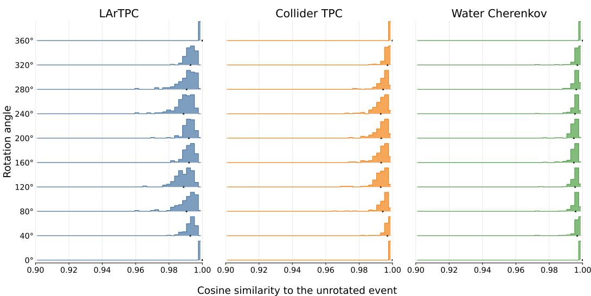  
Figure 5: Does the self-distillation objective enforce rotationally invariant features? We find that after pre-training representations from backbone encoders across detection mechanism weakly exhibit rotation invariance, holding the entire cosine similarity distribution across the same points $\geq 0 . 9 8$ most of time through a rotation through the X-axis.

## D Fine-tuning setup

## D.1 Equivariant probe

Consider the problem of predicting a particle’s vertex or direction from frozen backbone features that are approximately invariant under global rotations and translations, a scenario we find ourselves in (illustrated in Fig. 5) after pre-training with the self-distillation objective in the main text. A linear probe applied to the mean of per-point features corresponding to the particle has no equivariant mechanism: its output is unchanged when the event is transformed, whereas a physical direction should transform as $d \mapsto R d$ and a vertex as $p \mapsto R p + t$ . We therefore need a probe that combines the approximately invariant scalar features with the spatial coordinates at which they occur. For an event containing features $z _ { i } \in \mathbb { R } ^ { D }$ at positions $x _ { i } \in \mathbb { R } ^ { 3 }$ , we define

$$
h ^ { ( 0 ) } = \frac { 1 } { N } \sum _ { i = 1 } ^ { N } z _ { i } , \qquad \bar { x } = \frac { 1 } { N } \sum _ { i = 1 } ^ { N } x _ { i } ,\tag{1}
$$

and their centered coordinate–feature moment

$$
\boldsymbol { H } ^ { ( 1 ) } = \frac { 1 } { N } \sum _ { i = 1 } ^ { N } ( \boldsymbol { x } _ { i } - \bar { \boldsymbol { x } } ) ( \boldsymbol { z } _ { i } - \boldsymbol { h } ^ { ( 0 ) } ) ^ { \top } \in \mathbb { R } ^ { 3 \times D } .\tag{2}
$$

Each column of $H ^ { ( 1 ) }$ is a three-dimensional vector describing how one backbone feature channel varies spatially across the event. To predict a physical vector quantity, such as the particle direction, these $\dot { D }$ vector-valued channels must be combined into a single three-dimensional vector. We therefore learn a set of scalar weights $a \in \mathbb { R } ^ { D }$ over the feature channels, giving the linear readout

$$
H ^ { ( 1 ) } a = \frac { 1 } { N } \sum _ { i = 1 } ^ { N } ( x _ { i } - \bar { x } ) a ^ { \top } ( z _ { i } - h ^ { ( 0 ) } ) \in \mathbb { R } ^ { 3 } .\tag{3}
$$

The scalar $a ^ { \top } ( z _ { i } - h ^ { ( 0 ) } )$ ) measures the activation of one learned combination of backbone features at point i. The resulting weighted sum is its first spatial moment, or learned dipole, and points toward the region in which that feature combination is most strongly activated. We learn a separate weight vector a for each vector-valued prediction task.

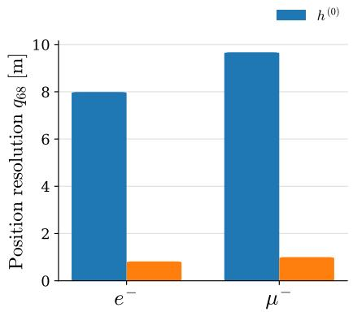

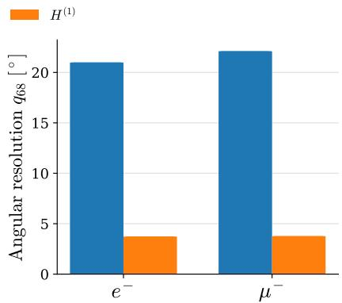  
Figure 6: Comparison training a linear probe to predict particle position and direction from single ring electron $( \bar { e ^ { - } } )$ or muon $( \mu ^ { - } )$ water Cherenkov images using either mean event features from the frozen backbone ${ \bf \ddot { \boldsymbol { h } } } ^ { ( 0 ) }$ or the equivariant coordinate–feature moment $H ^ { ( 1 ) }$ $6 8 ^ { t h }$ percentile position and angular resolution are given; lower is better.

Treating the backbone features as approximately rotation-invariant scalar channels, a rigid transformation $x _ { i } \mapsto R x _ { i } + t$ gives

$$
h ^ { ( 0 ) } \mapsto h ^ { ( 0 ) } , \qquad H ^ { ( 1 ) } \mapsto R H ^ { ( 1 ) } .\tag{4}
$$

Consequently, multiplying $H ^ { ( 1 ) }$ by any learned feature-space vector produces a three-dimensional output that rotates with the event.

In Fig. 6, we evaluate this property on single electron and single muon water Cherenkov events by jointly probing the interaction vertex p and initial particle direction d. As a scalar-feature baseline, two linear heads predict the vertex displacement $\Delta p = p - { \bar { x } }$ and an unnormalized direction vector from the mean event feature,

$$
\widehat { \Delta p } _ { \mathrm { m e a n } } = W _ { p } h ^ { ( 0 ) } + b _ { p } , \qquad \widetilde { d } _ { \mathrm { m e a n } } = W _ { d } h ^ { ( 0 ) } + b _ { d } .\tag{5}
$$

The equivariant probe instead learns only two task vectors, $a _ { \mathrm { p o s } } , a _ { \mathrm { d i r } } \in \mathbb { R } ^ { D }$ , and predicts

$$
\hat { p } = \bar { x } + H ^ { ( 1 ) } a _ { \mathrm { p o s } } , \qquad \hat { d } = \frac { H ^ { ( 1 ) } a _ { \mathrm { d i r } } } { \lVert H ^ { ( 1 ) } a _ { \mathrm { d i r } } \rVert } .\tag{6}
$$

From the figure, one finds that they can determine vector-like quantities from weakly invariant features by exploiting the structure of the invariant features in 3D space.

## D.2 Semantic segmentation

For the semantic segmentation task, We train a single linear classifier on top of frozen backbone outputs; LoRA is applied to each attention block in the backbone.

## D.3 Clustering.

Two-stage GNN. Our clustering head uses a two-stage coarse-to-fine procedure. First, a local binary edge classifier predicts whether neighboring occupied voxels belong to the same particle; connected components of the thresholded edge predictions define prefragments. Second, a lightweight GNN operates on the resulting prefragment graph, using rotation-invariant node and edge features constructed from coordinate–feature cross-correlation matrices, to merge prefragments into complete particle instances and classify them.

The centered moment $H _ { f } ^ { ( 1 ) }$ describes how the learned scalar feature channels vary spatially within prefragment $f .$ . We project its D channels to eight learned vector summaries,

$$
V _ { f } = H _ { f } ^ { ( 1 ) } A \in \mathbb { R } ^ { 3 \times 8 } , \qquad A \in \mathbb { R } ^ { D \times 8 } .\tag{7}
$$

Each column of $V _ { f }$ is the first spatial moment, or learned dipole, of one linear combination of the backbone features. This projection provides a compact description of the fragment’s internal geometry while avoiding comparisons over all $D$ feature channels.

Treating the backbone features as approximately rotation-invariant scalar channels, as encouraged by our self-distillation objective, $V _ { f }$ transforms equivariantly under a global rotation: $\bar { V _ { f } } \mapsto \bar { R } \bar { V _ { f } }$ Directly flattening $\bar { V _ { f } } ^ { - }$ would therefore expose orientation-dependent vector components to a scalar GNN. We instead represent these vectors through dot products, which are invariant as $( R V _ { f } ) ^ { \top } ( R V _ { g } ) = V _ { f } ^ { \top } V _ { g } .$ . The node representation is

$$
\boldsymbol { u } _ { f } = \left[ \phi \left( \boldsymbol { h } _ { f } ^ { ( 0 ) } \right) , \mathrm { v e c } \left( \frac { 1 } { 3 } \boldsymbol { V } _ { f } ^ { \top } \boldsymbol { V } _ { f } \right) \right] \in \mathbb { R } ^ { 1 2 8 } ,\tag{8}
$$

where $\phi$ is a LayerNorm–linear–GELU block mapping the mean fragment feature to 64 dimensions. The remaining 64 entries encode the magnitudes and pairwise alignments of the eight moment vectors.

We construct a complete directed graph over the prefragments. For an edge $f  g ,$ we define

$$
d _ { f g } = \bar { x } _ { g } - \bar { x } _ { f } , \qquad \hat { d } _ { f g } = { \frac { d _ { f g } } { \lVert d _ { f g } \rVert } } ,\tag{9}
$$

and form the 81-dimensional edge representation

$$
e _ { f g } = \left[ \Vert d _ { f g } \Vert , V _ { f } ^ { \top } \hat { d } _ { f g } , V _ { g } ^ { \top } \hat { d } _ { f g } , \mathrm { v e c } \left( \frac { 1 } { 3 } V _ { f } ^ { \top } V _ { g } \right) \right] .\tag{10}
$$

The first term gives the separation between the two centroids of each fragment; the next two measure how each fragment’s moment vectors align with the line connecting the fragments; and the final terms contain all pairwise alignments between their moment vectors. All are invariant under a common translation or rotation, while retaining the relative directional information needed to identify spatially consistent particle trajectories.

We process the graph using two message-passing layers of width 128, following the graph-processing and grouping procedure used by SPINE’s Graph Particle Aggregator (GrapPA) network Dominé et al. [2020], Drielsma et al. [2021a]. A final classifier predicts whether each fragment pair belongs to different particles or the same particle, and we average the logits for $f  g$ and $g  f$ to enforce symmetry. During training, each prefragment is assigned the majority truth-particle label of its voxels, and the GrapPA edge loss is averaged across classes within each event and then across events before being added to the local fragmenter loss. At inference, we apply SPINE’s score-based grouping rule described in Drielsma et al. [2021a] and map the resulting fragment groups back to the original voxels.

Panda Detector. We utilize the Panda Detector module as defined in the Panda paper [Young and Terao, 2025]; to make the network amenable to perform ring counting, i.e. clustering while allowing overlap between clusters, we simply do not perform NMS on outputs, instead supervising strong suppression of low quality masks with mask supervision across both predicted particles and predicted non-objects. To regress per-particle properties like vertex, direction, and momentum, we simply add several new MLP heads in addition to the particle identification head that predicts each quantity separately based using individual decoded queries.

Fig. 4 provides an simple illustration of these reconstruction setups. In all configurations, we train for 20M presentations of labeled images, taking the model with the highest metric on held out validation data.

## E Detailed comparisons

## E.1 LArTPC

We compare the data efficiency of the Panda V2 backbone to the baselines reported in the original Panda paper Young and Terao [2025] in Tables 3 (for semantic segmentation) and 4 (for clustering, i.e. instance segmentation). We note that the closest basis of comparison to the semantic segmentation fine-tuning setup is Panda V1 (dec.), which utilized a 16M UNet-like decoder with the frozen pre-trained backbone; we call our Panda V2 fine-tuning setup “Panda V2 (dec.)", though it is a materially less expressive decoding setup: just LoRA on the attention blocks on the backbone and a single two-layer MLP projecting backbone outputs to individual classes. Similarly, for the instance segmentation setup, we compare Panda V1 fine-tuned with Panda Detector and a frozen backbone to Panda V2 trained with LoRA+GNN. We point out that Panda V2, when trained on 1K events (0.1% of the total data) does as well as Panda V1 when trained on 1M labeled events.

Table 3: LArTPC semantic segmentation performance. Here Panda V2 (dec.) corresponds to parameter-efficient fine-tuning using an MLP head applied to backbone outputs+LoRA, while Panda V1 (dec.) corresponds to using Panda Detector [Young and Terao, 2025]. PT100%+FTK% corresponds to pretraining on the full 1M dataset and fine-tuning on K%.
<table><tr><td rowspan="2">Semantic Segmentation Method / K%</td><td colspan="5">PT100% + FTK%</td></tr><tr><td>0.01%</td><td>0.1%</td><td>1%</td><td>10%</td><td>100%</td></tr><tr><td>Supervised</td><td></td><td></td><td></td><td></td><td></td></tr><tr><td>UResNet PTv3</td><td>46.6 64.2</td><td>54.8 77.8</td><td>70.8 94.7</td><td>90.4 97.3</td><td>95.6 98.2</td></tr><tr><td>Self-supervised</td><td></td><td></td><td></td><td></td><td></td></tr><tr><td>PoLAr-MAE (dec.) PoLAr-MAE (full)</td><td></td><td></td><td></td><td></td><td>83.4 85.7</td></tr><tr><td>Panda V1 (lin.)</td><td>92.2</td><td>93.6</td><td>93.8</td><td>93.9</td><td>93.9</td></tr><tr><td>Panda V1 (dec.)</td><td>92.6</td><td>95.2</td><td>96.2</td><td>97.8</td><td>98.2</td></tr><tr><td>Panda V1 (full)</td><td>92.8</td><td>95.4</td><td>96.7</td><td>98.5</td><td>98.8</td></tr><tr><td> Panda V2 (dec.)</td><td>1</td><td>96.9</td><td></td><td>1</td><td>1</td></tr></table>

Table 4: LArTPC clustering performance. We compare Panda V1 with decoder-only fine-tuning (i.e., a frozen backbone) with the Panda Detector to Panda V2 with LoRA+GNN. 100% corresponds to 1M labeled events used for fine-tuning.
<table><tr><td>Instance Seg.</td><td>PQ</td><td>ARI</td></tr><tr><td>Model</td><td></td><td>0.01% 0.1%1%10% 100%0.01% 0.1%1%10% 100%</td></tr><tr><td>Panda V1</td><td>42.5 67.1</td><td>82.688.1 89.5 73.4 91.4 95.697.1 97.3</td></tr><tr><td>• Panda V2</td><td>87.2</td><td>97.3</td></tr></table>

• This work  
◦ Prev. SOTA • This work

We provide several clustering examples, both successful and poor, in Fig. 7.

## E.2 sPHENIX

We compare to the baselines reported in FM4NPP [Park et al., 2025] in Table. 5 on clustering, PID semantic segmentation, and noise separation semantic segmentation. Note that Panda V2 backbone is nearly a quarter of the size of the previous state-of-the-art network (53M params vs 188M) while still performing as well and in some cases outperforming and using 70× less labeled data.

We provide several clustering examples, both successful and poor, in Fig. 8.

## E.3 Super-Kamiokande

We provide full comparison of Panda V2 performing reconstruction in a water Cherenkov detector in Table 6, and reconstruction examples in Fig. 9. We note that there is quite a bit of way to go when it comes to performing as well as the full official reconstruction results from the Super-Kamiokande collaboration; that being said, the results do show that this method is promising for use in a water Cherenkov detector.

## F Interpretability probes

We investigate whether the frozen representations linearly encode physically meaningful quantities using two lightweight ridge-regression probes. The pretrained encoder remains completely frozen, and only a single affine direction,

$$
\hat { y } = \mathbf { w } ^ { \mathsf { T } } \mathbf { z } + b ,\tag{11}
$$

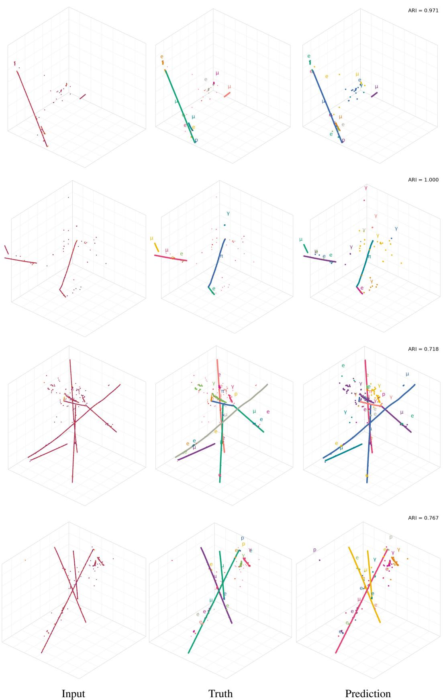  
Figure 7: LArTPC particle clustering. Results for two random images and two poorly-reconstructed images. We provide the ARI score for the predicted clusters in the top right corner.

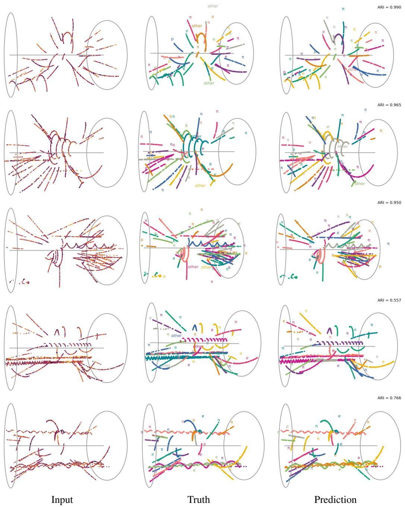  
Figure 8: sPHENIX particle clustering. Results for three random images and two poorlyreconstructed images. We provide the ARI score for the predicted clusters in the top right corner.

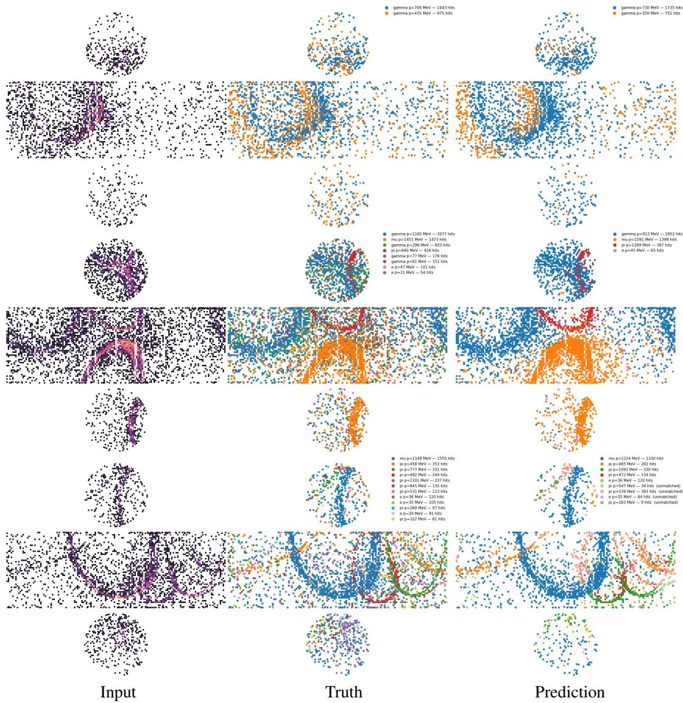  
Figure 9: Water Cherenkov multi-ring reconstruction examples. We provide results for three random images. We unroll the 3D cylinder to better visualize the predictions, however we note that the inputs to the backbone and reconstruction module are three-dimensional. We match particle whose rings overlap by ≥0.5 IoU and color them the same to help with visualization. Note that Panda Detector also predicts momentum, which can be found in the legends.

Table 5: Collider TPC clustering and semantic segmentation performance. We fine-tune Panda V2 on 1,000 labeled images and compare to methods that were fine-tuned on 70,000 images. We take clustering (i.e., tracking) efficiency and purity numbers from Park et al. [2025] and convert them into an $\bar { \boldsymbol { F } } _ { 1 }$ score by taking their harmonic mean for balanced comparison; we similarly do the same for semantic segmentation metrics. The Param. column refers to the number of trainable parameters, while the Img. column corresponds to the number of images used to adapt the backbone to the downstream task.
<table><tr><td></td><td colspan="3">Clustering</td><td colspan="5">Semantic Segmentation</td></tr><tr><td>Method</td><td>Param. Img.</td><td>ARI↑</td><td> $F _ { 1 } \uparrow$ </td><td>Method</td><td></td><td></td><td>Param. Img. PID F1 ↑ Noise</td><td> $F _ { 1 }$  ←</td></tr><tr><td>Supervised</td><td></td><td></td><td></td><td></td><td></td><td></td><td></td><td></td></tr><tr><td>EggNet</td><td>0.16 M 70 K 0.72560.7466</td><td></td><td></td><td>SAGEConv</td><td>0.91 M 70 K</td><td></td><td>0.5363</td><td>0.7667</td></tr><tr><td>Exa.TrkX</td><td>3.86 M 70 K0.8765 0.7707</td><td></td><td></td><td>OneFormer3D 44.95 M 70 K</td><td></td><td></td><td>0.5297</td><td>0.9170</td></tr><tr><td>AdapterOnly</td><td>2.39 M 70 K 0.7243 0.7064</td><td></td><td></td><td>AdapterOnly</td><td>0.74M70 K</td><td></td><td>0.4358</td><td>0.7129</td></tr><tr><td>Self-supervised</td><td></td><td></td><td></td><td></td><td></td><td></td><td></td><td></td></tr><tr><td>FM4NPP(m6) 2.39 M 70 K</td><td></td><td>0.9448 0.9456</td><td></td><td>FM4NPP(m6)</td><td>0.74M 70 K</td><td></td><td>0.8178</td><td>0.9278</td></tr><tr><td>• Panda V2</td><td>1.00 M1 K</td><td>0.9426</td><td>0.9543</td><td>• Panda V2</td><td>0.72M</td><td>1K</td><td>0.8393</td><td>0.9422</td></tr></table>

◦ Prev. SOTA • This work

Table 6: Performance on Super-K reconstruction tasks. We compare Panda V2 fine-tuned with a Panda Dector decoder to perform ring counting, and with a linear readout on mean-aggregated or equivariant moment features + LoRA for single-ring reconstruction on electrons and muons. We compare to numbers described in Jiang et al. [2019].
<table><tr><td></td><td colspan="3">Ring counting</td><td colspan="3">Single-ring electron</td><td colspan="2">Single-ring muon</td></tr><tr><td>Method</td><td></td><td></td><td></td><td></td><td></td><td>1R recall ↑ 2R recall ↑ ≥3R recall ↑ Vertex (cm) ↓ Direction (°) ↓ Momentum (%) ↓ Direction (°) ↓ Momentum (%) ↓</td><td></td><td></td></tr><tr><td colspan="9">Published reconstruction</td></tr><tr><td>APFit</td><td>0.9590</td><td>0.5280</td><td>0.4680</td><td>24.86</td><td>1.68</td><td>3.56</td><td>1.28</td><td>2.60</td></tr><tr><td>fiTQun</td><td>0.9500</td><td>0.6670</td><td>0.6750</td><td>20.64</td><td>1.48</td><td>2.90</td><td>1.00</td><td>2.26</td></tr><tr><td colspan="9">Self-supervised</td></tr><tr><td>• Panda V2</td><td>0.8036</td><td>0.4435</td><td>0.9669</td><td>98.69</td><td>5.75</td><td>4.80</td><td>5.88</td><td>4.82</td></tr></table>

is fitted for each target. Truth information is used only to construct the targets and associate points with particles and is never provided to the encoder. Consequently, successful prediction indicates that the corresponding quantity is already organized along a linear direction in the learned representation.

## F.1 Particle progression

The particle progression probe tests whether the representation contains an “arrow of time” along individual particle trajectories. Points are first grouped into particles using their truth particle-instance assignments. For primary particles, the beginning of the trajectory is identified using the truth interaction vertex. For secondary particles, the starting point is approximated by their attachment point to another particle from the same interaction. The remaining points are then ordered by their progression away from this starting point. For track-like particles, this ordering is based on geodesic distance through a nearest-neighbor graph, allowing the ordering to follow curved trajectories rather than a straight spatial axis.

For a particle containing $N _ { p }$ points, each point i is assigned an ordered rank $r _ { i } \in \{ 0 , \ldots , N _ { p } - 1 \}$ Its normalized progression target is

$$
\tau _ { i } = 2 \frac { r _ { i } } { N _ { p } - 1 } - 1 .\tag{12}
$$

The first point therefore has $\tau = - 1$ , the final point has $\tau = + 1$ , and intermediate points are distributed between these endpoints according to their relative ordering. Thus, τ represents normalized particle progression rather than physical time or propagation distance and can be compared across particles of different lengths and sampling densities. The probe is trained at the point level, with each particle assigned equal total weight so that long, densely sampled particles do not dominate the fit. Performance is quantified using the within-particle Spearman rank correlation.

## F.2 Transverse Momentum

The transverse-momentum probe tests whether the frozen collider representation encodes track curvature. Truth associations are used to group TPC spacepoints belonging to the same chargedparticle track. In the approximately uniform 1.4 T solenoidal magnetic field of sPHENIX, the transverse projection of a charged-particle trajectory is approximately circular. As ground truth $p _ { T }$ information is unavailable in the $\bar { \mathrm { T P C p p } } { \cdot } 1 0 \bar { \bf M }$ dataset, a robust circle fit to the $( x , y )$ coordinates gives the curvature radius R, from which the transverse momentum is estimated as

$$
p _ { T } \left[ \mathrm { G e V } / c \right] = 0 . 3 \left| q \right| B \left[ \mathrm { T } \right] R \left[ \mathrm { m } \right] \simeq 0 . 0 0 4 2 R \lbrack \mathrm { c m } \rbrack ,\tag{13}
$$

where the final expression uses $B = 1 . 4 \mathrm { T }$ and $| q | = 1$

The frozen point features are averaged over each associated track (using true cluster information) to form a single particle representation,

$$
\overline { { \mathbf { z } } } _ { p } = \frac { 1 } { N _ { p } } \sum _ { i \in p } \mathbf { z } _ { i } .\tag{14}
$$

A linear ridge probe is then fitted to log pT,

$$
\begin{array} { r } { \widehat { \log p _ { T } } = \mathbf { w } _ { p _ { T } } ^ { \mathsf { T } } \overline { { \mathbf { z } } } _ { p } + b _ { p _ { T } } , \qquad \widehat { p _ { T } } = \exp \left( \widehat { \log p _ { T } } \right) . } \end{array}\tag{15}
$$

Only well-reconstructed track-like particles are retained: tracks must contain at least 12 spacepoints, span at least 10 cm in transverse arc length. Performance is reported using the Spearman correlation between predicted and fitted $p _ { T }$

## F.3 Additional arrow of time examples

We provide more examples of “arrow of time" prediction using the learned task vector from Fig. 3a in Fig. 10.

## F.4 Additional $p _ { T }$ examples

We provide more examples of $p _ { T }$ prediction using the learned task vector from Fig. 3b in Fig. 11.

<table><tr><td>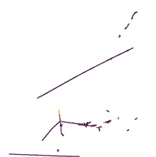</td><td>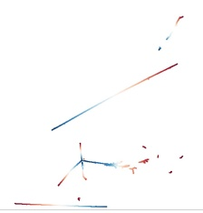</td><td>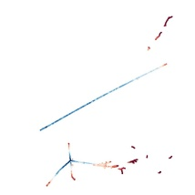</td></tr><tr><td>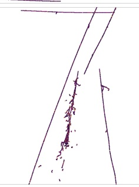</td><td>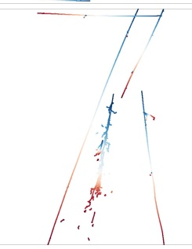</td><td>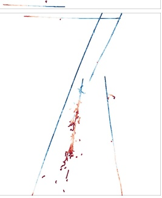</td></tr><tr><td>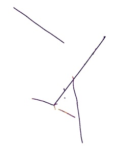</td><td>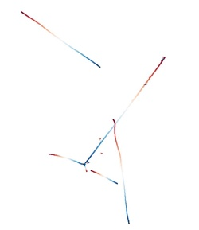</td><td>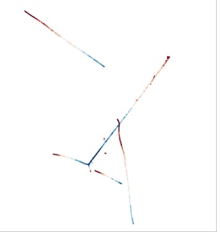</td></tr><tr><td>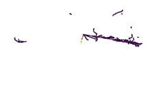</td><td>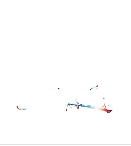</td><td>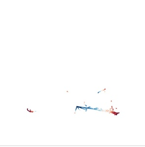</td></tr></table>

Input  
Truth  
Prediction  
Figure 10: Arrow-of-time examples for four held-out events. Each row shows the input deposited energy, the true τ (as defined in §F.1, and the predicted τ from left to right.

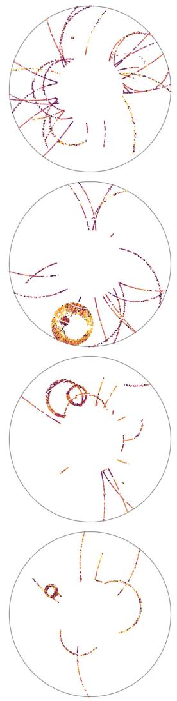  
Input

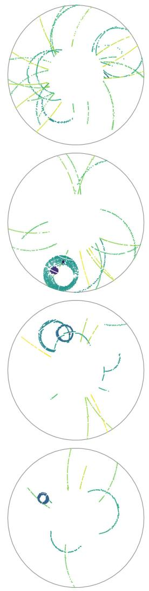  
Truth  
Prediction

Figure 11: sPHENIX linear spectrometer probing examples for four held-out events. Each row shows the input, truth, and prediction of the $p _ { T }$ proxy (defined in §F.2 from left to right.