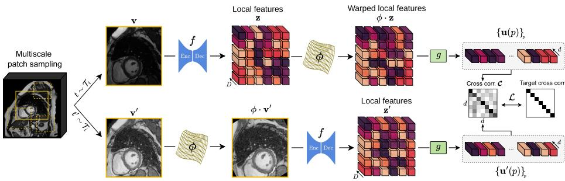
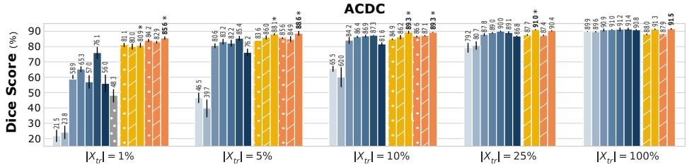
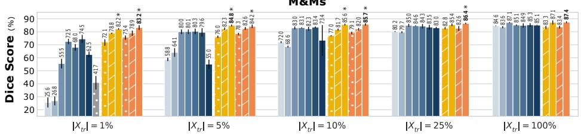
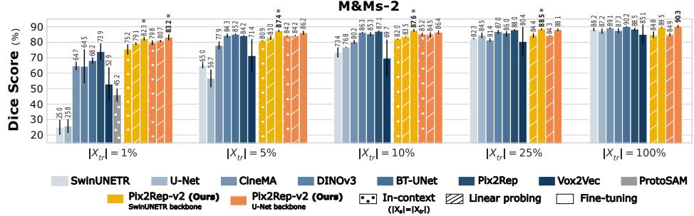
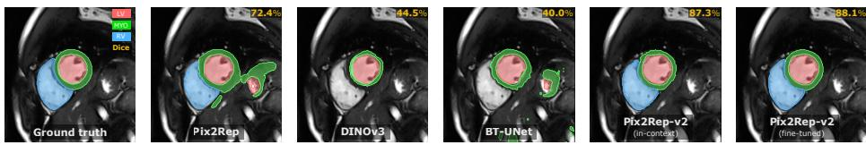
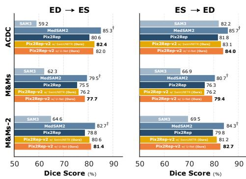
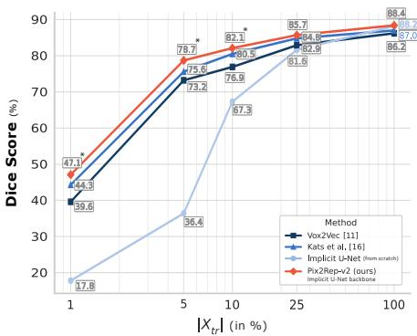

# Pix2Rep-v2: Data-Eficient Representation Learning for Dense Medical Imaging Applications

Sofiane Sifaoui1 , Elsa Angelini1 , Solenn Toupin2,3 , Théo Pezel2,3 , and Loïc Le Folgoc1

1 LTCI, Télécom Paris, Institut Polytechnique de Paris, Palaiseau, France 2 MIRACL.ai Laboratory, Hôpital Universitaire Lariboisière (AP-HP), Paris, France 3 Université Paris Cité, Inserm MASCOT, Paris, France sofiane.sifaoui@ip-paris.fr

Abstract. Dense self-supervised learning (SSL) is a powerful paradigm for learning without annotations the local descriptors required to solve dense medical imaging tasks. We present Pix2Rep-v2, a framework for SSL of pixel- and voxel-level representations suitable for few-shot downstream applications. Pix2Rep-v2 addresses the main challenges of dense SSL by leveraging a redundancy reduction objective at the pixel-level with a principle of equivariance of dense representations, that scales eficiently to 3D or wide field-of-view applications. We evaluate our method on four datasets, across multiple tasks, multiple modalities and anatomical structures using multiple backbones in 2D and 3D, and under various data regimes. As an alternative to linear probing or full fine-tuning on the downstream task, we also propose an in-context variant, without downstream training, based on a dense prototype approach. Pix2Rep-v2 shows substantially higher data-eficiency in few-shot scenarios compared to fully supervised baselines, and is competitive with the state-of-the-art e.g., +9.3 Dice points in one-shot segmentation on the M&Ms-2 dataset. Our code and pre-trained models are publicly available at https:// github.com/BioMedTP/pix2rep-v2.

Keywords: Dense Representation Learning · Self-Supervised Learning · Few-Shot Learning · In-Context Segmentation.

## 1 Introduction

Supervised deep learning has considerably advanced automation of dense medical imaging tasks such as segmentation [1,2,3]. However scarcity of pixel-level annotations remains a bottleneck for the development of new AI solutions on new applications, on diferent modalities or for deployment data from new scanners.

Several paradigms have emerged to circumvent this bottleneck, starting with transfer learning or domain generalization [4] that transport pre-existing models to the target task or dataset, and semi-supervised learning [5], which leverages unlabeled data. Recently, generalist [6] or specialized [7] foundation models trained from massive, diverse datasets promise to solve a broad range of applications in zero-shot or by fine-tuning on the application of interest. Such models demand either thousands of densely annotated scans [7] or, preferably, efective self-supervised pre-training recipes to train at scale [6,8,9] on up to millions of unlabeled scans. As a practical alternative, practitioners also look for efective solutions to train small task-specific and data-specific models from scratch on premise at minimal annotation cost.

We present an SSL framework for both purposes, Pix2Rep-v2, that addresses several challenges of dense contrastive learning methods [10,11,12]. Existing approaches [10,11] contrast pixel-level representations from overlapping regions of two crops. To preserve suficient overlap between views, they adopt milder spatial augmentation strategies that ultimately limit performance. Secondly, contrasting individual local feature vectors incurs high computational and memory costs due to the large number of negatives. We overcome these challenges through an equivariance-based formulation that relies on a single arbitrary spatial augmentation, and on a non-contrastive redundancy reduction formulation. Pix2Rep-v2 also returns high-quality pixel-level representations with strong local semantics straight out of pre-training, enabling a direct in-context downstream use (no fine-tuning). In summary, we make the following contributions:

• We present Pix2Rep-v2, addressing challenges of SOTA dense SSL approaches via an eficient redundancy reduction objective at the pixel-level and an aggressive multiscale approach;

• We evaluate Pix2Rep-v2 on multiple datasets, across multiple tasks (segmentation, video propagation), multiple modalities (cine MRI, CT), multiple anatomical structures (cardiac, abdominal), multiple data regimes (one-shot, few-shots, many-shots), multiple backbones, in 2D and 3D;

• To better investigate the intrinsic quality of Pix2Rep-v2’s pixel-level representations, we propose in addition to the fully fine-tuned and linear probing variants, a parameter-free training-free in-context version.

## 2 Related Work

Self-Supervised Learning first emerged as a paradigm to learn global imagelevel representations, based on various objectives: contrastive losses [13], redundancy reduction [14], self-distillation [6], masked image modeling (MIM) [15]. Dense SSL instead aims to learn pixel-level or patch-level representations suitable for dense downstream tasks. Most dense SSL methods adapt contrastive [11,16,12] or MIM objectives, or joint-embeddings [6], except BT-UNet [17], which is based on redundancy reduction, but pre-trains only the encoder of the U-Net [1].

Pixel-level contrastive methods [10,11,16] typically aim to align representations of the same anatomical points from two partially overlapping image crops. In addition, contrastive methods (incl. Pix2Rep [12]) sparsely sample the scans to avoid an explosion of the negative sample size. 3D applications present computational challenges for these methods that [11,16] solve via a dedicated 3D Feature Pyramid Network (FPN) coarse-to-fine representation. Alternatively, patch-level SSL methods [15,6,8,9] train the encoder only, whereas the backbone decoder is trained from scratch during downstream fine-tuning, potentially reducing few-shot performance.

  
Fig. 1: Overview of Pix2Rep-v2. Multi-scale patches are sampled from input images and transformed by two intensity augmentations producing two views: v and $\mathbf { v } ^ { \prime } .$ A random spatial transformation $\phi$ is applied to $\mathbf { v } ^ { \prime }$ to map to a new viewpoint, then pixel representations $\mathbf { z } ^ { \prime }$ are extracted using an encoder–decoder backbone $f .$ Asymmetrically, v is processed by f before its pixel representations z are mapped to the new viewpoint v by action of $\phi .$ . The resulting paired pixellevel representations are fed to an MLP projector $^ { g , }$ from which an empirical cross-correlation matrix is computed. The training loss encourages equivariance of pixel representations while reducing feature redundancy.

Foundation Models. SSL recipes can be deployed at scale to train generalist foundation models such as DINOv3 [6] or specialized foundation models e.g., CineMA [9] and [8] for cardiac MRI applications. MAE [15] or DINO-based [18] pretraining is standard for such models. Alternatively, other foundation models such as TotalSegmentator [7] are trained with label supervision. Lastly, SAM 3 [19] or in the medical domain MedSAM2 [20] enable segmentation or video propagation with guidance from various prompts: points, boxes or segmentation masks.

In-Context Learning allows to solve new segmentation tasks in few-shots through example-guided inference with no task-specific fine-tuning. In particular, ALPNet [21] adopts a prototype-based approach, which ProtoSAM [22] extends by leveraging DINOv2 [18] and SAM [23] capabilities. In this paper, we also propose a straightforward, scalable alternative based on a dense prototype approach.

## 3 Methods

Pix2Rep-v2 extends the Pix2Rep dense SSL paradigm, with a redundancy reduction (vs. contrastive) loss function, an aggressive multiscale patch sampling strategy, 3D support and in-context capabilities.

We pre-train an arbitrary encoder-decoder backbone $\boldsymbol { f } : \mathbb { R } ^ { H \times W \times C }  \mathbb { R } ^ { H \times W \times D }$ that maps from pixel-space to representation-space, using an unlabeled dataset $\mathcal { D } \triangleq \{ \tilde { \mathbf { x } } \in \mathbb { R } ^ { H \times } \mathrm { \tilde { W } } { \times } C \}$ of image patches, by enforcing two constraints on the representations: (c.1) invariance to photometric augmentations and equivariance to spatial transformations; and (c.2) informativeness and non-redundancy component-wise. An MLP projection head $g : \mathbb { R } ^ { H \times W \times D }  \mathbb { R } ^ { H \times W \times d }$ maps pixel representations to the space where the redundancy reduction loss is computed.

For a given image patch x, we generate two random photometric transformations $t , t ^ { \prime } \sim \mathcal { T } _ { i }$ , and one random spatial transformation $\phi \sim \mathcal { T } _ { s }$ , which maps to a new viewpoint. Photometric augmentations include random bias fields, Gamma distortions, blur, intensity rescaling, Gaussian noise, and intensity inversion. Spatial transformations include random flips, rotations, zooms, and B-spline elastic deformations. Applying $t , t ^ { \prime }$ to $\textbf { x } _ { \mathrm { ~ y ~ } }$ ields two views $\mathbf { v } \triangleq t ( \mathbf { x } ) , \mathbf { v } ^ { \prime } \triangleq t ^ { \prime } ( \mathbf { x } )$ . Then, asymmetrically: we transport $\mathbf { v } ^ { \prime }$ to the new viewpoint by action of ϕ on $\mathbf { v } ^ { \prime } \ i . c .$ $\phi \cdot \mathbf { v } ^ { \prime } \triangleq \mathbf { v } ^ { \prime } \circ \phi ^ { - 1 }$ then compute its pixel representations $\mathbf { z } ^ { \prime } \triangleq f ( \phi \cdot \mathbf { v } ^ { \prime } )$ from the new viewpoint; whereas for v, we compute pixel representations $\mathbf { z } = f ( \mathbf { v } )$ from the initial viewpoint, then transport z to the new viewpoint: $\phi \cdot \mathbf { z } = \phi \cdot f ( \mathbf { v } )$

Finally, we consider all paired representations $\{ ( \phi \cdot \mathbf { z } ) ( p ) , \mathbf { z } ^ { \prime } ( p ) \}$ , across all $P$ pixels in all image patches in a batch, which we project through $g ( \cdot )$ then normalize to zero mean, unit standard deviation, yielding paired vectors $\{ { \bf { u } } ( p ) , { \bf { u } } ^ { \prime } ( p )  \}$

Let C be the cross-correlation matrix with coeficient $\begin{array} { r } { \pmb { \mathcal { C } } _ { i j } \triangleq \sum _ { p } \mathbf { u } ( p ) _ { i } \mathbf { u } ^ { \prime } ( p ) _ { j } } \end{array}$ where $1 \ \leq \ i , j \ \leq \ d$ index two components of the projected representations. Computing and storing $c \in \mathbb { R } ^ { d \times d }$ on GPU is straightforward, unlike the similarity matrix in contrastive approaches [12,11,16], which typically scales with the square of the number of pixels $P \gg d$ . We minimize the redundancy reduction loss $\mathcal { L }$ of Eq. (1), defined as in Barlow Twins [14]:

$$
{ \mathcal { L } } \triangleq \sum _ { i \leq d } \left( { \pmb { \mathscr { C } } } _ { i i } - 1 \right) ^ { 2 } + \lambda \sum _ { i \leq d } \sum _ { j \neq i } { \pmb { \mathscr { C } } } _ { i j } ^ { 2 }\tag{1}
$$

Multiscale Patch Sampling. Each batch $\{ \mathbf { x } \in \mathbb { R } ^ { H \times W \times C } \}$ contains image patches (typically $H : = W : = 1 2 8 )$ extracted from whole scans. We extract onthe-fly one random patch of random dimensions $H _ { 0 } \times W _ { 0 }$ per scan, and resize it to $H \times W$ without changing aspect ratio. $H _ { 0 } : = W _ { 0 } : = \alpha \cdot \mathrm { m i n } ( H _ { \mathrm { s c a n } } , W _ { \mathrm { s c a n } } )$ is α times the smallest dimension (width or height) of the whole scan, where $\alpha \sim \mathcal { U } ( \alpha _ { \operatorname* { m i n } } , \alpha _ { \operatorname* { m a x } } )$ is uniformly sampled at random (typically $\alpha _ { \mathrm { m i n } } : = 0 . 3 3$ and $\alpha _ { \mathrm { m a x } } : = 0 . 7 5 )$ . This exposes the pre-trained model to a large variety of patches and teaches it to deal with input images at multiple scales (Fig. 1).

Downstream Segmentation. We train a segmentation head (Linear + Softmax) on top of the backbone $f ( \cdot )$ , discarding $g ( \cdot )$ . In linear probing, the backbone is frozen; in fine-tuning, we fine-tune the whole model. Either way, diferent from pre-training, during task-specific training we resample all scans to a fixed spacing before extracting $H \times W$ image patches; we proceed identically at inference time.

3D Backbone. Pix2Rep [12] shows that downstream performance benefits substantially from large D values. However storing explicitly many full-resolution feature maps, as output by the backbone decoder, is prohibitive memory-wise for 3D applications. We propose instead an implicit 3D U-Net backbone inspired by [24], where the upper blocks of the decoder are replaced by MLP layers (we refer the reader to the code for details). In this implicit U-Net, the output representations can be computed for a smaller specified set of point coordinates rather than on the regular pixel grid. We randomly sample $2 ^ { 1 7 } \ ( > 1 0 ^ { 5 } )$ coordinates per 3D patch, on which to evaluate Eq. (1). This is more than 100× the number of points usually sampled in contrastive dense SSL [11,16] (1024 points per volume). Diferent from the coarse-to-fine representations extracted from the 3D FPN backbone of [11,16], the implicit 3D U-Net backbone implicitly extracts a large number of features at high-resolution.

In-Context Segmentation. Given a backbone pre-trained with Pix2Rep-v2 and a support set $X _ { S } = \{ ( \mathbf { x } ^ { ( s ) } , \mathbf { y } ^ { ( s ) } ) \} _ { s \in S }$ of images with their corresponding ground truth (GT) segmentations, we wish to predict segmentation maps for all images in a query set $X _ { Q } = \{ \mathbf { x } ^ { ( q ) } \} _ { q \in Q }$ without any task-specific fine-tuning.

We adopt a dense prototype approach whereby the Pix2Rep-v2 representations of all pixels in all images of $X _ { S }$ are gathered to form the prototype set $\mathcal { P }$ Then, for any given pixel in a query image, we compute its Pix2Rep-v2 (projected) representation $g ( \mathbf { z } ( p ) )$ , perform a nearest neighbor search in $\mathcal { P }$ w.r.t. cosine similarity, and assign the label of this support pixel to the query pixel. This type of nearest neighbor search on large sets (up to $1 0 ^ { 9 }$ elements) of highdimensional vectors can be performed extremely eficiently with the FAISS [25] library, yielding a straightforward, parameter-free and scalable strategy.

Zero-Shot 3D+t Video Propagation. We consider $3 D { + } t$ applications where for each patient, the GT segmentation is available on a reference frame, and we wish to propagate it to the rest of the time series, without label-specific finetuning, using the pre-trained $\mathtt { P i x 2 R e p - v 2 }$ representations.

We adopt a propagation strategy across consecutive frames $t - 1  t$ via a dense prototype approach. For any frame t in the series, the prototype set includes $\mathcal { P } _ { t - 1 }$ , the Pix2Rep-v2 representations of all pixels in the previously segmented frame t−1. To reduce error accumulation over several frames, we add to the prototype set the representations of all pixels extracted from an “anchor” frame, here the reference frame $t _ { 0 }$ where the GT is available $i . e . , \mathcal { P } _ { t - 1 } \cup \mathcal { P } _ { t _ { 0 } }$ . We segment the frame t by assigning to any given pixel, with representation $g ( \mathbf { z } ( \boldsymbol { p } ) )$ , the label of its nearest neighbor in the prototype set w.r.t. cosine similarity.

## 4 Experiments and Results

We evaluate the Pix2Rep-v2 framework on cardiac MRI segmentation and video propagation, as well as on abdominal CT multi-organ segmentation.

Implementation Details. The framework is implemented in PyTorch and publicly available (source code, hyperparameter configurations and pretrained models). We set $\lambda : = 5 \cdot 1 0 ^ { - 3 } , D : = 1 0 2 4 , d : = 2 5 6$ for 2D applications; and $D : = 2 5 6$ , d := 128 for 3D applications. For pretraining, we use a learning rate of $5 e ^ { - 4 }$ in

  
Fig. 2: Cardiac MRI segmentation results per cohort: ACDC, M&Ms and M&Ms-2. For Pix2Rep-v2: in-context, linear-probing or fine-tuning with either backbone (U-Net or Swin-UNETR). For comparison: U-Net, Swin-UNETR baselines trained from scratch, fine-tuned foundation models (CineMA, DINOv3), finetuned SSL methods (BT-UNet, vox2vec, Pix2Rep) and in-context ProtoSAM. Colored bar + number ≡ mean Dice over 3 runs (with diferent seeds and training subjects). Black line ≡ standard deviation. Best Dice indicated in bold.  
(∗) indicates a statistically significant improvement of fine-tuned Pix2Rep-v2 over the best baseline in each data regime (Wilcoxon signed-rank test, $p < 0 . 0 5 )$ .

2D (resp. $1 e ^ { - 4 }$ in 3D) for the backbone, following a cosine annealing schedule and AdamW optimizer. During finetuning, this base learning rate is divided by a factor 10. We generally pre-train on 4 H100 GPUs for 200 epochs in less than a day, and fine-tune on one V100 GPU for 100 epochs in few hours.

Datasets. ACDC, M&Ms, M&Ms-2 [2,26,27] contain 3D short-axis cardiac cine MRI images of 150, 345 and 360 subjects respectively, including GT annotations at End-Systole (ES) and End-Diastole (ED) for the left ventricle, right ventricle and myocardium. We use the provided splits, with 100/209/200 subjects for training and 50/136/160 for testing. These datasets also include the full

  
Fig. 3: Qualitative segmentation results on M&Ms-2 with $| X _ { t r } | = 1 \% .$

3D + t cine MRI sequence, which we use in the video propagation downstream task. AMOS [28] includes 3D abdominal CT scans of 500 subjects with multiorgan GT annotations, split between 200 training, 100 validation and 200 test scans. As GT annotations are not disclosed for the original test set, we form a new disjoint split by rearranging subjects: (s.1) 400 for pre-training, including 200 with GT annotations for fine-tuning; (s.2) 100 with GT for testing. Furthermore, 1900 unlabeled CT scans are also included in the dataset, which we add for pretraining. CT scans are min-max normalized in [0, 1], clipping at $H U _ { \mathrm { m i n } } : = - 2 0 0$ and $H U _ { \mathrm { m a x } } : = 3 0 0$ . In 3D, we extract patches of size $1 9 2 \times 1 9 2 \times 6 4$

Experimental Setup & Evaluation. For pre-training, we use the entirety of the raw training data noted $X _ { p r e } ,$ , without GT labels. For linear probing or finetuning on segmentation tasks, we use a smaller number of training images with their segmentation labels to simulate one-shot, few-shot, many-shot regimes e.g., $X _ { t r }$ is {1, 5, 10, 25, 100}% of the training set. $X _ { p r e } \ ( \mathrm { r e s p . } \ X _ { t r } )$ is randomly split between training data (90%) and validation data (10%) during runs. Test data is only used for the final evaluation. For anatomical cardiac MRI applications, we form a single pre-training set $X _ { p r e }$ , using the $3 D + t$ raw data in the combined ACDC, M&Ms and M&Ms-2 training sets. However, we conduct task-specific fine-tuning separately on each dataset.

We demonstrate Pix2Rep-v2’s efectiveness with various backbones. For cardiac MRI experiments, we favor 2D backbones due to the large slice thickness, specifically 2D U-Net [1] and Swin-UNETR [3]. Abdominal CT experiments use the implicit 3D U-Net backbone (section 3).

For video propagation on ACDC, M&Ms, M&Ms-2: for each subject, we take for given the GT segmentation at ED and propagate ED→ES, and vice-versa.

We quantify performance across all applications via the 3D Dice score. We report the 3D Dice averaged over the segmented structures (as well as over ED and ES for ACDC, M&Ms, M&Ms-2 datasets), and over the test set.

Comparison to the SOTA. For video propagation, we compare to SAM 3 [19] and MedSAM2 [20] using the reference frame’s GT mask as prompt, as well as to Pix2Rep-based video propagation using their contrastive representations coupled with our proposed propagation mechanism (section 3).

For segmentation, a sound baseline to assess the gain in data-eficiency due to Pix2Rep-v2 pre-training is to skip pre-training i.e., train the same backbone and segmentation head from scratch. In addition, we compare against the following

  
Fig. 4: Cine MRI video propagation results. Best viewed zoomed-in, in color. Pix2Rep-v2, SAM3 and Pix2Rep’s predictions are zero-shot, whereas MedSAM2 (†) is data contaminated: its training set includes ACDC, M&Ms and M&Ms-2 scans and GT annotations.  
Fig. 5: Multi-organ abdominal CT segmentation results on AMOS. Performance (Dice score averaged over the 15 labels) vs. amount of labeled scans used for fine-tuning $\left| X _ { t r } \right|$ (∗): statistically significant improvement over the best baseline (Wilcoxon signed-rank test, $p < 0 . 0 5 )$ .

SOTA methods: for dense SSL, vox2vec [11], its extension [16]; Pix2Rep [12] with our proposed multiscale patch sampling but their contrastive loss; for redundancy reduction-based methods, BT-UNet [17]; recent foundation models fine-tuned on the tasks, specifically DINOv3 [6], as well as the MAE-based CineMA [9] for cardiac applications; for one-shot in-context prototype-based methods, ProtoSAM [22]. In 3D, we compare with all natively 3D methods in the previous list.

Results. Cardiac MRI segmentation (Fig. 2,3): Results’ interpretation is similar across ACDC, M&Ms, M&Ms-2. Fine-tuned Pix2Rep-v2 (with either backbone) outperforms other methods across all data regimes: Pix2Rep-v2 with U-Net is +9.3 Dice points above best-of-the-rest Pix2Rep and +15.0 Dice points above next-best BT-UNet for $| X _ { t r } | ~ = ~ 1 \%$ on M&Ms-2. Strikingly, in-context Pix2Rep-v2 with U-Net performs better for $| X _ { S } | = 1 \%$ than all fine-tuned baselines with $| X _ { t r } | = 1 \%$ , and ∼ 35 Dice points above in-context ProtoSAM. It also scales nicely to few-shot, whereas ProtoSAM only natively ofers one-shot segmentation. In addition, we get ×25 data-eficiency in few-shot and ×5-10 in large data regimes with Pix2Rep-v2 pretraining vs. training from scratch, with identical experimental setups (backbone, pre-processing, training iterations, etc.).

Video propagation (cine MRI) (Fig. 4): Pix2Rep-v2 outperforms SAM 3 video propagation in zero-shot and almost reaches the performance of MedSAM2, despite MedSAM2 having trained on all of ACDC, M&Ms, M&Ms-2 scans and GT annotations (including the test data). Pix2Rep-v2’s redundancy reductionbased representations slightly outperform Pix2Rep’s contrastive representations, when coupling them with the propagation mechanism proposed in section 3.

3D abdominal CT segmentation on AMOS (Fig. 5): Pix2Rep-v2 outperforms other natively 3D self-supervised methods: vox2vec [11] and Kats et al. [16]. Furthermore Pix2Rep-v2 shows ×5 data-eficiency in low data regimes compared to the implicit U-Net baseline trained from scratch (i.e., it reaches equivalent performance with ×5 fewer annotated scans for fine-tuning).

## 5 Discussion and Conclusion

We presented Pix2Rep-v2, a dense representation learning framework for dataeficient solving of pixel-level tasks, with strong few-shot and in-context capabilities. This opens up new avenues for training next-generation medical imaging foundation models, or for fast development of task- and data-specific AI solutions on premise. Future work will investigate new use cases and tasks (landmark detection, registration), and couple image- with pixel-level representations.

Acknowledgments. This research work is funded by the IP Paris Graduate School, Télécom Paris and the Hi! PARIS interdisciplinary research center. This work was performed using HPC resources from GENCI-IDRIS (Grant 2025-AD011017141).

Disclosure of Interests. The authors have no competing interests to declare that are relevant to the content of this article.

## References

1. Olaf, R., Fischer, P., Thomas, B.: U-Net: Convolutional Networks for Biomedical Image Segmentation. In: MICCAI. pp. 234–241. Cham (2015)

2. Bernard, O., Lalande, A., Zotti, C., et al.: Deep Learning Techniques for Automatic MRI Cardiac Multi-Structures Segmentation and Diagnosis: Is the Problem Solved? IEEE Transactions on Medical Imaging 37(11), 2514–2525 (2018)

3. Hatamizadeh, A., Nath, V., Tang, Y., et al.: Swin UNETR: Swin Transformers for Semantic Segmentation of Brain Tumors in MRI Images. In: Brainlesion: Glioma, Multiple Sclerosis, Stroke and Traumatic Brain Injuries. pp. 272–284. Cham (2022)

4. Ouyang, C., Chen, C., Li, S., Li, Z., Qin, C., Bai, W., Rueckert, D.: Causalityinspired single-source domain generalization for medical image segmentation. IEEE Transactions on Medical Imaging 42(4), 1095–1106 (2023)

5. Manuel, T., Wagner, S.J., Melanie, B., Tingying, P.: S5CL: Unifying Fully-Supervised, Self-supervised, and Semi-supervised Learning Through Hierarchical Contrastive Learning. In: MICCAI. pp. 99–108. Cham (2022)

6. Siméoni, O., Vo, H.V., Seitzer, M., Baldassarre, F., Oquab, M., Jose, C., Khalidov, V., Szafraniec, M., Yi, S., Ramamonjisoa, M., Massa, F., Haziza, D., Wehrstedt, L., Wang, J., Darcet, T., Moutakanni, T., Sentana, L., Roberts, C., Vedaldi, A., Tolan, J., Brandt, J., Couprie, C., Mairal, J., Jégou, H., Labatut, P., Bojanowski, P.: DINOv3 (2025), arXiv:2508.10104 [cs]

7. Wasserthal, J., Breit, H.C., Meyer, M.T., Pradella, M., Hinck, D., Sauter, A.W., Heye, T., Boll, D.T., Cyriac, J., Yang, S., Bach, M., Segeroth, M.: TotalSegmentator: Robust Segmentation of 104 Anatomic Structures in CT Images. Radiology: Artificial Intelligence 5(5), e230024 (2023)

8. Jacob, A.J., Borgohain, I., Chitiboi, T., Sharma, P., Comaniciu, D., Rueckert, D.: Towards a vision foundation model for comprehensive assessment of Cardiac MRI. Journal of Cardiovascular Magnetic Resonance 27(2), 101967 (2025)

9. Fu, Y., Bai, W., Yi, W., Manisty, C., Bhuva, A.N., Treibel, T.A., Moon, J.C., Clarkson, M.J., Davies, R.H., Hu, Y.: Development and validation of a versatile foundation model for cine cardiac magnetic resonance image analysis. Communications Medicine (2026)

10. O. Pinheiro, P.O., Almahairi, A., Benmalek, R., Golemo, F., Courville, A.C.: Unsupervised Learning of Dense Visual Representations. In: Advances in Neural Information Processing Systems. vol. 33, pp. 4489–4500 (2020)

11. Mikhail, G., Soboleva, V., Anvar, K., Maxim, P., Mikhail, B.: vox2vec: A Framework for Self-supervised Contrastive Learning of Voxel-Level Representations in Medical Images. In: MICCAI. pp. 605–614 (2023)

12. Seince, M., Le Folgoc, L., Facury De Souza, L., Angelini, E.: Dense Self-Supervised Learning for Medical Image Segmentation. In: MIDL (2024)

13. Chen, T., Kornblith, S., Norouzi, M., Hinton, G.: A Simple Framework for Contrastive Learning of Visual Representations. In: ICML. vol. 119, pp. 1597–1607 (2020)

14. Zbontar, J., Jing, L., Misra, I., LeCun, Y., Deny, S.: Barlow Twins: Self-Supervised Learning via Redundancy Reduction. In: ICML. vol. 139, pp. 12310–12320 (2021)

15. He, K., Chen, X., Xie, S., Li, Y., Dollár, P., Girshick, R.: Masked Autoencoders Are Scalable Vision Learners. In: CVPR. pp. 16000–16009 (2022)

16. Kats, E., Hirsch, J.G., Heinrich, M.P.: Self-Supervised Learning of Dense Hierarchical Representations for Medical Image Segmentation. In: IEEE ISBI (2024)

17. Punn, N.S., Agarwal, S.: BT-Unet: A self-supervised learning framework for biomedical image segmentation using Barlow Twins with U-net models. Machine Learning 111(12), 4585–4600 (2022)

18. Oquab, M., Darcet, T., Moutakanni, T., et al.: DINOv2: Learning robust visual features without supervision. Transactions on Machine Learning Research (2024)

19. Carion, N., Gustafson, L., Hu, Y.T., et al.: SAM 3: Segment anything with concepts. In: ICLR (2026)

20. Ma, J., Yang, Z., Kim, S., Chen, B., Baharoon, M., Fallahpour, A., Asakereh, R., Lyu, H., Wang, B.: MedSAM2: Segment anything in 3d medical images and videos. arXiv preprint arXiv:2504.03600 (2025)

21. Ouyang, C., Bifi, C., Chen, C., Kart, T., Qiu, H., Rueckert, D.: Self-Supervised Learning for Few-Shot Medical Image Segmentation. IEEE Transactions on Medical Imaging 41(7), 1837–1848 (2022)

22. Ayzenberg, L., Giryes, R., Greenspan, H.: ProtoSAM for automated one shot medical image segmentation using foundational models. Scientific Reports 15(1), 41482 (2025)

23. Kirillov, A., Mintun, E., Ravi, N., et al.: Segment Anything. In: IEEE/CVF ICCV. pp. 3992–4003 (2023)

24. Marimont, S.N., Tarroni, G.: Implicit u-net for volumetric medical image segmentation. In: Yang, G., Aviles-Rivero, A., Roberts, M., Schönlieb, C.B. (eds.) Medical Image Understanding and Analysis. pp. 387–397 (2022)

25. Douze, M., Guzhva, A., Deng, C., Johnson, J., Szilvasy, G., Mazaré, P.E., Lomeli, M., Hosseini, L., Jégou, H.: The FAISS library. IEEE Transactions on Big Data pp. 1–17 (2025)

26. Campello, V.M., Gkontra, P., Izquierdo, C., et al.: Multi-Centre, Multi-Vendor and Multi-Disease Cardiac Segmentation: The M&Ms Challenge. IEEE Transactions on Medical Imaging 40(12), 3543–3554 (2021)

27. Martín-Isla, C., Campello, V.M., Izquierdo, C., et al.: Deep Learning Segmentation of the Right Ventricle in Cardiac MRI: The M&Ms Challenge. IEEE Journal of Biomedical and Health Informatics 27(7), 3302–3313 (2023)

28. Ji, Y., Bai, H., Ge, C., Yang, J., Zhu, Y., Zhang, R., Li, Z., Zhanng, L., Ma, W., Wan, X., Luo, P.: AMOS: A Large-Scale Abdominal Multi-Organ Benchmark for Versatile Medical Image Segmentation. Advances in Neural Information Processing Systems 35, 36722–36732 (2022)