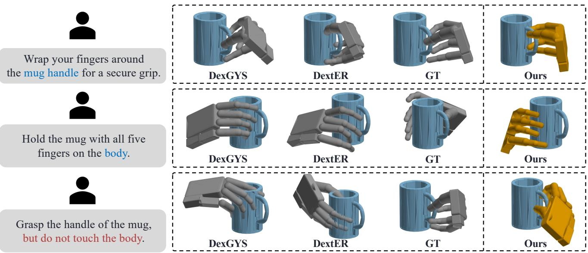
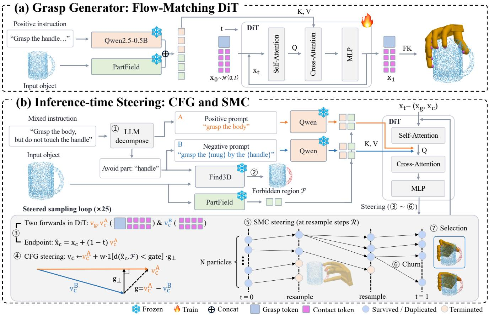
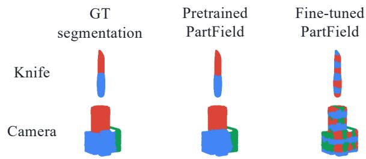
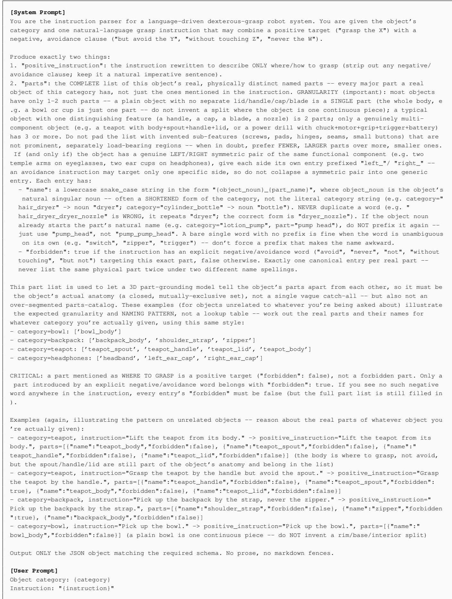
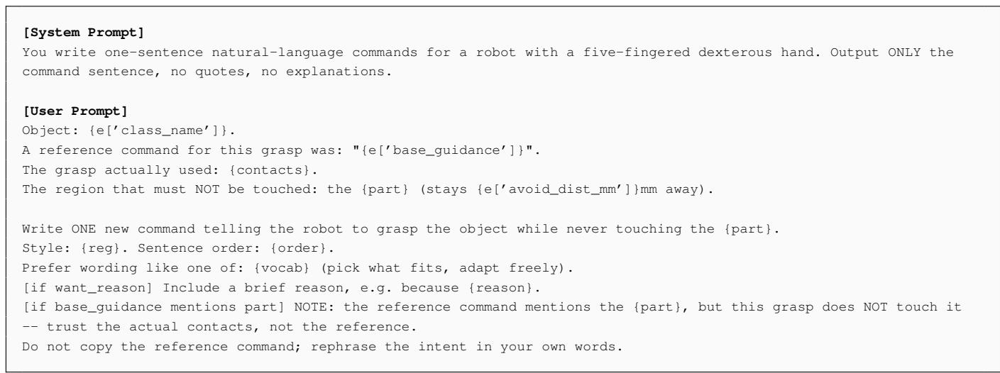

# Potential-Guided Particle Steering for Negation-Constrained Dexterous Grasping

Geonho Kim<sup>∗</sup>, SooGon Kim<sup>∗</sup>, Jongmin Lee<sup>†</sup>

D<sub>epa</sub>rtm<sub>e</sub>nt <sub>o</sub>f C<sub>o</sub>m<sub>pu</sub>t<sub>e</sub>r S<sub>c</sub>i<sub>e</sub>n<sub>ce</sub> & En<sub>g</sub>in<sub>ee</sub>rin<sub>g,</sub> Ch<sub>u</sub>n<sub>g-</sub>An<sub>g</sub> Uni<sub>ve</sub>r<sub>s</sub>it<sub>y</sub> {joelkimgh, gon1397, jmlee}@cau.ac.kr

  
Figure 1: Grasping under negated instructions. Existing models handle positive instructions (top two rows) but drift into the forbidden <sub>p</sub>art when the instruction also sa<sub>y</sub>s what to avoid (bottom row). Our inference-time steerin<sub>g</sub> satisfies both the tar<sub>g</sub>et and the avoidance constraint in all cases (ri<sub>g</sub>htmost column).

## Abstract

L<sub>a</sub>n<sub>guage-</sub>dri<sub>ve</sub>n d<sub>ex</sub>t<sub>e</sub>r<sub>ous g</sub>r<sub>asp</sub> m<sub>o</sub>d<sub>e</sub>l<sub>s, suc</sub>h <sub>as</sub> D<sub>ex</sub>tER<sub>,</sub> perform well when instructions specify where to grasp, but <sub>we</sub> fi<sub>n</sub>d th<sub>ey</sub> f<sub>a</sub>il <sub>sys</sub>t<sub>ema</sub>ti<sub>ca</sub>ll<sub>y w</sub>h<sub>en an</sub> i<sub>ns</sub>t<sub>ruc</sub>ti<sub>on a</sub>l<sub>so spec-</sub> ifies where not to grasp (e.g., “grasp the handle but avoid the bod<sub>y</sub>”). Existin<sub>g</sub> trainin<sub>g</sub> cor<sub>p</sub>ora, DexGYSNet amon<sub>g</sub> them, <sub>con</sub>t<sub>a</sub>i<sub>n v</sub>i<sub>r</sub>t<sub>ua</sub>ll<sub>y no avo</sub>id<sub>ance</sub> i<sub>ns</sub>t<sub>ruc</sub>ti<sub>ons, an</sub>d <sub>co</sub>ll<sub>ec</sub>ti<sub>ng ex-</sub> <sub>amp</sub>l<sub>es</sub> f<sub>or every poss</sub>ibl<sub>e cons</sub>t<sub>ra</sub>i<sub>n</sub>t i<sub>s</sub> i<sub>mprac</sub>ti<sub>ca</sub>l<sub>.</sub> M<sub>oreover,</sub> b<sub>ecause every par</sub>t <sub>men</sub>ti<sub>one</sub>d d<sub>ur</sub>i<sub>ng</sub> t<sub>ra</sub>i<sub>n</sub>i<sub>ng</sub> d<sub>eno</sub>t<sub>es a con-</sub> t<sub>ac</sub>t t<sub>arge</sub>t<sub>, mo</sub>d<sub>e</sub>l<sub>s may</sub> i<sub>n</sub>t<sub>erpre</sub>t <sub>a</sub> f<sub>or</sub>bidd<sub>en par</sub>t <sub>as ano</sub>th<sub>er</sub> <sub>reg</sub>i<sub>on</sub> t<sub>o grasp ra</sub>th<sub>er</sub> th<sub>an one</sub> t<sub>o avo</sub>id<sub>.</sub> W<sub>e</sub> th<sub>ere</sub>f<sub>ore</sub> i<sub>n</sub>t<sub>ro</sub>d<sub>uce</sub> <sub>an</sub> i<sub>n</sub>f<sub>erence-</sub>ti<sub>me</sub> f<sub>ramewor</sub>k f<sub>or nega</sub>ti<sub>on-cons</sub>t<sub>ra</sub>i<sub>ne</sub>d d<sub>ex</sub>t<sub>er-</sub> <sub>ous grasp</sub>i<sub>ng</sub> th<sub>a</sub>t <sub>requ</sub>i<sub>res no nega</sub>ti<sub>on-spec</sub>ifi<sub>c</sub> t<sub>ra</sub>i<sub>n</sub>i<sub>ng exam-</sub> <sub>p</sub>l<sub>es.</sub> C<sub>om</sub>bi<sub>n</sub>i<sub>ng</sub> S<sub>equen</sub>ti<sub>a</sub>l M<sub>on</sub>t<sub>e</sub> C<sub>ar</sub>l<sub>o w</sub>ith <sub>c</sub>l<sub>ass</sub>ifi<sub>er-</sub>f<sub>ree</sub> <sub>gu</sub>id<sub>ance, our me</sub>th<sub>o</sub>d <sub>gu</sub>id<sub>es samp</sub>li<sub>ng</sub> t<sub>owar</sub>d th<sub>e</sub> i<sub>ns</sub>t<sub>ruc</sub>t<sub>e</sub>d <sub>par</sub>t <sub>w</sub>hil<sub>e prun</sub>i<sub>ng can</sub>did<sub>a</sub>t<sub>es</sub> h<sub>ea</sub>d<sub>e</sub>d f<sub>or</sub> th<sub>e</sub> f<sub>or</sub>bidd<sub>en reg</sub>i<sub>on,</sub> <sub>w</sub>ith<sub>ou</sub>t <sub>any nega</sub>ti<sub>on examp</sub>l<sub>es</sub> d<sub>ur</sub>i<sub>ng</sub> t<sub>ra</sub>i<sub>n</sub>i<sub>ng.</sub> A f<sub>rozen</sub> 3D <sub>par</sub>t<sub>-groun</sub>di<sub>ng</sub> <sub>mo</sub>d<sub>e</sub>l l<sub>oca</sub>li<sub>zes</sub> th<sub>e</sub> f<sub>or</sub>bidd<sub>en</sub> <sub>reg</sub>i<sub>on</sub> f<sub>rom</sub> th<sub>e</sub>

l<sub>anguage</sub> i<sub>ns</sub>t<sub>ruc</sub>ti<sub>on.</sub> T<sub>o eva</sub>l<sub>ua</sub>t<sub>e</sub> thi<sub>s se</sub>tti<sub>ng, we cons</sub>t<sub>ruc</sub>t N<sub>eg</sub>G<sub>rasp, a</sub> b<sub>enc</sub>h<sub>mar</sub>k <sub>o</sub>f <sub>pa</sub>i<sub>re</sub>d <sub>pos</sub>iti<sub>ve</sub>/<sub>nega</sub>ti<sub>ve</sub> i<sub>ns</sub>t<sub>ruc-</sub> ti<sub>ons w</sub>ith <sub>cons</sub>t<sub>ra</sub>i<sub>n</sub>t<sub>-aware me</sub>t<sub>r</sub>i<sub>cs</sub> th<sub>a</sub>t <sub>cre</sub>dit <sub>a grasp on</sub>l<sub>y</sub> if it b<sub>o</sub>th <sub>accomp</sub>li<sub>s</sub>h<sub>es</sub> th<sub>e</sub> t<sub>as</sub>k <sub>an</sub>d <sub>respec</sub>t<sub>s</sub> th<sub>e</sub> <sub>s</sub>t<sub>a</sub>t<sub>e</sub>d <sub>cons</sub>t<sub>ra</sub>i<sub>n</sub>t<sub>.</sub> O<sub>n</sub> N<sub>eg</sub>G<sub>rasp,</sub> <sub>our</sub> <sub>me</sub>th<sub>o</sub>d <sub>re</sub>d<sub>uces</sub> th<sub>e</sub> <sub>v</sub>i<sub>o</sub>l<sub>a</sub>ti<sub>on</sub> <sub>ra</sub>t<sub>e</sub> <sub>o</sub>f th<sub>e</sub> <sub>s</sub>t<sub>ronges</sub>t b<sub>ase</sub>li<sub>ne</sub> f<sub>rom</sub> 57<sub>.</sub>9% t<sub>o</sub> 17<sub>.</sub>2% <sub>w</sub>hil<sub>e</sub> i<sub>mprov</sub>i<sub>ng</sub> b<sub>o</sub>th <sub>cons</sub>t<sub>ra</sub>i<sub>n</sub>t<sub>-aware</sub> <sub>an</sub>d <sub>p</sub>h<sub>ys</sub>i<sub>ca</sub>l <sub>success.</sub>

## 1 Introduction

D<sub>ex</sub>t<sub>erous</sub> <sub>man</sub>i<sub>pu</sub>l<sub>a</sub>ti<sub>on</sub> <sub>w</sub>ith <sub>mu</sub>lti<sub>-</sub>fi<sub>ngere</sub>d h<sub>an</sub>d<sub>s</sub> i<sub>s</sub> <sub>a</sub> l<sub>ong-</sub> <sub>s</sub>t<sub>an</sub>di<sub>ng goa</sub>l i<sub>n ro</sub>b<sub>o</sub>ti<sub>cs, an</sub>d <sub>recen</sub>t <sub>wor</sub>k h<sub>as s</sub>h<sub>own</sub> th<sub>a</sub>t <sub>na</sub>t<sub>ura</sub>l l<sub>anguage can serve as a</sub> fl<sub>ex</sub>ibl<sub>e</sub> i<sub>n</sub>t<sub>er</sub>f<sub>ace</sub> f<sub>or spec-</sub> ifying how a robot should grasp an object, such as which fingers to use or which part of the object to contact (Wei et al. 2024; Lee, Park, and Cho 2026). These models, however, are trained and evaluated almost exclusively on positive i<sub>ns</sub>t<sub>ruc</sub>ti<sub>ons</sub> th<sub>a</sub>t d<sub>escr</sub>ib<sub>e</sub> <sub>w</sub>h<sub>ere</sub> <sub>a</sub> <sub>grasp</sub> <sub>s</sub>h<sub>ou</sub>ld <sub>occur.</sub> I<sub>n</sub> <sub>prac-</sub> tice, task and safety constraints are just as often expressed <sub>nega</sub>ti<sub>ve</sub>l<sub>y.</sub> A <sub>user</sub> <sub>may</sub> <sub>as</sub>k <sub>a</sub> <sub>ro</sub>b<sub>o</sub>t t<sub>o</sub> <sub>grasp</sub> <sub>a</sub> k<sub>n</sub>if<sub>e</sub> b<sub>y</sub> th<sub>e</sub> h<sub>an</sub>dl<sub>e an</sub>d <sub>never</sub> th<sub>e</sub> bl<sub>a</sub>d<sub>e, or</sub> t<sub>o</sub> lift <sub>a mug w</sub>ith<sub>ou</sub>t t<sub>ouc</sub>h<sub>-</sub> i<sub>ng</sub> it<sub>s</sub> h<sub>o</sub>t b<sub>o</sub>d<sub>y.</sub> H<sub>an</sub>dli<sub>ng suc</sub>h <sub>cons</sub>t<sub>ra</sub>i<sub>n</sub>t<sub>s requ</sub>i<sub>res a mo</sub>d<sub>e</sub>l th<sub>a</sub>t <sub>can</sub> b<sub>e s</sub>t<sub>eere</sub>d <sub>away</sub> f<sub>rom</sub> di<sub>sa</sub>ll<sub>owe</sub>d <sub>reg</sub>i<sub>ons w</sub>hil<sub>e</sub> b<sub>e-</sub> i<sub>ng</sub> <sub>gu</sub>id<sub>e</sub>d t<sub>owar</sub>d <sub>a</sub> t<sub>arge</sub>t <sub>reg</sub>i<sub>on.</sub> A<sub>s</sub> <sub>we</sub> <sub>s</sub>h<sub>ow</sub> i<sub>n</sub> Fi<sub>gure</sub> 1<sub>,</sub> <sub>curren</sub>t l<sub>anguage-</sub>d<sub>r</sub>i<sub>ven</sub> d<sub>ex</sub>t<sub>erous grasp</sub>i<sub>ng mo</sub>d<sub>e</sub>l<sub>s</sub> l<sub>ac</sub>k thi<sub>s</sub> <sub>capa</sub>bilit<sub>y.</sub>

A <sub>genera</sub>t<sub>or</sub> t<sub>ra</sub>i<sub>ne</sub>d <sub>on</sub>l<sub>y on pos</sub>iti<sub>ve</sub> i<sub>ns</sub>t<sub>ruc</sub>ti<sub>ons never o</sub>b<sub>-</sub> <sub>serves</sub> th<sub>e assoc</sub>i<sub>a</sub>ti<sub>on</sub> b<sub>e</sub>t<sub>ween nega</sub>ti<sub>on wor</sub>d<sub>s an</sub>d <sub>avo</sub>id<sub>ance</sub> b<sub>e</sub>h<sub>av</sub>i<sub>or, an</sub>d <sub>so</sub> h<sub>as no reason</sub> t<sub>o acqu</sub>i<sub>re</sub> it<sub>, regar</sub>dl<sub>ess o</sub>f it<sub>s</sub> architecture. DexGYSNet (Wei et al. 2024), the cor<sub>p</sub>us on <sub>w</sub>hi<sub>c</sub>h b<sub>o</sub>th <sub>mo</sub>d<sub>e</sub>l<sub>s a</sub>b<sub>ove are</sub> t<sub>ra</sub>i<sub>ne</sub>d<sub>, con</sub>t<sub>a</sub>i<sub>ns essen</sub>ti<sub>a</sub>ll<sub>y</sub> no avoidance <sub>p</sub>hrasin<sub>g</sub> (A<sub>pp</sub>endix C). Indeed, when we <sub>g</sub>ive DextER (Lee, Park, and Cho 2026), our stron<sub>g</sub>est baseline, instructions that pair a positive target with an explicit negative clause (e.<sub>g</sub>., “<sub>g</sub>ras<sub>p</sub> the handle of the mu<sub>g</sub> but do not touch the bod<sub>y</sub>”), it frequentl<sub>y</sub> i<sub>g</sub>nores the clause and contacts the forbidden re<sub>g</sub>ion (Fi<sub>g</sub>ure 1). We further h<sub>yp</sub>othesize that the f<sub>a</sub>il<sub>ure</sub> <sub>runs</sub> d<sub>eeper</sub> th<sub>an</sub> i<sub>gnor</sub>i<sub>ng</sub> <sub>nega</sub>ti<sub>on.</sub> B<sub>ecause</sub> <sub>every</sub> <sub>par</sub>t <sub>name</sub> i<sub>n</sub> th<sub>e</sub> D<sub>ex</sub>GYSN<sub>e</sub>t i<sub>ns</sub>t<sub>ruc</sub>ti<sub>ons mar</sub>k<sub>s somew</sub>h<sub>ere</sub> to contact, the model learns the shortcut that mentioning a <sub>par</sub>t i<sub>s</sub> it<sub>se</sub>lf <sub>an</sub> i<sub>ns</sub>t<sub>ruc</sub>ti<sub>on</sub> t<sub>o grasp</sub> it<sub>, so a c</sub>l<sub>ause</sub> lik<sub>e</sub> “d<sub>o no</sub>t t<sub>ouc</sub>h th<sub>e</sub> b<sub>o</sub>d<sub>y</sub>” i<sub>s no</sub>t <sub>mere</sub>l<sub>y</sub> i<sub>gnore</sub>d b<sub>u</sub>t <sub>m</sub>i<sub>srea</sub>d <sub>as</sub> t<sub>e</sub>lli<sub>ng</sub> th<sub>e</sub> <sub>mo</sub>d<sub>e</sub>l <sub>w</sub>h<sub>ere</sub> t<sub>o</sub> <sub>grasp.</sub> Thi<sub>s</sub> <sub>m</sub>i<sub>rrors</sub> <sub>a</sub> b<sub>roa</sub>d<sub>er</sub> <sub>pa</sub>tt<sub>ern</sub> i<sub>n</sub> <sub>v</sub>i<sub>s</sub>i<sub>on-</sub>l<sub>anguage mo</sub>d<sub>e</sub>l<sub>s, w</sub>hi<sub>c</sub>h <sub>co</sub>ll<sub>apse nega</sub>t<sub>e</sub>d <sub>an</sub>d <sub>a</sub>fi<sub>r-</sub> <sub>ma</sub>ti<sub>ve s</sub>t<sub>a</sub>t<sub>emen</sub>t<sub>s</sub> i<sub>n</sub>t<sub>o near-</sub>id<sub>en</sub>ti<sub>ca</sub>l <sub>represen</sub>t<sub>a</sub>ti<sub>ons w</sub>h<sub>en</sub> never trained to tell them a<sub>p</sub>art (Alhamoud et al. 2025).

A <sub>na</sub>t<sub>ura</sub>l fi<sub>x wou</sub>ld b<sub>e</sub> t<sub>o co</sub>ll<sub>ec</sub>t <sub>nega</sub>ti<sub>ve</sub> i<sub>ns</sub>t<sub>ruc</sub>ti<sub>ons</sub> <sub>an</sub>d fi<sub>ne-</sub>t<sub>une</sub> <sub>on</sub> th<sub>em,</sub> <sub>w</sub>hi<sub>c</sub>h i<sub>s</sub> k<sub>nown</sub> t<sub>o</sub> i<sub>mprove</sub> <sub>nega-</sub> tion understandin<sub>g</sub> in vision-lan<sub>g</sub>ua<sub>g</sub>e models (Alhamoud et al. 2025). We instead ask whether ne<sub>g</sub>ation can be handled without additional supervision, by steering generation at i<sub>n</sub>f<sub>erence</sub> ti<sub>me.</sub> A<sub>vo</sub>id<sub>ance cons</sub>t<sub>ra</sub>i<sub>n</sub>t<sub>s are user- an</sub>d <sub>con</sub>t<sub>ex</sub>t<sub>-</sub> <sub>spec</sub>ifi<sub>c, w</sub>ith <sub>a</sub> dif<sub>eren</sub>t <sub>reg</sub>i<sub>on</sub> f<sub>or</sub>bidd<sub>en</sub> f<sub>or a</sub> dif<sub>eren</sub>t t<sub>as</sub>k <sub>or user, so enumera</sub>ti<sub>ng an</sub>d <sub>anno</sub>t<sub>a</sub>ti<sub>ng every cons</sub>t<sub>ra</sub>i<sub>n</sub>t i<sub>n a</sub>d<sub>-</sub> <sub>vance</sub> i<sub>s</sub> i<sub>mprac</sub>ti<sub>ca</sub>l<sub>.</sub> Th<sub>e na</sub>t<sub>ura</sub>l <sub>mac</sub>hi<sub>nery</sub> f<sub>or suc</sub>h <sub>s</sub>t<sub>eer</sub>i<sub>ng</sub> is Sequential Monte Carlo (SMC) (Wu et al. 2023; Sin<sub>g</sub>hal et al. 2025), which <sub>p</sub>runes and re<sub>p</sub>licates candidates duri<sub>ng samp</sub>li<sub>ng.</sub> Wh<sub>a</sub>t it <sub>nee</sub>d<sub>s</sub> i<sub>s a m</sub>id<sub>-genera</sub>ti<sub>on can</sub>did<sub>a</sub>t<sub>e</sub> th<sub>a</sub>t <sub>pre</sub>di<sub>c</sub>t<sub>s</sub> th<sub>e</sub> fi<sub>n</sub>i<sub>s</sub>h<sub>e</sub>d <sub>grasp ye</sub>t <sub>can s</sub>till b<sub>e rev</sub>i<sub>se</sub>d<sub>.</sub> Th<sub>e</sub> <sub>con</sub>t<sub>ac</sub>t<sub>-</sub>t<sub>o</sub>k<sub>en</sub> d<sub>eco</sub>d<sub>er o</sub>f D<sub>ex</sub>tER f<sub>reezes eac</sub>h t<sub>o</sub>k<sub>en once</sub> <sub>em</sub>itt<sub>e</sub>d<sub>, an</sub>d th<sub>e</sub> d<sub>eco</sub>d<sub>e</sub>d <sub>grasp</sub> f<sub>o</sub>ll<sub>ows</sub> th<sub>e</sub> t<sub>o</sub>k<sub>ens on</sub>l<sub>y ap-</sub> <sub>p</sub>roximatel<sub>y</sub> (Section 3.3). A difusion model instead refines <sub>one comp</sub>l<sub>e</sub>t<sub>e, con</sub>ti<sub>nuous can</sub>did<sub>a</sub>t<sub>e</sub> th<sub>roug</sub>h<sub>ou</sub>t <sub>samp</sub>li<sub>ng,</sub> <sub>so</sub> <sub>a</sub> <sub>spa</sub>ti<sub>a</sub>ll<sub>y</sub> <sub>c</sub>h<sub>ec</sub>k<sub>a</sub>bl<sub>e</sub> <sub>es</sub>ti<sub>ma</sub>t<sub>e</sub> <sub>o</sub>f th<sub>e</sub> fi<sub>n</sub>i<sub>s</sub>h<sub>e</sub>d <sub>grasp</sub> i<sub>s</sub> available at ever<sub>y</sub> ste<sub>p</sub> (Wu et al. 2023; Corso et al. 2024; Skreta et al. 2025). We therefore re<sub>p</sub>lace the autore<sub>g</sub>ressive <sub>g</sub>ras<sub>p</sub> decoder with a difusion transformer (DiT) (Peebles and Xie 2023) trained with flow matchin<sub>g</sub> (Li<sub>p</sub>man et al. 2023), and steer its sam<sub>p</sub>lin<sub>g</sub> with classifier-free <sub>g</sub>uidance (CFG) (Ho and Salimans 2022), which nud<sub>g</sub>es each candid<sub>a</sub>t<sub>e away</sub> f<sub>rom</sub> th<sub>e</sub> f<sub>or</sub>bidd<sub>en reg</sub>i<sub>on, an</sub>d SMC<sub>, w</sub>hi<sub>c</sub>h <sub>prunes</sub> <sub>can</sub>did<sub>a</sub>t<sub>es a</sub>l<sub>rea</sub>d<sub>y pre</sub>di<sub>c</sub>t<sub>e</sub>d t<sub>o v</sub>i<sub>o</sub>l<sub>a</sub>t<sub>e</sub> it<sub>.</sub>

T<sub>o</sub> k<sub>eep</sub> th<sub>e compar</sub>i<sub>son</sub> t<sub>o</sub> D<sub>ex</sub>tER <sub>con</sub>t<sub>ro</sub>ll<sub>e</sub>d<sub>, we re</sub>t<sub>a</sub>i<sub>n</sub> its conditionin<sub>g</sub> backbones, Qwen (Qwen Team 2024) and PartField (Liu et al. 2025), frozen, and train onl<sub>y</sub> the difusion decoder (Section 3.1). To <sub>g</sub>round which re<sub>g</sub>ion a ne<sub>g</sub>ative instruction refers to, we use Find3D (Ma, Yue, and Gkioxari 2025), an o<sub>p</sub>en-vocabular<sub>y</sub> 3D <sub>p</sub>art-<sub>g</sub>roundin<sub>g</sub> model, as a f<sub>rozen</sub> <sub>p</sub>l<sub>ug-</sub>i<sub>n</sub> d<sub>ur</sub>i<sub>ng</sub> <sub>s</sub>t<sub>eer</sub>i<sub>ng.</sub>

O<sub>ur ma</sub>i<sub>n con</sub>t<sub>r</sub>ib<sub>u</sub>ti<sub>ons are:</sub>

• We identif<sub>y</sub> a s<sub>y</sub>stematic failure of state-of-the-art l<sub>anguage-</sub>d<sub>r</sub>i<sub>ven</sub> d<sub>ex</sub>t<sub>erous</sub> <sub>grasp</sub>i<sub>ng</sub> <sub>un</sub>d<sub>er</sub> <sub>nega</sub>ti<sub>ve</sub> i<sub>n-</sub> <sub>s</sub>t<sub>ruc</sub>ti<sub>ons, an</sub>d t<sub>race</sub> it t<sub>o</sub> th<sub>e ex</sub>t<sub>reme scarc</sub>it<sub>y o</sub>f <sub>nega</sub>ti<sub>on</sub> i<sub>n</sub> th<sub>e</sub> t<sub>ra</sub>i<sub>n</sub>i<sub>ng</sub> d<sub>a</sub>t<sub>a ra</sub>th<sub>er</sub> th<sub>an</sub> t<sub>o a mo</sub>d<sub>e</sub>li<sub>ng</sub> d<sub>e</sub>fi<sub>c</sub>i<sub>ency.</sub>

• We <sub>p</sub>ro<sub>p</sub>ose an inference-time steerin<sub>g</sub> framework that <sub>co</sub>mbin<sub>es</sub> CFG <sub>a</sub>nd SMC <sub>o</sub>n <sub>a</sub> fl<sub>ow-</sub>m<sub>a</sub>t<sub>c</sub>hin<sub>g g</sub>r<sub>asp</sub> DiT<sub>,</sub> t<sub>oge</sub>th<sub>er w</sub>ith <sub>a marg</sub>i<sub>na</sub>l<sub>-preserv</sub>i<sub>ng s</sub>t<sub>oc</sub>h<sub>as</sub>ti<sub>c samp</sub>l<sub>er</sub> th<sub>a</sub>t k<sub>eeps</sub> <sub>resamp</sub>l<sub>e</sub>d <sub>par</sub>ti<sub>c</sub>l<sub>es</sub> di<sub>verse,</sub> <sub>ena</sub>bli<sub>ng</sub> <sub>avo</sub>id<sub>-</sub> <sub>ance</sub> b<sub>e</sub>h<sub>av</sub>i<sub>or</sub> <sub>w</sub>ith<sub>ou</sub>t <sub>any</sub> <sub>nega</sub>ti<sub>ve</sub> t<sub>ra</sub>i<sub>n</sub>i<sub>ng</sub> <sub>examp</sub>l<sub>es.</sub>

• We construct Ne<sub>g</sub>Gras<sub>p,</sub> a benchmark of <sub>p</sub>aired <sub>p</sub>ositive <sub>an</sub>d <sub>nega</sub>ti<sub>ve</sub> i<sub>ns</sub>t<sub>ruc</sub>ti<sub>ons</sub> <sub>w</sub>ith <sub>cons</sub>t<sub>ra</sub>i<sub>n</sub>t<sub>-aware</sub> <sub>me</sub>t<sub>r</sub>i<sub>cs</sub> f<sub>or</sub> thi<sub>s</sub> <sub>se</sub>tti<sub>ng.</sub>

## 2 Related Work

## 2.1 Dexterous Grasp Generation

Data-driven <sub>g</sub>enerative models (Lu et al. 2024; Wen<sub>g</sub> et al. 2024) trained on lar<sub>g</sub>e-scale <sub>g</sub>ras<sub>p</sub> datasets <sub>p</sub>roduce <sub>p</sub>h<sub>y</sub>si-<sub>ca</sub>ll<sub>y</sub> <sub>s</sub>t<sub>a</sub>bl<sub>e</sub> <sub>grasps</sub> b<sub>u</sub>t <sub>are</sub> <sub>agnos</sub>ti<sub>c</sub> t<sub>o</sub> t<sub>as</sub>k i<sub>n</sub>t<sub>en</sub>t<sub>,</sub> <sub>w</sub>hi<sub>c</sub>h <sub>mo-</sub> tivates language-conditioned grasping. DexGYS (Wei et al. 2024) introduced DexGYSNet, the first lar<sub>g</sub>e-scale dataset <sub>pa</sub>i<sub>r</sub>i<sub>ng</sub> f<sub>ree-</sub>f<sub>orm</sub> l<sub>anguage</sub> <sub>gu</sub>id<sub>ance</sub> <sub>w</sub>ith d<sub>ex</sub>t<sub>erous</sub> <sub>grasp</sub> annotations. DextER (Lee, Park, and Cho 2026) builds on thi<sub>s</sub> d<sub>a</sub>t<sub>ase</sub>t <sub>w</sub>ith <sub>an au</sub>t<sub>oregress</sub>i<sub>ve, con</sub>t<sub>ac</sub>t<sub>-</sub>t<sub>o</sub>k<sub>en</sub> f<sub>ormu</sub>l<sub>a-</sub> tion, predicting which hand links contact where on the object <sub>sur</sub>f<sub>ace</sub> b<sub>e</sub>f<sub>ore</sub> d<sub>eco</sub>di<sub>ng</sub> th<sub>e</sub> fi<sub>na</sub>l <sub>grasp.</sub> B<sub>o</sub>th li<sub>nes o</sub>f <sub>wor</sub>k<sub>,</sub> h<sub>owever, are</sub> t<sub>ra</sub>i<sub>ne</sub>d <sub>an</sub>d <sub>eva</sub>l<sub>ua</sub>t<sub>e</sub>d <sub>pure</sub>l<sub>y on</sub> i<sub>ns</sub>t<sub>ruc</sub>ti<sub>ons</sub> th<sub>a</sub>t d<sub>escr</sub>ib<sub>e</sub> <sub>a</sub> d<sub>es</sub>i<sub>re</sub>d <sub>con</sub>t<sub>ac</sub>t<sub>,</sub> <sub>an</sub>d <sub>ne</sub>ith<sub>er</sub> t<sub>arge</sub>t<sub>s</sub> <sub>nega</sub>ti<sub>ve,</sub> <sub>avo</sub>id<sub>ance-s</sub>t<sub>y</sub>l<sub>e</sub> i<sub>ns</sub>t<sub>ruc</sub>ti<sub>ons, w</sub>hi<sub>c</sub>h i<sub>s prec</sub>i<sub>se</sub>l<sub>y</sub> th<sub>e gap our</sub> <sub>wor</sub>k <sub>a</sub>dd<sub>resses.</sub>

## 2.2 Negation Prompting

Negative prompting in text-to-image difusion. Classifier-free <sub>g</sub>uidance (CFG) (Ho and Salimans 2022) is th<sub>e s</sub>t<sub>an</sub>d<sub>ar</sub>d <sub>mec</sub>h<sub>an</sub>i<sub>sm</sub> b<sub>y w</sub>hi<sub>c</sub>h t<sub>ex</sub>t<sub>-</sub>t<sub>o-</sub>i<sub>mage</sub> dif<sub>us</sub>i<sub>on</sub> models realize negative prompts, subtracting the score <sub>o</sub>f <sub>an un</sub>d<sub>es</sub>i<sub>re</sub>d <sub>concep</sub>t f<sub>rom</sub> th<sub>a</sub>t <sub>o</sub>f th<sub>e</sub> d<sub>es</sub>i<sub>re</sub>d <sub>one</sub> t<sub>o s</sub>t<sub>eer samp</sub>li<sub>ng away</sub> f<sub>rom</sub> it<sub>.</sub> F<sub>o</sub>ll<sub>ow-up wor</sub>k <sub>re</sub>fi<sub>nes</sub> thi<sub>s</sub> id<sub>ea</sub> b<sub>y us</sub>i<sub>ng perpen</sub>di<sub>cu</sub>l<sub>ar ra</sub>th<sub>er</sub> th<sub>an</sub> di<sub>rec</sub>t <sub>score</sub> <sub>su</sub>bt<sub>rac</sub>ti<sub>on, re</sub>d<sub>uc</sub>i<sub>ng</sub> i<sub>n</sub>t<sub>er</sub>f<sub>erence</sub> b<sub>e</sub>t<sub>ween pos</sub>iti<sub>ve an</sub>d ne<sub>g</sub>ative <sub>g</sub>uidance (Armand<sub>p</sub>our et al. 2023). We ado<sub>p</sub>t thi<sub>s</sub> <sub>perpen</sub>di<sub>cu</sub>l<sub>ar</sub> f<sub>ormu</sub>l<sub>a</sub>ti<sub>on,</sub> t<sub>ransp</sub>l<sub>an</sub>ti<sub>ng</sub> it f<sub>rom</sub> i<sub>mage</sub> <sub>scores</sub> t<sub>o</sub> th<sub>e</sub> <sub>con</sub>t<sub>ac</sub>t<sub>-coor</sub>di<sub>na</sub>t<sub>e</sub> <sub>ve</sub>l<sub>oc</sub>iti<sub>es</sub> <sub>o</sub>f <sub>a</sub> <sub>grasp</sub> <sub>g</sub>enerator (Section 3.3).

Negation in dexterous grasping. Two recent works also tar<sub>g</sub>et avoidance semantics in <sub>g</sub>ras<sub>p</sub>in<sub>g</sub>. OVAL-Gras<sub>p</sub> (Ton<sub>g</sub> et al. 2025) uses an LLM and a VLM to identify object parts to grasp or avoid from a task description, producing a 2D actionable-region heatmap for parallel-jaw, task-<sub>or</sub>i<sub>en</sub>t<sub>e</sub>d <sub>grasp</sub>i<sub>ng.</sub> Lik<sub>e our s</sub>t<sub>eer</sub>i<sub>ng,</sub> it <sub>requ</sub>i<sub>res no</sub> t<sub>ra</sub>i<sub>n</sub>i<sub>ng,</sub> b<sub>u</sub>t it <sub>opera</sub>t<sub>es</sub> <sub>on</sub> i<sub>mage</sub> h<sub>ea</sub>t<sub>maps</sub> f<sub>or</sub> <sub>a</sub> <sub>s</sub>i<sub>mp</sub>l<sub>e</sub> <sub>en</sub>d<sub>-e</sub>f<sub>ec</sub>t<sub>or</sub> <sub>ra</sub>th<sub>er</sub> th<sub>an genera</sub>ti<sub>ng</sub> f<sub>u</sub>ll d<sub>ex</sub>t<sub>erous</sub> h<sub>an</sub>d <sub>con</sub>fi<sub>gura</sub>ti<sub>ons.</sub> AfordDex (Zhao et al. 2026) learns a universal dexterous <sub>grasp</sub>i<sub>ng</sub> <sub>po</sub>li<sub>cy</sub> <sub>w</sub>h<sub>ose</sub> <sub>re</sub>i<sub>n</sub>f<sub>orcemen</sub>t<sub>-</sub>l<sub>earn</sub>i<sub>ng</sub> <sub>s</sub>t<sub>age</sub> <sub>pena</sub>l<sub>-</sub> i<sub>zes</sub> <sub>con</sub>t<sub>ac</sub>t <sub>w</sub>ith f<sub>unc</sub>ti<sub>ona</sub>ll<sub>y</sub> i<sub>nappropr</sub>i<sub>a</sub>t<sub>e</sub> <sub>reg</sub>i<sub>ons</sub> <sub>v</sub>i<sub>a</sub> <sub>a</sub> <sub>nega</sub>ti<sub>ve-a</sub>f<sub>or</sub>d<sub>ance segmen</sub>t<sub>a</sub>ti<sub>on mo</sub>d<sub>u</sub>l<sub>e.</sub> Thi<sub>s</sub> b<sub>a</sub>k<sub>es</sub> i<sub>n a</sub> d<sub>a</sub>t<sub>ase</sub>t<sub>-</sub>l<sub>eve</sub>l <sub>no</sub>ti<sub>on</sub> <sub>o</sub>f <sub>reg</sub>i<sub>ons</sub> th<sub>a</sub>t <sub>are</sub> <sub>usua</sub>ll<sub>y</sub> <sub>wrong</sub> t<sub>o</sub> t<sub>ouc</sub>h<sub>, w</sub>h<sub>ereas our cons</sub>t<sub>ra</sub>i<sub>n</sub>t i<sub>s</sub> f<sub>ree</sub>l<sub>y spec</sub>ifi<sub>e</sub>d <sub>an</sub>d <sub>c</sub>h<sub>anges</sub> <sub>per</sub> i<sub>ns</sub>t<sub>ruc</sub>ti<sub>on a</sub>t t<sub>es</sub>t ti<sub>me, w</sub>hi<sub>c</sub>h <sub>ca</sub>ll<sub>s</sub> f<sub>or an</sub> i<sub>n</sub>f<sub>erence-</sub>ti<sub>me</sub> <sub>so</sub>l<sub>u</sub>ti<sub>on ra</sub>th<sub>er</sub> th<sub>an a</sub> t<sub>ra</sub>i<sub>n</sub>i<sub>ng-</sub>ti<sub>me one.</sub>

## 2.3 Steering Difusion with SMC and CFG

St<sub>eer</sub>i<sub>ng me</sub>th<sub>o</sub>d<sub>s samp</sub>l<sub>e</sub> f<sub>rom a rewar</sub>d<sub>-</sub>tilt<sub>e</sub>d <sub>vers</sub>i<sub>on o</sub>f th<sub>e</sub> model distribution without retrainin<sub>g</sub>, and SMC (Wu et al. 2023; Sin<sub>g</sub>hal et al. 2025) achieves this b<sub>y</sub> resam<sub>p</sub>lin<sub>g</sub> a <sub>p</sub>o<sub>p</sub>- <sub>u</sub>l<sub>a</sub>ti<sub>on o</sub>f <sub>par</sub>ti<sub>c</sub>l<sub>es accor</sub>di<sub>ng</sub> t<sub>o</sub> i<sub>mpor</sub>t<sub>ance we</sub>i<sub>g</sub>ht<sub>s.</sub> E<sub>ac</sub>h <sub>p</sub>iece of our steerin<sub>g</sub> stack (Section 3.4) instantiates a known <sub>resu</sub>lt f<sub>rom</sub> thi<sub>s</sub> li<sub>ne.</sub> O<sub>ur po</sub>t<sub>en</sub>ti<sub>a</sub>l <sub>a</sub>d<sub>op</sub>t<sub>s</sub> th<sub>e max-po</sub>t<sub>en</sub>ti<sub>a</sub>l variant of Fe<sub>y</sub>nman-Kac steerin<sub>g</sub> (Sin<sub>g</sub>hal et al. 2025), which <sub>re</sub>t<sub>a</sub>i<sub>ns cre</sub>dit f<sub>or ear</sub>li<sub>er sa</sub>f<sub>e c</sub>h<sub>ec</sub>k<sub>po</sub>i<sub>n</sub>t<sub>s an</sub>d i<sub>s</sub> th<sub>us ro-</sub> b<sub>us</sub>t t<sub>o no</sub>i<sub>sy</sub> i<sub>n</sub>t<sub>erme</sub>di<sub>a</sub>t<sub>e es</sub>ti<sub>ma</sub>t<sub>es.</sub> F<sub>eynman-</sub>K<sub>ac</sub> C<sub>orrec-</sub> tors (Skreta et al. 2025) show that tiltin<sub>g</sub> the drift, as CFG d<sub>oes,</sub> <sub>an</sub>d <sub>rewe</sub>i<sub>g</sub>hti<sub>ng</sub> <sub>par</sub>ti<sub>c</sub>l<sub>es</sub> <sub>are</sub> i<sub>n</sub>t<sub>erc</sub>h<sub>angea</sub>bl<sub>e</sub> h<sub>an</sub>dl<sub>es</sub> <sub>o</sub>f th<sub>e</sub> <sub>same</sub> f<sub>ramewor</sub>k<sub>,</sub> li<sub>cens</sub>i<sub>ng</sub> <sub>our</sub> CFG<sub>-gu</sub>id<sub>e</sub>d <sub>proposa</sub>l with a corrector on to<sub>p</sub>, while Fe<sub>y</sub>nman-Kac-Flow (Mark et al. 2025) extends the framework to conditional flow matchi<sub>ng</sub> <sub>an</sub>d d<sub>er</sub>i<sub>ves</sub> th<sub>e</sub> <sub>marg</sub>i<sub>na</sub>l<sub>-preserv</sub>i<sub>ng</sub> <sub>samp</sub>l<sub>er</sub> th<sub>a</sub>t <sub>our</sub> <sub>c</sub>h<sub>urn</sub> <sub>s</sub>t<sub>ep</sub> <sub>re</sub>d<sub>uces</sub> t<sub>o.</sub>

Oth<sub>er</sub> d<sub>es</sub>i <sub>ns</sub> i<sub>n</sub> thi<sub>s space ma</sub>k<sub>e c</sub>h<sub>o</sub>i<sub>ces we</sub> d<sub>e</sub>lib<sub>era</sub>t<sub>e</sub>l avoid. The Twisted Difusion Sam<sub>p</sub>ler (Wu et al. 2023) folds th<sub>e po</sub>t<sub>en</sub>ti<sub>a</sub>l i<sub>n</sub>t<sub>o</sub> th<sub>e proposa</sub>l <sub>v</sub>i<sub>a</sub> t<sub>w</sub>i<sub>s</sub>t<sub>e</sub>d t<sub>rans</sub>iti<sub>ons, w</sub>h<sub>ereas</sub> <sub>we</sub> k<sub>eep</sub> it <sub>as a separa</sub>t<sub>e correc</sub>t<sub>or so</sub> th<sub>a</sub>t th<sub>e proposa</sub>l <sub>re-</sub> <sub>ma</sub>i<sub>ns</sub> th<sub>e unmo</sub>difi<sub>e</sub>d CFG<sub>-gu</sub>id<sub>e</sub>d <sub>ve</sub>l<sub>oc</sub>it<sub>y.</sub> P<sub>ar</sub>ti<sub>c</sub>l<sub>e</sub> G<sub>u</sub>id<sub>-</sub> ance (Corso et al. 2024) <sub>p</sub>romotes diversit<sub>y</sub> b<sub>y</sub> addin<sub>g</sub> a <sub>par</sub>ti<sub>c</sub>l<sub>e-</sub>d<sub>epen</sub>d<sub>en</sub>t <sub>repu</sub>l<sub>s</sub>i<sub>on</sub> t<sub>erm</sub> t<sub>o a coup</sub>l<sub>e</sub>d <sub>reverse</sub> SDE <sub>w</sub>ith <sub>no resamp</sub>li<sub>ng a</sub>t <sub>a</sub>ll<sub>, w</sub>h<sub>ereas our c</sub>h<sub>urn a</sub>dd<sub>resses</sub> th<sub>e</sub> <sub>same concern</sub> th<sub>roug</sub>h <sub>marg</sub>i<sub>na</sub>l<sub>-preserv</sub>i<sub>ng s</sub>t<sub>oc</sub>h<sub>as</sub>ti<sub>c</sub>it<sub>y</sub> th<sub>a</sub>t <sub>opera</sub>t<sub>es a</sub>l<sub>ongs</sub>id<sub>e resamp</sub>li<sub>ng ra</sub>th<sub>er</sub> th<sub>an</sub> i<sub>n p</sub>l<sub>ace o</sub>f it<sub>.</sub> Fi<sub>-</sub> <sub>na</sub>ll<sub>y,</sub> SMC it<sub>se</sub>lf i<sub>s no</sub>t ti<sub>e</sub>d t<sub>o con</sub>ti<sub>nuous s</sub>t<sub>a</sub>t<sub>es, an</sub>d h<sub>as</sub> <sub>s</sub>t<sub>eere</sub>d <sub>au</sub>t<sub>oregress</sub>i<sub>ve</sub> l<sub>anguage mo</sub>d<sub>e</sub>l<sub>s w</sub>ith <sub>po</sub>t<sub>en</sub>ti<sub>a</sub>l<sub>s over</sub> the <sub>p</sub>artial token sequence (Lew et al. 2023). The contact tok<sub>ens o</sub>f D<sub>ex</sub>tER <sub>ma</sub>k<sub>e suc</sub>h <sub>po</sub>t<sub>en</sub>ti<sub>a</sub>l<sub>s spa</sub>ti<sub>a</sub>ll<sub>y mean</sub>i<sub>ng</sub>f<sub>u</sub>l<sub>,</sub> <sub>ye</sub>t <sub>our</sub> <sub>cons</sub>t<sub>ra</sub>i<sub>n</sub>t <sub>concerns</sub> th<sub>e</sub> fi<sub>n</sub>i<sub>s</sub>h<sub>e</sub>d <sub>grasp,</sub> <sub>w</sub>hi<sub>c</sub>h th<sub>e</sub> <sub>par-</sub> ti<sub>a</sub>l <sub>sequence ne</sub>ith<sub>er comm</sub>it<sub>s nor can rev</sub>i<sub>se once</sub> it<sub>s</sub> t<sub>o</sub>k<sub>ens</sub> <sub>are em</sub>itt<sub>e</sub>d<sub>, w</sub>hi<sub>c</sub>h i<sub>s w</sub>h<sub>y we s</sub>t<sub>eer a</sub> DiT<sub>.</sub>

## 3 Method

Given an object point cloud and an instruction that pairs a <sub>p</sub>ositive tar<sub>g</sub>et with an avoidance clause (e.<sub>g</sub>., “<sub>g</sub>ras<sub>p</sub> the bod<sub>y</sub> but do not touch the handle”), our <sub>g</sub>oal is to <sub>g</sub>enerate a <sub>grasp</sub> th<sub>a</sub>t <sub>reac</sub>h<sub>es</sub> th<sub>e</sub> t<sub>arge</sub>t <sub>an</sub>d <sub>never con</sub>t<sub>ac</sub>t<sub>s</sub> th<sub>e</sub> f<sub>or</sub>bidd<sub>en</sub> re<sub>g</sub>ion. Because DexGYSNet (Wei et al. 2024) <sub>p</sub>rovides no <sub>avo</sub>id<sub>ance superv</sub>i<sub>s</sub>i<sub>on, we sp</sub>lit thi<sub>s</sub> i<sub>n</sub>t<sub>o</sub> t<sub>wo s</sub>t<sub>ages.</sub>

Fi<sub>gure</sub> 2<sub>a</sub> ill<sub>us</sub>t<sub>ra</sub>t<sub>es</sub> th<sub>e</sub> fi<sub>rs</sub>t <sub>s</sub>t<sub>age, a</sub> dif<sub>us</sub>i<sub>on</sub> t<sub>rans</sub>f<sub>ormer</sub> (DiT) (Peebles and Xie 2023) over <sub>g</sub>ras<sub>p p</sub>oses and contact coordinates, trained with flow matchin<sub>g</sub> (Li<sub>p</sub>man et al. 2023) <sub>on</sub> th<sub>e pos</sub>iti<sub>ve</sub> i<sub>ns</sub>t<sub>ruc</sub>ti<sub>ons o</sub>f D<sub>ex</sub>GYSN<sub>e</sub>t <sub>a</sub>l<sub>one an</sub>d th<sub>ere-</sub> f<sub>ore never expose</sub>d t<sub>o a nega</sub>ti<sub>on.</sub> Fi<sub>gure</sub> 2b <sub>s</sub>h<sub>ows</sub> th<sub>e secon</sub>d<sub>,</sub> <sub>w</sub>hi<sub>c</sub>h h<sub>an</sub>dl<sub>es</sub> <sub>nega</sub>ti<sub>on</sub> <sub>en</sub>ti<sub>re</sub>l<sub>y</sub> <sub>a</sub>t i<sub>n</sub>f<sub>erence</sub> ti<sub>me,</sub> l<sub>eav</sub>i<sub>ng</sub> th<sub>e</sub> t<sub>ra</sub>i<sub>ne</sub>d <sub>we</sub>i<sub>g</sub>ht<sub>s un</sub>t<sub>ouc</sub>h<sub>e</sub>d <sub>an</sub>d <sub>summar</sub>i<sub>ze</sub>d i<sub>n</sub> Al<sub>gor</sub>ith<sub>m</sub> 1<sub>.</sub>

## 3.1 Grasp Generator: Flow-Matching DiT

A frozen Qwen (Qwen Team 2024) encodes the positivet<sub>arge</sub>t t<sub>ex</sub>t i<sub>n</sub>t<sub>o</sub> <sub>a</sub> <sub>sequence</sub> <sub>o</sub>f hidd<sub>en</sub> <sub>s</sub>t<sub>a</sub>t<sub>es,</sub> <sub>an</sub>d <sub>a</sub> f<sub>rozen</sub> PartField (Liu et al. 2025) encodes the object <sub>p</sub>oint cloud i<sub>n</sub>t<sub>o a se</sub>t <sub>o</sub>f <sub>pa</sub>t<sub>c</sub>h t<sub>o</sub>k<sub>ens.</sub> W<sub>e</sub> f<sub>reeze</sub> b<sub>o</sub>th b<sub>ecause</sub> fi<sub>ne-</sub> t<sub>un</sub>i<sub>ng ero</sub>d<sub>es</sub> th<sub>e very pr</sub>i<sub>or eac</sub>h <sub>enco</sub>d<sub>er</sub> i<sub>s</sub> th<sub>ere</sub> t<sub>o prov</sub>id<sub>e.</sub> Qwen supplies the lin<sub>g</sub>uistic prior that lets our <sub>g</sub>uidance (Section 3.3) distin<sub>g</sub>uish a <sub>p</sub>ositive mention of a re<sub>g</sub>ion from a <sub>nega</sub>ti<sub>ve one, an</sub>d fi<sub>ne-</sub>t<sub>un</sub>i<sub>ng</sub> l<sub>arge</sub> l<sub>anguage mo</sub>d<sub>e</sub>l<sub>s on a</sub> <sub>narrow</sub> d<sub>owns</sub>t<sub>ream</sub> t<sub>as</sub>k h<sub>as</sub> b<sub>een s</sub>h<sub>own</sub> t<sub>o ero</sub>d<sub>e prec</sub>i<sub>se</sub>l<sub>y</sub> this com<sub>p</sub>etence (Luo et al. 2023). PartField su<sub>pp</sub>lies a <sub>g</sub>e-<sub>ome</sub>t<sub>r</sub>i<sub>c pr</sub>i<sub>or w</sub>h<sub>ose par</sub>t <sub>c</sub>l<sub>us</sub>t<sub>er</sub>i<sub>ng v</sub>i<sub>s</sub>ibl<sub>y</sub> d<sub>egra</sub>d<sub>e</sub>d <sub>w</sub>h<sub>en</sub> we fine-tuned it on <sub>g</sub>ras<sub>p</sub> data (Fi<sub>g</sub>ure 3). The onl<sub>y</sub> trained components are the DiT and a pair of linear layers that project th<sub>e</sub> t<sub>wo con</sub>diti<sub>on</sub>i<sub>ng s</sub>t<sub>reams</sub> i<sub>n</sub>t<sub>o a s</sub>h<sub>are</sub>d 768<sub>-</sub>D <sub>memory,</sub> t<sub>agge</sub>d <sub>w</sub>ith <sub>a mo</sub>d<sub>a</sub>lit<sub>y em</sub>b<sub>e</sub>ddi<sub>ng.</sub>

Th<sub>e s</sub>t<sub>a</sub>t<sub>e our genera</sub>t<sub>or</sub> d<sub>eno</sub>i<sub>ses</sub> i<sub>s</sub>

$$
\begin{array} { r } { \boldsymbol { x } = ( x _ { g } , x _ { c } ) , \qquad \boldsymbol { x } _ { g } \in \mathbb { R } ^ { 2 8 } , \quad \boldsymbol { x } _ { c } \in \mathbb { R } ^ { 8 \times 4 } , } \end{array}\tag{1}
$$

<sub>w</sub>h<sub>ere</sub> $x _ { g }$ is the <sub>g</sub>ras<sub>p p</sub>ose (3D translation, 3D axis-an<sub>g</sub>le rotation, and 22 ShadowHand joint angles) and $x _ { c }$ h<sub>o</sub>ld<sub>s</sub> 8 <sub>con</sub>t<sub>ac</sub>t <sub>s</sub>l<sub>o</sub>t<sub>s, eac</sub>h <sub>a</sub> 3D <sub>con</sub>t<sub>ac</sub>t <sub>coor</sub>di<sub>na</sub>t<sub>e p</sub>l<sub>us a s</sub>l<sub>o</sub>t<sub>-</sub> <sub>occupancy</sub> fl<sub>ag.</sub> A 12<sub>-</sub>bl<sub>oc</sub>k DiT <sub>em</sub>b<sub>e</sub>d<sub>s</sub> $x _ { g }$ <sub>an</sub>d th<sub>e</sub> 8 <sub>s</sub>l<sub>o</sub>t<sub>s as</sub> $1 + 8$ tokens (Fi<sub>g</sub>ure 2a), and each block a<sub>pp</sub>lies self-attention <sub>among</sub> th<sub>ese</sub> t<sub>o</sub>k<sub>ens,</sub> th<sub>en</sub> <sub>cross-a</sub>tt<sub>en</sub>ti<sub>on</sub> t<sub>o</sub> th<sub>e</sub> <sub>con</sub>diti<sub>on</sub>i<sub>ng</sub> <sub>memory.</sub> Th<sub>e</sub> DiT <sub>regresses a s</sub>i<sub>ng</sub>l<sub>e ve</sub>l<sub>oc</sub>it<sub>y</sub> fi<sub>e</sub>ld $v _ { \theta } ( x , t )$ <sub>a</sub>l<sub>ong</sub> th<sub>e rec</sub>tifi<sub>e</sub>d <sub>pa</sub>th $x _ { t } = ( 1 - t ) x _ { 0 } + t x _ { 1 }$ b<sub>e</sub>t<sub>ween no</sub>i<sub>se</sub> $x _ { 0 } \sim \mathcal { N } ( 0 , I )$ <sub>an</sub>d d<sub>a</sub>t<sub>a</sub> $x _ { 1 } ,$ <sup>so</sup> g<sup>ras</sup>p p<sup>ose and contact tokens</sup> <sub>are re</sub>fi<sub>ne</sub>d t<sub>oge</sub>th<sub>er across</sub> d<sub>eno</sub>i<sub>s</sub>i<sub>ng s</sub>t<sub>eps an</sub>d <sub>ne</sub>ith<sub>er</sub> i<sub>s</sub> d<sub>eco</sub>d<sub>e</sub>d b<sub>e</sub>f<sub>ore</sub> th<sub>e o</sub>th<sub>er.</sub>

## 3.2 Instruction Parsing and Region Grounding

E<sub>very</sub>thi<sub>ng</sub> th<sub>e s</sub>t<sub>eer</sub>i<sub>ng nee</sub>d<sub>s</sub> i<sub>s</sub> d<sub>er</sub>i<sub>ve</sub>d <sub>a</sub>t i<sub>n</sub>f<sub>erence</sub> ti<sub>me,</sub> <sub>w</sub>ith <sub>no access</sub> t<sub>o groun</sub>d<sub>-</sub>t<sub>ru</sub>th <sub>par</sub>t l<sub>a</sub>b<sub>e</sub>l<sub>s.</sub>

Parsing (Figure 2b, ➀). An LLM parser (Gemma 4 (Gemma Team 2026)) converts a raw instruction into two <sub>ou</sub>t<sub>pu</sub>t<sub>s,</sub> <sub>a</sub> <sub>rewr</sub>it<sub>e</sub> th<sub>a</sub>t d<sub>escr</sub>ib<sub>es</sub> <sub>on</sub>l<sub>y</sub> th<sub>e</sub> <sub>pos</sub>iti<sub>ve</sub> t<sub>arge</sub>t <sub>an</sub>d a part vocabulary of the object in which any part named b<sub>y a nega</sub>ti<sub>ve wor</sub>d i<sub>s</sub> fl<sub>agge</sub>d <sub>as</sub> f<sub>or</sub>bidd<sub>en.</sub> F<sub>rom</sub> th<sub>ese we</sub> f<sub>orm</sub> th<sub>e</sub> t<sub>wo promp</sub>t<sub>s our gu</sub>id<sub>ance con</sub>t<sub>ras</sub>t<sub>s.</sub> P<sub>romp</sub>t A i<sub>s</sub> th<sub>e pos</sub>iti<sub>ve rewr</sub>it<sub>e an</sub>d i<sub>s</sub> th<sub>e on</sub>l<sub>y</sub> t<sub>ex</sub>t th<sub>e genera</sub>t<sub>or ever</sub> <sub>con</sub>diti<sub>ons</sub> <sub>on,</sub> <sub>w</sub>hil<sub>e</sub> <sub>promp</sub>t B <sub>names</sub> th<sub>e</sub> fl<sub>agge</sub>d <sub>par</sub>t i<sub>n</sub> th<sub>e</sub> fixed template “Grasp the {categor<sub>y</sub>} b<sub>y</sub> the {part}” (e.g., “Gras<sub>p</sub> the mu<sub>g</sub> b<sub>y</sub> the handle”). We frame B afirmativel<sub>y</sub> <sub>on purpose, s</sub>i<sub>nce a mo</sub>d<sub>e</sub>l t<sub>ra</sub>i<sub>ne</sub>d <sub>w</sub>ith<sub>ou</sub>t <sub>nega</sub>ti<sub>on rea</sub>d<sub>s</sub> <sub>a sen</sub>t<sub>ence a</sub>b<sub>ou</sub>t <sub>w</sub>h<sub>a</sub>t t<sub>o avo</sub>id <sub>as one more</sub> i<sub>ns</sub>t<sub>ruc</sub>ti<sub>on o</sub>f <sub>w</sub>h<sub>ere</sub> t<sub>o grasp,</sub> th<sub>e very</sub> f<sub>a</sub>il<sub>ure we se</sub>t <sub>ou</sub>t t<sub>o</sub> fi<sub>x.</sub> A<sub>ppen</sub>di<sub>x</sub> D d<sub>e</sub>t<sub>a</sub>il<sub>s</sub> th<sub>e parser.</sub>

Grounding (Figure 2b, ➁). Find3D (Ma, Yue, and Gkioxari 2025) labels every point of the object point cloud <sub>w</sub>ith <sub>one par</sub>t <sub>name</sub> f<sub>rom</sub> th<sub>e parse</sub>d <sub>voca</sub>b<sub>u</sub>l<sub>ary, an</sub>d th<sub>e</sub> f<sub>or-</sub> bidd<sub>en reg</sub>i<sub>on</sub> $\mathcal { F }$ i<sub>s</sub> th<sub>e se</sub>t <sub>o</sub>f <sub>po</sub>i<sub>n</sub>t<sub>s</sub> th<sub>a</sub>t <sub>rece</sub>i<sub>ve a</sub> fl<sub>agge</sub>d <sub>name.</sub> W<sub>e</sub> h<sub>an</sub>d <sub>over</sub> th<sub>e</sub> f<sub>u</sub>ll <sub>voca</sub>b<sub>u</sub>l<sub>ary ra</sub>th<sub>er</sub> th<sub>an</sub> th<sub>e</sub> f<sub>or-</sub> bidd<sub>en</sub> <sub>par</sub>t <sub>a</sub>l<sub>one</sub> b<sub>ecause</sub> Fi<sub>n</sub>d3D <sub>scores</sub> <sub>on</sub>l<sub>y</sub> th<sub>e</sub> <sub>c</sub>l<sub>ose</sub>d <sub>se</sub>t <sub>o</sub>f <sub>can</sub>did<sub>a</sub>t<sub>es g</sub>i<sub>ven</sub> i<sub>n a s</sub>i<sub>ng</sub>l<sub>e ca</sub>ll<sub>.</sub> Th<sub>e reg</sub>i<sub>on never en</sub>t<sub>ers</sub> th<sub>e</sub> <sub>genera</sub>t<sub>or</sub> <sub>an</sub>d i<sub>ns</sub>t<sub>ea</sub>d <sub>cons</sub>t<sub>ra</sub>i<sub>ns</sub> <sub>samp</sub>li<sub>ng</sub> f<sub>rom</sub> <sub>ou</sub>t<sub>s</sub>id<sub>e</sub> th<sub>e ne</sub>t<sub>wor</sub>k<sub>.</sub>

## 3.3 Steering by Classifier-Free Guidance

G<sub>u</sub>id<sub>ance</sub> fi<sub>res</sub> <sub>on</sub>l<sub>y</sub> <sub>w</sub>h<sub>en</sub> <sub>a</sub> <sub>can</sub>did<sub>a</sub>t<sub>e</sub> i<sub>s</sub> <sub>a</sub>l<sub>rea</sub>d<sub>y</sub> h<sub>ea</sub>d<sub>e</sub>d f<sub>or</sub> th<sub>e</sub> f<sub>or</sub>bidd<sub>en</sub> <sub>reg</sub>i<sub>on,</sub> <sub>an</sub>d thi<sub>s</sub> <sub>as</sub>k<sub>s</sub> t<sub>wo</sub> thi<sub>ngs</sub> <sub>o</sub>f th<sub>e</sub> <sub>gener-</sub> <sub>a</sub>t<sub>or,</sub> b<sub>o</sub>th <sub>proper</sub>ti<sub>es</sub> <sub>o</sub>f h<sub>ow</sub> it <sub>samp</sub>l<sub>es</sub> <sub>ra</sub>th<sub>er</sub> th<sub>an</sub> <sub>o</sub>f h<sub>ow</sub> <sub>we</sub>ll it fit<sub>s</sub> th<sub>e</sub> d<sub>a</sub>t<sub>a.</sub> Th<sub>e</sub> fi<sub>rs</sub>t i<sub>s a m</sub>id<sub>-genera</sub>ti<sub>on es</sub>ti<sub>ma</sub>t<sub>e o</sub>f th<sub>e</sub> fi<sub>n</sub>i<sub>s</sub>h<sub>e</sub>d <sub>grasp</sub> th<sub>a</sub>t th<sub>e samp</sub>l<sub>er can s</sub>till <sub>rev</sub>i<sub>se.</sub> A fl<sub>ow</sub> <sub>mo</sub>d<sub>e</sub>l <sub>re</sub>fi<sub>nes one comp</sub>l<sub>e</sub>t<sub>e, con</sub>ti<sub>nuous can</sub>did<sub>a</sub>t<sub>e</sub> th<sub>roug</sub>h<sub>-</sub> <sub>ou</sub>t <sub>samp</sub>li<sub>ng, w</sub>h<sub>ereas a con</sub>t<sub>ac</sub>t<sub>-</sub>t<sub>o</sub>k<sub>en</sub> d<sub>eco</sub>d<sub>er</sub> f<sub>reezes eac</sub>h t<sub>o</sub>k<sub>en once em</sub>itt<sub>e</sub>d <sub>an</sub>d it<sub>s grasp</sub> f<sub>o</sub>ll<sub>ows</sub> th<sub>e</sub> t<sub>o</sub>k<sub>ens on</sub>l<sub>y</sub> <sub>approx</sub>i<sub>ma</sub>t<sub>e</sub>l<sub>y,</sub> <sub>so</sub> <sub>even</sub> <sub>a</sub> <sub>c</sub>l<sub>ean</sub> <sub>sequence</sub> d<sub>oes</sub> <sub>no</sub>t <sub>cer</sub>tif<sub>y</sub> <sub>a</sub> <sub>c</sub>l<sub>ean grasp.</sub> Cl<sub>ass</sub>ifi<sub>er-</sub>f<sub>ree gu</sub>id<sub>ance</sub> it<sub>se</sub>lf t<sub>rans</sub>f<sub>ers</sub> t<sub>o au-</sub> tore<sub>g</sub>ressive models (Sanchez et al. 2024), but it contrasts th<sub>e voca</sub>b<sub>u</sub>l<sub>ary o</sub>f <sub>a s</sub>i<sub>ng</sub>l<sub>e</sub> t<sub>o</sub>k<sub>en a</sub>t <sub>a</sub> ti<sub>me an</sub>d <sub>carr</sub>i<sub>es no</sub> <sub>no</sub>ti<sub>on o</sub>f <sub>spa</sub>ti<sub>a</sub>l d<sub>es</sub>ti<sub>na</sub>ti<sub>on.</sub> Th<sub>e secon</sub>d i<sub>s a</sub> h<sub>an</sub>dl<sub>e</sub> th<sub>a</sub>t <sub>a</sub>d<sub>m</sub>it<sub>s</sub> <sub>an</sub> i<sub>mme</sub>di<sub>a</sub>t<sub>e</sub> <sub>geome</sub>t<sub>r</sub>i<sub>c</sub> <sub>c</sub>h<sub>ec</sub>k <sub>an</sub>d <sub>s</sub>till <sub>moves</sub> th<sub>e</sub> grasp. Contact coordinates are points on the object surface, <sub>so measur</sub>i<sub>ng</sub> th<sub>e</sub>i<sub>r</sub> di<sub>s</sub>t<sub>ance</sub> t<sub>o</sub> th<sub>e</sub> f<sub>or</sub>bidd<sub>en reg</sub>i<sub>on nee</sub>d<sub>s no</sub> <sub>ex</sub>t<sub>ra</sub> <sub>mac</sub>hi<sub>nery,</sub> <sub>w</sub>hil<sub>e</sub> th<sub>e</sub> <sub>grasp</sub> <sub>pose</sub> <sub>a</sub>l<sub>one</sub> <sub>wou</sub>ld <sub>requ</sub>i<sub>re</sub> f<sub>orwar</sub>d ki<sub>nema</sub>ti<sub>cs</sub> <sub>a</sub>t <sub>every</sub> d<sub>eno</sub>i<sub>s</sub>i<sub>ng</sub> <sub>s</sub>t<sub>ep.</sub> B<sub>ecause</sub> <sub>pose</sub> and contacts are refined along the same trajectory, steering th<sub>e con</sub>t<sub>ac</sub>t <sub>ve</sub>l<sub>oc</sub>it<sub>y res</sub>h<sub>apes</sub> th<sub>e pose</sub> th<sub>a</sub>t <sub>co-evo</sub>l<sub>ves w</sub>ith it<sub>.</sub>

  
Figure 2: Pipeline overview. (a) A trainable DiT denoises the grasp state $\boldsymbol { x } = ( x _ { g } , x _ { c } )$ b<sub>y</sub> fl<sub>ow ma</sub>t<sub>c</sub>hi<sub>ng, con</sub>diti<sub>one</sub>d <sub>on</sub> th<sub>e</sub> positive instruction and object point cloud via frozen Qwen and PartField encoders. (b) An LLM decomposes the instruction into <sub>p</sub>ositive and ne<sub>g</sub>ative <sub>p</sub>rom<sub>p</sub>ts and an avoid <sub>p</sub>art O1 <sub>,</sub> which Find3D <sub>g</sub>rounds into the forbidden re<sub>g</sub>ion $\mathcal { F } \textcircled { 2 }$ <sub>.</sub> E<sub>ac</sub>h <sub>samp</sub>li<sub>ng</sub> ste<sub>p</sub> forms a look-ahead contact estimate O3 and steers it awa<sub>y</sub> from F b<sub>y</sub> contact-<sub>g</sub>ated CFG O4 <sub>,</sub> while SMC resam<sub>p</sub>les <sub>p</sub>articles b<sub>y</sub> constraint com<sub>p</sub>liance O5 and churn kee<sub>p</sub>s du<sub>p</sub>licates from colla<sub>p</sub>sin<sub>g</sub> O6 . A final <sub>g</sub>eometric check selects one <sub>g</sub>ras<sub>p</sub> O7 .

Look-ahead estimate (Figure 2b, ➂). At each denoising <sub>s</sub>t<sub>ep</sub> <sub>we</sub> f<sub>orm</sub> <sub>a</sub> <sub>one-s</sub>t<sub>ep</sub> <sub>es</sub>ti<sub>ma</sub>t<sub>e</sub> <sub>o</sub>f th<sub>e</sub> fi<sub>n</sub>i<sub>s</sub>h<sub>e</sub>d <sub>con</sub>t<sub>ac</sub>t <sub>coor</sub>di<sub>na</sub>t<sub>es,</sub>

$$
\hat { x } _ { c } = x _ { c } + \left( 1 - t \right) v _ { c } ^ { A } ,\tag{2}
$$

<sub>w</sub>h<sub>ere</sub> $x _ { c }$ i<sub>s</sub> th<sub>e con</sub>t<sub>ac</sub>t <sub>componen</sub>t <sub>o</sub>f th<sub>e genera</sub>ti<sub>on s</sub>t<sub>a</sub>t<sub>e</sub> at flow time t and $v _ { c } ^ { A }$ th<sub>a</sub>t <sub>o</sub>f th<sub>e ve</sub>l<sub>oc</sub>it<sub>y pre</sub>di<sub>c</sub>t<sub>e</sub>d <sub>un</sub>d<sub>er</sub> <sub>promp</sub>t A<sub>,</sub> b<sub>e</sub>f<sub>ore</sub> <sub>any</sub> <sub>gu</sub>id<sub>ance</sub> i<sub>s</sub> <sub>app</sub>li<sub>e</sub>d<sub>,</sub> <sub>so</sub> th<sub>e</sub> <sub>es</sub>ti<sub>ma</sub>t<sub>e</sub> i<sub>s</sub> <sub>rea</sub>d <sub>o</sub>f <sub>a</sub> f<sub>orwar</sub>d <sub>pass a</sub>l<sub>rea</sub>d<sub>y</sub> t<sub>a</sub>k<sub>en.</sub>

Gated perpendicular guidance (Figure 2b, ➃). A second f<sub>orwar</sub>d <sub>pass un</sub>d<sub>er promp</sub>t B <sub>y</sub>i<sub>e</sub>ld<sub>s</sub> $\overline { { v _ { c } ^ { B } } }$ <sub>, an</sub>d <sub>we s</sub>t<sub>eer</sub> th<sub>e con-</sub> t<sub>ac</sub>t <sub>ve</sub>l<sub>oc</sub>it<sub>y</sub> b<sub>y</sub> it<sub>s</sub> dif<sub>erence</sub> f<sub>rom</sub> th<sub>e pos</sub>iti<sub>ve-con</sub>diti<sub>one</sub>d $v _ { c } ^ { A }$

$$
v _ { c }  v _ { c } ^ { A } + w \cdot \mathbb { 1 } [ d ( \hat { x } _ { c } , \mathcal { F } ) < \mathrm { g a t e } ] \cdot g _ { \perp } ,\tag{3}
$$

<sub>w</sub>h<sub>ere</sub> $g _ { \perp } ~ = ~ \mathrm { o r t h } ( v _ { c \_ } ^ { A } - v _ { c \_ } ^ { B } , v _ { c } ^ { A } )$ <sup>k</sup>ee<sub>p</sub>s on<sup>l</sup><sub>y</sub> t<sup>h</sup>e com<sub>p</sub>o-<sub>nen</sub>t <sub>or</sub>th<sub>ogona</sub>l t<sub>o</sub> $v _ { c } ^ { A }$ , and w is the guidance weight. An unprojected diference risks cancelling the positive target it-<sub>se</sub>lf<sub>, w</sub>h<sub>ereas</sub> it<sub>s or</sub>th<sub>ogona</sub>l <sub>componen</sub>t <sub>pus</sub>h<sub>es genera</sub>ti<sub>on</sub> <sub>s</sub>id<sub>eways w</sub>ith<sub>ou</sub>t <sub>eras</sub>i<sub>ng</sub> th<sub>e</sub> t<sub>arge</sub>t<sub>,</sub> f<sub>o</sub>ll<sub>ow</sub>i<sub>ng perpen</sub>di<sub>cu</sub>l<sub>ar</sub> ne<sub>g</sub>ative <sub>p</sub>rom<sub>p</sub>tin<sub>g</sub> in text-to-ima<sub>g</sub>e difusion (Armand<sub>p</sub>our et al. 2023). Steerin<sub>g</sub> the contact channels alone leaves the <sub>pose</sub> t<sub>o</sub> <sub>con</sub>diti<sub>ona</sub>l <sub>genera</sub>ti<sub>on,</sub> <sub>an</sub>d th<sub>e</sub> i<sub>n</sub>di<sub>ca</sub>t<sub>or</sub> <sub>ma</sub>k<sub>es</sub> <sub>gu</sub>id<sub>-</sub> <sub>ance se</sub>lf<sub>-</sub>li<sub>m</sub>iti<sub>ng, s</sub>i<sub>nce</sub> th<sub>e</sub> t<sub>erm van</sub>i<sub>s</sub>h<sub>es once a can</sub>did<sub>a</sub>t<sub>e</sub> <sub>c</sub>l<sub>ears</sub> th<sub>e</sub> f<sub>or</sub>bidd<sub>en</sub> <sub>reg</sub>i<sub>on</sub> <sub>an</sub>d <sub>s</sub>t<sub>ops</sub> <sub>per</sub>t<sub>ur</sub>bi<sub>ng</sub> <sub>convergence.</sub> Algorithm 1 additionally exposes a step window [lo, hi] that li<sub>m</sub>it<sub>s gu</sub>id<sub>ance</sub> i<sub>n</sub> ti<sub>me.</sub>

  
Figure 3: Encoder erosion under fine-tuning. Spectral clust<sub>er</sub>i<sub>ng o</sub>f P<sub>ar</sub>tFi<sub>e</sub>ld f<sub>ea</sub>t<sub>ures</sub> i<sub>n</sub>t<sub>o</sub> th<sub>e num</sub>b<sub>er o</sub>f GT <sub>par</sub>t<sub>s.</sub> P<sub>re-</sub> t<sub>ra</sub>i<sub>ne</sub>d <sub>c</sub>l<sub>us</sub>t<sub>ers</sub> t<sub>rac</sub>k GT <sub>par</sub>t b<sub>oun</sub>d<sub>ar</sub>i<sub>es</sub> b<sub>u</sub>t <sub>co</sub>ll<sub>apse</sub> i<sub>n</sub>t<sub>o</sub> f<sub>ragmen</sub>t<sub>e</sub>d <sub>reg</sub>i<sub>ons a</sub>ft<sub>er</sub> fi<sub>ne-</sub>t<sub>un</sub>i<sub>ng on grasp</sub> d<sub>a</sub>t<sub>a.</sub>

## 3.4 Steering by Sequential Monte Carlo

A look-ahead potential. We score the same estimate $\scriptstyle { \hat { x } } _ { c }$ <sub>w</sub>ith <sub>a po</sub>t<sub>en</sub>ti<sub>a</sub>l

$$
\begin{array} { r } { \Phi ( x _ { t } ) = \frac { 1 } { 2 } \psi ( \hat { x } _ { c } , \mathcal { F } ; \tau ) + \frac { 1 } { 2 } \big ( 1 - \psi ( \hat { x } _ { c } , \mathcal { O } ; \delta ) \big ) , } \end{array}\tag{4}
$$

<sub>w</sub>h<sub>ere</sub> $\psi ( \cdot , S ; s ) = \operatorname* { m i n } \big ( \operatorname* { m a x } ( d ( \cdot , S ) / s , 0 ) , 1 \big )$ <sub>r</sub>i<sub>ses</sub> f<sub>rom</sub> 0 t<sub>o</sub> 1 <sub>as</sub> th<sub>e</sub> <sub>es</sub>ti<sub>ma</sub>t<sub>e</sub>d <sub>con</sub>t<sub>ac</sub>t<sub>s</sub> <sub>move</sub> <sub>away</sub> f<sub>rom</sub> <sub>a</sub> <sub>se</sub>t $s ,$ d is the minimum Euclidean distance, and s is a fixed saturation distance, τ for the forbidden region $\mathcal { F }$ and δ for the object <sub>sur</sub>f<sub>ace</sub> $\mathcal { O } . \ \Phi \ \in \ [ 0 , 1 ]$ i<sub>s</sub> th<sub>ere</sub>f<sub>ore</sub> hi<sub>g</sub>h<sub>es</sub>t f<sub>or a can</sub>did<sub>a</sub>t<sub>e</sub> th<sub>a</sub>t i<sub>s s</sub>i<sub>mu</sub>lt<sub>aneous</sub>l<sub>y c</sub>l<sub>ear o</sub>f f<sub>or</sub>bidd<sub>en reg</sub>i<sub>on an</sub>d <sub>a</sub>l<sub>rea</sub>d<sub>y</sub> touching the object. We never use it as a hard constraint, only <sub>as a score</sub> th<sub>a</sub>t <sub>ran</sub>k<sub>s an</sub>d <sub>prunes can</sub>did<sub>a</sub>t<sub>es.</sub>

Particle steering (Figure 2b, ➄). We sample N trajectories in parallel. A best-of-N baseline selects among them only at the end, spending its budget on trajectories the <sub>po</sub>t<sub>en</sub>ti<sub>a</sub>l <sub>can a</sub>l<sub>rea</sub>d<sub>y con</sub>d<sub>emn</sub> l<sub>ong</sub> b<sub>e</sub>f<sub>ore</sub> th<sub>e</sub> l<sub>as</sub>t <sub>s</sub>t<sub>ep,</sub> <sub>s</sub>i<sub>nce</sub> <sub>one</sub> d<sub>r</sub>ifti<sub>ng</sub> t<sub>owar</sub>d th<sub>e</sub> f<sub>or</sub>bidd<sub>en</sub> <sub>reg</sub>i<sub>on</sub> <sub>rare</sub>l<sub>y</sub> <sub>recov-</sub> ers on its own. We therefore let the N trajectories interact <sub>as a par</sub>ti<sub>c</sub>l<sub>e popu</sub>l<sub>a</sub>ti<sub>on, resamp</sub>li<sub>ng a</sub>t <sub>a sc</sub>h<sub>e</sub>d<sub>u</sub>l<sub>e o</sub>f <sub>s</sub>t<sub>eps</sub> $\mathcal { R } = \{ t _ { 1 } < t _ { 2 } < \cdots < t _ { n } \} ( n = 2 $ in our im<sub>p</sub>lementation). At <sub>eac</sub>h $t _ { i } \in \mathcal { R }$ we assign particle k an importance weight

$$
\omega _ { i } ^ { ( k ) } \propto \exp \bigl ( \lambda \Phi _ { \mathrm { m a x } , i } ^ { ( k ) } \bigr ) , \qquad \Phi _ { \mathrm { m a x } , i } ^ { ( k ) } = \operatorname* { m a x } _ { j \leq i } \Phi \bigl ( x _ { t _ { j } } ^ { ( k ) } \bigr ) ,\tag{5}
$$

<sub>w</sub>h<sub>ere</sub> $\lambda > 0$ <sub>con</sub>t<sub>ro</sub>l<sub>s</sub> h<sub>ow s</sub>h<sub>arp</sub>l<sub>y</sub> th<sub>e we</sub>i<sub>g</sub>ht<sub>s</sub> f<sub>avor</sub> hi<sub>g</sub>h<sub>-</sub> <sub>po</sub>t<sub>en</sub>ti<sub>a</sub>l <sub>par</sub>ti<sub>c</sub>l<sub>es.</sub> T<sub>a</sub>ki<sub>ng</sub> th<sub>e runn</sub>i<sub>ng max</sub>i<sub>mum</sub> l<sub>e</sub>t<sub>s a par-</sub> ti<sub>c</sub>l<sub>e</sub> th<sub>a</sub>t l<sub>oo</sub>k<sub>e</sub>d <sub>sa</sub>f<sub>e a</sub>t <sub>an ear</sub>li<sub>er c</sub>h<sub>ec</sub>k<sub>po</sub>i<sub>n</sub>t k<sub>eep cre</sub>dit f<sub>or</sub> it<sub>, ra</sub>th<sub>er</sub> th<sub>an</sub> b<sub>e pena</sub>li<sub>ze</sub>d f<sub>or a s</sub>i<sub>ng</sub>l<sub>e</sub> b<sub>a</sub>d l<sub>oo</sub>k<sub>-a</sub>h<sub>ea</sub>d l<sub>a</sub>t<sub>er.</sub> W<sub>e</sub> th<sub>en resamp</sub>l<sub>e w</sub>ith <sub>rep</sub>l<sub>acemen</sub>t i<sub>n propor</sub>ti<sub>on</sub> t<sub>o</sub> ${ \omega } _ { i } ^ { ( k ) }$ pruning trajectories that the potential predicts will violate the <sub>cons</sub>t<sub>ra</sub>i<sub>n</sub>t <sub>an</sub>d <sub>rep</sub>li<sub>ca</sub>ti<sub>ng</sub> th<sub>ose</sub> it <sub>pre</sub>di<sub>c</sub>t<sub>s w</sub>ill <sub>no</sub>t<sub>.</sub> Thi<sub>s re-</sub> <sub>samp</sub>li<sub>ng</sub> f<sub>o</sub>ll<sub>ows</sub> th<sub>e max-po</sub>t<sub>en</sub>ti<sub>a</sub>l d<sub>es</sub>i<sub>gn o</sub>f F<sub>eynman-</sub>K<sub>ac</sub> steerin<sub>g</sub> (Sin<sub>g</sub>hal et al. 2025), a<sub>pp</sub>lied as a corrector (Skreta et al. 2025) on to<sub>p</sub> of the CFG-<sub>g</sub>uided velocit<sub>y</sub> as the <sub>p</sub>ro-<sub>posa</sub>l<sub>, w</sub>ith th<sub>e runn</sub>i<sub>ng max</sub>i<sub>mum use</sub>d <sub>as a</sub> h<sub>eur</sub>i<sub>s</sub>ti<sub>c score</sub> <sub>ra</sub>th<sub>er</sub> th<sub>an an exac</sub>t F<sub>eynman-</sub>K<sub>ac po</sub>t<sub>en</sub>ti<sub>a</sub>l<sub>.</sub>

Churn (Figure 2b, ➅). We define churning as replacing th<sub>e</sub> d<sub>e</sub>t<sub>erm</sub>i<sub>n</sub>i<sub>s</sub>ti<sub>c</sub> E<sub>u</sub>l<sub>er</sub> <sub>up</sub>d<sub>a</sub>t<sub>e</sub> <sub>w</sub>ith <sub>a</sub> <sub>marg</sub>i<sub>na</sub>l<sub>-preserv</sub>i<sub>ng</sub> stochastic one at every denoising step rather than only after <sub>a</sub> <sub>resamp</sub>l<sub>e.</sub> With<sub>ou</sub>t it<sub>,</sub> th<sub>e</sub> d<sub>e</sub>t<sub>erm</sub>i<sub>n</sub>i<sub>s</sub>ti<sub>c</sub> ODE f<sub>ee</sub>d<sub>s</sub> <sub>a</sub> d<sub>up</sub>li<sub>-</sub> <sub>ca</sub>t<sub>e</sub>d <sub>par</sub>ti<sub>c</sub>l<sub>e</sub> id<sub>en</sub>ti<sub>ca</sub>l i<sub>npu</sub>t<sub>s a</sub>t <sub>every</sub> l<sub>a</sub>t<sub>er s</sub>t<sub>ep, so resamp</sub>l<sub>e</sub>d t<sub>w</sub>i<sub>ns</sub> <sub>never</sub> di<sub>verge.</sub> Th<sub>e</sub> <sub>c</sub>h<sub>urne</sub>d <sub>up</sub>d<sub>a</sub>t<sub>e</sub> i<sub>s</sub>

```latex
Al<sub>gor</sub>ith<sub>m</sub> 1<sub>:</sub> I<sub>n</sub>f<sub>erence-</sub>ti<sub>me samp</sub>li<sub>ng w</sub>ith CFG <sub>an</sub>d SMC<sub>.</sub>
Require: DiT v<sub>θ</sub>, prompts A, B, forbidden region F (§3.2),
CFG $( w , \mathrm { g a t e } , [ \mathrm { l o } , \bar { \mathrm { h i } } ] )$ , SMC (λ, R), churn η, margin
m, S ste s, dt=1/S
1<sub>:</sub> $x \sim \mathcal { N } ( \bar { 0 } , I ) , \quad \dot { \Phi } _ { \mathrm { m a x } }  0$
2: for $i = \stackrel { \cdot } { 0 } , \ldots , S - 1$ do
3<sub>:</sub> $t  i \cdot d t$
4<sub>:</sub> $v  v _ { \theta } ( x , t ; A )$
5<sub>:</sub> $\hat { x } _ { c } \gets \dot { x _ { c } } + \left( 1 - t \right) v _ { c } \left\{ \operatorname { E q . } \left( 2 \right) \right\}$
6<sub>:</sub> $\mathbf { i f } \ i \in$ [lo, hi] then
7<sub>:</sub> $v ^ { B }  v _ { \theta } \dot { ( } x , t ; B )$
8<sub>:</sub> $g _ { \perp }  \mathrm { o r t h } ( v _ { c } - v _ { c } ^ { B } , v _ { c } )$
9: $v _ { c } \gets v _ { c } + w \mathbf { 1 } \big [ d ( \hat { x } _ { c } , \mathcal { F } ) < \mathrm { g a t e } \big ] g _ { \perp }$ {Eq. (3)}
10<sub>:</sub> end if
11<sub>:</sub> if $i \in \mathcal { R }$ then
12<sub>:</sub> $\Phi _ { \mathrm { m a x } }  \mathrm { m a x } ( \Phi _ { \mathrm { m a x } } , \Phi ( \hat { x } _ { c } ) )$
13<sub>:</sub> x, v ← Resample ${ \bigl ( } x , v ; \exp ( \lambda \Phi _ { \mathrm { m a x } } ) { \bigr ) }$ {Eq. (5)}
14<sub>:</sub> end if
15<sub>:</sub> x ← Churn $\left( { { x , v , t , d t , \eta } } \right)$ {Eq. (6)}
16: end for
17: return SelectBest $( x ; \mathcal { F } , \mathcal { O } , m )$ {Final selection}
```

$$
{ x } _ { t + d t } = { x } _ { t } + \bigl ( { v } _ { \theta } - \eta \hat { \epsilon } _ { \theta } \bigr ) d t + \sqrt { 2 \eta ( 1 - t ) d t } \epsilon ,\tag{6}
$$

<sub>w</sub>h<sub>ere</sub> $\epsilon \sim \mathcal { N } ( 0 , I )$ , dt is the step size, and $\hat { \epsilon } _ { \theta } = x _ { t } - t \cdot$ v<sub>θ</sub> i<sub>s</sub> th<sub>e no</sub>i<sub>se en</sub>d<sub>po</sub>i<sub>n</sub>t i<sub>mp</sub>li<sub>e</sub>d b<sub>y</sub> th<sub>e same rec</sub>tifi<sub>e</sub>d <sub>pa</sub>th <sub>as</sub> Eq. (2), here read of over the full state rather than the cont<sub>ac</sub>t <sub>c</sub>h<sub>anne</sub>l<sub>s</sub> <sub>a</sub>l<sub>one,</sub> <sub>w</sub>ith b<sub>o</sub>th $v _ { \theta }$ <sub>an</sub>d $\hat { \epsilon } _ { \theta }$ <sub>eva</sub>l<sub>ua</sub>t<sub>e</sub>d <sub>a</sub>t $( x _ { t } , t )$ Thi<sub>s</sub> i<sub>s</sub> th<sub>e score-correc</sub>t<sub>e</sub>d E<sub>u</sub>l<sub>er-</sub>M<sub>aruyama sc</sub>h<sub>eme</sub> f<sub>or con-</sub> ditional flow matchin<sub>g</sub> (Mark et al. 2025), with noise scale $\sigma ( t ) = \sqrt { 2 \eta ( 1 - t ) }$ <sub>an</sub>d <sub>a s</sub>i<sub>ng</sub>l<sub>e c</sub>h<sub>urn-s</sub>t<sub>reng</sub>th h<sub>yperpa-</sub> rameter $\eta \geq 0$ th<sub>a</sub>t <sub>recovers</sub> th<sub>e</sub> d<sub>e</sub>t<sub>erm</sub>i<sub>n</sub>i<sub>s</sub>ti<sub>c</sub> ODE <sub>exac</sub>tl<sub>y a</sub>t $\eta = 0 .$ <sub>.</sub> Th<sub>e</sub> d<sub>r</sub>ift <sub>correc</sub>ti<sub>on</sub> $- \eta \hat { \epsilon } _ { \theta }$ <sub>compensa</sub>t<sub>es</sub> th<sub>e a</sub>dd<sub>e</sub>d dif<sub>-</sub> f<sub>us</sub>i<sub>on, so</sub> th<sub>e marg</sub>i<sub>na</sub>l $p _ { t }$ <sub>eac</sub>h <sub>par</sub>ti<sub>c</sub>l<sub>e</sub> t<sub>arge</sub>t<sub>s</sub> i<sub>s unc</sub>h<sub>ange</sub>d and only the joint trajectory difers, which is what decides <sub>w</sub>h<sub>e</sub>th<sub>er</sub> d<sub>up</sub>li<sub>ca</sub>t<sub>es s</sub>t<sub>ay</sub> id<sub>en</sub>ti<sub>ca</sub>l<sub>.</sub>

Final selection (Figure 2b, ➆). One grasp is still picked from the N survivors. We reconstruct each hand mesh by f<sub>orwar</sub>d ki<sub>nema</sub>ti<sub>cs</sub> <sub>an</sub>d k<sub>eep</sub> th<sub>e</sub> <sub>can</sub>did<sub>a</sub>t<sub>es</sub> th<sub>a</sub>t <sub>s</sub>t<sub>ay</sub> <sub>a</sub>t l<sub>eas</sub>t a fixed mar<sub>g</sub>in from the forbidden re<sub>g</sub>ion F. Amon<sub>g</sub> these we return the one closest to the object surface, falling back to the l<sub>eas</sub>t<sub>-v</sub>i<sub>o</sub>l<sub>a</sub>ti<sub>ng</sub> <sub>can</sub>did<sub>a</sub>t<sub>e</sub> <sub>un</sub>d<sub>er</sub> <sub>a</sub> <sub>progress</sub>i<sub>ve</sub>l<sub>y</sub> <sub>re</sub>l<sub>axe</sub>d <sub>mar-</sub> <sub>g</sub>i<sub>n</sub> if <sub>none qua</sub>lifi<sub>es.</sub> Thi<sub>s exac</sub>t <sub>c</sub>h<sub>ec</sub>k i<sub>s wor</sub>th it<sub>s one-</sub>ti<sub>me</sub> cost because Φ is a cheap proxy read of contact coordinates <sub>ra</sub>th<sub>er</sub> th<sub>an</sub> th<sub>e</sub> h<sub>an</sub>d <sub>mes</sub>h<sub>, accura</sub>t<sub>e enoug</sub>h t<sub>o prune par</sub>ti<sub>c</sub>l<sub>es</sub> <sub>m</sub>id<sub>-genera</sub>ti<sub>on</sub> b<sub>u</sub>t <sub>no</sub>t t<sub>o</sub> d<sub>ec</sub>id<sub>e</sub> th<sub>e</sub> fi<sub>na</sub>l <sub>pass or</sub> f<sub>a</sub>il<sub>.</sub>

## 4 Experiments

W<sub>e</sub> fi<sub>rs</sub>t d<sub>escr</sub>ib<sub>e</sub> N<sub>eg</sub>G<sub>rasp,</sub> th<sub>e</sub> b<sub>enc</sub>h<sub>mar</sub>k <sub>we</sub> <sub>cons</sub>t<sub>ruc</sub>t f<sub>or</sub> this settin<sub>g</sub> (Section 4.1), and the ex<sub>p</sub>erimental setu<sub>p</sub> (Section 4.2). We then com<sub>p</sub>are a<sub>g</sub>ainst lan<sub>g</sub>ua<sub>g</sub>e-driven <sub>g</sub>ras<sub>p</sub>- in<sub>g</sub> baselines (Section 4.3), ablate each com<sub>p</sub>onent of the inference-time stack (Section 4.4), and anal<sub>y</sub>ze the steerin<sub>g</sub> h<sub>yp</sub>er<sub>p</sub>arameters (Section 4.5).

## 4.1 NegGrasp dataset

A<sub>s no ex</sub>i<sub>s</sub>ti<sub>ng</sub> b<sub>enc</sub>h<sub>mar</sub>k <sub>eva</sub>l<sub>ua</sub>t<sub>es nega</sub>ti<sub>on-cons</sub>t<sub>ra</sub>i<sub>ne</sub>d <sub>g</sub>ras<sub>p</sub>in<sub>g</sub>, we au<sub>g</sub>ment DexGYSNet (Wei et al. 2024) with prohibitive constraints. For each scene we mine contested p<sup>arts</sup>, <sup>namel</sup>y p<sup>arts that some</sup> g<sup>ro</sup>u<sup>nd-tr</sup>u<sup>th</sup> g<sup>ras</sup>p<sup>s contact</sup> <sub>w</sub>hil<sub>e o</sub>th<sub>ers c</sub>l<sub>ear</sub>l<sub>y avo</sub>id<sub>, so</sub> th<sub>a</sub>t f<sub>or</sub>biddi<sub>ng suc</sub>h <sub>a par</sub>t <sub>ru</sub>l<sub>es</sub> <sub>ou</sub>t <sub>na</sub>t<sub>ura</sub>l <sub>grasps</sub> <sub>ye</sub>t l<sub>eaves</sub> <sub>a</sub>t l<sub>eas</sub>t <sub>one</sub> <sub>comp</sub>li<sub>an</sub>t <sub>grasp</sub> <sub>ava</sub>il<sub>a</sub>bl<sub>e.</sub> E<sub>ac</sub>h <sub>avo</sub>idi<sub>ng</sub> <sub>grasp</sub> i<sub>s</sub> <sub>pa</sub>i<sub>re</sub>d <sub>w</sub>ith th<sub>e</sub> <sub>con-</sub> tested <sub>p</sub>art as its forbidden re<sub>g</sub>ion, and Gemma 4 (Gemma Team 2026) converts each <sub>p</sub>air into a natural-lan<sub>g</sub>ua<sub>g</sub>e instruction (e.<sub>g</sub>., “<sub>g</sub>ras<sub>p</sub> the mu<sub>g</sub>, but never touch the handle”). The <sub>g</sub>eneration <sub>p</sub>rom<sub>p</sub>ts var<sub>y</sub> tone, clause order, and th<sub>e</sub> <sub>c</sub>h<sub>o</sub>i<sub>ce</sub> <sub>among</sub> t<sub>we</sub>l<sub>ve</sub> <sub>avo</sub>id<sub>ance</sub> <sub>express</sub>i<sub>ons,</sub> <sub>so</sub> <sub>no</sub> <sub>s</sub>i<sub>ng</sub>l<sub>e</sub> <sub>p</sub>h<sub>rase covers more</sub> th<sub>an a quar</sub>t<sub>er o</sub>f th<sub>e sp</sub>lit<sub>.</sub> Th<sub>e</sub> b<sub>enc</sub>h<sub>-</sub> <sub>mar</sub>k <sub>compr</sub>i<sub>ses</sub> 6<sub>,</sub>928 i<sub>ns</sub>t<sub>ruc</sub>ti<sub>ons over</sub> 672 <sub>scenes an</sub>d 20 <sub>ca</sub>t<sub>egor</sub>i<sub>es, o</sub>f <sub>w</sub>hi<sub>c</sub>h 2<sub>,</sub>793 f<sub>orm</sub> th<sub>e</sub> t<sub>es</sub>t <sub>sp</sub>lit<sub>,</sub> i<sub>n</sub>h<sub>er</sub>iti<sub>ng</sub> th<sub>e</sub> object-level split of DexGYSNet so that all test instances are <sub>unseen</sub> d<sub>ur</sub>i<sub>ng</sub> t<sub>ra</sub>i<sub>n</sub>i<sub>ng.</sub> E<sub>va</sub>l<sub>ua</sub>ti<sub>on uses groun</sub>d<sub>-</sub>t<sub>ru</sub>th <sub>par</sub>t l<sub>a-</sub> bels from OakInk (Yan<sub>g</sub> et al. 2022), while all methods must <sub>groun</sub>d th<sub>e</sub> f<sub>or</sub>bidd<sub>en par</sub>t f<sub>rom</sub> l<sub>anguage a</sub>l<sub>one a</sub>t i<sub>n</sub>f<sub>erence.</sub> A<sub>ppen</sub>di<sub>x</sub> C d<sub>e</sub>t<sub>a</sub>il<sub>s cons</sub>t<sub>ruc</sub>ti<sub>on an</sub>d <sub>s</sub>t<sub>a</sub>ti<sub>s</sub>ti<sub>cs.</sub>

## 4.2 Experimental Setup

Implementation Details. Our generator is a 12-layer DiT <sub>w</sub>ith hidd<sub>en</sub> di<sub>mens</sub>i<sub>on</sub> 768 <sub>an</sub>d 130M t<sub>ra</sub>i<sub>na</sub>bl<sub>e parame</sub>t<sub>ers,</sub> conditioned on frozen Qwen2.5-0.5B (Qwen Team 2024) and PartField (Liu et al. 2025) encoders. We train it b<sub>y</sub> <sub>rec</sub>tifi<sub>e</sub>d<sub>-</sub>fl<sub>ow ma</sub>t<sub>c</sub>hi<sub>ng on</sub> th<sub>e pos</sub>iti<sub>ve</sub> i<sub>ns</sub>t<sub>ruc</sub>ti<sub>ons o</sub>f D<sub>ex-</sub> GYSN<sub>e</sub>t <sub>a</sub>l<sub>one, us</sub>i<sub>ng</sub> Ad<sub>am</sub>W <sub>w</sub>ith l<sub>earn</sub>i<sub>ng ra</sub>t<sub>e</sub> $2 \times 1 0 ^ { - 4 }$ b<sub>a</sub>t<sub>c</sub>h <sub>s</sub>i<sub>ze</sub> 192<sub>, an</sub>d 1K <sub>warmup s</sub>t<sub>eps</sub> f<sub>o</sub>ll<sub>owe</sub>d b<sub>y cos</sub>i<sub>ne</sub> d<sub>ecay.</sub> At i<sub>n</sub>f<sub>erence we</sub> i<sub>n</sub>t<sub>egra</sub>t<sub>e</sub> 16 <sub>par</sub>ti<sub>c</sub>l<sub>es over</sub> 25 d<sub>eno</sub>i<sub>s-</sub> ing steps, with guidance weight w=4 under a 50 mm contact gate and resampling at steps 10 and 20 with λ=20. The <sub>c</sub>h<sub>urn s</sub>t<sub>reng</sub>th i<sub>s</sub> $\eta { = } 0 . 1$ <sub>, an</sub>d th<sub>e sa</sub>t<sub>ura</sub>ti<sub>on</sub> di<sub>s</sub>t<sub>ances o</sub>f th<sub>e</sub> potential are τ=2 cm and δ=3 cm. All steering hyperparam-<sub>e</sub>t<sub>ers were</sub> fi<sub>xe</sub>d <sub>on a sma</sub>ll <sub>va</sub>lid<sub>a</sub>ti<sub>on sp</sub>lit <sub>an</sub>d h<sub>e</sub>ld <sub>cons</sub>t<sub>an</sub>t <sub>across</sub> <sub>a</sub>ll <sub>exper</sub>i<sub>men</sub>t<sub>s.</sub> S<sub>ens</sub>iti<sub>v</sub>it<sub>y</sub> <sub>ana</sub>l<sub>yses</sub> f<sub>or</sub> th<sub>e</sub> <sub>rema</sub>i<sub>n</sub>i<sub>ng</sub> h<sub>ype</sub>r<sub>pa</sub>r<sub>a</sub>m<sub>e</sub>t<sub>e</sub>r<sub>s a</sub>r<sub>e</sub> in A<sub>ppe</sub>ndi<sub>x</sub> E<sub>.</sub>

Evaluation Metrics. Standard grasp metrics are negation-<sub>agnos</sub>ti<sub>c, s</sub>i<sub>nce a grasp</sub> th<sub>a</sub>t fi<sub>rm</sub>l<sub>y se</sub>i<sub>zes</sub> th<sub>e</sub> f<sub>or</sub>bidd<sub>en par</sub>t <sub>s</sub>till <sub>scores we</sub>ll <sub>on s</sub>t<sub>a</sub>bilit<sub>y an</sub>d i<sub>n</sub>t<sub>en</sub>ti<sub>on a</sub>li<sub>gnmen</sub>t<sub>.</sub> W<sub>e</sub> th<sub>ere</sub>f<sub>ore eva</sub>l<sub>ua</sub>t<sub>e a</sub>l<sub>ong</sub> th<sub>ree comp</sub>l<sub>emen</sub>t<sub>ary axes, us</sub>i<sub>ng</sub> a single 4 mm threshold for every contact test. Constraint compliance is measured by the violation rate (Viol.), the fracti<sub>on o</sub>f <sub>cases w</sub>h<sub>ere</sub> th<sub>e</sub> h<sub>an</sub>d <sub>reac</sub>h<sub>es</sub> th<sub>e</sub> f<sub>or</sub>bidd<sub>en par</sub>t<sub>,</sub> b<sub>y</sub> contamination (Cont.), the fraction of hand-object contacts that land on it, and b<sub>y</sub> clearance (Clear.), the median handto-forbidden-part distance. Overall success is captured by our <sub>p</sub>rimar<sub>y</sub> metric, the constraint-aware success rate (CSR), <sub>w</sub>hi<sub>c</sub>h <sub>cre</sub>dit<sub>s a grasp on</sub>l<sub>y w</sub>h<sub>en</sub> it <sub>avo</sub>id<sub>s</sub> th<sub>e</sub> f<sub>or</sub>bidd<sub>en par</sub>t<sub>,</sub> touches the instructed part, and contacts the object. Physical feasibility is the task success rate (TSR), which credits a grasp <sub>on</sub>l<sub>y</sub> <sub>w</sub>h<sub>en</sub> it i<sub>s</sub> <sub>s</sub>t<sub>a</sub>bl<sub>e</sub> i<sub>n</sub> I<sub>saac</sub> G<sub>ym,</sub> f<sub>o</sub>ll<sub>ow</sub>i<sub>ng</sub> th<sub>e</sub> <sub>pro</sub>t<sub>oco</sub>l of DextER (Lee, Park, and Cho 2026), and free of violation, <sub>so</sub> th<sub>a</sub>t <sub>s</sub>t<sub>a</sub>bilit<sub>y</sub> b<sub>oug</sub>ht b<sub>y</sub> <sub>se</sub>i<sub>z</sub>i<sub>ng</sub> th<sub>e</sub> f<sub>or</sub>bidd<sub>en</sub> <sub>par</sub>t <sub>earns</sub> no cre<sup>di</sup>t. <sup>W</sup>e re<sub>p</sub>ort macro avera<sub>g</sub>es over <sup>27</sup> cate<sub>g</sub>or<sub>y</sub>-<sub>p</sub>art cells to correct for object imbalance, with formal definitions <sub>an</sub>d <sub>m</sub>i<sub>cro-average</sub>d <sub>resu</sub>lt<sub>s</sub> i<sub>n</sub> A<sub>ppen</sub>di<sub>x</sub> B<sub>.</sub>

## 4.3 Main Results

T<sub>a</sub>bl<sub>e</sub> 1 <sub>co</sub>m<sub>pa</sub>r<sub>es</sub> <sub>ou</sub>r m<sub>e</sub>th<sub>o</sub>d <sub>aga</sub>in<sub>s</sub>t D<sub>ex</sub>GYS <sub>a</sub>nd D<sub>ex-</sub> tER on NegGrasp. Every row marked decomp. shares the <sub>sca</sub>f<sub>o</sub>ldi<sub>ng o</sub>f S<sub>ec</sub>ti<sub>on</sub> 3<sub>, w</sub>h<sub>ere</sub> G<sub>emma</sub> 4 d<sub>ecomposes</sub> th<sub>e</sub> instruction, Find3D (Ma, Yue, and Gkioxari 2025) <sub>g</sub>rounds th<sub>e par</sub>t t<sub>o avo</sub>id<sub>, an</sub>d th<sub>e cons</sub>t<sub>ra</sub>i<sub>n</sub>t<sub>-aware c</sub>h<sub>ec</sub>k <sub>se</sub>l<sub>ec</sub>t<sub>s one</sub> of 16 candidates. A<sub>pp</sub>l<sub>y</sub>in<sub>g</sub> it to each baseline (+ BoN) se<sub>p</sub>a-<sub>ra</sub>t<sub>es</sub> th<sub>e genera</sub>t<sub>or</sub> f<sub>rom</sub> th<sub>e sca</sub>f<sub>o</sub>ldi<sub>ng, an</sub>d <sub>our</sub> f<sub>u</sub>ll <sub>me</sub>th<sub>o</sub>d <sub>a</sub>dd<sub>s</sub> <sub>s</sub>t<sub>eer</sub>i<sub>ng</sub> <sub>on</sub> t<sub>op.</sub>

Constraint compliance. Both baselines largely ignore the <sub>pro</sub>hibiti<sub>on w</sub>h<sub>en g</sub>i<sub>ven</sub> th<sub>e raw m</sub>i<sub>xe</sub>d i<sub>ns</sub>t<sub>ruc</sub>ti<sub>on, v</sub>i<sub>o</sub>l<sub>a</sub>ti<sub>ng</sub> the forbidden <sub>p</sub>art in more than half of all cases (55.3% and 57.9%). The scafoldin<sub>g</sub> alone cuts this to 36.2% and 29.9%, <sub>con</sub>fi<sub>rm</sub>i<sub>ng</sub> th<sub>a</sub>t d<sub>ecompos</sub>iti<sub>on</sub> <sub>an</sub>d <sub>se</sub>l<sub>ec</sub>ti<sub>on</sub> <sub>are</sub> <sub>mo</sub>d<sub>e</sub>l <sub>ag-</sub> <sub>nos</sub>ti<sub>c</sub> <sub>an</sub>d <sub>rescue</sub> <sub>even</sub> <sub>nega</sub>ti<sub>on</sub> bli<sub>n</sub>d <sub>genera</sub>t<sub>ors.</sub> O<sub>ur</sub> f<sub>u</sub>ll method is the lowest on both violation (17.2%) and contami-<sub>na</sub>ti<sub>on, a</sub>t 6<sub>.</sub>6% <sub>aga</sub>i<sub>ns</sub>t 14<sub>.</sub>4% f<sub>or</sub> th<sub>e s</sub>t<sub>ronges</sub>t b<sub>ase</sub>li<sub>ne con-</sub> fi<sub>gura</sub>ti<sub>on, w</sub>hil<sub>e</sub> it<sub>s c</sub>l<sub>earance o</sub>f 21<sub>.</sub>1 <sub>mm</sub> i<sub>s on par w</sub>ith th<sub>e</sub> b<sub>es</sub>t <sub>a</sub>t 22<sub>.</sub>3 <sub>mm.</sub> O<sub>ur</sub> <sub>genera</sub>t<sub>or</sub> <sub>un</sub>d<sub>er</sub> th<sub>e</sub> <sub>same</sub> <sub>sca</sub>f<sub>o</sub>ldi<sub>ng,</sub> Ours (BoN), alread<sub>y</sub> out<sub>p</sub>erforms ever<sub>y</sub> baseline confi<sub>g</sub>urati<sub>on on</sub> b<sub>o</sub>th<sub>, even</sub> th<sub>oug</sub>h it <sub>never o</sub>b<sub>serves</sub> th<sub>e nega</sub>ti<sub>on,</sub> b<sub>ecause</sub> th<sub>e</sub> d<sub>ua</sub>l <sub>con</sub>diti<sub>on</sub>i<sub>ng groun</sub>d<sub>s</sub> th<sub>e</sub> i<sub>ns</sub>t<sub>ruc</sub>t<sub>e</sub>d <sub>par</sub>t i<sub>n</sub> the object geometry so that candidates rarely stray onto the f<sub>or</sub>bidd<sub>en reg</sub>i<sub>on.</sub>

Overall success and physical feasibility. Our full method <sub>ac</sub>hi<sub>eves</sub> th<sub>e</sub> b<sub>es</sub>t CSR <sub>o</sub>f 61<sub>.</sub>5%<sub>, a marg</sub>i<sub>n o</sub>f 5<sub>.</sub>5 <sub>po</sub>i<sub>n</sub>t<sub>s</sub> <sub>over</sub> th<sub>e s</sub>t<sub>ronges</sub>t b<sub>ase</sub>li<sub>ne con</sub>fi<sub>gura</sub>ti<sub>on, o</sub>f <sub>w</sub>hi<sub>c</sub>h <sub>s</sub>t<sub>eer</sub>i<sub>ng</sub> <sub>con</sub>t<sub>r</sub>ib<sub>u</sub>t<sub>es</sub> 2<sub>.</sub>9 <sub>po</sub>i<sub>n</sub>t<sub>s over our sca</sub>f<sub>o</sub>ld<sub>e</sub>d <sub>genera</sub>t<sub>or a</sub>l<sub>one.</sub> Because CSR jointly requires avoidance, instructed part contact, and object contact, these compliance gains are evidently <sub>no</sub>t <sub>purc</sub>h<sub>ase</sub>d b<sub>y a</sub>b<sub>an</sub>d<sub>on</sub>i<sub>ng</sub> th<sub>e</sub> t<sub>as</sub>k<sub>.</sub> TSR i<sub>s</sub> b<sub>es</sub>t <sub>as we</sub>ll (38.7%), with our scafolded <sub>g</sub>enerator second (38.3%), and th<sub>e near</sub> id<sub>en</sub>ti<sub>ca</sub>l <sub>pa</sub>i<sub>r s</sub>h<sub>ows</sub> th<sub>a</sub>t <sub>s</sub>t<sub>eer</sub>i<sub>ng</sub> d<sub>oes no</sub>t d<sub>egra</sub>d<sub>e</sub> th<sub>e p</sub>h<sub>ys</sub>i<sub>ca</sub>l <sub>qua</sub>lit<sub>y o</sub>f th<sub>e grasps</sub> it <sub>s</sub>t<sub>eers, a</sub> b<sub>a</sub>l<sub>ance we ex-</sub> <sub>am</sub>i<sub>ne</sub> i<sub>n</sub> S<sub>ec</sub>ti<sub>on</sub> 4<sub>.</sub>4<sub>.</sub>

## 4.4 Ablation Study

Table 2 holds the trained model, the particle budget N=16, <sub>an</sub>d th<sub>e cer</sub>tifi<sub>er</sub> fi<sub>xe</sub>d<sub>, so every gap</sub> i<sub>n</sub> th<sub>e</sub> t<sub>a</sub>bl<sub>e</sub> i<sub>s a</sub>tt<sub>r</sub>ib<sub>u</sub>t<sub>a</sub>bl<sub>e</sub> t<sub>o</sub> th<sub>e samp</sub>li<sub>ng proce</sub>d<sub>ure a</sub>l<sub>one.</sub>

CFG buys avoidance and pays in physics. Negative <sub>promp</sub>t CFG <sub>s</sub>hift<sub>s</sub> th<sub>e proposa</sub>l di<sub>s</sub>t<sub>r</sub>ib<sub>u</sub>ti<sub>on away</sub> f<sub>rom</sub> th<sub>e</sub> f<sub>or</sub>bidd<sub>en reg</sub>i<sub>on an</sub>d i<sub>mproves every cons</sub>t<sub>ra</sub>i<sub>n</sub>t <sub>me</sub>t<sub>r</sub>i<sub>c, mos</sub>t <sub>v</sub>i<sub>s</sub>ibl<sub>y w</sub>id<sub>en</sub>i<sub>ng</sub> th<sub>e me</sub>di<sub>an c</sub>l<sub>earance</sub> f<sub>rom</sub> 19<sub>.</sub>8 <sub>mm</sub> t<sub>o</sub> 22<sub>.</sub>2 <sub>mm.</sub> Th<sub>e cos</sub>t <sub>appears on</sub> th<sub>e p</sub>h<sub>ys</sub>i<sub>ca</sub>l <sub>ax</sub>i<sub>s, w</sub>h<sub>ere</sub> TSR d<sub>rops</sub> f<sub>rom</sub> 38<sub>.</sub>3 t<sub>o</sub> 31<sub>.</sub>0<sub>, s</sub>i<sub>nce gu</sub>id<sub>ance per</sub>t<sub>ur</sub>b<sub>s</sub> th<sub>e ve</sub>l<sub>oc-</sub> it<sub>y</sub> fi<sub>e</sub>ld <sub>away</sub> f<sub>rom</sub> th<sub>e</sub> l<sub>earne</sub>d di<sub>s</sub>t<sub>r</sub>ib<sub>u</sub>ti<sub>on</sub> <sub>an</sub>d th<sub>e</sub> <sub>resu</sub>lti<sub>ng</sub> particles avoid the forbidden part but grip the object less fi<sub>rm</sub>l<sub>y.</sub>

Deterministic SMC trades particle collapse for physics. Addi<sub>ng</sub> SMC <sub>resamp</sub>li<sub>ng</sub> <sub>recovers</sub> th<sub>e</sub> <sub>p</sub>h<sub>ys</sub>i<sub>ca</sub>l <sub>ax</sub>i<sub>s,</sub> <sub>ra</sub>i<sub>s</sub>i<sub>ng</sub> TSR t<sub>o</sub> 40<sub>.</sub>5<sub>,</sub> th<sub>e</sub> b<sub>es</sub>t <sub>va</sub>l<sub>ue</sub> i<sub>n</sub> th<sub>e</sub> t<sub>a</sub>bl<sub>e.</sub> A<sub>s</sub> d<sub>escr</sub>ib<sub>e</sub>d i<sub>n</sub> S<sub>ec</sub>ti<sub>on</sub> 3<sub>.</sub>4<sub>,</sub> h<sub>owever,</sub> <sub>c</sub>l<sub>ones</sub> d<sub>up</sub>li<sub>ca</sub>t<sub>e</sub>d <sub>un</sub>d<sub>er</sub> th<sub>e</sub> d<sub>e</sub>t<sub>erm</sub>i<sub>n-</sub> i<sub>s</sub>ti<sub>c</sub> ODE <sub>never</sub> di<sub>verge</sub> <sub>aga</sub>i<sub>n,</sub> <sub>an</sub>d th<sub>e</sub> <sub>par</sub>ti<sub>c</sub>l<sub>e</sub> <sub>se</sub>t <sub>co</sub>ll<sub>apses</sub> f<sub>rom</sub> 16 t<sub>o</sub> b<sub>e</sub>t<sub>ween</sub> 2 <sub>an</sub>d 5 <sub>un</sub>i<sub>que samp</sub>l<sub>es,</sub> th<sub>e on</sub>l<sub>y row</sub> i<sub>n</sub> th<sub>e</sub> t<sub>a</sub>bl<sub>e</sub> th<sub>a</sub>t l<sub>oses</sub> di<sub>vers</sub>it<sub>y.</sub> Th<sub>e</sub> f<sub>ew</sub> <sub>surv</sub>i<sub>vors</sub> <sub>are</sub> <sub>prec</sub>i<sub>se</sub>l<sub>y</sub> those favored by the object proximity term of the reward, so violations flow back in and the violation rate jumps to 28.3, <sub>worse</sub> th<sub>an</sub> th<sub>e no</sub> i<sub>n</sub>t<sub>erven</sub>ti<sub>on</sub> b<sub>ase</sub>li<sub>ne.</sub>

<table><tr><td rowspan="2">Method</td><td rowspan="2">Instruction</td><td rowspan="2">N</td><td colspan="3">Constraint Compliance</td><td>Overall</td><td>Physical</td></tr><tr><td>Viol.↓ (%)</td><td>Cont. ↓ (%)</td><td>Clear. ↑ (mm)</td><td>CSR↑ (%)</td><td>TSR↑ (%)</td></tr><tr><td>DexGYS (Wei et al. 2024)</td><td>mixed</td><td>1</td><td>55.3</td><td>28.2</td><td>10.5</td><td>43.6</td><td>27.6</td></tr><tr><td>DexGYS + BoN</td><td>decomp.</td><td>16</td><td>36.2</td><td>14.9</td><td>14.0</td><td>56.0</td><td>36.0</td></tr><tr><td>DextER (Lee, Park, and Cho 2026)</td><td>mixed</td><td>1</td><td>57.9</td><td>33.4</td><td>12.5</td><td>34.1</td><td>22.4</td></tr><tr><td>DextER + BoN</td><td>decomp.</td><td>16</td><td>29.9</td><td>14.4</td><td>22.3</td><td>51.5</td><td>31.0</td></tr><tr><td>Ours (BoN)</td><td>decomp.</td><td>16</td><td>19.6</td><td>8.5</td><td>19.8</td><td>58.6</td><td>38.3</td></tr><tr><td>Ours (BoN + Steering)</td><td>decomp.</td><td>16</td><td>17.2</td><td>6.6</td><td>21.1</td><td>61.5</td><td>38.7</td></tr></table>

Table 1: Main results on NegGrasp. Macro-averaged over 27 category–part cells. Mixed denotes the raw instruction and decomp. the LLM-decomposed input, BoN the scafolding of Section 3 over N candidates, and Steering our inference-time guidance combining CFG (Section 3.3) and SMC (Section 3.4). Bold marks the best and underline the second best.

<table><tr><td>Method</td><td>Viol. ↓</td><td>Cont. ↓</td><td>Clear. ↑</td><td>CSR↑</td><td>TSR↑</td></tr><tr><td>BoN</td><td>19.6</td><td>8.5</td><td>19.8</td><td>58.6</td><td>38.3</td></tr><tr><td>+CFG</td><td>17.8</td><td>6.7</td><td>22.2</td><td>61.0</td><td>31.0</td></tr><tr><td>+ SMC (deterministic)</td><td>28.3</td><td>12.9</td><td>20.0</td><td>61.8</td><td>40.5</td></tr><tr><td>+ Churn (Ours)</td><td>17.2</td><td>6.6</td><td>21.1</td><td>61.5</td><td>38.7</td></tr></table>

Table 2: Ablation of the inference-time stack. Each row <sub>a</sub>dd<sub>s one componen</sub>t t<sub>o</sub> th<sub>e row a</sub>b<sub>ove,</sub> f<sub>rom</sub> b<sub>es</sub>t<sub>-o</sub>f<sub>-</sub>16 <sub>se-</sub> l<sub>ec</sub>ti<sub>on</sub> <sub>w</sub>ith <sub>no</sub> i<sub>n</sub>t<sub>erven</sub>ti<sub>on.</sub> M<sub>acro</sub> <sub>averages</sub> <sub>on</sub> N<sub>eg</sub>G<sub>rasp.</sub>

Churn blocks the collapse and keeps both gains. Re-<sub>p</sub>l<sub>ac</sub>in<sub>g</sub> th<sub>e</sub> ODE <sub>s</sub>t<sub>ep</sub> <sub>w</sub>ith th<sub>e</sub> m<sub>a</sub>r<sub>g</sub>in<sub>a</sub>l <sub>p</sub>r<sub>ese</sub>r<sub>v</sub>in<sub>g</sub> SDE <sub>o</sub>f S<sub>ec</sub>ti<sub>on</sub> 3<sub>.</sub>4 <sub>separa</sub>t<sub>es</sub> <sub>c</sub>l<sub>ones</sub> <sub>w</sub>ithi<sub>n</sub> <sub>a</sub> <sub>s</sub>i<sub>ng</sub>l<sub>e</sub> <sub>s</sub>t<sub>ep</sub> <sub>w</sub>ith<sub>ou</sub>t <sub>a</sub>l<sub>-</sub> t<sub>er</sub>i<sub>ng</sub> th<sub>e</sub> di<sub>s</sub>t<sub>r</sub>ib<sub>u</sub>ti<sub>on</sub> th<sub>a</sub>t <sub>eac</sub>h <sub>par</sub>ti<sub>c</sub>l<sub>e samp</sub>l<sub>es</sub> f<sub>rom.</sub> All 16 particles remain unique through the entire trajectory, and the f<sub>u</sub>ll <sub>me</sub>th<sub>o</sub>d <sub>a</sub>tt<sub>a</sub>i<sub>ns</sub> th<sub>e avo</sub>id<sub>ance o</sub>f CFG t<sub>oge</sub>th<sub>er w</sub>ith th<sub>e</sub> <sub>co</sub>n<sub>s</sub>tr<sub>a</sub>in<sub>e</sub>d <sub>success</sub> <sub>o</sub>f SMC<sub>.</sub> Th<sub>e</sub> <sub>co</sub>m<sub>po</sub>n<sub>e</sub>nt<sub>s</sub> <sub>a</sub>r<sub>e</sub> <sub>co</sub>m<sub>p</sub>l<sub>e-</sub> m<sub>e</sub>nt<sub>a</sub>r<sub>y, s</sub>in<sub>ce</sub> CFG <sub>a</sub>l<sub>o</sub>n<sub>e sac</sub>rifi<sub>ces p</sub>h<sub>ys</sub>i<sub>ca</sub>l <sub>qua</sub>lit<sub>y,</sub> SMC <sub>a</sub>l<sub>one re</sub>i<sub>n</sub>t<sub>ro</sub>d<sub>uces v</sub>i<sub>o</sub>l<sub>a</sub>ti<sub>ons</sub> th<sub>rou</sub> h <sub>co</sub>ll<sub>a se, an</sub>d <sub>c</sub>h<sub>urn</sub> <sub>a</sub>l<sub>one</sub> h<sub>as no</sub>thi<sub>ng</sub> t<sub>o s</sub>t<sub>eer.</sub>

## 4.5 Analysis

Resampling schedule. We treat the number of resampling events $n = | { \mathcal { R } } |$ <sub>as a</sub> f<sub>ree</sub> h<sub>yperparame</sub>t<sub>er, p</sub>l<sub>ac</sub>i<sub>ng mu</sub>lti<sub>p</sub>l<sub>e</sub> <sub>even</sub>t<sub>s a</sub>t <sub>un</sub>if<sub>orm</sub> i<sub>n</sub>t<sub>erva</sub>l<sub>s over</sub> th<sub>e</sub> 25 d<sub>eno</sub>i<sub>s</sub>i<sub>ng s</sub>t<sub>eps.</sub> T<sub>a-</sub> ble 3 sweeps n from 0 to 4 together with the placement of <sub>s</sub>i<sub>ng</sub>l<sub>e even</sub>t<sub>s.</sub> Ch<sub>urn</sub> k<sub>eeps a</sub>ll 16 <sub>par</sub>ti<sub>c</sub>l<sub>es un</sub>i<sub>que</sub> th<sub>roug</sub>h<sub>ou</sub>t<sub>,</sub> <sub>so</sub> th<sub>e sc</sub>h<sub>e</sub>d<sub>u</sub>l<sub>e can</sub> b<sub>e var</sub>i<sub>e</sub>d f<sub>ree</sub>l<sub>y w</sub>ith<sub>ou</sub>t <sub>r</sub>i<sub>s</sub>ki<sub>ng co</sub>ll<sub>apse.</sub>

Th<sub>e</sub> <sub>cons</sub>t<sub>ra</sub>i<sub>n</sub>t <sub>me</sub>t<sub>r</sub>i<sub>cs</sub> <sub>respon</sub>d <sub>on</sub>l<sub>y</sub> <sub>m</sub>ildl<sub>y,</sub> <sub>w</sub>ith <sub>v</sub>i<sub>o</sub>l<sub>a</sub>ti<sub>on</sub> <sub>s</sub>t<sub>ay</sub>in<sub>g</sub> n<sub>ea</sub>r th<sub>e</sub> CFG l<sub>eve</sub>l <sub>up</sub> t<sub>o</sub> $n { = } 2$ <sub>an</sub>d d<sub>r</sub>ifti<sub>ng upwar</sub>d once events accumulate, since every event applies the object <sub>prox</sub>i<sub>m</sub>it<sub>y</sub> <sub>rewar</sub>d <sub>once</sub> <sub>more.</sub> Th<sub>e</sub> <sub>separa</sub>ti<sub>on</sub> th<sub>a</sub>t <sub>ma</sub>tt<sub>ers</sub> <sub>appears</sub> <sub>on</sub> TSR<sub>.</sub> A <sub>s</sub>i<sub>ng</sub>l<sub>e</sub> <sub>even</sub>t t<sub>ra</sub>d<sub>es</sub> th<sub>e</sub> t<sub>wo</sub> <sub>success</sub> <sub>me</sub>t<sub>r</sub>i<sub>cs</sub> against each other depending on placement, as the early {5} <sub>reac</sub>h<sub>es</sub> <sub>a</sub> TSR <sub>o</sub>f 36<sub>.</sub>2 <sub>a</sub>t th<sub>e</sub> l<sub>owes</sub>t CSR <sub>o</sub>f th<sub>e</sub> <sub>sweep</sub> <sub>w</sub>hil<sub>e</sub> the late {20} reaches a strong CSR of 63.1 at the worst TSR of 28.5. Our schedule at n=2 is the only configuration <sub>near</sub> th<sub>e</sub> t<sub>op</sub> <sub>o</sub>f b<sub>o</sub>th <sub>co</sub>l<sub>umns</sub> <sub>a</sub>t <sub>once,</sub> <sub>an</sub>d it l<sub>ea</sub>d<sub>s</sub> TSR b<sub>y</sub> <sub>a c</sub>l<sub>ear marg</sub>i<sub>n.</sub> Additi<sub>ona</sub>l <sub>even</sub>t<sub>s</sub> d<sub>o no</sub>t <sub>pay, s</sub>i<sub>nce</sub> th<sub>e ex</sub>t<sub>ra</sub> violations at n=3 and n=4 cancel their physical gains.

<table><tr><td>Setting</td><td>Viol. ↓</td><td>Cont. ↓</td><td>Clear. ↑</td><td>CSR↑</td><td>TSR↑</td></tr><tr><td colspan="6"> $S c h e d u l e \mathcal { R } \left( \mathrm { a t } w { = } 4 \right)$ </td></tr><tr><td> $\varnothing ( n { = } 0 )$ </td><td>17.8</td><td>6.7</td><td>22.2</td><td>61.0</td><td>31.0</td></tr><tr><td> $\{ 5 \} ( n { = } 1 , \mathrm { e a r l y } )$ </td><td>17.9</td><td>7.3</td><td>20.4</td><td>59.5</td><td>36.2</td></tr><tr><td> $\{ 2 0 \} ( n { = } 1 , \mathrm { l a i e } )$ </td><td>16.9</td><td>6.6</td><td>21.2</td><td>63.1</td><td>28.5</td></tr><tr><td> $\{ 1 0 , 2 0 \} ( n { = } 2 , \mathbf { O u r s } )$ </td><td>17.2</td><td>6.6</td><td>21.1</td><td>61.5</td><td>38.7</td></tr><tr><td> $\{ 6 , 1 2 , \dot { 1 } 8 \} ( n { = } 3 )$ </td><td>19.7</td><td>8.5</td><td>19.5</td><td>63.5</td><td>31.6</td></tr><tr><td> $\{ 5 , 1 0 , 1 5 , 2 0 \} ( n { = } 4 )$ </td><td>19.2</td><td>8.0</td><td>21.2</td><td>61.6</td><td>33.3</td></tr><tr><td colspan="6">Guidance w (at R={10, 20})</td></tr><tr><td>w=2</td><td>20.0</td><td>6.5</td><td>18.7</td><td>57.2</td><td>31.3</td></tr><tr><td>w=4 (Ours)</td><td>17.2</td><td>6.6</td><td>21.1</td><td>61.5</td><td>38.7</td></tr><tr><td>w=6</td><td>18.4</td><td>7.1</td><td>21.1</td><td>62.8</td><td>34.8</td></tr><tr><td>w=16</td><td>18.7</td><td>5.7</td><td>23.7</td><td>65.6</td><td>31.1</td></tr></table>

Table 3: Steering hyperparameters. Each block sweeps one <sub>ax</sub>i<sub>s w</sub>ith <sub>every o</sub>th<sub>er se</sub>tti<sub>ng</sub> f<sub>rozen, an</sub>d b<sub>es</sub>t <sub>an</sub>d <sub>secon</sub>d b<sub>es</sub>t <sub>are mar</sub>k<sub>e</sub>d <sub>w</sub>ithi<sub>n eac</sub>h bl<sub>oc</sub>k<sub>.</sub> M<sub>acro averages on</sub> N<sub>eg</sub>G<sub>rasp.</sub>

CFG strength. Table 3 sweeps the guidance weight with <sub>every o</sub>th<sub>er se</sub>tti<sub>ng</sub> f<sub>rozen, an</sub>d th<sub>e</sub> t<sub>wo axes pea</sub>k <sub>a</sub>t dif<sub>eren</sub>t <sub>po</sub>i<sub>n</sub>t<sub>s.</sub> C<sub>omp</sub>li<sub>ance</sub> i<sub>s a</sub>l<sub>rea</sub>d<sub>y s</sub>t<sub>rong a</sub>t $w { = } 4$ <sub>, w</sub>hi<sub>c</sub>h <sub>a</sub>tt<sub>a</sub>i<sub>ns</sub> th<sub>e</sub> l<sub>owes</sub>t <sub>v</sub>i<sub>o</sub>l<sub>a</sub>ti<sub>on ra</sub>t<sub>e, an</sub>d <sub>pus</sub>hi<sub>ng</sub> f<sub>ur</sub>th<sub>er</sub> b<sub>uys</sub> littl<sub>e, s</sub>i<sub>nce</sub> clearance and CSR keep rising to w=16 while violation drifts b<sub>ac</sub>k <sub>up.</sub> Th<sub>e p</sub>h<sub>ys</sub>i<sub>ca</sub>l <sub>ax</sub>i<sub>s</sub> i<sub>ns</sub>t<sub>ea</sub>d <sub>reverses a</sub>t <sub>once, w</sub>ith TSR peaking at w=4 and falling to 34.8 and 31.1 at w=6 and w=16 as stronger guidance pushes samples further from the l<sub>earne</sub>d di<sub>s</sub>t<sub>r</sub>ib<sub>u</sub>ti<sub>on,</sub> th<sub>e same</sub> t<sub>ra</sub>d<sub>e o</sub>b<sub>serve</sub>d i<sub>n</sub> S<sub>ec</sub>ti<sub>on</sub> 4<sub>.</sub>4<sub>.</sub> We therefore adopt w=4, beyond which the physical axis d<sub>egra</sub>d<sub>es</sub> f<sub>as</sub>t<sub>er</sub> th<sub>an comp</sub>li<sub>ance</sub> i<sub>mproves, an</sub>d <sub>we a</sub>tt<sub>r</sub>ib<sub>u</sub>t<sub>e</sub> the robustness even at w=16 to the contact gate, which fires <sub>on</sub>l<sub>y near</sub> th<sub>e</sub> f<sub>or</sub>bidd<sub>en reg</sub>i<sub>on.</sub>

## 5 Conclusion

W<sub>e s</sub>h<sub>owe</sub>d th<sub>a</sub>t l<sub>anguage-</sub>d<sub>r</sub>i<sub>ven</sub> d<sub>ex</sub>t<sub>erous grasp</sub>i<sub>ng</sub> f<sub>a</sub>il<sub>s sys-</sub> t<sub>ema</sub>ti<sub>ca</sub>ll<sub>y</sub> <sub>once</sub> <sub>an</sub> i<sub>ns</sub>t<sub>ruc</sub>ti<sub>on</sub> <sub>says</sub> <sub>w</sub>h<sub>a</sub>t <sub>no</sub>t t<sub>o</sub> t<sub>ouc</sub>h<sub>,</sub> <sub>an</sub>d <sub>a</sub>dd<sub>resse</sub>d thi<sub>s en</sub>ti<sub>re</sub>l<sub>y a</sub>t i<sub>n</sub>f<sub>erence</sub> ti<sub>me, s</sub>t<sub>eer</sub>i<sub>ng a</sub> fl<sub>ow-</sub> m<sub>a</sub>t<sub>c</sub>hin<sub>g</sub> <sub>g</sub>r<sub>asp</sub> DiT <sub>w</sub>ith <sub>co</sub>nt<sub>ac</sub>t<sub>-ga</sub>t<sub>e</sub>d CFG <sub>a</sub>nd <sub>c</sub>h<sub>u</sub>rn<sub>-</sub> di<sub>vers</sub>ifi<sub>e</sub>d SMC <sub>resamp</sub>li<sub>ng, w</sub>ith<sub>ou</sub>t <sub>a s</sub>i<sub>ng</sub>l<sub>e nega</sub>ti<sub>ve</sub> t<sub>ra</sub>i<sub>n-</sub> i<sub>ng</sub> <sub>examp</sub>l<sub>e.</sub> O<sub>n</sub> N<sub>eg</sub>G<sub>rasp,</sub> <sub>our</sub> b<sub>enc</sub>h<sub>mar</sub>k f<sub>or</sub> thi<sub>s</sub> <sub>se</sub>tti<sub>ng,</sub> thi<sub>s cu</sub>t<sub>s</sub> th<sub>e v</sub>i<sub>o</sub>l<sub>a</sub>ti<sub>on ra</sub>t<sub>e o</sub>fth<sub>e s</sub>t<sub>ronges</sub>t b<sub>ase</sub>li<sub>ne</sub> t<sub>o</sub> l<sub>ess</sub> th<sub>an</sub> <sub>a</sub> thi<sub>r</sub>d <sub>w</sub>hil<sub>e</sub> i<sub>mprov</sub>i<sub>ng</sub> b<sub>o</sub>th <sub>cons</sub>t<sub>ra</sub>i<sub>n</sub>t<sub>-aware an</sub>d <sub>p</sub>h<sub>ys</sub>i<sub>ca</sub>l success.

## References

Alh<sub>amou</sub>d<sub>,</sub> K<sub>.;</sub> Al<sub>s</sub>h<sub>ammar</sub>i<sub>,</sub> S<sub>.;</sub> Ti<sub>an,</sub> Y<sub>.;</sub> Li<sub>,</sub> G<sub>.;</sub> T<sub>orr,</sub> P<sub>.</sub> H<sub>.;</sub> Ki<sub>m,</sub> Y<sub>.; an</sub>d Gh<sub>assem</sub>i<sub>,</sub> M<sub>.</sub> 2025<sub>.</sub> Vi<sub>s</sub>i<sub>on-</sub>L<sub>anguage</sub> M<sub>o</sub>d<sub>-</sub> els Do Not Understand Negation. In Proceedings of the IEEE/CVF Conference on Computer Vision and Pattern Recognition (CVPR).

A<sub>rman</sub>d<sub>pour,</sub> M<sub>.;</sub> S<sub>a</sub>d<sub>eg</sub>hi<sub>an,</sub> A<sub>.;</sub> Zh<sub>eng,</sub> H<sub>.;</sub> S<sub>a</sub>d<sub>eg</sub>hi<sub>an,</sub> A<sub>.;</sub> <sub>an</sub>d Zh<sub>ou,</sub> M<sub>.</sub> 2023<sub>.</sub> R<sub>e-</sub>i<sub>mag</sub>i<sub>ne</sub> th<sub>e</sub> N<sub>ega</sub>ti<sub>ve</sub> P<sub>romp</sub>t Al<sub>-</sub> <sub>gor</sub>ith<sub>m:</sub> T<sub>rans</sub>f<sub>orm</sub> 2D Dif<sub>us</sub>i<sub>on</sub> i<sub>n</sub>t<sub>o</sub> 3D<sub>,</sub> All<sub>ev</sub>i<sub>a</sub>t<sub>e</sub> J<sub>anus</sub> Problem and Beyond. arXiv preprint arXiv:2304.04968.

C<sub>o</sub>r<sub>so,</sub> G<sub>.;</sub> X<sub>u,</sub> Y<sub>.;</sub> d<sub>e</sub> B<sub>o</sub>rt<sub>o</sub>li<sub>,</sub> V<sub>.;</sub> B<sub>a</sub>r<sub>z</sub>il<sub>ay,</sub> R<sub>.; a</sub>nd J<sub>aa</sub>kk<sub>o</sub>l<sub>a,</sub> T<sub>.</sub> 2024<sub>.</sub> P<sub>ar</sub>ti<sub>c</sub>l<sub>e</sub> G<sub>u</sub>id<sub>ance:</sub> N<sub>on-</sub>I<sub>.</sub>I<sub>.</sub>D<sub>.</sub> Di<sub>verse</sub> S<sub>amp</sub>li<sub>ng</sub> with Difusion Models. In The Twelfth International Conference on Learning Representations.

Gemma Team. 2026. Gemma 4 Technical Report. arXiv preprint arXiv:2607.02770.

H<sub>o,</sub> J<sub>.; an</sub>d S<sub>a</sub>li<sub>mans,</sub> T<sub>.</sub> 2022<sub>.</sub> Cl<sub>ass</sub>ifi<sub>er-</sub>F<sub>ree</sub> Dif<sub>us</sub>i<sub>on</sub> Guidance. arXiv preprint arXiv:2207.12598.

L<sub>ee,</sub> J<sub>.;</sub> P<sub>a</sub>rk<sub>,</sub> E<sub>.; a</sub>nd Ch<sub>o,</sub> M<sub>.</sub> 2026<sub>.</sub> D<sub>ex</sub>tER<sub>:</sub> L<sub>a</sub>n<sub>guage-</sub> d<sub>r</sub>i<sub>ven</sub> D<sub>ex</sub>t<sub>erous</sub> G<sub>rasp</sub> G<sub>enera</sub>ti<sub>on w</sub>ith E<sub>m</sub>b<sub>o</sub>di<sub>e</sub>d R<sub>eason-</sub> ing. In Proceedings of the IEEE/CVF Conference on Computer Vision and Pattern Recognition (CVPR).

L<sub>ew,</sub> A<sub>.</sub> K<sub>.;</sub> Zhi<sub>-</sub>X<sub>ua</sub>n<sub>,</sub> T<sub>.;</sub> Gr<sub>a</sub>nd<sub>,</sub> G<sub>.; a</sub>nd M<sub>a</sub>n<sub>s</sub>in<sub>g</sub>hk<sub>a,</sub> V<sub>.</sub> K<sub>.</sub> 2023<sub>.</sub> S<sub>eque</sub>nti<sub>a</sub>l M<sub>o</sub>nt<sub>e</sub> C<sub>a</sub>rl<sub>o s</sub>t<sub>ee</sub>rin<sub>g o</sub>f l<sub>a</sub>r<sub>ge</sub> l<sub>a</sub>n<sub>-</sub> guage models using probabilistic programs. arXiv preprint arXiv:2306.03081.

Lipman, Y.; Chen, R. T. Q.; Ben-Hamu, H.; Nickel, M.; <sub>an</sub>d L<sub>e,</sub> M<sub>.</sub> 2023<sub>.</sub> Fl<sub>ow</sub> M<sub>a</sub>t<sub>c</sub>hi<sub>ng</sub> f<sub>or</sub> G<sub>enera</sub>ti<sub>ve</sub> M<sub>o</sub>d<sub>e</sub>li<sub>ng.</sub> In International Conference on Learning Representations (ICLR).

Li<sub>u,</sub> M<sub>.;</sub> U<sub>y,</sub> M<sub>.</sub> A<sub>.;</sub> Xi<sub>a</sub>n<sub>g,</sub> D<sub>.;</sub> S<sub>u,</sub> H<sub>.;</sub> Fidl<sub>e</sub>r<sub>,</sub> S<sub>.;</sub> Sh<sub>a</sub>r<sub>p,</sub> N<sub>.; a</sub>nd G<sub>ao,</sub> J<sub>.</sub> 2025<sub>.</sub> P<sub>a</sub>rtFi<sub>e</sub>ld<sub>:</sub> L<sub>ea</sub>rnin<sub>g</sub> 3D F<sub>ea</sub>t<sub>u</sub>r<sub>e</sub> Fi<sub>e</sub>ld<sub>s</sub> for Part Segmentation and Beyond. In Proceedings of the IEEE/CVF International Conference on Computer Vision (ICCV).

Lu, J.; Kan<sub>g</sub>, H.; Li, H.; Liu, B.; Yan<sub>g</sub>, Y.; Huan<sub>g</sub>, Q.; and Hua, G. 2024. UGG: Unified Generative Grasping. In Computer Vision – ECCV 2024: 18th European Conference, Milan, Italy, September 29–October 4, 2024, Proceedings, Part LXVII, 414–433. Berlin, Heidelberg: Springer-Verlag.

L<sub>uo,</sub> Y<sub>.;</sub> Y<sub>ang,</sub> Z<sub>.;</sub> M<sub>eng,</sub> F<sub>.;</sub> Li<sub>,</sub> Y<sub>.;</sub> Zh<sub>ou,</sub> J<sub>.; an</sub>d Zh<sub>ang,</sub> Y<sub>.</sub> 2023<sub>.</sub> An Em<sub>p</sub>iri<sub>ca</sub>l St<sub>u</sub>d<sub>y</sub> <sub>o</sub>f C<sub>a</sub>t<sub>as</sub>tr<sub>op</sub>hi<sub>c</sub> F<sub>o</sub>r<sub>ge</sub>ttin<sub>g</sub> in L<sub>a</sub>r<sub>ge</sub> L<sub>a</sub>n<sub>guage</sub> M<sub>o</sub>d<sub>e</sub>l<sub>s</sub> D<sub>u</sub>rin<sub>g</sub> C<sub>o</sub>ntin<sub>ua</sub>l Fin<sub>e-</sub>t<sub>u</sub>nin<sub>g.</sub> arXiv preprint arXiv:2308.08747.

M<sub>a,</sub> Z<sub>.;</sub> Y<sub>ue,</sub> Y<sub>.; a</sub>nd Gki<sub>oxa</sub>ri<sub>,</sub> G<sub>.</sub> 2025<sub>.</sub> Find An<sub>y</sub> P<sub>a</sub>rt in 3D<sub>.</sub> In Proceedings of the IEEE/CVF International Conference on Computer Vision (ICCV).

M<sub>ar</sub>k<sub>,</sub> K<sub>.;</sub> G<sub>a</sub>l<sub>us</sub>ti<sub>an,</sub> L<sub>.;</sub> K<sub>ovar,</sub> M<sub>.</sub> P<sub>.-</sub>P<sub>.; an</sub>d H<sub>e</sub>id<sub>,</sub> E<sub>.</sub> 2025<sub>.</sub> F<sub>eynman-</sub>K<sub>ac-</sub>Fl<sub>ow:</sub> I<sub>n</sub>f<sub>erence</sub> St<sub>eer</sub>i<sub>ng o</sub>f C<sub>on</sub>diti<sub>ona</sub>l Fl<sub>ow</sub> Matching to an Energy-Tilted Posterior. arXiv preprint arXiv:2509.01543.

P<sub>ee</sub>bl<sub>es,</sub> W<sub>.; an</sub>d Xi<sub>e,</sub> S<sub>.</sub> 2023<sub>.</sub> S<sub>ca</sub>l<sub>a</sub>bl<sub>e</sub> Dif<sub>us</sub>i<sub>on</sub> M<sub>o</sub>d<sub>e</sub>l<sub>s</sub> with Transformers. In Proceedings of the IEEE/CVF International Conference on Computer Vision (ICCV).

Qwen Team. 2024. Qwen2.5 Technical Report. arXiv preprint arXiv:2412.15115.

S<sub>a</sub>n<sub>c</sub>h<sub>ez,</sub> G<sub>.</sub> V<sub>.;</sub> S<sub>pa</sub>n<sub>g</sub>h<sub>e</sub>r<sub>,</sub> A<sub>.;</sub> F<sub>a</sub>n<sub>,</sub> H<sub>.;</sub> L<sub>ev</sub>i<sub>,</sub> E<sub>.; a</sub>nd Bid<sub>e</sub>r<sub>-</sub> <sub>man,</sub> S<sub>.</sub> 2024<sub>.</sub> St<sub>ay on</sub> T<sub>op</sub>i<sub>c w</sub>ith Cl<sub>ass</sub>ifi<sub>er-</sub>F<sub>ree</sub> G<sub>u</sub>id<sub>ance.</sub> In Proceedings of the International Conference on Machine Learning (ICML).

Si<sub>ng</sub>h<sub>a</sub>l<sub>,</sub> R<sub>.;</sub> H<sub>orv</sub>it<sub>z,</sub> Z<sub>.;</sub> T<sub>ee</sub>h<sub>an,</sub> R<sub>.;</sub> R<sub>en,</sub> M<sub>.;</sub> Y<sub>u,</sub> Z<sub>.;</sub> M<sub>c</sub>K<sub>-</sub> <sub>eown,</sub> K<sub>.;</sub> <sub>an</sub>d R<sub>angana</sub>th<sub>,</sub> R<sub>.</sub> 2025<sub>.</sub> A G<sub>enera</sub>l F<sub>ramewor</sub>k f<sub>or</sub> I<sub>n</sub>f<sub>erence-</sub>ti<sub>me</sub> S<sub>ca</sub>li<sub>ng an</sub>d St<sub>eer</sub>i<sub>ng o</sub>f Dif<sub>us</sub>i<sub>on</sub> M<sub>o</sub>d<sub>-</sub> els. In Forty-second International Conference on Machine Learning.

Sk<sub>re</sub>t<sub>a,</sub> M<sub>.;</sub> Akh<sub>oun</sub>d<sub>-</sub>S<sub>a</sub>d<sub>eg</sub>h<sub>,</sub> T<sub>.;</sub> Oh<sub>anes</sub>i<sub>an,</sub> V<sub>.;</sub> B<sub>on</sub>d<sub>esan,</sub> R<sub>.;</sub> A<sub>spuru-</sub>G<sub>uz</sub>ik<sub>,</sub> A<sub>.;</sub> D<sub>ouce</sub>t<sub>,</sub> A<sub>.;</sub> B<sub>re</sub>k<sub>e</sub>l<sub>mans,</sub> R<sub>.;</sub> T<sub>ong,</sub> A<sub>.; an</sub>d N<sub>e</sub>kl<sub>yu</sub>d<sub>ov,</sub> K<sub>.</sub> 2025<sub>.</sub> F<sub>eynman-</sub>K<sub>ac</sub> C<sub>orrec</sub>t<sub>ors</sub> i<sub>n</sub> Dif<sub>us</sub>i<sub>on:</sub> A<sub>nnea</sub>li<sub>ng,</sub> G<sub>u</sub>id<sub>ance, an</sub>d P<sub>ro</sub>d<sub>uc</sub>t <sub>o</sub>f E<sub>xper</sub>t<sub>s.</sub> I<sub>n</sub> Forty-second International Conference on Machine Learning.

Tong, E.; Balaji, A.; Opipari, A.; Lewis, S.; Zeng, Z.; and J<sub>e</sub>nkin<sub>s,</sub> O<sub>.</sub> C<sub>.</sub> 2025<sub>.</sub> OVAL<sub>-</sub>Gr<sub>asp:</sub> O<sub>pe</sub>n<sub>-</sub>V<sub>oca</sub>b<sub>u</sub>l<sub>a</sub>r<sub>y</sub> Af<sub>o</sub>r<sub>-</sub> dance Localization for Task Oriented Grasping. In International Symposium on Experimental Robotics (ISER).

W<sub>e</sub>i<sub>,</sub> Y<sub>.-</sub>L<sub>.;</sub> Ji<sub>ang,</sub> J<sub>.-</sub>J<sub>.;</sub> Xi<sub>ng,</sub> C<sub>.;</sub> T<sub>an,</sub> X<sub>.-</sub>T<sub>.;</sub> W<sub>u,</sub> X<sub>.-</sub>M<sub>.;</sub> Li<sub>,</sub> H<sub>.;</sub> C<sub>u</sub>tk<sub>os</sub>k<sub>y,</sub> M<sub>.;</sub> <sub>an</sub>d Zh<sub>eng,</sub> W<sub>.-</sub>S<sub>.</sub> 2024<sub>.</sub> G<sub>rasp</sub> <sub>as</sub> Y<sub>ou</sub> S<sub>ay:</sub> Language-guided Dexterous Grasp Generation. In Advances in Neural Information Processing Systems (NeurIPS).

W<sub>e</sub>n<sub>g,</sub> Z<sub>.;</sub> L<sub>u,</sub> H<sub>.;</sub> Kr<sub>ag</sub>i<sub>c,</sub> D<sub>.; a</sub>nd L<sub>u</sub>nd<sub>e</sub>ll<sub>,</sub> J<sub>.</sub> 2024<sub>.</sub> D<sub>ex</sub>Dif<sub>-</sub> f<sub>user:</sub> G<sub>enera</sub>ti<sub>ng</sub> D<sub>ex</sub>t<sub>erous</sub> G<sub>rasps</sub> With Dif<sub>us</sub>i<sub>on</sub> M<sub>o</sub>d<sub>e</sub>l<sub>s.</sub> IEEE Robotics andAutomation Letters, 9(12): 11834–11840.

W<sub>u,</sub> L<sub>.;</sub> T<sub>r</sub>i<sub>ppe,</sub> B<sub>.</sub> L<sub>.;</sub> N<sub>aesse</sub>th<sub>,</sub> C<sub>.</sub> A<sub>.;</sub> Bl<sub>e</sub>i<sub>,</sub> D<sub>.</sub> M<sub>.;</sub> <sub>an</sub>d C<sub>unn</sub>i<sub>ng</sub>h<sub>am,</sub> J<sub>.</sub> P<sub>.</sub> 2023<sub>.</sub> P<sub>rac</sub>ti<sub>ca</sub>l <sub>an</sub>d A<sub>symp</sub>t<sub>o</sub>ti<sub>ca</sub>ll<sub>y</sub> E<sub>xac</sub>t Conditional Sampling in Difusion Models. In Advances in Neural Information Processing Systems (NeurIPS).

Y<sub>ang,</sub> L<sub>.;</sub> Li<sub>,</sub> K<sub>.;</sub> Zh<sub>an,</sub> X<sub>.;</sub> W<sub>u,</sub> F<sub>.;</sub> X<sub>u,</sub> A<sub>.;</sub> Li<sub>u,</sub> L<sub>.; an</sub>d L<sub>u,</sub> C<sub>.</sub> 2022<sub>.</sub> O<sub>a</sub>kInk<sub>:</sub> A L<sub>a</sub>r<sub>ge-</sub>S<sub>ca</sub>l<sub>e</sub> Kn<sub>ow</sub>l<sub>e</sub>d<sub>ge</sub> R<sub>epos</sub>it<sub>o</sub>r<sub>y</sub> f<sub>o</sub>r Understanding Hand-Object Interaction. In Proceedings of the IEEE/CVF Conference on Computer Vision and Pattern Recognition (CVPR).

Zh<sub>ao,</sub> H<sub>.;</sub> Zh<sub>uang,</sub> L<sub>.;</sub> Zh<sub>ao,</sub> X<sub>.;</sub> Z<sub>eng,</sub> C<sub>.;</sub> X<sub>u,</sub> H<sub>.;</sub> Ji<sub>ang,</sub> Y<sub>.;</sub> C<sub>e</sub>n<sub>,</sub> J<sub>.;</sub> W<sub>a</sub>n<sub>g,</sub> K<sub>.;</sub> G<sub>uo,</sub> J<sub>.;</sub> H<sub>ua</sub>n<sub>g,</sub> S<sub>.;</sub> Li<sub>,</sub> X<sub>.;</sub> Zh<sub>ao,</sub> D<sub>.; an</sub>d Z<sub>ou,</sub> H<sub>.</sub> 2026<sub>.</sub> T<sub>owar</sub>d<sub>s</sub> Af<sub>or</sub>d<sub>ance-</sub>A<sub>ware</sub> R<sub>o</sub>b<sub>o</sub>ti<sub>c</sub> Dexterous Grasping with Human-like Priors. In Proceedings of the AAAI Conference on Artificial Intelligence.

# Supplementary Material

# P<sub>o</sub>t<sub>en</sub>ti<sub>a</sub>l<sub>-</sub>G<sub>u</sub>id<sub>e</sub>d P<sub>ar</sub>ti<sub>c</sub>l<sub>e</sub> St<sub>eer</sub>i<sub>ng</sub> f<sub>or</sub> N<sub>ega</sub>ti<sub>on-</sub>C<sub>ons</sub>t<sub>ra</sub>i<sub>ne</sub>d D<sub>ex</sub>t<sub>erous</sub> G<sub>rasp</sub>i<sub>ng</sub>

<table><tr><td>Symbol</td><td>Meaning</td></tr><tr><td>State and flow  $\boldsymbol { x } = \left( x _ { g } , x _ { c } \right)$   $\boldsymbol { x } _ { g } \in \mathbb { R } ^ { 2 \varepsilon }$ </td><td>generation state, Eq. (1) grasp pose, a 3D translation, a 3D axis-angle</td></tr><tr><td> $\boldsymbol { x } _ { c } \in \mathbb { R } ^ { 8 \times 4 }$ </td><td>rotation, and 22 ShadowHand joint angles contact tokens, 8 slots of a 3D coordinate and an occupancy flag</td></tr><tr><td> $t , d t , S$ </td><td>flow time, step size  $\bar { d t } = 1 / S ,$  number of denoising steps</td></tr><tr><td> $x _ { 0 } , x _ { 1 }$ </td><td>noise endpoint  $x _ { 0 } \sim \mathcal { N } ( 0 , I )$  and data endpoint of the rectified path</td></tr><tr><td> $v _ { \theta } ( x , t )$   $\hat { x } _ { c }$   $\hat { \epsilon } _ { \theta }$  Grounding and potential</td><td>velocity field regressed by the DiT look-ahead contact estimate, Eq. (2) noise-endpoint estimate,  $x _ { t } - t v _ { \theta }$ </td></tr><tr><td> $d ( \cdot , \cdot )$   $\psi$   $\dot { \Phi } \in [ 0 , 1 ]$   $\tau , \delta$  Guidance  $A , B$ </td><td>minimum Euclidean distance normalized proximity score, Eq. (4) look-ahead potential, Eq. (4) saturation distances of ψ for F and O positive and negative prompts</td></tr><tr><td> $v _ { c } ^ { A } , v _ { c } ^ { B }$   $w , \mathrm { g a t e }$   $[ \mathrm { l o } , \mathrm { h i } ]$   $\operatorname { o r t h } ( { \bar { g } } , a )$   $g _ { \perp }$  Particle steering and churn  $N , k$ </td><td>contact velocities predicted under A and B guidance weight and distance gate steps over which guidance is applied component of g orthogonal to a orthogonal guidance term, Eq. (3) number of particles and particle index</td></tr><tr><td> $\omega ^ { ( k ) } , \lambda$   $\mathcal { R }$   $\Phi _ { \mathrm { m a x } } ^ { ( k ) }$   $\eta , \sigma ( t )$ </td><td>importance weight, Eq. (5), and weight sharpness resampling schedule  $\{ t _ { 1 } , \ldots , t _ { n } \}$  running maximum of Φ for particle k churn strength and noise scale  $\sigma ( t ) = \sqrt { 2 \eta ( 1 - t ) }$  , Eq. (6) clearance margin of the final selection</td></tr></table>

T<sub>a</sub>bl<sub>e</sub> 4<sub>:</sub> N<sub>o</sub>t<sub>a</sub>ti<sub>on use</sub>d i<sub>n</sub> S<sub>ec</sub>ti<sub>on</sub> 3<sub>.</sub>

## A Notation

T<sub>a</sub>bl<sub>e</sub> 4 <sub>summar</sub>i<sub>zes</sub> th<sub>e no</sub>t<sub>a</sub>ti<sub>on use</sub>d i<sub>n</sub> S<sub>ec</sub>ti<sub>on</sub> 3 <sub>an</sub>d Al<sub>-</sub> <sub>gor</sub>ith<sub>m</sub> 1<sub>.</sub>

## B Metrics

Thi<sub>s appen</sub>di<sub>x</sub> f<sub>orma</sub>li<sub>zes</sub> th<sub>e me</sub>t<sub>r</sub>i<sub>cs o</sub>f S<sub>ec</sub>ti<sub>on</sub> 4<sub>.</sub>2 <sub>an</sub>d <sub>spec</sub>ifi<sub>es</sub> h<sub>ow</sub> <sub>scores</sub> <sub>are</sub> <sub>aggrega</sub>t<sub>e</sub>d <sub>across</sub> th<sub>e</sub> i<sub>m</sub>b<sub>a</sub>l<sub>ance</sub>d t<sub>es</sub>t <sub>sp</sub>lit<sub>.</sub>

## B.1 Formal Definitions

For test case i, let $H _ { i }$ d<sub>eno</sub>t<sub>e</sub> th<sub>e sur</sub>f<sub>ace po</sub>i<sub>n</sub>t<sub>s o</sub>f th<sub>e pre-</sub> di<sub>c</sub>t<sub>e</sub>d h<sub>an</sub>d <sub>mes</sub>h<sub>,</sub> <sub>pose</sub>d b<sub>y</sub> f<sub>orwar</sub>d ki<sub>nema</sub>ti<sub>cs</sub> f<sub>rom</sub> th<sub>e</sub> <sub>p</sub>r<sub>e</sub>di<sub>c</sub>t<sub>e</sub>d <sub>g</sub>r<sub>asp.</sub> L<sub>e</sub>t $O _ { i }$ be the object point cloud, $\mathcal { F } _ { i } \subset O _ { i }$ th<sub>e groun</sub>d<sub>-</sub>t<sub>ru</sub>th f<sub>or</sub>bidd<sub>en par</sub>t<sub>, an</sub>d ${ \dot { d } } ( A , B )$ th<sub>e m</sub>i<sub>n</sub>i<sub>mum</sub> <sub>pa</sub>i<sub>rw</sub>i<sub>se</sub> E<sub>uc</sub>lid<sub>ean</sub> di<sub>s</sub>t<sub>ance.</sub> All <sub>con</sub>t<sub>ac</sub>t t<sub>es</sub>t<sub>s s</sub>h<sub>are a s</sub>i<sub>ng</sub>l<sub>e</sub> th<sub>res</sub>h<sub>o</sub>ld $\tau _ { v }$ <sub>, an</sub>d <sub>we use</sub> $\tau _ { v } = .$ 4 mm throughout.

Violation rate. A case counts as a violation if any hand <sub>po</sub>i<sub>n</sub>t <sub>reac</sub>h<sub>es</sub> th<sub>e</sub> f<sub>or</sub>bidd<sub>en par</sub>t<sub>:</sub>

$$
\mathrm { V i o l } _ { i } = \mathbf { 1 } \big [ d ( H _ { i } , \mathcal { F } _ { i } ) < \tau _ { v } \big ] .\tag{7}
$$

Contamination. Let $C _ { i } = \{ p \in O _ { i } : d ( H _ { i } , \{ p \} ) < \tau _ { v } \}$ be the set of object points the hand contacts. Contamination i<sub>s</sub> th<sub>e</sub> f<sub>rac</sub>ti<sub>on o</sub>f th<sub>ose con</sub>t<sub>ac</sub>t<sub>s</sub> th<sub>a</sub>t l<sub>an</sub>d <sub>on</sub> th<sub>e</sub> f<sub>or</sub>bidd<sub>en</sub> p<sup>art</sup>,

$$
\mathrm { C o n t } _ { i } = \frac { | C _ { i } \cap \mathcal { F } _ { i } | } { | C _ { i } | } ,\tag{8}
$$

defined as 0 when $C _ { i }$ <sup>is</sup> <sup>em</sup>p<sup>t</sup>y.

Clearance. Clea $\mathbf { r } _ { i } = d ( H _ { i } , \mathcal { F } _ { i } )$ <sub>,</sub> th<sub>e sa</sub>f<sub>e</sub>t<sub>y marg</sub>i<sub>n o</sub>f th<sub>e</sub> h<sub>an</sub>d f<sub>rom</sub> th<sub>e</sub> f<sub>or</sub>bidd<sub>en par</sub>t<sub>.</sub> It i<sub>s repor</sub>t<sub>e</sub>d <sub>as a me</sub>di<sub>an ra</sub>th<sub>er</sub> th<sub>an a mean, s</sub>i<sub>nce a s</sub>i<sub>ng</sub>l<sub>e</sub> di<sub>s</sub>t<sub>an</sub>t h<sub>an</sub>d <sub>wou</sub>ld <sub>o</sub>th<sub>erw</sub>i<sub>se</sub> d<sub>om</sub>i<sub>na</sub>t<sub>e.</sub>

Constraint-aware success rate. Let $T _ { i }$ b<sub>e</sub> th<sub>e</sub> t<sub>ar-</sub> <sub>ge</sub>t <sub>se</sub>t<sub>:</sub> th<sub>e par</sub>t<sub>s</sub> th<sub>a</sub>t th<sub>e groun</sub>d<sub>-</sub>t<sub>ru</sub>th <sub>grasp o</sub>f <sub>case</sub> i contacts within $\tau _ { v }$ <sub>, m</sub>i<sub>nus</sub> th<sub>e</sub> f<sub>or</sub>bidd<sub>en par</sub>t<sub>.</sub> With $\mathrm { H i t } _ { i } = \mathbf { 1 }$ [the prediction contacts some part in $T _ { i }$ <sub>w</sub>ithi<sub>n</sub> $\tau _ { v } ]$ <sub>an</sub>d $\mathrm { C o n t i a c t } _ { i } \stackrel { \textstyle - } { = } { \bf 1 } [ d ( H _ { i } , O _ { i } ) < \tau _ { v } ]$

$$
\mathrm { C S R } _ { i } = ( 1 - \mathrm { V i o l } _ { i } ) \cdot \mathrm { H i t } _ { i } \cdot \mathrm { C o n t a c t } _ { i } .\tag{9}
$$

$T _ { i }$ <sub>rea</sub>li<sub>zes</sub> th<sub>e</sub> i<sub>ns</sub>t<sub>ruc</sub>t<sub>e</sub>d <sub>par</sub>t <sub>geome</sub>t<sub>r</sub>i<sub>ca</sub>ll<sub>y: eac</sub>h i<sub>ns</sub>t<sub>ruc-</sub> tion is <sub>g</sub>enerated from a reference com<sub>p</sub>liant <sub>g</sub>ras<sub>p</sub> (A<sub>p</sub>- <sub>p</sub>endix C.2), so the <sub>p</sub>arts that <sub>g</sub>ras<sub>p</sub> contacts are the <sub>p</sub>arts th<sub>e</sub> i<sub>ns</sub>t<sub>ruc</sub>ti<sub>on</sub> di<sub>rec</sub>t<sub>s</sub> th<sub>e</sub> h<sub>an</sub>d t<sub>owar</sub>d<sub>.</sub>

Task success rate. $\mathrm { T S R } _ { i } = \mathrm { S t a b l e } _ { i } \cdot ( 1 - \mathrm { V i o l } _ { i } )$ <sub>, w</sub>h<sub>ere</sub> Stable<sub>i</sub> is the Isaac Gym stability outcome under the simulation <sub>p</sub>rotocol of DextER (Lee, Park, and Cho 2026).

## B.2 Aggregation: Macro and Micro

E<sub>va</sub>l<sub>ua</sub>ti<sub>on covers</sub> th<sub>e</sub> 2<sub>,</sub>793 <sub>o</sub>f 2<sub>,</sub>843 t<sub>es</sub>t <sub>cases</sub> f<sub>or w</sub>hi<sub>c</sub>h Fi<sub>n</sub>d3D <sub>re</sub>t<sub>urns a groun</sub>di<sub>ng, an</sub>d thi<sub>s case se</sub>t $S$ i<sub>s s</sub>h<sub>are</sub>d b<sub>y</sub> ever<sub>y</sub> method. A cell is a (cate<sub>g</sub>or<sub>y</sub>, forbidden <sub>p</sub>art) <sub>p</sub>air; let C be the set of the 27 cells the evaluated cases s<sub>p</sub>an, and $S _ { c } \subseteq S$ the cases falling in cell c. For any per-case score $m _ { i }$ (one of $\mathrm { V i o l } _ { i } , \mathrm { C o n t } _ { i } , \mathrm { \bar { C } S R } _ { i } , \mathrm { T S R } _ { i } )$ <sub>,</sub> <sub>macro</sub> fi<sub>rs</sub>t <sub>averages</sub> <sub>w</sub>ithi<sub>n eac</sub>h <sub>ce</sub>ll <sub>an</sub>d th<sub>en averages</sub> th<sub>e</sub> 27 <sub>resu</sub>lti<sub>ng ce</sub>ll <sub>scores,</sub> <sub>w</sub>hil<sub>e m</sub>i<sub>cro averages</sub> $m _ { i }$ di<sub>rec</sub>tl<sub>y over a</sub>ll <sub>eva</sub>l<sub>ua</sub>t<sub>e</sub>d <sub>cases:</sub>

$$
m ^ { \mathrm { m a c r o } } = \frac { 1 } { \left| \mathcal { C } \right| } \sum _ { c \in \mathcal { C } } \frac { 1 } { \left| S _ { c } \right| } \sum _ { i \in S _ { c } } m _ { i } ,\tag{10}
$$

$$
m ^ { \mathrm { m i c r o } } = \frac { 1 } { | S | } \sum _ { i \in S } m _ { i } .\tag{11}
$$

Cl<sub>earance</sub> <sub>rep</sub>l<sub>aces</sub> th<sub>e</sub> i<sub>nnermos</sub>t <sub>case-average</sub> <sub>w</sub>ith <sub>a</sub> <sub>me</sub>di<sub>an</sub> (over $S _ { c }$ in macro’s inner sum, over S for micro), but macro’s <sub>ou</sub>t<sub>er average over ce</sub>ll<sub>s</sub> i<sub>s s</sub>till <sub>a mean even</sub> f<sub>or</sub> Cl<sub>earance.</sub>

<table><tr><td>Method</td><td>Viol. ↓ (%)</td><td>Cont. ↓ (%)</td><td>Clear. ↑ (mm)</td><td>CSR↑ (%)</td><td>TSR↑ (%)</td></tr><tr><td>DexGYS (mixed)</td><td>56.1</td><td>18.3</td><td>2.3</td><td>43.1</td><td>28.8</td></tr><tr><td>DexGYS + BoN</td><td>26.0</td><td>7.5</td><td>8.8</td><td>68.1</td><td>47.5</td></tr><tr><td>DextER (mixed)</td><td>70.5</td><td>43.0</td><td>0.3</td><td>25.0</td><td>24.1</td></tr><tr><td>DextER + BoN</td><td>43.0</td><td>27.8</td><td>4.6</td><td>30.2</td><td>35.5</td></tr><tr><td>Ours (BoN)</td><td>7.7</td><td>2.8</td><td>19.2</td><td>66.6</td><td>41.5</td></tr><tr><td>Ours (BoN + Steering)</td><td>6.9</td><td>2.3</td><td>21.9</td><td>70.2</td><td>41.6</td></tr></table>

Table 5: Micro-averaged results. All numbers are com-<sub>pu</sub>t<sub>e</sub>d <sub>over</sub> th<sub>e same</sub> 2<sub>,</sub>793 <sub>eva</sub>l<sub>ua</sub>t<sub>e</sub>d <sub>cases as</sub> th<sub>e ma</sub>i<sub>n</sub> t<sub>a</sub>bl<sub>es</sub> (pooled means, with the pooled median for Clearance). Bold <sub>mar</sub>k<sub>s</sub> th<sub>e</sub> b<sub>es</sub>t <sub>an</sub>d <sub>un</sub>d<sub>er</sub>li<sub>ne</sub> th<sub>e secon</sub>d b<sub>es</sub>t<sub>.</sub>

Th<sub>e</sub> di<sub>s</sub>ti<sub>nc</sub>ti<sub>on ma</sub>tt<sub>ers</sub> b<sub>ecause</sub> th<sub>e</sub> t<sub>es</sub>t <sub>sp</sub>lit i<sub>s</sub> h<sub>eav</sub>il<sub>y</sub> i<sub>m</sub>b<sub>a</sub>l<sub>-</sub> anced: the mu<sub>g</sub> cate<sub>g</sub>or<sub>y</sub> alone contributes 1,794 cases (64% of the evaluated cases), and since ever<sub>y</sub> mu<sub>g</sub> case shares the same forbidden <sub>p</sub>art (mu<sub>g</sub>\_handle), all of them fall into a sin-<sub>g</sub>l<sub>e one o</sub>f th<sub>e</sub> 27 <sub>ce</sub>ll<sub>s.</sub> Mi<sub>cro scores</sub> th<sub>ere</sub>f<sub>ore</sub> l<sub>arge</sub>l<sub>y re</sub>fl<sub>ec</sub>t <sup>one</sup> <sup>cate</sup>g<sup>or</sup>y, <sup>and</sup> <sup>the</sup> <sup>main</sup> p<sup>a</sup>p<sup>er</sup> <sup>re</sup>p<sup>orts</sup> <sup>macro</sup> <sup>scores</sup>. <sup>Un-</sup> l<sub>ess exp</sub>li<sub>c</sub>itl<sub>y mar</sub>k<sub>e</sub>d <sub>o</sub>th<sub>erw</sub>i<sub>se, every num</sub>b<sub>er</sub> i<sub>n</sub> thi<sub>s paper</sub> i<sub>s a macro score.</sub> Mi<sub>cro scores appear on</sub>l<sub>y</sub> i<sub>n</sub> thi<sub>s appen</sub>di<sub>x</sub> <sub>sec</sub>ti<sub>on an</sub>d <sub>are</sub> l<sub>a</sub>b<sub>e</sub>l<sub>e</sub>d <sub>as suc</sub>h<sub>.</sub>

## B.3 Micro-Averaged Results

T<sub>a</sub>bl<sub>e</sub> 5 <sub>repor</sub>t<sub>s m</sub>i<sub>cro scores</sub> f<sub>or every row o</sub>f T<sub>a</sub>bl<sub>e</sub> 1<sub>.</sub> Th<sub>e</sub> <sub>ran</sub>ki<sub>ng o</sub>f th<sub>e</sub> t<sub>wo</sub> O<sub>urs var</sub>i<sub>an</sub>t<sub>s</sub> i<sub>s unc</sub>h<sub>ange</sub>d <sub>un</sub>d<sub>er m</sub>i<sub>cro</sub> <sub>averag</sub>i<sub>ng, an</sub>d th<sub>e marg</sub>i<sub>ns over</sub> th<sub>e</sub> b<sub>ase</sub>li<sub>nes w</sub>id<sub>en</sub> b<sub>ecause</sub> <sub>mug cases</sub> d<sub>om</sub>i<sub>na</sub>t<sub>e</sub> th<sub>e poo</sub>l<sub>e</sub>d <sub>se</sub>t<sub>.</sub> R<sub>e</sub>l<sub>a</sub>ti<sub>ve</sub> t<sub>o</sub> th<sub>e s</sub>t<sub>ronges</sub>t b<sub>ase</sub>li<sub>ne con</sub>fi<sub>gura</sub>ti<sub>on,</sub> D<sub>ex</sub>tER + B<sub>o</sub>N<sub>,</sub> th<sub>e</sub> f<sub>u</sub>ll <sub>me</sub>th<sub>o</sub>d <sub>re-</sub> duces violation b<sub>y</sub> 84% under micro avera<sub>g</sub>in<sub>g</sub> (43.0% to 6.9%) versus 42% under macro avera<sub>g</sub>in<sub>g</sub> (29.9% to 17.2%).

## C Datasets

Thi<sub>s appen</sub>di<sub>x quan</sub>tifi<sub>es</sub> th<sub>e a</sub>b<sub>sence o</sub>f <sub>nega</sub>ti<sub>on</sub> i<sub>n</sub> th<sub>e</sub> t<sub>ra</sub>i<sub>n-</sub> i<sub>ng corpus an</sub>d d<sub>e</sub>t<sub>a</sub>il<sub>s</sub> th<sub>e cons</sub>t<sub>ruc</sub>ti<sub>on o</sub>f N<sub>eg</sub>G<sub>rasp.</sub>

## C.1 Negation is Essentially Absent from DexGYSNet

We scanned all 49,433 instructions of DexGYSNet (39,462 train, 9,971 test) for ne<sub>g</sub>ation cues with the case-insensitive word list {avoid, not, never, without, do not, don’t, except, refrain, away from}. Only 23 instructions (0.047%) contain <sub>any cue.</sub> M<sub>anua</sub>l i<sub>nspec</sub>ti<sub>on o</sub>f <sub>a</sub>ll 23 <sub>s</sub>h<sub>ows</sub> th<sub>a</sub>t 18 <sub>nega</sub>t<sub>e</sub> an outcome rather than a contact region (“avoid dropping it,” “without s<sub>p</sub>illin<sub>g</sub>,” “to avoid injur<sub>y</sub>”), and onl<sub>y</sub> 5 (0.010%) forbid touching a named object part (e.g., “gripping its handle with 5 fin<sub>g</sub>ers to avoid the blade”). At one <sub>p</sub>art-directed <sub>avo</sub>id<sub>ance</sub> i<sub>ns</sub>t<sub>ruc</sub>ti<sub>on per</sub> t<sub>en</sub> th<sub>ousan</sub>d<sub>,</sub> th<sub>e corpus</sub> i<sub>s</sub> f<sub>ar</sub> t<sub>oo</sub> <sub>sparse</sub> t<sub>o</sub> i<sub>n</sub>d<sub>uce</sub> th<sub>e assoc</sub>i<sub>a</sub>ti<sub>on</sub> b<sub>e</sub>t<sub>ween nega</sub>ti<sub>on wor</sub>d<sub>s an</sub>d <sub>avo</sub>id<sub>ance</sub> b<sub>e</sub>h<sub>av</sub>i<sub>or, w</sub>hi<sub>c</sub>h <sub>mo</sub>ti<sub>va</sub>t<sub>es</sub> b<sub>o</sub>th <sub>our</sub> b<sub>enc</sub>h<sub>mar</sub>k <sub>an</sub>d <sub>our</sub> i<sub>n</sub>f<sub>erence-</sub>ti<sub>me</sub> t<sub>rea</sub>t<sub>men</sub>t <sub>o</sub>f <sub>nega</sub>ti<sub>on.</sub>

## C.2 NegGrasp Construction

N<sub>eg</sub>Gr<sub>asp</sub> <sub>aug</sub>m<sub>e</sub>nt<sub>s</sub> D<sub>ex</sub>GYSN<sub>e</sub>t <sub>w</sub>ith <sub>p</sub>r<sub>o</sub>hibiti<sub>ve</sub> <sub>co</sub>n<sub>-</sub> <sub>s</sub>t<sub>ra</sub>i<sub>n</sub>t<sub>s.</sub> E<sub>ac</sub>h b<sub>enc</sub>h<sub>mar</sub>k <sub>case cons</sub>i<sub>s</sub>t<sub>s o</sub>f <sub>a</sub> D<sub>ex</sub>GYSN<sub>e</sub>t scene, one object part that must not be touched, and a newly <sub>wr</sub>itt<sub>en</sub> i<sub>ns</sub>t<sub>ruc</sub>ti<sub>on</sub> th<sub>a</sub>t <sub>as</sub>k<sub>s</sub> f<sub>or</sub> <sub>a</sub> <sub>grasp</sub> <sub>w</sub>hil<sub>e</sub> f<sub>or</sub>biddi<sub>ng</sub> th<sub>a</sub>t <sub>par</sub>t<sub>.</sub> O<sub>n</sub>l<sub>y</sub> th<sub>e</sub> l<sub>anguage</sub> i<sub>s new: every case</sub> i<sub>s</sub> b<sub>u</sub>ilt <sub>aroun</sub>d <sub>a</sub> <sub>groun</sub>d<sub>-</sub>t<sub>ru</sub>th <sub>grasp</sub> th<sub>a</sub>t <sub>a</sub>l<sub>rea</sub>d<sub>y</sub> <sub>sa</sub>ti<sub>s</sub>fi<sub>es</sub> it<sub>s</sub> <sub>pro</sub>hibiti<sub>on,</sub> <sub>so</sub> f<sub>a</sub>il<sub>ure on</sub> th<sub>e</sub> b<sub>enc</sub>h<sub>mar</sub>k <sub>re</sub>fl<sub>ec</sub>t<sub>s a</sub> f<sub>a</sub>il<sub>ure</sub> t<sub>o</sub> h<sub>onor</sub> th<sub>e</sub> i<sub>ns</sub>t<sub>ruc</sub>ti<sub>on ra</sub>th<sub>er</sub> th<sub>an an</sub> i<sub>na</sub>bilit<sub>y</sub> t<sub>o pro</sub>d<sub>uce</sub> th<sub>e requ</sub>i<sub>re</sub>d <sub>g</sub>r<sub>asp.</sub> C<sub>o</sub>n<sub>s</sub>tr<sub>uc</sub>ti<sub>o</sub>n <sub>p</sub>r<sub>ocee</sub>d<sub>s</sub> in f<sub>ou</sub>r <sub>s</sub>t<sub>eps.</sub>

1. Contested-part mining. DexGYSNet provides many <sub>groun</sub>d<sub>-</sub>t<sub>ru</sub>th <sub>grasps</sub> <sub>per</sub> <sub>scene,</sub> <sub>an</sub>d dif<sub>eren</sub>t <sub>grasps</sub> h<sub>o</sub>ld the same object by diferent parts, which is what makes <sub>a mean</sub>i<sub>ng</sub>f<sub>u</sub>l <sub>pro</sub>hibiti<sub>on poss</sub>ibl<sub>e.</sub> F<sub>or</sub>biddi<sub>ng a par</sub>t th<sub>a</sub>t no <sub>g</sub>ras<sub>p</sub> touches (the bottom of a mu<sub>g</sub>) is vacuous, since a <sub>mo</sub>d<sub>e</sub>l th<sub>a</sub>t i<sub>gnores</sub> th<sub>e</sub> i<sub>ns</sub>t<sub>ruc</sub>ti<sub>on s</sub>till <sub>comp</sub>li<sub>es.</sub> F<sub>or</sub>bid<sub>-</sub> din<sub>g</sub> a <sub>p</sub>art that ever<sub>y g</sub>ras<sub>p</sub> touches (the bod<sub>y</sub> of a bowl) leaves the case unsolvable. We therefore forbid only contested parts: parts that at least one grasp touches (handto-<sub>p</sub>art distance below 4 mm) and at least one other <sub>g</sub>ras<sub>p</sub> clearl<sub>y</sub> avoids (above 10 mm), where the <sub>g</sub>a<sub>p</sub> between the t<sub>wo</sub> th<sub>res</sub>h<sub>o</sub>ld<sub>s</sub> k<sub>eeps</sub> b<sub>or</sub>d<sub>er</sub>li<sub>ne grasps ou</sub>t <sub>o</sub>fb<sub>o</sub>th <sub>groups.</sub> F<sub>or</sub>biddi<sub>ng a con</sub>t<sub>es</sub>t<sub>e</sub>d <sub>par</sub>t <sub>ru</sub>l<sub>es ou</sub>t <sub>grasps</sub> th<sub>a</sub>t <sub>na</sub>t<sub>ura</sub>ll<sub>y</sub> <sub>occur, w</sub>hil<sub>e a comp</sub>li<sub>an</sub>t <sub>grasp</sub> i<sub>s proven</sub> t<sub>o ex</sub>i<sub>s</sub>t<sub>, w</sub>ith <sub>a</sub> comfortable mar<sub>g</sub>in (median 26.4 mm).

2. Pairing. Each avoiding grasp is paired with the contested <sub>par</sub>t it <sub>avo</sub>id<sub>s.</sub> Th<sub>e</sub> <sub>pa</sub>i<sub>r</sub> fi<sub>xes</sub> <sub>every</sub>thi<sub>ng</sub> <sub>a</sub>b<sub>ou</sub>t <sub>a</sub> <sub>case</sub> <sub>excep</sub>t it<sub>s</sub> i<sub>ns</sub>t<sub>ruc</sub>ti<sub>on:</sub> th<sub>e par</sub>t b<sub>ecomes</sub> th<sub>e</sub> f<sub>or</sub>bidd<sub>en reg</sub>i<sub>on,</sub> <sub>an</sub>d th<sub>e grasp serves as</sub> th<sub>e re</sub>f<sub>erence comp</sub>li<sub>an</sub>t <sub>grasp, an</sub> <sub>ex</sub>i<sub>s</sub>t<sub>ence proo</sub>f th<sub>a</sub>t th<sub>e</sub> i<sub>ns</sub>t<sub>ruc</sub>ti<sub>on wr</sub>itt<sub>en</sub> i<sub>n</sub> th<sub>e nex</sub>t <sub>s</sub>t<sub>ep</sub> <sub>can</sub> b<sub>e sa</sub>ti<sub>s</sub>fi<sub>e</sub>d<sub>.</sub>

3. Instruction generation. Gemma 4 (Gemma Team 2026) <sub>wr</sub>it<sub>es one comman</sub>d <sub>sen</sub>t<sub>ence per case.</sub> It i<sub>s no</sub>t <sub>as</sub>k<sub>e</sub>d t<sub>o</sub> i<sub>nven</sub>t <sub>any</sub> f<sub>ac</sub>t <sub>a</sub>b<sub>ou</sub>t th<sub>e grasp:</sub> it<sub>s</sub> i<sub>npu</sub>t i<sub>s</sub> th<sub>e re</sub>f<sub>erence</sub> <sub>grasp</sub>’<sub>s measure</sub>d <sub>con</sub>t<sub>ac</sub>t <sub>recor</sub>d<sub>, name</sub>l<sub>y w</sub>hi<sub>c</sub>h fi<sub>nger</sub> li<sub>n</sub>k<sub>s</sub> t<sub>ouc</sub>h <sub>w</sub>hi<sub>c</sub>h <sub>par</sub>t<sub>,</sub> th<sub>e name o</sub>f th<sub>e</sub> f<sub>or</sub>bidd<sub>en par</sub>t<sub>, an</sub>d th<sub>e</sub> <sub>c</sub>l<sub>earance</sub> th<sub>e</sub> <sub>grasp</sub> k<sub>eeps</sub> f<sub>rom</sub> it<sub>,</sub> <sub>an</sub>d it<sub>s</sub> <sub>on</sub>l<sub>y</sub> t<sub>as</sub>k i<sub>s</sub> t<sub>o</sub> <sub>p</sub>h<sub>rase</sub> th<sub>ese</sub> f<sub>ac</sub>t<sub>s</sub> <sub>as</sub> <sub>a</sub> <sub>na</sub>t<sub>ura</sub>l <sub>comman</sub>d<sub>.</sub> V<sub>ar</sub>i<sub>e</sub>t<sub>y</sub> <sub>comes</sub> f<sub>rom ran</sub>d<sub>om</sub>i<sub>ze</sub>d <sub>wr</sub>iti<sub>ng</sub> di<sub>rec</sub>ti<sub>ves cover</sub>i<sub>ng</sub> fi<sub>ve</sub> t<sub>ones,</sub> th<sub>ree c</sub>l<sub>ause or</sub>d<sub>ers, an</sub>d t<sub>we</sub>l<sub>ve avo</sub>id<sub>ance express</sub>i<sub>ons,</sub> with a brief reason for the <sub>p</sub>rohibition (“it could s<sub>p</sub>ill”) <sub>reques</sub>t<sub>e</sub>d i<sub>n</sub> <sub>some</sub> <sub>cases.</sub> E<sub>very</sub> i<sub>ns</sub>t<sub>ruc</sub>ti<sub>on</sub> f<sub>or</sub>bid<sub>s</sub> th<sub>e</sub> <sub>par</sub>t<sub>.</sub> Wh<sub>e</sub>th<sub>er</sub> it <sub>a</sub>l<sub>so</sub> <sub>names</sub> <sub>w</sub>h<sub>ere</sub> t<sub>o</sub> <sub>grasp</sub> i<sub>s</sub> l<sub>e</sub>ft t<sub>o</sub> th<sub>e</sub> <sub>mo</sub>d<sub>e</sub>l<sub>, an</sub>d <sub>roug</sub>hl<sub>y</sub> th<sub>ree quar</sub>t<sub>ers o</sub>f th<sub>e sen</sub>t<sub>ences</sub> d<sub>o.</sub> <sup>The com</sup>p<sup>lete s</sup>y<sup>stem</sup> p<sup>rom</sup>p<sup>t</sup>, <sup>the</sup> p<sup>er-case</sup> u<sup>ser-messa</sup>g<sup>e</sup> t<sub>emp</sub>l<sub>a</sub>t<sub>e, an</sub>d it<sub>s ran</sub>d<sub>om</sub>i<sub>za</sub>ti<sub>on</sub> di<sub>rec</sub>ti<sub>ves are s</sub>h<sub>own</sub> i<sub>n</sub> Fi<sub>gure</sub> 6<sub>.</sub>

4. Filtering and deduplication. A generated sentence is di<sub>scar</sub>d<sub>e</sub>d <sub>un</sub>l<sub>ess</sub> it <sub>names</sub> th<sub>e</sub> f<sub>or</sub>bidd<sub>en par</sub>t <sub>w</sub>ith <sub>an ex-</sub> <sub>p</sub>li<sub>c</sub>it <sub>nega</sub>ti<sub>ve</sub> <sub>express</sub>i<sub>on.</sub> T<sub>o</sub> k<sub>eep</sub> <sub>sen</sub>t<sub>ences</sub> f<sub>rom</sub> <sub>ec</sub>h<sub>o-</sub> i<sub>ng</sub> <sub>one</sub> <sub>ano</sub>th<sub>er,</sub> <sub>eac</sub>h <sub>new</sub> <sub>sen</sub>t<sub>ence</sub> i<sub>s</sub> <sub>compare</sub>d <sub>aga</sub>i<sub>ns</sub>t the acce<sub>p</sub>ted sentences of its (cate<sub>g</sub>or<sub>y</sub>, <sub>p</sub>art) <sub>g</sub>rou<sub>p</sub> b<sub>y</sub> 4- <sub>gram over</sub>l<sub>ap an</sub>d <sub>regenera</sub>t<sub>e</sub>d <sub>w</sub>h<sub>en</sub> th<sub>e s</sub>i<sub>m</sub>il<sub>ar</sub>it<sub>y excee</sub>d<sub>s</sub> 0<sub>.</sub>55<sub>.</sub> Th<sub>e re</sub>l<sub>ease</sub>d <sub>sp</sub>lit <sub>con</sub>t<sub>a</sub>i<sub>ns no</sub> t<sub>wo</sub> id<sub>en</sub>ti<sub>ca</sub>l <sub>sen-</sub> tences (median within-<sub>g</sub>rou<sub>p</sub> similarit<sub>y</sub> 0.292). Instructi<sub>ons average</sub> 107 <sub>c</sub>h<sub>arac</sub>t<sub>ers, an</sub>d 15% <sub>s</sub>t<sub>a</sub>t<sub>e a reason</sub> f<sub>or</sub> th<sub>e pro</sub>hibiti<sub>on.</sub>

Statistics. The benchmark comprises 6,928 instructions (4,085 train, 2,843 test) over 672 scenes, 787 unique (scene, part) pairs, and 20 object categories, inheriting the objectlevel split of DexGYSNet so that every test object instance is unseen during training. The test split spans 135 objects, 15 cate<sub>g</sub>ories, and 27 (cate<sub>g</sub>or<sub>y</sub>, forbidden <sub>p</sub>art) cells. The train <sub>sp</sub>lit i<sub>s no</sub>t <sub>use</sub>d b<sub>y any exper</sub>i<sub>men</sub>t i<sub>n</sub> thi<sub>s paper: our genera-</sub> t<sub>or</sub> i<sub>s</sub> t<sub>ra</sub>i<sub>ne</sub>d <sub>on</sub> D<sub>ex</sub>GYSN<sub>e</sub>t’<sub>s</sub> <sub>or</sub>i<sub>g</sub>i<sub>na</sub>l <sub>pos</sub>iti<sub>ve</sub> i<sub>ns</sub>t<sub>ruc</sub>ti<sub>ons</sub> (Section 3.1), no baseline is fine-tuned on Ne<sub>g</sub>Gras<sub>p</sub>, and <sub>every num</sub>b<sub>er we repor</sub>t i<sub>s compu</sub>t<sub>e</sub>d <sub>on</sub> th<sub>e</sub> t<sub>es</sub>t <sub>sp</sub>lit <sub>a</sub>l<sub>one.</sub>

## D LLM Instruction Parser

The parser receives the object category and the raw instructi<sub>on</sub> <sub>as</sub> th<sub>e</sub> <sub>user</sub> <sub>message</sub>

Object category: {category}   
Instruction: "{instruction}"

and must return only a JSON object with two fields: positive\_instruction (the rewrite with an<sub>y</sub> avoidance clause stri<sub>pp</sub>ed) and parts, a list of {name, forbidden} entries covering the complete part vocabulary of the object. Outputs are decoded under a constrained JSON <sub>sc</sub>h<sub>ema an</sub>d <sub>va</sub>lid<sub>a</sub>t<sub>e</sub>d f<sub>or</sub> l<sub>owercase sna</sub>k<sub>e\_case names</sub> <sub>w</sub>ith<sub>ou</sub>t <sub>repea</sub>t<sub>e</sub>d <sub>wor</sub>d<sub>s.</sub> O<sub>n</sub> <sub>va</sub>lid<sub>a</sub>ti<sub>on</sub> f<sub>a</sub>il<sub>ure,</sub> th<sub>e</sub> <sub>query</sub> i<sub>s</sub> <sub>re</sub>i<sub>ssue</sub>d <sub>w</sub>ith th<sub>e error message appen</sub>d<sub>e</sub>d<sub>,</sub> f<sub>or up</sub> t<sub>o</sub> th<sub>ree a</sub>t<sub>-</sub> t<sub>emp</sub>t<sub>s</sub> <sub>a</sub>t d<sub>ecreas</sub>i<sub>ng</sub> t<sub>empera</sub>t<sub>ure.</sub> O<sub>n</sub> th<sub>e</sub> t<sub>es</sub>t <sub>sp</sub>lit<sub>,</sub> th<sub>e</sub> <sub>parser</sub> fl<sub>ags more</sub> th<sub>an one par</sub>t <sub>as</sub> f<sub>or</sub>bidd<sub>en</sub> i<sub>n</sub> 80 <sub>o</sub>f 2<sub>,</sub>843 <sub>cases,</sub> <sub>w</sub>h<sub>ere</sub> th<sub>e</sub> fi<sub>rs</sub>t fl<sub>agge</sub>d <sub>par</sub>t i<sub>s use</sub>d<sub>, an</sub>d fl<sub>ags none</sub> i<sub>n</sub> 6<sub>.</sub> Th<sub>e</sub> l<sub>a</sub>tt<sub>er</sub> f<sub>a</sub>ll <sub>among</sub> th<sub>e</sub> 50 <sub>cases exc</sub>l<sub>u</sub>d<sub>e</sub>d f<sub>rom eva</sub>l<sub>ua</sub>ti<sub>on</sub> because no forbidden <sub>p</sub>art can be <sub>g</sub>rounded (A<sub>pp</sub>endix B.2).

Th<sub>e</sub> <sub>sys</sub>t<sub>em</sub> <sub>promp</sub>t <sub>spec</sub>ifi<sub>es</sub> th<sub>ree</sub> <sub>groups</sub> <sub>o</sub>f <sub>ru</sub>l<sub>es.</sub> Naming: each part is a snake\_case label of the form {object\_noun}\_{part\_name} with a shortened object noun and no duplicated words, and a genuinely bilateral com<sub>p</sub>onent is s<sub>p</sub>lit into left\_/right\_ entries, since an avoidance clause may target one side. Granularity: the parser is instructed to prefer fewer, larger parts. Forbidden flagging: <sub>on</sub>l<sub>y</sub> <sub>a</sub> <sub>par</sub>t i<sub>n</sub>t<sub>ro</sub>d<sub>uce</sub>d b<sub>y</sub> <sub>an</sub> <sub>exp</sub>li<sub>c</sub>it <sub>nega</sub>ti<sub>ve</sub> <sub>wor</sub>d i<sub>s</sub> fl<sub>agge</sub>d<sub>,</sub> <sub>an</sub>d <sub>a</sub> <sub>par</sub>t <sub>name</sub>d <sub>as</sub> <sub>w</sub>h<sub>ere</sub> t<sub>o</sub> <sub>grasp</sub> i<sub>s</sub> <sub>never</sub> fl<sub>agge</sub>d<sub>.</sub> A <sub>rep-</sub> <sub>resen</sub>t<sub>a</sub>ti<sub>ve</sub> f<sub>ew-s</sub>h<sub>o</sub>t <sub>examp</sub>l<sub>e:</sub>

```jsonl
category = "teapot",
instruction = "Grasp the teapot by the handle
but avoid the spout."
->
{
"positive_instruction":
"Grasp the teapot by the handle.",
"parts": [
{"name": "teapot_handle", "forbidden": false},
{"name": "teapot_spout", "forbidden": true },
{"name": "teapot_body", "forbidden": false},
{"name": "teapot_lid", "forbidden": false}
]
}
```

Th<sub>e</sub> <sub>comp</sub>l<sub>e</sub>t<sub>e</sub> <sub>sys</sub>t<sub>em</sub> <sub>promp</sub>t i<sub>s</sub> <sub>s</sub>h<sub>own</sub> i<sub>n</sub> Fi<sub>gure</sub> 5 <sub>an</sub>d i<sub>n-</sub> <sub>c</sub>l<sub>u</sub>d<sub>e</sub>d i<sub>n</sub> th<sub>e</sub> <sub>re</sub>l<sub>ease</sub>d i<sub>n</sub>f<sub>erence</sub> <sub>co</sub>d<sub>e.</sub> W<sub>e</sub> <sub>no</sub>t<sub>e</sub> th<sub>a</sub>t th<sub>e</sub> <sub>parser,</sub> lik<sub>e</sub> th<sub>e</sub> <sub>res</sub>t <sub>o</sub>f th<sub>e</sub> d<sub>ecompos</sub>iti<sub>on-an</sub>d<sub>-groun</sub>di<sub>ng</sub> <sub>sca</sub>f<sub>o</sub>ldi<sub>ng,</sub> i<sub>s</sub> <sub>s</sub>h<sub>are</sub>d b<sub>y</sub> <sub>every</sub> <sub>compare</sub>d <sub>me</sub>th<sub>o</sub>d<sub>:</sub> <sub>any</sub> <sub>e</sub>f<sub>ec</sub>t <sub>o</sub>f <sub>promp</sub>t d<sub>es</sub>i<sub>gn</sub> <sub>on</sub> <sub>groun</sub>di<sub>ng</sub> <sub>qua</sub>lit<sub>y</sub> <sub>app</sub>li<sub>es</sub> t<sub>o</sub> <sub>a</sub>ll <sub>rows</sub> <sub>mar</sub>k<sub>e</sub>d d<sub>e-</sub> <sub>comp.</sub> i<sub>n</sub> T<sub>a</sub>bl<sub>e</sub> 1 <sub>equa</sub>ll<sub>y,</sub> <sub>an</sub>d d<sub>oes</sub> <sub>no</sub>t <sub>en</sub>t<sub>er</sub> th<sub>e</sub> <sub>compar</sub>i<sub>son</sub> b<sub>e</sub>t<sub>ween me</sub>th<sub>o</sub>d<sub>s.</sub>

<table><tr><td rowspan="2">Setting</td><td colspan="3">Constraint Compliance</td><td>Overall</td><td>Physical</td></tr><tr><td>Viol. ↓ (%)</td><td>Cont.↓ (%)</td><td>Clear. ↑ (mm)</td><td>CSR↑ (%)</td><td>TSR↑ (%)</td></tr><tr><td>Particles N</td><td></td><td></td><td></td><td></td><td></td></tr><tr><td>N=2</td><td>32.8</td><td>15.5</td><td>17.5</td><td>56.3</td><td>29.9</td></tr><tr><td>N=4</td><td>28.8</td><td>12.5</td><td>16.6</td><td>59.3</td><td>31.6</td></tr><tr><td>N=8</td><td>23.2</td><td>10.6</td><td>19.6</td><td>61.8</td><td>31.2</td></tr><tr><td>N=16 (Ours)</td><td>17.2</td><td>6.6</td><td>21.1</td><td>61.5</td><td>38.7</td></tr><tr><td>N=32</td><td>17.9</td><td>8.2</td><td>23.0</td><td>59.6</td><td>29.2</td></tr><tr><td>Weight sharpness λ</td><td></td><td></td><td></td><td></td><td></td></tr><tr><td>λ=5</td><td>15.8</td><td>7.3</td><td>21.9</td><td>60.3</td><td>31.7</td></tr><tr><td>λ=10</td><td>18.3</td><td>6.8</td><td>21.9</td><td>61.5</td><td>26.9</td></tr><tr><td>λ=20 (Ours)</td><td>17.2</td><td>6.6</td><td>21.1</td><td>61.5</td><td>38.7</td></tr><tr><td>λ=50</td><td>19.5</td><td>9.1</td><td>20.2</td><td>62.9</td><td>29.9</td></tr><tr><td>Churn strength η</td><td></td><td></td><td></td><td></td><td></td></tr><tr><td>η=0 (deterministic ODE)</td><td>28.3</td><td>12.9</td><td>20.0</td><td>61.8</td><td>40.5</td></tr><tr><td>η=0.05</td><td>19.3</td><td>7.8</td><td>21.7</td><td>65.9</td><td>37.5</td></tr><tr><td>η=0.1 (Ours)</td><td>17.2</td><td>6.6</td><td>21.1</td><td>61.5</td><td>38.7</td></tr><tr><td>η=0.2</td><td>17.3</td><td>6.0</td><td>23.6</td><td>62.6</td><td>29.2</td></tr><tr><td>η=0.3</td><td>17.1</td><td>7.1</td><td>23.7</td><td>62.5</td><td>27.0</td></tr><tr><td>Contact gate (mm)</td><td></td><td></td><td></td><td></td><td></td></tr><tr><td>gate = 20</td><td>19.7</td><td>7.5</td><td>19.6</td><td>60.2</td><td>35.4</td></tr><tr><td>gate = 50 (Ours)</td><td>17.2</td><td>6.6</td><td>21.1</td><td>61.5</td><td>38.7</td></tr><tr><td>gate = 100</td><td>18.7</td><td>7.2</td><td>22.0</td><td>60.7</td><td>29.6</td></tr><tr><td>Guidance window [lo, hi]</td><td></td><td></td><td></td><td></td><td></td></tr><tr><td>[0, 12] (early only)</td><td>18.9</td><td>8.1</td><td>20.6</td><td>61.6</td><td>28.9</td></tr><tr><td>[12, 24] (late only)</td><td>17.7</td><td>6.2</td><td>20.7</td><td>60.9</td><td>30.7</td></tr><tr><td>[0, 24] (Ours)</td><td>17.2</td><td>6.6</td><td>21.1</td><td>61.5</td><td>38.7</td></tr><tr><td>Forbidden saturation τ (mm)</td><td></td><td></td><td></td><td></td><td></td></tr><tr><td>τ=8</td><td>21.8</td><td>9.2</td><td>20.6</td><td>59.3</td><td>31.7</td></tr><tr><td>τ=20 (Ours)</td><td>17.2</td><td>6.6</td><td>21.1</td><td>61.5</td><td>38.7</td></tr><tr><td>τ=40</td><td>20.1</td><td>9.7</td><td>22.4</td><td>59.4</td><td>29.7</td></tr><tr><td>τ=80</td><td>19.2</td><td>9.6</td><td>20.0</td><td>59.9</td><td>37.1</td></tr><tr><td>Object saturation δ (mm)</td><td></td><td></td><td></td><td></td><td></td></tr><tr><td>δ=15</td><td>20.8</td><td>8.5</td><td>22.3</td><td>61.0</td><td>26.6</td></tr><tr><td>δ=30 (Ours)</td><td>17.2</td><td>6.6</td><td>21.1</td><td>61.5</td><td>38.7</td></tr><tr><td>δ=60</td><td>22.7</td><td>8.9</td><td>21.0</td><td>59.9</td><td>29.1</td></tr></table>

Table 6: Hyperparameter sensitivity of the steering stack. E<sub>ac</sub>h bl<sub>oc</sub>k <sub>sweeps one ax</sub>i<sub>s w</sub>ith <sub>every o</sub>th<sub>er se</sub>tti<sub>ng</sub> f<sub>rozen a</sub>t th<sub>e</sub> fi<sub>na</sub>l <sub>con</sub>fi<sub>gura</sub>ti<sub>on, an</sub>d b<sub>es</sub>t <sub>an</sub>d <sub>secon</sub>d b<sub>es</sub>t <sub>are mar</sub>k<sub>e</sub>d <sub>w</sub>ithi<sub>n</sub> <sub>eac</sub>h bl<sub>oc</sub>k<sub>.</sub> M<sub>acro</sub> <sub>averages</sub> <sub>on</sub> N<sub>eg</sub>G<sub>rasp.</sub>

## E Hyperparameter Sensitivity Analysis

All <sub>s</sub>t<sub>eer</sub>i<sub>ng</sub> h<sub>yperparame</sub>t<sub>ers were</sub> fi<sub>xe</sub>d <sub>once on a sma</sub>ll <sub>va</sub>l<sub>-</sub> id<sub>a</sub>ti<sub>on</sub> <sub>sp</sub>lit <sub>an</sub>d h<sub>e</sub>ld <sub>cons</sub>t<sub>an</sub>t <sub>across</sub> <sub>every</sub> <sub>exper</sub>i<sub>men</sub>t i<sub>n</sub> th<sub>e</sub> <sub>ma</sub>i<sub>n</sub> <sub>paper.</sub> Thi<sub>s</sub> <sub>appen</sub>di<sub>x</sub> <sub>pro</sub>b<sub>es</sub> th<sub>e</sub> <sub>rema</sub>i<sub>n</sub>i<sub>ng</sub> <sub>axes</sub> <sub>o</sub>f th<sub>e</sub> inference-time stack around the final configuration (N=16, λ=20, η=0.1, a 50 mm contact gate, guidance applied over the full step window [0, 24], and potential saturation distances τ=20 mm and δ=30 mm), varying one axis at a time on the f<sub>u</sub>ll N<sub>eg</sub>G<sub>rasp</sub> t<sub>es</sub>t <sub>sp</sub>lit <sub>w</sub>ith <sub>every</sub> <sub>o</sub>th<sub>er</sub> <sub>se</sub>tti<sub>ng</sub> f<sub>rozen.</sub> Th<sub>e</sub> resam<sub>p</sub>lin<sub>g</sub> schedule R and the <sub>g</sub>uidance wei<sub>g</sub>ht w are anal<sub>y</sub>zed in the main <sub>p</sub>a<sub>p</sub>er (Table 3) and are not re<sub>p</sub>eated here. T<sub>a</sub>bl<sub>e</sub> 6 r<sub>epo</sub>rt<sub>s</sub> m<sub>ac</sub>r<sub>o ave</sub>r<sub>ages ove</sub>r th<sub>e</sub> 27 <sub>ca</sub>t<sub>ego</sub>r<sub>y-pa</sub>rt <sub>ce</sub>ll<sub>s, compu</sub>t<sub>e</sub>d <sub>w</sub>ith th<sub>e</sub> id<sub>en</sub>ti<sub>ca</sub>l <sub>eva</sub>l<sub>ua</sub>ti<sub>on co</sub>d<sub>e an</sub>d <sub>case</sub> <sub>se</sub>t <sub>as</sub> th<sub>e ma</sub>i<sub>n</sub> t<sub>a</sub>bl<sub>es.</sub>

Number of particles N. Because N is the population size of the particle filter rather than a selection budget, an N-<sub>par</sub>ti<sub>c</sub>l<sub>e</sub> <sub>run</sub> <sub>canno</sub>t b<sub>e</sub> <sub>approx</sub>i<sub>ma</sub>t<sub>e</sub>d b<sub>y</sub> <sub>su</sub>b<sub>samp</sub>li<sub>ng</sub> <sub>a</sub> l<sub>arger</sub> <sub>one, so every row</sub> i<sub>s genera</sub>t<sub>e</sub>d f<sub>rom scra</sub>t<sub>c</sub>h<sub>.</sub> C<sub>ons</sub>t<sub>ra</sub>i<sub>n</sub>t <sub>com-</sub> pliance improves monotonicall<sub>y</sub> with N (violation 32.8% to 17.2%, contamination 15.5% to 6.6% from N=2 to 16), CSR <sub>sa</sub>t<sub>ura</sub>t<sub>es</sub> b<sub>e</sub>t<sub>ween</sub> $N { = } 8$ and 16, and increasing to $N { = } 3 2$ d<sub>ou</sub>bl<sub>es</sub> i<sub>n</sub>f<sub>erence</sub> <sub>cos</sub>t <sub>w</sub>ith<sub>ou</sub>t i<sub>mprov</sub>i<sub>ng</sub> <sub>any</sub> <sub>me</sub>t<sub>r</sub>i<sub>c,</sub> <sub>p</sub>l<sub>ac-</sub> i<sub>ng</sub> th<sub>e</sub> d<sub>e</sub>f<sub>au</sub>lt <sub>a</sub>t th<sub>e</sub> <sub>po</sub>i<sub>n</sub>t <sub>w</sub>h<sub>ere</sub> <sub>comp</sub>li<sub>ance</sub> h<sub>as</sub> <sub>converge</sub>d <sup>and</sup> <sup>f</sup>u<sup>rther</sup> <sup>com</sup>pu<sup>te</sup> <sup>sto</sup>p<sup>s</sup> p<sup>a</sup>y<sup>in</sup>g.

Weight sharpness λ. Raising λ sharpens resampling toward the potential of Equation 4, which rewards object proxi<sub>m</sub>it<sub>y a</sub>l<sub>ongs</sub>id<sub>e avo</sub>id<sub>ance, so v</sub>i<sub>o</sub>l<sub>a</sub>ti<sub>on</sub> d<sub>r</sub>ift<sub>s m</sub>ildl<sub>y upwar</sub>d as λ grows (15.8% at $\lambda { = } 5$ t<sub>o</sub> 19<sub>.</sub>5% <sub>a</sub>t $\lambda { = } 5 0 )$ <sub>,</sub> th<sub>e same</sub> <sub>mec</sub>h<sub>an</sub>i<sub>sm</sub> b<sub>y</sub> <sub>w</sub>hi<sub>c</sub>h d<sub>e</sub>t<sub>erm</sub>i<sub>n</sub>i<sub>s</sub>ti<sub>c</sub> SMC <sub>re</sub>i<sub>n</sub>t<sub>ro</sub>d<sub>uces</sub> <sub>v</sub>i<sub>o</sub>l<sub>a-</sub> ti<sub>ons</sub> i<sub>n</sub> S<sub>ec</sub>ti<sub>on</sub> 4<sub>.</sub>4<sub>.</sub> Th<sub>e</sub> d<sub>r</sub>ift <sub>s</sub>t<sub>ays sma</sub>ll<sub>, w</sub>ith CSR <sub>con</sub>fi<sub>ne</sub>d t<sub>o a</sub> 2<sub>.</sub>6<sub>-po</sub>i<sub>n</sub>t b<sub>an</sub>d <sub>across</sub> th<sub>e sweep, an</sub>d th<sub>e</sub> d<sub>e</sub>f<sub>au</sub>lt i<sub>s</sub> th<sub>e</sub> <sub>on</sub>l<sub>y</sub> <sub>se</sub>tti<sub>ng</sub> <sub>near</sub> th<sub>e</sub> t<sub>op</sub> <sub>o</sub>f b<sub>o</sub>th th<sub>e</sub> <sub>comp</sub>li<sub>ance</sub> <sub>an</sub>d th<sub>e</sub> <sub>p</sub>h<sub>ys</sub>i<sub>ca</sub>l <sub>co</sub>l<sub>umns.</sub>

Churn strength η. This is the axis the method is most <sub>sens</sub>iti<sub>ve</sub> t<sub>o, an</sub>d it <sub>quan</sub>tifi<sub>es</sub> th<sub>e co</sub>ll<sub>apse mec</sub>h<sub>an</sub>i<sub>sm o</sub>f S<sub>ec-</sub> ti<sub>on</sub> 4<sub>.</sub>4<sub>.</sub> $\mathbf { A t } \eta { = } 0$ th<sub>e samp</sub>l<sub>er re</sub>d<sub>uces exac</sub>tl<sub>y</sub> t<sub>o</sub> th<sub>e</sub> d<sub>e</sub>t<sub>erm</sub>i<sub>n-</sub> i<sub>s</sub>ti<sub>c</sub> ODE <sub>an</sub>d <sub>v</sub>i<sub>o</sub>l<sub>a</sub>ti<sub>on r</sub>i<sub>ses</sub> t<sub>o</sub> $2 8 . 3 \% ,$ <sub>, w</sub>hil<sub>e every nonzero</sub> η restores compliance to the 17-19% range, confirming that th<sub>e</sub> fi<sub>x requ</sub>i<sub>res s</sub>t<sub>oc</sub>h<sub>as</sub>ti<sub>c</sub>it<sub>y</sub> b<sub>u</sub>t <sub>no</sub>t <sub>a par</sub>ti<sub>cu</sub>l<sub>ar no</sub>i<sub>se</sub> l<sub>eve</sub>l<sub>.</sub> B<sub>ecause</sub> th<sub>e c</sub>h<sub>urne</sub>d <sub>up</sub>d<sub>a</sub>t<sub>e preserves</sub> th<sub>e per-s</sub>t<sub>ep marg</sub>i<sub>na</sub>l<sub>s</sub> <sub>on</sub>l<sub>y up</sub> t<sub>o</sub> di<sub>scre</sub>ti<sub>za</sub>ti<sub>on error, we ver</sub>if<sub>y preserva</sub>ti<sub>on</sub> di<sub>rec</sub>tl<sub>y</sub> <sub>on a p</sub>il<sub>o</sub>t <sub>pro</sub>t<sub>oco</sub>l <sub>w</sub>ith <sub>gu</sub>id<sub>ance an</sub>d <sub>resamp</sub>li<sub>ng</sub> di<sub>sa</sub>bl<sub>e</sub>d<sub>,</sub> comparing each η against its deterministic counterpart und<sub>er pre-reg</sub>i<sub>s</sub>t<sub>ere</sub>d <sub>equ</sub>i<sub>va</sub>l<sub>ence marg</sub>i<sub>ns on comp</sub>li<sub>ance, suc-</sub> <sub>cess, an</sub>d th<sub>e par</sub>ti<sub>c</sub>l<sub>e</sub> di<sub>spers</sub>i<sub>on o</sub>f th<sub>e grasp parame</sub>t<sub>ers.</sub> Th<sub>e</sub> <sub>c</sub>h<sub>ec</sub>k <sub>passes</sub> f<sub>or</sub> $\eta \in \{ 0 . 0 5 , 0 . 1 \}$ b<sub>u</sub>t f<sub>a</sub>il<sub>s</sub> f<sub>rom</sub> $\eta { = } 0 . 3$ up<sup>-</sup> <sub>war</sub>d<sub>, w</sub>h<sub>ere</sub> th<sub>e v</sub>i<sub>o</sub>l<sub>a</sub>ti<sub>on re</sub>d<sub>uc</sub>ti<sub>on excee</sub>d<sub>s</sub> th<sub>e marg</sub>i<sub>n an</sub>d i<sub>s</sub> th<sub>us a</sub> di<sub>s</sub>t<sub>r</sub>ib<sub>u</sub>ti<sub>on-</sub>di<sub>s</sub>t<sub>or</sub>ti<sub>on ar</sub>tif<sub>ac</sub>t <sub>ra</sub>th<sub>er</sub> th<sub>an genu</sub>i<sub>ne</sub> <sub>avo</sub>id<sub>ance.</sub> Withi<sub>n</sub> th<sub>e a</sub>d<sub>m</sub>i<sub>ss</sub>ibl<sub>e</sub> i<sub>n</sub>t<sub>erva</sub>l<sub>,</sub> $\eta { = } 0 . 0 5$ i<sub>s</sub> <sub>s</sub>li<sub>g</sub>htl<sub>y</sub> stron<sub>g</sub>er on CSR (65.9%) while the default attains the lower violation rate (17.2% a<sub>g</sub>ainst 19.3%) at a nearl<sub>y</sub> identical TSR, and be<sub>y</sub>ond it the <sub>p</sub>h<sub>y</sub>sical axis de<sub>g</sub>rades steadil<sub>y</sub> (TSR 38<sub>.</sub>7%<sub>,</sub> 29<sub>.</sub>2%<sub>,</sub> 27<sub>.</sub>0% <sub>a</sub>t $\eta { = } 0 . 1 , 0 . 2 , 0 . 3 )$ <sub>w</sub>ith <sub>no</sub> <sub>comp</sub>li<sub>-</sub> ance gain, as the injected noise pushes trajectories further f<sub>rom</sub> th<sub>e</sub> l<sub>earne</sub>d fl<sub>ow.</sub>

Contact gate and guidance window. The two remaining CFG d<sub>es</sub>i <sub>n c</sub>h<sub>o</sub>i<sub>ces are</sub> i<sub>nsens</sub>iti<sub>ve axes.</sub> A<sub>cross a</sub> fi<sub>ve</sub>f<sub>o</sub>ld chan<sub>g</sub>e of the <sub>g</sub>ate distance (20 to 100 mm), violation and CSR <sub>move</sub> b<sub>y a</sub>t <sub>mos</sub>t 2<sub>.</sub>5 <sub>an</sub>d 1<sub>.</sub>3 <sub>po</sub>i<sub>n</sub>t<sub>s, cons</sub>i<sub>s</sub>t<sub>en</sub>t <sub>w</sub>ith th<sub>e</sub> <sub>ga</sub>t<sub>e</sub> b<sub>e</sub>i<sub>ng se</sub>lf<sub>-</sub>li<sub>m</sub>iti<sub>ng, s</sub>i<sub>nce</sub> th<sub>e gu</sub>id<sub>ance</sub> t<sub>erm van</sub>i<sub>s</sub>h<sub>es</sub> f<sub>or</sub> <sub>can</sub>did<sub>a</sub>t<sub>es</sub> <sub>a</sub>l<sub>rea</sub>d<sub>y</sub> <sub>c</sub>l<sub>ear</sub> <sub>o</sub>f th<sub>e</sub> f<sub>or</sub>bidd<sub>en</sub> <sub>reg</sub>i<sub>on</sub> <sub>regar</sub>dl<sub>ess</sub> <sub>o</sub>f th<sub>e</sub> th<sub>res</sub>h<sub>o</sub>ld<sub>.</sub> R<sub>es</sub>t<sub>r</sub>i<sub>c</sub>ti<sub>ng gu</sub>id<sub>ance</sub> t<sub>o on</sub>l<sub>y</sub> th<sub>e ear</sub>l<sub>y or on</sub>l<sub>y</sub> the late half of the trajectory likewise changes compliance <sub>an</sub>d CSR b<sub>y a</sub>b<sub>ou</sub>t <sub>one po</sub>i<sub>n</sub>t<sub>.</sub> N<sub>e</sub>ith<sub>er ax</sub>i<sub>s o</sub>f<sub>ers a se</sub>tti<sub>ng</sub> th<sub>a</sub>t i<sub>mproves on</sub> th<sub>e</sub> d<sub>e</sub>f<sub>au</sub>lt<sub>, an</sub>d <sub>ne</sub>ith<sub>er</sub> d<sub>egra</sub>d<sub>es</sub> th<sub>e me</sub>th<sub>o</sub>d <sub>su</sub>b<sub>s</sub>t<sub>an</sub>ti<sub>a</sub>ll<sub>y, ev</sub>id<sub>ence</sub> th<sub>a</sub>t th<sub>e con</sub>t<sub>ac</sub>t<sub>-ga</sub>t<sub>e</sub>d CFG d<sub>es</sub>i<sub>gn</sub> i<sub>s</sub> <sub>ro</sub>b<sub>us</sub>t <sub>ra</sub>th<sub>er</sub> th<sub>an</sub> d<sub>e</sub>li<sub>ca</sub>t<sub>e</sub>l<sub>y</sub> t<sub>une</sub>d<sub>.</sub>

Potential saturation distances τ and δ. The look-ahead <sub>po</sub>t<sub>en</sub>ti<sub>a</sub>l <sub>o</sub>fE<sub>qua</sub>ti<sub>on</sub> 4 h<sub>as</sub> t<sub>wo</sub> f<sub>ree parame</sub>t<sub>ers,</sub> th<sub>e sa</sub>t<sub>ura</sub>ti<sub>on</sub> distances of its avoidance and object-proximity terms, and both are low-sensitivit<sub>y</sub> axes. Across a tenfold change of τ (8 to 80 mm) and a fourfold chan<sub>g</sub>e ofδ (15 to 60 mm), no settin<sub>g</sub> i<sub>mproves</sub> <sub>on</sub> th<sub>e</sub> d<sub>e</sub>f<sub>au</sub>lt i<sub>n</sub> <sub>e</sub>ith<sub>er</sub> <sub>comp</sub>li<sub>ance</sub> <sub>or</sub> <sub>success,</sub> <sub>an</sub>d CSR <sub>s</sub>t<sub>ays</sub> <sub>w</sub>ithi<sub>n</sub> 2<sub>.</sub>2 <sub>po</sub>i<sub>n</sub>t<sub>s</sub> <sub>o</sub>f th<sub>e</sub> d<sub>e</sub>f<sub>au</sub>lt th<sub>roug</sub>h<sub>ou</sub>t<sub>,</sub> <sub>so</sub> th<sub>e po</sub>t<sub>en</sub>ti<sub>a</sub>l<sub>,</sub> lik<sub>e</sub> th<sub>e con</sub>t<sub>ac</sub>t <sub>ga</sub>t<sub>e an</sub>d th<sub>e gu</sub>id<sub>ance w</sub>i<sub>n</sub>d<sub>ow,</sub> re<sub>q</sub>u<sup>i</sup>res no <sub>p</sub>er-tas<sup>k</sup> tun<sup>i</sup>n<sub>g</sub>.

## F Compute Cost and Reproducibility

Thi<sub>s</sub> <sub>appen</sub>di<sub>x</sub> <sub>repor</sub>t<sub>s</sub> th<sub>e</sub> <sub>compu</sub>t<sub>e</sub> <sub>cos</sub>t <sub>o</sub>f th<sub>e</sub> <sub>s</sub>t<sub>eer</sub>i<sub>ng</sub> <sub>s</sub>t<sub>ac</sub>k <sub>an</sub>d <sub>va</sub>lid<sub>a</sub>t<sub>es</sub> th<sub>e</sub> <sub>s</sub>t<sub>a</sub>bilit<sub>y</sub> <sub>an</sub>d <sub>s</sub>t<sub>a</sub>ti<sub>s</sub>ti<sub>ca</sub>l <sub>s</sub>i<sub>gn</sub>ifi<sub>cance</sub> <sub>o</sub>f th<sub>e</sub> <sub>repor</sub>t<sub>e</sub>d <sub>num</sub>b<sub>ers.</sub>

Inference cost. All experiments run on 4×NVIDIA TI-TAN RTX (24 GB) with the DiT forward <sub>p</sub>ass in bfloat16 <sub>au</sub>t<sub>ocas</sub>t<sub>.</sub> G<sub>enera</sub>ti<sub>ng, scor</sub>i<sub>ng, an</sub>d <sub>s</sub>i<sub>mu</sub>l<sub>a</sub>ti<sub>ng a</sub>ll 2<sub>,</sub>843 t<sub>es</sub>t i<sub>ns</sub>t<sub>ances</sub> t<sub>a</sub>k<sub>es a</sub>b<sub>ou</sub>t 1<sub>.</sub>6 h<sub>ours per con</sub>fi<sub>gura</sub>ti<sub>on en</sub>d<sub>-</sub>t<sub>o-en</sub>d <sub>on</sub> thi<sub>s</sub> h<sub>ar</sub>d<sub>ware,</sub> <sub>an</sub>d th<sub>e</sub> <sub>cos</sub>t <sub>sca</sub>l<sub>es</sub> li<sub>near</sub>l<sub>y</sub> <sub>w</sub>ith th<sub>e</sub> <sub>par</sub>ti<sub>c</sub>l<sub>e</sub> count N.

Reproducibility. All experiments use a single fixed random seed (0), and ever<sub>y</sub> table is re<sub>p</sub>roducible from the <sub>re</sub>l<sub>ease</sub>d <sub>per-case pre</sub>di<sub>c</sub>ti<sub>ons an</sub>d <sub>scor</sub>i<sub>ng co</sub>d<sub>e w</sub>ith<sub>ou</sub>t <sub>re-</sub> <sub>runn</sub>i<sub>ng</sub> <sub>genera</sub>ti<sub>on,</sub> <sub>as</sub> th<sub>e</sub> <sub>scor</sub>i<sub>ng</sub> <sub>p</sub>i<sub>pe</sub>li<sub>ne</sub> i<sub>s</sub> d<sub>e</sub>t<sub>erm</sub>i<sub>n</sub>i<sub>s-</sub> ti<sub>c.</sub> G<sub>enera</sub>ti<sub>on</sub> it<sub>se</sub>lf i<sub>s</sub> <sub>no</sub>t bit<sub>-repro</sub>d<sub>uc</sub>ibl<sub>e</sub> <sub>across</sub> <sub>processes</sub> (bfloat16 autocast and non-deterministic CUDA reductions), <sub>so we quan</sub>tif<sub>y s</sub>t<sub>a</sub>bilit<sub>y ra</sub>th<sub>er</sub> th<sub>an assume</sub> it<sub>:</sub> th<sub>ree</sub> i<sub>n</sub>d<sub>e-</sub> <sub>pen</sub>d<sub>en</sub>t <sub>runs o</sub>f th<sub>e</sub> fi<sub>na</sub>l <sub>con</sub>fi<sub>gura</sub>ti<sub>on g</sub>i<sub>ve m</sub>i<sub>cro-average</sub>d CSR <sub>o</sub>f 70<sub>.</sub>2%<sub>,</sub> 70<sub>.</sub>1%<sub>, a</sub>nd $7 0 . 1 \% ( \sigma { = } 0 . 1 \mathrm { p p } )$ <sub>, w</sub>hil<sub>e macro-</sub> <sub>average</sub>d <sub>v</sub>i<sub>o</sub>l<sub>a</sub>ti<sub>on var</sub>i<sub>es w</sub>ith $\sigma { = } 2 . 3 \mathsf { p p }$ <sub>,</sub> th<sub>e same magn</sub>i<sub>-</sub> t<sub>u</sub>d<sub>e as re-runn</sub>i<sub>ng w</sub>ith <sub>an</sub> id<sub>en</sub>ti<sub>ca</sub>l <sub>see</sub>d<sub>.</sub> W<sub>e</sub> th<sub>ere</sub>f<sub>ore</sub> t<sub>rea</sub>t thi<sub>s as run-</sub>t<sub>o-run ra</sub>th<sub>er</sub> th<sub>an see</sub>d <sub>var</sub>i<sub>ance an</sub>d <sub>re</sub>f<sub>ra</sub>i<sub>n</sub> f<sub>rom</sub> i<sub>n</sub>t<sub>erpre</sub>ti<sub>ng</sub> dif<sub>erences</sub> b<sub>e</sub>l<sub>ow</sub> th<sub>ese</sub> fl<sub>oors.</sub>

Statistical validation. To verify that the headline com-<sub>par</sub>i<sub>sons o</sub>f T<sub>a</sub>bl<sub>e</sub> 1 <sub>are no</sub>t <sub>ar</sub>tif<sub>ac</sub>t<sub>s o</sub>f th<sub>e</sub> fi<sub>n</sub>it<sub>e</sub> t<sub>es</sub>t <sub>se</sub>t<sub>, we ran a s</sub>t<sub>ra</sub>tifi<sub>e</sub>d <sub>pa</sub>i<sub>re</sub>d b<sub>oo</sub>t<sub>s</sub>t<sub>rap</sub> $( B { = } 1 0 , 0 0 0 ,$ re-<sub>samp</sub>li<sub>ng cases w</sub>ithi<sub>n eac</sub>h <sub>o</sub>f th<sub>e</sub> 27 <sub>ca</sub>t<sub>egory-par</sub>t <sub>ce</sub>ll<sub>s</sub> and a<sub>pp</sub>l<sub>y</sub>in<sub>g</sub> identical resam<sub>p</sub>le indices to all methods). Against the strongest baseline, DextER with best-of-N sel<sub>ec</sub>ti<sub>on,</sub> th<sub>e</sub> 95% i<sub>n</sub>t<sub>erva</sub>l<sub>s o</sub>f th<sub>e pa</sub>i<sub>re</sub>d <sub>macro</sub> dif<sub>erences</sub> <sub>exc</sub>l<sub>u</sub>d<sub>e</sub> <sub>zero</sub> <sub>on</sub> <sub>v</sub>i<sub>o</sub>l<sub>a</sub>ti<sub>on</sub> $( - 1 2 . 6 [ \dot { - } 1 7 . 8 , - 7 . 4 ] )$ <sub>,</sub> <sub>con</sub>t<sub>am</sub>i<sub>na-</sub> ti<sub>on</sub> $( - 7 . 8 [ - 1 1 . 1 , - 4 . 3 ] )$ <sub>, a</sub>nd CSR $( + 1 0 . 0 \left[ + 4 . 3 , + 1 5 . 7 \right] )$ Th<sub>e a</sub>bl<sub>a</sub>ti<sub>on c</sub>l<sub>a</sub>i<sub>m o</sub>f S<sub>ec</sub>ti<sub>on</sub> 4<sub>.</sub>4 i<sub>s</sub> lik<sub>ew</sub>i<sub>se con</sub>fi<sub>rme</sub>d<sub>, as</sub> churn reduces violation against deterministic SMC by −11.1 $[ - 1 6 . 1 , - 6 . 0 ]$

## G Model

Thi<sub>s appen</sub>di<sub>x g</sub>i<sub>ves</sub> i<sub>mp</sub>l<sub>emen</sub>t<sub>a</sub>ti<sub>on-</sub>l<sub>eve</sub>l d<sub>e</sub>t<sub>a</sub>il <sub>on</sub> th<sub>e</sub> fl<sub>ow-</sub> <sub>ma</sub>t<sub>c</sub>hi<sub>ng</sub> DiT <sub>o</sub>f S<sub>ec</sub>ti<sub>on</sub> 3<sub>.</sub>1<sub>, w</sub>hi<sub>c</sub>h i<sub>s</sub> t<sub>ra</sub>i<sub>ne</sub>d <sub>once on</sub> D<sub>ex-</sub> GYSN<sub>e</sub>t’<sub>s pos</sub>iti<sub>ve</sub> i<sub>ns</sub>t<sub>ruc</sub>ti<sub>ons an</sub>d l<sub>e</sub>ft <sub>un</sub>t<sub>ouc</sub>h<sub>e</sub>d b<sub>y</sub> th<sub>e</sub> i<sub>n</sub>f<sub>erence-</sub>ti<sub>me s</sub>t<sub>eer</sub>i<sub>ng o</sub>f S<sub>ec</sub>ti<sub>ons</sub> 3<sub>.</sub>3<sub>–</sub>3<sub>.</sub>4<sub>.</sub>

Point cloud encoder. A single frozen encoder, Part-Field (Liu et al. 2025), su<sub>pp</sub>lies the <sub>g</sub>eometric condition. P<sub>ar</sub>tFi<sub>e</sub>ld i<sub>s a</sub> t<sub>r</sub>i<sub>p</sub>l<sub>ane-</sub>b<sub>ase</sub>d <sub>enco</sub>d<sub>er: a</sub> PVCNN b<sub>ac</sub>kb<sub>one</sub> <sub>maps</sub> th<sub>e po</sub>i<sub>n</sub>t <sub>c</sub>l<sub>ou</sub>d i<sub>n</sub>t<sub>o</sub> t<sub>r</sub>i<sub>p</sub>l<sub>ane</sub> f<sub>ea</sub>t<sub>ures, an</sub>d <sub>a</sub> t<sub>r</sub>i<sub>p</sub>l<sub>ane</sub> t<sub>rans</sub>f<sub>ormer re</sub>fi<sub>nes</sub> th<sub>ese</sub> i<sub>n</sub>t<sub>o</sub> $3 { \times } 3 2 { \times } 3 2 { = } 3 . 0 7 2$ <sub>p</sub>atc<sup>h</sup> tokens (three planes, each a 32 × 32 grid), which we averagepool 2×2 per plane down to 3×16×16=768 patch tokens <sub>o</sub>f <sub>w</sub>idth 1024<sub>.</sub> I<sub>npu</sub>t <sub>po</sub>i<sub>n</sub>t <sub>c</sub>l<sub>ou</sub>d<sub>s are samp</sub>l<sub>e</sub>d t<sub>o</sub> 10<sub>,</sub>000 <sub>p</sub>oints (XYZ onl<sub>y</sub>; PartField’s other three in<sub>p</sub>ut channels are fill<sub>e</sub>d <sub>w</sub>ith <sub>a</sub> <sub>cons</sub>t<sub>an</sub>t <sub>p</sub>l<sub>ace</sub>h<sub>o</sub>ld<sub>er,</sub> <sub>ma</sub>t<sub>c</sub>hi<sub>ng</sub> it<sub>s</sub> <sub>own</sub> <sub>pre-</sub> trainin<sub>g</sub> <sub>p</sub>i<sub>p</sub>eline). We load the released check<sub>p</sub>oint (Hu<sub>g</sub>- <sub>g</sub>in<sub>g</sub> Face Hub, mikaelaangel/partfield-ckpt) <sub>an</sub>d <sub>never</sub> fi<sub>ne-</sub>t<sub>une</sub> it<sub>, s</sub>i<sub>nce</sub> fi<sub>ne-</sub>t<sub>un</sub>i<sub>ng measura</sub>bl<sub>y</sub> d<sub>egra</sub>d<sub>es</sub> its <sub>p</sub>art-aware clusterin<sub>g</sub> (Fi<sub>g</sub>ure 3).

Text encoder. A single frozen encoder, Qwen2.5-0.5B-Instruct (Qwen Team 2024), su<sub>pp</sub>lies the lan<sub>g</sub>ua<sub>g</sub>e conditi<sub>on.</sub> Th<sub>e</sub> <sub>pos</sub>iti<sub>ve</sub> i<sub>ns</sub>t<sub>ruc</sub>ti<sub>on</sub> i<sub>s</sub> <sub>wrappe</sub>d i<sub>n</sub> <sub>a</sub> fi<sub>xe</sub>d t<sub>emp</sub>l<sub>a</sub>t<sub>e,</sub> "Grasp instruction: {instruction}", and encoded b<sub>y</sub> the base transformer (not the lan<sub>g</sub>ua<sub>g</sub>e-modelin<sub>g</sub> head); we keep every token of its last hidden state, [1, T, 896], <sub>ra</sub>th<sub>er</sub> th<sub>an poo</sub>li<sub>ng</sub> t<sub>o a s</sub>i<sub>ng</sub>l<sub>e vec</sub>t<sub>or, so</sub> th<sub>e</sub> DiT’<sub>s cross-</sub> <sub>a</sub>tt<sub>en</sub>ti<sub>on can a</sub>tt<sub>en</sub>d t<sub>o</sub> i<sub>n</sub>di<sub>v</sub>id<sub>ua</sub>l <sub>wor</sub>d<sub>s.</sub>

Conditioning. The two streams are independently projected (La<sub>y</sub>erNorm + Linear) to a shared width of 768 and t<sub>agge</sub>d <sub>w</sub>ith <sub>one o</sub>f t<sub>wo</sub> l<sub>earna</sub>bl<sub>e mo</sub>d<sub>a</sub>lit<sub>y em</sub>b<sub>e</sub>ddi<sub>ngs,</sub> th<sub>en</sub> concatenated into a single memory of T+768 tokens that ev-<sub>ery</sub> DiT bl<sub>oc</sub>k <sub>cross-a</sub>tt<sub>en</sub>d<sub>s</sub> t<sub>o;</sub> th<sub>e</sub> t<sub>wo mo</sub>d<sub>a</sub>liti<sub>es are never</sub> <sub>summe</sub>d <sub>or</sub> i<sub>n</sub>t<sub>er</sub>l<sub>eave</sub>d<sub>.</sub> Cl<sub>ass</sub>ifi<sub>er-</sub>f<sub>ree gu</sub>id<sub>ance</sub> i<sub>s rea</sub>li<sub>ze</sub>d architecturall<sub>y</sub>: a sin<sub>g</sub>le learnable null\_text token can re<sub>p</sub>lace the entire text stream (the <sub>g</sub>eometr<sub>y</sub> stream is never dropped, since the object being grasped should never be ambi<sub>g</sub>uous). At trainin<sub>g</sub> time this re<sub>p</sub>lacement is stochastic (each exam<sub>p</sub>le’s text condition is dro<sub>pp</sub>ed with <sub>p</sub>robabilit<sub>y</sub> 0.15); at i<sub>n</sub>f<sub>erence,</sub> S<sub>ec</sub>ti<sub>ons</sub> 3<sub>.</sub>3<sub>–</sub>3<sub>.</sub>4 i<sub>ns</sub>t<sub>ea</sub>d <sub>rep</sub>l<sub>ace</sub> it <sub>w</sub>ith th<sub>e</sub> fi<sub>xe</sub>d second prompt B rather than the null token, so the contrast <sub>use</sub>d f<sub>or s</sub>t<sub>eer</sub>i<sub>ng</sub> i<sub>s</sub> b<sub>e</sub>t<sub>ween</sub> t<sub>wo rea</sub>l i<sub>ns</sub>t<sub>ruc</sub>ti<sub>ons ra</sub>th<sub>er</sub> th<sub>an</sub> b<sub>e</sub>t<sub>ween</sub> <sub>an</sub> i<sub>ns</sub>t<sub>ruc</sub>ti<sub>on</sub> <sub>an</sub>d <sub>no</sub>thi<sub>ng.</sub>

State representation. The denoised state $\boldsymbol { x } = ( x _ { g } , x _ { c } )$ (Eq. 1) is realized as 9 tokens: one <sub>g</sub>ras<sub>p</sub> token, $x _ { g } \in \mathbb { R } ^ { 2 8 }$ (3-D translation, 3-D axis-an<sub>g</sub>le rotation, 22 ShadowHand joint angles) linearly projected to width 768 and given one l<sub>earna</sub>bl<sub>e pos</sub>iti<sub>ona</sub>l <sub>em</sub>b<sub>e</sub>ddi<sub>ng, an</sub>d 8 <sub>con</sub>t<sub>ac</sub>t<sub>-s</sub>l<sub>o</sub>t t<sub>o</sub>k<sub>ens,</sub> $\boldsymbol { x } _ { c } \in \mathbb { R } ^ { 8 \times { 4 } }$ (each slot a 3-D coordinate <sub>p</sub>lus a scalar occupancy flag) linearly projected and given 8 further learnable <sub>pos</sub>iti<sub>ona</sub>l <sub>em</sub>b<sub>e</sub>ddi<sub>ngs,</sub> <sub>one</sub> <sub>per</sub> <sub>s</sub>l<sub>o</sub>t<sub>.</sub>

DiT architecture. 12 blocks ofwidth 768 with 12 attention heads and an MLP ratio of 4 (3,072-D hidden la er, GELU). E<sub>ac</sub>h bl<sub>oc</sub>k f<sub>o</sub>ll<sub>ows a</sub>d<sub>a</sub>LN<sub>-zero: a s</sub>i<sub>nuso</sub>id<sub>a</sub>l ti<sub>mes</sub>t<sub>ep em-</sub> beddin<sub>g</sub> (768-D, refined b<sub>y</sub> a 2-la<sub>y</sub>er SiLU MLP) is <sub>p</sub>rojected to 9 chunks of shift/scale/gate, one triple for each of th<sub>e</sub> bl<sub>oc</sub>k’<sub>s</sub> th<sub>ree su</sub>b<sub>-</sub>l<sub>ayers, se</sub>lf<sub>-a</sub>tt<sub>en</sub>ti<sub>on, cross-a</sub>tt<sub>en</sub>ti<sub>on,</sub> <sub>an</sub>d MLP<sub>, an</sub>d <sub>every ga</sub>t<sub>e</sub> i<sub>s zero-</sub>i<sub>n</sub>iti<sub>a</sub>li<sub>ze</sub>d <sub>so eac</sub>h bl<sub>oc</sub>k <sub>s</sub>t<sub>ar</sub>t<sub>s as</sub> th<sub>e</sub> id<sub>en</sub>tit<sub>y.</sub> S<sub>e</sub>lf<sub>-a</sub>tt<sub>en</sub>ti<sub>on</sub> i<sub>s compu</sub>t<sub>e</sub>d <sub>among</sub> th<sub>e</sub> 9 <sub>s</sub>t<sub>a</sub>t<sub>e</sub> t<sub>o</sub>k<sub>ens a</sub>l<sub>one; cross-a</sub>tt<sub>en</sub>ti<sub>on quer</sub>i<sub>es</sub> th<sub>ose same</sub> 9 t<sub>o</sub>k<sub>ens aga</sub>i<sub>ns</sub>t th<sub>e conca</sub>t<sub>ena</sub>t<sub>e</sub>d t<sub>ex</sub>t<sub>-an</sub>d<sub>-geome</sub>t<sub>ry memory,</sub> maskin<sub>g</sub> onl<sub>y</sub> the <sub>p</sub>added <sub>p</sub>ositions of the (variable-len<sub>g</sub>th) t<sub>ex</sub>t <sub>s</sub>t<sub>ream, s</sub>i<sub>nce</sub> th<sub>e</sub> 768 <sub>geome</sub>t<sub>ry</sub> t<sub>o</sub>k<sub>ens are never pa</sub>dd<sub>e</sub>d<sub>.</sub>

Attention mechanism. Every attention operation, both the <sub>se</sub>lf<sub>-a</sub>tt<sub>en</sub>ti<sub>on among s</sub>t<sub>a</sub>t<sub>e</sub> t<sub>o</sub>k<sub>ens an</sub>d th<sub>e cross-a</sub>tt<sub>en</sub>ti<sub>on</sub> i<sub>n</sub>t<sub>o</sub> th<sub>e con</sub>diti<sub>on</sub>i<sub>ng memory,</sub> i<sub>s</sub> f<sub>u</sub>ll<sub>y</sub> bidi<sub>rec</sub>ti<sub>ona</sub>l<sub>; no causa</sub>l <sub>mas</sub>ki<sub>ng</sub> i<sub>s use</sub>d <sub>anyw</sub>h<sub>ere</sub> i<sub>n</sub> th<sub>e mo</sub>d<sub>e</sub>l<sub>.</sub> Thi<sub>s</sub> i<sub>s a conse-</sub> <sub>quence o</sub>f th<sub>e s</sub>t<sub>a</sub>t<sub>e</sub> b<sub>e</sub>i<sub>ng a sma</sub>ll<sub>,</sub> fi<sub>xe</sub>d<sub>-s</sub>i<sub>ze se</sub>t <sub>o</sub>f <sub>con</sub>ti<sub>nuous</sub> tokens refinedjointly by flow matching rather than a sequence <sub>em</sub>itt<sub>e</sub>d l<sub>e</sub>ft t<sub>o r</sub>i<sub>g</sub>ht<sub>, so</sub> th<sub>ere</sub> i<sub>s no no</sub>ti<sub>on o</sub>f "f<sub>u</sub>t<sub>ure</sub>" t<sub>o</sub>k<sub>ens</sub> t<sub>o</sub> hid<sub>e.</sub>

Output heads and objective. Three linear heads read out <sub>o</sub>f th<sub>e</sub> fi<sub>na</sub>l bl<sub>oc</sub>k<sub>: a grasp ve</sub>l<sub>oc</sub>it<sub>y</sub> $\hat { v } _ { g } \in \mathbb { R } ^ { 2 8 }$ <sup>f</sup>rom t<sup>h</sup>e <sub>g</sub>ras<sub>p</sub> t<sub>o</sub>k<sub>en,</sub> <sub>a</sub> <sub>con</sub>t<sub>ac</sub>t <sub>ve</sub>l<sub>oc</sub>it<sub>y</sub> $\hat { v } _ { c } \in \mathbb { R } ^ { 8 \times 4 }$ f<sub>rom</sub> th<sub>e</sub> 8 <sub>s</sub>l<sub>o</sub>t t<sub>o</sub>k<sub>ens,</sub> and 18-wa<sub>y</sub> link-classification lo<sub>g</sub>its (17 ShadowHand link names + one "none" class) from those same slot tokens. The two re<sub>g</sub>ression heads (<sub>g</sub>ras<sub>p</sub> and contact velocit<sub>y</sub>) are <sub>zero-</sub>i<sub>n</sub>iti<sub>a</sub>li<sub>ze</sub>d<sub>,</sub> <sub>so</sub> th<sub>e</sub> <sub>mo</sub>d<sub>e</sub>l’<sub>s</sub> <sub>con</sub>ti<sub>nuous</sub> <sub>ou</sub>t<sub>pu</sub>t<sub>s</sub> <sub>s</sub>t<sub>ar</sub>t <sub>a</sub>t <sub>exac</sub>tl<sub>y</sub> <sub>zero;</sub> th<sub>e</sub> li<sub>n</sub>k<sub>-c</sub>l<sub>ass</sub>ifi<sub>ca</sub>ti<sub>on</sub> h<sub>ea</sub>d k<sub>eeps</sub> it<sub>s</sub> d<sub>e</sub>f<sub>au</sub>lt i<sub>n</sub>i<sub>-</sub> ti<sub>a</sub>li<sub>za</sub>ti<sub>on,</sub> <sub>s</sub>i<sub>nce</sub> <sub>a</sub> di<sub>scre</sub>t<sub>e</sub> <sub>c</sub>l<sub>ass</sub>ifi<sub>er</sub> h<sub>as</sub> <sub>no</sub> <sub>equ</sub>i<sub>va</sub>l<sub>en</sub>t "<sub>s</sub>t<sub>ar</sub>t <sub>as</sub> id<sub>en</sub>tit<sub>y</sub>" <sub>conven</sub>ti<sub>on.</sub> T<sub>ra</sub>i<sub>n</sub>i<sub>ng</sub> <sub>regresses</sub> $\hat { v } _ { g }$ <sub>aga</sub>i<sub>ns</sub>t th<sub>e</sub> <sub>rec</sub>tifi<sub>e</sub>d<sub>-</sub>fl<sub>ow</sub> t<sub>arge</sub>t <sub>w</sub>ith <sub>an</sub> <sub>unwe</sub>i<sub>g</sub>ht<sub>e</sub>d MSE<sub>,</sub> <sub>an</sub>d <sub>regresses</sub> vˆ ’s coordinate and occupancy channels against their own tar<sub>g</sub>ets with two se<sub>p</sub>arate MSE terms (the coordinate term masked to slots the <sub>g</sub>round truth marks occu<sub>p</sub>ied), alon<sub>g</sub>side <sub>a cross-en</sub>t<sub>ropy</sub> l<sub>oss on</sub> th<sub>e</sub> li<sub>n</sub>k l<sub>og</sub>it<sub>s;</sub> th<sub>e</sub> f<sub>our</sub> t<sub>erms are</sub> combined with weights 1 : 1 : 1 : 0.5 (grasp : coordinate : occu<sub>p</sub>anc<sub>y</sub> : link) in our released confi<sub>g</sub>uration.

## H Qualitative Results

<sup>Fi</sup>gu<sup>re 4 com</sup>p<sup>ares</sup> g<sup>ras</sup>p<sup>s on ten Ne</sup>g<sup>Gras</sup>p <sup>test cases s</sup>p<sup>an-</sup> ning seven object categories, with the forbidden part rendered i<sub>n re</sub>d<sub>.</sub> Th<sub>e</sub> b<sub>ase</sub>li<sub>nes</sub> f<sub>requen</sub>tl<sub>y con</sub>t<sub>ac</sub>t th<sub>e</sub> f<sub>or</sub>bidd<sub>en par</sub>t<sub>,</sub> <sub>an</sub>d i<sub>n severa</sub>l <sub>cases</sub> th<sub>ey se</sub>i<sub>ze</sub> it <sub>as</sub> if it <sub>were</sub> th<sub>e</sub> i<sub>ns</sub>t<sub>ruc</sub>t<sub>e</sub>d t<sub>arge</sub>t<sub>, cons</sub>i<sub>s</sub>t<sub>en</sub>t <sub>w</sub>ith th<sub>e s</sub>h<sub>or</sub>t<sub>cu</sub>t h<sub>ypo</sub>th<sub>es</sub>i<sub>s o</sub>f S<sub>ec</sub>ti<sub>on</sub> 1 th<sub>a</sub>t <sub>a par</sub>t <sub>men</sub>ti<sub>one</sub>d i<sub>n</sub> th<sub>e</sub> i<sub>ns</sub>t<sub>ruc</sub>ti<sub>on</sub> i<sub>s rea</sub>d <sub>as a p</sub>l<sub>ace</sub> t<sub>o</sub> <sub>grasp.</sub> O<sub>ur</sub> <sub>me</sub>th<sub>o</sub>d <sub>s</sub>t<sub>ays</sub> <sub>c</sub>l<sub>ear</sub> <sub>o</sub>f th<sub>e</sub> f<sub>or</sub>bidd<sub>en</sub> <sub>par</sub>t i<sub>n</sub> <sub>every</sub> <sub>case</sub> <sub>s</sub>h<sub>own</sub> <sub>w</sub>hil<sub>e</sub> <sub>s</sub>till <sub>con</sub>t<sub>ac</sub>ti<sub>ng</sub> th<sub>e</sub> i<sub>ns</sub>t<sub>ruc</sub>t<sub>e</sub>d <sub>par</sub>t<sub>,</sub> <sub>an</sub>d it<sub>s</sub> <sub>g</sub>ras<sub>p</sub>s often difer from the reference com<sub>p</sub>liant <sub>g</sub>ras<sub>p</sub> (GT), i<sub>n</sub>di<sub>ca</sub>ti<sub>ng</sub> th<sub>a</sub>t th<sub>e</sub> <sub>s</sub>t<sub>eere</sub>d <sub>samp</sub>l<sub>er</sub> fi<sub>n</sub>d<sub>s</sub> it<sub>s</sub> <sub>own</sub> <sub>comp</sub>li<sub>an</sub>t <sub>mo</sub>d<sub>e ra</sub>th<sub>er</sub> th<sub>an memor</sub>i<sub>z</sub>i<sub>ng</sub> th<sub>e re</sub>f<sub>erence.</sub>

## I Limitation and Future Direction

O<sub>ur</sub> f<sub>ramewor</sub>k i<sub>n</sub>h<sub>er</sub>it<sub>s</sub> th<sub>e</sub> <sub>qua</sub>lit<sub>y</sub> <sub>o</sub>f it<sub>s</sub> f<sub>rozen</sub> <sub>groun</sub>di<sub>ng</sub> <sub>s</sub>t<sub>ac</sub>k<sub>.</sub> Wh<sub>en</sub> th<sub>e parser or</sub> th<sub>e</sub> 3D <sub>par</sub>t<sub>-groun</sub>di<sub>ng mo</sub>d<sub>e</sub>l f<sub>a</sub>il<sub>s</sub> t<sub>o</sub> l<sub>oca</sub>li<sub>ze</sub> th<sub>e</sub> f<sub>or</sub>bidd<sub>en par</sub>t<sub>, w</sub>hi<sub>c</sub>h <sub>occurs</sub> i<sub>n</sub> 50 <sub>o</sub>f th<sub>e</sub> 2<sub>,</sub>843 <sub>genera</sub>t<sub>e</sub>d t<sub>es</sub>t <sub>cases, s</sub>t<sub>eer</sub>i<sub>ng</sub> h<sub>as no reg</sub>i<sub>on</sub> t<sub>o ac</sub>t <sub>on,</sub> <sub>an</sub>d <sub>s</sub>i<sub>nce</sub> th<sub>e parser</sub> k<sub>eeps on</sub>l<sub>y</sub> th<sub>e</sub> fi<sub>rs</sub>t fl<sub>agge</sub>d <sub>par</sub>t<sub>, an</sub> i<sub>n-</sub> <sub>s</sub>t<sub>ruc</sub>ti<sub>on</sub> th<sub>a</sub>t f<sub>or</sub>bid<sub>s</sub> <sub>severa</sub>l <sub>reg</sub>i<sub>ons</sub> <sub>a</sub>t <sub>once</sub> i<sub>s</sub> <sub>on</sub>l<sub>y</sub> <sub>par</sub>ti<sub>a</sub>ll<sub>y</sub> <sub>en</sub>f<sub>orce</sub>d<sub>.</sub> Fi<sub>na</sub>ll<sub>y, a</sub>ll <sub>eva</sub>l<sub>ua</sub>ti<sub>on</sub> i<sub>s con</sub>d<sub>uc</sub>t<sub>e</sub>d i<sub>n s</sub>i<sub>mu</sub>l<sub>a</sub>ti<sub>on,</sub> on single-object scenes with a ShadowHand, and physical success is judged by the Isaac Gym protocol rather than on <sub>rea</sub>l h<sub>ar</sub>d<sub>ware.</sub> E<sub>ac</sub>h <sub>o</sub>f th<sub>ese</sub> li<sub>m</sub>it<sub>a</sub>ti<sub>ons po</sub>i<sub>n</sub>t<sub>s</sub> t<sub>o a na</sub>t<sub>ura</sub>l <sub>ex</sub>t<sub>ens</sub>i<sub>on, suppor</sub>ti<sub>ng mu</sub>lti<sub>p</sub>l<sub>e s</sub>i<sub>mu</sub>lt<sub>aneous cons</sub>t<sub>ra</sub>i<sub>n</sub>t<sub>s,</sub> i<sub>m-</sub> <sub>prov</sub>i<sub>ng open-voca</sub>b<sub>u</sub>l<sub>ary par</sub>t <sub>groun</sub>di<sub>ng, an</sub>d <sub>va</sub>lid<sub>a</sub>ti<sub>ng</sub> th<sub>e</sub> <sub>s</sub>t<sub>eer</sub>i<sub>ng s</sub>t<sub>ac</sub>k <sub>on a p</sub>h<sub>ys</sub>i<sub>ca</sub>l <sub>ro</sub>b<sub>o</sub>t i<sub>n c</sub>l<sub>u</sub>tt<sub>ere</sub>d <sub>scenes, an</sub>d b<sub>ecause our me</sub>th<sub>o</sub>d <sub>opera</sub>t<sub>es pure</sub>l<sub>y a</sub>t i<sub>n</sub>f<sub>erence</sub> ti<sub>me, every</sub> <sub>suc</sub>h <sub>ex</sub>t<sub>ens</sub>i<sub>on</sub> l<sub>eaves</sub> th<sub>e</sub> t<sub>ra</sub>i<sub>ne</sub>d <sub>genera</sub>t<sub>or</sub> <sub>un</sub>t<sub>ouc</sub>h<sub>e</sub>d<sub>.</sub>

"Grasp the bottle body with all five fingers, never touching the pump head because it must not be pressed by accident."

"Grasp the lotion pump with the thumb tip, index middle, index fingertip, middle-finger middle, ring middle, ring fingertip, and pinky fingertip, never touching the bottle handle."

#

"Keep your fingers away from the blade since it's sharp, and grip the knife handle with your fingertips."

"Grasp the headphones by touching the headband with all fingers, keeping your fingers away from the left ear cap."

"Grasp the mug body with the tips of your thumb and all four fingers, making sure to steer clear of the mug handle."

"Please pick up the eyeglasses using your fingers on the lens and bridge, steering clear of the right template bar."

"Please grasp the camera using your fingertips and thumb while keeping clear of the camera grip and control panel."

"Please grip the knife by contacting the middle fingertip with the knife blade, ensuring the knife handle is not contacted."

"Grasp the bottle with all fingers wrapped around the body, keeping hands off the handle."

"Grasp the lotion pump using all five fingers on the body while keeping the pump head untouched to prevent accidental activation."

Figure 4: Qualitative comparison on NegGrasp. The forbidden part is rendered in red. Baselines repeatedly contact or seize it<sub>,</sub> <sub>w</sub>h<sub>ereas</sub> <sub>our</sub> <sub>s</sub>t<sub>eer</sub>i<sub>ng</sub> <sub>avo</sub>id<sub>s</sub> it <sub>w</sub>hil<sub>e</sub> <sub>reac</sub>hi<sub>ng</sub> th<sub>e</sub> i<sub>ns</sub>t<sub>ruc</sub>t<sub>e</sub>d <sub>par</sub>t<sub>.</sub>

  
Figure 5: System prompt of the LLM instruction parser. The figure shows the complete system prompt and the per-case user-messa<sub>g</sub>e tem<sub>p</sub>late (A<sub>pp</sub>endix D), both re<sub>p</sub>roduced verbatim from the released inference code.

  
Figure 6: Instruction-generation prompt for NegGrasp construction. The figure shows the complete prompt, reproduced verbatim from the dataset-construction code’s build\_prompt() function. The <sub>p</sub>laceholders reg, order, vocab, and contacts are values alread<sub>y</sub> resolved before insertion; A<sub>pp</sub>endix C.2 describes how the<sub>y</sub> are sam<sub>p</sub>led.