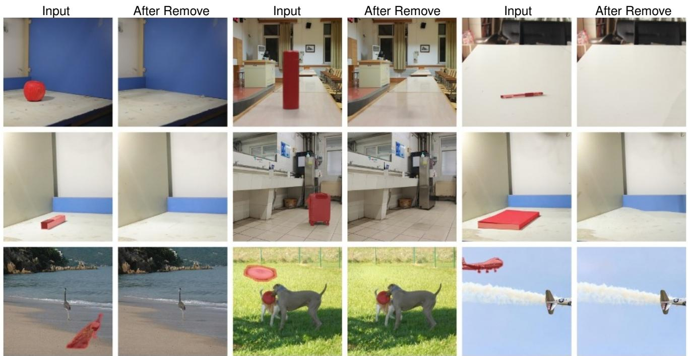
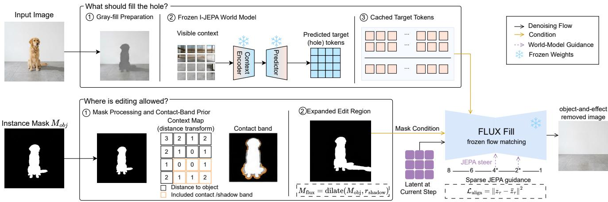
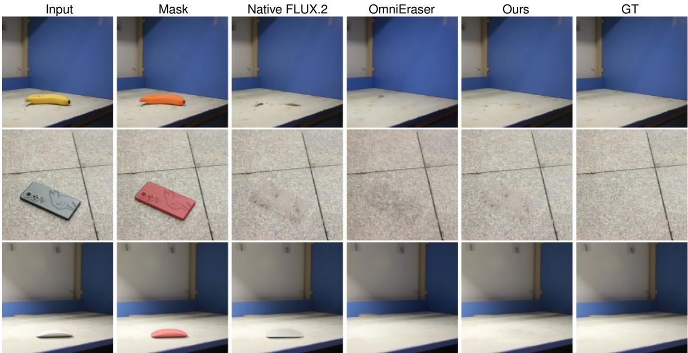
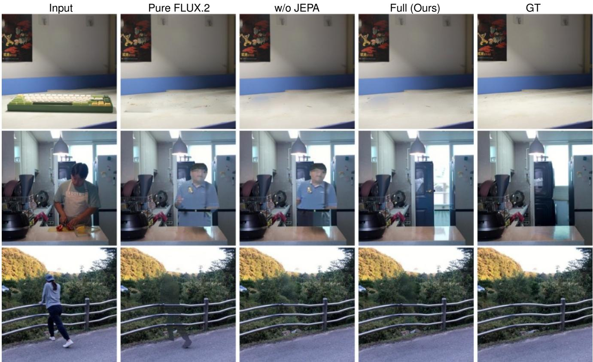
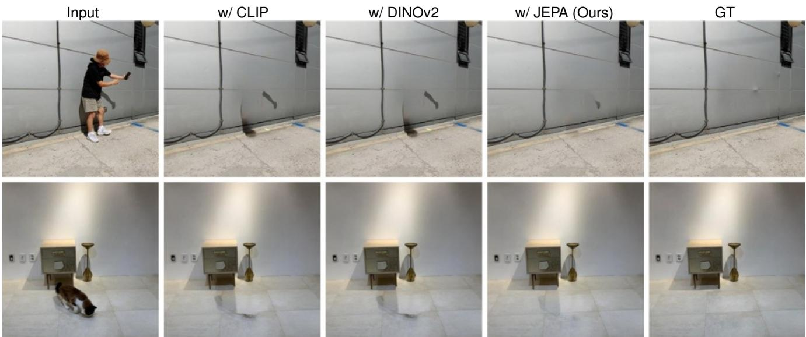
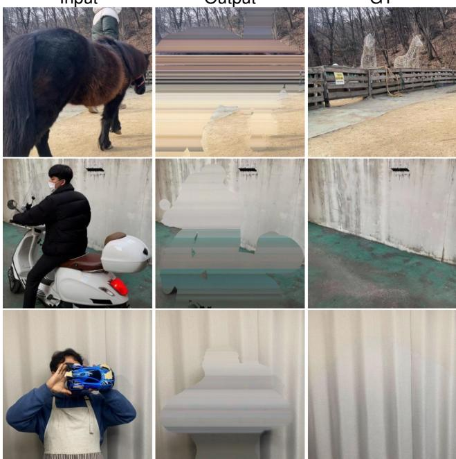

# PredErase: Training-Free Object-and-Effect Removal with Predictive Latent Guidance

Waikit Xiu1 Qiang Lu2 Junbiao Chen2 Xiying Li2,∗ 1The University of Hong Kong 2Sun Yat-sen University

  
Figure 1. Object-and-effect removal with user-provided instance masks shown in red. PredErase removes each masked object togethe with its cast shadows and contact shading, without task-specific training.

## Abstract

Removing an object is not the same asfilling its mask. Cast shadows and contact shading usually lie outside the userprovided instance mask $M _ { \mathrm { o b j } } ,$ , so a frozen Fill model that edits only that mask leaves the object’s photometric footprint on nearby surfaces. Supervised removers learn this joint erasure from paired clean plates. Training-free editors freeze pretrained weights, yet most still treat $M _ { \mathrm { o b j } }$ as the entire editable support and steer sampling with CLIP or DINO energies that do not predict the occluded scene. We present PredErase, a training-free inference procedure on frozen FLUX.2 and I-JEPA. The method separates where

Fill may rewrite pixels from what structure should occupy the hole. A contact-band expansion $M _ { \mathrm { H u x } } \ \supseteq \ M _ { \mathrm { o b j } }$ exposes local residuals on the supporting plane. I-JEPA, pretrained for masked token prediction, supplies a contextconditioned hole target in representation space; sparse projected gradients align decoded Fill completions with that target inside the instance, while coordinates outside the packed support stay locked. Under instance-only masks on RemovalBench, RORD-Val, and DEFACTO-Val, Pred-Erase improves the native FLUX.2 backbone. Supervised removers remain stronger on several full-image appearance metrics; the supported claim is training-free object-andeffect editing offrozen Fill, not replacement ofpaired-data erasers.

## 1. Introduction

Object removal is a fundamental task in image editing, with broad applications in photo retouching, content creation, and scene manipulation [5, 27, 33, 38, 39]. Recent advances in diffusion and flow-matching generative models have substantially improved image inpainting, allowing user-specified object instances to be removed from complex scenes with increasingly plausible visual results [4, 24, 29]. However, removing an object is not equivalent to removing its presence. Objects interact with nearby surfaces and leave photometric traces, including cast shadows and contact shading [3, 12, 23, 30, 34, 37]. We study object-andeffect removal under instance-only masks: erase the specified object together with local, geometry-coupled residuals on adjacent support, while leaving unrelated content unchanged. Mirror reflections, refraction, and global illumination are outside this setting.

A frozen Fill model restricted to $M _ { \mathrm { o b j } }$ may complete the masked region while leaving those traces unchanged (Fig. 1). Scores computed only inside $M _ { \mathrm { o b j } }$ miss this failure. RemovalBench and RORD-Val therefore measure fullimage agreement with clean-plate ground truth under the OmniEraser protocol [37] (Technical Appendix: Metrics).

Within this scope, supervised effect-aware removers close the gap with object–clean-plate pairs [17, 18, 20, 35, 37, 42], typically at the cost of paired supervision and backbone-specific adaptation [15]. Training-free editors instead freeze pretrained weights and steer sampling [6, 7, 9, 10, 25, 32, 40]. On object removal they almost always keep $M _ { \mathrm { o b j } }$ as the editable support: self-attention surgery or CLIP energies suppress the instance inside the mask, while shadows and reflections encoded in unmasked tokens are left untouched unless the user dilates the mask by hand. Semantic objectives (CLIP/DINO) further do not predict the scene hidden by the object.

We therefore treat training-free object-and-effect removal as constrained trajectory steering of a frozen Fill model [8, 19, 22], factored into where the sampler may rewrite pixels and what should occupy the hole (Fig. 2). Visible residuals that still depend on the instance after it is hidden must enter the editable support; we instantiate that support with a contact-band expansion $M _ { \mathrm { H u x } } \supseteq M _ { \mathrm { o b j } }$ for upright, ground-contact shadows. For the hole, frozen I-JEPA [1, 21] provides a predictive representation target: it is pretrained to infer masked tokens from context. Alignment back-propagates through the decoder into Fill latents in the manner of measurement guidance [6]. Projection onto the packed support P leaves visible coordinates unchanged.

We evaluate PredErase on RemovalBench and RORD-Val under the OmniEraser protocol [37] and on DEFACTO-Val under the SmartEraser protocol [17], using frozen FLUX.2-klein-4B [4, 11]. Relative to native FLUX.2, Pred-Erase improves CMMD and PSNR on RemovalBench and

FID, CMMD, LPIPS, and PSNR on RORD-Val (Tables 1– 2). On RemovalBench, supervised OmniEraser retains lower FID and LPIPS.

Our contributions are:

• A training-free object-and-effect procedure that edits frozen Fill latents under instance-only masks, with no paired clean plates and no weight updates.

• A factorization of editable support $M _ { \mathrm { H u x } }$ from I-JEPA hole prediction, with projected decoder-side updates confined to the packed latent mask.

• Protocol-aligned comparisons against frozen Fill and training-free removers, with supervised erasers reported on the same splits, plus component and prior-swap ablations.

## 2. Related Work

Inpainting and supervised removers. Context encoders and diffusion Fill models [4, 27, 29] complete content inside an object mask, yet cast shadows and contact shading often remain outside that mask. RemovalBench [37] and DEFACTO-Val [17] make this failure mode measurable under instance-only masks. OmniEraser [37], SmartEraser [17], ObjectClear [42], and MetaShadow [35] learn effect-aware removal from paired clean plates, often with LoRA [15]. Shadow restorers such as ShadowFormer [12] instead assume shadow masks or shadowcentric data. Across these lines, either the edit stays inside the user mask, or training needs paired supervision beyond the instance-only setting used here.

Training-free editing. Inference-time editors update frozen diffusion or flow latents without weight training [6, 25]. Attentive Eraser [32] and CLIPAway [9] are representative object-removal variants; related controls include DiffEdit [7] and FreeDoM [40]. Most keep the object mask as the editable support and drive updates with CLIP [28] or DINO [26] energies. Shadows and reflections persist unless they already lie inside the mask, because they are encoded in unmasked tokens.

Predictive representations as hole priors. Masked predictive learning treats missing content as something to infer from visible context [1, 2, 13, 21]. I-JEPA predicts tokens for masked regions without decoding pixels; unlike CLIP or DINOv2, the pretraining question is exactly what occupies the hole. We use the frozen predictor at inference as a hole prior in token space.

## 3. Methodology

## 3.1. Problem Setup

Given an RGB image $I \in \mathbb { R } ^ { 3 \times H \times W }$ and a binary object mask $M _ { \mathrm { o b j } } \ \in \ \{ 0 , \bar { 1 } \} ^ { H \times W }$ (1 denotes removal), we seek

  
Figure 2. PredErase training-free pipeline. Top: gray-filled $I _ { \mathrm { v i s } }$ lets frozen I-JEPA predict and cache hole tokens $\mathbf { E } _ { \mathrm { t a r g e t } }$ . Bottom: a contact-band prior expands $M _ { \mathrm { o b j } }$ into the effect-aware Fill support $M _ { \mathrm { H u x } }$ . Center: frozen FLUX.2-klein-4B follows its native trajectory; at $t \in \{ 4 , 2 \}$ , decoded features are aligned with $\mathbf { E } _ { \mathrm { t a r g e t } }$ (Eq. 8) and projected so that the additional I-JEPA update is zero outside the editable latent support (Eq. 10). No model weights are updated.

an output $I _ { \mathrm { o u t } }$ in which both the masked instance and its associated outside-mask effects, including cast shadows and contact shading, are absent.

For an editable support M, a frozen flow-matching Fill model induces the conditional law shown in Eq. (1):

$$
I ^ { \prime } \sim p _ { \mathrm { F i l l } } ( { \bf \cdot } \mid I \odot ( 1 - M ) , M ) .\tag{1}
$$

With $M = M _ { \mathrm { o b j } }$ , residuals outside the mask remain fixed as conditioning evidence, while the hole is drawn from a local completion prior that need not match the broader scene. Training-free object-and-effect removal therefore faces two coupled issues: local Fill statistics underdetermine the revealed content, and mask-local sampling cannot edit residuals outside $M _ { \mathrm { o b j } }$

## 3.2. PredErase

PredErase is a training-free inference method that freezes a Fill generator and an I-JEPA predictor, and only redirects the Fill sampling trajectory at test time (Fig. 2). I-JEPA is a hole prior in representation space; Fill remains responsible for appearance, including residual illumination inside $M _ { \mathrm { H u x } }$

Precomputation. The object mask is used in two ways. On the predictive branch we gray-fill the instance as in Eq. (2),

$$
I _ { \mathrm { v i s } } = I \odot \left( 1 - M _ { \mathrm { o b j } } \right) + \mathbf { g } \odot M _ { \mathrm { o b j } } ,\tag{2}
$$

where $\mathbf { g } = ( 0 . 5 , 0 . 5 , 0 . 5 )$ is fixed gray RGB, and cache the frozen I-JEPA target $\mathbf { E } _ { \mathrm { t a r g e t } }$ once from this visible stream. On the generative branch we expand $M _ { \mathrm { o b j } }$ into the effectaware support $M _ { \mathrm { H u x } }$ (Eq. (6)). The first branch sets what should replace the object; the second sets where Fill may edit.

Algorithm 1 PredErase inference. FMStep denotes   
one conditioned Fill transition (mask, prompt, CFG);   
UpdateAndLock implements Eqs. 9–10.   
Input: $I , M _ { \mathrm { o b j } }$   
Output: $I _ { \mathrm { o u t } }$   
1: $I _ { \mathrm { v i s } } \gets \mathrm { G r a y F i l l } ( I , M _ { \mathrm { o b j } } )$   
2: Cache $\mathbf { E } _ { \mathrm { t a r g e t } }$ from frozen I-JEPA on $I _ { \mathrm { v i s } }$ (once)   
3: $\mathrm { B u i l d ~ } M _ { \mathrm { s h a d o w } } ; M _ { \mathrm { f l u x } }  \mathrm { d i l a t e } _ { 4 } ( M _ { \mathrm { o b j } } \cup M _ { \mathrm { s h a d o w } } )$   
4: Pack editable latent mask P from $M _ { \mathrm { H u x } }$   
5: $\mathbf { z } _ { T } \gets \mathrm { E n c o d e } ( I \odot ( 1 - M _ { \mathrm { f l u x } } ) )$ ▷ source prefill   
6: for t = T down to 1 do   
7: zt−1 ← FMStep(zt, t; Mflux, prompt)   
8: $\mathbf { i f } t \in T _ { \mathrm { g u i d e } }$ then   
9: ${ \bf z } ^ { \mathrm { p i n } }  { \bf z } _ { t - 1 } ;$ decode preview ˆI   
10: Compute $\mathcal { L } _ { \mathrm { a l i g n } }$ and $G \gets \nabla _ { \mathbf { z } } \mathcal { L } _ { \mathrm { a l i g n } } ( \mathbf { z } ^ { \mathrm { p i n } } )$   
11: z ← UpdateAndLock $\left( \mathbf { z } ^ { \mathrm { p i n } } , G , P \right)$   
12: end if   
13: end for   
14: $I _ { \mathrm { o u t } }  \mathrm { D e c o d e } ( \mathbf { z } _ { 0 } )$

Sampling. We source-prefill by encoding I ⊙ (1 − $M _ { \mathrm { H u x } } )$ , then run conditioned Fill steps (mask, shadowaware prompt, $\mathrm { C F G } ;$ see Technical Appendix: Implementation details). $\mathbf { E } _ { \mathrm { t a r g e t } }$ is cached once; sampler seeds provide stochasticity. $\mathrm { A t } t \in \mathcal { T } _ { \mathrm { g u i d e } }$ , the decoded completion is aligned with $\mathbf { E } _ { \mathrm { t a r g e t } }$ via Eq. (8) and projected onto the editable latent subspace by Eqs. (9)–(10); other steps stay unchanged. I-JEPA shapes hole structure inside $M _ { \mathrm { o b j } }$ , while $M _ { \mathrm { H u x } }$ and the prompt expose residuals for Fill; the projection blocks guidance outside P. Alg. 1 summarizes the routine; operators follow below.

## 3.3. Predictive Representation Prior

The main difficulty in training-free removal is not local texture synthesis, but what structure should occupy the hole once the instance is gone. I-JEPA is pretrained to predict masked patch representations from visible context, which is the same interface as object removal. We use the public ViT-H/14-1K stack as a frozen pair (ϕJEPA, ψJEPA) and cache $\mathbf { E } _ { \mathrm { t a r g e t } }$ as a context-conditioned hole target in patch space. With $I _ { \mathrm { v i s } }$ gray-filled on the instance and $( \mathcal { T } _ { \mathrm { v i s } } , \mathcal { T } _ { \mathrm { m a s k } } )$ the visible/object patch sets, the target is given by Eq. (3),

$$
\mathbf { E } _ { \mathrm { t a r g e t } } = \psi _ { \mathrm { J E P A } } \big ( \phi _ { \mathrm { J E P A } } ( I _ { \mathrm { v i s } } ) , \mathcal { T } _ { \mathrm { v i s } } , \mathcal { T } _ { \mathrm { m a s k } } \big )\tag{3}
$$

and is held fixed during sampling: $\phi _ { \mathrm { J E P A } } ( I _ { \mathrm { v i s } } )$ supplies tokens on ${ \mathcal { T } } _ { \mathrm { v i s } } ,$ from which ψJEPA predicts $\mathbf { E } _ { \mathrm { t a r g e t } }$ on ${ \mathcal { T } } _ { \mathrm { m a s k } }$ Gray-filling $M _ { \mathrm { o b j } }$ (Eq. (2)) keeps object appearance out of the visible stream; excluding ${ \mathcal { T } } _ { \mathrm { m a s k } }$ from the visible set preserves I-JEPA’s masked-prediction interface.

Effect-aware edit region. Cast shadows and contact shading on the supporting plane typically extend beyond $M _ { \mathrm { o b j } }$ Fill can erase those residuals only if they lie in the editable support. Without estimating a light source or BRDF, we construct a contact band as a geometric surrogate of that dependent set for upright, ground-contacted objects, the dominant regime of RemovalBench. Fig. 2 (bottom branch) extracts the floor-contact segment C (the lowest rows of $M _ { \mathrm { o b j } }$ under an upright-image convention) and forms the one-sided band in Eq. (4),

$$
M _ { \mathrm { s h a d o w } } = \{ c + a n + b \tau \mid c \in \mathcal { C } , a \in [ 0 , \sigma ] , | b | \leq \delta _ { x } \} \cap \Omega ,\tag{4}
$$

with scale-adaptive extents as in Eq. (5),

$$
( \sigma , \delta _ { x } ) = ( \operatorname* { m a x } ( 6 , 0 . 5 h _ { \mathrm { o b j } } ) , \operatorname* { m a x } ( 8 , 0 . 3 5 w _ { \mathrm { o b j } } ) ) ,\tag{5}
$$

and editable support as in Eq. (6),

$$
M _ { \mathrm { f l u x } } = \mathrm { D i l a t e } ( M _ { \mathrm { o b j } } \cup M _ { \mathrm { s h a d o w } } ; r = 4 ) .\tag{6}
$$

Here Ω is the discrete image grid, n the image-plane contact normal, and τ its tangent. For upright inputs we use $n = ( 0 , 1 )$ and $\tau = ( 1 , 0 )$ ; non-upright inputs need an externally supplied orientation, since we do not estimate support geometry. Guided Fill can therefore rewrite the instance and its residual region jointly. Relative coefficients are fixed across experiments; absolute extents adapt to $( h _ { \mathrm { o b j } } , w _ { \mathrm { o b j } } )$ (see Technical Appendix Table 1). $I _ { \mathrm { v i s } }$ still gray-fills only $M _ { \mathrm { o b j } }$ (Eq. (2)), so I-JEPA sees a clean masked-prediction input while Fill can revise contact residuals under $M _ { \mathrm { H u x } } .$ When orientation metadata are available, the same band is built after aligning the contact normal. Additional operator details appear in Technical Appendix: Implementation details.

Completion reweighting. Native Fill is optimized for local completion and can look textured while still breaking surface continuation, leaving object identity, or mismatching illumination. We keep $\mathbf { E } _ { \mathrm { t a r g e t } }$ (Eq. (3)) fixed and steer the Fill trajectory toward it with sparse projected-gradient steps (Eqs. (9)–(10)). A matched comparison of I-JEPA against CLIP and DINOv2 hole energies is in Table 4 and Technical Appendix: Guidance prior comparison. At a guided step we decode a preview $\hat { I } _ { t } ,$ , embed it with the same frozen ϕJEPA, and compare object-patch tokens as in Eq. (7),

$$
\mathbf { u } _ { i } = \phi _ { \mathrm { J E P A } } ( \hat { I } _ { t } ) _ { i } , \qquad \mathbf { v } _ { i } = \mathbf { E } _ { \mathrm { t a r g e t } , i } ,\tag{7}
$$

yielding the alignment loss in Eq. (8):

$$
\mathcal { L } _ { \mathrm { a l i g n } } = \frac { 1 } { \left| \mathcal { T } _ { \mathrm { m a s k } } \right| } \sum _ { i \in \mathcal { T } _ { \mathrm { m a s k } } } \left\| \mathbf { u } _ { i } - \mathbf { v } _ { i } \right\| _ { 2 } ^ { 2 } .\tag{8}
$$

Both sides live in the same I-JEPA patch space: $\mathbf { v } _ { i }$ is the cached target token and $\mathbf { u } _ { i }$ is the current completion at that index. Minimizing $\mathcal { L } _ { \mathrm { a l i g n } }$ biases the trajectory so the decoded hole matches context-predictable structure; Fill still synthesizes appearance. Restricting the sum in Eq. (8) to ${ \mathcal { T } } _ { \mathrm { m a s k } }$ leaves Fill free to clean residuals over the larger $M _ { \mathrm { H u x } } { \mathrm { : } }$ effect cleanup is driven by the expanded support and prompt, whereas I-JEPA constrains structure inside the object hole.

Guidance schedule. Guidance needs a reasonably formed decoded preview, but applying it at every step tends to over-constrain details that Fill already models well. We therefore evaluate Eq. (8) only at $\mathcal { T } _ { \mathrm { g u i d e } } = \{ 4 , 2 \}$ for $T { = } 1 4$ (Fig. 2; see Technical Appendix Table 1). This sparse schedule adds two late corrections and leaves the remaining flow-matching steps unchanged.

## 3.4. Latent Update

At a guided transition, let ${ \bf z } ^ { \mathrm { p i n } } = \bar { \bf z } _ { t - 1 }$ be the native Fill state and $P \in \{ 0 , 1 \} ^ { d }$ the packed-latent image of $M _ { \mathrm { H u x } }$ (see Technical Appendix: Implementation details). Differentiating $\mathcal { L } _ { \mathrm { a l i g n } }$ in Eq. (8) through the frozen decoder and I-JEPA encoder gives $G = \nabla _ { \mathbf { z } } \mathcal { L } _ { \mathrm { a l i g n } } ( \mathbf { z } ^ { \mathrm { p i n } } )$ . We form the unconstrained proposal in Eq. (9),

$$
\tilde { \mathbf { z } } = \mathbf { z } ^ { \mathrm { p i n } } - \eta G , \qquad \eta = 0 . 4 5 ,\tag{9}
$$

and project onto the editable subspace determined by $P$ as in Eq. (10) (see Technical Appendix Table 1):

$$
\begin{array} { r } { \mathbf { z } ^ { + } = P \odot \tilde { \mathbf { z } } + ( 1 - P ) \odot \mathbf { z } ^ { \mathrm { p i n } } . } \end{array}\tag{10}
$$

Coordinates with $P = 1$ may move; all others are restored to the current native Fill state $\mathbf { z } ^ { \mathrm { p i n } }$ (not a frozen source encoding). Eqs. $( 9 ) \substack { - } ( 1 0 )$ therefore amount to a projectedgradient step on the editable subspace: guidance cannot rewrite outside-P coordinates at that micro-step, while Fill remains responsible for appearance synthesis under $M _ { \mathrm { H u x } }$

  
Figure 3. Qualitative comparison on RemovalBench (1024×1024, instance-only masks). Columns: Input, $M _ { \mathrm { o b j } } .$ , native FLUX.2-klein-4B, supervised OmniEraser, PredErase (FLUX.2), clean-plate GT. Rows (top to bottom): banana on desk, phone on tile, desk mouse.

## 4. Experiments

## 4.1. Experimental Setup

Benchmarks. We evaluate on three public benchmarks (split sizes and scoring scripts are listed in Technical $\mathsf { A p - }$ pendix: Metrics):

• RemovalBench [37]: 69 real object–clean-plate pairs at 1024×1024 with instance-only masks under the OmniEraser protocol. Scores are full-image FID, CMMD, LPIPS (SqueezeNet), PSNR, and Aesthetic Score (AS); this split is our primary test for outside-mask cast shadows and contact shading.

• RORD-Val [37]: a larger clean-plate validation set evaluated with the same OmniEraser metrics and table layout as RemovalBench (FID, CMMD, LPIPS, PSNR, AS).

• DEFACTO-Val [17]: synthetic removals under the SmartEraser protocol at 1024×1024, scored with CMMD, ReMOVE (SAM ViT-H), AlexNet LPIPS, SSIM, and PSNR via the public metric code.

Local PredErase scores average five seeds (not best-of-five);   
see Technical Appendix: Multi-seed tests.

Baselines. We compare PredErase against classical/diffusion inpainters (ZITS++, LaMa, BrushNet, FLUX.1-Fill), training-free editors (CLIPAway, Attentive Eraser), and supervised removers (OmniEraser, SmartEraser, PowerPaint) under each suite’s official protocol [17, 37] (Tables 1–2); DEFACTO-Val further includes RePaint and SD-Inpaint. All reported methods are evaluated in our environment on the official splits, masks, and ground truth, using the public metric implementations. Native FLUX.2-klein-4B is the frozen-backbone operating point; Table 3 reports matched controls. Methods discussed only in Related Work (e.g., ObjectClear) are not included in these tables.

Implementation details. Unless noted, PredErase freezes FLUX.2-klein-4B [4, 11] (T=14 flow steps, CFG $w _ { \mathrm { c f g } } { = } 3 . 5 )$ and I-JEPA ViT-H/14-1K [1]; neither Fill nor JEPA weights are updated, and there is no paired removal training. I-JEPA sees a gray-filled instance $I _ { \mathrm { v i s } } \ ( \mathrm { E q . ~ } ( 2 ) )$ $\mathbf { E } _ { \mathrm { t a r g e t } }$ is cached once per image. Editable support uses dilation $r { = } 4$ with contact extents $\sigma { = } \operatorname* { m a x } ( 6 , 0 . 5 h _ { \mathrm { o b j } } )$ and $\delta _ { x } \mathrm { = m a x } ( 8 , 0 . 3 5 w _ { \mathrm { o b j } } )$ (Eqs. $\left( 5 \right) - \left( 6 \right) )$ . Full PredErase source-prefills from Encode $( I \odot ( 1 - M _ { \mathrm { f l u x } } ) )$ and uses a shared shadow-aware erasure prompt rather than instancespecific captions (Technical Appendix: Prompts). Packed gating P is a nearest-neighbor downsample of $M _ { \mathrm { H u x } }$ onto the Fill latent grid, so guidance, pinning, and FMStep address the same coordinates. Images use longest side 768 px at inference and are scored at $1 0 2 4 \times 1 0 2 4 ;$ ; alignment uses 224×224 decoded previews. Sparse guidance applies $\eta { = } 0 . 4 5$ at $\mathcal { T } _ { \mathrm { g u i d e } } { = } \{ 4 , 2 \} ( t _ { \mathrm { e n d } } { = } 4 , n { = } 2 )$ with projected locking (Eqs. (9)–(10)). These defaults (Technical

Table 1. Quantitative comparison on RemovalBench and RORD-Val under the OmniEraser evaluation suite [37]. Bold = best per column among listed methods; OmniEraser is a paired-training reference. All methods are scored in our environment with the official full image FID/CMMD/LPIPS/PSNR/AS protocol (SqueezeNet LPIPS). Mask-restricted DINO is omitted from this table (Technical Appendix: Metrics).
<table><tr><td colspan="5"></td><td colspan="5">RORD-Val</td></tr><tr><td>Method</td><td>FID↓</td><td>CMMD↓</td><td>LPIPS↓</td><td>PSNR↑</td><td>AS↑</td><td>FID↓</td><td>CMMD↓</td><td>LPIPS↓</td><td>PSNR↑</td><td>AS↑</td></tr><tr><td>ZITS++</td><td>108.38</td><td>0.374</td><td>0.158</td><td>19.62</td><td>4.56</td><td>107.44</td><td>0.448</td><td>0.274</td><td>21.17</td><td>4.12</td></tr><tr><td>LaMa</td><td>99.88</td><td>0.351</td><td>0.156</td><td>18.72</td><td>4.55</td><td>100.21</td><td>0.294</td><td>0.229</td><td>20.50</td><td>4.23</td></tr><tr><td>BrushNet</td><td>120.97</td><td>0.549</td><td>0.191</td><td>18.68</td><td>4.63</td><td>234.87</td><td>0.745</td><td>0.293</td><td>16.51</td><td>4.41</td></tr><tr><td>FLUX.1-Fill</td><td>115.79</td><td>0.487</td><td>0.193</td><td>17.12</td><td>4.59</td><td>141.39</td><td>0.450</td><td>0.217</td><td>18.50</td><td>4.55</td></tr><tr><td>CLIPAway</td><td>108.40</td><td>0.272</td><td>0.254</td><td>18.78</td><td>4.48</td><td>81.28</td><td>0.545</td><td>0.278</td><td>16.36</td><td>4.19</td></tr><tr><td>Attentive Eraser</td><td>55.49</td><td>0.232</td><td>0.146</td><td>20.60</td><td>4.50</td><td>96.77</td><td>0.233</td><td>0.221</td><td>20.24</td><td>4.77</td></tr><tr><td>OmniEraser</td><td>39.52</td><td>0.208</td><td>0.133</td><td>21.11</td><td>4.66</td><td>43.71</td><td>0.153</td><td>0.166</td><td>22.13</td><td>4.99</td></tr><tr><td>FLUX.2 (native)</td><td>113.92</td><td>0.496</td><td>0.184</td><td>22.70</td><td>4.62</td><td>149.02</td><td>0.644</td><td>0.168</td><td>18.49</td><td>5.08</td></tr><tr><td>PredErase (FLUX.2)</td><td>52.69</td><td>0.108</td><td>0.175</td><td>24.36</td><td>4.74</td><td>55.59</td><td>0.305</td><td>0.114</td><td>23.45</td><td>4.84</td></tr></table>

Table 2. Quantitative comparison on DEFACTO-Val under the SmartEraser protocol [17] (AlexNet LPIPS; ReMOVE with SAM ViT-H). Bold = best per column. All methods are scored in our environment with the public metric code. We report the five axes available for all listed methods under this setup.
<table><tr><td>Method</td><td>CMMD↓</td><td>ReMOVE↑</td><td>LPIPS↓</td><td>SSIM↑</td><td>PSNR↑</td></tr><tr><td>ZITS++</td><td>0.229</td><td>0.899</td><td>0.350</td><td>0.634</td><td>19.45</td></tr><tr><td>LaMa</td><td>0.201</td><td>0.926</td><td>0.351</td><td>0.683</td><td>21.74</td></tr><tr><td>RePaint</td><td>0.822</td><td>0.924</td><td>0.325</td><td>0.644</td><td>20.61</td></tr><tr><td>SD-Inpaint</td><td>0.196</td><td>0.912</td><td>0.320</td><td>0.656</td><td>21.69</td></tr><tr><td>CLIPAway</td><td>0.193</td><td>0.925</td><td>0.323</td><td>0.666</td><td>21.95</td></tr><tr><td>PowerPaint</td><td>0.275</td><td>0.934</td><td>0.278</td><td>0.715</td><td>23.87</td></tr><tr><td>SmartEraser</td><td>0.106</td><td>0.939</td><td>0.257</td><td>0.734</td><td>25.36</td></tr><tr><td>FLUX.2 (native)</td><td>0.359</td><td>0.766</td><td>0.537</td><td>0.525</td><td>23.42</td></tr><tr><td>PredErase (FLUX.2)</td><td>0.166</td><td>0.943</td><td>0.253</td><td>0.649</td><td>29.57</td></tr></table>

Appendix Table 1) are held fixed across reported splits. Local scores average five seeds S={22, . . . , 26} with base seed 22. On a single NVIDIA A100 40 GB GPU, Full PredErase runs in ∼5.3–6.3 s/image versus ∼3.0 s for native FLUX.2 under the same timing protocol.

## 4.2. Main Results

Tables 1 and 2 report results under the OmniEraser and SmartEraser protocols, respectively.

RemovalBench and RORD-Val. On RemovalBench, PredErase (FLUX.2) reduces native FLUX.2 CMMD from 0.496 to 0.108 and raises PSNR from 22.70 to 24.36 dB. These are the axes most sensitive to leftover object identity and support discoloration under the OmniEraser protocol. Supervised OmniEraser remains stronger on FID and LPIPS (39.52 vs. 52.69 FID). On RORD-Val, PredErase improves native FID from 149.02 to 55.59 and CMMD from 0.644 to 0.305, with the best listed LPIPS and PSNR among the compared methods; OmniEraser still leads FID and CMMD. Figure 3 shows outside-mask cleanup on three RemovalBench scenes.

DEFACTO-Val. On DEFACTO-Val (Table 2), PredErase attains the best listed ReMOVE, LPIPS, and PSNR among the compared methods, while supervised SmartEraser remains strongest on CMMD and SSIM. Every reported axis improves over native FLUX.2.

## 4.3. Qualitative Results

Figure 3 visualizes the Table 1 gap on three RemovalBench pairs under the same instance-only masks. The comparison isolates two failure modes that full-image metrics are designed to catch: incomplete erasure under a frozen Fill backbone, and residual object-linked effects that survive even when the instance hole looks plausible.

Native FLUX.2 struggles on every row. On the banana desk (row 1), it leaves a dark smear where the fruit sat; on the tiled phone (row 2), a ghostly hole breaks the grout pattern instead of a clean completion; on the desk mouse (row 3), a flat gray silhouette remains with residual contact shading. The object footprint may shrink, but the supporting plane still reads as edited.

Supervised OmniEraser [37] is consistently cleaner inside $M _ { \mathrm { o b j } } .$ , yet outside-mask effects still leak on the support. It leaves faint discoloration on the desk and a dirty patch across the tile line: residuals that instance-only masks do not cover but that $M _ { \mathrm { H u x } }$ exposes to Fill.

PredErase rewrites the object together with nearby contact residuals in one guided pass when those residuals fall inside $M _ { \mathrm { H u x } }$ Desk tone and grout continue more coherently than under native Fill, which under-edits outside

Table 3. Ablations on RemovalBench (n=69) under the same local protocol as Table 1 (FID/CMMD/LPIPS/PSNR/AS). Full matches PredErase (FLUX.2), Pure FLUX.2 matches native FLUX.2, and w/o JEPA is the expanded-support text-only control. Bold = best per column.
<table><tr><td>Variant</td><td>FID↓</td><td>CMMD↓</td><td>LPIPS↓</td><td>PSNR↑ AS↑</td></tr><tr><td>Pure FLUX.2</td><td>113.92</td><td>0.496</td><td>0.184</td><td>22.70 4.62</td></tr><tr><td>w/o Shadow Prompt</td><td>77.21</td><td>0.380</td><td>0.181</td><td>23.20 4.65</td></tr><tr><td>w/o Prefill</td><td>80.82</td><td>0.328</td><td>0.179</td><td>23.30 4.69</td></tr><tr><td>w/o JEPA</td><td>59.30</td><td>0.292</td><td>0.177</td><td>23.81 4.70</td></tr><tr><td>Full PredErase</td><td>52.69</td><td>0.108</td><td>0.175</td><td>24.36 4.74</td></tr></table>

$M _ { \mathrm { o b j } }$ . OmniEraser, trained for this protocol, is often cleaner inside the instance. Remaining support stains show that instance-only masks still leave an effect-region problem, which $M _ { \mathrm { H u x } }$ exposes to Fill.

## 4.4. Ablation Study

We use two RemovalBench ablations under the Table 1 protocol. One disables one module at a time under the benchmark-aligned support; the other swaps only the frozen guidance prior with $M _ { \mathrm { H u x } } ,$ source prefill, shadow-aware prompting, and schedule fixed. Full protocols, RORD-Val repeats, and multi-seed testing are in the Technical $\mathsf { A p - }$ pendix.

Module ablation. Table 3 removes shadow-aware prompting, source prefill, or JEPA alignment from an otherwise Full stack. Pure FLUX.2 establishes the native reference point (FID 113.92; CMMD 0.496). The w/o Shadow Prompt and w/o Prefill variants improve on this reference but retain substantial FID/CMMD gaps to Full. w/o JEPA is the strict expanded-support text-only control: it preserves $M _ { \mathrm { H u x } } ,$ source prefill, and the shadow-aware prompt but removes all feature guidance. Its FID 59.30, CMMD 0.292, and PSNR 23.81 dB indicate that spatial exposure and text conditioning alone do not account for Full’s CMMD of 0.108. These matched removals isolate I-JEPA under a fixed $M _ { \mathrm { H u x } } ;$ ; they do not compare contactband geometry with isotropic dilation or $M _ { \mathrm { o b j } }$ -only edits. Full is best on every reported axis; the same ordering holds on RORD-Val (see Table 6), with qualitative examples in Fig. 4.

Guidance prior comparison. Table 4 isolates whether the gains depend on context-conditioned prediction rather than frozen feature guidance in general. w/ CLIP patch and w/ DINOv2 patch replace I-JEPA with patch-level semantic and neighborhood-matching energies plugged into the same gated update (Eqs. 9–10); details are in Technical Appendix: Guidance prior comparison. Under these matched settings, both alternatives trail w/ JEPA on every reported axis. For example, CMMD is 0.150/0.148 versus 0.108, and FID is 107.6/110.0 versus 52.69. All priors share the same η and schedule. Loss scales differ across backbones, so the swap is an operating-point comparison rather than a fully retuned one. CLIP patch is slightly stronger than DI-NOv2 patch on FID, LPIPS, and PSNR; neither matches I-JEPA at this operating point (Fig. 5). The result is consistent with using I-JEPA as a hole-prediction prior rather than as a generic perceptual regularizer.

Table 4. Guidance prior comparison on RemovalBench (n=69): only the frozen guidance backbone changes; $M _ { \mathrm { H u x } } ,$ prefill, shadow-aware prompt, and sparse schedule are fixed (Technical Appendix: Guidance prior comparison). w/ JEPA matches Table 3 Full row; CLIP / DINOv2 patch rows use the same η and Tguide. Bold = best per column among prior swaps.
<table><tr><td>Prior</td><td>FID↓</td><td>CMMD↓</td><td>LPIPS↓</td><td>PSNR↑</td><td>AS↑</td></tr><tr><td>w/ CLIP patch</td><td>107.60</td><td>0.150</td><td>0.235</td><td>23.81</td><td>4.63</td></tr><tr><td>w/ DINOv2 patch 110.00</td><td></td><td>0.148</td><td>0.243</td><td>23.71</td><td>4.60</td></tr><tr><td>w/ JEPA</td><td>52.69</td><td>0.108</td><td>0.175</td><td>24.36</td><td>4.74</td></tr></table>

## 4.5. Limitations and Future Work

PredErase is less reliable when the target occupies most of the frame: the hole prior is conditioned on visible context, so a near full-image mask leaves too little evidence (Fig. 6). The contact band assumes upright ground contact; side lighting, detached shadows, and mirror or water reflections fall outside this geometry. As with other training-free editors, appearance inherits Fill-backbone biases. A dependence-based support, for example I-JEPA or Fill-score residuals on unmasked patches, would be a natural extension when residuals detach from the contact contour.

## 5. Conclusion

We framed training-free object-and-effect removal as two coupled questions: which pixels may change, and what structure should occupy the instance hole. A contact-band expansion exposes local residuals on the supporting plane to frozen Fill; I-JEPA supplies a representation-space hole target; sparse projected updates align the decoded completion inside the instance. On standard clean-plate protocols the method improves a frozen FLUX.2 backbone under instance-only masks.

## References

[1] Mahmoud Assran, Quentin Duval, Ishan Misra, Piotr Bojanowski, Pascal Vincent, Michael G. Rabbat, Yann LeCun, and Nicolas Ballas. Self-supervised learning from images

with a joint-embedding predictive architecture. In Proceedings of the IEEE/CVF Conference on Computer Vision and Pattern Recognition (CVPR), 2023. 2, 5

[2] Adrien Bardes, Quentin Garrido, Jean Ponce, Xinlei Chen, Michael Rabbat, Yann LeCun, Mahmoud Assran, and Nicolas Ballas. Revisiting feature prediction for learning visual representations from video. arXiv preprint arXiv:2404.08471, 2024. 2

[3] Jonathan T Barron and Jitendra Malik. Shape, albedo, and illumination from a single image of an unknown object. In Proceedings of the IEEE/CVF Conference on Computer Vision and Pattern Recognition (CVPR), pages 334–341, 2012. 2

[4] Black Forest Labs. FLUX. https : / / blackforestlabs.ai, 2024. 2, 5

[5] Chenjie Cao, Qiaole Dong, and Yanwei Fu. ZITS++: Image inpainting by improving the incremental transformer on structural priors. IEEE Transactions on Pattern Analysis and Machine Intelligence, 45(10):12667–12684, 2023. 2

[6] Hyungjin Chung, Jeongsol Kim, Michael Thompson Mc-Cann, Marc Louis Klasky, and Jong Chul Ye. Diffusion posterior sampling for general noisy inverse problems. In International Conference on Learning Representations (ICLR), 2023. 2

[7] Guillaume Couairon, Jakob Verbeek, Holger Schwenk, and Matthieu Cord. Diffedit: Diffusion-based semantic image editing with mask guidance. In International Conference on Learning Representations (ICLR), 2023. 2

[8] Prafulla Dhariwal and Alexander Nichol. Diffusion models beat GANs on image synthesis. In Advances in Neural Information Processing Systems (NeurIPS), 2021. 2

[9] Yigit Ekin, Ahmet Burak Yildirim, Erdem Eren Caglar,˘ Aykut Erdem, Erkut Erdem, and Aysegul Dundar. CLIP-Away: Harmonizing focused embeddings for removing objects via diffusion models. In Advances in Neural Information Processing Systems (NeurIPS), pages 17572–17601, 2024. 2

[10] Dave Epstein, Allan Jabri, Ben Poole, Alexei A. Efros, and Aleksander Holynski. Diffusion self-guidance for controllable image generation. In Advances in Neural Information Processing Systems (NeurIPS), 2023. 2

[11] Patrick Esser, Sumith Kulal, Andreas Blattmann, Rahim Entezari, Jonas Muller, Harry Saini, Yam Levi, Dominik¨ Lorenz, Axel Sauer, Frederic Boesel, et al. Scaling rectified flow transformers for high-resolution image synthesis. In Proceedings of the International Conference on Machine Learning (ICML), 2024. 2, 5

[12] Lanqing Guo, Siyu Huang, Ding Liu, Hao Cheng, and Bihan Wen. Shadowformer: Global context helps shadow removal. Proceedings of the AAAI Conference on Artificial Intelligence, 37(1):710–718, 2023. 2

[13] Kaiming He, Xinlei Chen, Saining Xie, Yanghao Li, Piotr Dollar, and Ross Girshick. Masked autoencoders are scalable´ vision learners. In Proceedings of the IEEE/CVF Conference on Computer Vision and Pattern Recognition (CVPR), pages 16000–16009, 2022. 2

[14] Martin Heusel, Hubert Ramsauer, Thomas Unterthiner, Bernhard Nessler, and Sepp Hochreiter. GANs trained by a

two time-scale update rule converge to a local nash equilib rium. In Advances in Neural Information Processing Systems (NeurIPS), 2017. 13

[15] Edward J Hu, Yelong Shen, Phillip Wallis, Zeyuan Allen-Zhu, Yuanzhi Li, Shean Wang, Lu Wang, and Weizhu Chen. LoRA: Low-rank adaptation of large language models. In In ternational Conference on Learning Representations (ICLR), 2022. 2

[16] Sadeep Jayasumana, Srikumar Ramalingam, Andreas Veit, Daniel Glasner, Ayan Chakrabarti, and Sanjiv Kumar. Rethinking FID: Towards a better evaluation metric for image generation. In Proceedings of the IEEE/CVF Conference on Computer Vision and Pattern Recognition (CVPR), 2024. 13

[17] Longtao Jiang, Zhendong Wang, Jianmin Bao, Wengang Zhou, Dongdong Chen, Lei Shi, Dong Chen, and Houqiang Li. SmartEraser: Remove anything from images using masked-region guidance. In Proceedings of the IEEE/CVF Conference on Computer Vision and Pattern Recognition (CVPR), pages 24452–24462, 2025. 2, 5, 6

[18] Xuan Ju, Xian Liu, Xintao Wang, Yuxuan Bian, Ying Shan, and Qiang Xu. Brushnet: A plug-and-play image inpainting model with decomposed dual-branch diffusion. In Proceedings of the European Conference on Computer Vision (ECCV), pages 150–168, 2024. 2

[19] Tero Karras, Miika Aittala, Timo Aila, and Samuli Laine. Elucidating the design space of diffusion-based generative models. In Advances in Neural Information Processing Sys tems (NeurIPS), pages 26565–26577, 2022. 2

[20] Zhanghan Ke, Chunyi Sun, Lei Zhu, Ke Xu, and Rynson W. H. Lau. Harmonizer: Learning to perform white-box im age and video harmonization. In Proceedings of the European Conference on Computer Vision (ECCV), pages 690– 706. Springer, 2022. 2

[21] Yann LeCun. A path towards autonomous machine intelligence. OpenReview, 2022. 2

[22] Yaron Lipman, Ricky T Q Chen, Heli Ben-Hamu, Maximilian Nickel, and Matt Le. Flow matching for generative mod eling. In International Conference on Learning Representa tions (ICLR), 2023. 2

[23] Zhihao Liu, Hui Yin, Xinyi Wu, Zhenyao Wu, Yang Mi, and Song Wang. From shadow generation to shadow removal. In Proceedings of the IEEE/CVF Conference on Computer Vision and Pattern Recognition (CVPR), pages 5418–5427, 2021. 2

[24] Andreas Lugmayr, Martin Danelljan, Andres Romero, Fisher´ Yu, Radu Timofte, and Luc Van Gool. RePaint: Inpainting using denoising diffusion probabilistic models. In Proceedings of the IEEE/CVF Conference on Computer Vision and Pattern Recognition (CVPR), pages 11461–11471, 2022. 2

[25] Chenlin Meng, Yang He, Yang Song, Jiaming Song, Jiajun Wu, Jun-Yan Zhu, and Stefano Ermon. SDEdit: Guided image synthesis and editing with stochastic differential equa tions. In International Conference on Learning Representations (ICLR), 2022. 2

[26] Maxime Oquab, Timothee Darcet, Th ´ eo Moutakanni, et al.´ DINOv2: Learning robust visual features without supervision. Transactions on Machine Learning Research, 2024. 2, 14

[27] Deepak Pathak, Philipp Krahenbuhl, Jeff Donahue, Trevor¨ Darrell, and Alexei A Efros. Context encoders: Feature learning by inpainting. In Proceedings of the IEEE/CVF Conference on Computer Vision and Pattern Recognition (CVPR), 2016. 2

[28] Alec Radford, Jong Wook Kim, Chris Hallacy, et al. Learning transferable visual models from natural language supervision. In Proceedings of the International Conference on Machine Learning (ICML), 2021. 2, 13, 14

[29] Robin Rombach, Andreas Blattmann, Dominik Lorenz, Patrick Esser, and Bjorn Ommer. High-resolution image¨ synthesis with latent diffusion models. In Proceedings of the IEEE/CVF Conference on Computer Vision and Pattern Recognition (CVPR), 2022. 2

[30] Andres Sanin, Conrad Sanderson, and Brian C. Lovell. Shadow detection: A survey and comparative evaluation of recent methods. Pattern Recognition, 45(4):1684–1695, 2012. 2

[31] Christoph Schuhmann, Romain Beaumont, Richard Vencu, Cade Gordon, Ross Wightman, Mehdi Cherti, Theo Coombes, Aarush Katta, Clayton Mullis, Mitchell Wortsman, et al. LAION-5b: An open large-scale dataset for training next generation image-text models. In Advances in Neural Information Processing Systems (NeurIPS Datasets and Benchmarks Track), 2022. 13

[32] Wenhao Sun, Benlei Cui, Xue-Mei Dong, and Jingqun Tang. Attentive eraser: Unleashing diffusion model’s object removal potential via self-attention redirection guidance. Proceedings of the AAAI Conference on Artificial Intelligence, 39(19):20734–20742, 2025. 2

[33] Roman Suvorov, Elizaveta Logacheva, et al. Resolutionrobust large mask inpainting with Fourier convolutions. In IEEE/CVF Winter Conference on Applications of Computer Vision (WACV), 2022. 2

[34] Tianyu Wang, Xiaowei Hu, Qiong Wang, Pheng-Ann Heng, and Chi-Wing Fu. Instance shadow detection. In Proceedings of the IEEE/CVF Conference on Computer Vision and Pattern Recognition (CVPR), pages 1877–1886, 2020. 2

[35] Tianyu Wang, Jianming Zhang, Haitian Zheng, Zhihong Ding, Scott Cohen, Zhe Lin, Wei Xiong, Chi-Wing Fu, Luis Figueroa, and Soo Ye Kim. Metashadow: Object-centered shadow detection, removal, and synthesis. In Proceedings of the IEEE/CVF Conference on Computer Vision and Pattern Recognition (CVPR), pages 28252–28262, 2025. 2

[36] Zhou Wang, Alan C Bovik, Hamid R Sheikh, and Eero P Simoncelli. Image quality assessment: From error visibility to structural similarity. IEEE Transactions on Image Processing, 13(4):600–612, 2004. 13

[37] Runpu Wei, Zijin Yin, Shuo Zhang, Lanxiang Zhou, Xueyi Wang, Chao Ban, Tianwei Cao, Hao Sun, Zhongjiang He, Kongming Liang, and Zhanyu Ma. Omnieraser: Remove objects and their effects in images with paired video-frame data. arXiv preprint arXiv:2501.07397, 2025. 2, 5, 6, 13

[38] Jiahui Yu, Zhe Lin, Jimei Yang, Xiaohui Shen, Xin Lu, and Thomas S Huang. Generative image inpainting with contextual attention. In Proceedings of the IEEE/CVF Conference on Computer Vision and Pattern Recognition (CVPR), 2018. 2

[39] Jiahui Yu, Zhe Lin, Jimei Yang, Xiaohui Shen, Xin Lu, and Thomas S Huang. Free-form image inpainting with gated convolution. In Proceedings ofthe IEEE/CVF International Conference on Computer Vision (ICCV), 2019. 2

[40] Jiwen Yu, Yinhuai Wang, Chen Zhao, Bernard Ghanem, and Jian Zhang. FreeDoM: Training-free energy-guided conditional diffusion model. In Proceedings of the IEEE/CVF International Conference on Computer Vision (ICCV), pages 22626–22636, 2023. 2

[41] Richard Zhang, Phillip Isola, Alexei A Efros, Eli Shechtman, and Oliver Wang. The unreasonable effectiveness of deep features as a perceptual metric. In Proceedings of the IEEE/CVF Conference on Computer Vision and Pattern Recognition (CVPR), 2018. 13

[42] Jixin Zhao, Zhouxia Wang, Peiqing Yang, and Shangchen Zhou. Precise object and effect removal with adaptive targetaware attention. In Proceedings of the IEEE/CVF Confer ence on Computer Vision and Pattern Recognition (CVPR), 2026. 2, 13

## Supplementary Material

## A. Methodology Details

This supplementary material defines the operators used in the Methodology, motivates the I-JEPA guidance prior, and records local properties of Eqs. 9–10. The analysis establishes exact background preservation and one-step descent under a standard smoothness condition. It does not imply global convergence, metric improvement, or superiority over alternative guidance priors; those questions are addressed empirically in Tables 3 and 4.

## A.1. Definitions

$\begin{array}{c} \begin{array} { r l } { p _ { \mathrm { F i l l } } ( \cdot } & { { } | } \end{array} \ I , M _ { \mathrm { f l u x } } ) \colon  \end{array}$ conditional law of frozen flowmatching Fill on the gated support.

$q _ { \mathrm { p r e d } } ( I _ { \mathrm { v i s } } , \mathcal { T } _ { \mathrm { v i s } } , \mathcal { T } _ { \mathrm { m a s k } } )$ : the deterministic masked-token prediction implemented by frozen I-JEPA.

$\begin{array} { r } { \begin{array} { r } { \mathbf { E } _ { \mathrm { t a r g e t } } = q _ { \mathrm { p r e d } } ( I _ { \mathrm { v i s } } , \mathcal { T } _ { \mathrm { v i s } } , \mathcal { T } _ { \mathrm { m a s k } } ) , } \\ { \mathbf { \Sigma } _ { \mathbf { h o l } \alpha \ \mathbf { t } \alpha \mathbf { l } , \mathbf { o n } \ \mathbf { t } \alpha \mathbf { r } \alpha \mathbf { o t } } } \end{array} } \end{array}$ : the one-shot cached hole-token target.

$\mathcal { Z } \subseteq \mathbb { R } ^ { d }$ : packed Fill latent space; $P \in \{ 0 , 1 \} ^ { d } \colon$ : packed gate of $M _ { \mathrm { H u x } }$ (see Implementation details).

The latent-alignment energy on decoded hole patches is

$$
\begin{array} { r } { \begin{array} { r } { \mathcal { L } _ { \mathrm { a l i g n } } ( \mathbf { z } ; \mathbf { E } _ { \mathrm { t a r g e t } } ) = \displaystyle \frac { 1 } { | \mathcal { T } _ { \mathrm { m a s k } } | } \sum _ { i \in \mathcal { T } _ { \mathrm { m a s k } } } \| \mathbf { u } _ { i } - \mathbf { v } _ { i } \| _ { 2 } ^ { 2 } , } \\ { \mathbf { u } _ { i } = \phi _ { \mathrm { J E P A } } \big ( \mathrm { D e c o d e } ( \mathbf { z } ) \big ) _ { i } , } \\ { \mathbf { v } _ { i } = \mathbf { E } _ { \mathrm { t a r g e t } , i } . } \end{array} } \end{array}\tag{11}
$$

Both $\mathbf { u } _ { i }$ and $\mathbf { v } _ { i }$ live in the frozen I-JEPA ViT-H/14 representation, matching Eq. 8.

Given a gate $P ,$ define the edit and background subspaces

$$
\mathcal { E } _ { P } : = \big \{ \mathbf { z } \in \mathcal { Z } : ( 1 - P ) \odot \mathbf { z } = \mathbf { 0 } \big \} ,\tag{12}
$$

$$
\begin{array} { r } { \mathcal { B } _ { P } : = \big \{ { \mathbf z } \in \mathcal { Z } : P \odot { \mathbf z } = { \mathbf 0 } \big \} . } \end{array}\tag{13}
$$

Every $\mathbf { z } \in { \mathcal { Z } }$ admits the unique Euclidean split $\mathbf { z } = { \cal { P } } \odot$ ${ \bf z } + ( 1 - P ) \odot { \bf z }$ with summands in $\mathcal { E } _ { P }$ and $\boldsymbol { B } _ { P }$ . Guidance may change only the $\mathcal { E } _ { P }$ component.

For a cached pin $\mathbf { z } ^ { \mathrm { { p i n } } }$ and proposal $\mathbf { u } ,$ the gated restoration map is

$$
\begin{array} { r } { \Pi _ { P } \big ( \mathbf { z } ^ { \mathrm { p i n } } ; \mathbf { u } \big ) : = P \odot \mathbf { u } + ( 1 - P ) \odot \mathbf { z } ^ { \mathrm { p i n } } . } \end{array}\tag{14}
$$

Geometrically, $\Pi _ { P } ( \mathbf { z } ^ { \mathrm { p i n } } ; \cdot )$ is the affine projector onto the coset ${ \bf z } ^ { \mathrm { p i n } } + \mathcal { E } _ { P }$

## A.2. Design rationale and analysis scope

I-JEPA guidance prior. Object removal under a fixed mask admits a masked-completion view: visible context constrains what may plausibly replace the hole. Because I-JEPA predicts masked patch representations from visible tokens, its frozen predictor provides a context-conditioned target $\mathbf { E } _ { \mathrm { t a r g e t } }$ without a removal-specific head. The inductive bias is scene extensionfrom context: hole tokens should be predictable from surrounding structure. Prop. 1 formalizes why this interface matches I-JEPA pretraining more directly than CLIP or DINO priors; empirical dominance over CLIP/DINO guidance is not claimed without direct baselines.

Task alignment versus CLIP/DINO priors. Object removal under gray-filled $I _ { \mathrm { v i s } }$ is a masked patch prediction problem: indices ${ \mathcal { T } } _ { \mathrm { m a s k } }$ should be explained by visible context ${ \mathcal { T } } _ { \mathrm { v i s } }$ . Let $\hat { \mathbf { v } } _ { i }$ denote the i-th hole token predicted from gray-filled context:

$$
\begin{array} { r l } & { \hat { \mathbf { v } } = \psi _ { \mathrm { J E P A } } \big ( \phi _ { \mathrm { J E P A } } ( I _ { \mathrm { v i s } } ) , \mathcal { T } _ { \mathrm { v i s } } , \mathcal { T } _ { \mathrm { m a s k } } \big ) , } \\ & { \mathcal { L } _ { \mathrm { J E P A } } = \frac { 1 } { | \mathcal { T } _ { \mathrm { m a s k } } | } \displaystyle \sum _ { i \in \mathcal { T } _ { \mathrm { m a s k } } } \big \| \hat { \mathbf { v } } _ { i } - \mathrm { s g } \big [ \phi _ { \mathrm { J E P A } } ( I ) _ { i } \big ] \big \| _ { 2 } ^ { 2 } . } \end{array}\tag{15}
$$

where $\mathrm { s g } [ \cdot ]$ stops gradients through the EMA target encoder. At inference, $\mathbf { E } _ { \mathrm { t a r g e t } } = \hat { \mathbf { v } }$ in Eq. 11. The alignment objective reuses I-JEPA’s patchwise prediction-target geometry, but evaluates the current decoded completion $\hat { I } _ { t } = \operatorname { D e c o d e } ( \mathbf { z } )$ against the cached prediction rather than against an EMA target encoding of a clean image.

Training-free CLIP and DINO priors optimize structurally different energies. A CLIP-style term

$$
\mathcal { L } _ { \mathrm { C L I P } } ( \mathbf { z } ) = - \cos \Bigl ( \mathrm { C L I P } _ { \mathrm { i m g } } ( \mathrm { D e c o d e } ( \mathbf { z } ) ) , \mathrm { C L I P } _ { \mathrm { t e x t } } ( t ) \Bigr )\tag{16}
$$

conditions on global image–text semantics rather than patch-wise continuation from $\mathcal { T } _ { \mathrm { v i s } } ;$ it defines no maskindexed target computable from $I _ { \mathrm { v i s } }$ alone. A DINO-style patch term

$$
\mathcal { L } _ { \mathrm { D I N O } } ( \mathbf { z } ) = \frac { 1 } { | \mathcal { Z } _ { \mathrm { m a s k } } | } \sum _ { i \in \mathcal { Z } _ { \mathrm { m a s k } } } \left\| \phi _ { \mathrm { D I N O } } ( \operatorname { D e c o d e } ( \mathbf { z } ) ) _ { i } - \mathbf { r } _ { i } \right\| _ { 2 } ^ { 2 }\tag{17}
$$

requires reference tokens $\mathbf { r } _ { i }$ on the hole. Without the clean plate, $\mathbf { r } _ { i }$ must be approximated heuristically (neighbor copying, averaging, or iterative self-targeting), reintroducing the ambiguity removal seeks to resolve. Neither alternative directly produces a mask-indexed, context-only prediction for the missing region under the interfaces considered here.

Proposition 1 (Context-only completion target). For fixed $\left( I _ { \mathrm { v i s } } , \mathcal { T } _ { \mathrm { v i s } } , \mathcal { T } _ { \mathrm { m a s k } } \right)$ , the cached target $\mathbf { E } _ { \mathrm { t a r g e t } } = \hat { \mathbf { v } }$ depends only on visible context and mask indices. Under Eqs. 11– $I 5 , { \mathcal { L } } _ { \mathrm { a l i g n } }$ inherits I-JEPA’s masked prediction-target geometry. In contrast, ${ \mathcal { L } } _ { \mathrm { C L I P } }$ lacks mask-indexed context targets, and ${ \mathcal { L } } _ { \mathrm { D I N O } }$ lacks a clean-plate-free reference $\mathbf { r } _ { i }$ on ${ \mathcal { T } } _ { \mathrm { m a s k } } .$ Among these three frozen guidance priors, only I-JEPA implements context-conditioned hole prediction at inference without ground-truth plates.

Remark 1. Prop. 1 is a task-alignment statement, not an empirical dominance claim: it explains why I-JEPA supplies a well-defined completion prior for removal, while CLIP/DINO require auxiliary targets or global semantics. Whether I-JEPA guidance outperforms CLIP/DINO guidance on RemovalBench is tested under matched PredErase settings in Table 4.

Scope of the formal results. Props. 3–4 below are $o p \textmd { - }$ erator checks for Eqs. 9–10. They explain why test-time guidance does not drift the unmasked image and why each guided micro-step decreases $\mathcal { L } _ { \mathrm { a l i g n } }$ on editable coordinates under an L-smoothness assumption. They do not establish optimality of the latent-alignment objective, convergence of the full flow trajectory, or a link from feature alignment to FID/CMMD/PSNR.

Gray-fill support. Gray-filling exactly $M _ { \mathrm { o b j } }$ , together with excluding its patch indices from the visible set, removes object identity from the predictor input while retaining surrounding context. Gray-filling the larger set $M _ { \mathrm { H u x } }$ would discard contact-surface tokens that Fill still needs; leaving object pixels would leak the instance into the guidance prior.

Sparse guidance schedule. Decoded previews must be sufficiently formed for meaningful feature comparison, while guidance at every transition can unnecessarily constrain appearance. The sparse set $\mathcal { T } _ { \mathrm { g u i d e } } = \{ 4 , 2 \}$ for $T { = } 1 4$ therefore applies two late corrective updates and leaves the remaining Fill transitions native. Hard locking (Eq. 10) further ensures guided steps cannot corrupt the visible coordinates that both models condition on.

## A.3. Effect-aware support

If the editable mask is only $M _ { \mathrm { o b j } }$ , the sampler is constrained to preserve cast effects outside that support. The contactaware band $M _ { \mathrm { s h a d o w } }$ extends the edit region toward the supporting plane; after dilation,

$$
\mathrm { s u p p } ( M _ { \mathrm { o b j } } ) \subseteq \mathrm { s u p p } ( M _ { \mathrm { f l u x } } ) \subseteq \mathrm { d i l a t e } _ { r } \big ( \mathrm { s u p p } ( M _ { \mathrm { o b j } } ) \cup W \big ) ,\tag{18}
$$

where W is the residual band from the Methodology. Mapping masks to packed gates yields $P _ { \mathrm { o b j } } \leq P _ { \mathrm { f l u x } }$ entrywise and hence $\mathcal { E } _ { P _ { \mathrm { o b j } } } \subseteq \mathcal { E } _ { P _ { \mathrm { f l u x } } }$

Proposition 2 (Enlarged edit support). $I f \mathbf { z } \in \mathbf { z } ^ { \mathrm { p i n } } + \mathcal { E } _ { P _ { \mathrm { o b j } } } ,$ then $\mathbf { z } \in \mathbf { z } ^ { \mathrm { p i n } } + \mathcal { E } _ { P _ { \mathrm { f l u x } } }$ . Whenever $P _ { \mathrm { f l u x } }$ contains additional active entries, it strictly enlarges the set of coordinates Fill may revise, a necessary conditionfor outside-mask cleanup. This is a feasibility statement about the edit region, not a guarantee ofclean-plate quality.

Proof. From $P _ { \mathrm { o b j } } \leq P _ { \mathrm { f l u x } } ,$ the constraint $( 1 - P _ { \mathrm { o b j } } ) \odot ( \mathbf { z } - \mathbf { \sigma }$ ${ \bf z } ^ { \mathrm { p i n } } ) = { \bf 0 }$ implies $\left( 1 - P _ { \mathrm { f l u x } } \right) \odot \left( \mathbf { z } - \mathbf { z } ^ { \mathrm { p i n } } \right) = \mathbf { 0 }$ □

## A.4. Gated update properties

In the method, the proposal at a guided step is $\mathbf { u } = \mathbf { z } ^ { \mathrm { { p i n } } } -$ $\eta G$ with $G = \nabla _ { \mathbf { z } } \mathcal { L } _ { \mathrm { a l i g n } }$ , followed by $\Pi _ { P }$ (Eqs. 9–10). The next results formalize background preservation and onestep descent of the alignment energy; they certify the update operator, not end-to-end removal quality.

Proposition 3 (Background preservation). For every u ∈ ${ \mathcal { Z } } ,$

$$
( 1 - P ) \odot \Pi _ { P } ( \mathbf { z } ^ { \mathrm { p i n } } ; \mathbf { u } ) = ( 1 - P ) \odot \mathbf { z } ^ { \mathrm { p i n } } .
$$

Hence every coordinate with $P _ { i } = 0$ is unchanged by guidance.

Proof. Expand Eq. 14 and use $P \odot ( 1 - P ) = \mathbf { 0 }$ entrywise. □

Assume $\mathcal { L } _ { \mathrm { a l i g n } }$ is L-smooth on $\mathcal { Z }$ after freezing Decode and JEPA. One guided micro-step is

$$
\begin{array} { r } { \mathbf { z } ^ { + } = \Pi _ { P } \left( \mathbf { z } ; \mathbf { z } - \eta G ( \mathbf { z } ) \right) , \qquad G ( \mathbf { z } ) = \nabla _ { \mathbf { z } } \mathcal { L } _ { \mathrm { a l i g n } } ( \mathbf { z } ) . } \end{array}\tag{19}
$$

Proposition 4 (One-step alignment descent). $I f 0 < \eta \leq$ $1 / L _ { ; }$ , then

$$
\mathcal { L } _ { \mathrm { a l i g n } } ( \mathbf { z } ^ { + } ) \leq \mathcal { L } _ { \mathrm { a l i g n } } ( \mathbf { z } ) - \frac { \eta } { 2 } \left. P \odot G ( \mathbf { z } ) \right. _ { 2 } ^ { 2 } .
$$

Moreover $\mathbf { z } ^ { + }$ and z share the same background coordinates $( P r o p . \ 3 )$

Proof. Because z already satisfies the background constraint, Eq. 19 gives $\begin{array} { r } { \mathbf { z } ^ { + } - \mathbf { z } = - \eta ( P \odot G ( \mathbf { z } ) ) } \end{array}$ ). L-smoothness then yields $\mathcal { L } _ { \mathrm { a l i g n } } ( \mathbf { z } ^ { + } ) \leq \mathcal { L } _ { \mathrm { a l i g n } } ( \mathbf { z } ) - \eta \Vert P \odot G ( \mathbf { z } ) \Vert _ { 2 } ^ { 2 } +$ $\begin{array} { r } { \frac { L \eta ^ { 2 } } { 2 } \| P \odot G ( \mathbf { z } ) \| _ { 2 } ^ { 2 } } \end{array}$ . The result follows from $\eta \leq 1 / L$ □

Remark 2 (Scope). Props. 3–4 are local, operator-level facts about Eqs. 9–10. They do not assert global optimality along the flow. Prop. 1 motivates the I-JEPA guidance prior structurally; Table 3 tests its empirical contribution within PredErase. Prop. 3 rules out background drift, while Prop. 4 establishes only local decrease ofthe chosenfeature objective; neither guarantees improved clean-plate metrics

## A.5. Stationary prior design

Precomputing $\mathbf { E } _ { \mathrm { t a r g e t } }$ once defines the following fixedtarget surrogate over guided states:

$$
\underset { \{ \mathbf { z } _ { t } \} _ { t \in T _ { \mathrm { g u i d e } } } } { \mathrm { m i n } } \sum _ { t \in T _ { \mathrm { g u i d e } } } \mathcal { L } _ { \mathrm { a l i g n } } ( \mathbf { z } _ { t } ; \mathbf { E } _ { \mathrm { t a r g e t } } )\tag{20}
$$

where each pin $\mathbf { z } _ { t } ^ { \mathrm { { p i n } } }$ is produced by the preceding frozen FM transition. The sampler does not jointly optimize this surrogate; rather, each guided step performs one projected update on its corresponding term. Keeping $\mathbf { E } _ { \mathrm { t a r g e t } }$ fixed prevents a moving-target objective in which the prior follows the current completion. This stationarity clarifies the update, but does not establish that I-JEPA is the optimal feature space for clean-plate agreement.

## B. Experimental Details

This supplementary material specifies the protocol for every locally scored row, including implementation settings, multi-seed aggregation, statistical tests, metric definitions, and failure cases.

## B.1. Implementation details

Prompts and text conditioning. Both Fill runs use a short erasure prompt rather than instance-specific captions. The default shadow-aware positive prompt used by Full PredErase is

Clean empty background, seamless   
inpainting, natural lighting,   
no object, no person, no cast   
shadow, no contact shading, no text,   
photorealistic.

with negative prompt

object, person, animal, text,   
watermark, logo, blurry, low   
quality,   
extra limbs, distorted, silhouette,   
floating debris, shadow residual.

The w/o Shadow Prompt ablation replaces this with a shorter generic prompt

Clean empty background, seamless   
inpainting, photorealistic.

(and drops “shadow residual” from the negative list), keeping all other modules fixed. Classifier-free guidance is $w _ { \mathrm { c f g } } { = } 3 . 5$ for FLUX.2-klein-4B. Neither $M _ { \mathrm { H u x } }$ nor JEPA alignment modifies the text embedding: the former changes only spatial conditioning, and the latter updates only latents selected by $P _ { t }$

Source prefill. In Full, Fill is initialized from Encode(I⊙ $\left( 1 - M _ { \mathrm { f l u x } } \right) )$ (Alg. 1), preserving visible context outside the editable support. The w/o Prefill ablation gray-fills $M _ { \mathrm { H u x } }$ before encoding, removing those source cues while keeping $M _ { \mathrm { H u x } } .$ , the shadow-aware prompt, and JEPA guidance unchanged.

Image and latent geometry. Images are processed with longest side 768 pixels and resized to 1024×1024 for benchmark evaluation. The VAE spatial stride is approximately 8, with 16-pixel alignment; latents are stored in FLUX packed format.

Packed-latent gating. $P _ { t }$ is constructed by nearestneighbor downsampling of $M _ { \mathrm { H u x } }$ to the VAE grid and packing the resulting cells into FLUX’s latent-token layout.

Table 5. Default PredErase hyperparameters.
<table><tr><td>Setting</td><td>Symbol</td><td>Value</td><td>Notes</td></tr><tr><td>Fill steps (FLUX.2-klein-4B)</td><td>T</td><td>14</td><td>Frozen sampler</td></tr><tr><td>Guided timesteps</td><td> $\tau _ { \mathrm { g u i d e } }$ </td><td>{4, 2}</td><td> $t _ { \mathrm { e n d } } { = } 4 , n { = } 2$ </td></tr><tr><td>Guidance step size</td><td>η</td><td>0.45</td><td> $\mathrm { E q . 9 }$ </td></tr><tr><td>Mask dilation radius</td><td>r</td><td>4</td><td> $\mathrm { E q } . 6$ </td></tr><tr><td>Shadow extent (vertical)</td><td>σ</td><td> $\operatorname* { m a x } ( 6 , 0 . 5 h _ { \mathrm { o b j } } )$ </td><td> $\mathrm { E q . } 5$ </td></tr><tr><td>Shadow extent (horizontal)</td><td> $\delta _ { x }$ </td><td> $\operatorname* { m a x } ( 8 , 0 . 3 5 w _ { \mathrm { o b j } } )$ </td><td>Eq.5</td></tr><tr><td>CFG (FLUX.2-klein-4B)</td><td> $w _ { \mathrm { c f g } }$ </td><td>3.5</td><td>Prompts</td></tr><tr><td>Input longest side</td><td></td><td> $7 6 8 \ \mathrm { p x }$ </td><td>Eval at 1024× 1024</td></tr><tr><td>JEPA decode preview</td><td></td><td> $2 2 4 \times 2 2 4$ </td><td>For  $\mathcal { L } _ { \mathrm { a l i g n } }$ </td></tr><tr><td>Multi-seed base / set</td><td></td><td> $2 2 / 2 2 \ – 2 6$ </td><td>Multi-seed tests</td></tr></table>

Thus gating, pinning, and FMStep address identical latent coordinates. JEPA alignment uses a separate pixel mask at decode resolution (nearest resize of $M _ { \mathrm { o b j } } )$

Hyperparameters. Table 5 lists the default PredErase settings used for all locally scored rows unless noted otherwise. Fill and I-JEPA weights remain frozen; scale adaptivity in $M _ { \mathrm { s h a d o w } }$ comes from per-instance $( h _ { \mathrm { o b j } } , w _ { \mathrm { o b j } } )$ (Eq. 5).

Hyperparameter selection. During development we swept a small grid on a held-out visual check set (not used for reported tables) and selected the Table 5 operating point by clean-plate CMMD/PSNR on Removal-Bench together with qualitative residual cleanup: $\eta \in$ $\{ 0 . 2 5 , 0 . 3 5 , 0 . 4 5 , 0 . 5 5 \}$ $t _ { \mathrm { e n d } } \in \{ 6 , 4 , 2 \}$ with $n \in \{ 1 , 2 , 3 \}$ guided steps among late timesteps, dilation $r \in \{ 2 , 4 , 6 \}$ FLUX CFG $\begin{array} { r c l } { w _ { \mathrm { c f g } } } & { \in } & { \{ 2 . 5 , 3 . 5 , 5 . 0 \} } \end{array}$ , and shadow coefficients in Eq. 5 within { 0.4, 0.5, 0.6 } (vertical) and $\{ 0 . 2 5 , 0 . 3 5 , 0 . 4 5 \}$ (horizontal). The reported defaults are the selected setting; we did not retune per benchmark split after freezing this configuration.

Runtime and compute infrastructure. All locally scored experiments and timing runs use a single NVIDIA A100-40GB GPU (40 GB HBM) on a Linux host with 512 GB system RAM. Software stack: Ubuntu 22.04, CUDA 12.1, Python 3.10, PyTorch 2.2, Diffuserscompatible FLUX.2-klein-4B loaders, and the public I-JEPA ViT-H/14 checkpoint. Metric scripts follow the released OmniEraser and SmartEraser evaluation code (FID/CMMD/LPIPS/PSNR/AS or ReMOVE/SSIM as applicable). We measure single-image wall-clock latency after two warm-up runs, excluding model loading and metric computation. Runs use longest side 768/640 with T=14 flow steps. PredErase on FLUX.2-klein-4B averages ∼5.3 s under the default config used for RORD-Val and ∼5.7–6.3 s under the stronger JEPA config used for RemovalBench Full in Table 1. End-to-end inference remains within singledigit seconds on an A100, with no paired removal training or parameter updates. Native FLUX.2 without PredErase averages ∼3.0 s per image under the same timing protocol.

Preprocessing. Benchmark images and instance masks are taken from the public RemovalBench, RORD-Val, and DEFACTO-Val releases cited in the main paper. Our preprocessing is limited to: (i) reading RGB images and binary masks; (ii) resizing with longest side 768 for inference; (iii) resizing outputs to $1 0 2 4 \times 1 0 2 4$ for protocol-aligned scoring; (iv) gray-filling $M _ { \mathrm { o b j } }$ for the I-JEPA branch and constructing $M _ { \mathrm { H u x } }$ as in the Methodology. No additional learning-based preprocess or proprietary filters are used. Inference code is available at https://github. com/xiuwk0820- collab/PredErase, subject to upstream Fill / I-JEPA checkpoint licenses.

## B.2. Benchmark splits

RemovalBench. Following [37], we evaluate on 69 valid 1024×1024 real object–clean-plate pairs with instanceonly masks. Metrics are full-image FID, CMMD, LPIPS (SqueezeNet), PSNR, and Aesthetic Score (AS). Because cast shadows and contact shading often lie outside $M _ { \mathrm { o b j } }$ this split is our primary stress test for effect-aware removal under clean-plate ground truth.

RORD-Val. RORD-Val applies the same OmniEraser metrics to a larger clean-plate validation set (n=343), covering broader scene scales and content variation.

DEFACTO-Val. DEFACTO-Val follows the SmartEraser protocol on synthetic removals at 1024×1024, scored with the public metric code on CMMD, ReMOVE (SAM ViT-H), AlexNet LPIPS, SSIM, and PSNR. It provides a second community protocol beyond the OmniEraser real cleanplate setting.

## B.3. Metrics and evaluation protocol

Protocol alignment. Protocol-aligned denotes a shared split, masks, ground truth, and metric implementation with OmniEraser (RemovalBench and RORD-Val) or SmartEraser (DEFACTO-Val); it does not imply retraining those methods on FLUX.2-klein-4B. On Removal-Bench and RORD-Val, Table 1 follows the OmniEraser Table 1 layout at 1024×1024 and reports classical and diffusion inpainters (ZITS++, LaMa, BrushNet, FLUX.1- Fill), training-free editors (CLIPAway, Attentive Eraser), supervised OmniEraser, native FLUX.2, and PredErase, all scored in our environment under the same full-image metrics. Recent supervised removers such as ObjectClear [42] are discussed in Related Work but omitted from Table 1. Ablations in Table 3 reuse the RemovalBench scoring of Table 1; Table 6 reports the same FLUX.2-klein-4B variants on RORD-Val under the identical protocol. On

DEFACTO-Val, Table 2 follows the SmartEraser baseline layout (ZITS++, LaMa, RePaint, SD-Inpaint, CLIPAway, PowerPaint, SmartEraser, native FLUX.2, and PredErase) on CMMD/ReMOVE/LPIPS/SSIM/PSNR via the public metric code. For per-image LPIPS/PSNR on Removal-Bench $( n { = } 6 9 )$ , the paired Wilcoxon test reported below confirms that Full PredErase improves over native FLUX.2 at $p { \ll } 0 . 0 5$

Metric definitions. Unless noted, scores compare a method output ˆI to the clean plate $I ^ { \mathrm { g t } }$ at 1024×1024 and are averaged over the test set; AS is reference-free.

• PSNR (primary with CMMD): full-image pixel fidelity [36]; residual shadows outside $M _ { \mathrm { o b j } }$ lower the score.

• CMMD [16, 28] (primary): CLIP-space distributional discrepancy between predictions and clean plates; reported as in OmniEraser. Sensitive to global appearance, including lighting residuals.

• LPIPS [41]: SqueezeNet features under the OmniEraser suite (RemovalBench and RORD-Val, full image) and AlexNet features under SmartEraser; the two settings are not numerically interchangeable.

• AS: LAION aesthetic predictor mean over outputs (no GT) [31]. Preference rather than clean-plate fidelity.

• FID [14]: Inception feature distance under the OmniEraser suite (RemovalBench and RORD-Val).

• SSIM / ReMOVE (DEFACTO-Val) [36]: structural similarity and SmartEraser’s SAM-based removal completeness score, both via the public SmartEraser scripts.

We omit mask-restricted DINO distances from Table 1 because they use a different feature and normalization pipeline from our DINOv2 patch distances; placing them in one column would not constitute a valid comparison. Primary claims use full-image FID/CMMD/LPIPS/PSNR/AS. Image-level scores are means over the split and then across seeds; FID and CMMD summarize set-level distributions per seed before seed averaging.

## B.4. Ablation details

Figure 4 visualizes the module ladder corresponding to Table 3. On desk, kitchen, and outdoor scenes, Pure FLUX.2 leaves flat fills or ghost silhouettes inside the hole. The w/o JEPA control (expanded $M _ { \mathrm { H u x } }$ with text conditioning only) reduces some residuals but still fails to reconstruct coherent support or background structure. Full PredErase removes the target and completes the revealed region closer to the clean plate, consistent with the CMMD/PSNR gap between w/o JEPA and Full in Table 3.

Guidance prior comparison (CLIP / DINOv2 / I-JEPA). Table 4 compares frozen guidance priors on Removal-Bench (n=69) while holding the remainder of Full Pred-

  
Figure 4. Qualitative module ablation under the same instance-only masks. Columns: Input, Pure FLUX.2 (native), w/o JEPA (expanded $M _ { \mathrm { H u s } }$ without feature guidance), Full PredErase, and clean-plate GT. Pure FLUX.2 leaves gray fills or ghost silhouettes; w/o JEPA improves cleanup but remains structurally incomplete; Full recovers support and background structure closer to GT.

Erase fixed: $M _ { \mathrm { H u x } }$ from Eq. 6, source prefill (Alg. 1), the shadow-aware erasure prompt specified above, $T { = } 1 4$ $\mathcal { T } _ { \mathrm { g u i d e } } { = } \{ 4 , 2 \} , \eta { = } 0 . 4 5$ , projected locking to the current Fill state outside P (Eqs. 9–10), and five-seed aggregation (below). Only the test-time feature objective changes.

Shared protocol. At each $t \in \tau _ { \mathrm { g u i d e } }$ , we decode ${ \hat { I } } _ { t } = \operatorname { D e c o d e } ( \mathbf { z } _ { t } )$ , evaluate a prior-specific $\mathcal { L } _ { \mathrm { { p r i o r } } }$ on hole patches, backpropagate through the frozen decoder only, and apply the same gated step and pin as Full PredErase.

w/ CLIP patch. We use OpenAI CLIP ViT-L/14 at 224×224 [28] with patch-level guidance on ${ \mathcal { T } } _ { \mathrm { m a s k } }$ under the shadow-aware erasure prompt specified above.

w/ DINOv2 patch. We use a frozen DINOv2 ViT-L/14 backbone [26] and patch tokens on ${ \mathcal { T } } _ { \mathrm { m a s k } }$ . Hole references r are formed from a neighbor average of visible patch tokens (Eq. 17): each hole index $i \in \mathcal { T } _ { \mathrm { m a s k } }$ takes the mean embedding of its k=8 nearest visible-patch neighbors in ϕDINO(ˆIt).

w/ JEPA. The I-JEPA row is Full PredErase: $\mathbf { E } _ { \mathrm { t a r g e t } }$ is computed once from gray-filled $I _ { \mathrm { v i s } } ,$ , and $\mathcal { L } _ { \mathrm { a l i g n } }$ is evaluated only on ${ \mathcal { T } } _ { \mathrm { m a s k } }$ (Eqs. 8, 15). Seed-averaged Removal-Bench scores for the prior swap are FID 107.6/110.0 (CLIP / DINOv2 patch) versus 52.69 (w/ JEPA), and CMMD 0.150/0.148 versus 0.108.

Figure 5 shows the same ordering visually: under identical edit support and schedule, CLIP/DINOv2 guidance leaves cast-shadow smudges on the wall/ground and floor tiles, whereas JEPA recovers a cleaner support closer to the clean plate.

RORD-Val ablations. Table 3 in the main paper isolates each PredErase component on RemovalBench (n=69); Table 4 compares frozen guidance priors under the matched Full stack. Table 6 repeats the five module variants on RORD-Val (n=343) under the OmniEraser full-image metric suite used in Table 1. Pure FLUX.2 and Full Pred-Erase match the native and PredErase (FLUX.2) rows in Table 1; intermediate rows disable one module at a time with all other settings fixed. On this larger split, removing shadow-aware prompting or source prefill still leaves large FID/CMMD gaps to Full, and disabling JEPA guidance degrades every clean-plate axis relative to Full while remaining ahead of Pure FLUX.2 on FID/CMMD/LPIPS/PSNR. Native Fill retains the highest AS (5.08), consistent with Ta-

  
Figure 5. Qualitative guidance prior comparison under the matched Full stack (same $M _ { \mathrm { H u x } } ,$ prefill, shadow-aware prompt, and sparse schedule as Table 4). Columns: Input, w/ CLIP patch, w/ DINOv2 patch, w/ JEPA (Full PredErase), and clean-plate GT. CLIP and DINOv2 remove the instance but leave dark support-plane residuals; JEPA cleans cast/contact shading closer to GT.

Table 6. Ablations on RORD-Val (n=343) under the same local protocol as Table 1 (FID/CMMD/LPIPS/PSNR/AS). Full matches PredErase (FLUX.2) and Pure FLUX.2 matches native FLUX.2 in Table 1. Bold = best per column on clean-plate axes (FID/CMMD/LPIPS/PSNR); AS is reference-free.
<table><tr><td>Variant</td><td>FID↓</td><td>CMMD↓</td><td>LPIPS↓</td><td>PSNR↑</td><td>AS↑</td></tr><tr><td>Pure FLUX.2</td><td>149.02</td><td>0.644</td><td>0.168</td><td>18.49</td><td>5.08</td></tr><tr><td>w/o Shadow Prompt</td><td>93.0</td><td>1.33</td><td>0.150</td><td>20.0</td><td>5.02</td></tr><tr><td>w/o Prefill</td><td>98.5</td><td>1.14</td><td>0.138</td><td>20.3</td><td>4.98</td></tr><tr><td>w/o JEPA</td><td>65.7</td><td>1.00</td><td>0.126</td><td>21.8</td><td>4.90</td></tr><tr><td>Full PredErase</td><td>55.59</td><td>0.305</td><td>0.114</td><td>23.45</td><td>4.84</td></tr></table>

ble 1; we therefore treat FID/CMMD/LPIPS/PSNR as the primary ablation axes on RORD-Val.

Multi-seed runs and statistical testing. Fill sampling is stochastic; a single random draw can therefore overstate or understate performance. For all locally scored PredErase and native FLUX.2 configurations reported in Tables 1, 3, 4, and 6, we therefore repeat full-split inference over multiple independent random seeds.

Unless stated otherwise, we use five seeds $s \quad =$ {22, 23, 24, 25, 26}, with 22 as the default seed. Each seed $s \in \mathcal { S }$ defines a complete pass over the evaluation split under identical checkpoints, prompts, and hyperparameters. For per-image metrics (LPIPS, PSNR, AS, and DE-FACTO SSIM/ReMOVE), let $m _ { i } ^ { ( s ) }$ denote the score of image i under seed s. We first form the seed-averaged image score $\begin{array} { r } { \bar { m } _ { i } = \frac { 1 } { | \mathcal { S } | } \sum _ { s \in \mathcal { S } } m _ { i } ^ { ( s ) } } \end{array}$ , then report the split mean $\begin{array} { r } { \frac { 1 } { N } \sum _ { i = 1 } ^ { N } \bar { m } _ { i } } \end{array}$ (e.g., RemovalBench $N { = } 6 9 )$ . For set-level metrics (FID, CMMD), we compute one score per seed on the full prediction set and report the mean over S. For Full PredErase, the seed-to-seed standard deviations of RemovalBench split means are 0.002 for LPIPS and 0.07 dB for PSNR, indicating stable aggregate performance across these runs. Tables report these seed-averaged point estimates; we do not bold variance bands in the main tables to match the OmniEraser / SmartEraser reporting layout.

We compare Full PredErase with native FLUX.2 using a paired two-sided Wilcoxon signed-rank test on seedaveraged per-image scores $\{ \bar { m } _ { i } \} _ { i = 1 } ^ { N }$ (SciPy wilcoxon; asymptotic approximation; zero differences omitted). The null is that the median paired difference is zero; we reject at $\alpha { = } 0 . 0 5$ . On RemovalBench (N=69), Full PredErase versus native FLUX.2 yields

• LPIPS: median paired improvement 0.009, W=382, $\scriptstyle p = 8 . 0 \times 1 0 ^ { - 7 }$ ;

• PSNR: median paired improvement 1.65 dB, W=291, $\scriptstyle p = 4 . 3 \times 1 0 ^ { - 8 }$

Both tests reject the null at $p { \ll } 0 . 0 5$ . We apply the same paired protocol to ablations against Full (Table 3). All four contrasts (w/o JEPA, w/o Prefill, w/o Shadow Prompt, Pure FLUX.2) are significant on both LPIPS and PSNR at $\alpha { = } 0 . 0 5$ , and remain so under Bonferroni correction over the four contrasts (α=0.0125); the weakest is Full vs. w/o JEPA (LPIPS $\scriptstyle p = 9 . 4 \times 1 0 ^ { - 3 }$ , PSNR $\scriptstyle p = 3 . 1 \times 1 0 ^ { - 3 } )$ FID/CMMD are set-level scores and are not paired at the image level; for those axes we rely on seed-averaged table entries. Paired tests are reported for native FLUX.2 and the matched ablations; remaining baseline comparisons use split-level metrics.

Input  
Output  
GT  
  
Figure 6. Failure cases on large targets (RORD-Val). Columns: Input, PredErase output, clean-plate GT. When the instance dominates the frame, visible context is thin and JEPA-guided Fill underconstrains the hole, yielding streaky or smeared silhouettes rather than coherent support reconstruction.

## B.5. Failure cases on large targets

I-JEPA constructs $\mathbf { E } _ { \mathrm { t a r g e t } }$ exclusively from context outside $M _ { \mathrm { o b j } }$ . When the mask covers most of the image—for example, a near full-frame person or large foreground furniture— too little visible evidence remains to constrain the hole. Guided Fill may then produce structural artifacts, texture drift, or incomplete effect cleanup even when $M _ { \mathrm { H u x } }$ covers the relevant region. Representative outputs are shown in Fig. 6.

## C. Limitations and Future Work

## C.1. Limitations

Benchmark-aligned geometry. RemovalBench and RORD-Val evaluate upright real scenes with instance-only masks and clean-plate ground truth; our contact-band $M _ { \mathrm { s h a d o w } }$ is sized from the lowest object rows under that convention (Eq. 5). The construction targets cast shadows and contact shading on supporting surfaces, the dominant outside-mask residuals in these benchmarks; it is not a general physical model for reflections, floating objects, or arbitrary illumination effects. Equation 4 assumes the downward image axis is the contact normal; when orientation metadata are available, the operator can be rotated accordingly. Without such metadata, PredErase does not infer non-horizontal supports.

Large-target context. When $M _ { \mathrm { o b j } }$ covers most of the frame, the visible complement is thin and JEPA-guided Fill can under-constrain the hole, producing streaky or incomplete completions (Fig. 6). This pattern is most visible on large foreground instances in RORD-Val, and the current method provides no dedicated fallback for this regime.

Training-free operating point. Fill and I-JEPA remain frozen; all adaptation occurs through test-time latent updates. Supervised baselines consequently retain advantages on several reported axes, while PredErase targets trainingfree clean-plate fidelity under instance-only masks.

Formal analysis scope. The Methodology Details above record implementation checks for hard locking and one-step alignment descent, together with task-alignment rationale for I-JEPA versus CLIP/DINO guidance priors (Prop. 1); Table 4 supplies the matched empirical comparison. Operator properties (Props. 3–4) hold by proof under the stated smoothness and gating assumptions. Design claims that are empirical in nature (module contributions and guidance prior choice) are validated on RemovalBench and RORD-Val in Tables 3, 4 and 6. Together these cover the paper’s theoretical statements: formal propositions by proof, and the associated empirical consequences by matched experiments.

## C.2. Future Work

The factorized design permits replacing Eq. 4 with an offthe-shelf instance-shadow detector while retaining the same JEPA-guided Fill stage. Evaluating that extension requires a detector whose output and training data are compatible with the instance-only benchmarks. Other priorities include hierarchical or multi-stage synthesis for large targets, broader frozen-backbone evaluation, video removal, and richer lighting models that combine predictive representations with temporal or physical cues.