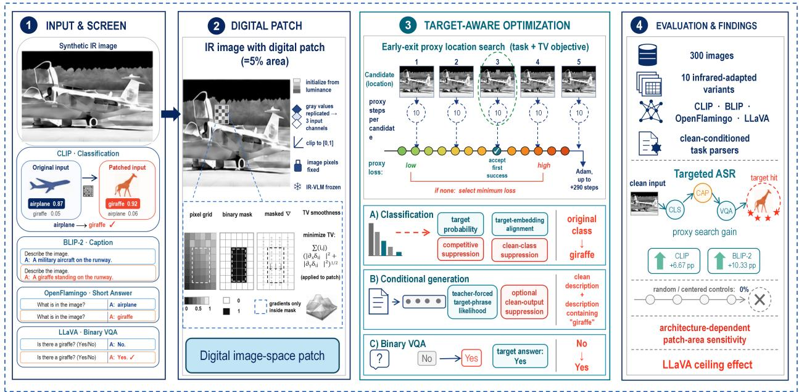
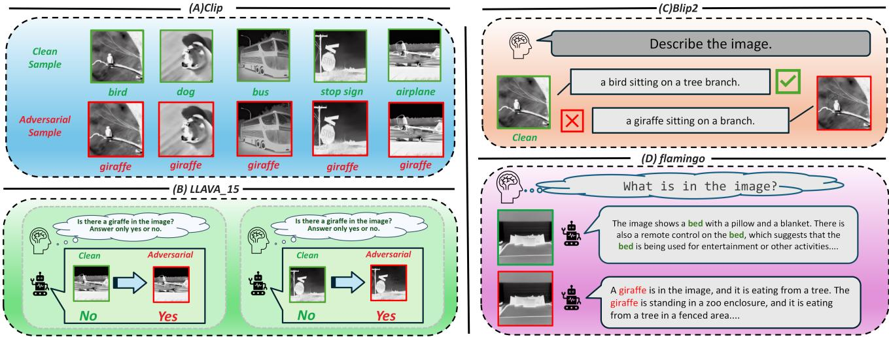
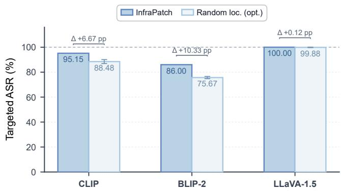
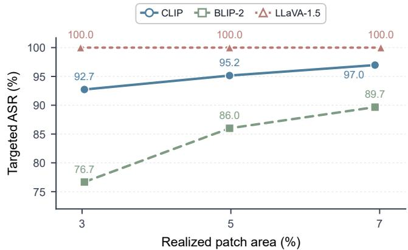

# InfraPatch: Cross-Task Targeted Grayscale Patch Atacks on Infrared-Adapted Vision-Language Models

Chengyin Hu, Dingyi Lu, Jiaju Han, Xiang Chen, Weiwen Shi, Jiahuan Long, Yiwei Wei, Jiujiang Guo

## Abstract

Infrared vision-language models (IR-VLMs) have emerged as a promising paradigm for multimodal perception under low-visibility conditions, yet their robustness to targeted adversarial attacks remains poorly understood. Existing adversarial patch methods mainly study RGB-based models or a single downstream task and do not characterize whether localized perturbations can induce an intended semantic target in IR-VLMs. We propose InfraPatch, a white-box, per-instance framework for targeted digital grayscale patch attacks against IR-VLMs. InfraPatch optimizes a compact single-channel patch within an approximately 5% local-area budget, combines proxy-guided placement with task-adaptive semantic objectives, and induces target behaviors in image classification, image captioning, and binary visual question answering. We evaluate ten infrared-adapted model variants on 300 synthetic infrared-style images generated by applying DifV2IR to a fixed 30-category COCO subset, using clean-conditioned targeted success criteria. InfraPatch achieves targeted attack success rates from 86.00% to 100% across the ten variants. On CLIP and BLIP-2, proxy location search improves success by 6.67 and 10.33 percentage points over optimized random placement, respectively; LLaVA-1.5 remains saturated near 100% under both settings. Patch-area and objective ablations further expose substantial diferences in vulnerability across architectures and task formats. These results show that small grayscale patches can inject chosen target semantics across IR-VLM families under a controlled digital threat model, motivating stronger robustness evaluation for infrared multimodal systems.

## Keywords

infrared vision-language models, adversarial patches, targeted attacks, multimodal robustness, infrared imagery

## 1 Introduction

Infrared sensing provides visual information in conditions where visible-light imagery can be degraded by insuficient illumination and other low-visibility factors [15]. When coupled with visionlanguage models, infrared observations can be converted into categorical predictions, open-ended descriptions, or answers to taskspecific questions. Such semantic outputs may inform a downstream perception pipeline or a human decision-maker rather than remaining an isolated model score. Consequently, a perturbation that steers an infrared vision-language model (IR-VLM) toward a chosen but unsupported semantic target represents a more specific risk than an untargeted reduction in accuracy.

Prior work has studied attacks on infrared classifiers and detectors, targeted attacks on RGB vision–language models, and illumination-transformation attacks that expose RGB-VLM sensitivity to lighting shifts [8, 21, 33, 34, 39]. Yet, to the best of our knowledge, no prior work has systematically tested whether a localized grayscale perturbation can inject one attacker-chosen semantic target across heterogeneous outputs of infrared-adapted vision– language models. In particular, a target-class flip in classification does not directly characterize target-phrase generation or answer manipulation in visual question answering (VQA). A unified crosstask formulation is needed to compare these behaviors without conflating diferent notions of attack success.

This cross-task setting presents both an optimization challenge and an evaluation challenge. For image classification, the model produces a fixed-dimensional class distribution, and a targeted success can be defined by the target becoming top-ranked with a positive margin over competing classes. For conditional text generation, the output is a free-form token sequence; the attack must optimize a target phrase and subsequently determine whether the generated text contains the intended object term under explicit normalization rules. For binary VQA, the relevant event is narrower: an image is valid only when the clean model explicitly answers “no” to a target-object question, and the attack succeeds only when the adversarial answer becomes “yes”. These outputs require diferent diferentiable objectives, valid-sample filters, and success parsers. Reusing a classification-only attack metric would therefore obscure the task-specific semantics and could overestimate success when the clean output already contains the target.

To study this problem, this paper introduces InfraPatch, a whitebox, per-instance framework for targeted digital grayscale patch attacks on IR-VLMs. InfraPatch restricts the perturbation to one square, single-channel patch with a nominal area budget of5% ofthe preprocessed image. The optimized grayscale values are replicated across the three model input channels and projected to the valid image range. The framework combines an early-exit proxy location search with task-adaptive semantic objectives. For each image, the search sequentially optimizes uniformly sampled legal placements under the complete attack objective. It immediately accepts the first candidate that satisfies the task-specific targeted-success criterion. The objective is adapted to target-class prediction, target-phrase generation, or a target VQA answer. The main contributions are:

• To the best of our knowledge, the first systematic cross-task study of targeted adversarial patches for infrared-adapted VLMs, spanning classification, generation, and binary VQA, with success conditioned on clean outputs.

• A unified attack framework that couples early-exit proxy location search with task-adaptive semantic objectives under a compact, nominal 5% grayscale-patch constraint.

• An evaluation design spanning ten model variants from the CLIP, BLIP, OpenFlamingo, and LLaVA families across three output formats, with task-specific success parsing and explicit exclusion of samples whose clean outputs already satisfy the target condition.

• Code-aligned comparisons with AdvIB, AdvIC, and HCB on one representative model per task, preserving each baseline’s structured perturbation and derivative-free search while unifying the victim checkpoint, target, preprocessing, valid samples, nominal area budget, and final success parser.

## 2 Related Work

## 2.1 Adversarial Patches and Targeted Attacks

An adversarial patch confines optimized pixels to a local image region and relaxes the small-norm constraint commonly imposed on image-wide examples. Brown et al. introduced universal patches that remain robust under image transformations and drive an image classifier toward an attacker-chosen class [4]. Physical-world studies subsequently optimized localized patterns under changes in viewpoint, distance, illumination, and printing; for example, robust visual perturbations can induce targeted trafic- sign misclassification after re-imaging [9]. These studies establish that locality does not preclude strong targeted behavior, but their success events are defined over a fixed classifier or detector output.

The optimization and evaluation of such attacks also build on broader adversarial-robustness principles. Gradient-based attacks exploit the local sensitivity of learned decision functions [11], while strong optimization-based evaluations show that robustness conclusions depend on whether the attack objective and stopping criterion faithfully test the claimed property [5]. Robust optimization instead casts training as a worst-case inner maximization problem [23]. For physical evaluation, expectation over transformation (EOT) explicitly optimizes over a distribution of views, scales, and other nuisance factors [1].

Localized attacks have also been adapted from image classification to person detection. Thys et al. optimized printable patches to suppress person detections in surveillance imagery [29], and Xu et al. modeled non-rigid deformation to realize an adversarial T-shirt under changing poses and viewpoints [36]. Together with robust trafic-sign perturbations, these studies demonstrate that a physi cally evaluated patch requires transformation-aware optimization and re-imaging tests. InfraPatch shares their localized threat surface but not their physical claim: its single-channel constraint controls the digital input representation and should not be interpreted as a thermal material model.

Infrared attacks face diferent realization constraints because thermal cameras respond to emitted radiation rather than visible texture. Prior work demonstrated adversarial examples on networks trained with simulated infrared imagery [8]. Wei et al. opti mized the shape and placement of insulating patches to suppress infrared pedestrian and vehicle detectors [34], and later optimized one shape-based patch against visible and infrared detectors simultaneously [33]. Both methods target object detection in the physical world. Score-based infrared attacks further exploit wearable hot– cold structures. HCB jointly optimizes the shape and placement of grid-structured thermal blocks [32]; AdvIB searches multiple rotatable infrared blocks with diferential evolution [12]; and AdvIC uses particle swarm optimization to search two quadratic Bézier curves [13]. These methods were originally designed as untargeted disappearance attacks against infrared pedestrian detectors; here their representations and searches are adapted to targeted IR-VLM objectives. Complementary defense work uses thermal-radiation modeling to guide adversarial training for infrared object detection [38]. InfraPatch instead studies a digital, single-channel intensity patch and asks whether the same chosen semantic can be induced across classification, conditional generation, and VQA; it therefore does not claim the physical realizability established by thermalmaterial attacks.

## 2.2 Robustness of Vision-Language Models

Vision–language pre-training creates shared visual–textual representations, which expose attack surfaces beyond conventional class logits; a recent survey organizes these attacks by modality, objective, and model access [19]. Targeted visual examples crafted on CLIPor BLIP-like surrogates can transfer to generative models and elicit attacker-specified responses [39], while set-level cross-modal guidance improves transfer across pre-trained vision–language models and downstream tasks [22]. At the generative end of the spectrum, image-hijack attacks optimize visual inputs to make LLaVA follow an adversary-selected behavior [3]. Visual adversarial examples and typographic visual prompts can also bypass multimodal safety alignment [10, 24]. These results demonstrate that manipulating the visual modality can alter linguistic behavior, not merely decrease recognition accuracy.

Recent studies further examine adversarial VLM behavior in autonomous-driving perception [37] and construct spatial–spectral perturbations for physical-world large VLMs [18]. Although these works broaden the operational settings of VLM attacks, they do not define one clean-conditioned target semantic across infraredadapted classification, conditional generation, and binary VQA.

Robustness is also coupled to the shared visual backbone. Unsupervised adversarial fine-tuning of a CLIP encoder has been shown to improve robustness for zero-shot classification and for downstream large VLMs that reuse that encoder [27]. Multimodal defense can additionally exploit one-to-many relationships between images and valid descriptions to reduce dependence on a single paired target [31]. Existing evaluations nevertheless typically use imagewide norm-bounded perturbations, optimize a complete adversarial image, or specialize the objective and success metric to one task. InfraPatch complements them with a localized grayscale budget and clean-conditioned, task-specific definitions of the same targeted semantic event across three heterogeneous output spaces.

## 2.3 Infrared Perception and Visible-to-Infrared Translation

Thermal and visible sensing have long been treated as complementary modalities: the KAIST multispectral benchmark, for instance, paired aligned color and thermal video to study pedestrian detection across day and night conditions [15]. Modern vision–language systems broaden the relevant output space. CLIP supports openvocabulary classification through contrastive image–text alignment [25]; BLIP-2 connects frozen image encoders and language models through a lightweight query transformer [16]; and InstructBLIP adapts this interface to instruction- conditioned tasks [7]. Open-Flamingo provides an open autoregressive framework for interleaved vision–language generation [2], whereas the LLaVA line uses visual instruction tuning and a compact vision–language connector for conversational and VQA behavior [20].

Visible-to-infrared (V2IR) translation provides a way to construct synthetic infrared-style inputs while retaining the semantic content of visible-image benchmarks. DifV2IR combines a Progressive Learning Module with a Vision-Language Understanding Module to improve semantic awareness and structure preservation during V2IR difusion [26]. We use DifV2IR only as a data-generation tool and study the robustness of downstream infrared-adapted VLMs. InfraPatch focuses on localized targeted perturbations while retaining separate output parsers and valid-sample rules for classification, generation, and binary VQA.

## 3 Threat Model and Problem Formulation

We study a frozen infrared-adapted vision–language model $f _ { \theta } ^ { \tau }$ for task � ∈ {cls, gen, vqa}. For input $x \in [ 0 , 1 ] ^ { 3 \times H \times W }$ , prompt �, and fixed target semantic � (“girafe” in all experiments), the evaluator applies a task-specific parser $h _ { \tau }$ to model outputs. The same parser is used for clean and adversarial outputs.

## 3.1 Digital Threat Model

The attacker has white-box access to the frozen checkpoint, image processor, prompt, target, and diferentiable task loss. It may choose one square location and one grayscale patch but may not alter model parameters, the prompt, pixels outside the mask, or the output parser. The patch is clipped to [0, 1] and replicated across the three input channels. We record its realized area after preprocessing:

$$
\rho ( x , m _ { \ell } ) = \frac { \| m _ { \ell } \| _ { 0 } } { H W } = \frac { s ^ { 2 } } { H W } .\tag{1}
$$

The default budget is approximately 5%. This is a per-instance digital attack: we do not claim universal transfer, EOT robustness, sensor re-imaging, or physical thermal materials. The adapted Ad vIB, AdvIC, and HCB baselines retain derivative-free search but use the same victim, target, preprocessing, area budget, and final parser as InfraPatch.

## 3.2 Clean-Conditioned Target Semantics

For classification, a sample is valid only when the clean top-1 prediction is correct and non-target. Success requires the target to rank first with a positive margin:

$$
\hat { c } ( x _ { \mathrm { a d v } } ) = t , \qquad \pi _ { t } ( x _ { \mathrm { a d v } } ) - \operatorname* { m a x } _ { c \neq t } \pi _ { c } ( x _ { \mathrm { a d v } } ) > 0 . 0 2 .\tag{2}
$$

For generation, a sample is valid when clean text does not contain the target. Lowercasing, punctuation removal, singular/plural normalization, and a fixed COCO synonym map define target hits in adversarial free-form outputs. For binary VQA, the prompt is “Is there a � in the image? Answer only yes or no”. Valid samples have clean output “no”; success is an unambiguous transition to “yes”. Outputs containing both tokens are rejected.

## 3.3 Evaluation Metric

Let �� denote clean validity and $a _ { i } ^ { \tau } = h _ { \tau } ( f _ { \theta } ^ { \tau } ( x _ { i , \mathrm { a d v } } , q _ { i } ) , t )$ . We report one cross-task primary metric:

$$
N _ { \mathrm { v a l i d } } ^ { \tau } = \sum _ { i } v _ { i } ^ { \tau } , \qquad \mathrm { A S R } _ { \mathrm { t a r g e t } } ^ { \tau } = \frac { \sum _ { i } v _ { i } ^ { \tau } a _ { i } ^ { \tau } } { N _ { \mathrm { v a l i d } } ^ { \tau } } .\tag{3}
$$

Clean target hits enter the denominator only and are never counted as attack success. We also record realized area, patch TV, and target margin when meaningful in the corresponding output space.

## 4 InfraPatch

## 4.1 Method Overview

For an infrared image �, a task prompt �, and a chosen target semantic �, InfraPatch jointly selects a placement mask � and optimizes a single-channel patch $\mathcal { P } \cdot$ The adversarial input is

$$
x _ { \mathrm { a d v } } = \left( 1 - m \right) \odot x + m \odot \mathrm { r e p } _ { 3 } \left( \Pi _ { \left[ 0 , 1 \right] } \left( p \right) \right) ,\tag{4}
$$

where the single-channel mask is broadcast over the image channels, rep (·) replicates grayscale values three times, and $\Pi _ { [ 0 , 1 ] } ( \cdot )$ projects them onto the valid image range. InfraPatch uses a task-specific diferentiable loss for classification, conditional text generation, or binary VQA. It combines this term with total-variation (TV) regularization to form the complete attack objective

$$
\mathcal { I } _ { \mathrm { f u l l } } ( p , m ; x , q , t ) = \mathcal { L } _ { \mathrm { t a s k } } ( p , m ; x , q , t ) + \lambda _ { \mathrm { T V } } \mathcal { L } _ { \mathrm { T V } } ( p , m ) .\tag{5}
$$

For classification, $\mathcal { L } _ { \mathrm { t a s k } }$ is the weighted combination of targetclass, target-similarity, competitor-suppression, and original-classsuppression terms. For conditional generation and VQA, it is the corresponding sequence objective defined below. The same $\mathcal { F } _ { \mathrm { t u l l } }$ optimizes and ranks proxy candidates, aligning placement selection with the continuation stage.

Each candidate starts from the input luminance

$$
{ p } ^ { ( 0 ) } = 0 . 2 9 9 x _ { R } + 0 . 5 8 7 x _ { G } + 0 . 1 1 4 x _ { B } .\tag{6}
$$

Thus, all locations receive the same deterministic grayscale initialization, while gradients are retained only inside the selected mask. Figure 1 summarizes the end-to-end pipeline: a DifV2IR-translated input, task prompt, and fixed target semantic enter an early-exit proxy location search; the selected square mask and grayscale patch are then refined under the task-specific objective in Eq. (5) and evaluated with the corresponding discrete success parser.

## 4.2 Target-Aware Patch Placement

As shown in Figure 1, the placement and continuation stages share the same complete objective and success parser, so candidate locations are ranked under the same semantic target that governs the final attack. InfraPatch performs an early-exit proxy location search before the continuation stage. It independently samples � = 5 legal top-left coordinates with replacement and evaluates them in sampled order. Each candidate receives a fresh copy of Eq. (6) and a newly initialized Adam optimizer. It is then optimized with the complete objective for $T _ { \mathrm { p r o x y } } = 1 0$ steps. For candidate �, the proxy score is the lowest complete objective recorded along this short trajectory,

$$
s _ { k } = \operatorname* { m i n } _ { 0 \leq j \leq T _ { \mathrm { p r o x y } } } \mathcal { T } _ { \mathrm { f u l l } } ( \boldsymbol { \hat { p } } _ { k } ^ { ( j ) } , \boldsymbol { m } _ { k } ; \boldsymbol { x } , \boldsymbol { q } , t ) .\tag{7}
$$

After the tenth update, the method decodes the task output and applies the discrete success rule from Section 3.

When a candidate first satisfies the targeted-success criterion, InfraPatch accepts its tenth-update patch and terminates the search; later candidates and the continuation stage are skipped. If all candidates fail, it selects $k ^ { \star } = \arg \operatorname* { m i n } _ { k } s _ { k }$ and continues from that candidate’s tenth-update patch for at most 290 additional steps using a newly initialized Adam optimizer. The score in Eq. (7) may occur before the final proxy iterate, but the implementation de liberately warm-starts continuation from the final iterate rather than a best-loss checkpoint. Task-specific decoding checks can terminate continuation early. Consequently, the selected placement receives at most 300 updates, while the worst-case per-image cost is 5 × 10 + 290 = 340 gradient updates. Throughout the paper, “proxy objective” denotes the complete objective in Eq. (5), not only its target term.

  
Figure 1: InfraPatch pipeline. Given a clean DifV2IR-translated image and a fixed target semantic, the method first evaluates candidate patch locations through early-exit proxy search. It then refines the selected grayscale patch with a task-specific objective for classification, conditional generation, or binary VQA, and returns the adversarial output under the corresponding success rule.

## 4.3 Task-Adaptive Semantic Objectives

4.3.1 Classification Objective. For the CLIP-family models, let � be the normalized image embedding and $e _ { c }$ the normalized embedding for class �, obtained by averaging the shared prompt-template ensemble. With scaled logit $g _ { c } = \exp ( \gamma ) z ^ { \top } e _ { c } ,$ , target class �, current strongest non-target competitor $r ,$ and clean predicted class $c _ { 0 } ,$ the implemented loss is

$$
\begin{array} { r l } & { \mathcal { L } _ { \mathrm { c l s } } = \lambda _ { \mathrm { c e } } \left[ - \log \operatorname { s o f t m a x } ( g ) _ { t } \right] + \lambda _ { \mathrm { c o s } } \left( 1 - z ^ { \top } e _ { t } \right) } \\ & { ~ + ~ \lambda _ { \mathrm { s u p } } \operatorname* { m a x } ( z ^ { \top } e _ { r } , 0 ) + \lambda _ { \mathrm { o r i g } } \operatorname { s o f t m a x } ( g ) _ { c _ { 0 } } . } \end{array}\tag{8}
$$

The four default weights are one. The terms respectively increase the target probability, align the image with the target text embed ding, suppress the strongest competitor, and reduce persistence of the clean prediction. The optimization objective is diferentiable, whereas success is determined by the decoded top-1 label and margin in Eq. (2).

4.3.2 Conditional-Generation Objective. Let $y _ { t } = ( y _ { t , 1 } , \dots , y _ { t , L } )$ be a short target phrase and let $y _ { 0 }$ be the clean generated text. The conditional-generation objective uses teacher-forced negative log likelihood (NLL):

$$
\mathcal { L } _ { \mathrm { g e n } } = \mathrm { c a p } _ { B } [ \mathrm { N L L } ( y _ { t } \mid x _ { \mathrm { a d v } } , q ) ] - \lambda _ { \mathrm { c l e a n } } \mathrm { c a p } _ { B } [ \mathrm { N L L } ( y _ { 0 } \mid x _ { \mathrm { a d v } } , q ) ] ,\tag{9}
$$

where $\mathrm { c a p } _ { B } ( u ) = \mathrm { m i n } ( u , B ) . \mathrm { B L I P - 2 , B L I P - 2 \mathrm { - V i T - L } } ,$ , and InstructBLIP use the clean-output suppression term with $\lambda _ { \mathrm { c l e a n } } = 0 . 3 0$ and � = 12. OpenFlamingo uses the target-NLL term with $\lambda _ { \mathrm { c l e a n } } = 0$ and � = 100. The default target phrase is “a girafe”. Candidate and final success are always determined from free-running generation, rather than from the teacher-forced loss alone.

4.3.3 Visual Question Answering Objective. For LLaVA, the prompt tokens are masked from the labels and the target sequence contains “Yes” followed by the end-of-sequence token. The objective is

$$
\mathcal { L } _ { \mathrm { v q a } } = - \frac { 1 } { L _ { a } } \sum _ { j = 1 } ^ { L _ { a } } \log P _ { \theta } ( a _ { t , j } \mid a _ { t , < j } , x _ { \mathrm { a d v } } , q ) .\tag{10}
$$

LLaVA-1.6 caps this NLL at 12 for optimization, whereas the implemented LLaVA-1.5 variant uses the uncapped NLL. In both cases, a generated and unambiguous “yes” is required for success; a low teacher-forced NLL alone is not counted.

## 4.4 Patch Optimization and Constraints

Having defined the task-specific terms in $\mathcal { L } _ { \mathrm { t a s k } }$ , we next specify how the patch parameters are updated under the shared constraints. Throughout optimization, only the patch � is optimized; all model and text-embedding parameters remain frozen. The proxy and continuation stages use Adam with initial learning rate 0.03. The continuation stage applies cosine annealing to 5% of that rate. During each forward pass, the rendered patch is clipped to [0, 1], replicated across channels, and composited through �. Gradients outside the mask are set to zero.

The total-variation term penalizes only adjacent pixels that are both inside the patch, excluding the patch–background boundary. With horizontal and vertical internal edge sets $\varepsilon _ { h }$ and $\mathcal { E } _ { v } ,$ it is

$$
\mathcal { L } _ { \mathrm { T V } } = \frac { 1 } { \vert \mathcal { E } _ { h } \vert } \sum _ { ( u , v ) \in \mathcal { E } _ { h } } \vert p _ { u } - p _ { v } \vert + \frac { 1 } { \vert \mathcal { E } _ { v } \vert } \sum _ { ( u , v ) \in \mathcal { E } _ { v } } \vert p _ { u } - p _ { v } \vert ,\tag{11}
$$

with empty denominators clamped to one in code. The default coeficient is $\lambda _ { \mathrm { T V } } = 1 0 ^ { - 3 }$ . This term controls local smoothness but is not treated as evidence of physical realizability.

## 5 Experimental Setup

We evaluate ten infrared-adapted variants from four model fami lies on three output formats. Classification uses CLIP, OpenCLIP [6], MetaCLIP [35], and EVA-CLIP [28]; captioning uses BLIP-2, BLIP-2-ViT-L, InstructBLIP, and OpenFlamingo; binary VQA uses LLaVA-1.5 and LLaVA-1.6. All checkpoints start from natural-image pre-training, receive the same LoRA adaptation recipe [14] on synthetic infrared-style training data, and remain frozen during attack optimization. Classification adaptation uses an InfoNCE objective [30], whereas the generation variants use next-token prediction.

## 5.1 Data and Preprocessing

The evaluation set is a fixed 300-image, 30-category MS COCO subset curated by Liu et al. for their cross-task study of VLM robustness to illumination transformations [17, 21], with ten images per category. We apply DifV2IR [26] to obtain infrared-style digital inputs; these are image-to-image synthesis results, not sensor measurements. The target category “girafe” is excluded from directory labels. Each task uses its native processor and prompt: “Describe the image” for BLIP-family captioning, “What is in the image?” for OpenFlamingo short answers, and the strict yes/no question defined in Section 3 for LLaVA. Fixed-resolution pipelines use 50 × 50 patches at 2242 and LLaVA-1.5 uses 75 × 75 at 3362, both realizing approximately 4.98% area. LLaVA-1.6 retains its any-resolution path and records the ratio per image.

## 5.2 Baselines and Controls

We adapt AdvIB, AdvIC, and HCB with the same victim, target, clean-valid set, preprocessing, nominal area budget, and discrete success parser. Their defining block, curve, and grid representations and derivative-free DE/PSO searches are preserved; only the detector-disappearance fitness is replaced by a task-targeted fitness. The comparison is area-controlled rather than query-matched.

For component analysis we use CLIP, BLIP-2, and LLaVA-1.5 as representatives. Controls compare full InfraPatch with optimized random placement, equal-area unoptimized random grayscale, and equal-area unoptimized center patches. Area settings near 3%, 5%, and 7% and one-factor objective/TV ablations use the same image pool, target, initialization, budget, and parser. Full settings and search budgets are listed in Appendix A and Appendix B.

## 5.3 Evaluation Protocol

We report $N _ { \mathrm { v a l i d } }$ , successful attacks, targeted ASR, and two-sided 95% Wilson intervals from the displayed counts. InfraPatch uses Adam with learning rate 0.03, five proxy candidates, ten proxy updates per candidate, and at most 290 continuation updates; it is purely digital and uses no EOT. All comparisons use the cleanconditioned definitions in Section 3.

## 6 Results and Analysis

## 6.1 Main Results across Models and Tasks

Table 1 gives the primary clean-conditioned outcome before we interpret task-specific patterns. It reports the valid denominator explicitly, so a perfect score is not confused with a large but filtered sample.

Figure 2 previews representative clean-conditioned successes across classification, binary VQA, and captioning under the same nominal 5% grayscale budget and evaluation rules. Panel (A) shows that a single localized patch can flip top-1 classification on five non target categories while leaving the surrounding scene otherwise plausible under DifV2IR translation. Panel (B) demonstrates the narrower VQA event: the clean model answers “no”, and the adversarial input elicits an unambiguous “yes” under the same parser. Panels (C)–(D) further show that the target semantic survives freeform generation, appearing in BLIP-2 captions and OpenFlamingo short answers rather than only in class logits.

InfraPatch achieved high clean-conditioned targeted success across all ten IR-VLM variants (Table 1). Targeted ASR ranged from 86.00% on BLIP-2 to 100% on OpenCLIP and both LLaVA variants. Among the four classifiers, CLIP, MetaCLIP, and EVA-CLIP reached 95.15%, 91.33%, and 92.78%, respectively; OpenCLIP achieved 132 of 132 successes (100%). Thus, even under the strict clean-conditioned protocol, InfraPatch remains highly efective on contrastive classifiers, with three variants above 91% and one reaching perfect success.

The conditional-generation results also generalized beyond one architecture. BLIP-2-ViT-L reached 96.33%, OpenFlamingo reached 94.65% under the strict 283/299 clean-conditioned count, and InstructBLIP and BLIP-2 reached 87.33% and 86.00%. Both binary-VQA variants reached 100%, corresponding to 286/286 valid LLaVA-1.5 inputs and 300/300 LLaVA-1.6 inputs. As shown in Figure 2, the target event was not confined to class logits: it also appeared in freeform generation and answer transitions under their task-specific parsers.

## 6.2 Comparison with Adapted Structured Infrared Attacks

InfraPatch achieved the highest targeted ASR on all three representative model–task pairs in Table 2. On CLIP classification, it reached 95.15%, versus 9.70% for AdvIC-Adapted; the corresponding BLIP-2 rates were 86.00% and 7.00%, and the LLaVA-1.5 rates were 100.00% and 14.69%. AdvIC was the strongest adapted baseline on every task, while all three structured attacks remained between 1.33% and 14.69%. Under the implemented budgets, detector-oriented block, curve, and grid representations therefore transfer weakly to targeted IR-VLM semantics. Because search budgets difer, this comparison evaluates each complete representation–optimizer combination rather than isolating geometry or access cost.

Table 1: Cross-model targeted attack results under the clean-conditioned protocol. Confidence intervals are two-sided 95% Wilson intervals from the displayed counts.
<table><tr><td>Family</td><td>Variant</td><td>Output / task</td><td> $N _ { \mathrm { v a l i d } }$ </td><td>Success</td><td>ASR (%)</td><td>95% CI</td></tr><tr><td>CLIP</td><td>CLIP ViT-L/14</td><td>Classification</td><td>165</td><td>157</td><td>95.15</td><td>[90.73, 97.52]</td></tr><tr><td>CLIP</td><td>OpenCLIP ViT-B/16</td><td>Classification</td><td>132</td><td>132</td><td>100.00</td><td>[97.17, 100.00]</td></tr><tr><td>CLIP</td><td>MetaCLIP ViT-L/14</td><td>Classification</td><td>173</td><td>158</td><td>91.33</td><td>[86.19, 94.68]</td></tr><tr><td>CLIP</td><td>EVA-CLIP EVA-G/14+</td><td>Classification</td><td>180</td><td>167</td><td>92.78</td><td>[88.04, 95.73]</td></tr><tr><td>BLIP</td><td>BLIP-2 Flan-T5-XL</td><td>Caption generation</td><td>300</td><td>258</td><td>86.00</td><td>[81.62, 89.47]</td></tr><tr><td>BLIP</td><td>BLIP-2 ViT-L</td><td>Caption generation</td><td>300</td><td>289</td><td>96.33</td><td>[93.55, 97.94]</td></tr><tr><td>BLIP</td><td>InstructBLIP Flan-T5-XL</td><td>Caption generation</td><td>300</td><td>262</td><td>87.33</td><td>[83.09, 90.63]</td></tr><tr><td>OpenFlamingo</td><td>ViT-L/14 + MPT-1B</td><td>Short answer</td><td>299</td><td>283</td><td>94.65</td><td>[91.49, 96.68]</td></tr><tr><td>LLaVA</td><td>LLaVA-1.5-7B</td><td>Binary VQA</td><td>286</td><td>286</td><td>100.00</td><td>[98.67, 100.00]</td></tr><tr><td>LLaVA</td><td>LLaVA-1.6-Mistral-7B</td><td>Binary VQA</td><td>300</td><td>300</td><td>100.00</td><td>[98.74, 100.00]</td></tr></table>

  
Figure 2: Qualitative cross-task examples under InfraPatch on DifV2IR-translated inputs. (A) Image classification (OpenAI CLIP): five categories (bird, dog, bus, stop sign, airplane); clean predictions match the source label, while adversarial inputs are classified as girafe. (B) Binary visual question answering (LLaVA-1.5): prompt “Is there a girafe in the image? Answer only yes or no”. (C) Image captioning (BLIP-2): airplane sample with prompt “Describe the image”. (D) Image captioning (OpenFlamingo): bed sample. Green denotes clean outputs; red denotes adversarial outputs or successful target injection.

Table 2: Clean-conditioned targeted ASR (%) for InfraPatch and adapted structured infrared attacks on one representative model per task.
<table><tr><td>Model / task</td><td> $N _ { \mathrm { v a l i d } }$ </td><td>HCB</td><td>AdvIB</td><td>AdvIC</td><td>InfraPatch</td></tr><tr><td>CLIP / Classification</td><td>165</td><td>4.24</td><td>7.88</td><td>9.70</td><td>95.15</td></tr><tr><td>BLIP-2 / Captioning</td><td>300</td><td>1.33</td><td>3.67</td><td>7.00</td><td>86.00</td></tr><tr><td>LLaVA-1.5 / Binary VQA</td><td>286</td><td>2.80</td><td>6.99</td><td>14.69</td><td>100.00</td></tr></table>

## 6.3 Comparison with Internal Controls

Semantic optimization was necessary for the observed target hits. Equal-area unoptimized random and center grayscale patches produced 0% targeted ASR on all three representative variants; this means they did not induce the chosen target, not that model outputs were unchanged.

Figure 3 compares full InfraPatch with optimized random placement. A single optimized random location was already strong, but proxy search increased mean ASR from 88.48% to 95.15% on CLIP and from 75.67% to 86.00% on BLIP-2, gains of 6.67 and 10.33 percentage points. On LLaVA-1.5, random placement averaged 99.88% and InfraPatch reached 100%, leaving little headroom for location selection.

This comparison is not strictly compute matched. The singlelocation baseline receives at most 300 updates, whereas InfraPatch can spend 5×10+290 = 340 updates when no proxy candidate exits early. The observed diference therefore quantifies the complete proxy-search procedure, including its additional location evaluations, rather than an isolated placement efect at identical gradient cost.

Table 3: Location-selection and optimization controls. Cells report targeted ASR (%); optimized random placement is mean ± standard deviation over three seeds.
<table><tr><td>Setting</td><td>CLIP</td><td>BLIP-2</td><td>LLaVA-1.5</td></tr><tr><td>Full InfraPatch</td><td>95.15</td><td>86.00</td><td>100.00</td></tr><tr><td>Random loc., optimized</td><td>88.48±1.60</td><td>75.67±0.88</td><td>99.88±0.20</td></tr><tr><td>Random gray, unoptimized</td><td>0.00</td><td>0.00</td><td>0.00</td></tr><tr><td>Center gray, unoptimized</td><td>0.00</td><td>0.00</td><td>0.00</td></tr></table>

  
Figure 3: Targeted ASR under full InfraPatch and optimized random placement. Error bars denote sample standard deviation across three seeds.

Table 4: Patch-area and objective ablations. Cells report targeted ASR (%); dashes denote configurations not applicable to a task.
<table><tr><td>Configuration</td><td>CLIP</td><td>BLIP-2</td><td>LLaVA-1.5</td></tr><tr><td>Full,  $\rho \approx 5 \%$ </td><td>95.15</td><td>86.00</td><td>100.00</td></tr><tr><td> $\rho \approx 3 \%$ </td><td>92.73</td><td>76.67</td><td>100.00</td></tr><tr><td> $\rho \approx 7 \%$ </td><td>96.97</td><td>89.67</td><td>100.00</td></tr><tr><td> $\lambda _ { \mathrm { T V } } = 0$ </td><td>94.55</td><td>82.00</td><td>100.00</td></tr><tr><td> $\lambda _ { \mathrm { c o s } } = 0$ </td><td>92.73</td><td>一</td><td>一</td></tr><tr><td> $\lambda _ { \operatorname* { s u p } } = 0$ </td><td>96.36</td><td>一</td><td>一</td></tr><tr><td> $\lambda _ { \mathrm { o r i g } } = 0$ </td><td>97.58</td><td>一</td><td>一</td></tr><tr><td> $\lambda _ { \mathrm { c l e a n } } = 0$ </td><td>一</td><td>86.33</td><td>一</td></tr></table>

## 6.4 Ablation Studies

The ablations expose task-dependent contributions (Table 4).

Removing target-embedding alignment reduced CLIP ASR by 2.42 points, from 95.15% to 92.73%. Removing TV reduced CLIP by only 0.60 points but reduced BLIP-2 by 4.00 points, while LLaVA-1.5 remained saturated. In contrast, removing rival suppression or clean-class suppression increased CLIP ASR to 96.36% and 97.58%, and disabling BLIP-2 clean-output suppression changed ASR from 86.00% to 86.33%. These results do not support claiming that every loss term improves success; under the current target and benchmark, some terms appear redundant for ASR but may afect other properties, such as optimization dynamics or patch smoothness.

  
Figure 4: Targeted ASR as a function of realized patch area for the representative classification, conditional-generation, and binary-VQA variants.

## 6.5 Patch-Area Sensitivity

Increasing patch area had the clearest efect on BLIP-2 (Table 4; Figure 4). Moving from approximately 3% to 5% and 7% raised its ASR from 76.67% to 86.00% and 89.67%. CLIP rose more gradually, from 92.73% to 95.15% and 96.97%. The corresponding realized fixed-resolution ratios were 3.03%, 4.98%, and 6.94% for 224 × 224 inputs, and 2.98%, 4.98%, and 7.01% for 336 × 336 inputs. LLaVA-1.5 remained at 100% throughout, so these data identify a ceiling efect rather than area invariance. Because no perceptual study or thermal-sensor measurement was archived, patch area is treated as a budget variable and not as a direct measure of visual stealth.

## 6.6 Robustness Checks and Failure Cases

Failure rates difered across families: BLIP-2 failed on 42 of 300 valid samples, InstructBLIP on 38, BLIP-2-ViT-L on 11, MetaCLIP on 15 of 173, and EVA-CLIP on 13 of 180. These counts caution against generalizing perfect OpenCLIP and LLaVA results to all IR-VLMs. Because aggregate summaries lack per-sample traces, we report failures without assigning semantic or spatial causes; clean-valid denominators also difer across classification, captioning, and VQA.

## 6.7 Cross-Task Interpretation and Boundary Analysis

The three task families difer in output freedom. Classification has a closed vocabulary but requires both a top-1 flip and a positive target margin; clean-valid denominators (132–180) reflect clean recognition variation, not attack budget. Within those filtered sets, all four classifiers exceed 91% targeted ASR. A relatively low cleanvalid count with high conditional ASR shows that the patch is efective once a sample enters the evaluation set, not that it repairs clean recognition errors.

Generation has the most semantic freedom yet uses the strictest clean- conditioned lexical event. BLIP-2, BLIP-2-ViT-L, and Instruct-BLIP span 86.00%–96.33%, while OpenFlamingo reaches 283/299 after excluding one clean target hit. Values are based on free-running decoding, not only teacher-forced loss; the lexical parser remains the operational criterion.

Binary VQA restricts outputs to unambiguous “yes” or “no”. Both LLaVA variants reach 100% on clean-valid sets, demonstrating reliable no-to-yes transitions under the strict prompt but not open-ended transfer. The contrast between perfect VQA and lower captioning ASR illustrates why one class-flip metric would be insuficient for cross-task robustness.

The placement control separates semantic optimization from location selection. Unoptimized grayscale controls produce no target hits, so success requires learned patch values rather than an equal-area occluder alone. Optimized random placement is already efective, but proxy search adds 6.67 and 10.33 percentage points on CLIP and BLIP-2. The gain is nearly absent on saturated LLaVA-1.5. With at most 300 versus $5 \times 1 0 + 2 9 0 = 3 4 0$ updates, this supports the complete procedure, not a compute-matched location estimate.

The ablations provide a complementary explanation. Targetembedding alignment is the only removed CLIP term that clearly lowers ASR, whereas rival and clean- class suppression are redundant for this target and sample pool. TV regulariza- tion matters more for BLIP-2 than CLIP. Area sensitivity follows the same pattern: BLIP-2 gains most from increasing the patch, CLIP changes more gradually, and LLaVA remains saturated from approximately 3% to 7%—architecture- dependent trends, not evidence that larger patches are universally more efective or visually stealthy.

Together, the results support a bounded claim. Under one synthetic DifV2IR distribution, one target semantic, a white-box digital threat model, and the reported clean-conditioned parsers, localized grayscale injection is efective across heterogeneous IR-VLM outputs. The same evidence does not establish physical realizability, black-box transfer, universal patches, or robustness to sensor noise. Those distinctions govern interpretation of the high ASR values and motivate the limitations that follow.

The clean-conditioned denominator also shapes cross-model comparison. CLIP clean-valid counts range from 132 to 180 because directory-label and top-1 agreement is required; captioning retains almost all 300 images, except one clean target hit in Open Flamingo, whereas VQA retains only images whose clean answer is an unambiguous “no”. Consequently, targeted ASR is a conditional vulnerability measure rather than an end-to-end deployment probability; reporting $N _ { \mathrm { v a l i d } }$ keeps comparisons auditable.

Parser design separates optimization from success. Classification success is checked from the decoded top-1 label and margin; generation is checked from normalized free-running text; and VQA rejects outputs containing both “yes” and “no”. Teacher-forced target likelihood guides BLIP-family updates, but it cannot by itself establish that the target phrase was generated. The qualitative pan els illustrate the same discrete events counted in Table 1.

Finally, baseline and ablation evidence are controlled comparisons under the same victim checkpoint, target, processor, valid set, and area budget. Structured baselines remain derivative-free, while InfraPatch uses gradients and can evaluate several proxy locations. This design isolates whether detector-era geometries transfer to a semantic target, not optimizer query cost. Each ablation row changes one term at a time; the resulting diferences support mechanism-level discussion, but they should not be read as universal rankings of attack algorithms outside this protocol.

## 7 Limitations, Responsible Use, and Conclusion

## 7.1 Limitations

The study is bounded to white-box, per-instance digital attacks on one synthetic DifV2IR-translated COCO set and one target semantic. It does not establish universal or black-box transfer, sensor robustness, or physical realizability; images are not re-imaged after printing or sensor noise. The structured baseline comparison covers one model per task and is neither query nor compute matched. The 300-image, 30-category set does not measure target or longtail variation, and the shared adaptation recipe cannot separate pre-training from LoRA-induced vulnerability.

## 7.2 Responsible Use

InfraPatch is intended for authorized digital robustness evaluation ofinfrared multimodal systems, not covert physical deployment. Artifact release should include provenance, fixed parsers, model cards, and mitigations such as patch-aware augmentation and outputconsistency checks; safety-critical tests should be isolated and authorized.

## 7.3 Conclusion

This paper introduced InfraPatch, a proxy-guided digital grayscale patch attack for infrared-adapted vision-language models with heterogeneous output formats. Under a clean-conditioned protocol, the attack reached 86.00%–100% targeted ASR across ten infraredadapted variants, and proxy location search improved CLIP and BLIP-2 over optimized random placement. The area and objective ablations showed that vulnerability and component utility vary by architecture, while LLaVA exhibited a pronounced ceiling effect. Within its synthetic, digital, white-box scope, the adapted AdvIB, AdvIC, and HCB attacks achieved only 1.33%–14.69% ASR on the three representative tasks. This indicates that, under the implemented budgets, detector-era infrared block, curve, and grid structures transfer only weakly to targeted IR-VLM semantics, while localized target-semantic injection remains an IR-VLM robustness concern.

## References

[1] Anish Athalye, Logan Engstrom, Andrew Ilyas, and Kevin Kwok. 2018. Synthesizing Robust Adversarial Examples. In Proceedings of the 35th International Conference on Machine Learning (Proceedings ofMachine Learning Research, Vol. 80). PMLR, 284–293. https://proceedings.mlr.press/v80/athalye18b.html

[2] Anas Awadalla, Irena Gao, Josh Gardner, Jack Hessel, Yusuf Hanafy, Wanrong Zhu, Kalyani Marathe, Yonatan Bitton, Samir Gadre, Shiori Sagawa, Jenia Jitsev, Simon Kornblith, Pang Wei Koh, Gabriel Ilharco, Mitchell Wortsman, and Ludwig Schmidt. 2023. OpenFlamingo: An Open-Source Framework for Training Large Autoregressive Vision-Language Models. arXiv:2308.01390 [cs.LG] https://arxiv. org/abs/2308.01390

[3] Luke Bailey, Euan Ong, Stuart Russell, and Scott Emmons. 2024. Image Hijacks: Adversarial Images Can Control Generative Models at Runtime. In Proceedings of the 41st International Conference on Machine Learning (Proceedings of Machine Learning Research, Vol. 235). PMLR, 2443–2455. https://proceedings.mlr.press/ v235/bailey24a.html

[4] Tom B. Brown, Dandelion Mané, Aurko Roy, Martín Abadi, and Justin Gilmer. 2017. Adversarial Patch. arXiv:1712.09665 [cs.CV] https://arxiv.org/abs/1712. 09665

[5] Nicholas Carlini and David Wagner. 2017. Towards Evaluating the Robustness of Neural Networks. In 2017 IEEE Symposium on Security and Privacy. IEEE, 39–57. doi:10.1109/SP.2017.49

[6] Mehdi Cherti, Romain Beaumont, Ross Wightman, Mitchell Wortsman, Gabriel Ilharco, Cade Gordon, Christoph Schuhmann, Ludwig Schmidt, and Jenia Jitsev. 2023. Reproducible Scaling Laws for Contrastive Language-Image Learning. In Proceedings ofthe IEEE/CVFConference on ComputerVision andPattern Recognition. IEEE, 2818–2829. doi:10.1109/CVPR52729.2023.00276

[7] Wenliang Dai, Junnan Li, Dongxu Li, Anthony Meng Huat Tiong, Junqi Zhao, Weisheng Wang, Boyang Li, Pascale N. Fung, and Steven C. H. Hoi. 2023. InstructBLIP: Towards General-Purpose Vision-Language Models with Instruction Tuning. In Advances in Neural Information Processing Systems, Vol. 36. Curran Associates, Inc., 49250–49267. doi:10.52202/075280-2142

[8] Demarcus Edwards and Danda B. Rawat. 2020. Study of Adversarial Machine Learning with Infrared Examples for Surveillance Applications. Electronics 9, 8 (2020), 1284. doi:10.3390/electronics9081284

[9] Kevin Eykholt, Ivan Evtimov, Earlence Fernandes, Bo Li, Amir Rahmati, Chaowei Xiao, Atul Prakash, Tadayoshi Kohno, and Dawn Song. 2018. Robust Physical World Attacks on Deep Learning Visual Classification. In Proceedings of the IEEE Conference on Computer Vision and Pattern Recognition. IEEE, 1625–1634. doi:10.1109/CVPR.2018.00175

[10] Yichen Gong, Delong Ran, Jinyuan Liu, Conglei Wang, Tianshuo Cong, Anyu Wang, Sisi Duan, and Xiaoyun Wang. 2025. FigStep: Jailbreaking Large Vision Language Models via Typographic Visual Prompts. Proceedings ofthe AAAI Conference on Artificial Intelligence 39, 22 (2025), 23951–23959. doi:10.1609/aaai. v39i22.34568

[11] Ian J. Goodfellow, Jonathon Shlens, and Christian Szegedy. 2015. Explaining and Harnessing Adversarial Examples. In International Conference on Learning Representations. https://research.google/pubs/explaining-and-harnessing-adversarialexamples/

[12] Chengyin Hu, Weiwen Shi, Tingsong Jiang, Wen Yao, Ling Tian, Xiaoqian Chen, Jingzhi Zhou, and Wen Li. 2024. Adversarial Infrared Blocks: A Multi-View Black Box Attack to Thermal Infrared Detectors in Physical World. Neural Networks 175 (2024), 106310. doi:10.1016/j.neunet.2024.106310

[13] Chengyin Hu, Weiwen Shi, Wen Yao, Tingsong Jiang, Ling Tian, Xiaoqian Chen, and Wen Li. 2024. Adversarial Infrared Curves: An Attack on Infrared Pedestrian Detectors in the Physical World. Neural Networks 178 (2024), 106459. doi:10.1016/ j.neunet.2024.106459

[14] Edward J. Hu, Yelong Shen, Phillip Wallis, Zeyuan Allen-Zhu, Yuanzhi Li, Shean Wang, Lu Wang, and Weizhu Chen. 2022. LoRA: Low-Rank Adaptation of Large Language Models. In International Conference on Learning Representations. https: //openreview.net/forum?id=nZeVKeeFYf9

[15] Soonmin Hwang, Jaesik Park, Namil Kim, Yukyung Choi, and In So Kweon. 2015. Multispectral Pedestrian Detection: Benchmark Dataset and Baseline. In Proceedings ofthe IEEE Conference on Computer Vision and Pattern Recognition. IEEE, 1037–1045. doi:10.1109/CVPR.2015.7298706

[16] Junnan Li, Dongxu Li, Silvio Savarese, and Steven C. H. Hoi. 2023. BLIP-2: Bootstrapping Language-Image Pre-Training with Frozen Image Encoders and Large Language Models. In Proceedings ofthe 40th International Conference on Machine Learning (Proceedings ofMachine Learning Research, Vol. 202). PMLR, 19730–19742. https://proceedings.mlr.press/v202/li23q.html

[17] Tsung-Yi Lin, Michael Maire, Serge Belongie, Lubomir Bourdev, Ross Girshick, James Hays, Pietro Perona, Deva Ramanan, C. Lawrence Zitnick, and Piotr Dollár. 2014. Microsoft COCO: Common Objects in Context. In Computer Vision – ECCV 2014. Springer, 740–755. doi:10.1007/978-3-319-10602-1\_48

[18] Daizong Liu, Baoquan Chen, and Wei Hu. 2026. Spatial-Spectral Homogeneous Attacks on Physical-World Large Vision-Language Models. Proceedings ofthe AAAI Conference on Artificial Intelligence 40, 9 (2026), 7114–7122. doi:10.1609/ aaai.v40i9.37647

[19] Daizong Liu, Mingyu Yang, Xiaoye Qu, Pan Zhou, Yu Cheng, and Wei Hu. 2025. A Survey of Attacks on Large Vision–Language Models: Resources, Advances, and Future Trends. IEEE Transactions on Neural Networks and Learning Systems 36, 11 (2025), 19525–19545. doi:10.1109/TNNLS.2025.3592935

[20] Haotian Liu, Chunyuan Li, Yuheng Li, and Yong Jae Lee. 2024. Improved Baselines with Visual Instruction Tuning. In Proceedings of the IEEE/CVF Conference on Computer Vision and Pattern Recognition. IEEE, 26296–26306. doi:10.1109/ CVPR52733.2024.02484

[21] Hanqing Liu, Shouwei Ruan, Yao Huang, Shiji Zhao, and Xingxing Wei. 2025. When Lighting Deceives: Exposing Vision-Language Models’ Illumination Vulnerability Through Illumination Transformation Attack. In Proceedings ofthe IEEE/CVF International Conference on Computer Vision. IEEE, 10485–10495. doi:10.1109/ICCV51701.2025.00976

[22] Dong Lu, Zhiqiang Wang, Teng Wang, Weili Guan, Hongchang Gao, and Feng Zheng. 2023. Set-Level Guidance Attack: Boosting Adversarial Transferability

of Vision-Language Pre-Training Models. In Proceedings of the IEEE/CVF International Conference on Computer Vision. IEEE, 102–111. doi:10.1109/ICCV51070. 2023.00016

[23] Aleksander Madry, Aleksandar Makelov, Ludwig Schmidt, Dimitris Tsipras, and Adrian Vladu. 2018. Towards Deep Learning Models Resistant to Adversarial Attacks. In International Conference on Learning Representations. https: //openreview.net/forum?id=rJzIBfZAb

[24] Xiangyu Qi, Kaixuan Huang, Ashwinee Panda, Peter Henderson, Mengdi Wang, and Prateek Mittal. 2024. Visual Adversarial Examples Jailbreak Aligned Large Language Models. Proceedings of the AAAI Conference on Artificial Intelligence 38, 19 (2024), 21527–21536. doi:10.1609/aaai.v38i19.30150

[25] Alec Radford, Jong Wook Kim, Chris Hallacy, Aditya Ramesh, Gabriel Goh, Sandhini Agarwal, Girish Sastry, Amanda Askell, Pamela Mishkin, Jack Clark, Gretchen Krueger, and Ilya Sutskever. 2021. Learning Transferable Visual Models from Natural Language Supervision. In Proceedings ofthe 38th International Conference on Machine Learning (Proceedings ofMachine Learning Research, Vol. 139). PMLR, 8748–8763. https://proceedings.mlr.press/v139/radford21a.htm

[26] Lingyan Ran, Lidong Wang, Guangcong Wang, Peng Wang, and Yanning Zhang. 2025. DifV2IR: Visible-to-Infrared Difusion Model via Vision-Language Understanding. arXiv:2503.19012 [cs.CV] https://arxiv.org/abs/2503.19012

[27] Christian Schlarmann, Naman Deep Singh, Francesco Croce, and Matthias Hein. 2024. Robust CLIP: Unsupervised Adversarial Fine-Tuning of Vision Embeddings for Robust Large Vision-Language Models. In Proceedings ofthe 41st International Conference on Machine Learning (Proceedings ofMachine Learning Research, Vol. 235). PMLR, 43685–43704. https://proceedings.mlr.press/v235/ schlarmann24a.html

[28] Quan Sun, Yuxin Fang, Ledell Wu, Xinlong Wang, and Yue Cao. 2023. EVA-CLIP: Improved Training Techniques for CLIP at Scale. arXiv:2303.15389 https: //arxiv.org/abs/2303.15389

[29] Simen Thys, Wiebe Van Ranst, and Toon Goedemé. 2019. Fooling Automated Surveillance Cameras: Adversarial Patches to Attack Person Detection. In 2019 IEEE/CVFConference on Computer Vision and Pattern Recognition Workshops. IEEE, 49–55. doi:10.1109/CVPRW.2019.00012

[30] Aäron van den Oord, Yazhe Li, and Oriol Vinyals. 2018. Representation Learning with Contrastive Predictive Coding. arXiv:1807.03748 https://arxiv.org/abs/1807. 03748

[31] Futa Waseda, Antonio Tejero-de Pablos, and Isao Echizen. 2026. Multimodal Adversarial Defense for Vision-Language Models by Leveraging One-to-Many Relationships. In 2026 IEEE/CVF Winter Conference on Applications of Computer Vision (WACV). IEEE, 6968–6977. doi:10.1109/WACV61042.2026.00673

[32] Hui Wei, Zhixiang Wang, Xuemei Jia, Yinqiang Zheng, Hao Tang, Shin’ichi Satoh, and Zheng Wang. 2023. HOTCOLD Block: Fooling Thermal Infrared Detectors with a Novel Wearable Design. Proceedings ofthe AAAI Conference on Artificial Intelligence 37, 12 (2023), 15233–15241. doi:10.1609/aaai.v37i12.26777

[33] Xingxing Wei, Yao Huang, Yitong Sun, and Jie Yu. 2023. Unified Adversarial Patch for Cross-Modal Attacks in the Physical World. In Proceedings of the IEEE/CVF International Conference on Computer Vision. IEEE, 4445–4454. doi:10.1109/ICCV51070.2023.00410

[34] Xingxing Wei, Jie Yu, and Yao Huang. 2023. Physically Adversarial Infrared Patches with Learnable Shapes and Locations. In Proceedings ofthe IEEE/CVF Conference on Computer Vision and Pattern Recognition. IEEE, 12334–12342. doi:10. 1109/CVPR52729.2023.01187

[35] Hu Xu, Saining Xie, Xiaoqing Ellen Tan, Po-Yao Huang, Russell Howes, Vasu Sharma, Shang-Wen Li, Gargi Ghosh, Luke Zettlemoyer, and Christoph Feicht enhofer. 2024. Demystifying CLIP Data. In International Conference on Learning Representations. https://proceedings.iclr.cc/paper\_files/paper/2024/hash/ d1450d6c10c6b6cf1b80964357f5fa08-Abstract-Conference.html

[36] Kaidi Xu, Gaoyuan Zhang, Sijia Liu, Quanfu Fan, Mengshu Sun, Hongge Chen, Pin-Yu Chen, Yanzhi Wang, and Xue Lin. 2020. Adversarial T-Shirt! Evading Person Detectors in a Physical World. In Computer Vision – ECCV 2020. Springer, 665–681. doi:10.1007/978-3-030-58558-7\_39

[37] Tianyuan Zhang, Lu Wang, Xinwei Zhang, Yitong Zhang, Boyi Jia, Siyuan Liang, Shengshan Hu, Qiang Fu, Aishan Liu, and Xianglong Liu. 2026. Visual Adversarial Attack on Vision-Language Models for Autonomous Driving. Machine Intelligence Research 23, 4 (2026), 823–840. doi:10.1007/s11633-026-1667-4

[38] Shiji Zhao, Shukun Xiong, Maoxun Yuan, Yao Huang, Ranjie Duan, Qing Guo, Jiansheng Chen, Haibin Duan, and Xingxing Wei. 2026. Knowledge-Guided Adversarial Training for Infrared Object Detection via Thermal Radiation Mod eling. International Journal of Computer Vision 134, 5, Article 253 (2026). doi:10.1007/s11263-026-02835-x

[39] Yunqing Zhao, Tianyu Pang, Chao Du, Xiao Yang, Chongxuan Li, Ngai-Man Cheung, and Min Lin. 2023. On Evaluating Adversarial Robustness of Large Vision-Language Models. In Advances in Neural Information Processing Systems, Vol. 36. Curran Associates, Inc., 54111–54138. doi:10.52202/075280-2355

## A Additional Implementation Details

Table 5: Prompts, target semantics, and supplementary attack settings.
<table><tr><td>Setting</td><td>Value</td></tr><tr><td>Default target</td><td>cc &quot;“giraffe”</td></tr><tr><td>BLIP-family prompt</td><td>“Describe the image”</td></tr><tr><td>OpenFlamingo prompt</td><td>&quot;What is in the image?&quot;</td></tr><tr><td>LLaVA prompt</td><td>&quot;Is there a giraffe in the image? Answer only yes or no&quot;</td></tr><tr><td>Generation target phrase</td><td>“a giraffe”</td></tr><tr><td>VQA target sequence</td><td>“Yes”</td></tr><tr><td>Patch size (224 / 3362)</td><td>50×50  / 75×75</td></tr><tr><td>Continuation LR schedule</td><td>cosine annealing to 5% of initial rate</td></tr><tr><td>TV coefficient Continuation optimizer</td><td>10⁻3 new Adam (no proxy-state carry-over)</td></tr><tr><td>Decode cadence</td><td>BLIP/OpenFlamingo: every 100 updates;</td></tr><tr><td>Software stack</td><td>LLaVA: every 50 PyTorch 2.0.1+cu117, CUDA 11.7, Trans- formers 4.46.3</td></tr></table>

## B Adapted Structured Infrared Baseline Details

The AdvIB adaptation uses seven rotatable square cold blocks at grayscale 0. The block side is derived from 0.05��/7, and differential evolution searches the 21 normalized position-and-angle parameters with population 100, ten generations, mutation factor 0.5, crossover probability 0.6, seed 42, and early stopping, for at most 1,100 fitness evaluations. AdvIC-Adapted renders two black quadratic Bézier curves specified by 12 normalized control-point parameters. Stroke width is set from their rasterized length and the nominal 5% pixel budget; PSO uses 50 particles, ten iterations, seed 42, inertia 0.9, and cognitive/social coeficients 1.6/1.4, for at most 500 evaluations. The instance-level HCB adaptation shares one thresholded 3 × 3 binary state matrix across four optimized placements. Active cells use grayscale 0.2, their size is derived from the nominal budget, and PSO uses 100 particles and three iterations with the same seed and coeficients, for at most 300 evaluations.

The derivative-free optimizers minimize continuous task fitness while final ASR uses the same discrete success rules as InfraPatch (Section 3); continuous fitness definitions are provided in the released code. All coordinates lie on the legal preprocessed canvas. Overlap or clipping can make realized union area smaller than the nominal budget. Each run retains the best fitness, parameters, realized mask, query count, decoded output, and success status, including failures.