# InsightSeg: Reusing Correction Insights for Guideline-Consistent Segmentation

Vanshika Vats, Ashwani Rathee, James Davis

University of California, Santa Cruz, CA, USA

## Abstract

Guideline-consistent semantic segmentation requires more than category recognition, as real-world labeling policies demand fine-grained, task-specific decisions. Recent multiagent refinement systems improve compliance with such textual guidelines by detecting and correcting errors. However, they are stateless: feedback from the critiquing agent is discarded, causing the same guideline-specific mistakes to be repeatedly rediscovered and corrected across the dataset at the cost of additional refinement. We introduce InsightSeg, an episodic memory mechanism that converts successful correction episodes into reusable, visually grounded insights. A meta-analyzer distills each qualifying episode into directive natural-language insights and anchors them to the local image regions that caused the error using patch-level visual concept vectors. On subsequent images, these concepts are matched against dense patch embeddings to retrieve relevant insights, which condition the segmenting agent before making its first prediction. This shifts the system from correcting recurring errors to preventing them, improving segmentation quality before any refinement occurs. Across Waymo and Cityscapes, InsightSeg improves both first-pass and final guideline-consistent segmentation performance while requiring fewer refinement steps, demonstrating that multi-agent refinement can become more accurate and eficient by drawing on past correction experience.

## Introduction

Semantic segmentation systems are typically evaluated by whether they assign the correct semantic class to each pixel, whether through task-specific training (Ronneberger, Fischer, and Brox 2015; Chen et al. 2018) or, more recently, visionlanguage models (VLMs) prompted with text (Liang et al. 2023; Ren et al. 2024). In many real-world settings, however, correct segmentation depends on complex, task-specific labeling guidelines rather than visual category recognition alone. For example, a person pushing a bicycle may be labeled as a pedestrian, whereas one riding it may need to be excluded (Sun et al. 2020); an umbrella carried by a pedestrian may also need to be included in the same mask (Cordts et al. 2016). Text-prompted segmentation systems excel on short prompts (Lai et al. 2024; Sun et al. 2025; Ren et al. 2024) but deteriorate under such long, intricate rules. Even capable models can therefore produce systematic guidelinespecific errors in a single forward pass. Because the same visual patterns recur across images, the resulting errors could too. Crucially, a single-pass system has no mechanism to detect, let alone correct, its own mistakes.

Recent reasoning-driven segmentation methods increasingly move beyond single-pass prediction by decomposing inference into multiple stages, such as candidate generation and selection, interleaved reasoning and tool use, and explicit evaluation followed by prompt or mask refinement (Zhu et al. 2025; Vats, Rathee, and Davis 2026; Gao, Hao, and Yue 2026; He et al. 2025). These inference-time mechanisms can improve visual grounding and output reliability by allowing intermediate predictions to be inspected, compared, or revised. They often require multiple VLM or Multimodal LLM evaluations and tool invocations for each input sample. However, any corrective feedback they produce is generally confined to the current inference episode: once an image has been processed, its critiques and successful correction strategies are not retained for subsequent inputs.

As a result, similar mistakes may recur across images, forcing the system to repeatedly rediscover the same guidelinespecific correction and incur additional refinement calls. This is especially wasteful in guideline-consistent segmentation, where the long and detailed labeling policy remains fixed across the dataset while the visual inputs change, making a correction discovered on one image potentially useful for later images with the same visual trigger. A lesson like ‘reflections in glass storefronts are not physical pedestrians’ is episodic: it links a specific visual pattern to a corrective action and should be applied only when that pattern reappears. Parametric fine-tuning is therefore a poor fit here because it requires curated data, risks interference with existing capabilities, and cannot readily incorporate corrections online. What this correction system needs is not better weights, but a memory.

To address this, we introduce a patch-indexed episodic memory framework that converts successful correction episodes into reusable, visually grounded insights. Our stateful system, InsightSeg, links each correction insight to the local visual evidence that produced it. When a segmentercritiquer refinement episode successfully finds and corrects an error, a meta-analyzer distills the episode into directive natural-language insights and anchors it to the relevant image regions using patch-level visual concept vectors. On subsequent new images, the patch-indexed episodic memory compares these stored concepts against dense patch embeddings and retrieves relevant insights, and gives them to the segmenting agent before its first prediction.

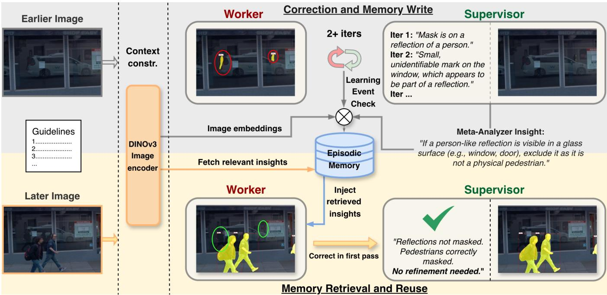  
Figure 1: Overview of InsightSeg’s stateful correction pipeline. The upper and lower panels illustrate two operations within the same online system: successful corrections from earlier images are distilled and written to episodic memory, while later images retrieve relevant insights via patch-level visual anchors before the initial prediction. This reuse prevents recurring guideline violations and reduces repeated refinement.

This shifts the system from repeatedly correcting mistakes to actively avoiding them in the first place, improving segmentation quality before any refinement occurs. Cleaner initial predictions also leave less work for the critiquer agent, reducing refinement iterations by 62% and 45% while improving final performance on Waymo and Cityscapes datasets, respectively. The entire process is online and training-free, requiring no gradient updates.

Thus, the main contribution of our work is a stateful memory mechanism that lets inference-time correction accumulate and reuse experience across images, which we instantiate for training-free guideline-consistent segmentation. By retrieving these visually grounded insights before the initial prediction, InsightSeg enables cross-image knowledge transfer, prevents recurring errors, and reduces repeated refinement.

## Related Works

Multi-Agent Refinement in Segmentation. Promptable segmentation conditions mask prediction on user-provided cues. These may be spatial prompts, such as points or boxes (Kirillov et al. 2023), or language prompts, such as referring expressions and instructions used by unified vision-language segmentation models (Lai et al. 2024; Qian, Yin, and Dou 2025). Although efective with concise text prompts, these systems often struggle with long, intricate labeling policies that require multiple task-specific decisions. Even longcontext VLMs such as Gemini-2.5 (Comanici et al. 2025) may fail to verify structured guideline compliance reliably in a single pass. A growing line of work therefore improves reliability through multi-stage generate-evaluate-revise inference. Self-Refine (Madaan et al. 2023) and Reflexion (Shinn et al. 2023) established this concept in language tasks, while multi-agent systems use dedicated reviewer agents to identify errors and provide targeted feedback (Wu et al. 2023; Shen et al. 2023). In vision, such refinement has been applied to iterative re-grounding and visual reasoning (Liao et al. 2025; Sun et al. 2025; Su et al. 2024; Vats, Rathee, and Davis 2026; Sun, Xiao, and Lim 2021; He et al. 2025). These methods improve individual predictions through additional inference stages, but the resulting feedback is generally used only within the current input image and is not retained for reuse across subsequent samples.

Memory-Augmented Agents. Non-parametric memory ofers an alternative to fine-tuning frozen models, avoiding curated data, interference, and ofline retraining. ExpeL (Zhao et al. 2024) distills insights from past trajectories, while Dynamic Cheatsheet (Suzgun et al. 2026) maintains an online memory. Other agents store reusable skills, workflows, or reasoning templates (Wang et al. 2024, 2025b; Yang et al. 2024). These methods generally retrieve memories by matching the current query against stored entries based on textual similarity. This assumption does not hold for guideline-consistent segmentation, where the prompt and guidelines remain fixed across images and relevance depends on local visual cues. For example, for pedestrian segmentation, the applicable correction may depend on localized cues such as a reflection in a glass storefront, an umbrella carried by a person, or a human figure depicted on a poster. Existing multimodal memories typically rely on task-observation pairs or whole-image similarity (Wang et al. 2025a; Bo et al. 2025) which may miss small localized triggers. Relatedly, in-context segmentation transfers masks through patch-level correspondences (Liu et al. 2024; Zhang et al. 2024), but stores only positive visual exemplars and cannot encode policy-level corrections, such as ‘a person-shaped reflection must be excluded’.

To address these limitations, we introduce a visually grounded episodic memory that pairs each directive insight with patch-level concept vectors extracted from the regions that caused a past error. Retrieval is performed over local patches, allowing an insight to be recalled when its visual trigger appears anywhere in a new image.

## Method

## Overview

Guideline-consistent segmentation aims to produce a mask that is both visually accurate and compliant with the specified annotation policy. The guidelines may specify long and fine-grained inclusion and exclusion rules, such as including objects carried by a pedestrian in the mask, while excluding reflections, mannequins, or people inside vehicles. Examples of these detailed rules are provided in Supplementary material Sec. A. We formulate the guideline-consistent segmentation within a state-of-the-art Worker-Supervisor refinement framework (Vats, Rathee, and Davis 2026), where the Worker VLM generates an initial segmentation, while the Supervisor VLM evaluates its compliance with the relevant guidelines and provides structured feedback on missing instances, false positives, and boundary errors. An iteration controller uses the Supervisor’s feedback issue count to select whether to stop or continue with the refinement loop, with a maximum of four refinement passes. While this process corrects errors within an image, its feedback does not persist across images. Our focus is on transforming the corrective experience produced by this process into persistent, visually grounded memory that can be reused across images.

We introduce an episodic memory that lets this stateless segmentation system learn from its own corrections and proactively apply that knowledge on new images before any mistake is made (Fig. 1). On the write path, each learnworthy event is stored in the memory as a comprehensive textual insight distilled by the meta-analyzer, paired with the specific visual anchors that supported it. On the read path, the new incoming image retrieves the relevant insights by dense patch-level appearance. These insights are finally inserted into the Worker’s prompt as a high-priority past experience, and let it avoid known failure modes on the first attempt itself.

We define an ‘episode’ as a complete refinement cycle (one or more iterations) involving a worker producing the masks and a supervisor critiquing its work and providing feedback. To ensure a fair comparison, we follow the prior work and quantify the supervisor’s critique at iteration t by issue count

$$
I _ { t } = I _ { m i s s } + I _ { f a l s e } + 0 . 1 I _ { r e f }\tag{1}
$$

where $I _ { m i s s } , I _ { f a l s e } .$ , and $I _ { r e f }$ are the numbers of missing objects, false positives, and segmentation boundary refinements flagged, respectively. Refinements are down-weighted as they indicate mask-quality adjustments rather than detection errors. These issue counts are further used by the learning-event check to determine whether an episode qualifies for processing by the meta-analyzer.

## Learning-Event Check

Not every worker-supervisor correction episode provides a transferable lesson. Some pipeline runs require no refinement, while others involve only minor mask adjustments or even degrade the mask despite supervisor feedback. Such cases provide weak or misleading learning signals, because they do not reveal a reliable correction pattern that can generalize beyond the current image and could bloat our memory unnecessarily. We therefore admit an episode to the write path only if it qualifies as a learning event, a criterion computed from the episode’s issue-count trajectory $( I _ { 0 } , I _ { 1 } , \ldots , I _ { T } )$ . An episode is a learning event if:

Condition 1. The total issue reduction satisfies $I _ { 0 } - I _ { T } \geq 1$ $i . e . ,$ , the score decreased by at least one unit, filtering out episodes driven only by minor boundary fluctuations.

Condition 2. No single refinement step regressed by more than δ, i.e. $I _ { t } - I _ { t - 1 } \leq \delta , \dot { \forall } t \geq 1$

The first condition ensures the episode contains a genuine, non-trivial correction; the second rejects unstable trajectories whose net improvement may be incidental. $\mathrm { ~ A ~ } \delta = 0 . 5$ tolerates noisy $I _ { r e f } .$ . Episodes with a clean initial critique skip refinement entirely and never reach this gate. Only episodes that pass this learn-worthy check are handed to the Meta-Analyzer; all others are discarded.

## Meta-Analyzer

The Meta-Analyzer receives the original image and the Supervisor’s validated missing-object and false-positive correction items, each comprising a localized bounding box and its rationale. This provides it with a holistic view ofthe scene and how the corrections unfolded. Boundary refinements are excluded because they reflect instance-specific geometry rather than transferable scene knowledge. In a single batched VLM call, the Meta-Analyzer distills these items into one or more insights.

A valid insight must satisfy two constraints: its cited trigger must be visually verifiable in the image, and its corrective rule must be non-trivial and generalizable. The Meta-Analyzer then associates each insight with the subset of Supervisorprovided boxes that supports it; it does not generate new boxes. This produces tuples of the form (insight text, support regions), grounding each insight in the visual evidence that motivated it. We use these support regions to attach visual grounding to each insight.

## Support-Region Patch Embeddings

For each qualifying insight, we capture the local appearance of the error regions that triggered those refinement feedbacks, using patch embeddings from DINOv3 (Siméoni et al. 2025)

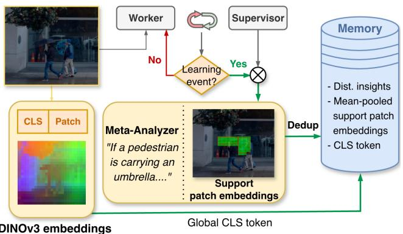  
Figure 2: Memory storing. When a correction episode passes the learning-event check, the meta-analyzer distills it into a natural-language insight. Each insight is visually anchored with patch tokens, which are mean-pooled over the supervisor’s support regions (umbrellas in the figure) to form a concept embedding. Paired with the global CLS token, the insights and related anchors are written to the memory.

image encoder. Each image encoded at $5 1 2 \times 5 1 2$ passes through this, which produces a 32×32 grid of L2-normalized patch tokens. Each patch token represents the local visual embedding of its corresponding image region.

An insight’s support regions are the subset of Supervisorprovided boxes associated with it by the Meta-Analyzer. Its support patches are the DINOv3 patch tokens whose grid cells overlap with those boxes by at least 30% (Fig. 2). The 30% overlap threshold is intentional: allowing patches to fall partly outside the boxes helps capture not only the object trigger, but also its surrounding context.

A single insight is often supported by several regions with diferent appearances. For example, for an insight ‘ifaperson is carrying a bag in his hand, do...’ there could be several trigger ‘bag’ support regions in an image. However, retrieval needs one stable representation of the underlying trigger concept. We therefore mean-pool the selected support patches across support regions and L2-normalize the result to form the trigger’s concept vector. Because these patches come from the regions the system actually mis-segmented rather than from random sampling, the concept vector reflects a genuine past failure.

## Memory Storage

The episodic memory bank stores a set of unique insights, each grounded by one or more visual anchors. An anchor is a stored record of a single valid episode containing a concept vector for local information and a DINOv3 CLS token for global scene information (Fig. 2). During retrieval, we use only the patch-level concept vector. The CLS embedding is used only to maintain visual diversity among an insight’s anchors, as described below. Since one pooled concept vector cannot cover every possible appearance of a trigger (e.g. handbags, backpacks etc. for a trigger ‘bag’), each insight keeps up to $K _ { a } = 5$ visually diverse anchors. This lets memory represent the same concept through several examples rather than just one pooled example.

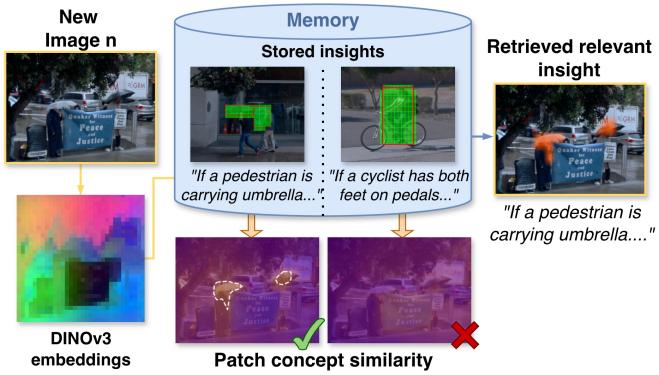  
Figure 3: Memory retrieval. For a new image, its patch tokens are compared against the stored concept embeddings of each insight’s visual anchors. Similarity is computed per patch, so an insight fires when its concept matches a local region (umbrellas) rather than the whole scene. The top-scoring insights are retrieved and injected into the Worker’s prompt for the new image.

Insight deduplication. Stored insights help the system avoid repeating mistakes it has already learned from. However, a new scene can still sometimes trigger a similar mistake, leading the Meta-Analyzer to produce a lesson that closely matches one already in memory. Storing every such restatement separately would unnecessarily bloat the bank. Thus, new insights are first deduplicated at the text level. An insight’s text embedding is compared against those of stored insights by cosine similarity. If the closest match exceeds a threshold, we treat the insight as a restatement of that existing record and add its anchor as a candidate to that record. If not, we create a new record.

Anchor admission. We want the anchors for a lesson to cover diferent visual forms of the same underlying trigger, rather than repeatedly storing near-identical evidence. For example, a ‘carried bag’ insight is more useful if its anchors include bags under diferent lighting, weather, viewpoints, and surrounding scenes, instead of five nearly identical sunny street examples. We therefore store at most $K _ { a } = 5$ anchors per insight. A new anchor is added only if its scene is visually diferent from the anchors already stored, measured using the global CLS embedding. If its CLS-cosine similarity to any stored anchor is above a threshold, we treat it as too similar and reject it. If it passes and there is space in the record, we add it. Ifthe record is already full, it replaces the stored anchor most similar to it, keeping the five anchors from clustering around near-duplicate scenes.

## Memory Retrieval

When a new image arrives, retrieval happens once before the Worker’s initial pass (Fig. 3). The query image is encoded by the same DINOv3 backbone into a grid of L2-normalized patch tokens, stacked as $Q \in \mathbb { R } ^ { G ^ { 2 } \times d }$ , where $G = 3 2$ , and d is the patch-embedding dimension. Each stored anchor has a concept vector obtained by mean-pooling the patch tokens inside its support regions and L2-normalizing the result. Let $C \in \mathbb { R } ^ { M \times d }$ stack the concept vectors of all M anchors in the bank. We compute the patch-concept similarity matrix

$$
S = Q C ^ { \top } \in \mathbb { R } ^ { G ^ { 2 } \times M } ,\tag{2}
$$

where $S _ { i j }$ is the cosine similarity between query patch i and anchor concept vector $j .$ Each anchor is scored by its strongest match over the query patches:

$$
a _ { j } = \operatorname* { m a x } _ { 1 \leq i \leq G ^ { 2 } } S _ { i j } .\tag{3}
$$

Thus, an anchor fires when any local region of the query image resembles the visual concept encoded by that anchor. Each insight ins then takes the score of its best-firing anchor:

$$
r _ { \mathrm { i n s } } = \operatorname* { m a x } _ { j \in \mathcal { I } _ { \mathrm { i n s } } } a _ { j } ,\tag{4}
$$

where ${ \mathcal { I } } _ { \mathrm { i n s } }$ indexes the anchors associated with insight ins. We rank insights by $r _ { \mathrm { i n s } }$ and retrieve the top $k _ { r } = 3$ insights whose scores satisfy $r _ { \mathrm { i n s } } \geq \tau _ { \mathrm { r e t } }$

The retrieved insight texts are injected into the Worker’s prompt as a high-priority ‘past experience’ block, with the instruction to apply each insight only when its described visual cue is actually present in the image. Retrieval does not disable the write path. Even when an insight is retrieved for the current image, the resulting episode is still evaluated by the memory-admission criterion, and any qualifying correction is added to or merged with the memory.

## Experiments

## Datasets

We evaluate our method on Waymo guideline-consistent and Cityscapes datasets. The Waymo guideline-consistent dataset (Vats, Rathee, and Davis 2026) contains 102 carefully curated samples whose annotations strictly follow the defined labeling guidelines. Since the study’s goal is to enforce guideline-consistency, this dataset filters out the noisy ground-truth segmentations that deviate from Waymo’s own labeling protocol. To evaluate robustness beyond the curated benchmark, we also report results on the Cityscapes validation set, consisting of 500 finely annotated images. Similar to prior works, we focus on the Pedestrian class (the Person class in Cityscapes), as it presents a more challenging segmentation problem due to subtle object boundaries, complex guidelines, and frequent annotation ambiguities. In contrast, larger classes such as Car tend to inflate aggregate metrics while hiding fine-grained segmentation errors. The complete guideline sets are provided in the supplementary material.

## Implementation

For an input image Imgi and guidelines G, we encode each image using a DINOv3 ViT-H+/16 backbone to extract patchlevel and global CLS embeddings. We use the stable gemini-2.5-flash as the primary VLM API to make an apples-toapples comparison with the stateless benchmark. The Worker VLM is run with temperature T = 0.5 to allow flexibility for object localization, while the Supervisor VLM is run more deterministically with T = 0.3. SAM-2.1-Hiera-Large is used to generate the segmentation masks.

Conditions 1 and 2 (Sec. Method) determine whether a correction episode is a learn-worthy event. If the event passes this check, the Supervisor’s feedback is distilled by a Meta-Analyzer VLM $( \bar { T } = 0 . 3 )$ into a compact insight and written to an episodic memory bank implemented with FAISS (Johnson, Douze, and Jégou 2019). For each insight, we extract and aggregate DINOv3 patches from its associated support regions to construct the visual anchor. Memory insertion is controlled by a text-level deduplication via bge-base-en-v1.5 (Xiao et al. 2024) encoding with a threshold of 0.90 and a visual-anchor diversity threshold of 0.85. During retrieval, we set $\tau _ { \mathrm { r e t } } = 0 . 6$ and return the top $k _ { r } = 3$ insights whose scores satisfy $r _ { \mathrm { i n s } } \geq \tau _ { \mathrm { r e t } }$ . The thresholds are selected empirically through preliminary experiments and kept fixed across all reported datasets and settings.

The memory is initialized empty. For image Imgi, retrieval uses only insights from previously processed images, and insights from Imgi are written only after its final prediction. Ground truth is used solely for evaluation.

Following the initial Worker prediction, a complete refinement iteration consists of a Supervisor-Worker exchange: the Supervisor critiques the current mask, and the Worker applies the feedback to produce a revised mask. If the Supervisor identifies no issues, the episode terminates with zero refinement iterations. We set the maximum number of iterations to 4. All local inference is performed on 3×RTX 3080 GPUs. We conduct three independent runs with random seeds and report means and standard deviations for principal metrics.

## Evaluation Metrics

We use global IoU (gIoU) and complete IoU (cIoU) as our segmentation metrics (Kazemzadeh et al. 2014; Mao et al. 2016; Lai et al. 2024). cIoU aggregates intersections and unions over the full dataset before computing the final ratio and is therefore more influenced by larger objects. In contrast, gIoU computes IoU independently for each image and then averages the scores, making it a more balanced measure of per-image performance. To further capture over-segmentation, under-segmentation, and their overall trade-of, we also report mean Precision (mPr), mean Recall (mRec), and mean Dice/F1 (mDice), each computed per image and averaged across the dataset.

## Results

We compare our system against prompt-conditioned segmentation methods, such as LISA (Lai et al. 2024), Grounded-SAM (Ren et al. 2024), SAM3 (Carion et al. 2026), READ (Qian, Yin, and Dou 2025), Gemini-2.5 (Comanici et al. 2025), SegZero (Liu et al. 2025), and GuideSeg (Vats, Rathee, and Davis 2026), under the same class prompt and evaluation protocol. As demonstrated in Table 1, on the Waymo guideline-consistent benchmark, our method achieves 83.51(±0.26) gIoU and 90.21(±0.45) mDice, outperforming the strongest refinement baseline, GuideSeg, by +2.94 and +3.01, respectively. The improvement is consistent across all Waymo metrics, with gains of +3.38 in precision and +2.77 recall. This shows that the proposed memory improves both sides of the segmentation trade-of: it recovers more guideline-relevant objects while also reducing false positives. Similar trend holds on Cityscapes val, where our method improves over GuideSeg by +2.46 gIoU, +4.08 cIoU, and +8.17 mPr. This setting is particularly challenging because many object instances are very small and distant, making the visual cues needed for precise segmentation weaker.

<table><tr><td rowspan="2">Method</td><td colspan="5">Waymo guideline-consistent</td><td colspan="5">Cityscapes val</td></tr><tr><td>gIoU</td><td>cIoU</td><td>mPr</td><td>mRec</td><td>mDice</td><td>gIoU</td><td>cIoU</td><td>mPr</td><td>mRec</td><td>mDice</td></tr><tr><td>LISA-7B (Lai et al. 2024)</td><td>23.41</td><td>18.32</td><td>24.38</td><td>79.79</td><td>33.17</td><td>30.56</td><td>42.15</td><td>46.90</td><td>38.19</td><td>39.90</td></tr><tr><td>LISA-13B (Lai et al. 2024)</td><td>20.16</td><td>14.21</td><td>22.41</td><td>62.41</td><td>28.30</td><td>26.75</td><td>36.11</td><td>39.65</td><td>36.65</td><td>35.42</td></tr><tr><td>GroundedSAM (Ren et al. 2024)</td><td>20.43</td><td>19.36</td><td>29.35</td><td>28.11</td><td>25.63</td><td>21.30</td><td>5.50</td><td>5.90</td><td>42.90</td><td>7.60</td></tr><tr><td>SAM3 (Carion et al. 2026)</td><td>34.00</td><td>25.80</td><td>90.00</td><td>35.80</td><td>42.70</td><td>47.09</td><td>58.83</td><td>72.04</td><td>57.67</td><td>57.09</td></tr><tr><td>READ (Qian, Yin, and Dou 2025)</td><td>43.94</td><td>45.55</td><td>51.74</td><td>69.75</td><td>59.41</td><td>24.04</td><td>36.60</td><td>35.26</td><td>35.13</td><td>32.44</td></tr><tr><td>Gemini-2.5 (Comanici et al. 2025)</td><td>69.02</td><td>74.24</td><td>80.91</td><td>79.89</td><td>78.75</td><td>35.62</td><td>46.87</td><td>47.94</td><td>54.62</td><td>46.29</td></tr><tr><td>SegZero (Liu et al. 2025)</td><td>71.96</td><td>73.72</td><td>86.34</td><td>78.45</td><td>80.88</td><td>41.52</td><td>43.47</td><td>60.75</td><td>51.36</td><td>52.78</td></tr><tr><td>GuideSeg (Vats, Rathee, and Davis 2026)</td><td>80.57</td><td>86.70</td><td>91.06</td><td>84.78</td><td>87.20</td><td>50.00</td><td>64.16</td><td>69.83</td><td>59.73</td><td>60.32</td></tr><tr><td>InsightSeg (Ours)</td><td>83.51</td><td>87.68</td><td>94.44</td><td>87.55</td><td>90.21</td><td>52.46</td><td>68.24</td><td>78.00</td><td>59.53</td><td>62.46</td></tr></table>

Table 1: Segmentation results on the Waymo guideline-consistent dataset and Cityscapes val set. Our stateful method outperform prior methods on nearly all metrics across both datasets. Qualitative examples are shown in supplementary materials.

<table><tr><td rowspan="2">Method Metrics</td><td colspan="2">Before Refinement</td><td colspan="2">After Refinement</td></tr><tr><td>No memory</td><td>Ours</td><td>No memory</td><td>Ours</td></tr><tr><td>gIoU↑</td><td>73.78</td><td>78.85</td><td>80.57</td><td>83.51</td></tr><tr><td>cIoU ↑</td><td>78.40</td><td>82.88</td><td>86.70</td><td>87.68</td></tr><tr><td>mPr ↑</td><td>88.36</td><td>90.31</td><td>91.06</td><td>94.44</td></tr><tr><td>mRec ↑</td><td>80.81</td><td>86.58</td><td>84.78</td><td>87.55</td></tr><tr><td>mDice ↑</td><td>84.75</td><td>88.40</td><td>87.20</td><td>90.21</td></tr><tr><td>Avg #iters ↓</td><td>-</td><td>-</td><td>2.66</td><td>1.01 (↓62%)</td></tr></table>

Table 2: Efect of utilizing memories on the Waymo dataset. By using previous insights, our method improves the initial segmentation quality and further surpasses the refinement baseline after refinement, while reducing the average refinement passes by more than half.

## Discussion and Ablations

Efect of Reusable Memory. To examine our contribution of cross-image memory, Table 2 compares the segmentation pipeline with and without reusable insights, both before and after refinement. Before any refinement, our method already improves over no-memory baseline by +5.07 gIoU and +3.65 mDice. At this point no supervisor feedback has touched the current image, so this first-pass gain can only come from insights transferred from previously seen images. Importantly, the first-pass gIoU improvement is statistically reliable: its paired-bootstrap 95% confidence interval remains above zero ([+1.3, +5.9]), with a Wilcoxon signed-rank test yielding p < 0.001. After refinement, our method remains better while requiring substantially fewer passes, by reducing the average number of refinement iterations by 62%. Thus, the system reaches higher final segmentation quality while requiring fewer refinement calls. Similar improvements are shown for the Cityscapes dataset in Supplementary Table A. The memory remains economical: deduplication substantially compresses the insights produced by the meta-analyzer on both benchmarks, merging 50% of 48 on Waymo and 65% of 125 on Cityscapes. The resulting compact memory entries retain an average of 1.6 and 2.0 visual anchors per insight, respectively.

<table><tr><td>Memory</td><td>gIoU↑</td><td>cIoU↑</td><td>mPr↑</td><td>mRec↑</td><td>mDice↑</td></tr><tr><td>None</td><td>80.57</td><td>86.70</td><td>91.06</td><td>84.78</td><td>87.20</td></tr><tr><td>Global CLS</td><td>79.58</td><td>84.74</td><td>93.21</td><td>83.98</td><td>86.92</td></tr><tr><td>Patch-based</td><td>83.51</td><td>87.68</td><td>94.44</td><td>87.55</td><td>90.21</td></tr></table>

Table 3: Comparison of local and global visual retrieval. Patch-based retrieval consistently outperforms global CLS retrieval.

This turns refinement from a purely reactive process into a memory-guided one. In a stateless refinement system, the Worker first makes a prediction, the Supervisor identifies the errors, and additional refinement steps are needed. Each new sample, therefore, starts from scratch, even when it contains mistakes the system has already corrected before. Our method makes this process proactive, letting the Worker avoid recurring guideline errors before they enter the refinement loop. Overall, these results support our central claim: reusable correction insights improve segmentation quality and eficiency together by preventing the system from repeatedly rediscovering the same guideline-specific mistakes.

Patch-Level vs Global Retrieval. We conduct all further ablations on the Waymo guideline-consistent dataset to examine diferent aspects of correction reuse. We first test whether global scene-level retrieval is suficient by replacing the local patch-based concept vectors with DINOv3 CLS embeddings for both memory indexing and retrieval. As shown in Table 3, global CLS retrieval provides no consistent improvement in segmentation quality: it increases precision while degrading gIoU, cIoU, recall, and Dice relative to the stateless baseline. In contrast, patch-based retrieval improves all segmentation metrics. This indicates that wholeimage similarity captures broad scene appearance but often misses the localized visual cues that determine guideline relevance. Dense patch matching instead recalls insights based on their specific visual triggers, enabling more precise and cue-specific retrieval. Qualitative examples of this behavior are provided in Supplementary Fig. B.

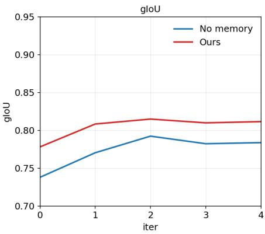

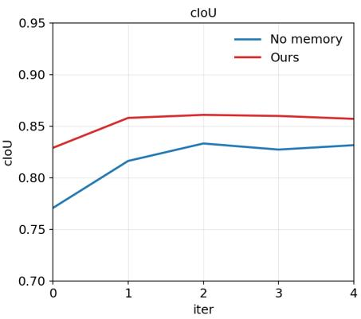

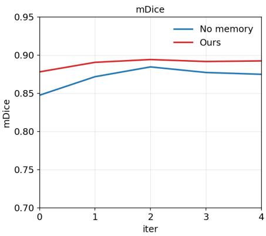  
Figure 4: Performance across refinement iterations without early stopping. Our method produces stronger initial predictions and remains consistently above the stateless refinement baseline, showing that reusable memory improves both the first-pass output and the refined predictions.

<table><tr><td rowspan="2">Method Metric</td><td colspan="3">Memory</td></tr><tr><td>None</td><td>Least-relevant</td><td>Most-relevant</td></tr><tr><td>gIoU ↑</td><td>73.78</td><td>73.27</td><td>78.85 (+5.07)</td></tr><tr><td>cIoU ↑</td><td>78.40</td><td>77.32</td><td>82.88 (+4.48)</td></tr><tr><td>mPr ↑</td><td>88.36</td><td>87.70</td><td>90.31 (+1.95)</td></tr><tr><td>mRec ↑</td><td>80.81</td><td>81.07</td><td>86.58 (+5.77)</td></tr><tr><td>mDice ↑</td><td>84.75</td><td>84.25</td><td>88.40 (+3.65)</td></tr></table>

Table 4: Robustness to irrelevant memory insertion. Injecting the system with least-relevant memories performs similarly to no memory, showing that the system does not blindly apply unsupported insights. Most-relevant memories improve firstpass performance across all metrics.

Memory Gains Persist Across Refinement Passes. We further test if the advantage of memory persists when the stopping criterion is removed and both systems are allowed to run up to the maximum refinement budget. This checks whether the stateless baseline could eventually catch up simply by using more refinement iterations. Fig. 4 shows that this is not the case. Our method starts from a stronger initial prediction and remains consistently above the stateless baseline across all iterations. The curves also saturate after a small number of steps, indicating that additional refinement alone cannot recover the gap created by missing reusable memory.

Robustness to Irrelevant Memory. We test whether our system blindly follows memory content when the inserted insights are not relevant to the image. This is a controlled stress test rather than the standard retrieval setting: instead of injecting the top-ranked memories, we deliberately insert the least-relevant insights from the memory bank. Table 4 shows that these do not meaningfully hurt performance, remaining close to the no-memory setting across all metrics. In contrast, inserting the most-relevant memories substantially improves first-pass performance. This suggests that the gain comes from visually relevant correction insights, while irrelevant insights are largely ignored rather than blindly applied.

The supplementary material provides further analyses demonstrating robustness to the processing order, the continued efectiveness of our method when using a diferent VLM, eficiency and estimated costs, failure cases, and limitations.

## Conclusion

We introduce InsightSeg, a training-free episodic memory system for guideline-consistent segmentation that converts successful correction episodes into reusable, visually grounded insights. Each insight pairs a directive naturallanguage correction insight with patch-level vision concept vectors extracted from the regions that caused the original error, allowing relevant lessons to help make the segmenting agent’s first prediction on future images. Experiments on Waymo and Cityscapes show that this memory improves segmentation quality while reducing refinement passes. More broadly, our results show how vision agents can accumulate and reuse localized correction experience across inputs, shifting multi-agent refinement from repeatedly rediscovering errors toward a persistent process that is proactive, more accurate, and more eficient.

## References

Bo, W.; Zhang, S.; Sun, Y.; Wu, J.; Xie, Q.; Tan, X.; Chen, K.; He, W.; Li, X.; Zhao, N.; et al. 2025. Agentic learner with grow-and-refine multimodal semantic memory. arXiv preprint arXiv:2511.21678.

Carion, N.; Gustafson, L.; Hu, Y.-T.; Debnath, S.; Hu, R.; Suris, D.; Ryali, C.; Alwala, K. V.; Khedr, H.; Huang, A.; Lei, J.; Ma, T.; Guo, B.; Kalla, A.; Marks, M.; Greer, J.; Wang, M.; Sun, P.; Rädle, R.; Afouras, T.; Mavroudi, E.; Xu, K.; Wu, T.-H.; Zhou, Y.; Momeni, L.; Hazra, R.; Ding, S.; Vaze, S.; Porcher, F.; Li, F.; Li, S.; Kamath, A.; Cheng, H. K.; Dollár, P.; Ravi, N.; Saenko, K.; Zhang, P.; and Feichtenhofer, C. 2026. SAM 3: Segment Anything with Concepts. In International Conference on Learning Representations (ICLR).

Chen, L.-C.; Zhu, Y.; Papandreou, G.; Schrof, F.; and Adam, H. 2018. Encoder-Decoder with Atrous Separable Convolution for Semantic Image Segmentation. In European Conference on Computer Vision (ECCV), 833–851. Springer.

Comanici, G.; Bieber, E.; Schaekermann, M.; Pasupat, I.; Sachdeva, N.; Dhillon, I.; Blistein, M.; Ram, O.; Zhang, D.; Rosen, E.; et al. 2025. Gemini 2.5: Pushing the frontier with advanced reasoning, multimodality, long context, and next generation agentic capabilities. arXiv preprint arXiv:2507.06261.

Cordts, M.; Omran, M.; Ramos, S.; Rehfeld, T.; Enzweiler, M.; Benenson, R.; Franke, U.; Roth, S.; and Schiele, B. 2016. The Cityscapes Dataset for Semantic Urban Scene Understanding. In Proc. of the IEEE Conference on Computer Vision and Pattern Recognition (CVPR).

Gao, X.; Hao, H.; and Yue, X. 2026. Reason Twice: Segmentation via Candidate Discovery and Comparative Reasoning. arXiv preprint arXiv:2606.09303.

He, X.; Zhang, Y.; Gao, S.; Li, W.; Hong, L.; Chen, M.; Jiang, K.; Fu, J.; and Zhang, W. 2025. RSAgent: Learning to Reason and Act for Text-Guided Segmentation via Multi-Turn Tool Invocations. arXiv preprint arXiv:2512.24023.

Johnson, J.; Douze, M.; and Jégou, H. 2019. Billion-scale similarity search with GPUs. IEEE Transactions on Big Data, 7(3): 535–547.

Kazemzadeh, S.; Ordonez, V.; Matten, M.; and Berg, T. 2014. ReferItGame: Referring to Objects in Photographs of Natural Scenes. In Moschitti, A.; Pang, B.; and Daelemans, W., eds., Proceedings of the 2014 Conference on Empirical Methods in Natural Language Processing, 787–798. Association for Computational Linguistics.

Kirillov, A.; Mintun, E.; Ravi, N.; Mao, H.; Rolland, C.; Gustafson, L.; Xiao, T.; Whitehead, S.; Berg, A. C.; Lo, W.- Y.; Dollár, P.; and Girshick, R. 2023. Segment Anything. arXiv:2304.02643.

Lai, X.; Tian, Z.; Chen, Y.; Li, Y.; Yuan, Y.; Liu, S.; and Jia, J. 2024. LISA: Reasoning Segmentation via Large Language Model. In Proceedings of the IEEE/CVF Conference on Computer Vision and Pattern Recognition, 9579–9589.

Liang, F.; Wu, B.; Dai, X.; Li, K.; Zhao, Y.; Zhang, H.; Zhang, P.; Vajda, P.; and Marculescu, D. 2023. Open-vocabulary

semantic segmentation with mask-adapted clip. In Proceedings of the IEEE/CVF Conference on Computer Vision and Pattern Recognition, 7061–7070.

Liao, Y.-H.; Mahmood, R.; Fidler, S.; and Acuna, D. 2025. Can Large Vision–Language Models Correct Semantic Grounding Errors By Themselves? In Proceedings of the IEEE/CVF Conference on Computer Vision and Pattern Recognition (CVPR).

Liu, Y.; Peng, B.; Zhong, Z.; Yue, Z.; Lu, F.; Yu, B.; and Jia, J. 2025. Seg-zero: Reasoning-chain guided segmentation via cognitive reinforcement. arXiv preprint arXiv:2503.06520.

Liu, Y.; Zhu, M.; Li, H.; Chen, H.; Wang, X.; and Shen, C. 2024. Matcher: Segment Anything with One Shot Using All-Purpose Feature Matching. In The Twelfth International Conference on Learning Representations.

Madaan, A.; Tandon, N.; Gupta, P.; Hallinan, S.; Gao, L.; Wiegrefe, S.; Alon, U.; Dziri, N.; Prabhumoye, S.; Yang, Y.; Gupta, S.; Majumder, B. P.; Hermann, K.; Welleck, S.; Yazdanbakhsh, A.; and Clark, P. 2023. SELF-REFINE: iterative refinement with self-feedback. In Proceedings of the 37th International Conference on Neural Information Processing Systems, NIPS ’23. Red Hook, NY, USA: Curran Associates Inc.

Mao, J.; Huang, J.; Toshev, A.; Camburu, O.; Yuille, A.; and Murphy, K. 2016. Generation and Comprehension of Unambiguous Object Descriptions. In 2016 IEEE Conference on Computer Vision and Pattern Recognition (CVPR), 11–20.

Qian, R.; Yin, X.; and Dou, D. 2025. Reasoning to attend: Try to understand how <SEG> token works. In Proceedings ofthe Computer Vision and Pattern Recognition Conference, 24722–24731.

Ren, T.; Liu, S.; Zeng, A.; Lin, J.; Li, K.; Cao, H.; Chen, J.; Huang, X.; Chen, Y.; Yan, F.; Zeng, Z.; Zhang, H.; Li, F.; Yang, J.; Li, H.; Jiang, Q.; and Zhang, L. 2024. Grounded SAM: Assembling Open-World Models for Diverse Visual Tasks. arXiv:2401.14159.

Ronneberger, O.; Fischer, P.; and Brox, T. 2015. U-Net: Convolutional Networks for Biomedical Image Segmentation. In Medical Image Computing and Computer-Assisted Intervention – MICCAI 2015, volume 9351, 234–241. Springer.

Shen, Y.; Song, K.; Tan, X.; Li, D.; Lu, W.; and Zhuang, Y. 2023. Hugginggpt: Solving ai tasks with chatgpt and its friends in hugging face. Advances in Neural Information Processing Systems, 36: 38154–38180.

Shinn, N.; Cassano, F.; Gopinath, A.; Narasimhan, K.; and Yao, S. 2023. Reflexion: language agents with verbal reinforcement learning. In Proceedings ofthe 37th International Conference on Neural Information Processing Systems, NIPS ’23. Red Hook, NY, USA: Curran Associates Inc.

Siméoni, O.; Vo, H. V.; Seitzer, M.; Baldassarre, F.; Oquab, M.; Jose, C.; Khalidov, V.; Szafraniec, M.; Yi, S.; Ramamonjisoa, M.; Massa, F.; Haziza, D.; Wehrstedt, L.; Wang, J.; Darcet, T.; Moutakanni, T.; Sentana, L.; Roberts, C.; Vedaldi, A.; Tolan, J.; Brandt, J.; Couprie, C.; Mairal, J.; Jégou, H.; Labatut, P.; and Bojanowski, P. 2025. DINOv3. arXiv:2508.10104.

Su, W.; Miao, P.; Dou, H.; and Li, X. 2024. ScanFormer: Referring Expression Comprehension by Iteratively Scanning . In 2024 IEEE/CVF Conference on Computer Vision and Pattern Recognition (CVPR), 13449–13458. Los Alamitos, CA, USA: IEEE Computer Society.

Sun, G.; Jin, M.; Wang, Z.; Wang, C.-L.; Ma, S.; Wang, Q.; Geng, T.; Wu, Y. N.; Zhang, Y.; and Liu, D. 2025. Visual Agents as Fast and Slow Thinkers. In The Thirteenth International Conference on Learning Representations.

Sun, M.; Xiao, J.; and Lim, E. G. 2021. Iterative Shrinking for Referring Expression Grounding Using Deep Reinforcement Learning. In 2021 IEEE/CVF Conference on Computer Vision and Pattern Recognition (CVPR), 14060–14069.

Sun, P.; Kretzschmar, H.; Dotiwalla, X.; Chouard, A.; Patnaik, V.; Tsui, P.; Guo, J.; Zhou, Y.; Chai, Y.; Caine, B.; Vasudevan, V.; Han, W.; Ngiam, J.; Zhao, H.; Timofeev, A.; Ettinger, S.; Krivokon, M.; Gao, A.; Joshi, A.; Zhang, Y.; Shlens, J.; Chen, Z.; and Anguelov, D. 2020. Scalability in Perception for Autonomous Driving: Waymo Open Dataset. In Proceedings of the IEEE/CVF Conference on Computer Vision and Pattern Recognition (CVPR).

Suzgun, M.; Yuksekgonul, M.; Bianchi, F.; Jurafsky, D.; and Zou, J. 2026. Dynamic Cheatsheet: Test-Time Learning with Adaptive Memory. In Demberg, V.; Inui, K.; and Marquez, L., eds., Proceedings of the 19th Conference of the European Chapter ofthe Associationfor Computational Linguistics (Volume 1: Long Papers), 7080–7106. Rabat, Morocco: Association for Computational Linguistics. ISBN 979-8- 89176-380-7.

Vats, V.; Rathee, A.; and Davis, J. 2026. Guideline-Consistent Segmentation via Multi-Agent Refinement. In Proceedings of the AAAI Conference on Artificial Intelligence, volume 40, 9612–9620.

Wang, G.; Xie, Y.; Jiang, Y.; Mandlekar, A.; Xiao, C.; Zhu, Y.; Fan, L.; and Anandkumar, A. 2024. Voyager: An Open-Ended Embodied Agent with Large Language Models. Transactions on Machine Learning Research.

Wang, Z.; Cai, S.; Liu, A.; Jin, Y.; Hou, J.; Zhang, B.; Lin, H.; He, Z.; Zheng, Z.; Yang, Y.; et al. 2025a. Jarvis-1: Open-world multi-task agents with memory-augmented multimodal language models. IEEE Transactions on Pattern Analysis and Machine Intelligence, 47(3): 1894–1907.

Wang, Z. Z.; Mao, J.; Fried, D.; and Neubig, G. 2025b. Agent Workflow Memory. In Proceedings ofthe 42nd International Conference on Machine Learning (ICML).

Wu, C.; Yin, S.; Qi, W.; Wang, X.; Tang, Z.; and Duan, N. 2023. Visual chatgpt: Talking, drawing and editing with visual foundation models. arXiv preprint arXiv:2303.04671.

Xiao, S.; Liu, Z.; Zhang, P.; Muennighof, N.; Lian, D.; and Nie, J.-Y. 2024. C-pack: Packed resources for general chinese embeddings. In Proceedings ofthe 47th international ACM SIGIR conference on research and development in information retrieval, 641–649.

Yang, L.; Yu, Z.; Zhang, T.; Cao, S.; Xu, M.; Zhang, W.; Gonzalez, J. E.; and Cui, B. 2024. Bufer of thoughts:

Thought-augmented reasoning with large language models. Advances in Neural Information Processing Systems, 37: 113519–113544.

Zhang, R.; Jiang, Z.; Guo, Z.; Yan, S.; Pan, J.; Dong, H.; Qiao, Y.; Peng, G.; and Li, H. 2024. Personalize segment anything model with one shot. In International Conference on Learning Representations.

Zhao, A.; Huang, D.; Xu, Q.; Lin, M.; Liu, Y.-J.; and Huang, G. 2024. ExpeL: LLM agents are experiential learners. In Proceedings of the Thirty-Eighth AAAI Conference on Artificial Intelligence and Thirty-Sixth Conference on Innovative Applications of Artificial Intelligence and Fourteenth Symposium on Educational Advances in Artificial Intelligence, AAAI’24/IAAI’24/EAAI’24. AAAI Press. ISBN 978-1- 57735-887-9.

Zhu, M.; Tian, Y.; Chen, H.; Zhou, C.; Guo, Q.; Liu, Y.; Yang, M.; and Shen, C. 2025. Segagent: Exploring pixel understanding capabilities in mllms by imitating human annotator trajectories. In Proceedings of the Computer Vision and Pattern Recognition Conference, 3686–3696.

# Supplementary Material

# InsightSeg: Reusing Correction Insights for Guideline-Consistent Segmentation

## Contents

This supplementary material is organized as follows:

• Sec. A: Examples of Segmentation Guidelines

• Sec. B: Cityscapes Results

• Sec. C: Qualitative Segmentation Results

• Sec. D: More Ablations

• Sec. E: Qualitative Examples of Correction Reuse

• Sec. F: Estimated Costs

• Sec. G: Examples of Failure Cases

• Sec. H: Limitations and Future Work

## Sec. A: Examples of Segmentation Guidelines

Waymo. In this study, we provide the system with the official Waymo guidelines as on their GitHub page. These detailed guidelines require several fine-grained decisions beyond basic category recognition.

• All objects that can be recognized as a pedestrian and are at least partially visible are labeled.

• If it is not possible to tell by looking at the camera image whether an object is a pedestrian, the object is not labeled.

• People who are walking or riding kick scooters (including electric kick scooters), segways, skateboards, etc. are labeled as pedestrians.

• People inside other vehicles are not labeled, except for people standing on the top of cars/trucks or standing on flatbeds of trucks.

• A person riding a bicycle is not labeled as a pedestrian, but labeled as a cyclist instead.

• Mannequins, statues, billboards, posters, or reflections of people are not labeled.

• Single label (including the pedestrian and additional objects) is created if the pedestrian is holding a small child or carrying small items (smaller than 2m in size such as umbrella or small handbag or a sign) being held.

• Single label (including the pedestrian and additional objects) is created if the pedestrian is riding a kick scooter (including electric kick scooter), a segway, a skateboard, etc.

• If the pedestrian is carrying an object larger than 2m, or pushing a bike or shopping cart, the label does not include the additional object.

• If the pedestrian is pushing a stroller with a child in it, separate bounding boxes are created for the pedestrian and the child. The stroller is not included in the child box.

• If pedestrians overlap each other, they are labeled as separate objects.

## Cityscapes. Similarly, for Cityscapes Person class, we refer to their oficial guidelines:

A human that satisfies the following criterion. Assume the human moved a distance of 1m and stopped again. If the human would walk, the label is person, otherwise not. Examples are people walking, standing or sitting on the ground, on a bench, on a chair. This class also includes toddlers, someone pushing a bicycle or standing next to it with both legs on the same side of the bicycle. This class includes anything that is carried by the person, e.g. backpack, but not items touching the ground, e.g. trolleys.

## Sec. B: Cityscapes Results

Table A extends the memory-efect analysis from Table 2 in the main paper to the Cityscapes validation set. We compare the same segmentation pipeline with and without reusable insights, both before and after refinement. Memory improves gIoU, cIoU, precision, and Dice at both stages while reducing the average number of iterations from 2.33 to 1.28. This shows that the central benefit of correction reuse extends beyond the Waymo benchmark. Absolute recall is lower on Cityscapes because many pedestrian instances are very small and distant, making them harder to detect.

<table><tr><td colspan="2">Method</td><td colspan="2">Before Refinement</td><td colspan="2">After Refinement</td></tr><tr><td colspan="2">Metrics</td><td>No memory</td><td>Ours</td><td>No memory</td><td>Ours</td></tr><tr><td colspan="2">gIoU ↑</td><td>48.14</td><td>48.97</td><td>50.00</td><td>52.46</td></tr><tr><td colspan="2">cIoU ↑</td><td>60.11</td><td>62.58</td><td>64.16</td><td>68.24</td></tr><tr><td colspan="2">mPr ↑</td><td>66.13</td><td>72.28</td><td>69.83</td><td>78.00</td></tr><tr><td colspan="2">mRec ↑</td><td>61.13</td><td>58.17</td><td>59.73</td><td>59.53</td></tr><tr><td colspan="2">mDice ↑</td><td>59.03</td><td>59.48</td><td>60.32</td><td>62.46</td></tr><tr><td colspan="2">Avg #iters ↓</td><td colspan="2">-</td><td>2.33</td><td>1.28(↓45%)</td></tr></table>

Table A: Efect of utilizing memories on the Cityscapes dataset. By using previous insights, our method improves the initial segmentation quality and further surpasses the refinement baseline after refinement on most metrics, while reducing the average refinement passes.

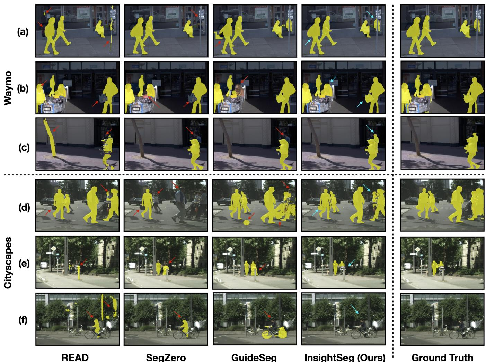  
Figure A: Qualitative results on both the Waymo and Cityscapes datasets. Yellow denotes the predicted segmentation masks, with ground truth shown in the final column. Red arrows highlight representative segmentation errors in the compared methods, while blue arrows indicate challenging regions correctly handled by InsightSeg.

## Sec. C: Qualitative Segmentation Results

We show our final qualitative segmentation results in Fig. A. Across both Waymo and Cityscapes, our method produces masks that adhere more closely to the labeling guidelines and better match the ground truth than the other evaluated methods.

## Sec. D: More Ablations

Robustness to Processing Order. Since our memory is built online, later samples benefit from insights learned from earlier correction episodes. This raises a natural question: whether the method depends strongly on the order in which samples are processed. Table B evaluates this efect by comparing the original dataset order with a randomly shufled order. The final results are very similar across both settings and require the same average number of refinement iterations. This suggests that the memory benefits are not tied to a particular sample order for a whole dataset; instead, the stored insights capture recurring correction patterns that remain useful across diferent processing sequences.

<table><tr><td colspan="2">Method|</td><td colspan="2">Before Refinement</td><td colspan="2">After Refinement</td></tr><tr><td>Metrics</td><td></td><td>Original</td><td>Random</td><td>Original</td><td>Random</td></tr><tr><td colspan="2">gIoU</td><td>78.85</td><td>77.24</td><td>83.51</td><td>83.24</td></tr><tr><td colspan="2">cIoU</td><td>82.88</td><td>82.09</td><td>87.68</td><td>86.43</td></tr><tr><td colspan="2">mPr</td><td>90.31</td><td>88.31</td><td>94.44</td><td>94.26</td></tr><tr><td colspan="2">mRec</td><td>86.58</td><td>85.97</td><td>87.55</td><td>86.71</td></tr><tr><td colspan="2">mDice</td><td>88.40</td><td>87.12</td><td>90.21</td><td>90.33</td></tr><tr><td colspan="2">Avg #iters</td><td>-</td><td>-</td><td>1.01</td><td>1.01</td></tr></table>

Table B: Efect of processing order. Similar performance under the original and random shufled orders indicates that memory benefits are not order-dependent.

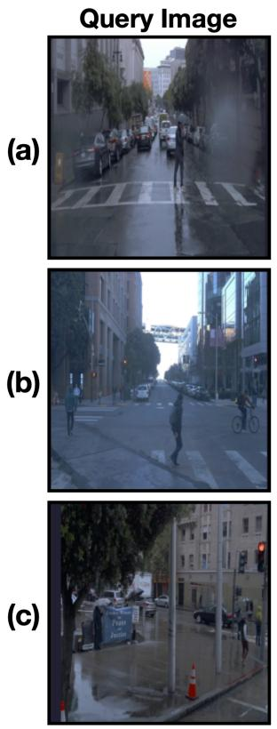

Global CLS similarity (top kr=3)  
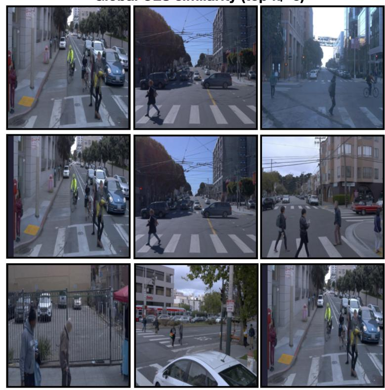

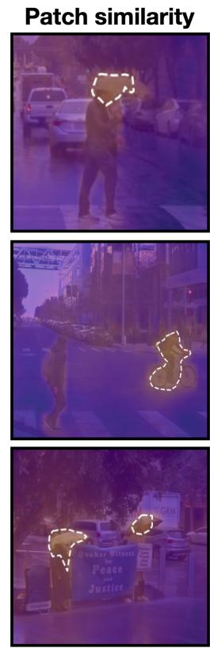  
Figure B: Qualitative comparison of patch vs global retrieval. Global CLS retrieval repeatedly returns similar street scenes, whereas patch similarity (zoomed in) localizes the guideline-relevant visual cues [(a),(c): umbrellas, (b): cyclist].

Qualitative Analysis of Patch-Level vs. Global Retrieval. Table 3 in the main paper quantitatively demonstrates the advantage of patch-based retrieval over global CLS retrieval. Figure B provides a qualitative explanation. Queries (a) and (c) contain umbrella-related cues, while (b) contains a cyclist. Global CLS similarity is dominated by overall street appearance, causing the same memory image to appear among the top three results for all queries despite their diferent local triggers. Patch similarity instead concentrates on the relevant regions, outlined in white, enabling more cue-specific retrieval.

Efect of swapping the base VLM. We use gemini-2.5- flash as the primary VLM to enable an apples-to-apples comparison with the stateless baseline. To examine whether the memory gains are specific to this model, we replace it with gemini-3-flash-preview while keeping the datasets, guidelines, and remaining pipeline unchanged. As shown in Fig. C and Table C, the stronger VLM improves the stateless baseline, but incorporating our patch-based memory produces substantially better first-pass and final segmentation performance. These results indicate that the benefits of reusable correction insights are not limited to the primary VLM configuration.

## Sec. E: Qualitative Examples of Correction Reuse

Fig. D illustrates three examples of cross-image correction reuse. In each case, the Supervisor first identifies a guideline violation, after which the Meta-Analyzer converts the successful correction into a reusable insight and anchors it to the corresponding support patches. When a similar visual cue appears in a later image, patch-level retrieval recalls the relevant insight before segmentation, allowing the Worker to produce the correct mask in its first pass. The examples cover: (a) including a carried backpack, (b) excluding a person depicted on a trafic sign, and (c) excluding a cyclist from the pedestrian mask.

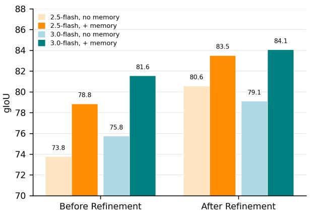  
Figure C: Efect of swapping the base VLM on gIoU. Our system improves both first-pass and final performance for both the models tested, showing that the gains are not restricted to the primary VLM settings.

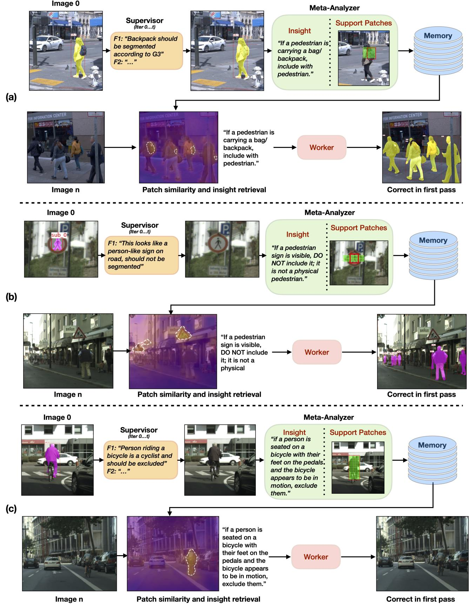  
Figure D: Examples of writing and retrieving visually grounded correction insights for guideline-consistent segmentation.

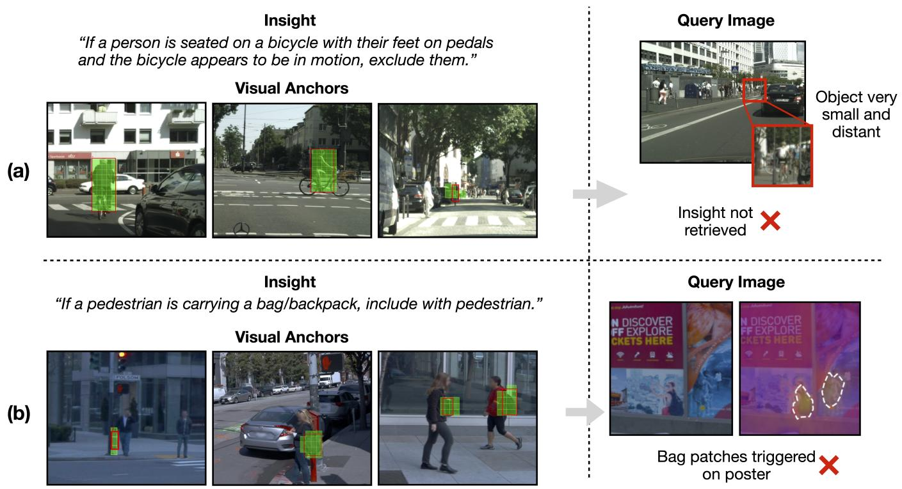  
Figure E: Some examples of failure cases. (a) A small and distant cyclist does not suficiently match the stored cyclist anchors, so the relevant insight is missed. (b) Person and bag depictions on a poster resemble the stored bag anchors, causing a false retrieval.

<table><tr><td>Model</td><td>Ref.</td><td>Mem.</td><td>gIoU cIoU</td><td>mPr mRec</td><td>mDice</td></tr><tr><td rowspan="2">2.5-flash</td><td>Before</td><td>x √</td><td>73.78 78.40 78.85 82.88</td><td>88.36 80.81 90.31 86.58</td><td>84.75 88.40</td></tr><tr><td>After</td><td>x √</td><td>80.57 86.70 83.51 87.68</td><td>91.06 84.78 94.44 87.55</td><td>87.20 90.21</td></tr><tr><td rowspan="2">3-flash</td><td>Before</td><td>x √</td><td>75.75 78.29 81.56 84.79</td><td>93.69 92.58</td><td>80.59 83.83 87.65 88.47</td></tr><tr><td>After</td><td>X √</td><td>79.10 85.47 84.07 88.67</td><td>91.26 84.78 95.17 87.98</td><td>87.90 91.43</td></tr></table>

Table C: Efect of swapping the base VLM. Patch-based memory improves overall first-pass and final segmentation (after refinement) performance with both gemini-2.5-flash and gemini-3-flash-preview, indicating that its benefits are not limited to the primary VLM configuration.

## Sec. F: Estimated Costs

Beyond improving segmentation quality, InsightSeg reduces API usage by preventing unnecessary refinement. We use stable gemini-2.5-flash, priced at USD\$0.30 per million input tokens and USD\$2.50 per million output tokens. At approximately 2,000 input and 200 output tokens, each Worker or Supervisor call costs about \$0.0011. A complete Worker-Supervisor iteration requires three API calls, whereas memory insertion and retrieval are performed locally using FAISS and incur no additional API cost. The complete serialized memory banks, including insights, visual anchors, and associated metadata, occupy only 869 KB for Waymo and 1.7 MB for Cityscapes. Consequently, retrieved insights reduce the average number of iterations from 2.66 to 1.01. Writing an insight requires one batched Meta-Analyzer call, but this occurs only for the 28.6% of samples that qualify as learning events. Overall, InsightSeg averages approximately 3.3 API calls and \$0.0036 per sample, compared with 8.0 calls and \$0.0088 for the memory-free system. For 1,000 samples, this corresponds to an average cost reduction from \$8.80 to \$3.60, or approximately 2.4× less than the no-memory baseline.

## Sec. G: Examples of Failure Cases

Fig. E shows two representative limitations of our method. In (a), the memory contains an applicable cyclist insight, but the cyclist in the query is too small and distant to preserve suficient visual similarity with its anchors. In (b), local patches depicting people and bags on a poster resemble the stored bag anchors, even though they do not correspond to physical pedestrians in the scene. These cases show that local matching can miss cues under substantial scale changes or retrieve visually similar cues without suficient scene context. Multiscale representations and semantic verification of retrieved cues could help address these limitations.

## Sec. H: Limitations and Future Work

As an online memory system, InsightSeg can reuse a correction only after encountering a related case; until then, it falls back to the underlying Worker-Supervisor refinement loop. Every reported run begins with an empty memory bank, so the observed gains already include this cold-start period and do not depend on preloaded insights. Our experiments focus on dataset-scale memory, while longer deployments may accumulate insights that become redundant or stale as visual conditions and labeling policies evolve, a case that text-level deduplication does not address.

Because insights are stored as explicit natural-language records rather than changing model weights, the memory bank remains directly inspectable and auditable. This creates a practical future path toward insight-level confidence tracking, manual auditing, and selective consolidation or retirement of stale insights without retraining the underlying models.