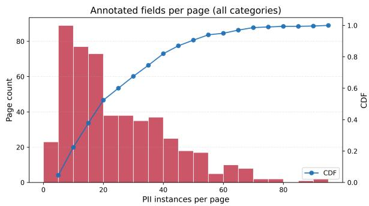
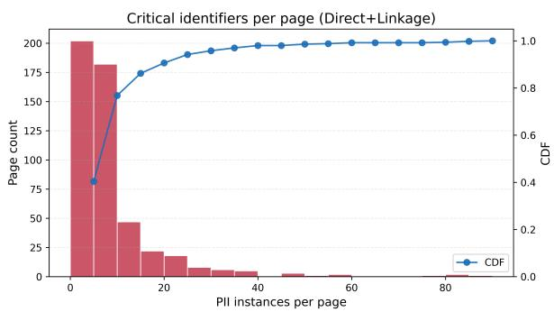
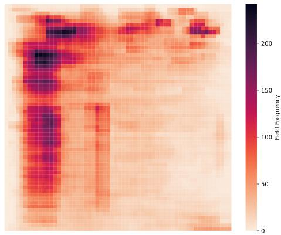
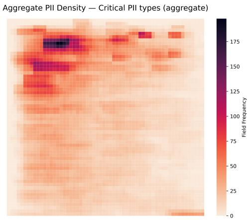
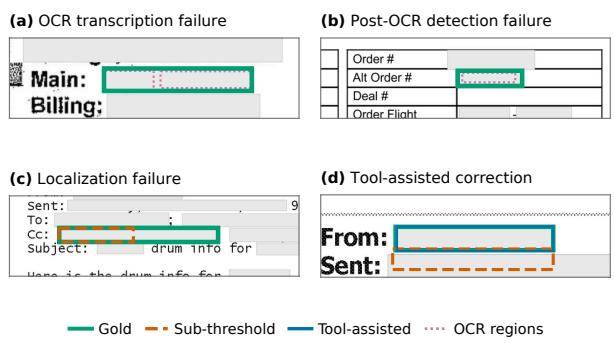

# LeakageBench: Document-Level Leakage Risk for Redacting Personally Identifiable Information in Document Images

Vishnu Prasad Vijaya Kumar<sup>1,2</sup> Santhosh Venkatesh<sup>2</sup> Ivan P. Yamshchikov<sup>1</sup>

<sup>1</sup>Center for Artificial Intelligence and Robotics (CAIRO),

Technical University of Applied Sciences Würzburg-Schweinfurt (THWS),

Würzburg, Germany

<sup>2</sup>DataX, Frankfurt am Main, Germany

vishnuprasad.vijayakumar@thws.de santhosh.venkatesh@datax.me

ivan.yamshchikov@thws.de

## Abstract

Real-world personally identifiable information (PII) redaction often operates on document images—scans, screenshots, and PDF renderings—where OCR errors, layout structure, and visual noise determine whether sensitive information is actually removed. Existing PII benchmarks are mostly text-centric and do not measure document-level redaction risk: a page remains unsafe if even one identifier is missed. We introduce LeakageBench, a challenge set of 500 document images with 11,954 GDPR-aligned PII annotations spanning direct identifiers, linkage keys, and contextual re-identification surfaces. We evaluate generic OCR pipelines, commercial and taskadapted OCR-dependent detectors, and OCRfree vision-language models using entity-level F1, group-wise leakage, and document-level leakage metrics. Code Interpreter raises GPT-5.5 localization F1 from 0.090 to 0.249, but critical page-level leakage remains 0.968. These results show that stronger detection and tool assistance improve localization without making most pages safe for release. LeakageBench provides a diagnostic benchmark for high-recall, spatially grounded PII redaction in document images.

## 1 Introduction

Organizations routinely redact personally identifiable information (PII) from scanned and rendered business documents. OCR errors, complex layouts, repeated identifiers, and visual noise make this more than a clean-text tagging problem. Most PII benchmarks measure span-level precision, recall, and F1 on text, while document-understanding benchmarks typically target selected key fields. Neither directly measures release safety: a page remains unsafe when any in-scope identifier remains visible. Evaluation must therefore capture both entity-level localization quality and residual page-level leakage.

Redaction presents an asymmetric operational trade-off. False positives unnecessarily obscure useful document content, whereas a single false negative can make a page unsafe to release. We therefore treat document-level leakage as a recalloriented complement to, rather than a replacement for, localization and typing F1, which also penalize over-redaction through unmatched predictions.

We introduce LeakageBench, a challenge set of 500 document-page images containing 11,954 localized PII annotations. Its GDPR-aligned schema distinguishes direct identifiers, linkage keys, and contextual re-identification surfaces. Using a shared image-space interface, LeakageBench exposes a stark deployment gap: even the strongest evaluated configuration leaks critical Direct+Linkage PII on 96.8% of applicable pages. Our diagnostics attribute these failures to schema coverage, OCR recoverability, detection, interface validity, and spatial grounding.

Our contributions are: (1) a controlled, densely annotated document-image redaction challenge set; (2) a privacy-oriented schema covering direct, linkage, and contextual identifiers; (3) release-oriented document-level leakage metrics reported alongside entity-level F1; and (4) a unified diagnostic evaluation identifying why OCR-dependent and OCRfree systems continue to leak PII.

## 2 Related Work

Text-based PII detection and anonymization. Text-based benchmarks cover legal documents, regulatory categories, student writing, and clinical narratives (Pilán et al., 2022; Gambarelli et al., 2023; Mo et al., 2025; Holmes et al., 2024; Stubbs et al., 2015). They establish methods for spanlevel PII detection and anonymization, but exclude document-image artifacts, spatial localization, and page-level release safety.

Document-image understanding. FUNSD, SROIE, CORD, and DocVQA evaluate form understanding, receipt extraction, OCR, and visually grounded question answering (Jaume et al., 2019; Huang et al., 2021; Park et al., 2019; Mathew et al., 2020). BuDDIE broadens coverage to multiple business-document tasks and includes person- and address-related fields (Wang et al., 2025). However, these benchmarks target task-specific extraction rather than exhaustive PII localization and residual redaction leakage.

OCR-based and OCR-free document models. OCR-based models such as LayoutLM and LayoutLMv3 combine recognized text with twodimensional layout (Xu et al., 2019; Huang et al., 2022), whereas OCR-free models such as Donut generate structured outputs directly from document images (Kim et al., 2022). For redaction, the former can propagate OCR and text-to-box alignment errors, while the latter must jointly learn visual reading and spatial localization. LeakageBench evaluates both through a common image-space prediction interface.

Leakage-oriented privacy evaluation. PRvL evaluates LLM-based PII redaction and residual exposure (Garza et al., 2025); ProPILE studies privacy leakage through targeted probing (Kim et al., 2023); and RedactBuster shows that redacted documents can remain vulnerable to downstream inference (Beltrame et al., 2024). These works motivate exposure-oriented evaluation, but do not provide a localized document-image benchmark with a pagelevel release criterion.

## 3 Task and Evaluation Protocol

## 3.1 Task definition

We evaluate PII redaction on document images. Given a page image—a scan, screenshot, or PDF rendering—a system must identify every visible region containing personally identifiable information, assign each region a schema type, and optionally extract its text value. Each gold instance is represented by an image-space bounding box, a fine-grained PII type, a risk group, and an optional verbatim value string.

The task is redaction-oriented rather than textonly: predictions must be spatially grounded so that the sensitive region can be masked on the image. This makes recall the primary safety concern. A page remains unsafe if even one in-scope identifier is missed, regardless of average entity-level performance. Inference is page-local: each rendered page is processed independently, and prediction–gold matching is performed only within that page. No cross-page context is provided. Accordingly, DocLeak is computed over document pages; evaluating multi-page contextual inference remains future work.

## 3.2 Prediction format

A system outputs a set of predicted instances

$$
\boldsymbol { \hat { y } } = \{ ( \hat { b } _ { j } , \hat { t } _ { j } , \hat { v } _ { j } , \hat { s } _ { j } ) \} _ { j = 1 } ^ { M } ,
$$

where $\hat { b } _ { j } \ = \ ( x _ { \operatorname* { m i n } } , y _ { \operatorname* { m i n } } , x _ { \operatorname* { m a x } } , y _ { \operatorname* { m a x } } )$ is an axisaligned bounding box in pixels, $\hat { t } _ { j }$ is a PII type, $\hat { v } _ { j }$ is an optional extracted value string, and $\hat { s } _ { j } \in [ 0 , 1 ]$ is an optional confidence score. This unified interface supports both OCR-assisted pipelines, where boxes and values are derived from OCR spans, and OCR-free vision-language models.

## 3.3 Instance matching

We score predictions using one-to-one matching within each page. A predicted box <sup>ˆ</sup>b is eligible to match a ground-truth box b when IoU $\begin{array} { r } { \lceil ( \hat { b } , b ) \geq \tau } \end{array}$ We enumerate all eligible pairs and greedily select them in descending IoU order, ensuring that each prediction and ground-truth instance is used at most once. A selected pair counts as a localization match regardless of type and as a typed match only when the predicted and ground-truth PII types agree. When values are available, value correctness is evaluated only for matched pairs.

Headline DocLeak uses type-aware matching: a gold instance is counted as protected only when an IoU-eligible prediction has the same PII type. This conservative criterion is used in Tables 3–4. Diagnostic attribution additionally uses type-agnostic matching because a wrongly typed but correctly localized box would still mask the identifier.

## 3.4 Metrics

We report entity-level F1 and document-level leakage. The former measures average detection quality; the latter measures whether any PII remains unmatched on a page.

Entity-level performance. $\mathrm { F 1 } _ { \mathrm { l o c } }$ is page-macro localization F1 using type-agnostic matching. $\mathrm { F 1 _ { t y p e } }$ requires both IoU $\geq \ \tau$ and the correct PII type, and is macro-averaged over ground-truth types. Unless stated otherwise, $\tau = 0 . 7 5$

Document-level leakage. A page leaks if at least one in-scope ground-truth instance is unmatched:

$$
\mathrm { D o c L e a k } = \frac { 1 } { | \mathcal { D } | } \sum _ { d \in \mathcal { D } } \mathcal { H } [ d \mathrm { ~ l e a k s } ] ,\tag{1}
$$

where D contains pages with at least one in-scope identifier. We report DocL $\mathrm { \Omega _ { \mathrm { \Omega } } } \mathrm { e a k _ { a l l } }$ over all PII and DocLea $\mathrm { \zeta _ { c r i t } }$ over Direct and Linkage identifiers.

Headline DocLeak uses type-aware matching. The error analyses additionally use type-agnostic matching to measure whether an identifier would be spatially masked despite an incorrect type. DocLeak penalizes unmatched gold instances but does not penalize extra predictions. We therefore report it jointly with $\mathrm { F l } _ { \mathrm { l o c } }$ and $\mathrm { F l _ { t y p e } } .$ , whose precision terms count unmatched predictions as false positives. One-to-one IoU matching prevents a single prediction from receiving credit for multiple gold instances.

## 4 Dataset: Collection and Composition

## 4.1 Sources and generation process

LeakageBench contains 500 document-page images sampled from public operational-style business documents. We position the dataset as a challenge set for stress-testing image-based PII redaction under heterogeneous layouts, dense tables, scanned correspondence, mixed acquisition channels, and visual degradation. Rather than claiming to represent all deployment settings, LeakageBench covers a focused slice of business-document redaction workflows where identifiers appear across forms, invoices, emails, letters, and free-form correspondence.

Source A: OCR-IDL (public archive documents). We sample 103 documents (113) pages from OCR-IDL (Biten et al., 2022), which provides standardized OCR outputs for documents from the UCSF Industry Documents Library (IDL) <sup>1</sup>, a large digital archive of industry documents hosted by UCSF. OCR-IDL is valuable for our setting because it includes heterogeneous, historically scanned/archived pages with substantial layout and rendering variation.

Source B: VRDU Ad-Buy Forms (structured, table-heavy invoices/receipts). We sample 107 documents (222) pages from the VRDU Ad-buy Forms corpus released by Google Research (Wang et al., 2023). These documents are public Federal Communications Commission $( \mathrm { F C C } ) ^ { 2 }$ filings and are dominated by structured invoices/receipts with multi-column layouts and repeated/nested table structures, providing a concentrated stress-test for localization within dense tabular regions.

Source C: Unstructured operational-style documents (free-form correspondence). We sample the remaining 81 documents (165) pages from FCC public filings, selecting free-form pages that resemble internal operational documents: email threads and attachments, letters and memos, scanned correspondence, and mixed-format “file” pages. Compared to invoice- or form-heavy sources, these pages exhibit less templated structure and place identifiers in narrative body text, signatures, headers/footers, and embedded attachments. This source therefore stresses redaction systems under realistic cross-field co-reference (the same individual referenced across multiple regions) and non-field PII placement.

## 4.2 Identifiability-first scope

Privacy regulation is triggered by identifiability, not by whether a string resembles a name. Under the GDPR, personal data includes identifiers such as names, identification numbers, and location data (Art. 4(1)) (European Union, 2016). Recital 26 emphasizes that identifiability must consider all means reasonably likely to be used, including singling out and linkage by other parties (European Union, 2016). Similarly, the CPRA/CCPA defines personal information as data that could reasonably be linked (directly or indirectly) to a consumer or household (California Legislature, 2025), and explicitly recognizes that personal information can exist in physical formats, including paper documents and printed images (California Legislature, 2025). In U.S. standards, PII is likewise defined to include information that is linked or linkable to an individual (National Institute of Standards and Technology, 2010).

Consequently, a redaction benchmark must treat as in-scope not only direct identifiers, such as names and contacts, but also linkage keys (policy numbers, case IDs, customer IDs) that resolve to a person through common workflows.

## 4.3 PII schema: re-identification surfaces

We annotate fine-grained labels for auditing, but report results using three privacy-aligned groups that reflect how identifiability arises in operational document workflows: (i) direct identification, (ii) lookup/linkage, and (iii) contextual inference. Table 1 summarizes the grouping used for reporting and analysis and lists the fine-grained labels covered under each group.

Rationale. Direct identifiers explicitly reveal identity or contact information (European Union, 2016; California Legislature, 2025). Linkage keys identify via lookup: they may appear innocuous on the page but act as stable keys into organizational systems or registries, consistent with standards that treat unique identifying numbers and codes as identifying (National Institute of Standards and Technology, 2010; U.S. Department of Health and Human Services, 2025) and with CPRA/CCPA “unique identifiers” (California Legislature, 2025). Finally, we annotate contextual identifiers (e.g., dates and entity fields) because they increase identifiability through co-occurrence and linkage in real documents (European Union, 2016; National Institute of Standards and Technology, 2010). We do not assume each contextual field is personal data in isolation; rather, it captures re-identification surfaces that amplify risk when combined with direct identifiers or linkage keys.

## 4.4 Dataset statistics and diagnostic views

Table 2 reports composition and label volume for LeakageBench (released) and for each source, including document and page counts and PII group totals. Redaction safety is determined by documentlevel worst cases. We therefore provide diagnostic views that expose the benchmark’s risk profile: (i) the identifiers-per-page distribution (Fig. 1) and (ii) the spatial concentration of PII on the page (Fig. 2).

Identifiers-per-page distribution. Figure 1 shows the distribution of PII instances per page. This distribution is critical for safety: a page leaks if any identifier is missed, so pages with many identifiers place disproportionate pressure on redaction systems. Across the collected pool, we annotate 11,954 PII instances over 500 pages (23.90 per page on average), including 4,315 critical identifiers from the Direct and Linkage categories (8.63 per page on average). We therefore report document-level leakage alongside entity-level scores (Sec. 3.4).

Spatial PII heatmap. Figure 2 visualizes where identifiers appear on the page. We partition each image into a regular grid of non-overlapping 14×14- pixel patches (stride = 14), yielding 3,600 patches per page (60 × 60). For each patch, we record which PII categories overlap its area and aggregate the results across all pages. The resulting heatmap distinguishes benchmarks where PII concentrates in predictable regions-such as headers or signatures-from those where it is distributed throughout tables and body text. We report both an “all PII” heatmap and a “critical PII” heatmap restricted to Direct+Linkage identifiers.

Document types. LeakageBench is dominated by operational business documents: invoices, emails, forms, letters/correspondence, and file-like pages. Full page-type composition by source is reported in Appendix D.

## 4.5 Annotation procedure

All annotations were produced by the first two authors. The 500 page images were randomly split equally and annotated independently following the guidelines in Appendix A. Annotators labeled entity instances using tight bounding boxes around visible PII spans and transcribed value strings verbatim (no normalization); multi-line items use the delimiter “\n”. We annotate fine-grained entity types and additionally report privacy-aligned group aggregates (Direct/Linkage/Contextual) for analysis.

## 4.6 Annotation quality control

To assess annotation consistency, each annotator contributed a 10% stratified sample of their assigned pages for cross-annotation by the other annotator (50 images / pages total). Disagreements were resolved by joint adjudication to form a single gold set.

Inter-annotator agreement is measured with Cohen’s κ over entity instances after alignment. We align annotations via one-to-one bipartite matching using IoU ≥ τ with τ=0.75. A matched pair is counted as agreement only if both boxes share the same fine-grained type; spatial overlaps with a type mismatch are counted as disagreements. Any annotation with no IoU≥ 0.75 counterpart from the other annotator is treated as a miss (disagreement). Under this protocol, we obtain κ = 0.979 on the cross-annotated subset.

<table><tr><td>Group</td><td>Fine-grained labels (annotated)</td><td>Basis (examples)</td></tr><tr><td>Direct identifiers</td><td>PERSON NAME, ADDRESS, EMAIL ADDRESS, PHONE NUMBER</td><td>GDPR; CPRA/CCPA (Euro- pean Union, 2016; Califor- nia Legislature, 2025)</td></tr><tr><td>Linkage keys</td><td>CUSTOMER ID, EMPLOYEE ID, POLICY NO., ID CARD NO., CASE/FILE/REFERENCE NO., CONTRACT/INVOICE/CHEQUE NO., REGISTRATION NO., CALL SIGN, DA CASE NUMBER</td><td>NIST; HIPAA; CPRA/C- CPA (National Institute of Standards and Technology, 2010; U.S. Department of Health and Human Services, 2025; California Legislature, 2025)</td></tr><tr><td>Contextual identi- fiers</td><td>DATE, LOCATION, ORGANIZATION NAME, BUSINESS ID</td><td>GDPR Recital 26; NIST (European Union, 2016; Na- tional Institute of Standards and Technology, 2010)</td></tr></table>

Table 1: Privacy-aligned schema groups and supporting regulatory anchors. We annotate fine-grained labels and additionally report aggregated results by group.



  
Figure 1: Per-page PII density in LeakageBench (histogram with CDF overlay). Left: all annotated PII. Right: safety-critical identifiers (Direct+Linkage).

## 5 Experimental Setup

We evaluate off-the-shelf systems under one unified image-level redaction protocol. The baselines cover two architectures. First, OCR-dependent systems read the page with OCR, detect PII in the recognized text, and project detections back to image coordinates using OCR word boxes. Within this family, we compare a generic redaction pipeline against stronger commercial and taskadapted privacy detectors. Second, OCR-free vision-language models receive the page image directly and predict PII regions without an explicit OCR stage. All systems are converted to the same prediction format (Sec. 3.2) and evaluated with entity-level localization, localization+typing, document-level leakage, schema coverage, and supported-type leakage (Sec. 3.4). No system is trained or tuned on LeakageBench.

## 5.1 OCR-dependent baselines

All OCR-dependent baselines use the same imageto-box pipeline: OCR extracts text and word-level boxes, a privacy detector predicts typed PII spans over the OCR text, and each span is mapped back to the page by merging the corresponding word boxes.

Generic OCR-dependent redaction. We use Microsoft Presidio Image Redactor (Microsoft, 2026) as the generic OCR-dependent baseline. Presidio applies OCR, detects PII spans with Presidio Analyzer, and returns image-space redaction boxes through OCR word alignment. We use Tesseract (Smith, 2007) for this baseline and map Presidio entity types to the LeakageBench schema with a fixed mapping.

Commercial and task-adapted OCR-dependent detectors. We evaluate stronger privacy-oriented detectors on top of Amazon Textract OCR (Amazon Web Services, 2026b): GLiNER-base (Zaratiana et al., 2024), Presidio-best (GLiNER restricted), GLiNER multi-PII (Zaratiana, 2024), NVIDIA GLiNER PII (NVIDIA, 2025), GLiNER2 (Zaratiana et al., 2025), Google DLP (Google Cloud, 2026), Amazon Comprehend PII (Amazon Web Services, 2026a) and an OpenAI Privacy Filter (OpenAI, 2026) pipeline. These systems test whether stronger text-side PII detectors are sufficient once document-image constraints—OCR errors, dense layouts, repeated identifiers, span fragmentation, and box reconstruction—are introduced.





Figure 2: Spatial PII density aggregated over pages. Left: all annotated fields. Right: critical identifiers (Direct+Linkage).
<table><tr><td>Source</td><td>#Docs</td><td>#Pages</td><td>Direct</td><td>Linkage</td><td>Contextual</td><td>Other</td><td>Critical/Page</td></tr><tr><td>Source A (OCR-IDL)</td><td>103</td><td>113</td><td>1,143</td><td>109</td><td>445</td><td>17</td><td>11.08</td></tr><tr><td>Source B (VRDU Ad-Buy)</td><td>107</td><td>222</td><td>673</td><td>221</td><td>6,245</td><td>192</td><td>4.03</td></tr><tr><td>Source C (FCC free-form)</td><td>81</td><td>165</td><td>1,963</td><td>206</td><td>710</td><td>30</td><td>13.15</td></tr><tr><td>Total</td><td>291</td><td>500</td><td>3,779</td><td>536</td><td>7,400</td><td>239</td><td>8.63</td></tr></table>

Table 2: Source composition and label volume. Other aggregates non-group labels (e.g., Signature, Agency Code/Ref, Advertiser Ref). Critical/Page is (Direct+Linkage)/Pages.

Schema alignment. All OCR-dependent systems are scored against the LeakageBench schema. Unsupported entity types count as missed detections under full-schema evaluation. We therefore report schema coverage and supported-type leakage to separate taxonomy limitations from empirical detection and localization failures.

Appendix B summarizes the OCR engines, detector settings, schema mappings, and conversion rules for each OCR-dependent baseline.

## 5.2 OCR-free vision-language baselines

OCR-free vision-language localization. We evaluate Qwen3-VL-32B (Bai et al., 2025) and InternVL3-38B (Zhu et al., 2025) as OCR-free vision-language baselines because they support explicit 2D grounding from image input. Unlike OCR-dependent systems, these models receive the page image directly and are prompted to return PII types, values, confidence scores, and bounding boxes. Predicted boxes are converted to image coordinates and evaluated under the same localizationand-typing protocol as all other systems. Coordinate conventions and parsing rules are summarized in Appendix B; full prompt templates are provided in Appendix C.

Closed OCR-free models. We additionally evaluate GPT-5.4 using single-pass vision and GPT-5.5 in two configurations: single-pass vision and Code Interpreter-assisted inspection. All configurations use the same PII taxonomy and semantic instructions and return structured predictions with integer bounding boxes in a normalized 0–999 coordinate system. For GPT-5.5, we use high image detail and medium reasoning effort; in the tool-assisted configuration, Code Interpreter is required to inspect the page and may crop or zoom regions before returning the final prediction. All outputs are processed using the same parsing, coordinate conversion, and evaluation pipeline as the other OCR-free models.

Prompt-driven schema coverage. For OCRfree systems, the full LeakageBench schema is supplied in the prompt. Their schema coverage is therefore 1.0 by configuration: the model is allowed to emit every benchmark type, but this does not imply reliable detection. Empirical failures are captured by entity-level F1, document-level leakage, group leakage, and output-validity rates.

Why not LayoutLM-style trained baselines. LeakageBench is evaluated as an off-the-shelf challenge set: systems must run without training on the benchmark and must return PII types with imagespace boxes. LayoutLM-style document NER models typically require supervised fine-tuning, task-specific heads, OCR-token alignment, and a train/dev/test split. We therefore leave layoutaware trained models to a future trained-baseline track.

## 6 Results

Table 3 reports full-schema performance at IoU $\tau = 0 . 7 5$ under the unified prediction format. To assess sensitivity to box tightness, Appendix G reports results at $\tau \in \{ 0 . 5 0 , 0 . 7 5 , 0 . 9 5 \}$ . We report localization F1, localization+typing F1, documentlevel leakage over all identifiers, and leakage over safety-critical Direct+Linkage identifiers. Unless stated otherwise, unsupported schema types, invalid outputs, and out-of-bounds boxes are counted as missed detections.

For systems with restricted taxonomies, we additionally report supported-type leakage in Table 4, where gold labels are filtered to the entity types each system can emit. Schema coverage and full-schema group-wise leakage are reported in Appendix E and Appendix F. Valid denotes the fraction of pages producing parseable, schemaconformant outputs. Malformed or unusable outputs are scored as empty prediction sets; individual invalid boxes are rejected and receive no credit.

## 6.1 Analysis

Overall safety picture. Table 3 shows that stronger systems improve entity-level localization without achieving document-level safety. Amazon Comprehend PII obtains the highest localization F1 $( \mathrm { F 1 } _ { \mathrm { l o c } } = 0 . 3 0 4 )$ , while GPT-5.5 with Code Interpreter obtains the highest typed F1 $( \mathrm { F 1 _ { t y p e } = }$ 0.119). Nevertheless, both have DocLeak<sub>crit</sub> = 0.968, showing that better average detection does not guarantee that a page is safe to release.

This conclusion is robust to the matching scope. Crediting any IoU-eligible box regardless of its predicted type reduces the DocL $\mathrm { \mathbf { \ k } \ e a k _ { \mathrm { c r i t } } }$ range from 0.968–1.000 under headline type-aware matching to 0.945–1.000 under type-agnostic matching. Thus, the high leakage rates are not primarily caused by type-label errors.

Leakage is severe, not marginal. To complement binary DocLeak, we count unmatched critical identifiers per page. Across systems, leaking pages retain 5.3–8.7 critical identifiers on average. Even the lowest-severity system misses 5.3 per leaking page (median 4; P90 11), corresponding to approximately 66% of critical identifiers across applicable pages. Thus, leakage typically reflects multiple exposed identifiers rather than an isolated miss. Complete per-system severity statistics are reported in Table 13.

Schema coverage is not enough. Schema coverage diagnostics are reported in Appendix E. Restricted systems such as Presidio, Presidio-best (GLiNER restricted), and Amazon Comprehend PII cover only 20.8% of benchmark types, while Google DLP and the OpenAI Privacy Filter cover 25.0%. These restricted systems cover Direct identifiers but miss most Linkage keys under our schema mapping, making lookup-style identifiers a persistent coverage gap. However, full label coverage does not solve the task either: GLiNER-base, GLiNER multi-PII, and NVIDIA GLiNER PII are configured with full schema coverage, yet their Linkage leakage remains near-total in Appendix F. This suggests that sparse lookup keys, dense tables, OCR fragmentation, and layout variation remain difficult even when the label set is available.

Supported-schema leakage isolates detection failures. Table 4 filters gold labels to the types each system can emit and reports leakage by privacy group. Even under this easier setting, leakage remains high: full-schema OCR-dependent systems still leak on more than 94% of Direct pages and more than 96% of Linkage pages. This shows that failures are not only taxonomy mismatches; OCR errors, repeated identifiers, span fragmentation, and box reconstruction also contribute to residual exposure.

OCR-dependent failure attribution. Full results appear in Appendix Tables 14–15. Using typeagnostic matching, we attribute each leaked critical identifier to an OCR miss, a detector miss with zero box overlap, or a box/alignment failure with positive overlap below $\tau = 0 . 7 5 ;$ one-to-one assignment conflicts account for at most 0.2%. Box/alignment failure is the largest category for seven of nine OCR-dependent systems, accounting for 45.9– 84.5% of their attributable leaks, while detector misses vary from 15.5 to 48.8%. Independently of any detector, Textract cannot recover 623/4,280 value-bearing critical annotations (14.6%), compared with 765/4,280 (17.9%) for Tesseract. Performance differences among the Textract-based pipelines therefore arise primarily downstream of their shared OCR stage.

<table><tr><td>System</td><td>OCR</td><td> $\mathbf { F 1 } _ { \mathrm { l o c } }$  ←</td><td> $\mathbf { F 1 } _ { \mathrm { t y p e } }$  个</td><td> $\mathbf { D o c L e a k } _ { \mathrm { a l l } } \downarrow$ </td><td> $\mathbf { \overline { { D o c L e a k _ { \mathrm { c r i t } } } } }$ </td><td>↓ Valid↑</td></tr><tr><td colspan="7">Generic baseline (Tesseract OCR)</td></tr><tr><td>Presidio</td><td>Tesseract</td><td>0.137</td><td>0.048</td><td>0.994</td><td>0.990</td><td>0.996</td></tr><tr><td colspan="7">Shared AWS Textract OCR (detector varies; OCR is fixed)</td></tr><tr><td>Presidio-best (GLiNER restr.)</td><td>Textract</td><td>0.248</td><td>0.064</td><td>0.996</td><td>0.986</td><td>1.000</td></tr><tr><td>GLiNER-base</td><td>Textract</td><td>0.216</td><td>0.063</td><td>0.988</td><td>0.978</td><td>1.000</td></tr><tr><td>GLiNER-multi-PII</td><td>Textract</td><td>0.245</td><td>0.091</td><td>0.990</td><td>0.972</td><td>1.000</td></tr><tr><td>NVIDIA GLiNER PII</td><td>Textract</td><td>0.288</td><td>0.109</td><td>0.992</td><td>0.986</td><td>1.000</td></tr><tr><td>GLiNER2</td><td>Textract</td><td>0.156</td><td>0.065</td><td>1.000</td><td>0.994</td><td>0.998</td></tr><tr><td>Amazon Comprehend PII</td><td>Textract</td><td>0.304</td><td>0.085</td><td>0.992</td><td>0.968</td><td>1.000</td></tr><tr><td>OpenAI Privacy Filter</td><td>Textract</td><td>0.164</td><td>0.055</td><td>0.996</td><td>0.990</td><td>0.806</td></tr><tr><td>Vendor-managed OCR</td><td></td><td></td><td></td><td></td><td></td><td></td></tr><tr><td colspan="7">Google DLP Vendor 0.076</td></tr><tr><td>OCR-free vision-language models (no separate OCR stage)</td><td></td><td></td><td>0.013</td><td>1.000</td><td>1.000</td><td>1.000</td></tr><tr><td colspan="7"></td></tr><tr><td>Qwen3-VL-32B InternVL3-38B</td><td></td><td>0.073 0.012</td><td>0.046 0.019</td><td>1.000</td><td>0.998</td><td>0.666</td></tr><tr><td>GPT-5.4</td><td></td><td>0.044</td><td>0.031</td><td>1.000</td><td>1.000</td><td>0.540</td></tr><tr><td>GPT-5.5</td><td></td><td>0.090</td><td>0.050</td><td>1.000 1.000</td><td>1.000 0.990</td><td>1.000</td></tr><tr><td></td><td></td><td></td><td></td><td></td><td></td><td>1.000</td></tr><tr><td>GPT-5.5 + Code Interpreter</td><td></td><td>0.249</td><td>0.119</td><td>0.990</td><td>0.968</td><td>1.000</td></tr></table>

Table 3: Full-schema results on LeakageBench at $\mathrm { I o U } \tau = 0 . 7 5$ . Textract systems share identical OCR, isolating detector differences. $\mathrm { F l _ { l o c } }$ is page-macro type-agnostic localization F1; $\mathrm { F 1 _ { t y p e } }$ also requires the correct type. DocL $\mathbf { \hat { \Pi } } _ { \mathbf { \tilde { \Pi } } } \mathbf { e a k } _ { \mathrm { a l l } }$ and DocL $\mathbf { \Psi } _ { \mathbf { \Lambda } ^ { \mathrm { e a k _ { \mathrm { c r i t } } } } }$ are the fractions of pages leaking any identifier and any Direct+Linkage identifier, respectively. Unsupported types and invalid outputs count as misses; Table 4 controls for schema coverage. Valid denotes parseable, schema-conformant page outputs. Bold marks the best result, including ties.

Formatting versus localization in OCR-free VLMs. Table 5 separates interface failures from failures on valid outputs using a common denominator of leaked critical identifiers. Interface failures account for 27.8% and 36.9% of leakage for Qwen3-VL-32B and InternVL3-38B, respectively, but none for GPT-5.4 or either GPT-5.5 configuration. Among residual leaked critical instances, sub-threshold boxes account for 51.7% for Qwen3-VL-32B, 83.5% for GPT-5.4, 96.1% for GPT-5.5, and 98.9% for GPT-5.5 with Code Interpreter. These percentages describe the composition of the errors that remain, not the overall localization-failure rate. A larger box-failure share can therefore coexist with improved $\mathrm { F l _ { l o c } }$ when total leakage decreases and zero-overlap misses decline more sharply. InternVL3-38B instead exhibits a larger share of zero-overlap misses (35.1%). Thus, interface reliability is necessary but insufficient; spatial localization remains the dominant limitation for the GPT configurations and Qwen3- VL-32B.

  
Figure 3: Representative failure modes. Panels (a)–(c) use GLiNER-multi-PII with Textract; panel (d) compares GPT-5.5 single-pass and tool-assisted localization. Green denotes gold boxes, orange dashed boxes subthreshold predictions, blue tool-assisted predictions, and magenta dotted boxes OCR regions.

Tool assistance improves OCR-free localization, but leakage remains high. Figure 3 illustrates these failures and a tool-assisted localization correction. Within GPT-5.5, Code Interpreter raises $\mathrm { F l } _ { \mathrm { l o c } }$ from 0.090 to 0.249 and $\mathrm { F l _ { t y p e } }$ from 0.050 to 0.119. It reduces DocL $\mathrm { \mathbf { \ k } } _ { \mathrm { { c r i t } } }$ from 0.990 to 0.968 and reduces Direct and Contextual leakage from 0.956 to 0.887 and from 0.986 to 0.908, respectively. Linkage leakage nevertheless remains 0.964. Tool-assisted inspection therefore improves spatial grounding substantially, but does not yet provide release-level redaction safety.

<table><tr><td>System</td><td>OCR</td><td>Coverage↑</td><td>Unsup. pages↓</td><td>Directsup↓</td><td>Linkagesup↓</td><td>Contextualsup↓</td><td>Allsup↓</td></tr><tr><td colspan="8">Restricted schema coverage (unsupported gold types are excluded)</td></tr><tr><td>Presidio</td><td>Tesseract</td><td>0.208</td><td>0.900</td><td>0.973</td><td></td><td>0.923</td><td>0.990</td></tr><tr><td>Presidio-best</td><td>Textract</td><td>0.208</td><td>0.900</td><td>0.967</td><td></td><td>0.942</td><td>0.992</td></tr><tr><td>GLiNER2</td><td>Textract</td><td>0.958</td><td>0.094</td><td>0.971</td><td>0.985</td><td>0.963</td><td>1.000</td></tr><tr><td>Google DLP</td><td>Vendor</td><td>0.250</td><td>0.762</td><td>1.000</td><td></td><td>0.990</td><td>0.998</td></tr><tr><td>Amazon Comprehend PII</td><td>Textract</td><td>0.208</td><td>0.900</td><td>0.908</td><td></td><td>0.873</td><td>0.968</td></tr><tr><td>OpenAI Privacy Filter</td><td>Textract</td><td>0.250</td><td>0.850</td><td>0.971</td><td>0.994</td><td>0.991</td><td>0.990</td></tr><tr><td colspan="8">Full schema coverage with shared AWS Textract OCR (detector varies; OCR and schema are fixed)</td></tr><tr><td colspan="8">GLiNER-base</td></tr><tr><td>GLiNER-multi-PII</td><td>Textract Textract</td><td>1.000 1.000</td><td>0.000 0.000</td><td>0.954 0.950</td><td>0.967 0.973</td><td>0.924 0.908</td><td>0.988 0.990</td></tr><tr><td>NVIDIA GLiNER PII</td><td>Textract</td><td>1.000</td><td>0.000</td><td>0.942</td><td>0.967</td><td>0.916</td><td>0.992</td></tr><tr><td colspan="8">Full schema coverage without a separate OCR stage (OCR-free VLMs)</td></tr><tr><td colspan="8">Qwen3-VL-32B</td></tr><tr><td>InternVL3-38B</td><td></td><td>1.000 1.000</td><td>0.000 0.000</td><td>0.990 1.000</td><td>0.982 1.000</td><td>0.975 0.998</td><td>1.000 1.000</td></tr><tr><td>GPT-5.4</td><td></td><td>1.000</td><td>0.000</td><td>0.998</td><td>0.988</td><td>0.990</td><td>1.000</td></tr><tr><td>GPT-5.5</td><td></td><td>1.000</td><td>0.000</td><td>0.956</td><td>0.994</td><td>0.986</td><td>1.000</td></tr><tr><td>GPT-5.5 + Code Interpreter</td><td></td><td>1.000</td><td>0.000</td><td>0.887</td><td>0.964</td><td>0.908</td><td></td></tr><tr><td></td><td></td><td></td><td></td><td></td><td></td><td></td><td>0.990</td></tr></table>

Table 4: Supported-schema leakage at IoU τ = 0.75. Coverage is the fraction of benchmark types supported; Unsup. pages contain at least one unsupported gold type. Group scores retain only supported gold types. The full-schema Textract block fixes OCR and schema, isolating the detector. Bold marks the best coverage within the restricted-schema block and the lowest leakage within each full-schema block. Restricted-schema leakage is not ranked because supported type sets differ. Dashes denote no supported group type or no separate OCR stage.
<table><tr><td>System</td><td>Valid ↑</td><td>Leaked crit.</td><td>Interface ↓</td><td>Zero-IoU ↓</td><td>Box fail↓</td><td>Assignment↓</td></tr><tr><td>Qwen3-VL-32B</td><td>.666</td><td>4,013</td><td>27.8</td><td>20.5</td><td>51.7</td><td>0.0</td></tr><tr><td>InternVL3-38B</td><td>.540</td><td>4,274</td><td>36.9</td><td>35.1</td><td>28.0</td><td>0.0</td></tr><tr><td>GPT-5.4</td><td>1.000</td><td>4,060</td><td>0.0</td><td>16.5</td><td>83.5</td><td>0.0</td></tr><tr><td>GPT-5.5</td><td>1.000</td><td>3,787</td><td>0.0</td><td>3.9</td><td>96.1</td><td>0.0</td></tr><tr><td>GPT-5.5 + Code Interpreter</td><td>1.000</td><td>2,549</td><td>0.0</td><td>0.9</td><td>98.9</td><td>0.2</td></tr></table>

Table 5: Error attribution for leaked Direct and Linkage identifiers from OCR-free VLMs at IoU = 0.75, using type-agnostic matching. Attribution columns are percentages of the leaked critical instances shown in the second numeric column and sum to 100%. Interface denotes identifiers on pages without a fully valid output; Zero-IoU denotes no overlapping prediction; Box fail denotes positive overlap below the IoU threshold; and Assignment denotes one-to-one matching conflicts.

Takeaway. LeakageBench is best viewed as a redaction-safety challenge set rather than a leaderboard where systems differ only by small margins. The benchmark exposes complementary failure modes: restricted taxonomies omit identifier groups, OCR-dependent pipelines propagate recognition and alignment errors, and OCR-free VLMs remain limited by spatial grounding. Code Interpreter substantially improves GPT-5.5 localization, but the resulting system still leaks critical PII on 96.8% of applicable pages. These findings motivate systems that combine broad schema coverage, robust visual reading, and tight, high-recall localization.

## Ethical, Legal, and Release Protocol

LeakageBench is intended for defensive research on document-redaction safety. Although the source documents originate from public collections, combining real document images with fine-grained PII annotations introduces privacy and dual-use risks. The document images and annotations will therefore be made available for research use under a privacy- and license-aware Data Use Agreement (DUA).

The benchmark is intended for evaluating privacy-preserving redaction, not for reidentification or PII mining. Its GDPR-aligned schema supports comparative evaluation but does not define legal compliance or prescribe which fields must be redacted in every jurisdiction or deployment setting.

## Limitations

LeakageBench is a 500-page challenge set drawn from public business documents, not a representative sample of all redaction settings. It does not cover heavily handwritten, medical, legaldiscovery, multilingual, or non-U.S. documents. Evaluation is page-local and does not measure multi-page contextual inference.

The schema follows an identifiability-first view. Direct identifiers and Linkage keys are primary release-safety targets, whereas masking Contextual identifiers depends on the applicable policy.

Headline DocLeak uses conservative type-aware matching at IoU $\tau = 0 . 7 5$ , so a wrongly typed but correctly localized box counts as a leak. However, type-agnostic matching yields the same substantive conclusion, with $\mathrm { \Delta D o c L e a k _ { \mathrm { c r i t } } }$ remaining between 0.945 and 1.000. Axis-aligned boxes and IoU do not directly measure pixel coverage of skewed, handwritten, or irregular regions. Although F1 penalizes extra predictions, we do not define a document-level over-redaction or utility metric.

Error attribution is limited by the stored artifacts: 35 critical annotations lack usable verbatim values, span-level alignment logs are unavailable, and Google DLP’s vendor OCR is not stored. Consequently, box and alignment errors cannot be separated fully. The OCR-free results also represent specific model and inference configurations whose API behavior may change.

## References

Amazon Web Services. 2026a. Amazon comprehend: Detecting personally identifiable information. https://docs.aws.amazon.com/comprehend/ latest/dg/pii.html. Accessed: 2026-05-17.

Amazon Web Services. 2026b. Amazon textract documentation. https://docs.aws.amazon.com/ textract/latest/dg/what-is.html. Accessed: 2026-05-17.

Shuai Bai, Yuxuan Cai, Ruizhe Chen, Keqin Chen, Xionghui Chen, Zesen Cheng, Lianghao Deng, Wei Ding, Chang Gao, Chunjiang Ge, Wenbin Ge, Zhifang Guo, Qidong Huang, Jie Huang, Fei Huang, Binyuan Hui, Shutong Jiang, Zhaohai Li, Mingsheng Li, and 45 others. 2025. Qwen3-vl technical report. Preprint, arXiv:2511.21631.

Mirco Beltrame, Mauro Conti, Pierpaolo Guglielmin, Francesco Marchiori, and Gabriele Orazi. 2024. Redactbuster: Entity type recognition from redacted documents. Preprint, arXiv:2404.12991.

Ali Furkan Biten, Rubèn Tito, Lluis Gomez, Ernest Valveny, and Dimosthenis Karatzas. 2022. Ocr-idl: Ocr annotations for industry document library dataset. Preprint, arXiv:2202.12985.

California Legislature. 2025. California civil code section 1798.140 (definitions) (cpra/ccpa).

California Legislative Information (Official). See 1798.140(v)(1); 1798.140(v)(4) (formats); 1798.140(aj) (unique identifier).

European Union. 2016. Regulation (eu) 2016/679 (general data protection regulation). EUR-Lex (Official Journal of the European Union). See Art. 4(1), Recital 14, Recital 26.

Gaia Gambarelli, Aldo Gangemi, and Rocco Tripodi. 2023. Is your model sensitive? spedac: A new resource for the automatic classification of sensitive personal data. IEEE Access, 11:10864–10880.

Leon Garza, Anantaa Kotal, Aritran Piplai, Lavanya Elluri, Prajit Das, and Aman Chadha. 2025. Prvl: Quantifying the capabilities and risks of large language models for pii redaction. Preprint, arXiv:2508.05545.

Google Cloud. 2026. Google cloud sensitive data protection / cloud data loss prevention. https://cloud. google.com/security/products/dlp. Accessed: 2026-05-17.

Langdon Holmes, Scott Crossley, Perpetual Baffour, Jules King, Lauryn Burleigh, Maggie Demkin, Ryan Holbrook, Walter Reade, and Addison Howard. 2024. The learning agency lab - pii data detection. https://kaggle.com/competitions/ pii-detection-removal-from-educational-data. Kaggle.

Yupan Huang, Tengchao Lv, Lei Cui, Yutong Lu, and Furu Wei. 2022. Layoutlmv3: Pre-training for document ai with unified text and image masking. Preprint, arXiv:2204.08387.

Zheng Huang, Kai Chen, Jianhua He, Xiang Bai, Dimosthenis Karatzas, Shijian Lu, and C. V. Jawahar. 2021. ICDAR2019 competition on scanned receipt OCR and information extraction. CoRR, abs/2103.10213.

Guillaume Jaume, Hazim Kemal Ekenel, and Jean-Philippe Thiran. 2019. Funsd: A dataset for form understanding in noisy scanned documents. In 2019 international conference on document analysis and recognition workshops (ICDARW), volume 2, pages 1–6. IEEE.

Geewook Kim, Teakgyu Hong, Moonbin Yim, JeongYeon Nam, Jinyoung Park, Jinyeong Yim, Wonseok Hwang, Sangdoo Yun, Dongyoon Han, and Seunghyun Park. 2022. Ocr-free document understanding transformer. In European Conference on Computer Vision (ECCV).

Siwon Kim, Sangdoo Yun, Hwaran Lee, Martin Gubri, Sungroh Yoon, and Seong Joon Oh. 2023. Propile: Probing privacy leakage in large language models. Preprint, arXiv:2307.01881.

Minesh Mathew, Dimosthenis Karatzas, R. Manmatha, and C. V. Jawahar. 2020. Docvqa: A dataset for VQA on document images. CoRR, abs/2007.00398.

Microsoft. 2026. Microsoft presidio: Data protection and de-identification sdk. https://microsoft. github.io/presidio/. Accessed: 2026-05-17.

Fan Mo, Bo Liu, Yuan Fan, Kun Qin, Yizhou Zhao, Jinhe Zhou, Jia Sun, Jinfei Liu, and Kui Ren. 2025. DataSIR: A benchmark dataset for sensitive information recognition. In NeurIPS 2025 Datasets and Benchmarks Track. Poster.

National Institute of Standards and Technology. 2010. Guide to protecting the confidentiality of personally identifiable information (pii). Technical Report Special Publication 800-122, NIST.

NVIDIA. 2025. NVIDIA GLiNER PII. https:// huggingface.co/nvidia/gliner-PII. Accessed: 2026-05-17.

OpenAI. 2026. Openai privacy filter. https://github. com/openai/privacy-filter. Accessed: 2026- 05-17.

Seunghyun Park, Seung Shin, Bado Lee, Junyeop Lee, Jaeheung Surh, Minjoon Seo, and Hwalsuk Lee. 2019. CORD: A consolidated receipt dataset for post-OCR parsing. In Workshop on Document Intelligence at NeurIPS.

Ildikó Pilán, Pierre Lison, Lilja Øvrelid, Anthi Papadopoulou, David Sánchez, and Montserrat Batet. 2022. The text anonymization benchmark (TAB): A dedicated corpus and evaluation framework for text anonymization. Computational Linguistics, 48(4):1053–1101.

Ray Smith. 2007. An overview of the tesseract ocr engine. In Proceedings of the Ninth International Conference on Document Analysis and Recognition (ICDAR), volume 2, pages 629–633. IEEE Computer Society.

Amber Stubbs, Christopher Kotfila, and Özlem Uzuner. 2015. Automated systems for the de-identification of longitudinal clinical narratives: Overview of 2014 i2b2/uthealth shared task track 1. Journal of Biomedical Informatics, 58:S11–S19. Supplement: Proceedings of the 2014 i2b2/UTHealth Shared-Tasks and Workshop on Challenges in Natural Language Processing for Clinical Data.

U.S. Department of Health and Human Services. 2025. 45 cfr section 164.514 — other requirements relating to uses and disclosures of protected health information. Electronic Code of Federal Regulations (eCFR). See Section 164.514(b)(2) de-identification safe harbor identifiers.

Dongsheng Wang, Ran Zmigrod, Mathieu J. Sibue, Yulong Pei, Petr Babkin, Ivan Brugere, Xiaomo Liu, Nacho Navarro, Antony Papadimitriou, William Watson, Zhiqiang Ma, Armineh Nourbakhsh, and Sameena Shah. 2025. BuDDIE: A business document dataset for multi-task information extraction. In Proceedings of the Joint Workshop of the 9th Financial Technology and Natural Language Processing (FinNLP), the

6th Financial Narrative Processing (FNP), and the 1st Workshop on Large Language Models for Finance and Legal (LLMFinLegal), pages 35–47, Abu Dhabi, UAE. Association for Computational Linguistics.

Zilong Wang, Yichao Zhou, Wei Wei, Chen-Yu Lee, and Sandeep Tata. 2023. Vrdu: A benchmark for visuallyrich document understanding. In Proceedings ofthe 29th ACM SIGKDD Conference on Knowledge Discovery and Data Mining, KDD ’23, page 5184–5193. ACM.

Yiheng Xu, Minghao Li, Lei Cui, Shaohan Huang, Furu Wei, and Ming Zhou. 2019. Layoutlm: Pre-training of text and layout for document image understanding. CoRR, abs/1912.13318.

Urchade Zaratiana. 2024. GLiNER multi pii model. https://huggingface.co/urchade/gliner\_ multi\_pii-v1. Accessed: 2026-05-17.

Urchade Zaratiana, Gil Pasternak, Oliver Boyd, George Hurn-Maloney, and Ash Lewis. 2025. GLiNER2: Schema-driven multi-task learning for structured information extraction. In Proceedings of the 2025 Conference on Empirical Methods in Natural Language Processing: System Demonstrations, pages 130–140, Suzhou, China. Association for Computational Linguistics.

Urchade Zaratiana, Nadi Tomeh, Pierre Holat, and Thierry Charnois. 2024. GLiNER: Generalist model for named entity recognition using bidirectional transformer. In Proceedings of the 2024 Conference of the North American Chapter of the Association for Computational Linguistics: Human Language Technologies (Volume 1: Long Papers), pages 5364–5376, Mexico City, Mexico. Association for Computational Linguistics.

Jinguo Zhu, Weiyun Wang, Zhe Chen, Zhaoyang Liu, Shenglong Ye, Lixin Gu, Hao Tian, Yuchen Duan, Weijie Su, Jie Shao, Zhangwei Gao, Erfei Cui, Xuehui Wang, Yue Cao, Yangzhou Liu, Xingguang Wei, Hongjie Zhang, Haomin Wang, Weiye Xu, and 32 others. 2025. Internvl3: Exploring advanced training and test-time recipes for open-source multimodal models. Preprint, arXiv:2504.10479.

## A Annotation Instructions

These instructions describe how to annotate LeakageBench for privacy redaction. The goal is to mark every visible region on a page that contains an in-scope identifier, using tight bounding boxes and an exact transcription of the text.

## A.1 What to label (schema)

Annotate all instances of the following fine-grained PII types (must match exactly):

• Direct identifiers: PERSON NAME, AD-DRESS, EMAIL ADDRESS, PHONE NUMBER • Linkage keys: CUSTOMER ID, EMPLOYEE ID, POLICY NUMBER, ID CARD NUM-BER, FILE NUMBER, REFERENCE NUMBER, CONTRACT NUMBER, INVOICE NUMBER, CHEQUE NUMBER, REGISTRATION NUM-BER, CALL SIGN, DA CASE NUMBER

• Operational references: AGENCY CODE, AGENCY REF, ADVERTISER REF

• Contextual identifiers: DATE, ORGANIZA-TION NAME, BUSINESS ID, LOCATION

• Other (visual PII): SIGNATURE (handwritten signatures or signature marks)

Important: If a page contains multiple identifiers, annotate all of them. This benchmark is safety-driven: a page is considered leaked if any in-scope identifier is missed.

## A.2 How to draw boxes (localization)

• Draw a tight bounding box around the visible identifier text (or signature mark). Boxes should cover the characters with minimal background.

• Do not box entire rows, table blocks, or paragraphs unless the entire region is PII.

• If an identifier spans multiple lines (e.g., an address block), draw one box covering the full multi-line span if the tool supports it. Otherwise, use multiple boxes and keep the transcription consistent across lines.

• If the identifier is repeated on the page (e.g., header and footer), annotate each occurrence separately.

## A.3 How to enter the text value (transcription)

• Transcribe the value exactly as it appears in the image.

• Do not correct spelling, punctuation, casing, or spacing.

• Do not normalize formats (dates, phone numbers, IDs, etc.). Keep the original formatting.

• For multi-line values, use the literal token \n to indicate line breaks (e.g., Line1\nLine2\nLine3).

A.4 Type selection rules (common edge cases) Use the most specific schema type that matches the role of the text on the page.

• Person Name: Names of individuals (signers, recipients, customers, employees). If the page contains initials, titles, or suffixes as part of the displayed name, include them as shown.

• Organization Name: Company, agency, or institution names. Do not label generic department words unless they clearly function as an entity name in context.

• Address: Postal addresses (street + city/state/zip) or address blocks. Include apartment/suite/unit numbers if present.

• Email Address: Email addresses exactly as written.

• Phone Number: Telephone numbers (including extensions if shown).

• Date: Dates and date ranges as written (including billing periods and coverage periods).

• Invoice Number / Contract Number / Policy Number / Reference Number / File Number: Choose the type based on the field label and context. If the page label says “Invoice #”, annotate as INVOICE NUMBER. If it says “Policy No.”, annotate as POLICY NUMBER, etc.

• Customer ID / Employee ID / Business ID: Use when the page explicitly indicates the identifier category (e.g., “Customer ID”, “Employee ID”, “UEN/ABN/VAT”, “Business ID”).

• Call Sign: Broadcast or station identifiers (e.g., KXAS, WLAX/WEUX) when used as a station/call sign.

• Agency Code / Agency Ref / Advertiser Ref / DA Case Number: Use when the page contains explicit labeled codes corresponding to these identifiers.

• Signature: Handwritten signature marks or signature scribbles. Do not label printed names near the signature line as SIGNATURE;

When unsure. If you cannot confidently map a span to one of the schema types, do not guess. Prefer leaving it unannotated over inventing a type.

## A.5 Pre-marked / highlighted regions

Some pages may contain regions already highlighted or redacted (e.g., dark blocks, overlays, preannotations). These are not reliable ground-truth evidence of PII.

• Do not annotate pre-redacted regions where the text is no longer readable.

• If the text remains visible despite highlighting, annotate it normally based on what is visible.

## A.6 Quality checklist before submitting a page

Before finalizing a page, quickly verify:

• All visible names, emails, phone numbers, and addresses are boxed.

• All visible linkage keys (invoice/contract/policy/reference/file/customer IDs, etc.) are boxed.

• Boxes are tight and not overly large.

• Transcriptions are verbatim and include \n for multi-line items.

## B Baseline Reproducibility Details

This appendix records the implementation choices needed to reproduce the baseline evaluations. No baseline is trained or tuned on LeakageBench. All outputs are converted to the same format: PII type, optional value, confidence score, and image-space bounding box.

Type scope controls which LeakageBench labels a system can emit before scoring; it is used only for schema coverage and supported-type leakage, not for full-schema evaluation.

OCR-dependent conversion. OCR-dependent systems detect PII over recognized text and recover page coordinates from OCR word boxes. Presidio uses Tesseract OCR. The stronger OCR-dependent baselines use Amazon Textract word boxes, except for services that provide their own text recognition or span interface. For each detected text span, we align the span to OCR words and use the minimal enclosing rectangle over the matched word boxes. Unaligned detections are discarded.

Schema mapping and unsupported types. All predictions are mapped to the LeakageBench schema before scoring. For systems with builtin or restricted taxonomies, unmapped prediction labels are discarded. Under full-schema evaluation, unsupported gold types remain in scope and count as missed detections. Supported-type leakage filters gold labels to the entity types each system can emit.

OCR-free conversion and validation. OCRfree VLMs receive the page image directly and output normalized boxes, which we convert to pixel coordinates before scoring. The full LeakageBench schema is supplied in the prompt, so OCR-free schema coverage is 1.0 by configuration. Malformed outputs, labels outside the schema, invalid boxes, and out-of-bounds boxes are scored as empty predictions; we do not apply model-specific repair or manual correction.

## C Prompt Templates

## C.1 Shared prompt header

Listing 1: Shared prompt header used for all models.

1 PROMPT\_HEADER = r"""   
2 You are a privacy redaction detector for   
BUSINESS DOCUMENT IMAGES (emails,   
invoices, forms, letters).   
3   
4 TASK   
5 Detect and localize ALL regions that contain   
PII (Personally Identifiable   
Information) on this single page.   
6   
7 DRAWING BOXES   
8 Draw boxes tightly around the visible PII   
text (do not box entire rows/tables   
unless the whole region is PII).   
9   
10 SCORE   
11 Set score to your confidence [0,1] that (a)   
the box tightly encloses the PII text   
and (b) the type is correct; use lower   
scores for uncertain cases, and if you   
include a prediction you must still   
provide a score   
12   
13 ALLOWED PII TYPES (MUST MATCH EXACTLY)   
14 {schema\_types}   
15   
16 TYPE CONSTRAINT (IMPORTANT)   
17 - You MUST output ONLY the allowed PII types   
listed above.   
18 - Do NOT output any other labels (no   
synonyms, no extra categories).   
19 - If you are unsure of the correct allowed   
type, OMIT the prediction.   
20   
21 NO-PII CASE

<table><tr><td>System</td><td>OCR / boxes</td><td>Detector</td><td>Type scope</td></tr><tr><td>Presidio</td><td>Tesseract</td><td>spaCy en_core_web_1g</td><td>mapped built-in types</td></tr><tr><td>Presidio-best</td><td>Textract</td><td>GLiNER restricted</td><td>restricted PII types</td></tr><tr><td>GLiNER-base</td><td>Textract</td><td>GLiNER-base</td><td>full LeakageBench schema</td></tr><tr><td>GLiNER-multi-PII</td><td>Textract</td><td>GLiNER multi-PII</td><td>PII-specialized types</td></tr><tr><td>NVIDIA GLiNER PII</td><td>Textract</td><td>NVIDIA GLiNER PII</td><td>PII-specialized types</td></tr><tr><td>GLiNER2</td><td>Textract</td><td>GLiNER2</td><td>mapped schema (23/24 types)</td></tr><tr><td>Google DLP</td><td>service/OCR text</td><td>Google DLP</td><td>mapped built-in types</td></tr><tr><td>Amazon Comprehend PII</td><td>Textract</td><td>Amazon Comprehend PII</td><td>mapped built-in types</td></tr><tr><td>OpenAI Privacy Filter</td><td>Textract</td><td>OpenAI Privacy Filter</td><td>mapped built-in types</td></tr><tr><td>Qwen3-VL-32B</td><td>image</td><td>Qwen3-VL-32B</td><td>prompted full schema</td></tr><tr><td>InternVL3-38B</td><td>image</td><td>InternVL3-38B</td><td>prompted full schema</td></tr><tr><td>GPT-5.4</td><td>image</td><td>GPT-5.4</td><td>prompted full schema</td></tr><tr><td>GPT-5.5</td><td>image</td><td>GPT-5.5</td><td>prompted full schema</td></tr><tr><td>GPT-5.5 + Code Interpreter</td><td>image + tool inspection</td><td>GPT-5.5</td><td>prompted full schema</td></tr></table>

Table 6: Baseline inventory. “OCR / boxes” indicates the source of text and localization boxes. “Type scope” indicates whether the system uses built-in labels mapped to LeakageBench, a restricted PII label set, or the full benchmark schema.

```csv
22 If the page contains no PII of the allowed
types, follow the NO-PII output rule in
OUTPUT FORMAT.
23
24 RULES
25 - Output ONLY what is required by OUTPUT
FORMAT (no prose, no Markdown).
26 - Do NOT invent text for "value". If unsure,
use "".
27
```

## C.2 Qwen prompt template (JSON output)

Listing 2: Prompt template for Qwen-style models with strict JSON output.

1 PROMPT\_TEMPLATE\_QWEN = PROMPT\_HEADER + r"""   
2 OUTPUT FORMAT (STRICT)   
3 Return exactly one JSON object:   
4 {   
5 "predictions": [   
6 {"bbox\_2d":[x1,y1,x2,y2], "type":"<one   
allowed type>", "score":0.0, "value   
":""}   
7 ]   
8 }   
9   
10 COORDINATES   
11 - bbox\_2d MUST be normalized to [0,1000]   
with origin at top-left.   
12 - Each box is [x1,y1,x2,y2] with x1<x2 and   
y1<y2.   
13   
14 NO-PII OUTPUT   
15 {"predictions": []}   
16

## C.3 InternVL prompt template (tagged blocks)

Listing 3: Prompt template for InternVL-style models with tagged block outputs.

1 PROMPT\_TEMPLATE\_INTERNVL = PROMPT\_HEADER + r

2 EXAMPLE (one block):   
3 <ref>Date</ref><box>[[120,340,210,360]]</box   
><value>01/28/20</value><score>0.95</   
score>   
4   
5 OUTPUT FORMAT (STRICT)   
6 Return ONLY plain text consisting of zero or   
more repeated blocks:   
7 <ref>TYPE</ref><box>[[x1,y1,x2,y2], ...]</   
box><value>...</value><score>...</score>   
8   
9 COORDINATES   
10 - Boxes MUST be normalized to [0,1000] with   
origin at top-left.   
11 - Each box is [x1,y1,x2,y2] with x1<x2 and   
y1<y2.   
12   
13 NO-PII OUTPUT   
14 Output an EMPTY string (no characters).   
15 nnn

## D Document-Type Composition

Table 7 reports the page-type distribution for each source. The benchmark is dominated by invoices, emails, forms, correspondence, and file-like pages, reflecting the operational-document focus of LeakageBench.

## E Schema Coverage

Table 8 reports entity-type coverage under each baseline’s schema mapping or prompting interface. Coverage indicates which LeakageBench types the evaluated configuration was allowed to emit; it does not measure intrinsic model capability or detection accuracy.

<table><tr><td>Source</td><td>Invoice</td><td>Forms</td><td>Email(s)</td><td>Letter/Corr.</td><td>File</td><td>Other</td></tr><tr><td>Source A (OCR-IDL)</td><td>3</td><td>2</td><td>22</td><td>46</td><td>30</td><td>10</td></tr><tr><td>Source B (VRDU Ad-Buy)</td><td>219</td><td>2</td><td>0</td><td>0</td><td>1</td><td>0</td></tr><tr><td>Source C (FCC free-form)</td><td>7</td><td>35</td><td>68</td><td>16</td><td>16</td><td>23</td></tr><tr><td>Total</td><td>229</td><td>39</td><td>90</td><td>62</td><td>47</td><td>33</td></tr></table>

Table 7: Page-type composition by source. “Email(s)” aggregates Email and Emails; “Letter/Corr.” aggregates Letter and Correspondence.
<table><tr><td>System</td><td>All Types↑</td><td>Direct↑</td><td>Linkage↑</td><td>Contextual↑</td></tr><tr><td>OCR-dependent pipelines</td><td></td><td></td><td></td><td></td></tr><tr><td>Presidio</td><td>0.208</td><td>1.000</td><td>0.000</td><td>0.333</td></tr><tr><td>Presidio-best</td><td>0.208</td><td>1.000</td><td>0.000</td><td>0.333</td></tr><tr><td>GLiNER-base</td><td>1.000</td><td>1.000</td><td>1.000</td><td>1.000</td></tr><tr><td>GLiNER-multi-PII</td><td>1.000</td><td>1.000</td><td>1.000</td><td>1.000</td></tr><tr><td>NVIDIA GLiNER PII</td><td>1.000</td><td>1.000</td><td>1.000</td><td>1.000</td></tr><tr><td>GLiNER2</td><td>0.958</td><td>1.000</td><td>1.000</td><td>1.000</td></tr><tr><td>Google DLP</td><td>0.250</td><td>1.000</td><td>0.000</td><td>0.667</td></tr><tr><td>Amazon Comprehend PII</td><td>0.208</td><td>1.000</td><td>0.000</td><td>0.333</td></tr><tr><td>OpenAI Privacy Filter</td><td>0.250</td><td>1.000</td><td>0.077</td><td>0.333</td></tr><tr><td>OCR-free VLMs</td><td></td><td></td><td></td><td></td></tr><tr><td>Qwen3-VL-32B</td><td>1.000</td><td>1.000</td><td>1.000</td><td>1.000</td></tr><tr><td>InternVL3-38B</td><td>1.000</td><td>1.000</td><td>1.000</td><td>1.000</td></tr><tr><td>GPT-5.4</td><td>1.000</td><td>1.000</td><td>1.000</td><td></td></tr><tr><td>GPT-5.5</td><td>1.000</td><td>1.000</td><td>1.000</td><td>1.000</td></tr><tr><td>GPT-5.5 + Code Interpreter</td><td>1.000</td><td>1.000</td><td>1.000</td><td>1.000 1.000</td></tr></table>

Table 8: Schema coverage of each evaluated configuration after fixed schema mapping or prompting. Coverage reflects the prediction interface, not intrinsic model capability or detection accuracy.

## F Group-Level Leakage

Table 9 reports conditional DocLeak for each privacy-aligned group, computed over pages containing at least one ground-truth identifier from that group.

## G IoU Threshold Sweep

Table 10 reports a threshold sweep over the IoU matching criterion $\tau \in \{ 0 . 5 0 , 0 . 7 5 , 0 . 9 5 \}$ . Lowering τ relaxes box tightness requirements, while higher τ requires tighter spatial alignment. Although entity-level F1 changes substantially with τ, document-level leakage remains high across thresholds.

## H Corpus and Entity Statistics

Table 11 reports corpus-level entity-category statistics by source, and Table 12 reports fine-grained entity-type counts.

## I Additional Error Diagnostics

Table 13 reports per-system leakage severity using the headline type-aware matcher. Table 14 attributes OCR-dependent leakage using typeagnostic matching, while Table 15 measures detector-independent OCR recoverability using only gold values and stored OCR text.

<table><tr><td>OCR engine</td><td colspan="2">Unrecoverable</td><td>Partial n</td><td></td></tr><tr><td>AWS Textract</td><td>n 623</td><td>%↓ 14.6</td><td colspan="2">262</td></tr><tr><td>Tesseract</td><td>765</td><td>17.9</td><td colspan="2">350</td></tr></table>

Table 15: OCR recoverability over 4,280 value-bearing critical annotations. Of 4,315 critical annotations, 35 lack a verbatim gold value and are excluded. Partial denotes unrecoverable values with OCR-window similarity ≥ 0.8.

<table><tr><td>System</td><td>Direct↓</td><td>Linkage↓</td><td>Contextual↓</td></tr><tr><td>OCR-dependent pipelines</td><td></td><td></td><td></td></tr><tr><td>Presidio</td><td>0.973</td><td>1.000</td><td>0.982</td></tr><tr><td>Presidio-best</td><td>0.967</td><td>1.000</td><td>0.977</td></tr><tr><td>GLiNER-base</td><td>0.954</td><td>0.967</td><td>0.924</td></tr><tr><td>GLiNER-multi-PII</td><td>0.950</td><td>0.973</td><td>0.908</td></tr><tr><td>NVIDIA GLiNER PII</td><td>0.942</td><td>0.967</td><td>0.916</td></tr><tr><td>GLiNER2</td><td>0.971</td><td>0.985</td><td>0.963</td></tr><tr><td>Google DLP</td><td>1.000</td><td>1.000</td><td>0.990</td></tr><tr><td>Amazon Comprehend PII</td><td>0.908</td><td>1.000</td><td>0.971</td></tr><tr><td>OpenAI Privacy Filter</td><td>0.971</td><td>1.000</td><td>0.994</td></tr><tr><td colspan="4">OCR-free vision-language models</td></tr><tr><td>Qwen3-VL-32B</td><td>0.990</td><td>0.982</td><td>0.975</td></tr><tr><td>InternVL3-38B</td><td>1.000</td><td>1.000</td><td>0.998</td></tr><tr><td>GPT-5.4</td><td>0.998</td><td>0.988</td><td>0.990</td></tr><tr><td>GPT-5.5</td><td>0.956</td><td>0.994</td><td>0.986</td></tr><tr><td>GPT-5.5 + Code Interpreter</td><td>0.887</td><td>0.964</td><td>0.908</td></tr></table>

Table 9: Conditional document leakage by privacy group at IoU τ = 0.75. Each column reports DocLeak over pages containing at least one ground-truth identifier from that group. All systems use full-schema scoring; unsupported types and invalid outputs count as misses.

<table><tr><td>System</td><td>IoU</td><td> $\mathbf { F 1 _ { l o c } }$ </td><td> $\mathbf { F 1 _ { t y p e } }$ </td><td> $\mathbf { D o c L e a k _ { a l l } \downarrow }$ </td><td> $\mathbf { D o c L e a k } _ { \mathrm { c r i t } } \downarrow$ </td></tr><tr><td rowspan="3">Presidio</td><td>0.50</td><td>0.448</td><td>0.109</td><td>0.992</td><td>0.964</td></tr><tr><td>0.75</td><td>0.137</td><td>0.048</td><td>0.994</td><td>0.990</td></tr><tr><td>0.95</td><td>0.001</td><td>0.001</td><td>1.000</td><td>1.000</td></tr><tr><td rowspan="3">Presidio-best</td><td>0.50</td><td>0.529</td><td>0.110</td><td>0.992</td><td>0.968</td></tr><tr><td>0.75</td><td>0.248</td><td>0.064</td><td>0.996</td><td>0.986</td></tr><tr><td>0.95</td><td>0.020</td><td>0.004</td><td>1.000</td><td>1.000</td></tr><tr><td rowspan="3">GLiNER-base</td><td>0.50</td><td>0.403</td><td>0.136</td><td>0.988</td><td>0.949</td></tr><tr><td>0.75</td><td>0.216</td><td>0.063</td><td>0.988</td><td>0.978</td></tr><tr><td>0.95</td><td>0.031</td><td>0.004</td><td>1.000</td><td>1.000</td></tr><tr><td rowspan="3">GLiNER-multi-PII</td><td>0.50</td><td>0.432</td><td>0.184</td><td>0.974</td><td>0.939</td></tr><tr><td>0.75</td><td>0.245</td><td>0.091</td><td>0.990</td><td>0.972</td></tr><tr><td>0.95</td><td>0.030</td><td>0.005</td><td>1.000</td><td>1.000</td></tr><tr><td rowspan="3">NVIDIA GLiNER PII</td><td>0.50</td><td>0.567</td><td>0.251</td><td>0.992</td><td>0.972</td></tr><tr><td>0.75</td><td>0.288</td><td>0.109</td><td>0.992</td><td>0.986</td></tr><tr><td>0.95</td><td>0.026</td><td>0.004</td><td>1.000</td><td>1.000</td></tr><tr><td rowspan="3">GLiNER2</td><td>0.50</td><td>0.311</td><td>0.139</td><td>0.994</td><td>0.976</td></tr><tr><td>0.75</td><td>0.156</td><td>0.065</td><td>1.000</td><td>0.994</td></tr><tr><td>0.95</td><td>0.018</td><td>0.004</td><td>1.000</td><td>1.000</td></tr><tr><td rowspan="3">Google DLP</td><td>0.50</td><td>0.286</td><td>0.077</td><td>0.994</td><td>0.976</td></tr><tr><td>0.75</td><td>0.076</td><td>0.013</td><td>1.000</td><td>1.000</td></tr><tr><td>0.95</td><td>0.000</td><td>0.000</td><td>1.000</td><td>1.000</td></tr><tr><td rowspan="3">Amazon Comprehend PII</td><td>0.50</td><td>0.589</td><td>0.136</td><td>0.976</td><td>0.901</td></tr><tr><td>0.75</td><td>0.304</td><td>0.085</td><td>0.992</td><td>0.968</td></tr><tr><td>0.95</td><td>0.033</td><td>0.006</td><td>1.000</td><td>0.998</td></tr><tr><td rowspan="3">OpenAI Privacy Filter</td><td>0.50</td><td>0.272</td><td>0.086</td><td>0.990</td><td>0.964</td></tr><tr><td>0.75</td><td>0.164</td><td>0.055</td><td>0.996</td><td>0.990</td></tr><tr><td>0.95</td><td>0.024</td><td>0.005</td><td>1.000</td><td>1.000</td></tr><tr><td rowspan="3">Qwen3-VL-32B</td><td>0.50</td><td></td><td>0.134</td><td></td><td></td></tr><tr><td>0.75</td><td>0.224 0.073</td><td>0.046</td><td>0.992 1.000</td><td>0.978 0.998</td></tr><tr><td>0.95</td><td>0.001</td><td>0.000</td><td>1.000</td><td>1.000</td></tr><tr><td rowspan="3">InternVL3-38B</td><td>0.50</td><td></td><td></td><td></td><td></td></tr><tr><td>0.75</td><td>0.090</td><td>0.048 0.019</td><td>1.000</td><td>0.996 1.000</td></tr><tr><td>0.95</td><td>0.012 0.000</td><td>0.000</td><td>1.000 1.000</td><td>1.000</td></tr><tr><td rowspan="3">GPT-5.4</td><td>0.50</td><td></td><td></td><td></td><td></td></tr><tr><td>0.75</td><td>0.242 0.044</td><td>0.183 0.031</td><td>0.988 1.000</td><td>0.953 1.000</td></tr><tr><td>0.95</td><td>0.000</td><td>0.000</td><td>1.000</td><td>1.000</td></tr><tr><td rowspan="3">GPT-5.5</td><td>0.50</td><td>0.369</td><td>0.248</td><td>0.958</td><td>0.907</td></tr><tr><td>0.75</td><td>0.090</td><td>0.050</td><td>1.000</td><td>0.990</td></tr><tr><td>0.95</td><td>0.001</td><td>0.000</td><td>1.000</td><td>1.000</td></tr><tr><td rowspan="3">GPT-5.5 + Code Interpreter</td><td>0.50</td><td>0.614</td><td>0.380</td><td>0.904</td><td>0.775</td></tr><tr><td>0.75</td><td>0.249</td><td>0.119</td><td>0.990</td><td>0.968</td></tr><tr><td>0.95</td><td>0.009</td><td>0.003</td><td>1.000</td><td>1.000</td></tr></table>

Table 10: IoU threshold sweep under full-schema scoring. Lower IoU thresholds relax box alignment, while higher thresholds require tighter localization. Shaded metric cells correspond to the main-paper threshold τ = 0.75.

<table><tr><td rowspan="2">Src</td><td colspan="2">Corpus</td><td colspan="2">Mentions</td><td colspan="5">By Category</td></tr><tr><td>Docs</td><td>Pgs</td><td>All</td><td> $/ \mathbf { P } \mathbf { g }$ </td><td>DI</td><td>CI</td><td>LK</td><td>Sig</td><td>OR</td></tr><tr><td>A</td><td>103</td><td>113</td><td>1714</td><td>15.2</td><td>1143</td><td>445</td><td>109</td><td>17</td><td>0</td></tr><tr><td>B</td><td>107</td><td>222</td><td>7331</td><td>33.0</td><td>673</td><td>6245</td><td>221</td><td>5</td><td>187</td></tr><tr><td>C</td><td>81</td><td>165</td><td>2909</td><td>17.6</td><td>1963</td><td>710</td><td>206</td><td>30</td><td>0</td></tr><tr><td>All</td><td>291</td><td>500</td><td>11954</td><td>23.9</td><td>3779</td><td>7400</td><td>536</td><td>52</td><td>187</td></tr></table>

Table 11: Corpus and entity-category statistics by source. DI = Direct Identifiers, CI = Contextual Identifiers, LK = Linkage Keys, Sig = Signature, OR = Operational References (Agency Code + Agency Reference + Advertiser Reference).

<table><tr><td>Group</td><td>Entity Type</td><td>Src A</td><td>Src B</td><td>Src C</td><td>All</td></tr><tr><td colspan="2">Direct Identifiers (Subtotal)</td><td>1,143</td><td>673</td><td>1,963</td><td>3,779</td></tr><tr><td></td><td>Person Name</td><td>804</td><td>238</td><td>895</td><td>1,937</td></tr><tr><td></td><td>Address</td><td>156</td><td>226</td><td>318</td><td>700</td></tr><tr><td></td><td>Phone Number</td><td>117</td><td>205</td><td>165</td><td>487</td></tr><tr><td></td><td>Email Address</td><td>66</td><td>4</td><td>585</td><td>655</td></tr><tr><td colspan="2">Contextual Identifiers (Subtotal)</td><td>445</td><td>6,245</td><td>710</td><td>7,400</td></tr><tr><td></td><td>Date</td><td>207</td><td>5,784</td><td>499</td><td>6,490</td></tr><tr><td></td><td>Organization Name</td><td>238</td><td>461</td><td>207</td><td>906</td></tr><tr><td></td><td>Business ID</td><td>0</td><td>0</td><td>4</td><td>4</td></tr><tr><td colspan="2">Linkage Keys (Subtotal)</td><td>109</td><td>221</td><td>206</td><td>536</td></tr><tr><td></td><td>Linkage ID</td><td>20</td><td>110</td><td>109</td><td>239</td></tr><tr><td></td><td>Contract Number</td><td>68</td><td>23</td><td>7</td><td>98</td></tr><tr><td></td><td>Invoice Number</td><td>13</td><td>88</td><td>7</td><td>108</td></tr><tr><td></td><td>ID Card Number</td><td>8</td><td>0</td><td>0</td><td>8</td></tr><tr><td></td><td>Registration Number</td><td>0</td><td>0</td><td>32</td><td>32</td></tr><tr><td></td><td>Reference Number</td><td>0</td><td>0</td><td>19</td><td>19</td></tr><tr><td></td><td>File Number</td><td>0</td><td>0</td><td>9</td><td>9</td></tr><tr><td></td><td>Cheque Number</td><td>0</td><td>0</td><td>8</td><td>8</td></tr><tr><td></td><td>DA Case Number</td><td>0</td><td>0</td><td>5</td><td>5</td></tr><tr><td></td><td>Call Sign</td><td>0</td><td>0</td><td>4</td><td>4</td></tr><tr><td></td><td>Customer ID</td><td>0</td><td>0</td><td>4</td><td>4</td></tr><tr><td></td><td>Employee ID</td><td>0</td><td>0</td><td>1</td><td>1</td></tr><tr><td></td><td>Policy Number</td><td>0</td><td>0</td><td>1</td><td>1</td></tr><tr><td colspan="2">Operational References (Subtotal)</td><td>0</td><td>187</td><td>0</td><td>187</td></tr><tr><td></td><td>Agency Code</td><td>0</td><td>45</td><td>0</td><td>45</td></tr><tr><td></td><td>Agency Reference</td><td>0</td><td>75</td><td>0</td><td>75</td></tr><tr><td></td><td>Advertiser Reference</td><td>0</td><td>67</td><td>0</td><td>67</td></tr><tr><td colspan="2">Signature (Subtotal)</td><td>17</td><td>5</td><td>30</td><td>52</td></tr><tr><td></td><td>Signature</td><td>17</td><td>5</td><td>30</td><td>52</td></tr><tr><td>Total</td><td>All Entities</td><td>1,714</td><td>7,331</td><td>2,909</td><td>11,954</td></tr></table>

Table 12: Entity-type statistics by source. Casing is standardized to Title Case; acronyms (e.g., ID, DA) remain uppercase.

<table><tr><td></td><td></td><td>Mean</td><td></td><td></td><td>Mean proportion</td></tr><tr><td>System</td><td>DocLeakcrit↓</td><td>missed↓</td><td>Median↓</td><td>P90↓</td><td>missed↓</td></tr><tr><td>OCR-dependent pipelines</td><td></td><td></td><td></td><td></td><td></td></tr><tr><td>Presidio</td><td>0.990</td><td>7.002</td><td>5</td><td>15</td><td>0.839</td></tr><tr><td>Presidio-best</td><td>0.986</td><td>6.639</td><td>5</td><td>14</td><td>0.805</td></tr><tr><td>GLiNER-base</td><td>0.978</td><td>6.768</td><td>4</td><td>14</td><td>0.785</td></tr><tr><td>GLiNER-multi-PII</td><td>0.972</td><td>7.013</td><td>4</td><td>14</td><td>0.772</td></tr><tr><td>NVIDIA GLiNER PII</td><td>0.986</td><td>6.680</td><td>4</td><td>14</td><td>0.767</td></tr><tr><td>GLiNER2</td><td>0.994</td><td>6.835</td><td>5</td><td>15</td><td>0.827</td></tr><tr><td>Google DLP</td><td>1.000</td><td>8.425</td><td>6</td><td>17.7</td><td>0.978</td></tr><tr><td>Amazon Comprehend PII</td><td>0.968</td><td>5.308</td><td>4</td><td>11</td><td>0.661</td></tr><tr><td>OpenAI Privacy Filter</td><td>0.990</td><td>6.196</td><td>5</td><td>12</td><td>0.813</td></tr><tr><td>OCR-free vision-language models</td><td></td><td></td><td></td><td></td><td></td></tr><tr><td>Qwen3-VL-32B</td><td>0.998</td><td>8.183</td><td>5</td><td>18</td><td>0.935</td></tr><tr><td>InternVL3-38B</td><td>1.000</td><td>8.652</td><td>6</td><td>18</td><td>0.990</td></tr><tr><td>GPT-5.4</td><td>1.000</td><td>8.245</td><td>5</td><td>18</td><td>0.939</td></tr><tr><td>GPT-5.5</td><td>0.990</td><td>7.810</td><td>5</td><td>16</td><td>0.860</td></tr><tr><td>GPT-5.5 + Code Interpreter</td><td>0.968</td><td>5.538</td><td>4</td><td>12</td><td>0.656</td></tr></table>

Table 13: Severity of missed Direct and Linkage identifiers at IoU $\tau = 0 . 7 5$ . DocLeak and missed counts use the headline type-aware matcher. Mean, median, and P90 are computed over leaking pages; mean proportion is computed over all pages containing critical identifiers. Bold marks the best value within each system family.

<table><tr><td rowspan="2">System</td><td rowspan="2">Attrib. n</td><td colspan="4">Share of attributable critical leaks (%)</td></tr><tr><td>OCR miss</td><td>Detector miss</td><td>Box/alignment</td><td>Assignment</td></tr><tr><td colspan="7">Tesseract OCR</td></tr><tr><td>Presidio</td><td>3,371</td><td>21.4</td><td>21.8</td><td>56.8</td><td>0.0</td></tr><tr><td colspan="6">Shared AWS Textract OCR (OCR fixed; detector varies)</td></tr><tr><td>Presidio-best</td><td>3,182</td><td>16.9</td><td>37.2</td><td>45.9</td><td>0.1</td></tr><tr><td>GLiNER-base</td><td>3,052</td><td>18.9</td><td>29.0</td><td>52.1</td><td>0.0</td></tr><tr><td>GLiNER-multi-PII</td><td>3,204</td><td>16.3</td><td>48.8</td><td>34.9</td><td>0.1</td></tr><tr><td>NVIDIA GLiNER PII</td><td>3,127</td><td>18.2</td><td>22.7</td><td>59.0</td><td>0.0</td></tr><tr><td>GLiNER2</td><td>3,244</td><td>17.3</td><td>34.8</td><td>47.9</td><td>0.0</td></tr><tr><td>Amazon Comprehend PII</td><td>2,499</td><td>20.3</td><td>23.0</td><td>56.5</td><td>0.2</td></tr><tr><td>OpenAI Privacy Filter</td><td>2,984</td><td>18.9</td><td>44.4</td><td>36.6</td><td>0.1</td></tr><tr><td colspan="6">Vendor-managed OCR (OCR text unavailable)</td></tr><tr><td colspan="6">Google DLP 4,127 15.5 一</td></tr><tr><td colspan="6"></td></tr><tr><td>System</td><td colspan="2">Leaked critical</td><td>Value unavailable</td><td>Attrib. n</td><td>OCR partial</td></tr><tr><td>Presidio</td><td colspan="2">3,397</td><td>26</td><td>3,371</td><td>312</td></tr><tr><td>Presidio-best</td><td colspan="2">3,208</td><td>26</td><td>3,182</td><td>192</td></tr><tr><td>GLiNER-base</td><td colspan="2">3,077</td><td>25</td><td>3,052</td><td>219</td></tr><tr><td>GLiNER-multi-PII</td><td colspan="2">3,231</td><td>27</td><td>3,204</td><td>176</td></tr><tr><td>NVIDIA GLiNER PII</td><td colspan="2">3,152</td><td>25</td><td>3,127</td><td>215</td></tr><tr><td>GLiNER2</td><td colspan="2">3,271</td><td>27</td><td>3,244</td><td>205</td></tr><tr><td>Google DLP</td><td colspan="2">4,160</td><td>33</td><td>4,127</td><td></td></tr><tr><td>Amazon Comprehend PII</td><td colspan="2">2,518</td><td>19</td><td>2,499</td><td>162</td></tr><tr><td>OpenAI Privacy Filter</td><td colspan="2">3,008</td><td>24</td><td>2,984</td><td>209</td></tr></table>

Table 14: Attribution of leaked Direct and Linkage identifiers for OCR-dependent systems using type-agnostic matching at IoU τ = 0.75. The upper panel reports exclusive failure shares; the lower panel gives their denominators and secondary diagnostic counts. Value-unavailable instances remain in the leakage total but are excluded from attribution percentages. OCR partial is a secondary flag on OCR-miss instances. Dashes indicate unavailable vendor OCR.