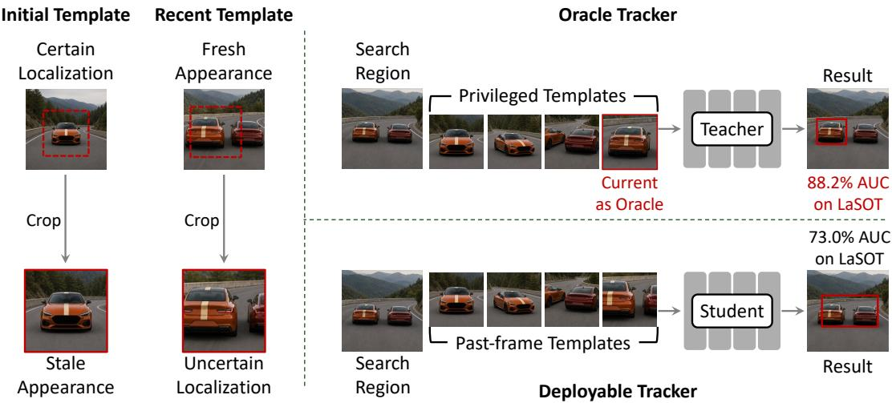
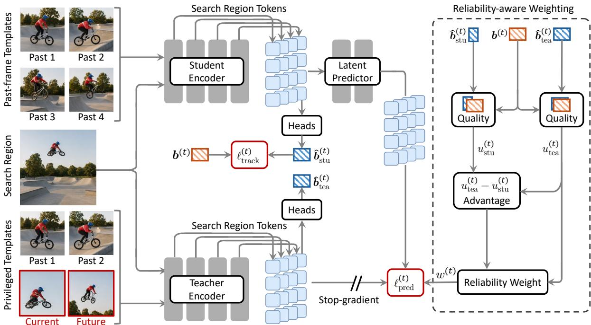

# Learning to Track from Privileged Target Appearances

Xin Chen1, Jiao Xu2, Dong Wang2, Huchuan Lu2, Kede Ma1

1City University of Hong Kong, 2Dalian University of Technology

## Abstract

Target templates define what a visual tracker searches for, yet the templates available at inference trade of localization certainty with appearancefreshness: the initial ground-truth template is exact but becomes stale, whereas recent templates better reflect the current appearance but are cropped from uncertain predictions. We quantify this bottleneck with a non-deployable oracle that supplies an exact current-frame target crop, improving AUC on LaSOT by 15.2 percentage points. This gap reveals a training-only opportunity: frame-level ground truths provide exact current- and future-frame target crops, although such crops are unavailable at deployment. We introduce Privileged Appearance Transfer for Tracking (PATT), a teacher-student training framework that transfers these privileged appearances to a deployable tracker through multi-level representation prediction. The privileged teacher observes exact target crops from past, current, and future frames, whereas the student receives only past-frame templates and learns to predict the teacher’s search representations. To avoid transferring unreliable teacher signals, PATT weights this transfer by the teacher’s relative localization advantage over the student and its absolute localization accuracy. After training, the teacher, latent predictor, reliability weights, and privileged crops are removed, leaving standard student-only inference. Across seven benchmarks at two model scales, PATT achieves consistent gains under both long- and short-term tracking protocols.

Project page: https://github.com/Multimedia-Analytics-Laboratory/PATT

## 1 Introduction

Tracking is fundamentally a problem of maintaining object correspondence through time. Humans can preserve object identity across motion even in the presence of visually identical distractors (Pylyshyn and Storm, 1988), while object-file theory explains this ability as the integration of successive visual states into temporary object representations (Kahneman et al., 1992). Visual object tracking poses a computational analogue: given a target in the first frame, localize the same object as its position and appearance evolve (Lucas and Kanade, 1981; Wu et al., 2013). Modern trackers typically encode target identity through image templates, which specify what to track and guide localization in each new search region. This template-search paradigm underlies Siamese trackers (Bertinetto et al., 2016; Li et al., 2018), Transformer trackers (Chen et al., 2021; Yan et al., 2021; Cui et al., 2022; Ye et al., 2022), autoregressive trackers (Chen et al., 2023; Wei et al., 2023), and unified tracking models (Hong et al., 2024; Chen et al., 2025). Despite their architectural diversity, these methods share a common dependence on whether the available templates remain discriminative for the target’s current state.

This dependence is complicated by the fact that the target representation needed for correspondence changes over time. The initial template is extracted from the given ground-truth bounding box and is therefore exact and localization-certain, but its appearance may become obsolete under deformation, rotation, illumination change, scale variation, or occlusion. A template acquired from a recent frame can better reflect the target’s current appearance, yet its crop must be derived from the tracker’s own predicted box. When this prediction contains substantial background or drifts toward a distractor, template updates can reinforce the resulting error. We refer to this limitation as the inference-time template acquisition bottleneck: at deployment, no reliably available template jointly provides localization certainty and appearance freshness.

  
Figure 1 Oracle study on LaSOT. Standard trackers face an inference-time template-acquisition bottleneck: the initial template is accurately localized but becomes stale, whereas recent templates are fresher but cropped from uncertain predictions. A non-deployable oracle removes this bottleneck by using the ground-truth bounding box to supply an exact current-frame target crop. On LaSOT, AUC increases from 73.0% to 88.2%, a substantial gain of 15.2 percentage points.

Existing trackers mitigate this bottleneck by extracting additional target evidence from the inference history. Online discriminative learning (Bhat et al., 2019; Mayer et al., 2022), confidence-based template updates (Yan et al., 2021; Cui et al., 2022), temporal token propagation (Zheng et al., 2024; Chen et al., 2026), and autoregressive state modeling (Chen et al., 2023; Wei et al., 2023; Bai et al., 2024) all seek to preserve reliable target information as a video unfolds. However, they cannot remove the underlying information constraint: apart from the initial template, every newly acquired target crop is derived from a model prediction and may therefore inherit its localization errors. Without ground-truth supervision, an inference-time update rule cannot verify whether a new crop precisely depicts the target.

Training exposes precisely the information missing at inference. Frame-level ground-truth bounding boxes provide exact target crops not only before the search frame, but also from the current and future frames. To quantify the value of this information, we evaluate a non-deployable oracle that gives the tracker an exact current-frame target crop. As shown in Figure 1, this single intervention raises the area under the success curve (AUC) on LaSOT (Fan et al., 2019) from 73.0% to 88.2%, a substantial gain of 15.2 percentage points. This oracle gap suggests that exact, up-to-date target appearances remain a major performance-limiting factor. Yet standard tracking objectives use the current ground-truth bounding box primarily for localization supervision and past target crops as causal templates; they barely exploit exact current and future target appearances as training-only inputs.

Motivated by this oracle gap, we introduce Privileged Appearance Transfer for Tracking (PATT), a teacherstudent training framework that turns training-only target appearances into supervision for a deployable tracker. The student uses four past-frame target templates, whereas the privileged teacher replaces two of them with exact target crops from the current and a future frame. Apart from this diference in template source, the two branches share the same architecture, backbone capacity, and four-slot template budget, making privileged target appearances the teacher’s principal information advantage.

Rather than imitate the teacher’s final box predictions, for which ground-truth bounding boxes already provide direct supervision, PATT transfers privileged information through multi-level search representations. A latent predictor maps the student’s multi-level search representations to their counterparts produced by the privileged teacher, which is maintained as an exponential moving average (EMA) of the student to provide stable targets. However, even with privileged inputs, some teacher predictions may still be unreliable. PATT therefore weights the transfer using two complementary criteria: the teacher’s relative localization advantage over the student and its absolute localization accuracy. At deployment, the teacher, latent predictor, reliability weights, and privileged crops are discarded, leaving the standard deployable tracker unchanged.

Experiments across seven benchmarks demonstrate that PATT achieves consistent gains across Base and Large model scales, long- and short-term tracking protocols, and datasets outside the training distribution. In particular, PATT-L achieves 76.7% AUC on LaSOT, 56.7% AUC on $\mathrm { L a S O T _ { e x t } }$ (Fan et al., 2021), and 64 8% AUC on TNL2K (Wang et al., 2021b). These results show that privileged target appearances can improve the representations of a deployable tracker without additional inference components.

In summary, our contributions are as follows:

• We identify the inference-time template acquisition bottleneck in visual tracking and quantify its impact with a non-deployable oracle that improves LaSOT AUC by 15.2 percentage points.

• We introduce PATT, a teacher-student framework that transfers privileged target appearances to a deployable tracker through multi-level representation prediction and reliability weighting.

• We demonstrate consistent improvements across seven benchmarks, two model scales, and multiple evaluation regimes, showing the efectiveness of training-only target appearances.

## 2 Related Work

In this section, we position PATT relative to two lines of work: template-based visual tracking and learning with privileged information. The former exposes the causal constraint at deployment, whereas the latter frames the use of training-only target crops as privileged supervision for a deployable tracker.

## 2.1 Template-based Visual Tracking

Template conditioning is a central paradigm in visual tracking. Siamese trackers instantiate this idea by comparing a target template with a search region, as in SiamFC (Bertinetto et al., 2016), and by adding region proposals, as in SiamRPN (Li et al., 2018). Transformer trackers further strengthen template-search interaction through explicit feature fusion, as in TransT (Chen et al., 2021), STARK (Yan et al., 2021), and MixFormer (Cui et al., 2022), or through joint token processing in a unified encoder, as in OSTrack (Ye et al., 2022). Recent work extends this paradigm with larger pretrained backbones (Lin et al., 2024), autoregressive target prediction (Chen et al., 2023; Wei et al., 2023; Bai et al., 2024), and architectures that unify tracking with other forms of target specification (Hong et al., 2024; Chen et al., 2025).

A complementary line of research concerns how target evidence can be maintained after initialization. Online discriminative methods such as ATOM (Danelljan et al., 2019), DiMP (Bhat et al., 2019), and ToMP (Mayer et al., 2022) update target models using newly collected positive and negative samples. Template-update methods such as STARK (Yan et al., 2021) and MixFormer (Cui et al., 2022) refresh stored templates from confident predictions, while KeepTrack (Mayer et al., 2021) associates candidate states across frames to reduce ambiguity. Other approaches, including ODTrack (Zheng et al., 2024), autoregressive trackers (Chen et al., 2023; Wei et al., 2023), and RELO (Chen et al., 2026) condition localization on previous predictions or latent target states. These mechanisms improve temporal adaptation, but they remain constrained by causal information available at deployment: except for the initial target crop, newly acquired target evidence is derived from model predictions and is therefore susceptible to localization error. PATT instead studies whether a deployable tracker can benefit from current- and future-frame target crops extracted from ground-truth bounding boxes during training, without changing its inference-time inputs or computation.

## 2.2 Learning with Privileged Information

Learning with privileged information formalizes settings in which auxiliary variables are available during training but absent at deployment (Vapnik and Vashist, 2009). The central challenge is to transfer this training-only information to a model that relies only on deployable inputs. Knowledge distillation provides a natural mechanism for such transfer: a student learns from targets produced by a teacher (Hinton et al., 2015).

  
Figure 2 Overview of PATT. The student and privileged teacher process the same search crop with the same tracker architecture, model capacity, and four-slot template budget. The student uses only past-frame templates, whereas the teacher replaces two template slots with exact current- and future-frame target crops extracted from ground-truth bounding boxes. A latent predictor maps the student’s multi-level search representations to the teacher’s stop-gradient representations, defining the representation-prediction loss. A reliability weight modulates this loss by combining the teacher’s relative localization advantage over the student and its absolute localization quality. At deployment, the teacher, predictor, reliability computation, and privileged crops are discarded, leaving only the student tracker.

Generalized distillation connects the two ideas by using privileged variables to construct an informative teacher whose predictions supervise a deployable student (Lopez-Paz et al., 2016).

Teacher-student paradigms difer in what gives the teacher an advantage and what signal is transferred to the student. In conventional distillation, the teacher’s advantage typically comes from greater model capacity or an ensemble (Hinton et al., 2015). In privileged-information settings, the advantage instead comes from training-only annotations or modalities, such as semantic object attributes, bounding boxes (Motiian et al., 2016), or depth (Hofman et al., 2016). The transferred signal may be an output distribution (Hinton et al., 2015) or an intermediate representation (Romero et al., 2015). A separate design choice is teacher stability. Mean Teacher (Tarvainen and Valpola, 2017) maintains the teacher as an EMA of the student to provide stable consistency targets, but parameter averaging alone does not create an information advantage.

Teacher-student transfer has also been explored in Siamese tracking (Shen et al., 2022). PATT difers from these settings by keeping the teacher and student at the same architecture and capacity: the teacher’s advantage comes solely from exact current- and future-frame target crops available during training, and the transferred signal is its intermediate search representations.

## 3 Privileged Appearance Transfer for Tracking

In this section, we present PATT, a training framework that transfers privileged target-appearance information to a deployable tracker, while leaving its inference procedure unchanged. As shown in Figure 2, the teacher shares the student’s tracker architecture and template budget, but replaces two past-frame templates with current- and future-frame target crops extracted from ground-truth bounding boxes. A latent predictor maps the student’s multi-level search representations to the corresponding teacher representations, and a sample-wise reliability weight modulates this transfer. After training, all privileged inputs and auxiliary modules are discarded, leaving only the standard student tracker.

## 3.1 Template-Based Tracking Formulation

Student template construction. We first formulate the causal template input used by the student tracker. We represent a �-frame training video I and its ground-truth bounding boxes B as ordered sequences:

$$
\mathbf { I } = \left( \mathbf { I } ^ { ( 1 ) } , \ldots , \mathbf { I } ^ { ( T ) } \right) , \qquad \mathbf { B } = \left( { \pmb { b } } ^ { ( 1 ) } , \ldots , { \pmb { b } } ^ { ( T ) } \right) .\tag{1}
$$

Let crop(·, ·) denote the template-extraction operator of the underlying tracker. The target template extracted from frame � is

$$
\pmb { x } ^ { ( i ) } = \mathrm { c r o p } \left( \mathbf { I } ^ { ( i ) } , \pmb { b } ^ { ( i ) } \right) .\tag{2}
$$

For search frame �, let $r _ { k }$ index the past frame used to extract the �-th student template, where $1 \leq r _ { 1 } < \cdots <$ $r _ { K } < t$ and $K \geq 2$ . The student’s ordered template input is

$$
\mathbf { \boldsymbol { X } } _ { \mathrm { s t u } } ^ { ( t ) } = \left( \boldsymbol { x } ^ { ( r _ { 1 } ) } , \ldots , \boldsymbol { x } ^ { ( r _ { K } ) } \right) .\tag{3}
$$

During training, these past-frame templates are extracted using ground-truth bounding boxes. At inference, however, ground-truth is available only for the initial template; any later template must be cropped from a predicted target box.

Student forward pass. Let $\pmb { s } ^ { ( t ) }$ denote the search crop sampled from $\mathbf { I } ^ { ( t ) }$ around the ground-truth box $\mathbf { \boldsymbol { b } } ^ { ( t ) }$ We use $\mathcal { L }$ for the set of encoder layers selected for representation transfer, with $L = | \mathcal { L } |$ , and arrange their outputs in increasing order of encoder depth when stacked. Given the student templates and search crop, the tracker predicts a target box and produces search representations at the selected layers:

$$
\begin{array} { r } { \left( \left\{ \mathbf { Z } _ { \mathrm { s t u } , l } ^ { ( t ) } \right\} _ { l \in \mathcal { L } } , \hat { b } _ { \mathrm { s t u } } ^ { ( t ) } \right) = f _ { \theta } \left( \mathbf { X } _ { \mathrm { s t u } } ^ { ( t ) } , \pmb { s } ^ { ( t ) } \right) , } \end{array}\tag{4}
$$

where $\mathbf { Z } _ { \mathrm { s t u } , l } ^ { ( t ) } \in \mathbb { R } ^ { N \times D }$ contains the �-dimensional representations of the � student search tokens at layer �.

Standard tracking objective. The student parameters � are optimized using the tracker’s standard localization objective:

$$
\ell _ { \mathrm { t r a c k } } ^ { ( t ) } ( \pmb \theta ) = \ell _ { \mathrm { l o c } } \left( \pmb { b } ^ { ( t ) } , \hat { \pmb b } _ { \mathrm { s t u } } ^ { ( t ) } \right) ,\tag{5}
$$

where the dependence on � follows from the forward pass in Equation (4). Additional head outputs and tracker-specific targets are left implicit. This objective provides direct supervision for localization, while the privileged teacher introduced in the next subsection supplies an additional representation-level signal at intermediate encoder layers.

## 3.2 Multi-Level Representation Prediction

We now construct a privileged teacher that accesses training-only information while keeping the tracker architecture and template budget fixed. The teacher provides multi-level search representations as targets for the student, and its box prediction is used only to measure the reliability of this transfer.

Matched privileged templates. The oracle study in Figure 1 demonstrates the potential value of privileged target information: supplying the tracker with an exact current-frame target crop raises LaSOT AUC from 73.0% to 88.2%. This 15.2-point gain motivates using ground-truth bounding boxes during training to construct privileged target crops that are unavailable to a deployable tracker.

We instantiate this privilege with two teacher-only templates. For search frame �, the current-frame crop $x ^ { ( t ) }$ depicts the target in the same frame as the search crop $s ^ { \binom { \ d } { t } }$ . A future-frame crop $\boldsymbol { x } ^ { ( t ^ { \prime } ) }$ , with $t < t ^ { \prime } \leq T$ , provides a later target appearance that may capture subsequent variation. Neither crop is a valid deployment-time input for localizing the target at frame �: the current crop requires the unknown target box at frame �, and the future crop additionally requires access to a later frame.

Rather than increasing the template budget, we form the teacher input by replacing the student’s final two past-frame templates in Equation (3) with the privileged current- and future-frame crops:

$$
{ \bf { X } } _ { \mathrm { { t e a } } } ^ { ( t ) } = \left( { { \boldsymbol { x } } ^ { ( r _ { 1 } ) } } , \ldots , { \boldsymbol { x } } ^ { ( r _ { K - 2 } ) } , { \boldsymbol { x } } ^ { ( t ) } , { \boldsymbol { x } } ^ { ( t ^ { \prime } ) } \right) .\tag{6}
$$

The student and teacher otherwise share the same search crop, tracker architecture, model capacity, and template budget.

Teacher representation prediction. Given the privileged template tuple and the shared search crop, the teacher produces search representations at the selected encoder layers and predicts a target box:

$$
\left( \left\{ \mathbf { Z } _ { \mathsf { t e a } , l } ^ { ( t ) } \right\} _ { l \in \mathcal { L } } , \hat { b } _ { \mathsf { t e a } } ^ { ( t ) } \right) = f _ { \bar { \theta } } \left( \mathbf { X } _ { \mathsf { t e a } } ^ { ( t ) } , \pmb { s } ^ { ( t ) } \right) ,\tag{7}
$$

where $\bar { \theta }$ denotes the teacher parameters.

We transfer the teacher’s intermediate search representations rather than imitating its predicted box. This is because box-level imitation would add another localization target on top of the direct ground-truth supervision in Equation (5), while exposing only the teacher’s final localization outcome. Intermediate representations instead capture the token-level evidence shaped by the privileged current- and future-frame templates, providing complementary supervision for the student’s encoder.

Following multi-level feature prediction (Mur-Labadia et al., 2026), we apply LayerNorm separately to the outputs of the � selected encoder layers in each branch, and concatenate them from shallow to deep along the feature dimension. This yields student and teacher representations $\mathbf { Z } _ { \mathrm { { s t u } } } ^ { ( t ) } , \mathbf { Z } _ { \mathrm { { t e a } } } ^ { ( t ) } \in \mathbb { R } ^ { N \times ( D \times L ) }$ . Because privileged templates change how the teacher organizes search evidence, we do not force the student representations $\mathbf { \boldsymbol { Z } } _ { \mathrm { s t u } } ^ { ( t ) }$ to match the teacher representations $\mathbf { \boldsymbol { Z } } _ { \mathrm { t e a } } ^ { ( t ) }$ directly. Instead, we learn a Transformer predictor $g _ { \phi } : \mathbb { R } ^ { N \times ( D \times L ) } \mapsto \mathbb { R } ^ { N \times ( D \times L ) }$ that maps $\mathbf { \boldsymbol { Z } } _ { \mathrm { s t u } } ^ { ( t ) }$ to $\mathbf { \boldsymbol { Z } } _ { \mathrm { t e a } } ^ { ( t ) }$

Prediction objective and teacher update. During each student update, the teacher target is detached with the stop-gradient operator sg[·], which is the identity in the forward pass and has zero derivative in the backward pass. Consequently, the representation-prediction loss is

$$
\ell _ { \mathrm { p r e d } } ^ { ( t ) } ( \theta , \phi ; \bar { \theta } ) = \frac { 1 } { N D L } \left\| g _ { \phi } \left( \boldsymbol { \mathbf { Z } } _ { \mathrm { s t u } } ^ { ( t ) } \right) - \mathrm { s g } \left[ \boldsymbol { \mathbf { Z } } _ { \mathrm { t e a } } ^ { ( t ) } \right] \right\| _ { 1 , 1 } ,\tag{8}
$$

where $\Vert \cdot \Vert _ { 1 , 1 }$ sums absolute values over all matrix entries. The denominator averages the prediction error over search tokens, feature channels, and selected encoder layers. Gradients thus update the student and predictor, but not the teacher. Instead, we adjust the teacher parameters as an EMA of the student parameters:

$$
\bar { \theta }  \rho \bar { \theta } + ( 1 - \rho ) \theta , \qquad \rho \in [ 0 , 1 ) .\tag{9}
$$

The privileged templates and EMA play distinct roles: the templates determine what additional information the teacher observes, while EMA stabilizes the teacher’s parameter trajectory and representation targets.

## 3.3 Reliability Weighting

Privileged inputs make the teacher more informative, but they do not necessarily make every teacher representation equally reliable as a prediction target. For a given sample, the teacher may still localize poorly, or it may be no better than the student. We therefore use localization quality as a training-time proxy for transfer reliability, weighting representation prediction by the teacher’s relative advantage over the student and its absolute localization accuracy.

Reliability weight. For frame �, we measure the localization quality of each branch by its intersection over union (IoU) with the ground-truth bounding box:

$$
\begin{array} { r } { u _ { \mathrm { s t u } } ^ { ( t ) } = \mathrm { I o U } \left( \hat { b } _ { \mathrm { s t u } } ^ { ( t ) } , b ^ { ( t ) } \right) , \qquad u _ { \mathrm { t e a } } ^ { ( t ) } = \mathrm { I o U } \left( \hat { b } _ { \mathrm { t e a } } ^ { ( t ) } , b ^ { ( t ) } \right) . } \end{array}
$$

Table 1 Model configurations and inference cost. Parameter counts and floating-point operations (FLOPs) outside parentheses are for the deployed tracker, while values in parentheses indicate the additional training-only cost of the representation predictor. Speed is reported in frames per second (FPS) on a single NVIDIA RTX 4090 GPU.
<table><tr><td>Model</td><td># Params (M)</td><td>FLOPs (G)</td><td>Speed (FPS)</td></tr><tr><td>PATT-B256</td><td>70(+23)</td><td>39(+6)</td><td>50</td></tr><tr><td>PATT-L256</td><td>247(+25)</td><td>131(+6)</td><td>32</td></tr></table>

The reliability weight combines a relative advantage term with an absolute quality term:

$$
w ^ { ( t ) } = s \mathbf { g } \left[ \underbrace { \mathrm { c l i p } \left( \frac { u _ { \mathrm { t e a } } ^ { ( t ) } - u _ { \mathrm { s t u } } ^ { ( t ) } } { \tau } , 0 , 1 \right) } _ { \mathrm { a d v a n t a g e } } \underbrace { \left( u _ { \mathrm { t e a } } ^ { ( t ) } \right) ^ { \gamma } } _ { \mathrm { q u a l i t y } } \right] , \qquad \tau > 0 , \gamma \geq 0 , \quad w ^ { ( t ) } \in [ 0 , 1 ] .\tag{10}
$$

The clipped advantage term suppresses transfer when the teacher is no more accurate than the student, increases linearly with the teacher’s positive IoU margin, and saturates once this margin reaches �. However, a positive margin alone is insuficient: the teacher may outperform the student even when both predictions are poor. The quality term therefore discounts such cases according to the teacher’s absolute IoU. With the convention $( u _ { \mathrm { t e a } } ^ { ( t ) } ) ^ { 0 } = 1$ , setting $\gamma = 0$ recovers advantage-only weighting.

Overall training objective. We define the complete per-sample training objective as

$$
\ell ^ { ( t ) } ( \pmb \theta , \phi ) = \ell _ { \mathrm { t r a c k } } ^ { ( t ) } ( \pmb \theta ) + \lambda w ^ { ( t ) } \ell _ { \mathrm { p r e d } } ^ { ( t ) } ( \pmb \theta , \phi ) , \qquad \lambda \geq 0 ,\tag{11}
$$

where � controls the strength of privileged representation prediction relative to standard tracking supervision. The tracking loss is applied to every sample, while $w ^ { ( t ) }$ adjusts the representation-prediction loss according to the teacher’s reliability. The stop-gradient in Equation (10) treats $w ^ { ( t ) }$ as a fixed sample-dependent coeficient during backpropagation. Without this detachment, the student could reduce the weighted prediction loss $w ^ { ( t ) } \ell _ { \mathrm { p r e d } } ^ { ( t ) }$ by changing its localization output to lower $w ^ { ( t ) }$ , rather than by predicting the teacher representation more accurately. Detaching $w ^ { ( t ) }$ prevents this shortcut and restricts the reliability weight to controlling the sample-wise strength of representation supervision.

## 4 Experiments

In this section, we evaluate whether privileged appearance transfer improves a deployable tracker that uses only the student branch at inference. We first specify the training and inference protocols, then compare two model scales across seven benchmarks, and finally use controlled ablations to isolate the efects of privileged appearances, multi-level prediction, and reliability weighting.

## 4.1 Experimental Setups

Model variants. We instantiate PATT in the one-stream Transformer tracking framework of OSTrack (Ye et al., 2022). PATT-B256 and PATT-L256 use the Base and Large Fast-iTPN encoders (Tian et al., 2024), respectively. Table 1 reports their deployed costs. Both variants use a 256 × 256 search crop, 128 × 128 templates, a patch stride of 16, � = 4 template slots, and the center-based prediction head of OSTrack. The training-only representation predictor comprises 12 Transformer layers with a hidden dimension of 384 and 12 attention heads.

Training protocol. We train on the training splits of COCO (Lin et al., 2014), LaSOT (Fan et al., 2019), GOT-10k (Huang et al., 2021), TrackingNet (Müller et al., 2018), and VastTrack (Peng et al., 2024). For each training example, we sample ordered frames $r _ { 1 } < r _ { 2 } < r _ { 3 } < r _ { 4 } < t < t ^ { \prime }$ from one video. The student uses target crops from frames $r _ { 1 } , \ldots , r _ { 4 }$ as templates and the crop from frame � as the search input. The teacher uses the same search crop but replaces the final two past-frame templates with ground-truth target crops from frames � and �′. We obtain template and search crops by expanding their ground-truth bounding boxes by factors of 2 and 4, respectively, and further apply translation and scale jitter to the search crop. We train with AdamW for 10 epochs using a minibatch size of 64 and an initial learning rate of $1 0 ^ { - 4 } ,$ decayed by a factor of 10 after epoch 8. We predict representations from $L = 4$ evenly spaced encoder layers and update the teacher by EMA with $\rho = 0 . 9 9 9 2 5$ . The loss hyperparameters are $\lambda \overset { \cdot } { = } 3 , \tau = 0 . 1$ , and $\gamma = 0 . 5$

Table 2 Comparison on four large-scale tracking benchmarks. Results are grouped by model scale, with base-scale trackers in the upper block and large-scale trackers in the lower block. AUC, �, $\bar { P } _ { \mathrm { N o r m } } , \mathrm { A O } ,$ and SR denote area under the success curve, precision, normalized precision, average overlap, and success rate. Within each block, bold and underlined values indicate the best and second-best results, respectively.
<table><tr><td rowspan="2">Model</td><td colspan="3">LaSOT</td><td colspan="3"> $\mathrm { L a S O T _ { e x t } }$ </td><td colspan="3">TrackingNet</td><td colspan="3">GOT-10k</td></tr><tr><td>AUC P</td><td></td><td> $P _ { \mathrm { N o r m } }$ </td><td>AUC</td><td>P</td><td> $P _ { \mathrm { N o r m } }$ </td><td></td><td>AUC P</td><td> $P _ { \mathrm { N o r m } }$ </td><td></td><td></td><td> $\mathrm { A O } \ \mathrm { S R } _ { 0 . 5 } \ \mathrm { S R } _ { 0 . 7 5 }$ </td></tr><tr><td>OSTrack-B256 (Ye et al., 2022)</td><td>69.1 75.2</td><td></td><td>78.7</td><td>47.4 53.3</td><td></td><td>57.3</td><td></td><td>83.1 82.0</td><td>87.8</td><td></td><td>71.0 80.4</td><td>68.2</td></tr><tr><td>SwinTrack-B384 (Lin et al., 2022)</td><td>71.3 76.5</td><td></td><td></td><td>49.1 55.6</td><td></td><td></td><td></td><td>84.082.8</td><td></td><td>72.4</td><td>80.5</td><td>67.8</td></tr><tr><td>SeqTrack-B256 (Chen et al., 2023)</td><td></td><td>69.9 76.3</td><td>79.7</td><td>49.5</td><td>56.3</td><td>60.8</td><td></td><td>83.3 82.2</td><td>88.3</td><td>74.7</td><td>84.7</td><td>71.8</td></tr><tr><td>ARTrack-B256 (Wei et al., 2023)</td><td></td><td>70.4 76.6</td><td>79.5</td><td>46.4 52.3</td><td></td><td>56.5</td><td></td><td>84.2 83.5</td><td>88.7</td><td></td><td>73.5 82.2</td><td>70.9</td></tr><tr><td>OneTracker-B384 (Hong et al., 2024)</td><td></td><td>70.5 76.5</td><td>79.9</td><td></td><td></td><td></td><td>83.7</td><td>82.7</td><td>88.4</td><td></td><td></td><td></td></tr><tr><td>SUTrack-B224 (Chen et al., 2025)</td><td></td><td>73.2 80.5</td><td>83.4</td><td>53.1 60.5</td><td></td><td>64.2</td><td></td><td>85.7 85.1</td><td>90.3</td><td>77.9</td><td>87.5</td><td>78.5</td></tr><tr><td>ARPTrack-B256 (Liang et al., 2025)</td><td></td><td>72.6 78.5</td><td>81.4</td><td>52.058.7</td><td></td><td>62.9</td><td></td><td>85.5 85.3</td><td>90.0</td><td>77.7</td><td>87.3</td><td>74.3</td></tr><tr><td>RELO-B256 (Chen et al., 2026)</td><td>73.3</td><td>80.6</td><td>83.4</td><td>54.2</td><td>62.2</td><td>65.4</td><td>86.4</td><td>86.2</td><td>90.7</td><td></td><td>80.5 90.5</td><td>81.2</td></tr><tr><td>PATT-B256 (Ours)</td><td>75.4 84.2</td><td></td><td>85.8</td><td>55.4 63.6</td><td></td><td>66.8</td><td></td><td>86.6 86.5</td><td>91.2</td><td>79.7</td><td>89.2</td><td>81.4</td></tr><tr><td>MixFormer-L320 (Cui et al., 2022)</td><td>70.1 76.3</td><td></td><td>79.9</td><td></td><td></td><td></td><td></td><td>83.9 83.1</td><td>88.9</td><td></td><td></td><td></td></tr><tr><td>SimTrack-L224 (Chen et al., 2022)</td><td>70.5</td><td>-</td><td>79.7</td><td></td><td></td><td></td><td>83.4</td><td></td><td>87.4</td><td></td><td>69.8 78.8</td><td>66.0</td></tr><tr><td>ODTrack-L384 (Zheng et al., 2024)</td><td></td><td>74.082.3</td><td>84.2</td><td>53.9 61.7</td><td></td><td>65.4</td><td></td><td>86.1 86.7</td><td>91.0</td><td>78.2</td><td>87.2</td><td>77.3</td></tr><tr><td>ARTrackV2-L384 (Bai et al., 2024)</td><td></td><td>73.6 81.1</td><td>82.8</td><td>53.4</td><td>60.2</td><td>63.7</td><td></td><td>86.1 86.2</td><td>90.4</td><td>79.5</td><td>87.8</td><td>79.6</td></tr><tr><td>LoRAT-L224 (Lin et al., 2024)</td><td></td><td>74.2 80.9</td><td>83.6</td><td>52.8</td><td>60.0</td><td>64.7</td><td></td><td>85.0 84.4</td><td>89.5</td><td>75.7</td><td>84.9</td><td>75.0</td></tr><tr><td>SUTrack-L224 (Chen et al., 2025)</td><td></td><td>73.5 80.9</td><td>83.3</td><td>54.061.7</td><td></td><td>65.3</td><td></td><td>86.5 86.7</td><td>90.9</td><td></td><td>81.0 90.4</td><td>82.4</td></tr><tr><td>ARPTrack-L384 (Liang et al., 2025)</td><td>74.2 81.7</td><td></td><td>83.4</td><td>54.2 61.2</td><td></td><td>64.4</td><td></td><td>86.6 87.4</td><td>91.1</td><td>81.5</td><td>90.6</td><td>80.5</td></tr><tr><td>RELO-L256 (Chen et al., 2026)</td><td>75.1</td><td>83.4</td><td>85.1</td><td>57.5 66.7</td><td></td><td>69.1</td><td>87.3</td><td>88.0</td><td>91.6</td><td>81.8</td><td>91.1</td><td>83.5</td></tr><tr><td>PATT-L256 (Ours)</td><td>76.7 85.4</td><td></td><td>87.1</td><td>56.7 64.6</td><td></td><td>68.2</td><td></td><td>87.4 88.2</td><td>91.9</td><td></td><td>82.6 91.9</td><td>84.4</td></tr></table>

Inference protocol. At test time, only the student � is retained; the teacher, predictor, reliability computation, and privileged templates are removed. Following the template-update protocol of the underlying tracker (Yan et al., 2021), the student keeps the ground-truth first-frame template and fills the remaining three slots with dynamic templates cropped from its own predictions. Dynamic templates are refreshed every 25 frames when prediction confidence exceeds 0.80.

Evaluation protocol. We evaluate on seven benchmarks covering diferent tracking regimes. LaSOT (Fan et al., 2019) and LaSOText (Fan et al., 2021) evaluate long-horizon appearance change and cross-category generalization. TrackingNet (Müller et al., 2018) and GOT-10k (Huang et al., 2021) test large-scale short-term tracking. TNL2K (Wang et al., 2021b), NFS (Kiani Galoogahi et al., 2017), and UAV123 (Müller et al., 2016) assess transfer beyond the training datasets. We use the area under the success curve (AUC) as the primary metric. LaSOT, $\mathrm { L a \bar { S } O T _ { \mathrm { e x t } } }$ , and TrackingNet additionally report precision (�) and normalized precision $\left( P _ { \mathrm { N o r m } } \right)$ while GOT-10k reports average overlap (AO) and success rates at IoU thresholds 0 5 and 0 75.

## 4.2 Main Results

Performance against long-horizon appearance change. LaSOT in Table 2 is the benchmark most directly aligned with our motivation: as sequences become longer, past templates are more likely to become stale, and the tracker must rely on imperfectly updated target evidence. Compared with temporal baselines such as ARPTrack (Liang et al., 2025) which pretrains appearance-motion evolution, and RELO (Chen et al., 2026) which adds reward-based localization training and temporal token propagation, PATT changes only the training signal while leaving the deployed tracker unchanged. This distinction is most visible on LaSOT. Both PATT variants achieve the best overlap and precision metrics within their scale groups, improving AUC over the strongest same-scale alternative by 2.1 points for PATT-B256 and 1.6 points for PATT-L256. The gains across both AUC and precision suggest that privileged appearance transfer helps the student encode search evidence that remains useful when historical templates no longer faithfully describe the target. On $\mathrm { L a S O T _ { e x t } } ,$ the pattern is slightly less uniform: PATT-B256 leads all metrics in the base-scale group, while PATT-L256 ranks second to RELO-L256. Thus, the benefit extends to category shift, although strong online temporal adaptation remains competitive at larger scale.

Table 3 Cross-benchmark transfer on held-out datasets. Results report AUC on TNL2K, NFS, and UAV123, none of which is used for training.
<table><tr><td>Model</td><td>TNL2K</td><td>NFS</td><td>UAV123</td></tr><tr><td>TrDiMP (Wang et al., 2021a)</td><td></td><td>66.5</td><td>67.5</td></tr><tr><td>TransT (Chen et al., 2021)</td><td>50.7</td><td>65.7</td><td>69.1</td></tr><tr><td>SimTrack (Chen et al., 2022)</td><td>55.6</td><td></td><td>71.2</td></tr><tr><td>OSTrack (Ye et al., 2022)</td><td>55.9</td><td>66.5</td><td>70.7</td></tr><tr><td>SeqTrack-L256 (Chen et al., 2023)</td><td>56.9</td><td>66.9</td><td>69.7</td></tr><tr><td>ARTrack-L384 (Wei et al., 2023)</td><td>60.3</td><td>67.9</td><td>71.2</td></tr><tr><td>LoRAT-L224 (Lin et al., 2024)</td><td>61.1</td><td>66.0</td><td>73.3</td></tr><tr><td>RELO-L256 (Chen et al., 2026)</td><td>63.6</td><td>71.3</td><td>71.4</td></tr><tr><td>PATT-B256 (Ours)</td><td>62.9</td><td>71.6</td><td>70.4</td></tr><tr><td>PATT-L256 (Ours)</td><td>64.8</td><td>72.1</td><td>72.4</td></tr></table>

Generalization across evaluation regimes. On TrackingNet, both PATT variants obtain the best results within their scale groups, though the margins are smaller. This indicates that privileged appearance transfer does not harm short-term tracking and can still improve the student representation, even when template staleness is less severe. The small gains are nevertheless meaningful because ARTrack and ODTrack modify temporal inference through autoregressive trajectory modeling or online token propagation, whereas PATT adds no inference-time mechanism beyond the underlying tracker (Wei et al., 2023; Zheng et al., 2024). On GOT-10k, PATT-L256 leads all criteria, while PATT-B256 shows a more selective profile: it attains the best strict-overlap success rate $\mathrm { S R } _ { 0 . 7 5 } ,$ , but remains behind RELO-B256 in AO and $\mathrm { S R } _ { 0 . 5 }$ . Together, these results suggest that privileged appearance transfer generalizes beyond long sequences, with its clearest base-scale efect appearing under stricter localization criteria.

Transfer beyond the training benchmarks. Table 3 further evaluates transfer on TNL2K, NFS, and UAV123, none of which is used for training. PATT-L256 achieves the highest AUC on TNL2K and NFS, improving over the strongest non-PATT result by 1.2 points and 0.8 points, respectively, while ranking second on UAV123 with an AUC of 72.4. This consistent held-out performance supports the view that privileged target appearances improve the learned representation rather than merely fitting the training benchmarks. The base-scale model is less uniform: PATT-B256 is competitive on TNL2K and ranks second on NFS, but does not improve on UAV123. The contrast between PATT-B256 and PATT-L256 suggests that model capacity may afect how fully the student can absorb training-only privileged targets. Overall, the results show that PATT provides its strongest and most consistent gains at larger scale.

## 4.3 Ablation Studies

We ablate PATT-B256 by changing one design choice at a time and report AUC on LaSOT and $\mathrm { L a S O T _ { e x t } }$ in Table 4. The variants test three questions: whether the gain comes from privileged target appearances, which form of teacher supervision is most efective, and how teacher targets should be weighted across samples

Table 4 Ablation study on LaSOT and $\mathbf { L a S O T } _ { \mathrm { e x t } } .$ Results report AUC for PATT-B256 and its training variants. The rows isolate the efects of privileged template information, representation prediction, and reliability weighting. Δ denotes the average AUC change relative to the full model across the two benchmarks.
<table><tr><td>#</td><td>Training variant</td><td>LaSOT</td><td> $\mathrm { L a S O T _ { e x t } }$ </td><td>∆</td></tr><tr><td>1</td><td>Full model (PATT-B256)</td><td>75.4</td><td>55.4</td><td>一</td></tr><tr><td>2</td><td>Student-only baseline</td><td>73.0</td><td>52.7</td><td>-2.6</td></tr><tr><td>3</td><td>Past-only teacher</td><td>73.2</td><td>52.6</td><td>-2.5</td></tr><tr><td>4</td><td>Past+current teacher</td><td>75.1</td><td>55.0</td><td>-0.4</td></tr><tr><td>5</td><td>Output imitation</td><td>73.5</td><td>53.7</td><td>-1.8</td></tr><tr><td>6</td><td>Last-layer prediction</td><td>74.8</td><td>54.3</td><td>-0.9</td></tr><tr><td>7</td><td>All-layer prediction</td><td>75.5</td><td>55.2</td><td>-0.1</td></tr><tr><td>8</td><td>Direct matching (no predictor)</td><td>73.3</td><td>54.3</td><td>-1.6</td></tr><tr><td>9</td><td>Uniform weighting</td><td>75.0</td><td>54.6</td><td>-0.6</td></tr><tr><td>10</td><td>Quality-only weighting</td><td>75.1</td><td>55.2</td><td>-0.3</td></tr><tr><td>11</td><td>Advantage-only weighting</td><td>75.2</td><td>54.8</td><td>-0.4</td></tr></table>

Where does the gain originate? Rows 2-4 isolate the information available to the teacher. The student-only baseline and the past-only teacher perform almost identically, showing that a teacher branch alone does not explain the improvement. Adding the current-frame target crop recovers most of the full model’s gain, while the future-frame crop closes the remaining gap. These results indicate that exact current-frame appearance is the dominant source of improvement, while future appearance provides a smaller but complementary signal about target variation.

What should be transferred? Rows 5-8 examine the form and depth of teacher supervision. Output imitation improves over the student-only baseline, but remains clearly below representation prediction, indicating that the teacher’s final box does not capture all useful privileged information. Predicting representations from four encoder levels outperforms last-layer prediction, suggesting that privileged appearances shape search evidence at multiple depths. Using all layers provides little additional benefit, so a compact set of representative layers is suficient. Directly matching teacher features without a latent predictor also performs poorly: because the student and teacher receive diferent template sets, their representations need not be identical. The predictor is therefore important because it allows the student to infer the privileged representation target without forcing exact feature equality.

Which teacher targets should be trusted? Rows 9-11 evaluate how the prediction loss is weighted across samples. Uniform weighting degrades performance, confirming that privileged inputs do not make every teacher target equally reliable. Quality-only weighting discounts poorly localized teachers, while advantage only weighting emphasizes samples where the teacher improves over the student; both recover part of the lost performance. Combining the two gives the best overall result as it selects teacher targets that are informative relative to the student and accurate in absolute terms.

## 5 Conclusion and Discussion

We have introduced PATT, a teacher-student framework that uses exact current- and future-frame target crops as privileged training context for visual tracking. Rather than imitating the teacher’s final box prediction, the student learns to predict the teacher’s multi-level search representations, with reliability weighting emphasizing teacher targets that are both accurate and more informative than the student’s own prediction. After training, the teacher, predictor, reliability computation, and privileged crops are removed, leaving the standard student-only inference procedure unchanged. Across seven benchmarks and two model scales, PATT achieves its clearest gains in long-horizon tracking while remaining competitive in short-term and cross-benchmark evaluations.

These results also clarify the scope of the present study. The framework requires frame-level groundtruth bounding boxes to construct privileged target crops and introduces auxiliary teacher and predictor computation during training. It also uses a fixed design for privileged-view selection, replacing two past-frame templates with one current-frame crop and one future-frame crop. Thus, the experiments do not yet determine which privileged views are most informative, how they should be selected across a trajectory, or how much of the benefit remains when annotation density or training resources are limited.

A natural next step is to make privileged appearance transfer more principled within the current framework. Instead of using a fixed current-plus-future template layout, future work could select privileged views according to information gain, temporal diversity, occlusion state, teacher uncertainty, or consistency across multiple candidate crops. The reliability weight could likewise be extended beyond localization quality to account for how stable and informative each teacher representation is for the student.

More broadly, privileged supervision need not be limited to exact target crops. Dense masks, object parts, depth, optical flow, language descriptions, long-range reappearance cues, and ofline trajectory context could provide additional training-only signals for learning representations that remain causal at deployment. This perspective also connects naturally to emerging practical tracking settings, including foundation-modelassisted tracking, memory-based trackers, multi-object tracking, and multi-camera tracking. In these settings, information from later frames, neighboring objects, or other cameras may be available during training or ofline annotation, even when the deployed tracker must operate online. Using such information to train stronger causal trackers is a promising direction toward robust tracking under appearance change, occlusion, re-identification, and cross-view ambiguity.

## References

Yifan Bai, Zeyang Zhao, Yihong Gong, and Xing Wei. ARTrackV2: Prompting autoregressive tracker where to look and how to describe. In CVPR, pages 19048–19057, 2024.

Luca Bertinetto, Jack Valmadre, João F. Henriques, Andrea Vedaldi, and Philip H. S. Torr. Fully-convolutional Siamese networks for object tracking. In ECCV Workshops, pages 850–865, 2016.

Goutam Bhat, Martin Danelljan, Luc Van Gool, and Radu Timofte. Learning discriminative model prediction for tracking. In ICCV, pages 6182–6191, 2019.

Boyu Chen, Peixia Li, Lei Bai, Lei Qiao, Qiuhong Shen, Bo Li, Weihao Gan, Wei Wu, and Wanli Ouyang. Backbone is all your need: A simplified architecture for visual object tracking. In ECCV, pages 375–392, 2022.

Xin Chen, Bin Yan, Jiawen Zhu, Dong Wang, Xiaoyun Yang, and Huchuan Lu. Transformer tracking. In CVPR, pages 8126–8135, 2021.

Xin Chen, Houwen Peng, Dong Wang, Huchuan Lu, and Han Hu. SeqTrack: Sequence to sequence learning for visual object tracking. In CVPR, pages 14572–14581, 2023.

Xin Chen, Ben Kang, Wanting Geng, Jiawen Zhu, Yi Liu, Dong Wang, and Huchuan Lu. SUTrack: Towards simple and unified single object tracking. In AAAI, pages 2239–2247, 2025.

Xin Chen, Chuanyu Sun, Jiao Xu, Houwen Peng, Dong Wang, Huchuan Lu, and Kede Ma. RELO: Reinforcement learning to localize for visual object tracking. In ICML, 2026.

Yutao Cui, Cheng Jiang, Limin Wang, and Gangshan Wu. MixFormer: End-to-end tracking with iterative mixed attention. In CVPR, pages 13608–13618, 2022.

Martin Danelljan, Goutam Bhat, Fahad Shahbaz Khan, and Michael Felsberg. ATOM: Accurate tracking by overlap maximization. In CVPR, pages 4660–4669, 2019.

Heng Fan, Liting Lin, Fan Yang, Peng Chu, Ge Deng, Sijia Yu, Hexin Bai, Yong Xu, Chunyuan Liao, and Haibin Ling. LaSOT: A high-quality benchmark for large-scale single object tracking. In CVPR, pages 5374–5383, 2019.

Heng Fan, Hexin Bai, Liting Lin, Fan Yang, Peng Chu, Ge Deng, Sijia Yu, Harshit, Mingzhen Huang, Juehuan Liu, et al. LaSOT: A high-quality large-scale single object tracking benchmark. IJCV, 129(2):439–461, 2021.

Geofrey Hinton, Oriol Vinyals, and Jef Dean. Distilling the knowledge in a neural network. arXiv preprint arXiv:1503.02531, 2015.

Judy Hofman, Saurabh Gupta, and Trevor Darrell. Learning with side information through modality hallucination. In CVPR, pages 826–834, 2016.

Lingyi Hong, Shilin Yan, Renrui Zhang, Wanyun Li, Xinyu Zhou, Pinxue Guo, Kaixun Jiang, Yiting Chen, Jinglun Li, Zhaoyu Chen, et al. OneTracker: Unifying visual object tracking with foundation models and eficient tuning. In CVPR, pages 19079–19091, 2024.

Lianghua Huang, Xin Zhao, and Kaiqi Huang. GOT-10k: A large high-diversity benchmark for generic object tracking in the wild. IEEE TPAMI, 43(5):1562–1577, 2021.

Daniel Kahneman, Anne Treisman, and Brian J. Gibbs. The reviewing of object files: Object-specific integration of information. Cogn Psychol., 24(2):175–219, 1992.

Hamed Kiani Galoogahi, Ashton Fagg, Chen Huang, Deva Ramanan, and Simon Lucey. Need for Speed: A benchmark for higher frame rate object tracking. In ICCV, pages 1125–1134, 2017.

Bo Li, Junjie Yan, Wei Wu, Zheng Zhu, and Xiaolin Hu. High performance visual tracking with Siamese region proposal network. In CVPR, pages 8971–8980, 2018.

Shiyi Liang, Yifan Bai, Yihong Gong, and Xing Wei. Autoregressive sequential pretraining for visual tracking. In CVPR, pages 7254–7264, 2025.

Liting Lin, Heng Fan, Yong Xu, and Haibin Ling. SwinTrack: A simple and strong baseline for Transformer tracking. In NeurIPS, pages 16743–16754, 2022.

Liting Lin, Heng Fan, Zhipeng Zhang, Yaowei Wang, Yong Xu, and Haibin Ling. Tracking meets LoRA: Faster training, larger model, stronger performance. In ECCV, pages 300–318, 2024.

Tsung-Yi Lin, Michael Maire, Serge Belongie, James Hays, Pietro Perona, Deva Ramanan, Piotr Dollár, and C. Lawrence Zitnick. Microsoft COCO: Common objects in context. In ECCV, pages 740–755, 2014.

David Lopez-Paz, Léon Bottou, Bernhard Schölkopf, and Vladimir Vapnik. Unifying distillation and privileged information. In ICLR, 2016.

Bruce D. Lucas and Takeo Kanade. An iterative image registration technique with an application to stereo vision. In IJCAI, pages 674–679, 1981.

Christoph Mayer, Martin Danelljan, Danda Pani Paudel, and Luc Van Gool. Learning target candidate association to keep track of what not to track. In ICCV, pages 13444–13454, 2021.

Christoph Mayer, Martin Danelljan, Goutam Bhat, Matthieu Paul, Danda Pani Paudel, Fisher Yu, and Luc Van Gool. Transforming model prediction for tracking. In CVPR, pages 8731–8740, 2022.

Saeid Motiian, Marco Piccirilli, Donald A. Adjeroh, and Gianfranco Doretto. Information bottleneck learning using privileged information for visual recognition. In CVPR, pages 1496–1505, 2016.

Matthias Müller, Neil Smith, and Bernard Ghanem. A benchmark and simulator for UAV tracking. In ECCV, pages 445–461, 2016.

Matthias Müller, Adel Bibi, Silvio Giancola, Salman Alsubaihi, and Bernard Ghanem. TrackingNet: A large-scale dataset and benchmark for object tracking in the wild. In ECCV, pages 300–317, 2018.

Lorenzo Mur-Labadia, Matthew Muckley, Amir Bar, Mido Assran, Koustuv Sinha, Mike Rabbat, Yann LeCun, Nicolas Ballas, and Adrien Bardes. V-JEPA 2.1: Unlocking dense features in video self-supervised learning. arXiv preprint arXiv:2603.14482, 2026.

Liang Peng, Junyuan Gao, Xinran Liu, Weihong Li, Shaohua Dong, Zhipeng Zhang, Heng Fan, and Libo Zhang. VastTrack: Vast category visual object tracking. In NeurIPS, pages 130797–130818, 2024.

Zenon W. Pylyshyn and Ron W. Storm. Tracking multiple independent targets: Evidence for a parallel tracking mechanism. Spat Vis., 3(3):179–197, 1988

Adriana Romero, Nicolas Ballas, Samira Ebrahimi Kahou, Antoine Chassang, Carlo Gatta, and Yoshua Bengio. FitNets: Hints for thin deep nets. In ICLR, 2015.

Jianbing Shen, Yuanpei Liu, Xingping Dong, Xiankai Lu, Fahad Shahbaz Khan, and Steven C. H. Hoi. Distilled Siamese networks for visual tracking. IEEE TPAMI, 44(12):8896–8909, 2022.

Antti Tarvainen and Harri Valpola. Mean teachers are better role models: Weight-averaged consistency targets improve semi-supervised deep learning results. In NeurIPS, pages 1195–1204, 2017.

Yunjie Tian, Lingxi Xie, Jihao Qiu, Jianbin Jiao, Yaowei Wang, Qi Tian, and Qixiang Ye. Fast-iTPN: Integrally pre-trained Transformer pyramid network with token migration. IEEE TPAMI, 46(12):9766–9779, 2024.

Vladimir Vapnik and Akshay Vashist. A new learning paradigm: Learning using privileged information. Neural Netw., 22 (5–6):544–557, 2009.

Ning Wang, Wengang Zhou, Jie Wang, and Houqiang Li. Transformer meets tracker: Exploiting temporal context for robust visual tracking. In CVPR, pages 1571–1580, 2021a.

Xiao Wang, Xiujun Shu, Zhipeng Zhang, Bo Jiang, Yaowei Wang, Yonghong Tian, and Feng Wu. Towards more flexible and accurate object tracking with natural language: Algorithms and benchmark. In CVPR, pages 13763–13773, 2021b.

Xing Wei, Yifan Bai, Yongchao Zheng, Dahu Shi, and Yihong Gong. Autoregressive visual tracking. In CVPR, pages 9697–9706, 2023.

Yi Wu, Jongwoo Lim, and Ming-Hsuan Yang. Online object tracking: A benchmark. In CVPR, pages 2411–2418, 2013.

Bin Yan, Houwen Peng, Jianlong Fu, Dong Wang, and Huchuan Lu. Learning spatio-temporal Transformer for visual tracking. In ICCV, pages 10448–10457, 2021.

Botao Ye, Hong Chang, Bingpeng Ma, Shiguang Shan, and Xilin Chen. Joint feature learning and relation modeling for tracking: A one-stream framework. In ECCV, pages 341–357, 2022.

Yaozong Zheng, Bineng Zhong, Qihua Liang, Zhiyi Mo, Shengping Zhang, and Xianxian Li. ODTrack: Online dense temporal token learning for visual tracking. In AAAI, pages 7588–7596, 2024.