# Lightweight Adaptation of General-Purpose VLMs for Multispectral and SAR Image Understanding

Shanji Liu1,2∗, Kelu Yao2∗, Junxiao Xue2, Chenghui Lv1,2, Xiangyang Miao1,2, Yekai Huang1,2, Yaying Chen1,2, Chao Li2†

1Zhejiang University 2Zhejiang Lab

## Abstract

General-purpose vision-language models (VLMs) now support strong visual recognition, instruction following, and generation. However, most pretrained visual encoders are built around three-channel natural images and do not directly accommodate observations such as native multispectral measurements or synthetic aperture radar (SAR). Adapting VLMs to these sensors typically requires dedicated encoders and domain pretraining, slowing the reuse of stronger generalpurpose checkpoints. We show that the multi-image interface of general-purpose VLMs ofers a lightweight alternative. Our protocol renders each observation as five optical views and one SAR view, names them in the prompt, and adapts the language network and selected visual transformer blocks with LoRA. This exposes band composites, spectral indices, and radar backscatter through an existing visual interface. For landcover recognition, structured supervision couples predicted classes with sensor evidence. We further construct preference pairs in which a true label is omitted while its supporting evidence is retained, encouraging complete predictions that remain consistent with the observations. On a balanced sixclass land-cover benchmark derived from BigEarthNet-v2, the adapted Qwen3-VL reaches 0.8275 micro F1. The same input and adaptation protocol improves all four tested VLM architectures and transfers to Sen1Floods11 flood verification and BigEarthNet.txt captioning. Image removal and mismatch controls show that the adapted models use the supplied sensor observations. Together, these results demonstrate that VLMs can be repurposed for multispectral and SAR tasks through rendered inputs and compact LoRA adaptation, without train ing a new foundation model.

## 1 Introduction

Recent advances in large language models drive rapid progress in vision-language models (VLMs), which now combine strong visual perception with instruction following, question answering, and flexible text generation (Alayrac et al. 2022; Li et al. 2023; Dai et al. 2023; Liu et al. 2023; Bai et al. 2025a). These capabilities do not yet transfer fully to remote sensing. A central obstacle is the sensor input gap. Remote sensing observations extend beyond ordinary RGB photographs. Sentinel-2 multispectral imagery (MSI) measures reflectance in visible, near infrared, and shortwave infrared bands, while Sentinel-1 synthetic aperture radar (SAR) measures microwave backscatter related to surface structure, roughness, and dielectric properties. Visual encoders pretrained on RGB photographs cannot directly receive the native channel structures of MSI and SAR through their standard image interface.

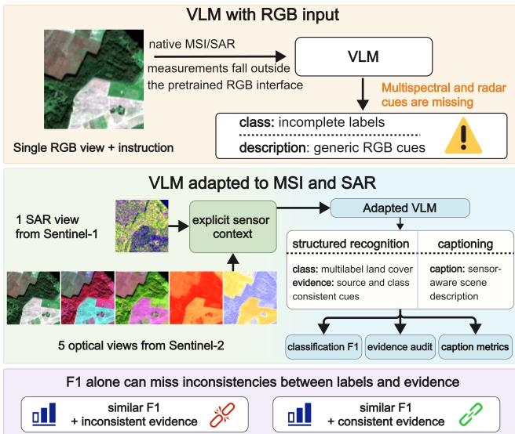  
Figure 1: Named multispectral and SAR views expose evidence failures missed by classification F1.

Existing work addresses this sensor gap along two main routes. Compact specialist models learn optical and spectral representations for classification, segmentation, and retrieval (Cong et al. 2022; Bastani et al. 2023; Xiong et al. 2024; Hong et al. 2024). Other architectures extend this direction across sensors, modalities, and resolutions (Fuller, Millard, and Green 2023; Astruc et al. 2025; Danish et al. 2025). These models provide strong task performance, but each new use commonly requires a trained task head, and their interfaces do not directly ofer the instruction following and flexible generation of a general-purpose VLM. A second route builds remote sensing foundation models and VLMs through domain pretraining or dedicated visual encoders. GeoChat, EarthGPT, and RingMoGPT support remote sensing dialogue, comprehension, or grounding (Kuckreja et al. 2024; Zhang et al. 2024a; Wang et al. 2025a). EarthDial, Earth-OneVision, and TerraScope broaden the covered sensors and tasks (Soni et al. 2025; Cai et al. 2026; Shu et al. 2026). Many current systems still emphasize RGB or optical imagery, and VLMs that jointly handle MSI and SAR remain relatively rare. Native support for these sensors often requires new channel projections, sensor encoders, or multimodal fusion modules, followed by substantial pretraining. This creates a tension between available data and required computation. Large collections of RGB images paired with text are widely available, while MSI and SAR observations paired with descriptions or sensor-specific instructions are much less abundant. Rebuilding a large VLM around native MSI and SAR inputs therefore requires both specialized data and considerable computation. General-purpose VLMs also improve at a much faster cadence than large remote sensing models can be pretrained. Lightweight adaptation would allow MSI and SAR applications to reuse stronger checkpoints as they appear, reducing the delay between progress in general multimodal models and its use in remote sensing.

Many VLMs already accept multiple images in one prompt, which enables a lighter solution (Alayrac et al. 2022; Bai et al. 2025a). MSI bands can be organized into interpretable three-channel images, including true color, false color, a shortwave infrared composite, and spectral index maps. A rendered SAR view can be supplied in the same sequence. One heterogeneous sensor observation then becomes a set of images compatible with the existing multi-image interface. The pretrained architecture and image interface are retained, while adaptation is confined to compact low-rank modules. Prior studies show that such renderings can expose multispectral information to general visual models (Mallya et al. 2025; Kim, Mallya, and Angelova 2026). Supervised adaptation of a strong current VLM may therefore advance MSI and SAR capability without rebuilding the foundation model. We investigate whether this route can support optical and radar observations across recognition and generation.

The ability to receive several images does not by itself establish sensor understanding. To an encoder pretrained on RGB images, an NDVI map, an NDBI map, a false-color composite, and a SAR rendering initially appear as images with diferent colors and textures. Generic identifiers such as “Image 1” and “Image 2” do not specify the measurement represented by each view. We associate every image with its sensor family and transformation so that the language mode can connect visual patterns with the corresponding remote sensing concepts. Input organization and view naming are therefore part of the adaptation problem.

This observation leads to our central research question: which combination of rendered view organization, naming scheme, LoRA placement, and preference construction enables a general-purpose VLM to use MSI and SAR observations efectively? We study this question in both recognition and generation. Our approach supplies five named optical renderings and one named SAR rendering through the existing multi-image interface. It updates low-rank parameters in the language network and selected visual transformer blocks, and uses preference data designed to preserve the relation between predicted content and sensor cues.

BigEarthNet-v2 provides the primary controlled setting for this study (Sumbul et al. 2021; Clasen et al. 2025). We merge 18 original labels into six land cover groups and ask the model for a structured response with two lines. The class: line supports quantitative multilabel evaluation. The evidence: line states optical and radar sources and the class cues used in the response, which makes their textual consistency available for inspection. This setting allows us to isolate the efects of rendered inputs, view names, supervised fine-tuning (SFT), and preference construction. SFT teaches the label mapping, sensor vocabulary, and response format. We use direct preference optimization (DPO) to target residual omissions of secondary classes (Rafailov et al. 2023). In each retained-evidence pair, the rejected response omits a true class but preserves its supporting optical or radar cue. The resulting disagreement gives preference optimization a direct signal to restore consistency between the class and evidence lines.

The six-class task provides a controlled experimental setting for the interface. We also test the same adaptation route beyond the primary benchmark. Sen1Floods11 evaluates patch-level flood verification on a diferent dataset and label space (Bonafilia et al. 2020). BigEarthNet.txt evaluates land cover caption generation through the same rendered MSI and SAR interface (Herzog et al. 2026). These settings examine transfer to another recognition problem and the transition from structured prediction to free-form scene description.

On 3,234 images from the oficial validation split, SFT with named views raises Qwen3-VL micro F1 from 0.5921 to 0.8242, macro F1 from 0.5107 to 0.7452, and the textual evidence audit from 0.1531 to 0.9750. DPO further reaches 0.8275 micro F1 while preserving the audit rate. In a blinded assessment, evidence generated with images receives a physical plausibility rate of 0.893, compared with 0.321 when the same checkpoints generate without images. SFT with named views for one epoch improves all four tested VLM architectures, and task-specific adaptation improves Sen1Floods11 verification and BigEarthNet.txt captioning.

Our contributions are:

1. We develop a rendered interface with explicit sensor names and compact LoRA adaptation for VLMs, enabling multispectral and SAR inputs without sensor-specific foundation model pretraining.

2. We evaluate the protocol across multiple VLM checkpoints, two recognition datasets, and land cover caption generation, with controlled comparisons of view content, naming, image dependence, and human-rated evidence plausibility.

3. We design preference pairs that target missed labels while retaining their supporting sensor evidence. Compared with its SFT initialization, DPO further improves exact match while maintaining the evidence audit under the structured output protocol.

## 2 Related Work

VLMs for remote sensing. General-purpose VLMs connect visual tokens to instruction-following language models and support flexible visual dialogue (Dai et al. 2023; Liu et al. 2023; Bai et al. 2025b,a). RemoteCLIP and GeoRSCLIP learn image–text representations for retrieval and transfer (Liu et al. 2024; Zhang et al. 2024b). GeoChat, EarthGPT, and RingMoGPT extend remote sensing models to dialogue, grounding, or instruction following (Kuckreja et al. 2024; Zhang et al. 2024a; Wang et al. 2025a). EarthDial, Earth-Mind, Earth-OneVision, and TerraScope further cover optical, SAR, multisensor, and pixel-grounded tasks (Soni et al. 2025; Shu et al. 2025; Cai et al. 2026; Shu et al. 2026). Their heterogeneous inputs, tasks, and response formats do not isolate lightweight adaptation through an existing VLM interface. We instead use a fixed schema containing labels and evidence, and audit the text against the supplied sensor families and predicted classes.

Foundation models for remote sensing. Remote-sensing pretraining uses seasonal contrastive learning and masked image modeling (Mañas et al. 2021; Cong et al. 2022). Other methods address scale, spectra, and flexible modality inputs (Reed et al. 2023; Hong et al. 2024; Astruc et al. 2025). SSL4EO-S12 supplies multimodal and multitemporal Sentinel data for self-supervision (Wang et al. 2023). Prithvi and SkySense learn from multispectral or temporal imagery, while CROMA and TerraFM learn radar-optical representations (Szwarcman et al. 2026; Guo et al. 2024; Fuller, Millard, and Green 2023; Danish et al. 2025). These models preserve native sensor channels and provide strong recognition features, but commonly require task-specific heads and do not inherit a VLM’s instruction interface. We use them as recognition references and study compact adaptation of a model that also generates textual responses.

Guided multispectral inputs for generalist models. BigEarthNet and BigEarthNet-MM support large-scale multilabel recognition with Sentinel-2 and aligned Sentinel-1 imagery, and reBEN refines the archive (Sumbul et al. 2019, 2021; Clasen et al. 2025). Guided multispectral prompting converts Sentinel-2 bands into true color, false color, and spectral index images for generalist multimodal models (Mallya et al. 2025; Kim, Mallya, and Angelova 2026). These studies show that interpretable renderings can carry multispectral information through an RGB visual encoder, but do not examine joint MSI and SAR post-training or consistency between predictions and generated sensor cues. We address both questions with named renderings and controlled input interventions.

Preference optimization and evidence supervision. LoRA, supervised post-training, and DPO provide parameter-eficient routes for adapting language and visionlanguage models (Hu et al. 2022; Cheng et al. 2025; Rafailov et al. 2023). Multimodal DPO variants show the importance of keeping preference learning conditional on the image (Wang et al. 2024). Existing preference objectives generally rank responses by accuracy, helpfulness, or style, without addressing structured outputs in which a correct class list can conflict with its stated evidence. We preserve the supporting cue when constructing a missing-label rejection, so the preference signal directly targets disagreement between the two output lines.

## 3 Method

## Task Formulation

Each example contains aligned Sentinel-2 multispectral imagery (MSI) and Sentinel-1 SAR imagery. We merge 18 BigEarthNet-v2 labels into six coarse classes; “Beaches, dunes, sands” is outside the target taxonomy, and samples with no mapped label are discarded. The complete mapping is in Supplementary Table 6:

$$
\begin{array} { r l } & { \mathcal { Y } = \{ \mathrm { u r b a n } , \mathrm { f o r e s t } , \mathrm { c r o p l a n d } , } \\ & { \quad \quad \mathrm { g r a s s \_ s h r u b } , \mathrm { w a t e r } , \mathrm { w e t l a n d } \} . } \end{array}\tag{1}
$$

The six groups form a controlled multilabel testbed spanning built, vegetated, agricultural, aquatic, and mixed regimes, with enough positive examples per group for perclass optical and radar analysis. The fixed mapping is applied before prompt and evidence construction.

Let x denote the prompt together with its rendered image views. The model answers with a class line and an evidence line:

$$
\begin{array} { r } { \mathrm { c l a s s : } \hat { L } , \qquad \mathrm { e v i d e n c e : } \hat { E } , } \end{array}\tag{2}
$$

where $\hat { L } \subseteq \mathcal { V }$ is the parsed label set and $\hat { E }$ is the evidence string. Parsing uses the canonical class names and a small alias table (Appendix A).

For each class $c \in \mathcal { V }$ , a cue lexicon $T _ { c }$ lists compatible optical and radar terms. Water terms include dark water tone, water index response, and smooth radar return with low variation; urban terms include built blocks, NDBI response, and structured radar return. We define the subset unique to class c as $\begin{array} { r } { T _ { c } ^ { \star } = T _ { c } \setminus \bigcup _ { c ^ { \prime } \in \mathcal { V } \setminus \{ c \} } T _ { c ^ { \prime } } } \end{array}$ . These lexicons support data construction and evaluation and are not included in the model prompt.

## Named Sensor Views

Figure 2 summarizes the input and training pipeline. Each aligned pair is rendered as true color, false color, SWIR composite, NDVI, NDBI, and SAR. Every rendering is a threechannel 224×224 image compatible with the pretrained image interface. The prompt places a view name immediately before each image, for example Image 4 (optical NDVI). Appendix A specifies the bands, color maps, stretching, and resampling.

Let $s = ( \bar { S ^ { ( 2 ) } } , \bar { S } ^ { ( 1 ) } )$ denote the aligned Sentinel-2 and Sentinel-1 observation, and let $R _ { k }$ be the fixed rendering for view k. The model input is the ordered multimodal sequence

$$
x ( s ) = p \| \bigtriangledown _ { k = 1 } ^ { 6 } \big [ n _ { k } , R _ { k } ( s ) \big ] ,\tag{3}
$$

where p is the task instruction, $n _ { k }$ is the textual view name, and ∥ denotes sequence concatenation. The fixed order and adjacent names identify the measurement represented by each three-channel image. Classification and captioning share these renderings and difer in the instruction and target format.

RGB+SAR, raw band groups, generic image indices, and broad sensor family names provide input controls $( \mathsf { A p - }$ pendix A). The protocols with generic indices, family names, and individual names use identical image pixels and difer only in the preceding text.

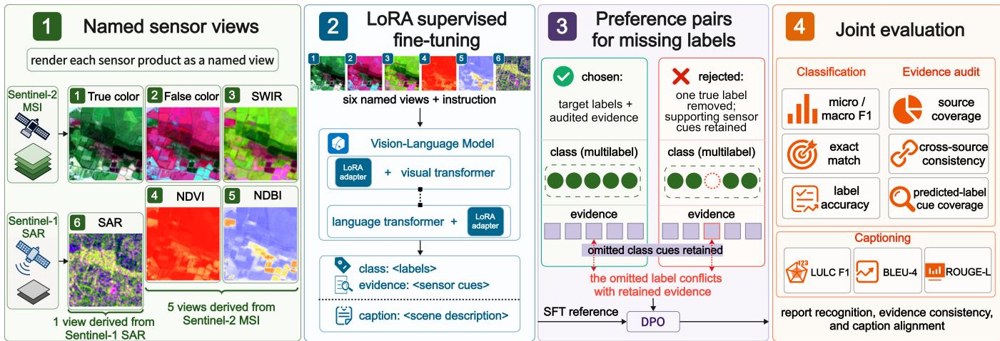  
Figure 2: Method overview. Aligned Sentinel-2 and Sentinel-1 observations are rendered as five named optical views and one SAR view. LoRA SFT learns the output schema; retained-evidence preference pairs target missing labels; classification and evidence consistency are evaluated together.

## Instruction Construction

Every SFT prompt asks for all classes in the same six-label vocabulary and the corresponding sensor evidence. Let $y =$ ser $( L , E )$ denote the target labels and evidence serialized in the two-line format. We minimize the token-level conditional likelihood

$$
\mathcal { L } _ { \mathrm { S F T } } = - \sum _ { t = 1 } ^ { | y | } \log \pi _ { \theta } ( y _ { t } \mid x , y _ { < t } ) .\tag{4}
$$

Rank 16 LoRA modules are inserted into attention and feedforward projections in the language network and selected visual transformer blocks. The original VLM parameters remain fixed. Visual LoRA parameters use 0.3 times the language learning rate; the trainable set contains 51.35M parameters, including 7.70M in the visual transformer.

For an adapted projection $W _ { 0 } \in \mathbb { R } ^ { d _ { \mathrm { o u t } } \times d _ { \mathrm { i n } } }$ , LoRA gives

$$
W = W _ { 0 } + \frac { \alpha } { r } B A , \quad A \in \mathbb { R } ^ { r \times d _ { \mathrm { i n } } } , \ B \in \mathbb { R } ^ { d _ { \mathrm { o u t } } \times r } ,\tag{5}
$$

with $r = 1 6$ and $\alpha = 3 2$ . Optimization updates A and B while preserving $W _ { 0 } .$ , placing sensor and task adaptation in compact residual updates.

Targets are built in three stages: positive labels select concise cues from $T _ { c } ;$ a grammar cleaning pass with Qwen3 preserves class, source, and cue terms; and every result is manually reviewed. The review requires a compatible cue for each positive class, cited sources present in the input, correct class–cue assignment, and preservation of the omitted class cue in preference pairs. Corrections afect only evidence strings, leaving labels and split membership fixed. Appendix A gives the prompts and review rules.

## Preference Data for Underprediction Errors

After SFT, each preference example has the form $( x , y _ { + } , y _ { - } )$ where $y _ { + } = \sec ( L _ { + } , E _ { + } )$ and $y _ { - } = \sec ( L _ { - } , E _ { - } )$ serialize the chosen and rejected label sets and evidence strings into the required two-line format. The chosen response contains the target labels and audited evidence. In a retained-evidence pair, the rejected response removes one true label while preserving its optical and radar cues. Grammar normalization with Qwen3 preserves class, source, and cue terms. For example, a class line that omits urban can still contain NDBI and structured radar cues for urban, leaving a disagreement that the preferred response resolves. A matched control removes the same type of true label together with its associated evidence cues; the SFT initialization, pair budget, and DPO hyperparameters remain fixed.

Cleaning may alter surface wording, so retained pairs are verified by cue membership rather than exact string equality. Both constructions use the same class-balanced sampling procedure; their comparison changes whether the omitted class remains supported in the rejected evidence while holding the recognition error fixed.

To construct these pairs, write $t \preceq E$ when normalized term t is a substring of normalized evidence string E. For each removable class $c \in L _ { + }$ , we set $L _ { - } = L _ { + } \setminus \{ c \}$ and generate candidate evidence while preserving the cue. A candidate is retained when $L _ { - } \subsetneq \overline { { L } } _ { + } ^ { - }$ , some $\bar { t } \in T _ { c } ^ { \star }$ satisfies $t \preceq E _ { - }$ , and every cited source occurs in the input protocol. We balance pairs by omitted class. Figure 3 gives a complete land cover classification example.

We train on these pairs with the standard DPO objective:

$$
\begin{array} { r l } & { \mathcal { L } _ { \mathrm { D P O } } = - \log \sigma ( \beta \Delta ) , } \\ & { \quad \Delta = \log \frac { \pi _ { \theta } \left( y _ { + } | x \right) } { \pi _ { \mathrm { r e f } } \left( y _ { + } | x \right) } - \log \frac { \pi _ { \theta } \left( y _ { - } | x \right) } { \pi _ { \mathrm { r e f } } \left( y _ { - } | x \right) } , } \end{array}\tag{6}
$$

where $\pi _ { \theta }$ is the adapted policy, $\pi _ { \mathrm { r e f } }$ is the frozen SFT reference, σ is the logistic sigmoid, and $\beta > 0$ controls preference strength. The retained cue creates an explicit disagreement between the class and evidence lines of the rejected response.

## Evaluation Metrics

For classification, we report micro F1, macro F1, exact match, and label accuracy. Exact match requires the complete predicted label set to equal the target.

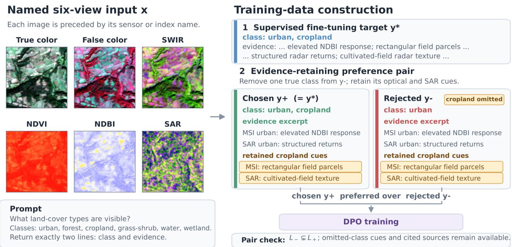  
Figure 3: Example from the classification task showing an SFT target and a retained-evidence DPO pair. The rejected response omits cropland from the class line while retaining its optical and SAR cues; ellipses mark omitted text.

For textual evidence, a fixed dictionary extracts source and class cue terms from Eˆ (Appendix A). The first check requires both optical/MSI and SAR terms. The second flags optical cues in text that cites only SAR and radar cues in text that cites only optical sources. The third requires at least one matching cue for every predicted class. A response passes the evidence audit when all three conditions hold. Throughout the paper, this metric refers to textual consistency of sources and class cues measured against the vocabulary used to construct the targets. Image dependence is examined separately through conditions without images, donor image interventions, and blinded assessment of each scene (Appendices A and A).

We also conduct a blinded human assessment of decoded evidence. Two annotators rate source compatibility, physical plausibility in the displayed images, visible cue coverage for every predicted class, unsupported cues, and judgeability. Model identity, image access, targets, and prediction correctness are hidden; Appendix A gives the rubric and agreement analysis.

## 4 Experiments

## Setup

We use aligned Sentinel-2 and Sentinel-1 imagery from the refined BigEarthNet-v2 release (Sumbul et al. 2021; Clasen et al. 2025). The six-class data contain 12,900 training images from the oficial train split. A sample of 3,234 images from the oficial test split supports configuration and ablation studies. All primary comparisons use 3,234 diferent images from the oficial validation split; the two evaluation samples have no shared patch IDs. Appendix A gives the sampling protocol and class frequencies.

The main model is Qwen3-VL-8B-Instruct (Bai et al. 2025a). TerraFM and CROMA use encoders pretrained on remote sensing data, native S1/S2 representations, and trained six-class heads (Fuller, Millard, and Green 2023; Danish et al. 2025); their rows measure specialist classification accuracy. Frozen Qwen3-VL and ResNet50 (He et al. 2016) probes use our six rendered views and isolate the recognition signal retained by that interface. The adapted VLM generates structured text through LoRA modules in its language network and selected visual transformer blocks.

Rank 16 LoRA (α = 32) updates language and selected visual attention and feedforward projections. Two epochs improve over one in the SFT scaling comparison (Appendix A); the language learning rate is $3 \times \mathrm { { 1 0 ^ { - 5 } } }$ and the visual rate is 0.3 times that value. The resulting 196 MiB adapter has 51.35M trainable parameters. DPO uses a fixed, class-balanced budget of 2,000 preference pairs, β = 0.02, and a learning rate of $5 \times 1 0 ^ { - 7 }$ for one epoch. DPO is compared with its own SFT initialization, and the evidence audit applies only to models generating the two-line response. Appendix A gives the complete protocol.

We also test the rendered input and LoRA adaptation beyond the six-class task. Sen1Floods11 supplies 674 training claims and 178 balanced positive and negative claims from its oficial test split for patch-level flood verification (Bonafilia et al. 2020). BigEarthNet.txt supplies 11,377 training captions and a separate benchmark of 970 verified captions (Herzog et al. 2026). Appendix A gives the complete protocols.

## Main Results

SFT with named views is the dominant adaptation step (Table 1). It raises micro F1 from 0.5921 to 0.8242, macro F1 from 0.5107 to 0.7452, and the evidence audit from 0.1531 to 0.9750. Retained-evidence DPO reaches 0.8275 micro F1 and 0.4261 exact match while maintaining a 0.9746 audit rate.

<table><tr><td>Method</td><td>Protocol</td><td>Micro</td><td>Macro</td><td>Exact</td><td>Ev. audit</td></tr><tr><td colspan="6">VLMs with language evidence</td></tr><tr><td>Qwen3-VL</td><td>zero-shot, named MSI+SAR</td><td>0.5921</td><td>0.5107</td><td>0.1351</td><td>0.1531</td></tr><tr><td>Ours</td><td>language and visual LoRA SFT</td><td>0.8242</td><td>0.7452</td><td>0.4140</td><td>0.9750</td></tr><tr><td>Ours</td><td>SFT + retained-evidence DPO</td><td>0.8275</td><td>0.7472</td><td>0.4261</td><td>0.9746</td></tr><tr><td colspan="6">Recognition references</td></tr><tr><td>Frozen Qwen3-VL visual probe</td><td>same six rendered views</td><td>0.7904</td><td>0.7039</td><td>0.3108</td><td></td></tr><tr><td>Frozen ResNet50 probe</td><td>same six rendered views</td><td>0.8012</td><td>0.7179</td><td>0.3510</td><td></td></tr><tr><td>CROMA</td><td>native S1+S2, frozen encoder + head</td><td>0.8334</td><td>0.7509</td><td>0.4190</td><td></td></tr><tr><td>TerraFM</td><td>native S1+S2, frozen encoder + head</td><td>0.8442</td><td>0.7725</td><td>0.4400</td><td></td></tr></table>

Table 1: Main comparison on 3,234 images from the oficial validation split. Ev. audit denotes textual source and cue consistency under the three checks in Section 3. Recognition references do not generate evidence.

The adapted VLM outperforms the frozen Qwen3-VL and ResNet50 probes on the same rendered interface while also producing a parseable evidence response. CROMA and TerraFM reach 0.8334 and 0.8442 with native S1/S2 inputs, remote sensing pretraining, and heads trained for this task. Our SFT+DPO model comes within 1.7 micro F1 points of TerraFM without pretraining a remote sensing foundation model. Appendix A reports complete recognition results on samples from both the oficial test and validation splits.

## Input Organization

This controlled one-epoch study uses a fixed adapter scope on 3,234 images from the oficial test split. Appendix Table 10 separates image count from input semantics. Five raw band group images reach 0.7252 micro F1 and 0.6538 macro F1. RGB+SAR is a strong two-view baseline at 0.7991 micro F1. With the same six images, sample order, and targets, individual view names reach 0.8048, compared with 0.7877 for generic indices and 0.7863 for sensor family names.

The view names connect rendered pixels to standard remote sensing vocabulary. Raw band triplets preserve spectral information, but provide no comparable identity in the prompt. In the matched six-view comparison, individual names improve micro F1 by 1.71 points over generic indices.

Individual names improve micro F1 over generic image indices for all three backbones. Evidence audit values vary across naming schemes, which motivates reporting recognition and generated cue consistency separately. Appendix A gives the complete matched results.

Supervision scale. With six named views and one epoch of training, micro F1 rises from 0.7439 with 4,000 examples to 0.7875 with 8,000 and 0.8048 with 12,900. Appendix A reports the complete scaling series.

## Preference Data Construction

Starting from the SFT model in Table 1, retained-evidence DPO improves exact match by 0.0121 (paired bootstrap 95% CI [0.0043, 0.0201]) and micro F1 by 0.0034 (95% CI [0.0007, 0.0060]). The evidence audit remains statistically unchanged (95% CI for the diference [−0.0031, 0.0025]). This comparison indicates more complete label recovery while preserving textual consistency. A matched control keeps the initialization, omitted class, pair budget, and optimization schedule fixed, and removes the omitted class cues from the rejected evidence. Appendix A reports this comparison and additional preference controls.

## Human Evidence Assessment

Two annotators review 120 blinded outputs from 30 matched patches under SFT and DPO, both with and without images. With images, both checkpoints obtain rates of 0.893 for physical plausibility, complete visible cue coverage, and absence of unsupported cues; without images, all three rates fall to 0.321. The paired plausibility gap is 0.571 (95% CI [0.357, 0.769]). Source assignment is compatible in 30/30 outputs per condition. Appendix A reports agreement and category distributions.

The paired design holds the scene and checkpoint fixed while changing only visual access; annotators see the corresponding views without knowing whether the model received them.

## Transfer Across Architectures

SFT with named views for one epoch improves all four architectures in Table 2, with micro F1 gains from 0.1761 to 0.2529 and audit rates above 0.93. This fixed one-epoch protocol tests architecture transfer separately from the twoepoch Qwen3-VL model in Table 1. The gains show that the rendered input and SFT protocol transfer across the tested architectures.

## Transfer Across Tasks and Datasets

Table 3 tests the adaptation approach outside the six-class BigEarthNet-v2 task. On Sen1Floods11, the input comprises true color, a SWIR composite designed to highlight water, NDWI, and SAR. LoRA in the language and visual networks raises flood verification F1 from 0.5294 to 0.7714 and accuracy from 0.5506 to 0.8202. Removing all images reduces class F1 to zero. The complete MSI+SAR input improves class F1 by 6.4 points and accuracy by 11.8 points over MSI alone; SAR alone reaches 0.6604 class F1. These matched interventions show that radar contributes to flood verification at patch level even though the BigEarthNet-v2 taxonomy is dominated by optical cues.

<table><tr><td>Backbone</td><td>Zero Micro</td><td>Zero Macro</td><td>SFT Micro</td><td>SFT Macro</td><td>∆ Micro</td><td>SFT audit</td></tr><tr><td>Qwen3-VL-8B (Bai et al. 2025a)</td><td>0.5921</td><td>0.5107</td><td>0.7681</td><td>0.6864</td><td>+0.1761</td><td>0.9712</td></tr><tr><td>SmolVLM2-2.2B (Marafioti et al. 2025)</td><td>0.5026</td><td>0.4539</td><td>0.7268</td><td>0.6197</td><td>+0.2242</td><td>0.9326</td></tr><tr><td>Idefics3-8B (Laurençon et al. 2024)</td><td>0.5374</td><td>0.3418</td><td>0.7903</td><td>0.7039</td><td>+0.2529</td><td>0.9397</td></tr><tr><td>InternVL3.5-8B (Wang et al. 2025b)</td><td>0.5537</td><td>0.4733</td><td>0.7907</td><td>0.6908</td><td>+0.2370</td><td>0.9422</td></tr></table>

Table 2: Transfer across model architectures on the same 3,234 images from the oficial validation split. Every SFT row uses six named views and the same one-epoch rank 16 adapter protocol.

(a) Sen1Floods11 flood verification
<table><tr><td>Setting</td><td>Class F1</td><td>Accuracy</td></tr><tr><td>Qwen3-VL zero-shot</td><td>0.5294</td><td>0.5506</td></tr><tr><td>LoRA SFT, MSI+SAR</td><td>0.7714</td><td>0.8202</td></tr><tr><td>LoRA SFT, MSI only</td><td>0.7072</td><td>0.7022</td></tr><tr><td>LoRA SFT, SAR only</td><td>0.6604</td><td>0.7978</td></tr><tr><td>LoRA SFT, no image</td><td>0.0000</td><td>0.6292</td></tr></table>

(b) BigEarthNet.txt caption generation
<table><tr><td>Adapter</td><td>BEN-19 F1</td><td>SacreBLEU</td><td>ROUGE-L</td></tr><tr><td>Base Qwen3-VL</td><td>0.0148</td><td>0.81</td><td>0.1177</td></tr><tr><td>Caption SFT, no image</td><td>0.2753</td><td>31.88</td><td>0.4421</td></tr><tr><td>Caption SFT, MSI+SAR</td><td>0.5654</td><td>42.07</td><td>0.5337</td></tr></table>

Table 3: Transfer across a new dataset and task. (a) Results use 178 claims from the oficial Sen1Floods11 test split. (b) Results use the 970-example verified BigEarthNet.txt benchmark; BEN-19 F1 measures mention overlap over its 19-class ontology, and SacreBLEU is on a 0–100 scale. Complete controls are in Appendix A.
<table><tr><td>BigEarthNet-v2 input</td><td>Micro F1</td><td>∆F1</td><td>Pred. change</td></tr><tr><td>Intact six views</td><td>0.8180</td><td></td><td></td></tr><tr><td>No images</td><td>0.5741</td><td>-0.2439</td><td>0.9700</td></tr><tr><td>MSI only</td><td>0.8159</td><td>-0.0020</td><td>0.1100</td></tr><tr><td>SAR only</td><td>0.1734</td><td>-0.6446</td><td>0.8888</td></tr><tr><td>Optical donor, original SAR</td><td>0.4852</td><td>-0.3328</td><td>0.9325</td></tr><tr><td>Original optical, SAR donor</td><td>0.8186</td><td>+0.0007</td><td>0.0575</td></tr></table>

Table 4: Image interventions for the SFT model in Table 1 on 800 images sampled from the same oficial validation split. Pred. change is the fraction of label sets that difer from intact inference.

On BigEarthNet.txt, applying LoRA to the same language and visual modules during caption training reaches 0.5654 BigEarthNet-19 concept F1, 42.07 SacreBLEU, and 0.5337 ROUGE-L. Removing the images reduces these scores to 0.2753, 31.88, and 0.4421. Because reference captions combine visual content with map metadata, BEN-19 concept F1 separately evaluates land cover mentions alongside sequence overlap; Appendix A details the data checks.

## Discussion

Removing all images reduces micro F1 by 0.2439; replacing the optical views with a donor patch reduces it by 0.3328 (Table 4). Both interventions change more than 93% of predicted label sets. The intact and MSI-only scores are similar, and replacing SAR changes only 5.8% of predictions, showing that optical content carries most of the recognition signal for this six-class taxonomy. Sen1Floods11 supplies the complementary case: adding SAR to MSI raises flood F1 by 0.0642 and accuracy by 0.1180. The rendered interface thus exposes how modality contributions change with the task.

The human audit measures physical plausibility at patch level, complementing the textual audit and image interventions. Together, the three evaluations test response vocabulary, scene support, and sensitivity to visual access. Extending the same adaptation principle to region and pixel localization is a natural direction.

The 196 MiB adapter leaves the 8B host unchanged, allowing recognition and caption variants to share one base checkpoint without remote sensing foundation model pretraining.

The controlled six-class taxonomy supports balanced preference construction and detailed input interventions. Results across architectures, flood recognition, and captioning further test the adaptation principles under changes in model, dataset, label space, and output form. Complete protocols are reported in the supplement.

## 5 Conclusion

We present a lightweight route from VLMs to multispectral and SAR land cover recognition. Named renderings with language and visual LoRA raise Qwen3-VL micro F1 from 0.5921 to 0.8242; retained-evidence DPO reaches 0.8275 while maintaining the structured evidence audit. The same adaptation protocol improves four VLM architectures and transfers to flood verification and land cover captioning. Blinded assessment further finds more physically plausible evidence when the checkpoints receive images.

Explicit view names connect each rendering to its measurement, while compact adapters preserve the reusable base checkpoint. This separation provides a practical route for bringing advances in VLMs to MSI and SAR applications. Extensions can retain the same principle while supporting native spatial resolution, detailed taxonomies, and region or pixel localization.

Mallya, G.; Gigi, Y.; Kim, D.; Neumann, M.; Beryozkin, G.; Shekel, T.; and Angelova, A. 2025. Zero-Shot Multi-Spectral

## References

Alayrac, J.-B.; Donahue, J.; Luc, P.; Miech, A.; Barr, I.; Hasson, Y.; Lenc, K.; Mensch, A.; Millican, K.; Reynolds, M.; et al. 2022. Flamingo: A Visual Language Model for Few-Shot Learning. In NeurIPS, volume 35, 23716–23736.

Astruc, G.; Gonthier, N.; Mallet, C.; and Landrieu, L. 2025. AnySat: One Earth Observation Model for Many Resolutions, Scales, and Modalities. In CVPR, 19530–19540.

Bai, S.; Cai, Y.; Chen, R.; et al. 2025a. Qwen3-VL Technica Report. arXiv:2511.21631.

Bai, S.; Chen, K.; Liu, X.; Wang, J.; Ge, W.; Song, S.; Dang,K.; Wang, P.; Wang, S.; Tang, J.; et al. 2025b. Qwen2.5-VLTechnical Report. arXiv:2502.13923.

Bastani, F.; Wolters, P.; Gupta, R.; Ferdinando, J.; and Kembhavi, A. 2023. SatlasPretrain: A Large-Scale Dataset for Remote Sensing Image Understanding. In ICCV, 16726– 16736.

Bonafilia, D.; Tellman, B.; Anderson, T.; and Issenberg, E. 2020. Sen1Floods11: A Georeferenced Dataset to Train and Test Deep Learning Flood Algorithms for Sentinel-1. In CVPR Workshops, 835–845.

Cai, M.; Wang, G.; Zhang, W.; Zhou, G.; Zhuang, Y.; Zhang, T.; Wang, H.; Chen, H.; and Li, J. 2026. Earth-OneVision: Extending Remote Sensing Multimodal Large Language Models to More Sensor Modalities and Tasks. arXiv:2606.10819.

Cheng, D.; Huang, S.; Zhu, Z.; Zhang, X.; Zhao, W. X.; Luan, Z.; Dai, B.; and Zhang, Z. 2025. On Domain-Adaptive Post-Training for Multimodal Large Language Models. In Findings ofEMNLP, 274–296.

Clasen, K. N.; Hackel, L.; Burgert, T.; Sumbul, G.; Demir, B.; and Markl, V. 2025. reBEN: Refined BigEarthNet Dataset for Remote Sensing Image Analysis. In IGARSS, 1264–1268.

Burke, M.; Lobell, D. B.; and Ermon, S. 2022. SatMAE: Pre-training Transformers for Temporal and Multi-Spectral Satellite Imagery. In NeurIPS, volume 35, 197–211.

Dai, W.; Li, J.; Li, D.; Tiong, A. M. H.; Zhao, J.; Wang, W.; Li, B.; Fung, P.; and Hoi, S. 2023. InstructBLIP: Towards General-purpose Vision-Language Models with Instruction Tuning. In NeurIPS, volume 36, 49250–49267.

Danish, M. S.; Munir, M. A.; Shah, S. R. A.; Khan, M. H.; Anwer, R. M.; Laaksonen, J.; Khan, F. S.; and Khan, S. 2025. TerraFM: A Scalable Foundation Model for Unified Multisensor Earth Observation. arXiv:2506.06281.

Fuller, A. T.; Millard, K.; and Green, J. R. 2023. CROMA: Remote Sensing Representations with Contrastive Radar-Optical Masked Autoencoders. In NeurIPS, volume 36, 5506–5538.

Guo, X.; Lao, J.; Dang, B.; Zhang, Y.; Yu, L.; Ru, L.; Zhong, L.; Huang, Z.; Wu, K.; Hu, D.; et al. 2024. SkySense: A Multi-Modal Remote Sensing Foundation Model Towards Universal Interpretation for Earth Observation Imagery. In CVPR, 27662–27673.

He, K.; Zhang, X.; Ren, S.; and Sun, J. 2016. Deep Residual Learning for Image Recognition. In CVPR, 770–778.

Herzog, J.-L.; Adler, M. J.; Hackel, L.; Shu, Y.; Zavras, A.; Papoutsis, I.; Rota, P.; and Demir, B. 2026. BigEarthNet.txt: A Large-Scale Multi-Sensor Image-Text Dataset and Bench-

mark for Earth Observation. arXiv:2603.29630.

Hong, D.; Zhang, B.; Li, X.; Li, Y.; Li, C.; Yao, J.; Yokoya, N.; Li, H.; Ghamisi, P.; Jia, X.; Plaza, A.; Gamba, P.; Benediktsson, J. A.; and Chanussot, J. 2024. SpectralGPT: Spectral Remote Sensing Foundation Model. IEEE Transactions on Pattern Analysis and Machine Intelligence, 46(8): 5227– 5244.

Hu, E. J.; Shen, Y.; Wallis, P.; Allen-Zhu, Z.; Li, Y.; Wang, S.; Wang, L.; and Chen, W. 2022. LoRA: Low-Rank Adaptation of Large Language Models. In ICLR.

Kim, D.; Mallya, G. S.; and Angelova, A. 2026. Unlocking Multi-Spectral Data for Multi-Modal Models with Guided Inputs and Chain-of-Thought Reasoning. In IGARSS. To appear.

Kuckreja, K.; Danish, M. S.; Naseer, M.; Das, A.; Khan, S.; and Khan, F. S. 2024. GeoChat: Grounded Large Vision-Language Model for Remote Sensing. In CVPR, 27831– 27840.

Laurençon, H.; Marafioti, A.; Sanh, V.; and Tronchon, L. 2024. Building and Better Understanding Vision-Language Models: Insights and Future Directions. arXiv:2408.12637.

Li, J.; Li, D.; Savarese, S.; and Hoi, S. C. H. 2023. BLIP-2: Bootstrapping Language-Image Pre-training with Frozen Image Encoders and Large Language Models. In ICML, 19730–19742.

Liu, F.; Chen, D.; Guan, Z.; Zhou, X.; Zhu, J.; Ye, Q.; Fu, L.; and Zhou, J. 2024. RemoteCLIP: A Vision Language Foundation Model for Remote Sensing. IEEE Transactions on Geoscience and Remote Sensing, 62: 1–16.

Liu, H.; Li, C.; Wu, Q.; and Lee, Y. J. 2023. Visual Instruction Tuning. In NeurIPS, volume 36, 34892–34916.

Mañas, Ó.; Lacoste, A.; Giró-i Nieto, X.; Vázquez, D.; and Rodríguez, P. 2021. Seasonal Contrast: Unsupervised Pre-Training from Uncurated Remote Sensing Data. In ICCV, 9394–9403.

Marafioti, A.; Zohar, O.; Farré, M.; Noyan, M.; Bakouch, E.; Cuenca, P.; Zakka, C.; Ben Allal, L.; Lozhkov, A.; Tazi, N.; et al. 2025. SmolVLM: Redefining Small and Eficient Multimodal Models. arXiv:2504.05299.

Rafailov, R.; Sharma, A.; Mitchell, E.; Ermon, S.; Manning, C. D.; and Finn, C. 2023. Direct Preference Optimization: Your Language Model is Secretly a Reward Model. In NeurIPS, volume 36, 53728–53741.

Reed, C. J.; Gupta, R.; Li, S.; Brockman, S.; Funk, C.; Clipp, B.; Keutzer, K.; Candido, S.; Uyttendaele, M.; and Darrell, T. 2023. Scale-MAE: A Scale-Aware Masked Autoencoder for Multiscale Geospatial Representation Learning. In ICCV, 4065–4076.

Shu, Y.; Ren, B.; Xiong, Z.; Paudel, D. P.; Van Gool, L.; Demir, B.; Sebe, N.; and Rota, P. 2025. EarthMind: Leveraging Cross-Sensor Data for Advanced Earth Observation Interpretation with a Unified Multimodal LLM. arXiv:2506.01667.

Shu, Y.; Ren, B.; Xiong, Z.; Zhu, X. X.; Demir, B.; Sebe, N.; and Rota, P. 2026. TerraScope: Pixel-Grounded Visual

Reasoning for Earth Observation. In CVPR.

Soni, S.; Dudhane, A.; Debary, H.; Fiaz, M.; Munir, M. A.; Danish, M. S.; Fraccaro, P.; Watson, C. D.; Klein, L. J.; Khan, F. S.; and Khan, S. 2025. EarthDial: Turning Multi-Sensory Earth Observations to Interactive Dialogues. In CVPR, 14303–14313.

Sumbul, G.; Charfuelan, M.; Demir, B.; and Markl, V. 2019. BigEarthNet: A Large-Scale Benchmark Archive for Remote Sensing Image Understanding. In IGARSS, 5901–5904.

Sumbul, G.; de Wall, A.; Kreuziger, T.; Marcelino, F.; Costa, H.; Benevides, P.; Caetano, M.; Demir, B.; and Markl, V. 2021. BigEarthNet-MM: A Large-Scale, Multimodal, Multilabel Benchmark Archive for Remote Sensing Image Classification and Retrieval. IEEE Geoscience and Remote Sensing Magazine, 9(3): 174–180.

Szwarcman, D.; Roy, S.; Fraccaro, P.; Gíslason, Þ. E.; Blumenstiel, B.; Ghosal, R.; de Oliveira, P. H.; de Sousa Almeida, J. L.; Sedona, R.; Kang, Y.; et al. 2026. Prithvi-EO-2.0: A Versatile Multitemporal Foundation Model for Earth Observation Applications. IEEE Transactions on Geoscience and Remote Sensing, 64: 1–20.

Wang, F.; Zhou, W.; Huang, J. Y.; Xu, N.; Zhang, S.; Poon, H.; and Chen, M. 2024. mDPO: Conditional Preference Optimization for Multimodal Large Language Models. In EMNLP, 8078–8088.

Wang, P.; Hu, H.; Tong, B.; Zhang, Z.; Yao, F.; Feng, Y.; Zhu, Z.; Chang, H.; Diao, W.; Ye, Q.; and Sun, X. 2025a. Ring-MoGPT: A Unified Remote Sensing Foundation Model for Vision, Language, and Grounded Tasks. IEEE Transactions on Geoscience and Remote Sensing, 63: 1–20.

Wang, W.; Gao, Z.; Gu, L.; Pu, H.; Cui, L.; Wei, X.; Liu, Z.; Jing, L.; Ye, S.; Shao, J.; et al. 2025b. InternVL3.5: Advancing Open-Source Multimodal Models in Versatility, Reasoning, and Eficiency. arXiv:2508.18265.

Wang, Y.; Braham, N. A. A.; Xiong, Z.; Liu, C.; Albrecht, C. M.; and Zhu, X. X. 2023. SSL4EO-S12: A Large-Scale Multimodal, Multitemporal Dataset for Self-Supervised Learning in Earth Observation. IEEE Geoscience and Remote Sensing Magazine, 11(3): 98–106.

Xiong, Z.; Wang, Y.; Zhang, F.; Stewart, A. J.; Hanna, J.; Borth, D.; Papoutsis, I.; and Zhu, X. X. 2024. Neural Plasticity-Inspired Foundation Model for Observing the Earth Crossing Modalities. In CVPR, 17383–17393.

Zhang, W.; Cai, M.; Zhang, T.; Zhuang, Y.; and Mao, X. 2024a. EarthGPT: A Universal Multimodal Large Language Model for Multisensor Image Comprehension in Remote Sensing Domain. IEEE Transactions on Geoscience and Remote Sensing, 62: 1–20.

Zhang, Z.; Zhao, T.; Guo, Y.; and Yin, J. 2024b. RS5M and GeoRSCLIP: A Large-Scale Vision-Language Dataset and a Large Vision-Language Model for Remote Sensing. IEEE Transactions on Geoscience and Remote Sensing, 62: 1–23.

## A Additional Experimental Details

This appendix contains detailed BigEarthNet-v2 diagnostics, transfer protocols, and results omitted from the main paper for space.

## Dataset and Training Details

We start from BigEarthNet-v2 samples with aligned Sentinel-2 MSI and Sentinel-1 SAR products. Samples with no mapped class are discarded. Training uses 12,900 examples from the oficial train assignment. A deterministic sample of 3,234 examples from the oficial test assignment, drawn with class quotas, supports configuration selection and exploratory comparisons. These quotas apply only to training and configuration construction; the oficial validation sample retains its natural class frequencies. Specialist classifiers reserve part of the training data for threshold selection. After fixing the model and decoding choices, we draw a simple random sample of 3,234 examples from the unused portion of the oficial validation assignment with seed 42. This oficial validation sample excludes every patch used for training, configuration, or prior inspection.

The SFT configuration in Main Table 1 uses AdamW, rank 16 LoRA with α = 32, batch size 1 on each device, gradient accumulation 8, two epochs, and a language learning rate of $3 \times 1 0 ^ { - 5 }$ . LoRA modules update attention and feedforward projections in the language network and selected visual transformer blocks; the visual LoRA learning rate is 0.3 times the language rate. The original VLM weights remain fixed. The adapter contains 51.35M trainable parameters, including 7.70M in the visual transformer, and occupies 196 MiB. The corresponding DPO configuration starts from this SFT checkpoint and uses 2,000 retained-evidence pairs, gradient accumulation 8, one epoch, $\beta = 0 . 0 2 .$ , a learning rate of $5 \times 1 0 ^ { - 7 }$ , and gradient clipping at 1.0. Chosen and rejected sequences are collated together, and their log probabilities are normalized by sequence length. Appendix A provides the full preference protocol.

Target-Label Mapping
<table><tr><td>Target</td><td>BigEarthNet-v2 labels merged into the target</td></tr><tr><td>Urban</td><td>Urban fabric; industrial or commercial units</td></tr><tr><td>Forest</td><td>Broad-leaved, coniferous, and mixed forest</td></tr><tr><td>Cropland</td><td>Arable land; permanent crops; complex cultivation; agro-forestry; agriculture with natural vegetation</td></tr><tr><td>Grass-shrub</td><td>Pastures; natural grassland and sparse vegetation; transitional woodland/shrub; moors, heathland, sclerophyllous vegetation</td></tr><tr><td>Water</td><td>Inland waters; marine waters</td></tr><tr><td>Wetland</td><td>Inland wetlands; coastal wetlands</td></tr></table>

Table 6: Mapping of 18 BigEarthNet-v2 labels to the six target classes. Beach, dune, and sand samples without another mapped label are removed.

The positive label counts for training and configuration are, respectively: urban 4,032/1,006; forest 8,062/2,299; cropland 7,056/1,892; grass-shrub 6,346/1,672; water 4,256/1,084; and wetland 4,000/1,000. The random oficial validation sample contains 489 urban, 2,076 forest, 2,022 cropland,

<table><tr><td>Item</td><td>Setting</td></tr><tr><td colspan="2">Data and evaluation</td></tr><tr><td>Classes</td><td>urban, forest, cropland, grass-shrub, water, wetland 12,900 train / 3,234 configuration examples</td></tr><tr><td>VLM data</td><td>3,234 unused examples</td></tr><tr><td>Validation</td><td>11,651 train / 1,249 threshold / 3,234 evaluation</td></tr><tr><td>Specialists</td><td>11,610 train / 1,290 threshold / 3,234 evaluation</td></tr><tr><td>ResNet50 Image size</td><td> $2 2 4 \times 2 2 4$  rendered views</td></tr><tr><td colspan="2">Optimization</td></tr><tr><td>Main VLM</td><td>Qwen3-VL-8B-Instruct</td></tr><tr><td>SFT scope</td><td>rank-16 language and visual LoRA; 2 epochs</td></tr><tr><td>SFT</td><td> ${ \mathrm { l r ~ } } 3 \times 1 0 ^ { - 5 } ;$  visual scale 0.3; seed 42</td></tr><tr><td>schedule DPO ref.</td><td>corresponding SFT checkpoint</td></tr><tr><td>DPO sched.</td><td>2,000 retained-evidence pairs;  $\beta = 0 . 0 2 ; 1$  epoch;  ${ \mathrm { l r ~ } } 5 \times 1 0 ^ { - 7 }$ </td></tr></table>

Table 5: Main experimental settings. Selected zero-shot, SFT, and DPO checkpoints are evaluated once on the oficial validation sample.

1,575 grass-shrub, 781 water, and 131 wetland positives. Counts exceed the number of examples because the task is multilabel.

## Class Parsing

The parser first extracts and lowercases the class: line. It maps common forms such as built-up, woodland, agriculture, grassland, and plural class names to the six canonical labels. When the class line is absent, the same alias matcher is applied to the full response for recognition scoring, while the response remains invalid under the requested format. This recovery rule is fixed for both the configuration and oficial validation samples.

## Rendering Protocol

All Sentinel-2 bands are resampled to a common grid before rendering. Each channel is clipped to its scene-level 2nd– 98th percentile range and linearly mapped to 8-bit intensity. NDVI and NDBI are scalar one-channel index maps before visualization; we render them as three-channel RGB pseudocolor images with a fixed diverging color map centered at zero. The SAR view is a three-channel false-color composite from log-scaled VV, VH, and VV−VH backscatter, rendered with the same percentile rule. Thus every input supplied to the VLM is a standard RGB image, with index and SAR colors serving as visual encodings of scalar or backscatter values. The exact views are:

## Instruction and Evidence Templates

Training prompts always ask the same multilabel question and do not name a target class in the question. A typical prompt is:

These six images are aligned   
remote-sensing views of the same   
area. Image 1 is optical true   
color; Image 2 is optical false

<table><tr><td>View</td><td>RGB channels</td><td>Encoded information</td></tr><tr><td></td><td>True color B04, B03, B02</td><td>Optical appearance</td></tr><tr><td></td><td>False color B08, B04, B03</td><td>NIR vegetation response</td></tr><tr><td>SWIR</td><td>B11, B08, B04</td><td>Built-up and moisture contrast</td></tr><tr><td>NDVI</td><td></td><td>index pseudocolor Vegetation intensity</td></tr><tr><td>NDBI</td><td>index pseudocolor Built-up intensity</td><td></td></tr><tr><td>SAR</td><td></td><td>VV, VH, VV—VH Backscatter/polarization contrast</td></tr></table>

Table 7: Six-view rendering used by the named MSI+SAR protocol. NDVI and NDBI formulas are given in the text.

color; Image 3 is optical SWIR;   
Image 4 is optical NDVI; Image 5 is   
optical NDBI; Image 6 is SAR radar.   
List all land cover classes present   
from urban, forest, cropland,   
grass-shrub, water, wetland. Return   
exactly two lines: class: ...   
evidence: ...

Evidence templates are short by design. Examples include: urban evidence may mention built-up texture, NDBI response, SWIR contrast, or structured radar return; forest evidence may mention high NDVI, contiguous canopy-like optical texture, or heterogeneous radar texture; cropland evidence may mention field-like parcels and regular agricultural texture; grass-shrub evidence may mention lower, patchier vegetation than forest; water evidence may mention dark optical tone, water-index contrast, or smooth low-variation radar return; wetland evidence may mention mixed water and vegetation cues. The template generator combines one or two cues per positive class and removes duplicate source names.

Evidence cleaning and audit. The evidence pool is constructed from labels and sensor cue templates, then passed through Qwen3 for grammar cleaning. The cleaning prompt preserves the class list, source names, and cue terms, and only rewrites awkward concatenations into a readable evidence sentence. After cleaning, the pool is manually audited. The audit checks four items: every positive class has at least one compatible cue when the template pool contains one; each source name appears in the available six-view prompt; class-specific cues are not assigned to unrelated classes; and rejected preference responses preserve the intended cue for the omitted class when the DPO family requires evidence retention. Corrections are made at the evidence string level while keeping the class labels and split membership fixed.

## Evidence Dictionaries

The consistency audit for sources and class cues uses fixed, case-insensitive substring dictionaries over generated text. The optical/MSI source forms are msi, optical, multispectral, true-color, true color, false-color, false color, swir, ndvi, ndbi, spectral, and vegetation-sensitive. The SAR forms are sar, radar, backscatter, double-bounce, double bounce, and speckle. Checks across sources use the optical-only subset {ndvi, ndbi, swir, the true/false-color forms, spectral, vegetation-sensitive} and the SAR-only subset {backscatter, the double-bounce forms, speckle, radar texture, radar}.

The class cue lists are: urban {built-up, built up, impervious, ndbi, man-made, urban block, structured radar, angular, compact bright}; forest {tree canopy, canopy, forest canopy, closed canopy, volume scattering, dense continuous, vegetation-rich, rich vegetation}; cropland {field parcel, field-like, agricultural, crop, cultivated, parcel, regular surface, regular texture}; grass-shrub {grass, shrub, low-to-moderate, low to moderate, herbaceous, pasture, mottled natural, moderate diffuse}; water {open water, dark water, water-like, water-compatible, smooth low-variation, low backscatter, aquatic, water-sensitive}; and wetland {wet vegetation, moisture, moisture-sensitive, mixed water, mixed water-vegetation, vegetated mosaic, wetland}.

Coverage of optical and SAR sources passes when the evidence contains at least one optical/MSI form and one SAR form. Consistency across sources rejects a text chunk when it contains a SAR source and an optical cue without an optical source, or an optical source and a SAR cue without SAR. Chunks that name both source families are not assigned more finely. Cue coverage for predicted labels passes only when every predicted class has at least one matching class cue. The evidence audit passes when all three checks pass for a response.

## Blinded Human Evidence Assessment

We evaluate evidence written in free form by matched SFT and DPO checkpoints. The assessment uses 30 validation patches under four conditions: SFT with images, SFT without images, retained-evidence DPO with images, and the same DPO checkpoint without images. This produces 120 outputs spanning all six classes and including both exact matches and erroneous class predictions. Across the 30 multilabel patches, the class counts are 8 urban, 21 forest, 20 cropland, 11 grass-shrub, 9 water, and 4 wetland. The same six views are displayed when rating every output so that the condition without model image access measures whether its text remains credible for the corresponding scene.

Two annotators receive independently shufled item orders and do not see model identity, the image access condition, target labels, or prediction correctness. For each item they rate: (1) whether each cue is assigned to a compatible sensor or rendered view; (2) whether the stated evidence is physically plausible in the displayed images; (3) whether every predicted class has a visible supporting cue; (4) whether one or more cue claims are unsupported; and (5) whether image quality and scene ambiguity permit a defensible judgment. The reported plausibility, complete coverage, and rates without unsupported cues exclude items marked unable to judge and show the resulting denominators.

Across the 120 items, raw agreement is 0.967–1.000 across the five criteria. Cohen’s κ is 0.945–1.000 for the nondegenerate criteria; source compatibility is marked compatible by both annotators for every item. Each condition has 56 available ratings out of 60. Averaging available ratings within each output, SFT and DPO with image access both obtain 0.893 for physical plausibility, complete coverage, and absence of unsupported cues; all three rates are 0.321 without images. A paired bootstrap with 10,000 resamples over patches gives a plausibility diference of 0.571 between the conditions with and without images, with a 95% CI of [0.357, 0.769]. Source compatibility is 30/30 in all four conditions.

<table><tr><td>Adaptation</td><td>Micro</td><td>Macro</td><td>Exact Ev. audit</td></tr><tr><td>None (zero-shot)</td><td>0.5921 0.5107</td><td>0.1351</td><td>0.1531</td></tr><tr><td>SFT</td><td>0.8242 0.7452</td><td>0.4140</td><td>0.9750</td></tr><tr><td>SFT + retained-evidence DPO</td><td>0.8275 0.7472</td><td>0.4261</td><td>0.9746</td></tr></table>

Table 8: Qwen3-VL-8B results on the oficial validation sample. SFT and DPO use language and visual LoRA; model, decoding, and evaluation choices are fixed before inference.

## Evaluation on the Oficial Validation Split

After selecting checkpoints on the configuration sample, we evaluate them once on the fixed sample of 3,234 images from the oficial validation split described in Appendix A. This sample follows the natural frequencies in the oficial validation split, whereas the configuration sample uses class quotas. Method comparisons are made within each sample.

We additionally apply a paired bootstrap with 10,000 resamples over examples. DPO improves micro F1 by 0.0034 (95% CI [0.0007, 0.0060]) and exact match by 0.0121 (95% CI [0.0043, 0.0201]); the change in evidence audit is −0.0003 (95% CI [−0.0031, 0.0025]).

## SFT Data Scaling and Checkpoint Selection

Table 9 reports the data scaling series with LoRA only in language modules. This series precedes the comparison of trainable parameter scopes. Increasing the training set from 4k to 12.9k examples steadily improves recognition, and a second epoch gives the strongest result within this setting.

<table><tr><td>Setting</td><td>Rows</td><td>Epochs</td><td>LR</td><td>Micro</td><td>Macro</td><td>Ev. audit</td></tr><tr><td>Zero-shot</td><td>0</td><td>0</td><td></td><td>0.6270</td><td>0.6075</td><td>0.1450</td></tr><tr><td>4k data</td><td>4000</td><td>1</td><td> $3 \times 1 0 ^ { - 5 }$ </td><td>0.7439</td><td>0.7137</td><td>0.9431</td></tr><tr><td>8k data</td><td>8000</td><td>1</td><td> $3 \times 1 0 ^ { - 5 }$ </td><td>0.7875</td><td>0.7732</td><td>0.9403</td></tr><tr><td>12.9k, 1 ep.</td><td>12900</td><td>1</td><td> $3 \times 1 0 ^ { - 5 }$ </td><td>0.8048</td><td>0.7946</td><td>0.9298</td></tr><tr><td>12.9k, 2 ep.</td><td>12900</td><td>2</td><td> $3 \times 1 0 ^ { - 5 }$ </td><td>0.8178</td><td>0.8055</td><td>0.9032</td></tr></table>

Table 9: SFT data scaling with individually named views on the configuration sample.

## Input Protocol Details

The controls with generic indices and sensor family names use the same six images, sample order, and supervised targets as the individually named views. The first prompt uses generic image indices. The second identifies optical, derived index, and radar families without naming NDVI or NDBI individually. Under this matched comparison after one epoch, individual names reach 0.8048 micro F1, versus 0.7877 with generic indices and 0.7863 with family names. Evidence audit scores are reported separately from classification.

Protocol definitions. RGB+SAR uses true color and SAR only. Raw bands + SAR uses RGB groups of original Sentinel-2 bands plus SAR without semantic view names; it tests whether broad multispectral coverage can replace views with explicit sensor meaning. The four view protocol uses true color, false color, SWIR, and SAR. The five view protocol adds NDVI. The unnamed protocol uses the same six rendered images as the main protocol but identifies them only with generic indices. The family protocol names broad categories (optical, index, and radar) without identifying NDVI or NDBI. The individually named protocol identifies every rendered view.

## Specialist Classifier Baselines

<table><tr><td>Method</td><td>Input</td><td>Micro Macro</td><td>Exact L-acc.</td></tr><tr><td>CROMA</td><td>S1</td><td></td><td>0.8283 0.82080.3624 0.8364</td></tr><tr><td>CROMA</td><td>S2</td><td></td><td>0.8441 0.8362 0.3921 0.8513</td></tr><tr><td>CROMA</td><td>S1+S2 joint</td><td></td><td>0.85150.84460.42270.8602</td></tr><tr><td>CROMA</td><td>S1+S2 concat</td><td></td><td>0.8600 0.8532 0.44190.8687</td></tr><tr><td>TerraFM</td><td>S1</td><td>0.8177 0.8076 0.31390.8203</td><td></td></tr><tr><td>TerraFM</td><td>S2</td><td>0.87140.86630.45520.8777</td><td></td></tr><tr><td>TerraFM</td><td>S1+S2</td><td>0.87090.86470.46910.8796</td><td></td></tr><tr><td>Qwen3-VL probe</td><td>six views</td><td></td><td>0.8234 0.81250.3364 0.8295</td></tr><tr><td>ResNet50 probe</td><td>six views</td><td>0.8402 0.8323</td><td></td></tr></table>

Table 11: Specialist encoder and frozen visual probe results.

CROMA and TerraFM use oficial frozen encoders with trained six-class multilabel heads. The table reports results on the configuration sample; results on the oficial validation sample appear in Main Table 1. The CROMA joint row uses the oficial radar and optical path; the concat rows concatenate frozen S1 and S2 features. The Qwen3-VL probe averages frozen visual features from the six views and trains a linear head with thresholds selected on training data. The ResNet50 probe uses a frozen ImageNet backbone and a lightweight multilabel head on the same six rendered views.

## Transfer Across Architectures

We also evaluate whether the interface with individually named views transfers beyond the Qwen3-VL host used in the main paper. The rendering, prompt structure, label space, and training examples are unchanged. In this oneepoch architecture study, rank-16 LoRA is confined to each backbone’s language attention and feedforward projections; module names follow the corresponding architecture. Main Table 2 evaluates four architectures on the oficial validation sample. The additional comparisons below use Qwen2.5-VL and AdaptLLM-RS on the configuration sample to isolate view naming while retaining identical image pixels.

Individual view names give the highest micro F1 for all three checkpoints. Against the stronger of the two sixview naming controls, the margin ranges from 0.16 points and water patterns, and retain the same named view order across architectures. They illustrate the structured output format; aggregate behavior is reported in Main Table 2 and Table 13.

<table><tr><td>Protocol</td><td>Views</td><td>Z-mi</td><td>Z-ma</td><td>SFT-mi</td><td>SFT-ma</td><td>Ev. audit</td></tr><tr><td>RGB+SAR</td><td>2</td><td>0.5988</td><td>0.5675</td><td>0.7991</td><td>0.7626</td><td>0.9354</td></tr><tr><td>Raw bands + SAR</td><td>5</td><td>0.3935</td><td>0.3996</td><td>0.7252</td><td>0.6538</td><td>0.8806</td></tr><tr><td>Semantic, 4 views</td><td>4</td><td>0.6075</td><td>0.5792</td><td>0.7872</td><td>0.7572</td><td>0.7137</td></tr><tr><td>Semantic, 5 views</td><td>5</td><td>0.6197</td><td>0.5962</td><td>0.7927</td><td>0.7835</td><td>0.8256</td></tr><tr><td>Generic indices, 6 views</td><td>6</td><td>0.6147</td><td>0.5890</td><td>0.7877</td><td>0.7589</td><td>0.9493</td></tr><tr><td>Sensor families, 6 views</td><td>6</td><td>0.6245</td><td>0.6065</td><td>0.7863</td><td>0.7643</td><td>0.9403</td></tr><tr><td>Individual names, 1 ep.</td><td>6</td><td>0.6270</td><td>0.6075</td><td>0.8048</td><td>0.7946</td><td>0.9298</td></tr><tr><td>Individual names, 2 ep.</td><td>6</td><td>0.6270</td><td>0.6075</td><td>0.8178</td><td>0.8055</td><td>0.9032</td></tr></table>

Table 10: Input protocol results on the configuration sample. All SFT rows use one epoch except the row marked as two epochs.

<table><tr><td>Backbone</td><td>SFT input</td><td>Micro</td><td>Macro</td><td>Ev. audit</td></tr><tr><td rowspan="4">Qwen3-VL-8B†</td><td>RGB+SAR</td><td>0.7991</td><td>0.7626</td><td>0.9354</td></tr><tr><td>generic</td><td>0.7877</td><td>0.7589</td><td>0.9493</td></tr><tr><td>family</td><td>0.7863</td><td>0.7643</td><td>0.9403</td></tr><tr><td>named</td><td>0.8048</td><td>0.7946</td><td>0.9298</td></tr><tr><td rowspan="4">Qwen2.5-VL-7B‡</td><td>RGB+SAR</td><td>0.7948</td><td>0.7603</td><td>0.9617</td></tr><tr><td>generic</td><td>0.8457</td><td>0.8355</td><td>0.9224</td></tr><tr><td>family</td><td>0.8437</td><td>0.8335</td><td>0.9236</td></tr><tr><td>named</td><td>0.8473</td><td>0.8406</td><td>0.8636</td></tr><tr><td rowspan="4">AdaptLLM-RS-3B§</td><td>RGB+SAR</td><td>0.8266</td><td>0.8176</td><td>0.9292</td></tr><tr><td>generic</td><td>0.8186</td><td>0.8095</td><td>0.9536</td></tr><tr><td>family</td><td>0.8194</td><td>0.8094</td><td>0.9484</td></tr><tr><td>named</td><td>0.8331</td><td>0.8195</td><td>0.9168</td></tr></table>

Table 12: Matched input organization across architectures. Generic, family, and named use the same six views and difer only in prompt naming. All results use one epoch and the same configuration sample. †LR $3 \times 1 0 ^ { - 5 }$ ; ‡LR $3 \times 1 0 ^ { - 5 } ;$ $\mathbb { S } _ { \mathrm { L R } 2 \times 1 0 ^ { - 5 } }$

for Qwen2.5-VL to 1.71 points for Qwen3-VL. Qwen2.5- VL-7B gives the strongest classification result, while the smaller AdaptLLM-RS checkpoint includes remote-sensing preadaptation. Main Table 2 extends the evaluation on the oficial validation split to SmolVLM2, Idefics3, and InternVL3.5.

<table><tr><td>Backbone</td><td>Z-mi</td><td>Z-ma SFT-mi SFT-ma</td><td></td><td>Exact Audit</td></tr><tr><td>Qwen2.5-VL-7B</td><td></td><td></td><td>0.6232 0.53320.80260.7200 0.3377 0.9153</td><td></td></tr><tr><td>AdaptLLM-RS-3B 0.5015 0.37650.7917 0.7017 0.3380 0.9465</td><td></td><td></td><td></td><td></td></tr></table>

Table 13: Additional results for SFT with named views and LoRA in language modules on the 3,234 images used by Main Table 2. Each prediction file contains 3,234 unique patch IDs.

Both checkpoints improve substantially after one epoch of SFT with named views. AdaptLLM-RS does not follow the requested two-line schema before adaptation, whereas SFT produces valid class and evidence lines for every evaluated example.

## Qualitative Examples Across VLMs

Figures 4 and 5 show exact-match outputs from six adapted checkpoints on the oficial validation sample. The selected scenes contain visually distinct urban, agricultural, forest,

## (a) Qwen3-VL SFT+DPO

RGB  
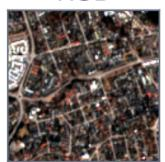  
NDVI

FC  
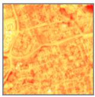

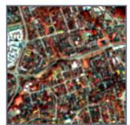  
NDBI

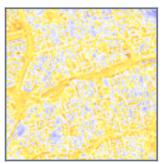

SWIR  
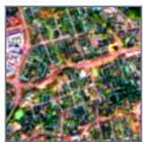  
SAR

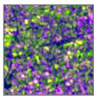

## (b) SmolVLM2 SFT

RGB  
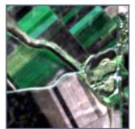  
NDVI

FC  
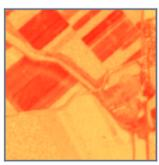

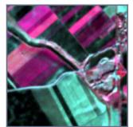  
NDBI

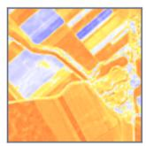

SWIR  
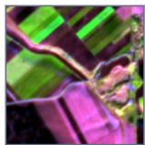  
SAR

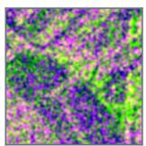

## (c) Idefics3 SFT

RGB  
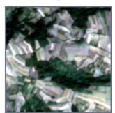

FC  
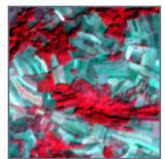  
SWIR  
NDBI

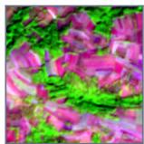

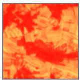

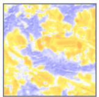  
SAR

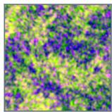  
Figure 4: Exact-match examples from Qwen3-VL after retained-evidence DPO and two VLMs after SFT. FC denotes the vegetation false-color view. Each panel shows the six inputs in two rows, target and predicted classes, and the generated evidence. Panels (a)–(c) cover urban, agricultural, and forest scenes.

## Target: urban

## Prediction: urban

## Generated evidence

The MSI views show urban areas via built-up or impervious-surface patterns in optical and ŠWIR imagery, while the ŠAR view corroborates this with stručtured radar textures typical of man-made surfaces.

## Target: urban, cropland

## Prediction: urban, cropland

## Generated evidence

The MSI views show urban areas through built-up or impervious-surface patterns in optical and SWIR imagery, and cropland via field-líke agricultural patterns in optical and vegetation-sensitive bands; the SAR view reinforces both with structured radar texture matching man-made surfaces and regular texture consistent with cultivated land.

## Target: forest, cropland

## Prediction: forest, cropland

## Generated evidence

The MSI views reveal forest and cropland via rich vegetation signatures in multispectral imagery, fieľd-like patterns in optical and vegetationsensitive bands, while the SAR view corroborates both through heterogeneous radar texture matching canopy structure and regular surface texture consistent with cultivated land.

NDVI

NDVI

FC

## (d) InternVL3.5 SFT

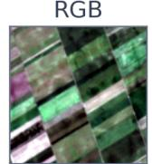

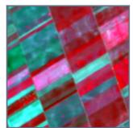

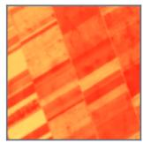  
NDBI

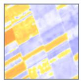

SWIR  
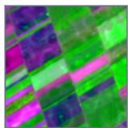

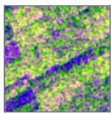

## (e) Qwen2.5-VL SFT

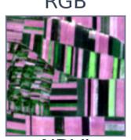

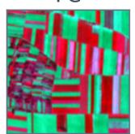

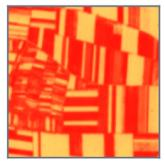  
NDBI

SWIR  
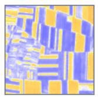

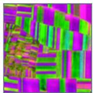  
SAR

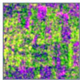

## (f) AdaptLLM-RS SFT

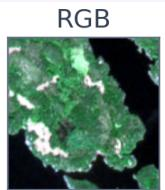

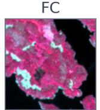

SWIR  
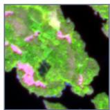

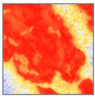

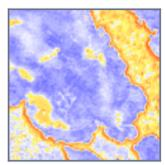

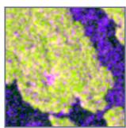  
Figure 5: Exact-match examples from three additional VLMs after SFT. Panels (d)–(f) cover agricultural, water, and urban scenes using the same six-view layout and structured output format as Figure 4. Scenes are selected for clearly visible class cues; aggregate results are reported separately.

## Target: cropland

## Prediction: cropland

## Generated evidence

The MSI views show cropland via field-like agricultural patterns in the optical and vegetationsensitive bands, while the SAR view confirms it with consistent surface texture typical of cultivated land.

## Target: cropland

## Prediction: cropland

## Generated evidence

The MSI views show cropland via field-like agricultural patterns in óptical and vegetationsensitive bands, while the SAR view cõnfirms it with consistent surface texture typical of cultivated land.

## Target: forest, water

## Prediction: forest, water

## Generated evidence

The MSI views show forest and water via rich vegetation signatures and water-like tones or index responses, while the SAR view confirms both through radar textures, heterogeneous for forest canopy and smooth, low-variation for open water.

## Transfer Across Tasks and Datasets

Sen1Floods11. We render each aligned observation as true color, a SWIR composite designed to highlight water, NDWI, and SAR. The oficial train and validation assignments provide 337 readable patches, converted into 674 balanced flood claim rows. The oficial test assignment provides 89 readable patches and 178 rows. Each patch is paired with one positive and one negative flood claim; the class target is determined by a 5% threshold on water pixels. The LoRA configuration uses rank 16 in the language network and selected visual transformer blocks, three epochs, a language learning rate of $1 0 ^ { - 4 }$ , a visual learning rate 0.3 times that value, and seed 42. MSI-only, SAR-only, and no-image rows use this same MSI+SAR-trained checkpoint and remove views only at inference.

<table><tr><td>Setting</td><td>Class F1</td><td>Acc. Claim acc. Schema</td><td></td></tr><tr><td>Qwen3-VL</td><td>0.52940.5506</td><td>0.5169</td><td>1.0000</td></tr><tr><td>zero-shot, MSI+SAR</td><td></td><td></td><td></td></tr><tr><td>LoRA SFT, MSI+SAR</td><td>0.7714 0.8202</td><td>0.8202</td><td>1.0000</td></tr><tr><td>LoRA SFT, MSI only</td><td>0.7072 0.7022</td><td>0.7022</td><td>1.0000</td></tr><tr><td>LoRA SFT, SAR only</td><td>0.6604 0.7978</td><td>0.7978</td><td>1.0000</td></tr><tr><td>LoRA SFT, no image</td><td>0.0000 0.6292</td><td>0.6292</td><td>1.0000</td></tr></table>

Table 14: Flood verification and claim consistency on all 178 claims defined for patches in the oficial Sen1Floods11 test assignment.

BigEarthNet.txt captioning. The caption experiment uses the same six rendered views as the main task. Caption SFT trains rank 16 LoRA modules in the language network and selected visual transformer blocks for one epoch on 11,377 captions. The language learning rate is $3 \times \mathrm { i } 0 ^ { - 5 }$ , the visual scale is 0.3, and the seed is 42. Evaluation uses all 970 unique examples in the verified caption benchmark; no benchmark patch appears in caption training. Every row passes checks for raw band availability, S1/S2 identity, image existence, and nonconstant pixels. Decoding is deterministic with at most 256 new tokens.

<table><tr><td>Adapter</td><td>BEN-19</td><td>BLEU</td><td>R-L</td><td>Tok.</td></tr><tr><td>Base Qwen3-VL</td><td>0.0148</td><td>0.81</td><td>0.1177</td><td>179.8</td></tr><tr><td>Earlier land cover SFT, language LoRA</td><td>0.0487</td><td>1.33</td><td>0.1279</td><td>160.3</td></tr><tr><td>Earlier retained-evidence DPO, language LoRA</td><td>0.0520</td><td>1.38</td><td>0.1288</td><td>156.5</td></tr><tr><td>Caption SFT, language LoRA</td><td>0.4270</td><td>38.13</td><td>0.5090</td><td>86.8</td></tr><tr><td>Caption SFT, language and visual LoRA,</td><td>0.2753</td><td>31.88</td><td>0.4421</td><td>104.0</td></tr><tr><td>no image Caption SFT, language and visual LoRA</td><td>0.5654</td><td>42.07</td><td>0.5337</td><td>90.6</td></tr></table>

Table 15: Caption generation on the verified BigEarthNet.txt benchmark of 970 examples. BEN-19 F1 is micro F1 for class mentions in the ontology of 19 classes; SacreBLEU uses 13a tokenization and a 0–100 scale; ROUGE-L uses rouge-score without stemming. Tokens is the mean generated length.

BigEarthNet.txt references combine land cover descriptions with geographic, seasonal, climate, and adjacency metadata. Some reference content cannot be inferred from the rendered pixels alone. SacreBLEU and ROUGE-L therefore quantify reference alignment, and BigEarthNet-19 concept F1 separately measures land cover mention coverage. The concept scorer uses the oficial ontology and documented aliases; it does not resolve negation or unrestricted paraphrases.

Figure 6 provides two examples from the verified caption benchmark. The generated and reference excerpts are shown together because the benchmark includes both visible land cover and metadata-derived descriptions.

Published Sen1Floods11 baselines predict flood masks at pixel level, whereas Table 14 evaluates claims defined for each patch with a fixed 5% threshold on water area. Their segmentation IoU and pixel F1 are therefore not mixed with the metrics for claim classification.

## Auxiliary Image Dependence Diagnostic

We intervene on visual access during free decoding for 800 examples sampled with seed 42 from the oficial validation sample. The intact condition uses the original six views. Inference without images retains the prompt but removes every image. Donors form a one-to-one assignment with no selfpairs, chosen to minimize source–donor label-set overlap. Replacement of all views substitutes the donor images while retaining the source prompt and labels. The optical and SAR replacement conditions use the same donor assignment and change one sensor family at a time; the MSI only and SAR only controls remove the other family.

<table><tr><td>Input condition</td><td>Micro F1</td><td>∆ F1</td><td>Pred. change</td></tr><tr><td>Intact six views</td><td>0.8180</td><td></td><td></td></tr><tr><td>No images</td><td>0.5741</td><td>-0.2439</td><td>0.9700</td></tr><tr><td>All views from donor</td><td>0.4806</td><td>-0.3373</td><td>0.9363</td></tr><tr><td>MSI only</td><td>0.8159</td><td>-0.0020</td><td>0.1100</td></tr><tr><td>SAR only</td><td>0.1734</td><td>-0.6446</td><td>0.8888</td></tr><tr><td>Optical donor, original SAR</td><td>0.4852</td><td>-0.3328</td><td>0.9325</td></tr><tr><td>Original optical, SAR donor</td><td>0.8186</td><td>+0.0007</td><td>0.0575</td></tr></table>

Table 16: Image interventions during free decoding on the same 800 examples. F1 is computed against the source labels; change is the fraction whose predicted label set difers from intact inference.

Replacing all six images lowers micro F1 by 0.3373, with 93.6% of predicted label sets changing. Optical replacement accounts for nearly the full decrease, while SAR replacement has no detectable aggregate efect on this six-class taxonomy. The Sen1Floods11 result provides a complementary setting in which SAR improves recognition.

## Preference Optimization Details

The retained-evidence construction removes one positive class from the rejected class line while preserving the corresponding cue in its evidence. The resulting contradiction links the preference signal to complete label recovery while keeping the chosen response and its sensor cues intact.

Figure 7 gives three examples from the matched comparison. The first corrects an omitted class and an extra prediction, while the other two remove extra predictions that

## (a) Coastal scene

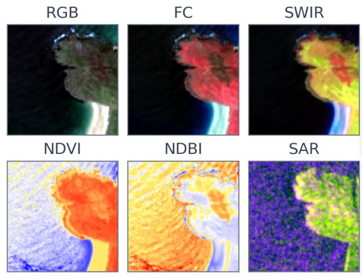

## BEN-19 concept hits/extras 3/0

## Generated excerpt

The dominant feature is the expansive marine waters (\~833,000 sgm), which borders a substantial area of moors, heathland and sclerophyllous vegetation (\~587,000 sqm). The moors, heathland and sclerophyllous vegetation are also adjacent to a smaller patch of beaches, dunes, and sands (\~20,000 sqm).

## Reference excerpt

The dominant feature is the expansive marine waters (\~964,000 sqm), which borders a significant area of moors, heathland, and sclerophyllous vegetation (\~399,000 sqm) and a smallér patch of beaches, dunes, and sands (\~77,000 sqm).

(b) Agricultural and urban scene  
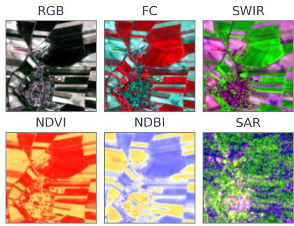

## BEN-19 concept hits/extras 3/0

## Generated excerpt

The largest area is arable land, spanning approximately 1,031,000 square meters, which is distríbutèd across two areas, one large (\~1,028,000 sgm) and one marginal. This arable land borders urban fabric (\~380,000 sqm) and complex cultivation patterns (\~29,000 sqm).

## Reference excerpt

The largest feature is arable land, spanning approxímately 1,007,000 square mèters, which is distributed aćross two areas, one large (\~1,004,000 sqm) and one marginal. This arable land borders urban fabric (\~267,000 sqm) and complex cultivation patterns (\~167,000 sqm).

Figure 6: Caption SFT examples on the verified BigEarthNet.txt benchmark. Each panel shows the six inputs, verbatim landcover excerpts, and BigEarthNet-19 concept hits and extras. The excerpts omit geographic, seasonal, and climate metadata. The selected scenes have diferent dominant land-cover types; Table 15 reports aggregate results on full captions.

conflict with the visible scene. Aggregate diferences are reported below.

All DPO experiments use AdamW and one preference pair per training step, with chosen and rejected responses collated together. The retained-evidence variants use gradient accumulation 8, maximum length 1536, log probabilities normalized by sequence length, gradient checkpointing, and gradient clipping at 1.0. Each SFT initialization is loaded as the frozen reference model.

DPO initialized from the language-and-visual LoRA SFT model reaches 0.8275 micro F1, 0.7472 macro F1, 0.4261 exact match, and 0.9746 evidence audit on the oficial validation sample, compared with 0.8242, 0.7452, 0.4140, and 0.9750 for its SFT initialization. These checkpoints provide the paired comparison in Main Table 1.

To separate the preference objective from additional ex-

posure to the chosen responses, we train a chosen-only SFT control on the same 2,000 chosen sequences with the same initialization, learning rate, epoch count, and trainable LoRA modules.
<table><tr><td>Model</td><td>Micro</td><td>Macro</td><td>Exact</td><td>Ev. audit</td></tr><tr><td>SFT initialization</td><td>0.8242</td><td>0.7452</td><td>0.4140</td><td>0.9750</td></tr><tr><td>Chosen-only SFT</td><td>0.8244</td><td>0.7429</td><td>0.4066</td><td>0.9712</td></tr><tr><td>Retained-evidence DPO</td><td>0.8275</td><td>0.7472</td><td>0.4261</td><td>0.9746</td></tr></table>

Table 17: Matched 2,000-example control on the oficial validation sample. Chosen-only SFT and DPO difer in objective and rejected-response access.

Against chosen-only SFT, DPO changes micro F1 by +0.0031 (95% CI [+0.0002, +0.0060]), macro F1 by +0.0043 ([−0.0006, +0.0090]), exact match by +0.0195 ([+0.0108, +0.0281]), and evidence audit by +0.0034

SFT+DPO: forest, water

NDBI

## (a) Forest recovered; grass-shrub removed

RGB  
SWIR  
FC  
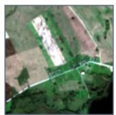  
FC

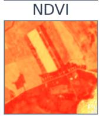

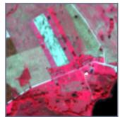  
SWIR

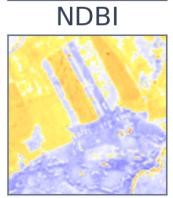

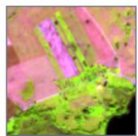

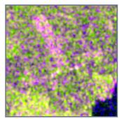

## (b) Spurious water and wetland removed

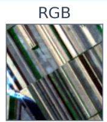  
NDVI

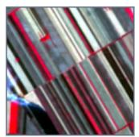  
NDBI

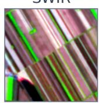

  
SAR

## (c) Spurious cropland label removed

FC  

SWIR  

  
Figure 7: Paired examples from the oficial validation sample. Initial SFT, chosen-only SFT, and retained-evidence DPO share the same initialization and image inputs. DPO recovers forest and removes grass-shrub in (a), removes unsupported water and wetland predictions in (b), and removes a spurious cropland prediction in (c). Generated evidence excerpts accompany the DPO outputs; Table 17 reports aggregate results.

Target: forest, cropland, water

Initial SFT: cropland, grass-shrub, water

Chosen-only: cropland, grass-shrub, water

SFT+DPO: forest, cropland, water

## DPO evidence excerpt

The MSI views reveal forest via vegetation-rich spectral patterns, cropland through field-like agricultural signatures in optical ănd vegetationsēnsitive bands, and water through tone or index responses consistent with aguatič surfaces; the SAR view corroborates these by showing heterogeneous radar texture matching canopy structure, ..

Target: cropland

Initial SFT: cropland, wetland

Chosen-only: cropland, water

## SFT+DPO: cropland

## DPO evidence excerpt

The MSI views show cropland via field-like agricultural patterns in the optical and vegetationsēnsitive bands, while the SAR view corroborates this with consistent surface texture typical of cultivated land.

Target: forest, water

## Initial SFT: forest, cropland, water

Chosen-only: forest, cropland, water

## DPO evidence excerpt

The MSI views show forest and water via rich vegetation signatures and water-like tones or index responses, wħile the SAR view confirms both through radar textures, heterogeneous for forest canopy and smooth, low-variation for open water.

([+0.0000, +0.0068]). The intervals use 10,000 paired bootstrap resamples of the 3,234 validation examples.