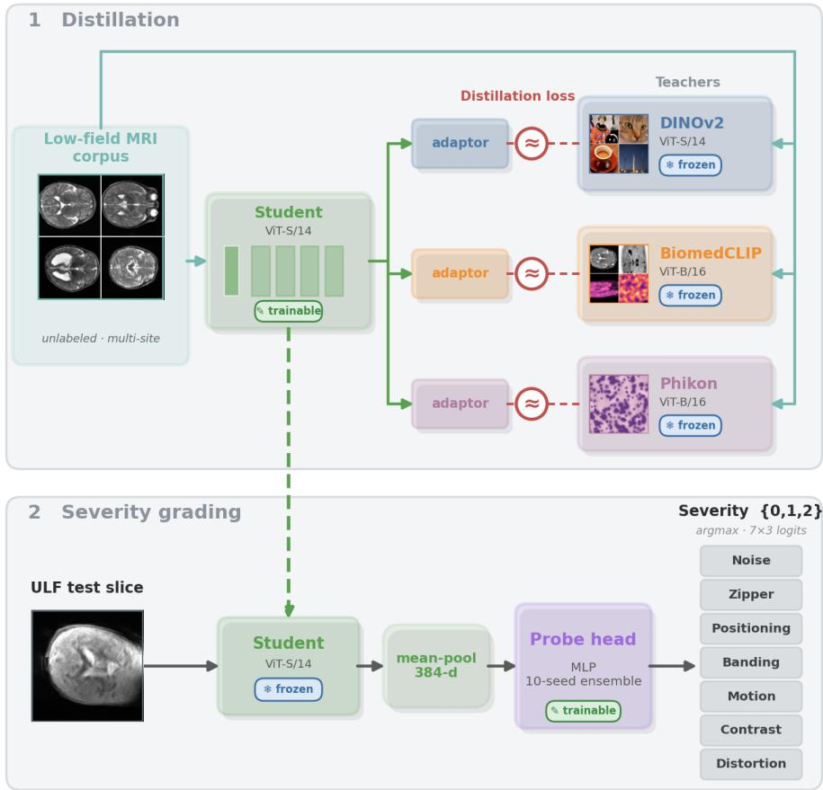
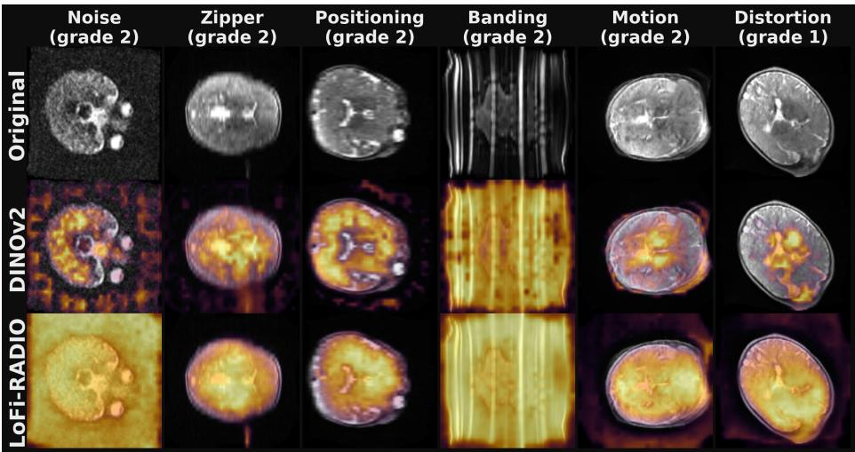

# LoFi RADIO: A Distilled In-Domain Backbone Applied for Artifact-Severity Grading of Ultra-Low-Field Neonatal Brain MRI

Jonathan B. Martin1[0000−0002−9384−8056], Yashwant Kurmi1[0000−0003−4986−2106], and Charlotte R. Sappo1[0000−0002−7030−278X]

1Vanderbilt University Institute of Imaging Science, Nashville, TN, USA jonathan.bach.martin@vumc.org

Abstract. Ultra-low-field MRI makes neonatal brain imaging deployable in low-resource settings, but its low SNR, lack of shielding, and long scan duration make it especially prone to acquisition artifacts, motivating automated quality control. We address the LISA 2026 Task 1a challenge: multi-label severity grading (0/1/2) of seven common image artifacts on ULF T2 weighted volumes. We identify that a number of backbones may be successfully paired with a classification MLP, but that no single backbone is uniformly best across artifacts. To improve performance, we evaluate routing complementary foundation model teachers through a per-artifact gate, as well as distilling the teachers into a single in-domain ViT-S student (LoFi RADIO) over an unlabeled low-field MRI corpus. Both of these strategies improve the weighted composite. The distilled backbone matches or exceeds the gate and has the added advantage of not requiring deployment of multiple large foundation models at inference.

Keywords: Quality control · Ultra-low-field MRI · Foundation models · Knowledge distillation · Domain adaptation.

## 1 Introduction

Ultra-low-field (ULF) MRI at 0.064 T ofers a low-cost, portable option for neonatal neuroimaging in resource-limited settings [1]. Despite its advantages, successful ULF MRI is challenged by intinsically low signal-to-noise ratio, lack of shielding, and long acquisition times. Imaging of neonates introduces even greater potential for image quality challenges, as neonates frequently move during scans and are often imaged using RF coils designed for adults, exacerbating image quality issues. Together, these challenges make ULF scans of neonates particularly susceptible to a variety of artifacts. Furthermore, many commercial low field systems may be operated by users with minimal experience, not requiring ARRT MR technologist certification. Automated, per-volume quality control (QC) is therefore required for reliable use of artifact-susceptible systems with minimal expert supervision. The LISA (Low field pediatric brain magnetic resonance Image Segmentation and quality Assurance Challenge) 2026 Task 1a benchmark [2] provides a setting to evaluate approaches to the relevant multilabel artifact severity grading QC task. This is a challenging classification task, requiring generalist performance across images sourced from multiple low field scanners with distinct image quality and artifacts.

Foundational Models (FMs), large multi-purpose models trained on large amounts of often unlabeled data, have emerged as highly efective backbones capable of excelling at a wide range of vision and image processing tasks. It has been demonstrated that multiple FMs trained for complementary domains can outperform a single FM when combined into a single student model via multi-teacher knowledge distillation [3]. Distillation may be performed with the objective of generating a model for a more specialized set of tasks, for example by distilling on a set of data which includes examples from the target domain [4]. Distillation also provides computational advantages, as larger models may be distilled into a single, more compact student. Our approach adapts the method of Agglomerative Vision Foundation Model – Reduce All Domains Into One (AM-RADIO) [3] but includes specialist student distillation on a dataset of low-field MRI images, with the objective of developing a distilled foundational model optimized for low-field MRI vision tasks. Thus we call our approach Low-Field RA-DIO (LoFi RADIO). LoFi RADIO produces a more hardware-eficient backbone than strategies involving multiple distinct foundation models. It was identified as having the highest overall composite performance on the LISA Task1a metrics of all single and combined FM approaches that were evaluated in this study, as well as 3rd-best mean composite performance out of 16 submitting teams on a blinded LISA Task 1a validation dataset.

## 2 Methods

## 2.1 Task, Data, and Evaluation Metric

The LISA 1a 2026 challenge includes images with seven common artifacts— ’Noise’, ’Zipper’, ’Positioning’, ’Banding’, ’Motion’, ’Contrast’, and ’Distortion’— each on an ordinal severity scale of 0 (none), 1 (moderate), 2 (severe), per volume. The data are reconstructed, magnitude-only $T _ { 2 }$ weighted NIfTI volumes (531 single-orientation acquisitions from 243 subjects imaged in axial, coronal, and sagittal planes; each orientation is labeled independently) from three sites. Because the data are magnitude-only, the phase information that encodes motionand zipper-type corruption is discarded at reconstruction and cannot be leveraged for this task.

Each volume is reduced to slices whose above-background area exceeds a fixed fraction, using an intensity threshold at 10% of the volumes maximum intensity. Every retained slice is then intensity-normalized independently, taken between a median ± k·MAD window computed over the in-slice foreground to remove scan and site intensity variations.

The oficial LISA competition metric averages five support-weighted classification metrics (accuracy, F1, F2, precision, and recall) computed over the {0, 1, 2} grades into a per-artifact composite. The headline composite score is the mean of this composite over the seven artifacts. Because the metric is supportweighted and the grade-0 class dominates (most scans are artifact-free), we used a balanced cross-entropy objective with arg max decoding. Unless otherwise noted, diferences in composite score were assessed against a multi-seed noise floor of ±0.0064, corresponding to two standard deviations.

  
Fig. 1. Overview of the LoFi-RADIO pipeline. (Stage 1) Distillation: the same unlabeled low-field slice is encoded in parallel by frozen foundation-model teachers (DINOv2, BiomedCLIP, Phikon) and by a trainable ViT-S/14 student; per-teacher adaptor heads map the student’s features into each teacher’s space. The teachers are frozen and only teach the student. (Stage 2) Artifact severity grading: the trained student is frozen and mean-pooled to a 384-d descriptor, on which a tuned MLP probe predicts a {0, 1, 2} severity grade for each of the seven artifacts.

Table 1. Uniform frozen-feature screen of candidate backbones for ULF neonatal artifact grading. Every row is measured at a single-arm probe with the tuned head, on the same subject-grouped folds and 10 seeds, compared to DINOv2 (the anchor). | cos | and ef-rank are reported as a simple potential degeneracy screen.
<table><tr><td>Backbone</td><td>Objective</td><td>Pretrain Domain</td><td>| cos |</td><td>eff-rk</td><td>Composite</td><td>Δ</td></tr><tr><td colspan="7">Distilled gated teachers (kept)</td></tr><tr><td>Phikon</td><td>iBOT</td><td>pathology</td><td>0.81</td><td>0.010</td><td>0.8287± 0.0027</td><td>+0.0038*</td></tr><tr><td>DINOv2</td><td>self-distill.</td><td>natural</td><td>0.87</td><td>0.029</td><td>0.8249 ± 0.0021</td><td></td></tr><tr><td>BiomedCLIP</td><td>contrastive</td><td>biomedical</td><td>0.92</td><td>0.019</td><td>0.8240 ± 0.0031</td><td>-0.0009</td></tr><tr><td>SAM</td><td>segmentation</td><td>natural</td><td>0.99</td><td>0.017</td><td>0.8158 ± 0.0043</td><td>-0.0091*</td></tr><tr><td colspan="7">Other screened candidates</td></tr><tr><td>RadioDINO</td><td>DINO</td><td>radiology</td><td>0.69</td><td>0.033</td><td>0.8246 ± 0.0023</td><td>-0.0003</td></tr><tr><td>MAE</td><td>masked recon.</td><td>natural</td><td>1.00</td><td>0.009</td><td>0.8213± 0.0021</td><td>-0.0036*</td></tr><tr><td>SAM2</td><td>segmentation</td><td>natural</td><td>0.90</td><td>0.003</td><td>0.8212± 0.0024</td><td>-0.0037*</td></tr><tr><td>Triad</td><td>masked recon. (3D)</td><td>brain MRI</td><td>1.00</td><td>0.002</td><td>0.8121 ± 0.0031</td><td>-0.0128*</td></tr><tr><td>ARNIQA</td><td>IQA contrastive</td><td>natural</td><td>0.90</td><td>0.002</td><td>0.8118±0.0033</td><td>-0.0131*</td></tr><tr><td>BrainIAC</td><td>SimCLR (3D)</td><td>brain MRI</td><td>0.98</td><td>0.003</td><td>0.7633± 0.0035</td><td>-0.0616*</td></tr></table>

∗paired |t| ≥ 2.5 and |∆| > 0.002.

## 2.2 Frozen Foundation-Model Probe

Our base classification model uses a frozen self-supervised vision backbone as a fixed feature extractor. We applied the following vision models as frozen backbones: DINOv2 [5], SAM, [6], SAM2 [7], BrainIAC, [8], BiomedCLIP [9], Phikon [10], MAE [11], RadioDINO [12], Triad [13], and ARNIQA [14]. Table 1 outlines these models and some of their characteristics. Each 2D model was applied in a 2.5D fashion, in which each slice in the volume was encoded independently and the resulting per-slice summary (CLS) embeddings were mean-pooled into a single 384-dimensional descriptor for the volume. The two 3D models (BrainIAC and Triad) were run natively in 3D. A small multilayer perceptron head mapped the descriptor output to artifact severity logits and was trained with a cross-entropy loss. Only the head and its optimizer were tuned, using a random hyperparameter search over a subject-grouped five-fold objective. The best-performing configuration, consisting of a single hidden layer with a dropout of 0.5 and a learning rate of $5 \times 1 0 ^ { - 4 }$ , and was used in all following experiments.

Because the relative utility of a candidate backbone could not be reliably predicted in advance, we evaluated each candidate directly. We evaluated every candidate using a single-arm probe under one identical protocol, with the same tuned head, folds, and seeds used elsewhere in this work, and reported each result paired against DINOv2, considered the reference vision model. We also assessed two simple degeneracy probes, meant to aid in screening out models that map nearly every volume to nearly-identical feature outputs. These were based on the efective rank [15] (’ef-rk’ in Table 1) and mean of-diagonal cosine similarity across volumes (’| cos |’ in Table 1) . Results compiled in Table 1 informed selection of frozen backbones used in combination methods.

## 2.3 Per-Artifact Backbone Gate

It was hypothesized that no single frozen backbone would be uniformly best across all seven artifacts, due to their distinct objectives and training domains. To exploit their complementary strengths, we explored two simple multifoundation model approaches prior to evaluating a more complex distillation approach: 1) a simple concatenation of output features from models, and 2) a per-artifact gate over four teachers: DINOv2, BiomedCLIP, SAM, and Phikon. These models were selected for their relative non-degeneracy as measured by ef-rk compared to other models (Table 1). DINOv2 was chosen over RadioDINO due to its superior composite score, despite inferior ef-rk. Each backbone b produced an independently z-scored feature vector and its own probe head, and for each artifact a a learned softmax weight $\alpha _ { a , b }$ routed and ensembled the per-backbone predictions,

$$
\hat { p } _ { a } = \sum _ { b } \alpha _ { a , b } p _ { a } ^ { ( b ) } , \sum _ { b } \alpha _ { a , b } = 1 ,\tag{1}
$$

with the routing weights fit under the same leak-free protocol used throughout.

## 2.4 LoFi-RADIO: Agglomerative In-Domain Model Distillation

While the gate may potentially improve performance, it requires multiple backbones and a router at inference time, and its features remain native to the out-ofdomain data on which the teachers were pretrained. To address both limitations, we distilled the complementary teachers into a single in-domain student backbone, which we refer to as LoFi-RADIO, following the approach of agglomerative foundation-model distillation [3]. The student was a ViT-S/14 initialized from DINOv2, and was trained to reproduce the representations of DINOv2, Biomed-CLIP, and Phikon. The resulting 384-dimensional student mean-pool serves as a direct replacement for the descriptor consumed by the probe of Section 2.2.

Distillation objective. For each teacher t, following AM-RADIO, we attached a lightweight adaptor MLP $g _ { t }$ (2 layers, LayerNorm and GELU activation) that mapped the student embedding into that teacher’s feature space. The cached teacher targets were standardized on-device for each batch using a PHI-S-style standardization [16], which places the heterogeneous teachers on a common scale. We supervised both the summary token and the dense (16 × 16) spatial features,

$$
\mathcal { L } = \sum _ { t } \Big [ \underbrace { 1 - \cos \bigl ( g _ { t } ( s _ { \mathrm { s u m } } ) , \tilde { z } _ { \mathrm { s u m } } ^ { t } \bigr ) } _ { \mathrm { s u m m a r y ~ c o s i n e } } + \underbrace { \bigl ( 1 - \cos ( \cdot ) \bigr ) + \mathrm { S m o o t h L 1 } ( \cdot ) } _ { \mathrm { d e n s e , ~ p e r ~ l o c a t i o n } } \Big ] ,\tag{2}
$$

where $\tilde { z } ^ { t }$ denotes the standardized teacher target. We observed that not every gate member transferred usefully to distillation. The frozen SAM feature is lowrank and contributes to the gate only through routing, and because a single fused student cannot reproduce a routed signal, distillation of SAM was limited to the performance of feature concatenation. We therefore excluded SAM from the student’s teacher set.

  
Fig. 2. Per-artifact discriminative attention for the LoFi-RADIO student. Columns are representative high-severity volumes for diferent artifacts (grade 2, except Distortion, shown at grade 1); rows are the input slice and the attention of the distilled student and of DINOv2. We project each patch token onto the grade-2-minus-grade-0 mean-feature direction α (warmer = toward the severe prototype); since the probe pools patch tokens, this is the exact spatial decomposition of the near-linear severity readout. For several artifacts the response aligns with the expected physical signature (e.g. Zipper with the background stripe, Distortion with greater values towards the B0-perturbed regions , Motion with marginal ghosting), whereas for others it is more difuse, spread across much of the brain—consistent with the global nature of those corruptions.

Because distillation is unsupervised and requires only images, we were able to pool labeled and unlabeled data freely. The corpus combined the LISA training images with external low-field brain MRI, comprising M4Raw [17] (0.3 T adult) and two exact-field 0.064 T adult T2 datasets [18, 19], loaded through a unified corpus interface that standardized loading and canonicalization across sources. Distillation was parallelized across multiple GPUs using synchronous data parallelism, since the pooled dense target cache was too large to replicate per device, with the student and all adaptors held in a single module so that the per-GPU losses were gathered correctly.

## 2.5 Leak-Free Evaluation of the Distilled Student

Because the LISA images are present, without labels, in the distillation corpus, distilling a single student on all images and then cross-validating the probe would introduce a subtle form of leakage, since the student would have seen the validation-fold images during distillation, an advantage that the frozen baselines never receive. To avoid this, we adopted a leak-free per-fold protocol. For each of the five subject-grouped folds, we distilled a separate student on a corpus that excluded that fold’s validation images while still including the remaining LISA training images and all external data, and we predicted each fold using only the student that had never seen it. Assembling these held-out predictions yields an out-of-fold composite that is directly comparable to the frozen DINOv2 and gate baselines. For the final challenge submission, in which the test set is disjoint and withheld by the organizers, no such exclusion is required. In this case we distilled a single student on all available data, exported its pooled LISA features, trained an ensemble of tuned probe heads on all labeled LISA volumes, and applied the resulting model to the test volumes using the identical 2.5D pooling procedure to produce per-volume {0, 1, 2} grades.

Table 2. Comparison of single- and multi-backbone strategies for ULF neonatal artifact grading, evaluated using the matched 10-seed, subject-grouped five-fold protocol. Perartifact and overall composite scores are reported as mean±standard deviation, with the best value in each column shown in bold. A single distilled student, using one ViT-S/14 backbone, exceeded the four-backbone concatenation and the per-artifact gate without requiring multiple backbones or a router. The concatenation did not improve upon the single backbones under the support-weighted metric, while the gate recovered part of the complementarity through routing. The distilled configurations are shown cumulatively, adding the Phikon teacher and then the exact-field OpenNeuro corpus to the DINOv2 and BiomedCLIP student.
<table><tr><td>Method</td><td>Noise</td><td>Zip.</td><td>Pos.</td><td>Band.</td><td>Mot.</td><td>Con.</td><td>Dist.</td><td>Composite</td></tr><tr><td colspan="9">Single frozen FM</td></tr><tr><td>DINOv2</td><td>0.909</td><td>0.810</td><td>0.855</td><td>0.973</td><td>0.749</td><td>0.756</td><td>0.724</td><td> $0 . 8 2 4 9 \pm 0 . 0 0 2 2$ </td></tr><tr><td>BiomedCLIP</td><td>0.901</td><td>0.818</td><td>0.867</td><td>0.966</td><td>0.732</td><td>0.757</td><td>0.734</td><td>0.8240 ± 0.0041</td></tr><tr><td>SAM</td><td>0.911</td><td>0.800</td><td>0.858</td><td>0.958</td><td>0.716</td><td>0.750</td><td>0.711</td><td>0.8158 ± 0.0035</td></tr><tr><td>Phikon</td><td>0.913</td><td>0.804</td><td>0.864</td><td>0.964</td><td>0.745</td><td>0.772</td><td>0.738</td><td>0.8287 ± 0.0028</td></tr><tr><td colspan="9">Combination of all four FMs</td></tr><tr><td>Concat</td><td>0.913</td><td>0.823</td><td>0.861</td><td>0.968</td><td>0.743</td><td>0.767</td><td>0.730</td><td>0.8293 ± 0.0037</td></tr><tr><td>Gate (per-artifact router)</td><td>0.914</td><td>0.821</td><td>0.866</td><td>0.966</td><td>0.753</td><td>0.771</td><td>0.738</td><td>0.8327± 0.0030</td></tr><tr><td colspan="9">Distilled student (ours)</td></tr><tr><td>Student ← D+BMC</td><td>0.912</td><td>0.832</td><td>0.863</td><td>0.970</td><td>0.756</td><td>0.765</td><td>0.731</td><td>0.8330 ± 0.0038</td></tr><tr><td>+ Phikon (3 teacher)</td><td>0.914</td><td>0.823</td><td>0.867</td><td>0.967</td><td>0.760</td><td>0.777</td><td>0.736</td><td> $0 . 8 3 4 9 \pm 0 . 0 0 3 0$ </td></tr><tr><td>+OpenNeuro corpus</td><td>0.912</td><td>0.830</td><td>0.865</td><td>0.967</td><td>0.769</td><td>0.781</td><td>0.738</td><td> $\mathbf { 0 . 8 3 7 4 \pm 0 . 0 0 2 5 }$ </td></tr></table>

## 3 Results

All comparisons were made using the matched 10-seed, subject-grouped five-fold protocol with the tuned probe head, and were evaluated using the oficial supportweighted composite. Diferences were assessed against the multi-seed noise floor of ±0.0064 described above.

## 3.1 Complementary teachers and the per-artifact gate

When each backbone was screened using the same single-arm probe (Table 1), frozen utility varied little across pretraining objectives: every candidate but ARNIQA fell within approximately 0.013 of DINOv2, and neither degeneracy metric was predictive of the result. Among the four gate members, the single frozen backbones scored 0.8249 (DINOv2), 0.8240 (BiomedCLIP), 0.8158 (SAM), and 0.8287 (Phikon). No single backbone was uniformly best, and each captured a subset of the rare classes (Table 2). A naive concatenation of all four backbones did not convert this complementarity into an improvement, reaching 0.8293. The per-artifact gate, which routed and ensembled the per-backbone predictions, recovered performance, reaching 0.8327 for the four-backbone gate.

## 3.2 A single distilled backbone matches and exceeds the gate

Distilling the complementary teachers into a single in-domain ViT-S student removed the requirement for multiple backbones and a router at inference, while retaining and ultimately exceeding the accuracy of the gate (Table 2). A student distilled from only DINOv2 and BiomedCLIP reached a composite of 0.8330, performing similarly to the four-backbone gate (0.8327). Adding the texturesensitive Phikon teacher increased this to 0.8349. Pooling the exact-field 0.064 T OpenNeuro corpus into the distillation corpus further increased the composite to 0.8374. The per-artifact gains relative to DINOv2 were primarily within the classes which the gate had provided its largest improvements, namely Contrast, Distortion, and Motion (Table 2). These results suggest that the in-domain distillation process, and in particular the Phikon teacher, was the dominant driver of the improvement over the gate.

## 3.3 Contribution of the in-domain distillation corpus

The overall composite was largely saturated by distillation on the LISA images alone (0.8349). Adding the external low-field corpus left the overall composite unchanged within noise (0.8374) providing evidence only that the improvement was attributable to the distillation and the Phikon teacher rather than to the external corpus itself. What the exact-field corpus changed was the distribution of this improvement across artifacts, redistributing model capacity toward the weak classes and reducing the across-seed variance.

## 3.4 LISA oficial validation performance

Table 3 shows the individual weighted metric and composite scores for the oficial LISA validation dataset. These results were from an additional collection of images with ground-truth IQA scores withheld from LISA challenge participants. On the held-out dataset, LoFi RADIO reached a best composite score of 0.8322, 3rd of 16 submitting teams (Team #1 Best Composite: 0.8356, Team #2 Best Composite: 0.8334, Team #3 (LoFi RADIO) Best Composite: 0.8322).

Table 3. Oficial held-out validation results for the final submission (top-ranked entry). The challenge metric averages five support-weighted scores over the $0 / 1 / 2$ severity grades.
<table><tr><td colspan="2">Accuracy Precision Recall F1 F2 Composite</td></tr><tr><td>LoFi-RADIO 0.842</td><td>0.833 0.8420.816 0.828 0.8322</td></tr></table>

## 4 Discussion

In this study, we examined whether a single compact foundation-model backbone, distilled in-domain from several complementary teachers, can outperform single- or multi-foundation model backbones on an ULF MRI image quality assessment task. We observed that a frozen foundation model in most cases serves as a strong baseline feature extractor for this task. However, no single frozen backbone is best across all artifacts. Artifact-specific routing through a trained gate recovers complementary model strengths better than simple concatenation. However multi-teacher distillation can consolidates those strengths into one indomain student with further improved performance.

The foundation model screening study ofers practical application information for the growing number of vision foundation models. Frozen utility for this (out of domain) task was largely insensitive to the pretraining objective: contrastive, self-distillation, masked-reconstruction, and segmentation backbones all performed comparably. The clearest failure was a backbone whose augmentationinvariance objective is trained to discard the intesity and appearance variation indicating artifact severity (the SimCLR-pretrained BrainIAC). Among the distillation teachers, a pathology-pretrained model may have contributed most improvement to the student, which we attribute to the fine-grained textural cues that some image artifacts share with histopathology imaging.

Several limitations of this study should be noted. First, the LISA data are magnitude-only and image-domain, so the phase information that most directly encodes motion- and zipper-type corruption is unavailable. In the scenario of a point-of-care deployment of artifact detection alongside an operating system, complex k-space data would very likely be available and would provide much additional useful information to a classification model. Second, pooling the external low-field corpus produced only a marginal, within-noise change in the overall composite. The benefit of this modification was to redistribute model capacity toward the weak, $B _ { 0 } .$ -driven classes, most notably Distortion, while reducing cross-seed variance. A larger and more diverse exact-field low-field corpus may be required to improve the overall score further. This study was further limited by the inclusion only of $T _ { 2 } .$ -weighted images, in alignment with the challenge’s available data. Performance across other contrasts or in mixed-contrast datasets has not been demonstrated and should be investigated. Third, the LISA data are drawn from three sites with diferent overall image quality and individual artifact prevalences, and we observed that generalization across sites, rather than model capacity, was a factor limiting performance. Addressing this cross-site distribution shift [20] is a potential direction for future work. Finally, an evaluation of the distilled backbone across additional downstream low-field MRI tasks, such as segmentation or image enhancement, remains to be performed.

Data and Code Availability Data used as a part of this study were provided by the LISA challenge organizers and cannot be shared by the authors. Upon publication, code will be made available at https://github.com/jonbmartin/LoFi-RADIO-MICCAI.

Acknowledgments. Research reported in this publication was supported by the National Heart, Lung, and Blood Institute of the National Institutes of Health under Award Number K25HL183904, the National Institute of Biomedical Imaging and Bioengineering of the National Institutes of Health under Award Number R01EB029443, and the American Association of University Women (AAUW) Award Number G-2025- 14902. The content is solely the responsibility of the authors and does not necessarily represent the oficial views of the National Institutes of Health or AAUW.

Disclosure of Interests. The authors have no competing interests to declare that are relevant to the content of this article.

## References

1. Deoni, S.C.L., Medeiros, P., Deoni, A.T., et al.: Accessible pediatric neuroimaging using a low field strength MRI scanner. NeuroImage 238, 118273 (2021). https://doi.org/10.1016/j.neuroimage.2021.118273

2. LISA 2026 Challenge: Low-field pediatric brain MRI analysis, Task 1a – artifact severity assessment. https://www.lisa-challenge.org, last accessed 2026

3. Ranzinger, M., Heinrich, G., Kautz, J., Molchanov, P.: AM-RADIO: Agglomerative vision foundation model – reduce all domains into one. In: CVPR, pp. 12490–12500 (2024). https://doi.org/10.1109/CVPR52733.2024.01187

4. Hinton, G., Vinyals, O., and Dean, J.: Distilling the knowledge in a neural network. arXiv:1503.02531 (2015).

5. Oquab, M., Darcet, T., Moutakanni, T., et al.: DINOv2: Learning robust visual features without supervision. Transactions on Machine Learning Research (2024)

6. Kirillov, A., Mintun, E., Ravi, N., et al.: Segment anything. In: ICCV, pp. 4015– 4026 (2023). https://doi.org/10.1109/ICCV51070.2023.00371

7. Ravi, N., Gabeur, V., Hu, Y.T., et al.: SAM 2: Segment anything in images and videos. arXiv:2408.00714 (2024)

8. Tak, D., Garomsa, B.A., Chaunzwa, T.L., et al.: A foundation model for generalized brain MRI analysis. Nature Neuroscience (2026). https://doi.org/10.1038/s41593- 026-02202-6

9. Zhang, S., Xu, Y., Usuyama, N., et al.: BiomedCLIP: a multimodal biomedical foundation model pretrained from fifteen million scientific image-text pairs. arXiv:2303.00915 (2023)

10. Filiot, A., Ghermi, R., Olivier, A., et al.: Scaling self-supervised learning for histopathology with masked image modeling. medRxiv (2023). https://doi.org/10.1101/2023.07.21.23292757

11. He, K., Chen, X., Xie, S., Li, Y., Dollár, P., Girshick, R.: Masked autoencoders are scalable vision learners. In: CVPR, pp. 16000–16009 (2022). https://doi.org/10.1109/CVPR52688.2022.01553

12. Zedda, L., Loddo, A., Di Ruberto, C.: Radio DINO: A foundation model for advanced radiomics and AI-driven medical imaging analysis. Computers in Biology and Medicine 195, 110583 (2025). https://doi.org/10.1016/j.compbiomed.2025.110583

13. Wang, S., Safari, M., Li, Q., et al.: Triad: Vision foundation model for 3D magnetic resonance imaging. arXiv:2502.14064 (2025). https://doi.org/10.48550/arXiv.2502.14064

14. Agnolucci, L., Galteri, L., Bertini, M., Del Bimbo, A.: ARNIQA: Learning dis tortion manifold for image quality assessment. In: WACV, pp. 189–198 (2024). https://doi.org/10.1109/WACV57701.2024.00026

15. Roy, O., Vetterli, M.: The efective rank: A measure of efective dimensionality. In: 15th European Signal Processing Conference (EUSIPCO), pp. 606–610 (2007)

16. Ranzinger, M., Barker, J., Heinrich, G., Molchanov, P., Catanzaro, B., et al.: PHI-S: Distribution balancing for label-free multi-teacher distillation. arXiv:2410.01680 (2024)

17. Lyu, M., Mei, L., Huang, S., et al.: M4Raw: A multi-contrast, multi-repetition, multi-channel MRI k-space dataset for low-field MRI research. Scientific Data 10, 264 (2023). https://doi.org/10.1038/s41597-023-02181-4

18. van den Broek, R., Lena, B., Webb, A.: Paired 64 mT and 3 T brain MRI scans of healthy subjects for neuroimaging research [data set]. Zenodo (2026). https://doi.org/10.5281/zenodo.20281403

19. Váša, F., Bennallick, C., Bourke, N.J., et al.: Ultra-low-field brain MRI morphometry: test–retest reliability and correspondence to high-field MRI. Imaging Neuroscience (2025). https://doi.org/10.1162/IMAG.a.930.

20. Esteban, O., Birman, D., Schaer, M., Koyejo, O., Poldrack, R., Gorgolewski, K.: MRIQC: Advancing the automatic prediction of image quality in MRI from unseen sites. In: PLOS ONE, e0184661 (2017). https://doi.org/10.1371/journal.pone.0184661