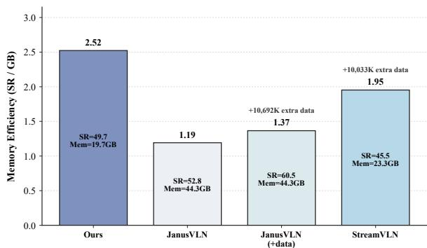
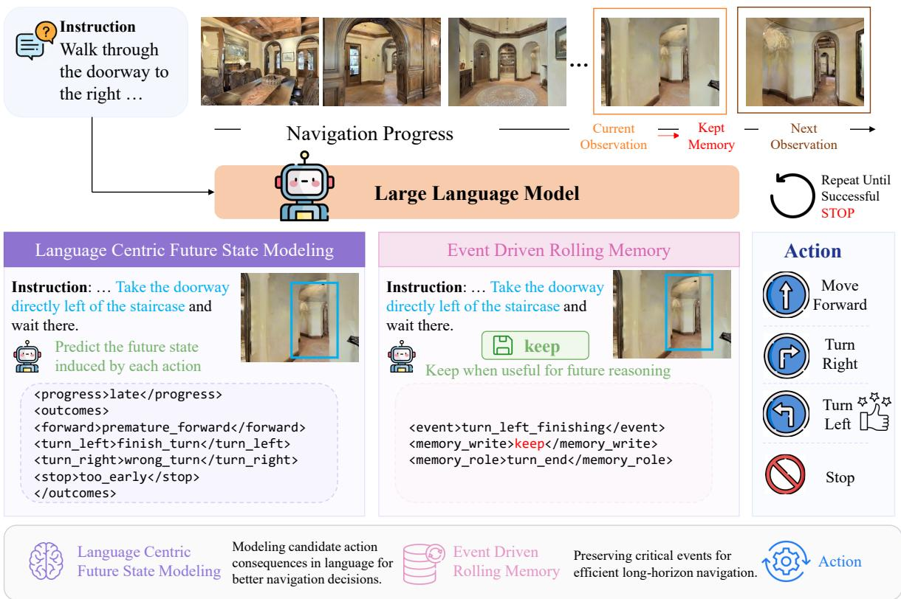
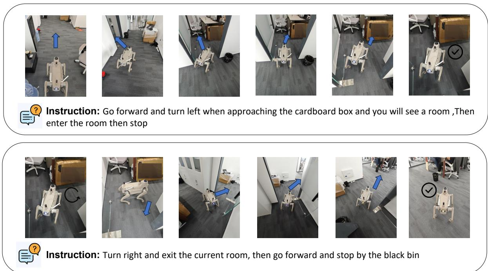
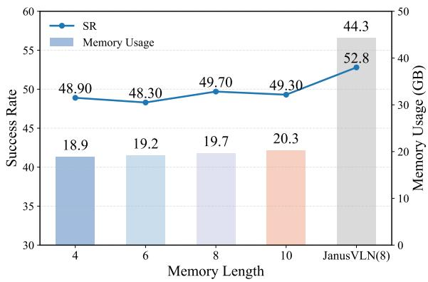
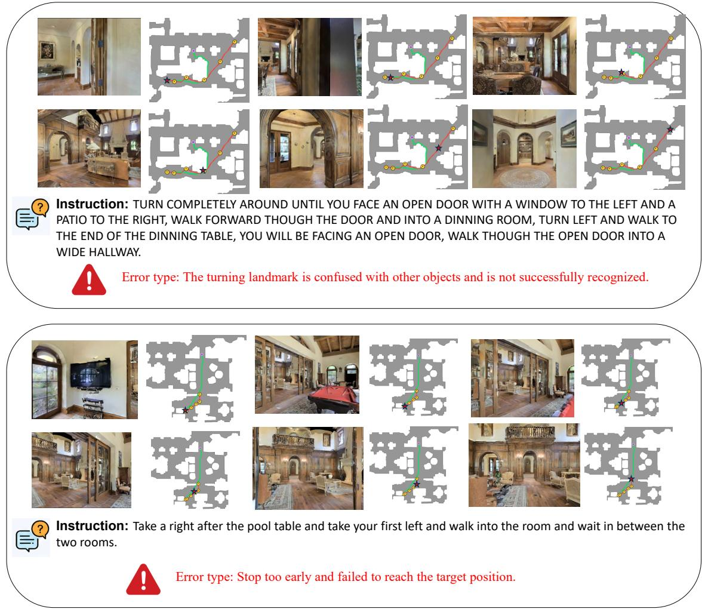
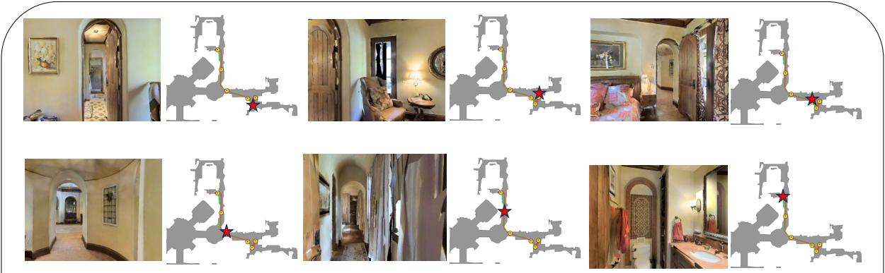
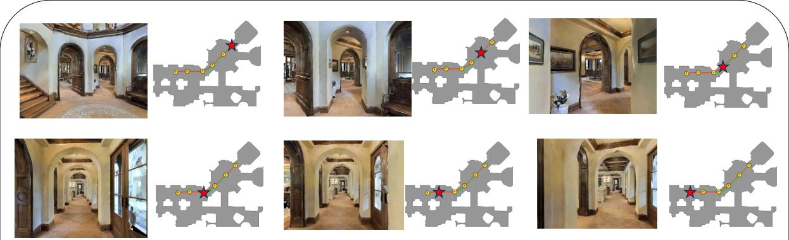
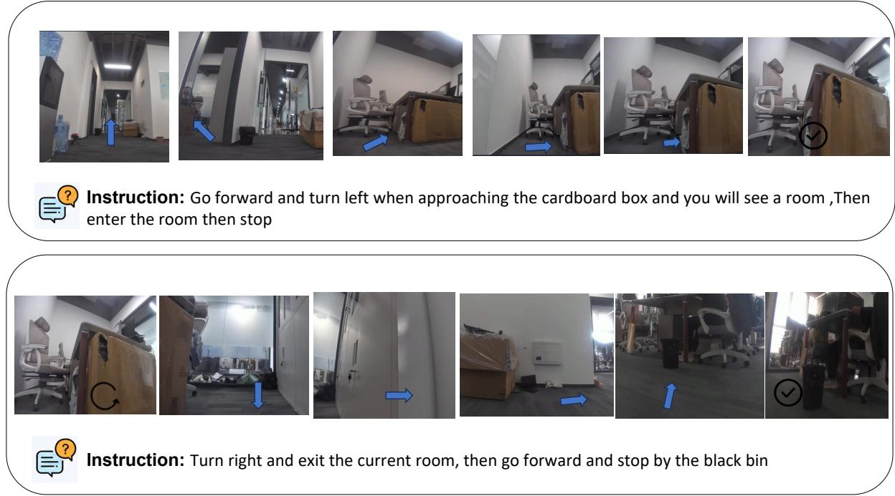

# LookStep: Efficient Vision-Language Navigation with Linguistic Foresight and Event Driven Memory

Kun-Yang Yu1,2,3\*, Yingzhe Li3, Hongyu Xu3, Shi-Yu Tian1,2, Zhi Zhou1,2 †, Yang Chen1,4, Ming Yang1,2, Sheng Wang3, Qing Yu3 †, Lan-Zhe Guo1,4, Yu-Feng Li1,2†

1National Key Laboratory for Novel Software Technology, Nanjing University

2School of Artificial Intelligence, Nanjing University

4School of Intelligence Science and Technology, Nanjing University {yuky,zhouz,liyf}@lamda.nju.edu.cn, felix@termitech.cn

## Abstract

Vision-Language Navigation (VLN) requires an embodied agent to follow natural-language instructions in unseen environments. Recent progress has been largely driven by Multimodal Large Language Models (MLLMs). Existing methods follow a next-step action prediction paradigm, supervising only the expert action, which requires a high quantity of data for training. They also rely on cognitive maps, accumulated historical frames, or external 3D tools to maintain states, leading to high computational and memory overhead. To realize resource efficiency VLN, we propose Look-Step, a unified end-to-end framework that combines Language Centric Future State Modeling and Event Driven Rolling Memory that uses language labels to generate coarse-grained navigation progress and future states for each candidate action, while autonomously deciding whether to write each observation into a bounded rolling memory with a semantic role. We validate LookStep empirically. On VLN-CE tasks, LookStep outperforms existing methods under the same training settings, achieving a 49.7% success rate on R2R-CE Val-Unseen with better memory efficiency and less data usage. Code and model is available at https: //github.com/kunyang-YU/LookStep.

## 1 Introduction

Vision-Language Navigation (VLN) is a fundamental task in embodied intelligence, requiring an agent to perform navigation in real or simulated environments according to natural-language instructions and visual observations. In recent years, with the rapid development of Multimodal Large Language Models (MLLMs) (Lan et al., 2025b,a; Qi et al., 2026), an increasing number of studies have begun to use MLLMs as end-to-end navigation models, leveraging their visual perception, semantic understanding, and language reasoning abilities to directly predict navigation actions from instructions and visual inputs (Zhang et al., 2024a; Liang et al., 2026; Yuan et al., 2026; Shan et al., 2025).

  
Figure 1: Memory efficiency comparison of different methods in R2R. LookStep performs the best memory efficiency and does not require extra data for training.

Existing MLLM-based VLN methods usually introduce additional state modeling mechanisms beyond action prediction. One line of work converts visual scenes into textual descriptions and continuously maintains semantic cognitive maps (Zhang et al., 2025a; Zeng et al., 2024; Chen et al., 2024; Liu et al., 2025a) or navigation memory in language form. Another line of work directly preserves historical visual frames and feeds them together with the current observation into the model for decisionmaking (Cheng et al., 2024a; Yang et al., 2025b; Xiang et al., 2025; Wei et al., 2025). In addition, some methods introduce external visual-spatial tools or geometric modeling modules to compensate for the limited 3D spatial understanding of generalpurpose visual encoders (Zeng et al., 2025b).

Although these methods improve navigation state awareness, they still suffer from clear limitations. Textual scene descriptions can hardly preserve spatial relations, directional information, and fine-grained visual changes in a complete manner, which requires a large quantity of data for training.

Directly accumulating historical observations introduces substantial computational overhead, while fixed-window, uniform sampling, or heuristic sampling strategies may retain redundant frames and miss key navigation events. Relying on external spatial tools can provide additional geometric information, but it also significantly increases system complexity and GPU memory requirements, weakening the efficiency for practical deployment.

Therefore, efficient VLN is not merely a problem of state representation, but relies on the synergy between efficient data utilization and memory management. In this end, we propose LookStep, an VLN framework for continuous VLN, consisting of two modules: Language Centric Future State Modeling and Event Driven Rolling Memory. Language Centric Future State Modeling reformulates action prediction from direct next-step into future state modeling action evaluation to better use the data in training. Viewed through the lens of test-time learning (Zhou et al., 2025b,a; Tian et al., 2025, 2026b), Event Driven Rolling Memory can be regarded as a form of online adaptation in the memory space that requires no parameter updates. The model actively maintains navigation-critical historical information by autonomously determining, at each step, whether the current observation should be written into a bounded episodic memory and what semantic role it should play, thereby continually updating the agent’s episodic state.

Furthermore, we provide an oracle-level information-theoretic motivation showing that expert-derived future-state labels can contain action-relevant information. Empirically, we evaluate the effectiveness and efficiency of Look-Step on two VLN-CE benchmarks. As shown in Figure 1, LookStep enables data- and memoryefficient navigation without relying on large-scale additional data or auxiliary spatial modeling tools, and achieves SOTA performance among methods under the same training settings, reaching a success rate of 49.7% on R2R-CE Val-Unseen.

Our contributions are summarized as follows:

• We propose LookStep, a resource efficiency VLN framework. The framework explicitly models navigation progress and candidateaction future states before predicting the final action, and actively preserves navigationcritical historical observations through modelgenerated memory write decisions and semantic memory roles.

• We provide an oracle-level informationtheoretic motivation showing that expertderived future-state labels can contain actionrelevant information.

• We conduct extensive experiments on the VLN-CE benchmarks to validate the effectiveness and efficiency of our method. The results show that, using only monocular RGB observations and without relying on external spatial modeling tools, our framework still achieves competitive navigation performance with data and memory efficiency.

## 2 Related Work

## 2.1 Vision-Language Navigation

Vision-Language Navigation (VLN) (Krantz et al., 2020a; Lu et al., 2024), an important embodied tasks (Shao et al., 2026; Chen et al., 2025b), requires an embodied agent to follow naturallanguage instructions and navigate to target locations from visual observations. Early VLN methods (Zheng et al., 2025; Hong et al., 2022; Du et al., 2024) formulate navigation as discrete decision making over panoramic viewpoints (Anderson et al., 2018), while continuous VLN further requires low-level action execution in realistic simulators (Krantz et al., 2020b; Ku et al., 2020). Videobased MLLMs and vision-language-action models make decisions through imitation learning or neurosymbolic reasoning (Yang et al., 2025c), such as NaVid (Zhang et al., 2024b), Uni-NaVid (Zhang et al., 2024a), and NaVILA (Cheng et al., 2024a), have been adopted to predict actions directly from egocentric RGB observations.

Recent studies have improved the performance of MLLM-based VLN methods. StreamVLN adopts slow-fast context modeling for streaming action generation with bounded context (Wei et al., 2025). JanusVLN introduces dual implicit memories to enhance RGB-only spatial reasoning and reduce redundant history computation (Zeng et al., 2025b). However, they still rely on large-scale data under the next-step prediction paradigm and imitation learning (Shao et al., 2024). We propose Language Centric Future State Modeling, an auxiliary task that improves data utilization and strengthens navigation progress understanding.

## 2.2 Spatial Reasoning via MLLMs

Spatial reasoning is crucial for VLN. Recent works enhance the ability of spatial reasoning in

MLLMs. (Zeng et al., 2025a; Tian et al., 2026a,c; Yang et al., 2026; Yu et al., 2026) SpatialVLM uses large-scale spatial VQA data (Chen et al., 2024). SpatialRGPT performs region-level reasoning with depth-enhanced representations (Cheng et al., 2024b), and 3D-LLM, LEO, and Scene-LLM inject 3D scene representations into LLMs for embodied reasoning and planning (Hong et al., 2023b; Huang et al., 2024; Fu et al., 2024). Moreover, many world-modeling approaches, such as JEPA (Dawid and LeCun, 2023) and DreamerV3 (Hafner et al., 2023), learn latent dynamics, predict future representations, or model transitions between environmental states to reason about future outcomes during task execution and process memory representations. These methods have achieved remarkable success in their respective application domains (Galliena et al., 2026; Liu et al., 2025c; Park et al., 2025).

Another line of work improves spatial reasoning from RGB or video inputs (Li and Sun, 2024; Liu et al., 2026; Yang et al., 2025a). Spatial-MLLM incorporates geometry-aware visual features for 2D-based spatial intelligence (Wu et al., 2025). VGGT provides feed-forward 3D geometry priors for downstream spatial representation learning (Wang et al., 2025). We propose Event Driven Rolling Memory, which leverages the spatial reasoning ability of MLLMs to preserve key navigation events, enabling efficient navigation.

## 3 Method and Theoretical Insights

## 3.1 Navigation Task Definition

The Vision-and-Language Navigation task in continuous environments is defined as follows. At timestamp t, an embodied agent is provided with a natural language instruction I and an ego-centric RGB observation $\begin{array} { r l } { x _ { t } } & { { } \in } \end{array}$ $\mathrm { R } ^ { 3 \times H \times W }$ . The observation sequence is $O _ { t } \ =$ $\{ x _ { 0 } , \ldots , x _ { t } \}$ and the action space is $A \quad =$ {MOVE, TURN\_LEFT, TURN\_RIGHT, STOP}. The goal is to predict the next action $a _ { t + 1 } \in A$ . Each action corresponds to a fine-grained physical change. After the action is executed, a new observation $x _ { t + 1 }$ is obtained. This process iterates until the agent executes the Stop action at the target location as specified by the instruction.

## 3.2 Methods Architecture

Existing VLN methods typically predict the next action directly from language instructions, often with the assistance of visual-side spatial modules. Current approaches suffer from two orthogonal limitations in both data usage and memory management. On the one hand, the prevailing next-step action prediction paradigm requires large-scale expert data supervision, limiting the data efficiency and scalability of VLN training. Moreover, its dependence on external spatial modeling modules increases memory cost and underutilizes the intrinsic visualspatial understanding and language reasoning abilities of MLLMs. On the other hand, existing memory management strategies mainly rely on memory sampling, which may fail to preserve navigationrelevant historical information and therefore introduce ineffective or missing memory contexts during long-horizon navigation.

To address the above two limitations, we propose LookStep, whose overall framework is illustrated in Figure 2. LookStep consists of two complementary components: Language Centric Future State Modeling and Event Driven Rolling Memory. First, to overcome the limitations of existing VLN methods that mainly rely on next-step action imitation and suffer from inefficient data utilization, Language Centric Future State Modeling leverages the visual understanding and linguistic expression abilities of MLLMs to represent the short-term navigation consequence of each candidate action as a compact language label. Given the VLN input, the model jointly predicts the current coarsegrained navigation progress, the future navigation state associated with each candidate action, and the final action. In this way, VLN training is transformed from simple action imitation into futureoriented action evaluation. This design enables the model to make fuller use of trajectory data during training and enhances its understanding of actions during navigation. Second, to address the redundancy of historical observations and the difficulty of preserving key events, Event Driven Rolling Memory models historical context as a memory bank dynamically updated by navigation events. At each step, the model not only predicts the next action, but also determines whether the current observation should be written into long-term memory and assigns it a semantic role. During inference, key events trigger memory writes. When the memory exceeds its capacity, the earliest entries are removed in a first-in-first-out (FIFO) manner. This strategy reduces computational overhead while retaining the most critical historical information for navigation decision-making.

  
Figure 2: Structure of LookStep approach. It uses language tags in Language Centric Future State Modeling and Event Driven Rolling Memory to realize data and memory efficiency navigation.

Formally, given the instruction I, the current observation $x _ { t } ,$ and the historical observations $O _ { t - 1 }$ the model is required to predict three components in natural language:

$$
\mathbf { M L L M } ( I , O _ { t - 1 } , x _ { t } ) = \{ \mathcal { P } _ { t } , \mathcal { M } _ { t } , a _ { t + 1 } \}\tag{1}
$$

where $\mathcal { P } _ { t }$ is the future state prediction and $\mathcal { M } _ { t }$ is the memory management state. We will introduce them in detail below.

## 3.3 Language Centric Future State Modeling

We adopt a Language Centric Future State Modeling (LFS) strategy to explicitly model the possible navigation outcomes of candidate actions, which enables the model to make fuller use of trajectory data during training and enhances its understanding of actions during navigation.

Specifically, $\mathcal { P } _ { t }$ consists of two aspects of the navigation process. Firstly, we predict the current coarse-grained navigation progress $p _ { t }$ , which strengthens the model’s understanding of its current position, path completion status, and proximity to the target. We use a predefined label set to describe the navigation progress. Secondly, we model the short-term navigation outcome $F _ { t }$ that each candidate action in the action space may lead to, enabling the model to compare the consequences of different actions before producing the final action. For each action in the action space, we use an outcome label set to describe the possible outcomes.

$$
\mathcal { P } _ { t } = \{ p _ { t } , F _ { t } \}\tag{2}
$$

For effective training and prediction, we organize the corresponding outcomes into a structured language sequence using the tags described below.

• <Progress>pt</Progress>: current coarse grained navigation progress

• <Outcome>Ft</Outcome>:future navigation states outcomes

All outcomes are selected from a predefined label set designed according to navigation-specific rules to ensure output consistency and controllability. Detailed definitions of these labels are provided in the Appendix B.

## 3.4 Event Driven Rolling Memory

We adopt Event Driven Rolling Memory (EDRM) to address the loss of critical historical information and contextual inconsistency caused by samplingbased history modeling methods. Our method introduces an active memory selection mechanism, where the navigation model autonomously determines whether the current observation constitutes a navigation-critical event, whether it should be incorporated into historical memory, and what semantic role it plays in the navigation process.

At each navigation step, the model performs unified memory management, denoted as $\mathcal { M } _ { t }$ . The goal of $\mathcal { M } _ { t }$ is to actively identify navigationcritical information, such as key action transitions, important landmarks, and goal-related evidence, and preserve them as part of the historical context. This enhances the informativeness of historical observations for estimating the current navigation state. Specifically, $\mathcal { M } _ { t }$ consists of two components: a memory write label $W _ { t }$ , which determines whether the current observation should be stored in historical memory, and a memory role label $R _ { t } ^ { m } .$ which specifies the semantic role of this observation in the navigation process:

$$
\mathcal { M } _ { t } = \{ W _ { t } , R _ { t } \}\tag{3}
$$

Similar to the Language Centric Future State Modeling, the memory management state is also organized in language sequence, with a detailed predefined label set described in the Appendix B:

• <MemoryWrite>Wt</MemoryWrite>: indicates whether the current observation should be written into long-term memory.

• <MemoryRole> $R _ { t } { < } / { \mathsf { M e m o r y R o 1 } }$ le>: describes the semantic role of the current observation in the navigation process.

During inference, the model updates the event memory online according to the generated memory write label $W _ { t }$ . When $W _ { t } = \mathrm { k e e p } .$ , the current observation $x _ { t }$ and its corresponding memory role $R _ { t } ^ { m }$ are written into memory. When $W _ { t } = \mathrm { d r o p }$ the current observation is not added to memory and is only temporarily retained as part of the recent observation context. We implement the memory with first-in-first-out (FIFO) queues, which enable lightweight rolling memory updates while preserving the most critical historical information for navigation decision-making.

## 3.5 Training Process

We train LookStep to autoregressively generate, at every step t along an expert trajectory, a single structured target that unifies the two components introduced above:

$$
\begin{array} { r } { T _ { t } ^ { \star } = \big ( p _ { t } ^ { \star } , F _ { t } ^ { \star } , W _ { t } ^ { \star } , R _ { t } ^ { \star } , a _ { t + 1 } ^ { \star } \big ) . } \end{array}\tag{4}
$$

The action $a _ { t + 1 } ^ { \star }$ is taken directly from the groundtruth action label, while the progress $p _ { t } ^ { \star }$ , candidateaction outcomes $F _ { t } ^ { \star }$ , memory-write decision $W _ { t } ^ { \star }$ and memory role $R _ { t } ^ { m , \star }$ are derived automatically from the ground-truth trajectory according to the labelling rules detailed in the Appendix B. Denoting the input context as $X _ { t } = ( I , O _ { t - 1 } , x _ { t } )$ , the model factorizes the joint distribution autoregressively in order. Let w $j _ { 1 } ^ { \star } , \ldots , w _ { K _ { t } } ^ { \star }$ denote the tokenization of $\mathcal { T } _ { t } ^ { \star }$ . The training objective is the standard nexttoken negative log-likelihood over the full structured sequence:

$$
\mathcal { L } ( \boldsymbol { \theta } ) = - \mathbb { E } _ { ( \boldsymbol { X } _ { t } , \mathcal { T } _ { t } ^ { \star } ) \sim \mathcal { D } } \sum _ { k = 1 } ^ { K _ { t } } \log P _ { \boldsymbol { \theta } } ( w _ { k } ^ { \star } \mid \boldsymbol { X } _ { t } , \boldsymbol { w } _ { < k } ^ { \star } ) .\tag{5}
$$

Unlike conventional VLN training that only backpropagates through the action token, Eq. (5) simultaneously supervises progress estimation, futurestate imagination, memory-event recognition, and final action selection under a single loss. As a result, the final action prediction is compelled to route through the language-form future-state variable $F _ { t }$ rather than being inferred directly from $X _ { t } ,$ , converting otherwise implicit reasoning over candidate-action consequences into an explicit and supervised intermediate signal. Meanwhile, keyevent recognition for memory management is internalized into the same autoregressive generation process without any auxiliary objective or handcrafted heuristics. More importantly, this auxiliary task design extends supervision from action-level imitation to trajectory-level reasoning, thereby improving data utilization. The label of LookStep used in the training process is constructed based on the expert trajectory, which is detailed described in the Appendix B

## 3.6 Theoretical Motivation

We provide an oracle-level information-theoretic perspective to motivate the design of Language-Centric Future State Modeling. Let $X _ { t }$ denote the navigation context, $a _ { t + 1 } ^ { \star }$ the expert action, and $F _ { t } ^ { \star }$ the action-relevant future- state labels constructed from the expert trajectory. Under log loss, the Bayes-optimal risks of direct action prediction and oracle future-state-conditioned prediction are

Table 1: Comparison with SOTA methods on VLN-CE R2R and RxR Val-Unseen splits. External data includes any sources beyond the standard R2R/RxR-CE datasets. All results are from their respective papers. Pano, Odo, Depth, and S.RGB respectively represent panoramic view, odometry, depth, and single RGB. NaVILA\* excludes human-following data. JanusVLN means 0K extra training data version. StreamVLN\* uses EnvDrop as external data version.
<table><tr><td rowspan="2">Method</td><td colspan="4">Observation</td><td colspan="2">Training</td><td colspan="4">R2R Val-Unseen</td><td colspan="3">RxR Val-Unseen</td></tr><tr><td>Pano.</td><td>Odo.</td><td>Depth</td><td>S.RGB</td><td>Auxiliary Modules</td><td>External Data</td><td>NE↓ OS↑</td><td>SR↑</td><td>SPL↑</td><td>NE↓</td><td>SR↑</td><td></td><td>SPL↑</td></tr><tr><td>HPN+DN</td><td>√</td><td>√</td><td>√</td><td></td><td></td><td></td><td>6.31</td><td>40.0</td><td>36.0</td><td>34.0</td><td></td><td></td><td></td></tr><tr><td>CMA</td><td>√</td><td>√</td><td>√</td><td></td><td></td><td></td><td>6.20 52.0</td><td>41.0</td><td></td><td>36.0</td><td>8.76</td><td>26.5</td><td>22.1</td></tr><tr><td>Sim2Sim</td><td>√</td><td>√</td><td>√</td><td></td><td></td><td></td><td>6.07 52.0</td><td>43.0</td><td></td><td>36.0</td><td></td><td></td><td></td></tr><tr><td>VLNOBERT</td><td>√</td><td>√</td><td>√</td><td></td><td></td><td></td><td>5.74 53.0</td><td>44.0</td><td></td><td>39.0</td><td>8.98</td><td>27.0</td><td>22.6</td></tr><tr><td>Ego2-Map</td><td>√</td><td>√</td><td>√</td><td></td><td></td><td></td><td>5.54 56.0</td><td>47.0</td><td></td><td>41.0</td><td></td><td></td><td></td></tr><tr><td>DreamWalker</td><td>√</td><td>√</td><td>√</td><td></td><td></td><td></td><td>5.53 59.0</td><td>49.0</td><td></td><td>44.0</td><td></td><td></td><td></td></tr><tr><td>GridMM</td><td>√</td><td>√</td><td>√</td><td></td><td></td><td></td><td>5.11 61.0</td><td>49.0</td><td></td><td>41.0</td><td></td><td></td><td></td></tr><tr><td>Reborn</td><td>√</td><td>√</td><td>√</td><td></td><td></td><td></td><td>5.40 57.0</td><td>50.0</td><td></td><td>46.0</td><td>5.98</td><td>48.6</td><td>42.0</td></tr><tr><td>InstructNav</td><td>√</td><td>√</td><td>√</td><td></td><td></td><td>6.89</td><td>=</td><td>31.0</td><td></td><td>24.0</td><td></td><td>=</td><td>=</td></tr><tr><td>COSMO</td><td>√</td><td></td><td></td><td></td><td></td><td></td><td>56.0</td><td>47.0</td><td></td><td>40.0</td><td></td><td></td><td></td></tr><tr><td>AO-Planner</td><td>√</td><td></td><td>√</td><td></td><td></td><td>5.55</td><td>59.0</td><td>47.0</td><td>33.0</td><td></td><td>7.06</td><td>43.3</td><td>30.5</td></tr><tr><td>LAW</td><td></td><td>√</td><td>√</td><td>√</td><td></td><td>6.83</td><td>44.0</td><td>35.0</td><td></td><td>31.0</td><td>10.90</td><td>8.0</td><td>8.0</td></tr><tr><td>MapNav</td><td></td><td>√</td><td>√</td><td>√</td><td></td><td>4.93</td><td>53.0</td><td>39.7</td><td></td><td>37.2</td><td></td><td>=</td><td></td></tr><tr><td>g3D-LF</td><td></td><td>√</td><td>√</td><td>√</td><td></td><td>5.70</td><td>59.5</td><td>47.2</td><td></td><td>34.6</td><td></td><td></td><td></td></tr><tr><td>Seq2Seq</td><td></td><td></td><td>√</td><td>√</td><td></td><td>7.77</td><td>37.0</td><td>25.0</td><td></td><td>22.0</td><td>12.10</td><td>13.9</td><td>11.9</td></tr><tr><td>Navid-4D</td><td></td><td></td><td>√</td><td>√</td><td>=</td><td>5.99</td><td>55.7</td><td>43.8</td><td>37.1</td><td></td><td></td><td></td><td></td></tr><tr><td>NavMorph</td><td></td><td></td><td>√</td><td>√</td><td></td><td>5.75</td><td>56.9</td><td>47.9</td><td>33.2</td><td></td><td>8.85</td><td>30.8</td><td>22.8</td></tr><tr><td>NaVid</td><td></td><td></td><td></td><td>√</td><td>953K</td><td>5.47</td><td>49.1</td><td>37.4</td><td>35.9</td><td></td><td></td><td></td><td></td></tr><tr><td>Uni-NaVid</td><td></td><td></td><td></td><td>√</td><td>√ √ 3577K</td><td>5.58</td><td>53.3</td><td>47.0</td><td></td><td>42.7</td><td>6.24</td><td>48.7</td><td>40.9</td></tr><tr><td>NaVILA*</td><td></td><td></td><td></td><td>√</td><td>√ 12574K</td><td>5.37</td><td>57.6</td><td>49.7</td><td></td><td>45.5</td><td>6.77</td><td>49.3</td><td>44.0</td></tr><tr><td>JanusVLN</td><td></td><td></td><td></td><td>√</td><td>√ 0K</td><td>5.17</td><td>58.0</td><td>52.8</td><td></td><td>49.2</td><td>6.46</td><td>51.4</td><td>44.3</td></tr><tr><td>Sim2Real</td><td></td><td></td><td></td><td>√</td><td>0K</td><td>5.95</td><td>55.8</td><td>44.9</td><td></td><td>30.4</td><td>8.79</td><td>36.7</td><td>25.5</td></tr><tr><td>StreamVLN*</td><td></td><td></td><td></td><td>√</td><td>10033K</td><td>6.05</td><td>53.8</td><td>45.5</td><td></td><td>41.6</td><td></td><td></td><td></td></tr><tr><td>Ours</td><td></td><td></td><td></td><td>√</td><td>0K</td><td></td><td>5.34 55.9</td><td>49.7</td><td></td><td>45.3</td><td>6.89</td><td>46.9</td><td>39.9</td></tr></table>

$$
\mathcal { R } _ { \mathrm { b a s e } } ^ { \star } = H ( a _ { t + 1 } ^ { \star } \mid X _ { t } ) ,\tag{6}
$$

$$
\mathcal { R } _ { \mathrm { o r a c l e - f s m } } ^ { \star } = H ( a _ { t + 1 } ^ { \star } \mid X _ { t } , F _ { t } ^ { \star } ) .\tag{7}
$$

Their difference is

$$
\mathcal { R } _ { \mathrm { b a s e } } ^ { \star } - \mathcal { R } _ { \mathrm { o r a c l e - f s m } } ^ { \star } = I ( a _ { t + 1 } ^ { \star } ; F _ { t } ^ { \star } \mid X _ { t } ) \ge 0 .\tag{8}
$$

The inequality is strict when $I ( a _ { t + 1 } ^ { \star } ; F _ { t } ^ { \star } \mid X _ { t } ) > 0$ This identity shows that an oracle future-state representation can reduce action uncertainty by explicitly exposing information relevant to candidateaction selection. It therefore motivates our design of structured candidate-action outcomes. Additionally, at inference time, LookStep does not observe $F _ { t } ^ { \star }$ , but generates $\hat { F } _ { t }$ , this may introduce the gap between optimal predictor and real situation. We provide a detailed analysis about this gap in Appendix A and our experiment result in Section 4 shows the effectiveness of the Language Centric Future State Modeling.

## 4 Experiments

## 4.1 Experiment Setup

Simulation environments and metrics. We conduct our experiments on two of the most recognized benchmark datasets (Krantz et al., 2020a): R2R-CE (Anderson et al., 2018) and RxR-CE (Ku et al., 2020). These datasets comprise trajectories collected from Matterport3D (Chang et al., 2017) and using the Habitat simulator (Savva et al., 2019). We report performance on the unseen splits using standard VLN metrics, including Navigation Error (NE), Oracle Success Rate (OS), Success Rate (SR), and Success-weighted Path Length (SPL).

Implementation details. We constructed our methods based on Qwen3-VL 8B (Team, 2025). The model is trained for one epoch using only the R2R-CE and RxR-CE datasets. We set the memory length to 8 for the memory queue. We provide a detailed implementation setting in the Appendix B.

## 4.2 Main Results

Results on VLN-CE benchmark. As shown in Table 1, we systematically evaluate our method on two VLN-CE datasets. Although our method uses only a single RGB image as input, without relying on panoramic observations, odometry, or other additional sensor signals, it still achieves about a 5% improvement in success rate over methods using richer input modalities, with gains reaching up to 20% in some settings. This indicates that performance improvements in VLN do not necessarily require complex input forms, but can also come from a more effective navigation paradigm.

  
Figure 3: Qualitative results of our methods on real-world.

Furthermore, compared with methods following the conventional next-step prediction paradigm, our method also achieves consistent advantages. Whether these methods use explicit textual cognitive maps, such as MapNav, or historical frames as context, such as StreamVLN, our method brings about a 5% performance improvement in R2R-CE dataset. This suggests that simply enhancing historical context or constructing intermediate map representations is still insufficient for long-horizon navigation decision-making. In contrast, our method more effectively models candidate actions and their consequences, thereby improving the quality of action selection, which is also consistent with our theoretical analysis.

More importantly, our method is trained only on offline expert trajectories and does not rely on additional data collection strategies (Tan et al., 2019; Wang et al., 2023c) such as DAgger (Ross et al., 2011), yet it still outperforms existing methods such as NaVid and StreamVLN. This shows that the performance gain of our method does not come from additional interaction data, but from a more effective navigation modeling paradigm. Moreover, compared with the current state-of-the-art method JanusVLN, our method achieves competitive performance. It is worth emphasizing that JanusVLN relies on external visual spatial modeling tools such as VGGT, whereas our method requires no additional visual tools. Therefore, while approaching state-of-the-art performance, our method significantly reduces system complexity and computational overhead. We further quantify this advantage in the Memory Length and Efficiency section.

Real-World Experiments We conduct realworld experiments in a challenging workspace environment. This scene contains multiple visually similar and easily confusable objects and involves complex navigation instructions such as entering and exiting rooms. As shown in the Figure 3, Look-Step successfully completes difficult navigation tasks in such complex scenarios. Notably, Look-Step is trained entirely on simulated data, and these results therefore demonstrate its strong generalization ability to novel tasks and unseen scenes. Details are described in Appendix B

## 4.3 Further Analysis

Table 2: Ablation study of our modules in R2R dataset. \* denotes without re-training the model
<table><tr><td>Method</td><td>NE↓</td><td>OS↑ SR↑</td><td>SPL↑</td></tr><tr><td>Ours</td><td>5.34</td><td>55.9 49.7</td><td>45.3</td></tr><tr><td>Ours w/o LFS</td><td>5.39</td><td>52.8 46.9</td><td>42.4</td></tr><tr><td>Ours w/o EDRM*</td><td>6.64 70.9</td><td>37.4</td><td>22.1</td></tr></table>

  
Figure 4: Memory usage and SR comparison in R2R dataset with different memory length

Ablation Study We conduct ablation studies to verify the effectiveness of each component in Look-Step. As shown in Table 2, removing any component leads to a drop in success rate, indicating that both LFS and EDRM are indispensable. Removing LFS degrades all metrics, demonstrating that language-centric future state modeling effectively enhances candidate-action consequence reasoning, which is consistent with our theoretical analysis. For EDRM, we replace the event-driven memory with the uniform history sampling strategy used in JanusVLN during inference, which results in a clear decrease in success rate. This shows that event-level historical memory is crucial for longhorizon navigation. Notably, OS instead improves after removing EDRM, suggesting that the model can still approach the target region with the help of LFS, but struggles to accurately determine when to stop without key historical information. Therefore, LFS mainly helps the model select the correct path, while EDRM primarily supports target confirmation and stopping decisions.

Memory Length and Efficiency We conduct the ablation study on the memory length and efficiency. We conduct an ablation study on the memory length by setting the memory size to 4, 6, 8, and 10, respectively. As shown in Figure 4, with the memory capacity increases, the overall performance of our method improves steadily, without obvious performance fluctuations. This indicates that our method is robust to the choice of memory size.

Combined with the peak GPU memory usage and inference time, we further observe that the memory overhead does not increase as fast as the memory size increases, and the peak GPU memory remains below 24GB under all settings, and the inference time per step is 59ms. These results demonstrate that our method enables practical inference on edge-level devices. In contrast, JanusVLN requires approximately 44.3GB peak GPU memory, and inference time is 194ms, which is 2x than our GPU usage and 4x than time usage with only about 3% SR decrease, highlighting the clear advantage of our method in inference efficiency and deployment friendliness.

Furthermore, although JanusVLN achieves higher results on some performance metrics, our method provides a more practical, and resourcefriendly alternative for VLN. Compared with methods that rely on high-memory servers or complex external modules, our approach shows clear advantages in resource constrained scenarios or on devices with limited GPU memory, making it easier to deploy on edge devices and reducing dependence on high-performance hardware. Therefore, users can flexibly choose the most suitable navigation model according to their specific application requirements, balancing performance, resource consumption, and deployment cost.

Other Ablations We also conduct experiments about the future state modeling analysis, memory management analysis, data ablation, and dataset transfer ability to show the effectiveness of Look-Step, which is described in the Appendix C.

## 5 Conclusion

In this paper, we proposed LookStep, an endto-end VLN framework with resource efficiency. LookStep explicitly models candidate-action future states with LFS and selectively preserves navigation-critical observations through EDRM. We empirically validate the benefits of futurestate-based decision making and event-level memory. Experiments on VLN-CE benchmarks show that LookStep achieves stronger navigation performance with lower time and memory overhead, demonstrating the effectiveness of combining future-oriented action evaluation with selective historical memory for VLN.

## Limitations

Our method has certain limitations. Due to resource constraints, it is trained only on the aforementioned datasets and has not been further enhanced with training paradigms such as DAgger. As a result, there remains a performance gap compared with large-scale methods trained with more extensive data and optimization strategies. In addition, its compatibility with such advanced training paradigms has not yet been fully explored.

## Acknowledgment

This research was supported by the Jiangsu Science Foundation (BK20243012,BG2024036),Natural Science Foundation of China (62576162, 624B2068), and the Fundamental Research Funds for the Central Universities (022114380023).

## References

Peter Anderson, Qi Wu, Damien Teney, Jake Bruce, Mark Johnson, Niko Sünderhauf, Ian D. Reid, Stephen Gould, and Anton van den Hengel. 2018. Vision-and-language navigation: Interpreting visually-grounded navigation instructions in real environments. In 2018 IEEE Conference on Computer Vision and Pattern Recognition, CVPR 2018, Salt Lake City, UT, USA, June 18-22, 2018, pages 3674– 3683. Computer Vision Foundation / IEEE Computer Society.

Angel X. Chang, Angela Dai, Thomas A. Funkhouser, Maciej Halber, Matthias Nießner, Manolis Savva, Shuran Song, Andy Zeng, and Yinda Zhang. 2017. Matterport3d: Learning from RGB-D data in indoor environments. In 2017 International Conference on 3D Vision, 3DV 2017, Qingdao, China, October 10- 12, 2017, pages 667–676. IEEE Computer Society.

Boyuan Chen, Zhuo Xu, Sean Kirmani, Brian Ichter, Dorsa Sadigh, Leonidas J. Guibas, and Fei Xia. 2024. Spatialvlm: Endowing vision-language models with spatial reasoning capabilities. In IEEE/CVF Conference on Computer Vision and Pattern Recognition, CVPR 2024, Seattle, WA, USA, June 16-22, 2024, pages 14455–14465. IEEE.

Jiaqi Chen, Bingqian Lin, Xinmin Liu, Lin Ma, Xiaodan Liang, and Kwan-Yee K. Wong. 2025a. Affordancesoriented planning using foundation models for continuous vision-language navigation. In Thirty-Ninth AAAI Conference on Artificial Intelligence, Thirty-Seventh Conference on Innovative Applications of Artificial Intelligence, Fifteenth Symposium on Educational Advances in Artificial Intelligence, AAAI 2025, Philadelphia, PA, USA, February 25 - March 4, 2025, pages 23568–23576. AAAI Press.

Yang Chen, Hong-Jie You, Jie-Jing Shao, Xiao-Wen Yang, Ming Yang, Yu-Feng Li, and Lan-Zhe Guo. 2025b. Re2 agent: Reflection and re-execution agent for embodied decision making. In NeurIPS 2025 Challenge on Foundation Modelsfor Embodied Agents.

An-Chieh Cheng, Yandong Ji, Zhaojing Yang, Xueyan Zou, Jan Kautz, Erdem Biyik, Hongxu Yin, Sifei Liu, and Xiaolong Wang. 2024a. Navila: Legged robot vision-language-action model for navigation. CoRR, abs/2412.04453.

An-Chieh Cheng, Hongxu Yin, Yang Fu, Qiushan Guo, Ruihan Yang, Jan Kautz, Xiaolong Wang, and Sifei Liu. 2024b. Spatialrgpt: Grounded spatial reasoning in vision-language models. In Advances in Neural Information Processing Systems 37: Annual Conference on Neural Information Processing Systems 2024, NeurIPS 2024, Vancouver, BC, Canada, December 10 - 15, 2024.

Anna Dawid and Yann LeCun. 2023. Introduction to latent variable energy-based models: A path towards autonomous machine intelligence. CoRR, abs/2306.02572.

Ronghua Du, Rongying Feng, Kai Gao, Jinlai Zhang, and Linhong Liu. 2024. Self-supervised point cloud prediction for autonomous driving. IEEE Trans. Intell. Transp. Syst., 25(11):17452–17467.

Rao Fu, Jingyu Liu, Xilun Chen, Yixin Nie, and Wenhan Xiong. 2024. Scene-llm: Extending language model for 3d visual understanding and reasoning. CoRR, abs/2403.11401.

Tommaso Galliena, Stefano Rosa, Tommaso Apicella, Pietro Morerio, Alessio Del Bue, and Lorenzo Natale. 2026. Memory-augmented vision-language agents for persistent and semantically consistent object captioning. CoRR, abs/2603.24257.

Danijar Hafner, Jurgis Pasukonis, Jimmy Ba, and Timothy P. Lillicrap. 2023. Mastering diverse domains through world models. CoRR, abs/2301.04104.

Yicong Hong, Zun Wang, Qi Wu, and Stephen Gould. 2022. Bridging the gap between learning in discrete and continuous environments for vision-andlanguage navigation. In IEEE/CVF Conference on Computer Vision and Pattern Recognition, CVPR 2022, New Orleans, LA, USA, June 18-24, 2022, pages 15418–15428. IEEE.

Yicong Hong, Yang Zhou, Ruiyi Zhang, Franck Dernoncourt, Trung Bui, Stephen Gould, and Hao Tan. 2023a. Learning navigational visual representations with semantic map supervision. In IEEE/CVF International Conference on Computer Vision, ICCV 2023, Paris, France, October 1-6, 2023, pages 3032–3044. IEEE.

Yining Hong, Haoyu Zhen, Peihao Chen, Shuhong Zheng, Yilun Du, Zhenfang Chen, and Chuang Gan.

2023b. 3d-llm: Injecting the 3d world into large language models. In Advances in Neural Information Processing Systems 36: Annual Conference on Neural Information Processing Systems 2023, NeurIPS 2023, New Orleans, LA, USA, December 10 - 16, 2023.

Jiangyong Huang, Silong Yong, Xiaojian Ma, Xiongkun Linghu, Puhao Li, Yan Wang, Qing Li, Song-Chun Zhu, Baoxiong Jia, and Siyuan Huang. 2024. An embodied generalist agent in 3d world. In Forty-first International Conference on Machine Learning, ICML 2024, Vienna, Austria, July 21-27, 2024, volume 235 of Proceedings ofMachine Learning Research, pages 20413–20451. PMLR / OpenReview.net.

Jacob Krantz, Aaron Gokaslan, Dhruv Batra, Stefan Lee, and Oleksandr Maksymets. 2021. Waypoint models for instruction-guided navigation in continuous environments. In 2021 IEEE/CVF International Conference on Computer Vision, ICCV 2021, Montreal, QC, Canada, October 10-17, 2021, pages 15142–15151. IEEE.

Jacob Krantz and Stefan Lee. 2022. Sim-2-sim transfer for vision-and-language navigation in continuous environments. In Computer Vision - ECCV 2022 - 17th European Conference, Tel Aviv, Israel, October 23- 27, 2022, Proceedings, Part XXXIX, volume 13699 of Lecture Notes in Computer Science, pages 588–603. Springer.

Jacob Krantz, Erik Wijmans, Arjun Majumdar, Dhruv Batra, and Stefan Lee. 2020a. Beyond the nav-graph: Vision-and-language navigation in continuous environments. In Computer Vision - ECCV 2020 - 16th European Conference, Glasgow, UK, August 23-28, 2020, Proceedings, Part XXVIII, volume 12373 of Lecture Notes in Computer Science, pages 104–120. Springer.

Jacob Krantz, Erik Wijmans, Arjun Majumdar, Dhruv Batra, and Stefan Lee. 2020b. Beyond the nav-graph: Vision-and-language navigation in continuous environments. CoRR, abs/2004.02857.

Alexander Ku, Peter Anderson, Roma Patel, Eugene Ie, and Jason Baldridge. 2020. Room-across-room: Multilingual vision-and-language navigation with dense spatiotemporal grounding. In Proceedings of the 2020 Conference on Empirical Methods in Natural Language Processing, EMNLP 2020, Online, November 16-20, 2020, pages 4392–4412. Association for Computational Linguistics.

Guangchen Lan, Huseyin A. Inan, Sahar Abdelnabi, Janardhan Kulkarni, Lukas Wutschitz, Reza Shokri, Christopher Brinton, and Robert Sim. 2025a. Contextual integrity in llms via reasoning and reinforcement learning. In Advances in Neural Information Processing Systems 38: Annual Conference on Neural Information Processing Systems 2025, NeurIPS 2025, San Diego, CA, USA, December 2-7, 2025 /Mexico City, Mexico, November 30 - December 5, 2025.

Guangchen Lan, Sipeng Zhang, Tianle Wang, Yuwei Zhang, Daoan Zhang, Xinpeng Wei, Xiaoman Pan, Hongming Zhang, Dong-Jun Han, and Christopher G. Brinton. 2025b. Mappo: Maximum a posteriori preference optimization with prior knowledge. CoRR, abs/2507.21183.

Taozhe Li and Wei Sun. 2024. MLP-SLAM: multilayer perceptron-based simultaneous localization and mapping with a dynamic and static object discriminator. CoRR, abs/2410.10669.

Shiyi Liang, Xinyuan Chang, Changjie Wu, Huiyuan Yan, Yifan Bai, Xinran Liu, Hang Zhang, Yujian Yuan, Shuang Zeng, Mu Xu, and Xing Wei. 2026. Persistent autoregressive mapping with traffic rules for autonomous driving. In Fortieth AAAI Conference on Artificial Intelligence, Thirty-Eighth Conference on Innovative Applications of Artificial Intelligence, Sixteenth Symposium on Educational Advances in Artificial Intelligence, AAAI 2026, Singapore, January 20-27, 2026, pages 6862–6870. AAAI Press.

Fei Liu, Shichao Xie, Minghua Luo, Zedong Chu, Junjun Hu, Xiaolong Wu, and Mu Xu. 2025a. Navforesee: A unified vision-language world model for hierarchical planning and dual-horizon navigation prediction. CoRR, abs/2512.01550.

Haoran Liu, Weikang Wan, Xiqian Yu, Minghan Li, Jiazhao Zhang, Bo Zhao, Zhibo Chen, Zhongyuan Wang, Zhizheng Zhang, and He Wang. 2025b. Na vid-4d: Unleashing spatial intelligence in egocentric RGB-D videos for vision-and-language navigation. In IEEE International Conference on Robotics and Automation, ICRA 2025, Atlanta, GA, USA, May 19- 23, 2025, pages 10607–10615. IEEE.

Junkang Liu, Fanhua Shang, Hongying Liu, Yuxuan Tian, Yuanyuan Liu, Jin Liu, Kewen Zhu, and Zhouchen Lin. 2026. Fedadamw: A communicationefficient optimizer with convergence and generalization guarantees for federated large models. In Fortieth AAAI Conference on Artificial Intelligence, Thirty-Eighth Conference on Innovative Applications ofArtificial Intelligence, Sixteenth Symposium on Educational Advances in Artificial Intelligence, AAAI 2026, Singapore, January 20-27, 2026, pages 23748– 23756. AAAI Press.

Peiqi Liu, Zhanqiu Guo, Mohit Warke, Soumith Chintala, Chris Paxton, Nur Muhammad (Mahi) Shafiullah, and Lerrel Pinto. 2025c. Dynamem: Online dynamic spatio-semantic memory for open world mobile manipulation. In IEEE International Conference on Robotics and Automation, ICRA 2025, Atlanta, GA, USA, May 19-23, 2025, pages 13346–13355. IEEE.

Yuxing Long, Wenzhe Cai, Hongcheng Wang, Guanqi Zhan, and Hao Dong. 2024. Instructnav: Zero-shot system for generic instruction navigation in unexplored environment. In Conference on Robot Learning, 6-9 November 2024, Munich, Germany, volume

270 of Proceedings of Machine Learning Research, pages 2049–2060. PMLR.

Hao Lu, Jiaqi Tang, Xinli Xu, Xu Cao, Yunpeng Zhang, Guoqing Wang, Dalong Du, Hao Chen, and Yingcong Chen. 2024. Scaling multi-camera 3d object detection through weak-to-strong eliciting. CoRR, abs/2404.06700.

Junyeong Park, Junmo Cho, and Sungjin Ahn. 2025. Mrsteve: Instruction-following agents in minecraft with what-where-when memory. In The Thirteenth International Conference on Learning Representations, ICLR 2025, Singapore, April 24-28, 2025. OpenReview.net.

Dekang Qi, Shuang Zeng, Xinyuan Chang, Feng Xiong, Shichao Xie, Xiaolong Wu, and Mu Xu. 2026. Mernav: A highly generalizable memory-executereview framework for zero-shot object goal navigation. CoRR, abs/2602.05467.

Sonia Raychaudhuri, Saim Wani, Shivansh Patel, Unnat Jain, and Angel X. Chang. 2021. Languagealigned waypoint (LAW) supervision for vision-andlanguage navigation in continuous environments. In Proceedings of the 2021 Conference on Empirical Methods in Natural Language Processing, EMNLP 2021, Virtual Event / Punta Cana, Dominican Republic, 7-11 November, 2021, pages 4018–4028. Association for Computational Linguistics.

Stéphane Ross, Geoffrey J. Gordon, and Drew Bagnell. 2011. A reduction of imitation learning and structured prediction to no-regret online learning. In Proceedings ofthe Fourteenth International Conference on Artificial Intelligence and Statistics, AIS-TATS 2011, Fort Lauderdale, USA, April 11-13, 2011, volume 15 of JMLR Proceedings, pages 627–635. JMLR.org.

Manolis Savva, Jitendra Malik, Devi Parikh, Dhruv Batra, Abhishek Kadian, Oleksandr Maksymets, Yili Zhao, Erik Wijmans, Bhavana Jain, Julian Straub, Jia Liu, and Vladlen Koltun. 2019. Habitat: A platform for embodied AI research. In 2019 IEEE/CVF International Conference on Computer Vision, ICCV 2019, Seoul, Korea (South), October 27 - November 2, 2019, pages 9338–9346. IEEE.

Hao Shan, Ruikai Li, Han Jiang, Yizhe Fan, Ziyang Yan, Bohan Li, Xiaoshuai Hao, Hao Zhao, Zhiyong Cui, Yilong Ren, and Haiyang Yu. 2025. Stability under scrutiny: Benchmarking representation paradigms for online HD mapping. CoRR, abs/2510.10660.

Jie-Jing Shao, Hao-Ran Hao, Xiao-Wen Yang, and Yu-Feng Li. 2024. Learning for long-horizon planning via neuro-symbolic abductive imitation. CoRR, abs/2411.18201.

Jie-Jing Shao, Haiyan Yin, Yueming Lyu, Xingrui Yu, Lan-Zhe Guo, Ivor W. Tsang, James Kwok, and Yufeng Li. 2026. Lifting traces to logic: Programmatic skill induction with neuro-symbolic learning for long-horizon agentic tasks. CoRR, abs/2605.01293.

Hao Tan, Licheng Yu, and Mohit Bansal. 2019. Learning to navigate unseen environments: Back translation with environmental dropout. In Proceedings of the 2019 Conference of the North American Chapter ofthe Associationfor Computational Linguistics: Human Language Technologies, NAACL-HLT 2019, Minneapolis, MN, USA, June 2-7, 2019, Volume 1 (Long and Short Papers), pages 2610–2621. Association for Computational Linguistics.

Qwen Team. 2025. Qwen3-vl technical report. CoRR, abs/2511.21631.

Shi-Yu Tian, Zhuo-Xia Wang, Xuan-Yi Zhu, Zhi Zhou, Xinwei Yang, Kun-Yang Yu, Ming Yang, Yang Chen, and Yu-Feng Li. 2026a. Self-evolving neurosymbolic skills for tool-augmented spatial reasoning. arXiv preprint arXiv:2608.07955.

Shi-Yu Tian, Zhi Zhou, Wei Dong, Kun-Yang Yu, Ming Yang, Zi-Jian Cheng, Lan-Zhe Guo, and Yufeng Li. 2026b. Tabularmath: Understanding math reasoning over tables with large language models. In Findings of the Association for Computational Linguistics, ACL 2026, San Diego, California, United States, July 2-7, 2026, pages 15469–15498. Association for Computational Linguistics.

Shi-Yu Tian, Zhi Zhou, Kun-Yang Yu, Ming Yang, Yang Chen, Ziqiao Shang, Lan-Zhe Guo, and Yufeng Li. 2026c. LAST: leveraging tools as hints to enhance spatial reasoning for multimodal large language models. CoRR, abs/2604.09712.

Shi-Yu Tian, Zhi Zhou, Kun-Yang Yu, Ming Yang, Lin-Han Jia, Lan-Zhe Guo, and Yufeng Li. 2025. Vcsearch: Bridging the gap between well-defined and ill-defined problems in mathematical reasoning. In Proceedings of the 2025 Conference on Empirical Methods in Natural Language Processing, EMNLP 2025, Suzhou, China, November 4-9, 2025, pages 12710–12731. Association for Computational Linguistics.

Hanqing Wang, Wei Liang, Luc Van Gool, and Wenguan Wang. 2023a. Dreamwalker: Mental planning for continuous vision-language navigation. In IEEE/CVF International Conference on Computer Vision, ICCV 2023, Paris, France, October 1-6, 2023, pages 10839–10849. IEEE.

Jianyuan Wang, Minghao Chen, Nikita Karaev, Andrea Vedaldi, Christian Rupprecht, and David Novotný. 2025. VGGT: visual geometry grounded transformer. In IEEE/CVF Conference on Computer Vision and Pattern Recognition, CVPR 2025, Nashville, TN, USA, June 11-15, 2025, pages 5294–5306. Computer Vision Foundation / IEEE.

Zihan Wang and Gim Hee Lee. 2025. g3d-lf: Generalizable 3d-language feature fields for embodied tasks. In IEEE/CVF Conference on Computer Vision and Pattern Recognition, CVPR 2025, Nashville, TN, USA, June 11-15, 2025, pages 14191–14202. Computer Vision Foundation / IEEE.

Zihan Wang, Xiangyang Li, Jiahao Yang, Yeqi Liu, and Shuqiang Jiang. 2023b. Gridmm: Grid memory map for vision-and-language navigation. In IEEE/CVF International Conference on Computer Vision, ICCV 2023, Paris, France, October 1-6, 2023, pages 15579– 15590. IEEE.

Zihan Wang, Xiangyang Li, Jiahao Yang, Yeqi Liu, and Shuqiang Jiang. 2024. Sim-to-real transfer via 3d feature fields for vision-and-language navigation. In Conference on Robot Learning, 6-9 November 2024, Munich, Germany, volume 270 of Proceedings of Machine Learning Research, pages 2982–2995. PMLR.

Zun Wang, Jialu Li, Yicong Hong, Yi Wang, Qi Wu, Mohit Bansal, Stephen Gould, Hao Tan, and Yu Qiao. 2023c. Scaling data generation in vision-andlanguage navigation. In IEEE/CVF International Conference on Computer Vision, ICCV 2023, Paris, France, October 1-6, 2023, pages 11975–11986. IEEE.

Meng Wei, Chenyang Wan, Xiqian Yu, Tai Wang, Yuqiang Yang, Xiaohan Mao, Chenming Zhu, Wenzhe Cai, Hanqing Wang, Yilun Chen, Xihui Liu, and Jiangmiao Pang. 2025. Streamvln: Streaming visionand-language navigation via slowfast context modeling. CoRR, abs/2507.05240.

Diankun Wu, Fangfu Liu, Yi-Hsin Hung, and Yueqi Duan. 2025. Spatial-mllm: Boosting MLLM capabilities in visual-based spatial intelligence. In Advances in Neural Information Processing Systems 38: An nual Conference on Neural Information Processing Systems 2025, NeurIPS 2025, San Diego, CA, USA, December 2-7, 2025 / Mexico City, Mexico, November 30 - December 5, 2025.

Wentao Xiang, Haokang Zhang, Tianhang Yang, Zedong Chu, Ruihang Chu, Shichao Xie, Yujian Yuan, Jian Sun, Zhining Gu, Junjie Wang, Xiaolong Wu, Mu Xu, and Yujiu Yang. 2025. Nav-r2 dual-relation reasoning for generalizable open-vocabulary objectgoal navigation. CoRR, abs/2512.02400.

Jianing Yang, Alexander Sax, Kevin J. Liang, Mikael Henaff, Hao Tang, Ang Cao, Joyce Chai, Franziska Meier, and Matt Feiszli. 2025a. Fast3r: Towards 3d reconstruction of 1000+ images in one forward pass. In IEEE/CVF Conference on Computer Vision and Pattern Recognition, CVPR 2025, Nashville, TN, USA, June 11-15, 2025, pages 21924–21935. Computer Vision Foundation / IEEE.

Kai Yang, Tianlin Zhang, Zhengbo Wang, Zedong Chu, Xiaolong Wu, Yang Cai, and Mu Xu. 2025b. Ce-nav: Flow-guided reinforcement refinement for cross-embodiment local navigation. CoRR, abs/2509.23203.

Ming Yang, Zhi Zhou, Shi-Yu Tian, Kun-Yang Yu, Lan-Zhe Guo, and Yufeng Li. 2026. Nesy-route: A neurosymbolic benchmark for constrained route planning in remote sensing. CoRR, abs/2603.16307.

Xiao-Wen Yang, Jie-Jing Shao, Lan-Zhe Guo, Bo-Wen Zhang, Zhi Zhou, Lin-Han Jia, Wang-Zhou Dai, and Yufeng Li. 2025c. Neuro-symbolic artificial intelligence: Towards improving the reasoning abilities of large language models. In Proceedings ofthe Thirty-Fourth International Joint Conference on Artificial Intelligence, IJCAI 2025, Montreal, Canada, August 16-22, 2025, pages 10770–10778. ijcai.org.

Xuan Yao, Junyu Gao, and Changsheng Xu. 2025. Navmorph: A self-evolving world model for vision-andlanguage navigation in continuous environments. In IEEE/CVF International Conference on Computer Vision, ICCV 2025, Honolulu, HI, USA, October 19-25, 2025, pages 5536–5546. IEEE.

Naoki Yokoyama, Sehoon Ha, Dhruv Batra, Jiuguang Wang, and Bernadette Bucher. 2024a. VLFM: visionlanguage frontier maps for zero-shot semantic navigation. In IEEE International Conference on Robotics and Automation, ICRA 2024, Yokohama, Japan, May 13-17, 2024, pages 42–48. IEEE.

Naoki Yokoyama, Ram Ramrakhya, Abhishek Das, Dhruv Batra, and Sehoon Ha. 2024b. HM3D-OVON: A dataset and benchmark for open-vocabulary object goal navigation. In IEEE/RSJ International Conference on Intelligent Robots and Systems, IROS 2024, Abu Dhabi, United Arab Emirates, October 14-18, 2024, pages 5543–5550. IEEE.

Kun-Yang Yu, Zhi Zhou, Shi-Yu Tian, Xiao-Wen Yang, Zi-Yi Jia, Ming Yang, Zi-Jian Cheng, Lan-Zhe Guo, and Yufeng Li. 2026. Thinking with tables: Enhancing multi-modal tabular understanding via neurosymbolic reasoning. CoRR, abs/2603.24004.

Yujian Yuan, Changjie Wu, Xinyuan Chang, Sijin Wang, Hang Zhang, Shiyi Liang, Shuang Zeng, and Mu Xu. 2026. Unimapgen: A generative framework for largescale map construction from multi-modal data. In Fortieth AAAI Conference on Artificial Intelligence, Thirty-Eighth Conference on Innovative Applications of Artificial Intelligence, Sixteenth Symposium on Educational Advances in Artificial Intelligence, AAAI 2026, Singapore, January 20-27, 2026, pages 12277– 12285. AAAI Press.

Shuang Zeng, Xinyuan Chang, Xinran Liu, Zheng Pan, and Xing Wei. 2024. Driving with prior maps: Unified vector prior encoding for autonomous vehicle mapping. CoRR, abs/2409.05352.

Shuang Zeng, Xinyuan Chang, Mengwei Xie, Xinran Liu, Yifan Bai, Zheng Pan, Mu Xu, and Xing Wei. 2025a. Futuresightdrive: Thinking visually with spatio-temporal cot for autonomous driving. In Advances in Neural Information Processing Systems 38: Annual Conference on Neural Information Processing Systems 2025, NeurIPS 2025, San Diego, CA, USA, December 2-7, 2025 / Mexico City, Mexico, November 30 - December 5, 2025.

Shuang Zeng, Dekang Qi, Xinyuan Chang, Feng Xiong, Shichao Xie, Xiaolong Wu, Shiyi Liang, Mu Xu, and

Xing Wei. 2025b. Janusvln: Decoupling semantics and spatiality with dual implicit memory for visionlanguage navigation. CoRR, abs/2509.22548.

Jiazhao Zhang, Kunyu Wang, Shaoan Wang, Minghan Li, Haoran Liu, Songlin Wei, Zhongyuan Wang, Zhizheng Zhang, and He Wang. 2024a. Uninavid: A video-based vision-language-action model for unifying embodied navigation tasks. CoRR, abs/2412.06224.

Jiazhao Zhang, Kunyu Wang, Rongtao Xu, Gengze Zhou, Yicong Hong, Xiaomeng Fang, Qi Wu, Zhizheng Zhang, and He Wang. 2024b. Navid: Video-based VLM plans the next step for vision-andlanguage navigation. In Robotics: Science and Systems XX, Delft, The Netherlands, July 15-19, 2024.

Lingfeng Zhang, Xiaoshuai Hao, Qinwen Xu, Qiang Zhang, Xinyao Zhang, Pengwei Wang, Jing Zhang, Zhongyuan Wang, Shanghang Zhang, and Renjing Xu. 2025a. Mapnav: A novel memory representation via annotated semantic maps for vlm-based visionand-language navigation. In Proceedings ofthe 63rd Annual Meeting ofthe Associationfor Computational Linguistics (Volume 1: Long Papers), ACL 2025, Vienna, Austria, July 27 - August 1, 2025, pages 13032– 13056. Association for Computational Linguistics.

Siqi Zhang, Yanyuan Qiao, Qunbo Wang, Zike Yan, Qi Wu, Zhihua Wei, and Jing Liu. 2025b. COSMO: combination of selective memorization for low-cost vision-and-language navigation. In IEEE/CVF International Conference on Computer Vision, ICCV 2025, Honolulu, HI, USA, October 19-25, 2025, pages 5511–5522. IEEE.

Yaozong Zheng, Bineng Zhong, Qihua Liang, Shengping Zhang, Guorong Li, Xianxian Li, and Rongrong Ji. 2025. Towards universal modal tracking with online dense temporal token learning. IEEE Trans. Pattern Anal. Mach. Intell., 47(11):10192–10209.

Zhi Zhou, Kun-Yang Yu, Lan-Zhe Guo, and Yufeng Li. 2025a. Fully test-time adaptation for tabular data. In Thirty-Ninth AAAI Conference on Artificial Intelligence, Thirty-Seventh Conference on Innovative Applications ofArtificial Intelligence, Fifteenth Symposium on Educational Advances in Artificial Intelligence, AAAI 2025, Philadelphia, PA, USA, February 25 - March 4, 2025, pages 23027–23035. AAAI Press.

Zhi Zhou, Tan Yuhao, Zenan Li, Yuan Yao, Lan-Zhe Guo, Yufeng Li, and Xiaoxing Ma. 2025b. A theoretical study on bridging internal probability and self-consistency for LLM reasoning. In Advances in Neural Information Processing Systems 38: Annual Conference on Neural Information Processing Systems 2025, NeurIPS 2025, San Diego, CA, USA, December 2-7, 2025 / Mexico City, Mexico, November 30 - December 5, 2025.

## A Additional Analysis of the Theoretical Motivation

This appendix provides additional details for the oracle-level motivation introduced in Sec. 3.6. The analysis is intended to clarify the information represented by the future-state labels and its relationship to the generated-state process, rather than to provide an unconditional performance guarantee for the implemented system.

## A.1 Oracle-Level Interpretation

Let $X _ { t }$ denote the navigation context, $a _ { t + 1 } ^ { \star }$ the expert action, and $F _ { t } ^ { \star }$ the future-state labels constructed from the expert trajectory. For any conditioning variable $Z$ and action predictor $q ( \cdot \mid Z )$ , its expected log risk can be decomposed as

$$
\begin{array} { r l } & { \mathcal { R } _ { \log } ( q ; Z ) = \operatorname { \mathbb { E } } \bigl [ - \log q ( a _ { t + 1 } ^ { \star } \mid Z ) \bigr ] } \\ & { \quad \quad = H ( a _ { t + 1 } ^ { \star } \mid Z ) } \\ & { \quad \quad + \operatorname { \mathbb { E } } _ { Z } [ \mathrm { K L } ( P ( \cdot \mid Z ) \parallel q ( \cdot \mid Z ) ) ] . } \end{array}\tag{9}
$$

Therefore, the minimum is attained by $q ^ { \star } ( \cdot \mid Z ) =$ $P ( \cdot \mid Z )$ and equals $H ( a _ { t + 1 } ^ { \star } \mid Z )$

For direct action prediction and oracle futurestate-conditioned prediction, the corresponding Bayes-optimal log risks are

$$
\mathcal { R } _ { \mathrm { b a s e } } ^ { \star } = H ( a _ { t + 1 } ^ { \star } \mid X _ { t } ) ,\tag{10}
$$

$$
\mathcal { R } _ { \mathrm { o r a c l e - f s m } } ^ { \star } = H ( a _ { t + 1 } ^ { \star } \mid X _ { t } , F _ { t } ^ { \star } ) .\tag{11}
$$

By the definition of conditional mutual information,

$$
\begin{array} { r l } & { \mathcal { R } _ { \mathrm { b a s e } } ^ { \star } - \mathcal { R } _ { \mathrm { o r a c l e - f s m } } ^ { \star } = H ( a _ { t + 1 } ^ { \star } \mid X _ { t } ) } \\ & { ~ - H ( a _ { t + 1 } ^ { \star } \mid X _ { t } , F _ { t } ^ { \star } ) } \\ & { ~ = I ( a _ { t + 1 } ^ { \star } ; F _ { t } ^ { \star } \mid X _ { t } ) \ge 0 . } \end{array}\tag{12}
$$

The inequality is strict if and only if $I ( a _ { t + 1 } ^ { \star } ; { \cal F } _ { t } ^ { \star } \mid$ $X _ { t } ) ~ > ~ 0 .$ This identity quantifies the actionrelevant information represented by the oracle future-state labels and motivates making candidateaction outcomes explicit before predicting the final action.

Importantly, Eq. (12) compares predictors with and without access to the oracle variable $F _ { t } ^ { \star }$ . It is an idealized motivation.

## A.2 Generated-State Approximation

To characterize the effect of intermediategeneration errors, let $h ( X _ { t } , F )$ be the deterministic

decoded action when the future-state representation is F. Define

$$
\begin{array} { r l } & { \epsilon _ { \mathrm { a c t u a l - f s m } } = \mathrm { P r } [ h ( X _ { t } , \hat { F } _ { t } ) \neq a _ { t + 1 } ^ { \star } ] , } \\ & { \epsilon _ { \mathrm { o r a c l e - f s m } } = \mathrm { P r } [ h ( X _ { t } , F _ { t } ^ { \star } ) \neq a _ { t + 1 } ^ { \star } ] , } \\ & { \qquad \delta = \mathrm { P r } [ h ( X _ { t } , \hat { F } _ { t } ) \neq h ( X _ { t } , F _ { t } ^ { \star } ) ] } \end{array}\tag{13}
$$

For every sample,

$$
\begin{array} { r l } & { \mathbf { 1 } [ h ( X _ { t } , \hat { F } _ { t } ) \neq a _ { t + 1 } ^ { \star } ] \leq \mathbf { 1 } [ h ( X _ { t } , F _ { t } ^ { \star } ) \neq a _ { t + 1 } ^ { \star } ] } \\ & { \qquad + \mathbf { 1 } [ h ( X _ { t } , \hat { F } _ { t } ) \neq h ( X _ { t } , F _ { t } ^ { \star } ) ] } \end{array}\tag{14}
$$

Taking expectations gives

$$
\epsilon _ { \mathrm { a c t u a l - f s m } } \leq \epsilon _ { \mathrm { o r a c l e - f s m } } + \delta , \delta \leq \mathrm { P r } [ \hat { F } _ { t } \neq F _ { t } ^ { \star } ]\tag{15}
$$

Here, δ measures only intermediate-generation errors that change the final action decision. Relative to a learned direct-action predictor with error ϵbase, the condition

$$
\epsilon _ { \mathrm { o r a c l e - f s m } } + \delta < \epsilon _ { \mathrm { b a s e } }\tag{16}
$$

is sufficient for the generated-state process to achieve a lower decoded action error. This is a characterization of when the oracle benefit survives intermediate-generation errors.

Overall, the oracle identity provides the conceptual motivation for exposing action-relevant future states, while the generated-state decomposition clarifies the approximation gap in the implemented process. The practical effectiveness of the specific LFS formulation is evaluated through the experiment results.

## B Experiment Details

Experiment Details We constructed our methods based on Qwen3-VL 8B. The model is trained for one epoch using only the R2R-CE and RxR-CE datasets with the ms-swift package and a learning rate of 1e-5. We set the memory length to 8 for the memory queue. We train the model on an Ubuntu Linux Server with 8 NVIDIA A100 80 GB GPUs. The training process is about 1000 GPU hours (PCIe).

The definition of the predefined action set is: {MOVE, TURN\_LEFT, TURN\_RIGHT, STOP}

The future-state label set is defined as:

{advance, advance\_after\_turn, advance\_to\_goal, start\_turn, continue\_turn, finish\_turn, success\_stop, too\_early, overshoot\_goal, wrong\_at\_goal, premature\_forward, wrong\_turn, over\_turn, reverse\_turn, early\_left\_turn, early\_right\_turn}.

The progress label set is:

{start, early, middle, late, near\_goal}.

The memory-role label set is:

{stop\_evidence, start\_view,

turn\_start,

turn\_end, post\_turn\_alignment,

goal\_approach, recent\_only}.

All labels are automatically generated from expert action trajectories using deterministic rules, without requiring additional manual annotations. First, the future-state labels are constructed according to the current expert action, the position of the current step within a consecutive samedirection turning segment, the post-turn action state, and the subsequent K = 5 expert actions. For the expert action, a forward action is labeled as advance\_after\_turn, advance\_to\_goal, or advance, depending on whether the current step is the first forward step after a turn or whether STOP occurs within the future window. A turning action is labeled as start\_turn, continue\_turn, or finish\_turn when it occurs at the beginning, in the interior, or at the end of a consecutive turning segment, respectively; a single-step turn is labeled as start\_turn. An expert STOP action is labeled as success\_stop. For candidate actions not executed by the expert, we do not perform additional environment rollouts, but instead construct rule-based counterfactual outcome labels from the expert trajectory. Selecting STOP before reaching the goal is labeled as too\_early. Moving forward while the expert is turning is labeled as premature\_forward, while selecting a non-expert turning direction is labeled as wrong\_turn. At the first forward step after a turn, continuing to turn in the same direction is labeled as over\_turn, whereas turning in the opposite direction is labeled as reverse\_turn. If a candidate turn matches the first upcoming turn within the future window but is executed prematurely, it is labeled as early\_left\_turn or early\_right\_turn. When the expert action is STOP, moving forward and turning are labeled as overshoot\_goal and wrong\_at\_goal, respectively. All remaining incorrect candidate actions are labeled as wrong\_turn. Second, the progress labels are generated according to the relative position of the current step in the expert trajectory. The first step is labeled as start; a step is labeled as near\_goal if its expert action is STOP or if it is among the final two trajectory steps. The remaining steps are labeled as early, middle, or late when the relative progress t/(T−1) is below 0.33, within [0.33, 0.66), or no smaller than 0.66, respectively. Finally, the memory-write and memory-role labels are constructed using the following rules in priority order. A frame whose expert action is STOP is labeled as keep/stop\_evidence, and the first frame of an episode is labeled as keep/start\_view. For a multi-step consecutive same-direction turning segment, its first and last frames are labeled as keep/ turn\_start and keep/turn\_end, respectively, while its intermediate frames are labeled as drop/recent\_only; a single-step turn is labeled only as keep/turn\_start. The first MOVE\_FORWARD frame after a turning segment is labeled as keep/post\_turn\_alignment. When STOP first enters the future window of the subsequent K = 5 actions, the current frame is labeled as keep/ goal\_approach. All remaining ordinary frames are labeled as drop/recent\_only.

Compared Methods We compare our method with HPN+DN (Krantz et al., 2021), CMA (Hong et al., 2022), Sim2Sim (Krantz and Lee, 2022), VLN⟲BERT (Hong et al., 2022), Ego2-Map (Hong et al., 2023a), DreamWalker (Wang et al., 2023a), GridMM (Wang et al., 2023b), Reborn (Wang et al., 2023b), InstructNav (Long et al., 2024), COSMO (Zhang et al., 2025b), AO-Planner (Chen et al., 2025a), LAW (Raychaudhuri et al., 2021), MapNav (Zhang et al., 2025a), g3D-LF (Wang and Lee, 2025), Seq2Seq (Krantz et al., 2020a), NaVid-4D (Liu et al., 2025b), NavMorph (Yao et al., 2025), NaVid (Zhang et al., 2024b), Sim2Real (Wang et al., 2024), StreamVLN (Wei et al., 2025), Uni-NaVid (Zhang et al., 2024a), NaVILA (Cheng et al., 2024a), JanusVLN (Zeng et al., 2025b).

Real world quantitative results. In real-world experiments, we use the zsibot-L1 as the robotic platform, equipped with an FPV camera to capture the front RGB. LookStep runs on an RTX 4090 GPU 24G to process the instructions.

We conduct real-world experiments in a challenging workspace environment. This scene contains multiple visually similar and easily confusable objects and involves complex navigation instructions such as entering and exiting rooms. We design 10 instructions, and each is repeated three times. A trial is considered successful if the robot stops within 1 meter of the target. LookStep successfully completes difficult navigation tasks in such a complex scenario with a 70% success rate.

## C Other Ablation

Future State Modeling Analysis To investigate whether our FSM module can understand the consequence of each candidate action, we further analyze the outcomes predicted by the model. In this analysis, we mainly focus on two critical navigation states: approaching the goal and making turns.

Table 3: Success rate after advance\_to\_goal in R2R dataset.
<table><tr><td>Metric</td><td>SR Rate</td></tr><tr><td>Successful STOP</td><td>55.52%</td></tr><tr><td>No STOP</td><td>0.028%</td></tr></table>

First, we analyze the goal-approaching state. When the model predicts the outcome advance\_to\_goal, it achieves a relatively high success rate in subsequently issuing STOP and completing navigation. In contrast, only one case eventually fails to stop. This indicates that advance\_to\_goal is not produced arbitrarily; instead, the predicted goal-approaching outcome carries meaningful navigation information.

For turning behaviors, when the instruction requires a turn, the model predicts negative outcomes for the opposite action in 81.17% of the cases. This suggests that the predicted outcomes are also instruction-aware and outcome provides an explicit action-evaluation signal: the model can associate candidate actions with their corresponding consequences and learn meaningful action-outcome relationships.

Memory Management Analysis To verify whether our method can identify key navigation events and incorporate them into historical observations, we conduct an analysis of the predicted memory roles. As shown in Table 4, the model achieves high accuracy on most memory roles related to explicit navigation events.

Table 4: Accuracy of different memory roles in R2R dataset.
<table><tr><td>Memory Role</td><td>Accuracy</td></tr><tr><td>start_view</td><td>100%</td></tr><tr><td>post_turn_alignment</td><td>100%</td></tr><tr><td>turn_start</td><td>99.51%</td></tr><tr><td>turn_end</td><td>98.99%</td></tr><tr><td>stop_evidence</td><td>100%</td></tr><tr><td>goal_approach</td><td>43.64%</td></tr></table>

These results indicate that the model can reliably identify memory tags tied to explicit action structures. In particular, it accurately recognizes key navigation events such as the start of a turn, the end of a turn, post-turn alignment, and stop evidence. In contrast, goal-approaching keyframes remain more challenging, as they require joint reasoning over the target semantics and the agent’s current spatial position.

This observation is further supported by our turning statistics: after turn\_end appears, 99.72% of subsequent actions no longer involve turning. This suggests that the model indeed learns the semantic meaning of “turn end”: once a frame is tagged as turn\_end, the agent typically transitions to moving forward rather than continuing to turn. Overall, the model can reliably perform event-driven rolling memory writing by selecting keyframes that are important for long-horizon navigation. The role of memory tags is therefore to ensure high-quality historical compression, rather than to independently determine navigation success, which is consistent with our ablation results.

Memory-Write and Cross-Episode Consistency. To complement the per-role results above, we analyze the complete R2R Val-Unseen traces, covering 1,839 episodes and 154,481 navigation steps. Since an online agent trajectory may deviate from its expert trajectory, expert memory-role labels cannot be aligned with every executed step. We therefore reconstruct a rule-consistency proxy from each executed action sequence using the same deterministic EDRM rules used to construct the training labels (K = 5). Consequently, the statistics in

Table 8 measure whether the generated memory decisions consistently follow our predefined operational event rules, rather than universal semanticevent recognition accuracy.

The keep/drop distribution shows that EDRM does not collapse to always retaining or always discarding observations. Its 99.32% keep-decision F1, together with the episode-level and pairedboundary results, indicates that the model applies the predefined event-writing rules consistently across unseen episodes. In particular, both boundaries are correctly identified in 98.26% of evaluable multi-step turn segments, rather than the model merely producing isolated high-frequency role labels. These results support the consistency of the task-specific EDRM decision mechanism, but do not imply that rule consistency alone guarantees navigation success or generalizes to unrestricted open-world event recognition.

Data Ablation To evaluate the impact of training data on model performance, we conduct a data ablation study, as shown in Table 5. Compared with using R2R alone, jointly training on R2R and RxR consistently improves performance across all metrics. Specifically, NE decreases from 6.61 to 5.34, while SR increases from 40.3% to 49.7% and SPL improves from 36.5% to 45.3%. These results indicate that richer instruction and trajectory data can enhance the model’s understanding of navigation semantics, path structures, and long-horizon decision making. They also demonstrate that our method can effectively leverage additional training data and translate it into stable performance gains.

Table 5: Data ablation results in R2R dataset
<table><tr><td>Method</td><td>NE↓</td><td>OS↑</td><td>SR↑ SPL↑</td></tr><tr><td>R2R+RxR</td><td>5.34</td><td>55.9 49.7</td><td>45.3</td></tr><tr><td>R2R</td><td>6.61</td><td>48.3 40.3</td><td>36.5</td></tr></table>

Dataset Transfer Ability To further verify the transferability of our method across different datasets and task settings, we conduct experiments on the HM3D-OVON (Yokoyama et al., 2024b) val-unseen split. As shown in Table 6, our method achieves strong performance, reaching an SR of 38.0% and an SPL of 26.9%. The results show that our method not only improves the task completion rate but also generates more efficient navigation trajectories. This indicates that our method generalizes well to different datasets and task settings, demonstrating strong cross-dataset transfer ability (Yokoyama et al., 2024a).

Table 6: Comparison on a HM3D-OVON val unseen subset.
<table><tr><td>Method</td><td>SR↑</td><td>SPL↑</td></tr><tr><td>VLFM</td><td>35.2</td><td>19.6</td></tr><tr><td>DAgRL+OD</td><td>37.1</td><td>19.8</td></tr><tr><td>Ours</td><td>38.0</td><td>26.9</td></tr></table>

Controlled Ablations. We provide a controlled ablation results. As shown in Table 7, the results

Table 7: Controlled ablations.
<table><tr><td>Method</td><td>NE↓ OS↑</td><td>SR↑</td><td>SPL↑</td></tr><tr><td>LookStep</td><td>5.34 55.9</td><td>49.7</td><td>45.3</td></tr><tr><td>LookStep w/o LFS</td><td>5.39 52.8</td><td>46.9</td><td>42.4</td></tr><tr><td>LookStep w/o EDRM*</td><td>6.64 70.9</td><td>37.4</td><td>22.1</td></tr><tr><td>LookStep w/o EDRM</td><td>5.53 51.7</td><td>45.2</td><td>42.7</td></tr><tr><td>Action-only IL</td><td>6.01 50.1</td><td>41.7</td><td>39.5</td></tr><tr><td>LookStep w/o outcome</td><td>5.37 53.2</td><td>47.8</td><td>43.9</td></tr><tr><td>LookStep w/o progress</td><td>5.35 53.7</td><td>48.3</td><td>43.6</td></tr></table>

show that LookStep achieves a best performance in SR, emoving any component leads to a drop in success rate, indicating that both LFS and EDRM are indispensable.

## D Failure Case Analysis

We identify two representative failure modes of LookStep and visualize them in Figure 5. As shown in the figure, LookStep usually follows the optimal trajectory direction at the beginning of these failure cases. However, when multiple visually similar objects appear in the scene, the model may confuse the turning landmark with other objects, leading to failed landmark recognition. In addition, Look-Step occasionally misidentifies the correct stopping position and stops outside the success region, resulting in navigation failure. We conjecture that this issue may stem from the limited alignment between the MLLM’s scale estimation and real-world spatial scale, while fine-grained object recognition in complex scenes remains challenging.

## E More Qualitative Results

Visualization of LookStep in VLN-CE Benchmarks To further demonstrate the practical behavior of LookStep in different navigation scenarios, we provide additional qualitative visualizations.

First, we show the navigation process of LookStep on the VLN-CE benchmark. As shown in Figure 6, LookStep can progressively understand the current state according to the language instruction and make reasonable forward, turning, and stopping decisions at key locations. These visualizations indicate that LookStep can not only complete navigation tasks in standard simulated environments, but also maintain strong instruction-following and spatial decision-making abilities over long-horizon trajectories.

First-Person Perspective in Real-World Experiments In addition, we present first-person perspective results from real-world experiments. As shown in Figure 7, LookStep can make stable navigation decisions based on current observations in real-world scenes, while recognizing key landmarks, completing turns, and approaching the target in complex environments. This further demonstrates that, although LookStep is mainly trained on simulated data, it still exhibits strong real-world generalization ability.

## F Usage of LLMs

In this work, we used large language models (LLMs) only in a limited, supportive capacity. All key research ideas, theoretical analyses, experimental designs, and the writing of the main text were carried out independently by the authors. LLMs were not used to generate or edit any scientific content in the manuscript, nor did they contribute to the formulation of research hypotheses or the interpretation of results. The authors take full responsibility for the accuracy, originality, and completeness of all content in the paper. The use of LLM is only about aiding or polishing writing in this paper.

Table 8: Additional EDRM write-decision and cross-episode consistency statistics on R2R Val-Unseen.
<table><tr><td>Analysis</td><td>Metric</td><td>Result</td></tr><tr><td>Coverage</td><td>Episodes / steps</td><td>1,839 / 154,481</td></tr><tr><td>Memory write</td><td>Predicted keep / drop frequency</td><td>53.93% / 46.07%</td></tr><tr><td>Memory write</td><td>Keep precision / recall / F1</td><td>99.37% / 99.28% / 99.32%</td></tr><tr><td>Cross-episode</td><td>Mean / median keep-F1</td><td>98.79% / 100.00%</td></tr><tr><td>Cross-episode</td><td>Episodes with keep-F1 ≥ 95%</td><td>93.31%</td></tr><tr><td>Turn segment</td><td>Multi-step turn segments</td><td>9,746</td></tr><tr><td>Turn segment</td><td>Both start/end boundaries correctly identified</td><td>98.26%</td></tr><tr><td>Turn segment</td><td>Interior steps labeled drop/recent_only</td><td>99.98%</td></tr><tr><td>Turn segment</td><td>Episodes with all turn pairs correctly identified</td><td>94.23%</td></tr></table>

  
Figure 5: Visualization and presentation of the types of failure cases in R2R dataset.

  
Instruction: Exit the bedroom, turn right, walk down the hall to the bathroom across from the second window, enter thebathroom, wait at the sink. bathroom, wait at the sink.

  
Instruction: Walk across the room into the hallway second to the right from the stairs. Walk past the open door on the right.Stop in front of the closed doors on the right. Stop in front of the closed doors on the right. 1

Figure 6: Visualization of LookStep on the R2R benchmark.  
  
Figure 7: Visualization of the first-person perspective in real-world experiments.