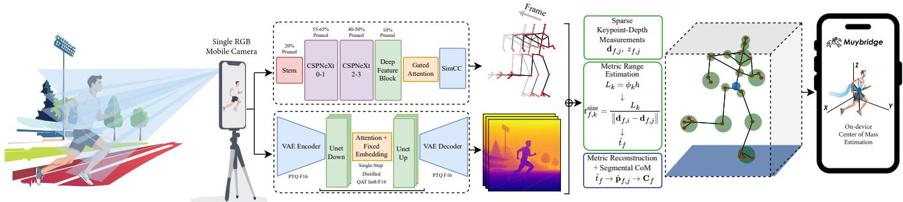
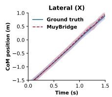
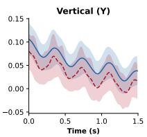
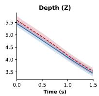
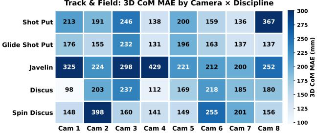
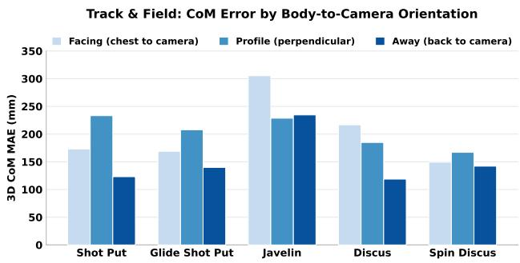
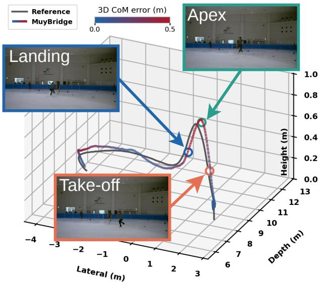
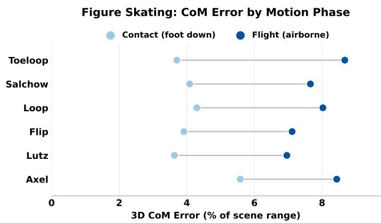
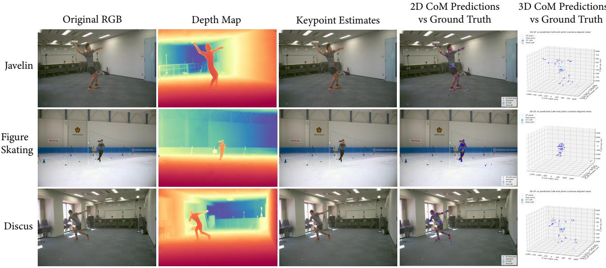
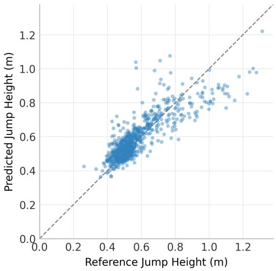

# MuyBridge: Mobile Human Center-of-Mass Estimation from Monocular Video via Sparse Fusion

Aidan Bradshaw1, Marco Giordano1, David Rode1, Andreas Habersack2, Elif Basokur1, Annika Kruse2, Markus Tilp2, Michele Magno1, Peter Wolf1, Luca Benini1,3, Christoph Leitner1

1ETH Zurich 2University of Graz 3University of Bologna

## Abstract

The 3D center of mass (CoM) is a primary quantity in the biomechanical analysis of sport, rehabilitation, and clinical movement, yet existing 3D pose tracking, mesh recovery, and multi-view triangulation methods either optimize 3D keypoint accuracy without anatomical constraints or carry compute and capture infrastructure too heavy to deploy where CoM tracking is most useful. As a result, the metric CoM remains difficultfor coaches and movement analysts to measurefrom a single camera where athletes train and compete. In this work, we introduce MuyBridge, an ondevice system that estimates the athlete’s segmental center ofmass trajectoryfrom a single phone camera video stream. MuyBridge couples a compact 2D pose network and a distilled single-step monocular depth network through an analytic metric fusion that uses anatomical and physical priors to anchor the metric CoM, requiring no 3D or taskspecific supervision. Evaluated on the athletic movements ofAthletePose3D (running, track andfield, andfigure skating), MuyBridge achieves 33–41 mm vertical CoM error and 2.3–6.6% absolute-relative range error (AbsRel) under a one-time calibration, and produces CoM estimates at the 63 FPS pose-estimation rate using asynchronous 2.86 Hz depth updates on iPhone 15. Code is available at: https: //github.com/Abradshaw1/Muybridge.

## 1. Introduction

The whole-body center of mass (CoM) is a widely used quantity in segmental biomechanics for analyzing balance, acceleration, and landing in athletic performance [2, 26, 30, 50]. Estimating it, however, commonly requires metric body-segment positions together with segment lengths, mass fractions, and segment-specific centers of mass, obtained from marker-based motion capture [11, 14, 30], force plates [1, 13, 41], or wearable inertial sensing [24, 43]. This often confines athletes to laboratories and dedicated capture facilities rather than the fields, arenas, and training environments where they normally train, making it difficult to measure their natural movement during competition.

Computer vision offers a way to measure similar movements with substantially less equipment. Two-dimensional pose estimators recover image-space joint locations [22, 44, 52], 2D-to-3D lifting methods recover 3D joint configurations [16, 31, 56], mesh-recovery methods estimate body pose and shape [12, 20, 33], and monocular depth models estimate scene geometry [15, 36, 37]. Although useful, these methods are generally optimized for keypoint, pose, surface, or depth accuracy and do not directly recover anatomical quantities. A smaller body of work incorporates biomechanical structure through musculoskeletal models [46, 51] or mass and contact constraints [45], but often relies on computationally heavy 3D body representations [19, 23, 51] or calibrated multi-view capture and cloud processing [46], limiting their use and practicality during routine athletic measurement. This leaves segmental CoM monitoring on deployable platforms largely unexplored.

We introduce MuyBridge, a monocular system for estimating metric segmental CoM from phone video. Muy-Bridge combines a compact pose network that identifies image-space anatomical keypoints defining the athlete’s body segments with monocular depth sampled at these locations to capture relative range and track camera-to-athlete motion. The system then uses an analytic fusion of the pose and depth predictions with stature-scaled anthropometric constraints to recover metric range, while a onetime scene calibration supplies the ground-plane geometry required by complementary physical cues. The resulting fused range places the keypoints as metric 3D segment endpoints. MuyBridge maps these endpoints to segment geometries, mass fractions, and longitudinal CoM locations using stature-scaled, sex-specific de Leva parameters [9], then computes whole-body CoM as a mass-weighted sum of the resulting segment centers.

We evaluate MuyBridge on AthletePose3D [54] across running, track and field, and figure skating. Across these motion regimes, MuyBridge achieves 33–41 mm vertical

CoM error and 2.3–6.6% absolute-relative range error (AbsRel). We evaluate aggregate performance and characterize how viewpoint, motion phase, and individual range cues affect monocular CoM recovery. On an iPhone 15, the pose network runs at 63 FPS while asynchronous depth updates at 2.86 Hz support CoM estimation at the pose rate.

• MuyBridge, a deployable single-camera method for metric segmental CoM estimation that combines image-space pose, subject-specific anthropometry, sparse monocular depth, and geometric range constraints without taskspecific 3D human-pose or CoM supervision.

• An evaluation across cyclic, rotational, and ballistic athletic motions that characterizes where MuyBridge performs well and where camera-to-athlete range recovery becomes the dominant source of error, including the effects of viewpoint, motion phase, and individual range cues.

• A hardware-aware mobile implementation that compresses and quantizes the pose and depth networks, executes them asynchronously, and profiles latency, throughput, memory, and energy on an iPhone 15.

## 2. Related Work

Biomechanically grounded vision. Recent work has moved beyond keypoint accuracy toward anatomically and physically constrained human-motion estimation. BioPose [23] incorporates biomechanical structure into monocular 3D pose estimation, while HSMR [51] reconstructs humans using a biomechanically accurate skeletal model. IP-MAN [45] introduces center-of-mass, center-of-pressure, and body–floor constraints into monocular human reconstruction, and OpenCap [46] evaluates pose estimator through the musculoskeletal models. Kaichi et al. [19] estimate CoM directly from multi-view visual-hull reconstruction. These works show the value of anatomical and physical structure, but metric biomechanical reconstruction commonly relies on richer body models, optimization, or multi-view capture, rather than targeting deployable platforms such as mobile hardware.

Monocular geometry and scale. Recent lifting methods improve root-relative 3D pose through kinematic, temporal, and state-space representations [8, 34], while meshrecovery methods such as PromptHMR [49], SAM 3D Body [53], and Neural Localizer Fields [39] recover increasingly detailed body geometry. Estimating articulated body configuration, however, does not necessarily determine absolute camera-to-subject range. RootNet [32] explicitly estimates camera distance, metric-depth methods recover scene scale [3, 4, 15, 35, 48], and affine-invariant approaches such as Marigold [21] recover relative scene geometry without fixing metric scale. These approaches address complementary components of monocular 3D reconstruction, but do not themselves define the metric segmental quantities required for whole-body CoM estimation.

Efficient visual inference. Human pose estimation has increasingly targeted lower-cost inference alongside accuracy. RTMPose [17] provides a compact 2D pose architecture, while recent 2D-to-3D methods reduce the cost of temporal pose modeling through compact transformer and state-space representations [8, 16, 31]. Monocular depth models have similarly reduced the cost of scene geometry estimation, showing feasibility for efficient human modeling under resource constraints.

## 3. Method

## 3.1. Preliminaries

Segmental Center-of-Mass Model. We compute wholebody CoM using the segmental anthropometric model of Zatsiorsky and Seluyanov, as re-expressed by de Leva [9, 55], representing the body as rigid segments whose endpoints are anatomical joint centers. For segment s with proximal and distal endpoints $\mathbf { p } _ { s } ^ { \mathrm { p r o x } }$ and $\mathbf { p } _ { s } ^ { \mathrm { d i s t } }$ , the segment center of mass is

$$
\mathbf { c } _ { s } = \mathbf { p } _ { s } ^ { \mathrm { p r o x } } + \rho _ { s } \left( \mathbf { p } _ { s } ^ { \mathrm { d i s t } } - \mathbf { p } _ { s } ^ { \mathrm { p r o x } } \right) ,\tag{1}
$$

where $\rho _ { s }$ specifies the longitudinal position of the center of mass along segment s. Whole-body CoM is then computed as the mass-weighted sum of the segment centers,

$$
\mathbf { C } = \frac { \sum _ { s } m _ { s } \mathbf { c } _ { s } } { \sum _ { s } m _ { s } } ,\tag{2}
$$

where $m _ { s }$ is the mass fraction of segment s. We use sexspecific segment mass fractions and longitudinal CoM positions from this formulation. Computing C therefore requires the metric locations of the anatomical segment endpoints together with the corresponding anthropometric parameters.

Center-of-Mass from Monocular Video. A monocular pose detector provides image-space keypoints corresponding to the anatomical joints of the segmental model, but not their metric positions relative to the camera. Muy-Bridge maps each keypoint through the camera intrinsics to a viewing ray ${ \bf d } _ { j }$ , such that a joint at athlete range t lies at $\mathbf { p } _ { j } ~ = ~ t \mathbf { d } _ { j } .$ The normalized depth field is sampled at the detected keypoints to provide relative range information. Metric scale is obtained from sex-specific de Leva segment-length proportions scaled by subject stature, with ground contact and ballistic motion providing additional anchors when available. These measurements recover the metric range t, after which the resulting joint positions define the segment endpoints in Equation 1 and the anthropometric parameters $\rho _ { s }$ and $m _ { s }$ give the whole-body CoM through Equation 2.

  
Figure 1. Overview of MuyBridge. A single RGB phone camera provides input to the compact pose and monocular depth networks, whose outputs are combined through metric fusion to recover metric joint positions and compute whole-body CoM on device.

## 3.2. System Overview

The goal of MuyBridge is to estimate metric center-ofmass trajectories of athletes directly from monocular phone video. MuyBridge (Figure 1) consists of three stages: (i) a compact 2D pose network that predicts anatomical keypoints, (ii) a single-step monocular depth network that provides normalized depth at those locations, and (iii) an analytic metric-fusion stage that combines relative depth with anthropometric and physical range cues to recover metric joint positions and compute whole-body CoM.

## 3.3. 2D Pose Network

The pose branch estimates the 26 anatomical keypoints of the Halpe-26 [10] layout from each RGB frame. We use a compact RTMPose-style architecture [17] with an RT-MDet person detector [29], a CSPNeXt backbone [7], a gated attention unit, and a SimCC regression head [25]. The detected athlete is cropped to a 256 × 192 input, and SimCC predicts separate horizontal and vertical coordinate distributions for each joint. The resulting output is $K = \{ ( \hat { u } _ { j } , \hat { v } _ { j } , w _ { j } ) \} _ { j = 1 } ^ { 2 6 } .$ , where $( \hat { u } _ { j } , \hat { v } _ { j } )$ is the image-space location of joint j and $w _ { j }$ its confidence. Coordinates are mapped back to the original image before metric fusion. We train and evaluate the pose network on COCO-WholeBody [18] and HICO-DET [6], with annotations converted to the Halpe-26 layout with no AthletePose3D or sport-specific supervision. The architecture is subsequently restructured, pruned, and quantized for mobile deployment, described in Section 4.1.

## 3.4. Monocular Depth Network

To provide range information for the detected body keypoints, the depth branch processes the same RGB frame as the pose network and predicts a dense normalized depth field $Z ( u , v )$ We use a Marigold-based latent depth model [21], consisting of a VAE encoder, a denoising UNet, and a VAE decoder. Rather than iterative diffusion sampling, we apply latent consistency distillation [28] to reduce inference to a single UNet evaluation. The predicted depth is affine-invariant, so individual keypoint samples provide local relative depth and their aggregate estimates athlete range, while absolute metric scale is resolved during fusion by combining these keypoint-depth measurements with the corresponding anatomical and physical anchors. The network is trained on approximately 1.2M synthetic RGB-D pairs from Hypersim [38] and Virtual KITTI 2 [5], with no AthletePose3D or sport-specific supervision. The architecture is subsequently restructured, pruned, and quantized for mobile execution as described in Section 4.2.

## 3.5. Metric Center-of-Mass Estimation

After pose and depth estimation, MuyBridge converts image-space observations into metric joint positions for the segmental model. Keypoints are back-projected through the camera intrinsics and paired with depth samples at the same anatomical locations, then fused with anthropometric and physical range cues to recover athlete depth for segmental CoM computation.

Sparse Keypoint-Depth Measurements. For frame $f ,$ keypoint $( u _ { f , j } , v _ { f , j } )$ defines the camera ray

$$
\mathbf { d } _ { f , j } \propto \mathbf { K } ^ { - 1 } [ u _ { f , j } , v _ { f , j } , 1 ] ^ { \top } ,\tag{3}
$$

and the normalized depth field is sampled at the same anatomical location as $z _ { f , j } ~ = ~ Z _ { f } ( u _ { f , j } , v _ { f , j } )$ . Pose confidence and local depth consistency are used jointly to reject observations inconsistent with the athlete. The retained samples are summarized as $\tilde { z } _ { f } ~ = ~ \mathrm { m e d i a n } _ { j \in \mathcal { V } _ { f } } z _ { f , j } .$ , providing a robust relative range signal. Since $Z _ { f }$ is affineinvariant, $\tilde { z } _ { f }$ captures changes in athlete range but carries no metric scale.

Metric Range Estimation. Metric range is first estimated from anthropometric segment lengths. For segment k, a known length $L _ { k }$ from the de Leva body model, scaled by subject stature or replaced by a measured length when available, and endpoint rays $\mathbf { d } _ { f , i }$ and $\mathbf { d } _ { f , j }$ give

$$
t _ { f , k } ^ { \mathrm { s i z e } } = \frac { L _ { k } } { \lVert \mathbf { d } _ { f , i } - \mathbf { d } _ { f , j } \rVert } .\tag{4}
$$

Because foreshortening biases individual estimates upward, range estimates across visible segments are aggregated using a fixed low quantile. Physical cues provide additional metric observations when available. Ground contact yields range through ray–ground intersection, while airborne motion yields range by relating image-space acceleration to gravity. These observations also anchor the affine-invariant depth signal to metric scale. For frames A where a physical range observation is available, we estimate

$$
( \alpha , \beta ) = \arg \operatorname* { m i n } _ { \alpha , \beta } \sum _ { f \in \cal { A } } w _ { f } \left( \alpha \tilde { z } _ { f } + \beta - t _ { f } ^ { \mathrm { a n c h o r } } \right) ^ { 2 } ,\tag{5}
$$

where $t _ { f } ^ { \mathrm { a n c h o r } }$ is the metric range obtained from ground contact or ballistic motion and $w _ { f }$ is its measurement weight. This gives the depth-derived range $t _ { f } ^ { \mathrm { d e p t h } } = \alpha \tilde { z } _ { f } + \beta$ . The anthropometric, physical, and depth-derived measurements are fused with a constant-velocity range model to obtain the final athlete range $\hat { t } _ { f }$

Metric Reconstruction and Segmental CoM. The fused athlete range $\hat { t } _ { f }$ places the predicted keypoint rays in metric camera coordinates. The hip-center ray defines a vertical reconstruction plane at this range, and each keypoint ray is intersected with the plane to obtain metric joint positions $\hat { \mathbf { p } } _ { f , j }$ . The reconstructed Halpe-26 joint locations are then mapped to the corresponding de Leva segment coordinates for the head, trunk, bilateral thighs, shanks, feet, upper arms, and forearms, with the trunk defined from neck to hip center and hand mass folded into the forearms. The sexspecific $m _ { s }$ and $\rho _ { s }$ parameters are applied to segment endpoints to compute segment centers and whole-body CoM through Equations 1 and 2.

## 4. On-Device Deployment

## 4.1. Pose Network Compression

We restructure the pose network of Section 3.3 for efficient execution on the Apple Neural Engine, then apply structured pruning and quantization-aware training.

Architecture restructuring. We replace SiLU with ReLU, express the projections in the gated attention unit as convolution–normalization–activation blocks, and replace hard-sigmoid gates with standard sigmoid operations to map the graph to accelerator-supported operators. Pooling and convolution kernels are capped at $7 \times 7 .$ , except for the large-kernel SimCC block required for coordinate resolution. We further compress the CSPNeXt backbone to width×0.275 and depth×0.157, with channel dimensions rounded to multiples of 8 or 16 for Neural Engine tensor packing. The reduced feature dimensions also lower SRAM pressure and intermediate feature transfers.

Structured pruning. We apply GroupFisher structured pruning [27], concentrating removal in the early network rather than shrinking all stages uniformly. CSPNeXt Stages 0–1 are reduced by 55–65%, Stages 2–3 by 40– 50%, and Stage 4 by at most 10%, reducing the network from 3336 to 2389 channels and approximately halving its floating-point computation. The pruned network is then fine-tuned in full precision before quantization.

Mixed-precision quantization. We perform quantizationaware training with symmetric per-channel quantization for weights and asymmetric per-tensor quantization for activations. The SimCC softmax remains in floating point because normalization over coordinate bins is sensitive to eight-bit reduction, while the remaining compatible operators are quantized for Neural Engine execution.

<table><tr><td>Model</td><td>FPS ↑</td><td>AUC↑</td><td>PCK@0.1 ↑</td></tr><tr><td>Ours (INT8)</td><td>224</td><td>0.902</td><td>73.32%</td></tr><tr><td>RTMPose (F32)</td><td>123</td><td>0.870</td><td>66.35%</td></tr></table>

Table 1. Pose accuracy and server-side throughput of the compressed INT8 model and full-size RTMPose reference. AUC is the area under the PCK curve, and PCK@0.1 reports the percentage of keypoints within 10% of the reference scale.

The compressed model reaches 1.82× the RTMPose throughput with a 7.0-point PCK@0.1 gain. The accuracy difference reflects Halpe-26 retraining rather than quantization (Table 1).

## 4.2. Depth Network Compression

We restructure the depth network of Section 3.4 for efficient mobile execution, applying conditioning removal, operatorcompatible restructuring, and mixed-precision quantization. Conditioning removal. Marigold inherits the CLIP textconditioning of its Stable Diffusion 2 backbone. We found that replacing the text encoder with a fixed learned embedding does not measurably degrade depth performance while removing approximately 340 M parameters.

Operator-compatible restructuring. We restructure the remaining network for Core ML execution. GELU and SiLU activations are replaced with ReLU and Hardswish so that adjacent convolution, normalization, and activation operations can be fused across accelerator tiles. Group and layer normalization are replaced with a batch-adaptive normalization wrapper that yields a static computation graph and can be folded into neighboring convolutions at export.

Mixed-precision quantization. We found that posttraining quantization degrades the UNet’s predicted depth structure, whereas the frozen VAE maintains stable activation ranges under post-hoc calibration. We therefore apply quantization-aware training to the UNet and post-training

quantization to the VAE. Convolution and projection layers use eight-bit symmetric per-channel weight quantization and asymmetric per-tensor activation quantization, while attention, query/key/value projections, softmax, and residual normalization remain in FP16 because full INT8 attention degrades depth accuracy.
<table><tr><td>Dataset</td><td>Model</td><td>AbsRel↓</td><td> $\mathrm { R M S E } _ { \mathrm { l i n } } \downarrow$ </td><td> $\delta _ { 1 } \uparrow$ </td></tr><tr><td>KITTI-Depth [47]</td><td>Marigold (F32) Ours (INT8)</td><td>0.132 0.155</td><td>3.588 3.885</td><td>0.852 0.776</td></tr><tr><td>Hypersim† [38]</td><td>Marigold (F32)</td><td>0.128</td><td>0.738</td><td>0.880</td></tr><tr><td rowspan="2"></td><td>Ours (INT8)</td><td>0.149</td><td>0.800</td><td>0.849</td></tr><tr><td></td><td></td><td></td><td></td></tr><tr><td rowspan="2">NYU-Depth [42]</td><td>Marigold (F32)</td><td>0.053</td><td>0.230</td><td>0.976</td></tr><tr><td>Ours (INT8)</td><td>0.061</td><td>0.253</td><td>0.965</td></tr></table>

Table 2. Depth accuracy compressed network compared with fullprecision Marigold reference. AbsRel, linear RMSE, $\delta _ { 1 }$ , †held-out test split, all follow standard monocular depth evaluation.

Quantization introduces a modest accuracy loss across datasets, with AbsRel increasing by 0.008–0.023 and $\delta _ { 1 }$ decreasing by 0.011–0.076 (Table 2). The largest degradation occurs on KITTI-Depth, while NYU-Depth remains comparatively stable.

## 4.3. Pipeline Deployment and Profiling

Both networks are converted from PyTorch to Core ML and compiled into fixed-shape .mlmodelc binaries. The depth model is split into encoder, denoiser, and decoder graphs to avoid poor accelerator mapping of a single monolithic graph. MuyBridge runs as a native Swift application on an iPhone 15, with AVFoundation supplying camera frames, Core ML executing the perception networks, and CPUbased metric fusion and CoM computation.

Setup. Camera intrinsics are obtained directly from the device, while a one-time scene calibration provides the ground plane and landmark offsets used by the physical range cues of Section 3.5. Subject sex and stature are specified once before recording, with stature scaling the anthropometric segment lengths and sex selecting the corresponding de Leva parameters.

Runtime. The pose network sustains 63 FPS, whereas the depth field refreshes at 2.86 Hz. MuyBridge therefore performs fusion at the pose rate using the most recent depth field. This asynchronous schedule matches the role of each branch, pose captures frame-to-frame articulation, while depth supplies a more slowly varying range signal and local consistency measurements. Output begins after the first depth field is available, with the anatomical range cue providing metric range from the first usable frame.

Profiling. We profile the compiled pipeline on an iPhone 15 over 100 forward passes. Latency and throughput are measured from the deployed Core ML models, energy from

the Xcode energy log, peak memory from Instruments, and model size from the compiled .mlmodelc bundles.
<table><tr><td>Model</td><td>Lat. (ms) ↓</td><td>FPS↑</td><td>Size (MB)</td><td>Energy (mJ) ↓</td></tr><tr><td>Pose network</td><td>15.58</td><td>63.0</td><td>17.4</td><td>23.4</td></tr><tr><td>Depth network</td><td>349.9</td><td>2.86</td><td>928.9</td><td>615.0</td></tr><tr><td>Full†  $2 5 6 \times 1 9 2$ </td><td>349.9</td><td>2.86</td><td>946.3</td><td>638.4</td></tr><tr><td>Full,  $2 5 6 \times 2 5 6$ </td><td>424.6</td><td>2.35</td><td>946.3</td><td>752.4</td></tr><tr><td>Full,  $3 2 0 \times 3 2 0$ </td><td>384.7</td><td>2.60</td><td>946.3</td><td>690.4</td></tr></table>

Table 3. On-device profiling on an iPhone 15. Component rows report the deployed 256 × 192 configuration, while full-pipeline rows compare †MuyBridge input resolutions.

At the deployed resolution, pose inference requires 15.58 ms while a depth update requires 349.9 ms, making the depth branch the dominant cost in model size, energy, and memory (Table 3). A full pass costs 349.9 ms and 638 mJ, which is the cold-start configuration rather than steady-state operation. Across resolutions, latency is nonmonotonic, with 320×320 executing faster than $2 5 6 \times 2 5 6 .$ due to accelerator-specific tiling and core allocation. Peak memory reaches 1,185 MB for the complete pipeline, compared with 126.8 MB for pose alone. Per-submodule profiling, tail latencies, and compute are reported in the appendix.

## 5. Experiments

## 5.1. Datasets and Evaluation Protocol

We evaluate MuyBridge on AthletePose3D [54], which contains eight athletes and approximately 1.3M synchronized multi-view frames. We partition the evaluation into running, track and field, and figure skating to characterize motion-dependent performance using test partitions comprising 1,028 sequence-camera pairs and 235,183 frames. Neither perception network is trained or fine-tuned on AthletePose3D. For each sequence, camera intrinsics and the one-time scene calibration provide the geometric inputs required by Section 3.5. Subject sex selects the corresponding de Leva [9] anthropometric parameters, while stature scales sex-specific segment-length proportions used for metric range estimation. Reference trajectories are used only to compute evaluation targets and are not used during inference. Reference CoM is computed from the provided 3D joints using the segmental model of Section 3.1 and the same anthropometric formulation as our predictions. We report 3D CoM MAE and its lateral, vertical, and depth components and range AbsRel, $\begin{array} { r } { \mathrm { A b s R e l } = \frac { 1 } { T } \sum _ { t } \frac { | \hat { Z } _ { t } - Z _ { t } | } { Z _ { t } } } \end{array}$ . Errors are averaged over frames within each sequence-camera pair and reported as medians over pairs.

## 5.2. Center-of-Mass Accuracy

We first characterize overall CoM accuracy across motion types, reporting lateral (X), vertical (Y), and camera-

depth (Z) errors to determine how metric localization varies across movement regimes.
<table><tr><td></td><td colspan="3">Metric localization</td><td colspan="3">Axis MAE (mm)</td></tr><tr><td>Regime</td><td>Range (m) 3D (mm)</td><td></td><td>) AbsRel (%)</td><td>X</td><td>Y</td><td>Z</td></tr><tr><td>Running</td><td>4.4</td><td>187</td><td>3.6</td><td></td><td>44 33</td><td>166</td></tr><tr><td>Track &amp; field</td><td>5.4</td><td>185</td><td>2.3</td><td></td><td>94 39</td><td>117</td></tr><tr><td>Skating</td><td>10.1</td><td>707</td><td>6.6</td><td>167 41</td><td></td><td>672</td></tr></table>

Table 4. Metric CoM accuracy across motion regimes. Range is mean athlete distance from the camera; 3D and per-axis errors are MAE in mm. Values are medians over sequence-camera pairs after averaging within each pair.

The larger 3D errors are concentrated along camera depth, which contributes 166 of 187 mm in running, 117 of 185 mm in track and field, and 672 of 707 mm in figure skating (Table 4). Lateral and vertical errors remain substantially smaller, indicating that monocular range recovery is the dominant source of metric localization error. We next examine how camera geometry and motion affect this range error.

## 5.3. Comparison with Recent Methods

We compare MuyBridge with recent monocular human reconstruction and 3D pose methods using their official pretrained models without fine-tuning on AthletePose3D. Predictions are converted to whole-body CoM using the same de Leva formulation and evaluated on the same test partitions and sequence–camera aggregation protocol. Absolute evaluation uses native camera-space predictions when available, while root-relative evaluation removes pelvis translation from the prediction and reference.

Dedicated reconstruction methods achieve lower absolute CoM error in track and field and skating, as well as lower root-relative error in track and field (Table 5). MuyBridge ranks second in absolute running error and matches MotionAGFormer at 45 mm root-relative error, although MotionAGFormer receives per-frame ground-truth scale. Unlike these reconstruction-specific baselines, Muy-Bridge uses generic pose and depth supervision with an explicit segmental biomechanical model incorporating anthropometric and physical constraints. This compact formulation enables end-to-end execution on an iPhone 15, making MuyBridge the only evaluated method with demonstrated mobile deployment.

## 5.4. Analysis Across Motion Regimes

Cyclic locomotion. Running provides a baseline athletic motion regime with repeated acceleration and deceleration, periodic vertical and lateral CoM motion, and sustained translation through the scene. Across the running partition, MuyBridge reaches 187 mm 3D CoM MAE and 3.6% range AbsRel at a mean athlete range of 4.4 m.

<table><tr><td>Method</td><td>Running</td><td>Track &amp; field</td><td>Skating</td><td>Mobile</td></tr><tr><td colspan="5">Absolute 3D CoM MAE (mm)</td></tr><tr><td>MeTRAbs-S [40]</td><td>224</td><td>120</td><td>231</td><td>x</td></tr><tr><td>HMR2.0 [12]</td><td>N/A</td><td>N/A</td><td>N/A</td><td>x</td></tr><tr><td>CameraHMR [33]</td><td>392</td><td>180</td><td>534</td><td>x</td></tr><tr><td>NLF [39]</td><td>52</td><td>209</td><td>646</td><td>x</td></tr><tr><td>MuyBridge</td><td>187</td><td>185</td><td>707</td><td>√</td></tr><tr><td colspan="5">Root-relative 3D CoM MAE (mm)</td></tr><tr><td>MeTRAbs-S [40]</td><td>67</td><td>72</td><td>57</td><td>x</td></tr><tr><td>HMR2.0 [12]</td><td>70</td><td>80</td><td>69</td><td>x</td></tr><tr><td>CameraHMR [33]</td><td>68</td><td>74</td><td>58</td><td>x</td></tr><tr><td>NLF [39]</td><td>64</td><td>68</td><td>53</td><td>x</td></tr><tr><td>MotionAGFormer [31]</td><td>45</td><td>79</td><td>90</td><td>x</td></tr><tr><td>MuyBridge</td><td>45</td><td>118</td><td>76</td><td>√</td></tr></table>

Table 5. Comparison with recent monocular reconstruction and 3D pose methods on AthletePose3D. Values are median 3D CoM (mm) MAE, with best and second-best results shown in bold and underline. Mobile indicates demonstrated mobile deployment in the cited work. HMR2.0 does not provide calibrated metric camera-space placement, and MotionAGFormer is provided per frame ground-truth scale due to its scale-ambiguous predictions.

  
Figure 2. Running CoM trajectories from a representative camera view, averaged across 37 sequences. Shading denotes one standard deviation across pairs.

The lateral and vertical CoM trajectories closely follow the reference, while depth retains a systematic offset during forward translation (Figure 2). Across all running sequences and camera views, median per-axis error is 44 mm lateral, 33 mm vertical, and 166 mm in depth, making camera-toathlete range the dominant source of 3D error.

Confined rotational movement. Track and field introduces larger limb excursions and rapid changes in body configuration than running, making whole-body CoM more sensitive to the recovery of individual segment positions. The throwing events also involve substantial body rotation while remaining largely confined spatially. MuyBridge reaches 185 mm 3D CoM MAE and 2.3% range AbsRel at a mean range of 5.4 m.

There is a clear distinction between confined throwing motions and javelin. Across the fixed-circle events, 21 of 32 camera–discipline combinations remain below 200 mm 3D CoM MAE (Figure 3). Javelin instead ranges from 200 to 429 mm across cameras. Unlike the other events, javelin combines large segmental motion with a run-up and sustained translation through camera depth, increasing the difficulty of metric range recovery.

Track & Field: 3D CoM MAE by Camera × Discipline  
  
Figure 3. 3D CoM MAE across camera views and throwing disciplines. Cameras 1–8 denote the eight synchronized AthletePose3D camera views used for evaluation.

  
Figure 4. 3D CoM MAE stratified by body-to-camera orientation. Each frame is independently assigned to a facing, profile, or away orientation bin based on GT pelvis heading, so a sequence may contribute to multiple bins.

We stratify frames by body-to-camera orientation using the reference hip axis only for analysis (Figure 4). Back-facing configurations yield the lowest error in four of five events, while profile views exceed facing views in three of five. Perpendicular orientations can increase overlap and occlusion of distal joints, reducing the landmarks available for anatomical range estimation and depth sampling. Javelin is the exception, where translational motion during the run-up dominates the orientation effect.

Ballistic Movement. Figure skating provides the most challenging regime, combining repeated airborne motion with an athlete range of 10.1 m, nearly twice the other motion regimes. Jumps introduce rapid vertical acceleration, large changes in body configuration, and extended periods without ground contact. MuyBridge reaches 707 mm 3D CoM MAE and 6.6% range AbsRel in this setting.

MuyBridge recovers the overall spatial trajectory of the jump while the athlete moves several meters through camera depth (Figure 5). At this range, small image-space perturbations produce larger metric displacements, and airborne motion removes the ground-contact cue used for range estimation. We therefore separate grounded and airborne phases to determine how strongly flight contributes to the skating error.

  
Figure 5. Recovered metric CoM trajectory for a representative Toeloop recorded from approximately 10 m. The height axis is exaggerated for visibility.

  
Figure 6. 3D CoM error during contact and flight across six figureskating jump types. Each point shows the phase-aggregated error for one jump type, normalized by mean athlete-to-camera range, gray lines connect contact and flight values for the same jump.

We separate contact and flight phases to characterize performance during airborne ballistic motion (Figure 6). Contact error ranges from 3.6–5.6% of athlete range, compared with 7.0–8.7% during flight, corresponding to a 1.5–2.3× increase. The same pattern appears across all six jump types, indicating that the degradation is associated with airborne motion rather than a specific jump.

## 5.5. Ablation Study

Representation and range cues. We ablate the key components of MuyBridge to quantify the contributions of keypoint-based depth sampling, the segmental body representation, and individual metric range cues.

<table><tr><td>Variant</td><td>Running</td><td>Track &amp; field</td><td>Skating</td></tr><tr><td>Root-relative CoM*</td><td>45</td><td>118</td><td>76</td></tr><tr><td>Constant sequence range</td><td>721</td><td>235</td><td>1890</td></tr><tr><td>Torso-only body model</td><td>284</td><td>252</td><td>733</td></tr><tr><td>MuyBridge</td><td>187</td><td>185</td><td>707</td></tr><tr><td>No ground-contact cue</td><td>355</td><td>808</td><td>1220</td></tr><tr><td>No keypoint-depth cue</td><td>387</td><td>316</td><td>939</td></tr></table>

Table 6. Ablation of the metric CoM formulation. Values are median 3D CoM MAE in mm. The upper block evaluates alternative range and body representations, while the lower block removes individual range cues. ∗Root-relative CoM excludes absolute camera-to-athlete translation and is therefore not directly comparable to the metric variants.

The ablations confirm that each component of the metric formulation contributes to final CoM accuracy (Table 6). Holding athlete range constant increases error from 187 to 721 mm in running and from 707 to 1890 mm in skating, while restricting reconstruction to the torso increases error to 284, 252, and 733 mm across the three motion regimes. Removing either the ground-contact or keypointdepth cue also increases error across all motions. The full MuyBridge formulation achieves the lowest metric error in every case, showing that sparse depth, physical range cues, and segmental anatomy provide complementary information for metric CoM estimation.

Sparse depth sampling. We vary the anatomical keypoints used to sample the relative depth field and evaluate their effect on the resulting range signal and metric CoM accuracy.

<table><tr><td></td><td colspan="2">Running</td><td colspan="2">Track &amp; field</td><td colspan="2">Skating</td></tr><tr><td>Depth samples</td><td>r</td><td>mm</td><td>r</td><td>mm</td><td>r</td><td>mm</td></tr><tr><td>All 26 keypoints</td><td>0.949</td><td>187</td><td>0.779</td><td>185</td><td>0.642</td><td>707</td></tr><tr><td>12 limb keypoints</td><td>0.929</td><td>342</td><td>0.201</td><td>186</td><td>0.595</td><td>706</td></tr><tr><td>6 torso keypoints</td><td>0.906</td><td>341</td><td>0.313</td><td>185</td><td>0.590</td><td>633</td></tr><tr><td>Hip only</td><td>0.933</td><td>344</td><td>0.261</td><td>187</td><td>0.572</td><td>643</td></tr></table>

Table 7. Effect of anatomical keypoint sampling on metric CoM estimation. r is the correlation between sampled relative depth and true athlete range, and mm is median 3D CoM MAE. All 26 keypoints form the default MuyBridge configuration.

All 26 keypoints provide the strongest range correlation in every regime and reduce running error from 341–344 mm to 187 mm (Table 7). Track and field is comparatively insensitive to the sampling set, remaining between 185 and 187 mm. In skating, torso-only sampling achieves the lowest error at 633 mm despite lower range correlation than the full set, showing that correlation with athlete range does not alone determine final CoM accuracy. Overall, broad keypoint coverage provides the most consistent performance across motion regimes.

Depth usage. After ablating the keypoint-depth cue as a whole, we separate its two uses in metric fusion. Sparse depth provides an aggregated depth-derived range estimate and filters anatomical samples whose depth is inconsistent with the athlete.

<table><tr><td>Variant</td><td>Running</td><td>Track &amp; field</td><td>Skating</td></tr><tr><td>MuyBridge</td><td>187</td><td>185</td><td>707</td></tr><tr><td>No depth-derived range estimate</td><td>392</td><td>207</td><td>904</td></tr><tr><td>No depth-consistency filtering</td><td>351</td><td>192</td><td>730</td></tr></table>

Table 8. Median 3D CoM MAE in mm after separately ablating the two uses of sparse depth. Removing the depth-derived range estimate retains depth-consistency filtering, while removing consistency filtering retains the depth-derived range estimate.

Depth-derived range estimate provides the larger overall contribution, with its removal increasing error by 205 mm in running and 197 mm in skating (Table 8). Depthconsistency filtering also reduces running error by 164 mm, with smaller effects in track and field and skating. Using both gives the lowest error across all three regimes.

## 6. Conclusion

We presented MuyBridge, a mobile system for metric center-of-mass estimation from monocular video using a three-stage fusion method based on keypoint depth, anatomical constraints, and physical range cues. Across running, track and field, and figure skating, MuyBridge maintains vertical CoM error between 33 and 41 mm and localizes athlete range to 2.3–6.6% AbsRel while sustaining CoM output at the 63 FPS pose-estimation rate with asynchronous 2.86 Hz depth updates on an iPhone 15. Among the evaluated methods, MuyBridge remains competitive for running while being the only system demonstrated on mobile hardware. Ablations further show that segmental anatomy, sparse depth, dynamic range estimation, and physical range cues each contribute to final metric CoM accuracy. Absolute localization remains primarily limited by camera-to-athlete range, particularly under sustained translation and long-range airborne motion. MuyBridge also assumes a one-time scene calibration, and its anthropometric reconstruction uses stature-scaled, sex-specific population segment proportions. AthletePose3D contains only eight athletes and provides markerless rather than markerbased reference trajectories. Future work on calibration robustness, subject-adaptive anthropometry, motion-adaptive range estimation, and lighter depth backbones could further enhance mobile biomechanics beyond controlled settings.

## References

[1] F. Barbier, P. Allard, K. Guelton, B. Colobert, and A.- P. Godillon-Maquinghen. Estimation of the 3-d center of mass excursion from force-plate data during standing. IEEE Transactions on Neural Systems and Rehabilitation Engineering, 11(1):31–37, 2003. 1

[2] Nathaniel A. Bates, Kevin R. Ford, Gregory D. Myer, and Timothy E. Hewett. Impact differences in ground reaction force and center of mass between the first and second landing phases of a drop vertical jump and their implications for injury risk assessment. Journal ofBiomechanics, 46(7):1237– 1241, 2013. 1

[3] Shariq Farooq Bhat, Reiner Birkl, Diana Wofk, Peter Wonka, and Matthias Muller. Zoedepth: Zero-shot trans-¨ fer by combining relative and metric depth. arXiv preprint arXiv:2302.12288, 2023. 2

[4] Aleksei Bochkovskiy, Amael Delaunoy, Hugo Germain,¨ Marcel Santos, Yichao Zhou, Stephan R. Richter, and Vladlen Koltun. Depth pro: Sharp monocular metric depth in less than a second. In International Conference on Learning Representations, 2025. 2

[5] Yohann Cabon, Naila Murray, and Martin Humenberger. Vir tual KITTI 2. arXiv preprint arXiv:2001.10773, 2020. 3

[6] Yu-Wei Chao, Yunfan Liu, Xieyang Liu, Huayi Zeng, and Jia Deng. Learning to detect human-object interactions. In 2018 IEEE Winter Conference on Applications of Computer Vision (WACV), pages 381–389, 2018. 3

[7] Xiangqi Chen, Chengzhuan Yang, Jiashuaizi Mo, Yaxin Sun, Hicham Karmouni, Yunliang Jiang, and Zhonglong Zheng. Cspnext: A new efficient token hybrid backbone. Engineering Applications ofArtificial Intelligence, 132:107886, 2024. 3

[8] Hu Cui, Wenqiang Hua, Renjing Huang, Shurui Jia, and Tessai Hayama. Sasmamba: A lightweight structure-aware stride state space model for 3d human pose estimation. In 2026 IEEE/CVF Winter Conference on Applications ofComputer Vision (WACV), pages 2721–2730, 2026. 2

[9] Paolo de Leva. Adjustments to zatsiorsky-seluyanov’s segment inertia parameters. Journal of Biomechanics, 29(9): 1223–1230, 1996. 1, 2, 5

[10] Hao-Shu Fang, Jiefeng Li, Hongyang Tang, Chao Xu, Haoyi Zhu, Yuliang Xiu, Yong-Lu Li, and Cewu Lu. Alphapose: Whole-body regional multi-person pose estimation and tracking in real-time. IEEE Transactions on Pattern Analysis and Machine Intelligence, 45(6):7157–7173, 2023. 3

[11] Caroline Forsell and Kjartan Halvorsen. A method for determining minimal sets of markers for the estimation of center of mass, linear and angular momentum. Journal of Biomechanics, 42(3):361–365, 2009. 1

[12] Shubham Goel, Georgios Pavlakos, Jathushan Rajasegaran, Angjoo Kanazawa, and Jitendra Malik. Humans in 4d: Reconstructing and tracking humans with transformers. In IEEE/CVF International Conference on Computer Vision (ICCV), pages 14737–14748, 2023. 1, 6

[13] Elena M. Gutierrez-Farewik, Asa Bartonek, and Helena Saraste. Comparison and evaluation of two common meth-

ods to measure center of mass displacement in three dimen sions during gait. Human Movement Science, 25(2):238– 256, 2006. 1

[14] Kjartan Halvorsen, Martin Eriksson, Lennart Gullstrand, Fredrik Tinmark, and Johnny Nilsson. Minimal marker set for center of mass estimation in running. Gait & Posture, 30 (4):552–555, 2009. 1

[15] Mu Hu, Wei Yin, Chi Zhang, Zhipeng Cai, Xiaoxiao Long, Hao Chen, Kaixuan Wang, Gang Yu, Chunhua Shen, and Shaojie Shen. Metric3d v2: A versatile monocular geometric foundation model for zero-shot metric depth and surface normal estimation. IEEE Transactions on Pattern Analysis and Machine Intelligence, 46(12):10579–10596, 2024. 1, 2

[16] Yunlong Huang, Junshuo Liu, Ke Xian, and Robert Caiming Qiu. Posemamba: Monocular 3d human pose estimation with bidirectional global-local spatio-temporal state space model. In AAAI Conference on Artificial Intelligence, pages 3842–3850, 2025. 1, 2

[17] Tao Jiang, Peng Lu, Li Zhang, Ning Ma, Rui Han, Chengq Lyu, Yining Li, and Kai Chen. Rtmpose: Real-time multiperson pose estimation based on mmpose. arXiv preprint arXiv:2303.07399, 2023. 2, 3

[18] Sheng Jin, Lumin Xu, Jin Xu, Can Wang, Wentao Liu, Chen Qian, Wanli Ouyang, and Ping Luo. Whole-body human pose estimation in the wild. In European Conference on Computer Vision (ECCV), pages 196–214, 2020. 3

[19] Tomoya Kaichi, Shohei Mori, Hideo Saito, Kosuke Takahashi, Dan Mikami, Mariko Isogawa, and Hideaki Kimata. Estimation of center of mass for sports scene using weighted visual hull. In 2018 IEEE/CVF Conference on Computer Vision and Pattern Recognition Workshops (CVPRW), pages 1809–1815, 2018. 1, 2

[20] Angjoo Kanazawa, Michael J. Black, David W. Jacobs, and Jitendra Malik. End-to-end recovery of human shape and pose. In 2018 IEEE/CVF Conference on Computer Vision and Pattern Recognition (CVPR), pages 7122–7131, 2018. 1

[21] Bingxin Ke, Kevin Qu, Tianfu Wang, Nando Metzger, Shengyu Huang, Bo Li, Anton Obukhov, and Konrad Schindler. Marigold: Affordable adaptation of diffusionbased image generators for image analysis. IEEE Transactions on Pattern Analysis and Machine Intelligence, pages 1–18, 2025. 2, 3

[22] Rawal Khirodkar, Timur Bagautdinov, Julieta Martinez, Su Zhaoen, Austin James, Peter Selednik, Stuart Anderson, and Shunsuke Saito. Sapiens: Foundation for human vision models. In European Conference on Computer Vision (ECCV), pages 206–228, 2024. 1

[23] Farnoosh Koleini, Muhammad Usama Saleem, Pu Wang, Hongfei Xue, Ahmed Helmy, and Abbey Fenwick. Biopose: Biomechanically-accurate 3d pose estimation from monocular videos. In 2025 IEEE/CVF Winter Conference on Applications of Computer Vision (WACV), pages 6330–6339, 2025. 1, 2

[24] Gabrielle C. Labrozzi, Holly Warner, Nathaniel S. Makowski, Musa L. Audu, and Ronald J. Triolo. Center of mass estimation for impaired gait assessment using inertial measurement units. IEEE Transactions on Neural Systems and Rehabilitation Engineering, 32:12–22, 2024. 1

[25] Yanjie Li, Sen Yang, Peidong Liu, Shoukui Zhang, Yunxiao Wang, Zhicheng Wang, Wankou Yang, and Shu-Tao Xia. Simcc: A simple coordinate classification perspective for human pose estimation. In European Conference on Computer Vision (ECCV), pages 89–106, 2022. 3

[26] Shun-Ping Lin, Wen-Hsu Sung, Fon-Chu Kuo, Terry B. J. Kuo, and Jin-Jong Chen. Impact of center-of-mass acceleration on the performance of ultramarathon runners. Journal ofHuman Kinetics, 44:41–52, 2014. 1

[27] Liyang Liu, Shilong Zhang, Zhanghui Kuang, Aojun Zhou, Jing-Hao Xue, Xinjiang Wang, Yimin Chen, Wenming Yang, Qingmin Liao, and Wayne Zhang. Group fisher pruning for practical network compression. In Proceedings of the 38th International Conference on Machine Learning, pages 7021–7032, 2021. 4

[28] Simian Luo, Yiqin Tan, Longbo Huang, Jian Li, and Hang Zhao. Latent consistency models: Synthesizing highresolution images with few-step inference. arXiv preprint arXiv:2310.04378, 2023. 3

[29] Chengqi Lyu, Wenwei Zhang, Haian Huang, Yue Zhou, Yudong Wang, Yanyi Liu, Shilong Zhang, and Kai Chen. Rtmdet: An empirical study of designing real-time object detectors. arXiv preprint arXiv:2212.07784, 2022. 3

[30] Andrea Mapelli, Matteo Zago, Laura Fusini, Domenico Galante, Andrea Colombo, and Chiarella Sforza. Validation of a protocol for the estimation of three-dimensional body center of mass kinematics in sport. Gait & Posture, 39(1): 460–465, 2014. 1

[31] Soroush Mehraban, Vida Adeli, and Babak Taati. Motionagformer: Enhancing 3d human pose estimation with a transformer-gcnformer network. In 2024 IEEE/CVF Winter Conference on Applications ofComputer Vision (WACV), pages 6905–6915, 2024. 1, 2, 6

[32] Gyeongsik Moon, Ju Yong Chang, and Kyoung Mu Lee. Camera distance-aware top-down approach for 3d multiperson pose estimation from a single rgb image. In 2019 IEEE/CVF International Conference on Computer Vision (ICCV), pages 10132–10141, 2019. 2

[33] Priyanka Patel and Michael J. Black. Camerahmr: Aligning people with perspective. In International Conference on 3D Vision (3DV), pages 1562–1571, 2025. 1, 6

[34] Jihua Peng, Yanghong Zhou, and P. Y. Mok. Ktpformer: Kinematics and trajectory prior knowledge-enhanced transformer for 3d human pose estimation. In 2024 IEEE/CVF Conference on Computer Vision and Pattern Recognition (CVPR), pages 1123–1132, 2024. 2

[35] Luigi Piccinelli, Yung-Hsu Yang, Christos Sakaridis, Mattia Segu, Siyuan Li, Luc Van Gool, and Fisher Yu. Unidepth:\` Universal monocular metric depth estimation. In 2024 IEEE/CVF Conference on Computer Vision and Pattern Recognition (CVPR), pages 10106–10116, 2024. 2

[36] Luigi Piccinelli, Christos Sakaridis, Yung-Hsu Yang, Mattia Segu, Siyuan Li, Wim Abbeloos, and Luc Van Gool. Unidepthv2: Universal monocular metric depth estimation made simpler. IEEE Transactions on Pattern Analysis and Machine Intelligence, 48(3):2354–2367, 2026. 1

[37] Rene Ranftl, Katrin Lasinger, David Hafner, Konrad ´ Schindler, and Vladlen Koltun. Towards robust monocular

depth estimation: Mixing datasets for zero-shot cross-dataset transfer. IEEE Transactions on Pattern Analysis and Ma chine Intelligence, 44(3):1623–1637, 2022. 1

[38] Mike Roberts, Jason Ramapuram, Anurag Ranjan, Atulit Kumar, Miguel Angel Bautista, Nathan Paczan, Russ Webb,´ and Joshua M. Susskind. Hypersim: A photorealistic syn thetic dataset for holistic indoor scene understanding. In 2021 IEEE/CVF International Conference on Computer Vision (ICCV), pages 10892–10902, 2021. 3, 5

[39] Istvan S´ ar´ andi and Gerard Pons-Moll. Neural localizer fields´ for continuous 3d human pose and shape estimation. In Advances in Neural Information Processing Systems (NeurIPS), 2024. 2, 6

[40] Istvan S´ ar´ andi, Timm Linder, Kai Oliver Arras, and Bastian´ Leibe. Metrabs: Metric-scale truncation-robust heatmaps for absolute 3d human pose estimation. IEEE Transactions on Biometrics, Behavior, and Identity Science, 3:16–30, 2021. 6

[41] Takeshi Shimba. An estimation of center of gravity from force platform data. Journal of Biomechanics, 17(1):53–60, 1984. 1

[42] Nathan Silberman, Derek Hoiem, Pushmeet Kohli, and Rob Fergus. Indoor segmentation and support inference from rgbd images. In Computer Vision – ECCV 2012, pages 746– 760. Springer, 2012. 5

[43] Emeline Simonetti, Elena Bergamini, Giuseppe Vannozzi, Joseph Bascou, and Hel´ ene Pillet. Estimation of 3d body\` center of mass acceleration and instantaneous velocity from a wearable inertial sensor network in transfemoral amputee gait: A case study. Sensors, 21(9):3129, 2021. 1

[44] Ke Sun, Bin Xiao, Dong Liu, and Jingdong Wang. Deep high-resolution representation learning for human pose estimation. In 2019 IEEE/CVF Conference on Computer Vision and Pattern Recognition (CVPR), pages 5693–5703, 2019. 1

[45] Shashank Tripathi, Lea Muller, Chun-Hao P. Huang, Omid¨ Taheri, Michael J. Black, and Dimitrios Tzionas. 3d human pose estimation via intuitive physics. In Proceedings of the IEEE/CVF Conference on Computer Vision and Pat tern Recognition (CVPR), pages 4713–4725, 2023. 1, 2

[46] Scott D. Uhlrich, Antoine Falisse, Łukasz Kidzinski, Julie´ Muccini, Michael Ko, Akshay S. Chaudhari, Jennifer L. Hicks, and Scott L. Delp. Opencap: Human movement dynamics from smartphone videos. PLoS Computational Biology, 19(10):e1011462, 2023. 1, 2

[47] Jonas Uhrig, Nick Schneider, Lukas Schneider, Uwe Franke, Thomas Brox, and Andreas Geiger. Sparsity invariant cnns. In 2017 International Conference on 3D Vision (3DV), pages 11–20, 2017. 5

[48] Ruicheng Wang, Sicheng Xu, Yue Dong, Yu Deng, Jianfeng Xiang, Zelong Lv, Guangzhong Sun, Xin Tong, and Jiaolong Yang. Moge-2: Accurate monocular geometry with metric scale and sharp details. In Advances in Neural Information Processing Systems, pages 40377–40408, 2025. 2

[49] Yufu Wang, Yu Sun, Priyanka Patel, Kostas Daniilidis, Michael J. Black, and Muhammed Kocabas. Prompthmr: Promptable human mesh recovery. In 2025 IEEE/CVF Conference on Computer Vision and Pattern Recognition (CVPR), pages 1148–1159, 2025. 2

[50] David A. Winter. Human balance and posture control during standing and walking. Gait & Posture, 3(4):193–214, 1995. 1

[51] Yan Xia, Xiaowei Zhou, Etienne Vouga, Qixing Huang, and Georgios Pavlakos. Reconstructing humans with a biomechanically accurate skeleton. In 2025 IEEE/CVF Conference on Computer Vision and Pattern Recognition (CVPR), pages 5355–5365, 2025. 1, 2

[52] Yufei Xu, Jing Zhang, Qiming Zhang, and Dacheng Tao. Vitpose++: Vision transformer for generic body pose estimation. IEEE Transactions on Pattern Analysis and Machine Intelligence, 46(2):1212–1230, 2024. 1

[53] Xitong Yang, Devansh Kukreja, Don Pinkus, Anushka Sagar, Taosha Fan, Jinhyung Park, Soyong Shin, Jinkun Cao, Jiawei Liu, Nicolas Ugrinovic, Matt Feiszli, Jitendra Malik, Piotr Dollar, and Kris Kitani. Sam 3d body: Robust full-body hu-´ man mesh recovery. arXiv preprint arXiv:2602.15989, 2026. 2

[54] Calvin Yeung, Tomohiro Suzuki, Ryota Tanaka, Zhuoer Yin, and Keisuke Fujii. Athletepose3d: A benchmark dataset for 3d human pose estimation and kinematic validation in athletic movements. In 2025 IEEE/CVF Conference on Computer Vision and Pattern Recognition Workshops (CVPRW), pages 5945–5956, 2025. 1, 5

[55] Vladimir Zatsiorsky and Vitali Seluyanov. Estimation of the mass and inertia characteristics of the human body. Journal ofBiomechanics, 23:31–39, 1990. 2

[56] Wentao Zhu, Xiaoxuan Ma, Zhaoyang Liu, Libin Liu, Wayne Wu, and Yizhou Wang. Motionbert: A unified perspective on learning human motion representations. In 2023 IEEE/CVF International Conference on Computer Vision (ICCV), pages 15039–15053, 2023. 1

## A. Qualitative Reconstruction

Figure 7 shows end-to-end output on three AthletePose3D sequences. The depth field is sampled only at keypoint locations, for whole-body range and consistency gating.

## B. Extended Pose Network Evaluation

Table 9 attributes the pose cost of Table 3 to the detector and the keypoint backbone. The backbone dominates, at 12.53 of 15.58 ms and 100.2 of 126.8 MB.

Table 10 reports mean and percentile latencies from the same 100-pass trace. The p99 stays within 2.5 ms of the median, so throughput is stable under continuous execution.

## C. Extended Depth Network Evaluation

Table 11 extends Table 2 to the full monocular-depth metric suite. The ordering of Table 2 holds across every metric. Table 12 attributes the 349.9 ms depth update to its three graphs. The UNet carries 210.7 ms, 845.0 MB, and the full 1,185 MB peak, so it sets the cost of the branch.

## D. Fused Pipeline Profiling

Table 13 adds peak memory and compute to Table 3. Peak memory tracks the depth branch across all three resolutions, since the branches do not peak concurrently.

## E. Running Partition by Camera View

Table 14 breaks the running result of Table 4 down by view. Camera 4 returns the best lateral and vertical components with the worst depth component, so variation across views is dominated by camera-depth localization.

## F. Jump Height in Figure Skating

Jump height, the takeoff-to-apex rise of the vertical CoM, is recovered to 62 mm MAE at r = 0.84 across 719 sequence– camera pairs spanning 0.26–1.31 m reference height, with a mean signed error of +12 mm (Table 15, Figure 8).

  
Figure 7. Qualitative end-to-end reconstruction on three AthletePose3D sequences. Each row shows the RGB frame, the predicted depth field, the 2D keypoints, the image-plane center of mass against the reference, and the recovered metric center of mass.

<table><tr><td>Variant</td><td>Latency (ms) ↓</td><td>FPS ↑</td><td>Size (MB)</td><td>Energy (mJ) ↓</td><td>Peak mem (MB)</td><td>FLOPs / MACs</td></tr><tr><td>BBox head</td><td>3.05</td><td>328.0</td><td>3.3</td><td>4.6</td><td>26.6</td><td>0.31 GF / 0.155 GM</td></tr><tr><td>Keypoint backbone</td><td>12.53</td><td>81.0</td><td>14.1</td><td>18.8</td><td>100.2</td><td>0.67 GF / 0.335 GM</td></tr><tr><td>Full HPE network</td><td>15.58</td><td>63.0</td><td>17.4</td><td>23.4</td><td>126.8</td><td>0.98 GF / 0.490 GM</td></tr></table>

Table 9. Per-submodule on-device profiling of the pose network on the Neural Engine.

<table><tr><td>Variant</td><td> $\mathsf { p 5 0 }$ </td><td> $\mathsf { p } 9 0$ </td><td> $\mathsf { p } 9 9$ </td><td>Mean</td><td>Energy (mJ) ↓</td><td>Mem before</td><td>Mem peak</td></tr><tr><td>BBox head</td><td>3.12</td><td>3.57</td><td>3.79</td><td>3.05</td><td>4.6</td><td>15.58</td><td>26.56</td></tr><tr><td>Keypoint backbone</td><td>13.36</td><td>13.89</td><td>14.23</td><td>12.53</td><td>18.8</td><td>31.61</td><td>100.25</td></tr><tr><td>Full pass</td><td>16.50</td><td>17.50</td><td>18.00</td><td>15.58</td><td>23.4</td><td>47.20</td><td>126.80</td></tr></table>

Table 10. Tail latencies and memory behaviour of the pose network on an iPhone 15. Latencies in ms, memory in MB.

<table><tr><td>Dataset</td><td>Model</td><td>AbsRel ↓</td><td>SqRel ↓</td><td> $\mathrm { R M S E } _ { \mathrm { l i n } } \downarrow$ </td><td> $\mathrm { R M S E } _ { \log } \downarrow$ </td><td> $\log 1 0 \downarrow$ </td><td> $\delta _ { 1 }$  个</td><td> $\delta _ { 2 } \uparrow$ </td><td> $\delta _ { 3 } \uparrow$ </td><td>iRMSE↓</td><td>SILog ↓</td></tr><tr><td rowspan="2">KITTI-Depth</td><td>Marigold (F32)</td><td>0.132</td><td>0.574</td><td>3.588</td><td>0.2640</td><td>0.0662</td><td>0.852</td><td>0.972</td><td>0.990</td><td>823.0</td><td>26.04</td></tr><tr><td>Ours (INT8)</td><td>0.155</td><td>0.688</td><td>3.885</td><td>0.2800</td><td>0.0738</td><td>0.776</td><td>0.952</td><td>0.985</td><td>679.1</td><td>27.70</td></tr><tr><td rowspan="2">Hypersim†</td><td>Marigold (F32)</td><td>0.128</td><td>0.184</td><td>0.738</td><td>0.1680</td><td>0.0494</td><td>0.880</td><td>0.956</td><td>0.981</td><td>48.4</td><td>16.62</td></tr><tr><td>Ours (INT8)</td><td>0.149</td><td>0.226</td><td>0.800</td><td>0.2271</td><td>0.0610</td><td>0.849</td><td>0.945</td><td>0.971</td><td>46.2</td><td>22.23</td></tr><tr><td rowspan="2">NYU-Depth</td><td>Marigold (F32)</td><td>0.053</td><td>0.0216</td><td>0.230</td><td>0.0804</td><td>0.0226</td><td>0.976</td><td>0.993</td><td>0.998</td><td>0.0419</td><td>8.02</td></tr><tr><td>Ours (INT8)</td><td>0.061</td><td>0.0259</td><td>0.253</td><td>0.0891</td><td>0.0259</td><td>0.965</td><td>0.993</td><td>0.998</td><td>0.0469</td><td>8.89</td></tr></table>

Table 11. Full depth accuracy of the compressed network against the full-precision Marigold reference, extending Table 2. Evaluation follows the Marigold protocol; † denotes the held-out Hypersim test split.

<table><tr><td>Module</td><td>Resolution</td><td>Latency (ms) ↓</td><td>FPS↑</td><td>Size (MB)</td><td>Energy (mJ) ↓</td><td>Peak mem (MB)</td><td>FLOPs / MACs</td></tr><tr><td>Encoder</td><td>256×192</td><td>46.68</td><td>21.4</td><td>34.3</td><td>70.0</td><td>74</td><td>2.18 GF / 1.09 GM</td></tr><tr><td></td><td>256×256</td><td>61.26</td><td>16.3</td><td>34.3</td><td>91.9</td><td>81</td><td>2.18 GF / 1.09 GM</td></tr><tr><td></td><td>320×320</td><td>55.67</td><td>18.0</td><td>34.3</td><td>83.5</td><td>98</td><td>2.18 GF / 1.09 GM</td></tr><tr><td>UNet</td><td>256×192</td><td>210.7</td><td>4.75</td><td>845.0</td><td>406.1</td><td>1185</td><td>51.99 GF / 25.99 GM</td></tr><tr><td></td><td>256×256</td><td>242.2</td><td>4.13</td><td>845.0</td><td>455.4</td><td>1182</td><td>67.98 GF / 33.99 GM</td></tr><tr><td></td><td>320×320</td><td>215.6</td><td>4.64</td><td>845.0</td><td>413.3</td><td>1208</td><td>103.98 GF / 51.99 GM</td></tr><tr><td>Decoder</td><td>256×192</td><td>92.51</td><td>10.8</td><td>49.6</td><td>138.8</td><td>66</td><td>2.20 GF / 1.10 GM</td></tr><tr><td></td><td>256×256</td><td>121.1</td><td>8.3</td><td>49.6</td><td>181.6</td><td>66</td><td>2.20 GF / 1.10 GM</td></tr><tr><td></td><td>320×320</td><td>113.4</td><td>9.0</td><td>49.6</td><td>170.1</td><td>67</td><td>2.20 GF / 1.10 GM</td></tr><tr><td>Full pass</td><td>256×192</td><td>349.9</td><td>2.86</td><td>928.9</td><td>615.0</td><td>1185</td><td>56.4 GF / 28.2 GM</td></tr><tr><td></td><td>256×256</td><td>424.6</td><td>2.35</td><td>928.9</td><td>729.0</td><td>1182</td><td>72.4 GF / 36.2 GM</td></tr><tr><td></td><td>320×320</td><td>384.7</td><td>2.60</td><td>928.9</td><td>667.0</td><td>1208</td><td>108.4 GF / 54.2 GM</td></tr></table>

Table 12. On-device profiling of the INT8 depth module, by submodule and input resolution.

<table><tr><td>Resolution</td><td>Latency (ms) ↓</td><td>FPS ↑</td><td>Energy (mJ) ↓</td><td>Size (MB)</td><td>Peak mem (MB) ↓</td><td>FLOPs / MACs</td></tr><tr><td>256×192</td><td>349.9</td><td>2.86</td><td>638.4</td><td>946.3</td><td>1185</td><td>57.4 GF / 28.7 GM</td></tr><tr><td>256×256</td><td>424.6</td><td>2.35</td><td>752.4</td><td>946.3</td><td>1182</td><td>73.4 GF / 36.7 GM</td></tr><tr><td>320×320</td><td>384.7</td><td>2.60</td><td>690.4</td><td>946.3</td><td>1208</td><td>109.4 GF / 54.7 GM</td></tr></table>

Table 13. Fused pipeline after Core ML export, extending Table 3 with peak memory and computational cost. Latency reports the critical path under concurrent pose and depth execution, while energy and model size include both branches.

<table><tr><td>View</td><td>n</td><td>3D CoM (mm)</td><td>Lateral X (mm)</td><td>Vertical Y (mm)</td><td>Depth Z (mm)</td></tr><tr><td>Camera 1</td><td>30</td><td>227</td><td>43</td><td>33</td><td>165</td></tr><tr><td>Camera 2</td><td>37</td><td>216</td><td>102</td><td>33</td><td>181</td></tr><tr><td>Camera 3</td><td>37</td><td>151</td><td>53</td><td>30</td><td>120</td></tr><tr><td>Camera 4</td><td>37</td><td>308</td><td>38</td><td>21</td><td>300</td></tr><tr><td>All views</td><td>141</td><td>187</td><td>44</td><td>33</td><td>166</td></tr></table>

Table 14. Running partition by camera view, absolute 3D CoM MAE and its per-axis split, medians over pairs.

<table><tr><td>Jump</td><td>n</td><td>MAE (mm) ↓</td><td>r ↑</td><td>Bias (mm)</td><td>GT range (m)</td></tr><tr><td>Toeloop</td><td>120</td><td>63</td><td>0.86</td><td>+16</td><td>0.43-1.31</td></tr><tr><td>Salchow</td><td>120</td><td>61</td><td>0.87</td><td>+23</td><td>0.38-1.02</td></tr><tr><td>Loop</td><td>120</td><td>67</td><td>0.89</td><td>+1</td><td>0.26-1.28</td></tr><tr><td>Flip</td><td>120</td><td>53</td><td>0.89</td><td>+13</td><td>0.40-1.11</td></tr><tr><td>Lutz</td><td>120</td><td>74</td><td>0.67</td><td>+28</td><td>0.47–0.96</td></tr><tr><td>Axel</td><td>119</td><td>53</td><td>0.77</td><td>-9</td><td>0.37-1.00</td></tr><tr><td>All</td><td>719</td><td>62</td><td>0.84</td><td>+12</td><td>0.26-1.31</td></tr></table>

Table 15. Jump-height recovery by jump type, computed once per sequence–camera pair as the takeoff-to-apex vertical CoM displacement. Entries report median absolute error over pairs; r is the correlation with reference height, bias is the mean signed error, and GT range is the reference span. This vertical-displacement metric is not directly comparable to the absolute 3D CoM MAE of Table 4.

Figure Skating: Jump Height, Predicted vs Reference  
  
Figure 8. Predicted against reference jump height across all figureskating sequence–camera pairs. The dashed line is the identity.