(a)Previous Point Supervised Remote Sensing Change Detection

# Progressive Pseudo-Label Optimization for Point-Supervised Change Detection

Hailong Ning1, Hao Wang2, Yimeng Wang1, Tao Lei3, Renwei Dian4∗, Asoke K. Nandi5

1Xi’an University of Posts and Telecommunications

2Dalian Maritime University

3School of Electronic Information and Artificial Intelligence, Shaanxi University of Science and Technology 4School of Robotics, Hunan University

5Department of Electronic and Electrical Engineering, Brunel University of London

ninghailong@xupt.edu.cn, king.whao@outlook.com, yimengwang@xupt.edu.cn, leitao@sust.edu.cn, drw@hnu.edu.cn, asoke.nandi@brunel.ac.uk

## Abstract

Point-supervised change detection (PS-CD) aims to identify pixel-level changes between bi-temporal images using only sparsely annotated points. Although point annotations substantially reduce labeling costs, their limited spatial coverage often results in incomplete and noisy pseudo-labels. To address this issue, we propose a two-stage framework that introduces SAM2 priors into PS-CD and progressively adapts them to the target task. In Stage I, SAM2 generates object-aware candidate masks from point annotations on the bi-temporal images, and a bi-temporal mask selection strategy is designed to convert generic segmentation responses into more reliable change pseudo-labels. Subsequently, a lightweight CNN refinement module with an uncertainty-aware loss is employed to improve boundary quality and local structural consistency. In Stage II, we construct a teacher-student self-training framework in which the teacher is updated by exponential moving average and periodically refreshes the pseudo-labels. This design establishes a closed-loop optimization process that alternates between pseudo-label refinement and model reoptimization. Experiments on three benchmark datasets, including WHU-CD, LEVIR-CD, and SYSU-CD, demonstrate that the proposed method outperforms previous weakly supervised approaches on most benchmarks and remains competitive with several fully supervised methods.

Code Repository

## Introduction

Change Detection (CD) aims to identify changes from multitemporal images of the same area and plays an important role in applications such as disaster response, urban monitoring, and ecosystem assessment.

Mainstream CD methods rely on dense pixel-level annotations for training. In particular, CNN-based methods (Liu et al. 2025b) have shown strong capability in local feature extraction and dense prediction, while Transformer-based methods (Lei et al. 2024) further enhance global-context modeling and long-range dependency learning. More recently, foundation-model-based methods, such as Change-

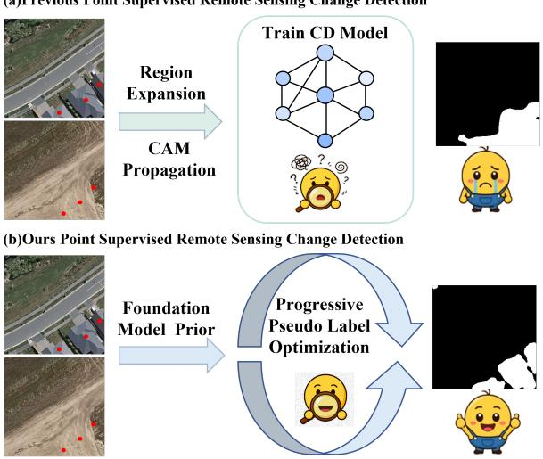  
Figure 1: The Motivation of progressive pseudo-label refinement.

CLIP (Dong et al. 2024) and SAM-based methods (Ning et al. 2025), have further advanced change representation learning. Despite their promising performance, training and adapting these increasingly powerful models generally require substantial amounts of accurately annotated data, further intensifying the annotation bottleneck in change detection.

Point supervision (Subhani 2026) provides a representative weakly supervised alternative by replacing pixel-level masks with a small number of annotated change points. Although point annotations provide explicit localization cues at a substantially lower cost, they convey little information about object extent, boundary structure, or background regions. Therefore, directly training a dense change detector from such sparse annotations is highly challenging. A common solution is to expand point annotations into pixel-level pseudo-labels and use them as surrogate supervision. Consequently, the quality of pseudo-labels becomes a key factor determining the performance of point-supervised change detection.

As illustrated in Figure 1, existing methods mainly generate pseudo-labels through region expansion (Fang et al. 2023) or class activation maps (CAMs) propagation (Wang, Zhang, and Shi 2023). Such strategies typically rely on local appearance similarity or coarse discriminative responses, which may result in incomplete regions, inaccurate boundaries, and false activations. Moreover, pseudo-labels are typically generated only once and subsequently treated as fixed supervision, allowing early errors to propagate throughout training. Foundation models provide rich object-level segmentation priors and ofer a promising way to improve pseudo-label generation. Nevertheless, their direct application to change detection remains nontrivial because their predictions are usually produced independently for single-temporal images and are not specifically adapted to the appearance variations encountered in change detection. This raises two central questions: how canfoundation-modelpriors be converted into reliable bi-temporal change pseudo-labels, and how can these pseudo-labels be progressively improved during training rather than remaining fixed?

To address these issues, we propose a two-stage framework for point-supervised change detection. In Stage I, SAM2 is prompted with sparse point annotations on the bi-temporal images to generate object-aware candidate masks. Then, a Bi-Temporal Mask Selection mechanism is proposed to rank the candidates by jointly considering SAM confidence, change consistency, and point coverage to convert generic single-temporal segmentation responses into initial change pseudo-labels. Since SAM2 priors may still contain imprecise boundaries and local noise, we further introduce a lightweight CNN-based Pseudo-Label Refinement module with an uncertainty-aware loss to improve boundary quality and local structural consistency while suppressing unreliable supervision. In Stage II, we construct an EMA-based Teacher-Student Self-Training framework. Instead of treating the pseudo-labels generated in Stage I as fixed supervision, the teacher model is updated using the exponential moving average (EMA) of the student parameters and periodically refreshes the pseudo-labels with its predictions. This design enables the model to continuously improve its supervision during training, thereby forming a closed-loop learning process of model optimization, pseudo-label updating, and reoptimization.

The main contributions of this study are summarized as follows:

• We introduce a progressive pseudo-label optimization paradigm for point-supervised change detection, which jointly evolves pseudo-label quality and detector capability through iterative optimization.

• We propose a SAM2-guided bi-temporal mask selection strategy that transforms single-temporal foundationmodel responses into change-aware soft pseudo-labels.

• We introduce an uncertainty-aware refinement and EMAbased self-training framework that improves pseudo-label boundary quality and periodically refreshes supervision during training.

## Related Work

Weakly Supervised Change Detection in Remote Sensing. Remote sensing change detection has achieved remarkable progress with the development of deep neural networks. However, most existing methods (Hao Chen and Shi 2021) rely on dense pixel-level annotations, which are costly and labor-intensive to obtain for large-scale remote sensing imagery. To reduce annotation burden, recent studies (Fang et al. 2023; Jiang et al. 2025; Zhao et al. 2025) have explored various weakly supervised settings, including image-level, point-level, and coarse region-level supervision. Among them, point-level supervision is particularly attractive because it provides explicit localization cues while requiring substantially less annotation efort than dense change masks. Most weakly supervised change detection methods follow a pipeline similar to weakly supervised semantic segmentation, in which limited annotations are first converted into pseudo-labels and then used to train a dense predictor. For example, CS-WSCD (Wang, Zhang, and Shi 2023) employs CAMs to coarsely localize changed regions and subsequently introduces SAM to refine ambiguous areas. FCD-GAN (Wu 2022) unifies unsupervised, weakly supervised, and regionally supervised change detection within a common framework, although its adversarial training may sufer from optimization instability. CARGNet (Fang et al. 2023) expands sparse point annotations into change regions through consistency-aligned regional growth, while BAR-Net (Jiang et al. 2025) and TransWCD (Zhao et al. 2025) further improve weakly supervised change localization with stronger feature modeling. Nevertheless, these methods remain highly dependent on the quality of their pseudo-labels, which are commonly generated by heuristic expansion or coarse localization strategies. Consequently, how to reliably recover complete and accurate change regions from weak supervision, particularly from point-level supervision, remains largely underexplored.

Pseudo-Label Learning and Self-Training. Pseudo-label learning (Kage et al. 2026) is a fundamental technique in weakly supervised dense prediction, since the final performance largely depends on whether limited annotations can be transformed into reliable pixel-level supervision. Similar strategies have also been successfully applied to camouflaged object detection (He et al. 2025) and medical object detection (Meyer, Mutter, and Padoy 2026), where progressively improved pseudo-labels provide efective supervision under limited annotations. In remote sensing change detection, however, many existing methods still adopt a one-shot pipeline (Wang, Zhang, and Shi 2023), in which pseudolabels are generated once and subsequently treated as fixed supervision throughout training. Such a strategy may propagate early pseudo-label errors and limits the model’s ability to progressively adapt to the target task. In contrast, selftraining (Liu et al. 2025a) provides a natural way to iteratively improve pseudo-labels through model feedback. Motivated by this principle, our method does not treat SAM-generated pseudo-labels as fixed supervision and progressively updates pseudo-labels within a teacher-student framework.

Foundation Models for Change Detection in Remote Sensing. The Segment Anything Model (SAM) (Kirillov et al. 2023) exhibits strong zero-shot segmentation capability and provides a new opportunity for remote sensing change detection. However, SAM is pretrained on natural single-temporal images, and its direct application to remote sensing scenarios is limited by both the domain gap and the inherently bi-temporal nature of the task. To adapt foundation models to change detection, SAM-CD (Ding et al. 2024) introduces a convolutional adapter and a task-agnostic semantic learning branch to align bi-temporal representations. Subsequent studies (Wei 2025) further explored diferent adaptation strategies. Although these methods demonstrate the potential of foundation models for change detection, they are mainly developed under fully supervised settings. How to exploit SAM/SAM2 priors to construct reliable supervision under weak annotations remains insuficiently studied.

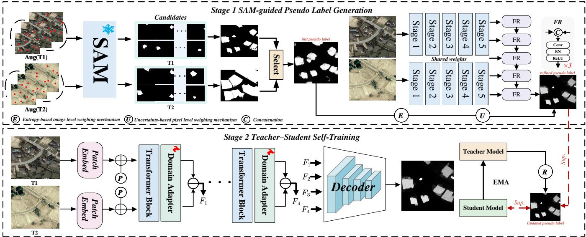  
Figure 2: Overview of the proposed two-stage point-supervised change detection framework. Stage I generates and refines soft pseudo-labels from bi-temporal point supervision using SAM2, mask selection, and CNN-based refinement. Stage II further improves change detection performance through a teacher-student self-training framework with EMA update and periodic pseudo-label refresh.

## Methodology

Figure 2 illustrates the overall framework of the proposed method, which consists of two stages under point-level supervision. In Stage I, SAM2 generates candidate masks for the bi-temporal images, and a bi-temporal mask selection strategy is used to rank and fuse them into initial soft pseudolabels. These pseudo-labels are further refined by a CNNbased change detector with uncertainty-aware supervision to improve boundary quality and local structural consistency. In Stage II, the refined pseudo-labels are used to fine-tune a SAM2 model with an adapter in a teacher-student selftraining framework. The teacher network is updated by exponential moving average (EMA) and periodically refreshes the pseudo-labels, forming a closed-loop optimization process for progressive pseudo-label refinement and task-specific adaptation.

## Stage I: pseudo-label Generation and Refinement

Weak point-level supervision provides only sparse localization cues, making it dificult to recover complete object regions. Directly optimizing with such sparse annotations often leads to incomplete masks and noisy supervision. To address this issue, we first construct initial pseudo-labels by leverag-·ing the strong segmentation prior of the foundation model · ·SAM2. Although the foundation model exhibits strong zero- shot segmentation capability, the domain gap between its pretraining data and the target change detection images often leads to semantically inaccurate predictions and imprecise · ·object boundaries, making its pseudo-labels unreliable for direct supervision. To address this limitation, we incorporate ·a CNN-based ResNet branch as a complementary feature extractor.

## Step 1: SAM2-based Candidate Mask Generation.

Given a pair of bi-temporal images $I ^ { t 1 }$ and $I ^ { t 2 } ,$ , we first convert the weak change annotations into a set of positive point prompts $\{ p _ { k } \} _ { k = 1 } ^ { K }$ , where each point corresponds to one connected change region. For each prompt point $p _ { k } .$ SAM2 is independently applied to the two temporal images to generate multiple candidate masks. The generated masks at the two timestamps are denoted as the candidate mask sets $\mathcal { M } _ { k } ^ { t 1 }$ and $\mathcal { M } _ { k } ^ { t 2 }$ , respectively, where each set contains N candidate masks corresponding to the same prompt point.

## Step 2: Bi-Temporal Mask Selection.

Since SAM2 may generate noisy or over-expanded masks, we rank candidate masks using a weighted score based on three criteria: SAM2 confidence $s _ { k , n } ^ { s a m }$ , change consistency $s _ { k , n } ^ { c h g }$ , and point coverage $s _ { k , n } ^ { p t }$ . The change consistency is measured by a change response map $D ,$ which integrates grayscale intensity, Sobel-gradient, and high-frequency differences between bi-temporal images:

$$
D = \operatorname { N o r m } ( D _ { i n t } + D _ { g r a d } + D _ { h f } ) ,\tag{1}
$$

$$
s _ { k , n } ^ { c h g } = \frac { \sum _ { x \in \Omega } M _ { k , n } ( x ) D ( x ) } { \sum _ { x \in \Omega } M _ { k , n } ( x ) + \epsilon } ,\tag{2}
$$

$$
s _ { k , n } ^ { p t } = \frac { 1 } { | \mathcal { P } _ { k } | } \sum _ { p \in \mathcal { P } _ { k } } \mathbb { I } [ M _ { k , n } ( p ) > 0 ] ,\tag{3}
$$

where Norm(·) denotes min-max normalization, $\mathcal { P } _ { k }$ represents the point prompts of the k-th component, and $\mathbb { I } ( \cdot )$ is the indicator function. The final score and pseudo-label generation process are formulated as

$$
\begin{array} { c l c r } { { s _ { k , n } = \lambda _ { 1 } s _ { k , n } ^ { s a m } + \lambda _ { 2 } s _ { k , n } ^ { c h g } + \lambda _ { 3 } s _ { k , n } ^ { p t } , } } \\ { { \tilde { Y } ( x ) = \displaystyle \operatorname* { m a x } _ { k } ( s _ { k } M _ { k } ( x ) ) , } } \end{array}\tag{4}
$$

where $\lambda _ { 1 } , \lambda _ { 2 } , \lambda _ { 3 }$ balance the three criteria. After ranking candidate masks according to $s _ { k , n } ,$ the selected masks are fused into component-level soft masks to generate the initial pseudo label $\tilde { Y }$

Step 3: CNN-based Pseudo-Label Refinement. SAM2 outputs may still miss fine boundaries and local texture details. Therefore, we further train a CNN-based change detector using the generated soft pseudo-labels as supervision. Specifically, we adopt a siamese encoder-decoder architecture, where a shared ResNet-18 backbone extracts multi-scale features from the two temporal images, and the absolute feature diferences are progressively decoded to produce a dense change probability map. This can be formulated as follows:

$$
\left\{ F _ { l } ^ { t 1 } \right\} _ { l = 1 } ^ { L } = E ( I ^ { t 1 } ) , \qquad \left\{ F _ { l } ^ { t 2 } \right\} _ { l = 1 } ^ { L } = E ( I ^ { t 2 } ) ,\tag{5}
$$

$$
D _ { l } = \left| F _ { l } ^ { t 1 } - F _ { l } ^ { t 2 } \right| , \qquad l = 1 , 2 , 3 , 4\tag{6}
$$

$$
P = D e c o d e r \left( D _ { 1 } , D _ { 2 } , D _ { 3 } , D _ { 4 } \right) ,\tag{7}
$$

Since the pseudo-labels generated in the previous stage are inevitably noisy, directly treating all pixels equally may introduce unreliable supervision. Inspired by uncertainty-aware pseudo-label learning, we assign both image-level and pixellevel confidence weights to the soft pseudo-labels, so that reliable regions contribute more to optimization while ambiguous regions are suppressed.

$$
w ( x ) = \left( 1 - E ( \tilde { Y } ) \right) \left( 2 \tilde { Y } ( x ) - 1 \right) ^ { 2 } ,\tag{8}
$$

$$
E ( \tilde { Y } ) = \frac { 1 } { | \Omega | } \sum _ { x \in \Omega } H \Big ( \tilde { Y } ( x ) \Big ) ,\tag{9}
$$

$$
\mathcal { L } _ { r e f } = \mathcal { L } _ { b c e } ^ { w } ( P , \tilde { Y } ) + \mathcal { L } _ { d i c e } ^ { w } ( P , \tilde { Y } ) ,\tag{10}
$$

where $H ( \cdot )$ denotes the binary entropy function, $\mathcal { L } _ { b c e } ^ { w }$ and $\mathcal { L } _ { d i c e } ^ { w }$ denote the weighted binary cross-entropy loss and weighted Dice loss under the uncertainty-aware weight w(x), respectively.

## Stage II: Teacher–Student Self-Training

Diferent from existing one-way pipelines that use SAM2 only for initial pseudo-label generation, our goal is to establish a closed-loop optimization process, where the SAMinitialized pseudo-labels continuously interact with the taskspecific change detector during training. We introduce a teacher-student self-training framework. Given the pseudolabels generated in Stage I, the student network is first optimized to learn bi-temporal change representations:

$$
P _ { s } = \Psi _ { s } ( I ^ { t 1 } , I ^ { t 2 } ; \theta _ { s } ) ,\tag{11}
$$

$$
P _ { t } = \Psi _ { t } \bigl ( I ^ { t 1 } , I ^ { t 2 } ; \theta _ { t } \bigr ) ,\tag{12}
$$

$$
\theta _ { t }  \alpha \theta _ { t } + ( 1 - \alpha ) \theta _ { s } ,\tag{13}
$$

where $\Psi _ { s } ( \cdot )$ denotes the student network, $\Psi _ { t } ( \cdot )$ denotes the teacher network, and $\theta _ { s }$ and $\theta _ { t }$ are their corresponding parameters. The teacher network shares the same architecture as the student network, but is updated as the exponential moving average (EMA) of the student, where α is the EMA decay factor. Such a design enables the teacher to accumulate the task-adaptive knowledge learned by the student and to provide more stable guidance during training. The updated teacher produces more reliable predictions to refine the pseudo-labels:

$$
\tilde { Y } ^ { r + 1 } = \mu \tilde { Y } ^ { r } + ( 1 - \mu ) P _ { t } ,\tag{14}
$$

$$
\mathcal { L } _ { s t a g e 2 } = \mathcal { L } _ { u } ( P _ { s } , \tilde { Y } ^ { r + 1 } ) .\tag{15}
$$

where ${ \tilde { Y } } ^ { r }$ and $\tilde { Y } ^ { r + 1 }$ denote the pseudo-labels before and after the r-th refresh step, respectively, and $\mu$ is the momentum coeficient for pseudo-label updating. The refreshed pseudolabels are then used to supervise the student through the uncertainty-aware loss $\mathcal { L } _ { u } ( \bar { \cdot } )$

## Experiment

## Experimental Setup.

Datasets. To validate the efectiveness of our framework, we conduct experiments on widely used high-resolution remote sensing change detection datasets: WHU-CD, LEVIR-CD, SYSU-CD. All image pairs are uniformly cropped into patches of 256×256 pixels. All datasets are split into training and testing sets following their oficial protocols to ensure fair comparisons with existing methods. The point annotations are generated by sampling the centroids of connected components in the corresponding ground-truth change masks. Evaluation Metrics. We adopt five widely used metrics to comprehensively evaluate the performance of diferent methods, including F1-score (F1), Intersection over Union (IoU), Precision (P), Recall (R), and Overall Accuracy (OA).

Implementation Details. All experiments are conducted on an NVIDIA RTX A6000 GPU. In Stage I, the CNN refinement model is optimized using stochastic gradient descent (SGD) with an initial learning rate of $1 \times \mathrm { { 1 0 ^ { - 2 } } }$ , a momentum of 0.9, and a weight decay of $5 \times 1 0 ^ { - 4 }$ . The model is trained for 8,000 iterations. In Stage II, we construct the teacher-student self-training framework. The student network is optimized using AdamW with an initial learning rate of $5 \times \mathrm { \dot { 1 } 0 ^ { - 4 } }$ , a weight decay of $5 \times 1 0 ^ { - 4 }$ , a batch size of $^ { \cdot } 8 ,$ and a total of 8 epochs. The input images are resized to $2 5 6 \times 2 5 6$ A cosine annealing scheduler is employed to gradually update the learning rate. The teacher network is updated by exponential moving average (EMA) with a decay factor of 0.996. In addition, the pseudo-labels are refreshed every 2 epochs, and the refresh momentum coeficient is set to 0.8.

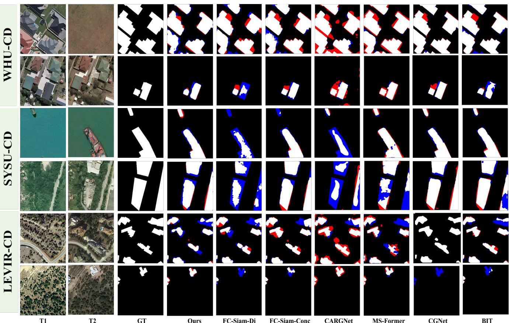  
Figure 3: Qualitative comparison of detection results on Change Detection datasets.

## Compare with State-of-the-arts.

To verify the efectiveness of the proposed framework, we compare it with 14 state-of-the-art methods on three benchmark datasets, including 5 weakly supervised and 9 fully supervised methods. For fair comparison, all competing methods are implemented and evaluated under their oficially recommended settings.

Quantitative analysis. From table 1, it can be observed that our method achieves the best overall performance among weakly supervised approaches on most datasets, demonstrating the efectiveness of introducing SAM priors and the proposed two-stage closed-loop optimization framework. It is worth noting that, although our method is trained under weak supervision, its performance is already close to, or even better than, some fully supervised methods on several datasets.

1) Results on the LEVIR-CD: our method achieves 81.25% F1 and 68.80% IoU. Compared with fully supervised methods, the average performance drop is only 9.18% in F1 and 12.73% in IoU. Moreover, our method surpasses the fully supervised FC-Siam-Conc and FC-Siam-Dif in Recall, achieving 84.80% versus 84.59% and 81.65%, respectively. Compared with the second-best weakly supervised method, MS-Former, our method improves F1 and IoU by 4.38 and 6.37 points, respectively.

2) Results on the WHU-CD: WHU-CD involves more complex and diverse change objects, our method still achieves

86.21% F1 and 75.77% IoU. In this challenging setting, our method outperforms several fully supervised baselines, including FC-Siam-Conc, FC-Siam-Dif, and Change-Former. Compared with the best competing weakly supervised method, PGU-CD, our method improves F1 and IoU by 4.39 and 6.53 points, respectively.

3) Results on the SYSU-CD: Our method achieves 72.28% F1 and 56.59% IoU on SYSU-CD. Compared with MS-Former, the strongest weakly supervised baseline, our method still achieves slightly better performance, with gains of 0.11% in F1 and 0.14% in IoU. Although the margin is not large, this result is still meaningful because SYSU-CD contains more complex scene variations, making weakly supervised pseudo-label learning more dificult.

Qualitative analysis. Figures 3 show qualitative comparisons with both fully supervised and weakly supervised methods on benchmark datasets. Compared with existing methods, the proposed approach produces more complete change regions, clearer boundaries, and fewer false alarms. This advantage is particularly evident in small structures and complex scenes, where our method better preserves structural details while suppressing background noise. These observations are consistent with the quantitative results and show that the proposed method remains competitive with both weakly supervised and several fully supervised approaches.

<table><tr><td rowspan="2">Method</td><td colspan="4">LEVIR-CD</td><td colspan="6">WHU-CD</td><td colspan="4">SYSU-CD</td></tr><tr><td>R</td><td></td><td>F1</td><td>IoU</td><td>OA</td><td></td><td>F1</td><td>IoU</td><td>OA</td><td>P</td><td>R</td><td>F1</td><td>IoU</td><td>OA</td></tr><tr><td colspan="9">Fully-supervised Methods</td><td></td><td></td><td></td><td></td><td></td><td></td></tr><tr><td>FC-Siam-Conc (Caye Daudt, Le Saux, and Boulch 2018)</td><td>90.52</td><td>84.59</td><td>87.45</td><td>77.70 98.76 90.34</td><td></td><td>81.04</td><td>85.44</td><td>74.58</td><td>98.90</td><td>82.22</td><td></td><td>70.74 76.05</td><td>61.36</td><td>89.49</td></tr><tr><td>FC-Siam-Diff (Caye Daudt, Le Saux, and Boulch 2018)</td><td>91.66 81.65</td><td></td><td>86.36</td><td>76.00 98.69</td><td>88.87</td><td>77.59</td><td>82.85</td><td>70.72</td><td>98.73 99.02</td><td>81.76</td><td>38.95</td><td>52.77</td><td>35.84</td><td>83.55</td></tr><tr><td>BIT (Hao Chen and Shi 2021)</td><td></td><td>91.33 88.31</td><td>89.79</td><td>81.48 98.98</td><td>86.80</td><td>88.72</td><td>87.75</td><td>78.17 88.51 79.39</td><td>99.07</td><td>80.39</td><td>76.28</td><td>78.28</td><td>64.31</td><td>90.02 89.29</td></tr><tr><td>SNUNet (Fang et al. 2021) ChangeFormer (Bandara 2022)</td><td></td><td></td><td>91.53 88.30 89.89 92.05 88.80 90.40 82.48</td><td>81.64 98.99</td><td>86.64</td><td>90.64</td><td></td><td>68.73</td><td>98.63</td><td>81.12</td><td>71.16</td><td></td><td>75.8161.04</td><td>89.02</td></tr><tr><td>HCGMNet (Han 2023)</td><td></td><td>93.55 89.65 91.56</td><td></td><td></td><td>99.04 87.64 76.11 81.47</td><td></td><td>92.77</td><td>86.51</td><td>99.42</td><td>79.10 83.93</td><td></td><td>72.64 75.73</td><td>60.94</td><td></td></tr><tr><td>CGNet (Han et al. 2023)</td><td></td><td>93.05 90.23</td><td>91.62</td><td>84.43</td><td>99.16 91.81</td><td>93.75</td><td></td><td>87.24</td><td>99.46</td><td>86.3774.37</td><td>75.73</td><td>79.62</td><td>66.14 90.86</td><td></td></tr><tr><td>SAM-CD (Ding et al. 2024)</td><td></td><td>95.87 95.14</td><td>95.50</td><td>84.53</td><td>99.16 92.57</td><td>93.81 93.18</td><td>97.58</td><td></td><td>99.60</td><td></td><td></td><td>79.92</td><td>66.55</td><td>91.19</td></tr><tr><td>ChangeCLIP (Dong et al. 2024)</td><td></td><td></td><td>91.30</td><td></td><td>99.14 97.97 96.02</td><td>97.20 93.58</td><td>94.78</td><td>90.08</td><td>95.52</td><td>85.56</td><td>73.22</td><td>78.91</td><td>65.17</td><td>90.77</td></tr><tr><td></td><td>93.68 89.04</td><td></td><td></td><td>83.99</td><td>99.14</td><td></td><td></td><td></td><td></td><td>87.16</td><td>79.80</td><td></td><td>83.82 71.41</td><td>92.46</td></tr><tr><td colspan="9">Weakly-supervised Methods</td><td></td><td></td><td></td><td></td><td></td><td></td></tr><tr><td>MS-Former (Li et al. 2023)</td><td>71.69 82.85 76.87</td><td></td><td></td><td>62.43</td><td></td><td>86.6379.13</td><td>82.71</td><td>70.52</td><td></td><td></td><td></td><td></td><td>86.3461.9972.1756.45</td><td></td></tr><tr><td>CARGNet (Fang et al. 2023)</td><td>59.93 94.25</td><td></td><td>73.27</td><td>57.28</td><td>96.50 44.47</td><td>92.20</td><td>60.00</td><td>42.86</td><td>95.12</td><td>59.35</td><td>85.49</td><td>70.05</td><td>50.40</td><td>79.57</td></tr><tr><td>TransWCD (Zhao et al. 2025)</td><td>55.48 65.51 60.08</td><td></td><td></td><td>52.9495.5675.34</td><td></td><td>65.19</td><td>68.73</td><td>52.36</td><td>97.17</td><td></td><td></td><td></td><td></td><td></td></tr><tr><td>BARNet (Jiang et al. 2025)</td><td></td><td></td><td></td><td></td><td>68.70</td><td>70.70</td><td>69.45</td><td>53.20</td><td>94.53</td><td></td><td></td><td></td><td></td><td></td></tr><tr><td>PGU-CD (Wang et al. 2026)</td><td>66.61 79.70</td><td></td><td>72.57</td><td>56.95</td><td>96.93 88.04</td><td>76.43</td><td>81.82</td><td>69.24</td><td>98.57</td><td></td><td></td><td></td><td></td><td></td></tr><tr><td>Ours</td><td></td><td>78.48 84.80 81.25</td><td>68.80</td><td></td><td>98.04 90.97</td><td>81.93</td><td>86.21</td><td>75.77</td><td></td><td>98.9678.3667.0772.2856.59</td><td></td><td></td><td></td><td>87.86</td></tr></table>

Table 1: Quantitative comparison on three change detection benchmarks, where the best results are highlighted in bold.
<table><tr><td rowspan="2">Dataset</td><td colspan="3">F1@0.5↑</td><td colspan="3">MAE↓</td></tr><tr><td>Initial</td><td>Stage I</td><td>Stage II</td><td>Initial</td><td>Stage I</td><td>Stage II</td></tr><tr><td>LEVIR-CD</td><td>29.87</td><td>32.49</td><td>33.36</td><td>0.036</td><td>0.024</td><td>0.022</td></tr><tr><td>WHU-CD</td><td>17.82</td><td>19.74</td><td>20.04</td><td>0.032</td><td>0.018</td><td>0.017</td></tr><tr><td>SYSU-CD</td><td>50.23</td><td>58.08</td><td>58.19</td><td>0.164</td><td>0.147</td><td>0.143</td></tr></table>

Table 2: Pseudo-label quality across optimization stages.

## Ablation Study.

To further verify the efectiveness of each component in the proposed framework, we conduct ablation experiments from three aspects: 1) the contribution of each stage, 2) the effectiveness of key modules in Stage I and Stage II, and 3) the sensitivity of important hyper-parameters. Unless otherwise specified, all ablation experiments are conducted on the LEVIR-CD dataset under the same settings as the full model.

Impact of Each Stage. Table 4 reports the contribution of diferent pseudo-label settings on LEVIR-CD, WHU-CD, and SYSU-CD. Using only the initial SAM2 pseudo-labels provides a reasonable baseline under weak supervision, but the results are still limited by noisy and incomplete supervision. Introducing the CNN refinement module in Stage I consistently improves performance on all three datasets, showing its efectiveness in enhancing pseudo-label quality. Adding self-training in Stage II also brings clear gains over the initial pseudo-label baseline, validating the benefit of iterative pseudo-label optimization. The full model achieves the best results on all three datasets, demonstrating that Stage I refinement and Stage II self-training are complementary.

Pseudo-Label Quality Analysis. Table 2 directly evaluates pseudo-label quality against ground-truth masks. Across all three datasets, the pseudo-labels are progressively improved from the initial SAM2 outputs to Stage I refinement and Stage II refresh, as reflected by higher F1@0.5 and lower MAE. This confirms that the proposed optimization process improves the supervision signal itself rather than only the final detector.

<table><tr><td>Method Variant</td><td>P</td><td>R</td><td>F1</td><td>IoU</td><td>OA</td></tr><tr><td>w/o Bi-Temporal Mask Selection</td><td>77.70</td><td>74.74</td><td>76.19</td><td>61.54</td><td>97.62</td></tr><tr><td>w/o Uncertainty-Aware Loss</td><td>60.14</td><td>71.43</td><td>65.30</td><td>48.48</td><td>96.13</td></tr><tr><td>w/o Teacher EMA</td><td>77.20</td><td>79.49</td><td>78.32</td><td>64.38</td><td>97.76</td></tr><tr><td>Full Model</td><td>78.48</td><td>84.80</td><td>81.25</td><td>68.80</td><td>98.04</td></tr></table>

Table 3: Ablation study of key components in Stage I and Stage II on the LEVIR-CD dataset.

Impact of key modules in Stage I and Stage II. There are several key components in our framework: (i) Mask selection in Stage I. A pivotal part of Stage I is the bi-temporal mask selection strategy, which ranks and fuses SAM-generated candidate masks by jointly considering SAM confidence, change consistency, and point coverage. As shown in Table 3, removing this strategy leads to consistent performance drops, validating its efectiveness in generating more reliable initial pseudo-labels. (ii) Uncertainty-aware loss in Stage I. We further evaluate the role of the uncertainty-aware weighting scheme by replacing it with a standard loss without confidence weighting. The performance decline indicates that uncertainty-aware supervision can better suppress noisy pseudo-labels and guide the model to focus on more reliable regions. (iii) Teacher-student self-training in Stage II. To validate the role of the EMA update strategy, we replace the EMA-updated teacher with a non-EMA variant while keeping the rest of the self-training framework unchanged. The inferior results indicate that EMA updating provides more stable supervision and is important for progressively improving pseudo-label quality and task-specific adaptation.

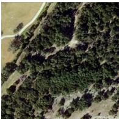

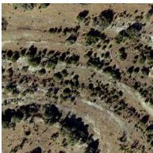

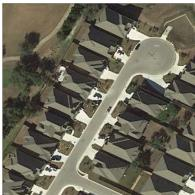

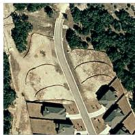  
T1

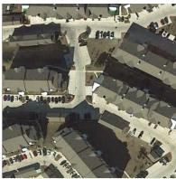

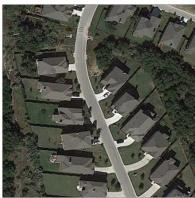  
T2

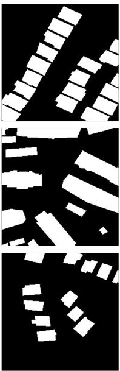  
GT

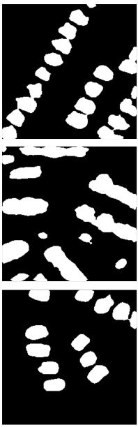  
(a)

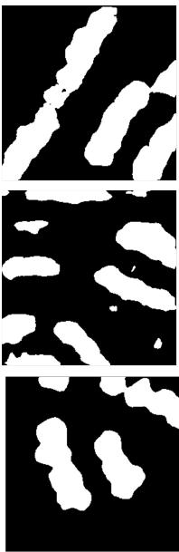  
(b)

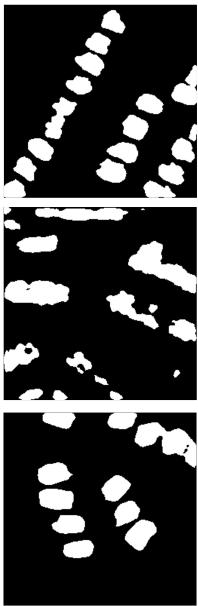  
(c)

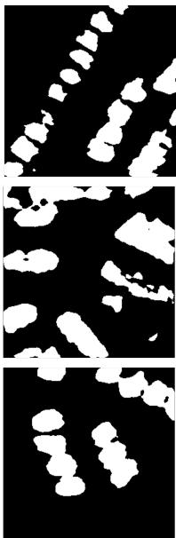  
(d)

Figure 4: Qualitative ablation results. (a) Full model, (b) initial SAM pseudo-labels only, (c) initial pseudo-labels with CNN refinement (Stage I), and (d) initial pseudo-labels with self-training (Stage II).
<table><tr><td rowspan="2">pseudo-labels Used in Stage II</td><td colspan="2">LEVIR-CD</td><td colspan="2">WHU-CD</td><td colspan="2">SYSU-CD</td></tr><tr><td>F1</td><td>IoU</td><td>F1</td><td>IoU</td><td>F1</td><td>IoU</td></tr><tr><td>Initial SAM2 pseudo-labels</td><td>72.22</td><td>56.52</td><td>83.12</td><td>71.12</td><td>52.38</td><td>35.48</td></tr><tr><td>Refined pseudo-labels from Stage I</td><td>79.42</td><td>65.62</td><td>84.91</td><td>73.79</td><td>67.39</td><td>50.79</td></tr><tr><td>Initial SAM2 pseudo-labels + Self-Training</td><td>79.68</td><td>66.23</td><td>83.70</td><td>72.08</td><td>64.92</td><td>48.06</td></tr><tr><td>Full Model</td><td>81.25</td><td>68.80</td><td>86.21</td><td>75.77</td><td>72.28</td><td>56.59</td></tr></table>

Table 4: Ablation study on how diferent settings afect the second-stage training across datasets.

Impact of the Pseudo-Label Refresh Interval. Table 5 shows the sensitivity of the pseudo-label refresh interval in Stage II. The best performance is achieved when the pseudolabels are refreshed every 2 epochs, obtaining 81.25% F1 and 68.80% IoU. Refreshing too frequently degrades the performance, since the pseudo-labels may become unstable before the student network is suficiently optimized. In contrast, overly sparse refreshing also hurts performance because outdated pseudo-labels limit the benefit of self-training. These results suggest that a moderate refresh interval provides the best balance between stability and adaptivity.

## Conclusion

In this paper, we propose a two-stage point-supervised change detection framework that exploits foundation-model priors and iterative pseudo-label optimization. In Stage I,

<table><tr><td>Refresh interval</td><td>P</td><td>R</td><td>F1</td><td>IoU</td><td>OA</td></tr><tr><td>1 epoch</td><td>77.71</td><td>83.43</td><td>79.91</td><td>66.54</td><td>97.93</td></tr><tr><td>2 epochs (Ours)</td><td>78.48</td><td>84.80</td><td>81.25</td><td>68.80</td><td>98.04</td></tr><tr><td>3 epochs</td><td>79.77</td><td>81.10</td><td>80.77</td><td>67.27</td><td>97.99</td></tr><tr><td>4 epochs</td><td>79.21</td><td>82.39</td><td>80.43</td><td>67.74</td><td>98.01</td></tr></table>

Table 5: Sensitivity analysis of the pseudo-label refresh interval on the LEVIR-CD dataset.

SAM2 is used to generate candidate masks from bi-temporal point supervision, and a bi-temporal mask selection strategy together with CNN-based refinement is introduced to construct higher-quality soft pseudo-labels. In Stage II, a teacher-student self-training framework is further developed to progressively refresh pseudo-labels and improve taskspecific adaptation. Extensive experiments on three benchmark datasets show that the proposed method achieves the best results among the compared weakly supervised approaches, while remaining competitive with several fully supervised baselines. In future work, we will further study how to improve pseudo-label reliability on challenging scenes and extend the proposed framework to more general forms of weak supervision.

## References

Bandara, W. G. C. 2022. A Transformer-Based Siamese Network for Change Detection. In IGARSS 2022 - 2022 IEEE International Geoscience and Remote Sensing Symposium, 207–210.

Caye Daudt, R.; Le Saux, B.; and Boulch, A. 2018. Fully Convolutional Siamese Networks for Change Detection. In 2018 25th IEEE International Conference on Image Processing (ICIP), 4063–4067.

Ding, L.; Zhu, K.; Peng, D.; Tang, H.; Yang, K.; and Bruzzone, L. 2024. Adapting Segment Anything Model for Change Detection in VHR Remote Sensing Images. IEEE Transactions on Geoscience and Remote Sensing, 62: 1–11.

Dong, S.; Wang, L.; Du, B.; and Meng, X. 2024. Change-CLIP: Remote sensing change detection with multimodal vision-language representation learning. ISPRS Journal of Photogrammetry and Remote Sensing, 208: 53–69.

Fang, L.; Jiang, Y.; Yu, H.; Zhang, Y.; and Yue, J. 2023. Point Label Meets Remote Sensing Change Detection: A Consistency-Aligned Regional Growth Network. IEEE Transactions on Geoscience and Remote Sensing.

Fang, S.; Li, K.; Shao, J.; and Li, Z. 2021. SNUNet-CD: A Densely Connected Siamese Network for Change Detection of VHR Images. IEEE Geoscience and Remote Sensing Letters, 1–5.

Han, C. 2023. HCGMNET: A Hierarchical Change Guiding Map Network For Change Detection. arXiv:2302.10420.

Han, C.; Wu, C.; Guo, H.; Hu, M.; Li, J.; and Chen, H. 2023. Change Guiding Network: Incorporating Change Prior to Guide Change Detection in Remote Sensing Imagery. IEEE Journal of Selected Topics in Applied Earth Observations and Remote Sensing, 1–17.

Hao Chen, Z. Q.; and Shi, Z. 2021. Remote Sensing Image Change Detection with Transformers. IEEE Transactions on Geoscience and Remote Sensing, 1–14.

He, C.; Zhang, R.; Tang, L.; Yang, Z.; Li, K.; Fan, D.-P.; and Farsiu, S. 2025. SCALER: SAM-Enhanced Collaborative Learning for Label-Deficient Concealed Object Segmentation. arXiv:2511.18136.

Jiang, F.; Zhong, Z.; Zhang, M.; Gong, M.; Zhou, Y.; Zhao, W.; and Guan, Z. 2025. BARNet: Boundary-Aware Refinement Network for Weakly Supervised Change Detection. IEEE Transactions on Geoscience and Remote Sensing.

Kage, P.; Rothenberger, J.; Andreadis, P.; and Diochnos, D. 2026. A Review of Pseudo-Labeling for Computer Vision. Journal of Artificial Intelligence Research, 85.

Kirillov, A.; Mintun, E.; Ravi, N.; Mao, H.; Rolland, C.; Gustafson, L.; Xiao, T.; Whitehead, S.; Berg, A. C.; Lo, W.- Y.; Dollár, P.; and Girshick, R. 2023. Segment Anything. arXiv:2304.02643.

Lei, T.; Xu, Y.; Ning, H.; Lv, Z.; Min, C.; Jin, Y.; and Nandi, A. K. 2024. Lightweight Structure-Aware Transformer Network for Remote Sensing Image Change Detection. IEEE Geoscience and Remote Sensing Letters, 21: 1–5.

Li, Z.; Tang, C.; Liu, X.; Li, C.; Li, X.; and Zhang, W. 2023. MS-Former: Memory-Supported Transformer for Weakly Supervised Change Detection with Patch-Level Annotations. arXiv:2311.09726.

Liu, N.; Xu, X.; Su, Y.; Zhang, H.; and Li, H.-C. 2025a. PointSAM: Pointly-Supervised Segment Anything Model for Remote Sensing Images. IEEE Transactions on Geoscience and Remote Sensing, 63: 1–15.

Liu, T.; Xu, J.; Lei, T.; Wang, Y.; Du, X.; Zhang, W.; Lv, Z.; and Gong, M. 2025b. AEKAN: Exploring Superpixel-Based AutoEncoder Kolmogorov-Arnold Network for Unsupervised Multimodal Change Detection. IEEE Transactions on Geoscience and Remote Sensing, 63: 1–14.

Meyer, A.; Mutter, D.; and Padoy, N. 2026. DExTeR: Weakly Semi-Supervised Object Detection with Class and Instance Experts for Medical Imaging. arXiv:2601.13954.

Ning, H.; He, Q.; Lei, T.; Cao, X.; Zhang, W.; Chen, Y.; and Nandi, A. K. 2025. DA2-Net: Integrating SAM2 With Domain Adaption and Diference Aggregation for Remote Sensing Change Detection. IEEE Transactions on Geoscience and Remote Sensing, 63: 1–17.

Subhani, M. N. 2026. ReSAM: Refine, Requery, and Reinforce: Self-Prompting Point-Supervised Segmentation for Remote Sensing Images. In Proceedings of the IEEE/CVF Conference on Computer Vision and Pattern Recognition (CVPR).

Wang, L.; Zhang, M.; and Shi, W. 2023. CS-WSCDNet: Class Activation Mapping and Segment Anything Model-Based Framework for Weakly Supervised Change Detection. IEEE Transactions on Geoscience and Remote Sensing, 61: 1–12.

Wang, Y.; Li, E.; Samat, A.; Liu, W.; and Li, X. 2026. PGU-CD: A Point-Guided Uncertainty-Aware Framework for Building Change Detection. Remote Sensing Applications: Society and Environment, 101949.

Wei, C. 2025. ASS-CD: Adapting Segment Anything Model and Swin-Transformer for Change Detection in Remote Sensing Images. Remote Sensing, 17(3).

Wu, C. 2022. Fully Convolutional Change Detection Framework with Generative Adversarial Network for Unsupervised, Weakly Supervised and Regional Supervised Change Detection. arXiv:2201.06030.

Zhao, Z.; Ru, L.; Wu, C.; and Wang, D. 2025. TransWCD: Scene-Adaptive Joint Constrained Framework for Weakly Supervised Change Detection. IEEE Transactions on Geoscience and Remote Sensing, 63: 1–12.