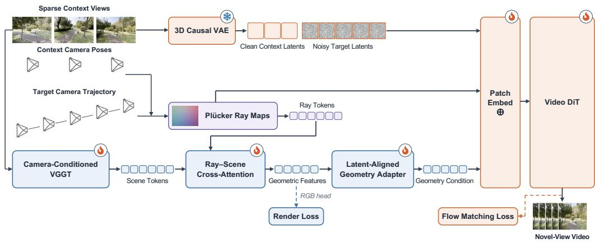
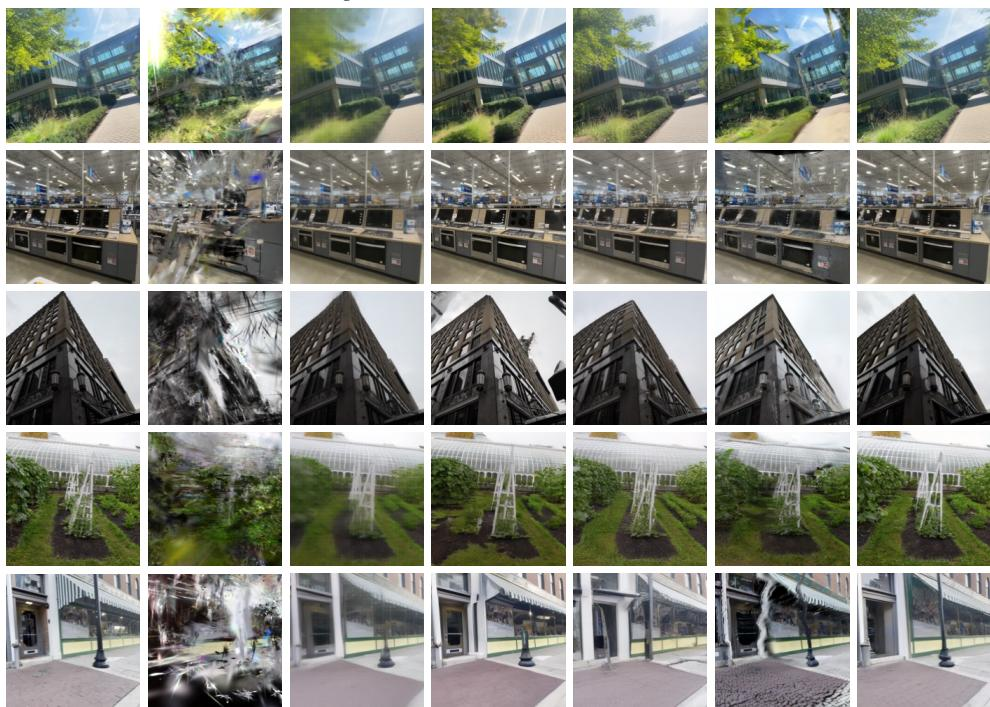
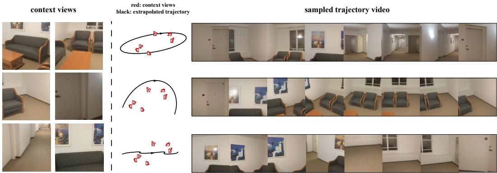

# ROGE: NOVEL VIEW SYNTHESIS VIA END-TO-ENDIMPLICIT RECONSTRUCTION AND GENERATION

Xiaolei Lang1 Ze Kang2∗ Zehao Huang1 Naiyan Wang1

1Xiaomi EV 2Northeastern University

https://roge.github.io

## ABSTRACT

Novel view synthesis from sparse inputs requires both geometric grounding from the observed views and generative priors of unobserved regions, motivating recent hybrid methods that combine reconstruction and generation. However, existing methods bridge the two with rendered images or explicit 3D representations such as point maps or 3D Gaussians. Generation is thus conditioned on a lossy and imperfect projection of the scene, inheriting its errors, and reconstruction receives no signal from generation to correct them. We present RoGe, an end-to-end unified reconstruction and generation framework that removes this explicit bridge. It targets roaming within a scene anchored by sparse views: given a few posed images and a camera trajectory, it synthesizes a temporally coherent video along that trajectory. From the sparse input views, RoGe builds an implicit scene representation with a feed-forward reconstruction model, and queries it with target camera rays to obtain per-view geometric features. These features are injected into a video diffusion model as conditioning, without any 3D intermediate. Both modules are trained jointly, so the generation objective directly shapes its own geometric conditioning. We conduct experiments on DL3DV, where RoGe outperforms reconstruction-based, generation-based, and hybrid baselines on imagelevel metrics and video-level temporal consistency. Ablations confirm that rayqueried implicit features outperform both raw reconstruction tokens and rendered RGB as conditioning, and that joint training brings further gains.

## 1 INTRODUCTION

Novel view synthesis (NVS) enables free-viewpoint exploration of captured scenes. While dense captures can support high-fidelity reconstruction, many practical settings provide only a few calibrated images. In this paper, we study free-viewpoint exploration in this sparse regime, which we term roaming within a scene anchored by sparse views: given a sparse set of posed observations and a user-specified camera trajectory, the goal is to generate an ordered sequence of novel views that is visually realistic, temporally coherent, and consistent with the observed scene. This setting is inherently ill-posed, since large portions of the scene may be occluded or entirely unobserved. A successful method must therefore preserve the geometric structure and appearance supported by the input views, follow the requested camera motion, and plausibly complete missing content without introducing cross-view drift.

Existing methods for NVS largely fall into two paradigms. Reconstruction-based methods, including per-scene optimization Mildenhall et al. (2021); Kerbl et al. (2023) and feed-forward models Jiang et al. (2025); Ye et al. (2026), offer precise camera control and strong multi-view consistency, but struggle with unseen regions and extrapolation of poses, often resulting in blurring, floaters, and holes. Generation-based methods Gao et al. (2024); Zhou et al. (2025); Wu et al. (2026b), in contrast, leverage diffusion priors to synthesize unobserved areas under large viewpoint changes, yet lag behind in geometric consistency and camera controllability.

The complementary strengths have inspired efforts to bridge reconstruction and generation. One line of work Wu et al. (2024); Yu et al. (2024); Wu et al. (2025a) augment per-scene optimization with diffusion-based inpainting, using generated views to extend coverage beyond observed regions. While effective, such a strategy is often limited by inconsistencies between the generated and input views. Another line, Wu et al. (2025a); Ren et al. (2025); Yang et al. (2026) first reconstructs the 3D scene, and then render or project it to condition a generative model. Reconstruction and generation are thus decoupled. Generation only sees a lossy and imperfect projection of the scene and inherits its errors, while reconstruction receives no signal from generation to correct them.

In this work, we present RoGe, an end-to-end unified reconstruction and generation framework for NVS. RoGe extracts per-view geometric features from the implicit scene representation built from the intermediate tokens of a feed-forward reconstruction model and injects them into a video diffusion model as conditioning, without any explicit 3D intermediate representations. Crucially, the two models are trained end-to-end, enabling direct information flow between them and allowing the generative model to guide the learning of geometric representations. Experiments across both image-level and video-level metrics demonstrate that RoGe achieves superior visual quality, geometric consistency, and camera controllability. Main contributions can be summarized as follows:

• We propose RoGe, a joint reconstruction and generation framework for NVS that connects a feedforward reconstruction network with a video generation model in an end-to-end manner, so that the generation model can directly consume the geometric representation it is conditioned on.

• We condition the generation part on per-view geometric features obtained by querying the implicit scene representation with camera rays. Ablations show that such ray-queried features are more effective than raw reconstruction tokens and decoded RGB maps.

• We conduct experiments on DL3DV, demonstrating that our method synthesizes videos with high visual quality, strong geometric consistency, and precise camera controllability, surpassing existing reconstruction-based, generation-based, and hybrid methods.

## 2 RELATED WORK

Scene Reconstruction. Classical Structure-from-Motion (SfM) recovers sparse geometry through per-scene optimization, which is computationally expensive and unreliable under sparse inputs Schonberger & Frahm (2016). Feed-forward methods enable efficient multi-view reconstruction in a single pass Wang et al. (2024a); Leroy et al. (2024); Wang et al. (2025a; 2026a;b); Keetha et al. (2026); Lin et al. (2025). However, both of these approaches primarily output point clouds, which are insufficient for high-fidelity NVS. Neural Radiance Fields (NeRF) Mildenhall et al. (2021) and 3D Gaussian Splatting (3DGS) Kerbl et al. (2023) instead provide renderable scene representations. 3DGS in particular offers fast optimization and real-time rendering at competitive visual quality, and has become a dominant choice for reconstruction-based NVS. Recently, feed-forward 3DGS has shown increasingly promising results, often outperforming optimization-based 3DGS under sparse inputs Charatan et al. (2024); Chen et al. (2024); Xu et al. (2025); Ziwen et al. (2025); Ye et al. (2025); Jiang et al. (2025); Ye et al. (2026). Departing from explicit representations, LagerNVS Szymanowicz et al. (2026) shows that the intermediate tokens of VGGT Wang et al. (2025a) already encode sufficient scene geometry to render novel views directly. Despite strong multi-view consistency and precise camera control, these reconstruction-based methods, including LagerNVS, lack a generative prior and thus produce blur and artifacts in regions unobserved by the sparse inputs.

Video Generation. Video generation models have shown strong capabilities for open-domain video generation Blattmann et al. (2023); Zheng et al. (2024); Yang et al. (2025); Kong et al. (2024); Wan et al. (2025); Agarwal et al. (2025). On top of these models, camera-controllable approaches generate videos from a single image or text prompt along user-specified trajectories Wang et al. (2024b); He et al. (2024; 2025); Zhang et al. (2026); Zhao et al. (2026). Another line of work focuses re-rendering existing videos along new trajectories Yu et al. (2025); Jeong et al. (2025); Bai et al. (2025a;b). More closely related to classical NVS, CAT3D, SEVA and FrameCrafter Gao et al. (2024); Zhou et al. (2025); Wu et al. (2026b) leverage multi-view or video diffusion models to synthesize novel views from sparse observations. While generation-based NVS methods excel at extrapolating unobserved content from sparse inputs, they generally lag behind reconstruction-based approaches in geometric consistency and precise camera control.

Reconstruction and Generation. Given the complementary nature of reconstruction and generation, an increasing number of hybrid approaches have emerged. One family aligns video diffusion with feed-forward 3D models in the feature space to generate geometrically consistent videos and 3D quantities Huang et al. (2025); Wu et al. (2026a); Dai et al. (2026); Huang et al. (2026). These methods target world modeling from a single image or text prompt, where the geometry is imagined rather than observed. Our task instead starts from sparse posed views, whose geometry can be recovered and used to ground video generation. Several works Wu et al. (2024); Yu et al. (2024); Liu et al. (2024); Wu et al. (2025b) retain per-scene optimization and use generated views as additional supervision, but inconsistencies between the generated and input views limit further gains. Twostage methods Wu et al. (2025a); Ren et al. (2025); Yang et al. (2026) instead recover an explicit 3D representation first and then use it as a condition in generative models, so that reconstruction and generation remain decoupled. Our method requires neither per-scene optimization nor an explicit 3D intermediate representation. Geometric features from a feed-forward reconstruction network are directly injected into the video generation model, and these two modules are trained end-to-end so that the generation objective shapes its own geometric conditioning.

## 3 METHOD

Given a sparse set of posed observations $\boldsymbol { \mathcal { S } } ~ = ~ \{ ( I _ { i } , K _ { i } , T _ { i } ) \} _ { i = 1 } ^ { M }$ of a static scene, where $I _ { i } \in$ R3×H×W denotes an input image and $( K _ { i } , T _ { i } )$ denotes its camera intrinsic and camera-to-world pose, our goal is to synthesize a video along a predefined camera trajectory $\mathcal { T } = \{ ( K _ { j } , T _ { j } ) \} _ { j = 1 } ^ { N } .$ Without loss of generality, the first view in $\check { s }$ is set as the world frame and the traslations of both S and $\tau$ are normalized by the scale factor derived from the maximum translation magnitude in S.

Sparse inputs leave large portions of the scene unobserved, making the problem inherently both geometric and generative. Neither reconstruction nor generation alone is sufficient to achieve optimal performance. We therefore bring these complementary paradigms together in a unified, differentiable framework. Specifically, we build an implicit scene representation from the sparse observations with a feed-forward 3D reconstruction network, and query it with per-view rays to output geometry-aware features for the target trajectory. We then inject these features into a pretrained video generation model as conditions, and optimize both modules jointly in an end-to-end manner. In the following, we first introduce two preliminaries, the Plucker ray representation and latent flow¨ matching, and then elaborate the above pipeline in Sec. 3.1–3.3.

Plucker Ray Representation. ¨ We adopt Plucker ray map Plucker (1865); Zhang et al. (2024) as the¨ common camera representation for both reconstruction and generation. For a pixel $\rho = \left( u , v \right)$ from a view, the origin and the normalized direction of its ray in the world frame can be computed as:

$$
{ \bf o } = { \bf t } , \quad { \bf d } = \frac { { \bf R } \pi _ { c } ^ { - 1 } ( \pmb { \rho } ) } { \| { \bf R } \pi _ { c } ^ { - 1 } ( \pmb { \rho } ) \| _ { 2 } } ,\tag{1}
$$

where the translation t and the rotation R constitute the camera-to-world pose $T ,$ , and the function $\pi _ { c } ( \cdot )$ projects a 3D point on the normalized image plane to a pixel. Finally, the corresponding Plucker coordinate is:¨

$$
\mathbf { p } = [ \mathbf { d } , \mathbf { o } \times \mathbf { d } ] \in \mathbb { R } ^ { 6 } .\tag{2}
$$

Stacking Plucker coordinates over all pixels of the view yields a ray map¨ $P \in \mathbb { R } ^ { 6 \times H \times W }$ . We retain two complementary encodings for such a ray representation: a tokenized ray map for querying the implicit scene and a lossless packed ray map directly supplied to the diffusion transformer (DiT) Peebles & Xie (2023).

Latent Flow Matching. We employ a pretrained video diffusion model operating in the latent space of a 3D causal Variational Autoencoder (VAE) as in Wan et al. (2025). Let $X _ { 0 }$ denote the clean latent sequence and $\epsilon \sim \mathcal { N } ( 0 , \mathbf { I } )$ . For a sampled point τ on the noise schedule, we construct:

$$
X _ { \tau } = ( 1 - \sigma _ { \tau } ) X _ { 0 } + \sigma _ { \tau } \epsilon , \quad V _ { \tau } ^ { * } = \epsilon - X _ { 0 } ,\tag{3}
$$

where $\sigma _ { \tau } \in [ 0 , 1 ]$ means the noise level. The diffusion transformer $\mathcal { D } _ { \phi }$ predicts the velocity field that transports samples from Gaussian noise toward the data distribution as follows:

$$
\hat { V } _ { \tau } = { \mathcal D } _ { \phi } \left( X _ { \tau } , \tau ; \mathcal C \right) ,\tag{4}
$$

where $\mathcal { C }$ denotes the conditioning signals detailed in Sec. 3.2. During inference, the learned velocity field is integrated from noise, and the denoised latents are then decoded into output videos.

  
Figure 1: Overview of RoGe. Given sparse posed images and a target camera trajectory, the cameraconditioned VGGT builds an implicit scene representation. Target rays query this representation to extract geometric cues, which are injected into the video diffusion model to synthesize a photorealistic novel-view video. The reconstruction and generation models are trained end-to-end.

## 3.1 IMPLICIT RECONSTRUCTION

Our implicit reconstruction module builds on LagerNVS Szymanowicz et al. (2026), which shows that feed-forward NVS benefits from geometric-aware features without explicit 3D reconstruction. Different from LagerNVS, which decodes these features into novel views directly, we use them as a geometric condition for video generation.

Camera-Conditioned VGGT Reconstruction. VGGT Wang et al. (2025a) is pretrained on multiview geometric tasks such as camera pose, depth and point map estimation. Its intermediate tokens thus carry strong geometric priors. Following LagerNVS, we leverage VGGT as our reconstruction network to extract geometric cues for conditioning subsequent video generation. Specifically, we first use a two-layer Multi-Layer Perceptron (MLP) to project the intrinsic $K _ { i }$ and extrinsic $T _ { i }$ of each camera in $\dot { s }$ into a 1024-dimensional token, which is added to the camera token that VGGT prepends to each view. The camera-conditioned VGGT network $\scriptstyle { \mathcal { R } } _ { \theta }$ then aggregates multi-view information through alternating local and global attention:

$$
\{ Z _ { i } \} _ { i = 1 } ^ { M } = \mathcal { R } _ { \theta } \left( \{ I _ { i } , K _ { i } , T _ { i } \} _ { i = 1 } ^ { M } \right) .\tag{5}
$$

Here, for each context view, we concatenate the tokens from the last local and global attention layers along the channel dimension to form 2048-dimensional scene tokens $Z _ { i }$ . Unlike explicit methods, we do not further instantiate depth maps, point clouds, or 3D Gaussians. Instead, the tokens $\{ Z _ { i } \} _ { i = 1 } ^ { M }$ 1 form an implicit, appearance-preserving scene representation that remains directly renderable or queryable from arbitrary camera rays.

Ray Map Encoder. We encode every Plucker ray map in both context views ¨ $s$ and target views $\tau { : }$

$$
\{ Q _ { i } \} _ { i = 1 } ^ { M + N } = \mathcal { E } _ { \mathrm { r a y } } \left( \{ P _ { i } \} _ { i = 1 } ^ { M + N } \right) .\tag{6}
$$

The 2D convolution $\mathcal { E } _ { \mathrm { r a y } }$ applies an $8 \times 8$ patch projection to produce one ray token per spatial patch, and $Q _ { i }$ denotes the resulting ray tokens of view i, including four learnable register tokens prepended to the patch tokens Darcet et al. (2024). In contrast to a single vector of camera parameters, the dense representation preserves the correspondence between each latent spatial location and its camera ray.

Ray–Scene Cross-Attention. Before interacting with the ray tokens, we map the 2048-dimensional scene tokens $Z _ { i }$ to a lower dimension $C _ { r }$ through linear projection. Then the ray tokens query the scene tokens through a stack of ray–scene transformer blocks. Each block first performs selfattention among the ray tokens of one view and then exchanges information with the shared scene

representation:

$$
\tilde { Q } _ { i } ^ { \ell } = Q _ { i } ^ { \ell } + \mathrm { S e l f A t t n } \big ( Q _ { i } ^ { \ell } \big ) ,\tag{7}
$$

$$
Q _ { i } ^ { \ell + 1 } = \tilde { Q } _ { i } ^ { \ell } + \mathrm { C r o s s } \mathrm { A t t n } \big ( \tilde { Q } _ { i } ^ { \ell } , Z ^ { \ell } , Z ^ { \ell } \big ) ,\tag{8}
$$

$$
Z ^ { \ell + 1 } = Z ^ { \ell } + \mathrm { C r o s s A t t n } \left( Z ^ { \ell } , \tilde { Q } _ { i } ^ { \ell } , \tilde { Q } _ { i } ^ { \ell } \right) .\tag{9}
$$

$\ell = 1 , \ldots , L$ . The first $L - 1$ blocks use bidirectional cross-attention, allowing the scene tokens to be refined by the queried rays, while the final block performs ray-to-scene cross-attention only. After discarding the register tokens, the resulting ray tokens are reshaped into spatial feature maps:

$$
\begin{array} { r } { F _ { r } \in \mathbb { R } ^ { C _ { r } \times ( M + N ) \times \frac { H } { 4 } \times \frac { W } { 4 } } , } \end{array}\tag{10}
$$

which can be decoded to RGB maps to supervise the reconstruction module during joint training.

## 3.2 RECONSTRUCTION-GENERATION FUSION

After implicit reconstruction, we have: the sparse context images $\{ I _ { i } \} _ { i = 1 } ^ { M }$ , the Plucker ray maps¨ $\{ P _ { i } \} _ { i = 1 } ^ { M + \bar { N } }$ of reference views and target views, and the ray-queried geometric features $F _ { r } .$ They respectively provide the appearance, the camera pose, and the implicit geometry that conditions the video diffusion transformer, forming C in Eq. (4). We describe the construction of each condition in the following.

Hybrid VAE Representation. Both the context images and the target video have to be encoded into the latent space of the VAE before entering the diffusion transformer. However, sparse context views form an unordered set, whereas the target views constitute a temporally coherent video. Encoding both with the same temporal strategy would either impose an artificial ordering on the context views or break temporal continuity in the output. We therefore adopt a hybrid latent representation: each context image $I _ { i } \in S$ is independently encoded as a single-frame video following Wu et al. (2026b), while the target video is jointly encoded from the ground-truth frames $\{ I _ { j } ^ { t } \} _ { j = 1 } ^ { N }$ 1 available during training:

$$
\begin{array} { r } { X ^ { c } = [ \mathcal { E } _ { \mathrm { V A E } } ( I _ { 1 } ) , \dots , \mathcal { E } _ { \mathrm { V A E } } ( I _ { M } ) ] \in \mathbb { R } ^ { C _ { l } \times M \times \frac { H } { 8 } \times \frac { W } { 8 } } , } \end{array}\tag{11}
$$

$$
\begin{array} { r } { X ^ { t } = \mathcal { E } _ { \mathrm { V A E } } \left( [ I _ { 1 } ^ { t } , \dots , I _ { N } ^ { t } ] \right) \in \mathbb { R } ^ { C _ { l } \times ( 1 + \frac { N - 1 } { 4 } ) \times \frac { H } { 8 } \times \frac { W } { 8 } } , } \end{array}\tag{12}
$$

where $[ \cdot , \cdot ]$ denotes concatenation along the temporal dimension. The clean training sequence is then formulate as $X _ { 0 } = [ X ^ { c } , X ^ { t } ]$ ]. We additionally construct the appearance condition:

$$
\mathcal { V } = \left[ B ; \left[ X ^ { c } , \mathbf { 0 } ^ { t } \right] \right] ,\tag{13}
$$

where $[ \cdot ; \cdot ]$ denotes concatenation along the channel dimension, $\mathbf { 0 } ^ { t }$ denotes zero-filled target latents, and B is a binary mask distinguishing context and target latent slots. Such a hybrid representation preserves permutation invariance for the sparse observations while retaining the temporal prior of the causal video VAE for the generated video.

Latent-Aligned Geometry Adapter. The reconstruction features $F _ { r }$ and VAE latents $X _ { 0 }$ differ in channel width, spatial resolution, and temporal organization. Hence we introduce a lightweight geometry adapter to bridge the two representations. For each view, $F _ { r }$ is first projected from $C _ { r }$ to $\bar { C } _ { r } ^ { \prime }$ channels using a $1 \times { \bar { 1 } }$ convolution $\mathcal { E } _ { \mathrm { g e o m } }$ , and then bilinearly resampled to the latent resolution:

$$
\begin{array} { r } { \bar { \mathcal { G } } = \operatorname { R e s i z e } \left( \mathcal { E } _ { \mathrm { g e o m } } ( F _ { r } ) \right) \in \mathbb { R } ^ { C _ { r } ^ { \prime } \times ( M + N ) \times \frac { H } { 8 } \times \frac { W } { 8 } } . } \end{array}\tag{14}
$$

For temporal alignment, we define a packing operator $\mathrm { P a c k } _ { 4 } ( \cdot )$ similar to Wang et al. (2026c): each of the $\bar { M }$ context frames and the first target frame is replicated four times, the remaining $N - 1$ target frames are kept unchanged, and every four consecutive frames are concatenated along the channel dimension. This yields the implicit geometry condition:

$$
\mathcal { G } = \mathrm { P a c k } _ { 4 } ( \bar { \mathcal { G } } ) \in \mathbb { R } ^ { 4 C _ { r } ^ { \prime } \times ( M + 1 + \frac { N - 1 } { 4 } ) \times \frac { H } { 8 } \times \frac { W } { 8 } } .\tag{15}
$$

Geometry-Grounded Diffusion Transformer. We ground a pretrained video diffusion transformer $\mathcal { D } _ { \phi }$ with both explicit camera rays and implicit scene features. Let $\bar { \mathcal { P } } \in \mathbb { R } ^ { 6 \times ( M + N ) \times H \times W }$ denote

the full-resolution Plucker ray maps of all views. They are packed by¨ $\mathrm { P a c k } _ { 4 } ( \cdot )$ and then spatially rearranged using pixel unshuffle:

$$
\mathcal { P } = \mathrm { P i x e l U n s h u f f i e _ { 8 } } \left( \mathrm { P a c k } _ { 4 } ( \bar { \mathcal { P } } ) \right) \in \mathbb { R } ^ { C _ { p } \times ( M + 1 + \frac { N - 1 } { 4 } ) \times \frac { H } { 8 } \times \frac { W } { 8 } } ,\tag{16}
$$

where $C _ { p } = 6 \times 4 \times 8 \times 8 = 1 5 3 6$ . Pixel unshuffle preserves the complete per-pixel ray information while aligning with VAE latents.

Together with Y and G, P completes the conditioning $\mathcal { C } = \{ \mathcal { V } , \mathcal { P } , \mathcal { G } \}$ of the diffusion transformer. We then patchify the noisy latent and the conditions, and fuse them together:

$$
\tilde { X } _ { \tau } = \mathcal { E } _ { \mathrm { p a t c h } } ^ { 1 } \left( [ X _ { \tau } ; \mathcal { V } ] \right) + \mathcal { E } _ { \mathrm { p a t c h } } ^ { 2 } ( \mathcal { P } ) + \mathcal { E } _ { \mathrm { p a t c h } } ^ { 3 } ( \mathcal { G } ) ,\tag{17}
$$

where $\tilde { X } _ { \tau } \in \mathbb { R } ^ { C _ { l } ^ { \prime } \times ( M + 1 + \frac { N - 1 } { 4 } ) \times \frac { H } { 1 6 } \times \frac { W } { 1 6 } } , \mathcal { E } _ { \mathrm { p a t c h } }$ denotes 3D convolutional patch embedding, and $C _ { l } ^ { \prime }$ is the hidden dimension of the DiT. The fused tokens ${ \tilde { X } } _ { \tau }$ τ are processed by the following DiT blocks. Note that temporal rotary embeddings are disabled on context slots for permutation equivariance, and are retained only along the target trajectory.

## 3.3 END-TO-END JOINT TRAINING

Our model is trained with reconstruction and generation supervision in a single optimization step:

$$
\begin{array} { r } { \mathcal { L } = \mathcal { L } _ { \mathrm { F M } } + \lambda _ { \mathrm { r e n d e r } } \mathcal { L } _ { \mathrm { r e n d e r } } . } \end{array}\tag{18}
$$

Flow Matching Loss. Given $X _ { 0 } = [ X ^ { c } , X ^ { t } ]$ , we sample a timestep and Gaussian noise to construct $X _ { \tau } .$ , and train the model to regress the target velocity $V _ { \tau } ^ { * }$ . Since the context views are observed inputs rather than generation targets, the loss is applied only to the target latent slots:

$$
\mathcal { L } _ { \mathrm { F M } } = \mathbb { E } _ { X _ { 0 } , \epsilon , \tau } \left[ w ( \tau ) \cdot \| \boldsymbol { \mathcal { M } } _ { t } \odot ( \mathcal { D } _ { \phi } ( X _ { \tau } , \tau ; \mathcal { C } ) - V _ { \tau } ^ { * } ) \| _ { 2 } ^ { 2 } \right] ,\tag{19}
$$

where $\mathcal { M } _ { t }$ selects the target latent slots and $w ( \tau )$ is the timestep-dependent training weight.

Rendering Loss. The reconstruction branch decodes $F _ { r }$ into RGB maps with the rendering head of LagerNVS, supervised by a pixel-wise mean-squared error against the corresponding groundtruth images. This auxiliary loss anchors the implicit representation to the observations, while joint training allows the generator to refine it. No depth, point cloud, or any other explicit 3D supervision is used in our training. We set $\lambda _ { \mathrm { { r e n d e r } } }$ to 0.1.

## 4 EXPERIMENTS

## 4.1 EXPERIMENTAL SETUP

Implementation Details. RoGe is implemented using PyTorch Paszke et al. (2019). The cameraconditioned VGGT reconstruction network $\mathcal { R } _ { \theta } .$ , ray map encoder ${ \mathcal { E } } _ { \mathrm { r a y } } ,$ , and $L = \mathrm { 1 2 ~ R a y  – S c e n e }$ cross-attention blocks are initialized from LagerNVS Szymanowicz et al. (2026), with the projected scene-token dimension set to $C _ { r } = 7 6 8$ . We use $\mathrm { W a n } \dot { 2 } . 1 \mathrm { - } \mathrm { I } 2 \mathrm { V } \mathrm { - } 1 4 \mathrm { B } \mathrm { - } 4 8 0 \mathrm { P }$ Wan et al. (2025) as the video generation backbone, containing a 3D causal VAE $\mathcal { E } _ { \mathrm { V A E } } .$ , a 3D convolutional patch embedding $\mathcal { E } _ { \mathrm { p a t c h } } ^ { 1 }$ for noisy latents and RGB conditions, and a DiT $\mathcal { D } _ { \phi }$ . The geometry adapter $\mathcal { E } _ { \mathrm { g e o m } }$ projects reconstruction features from $C _ { r } \ \mathrm { t o } \ C _ { r } ^ { \prime } = 3 8 4$ , while $ { \mathcal { E } } _ { \mathrm { p a t c h } } ^ { 2 }$ and $ { \mathcal { E } } _ { \mathrm { p a t c h } } ^ { 3 }$ for ray map and implicit geometry are randomly initialized. During training, Low-Rank Adaptation (LoRA) Hu et al. (2021) is applied with rank 32 to $\mathcal { D } _ { \phi }$ and with rank 8 to ${ \mathcal { E } } _ { \mathrm { r a y } } ,$ cross-attention blocks. We freeze all parameters except the LoRA modules, patch embeddings $\mathcal { E } _ { \mathrm { p a t c h } }$ , and the geometry adapter $\mathcal { E } _ { \mathrm { g e o m } }$ . We use $M = 6$ context views and $N = 8 1$ target views. The same views are fed to the feed-forward reconstruction modules at $2 8 8 \times 5 0 4$ and to the video generation module at $1 9 2 \times 3 3 6$ . We train for 312,500 steps on 16 H20 GPUs with a batch size of 1.

Datasets. We train on ARKitScenes Baruch et al. (2021), BlendedMVS Yao et al. (2020), DL3DV Ling et al. (2024), MVS-Synth Huang et al. (2018), and WildRGB-D Xia et al. (2024), covering diverse settings including indoor and outdoor scenes, object- and scene-level data, street and aerial views, as well as both real-world and simulated environments. We follow CUT3R for data preprocessing and official splits Wang et al. (2025b). For quantitative evaluation, we use the 10 DL3DV test sequences selected by SEVA Zhou et al. (2025). Details of the training sampling strategy and context-target splits of test sequences are provided in the supplementary material.

GT  
3DGS  
LagerNVS  
SEVA  
FrameCrafter  
NeoVerse  
RoGe  
  
Figure 2: Qualitative novel view synthesis results across different methods on DL3DV.

Table 1: Quantitative novel view synthesis results across different methods on DL3DV. R and G denote reconstruction-only methods and generation-only methods, respectively. R+G means reconstruction-generation-combined methods, where 1 and 2 represent generation-aided reconstruction and decoupled reconstruction-then-generation. 3 tightly couples two modules end-to-end.
<table><tr><td>Method</td><td>Type</td><td>PSNR↑</td><td>SSIM↑</td><td>LPIPS↓</td><td>DreamSim↓</td></tr><tr><td>3DGS AnySplat</td><td>R R R</td><td>13.75 13.21</td><td>0.308 0.279</td><td>0.426 0.315</td><td>0.438 0.176</td></tr><tr><td>YoNoSplat LagerNVS SEVA FrameCrafter</td><td>R G G</td><td>17.04 20.90 18.63 17.98</td><td>0.459 0.639 0.603 0.485</td><td>0.277 0.193 0.158 0.175</td><td>0.184 0.122 0.089 0.107</td></tr><tr><td>Difix3D 3DGS + Difix LagerNVS + Difix GEN3C NeoVerse</td><td>R+G, 1 R+G,2 R+G, 2 R+G,2</td><td>13.89 13.45 19.74 12.78</td><td>0.313 0.276 0.574 0.256</td><td>0.388 0.421 0.181 0.434</td><td>0.375 0.413 0.119 0.269</td></tr></table>

Baselines. We compare against representative state-of-the-art methods on NVS: 1) reconstructionbased: 3DGS Kerbl et al. (2023), AnySplat Jiang et al. (2025), YoNoSplat Ye et al. (2026), LagerNVS Szymanowicz et al. (2026); 2) generation-based: SEVA Zhou et al. (2025), Frame-Crafter Wu et al. (2026b); 3) reconstruction-generation-combined: Difix3D+ Wu et al. (2025a) (facilitating 3DGS training or denoising 3DGS-rendered images), GEN3C Ren et al. (2025), Neo-Verse Yang et al. (2026). Since FrameCrafter is trained on only 1K DL3DV data, for a fair comparison, we fine-tune FrameCrafter on the same data for the same number of steps as RoGe.

Metrics. Since we focus on trajectory NVS Zhou et al. (2025) rather than isolated novel views, we consider video-level metrics in addition to image-based ones. Image-based metrics are PSNR,

  
Figure 3: Roaming on ScanNet.

Table 2: Quantitative video synthesis comparison on DL3DV.
<table><tr><td>Method</td><td>TSED↑</td><td>MEt3R↓</td><td>FID↓</td><td>FVD↓</td><td>TransAPE↓</td><td>RotAPE↓</td></tr><tr><td>3DGS</td><td>0.9676</td><td>0.1501</td><td>171</td><td>627</td><td>0.3161</td><td>16.4412</td></tr><tr><td>LagerNVS</td><td>0.9872</td><td>0.0617</td><td>33</td><td>206</td><td>0.0330</td><td>2.4158</td></tr><tr><td>SEVA</td><td>0.9905</td><td>0.0786</td><td>23</td><td>85</td><td>0.0632</td><td>2.7567</td></tr><tr><td>FrameCrafter</td><td>0.8260</td><td>0.0864</td><td>25</td><td>154</td><td>0.1187</td><td>7.8581</td></tr><tr><td>GEN3C</td><td>0.9599</td><td>0.0893</td><td>61</td><td>281</td><td>0.4522</td><td>35.2389</td></tr><tr><td>NeoVerse</td><td>0.9837</td><td>0.0791</td><td>59</td><td>184</td><td>0.0403</td><td>2.9069</td></tr><tr><td>RoGe</td><td>0.9977</td><td>0.0771</td><td>23</td><td>58</td><td>0.0403</td><td>2.5121</td></tr></table>

SSIM, LPIPS, and DreamSim Fu et al. (2023). For video-level evaluation, we adopt TSED, MEt3R Asim et al. (2025), FID, and FVD. Specifically, FID and FVD assess the realism and temporal quality of the generated video, while TSED and MEt3R focus on the geometric consistency. We further use VGGT-Ω Wang et al. (2026a) to estimate the camera trajectory from the generated video and evaluate the RMSE of the Absolute Pose Error (APE), which simultaneously reflects visual quality, geometric consistency, and camera controllability.

## 4.2 EXPERIMENTAL RESULTS AND ANALYSIS

Evaluation on Synthesized Image. We evaluate the quality of the synthesized novel view im ages on DL3DV. For each test sequence, frame-by-frame methods render, predict, or generate each non-context frame individually, whereas video generation methods such as GEN3C, NeoVerse, and RoGe generate non-context frames in chunks of 81 frames following their default inference settings. Results are reported in Tab. 1 and Fig. 2. Per-scene optimization methods such as 3DGS lack sufficient multi-view regularization and tend to overfit to the sparse inputs, resulting in poor NVS performance. Difix3D incorporates an image generation model into the 3DGS optimization process to synthesize additional views, but its performance is still limited by the quality of the generated images as well as the inherent limitation of the per-scene optimization paradigm. In contrast, feed-forward methods such as YoNoSplat leverage the priors of geometry foundation models and achieve stronger performance, but still suffer from holes and artifacts in regions not covered by the input views. It is also worth noting that, although LagerNVS achieves excellent PSNR of 20.90 dB, it tends to produce overly blurred results, particularly under large viewpoint changes. Generation-only methods such as SEVA and FrameCrafter exhibit strong extrapolation and completion capabilities and can effectively eliminate holes, but they suffer from unstable camera following and geometric distortions. Decoupled reconstruction-then-generation methods either post-refine the rendered or predicted novel view images, as in Difix, or use the results projected or rendered from the reconstructed explicit 3D representation as conditions for video generation, as in GEN3C and NeoVerse. They tend to achieve suboptimal performance. RoGe, by contrast, tightly couples reconstruction and generation and achieves state-of-the-art visual quality across all the metrics.

Evaluation on Synthesized Video. We further evaluate the quality of the synthesized video on DL3DV and ScanNet. For each test sequence in DL3DV, all methods follow the original camera trajectory and generate multiple 81-frame videos, with the results reported in Tab. 2 and Fig. 3. We also conduct extrapolation experiments on ScanNet as in Fig. 3, where videos are synthesized along novel trajectories that are independent of the original ones. Our method synthesizes geometrically consistent videos with excellent visual quality in both interpolation and extrapolation settings.

<table><tr><td>Geometric condition</td><td></td><td>Joint train</td><td>PSNR↑</td><td>SSIM↑</td><td>LPIPS↓</td></tr><tr><td>#1</td><td>None (generation only)</td><td></td><td>19.01</td><td>0.535</td><td>0.150</td></tr><tr><td>#2</td><td>VGGT Patch tokens</td><td></td><td>18.50</td><td>0.495</td><td>0.162</td></tr><tr><td>#3</td><td>VGGT Patch tokens with camera-conditioned</td><td></td><td>19.35</td><td>0.559</td><td>0.141</td></tr><tr><td>#4</td><td>Rendered RGB</td><td></td><td>20.35</td><td>0.609</td><td>0.130</td></tr><tr><td>#5</td><td>Ray-queried geometric features</td><td>一</td><td>20.59</td><td>0.626</td><td>0.127</td></tr><tr><td>#6</td><td>Ray-queried geometric features</td><td>√</td><td>20.92</td><td>0.642</td><td>0.124</td></tr></table>

Table 3: Ablation on geometric conditioning and joint training on DL3DV. #1–#5 freeze the reconstruction branch and differ only in what is injected into the video diffusion model; #6 addition ally trains both modules end-to-end.

## 4.3 ABLATION STUDIES

We ablate on DL3DV to answer two questions: what geometric condition to inject into the video diffusion model, and whether to train the two modules jointly. Results are reported in Tab. 3.

Geometric condition. Naively injecting raw VGGT patch tokens (#2) is worse than no geometry at all (#1). VGGT builds its features in an internal frame anchored to its first input view, with a scale it predicts on its own, whereas the target trajectory is specified in the frame of the given poses. Aligning the two is not straightforward: it would require estimating a similarity transform between VGGT’s predicted cameras and the given ones, and even then the tokens themselves cannot be reexpressed in the new frame. As a result, the diffusion model receives geometry and camera control that disagree with each other. We instead condition VGGT on the input cameras (#3), so that its features are built directly in the given frame. This resolves the mismatch and brings a modest gain over #1.

Joint training. With ray-queried features as the condition, training the reconstruction branch together with the diffusion model (#6) further improves all metrics. The generation objective now shapes the geometric representation it is conditioned on, which the frozen reconstruction branch in #1–#5 cannot benefit from.

## 5 CONCLUSION

In this work, we present RoGe, a unified reconstruction-and-generation framework for novel view synthesis. RoGe extracts per-view implicit geometric features from a feed-forward reconstruction model and injects them into a video generation model, tightly coupling geometric reconstruction with generation without an intermediate explicit 3D representation. End-to-end joint training enables effective information exchange between the two modules, allowing RoGe to synthesize temporally coherent videos along arbitrary camera trajectories with strong geometric consistency and visual fidelity, including in unseen regions. Extensive experiments on DL3DV dataset demonstrate that RoGe surpasses state-of-the-art methods.

## REFERENCES

Niket Agarwal, Arslan Ali, Maciej Bala, Yogesh Balaji, Erik Barker, Tiffany Cai, Prithvijit Chattopadhyay, Yongxin Chen, Yin Cui, Yifan Ding, et al. Cosmos world foundation model platform for physical ai. arXiv preprint arXiv:2501.03575, 2025.

Mohammad Asim, Christopher Wewer, Thomas Wimmer, Bernt Schiele, and Jan Eric Lenssen. Met3r: Measuring multi-view consistency in generated images. In 2025 IEEE/CVF Conference on Computer Vision and Pattern Recognition (CVPR), pp. 6034–6044. IEEE, 2025.

Jianhong Bai, Menghan Xia, Xiao Fu, Xintao Wang, Lianrui Mu, Jinwen Cao, Zuozhu Liu, Haoji Hu, Xiang Bai, Pengfei Wan, et al. Recammaster: Camera-controlled generative rendering from

a single video. In 2025 IEEE/CVF International Conference on Computer Vision (ICCV), pp. 14834–14844. IEEE, 2025a.

Jianhong Bai, Menghan Xia, Xintao Wang, Ziyang Yuan, Zuozhu Liu, Haoji Hu, Pengfei Wan, and Di Zhang. Syncammaster: Synchronizing multi-camera video generation from diverse viewpoints. In International Conference on Learning Representations, volume 2025, pp. 58038– 58060, 2025b.

Gilad Baruch, Zhuoyuan Chen, Afshin Dehghan, Tal Dimry, Yuri Feigin, Peter Fu, Thomas Gebauer, Brandon Joffe, Daniel Kurz, Arik Schwartz, et al. Arkitscenes: A diverse real-world dataset for 3d indoor scene understanding using mobile rgb-d data. arXiv preprint arXiv:2111.08897, 2021.

Andreas Blattmann, Tim Dockhorn, Sumith Kulal, Daniel Mendelevitch, Maciej Kilian, Dominik Lorenz, Yam Levi, Zion English, Vikram Voleti, Adam Letts, et al. Stable video diffusion: Scaling latent video diffusion models to large datasets. arXiv preprint arXiv:2311.15127, 2023.

David Charatan, Sizhe Lester Li, Andrea Tagliasacchi, and Vincent Sitzmann. pixelsplat: 3d gaussian splats from image pairs for scalable generalizable 3d reconstruction. In 2024 IEEE/CVF Conference on Computer Vision and Pattern Recognition (CVPR), pp. 19457–19467. IEEE, 2024.

Yuedong Chen, Haofei Xu, Chuanxia Zheng, Bohan Zhuang, Marc Pollefeys, Andreas Geiger, Tat-Jen Cham, and Jianfei Cai. Mvsplat: Efficient 3d gaussian splatting from sparse multi-view images. In European conference on computer vision, pp. 370–386. Springer, 2024.

Yixiang Dai, Fan Jiang, Chiyu Wang, Mu Xu, and Yonggang Qi. Fantasyworld: Geometryconsistent world modeling via unified video and 3d prediction. In International Conference on Learning Representations, volume 2026, pp. 103603–103622, 2026.

Timothee Darcet, Maxime Oquab, Julien Mairal, and Piotr Bojanowski. Vision transformers need´ registers. In International conference on learning representations, volume 2024, pp. 2632–2652, 2024.

Stephanie Fu, Netanel Tamir, Shobhita Sundaram, Lucy Chai, Richard Zhang, Tali Dekel, and Phillip Isola. Dreamsim: Learning new dimensions of human visual similarity using synthetic data. arXiv preprint arXiv:2306.09344, 2023.

Ruiqi Gao, Aleksander Holynski, Philipp Henzler, Arthur Brussee, Ricardo Martin-Brualla, Pratul Srinivasan, Jonathan T Barron, and Ben Poole. Cat3d: Create anything in 3d with multi-view diffusion models. arXiv preprint arXiv:2405.10314, 2024.

Hao He, Yinghao Xu, Yuwei Guo, Gordon Wetzstein, Bo Dai, Hongsheng Li, and Ceyuan Yang. Cameractrl: Enabling camera control for text-to-video generation. arXiv preprint arXiv:2404.02101, 2024.

Hao He, Ceyuan Yang, Shanchuan Lin, Yinghao Xu, Meng Wei, Liangke Gui, Qi Zhao, Gordon Wetzstein, Lu Jiang, and Hongsheng Li. Cameractrl ii: Dynamic scene exploration via cameracontrolled video diffusion models. In 2025 IEEE/CVF International Conference on Computer Vision (ICCV), pp. 13416–13426. IEEE, 2025.

Edward J Hu, Yelong Shen, Phillip Wallis, Zeyuan Allen-Zhu, Yuanzhi Li, Shean Wang, Lu Wang, and Weizhu Chen. Lora: Low-rank adaptation of large language models. arXiv preprint arXiv:2106.09685, 2021.

Chun-Hao Paul Huang, Niloy Mitra, Hyeonho Jeong, Jae Shin Yoon, and Duygu Ceylan. Jog3r: Towards 3d-consistent video generators. arXiv preprint arXiv:2501.01409, 2025.

Jiaxin Huang, Yuanbo Yang, Bangbang Yang, Lin Ma, Yuewen Ma, and Yiyi Liao. Gen3r: 3d scene generation meets feed-forward reconstruction. In Proceedings of the IEEE/CVF Conference on Computer Vision and Pattern Recognition, pp. 25358–25369, 2026.

Po-Han Huang, Kevin Matzen, Johannes Kopf, Narendra Ahuja, and Jia-Bin Huang. Deepmvs: Learning multi-view stereopsis. In 2018 IEEE/CVF Conference on Computer Vision and Pattern Recognition, pp. 2821–2830. IEEE, 2018.

Hyeonho Jeong, Suhyeon Lee, and Jong Chul Ye. Reangle-a-video: 4d video generation as videoto-video translation. In 2025 IEEE/CVF International Conference on Computer Vision (ICCV), pp. 11164–11175. IEEE, 2025.

Lihan Jiang, Yucheng Mao, Linning Xu, Tao Lu, Kerui Ren, Yichen Jin, Xudong Xu, Mulin Yu, Jiangmiao Pang, Feng Zhao, et al. Anysplat: Feed-forward 3d gaussian splatting from unconstrained views. ACM Transactions on Graphics (TOG), 44(6):1–16, 2025.

Nikhil Keetha, Norman Muller, Johannes Sch¨ onberger, Lorenzo Porzi, Yuchen Zhang, Tobias Fis-¨ cher, Arno Knapitsch, Duncan Zauss, Ethan Weber, Nelson Antunes, et al. Mapanything: Universal feed-forward metric 3d reconstruction; map-anything. github. io. In 2026 International Conference on 3D Vision (3DV), pp. 499–509. IEEE, 2026.

Bernhard Kerbl, Georgios Kopanas, Thomas Leimkuhler, George Drettakis, et al. 3d gaussian splat-¨ ting for real-time radiance field rendering. ACM Trans. Graph., 42(4):139–1, 2023.

Weijie Kong, Qi Tian, Zijian Zhang, Rox Min, Zuozhuo Dai, Jin Zhou, Jiangfeng Xiong, Xin Li, Bo Wu, Jianwei Zhang, et al. Hunyuanvideo: A systematic framework for large video generative models. arXiv preprint arXiv:2412.03603, 2024.

Vincent Leroy, Yohann Cabon, and Jer´ ome Revaud. Grounding image matching in 3d with mast3r.ˆ In European conference on computer vision, pp. 71–91. Springer, 2024.

Haotong Lin, Sili Chen, Junhao Liew, Donny Y Chen, Zhenyu Li, Guang Shi, Jiashi Feng, and Bingyi Kang. Depth anything 3: Recovering the visual space from any views. arXiv preprint arXiv:2511.10647, 2025.

Lu Ling, Yichen Sheng, Zhi Tu, Wentian Zhao, Cheng Xin, Kun Wan, Lantao Yu, Qianyu Guo, Zixun Yu, Yawen Lu, et al. Dl3dv-10k: A large-scale scene dataset for deep learning-based 3d vision. In 2024 IEEE/CVF Conference on Computer Vision and Pattern Recognition (CVPR), pp. 22160–22169. IEEE, 2024.

Xi Liu, Chaoyi Zhou, and Siyu Huang. 3dgs-enhancer: Enhancing unbounded 3d gaussian splatting with view-consistent 2d diffusion priors. Advances in Neural Information Processing Systems, 37:133305–133327, 2024.

Ben Mildenhall, Pratul P Srinivasan, Matthew Tancik, Jonathan T Barron, Ravi Ramamoorthi, and Ren Ng. Nerf: Representing scenes as neural radiance fields for view synthesis. Communications ofthe ACM, 65(1):99–106, 2021.

Adam Paszke, Sam Gross, Francisco Massa, Adam Lerer, James Bradbury, Gregory Chanan, Trevor Killeen, Zeming Lin, Natalia Gimelshein, Luca Antiga, et al. Pytorch: An imperative style, highperformance deep learning library. Advances in neural information processing systems, 32, 2019.

William Peebles and Saining Xie. Scalable diffusion models with transformers. In 2023 IEEE/CVF International Conference on Computer Vision (ICCV), pp. 4172–4182. IEEE, 2023.

Julius Plucker. I. on a new geometry of space. Proceedings of the Royal Society of London, (14): 53–58, 1865.

Xuanchi Ren, Tianchang Shen, Jiahui Huang, Huan Ling, Yifan Lu, Merlin Nimier-David, Thomas Muller, Alexander Keller, Sanja Fidler, and Jun Gao. Gen3c: 3d-informed world-consistent video¨ generation with precise camera control. In 2025 IEEE/CVF Conference on Computer Vision and Pattern Recognition (CVPR), pp. 6121–6132. IEEE, 2025.

Johannes L Schonberger and Jan-Michael Frahm. Structure-from-motion revisited. In Proceedings ofthe IEEE conference on computer vision and pattern recognition, pp. 4104–4113, 2016.

Stanislaw Szymanowicz, Minghao Chen, Jianyuan Wang, Christian Rupprecht, and Andrea Vedaldi. Lagernvs: Latent geometry for fully neural real-time novel view synthesis. In Proceedings of the IEEE/CVF Conference on Computer Vision and Pattern Recognition, pp. 15443–15453, 2026.

Team Wan, Ang Wang, Baole Ai, Bin Wen, Chaojie Mao, Chen-Wei Xie, Di Chen, Feiwu Yu, Haiming Zhao, Jianxiao Yang, et al. Wan: Open and advanced large-scale video generative models. arXiv preprint arXiv:2503.20314, 2025.

Jianyuan Wang, Minghao Chen, Nikita Karaev, Andrea Vedaldi, Christian Rupprecht, and David Novotny. Vggt: Visual geometry grounded transformer. In 2025 IEEE/CVF Conference on Computer Vision and Pattern Recognition (CVPR), pp. 5294–5306. IEEE, 2025a.

Jianyuan Wang, Minghao Chen, Shangzhan Zhang, Nikita Karaev, Johannes Schonberger, Patrick¨ Labatut, Piotr Bojanowski, David Novotny, Andrea Vedaldi, and Christian Rupprecht. Vggtomega. arXiv preprint arXiv:2605.15195, 2026a.

Qianqian Wang, Yifei Zhang, Aleksander Holynski, Alexei A Efros, and Angjoo Kanazawa. Continuous 3d perception model with persistent state. In 2025 IEEE/CVF Conference on Computer Vision and Pattern Recognition (CVPR), pp. 10510–10522. IEEE, 2025b.

Shuzhe Wang, Vincent Leroy, Yohann Cabon, Boris Chidlovskii, and Jerome Revaud. Dust3r: Geometric 3d vision made easy. In 2024 IEEE/CVF Conference on Computer Vision and Pattern Recognition (CVPR), pp. 20697–20709. IEEE, 2024a.

Yifan Wang, Jianjun Zhou, Haoyi Zhu, Wenzheng Chang, Yang Zhou, Zizun Li, Junyi Chen, Jiangmiao Pang, Chunhua Shen, and Tong He. pi3: Permutation-equivariant visual geometry learning. In International Conference on Learning Representations, volume 2026, pp. 10481–10497, 2026b.

Yuxi Wang, Wenqi Ouyang, Tianyi Wei, Yi Dong, Zhiqi Shen, and Xingang Pan. Hand2world: Autoregressive egocentric interaction generation via free-space hand gestures. arXiv preprint arXiv:2602.09600, 2026c.

Zhouxia Wang, Ziyang Yuan, Xintao Wang, Yaowei Li, Tianshui Chen, Menghan Xia, Ping Luo, and Ying Shan. Motionctrl: A unified and flexible motion controller for video generation. In ACM SIGGRAPH 2024 Conference Papers, pp. 1–11, 2024b.

Haoyu Wu, Diankun Wu, Tianyu He, Junliang Guo, Yang Ye, Yueqi Duan, and Jiang Bian. Geometry forcing: Marrying video diffusion and 3d representation for consistent world modeling. In International Conference on Learning Representations, volume 2026, pp. 119186–119209, 2026a.

Jay Zhangjie Wu, Yuxuan Zhang, Haithem Turki, Xuanchi Ren, Jun Gao, Mike Zheng Shou, Sanja Fidler, Zan Gojcic, and Huan Ling. Difix3d+: Improving 3d reconstructions with single-step diffusion models. In 2025 IEEE/CVF Conference on Computer Vision and Pattern Recognition (CVPR), pp. 26024–26035. IEEE, 2025a.

Qi Wu, Khiem Vuong, Minsik Jeon, Srinivasa Narasimhan, and Deva Ramanan. Novel view synthesis as video completion. arXiv preprint arXiv:2604.08500, 2026b.

Rundi Wu, Ben Mildenhall, Philipp Henzler, Keunhong Park, Ruiqi Gao, Daniel Watson, Pratul P Srinivasan, Dor Verbin, Jonathan T Barron, Ben Poole, et al. Reconfusion: 3d reconstruction with diffusion priors. In Proceedings of the IEEE/CVF conference on computer vision and pattern recognition, pp. 21551–21561, 2024.

Sibo Wu, Congrong Xu, Binbin Huang, Andreas Geiger, and Anpei Chen. Genfusion: Closing the loop between reconstruction and generation via videos. In 2025 IEEE/CVF Conference on Computer Vision and Pattern Recognition (CVPR), pp. 6078–6088. IEEE, 2025b.

Hongchi Xia, Yang Fu, Sifei Liu, and Xiaolong Wang. Rgbd objects in the wild: Scaling real-world 3d object learning from rgb-d videos. In 2024 IEEE/CVF Conference on Computer Vision and Pattern Recognition (CVPR), pp. 22378–22389. IEEE, 2024.

Haofei Xu, Songyou Peng, Fangjinhua Wang, Hermann Blum, Daniel Barath, Andreas Geiger, and Marc Pollefeys. Depthsplat: Connecting gaussian splatting and depth. In 2025 IEEE/CVF Conference on Computer Vision and Pattern Recognition (CVPR), pp. 16453–16463. IEEE, 2025.

Yuxue Yang, Lue Fan, Ziqi Shi, Junran Peng, Feng Wang, and Zhaoxiang Zhang. Neoverse: Enhancing 4d world model with in-the-wild monocular videos. arXiv preprint arXiv:2601.00393, 2026.

Zhuoyi Yang, Jiayan Teng, Wendi Zheng, Ming Ding, Shiyu Huang, Jiazheng Xu, Yuanming Yang, Wenyi Hong, Xiaohan Zhang, Guanyu Feng, et al. Cogvideox: Text-to-video diffusion models with an expert transformer. In International Conference on Learning Representations, volume 2025, pp. 83048–83077, 2025.

Yao Yao, Zixin Luo, Shiwei Li, Jingyang Zhang, Yufan Ren, Lei Zhou, Tian Fang, and Long Quan. Blendedmvs: A large-scale dataset for generalized multi-view stereo networks. In 2020 IEEE/CVF Conference on Computer Vision and Pattern Recognition (CVPR), pp. 1787–1796. IEEE, 2020.

Botao Ye, Sifei Liu, Haofei Xu, Xueting Li, Marc Pollefeys, Ming-Hsuan Yang, and Songyou Peng. No pose, no problem: Surprisingly simple 3d gaussian splats from sparse unposed images. In International Conference on Learning Representations, volume 2025, pp. 54009–54033, 2025.

Botao Ye, Boqi Chen, Haofei Xu, Daniel Barath, and Marc Pollefeys. Yonosplat: You only need one model for feedforward 3d gaussian splatting. In International Conference on Learning Representations, volume 2026, pp. 39852–39871, 2026.

Mark Yu, Wenbo Hu, Jinbo Xing, and Ying Shan. Trajectorycrafter: Redirecting camera trajectory for monocular videos via diffusion models. In 2025 IEEE/CVF International Conference on Computer Vision (ICCV), pp. 100–111. IEEE, 2025.

Wangbo Yu, Jinbo Xing, Li Yuan, Wenbo Hu, Xiaoyu Li, Zhipeng Huang, Xiangjun Gao, Tien-Tsin Wong, Ying Shan, and Yonghong Tian. Viewcrafter: Taming video diffusion models for high-fidelity novel view synthesis. arXiv preprint arXiv:2409.02048, 2024.

Cheng Zhang, Boying Li, Meng Wei, Yan-Pei Cao, Camilo Gambardella, Dinh Phung, and Jianfei Cai. Unified camera positional encoding for controlled video generation. In Proceedings of the IEEE/CVF Conference on Computer Vision and Pattern Recognition, pp. 38027–38037, 2026.

Jason Zhang, Amy Lin, Moneish Kumar, Tzu-Hsuan Yang, Deva Ramanan, and Shubham Tulsiani. Cameras as rays: Pose estimation via ray diffusion. In International conference on learning representations, volume 2024, pp. 23345–23366, 2024.

Haoyu Zhao, Jiaxi Gu, Haoran Chen, Qingping Zheng, Yeying Jin, Hongyi Yang, Junqi Cheng, Yuang Zhang, Zenghui Lu, Huan Yu, et al. Cameranoise: Enabling faithful camera control in video diffusion through geometry-flow-guided noise warping. arXiv preprint arXiv:2605.30774, 2026.

Zangwei Zheng, Xiangyu Peng, Tianji Yang, Chenhui Shen, Shenggui Li, Hongxin Liu, Yukun Zhou, Tianyi Li, and Yang You. Open-sora: Democratizing efficient video production for all. arXiv preprint arXiv:2412.20404, 2024.

Jensen Zhou, Hang Gao, Vikram Voleti, Aaryaman Vasishta, Chun-Han Yao, Mark Boss, Philip Torr, Christian Rupprecht, and Varun Jampani. Stable virtual camera: Generative view synthesis with diffusion models. In 2025 IEEE/CVF International Conference on Computer Vision (ICCV), pp. 12405–12414. IEEE, 2025.

Chen Ziwen, Hao Tan, Kai Zhang, Sai Bi, Fujun Luan, Yicong Hong, Li Fuxin, and Zexiang Xu. Long-lrm: Long-sequence large reconstruction model for wide-coverage gaussian splats. In 2025 IEEE/CVF International Conference on Computer Vision (ICCV), pp. 4349–4359. IEEE, 2025.