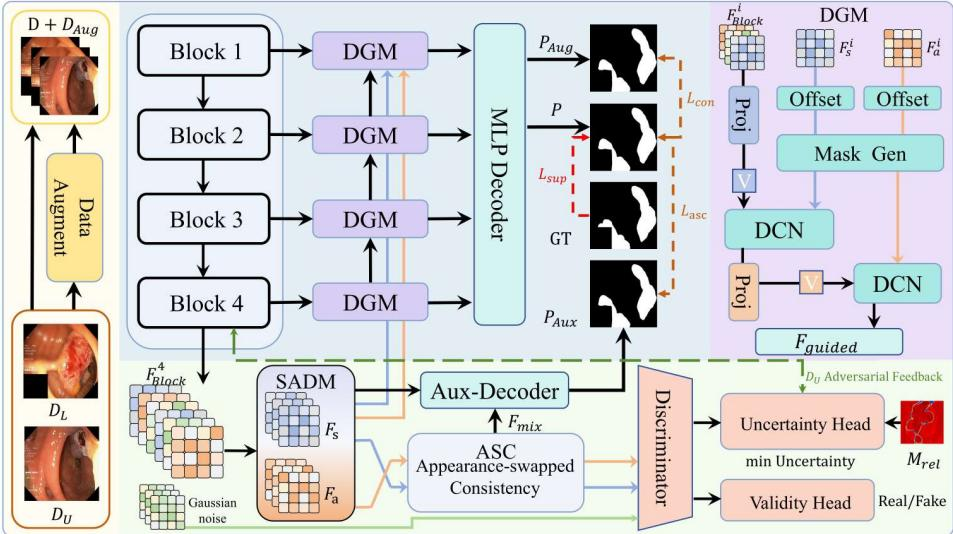
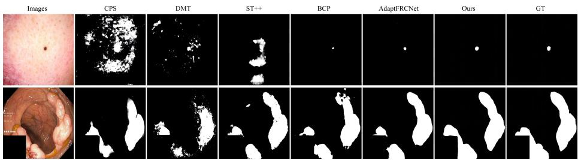

# SAUF-Net: Structure–Appearance Representation Learning with Uncertainty Feedback for Semi-Supervised Medical Image Segmentation

Qin Lu, Zheyang Jing, Yujie Yang, Jianwang Li, Chen Yi, and Shaofeng Jiang

Nanchang Hangkong University, Nanchang, China jsphone@163.com

Abstract. Semi-supervised learning has shown great potential for reducing annotation costs in medical image segmentation. However, most existing methods mainly exploit unlabeled data through prediction-level consistency, while the reliability of internal feature representations is often overlooked. In medical images, target-related structural cues are easily entangled with unstable appearance variations, which may lead to unreliable pseudo labels and error accumulation during training. To address these issues, we propose SAUF-Net, a Structure–Appearance Representation Learning with Uncertainty Feedback Network for semisupervised medical image segmentation. SAUF-Net uses the Structure– Appearance Decomposition Module (SADM) to separate bottleneck features into structural and appearance representations. The Disentangled Guidance Module (DGM) injects these representations into the decoding process to enhance structure-aware segmentation. Meanwhile, the Auxiliary Decoder produces branch-specific predictions for reliability estimation and a fused prediction for appearance-swapped consistency. Furthermore, we introduce an Appearance-Swapped Consistency branch to encourage structural representations to remain stable under appearance variations. We also introduce a reliability-map-guided dual-head discriminator with a Validity Head and an Uncertainty Head to provide feature-level uncertainty feedback. Extensive experiments on ISIC-2016 and Kvasir-SEG demonstrate that SAUF-Net outperforms state-of-theart semi-supervised methods, especially under low-label settings.

Keywords: Semi-supervised Learning · Medical Image Segmentation · Structure–Appearance Learning · Feature Disentanglement · Uncertainty Feedback

## 1 Introduction

In recent years, deep learning models, including Convolutional Neural Networks (CNNs) [13] and Transformers [4], have achieved remarkable progress in medical image segmentation. These models show strong potential in automatically delineating anatomical structures and lesions. However, most fully supervised segmentation methods still rely on large-scale, high-quality pixel-level annotations [2, 23]. In clinical practice, obtaining such annotations is expensive and time-consuming because it requires expert knowledge and careful manual delineation. This annotation burden limits the practical application of fully supervised methods, especially in label-scarce scenarios.

Semi-supervised learning (SSL) provides a promising solution by jointly using a small set of labeled images and a large set of unlabeled images [5, 15, 18]. Existing SSL methods mainly exploit unlabeled data through consistency regularization, pseudo label generation, and uncertainty-aware sample selection. Multi-stream or multi-task consistency methods encourage stable predictions under diferent perturbations [12, 10, 8], distribution-alignment methods reduce the gap between labeled and unlabeled data [3, 1, 21], and reliability-aware methods refine pseudo-labels by estimating prediction uncertainty [20, 14, 19, 22]. Although these strategies improve the use of unlabeled data, most of them regularize training mainly at the prediction level, such as enforcing output consistency or selecting pseudo-labels according to confidence. Such prediction-level constraints can make outputs more stable, but they do not explicitly ensure that the internal feature representations are reliable. This limitation is particularly important for medical images, where target-related structural cues, such as lesion shape, object location, and boundary continuity, are often entangled with unstable appearance cues, such as background texture, color variation, imaging artifacts, and local noise. When labeled data are scarce, the model may produce confident pseudo-labels while still relying on unstable appearance cues rather than segmentation-relevant structural information. Once these biased predictions are used for training, the errors may be reinforced on unlabeled data, leading to overconfident mistakes and progressive pseudo-label error accumulation.

To address these issues, we propose the Structure–Appearance Representation Learning with Uncertainty Feedback Network (SAUF-Net) for semi-supervised medical image segmentation. Instead of relying only on prediction-level regularization, SAUF-Net improves unlabeled-data learning by modeling structure– appearance representations and introducing reliability-guided feature-level feedback. The main contributions of this work are summarized as follows: (1) We propose a Structure–Appearance Decomposition Module (SADM) to separate target-related structural cues from unstable appearance variations. The decomposed representations are injected into the Disentangled Guidance Module (DGM) for decoding, while the Auxiliary Decoder provides auxiliary predictions for reliability estimation. (2) We introduce an Appearance-Swapped Consistency (ASC) branch to enhance structural robustness. By pairing structural representations with shufled appearance representations, ASC encourages the model to learn structure-centered features that remain stable under appearance changes. (3) We develop a reliability-guided uncertainty feedback branch to reduce pseudo-label error accumulation on unlabeled data. A dual-head discriminator estimates feature validity and feature-level uncertainty under reliability guidance, improving the quality of unlabeled representations. Experiments on ISIC-2016 and Kvasir-SEG validate the efectiveness of SAUF-Net under low-label settings.

## 2 Methods

## 2.1 Overview

  
Fig. 1. Illustration of the proposed SAUF-Net. Blue and orange solid lines denote the data flows of the structural representation $F _ { s }$ and the appearance representation $F _ { a } ,$ , respectively. In the Appearance-Swapped Consistency (ASC) branch, the blue and orange lines indicate the original non-swapped $F _ { s }$ and $F _ { a }$ streams, while the output after appearance swapping is denoted as the mixed feature $F _ { m i x }$

In the semi-supervised setting, the training data consist of a labeled set $\mathcal { D } _ { L } = \{ ( x _ { i } ^ { l } , y _ { i } ^ { l } ) \} _ { i = 1 } ^ { N _ { l } }$ and an unlabeled set $\mathcal { D } _ { U } = \{ x _ { i } ^ { u } \} _ { i = 1 } ^ { N _ { u } }$ , where $N _ { l } \ll N _ { u }$ . We denote the complete training set as $\mathcal { D } = \mathcal { D } _ { L } \cup \mathcal { D } _ { U }$ . During training, an augmented set $\mathcal { D } _ { A u g }$ is constructed from D using color or wavelet transformation. Both $\mathcal { D }$ and $\mathcal { D } _ { A u g }$ are fed into the shared segmentation network to obtain the original prediction P and the augmented prediction $P _ { A u g } .$

As shown in Fig. 1, SAUF-Net adopts a SegFormer-B4-based architecture. The encoder extracts multi-scale features $\{ F _ { \mathrm { B l o c k } } ^ { i } \} _ { i = 1 } ^ { 4 }$ and the bottleneck feature $F _ { \mathrm { B l o c k } } ^ { 4 }$ is decomposed by the Structure–Appearance Decomposition Module $( { \mathrm { S A D M } } )$ into a structural representation $F _ { s }$ and an appearance representation $F _ { a }$ . These representations are used by the Disentangled Guidance Module (DGM) to guide decoding and generate the final prediction P. Meanwhile, the Auxiliary Decoder (Aux-Decoder) produces the branch-specific predictions $P _ { s }$ and $P _ { a }$ for reliability estimation, together with a fused prediction $P _ { A u x }$ for ASC. For unlabeled data, P is used to generate pseudo labels, and the reliability map

$M _ { \mathrm { r e l } }$ is estimated from $P , P _ { s } ,$ and $P _ { a }$ to guide the learning of the augmented prediction $P _ { A u g }$ . In addition, the $\mathrm { A \cdot }$ ppearance-Swapped Consistency (ASC) branch constructs mixed features $F _ { m i x }$ by pairing structural representations with shuffled appearance representations, while the uncertainty feedback branch employs a dual-head discriminator, consisting of a Validity Head and an Uncertainty Head, to estimate feature validity and spatial uncertainty under the guidance of $M _ { \mathrm { r e l } }$

## 2.2 Structure–Appearance Representation Learning

Given an input image $x ,$ an augmented image $x _ { A u g }$ is constructed by applying either color transformation or wavelet-based transformation. The original image x and the augmented image $x _ { A u g }$ are fed into the same segmentation network with shared parameters, producing the prediction P and the augmented prediction $P _ { A u g } ,$ respectively.

The shared SegFormer-B4 encoder extracts multi-scale features $\{ F _ { \mathrm { B l o c k } } ^ { i } \} _ { i = 1 } ^ { 4 }$ where $F _ { \mathrm { B l o c k } } ^ { i }$ denotes the feature from the i-th encoder stage. SADM contains two parallel projection branches with independent parameters. Each branch consists of two $3 \times 3$ Conv-BN-ReLU blocks followed by one $1 \times 1$ Conv-BN-ReLU block. The two branches generate the structural representation $F _ { s }$ and the appearance representation $F _ { a }$ from the deepest encoder feature $F _ { \mathrm { B l o c k } } ^ { 4 }$ , respectively. The structural representation $F _ { s }$ is designed to capture target-related cues, such as object shape, spatial location, region continuity, and boundary structure, which are directly related to segmentation. In contrast, the appearance representation $F _ { a }$ models complementary appearance information, such as background texture, intensity variation, color distribution, and imaging noise. This decomposition encourages the network to rely more on stable structural cues while reducing the influence of unstable appearance variations.

To provide explicit structure–appearance guidance for multi-scale feature reconstruction, we introduce the Disentangled Guidance Module (DGM) to inject $F _ { s }$ and $F _ { a }$ into the decoding process. Before entering the i-th DGM, $F _ { s }$ and $F _ { a }$ are resized to the same spatial resolution as the current decoding feature by bilinear upsampling and convolutional refinement, and the resized representations are denoted as $F _ { s } ^ { i }$ and $F _ { a } ^ { i }$ , respectively. In the deepest decoding stage, DGM takes $F _ { \mathrm { B l o c k } } ^ { 4 }$ and the resized structural and appearance representations as inputs. In the remaining stages, the current encoder feature is concatenated with the upsampled guided feature from the previous deeper stage, while $F _ { s } ^ { i }$ and $F _ { a } ^ { i }$ serve as guidance features. For the i-th DGM, let $X ^ { i }$ denote the input decoding feature, which is first projected into a unified feature representation $V ^ { i } = \mathrm { P r o j } ( X ^ { i } )$ . Then, DGM refines $V ^ { i }$ through two serial deformable guidance steps. First, the resized structural representation $F _ { s } ^ { i }$ is used to generate the ofset and modulation mask:

$$
\varDelta _ { s } ^ { i } = \mathrm { C o n v } _ { o f f } ^ { s } ( F _ { s } ^ { i } ) , \qquad M _ { s } ^ { i } = \sigma ( \mathrm { C o n v } _ { m a s k } ^ { s } ( F _ { s } ^ { i } ) ) .\tag{1}
$$

The projected feature $V ^ { i }$ is sampled by deformable convolution with the ofset $\varDelta _ { s } ^ { i }$ and mask $M _ { s } ^ { i } ,$ , producing the structure-guided feature $\widetilde { F } _ { s } ^ { i }$ . This step enables the decoder to adaptively focus on structure-related regions. Next, the structurally guided feature is further refined by the resized appearance representation $F _ { a } ^ { i }$ Similarly, $F _ { a } ^ { i }$ generates another ofset and modulation mask:

$$
\varDelta _ { a } ^ { i } = \mathrm { C o n v } _ { o f f } ^ { a } ( F _ { a } ^ { i } ) , \qquad M _ { a } ^ { i } = \sigma ( \mathrm { C o n v } _ { m a s k } ^ { a } ( F _ { a } ^ { i } ) ) .\tag{2}
$$

The final guided feature of this stage is obtained by:

$$
F _ { g u i d e d } ^ { i } = \mathrm { D C N } ( \mathrm { P r o j } ( \widetilde { F } _ { s } ^ { i } ) ; \varDelta _ { a } ^ { i } , M _ { a } ^ { i } ) .\tag{3}
$$

Through this serial structure-to-appearance guidance, DGM adaptively refines the decoding feature using the decomposed representations.

The guided features from diferent stages are aggregated by the MLP decoder to generate the segmentation prediction P. Meanwhile, the Aux-Decoder contains structural, appearance, and fusion branches. The first two branches generate $P _ { s } = g _ { s } ( F _ { s } )$ and $P _ { a } = g _ { a } ( F _ { a } )$ , respectively, which are used for reliability estimation. The fusion branch takes the channel-wise concatenation of $F _ { s }$ and $F _ { a }$ and produces $P _ { A u x } = H ( [ F _ { s } , F _ { a } ] )$ . Each branch progressively upsamples its input using bilinear interpolation and Conv-BN-ReLU blocks, followed by a $1 \times 1$ prediction layer.

## 2.3 Appearance-Swapped Consistency (ASC)

Although SADM separates structural and appearance representations, $F _ { s }$ may still contain appearance-dependent information. To preserve segmentation structure under appearance replacement, we introduce Appearance-Swapped Consistency (ASC).

Given two samples A and B in a mini-batch, ASC keeps $F _ { s } ^ { A }$ and replaces $F _ { a } ^ { A }$ with the shufled appearance representation $F _ { a } ^ { B }$ . The mixed representation and its fused prediction are defined as:

$$
F _ { m i x } = [ F _ { s } ^ { A } , F _ { a } ^ { B } ] , \qquad P _ { A u x } ^ { m i x } = H ( F _ { m i x } ) ,\tag{4}
$$

Here, PmixAux denotes the output generated from the appearance-swapped pair $( F _ { s } ^ { A } , F _ { a } ^ { \bar { B } } )$ , whereas $P _ { A u x }$ in the previous subsection is generated from the original pair $( \bar { F } _ { s } ^ { A } , \bar { F } _ { a } ^ { A } )$ . Both predictions are produced by the same fusion branch H. For simplicity, Fig. 1 uses $P _ { A u x }$ to denote this shared auxiliary prediction branch. ASC therefore encourages the fused prediction to preserve the structure provided by $F _ { s } ^ { A }$ despite changes in its paired appearance representation.

## 2.4 Reliability-Guided Uncertainty Feedback

Pseudo-labels may be unreliable in ambiguous or low-contrast regions. We therefore introduce a reliability-guided uncertainty feedback branch to regularize unlabeled representations. Given the main prediction P and the branch-specific predictions $P _ { s }$ and $P _ { a } ,$ the reliability map is defined as:

$$
M _ { \mathrm { r e l } } = ( 1 - | P - P _ { s } | ) \cdot | P _ { s } - P _ { a } | .\tag{5}
$$

The first term measures the agreement between the main and structural predictions, whereas the second measures the response contrast between the structural and appearance branches. Larger values therefore indicate more reliable regions.

As shown in Fig. 1, a shared dual-head discriminator $D$ is applied separately to $F _ { s }$ and $F _ { a }$ . Its Validity Head $D _ { v }$ distinguishes encoder-derived features from synthetic features produced by feature generators from Gaussian latent vectors. Features extracted from labeled and unlabeled images are treated as real, whereas the generated features are treated as fake.

The Uncertainty Head $D _ { u }$ predicts a spatial uncertainty map. For labeled data, the structural and appearance targets are computed from the prediction errors of $P _ { s } ^ { l }$ and $P _ { a } ^ { l }$ against $\mathit { \Pi } _ { y } l$ and $1 - y ^ { \bar { l } }$ , respectively. For unlabeled data, the detached complementary reliability map $1 - M _ { \mathrm { r e l } } ^ { u }$ is resized to the feature resolution and used as the uncertainty target. The resulting discriminator feedback encourages augmented unlabeled features to be both valid and low-uncertainty.

## 2.5 Training Objective

For labeled images, given an image $x ^ { l }$ and its ground-truth mask $y ^ { l }$ , the network produces the main prediction $P ^ { l }$ , the branch-specific predictions $P _ { s } ^ { l }$ and $P _ { a } ^ { l } .$ and the fused auxiliary prediction $P _ { A u x } ^ { l }$ . The basic segmentation loss $\mathcal { L } _ { s e g }$ is implemented by combining Dice loss and BCE loss. The main prediction $P ^ { l }$ and the structural auxiliary prediction $P _ { s } ^ { l }$ are supervised by the foreground mask, while the appearance auxiliary prediction $P _ { a } ^ { l }$ is supervised by the complementary background mask. The supervised loss is defined as:

$$
\begin{array} { r } { \mathcal { L } _ { s u p } = \mathcal { L } _ { s e g } ( P ^ { l } , y ^ { l } ) + \lambda _ { a u x } \left[ \mathcal { L } _ { s e g } ( P _ { s } ^ { l } , y ^ { l } ) + \mathcal { L } _ { s e g } ( P _ { a } ^ { l } , 1 - y ^ { l } ) + \mathcal { L } _ { s e g } ( P _ { A u x } ^ { l } , y ^ { l } ) \right] } \end{array}\tag{6}
$$

For each unlabeled sample, the original image $x ^ { u }$ is fed into the network to obtain the main prediction $P ^ { u }$ , the auxiliary predictions $P _ { s } ^ { u }$ and $P _ { a } ^ { u }$ , and the reliability map $M _ { \mathrm { r e l } } ^ { u }$ . All predictions denote sigmoid-normalized probabilities. The binary pseudo-label is defined as $\hat { y } _ { i } ^ { u } = \mathbb { I } ( P _ { i } ^ { u } > 0 . 5 )$ ), where $j$ indexes pixels. The confidence mask is defined as $M _ { \mathrm { c o n f } , i } ^ { \acute { u } } = \mathbb { I } ( \operatorname* { m a x } ( P _ { j } ^ { u } , 1 - P _ { j } ^ { u } ) > \tau )$ , where $\tau = 0 . 9 5$ . The final pixel-wise weight is $\mathrm { \ddot { \it W } } _ { j } ^ { u } = M _ { \mathrm { c o n f } , j } ^ { u } \mathrm { \cdot { s g } } ( M _ { \mathrm { r e l } , j } ^ { u ^ { \prime } } )$ , where $\operatorname { s g } ( \cdot )$ denotes the stop-gradient operation. The pseudo-label and pixel-wise weight are computed without gradient propagation and are used to supervise the augmented prediction $P _ { A u g } ^ { u }$

The augmented unlabeled image $x _ { A u g } ^ { u }$ is fed into the same network to obtain the augmented prediction $P _ { A u g } ^ { u } { ; }$ , which is supervised by the pseudo-label:

$$
\mathcal { L } _ { c o n } = \frac { \sum _ { j } \left( W _ { j } ^ { u } \mathcal { L } _ { b c e } ( P _ { A u g , j } ^ { u } , \hat { y } _ { j } ^ { u } ) \right) } { \sum _ { j } W _ { j } ^ { u } + \epsilon } .\tag{7}
$$

For appearance-swapped supervision, the structural representation is kept unchanged, while the appearance representation is replaced by a shufled appearance feature. The mixed representation is processed by the fusion branch

to produce $P _ { A u x } ^ { m i x , u }$ , which is supervised by the pseudo-label associated with its structural representation:

$$
\mathcal { L } _ { a s c } = \frac { \sum _ { j } W _ { j } ^ { u } \mathcal { L } _ { b c e } ( P _ { A u x , j } ^ { m i x , u } , \hat { y } _ { j } ^ { u } ) } { \sum _ { j } W _ { j } ^ { u } + \epsilon } .\tag{8}
$$

For uncertainty feedback, the shared discriminator is optimized using adversarial classification and uncertainty regression. Encoder-derived features are treated as real, while generator-synthesized features are treated as fake. The Uncertainty Head is supervised by the labeled prediction errors and the resized complementary reliability map for unlabeled data. The feature generators are adversarially trained to produce features classified as real.

When optimizing the segmentation network, the discriminator is fixed. Let $\widetilde { F } _ { s } ^ { u }$ and ${ \widetilde { F } } _ { a } ^ { u }$ denote the augmented unlabeled features. The uncertainty feedback loss is:

$$
\mathcal { L } _ { u f } = \frac { 1 } { 2 } \sum _ { k \in \{ s , a \} } \left[ \mathcal { L } _ { a d v } ( D _ { v } ( \widetilde { F } _ { k } ^ { u } ) , 1 ) + \mathcal { L } _ { m s e } ( D _ { u } ( \widetilde { F } _ { k } ^ { u } ) , 0 ) \right] .\tag{9}
$$

The final objective for optimizing the segmentation network is:

$$
\mathcal { L } _ { t o t a l } = \mathcal { L } _ { s u p } + \lambda _ { c o n } ( t ) \mathcal { L } _ { c o n } + \lambda _ { a s c } \mathcal { L } _ { a s c } + \lambda _ { u f } ( t ) \mathcal { L } _ { u f } .\tag{10}
$$

Here, $\lambda _ { c o n } ( t )$ and $\lambda _ { u f } ( t )$ are ramp-up weights. $\lambda _ { a s c }$ controls the contribution of the ASC loss. During training, the discriminator and feature generator are optimized alternately with the segmentation network. During inference, only the segmentation network is retained.

## 3 Experiments

## 3.1 Datasets and Evaluation Metrics

Datasets. We evaluate our method on two public medical image segmentation datasets: (1) ISIC-2016 [7]: This dataset contains dermoscopy images for skin cancer diagnosis with corresponding pixel-level annotations, comprising 900 training images and 379 testing images. (2) Kvasir-SEG [9]: This dataset includes 1,000 polyp images with ground-truth labels. We randomly allocate 80% of the images for training and the remaining 20% for testing.

Evaluation Metrics. To comprehensively evaluate the performance of all models, we employ the Dice Similarity Coeficient (DSC), Intersection over Union (IoU), and pixel-level Accuracy (Acc).

## 3.2 Implementation Details

We adopt SegFormer-B4 pre-trained on ImageNet as the encoder backbone. All input images are resized to 512 × 512, and the batch size is set to 2. The network is optimized using AdamW with a weight decay of 0.0001. The training process follows a two-stage strategy. First, the network is trained on labeled data for 100 epochs with a learning rate of 0.0001. Then, unlabeled data are introduced for semi-supervised training for 50 epochs with a learning rate of 0.00001. Augmented images in $\mathcal { D } _ { A u g }$ are generated using either color or wavelet transformation. The color transformation includes random color jittering and grayscale conversion, while the wavelet-based transformation perturbs the image in the frequency domain. The auxiliary loss weight and appearance-swapped supervision weight are set to $\lambda _ { a u x } = 0 . 4$ and $\lambda _ { a s c } = 0 . 0 5$ , respectively. The consistency weight is set to $\lambda _ { c o n } ( t ) = 0 . 1 { \cdot } \mathrm { R a m p u p } ( t )$ , and the uncertainty feedback weight is defined as $\lambda _ { u f } ( t ) = \alpha \lambda _ { c o n } ( t )$ , with $\alpha = 0 . 1 0$ . The pseudo-label confidence threshold is set to 0.95. The feature generators and shared discriminator are optimized using Adam with a learning rate of $2 \times 1 0 ^ { - 4 }$ . All experiments are implemented in PyTorch on a single NVIDIA GeForce RTX 4070 Ti SUPER GPU.

Table 1. Comparison of segmentation performance on ISIC-2016 and Kvasir-SEG datasets. The best results are highlighted in bold.
<table><tr><td colspan="2">Methods</td><td rowspan="2">Ratio</td><td colspan="3">ISIC-2016</td><td colspan="3">Kvasir-SEG</td></tr><tr><td>16</td><td></td><td>Dice (%)↑ IoU (%)↑</td><td></td><td>Acc (%)↑</td><td>Dice (%)↑ IoU (%)↑</td><td></td><td>Acc (%)↑</td></tr><tr><td>SegFormer B4 SegFormer B4 [16]</td><td></td><td>100%</td><td>92.88</td><td>87.31</td><td>95.93</td><td>91.79</td><td>86.86</td><td>97.48</td></tr><tr><td colspan="2" rowspan="8">MT [15] SASŠNet [10]</td><td>10%</td><td>87.15</td><td>79.54</td><td>93.51</td><td>78.83</td><td>71.07</td><td>94.52</td></tr><tr><td>10%</td><td>88.01</td><td>81.42</td><td>94.03</td><td>83.45</td><td>76.32</td><td>94.97</td></tr><tr><td>10%</td><td>88.42</td><td>81.46</td><td>93.78</td><td>82.78</td><td>75.21</td><td>94.78</td></tr><tr><td>ST++ [17]</td><td>10%</td><td>88.17 82.46</td><td>94.98</td><td>86.23</td><td>80.41</td><td>95.31</td></tr><tr><td>CCT [12]</td><td>10%</td><td>88.22</td><td>81.34</td><td>93.78</td><td>83.74</td><td>76.45 94.88</td></tr><tr><td>CPS [5]</td><td>10%</td><td>88.89</td><td>82.12</td><td>94.28</td><td>82.81</td><td>76.34 94.91</td></tr><tr><td>SLCNet [11]</td><td>10%</td><td>88.23</td><td>82.09</td><td>94.82 83.43</td><td>75.64</td><td>94.79</td></tr><tr><td>DMT [6]</td><td>10%</td><td>88.03</td><td>82.34 94.93</td><td>84.98</td><td>77.23</td><td>94.89</td></tr><tr><td> $\mathrm { B C P \ [ \ ' 1 ] } ^ { \prime }$ </td><td>10%</td><td>89.02</td><td>82.93</td><td>95.09</td><td>85.79</td><td>78.43 95.09</td></tr><tr><td colspan="2"> $\operatorname { A R C O } { \mathrm { ~ } } [ 1 9 ]$ </td><td>10%</td><td>89.52</td><td>84.26</td><td>95.45 87.96</td><td>81.52</td><td>96.45</td></tr><tr><td colspan="2">DAW [14]</td><td>10%</td><td>89.67</td><td>84.31</td><td>95.52</td><td>88.24</td><td>81.63 96.54</td></tr><tr><td colspan="2">AdaptFRCNet [8]</td><td>10%</td><td>91.37</td><td>85.30</td><td>95.70</td><td>89.35 83.36</td><td>96.71</td></tr><tr><td colspan="2">Ours</td><td>5%</td><td>90.91</td><td>84.76</td><td>95.56</td><td>89.71 83.48</td><td>96.95</td></tr><tr><td colspan="2">Ours SegFormer B4 [16]</td><td>10%</td><td>91.88</td><td>85.88</td><td>96.11</td><td>90.53</td><td>84.94 96.93</td></tr><tr><td colspan="2">MT [15]</td><td>20%</td><td>88.65 89.83</td><td>81.58</td><td>94.32</td><td>82.16</td><td>74.69 95.27</td></tr><tr><td colspan="2"> $\mathrm { S A S \dot { S } N \dot { e t } \ [ 1 0 ] }$ </td><td>20%</td><td>89.94</td><td>83.15</td><td>95.43</td><td>84.45</td><td>77.43 95.47</td></tr><tr><td colspan="2"> $\mathrm { S T } + + ~ [ 1 7 ]$ </td><td>20%</td><td>90.21</td><td>83.67</td><td>95.19</td><td>83.97</td><td>77.21 95.56</td></tr><tr><td colspan="2"> $\mathrm { C C T \ [ 1 \dot { 2 } ] }$ </td><td>20%</td><td>89.59</td><td>85.23</td><td>95.59</td><td>87.94</td><td>82.17 96.36</td></tr><tr><td colspan="2">CPS [5]</td><td>20%</td><td></td><td>82.99</td><td>95.42</td><td>84.89 77.94</td><td>95.78</td></tr><tr><td colspan="2"></td><td>20%</td><td>89.03</td><td>84.67</td><td>95.11</td><td>85.83</td><td>78.86 95.88</td></tr><tr><td colspan="2"> $\mathrm { S L C N } \dot { \mathrm { \Pi } } \mathrm { e t \ } [ 1 1 ]$ </td><td>20%</td><td>89.34</td><td>84.54</td><td>95.34</td><td>85.42</td><td>78.35 95.74</td></tr><tr><td colspan="2">DMT [[6]</td><td>20%</td><td>89.21</td><td>84.32</td><td>95.56</td><td>86.47</td><td>79.32 95.83</td></tr><tr><td colspan="2">BCP [i]</td><td>20%</td><td>89.98</td><td>85.01</td><td>95.32</td><td>87.43</td><td>80.45 96.23</td></tr><tr><td colspan="2">ARCO [19]</td><td>20%</td><td>92.43</td><td>86.21</td><td>96.28</td><td>90.19 84.85</td><td>96.89</td></tr><tr><td colspan="2">DAW [14]</td><td>20%</td><td>92.31</td><td>86.13</td><td>96.27</td><td>90.54 84.96</td><td>96.93</td></tr><tr><td colspan="2">AdaptFRCNet [8]</td><td>20%</td><td>92.53</td><td>86.83</td><td>96.29</td><td>90.71</td><td>85.23 97.32</td></tr><tr><td colspan="2">Ours</td><td>20%</td><td>92.64</td><td>86.89</td><td>96.47</td><td>91.98</td><td>86.69 97.59</td></tr></table>

## 3.3 Comparison with State-of-the-Art Methods

We compare SAUF-Net with recent SOTA methods on both datasets. Our experiments follow the same configuration as AdaptFRCNet [8]. As shown in Table 1, at a 10% labeled ratio, SAUF-Net achieves a Dice of 91.88% and an IoU of 85.88% on ISIC-2016, outperforming AdaptFRCNet by 0.51% and 0.58%, respectively. On Kvasir-SEG, SAUF-Net obtains a Dice of 90.53% and an IoU of 84.94%, improving over AdaptFRCNet by 1.18% and 1.58%. Moreover, with only 5% labeled data, SAUF-Net achieves 90.91% Dice on ISIC-2016 and 89.71% Dice on Kvasir-SEG, which is competitive with or better than many methods trained with 10% labeled data. These results indicate that structure–appearance representation learning and reliability-guided uncertainty feedback can improve the utilization of unlabeled images. When the labeled ratio increases to 20%, SAUF-Net still outperforms AdaptFRCNet on both datasets, improving Dice by 0.11% on ISIC-2016 and 1.27% on Kvasir-SEG. The improvements in per-image Dice over AdaptFRCNet were statistically significant across both datasets and all evaluated labeling ratios (all $p < 0 . 0 1$ ; two-sided Wilcoxon signed-rank tests).

  
Fig. 2. The segmentation results of skin-lesion segmentation (first row) and polyp (second row) tasks using 10% labeled data.

Fig. 2 visualizes challenging segmentation cases. Compared with other methods, SAUF-Net better preserves target structures and boundary details, especially for small lesions, blurry boundaries, and complex background textures. This suggests that the proposed structure–appearance learning and uncertainty feedback help reduce unreliable predictions in ambiguous regions.

## 3.4 Ablation Study

Efectiveness of structure–appearance decomposition. Table 2(a) reports the component ablation results on Kvasir-SEG with 20% labeled data. Compared with the baseline SegFormer-B4, SADM improves the Dice from 82.16% to 89.91% and the IoU from 74.69% to 84.77%. This demonstrates that separating structural cues from appearance variations provides more discriminative representations for segmentation. By explicitly modeling structural information, the model can better focus on target shape, spatial location, and boundary continuity rather than being dominated by unstable texture or intensity changes.

Efectiveness of reliability-guided learning. For variants without $M _ { \mathrm { r e l } }$ we use the conventional maximum-probability confidence strategy with $\tau = 0 . 9 5$ Thus, these variants replace the proposed reliability map with standard confidence rather than removing pseudo-label filtering. Introducing $M _ { \mathrm { r e l } }$ improves the Dice and IoU from 89.91% and 84.77% to 91.16% and 85.44%, respectively. This result indicates that $M _ { \mathrm { r e l } }$ provides more informative reliability estimates than conventional prediction confidence.

Efectiveness of ASC and uncertainty feedback. Adding ASC improves the Dice from 91.16% to 91.38% and the IoU from 85.44% to 85.86%, showing that appearance-swapped supervision enhances the robustness of structural representations. The uncertainty feedback branch alone improves Acc to 97.29%, but its Dice and IoU are lower than those of the full model, suggesting that featurelevel uncertainty feedback is more efective when the structural representation has been regularized by ASC. With all components enabled, SAUF-Net achieves the best performance, with 97.59% Acc, 91.98% Dice, and 86.69% IoU. These results confirm the complementarity of SADM, ASC, $M _ { \mathrm { r e l } }$ , and uncertainty feedback.

Table 2. Ablation studies and hyper-parameter analysis on Kvasir-SEG with 20% labeled data.  
(a) Ablation of SAUF-Net components.
<table><tr><td colspan="5">COMPONENTS</td><td colspan="3">METRICS</td></tr><tr><td colspan="2">BASELINE</td><td>SADM ASC</td><td> $M _ { \mathrm { r e l } }$ </td><td>UF</td><td>Dice (%)↑</td><td>IoU (%)↑</td><td>Acc (%)↑</td></tr><tr><td colspan="2">√</td><td></td><td></td><td></td><td>82.16</td><td>74.69</td><td>95.27</td></tr><tr><td colspan="2">√</td><td></td><td></td><td></td><td>89.91</td><td>84.77</td><td>96.39</td></tr><tr><td colspan="2">√</td><td>V</td><td>√</td><td></td><td>91.16</td><td>85.44</td><td>96.74</td></tr><tr><td colspan="2">√</td><td>√</td><td>√</td><td></td><td>91.38</td><td>85.86</td><td>96.99</td></tr><tr><td colspan="2">√</td><td>V 」</td><td>V</td><td>√</td><td>90.54</td><td>85.01</td><td>97.29</td></tr><tr><td colspan="2">√</td><td>√</td><td>V</td><td>V</td><td>91.98</td><td>86.69</td><td>97.59</td></tr><tr><td colspan="2">b) Effect of ASC weight  $\lambda _ { a s c } .$ </td><td></td><td></td><td>(c) Effect of feedback coefficient α.</td><td></td><td>(d) Effect of confiden threshold τ.</td><td></td></tr><tr><td> $\lambda _ { a s c }$ </td><td>Dice (%)</td><td>IoU (%)</td><td>α</td><td>Dice (%)</td><td>IoU (%)</td><td>T Dice (%)</td><td>IoU (%</td></tr><tr><td>0.03</td><td>90.72</td><td>85.18</td><td>0.07</td><td>91.16</td><td>85.73</td><td>0.90 91.76</td><td>86.36</td></tr><tr><td>0.05</td><td>91.98</td><td>86.69</td><td>0.10</td><td>91.98</td><td>86.69</td><td>0.95</td><td>91.98 86.69</td></tr><tr><td>0.10</td><td>90.94</td><td>85.74</td><td>0.13</td><td>90.82</td><td>85.25</td><td>0.98 91.81</td><td>86.40</td></tr></table>

Hyper-parameter sensitivity. Table 2(b)-(d) analyzes the efects of $\lambda _ { a s c } ,$ the uncertainty feedback coeficient $\alpha ,$ and the pseudo-label confidence threshold τ. The best ASC performance is obtained at $\lambda _ { a s c } = 0 . 0 5$ , indicating that an appropriate ASC weight can efectively regularize structural representations. For uncertainty feedback, $\alpha = 0 . 1 0$ achieves the best Dice and IoU, showing that a stronger but controlled feedback weight improves feature-level refinement. For pseudo-label filtering, τ = 0.95 achieves the best performance, suggesting that overly loose or strict confidence filtering may weaken unlabeled-data learning. These results show that the selected hyper-parameters provide a good balance between supervision strength and training stability.

## 4 Conclusion

We propose SAUF-Net, a structure–appearance representation learning framework with reliability-guided uncertainty feedback for semi-supervised medical image segmentation. SAUF-Net decomposes bottleneck features through SADM and injects them into multi-scale decoding with DGM. ASC preserves segmentation structure under appearance variations, while uncertainty feedback reduces the influence of unreliable pseudo-labels. Experiments on ISIC-2016 and Kvasir-

SEG show competitive performance under low-label settings. However, the current evaluation is limited to 2D binary lesion segmentation and does not assess cross-dataset generalization. Future work will extend SAUF-Net to 3D and multiclass tasks and evaluate its robustness across datasets and imaging domains.

Acknowledgments. This work was supported by the National Natural Science Foundation of China under Grant 62261039.

Disclosure of Interests. The authors have no competing interests to declare that are relevant to the content of this article.

## References

1. Bai, Y., Chen, D., Li, Q., Shen, W., Wang, Y.: Bidirectional copy-paste for semisupervised medical image segmentation. In: Proceedings of the IEEE/CVF Conference on Computer Vision and Pattern Recognition (CVPR). pp. 11514–11524 (June 2023)

2. Cao, H., Wang, Y., Chen, J., Jiang, D., Zhang, X., Tian, Q., Wang, M.: Swinunet: Unet-like pure transformer for medical image segmentation. In: European conference on computer vision. pp. 205–218. Springer (2022)

3. Chartsias, A., Joyce, T., Papanastasiou, G., Semple, S., Williams, M., Newby, D.E., Dharmakumar, R., Tsaftaris, S.A.: Disentangled representation learning in cardiac image analysis. Medical Image Analysis 58, 101535 (2019)

4. Chen, J., Lu, Y., Yu, Q., Luo, X., Adeli, E., Wang, Y., Lu, L., Yuille, A.L., Zhou, Y.: Transunet: Transformers make strong encoders for medical image segmentation. arXiv preprint arXiv:2102.04306 (2021)

5. Chen, X., Yuan, Y., Zeng, G., Wang, J.: Semi-supervised semantic segmentation with cross pseudo supervision. In: Proceedings of the IEEE/CVF conference on computer vision and pattern recognition. pp. 2613–2622 (2021)

6. Feng, Z., Zhou, Q., Gu, Q., Tan, X., Cheng, G., Lu, X., Shi, J., Ma, L.: Dmt: Dynamic mutual training for semi-supervised learning. Pattern Recognition 130, 108777 (2022)

7. Gutman, D.A., Codella, N.C.F., Celebi, M.E., Helba, B., Marchetti, M.A., Mishra, N.K., Halpern, A.: Skin lesion analysis toward melanoma detection: A challenge at the international symposium on biomedical imaging (ISBI) 2016, hosted by the international skin imaging collaboration (ISIC). CoRR abs/1605.01397 (2016)

8. He, A., Wu, Y., Wang, Z., Li, T., Fu, H.: Adaptfrcnet: Semi-supervised adaptation of pre-trained model with frequency and region consistency for medical image segmentation. Medical Image Analysis 103, 103626 (2025)

9. Jha, D., Smedsrud, P.H., Riegler, M.A., Halvorsen, P., de Lange, T., Johansen, D., Johansen, H.D.: Kvasir-seg: A segmented polyp dataset. In: Ro, Y.M., Cheng, W.H., Kim, J., Chu, W.T., Cui, P., Choi, J.W., Hu, M.C., De Neve, W. (eds.) MultiMedia Modeling. pp. 451–462. Springer International Publishing, Cham (2020)

10. Li, S., Zhang, C., He, X.: Shape-aware semi-supervised 3d semantic segmentation for medical images. In: Martel, A.L., Abolmaesumi, P., Stoyanov, D., Mateus, D., Zuluaga, M.A., Zhou, S.K., Racoceanu, D., Joskowicz, L. (eds.) Medical Image Computing and Computer Assisted Intervention – MICCAI 2020. pp. 552–561. Springer International Publishing, Cham (2020)

11. Liu, J., Desrosiers, C., Zhou, Y.: Semi-supervised medical image segmentation using cross-model pseudo-supervision with shape awareness and local context constraints. In: Medical Image Computing and Computer Assisted Intervention – MICCAI 2022: 25th International Conference, Singapore, September 18–22, 2022, Proceedings, Part VIII. p. 140–150. Springer-Verlag, Berlin, Heidelberg (2022)

12. Ouali, Y., Hudelot, C., Tami, M.: Semi-supervised semantic segmentation with cross-consistency training. In: Proceedings of the IEEE/CVF Conference on Computer Vision and Pattern Recognition (CVPR) (June 2020)

13. Ronneberger, O., Fischer, P., Brox, T.: U-net: Convolutional networks for biomedical image segmentation. In: International Conference on Medical image computing and computer-assisted intervention. pp. 234–241. Springer (2015)

14. Sun, R., Mai, H., Zhang, T., Wu, F.: Daw: Exploring the better weighting function for semi-supervised semantic segmentation. In: Oh, A., Naumann, T., Globerson, A., Saenko, K., Hardt, M., Levine, S. (eds.) Advances in Neural Information Processing Systems. vol. 36, pp. 61792–61805. Curran Associates, Inc. (2023)

15. Tarvainen, A., Valpola, H.: Mean teachers are better role models: Weight-averaged consistency targets improve semi-supervised deep learning results. Advances in neural information processing systems 30 (2017)

16. Xie, E., Wang, W., Yu, Z., Anandkumar, A., Alvarez, J.M., Luo, P.: Segformer: Simple and eficient design for semantic segmentation with transformers. In: Ranzato, M., Beygelzimer, A., Dauphin, Y., Liang, P., Vaughan, J.W. (eds.) Advances in Neural Information Processing Systems. vol. 34, pp. 12077–12090. Curran Associates, Inc. (2021)

17. Yang, L., Zhuo, W., Qi, L., Shi, Y., Gao, Y.: St++: Make self-training work better for semi-supervised semantic segmentation. In: Proceedings of the IEEE/CVF Conference on Computer Vision and Pattern Recognition (CVPR). pp. 4268–4277 (June 2022)

18. Yao, H., Hu, X., Li, X.: Enhancing pseudo label quality for semi-supervised domaingeneralized medical image segmentation. In: Proceedings of the AAAI conference on artificial intelligence. vol. 36, pp. 3099–3107 (2022)

19. You, C., Dai, W., Min, Y., Liu, F., Clifton, D., Zhou, S.K., Staib, L., Duncan, J.: Rethinking semi-supervised medical image segmentation: A variance-reduction perspective. In: Oh, A., Naumann, T., Globerson, A., Saenko, K., Hardt, M., Levine, S. (eds.) Advances in Neural Information Processing Systems. vol. 36, pp. 9984– 10021. Curran Associates, Inc. (2023)

20. Yu, L., Wang, S., Li, X., Fu, C.W., Heng, P.A.: Uncertainty-aware self-ensembling model for semi-supervised 3d left atrium segmentation. In: Shen, D., Liu, T., Peters, T.M., Staib, L.H., Essert, C., Zhou, S., Yap, P.T., Khan, A. (eds.) Medical Image Computing and Computer Assisted Intervention – MICCAI 2019. pp. 605– 613. Springer International Publishing, Cham (2019)

21. Zhang, Z., Yin, G., Zhang, B., Liu, W., Zhou, X., Wang, W.: A semantic knowledge complementarity based decoupling framework for semi-supervised class-imbalanced medical image segmentation. In: Proceedings of the IEEE/CVF Conference on Computer Vision and Pattern Recognition (CVPR). pp. 25940–25949 (June 2025)

22. Zhao, W., Zhong, L., Liao, X., Liao, W., Zhang, S., Zhang, S., Wang, G.: Metassl: A general heterogeneous loss for semi-supervised medical image segmentation. IEEE Transactions on Medical Imaging pp. 1–1 (2025)

23. Zhou, H.Y., Guo, J., Zhang, Y., Han, X., Yu, L., Wang, L., Yu, Y.: nnformer: Volumetric medical image segmentation via a 3d transformer. IEEE Transactions on Image Processing 32, 4036–4045 (2023)