# SelfLift: Accelerating Few-Step Diffusion via Self-Recovering Resolution Transition

Tingyan Wen<sup>1,∗</sup>, Chenqian Yan<sup>2,∗</sup>, Xurui Peng<sup>2</sup>, Xiazhang Fang<sup>2</sup>, Shuai Wang<sup>2</sup>, Xueqian Wang<sup>1,†</sup>, Songwei Liu<sup>2,†</sup>

<sup>1</sup>Tsinghua University, <sup>2</sup>ByteDance

<sup>∗</sup>Equal contribution, <sup>†</sup>Corresponding authors

## Abstract

Few-step difusion models substantially compress temporal computation, making the spatial cost of each model evaluation an increasingly dominant source of inference latency. Progressive-resolution inference reduces this cost by performing early denoising at low resolution and reserving highresolution computation for refinement. However, existing methods typically lift intermediate latents directly and rely on subsequent steps to absorb the induced distribution mismatch. In the few-step regime, the limited recovery budget leaves these errors as visible artifacts, constraining how late the transition can occur and, consequently, how eficiently it can be performed. We introduce SelfLift, a self-recovering progressive-resolution framework that derives both transition-repair signals and trajectory-aligned supervision from the generative model itself. SelfLift-zero proposes a trainingfree Artifact-Aware Consistency Lift, using disagreement between direct latent lifting and pixel-VAE re-encoding as both a localized artifact-risk signal and a model-native correction direction. It enables reliable late transitions without external super-resolution, extra denoiser evaluations, or sampling-schedule modifications. Building on this robust transition, SelfLift-rich performs On-Policy Self Recovery on student-visited states, transferring dense high-resolution guidance from an internal self-teacher while remaining aligned with the altered progressive-resolution dynamics Across FLUX.2-Klein and Z-Image-Turbo, SelfLift reduces end-to-end latency by 41.5% and 44.1%, respectively. Combined with timestep distillation, it delivers overall speedups of 29.61× and 19.21× over the corresponding 50-step models while preserving competitive generation quality, establishing a stronger speed–quality frontier for few-step difusion.

Project Page: https://happygirlty.github.io/SelfLift\_res/ Correspondence: Songwei Liu at liusongwei.zju@bytedance.com Date: August 2026

## 1 Introduction

Modern latent difusion architectures achieve strong visual synthesis through iterative refinement [25, 28], but repeated full-resolution evaluations remain expensive. Step distillation compresses this process to one to eight evaluations using trajectory- or consistencybased objectives [21, 30, 32], distribution matching [41], or variational score distillation [24]. With temporal redundancy largely exhausted, further acceleration hinges on reducing per-step spatial cost without disrupting the distilled sparse trajectory. Progressive-resolution inference ofers a natural solution. It performs early low-resolution evaluations to establish global structure, while reserving highresolution computation for detail refinement, following difusion’s coarse-to-fine evolution [4, 27]. As the simplest and lowest-overhead bridge between resolutions, direct latent lifting is widely adopted in training-free methods [9, 34, 37]. Yet this eficiency comes at a cost, as the lifted states may exhibit visible artifacts and spatial drift, leaving the remaining high-resolution steps to recover from the resulting transition errors.

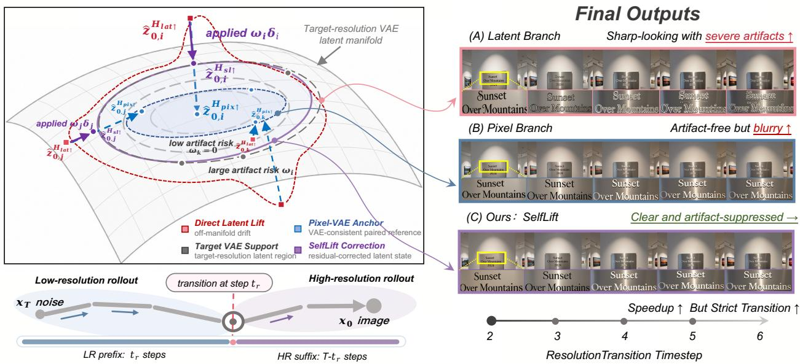  
Figure 1 SelfLift unlocks fast and reliable progressive-resolution inference for few-step diffusion. Prior methods either leave latent-lifting artifacts to the few remaining denoising steps or rely on an external super-resolution model. SelfLift instead leverages two model-native branches, enabling later transitions with greater speedups.

Fully exploiting progressive-resolution inference in the few-step regime poses two coupled challenges. Challenge 1: Reliable resolution transition under a limited recovery budget. An earlier transition leaves more steps for recovery but sacrifices acceleration, whereas a later transition yields greater speedups while making these errors harder to correct. Pixel-space alternatives [43] avoid direct latent lifting through a separate super-resolution model, introducing an external generative prior and nonnegligible inference overhead. Few-step acceleration therefore requires immediate, model-native transition repair without external models or extra denoiser evaluations, shifting the focus from when or where to transition to how to cross the boundary reliably. Challenge 2: Dense high-resolution guidance on the progressive-resolution trajectory. A reliable training-free transition already enables stable and eficient generation. When lightweight adaptation is allowed, the model’s native high-resolution capability can be further used to recover details beyond what the low-resolution prefix can represent. Standard fine-tuning and full-resolution distillation are poorly matched to this setting: they supervise target-derived or full-resolution states rather than the student-visited states produced by the accelerated rollout, creating a train–inference mismatch and potentially disrupting the few-step dynamics [10, 23]. Efective adaptation must therefore transfer dense high-resolution knowledge directly along the actual progressive-resolution trajectory used at inference.

To address these challenges, we propose SelfLift, a self-recovering resolution-transition framework for accelerating few-step models, in which the model itself provides both self-derived transition-repair signals and trajectory-aligned supervision. SelfLift includes a complete training-free solution, SelfLift-zero, and an optional lightweight enhancement, SelfLift-rich. SelfLift-zero introduces Artifact-Aware Consistency Lift. Specifically, it constructs a self-derived consistency residual from the discrepancy between direct latent lifting and pixel VAE re-encoding. This residual both localizes regions at risk of transition artifacts and provides a principled correction direction for the directly lifted latent. It can be integrated without an external super-resolution model or additional denoiser evaluations. SelfLift-rich further extends this principle through On-Policy Self Recovery. It distills our Zero transition into a lightweight latent lifter and transfers dense high-resolution guidance directly along the progressive-resolution trajectory. The supervision is provided by an internal self-teacher on the same student-visited states, without a separately trained teacher or reward model.

Our contributions are summarized as follows:

• We propose SelfLift, a self-recovering progressiveresolution framework that reframes few-step acceleration around reliable resolution transition.

• SelfLift introduces two core designs: Artifact-Aware Consistency Lift for immediate and reliable transition without external super-resolution or extra denoising, and On-Policy Self Recovery for trajectory-aligned adaptation with dense high-resolution supervision.

• On FLUX.2-Klein and Z-Image-Turbo, SelfLift reduces end-to-end latency by 41.5% and 44.1%. With timestep distillation, it achieves 29.61× and 19.21× overall speedups with strong generation quality.

## 2 Related Work

## 2.1 Efficient Diffusion Inference

Temporal acceleration employs fast ODE solvers [22, 42], error-rectified [26], multi-level [36], or motionaware caching [39], and applies feature forecasting [19]. Trajectory distillation further compresses sampling through progressive compression [30], crossnoise consistency [32], or distribution matching [13, 40]. With temporal redundancy compressed in fewstep models, per-evaluation spatial cost dominates. Spatial methods reduce this cost by varying resolution along the sampling trajectory. Trainingdependent designs use linked pyramids [11], noisedependent patchification [14], or cascaded pixel-space flows [3], but require retraining. Training-free methods include high–low–high sampling [34], regionadaptive lifting [9], and spectrally scheduled resolution growth [37]. MrFlow instead uses pixelspace super-resolution, VAE re-encoding, and highresolution refinement, avoiding direct latent lifting but requiring an external super-resolution model [43]. These approaches complement temporal acceleration, yet few-step models leave little denoising budget to absorb transition errors, making a reliable and selfcontained resolution transition essential.

## 2.2 Post-Training of Step-distilled Models

Step-distilled models acquire specialized dynamics over sparse timesteps, which standard post-training objectives may disrupt and thereby degrade generation quality [23]. Efective adaptation must therefore improve the output distribution without deviating from the pretrained trajectory. PSO enlarges the likelihood margin between real images and distilledmodel samples [23], whereas on-policy distillation supervises student-visited states to reduce the train– inference mismatch of of-policy teacher data [1]. Recent works extend this paradigm to visual generation [5, 10, 15]. These methods primarily consider post-training along native-resolution trajectories. Resolution-transition adaptation instead operates on states jointly induced by the low-resolution prefix and cross-resolution transition. It must correct the resulting distribution shift and recover high-resolution content on the actual progressiveresolution rollout, while preserving the pretrained few-step dynamics.

## 3 Method

## 3.1 Preliminaries

Latent Flow Matching. Given an image $x _ { 0 }$ , the VAE encoder E maps it to the clean latent $z _ { 0 } = \mathcal { E } ( x _ { 0 } )$ For flow time $t \in [ 0 , 1 ]$ and text condition $c ,$ rectified flow [17] connects the clean latent to Gaussian noise and learns the corresponding conditional velocity field:

$$
\begin{array} { r } { z _ { t } = ( 1 - t ) z _ { 0 } + t \epsilon , \qquad \epsilon \sim \mathcal { N } ( \mathbf { 0 } , \mathbf { I } ) , } \\ { v _ { \theta } ( z _ { t } , t , c ) \approx \mathbb { E } [ \epsilon - z _ { 0 } \mid z _ { t } , c ] . \qquad } \end{array}\tag{1}
$$

Sampling follows the learned flow from t = 1 to t = 0 in the VAE latent space.

Progressive-Resolution Inference. Let $\Phi _ { a  b } ^ { R }$ denote the numerical flow from time a to b at resolution R. Given a transition time $t _ { r } ,$ progressive-resolution inference first follows the low-resolution flow, lifts the intermediate state to the high-resolution latent space, and then completes the remaining trajectory at high resolution:

$$
z _ { 0 } ^ { \mathrm { P R } } = \Phi _ { t _ { r }  0 } ^ { H } ( \mathcal { T } _ { L  H } ( \Phi _ { 1  t _ { r } } ^ { L } ( \epsilon ^ { L } ; c ) ) ; c ) .\tag{2}
$$

where $\mathcal { T } _ { L  H }$ denotes the cross-resolution transition operator to convert the low-resolution state into a high-resolution state.

## 3.2 Analysis of Resolution Transition

At transition time $t _ { r } ,$ , we analyze the predicted clean endpoint to expose decoder-visible diferences without the noise retained in the intermediate state:

$$
{ \widehat { z } } _ { 0 , t _ { r } } ^ { \mathrm { L } } = z _ { t _ { r } } ^ { \mathrm { L } } - t _ { r } v _ { \theta } \left( z _ { t _ { r } } ^ { \mathrm { L } } , t _ { r } , c \right) .\tag{3}
$$

Starting from the same estimate, direct latent lifting and pixel-VAE re-encoding produce

$$
z ^ { \mathrm { l a t } } = \mathcal { U } ^ { \mathrm { l a t } } \left( \widehat { z } _ { 0 , t _ { r } } ^ { \mathrm { L } } \right) ,\tag{4}
$$

$$
Y = \mathcal { U } ^ { \mathrm { p i x } } \left( \mathcal { D } _ { \mathrm { L } } \left( \widehat { z } _ { 0 , t _ { r } } ^ { \mathrm { L } } \right) \right) , \qquad z ^ { \mathrm { p i x } } = \mathcal { E } _ { \mathrm { H } } ( Y ) ,\tag{5}
$$

where $\mathcal { U } ^ { \mathrm { l a t } }$ and $\mathcal { U } ^ { \mathrm { p i x } }$ denote latent-space and pixelspace resizing. $\mathcal { E } _ { \mathrm { H } }$ and $\mathcal { D } _ { \mathrm { L } }$ represent the highresolution encoder and the low-resolution decoder, respectively.

Observation 1. Decoder-visible inconsistencies under direct latent interpolation.

Let $\mathcal { U } ^ { \mathrm { l a t } } : \mathbb { R } ^ { d _ { \mathrm { L } } }  \mathbb { R } ^ { d _ { \mathrm { H } } }$ be a fixed linear interpolation operator, where $d _ { \mathrm { L } } < d _ { \mathrm { H } }$ . Its reachable subspace is $\mathcal { Z } _ { \mathrm { l a t } } : = \{ \mathcal { U } ^ { \mathrm { l a t } } \left( z ^ { \mathrm { L } } \right) | z ^ { \mathrm { L } } \in \mathbb { R } ^ { d _ { \mathrm { L } } } \}$ . By linearity, dim $\ i ( \mathcal { Z } _ { \mathrm { l a t } } ) = r a n \dot { k } ( \mathcal { U } ^ { \mathrm { l a t } } ) \dot { \le } \ d _ { \mathrm { L } } < d _ { \mathrm { H } }$ . Let $P _ { t _ { r } } ^ { \mathrm { l a t } }$ denote the distribution of $z ^ { \mathrm { l a t } }$ , and let $P _ { \mathrm { V A E } } ^ { \mathrm { H } }$ denote the native high-resolution VAE latent distribution. Since every directly lifted latent lies in $\mathcal { Z } _ { \mathrm { l a t } } , P _ { t _ { r } } ^ { \mathrm { l a t } } ( \mathcal { Z } _ { \mathrm { l a t } } ) = 1$ If native target-resolution VAE latents are not concentrated on this subspace, i.e., $P _ { \mathrm { V A E } } ^ { \mathrm { H } } ( \mathcal { Z } _ { \mathrm { l a t } } ) ~ < ~ 1$ then $\begin{array} { r } { P _ { t _ { r } } ^ { \mathrm { l a t } } \neq P _ { \mathrm { V A E } } ^ { \mathrm { H } } . } \end{array}$ This support mismatch provides a structural indication of the distributional discrepancy introduced by direct interpolation. $\mathrm { A p \mathrm { - } }$ pendix B further shows that directly lifted and pixel latents exhibit 18.93× and 1.43× the native target-VAE round-trip energy, respectively. Together with Fig. 2(a), this empirically associates round-trip instability with ghosting, structural distortion, and spatial drift. Meanwhile, direct lifting preserves deterministic correspondence with the preceding low-resolution state, motivating its use as the trajectory-preserving candidate.

Observation 2. Pixel re-encoding yields an encoder-reachable representation with limited high-frequency detail.

Let $\mathcal { X } _ { \mathrm { H } }$ denote the high-resolution image space and define the encoder-reachable latent set as $\mathcal { Z } _ { \mathrm { p i x } } ^ { \mathrm { H } } : =$ $\{ \mathcal { E } _ { \mathrm { H } } ( x ) \mid x \in \mathcal { X } _ { \mathrm { H } } \}$ Although $z ^ { \mathrm { p i x } } \in \mathcal { Z } _ { \mathrm { p i x } } ^ { \mathrm { H } }$ guarantees encoder reachability, it does not imply that Y uniquely identifies the corresponding sample-specific high-resolution detail. Let r denote the samplespecific high-frequency component. The minimum MSE attainable by any deterministic predictor from $Y$ is

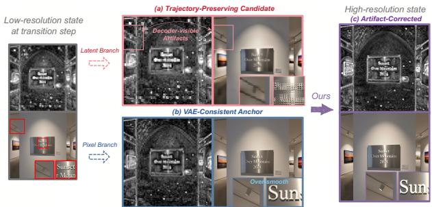  
Figure 2 Direct lifting introduces decoder-visible inconsistency (a), whereas pixel-VAE re-encoding provides a stable yet smoother VAE-reachable anchor (b). Correction toward this anchor yields an artifact-reduced targetresolution state (c).

$$
\operatorname* { i n f } _ { f } \mathbb { E } \left[ \| r _ { \mathrm { H F } } - f ( Y ) \| _ { 2 } ^ { 2 } \right] = \mathbb { E } \left[ \operatorname { t r } \operatorname { C o v } \left( r _ { \mathrm { H F } } \mid Y \right) \right] .\tag{6}
$$

When the conditional distribution $p ( r _ { \mathrm { H F } } \mid Y )$ is nondegenerate, Eq. 6 implies a strictly positive irreducible error. Hence, the pixel–VAE re-encoding branch cannot uniquely recover the sample-specific high-resolution detail from Y. Figure 2(b) further shows that the reconstruction of pixel-VAE reencoding retains coarse spatial information after resolution transitions but produces a smoother result, indicating that it is more suitable for selective correction than as a global alternative to $z ^ { \mathrm { l a t } }$

## 3.3 SelfLift

To address the two transition failure modes identified above, we introduce SelfLift, which has two variants. SelfLift-zero uses Artifact-Aware Consistency Lift, which can selectively combine the dual lifting branches without training. SelfLift-rich enables On-Policy Self Recovery to learn a lightweight lifter on the student’s progressive-resolution rollout. Figure 3 illustrates an overview of our SelfLift framework.

Artifact-Aware Consistency Lift SelfLift-zero turns the complementary transition behaviors identified in Sec. 3.2 into an asymmetric, training-free correction operator. Treating the two routes symmetrically is suboptimal: replacing the direct-lift state would inherit the smoothing of the pixel route, while global mixing would modify reliable and corrupted regions indiscriminately. We therefore retain $z ^ { \mathrm { l a t } }$ as the trajectory state and use $z ^ { \mathrm { p i x } }$ only as a paired correction anchor. Both routes originate from the same predicted clean endpoint $\widehat { z } _ { 0 , t _ { r } } ^ { L }$ , allowing their disagreement to isolate the efect of the resolution transition.

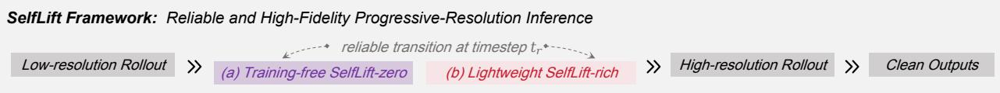

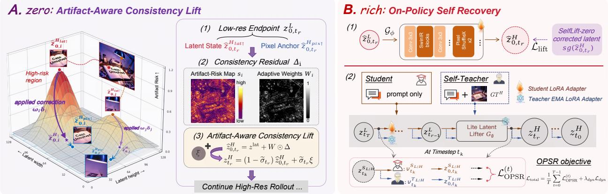  
Figure 3 Overview of SelfLift. Given the predicted low-resolution clean endpoint, SelfLift-zero constructs a trajectorypreserving latent candidate and a VAE-reachable pixel anchor. Their consistency residual yields an artifact-risk map and adaptive weights for selectively correcting high-risk regions before re-noising. SelfLift-rich distills this correction into a lightweight latent lifter and performs on-policy recovery on student-visited states, using an EMA self-teacher for privileged high-resolution guidance and a dynamics objective to preserve the pretrained few-step trajectory.

We define the consistency residual as $\Delta = z ^ { \mathrm { p i x } } - z ^ { \mathrm { l a t } }$ $\Delta _ { i }$ points from the direct-lift state toward its paired VAE-reachable anchor, while its magnitude reflects their local discrepancy. We convert this discrepancy into a spatial artifact-risk map and select the top-ρ locations within each sample:

$$
s _ { i } = \frac { 1 } { C } \| \Delta _ { i } \| _ { 1 } , \qquad M _ { i } = { \bf 1 } [ s _ { i } \geq Q _ { 1 - \rho } ( \{ s _ { j } \} _ { j } ) ] ,\tag{7}
$$

where $Q _ { 1 - \rho }$ denotes the (1 − ρ)-quantile. Here, $s _ { i }$ serves as a local inconsistency proxy, while the samplewise quantile adapts the selected region to diferent prompts and transition steps. We further convert the selected scores into spatially adaptive correction weights:

$$
W _ { i } = M _ { i } \left[ w _ { \operatorname* { m i n } } + \left( w _ { \operatorname* { m a x } } - w _ { \operatorname* { m i n } } \right) \frac { s _ { i } - s _ { \operatorname* { m i n } } } { s _ { \operatorname* { m a x } } - s _ { \operatorname* { m i n } } + \varepsilon } \right] ,\tag{8}
$$

where $s _ { \mathrm { m i n } }$ and $s _ { \mathrm { m a x } }$ are computed over the selected region. The corrected target-resolution clean latent is obtained through Artifact-Aware Consistency Lift:

$$
\widehat { z } _ { 0 , t _ { r } } ^ { H } = z ^ { \mathrm { l a t } } + W \odot \Delta = \left( 1 - W \right) \odot z ^ { \mathrm { l a t } } + W \odot z ^ { \mathrm { p i x } } .\tag{9}
$$

Reliable locations remain on the direct-lift trajectory, whereas locations with larger inconsistency receive stronger correction toward the pixel-VAE anchor. This selective correction reduces artifacts such as ghosting and spatial drift without globally inheriting the over-smoothing of pixel-VAE re-encoding. The corrected result is shown in Figure 2(c).

Finally, we re-noise the corrected clean estimate at t<sub>r</sub> under the original flow marginal:

$$
z _ { t _ { r } } ^ { H } = ( 1 - \widetilde { \sigma } _ { t _ { r } } ) \widehat { z } _ { 0 , t _ { r } } ^ { H } + \widetilde { \sigma } _ { t _ { r } } \xi , \qquad \xi \sim { \mathcal N } ( 0 , I ) .\tag{10}
$$

Sampling then resumes at the target resolution under the unchanged few-step schedule. SelfLift-zero is training-free and plug-and-play, requiring neither external super-resolution nor additional denoiser evaluations beyond the original sampling schedule.

On-Policy Self Recovery SelfLift-zero provides stable resolution transition and substantial trainingfree acceleration. SelfLift-rich further advances the eficiency–quality frontier. Although one VAE round trip is inexpensive, its fixed cost becomes more noticeable when sampling requires only a few denoiser evaluations. We therefore distill the complete Artifact-Aware Consistency Lift into a compact latent lifter $G _ { \phi }$ . For a randomly sampled valid transition step $t _ { r } ,$ we parameterize the lifter as a residual update over

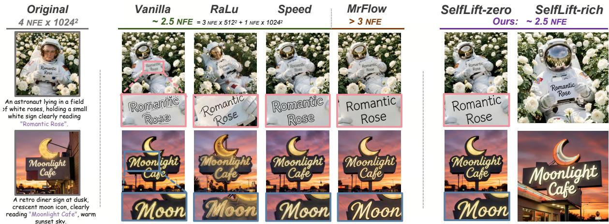  
Figure 4 Superior visual fidelity of SelfLift under aggressive acceleration on FLUX.2-Klein-9b (4 NFEs). Vanilla, RALU, and Speed show severe artifacts, while MrFlow improves fidelity using a costlier external super-resolution model. SelfLift-zero suppresses artifacts through model-native correction, and SelfLift-rich further restores richer details.

direct latent lifting:

$$
\mathcal { G } _ { \phi } \big ( \hat { z } _ { 0 , t _ { r } } ^ { L } \big ) = z ^ { \mathrm { l a t } } + \mathcal { R } _ { \phi } \big ( \hat { z } _ { 0 , t _ { r } } ^ { L } \big ) ,\tag{11}
$$

$$
\mathcal { L } _ { \mathrm { l i f t } } = \mathbb { E } _ { c , t _ { r } } \left[ \left. \mathcal { G } _ { \phi } \left( \hat { z } _ { 0 , t _ { r } } ^ { L } \right) - \mathrm { s g } \left( \hat { z } _ { 0 , t _ { r } } ^ { H } \right) \right. _ { 2 } ^ { 2 } \right] ,\tag{12}
$$

where sg(·) denotes stop-gradient. The residual parameterization preserves the state established by the low-resolution prefix and learns only the required transition correction. We instantiate $\mathcal { R } _ { \phi }$ with a compact SwinIR-style network. The resulting 10.8Mparameter lifter replaces the explicit decode–resize– encode path with a single latent-space forward pass, yielding further end-to-end acceleration.

We then freeze $\mathcal { G } _ { \phi }$ and train directly on the progressive-resolution trajectory generated by the student. At each student-visited state $z _ { t _ { k } } ^ { \mathrm { S } }$ , the student with parameters θ predicts $\widehat { z } _ { 0 , t _ { k } } ^ { \mathrm { S } }$ from the text condition c, while an EMA self-teacher with parameters <sup>¯</sup>θ predicts $\widehat { z } _ { 0 , t _ { k } } ^ { \mathrm { T } }$ using additional high-resolution privileged context. Both predictions are evaluated on the same state, avoiding supervision from an independent full-resolution trajectory. Let $\Phi _ { \theta , t _ { k } } ( z ; c )$ denote the one-step sampling update from $t _ { k }$ to $t _ { k + 1 }$ We optimize the student using

$$
\mathcal { L } _ { \mathrm { r i c h } } = \mathcal { L } _ { \mathrm { O P S R } } + \lambda _ { \mathrm { d y n } } \mathcal { L } _ { \mathrm { d y n } } ,
$$

$$
\mathcal { L } _ { \mathrm { O P S R } } = \frac { 1 } { K } \sum _ { k = 1 } ^ { K } \left. \widehat { z } _ { 0 , t _ { k } } ^ { \mathrm { S } } - \mathrm { s g } \big ( \widehat { z } _ { 0 , t _ { k } } ^ { \mathrm { T } } \big ) \right. _ { 2 } ^ { 2 } ,\tag{13}
$$

$$
\mathcal { L } _ { \mathrm { d y n } } = \frac { 1 } { K } \sum _ { k = 1 } ^ { K } \left\| \Phi _ { \boldsymbol { \theta } , t _ { k } } \left( \boldsymbol { z } _ { t _ { k } } ^ { \mathrm { S } } ; \boldsymbol { c } \right) \right\| _ { 2 } ^ { 2 } .
$$

where K is the number of supervised denoising steps and $\theta _ { 0 }$ denotes the frozen pretrained backbone. L<sub>OPSR</sub> transfers dense high-resolution guidance on the student-visited states, while $\mathcal { L } _ { \mathrm { d y n } }$ preserves the pretrained few-step dynamics. The rollout is advanced only by the student, with gradients stopped across denoising steps.

At inference, the privileged high-resolution context and EMA self-teacher are removed. SelfLift-rich re tains only the adapted prompt-conditioned model and the lightweight latent lifter. Complete inference and training procedures are provided in Appendix A.

## 4 Experiments

## 4.1 Settings

Backbones and Inference Protocol. We evaluate SelfLift on FLUX.2-Klein-9b with 4 NFEs and Z-Image-Turbo with 8 NFEs. All images are generated at 1024×1024, with the low-resolution prefix executed at 512 × 512 before a single transition to the target resolution. We set $t _ { r } = 3$ and $t _ { r } = 6$ , respectively, and use $t _ { r } ~ = ~ 3 5$ for the complementary 50-NFE experiments unless otherwise specified.

SelfLift Configurations. For SelfLift-zero, we use $( \rho , w _ { \mathrm { m i n } } , w _ { \mathrm { m a x } } ) = ( 0 . 4 , 0 . 5 , 1 . 0 )$ on FLUX.2-Klein-9b and (0.3, 0.5, 1.0) on Z-Image-Turbo. SelfLift-rich employs a 10.8M-parameter SwinIR-style latent lifter [16] trained for 5K iterations with a learning rate of $1 \times 1 0 ^ { - 4 }$ For On-Policy Self Recovery, we follow D-OPSD’s training configuration [10], set $\lambda _ { \mathrm { d y n } } = 8 0$ , and adopt Flow-GRPO’s data protocol [20]. Specifically, we sample 40K prompts from the Pick-a-Pic training split [12], a GenEval pool deduplicated against the oficial test set [6], and a visual text-rendering training set, with probabilities 0.7/0.2/0.1. All training is conducted on 8 highperformance GPUs with a per-device batch size of 1. Additional details, including complete hyperparameter configurations and training costs, are provided in Appendix C.

Table 1 End-to-end efficiency and generation quality on FLUX.2-Klein-9b and Z-Image-Turbo. Speedups (×) are relative to Base (50), while parenthesized percentages denote latency reductions from Base (4)/(8). Other parenthesized values are changes from SelfLift-zero. Green marks SelfLift improvements, and red marks the two lowest latency reductions or two largest quality drops among competing methods. Bold and underline denote the best and second-best non-Base quality results. ↑/↓ indicate higher/lower is better.
<table><tr><td rowspan="2">Method</td><td colspan="2">Acceleration</td><td>Overall</td><td colspan="2">Image Quality</td><td colspan="2">Text Alignment</td></tr><tr><td>Latency (s)↓</td><td>Speedup↑</td><td>ImageReward↑</td><td>PickScore↑</td><td>AestheticScore↑</td><td>CLIP↑</td><td>GenEval↑</td></tr><tr><td colspan="8">(a) FLUX.2-Klein-9b [2]</td></tr><tr><td>Base (50) Base (4)</td><td>46.053 2.665</td><td>1.000×  $1 7 . 2 8 0 \times ( + 0 . 0 \% )$ </td><td>1.129 1.312</td><td>22.330 22.729</td><td>5.465 5.647</td><td>32.039 32.342</td><td>0.784 0.879</td></tr><tr><td></td><td>1.520</td><td></td><td></td><td></td><td>5.586 (-0.062)</td><td></td><td></td></tr><tr><td>Vanilla Cache (2) [18]</td><td></td><td> $3 0 . 3 1 0 \times ( + 4 3 . 0 \% )$ </td><td> $1 . 1 7 6 \ : ( - 0 . 1 2 5 )$ </td><td>22.254 (-0.379)</td><td></td><td> $3 2 . 1 6 4 \ : ( - 0 . 1 5 3 )$   $3 1 . 7 9 9 \ : ( - 0 . 5 1 8 )$ </td><td>0.805 (-0.048)</td></tr><tr><td>Vanilla Dyres</td><td>1.512</td><td> $3 0 . 4 7 0 \times ( + 4 3 . 3 \% )$ </td><td> $1 . 2 7 8 \ : ( - 0 . 0 2 3 )$ </td><td> $2 2 . 5 0 4 \ ( - 0 . 1 2 9 )$ </td><td> $5 . 6 0 1 \ ( - 0 . 0 4 7 )$ </td><td> $3 1 . 7 4 9 \ : ( - 0 . 5 6 8 )$ </td><td> $0 . 7 8 2 \ ( - 0 . 0 7 1 )$ </td></tr><tr><td>LSRNA-RNA [8]</td><td>1.660</td><td> $2 7 . 7 4 0 \times ( + 3 7 . 7 \% )$ </td><td> $1 . 2 5 4 \ : ( - 0 . 0 4 7 )$ </td><td> $2 2 . 4 9 4 \ : ( - 0 . 1 3 9 )$ </td><td> $5 . 6 0 6 \ : ( - 0 . 0 4 2 )$ </td><td></td><td> $0 . 8 6 8 \left( + 0 . 0 1 5 \right)$ </td></tr><tr><td>Bottleneck [34]</td><td>1.857</td><td> $2 4 . 8 0 0 \times ( + 3 0 . 3 \% )$ </td><td> $1 . 2 7 7 \ ( - 0 . 0 2 4 )$ </td><td> $2 2 . 6 2 9 \ : ( - 0 . 0 0 4 )$ </td><td> $5 . 6 5 5 \left( + 0 . 0 0 7 \right)$ </td><td> $3 2 . 1 6 5 \ : ( - 0 . 1 5 2 )$ </td><td> $\pm 0 . 9 0 1 \ ( + 0 . 0 4 8 )$ </td></tr><tr><td>RaLu [9]</td><td>1.662</td><td> $2 7 . 7 0 0 \times ( + 3 7 . 6 \% )$ </td><td> $1 . 2 8 9 \ ( - 0 . 0 1 2 )$ </td><td> $2 2 . 6 0 9 \ : ( - 0 . 0 2 4 )$ </td><td> $5 . 6 2 1 \ : ( - 0 . 0 2 7 )$ </td><td> $3 2 . 1 7 6 \ : ( - 0 . 1 4 1 )$ </td><td>0.847 (-0.006)</td></tr><tr><td>Speed [37] MrFlow [43]</td><td>1.601 2.165</td><td> $2 8 . 7 7 0 \times ( + 3 9 . 9 \% )$ </td><td> $1 . 2 9 2 \ ( - 0 . 0 0 9 )$   $1 . 2 8 3 \ : ( - 0 . 0 1 8 )$ </td><td> $2 2 . 5 8 3 \ : ( - 0 . 0 5 0 )$ </td><td> $5 . 6 3 8 \ : ( - 0 . 0 1 0 )$  5.601 (-0.047)</td><td> $3 2 . 2 4 3 \ : ( - 0 . 0 7 4 )$ </td><td>0.850 (-0.003)</td></tr><tr><td></td><td></td><td> $2 1 . 2 7 0 \times ( + 1 8 . 8 \% )$ </td><td></td><td> $2 2 . 5 1 3 \ : ( - 0 . 1 2 0 )$ </td><td></td><td> $3 2 . 3 0 1 \ ( - 0 . 0 1 6 )$ </td><td>0.852 (-0.001)</td></tr><tr><td>SelfLift-zero SelfLift-rich</td><td>1.643 1.556</td><td> $2 8 . 0 4 0 \times ( + 3 8 . 3 \% )$   $2 9 . 6 1 0 \times ( + 4 1 . 5 \% )$ </td><td>1.301  $1 . 3 1 7 \left( + 0 . 0 1 6 \right)$ </td><td>22.633  $2 2 . 7 0 4 \ : ( + 0 . 0 7 1 )$ </td><td>5.648  ${ \pmb 5 . 6 8 8 } \left( + 0 . 0 4 0 \right)$ </td><td>32.317  $3 2 . 3 4 5 \ : ( + 0 . 0 2 9 )$ </td><td>0.853  $\underline { { 0 . 8 8 6 } } \left( + 0 . 0 3 3 \right)$ </td></tr><tr><td colspan="8">(b) Z-Image-Turbo [33]</td></tr><tr><td>Base (50)</td><td>38.562</td><td>1.000×</td><td>1.029</td><td>22.158</td><td>5.533</td><td>32.037</td><td>0.713</td></tr><tr><td>Base (8)</td><td>3.591</td><td> $1 0 . 7 4 0 \times ( + 0 . 0 \% )$ </td><td>1.090</td><td>22.510</td><td>5.536</td><td>32.091</td><td>0.754</td></tr><tr><td>TaylorSeer [19]</td><td>2.432</td><td> $1 5 . 8 5 0 \times ( + 3 2 . 3 \% )$ </td><td> $\underline { { 1 . 0 8 1 } } \left( + 0 . 0 4 6 \right)$ </td><td> $2 2 . 4 3 0 \ ( - 0 . 0 0 4 )$ </td><td> $5 . 4 6 3 \ : ( - 0 . 0 1 2 )$ </td><td> $3 1 . 8 8 0 ( - 0 . 0 9 6 )$ </td><td>0.728 (-0.021)</td></tr><tr><td>Vanilla Dyres</td><td>2.585</td><td> $1 4 . 9 2 0 \times ( + 2 8 . 0 \% )$ </td><td> $1 . 0 1 1 \ ( - 0 . 0 2 4 )$ </td><td> $2 2 . 3 3 6 \ ( - 0 . 0 9 8 )$ </td><td> $5 . 3 7 3 \ : ( - 0 . 1 0 2 )$ </td><td> $3 1 . 3 0 2 \ : ( - 0 . 6 7 4 )$ </td><td>0.716 (-0.033)</td></tr><tr><td> $\mathrm { \Delta L S R N A  – R N A ~ [ 8 ] }$ </td><td>2.382</td><td> $1 6 . 1 9 0 \times ( + 3 3 . 7 \% )$ </td><td> $0 . 9 9 3 \ ( - 0 . 0 4 2 )$ </td><td> $2 2 . 0 5 0 ( - 0 . 3 8 4 )$ </td><td> $5 . 3 8 9 \left( - 0 . 0 8 6 \right)$ </td><td> $3 1 . 0 1 5 \ : ( - 0 . 9 6 2 )$ </td><td> $0 . 6 8 2 \ ( - 0 . 0 6 7 )$ </td></tr><tr><td>Bottleneck [34]</td><td>2.485</td><td> $1 5 . 5 2 0 \times ( + 3 0 . 8 \% )$ </td><td> $0 . 9 4 1 \ ( - 0 . 0 9 4 )$ </td><td> $2 2 . 1 9 6 \ ( - 0 . 2 3 8 )$ </td><td> $5 . 4 3 9 \ : ( - 0 . 0 3 6 )$ </td><td> $3 1 . 7 1 4 \ : ( - 0 . 2 6 3 )$ </td><td> $\underline { { 0 . 7 6 3 } } \ : ( + 0 . 0 1 4 )$ </td></tr><tr><td>Speed [37]</td><td>1.987</td><td> $1 9 . 4 1 0 \times ( + 4 4 . 7 \% )$ </td><td> $1 . 0 0 4 \ : ( - 0 . 0 3 1 )$ </td><td> $2 2 . 2 8 2 \ : ( - 0 . 1 5 2 )$ </td><td> $5 . 4 0 5 \ ( - 0 . 0 7 0 )$ </td><td> $3 1 . 9 7 1 \ ( - 0 . 0 0 5 )$ </td><td> $0 . 7 4 3 \ ( - 0 . 0 0 6 )$ </td></tr><tr><td>MrFlow [43]</td><td>2.315</td><td> $1 6 . 6 6 0 \times ( + 3 5 . 5 \% )$ </td><td> $1 . 0 3 2 \ ( - 0 . 0 0 3 )$ </td><td> $2 2 . 3 8 0 \ ( - 0 . 0 5 4 )$ </td><td> $5 . 5 0 1 ( + 0 . 0 2 6 )$ </td><td> $3 1 . 9 4 5 \ : ( - 0 . 0 3 2 )$ </td><td>0.740 (-0.009)</td></tr><tr><td>SelfLift-zero</td><td>2.376</td><td> $1 6 . 2 3 0 \times ( + 3 3 . 8 \% )$ </td><td>1.035</td><td>22.434</td><td>5.475</td><td>31.976</td><td>0.749</td></tr><tr><td>SelfLift-rich</td><td>2.007</td><td> $1 9 . 2 1 0 \times ( + 4 4 . 1 \% )$ </td><td> $1 . 0 9 3 \left( + 0 . 0 5 8 \right)$ </td><td> $2 2 . 4 9 9 \ : ( + 0 . 0 6 5 )$ </td><td> ${ \pmb 5 . 5 7 0 } \left( + 0 . 0 9 5 \right)$ </td><td> $3 2 . 0 8 4 \ : ( + 0 . 1 0 7 )$ </td><td> $\pmb { 0 . 7 7 0 } \left( + 0 . 0 2 1 \right)$ </td></tr></table>

Table 2 Complementarity with temporal acceleration on 50-step backbones. S and T denote spatial and temporal acceleration, respectively. SelfLift compounds acceleration to $5 . 6 0 \times / 4 . 5 8 \times$ while keeping every quality drop below 5% versus Base (50).
<table><tr><td rowspan="2">Model</td><td rowspan="2">Method</td><td rowspan="2">Accel.</td><td colspan="2">Acceleration</td><td rowspan="2">Overall</td><td colspan="2">Image Quality</td><td colspan="2">Text Alignment</td></tr><tr><td>|Latency (s)↓ Speedup↑|</td><td></td><td>|ImageReward↑  $\mathrm { P i c k S c o r e \uparrow }$ </td><td>AestheticScore↑|</td><td>CLIP↑</td><td>GenEval↑</td></tr><tr><td rowspan="4">FLUX.2  $\mathrm { K l e i n - 9 b }$ </td><td>|SelfLift-zero</td><td>S</td><td>23.966</td><td>1.920×</td><td>1.110</td><td>22.344</td><td>5.456</td><td>32.297</td><td>0.817</td></tr><tr><td> $+ \ \mathrm { T e a C a c h e }$ </td><td>S + T</td><td>11.093</td><td>4.150×</td><td>1.119</td><td>22.356</td><td>5.474</td><td>31.994</td><td>0.774</td></tr><tr><td>+ TaylorSeer</td><td> $\left( N = 3 \right) \left| \mathbf { S } + \mathbf { T } \right.$ </td><td>11.130</td><td>4.140×</td><td>1.120</td><td>22.329</td><td>5.452</td><td>32.120</td><td>0.812</td></tr><tr><td> $+ \mathrm { T a y l o r S e e r } \left( N = 5 \right) \left. { \bf S } + { \bf T } \right.$ </td><td></td><td>8.225</td><td>5.600×</td><td>1.102 (−2.39%)</td><td>22.249 (−0.36%)</td><td> $5 . 4 2 1 \left( - 0 . 8 1 \% \right) \Big |$ </td><td>31.805 (−0.73%)</td><td>0.782 (−0.26%)</td></tr><tr><td rowspan="4">Z-Image</td><td>|SelfLift-zero</td><td>S</td><td>17.689</td><td>2.180×</td><td>1.013</td><td>22.044</td><td>5.540</td><td>32.083</td><td>0.717</td></tr><tr><td> $+ \ \mathrm { T e a C a c h e }$ </td><td>S + T</td><td>10.107</td><td>3.820×</td><td>1.022</td><td>22.136</td><td>5.564</td><td>31.960</td><td>0.695</td></tr><tr><td> $\mathbf { \tau } _ { + } \operatorname { T a y l o r S e e r } \left( N = 3 \right) \left| \mathbf { S } + \mathbf { T } \right.$ </td><td></td><td>10.752</td><td>3.590×</td><td>1.032</td><td>22.166</td><td>5.536</td><td>32.020</td><td>0.701</td></tr><tr><td> $\mathbf { \tau } + \mathrm { T a y l o r S e e r } \left( N = 5 \right) \left| \mathbf { S } + \mathbf { T } \right.$ </td><td></td><td>8.424</td><td>4.580×</td><td>1.018 (−1.07%)</td><td>22.078 (−0.36%)</td><td>5.493 (−0.72%)</td><td>31.810 (−0.71%)</td><td>0.682 (−4.35%)</td></tr></table>

corresponding 50-NFE backbone. ImageReward [38] measures overall generation quality, PickScore [12] and AestheticScore [31] assess preference and aesthetics, while CLIPScore [7] and GenEval evaluate text–image alignment and compositional instruction following. Evaluation uses the corresponding test sets. GenEval uses fixed 300 random oficial test prompts. All other metrics use an equally sized, predefined balanced set drawn uniformly from DrawBench [29], Pick-a-Pic, and corresponding visual text rendering test split. All scores are averaged over three shared seeds, yielding 900 paired generations per method.

Evaluation Metrics. End-to-end latency is measured on a single GPU under the same hardware setting, using 10 warm-up runs followed by the mean of 50 generations. Speedup is computed relative to the

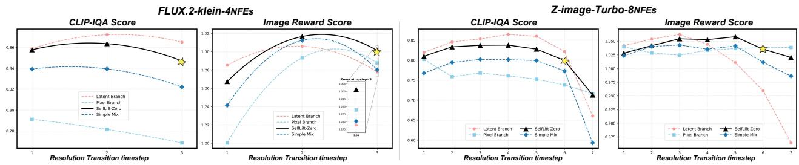  
Figure 5 Transition-strategy ablation across resolution-transition steps. CLIP-IQA [35] measures visual sharpness, while ImageReward evaluates prompt-aligned quality. Stars mark the SelfLift-zero operating points with the best sharpness–alignment trade-of.

Table 3 Ablation of On-Policy Self Recovery on FLUX.2- Klein-9b. All learned variants use the same transition step t<sub>r</sub> = 3.
<table><tr><td rowspan="2">Variant</td><td colspan="2">Acceleration</td><td colspan="2">Quality</td></tr><tr><td>Latency (s)↓ Speedup↑ |</td><td></td><td>|ImageReward↑ CLIP↑</td><td></td></tr><tr><td>SelfLift-zero</td><td>1.642</td><td>28.04×</td><td>1.3013</td><td>32.317</td></tr><tr><td>- Learned Latent Lifter</td><td>1.556</td><td>29.61×</td><td>1.3031</td><td>32.305</td></tr><tr><td>- Off-Policy Distillation</td><td>1.556</td><td>29.61×</td><td>1.1741</td><td>31.315</td></tr><tr><td>- OPSR w/o Ldyn</td><td>1.556</td><td>29.61×</td><td>1.1813</td><td>31.813</td></tr><tr><td>SelfLift-rich</td><td>1.556</td><td>29.61×</td><td>1.3171</td><td>32.345</td></tr></table>

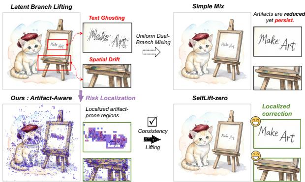  
Figure 6 Artifact localization and selective correction. Uniform mixing only attenuates ghosting and drift, whereas SelfLift-zero corrects localized high-risk regions while preserving reliable details.

## 4.2 Main Results

Few-Step Results. We compare SelfLift with representative temporal acceleration methods, including TeaCache and TaylorSeer, and spatial acceleration methods, including Bottleneck, RaLu, Speed, and MrFlow. Table 1 and Figure 4 summarize the fewstep results. Existing progressive-resolution methods often sufer from transition artifacts and spatial drift, while MrFlow improves fidelity using an external super-resolution model at lower eficiency. In contrast, training-free SelfLift-zero achieves 28.04× and 16.23× speedups on FLUX.2-Klein-9b and Z-

Image-Turbo while maintaining strong overall quality. SelfLift-rich further reduces the native few-step latency by 41.5% and 44.1%, reaching 29.61× and 19.21× overall speedups. It consistently improves all reported metrics over SelfLift-zero and achieves the best ImageReward, PickScore, AestheticScore, and CLIPScore among accelerated methods on both backbones. These results show that SelfLift provides a favorable speed-quality trade-of for aggressive fewstep inference.

Generality and Orthogonality. Although our main focus is accelerating few-step models, SelfLift-zero is a plug-and-play spatial acceleration method orthogonal to temporal acceleration. As a complementary evaluation, Table 2 applies it directly to 50-step backbones and combines it with TeaCache and TaylorSeer. SelfLift-zero alone achieves 1.92×/2.18× speedups, increasing to 5.60×/4.58× with temporal acceleration, while keeping the degradation across all evaluation metrics below 5% relative to the corresponding base models. This strong multiplicative gain shows that SelfLift provides complementary spatial eficiency, enabling additional acceleration across both distilled and standard difusion models. Further experiments are provided in the Appendix D.

## 4.3 Ablation Study

We conduct controlled ablations of SelfLift’s two key principles: spatially adaptive transition correction in SelfLift-zero and trajectory-aligned self-recovery in SelfLift-rich. Together, they suppress transition artifacts, recover high-resolution details, and preserve few-step dynamics.

Ablation of Artifact-Aware Consistency Lift. We examine whether reliable resolution transition can be achieved by either transition route alone or by fixed global fusion. Figure 5 compares direct latent lifting, pixel-VAE re-encoding, uniform 0.5 mixing, and SelfLift-zero across transition steps on FLUX.2- Klein-9b and Z-Image-Turbo. Later transitions provide greater acceleration but leave less high-resolution recovery. The pixel branch remains stable but consistently over-smooths the output, resulting in low CLIP-IQA. The latent branch preserves sharpness, yet ghosting and spatial drift increasingly degrade ImageReward at late transitions, particularly on Z-Image-Turbo. Uniform mixing only interpolates between these failures because branch reliability varies spatially. In contrast, SelfLift-zero consistently maintains the strongest joint sharpness and promptaligned quality across both backbones. Figure 6 further shows that the consistency residual localizes artifact-prone regions, enabling selective correction while preserving reliable latent details.

Ablation of On-Policy Self Recovery. Table 3 isolates the latent lifter, trajectory-aligned supervision, and dynamics preservation. Replacing the pixel-VAE round trip with the learned lifter reduces latency from 1.642 s to 1.556 s while preserving quality. Ofpolicy distillation substantially degrades ImageReward and CLIPScore, confirming the mismatch between of-policy teacher states and student-visited states. On-policy supervision alleviates this mismatch but remains insuficient without $\mathcal { L } _ { \mathrm { d y n } }$ . The full model improves ImageReward from 1.1813 to 1.3171 and CLIPScore from 31.813 to 32.345 at the same inference cost, demonstrating that trajectory-aligned supervision and dynamics preservation are jointly necessary.

## 5 Limitations and Discussion

While SelfLift demonstrates competitive empirical performance, its self-recovering design builds on capabilities increasingly available in modern multimodal generative models, including native multi-resolution support and image-conditioned editing. SelfLift-zero is training-free and plug-and-play across compatible model families. Its applicability and practical adaptation are discussed further in Appendix E. The efectiveness of SelfLift-rich also depends on the quality of its internal self-teacher. We mitigate this dependence through high-quality prompt–reference curation before training, enabling the internal teacher to provide reliable high-resolution guidance along studentvisited trajectories. Importantly, this reliance on the model itself is also what enables SelfLift’s selfcontained design, without introducing a separately trained teacher or an external reward model. Developing stronger self-teachers and more efective trajectory-aligned supervision remains an important direction for future work.

## 6 Conclusion

We introduced SelfLift for reliable progressiveresolution inference in few-step difusion models. SelfLift-zero selectively corrects transition artifacts without training or external super-resolution, while SelfLift-rich learns high-resolution recovery directly on student-visited trajectories. SelfLift reduces the native few-step latency by 41.5%/44.1% on FLUX.2- Klein-9b and Z-Image-Turbo and, together with timestep distillation, achieves overall speedups of 29.61×/19.21× over the corresponding 50-step models.

## References

[1] Rishabh Agarwal, Nino Vieillard, Yongchao Zhou, Piotr Stanczyk, Sabela Ramos Garea, Matthieu Geist, and Olivier Bachem. On-policy distillation of language models: Learning from self-generated mistakes. In International Conference on Learning Representations, 2024.

[2] Black Forest Labs. FLUX.2 [klein]: Towards interactive visual intelligence. https://bfl.ai/blog/flux 2-klein-towards-interactive-visual-intelli gence, 2026.

[3] Shoufa Chen, Chongjian Ge, Shilong Zhang, Peize Sun, and Ping Luo. PixelFlow: Pixel-space generative models with flow, 2025.

[4] Zhenbang Du, Yonggan Fu, Lifu Wang, Jiayi Qian, Xiao Luo, and Yingyan Celine Lin. Fewer denoising steps or cheaper per-step inference: Towards compute-optimal difusion model deployment. In Proceedings of the IEEE/CVF International Conference on Computer Vision, pages 3001–3010, 2025.

[5] Zhen Fang, Wenxuan Huang, Yu Zeng, Yiming Zhao, Shuang Chen, Kaituo Feng, Yunlong Lin, Lin Chen, Zehui Chen, Shaosheng Cao, and Feng Zhao. Flowopd: On-policy distillation for flow matching models, 2026. URL https://arxiv.org/abs/2605.08063.

[6] Dhruba Ghosh, Hannaneh Hajishirzi, and Ludwig Schmidt. GenEval: An object-focused framework for evaluating text-to-image alignment. In Advances in Neural Information Processing Systems, volume 36, 2023.

[7] Jack Hessel, Ari Holtzman, Maxwell Forbes, Ronan Le Bras, and Yejin Choi. CLIPScore: A referencefree evaluation metric for image captioning. In Proceedings of the 2021 Conference on Empirical Methods in Natural Language Processing, pages

7514–7528. Association for Computational Linguistics, 2021. doi: 10.18653/v1/2021.emnlp-main.595.

[8] Jinho Jeong, Sangmin Han, Jinwoo Kim, and Seon Joo Kim. Latent space super-resolution for higher-resolution image generation with difusion models. In Proceedings of the IEEE/CVF Conference on Computer Vision and Pattern Recognition, pages 2355–2365, 2025.

[9] Wongi Jeong, Kyungryeol Lee, Hoigi Seo, and Se Young Chun. Training-free mixed-resolution latent upsampling for spatially accelerated difusion transformers, 2025.

[10] Dengyang Jiang, Xin Jin, Dongyang Liu, Zanyi Wang, Mingzhe Zheng, Ruoyi Du, Xiangpeng Yang, Qilong Wu, Zhen Li, Peng Gao, Harry Yang, and Steven Hoi. D-opsd: On-policy self-distillation for continuously tuning step-distilled difusion models, 2026. URL https://arxiv.org/abs/2605.05204.

[11] Yang Jin, Zhicheng Sun, Ningyuan Li, Kun Xu, Kun Xu, Hao Jiang, Nan Zhuang, Quzhe Huang, Yang Song, Yadong Mu, and Zhouchen Lin. Pyramidal flow matching for eficient video generative modeling, 2025. URL https://arxiv.org/abs/2410.05954.

[12] Yuval Kirstain, Adam Polyak, Uriel Singer, Shahbuland Matiana, Joe Penna, and Omer Levy. Pick-a-pic: An open dataset of user preferences for text-to-image generation. In Advances in Neural Information Processing Systems, volume 36, 2023.

[13] Haoyu Li, Tingyan Wen, Lin Qi, Zhe Wu, Yihuang Chen, Xing Zhou, Lifei Zhu, Xueqian Wang, and Kai Zhang. 1.x-distill: Breaking the diversity, quality, and eficiency barrier in distribution matching distillation, 2026. URL https://arxiv.org/abs/26 04.04018.

[14] Hui Li, Baoyou Chen, Jiaye Li, Jingdong Wang, and Siyu Zhu. Pyramid patchification flow for visual generation. In International Conference on Learning Representations, 2026.

[15] Quanhao Li, Junqiu Yu, Kaixun Jiang, Yujie Wei, Zhen Xing, Pandeng Li, Ruihang Chu, Shiwei Zhang, Yu Liu, and Zuxuan Wu. Difusionopd: A unified perspective of on-policy distillation in difusion models, 2026. URL https://arxiv.org/abs/2605.15055.

[16] Jingyun Liang, Jiezhang Cao, Guolei Sun, Kai Zhang, Luc Van Gool, and Radu Timofte. SwinIR: Image restoration using swin transformer. In Proceedings of the IEEE/CVF International Conference on Computer Vision Workshops, pages 1833–1844, 2021.

[17] Yaron Lipman, Ricky T. Q. Chen, Heli Ben-Hamu, Maximilian Nickel, and Matt Le. Flow matching for generative modeling. In International Conference on Learning Representations, 2023.

[18] Feng Liu, Shiwei Zhang, Xiaofeng Wang, Yujie Wei, Haonan Qiu, Yuzhong Zhao, Yingya Zhang, Qixiang Ye, and Fang Wan. Timestep embedding tells: It’s time to cache for video difusion model. In Proceedings of the IEEE/CVF Conference on Computer Vision and Pattern Recognition, pages 7353–7363, 2025.

[19] Jiacheng Liu, Chang Zou, Yuanhuiyi Lyu, Junjie Chen, and Linfeng Zhang. From reusing to forecasting: Accelerating difusion models with TaylorSeers. In Proceedings of the IEEE/CVF International Conference on Computer Vision, pages 15853–15863, 2025.

[20] Jie Liu, Gongye Liu, Jiajun Liang, Yangguang Li, Jiaheng Liu, Xintao Wang, Pengfei Wan, Di Zhang, and Wanli Ouyang. Flow-GRPO: Training flow matching models via online RL. In Advances in Neural Information Processing Systems, volume 38, 2025.

[21] Xingchao Liu, Xiwen Zhang, Jianzhu Ma, Jian Peng, and Qiang Liu. InstaFlow: One step is enough for high-quality difusion-based text-to-image generation. In International Conference on Learning Representations, 2024.

[22] Cheng Lu, Yuhao Zhou, Fan Bao, Jianfei Chen, Chongxuan Li, and Jun Zhu. DPM-Solver: A fast ODE solver for difusion probabilistic model sampling in around 10 steps. In Advances in Neural Information Processing Systems, volume 35, pages 5775–5787. Curran Associates, Inc., 2022.

[23] Zichen Miao, Zhengyuan Yang, Kevin Lin, Ze Wang, Zicheng Liu, Lijuan Wang, and Qiang Qiu. Tuning timestep-distilled difusion model using pairwise sample optimization. In International Conference on Learning Representations, 2025.

[24] Thuan Hoang Nguyen and Anh Tran. SwiftBrush: One-step text-to-image difusion model with variational score distillation. In Proceedings of the IEEE/CVF Conference on Computer Vision and Pattern Recognition, pages 7807–7816, 2024.

[25] William Peebles and Saining Xie. Scalable difusion models with transformers. In Proceedings of the IEEE/CVF International Conference on Computer Vision, pages 4195–4205, 2023.

[26] Xurui Peng, Chenqian Yan, Hong Liu, Rui Ma, Fangmin Chen, Xing Wang, Zhihua Wu, Songwei Liu, and Mingbao Lin. Ertacache: Error rectification and timesteps adjustment for eficient difusion, 2026. URL https://arxiv.org/abs/2508.21091.

[27] Yurui Qian, Qi Cai, Yingwei Pan, Yehao Li, Ting Yao, Qibin Sun, and Tao Mei. Boosting difusion models with moving average sampling in frequency domain. In Proceedings of the

IEEE/CVF Conference on Computer Vision and Pattern Recognition, pages 8911–8920, 2024.

[28] Robin Rombach, Andreas Blattmann, Dominik Lorenz, Patrick Esser, and Björn Ommer. Highresolution image synthesis with latent difusion models. In Proceedings of the IEEE/CVF Conference on Computer Vision and Pattern Recognition, pages 10684–10695, 2022.

[29] Chitwan Saharia, William Chan, Saurabh Saxena, Lala Li, Jay Whang, Emily Denton, Seyed Kamyar Seyed Ghasemipour, Burcu Karagol Ayan, S. Sara Mahdavi, Rapha Gontijo Lopes, Tim Salimans, Jonathan Ho, David J Fleet, and Mohammad Norouzi. Photorealistic text-to-image difusion models with deep language understanding, 2022. URL https://arxiv.org/abs/2205.11487.

[30] Tim Salimans and Jonathan Ho. Progressive distillation for fast sampling of difusion models. In International Conference on Learning Representations, 2022.

[31] Christoph Schuhmann, Romain Beaumont, Richard Vencu, Cade Gordon, Ross Wightman, Mehdi Cherti, Theo Coombes, Aarush Katta, Clayton Mullis, Mitchell Wortsman, Patrick Schramowski, Srivatsa Kundurthy, Katherine Crowson, Ludwig Schmidt, Robert Kaczmarczyk, and Jenia Jitsev. LAION-5B: An open large-scale dataset for training next generation image-text models. In Advances in Neural Information Processing Systems, volume 35, 2022.

[32] Yang Song, Prafulla Dhariwal, Mark Chen, and Ilya Sutskever. Consistency models. In Proceedings of the 40th International Conference on Machine Learning, volume 202 of Proceedings of Machine Learning Research, pages 32211–32252. PMLR, 2023.

[33] Image Team, Huanqia Cai, Sihan Cao, Ruoyi Du, Peng Gao, Aiming Hao, Steven Hoi, Zhaohui Hou, Shijie Huang, Dengyang Jiang, Yuming Jiang, Xin Jin, Liangchen Li, Zhen Li, Zhong-Yu Li, David Liu, Dongyang Liu, Qilong Wu, Feng Yu, Zechao Zhan, Chi Zhang, Shifeng Zhang, Ruikai Zhou, and Shilin Zhou. Z-image: An eficient image generation foundation model with single-stream difusion transformer, 2026. URL https://arxiv.org/abs/2511.22699.

[34] Ye Tian, Xin Xia, Yuxi Ren, Shanchuan Lin, Xing Wang, Xuefeng Xiao, Yunhai Tong, Ling Yang, and Bin Cui. Training-free difusion acceleration with bottleneck sampling, 2025.

[35] Jianyi Wang, Kelvin C. K. Chan, and Chen Change Loy. Exploring clip for assessing the look and feel of images, 2022. URL https://arxiv.org/abs/2207 .12396.

[36] Tingyan Wen, Haoyu Li, Yihuang Chen, Xing Zhou,

Lifei Zhu, and Xueqian Wang. No cache left idle: Accelerating difusion model via extreme-slimming caching, 2025.

[37] Howard Xiao, Brian Chao, Lior Yariv, and Gordon Wetzstein. Spectral progressive difusion for eficient image and video generation, 2026.

[38] Jiazheng Xu, Xiao Liu, Yuchen Wu, Yuxuan Tong, Qinkai Li, Ming Ding, Jie Tang, and Yuxiao Dong. ImageReward: Learning and evaluating human preferences for text-to-image generation. In Advances in Neural Information Processing Systems, volume 36, 2023.

[39] Jing Xu, Yuexiao Ma, Xuzhe Zheng, Xing Wang, Shiwei Liu, Chenqian Yan, Xiawu Zheng, Rongrong Ji, Fei Chao, and Songwei Liu. Motion-aware caching for eficient autoregressive video generation, 2026. URL https://arxiv.org/abs/2605.01725.

[40] Tianwei Yin, Michaël Gharbi, Taesung Park, Richard Zhang, Eli Shechtman, Frédo Durand, and William T. Freeman. Improved distribution matching distillation for fast image synthesis. In Advances in Neural Information Processing Systems, volume 37, pages 47455–47487. Curran Associates, Inc., 2024.

[41] Tianwei Yin, Michaël Gharbi, Richard Zhang, Eli Shechtman, Frédo Durand, William T. Freeman, and Taesung Park. One-step difusion with distribution matching distillation. In Proceedings of the IEEE/CVF Conference on Computer Vision and Pattern Recognition, pages 6613–6623, 2024.

[42] Wenliang Zhao, Lujia Bai, Yongming Rao, Jie Zhou, and Jiwen Lu. UniPC: A unified predictor-corrector framework for fast sampling of difusion models. In Advances in Neural Information Processing Systems, volume 36, 2023.

[43] Xingyu Zheng, Xianglong Liu, Yifu Ding, Weilun Feng, Junqing Lin, Jinyang Guo, and Haotong Qin. Multi-resolution flow matching: Training-free difusion acceleration via staged sampling, 2026.

## A SelfLift Algorithm

SelfLift adopts a unified progressive-resolution sampling procedure with two transition variants. SelfLift-zero performs Artifact-Aware Consistency Lift, whereas SelfLift-rich replaces the transition with the distilled latent lifter $\mathcal { G } _ { \phi }$ and uses the $\mathrm { L o R A } -$ adapted student model. The detailed procedures for SelfLift inference and SelfLift-rich training are provided in Algorithm 1 and Algorithm 2, respectively.

SelfLift Inference (Algorithm 1) follows the lowresolution trajectory to the transition timestep $t _ { r } ,$ constructs a reliable target-resolution state using either artifact-aware correction or the learned latent lifter $\mathcal { G } _ { \phi } ,$ , re-noises the clean estimate, and completes the remaining trajectory at high resolution.

SelfLift-rich Training (Algorithm 2) distills the complete zero transition into $\mathcal { G } _ { \phi } .$ replacing the explicit pixel–VAE path with a compact latent-space operator. It then performs On-Policy Self Recovery on student-visited states with a dynamics objective that preserves the pretrained few-step trajectory.

Algorithm 1 SelfLift Inference   
Require: Prompt $c ,$ sampling schedule $\begin{array} { r l } { \tau } & { { } = } \end{array}$   
$\backslash \{ ( t _ { k } , \widetilde { \sigma } _ { t _ { k } } ) \} _ { k = 1 } ^ { T } ,$ transition time $t _ { r } ,$ mode   
$m \in \{ \mathrm { z e r o } , \mathrm { r i c h } \}$   
Require: Pretrained model $v _ { \theta _ { 0 } } , \mathrm { V A E } \left( \mathcal { D } _ { \mathrm { L } } , \mathcal { E } _ { \mathrm { H } } , \mathcal { D } _ { \mathrm { H } } \right)$   
Require: zero parameters $\eta = \left( \rho , w _ { \mathrm { m i n } } , w _ { \mathrm { m a x } } \right)$ , trained   
lifter $\mathcal { G } _ { \phi }$ and LoRA-adapted model v<sub>θ</sub>   
Output: Generated image x<sub>0</sub>   
$1 \colon \widetilde { v }  v _ { \theta _ { 0 } }$ if m = zero, otherwise $\widetilde { v }  v _ { \theta }$   
// Low-Resolution Rollout   
2: Sample initial noise $z _ { 1 } ^ { \mathrm { L } } \sim \mathcal { N } ( 0 , I )$   
3: Roll out to $t _ { r } \colon z _ { t _ { r } } ^ { \mathrm { L } } \left. \Phi _ { 1 \right. t _ { r } } ^ { \mathrm { L } } ( z _ { 1 } ^ { \mathrm { L } } , c , \widetilde { v } )$   
// Resolution Transition   
4: Predict the clean endpoint: $\widehat { z } _ { 0 , t _ { r } } ^ { \mathrm { L } } \gets z _ { t _ { r } } ^ { \mathrm { L } } - t _ { r } \widetilde { v } ( z _ { t _ { r } } ^ { \mathrm { L } } , t _ { r } , c )$   
5: if m = zero then   
6: Construct paired lifts: $( z ^ { \mathrm { l a t } } , z ^ { \mathrm { p i x } } ) \quad \triangleright E q s . ~ ( 4 ) { - } ( 5 )$   
7: Compute consistency residual: $\dot { \Delta }  z ^ { \mathrm { p i x } } - z ^ { \mathrm { l a t } }$   
8: Compute artifact-risk map $s ,$ top- $- \rho$ mask M, and   
adaptive weights W from $\Delta$ ▷ Eqs. (7)–(8)   
9: Apply $\begin{array} { r } { \widehat { z } _ { 0 , t _ { r } } ^ { \mathrm { H } } \gets z ^ { \mathrm { l a t } } + W \odot \Delta } \end{array}$ ▷ Eqs. (9)   
10: else   
11: Apply the distilled lifter: $\widehat { z } _ { 0 , t _ { r } } ^ { \mathrm { H } } \gets \mathcal { G } _ { \phi } ( \widehat { z } _ { 0 , t _ { r } } ^ { \mathrm { L } } )$   
▷ Eq. (11)   
12: end if   
13: Sample transition noise $\xi \sim \mathcal { N } ( 0 , I )$   
14: Re-noise at $t _ { r } \colon z _ { t _ { r } } ^ { \mathrm { H } } \gets ( 1 - \widetilde { \sigma } _ { t _ { r } } ) \widehat { z } _ { 0 , t _ { r } } ^ { \mathrm { H } } + \widetilde { \sigma } _ { t _ { r } } \xi \triangleright E q .$ (10)   
// High-Resolution Rollout   
15: Resume sampling: $\underset { \dots } { z _ { 0 } ^ { \mathrm { H } } } \left. \Phi _ { t _ { r } \right. 0 } ^ { \mathrm { H } } ( z _ { t _ { r } } ^ { \mathrm { H } } , c , \widetilde { v } )$   
16: return $x _ { 0 }  \mathcal { D } _ { \mathrm { H } } ( z _ { 0 } ^ { \mathrm { H } } )$

```tcl
Algorithm 2 SelfLift-rich Training
Require: Frozen model $v _ { \theta _ { 0 } } , \mathrm { V A E } ,$ prompt set $\mathcal { C }$
Require: Training set $\mathcal { D } = \{ ( c , \mathrm { g t } ^ { \bar { \mathrm { H } } } ) \}$
Require: Schedule $\tau ,$ transition set $\mathcal { R } _ { : }$ , zero parameters
$\eta$
Require: Dynamics weight $\lambda _ { \mathrm { d y n } } .$ , EMA decay $\beta$
Output: Lifter $\mathcal { G } _ { \phi }$ and LoRA-adapted student $v _ { \theta }$
// Stage I, Latent Lifter Distillation
1: Residual lifter: $\mathcal { G } _ { \phi } ( \widehat { z } _ { 0 , t _ { r } } ^ { \mathrm { L } } ) \gets z ^ { \mathrm { l a t } } + \mathcal { R } _ { \phi } ( \widehat { z } _ { 0 , t _ { r } } ^ { \mathrm { L } } )$
2: for each lifter-training iteration do
3: Sample $c \sim { \mathcal { C } }$ and $t _ { r } \sim \mathcal { R }$
4: Obtain $\widehat { z } _ { 0 , t _ { r } } ^ { \mathrm { L } }$ from the frozen low-resolution rollout
$_ { 5 } \mathrm { : }$ Construct target $\widehat { z } _ { 0 , t _ { r } } ^ { \mathrm { H , z e r o } }$ with SelfLift-zero
$\triangleright E q s . \ ( 4 ) \ – ( 9 )$
6: $\mathcal { L } _ { \mathrm { l i f t } }   \mathcal { G } _ { \phi } ( \widehat { z } _ { 0 , t _ { r } } ^ { \mathrm { L } } ) - \mathrm { s g } ( \widehat { z } _ { 0 , t _ { r } } ^ { \mathrm { H } , \mathrm { z e r o } } )  _ { 2 } ^ { 2 }$ ▷ Eq. (12)
$7 { : }$ Update ϕ using $\nabla _ { \phi } \mathcal { L } _ { \mathrm { l i f t } }$
8: end for
9: Freeze $\mathcal { G } _ { \phi }$
// Stage II, On-Policy Self Recovery
10: Initialize $v _ { \boldsymbol { \theta } } \gets v _ { \boldsymbol { \theta } _ { 0 } }$ and $v _ { \bar { \theta } }  v _ { \theta }$
11: for each recovery-training iteration do
12: Sample $( c , \mathrm { g t } ^ { \mathrm { \bar { H } } } ) \sim \mathcal { D } , \ : \bar { t } _ { r } \sim \mathcal { R }$ and $z _ { t _ { 1 } } ^ { \mathrm { S } } \sim \mathcal { N } ( 0 , I )$
13: for $k = 1 , \ldots , K$ do
14: if $t _ { k } = t _ { r }$ then
15: Apply frozen $\mathcal { G } _ { \phi }$ and re-noise the state
16: end if
17: Student endpoint: $\widehat { z } _ { 0 , t _ { k } } ^ { \mathrm { S } } \gets z _ { t _ { k } } ^ { \mathrm { S } } - t _ { k } v _ { \theta } \big ( z _ { t _ { k } } ^ { \mathrm { S } } , t _ { k } , c \big )$
18: Teacher endpoint:
19: $\widehat { z } _ { 0 , t _ { k } } ^ { \mathrm { T } }  \widehat { z } _ { t _ { k } } ^ { \mathrm { S } } - t _ { k } v _ { \bar { \theta } } ( z _ { t _ { k } } ^ { \mathrm { S } } , t _ { k } , c , \mathrm { g t } ^ { \mathrm { H } } )$
20: $\ell _ { \mathrm { O P S R } } ^ { ( k ) }  \| \widehat { z } _ { 0 , t _ { k } } ^ { \mathrm { S } } - \mathrm { s g } ( \widehat { z } _ { 0 , t _ { k } } ^ { \mathrm { T } } ) \| _ { 2 } ^ { 2 }$ ${ \triangleright \ E q . }$ (13)
21: Student one-step transition:
22: $\boldsymbol { z } _ { t _ { k + 1 } } ^ { \mathrm { S } } \gets \Phi _ { \theta , t _ { k } } ( \boldsymbol { z } _ { t _ { k } } ^ { \mathrm { S } } , \boldsymbol { c } )$
23: Frozen-backbone reference:
24: $\boldsymbol { z } _ { t _ { k + 1 } } ^ { 0 } \gets \Phi _ { \theta _ { 0 } , t _ { k } } ( \boldsymbol { z } _ { t _ { k } } ^ { \mathrm { S } } , \boldsymbol { c } )$
25: $\ell _ { \mathrm { d y n } } ^ { ( k ) } \gets \left\| z _ { t _ { k + 1 } } ^ { \mathrm { S } } - \mathrm { s g } ( z _ { t _ { k + 1 } } ^ { 0 } ) \right\| _ { 2 } ^ { 2 }$ ▷ Eq. (13)
26: Detach before the next timestep:
27: $z _ { t _ { k + 1 } } ^ { \mathrm { S } } \gets \mathrm { s g } ( z _ { t _ { k + 1 } } ^ { \mathrm { S } } )$
▷ stop gradients across steps
28: end for
29: $\begin{array} { r } { \mathcal { L } _ { \mathrm { O P S R } }  K ^ { - 1 } \sum _ { k = 1 } ^ { K } \ell _ { \mathrm { O P S R } } ^ { ( k ) } } \end{array}$
30: $\begin{array} { r } { \mathcal { L } _ { \mathrm { d y n } }  K ^ { - 1 } \sum _ { k = 1 } ^ { K } \ell _ { \mathrm { d y n } } ^ { ( k ) } } \end{array}$
31: $\mathcal { L } _ { \mathrm { r i c h } }  \mathcal { L } _ { \mathrm { O P S R } } + \lambda _ { \mathrm { d y n } } \mathcal { L } _ { \mathrm { d y n } }$ ${ \triangleright \ E q . }$ (13)
32: Update the student LoRA using $\nabla _ { \boldsymbol { \theta } } \mathcal { L } _ { \mathrm { r } }$ ich
33: $\bar { \theta }  \beta \bar { \theta } + ( 1 - \beta ) \theta$
34: end for
35: Discard $v _ { \bar { \theta } }$ and $\mathrm { g t } ^ { \mathrm { H } }$
36: return $\mathcal { G } _ { \phi }$ and $v _ { \theta }$
```

## B Consistency Analysis

Observation 1 in Sec. 3.2 shows that direct latent lifting preserves continuity with the preceding lowresolution trajectory, but may introduce decodervisible inconsistencies due to its structural mismatch with the native high-resolution VAE latent distribution. The key intuition is that a latent lying in a stable, VAE-consistent region should be approximately preserved after a target-VAE decode–encode round trip, whereas an unsupported latent may undergo an abnormally large change. We examine this phenomenon through the following calibration experiment.

Calibration setup. We construct a small calibration set of $N = 1 { , } 0 0 0$ native 1024 × 1024 images on FLUX.2-Klein. For each image $x ^ { \mathrm { H } }$ , we obtain $x ^ { \mathrm { L } } = \mathcal { S } _ { \downarrow } ( x ^ { \mathrm { H } } )$ and $z ^ { \mathrm { L } } \ = \ \mathcal { E } _ { \mathrm { L } } ( x ^ { \mathrm { L } } )$ , where $\mathcal { S } _ { \downarrow }$ downsamples the image to 512 × 512. We compare the native HR latent $z ^ { \mathrm { n a t } } = \mathcal { E } _ { \mathrm { H } } ( x ^ { \mathrm { H } } )$ , the directly lifted latent $z ^ { \mathrm { l a t } } = \mathcal { U } ^ { \mathrm { l a t } } ( z ^ { \mathrm { L } } )$ , and the pixel-VAE latent $z ^ { \mathrm { p i x } } = \mathcal { E } _ { \mathrm { H } } ( \mathcal { U } ^ { \mathrm { p i x } } ( \mathcal { D } _ { \mathrm { L } } ( z ^ { \mathrm { L } } ) ) )$ . Here, $z ^ { \mathrm { n a t } }$ serves as the normal round-trip reference, $z ^ { \mathrm { l a t } }$ uses nearestneighbor latent lifting, and $z ^ { \mathrm { p i x } }$ is obtained through low-resolution decoding, pixel-space resizing, and target-resolution re-encoding.

Round-trip metric. For a target-resolution latent $z \in \mathbb { R } ^ { C \times H \times W }$ , we define

$$
\begin{array} { r l } & { \mathcal { P } _ { \mathrm { H } } ( z ) = \mathcal { E } _ { \mathrm { H } } ( \mathcal { D } _ { \mathrm { H } } ( z ) ) , } \\ & { e _ { \mathrm { V A E } } ( z ) = \displaystyle \frac { 1 } { C H W } \left\| \mathcal { P } _ { \mathrm { H } } ( z ) - z \right\| _ { 2 } ^ { 2 } . } \end{array}\tag{14}
$$

Here, $\mathcal { P } _ { \mathrm { H } }$ performs one target-VAE decode–encode round trip, and $e _ { \mathrm { V A E } } ( z )$ measures the resulting latent change. A small value indicates a stable, VAE-consistent representation, whereas an abnormally large value indicates a shift toward a VAEinconsistent region.

Table 4 Target-VAE round-trip consistency on 1,000 calibration samples.
<table><tr><td>Representation</td><td>Mean  $e _ { \mathrm { V A E } }$ </td><td>/ Native</td><td>Behavior</td></tr><tr><td>Native HR latent</td><td>0.01894</td><td>1.00×</td><td>Stable</td></tr><tr><td>Pixel-VAE re-encoding</td><td>0.02717</td><td>1.43×</td><td>Stable</td></tr><tr><td>Direct latent lifting</td><td>0.35859</td><td>18.93×</td><td>Abnormal</td></tr></table>

Results. As shown in Table 4 and Fig. 7, native HR and pixel-VAE latents remain stable after the round trip, with small mean energies. In contrast, direct latent lifting yields an abnormally large energy of 0.35859, which is 18.93× the native baseline and 13.20× the pixel-VAE energy. This separation holds for all 1,000 samples, while pixel-VAE re-encoding closes 97.4% of the direct-lift–native energy gap on average.

These results verify that direct latent lifting shifts the representation toward a VAE-inconsistent and unstable latent region, rather than merely changing its spatial resolution. Because the shifted latent is directly processed by the target-resolution decoder, its unsupported components become decoder-visible and can manifest as the ghosting, structural distortion, and spatial drift shown in Fig. 2(a). Pixel-VAE re-encoding instead remains close to the stable native HR latent regime and provides a practical paired anchor when the corresponding native HR latent is unavailable during inference.

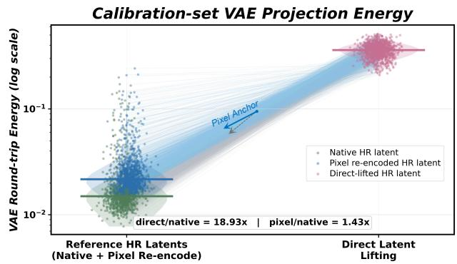  
Figure 7 Target-VAE round-trip consistency. Native HR and pixel-VAE latents remain stable, whereas directly lifted latents exhibit substantially larger roundtrip changes.

## C Experimental Details

We report the implementation details required to reproduce the main experiments. All evaluations generate $1 0 2 4 \times 1 0 2 4$ images using FLUX.2-Klein-9b with 4 NFEs and Z-Image-Turbo with 8 NFEs. We first report the additional architecture and optimization settings of SelfLift-rich, followed by the exact configurations of the compared acceleration methods.

## C.1 SelfLift Hyperparameters

SelfLift-zero is training-free and uses the correction parameters reported in the main paper. SelfLift-rich additionally employs a compact SwinIR-style latent lifter and lightweight LoRA adaptation through On-Policy Self Recovery. Table 6 lists the architecture and optimization details omitted from the main text.

## C.2 Baseline Implementation Details

We use the oficial implementations or released configurations of all compared methods without altering their core acceleration mechanisms. Unless defined otherwise by the original method, spatial baselines use a $5 1 2 \times 5 1 2$ low-resolution stage and transition to $1 0 2 4 \times 1 0 2 4$ at $t _ { r } = 3$ on FLUX.2-Klein-9b and $t _ { r } = 6$ on Z-Image-Turbo. MrFlow retains its original pixel-space super-resolution pipeline. The shared mechanism and model-specific settings of each baseline are summarized in Table 5.

Table 5 Baseline settings used in the main few-step comparison. Within the spatial-acceleration block, ✓ denotes direct latent lifting, while ✗ is followed by the alternative transition mechanism.
<table><tr><td rowspan="2">Method</td><td rowspan="2">Accel.</td><td rowspan="2">Core Config.</td><td colspan="2">FLUX.2-KIein-9b</td><td colspan="2">Z-Image-Turbo</td></tr><tr><td>NFEs</td><td>Parameters</td><td>NFEs</td><td>Parameters</td></tr><tr><td colspan="6">Reference Models</td><td></td></tr><tr><td>Base (full) Base</td><td></td><td>Native full-resolution inference.</td><td>50 4</td><td>Full  $1 0 2 4 ^ { 2 }$  resolution.</td><td>50</td><td>Full  $1 0 2 4 ^ { 2 }$  resolution. Original 8-NFE schedule.</td></tr><tr><td>(distilled)</td><td></td><td>Native few-step inference.</td><td></td><td>Original 4-NFE schedule.</td><td>8</td><td></td></tr><tr><td colspan="6">Temporal Acceleration</td></tr><tr><td>Vanilla</td><td>T</td><td>TeaCache-style feature reuse.</td><td>4</td><td>Cache steps 1 and 3.</td><td></td><td></td></tr><tr><td>Cache TaylorSeer</td><td>T</td><td>Taylor-based feature forecasting.</td><td></td><td></td><td>8</td><td>Official main-table setting.</td></tr><tr><td colspan="6">Spatial Acceleration</td></tr><tr><td>Vanilla DyRes</td><td>√</td><td>LR prefix with direct latent</td><td>4</td><td> $5 1 2 ^ { 2 }  1 0 2 4 ^ { 2 } , t _ { r } = 3 , { \mathrm { s h i f t ~ } } 0 . 9 7 .$ </td><td>8</td><td> $5 1 2 ^ { 2 }  1 0 2 4 ^ { 2 } , t _ { r } = 6 .$ </td></tr><tr><td>LŠRNA-</td><td></td><td>lifting. Canny-guided RNA after latent</td><td>4</td><td> $t _ { r } = 3 , e _ { \operatorname* { m i n } } = 0 . 9 7 , e _ { \operatorname* { m a x } } = 1 . 3 0 .$ </td><td>8</td><td> $t _ { r } = 6 ,$  same Canny-RNA rule.</td></tr><tr><td>RNA Bottleneck</td><td>V</td><td>lifting. High-low-high bottleneck</td><td>4</td><td> $\begin{array} { r l } & { { 1 0 2 4 ^ { 2 } }  { 5 1 2 ^ { 2 } }  { 1 0 2 4 ^ { 2 } } , \mathrm { { t r a n s i t i o n } } } \\ & { \mathrm { { s t e n s \ ( 1 . 3 ) } } . } \end{array}$ </td><td>8</td><td> $1 0 2 4 ^ { 2 }  5 1 2 ^ { 2 }  1 0 2 4 ^ { 2 } ,$  transition steps (1, 6).</td></tr><tr><td>RaLu</td><td></td><td>sampling. Region-adaptive lifting with</td><td>4</td><td> $N \overset { \cdot } { = } ( \overset { \cdot } { 2 } , \overset { \cdot } { 1 } , \overset { \cdot } { 1 } ) , e = ( 0 . 0 9 2 , 0 . 2 3 3 , 1 ) |$ </td><td></td><td></td></tr><tr><td>Speed</td><td>X: DCT</td><td>timestep matching. Spectral progressive-resolution</td><td>4</td><td> $\mathrm { { t r a n s i t i o n ~ r a t i o = 0 . 3 0 . } }$  DCT expansion, tr = 3, shift</td><td>8</td><td>DCT expansion,  $t _ { r } = 6 .$ </td></tr><tr><td></td><td>X: Pixel</td><td>sampling. Pixel-space SR, VAE</td><td></td><td>0.97.</td><td></td><td></td></tr><tr><td>MrFlow</td><td>SR</td><td>re-encoding, and one-step HR denoising.</td><td>4+1</td><td> $( N _ { \mathrm { L R } } , N _ { \mathrm { r e f } } ) = ( 4 , 1 ) ,$   $\mathrm { R e a l - E S R G A N \times 2 . }$ </td><td>8+1</td><td> $( N _ { \mathrm { L R } } , N _ { \mathrm { r e f } } ) = ( 8 , 1 ) ,$   $\mathrm { R e a l - E S R G A N \times 2 . }$ </td></tr></table>

Table 6 Additional architecture, optimization, and training-cost details of SelfLift-rich.
<table><tr><td>Category</td><td>Parameter</td><td>Value</td></tr><tr><td rowspan="6">Latent Lifter</td><td>Input channels / scale</td><td> $1 2 8 ~ / ~ \times 2$ </td></tr><tr><td>Embedding dimension</td><td>192</td></tr><tr><td>Transformer depths</td><td>(6, 6, 6, 6)</td></tr><tr><td>Attention heads</td><td>(8, 8, 8,8)</td></tr><tr><td>Window size / MLP ratio</td><td>8 / 2.5</td></tr><tr><td>Drop-path rate</td><td>0.15</td></tr><tr><td rowspan="6">On-Policy Self Recóvery</td><td>LoRA rank / alpha</td><td> $^ { 6 4 } ~ / ~ 1 2 8$ </td></tr><tr><td>Student learning rate</td><td> $2 \times 1 0 ^ { - 5 }$ </td></tr><tr><td>EMA decay</td><td>0.9999</td></tr><tr><td>Optimizer/ betas</td><td>AdamW</td></tr><tr><td></td><td>(0.9, 0.999)</td></tr><tr><td>Weight decay Gradient clipping</td><td>0 1.0</td></tr><tr><td rowspan="3">Training</td><td>Max iterations</td><td>3000</td></tr><tr><td>Batch size</td><td>1 per device</td></tr><tr><td>Gradient accumulation</td><td>1</td></tr><tr><td rowspan="3">Training Cost</td><td>Mixed precision</td><td>bf16</td></tr><tr><td>Hardware</td><td>8× GPU 80GB</td></tr><tr><td>Latent lifter LoRA adapter</td><td>5.56 GPU-h 56.8 GPU-h</td></tr></table>

## C.3 Evaluation Protocol and Metrics

All methods follow a unified protocol. GenEval uses its 300 oficial prompts, while other metrics use a predefined balanced set of 300 prompts sampled uniformly from DrawBench, the Pick-a-Pic test set, and the visual text-rendering test split. Using shared seeds {0, 42, 128}, each main-table score averages 900 paired generations per method and backbone.

• Inference efficiency: End-to-end latency is measured on a single high-performance GPU using 10 warm-up runs followed by the average of 50 generations. Speedup is computed relative to Base (50), while latency reduction is measured against Base (4)/(8).

• Overall generation quality: We use ImageRe ward to assess the overall quality of generated images while accounting for their consistency with the input prompts.

• Image quality and human preference: PickScore evaluates preference-aligned visual quality, while AestheticScore measures the aesthetic appeal of the generated images.

• Text alignment and instruction following: CLIP-Score measures global text–image semantic alignment. GenEval further evaluates compositional instruction following, including object counting, attribute binding, spatial relations, and color attribution.

• Transition-quality ablation: In the resolutiontransition ablations, we additionally report CLIP-IQA as a sharpness-sensitive perceptual quality metric. It serves as a proxy for blur and visual-quality degradation introduced by diferent transition strategies.

## C.4 Runtime Breakdown

We further decompose the inference latency of FLUX.2-Klein-9b to identify the sources of SelfLift’s eficiency gains. All directly profiled results follow the main evaluation protocol, using 10 warm-up generations followed by 50 timed samples on a single GPU. Calculations use the unrounded measurements, ensuring that the accumulated stage costs exactly recover the corresponding end-to-end latency.

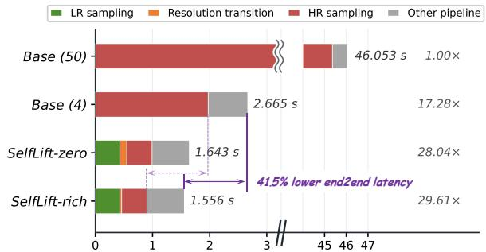  
Figure 8 Stage-wise runtime breakdown on FLUX.2- Klein-9b. SelfLift-rich reduces end-to-end latency by 41.5% relative to Base (4), while its 3-LR+1-HR schedule reduces denoising latency by 56.0%.

Table 7 Stage-wise runtime breakdown on FLUX.2- Klein-9b. Times are reported in seconds per image. Totals are computed from full-precision measurements, while displayed values are rounded to three decimals.
<table><tr><td>Component</td><td>Base (50)</td><td>Base (4)</td><td>zero</td><td>SelfLift SelfLift rich</td></tr><tr><td>Sampling</td><td>50×2 HR</td><td>4HR</td><td>3 L+1 H 3 L+1 H</td><td></td></tr><tr><td>allocation LR sampling</td><td></td><td></td><td>0.427</td><td>0.427</td></tr><tr><td>HR sampling</td><td>45.362</td><td>1.973</td><td>0.441</td><td>0.441</td></tr><tr><td>Resolution transition</td><td></td><td></td><td>0.123</td><td>0.033</td></tr><tr><td>Other pipeline</td><td>0.691</td><td>0.692</td><td>0.652</td><td>0.655</td></tr><tr><td>Total latency</td><td>46.053</td><td>2.665</td><td>1.643</td><td>1.556</td></tr><tr><td>Speedup</td><td>1.00×</td><td>17.28×</td><td>28.04×</td><td>29.61×</td></tr></table>

## D Extended Experiments

## D.1 Ablations of SelfLift-zero

We further examine the two key factors governing SelfLift-zero: the spatial extent and strength of artifact-aware correction, controlled by $\rho$ and $[ w _ { \mathrm { m i n } } , w _ { \mathrm { m a x } } ]$ , and the resolution-transition timestep $t _ { r }$ . The former determines how the pixel-VAE anchor corrects the directly lifted latent, while the latter controls the trade-of between low-resolution computation and the remaining high-resolution recovery budget.

## D.1.1 Correction Parameters

SelfLift-zero uses $\rho$ to select artifact-prone locations and $[ w _ { \mathrm { m i n } } , w _ { \mathrm { m a x } } ]$ to control the correction magnitude. Table 10 isolates their efects through one-factorat-a-time ablations: three neighboring $\rho$ values on each backbone and two alternative weight ranges on FLUX.2-Klein-9b. All settings follow the main protocol with $t _ { r } = 3$ and $t _ { r } = 6 .$ , respectively. Since these parameters do not change the sampling schedule or the number of model evaluations, latency remains unchanged.

Table 10 Parameter ablation of SelfLift-zero. Mainpaper settings are bold. Panel (a) reports ImageReward and CLIP-IQA on both backbones. Panel (b) reports the remaining FLUX.2-Klein-9b evaluation metrics.  
(a) Correction parameters and primary metrics
<table><tr><td>ID</td><td> $\rho$ </td><td> $w _ { \mathrm { m i n } }$ </td><td> $w _ { \mathrm { m a x } }$ </td><td>ImageReward↑</td><td>CLIP-IQA↑</td></tr><tr><td colspan="6">FLUX.2-Klein-9b: selected-region ratio</td></tr><tr><td>F1</td><td>0.3</td><td>0.5</td><td>1.0</td><td>1.2948</td><td>0.8510</td></tr><tr><td>F2</td><td>0.4</td><td>0.5</td><td>1.0</td><td>1.3013</td><td>0.8470</td></tr><tr><td>F3</td><td>0.5</td><td>0.5</td><td>1.0</td><td>1.2967</td><td>0.8390</td></tr><tr><td colspan="6">Z-Image-Turbo: selected-region ratio</td></tr><tr><td>Z1</td><td>0.2</td><td>0.5</td><td>1.0</td><td>1.0278</td><td>0.8020</td></tr><tr><td>Z2</td><td>0.3</td><td>0.5</td><td>1.0</td><td>1.0354</td><td>0.7994</td></tr><tr><td>Z3</td><td>0.4</td><td>0.5</td><td>1.0</td><td>1.0306</td><td>0.7870</td></tr><tr><td colspan="6">FLUX.2-Klein-9b: correction weights (default: F2)</td></tr><tr><td>W1</td><td>0.4</td><td>0.5</td><td>0.5</td><td>1.2899</td><td>0.8500</td></tr><tr><td>W2</td><td>0.4</td><td>0.8</td><td>1.0</td><td>1.2938</td><td>0.8360</td></tr></table>

(b) Remaining FLUX.2-Klein-9b metrics
<table><tr><td>ID</td><td>PickScore↑</td><td>Aesthetic↑</td><td>CLIP↑</td><td>GenEval↑</td></tr><tr><td>F1</td><td>22.612</td><td>5.654</td><td>32.300</td><td>0.848</td></tr><tr><td>F2</td><td>22.633</td><td>5.648</td><td>32.317</td><td>0.853</td></tr><tr><td>F3</td><td>22.621</td><td>5.639</td><td>32.306</td><td>0.850</td></tr><tr><td>W1</td><td>22.602</td><td>5.651</td><td>32.291</td><td>0.846</td></tr><tr><td>W2</td><td>22.615</td><td>5.635</td><td>32.300</td><td>0.849</td></tr></table>

Across both backbones, smaller $\rho$ confines correction to high-risk regions, preserving sharpness but leaving more artifacts, whereas larger $\rho$ improves stability at the cost of smoothing. We therefore use $\rho = 0 . 4$ for FLUX.2-Klein-9b and $\rho = 0 . 3$ for Z-Image-Turbo. The range $[ w _ { \mathrm { m i n } } , w _ { \mathrm { m a x } } ]$ controls correction strength: $w _ { \mathrm { m i n } }$ sets the correction floor, while $w _ { \mathrm { m a x } }$ caps correction in the most inconsistent regions. Increasing $w _ { \mathrm { m i n } }$ suppresses transition artifacts and produces more stable outputs, but may reduce CLIP-IQA through over-smoothing. The default [0.5, 1.0] balances stability and sharpness and can be adjusted with negligible overhead across model families. For aggressive transitions or transition-sensitive tasks such as text rendering, a larger $w _ { \mathrm { m i n } }$ is recommended to obtain stronger pixel-VAE correction and more

Table 8 Complete transition-strategy ablation corresponding to Fig. 5 of the main paper. Bold values denote the SelfLift-zero operating points adopted in the main experiments: $t _ { r } = 3$ for FLUX.2-Klein-9b and $t _ { r } = 6$ for Z-Image-Turbo.
<table><tr><td rowspan="2">Metric</td><td rowspan="2">Transition strategy</td><td colspan="3">FLUX.2-KIein-9b (4 NFEs)</td><td colspan="6">Z-Image-Turbo (8 NFEs)</td></tr><tr><td> $t _ { r } = 1 t _ { r } = 2$ </td><td> $t _ { r } = 3$ </td><td>tr =</td><td>1 tr =</td><td>2 tr = </td><td>3 tr = 4</td><td> $t _ { r } = 5$ </td><td>tr = 6</td><td>tr = 7</td></tr><tr><td rowspan="4">ImageReward↑</td><td>Latent branch</td><td>1.2852 1.3059</td><td>1.2778</td><td>1.0419</td><td>1.0538</td><td>1.0624</td><td>1.0445</td><td>1.0110</td><td>0.9594</td><td>0.8641</td></tr><tr><td>Pixel branch</td><td>1.2004 1.2934</td><td>1.2878</td><td>1.0398</td><td>1.0287</td><td>1.0246</td><td>1.0334</td><td>1.0366</td><td>1.0382</td><td>1.0386</td></tr><tr><td>Simple mix</td><td>1.2414 1.3124</td><td>1.2803</td><td>1.0236</td><td>1.0404</td><td>1.0431</td><td>1.0355</td><td>1.0413</td><td>1.0114</td><td>0.9864</td></tr><tr><td>SelfLift-zero</td><td>1.2674 1.3166</td><td>1.3013</td><td>1.0281</td><td>1.0420</td><td>1.0544</td><td>1.0529</td><td>1.0582</td><td>1.0354</td><td>1.0204</td></tr><tr><td rowspan="4">CLIP-IQA↑</td><td>Latent branch</td><td>0.8588 0.8721</td><td>0.8650</td><td>0.8197</td><td>0.8458</td><td>0.8534</td><td>0.8645</td><td>0.8600</td><td>0.8220</td><td>0.6606</td></tr><tr><td>Pixel branch</td><td>0.7911 0.7815</td><td>0.7686</td><td>0.8021</td><td>0.7590</td><td>0.7683</td><td>0.7612</td><td>0.7525</td><td>0.7383</td><td>0.7162</td></tr><tr><td>Simple mix</td><td>0.8393 0.8394</td><td>0.8220</td><td>0.7682</td><td>0.7945</td><td>0.8021</td><td>0.8016</td><td>0.7992</td><td>0.7732</td><td>0.5933</td></tr><tr><td>SelfLift-zero</td><td>0.8577 0.8636</td><td>0.8470</td><td>0.8102</td><td>0.8336</td><td>0.8374</td><td>0.8379</td><td>0.8280</td><td>0.7994</td><td>0.7130</td></tr></table>

Table 9 Complete ablation of On-Policy Self Recovery on FLUX.2-Klein-9b. All learned variants use the same transition step $t _ { r } = 3$ . Bold denotes the full SelfLift-rich model with $\lambda _ { \mathrm { d y n } } = 8 0$ , while underline marks the strongest non-default variant for each quality metric.
<table><tr><td rowspan="2">Variant</td><td rowspan="2"> $\lambda _ { \mathbf { d y n } }$ </td><td colspan="2">Acceleration</td><td>Overall</td><td colspan="2">Image Quality</td><td colspan="2">Text Alignment</td></tr><tr><td></td><td>Latency (s)↓ Speedup↑</td><td>ImageReward↑</td><td></td><td>PickScore↑ AestheticScore↑</td><td>CLIP↑ GenEval↑</td><td></td></tr><tr><td>SelfLift-zero</td><td></td><td>1.643</td><td>28.04×</td><td>1.3013</td><td>22.6326</td><td>5.6481</td><td>32.317</td><td>0.8528</td></tr><tr><td rowspan="3">+ Learned latent lifter  $\mathcal { G } _ { \phi }$  + Off-policy distillation</td><td rowspan="3">0</td><td>1.556</td><td>29.61×</td><td>1.3031</td><td>22.6737</td><td>5.6447</td><td>32.305</td><td>0.8554</td></tr><tr><td>1.556</td><td>29.61×</td><td>1.1741</td><td>22.4648</td><td>5.5380</td><td>31.315</td><td>0.8084</td></tr><tr><td>1.556</td><td>29.61×</td><td>1.1813</td><td>22.6381</td><td>5.6380</td><td>31.813</td><td>0.8292</td></tr><tr><td>+ OPSR w/o  $\mathcal { L } _ { \mathrm { d y n } }$  + OPSR</td><td>40</td><td>1.556</td><td>29.61×</td><td>1.3048</td><td>22.6819</td><td>5.6706</td><td>32.247</td><td>0.8701</td></tr><tr><td>SelfLift-rich</td><td>80</td><td>1.556</td><td>29.61×</td><td>1.3171</td><td>22.7036</td><td>5.6875</td><td>32.345</td><td>0.8858</td></tr><tr><td>+ OPSR</td><td>120</td><td>1.556</td><td>29.61×</td><td>1.3038</td><td>22.6467</td><td>5.6532</td><td>32.319</td><td>0.8571</td></tr></table>

reliable generation.

## D.1.2 Resolution-Transition Timestep

Table 8 reports the complete numerical results corresponding to Fig. 5 of the main paper. We evaluate the latent branch, pixel branch, simple mix, and SelfLiftzero at every valid resolution-transition timestep on both backbones.

## D.2 Ablation of On-Policy Self Recovery

Increasing t<sub>r</sub> preserves more computation at low resolution and therefore provides greater acceleration, but leaves fewer high-resolution steps for recovering transition errors. Direct latent lifting retains relatively high sharpness at moderate transition timesteps, yet its prompt-aligned quality degrades sharply under aggressive late transitions, particularly on Z-Image-Turbo. Pixel-VAE re-encoding remains more stable at late timesteps but consistently exhibits lower CLIP-IQA because of over-smoothing. Simple mixing merely interpolates between these two failure modes. SelfLift-zero instead maintains a favorable sharpness–alignment trade-of at the selected operating points, $t _ { r } = 3$ for FLUX.2-Klein-9b and $t _ { r } = 6$ for Z-Image-Turbo.

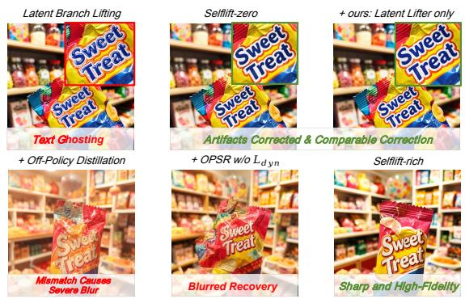  
Figure 9 Qualitative ablation of On-Policy Self Recovery. Top: SelfLift-zero and the learned lifter correct direct-lifting ghosting, with the latter bypassing the pixel– VAE path. Bottom: of-policy distillation produces blur, removing $\mathcal { L } _ { \mathrm { d y n } }$ weakens recovery, and SelfLift-rich remains sharp.

To complement the main-paper OPSR ablation, we provide qualitative evidence and a controlled study on FLUX.2-Klein-9b. We isolate three additions to

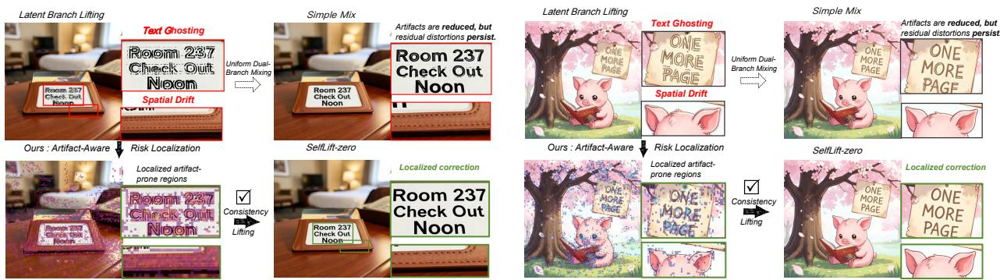  
Figure 10 Additional validation of artifact localization. Predicted high-risk regions align with visible ghosting and spatial drift. Selective correction removes these localized artifacts, whereas uniform mixing leaves residual distortions. This extends Fig. 6 of the main paper.

SelfLift-zero: a learned lifter replacing the pixel–VAE round trip, trajectory-aligned on-policy supervision, and dynamics preservation. All learned variants use $t _ { r } = 3 .$

Figure 9 links these components to their failure modes. The learned lifter removes text ghosting and matches SelfLift-zero without requiring pixel–VAE inference. Of-policy supervision causes severe blur, removing dynamics preservation yields incomplete recovery, and the full model produces sharp results.

Table 9 reports all metrics and a dynamics-weight sweep. The lifter reduces transition latency from 1.642 to 1.556 seconds without degrading quality. Of-policy distillation degrades all metrics, while onpolicy supervision remains insuficient without ${ \mathcal { L } } _ { \mathrm { d y n } } .$ With other settings fixed, $\lambda _ { \mathrm { d y n } } = 8 0$ performs best; 40 under-regularizes dynamics, whereas 120 limits adaptation and approaches SelfLift-zero. These results confirm the complementarity of on-policy recovery and dynamics preservation.

## D.3 Additional Validation of Artifact Localization

Figure 10 further validates Fig. 6 on two examples. Localized correction removes these artifacts while preserving reliable content, whereas uniform mixing leaves residual distortions, confirming that the consistency residual captures artifact-sensitive transition errors.

## D.4 Additional Qualitative Results

Figures ?? and ?? extend the main-paper comparison with additional prompts on FLUX.2-Klein-9b and Z-Image-Turbo, further demonstrating that Self-Lift consistently suppresses transition artifacts while preserving text accuracy, local structure, and finegrained visual details across model families.

## E Applicability and practical adaptation.

SelfLift-zero is a training-free, plug-and-play transition operator applicable across model families without modifying the denoiser or sampling schedule. Its effectiveness depends on the predicted clean sample used to construct both the direct latent and pixel-VAE branches. At early timesteps, the clean estimate is still immature, making the pixel branch and the resulting correction signal less reliable. Transitioning too early may preserve residual noise or incomplete structure, producing an under-denoised appearance while requiring more high-resolution steps and reducing acceleration. SelfLift-zero is therefore better suited to aggressive late-transition configurations, where the clean estimate is suficiently developed, pixel-VAE guidance becomes reliable, and the errors accumulated by direct latent lifting are more pronounced. As transition correction is decoupled from timing, SelfLift-zero complements schedulers such as Speed, especially for flexible multi-step models.

The same plug-and-play principle can extend to video generation when the backbone reliably supports the chosen resolutions. In our preliminary exploration with Wan2.1-T2V, 2× spatial downsampling of 480p inputs altered the token-sequence distribution and destabilized scene structure, indicating poor generalization to unseen sequence lengths. Progressiveresolution video inference should therefore remain within the model’s native multi-resolution regime, where SelfLift can reliably bridge resolution stages without additional training or external restoration models.