# ShallowStream: Index Shallow then Answer Deep for Streaming Video Understanding

Jitai Hao1,∗ Ke Yang1,∗ Qiang Huang1,† Jun Yu1,†

1Harbin Institute of Technology (Shenzhen)

∗Equal contribution. †Corresponding authors.

## Abstract

Streaming video understanding is a critical capability for real-world applications, including embodied intelligence, autonomous driving, industrial monitoring, surveillance and early warning, and wearable assistants. However, processing continuous video streams with multimodal large language models (MLLMs) is computationally expensive. Existing eforts have explored reducing streaming overhead through visual token pruning, token merging, quantization, on-demand frame retrieval, and context ofloading. However, most existing methods overlook the dimension of model depth. Repeatedly executing full-depth MLLM prefill over incoming frames is prohibitively expensive, incurring substantial computational overhead and causing the KV cache to grow at a rate directly proportional to the prefill depth. To address these challenges, we propose ShallowStream, a novel framework that leverages the shallow layers of an MLLM to simultaneously perform frame encoding and retrieval index building. During stream processing, ShallowStream maintains an always-on lightweight index using the KV cache of shallow layers. During query-time answering, we leverage the attention scores generated by the shallow layers to score context frames and employ a diversity-aware selection strategy to retrieve precise and comprehensive evidence. ShallowStream achieves performance on par with the strongest existing streaming methods, while reducing per-frame prefill and 10s end-to-end latency by up to 52.1× and 11.9×, respectively.

Work in Progress

Correspondence: {huangqiang, yujun}@hit.edu.cn Repository: https://github.com/CURRENTF/ShallowStream

## 1 Introduction

In recent years, multimodal large language models (MLLMs) have demonstrated strong capabilities across diverse visual tasks [2, 3, 9]. Building on this progress, streaming video understanding has become increasingly important because of its direct applications in embodied intelligence, autonomous driving, surveillance and early warning, AR glasses, sports commentary, fitness coaching, and other scenarios [4, 10, 21, 24]. In ofline long-video understanding, the complete video and question are available before inference. In contrast, streaming video understanding requires a model to causally process an open-ended video stream without knowing future questions.

A streaming workload is asymmetric: video frames arrive continuously, whereas queries occur intermittently.

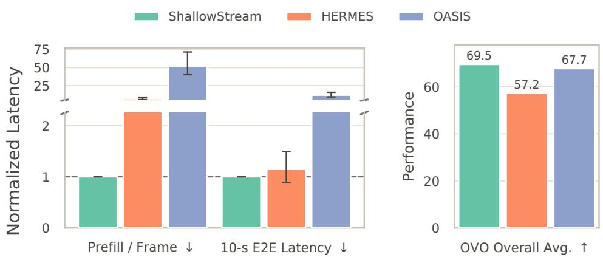  
Figure 1 Continuous-stream eficiency. Per-frame prefill and end-to-end latency with one query every 10s. Latency are normalized to ShallowStream. Performance is the full OVO-Bench average.

During query-agnostic stream processing, the model continuously encodes incoming content and maintains historical context before future questions are known. During query-time answering, it identifies and retrieves relevant evidence to address an arriving question. Consequently, incoming frames constitute the dominant, steady-state workload while queries remain sparse, making per-frame prefill a first-order system cost. As illustrated in Figure 1, representative existing methods incur substantial per-frame prefill overhead, which directly translates into severe end-to-end latency.

In summary, previous work on video streaming faced three challenges:

• Expensive Stream Processing (Stream Processing). Many KV-centric methods prefill every video frame through the full Transformer stack before future questions are known [10, 19, 47]. Subsequent cache reduction lowers retained context and GPU memory. But the computation is already spent and constructs deep KV cache that may never be attended.

• Lossy Evidence Reduction (Stream Processing). Reducing the memory footprint of expanding historical KV caches through query-agnostic compression, merging, or eviction risks discarding critical evidence required by future retrospective queries [8, 19, 22, 47]. Conversely, retaining full video states prevents information loss but leads to prohibitive memory consumption and often relies on bandwidth-limited ofloading [10, 18].

• Ineficient History Use (Query-Time Answering). Always appending history to context can increase latency and interfere with current-scene perception [31], while on-demand methods may require slow answer-level inference before deciding whether to activate historical evidence [23, 54].

We observe that, in streaming video understanding, leveraging only the model’s shallow layers as a retriever is already suficient to identify question-relevant historical evidence. As shown in Figure 2, Qwen3-VL-8B [2] and LLaVA-OneVision-7B [20] already exhibit strong retrieval capabilities at layer 4 and layer 3 out of 28 and 32 total layers, respectively.

Building on this observation, we propose ShallowStream, a novel architecture that decouples lightweight query-agnostic stream processing from selective query-time answering. On OVO-Bench, ShallowStream matches the performance of the strongest existing streaming methods [10, 23, 27, 53] while drastically reducing computational overhead. As shown in Figure 1, on long videos, it reduces per-frame prefill and 10-s end-to-end latency by up to 52.1× and 11.9×, respectively. Together, these results establish a highly favorable eficiency-performance operating point for continuous video streams. Specifically, ShallowStream systematically addresses these challenges through a two-stage design:

• Shallow Encoding: During continuous stream processing, ShallowStream processes incoming video units through only the shallow layers of the language Transformer, drastically cutting steady-state computational overhead by bypassing unnecessary deep-layer prefill.

• Full-History Visual Indexing: It constructs a lightweight visual index from shallow-layer KVs, retaining access to historical evidence without maintaining full-depth states for the entire stream; optional long-cluster compression stabilizes memory over long histories.

• Selective Query-Time Answering: Upon receiving a query, a lightweight query-logit gate assesses retrieval necessity without expensive reasoning passes, triggering full-depth processing exclusively on the retrieved historical evidence and recent context.

In this way, ShallowStream decouples query-agnostic stream processing from query-time answering, efectively deferring expensive deep computations until an incoming question identifies the historical evidence that requires full-depth processing. Consequently, it achieves a favorable operating point that maintains minimal stream-time prefill overhead while preserving access to past visual evidence for retrospective reasoning.

## 2 Related Work

Streaming Video Understanding. Unlike ofline long-video understanding, where the complete video and question are available before inference, streaming video understanding operates on a continuously growing causal video stream: frames arrive sequentially, future observations are inaccessible, and user questions may be posed at arbitrary times [4, 10, 21, 24, 27, 28, 31, 37, 47, 48]. Streaming video systems therefore generally involve two stages. During query-agnostic stream processing, the model continuously encodes incoming visual content and maintains reusable historical information. During query-time answering, the model determines whether historical information is needed, localizes the relevant evidence, and answers the question.

Query-Agnostic Stream Processing. Before future questions are known, existing methods build historical representations through recurrent memory, KV-cache management, or compact visual representations. VideoStreaming [28] propagates memory across clips, while VideoLLaMB [37] connects them through recurrent memory bridges. KV-centric methods construct layer-wise states for admitted visual content: ReKV [10] stores complete video KVs in RAM or on disk, StreamKV [8] applies segment-wise adaptive compression, and StreamMem [47], InfiniPot-V [19], and HERMES [53] bound cache size using proxy-query attention, temporal redundancy and Value Norm, or hierarchical recency and attention cues, respectively. Beyond KV management, TimeChat-Online [49] and StreamingTOM [7] reduce visual tokens before full MLLM prefill, whereas Vista [25] indexes compact scene summaries while storing high-resolution frames in CPU memory. At this stage, ShallowStream reduces memory pressure by retaining history in a lightweight shallow index, with optional compression for long streams.

Query-Time Answering. At query time, methods either reuse stored memory or retrieve query-relevant evidence. StreamMem [47], InfiniPot-V [19], and HERMES [53] directly reuse compressed KVs, whereas ReKV [10], StreamKV [8], LiveVLM [27], and V-Rex [18] retrieve historical states. StreamingTOM [7] fetches token groups from quantized memory, while Vista [25] recalls indexed scenes with their high-resolution content. However, using history for every question can impair current-scene perception despite benefiting retrospective queries, as shown by SimpleStream [31]. OASIS [23] and WeaveTime [54] instead trigger retrieval only when current evidence is insuficient or uncertainty is high, but require an answer-level inference for routing and a second inference when retrieval is activated. In contrast, ShallowStream uses a lightweight gating mechanism and only then performs full-depth prefill over the selected historical evidence or recent context, avoiding a costly MLLM reasoning process for routing decisions.

## 3 Observations

Background and Notation. In streaming video understanding tasks, the video arrives causally as a sequence of video units $X = \{ x _ { t } \} _ { t = 1 } ^ { \infty } ,$ , where �� denotes the �-th unit. Each unit contains 2 sampled frames for Qwen3-VL and 1 for LLaVA-OneVision. At any query time �, the system can only access the observed prefix $X _ { \le T } = \{ x _ { t } \} _ { t = 1 } ^ { T }$ it can neither observe future video $X _ { > T }$ nor know in advance the question $q _ { T }$ that the user will ask at that moment. For simplicity, in the following, when there is no ambiguity, we denote $q _ { T }$ as � and the answer generated by the model as �.

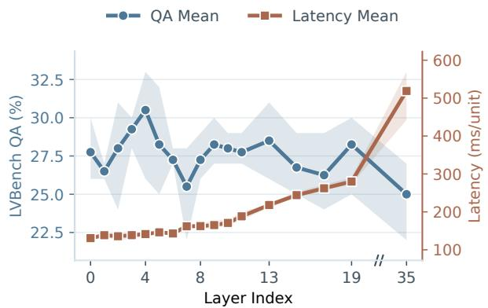

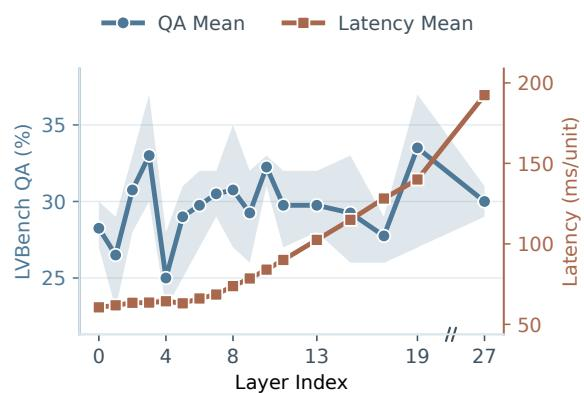  
Figure 2 Layer-wise retrieval capability and stream-time prefill cost on LVBench. The left and right plots show results for Qwen3-VL-8B and LLaVA-OneVision $- 7 \mathrm { B } ,$ respectively. We vary only the layer used for video-question matching. Latency is measured per video unit

We build on a pretrained MLLM as the base model. This model consists of a vision encoder $E _ { \mathrm { v } }$ and a language Transformer $\mathcal { \dot { F } } = \{ F ^ { i } \} _ { i = 0 } ^ { L - 1 }$ with � layers. The vision encoder maps each video unit $x _ { t }$ to a set of visual tokens, whose visual-token index set is denoted by $\mathcal { P } _ { t } ;$ layer $F ^ { i }$ maps input hidden states $\boldsymbol { H } _ { t } ^ { i }$ to $\boldsymbol { H } _ { t } ^ { i + 1 }$ and produces key/value states $K _ { t } ^ { i }$ and $V _ { t } ^ { i }$ . We define the pruning boundary $\hat { P } \ll L$ as the index of the first deep layer. Accordingly, layers $[ 0 , P )$ form the shallow MLLM, layers $[ P , L )$ form the deep MLLM, and their union forms the full MLLM.

Observation: Shallow Layers Are Suficient for Retrieval. We empirically find that in streaming video understanding, shallow MLLM representations provide suficient capability to select question-relevant video units from a long history. This phenomenon is also consistent with prior findings that representations from shallow and middle layers may contain richer semantic information [16, 26, 44]. To isolate this retrieval capability from downstream answer generation, we conduct an experiment on LVBench [35] under our attention-sink stream-time prefill configuration [10]. Specifically, we rank historical video units using representations from varying candidate layers, and then apply the full-depth model exclusively to the highest-scoring units to generate the answer (see Appendix A.3 for a dense full-history control).

As illustrated in Figure 2, retrieval capability emerges in shallow layers, whereas streaming computational costs increase continuously with depth. Motivated by this observation, ShallowStream utilizes only shallow MLLM layers for continuous video encoding and evidence indexing, deferring the expensive full-depth computation until a question arrives and applying it strictly to the retrieved evidence.

## 4 ShallowStream

We propose ShallowStream, which separates query-agnostic stream processing from query-time answering. The high-frequency streaming stage performs only shallow MLLM prefill and maintains a lightweight full-history visual index. At the low-frequency query stage, a query-logit gate determines whether historical evidence is needed, the shallow index identifies which units are relevant, and full-depth prefill is allocated only to the selected video units. Figure 3 illustrates this end-to-end pipeline. Section 4.1 presents query-agnostic shallow index construction, including shallow per-unit prefill, full-history cache maintenance, and unit-level visual indexing. Section 4.2 presents query-logit routing, shallow evidence retrieval, and selective full-depth answer generation.

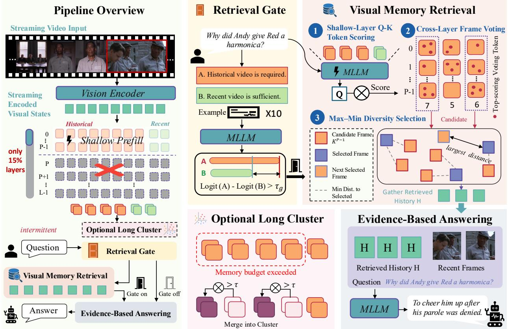  
Figure 3 Overview of ShallowStream. Incoming video units are processed only by the shallow MLLM layers to build a lightweight visual memory. At query time, a query-logit gate determines whether historical retrieval is needed; when activated, shallow-layer attention scoring, cross-layer frame voting, and max-min diversity selection identify the evidence frame to retrieve. The selected history and recent context are then processed by the full-depth MLLM for answer generation. Under a constrained memory budget, the optional long-cluster module compresses older units into fixed-size representatives.

## 4.1 Query-Agnostic Shallow Index Construction

Streaming Shallow Prefill. In streaming video scenarios, we need to process each video unit sequentially to answer incoming queries in real time. Each arriving video unit is encoded as ${ \cal H } _ { t } ^ { 0 } = { \cal E } _ { \mathrm { v } } ( x _ { t } )$ and processed only by the shallow layers [0, �) to produce KVs for retrieval. In the detailed memory, we retain ${ \cal H } _ { t } ^ { 0 }$ together with these shallow states so that a selected unit can later enter the language Transformer from layer 0 without storing any full-depth KV. Under the optional long-cluster mode, older per-unit states are replaced by the fixed-size representatives defined below.

$$
\bigl ( H _ { t } ^ { i + 1 } , K _ { t } ^ { i } , V _ { t } ^ { i } \bigr ) = F ^ { i } \bigl ( H _ { t } ^ { i } ; C _ { t - 1 } ^ { i } \bigr ) , \qquad i = 0 , \ldots , P - 1 .\tag{1}
$$

Here, $C _ { t - 1 } ^ { i }$ is the causal streaming KV cache accessible to layer �. By skipping the deep layers $F ^ { P } , \ldots , F ^ { L - 1 }$ ShallowStream reduces per-unit model computation from � layers to � layers.

Full-History Shallow Cache. To help queries access distant history, ShallowStream retains the KVs of all observed units at each shallow layer:

$$
C _ { T } ^ { \mathrm { s h a l l o w } } = \left\{ \left( K _ { 1 : T } ^ { i } , V _ { 1 : T } ^ { i } \right) \right\} _ { i = 0 } ^ { P - 1 } .\tag{2}
$$

Here, $K _ { 1 : T } ^ { i }$ and $V _ { 1 : T } ^ { i }$ concatenate the KVs of $x _ { 1 } , \ldots , x _ { T }$ at layer �. For each detailed unit $\boldsymbol { x } _ { t } ,$ we store its visual encoding, shallow-layer KV cache, and timestamp as $m _ { t } = \{ H _ { t } ^ { 0 } , ( K _ { t } ^ { i } , V _ { t } ^ { i } ) _ { i = 0 } ^ { P - 1 } , t \}$ . These KVs allow the query to

attend to the video history throughout layers $[ 0 , P )$ . We retain the visual-token keys at every shallow layer for evidence retrieval.

Unit-Level Diversity Descriptor. We obtain a fixed-length unit descriptor by averaging the raw keys from the last shallow layer over $\mathcal { P } _ { t }$ and applying $\ell _ { 2 }$ normalization:

$$
k _ { t } = \mathrm { N o r m } \left( \frac { 1 } { | \mathcal { P } _ { t } | } \sum _ { p \in \mathcal { P } _ { t } } \mathrm { v e c } \left( K _ { t , p } ^ { P - 1 } \right) \right) ,\tag{3}
$$

where vec(·) flattens all key heads and $\operatorname { N o r m } ( z ) = z / \| z \| _ { 2 }$ . This compact descriptor supports memory management and diversity-aware selection, while the unpooled shallow keys preserve fine-grained retrieval signals.

Historical and Recent Evidence Set. We partition the streaming memory $\boldsymbol { \mathcal { M } } _ { T }$ by query-time role: the latest $N _ { r }$ units form the recent context $\mathcal { R } _ { T }$ , while the rest form the historical context $\mathcal { H } _ { T }$ :

$$
\begin{array} { r } { \mathcal { M } _ { T } = \mathcal { H } _ { T } \cup \mathcal { R } _ { T } , \qquad \mathcal { R } _ { T } = \{ m _ { t } \mid T - N _ { r } < t \leq T \} , \quad \mathcal { H } _ { T } = \mathcal { M } _ { T } \ \backslash \ \mathcal { R } _ { T } . } \end{array}\tag{4}
$$

Both pools retain KVs at all shallow layers. The recent context is always included for current-scene awareness, whereas historical units are selected only for queries requiring retrospective evidence.

Optional Context Compression. When ℳ� exceeds the retained-history budget �, an optional module compresses older history into long-term clusters $\mathcal { L } _ { T }$ while preserving $\mathcal { R } _ { T }$ and near-term history $S _ { T } \subset \mathcal { H } _ { T }$ in detail:

$$
\mathcal { M } _ { T } ^ { ( B ) } = \left\{ \begin{array} { l l } { \mathcal { H } _ { T } \cup \mathcal { R } _ { T } , } & { \mathrm { M e m } ( M _ { T } ) \leq B , } \\ { \mathcal { L } _ { T } \cup S _ { T } \cup \mathcal { R } _ { T } , } & { \mathrm { M e m } ( M _ { T } ) > B . } \end{array} \right.\tag{5}
$$

Long-term clusters are built incrementally over temporally adjacent units. A unit leaving the detailed window joins the latest cluster $C _ { j }$ when its descriptor $k _ { t }$ is suficiently similar to the centroid $c _ { j } ;$ otherwise it starts a new cluster. For a cluster of size $n _ { j , \iota }$ , assignment and centroid update are

$$
C ( m _ { t } ) = \left\{ C _ { j } , \qquad k _ { t } ^ { \top } c _ { j } \geq \tau , \qquad c _ { j } \gets \mathrm { N o r m } \left( \frac { n _ { j } c _ { j } + k _ { t } } { n _ { j } + 1 } \right) . \right.\tag{6}
$$

Each cluster maintains fixed-size representative shallow KVs updated via running average:

$$
( \overline { { { K } } } _ { j } ^ { i } , \overline { { { V } } } _ { j } ^ { i } ) \longleftarrow \frac { n _ { j } ( \overline { { { K } } } _ { j } ^ { i } , \overline { { { V } } } _ { j } ^ { i } ) + ( K _ { t } ^ { i } , V _ { t } ^ { i } ) } { n _ { j } + 1 } .\tag{7}
$$

In addition, each cluster maintains an input-level visual representative $\overline { { \pmb { H } } } _ { j } ^ { 0 }$ (e.g., retaining the source unit closest to centroid $c _ { j }$ or averaged visual embeddings). After this update, the cluster replaces its members’ per-unit shallow states in the detailed archive. A query scores the cluster centroid and, if selected, consumes the single representative $\overline { { \pmb { H } } } _ { j } ^ { 0 }$ rather than resolving the cluster back to all of its members. Archive storage is fixed-size per cluster, and host-to-device movement is one representative per selected cluster, independent of its member count. This approximation is disabled when the uncompressed $\mathcal { H } _ { T } \cup \mathcal { R } _ { T }$ fits in memory.

## 4.2 Query-Time Answering

Full-History Shallow Query Prefill. At query time, we append � to the cached video history and process it through the shallow layers, attending at each layer to the exact per-unit KVs in detailed memory and, when

enabled, the representative KVs of long-term clusters:

$$
\Big ( H _ { q } ^ { i + 1 } , Q _ { q } ^ { i } \Big ) = F ^ { i } \Big ( H _ { q } ^ { i } ; C _ { T } ^ { i } \Big ) , \qquad i = 0 , \dots , P - 1 ,\tag{8}
$$

where $C _ { T } ^ { i }$ denotes the retained layer-� KV cache corresponding to $\boldsymbol { \mathcal { M } } _ { T }$ (or $\mathcal { M } _ { T } ^ { ( B ) }$ under compression in Equation 5) and $Q _ { q } ^ { i }$ denotes the raw query states. The uncompressed mode provides exact full-history shallow attention, while long-cluster mode covers the full timeline through detailed recent units and compressed historical representatives.

Query-Logit Retrieval Gate. Not every question benefits from searching the full video history: retrospective questions require earlier evidence, whereas current-scene questions can be answered from the recent context. ShallowStream distinguishes these cases directly from the query using the pretrained MLLM’s output space. We place $q$ in a fixed routing prompt $r ( q )$ with a small set of demonstrations and two single-token choices: � indicates that earlier video memory is required, and � indicates that the latest video segment is suficient. A single text-only forward pass produces the corresponding next-token logits

$$
\ell _ { \mathrm { r e t } } ( q ) = \mathrm { L o g i t } _ { A } \big ( r ( q ) \big ) \ , \qquad \ell _ { \mathrm { r e c e n t } } ( q ) = \mathrm { L o g i t } _ { B } \big ( r ( q ) \big ) \ .\tag{9}
$$

We use their logit diference as a semantic retrieval score and compare it with a backbone-specific threshold $\tau _ { g } \mathrm { : }$

$$
\begin{array} { r } { g ( q ) = \mathbf { 1 } \left[ \ell _ { \mathrm { r e t } } ( q ) - \ell _ { \mathrm { r e c e n t } } ( q ) \geq \tau _ { g } \right] . } \end{array}\tag{10}
$$

For $g ( q ) = 0 .$ , the system uses only $\mathcal { R } _ { T } ;$ for $g ( q ) = 1$ , it retrieves from the retained detailed history and, when enabled, the long-term clusters. We select $\tau _ { g }$ once on a benchmark-independent calibration set and freeze it for evaluation. The gate therefore reuses the pretrained model’s semantic distinction between retrospective and current-scene questions without training a separate router or using benchmark labels; Appendix A.5 details the calibration protocol.

Evidence Retrieval. When the gate activates retrieval, we preserve token-level evidence instead of collapsing each detailed unit to a single similarity score. Let $\begin{array} { r } { \mathcal { P } ( S _ { T } ) = \bigcup _ { m _ { t } \in S _ { T } } \mathcal { P } _ { t } } \end{array}$ denote the candidate visual tokens in detailed historical memory; in uncompressed mode, $S _ { T } = \mathcal { H } _ { T }$ . At each shallow layer $i ,$ we reconstruct the scaled RoPE-aware Q-K attention from the last prompt token to these candidates and average it across attention heads. Denoting this token-level attention by $\alpha _ { i , p , }$ , we retain

$$
\mathcal { V } _ { i } ^ { M } = \mathrm { T o p } \mathbf { M } _ { p \in \mathcal { P } ( S _ { T } ) } \alpha _ { i , p } , \qquad i = 0 , \dotsc , P - 1 .\tag{11}
$$

Each historical unit receives one vote for every selected token that belongs to it:

$$
v _ { t } = \sum _ { i = 0 } ^ { P - 1 } \sum _ { p \in \mathcal { P } _ { t } } \mathbf { 1 } \big [ p \in \mathcal { V } _ { i } ^ { M } \big ] , \qquad m _ { t } \in S _ { T } .\tag{12}
$$

We rank units by $v _ { t } ,$ using their accumulated attention mass to break ties. To avoid spending the evidence budget on redundant moments, we retain the top 4� vote-ranked candidates. In the normalized descriptor space of Equation $^ { 3 , }$ max-min selection initializes with the most distant pair and repeatedly adds the candidate whose minimum cosine distance to the selected set is largest, until � units remain. Sparse retrieval hits may still omit the local temporal context needed to interpret the selected moments. We therefore expand each hit with its temporal neighbors before constructing the final evidence:

$$
\mathcal E _ { \mathrm { d e t } } ( q ) = \left\{ \begin{array} { l l } { \mathcal R _ { T } , } & { g ( q ) = 0 , } \\ { \mathcal R _ { T } \cup \mathrm { N b r } \big ( \mathrm { D i v T o p K } _ { K } ( S _ { T } ; v , k ) \big ) , } & { g ( q ) = 1 , } \end{array} \right.\tag{13}
$$

Here, DivTopK denotes vote-ranked, descriptor-based diversity selection, and Nbr(·) returns the retrieved

units together with their temporal neighbors. With long-cluster compression, we additionally select

$$
\begin{array} { r } { \mathscr { E } _ { \mathrm { c l } } ( q ) = \left\{ \begin{array} { l l } { \emptyset , } & { g ( q ) = 0 , } \\ { \mathrm { T o p K } _ { K _ { \ell } } \left( \mathscr { L } _ { T } ; \mathbf { Q } _ { q } ^ { P - 1 } , c \right) , } & { g ( q ) = 1 , } \end{array} \right. } \end{array}\tag{14}
$$

by scoring cluster centroids with the shallow query. Detailed units and cluster representatives are deduplicated and restored to temporal order. The gate decides whether history is needed, while token voting, diversity selection, and centroid retrieval decide which detailed moments or compressed intervals to use.

Selected-Unit Assembly. The shallow KVs support query contextualization and evidence selection, but are not continued as partial-depth generation states. For $\varepsilon _ { \mathrm { d e t } } ( q )$ , we gather the retained input states $\mathbf { } H _ { t } ^ { 0 }$ of the selected original units. For $\varepsilon _ { \mathrm { c l } } ( q )$ , we gather one fixed-size input representative $\overline { { \pmb { H } } } _ { j } ^ { 0 }$ per selected cluster; no member-level recovery or full-history frame transfer is performed.

Selective Re-prefill and Generation. ShallowStream assembles only these selected input-level visual states with the question and executes all � language layers from the input, ensuring that generation uses consistent full-depth representations:

$$
\begin{array} { r l } & { \widetilde { \pmb { H } } ^ { 0 } = \mathrm { C o m p o s e } \Big ( \{ { \pmb { H } } _ { t } ^ { 0 } \} _ { t \in \mathcal { E } _ { \mathrm { d e t } } ( q ) } , \{ \overline { { { \pmb { H } } } } _ { j } ^ { 0 } \} _ { j \in \mathcal { E } _ { \mathrm { c l } } ( q ) } , q \Big ) , } \\ & { \widetilde { \pmb { H } } ^ { i + 1 } = F ^ { i } \Big ( \widetilde { \pmb { H } } ^ { i } \Big ) , \qquad i = 0 , \ldots , L - 1 , } \\ & { \qquad \pmb { \hat { y } } = \arg \operatorname* { m a x } p _ { \Theta } \Big ( \pmb { y } \ \lvert \widetilde { \pmb { H } } ^ { L } \Big ) . } \end{array}\tag{15}
$$

Only selected detailed units and cluster representatives receive full-depth computation. The host-to-device transfer is bounded by the selected evidence budget, and its cost is included in our end-to-end query measurements. Unselected detailed units and compressed intervals remain discoverable through the shallow index, avoiding both full-depth prefill of the entire stream and direct continuation from incomplete shallow states for generation.

## 5 Experiments

## 5.1 Experimental Setup

Datasets and Metrics. Following recent streaming-video studies [10, 53], we evaluate ShallowStream on OVO-Bench [21] and StreamingBench [24]. OVO-Bench explicitly separates Real-Time Visual Perception from Backward Tracing, allowing us to examine whether a method preserves current-scene understanding while retrieving earlier evidence when needed. StreamingBench provides a complementary assessment across broader continuous-video scenarios and tests whether this capability transfers beyond the retrospective-query setting. We additionally use LVBench [35] for analysis experiments on layer-wise retrieval capability and stream-time prefill cost.

Baselines. We select baselines that cover both strong streaming performance and mechanisms closely related to ShallowStream. Specialized online MLLMs include VideoLLM-online [4], Flash-VStream [52], Dispider [29], TimeChat-Online [49], StreamForest [51], and Streamo [41]. These methods provide competitive references built specifically for causal video processing. More directly comparable are training-free ofline-to-online methods. ReKV [10], StreamKV [8], and LiveVLM [27] retrieve historical full-depth or compressed states; HERMES [53] organizes retained KVs as hierarchical memory; CausalMem [32] maintains a dynamic fixed budget memory bank; and SimpleStream [31] provides a strong recent-window baseline. OASIS [23] and WeaveTime [54] instead activate historical retrieval on demand. Together, these baselines cover recent-only context, KV retention and retrieval, memory compression, fixed-budget memory, and conditional retrieval. We also report the original LLaVA-OneVision-7B [20] and Qwen3-VL-8B [2] backbones so that gains can be

Table 1 Main results on the OVO-Bench. Baseline results marked with ‡ are from our controlled reruns. Results marked with † enable long-cluster compression. Dashes indicate unreported entries.
<table><tr><td rowspan="2">Model / Method</td><td rowspan="2">#Frames</td><td colspan="6">Real-Time Visual Perception</td><td colspan="4">Backward Tracing</td><td rowspan="2">Avg.</td></tr><tr><td>OCR</td><td>ACR ATR</td><td>STU</td><td>FPD</td><td>OJR</td><td>Avg.</td><td></td><td>EPM ASI HLD</td><td></td><td>Avg.</td></tr><tr><td colspan="10">Open-source Online MLLMs</td></tr><tr><td>VideoLLM-online-8B [4]</td><td>2 fps</td><td>8.1 23.9</td><td>12.1</td><td>14.0</td><td>45.5</td><td>21.2</td><td>20.8</td><td>22.2</td><td>18.8</td><td>12.2</td><td>17.7</td><td>19.3</td></tr><tr><td>Flash-VStream-7B [52]</td><td>1 fps</td><td>25.5</td><td>32.1 29.3</td><td>33.7</td><td>29.7</td><td>28.8</td><td>29.9</td><td>36.4</td><td>33.8</td><td></td><td>5.9 25.4</td><td>27.6</td></tr><tr><td>Dispider-7B [29]</td><td>1 fps</td><td>57.7</td><td>49.5 62.1</td><td>44.9</td><td>61.4</td><td>51.6</td><td>54.6</td><td>48.5</td><td>55.4</td><td>4.3</td><td>36.1</td><td>45.3</td></tr><tr><td>TimeChat-Online-7B [49]</td><td>1 fps</td><td>75.2</td><td>46.8 70.7</td><td>47.8</td><td>69.3</td><td>61.4</td><td>61.9</td><td>55.9</td><td>59.5</td><td>9.7</td><td>41.7</td><td>51.8</td></tr><tr><td>StreamForest-7B [51]</td><td>1 fps</td><td>68.5</td><td>53.2 71.6</td><td>47.8</td><td>65.4</td><td>60.9</td><td>61.2</td><td>58.9</td><td>64.9</td><td>32.3</td><td>52.0</td><td>56.6</td></tr><tr><td>Streamo-7B [41]</td><td>1 fps</td><td>79.2 57.8</td><td>75.0</td><td>49.4</td><td>64.4</td><td>70.1</td><td>66.0</td><td>54.6</td><td>52.0</td><td>31.7</td><td>46.1</td><td>56.1</td></tr><tr><td colspan="11">Offline-to-Online Methods</td></tr><tr><td>LLaVA-OneVision-7B [20]</td><td>32</td><td>66.4</td><td>53.2</td><td>71.6</td><td>51.1</td><td>72.3 59.2</td><td>62.3</td><td>53.9</td><td>52.7</td><td>18.8</td><td>41.8</td><td>52.1</td></tr><tr><td>+ ReKV [10]</td><td>0.5 fps</td><td>52.4 54.1</td><td>69.8</td><td>43.3</td><td>67.3</td><td>57.1</td><td>57.3</td><td>57.6</td><td>56.1</td><td>18.8</td><td>44.2</td><td>50.8</td></tr><tr><td>+ HERMES [53]</td><td>0.5 fps</td><td>71.1</td><td>61.5 74.1</td><td>52.3</td><td>72.3</td><td>66.3</td><td>66.3</td><td>62.0</td><td>60.8</td><td>26.9</td><td>49.9</td><td>58.1</td></tr><tr><td>+ WeaveTime [54]</td><td>1 fps</td><td>72.5 69.7</td><td>74.1</td><td>53.4</td><td>75.2</td><td>67.9</td><td>68.8</td><td></td><td></td><td></td><td></td><td></td></tr><tr><td>+ CausalMem [32]</td><td>0.5 fps</td><td>71.8 61.5</td><td>76.7</td><td>48.9</td><td>76.2</td><td>66.8</td><td>65.7</td><td></td><td></td><td></td><td></td><td></td></tr><tr><td>+ SimpleStream‡ [31]</td><td>4</td><td>77.2 71.6</td><td>75.9</td><td>52.3</td><td>77.2</td><td>71.7</td><td>71.0</td><td>53.2</td><td>52.0</td><td>43.6</td><td>49.6</td><td>60.3</td></tr><tr><td>+ ShallowStream (Ours)</td><td>1 fps</td><td>87.3</td><td>73.4 77.6</td><td>62.9</td><td>74.3</td><td>77.2</td><td>75.4</td><td>50.2</td><td>50.7</td><td>46.2</td><td>49.0</td><td>62.2</td></tr><tr><td>+ ShallowStream (Ours)†</td><td>1 fps</td><td>87.3 73.4</td><td>77.6</td><td>63.5</td><td>74.3</td><td>77.2</td><td>75.5</td><td>50.5</td><td>50.7</td><td>46.2</td><td>49.1</td><td>62.3</td></tr><tr><td>Qwen3-VL-8B [2]</td><td>64</td><td>76.5 58.7</td><td>75.0</td><td>59.0</td><td>68.3</td><td>59.2</td><td>66.1</td><td>53.2</td><td>66.9</td><td>9.7</td><td>43.3</td><td>54.7</td></tr><tr><td>+ HERMES [53]</td><td>2 fps</td><td>85.2</td><td>64.2 73.3</td><td>55.6</td><td>70.3</td><td>65.8</td><td>69.1</td><td>50.5</td><td>65.5</td><td>19.9</td><td>45.3</td><td>57.2</td></tr><tr><td>+ OASIS [23]</td><td></td><td>92.0</td><td>80.7</td><td>81.0 67.4</td><td></td><td>67.3 79.9</td><td>78.1</td><td>62.0</td><td>60.1</td><td>47.3</td><td>57.2</td><td>67.7</td></tr><tr><td>+ SimpleStream‡ [31]</td><td>4</td><td>92.0 81.7</td><td>81.9</td><td>69.7</td><td>75.3</td><td>81.0</td><td>80.2</td><td>53.2</td><td>60.1</td><td>44.1</td><td>52.5</td><td>66.4</td></tr><tr><td>+ ShallowStream (Ours)</td><td>1 fps</td><td>92.0</td><td>83.5 82.8</td><td>71.9</td><td>75.3</td><td>79.9</td><td>80.9</td><td></td><td>52.572.3</td><td>49.5</td><td>58.1</td><td>69.5</td></tr><tr><td>+ ShallowStream (Ours)†</td><td>1 fps</td><td>92.0</td><td>83.5 82.8</td><td>71.9</td><td>76.2</td><td>79.9</td><td>81.0</td><td></td><td>51.2 71.0</td><td>50.0</td><td>57.4</td><td>69.2</td></tr></table>

interpreted within each model family.

Implementation Details. We evaluate ShallowStream with Qwen3-VL-8B-Instruct [2] and LLaVA-OneVision-7B [20], implemented in PyTorch with Hugging Face Transformers and FlashAttention-2. Both backbones are sampled at 1 FPS on both benchmarks. All Gate and retrieval settings are frozen for evaluation. Appendix A.2 summarizes the complete configuration, with Gate calibration detailed in Appendix A.5.

## 5.2 Overall Performance

Main result. ShallowStream matches the strongest streaming methods without task-specific training while providing a favorable accuracy-eficiency operating point across MLLM backbones. Tables 1 and 2 evaluate this capability across retrospective evidence tracing and broad real-time visual understanding. With Qwen3-VL-8B, ShallowStream reaches 69.5 on OVO-Bench and 78.2 on StreamingBench, while its LLaVA-OneVision-7B variant achieves 62.2 and 75.5, respectively.

## 5.3 Eficiency

Performance-eficiency. ShallowStream achieves performance on par with current state-of-the-art streaming methods at substantially lower continuous-stream cost. As shown in Figure 1, it reduces per-frame prefill and 10-s end-to-end latency by up to 52.1× and 11.9×, respectively.

All eficiency measurements use a single NVIDIA RTX 5090 with Qwen3-VL-8B under an aligned protocol on five long OVO-Bench Backward videos sampled at 1 FPS. For every method, timing begins after video-frame decoding, and generation is fixed to 16 visible answer tokens. We separately measure stream-time prefill per frame and the computation required to answer one query. ShallowStream keeps its shallow archive in host memory; the reported stream and query timings include archive updates, selected-state transfer, context assembly, and generation. The memory study reports peak GPU allocation rather than combined CPU–GPU capacity.

Table 2 Main results on the Real-Time Visual Understanding subset of StreamingBench. Baseline results marked with ‡ are from our controlled reruns. Results marked with † enable long-cluster compression. Dashes indicate unreported results.
<table><tr><td rowspan="2">Model / Method</td><td rowspan="2">#Frames</td><td colspan="9">Real-Time Visual Understanding</td><td rowspan="2">Avg. CT</td></tr><tr><td>OP</td><td>CR</td><td>CS</td><td>ATP</td><td>EU</td><td>TR</td><td>PR</td><td>SU</td><td>ACP</td></tr><tr><td colspan="10">Open-source Online MLLMs</td></tr><tr><td>Flash-VStream-7B [52]</td><td></td><td>25.9</td><td>43.6 24.9</td><td></td><td>23.9 27.3</td><td>13.1</td><td>18.5</td><td>25.2</td><td>23.9</td><td>48.7</td><td>23.2</td></tr><tr><td>VideoLLM-online-8B [4]</td><td>2 fps</td><td>39.1</td><td>40.1</td><td>34.5</td><td>31.1</td><td>46.0</td><td>32.4</td><td>31.5</td><td>34.2</td><td>42.5 27.9</td><td>36.0</td></tr><tr><td>Dispider-7B [29]</td><td>1 fps</td><td>74.9</td><td>75.5</td><td>74.1</td><td>73.1</td><td>74.4</td><td>59.9 76.1</td><td>62.9</td><td></td><td>62.2 45.8</td><td>67.6</td></tr><tr><td>TimeChat-Online-7B [49]</td><td>1 fps</td><td>80.2</td><td>82.0</td><td>79.5</td><td>83.3</td><td>76.1 78.5</td><td>78.7</td><td>64.6</td><td>69.6</td><td>58.0</td><td>75.4</td></tr><tr><td>StreamForest-7B [51]</td><td>1 fps</td><td>83.1</td><td>82.8</td><td>82.7</td><td>84.3</td><td>77.5 78.2</td><td>76.9</td><td>69.1</td><td></td><td>75.6 54.4</td><td>77.3</td></tr><tr><td colspan="10">Offline-to-Online Methods</td></tr><tr><td>LLaVA-OneVision-7B [20]</td><td>32</td><td>77.7</td><td>76.6</td><td>77.6</td><td>81.9 71.7</td><td>71.7</td><td>66.7</td><td>65.5</td><td>65.7</td><td>44.0</td><td>71.0</td></tr><tr><td>+ ReKV [10, 53]</td><td>0.5 fps</td><td>74.4</td><td>78.9</td><td>78.6</td><td>77.1</td><td>68.3 67.9</td><td>67.6</td><td>62.6</td><td>64.3</td><td>44.6</td><td>69.2</td></tr><tr><td>+ HERMES [53]</td><td>0.5 fps</td><td>78.2</td><td>79.7</td><td>86.8</td><td>81.5</td><td>69.2</td><td>73.2</td><td>75.0 64.2</td><td></td><td>68.6 45.6</td><td>73.2</td></tr><tr><td>+ StreamKV [8]</td><td>1 fps</td><td>74.7</td><td>78.1</td><td>87.7</td><td>79.4</td><td>70.8 67.6</td><td>70.4</td><td>64.6</td><td>64.0</td><td>45.1</td><td>71.0</td></tr><tr><td>+ WeaveTime [54]</td><td>1 fps</td><td>71.5</td><td>81.3</td><td>86.8</td><td>78.6</td><td>75.2 73.2</td><td>72.2</td><td>69.1</td><td>68.8</td><td>44.7</td><td>72.1</td></tr><tr><td>+ SimpleStream‡ [31]</td><td>4</td><td>80.4</td><td>71.9</td><td>85.2</td><td>85.5</td><td>76.1 73.8</td><td>69.4</td><td>65.5</td><td>71.1</td><td>37.3</td><td>73.5</td></tr><tr><td>+ LiveVLM [27]</td><td>0.5 fps</td><td>79.8</td><td>79.7</td><td>84.9</td><td>80.7</td><td>67.1 70.1</td><td>74.1</td><td>66.3</td><td>68.0</td><td>42.5</td><td>71.3</td></tr><tr><td>+ CausalMem [32]</td><td>0.5 fps</td><td>82.6</td><td>79.7</td><td>83.2</td><td>83.2</td><td>69.6 78.4</td><td>75.0</td><td>67.3</td><td>70.9</td><td>39.4</td><td>74.3</td></tr><tr><td>+ ShallowStream (Ours)</td><td>1 fps</td><td>82.8</td><td>67.2</td><td>83.9</td><td>90.8</td><td>71.7 81.9</td><td>64.8</td><td>70.7</td><td></td><td>74.8 35.2</td><td>75.5</td></tr><tr><td>+ ShallowStream (Ours)†</td><td>1 fps</td><td>82.8</td><td>67.2</td><td>83.9</td><td>90.8</td><td>72.3 81.9</td><td>64.8</td><td>70.7</td><td>74.8</td><td>35.2</td><td>75.6</td></tr><tr><td>Qwen3-VL-8B [2]</td><td>64</td><td>80.4</td><td>75.0</td><td>83.0</td><td>83.5</td><td>74.2</td><td>84.4</td><td>77.8</td><td>63.8</td><td>69.7 57.0</td><td>75.9</td></tr><tr><td>+ SimpleStream‡ [31]</td><td>4</td><td>79.3</td><td>72.7</td><td>89.9</td><td>84.8</td><td>73.6</td><td>79.1</td><td>83.3</td><td>71.1</td><td>76.8 39.4</td><td>76.5</td></tr><tr><td>+ HERMES [53]</td><td>2 fps</td><td>79.0</td><td>77.3</td><td>81.4</td><td>84.2</td><td>73.6</td><td>77.9</td><td>87.0</td><td>70.7</td><td>72.5 61.1</td><td>76.6</td></tr><tr><td>+ ShallowStream (Ours) 1 fps</td><td></td><td>79.3</td><td>71.9</td><td>89.9</td><td>85.8</td><td>77.4 79.1</td><td></td><td>88.9 71.5 </td><td></td><td>77.3 52.9</td><td>78.2</td></tr><tr><td>+ ShallowStream (Ours)† 1 fps</td><td></td><td>79.3</td><td>71.9</td><td>90.2</td><td>85.5</td><td>77.4 79.1</td><td></td><td>88.9</td><td>71.5</td><td>77.3 49.7</td><td>78.0</td></tr></table>

Memory scaling. By compactly retaining earlier evidence, long-cluster compression prevents the full shallow history from driving accelerator memory growth. The left panel of Figure 4 compares the final ShallowStream method with compression enabled and disabled; the latter retains the complete layer-0–4 shallow K/V history. Across the 64–1,024-frame range, compression keeps peak GPU memory nearly flat at about 18 GiB, while the uncompressed variant grows to 21.76 GiB and HERMES and OASIS require more GPU memory at long prefixes.

Real-time headroom. Whether enabling long-cluster compression (LC-on) or retaining the complete shallow history (LC-of), ShallowStream remains well below the real-time boundary. On five long videos containing 588–1,198 sampled frames without a frame cap, the right panel of Figure 4 combines query computation and continuous prefill to evaluate total compute demand at diferent query intervals. At an 80-s interval, both matched variants require about 2.6 s of compute, compared with 6.2 s for HERMES and 50.4 s for OASIS. Appendix A.6 further verifies that LC-of remains responsive as the retained history grows.

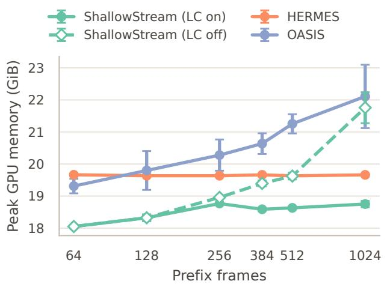

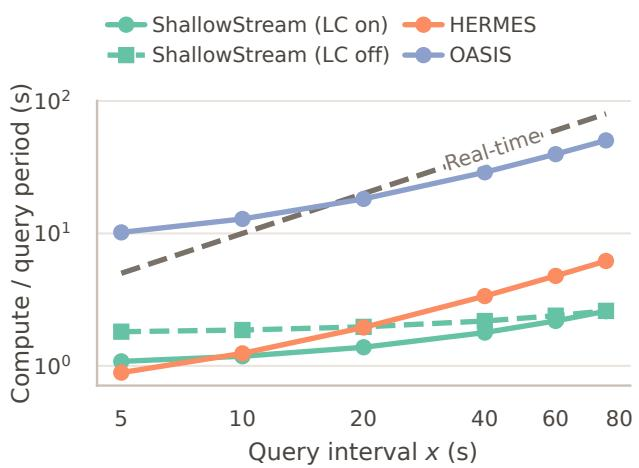  
Figure 4 Continuous-stream memory and compute demand. Left: Peak GPU memory over lengths from 64 to 1,024 frames, averaged over five videos. Both variants use the final calibrated Gate and token-vote retriever. Right: For a query interval �, each curve combines mean query computation over the same five long-video cases with stream-time prefill accumulated over � seconds at 1 FPS. The dashed $y = x$ boundary separates configurations that finish within the query interval (below) from those whose compute exceeds it (above).

## 5.4 Analysis

We analyze the two decisions underlying ShallowStream: when historical evidence should be retrieved and which evidence should be selected. The main text studies Gate routing, token-vote ranking, diversity, and qualitative retrieval behavior. Complementary analyses examine attention context and retrieval depth in Appendix ${ \mathrm { A . } } 3 ,$ , pruning-boundary accuracy and cost in Appendix ${ \mathrm { A . 4 } } ,$ benchmark-independent Gate calibration in Appendix ${ \mathrm { A . 5 } } ,$ and query-time scaling with retained history in Appendix A.6. Together, they show that the observation-motivated $P = 5$ boundary achieves the strongest accuracy at low stream-processing cost, while both routing and full-history shallow retrieval remain eficient as the stream grows.

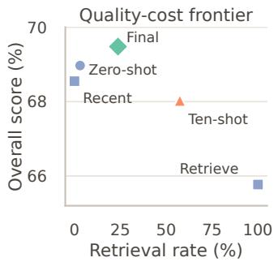

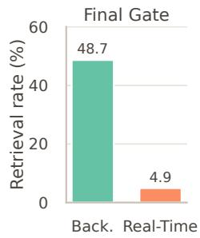  
Figure 5 Gate ablation on OVO-Bench. Left: overall quality versus retrieval rate under controlled routing alternatives with fixed branch outputs. Right: the final Gate’s retrieval allocation by benchmark section.

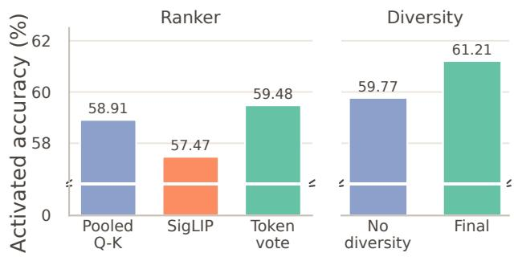  
Figure 6 Retriever ablation on OVO-Bench queries selected by the calibrated Gate. Rankers are compared with diversity and temporal expansion disabled; diversity is compared with preceding-unit expansion.

Calibrated Gate Distinguishes Historical Needs. Always-recent routing can miss necessary historical evidence, whereas indiscriminate retrieval exposes the MLLM to distracting video noise. Figure 5 shows that the calibrated Gate avoids both failure modes by activating historical retrieval primarily for retrospective questions while preserving recent context for current-scene questions. Its markedly diferent routing behavior on Backward and Real-Time queries confirms that retrieval follows historical need rather than being applied indiscriminately. Together with the retriever results in Figure $^ { 6 , }$ these findings show that ShallowStream both identifies when history is needed and retrieves the relevant evidence efectively. The complete routing prompt and benchmark-independent calibration protocol are provided in Appendix A.5.

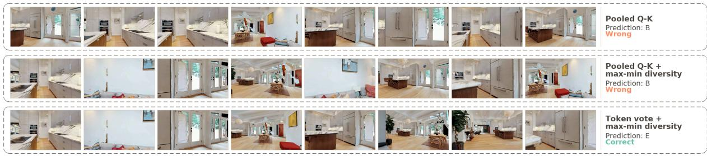  
Figure 7 Qualitative retrieval case study on OVO-Bench EPM. For the question “Where is the red and white checkered rug?” (ground-truth answer: E), each row shows the eight historical units selected by pooled shallow Q–K, pooled shallow Q–K with max–min diversity, and the final token-vote retriever with max–min diversity. Only the final retriever selects complementary evidence that supports the correct answer.

Token Voting Strengthens Shallow Evidence Retrieval. Our token-vote retriever provides the strongest evidence-selection signal among the compared rankers, and max–min diversity further improves it by discouraging redundant selections. Figure 6 shows that token voting from the last prompt token outperforms pooled shallow Q-K and the independent SigLIP encoder [33] when diversity and temporal expansion are disabled, demonstrating the value of query-contextualized token signals. With token voting and precedingunit expansion fixed, max–min diversity provides a further gain by allocating the limited evidence budget across less redundant moments.

Token Voting and Diversity Select Complementary Evidence. Figure 7 visualizes how query-contextualized token voting changes the retrieved evidence. Pooled shallow Q-K repeatedly favors similar kitchen views and predicts B. Max-min diversity broadens its temporal coverage, but the selection remains anchored by the same pooled relevance signal and produces the same answer. The final retriever combines token-level relevance with diversity, covering complementary views across the room and correctly answering E. This example makes the two roles explicit: token voting identifies query-specific evidence, while max–min selection avoids spending the limited retrieval budget on redundant moments.

## 6 Conclusions

We presented ShallowStream, which decouples lightweight query-agnostic stream processing from selective query-time answering. It processes incoming video only through shallow MLLM layers and activates full-depth computation only for query-relevant evidence selected by a query-logit gate and diversity-aware token voting. Across two MLLM backbones, ShallowStream achieves performance on par with current state-of-the-art streaming methods while substantially reducing computation, latency, and GPU-memory growth, establishing an eficient operating point for continuous video understanding.

## AI Use Statement

Generative AI tools were used to generate the benchmark-independent synthetic questions and routing labels used for Gate calibration, and to polish the manuscript. The authors reviewed the generated calibration data for consistency with the retrospective-versus-recent routing definition and reviewed all AI-assisted text. The authors take full responsibility for the final content of this work.

## Ethics Statement

This work develops a computational method for streaming video understanding and evaluates it using existing pretrained models and public benchmarks. It does not involve human-subject research, the collection

of personal or sensitive data, or deployment in safety-critical settings. We identify no specific ethical concerns arising from the proposed method.

## Reproducibility Statement

Implementation details, model and benchmark configurations, calibration procedures, and evaluation protocols are documented in the main paper and appendix. The source code and experiment configurations are available at https://github.com/CURRENTF/ShallowStream. Together, these materials specify the data processing, inference settings, and measurements needed to reproduce the reported results.

## References

[1] Shehreen Azad, Vibhav Vineet, and Yogesh Singh Rawat. Streamready: Learning what to answer and when in long streaming videos. ArXiv, abs/2603.08620, 2026. URL https://api.semanticscholar.org/CorpusID: 286377314.

[2] Shuai Bai, Yuxuan Cai, Ruizhe Chen, Ke qin Chen, Xiong-Hui Chen, Zesen Cheng, Lianghao Deng, Wei Ding, Rongyao Fang, Chang Gao, Chunjiang Ge, Wenbin Ge, Zhifang Guo, Qidong Huang, Qidong Huang, Fei Huang, Binyuan Hui, Shutong Jiang, Zhaohai Li, Mingsheng Li, Mei Li, Kaixin Li, Zicheng Lin, Junyang Lin, Xuejing Liu, Jiawei Liu, Chenglong Liu, Yang Liu, Dayiheng Liu, Shixuan Liu, Dunjie Lu, Ruilin Luo, Chenxu Lv, Rui Men, Li Ying Meng, Xuancheng Ren, Xin yi Ren, Sibo Song, Yu chen Sun, Jun Tang, Jianhong Tu, Jianqiang Wan, Peng Wang, Pengfei Wang, Qiuyue Wang, Yuxuan Wang, Tianbao Xie, Yihe Xu, Haiyang Xu, Jin Xu, Zhibo Yang, Mingkun Yang, Jianxin Yang, An Yang, Bowen Yu, Fei Zhang, Hang Zhang, Xi Zhang, Botao Zheng, Humen Zhong, Jingren Zhou, Fanxi Zhou, Jingren Zhou, Yuanzhi Zhu, and Keming Zhu. Qwen3-vl technical report. ArXiv, abs/2511.21631, 2025. URL https://api.semanticscholar.org/CorpusID:283262018.

[3] Shuai Bai, Ke qin Chen, Xuejing Liu, Jialin Wang, Wenbin Ge, Sibo Song, Kai Dang, Peng Wang, Shijie Wang, Jun Tang, Humen Zhong, Yuanzhi Zhu, Mingkun Yang, Zhaohai Li, Jianqiang Wan, Pengfei Wang, Wei Ding, Zheren Fu, Yiheng Xu, Jiabo Ye, Xi Zhang, Tianbao Xie, Zesen Cheng, Hang Zhang, Zhibo Yang, Haiyang Xu, and Junyang Lin. Qwen2.5-vl technical report. ArXiv, abs/2502.13923, 2025. URL https://api.semanticscholar.org/ CorpusID:276449796.

[4] Joya Chen, Zhaoyang Lv, Shiwei Wu, Kevin Qinghong Lin, Chenan Song, Difei Gao, Jia-Wei Liu, Ziteng Gao, Dongxing Mao, and Mike Zheng Shou. Videollm-online: Online video large language model for streaming video. 2024 IEEE/CVF Conference on Computer Vision and Pattern Recognition (CVPR), pages 18407–18418, 2024. URL https://api.semanticscholar.org/CorpusID:270560262.

[5] Joya Chen, Ziyun Zeng, Yiqi Lin, Yiqi Lin, Wei Li, Zejun Ma, and Mike Zheng Shou. Live: Learning video llm with streaming speech transcription at scale. 2025 IEEE/CVF Conference on Computer Vision and Pattern Recognition (CVPR), pages 29083–29095, 2025. URL https://api.semanticscholar.org/CorpusID:277993668.

[6] Tao Chen, Kun Zhang, Qiong Wu, Xiao Chen, Chaokun Chang, Xiaoshuai Sun, Yiyi Zhou, and Rongrong Ji. Scaling the long video understanding of multimodal large language models via visual memory mechanism. ArXiv, abs/2603.29252, 2026. URL https://api.semanticscholar.org/CorpusID:286977474.

[7] Xueyi Chen, Keda Tao, Kele Shao, and Huan Wang. Streamingtom: Streaming token compression for eficient video understanding. ArXiv, abs/2510.18269, 2025. URL https://api.semanticscholar.org/CorpusID: 282246334.

[8] Yilong Chen, Xiang Bai, Zhibin Wang, Chengyu Bai, Yuhan Dai, Ming Lu, and Shanghang Zhang. Streamkv: Streaming video question-answering with segment-based kv cache retrieval and compression. ArXiv, abs/2511.07278, 2025. URL https://api.semanticscholar.org/CorpusID:282913012.

[9] Zhe Chen, Jiannan Wu, Wenhai Wang, Weijie Su, Guo Chen, Sen Xing, Zhong Muyan, Qinglong Zhang, Xizhou Zhu, Lewei Lu, Bin Li, Ping Luo, Tong Lu, Yu Qiao, and Jifeng Dai. Intern vl: Scaling up vision foundation models and aligning for generic visual-linguistic tasks. 2024 IEEE/CVF Conference on Computer Vision and Pattern Recognition (CVPR), pages 24185–24198, 2023. URL https://api.semanticscholar.org/CorpusID:266521410.

[10] Shangzhe Di, Zhelun Yu, Guanghao Zhang, Haoyuan Li, Tao Zhong, Hao Cheng, Bolin Li, Wanggui He, Fangxun Shu, and Hao Jiang. Streaming video question-answering with in-context video kv-cache retrieval. ArXiv, abs/2503.00540, 2025. URL https://api.semanticscholar.org/CorpusID:276741475.

[11] Xin Ding, Hao Wu, Yifan Yang, Shiqi Jiang, Donglin Bai, Zhibo Chen, and Ting Cao. Streammind: Unlocking full frame rate streaming video dialogue through event-gated cognition. 2025 IEEE/CVF International Conference on Computer Vision (ICCV), pages 13448–13459, 2025. URL https://api.semanticscholar.org/CorpusID:276903154.

[12] Shenghao Fu, Qize Yang, Yuan-Ming Li, Yi-Xing Peng, Kun-Yu Lin, Xihan Wei, Jianfang Hu, Xiaohua Xie, and Wei-Shi Zheng. Vispeak: Visual instruction feedback in streaming videos. 2025 IEEE/CVF International Conference on Computer Vision (ICCV), pages 21778–21788, 2025. URL https://api.semanticscholar.org/CorpusID:277066592.

[13] Haonan Ge, Yiwei Wang, Hang Wu, and Yujun Cai. What should a streaming video model remember? ArXiv, abs/2606.16353, 2026. URL https://api.semanticscholar.org/CorpusID:289299850.

[14] Jitai Hao, Qiang Huang, Hao Liu, Xinyan Xiao, Zhaochun Ren, and Jun Yu. A token is worth over 1,000 tokens: Eficient knowledge distillation through low-rank clone. ArXiv, abs/2505.12781, 2025. URL https: //api.semanticscholar.org/CorpusID:278740403.

[15] Jitai Hao, Hao Liu, Xinyan Xiao, Qiang Huang, and Jun Yu. Uni-x: Mitigating modality conflict with a two end-separated architecture for unified multimodal models. ArXiv, abs/2509.24365, 2025. URL https://api. semanticscholar.org/CorpusID:281674376.

[16] Jitai Hao, Yuke Zhu, Tianjian Wang, Jun Yu, Xin Xin, Bo Zheng, Zhaochun Ren, and Sheng Guo. Omnikv: Dynamic context selection for eficient long-context llms. In International Conference on Learning Representations, 2025. URL https://api.semanticscholar.org/CorpusID:278601790.

[17] Jitai Hao, Qiang Huang, Yaowei Wang, Min Zhang, and Jun Yu. Deltakv: Residual-based kv cache compression via long-range similarity. ArXiv, abs/2602.08005, 2026. URL https://api.semanticscholar.org/CorpusID: 285454299.

[18] Donghyuk Kim, Sejeong Yang, Wonjin Shin, and Joo-Young Kim. V-rex: Real-time streaming video llm acceleration via dynamic kv cache retrieval. 2026 IEEE International Symposium on High Performance Computer Architecture (HPCA), pages 1–14, 2025. URL https://api.semanticscholar.org/CorpusID:283895999.

[19] Minsoo Kim, Kyuhong Shim, Jungwook Choi, and Simyung Chang. Infinipot-v: Memory-constrained kv cache com pression for streaming video understanding. ArXiv, abs/2506.15745, 2025. URL https://api.semanticscholar. org/CorpusID:279465408.

[20] Bo Li, Yuanhan Zhang, Dong Guo, Renrui Zhang, Feng Li, Hao Zhang, Kaichen Zhang, Yanwei Li, Ziwei Liu, and Chunyuan Li. Llava-onevision: Easy visual task transfer. ArXiv, abs/2408.03326, 2024. URL https: //api.semanticscholar.org/CorpusID:271719914.

[21] Yifei Li, Junbo Niu, Ziyang Miao, Chunjiang Ge, Yuanhang Zhou, Qi He, Xiao wen Dong, Haodong Duan, Shuangrui Ding, Rui Qian, Pan Zhang, Yuhang Zang, Yuhang Cao, Conghui He, and Jiaqi Wang. Ovo-bench: How far is your video-llms from real-world online video understanding? 2025 IEEE/CVF Conference on Computer Vision and Pattern Recognition (CVPR), pages 18902–18913, 2025. URL https://api.semanticscholar.org/CorpusID: 275458756.

[22] Yucheng Li, Huiqiang Jiang, Qianhui Wu, Xufang Luo, Surin Ahn, Chengruidong Zhang, Amir H. Abdi, Dongsheng Li, Jianfeng Gao, Yuqing Yang, and Lili Qiu. Scbench: A kv cache-centric analysis of long-context methods. ArXiv, abs/2412.10319, 2024. URL https://api.semanticscholar.org/CorpusID:274763141.

[23] Zhijia Liang, Jiaming Li, Weikai Chen, Yanhao Zhang, Haonan Lu, and Guanbin Li. Oasis: On-demand hierarchical event memory for streaming video reasoning. ArXiv, abs/2604.17052, 2026. URL https://api.semanticscholar. org/CorpusID:287635604.

[24] Junming Lin, Zheng Fang, Chi Chen, Zihao Wan, Fuwen Luo, Peng Li, Yang Liu, and Maosong Sun. Streamingbench: Assessing the gap for mllms to achieve streaming video understanding. ArXiv, abs/2411.03628, 2024. URL https://api.semanticscholar.org/CorpusID:273850338

[25] Haocheng Lu, Nan Zhang, Wei Tao, Xiaoyang Qu, Guokuan Li, Jiguang Wan, and Jianzong Wang. Vista: Scene-aware optimization for streaming video question answering under post-hoc queries. ArXiv, abs/2602.08448, 2026. URL https://api.semanticscholar.org/CorpusID:285454172.

[26] Kevin Meng, David Bau, Alex Andonian, and Yonatan Belinkov. Locating and editing factual associations in gpt. Advances in Neural Information Processing Systems 35, 2022. URL https://api.semanticscholar.org/CorpusID: 255825985.

[27] Zhenyu Ning, Guangda Liu, Qihao Jin, Wenchao Ding, Minyi Guo, and Jieru Zhao. Livevlm: Eficient online video understanding via streaming-oriented kv cache and retrieval. ArXiv, abs/2505.15269, 2025. URL https: //api.semanticscholar.org/CorpusID:278783116.

[28] Rui Qian, Xiao wen Dong, Pan Zhang, Yuhang Zang, Shuangrui Ding, Dahua Lin, and Jiaqi Wang. Streaming long video understanding with large language models. ArXiv, abs/2405.16009, 2024. URL https: //api.semanticscholar.org/CorpusID:270063250.

[29] Rui Qian, Shuangrui Ding, Xiao wen Dong, Pan Zhang, Yuhang Zang, Yuhang Cao, Dahua Lin, and Jiaqi Wang. Dispider: Enabling video llms with active real-time interaction via disentangled perception, decision, and reaction. 2025 IEEE/CVF Conference on Computer Vision and Pattern Recognition (CVPR), pages 24045–24055, 2025. URL https://api.semanticscholar.org/CorpusID:275336693.

[30] Jihao Qiu, Lingxi Xie, Xinyue Huo, Qi Tian, and Qixiang Ye. Longvideo-r1: Smart navigation for low-cost long video understanding. ArXiv, abs/2602.20913, 2026. URL https://api.semanticscholar.org/CorpusID: 286000722.

[31] Yujiao Shen, Shulin Tian, Jingkang Yang, and Ziwei Liu. A simple baseline for streaming video understanding. ArXiv, abs/2604.02317, 2026. URL https://api.semanticscholar.org/CorpusID:287073889

[32] Baiyang Song, Yu-Lin Lin, Qiong Wu, Tao Chen, Jun Peng, Xiao Chen, Yiyi Zhou, and Rongrong Ji. Towards a dynamic and fixed-budget memory bank for eficient streaming video understanding. ArXiv, abs/2606.25658, 2026. URL https://api.semanticscholar.org/CorpusID:289630861.

[33] Michael Tschannen, Alexey Gritsenko, Xiao Wang, Muhammad Ferjad Naeem, Ibrahim M. Alabdulmohsin, Nikhil Parthasarathy, Talfan Evans, Lucas Beyer, Ye Xia, Basil Mustafa, Olivier H’enaf, Jeremiah Harmsen, Andreas Steiner, and Xiao-Qi Zhai. Siglip 2: Multilingual vision-language encoders with improved semantic understanding, localization, and dense features. ArXiv, abs/2502.14786, 2025. URL https://api.semanticscholar.org/ CorpusID:276482166.

[34] Haibo Wang, Bo Feng, Zhengfeng Lai, Mingze Xu, Shiyu Li, Weifeng Ge, Afshin Dehghan, Meng Cao, and Ping Huang. Streambridge: Turning your ofline video large language model into a proactive streaming assistant. ArXiv, abs/2505.05467, 2025. URL https://api.semanticscholar.org/CorpusID:278394112.

[35] Weihan Wang, Zehai He, Wenyi Hong, Yean Cheng, Xiaohan Zhang, Ji Qi, Shiyu Huang, Bin Xu, Yuxiao Dong, Ming Ding, and Jie Tang. Lvbench: An extreme long video understanding benchmark. 2025 IEEE/CVF International Conference on Computer Vision (ICCV), pages 22958–22967, 2024. URL https://api.semanticscholar.org/ CorpusID:270391637.

[36] Yiyu Wang, Xuyang Liu, Xiyan Gui, Xinying Lin, Boxue Yang, Chenfei Liao, Tailai Chen, and Linfeng Zhang. Accelerating streaming video large language models via hierarchical token compression. ArXiv, abs/2512.00891, 2025. URL https://api.semanticscholar.org/CorpusID:283450494.

[37] Yuxuan Wang, Yiqi Song, Cihang Xie, Yang Liu, and Zilong Zheng. Videollamb: Long streaming video understanding with recurrent memory bridges. 2025 IEEE/CVF International Conference on Computer Vision (ICCV), pages 24170–24181, 2024. URL https://api.semanticscholar.org/CorpusID:280422760.

[38] Ziyang Wang, Shoubin Yu, Elias Stengel-Eskin, Jaehong Yoon, Feng Cheng, Gedas Bertasius, and Mohit Bansal. Videotree: Adaptive tree-based video representation for llm reasoning on long videos. 2025 IEEE/CVF Conference on Computer Vision and Pattern Recognition (CVPR), pages 3272–3282, 2024. URL https://api.semanticscholar. org/CorpusID:270094803.

[39] Siwei Wen, Zhangcheng Wang, Xingjian Zhang, Lei Huang, and Wenjun Wu. Eventmemagent: Hierarchical

event-centric memory for online video understanding with adaptive tool use. ArXiv, abs/2602.15329, 2026. URL https://api.semanticscholar.org/CorpusID:285659749.

[40] Hang Wu, Sherin M. Mathews, Yujun Cai, Ming-Hsuan Yang, and Yiwei Wang. Semantic-aware adaptive visual memory for streaming video understanding. ArXiv, abs/2605.07897, 2026. URL https://api.semanticscholar. org/CorpusID:288147794.

[41] Jiaer Xia, Peixian Chen, Mengdan Zhang, Xing Sun, and Kaiyang Zhou. Streaming video instruction tuning. ArXiv, abs/2512.21334, 2025. URL https://api.semanticscholar.org/CorpusID:284153645.

[42] Jun Xiao, Jiajun Chen, Tianxiang Sun, Xun Yang, and Angela Yao. Mukv: Multi-grained kv cache compression for long streaming video question-answering. ArXiv, abs/2605.22269, 2026. URL https://api.semanticscholar. org/CorpusID:288650113.

[43] Junlin Xie, Quanlong Zheng, Ruifei Zhang, Kuo Wang, Yanhao Zhang, Jinguo Luo, Haonan Lu, Xiang Wan, and Guanbin Li. Streamrag: Enhancing real-time video understanding with retrieval augmentation. In Proceedings of the IEEE/CVF Conference on Computer Vision and Pattern Recognition (CVPR), pages 38870–38879, June 2026.

[44] Ji Xin, Rodrigo Nogueira, Yaoliang Yu, and Jimmy J. Lin. Early exiting bert for eficient document ranking. In SUSTAINLP, 2020. URL https://api.semanticscholar.org/CorpusID:226283755.

[45] Shuhang Xun, Sicheng Tao, Jungang Li, Yibo Shi, Zhixin Lin, Zhanhui Zhu, Yibo Yan, Hanqian Li, Linghao Zhang, Shikang Wang, Yixin Liu, Hanbo Zhang, Xuming Hu, and Yinghao Ma. Rtv-bench: Benchmarking mllm continuous perception, understanding and reasoning through real-time video. ArXiv, abs/2505.02064, 2025. URL https://api.semanticscholar.org/CorpusID:278326974.

[46] Yibin Yan, Jilan Xu, Shangzhe Di, Yikun Liu, Yudi Shi, Qirui Chen, Zeqian Li, Yifei Huang, and Weidi Xie. Learning streaming video representation via multitask training. 2025 IEEE/CVF International Conference on Computer Vision (ICCV), pages 9900–9912, 2025. URL https://api.semanticscholar.org/CorpusID:278165314.

[47] Yanlai Yang, Zhuokai Zhao, Satya Narayan Shukla, Aashu Singh, Shlok Kumar Mishra, Lizhu Zhang, and Mengye Ren. Streammem: Query-agnostic kv cache memory for streaming video understanding. ArXiv, abs/2508.15717, 2025. URL https://api.semanticscholar.org/CorpusID:280700196.

[48] Zhenyu Yang, Yuhang Hu, Zemin Du, Dizhan Xue, Shengsheng Qian, Jiahong Wu, Fan Yang, Weiming Dong, and Changsheng Xu. Svbench: A benchmark with temporal multi-turn dialogues for streaming video understanding ArXiv, abs/2502.10810, 2025. URL https://api.semanticscholar.org/CorpusID:276408575.

[49] Linli Yao, Yichen Li, Yuancheng Wei, Lei Li, Shuhuai Ren, Yuanxin Liu, Kun Ouyang, Lean Wang, Shicheng Li, Sida Li, Lingpeng Kong, Qi Liu, Yuanxing Zhang, and Xu Sun. Timechat-online: 80% visual tokens are naturally redundant in streaming videos. Proceedings of the 33rd ACM International Conference on Multimedia, 2025. URL https://api.semanticscholar.org/CorpusID:278033234.

[50] Woongyeong Yeo, Kangsan Kim, Jaehong Yoon, and Sung Ju Hwang. Worldmm: Dynamic multimodal memory agent for long video reasoning. ArXiv, abs/2512.02425, 2025. URL https://api.semanticscholar.org/CorpusID: 283458398.

[51] Xiangyun Zeng, Kefan Qiu, Qingyu Zhang, Xinhao Li, Jing Wang, Jiaxi Li, Ziang Yan, Kun Tian, Meng Tian, Xinhai Zhao, Yi Wang, and Limin Wang. Streamforest: Eficient online video understanding with persistent event memory. ArXiv, abs/2509.24871, 2025. URL https://api.semanticscholar.org/CorpusID:281674907.

[52] Haoji Zhang, Yiqin Wang, Yansong Tang, Yong Liu, Jiashi Feng, and Xiaojie Jin. Flash-vstream: Eficient real-time understanding for long video streams. 2025 IEEE/CVF International Conference on Computer Vision (ICCV), pages 21059–21069, 2025. URL https://api.semanticscholar.org/CorpusID:280011608.

[53] Haowei Zhang, Shudong Yang, Jinlan Fu, See-Kiong Ng, and Xipeng Qiu. Hermes: Kv cache as hierarchical memory for eficient streaming video understanding. ArXiv, abs/2601.14724, 2026. URL https://api.semanticscholar. org/CorpusID:284917012.

[54] Yulin Zhang, Cheng Shi, and Sibei Yang. Weavetime: Stream from earlier frames into emergent memory in videollms. ArXiv, abs/2602.22142, 2026. URL https://api.semanticscholar.org/CorpusID:286011636.

## A Appendix

## A.1 Other Related Work

Representation Learning, Model Adaptation, and Architecture Design. Beyond explicitly maintaining historical memory, another line of work improves the representations, training objectives, and architectures underlying multimodal models. StreamFormer converts an image-pretrained vision transformer into a streaming backbone through causal temporal attention and jointly learns video-level semantics, frame-level temporal dynamics, and fine-grained spatial information [46]. LiveCC densely interleaves timestamp-aligned video frames and automatic speech recognition transcripts, enabling large-scale weakly supervised training for temporally aligned understanding and real-time commentary [5]. Streamo further unifies real-time narration, action understanding, event captioning, temporal grounding, and time-sensitive question answering through streaming video instruction tuning [41]. Beyond streaming-specific training, Uni-X mitigates modality conflict in unified multimodal models through a two-end-separated architecture [15]. These approaches improve or adapt the underlying model itself, whereas ShallowStream focuses on constructing and selectively reusing historical representations without requiring a streaming-specific backbone.

Always-On and Proactive Interaction. Streaming assistants must determine not only what to answer, but also when expensive language reasoning or an interaction should be initiated. StreamMind introduces event-gated LLM invocation, using a constant-cost streaming feature extractor to invoke the language model only when relevant events are detected [11]. Dispider disentangles perception, decision, and reaction so that a lightweight module can continue monitoring the stream while an asynchronous language model generates a response [29]. StreamBridge adapts ofline video LLMs to streaming interaction using a compressed multi-round memory bufer and a separate lightweight activation model for proactive responses [34]. ViSpeak considers visual behavior itself as an instruction, enabling a model to react to gestures and other visually expressed interaction cues [12]. StreamReady instead models whether suficient supporting evidence has arrived, explicitly penalizing answers that are produced either before or substantially after their evidence [1]. These methods decide when to invoke or respond with an MLLM; in contrast, the ShallowStream gate is activated after a question arrives and determines whether answering it requires historical evidence.

Memory Construction, Compression, and Query-Time Retrieval. A closely related line of work formulates eficient context use through incremental memory construction, compact state representation, and querydependent evidence retrieval. StreamRAG performs online event segmentation, reuses computation across adjacent frames to accelerate knowledge extraction, and dynamically adjusts retrieval according to the temporal sensitivity of each query [43]. MuKV retains patch-, frame-, and segment-level KV representations and uses semi-hierarchical retrieval to preserve both fine-grained spatial cues and global temporal context [42]. FlexMem writes visual KV states through a dual-pathway compression mechanism and supports diferent memory-reading policies for long-video and streaming tasks [6]. More broadly, DeltaKV compresses KV caches using residual representations derived from long-range similarity [17]. EventMemAgent maintains an event-oriented short-term bufer and a structured long-term event memory, while using adaptive tools to acquire additional fine-grained evidence [39]. Unlike caption-based external memories or fully computed KV stores, ShallowStream preserves history in a lightweight shallow index and postpones full-depth multimodal prefill until a query identifies the evidence that is actually needed.

Concurrent Streaming-Memory Methods. Several recent concurrent studies further investigate what should be retained under a fixed streaming-memory budget. SelectStream keeps the current observation directly visible to a frozen VLM while exposing historical information through a fixed-capacity latent memory graph and a query-conditioned evidence budget [13]. SAVEMem uses a pseudo-question bank as a lightweight semantic prior during online memory construction and adapts the retrieval scope among short-, mid-, and long-term memory according to the query [40]. These methods reinforce the importance of separating current-scene perception from historical recall, while difering in whether history is represented through latent memory structures or structured semantic summaries.

Eficient Model Execution and Adaptation. Eficiency can also be improved by reducing redundant visual computation, compressing token flow, or transferring model knowledge more compactly. Streaming Token Compression jointly accelerates the vision encoder and LLM prefill: its cacher reuses visual features from temporally similar frames, while its pruner removes tokens with low spatial and temporal salience [36]. This difers from methods that compress visual tokens only after independently encoding every frame [7, 49]. At the model-adaptation level, Low-Rank Clone improves knowledge-distillation eficiency through compact low-rank clones [14]. Streaming-specific encoding reuse and compact knowledge transfer target complementary sources of eficiency, whereas ShallowStream controls when full model depth is executed and which historical evidence is processed during streaming inference.

Query-Driven Long-Video Agents. Agentic long-video methods provide another perspective on query-time evidence acquisition. VideoTree constructs a query-adaptive hierarchical representation and progressively expands relevant video segments from coarse to fine temporal granularity [38]. WorldMM maintains complementary episodic, semantic, and visual memories, from which an adaptive agent iteratively selects both a memory type and a temporal scale [50]. LongVideo-R1 similarly navigates from high-level summaries to detailed clips and terminates retrieval once it judges that suficient evidence has been obtained [30]. These approaches demonstrate the value of adaptive multi-step retrieval, but generally assume that the complete video can be randomly accessed and that the query is available before evidence search. They are therefore distinct from query-agnostic stream processing, where future questions and future observations are both unavailable.

Continuous and Interactive Evaluation. Recent benchmarks extend streaming evaluation beyond single-turn questions posed at fixed timestamps. RTV-Bench introduces multi-timestamp questions whose answers evolve as the scene changes, separately probing continuous perception, understanding, and reasoning [45]. The ProReady-QA benchmark introduced with StreamReady annotates answer-evidence windows and proactive multi-turn questions, allowing correctness and response timing to be evaluated jointly [1]. ViSpeak-Bench evaluates visually triggered instructions, interruptions, and proactive interaction [12]. Together with OVO-Bench, StreamingBench, and SVBench [21, 24, 48], these benchmarks show that streaming results are only comparable when the evaluation specifies query timing, future-frame visibility, evidence availability, interaction history, and whether stream processing continues concurrently with answer generation.

## A.2 Implementation Details

Table 3 summarizes the fixed configurations used in our main experiments. Both backbones use 1 FPS on both benchmarks and share the same evidence selection and decoding budgets, while the pruning boundary, Gate threshold, and video unit definition follow their respective architectures. Shallow KVs and input-level visual states are archived in host memory. In LC-of runs, this archive preserves every detailed unit; in LC-on runs, units outside the detailed window are replaced by fixed-size cluster KVs and one input representative per cluster. Query latency is measured from query entry to generation completion and therefore includes host-to-device transfer and selected-context assembly.

## A.3 Attention Context and Retrieval Depth

The layer-wise diagnostic in Figure 2 follows the stream-time prefill configuration used by ReKV [10]. During causal stream processing, each incoming video unit uses an attention sink together with a bounded local window. This restriction applies to stream-time prefill rather than the retrieval scope: ShallowStream still retains a full-history shallow index and can retrieve evidence from the entire observed stream. Under this deployment-oriented configuration, shallow representations already provide efective video–question matching signals, while deeper stream-time prefill incurs additional computation.

An additional dense complete-causal-prefix control confirms that the preferred retrieval depth depends on the stream-time attention regime. Dense full-history attention can refine retrieval representations through deeper processing, but its prefill cost grows with the accumulated history and therefore does not provide bounded per-unit cost for open-ended streams. ShallowStream instead targets practical bounded-context streaming, where retrieval signals emerge early and full-depth computation can be reserved for query-relevant evidence.

Table 3 Main implementation settings for the two evaluated backbones.
<table><tr><td>Setting</td><td>Qwen3-VL-8B</td><td>LLaVA-OneVision-7B</td></tr><tr><td colspan="3">Backbone and Stream Processing</td></tr><tr><td>Pruning boundary P</td><td>5</td><td>4</td></tr><tr><td>Sampling rate, OVO / StreamingBench</td><td>1 / 1 FPS</td><td>1 / 1 FPS</td></tr><tr><td>Video unit</td><td>2 frames</td><td>1 frame</td></tr><tr><td>Stream prefill window</td><td>64 units, 128 frames</td><td>128 units, 128 frames</td></tr><tr><td colspan="3"></td></tr><tr><td>Gate prompt</td><td>Query Routing ten shot</td><td>ten shot</td></tr><tr><td>Gate calibration set</td><td>200 shared query-only examples</td><td></td></tr><tr><td colspan="3"></td></tr><tr><td>Gate threshold τg</td><td>11.0</td><td>0.875</td></tr><tr><td colspan="3">Evidence Selection and Generation</td></tr><tr><td>Query representation</td><td>last prompt token</td><td></td></tr><tr><td>Visual candidates per shallow layer</td><td>64 tokens</td><td></td></tr><tr><td>Vote-ranked candidate pool</td><td>32 historical units</td><td></td></tr><tr><td>Selected historical evidence</td><td>8 units with max-min diversity</td><td></td></tr><tr><td>Temporal expansion</td><td>one preceding unit per selected unit</td><td></td></tr><tr><td>Recent context, retrieval / recent-only</td><td>6 / 2 units</td><td></td></tr><tr><td>Maximum new tokens</td><td>16</td><td></td></tr></table>

## A.4 Pruning-Boundary Accuracy and Cost

The first five layers already form an efective visual evidence index, allowing ShallowStream to retain its strongest accuracy without unnecessary continuous-stream depth. Figure 8 reports a full OVO-Bench Backward sweep that varies only the pruning boundary while holding routing, evidence selection, and recent-only outputs fixed. The � = 5 boundary, selected beforehand from LVBench, achieves the strongest EPM, HLD, and Backward average, with the latter reaching 58.27; increasing the boundary through � = 19 provides no further gain.

Table 4 Cost summary under the final calibrated Gate and token-vote retriever. Stream-time prefill is averaged over the same five long videos; query components use the matched full-history LC-of setting.
<table><tr><td>Measurement</td><td>Setting or component</td><td>Cost</td></tr><tr><td rowspan="3">Stream-time prefill</td><td>P = 1</td><td>9.47 ms/frame</td></tr><tr><td>P = 5</td><td>10.72 ms/frame</td></tr><tr><td>P = 19</td><td>15.53 ms/frame</td></tr><tr><td rowspan="3">Query-time computation</td><td>Full query</td><td>1.759 s/query</td></tr><tr><td>Gate</td><td>92.7 ms/query</td></tr><tr><td>Evidence selection</td><td>106.0 ms/query</td></tr></table>

Shallow Processing Preserves Accuracy at Lower Cost. ShallowStream’s eficiency advantage follows directly from restricting continuous stream processing to shallow layers. As shown in Table 4, the observationmotivated � = 5 boundary requires 31.0% less per-frame prefill than � = 19 while preserving the strongest accuracy in Figure 8. Gate routing and evidence selection also occupy only a small fraction of total query computation. Thus, shallow continuous encoding preserves the method’s favorable operating point even after accounting for its stronger query-time evidence selection.

## A.5 Query-Logit Gate Calibration

We construct a benchmark-independent query-only calibration set from synthetically generated labeled questions under the same retrospective-versus-recent routing definition as the ten-shot prompt. No OVO-

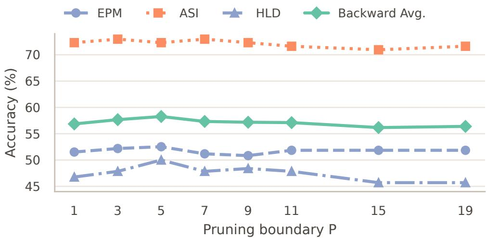  
Figure 8 Sensitivity to the pruning boundary � on OVO-Bench Backward under the final calibrated Gate and token-vote retriever. Routing and evidence selection are held fixed across depths.

Bench or StreamingBench queries are used. For each backbone, we apply the ten-shot prompt and compute $s ( q ) = \ell _ { \mathrm { r e t } } ( q ) - \ell _ { \mathrm { r e c e n t } } ( q )$ . We select a backbone-specific threshold using a precision-first criterion that requires the one-sided 95% Wilson lower bound on retrieval precision to be at least 90%, and freeze it before evaluating either benchmark.

Table 5 Query-logit Gate calibration on the benchmark-independent query-only set.
<table><tr><td>Backbone</td><td> $\tau _ { g }$ </td><td>Precision</td><td>95% lower bound</td><td>Recall</td></tr><tr><td>Qwen3-VL-8B</td><td>11.0</td><td>96.04%</td><td>91.47%</td><td>97.00%</td></tr><tr><td>LLaVA-OneVision-7B</td><td>0.875</td><td>97.78%</td><td>90.63%</td><td>44.00%</td></tr></table>

## A.6 Query-Time Scaling with Retained History

We evaluate the cost of querying a retained shallow history across a 16× range under full-history LC-of and the matched final LC-on setting. These wall-clock measurements include transfer from the host-resident archive and selected-context assembly. Total query latency remains nearly unchanged as the history grows under both settings. Long-cluster compression also keeps evidence-selection cost essentially constant, while Gate and decoding latency remain nearly invariant. Thus, even the complete shallow history remains responsive, while compression additionally bounds the history-dependent selection stage.

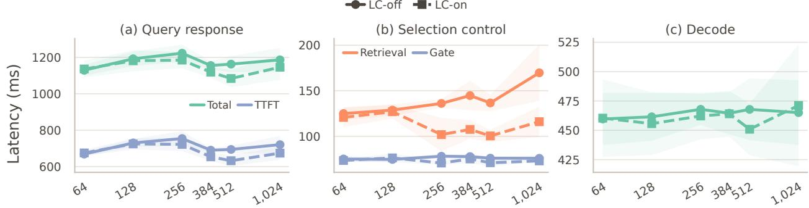  
Observed history (frames)  
Figure 9 Query-time scaling on an NVIDIA RTX 5090. All six collected history lengths are shown. (a) Total query latency and time to first token (TTFT). (b) Evidence-selection and Gate latency. (c) Decoding latency. Solid circles denote full-history LC-of and dashed squares denote the matched final LC-on setting. Curves show means over five retrieval queries, and shaded regions denote 95% confidence intervals.

## A.7 Ten-Shot Router Prompt

For reproducibility, the complete prompt template used by our ten-shot query-logit router is given below.   
[Input video question] denotes the question inserted at inference time.

Ten-Shot Query-Logit Router Prompt   
You are deciding whether answering a video question requires retrieving older video memory. The system already   
has the latest video segment immediately available. Do not answer the video question itself.   
Routing options:   
A. Answering reliably requires inspecting earlier video memory.   
B. The latest video segment is sufficient; older video memory is unnecessary.   
Here are labeled routing examples:   
Example 1:   
Video question: What object is the person holding in the latest visible moment?   
Correct routing option: B   
Example 2:   
Video question: Where did the person leave the keys near the beginning of the video?   
Correct routing option: A   
Example 3:   
Video question: What word is currently displayed on the screen?   
Correct routing option: B   
Example 4:   
Video question: How many times did the bell ring over the course of the video?   
Correct routing option: A   
Example 5:   
Video question: Which item did the cook pick up first?   
Correct routing option: A   
Example 6:   
Video question: What color is the vehicle visible in the latest scene?   
Correct routing option: B   
Example 7:   
Video question: What was inside the box before it was emptied?   
Correct routing option: A   
Example 8:   
Video question: What action is the person performing right now?   
Correct routing option: B

Example 9:

Video question: Which object is immediately to the left of the cup in the latest frame? Correct routing option: B

Example 10:

Video question: How has the room changed compared with its appearance earlier in the video? Correct routing option: A

Now route this video question:

<video\_question>

[Input video question]

</video\_question>

Output only A or B.

Routing answer: