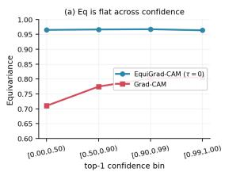
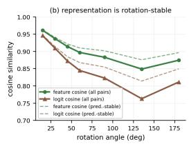
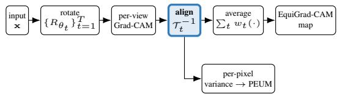
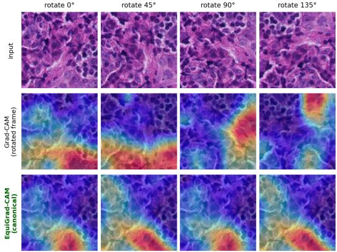

# Signal or Noise? Auditing Rotation-Induced Saliency Drift in Medical and Aerial Imaging

Khawaja Murad ul Hassan Independent Researcher Islamabad, Pakistan khawajamurad@outlook.com

Mehran Ebrahimi Ontario Tech University Oshawa, Ontario, Canada mehran.ebrahimi@ontariotechu.ca

## Abstract

Post-hoc saliency maps such as Grad-CAM are increasingly used to audit why a deployed vision model made a decision, yet the heatmap drifts when the input is rotated, even when the prediction is unchanged. In domains with no canonical orientation, such as histopathology and aerial imagery, this drift directly undermines using saliency as evidence. We take the drift itself as a question: when an explanation changes under rotation, is that faithful signal (the network genuinely attending elsewhere) or operator noise intro duced by the CAM operator? We answer it by opening the operator and measuring equivariance at each of its stages, rather than inferring it from the network’s output. The in stability is not where one would guess: the channel weights are the most rotation-stable stage, and on ResNet-50 exactly stable, because a GAP+linear head makes the class gradient field spatially constant. What moves is the spatial activation tensor, and the classifier’s own pooling discards that movement. A causal test confirms the consequence: occluding the pixels whose saliency drifts costs the model less than occluding random pixels, at either orientation. The drift is therefore carried by degrees offreedom the classi fier throws away, which is what makes removing it faithful rather than destructive. EquiGrad-CAM is a training-free wrapper that takes T rotated views, inverse-rotates each view’s saliency back to a common canonicalframe, and averages, making a pretrained Grad-CAM (CNN or ViT) ap proximately rotationally equivariant. On the full ImageNet 1K validation set it raises equivariance over single-view Grad-CAM by +36.0% (ResNet-50), +87.5% (VGG-16), and +247% (ViT-B/16); a scale-matched ablation isolates canonical-frame alignment before averaging (not where the averaging happens) as the driver, with unaligned averaging falling to or below single-view Grad-CAM on the CNN backbones. Rotation augmentation during training only partially closes the gap and costs clean accuracy, whereas our wrapper needs no retraining. We demonstrate it as a saliency-auditing tool on two rotation-natural domains,

histopathology (PatchCamelyon) and aerial scene classification (RESISC45), where it produces rotation-consistent explanations training-free, and on zero-shot CLIP, where it lifts equivariance +145% while improving both faithfulness measures. Its by-product, PEUM (a per-image explanationuncertainty score), needs no computation beyond the views the wrapper has already taken and turns into a reviewbudget triage rule: at a 10% inspection budget it surfaces 4.4× (aerial) and 2.8× (histopathology) more rotationunstable explanations than random inspection, giving a human auditor a concrete place to look. Code is available at https://github.com/Khawaja-Murad/ EquiGrad-CAM.

## 1. Introduction

Post-hoc saliency maps are increasingly used to audit deployed vision models, to check why a network made a decision before that decision is trusted in a safety- or compliance-critical setting [11, 15, 29]. Grad-CAM [29] is the default tool: one forward–backward pass yields a heatmap over the input. Yet Grad-CAM and its variants share a limitation that is fatal for auditing: the heatmap is conditioned on a single geometric configuration of the input. Rotate the image by 30◦ and the map changes qualitatively, often while the prediction does not.

This is not a corner case. In many high-value domains the input has no canonical orientation at all: a pathologist rotates a slide freely, and an aerial tile has no intrinsic “up.” There, two rotations of one image are equally valid views of the same evidence, so an explanation that changes between them cannot be used as evidence: the auditor has no principled way to decide which map to believe [11].

A question the drift itself poses. A natural objection precedes any fix: perhaps the map should change, because a rotated (partly out-of-distribution) input makes the network genuinely compute something different, and forcing consistency would hide a faithful change. We take this objection as our central question rather than an assumption. When an explanation drifts under rotation, is that faithful signal (the network attending elsewhere) or operator noise introduced by the CAM operator? We answer it empirically (§3): under rotation the network’s internal representation is nearly stable (feature/logit cosine 0.90/0.85), the drift persists on the 74% of rotations that leave the prediction unchanged, and it is uncorrelated with confidence change, so the drift is mostly operator noise, and removing it recovers the explanation the model’s own stable state already implies.

Removing the noise, training-free. Averaging over rotated views is the natural remedy, and is standard for predictions [18]. But the obvious instantiation (averaging the finished heatmaps, as multi-view saliency methods such as Augmented Score-CAM [19] do) is not enough, and on fragile backbones it degrades equivariance below the single-view baseline. The missing ingredient is alignment: each view’s saliency must be inverse-rotated back to a common canonical frame before averaging, so that consistent evidence reinforces and operator noise cancels. EquiGrad-CAM does exactly this: T rotated views, each inversealigned, then averaged, as a training-free wrapper around any pretrained Grad-CAM, CNN or ViT. A scale-matched ablation (§6) shows that this canonical-frame alignment, not where the averaging happens (feature space vs. aligned output space, which are near-identical at full scale), is what drives the gain.

Auditing rotation-natural domains. We frame the wrapper as a saliency-auditing tool and demonstrate it where it matters most: two rotation-natural domains, histopathology (PatchCamelyon) and aerial scene classification (RE-SISC45) (§5). On both, single-view Grad-CAM drifts sharply under rotation, our wrapper produces rotationconsistent explanations without retraining, and its byproduct PEUM (a per-image explanation-uncertainty score) ranks explanations by how reproducible they are, telling an auditor which maps not to trust unexamined.

## Contributions.

1. A question, answered by decomposing the operator. We measure equivariance at every stage of Grad-CAM rather than inferring it from the network’s output, and find the drift is carried by degrees of freedom the classifier discards: the channel weights α are the most rotation-stable stage, on ResNet-50 exactly so because a GAP+linear head makes the gradient field spatially constant, while the spatial activations move, and the head pools that movement away (§3). A causal test closes the argument: occluding the drifting pixels costs the model less than occluding random ones at either orientation. This justifies removing the drift and addresses the main objection to consistency-based explanations.

2. EquiGrad-CAM, a training-free equivariant wrapper. Canonical-frame-aligned multi-view aggregation improves equivariance over Grad-CAM by +36.0% (ResNet-50), +87.5% (VGG-16) and +247% (ViT-B/16) at full ImageNet-1K scale. A scale-matched ablation isolates alignment, not the locus of aggregation, as the driver, and the wrapper beats rotation-augmented training without retraining (§6).

3. An auditing procedure for rotation-natural domains. A new way of benchmarking explanation methods where the input has no canonical orientation, and the remedy that follows: on histopathology and aerial imagery the wrapper is rotation-consistent training-free (including zero-shot CLIP, 0.317 → 0.777), and its by-product PEUM becomes a triage rule surfacing 4.4× (aerial) and 2.8× (histopathology) more unstable explanations than random at a 10% budget (§5).

4. Negative results others should know. Score-CAM is numerically constant on 81.4% of VGG-16 inputs, XGrad-CAM is indistinguishable from Grad-CAM on ResNet-50 (agreeing to ∼10−8), and ViT Grad-CAM works only when hooking ln 1 (§6). And about our own family: on a task-grounded, perturbation-free check, no CAM, ours included, concentrates much above a uniform map (§5).

## 2. Related Work

Gradient-based CAM. CAM [39] requires retraining; Grad-CAM [29] removed that constraint with gradient weights, and Grad-CAM++ [6], XGrad-CAM [16], LayerCAM [21], and Ablation-CAM [13] offer alternative weightings, and recent work continues to refine what a CAM explains (Finer-CAM [38] and DiffCAM [23] sharpen class discriminability) without changing that each still conditions its heatmap on one orientation of the input. We also observe two hidden pathologies (§6): XGrad-CAM’s per-channel normalisation collapses to Grad-CAM’s on ResNet-50’s near-uniform 7×7 features (maps identical to ∼10−8, i.e. floating-point noise; exactly identical on CUB IoU), and its axiom-based weights collapse to near-zero correlation on ViT patch tokens.

Perturbation- and optimisation-based. RISE [27] and Score-CAM [36] replace gradients with score-based weights; Recipro-CAM [5] (gradient-free) and Opti-CAM [37] (per-image weight optimisation) target gradientnoise sensitivity. Each remains orientation-dependent, and Score-CAM’s masking is numerically constant on 81.4% of VGG-16 inputs (§6).

Multi-view / augmentation-based, and why alignment matters. SmoothGrad [32] and Smooth Grad-CAM++ [25] average over input noise; Augmented Score-CAM [19] averages geometrically-augmented heatmaps. These are the closest relatives of our method, and we position ourselves plainly: EquiGrad-CAM is aligned test-time augmentation of the explanation. The distinction that matters is not novelty of “averaging views” but alignment: inverse-rotating each view’s saliency to a common canonical frame before averaging. Averaging finished maps without this step (the route these methods take) can leave equivariance below the single-view baseline on fragile backbones (§6); alignment is what turns view aggregation into an equivariant operator, and it applies to any pretrained CAM.

Equivariant architectures. Group-equivariant CNNs [9] build feature-level equivariance in through architectural constraints, but require training (or retraining) the model. Our contribution is complementary and post-hoc: a training-free audit of the pretrained, non-equivariant networks practitioners already deploy, exactly the setting where one cannot retrain.

Explanation invariance and equivariance. The demand that a saliency map track a symmetry is not ours to assume: Crabbe and van der Schaar [ ´ 10] argue that “any explanation that faithfully explains” a G-invariant model “needs to be in agreement with this invariance property,” and show that for a spatial explanation the correct behaviour is equivariance; their score is, up to the similarity function, our Eq (§4.4). Two things separate our work. In scope, they cover cyclic translations, permutations and the dihedral group on ECG, FashionMNIST, point clouds and graphs, not continuous rotation, ImageNet-scale CNNs or ViTs, or CAMfamily explanations. In construction, their Proposition 2.3 aggregates $e ( \rho [ g ] \mathbf { x } )$ without the inverse action, yielding an invariant explanation; for a spatial map that is exactly our unaligned baseline, which §6 shows sits at or below singleview Grad-CAM on both CNNs. The equivariant analogue, applying $\tau _ { t } ^ { - 1 }$ before averaging, is what works, and is what EquiGrad-CAM does. Their Guideline 4 warrants enforcing consistency only when the model is itself invariant; we do not assume this but measure it (§3) and report Eq conditioned on the model’s own stability, the approximatelyinvariant regime their §3.3 identifies as practical.

Saliency consistency and uncertainty. Explanation fragility is well documented: saliency can be manipulated, is often unreliable, and fails basic sanity checks [2, 17, 22]; COSE [11] measures equivariance failures but does not remove them. Prior work thus largely diagnoses the problem or builds equivariance into the model. To our knowledge EquiGrad-CAM is the first training-free, post-hoc method to make rotational consistency a constructive objective for CAM-family explanations. U-CAM [26] and BayesLIME [31] estimate explanation uncertainty but require model modification, and the reliability of such estimates is itself under scrutiny [24, 33]; PEUM (§5) provides an image-level signal for explanation reliability, at no cost beyond the views the wrapper has already taken.

Table 1. Stage-wise equivariance of the Grad-CAM operator (Eq↑, n=2,000, 7 angles). The drift does not enter at the channelweighting step: α is the most rotation-stable stage everywhere, and on ResNet-50 it is stable exactly. What moves is the spatial pair $( A , g )$ . Yet the final map is far more equivariant than its per-channel constituents, because summing over channels cancels much of the per-channel error. ∗ResNet-50’s gradient field is spatially constant in every one of its 2,048 channels (std exactly 0), so a spatial correlation is undefined; this is a structural consequence of the GAP+linear head, not a measurement failure.
<table><tr><td>Stage of the operator</td><td>ResNet-50</td><td>VGG-16</td><td>ViT-B/16</td></tr><tr><td>Activations A</td><td>0.321</td><td>0.246</td><td>0.453</td></tr><tr><td>Gradient field g</td><td>*</td><td>0.006</td><td>0.240</td></tr><tr><td>Channel weights α (Pearson)</td><td>1.000</td><td>0.889</td><td>0.685</td></tr><tr><td> $\textstyle \sum _ { k } \alpha _ { k } A _ { k }$  (pre-ReLU)</td><td>0.708</td><td>0.492</td><td>0.265</td></tr><tr><td>after ReLU</td><td>0.708</td><td>0.500</td><td>0.240</td></tr><tr><td>final map  $( = \mathrm { G r a d \mathrm { - } C A M ) }$ </td><td>0.700</td><td>0.511</td><td>0.247</td></tr><tr><td>published Grad-CAM, Tab. 5</td><td>0.703</td><td>0.511</td><td>0.250</td></tr></table>

## 3. Is the Drift Signal or Noise?

Before removing the drift we must justify that removing it is faithful. The objection is that a rotated input is partly out-of-distribution, so the network may genuinely compute something different and its explanation should change. A weaker version of the same objection applies to us: a CAM is not computed from the pooled feature or the logits, so showing that those are rotation-stable does not establish that the quantities the CAM actually reads are. We therefore open the operator and measure equivariance at every stage of it, rather than inferring the answer from the network’s output. Measurements are on ImageNet-1K, 2,000 images (one per class, 2/class where noted) × 7 angles.

(1) Where in the operator does the drift enter? Grad-CAM is a chain: spatial activations A and the class gradient field $g$ at the target layer, pooled into channel weights $\alpha \ = \ { \overline { { g } } } .$ , combined as $\mathrm { R e L U } ( \sum _ { k } \alpha _ { k } A _ { k } )$ , then upsampled and normalised. Each stage is a spatial (or, for $\alpha ,$ a channel) object, so each has its own equivariance. Table 1 reports all of them. The last row reproduces the published single-view Grad-CAM Eq of Table 5 to within 0.003, which validates the decomposition against the deployed pipeline.

The result is not the one we expected, and it is sharper. We had assumed the instability entered where a single orientation is used to estimate the channel weights. It does not: α is the most stable stage on every backbone, and on ResNet-50 it is stable exactly, with cosine 1.000 at every angle. The reason is structural. A GAP+linear head makes $\partial y _ { c } / \partial A _ { k i j } = W _ { c k } / H W$ , independent of $( i , j )$ , so g is spatially constant in every channel and α depends only on the target class, not on the orientation. We verified this directly: all 2,048 channels have spatial standard deviation exactly zero. Consequently every bit of ResNet-50’s Grad-CAM

  
Figure 1. The drift does not track the model’s response. (a) EquiGrad-CAM’s equivariance is flat across confidence strata while single-view Grad-CAM’s stays far lower even at high confidence, so the drift is not confined to inputs the model finds hard. (b) the network’s pooled feature/logit representation is nearly rotation-invariant. Table 1 shows why this is not the same as the spatial computation being unchanged: global pooling discards precisely the spatial arrangement rotation disturbs, which is the sense in which Grad-CAM’s drift is operator noise.

## rotation drift is carried by the activation tensor.

(2) The model discards what Grad-CAM varies over. This localisation is what licenses the paper’s claim, and it replaces the weaker argument from output similarity. The penultimate feature and logit vectors of x and $R _ { \theta } ( \mathbf { x } )$ are indeed similar, cosine 0.90 / 0.85 over all 14,000 image– angle pairs, and not trivially so: between unrelated images the same cosines are 0.529 / 0.088. But Table 1 shows why they are high, and it is not that the spatial computation is unchanged, which it plainly is not (0.321 on ResNet-50). It is that global pooling discards exactly the spatial arrangement that rotation disturbs. For a GAP+linear classifier this is exact rather than suggestive: the decision is a function of $\operatorname { G A P } ( A )$ alone, so any rotation-induced rearrangement within A that leaves the pooled vector fixed is, by construction, invisible to the model and fully visible to Grad-CAM. The drift is variation along directions the classifier provably throws away. That is a precise sense in which it is operator noise, and it is the sense we claim.

(3) The drift is largely prediction-independent. On the 64.3% of rotations leaving the top-1 unchanged (where the model has not changed its decision), Grad-CAM equivariance is only 0.758 while EquiGrad-CAM reaches 0.959. Per-image drift (1−Eq) there is only weakly correlated with the change in confidence (r=0.060, $\scriptstyle p = 2 . 9 \times 1 0 ^ { - 8 }$ , n=8,646 stable pairs): a small faithful component is detectable at this sample size but explains 0.4% of the variance, so the drift is dominated by a prediction-independent floor.

(4) Even the most confident, stable inputs drift. Stratifying by top-1 probability, EquiGrad-CAM’s equivariance is flat (≈ 0.965) across all bins whereas Grad-CAM’s climbs only 0.71 → 0.81 and never approaches consistency, even on the highest-confidence inputs (Fig. 1). A confidenceweighted equivariance, down-weighting views with large confidence drop exactly as the objection requests, leaves the ranking unchanged (0.739 vs. 0.959).

(5) A causal test: the drift lives where the model does not look. The measurements so far are correlational. Here is a direct one. For each (image, angle) we define three regions in the canonicalframe and then transport them to the rotated frame, so the same pixels are tested twice: the drift region (top 10% of $| h _ { 0 } - \tilde { h } _ { \theta } | )$ , the agreement region (top 10% of min $( h _ { 0 } , \tilde { h } _ { \theta } ) )$ , and a random region of equal area. We occlude each with the Gaussian-blur baseline already used for insertion/deletion (σ=10) and record the drop in the model’s probability for its original top-1. If the drift carried orientation-specific evidence, occluding it should matter at one orientation and not the other.

It does not, and it barely matters at either. On ResNet-50 $( n { = } 1 , 0 0 0 ,$ , one image per class) the drift region is the least consequential of the three: blurring it costs 0.100 in the canonical frame and 0.038 in the rotated one, against 0.152/0.121 for a random region and 0.264/0.225 for the agreement region. The pixels whose saliency moves under rotation are pixels the model relies on less than pixels chosen at random, and 2.6× less than the pixels where the explanation is stable. The orientation-asymmetry test agrees: mean $| \Delta _ { 0 } - \Delta _ { \theta } |$ is 0.146 [0.142, 0.151] for the drift region against 0.210 [0.205, 0.215] for random, so the faithfulsignal direction fails outright (one-sided Wilcoxon, p=1.00, median difference −0.021). VGG-16 returns the same null (0.218 [0.213, 0.223] vs. 0.220 [0.215, 0.224], p=0.96).

We rest the argument on the first of those results rather than the second, for a reason worth stating: the drift region is defined by a disagreement between the two frames, so it is asymmetric by construction and the asymmetry test is tilted toward finding faithful signal. That nothing of consequence appears even under a tilted test is informative, but the load-bearing observation is the below-random causal importance, which no construction artefact explains.

Reporting equivariance conditioned on the model. The premise we are testing, that a faithful explanation of a rotation-stable model should itself be rotation-equivariant, is licensed only to the extent the model is stable, a condition made explicit by Crabbe and van der Schaar [´ 10] (their Guideline 4). We therefore do not report a single unconditional number and leave the condition implicit. Alongside the unconditional Eq used in the tables (for comparability with prior work), we report it restricted to the 64.3% of rotations that leave the top-1 unchanged (where the model demonstrably did not change its decision, so equivariance is unambiguously the right target), and a continuously confidence-weighted variant that relaxes the requirement in proportion to how far the model’s response moved, rather than gating it discretely. Each triple below is computed on the same 2,000 images, so the three numbers differ only in conditioning and not in sample (unconditional / prediction-stable / confidence-weighted):

<table><tr><td>Backbone</td><td>Grad-CAM</td><td>EquiGrad-CAM</td></tr><tr><td>ResNet-50</td><td>0.711 / 0.758 / 0.739</td><td>0.958 / 0.959 / 0.959</td></tr><tr><td>VGG-16</td><td>0.513 / 0.580 / 0.562</td><td>0.958 / 0.963 / 0.963</td></tr><tr><td>ViT-B/16</td><td>0.259 / 0.284 / 0.276</td><td>0.867 / 0.850 / 0.856</td></tr></table>

Conditioning on the model’s own stability moves Grad-CAM by at most +0.067 (VGG-16, whose top-1 survives rotation least often at 56.9%) and EquiGrad-CAM by less than 0.017 in either direction. It never closes a gap that runs from 0.25 to 0.61. The conclusion is therefore insensitive to which conditioning one accepts, which is why we report all three rather than pick the one that flatters us.

Equivariance is not bought by smoothing. A high Eq could in principle be obtained by returning a blurrier, less discriminative map rather than a better-aligned one. It cannot: Gaussian-blurring single-view Grad-CAM’s own map at $\sigma \in \{ 2 , 4 , 8 , 1 6 \}$ leaves its equivariance flat at 0.700– 0.702, against 0.700 unblurred $( n { = } 2 , 0 0 0 )$ . The metric does not reward low-frequency maps, so the gap in Table 6 cannot be explained by our aggregate being smoother.

Conclusion, stated at the strength the evidence supports. We do not claim the network computes the same thing when the image is turned; Table 1 shows it does not, and the spatial activations move a great deal. We claim something narrower and better supported: the drift Grad-CAM reports is carried by degrees of freedom the classifier discards. On ResNet-50 that is exact, because the head reads only $\operatorname { G A P } ( A )$ and α is orientation-invariant by construction; on VGG-16 and ViT-B/16 it is the same picture with the pooling argument weakened to an empirical one. Aligning and averaging views (§4) therefore recovers the explanation the model’s own decision already implies, rather than erasing a faithful change. It remains mostly, not always: on the 35.7% of rotations that flip the top-1 the model does respond differently, and there the honest operating point is the predictionconditioned EquiGrad-CAM+PCF, while PEUM flags the least reproducible explanations for human review (§5). The objection thus becomes a motivation for our own gate and triage, not a barrier to aggregation.

## 4. Method

Preliminaries. Let $A ^ { k } \in \mathbb { R } ^ { h \times w }$ be channel k’s activation at the target layer, $g ^ { k } = \partial y ^ { c } / \partial A ^ { k }$ its gradient for class-c logit $y ^ { c }$ . Grad-CAM [29] is $\begin{array} { r } { L _ { \mathrm { G C } } = \mathrm { R e L U } \big ( \sum _ { k } \alpha _ { k } A ^ { k } \big ) } \end{array}$ ↑H×W with $\begin{array} { r } { \alpha _ { k } = \frac { 1 } { h w } \sum _ { i , j } g _ { i j } ^ { k } } \end{array}$ ; all maps are min–max normalised to [0, 1].

## 4.1. Aligned Multi-View Aggregation

Given image x and target class c (the model’s top-1 on the unrotated image, held fixed across views), we sample $T { = } 1 8$ angles on a uniform grid and form views $\mathbf { x } _ { t } ~ = ~ R _ { \theta _ { t } } ( \mathbf { x } )$ each passed forward–backward through the frozen backbone (Fig. 2). The operative step is alignment: every per-view quantity is inverse-rotated to the canonical frame, $\bar { \mathcal { T } } _ { t } ^ { - 1 } ( \cdot )$ , at native resolution h×w (bilinear, 64-px reflective padding) before averaging. Only then do consistent explanations reinforce and view-specific operator noise cancel.

  
Figure 2. EquiGrad-CAM pipeline. T rotated views each get a Grad-CAM pass; each view’s saliency is inverse-rotated back to the canonical frame (align) and the aligned views are averaged. “Canonical frame” means the computational reference frame of the presented input, not a claim that the content has a correct orientation—in these domains it does not, which is why any single presented orientation is an arbitrary basis for an explanation. The aligned views’ per-pixel variance is PEUM, at no cost beyond the views already taken. Align is what makes the average equivari ant; without it, averaging finished maps can fall below single-view Grad-CAM (§6).

We instantiate the aligned average at two loci, nearidentical at full scale (§6), so alignment, not the locus, is what matters. (i) Feature space (headline): average aligned activations and gradients, $\begin{array} { r } { \hat { A } ^ { k } = \sum _ { t } w _ { t } \mathcal { T } _ { t } ^ { - 1 } ( A _ { t } ^ { \hat { k } } ) } \end{array}$ $\begin{array} { r } { \bar { g } ^ { k } = \sum _ { t } w _ { t } \mathcal { T } _ { t } ^ { - 1 } ( g _ { t } ^ { k } ) } \end{array}$ ), then form one map,

$$
\begin{array} { r } { { \cal L } _ { \mathrm { E G } } = \mathrm { R e L U } \left( \sum _ { k } \bar { \alpha } _ { k } \bar { A } ^ { k } \right) \uparrow _ { H \times W } , \quad \bar { \alpha } _ { k } = \frac { 1 } { h w } \sum _ { i , j } \bar { g } _ { i j } ^ { k } . } \end{array}\tag{1}
$$

This averages gradients before the ReLU (enabling prenonlinearity denoising) and upsamples once (avoiding $T -$ fold grid artefacts). (ii) Aligned output space: average the finished per-view maps, $\begin{array} { r } { L ^ { \mathrm { o u t } } = \sum _ { t } \bar { w } _ { t } \mathcal { T } _ { t } ^ { - 1 } ( L _ { \mathrm { G C } } ( \mathbf { x } _ { t } ) ) } \end{array}$ . The contrast that isolates our claim is with unaligned outputspace averaging $( \textstyle \sum _ { t } w _ { t } L _ { \mathrm { G C } } ( \mathbf { x } _ { t } )$ , no $\overline { { T _ { t } } } ^ { - 1 } )$ ), the route of prior multi-view CAMs, which is not equivariant (§6).

## 4.2. A Family of Operating Points

The weights $w _ { t }$ index a one-parameter family. Headline (EquiGrad-CAM, τ=0): uniform $w _ { t } { = } 1 / T$ ; every view contributes, giving maximum noise reduction and the highest equivariance. Prediction-conditioned (EquiGrad-CAM+PCF, τ=0.10): Predictive Confidence Filtering accepts view t iff $\hat { y } ( { \bf x } _ { t } ) { = } c$ and $\hat { p } ( c | \mathbf x _ { t } ) \ge \tau$ and weights accepted views by confidence, so views whose top-1 flips are excluded rather than smoothed in. The headline uses no gate, so the binary threshold is not load-bearing: a continuous soft gate $( w _ { t } \propto \hat { p } ( c | \mathbf x _ { t } ) ^ { \gamma } )$ reaches Eq 0.962–0.966 against the ungated 0.966 (n=2,000). One implementation spans both points.

## 4.3. ViT Extension and PEUM

ViT. For ViT-B/16 we reshape the 196 patch tokens to 14×14 and hook encoder.layers[-1].ln 1. This location is critical: ln 2 or the full block yields 100% constant heatmaps, because the residual addition distributes gradients uniformly across patches (§6). We therefore claim architecture-agnosticism for the aggregation, which needs only a spatial map and its inverse action, not for the CAM extraction, which on a transformer still requires a hook that produces a non-degenerate map.

PEUM. The aligned per-view maps $\{ h _ { t } \}$ needed for Eq. 1 also give, at no cost beyond the aggregation, a per-pixel weighted variance

$$
\begin{array} { r } { \sigma _ { i j } ^ { 2 } = \sum _ { t } w _ { t } \big ( h _ { t } ( i , j ) - \bar { h } ( i , j ) \big ) ^ { 2 } , } \end{array}\tag{2}
$$

whose image-level mean $\begin{array} { r } { \bar { \sigma } ^ { 2 } = \frac { 1 } { H W } \sum _ { i j } \sigma _ { i j } ^ { 2 } } \end{array}$ ranks images by how reproducible their explanation is under rotation: a high value flags a map an auditor should not trust without looking. We validate PEUM as an image-level signal (perpixel calibration is weaker), and show in §5 that it ranks explanation instability better than any cheaper signal we tested while not predicting model error, which is a different quantity and better served by the prediction-flip rate.

## 4.4. Evaluation Protocol

Equivariance is $\begin{array} { r c l } { \operatorname { E q } } & { = } & { \rho ( h ( R _ { \theta } { \bf x } ) , R _ { \theta } h ( { \bf x } ) ) } \end{array}$ , the Pearson correlation between the heatmap of the rotated image and the rotated heatmap of the original, averaged over $\{ 1 5 , 3 0 , 4 5 , 6 0 , 9 0 , 1 3 5 , 1 8 0 \} ^ { \circ } ;$ five lie off the internal $T { = } 1 8$ grid, so the gains are not an artefact of probing aggregated angles. Faithfulness is insertion (higher better) / deletion (lower better) AUC over 20 steps against a Gaussian-blur baseline (σ=10), reducing the missingness bias of zero-masking [3, 4, 20, 28]. Significance is a paired one-sided Wilcoxon signed-rank test with Bonferroni correction; \*\*\* denotes $p { < } 1 0 ^ { - 2 0 0 }$ (paired p saturate the float64 floor at our n). Pearson is undefined for a constant heatmap $( \sigma { < } 1 0 ^ { - 8 } )$ ; we assign $\mathrm { E q = 0 }$ (the worst case) and apply it to every method including our own, since a constant map has explained nothing. It is material only for Score-CAM, constant on 17.6% (R50) and 81.4% (VGG) of inputs; the largest fraction for any other method is 3.0% (our own aggregate on zero-shot CLIP) and $\leq 0 . 2 \%$ on ImageNet. Insertion and deletion are defined for constant maps and use every image.

## 5. Application: Auditing in Rotation-Natural Domains

The equivariance defect matters most where the input has no canonical orientation, because there two rotations are equally valid views and a drifting explanation cannot serve as evidence. We study two such domains as a saliencyauditing application: digital histopathology (PatchCamelyon [34], H&E tumour patches, the benchmark introduced to study rotation equivariance in pathology, where a slide is rotated freely) and aerial scene classification (RE-SISC45 [8], overhead tiles with no intrinsic “up”).

Table 2. Auditing two rotation-natural domains (n=1,000). EquiGrad-CAM restores equivariant explanations training-free on both. On histopathology single-view Grad-CAM is worst of any domain (0.484), and unaligned averaging is worse still (0.412, below Grad-CAM), the cleanest evidence that alignment, not averaging, is the mechanism. Faithfulness (Ins/Del) reported descriptively. $^ \ddag \mathrm { A u g }$ . Score-CAM is Eq-only (its inner Score-CAM costs one forward pass per channel, per view) and is the strongest multi-view competitor; it is scored under the same uniform Eq=0 convention as every other row, and is numerically constant on 9.6% (histopathology) and 28.3% (aerial) of images, on which its conditional means are 0.909 and 0.879. Repeating the fine-tune over three seeds moves EquiGrad-CAM by ±0.005 (histopathology) and ±0.001 (aerial). PEUM image-level triage: r=0.52 (histopathology), r=0.68 (aerial).
<table><tr><td>Method</td><td>Eq↑</td><td>Ins↑</td><td>Del↓</td></tr><tr><td colspan="4">Histopathology — PatchCamelyon (test acc. 82.2%)</td></tr><tr><td>Grad-CAM</td><td>0.484</td><td>0.892</td><td>0.650</td></tr><tr><td>Unaligned averaging</td><td>0.412</td><td>0.839</td><td>0.743</td></tr><tr><td>Aug. Score-CAM‡ EquiGrad-CAM+PCF (τ=0.10)</td><td>0.822</td><td>0.875</td><td>0.687</td></tr><tr><td>EquiGrad-CAM (τ=0)</td><td>0.921 0.924</td><td>0.874</td><td>0.689</td></tr><tr><td colspan="4">Aerial — RESISC45 (test acc. 95.2%)</td></tr><tr><td>Grad-CAM</td><td>0.713</td><td>0.616</td><td>0.373</td></tr><tr><td>Unaligned averaging</td><td>0.729</td><td>0.498</td><td>0.434</td></tr><tr><td>Aug. Score-CAM‡</td><td>0.630</td><td></td><td></td></tr><tr><td>EquiGrad-CAM+PCF (τ=0.10)</td><td>0.949</td><td>0.587</td><td>0.376</td></tr><tr><td>EquiGrad-CAM (τ=0)</td><td>0.952</td><td>0.587</td><td>0.376</td></tr></table>

Protocol. We fine-tune an ImageNet ResNet-50 on each domain with a standard recipe and, deliberately, no rotation augmentation, keeping the model rotation-naive, so any equivariance the explanation gains is attributable to the wrapper, not the weights. The classifiers reach 82.2% (PatchCamelyon; a train/test hospital shift makes this realistic and non-saturated) and 95.2% (RESISC45). We then run the evaluation protocol of §4.4 (Eq / Ins / Del over the same seven angles, plus PEUM) on 1,000 test images per domain. Because we trained these two models ourselves, unlike the pretrained backbones of §6 where seeds do not apply, we repeat each fine-tune over three seeds. Clean accuracy varies by ±1.3 points (histopathology) and ±0.1 (aerial), and the gap of Table 2 is unmoved: Grad-CAM 0.489±0.016 vs. EquiGrad-CAM 0.925±0.005 on histopathology, and 0.717±0.004 vs. $0 . 9 5 3 { \scriptstyle \pm 0 . 0 0 1 }$ on aerial.

Findings. Table 2 tells the same story in both domains, most sharply in histopathology (Fig. 3). (i) Single-view Grad-CAM is least equivariant here of any domain we tested at ResNet-50 (0.484): with no canonical orientation its map drifts most. (ii) EquiGrad-CAM makes the explanation rotation-consistent training-free, 0.484 → 0.924 (+90.9%) and 0.713 → 0.952 (+33.5%), on models never trained for rotation. (iii) Unaligned averaging reaches only 0.412 on histopathology, below Grad-CAM: absent alignment, pooling views hurts. As on the ImageNet CNNs, this carries a small faithfulness cost (PCam insertion 0.892 → 0.874, deletion 0.650 → 0.689, both $p { < } 1 0 ^ { - 1 4 }$ ; RESISC insertion $0 . 6 1 6  0 . 5 8 7 , p { < } 1 0 ^ { - 2 5 }$ , deletion n.s.), reported descriptively.

  
Figure 3. Explanation drift under rotation, histopathology. Each map is computed on the rotated input. Top: Grad-CAM, shown in the rotated frame, which drifts. Bottom: EquiGrad-CAM, inverse-rotated to the canonical frame, where an equivariant method yields the same map across the row.

Would training for rotation have been enough? The obvious alternative to a post-hoc wrapper is to train the model to be rotation-invariant, so we re-trained both domain models with rotation augmentation (uniform in $\left[ - 1 8 0 ^ { \circ } , 1 8 0 ^ { \circ } \right]$ applied with the same operator the evaluation uses) and re-ran the protocol. It helps the single-view baseline and does not substitute for alignment: Grad-CAM equivariance rises $0 . 4 8 4  0 . 6 1 7$ on histopathology and 0.713 → 0.752 on aerial, while clean accuracy falls 82.2 → 80.8% and 95.2 → 94.1%. Both augmented models remain far below the wrapper applied to the un-augmented model (0.924 / 0.952), and EquiGrad-CAM on the augmented model is higher still (0.935 / 0.957). Equivariant training and equivariant explanation are complementary, and only the latter is available when auditing a model one cannot retrain.

Does the explanation point at the tissue that defines the label? Insertion/deletion are perturbation metrics, and perturbation is exactly what the missingness-bias literature warns about [3, 4, 20, 28]. PatchCamelyon lets us sidestep that entirely, because its label is defined by geometry: a patch is positive iff the centre 32×32 region of the 96×96 patch contains tumour tissue, and tumour in the outer margin does not affect the label [34]. We therefore know, with no annotation, which part of a positive patch the label is about. Under the frozen Resize(256)+CenterCrop(224) transform that region becomes a centred 85.3 px box; we score against a centred disc of equal area, which is exactly invariant to rotation about the image centre, and measure the fraction of saliency mass inside it. A spatially uniform map scores the disc’s area fraction, 0.145.

Table 3. Label-region energy on PatchCamelyon positives (n≈460). Fraction of saliency mass inside the label-defining centre region, at $0 ^ { \circ }$ and averaged over the seven rotations. No CAM concentrates strongly on the region that defines the label (uniformmap null 0.145), and ours is mid-pack on the level; what distinguishes the aligned aggregates is how little they lose when the input rotates.
<table><tr><td>Method</td><td> $0 ^ { \circ }$ </td><td>rotated</td><td>drop↓</td></tr><tr><td>uniform map (null)</td><td>0.145</td><td>0.145</td><td>0.000</td></tr><tr><td>Grad-CAM</td><td>0.167</td><td>0.161</td><td>0.0060</td></tr><tr><td>Grad-CAM++</td><td>0.185</td><td>0.177</td><td>0.0080</td></tr><tr><td>LayerCAM</td><td>0.185</td><td>0.177</td><td>0.0080</td></tr><tr><td>AugCAM (τ=0, unaligned)</td><td>0.180</td><td>0.177</td><td>0.0028</td></tr><tr><td>EquiGrad-CAM (τ=0)</td><td>0.179</td><td>0.174</td><td>0.0048</td></tr><tr><td> $\mathrm { E q u i G r a d - C A M + P C F } \ ( \tau = 0 . 1 0 )$ </td><td>0.183</td><td>0.181</td><td>0.0019</td></tr></table>

Table 3 reports a result we did not expect. No CAM concentrates much mass on the label-defining region: every method lands between 0.167 and 0.185 against a null of 0.145. On this task-grounded, perturbation-free measure the CAM family as a whole is only weakly localised on the evidence the label derives from, a caution no insertion/deletion number reveals. Ours is not best on the level (0.179; Grad-CAM++ and LayerCAM reach 0.185). What the aligned aggregates win is stability: EquiGrad-CAM+PCF loses only 0.0019 of its label-region energy under rotation against 0.0060 for Grad-CAM and 0.0080 for Grad-CAM++/LayerCAM. Alignment keeps an explanation pointing at the same tissue when the slide is turned; it does not make that tissue the right tissue.

PEUM as a triage rule. An auditor cannot inspect every case, so the operational question is not whether PEUM correlates with instability. It does, at r=0.68 (aerial) and r=0.52 (histopathology), both $p { < } 1 0 ^ { - 6 9 }$ (supplement). The question is how much a fixed review budget buys. Ranking images by PEUM and inspecting the top 10% surfaces 44.4% of the worst-decile (least rotation-stable) explanations on aerial and 28.0% on histopathology, against 10% for random triage: a 4.4× and 2.8× lift. At a 20% budget the figures are 68.7% and 51.0%. These are exactly the cases, including the prediction-flipping rotations of §3, that a human should re-check, and the ranking costs nothing beyond the views EquiGrad-CAM has already computed.

What PEUM does, and does not, predict. Two checks on ImageNet/ResNet-50 (n=2,000, one image per class) sharpen this claim and bound it. First, the operating point is not fitted to the images it is scored on: choosing the top-decile threshold on one half of the sample and measuring lift on the held-out half gives 1.97×, against 1.97× insample, so the ranking is not overfitted. Among the signals an auditor already has for free, PEUM is the strongest predictor of explanation instability $\scriptstyle ( r = 0 . 8 3 ,$ , versus 0.73 for pairwise disagreement among the aligned views, 0.24 for prediction-flip rate and 0.20 for confidence drop; paired bootstrap on PEUM minus CAM-disagreement = +0.10, 95% CI [0.08, 0.12]). Second, and against our own expectation, PEUM does not predict whether the model is wrong: its AUROC for misclassification is 0.578 [0.549, 0.606], below both prediction-flip rate (0.764) and confidence drop (0.679), which are cheaper still. We therefore scope PEUM deliberately: it ranks explanations by how reproducible they are under rotation, not predictions by how likely they are to be wrong. An auditor who wants the latter should rank by flip rate; the two signals are complementary, and conflating them would overstate what a per-pixel variance map can deliver.

Table 4. CLIP ViT-B/16, zero-shot on RESISC45 (n=1,000). The equivariance defect is not an artefact of supervised training, and on this backbone removing it costs nothing on Ins/Del. Eq applies the constant-map convention of §4.4 uniformly: our aggregate is numerically constant on 3.0% of these images (the largest such rate for any non-Score-CAM cell in the paper) and scores 0 there; on the 970 where it is defined it averages 0.801.
<table><tr><td>Method</td><td>Eq↑</td><td>Ins↑</td><td>Del↓</td></tr><tr><td>Grad-CAM</td><td>0.317</td><td>0.309</td><td>0.223</td></tr><tr><td>Grad-CAM++</td><td>0.137</td><td>0.288</td><td>0.243</td></tr><tr><td>LayerCAM</td><td>0.205</td><td>0.233</td><td>0.286</td></tr><tr><td>AugCAM (τ=0, unaligned)</td><td>0.385</td><td>0.306</td><td>0.240</td></tr><tr><td>EquiGrad-CAM+PCF (τ=0.10)</td><td>0.712</td><td>0.333</td><td>0.226</td></tr><tr><td>EquiGrad-CAM (τ=0)</td><td>0.777</td><td>0.334</td><td>0.222</td></tr></table>

Does the audit hold for a foundation model? The CAM literature is written around supervised CNNs, so we repeat the aerial audit on CLIP ViT-B/16 zero-shot: the classifier head is the text encoder’s class-prompt embeddings, with no fine-tuning, so this is the artefact a practitioner would deploy. It reaches 63.1% top-1 on RESISC45, and we explain its own top-1 with the same protocol and angles. Grad-CAM’s equivariance is 0.317, as fragile as on the supervised ViT, and EquiGrad-CAM raises it to 0.777 (+145%), the largest relative gain we measure anywhere. This is after charging our own method Eq=0 on the 3.0% of images where its aggregate collapses to a constant map, a failure mode single-view Grad-CAM does not have here and which we report rather than condition away. As on the supervised ViT, the gain is not paid for in faithfulness: insertion improves 0.309→0.334 and deletion 0.223→0.222.

## 6. Generality: ImageNet-Scale Validation

Setup. Having established the audit and the remedy in the two rotation-natural domains, we now test whether the same picture holds at ImageNet scale and across architectures. We evaluate on the full official ILSVRC-2012 ImageNet-1K validation set [12] (10,000 images, 10/class over all 1,000 classes, 224×224 after Resize(256)+CenterCrop(224)) and CUB-200-2011 [35]. Backbones are ImageNet-pretrained ResNet-50 [18] (7×7), VGG-16 [30] (14×14), and ViT-B/16 [14]. Metrics and significance testing are as defined in §4.4.

Table 5. Rotational equivariance on ImageNet-1K (Eq↑). EquiGrad-CAM (τ=0) is highest on every backbone. n is the number of images scored per cell; rows marked † are computebound and run at reduced n (§6), which we account for explicitly rather than compare across different samples. Score-CAM and Aug. Score-CAM weight channels by masked-input scores and have no channel axis to weight on patch tokens (−). RISE has no such obstacle—it is black-box input masking and never touches tokens—so we report it on ViT as well. Faithfulness is discussed in the text.
<table><tr><td>Method</td><td>R50</td><td>VGG</td><td>ViT</td><td>n</td></tr><tr><td>Grad-CAM</td><td>0.703</td><td>0.511</td><td>0.250</td><td>10k</td></tr><tr><td>Grad-CAM++</td><td>0.718</td><td>0.580</td><td>0.181</td><td>10k</td></tr><tr><td>LayerCAM</td><td>0.718</td><td>0.439</td><td>0.248</td><td>10k</td></tr><tr><td>Score-CAM</td><td>0.494</td><td>0.102</td><td></td><td>10k</td></tr><tr><td>RISE†</td><td>0.421</td><td>0.384</td><td>0.306</td><td>2k/300</td></tr><tr><td>Aug. Score-CAM†</td><td>0.907</td><td>0.766</td><td></td><td>979/697</td></tr><tr><td>Recipro-CAM†</td><td>0.763</td><td>0.631</td><td>0.191</td><td>2k</td></tr><tr><td>AugCAM (τ=0, unaligned)</td><td>0.690</td><td>0.495</td><td>0.317</td><td>10k</td></tr><tr><td>EquiGrad-CAM+PCF (τ=0.10)</td><td>0.926</td><td>0.886</td><td>0.768</td><td>10k</td></tr><tr><td> $\mathbf { E q u i G r a d - C A M } \left( \tau = 0 \right)$ </td><td>0.956</td><td>0.958</td><td>0.867</td><td>10k</td></tr></table>

Equivariance. Table 5 gives the headline. At τ=0, equivariance over Grad-CAM rises 0.703 → 0.956 (+36.0%) on ResNet-50, 0.511 → 0.958 (+87.5%) on VGG-16, and 0.250 → 0.867 (+247%) on ViT-B/16; every comparison is significant after correction. No baseline is close, and the margin is if anything understated by Table 5: read on a matched sample (§6) the strongest multi-view competitor, Aug. Score-CAM, trails by 0.048 (R50) and 0.190 (VGG). Modern gradient-free / optimisation CAMs (Recipro-CAM, Opti-CAM) do not fix equivariance because each still conditions on a single orientation. The ViT gain is not an artefact of the single-view baseline: against dedicated transformer attribution, EquiGrad-CAM (0.867) still leads Attention Rollout [1] (0.710) and Transformer Attribution [7] (0.494).

Comparing at reduced n honestly. RISE and Recipro-CAM run at n=2,000, and Aug. Score-CAM, whose inner Score-CAM costs a forward pass per channel per view, is intractable at 10,000. This is more than a sample-size footnote: our split is assembled class-by-class (10 per class over 1,000 classes), so a prefix of length k covers only k/10 classes and is an easier sample—on the methods that did reach 10,000, the first 591 images inflate Eq by +0.07 (R50 Grad-CAM 0.777 vs. 0.703) to +0.09 (VGG 0.599 vs.

Table 6. Alignment, not locus, is the driver (Eq↑, n=10,000). Identical view-averaging: without canonical-frame alignment (row 2) it barely moves from single-view Grad-CAM, and falls below it on both CNNs; with alignment it is high in either locus (rows 3–4), which are near-identical. The locus of aggregation barely matters; the alignment step is decisive.
<table><tr><td>Aggregation variant</td><td>ResNet-50</td><td>VGG-16</td><td>ViT-B/16</td></tr><tr><td>Grad-CAM (single view)</td><td>0.703</td><td>0.511</td><td>0.250</td></tr><tr><td>Unaligned output-space</td><td>0.690</td><td>0.495</td><td>0.317</td></tr><tr><td>Aligned output-space</td><td>0.976</td><td>0.962</td><td>0.894</td></tr><tr><td>Aligned feature-sp. (EquiGrad-CAM)</td><td>0.956</td><td>0.958</td><td>0.867</td></tr></table>

0.511). We therefore re-ran Aug. Score-CAM class-spread (one image per class), lowering it from 0.927 to 0.907 (R50) and 0.774 to 0.766 (VGG), and evaluated EquiGrad-CAM on the identical indices as each reduced-n baseline. Both corrections widen the CNN gaps: against Aug. Score-CAM the matched margin is 0.048 (R50, same 979 images) and 0.190 (VGG), where reading across samples suggested 0.028 and 0.183; Recipro-CAM trails by 0.202 / 0.339 and RISE by 0.544 / 0.585. Only ViT Recipro-CAM narrows (0.655 matched vs. 0.678), and remains decisive. A classspread 2,000 recovers the full population almost exactly (VGG Grad-CAM 0.513 vs. 0.511; ViT 0.259 vs. 0.250; EquiGrad-CAM 0.9550 vs. 0.9556) where a prefix of the same size does not (0.769 vs. 0.703). The bias is in the sampling, not the metric.

Alignment is the driver, not the locus. Table 6 isolates the mechanism. Take the identical operation, average 18 views, and toggle only alignment. Averaging unaligned finished maps (the route of prior multi-view CAMs)1 reaches just 0.690/0.495/0.317: on VGG-16 it sits below single-view Grad-CAM (0.511). Adding the inverse-rotation that aligns each view to canonical lifts the same average to 0.976 (R50), 0.962 (VGG) and 0.894 (ViT). And it makes little difference where the aligned average is taken: aligned output-space (0.976/0.962/0.894) and aligned feature-space (0.956/0.958/0.867) differ by at most 0.027, statistically indistinguishable for our purposes, and both far above any single-view or unaligned baseline. This is why we frame the method around alignment rather than the aggregation locus. We report the feature-space instantiation as the primary one (the rest of our evaluation for faithfulness, localisation, PEUM, and the application study is computed there), and note only that aligned output-space is marginally higher on Eq; a practitioner may use either. Angle-resolved. The gap widens with rotation and peaks near 135◦, the configuration farthest from canonical (180◦ recovers near-symmetry for many upright objects). The supplement plots ResNet-50 and ViT-B/16 on a class-spread $_ { n = 2 , 0 0 0 }$ sample: Grad-CAM falls to 0.558 (R50) and 0.127 (ViT) at 135◦, while EquiGrad-CAM holds 0.933 and 0.809 there. Training-free beats rotation-augmented training. On CUB/ResNet-50, rotation augmentation (uniform in [−180◦, 180◦]) raises Grad-CAM equivariance 0.82 → 0.88 while lowering clean accuracy 0.81 → 0.78, whereas EquiGrad-CAM post-hoc reaches 0.978 on either model. We repeat this in the application domains themselves in §5, where the same pattern holds.

Generality and cost. The gain grows with backbone fragility and scale: on ViT-L/16, Grad-CAM equivariance 0.39 rises to 0.82 (+110%). On faithfulness, EquiGrad-CAM is comparable to CAM peers: on ViT it improves both insertion and deletion over Grad-CAM (0.395 → 0.469, 0.387 → 0.338), and on CNNs it is mid-pack (a small insertion cost, e.g. R50 0.587 → 0.567); we report faithfulness descriptively and do not claim a faithfulness gain. On CUB-200-2011 localisation (a taskgrounded check against ground-truth boxes, and the kind of annotation-based metric perturbation cannot supply), EquiGrad-CAM+PCF gives the best Pointing-Game score on all three backbones (96.4/99.5/77.5%). Box IoU tells a more measured story and we report it as such: ours is level with Grad-CAM on ResNet-50 (0.607 vs. 0.609) and ahead on VGG-16 (0.439 vs. 0.411) and ViT-B/16 (0.274 vs. 0.249), but Grad-CAM++ and Smooth Grad-CAM++ localise better on VGG-16 (0.536). We claim consistency, not localisation.

Is aggregation too expensive? A post-hoc operator cannot be made equivariant without evaluating more than one view: a single forward–backward pass conditions on exactly one orientation, and the one-pass alternative is an equivariant architecture [9], which requires retraining and is unavailable when auditing. So the cost scales with T: measured per image on an A100, T=18 costs 18.7–20.2× a single Grad-CAM pass and T=6 costs 6.4–6.9× while retaining 93.8% (ResNet-50, Eq 0.939 of 0.955) and 86.4% (ViT-B/16, 0.784 of 0.868) of the gain a full T=18 buys. We recommend T=6 as the deployable setting, with T=18 as the reference configuration. Alignment itself is free (unaligned averaging at the same T costs the same), and T=6 is 6–9× cheaper than Score-CAM, which practitioners already run. Budget is not what buys equivariance: at EquiGrad-CAM’s exact wall-clock, RISE-400 reaches Eq 0.334 and Score-CAM-80 0.688. The curve is steep then flat: on ResNet-50, T=2 already recovers 44% of the gain and T=6 recovers 93.8%, after which T=9, 12 and 18 add 3.8, 0.7 and 1.7 points. It is also mildly non-monotonic, and reproducibly so on both backbones: T=4 (0.866 / 0.610) sits below T=3 (0.903 / 0.646), because view sets whose size divides 4 place every view on the axis-aligned grid and so sample interpolation phase least diversely. Practitioners should prefer $T \in \{ 3 , 6 , 9 \}$ over $T { = } 4$ . The full cost table is in the supplement.

## 7. Limitations and Conclusion

Limitations. We evaluate in-plane rotation only; alignment is geometry-generic, so we expect the principle to extend, but we claim equivariance only for rotation. Eq is an approximate empirical metric, not a guarantee. EquiGrad-CAM does not universally win on faithfulness: it improves insertion and deletion on ViT and zero-shot CLIP but costs a little insertion on CNNs, so we report Ins/Del descriptively. The signal-vs-noise conclusion is mostly, not always: on prediction-flipping rotations the model does respond differently, hence EquiGrad-CAM+PCF and PEUM triage. Main tables are single-seed (per-image sign-consistency makes the ranking robust but does not bound cross-seed variance of the mean); the domain models we trained are three-seed. PEUM is validated as an image-level signal, not a per-pixel interval, and it ranks explanation instability, not model error: at predicting misclassification it is near chance (0.578 AUROC) and is beaten by the predictionflip rate (0.764), so it should not be read as a correctness check. Three baselines are compute-bound and compared on matched indices (§6), so their means stay less precisely estimated. We evaluate EquiGrad-CAM only as a post-hoc audit; whether aligned multi-view saliency also works as a training signal is open.

Responsible use. The label-region check (§5) shows that no CAM we tested, ours included, concentrates strongly on the tissue defining the PatchCamelyon label. Rotationconsistency makes an explanation reproducible, not correct, and a consistent-but-wrong map may be more persuasive than a visibly unstable one. We position EquiGrad-CAM and PEUM as tools that make an audit repeatable and route irreproducible explanations to a person, not as evidence that a model is right, and not as a detector of when it is wrong.

Conclusion. Grad-CAM’s rotation drift is mostly operator noise: it persists where the representation is stable and the prediction unchanged, and that survives conditioning on the model’s own stability. EquiGrad-CAM removes it training-free, and a scale-matched ablation isolates alignment, not the locus of aggregation, as the mechanism. It raises equivariance by $+ 3 6 \ \mathrm { t o } \ + 2 4 7 \%$ across three ImageNet backbones and +145% on zero-shot CLIP, beats rotation-augmented training without retraining, and makes explanations rotation-consistent in two rotation-natural domains. Code is available at https://github.com/ Khawaja-Murad/EquiGrad-CAM.

## Acknowledgements

This research was enabled in part by support provided by the Digital Research Alliance of Canada $( \mathrm { h t t p s : } / /$ alliancecan.ca). Computations were performed on the Narval cluster.

## References

[1] S. Abnar and W. Zuidema. Quantifying attention flow in transformers. In ACL, 2020. 8

[2] Julius Adebayo, Justin Gilmer, Michael Muelly, Ian Goodfellow, Moritz Hardt, and Been Kim. Sanity checks for saliency maps. In NeurIPS, 2018. 3

[3] Chirag Agarwal and Anh Nguyen. Explaining image classifiers by removing input features using generative models. In ACCV, 2020. 6, 7

[4] Sriram Balasubramanian and Soheil Feizi. Towards improved input masking for convolutional neural networks. In ICCV, 2023. 6, 7

[5] S.-Y. Byun and W. Lee. Recipro-CAM: Lightweight gradient-free class activation map for post-hoc explanations. In CVPR Workshops (XAI4CV), 2024. 2

[6] Aditya Chattopadhay, Anirban Sarkar, Prantik Howlader, and Vineeth N. Balasubramanian. Grad-CAM++: Generalized gradient-based visual explanations for deep convolu tional networks. In WACV, 2018. 2

[7] H. Chefer, S. Gur, and L. Wolf. Transformer interpretability beyond attention visualization. In CVPR, 2021. 8

[8] Gong Cheng, Junwei Han, and Xiaoqiang Lu. Remote sensing image scene classification: Benchmark and state of the art. Proceedings of the IEEE, 105(10):1865–1883, 2017. 6

[9] T. S. Cohen and M. Welling. Group equivariant convolu tional networks. In ICML, 2016. 3, 9

[10] Jonathan Crabbe and Mihaela van der Schaar. Evaluat-´ ing the robustness of interpretability methods through explanation invariance and equivariance. In NeurIPS, 2023. arXiv:2304.06715. 3, 4

[11] Rangel Daroya, Aaron Sun, and Subhransu Maji. COSE: A consistency-sensitivity metric for saliency on image classification. In ICCV Workshops, 2023. arXiv:2309.10989. 1, 3

[12] J. Deng, W. Dong, R. Socher, L.-J. Li, K. Li, and L. Fei-Fei. ImageNet: A large-scale hierarchical image database. In CVPR, 2009. 8

[13] S. Desai and H. G. Ramaswamy. Ablation-CAM: Visual explanations for deep convolutional network via gradient-free localization. In WACV, 2020. 2

[14] Alexey Dosovitskiy, Lucas Beyer, Alexander Kolesnikov, Dirk Weissenborn, Xiaohua Zhai, Thomas Unterthiner, Mostafa Dehghani, Matthias Minderer, Georg Heigold, Sylvain Gelly, Jakob Uszkoreit, and Neil Houlsby. An image is worth 16x16 words: Transformers for image recognition at scale. In ICLR, 2021. 8

[15] European Parliament and Council of the European Union. Regulation (EU) 2024/1689 of the european parliament and

of the council laying down harmonised rules on artificial intelligence (AI act). Official Journal of the European Union, L series, 2024. 1

[16] R. Fu, Q. Hu, X. Dong, Y. Guo, Y. Gao, and B. Li. Axiombased Grad-CAM: Towards accurate visualization and explanation of CNNs. In BMVC, 2020. 2

[17] Amirata Ghorbani, Abubakar Abid, and James Zou. Interpretation of neural networks is fragile. In AAAI, 2019. 3

[18] K. He, X. Zhang, S. Ren, and J. Sun. Deep residual learning for image recognition. In CVPR, 2016. 2, 8

[19] R. Ibrahim and M. O. Shafiq. Augmented Score-CAM: High resolution visual interpretations for deep neural networks. Knowledge-Based Systems, 252:109287, 2022. 2

[20] Saachi Jain, Hadi Salman, Eric Wong, Pengchuan Zhang, Vibhav Vineet, Sai Vemprala, and Aleksander Madry. Missingness bias in model debugging. In ICLR, 2022. 6, 7

[21] P.-T. Jiang, C.-B. Zhang, Q. Hou, M.-M. Cheng, and Y. Wei. LayerCAM: Exploring hierarchical class activation maps. IEEE TIP, 30:5875–5888, 2021. 2

[22] Pieter-Jan Kindermans, Sara Hooker, Julius Adebayo, Maximilian Alber, Kristof T. Schutt, Sven D¨ ahne, Dumitru Er-¨ han, and Been Kim. The (un)reliability of saliency methods. In Explainable AI: Interpreting, Explaining and Visualizing Deep Learning, pages 267–280. Springer, 2019. 3

[23] Xingjian Li, Qiming Zhao, Neelesh Bisht, Mostofa Rafid Uddin, Jin Yu Kim, Bryan Zhang, and Min Xu. DiffCAM: Data-driven saliency maps by capturing feature differences. In CVPR, 2025. 2

[24] M. Mulye and M. Valdenegro-Toro. Uncertainty quantification for gradient-based explanations in neural networks. arXiv:2403.17224, 2024. 3

[25] D. Omeiza, S. Speakman, C. Cintas, and K. Weldermariam. Smooth Grad-CAM++: An enhanced inference level visualization technique. arXiv:1908.01224, 2019. 2

[26] B. N. Patro, M. Lunayach, S. Patel, and V. P. Namboodiri. U-CAM: Visual explanation using uncertainty based class activation maps. In ICCV, 2019. 3

[27] V. Petsiuk, A. Das, and K. Saenko. RISE: Randomized input sampling for explanation of black-box models. In BMVC, 2018. 2

[28] Yao Rong, Tobias Leemann, Vadim Borisov, Gjergji Kasneci, and Enkelejda Kasneci. A consistent and efficient evaluation strategy for attribution methods. In ICML, 2022. 6, 7

[29] R. R. Selvaraju, M. Cogswell, A. Das, R. Vedantam, D. Parikh, and D. Batra. Grad-CAM: Visual explanations from deep networks via gradient-based localization. In ICCV, 2017. 1, 2, 5

[30] K. Simonyan and A. Zisserman. Very deep convolutional networks for large-scale image recognition. In ICLR, 2015. 8

[31] D. Slack, S. Hilgard, S. Singh, and H. Lakkaraju. Reliable post hoc explanations: Modeling uncertainty in explainability. In NeurIPS, 2021. 3

[32] D. Smilkov, N. Thorat, B. Kim, F. Viegas, and M. Wat-´ tenberg. SmoothGrad: Removing noise by adding noise. arXiv:1706.03825, 2017. 2

[33] M. Valdenegro-Toro and M. Mulye. Sanity checks for expla nation uncertainty. arXiv:2403.17212, 2024. 3

[34] Bastiaan S. Veeling, Jasper Linmans, Jim Winkens, Taco Cohen, and Max Welling. Rotation equivariant CNNs for digital pathology. In MICCAI, 2018. 6, 7

[35] C. Wah, S. Branson, P. Welinder, P. Perona, and S. Belongie. The Caltech-UCSD birds-200-2011 dataset. Technical Report CNS-TR-2011-001, Caltech, 2011. 8

[36] H. Wang, Z. Wang, M. Du, F. Yang, Z. Zhang, S. Ding, P. Mardziel, and X. Hu. Score-CAM: Score-weighted visual explanations for convolutional neural networks. In CVPR Workshops, 2020. 2

[37] H. Zhang, F. Torres, R. Sicre, Y. Avrithis, and S. Ayache. Opti-CAM: Optimizing saliency maps for interpretability. Computer Vision and Image Understanding (CVIU), 2024. 2

[38] Ziheng Zhang, Jianyang Gu, Arpita Chowdhury, Zheda Mai, David Carlyn, Tanya Berger-Wolf, Yu Su, and Wei-Lun Chao. Finer-CAM: Spotting the difference reveals finer details for visual explanation. In CVPR, 2025. 2

[39] B. Zhou, A. Khosla, A. Lapedriza, A. Oliva, and A. Torralba. Learning deep features for discriminative localization. In CVPR, 2016. 2