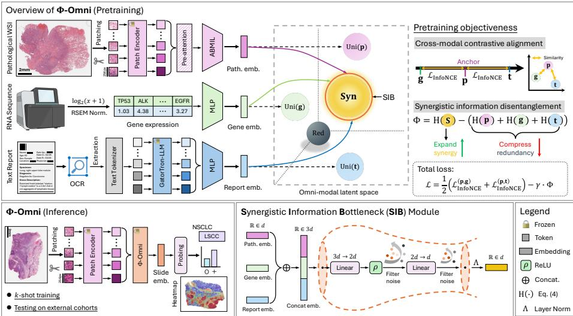
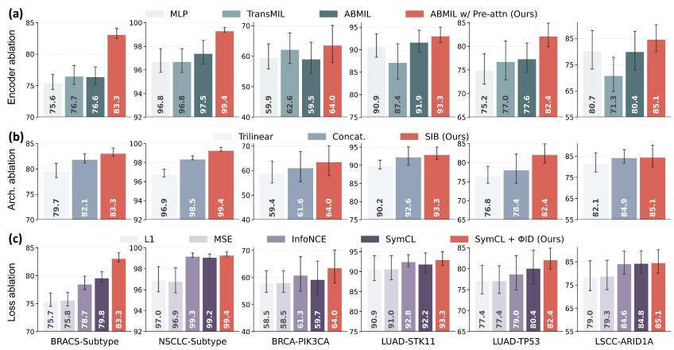
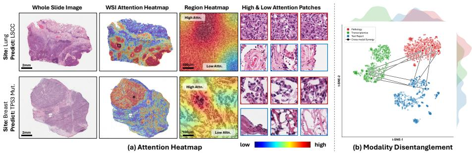

# Synergistic Information Disentanglement for Omni-modal Slide Representation Learning in Computational Pathology

Mingxin Liu1, Chengfei Cai2, Anwen Lu1, Pengbo Xu3, Jun Li1, Jinze Li1, Depin Chen1, and Jun Xu1(B)

1 Jiangsu Key Laboratory of Intelligent Medical Image Computing, School of Artificial Intelligence,

Nanjing University of Information Science and Technology, Nanjing, China jxu@nuist.edu.cn

2 Jiangsu Key Laboratory of Intelligent Drug Screening and Repositioning, College of Information Engineering, Taizhou University, Taizhou, China

3 College of Bioinformatics Science and Technology,

Harbin Medical University, Harbin, China

Abstract. In computational pathology (CPath), developing omni-modal self-supervised learning (SSL) models that integrate histology, genomics, and clinical reports enables transferable representation learning for whole slide images (WSIs). Existing approaches implicitly force heterogeneous modalities into a uniform latent space by contrastive alignment, causing modality collapse where unique, synergistic diagnostic signals (termed as Φ) are discarded in favor of trivial redundancy. We hypothesize that the strongest task-agnostic SSL training signal stems from distilling the synergistic interactions over merely aligning shared redundancy. To this end, we introduce Φ-Omni, a synergistic information disentanglement framework grounded in Partial Information Decomposition (PID) theory for slide representation learning. Unlike standard contrastive approaches, Φ-Omni employs a Synergistic Information Bottleneck (SIB) regulated by the proposed ΦID objective, which explicitly suppresses marginal redundancy while maximizing irreducible synergy, thereby distilling highorder cross-modal interactions. Following pretraining on breast (n=1031) and lung (n=919) cohorts, Φ-Omni demonstrates superior few-shot performance across five independent external datasets spanning eight tasks compared to supervised and SSL baselines. Source code is available here.

Keywords: Computational Pathology · Slide Representation Learning · Multimodal Learning · Partial Information Decomposition.

## 1 Introduction

In recent years, self-supervised learning (SSL) has driven transformative progress in computational pathology (CPath), establishing itself as a foundational framework for CPath models to deliver superior performance in diagnostic, prognostic, and treatment response prediction tasks [1,2,13,14,15,16]. However, since the whole slide images (WSIs) often exceed 150,000×150,000 pixels, most CPath approaches rely on a divide-and-conquer pipeline: (1) tessellating WSIs into small patches, (2) extracting patch features using a frozen pretrained SSL model, and (3) aggregating patch embeddings through Multiple Instance Learning (MIL) for prediction. In addition, SSL can generate universal slide embeddings from patch features by pretraining the aggregator further, enabling zero- or few-shot transfer across diverse downstream tasks without task-specific fine-tuning [8,9,18,26].

However, most slide representation learning methods remain unimodal, where neglecting complementary information from pathology reports and genomic profiles that is essential for robust and generalizable representations [26]. Therefore, recent eforts focus on multimodal pretraining. Early attempts explored multiple visual “views”: MADELEINE [8] learns stain-invariant representations via crossstain contrastive alignment, and BioX-CPath [4] integrates spatial and semantic features across stains with a graph architecture. Subsequent studies incorporate genomics: TANGLE [7] develops a transcriptomics-guided slide representation learning method using contrastive learning, while MIRROR [24] jointly optimizes shared representation alignment and modality-specific feature preservation.

Nevertheless, these approaches face two critical limitations: (1) pathology reports remain under-utilized despite providing expert diagnostic insights [16]. (2) prevalent reliance on contrastive alignment enforces redundancy, contradicting clinical intuition where diagnosis stems from the cross-modal synergy rather than their intersection alone [12]. This rigid alignment overlooks synergistic information, the emergent insights that are absent in any single modality yet solely accessible via joint multimodal observation, thus preventing the model from encoding the holistic representation essential for robust generalization [23].

To address these issues, we propose Φ-Omni, a novel SSL framework for omnimodal slide representation learning via synergistic information disentanglement (see Fig. 1). It firstly encodes omni-modal data into embeddings using domainspecific encoders, then these embeddings are further integrated and sent into the proposed Synergistic Information Bottleneck (SIB) module to distill high-order cross-modal interaction. Inspired by [20,23], we design a Synergistic Information Disentanglement objective (ΦID) with a Gaussian Canonical Projector (GCP) to regularize the omni-modal latent space by maximizing the synergistic interactions and minimizing the shared redundancy. The contributions are as follows:

– We propose Φ-Omni, an SSL framework for slide representation learning replacing redundancy alignment with synergistic disentanglement, which distills omni-modal insights into the slide encoder for robust unimodal inference.

– We introduce the SIB module and GCP with ΦID objective, which explicitly maximizes synergistic information while minimizing shared redundant noise to structure a discriminative omni-modal latent space.

– We validate Φ-Omni across eight diagnostic tasks on five public independent cohorts, demonstrating superior few-shot generalizabillity over state-of-theart supervised MIL and SSL baselines.

  
Fig. 1. The proposed Φ-Omni framework. Omni-modal inputs are embedded via domain-specific encoders then fused by Synergistic Information Bottleneck (SIB) module into a compact joint representation. The ΦID objective regularizes the omni-modal latent space, explicitly expanding emergent synergy while compressing redundancy. For inference, the frozen Φ-Omni slide encoder enables robust unimodal few-shot adaption.

## 2 Method

## 2.1 Omni-modal Feature Encoding

Let $\mathcal { D } = \{ ( \mathbf { X } _ { p } ^ { ( i ) } , \mathbf { X } _ { g } ^ { ( i ) } , \mathbf { X } _ { t } ^ { ( i ) } ) \} _ { i = 1 } ^ { N }$ denote the omni-modal dataset containing pathology WSIs, genomic profiles, and text reports for N patients. We employ domainspecific encoders to project these heterogeneous data into a triplet $\{ \mathbf { p } _ { i } , \mathbf { g } _ { i } , \mathbf { t } _ { i } \}$ Pathological slide encoder. Given a WSI $\mathbf { X } _ { p } ^ { ( i ) } \in \mathbb { R } ^ { d _ { x } \times d _ { y } \times 3 }$ for the $i ^ { \mathrm { t h } }$ patient, we tessellate it into 256×256 patches at 20× using TRIDENT [30] and extract it into patch embeddings using UNIv2 [2] as $\mathbf { P } _ { i } \in \mathbb { R } ^ { \mathrm { D } _ { p } \times 1 5 3 6 }$ . These embeddings are then aggregated by a slide encoder $\bar { f } ^ { \mathrm { M I L } }$ , implemented as an ABMIL [6] with a pre-attention layer [8], mapping the patch set into a slide embedding $\mathbf { p } _ { i } \in \mathbb { R } ^ { d }$ Transcriptomics encoder. We utilized paired Bulk RNA-seq data from UCSC Xena after $\log 2 ( \mathbf { x } + 1 )$ and RSEM transformed [5]. We select the genes associated with 50 MsigDB [11] Hallmark biological pathways to construct an input profile $\mathbf { G } _ { i } \in \mathbb { R } ^ { \mathrm { D } _ { g } } ( \mathrm { D } _ { g } \approx 5 0 0 0 )$ , then encode it into a transcriptomics embedding $\mathbf { g } _ { i } \in \mathbb { R } ^ { d }$ through a two-layer multilayer perceptron (MLP).

Text report encoder. We processed pathology reports via an OCR-based pipeline with text cleaning [21] (removing diagnostic labels). We encode the extracted text into semantic features $\mathbf { T } _ { i } \in \bar { \mathbb { R } } ^ { 1 0 2 4 }$ via pre-trained GatorTron [29], and further project it into a text report embedding $\mathbf { t } _ { i } \in \mathbb { R } ^ { d }$ via a two-layer MLP.

## 2.2 Synergistic Information Bottleneck Module

A key challenge in multimodal learning lies in the modality gap: naive integration propagates noise and enables dominant modality to suppress weaker ones. To address this, we propose the Synergistic Information Bottleneck (SIB) module to distill high-order cross-modal interactions. Structurally, SIB serves as an inductive bottleneck that maps the concatenated unimodal embeddings $\mathbf { X } _ { \mathrm { j o i n t } } \in \mathbb { R } ^ { 3 d }$ to a compact joint representation $\mathbf { Z } _ { \mathrm { m m } } \in \mathbb { R } ^ { d }$ via linear projection layers Proj(·):

$$
\mathbf { Z } _ { \mathrm { m m } } = \mathcal { F } _ { \mathrm { S I B } } \left( \mathbf { X } _ { \mathrm { j o i n t } } \right) \stackrel { \triangle } { = } \mathrm { L N } \big ( \mathrm { P r o j } _ { 2 } \left( \mathrm { R e L U ( P r o j } _ { 1 } [ \mathbf { p } _ { i } \oplus \mathbf { g } _ { i } \oplus \mathbf { t } _ { i } ] ) \right) \big )\tag{1}
$$

where ⊕ and LN denote concatenation and Layer Normalization. By creating a dimensionality bottleneck $( { \mathrm { P r o j } } _ { 1 } \to { \mathrm { P r o j } } _ { 2 } : 3 d \to 2 d \to d )$ , SIB constrains the capacity of the multimodal transition, efectively filtering out modality-specific noise while capturing the most informative synergistic diagnostic signals.

## 2.3 Synergistic Information Disentanglement (ΦID)

Mutual information. The core objective of multimodal learning is to maximize the dependency between input modalities X and the fused feature $\mathbf { Z } ,$ typically measured via Mutual Information (MI) I(X; Z). However, maximizing standard MI is insuficient for heterogeneous data due to its composite nature. According to Partial Information Decomposition (PID) theory [20], information from sources X about a target Z can be decomposed into three distinct atoms: (1) Redundancy (Red): Information shared across all modalities.

(2) Uniqueness (Uni): Information provided solely by a specific modality $\mathbf { X } _ { m }$ (3) Synergy (Syn): Emergent information is available only when observing multiple modalities jointly and is absent in any single source. Formally, the total mutual information in this work satisfies:

$$
\begin{array} { r } { \boldsymbol { { \mathcal { Z } } } ( \mathbf { X } ; \mathbf { Z } ) = \operatorname { R e d } \left( \mathbf { X } ; \mathbf { Z } \right) + \sum _ { m \in \{ \mathbf { p } , \mathbf { g } , \mathbf { t } \} } \operatorname { U n i } \left( \mathbf { X } _ { m } ; \mathbf { Z } \right) + \operatorname { S y n } \left( \mathbf { X } ; \mathbf { Z } \right) } \end{array}\tag{2}
$$

standard fusion methods often maximize Red, as it represents the “least common denominator” features while causing modality collapse. In contrast, clinical diagnosis relies on Syn to integrate complementary cues for a holistic conclusion. ΦID objective. To promote the emergence of Syn and mitigates the subspace collapse of Red, We denote omni-modal synergistic interaction as $\Phi ,$ computed via the “whole-minus-sum” residual in PID to isolate multimodal information:

$$
\Phi ( \{ \mathbf { p } , \mathbf { g } , \mathbf { t } \}  \mathbf { Z } _ { \mathrm { m m } } ) \overset { \Delta } { = } \underbrace { \mathcal { Z } ( \mathbf { X } _ { \mathrm { j o i n t } } ; \mathbf { Z } _ { \mathrm { m m } } ) } _ { \mathrm { T o t a l ~ c o r r e l a t i o n } } - \sum _ { m \in \{ \mathbf { p } , \mathbf { g } , \mathbf { t } \} } \underbrace { \mathcal { Z } ( \mathbf { X } _ { m } ; \mathbf { Z } _ { \mathrm { m m } } ) } _ { \mathrm { M a r g i n a l ~ r e d u n d a n c y } }\tag{3}
$$

where maximizing Φ forces the model to capture high-order Syn interactions while minimizing the marginal Red that can be inferred from single modality. Gaussian Canonical Projector. To ensure computational tractability for estimating MI in high dimensions, we design Gaussian Canonical Projector (GCP)

inspired by [22]. GCP leverages Layer Normalization to explicitly map heterogeneous embeddings $\mathbf { h } \in \{ \mathbf { X } _ { \mathrm { j o i n t } } , \mathbf { X } _ { m } , \mathbf { Z } _ { \mathrm { m m } } \}$ onto a smooth Gaussian latent space for diferential entropy estimation, enables H $( \mathbf { Z } )$ to be estimated via a parametric variational Gaussian approximation with a closed-form log-determinant:

$$
\mathbf { Z } = \mathbf { I } _ { \mathrm { G C P } } \left( \mathbf { h } \right) \overset { \triangle } { = } \mathrm { S i g m o i d } \Big ( \mathrm { L N } \big ( \mathbf { W } \cdot \mathbf { h } \big ) \Big ) , \quad \mathrm { H } \left( \mathbf { Z } \right) = \frac { 1 } { 2 } \log \operatorname* { d e t } \big ( \Sigma \mathbf { z } \big )\tag{4}
$$

where $\begin{array} { l } { { \frac { 1 } { 2 } } } \end{array}$ log det $\left( \Sigma _ { \mathbf { Z } } \right)$ captures feature “volume”, maximized to expand information and prevent collapse. $\begin{array} { r } { \Sigma \mathbf { z } = \frac { 1 } { \mathsf { B } } \mathbf { Z } ^ { \top } \mathbf { Z } + \epsilon \mathbf { I } } \end{array}$ is the empirical covariance matrix for batch size B, I is the identity matrix with $\epsilon = 1 0 ^ { - 5 }$ for numerical stability.

## 2.4 Pretraining Objective

Cross-modal contrastive alignment. We align the latent space via a symmetric InfoNCE objective [3]. Defining the directional pairwise loss $\boldsymbol { \ell } ( { \mathbf { u } } , { \mathbf { v } } )$ between a query modality u and a key modality $\mathbf { v } ,$ the omni-modal symmetric contrastive alignment objective is calculated as:

$$
\mathcal { L } _ { \mathrm { S y m C L } } = \frac { 1 } { 2 } \sum _ { k \in \{ \mathbf { g } , \mathbf { t } \} } \left( \ell ( \mathbf { p } , \mathbf { k } ) + \ell ( \mathbf { k } , \mathbf { p } ) \right) , \ell ( \mathbf { u } , \mathbf { v } ) = - \frac { 1 } { \mathrm { B } } \sum _ { i = 1 } ^ { \mathrm { B } } \log \frac { e ^ { \tau \mathbf { u } _ { i } ^ { \top } \mathbf { v } _ { i } } } { \sum _ { j = 1 } ^ { \mathrm { M } } e ^ { \tau \mathbf { u } _ { j } ^ { \top } \mathbf { v } _ { j } } }\tag{5}
$$

where $\tau$ is the temperature parameter, and the summation over $k = \{ \mathbf { g } , \mathbf { t } \}$ aligns the pathology anchor (central modality) p with both transcriptomics g and report embeddings t, skipping auxiliary g-t alignment for eficiency.

Synergistic information disentanglement. To distill Syn, we minimize the Total Correlation (TC) of projected margins as a parametric variational proxy for Eq. (3). This approximation compresses redundancy, forcing the joint embedding to capture synergistic interactions. The loss for ΦID objective is formulated as:

$$
\begin{array} { r } { \mathcal { L } _ { \Phi \mathrm { I D } } = - \Phi = \sum _ { m \in \{ { \bf p } , { \bf g } , { \bf t } \} } \mathrm { H } \left( { \bf Z } _ { m } \right) - \mathrm { H } \left( { \bf Z } _ { \mathrm { j o i n t } } \right) } \end{array}\tag{6}
$$

where $\mathbf { Z } _ { * } = \mathbf { \Pi } \Pi _ { \mathrm { G C P } } ( \mathbf { X } _ { * } )$ . Specifically, this objective imposes a dual constraint: (1) it compresses the marginal entropies to suppress unimodal redundancy, while (2) expanding the joint entropy to capture synergistic cross-modal interactions. Complementary objective. Overall, we train $\Phi \mathrm { . }$ -Omni using a composite loss: $\mathcal { L } = \mathcal { L } _ { \mathrm { S y m C L } } + \gamma \mathcal { L } _ { \Phi \mathrm { I D } }$ , where the former ensures foundational semantic alignment and the latter acts as a regularizer that penalizes trivial redundancy to encourage the discovery of complementary synergistic features. We set $\gamma = 0 . 2$ in this work.

## 3 Experimental Setups and Results

## 3.1 Study Design

To validate Φ-Omni, we established two omni-modal pretraining cohorts by filtering TCGA 4 cases with strictly triplet-aligned modalities (pathological WSI, transcriptomics, pathology reports). For inference, only WSIs are required.

Table 1. Few-shot breast and lung cancer subtyping. Evaluation via macro-AUC on BRACS and CPTAC-NSCLC two cohorts. Best in bold, second best is underlined.
<table><tr><td rowspan="2">Model/Data</td><td colspan="4">BRACS (↑)</td><td colspan="4">CPTAC-NSCLC (↑)</td></tr><tr><td> $k { = } 1$ </td><td> $k { = } 5$ </td><td> $k { = } 1 0$ </td><td> $k { = } 2 5$ </td><td> $k { = } 1$ </td><td> $k { = } 5$ </td><td> $k { = } 1 0$ </td><td> $k { = } 2 5$ </td></tr><tr><td>ABMIL [6]</td><td> $5 5 . 9 \pm 2 . 8$ </td><td> $6 4 . 8 \pm 2 . 0$ </td><td> $7 5 . 4 \pm 2 . 6$ </td><td> $8 2 . 3 \pm 0 . 8$ </td><td> $7 2 . 2 \pm 1 2 . 4$ </td><td> $9 1 . 9 \pm 5 . 2 $ </td><td> $9 5 . 7 \pm 2 . 7$ </td><td> $9 8 . 3 \pm 1 . 0$ </td></tr><tr><td>II CLAM [17]</td><td> $5 5 . 5 \pm 3 . 0$ </td><td> $6 5 . 4 \pm 3 . 2$ </td><td> $7 4 . 9 \pm 2 . 0$ </td><td> $8 2 . 3 \pm 1 . 2$ </td><td> $7 4 . 3 \pm 1 4 . 1$ </td><td> $9 3 . 6 \pm 3 . 1 $ </td><td> $9 6 . 5 \pm 2 . 3$ </td><td> $9 8 . 5 \pm 0 . 7 $ </td></tr><tr><td>TransMIL [19]</td><td> $5 7 . 1 \pm 2 . 7$ </td><td> $6 8 . 9 \pm 2 . 2$ </td><td> $7 5 . 6 \pm 1 . 2$ </td><td> $8 2 . 3 \pm 1 . 9$ </td><td> $7 1 . 7 \pm 1 2 . 2$ </td><td> $9 1 . 8 \pm 3 . 0$ </td><td> $9 5 . 2 \pm 1 . 4$ </td><td> $9 8 . 6 \pm 0 . 5$ </td></tr><tr><td>ILRA [27]</td><td> $5 5 . 0 \pm 1 . 8$ </td><td> $6 2 . 5 \pm 2 . 8$ </td><td> $7 0 . 0 \pm 1 . 6$ </td><td> $7 9 . 0 \pm 1 . 7$ </td><td> $6 6 . 7 \pm 1 5 . 9$ </td><td> $8 7 . 1 \pm 2 . 5$ </td><td> $9 2 . 4 \pm 1 . 7$ </td><td> $9 7 . 0 \pm 1 . 1$ </td></tr><tr><td>CTransPath* [25]</td><td> $5 6 . 7 \pm 2 . 8$ </td><td> $6 3 . 3 \pm 2 . 9$ </td><td> $6 4 . 7 \pm 1 . 4$ </td><td> $6 8 . 9 \pm 1 . 6$ </td><td> $7 1 . 3 \pm 1 1 . 1$ </td><td> $8 8 . 0 \pm 4 . 9$ </td><td> $9 2 . 3 \pm 2 . 1$ </td><td> $9 6 . 0 \pm 1 . 1$ </td></tr><tr><td> $\mathrm { U N I v 2 ^ { \star } \ [ 2 ] }$ </td><td> $5 5 . 8 \pm 3 . 2$ </td><td> $6 6 . 0 \pm 2 . 0$ </td><td> $7 0 . 6 \pm 1 . 7$ </td><td> $7 6 . 4 \pm 1 . 5$ </td><td> $7 2 . 9 \pm 1 5 . 3$ </td><td> $9 1 . 4 \pm 4 . 2 $ </td><td> $9 5 . 3 \pm 1 . 7$ </td><td> $9 7 . 5 \pm 1 . 0$ </td></tr><tr><td>CONCH* [16]</td><td> $5 8 . 4 \pm 8 . 4$ </td><td> $6 9 . 5 \pm 2 . 8$ </td><td> $7 3 . 4 \pm 2 . 1$ </td><td> $7 9 . 0 \pm 1 . 7$ </td><td> ${ \bf 8 3 . 1 \pm 9 . 3 }$ </td><td> $\underline { { 9 5 . 8 \pm 2 . 0 } }$ </td><td> $\underline { { 9 7 . 0 \pm 0 . 7 } }$ </td><td> $9 8 . 5 \pm 0 . 5$ </td></tr><tr><td>mSTAR* [28]</td><td> $5 6 . 1 \pm 3 . 0$ </td><td> $6 6 . 0 \pm 2 . 3$ </td><td> $7 0 . 2 \pm 2 . 0$ </td><td> $7 5 . 4 \pm 1 . 3$ </td><td> $7 4 . 9 \pm 1 1 . 9$ </td><td> $9 2 . 1 \pm 4 . 2 $ </td><td> $9 5 . 5 \pm 1 . 7$ </td><td> $9 7 . 8 \pm 0 . 8$ </td></tr><tr><td> $\mathrm { { G P F M ^ { \star } \ [ i \tilde { 8 } ] } }$ </td><td> $5 6 . 4 \pm 2 . 7$ </td><td> $6 6 . 2 \pm 2 . 8$ </td><td> $7 0 . 9 \pm 2 . 0$ </td><td> $7 5 . 8 \pm 1 . 3$ </td><td></td><td> $7 3 . 2 \pm 1 0 . 8 9 0 . 3 \pm 4 . 9$ </td><td> $9 5 . 3 \pm 1 . 9$ </td><td> $9 7 . 8 \pm 1 . 0$ </td></tr><tr><td>inoedr rneobe CHIEF [26]</td><td> $6 4 . 2 \pm 3 . 2 $ </td><td> $7 3 . 6 \pm 2 . 1$ </td><td> $7 7 . 5 \pm 1 . 4$ </td><td> $8 1 . 9 \pm 1 . 1$ </td><td></td><td> $7 2 . 7 \pm 1 0 . 9 9 1 . 0 \pm 4 . 7$ </td><td> $9 4 . 6 \pm 1 . 6$ </td><td> $9 7 . 4 \pm 0 . 7 $ </td></tr><tr><td>TANGLE [7]</td><td> $6 2 . 2 \pm 2 . 3$ </td><td> $\underline { { 7 4 . 1 \pm 2 . 4 } }$ </td><td> $J 8 . 1 \pm 1 . 2$ </td><td> $\underline { { 8 2 . 4 \pm 0 . 8 } }$ </td><td></td><td> $7 9 . 3 \pm 1 0 . 2 9 5 . 3 \pm 4 . 3$ </td><td> $9 6 . 9 \pm 2 . 1$ </td><td> $9 8 . 8 \pm 0 . 2 $ </td></tr><tr><td>MADELEINE [8]</td><td> $6 1 . 3 \pm 4 . 5$ </td><td> $7 3 . 4 \pm 2 . 4$ </td><td> $7 6 . 7 \pm 2 . 0$ </td><td> $8 2 . 3 \pm 1 . 3$ </td><td></td><td>81.3 ± 9.6 94.7 ± 2.7</td><td> $9 6 . 6 \pm 1 . 1$ </td><td> $9 8 . 2 \pm 0 . 6 $ </td></tr><tr><td>Φ-OMNI (Ours)</td><td>65.2 ± 2.6 76.5 ± 2.2 79.9 ± 1.0 83.3 ± 0.8</td><td></td><td></td><td></td><td></td><td>81.7 ± 11.3 97.5 ± 1.6 98.8 ± 0.5 99.4 ± 0.2</td><td></td><td></td></tr></table>

Breast. For breast pretraining, we used $n { = } 1 , 0 3 1$ omni-modal primary breast cases from TCGA Breast Invasive Carcinoma (BRCA) cohort. Downstream evaluation was conducted on two independent cohorts: (1) BRACS dataset 5 (n=547) for 7-way breast cancer fine-grained subtyping and (2) CPTAC-BRCA 6 dataset (n=112) for predicting the molecular mutation status of TP53 and PIK3CA. Lung. For lung pretraining, we used $n { = } 9 1 9$ omni-modal primary lung cases from TCGA Non-Small Cell Lung Cancer (NSCLC) cohort. We performed downstream evaluation on CPTAC-NSCLC for: (1) lung cancer subtyping (LUAD vs. LSCC, n=604), molecular mutation prediction of (2) STK11/TP53 on CPTAC-LUAD $\scriptstyle ( n = 3 2 4 )$ , (3) ARID1A/KEAP1 on CPTAC-LSCC (n=304).

## 3.2 Evaluation and Implementation Details

Few-shot classification. Following [7,8], we benchmark Φ-Omni against SSL models via k-shot linear probing (k=1, 5, 10, 25) via a logistic regression classifier (L2 penalty $C { = } 1 . 0 ;$ max iterations=104) from scikit-learn. All experiments are repeated ten times by randomly sampling k examples per class during training with diferent seeds, reporting the mean and standard deviation of macro-AUC. Implementation details. Φ-Omni was trained for 100 epochs (5 for warmup) using AdamW with cosine decay $( 1 0 ^ { - 4 } \mathrm { t o } 1 0 ^ { - 8 } )$ and batch size 128. We sampled 2,048 fixed patches per slide with random oversampling applied to slides with fewer patches. All MIL models were trained from scratch with batch size of 1. Baselines. We benchmark Φ-Omni against four MIL models based on UNIv2 [2] encoder: ABMIL [6], CLAM [17], TransMIL [19], and ILRA [27]. We also compare with SSL models via linear probing, including patch-level SSLs: CTransPath [25], UNIv2 [2], CONCH [16], mSTAR [28], and GPFM [18] using mean-pool embeddings (noted ∗), and slide-levels: CHIEF [26], TANGLE [7], and MADELEINE [8].

Table 2. Few-shot molecular status prediction. Evaluation via macro-AUC on three cohorts from CPTAC (k=25). Best in bold, second best is underlined.
<table><tr><td rowspan="2">Model/Data</td><td rowspan="2">|Reference Venue&#x27;Year</td><td colspan="2">BRCA (↑)</td><td colspan="2">LUAD (↑)</td><td colspan="2">LSCC (↑)</td><td rowspan="2">Avg. (↑)</td></tr><tr><td>PIK3CA</td><td>TP53</td><td>STK11</td><td>TP53</td><td>ARID1A</td><td>KEAP1</td></tr><tr><td>ABMIL [6] I</td><td>|ICML&#x27;2018</td><td> $6 1 . 2 \pm 8 . 7$ </td><td>76.1 ± 4.6</td><td>90.8 ± 5.1</td><td> $7 6 . 3 \pm 5 . 0$ </td><td> $8 2 . 2 \pm 5 . 0$ </td><td>84.5 ± 3.8</td><td>78.5</td></tr><tr><td>CLAM [17]</td><td>Nat. BME.&#x27;2021</td><td> $6 0 . 5 \pm 8 . 7$ </td><td> $7 5 . 5 \pm 5 . 2$ </td><td>92.1 ± 4.4</td><td> $7 8 . 3 \pm 3 . 9$ </td><td> $8 1 . 0 \pm 5 . 1$ </td><td> $8 4 . 4 \pm 5 . 0$ </td><td>78.6</td></tr><tr><td>TransMIL [19]</td><td>NeurIPS&#x27;2021</td><td> $5 9 . 4 \pm 7 . 6$ </td><td> $7 8 . 6 \pm 3 . 5$ </td><td>91.3 ± 3.3</td><td> $7 8 . 0 \pm 4 . 8$ </td><td> $8 0 . 9 \pm 3 . 6 $ </td><td> $8 3 . 9 \pm 5 . 2$ </td><td>78.7</td></tr><tr><td>ILRA [27]</td><td>ICLR&#x27;2023</td><td>61.4 ± 7.9</td><td>74.5 ± 5.9</td><td>91.7 ± 4.3</td><td> $7 7 . 8 \pm 4 . 5$ </td><td> $8 1 . 3 \pm 4 . 0$ </td><td> $8 7 . 1 \pm 6 . 3$ </td><td>79.0</td></tr><tr><td>CTransPath*</td><td>|MedIA&#x27;2022</td><td>62.1 ± 4.8</td><td>73.1 ± 4.8</td><td>85.3 ± 3.4</td><td> $7 0 . 8 \pm 2 . 7$ </td><td> $7 5 . 2 \pm 7 . 5$ </td><td> $8 2 . 4 \pm 3 . 5$ </td><td>74.8</td></tr><tr><td>UNIv2* [2]</td><td>Nat. Med.&#x27;2024</td><td>59.6 ± 5.2</td><td>77.2 ± 5.2</td><td>92.0 ± 2.4</td><td>77.7 ± 3.0</td><td> $8 0 . 3 \pm 7 . 3$ </td><td> $8 7 . 6 \pm 5 . 0 $ </td><td>79.1</td></tr><tr><td>Inoer Preoobe CONCH* [16]</td><td>Nat. Med.&#x27;2024</td><td> $5 6 . 2 \pm 5 . 3$ </td><td>77.2 ± 5.0</td><td>89.2 ± 3.3</td><td>68.9 ± 4.1</td><td>73.2 ± 9.8 78.6 ± 5.2</td><td></td><td>73.9</td></tr><tr><td>mSTAR* [28]</td><td>Nat. Comm.&#x27;2025</td><td> $6 0 . 0 \pm 4 . 8$ </td><td>78.1 ± 4.6</td><td>91.5 ± 2.6</td><td>77.2 ± 2.5</td><td>79.2 ± 7.0</td><td>87.5 ± 4.6</td><td>78.9</td></tr><tr><td>GPFM* [18]</td><td>Nat. BME.&#x27;2025</td><td> $5 9 . 9 \pm 5 . 3$ </td><td> $7 7 . 5 \pm 4 . 2$ </td><td>91.9 ± 2.9</td><td>74.9 ± 3.0</td><td> $7 8 . 8 \pm 7 . 8$ </td><td>85.5 ± 4.5</td><td>78.1</td></tr><tr><td>CHIEF [26]]</td><td>Nature&#x27;2024</td><td> $6 3 . 8 \pm 6 . 2$ </td><td>78.1 ± 4.1</td><td>89.5 ± 3.2</td><td> $7 4 . 0 \pm 2 . 5$ </td><td>78.8 ± 7.3</td><td>81.7 ± 3.4</td><td>77.7</td></tr><tr><td>TANGLE [7]</td><td>CVPR&#x27;2024</td><td>60.1 ± 6.2 81.0 ± 3.5</td><td></td><td>91.8 ± 2.7</td><td> $\underline { { 7 9 . 7 \pm 3 . 5 } }$ </td><td>82.8 ± 5.3</td><td>85.6 ± 4.6</td><td>80.2</td></tr><tr><td>MADELEINE [8]</td><td>ECCV&#x27;2024</td><td> $6 1 . 4 \pm 5 . 9$ </td><td> $7 9 . 3 \pm 4 . 6$ </td><td> $9 2 . 1 \pm 2 . 6 $ </td><td>72.7 ± 2.5</td><td>75.9 ± 8.2</td><td>83.1 ± 6.4 77.4</td><td></td></tr><tr><td>Φ-OMNI (Ours)</td><td>MICCAI&#x27;2026</td><td></td><td>64.0 ± 6.1 80.0 ± 3.6</td><td></td><td>93.3 ± 1.7 82.4 ± 2.5</td><td>85.1 ± 5.1 88.8 ± 5.2 82.3</td><td></td><td></td></tr></table>

  
Fig. 2. Ablation study results on architecture and loss function across six tasks.

## 3.3 Few-shot Classification Results

Φ-Omni vs. UNIv2 vs. TANGLE. Φ-Omni exceeds UNIv2 (pathology) and TANGLE (pathology+genomic) across all tasks (Table 1,2), highlights the value of clinical (report) and biological (genomic) “views” from multimodal pretraining. Φ-Omni vs. MILs. Φ-Omni surpasses all MILs in 8/8 tasks, achieving +4.3%, +1.2%, and +1.1% gains compared to ABMIL (k=25) for molecular prediction, breast and lung subtyping, respectively. Notably, Φ-Omni employs linear probing only, whereas MIL models are trained from scratch in standard few-shot settings. Φ-Omni vs. SSLs. Φ-Omni outperforms all SSL models on most tasks, often by notable margins, e.g., +3.2% over TANGLE (BRACS, breast cancer subtyping, k=5) and +5.7% over UNIv2 (CPTAC-LSCC, ARID1A mutation prediction, k=25). Notably, this advantage holds consistently across all k values and tasks, underscoring the excellent performance and robust generalization of Φ-Omni.

## 3.4 Ablation Study

Architecture ablation. We explore two key architectural features as shown in Fig. 2. (a) the network for slide encoding: we compare ABMIL w/ pre-attention with MLP, TransMIL, and ABMIL, our choice yields notable improvements. (b) the module for multimodal feature fusion: we evaluate Trilinear [10], Concat, and our SIB module, where SIB outperforms alternatives steadily for all six tasks. Loss ablation. We perform a thorough ablation of Φ-Omni loss function by retraining models with L1 objective, Mean-Squared Error (MSE), InfoNCE, symmetric contrastive objective (SymCL), and combining SymCL and ΦID (Ours). Fig. 2 (c) shows that our ΦID objective is indispensable: SymCL alone achieves strong gains over L1/MSE/InfoNCE, but combining it with ΦID unlocks synergistic improvements across all six tasks (+4.4% on BRACS-Subtyping and +7.2% on BRCA-PIK3CA), proving that explicit synergy disentanglement (not just contrastive alignment) is critical for maximizing multimodal diagnostic value.

## 3.5 Interpretability Analysis

Attention heatmaps. We generate attention heatmaps of Φ-Omni pretrained on lung/breast cancer (Fig. 3 (a)), which reveals spatial correspondence between high-attention regions and tumor areas, demonstrating task-agnostic supervised localization of pathological regions through multimodal pretraining.

Omni-modal disentanglement. To investigate the structural properties of the learned latent space, we visualize omni-modal embeddings extracted from Φ-Omni pretrained on lung cancer via t-SNE (Fig. 3 (b)). The visualization exhibits three well-separated clusters, indicating that Φ-Omni efectively learns discriminative representations for each modality, preventing the modality collapse. Notably, the explicit connections between paired samples (“Cross-modal Synergy”) confirm that Φ-Omni preserves strong semantic alignment across heterogeneous modalities while maintaining the intrinsic biological and clinical correlations.

## 4 Conclusion

In this paper, we introduce Φ-Omni, a novel SSL framework that advances omnimodal slide representation learning by shifting the focus from redundancy-driven contrastive alignment to synergistic information disentanglement. Derived from Partial Information Decomposition (PID) theory, our proposed SIB module and ΦID objective provide a mathematically principled mechanism to extract highorder diagnostic insights that are absent in any single modality. Extensive experiments across six benchmarks demonstrate that Φ-Omni not only achieves state-of-the-art few-shot performance but maintains biologically grounded interpretability. This work highlights the power of distilling synergistic interaction from omni-modal histology, genomics, and pathology reports, paving the way for data-eficient and robust multimodal frameworks in computational pathology.

  
Fig. 3. Interpretability analysis of Φ-Omni. (a) Attention heatmaps of the frozen ABMIL slide encoder pretrained with Φ-Omni overlaid on randomly chosen WSIs from lung and breast cohort. Red/blue denotes high/low attention regions with corresponding pathological patch details. (b) t-SNE visualization: Φ-Omni disentangles crossmodal representations (pathology, transcriptomics, text reports) into distinct clusters.

Acknowledgments. This work is funded by the National Key R&D Program of China (No. 2023YFC3402800), National Natural Science Foundation of China (Nos. 82441029, 62171230, 62101365, 92159301, 62301263, 62301265, 62302228, 82302291, 82302352, 62401272), Jiangsu Provincial Department of Science and Technology’s major project on frontier-leading basic research in technology (No. BK2023200).

Disclosure of Interests. The authors have no competing interests to declare that are relevant to the content of this article.

## References

1. Cai, C., Li, J., Liu, M., Jiao, Y., Xu, J.: Seqfrt: Towards efective adaption of foundation model via sequence feature reconstruction in computational pathology. In: 2024 IEEE International Conference on Bioinformatics and Biomedicine (BIBM). pp. 1808–1815. IEEE (2024)

2. Chen, R.J., Ding, T., Lu, M.Y., Williamson, D.F., Jaume, G., Song, A.H., Chen, B., Zhang, A., Shao, D., Shaban, M., et al.: Towards a general-purpose foundation model for computational pathology. Nature medicine 30(3), 850–862 (2024)

3. Chen, T., Kornblith, S., Norouzi, M., Hinton, G.: A simple framework for contrastive learning of visual representations. In: International conference on machine learning. pp. 1597–1607. PmLR (2020)

4. Gallagher-Syed, A., Senior, H., Alwazzan, O., Pontarini, E., Bombardieri, M., Pitzalis, C., Lewis, M.J., Barnes, M.R., Rossi, L., Slabaugh, G.: Biox-cpath: Biologically-driven explainable diagnostics for multistain ihc computational pathology. In: Proceedings of the Computer Vision and Pattern Recognition Conference. pp. 10372–10383 (2025)

5. Goldman, M.J., Craft, B., Hastie, M., Repečka, K., McDade, F., Kamath, A., Banerjee, A., Luo, Y., Rogers, D., Brooks, A.N., Zhu, J., Haussler, D.: Visualizing and interpreting cancer genomics data via the xena platform. Nature biotechnology 38(6), 675–678 (2020)

6. Ilse, M., Tomczak, J., Welling, M.: Attention-based deep multiple instance learning. In: International conference on machine learning. pp. 2127–2136. PMLR (2018)

7. Jaume, G., Oldenburg, L., Vaidya, A., Chen, R.J., Williamson, D.F., Peeters, T., Song, A.H., Mahmood, F.: Transcriptomics-guided slide representation learning in computational pathology. In: Proceedings of the IEEE/CVF Conference on Computer Vision and Pattern Recognition. pp. 9632–9644 (2024)

8. Jaume, G., Vaidya, A., Zhang, A., H. Song, A., J. Chen, R., Sahai, S., Mo, D., Madrigal, E., Phi Le, L., Mahmood, F.: Multistain pretraining for slide representation learning in pathology. In: European Conference on Computer Vision. pp. 19–37. Springer (2024)

9. Lenz, T., Neidlinger, P., Ligero, M., Wölflein, G., van Treeck, M., Kather, J.N.: Unsupervised foundation model-agnostic slide-level representation learning. In: Proceedings of the Computer Vision and Pattern Recognition Conference. pp. 30807– 30817 (2025)

10. Li, H., Yang, F., Xing, X., Zhao, Y., Zhang, J., Liu, Y., Han, M., Huang, J., Wang, L., Yao, J.: Multi-modal multi-instance learning using weakly correlated histopathological images and tabular clinical information. In: International Conference on Medical Image Computing and Computer-Assisted Intervention. pp. 529–539. Springer (2021)

11. Liberzon, A., Birger, C., Thorvaldsdóttir, H., Ghandi, M., Mesirov, J.P., Tamayo, P.: The molecular signatures database hallmark gene set collection. Cell systems 1(6), 417–425 (2015)

12. Liu, M., Cai, C., Li, J., Xu, P., Li, J., Ma, J., Xu, J.: Murrenet: Modeling holistic multimodal interactions between histopathology and genomic profiles for survival prediction. In: International Conference on Medical Image Computing and Computer-Assisted Intervention. pp. 396–406. Springer (2025)

13. Liu, M., Liu, Y., Cui, H., Li, C., Ma, J.: Mgct: Mutual-guided cross-modality transformer for survival outcome prediction using integrative histopathologygenomic features. In: 2023 IEEE International Conference on Bioinformatics and Biomedicine (BIBM). pp. 1306–1312. IEEE (2023)

14. Liu, M., Liu, Y., Xu, P., Cui, H., Ke, J., Ma, J.: Exploiting geometric features via hierarchical graph pyramid transformer for cancer diagnosis using histopathological images. IEEE Transactions on Medical Imaging (2024)

15. Liu, M., Liu, Y., Xu, P., Ma, J.: Unleashing the infinity power of geometry: A novel geometry-aware transformer (goat) for whole slide histopathology image analysis. In: 2024 IEEE International Symposium on Biomedical Imaging (ISBI). pp. 1–5. IEEE (2024)

16. Lu, M.Y., Chen, B., Williamson, D.F., Chen, R.J., Liang, I., Ding, T., Jaume, G., Odintsov, I., Le, L.P., Gerber, G., et al.: A visual-language foundation model for computational pathology. Nature medicine 30(3), 863–874 (2024)

17. Lu, M.Y., Williamson, D.F., Chen, T.Y., Chen, R.J., Barbieri, M., Mahmood, F.: Data-eficient and weakly supervised computational pathology on whole-slide images. Nature biomedical engineering 5(6), 555–570 (2021)

18. Ma, J., Guo, Z., Zhou, F., Wang, Y., Xu, Y., Li, J., Yan, F., Cai, Y., Zhu, Z., Jin, C., et al.: A generalizable pathology foundation model using a unified knowledge distillation pretraining framework. Nature Biomedical Engineering pp. 1–20 (2025)

19. Shao, Z., Bian, H., Chen, Y., Wang, Y., Zhang, J., Ji, X., et al.: Transmil: Transformer based correlated multiple instance learning for whole slide image classification. Advances in neural information processing systems 34, 2136–2147 (2021)

20. Tokui, S., Sato, I.: Disentanglement analysis with partial information decomposition. arXiv preprint arXiv:2108.13753 (2021)

21. Tripathi, A., Waqas, A., Schabath, M.B., Yilmaz, Y., Rasool, G.: Honeybee: enabling scalable multimodal ai in oncology through foundation model-driven embeddings. npj Digital Medicine 8(1), 622 (2025)

22. Venkatesh, P., Bennett, C., Gale, S., Ramirez, T., Heller, G., Durand, S., Olsen, S., Mihalas, S.: Gaussian partial information decomposition: Bias correction and application to high-dimensional data. Advances in Neural Information Processing Systems 36, 74602–74635 (2023)

23. Ver Steeg, G., Brekelmans, R., Harutyunyan, H., Galstyan, A.: Disentangled representations via synergy minimization. In: 2017 55th Annual Allerton Conference on Communication, Control, and Computing (Allerton). pp. 180–187. IEEE (2017)

24. Wang, T., Fan, J., Zhang, D., Liu, D., Xia, Y., Huang, H., Cai, W.: Mirror: Multimodal pathological self-supervised representation learning via modality alignment and retention. arXiv preprint arXiv:2503.00374 (2025)

25. Wang, X., Yang, S., Zhang, J., Wang, M., Zhang, J., Yang, W., Huang, J., Han, X.: Transformer-based unsupervised contrastive learning for histopathological image classification. Medical image analysis 81, 102559 (2022)

26. Wang, X., Zhao, J., Marostica, E., Yuan, W., Jin, J., Zhang, J., Li, R., Tang, H., Wang, K., Li, Y., et al.: A pathology foundation model for cancer diagnosis and prognosis prediction. Nature 634(8035), 970–978 (2024)

27. Xiang, J., Zhang, J.: Exploring low-rank property in multiple instance learning for whole slide image classification. In: The Eleventh International Conference on Learning Representations (2023)

28. Xu, Y., Wang, Y., Zhou, F., Ma, J., Jin, C., Yang, S., Li, J., Zhang, Z., Zhao, C., Zhou, H., et al.: A multimodal knowledge-enhanced whole-slide pathology foundation model. Nature Communications (2025)

29. Yang, X., Chen, A., PourNejatian, N., Shin, H.C., Smith, K.E., Parisien, C., Compas, C., Martin, C., Costa, A.B., Flores, M.G., et al.: A large language model for electronic health records. NPJ digital medicine 5(1), 194 (2022)

30. Zhang, A., Jaume, G., Vaidya, A., Ding, T., Mahmood, F.: Accelerating data processing and benchmarking of ai models for pathology. arXiv preprint arXiv:2502.06750 (2025)