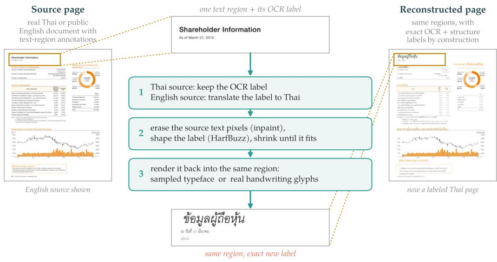
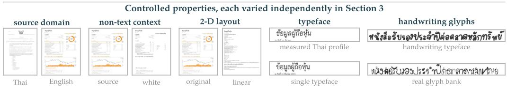
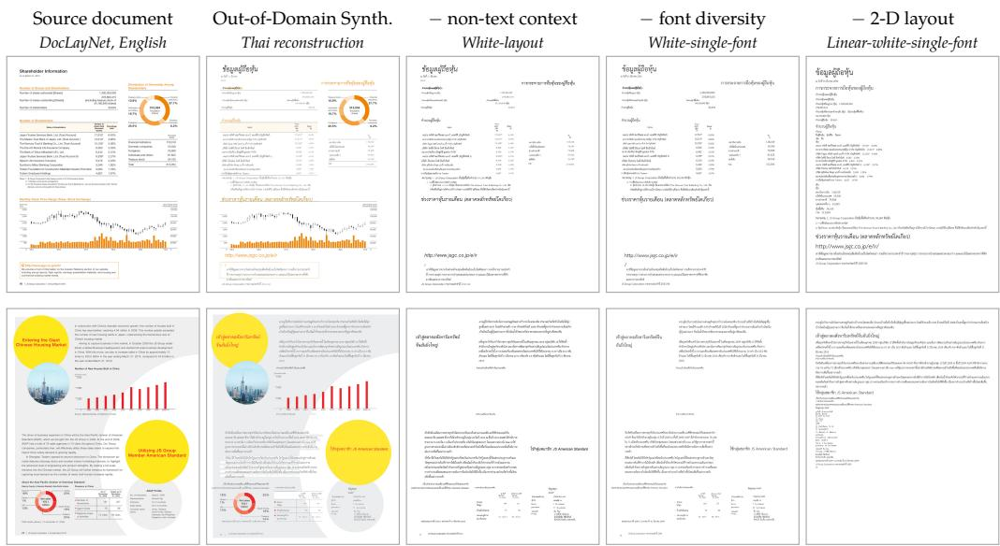
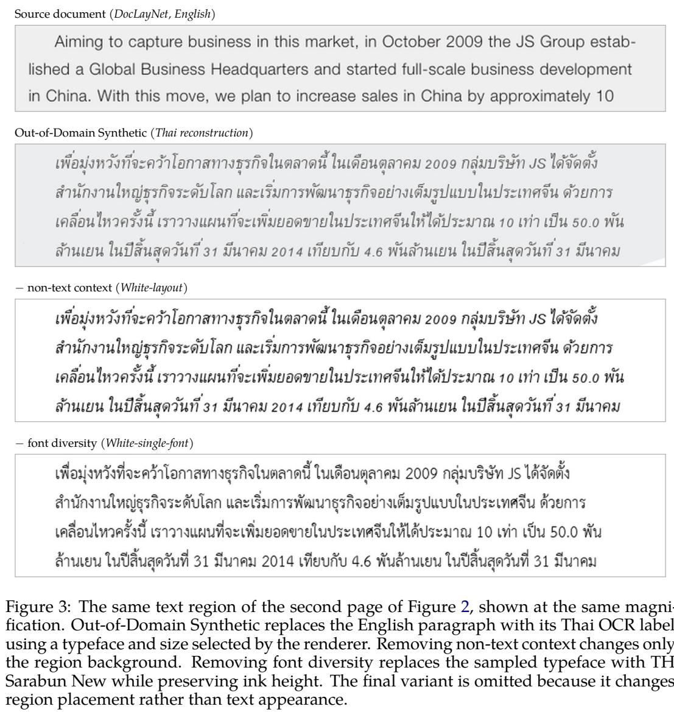
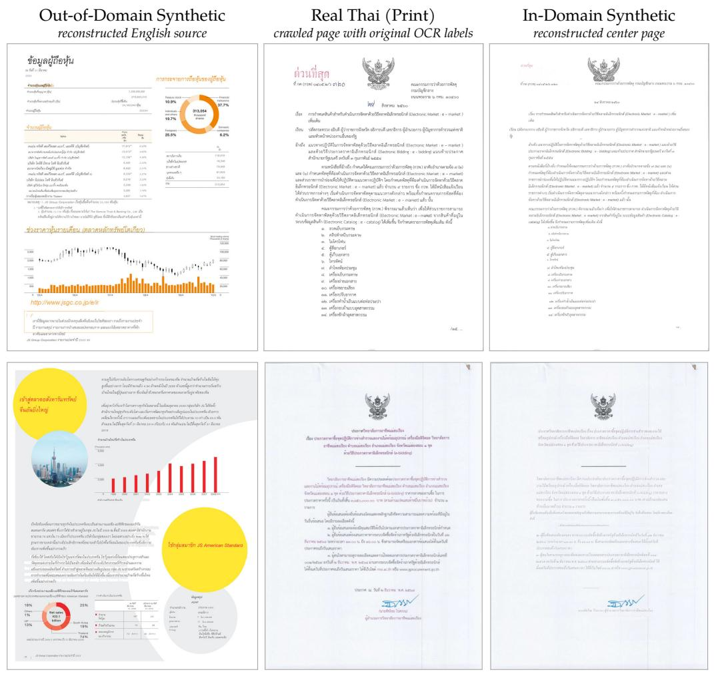
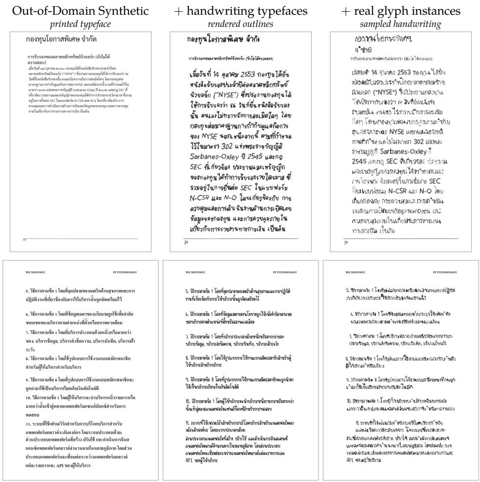
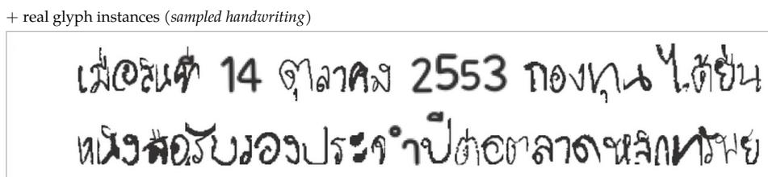
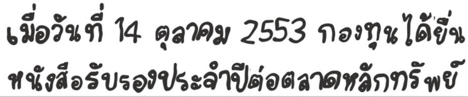

# How Far Can Synthetic Data Take Thai OCR?

Kunat Pipatanakul1,2

1Wayu Research 2Paxa Labs

Technical Report

## Abstract

We investigate what makes synthetic OCR supervision transfer to real Thai documents and use the resulting insights to build Wayu-Paxa-OCR-Zero, a Thai OCR model adapted without OCR labels from real Thai document pages. Synthetic data provide exact labels at scale, but “realism” conflates source domain, page context, typography, spatial structure, and glyph variation. We disentangle these factors with a controlled document-reconstruction pipeline and evaluate each variant under page- and crop-level training on printed and handwritten Thai documents. Non-text context has little consistent efect, whereas typeface diversity, two-dimensional structure, and real handwriting glyphs improve transfer; moreover, source- domain matching depends on training granularity, with in-domain reconstruction approaching real printed supervision under page-level training (1.82% versus 1.31% median character error rate) but underperforming out-of-domain reconstruction under crop-level training (15.59% versus 5.52%). Guided by these findings, we adapt the 0.9B-parameter PaddleOCR-VL-1.6 into Wayu-Paxa-OCR-Zero using 45,723 synthetic pages: relative to its base checkpoint, it reduces median character error rate from 6.64% to 1.24% on printed pages and from 74.87% to 20.55% on handwriting and outperforms Typhoon OCR v1 7B on all five evaluation sets, showing that synthetic-only training can be competitive.

Model wayu-ai/wayu-paxa-ocr-zero Reconstruction wayu-research/docaug

## 1 Introduction

Optical character recognition (OCR) converts document images into machine-readable text for digitization, search, and retrieval-augmented generation. Classical systems such as Tesseract rely on specialized recognition pipelines (Smith, 2007), whereas modern vision– language models (VLMs) perform end-to-end recognition while preserving reading order and document context. Proprietary systems such as Gemini and GPT provide strong multilingual OCR capabilities (Team, 2025; OpenAI, 2024); open models such as Unlimited OCR and PaddleOCR-VL enable lower-cost local processing of sensitive documents (Yin et al., 2026; Zhang et al., 2026).

Coverage, however, remains uneven. Open models, datasets, and benchmarks center on English and Chinese, while less-resourced languages often have abundant documents but few reliable labels. Thai is our case study: its unique glyph system doesn’t allow transfer from English or Chinese. While PDF text extraction and OCR pseudo-labels can omit characters, reorder combining marks, and corrupt reading order. Manual correction is costly, and open Thai datasets remain limited.

Typhoon OCR defines the open Thai frontier. Its 2B V1.5 model achieves state-of-the-art Thai performance and competes with larger proprietary systems (Nonesung et al., 2026). Its training pipeline combines traditional OCR, VLM restructuring, and curated synthetic data. Typhoon OCR therefore establishes the value of Thai-specific adaptation, but does not isolate the contribution of synthetic supervision or the document properties that support transfer.

Recent work demonstrates synthetic OCR transfer with layout-aware Indic pages (Kolavi et al., 2025), Manchu word images (Chung & Choi, 2025), cross-lingual Arabic document reconstruction (Al-Homoud et al., 2025), and degradation-aware historical pages (Guan et al., 2025). These approaches vary several generation factors together, leaving it unclear whether transfer comes from layout, non-text context, fonts, or training granularity. The last distinction matters because whole-page models and modern detector–recognizer systems such as GLM-OCR and PaddleOCR-VL expose diferent amounts of document context (Duan et al., 2026; Zhang et al., 2026).

To this end, we ask a central question: How far can synthetic data take Thai OCR? We answer it through controlled reconstruction of naturally occurring documents. Our pipeline renders OCR labels into their source regions while varying the source domain, non-text context, typeface distribution, two-dimensional layout, and handwriting glyph source. Using Qwen3-VL-2B-Instruct (Bai et al., 2025), we compare page-level and crop-level training on out-of-domain reconstructions of public English documents and in-domain reconstructions of real Thai documents. We then compare reconstruction with real Thai supervision. Based on these findings, we derive a synthetic training recipe and use it to train Wayu-Paxa-OCR-Zero, a Thai adaptation of PaddleOCR-VL-1.6 trained only on synthetic supervision.

We summarize our contributions as follows:

• Controllable document reconstruction. We introduce a pipeline that replaces source text in place while independently controlling source domain, non-text context, typeface diversity, two-dimensional layout, and handwriting glyph source.

• Evidence about synthetic-to-real transfer. Controlled page- and crop-level experiments identify typography, spatial structure, glyph variation, and the interaction between source domain and training granularity as key determinants of transfer.

• A synthetic-supervision Thai OCR model. We introduce Wayu-Paxa-OCR-Zero, trained using synthetic data generated from 45,723 pages. The model substantially improves its base checkpoint and outperforms the Typhoon OCR 7B model on all five evaluation sets.

## 2 Synthetic OCR from Reconstructed Documents

We generate synthetic Thai OCR pages by reconstructing existing documents in place. Figure 1 summarizes the pipeline. For Thai sources, we use the OCR label of each text region. For non-Thai sources, we either translate the source text into Thai or retain its English OCR label. We then erase / inpaint the source text pixels, fit the OCR label to the original region, and render it with either a sampled typeface or real handwriting glyphs. The reconstruction settings control the source domain, layout, background, non-text page context, typeface distribution, and glyph source.

## 2.1 In-Domain and Out-of-Domain Reconstruction

Each source example contains a page image and annotated text regions. We retain the region geometry, document-element categories, and reading order when available. For In-Domain Synthetic, we use the OCR label of each Thai source region. For Out-of-Domain Synthetic, we translate most non-Thai OCR labels into Thai, following the translation-based data construction used by Typhoon and Typhoon 2 (Pipatanakul et al., 2023; 2024). We then inpaint the source text pixels and render the OCR label in the corresponding region.

The standard reconstruction retains the background and non-text pixels from the source page. To control page context, we replace these pixels with a white background while keeping the text regions fixed. To control layout, we retain the original two-dimensional arrangement or stack the regions vertically.

  
Figure 1: Overview of the document reconstruction pipeline. Thai sources provide OCR labels directly for In-Domain Reconstruction, while non-Thai sources are translated into Thai or retained in English for Out-of-Domain Reconstruction. The reconstruction settings control the retained page context and render each OCR label using either typefaces sampled from a specified distribution or real handwriting glyphs.

## 2.2 Fit-Constrained Rendering

Thai translations need not match the length of their English sources, and Thai vowels and tone marks can occupy multiple vertical levels. We therefore shape the complete regionlevel OCR label with HarfBuzz before placement. We sample the typeface and type size independently of the source text, then reduce the type size until the complete OCR label fits the original region. If the OCR label still overflows at the minimum acceptable size, we reject the complete page.

## 2.3 Typeface Rendering

For typeface rendering, we sample a Thai typeface for each shaped OCR label from a specified distribution. We use the measured profile in Section 3.1 by default and replace it with a single typeface in the controlled experiment. The distribution includes both printed and handwriting typefaces. Repeated occurrences of a character rendered with the same typeface share the same outline.

## 2.4 Handwriting Real-Glyph Rendering

For handwriting real-glyph rendering, we replace supported Thai characters with instances sampled from the handwriting banks in Section 3.1. We sample each character independently, so repeated characters can use diferent strokes. Unsupported characters fall back to typeface rendering. We keep the OCR label, region annotations, ink height, and ink color fixed between the typeface and real-glyph renderings.

Section 3 uses these reconstruction settings to study how each controlled property afects transfer to real Thai documents.

## 3 What Makes Synthetic Data Transfer to Real Thai Documents?

We use the reconstruction controls from Section 2 to study which properties transfer to real Thai documents. We first vary non-text page context, typeface diversity, and twodimensional layout within Out-of-Domain Synthetic. We then compare source domains, page-level and crop-level training, synthetic and real supervision, and typeface and realglyph handwriting.

## 3.1 Experimental Setup

Models and training settings. We use Qwen3-VL-2B-Instruct as the main experimental model and compare two training settings (Bai et al., 2025):

• Page-level training: The model receives a complete document image and predicts the full page and its regions in a single inference pass. Appendix A gives the instruction and the target schema.

• Crop-level training: The model recognizes individual regions produced by a layout detector (Sun et al., 2025). This setting follows two-stage systems such as GLM-OCR and PaddleOCR-VL-1.6, which use PP-DocLayoutV3 before VLM recognition (Duan et al., 2026; Zhang et al., 2026). Appendix A gives the prediction formats.

Data sources. Training data in this study primarily target Thai OCR. We group the data by how their OCR labels are obtained.

• Real Thai (Print): We gather real Thai documents from public Thai PDFs and document images from Common Crawl (Common Crawl Foundation, 2026) and other websites, including government documents, forms, scans, reports, and online publications. The collection contains approximately 34,000 pages and is split into training pages and a test set. We use the training split in two ways: 1) as source documents for In-Domain Synthetic, where the original text pixels are inpainted and replaced by rendered OCR labels in Section 3.3, and 2) with the original OCR labels as real printed supervision in Section 3.5. The test split forms the Heldout evaluation set described below.

• Real Thai (Handwriting): We gather photographed Thai study-notebook pages from public websites. The collection contains approximately 4,000 pages and is split into training pages and 400 test pages. In Section 3.5, we add the training split to Real Thai (Print) to form the Real Thai (Print + Handwriting) condition; Section 3.6 includes this condition as a reference. The held-out pages form the Handwriting and Easy Handwriting evaluation sets described below.

• Out-of-Domain Synthetic: This source, used in our main training experiment, simulates a setting in which Thai documents are unavailable and only public English datasets are accessible. Specifically, we apply the pipeline in Section 2 to English pages from DocLayNet (Pfitzmann et al., 2022), designed pages from Crello (Yamaguchi, 2021), and wide tables from PubTabNet (Zhong et al., 2020). We translate most source text into Thai and render the resulting OCR labels in the original regions while retaining the source layout and non-text pixels. The remaining 7.61% of pages retain their English OCR labels, approximating the English-language proportion in Real Thai (Print). This dataset and its variants are used in Sections 3.2–3.6.

• In-Domain Synthetic: For this source, we apply the pipeline in Section 2 to reconstruct the Real Thai (Print) pages with their OCR labels. This source tests whether transfer benefits from real Thai non-text context, document layout, and typographic style. We use this dataset in Sections 3.3–3.5.

Appendix B describes how we construct the OCR labels for Real Thai (Print) and Real Thai (Handwriting).

Font & Glyph. We instantiate text appearance using two complementary sources:

• Fonts: We shape Thai text with HarfBuzz and fit the type size to each region. Typeface sampling follows a character-weighted profile measured from 8,000 public Thai PDF pages. Table 1 summarizes the measured distribution.

• Real glyphs: We construct a handwriting glyph bank from the iApp Handwriting Dataset (iApp Technology, 2024) and the Real Thai (Handwriting) training split using the pipeline in Appendix D. The bank contains approximately 6,000 instances across 76 character classes, covering Thai consonants, vowels, tone marks, and digits. Unsupported characters fall back to typeface rendering.

Table 1: Character-weighted font-family distribution measured from 8,000 randomly sampled pages. The profile contains 693 observed family names; the ten most frequent account for 80.9% of Thai characters.
<table><tr><td>Font family</td><td>Thai characters (%)</td></tr><tr><td>Cordia New Angsana New TH Sarabun PSK TH Sarabun New</td><td>18.6 15.3 14.7</td></tr><tr><td>Browallia New TH Sarabun ITø</td><td>14.2 6.9 4.7</td></tr><tr><td>DB ThaiText X Cordia UPC</td><td>2.4 1.9</td></tr><tr><td>Tahoma DB FongNam X Other (683)</td><td>1.1 1.1</td></tr></table>

Evaluation data and metrics. We evaluate on three datasets:

• Heldout: 301 real printed pages from the test split of Real Thai (Print), disjoint from its training split.

• Handwriting: 200 photographed Thai study-notebook pages from the held-out portion of Real Thai (Handwriting), one per writer and disjoint from training by page and writer identity. The set spans a broad range of legibility.

• Easy Handwriting: 200 pages from the same held-out handwriting population, restricted to the top of the legibility band based on low disagreement between two proprietary handwriting recognition systems.

We construct the reference OCR labels for all three evaluation sets using the evaluation pipeline in Appendix B. We report character error rate (CER; lower is better) over text-only regions using two aggregates: 1) Median is the median page CER, and 2) Mean is total edit distance divided by total reference characters. These aggregates characterize complementary behavior: the median reflects performance on a typical page and is less sensitive to severe failures, whereas the mean measures aggregate error across all reference characters and weights pages by length. All CER values are given in percent. To compare pagelevel and crop-level systems, we use fuzzy alignment to project each prediction onto the evaluation regions before scoring (Appendix C), as document-parsing benchmarks match predicted blocks to reference blocks before scoring (Ouyang et al., 2025; Li et al., 2025). Following the contract-dependent ignore handling of OmniDocBench, this projection removes non-target page elements while retaining errors and missing regions within the evaluated regions. We evaluate the element types specified by OmniDocBench.

Training parameters. Unless otherwise stated, we train all models for one epoch using AdamW (Loshchilov & Hutter, 2019). We use a learning rate of $3 \times 1 0 ^ { - 5 }$ with a cosine schedule and update all model parameters.

## 3.2 Which Source-Document Properties Matter?

This experiment studies which synthetic components afect recognition. Specifically, Whitelayout renders the original text layout on a white background, retaining the text regions while removing backgrounds, figures, rules, and scan artifacts. White-single-font additionally replaces the font distribution with one typeface, and Linear-white-single-font removes the layout component by stacking the regions vertically instead of preserving their two-dimensional arrangement. We train each variant using both page-level and crop-level training. Figure 2 in Appendix E shows two pages rendered under all four variants.

Table 2: Source-property ablation. Values are CER in percent (lower is better); Med. is the page median and Mean is the character-weighted CER.
<table><tr><td rowspan="2">Training data</td><td rowspan="2">Regime</td><td colspan="2">Heldout</td><td colspan="2">Handwriting</td><td colspan="2">Easy Handwriting</td></tr><tr><td>Med.</td><td>Mean</td><td>Med.</td><td>Mean</td><td>Med.</td><td>Mean</td></tr><tr><td>Out-of-Domain Synthetic</td><td>page</td><td>5.07</td><td>16.90</td><td>43.99</td><td>46.71</td><td>38.90</td><td>44.21</td></tr><tr><td>— non-text context</td><td>page</td><td>4.78</td><td>21.05</td><td>43.16</td><td>44.01</td><td>38.07</td><td>41.38</td></tr><tr><td>— font diversity</td><td>page</td><td>5.34</td><td>20.37</td><td>49.86</td><td>50.88</td><td>47.55</td><td>50.80</td></tr><tr><td>— two-dimensional layout</td><td>page</td><td>5.07</td><td>13.58</td><td>58.40</td><td>59.97</td><td>49.60</td><td>53.92</td></tr><tr><td>Out-of-Domain Synthetic</td><td>crop</td><td>5.52</td><td>19.09</td><td>49.15</td><td>49.37</td><td>48.26</td><td>49.50</td></tr><tr><td>— non-text context</td><td>crop</td><td>4.86</td><td>16.69</td><td>50.77</td><td>49.03</td><td>47.81</td><td>49.08</td></tr><tr><td>— font diversity</td><td>crop</td><td>7.01</td><td>16.51</td><td>62.13</td><td>59.92</td><td>61.18</td><td>61.28</td></tr><tr><td>— two-dimensional layout</td><td>crop</td><td>9.60</td><td>20.69</td><td>70.17</td><td>67.02</td><td>67.19</td><td>65.64</td></tr><tr><td>Qwen3-VL-2B-Instruct</td><td>page</td><td>14.47</td><td>28.62</td><td>61.59</td><td>61.25</td><td>59.29</td><td>61.32</td></tr></table>

Removing non-text context has no consistent efect on recognition: median CER changes by at most 1.62 points across the three datasets and two training settings. Removing font diversity produces the first consistent loss on handwriting. Median CER increases by 6.70 and 9.48 points under page-level training and by 11.36 and 13.37 points under crop-level training, while the increase on printed Heldout is 0.56 and 2.15 points. Typography diversity therefore matters most when the target appearance extends beyond printed text.

Flattening the remaining layout further increases handwriting CER in both training settings. For crop-level training, it also raises the Heldout median from 7.01 to 9.60; the page-level median remains nearly unchanged at 5.07. Across the variants, printed page-level recognition is stable, whereas handwriting degrades monotonically once font diversity and twodimensional structure are removed. Non-text context provides little CER benefit, while typography and spatial structure improve recognition on the out-of-distribution handwriting sets.

## 3.3 Does In-Domain Reconstruction Help?

The source-property ablation uses the same English source documents. We next compare Out-of-Domain Synthetic with In-Domain Synthetic, which applies the same reconstruction pipeline to Real Thai (Print). The original text is erased and its OCR label is rendered into the same regions. The evaluation pages are disjoint from these source pages. This comparison changes the domain of the source documents. The resulting pages retain the layout, writing style, font distribution, and noise patterns of Thai source documents. Figure 4 in Appendix F shows the two synthetic sources beside the real Thai pages the in-domain one is built from.

Under page-level training, replacing Out-of-Domain Synthetic with In-Domain Synthetic reduces median CER from 5.07 to 1.82 on Heldout and from 43.99 to 36.27 on Handwriting.

Table 3: Comparison of Out-of-Domain Synthetic and In-Domain Synthetic. Values are CER in percent (lower is better); Med. is the page median and Mean is the character-weighted CER. The better result within each training block is bold.
<table><tr><td rowspan="2">Training data</td><td rowspan="2">Regime</td><td colspan="2">Heldout</td><td colspan="2">Handwriting</td><td colspan="2">Easy Handwriting</td></tr><tr><td>Med.</td><td>Mean</td><td>Med.</td><td>Mean</td><td>Med.</td><td>Mean</td></tr><tr><td>Out-of-Domain Synthetic</td><td>page</td><td>5.07</td><td>16.90</td><td>43.99</td><td>46.71</td><td>38.90</td><td>44.21</td></tr><tr><td>In-Domain Synthetic</td><td>page</td><td>1.82</td><td>16.20</td><td>36.27</td><td>38.20</td><td>38.77</td><td>41.12</td></tr><tr><td>Out-of-Domain Synthetic</td><td>crop</td><td>5.52</td><td>19.09</td><td>49.15</td><td>49.37</td><td>48.26</td><td>49.50</td></tr><tr><td>In-Domain Synthetic</td><td>crop</td><td>15.59</td><td>27.70</td><td>52.77</td><td>51.35</td><td>51.71</td><td>52.40</td></tr><tr><td>Qwen3-VL-2B-Instruct</td><td>page</td><td>14.47</td><td>28.62</td><td>61.59</td><td>61.25</td><td>59.29</td><td>61.32</td></tr></table>

The result reverses under crop-level training. Replacing Out-of-Domain Synthetic with In-Domain Synthetic increases median CER from 5.52 to 15.59 on Heldout, from 49.15 to 52.77 on Handwriting, and from 48.26 to 51.71 on Easy Handwriting. In-domain reconstruction therefore helps the page-level model but not the crop-level model in this comparison. Section 3.4 summarizes the diference between page-level and crop-level behavior.

## 3.4 Does the Training Granularity Determine What Transfers?

Tables 2 and 3 evaluate each synthetic dataset with both page-level and crop-level training. These settings produce diferent systems: the page model observes the complete document, whereas the crop pipeline observes only an individual element. We therefore ask separately whether the training unit changes the conclusions and whether it changes the preferred dataset.

In summary, under both settings, removing non-text context has a small and inconsistent effect, while removing font diversity and two-dimensional structure progressively degrades both handwriting sets. The preferred source domain, however, changes with the training unit. In-Domain Synthetic gives the lowest Heldout CER among the synthetic datasets under page-level training (1.82), but performs substantially worse than Out-of-Domain Synthetic under crop-level training (15.59 versus 5.52). The cause of this reversal remains unclear and warrants further study.

## 3.5 How Close Can Reconstruction Get to Real Supervision?

Table 4 compares the two synthetic training sets with training on Real Thai (Print). All results in this comparison use page-level training.

Table 4: Reconstruction against real supervision under page-level training. Values are CER in percent (lower is better); Med. is the page median and Mean is the character-weighted CER. The last row combines Real Thai (Print) and Real Thai (Handwriting); the best result in each column is bold.
<table><tr><td rowspan="2">Training data</td><td colspan="2">Heldout</td><td colspan="2">Handwriting</td><td colspan="2">Easy Handwriting</td></tr><tr><td>Med.</td><td>Mean</td><td>Med.</td><td>Mean</td><td>Med.</td><td>Mean</td></tr><tr><td>Qwen3-VL-2B-Instruct</td><td>14.47</td><td>28.62</td><td>61.59</td><td>61.25</td><td>59.29</td><td>61.32</td></tr><tr><td>Out-of-Domain Synthetic</td><td>5.07</td><td>16.90</td><td>43.99</td><td>46.71</td><td>38.90</td><td>44.21</td></tr><tr><td>In-Domain Synthetic</td><td>1.82</td><td>16.20</td><td>36.27</td><td>38.20</td><td>38.77</td><td>41.12</td></tr><tr><td>Real Thai (Print)</td><td>1.31</td><td>9.79</td><td>36.14</td><td>39.05</td><td>32.98</td><td>36.95</td></tr><tr><td>Real Thai (Print + Handwriting)</td><td>1.40</td><td>8.49</td><td>26.05</td><td>28.26</td><td>20.79</td><td>25.55</td></tr></table>

On printed Heldout pages, In-Domain Synthetic approaches real supervision on the typical page: its median CER of 1.82% is only 0.51 points above Real Thai (Print) at 1.31%. The gap is substantially larger under mean CER, however, with 16.20% for In-Domain Synthetic versus 9.79% for Real Thai (Print). Reconstruction therefore captures much of what is needed for typical printed-page recognition, but real supervision still reduces a tail of severe errors that disproportionately afects the character-weighted aggregate. Out-of-Domain Synthetic remains further behind at 5.07% median CER, showing that matching the source-document domain further narrows the synthetic-to-real gap.

The handwriting results reveal a diferent limitation. In-Domain Synthetic and Real Thai (Print) perform nearly identically on the broader Handwriting set (36.27% versus 36.14% median CER), indicating that reconstructing real Thai printed pages recovers most of the handwriting transfer obtained from real printed supervision. Neither condition, however, approaches training with real handwriting: adding Real Thai (Handwriting) reduces median CER to 26.05% on Handwriting and 20.79% on Easy Handwriting. The remaining gap is therefore not explained by document domain alone; it points to appearance variation in real handwriting that printed reconstruction does not capture.

Taken together, reconstruction comes close to real supervision for printed Thai, particularly on typical pages, but does not fully reproduce the robustness or handwriting variation provided by real data. Section 3.6 tests whether replacing rendered handwriting typefaces with real glyph instances reduces this remaining handwriting gap.

## 3.6 Where Does Synthetic Rendering Fall Short? Handwriting

The preceding comparison leaves a clear gap to real handwriting supervision. We test whether handwriting typefaces are suficient or whether real glyph variation provides an additional benefit. The handwriting typefaces variant samples from the full bank of 693 font families rather than the measured Thai font profile; 24.0% of pages use a handwriting typeface, half with per-instance stroke distortion augmentation. The real glyph instances variant instead redraws Thai characters on the same subset using the glyph bank in Section 3.1. Both variants keep the OCR labels, layout annotations, ink height, and ink color fixed, and the glyph sources are disjoint from the evaluation sets. Their comparison therefore isolates the source of the strokes. Figures 5 and 6 in Appendix G show the two variants on the same pages.

Table 5: Comparison of handwriting rendering. Values are CER in percent (lower is better); Med. is the page median and Mean is the character-weighted CER. The best result within each training block is bold; the last two rows are references.
<table><tr><td rowspan="2">Training data</td><td rowspan="2"></td><td colspan="2">Heldout</td><td colspan="2">Handwriting</td><td colspan="2">Easy Handwriting</td></tr><tr><td>Regime Med.</td><td>Mean</td><td>Med.</td><td>Mean</td><td>Med.</td><td>Mean</td></tr><tr><td>Out-of-Domain Synthetic</td><td>page</td><td>5.07</td><td>16.90</td><td>43.99</td><td>46.71</td><td>38.90</td><td>44.21</td></tr><tr><td>+ handwriting typefaces</td><td>page</td><td>5.89</td><td>18.44</td><td>38.65</td><td>42.83</td><td>34.84</td><td>38.11</td></tr><tr><td>+ real glyph instances</td><td>page</td><td>6.41</td><td>20.50</td><td>37.91</td><td>41.05</td><td>30.66</td><td>37.31</td></tr><tr><td>Out-of-Domain Synthetic</td><td>crop</td><td>5.52</td><td>19.09</td><td>49.15</td><td>49.37</td><td>48.26</td><td>49.50</td></tr><tr><td>+ handwriting typefaces</td><td>crop</td><td>4.51</td><td>17.68</td><td>42.44</td><td>42.54</td><td>40.64</td><td>42.15</td></tr><tr><td>+ real glyph instances</td><td>crop</td><td>4.34</td><td>16.78</td><td>39.97</td><td>40.25</td><td>35.66</td><td>37.79</td></tr><tr><td>Real Thai (Print + Handwriting)</td><td>page</td><td>1.40</td><td>8.49</td><td>26.05</td><td>28.26</td><td>20.79</td><td>25.55</td></tr><tr><td>Qwen3-VL-2B-Instruct</td><td>page</td><td>14.47</td><td>28.62</td><td>61.59</td><td>61.25</td><td>59.29</td><td>61.32</td></tr></table>

Handwriting typefaces improve both handwriting sets. Median CER falls from 43.99 to 38.65 on Handwriting and from 38.90 to 34.84 on Easy Handwriting under page-level training. Under crop-level training, the corresponding changes are 49.15 to 42.44 and 48.26 to 40.64. However, on printed Heldout, the page-level median increases from 5.07 to 5.89, while the crop-level median decreases from 5.52 to 4.51. Handwriting typefaces therefore improve transfer to real handwriting in both training settings. On printed Heldout, however, they degrade page-level performance while improving crop-level performance.

Real glyph instances further improve all handwriting medians, reaching 37.91 and 30.66 under page-level training and 39.97 and 35.66 under crop-level training. Because the two variants difer only in the source of the strokes, these gains show that real glyph variation matters beyond the choice of handwriting typeface. The gap to real handwriting supervision remains: Real Thai (Print + Handwriting) reaches 26.05 on Handwriting and 20.79 on Easy Handwriting. The bank contains only 5,953 instances, leaving the efect of a larger glyph bank for future study.

## 4 From Controlled Findings to Wayu-Paxa-OCR-Zero

The controlled studies show that font diversity, document structure, and real glyph variation improve transfer to real Thai documents. We use these findings to build Wayu-Paxa-OCR-Zero, a crop-level OCR model trained without OCR labels from real Thai documents.

## 4.1 Wayu-Paxa-OCR-Zero

We extend the synthetic data used in Section 3 in three ways. First, we retain both render ings of the 7,131 handwriting pages by including the handwriting-typeface pages and their real-glyph copies. Second, we add two sets of handwriting-focused pages: 3,000 disjoint DocLayNet-v1.2 pages on which all text regions are rendered with handwriting glyphs, and 999 synthetic pages with pasted iApp Handwriting Dataset crops (iApp Technology, 2024). Third, we add 2,190 filled forms reconstructed from public CommonForms templates. The added pages and templates use public English sources whose OCR labels are translated into Thai. No Real Thai document image from Section 3 is used as a source page. Handwritten content is either drawn from the glyph bank in Section 3.1 or inserted as iApp Handwriting Dataset crops.

Table 6: Synthetic training data for Wayu-Paxa-OCR-Zero. The three subsets contain 45,723 generated pages;
<table><tr><td>Subset</td><td>Pages</td><td>Source documents</td><td>Text rendering</td></tr><tr><td>Base synthetic</td><td>39,534</td><td>DocLayNet, Crello, Pub- TabNet</td><td>rendered fonts; 7,131 handwrit- ing pages also appear with real glyph instances</td></tr><tr><td>Handwriting</td><td>3,999</td><td>DocLayNet-v1.2 pages disjoint from the base set</td><td>3,000 pages with stitched glyph instances; 999 pages with pasted iApp Handwriting</td></tr><tr><td>Forms</td><td>2,190</td><td>CommonForms tem- plates with widget counts matched to real Thai forms</td><td>Dataset crops stitched glyph instances in every field value</td></tr><tr><td>Total</td><td>45,723</td><td></td><td></td></tr></table>

Every page is generated by the pipeline in Section 2 from public English sources. No Thai document page is used as a source image, and no OCR label from a real Thai document enters training. Region annotations and OCR labels come directly from reconstruction outputs, source-region annotations, or known template and field strings.

We train all 0.9B parameters for one epoch using a learning rate of $3 \times 1 0 ^ { - 5 } ,$ , a cosine schedule, a warmup ratio of 0.03, and an efective batch size of 16. At inference, PP-DocLayoutV3 supplies regions to the PaddleOCR-VL recognizer. The reported scores therefore include layout-detection and reading-order errors.

## 4.2 Comparison with Existing Thai OCR Systems

We compare Wayu-Paxa-OCR-Zero with its base checkpoint, two open Thai OCR systems, and a frontier model to assess the gains from synthetic-only training and its competitiveness with existing systems. We further evaluate on ThaiOCRBench (Nonesung et al., 2025) and SEA-DocBench (Yue et al., 2026) to measure generalization beyond our internal evaluation sets.

Table 7: Comparison with existing Thai OCR systems. Values are CER in percent (lower is better); Med. is the page median and Mean is the character-weighted CER. ThaiOCRBench reports each aggregate averaged across five audited reading tasks; SEA-DocBench is evaluated on its 1,148-page clean Thai subset. Rules separate the three system families; within each family the better result in each column is bold.
<table><tr><td rowspan="2">System</td><td colspan="2">Heldout</td><td colspan="2">Handwriting</td><td colspan="2">Easy Handwriting</td><td colspan="2">ThaiOCRBench</td><td colspan="2">SEA-DocBench</td></tr><tr><td>Med.</td><td>Mean</td><td>Med.</td><td>Mean</td><td>Med.</td><td>Mean</td><td>Med.</td><td>Mean</td><td>Med.</td><td>Mean</td></tr><tr><td>PaddleOCR-VL-1.6 (0.9B)</td><td>6.64</td><td>27.60</td><td>74.87</td><td>67.90</td><td>73.74</td><td>69.41</td><td>38.0</td><td>43.3</td><td>8.87</td><td>18.54</td></tr><tr><td>Wayu-Paxa-OCR-Zero (0.9B)</td><td>1.24</td><td>14.75</td><td>20.55</td><td>22.28</td><td>14.18</td><td>17.08</td><td>15.3</td><td>25.6</td><td>4.86</td><td>9.99</td></tr><tr><td>Typhoon OCR (7B)</td><td>2.54</td><td>18.27</td><td>43.60</td><td>49.36</td><td>34.99</td><td>45.06</td><td>30.6</td><td>44.7</td><td>9.22</td><td>17.57</td></tr><tr><td>Typhoon OCR 1.5 (2B)</td><td>0.21</td><td>5.47</td><td>19.36</td><td>21.86</td><td>9.02</td><td>15.74</td><td>6.2</td><td>16.8</td><td>5.81</td><td>12.80</td></tr><tr><td>Gemini 3.7 Flash</td><td>0.00</td><td>3.56</td><td>11.29</td><td>15.04</td><td>3.89</td><td>7.64</td><td>0.9</td><td>3.8</td><td>5.51</td><td>10.62</td></tr></table>

Comparison with the base checkpoint isolates the efect of our training recipe because the architecture is fixed. As Table 7 shows, Wayu-Paxa-OCR-Zero reduces both median and mean CER on all five benchmarks. On the internal sets, median CER falls from 6.64% to 1.24% on Heldout, from 74.87% to 20.55% on Handwriting, and from 73.74% to 14.18% on Easy Handwriting. The handwriting reductions show that synthetic supervision substantially improves recognition on a typical page, rather than only correcting a small number of failures. Mean CER nevertheless remains above median CER on every benchmark, which is consistent with harder examples contributing disproportionately to aggregate error.

Comparisons with independently trained systems instead measure competitiveness, because the systems difer in scale, pretraining, and supervision. Despite using 0.9B parameters, Wayu-Paxa-OCR-Zero outperforms the 7B Typhoon OCR model on all five benchmarks. It nearly matches the 2B Typhoon OCR 1.5 model on Handwriting (20.55% versus 19.36% median CER) and performs better on SEA-DocBench (4.86% versus 5.81%), but remains behind on Heldout, Easy Handwriting, and ThaiOCRBench. Gemini 3.7 Flash remains strongest on the three internal sets and ThaiOCRBench, whereas Wayu-Paxa-OCR-Zero achieves lower CER on SEA-DocBench. These rankings establish competitiveness; they do not show that synthetic data are intrinsically superior to the supervision used by the other systems.

This pattern is consistent with the controlled experiments in Section 3: synthetic reconstruction approaches real printed supervision under matched conditions but does not fully close the gap, and transfer depends on typeface diversity, two-dimensional structure, glyph variation, and training granularity. The remaining diferences across benchmarks therefore indicate that synthetic-only training is already competitive, while broader coverage of document layouts, typography, and handwriting variation remains an important direction for improving generalization.

## 5 Discussion, Limitations, and Conclusion

Our results show that synthetic reconstruction can produce competitive Thai OCR without page-level OCR labels from real Thai documents. Typeface diversity, two-dimensional structure, and real handwriting glyphs improve transfer, whereas non-text page context has little consistent efect. However, synthetic supervision still trails real supervision on severe failures and handwriting, and the value of in-domain reconstruction depends on training granularity.

We hope this work encourages further research on synthetic OCR for Thai and other languages with limited document annotations.

## Acknowledgments

This work is a collaboration between Wayu Research and Paxa Labs and was self-funded by Wayu Research. We would also like to thank Surapon Nonsung and the Typhoon Team for

their valuable feedback on this technical report, as well as the global and local AI communities for open-sourcing resources and sharing knowledge that made this work possible.

## Ethics Statement

We use publicly available Thai documents, fonts, and handwriting samples to study synthetic document reconstruction. Replacing original text with generated content can reduce exposure of personal information, but models trained on synthetic data may be less robust than those trained on real data, especially for unseen document types, typefaces, and handwriting styles. Released artifacts should document their sources, intended uses, limitations, and privacy safeguards.

## References

Haneen Al-Homoud, Asma Ibrahim, Murtadha Al-Jubran, Fahad Al-Otaibi, Yazeed Al-Harbi, Daulet Toibazar, Kesen Wang, and Pedro J. Moreno. Cross-lingual synthdocs: A large-scale synthetic corpus for any to arabic ocr and document understanding, 2025. URL https://arxiv.org/abs/2511.04699.

Shuai Bai, Yuxuan Cai, Ruizhe Chen, Keqin Chen, Xionghui Chen, Zesen Cheng, Lianghao Deng, Wei Ding, Chang Gao, Chunjiang Ge, Wenbin Ge, Zhifang Guo, Qidong Huang, Jie Huang, Fei Huang, Binyuan Hui, Shutong Jiang, Zhaohai Li, Mingsheng Li, Mei Li, Kaixin Li, Zicheng Lin, Junyang Lin, Xuejing Liu, Jiawei Liu, Chenglong Liu, Yang Liu, Dayiheng Liu, Shixuan Liu, Dunjie Lu, Ruilin Luo, Chenxu Lv, Rui Men, Lingchen Meng, Xuancheng Ren, Xingzhang Ren, Sibo Song, Yuchong Sun, Jun Tang, Jianhong Tu, Jianqiang Wan, Peng Wang, Pengfei Wang, Qiuyue Wang, Yuxuan Wang, Tianbao Xie, Yiheng Xu, Haiyang Xu, Jin Xu, Zhibo Yang, Mingkun Yang, Jianxin Yang, An Yang, Bowen Yu, Fei Zhang, Hang Zhang, Xi Zhang, Bo Zheng, Humen Zhong, Jingren Zhou, Fan Zhou, Jing Zhou, Yuanzhi Zhu, and Ke Zhu. Qwen3-vl technical report, 2025. URL https://arxiv.org/abs/2511.21631.

Yan Hon Michael Chung and Donghyeok Choi. Finetuning vision-language models as ocr systems for low-resource languages: A case study of manchu, 2025. URL https://arxiv. org/abs/2507.06761.

Common Crawl Foundation. Common crawl, 2026. URL https://commoncrawl.org/. Accessed 2026-08-17.

Shuaiqi Duan, Yadong Xue, Weihan Wang, Zhe Su, Huan Liu, Sheng Yang, Guobing Gan, Guo Wang, Zihan Wang, Shengdong Yan, Dexin Jin, Yuxuan Zhang, Guohong Wen, Yanfeng Wang, Yutao Zhang, Xiaohan Zhang, Wenyi Hong, Yukuo Cen, Da Yin, Bin Chen, Wenmeng Yu, Xiaotao Gu, and Jie Tang. Glm-ocr technical report, 2026. URL https://arxiv.org/abs/2603.10910.

Shuhao Guan, Moule Lin, Cheng Xu, Xinyi Liu, Jinman Zhao, Jiexin Fan, Qi Xu, and Derek Greene. PreP-OCR: A complete pipeline for document image restoration and enhanced OCR accuracy. In Wanxiang Che, Joyce Nabende, Ekaterina Shutova, and Mohammad Taher Pilehvar (eds.), Proceedings of the 63rd Annual Meeting of the Association for Computational Linguistics (Volume 1: Long Papers), pp. 15413–15425, Vienna, Austria, July 2025. Association for Computational Linguistics. ISBN 979-8-89176-251-0. doi: 10.18653/v1/2025.acl-long.749. URL https://aclanthology.org/2025.acl-long.749/.

iApp Technology. Thai handwriting dataset. Hugging Face, 2024. URL https:// huggingface.co/datasets/iapp/thai\_handwriting\_dataset. Accessed 2026-08-20.

Adithya Kolavi, Samarth P, and Vyoman Jain. Nayana OCR: A scalable framework for document OCR in low-resource languages. In Sang Truong, Rifki Afina Putri, Duc Nguyen,

Angelina Wang, Daniel Ho, Alice Oh, and Sanmi Koyejo (eds.), Proceedings of the 1st Workshop on Language Models for Underserved Communities (LM4UC 2025), pp. 86–103, Albuquerque, New Mexico, May 2025. Association for Computational Linguistics. ISBN 979-8- 89176-242-8. doi: 10.18653/v1/2025.lm4uc-1.11. URL https://aclanthology.org/2025. lm4uc-1.11/.

Zichao Li, Aizier Abulaiti, Yaojie Lu, Xuanang Chen, Jia Zheng, Hongyu Lin, Xianpei Han, Shanshan Jiang, Bin Dong, and Le Sun. Readoc: A unified benchmark for realistic document structured extraction. In ACL (Findings), volume ACL 2025 of Findings of ACL, pp. 21889–21905. Association for Computational Linguistics, 2025.

Ilya Loshchilov and Frank Hutter. Decoupled weight decay regularization. In ICLR (Poster). OpenReview.net, 2019.

Maksym Lysak, Ahmed S. Nassar, Nikolaos Livathinos, Christoph Auer, and Peter W. J. Staar. Optimized table tokenization for table structure recognition. In ICDAR (2), volume 14188 of Lecture Notes in Computer Science, pp. 37–50. Springer, 2023.

Surapon Nonesung, Teetouch Jaknamon, Sirinya Chaiophat, Natapong Nitarach, Chanakan Wittayasakpan, Warit Sirichotedumrong, Adisai Na-Thalang, and Kunat Pipatanakul. Thaiocrbench: A task-diverse benchmark for vision-language understanding in thai. In IJCNLP-AACL (long papers), pp. 1653–1675. The Asian Federation of Natural Language Processing and The Association for Computational Linguistics, 2025.

Surapon Nonesung, Natapong Nitarach, Teetouch Jaknamon, Pittawat Taveekitworachai, and Kunat Pipatanakul. Typhoon ocr: Open vision-language model for thai document extraction, 2026. URL https://arxiv.org/abs/2601.14722.

OpenAI. Gpt-4o system card, 2024. URL https://arxiv.org/abs/2410.21276.

Linke Ouyang, Yuan Qu, Hongbin Zhou, Jiawei Zhu, Rui Zhang, Qunshu Lin, Bin Wang, Zhiyuan Zhao, Man Jiang, Xiaomeng Zhao, Jin Shi, Fan Wu, Pei Chu, Minghao Liu, Zhenxiang Li, Chao Xu, Bo Zhang, Botian Shi, Zhongying Tu, and Conghui He. Omnidocbench: Benchmarking diverse PDF document parsing with comprehensive annotations. In CVPR, pp. 24838–24848. Computer Vision Foundation / IEEE, 2025.

Birgit Pfitzmann, Christoph Auer, Michele Dolfi, Ahmed S. Nassar, and Peter W. J. Staar. Doclaynet: A large human-annotated dataset for document-layout segmentation. In KDD, pp. 3743–3751. ACM, 2022.

Kunat Pipatanakul, Phatrasek Jirabovonvisut, Potsawee Manakul, Sittipong Sripaisarnmongkol, Ruangsak Patomwong, Pathomporn Chokchainant, and Kasima Tharnpipitchai. Typhoon: Thai large language models, 2023. URL https://arxiv.org/abs/2312. 13951.

Kunat Pipatanakul, Potsawee Manakul, Natapong Nitarach, Warit Sirichotedumrong, Surapon Nonesung, Teetouch Jaknamon, Parinthapat Pengpun, Pittawat Taveekitworachai, Adisai Na-Thalang, Sittipong Sripaisarnmongkol, Krisanapong Jirayoot, and Kasima Tharnpipitchai. Typhoon 2: A family of open text and multimodal thai large language models, 2024. URL https://arxiv.org/abs/2412.13702.

R. Smith. An overview of the tesseract ocr engine. In Ninth International Conference on Document Analysis and Recognition (ICDAR 2007), volume 2, pp. 629–633, 2007. doi: 10.1109/ICDAR.2007.4376991.

Ting Sun, Cheng Cui, Yuning Du, and Yi Liu. Pp-doclayout: A unified document layout detection model to accelerate large-scale data construction, 2025. URL https://arxiv. org/abs/2503.17213.

Gemini Team. Gemini: A family of highly capable multimodal models, 2025. URL https: //arxiv.org/abs/2312.11805.

Kota Yamaguchi. Canvasvae: Learning to generate vector graphic documents. In ICCV, pp. 5461–5469. IEEE, 2021.

Youyang Yin, Huanhuan Liu, YY, Qunyi Xie, Chaorun Liu, Shiqi Yang, Shaohua Wang, Zhanlong Liu, Hao Zou, Jinyue Chen, Shu Wei, Jingjing Wu, Mingxin Huang, Zhen Wu, Guibin Wang, Tengyu Du, and Lei Jia. Unlimited ocr works, 2026. URL https: //arxiv.org/abs/2606.23050.

Pengfei Yue, Xingran Zhao, Juntao Chen, Peng Hou, Wang Longchao, Jianghang Lin, Shengchuan Zhang, Anxiang Zeng, and Liujuan Cao. Sea-vision: A multilingual benchmark for comprehensive document and scene text understanding in southeast asia, 2026. URL https://arxiv.org/abs/2603.15409.

Zelun Zhang, Hongen Liu, Suyin Liang, Yubo Zhang, Yiqing Xiang, Jiaxuan Liu, Ting Sun, Manhui Lin, Yue Zhang, Changda Zhou, Tingquan Gao, Cheng Cui, Yi Liu, Dianhai Yu, and Yanjun Ma. Paddleocr-vl-1.6: Expanding the frontier of document parsing with under-optimized region refinement and progressive post-training, 2026. URL https://arxiv.org/abs/2606.03264.

Xu Zhong, Elaheh ShafieiBavani, and Antonio Jimeno-Yepes. Image-based table recognition: Data, model, and evaluation. In ECCV (21), volume 12366 of Lecture Notes in Computer Science, pp. 564–580. Springer, 2020.

## A Training and Inference Formats

Page-level format. Page-level training uses one example per document page. The input contains the page image and a fixed instruction, and the target is a single JSON object. The instruction is

Extract this document page. Return a JSON object with one   
field: "layout" --- a list of blocks in natural reading   
order, each {"bbox":[x1,y1,x2,y2], "category":<Title|   
Section-header|Text|List-item|Table|Formula|Picture|Caption|Footnote|   
Page-header|Page-footer>, "text":<Markdown; HTML for a Table; LaTeX   
for a Formula>}.

The corresponding target has the following form:

{"layout":[{"bbox":[71,54,929,103],"category":"Page-header","text":. . .}, {"bbox":[71,142,929,388],"category":"Text","text":. . .}]}

Box coordinates are normalized to [0, 1000] on both axes, and the eleven categories follow the DocLayNet label set. Picture blocks contain no text, Table blocks use HTML, Formula blocks use LaTeX, and all other blocks use Markdown. A single decode therefore predicts the box geometry, category, reading order, and text for the complete page; malformed output afects the complete page prediction.

Crop-level format. Crop-level training uses one example per document region. The input is a crop from the annotated box, and the target is the OCR label of that region. We add a 1% margin, encode the crop as JPEG to match the inference input, and remove crops whose width or height is below 8 pixels. We exclude Picture regions. Each category uses the prompt assigned by PaddleX: Table Recognition: for Table, Formula Recognition: for Formula, Chart Recognition: for Chart, and OCR: otherwise. Formula crops also use the PaddleX margin trim.

The Qwen3-VL and PaddleOCR-VL crop models difer only in their table targets. Qwen3- VL uses the HTML targets from the page-level format, whereas PaddleOCR-VL converts them to Optimized Table Structure Language (OTSL) (Lysak et al., 2023), the serialization used during its pretraining. We remove tables whose spans cannot be represented faithfully in OTSL. At inference, the layout detector supplies the regions, so the reported crop scores include detection and reading-order errors and measure the complete pipeline.

## B Real Thai OCR Label Construction

We construct pseudo-labels for Real Thai (Print) and Real Thai (Handwriting) using a twostage pipeline inspired by Typhoon OCR (Nonesung et al., 2026). Azure OCR first extracts an initial pseudo-label from each page. A VLM then reads the page together with the Azure output and normalizes it into the OCR label format used in this study.

• Training labels: For the training splits of Real Thai (Print) and Real Thai (Handwriting), we use the open-source VLM gemma-4-31b-it to normalize the Azure OCR pseudo-labels. These labels provide the real printed and handwriting supervision in Section 3.5 and the Thai OCR labels used for In-Domain Synthetic in Section 3.3.

• Evaluation labels: For Heldout, Handwriting, and Easy Handwriting, we use Gemini 2.5 Flash to normalize the Azure OCR pseudo-labels. The resulting labels are the references used for all reported CER values.

## C Projected CER

Page-level systems emit the complete page, whereas crop-level systems emit only the regions their layout detector returns. Scoring both against one reference therefore charges the output contract as recognition error: page furniture and undetected blocks are counted as insertions for one setting and as deletions for the other. Algorithm 1 removes this term by projecting each prediction onto the evaluated regions before scoring. Every reported CER value uses this procedure.

The prediction p is one string per page: the predicted region texts in predicted reading order for page-level systems, and the assembled pipeline output for crop-level systems. The regions R are the reference regions of the evaluated view, in reading order, and the reference g is their concatenation; the view keeps the text-bearing regions the layout detector returns and excludes non-text regions and running furniture. Pages whose view is empty are excluded. Text outside the claimed spans is discarded, while misreads and hallucinations inside a claimed span, and regions the prediction never produced, are still charged.

## D Handwriting Glyph Bank Construction

We construct a single handwriting glyph bank from line images drawn from the iApp Handwriting Dataset (iApp Technology, 2024) and the Real Thai (Handwriting) training split. We exclude the handwriting evaluation split. The construction pipeline has four stages:

• Glyph detection: We train a class-agnostic detector based on YOLOv8 and apply it to each line crop. For every candidate, we retain a tight ink mask, its vertical band (above, main, or below), and the line text height used for scale normalization. This stage produces 5.70M candidates.

• OCR-label alignment and filtering: We align the candidates monotonically with the shaped line OCR label while accounting for their vertical bands. The alignment removes duplicate, spurious, and merged boxes and maps each remaining candidate to a character. We retain a mapped identity when it is confirmed by a YOLOv8-based glyph classifier, a commercial OCR reading at the same position, or both. Rare classes require OCR confirmation because the classifier is less reliable for these classes. Size thresholds and class-specific shape filters remove remaining fragments, leaving 534,404 candidates.

• Vision–language verification: We sample the retained candidates and classify them with Gemini 3.5 Flash. The model confirms 12,090 instances.

• Bank assembly: We group the instances by character class and select at most 60 instances per class by round-robin sampling across writers. The resulting bank contains 5,953 instances across 76 character classes.

Algorithm 1 Projected CER. Lev is Levenshtein distance; Ratio and Align are the rapidfuzz   
indel ratio and its best-matching-substring alignment.   
1: function NORMALIZE(s)   
2: remove <figure>…</figure>, <page\_number>…</page\_number>, remaining HTML   
tags, and $\$ 123,4$ formulas   
3: remove Markdown and checkbox characters, then all whitespace   
4: return NFC-normalized s   
5: end function   
6: function PROJECT $( p , R = ( r _ { 1 } , \ldots , r _ { n } ) )$   
7: p ← NORMALIZE(p); ti ← NORMALIZE $( r _ { i } ) ,$ , dropping empty $t _ { i }$   
8: $\dot { \boldsymbol { F } } \gets \{ ( 1 , | p | ) \} ; \dot { \boldsymbol { C } } \gets \dot { \boldsymbol { \emptyset } }$ ▷ unclaimed spans; claims   
9: for i in indices sorted by decreasing $\left| t _ { i } \right|$ do ▷ long regions pin their span first   
10: best ← nil   
11: for $( s , e ) \in F$ with $w  p [ s . . e ] \neq \varepsilon$ do   
12: $\mathbf { i } \mathbf { \dot { f } } \left| w \right| \leq \left| t _ { i } \right|$ then $( \sigma , \dot { c } ) \longleftarrow ( \mathrm { R a r t o } ( t _ { i } , w ) , ( s , e ) )$ ▷ no room; ofer the gap   
13: else $( \sigma , \dot { c } ) \dot { \gets } \mathrm { A L I G N } ( t _ { i } , w )$ ▷ score and span of the best substring   
14: end if   
15: if $c \neq \varepsilon$ and (best = nil or $\sigma > \sigma _ { b e s t } )$ then best $ ( \sigma , c , ( s , e ) )$   
16: end if   
17: end for   
18: if best = nil then continue   
19: end if   
20: $( \sigma , ( c _ { s } , c _ { e } ) , ( f _ { s } , f _ { e } ) ) \gets$ best   
21: $C \gets C \cup \{ ( \bar { i } , c _ { s } , \bar { c } _ { e } ) \}$ ▷ a claimed span cannot be claimed again   
22: $F \gets \left( F \setminus \dot { \{ ( f _ { s } , f _ { e } ) \} } \right) \cup \{ ( f _ { s } , c _ { s } ) , ( c _ { e } , f _ { e } ) \}$ , keeping nonempty spans   
23: end for   
24: return concatenation of $p [ c _ { s } . . . c _ { e } ]$ over C, i increasing ▷ reading order   
25: end function   
26: function $\mathtt { P a c e C E R } ( p , R , g )$   
27: $g \gets \mathsf { N o R M A L I Z E } ( g ) ; \quad \mathsf { \bar { L } } \gets | g |$   
28: return min Lev(PROJECT $( p , R ) , g ) /$ max(L, 1), 1 , L   
29: end function   
30: $( c e r _ { j } , L _ { j } ) \gets \mathrm { P a g c E R } ( p _ { j } , R _ { j } , g _ { j } )$ for every page j of the evaluation set   
31: Median ← medianj cerj; Mean $ \sum _ { j } { \mathrm { { \it c e r } } _ { j } } L _ { j } / \sum _ { j } L _ { j }$

Table 8: Handwriting glyph-bank construction. Alignment and filtering combine OCRlabel alignment, classifier or OCR confirmation, and size and shape filtering. Vision– language verification retains crops whose predicted character matches the mapped identity. Each class contains at most 60 instances.
<table><tr><td>Stage</td><td>Quantity</td><td>Total</td></tr><tr><td>Glyph detection</td><td>Candidate boxes</td><td>5,698,871</td></tr><tr><td>Alignment and filtering</td><td>Retained candidates</td><td>534,404</td></tr><tr><td>VLM verification</td><td>Verified instances</td><td>12,090</td></tr><tr><td>Bank assembly</td><td>Bank instances Character classes</td><td>5,953 76</td></tr></table>

During real-glyph rendering, we sample each supported character occurrence independently from the bank and stitch the glyph into the target region at the selected ink height and color. Sampling does not enforce writer consistency within a page. Characters absent from the bank use the page typeface. Across the redrawn pages in Section 3.6, the bank covers 96.3% of Thai character instances.

## E Source-Property Ablation Examples

Figures 2 and 3 show the variants of Section 3.2. Each row follows one English source page through Out-of-Domain Synthetic and the three successive removals. All four synthetic panels use the same Thai OCR labels, region boxes, and reading order. We render each variant from the per-line records of the reconstruction, so adjacent panels difer only in the property removed. The panels are the images used for training.

  
Figure 2: Two pages under the source-property variants of Section 3.2, ordered from left to right. Out-of-Domain Synthetic replaces the English text with Thai while preserving the source layout and non-text pixels. White-layout removes the non-text context while retaining every text region. White-single-font additionally renders every line in TH Sarabun New while preserving its ink height. Linear-white-single-font stacks the regions vertically in reading order, removing the two-dimensional layout. Both source pages are financial reports from DocLayNet.

## F Source-Domain Examples

Figure 4 places the two synthetic sources of Section 3.3 beside the real supervision of Section 3.5. Each In-Domain Synthetic example appears beside the Real Thai (Print) page from which it was reconstructed. The Out-of-Domain Synthetic examples use separate English source documents. All panels have the same displayed height and retain the aspect ratio of their source pages.

## G Handwriting Rendering Examples

Figures 5 and 6 show the two handwriting variants from Section 3.6. The real-glyph variant redraws the same 7,131 pages rendered with handwriting typefaces; all other pages remain unchanged. Within the redrawn pages, 96.3% of Thai characters use instances from the glyph bank, while the remaining characters fall back to typeface rendering.

  
Figure 4: The three training sources compared in Sections 3.3 and 3.5. Out-of-Domain Synthetic (left) translates text from English DocLayNet pages into Thai while retaining their layout and non-text pixels. Real Thai (Print) (center) uses each crawled Thai page with its original OCR labels. In-Domain Synthetic (right) reconstructs the same page by rendering its OCR labels while preserving the non-target page elements. The renderer independently selects the typeface and size, so its line breaks can difer from the original. The top row is a born-digital Comptroller General’s Department circular; the bottom row is a scanned provincial e-bidding announcement whose scan artifacts and signature remain unchanged.

  
Figure 5: Two pages of the handwriting subset under the three conditions of Section 3.6. Out-of-Domain Synthetic (left) uses a printed typeface sampled from the measured Thai font profile. The handwriting-typeface variant (center) changes the sampled face, but repeated characters retain the same outline. The real-glyph variant (right) draws each supported character from the glyph bank, introducing variation across repeated characters. All three conditions use the same Thai OCR labels and region annotations; line breaks difer because the character widths change.

  
Figure 6: The same two lines from the first page of Figure 5, shown at the same magnification. The typeface variant repeats one outline for each character, whereas the real-glyph variant samples separate instances with variation in stroke weight, slant, proportion, and local deformation. Half of the handwriting-typeface pages also use per-instance stroke distortion, which perturbs the rendered outline without changing its underlying shape. Ink height and color remain fixed, isolating the source of the strokes.

\+ handwriting typefaces (rendered outlines)