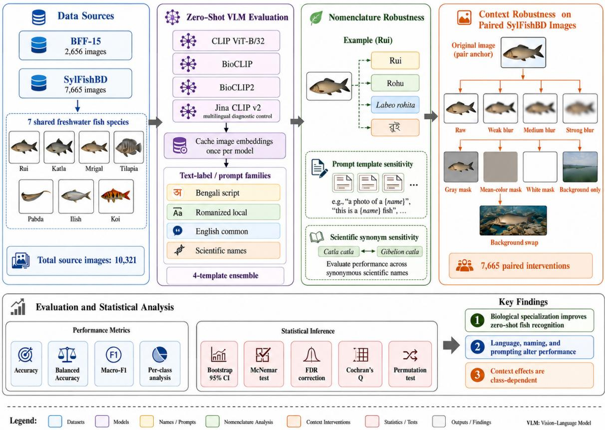
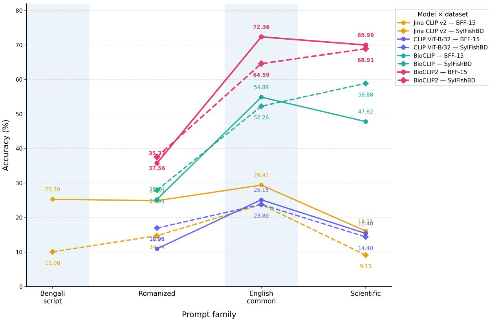
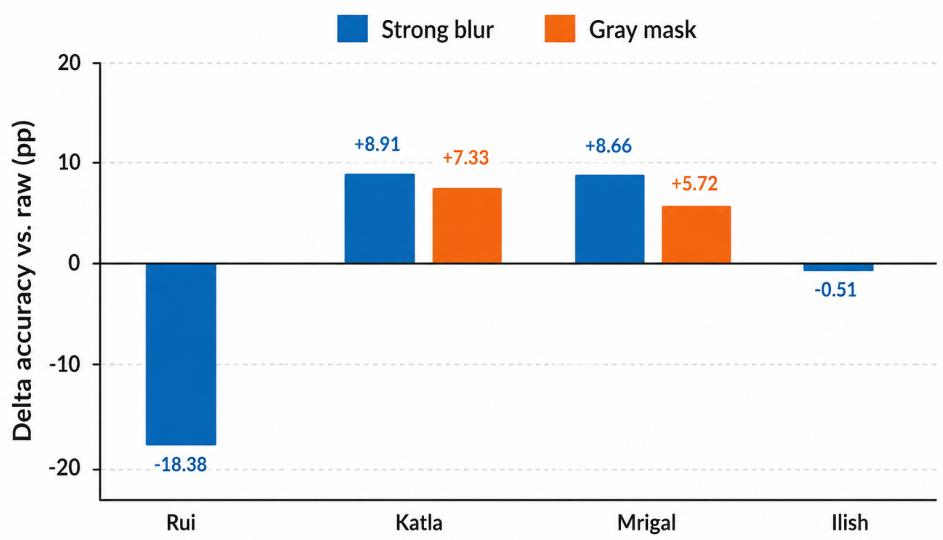

# ICHTHYONOMA: Nomenclature and Context Sensitivity of Zero-Shot Biological Vision–Language Models for Bangladeshi Freshwater Fish Recognition

Nazim-E-Alam 1\*, Tarek Rahman2,3,\*‡ †, Md Kishor Morol3‡ 1American International University Bangladesh, 2United International University, 3 ELITE Research Lab, Queens, New York, USA

## Abstract

Zero-shot vision–language models (VLMs) are increasingly used as training-free species recognizers, but reported accuracy can reflect more than visual species knowledge. We audit CLIP, BioCLIP, BioCLIP2, and a multilingual Jina CLIP v2 control on seven freshwaterfish categories from two Bangladeshi sources (10,321 images). BioCLIP2 reaches 72.36% on BFF-15 with English common names and 68.91% on SylFishBD with scientific names, versus 25.15% and 14.40% for generic CLIP. BioCLIP2 Bengali prompts are near chance in balanced accuracy (14.22–14.29%); Jina partially recovers Bengali discrimination to 21.89% and 16.36%, but bare Bengali names return to 14.29% on both sources. Paired SylFishBD interventions show no significant weak-blur effect, modest losses from stronger blur/gray masking, a larger white-mask artifact, and strong species dependence. Zeroshot biological VLM scores therefore jointly reflect biological specialization, multilingual alignment, nomenclature, prompt formulation, and context. All the codes and data are available at GitHub: https://github.com/ NazimRiyadh/IchthyoNoma.

## 1 Introduction

Automated species recognition supports biodiversity monitoring, fisheries, aquaculture, market inspection, and increasingly automated grading and robotic sorting systems (Rahman et al., 2026). Fish recognition is difficult because related taxa may differ subtly while pose, illumination, occlusion, and background vary. Conventional systems therefore rely on labeled data and supervised transfer learning (Shah et al., 2019; Xu et al., 2021; Das et al., 2024), but high in-domain accuracy does not establish transferable biological knowledge. Contrastive vision–language pre-training offers a training-free alternative. CLIP enables zero-shot image–text classification (Radford et al., 2021), while Bio-CLIP and BioCLIP2 add biologically structured pre-training for fine-grained recognition (Stevens et al., 2024; Gu et al., 2025). Fish work has also explored language supervision and training-free multimodal recognition (Dai et al., 2024; Jose and Thomas, 2026). For VLMs, the class label is part of the classifier: small wording changes can alter CLIP predictions (Zhou et al., 2022b,a). Biology amplifies this issue because one organism may have vernacular, English-common, scientific, historical, or synonymous names; scientific binomials are not always optimal (Parashar et al., 2023), and multilingual VLMs show large cross-language gaps (Geigle et al., 2024; Chung et al., 2026). In Bangladesh, success through English or Latin strings but failure through Bengali names can overstate local accessibility. Visual context introduces a parallel ambiguity: classifiers can exploit backgrounds and shortcuts (Geirhos et al., 2020; Xiao et al., 2021), while CLIP can retain domain-sensitive information (Wen et al., 2025).

We therefore ask: how stable is zero-shot biological recognition when the model, language, nomenclature, prompt, or context changes? Our contributions are:

• A cross-model, cross-source zero-shot benchmark of CLIP, BioCLIP, and BioCLIP2 on seven Bangladeshi freshwater-fish categories;

• A nomenclature audit spanning Romanized vernacular, Bengali script, English-common and scientific names, prompt templates, and scientific synonyms, augmented with a multilingual Jina CLIP v2 control that separates multilingual alignment from biological specialization;

• Paired context interventions on 7,665 Syl-

  
Figure 1: Overview of the study framework. Seven shared freshwater fish species from BFF-15 and SylFishBD are evaluated using frozen CLIP, BioCLIP, and BioCLIP2 models, with Jina CLIP v2 included as a multilingual control. The framework assesses sensitivity to label language, nomenclature, prompt formulation, and scientific synonyms, together with paired visual-context interventions on SylFishBD. Performance is quantified using standard classification metrics, per-class analysis, and statistical significance testing to characterize the effects of biological specialization, textual formulation, and visual context on zero-shot fish recognition.

FishBD images using graded blur, neutral masks, cropping, background-only views, and cross-species background swaps, with paired inference and multiple-testing correction.

## 2 Related Work

Prior work relevant to this study spans prompt and nomenclature sensitivity, biological and multilingual vision-language models, and fish recognition under varying visual context. We review these directions to position our evaluation of zero-shot recognition across language, naming, model specialization, and contextual variation.

Prompt and nomenclature robustness. CLIP performs zero-shot classification by constructing class prototypes from natural-language descriptions rather than learning task-specific classification weights (Radford et al., 2021). Consequently, the textual specification of a category becomes part of the classifier itself. Prior work on CoOp and

CoCoOp demonstrates that modifying prompt context can substantially alter downstream recognition behavior (Zhou et al., 2022b,a). This sensitivity is particularly relevant for fine-grained biological recognition, where the same organism may be represented by vernacular names, common English names, scientific binomials, or historical taxonomic synonyms. Parashar et al. showed that common English names can substantially outperform scientific names for zero-shot species recognition with generic CLIP, indicating that taxonomically precise labels are not necessarily the most effective textual interface (Parashar et al., 2023). These findings motivate our treatment of label language, nomenclature, exact taxonomic strings, and prompt templates as explicit evaluation variables rather than fixed preprocessing choices.

Biological and ecological vision–language models. Generic VLMs are trained primarily on broad web-scale image–text data and may therefore lack the fine-grained biological structure required for species-level recognition. BioCLIP addresses this limitation through biologically structured contrastive pre-training, while BioCLIP2 expands this approach with substantially greater biological and taxonomic coverage (Stevens et al., 2024; Gu et al., 2025). Related work has also explored multimodal learning specifically for aquatic species. CLIP-FSSC uses natural-language supervision for transferable fish and shrimp species classification and demonstrates the potential of VLM-based representations for recognition without conventional downstream annotation (Dai et al., 2024). More broadly, TaxaBind constructs a unified ecological representation across species imagery, taxonomic text, geographic location, satellite imagery, audio, and environmental information, demonstrating zero-shot capabilities for ecological tasks including species classification (Sastry et al., 2025). These studies establish the value of biologically informed multimodal representations; our work instead focuses on how stable a frozen biological VLM remains when the textual interface and visual context are systematically altered.

Multilingual vision–language alignment. Biological specialization and multilingual capability represent distinct dimensions of VLM performance. Most zero-shot vision–language benchmarks have historically emphasized English, which can obscure substantial degradation when equivalent concepts are expressed in other languages. Babel-ImageNet evaluates multilingual vision–language representations across 100 languages and reports substantial cross-language performance variation, with particularly large gaps for lower-resource languages (Geigle et al., 2024). Parameter-efficient approaches such as uCLIP further demonstrate that multilingual alignment can be improved without rebuilding the entire vision–language model (Chung et al., 2026). In the present study, Bengali is not treated merely as another prompt variant: it provides a test of whether biological visual specialization is accompanied by an accessible nativelanguage textual interface. We therefore include multilingual Jina CLIP v2 (Koukounas et al., 2024) as a diagnostic control, allowing multilingual text alignment to be examined separately from finegrained biological specialization.

Regional fish recognition and visual context. Bangladesh-specific fish datasets provide an important setting for evaluating whether biological

VLMs transfer to locally relevant taxa. SylFishBD provides freshwater-fish imagery together with SAM-derived instance masks (Absar et al., 2026; Kirillov et al., 2023), while BFF-15 provides a separate collection of Bangladeshi freshwater fish images (TheShahidul, 2026). Recent work has achieved strong in-domain fish recognition through supervised or self-supervised adaptation (Siam et al., 2025); however, such results do not directly establish training-free transferability because the model has been adapted to the target recognition task. In contrast, our evaluation keeps all model weights and prompts frozen.

Visual context introduces an additional source of uncertainty. Recognition systems can exploit background correlations as shortcuts rather than relying exclusively on the target organism, and prior work shows that background information alone can retain substantial class-discriminative signal (Xiao et al., 2021). More recent studies of background bias similarly show that spurious correlations between foreground categories and contextual regions can reduce generalization robustness (Bassi et al., 2024). These observations motivate our paired context interventions, including graded blur, neutralcolor masking, cropping, background-only views, and cross-species background swaps. Rather than interpreting any single synthetic transformation as causal evidence, we use a ladder of interventions to test whether zero-shot fish predictions remain stable as contextual information is progressively modified.

## 3 Methodology

This section outlines the experimental setup for evaluating zero-shot fish recognition across datasets, models, naming schemes, languages, and visual contexts. It covers dataset harmonization, frozen zero-shot classification, the Jina CLIP v2 multilingual control, context interventions, and statistical evaluation using accuracy, balanced accuracy, macro-F1, bootstrap confidence intervals, and paired significance tests.

## 3.1 Data harmonization

We use seven categories shared by BFF-15 and SylFishBD: Rui, Katla, Mrigal, Tilapia, Pabda, Ilish, and Koi. BFF-15 contributes 2,656 images and SylFishBD 7,665 (10,321 total); every selected SylFishBD image has a binary mask. Table 1 gives counts/nomenclature. All models remain frozen, so no train/validation/test split is required.

Table 1: Shared seven-species benchmark across BFF-15 and SylFishBD, including class nomenclature and image counts. Each SylFishBD image is paired with a segmentation mask.
<table><tr><td>Class</td><td>Romanized</td><td>English</td><td>Scientific</td><td>BFF</td><td>Syl</td></tr><tr><td>Rui</td><td>Rui</td><td>Rohu</td><td> $L .$  rohita</td><td>514</td><td>1670</td></tr><tr><td>Katla</td><td>Katla</td><td>Catla</td><td>C. catla</td><td>427</td><td>1133</td></tr><tr><td>Mrigal</td><td>Mrigal</td><td>Mrigal carp</td><td>C. cirrhosus</td><td>317</td><td>1293</td></tr><tr><td>Tilapia</td><td>Tilapia</td><td>Nile tilapia</td><td>O. niloticus</td><td>383</td><td>1326</td></tr><tr><td>Pabda</td><td>Pabda</td><td>Pabda catfish</td><td>O. pabda</td><td>348</td><td>862</td></tr><tr><td>Ilish</td><td>Ilish</td><td>Hilsa</td><td>T. ilisha</td><td>233</td><td>789</td></tr><tr><td>Koi</td><td>Koi</td><td>Climbing perch</td><td>A. testudineus</td><td>434</td><td>592</td></tr><tr><td>Total</td><td></td><td></td><td></td><td>2656</td><td>7665</td></tr></table>

SHA-256 found no exact cross-source duplicates; a 64-bit perceptual-hash search flagged 73 low-distance pairs (≤ 6 bits) for review. Because similar fish can yield similar hashes, we flag rather than automatically exclude them and describe the collections as two public sources, not fully independent sources.

## 3.2 Frozen zero-shot classification and prompt construction

We evaluate CLIP ViT-B/32 (OpenAI), BioCLIP, and BioCLIP2. For normalized image embedding $f _ { I } ( x )$ and class name $n _ { c } ,$ we instantiate four templates—“a photo/image/photograph/specimen of $n _ { c } .$ a fish species”—normalize each text embedding, and form the normalized mean prototype

$$
t _ { c } = \frac { \frac { 1 } { K } \sum _ { k = 1 } ^ { K } \hat { f } _ { T } ( p _ { k } ( n _ { c } ) ) } { \Big \| \frac { 1 } { K } \sum _ { k = 1 } ^ { K } \hat { f } _ { T } ( p _ { k } ( n _ { c } ) ) \Big \| _ { 2 } } , \qquad K = 4 .\tag{1}
$$

Prediction is yˆ = arg maxc $f _ { I } ( x ) ^ { \top } t _ { c }$ . Cached image embeddings ensure nomenclature experiments change only the text-side classifier.

We test Romanized, English-common, and scientific names, plus Bengali script for BioCLIP2. Templates are also evaluated individually. Scientificname controls substitute Catla catla with Gibelion catla or Labeo catla, and Cirrhinus cirrhosus with C. mrigala; these are nomenclatural variants, not claims of uniquely correct taxonomy.

## 3.3 Multilingual Bengali control

To test whether BioCLIP2’s Bengali failure reflects text alignment, we add frozen Jina CLIP v2 (Koukounas et al., 2024). The same 10,321 images/classes use Bengali, Romanized, Englishcommon, and scientific labels with the same four-template ensemble and a 512-dimensional

Matryoshka-truncated representation; no benchmark tuning is performed.

A secondary name-only control embeds only Bengali class names, testing whether multilingual support alone suffices or interacts with prompt framing. This directly tests whether Bio-CLIP2’s near-chance Bengali result is partly a textalignment limitation rather than a property of Bengali nomenclature itself. Jina is not used for context interventions; it is diagnostic for multilingual alignment versus biological specialization.

## 3.4 Paired context interventions

SylFishBD masks preserve foreground pixels while altering background. We apply Gaussian blur $( \sigma = 0 . 0 1 , 0 . 0 3 , 0 . 0 6$ times the shorter dimension), white/gray/mean-color masks, a 10%-expanded tight crop, foreground removal with Telea inpainting, and cross-species background swaps. These are stress tests, not perfect causal isolation, because synthetic transformations introduce distribution shift.

## 3.5 Metrics and inference

We report accuracy, balanced accuracy, macro-F1, and per-class effects. Class-stratified bootstrap CIs use 1,000 resamples for the primary benchmark and 2,000 for robustness/multilingual controls. Paired comparisons use exact two-sided McNemar tests and bootstrap accuracy differences with Benjamini– Hochberg FDR correction. Cochran’s $Q$ tests context conditions; donor-follow uses 5,000 label permutations. Seed is 42.

## 4 Results and Discussion

This section presents the main experimental findings across model specialization, nomenclature and prompt sensitivity, multilingual alignment, and visual-context robustness. First, the zero-shot performance of generic CLIP is compared with the biology-specialized BioCLIP and BioCLIP2 models on BFF-15 and SylFishBD, showing a substantial advantage for biologically specialized pretraining. Next, the analysis examines how Romanized, English-common, scientific, and Bengali class names, as well as different prompt templates and scientific-name variants, affect recognition performance. Jina CLIP v2 is subsequently used as a multilingual control to assess whether BioCLIP2’s poor performance with Bengali prompts stems from limitations in cross-language text alignment. While Jina improves Bengali discrimination to some extent, its overall fine-grained fish recognition performance remains substantially below that of Bio-CLIP2.

Table 2: Primary zero-shot classification performance across models, prompt types, and datasets. Values are reported as accuracy / macro-F1 (%); bold indicates the highest accuracy for each dataset.
<table><tr><td>Model</td><td>Prompt</td><td>BFF-15</td><td>SylFishBD</td></tr><tr><td rowspan="3">CLIP ViT-B/32</td><td>Romanized</td><td>10.96 / 5.64</td><td>16.95 / 13.15</td></tr><tr><td>English</td><td>25.15 / 20.03</td><td>23.80 / 22.05</td></tr><tr><td>Scientific</td><td>15.40 / 6.97</td><td>14.40 / 7.21</td></tr><tr><td rowspan="3">BioCLIP</td><td>Romanized</td><td>25.26 / 18.28</td><td>27.93 / 16.63</td></tr><tr><td>English</td><td>54.89 / 51.61</td><td>52.26 / 46.64</td></tr><tr><td>Scientific</td><td>47.82 / 43.34</td><td>58.88 / 57.45</td></tr><tr><td rowspan="3">BioCLIP2</td><td>Romanized</td><td>35.77 / 25.98</td><td>37.56 / 25.19</td></tr><tr><td>English</td><td>72.36 / 67.33</td><td>64.59 / 64.30</td></tr><tr><td>Scientific</td><td>69.99 / 68.85</td><td>68.91 / 69.68</td></tr></table>

Finally, paired context interventions on Syl-FishBD examine the effects of blur, masking, cropping, background removal, and background swapping. These experiments demonstrate that context sensitivity is intervention- and species-dependent rather than a uniform background effect.

## 4.1 Biology-specialized VLMs outperform the tested generic CLIP baseline

Table 2 shows a large gap between generic and biology-specialized VLMs. With scientific names, CLIP scores 15.40%/14.40% on BFF-15/SylFishBD, BioCLIP 47.82%/58.88%, and Bio-CLIP2 69.99%/68.91%. With English names Bio-CLIP2 reaches 72.36%/64.59%. Relative to Bio-CLIP, BioCLIP2 gains 22.18 and 10.03 points under scientific prompting (paired 95% CIs [19.73, 24.66] and [8.91, 11.17], both $q < 0 . 0 0 1 )$ . Because checkpoints also differ in scale/training recipe, we do not attribute the full gap solely to specialization.

## 4.2 Nomenclature and prompt formulation are part of the classifier

With identical BioCLIP2 image embeddings, BFF-15 scores 35.77%/72.36%/69.99% for Romanized/English/scientific names; SylFishBD scores 37.56%/64.59%/68.91%. Scientific terminology is therefore not universally optimal.

Bengali prompts yield 16.27%/7.74% accuracy and 14.22%/14.29% balanced accuracy, essentially seven-class chance (14.29%). Thus these Bengali fish-name prompts provide little discrimination for the tested BioCLIP2 text encoder.

Across four individual scientific templates, Bio-CLIP2 spans 56.06–77.07% on BFF-15 and 61.44– 79.71% on SylFishBD. Replacing Catla catla by Gibelion catla raises SylFishBD accuracy 5.14 points $( q \mathrm { ~ < ~ } 0 . 0 0 1 )$ , while Labeo catla lowers it 3.46 points and lowers BFF-15 by 8.58 points. Replacing Cirrhinus cirrhosus by C. mrigala improves both sources by about two points. Thus “scientific prompt” is not fully specified without the exact string/template.

## 4.3 Multilingual alignment partially recovers Bengali, but does not replace biological specialization

Under the same four-template ensemble, Jina CLIP v2 reaches 21.89% Bengali balanced accuracy on BFF-15 (95% CI [20.77, 23.01]) and 16.36% on SylFishBD ([15.64, 17.05]), versus BioCLIP2’s 14.22%/14.29%. This descriptive control suggests that the near-chance BioCLIP2 result is partly model/interface-specific. Table 3 summarizes Jina CLIP v2 performance across the four label families on both datasets. And Figure 2 provides a unified comparison of zero-shot accuracy across prompt families, models, and datasets, highlighting the contrasting effects of biological specialization and multilingual alignment.

  
Figure 2: Cross-model zero-shot accuracy across prompt families and datasets. CLIP ViT-B/32, BioCLIP, and BioCLIP2 are compared under Romanized, English-common, and scientific labels, while Jina CLIP v2 additionally includes Bengali-script prompting. Solid and dashed lines denote BFF-15 and SylFishBD, respectively.

Table 3: Jina CLIP v2 multilingual control for evaluating Bengali and cross-language prompt sensitivity. Values are reported as accuracy / balanced accuracy / macro-F1 (%).
<table><tr><td>Prompt family</td><td>BFF-15</td><td>SylFishBD</td></tr><tr><td>Bengali script</td><td>25.30 / 21.89 / 16.31</td><td> $1 0 . 0 8 / 1 6 . 3 6 / 6 . 0 4$ </td></tr><tr><td>Romanized</td><td>24.89 / 23.93 / 19.05</td><td>14.74 / 14.78 / 12.06</td></tr><tr><td>English common</td><td> $2 9 . 4 1 / 2 8 . 4 3 / 1 7 . 8 7$ </td><td>23.78 / 18.01 / 15.62</td></tr><tr><td>Scientific</td><td> $1 6 . 1 1 / 1 5 . 9 6 / 1 3 . 5 6$ </td><td> $9 . 1 3 / 1 0 . 2 7 / 9 . 7 5$ </td></tr></table>

Recovery remains incomplete: English exceeds Bengali accuracy by 4.10 points on BFF-15 (CI [2.86, 5.35], $q < 1 0 ^ { - 8 } )$ and 13.70 on SylFishBD ([12.77, 14.66], $q < 1 0 ^ { - 9 8 } )$ . Bengali and Romanized are indistinguishable on BFF-15 $( q = 0 . 6 1 7 )$ while Romanized exceeds Bengali by 4.66 points on SylFishBD $( q < 1 0 ^ { - 1 9 } )$ .

Jina’s English accuracy (29.41%/23.78%) remains far below BioCLIP2 (72.36%/64.59%), so multilingual alignment does not replace biological specialization. Bare Bengali names also collapse to exactly 14.29% balanced accuracy on both sources, showing an interaction with prompt framing. Together, the controls expose a trade-off: stronger multilingual alignment can recover Bengali signal without matching BioCLIP2’s fine-grained biological accuracy. We therefore interpret Jina as an interface diagnostic, not evidence about Bengali understanding in general.

## 4.4 Context sensitivity is real but intervention-dependent

The white-mask comparison drops BioCLIP2 from 68.91% to 60.52% (−8.39 points), but the intervention ladder qualifies this effect (Table 4). Weak blur is nonsignificant (−0.47; CI [−1.34, 0.46], $q ~ = ~ 0 . 3 4 7 ) ;$ medium/strong blur reduce accuracy 2.18/2.87 points and gray/mean-color masking about 3.8 points (all $q < 0 . 0 0 1 )$ . Thus white masking adds substantial distribution shift.

Aggregate means conceal class dependence (Fig. 3). Strong blur improves Katla/Mrigal by 8.91/8.66 points, hurts Rui by 18.38, and barely changes Ilish (−0.51). Gray masking shows the same heterogeneity: Katla/Mrigal improve (+7.33/+5.72), while Rui, Koi, Tilapia, and Pabda decline.

  
Figure 3: Class-conditional changes from raw SylFishBD. Strong blur helps Katla/Mrigal but sharply hurts Rui; Ilish is nearly unchanged. Gray-mask values are shown where exact effects are available.

Table 4: BioCLIP2 performance under paired context interventions on 7,665 SylFishBD images. ∆ denotes the accuracy change from the raw condition, with paired-bootstrap 95% confidence intervals shown in brackets.
<table><tr><td>Condition</td><td>Acc.</td><td>∆(pp)</td><td>FDR q</td></tr><tr><td>Raw</td><td>68.91</td><td></td><td></td></tr><tr><td>Weak blur</td><td>68.44</td><td> $- 0 . 4 7 \left[ - 1 . 3 4 , 0 . 4 6 \right]$ </td><td>0.347</td></tr><tr><td>Medium blur</td><td>66.73</td><td> $- 2 . 1 8 [ - 3 . 1 1 , - 1 . 2 3 ]$ </td><td> $< 0 . 0 0 1$ </td></tr><tr><td>Strong blur</td><td>66.04</td><td> $- 2 . 8 7 [ - 3 . 8 1 , - 1 . 9 4 ]$ </td><td>&lt; 0.001</td></tr><tr><td>Gray mask</td><td>65.11</td><td> $- 3 . 8 0 [ - 4 . 7 9 , - 2 . 8 3 ]$ </td><td>&lt; 0.001</td></tr><tr><td>Mean-color mask</td><td>65.10</td><td> $- 3 . 8 1 [ - 4 . 7 6 , - 2 . 8 1 ]$ </td><td>&lt; 0.001</td></tr><tr><td>White mask</td><td>60.52</td><td> $- 8 . 3 9 [ - 9 . 5 6 , - 7 . 2 5 ]$ </td><td>&lt; 0.001</td></tr></table>

Supporting controls reject simple backgroundlabel explanations. Background-only images retain 17.90% accuracy (21.48% balanced; −51.01 points, CI [−52.17, −49.84]), confirming dominant foreground information. Cross-species swaps reduce accuracy to 56.76% (−12.15; CI [−13.24, −11.06]), yet donor-follow is only 8.88% versus a 15.10% permutation-null mean. Tight cropping reaches 55.15%, and five mask-geometry properties are nonsignificant after FDR $( q \ge 0 . 0 9 7 )$ .

## 4.5 Implications and limitations

Three implications follow. Biology-specialized VLMs outperform the tested generic CLIP baseline, although scale/training recipe also differ. Zeroshot accuracy is not an image-encoder property alone: language, exact taxonomic string, and prompt frame instantiate the classifier, as the multilingual/name-only controls demonstrate. Context robustness likewise requires a ladder of interventions rather than one synthetic mask. Practically, reporting only the best English/scientific prompt can overstate accessibility when a strong visual model exposes a weak native-language interface.

Limitations include only seven categories/two sources, unknown pre-training exposure to related imagery, one multilingual control with a 512-D truncated representation, Bengali results specific to the tested names/templates, and synonym tests limited to Katla/Mrigal. One multilingual model cannot establish a general property of multilingual VLMs. Context interventions change image distribution as well as information content, so conclusions rely on agreement across blur, masks, crop, background-only, and swap controls rather than perfect causal decomposition.

For regional biological deployment, we recommend reporting zero-shot performance under at least English-common, scientific, and locally used names rather than selecting a single best prompt. Native-language interfaces should be evaluated separately, and context robustness should be tested with multiple interventions instead of a single masking condition.

## 5 Conclusion

We systematically evaluate zero-shot freshwaterfish recognition across generic, biologyspecialized, and multilingual vision–language models. BioCLIP2 achieves the strongest overall performance, but its predictions remain sensitive to nomenclature, language, prompt formulation, taxonomic synonyms, and visual context. Jina CLIP v2 partially improves Bengali-language discrimination, yet remains substantially weaker for fine-grained biological recognition and falls to chance-level performance when evaluated with bare Bengali class names. Paired context interventions further reveal that mild visual degradation produces limited average effects, whereas stronger masking introduces larger distribution-shift artifacts and pronounced species-specific variation. Overall, the findings indicate that biological specialization and multilingual alignment address distinct sources of error. Zero-shot biological benchmarks should therefore explicitly evaluate language, exact nomenclature, prompt formulation, and contextual robustness rather than reporting performance under a single textual or visual configuration.

## References

Shakib Absar, I. Ahmed, M. I. Khalique, M. Shorfuzzaman, M. M. Rahman, A. U. Haque, and M. S. R. Kohinoor. 2026. A freshwater fish dataset for visual recognition with manually localized rois and samderived instance masks. Scientific Data.

Pedro R. A. S. Bassi, Sergio S. J. Dertkigil, and Andrea Cavalli. 2024. Improving deep neural network generalization and robustness to background bias via layer-wise relevance propagation optimization. Nature Communications, 15:291.

D. Chung, D. Shin, Y. Sung, S. Moon, J. Jeon, and B.-J. Lee. 2026. uclip: Parameter-efficient multilingual extension of vision-language models with unpaired data. In Proceedings of the AAAI Conference on Artificial Intelligence, volume 40, pages 3399–3406.

K. Dai, J. Shao, B. Gong, L. Jing, and Y. Chen. 2024. Clip-fssc: A transferable visual model for fish and shrimp species classification based on natural language supervision. Aquacultural Engineering, 107:102460.

P. K. Das, M. A. Kawsar, P. B. Paul, M. A. A. M. Hridoy, M. S. Hossain, and S. Niloy. 2024. Bdfreshwater-fish: An image dataset from bangladesh for ai-powered automatic fish species classification and detection toward smart aquaculture. Data in Brief, 57:111132.

Gregor Geigle, Radu Timofte, and Goran Glavas. 2024. Babel-imagenet: Massively multilingual evaluation of vision-and-language representations. In Proceedings of the 62nd Annual Meeting of the Association for Computational Linguistics (Volume 1: Long Papers), pages 5064–5084.

Robert Geirhos, Jörn-Henrik Jacobsen, Claudio Michaelis, Richard Zemel, Wieland Brendel, Matthias Bethge, and Felix A. Wichmann. 2020. Shortcut learning in deep neural networks. Nature Machine Intelligence, 2:665–673.

Jian Gu, Samuel Stevens, Elizabeth G. Campolongo, Matthew J. Thompson, Ning Zhang, Jiaman Wu, Alex Kopanev, Zixuan Mai, Andrew E. White, James Balhoff, Wasila Dahdul, David Rubenstein, Hilmar Lapp, Tanya Berger-Wolf, Wei-Lun Chao, and Yu Su. 2025. Bioclip 2: Emergent properties from scaling hierarchical contrastive learning. In Advances in Neural Information Processing Systems, volume 38, pages 113880–113913.

J. A. Jose and R. Thomas. 2026. Zero shot multistage hierarchical fish classification using yoloe and large language model. Computers and Electronics in Agriculture, 242:111288.

Alexander Kirillov, Eric Mintun, Nikhila Ravi, Hanzi Mao, Chloe Rolland, Laura Gustafson, Tete Xiao, Spencer Whitehead, Alexander C. Berg, Wan-Yen Lo, Piotr Dollár, and Ross Girshick. 2023. Segment anything. In Proceedings ofthe IEEE/CVF International Conference on Computer Vision, pages 4015–4026.

Andreas Koukounas, Georgios Mastrapas, Bo Wang, Mohammad Kalim Akram, Sedigheh Eslami, Michael Günther, Isabelle Mohr, Saba Sturua, Scott Martens, Nan Wang, and Han Xiao. 2024. jina-clipv2: Multilingual multimodal embeddings for text and images. Preprint, arXiv:2412.08802.

Shubham Parashar, Zhiqiu Lin, Yanan Li, and Shu Kong. 2023. Prompting scientific names for zeroshot species recognition. In Proceedings of the 2023 Conference on Empirical Methods in Natural Language Processing, pages 9856–9861.

Alec Radford, Jong Wook Kim, Chris Hallacy, Aditya Ramesh, Gabriel Goh, Sandhini Agarwal, Girish Sastry, Amanda Askell, Pamela Mishkin, Jack Clark, Gretchen Krueger, and Ilya Sutskever. 2021. Learning transferable visual models from natural language supervision. In Proceedings ofthe 38th International Conference on Machine Learning, volume 139, pages 8748–8763.

Tarek Rahman, MD Ornob, Miftahul Jannat, Fahim Hafiz, and Md Talukder. 2026. Fishnetbot: An iot

and deep learning-based automated fish sorting robot. Available at SSRN 6835320.

Srikumar Sastry, Subash Khanal, Aayush Dhakal, Adeel Ahmad, and Nathan Jacobs. 2025. Taxabind: A unified embedding space for ecological applications. In Proceedings ofthe IEEE/CVF Winter Conference on Applications ofComputer Vision, pages 1765–1774.

Syed Zain Hassan Shah, Hafiz Tayyab Rauf, Muhammad IkramUllah, Muhammad Salman Khalid, Muhammad Farooq, Maryam Fatima, and Syed Ahmad Chan Bukhari. 2019. Fish-pak: Fish species dataset from pakistan for visual features based classification. Data in Brief, 27:104565.

S. N. Siam, M. S. Hasan, T. S. Raita, S. S. Israt, A. Hossain, M. S. H. Khan, R. A. Tuhin, M. R. A. Rashid, R. U. Islam, S. H. Ripon, A. W. Reza, and M. S. Hossain. 2025. Freshwater fish species classification using self supervised learning. In 2025 28th International Conference on Computer and Information Technology (ICCIT), pages 3458–3463. IEEE.

Samuel Stevens, Jiaman Wu, Matthew J. Thompson, Elizabeth G. Campolongo, Chan Hee Song, David E. Carlyn, Li Dong, Wasila M. Dahdul, Charles Stewart, Tanya Berger-Wolf, Wei-Lun Chao, and Yu Su. 2024. Bioclip: A vision foundation model for the tree of life. In Proceedings of the IEEE/CVF Conference on Computer Vision and Pattern Recognition, pages 19412–19424.

TheShahidul. 2026. Bangladeshi freshwater fish image dataset (bff-15). Kaggle dataset. Accessed Aug. 25, 2026.

C. Wen, Z. Peng, Y. Huang, X. Yang, and W. Shen. 2025. Domain generalization in clip via learning with diverse text prompts. In Proceedings ofthe IEEE/CVF Conference on Computer Vision and Pattern Recognition, pages 9559–9569.

Kai Yuan Xiao, Logan Engstrom, Andrew Ilyas, and Aleksander Madry. 2021. Noise or signal: The role of image backgrounds in object recognition. In International Conference on Learning Representations.

Xiaoqian Xu, Wei Li, and Qing Duan. 2021. Transfer learning and se-resnet152 networks-based for smallscale unbalanced fish species identification. Computers and Electronics in Agriculture, 180:105878.

Kaiyang Zhou, Jingkang Yang, Chen Change Loy, and Ziwei Liu. 2022a. Conditional prompt learning for vision-language models. In Proceedings of the IEEE/CVF Conference on Computer Vision and Pattern Recognition, pages 16816–16825.

Kaiyang Zhou, Jingkang Yang, Chen Change Loy, and Ziwei Liu. 2022b. Learning to prompt for visionlanguage models. International Journal ofComputer Vision, 130(9):2337–2348.